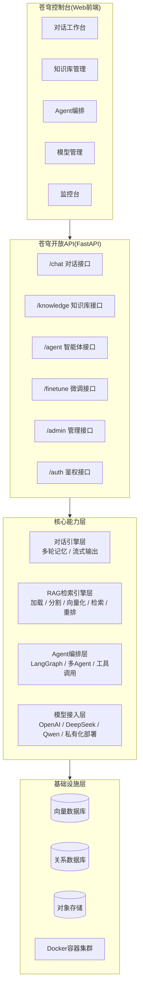
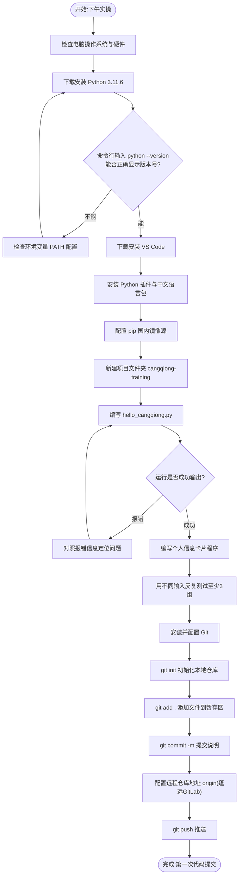
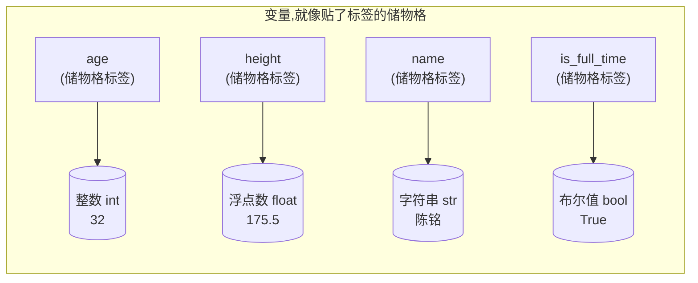

# 第1天 · 开发环境与第一行代码

> **周次/Sprint**:Sprint 0 · 新人内训(Day1-14)—— 阶段项目一:命令行多轮对话AI助手(预计Day14交付)
> **星期**:周一
> **学员**:陈铭、苏梦、韩露、张凡(本期技术培训生小组,导师:王振宇)
> **内训任务卡**:PYXT-ONB-D01(蓬远科技培训中心 · 新人训练营 · Day01)
> **今日关键词**:入职 / 环境搭建 / 变量与数据类型 / 个人信息卡片 / Git首次提交

---

## 【旁白】

如果你把接下来七十天的故事倒过来看,会发现一个有趣的事实:那个在发布会上代表苍穹1.0向全公司汇报、被郭建军当众宣布晋升为高级AI应用工程师的陈铭,和今天这个在门禁卡前面手忙脚乱、把工牌拿反了都没发现的陈铭,其实是同一个人,中间只隔了七十个工作日。

技术的成长从来不是一条直线,它更像是苍穹平台的架构图——今天你看到的只是最外面那一层薄薄的控制台,底下压着的对话引擎、检索引擎、Agent编排、模型接入,还有更底下的数据库和向量库,都还是空的地基。但地基这个词用在今天格外合适,因为今天要浇筑的,不是代码,而是让陈铭这个转行六年的运营专员第一次意识到:变量、数据类型、print、input,这些看起来简陋到有点好笑的东西,恰恰是苍穹这座七层大厦最下面那一层混凝土。往后每一天,他都会在某个意想不到的场景里,回头看见今天的影子——比如三十天后调试RAG检索链路时,他会想起老王今天在白板上画的那张分层图;比如十二天后第一次收到大模型API返回的JSON时,他会想起今天下午跟`input()`较劲了半小时才明白"为什么数字加不上去"的那种沮丧。

这篇课件记录的不只是"怎么装Python",更是一个人从"我是不是转行转错了"的自我怀疑,走到"这行代码是我写的,它跑起来了"的第一次微弱确信。这种确信很小,小到不值得写进简历,但七十天后回头看,正是这一天的确信,撑起了后面所有的确信。

---

## 晨会纪要 / 今日目标

**时间**:上午8:50,二层小会议室"起航"
**出席**:王振宇(老王)、HR徐晴(列席)、陈铭、苏梦、韩露、张凡

老王到会议室的时候比约定时间早了五分钟,手里端着一杯没什么味道的美式咖啡,顺手在白板一角写了当天的日期缩写和"Sprint 0 · D1"。在正式开始新人培训之前,他先花了不到十分钟,同步了一下苍穹项目组自己的晨会内容——这不是走流程,而是老王有意为之:他希望四个新人从第一天起,就能"听得到"这个项目真实的呼吸声,而不是只活在培训教材里。

**昨天进展(苍穹项目组,新人列席观摩)**:
- 苍穹平台目前处于"内部技术预研+方向讨论"阶段,尚未正式立项,团队规模较小,主要精力在打磨内部工具与技术选型。
- 林悦这两周在和几家潜在客户做需求初谈,还没有签约,但已经能感觉到"知识库问答"和"智能办公助手"这两类需求出现的频率很高。
- 风险点:目前团队人手紧张,新人培训会占用老王相当一部分精力,项目组的日常评审节奏需要适当让路,郭建军已经知情并同意。

老王说完这段,顿了一下,把白板擦了一半,对着四个新人说了今天开场的第一句话:

> "你们四个,接下来两周会经历一个挺无聊的阶段——学Python基础。我知道很多人恨不得今天就摸到大模型API,但地基打不牢,你们两周后接API的时候会摔得很惨。我带你们的方式很简单:我讲的每一个知识点,都会告诉你们它以后会用在哪。今天这一天听起来最没意思,但它决定了你们接下来十三天顺不顺。"

**今日目标**:
1. 完成入职材料办理、工位分配、门禁与账号开通(HR徐晴负责)。
2. 参观公司办公区,认识苍穹项目组核心成员。
3. 老王主讲入职培训:大模型行业全景与职业路径分析、苍穹项目愿景介绍。
4. 下午:搭建Python开发环境(Python 3.11.6 + VS Code + 国内镜像源),完成`hello_cangqiong.py`与个人信息卡片程序。
5. 晚自习:配置Git,完成人生第一次代码提交。

**风险点**:
- 四人设备环境不统一(苏梦用的是一台用了五年的Windows笔记本,张凡是Mac,可能出现平台差异导致的报错,需要老王和IT同事孙昊分头支援)。
- 新人对"为什么要学这些基础"缺乏信任感,容易在枯燥阶段掉线,需要用真实场景不断"翻译"知识点的价值。
- 培训节奏:周一到周六全天授课/实操/自习,周六下午起强度会适当降低,给大家一点消化和休整的空间,但不安排完整双休——老王原话是"这行没有一劳永逸的假期,但我们会把节奏安排得让你们不至于垮"。

---

## 需求文档:新人训练营 Day1 实训任务书

> 本任务书由蓬远科技培训中心与技术导师王振宇共同制定,发放给本期全体培训生。格式沿用公司内部PRD模板,是新人在正式接触苍穹项目代码之前,第一次以"读需求文档"的方式熟悉公司的工作习惯。

### 背景

蓬远科技每一期新人培训生,入职首日都需要在一天之内完成"从零到能跑代码、能提交代码"的完整闭环。这不是走过场——公司技术团队的协作全部基于Git与代码仓库展开,越早养成"写完代码就提交"的习惯,越能减少后期返工与丢失代码的风险。同时,老王要求每期新人在入职第一天,就对"我们在做什么、我为什么要学这些"建立基本认知,避免陷入"学了一堆语法却不知道用在哪"的常见误区。

### 用户故事

- 作为一名刚入职的技术培训生,我希望在今天之内独立搭建好本地开发环境,以便后续十三天的课程不会因为环境问题反复卡顿。
- 作为一名刚入职的技术培训生,我希望写出并运行第一个Python程序,以便获得"我能做到"的第一次正向反馈。
- 作为一名刚入职的技术培训生,我希望完成一次真正的Git代码提交,以便证明自己已经具备进入公司协作流程的基本条件。
- 作为技术导师,我希望通过今天的任务,快速识别每位新人的基础差异,以便后续因材施教地调整教学节奏。

### 功能列表

| 编号 | 任务 | 说明 | 验收方式 |
|---|---|---|---|
| T1 | 入职材料与账号 | 签署入职文件,领取工牌、门禁卡,开通企业邮箱、飞书账号、蓬远GitLab账号 | HR系统显示账号状态"已开通" |
| T2 | 环境搭建 | 安装Python 3.11.x、VS Code、配置pip国内镜像源 | 命令行执行`python --version`正确显示版本号;VS Code能正常运行Python文件 |
| T3 | 第一个程序 | 编写`hello_cangqiong.py`,输出问候语与入职天数 | 程序运行无报错,输出内容符合预期 |
| T4 | 个人信息卡片程序 | 使用`input()`采集姓名、年龄、身高、是否全职等信息,正确进行类型转换后格式化输出 | 用至少3组不同的测试输入验证程序均能正确输出,不崩溃 |
| T5 | Git首次提交 | 配置Git身份信息,初始化本地仓库,提交并推送到蓤远GitLab个人练习仓库 | GitLab仓库页面能看到至少1次commit记录 |

### 非功能需求

- **代码规范**:变量命名统一使用小写字母加下划线(`snake_case`),不使用中文变量名,不使用`l`、`O`、`I`这类容易和数字混淆的单字母变量名。
- **注释要求**:关键变量赋值、类型转换、格式化输出处,至少要有一行中文注释说明用途。
- **兼容性**:程序需要能在Windows和macOS两种系统下正常运行(不依赖任何系统专属功能)。
- **可读性**:今天的代码不要求"写得多聪明",但要求"写得让别人一眼看懂",这是老王反复强调的第一条工程习惯。

### 验收标准

1. `python --version` 输出版本号不低于3.10(团队生产环境实际锁定3.11.6)。
2. `hello_cangqiong.py`能被VS Code内置终端直接运行,且输出不报错。
3. 个人信息卡片程序至少包含4个不同数据类型的字段(int、float、str、bool各至少一个),且能通过`type()`验证类型正确。
4. GitLab个人练习仓库中出现至少1条有意义的commit信息(不能是"1"、"test"这类无意义提交)。
5. 晚自习结束前,老王在群里对每位新人的第一次提交给出至少一句反馈。

### 备注

本任务书虽然形式上是一份"内部培训需求",但撰写和验收的方式,完全对标真实项目的PRD流程——这也是老王坚持"新人第一天就要读懂一份规范文档"的用意所在:与其等到正式进入项目组之后手忙脚乱地补习"什么是需求文档",不如从入职第一天起,就让这种阅读习惯变成潤移默化的一部分。徐晴在发放这份任务书的时候补充说明:"以后你们转正进入具体项目,会看到的PRD比这份复杂得多,会有用户画像、竞品分析、详细的交互流程图,但核心结构是一样的——背景、用户诉求、功能边界、验收标准,一个都不能少。"

---

## 架构设计图:苍穹平台愿景架构图

入职培训分享进行到中段,老王把白板转了个面,拿起马克笔,一边画一边说:"我知道你们现在一行代码都不会写,但我还是想先让你们看看,咱们最终要把一个什么样的东西堆出来。看不懂细节没关系,记住这张图的'形状'就够了。"



老王的讲解大致是这样的:

"最上面这层,是用户会真正点来点去的控制台,长得像一个更懂企业业务的ChatGPT网页版。中间这层,是我们对外暴露的一组API,前端不会自己去调大模型,所有请求都要经过我们自己的服务。再往下,是四块核心能力:对话引擎负责'记住聊了什么';RAG检索引擎负责'从企业自己的文档里找答案',这是我们和纯聊天机器人最大的差异点;Agent编排层负责'不只是回答问题,还能真的帮客户把事情办了';模型接入层负责'我们不自己训练大模型,而是像插U盘一样,灵活接入不同厂商的模型'。最底下,是让这一切跑起来的数据库、向量库、对象存储和容器化部署。"

他停顿了一下,把笔帽盖上:"这张图,你们今天一个字都用不上。但我希望你们记住它的'形状'——因为接下来几个月,你们每天写的东西,都会往这张图里的某一个格子里填。今天你们写的变量和`print`,最终会变成对话引擎里最基础的那一小块砖。别小看它。"

他又用一种"打比方"的方式,把这张图和一栋房子的施工顺序做了类比:"你们可以把这张图倒过来看,想象成盖房子——最底下的基础设施层,就是地基和管线;核心能力层,是承重的墙体和骨架;API层,是水电煤气的接入口;最上面的控制台,才是装修好、能让人住进去的样子。现在很多新人一进来就想直接学'装修'(比如做个好看的聊天页面),但没有骨架和地基,装修得再漂亮也撑不住。接下来这两周,你们做的事情,是在打地基,虽然看起来最不起眼,但没有它,后面什么都立不住。"这个类比后来被陈铭多次在自己的笔记里引用,尤其是在后续学到RAG检索引擎、Agent编排这些"看起来更酷"的内容时,他都会提醒自己不要轻视基础部分。

苏梦小声问:"那我们多久能碰到这些东西?"老王笑了一下:"心急吃不了热豆腐,但我可以告诉你,不会让你们等太久。"(这句话里藏着的信息,四个新人此刻还不知道——大概两周后,他们就会真正接触到大模型API的第一次调用。)

---

## 流程图:陈铭今天的开发环境搭建与首次提交代码流程

下午的实操课开始前,老王在群里发了一张流程图,说"照着这个顺序走,卡在哪一步就在群里喊一声,不要憋着"。这张图后来被陈铭原样保存进了自己的笔记,他管它叫"保命流程图"。



这张图有一个细节值得说明:从"运行是否成功输出"到"对照报错信息定位问题"再回到"编写"这个循环,老王特意画了一个回路,而不是简单地画一条直线。他后来解释:"新手最大的错觉,就是以为写代码是一条直线——写完就对。真相是,写代码这件事99%的时间都在这个循环里打转:写、跑、报错、改、再跑。你们今天要开始适应这个循环,而不是恐惧它。"

---

## 示意图:变量与数据类型的类比示意图

变量和数据类型这两个概念,对完全没有编程背景的人来说,常常是"听得懂每个字,但连不成一个整体理解"的典型知识点。老王在讲这部分的时候,画了下面这张示意图,把变量类比成"贴了标签的储物格",把不同的数据类型类比成"格子里存放的不同种类的东西"。



老王的类比原话是这样的:"你可以把每一个变量想象成快递柜里的一个格子,格子上贴着一张标签,比如`age`。这个格子里放的东西,可以是一个整数、一个小数、一段文字,甚至是一个'是/否'的开关。Python很聪明,也很随性——它不要求你提前告诉它这个格子准备放什么类型的东西,你把什么放进去,它就认成什么类型。这既是Python好学的原因,也是新手最容易犯错的地方,因为你自己也常常搞不清楚格子里现在到底放的是什么。"

这个类比后面还会被反复引用——比如Day4讲列表的时候,老王会说"列表就是一长排连在一起的储物格";Day5讲字典的时候,会说"字典是可以按标签直接找到格子的储物格,不用一个个数过去"。今天这张图,其实是整个数据结构教学脉络里第一块拼图。

---

## 课堂笔记

### 上午:入职、参观与导师见面会

**8:40,门口**

陈铭提前十分钟到楼下,站在写着"蓬远科技(北京)有限公司"的玻璃门前,把工牌翻来覆去看了两遍——这是他昨天下午在人才市场附近的照相馆临时拍的入职照,衬衫领子有点歪,但他觉得无所谓,反正没人会仔细看。电梯上到二层,门一开,他先看到的是墙上挂着的一整块海报,黑底白字:"让每一家企业,都拥有自己的AI大脑。"他站在那儿多看了两秒,心想这句话听起来挺大,但具体是干什么的,他此刻其实还说不太清楚——面试的时候HR和他简单聊过,苍穹是一个"企业级智能体中台",他当时点头如捣蒜,回家以后又去搜了半天,依然是一头雾水的状态。

前台旁边的接待区,已经坐着三个人。一个女生看起来比他年轻不少,正低头翻一本笔记本,是苏梦;旁边一个短发女生手里拿着手机在看什么资料,抬头看了他一眼笑了笑,是韩露;靠墙角坐着一个戴眼镜的年轻人,膝盖上放着电脑包,不停地把眼镜往上推,是张凡。HR徐晴很快从里面走出来,手里拿着四份文件夹,笑着招呼:"你们几位都是今天来的技术培训生吧?来来来,先去会议室,咱们先把入职手续办一下。"

**8:50-9:30,入职手续与自我介绍**

会议室不大,长桌两边坐着四个人,墙上贴着一张公司组织架构简图和几张过往项目复盘的便签纸——虽然现在这些便签纸上写的项目名字他们都还不认识。徐晴的语速不快,把入职流程讲得很清楚:签劳动合同、录入工资卡信息、开通企业邮箱、开通飞书账号(公司内部用来管理任务和沟通,类似业界常见的项目管理工具,任务编号以"CQ-"开头,不过徐晴解释说新人训练期暂时不涉及这套编号,等大家转正加入具体项目才会用到)、开通蓬远GitLab账号(她特别强调了一句,"这个账号,你们今晚就会用上")。

办完手续,徐晴让四个人做个简单的自我介绍,不需要多正式,"就当认识一下同期的战友"。

陈铭说自己之前在一家跨境电商公司做了六年运营,做选品、做投放、看数据报表,去年公司业务收缩,自己也一直觉得运营这条路往上走会越来越卷,想趁着还没到35岁试一试转行做技术。他说这话的时候有点不好意思,补了一句:"我是纯零基础,可能得多担待。"

苏梦说自己也是完全没有编程基础,"看代码就跟看外语一样",但她说自己不怕慢,"我这人学东西一向是别人学一遍我学三遍,但学会了就不会忘"。

韩露说自己以前做产品运营,自学过一点点HTML和CSS,勉强能看懂简单的网页结构,想往AI产品或者AI应用开发方向转。

张凡是四个人里唯一还没毕业的,某理工院校的在读研究生,数学和算法基础还可以,但坦白说自己"写的代码基本没在真实项目里跑过,都是课程作业级别的"。

徐晴听完笑着说:"基础不重要,基础都是可以补的。这期训练营带你们的导师,是我们技术负责人老王,他带新人有一套自己的方法,你们跟着走就行。"

**9:30-10:00,办公区参观**

四个人跟着徐晴在办公区转了一圈。二层是整个公司的技术团队所在楼层,六十个工位分成几个区域,靠窗的一排此刻大部分是空的,徐晴解释说那是留给核心项目组的,"陈铭你们几个培训期先在靠里侧的临时工位,等转正会重新分配"。他们路过一片贴着便签纸、白板上画满框图的工作区,徐晴指了指说"这就是苍穹项目组的地盘",几个人正对着电脑小声讨论,没有抬头看他们。墙角立着一块小白板,上面用红色马克笔写着几个大字:"能跑不代表对,对不代表好。"陈铭当时没太在意这句话,后来他才知道,这是老王的口头禅,以后会在无数个场合反复出现。

参观的最后一站,是茶水间——一台饮水机、一台老式咖啡机,还有一个写着"投喂零食,自愿认领"的塑料筐。徐晴说:"这里随便拿,不用不好意思。"

**10:00-10:10,休息,导师见面会准备**

短暂休息之后,四人被带到培训室,一人一张桌子,桌上摆着已经预装了系统但还没装开发环境的笔记本电脑(如果是自带电脑的员工,可以用自己的设备,苏梦和张凡用自己的电脑,陈铭和韩露用的是公司配的机器)。老王推门进来的时候手里拿着一个保温杯和一支马克笔,穿了一件很普通的深色polo衫,看起来完全不像"技术负责人"这个头衔听起来那么有气场——但他一开口,四个人都下意识坐直了一点。

**10:10-11:30,老王的入职培训分享**

老王没有用PPT,他说自己"从来不太信PPT",习惯直接在白板上画。他先做了简短的自我介绍:十年后端开发经验,三年大模型应用经验,现在是苍穹平台的技术负责人。然后他抛出了第一个问题:"你们四个,有没有人能说清楚,现在做AI相关工作的公司,大概能分成几类?"

四个人互相看了看,张凡试着答:"是不是分成做大模型的,和用大模型做应用的?"

老王点头:"基本对。我画给你们看。"

#### 大模型行业全景

他在白板上画了一个简单的三层图:最上面写"基础模型层",下面列了几个大家或多或少听过的名字——OpenAI、DeepSeek、通义千问、文心一言;中间写"模型服务与工具层",提到了向量数据库厂商、Agent框架、开发工具;最下面写"应用落地层",老王在这一层画了个圈,把"蓬远科技"写在了圈里。

"基础模型层,是那些花几千万甚至几个亿去训练一个大模型的公司,这个游戏门槛极高,不是我们能玩、也不是我们要玩的游戏。我们蓬远,定位很清楚:我们不做预训练,我们做应用落地。通俗地说,大模型公司造出来的是一个非常聪明、但什么都懂一点又什么都不精的'新员工',这个新员工没见过你公司的内部文档,不知道你公司的业务流程,直接把它扔给客户是没法用的。我们要做的,就是把这个聪明但陌生的新员工,训练成一个真正懂客户业务的老员工——这中间要做知识库对接、要做工具集成、要做私有化部署,这些活儿,基础模型公司自己不做,或者说不专门做,这就是我们的生存空间。"

他又补了一句,是那种带着点行业观察味道的话:"这两年很多人一窝蜂去卷大模型本身,但真正落地、真正让企业为AI买单的钱,大部分花在了应用层。我们赌的就是这个方向。"

#### 职业路径分析

接着老王转向了第二个话题——这批新人更关心的问题:"那我们这行,具体能干哪些岗位?"他在白板上又列了一个表格(为方便记录,陈铭当时在笔记本上原样誊抄了一份,后来整理成如下版本):

| 岗位方向 | 核心工作内容 | 需要的基础能力 | 大致成长路径 |
|---|---|---|---|
| Prompt工程师 / AI应用工程师 | 设计和调优提示词,把业务需求转化为模型能理解的指令 | 逻辑清晰、懂业务、会基础编程 | 初级 → 资深 → 应用架构师 |
| RAG工程师 | 搭建企业知识库检索系统,让模型能"读懂"企业自己的文档 | Python、文档处理、向量检索原理 | 初级 → 资深 → 检索/知识工程专家 |
| Agent开发工程师 | 设计能自动执行多步任务的智能体,串联工具与业务系统 | Python、工作流设计、系统集成能力 | 初级 → 资深 → Agent架构师 |
| AI应用架构师 | 负责整体技术选型、系统设计、跨模块协调 | 全栈技术视野、项目经验积累 | 通常由资深工程师晋升而来 |
| MLOps / 部署工程师 | 负责模型部署、容器化、性能优化、成本控制 | Linux、Docker、云服务、一定的运维经验 | 初级 → 资深 → 平台工程负责人 |
| AI产品经理 | 需求梳理、用户故事拆解、验收标准制定 | 业务理解力、沟通表达、基本技术认知 | 需求分析师 → 产品经理 → 产品负责人 |

"你们不用现在就决定自己要走哪条路,"老王说,"但我希望你们知道,这些方向不是互相隔绝的孤岛,底层需要的能力有大量重叠——Python基础、对数据结构的理解、工程规范意识,这些是通用地基,不管你以后往哪个方向走,这十四天的内容都绕不开。"

他又补充了一层更细的观察,是关于成长节奏的:"你们可能听说过,这两年市面上有不少人是'速成'出来的——报个两三周的短训班,背几个Prompt模板就说自己会做AI应用了。这种速成能应付简单的demo,但撑不住真实客户项目的复杂度。真实项目里,你要处理格式混乱的文档、要debug半夜三点还在报错的接口、要跟产品经理反复确认需求边界。这些能力,没有捷径,只能靠扎实的基础加上足够的项目历练堆出来。我们这套七十天的节奏,前两周看起来'浪费'在Python基础上,其实是在给后面六十天的复杂度做铺垫——地基打得越扎实,后面塌房的概率越低。"

顺着这个话题,老王又在白板上补了一张简单的对比表,是他自己这几年观察行业招聘和团队用人的心得,几位新人当时都觉得挺受用:

| 对比维度 | "速成式"学习者常见状态 | 扎实路径培养出来的工程师 |
|---|---|---|
| 面对陌生报错 | 容易慌,倾向于直接搜索复制粘贴一段代码硬套 | 先读懂报错类型和关键信息,再定向排查 |
| 代码可维护性 | 能跑就行,变量名随意,几乎没有注释 | 命名规范、注释清晰,方便自己和他人后续维护 |
| 面对模糊需求 | 直接开始写代码,写到一半发现理解错了需求 | 先确认需求边界和验收标准,再动手 |
| 遇到性能或规模问题 | 缺乏排查思路,容易归咎于"框架不行" | 有意识地拆解问题,定位到具体环节 |
| 长期成长曲线 | 前期看起来推进快,中后期容易遇到天花板 | 前期偏慢,但中后期成长曲线更陡峭、更稳定 |

"我把这张表拿出来,不是打击谁,"老王补充道,"是想告诉你们,你们现在走的这条路,前两周看起来慢,是正常的,也是值得的。"

陈铭这时候问了一个问题,带着他做运营时养成的职业习惯:"那客户为什么愿意为这些东西付钱?他们的痛点具体是什么?"

老王看了他一眼,似乎有点意外这个问题会从一个零基础的新人嘴里问出来,笑了一下说:"问得好,这个问题比你们现在能写出来的任何代码都重要。"他简单举了几个例子:制造业的客户,老师傅几十年的经验都在脑子里或者压在厚厚的纸质手册里,人走了经验就断了,他们要的是"问了就懂"的知识库;综合企业客户的行政、人事、财务分散在各个系统里,员工找一个信息要跨好几个系统折腾,他们要的是"一句话就能把事办了"的智能助手;金融类客户数据合规要求极高,不能把客户数据发到外部的API上,他们要的是"能关起门来自己跑"的私有化模型。"这些需求,不是我编出来哄你们的,"老王说,"是我们这几年一单一单聊出来的,有一些,可能你们再往后几周就会亲手参与。"

这句话没有点名任何具体公司,但已经足够让四个人对"这份工作到底在做什么"有了一个具体得多的画面。

老王顺势补充了一点公司背景,帮四人建立一个基本的坐标系:"蓬远科技成立到现在三年多了,现在全公司四十多人,技术团队算上产品、测试、运维加起来二十来人,规模不大,但项目节奏很快。你们进来的时候,可能觉得公司'不算大',但换个角度看——这也意味着你们参与的每一个项目,能见度都很高,不会被埋没在一个几百人的大团队里连名字都排不上号。"这句话让陈铭想起自己之前在跨境电商公司时,曾经做过一个数据报表工具,推广给整个部门用,却几乎没人知道是他做的,老王这句话让他对眼下这份工作多了一点期待。

#### 苍穹项目愿景介绍

讲完行业和职业路径,老王才正式引出苍穹——这也是文章前面架构图那一段场景的完整上下文。他先讲了那句挂在墙上的话:"让每一家企业,都拥有自己的AI大脑。"然后说:"这句话说得挺大,拆开来看其实很朴素——我们想做一个平台,让客户不用自己从零招一个AI团队,就能把大模型真正用在自己的业务里。控制台是客户能看到、能点的部分,底下是我们真正的技术积累:对话、检索、智能体编排、模型接入,一层一层往上盖。"

他又强调了一遍那句关于地基的话,和文章前面架构图部分呼应:"你们今天学的东西,看起来和这张图上任何一个格子都对不上号,但过一段时间你们会发现,每一个格子底下,都是从变量、数据类型、循环、函数这些最基础的东西一点一点堆出来的。"

**11:30-11:45,导师分组与提问环节**

徐晴回到会议室,正式宣布本期训练营的带教安排:陈铭、苏梦、韩露、张凡四人,全部由王振宇担任技术导师,培训期为期两周(Day1-14),期间会有周测和一次阶段项目验收,通过者转为正式员工,进入试用期。

张凡提了一个技术性的问题:"老师,现在市面上有很多低代码的AI应用搭建平台,为什么公司要自己从零写?"

老王没有直接否定这个问题的价值:"这是个好问题,好到我们后面会专门花一天讨论——现在只告诉你结论:自研给我们更大的灵活性去适配客户的定制化需求,低代码平台在特定场景下效率更高,但天花板也更低。这个话题你们记下来,大概一个多月后我们会详细聊。"(这正是Day45要展开的内容,老王在这里只留了一个钩子。)

苏梦犹犹豫豫地问了她心里真正担心的问题:"老师,我是真的一点基础都没有,连Excel函数都用得不熟练,我这样能行吗?"

老王的回答没有安慰式的空话:"零基础不是问题,这行里很多做得好的人,原来也不是学计算机的。我带新人有一个原则——不管你现在水平怎样,只要你每天真的把当天的东西吃透,两周后你的水平会让你自己都意外。但反过来说,如果你想靠听懂了就跳过练习,那再有基础也学不好。这是个动手的活儿,不是听懂的活儿。"

这场见面会结束的时候已经接近午饭时间,四个人一起去了楼下的员工食堂——陈铭后来在笔记里写道:"今天中午吃饭,大家聊的全是刚才老王讲的那些岗位方向,谁都还说不清楚自己最后会走哪条路,但那种讨论本身,让我觉得转行这个决定,好像没有想象中那么孤独。"

---

### 下午:环境搭建与第一行代码

**14:00,培训室**

午饭后大家陆陆续续回到培训室,孙昊——公司的DevOps/运维工程师——被老王叫来帮忙检查设备环境,主要是确认每台电脑的操作系统版本、网络能否正常访问外网(公司内网对常用开发资源做了必要的白名单配置)。孙昊人很利索,挨个工位扫了一眼屏幕,指出苏梦的Windows系统版本有点老,建议她先做一次系统更新;张凡的Mac倒是没什么问题。

老王开场先定了个调:"下午这三个半小时,咱们的目标很简单——装好环境,写出并跑通第一个程序,再写一个稍微复杂一点的个人信息卡片程序。这些内容单独看都很简单,但组合在一起,是你们接下来所有开发工作的雏形:装环境、写代码、跑代码、改代码。"

#### 一、检查系统环境

老王先让大家在自己电脑上打开命令行工具:Windows下是"命令提示符"(cmd)或者更推荐的"PowerShell",Mac下是"终端"(Terminal)。他解释说:"以后你们大部分的操作,都会通过这个黑框框完成,不要怕它,它比你想的听话。"

他让大家先输入一个最简单的命令确认环境:

```bash
# Windows和Mac都适用,查看当前系统信息(Windows下命令略有不同)
# Windows:
systeminfo | findstr /B /C:"OS Name" /C:"OS Version"
# Mac/Linux:
uname -a
```

苏梦这一步就卡住了,她的电脑里`findstr`命令报了错——原因是命令提示符里的语法和PowerShell略有出入,老王过去看了一眼,让她换成PowerShell窗口重新执行,顺利跑通。他借这个小插曲提了一句:"这是你们接下来会无数次遇到的场景——同一个命令,换个环境就不认了。别慌,先看报错文字,大部分时候答案就写在报错里。"

#### 二、安装Python 3.11.6

老王把Python官网的下载地址发到群里(`python.org/downloads`),同时提醒:"国内直连官网有时候会很慢,如果卡住超过一分钟没反应,就去网上搜一下国内的镜像下载站,或者用清华、阿里的镜像加速站点,道理都是一样的——原始资源在国外服务器上,我们绕个近路去拿。"

关于版本,他特别强调了一句:"课程里我们统一说'Python 3.10以上',但我建议你们直接装3.11.x系列,我们生产环境目前锁定在3.11.6,装一致的版本,以后遇到的坑会更接近真实情况,别装最新的3.13,也别装太老的3.8,以免出现语法或库兼容性上的细微差异。"

安装过程中,老王反复念叨一个关键的勾选项——Windows安装包在第一个安装界面下方有一个"Add Python to PATH"的复选框,一定要勾上。他说:"这是新手最容易忽略、也是最容易导致'命令找不到'报错的地方。"

安装完成后,验证环节到了,大家在命令行里输入:

```bash
python --version
```

韩露的电脑上返回:

```
'python' 不是内部或外部命令,也不是可运行的程序或批处理文件。
```

老王看了一眼,笃定地说:"PATH没加上,安装的时候那个勾选框没勾,重新装一遍,记得勾上。"韩露果然是漏掉了那个勾选项,重装之后,命令行正确返回:

```
Python 3.11.6
```

张凡的Mac环境稍微复杂一点,因为Mac系统本身可能自带一个较老版本的Python2或Python3,所以他输入`python --version`时返回的是系统自带的旧版本,老王告诉他:"Mac下很多时候你要用`python3`这个命令而不是`python`,这是历史遗留问题,以后写脚本或者配置环境变量的时候留意区分。"张凡改用`python3 --version`,确认新装的3.11.6生效。

老王在这里补了一句带着实战经验的话:"报错信息这东西,新手看着害怕,老手看着眼熟。你们以后会发现,几乎所有报错都会明明白白告诉你哪里错了,只是它说的是英文,而且有时候说得比较'技术黑话'。养成习惯——遇到报错,先把整段报错文字复制下来,一个字一个字看,不要一看是英文就慌得直接关掉窗口。"

#### 三、安装VS Code

Python装好之后,下一步是装编辑器。老王解释了为什么选VS Code而不是别的:"市面上写Python代码的工具很多,比较重的有PyCharm,轻一点的有VS Code,还有专门做数据分析用的Jupyter Notebook。我们选VS Code,是因为它轻量、免费、插件生态非常丰富,以后你们写前端、写Docker配置、写各种脚本,都能在同一个工具里搞定,不用来回切换软件。"

安装完VS Code之后,大家在左侧的插件市场(扩展面板,快捷键`Ctrl+Shift+X`)搜索安装了两个东西:
1. **Python**(微软官方插件,提供代码高亮、自动补全、调试功能)
2. **Chinese (Simplified) Language Pack**(中文语言包,把界面变成中文,方便零基础学员上手)

老王还带大家做了一个关键配置——选择Python解释器。快捷键`Ctrl+Shift+P`打开命令面板,输入"Python: Select Interpreter",选择刚才安装的3.11.6版本路径。他解释:"VS Code本身不认识Python,它要知道去哪找Python这个'翻译官'才能帮你运行代码,这一步很多新手会漏掉,结果代码怎么跑都跑不动,或者跑的是一个很老的隐藏版本。"

苏梦这里又遇到一个小问题——她的电脑上VS Code安装完插件之后,右下角一直转圈提示"正在加载",等了两分钟没反应。老王让她看了一眼右下角状态栏,发现是网络问题导致插件相关的语言服务组件下载失败,建议她稍等一会儿再重试一次,或者重启VS Code。几分钟后问题自行恢复。老王借机说:"这也是常态,有些下载类的问题就是网络抖动导致的,重试往往比死磕更有效。"

#### 四、配置pip国内镜像源

装好Python和编辑器,老王引入了一个很实际的痛点:"你们以后要装各种各样的第三方库,比如后面要用的`requests`、`langchain`,Python自带的包管理工具叫`pip`,默认它是去国外的官方仓库下载,国内网络环境下,这个过程可能会很慢,甚至直接超时失败。"

他演示了一次"反面教材"——不配置镜像源,直接执行:

```bash
pip install numpy
```

命令行卡了将近一分钟,最后返回一段报错(为了教学效果,老王故意在网络状况不佳的时候执行了这条命令):

```
WARNING: Retrying (Retry(total=4, connect=None, read=None, redirect=None, status=None)) after connection broken by 'ReadTimeoutError'...
ERROR: Could not find a version that satisfies the requirement numpy (from versions: none)
ERROR: No matching distribution found for numpy
```

他解释这段报错的含义:"`ReadTimeoutError`说明连接超时了;下面这两行,意思是'找不到满足要求的版本',本质原因还是网络连不上,不是numpy这个包不存在。"

然后他演示了配置国内镜像源的两种方式。第一种是临时指定,只在这一次安装时生效:

```bash
pip install numpy -i https://pypi.tuna.tsinghua.edu.cn/simple
```

第二种是永久配置,一次设置,以后每次`pip install`都自动走镜像:

```bash
pip config set global.index-url https://pypi.tuna.tsinghua.edu.cn/simple
```

配置完成后,再执行`pip config list`可以看到配置已经生效:

```
global.index-url='https://pypi.tuna.tsinghua.edu.cn/simple'
```

老王把常用的几个国内镜像源列在了群里,供大家按需切换(有时候某一个镜像源临时不稳定,可以换一个试试):

| 镜像源 | 地址 | 备注 |
|---|---|---|
| 清华大学TUNA | `https://pypi.tuna.tsinghua.edu.cn/simple` | 使用最广泛,速度稳定,教学期默认选用 |
| 阿里云 | `https://mirrors.aliyun.com/pypi/simple/` | 阿里云服务器环境下速度尤其快 |
| 中国科学技术大学 | `https://pypi.mirrors.ustc.edu.cn/simple/` | 老牌镜像站,稳定性好 |
| 豆瓣(备用) | `https://pypi.doubanio.com/simple/` | 部分场景下可作为备用选择 |

配置好之后重新执行安装命令,几秒钟就完成了,张凡开玩笑说:"这速度差得跟4G和5G似的。"老王顺势提了一句面向未来的提醒:"这一步看起来只是省点下载时间,但往后你们会装十几个、几十个第三方库,尤其是LangChain这类框架,依赖包一大串,如果不配镜像源,可能光装环境就能卡掉你半天时间,这不是小事。"

#### 五、变量与数据类型

环境总算齐整了,老王切入正题:"接下来,咱们正式开始写代码。第一课的第一个知识点,叫'变量'。"

**变量是什么**

他先给了一个不那么"教科书"的定义:"变量,就是给一个值起一个名字,方便你以后反复用这个名字来指代这个值,而不用每次都把值本身重新写一遍。"结合前面那张示意图,他补充:"你可以把变量想象成一个贴了标签的储物格,标签就是变量名,格子里放的东西就是变量的值。"

Python里创建一个变量非常简单,不需要像某些语言一样提前"声明类型",直接赋值就行:

```python
age = 32          # 创建一个名叫age的变量,里面放的值是32
name = "陈铭"      # 创建一个名叫name的变量,里面放的值是文字"陈铭"
```

**变量命名规则**

老王在白板上列了几条硬性规则,并现场演示了几个"故意写错"的例子:

- 只能包含字母、数字、下划线,不能以数字开头。
  - `age1`合法,`1age`不合法。
  - 现场演示`1age = 32`,VS Code马上在代码下面画了红色波浪线,运行后报错:
    ```
    SyntaxError: invalid decimal literal
    ```
- 大小写敏感,`Age`和`age`是两个完全不同的变量。
- 不能使用Python的关键字(比如`if`、`for`、`class`、`print`本身作为变量名会造成混乱,虽然`print`不是严格的关键字,但覆盖内置函数名是非常危险的做法)。
- 团队规范(PEP8风格指南)要求变量名使用全小写加下划线的形式,比如`user_name`,不要用驼峰命名`userName`(那是另一些语言比较常见的风格,Python社区更偏好下划线风格)。
- 不要用中文做变量名,虽然Python技术上允许,但会给团队协作、代码搜索带来很多麻烦,公司规范明确禁止。

老王还提醒了一句实操中很常见的小坑:"变量名区分大小写这一点,很多新手会栽在这上面——你写了`Name`,后面又写了`name`,自己以为是同一个变量,结果Python认为是两个完全不同的东西,报错的时候你还一头雾水。"

**四种基础数据类型**

接下来,老王逐一讲解int、float、str、bool这四种基础数据类型,每一种都配了具体例子和`type()`函数的验证演示。

**1. 整数 int**

```python
age = 32
print(type(age))   # 输出:<class 'int'>
```

"整数就是不带小数点的数字,可以是正数、负数、零。以后你们会用它记录年龄、次数、数量这类天然是'整数'的信息。"

**2. 浮点数 float**

```python
height = 175.5
print(type(height))   # 输出:<class 'float'>
```

"浮点数就是带小数点的数字,用来记录身高、体重、金额这类需要精确到小数的信息。这里有个小知识点提前打个预防针:计算机里的浮点数运算,有时候会出现看起来'不精确'的现象,比如`0.1 + 0.2`算出来不是刚好等于`0.3`,而是`0.30000000000000004`,这不是Python的bug,是所有编程语言处理浮点数的通用特性,以后涉及金额计算的时候要格外小心,我们后面项目里会用专门的处理方式来规避这个问题。"

**3. 字符串 str**

```python
name = "陈铭"
print(type(name))   # 输出:<class 'str'>
```

"字符串就是文字,用引号包起来,单引号双引号都行,团队规范倾向于统一用双引号。字符串这一块内容特别多,明天(Day2)会专门花一整天讲字符串的各种操作方法,今天你们只需要知道:凡是用引号包起来的,都是字符串。"

**4. 布尔值 bool**

```python
is_full_time = True
print(type(is_full_time))   # 输出:<class 'bool'>
```

"布尔值只有两种取值:`True`(真)和`False`(假),注意首字母要大写,这是Python的语法规定。它专门用来表示'是/否'、'对/错'这类二元状态。你们现在可能还看不出它有什么用,但下周讲到`if`条件判断的时候,你会发现布尔值几乎无处不在。"

**类型转换**

老王紧接着引出一个新手极容易踩的坑——`input()`函数得到的永远是字符串。他现场演示:

```python
age_input = input("请输入你的年龄:")
print(type(age_input))   # 无论你输入的是不是数字,这里输出的都是 <class 'str'>
```

他让大家试着直接拿这个"看起来像数字"的字符串去做加法:

```python
age_input = input("请输入你的年龄:")   # 假设用户输入32
next_year_age = age_input + 1
```

运行后,屏幕上出现了这样一段报错(这是当天课堂上出现频率最高的一次报错,老王专门停下来带大家逐字分析):

```
Traceback (most recent call last):
  File "age_demo.py", line 2, in <module>
    next_year_age = age_input + 1
TypeError: can only concatenate str (not "int") to str
```

"这段报错的关键在最后一行,"老王说,"`TypeError`说明是类型错误;后面这句话直译过来是'只能把字符串和字符串拼接,不能把int拼接到str上'。意思是,你输入的'32'虽然看起来是数字,但它的类型是字符串,字符串不能直接和整数做加法。"

解决方法是用`int()`函数把字符串转换成整数:

```python
age_input = input("请输入你的年龄:")
age = int(age_input)          # 把字符串转换成整数类型
next_year_age = age + 1
print("明年你将会是", next_year_age, "岁")
```

老王又补充了一种会报错的极端情况,提醒大家类型转换不是万能的:

```python
age = int("三十二")   # 试图把中文数字转换成int
```

```
Traceback (most recent call last):
  File "convert_demo.py", line 1, in <module>
    age = int("三十二")
ValueError: invalid literal for int() with base 10: '三十二'
```

"这是`ValueError`,和刚才的`TypeError`不是一回事——`ValueError`的意思是,这个值本身没办法按你要求的方式转换。'三十二'这几个汉字,`int()`函数根本不认识怎么把它变成数字。这提醒你们,以后接收用户输入,要对输入内容有基本的预期和校验,这个话题我们下周讲`if`判断的时候会正式展开。"

**数据类型速查表**

讲完四种类型的细节,老王让大家把下面这张速查表抄进笔记本,他说这张表"以后前两周你们大概每天都要翻一次":

| 类型 | 关键字 | 举例 | 常见用途 | 对应的转换函数 |
|---|---|---|---|---|
| 整数 | `int` | `32`、`-5`、`0` | 计数、次数、年龄、天数 | `int(x)` |
| 浮点数 | `float` | `175.5`、`-3.2`、`3.14` | 金额、身高体重、比例、评分 | `float(x)` |
| 字符串 | `str` | `"陈铭"`、`"蓬远科技"` | 姓名、地址、任意文本内容 | `str(x)` |
| 布尔值 | `bool` | `True`、`False` | 开关状态、是否满足某条件 | `bool(x)` |

他补充说明了一点容易被忽略的细节:"表格最后一列的转换函数,不是万能的。`int("32")`没问题,`int("三十二")`会报错;`int("32.5")`同样会报错,因为字符串本身带着小数点,`int()`不会帮你四舍五入或者截断,它只认'看起来就是整数'的字符串。想把带小数的字符串转成整数,正确做法是先用`float()`转成浮点数,再用`int()`取整,比如`int(float("32.5"))`。"

**常见报错快速对照表**

结合下午到目前为止已经出现过的几种报错,老王让陈铭在黑板上帮忙誊写了一张"报错关键词对照表",算是给大家一份"防身手册":

| 报错类型 | 常见触发场景 | 排查思路 |
|---|---|---|
| `SyntaxError` | 变量名不合法、少写冒号、括号引号不匹配 | 检查报错指向的那一行,通常是明显的书写错误 |
| `IndentationError` | 缩进多了或少了空格,tab和空格混用 | 检查上下几行的缩进是否统一对齐 |
| `NameError` | 变量名拼写错误、大小写不一致、变量还没定义就使用 | 确认变量名前后拼写完全一致,且已经赋值 |
| `TypeError` | 不同类型之间做了不支持的运算(如字符串+整数) | 用`type()`确认每个变量的实际类型,补上必要的转换 |
| `ValueError` | 类型转换函数收到了无法解析的内容(如`int("abc")`) | 检查传入转换函数的字符串是否真的符合目标格式 |

"这张表不是让你们死记硬背,"老王说,"是让你们看到报错的第一眼,先有一个大致的方向感,不至于两眼一黑不知道从哪下手。"

**print()函数的更多用法**

老王补充了`print()`函数几个新手容易忽略的参数:

```python
print("陈铭", 32, 175.5, True)          # 多个参数用逗号隔开,print会自动用空格连接
print("陈铭", 32, sep="-")               # sep参数指定连接符,输出:陈铭-32
print("正在处理", end="")                 # end参数指定结尾符,默认是换行,这里改成空字符串
print("...")                              # 上一行不换行,这一行会紧跟着输出在同一行
```

他还提前"剧透"了一下明天的内容,用一种半开玩笑的语气:"其实还有一种更好看的输出方式,叫f-string,写起来更简洁,但这是明天字符串专题的内容,我现在演示一下让你们眼熟一下,细节明天讲。"

```python
name = "陈铭"
age = 32
print(f"我叫{name},今年{age}岁。")   # f-string,今天先认识,明天细讲
```

**FAQ:上午到下午,新手常见疑问5则**

在下午的实操过程中,几位同学陆续提出了一些疑问,老王当场做了解答,陈铭把它们记录了下来,整理成如下FAQ:

1. **问:为什么不用Jupyter Notebook或者PyCharm,非要用VS Code?**
   答:Jupyter更适合做数据分析、写实验性的代码片段,但不太适合写完整的工程项目;PyCharm功能强大但比较"重",占用资源多,对新手电脑不够友好。VS Code在"够用"和"轻量"之间取了一个很好的平衡点,而且以后写前端、写配置文件都能用同一个工具,不用来回切换。

2. **问:Mac和Windows的命令行有什么本质区别?**
   答:底层操作系统不同(Windows是专有系统,Mac基于Unix),很多命令的名字和用法不完全一样,但核心逻辑是相通的——都是通过文字命令告诉电脑"做什么"。以后你们会发现,很多教程默认用的是Mac/Linux的命令,遇到不认的命令,加上系统名字搜索一下,基本都能找到对应的Windows写法。

3. **问:是不是必须把所有语法都背下来才能往下学?**
   答:完全不需要。老王的原话是:"我干了十年开发,常用的语法我记得住,不常用的我照样要查文档。你们要培养的不是'记忆力',是'遇到问题知道去哪查、怎么查'的能力。"

4. **问:英语不好,能不能学好这个方向?**
   答:英语好当然是加分项,尤其是看官方文档、看报错信息的时候会更顺畅。但不是硬性门槛——报错信息看多了会形成"模式记忆",很多常见报错你见过三五次之后,不用完全理解每个单词也能猜出问题所在。

5. **问:要不要先把数学、算法基础补一补再来学?**
   答:今天要学的这些内容,不需要任何数学基础。往后涉及向量检索、Embedding相似度计算的时候,会用到一点点线性代数里的向量和余弦相似度概念,但那也是"用到时再补",不需要现在焦虑。

6. **问:今天装的这些工具(Python、VS Code),以后会不会换掉,白装一场?**
   答:基本不会。Python作为语言本身,不会因为项目升级而更换;VS Code作为编辑器,即便以后接触到别的工具,大部分操作习惯也是通用的。你们现在花时间打磨的这套"手感",是可以持续使用的长期资产,不是一次性的应付考试。

7. **问:同一段代码,为什么老王说的"更好的写法"和我自己写出来能跑的写法,结果看起来一样,却要被要求修改?**
   答:这正是"对"和"好"的区别。结果一样不代表过程和可维护性一样。举个例子,今天`personal_info_card_v1.py`和`v2`版本,最终打印出来的信息内容可以做到几乎一致,但`v2`在注释、字段完整度、代码结构上明显更规范。企业级项目里,代码是要长期维护、被多人反复修改的,"结果对"只是及格线,"过程规范"才是能不能撑住团队协作的关键。

#### 六、个人信息卡片程序实操

理论讲完,进入今天下午的重头戏——个人信息卡片程序。老王给了一个基本要求:"用`input()`采集几项个人信息,做必要的类型转换,然后用`print()`格式化输出成一张'卡片'的样子。字段自己定,但至少要覆盖int、float、str、bool四种类型各一个。"

陈铭一开始的思路很直接,先写了一个只有姓名和年龄的极简版本,跑通之后逐步加字段。第一次尝试的时候,他犯了一个很典型的缩进错误——多打了一个空格:

```python
name = input("请输入姓名:")
 age = input("请输入年龄:")
```

运行后报错:

```
  File "card_v0.py", line 2
    age = input("请输入年龄:")
IndentationError: unexpected indent
```

老王过来看了一眼就笑了:"典型的'手滑'型报错,`IndentationError`说的是缩进有问题,Python对缩进非常敏感,不像很多语言那样缩进只是好看,Python里缩进本身就是语法的一部分。你这里第二行前面多了一个空格,把它删掉就好。"

修复之后,陈铭继续往下写,中途又在类型转换的地方漏了一步,直接把字符串和数字做拼接,复现了前面提到的`TypeError`,自己对照报错信息很快定位并修复。到下午4点左右,他写出了个人信息卡片程序的第一个可用版本(完整代码见下方"代码实战"部分的`personal_info_card_v1.py`)。

老王巡场看代码的时候,在陈铭的屏幕前站了几秒钟,说了一句让他印象很深的话:"能跑不代表对,对不代表好。你这个版本能跑,是'对'的,但离'好'还有距离——比如你的注释写得太少,以后你自己三天后回头看这段代码,可能都要重新想一遍这行是干什么的。习惯从今天就要养。"

陈铭当场把注释补齐,又主动多加了两个字段——身高(float)和是否为全职员工(bool),形成了后面代码实战部分的`personal_info_card_v2.py`。收工前,他还手痒多写了一版"企业风格"的进阶版本(`personal_info_card_v3_enterprise.py`),用多行字符串拼出一张更像样的卡片,虽然老王说"这一步不是必须的,但你这种'手痒'的劲头,以后会很值钱"。

---

### 晚自习:配置Git与GitHub

**19:00,培训室**

晚自习开始前,老王专门强调了一句:"接下来一个多小时,咱们做今天最后一件、也是最重要的一件事——学会用Git,把你们今天写的代码,变成公司协作体系里真正的一部分。"

**为什么需要版本控制**

老王先讲了一个反面案例,是他自己早年真实的经历:"我刚工作那两年,项目文件都是靠'复制文件夹改名字'来备份的,什么`项目_v1`、`项目_v2_最终版`、`项目_v2_最终版_真的最终版`。有一次我改了一个功能改出了bug,想回退到改之前的版本,结果发现我根本记不清哪个文件夹对应哪次改动,最后只能对着几个文件夹一行一行肉眼比对代码,花了整整一个下午。"

他总结了这种"复制文件夹"方式的三个致命问题:一是版本混乱,分不清哪个是最新、哪个改了什么;二是没法多人协作,两个人改同一份代码,谁都不知道对方改了哪里;三是没有"回退"能力,改错了没法一键恢复到之前的状态。

"Git解决的就是这三个问题。它会精确记录每一次改动——改了哪个文件、改了哪一行、是谁改的、什么时候改的、为什么改。这不是锦上添花的工具,是现代软件工程的地基设施,没有它,团队协作基本没法运转。"

**Git的三个区域:工作区、暂存区、仓库区**

在动手操作之前,老王先讲了一个陈铭当时觉得"有点绕,但后来越用越觉得有必要"的概念——Git管理代码,实际上分成三个层次,很多新手一上来直接背命令,不理解这三层的关系,遇到问题就很难自己推理出原因。

- **工作区(Working Directory)**:就是你在文件夹里直接编辑的那些文件,你用VS Code打开、修改、保存的,都是工作区里的内容。这一层Git默认是不知道你改了什么的,除非你主动"告诉"它。
- **暂存区(Staging Area)**:执行`git add`这个动作,本质上是把工作区里的改动"放进一个准备提交的临时篮子里"。你可以把它理解成"购物车"——加进购物车不等于下单,但表示你已经确认这些改动准备被记录下来了。
- **仓库区(Repository)**:执行`git commit`,才是真正的"下单"动作,这一步会把暂存区里的内容打包成一次正式的历史记录,永久保存在本地仓库里。之后`git push`,则是把本地仓库的记录同步到远程服务器(蓬远GitLab)上。

老王用了一个比喻:"工作区是你桌子上正在写的稿子;暂存区是你觉得这几页写得差不多了,单独抽出来放进一个文件夹准备交稿;仓库区是这份稿子正式存档、编号、留底。`git push`则是把留底的档案寄到总部去。四个动作,四个层次,缺一不可,搞清楚这四层,以后遇到`git status`显示的各种状态提示,你才能真正看懂它在说什么,而不是死记硬背命令。"

这个三层结构也解释了为什么`git add .`和`git commit`是两个独立的步骤而不是合并成一步——它给了开发者一个"确认"的机会:你可能改了十个文件,但这一次只想提交其中三个相关的改动,`git add`可以选择性地添加,而不是一股脑把所有改动都打包成一次提交。老王补充说:"这个'选择性提交'的能力,你们现在体会不深,但以后改一个功能改到一半、又顺手改了个不相关的小bug时,分开提交能让代码历史清晰得多。"

**安装与验证Git**

老王引导大家去Git官网下载安装包(`git-scm.com`),Windows下安装过程中大部分选项保持默认即可,Mac用户如果安装了Xcode命令行工具通常已经自带Git。安装完成后统一验证:

```bash
git --version
```

正常应该返回类似:

```
git version 2.43.0
```

**配置身份信息**

Git记录每一次提交时,都需要知道"是谁"提交的,所以第一次使用前要配置全局身份信息:

```bash
git config --global user.name "chenming"
git config --global user.email "chenming@pengyuan-tech.com"
```

老王提醒:"这里的名字和邮箱,建议和你的公司账号保持一致,以后团队review代码的时候,看到的作者信息才是有意义的,不要随便写个花名。"

**生成SSH密钥并配置GitLab**

为了让本地Git能够安全地和蓬远自建的GitLab服务器通信,不需要每次推送代码都手动输入密码,老王带大家生成了SSH密钥对:

```bash
ssh-keygen -t ed25519 -C "chenming@pengyuan-tech.com"
```

命令执行后会连续询问几个问题(密钥保存路径、是否设置密码),初学阶段直接连续按回车使用默认设置即可。生成完成后,用下面的命令查看并复制公钥内容:

```bash
cat ~/.ssh/id_ed25519.pub
```

老王让大家把这段以`ssh-ed25519`开头的公钥内容,粘贴到蓬远GitLab个人设置里的"SSH Keys"页面保存。他解释了原理:"公钥可以公开给别人,私钥必须留在自己电脑上不能泄露。GitLab拿着你的公钥,验证你推送代码的时候用的私钥是不是配对的,配对成功才允许你操作。"

**在GitLab上创建练习仓库**

徐晴事先已经在GitLab上给每位新人预留了一个个人练习仓库,命名规则是`training-<花名或工号>`,陈铭的仓库地址是`gitlab.pengyuan-tech.internal/training/chenming-training`(公司内网地址,实际URL对内部保留,格式示意)。

**本地初始化与首次提交**

陈铭在自己电脑上,把今天写的几个Python文件整理进一个项目文件夹,依次执行以下命令:

```bash
# 进入项目文件夹
cd cangqiong-training

# 初始化一个本地Git仓库,这个命令只需要执行一次
git init

# 查看当前仓库状态,会显示哪些文件还没有被Git追踪
git status
```

`git status`的输出提醒他有几个未追踪的文件(Untracked files),接下来把它们添加到"暂存区":

```bash
# 把当前目录下所有改动过的文件都加入暂存区
git add .

# 再看一次状态,确认文件已经进入待提交状态(Changes to be committed)
git status
```

在正式提交之前,老王让大家先创建一个`.gitignore`文件,排除一些不需要纳入版本控制的内容,比如VS Code的本地配置文件夹和Python运行时自动生成的缓存文件夹:

```
# .gitignore 文件内容
__pycache__/
.vscode/
*.pyc
.DS_Store
```

配置好之后,正式提交:

```bash
git commit -m "Day1:完成开发环境搭建,hello_cangqiong与个人信息卡片程序初版"
```

老王专门强调了commit信息(`-m`后面的内容)的写法:"很多新手commit信息随手写个'1'、'update'、'test',这在个人练习阶段看起来无所谓,但公司项目里,commit信息是团队追溯问题的重要线索,养成写清楚的习惯——说清楚这次提交做了什么,而不是随便糊弄一句。"

最后一步,把本地仓库和GitLab上的远程仓库关联起来,并推送代码:

```bash
# 关联远程仓库地址,origin是远程仓库的默认别名
git remote add origin git@gitlab.pengyuan-tech.internal:training/chenming-training.git

# 推送本地的main分支到远程,-u参数会记住这次关联,以后推送直接用git push即可
git push -u origin main
```

**常见报错与排查**

晚自习过程中,四个人陆续遇到了几种典型的Git报错,老王让大家把这些错误和排查方法记进笔记,因为"这几个错误,你们接下来几十天还会反复遇到"。

1. **`fatal: not a git repository (or any of the parent directories): .git`**
   —— 韩露在还没执行`git init`的文件夹里直接敲`git add .`,遇到了这个报错。原因很直接:当前文件夹还不是一个Git仓库。解决方法就是先执行`git init`。

2. **`Permission denied (publickey).`**
   —— 张凡在推送代码的时候遇到这个报错,原因是他生成SSH密钥后忘记把公钥粘贴到GitLab设置里。老王让他检查GitLab的SSH Keys页面,确认补充添加公钥后问题解决。他补充说明:"这个报错的意思是,服务器验证你的密钥失败,拒绝了你的连接请求,和账号密码没关系,专门针对SSH密钥认证。"

3. **`error: failed to push some refs to ...`**
   —— 苏梦推送代码时遇到这个报错,原因是徐晴给她的仓库初始化时自动生成了一个初始的`README.md`文件,导致远程仓库并非空仓库,和她本地的提交历史产生了冲突。老王简单讲解了处理方式,先用`git pull origin main --allow-unrelated-histories`把远程内容拉取合并,再重新推送,并补了一句:"关于分支冲突、合并冲突的完整原理,我们放到后面项目协作阶段专门讲,今天你们只需要知道,遇到这个报错,大概率是本地和远程的历史没对齐,不用慌。"

**老王的Code Review与一个提前埋下的提醒**

晚自习结束前,老王在培训群里挨个查看了四人的GitLab提交记录,逐一给了反馈。看到陈铭的提交后,他留了一句评论:"commit信息写得不错,比我预想的规范。有一个提醒提前给你们打个预防针——以后写到需要用API Key这种敏感信息的代码时,千万不要把密钥直接写在代码里然后提交上去,GitLab的历史记录是很难彻底清除的,这是一条硬性红线,具体怎么规避,我们大概两周后讲到调用大模型API的时候会详细展开。"(这个提醒直接指向Day13会发生的真实教学事件——陈铭当时差点把API Key提交到Git里,被老王在Code Review中当场警告,今天这句话算是提前埋下的一颗种子。)

**关于GitHub的一点补充说明**

老王在晚自习最后,专门花两分钟解释了公司GitLab和大家可能听说过的GitHub之间的关系:"你们平时搜教程,十有八九会看到人家用的是GitHub,GitHub是全球最大的公开代码托管平台,很多开源项目、技术社区都在上面。我们公司出于数据安全考虑,内部业务代码全部用自建的GitLab,原理和用法跟GitHub几乎一样,只是服务器是我们自己的,不对外公开。我建议你们同时也去注册一个个人GitHub账号,用来放一些你们自己练习的、可以公开的小项目——这不是今天的任务,但迟早有一天,你们会需要一份能拿出来给别人看的技术履历,GitHub就是最常见的载体。"(这句话为后面Day66"技术影响力与GitHub整理"埋了一条很轻的暗线。)

老王还多说了一句,算是给今天的Git内容留个"预告钩子":"你们今天只用到了一个默认分支`main`,以后团队协作会用到更多分支——生产环境用的`main`,大家一起集成代码用的`develop`,每个人开发具体功能时会开一个`feature/功能名`的分支,修紧急线上问题会开`hotfix/问题名`的分支。今天不需要懂这些,先记住`main`这一个分支怎么用就够了,后面接触到具体项目协作的时候,我会带你们把分支这一套完整过一遍。"张凡追问了一句"那现在提交是不是都在main分支上",老王点头:"对,现在你们自己练习用,直接在main上提交没问题,但以后进了正式项目,直接在main上改代码是要被打回来的——这是团队协作的基本规矩,今天先有个印象即可。"

晚自习在21点结束,四个人合上电脑的时候,陈铭发现自己后背有点僵——一整天维持同一个坐姿加上高度集中注意力的疲惫感,是他做了六年运营都没怎么体会过的。但他心里那种"今天这一天,我真的从零做出了一点东西"的感觉,也是他没体会过的。

---

## 代码实战

> 以下代码文件均可在配置好Python 3.11环境后直接运行。为了体现知识点的循序渐进,个人信息卡片程序按"极简版 → 加强版 → 企业风格版"三个版本迭代呈现,并附带一份"常见错误案例集"与一份基础自检脚本。所有代码严格限定在Day1已学知识点范围内(变量、数据类型、类型转换、print、input),不提前使用if/for/函数/列表/字典等后续课程内容。

### 文件1:`hello_cangqiong.py` —— 第一个程序

```python
"""
文件名:hello_cangqiong.py
作者:陈铭
日期:入职训练营 Day1
说明:
    这是我转行学Python之后写的第一个完整程序。
    它做的事情很简单——打印一段欢迎语,记录当前是转行路上的第几天,
    并向输入姓名的人打一句招呼。
    麻雀虽小,但完整走通了"写代码 -> 保存 -> 运行 -> 看到结果"这一整个闭环,
    这个闭环之后的七十天,我会重复几千次。
"""

# print() 是Python中最基础的输出函数。
# 括号里的内容,不管是文字还是数字,都会被原样打印到屏幕上(结尾会自动换行)。
print("=" * 50)          # 用字符串乘法打印50个等号,当作一条分隔线
print("欢迎来到蓬远科技")
print("苍穹企业级智能体中台")
print("愿景:让每一家企业,都拥有自己的AI大脑。")
print("=" * 50)

# ------------------------------------------------------------------
# 变量:用一个名字代表一个值,方便以后反复引用这个值。
# 下面这一行,人工记录"今天"是我转行学习路上的第几天。
# ------------------------------------------------------------------
day_number = 1          # 整数类型(int),代表当前是第几天

# print()函数支持传入多个参数,用逗号隔开,输出时会自动用空格连接。
print("这是我转行学习Python的第", day_number, "天。")

# ------------------------------------------------------------------
# input():从键盘接收用户输入,程序会在这一行暂停,
# 等用户在命令行里敲完文字并按下回车键之后才会继续往下执行。
# 无论用户输入的是文字还是数字,input()返回的永远是字符串(str)类型。
# ------------------------------------------------------------------
name = input("请输入你的名字,然后按回车确认:")

# 字符串可以用加号(+)直接拼接,但加号两边必须都是字符串类型,
# 如果混入了数字类型,会导致TypeError,这是今天课堂上反复强调的坑。
greeting = "你好," + name + "!欢迎加入蓬远科技,今天你迈出了转行路上的第一步。"
print(greeting)

# ------------------------------------------------------------------
# 用type()函数,可以随时查看一个变量当前存放的数据是什么类型,
# 这是调试代码时最常用的"体检工具"之一。
# ------------------------------------------------------------------
print("day_number 的类型是:", type(day_number))
print("name 的类型是:", type(name))

# 程序从上到下,一行一行顺序执行,执行到最后一行,程序就自然结束了。
print("=" * 50)
print("第一行代码,跑起来了。")
print("=" * 50)
```

### 文件2:`variables_and_types_playground.py` —— 变量与数据类型练习场

```python
"""
文件名:variables_and_types_playground.py
作者:陈铭
说明:
    这个文件专门用来练习和验证今天课堂上讲的变量命名规则、
    四种基础数据类型(int/float/str/bool)、类型转换,
    以及Python"动态类型"的特点(同一个变量可以先后存放不同类型的值)。
    很多知识点通过print()和type()直接打印出来验证,而不是死记硬背。
"""

# ====================================================================
# 第一部分:变量命名规则演示(合法命名 vs 不合法命名)
# ====================================================================

# 合法的变量命名:字母、数字、下划线组合,且不以数字开头
user_age = 32
user_name_2 = "陈铭"
_temp_value = 100          # 以下划线开头也是合法的,但团队规范不建议这样命名普通变量

print("合法命名示例:", user_age, user_name_2, _temp_value)

# 下面这几行是"不合法命名"的示例,已经注释掉,不会被执行,
# 如果去掉注释直接运行,会触发SyntaxError(语法错误)。
# 1age = 32                  # 错误:不能以数字开头
# user-age = 32              # 错误:不能包含短横线,短横线在Python里是减号运算符
# class = "测试"              # 错误:class是Python关键字,不能作为变量名使用

# ====================================================================
# 第二部分:四种基础数据类型逐一演示
# ====================================================================

# ---------- int 整数 ----------
age = 32
score = -15                  # 整数也可以是负数
zero_value = 0               # 整数也可以是0
print("\n【int 整数类型】")
print("age =", age, " | 类型:", type(age))
print("score =", score, " | 类型:", type(score))
print("zero_value =", zero_value, " | 类型:", type(zero_value))

# ---------- float 浮点数 ----------
height = 175.5
temperature = -3.2
pi_approx = 3.14159
print("\n【float 浮点数类型】")
print("height =", height, " | 类型:", type(height))
print("temperature =", temperature, " | 类型:", type(temperature))
print("pi_approx =", pi_approx, " | 类型:", type(pi_approx))

# 浮点数运算的一个经典"坑":看起来简单的小数加法,结果可能不是"整整齐齐"的数字
# 这不是Python的bug,而是所有编程语言处理浮点数的通用特性(二进制存储小数的精度限制)
tricky_sum = 0.1 + 0.2
print("0.1 + 0.2 的实际计算结果是:", tricky_sum, "  (不是刚好等于0.3,这是浮点数精度问题)")

# ---------- str 字符串 ----------
name = "陈铭"
company = '蓬远科技'          # 单引号和双引号都合法,团队规范统一用双引号
slogan = "让每一家企业,都拥有自己的AI大脑。"
print("\n【str 字符串类型】")
print("name =", name, " | 类型:", type(name))
print("company =", company, " | 类型:", type(company))
print("slogan =", slogan, " | 类型:", type(slogan))

# ---------- bool 布尔值 ----------
is_full_time = True
is_manager = False
print("\n【bool 布尔值类型】")
print("is_full_time =", is_full_time, " | 类型:", type(is_full_time))
print("is_manager =", is_manager, " | 类型:", type(is_manager))

# ====================================================================
# 第三部分:类型转换演示
# ====================================================================
print("\n【类型转换演示】")

# 字符串转整数:int()
age_str = "32"
age_int = int(age_str)
print("字符串'32'转换成整数后:", age_int, " | 类型:", type(age_int))

# 字符串转浮点数:float()
height_str = "175.5"
height_float = float(height_str)
print("字符串'175.5'转换成浮点数后:", height_float, " | 类型:", type(height_float))

# 数字转字符串:str(),这在print()拼接数字和文字时非常常用
age_back_to_str = str(age_int)
print("整数32转换成字符串后:", age_back_to_str, " | 类型:", type(age_back_to_str))

# 转换成布尔值:bool(),Python里有一套"什么算True、什么算False"的规则
# 数字0、空字符串""都会被判定为False,非0数字、非空字符串都会被判定为True
print("bool(0) =", bool(0))
print("bool(1) =", bool(1))
print("bool('') =", bool(""))
print("bool('陈铭') =", bool("陈铭"))

# 下面这一行是"类型转换失败"的典型报错场景,已注释,取消注释运行会看到ValueError
# invalid_convert = int("三十二")
# 报错信息大致为:ValueError: invalid literal for int() with base 10: '三十二'
# 原因:int()只能转换"看起来像数字"的字符串,中文数字它无法识别

# ====================================================================
# 第四部分:Python的"动态类型"特点——同一个变量可以先后存放不同类型的值
# ====================================================================
print("\n【动态类型演示】")

flexible_variable = 100
print("flexible_variable 第一次赋值:", flexible_variable, " | 类型:", type(flexible_variable))

flexible_variable = "现在我变成了一段文字"
print("flexible_variable 第二次赋值:", flexible_variable, " | 类型:", type(flexible_variable))

flexible_variable = 3.14
print("flexible_variable 第三次赋值:", flexible_variable, " | 类型:", type(flexible_variable))

# ====================================================================
# 第五部分:变量交换的小练习(不使用第三个临时变量,Python支持一行完成交换)
# ====================================================================
print("\n【变量交换演示】")

a = "第一个值"
b = "第二个值"
print("交换前:a =", a, " b =", b)

a, b = b, a   # Python特有的写法,一行代码同时完成两个变量的交换

print("交换后:a =", a, " b =", b)
```

### 文件3:`personal_info_card_v1.py` —— 个人信息卡片(极简版)

```python
"""
文件名:personal_info_card_v1.py
作者:陈铭
版本:v1(极简版,下午第一次提交给老王看的版本)
说明:
    采集姓名、年龄、身高三项信息,完成基本的类型转换,
    然后用print()把信息打印出来。
    这是当天最早跑通的版本,后续v2、v3在此基础上逐步加强。
"""

# 采集姓名:input()得到的直接就是字符串,不需要转换
name = input("请输入你的姓名:")

# 采集年龄:input()得到的是字符串"32"这种形式,需要用int()转换成整数,
# 否则后续如果要做年龄相关的计算(比如算十年后多大),会因为类型不匹配而报错
age_input = input("请输入你的年龄:")
age = int(age_input)

# 采集身高:同理,身高天然是小数,需要用float()转换成浮点数
height_input = input("请输入你的身高(单位:厘米):")
height = float(height_input)

# 打印个人信息卡片,用print()多参数的方式拼接输出
print("\n" + "=" * 30)
print("个人信息卡片")
print("=" * 30)
print("姓名:", name)
print("年龄:", age, "岁")
print("身高:", height, "厘米")
print("=" * 30)
```

### 文件4:`personal_info_card_v2.py` —— 个人信息卡片(加强版)

```python
"""
文件名:personal_info_card_v2.py
作者:陈铭
版本:v2(加强版,根据老王的Code Review反馈补充注释与字段后的版本)
改进点:
    1. 补齐了每一步的中文注释,解释"为什么这么做"而不只是"这行代码做了什么"。
    2. 增加了身高单位换算、是否为全职员工(bool)两个字段,
       确保int/float/str/bool四种基础类型都至少出现一次。
    3. 使用字符串的.format()方法演示另一种格式化输出的写法
       (f-string是明天(Day2)的正式内容,这里先用.format()方式,不提前占用明天的教学点)。
"""

# --------------------------------------------------------------------------
# 第一步:采集基础信息
# --------------------------------------------------------------------------

# 姓名:字符串类型,input()得到的直接就是字符串,无需额外转换
name = input("请输入你的姓名:")

# 年龄:input()返回的是字符串,必须用int()显式转换成整数,
# 否则后面如果要做"十年后多大"这类加法运算,会报TypeError
age_input = input("请输入你的年龄:")
age = int(age_input)

# 身高:同样需要类型转换,身高天然带小数,用float()转换成浮点数
height_input = input("请输入你的身高(单位:厘米):")
height_cm = float(height_input)

# 城市:字符串类型,直接使用
city = input("请输入你目前所在的城市:")

# 是否为全职员工:input()得到的是字符串"是"或"否",
# 这里通过字符串比较,手动转换成一个真正的布尔值(bool)
# 注意:今天还没学if语句,所以这里先用一种"表达式直接赋值"的方式实现,
# 判断逻辑本质上就是"字符串是否等于'是'",结果自然就是True或False
employment_input = input("你是否为全职员工?(请输入 是/否):")
is_full_time = (employment_input == "是")

# --------------------------------------------------------------------------
# 第二步:基于已有信息,计算一些衍生数据
# --------------------------------------------------------------------------

# 身高换算成米,方便和后面的体重(如果有的话)一起计算身体质量指数(BMI)
height_m = height_cm / 100

# 假设一个简单的十年后年龄推算(仅作类型运算练习,不涉及任何判断逻辑)
age_in_ten_years = age + 10

# --------------------------------------------------------------------------
# 第三步:格式化输出个人信息卡片
# --------------------------------------------------------------------------

print()
print("=" * 40)
print("蓬远科技 · 新人个人信息卡片".center(40 - 10, " "))
print("=" * 40)

# 使用字符串的.format()方法进行格式化拼接,{}是占位符,
# 按顺序被format()括号里传入的参数依次替换
print("姓名  :{}".format(name))
print("年龄  :{}岁".format(age))
print("身高  :{}厘米(约{}米)".format(height_cm, round(height_m, 2)))
print("城市  :{}".format(city))
print("全职员工:{}".format(is_full_time))
print("十年后年龄预估:{}岁".format(age_in_ten_years))
print("=" * 40)

# --------------------------------------------------------------------------
# 第四步:用type()函数逐一验证四种数据类型都已覆盖,养成自我检查的习惯
# --------------------------------------------------------------------------
print("\n【数据类型自查】")
print("name 的类型:", type(name))
print("age 的类型:", type(age))
print("height_cm 的类型:", type(height_cm))
print("is_full_time 的类型:", type(is_full_time))
```

### 文件5:`personal_info_card_v3_enterprise.py` —— 个人信息卡片(企业风格进阶版)

```python
"""
文件名:personal_info_card_v3_enterprise.py
作者:陈铭
版本:v3(企业风格进阶版,收工前"手痒"多写的版本)
说明:
    老王在白板上说过,苍穹平台未来会有真正的"用户档案"数据结构,
    存在数据库里的一条用户记录,大概就是今天这种字段的集合。
    今天还没学字典和数据库,所以这里仍然用一个个独立变量来模拟,
    但特意按照"企业系统记录"的思路多加了几个字段、多做了一层格式美化,
    为将来学到dict、学到数据库表结构时做一个心理上的铺垫。

    本版本额外做了两件事:
    1. 使用转义字符(\\n、\\t)控制排版细节。
    2. 使用多行字符串(三个双引号)拼出一张更完整的"卡片"模板。
"""

# ============================================================
# 第一部分:采集信息(字段比v2更完整,模拟企业系统会记录的更多信息)
# ============================================================

full_name = input("请输入你的姓名:")

age_input = input("请输入你的年龄:")
age = int(age_input)                       # 字符串转整数

height_input = input("请输入你的身高(单位:厘米):")
height_cm = float(height_input)             # 字符串转浮点数

hometown = input("请输入你的籍贯(省份即可):")

phone_last_four = input("请输入你手机号的后四位(用于工牌信息展示):")

# 培训期序号(整数),即"入职第几天",今天是固定值1
training_day = 1

# 是否零基础转行(bool),用字符串比较的方式转换
zero_base_input = input("你是否是零基础转行?(请输入 是/否):")
is_zero_base = (zero_base_input == "是")

# 期望薪资范围的下限(浮点数,单位:元,仅作数值型字段示例,不代表真实薪资问卷)
expected_salary_base = float(input("请输入你期望薪资范围的下限(单位:元):"))

# ============================================================
# 第二部分:衍生计算(仅使用今天学过的运算,不涉及判断和循环)
# ============================================================

height_m = height_cm / 100                          # 厘米转米
bmi_placeholder_weight = 65.0                        # 假设体重(教学用固定值,体重字段今天不采集)
bmi = round(bmi_placeholder_weight / (height_m ** 2), 2)   # 简化版BMI计算,仅作浮点数运算练习

expected_salary_annual = expected_salary_base * 12          # 简单的月薪转年薪估算

# ============================================================
# 第三部分:使用多行字符串拼出一张完整的"档案卡片"
# ============================================================

# 三个双引号包裹的字符串可以跨越多行,\t是"横向缩进"转义字符,\n是"换行"转义字符
card_template = """
{border}
蓬远科技 · 新人培训档案卡(模拟企业用户记录)
{border}
姓名\t\t:{name}
年龄\t\t:{age}岁
身高\t\t:{height}厘米(约{height_m}米)
籍贯\t\t:{hometown}
手机尾号\t:****{phone_tail}
培训进度\t:第{day}天(共14天新人内训期)
零基础转行\t:{zero_base}
期望月薪下限\t:{salary_base}元(年化约{salary_annual}元)
简化BMI参考\t:{bmi}(仅作数值型字段练习,非真实健康建议)
{border}
"""

# 用.format()把上面模板里的占位符逐一替换成真实值
formatted_card = card_template.format(
    border="=" * 46,
    name=full_name,
    age=age,
    height=height_cm,
    height_m=round(height_m, 2),
    hometown=hometown,
    phone_tail=phone_last_four,
    day=training_day,
    zero_base=is_zero_base,
    salary_base=expected_salary_base,
    salary_annual=expected_salary_annual,
    bmi=bmi,
)

print(formatted_card)

# ============================================================
# 第四部分:字段类型自查清单(企业代码习惯:关键数据处理后做一次自我校验)
# ============================================================
print("【字段类型自查清单】")
print("full_name          :", type(full_name))
print("age                :", type(age))
print("height_cm          :", type(height_cm))
print("is_zero_base       :", type(is_zero_base))
print("expected_salary_base:", type(expected_salary_base))
print("\n自查完成:int / float / str / bool 四种类型均已覆盖。")
```

### 文件6:`common_errors_demo.py` —— 常见报错案例集

```python
"""
文件名:common_errors_demo.py
作者:陈铭
说明:
    今天下午和晚自习踩过的坑,整理成一份"错误案例集"。
    每一个案例都包含:
    1. 错误示范代码(用注释形式保留,不会被执行,避免程序中途崩溃)
    2. 对应的真实报错文本(以注释形式记录,方便日后查阅比对)
    3. 修复后的正确代码(实际会被执行)
    这份文件本身不是一个"功能程序",而是一份可运行的报错知识库,
    以后遇到类似报错,可以直接回来这里翻一翻。
"""

print("=" * 60)
print("常见报错案例集 —— Day1整理")
print("=" * 60)

# --------------------------------------------------------------------------
# 案例1:SyntaxError —— 变量名以数字开头
# --------------------------------------------------------------------------
# 错误示范(取消下面这行注释直接运行会报错,故保留为注释):
# 1age = 32
# 报错信息大致为:
#   SyntaxError: invalid decimal literal
# 原因:Python变量名不能以数字开头。

# 正确写法:
age_1 = 32
print("\n【案例1修复】age_1 =", age_1, " | 类型:", type(age_1))

# --------------------------------------------------------------------------
# 案例2:IndentationError —— 多余的缩进
# --------------------------------------------------------------------------
# 错误示范(第二行前面多打了一个空格,取消注释直接运行会报错):
# name_demo = "陈铭"
#  age_demo = 32
# 报错信息大致为:
#   IndentationError: unexpected indent
# 原因:Python用缩进表示代码结构,顶层代码不应该有多余的缩进空格。

# 正确写法(两行代码顶格对齐,没有多余空格):
name_demo = "陈铭"
age_demo = 32
print("【案例2修复】name_demo =", name_demo, " age_demo =", age_demo)

# --------------------------------------------------------------------------
# 案例3:NameError —— 变量名拼写错误或大小写不一致
# --------------------------------------------------------------------------
# 错误示范(变量定义时叫user_name,使用时不小心打成username,取消注释运行会报错):
# user_name = "陈铭"
# print(username)
# 报错信息大致为:
#   NameError: name 'username' is not defined
# 原因:Python认为user_name和username是两个完全不同的变量,
#      后者从未被定义过,自然找不到。

# 正确写法(前后变量名保持完全一致):
user_name = "陈铭"
print("【案例3修复】user_name =", user_name)

# --------------------------------------------------------------------------
# 案例4:TypeError —— 字符串与整数直接拼接
# --------------------------------------------------------------------------
# 错误示范(input()返回的是字符串,不能直接和整数相加,取消注释运行会报错):
# age_input_demo = input("请输入年龄:")
# next_year_demo = age_input_demo + 1
# 报错信息大致为:
#   TypeError: can only concatenate str (not "int") to str
# 原因:字符串只能和字符串拼接,不能和整数直接做加法运算。

# 正确写法(先用int()把字符串转换成整数,再进行加法运算):
age_input_demo = "32"    # 用固定字符串模拟input()的返回值,方便脚本自动运行不用人工输入
age_demo_2 = int(age_input_demo)
next_year_demo = age_demo_2 + 1
print("【案例4修复】明年年龄:", next_year_demo)

# --------------------------------------------------------------------------
# 案例5:ValueError —— 无法转换的字符串强行类型转换
# --------------------------------------------------------------------------
# 错误示范(中文数字无法被int()识别,取消注释运行会报错):
# invalid_age = int("三十二")
# 报错信息大致为:
#   ValueError: invalid literal for int() with base 10: '三十二'
# 原因:int()只能识别"看起来像阿拉伯数字"的字符串,中文数字它无法解析。

# 正确写法(确保传入int()的字符串本身是合法的数字形式):
valid_age_str = "32"
valid_age = int(valid_age_str)
print("【案例5修复】valid_age =", valid_age)

# --------------------------------------------------------------------------
# 案例6:命令行报错 —— python命令找不到(环境变量未配置)
# --------------------------------------------------------------------------
# 这个错误发生在命令行,而不是在Python代码内部,记录在这里作为知识库的一部分:
# 报错信息大致为(Windows环境):
#   'python' 不是内部或外部命令,也不是可运行的程序或批处理文件。
# 原因:安装Python时没有勾选"Add Python to PATH"选项,
#      导致操作系统不知道去哪里找python.exe这个程序。
# 解决方法:重新运行安装程序,勾选"Add Python to PATH"后重新安装,
#          或手动把Python安装目录添加到系统环境变量PATH中。
print("\n【案例6】命令行环境变量问题不在Python代码层面,已记录处理方法,详见注释。")

# --------------------------------------------------------------------------
# 案例7:pip安装超时 —— 未配置国内镜像源
# --------------------------------------------------------------------------
# 报错信息大致为:
#   WARNING: Retrying (Retry(total=4, ...)) after connection broken by 'ReadTimeoutError'...
#   ERROR: Could not find a version that satisfies the requirement numpy (from versions: none)
#   ERROR: No matching distribution found for numpy
# 原因:pip默认从国外官方仓库下载,国内网络环境下经常连接超时。
# 解决方法:配置国内镜像源,例如:
#   pip config set global.index-url https://pypi.tuna.tsinghua.edu.cn/simple
print("【案例7】pip超时问题已通过配置国内镜像源解决,详见注释与课堂笔记。")

print("\n" + "=" * 60)
print("以上7个案例,是Day1最有代表性的报错类型,建议熟悉每一种报错的")
print("关键词(SyntaxError/IndentationError/NameError/TypeError/ValueError),")
print("以后看到类似关键词,能快速缩小排查范围。")
print("=" * 60)
```

### 文件7:`self_check_tests.py` —— 基础自检脚本

```python
"""
文件名:self_check_tests.py
作者:陈铭
说明:
    这不是正式的单元测试(正式的测试框架和写法会在项目后期陆续接触),
    但已经具备"测试代码"的核心思想——用assert语句自动检查代码结果
    是否符合预期,而不是靠肉眼一行一行核对print()的输出。
    老王没有布置这个文件的任务,是陈铭自己加练的内容,
    用来验证自己对今天知识点的理解是否到位。

    assert语句的用法很简单:assert 条件表达式
    如果条件为True,程序什么都不会发生,正常往下执行;
    如果条件为False,程序会立刻抛出AssertionError并停止执行。
    这是今天知识范围内,唯一一种可以做到"自动判断对错"的语法工具。
"""

print("开始执行Day1基础自检脚本...\n")

# --------------------------------------------------------------------------
# 检查点1:验证整数类型与基本运算
# --------------------------------------------------------------------------
age = 32
assert type(age) == int, "age应该是int类型"
assert age + 1 == 33, "年龄加1的计算结果不符合预期"
print("检查点1通过:int类型与基本加法运算正常。")

# --------------------------------------------------------------------------
# 检查点2:验证浮点数类型与除法运算
# --------------------------------------------------------------------------
height_cm = 175.5
height_m = height_cm / 100
assert type(height_m) == float, "height_m应该是float类型"
assert round(height_m, 3) == 1.755, "厘米转米的计算结果不符合预期"
print("检查点2通过:float类型与除法运算正常。")

# --------------------------------------------------------------------------
# 检查点3:验证字符串拼接
# --------------------------------------------------------------------------
name = "陈铭"
greeting = "你好," + name + "!"
assert type(greeting) == str, "greeting应该是str类型"
assert greeting == "你好,陈铭!", "字符串拼接结果不符合预期"
print("检查点3通过:字符串拼接正常。")

# --------------------------------------------------------------------------
# 检查点4:验证布尔值判断结果
# --------------------------------------------------------------------------
employment_input = "是"
is_full_time = (employment_input == "是")
assert type(is_full_time) == bool, "is_full_time应该是bool类型"
assert is_full_time is True, "布尔值判断结果不符合预期"
print("检查点4通过:字符串比较生成布尔值正常。")

# --------------------------------------------------------------------------
# 检查点5:验证类型转换的正确性与异常场景
# --------------------------------------------------------------------------
age_str = "32"
age_converted = int(age_str)
assert age_converted == 32, "字符串转整数结果不符合预期"

# 用一种不依赖if/try的简单方式,验证"错误的转换确实会失败"这件事:
# 这里没有真正捕获异常(捕获异常是Day10的内容),
# 只是用注释说明预期行为,不在自检脚本里主动触发崩溃。
# 预期:int("三十二") 会抛出 ValueError,这里不实际执行,只做记录。
print("检查点5通过:字符串转整数正常;已知'三十二'这类非数字字符串会引发ValueError(不在此处实际触发)。")

# --------------------------------------------------------------------------
# 汇总
# --------------------------------------------------------------------------
print("\n" + "=" * 50)
print("全部5个检查点均已通过,Day1基础知识点掌握情况良好。")
print("=" * 50)
```

### 终端操作记录:Git首次提交完整过程

```bash
# ============================================================
# 以下是陈铭Day1晚自习的真实终端操作记录(命令+关键说明)
# ============================================================

# 1. 进入项目文件夹
cd cangqiong-training

# 2. 初始化本地Git仓库(只需要执行一次)
git init
# 输出:Initialized empty Git repository in .../cangqiong-training/.git/

# 3. 配置身份信息(全局配置,只需要配置一次,所有仓库通用)
git config --global user.name "chenming"
git config --global user.email "chenming@pengyuan-tech.com"

# 4. 生成SSH密钥(如果之前没有生成过)
ssh-keygen -t ed25519 -C "chenming@pengyuan-tech.com"
# 一路回车使用默认设置即可

# 5. 查看公钥内容,复制并粘贴到GitLab的SSH Keys设置页面
cat ~/.ssh/id_ed25519.pub

# 6. 查看当前仓库状态
git status
# 输出示例:
# On branch main
# No commits yet
# Untracked files:
#   hello_cangqiong.py
#   variables_and_types_playground.py
#   personal_info_card_v1.py
#   personal_info_card_v2.py
#   personal_info_card_v3_enterprise.py
#   common_errors_demo.py
#   self_check_tests.py

# 7. 添加.gitignore文件(内容见下方),排除不需要纳入版本控制的文件
#    .vscode/、__pycache__/等已在.gitignore中声明

# 8. 把所有改动加入暂存区
git add .

# 9. 再次查看状态,确认文件已进入"待提交"状态
git status
# 输出示例:
# Changes to be committed:
#   new file:   .gitignore
#   new file:   hello_cangqiong.py
#   new file:   ...(其余文件)

# 10. 正式提交,commit信息要写清楚这次提交做了什么
git commit -m "Day1:完成开发环境搭建,hello_cangqiong与个人信息卡片程序初版"
# 输出示例:
# [main (root-commit) 3f2a9c1] Day1:完成开发环境搭建,hello_cangqiong与个人信息卡片程序初版
#  8 files changed, 356 insertions(+)

# 11. 关联远程仓库地址(蓬远GitLab,地址为内网地址,此处为示意格式)
git remote add origin git@gitlab.pengyuan-tech.internal:training/chenming-training.git

# 12. 推送到远程仓库,-u参数会记住这次的关联关系,以后可以直接用git push
git push -u origin main
# 输出示例:
# Enumerating objects: 10, done.
# ...
# To gitlab.pengyuan-tech.internal:training/chenming-training.git
#  * [new branch]      main -> main
# branch 'main' set up to track 'origin/main'.
```

```text
# .gitignore 文件完整内容

# VS Code 本地配置文件夹,每个人的编辑器个性化设置不需要共享
.vscode/

# Python运行时自动生成的字节码缓存文件夹
__pycache__/
*.pyc

# macOS系统自动生成的隐藏文件
.DS_Store

# 后续会用到的环境变量文件,一旦写了API Key绝对不能提交(提前埋一条规范)
.env
```

---

## 今日复盘

晚自习结束,陈铭没有马上关电脑,而是打开了那本贴着"慢慢来,比较快"的笔记本,写下了当天的复盘。以下是他笔记的整理版本(部分对话是根据当天记忆还原)。

**关于"听不懂"和"听懂了"之间的落差**

上午听老王讲行业全景和苍穹愿景的时候,陈铭感觉自己好像都听懂了——什么是应用层公司,什么是苍穹的分层架构,什么岗位对应什么技能。可是下午一上手写代码,他才发现"听懂"和"会做"之间隔着一条很宽的河。他记得自己在处理`IndentationError`那个报错的时候,盯着屏幕愣了差不多十秒,脑子里想的是"我明明没改什么啊",直到老王指出多打了一个空格。他把这个感受写进了笔记:"今天最大的收获不是学会了print和input,而是明白了'懂道理'和'手上有活儿干出来'完全是两件事。以后每天都要动手,不能只是听。"

**和老王的一段对话**

下午4点左右,老王过来看陈铭的个人信息卡片程序初版时,说了那句"能跑不代表对,对不代表好"。陈铭当时有点不服气,心想"能跑不就挺好的吗",但没敢当场反驳。晚自习结束前,他鼓起勇气去问老王:"'对'和'好'具体差在哪儿?我今天写的东西,报错都改完了,应该算'对'了吧?"

老王想了两秒说:"'对'是指逻辑没问题,该输出的结果都输出对了。'好'包含的东西更多——代码好不好读、以后好不好改、有没有把'为什么这么写'讲清楚,而不只是'这行代码干了什么'。你今天的代码,'对'是达到了,但注释这一块,一开始几乎是零,我提醒你之后你才补上。这说明你现在下意识优先考虑的是'跑起来',而不是'给别人看、给未来的自己看'。这个习惯,越早养成越省事,越晚养成改起来越费劲。"

陈铭把这段话原样记了下来,后面还加了一句自己的感悟:"这句话不只是说代码,可能做什么事都一样——先做到'对',再往'好'去磨。"

**苏梦、韩露、张凡各自的状态**

晚自习收尾的时候,四个人简单聊了几句今天的感受。苏梦说自己下午光装环境就用了将近一个小时,比别人慢了不少,情绪上有点低落,陈铭主动说了句"我这一天下来最大的感触就是,慢一点真没什么,老王说了,吃透比赶进度重要"。张凡则相反,他基础好,下午的内容对他来说不算难,但代码写得比较随意,变量名起得潦草(比如用`a`、`b`、`c`这种没有意义的名字),老王看过之后专门提了一句:"你写得快,但可读性差,以后代码量大了,连自己都看不懂自己写的东西。"张凡听完有点不好意思,说自己以后会注意命名规范。韩露的进度中等,她提到自己因为有一点HTML/CSS基础,对"标签"、"结构化"这类概念接受起来比较快,这一点让她对个人信息卡片"卡片"式的排版格外有兴趣,自己在v2版本基础上还试着多加了一个换行控制的小细节。

**一个没说出口的小情绪**

陈铭在笔记的最后写了一段比较私人的内容:"说实话,今天很多时刻我都在想,32岁从零开始学这个,到底值不值。但晚上提交代码成功之后,看着GitLab页面上出现了我这个花名的那一条commit记录,那种感觉挺奇怪的——好像这条记录很小,但它是真实存在的、别人能看到的、我做出来的东西。这大概是我这半年来第一次觉得,'转行'这个词,不只是一个焦虑的念头,它开始变成一件正在发生的事情。"

**一些琐碎但真实的细节**

晚自习中途,陈铭的机械键盘突然卡了一下,空格键连续按了两次才反应,导致他刚写的一行代码里多打出一个空格,又复现了一次白天遇到的`IndentationError`——他这次几乎是秒懂问题所在,顺手就改好了,心里居然有点小小的得意:"上午同一个错误让我愣了十秒,现在两秒钟就反应过来了,这大概就是所谓的'眼熟'吧。"晚自习结束前,几个人叫了外卖,苏梦点的是一份麻辣拌,吃到一半突然说了一句:"我发现我今天写代码的时候,脑子比白天上班做报表的时候还累,但心里没那么烦。"这句话被陈铭记进了笔记,他觺得这大概是转行这件事里,最朴素也最真实的一种正向反馈——累,但不排斥这种累。

走出公司大楼的时候已经过了21点,夏夜的风还有点闷热,陈铭在地铁上把手机里备忘录打开,把今天学到的几个报错关键词又抄了一遍——`SyntaxError`、`IndentationError`、`NameError`、`TypeError`、`ValueError`,他打算睡前再看一眼,巩固一下。这是他给自己定的一个小习惯:每天睡前,把当天最容易忘的几个知识点抄一遍,不求当下全部记住,只求"混个脸熟",这个习惯他后来一直坚持了很久。

---

## 课后作业

**1.(概念题)** 请说明下面几个变量命名是否合法,如果不合法,请说明原因。
```
user_age
2nd_place
my-score
class
_hidden_value
UserName
```

**2.(概念题)** 请简述int、float、str、bool四种数据类型分别适合存放什么样的数据,并各举一个今天课堂之外的新例子(不能直接抄课堂上出现过的例子)。

**3.(代码题)** 请编写一个程序,通过`input()`让用户输入三门课程的成绩(假设都是整数),计算并打印这三门课程的总分和平均分。要求:变量命名规范,关键步骤有中文注释,注意`input()`返回值需要做类型转换。

**4.(代码题 · 改错题)** 下面这段代码在运行时会报错,请指出报错的具体类型、报错原因,并给出修复后的完整代码。

```python
price = input("请输入商品单价:")
quantity = input("请输入购买数量:")
total = price * quantity
print("总金额为:" + total)
```

**5.(代码题 · 综合)** 请在今天`personal_info_card_v2.py`的基础上,至少新增3个字段(至少覆盖一种新的数据类型组合方式),并输出一张排版更完整的信息卡片。

**6.(思考题)** 结合老王在白板上画的"苍穹平台愿景架构图",谈一谈你今天学的变量与数据类型,未来可能会体现在这张架构图的哪些位置?请具体说明理由,不要只回答"底层都要用到"这种笼统答案。

**7.(思考题)** 老王说"复制文件夹改名字"式的版本管理方式存在三个致命问题。请结合你自己以往的经验(哪怕不是编程相关,比如写文档、做表格),说说你是否也遇到过类似的问题,以及Git的哪个具体机制解决了这个问题。

**8.(概念题)** 请简述Git的"工作区"、"暂存区"、"仓库区"三个层次分别对应哪些具体操作(`git add`、`git commit`、`git push`),并说明为什么Git要设计成这样"分层确认"的流程,而不是修改完文件直接一步同步到远程仓库。

---

## 作业参考答案

**1. 参考答案**

| 变量名 | 是否合法 | 原因 |
|---|---|---|
| `user_age` | 合法 | 字母、数字、下划线组合,不以数字开头,符合规范,也符合团队snake_case命名风格 |
| `2nd_place` | 不合法 | 以数字`2`开头,Python变量名不允许以数字开头,会触发`SyntaxError` |
| `my-score` | 不合法 | 包含短横线`-`,短横线在Python里会被解释为减号运算符,不能出现在变量名中 |
| `class` | 不合法 | `class`是Python的关键字(用于定义类),不能用作变量名,否则会导致语法冲突 |
| `_hidden_value` | 合法 | 以下划线开头在语法层面是合法的,常用于表示"内部使用"的变量,不违反命名规则 |
| `UserName` | 合法但不推荐 | 语法上完全合法,但采用了驼峰命名风格,与团队规定的`snake_case`(全小写+下划线)风格不一致,规范上建议改写为`user_name` |

**2. 参考答案**

- **int(整数)**:适合存放没有小数部分、天然是"数量"或"次数"性质的数据。新例子:一个班级的学生人数`class_size = 45`。
- **float(浮点数)**:适合存放需要精确到小数的数值,比如金额、比例、测量数据。新例子:一杯咖啡的价格`coffee_price = 28.5`。
- **str(字符串)**:适合存放任何形式的文本内容,包括姓名、地址、描述性文字等。新例子:一份会议记录的标题`meeting_title = "苍穹0.1版需求评审会"`。
- **bool(布尔值)**:适合存放只有两种可能状态的信息,比如"是否完成"、"是否通过"。新例子:一个任务是否逾期`is_overdue = False`。

**3. 参考答案**

```python
"""
文件名:three_subjects_score.py
说明:采集三门课程的成绩,计算总分和平均分。
"""

# 依次采集三门课程的成绩,input()返回的是字符串,必须用int()转换成整数
# 否则后续的加法运算会报TypeError(字符串不能直接相加成"数值和")
score_chinese = int(input("请输入语文成绩:"))
score_math = int(input("请输入数学成绩:"))
score_english = int(input("请输入英语成绩:"))

# 计算总分:三个整数直接相加
total_score = score_chinese + score_math + score_english

# 计算平均分:总分除以科目数量(3),除法运算的结果在Python中默认是float类型
average_score = total_score / 3

# 打印结果,使用round()函数把平均分保留2位小数,避免出现过长的小数位
print("三门课程总分为:", total_score, "分")
print("三门课程平均分为:", round(average_score, 2), "分")
```

**解析**:本题的核心考点是`input()`的类型转换。很多同学容易忘记`int()`转换,直接对字符串做加法,结果会得到字符串拼接而不是数值相加(比如`"85" + "90"`会得到`"8590"`而不是`175`),这是一个逻辑上不会报错、但结果完全错误的隐蔽陷阱,比直接报错更危险,因此更要重视这一步转换。

**4. 参考答案**

**报错类型**:`TypeError`

**报错原因**:代码中有两处问题。第一处,`price`和`quantity`都是通过`input()`获取的字符串,没有做任何类型转换,`price * quantity`试图对两个字符串做乘法运算,这在Python里不是数学意义上的乘法(字符串乘以字符串没有意义),实际会直接触发报错:
```
TypeError: can't multiply sequence by non-int of type 'str'
```
第二处,即便修复了第一处,`total`计算出来是一个数字(int或float),而`print("总金额为:" + total)`试图把字符串和数字直接用`+`拼接,同样会触发:
```
TypeError: can only concatenate str (not "float") to str
```

**修复后的完整代码**:

```python
"""
文件名:price_calc_fixed.py
说明:修复原代码中的两处TypeError,补充必要的类型转换。
"""

# 单价需要转换成float(单价可能带小数,比如9.9元)
price = float(input("请输入商品单价:"))

# 数量需要转换成int(数量一般是整数个)
quantity = int(input("请输入购买数量:"))

# 现在price是float,quantity是int,两者相乘在Python中是合法的数值运算
total = price * quantity

# 打印时,total是数字类型,不能直接用+和字符串拼接,
# 需要先用str()把它转换成字符串,或者用print()的多参数写法(用逗号隔开)
print("总金额为:" + str(total))
# 或者更推荐的写法(不需要手动转换类型):
print("总金额为:", total)
```

**解析**:这道题本质上是把课堂上讲过的两个知识点(字符串与数字的类型转换、`+`拼接的类型限制)结合在了一起,是一道典型的"多知识点叠加"改错题,提醒大家养成"变量拿到手先看清楚类型再运算"的习惯。

**5. 参考答案**

```python
"""
文件名:personal_info_card_v2_extended.py
说明:在v2版本基础上新增3个字段——邮箱(str)、是否已婚(bool)、
     每月学习计划投入的小时数(float),并优化排版。
"""

name = input("请输入你的姓名:")

age_input = input("请输入你的年龄:")
age = int(age_input)

height_input = input("请输入你的身高(单位:厘米):")
height_cm = float(height_input)

city = input("请输入你目前所在的城市:")

employment_input = input("你是否为全职员工?(请输入 是/否):")
is_full_time = (employment_input == "是")

# ---------- 新增字段1:邮箱(str类型) ----------
email = input("请输入你的联系邮箱:")

# ---------- 新增字段2:是否已婚(bool类型,同样通过字符串比较得到) ----------
married_input = input("你是否已婚?(请输入 是/否):")
is_married = (married_input == "是")

# ---------- 新增字段3:每周学习投入小时数(float类型) ----------
weekly_study_hours = float(input("请输入你计划每周投入学习的小时数:"))

height_m = height_cm / 100

print()
print("=" * 42)
print("蓬远科技 · 新人个人信息卡片(扩展版)")
print("=" * 42)
print("姓名        :{}".format(name))
print("年龄        :{}岁".format(age))
print("身高        :{}厘米(约{}米)".format(height_cm, round(height_m, 2)))
print("城市        :{}".format(city))
print("邮箱        :{}".format(email))
print("是否全职    :{}".format(is_full_time))
print("是否已婚    :{}".format(is_married))
print("每周学习计划:{}小时".format(weekly_study_hours))
print("=" * 42)

print("\n新增字段类型验证:")
print("email 类型:", type(email))
print("is_married 类型:", type(is_married))
print("weekly_study_hours 类型:", type(weekly_study_hours))
```

**解析**:本题重点考察对四种基础类型的灵活组合运用,以及字符串比较生成布尔值这个略带"绕弯"的知识点(今天还没学`if`,只能借助表达式本身的判断结果)。只要新增字段覆盖了至少一种此前没有单独出现过的类型组合(比如本例中的"通过字符串比较得到的第二个bool字段"),即符合题目要求。

**6. 参考答案**

苍穹平台愿景架构图从上到下分为控制台、API、核心能力层、基础设施层。变量与数据类型看起来只是"最基础的语法",但实际上会渗透到架构图的几乎每一层,理由如下:

- **控制台层**:未来控制台上展示的每一项内容——用户名、对话内容、知识库文档标题——本质上都是某种数据类型(字符串、数字)在页面上的呈现。今天学的"变量存放什么类型的数据"这个概念,是理解"页面上这个字段是怎么来的"的起点。
- **API层**:API接收和返回的数据,本质上是结构化的数据类型组合(后续会学到JSON,JSON本身就是各种基础类型的嵌套组合)。今天学的int/float/str/bool,正是JSON里最底层的"原子类型"。
- **对话引擎层**:一条对话消息至少包含"角色"(字符串)和"内容"(字符串),多轮对话历史本质上是很多这样的记录按顺序排列。今天变量存值的思路,是理解"一条消息怎么被程序表示"的最初印象。
- **模型接入层**:调用大模型API时,`temperature`这样的参数是float,`max_tokens`是int,`stream`这种开关型参数是bool。今天学的四种类型,几乎和这些参数的类型一一对应。

结论:今天学的内容看起来和架构图上任何一个具体模块都对不上号,但它提供的是理解所有模块内部"数据长什么样"的基础词汇表,老王反复强调的"先想清楚数据长什么样,再想代码怎么写",这句话背后依赖的正是今天这些最基础的类型概念。

**7. 参考答案**(开放性思考题,以下给出一种合理的分析范式,不要求完全一致)

以文档协作场景为例:很多人在没有使用版本控制工具之前,习惯把一份重要文档保存成"方案V1.docx"、"方案V1_修改.docx"、"方案V1_修改_最终版.docx"、"方案V1_修改_最终版_真的最终版.docx"这类文件名,时间一长,自己都分不清哪个是最新版本,也不知道每个版本之间具体改了什么。这正是老王提到的第一个问题——版本混乱。

如果这份文档需要两个人同时修改(比如一个人改数据部分,另一个人改结论部分),用"复制文件夹"式的方式,很容易出现两人各自保存了一份、谁的修改被覆盖了都不知道的情况,这对应第二个问题——无法多人协作。

如果某次修改把原本正确的内容删掉了,而这份"最终版"文件已经覆盖了之前的版本,想找回被删掉的内容几乎不可能,这对应第三个问题——没有回退能力。

Git通过下面几个具体机制解决了这些问题:
- **提交历史(commit history)**:每一次`git commit`都会被完整记录下来,可以随时查看某个时间点的完整内容,不存在"分不清哪个是最新"的问题。
- **分支(branch)**:不同人可以在各自的分支上独立修改,互不干扰,最后再合并,这是解决多人协作冲突的核心机制(合并冲突的具体处理方式,会在后续项目协作阶段详细展开)。
- **回退(revert/reset)**:任何一次提交都可以被找回或撤销,即便某次修改是错的,也能精确恢复到之前的某个状态,而不需要"祈祸自己之前有备份"。

**8. 参考答案**

Git的三个层次和对应操作可以这样对应:

| 层次 | 说明 | 对应操作 |
|---|---|---|
| 工作区(Working Directory) | 你在编辑器里直接看到、修改、保存的文件内容,Git默认不会自动记录这里的改动 | 在VS Code中编辑并保存文件 |
| 暂存区(Staging Area) | 一个"准备提交"的临时区域,把工作区中确认要提交的改动先"放进篮子" | `git add <文件名>` 或 `git add .`(添加全部改动) |
| 仓库区(Repository) | 本地正式的历史记录存档,每一次`commit`都会被永久记录 | `git commit -m "提交说明"` |
| 远程仓库 | 团队共享的服务器端记录(如蓬远GitLab),本地仓库的内容需要主动同步过去 | `git push` |

至于为什么要设计成"分层确认"而不是"改完直接同步到远程",原因主要有两点:

第一,**给开发者"选择性打包"的空间**。一次开发过程中,你可能同时改了好几处不相关的内容,通过`git add`可以只挑选和当前任务相关的文件先提交,把不相关的改动留到下一次单独提交,这样团队查看历史记录时,每一条commit的意图都很清晰,而不是一大堆无关改动混在一起。

第二,**降低"半成品代码"污染团队共享环境的风险**。如果每次保存文件就自动同步到远程仓库,那么写代码过程中任何一个还没调试完的中间状态,都会立刻暴露给团队所有人,甚至可能影响到别人本地环境的构建和运行。通过"工作区→暂存区→本地仓库→远程仓库"这四层缓冲,开发者可以先在本地反复调试、确认没问题之后,再选择合适的时机推送到远程,给团队协作提供了必要的"安全垫"。

老王在这道题的批注里补了一句:"这几层看起来是Git特有的设计,但你把它抽象出来看,本质上是几乎所有严谨的协作流程都会用到的思路——先本地打磨,确认无误,再对外发布。以后你们写PRD、写周报,道理是相通的:草稿(工作区)、内部确认版(暂存区)、正式发出去的版本(仓库区/远程),分层次推进,比什么都不过一遍脑子直接甩出去要稳妥得多。"

---

## 明日预告

晚自习快结束的时候,老王在群里补发了一条消息,没有寒暄,直接说了明天的安排:"今天你们学的是最基础的变量和类型,明天开始,咱们要正式进入字符串的世界——运算符、字符串的索引和切片、`split`/`join`/`strip`/`replace`,还有今天我'剧透'过一句的f-string。"

他补了一句更具体的场景描述,像是提前给出一个悬念:"我给你们留一个思考,今天你们采集的姓名、地址这些字符串信息,都是'干净'的——用户输入什么,你们就直接拿来用了。但客户给我们的真实文档,永远不会这么干净。有多余的空格、大小写不统一、甚至夹杂着敏感词需要处理掉。明天你们要做的实操作业,就是写一个'文本清洗小工具',处理这些'脏数据'。这个练习看起来只是字符串操作,但苍穹以后要处理客户上传的各种文档,清洗文本永远是第一步,你们明天写的这个小工具,思路上和以后要做的事情是一脈相承的。"

陈铭把这句话记在笔记本最后一页,旁边画了一个小小的箭头,指向今天架构图里"RAG检索引擎层"下面写着"加载/分割"的那一格——他还不知道这两个词具体是什么意思,但他隐约觉得,这大概就是老王说的"迟早用得上"的意思。

第一天,就这样结束了。
