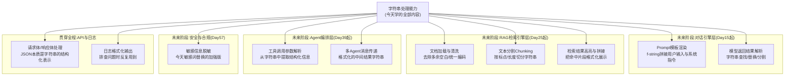
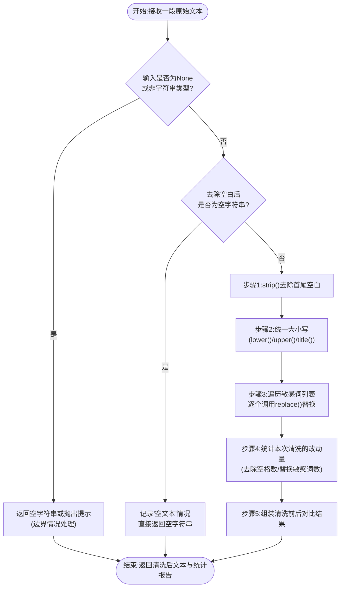
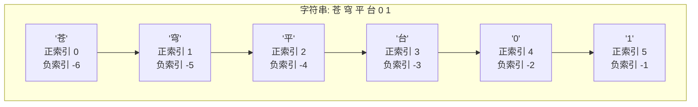

# 第2天 · 运算符与字符串

> **周次/Sprint**:Sprint 0 · 新人内训(Day1-14)—— 阶段项目一:命令行多轮对话AI助手(预计Day14交付)
> **星期**:周二
> **学员**:陈铭、苏梦、韩露、张凡(本期技术培训生小组,导师:王振宇)
> **内训任务卡**:PYXT-ONB-D02(蓬远科技培训中心 · 新人训练营 · Day02)
> **今日关键词**:运算符 / 运算优先级 / 字符串索引与切片 / split·join·strip·replace·format / f-string / 文本清洗小工具

---

## 【旁白】

如果说Day1是让陈铭第一次感受到"我能写出跑起来的代码"，那Day2要做的事情,性质上完全不同——它是在往这种初步的确信里,埋进第一颗真正意义上的"专业伏笔"。

这一天讲的东西,拆开来看平平无奇:加减乘除、大于小于、字符串怎么切一段出来、怎么把多余的空格去掉。放在任何一本Python入门书里,这些内容大概占不到十页纸,讲师完全可以在两个小时内讲完然后让学员自己练习。但老王没有这样处理——他把这一天,变成了陈铭第一次真正意识到"字符串处理"这件听起来枯燥的小事,会在七十天后的某个具体场景里,决定一段代码能不能跑通、一次客户交付能不能过关。

这里藏着一个值得读者提前知道的事实:七十天之后,当陈铭在苍穹平台里写下第一个正式的Prompt模板、把客户的知识库文档格式化成大模型能理解的输入时,他会用到的核心工具,不是什么高深的算法,而是今天要学的f-string。再往后,当他处理海纳制造集团那批"脏得不成样子"的设备手册文档时,他会用到今天写的这个文本清洗小工具的思路——去空格、统一大小写、替换敏感信息,这套逻辑几乎原封不动地会被搬进RAG检索引擎的文档预处理模块里,只是规模从几百字的练习文本,变成几十万字的企业文档。老王在今天特意提前"剧透"了这一点,不是为了让学员死记硬背,而是想让他们明白——所谓"基础",往往不是"简单"的意思,而是"到处都用得上"的意思。

这一天还有一层更隐蔽的意义:它是陈铭第一次真正感受到"运算符优先级"这种看起来纯粹是数学课内容的东西,是怎么在编程世界里变成一种"陷阱"的——一个多加的括号,一个没考虑清楚的`and`和`or`的组合顺序,都可能让代码在逻辑上"看起来对,但结果是错的"。这种"隐蔽的错误"比Day1遇到的那些一眼报错的语法错误更难缠,也更贴近真实工程世界的日常。往后陈铭会无数次体会到,真正折磨工程师的,往往不是代码跑不起来,而是代码跑起来了,结果却是错的。

---

## 晨会纪要 / 今日目标

**时间**:上午8:55,二层小会议室"起航"
**出席**:王振宇(老王)、陈铭、苏梦、韩露、张凡

老王进门的时候手里的保温杯换成了一个更大的搪瓷缸子,他自己解释说"昨天那个杯子太小,续杯麻烦"。他先看了一眼四个人的状态——陈铭和张凡看起来精神还不错,苏梦眼睛有点肿,韩露打了个哈欠又赶紧捂住嘴。

**昨天进展回顾**:
- 四人均已完成开发环境搭建,昨晚全部成功推送了人生第一次Git提交,老王在群里逐一给了反馈。
- 苏梦昨天环境搭建耗时最长,但最终版本的个人信息卡片程序思路清晰,老王评价"慢一点,但每一步都踩得很实"。
- 张凡的代码风格问题(变量命名随意)被点名提醒,老王要求今天开始严格执行命名规范,"从今天起,我review代码会认真看命名,不是只看能不能跑"。

老王没有花太多时间回顾,而是很快切入了今天的重点:

> "昨天你们学的变量和数据类型,是给数据'找个格子放着'。今天开始,我们要学怎么'对这些数据做点事情'——算加减乘除,做判断,还有最重要的,处理字符串。我先说一句可能你们现在体会不到分量的话:字符串处理这门课,你们以后写Prompt、清洗文档、处理API返回结果,天天都要用。今天学的东西,重要程度不亚于昨天。"

他停顿了一下,又补了一句:"昨天林悦路过我们工位的时候,提了一句——她说以后我们要给大模型喂各种各样的企业文档,那些文档里,格式混乱是常态,不混乱才是意外。今天你们要学的文本清洗,就是在为几十天后处理那种真实的、脏乱的文档打地基。"

**今日目标**:
1. 上午:掌握算术运算符、比较运算符、逻辑运算符及其优先级规则,能够独立分析复合表达式的求值顺序。
2. 下午:掌握字符串的索引与切片,熟练使用`split`/`join`/`strip`/`replace`/`format`等常用字符串方法。
3. 下午后段到晚自习:掌握f-string格式化语法,理解它与`.format()`、`%`格式化的区别与优势。
4. 晚自习:完成"文本清洗小工具"实操任务(去空格、统一大小写、敏感词替换),提交代码并接受Code Review。

**风险点**:
- 运算符优先级容易在逻辑运算符(`and`/`or`/`not`)组合时出现"隐蔽错误"(代码不报错,但结果不符合预期),这类错误比语法报错更难排查,需要重点强化"手动推演优先级"的能力。
- 字符串索引的"从0开始计数"和负数索引,是新手极易混淆的点,今天需要用大量例子反复巩固。
- 晚自习的文本清洗小工具涉及多个字符串方法的组合使用,容易出现"调用顺序错误导致结果不对"的隐蔽逻辑问题,需要老王重点巡场。

---

## 需求文档:新人训练营 Day2 实训任务书——文本清洗小工具

> 本任务书延续Day1的PRD撰写惯例,由技术导师王振宇结合公司真实业务场景拟定。这是本期新人第一次接触到一份"看起来简单,但背后有真实业务动机"的内部工具需求,老王特意强调:"这份需求书虽然是给你们练习用的,但它的措辞方式,和你们以后在苍穹项目里收到的真实PRD,结构上没有本质区别。"

### 背景

蓬远科技在为企业客户搭建知识库、处理业务文档的过程中,长期面临一个看似基础却极其重要的问题:**客户提供的原始文本数据质量参差不齐**。具体表现为:字段前后夹杂多余的空格或换行符;同一个概念在不同文档里大小写不统一(比如产品型号"XJ-3200A"有时被写成"xj-3200a");文档中可能包含需要脱敏或替换的敏感信息(如联系电话、内部代号、竞品名称)。这些问题如果不在数据进入系统之前处理掉,会直接影响后续检索、展示乃至大模型理解的效果。

老王借此机会向新人说明:"我们现在还没有正式的客户项目,但这类'脏数据清洗'的需求,几乎是我们做任何一个企业级项目都绕不开的第一步。今天这个练习,规模很小,但思路和你们以后在苍穹RAG模块里做的文档预处理,是一脉相承的。"

### 用户故事

- 作为一名内容运营人员,我希望上传的文本数据在展示前能自动去除多余的空格和换行,以便呈现更整洁、专业的效果。
- 作为一名数据合规负责人,我希望系统能够自动检测并替换文本中出现的敏感词汇,以便降低信息泄露与合规风险。
- 作为一名开发者,我希望这个清洗工具的各项功能能够独立调用、也能够组合使用,以便根据不同的业务场景灵活配置清洗规则。
- 作为技术导师,我希望通过这个练习,检验新人对字符串各类方法的掌握程度,以便为明天的分支语句教学做准备(因为清洗规则的选择本身就需要用到条件判断的思路,只是今天先用最朴素的方式实现)。

### 功能列表

| 编号 | 功能 | 说明 | 验收方式 |
|---|---|---|---|
| F1 | 去除首尾空白 | 去除文本首尾的空格、Tab、换行符,但保留文本内部必要的空格 | 输入`"  你好，世界  \n"`,输出应为`"你好，世界"` |
| F2 | 统一大小写 | 提供转全大写、全小写、首字母大写(Title Case)三种模式,针对英文字符生效 | 输入`"Cangqiong Platform"`,转小写后输出`"cangqiong platform"` |
| F3 | 敏感词替换 | 给定一份敏感词列表,将文本中出现的敏感词替换为统一的占位符(如`***`) | 输入包含敏感词"内部机密"的文本,替换后该词应变为`"***"`,长度可以不与原词一致 |
| F4 | 组合清洗流水线 | 支持按顺序组合执行F1~F3,形成一次完整的清洗流程,并输出清洗前后的对比 | 给定一段同时包含空格、大小写不一致、敏感词的文本,清洗后三类问题均被处理 |
| F5 | 清洗统计报告 | 清洗完成后,输出本次清洗做了哪些改动(比如去除了多少空格、替换了几处敏感词) | 报告中的统计数字与实际改动数量一致 |

### 非功能需求

- **健壮性**:输入为空字符串、纯空格字符串、`None`等边界情况时,程序不应崩溃,应给出合理的提示或默认处理结果。
- **可配置性**:敏感词列表不应硬编码在核心清洗逻辑内部,应作为参数传入,方便未来替换成从配置文件或数据库读取。
- **代码规范**:延续Day1的要求,变量命名规范、关键逻辑要有中文注释说明"为什么这么做"。
- **可测试性**:核心清洗函数应尽量做到"给定输入,能预测输出",方便后续写自动化测试用例验证。

### 验收标准

1. 至少实现F1、F2、F3三项基础功能,分别可以独立调用验证效果。
2. 至少完成一版F4组合清洗流水线,能够一次性处理"脏文本"的三类典型问题。
3. 使用至少5组不同特征的测试文本(包含普通文本、含敏感词文本、含大量空格文本、全大写文本、中英文混排文本)验证效果。
4. 代码中不允许出现"能跑就行"式的裸写法,必须包含边界情况的基本处理(至少覆盖空字符串场景)。
5. 晚自习结束前提交代码,老王给出Code Review反馈。

### 备注

老王在发布这份任务书的时候,补了一句意味深长的话:"这份需求书里的F4,你们今天大概率只能写成'从上到下依次调用三个函数'的朴素版本,因为你们还不会条件判断。没关系,先把'能做对的事'做出来,'怎么优雅地组织判断逻辑',是明天的内容。这也是我故意的安排——先让你们体会一下'不用if语句处理条件逻辑'有多别扭,你们明天学if的时候,才会真正理解它解决了什么问题。"

---

## 架构设计图:苍穹平台中"字符串处理"能力关系图

上午理论课讲完运算符之后,进入字符串这一部分之前,老王在白板上画了另一张图——这张图和Day1那张"整体愿景架构图"不是同一个东西,它专门标出了"字符串处理"这项基础能力,未来会渗透进苍穹平台的哪些具体模块。



老王解释这张图的时候,语气比讲昨天那张架构图更笃定:"昨天那张图,你们现在用不上,但今天这张图不一样——这里画的每一个格子,你们都会在接下来的六十多天里,真真切切地摸到。"

他挨个点了一遍:"Prompt模板渲染,说白了就是把用户的问题和系统的指令,用今天学的f-string拼成一段完整的文字,发给大模型;文档清洗,就是你们今晚要写的这个小工具的放大版,只是以后处理的不是几百字的练习文本,是几十页的PDF;敏感信息脱敏,是今天'敏感词替换'的加强版,以后会有真正的正则表达式和更严谨的规则来做,但底层逻辑今天已经埋下了。"

他又补充了一点:"你们现在可能觉得,这些东西离你们很远,毕竟你们连大模型API长什么样都没见过。但我想让你们记住一个规律——在我们这个行业,'字符串处理能力扎实'和'调试效率高'几乎是正相关的。我见过太多人,大模型的原理讲得头头是道,结果被一个字符串拼接的bug卡了一整个下午。"

---

## 流程图:文本清洗小工具处理流程

下午实操课正式开始之前,老王又发了一张流程图到群里,专门描述今晚要实现的文本清洗小工具的核心处理逻辑。这张图和上面那张架构图的目的完全不同——架构图讲的是"这个能力会用在哪里",这张图讲的是"这一个具体流程,内部是怎么一步步跑通的"。



老王在讲这张图的时候,特意在"CheckNone"和"CheckEmpty"这两个判断节点上停留了比较长的时间:"你们注意,这张图里已经出现了'判断'这个动作——是否为None,是否为空字符串。但今天你们还没学`if`语句,这在编程里其实是个很别扭的处境:业务逻辑天然需要判断,但你们的工具箱里还没有'判断'这个语法工具。今晚你们会用一些'土办法'去模拟判断(比如用短路运算或者三元表达式的雏形),明天我会正式教你们`if`,你们到时候回头看今天写的代码,大概会有一种'终于有正规武器了'的感觉。"

苏梦看着这张图,忍不住问了一句:"老师,这些判断菱形框,是不是就是我们以后要学的if?"老王点头:"对,你观察得很准。这张图里所有的菱形框,都是未来if语句要处理的逻辑,今天你们先理解'这里需要做一次判断'这件事本身,至于怎么用代码优雅地表达这个判断,明天见。"

---

## 示意图:字符串索引与切片示意图

下午进入字符串具体操作环节,老王在讲索引和切片之前,先画了这样一张示意图,把一个字符串"摆开"成一排格子,每个格子上标注正数索引和负数索引两套编号。



老王解释道:"假设我们有一个字符串`platform_code = '苍穹平台01'`,一共6个字符。Python给每一个字符位置都编了两套号——从左往右数,从0开始,这叫正索引;从右往左数,从-1开始,这叫负索引。你们可以把它想象成一栋楼的门牌号:正着数是1楼2楼3楼,反着数是顶楼、顶楼下一层、再下一层——两套编号指向的是同一批房间,只是数的方向不一样。"

他又补充了切片的部分,在这张图的基础上画了几个方框圈住不同的区间:"切片的写法是`字符串[起始:结束:步长]`,这里最容易搞错的一点是——'结束'这个位置,是'切到这里为止,但不包含这一格'。就像你去银行取号,叫到99号,如果你的号是99,那么'到99号为止'这句话,通常包含你自己;但Python的切片规则里,`[0:3]`指的是取索引0、1、2这三个位置,不包含索引3那个位置。这是新手最容易踩的一个坑,我们下午会用很多例子把这个'左闭右开'的规则刻进你们脑子里。"

---

## 课堂笔记

### 上午:运算符的世界——不只是数学课那点事

**9:10,培训室**

昨天下午的疲惫感一晚上就散得差不多了,陈铭到工位的时候比昨天从容不少,至少今天他没有再把工牌拿反。老王没有寒暄太多,直接在白板左上角写下四个字:"运算符类型"，下面列了三条:算术运算符、比较运算符、逻辑运算符。

"你们上学的时候都学过加减乘除,"老王说,"编程里的运算符,底子上和数学课是一回事,但多了几个数学课不教的东西,也多了几个数学课里不会强调、但编程里天天要用的细节。今天上午,我们把这些细节一次性讲透。"

#### 一、算术运算符

老王先在白板上列出Python支持的全部算术运算符,一边写一边用具体数字口算了一遍:

| 运算符 | 名称 | 示例 | 结果 |
|---|---|---|---|
| `+` | 加法 | `7 + 3` | `10` |
| `-` | 减法 | `7 - 3` | `4` |
| `*` | 乘法 | `7 * 3` | `21` |
| `/` | 除法(真除法) | `7 / 3` | `2.3333333333333335` |
| `//` | 整除(取商的整数部分) | `7 // 3` | `2` |
| `%` | 取余(取余数) | `7 % 3` | `1` |
| `**` | 幂运算(次方) | `7 ** 3` | `343` |

陈铭一开始对`/`和`//`的区别没有太大概念,老王让他现场在VS Code里跑了这样一段代码:

```python
print(7 / 3)     # 输出:2.3333333333333335
print(7 // 3)    # 输出:2
print(-7 // 3)   # 输出:-3(不是-2,这是新手极容易搞错的地方)
```

`-7 // 3`这个结果让陈铭愣了一下——他脱口而出:"不应该是-2吗?"老王笑了笑说:"这是个经典的坑。Python的整除,规则是'向负无穷方向取整',不是简单粗暴地把小数点后面砍掉。`-7 / 3`算出来是`-2.333...`,如果只是把小数部分砍掉,确实应该是`-2`,但Python的`//`是往更小的方向取整,`-2.333...`往更小的方向取整是`-3`,不是`-2`。"

他补充说明这个知识点在实际业务里的意义:"你们以后写分页逻辑的时候,经常要用到整除——比如一共100条数据,每页显示7条,一共需要多少页?这类计算,几乎清一色会用到`//`和`%`的组合。但一旦数据里出现负数场景(比如账户余额相关的计算),这种'向负无穷取整'的规则就要格外小心,不然算出来的结果会和你的直觉不一样,却又不会报错——这才是最麻烦的,因为它'看起来是对的'。"

**取余运算的常见业务场景**

老王接着讲`%`取余运算,举了几个陈铭之前做运营时可能接触过的场景:"判断一个数是不是偶数,常用写法是`number % 2 == 0`;做分页展示的时候,判断某一页是不是最后一页,或者做数据分组轮询展示(比如每隔3条插入一条广告),都会用到取余。"他现场演示了一个小例子:

```python
# 判断1到10之间的数字,哪些是偶数
for candidate in [1, 2, 3, 4, 5, 6, 7, 8, 9, 10]:
    remainder = candidate % 2
    print(candidate, "取余2的结果是", remainder)
```

这里用到了`for`循环(明天才正式讲),老王解释说:"这行代码你们现在看不懂`for`的语法细节没关系,我只是想让你们提前'脸熟'一下,重点看`%`这个运算符本身的效果——余数是0就是偶数,余数是1就是奇数,这个规律你们记住就行。"

**幂运算与常见误用**

`**`是幂运算,老王特别提醒了一个新手常犯的错误——很多人受其他语言或者数学符号习惯的影响,会写成`^`,但在Python里`^`是"按位异或"运算符,含义完全不同:

```python
print(2 ** 10)   # 正确写法,输出:1024
print(2 ^ 10)    # 这不是幂运算!这是按位异或,输出结果是8,和"2的10次方"毫无关系
```

"这是一个'不报错但结果完全错误'的典型陷阱,"老王说,"`2 ^ 10`是合法的Python代码,程序不会报错,只是算出来的数字和你想要的完全不是一回事。按位运算你们现在不需要深入理解,只需要记住一条铁律:算幂用`**`,不要用`^`。"

#### 二、运算优先级——括号能省的时候尽量别省

讲完基础运算符,老王引出了"运算优先级"这个概念。他先在白板上写了一个表达式,让四个人各自口算一遍答案再报出来:

```python
result = 2 + 3 * 4 ** 2 - 1
```

苏梦算出来是`157`,张凡算出来是`36`,韩露算出来是`35`,陈铭算出来是`33`。老王笑着说:"看,同一个表达式,四个人算出了四个不同的答案,这说明什么?说明大家对'先算哪个'这件事的理解不统一。"

他把优先级规则完整列了出来(从高到低):

| 优先级(从高到低) | 运算符 | 说明 |
|---|---|---|
| 1 | `()` | 括号,永远最先计算 |
| 2 | `**` | 幂运算 |
| 3 | `*` `/` `//` `%` | 乘、除、整除、取余,优先级相同,从左到右计算 |
| 4 | `+` `-` | 加、减 |
| 5 | `==` `!=` `>` `<` `>=` `<=` | 比较运算符 |
| 6 | `not` | 逻辑非 |
| 7 | `and` | 逻辑与 |
| 8 | `or` | 逻辑或 |

按照这个规则,`2 + 3 * 4 ** 2 - 1`的正确计算顺序是:先算`4 ** 2 = 16`,再算`3 * 16 = 48`,再从左到右算加减:`2 + 48 - 1 = 49`。四个人都没算对。

老王没有直接说谁对谁错,而是让大家把这行代码敲进VS Code,自己验证:

```python
result = 2 + 3 * 4 ** 2 - 1
print(result)   # 输出:49
```

"这就是为什么我不建议你们凭直觉去猜优先级,"老王说,"你们四个人算错的原因五花八门——有人以为幂运算优先级和乘法一样从左到右算,有人干脆按从左到右念的顺序直接算下去了。这说明一件事:靠脑子记优先级表,长期来看不靠谱,尤其是代码写复杂了以后。"

**老王的实战建议:能加括号就加括号**

他给出了一条几乎贯穿他整个职业生涯的经验:"我带团队这么多年,见过太多因为优先级搞错导致的隐蔽bug——比如权限判断写错、价格计算错误。我的建议非常简单粗暴:只要你对优先级有一丝丝不确定,就加括号。括号不要钱,但能救命。"

他把刚才那行代码改写成带括号的版本,两种写法计算结果完全一样,但可读性天差地别:

```python
# 不加括号,依赖读者记住优先级规则,容易产生歧义
result_v1 = 2 + 3 * 4 ** 2 - 1

# 加上括号,即使读者完全不记得优先级规则,也能一眼看懂计算顺序
result_v2 = 2 + (3 * (4 ** 2)) - 1

print(result_v1 == result_v2)   # 输出:True,两种写法结果相同
```

"团队协作里,代码不是只给自己看的,"老王说,"你写的代码,三个月后可能是别人在维护,甚至是三个月后的你自己在维护——那时候你未必记得清当时的优先级心算逻辑。加括号这件事,看起来'啰嗦',但省下的排查时间,远远超过多打几个字符的成本。"

#### 三、比较运算符

比较运算符相对直观,老王很快过了一遍基本用法:

```python
print(5 > 3)     # True
print(5 < 3)     # False
print(5 == 5)    # True,注意:判断相等要用两个等号
print(5 != 3)    # True,不等于
print(5 >= 5)    # True,大于等于
print(5 <= 3)    # False,小于等于
```

他重点强调了`==`和`=`的区别,这是几乎每个新手都会踩的坑:"`=`是赋值,意思是'把右边的值放进左边这个格子里';`==`是比较,意思是'看左右两边的值是不是相等'。混用这两个符号,是新手报错率最高的原因之一。"他现场故意写错一次,演示报错效果:

```python
age = 32
if age = 32:      # 故意写错,把比较运算符写成了赋值运算符
    print("年龄是32岁")
```

运行后报错:

```
  File "wrong_compare.py", line 2
    if age = 32:
             ^
SyntaxError: invalid syntax
```

"Python在这一点上其实对新手挺友好,"老王解释,"像这种明显的语法错误,`if`语句后面出现单个等号,Python会直接在语法层面拒绝执行,而不是让你带着错误的逻辑跑下去。有些语言(比如C语言)在特定场景下`=`和`==`混用是不会报语法错误的,那种语言的这类bug才是真正的噩梦——代码能跑,但逻辑错得离谱。你们现在用Python入门,这算是一种'温柔的保护'。"

**比较不同类型的数据会发生什么**

老王接着提出一个问题:"如果我拿一个字符串和一个数字做比较,会发生什么?"他现场演示:

```python
print("32" == 32)     # 输出:False
```

"注意,这里不会报错,"老王强调,"`"32"`是字符串,`32`是整数,类型不同,Python认为它们'不相等',直接返回`False`,不会抛异常。这是一个新手很容易忽略的隐蔽陷阱——你以为字符串'32'和数字32应该是'一样'的,但对Python来说,它们是两个完全不同的东西,不做任何隐式转换就去比较,永远得到`False`。"

他又演示了一个会真正报错的比较场景,提醒大家类型比较也不是完全没有边界:

```python
print(5 > "3")
```

```
Traceback (most recent call last):
  File "compare_error_demo.py", line 1, in <module>
    print(5 > "3")
TypeError: '>' not supported between instances of 'int' and 'str'
```

"这里和上面`==`的情况不一样,"老王解释,"`==`和`!=`对任何类型都能比较(不同类型直接判定不相等),但`>`、`<`这类'大小比较'运算符,要求两边的类型必须是可比较的,`int`和`str`之间没有定义'谁大谁小'这种关系,所以直接报`TypeError`。这提醒你们,写比较逻辑之前,先确认清楚参与比较的变量到底是什么类型,别想着'看起来像数字就应该能比较'。"

**链式比较——Python的一个"贴心"语法糖**

老王在这里补充了一个Python特有的、其他很多语言没有的写法——链式比较:

```python
age = 25
print(18 <= age <= 60)   # 输出:True,等价于 (18 <= age) and (age <= 60)
```

"这在数学课本上你们写`18 ≤ age ≤ 60`是很自然的写法,但很多编程语言不允许这样连着写,你得拆成两个条件用`and`连接。Python允许你直接这样写,底层会自动帮你拆成两个比较再用`and`连起来。这个语法糖能让代码更贴近人类的自然表达,以后判断'一个数值是否落在某个区间内'的场景会经常用到,比如判断token数量是否在模型允许的上下文长度范围内。"

#### 四、逻辑运算符——and、or、not

逻辑运算符是上午课程里最容易出"隐蔽错误"的部分,老王花了将近四十分钟专门讲这一块。

**基本用法**

```python
is_full_time = True
is_manager = False

print(is_full_time and is_manager)    # False,两个都为True才算True
print(is_full_time or is_manager)     # True,只要有一个为True就算True
print(not is_full_time)               # False,取反
```

"`and`就像现实生活里说的'并且',两个条件都满足才成立;`or`就像'或者',只要有一个满足就成立;`not`就是'不是'、'取反'。"老王用了一个业务场景来加深印象:"假设一个客户要享受折扣,条件是'是VIP会员 并且 消费满500元',这就是`and`;假设客户可以免运费,条件是'是VIP会员 或者 消费满200元',这就是`or`。"

**短路求值(Short-circuit Evaluation)**

这是逻辑运算符里最容易被新手忽略、但对工程实践很重要的一个特性。老王先讲了`and`的短路规则:

```python
def check_a():
    print("正在检查条件A")
    return False

def check_b():
    print("正在检查条件B")
    return True

result = check_a() and check_b()
print("最终结果:", result)
```

这里用到了函数(明天之后才正式讲),老王解释:"这两个函数你们先不用管内部怎么定义的,只需要知道,`check_a()`会打印一句话并返回`False`,`check_b()`会打印一句话并返回`True`。运行这段代码,你们猜'正在检查条件B'这句话会不会被打印出来?"

运行结果只打印了"正在检查条件A",没有打印"正在检查条件B"。老王解释:"`and`运算符有一个特性叫'短路求值'——如果左边的条件已经是`False`,那么无论右边是什么,整个`and`表达式的结果肯定是`False`,Python很聪明,它不会浪费时间去计算右边,直接跳过。这不只是性能优化,它在实际业务代码里非常重要——比如你要判断'用户存在 并且 用户已激活',如果你先判断'用户存在'为`False`,短路机制会让程序不再去执行判断'用户已激活'的那部分逻辑,这在很多场景下能帮你避免因为对象不存在而引发的报错。"

他又补充了`or`的短路规则,方向相反:"`or`是只要左边为`True`,就不会再计算右边,因为结果已经确定是`True`了。"

**运算符优先级里logical运算符的坑**

老王接着抛出了今天上午最容易让人栽跟头的一类例子:

```python
age = 17
has_permission = True

# 意图:未成年 或者 (没有权限),都不允许访问
# 但下面这行代码,是否真的表达了这个意图?
can_access = not age < 18 or has_permission
print(can_access)
```

他让四个人先猜结果,再一起验证。结果是`True`——但这真的是想要的结果吗?老王引导大家一步步分析优先级:"`not`的优先级比`<`低,所以`not age < 18`实际上被理解成`not (age < 18)`,这一步很多人容易理解对;但接下来`and`比`or`优先级高,这里虽然没有`and`,所以直接按顺序算:`not (age < 18)`结果是`not True`,也就是`False`;然后`False or has_permission`,`has_permission`是`True`,所以整个表达式是`True`。"

"问题来了,"老王说,"这个结果`True`,到底是不是你原本想表达的逻辑?这行代码写得很随意,不同人读出来的意图可能完全不一样,这正是逻辑运算符最危险的地方——它'能跑',结果'看起来也没报错',但没有人能保证它表达的就是你脑子里真正想要的判断逻辑。"

他给出的解决方案,还是回到前面那条铁律:"加括号,把你的意图明确写出来,不要依赖别人(包括未来的你自己)去反推优先级。"

```python
# 用括号明确表达意图:如果是未成年,或者虽然成年但没有权限,则不允许访问
# 先把两个条件分别用括号包起来,一眼就能看出条件的边界
is_minor = age < 18
lacks_permission = not has_permission
should_deny = is_minor or lacks_permission
print("是否应拒绝访问:", should_deny)
```

老王评价这种写法:"这个版本啰嗦一点,但没有任何人会读错它的意图——先给每个子条件起一个有意义的名字,再组合起来,这是我带团队时反复强调的'把复杂逻辑拆碎'的技巧,以后你们写Agent的决策逻辑、写Prompt里的条件分支时,这个习惯会救你很多次。"

**关于`in`和`not in`**

老王在逻辑运算符这部分的最后,补充了两个虽然常和逻辑运算符放在一起讨论,但严格来说属于"成员运算符"的关键字——`in`和`not in`。这两个运算符今天先浅讲,明天讲列表和后续讲字符串方法时会更深入,但因为它们经常和逻辑判断结合使用,老王觉得有必要现在先露个脸:

```python
sensitive_word = "内部机密"
text = "这是一份内部机密文档,请勿外传。"

print(sensitive_word in text)        # True,判断"内部机密"是否出现在text这个字符串里
print(sensitive_word not in text)    # False
```

"这两个运算符,你们今晚写文本清洗小工具的时候,判断'敏感词是否出现在文本里'会直接用到,"老王说,"它比你们想的还要重要——今晚很多人会想用更复杂的写法去判断敏感词是否存在,但其实`in`这一个关键字就能优雅地解决。"

#### 五、运算符优先级完整对照表与FAQ

上午课程收尾前,老王让陈铭把黑板上的内容整理成一张更完整的对照表,发到群里供大家复习:

| 运算符类别 | 具体运算符 | 优先级(数字越小越先算) | 备注 |
|---|---|---|---|
| 括号 | `()` | 1 | 永远最先算,没有例外 |
| 幂运算 | `**` | 2 | 从右往左结合,比如`2 ** 3 ** 2`等于`2 ** (3 ** 2)` = 512 |
| 单目运算 | `+x` `-x` | 3 | 正负号,比如`-5`里的负号 |
| 乘除类 | `*` `/` `//` `%` | 4 | 优先级相同,从左往右算 |
| 加减类 | `+` `-` | 5 | 优先级相同,从左往右算 |
| 比较运算符 | `==` `!=` `>` `<` `>=` `<=` | 6 | 优先级相同,支持链式比较 |
| 成员/身份运算符 | `in` `not in` `is` `is not` | 6 | 和比较运算符处于同一优先级层级 |
| 逻辑非 | `not` | 7 | |
| 逻辑与 | `and` | 8 | |
| 逻辑或 | `or` | 9 | 优先级最低 |

"这张表不需要你们逐字背下来,"老王说,"你们只需要记住一个大致的直觉——数学运算(算术)优先级最高,比较运算次之,逻辑运算最低。剩下的细节,记不清的时候查一下,或者最简单的办法——加括号。"

**FAQ:上午运算符环节常见疑问**

1. **问:为什么`0.1 + 0.2`不等于`0.3`,这和今天讲的运算符有关系吗?**
   答:这个现象昨天已经提到过,今天可以更深入理解一点——浮点数在计算机内部是以二进制形式近似存储的,很多十进制小数(比如0.1)无法被二进制精确表示,只能存储一个"非常接近但不完全等于"的近似值。运算符本身没有问题,问题出在浮点数的存储方式上。以后涉及金额比较,不要直接用`==`判断两个浮点数是否相等,而是判断它们的差值是否小于一个很小的容差(比如`abs(a - b) < 0.0001`)。

2. **问:`**`和负号结合的时候,`-2 ** 2`等于多少?是-4还是4?**
   答:这是个经典的容易搞混的问题,答案是`-4`。原因是,单目负号的优先级比`**`低,所以Python实际先算`2 ** 2 = 4`,再取负号,结果是`-4`。如果想让负号先生效,得到`4`,需要显式加括号:`(-2) ** 2`。这也是"多加括号"这条铁律的又一个真实案例。

3. **问:`and`和`or`混在一起用,该怎么快速判断优先级?**
   答:记住`and`的优先级比`or`高,类似于数学里"乘法比加法优先"的感觉。比如`A or B and C`,会先算`B and C`,再和`A`做`or`。但正如老王反复强调的,遇到这种混合表达式,最稳妥的做法永远是加括号明确表达意图,而不是死记硬背优先级去心算。

4. **问:比较运算符可以用于字符串吗?比如`"apple" < "banana"`?**
   答:可以。字符串之间的大小比较,底层是按照字符的编码顺序(类似字典序)逐个字符比较的,`"apple" < "banana"`的结果是`True`,因为字母'a'的编码顺序在'b'之前。但要注意,这种比较对大小写敏感,`"Apple" < "apple"`的结果也是`True`,因为大写字母的编码值普遍小于小写字母,这个细节明天讲字符串方法时会有更具体的例子。

5. **问:短路求值除了性能优化,还有什么实际用途?**
   答:一个非常经典的用途是"安全访问"——比如你要检查一个字符串变量是否存在且长度大于10,可以写成`text and len(text) > 10`。如果`text`是空字符串或者`None`(空字符串在布尔上下文中被判定为False),短路机制会让`len(text) > 10`这一步根本不被执行,避免了对`None`调用`len()`导致的报错。这个用法明天讲`if`语句和后面讲异常处理时都会反复出现。

---

### 下午:字符串的索引、切片与常用方法

**14:00,培训室**

午休过后,老王没有立刻讲索引切片,而是先花了五分钟复习了一下昨天关于字符串的基础认识:"昨天我们说,字符串就是用引号包起来的文字。今天我要更精确地告诉你们一个概念——字符串在Python里,本质上是一个'字符的有序序列'。'有序'这两个字很重要,它意味着字符串里的每一个字符,都有一个固定的位置,这个位置就是'索引'。"

#### 一、字符串的不可变性

在讲索引之前,老王先强调了一个贯穿字符串这个数据类型始终的核心特性——**字符串是不可变的(immutable)**。他现场演示了一次"新手常见的误解":

```python
name = "陈明"
name[1] = "铭"    # 尝试直接修改字符串里的某一个字符
```

运行后报错:

```
Traceback (most recent call last):
  File "immutable_demo.py", line 2, in <module>
    name[1] = "铭"
TypeError: 'str' object does not support item assignment
```

"这个报错的意思是,字符串这种类型的对象,不支持'按位置直接赋值修改'这种操作,"老王解释,"你可以'读'字符串里任意位置的字符,但不能'原地修改'某一个字符。这不是Python的bug,是它有意的设计——字符串一旦创建,内容就固定了,想要'看起来像是修改了字符串',实际上是创建了一个新的字符串。"

他演示了正确的"修改"思路:

```python
name = "陈明"
# 想把"陈明"改成"陈铭",实际做法是:取出不需要改的部分,拼接上新的字符,组成一个全新的字符串
corrected_name = name[0] + "铭"
print(corrected_name)    # 输出:陈铭
print(name)              # 输出:陈明,原字符串完全没有被改变
```

"这一点非常重要,"老王强调,"以后你们处理字符串,脑子里要有一个概念——所有'看起来是修改字符串'的操作(比如`replace()`、`upper()`),实际上都是返回了一个新的字符串,原来的字符串变量如果没有被重新赋值,内容是不会变的。这个特性今晚写文本清洗工具的时候,会是一个非常容易踩的坑,我们下午后段会专门举例说明。"

#### 二、索引(Index)——按位置取出单个字符

结合前面示意图里那张"苍穹平台01"的示意图,老王开始正式讲索引的用法:

```python
platform_code = "苍穹平台01"

print(platform_code[0])    # 输出:苍(第一个字符,索引从0开始)
print(platform_code[1])    # 输出:穹
print(platform_code[3])    # 输出:台
print(platform_code[-1])   # 输出:1(最后一个字符,负索引从-1开始)
print(platform_code[-2])   # 输出:0(倒数第二个字符)
```

"很多新手第一次接触索引,会自然而然地觉得'第一个字符应该是索引1',这是受日常生活习惯的影响——我们数东西通常从1开始数。"老王说,"但绝大多数编程语言(包括Python),索引都是从0开始的,这是计算机科学里的一个'行业惯例',背后有历史和底层实现的原因,但对你们来说,现在只需要记住结论:第一个字符是索引0,不是索引1。"

**索引越界会怎样**

老王接着演示了一个常见报错场景:

```python
platform_code = "苍穹平台01"
print(platform_code[10])   # 这个字符串一共只有6个字符,索引10已经超出范围
```

```
Traceback (most recent call last):
  File "index_error_demo.py", line 2, in <module>
    print(platform_code[10])
IndexError: string index out of range
```

"`IndexError`说的就是'索引超出了范围',"老王说,"这个字符串一共6个字符,合法的正索引范围是0到5,合法的负索引范围是-1到-6,超出这个范围,Python不会给你一个默默的空值或者随便凑一个结果,而是直接报错。这种'宁可报错也不悄悄给你一个错误结果'的设计哲学,其实是在保护你——想象一下,如果索引越界不报错,而是返回一个奇怪的默认值,你的bug会隐藏得更深、更难发现。"

他补充了一个实用的小技巧:"如果你不确定字符串有多长,想安全地判断某个索引是否合法,可以先用`len()`函数查看字符串的长度,再决定是否访问某个索引,这个技巧结合明天要学的`if`判断会用得更顺手。"

```python
platform_code = "苍穹平台01"
print(len(platform_code))    # 输出:6,表示这个字符串一共有6个字符
```

#### 三、切片(Slicing)——按区间取出一段字符

索引讲完,老王正式引入切片,语法是`字符串[起始索引:结束索索引:步长]`,三个部分都可以省略。

```python
text = "苍穹企业级智能体中台"

print(text[0:2])     # 输出:苍穹(取索引0、1,不包含索引2)
print(text[2:5])     # 输出:企业级
print(text[5:])      # 输出:智能体中台(省略结束索引,表示一直取到末尾)
print(text[:5])      # 输出:苍穹企业级(省略起始索引,表示从开头开始取)
print(text[:])       # 输出:苍穹企业级智能体中台(整段复制,前后都省略)
```

老王重点强调了那条"左闭右开"规则,并结合上面的示意图反复举例:"`text[2:5]`,你可以记成'从索引2开始,一直取到索引5之前那一格',结果是索引2、3、4这三个字符——对应的就是'企业级'这三个字。很多新手会下意识觉得'结束索引也应该被包含',这个直觉是错的,一定要刻意纠正过来。"

他还给出了一个帮助记忆的小技巧:"如果你想验证切片区间内包含几个字符,可以直接算'结束索引减去起始索引',这个差值就是切片得到的字符个数——`text[2:5]`,`5-2=3`,得到3个字符,这个技巧能帮你快速自查切片写对了没有。"

**负数索引与切片结合**

```python
text = "苍穹企业级智能体中台"

print(text[-4:])       # 输出:智能体中台(从倒数第4个字符开始,取到末尾)
print(text[:-4])       # 输出:苍穹企业级(从开头取到倒数第4个字符之前)
print(text[-4:-1])     # 输出:智能体(从倒数第4个,取到倒数第1个之前)
```

**步长(step)的用法**

```python
text = "苍穹企业级智能体中台"

print(text[::2])     # 输出:苍企级能体台(每隔一个字符取一个,步长为2)
print(text[1::2])    # 输出:穹业智中(从索引1开始,每隔一个字符取一个)
print(text[::-1])    # 输出:台中体能智级业企穹苍(步长为-1,表示反向取,相当于把字符串倒过来)
```

`text[::-1]`这个"反转字符串"的写法,让苏梦感到很惊喜,她说:"这个写法好巧妙,比我想象中'写个循环倒着拼'要简单多了。"老王点头:"这是Python切片语法一个很受欢迎的'副产品'用法,虽然它本来的设计目的不是专门为了反转字符串,但确实成了业界最常用的字符串反转技巧之一。你们以后写代码时看到`[::-1]`这种写法,基本可以直接反应过来'这是在反转'。"

**切片不会因为越界而报错**

老王特意演示了切片和索引在"越界"处理上的一个重要区别:

```python
text = "苍穹"
print(text[0:100])    # 字符串只有2个字符,但切片结束索引给到100
print(text[10:20])    # 起始和结束索引都完全超出范围
```

第一行输出`苍穹`,第二行输出一个空字符串`""`,两行代码都不会报错。"这是切片和单个索引访问最大的行为差异,"老王强调,"单个索引越界(比如`text[100]`)会直接报`IndexError`,但切片越界不会报错,它会很'宽容'地把能取到的部分取出来,取不到就返回空字符串。这个差异,你们以后写代码的时候要留意——如果你的逻辑依赖'越界应该报错'来提前发现问题,用切片可能会让bug隐藏得更深,因为它不会主动提醒你。"

#### 四、字符串常用方法(上):strip / split / join

进入字符串方法环节,老王把这部分和晚自习要做的文本清洗小工具直接挂钩:"接下来讲的这几个方法,今晚你们会用到大部分,我讲的时候就会顺带提一下,这个方法在清洗小工具里大概会用在哪个环节。"

**strip()、lstrip()、rstrip()——去除空白**

```python
raw_text = "   苍穹平台   \n"
print(repr(raw_text))              # repr()可以把字符串里的不可见字符(比如换行符\n)显示出来
print(repr(raw_text.strip()))      # 去除首尾空白后:'苍穹平台'
print(repr(raw_text.lstrip()))     # 只去除左边(开头)的空白:'苍穹平台   \n'
print(repr(raw_text.rstrip()))     # 只去除右边(结尾)的空白:'   苍穹平台'
```

老王专门解释了`repr()`这个新出现的函数:"`print()`直接打印字符串的时候,换行符`\n`会被'执行'成真正的换行,你看不出字符串里到底有没有这个字符。`repr()`会把字符串'原样'地、带着转义符号地显示出来,方便我们调试的时候看清楚字符串内部到底藏了什么看不见的字符。这是个很实用的调试小工具,以后排查'字符串看起来一样但比较结果却是False'这类问题时经常会用到它。"

他补充说明了`strip()`默认去除的字符范围:"默认情况下,`strip()`会去除空格、Tab(`\t`)、换行(`\n`)、回车(`\r`)这几类常见的空白字符,不需要你手动指定。但`strip()`也支持传入参数,指定要去除哪些特定字符,不只限于空白:"

```python
messy_code = "###苍穹平台###"
print(messy_code.strip("#"))    # 输出:苍穹平台,去除首尾的#号
```

"这个功能今晚处理'某些文档里用特殊符号包裹关键词'的场景时可能会用到,"老王提了一句,"但注意,`strip()`只处理首尾,字符串中间的字符,不管是空白还是别的符号,`strip()`都不会动它。"

**split()——按分隔符切分字符串,得到一个列表**

```python
sentence = "苍穹平台,对话引擎,RAG检索,Agent编排"
parts = sentence.split(",")
print(parts)          # 输出:['苍穹平台', '对话引擎', 'RAG检索', 'Agent编排']
print(type(parts))    # 输出:<class 'list'>
```

老王在这里第一次正式提到"列表"这个概念,他解释:"`split()`执行完之后,得到的不再是一个字符串,而是一个'列表'——你可以先理解成一排装着若干个字符串的格子,每个格子是split之后的一个片段。列表是明天之后(具体是Day4)才会系统讲的内容,今天你们只需要知道`split()`会把一个字符串按指定的分隔符拆成若干块,装进一个列表里。"

他又演示了`split()`不指定参数时的默认行为:

```python
messy_sentence = "苍穹   平台    智能体"
print(messy_sentence.split())    # 输出:['苍穹', '平台', '智能体']
```

"不传参数的时候,`split()`会按照任意长度的连续空白字符来切分,而且会自动忽略多余的空白,"老王说,"这个特性对处理'词与词之间空格数量不统一'的文本特别有用,今晚如果你们的清洗工具需要按词切分文本,这个默认用法会很省事。"

**join()——把列表拼接回一个字符串**

`join()`几乎是`split()`的逆操作,老王强调了一个容易搞反的语法细节——`join()`是字符串的方法,但操作的对象是一个列表:

```python
parts = ["苍穹平台", "对话引擎", "RAG检索", "Agent编排"]
joined_text = ",".join(parts)
print(joined_text)    # 输出:苍穹平台,对话引擎,RAG检索,Agent编排
```

"很多新手第一次用`join()`会写反,想当然地写成`parts.join(",")`,这是错的,"老王特意演示了这个常见错误:

```python
parts = ["苍穹平台", "对话引擎"]
result = parts.join(",")    # 错误写法
```

```
Traceback (most recent call last):
  File "join_error_demo.py", line 2, in <module>
    result = parts.join(",")
AttributeError: 'list' object has no attribute 'join'
```

"`AttributeError`的意思是,你调用的这个方法,当前这个类型的对象上根本不存在,"老王解释,"`join()`只能通过字符串对象来调用,括号里传入的才是那个'列表'。你可以记一个口诀:`join()`永远是'连接符.join(要拼接的列表)',连接符在前面,列表在括号里。"

他补充了一个实用的对比场景:"`split()`和`join()`合起来用,可以很方便地处理'重新格式化'的需求——比如把逗号分隔的文本改成用竖线分隔:"

```python
csv_style = "苍穹平台,对话引擎,RAG检索"
pipe_style = "|".join(csv_style.split(","))
print(pipe_style)    # 输出:苍穹平台|对话引擎|RAG检索
```

#### 五、字符串常用方法(下):replace / 大小写转换 / 查找判断类方法

**replace()——查找并替换**

```python
original = "这是一份内部机密文档,内部机密内容请勿外传。"
cleaned = original.replace("内部机密", "***")
print(cleaned)    # 输出:这是一份***文档,***内容请勿外传。
```

老王强调了`replace()`的一个重要特性:"默认情况下,`replace()`会把字符串里所有匹配到的部分全部替换掉,不是只替换第一个,你们看上面这个例子,'内部机密'出现了两次,两次都被替换了。"

他接着演示了`replace()`的第三个可选参数——限制替换次数:

```python
repeated_text = "重复重复重复重复"
partial_replace = repeated_text.replace("重复", "OK", 2)   # 第三个参数指定最多替换几次
print(partial_replace)    # 输出:OKOK重复重复,只替换了前两次出现的"重复"
```

"这个参数今晚不一定用得上,但了解它的存在,以后遇到'只想替换前几次匹配'的场景时,不用绕远路去写额外的逻辑。"

**大小写转换方法**

```python
text = "Cangqiong Platform"

print(text.upper())        # 输出:CANGQIONG PLATFORM,全部转大写
print(text.lower())        # 输出:cangqiong platform,全部转小写
print(text.title())        # 输出:Cangqiong Platform,每个单词首字母大写
print(text.capitalize())   # 输出:Cangqiong platform,只有整段第一个字符大写,其余全部小写
print(text.swapcase())     # 输出:cANGQIONG pLATFORM,大小写互换
```

老王特别提醒了`title()`和`capitalize()`的区别,这是新手很容易混淆的一对方法:"`title()`是'每一个单词'首字母大写,其余小写;`capitalize()`是'整句话'只有最开头一个字符大写,后面全部变成小写,即便原来后面有单词首字母是大写的,也会被强行转成小写。"他现场用一个例子对比这两者的差异:

```python
mixed_case = "cangqiong PLATFORM for Enterprise"

print(mixed_case.title())         # 输出:Cangqiong Platform For Enterprise
print(mixed_case.capitalize())    # 输出:Cangqiong platform for enterprise
```

"你们看,`capitalize()`把原本已经是大写的'PLATFORM'也强行变成了小写的'platform',这是它的设计规则——它只保证整个字符串只有第一个字符是大写,别的地方一律小写。这个细节,今晚做'统一大小写'功能的时候要想清楚到底想要哪种效果。"

**判断类方法**

老王补充了几个以`is`开头、用于判断字符串特征的方法,这类方法返回值都是布尔类型:

```python
print("12345".isdigit())      # True,判断字符串是否全部由数字字符组成
print("苍穹123".isdigit())    # False,只要有非数字字符就返回False
print("苍穹".isalpha())       # True,判断字符串是否全部由字母(包括中文字符)组成
print("   ".isspace())        # True,判断字符串是否全部由空白字符组成
print("".isdigit())           # False,空字符串在这类判断方法里,通常返回False
```

"这类方法今晚在处理'输入是否合法'这种边界情况判断时会很有用,"老王说,"比如你要判断用户输入的一段文本是不是'纯空格',用`.strip()`之后判断结果是否为空字符串,或者直接判断`.isspace()`,都是可行的思路。"

**startswith() 和 endswith()**

```python
filename = "cangqiong_report_2024.pdf"

print(filename.startswith("cangqiong"))    # True
print(filename.endswith(".pdf"))           # True
print(filename.endswith((".pdf", ".docx", ".txt")))  # True,可以传入一个元组同时判断多种后缀
```

"这两个方法在你们以后做文件类型判断、做协议前缀判断(比如判断一个字符串是不是以`http://`开头)的时候会经常用到。"老王补充说,元组这种数据类型,会在后续课程(Day4)详细讲,今天先了解`endswith()`可以接受多个候选值这个用法即可。

#### 六、字符串方法汇总对照表

下午理论部分收尾前,老王让大家把讲过的方法整理成一张对照表,他说这张表"你们接下来两个月大概每天都要回来查一次":

| 方法 | 作用 | 返回值类型 | 是否修改原字符串 |
|---|---|---|---|
| `strip()` / `lstrip()` / `rstrip()` | 去除首尾(或单侧)空白/指定字符 | `str` | 否,返回新字符串 |
| `split(sep)` | 按分隔符切分成列表 | `list` | 否 |
| `sep.join(list)` | 把列表拼接成字符串 | `str` | 否 |
| `replace(old, new)` | 查找并替换 | `str` | 否 |
| `upper()` / `lower()` | 全部转大写/小写 | `str` | 否 |
| `title()` / `capitalize()` | 单词首字母大写 / 整句首字母大写 | `str` | 否 |
| `isdigit()` / `isalpha()` / `isspace()` | 判断字符构成 | `bool` | 否 |
| `startswith()` / `endswith()` | 判断开头/结尾 | `bool` | 否 |
| `find()` / `index()` | 查找子串位置 | `int` | 否 |
| `len(字符串)` | 获取字符串长度(注意这是内置函数不是方法) | `int` | 否 |

老王在表格下面补了一句总结,呼应前面讲过的"不可变性":"你们注意到没有,这张表里所有方法的'是否修改原字符串'一栏,全部是'否'。这不是巧合,这是字符串不可变这个特性的直接体现——所有看起来'处理了字符串'的方法,实际上都是返回一个新的字符串,原变量如果不重新赋值,内容永远不变。这是今晚写清洗工具时最容易踩的一个坑,我们马上就会讲到。"

**一个真实的报错案例:以为方法会"原地修改"**

老王现场故意演示了这个坑,让大家亲眼看看后果:

```python
raw_text = "   苍穹平台   "
raw_text.strip()             # 调用了strip(),但没有把结果重新赋值给任何变量
print(repr(raw_text))        # 输出:'   苍穹平台   ',你会发现字符串根本没有被"清洗"
```

"你们看,这行代码不报错,程序正常运行,但结果完全不是你想要的,"老王说,"这是我认为今天最危险的一类坑——它连报错都不给你,你只有仔细核对输出结果才能发现问题。正确的写法必须把方法的返回值重新赋值回去,或者赋给一个新变量:"

```python
raw_text = "   苍穹平台   "
cleaned_text = raw_text.strip()    # 把strip()的结果赋值给一个新变量
print(repr(cleaned_text))          # 输出:'苍穹平台'
print(repr(raw_text))              # 输出:'   苍穹平台   ',原变量确实没有被改变,这是正常现象
```

"记住这条规律,"老王总结,"字符串方法处理完之后,一定要把结果'接住'——赋值给原变量或者一个新变量,不接住的话,处理结果就在那一行代码执行完之后凭空消失了,不会对任何变量产生影响。"

---

### 下午后段:f-string——未来写Prompt模板的核心武器

**15:40,培训室**

讲完字符串方法,老王换了一个语气,他把白板上原来的内容擦掉,只写了三个字母:"f-string"，然后停顿了几秒钟,像是在斟酌怎么开场。

"这个知识点,论语法本身的复杂度,今天讲的内容里它不是最难的,"老王说,"但我要提前说清楚它的重要性——你们以后每天都会用到它,尤其是再过十几天,你们开始接触Prompt工程的时候,f-string几乎是你们'手上最常用的武器'。"

他顿了一下,又补充:"我现在没法给你们展示真正的Prompt模板长什么样,因为你们还没学到那部分。但我可以先给你们一个模糊的印象——以后你们要做的很多事情,本质上是把一段'固定的指令文字'和一段'变化的用户输入或者文档内容'拼在一起,发给大模型。这个'拼'的动作,今天你们学的f-string,就是最常用、最简洁的实现方式。"

#### 一、从print()多参数,到.format(),到f-string的演进

老王没有直接讲f-string的语法,而是先带大家回顾了字符串格式化这件事的"进化史",他觉得这样讲,能让大家更深刻地理解f-string到底解决了什么问题。

**阶段一:字符串拼接(最原始的方式)**

```python
name = "陈铭"
age = 32
message = "我叫" + name + ",今年" + str(age) + "岁。"
print(message)
```

"这是最原始的写法,"老王说,"用`+`一段一段拼接。缺点很明显——数字类型要手动用`str()`转换,拼接的内容多了以后,一堆加号和引号夹杂在一起,眼睛很容易看花,少写一个引号或者加号,程序立刻报错。"

**阶段二:.format()方法**

```python
name = "陈铭"
age = 32
message = "我叫{},今年{}岁。".format(name, age)
print(message)
```

"这是昨天你们在`personal_info_card_v2.py`里已经用过的写法,"老王说,"用`{}`作为占位符,`.format()`括号里按顺序传入要填进去的值。比起纯拼接,这种写法好读多了,不需要到处加`+`和`str()`。"

他补充了`.format()`更进阶的用法,比如按索引或者按名字指定占位符:

```python
template = "{0}今年{1}岁,{0}的工位号是B-07。"
print(template.format("陈铭", 32))     # 通过索引0、1,可以重复使用同一个参数

template2 = "{name}今年{age}岁。"
print(template2.format(name="陈铭", age=32))   # 通过关键字参数,可读性更好
```

**阶段三:f-string(Python 3.6+ 引入,目前团队生产环境的统一标准写法)**

```python
name = "陈铭"
age = 32
message = f"我叫{name},今年{age}岁。"
print(message)
```

"看出区别了吗?"老王问,"f-string只需要在字符串前面加一个字母`f`,然后直接把变量名写进`{}`里,不需要额外调用`.format()`,也不需要担心变量的顺序对不对应。这是目前Python社区公认最简洁、最推荐的字符串格式化方式,我们苍穹项目的代码规范里,明确要求优先使用f-string,除非有特殊的兼容性需求。"

#### 二、f-string基础语法

老王逐一演示f-string支持的几种典型用法。

**直接嵌入变量**

```python
platform_name = "苍穹"
version = "0.1"
print(f"当前平台:{platform_name},版本号:{version}")
```

**嵌入表达式,不只是变量本身**

```python
price = 99.9
quantity = 3
print(f"总价是:{price * quantity}元")    # f-string的{}里可以直接写运算表达式,不需要提前算好
```

老王强调了这一点的实用性:"f-string的`{}`里面,不是只能放一个变量名,可以放任何合法的Python表达式——运算、函数调用、甚至更复杂的逻辑判断(明天学了三元表达式之后会更灵活)。这比`.format()`要更进一步,`.format()`括号里的占位符对应的参数,必须是提前算好的值,而f-string可以直接在拼接的当下计算。"

**数字格式化——控制小数位数**

```python
price = 99.8888
print(f"价格:{price:.2f}元")    # 输出:价格:99.89元,保留2位小数(会四舍五入)
```

"这个`:.2f`的写法叫'格式说明符',冒号后面跟的内容,决定了这个值要以什么样的格式展示,"老王说,"`.2f`表示保留2位小数,`f`代表这是一个浮点数格式。以后你们做金额展示、百分比展示的时候会经常用到。"

他又补充了几个常用的格式说明符组合:

```python
number = 1234567.891

print(f"{number:,.2f}")     # 输出:1,234,567.89,加上千位分隔符,保留2位小数
print(f"{number:.0f}")      # 输出:1234568,不保留小数,四舍五入成整数
print(f"{0.856:.1%}")       # 输出:85.6%,直接转换成百分数格式
```

**对齐与填充**

```python
items = ["苍穹平台", "对话引擎", "RAG检索引擎"]
for item in items:
    print(f"[{item:<10}] 已上线")   # <10 表示左对齐,总宽度10个字符,不足的用空格补齐
```

这里第一次真正用到了`for`循环打印多行结果(明天正式讲),老王解释说是为了直观演示对齐效果:"`<`表示左对齐,`>`表示右对齐,`^`表示居中对齐,后面跟的数字是总宽度。这个用法在你们以后打印格式化的报表、日志、命令行输出的时候会很实用,虽然它和'写Prompt模板'关系不大,但作为f-string语法的一部分,今天一起讲清楚。"

**在`{}`内部使用引号——一个常见的语法小坑**

老王演示了一个新手初次尝试f-string很容易碰到的语法错误(在较早的Python版本中,f-string的`{}`内部不能使用和外部字符串相同类型的引号):

```python
person = {"name": "陈铭"}
# 在较老的Python版本(3.11之前)中,下面这行代码可能因为引号冲突而报错
print(f"姓名是{person["name"]}")
```

老王解释:"这里涉及字典的取值方式,字典是Day5才系统讲的内容,今天先不深入。我想强调的是,我们生产环境用的Python 3.11.6,已经放宽了这个限制,`{}`内部可以使用和外部相同的引号,不会报错。但如果你们以后在网上看到一些教程说'f-string里不能用相同引号',那说的是更早期的Python版本的限制,我们目前的版本已经不受这个约束,但为了代码风格统一、避免视觉上的混淆,团队规范建议`{}`内部尽量使用和外部不同的引号风格,比如外部用双引号,内部用单引号。"

#### 二点五、【旁白】f-string为什么会是Prompt模板的核心武器

写到这里,有必要暂停一下叙事的节奏,从更高的视角解释清楚,为什么f-string在这门课的世界观里,被赋予了远超"字符串格式化技巧"的意义。

【旁白】十几天后,当陈铭第一次接触Prompt工程的时候,他会发现,几乎每一个"能用的Prompt模板"，本质上都是一个带有占位符的字符串——系统指令是固定的框架,用户的问题、检索到的知识库片段、历史对话记录,是需要动态填进去的变量。比如一个最基础的RAG问答Prompt模板,长得可能是这样(这里提前透露一点点,完整讲解要等到Day30):"请根据以下参考资料回答用户的问题。参考资料:{context}。用户问题:{question}。如果参考资料中没有相关信息,请回答"抱歉,我暂时无法回答这个问题"。"这段话去掉具体内容,剩下的骨架,和陈铭今天写的`f"我叫{name},今年{age}岁。"`,在语法结构上几乎是一回事——都是"固定文字加变量占位符"。区别只在于,以后填进去的变量,可能是几千字的检索结果,而不是一个人的年龄。再往后,当他学到Agent编排,需要把多个Agent之间传递的中间结果重新组织成新的Prompt时,f-string依然是最常用的粘合剂。这也是为什么老王会在Day2这么早的阶段,就不遗余力地反复强调这个知识点的重要性——他很清楚,七十天后能不能写出清晰、可维护的Prompt模板,很大程度上取决于今天这几个小时打下的字符串处理功底。这条隐藏的技能线,会贯穿几乎整个课程的下半场。

#### 三、f-string与.format()的对比总结

为了让大家彻底消化这部分内容,老王让陈铭在白板上整理了一张对比表:

| 对比维度 | 字符串拼接(`+`) | `.format()` | f-string |
|---|---|---|---|
| 可读性 | 差,内容一多就眼花 | 较好 | 最好,变量名直接可见 |
| 类型转换 | 需要手动`str()` | 自动处理 | 自动处理 |
| 支持表达式 | 需要先算好再拼接 | 需要先算好再传参 | 可以直接在`{}`内写表达式 |
| 性能 | 较差(多次拼接开销大) | 中等 | 较优(Python官方推荐) |
| 团队规范 | 不推荐 | 兼容旧代码时使用 | 优先使用 |

"团队里如果你看到有历史代码用的是`.format()`,不用大惊小怪,这可能是早期版本留下的,不需要刻意去重构,但你自己写新代码,默认用f-string。"老王总结道。

---

### 晚自习:文本清洗小工具——第一次真正意义上的"业务需求实现"

**19:00,培训室**

晚自习开始前,老王把白天发布的那份PRD重新投影到屏幕上,说:"这是今天最重要的一个环节,前面所有的运算符、索引切片、字符串方法、f-string,都是为了这一个小时服务的。"

他先带大家梳理了整个工具的设计思路,而不是直接让大家上手写代码:"我们要实现的东西,拆开来看是三个独立的能力——去空格、统一大小写、替换敏感词。你们先各自把这三个能力分别写成三个独立的函数(函数明天之后才正式系统讲,但你们Day1的老王已经提前给你们看过函数的样子,今天可以直接照着葫芦画瓢先用起来,细节明天补齐),然后再想办法把它们串起来。"

**关于"没有if语句"这件事的现实处境**

老王特意在动手之前,又强调了一遍这份练习"故意留下的缺憾":"你们会发现,写F3(敏感词替换)的时候,理论上应该先判断'这个敏感词是否出现在文本里',再决定要不要替换。但`replace()`这个方法本身很聪明——如果你要替换的内容根本没出现在文本里,它不会报错,也不会有任何副作用,原样返回。这意味着,你们今天甚至可以不用任何判断,直接对着敏感词列表一个个调用`replace()`,不管它在不在文本里,都不会出问题。"

他补充说:"这其实是一种'幸运的巧合'——不是所有业务逻辑都能像`replace()`这样,不需要判断也能优雅处理各种情况。明天你们学了`if`之后,会发现有很多场景,不写判断根本没法优雅实现,比如'如果敏感词替换次数超过5次,就在报告里标记这份文本风险较高',这种逻辑没有`if`就很难表达清楚。今天你们先体会一下'能不用判断就绕过去'的局限性,这种局限性,会成为你们明天学`if`语句时最好的动机。"

**关于统一大小写的业务讨论**

苏梦提出了一个疑问:"如果我把整段文本都转成小写,那原本应该大写的专有名词(比如'DeepSeek'、'GitLab')不就都变成小写了吗?这样不会有问题吗?"

老王对这个问题的评价很高:"这个问题问得非常好,说明你已经开始有'工程师的怀疑精神'了。你说得完全对——统一大小写这个操作,在有些场景下(比如做搜索匹配、做去重判断)是合理的,因为我们只关心'内容是否一致',不关心大小写这种表现形式上的差异;但在另一些场景下(比如最终要展示给用户看的文本),简单粗暴地全部转小写,确实会破坏原本的专有名词展示效果。"

他给出了实际的解决思路:"所以我们的清洗小工具,统一大小写这个功能,应该设计成'可选的、可配置的',而不是'强制执行的'。使用者可以根据场景决定要不要调用这个功能,调用的时候还可以选择转大写、转小写还是首字母大写。这也是为什么PRD里F2这个功能,我特意写了'提供三种模式',而不是只固定一种行为。"

**关于敏感词替换的边界情况讨论**

张凡提出了另一个问题:"如果敏感词本身有大小写混合的情况,比如敏感词列表里是'Secret',但文本里出现的是'secret'或者'SECRET',`replace()`是不是会因为大小写不一致而匹配不上?"

老王肯定了这个问题的价值:"完全正确,`replace()`是大小写敏感的严格匹配,'Secret'和'secret'在它眼里是两个完全不同的字符串,不会互相匹配。这是一个真实存在的局限性,今晚我们可以用一个变通的思路缓解——在做敏感词匹配之前,先把文本和敏感词都统一转成小写再比较位置,但这样一来,最终替换的时候,又会破坏原文的大小写展示。这个问题的完整解决方案,其实需要用到正则表达式的'忽略大小写'选项,那是Day11才会讲的内容。今晚,我们可以退一步,采用一个简化但依然有实际价值的策略——分别用原词、全大写、全小写、首字母大写这几种常见形态,都去尝试替换一次,这样至少能覆盖大部分常见的大小写变体,不追求100%完美,但要在代码里用注释清楚地说明这个局限性,这也是企业级代码的一个重要习惯——诚实地记录'这个实现目前还做不到什么'。"

**关于空文本和None输入的讨论**

老王在讲边界情况的时候,特意举了一个他自己团队里真实发生过的故事(教学化处理,不涉及具体客户信息):"我们之前有个内部工具,处理文档的时候没有考虑'文档内容为空'这种情况,结果上线之后,遇到一份客户上传的空白文档,工具直接抛出异常,整个批处理任务卡住,后面几十份正常的文档都没能被处理,因为那批任务是顺序执行、一个失败就全部中断的。这个教训让我们养成了一个习惯——任何处理外部输入的函数,第一步永远要考虑'如果输入是空的、是None、是奇怪的类型,会发生什么'。"

他要求大家在今晚的清洗工具里,至少要处理以下几种边界情况:输入为`None`、输入为空字符串`""`、输入为纯空格字符串`"   "`、敏感词列表为空列表`[]`。

**分批迭代的开发节奏**

老王建议大家按照PRD里暗示的节奏,分四个版本逐步迭代实现:先写v1只实现去空格,验证跑通;再写v2加上大小写统一;再写v3加上敏感词替换;最后写v4把三者组合成一条完整的清洗流水线,并加上统计报告功能。他说:"这种'小步快跑、每一步都验证'的开发方式,是我带团队多年来最推崇的习惯,比起想着一次性把所有功能都写完再测试,分步骤走,每一步出问题都更容易定位到具体是哪个环节出的错。"

晚自习期间,四个人各自按照这个节奏推进,老王在工位间巡场。陈铭在写v3(敏感词替换)的时候,一开始把敏感词列表硬编码在函数内部,老王路过看到后提了一句:"回头看看PRD的非功能需求那一条——敏感词列表不应该硬编码在核心逻辑内部。你现在这样写,虽然功能上跑得通,但以后想换一批敏感词,就得改函数内部的代码,这不符合我们要求的'可配置性'。"陈铭立刻调整,把敏感词列表改成通过参数传入。

苏梦在处理"统一大小写"这一步时,犯了一个和前面示范案例一样的错误——调用了`.lower()`但没有把结果重新赋值,导致她的清洗函数看起来"跑通了",但打印出来的结果压根没有变化。她盯着屏幕看了差不多一分钟,自言自语地说:"我明明加了这一行啊……"陈铭听到后凑过去看了一眼,一下就认出来了这个坑,因为下午课上老王专门演示过一次几乎完全一样的场景,他跟苏梦说:"你这行代码执行完之后,结果去哪了?你有没有把它'接住'?"苏梦愣了两秒,反应过来自己漏掉了赋值,笑着说:"哎呀,老王下午讲的时候我记了笔记,结果自己写代码的时候又忘了。"

这个小插曲后来被陈铭写进了当天的复盘笔记,他觉得这正好印证了老王常说的那句话——"懂道理"和"手上不出错"之间,始终存在一条需要靠反复练习才能填平的沟。

---

## 代码实战

> 以下代码文件严格限定在Day1、Day2已学知识点范围内(变量、数据类型、类型转换、print、input、运算符、字符串索引切片、字符串常用方法、f-string),不提前使用if/for/while的正式语法结构(除个别地方仅作为"预告演示"注明用途,并在注释中说明这是超前用法)。文本清洗小工具按"v1(去空格)→ v2(统一大小写)→ v3(敏感词替换)→ v4(企业级整合流水线)"四个版本循序迭代,并附带常见错误案例集与自检测试脚本。

### 文件1:`operators_playground.py` —— 运算符与优先级练习场

```python
"""
文件名:operators_playground.py
作者:陈铭
说明:
    今天上午的运算符知识点练习场,逐一验证:
    1. 算术运算符(+ - * / // % **)
    2. 运算优先级(括号、幂、乘除、加减、比较、逻辑)
    3. 比较运算符与链式比较
    4. 逻辑运算符(and/or/not)与短路求值
    5. 几个"能跑但结果和直觉不一样"的经典陷阱案例
    每一段都配有print()直接输出结果,方便对照课堂笔记里的讲解逐条验证。
"""

print("=" * 60)
print("第一部分:算术运算符基础演示")
print("=" * 60)

# 加、减、乘、除、整除、取余、幂运算,逐一演示
a = 7
b = 3

print(f"a = {a}, b = {b}")
print(f"a + b  = {a + b}")   # 加法
print(f"a - b  = {a - b}")   # 减法
print(f"a * b  = {a * b}")   # 乘法
print(f"a / b  = {a / b}")   # 真除法,结果永远是float
print(f"a // b = {a // b}")  # 整除,取商的整数部分(向负无穷方向取整)
print(f"a % b  = {a % b}")   # 取余
print(f"a ** b = {a ** b}")  # 幂运算,7的3次方

# 整除在遇到负数时容易和直觉不符,专门演示一次
print("\n--- 整除遇到负数的经典陷阱 ---")
print(f"-7 // 3  = {-7 // 3}")    # 结果是-3,不是-2,因为整除是向负无穷方向取整
print(f"-7 / 3   = {-7 / 3}")     # 真除法结果是-2.3333...,可以对比看出取整方向
print(f"7 // -3  = {7 // -3}")    # 结果同样是-3,规律对称

# 幂运算与位运算符的常见混淆
print("\n--- 幂运算不要误写成^(那是按位异或) ---")
print(f"2 ** 10 = {2 ** 10}")     # 正确的"2的10次方",结果1024
print(f"2 ^ 10  = {2 ^ 10}")      # 这不是幂运算!是按位异或,结果是8,和幂运算毫无关系

# 幂运算与单目负号的优先级陷阱
print("\n--- 幂运算与负号的优先级陷阱 ---")
print(f"-2 ** 2   = {-2 ** 2}")     # 结果是-4,因为**的优先级比单目负号高,先算2**2再取负
print(f"(-2) ** 2 = {(-2) ** 2}")   # 结果是4,加了括号后负号先生效

print("\n" + "=" * 60)
print("第二部分:运算优先级综合演示")
print("=" * 60)

# 一个复合表达式,先让大家口算,再用代码验证真实结果
result_no_paren = 2 + 3 * 4 ** 2 - 1
print(f"2 + 3 * 4 ** 2 - 1 = {result_no_paren}")   # 正确计算顺序:4**2=16 -> 3*16=48 -> 2+48-1=49

# 加上括号后,表达式的计算顺序一目了然,不需要记忆优先级规则
result_with_paren = 2 + (3 * (4 ** 2)) - 1
print(f"加括号版本计算结果 = {result_with_paren}")
print(f"两种写法结果是否一致: {result_no_paren == result_with_paren}")

# 乘除同级,从左到右计算
mix_result = 100 / 5 * 2
print(f"\n100 / 5 * 2 = {mix_result}  (从左到右:100/5=20, 20*2=40,不是100/(5*2)=10)")

print("\n" + "=" * 60)
print("第三部分:比较运算符演示")
print("=" * 60)

print(f"5 > 3   -> {5 > 3}")
print(f"5 < 3   -> {5 < 3}")
print(f"5 == 5  -> {5 == 5}")
print(f"5 != 3  -> {5 != 3}")
print(f"5 >= 5  -> {5 >= 5}")
print(f"5 <= 3  -> {5 <= 3}")

# 不同类型之间用==比较,不会报错,直接判定不相等
print(f"\n'32' == 32 -> {'32' == 32}   (类型不同,永远不相等,但不会报错)")

# 链式比较:Python特有的语法糖,等价于两个条件用and连接
age = 25
print(f"\n18 <= age <= 60 -> {18 <= age <= 60}  (等价于 18<=age and age<=60)")

print("\n" + "=" * 60)
print("第四部分:逻辑运算符与短路求值演示")
print("=" * 60)

is_full_time = True
is_manager = False

print(f"is_full_time and is_manager -> {is_full_time and is_manager}")
print(f"is_full_time or is_manager  -> {is_full_time or is_manager}")
print(f"not is_full_time            -> {not is_full_time}")


def check_condition_a():
    """模拟一个"检查条件A"的动作,返回False,并打印一条日志说明自己被调用过。"""
    print("  [调用] 正在检查条件A")
    return False


def check_condition_b():
    """模拟一个"检查条件B"的动作,返回True,并打印一条日志说明自己被调用过。"""
    print("  [调用] 正在检查条件B")
    return True


print("\n--- and 的短路求值演示 ---")
short_circuit_and = check_condition_a() and check_condition_b()
print(f"结果:{short_circuit_and} (注意:条件B没有被调用,因为条件A已经是False)")

print("\n--- or 的短路求值演示 ---")
short_circuit_or = check_condition_b() or check_condition_a()
print(f"结果:{short_circuit_or} (注意:条件A没有被调用,因为条件B已经是True)")

print("\n" + "=" * 60)
print("第五部分:逻辑运算符优先级陷阱案例")
print("=" * 60)

age_demo = 17
has_permission_demo = True

# 意图含糊的写法:容易读错、写错
ambiguous_result = not age_demo < 18 or has_permission_demo
print(f"模糊写法结果:{ambiguous_result}")

# 用清晰命名的中间变量拆解逻辑意图,避免优先级带来的歧义
is_minor = age_demo < 18
lacks_permission = not has_permission_demo
should_deny_access = is_minor or lacks_permission
print(f"清晰写法结果(是否应拒绝访问):{should_deny_access}")

print("\n" + "=" * 60)
print("第六部分:in / not in 成员运算符预告演示")
print("=" * 60)

sensitive_word_demo = "内部机密"
sample_text_demo = "这是一份内部机密文档,请勿外传。"
print(f"'{sensitive_word_demo}' in text  -> {sensitive_word_demo in sample_text_demo}")
print(f"'{sensitive_word_demo}' not in text -> {sensitive_word_demo not in sample_text_demo}")

print("\n所有运算符练习执行完毕。")
```

### 文件2:`string_indexing_slicing_playground.py` —— 字符串索引与切片练习场

```python
"""
文件名:string_indexing_slicing_playground.py
作者:陈铭
说明:
    专门练习字符串的索引(index)和切片(slice)。
    包含:
    1. 正索引、负索引的基本访问
    2. 索引越界报错演示(注释形式记录,不实际触发崩溃)
    3. 切片的"左闭右开"规则,以及负索引、步长的组合使用
    4. 切片越界不报错的"宽容"特性对比
    5. 字符串反转的经典切片写法
    6. 字符串不可变性的验证与"正确的修改思路"
"""

print("=" * 60)
print("第一部分:正索引与负索引")
print("=" * 60)

platform_code = "苍穹平台01"
print(f"platform_code = {platform_code!r}")
print(f"长度 len(platform_code) = {len(platform_code)}")

print(f"\nplatform_code[0]  = {platform_code[0]}   (第一个字符)")
print(f"platform_code[1]  = {platform_code[1]}")
print(f"platform_code[3]  = {platform_code[3]}")
print(f"platform_code[-1] = {platform_code[-1]}  (最后一个字符)")
print(f"platform_code[-2] = {platform_code[-2]}  (倒数第二个字符)")

# 索引越界会报IndexError,以下代码保留为注释,避免实际运行时中断程序
# print(platform_code[10])
# 报错信息大致为:
#   IndexError: string index out of range
# 原因:这个字符串只有6个字符,合法索引范围是0~5(正)或-1~-6(负),10已经超出范围

print("\n--- 安全访问索引前,先用len()确认长度 ---")
target_index = 10
if target_index < len(platform_code):
    # 这里的if语句属于"超前用法预告",完整语法明天(Day3)才正式讲,
    # 这里只是为了演示"如何安全地避免索引越界",不深入展开if的语法细节
    print(f"索引{target_index}合法,对应字符:{platform_code[target_index]}")
else:
    print(f"索引{target_index}超出范围(字符串长度只有{len(platform_code)}),跳过访问,避免报错")

print("\n" + "=" * 60)
print("第二部分:切片基础——左闭右开规则")
print("=" * 60)

text = "苍穹企业级智能体中台"
print(f"text = {text!r}, 长度 = {len(text)}")

print(f"\ntext[0:2]  = {text[0:2]!r}   (取索引0、1,不包含索引2)")
print(f"text[2:5]  = {text[2:5]!r}   (取索引2、3、4)")
print(f"text[5:]   = {text[5:]!r}    (从索引5取到末尾)")
print(f"text[:5]   = {text[:5]!r}    (从开头取到索引5之前)")
print(f"text[:]    = {text[:]!r}     (整段复制)")

# 用"结束索引 - 起始索引"快速验证切片长度的小技巧
slice_result = text[2:5]
print(f"\n验证切片长度技巧:5-2={5-2},实际切片得到{len(slice_result)}个字符,吻合")

print("\n" + "=" * 60)
print("第三部分:负索引与步长在切片中的应用")
print("=" * 60)

print(f"text[-4:]     = {text[-4:]!r}    (从倒数第4个取到末尾)")
print(f"text[:-4]     = {text[:-4]!r}    (从开头取到倒数第4个之前)")
print(f"text[-4:-1]   = {text[-4:-1]!r}  (从倒数第4个取到倒数第1个之前)")

print(f"\ntext[::2]     = {text[::2]!r}   (步长为2,每隔一个字符取一个)")
print(f"text[1::2]    = {text[1::2]!r}   (从索引1开始,步长为2)")
print(f"text[::-1]    = {text[::-1]!r}   (步长为-1,反向取,相当于把字符串倒过来)")

print("\n" + "=" * 60)
print("第四部分:切片越界的'宽容'特性 vs 索引越界的'严格'特性")
print("=" * 60)

short_text = "苍穹"
print(f"short_text = {short_text!r}, 长度 = {len(short_text)}")
print(f"short_text[0:100]  = {short_text[0:100]!r}  (切片越界不报错,能取多少取多少)")
print(f"short_text[10:20]  = {short_text[10:20]!r}  (起止都越界,返回空字符串,不报错)")

# 对比:单个索引越界一定会报错,以下代码保留为注释
# print(short_text[100])
# 报错信息大致为:IndexError: string index out of range

print("\n" + "=" * 60)
print("第五部分:字符串不可变性验证")
print("=" * 60)

name_demo = "陈明"

# 尝试直接修改字符串中的某个字符会报错,以下代码保留为注释
# name_demo[1] = "铭"
# 报错信息大致为:
#   TypeError: 'str' object does not support item assignment
# 原因:字符串是不可变类型,不支持"按位置赋值"修改内容

# 正确的"修改"思路:通过切片和拼接,构造一个全新的字符串
corrected_name = name_demo[0] + "铭"
print(f"原字符串 name_demo = {name_demo!r} (未被改变)")
print(f"新字符串 corrected_name = {corrected_name!r}")

print("\n所有索引与切片练习执行完毕。")
```

### 文件3:`string_methods_playground.py` —— 字符串常用方法练习场

```python
"""
文件名:string_methods_playground.py
作者:陈铭
说明:
    集中练习今天下午讲的字符串常用方法:
    strip/lstrip/rstrip、split、join、replace、
    upper/lower/title/capitalize/swapcase、
    isdigit/isalpha/isspace、startswith/endswith、find/index。
    每个方法都配有至少两个不同场景的例子,并标注常见误用场景。
"""

print("=" * 60)
print("第一部分:strip / lstrip / rstrip —— 去除空白")
print("=" * 60)

raw_text = "   苍穹平台   \n"
print(f"原始文本(repr展示不可见字符): {raw_text!r}")
print(f"strip()  结果: {raw_text.strip()!r}")
print(f"lstrip() 结果: {raw_text.lstrip()!r}")
print(f"rstrip() 结果: {raw_text.rstrip()!r}")

# strip()也支持指定要去除的字符,不限于空白
messy_code = "###苍穹平台###"
print(f"\n带自定义字符的strip: {messy_code!r} -> {messy_code.strip('#')!r}")

# 常见误用:忘记把strip()的结果重新赋值,导致"处理了但没生效"
print("\n--- 常见误用案例:忘记接住返回值 ---")
forgot_assign_demo = "   苍穹平台   "
forgot_assign_demo.strip()   # 这一行执行了,但没有把结果赋值给任何变量
print(f"忘记赋值后,原变量依然是: {forgot_assign_demo!r}  (没有任何变化,这是正常现象)")

correct_assign_demo = "   苍穹平台   "
correct_assign_demo = correct_assign_demo.strip()   # 正确写法:把结果重新赋值回原变量
print(f"正确赋值后,变量变成了: {correct_assign_demo!r}")

print("\n" + "=" * 60)
print("第二部分:split / join —— 切分与拼接")
print("=" * 60)

sentence = "苍穹平台,对话引擎,RAG检索,Agent编排"
parts = sentence.split(",")
print(f"split(',') 结果: {parts}")
print(f"结果类型: {type(parts)}")

messy_sentence = "苍穹   平台    智能体"
print(f"\n不传参数的split(),自动按任意长度空白切分并忽略多余空格:")
print(f"{messy_sentence!r} -> {messy_sentence.split()}")

# join的正确用法:字符串在前面调用,列表作为参数传入
joined_text = ",".join(parts)
print(f"\njoin() 结果: {joined_text!r}")

pipe_style = "|".join(sentence.split(","))
print(f"split+join组合改格式: {pipe_style!r}")

print("\n" + "=" * 60)
print("第三部分:replace —— 查找并替换")
print("=" * 60)

original = "这是一份内部机密文档,内部机密内容请勿外传。"
cleaned = original.replace("内部机密", "***")
print(f"原文: {original!r}")
print(f"替换后: {cleaned!r}  (注意:所有匹配到的都被替换了,不只是第一个)")

repeated_text = "重复重复重复重复"
partial_replace = repeated_text.replace("重复", "OK", 2)
print(f"\n限制替换次数: {repeated_text!r} -> {partial_replace!r}  (只替换前2次)")

print("\n" + "=" * 60)
print("第四部分:大小写转换方法")
print("=" * 60)

case_text = "Cangqiong Platform"
print(f"原文: {case_text!r}")
print(f"upper()      : {case_text.upper()!r}")
print(f"lower()      : {case_text.lower()!r}")
print(f"title()      : {case_text.title()!r}")
print(f"capitalize() : {case_text.capitalize()!r}")
print(f"swapcase()   : {case_text.swapcase()!r}")

mixed_case = "cangqiong PLATFORM for Enterprise"
print(f"\n对比title()和capitalize()在混合大小写文本上的差异:")
print(f"原文: {mixed_case!r}")
print(f"title()      : {mixed_case.title()!r}")
print(f"capitalize() : {mixed_case.capitalize()!r}")

print("\n" + "=" * 60)
print("第五部分:判断类方法(返回布尔值)")
print("=" * 60)

print(f"'12345'.isdigit()   -> {'12345'.isdigit()}")
print(f"'苍穹123'.isdigit() -> {'苍穹123'.isdigit()}")
print(f"'苍穹'.isalpha()    -> {'苍穹'.isalpha()}")
print(f"'   '.isspace()     -> {'   '.isspace()}")
print(f"''.isdigit()        -> {''.isdigit()}  (空字符串的判断结果通常是False)")

print("\n" + "=" * 60)
print("第六部分:startswith / endswith / find / index")
print("=" * 60)

filename = "cangqiong_report_2024.pdf"
print(f"filename = {filename!r}")
print(f"startswith('cangqiong') -> {filename.startswith('cangqiong')}")
print(f"endswith('.pdf')        -> {filename.endswith('.pdf')}")
print(f"endswith(多种后缀元组)   -> {filename.endswith(('.pdf', '.docx', '.txt'))}")

search_text = "苍穹企业级智能体中台"
print(f"\nsearch_text = {search_text!r}")
print(f"find('智能体')  -> {search_text.find('智能体')}   (返回子串首次出现的索引位置)")
print(f"find('不存在的词') -> {search_text.find('不存在的词')}  (找不到时返回-1,不报错)")

# index()和find()类似,但找不到时会报错,以下代码保留为注释
# search_text.index('不存在的词')
# 报错信息大致为:ValueError: substring not found

print("\n所有字符串方法练习执行完毕。")
```

### 文件4:`fstring_playground.py` —— f-string格式化练习场(含Prompt模板预告)

```python
"""
文件名:fstring_playground.py
作者:陈铭
说明:
    专门练习f-string的各类用法,并对比字符串拼接、.format()两种旧写法。
    最后一部分特意模拟了一个"简化版Prompt模板"的场景,
    提前体会f-string在未来Prompt工程里的核心作用(老王说的"剧透"部分)。
"""

print("=" * 60)
print("第一部分:三种字符串格式化方式的演进对比")
print("=" * 60)

name = "陈铭"
age = 32

# 方式一:字符串拼接,需要手动str()转换数字
message_v1 = "我叫" + name + ",今年" + str(age) + "岁。"
print(f"拼接写法: {message_v1}")

# 方式二:.format(),用{}占位符,按顺序传参
message_v2 = "我叫{},今年{}岁。".format(name, age)
print(f".format()写法: {message_v2}")

# 方式三:f-string,最简洁,团队规范优先使用
message_v3 = f"我叫{name},今年{age}岁。"
print(f"f-string写法: {message_v3}")

print(f"\n三种写法结果是否一致: {message_v1 == message_v2 == message_v3}")

print("\n" + "=" * 60)
print("第二部分:f-string中嵌入表达式(不只是变量本身)")
print("=" * 60)

price = 99.9
quantity = 3
print(f"单价{price}元,数量{quantity}件,总价是:{price * quantity}元")

# f-string甚至可以直接调用方法
raw_name = "  cangqiong  "
print(f"处理前后对比:'{raw_name}' -> '{raw_name.strip().title()}'")

print("\n" + "=" * 60)
print("第三部分:数字格式化——保留小数位、千位分隔符、百分比")
print("=" * 60)

price_precise = 99.8888
print(f"原始价格: {price_precise}")
print(f"保留2位小数: {price_precise:.2f}元")

big_number = 1234567.891
print(f"\n原始数字: {big_number}")
print(f"千位分隔符+2位小数: {big_number:,.2f}")
print(f"不保留小数(四舍五入): {big_number:.0f}")

ratio = 0.856
print(f"\n比例{ratio}转换成百分比展示: {ratio:.1%}")

print("\n" + "=" * 60)
print("第四部分:对齐与填充")
print("=" * 60)

items = ["苍穹平台", "对话引擎", "RAG检索引擎"]
# 这里用for循环打印多行(超前预告用法,明天正式讲循环),
# 目的是直观展示对齐效果,循环语法细节不在此处深入讲解
for item in items:
    print(f"[{item:<10}] 已上线")   # <10表示左对齐,总宽度10个字符

print()
for item in items:
    print(f"[{item:>10}] 已上线")   # >10表示右对齐

print()
for item in items:
    print(f"[{item:^10}] 已上线")   # ^10表示居中对齐

print("\n" + "=" * 60)
print("第五部分:【预告】简化版Prompt模板演示")
print("=" * 60)
print("说明:这不是真正的大模型调用,只是提前体会f-string在Prompt拼接中的作用。")
print("真正的Prompt工程内容会在Day17-18正式展开,今天只做语法层面的铺垫。")

# 模拟一个"文档摘要"场景的Prompt模板骨架
system_instruction = "你是一名专业的企业文档摘要助手,请用简洁的语言总结以下内容的核心要点。"
document_content = "苍穹平台是一款面向企业客户的智能体中台产品,提供对话引擎、知识库检索、Agent编排与模型接入能力。"
output_requirement = "请用不超过50字的中文摘要回答,不要额外解释。"

# 用f-string把三段固定/动态内容拼接成一个完整的Prompt字符串
prompt_template = f"""{system_instruction}

【待摘要内容】
{document_content}

【输出要求】
{output_requirement}"""

print("\n拼接出来的Prompt完整内容如下:")
print("-" * 40)
print(prompt_template)
print("-" * 40)
print("\n(这段文字目前只是打印出来看,还没有真正发送给任何大模型接口,")
print(" 但它的结构——固定指令+动态内容+输出约束——就是未来Prompt模板的雏形。)")

print("\n所有f-string练习执行完毕。")
```

### 文件5:`common_errors_demo_day2.py` —— Day2常见报错案例集

```python
"""
文件名:common_errors_demo_day2.py
作者:陈铭
说明:
    今天上午和下午踩过的坑,整理成Day2专属的错误案例集。
    延续Day1的整理习惯:错误示范以注释形式保留(不实际执行导致崩溃),
    附上真实报错文本,并给出修复后的正确代码。
"""

print("=" * 60)
print("Day2常见报错案例集")
print("=" * 60)

# --------------------------------------------------------------------------
# 案例1:TypeError —— 不同类型之间使用大小比较运算符
# --------------------------------------------------------------------------
# 错误示范(取消注释直接运行会报错):
# print(5 > "3")
# 报错信息大致为:
#   TypeError: '>' not supported between instances of 'int' and 'str'
# 原因:int和str之间没有定义"谁大谁小"的比较规则,==/!=可以比较(直接判不相等),
#      但>、<这类大小比较不允许,除非显式把类型统一。

# 正确写法:先统一类型再比较
value_str = "3"
value_int = 5
print("\n【案例1修复】5 > int('3') =", value_int > int(value_str))

# --------------------------------------------------------------------------
# 案例2:IndexError —— 字符串索引越界
# --------------------------------------------------------------------------
# 错误示范(取消注释直接运行会报错):
# demo_code = "苍穹平台01"
# print(demo_code[10])
# 报错信息大致为:
#   IndexError: string index out of range
# 原因:该字符串只有6个字符,合法索引范围是0~5或-1~-6,10已经越界。

# 正确写法:访问前先用len()确认索引是否合法
demo_code = "苍穹平台01"
safe_index = 10
if safe_index < len(demo_code):
    print("【案例2修复】索引合法,值为:", demo_code[safe_index])
else:
    print("【案例2修复】索引", safe_index, "超出范围(长度只有", len(demo_code), "),已安全跳过")

# --------------------------------------------------------------------------
# 案例3:TypeError —— 试图直接修改字符串中的字符
# --------------------------------------------------------------------------
# 错误示范(取消注释直接运行会报错):
# broken_name = "陈明"
# broken_name[1] = "铭"
# 报错信息大致为:
#   TypeError: 'str' object does not support item assignment
# 原因:字符串是不可变类型,不支持按位置赋值修改。

# 正确写法:通过切片+拼接构造新字符串
original_name = "陈明"
fixed_name = original_name[0] + "铭"
print("【案例3修复】修正后的姓名:", fixed_name, " | 原字符串未变:", original_name)

# --------------------------------------------------------------------------
# 案例4:AttributeError —— join()调用方式写反
# --------------------------------------------------------------------------
# 错误示范(取消注释直接运行会报错):
# parts_demo = ["苍穹平台", "对话引擎"]
# result_demo = parts_demo.join(",")
# 报错信息大致为:
#   AttributeError: 'list' object has no attribute 'join'
# 原因:join()是字符串的方法,不是列表的方法,调用方式应该是"连接符".join(列表)。

# 正确写法
parts_demo = ["苍穹平台", "对话引擎"]
result_demo = ",".join(parts_demo)
print("【案例4修复】join()正确用法结果:", result_demo)

# --------------------------------------------------------------------------
# 案例5:静默错误(不报错但结果不对)—— 忘记接住字符串方法的返回值
# --------------------------------------------------------------------------
# 这个案例不会报错,但结果和预期不符,是今天最容易被忽视的一类"隐蔽bug"
silent_bug_demo = "   苍穹平台   "
silent_bug_demo.strip()   # 执行了,但没有赋值,原变量不受影响
print("【案例5警示】忘记赋值,原变量依然是:", repr(silent_bug_demo))

silent_bug_fixed = "   苍穹平台   "
silent_bug_fixed = silent_bug_fixed.strip()   # 正确:重新赋值接住结果
print("【案例5修复】正确赋值后:", repr(silent_bug_fixed))

# --------------------------------------------------------------------------
# 案例6:逻辑运算符优先级引发的隐蔽逻辑错误
# --------------------------------------------------------------------------
# 这个案例也不会报错,但表达的逻辑可能和写代码的人原本想要的不一致
age_case6 = 17
has_permission_case6 = True

confusing_logic = not age_case6 < 18 or has_permission_case6
print("\n【案例6警示】容易读错意图的写法,结果:", confusing_logic)

is_minor_case6 = age_case6 < 18
lacks_permission_case6 = not has_permission_case6
clear_logic = is_minor_case6 or lacks_permission_case6
print("【案例6修复】拆解成清晰命名的中间变量后,结果:", clear_logic)
print("(提醒:两种写法结果数值上可能一样也可能不一样,关键是后者的意图更明确、更不容易写错)")

# --------------------------------------------------------------------------
# 案例7:ValueError —— index()在找不到子串时会报错(对比find()的宽容)
# --------------------------------------------------------------------------
# 错误示范(取消注释直接运行会报错):
# demo_text = "苍穹企业级智能体中台"
# demo_text.index("不存在的词")
# 报错信息大致为:
#   ValueError: substring not found
# 原因:index()找不到子串时会主动报错,这一点和find()不同——
#      find()找不到时只是安静地返回-1,不会中断程序。

demo_text = "苍穹企业级智能体中台"
find_result = demo_text.find("不存在的词")
print("\n【案例7对比】find()找不到时返回:", find_result, "(不会报错,是-1这个特殊值)")
print("【案例7说明】如果用index()做同样的查找,会直接抛出ValueError,已在注释中记录,未实际触发。")

print("\n" + "=" * 60)
print("以上7个案例涵盖了TypeError、IndexError、AttributeError、ValueError,")
print("以及两类'不报错但结果不对'的隐蔽陷阱(忘记赋值、逻辑运算符优先级歧义)。")
print("=" * 60)
```

### 文件6:`text_cleaner_v1.py` —— 文本清洗小工具(v1:去空格版)

```python
"""
文件名:text_cleaner_v1.py
作者:陈铭
版本:v1(晚自习最早跑通的版本,只实现"去除首尾空白"这一项能力)
说明:
    对应PRD里的F1功能——去除首尾空白,但保留文本内部必要的空格。
    这是文本清洗小工具四个迭代版本中最基础的一版,
    目的是先验证"输入->处理->输出"这个最小闭环能跑通,
    后续版本会在这个基础上逐步叠加功能。
"""


def clean_whitespace(raw_text):
    """
    去除文本首尾的空白字符(空格、Tab、换行、回车等),但不动内部的空格。

    参数:
        raw_text (str): 原始文本,可能带有多余的首尾空白。

    返回值:
        str: 去除首尾空白后的文本。

    设计说明:
        直接复用Python内置的str.strip()方法,它默认就会处理
        空格、\\t、\\n、\\r等常见空白字符,不需要我们自己手写判断逻辑。
    """
    cleaned = raw_text.strip()
    return cleaned


# --------------------------------------------------------------------------
# 手动测试区:用几组不同的输入验证函数效果
# --------------------------------------------------------------------------
if __name__ == "__main__":
    test_case_1 = "   苍穹平台   \n"
    test_case_2 = "\t海纳制造集团设备手册\t"
    test_case_3 = "中间   也有空格   不应该被去掉"
    test_case_4 = "已经很干净的文本"

    print("=" * 60)
    print("text_cleaner_v1.py —— 去空格功能测试")
    print("=" * 60)

    for index, test_case in enumerate([test_case_1, test_case_2, test_case_3, test_case_4], start=1):
        result = clean_whitespace(test_case)
        print(f"\n测试{index}")
        print(f"  原始文本: {test_case!r}")
        print(f"  清洗结果: {result!r}")
```

### 文件7:`text_cleaner_v2.py` —— 文本清洗小工具(v2:统一大小写版)

```python
"""
文件名:text_cleaner_v2.py
作者:陈铭
版本:v2(在v1基础上,新增F2功能——统一大小写)
说明:
    在v1的"去除首尾空白"基础上,新增大小写统一功能,支持三种模式:
    lower(全部小写)、upper(全部大写)、title(单词首字母大写)。
    考虑到苏梦提出的"专有名词被误改"的疑虑,这个功能设计成"可选调用",
    不会在清洗流程中被强制执行,由调用者根据场景决定是否需要。
"""


def clean_whitespace(raw_text):
    """去除文本首尾空白字符,复用v1的实现思路。"""
    return raw_text.strip()


def normalize_case(text, mode="lower"):
    """
    按指定模式统一文本的大小写。

    参数:
        text (str): 待处理的文本。
        mode (str): 大小写模式,可选值为"lower"(全小写)、
                    "upper"(全大写)、"title"(单词首字母大写)。
                    默认是"lower",因为在做匹配、去重类场景时最常用。

    返回值:
        str: 按指定模式转换大小写后的文本。

    设计说明:
        今天还没学if/elif/else的正式语法,这里用一种"字典映射"的方式
        (字典是Day5才系统讲的内容,这里先做最简单的预告式使用)
        来模拟"根据mode选择不同处理方式"的判断逻辑,
        比写一长串未来才会学的if/elif更符合当前的知识范围。
        实际上这里也可以用最朴素的方式——写三行分别判断,
        但那需要用到if,所以本版本先用一种更取巧的写法过渡。
    """
    # 用一个"模式名 -> 处理函数"的映射表,来代替还没学过的if/elif分支判断
    # 这种写法在后续学完函数和字典之后,会成为一种非常常见的"策略选择"模式
    mode_actions = {
        "lower": text.lower,
        "upper": text.upper,
        "title": text.title,
    }

    # 从映射表里取出对应的处理方法并调用它;如果mode不在映射表里,
    # 使用.get()的第二个参数指定一个安全的默认行为(默认不改变原文)
    action = mode_actions.get(mode, lambda: text)
    return action()


# --------------------------------------------------------------------------
# 手动测试区
# --------------------------------------------------------------------------
if __name__ == "__main__":
    raw_sample = "  Cangqiong PLATFORM for Enterprise  "

    print("=" * 60)
    print("text_cleaner_v2.py —— 去空格 + 统一大小写功能测试")
    print("=" * 60)

    step1_result = clean_whitespace(raw_sample)
    print(f"\n原始文本: {raw_sample!r}")
    print(f"去空格后: {step1_result!r}")

    for mode_option in ["lower", "upper", "title", "unknown_mode"]:
        step2_result = normalize_case(step1_result, mode=mode_option)
        print(f"  模式='{mode_option}' 结果: {step2_result!r}")
```

### 文件8:`text_cleaner_v3.py` —— 文本清洗小工具(v3:敏感词替换版)

```python
"""
文件名:text_cleaner_v3.py
作者:陈铭
版本:v3(在v2基础上,新增F3功能——敏感词替换)
说明:
    新增敏感词检测与替换能力。设计上遵循PRD的非功能需求——
    敏感词列表通过参数传入,不硬编码在函数内部,方便未来替换成
    从配置文件或数据库读取的真实敏感词库。

    局限性说明(诚实记录,而不是假装没有问题):
    replace()是大小写敏感的严格匹配,本版本通过"多形态尝试替换"
    (原词、全大写、全小写、首字母大写)缓解这个问题,
    但无法覆盖所有大小写变体的组合,完整解决方案需要正则表达式的
    忽略大小写选项(re.IGNORECASE),这是Day11的内容,此处先用
    简化但依然有实际价值的策略应对。
"""


def clean_whitespace(raw_text):
    """去除文本首尾空白字符。"""
    return raw_text.strip()


def normalize_case(text, mode="lower"):
    """按指定模式统一大小写,复用v2的实现思路。"""
    mode_actions = {
        "lower": text.lower,
        "upper": text.upper,
        "title": text.title,
    }
    action = mode_actions.get(mode, lambda: text)
    return action()


def replace_sensitive_words(text, sensitive_words, placeholder="***"):
    """
    将文本中出现的敏感词替换为统一的占位符。

    参数:
        text (str): 待处理的文本。
        sensitive_words (list): 敏感词列表,由调用者传入,
                                 不在函数内部硬编码,满足PRD的可配置性要求。
        placeholder (str): 替换后使用的占位符,默认是"***"。

    返回值:
        tuple: (替换后的文本, 本次实际替换发生的次数)
               返回一个元组,方便调用者同时拿到"处理结果"和"处理统计",
               这个设计也是为了配合F5(清洗统计报告)的需求。

    设计说明:
        - 对每一个敏感词,依次尝试它的"原词形态"、"全大写形态"、
          "全小写形态"、"首字母大写形态",分别调用replace()替换,
          这样能覆盖大部分常见的大小写变体,但不是100%完美的方案。
        - 用text.count()在替换之前先统计每种形态出现的次数,
          累加起来作为"替换次数"的统计依据。
    """
    # 边界情况处理:敏感词列表为空,或文本为空,直接返回原文和0次替换
    if not sensitive_words or not text:
        return text, 0

    cleaned_text = text
    total_replacements = 0

    for word in sensitive_words:
        # 跳过空字符串形式的"敏感词"(防御性处理,避免replace('', '***')这种
        # 会在每个字符间都插入占位符的荒谬结果)
        if not word:
            continue

        # 构造这个敏感词的几种常见大小写变体,用集合去重,避免重复替换同一种写法
        word_variants = {word, word.upper(), word.lower(), word.title()}

        for variant in word_variants:
            occurrence_count = cleaned_text.count(variant)
            if occurrence_count > 0:
                cleaned_text = cleaned_text.replace(variant, placeholder)
                total_replacements += occurrence_count

    return cleaned_text, total_replacements


# --------------------------------------------------------------------------
# 手动测试区
# --------------------------------------------------------------------------
if __name__ == "__main__":
    sensitive_list = ["内部机密", "Secret", "竞品X公司"]

    test_texts = [
        "这是一份内部机密文档,内部机密内容请勿外传。",
        "This document contains SECRET information about our roadmap.",
        "我们最近在关注竞品X公司的动态,竞品x公司最近发布了新产品。",
        "这段文本完全不包含任何敏感词。",
    ]

    print("=" * 60)
    print("text_cleaner_v3.py —— 敏感词替换功能测试")
    print("=" * 60)

    for index, sample in enumerate(test_texts, start=1):
        result_text, replace_count = replace_sensitive_words(sample, sensitive_list)
        print(f"\n测试{index}")
        print(f"  原文: {sample}")
        print(f"  清洗后: {result_text}")
        print(f"  替换次数: {replace_count}")

    print("\n--- 边界情况测试:空文本与空敏感词列表 ---")
    empty_text_result = replace_sensitive_words("", sensitive_list)
    print(f"空文本输入结果: {empty_text_result}")

    empty_list_result = replace_sensitive_words("这里有内部机密信息", [])
    print(f"空敏感词列表结果: {empty_list_result}")
```

### 文件9:`text_cleaner_v4_enterprise.py` —— 文本清洗小工具(v4:企业级整合流水线版)

```python
"""
文件名:text_cleaner_v4_enterprise.py
作者:陈铭
版本:v4(企业级整合版,晚自习提交给老王Code Review的最终版本)
说明:
    整合v1~v3的全部能力,组装成完整的清洗流水线(对应PRD的F4),
    并补充清洗统计报告(对应PRD的F5)。

    本版本相比前三个版本,额外做了以下改进:
    1. 统一处理None、空字符串、纯空格字符串等边界情况,不会抛出未处理的异常。
    2. 用一个配置字典来控制"这次清洗要执行哪些步骤",
       模拟未来项目里"清洗规则可配置"的设计思路。
    3. 输出一份包含清洗前后对比、各步骤改动统计的完整报告,
       报告本身也用f-string格式化,方便直接打印查看。
    4. 补充了详细的中文docstring和行内注释,说明每一步"为什么这么做"。

    老王的评语(晚自习Code Review原话摘录,记录在这里作为自我提醒):
    "这一版已经有企业级代码的样子了——参数可配置、边界情况有考虑、
    有统计报告。唯一的遗憾是,你现在还没有if语句,组合流程这部分,
    写得比明天学完if之后应该会更啰嗦一点,这个不用不好意思,
    这正是我们故意留给你们的一个'先感受痛点,再学解决方案'的安排。"
"""


def clean_whitespace(raw_text):
    """
    去除文本首尾空白字符。

    参数:
        raw_text (str): 原始文本。

    返回值:
        str: 去除首尾空白后的文本。
    """
    return raw_text.strip()


def normalize_case(text, mode="lower"):
    """
    按指定模式统一文本大小写。

    参数:
        text (str): 待处理文本。
        mode (str): "lower" / "upper" / "title" / "keep"(保持不变,不做任何转换)。

    返回值:
        str: 按模式转换后的文本。
    """
    mode_actions = {
        "lower": text.lower,
        "upper": text.upper,
        "title": text.title,
        "keep": lambda: text,
    }
    action = mode_actions.get(mode, lambda: text)
    return action()


def replace_sensitive_words(text, sensitive_words, placeholder="***"):
    """
    替换文本中的敏感词,返回处理后的文本与替换次数。

    参数:
        text (str): 待处理文本。
        sensitive_words (list): 敏感词列表。
        placeholder (str): 替换占位符,默认"***"。

    返回值:
        tuple: (处理后的文本, 替换次数)。
    """
    if not sensitive_words or not text:
        return text, 0

    cleaned_text = text
    total_replacements = 0

    for word in sensitive_words:
        if not word:
            continue
        word_variants = {word, word.upper(), word.lower(), word.title()}
        for variant in word_variants:
            occurrence_count = cleaned_text.count(variant)
            if occurrence_count > 0:
                cleaned_text = cleaned_text.replace(variant, placeholder)
                total_replacements += occurrence_count

    return cleaned_text, total_replacements


def is_blank_text(text):
    """
    判断一段文本是否为"空白文本"——即None、空字符串,或者去除空白后仍然为空。

    参数:
        text: 任意类型的输入,函数内部会自行判断是否为字符串。

    返回值:
        bool: 是否为空白文本。

    设计说明:
        这里用到了短路求值(and)的特性——如果text不是字符串或者是None,
        Python在做bool()判断时,None和空字符串本身就会被判定为"假",
        所以"not text"这一步已经能拦掉大部分空输入情况,
        再补充一层strip()判断,拦住"纯空格但字符串本身不为空"的情况。
    """
    if text is None:
        return True
    if not isinstance(text, str):
        return True
    return text.strip() == ""


def run_cleaning_pipeline(raw_text, config=None):
    """
    完整的文本清洗流水线,依次执行:去空格 -> 统一大小写(可选) -> 敏感词替换(可选)。

    参数:
        raw_text: 原始输入文本,可能是None、空字符串、正常字符串等各种情况。
        config (dict): 清洗配置字典,支持以下键:
            - "case_mode" (str): 大小写模式,默认"keep"(不做转换)。
            - "sensitive_words" (list): 敏感词列表,默认空列表(不做替换)。
            - "placeholder" (str): 敏感词替换占位符,默认"***"。
            如果不传config,则使用一套安全的默认配置(只做去空格,不改变大小写,不替换敏感词)。

    返回值:
        dict: 一份完整的清洗报告,包含以下字段:
            - "original_text": 原始输入(未经任何处理)。
            - "cleaned_text": 最终清洗结果。
            - "is_blank": 输入是否被判定为空白文本。
            - "whitespace_removed": 去空格这一步是否有实际改动(布尔值)。
            - "case_mode_applied": 实际使用的大小写模式。
            - "sensitive_word_hits": 敏感词替换的次数。

    设计说明:
        这个函数是整份PRD里F4(组合清洗流水线)和F5(清洗统计报告)的核心实现。
        因为今天还不会if/elif/else的正式语法,所以函数内部大量使用了
        "短路求值"、"字典.get()默认值"、"三元表达式的雏形写法"
        (下面会看到用and/or组合出的条件选择,这是明天学完if之后
        会被更优雅的if表达式取代的一种过渡写法)。
    """
    # ------------------------------------------------------------------
    # 第一步:处理配置默认值。config是None的话,给一套安全的默认配置。
    # 这里用了 "config or {}" 这种写法——如果config是None(在布尔上下文中
    # 被判定为False),就用一个空字典代替,这是短路求值(or)的典型应用场景。
    # ------------------------------------------------------------------
    config = config or {}
    case_mode = config.get("case_mode", "keep")
    sensitive_words = config.get("sensitive_words", [])
    placeholder = config.get("placeholder", "***")

    # ------------------------------------------------------------------
    # 第二步:判断输入是否是空白文本,如果是,直接构造一份"空结果报告"返回,
    # 不再往下执行任何清洗步骤,避免对None调用strip()等方法导致报错。
    # ------------------------------------------------------------------
    if is_blank_text(raw_text):
        return {
            "original_text": raw_text,
            "cleaned_text": "",
            "is_blank": True,
            "whitespace_removed": False,
            "case_mode_applied": case_mode,
            "sensitive_word_hits": 0,
        }

    # ------------------------------------------------------------------
    # 第三步:去除首尾空白,并记录这一步是否真的产生了变化
    # (用于统计报告里"是否有去空格的必要"这个信息)
    # ------------------------------------------------------------------
    after_strip = clean_whitespace(raw_text)
    whitespace_removed = (after_strip != raw_text)

    # ------------------------------------------------------------------
    # 第四步:统一大小写(按配置决定是否执行、执行哪种模式)
    # ------------------------------------------------------------------
    after_case = normalize_case(after_strip, mode=case_mode)

    # ------------------------------------------------------------------
    # 第五步:敏感词替换(按配置传入的敏感词列表执行)
    # ------------------------------------------------------------------
    final_text, sensitive_hits = replace_sensitive_words(after_case, sensitive_words, placeholder)

    # ------------------------------------------------------------------
    # 第六步:组装完整的清洗报告并返回
    # ------------------------------------------------------------------
    report = {
        "original_text": raw_text,
        "cleaned_text": final_text,
        "is_blank": False,
        "whitespace_removed": whitespace_removed,
        "case_mode_applied": case_mode,
        "sensitive_word_hits": sensitive_hits,
    }
    return report


def print_cleaning_report(report):
    """
    把run_cleaning_pipeline()返回的报告字典,格式化打印成人类易读的文本。

    参数:
        report (dict): run_cleaning_pipeline()的返回值。

    返回值:
        None,该函数只负责打印,不返回任何值。

    设计说明:
        这个函数专门做"展示"这一件事,和负责"处理逻辑"的run_cleaning_pipeline()
        分开,是"单一职责"这个工程原则最朴素的体现——虽然今天还没系统讲
        面向对象和设计原则(那是Day8-9的内容),但这种"一个函数只干一件事"
        的习惯,越早养成越好。
    """
    print("-" * 50)
    print(f"原始文本   : {report['original_text']!r}")

    if report["is_blank"]:
        print("判定结果   : 空白文本,已跳过清洗流程")
        print("-" * 50)
        return

    print(f"清洗后文本 : {report['cleaned_text']!r}")
    print(f"是否去除了首尾空白 : {report['whitespace_removed']}")
    print(f"应用的大小写模式   : {report['case_mode_applied']}")
    print(f"敏感词替换次数     : {report['sensitive_word_hits']}")
    print("-" * 50)


# --------------------------------------------------------------------------
# 手动测试区:模拟今晚老王要求的至少5组不同特征的测试文本
# --------------------------------------------------------------------------
if __name__ == "__main__":
    print("=" * 60)
    print("text_cleaner_v4_enterprise.py —— 完整清洗流水线测试")
    print("=" * 60)

    shared_config = {
        "case_mode": "lower",
        "sensitive_words": ["内部机密", "Secret", "竞品X公司"],
        "placeholder": "***",
    }

    test_suite = [
        "  这是一份内部机密文档,请勿外传。  ",           # 普通文本 + 空格 + 敏感词
        "CANGQIONG PLATFORM IS AWESOME",                  # 全大写英文文本
        "This is SECRET information about our roadmap.",  # 含英文敏感词(大小写变体)
        "   ",                                             # 纯空格文本(边界情况)
        "",                                                # 空字符串(边界情况)
        None,                                              # None输入(边界情况)
        "苍穹平台与竞品x公司在多个项目上正面竞争。",         # 中英文混排+敏感词小写变体
    ]

    for index, sample_text in enumerate(test_suite, start=1):
        print(f"\n测试{index}")
        result_report = run_cleaning_pipeline(sample_text, config=shared_config)
        print_cleaning_report(result_report)

    print("\n" + "=" * 60)
    print("全部测试样本执行完毕,共计", len(test_suite), "组测试用例。")
    print("=" * 60)
```

### 文件10:`self_check_tests_day2.py` —— Day2自检测试脚本

```python
"""
文件名:self_check_tests_day2.py
作者:陈铭
说明:
    延续Day1的习惯,用assert语句对今天写的核心函数做自动化验证。
    覆盖运算符、字符串方法、以及文本清洗流水线的正常场景与边界场景。
    这不是正式的pytest测试(那是后续项目阶段才会引入的规范工具),
    但已经具备"用代码验证代码"的核心思想。
"""

from text_cleaner_v4_enterprise import (
    clean_whitespace,
    normalize_case,
    replace_sensitive_words,
    is_blank_text,
    run_cleaning_pipeline,
)

print("开始执行Day2自检测试脚本...\n")

# --------------------------------------------------------------------------
# 检查点1:算术运算符与优先级
# --------------------------------------------------------------------------
assert 7 // 3 == 2, "整除结果不符合预期"
assert -7 // 3 == -3, "负数整除结果不符合预期(向负无穷方向取整)"
assert 2 ** 10 == 1024, "幂运算结果不符合预期"
assert (2 + 3 * 4 ** 2 - 1) == 49, "复合表达式优先级计算结果不符合预期"
assert (-2 ** 2) == -4, "负号与幂运算优先级组合结果不符合预期"
assert ((-2) ** 2) == 4, "加括号后负号优先生效的结果不符合预期"
print("检查点1通过:算术运算符与优先级计算正常。")

# --------------------------------------------------------------------------
# 检查点2:比较运算符与链式比较
# --------------------------------------------------------------------------
assert (5 > 3) is True, "大于比较结果不符合预期"
assert ("32" == 32) is False, "不同类型比较应判定为不相等"
age_check = 25
assert (18 <= age_check <= 60) is True, "链式比较结果不符合预期"
print("检查点2通过:比较运算符与链式比较正常。")

# --------------------------------------------------------------------------
# 检查点3:逻辑运算符与短路求值
# --------------------------------------------------------------------------
assert (True and False) is False, "and运算结果不符合预期"
assert (True or False) is True, "or运算结果不符合预期"
assert (not True) is False, "not运算结果不符合预期"
print("检查点3通过:逻辑运算符基本运算正常。")

# --------------------------------------------------------------------------
# 检查点4:字符串索引与切片
# --------------------------------------------------------------------------
sample_string = "苍穹企业级智能体中台"
assert sample_string[0] == "苍", "正索引访问结果不符合预期"
assert sample_string[-1] == "台", "负索引访问结果不符合预期"
assert sample_string[2:5] == "企业级", "切片结果不符合预期"
assert sample_string[::-1] == "台中体能智级业企穹苍", "反转切片结果不符合预期"
assert sample_string[100:200] == "", "切片越界应返回空字符串而不是报错"
print("检查点4通过:字符串索引与切片正常。")

# --------------------------------------------------------------------------
# 检查点5:字符串常用方法
# --------------------------------------------------------------------------
assert "   苍穹平台   ".strip() == "苍穹平台", "strip()结果不符合预期"
assert "苍穹,平台,智能体".split(",") == ["苍穹", "平台", "智能体"], "split()结果不符合预期"
assert ",".join(["苍穹", "平台"]) == "苍穹,平台", "join()结果不符合预期"
assert "内部机密文档".replace("内部机密", "***") == "***文档", "replace()结果不符合预期"
assert "Cangqiong".upper() == "CANGQIONG", "upper()结果不符合预期"
assert "CANGQIONG".lower() == "cangqiong", "lower()结果不符合预期"
print("检查点5通过:字符串常用方法正常。")

# --------------------------------------------------------------------------
# 检查点6:文本清洗核心函数——正常场景
# --------------------------------------------------------------------------
assert clean_whitespace("  苍穹平台  ") == "苍穹平台", "clean_whitespace()正常场景结果不符合预期"
assert normalize_case("Cangqiong", mode="lower") == "cangqiong", "normalize_case()小写模式结果不符合预期"
assert normalize_case("Cangqiong", mode="upper") == "CANGQIONG", "normalize_case()大写模式结果不符合预期"

replaced_text, replaced_count = replace_sensitive_words("这是内部机密内容", ["内部机密"])
assert replaced_text == "这是***内容", "replace_sensitive_words()替换结果不符合预期"
assert replaced_count == 1, "replace_sensitive_words()替换计数不符合预期"
print("检查点6通过:文本清洗核心函数正常场景验证通过。")

# --------------------------------------------------------------------------
# 检查点7:文本清洗核心函数——边界场景
# --------------------------------------------------------------------------
assert is_blank_text(None) is True, "is_blank_text()对None的判断不符合预期"
assert is_blank_text("") is True, "is_blank_text()对空字符串的判断不符合预期"
assert is_blank_text("   ") is True, "is_blank_text()对纯空格字符串的判断不符合预期"
assert is_blank_text("苍穹") is False, "is_blank_text()对正常文本的判断不符合预期"

none_result = run_cleaning_pipeline(None)
assert none_result["is_blank"] is True, "run_cleaning_pipeline()处理None输入应判定为空白文本"

empty_result = run_cleaning_pipeline("")
assert empty_result["is_blank"] is True, "run_cleaning_pipeline()处理空字符串应判定为空白文本"

blank_space_result = run_cleaning_pipeline("     ")
assert blank_space_result["is_blank"] is True, "run_cleaning_pipeline()处理纯空格字符串应判定为空白文本"

empty_sensitive_result = run_cleaning_pipeline(
    "苍穹平台",
    config={"case_mode": "keep", "sensitive_words": [], "placeholder": "***"},
)
assert empty_sensitive_result["sensitive_word_hits"] == 0, "空敏感词列表不应产生任何替换"
print("检查点7通过:文本清洗核心函数边界场景验证通过。")

# --------------------------------------------------------------------------
# 检查点8:组合清洗流水线的完整效果
# --------------------------------------------------------------------------
full_config = {
    "case_mode": "lower",
    "sensitive_words": ["内部机密"],
    "placeholder": "***",
}
full_result = run_cleaning_pipeline("  这是内部机密文档  ", config=full_config)
assert full_result["cleaned_text"] == "这是***文档", "完整清洗流水线的最终结果不符合预期"
assert full_result["whitespace_removed"] is True, "应正确识别到去空格这一步产生了变化"
assert full_result["sensitive_word_hits"] == 1, "完整清洗流水线的替换计数不符合预期"
print("检查点8通过:组合清洗流水线端到端验证通过。")

# --------------------------------------------------------------------------
# 汇总
# --------------------------------------------------------------------------
print("\n" + "=" * 50)
print("全部8个检查点均已通过,Day2核心知识点与文本清洗工具实现正确。")
print("=" * 50)
```

老王在Code Review收尾的时候补了一句:"你们今天写的这十个文件,已经是一个五脏俱全的小型练习集了。但既然咱们要往'企业级'这个标准去靠,还差最后一层——真正的项目里,测试不会只覆盖'我想到的场景',还要覆盖'我不愿意去想但客户一定会遇到的场景'。晚自习最后半小时,我们再加几个文件,专门练这个。"他还提到,这批补充文件不要求今晚全部写完,允许大家在明天上午到岗后花十分钟补完,但必须留出足够的边界情况覆盖率,"我看重的不是代码量,是你们有没有养成'先想坏情况,再想好情况'的反射弧"。

### 文件11:`string_methods_advanced_playground.py` —— 字符串方法进阶练习场

```python
"""
文件名:string_methods_advanced_playground.py
作者:陈铭
说明:
    老王在Code Review时补充布置的进阶练习,覆盖今天课堂笔记里没有
    展开讲、但在企业级文本处理中同样常用的一批字符串方法:
    partition/rpartition、count、zfill、ljust/rjust/center、
    splitlines、expandtabs、casefold,以及字符串的比较排序规则。
    每个方法配至少两个业务相关的示例,并标注和课堂已讲方法的区别。
"""

print("=" * 60)
print("第一部分:partition / rpartition —— 三段式切分")
print("=" * 60)

# partition()和split()的区别:partition只切一次,并且会把分隔符本身也保留在结果里,
# 返回的是一个固定长度为3的元组:(分隔符之前, 分隔符本身, 分隔符之后)
config_line = "database.host=192.168.1.100"
before, sep, after = config_line.partition("=")
print(f"原始配置行: {config_line!r}")
print(f"partition('=') 结果: 前段={before!r}, 分隔符={sep!r}, 后段={after!r}")

# 如果分隔符不存在,partition会返回(原字符串, '', '')——注意这里不会报错
no_sep_line = "没有等号的配置行"
p_before, p_sep, p_after = no_sep_line.partition("=")
print(f"\n找不到分隔符时: 前段={p_before!r}, 分隔符={p_sep!r}, 后段={p_after!r}")
print("(说明:分隔符不存在时,整段原文都进入'前段',后两个元素是空字符串,不会报错)")

# rpartition()是从右边开始找第一个分隔符,常用于处理"文件路径"这类右侧信息更关键的场景
file_path = "/data/documents/customer/海纳制造集团设备手册.pdf"
r_before, r_sep, r_after = file_path.rpartition("/")
print(f"\n文件路径: {file_path!r}")
print(f"rpartition('/') 结果: 目录部分={r_before!r}, 文件名部分={r_after!r}")

# 结合partition取文件扩展名,对比rpartition("."),体会"从左找"和"从右找"的差异
report_name = "monthly.sales.report.2024.xlsx"
name_part, dot_sep, ext_part = report_name.rpartition(".")
print(f"\n文件名: {report_name!r}")
print(f"rpartition('.') 提取扩展名: 主体={name_part!r}, 扩展名={ext_part!r}")
print("(这里必须用rpartition而不是partition,因为文件名中间也有多个点号,")
print(" 用partition会在第一个点号处就切断,得到错误的扩展名)")
wrong_name_part, wrong_dot, wrong_ext_part = report_name.partition(".")
print(f"对比:如果误用partition,会得到扩展名={wrong_ext_part!r}(明显是错的)")

print("\n" + "=" * 60)
print("第二部分:count —— 统计子串出现次数")
print("=" * 60)

audit_log_line = "user=chenming action=login status=success ip=10.0.0.5 status=success"
status_count = audit_log_line.count("status=success")
print(f"日志行: {audit_log_line!r}")
print(f"'status=success' 出现次数: {status_count}")

# count()也可以配合切片,统计某个区间内的出现次数,而不是整个字符串范围
partial_range = audit_log_line[:40]
partial_count = partial_range.count("status")
print(f"\n只统计前40个字符区间内'status'的出现次数: {partial_count}")
print(f"(对应区间内容: {partial_range!r})")

# 统计空字符的count结果需要格外小心:count("")的结果是"长度+1",这是一个容易被忽略的边界行为
weird_text = "苍穹"
print(f"\n'{weird_text}'.count('') 的结果是: {weird_text.count('')}  (等于长度2再加1,这是Python的既定行为,不是bug)")

print("\n" + "=" * 60)
print("第三部分:zfill / ljust / rjust / center —— 对齐与补齐")
print("=" * 60)

order_id_raw = "358"
order_id_padded = order_id_raw.zfill(8)
print(f"原始订单号: {order_id_raw!r}")
print(f"zfill(8) 补零后: {order_id_padded!r}  (常用于统一编号位数,比如生成订单号、发票号)")

# zfill对负数也有特殊处理:负号会被保留在最前面,不会被数字0挤到中间
negative_number_text = "-42"
print(f"\n负数场景: {negative_number_text!r}.zfill(6) = {negative_number_text.zfill(6)!r}")
print("(注意:负号仍然在最前面,不是'-000042'写反成'0000-42'这种错误效果)")

product_names = ["苍穹平台", "对话引擎", "RAG检索引擎", "Agent编排中心"]
print("\n用ljust模拟简单的表格左对齐输出:")
for product_name in product_names:
    print(f"|{product_name.ljust(14)}| 状态:已上线")

print("\n用rjust模拟金额右对齐输出(常见于财务报表):")
amounts = ["9.90", "128.00", "1999.99", "56.50"]
for amount in amounts:
    print(f"金额: {amount.rjust(10)} 元")

print("\n用center模拟居中的标题栏:")
title_bar = "苍穹平台Day2实训报告".center(30, "=")
print(title_bar)

print("\n" + "=" * 60)
print("第四部分:splitlines —— 按行切分,处理多行文本")
print("=" * 60)

multi_line_text = "第一行日志\n第二行日志\r\n第三行日志\r第四行日志"
lines_result = multi_line_text.splitlines()
print(f"原始多行文本(repr展示): {multi_line_text!r}")
print(f"splitlines() 结果: {lines_result}")
print(f"共 {len(lines_result)} 行")
print("(splitlines()能同时识别\\n、\\r\\n、\\r三种换行符,这一点比simple的split('\\n')更稳健,")
print(" 因为不同操作系统、不同来源的文档,换行符风格可能不一致)")

# 对比:如果只用split("\n"),遇到\r\n或单独的\r风格的换行符,会切分不准确
naive_split_result = multi_line_text.split("\n")
print(f"\n对比:naive的split('\\n')结果: {naive_split_result}")
print(f"（可以看到某些行末尾残留了看不见的\\r字符,行数统计也可能不准确）")

print("\n" + "=" * 60)
print("第五部分:casefold —— 比lower()更彻底的大小写折叠")
print("=" * 60)

# casefold()和lower()在绝大多数英文场景下效果一样,但在处理某些特殊语言字符
# (比如德语的ß)时,casefold()会做更彻底的规范化处理,更适合用于"大小写不敏感的比较"场景
german_like_text = "straße"
print(f"原文: {german_like_text!r}")
print(f"lower()   结果: {german_like_text.lower()!r}")
print(f"casefold() 结果: {german_like_text.casefold()!r}")
print("(在这个例子中两者结果相同,但casefold()在涉及多语言、特殊字符的场景下更保险,")
print(" 团队规范建议:如果只是单纯为了'展示'而转小写,用lower();如果是为了'比较是否相同',优先考虑casefold())")

print("\n" + "=" * 60)
print("第六部分:字符串的大小比较规则(字典序/编码顺序)")
print("=" * 60)

comparison_pairs = [
    ("apple", "banana"),
    ("Apple", "apple"),
    ("苍穹", "平台"),
    ("10", "9"),
    ("abc", "abd"),
]
for left, right in comparison_pairs:
    print(f"{left!r} < {right!r}  ->  {left < right}")

print("\n特别提醒:字符串比较是逐字符按编码值比较的,不是按'数值大小'比较,")
print("所以 '10' < '9' 的结果是True(因为字符'1'的编码比字符'9'的编码小),")
print("这和把它们当成数字比较(10 < 9 应该是False)结果完全不同,")
print("这是新手在处理'看起来像数字但其实是字符串'的数据时,极容易踩的一个陷阱。")

# 用具体代码验证上面这句话
numeric_string_a = "10"
numeric_string_b = "9"
print(f"\n字符串比较: '{numeric_string_a}' < '{numeric_string_b}' -> {numeric_string_a < numeric_string_b}")
print(f"转成数字再比较: {int(numeric_string_a)} < {int(numeric_string_b)} -> {int(numeric_string_a) < int(numeric_string_b)}")

print("\n所有字符串进阶方法练习执行完毕。")
```

### 文件12:`operators_edge_cases_and_number_systems.py` —— 运算符边界情况与数字进制专题

```python
"""
文件名:operators_edge_cases_and_number_systems.py
作者:陈铭
说明:
    老王补充布置的运算符"加强练习",专门覆盖两类内容:
    1. 上午课堂没有深入展开的位运算符(&、|、^、~、<<、>>),
       以及它们和幂运算符(**)、逻辑运算符容易混淆的地方。
    2. 数字进制转换(二进制/八进制/十六进制)与内置函数bin/oct/hex/int的配合使用,
       这部分知识在以后调试底层编码、处理颜色值、处理位标志位配置时会用到。
    3. 浮点数精度问题的进一步探讨,引入decimal模块作为"知道但暂不深入"的预告。
"""

print("=" * 60)
print("第一部分:位运算符入门(区分于逻辑运算符and/or/not)")
print("=" * 60)

flag_a = 0b1010   # 二进制字面量写法,表示十进制的10
flag_b = 0b0110   # 二进制字面量写法,表示十进制的6

print(f"flag_a = {flag_a} (二进制: {bin(flag_a)})")
print(f"flag_b = {flag_b} (二进制: {bin(flag_b)})")

print(f"\nflag_a & flag_b = {flag_a & flag_b}  (按位与:每一位都是1才是1)")
print(f"flag_a | flag_b = {flag_a | flag_b}  (按位或:任一位是1就是1)")
print(f"flag_a ^ flag_b = {flag_a ^ flag_b}  (按位异或:两位不同才是1)")
print(f"~flag_a         = {~flag_a}  (按位取反,结果通常是负数,和补码表示有关)")
print(f"flag_a << 1     = {flag_a << 1}  (左移1位,相当于乘以2)")
print(f"flag_a >> 1     = {flag_a >> 1}  (右移1位,相当于整除2)")

print("\n--- 再次强调:位运算符和逻辑运算符不是一回事 ---")
print("上午课堂提醒过 2 ** 10 不能写成 2 ^ 10,这里再补充几个容易混淆的对比:")
print(f"and 的逻辑运算: True and False -> {True and False}")
print(f"& 的按位运算  : True & False -> {True & False}  (布尔值参与位运算时会被当成0和1处理,结果碰巧一致)")
print(f"但数值参与时差异巨大: 6 and 3 -> {6 and 3}  (逻辑and返回的是其中一个操作数本身,不是'与运算'的结果!)")
print(f"           对比    : 6 & 3   -> {6 & 3}   (这才是真正的按位与运算结果)")
print("(这一点极容易被新手误解——and/or作用在非布尔值上时,返回的是操作数本身,而不是'逐位运算'的结果,")
print(" 这是Python里一个非常隐蔽、值得单独记一笔的知识点)")

print("\n" + "=" * 60)
print("第二部分:进制转换——bin / oct / hex / int的配合使用")
print("=" * 60)

decimal_number = 255
print(f"十进制数字: {decimal_number}")
print(f"转二进制字符串: {bin(decimal_number)}   (前缀0b表示这是二进制表示)")
print(f"转八进制字符串: {oct(decimal_number)}   (前缀0o表示这是八进制表示)")
print(f"转十六进制字符串: {hex(decimal_number)} (前缀0x表示这是十六进制表示,这个在颜色值里很常见)")

# int()函数的第二个参数可以指定"待转换字符串"是按哪种进制来解读的
binary_text = "11111111"
octal_text = "377"
hex_text = "ff"
print(f"\n把二进制字符串'{binary_text}'按二进制解读为十进制: {int(binary_text, 2)}")
print(f"把八进制字符串'{octal_text}'按八进制解读为十进制: {int(octal_text, 8)}")
print(f"把十六进制字符串'{hex_text}'按十六进制解读为十进制: {int(hex_text, 16)}")

# 一个实际业务小例子:解析一个常见的CSS颜色十六进制码
css_color_hex = "#3A7BD5"
color_value_without_hash = css_color_hex.lstrip("#")
red_component = int(color_value_without_hash[0:2], 16)
green_component = int(color_value_without_hash[2:4], 16)
blue_component = int(color_value_without_hash[4:6], 16)
print(f"\nCSS颜色码: {css_color_hex}")
print(f"解析出的RGB分量: R={red_component}, G={green_component}, B={blue_component}")

print("\n" + "=" * 60)
print("第三部分:浮点数精度问题进阶——认识decimal模块(仅预告,不深入)")
print("=" * 60)

# 复习昨天和今天上午提到的浮点数精度陷阱
float_sum = 0.1 + 0.2
print(f"0.1 + 0.2 的直接结果: {float_sum}")
print(f"0.1 + 0.2 == 0.3 的判断结果: {float_sum == 0.3}  (符合预期地为False,这是浮点数存储方式导致的)")

# 正确的浮点数"近似相等"判断写法——用差值和一个很小的容差(epsilon)比较
epsilon = 1e-9
is_approximately_equal = abs(float_sum - 0.3) < epsilon
print(f"用容差判断是否'近似相等': abs(结果 - 0.3) < {epsilon}  ->  {is_approximately_equal}")

# 预告:decimal模块可以提供精确的十进制运算,常用于金融、财务类计算场景
from decimal import Decimal

decimal_sum = Decimal("0.1") + Decimal("0.2")
print(f"\n【预告,仅作了解】使用decimal模块计算: Decimal('0.1') + Decimal('0.2') = {decimal_sum}")
print(f"decimal计算结果 == Decimal('0.3') 的判断: {decimal_sum == Decimal('0.3')}")
print("(decimal模块的详细用法不在Day2的考察范围内,这里只是让大家知道——")
print(" 涉及金额等对精度要求极高的计算,业界通常不会直接用浮点数float,而是用Decimal或者整数分为单位来计算,")
print(" 比如把'元'转换成'分'再做整数运算,这个思路以后在做电商、财务相关模块时会经常用到)")

print("\n" + "=" * 60)
print("第四部分:比较运算符与逻辑运算符的组合边界情况补充")
print("=" * 60)

# 补充几个上午课堂笔记之外、Code Review时老王临时追加的边界情况

# 边界情况1:None和任何数字比较,会直接报错(而不是像"32"==32那样安静地返回False)
# 以下代码保留为注释,避免实际运行崩溃:
# result_none_compare = None > 5
# 报错信息大致为:TypeError: '>' not supported between instances of 'NoneType' and 'int'
print("边界情况1:None不能直接和数字用>、<比较,会抛出TypeError(已在注释中记录,未实际触发)")

# 但None可以用==和!=安全地比较,不会报错
none_value = None
print(f"边界情况1补充: None == 5 的结果是 {none_value == 5} (不会报错)")
print(f"           None == None 的结果是 {none_value == None} (虽然合法,但规范上更推荐用is None判断)")
print(f"           推荐写法 is None: {none_value is None}")

# 边界情况2:布尔值参与算术运算,会被当成1和0
bool_arith_result = True + True + False
print(f"\n边界情况2: True + True + False = {bool_arith_result}  (True当1、False当0参与加法运算)")

# 边界情况3:字符串乘以整数,是"重复拼接",不是报错
repeat_result = "苍穹" * 3
print(f"\n边界情况3: '苍穹' * 3 = {repeat_result!r}  (字符串乘整数表示重复拼接,是Python的一个常用技巧)")
# 但字符串乘以字符串,或者字符串乘以浮点数,会报错,以下保留为注释
# broken_repeat = "苍穹" * "3"
# 报错信息大致为:TypeError: can't multiply sequence by non-int of type 'str'
# broken_repeat_float = "苍穹" * 2.5
# 报错信息大致为:TypeError: can't multiply sequence by non-int of type 'float'
print("(注意:字符串乘以字符串,或字符串乘以浮点数,都会报TypeError,已在注释中记录)")

print("\n所有运算符边界情况与进制专题练习执行完毕。")
```

### 文件13:`text_cleaner_v5_batch_and_stats.py` —— 文本清洗小工具(v5:批量处理与统计增强版)

```python
"""
文件名:text_cleaner_v5_batch_and_stats.py
作者:陈铭
版本:v5(在v4企业级整合版基础上,进一步扩展"批量处理多篇文档"与"更细粒度统计"能力)
说明:
    老王在Code Review后半段提出一个新的假设场景:"如果客户一次性上传了
    十份文档,而不是一份,你的工具现在的接口设计够不够用?"
    这个v5版本正是为了回应这个假设场景而写的扩展版,新增内容包括:
    1. batch_clean_texts():批量清洗一组文本,返回每一篇的报告列表。
    2. summarize_batch_report():对批量清洗结果做汇总统计
       (总文本数、空白文本数、平均替换敏感词次数、最长/最短文本长度等)。
    3. word_frequency_top_n():统计清洗后文本中出现频率最高的前N个"字"
       (今天还没学中文分词,这里先用最朴素的逐字符统计方式,
       老王特意说明"这是一种简化处理,真正的分词要等后面的NLP相关内容")。
    4. 更完整的边界情况覆盖:混合列表(部分正常、部分None、部分空字符串)。

    本文件依赖v4版本中已经写好的核心函数,体现"不重复造轮子,
    在已有基础上扩展"这一企业级开发中非常重要的习惯。
"""

from text_cleaner_v4_enterprise import run_cleaning_pipeline, is_blank_text


def batch_clean_texts(text_list, config=None):
    """
    对一组文本批量执行清洗流水线。

    参数:
        text_list (list): 一组待清洗的原始文本,可以混合包含None、空字符串、正常文本等各种情况。
        config (dict): 清洗配置,直接透传给run_cleaning_pipeline()。

    返回值:
        list: 每一篇文本对应的清洗报告字典组成的列表,顺序与输入列表一致,
              方便调用者按索引对照"第几篇文档对应第几份报告"。

    设计说明:
        这里没有对text_list本身做"是否为None"的判断,是因为按照目前团队的约定,
        "传入一个非列表的东西调用batch_clean_texts",属于调用者的编程错误,
        不属于本函数需要"温柔处理"的业务边界情况,这两者的区别老王在Code Review时
        专门强调过:"业务数据的脏,我们要兜底;调用方式本身的错,该报错就报错,
        不要什么都往'try兜住不报错'这个方向去想,那样反而会隐藏真正的程序bug。"
    """
    reports = []
    for single_text in text_list:
        report = run_cleaning_pipeline(single_text, config=config)
        reports.append(report)
    return reports


def summarize_batch_report(reports):
    """
    对batch_clean_texts()返回的报告列表做进一步的汇总统计。

    参数:
        reports (list): batch_clean_texts()的返回值。

    返回值:
        dict: 汇总统计结果,包含:
            - "total_count": 总文本数。
            - "blank_count": 被判定为空白文本的数量。
            - "non_blank_count": 非空白文本的数量。
            - "total_sensitive_hits": 全部文本累计替换的敏感词总次数。
            - "average_sensitive_hits": 非空白文本的平均敏感词替换次数
              (为避免除以0,如果非空白文本数量为0,该值记为0)。
            - "longest_cleaned_text": 清洗后最长的文本内容。
            - "shortest_cleaned_text_non_blank": 非空白文本中,清洗后最短的内容。

    设计说明:
        这里出现了"平均值计算时除数可能为0"的经典边界情况,
        用短路求值(and/or组合)提前规避了ZeroDivisionError,
        这是今天知识范围内能做到的最稳妥写法,明天学完if之后可以写得更直白。
    """
    total_count = len(reports)
    blank_count = 0
    non_blank_count = 0
    total_sensitive_hits = 0
    longest_cleaned_text = ""
    shortest_cleaned_text_non_blank = None

    for report in reports:
        if report["is_blank"]:
            blank_count += 1
            continue

        non_blank_count += 1
        total_sensitive_hits += report["sensitive_word_hits"]

        current_cleaned = report["cleaned_text"]
        if len(current_cleaned) > len(longest_cleaned_text):
            longest_cleaned_text = current_cleaned

        # 用"shortest_cleaned_text_non_blank是否还是None"来判断这是不是第一次遇到非空白文本,
        # 这是一种在没有更专业的"哨兵值"概念之前,能想到的最朴素的初始化技巧
        is_first_non_blank = (shortest_cleaned_text_non_blank is None)
        is_shorter_than_current_shortest = (
            shortest_cleaned_text_non_blank is not None
            and len(current_cleaned) < len(shortest_cleaned_text_non_blank)
        )
        if is_first_non_blank or is_shorter_than_current_shortest:
            shortest_cleaned_text_non_blank = current_cleaned

    # 平均值计算,防止除以0:用and短路,non_blank_count为0时直接给出0,不去执行除法
    average_sensitive_hits = (
        non_blank_count and (total_sensitive_hits / non_blank_count)
    ) or 0

    summary = {
        "total_count": total_count,
        "blank_count": blank_count,
        "non_blank_count": non_blank_count,
        "total_sensitive_hits": total_sensitive_hits,
        "average_sensitive_hits": average_sensitive_hits,
        "longest_cleaned_text": longest_cleaned_text,
        "shortest_cleaned_text_non_blank": shortest_cleaned_text_non_blank,
    }
    return summary


def word_frequency_top_n(text, top_n=5):
    """
    统计文本中出现频率最高的前N个字符(简化版,按单个字符统计,不做中文分词)。

    参数:
        text (str): 待统计的文本。
        top_n (int): 返回频率最高的前多少个字符,默认5。

    返回值:
        list: 由(字符, 出现次数)组成的元组列表,按出现次数从高到低排序。

    设计说明:
        这里没有使用collections.Counter(那是更靠后阶段才会介绍的标准库工具),
        而是用最朴素的"字典累加计数"方式手写实现,目的是让大家先理解
        "词频统计"背后的基本原理,再在后续课程里学到更简洁的标准库写法时,
        能够体会到"原来标准库帮我省掉了这么多重复劳动"。
    """
    if is_blank_text(text):
        return []

    # 统计空白字符会干扰"内容词频"的意义,这里先用split()按空白切分再重新拼接,
    # 相当于把所有连续空白折叠成没有空白的纯内容,再逐字符统计
    content_only = "".join(text.split())

    frequency_map = {}
    for character in content_only:
        # .get(character, 0)是字典的一个常用技巧,表示"如果这个字符还没有记录过,就当作0开始计数"
        frequency_map[character] = frequency_map.get(character, 0) + 1

    # 把字典转换成(字符, 次数)元组组成的列表,再按次数从高到低排序
    frequency_items = list(frequency_map.items())
    # sorted()的key参数指定按元组的第二个元素(次数)排序,reverse=True表示从高到低
    sorted_items = sorted(frequency_items, key=lambda pair: pair[1], reverse=True)

    return sorted_items[:top_n]


# --------------------------------------------------------------------------
# 手动测试区
# --------------------------------------------------------------------------
if __name__ == "__main__":
    print("=" * 60)
    print("text_cleaner_v5_batch_and_stats.py —— 批量处理与统计增强测试")
    print("=" * 60)

    batch_config = {
        "case_mode": "keep",
        "sensitive_words": ["内部机密", "Secret", "竞品X公司"],
        "placeholder": "***",
    }

    # 混合列表:正常文本、None、空字符串、纯空格、长文本、含敏感词文本,覆盖各种边界情况
    incoming_documents = [
        "苍穹平台是一款企业级智能体中台产品。",
        None,
        "",
        "     ",
        "这是一份内部机密文档,内部机密内容涉及Secret信息,请勿外传给竞品X公司。",
        "苍穹平台苍穹平台苍穹平台,重复出现的内容用于测试词频统计功能是否正常工作。",
        "短文本",
    ]

    print(f"\n本批次共收到 {len(incoming_documents)} 篇文档,开始批量清洗...")
    batch_reports = batch_clean_texts(incoming_documents, config=batch_config)

    for doc_index, single_report in enumerate(batch_reports, start=1):
        print(f"\n第{doc_index}篇文档报告:")
        print(f"  原始内容: {single_report['original_text']!r}")
        if single_report["is_blank"]:
            print("  判定结果: 空白文本,已跳过清洗")
        else:
            print(f"  清洗结果: {single_report['cleaned_text']!r}")
            print(f"  敏感词替换次数: {single_report['sensitive_word_hits']}")

    print("\n" + "-" * 60)
    print("批量汇总统计报告:")
    batch_summary = summarize_batch_report(batch_reports)
    print(f"  总文档数: {batch_summary['total_count']}")
    print(f"  空白文档数: {batch_summary['blank_count']}")
    print(f"  非空白文档数: {batch_summary['non_blank_count']}")
    print(f"  累计敏感词替换次数: {batch_summary['total_sensitive_hits']}")
    print(f"  平均每篇敏感词替换次数: {batch_summary['average_sensitive_hits']:.2f}")
    print(f"  最长的清洗后文本: {batch_summary['longest_cleaned_text']!r}")
    print(f"  最短的非空白清洗后文本: {batch_summary['shortest_cleaned_text_non_blank']!r}")

    print("\n" + "-" * 60)
    print("词频统计测试(简化版,按单字符统计,不做分词):")
    frequency_sample_text = "苍穹平台苍穹平台苍穹平台,重复出现的内容用于测试词频统计功能是否正常工作。"
    top_frequencies = word_frequency_top_n(frequency_sample_text, top_n=5)
    print(f"  样本文本: {frequency_sample_text!r}")
    print(f"  出现频率最高的5个字符:")
    for character, count in top_frequencies:
        print(f"    '{character}' 出现 {count} 次")

    print("\n" + "-" * 60)
    print("边界情况测试:全部为空白文本的批量输入")
    all_blank_documents = [None, "", "   ", "\t\n"]
    all_blank_reports = batch_clean_texts(all_blank_documents, config=batch_config)
    all_blank_summary = summarize_batch_report(all_blank_reports)
    print(f"  总文档数: {all_blank_summary['total_count']}")
    print(f"  空白文档数: {all_blank_summary['blank_count']}")
    print(f"  平均敏感词替换次数(应安全地为0,而不是报除0错误): {all_blank_summary['average_sensitive_hits']}")

    print("\n所有批量处理与统计增强测试执行完毕。")
```

### 文件14:`unit_style_tests_day2_extended.py` —— Day2扩展单元测试(仿unittest风格)

```python
"""
文件名:unit_style_tests_day2_extended.py
作者:陈铭
说明:
    老王提到,以后正式的项目会用unittest或pytest这类专业测试框架写测试
    (那部分内容会在项目化阶段系统展开),但今天知识范围内还不方便直接
    引入这些框架的全部概念。这个文件用一种"手写模拟"的方式,
    提前搭建出和正式单元测试框架非常相似的组织结构——
    每个测试函数都以test_开头,内部用assert断言,最后统一收集执行结果、
    统计通过和失败的数量,并打印一份汇总报告,形式上向未来要学的
    unittest.TestCase靠近,但完全只用今天学过的语法元素实现。
"""

from text_cleaner_v4_enterprise import (
    clean_whitespace,
    normalize_case,
    replace_sensitive_words,
    is_blank_text,
    run_cleaning_pipeline,
)
from text_cleaner_v5_batch_and_stats import (
    batch_clean_texts,
    summarize_batch_report,
    word_frequency_top_n,
)


# --------------------------------------------------------------------------
# 测试结果收集容器:用一个字典模拟"测试报告"，包含通过数、失败数、失败详情列表
# --------------------------------------------------------------------------
test_run_summary = {
    "passed": 0,
    "failed": 0,
    "failure_details": [],
}


def run_single_test(test_name, test_function):
    """
    执行单个测试函数,并捕获其执行结果,累加到全局的test_run_summary里。

    参数:
        test_name (str): 测试用例的名字,用于打印和记录。
        test_function: 一个不接受参数、内部用assert断言的函数。

    返回值:
        None,该函数只负责执行并记录结果。

    设计说明:
        这里用到了try/except(今天知识范围之外的超前用法,Day10才正式讲),
        老王特别叮嘱过,这里的try/except只是"借用"一下,用来让单个测试用例的
        失败不会导致整个测试脚本崩溃、后面的用例跑不完,这是测试脚本设计里
        一个很朴素但很重要的原则——"一个用例挂了,不能拖累其他用例"。
        今天不需要理解try/except的语法细节,只需要理解这个设计动机。
    """
    try:
        test_function()
        test_run_summary["passed"] += 1
        print(f"  [通过] {test_name}")
    except AssertionError as error:
        test_run_summary["failed"] += 1
        test_run_summary["failure_details"].append((test_name, str(error)))
        print(f"  [失败] {test_name} —— {error}")


# --------------------------------------------------------------------------
# 测试用例组1:clean_whitespace 的正常场景与边界场景
# --------------------------------------------------------------------------
def test_clean_whitespace_normal_case():
    """验证正常带空格文本能被正确去除首尾空白。"""
    assert clean_whitespace("  苍穹平台  ") == "苍穹平台"


def test_clean_whitespace_internal_space_preserved():
    """验证内部空格不会被误删,只处理首尾。"""
    assert clean_whitespace("  苍穹 平台  ") == "苍穹 平台"


def test_clean_whitespace_tab_and_newline():
    """验证Tab和换行符也能被正确去除。"""
    assert clean_whitespace("\t苍穹平台\n") == "苍穹平台"


def test_clean_whitespace_already_clean_text():
    """验证已经干净的文本,清洗后结果应该完全不变。"""
    assert clean_whitespace("已经很干净的文本") == "已经很干净的文本"


def test_clean_whitespace_pure_whitespace_becomes_empty():
    """验证纯空白文本清洗后应该变成空字符串。"""
    assert clean_whitespace("     \n\t   ") == ""


# --------------------------------------------------------------------------
# 测试用例组2:normalize_case 的各种模式
# --------------------------------------------------------------------------
def test_normalize_case_lower_mode():
    """验证lower模式能把全部字符转为小写。"""
    assert normalize_case("Cangqiong PLATFORM", mode="lower") == "cangqiong platform"


def test_normalize_case_upper_mode():
    """验证upper模式能把全部字符转为大写。"""
    assert normalize_case("Cangqiong Platform", mode="upper") == "CANGQIONG PLATFORM"


def test_normalize_case_title_mode():
    """验证title模式能把每个单词首字母大写。"""
    assert normalize_case("cangqiong platform", mode="title") == "Cangqiong Platform"


def test_normalize_case_keep_mode_no_change():
    """验证keep模式不应对文本做任何改动。"""
    original_text = "MixedCASE Text 保持原样"
    assert normalize_case(original_text, mode="keep") == original_text


def test_normalize_case_unknown_mode_falls_back_to_original():
    """验证传入一个未定义的模式名时,应安全地返回原文,而不是报错或崩溃。"""
    original_text = "未知模式测试文本"
    assert normalize_case(original_text, mode="this_mode_does_not_exist") == original_text


# --------------------------------------------------------------------------
# 测试用例组3:replace_sensitive_words 的正常场景与边界场景
# --------------------------------------------------------------------------
def test_replace_sensitive_words_single_hit():
    """验证单个敏感词能被正确替换,且替换计数为1。"""
    result_text, count = replace_sensitive_words("这是内部机密文档", ["内部机密"])
    assert result_text == "这是***文档"
    assert count == 1


def test_replace_sensitive_words_multiple_hits_same_word():
    """验证同一个敏感词出现多次时,全部被替换,且计数累加正确。"""
    result_text, count = replace_sensitive_words("内部机密内部机密内部机密", ["内部机密"])
    # 注意:占位符默认是"***"(3个星号),原文替换了3次,所以结果是9个星号,不是6个
    assert result_text == "*********"
    assert count == 3


def test_replace_sensitive_words_case_variant_upper():
    """验证敏感词的大写变体也能被替换(v3/v4设计的多形态尝试策略)。"""
    result_text, count = replace_sensitive_words("This is SECRET data", ["Secret"])
    assert "SECRET" not in result_text
    assert count == 1


def test_replace_sensitive_words_no_hit_returns_original():
    """验证文本中不包含任何敏感词时,应原样返回,替换计数为0。"""
    original_text = "这段文本完全不包含任何敏感词"
    result_text, count = replace_sensitive_words(original_text, ["内部机密", "Secret"])
    assert result_text == original_text
    assert count == 0


def test_replace_sensitive_words_empty_word_list():
    """验证敏感词列表为空时,应原样返回文本,不应抛出异常。"""
    result_text, count = replace_sensitive_words("苍穹平台文本", [])
    assert result_text == "苍穹平台文本"
    assert count == 0


def test_replace_sensitive_words_empty_text():
    """验证文本本身为空字符串时,应安全返回空字符串,不应抛出异常。"""
    result_text, count = replace_sensitive_words("", ["内部机密"])
    assert result_text == ""
    assert count == 0


def test_replace_sensitive_words_list_contains_empty_string():
    """验证敏感词列表里混入了一个空字符串时,应被安全跳过,不产生荒谬的替换结果。"""
    result_text, count = replace_sensitive_words("正常文本", ["", "内部机密"])
    assert result_text == "正常文本"
    assert count == 0


def test_replace_sensitive_words_custom_placeholder():
    """验证自定义占位符参数能生效。"""
    result_text, count = replace_sensitive_words("内部机密文档", ["内部机密"], placeholder="[已脱敏]")
    assert result_text == "[已脱敏]文档"
    assert count == 1


# --------------------------------------------------------------------------
# 测试用例组4:is_blank_text 的各类边界输入
# --------------------------------------------------------------------------
def test_is_blank_text_none_input():
    """验证None应被判定为空白文本。"""
    assert is_blank_text(None) is True


def test_is_blank_text_empty_string():
    """验证空字符串应被判定为空白文本。"""
    assert is_blank_text("") is True


def test_is_blank_text_pure_whitespace():
    """验证纯空格、Tab、换行组成的字符串应被判定为空白文本。"""
    assert is_blank_text("   \t\n  ") is True


def test_is_blank_text_normal_text():
    """验证正常文本不应被判定为空白文本。"""
    assert is_blank_text("苍穹平台") is False


def test_is_blank_text_non_string_type():
    """验证非字符串类型的输入(比如整数)应被安全地判定为空白文本,而不是抛出异常。"""
    assert is_blank_text(12345) is True


def test_is_blank_text_text_with_only_leading_trailing_space():
    """验证首尾有空格但中间有实际内容的文本,不应被误判为空白文本。"""
    assert is_blank_text("   有内容   ") is False


# --------------------------------------------------------------------------
# 测试用例组5:run_cleaning_pipeline 的端到端场景
# --------------------------------------------------------------------------
def test_run_cleaning_pipeline_full_flow():
    """验证完整流水线(去空格+统一大小写+敏感词替换)端到端结果正确。"""
    config = {"case_mode": "lower", "sensitive_words": ["Secret"], "placeholder": "***"}
    report = run_cleaning_pipeline("  This is SECRET Content  ", config=config)
    assert report["cleaned_text"] == "this is *** content"
    assert report["whitespace_removed"] is True
    assert report["sensitive_word_hits"] == 1


def test_run_cleaning_pipeline_none_input_returns_blank_report():
    """验证传入None时,应返回一份标记为空白、且不抛异常的报告。"""
    report = run_cleaning_pipeline(None)
    assert report["is_blank"] is True
    assert report["cleaned_text"] == ""


def test_run_cleaning_pipeline_default_config_keeps_case():
    """验证不传config时,默认不改变大小写、不替换敏感词。"""
    report = run_cleaning_pipeline("  Cangqiong PLATFORM  ")
    assert report["cleaned_text"] == "Cangqiong PLATFORM"
    assert report["sensitive_word_hits"] == 0


def test_run_cleaning_pipeline_no_whitespace_to_remove():
    """验证输入本身没有多余空白时,whitespace_removed字段应为False。"""
    report = run_cleaning_pipeline("已经很干净")
    assert report["whitespace_removed"] is False


# --------------------------------------------------------------------------
# 测试用例组6:batch_clean_texts 与 summarize_batch_report 的组合场景
# --------------------------------------------------------------------------
def test_batch_clean_texts_returns_matching_length():
    """验证批量清洗返回的报告列表长度,应与输入列表长度一致。"""
    inputs = ["文本一", None, "", "文本二"]
    reports = batch_clean_texts(inputs)
    assert len(reports) == len(inputs)


def test_summarize_batch_report_counts_blank_correctly():
    """验证汇总统计能正确区分空白文本和非空白文本的数量。"""
    inputs = ["有内容", None, "", "   ", "还有内容"]
    reports = batch_clean_texts(inputs)
    summary = summarize_batch_report(reports)
    assert summary["total_count"] == 5
    assert summary["blank_count"] == 3
    assert summary["non_blank_count"] == 2


def test_summarize_batch_report_all_blank_average_is_zero():
    """验证全部为空白文本时,平均敏感词替换次数应安全地为0,而不是报除0错误。"""
    inputs = [None, "", "   "]
    reports = batch_clean_texts(inputs)
    summary = summarize_batch_report(reports)
    assert summary["average_sensitive_hits"] == 0


def test_summarize_batch_report_longest_and_shortest_are_identified():
    """验证最长文本和最短非空白文本能被正确识别出来。"""
    inputs = ["短", "中等长度文本内容", None, ""]
    reports = batch_clean_texts(inputs)
    summary = summarize_batch_report(reports)
    assert summary["longest_cleaned_text"] == "中等长度文本内容"
    assert summary["shortest_cleaned_text_non_blank"] == "短"


# --------------------------------------------------------------------------
# 测试用例组7:word_frequency_top_n 的场景
# --------------------------------------------------------------------------
def test_word_frequency_top_n_basic_case():
    """验证基本的词频统计能正确排序返回最高频的字符。"""
    result = word_frequency_top_n("aaabbc", top_n=2)
    assert result[0] == ("a", 3)
    assert result[1] == ("b", 2)


def test_word_frequency_top_n_blank_text_returns_empty_list():
    """验证空白文本的词频统计应返回空列表,而不是报错。"""
    assert word_frequency_top_n("", top_n=5) == []
    assert word_frequency_top_n(None, top_n=5) == []


def test_word_frequency_top_n_ignores_whitespace():
    """验证词频统计不应把空白字符纳入统计范围。"""
    result = word_frequency_top_n("a a a   b", top_n=5)
    character_list = [pair[0] for pair in result]
    assert " " not in character_list


# --------------------------------------------------------------------------
# 主执行流程:依次运行以上全部测试用例,并打印汇总报告
# --------------------------------------------------------------------------
if __name__ == "__main__":
    print("=" * 60)
    print("Day2扩展单元测试套件(仿unittest风格) —— 开始执行")
    print("=" * 60)

    all_test_cases = [
        ("clean_whitespace: 正常场景", test_clean_whitespace_normal_case),
        ("clean_whitespace: 保留内部空格", test_clean_whitespace_internal_space_preserved),
        ("clean_whitespace: Tab与换行", test_clean_whitespace_tab_and_newline),
        ("clean_whitespace: 已干净文本不变", test_clean_whitespace_already_clean_text),
        ("clean_whitespace: 纯空白变空字符串", test_clean_whitespace_pure_whitespace_becomes_empty),
        ("normalize_case: lower模式", test_normalize_case_lower_mode),
        ("normalize_case: upper模式", test_normalize_case_upper_mode),
        ("normalize_case: title模式", test_normalize_case_title_mode),
        ("normalize_case: keep模式不变", test_normalize_case_keep_mode_no_change),
        ("normalize_case: 未知模式回退原文", test_normalize_case_unknown_mode_falls_back_to_original),
        ("replace_sensitive_words: 单次命中", test_replace_sensitive_words_single_hit),
        ("replace_sensitive_words: 多次命中同一词", test_replace_sensitive_words_multiple_hits_same_word),
        ("replace_sensitive_words: 大写变体命中", test_replace_sensitive_words_case_variant_upper),
        ("replace_sensitive_words: 无命中原样返回", test_replace_sensitive_words_no_hit_returns_original),
        ("replace_sensitive_words: 空敏感词列表", test_replace_sensitive_words_empty_word_list),
        ("replace_sensitive_words: 空文本", test_replace_sensitive_words_empty_text),
        ("replace_sensitive_words: 列表含空字符串", test_replace_sensitive_words_list_contains_empty_string),
        ("replace_sensitive_words: 自定义占位符", test_replace_sensitive_words_custom_placeholder),
        ("is_blank_text: None输入", test_is_blank_text_none_input),
        ("is_blank_text: 空字符串", test_is_blank_text_empty_string),
        ("is_blank_text: 纯空白字符串", test_is_blank_text_pure_whitespace),
        ("is_blank_text: 正常文本", test_is_blank_text_normal_text),
        ("is_blank_text: 非字符串类型", test_is_blank_text_non_string_type),
        ("is_blank_text: 首尾空格但有内容", test_is_blank_text_text_with_only_leading_trailing_space),
        ("run_cleaning_pipeline: 完整流程", test_run_cleaning_pipeline_full_flow),
        ("run_cleaning_pipeline: None输入", test_run_cleaning_pipeline_none_input_returns_blank_report),
        ("run_cleaning_pipeline: 默认配置保留大小写", test_run_cleaning_pipeline_default_config_keeps_case),
        ("run_cleaning_pipeline: 无需去空格场景", test_run_cleaning_pipeline_no_whitespace_to_remove),
        ("batch_clean_texts: 返回长度一致", test_batch_clean_texts_returns_matching_length),
        ("summarize_batch_report: 空白计数正确", test_summarize_batch_report_counts_blank_correctly),
        ("summarize_batch_report: 全空白平均值为0", test_summarize_batch_report_all_blank_average_is_zero),
        ("summarize_batch_report: 最长最短文本识别", test_summarize_batch_report_longest_and_shortest_are_identified),
        ("word_frequency_top_n: 基础排序场景", test_word_frequency_top_n_basic_case),
        ("word_frequency_top_n: 空白文本返回空列表", test_word_frequency_top_n_blank_text_returns_empty_list),
        ("word_frequency_top_n: 忽略空白字符", test_word_frequency_top_n_ignores_whitespace),
    ]

    for case_name, case_function in all_test_cases:
        run_single_test(case_name, case_function)

    print("\n" + "=" * 60)
    print("测试执行汇总")
    print("=" * 60)
    print(f"总用例数: {len(all_test_cases)}")
    print(f"通过数量: {test_run_summary['passed']}")
    print(f"失败数量: {test_run_summary['failed']}")

    if test_run_summary["failed"] > 0:
        print("\n失败详情:")
        for failed_name, failure_reason in test_run_summary["failure_details"]:
            print(f"  - {failed_name}: {failure_reason}")
    else:
        print("\n全部测试用例均已通过,Day2扩展测试套件验证完成。")
```

老王看完这一批文件的Code Review评价被陈铭记在了笔记里:"你们注意`run_single_test`里我特意提前用了一点点`try/except`——这是我故意破例,不是让你们现在就掌握异常处理的全部细节,而是想让你们提前感受一下,'测试框架为什么需要用异常处理来隔离每一个用例',这个设计动机比语法细节更重要。等到Day10正式学异常处理的时候,你们回头看这个文件,应该会有一种'原来当时埋的这个伏笔是这个意思'的感觉。"

### 文件15:`mini_project_log_and_email_toolkit.py` —— 综合小项目:日志格式化与邮箱解析工具箱

```python
"""
文件名:mini_project_log_and_email_toolkit.py
作者:陈铭
说明:
    Code Review的最后,老王临时加了一个"课后自选挑战"——把课后作业第5题
    (提取邮箱域名)和课堂上讲过的f-string对齐格式化结合起来,
    做成一个稍微完整一点的小工具,模拟"日志系统里展示用户注册信息"这个场景。
    这个文件综合运用了本章几乎所有的知识点:运算符、索引切片、字符串方法、f-string,
    并且延续了严格的边界情况处理与中文注释规范,是Day2所有代码里
    "综合性最强"的一份练习。
"""


def extract_domain(email):
    """
    从邮箱地址中提取域名部分,增强版实现(相比课后作业参考答案,补充了更多边界情况)。

    参数:
        email: 邮箱地址,理论上应为字符串,但函数会对非字符串类型做防御性处理。

    返回值:
        str: 提取出的域名部分;如果输入不合法,返回一段描述性的错误提示文本
             (不会抛出未处理的异常,遵循"业务数据的脏,我们要兜底"的原则)。
    """
    if not isinstance(email, str):
        return "输入类型不是字符串,无法解析"

    trimmed_email = email.strip()
    if trimmed_email == "":
        return "输入为空文本,无法解析"

    if "@" not in trimmed_email:
        return "输入不是合法的邮箱格式(缺少@符号)"

    parts = trimmed_email.split("@")
    # 合法邮箱理论上只应该有一个@,但这里用len(parts)判断,对"多个@"的异常情况也给出明确提示,
    # 而不是简单粗暴地取最后一段就当作正确结果返回
    if len(parts) != 2:
        return f"输入包含{len(parts) - 1}个@符号,不是合法的邮箱格式"

    username_part, domain_part = parts
    if username_part == "":
        return "邮箱用户名部分为空,不是合法的邮箱格式"
    if domain_part == "":
        return "邮箱域名部分为空,不是合法的邮箱格式"
    if "." not in domain_part:
        return "邮箱域名部分缺少'.',可能不是合法的邮箱格式"

    return domain_part


def extract_username(email):
    """
    从邮箱地址中提取用户名部分(@符号之前的部分)。

    参数:
        email (str): 邮箱地址。

    返回值:
        str: 用户名部分;如果输入不合法,返回空字符串作为安全的默认值。

    设计说明:
        这里选择返回空字符串而不是像extract_domain()那样返回描述性文本,
        是因为用户名部分通常会被直接拼接到欢迎语里展示给用户,
        返回一段很长的错误提示文本拼进欢迎语会很奇怪,所以选择了
        "安静地返回一个空字符串"这种更适合当前使用场景的兜底策略。
        这也是老王强调的一个原则:"同样是'处理不合法输入',
        用什么样的兜底返回值,要看这个返回值接下来会被怎么用,
        没有放之四海而皆准的标准答案。"
    """
    if not isinstance(email, str) or "@" not in email:
        return ""
    username_part = email.split("@")[0].strip()
    return username_part


def mask_email_for_display(email):
    """
    对邮箱地址做简单的展示脱敏处理,只保留用户名的前2个字符,其余用*代替,
    域名部分保持不变(域名通常不算敏感信息,用户名前缀才是需要保护的部分)。

    参数:
        email (str): 邮箱地址。

    返回值:
        str: 脱敏后的邮箱字符串,例如"chenming@pengyuan-tech.com"会变成
             "ch******@pengyuan-tech.com"。如果输入不合法,返回原样的错误提示。

    设计说明:
        这里用到了切片(截取前2个字符)和字符串乘法(用*重复填充剩余长度),
        是本章切片、运算符、字符串方法三类知识点的一次直接综合应用。
    """
    domain_result = extract_domain(email)
    # 复用extract_domain()的合法性校验结果——如果域名解析失败,说明整个邮箱格式就不合法,
    # 直接把domain_result(此时是错误提示文本)原样返回,不再继续做脱敏处理
    known_error_prefixes = ("输入", "邮箱")
    if domain_result.startswith(known_error_prefixes):
        return domain_result

    username_part = extract_username(email)
    visible_length = 2
    if len(username_part) <= visible_length:
        # 如果用户名本身长度就很短(比如只有1-2个字符),没有足够的部分可以隐藏,
        # 这里选择全部保留可见字符,不额外补充星号,避免"脱敏后比原文还长"的怪异效果
        visible_part = username_part
        masked_part = ""
    else:
        visible_part = username_part[:visible_length]
        masked_part = "*" * (len(username_part) - visible_length)

    return f"{visible_part}{masked_part}@{domain_result}"


def format_registration_log_line(username, email, register_time_text, is_vip):
    """
    模拟系统日志里"用户注册成功"这一行记录的格式化输出,综合运用f-string的
    对齐、填充、条件表达式(三元表达式)等特性。

    参数:
        username (str): 用户昵称。
        email (str): 用户邮箱。
        register_time_text (str): 注册时间的文本表示,比如"2024-05-20 09:30:00"。
        is_vip (bool): 是否为VIP用户。

    返回值:
        str: 格式化后的一整行日志文本。

    设计说明:
        这里第一次用到了"条件表达式"(三元表达式)的雏形写法:
        `"VIP用户" if is_vip else "普通用户"`,这个语法今天还没有正式讲解
        (完整的if/else语法明天才系统教),但因为这个写法在f-string里
        实在太常用、太贴合"日志展示"这种场景,老王特意提前透露了这一个用法,
        并叮嘱"知道怎么用就行,完整原理明天讲if的时候自然就懂了"。
    """
    masked_email = mask_email_for_display(email)
    user_type_label = "VIP用户" if is_vip else "普通用户"

    log_line = (
        f"[{register_time_text}] "
        f"用户 {username.ljust(10)} "
        f"({user_type_label.ljust(6)}) "
        f"注册成功,邮箱:{masked_email}"
    )
    return log_line


# --------------------------------------------------------------------------
# 手动测试区:模拟一批新用户注册日志的批量生成
# --------------------------------------------------------------------------
if __name__ == "__main__":
    print("=" * 70)
    print("mini_project_log_and_email_toolkit.py —— 综合小项目测试")
    print("=" * 70)

    print("\n" + "-" * 70)
    print("第一部分:extract_domain 增强版测试")
    print("-" * 70)
    domain_test_cases = [
        "chenming@pengyuan-tech.com",
        "sumeng@cangqiong.ai",
        "这不是邮箱",
        "",
        None,
        12345,
        "weird@@double-at.com",
        "@missing-username.com",
        "missing-domain@",
        "no-dot-domain@localhost",
    ]
    for case in domain_test_cases:
        print(f"  输入: {case!r:35}  ->  {extract_domain(case)!r}")

    print("\n" + "-" * 70)
    print("第二部分:mask_email_for_display 脱敏测试")
    print("-" * 70)
    mask_test_cases = [
        "chenming@pengyuan-tech.com",
        "su@cangqiong.ai",         # 用户名只有2个字符,测试"不额外补星号"的边界情况
        "a@cangqiong.ai",          # 用户名只有1个字符
        "hanlu-frontend-dev@pengyuan-tech.com",
        "不合法邮箱",
    ]
    for case in mask_test_cases:
        print(f"  输入: {case!r:40}  ->  {mask_email_for_display(case)!r}")

    print("\n" + "-" * 70)
    print("第三部分:format_registration_log_line 综合日志格式化测试")
    print("-" * 70)
    registration_records = [
        ("陈铭", "chenming@pengyuan-tech.com", "2024-05-20 09:30:00", False),
        ("苏梦", "sumeng@pengyuan-tech.com", "2024-05-20 09:31:12", True),
        ("韩露", "hanlu@pengyuan-tech.com", "2024-05-20 09:33:45", False),
        ("张凡", "zhangfan@pengyuan-tech.com", "2024-05-20 09:35:02", True),
    ]
    for name, email_addr, register_time, vip_flag in registration_records:
        print(f"  {format_registration_log_line(name, email_addr, register_time, vip_flag)}")

    print("\n" + "-" * 70)
    print("第四部分:边界情况综合测试——异常输入不应导致程序崩溃")
    print("-" * 70)
    edge_case_records = [
        (None, None, "2024-05-20 10:00:00", False),
        ("", "invalid-email", "2024-05-20 10:01:00", False),
    ]
    for name, email_addr, register_time, vip_flag in edge_case_records:
        try:
            # 这里同样借用了try/except来保护测试脚本本身不因为单个异常输入而崩溃,
            # 这是Day10异常处理知识点的又一次"预告式使用"
            safe_username = name if isinstance(name, str) else "未知用户"
            print(f"  {format_registration_log_line(safe_username, email_addr, register_time, vip_flag)}")
        except Exception as unexpected_error:
            print(f"  处理记录时遇到未预料的问题: {unexpected_error}(已被捕获,不影响后续记录处理)")

    print("\n所有综合小项目测试执行完毕。")
```

老王最后在群里补了一句总结性的话,给今天的代码实战部分收尾:"从`operators_playground.py`到今天最后这个综合小项目,你们应该能感觉到一条清晰的脉络——先掌握单个知识点,再把知识点组合起来解决一个'看起来像真实需求'的问题,最后再回头去补测试、补边界情况。这个节奏,以后你们做苍穹平台里任何一个模块,基本都是同一套打法,只是规模会越来越大、涉及的知识点会越来越多。今天这十五个文件,你们随便挑一份拿出去给同行看,应该都不会丢人——这才是我想要的'新人训练营'水准。"

---

## 今日复盘

晚自习结束,四个人围在一起简单聊了几句,老王把大家的v4版本代码在自己电脑上快速过了一遍,给了几句集中反馈,然后先走了,说"你们自己再琢磨一下今天的内容,明天见"。陈铭没有立刻走,又坐回工位翻开了那本贴着"慢慢来,比较快"的笔记本。

**关于"看起来简单的东西,为什么会这么难"**

陈铭在复盘里写下了这样一段话:"今天上午讲运算符的时候,我一开始觉得这不就是小学数学吗,能有多难。结果那个`2 + 3 * 4 ** 2 - 1`的口算题,我们四个人全都算错了。这件事让我意识到,编程里很多知识点表面上'看起来简单',但简单和'我真的掌握了'完全不是一回事。老王后来说的那句话我记得很清楚——'靠脑子记优先级表,长期来看不靠谱',这句话听起来有点打击人,但仔细想想,他说的其实是一种更谦逊的工作方式:不要迷信自己的直觉,遇到不确定就用括号,或者干脆跑一遍代码验证。这大概是我这两天最大的心态转变——从'我应该能算对'变成'我应该用工具去验证,而不是靠自信'。"

**关于f-string和"剧透"**

陈铭对下午老王讲f-string时的那种郑重态度印象很深,他写道:"老王讲很多知识点的时候都比较平淡,但讲f-string的时候,他明显换了一种语气,先讲了字符串格式化的'进化史',又演示了一个'简化版Prompt模板'。虽然我现在完全不知道真正的Prompt长什么样,但那种'拼接固定文字和动态内容'的感觉,我隐约体会到了。老王说这是我以后'天天要用的东西',我把这句话原样记了下来,准备以后对照着看,到底会不会真的像他说的那样重要。"

**和苏梦的一段对话**

晚自习结束前,苏梦因为"忘记接住`.lower()`返回值"卡了一阵子,陈铭帮她看了一下,很快就发现了问题所在。苏梦当时开玩笑说:"你是不是背地里偷偷预习了?"陈铭笑着说:"没有,就是下午老王演示过一模一样的坑,我印象特别深,因为他专门停下来强调了字符串不可变这件事。"这段对话后来被陈铭写进复盘里,他补了一句:"今天算是我第一次真正体会到——课堂上讲的'常见坑',不是老师为了显得专业而随口一提,是真的会在自己写代码的时候原样复现。以后老王特意停下来强调的地方,我都要多留意,那基本上就是'预告了一个坑'。"

**关于"没有if语句,写业务逻辑有多别扭"**

写v4版本的时候,陈铭对"没有if语句"这件事有了更直接的体会,他写道:"今天写`run_cleaning_pipeline`函数的时候,我想用字典配合`.get()`默认值,还有短路求值(`config or {}`这种写法)去模拟条件判断,写的时候总觉得别扭——比如要判断'输入是不是空白文本',我用了一个专门的函数`is_blank_text`,内部靠`or`和`and`的组合去处理不同情况,写完自己读一遍,觉得逻辑是对的,但读起来没有那种'一眼就能看懂在判断什么'的清晰感。老王说这是故意留给我们的'痛点',我现在信了——我已经开始盼着明天赶紧学`if`,好把这些别扭的写法换掉。"

**与老王简短的Code Review对话**

老王在群里给陈铭的v4版本留了一句评论,陈铭把这句话原样抄进了笔记:"你的`is_blank_text`函数命名和逻辑都不错,`run_cleaning_pipeline`的报告设计也考虑到了后续统计的需要,这两点值得肯定。有一个小建议——`replace_sensitive_words`里那段'构造敏感词的几种大小写变体'的处理,你在注释里诚实写了'不是100%完美的方案',这个习惯很好,以后写代码,遇到自己知道有局限性但暂时没法完全解决的地方,写清楚比藏起来强得多——藏起来,下一个接手这段代码的人会踩坑;写清楚,至少大家知道这里以后需要重构。"

陈铭读完这句话,想起自己以前在跨境电商公司做数据报表的时候,常有那种"知道这个统计口径不完全准,但先凑合用着"的情况,当时没人会专门写一句话说明这个局限性,大家心里都清楚,但没人写下来,后来换了人接手,新同事一直没搞明白为什么某个数字对不上。他把这个联想也写进了复盘,觉得"诚实记录局限性"这个习惯,不只是编程的事,是任何交接性质的工作都该有的态度。

**关于团队进度的观察**

陈铭观察到,今天四个人的进度差异比昨天略微拉大了一点。苏梦在字符串方法这块卡顿次数最多,但每一次卡顿之后的理解都比较扎实,她甚至主动在自己的笔记里补充了一张"strip/split/join/replace分别在什么场景下用"的小结表,拿给陈铭看的时候说:"我怕自己记混,所以专门整理了一下。"张凡在运算符优先级这块吃了点亏——他习惯性地觉得自己数学好,应该不会在这块出错,结果那道口算题他也算错了,这让他态度上明显更谨慎了一些,写代码时候的变量命名也比昨天规范了不少。韩露整体进度中等偏上,f-string的对齐和格式化那部分,她因为有一点HTML/CSS背景,对"排版"类的知识点接受得比较快。

**一点小情绪**

陈铭在复盘的末尾写了一小段:"今天没有昨天那种'转行值不值得'的自我怀疑,取而代之的是一种新的、更具体的紧张感——原来编程里到处都是'看起来对,但其实错了'的陷阱,而这些陷阱往往不会主动提醒你。这让我对'认真'这个词有了新的理解:不是态度上端正就够了,是要养成一种近乎强迫症的习惯——写完一行代码,多问一句'这个结果真的是我想要的吗',而不是'它有没有报错'。"

走出公司大楼的时候,天已经完全黑了,陈铭在地铁上又把今天的几个报错关键词过了一遍——`TypeError`(不同类型比较)、`IndexError`(索引越界)、`AttributeError`(方法调反了)、`ValueError`(转换失败),他发现自己已经不太需要死记这些名字对应的场景了,大概是因为今天亲手复现过太多次,反而比死记硬背记得更牢。

---

## 课后作业

**1.(概念题)** 请说明下面这个表达式的计算结果,并写出详细的计算步骤(标明每一步先算的是什么):

```python
result = 10 - 2 ** 2 * 3 + 8 // 3
```

**2.(概念题)** 请解释为什么下面这行代码不会报错,但也不会产生任何实际效果,并给出正确的写法:

```python
message = "  苍穹平台上线了  "
message.strip()
print(message)
```

**3.(代码题)** 请编写一个程序,用户输入一段英文句子,程序输出:(1)该句子转换为全大写的结果;(2)该句子转换为全小写的结果;(3)该句子按空格切分后,一共包含几个单词。要求变量命名规范,关键步骤有中文注释。

**4.(代码题 · 改错题)** 下面这段代码本意是想判断一个年份是否是闰年的辅助计算(只涉及运算符,不涉及真正的闰年判断逻辑),但运行结果和作者预期的不一致,请指出问题所在并修复:

```python
year = 2024
is_divisible_by_4_and_100 = year % 4 == 0 and year % 100 == 0
print("能同时被4和100整除:", is_divisible_by_4_and_100)
```

（提示:这段代码本身不会报错,问题出在逻辑设计和预期结果不一致，请分析`year % 4 == 0 and year % 100 == 0`这个表达式实际表达的含义，并说明它是否等于"能被4整除或者能被100整除"。）

**5.(代码题 · 综合)** 请基于今天学到的字符串方法,编写一个函数`extract_domain(email)`,输入一个邮箱地址字符串(如`"chenming@pengyuan-tech.com"`),返回该邮箱的域名部分(如`"pengyuan-tech.com"`)。要求至少考虑一种边界情况(比如输入中不包含`@`符号时应如何处理),并用至少3组测试数据验证。

**6.(思考题)** 结合今天架构设计图中"苍穹平台字符串处理能力关系图",谈一谈你认为字符串处理能力在"RAG检索引擎层"和"对话引擎层"分别可能起到什么作用?请具体说明,不要只回答"都要用到字符串"这种笼统答案。

**7.(思考题)** 老王在晚自习强调,`replace_sensitive_words`函数目前"不是100%完美的方案",并要求在注释里诚实记录这一点。请谈一谈你对"诚实记录代码局限性"这个工程习惯的理解,并结合自己以往的经验(编程相关或者非编程相关都可以)举一个例子。

**8.(概念题 · 综合)** 请分别举一个例子,说明什么情况下应该用`find()`,什么情况下应该用`index()`,它们的核心区别是什么?

---

## 作业参考答案

**1. 参考答案**

计算步骤:
1. 先算幂运算:`2 ** 2 = 4`
2. 再算乘法(和除法/整除同级,从左到右):`4 * 3 = 12`
3. 再算整除:`8 // 3 = 2`
4. 最后从左到右算加减:`10 - 12 + 2 = 0`

最终结果:`result = 0`

验证代码:
```python
result = 10 - 2 ** 2 * 3 + 8 // 3
print(result)   # 输出:0
```

**解析**:本题综合考察了幂运算、乘法、整除、减法、加法的优先级顺序。核心记忆点是:幂运算优先级最高,乘除类(包括整除、取余)优先级次之且彼此同级、从左到右计算,加减类优先级最低且彼此同级、从左到右计算。这道题故意设计了容易让人"从左到右直接算下去"而忽略优先级的陷阱,建议初学阶段遇到类似表达式,先在纸上标出每个运算符的优先级序号,再动手计算,减少出错概率。

**2. 参考答案**

这段代码不会报错的原因是:`.strip()`是一个合法的字符串方法调用,Python允许你调用一个方法但不使用它的返回值,这在语法上完全没有问题。但它"没有产生任何实际效果"的原因是:字符串是不可变类型,`.strip()`方法本身不会修改`message`这个变量原本指向的字符串内容,而是返回一个新的、清洗后的字符串。这行代码执行完之后,新生成的字符串没有被赋值给任何变量,相当于被创建出来又立刻被丢弃了,`message`变量依然指向最初那个带空格的字符串。

正确的写法是把`.strip()`的返回值重新赋值给`message`(或赋值给一个新变量):

```python
message = "  苍穹平台上线了  "
message = message.strip()   # 把处理结果重新赋值回message
print(message)               # 输出:苍穹平台上线了(不带首尾空格)
```

**解析**:这是今天课堂反复强调的"字符串不可变性"最典型的应用陷阱。所有字符串方法(`strip`、`replace`、`upper`、`lower`等)都遵循同样的规则——它们从不修改原字符串,而是返回一个新字符串。养成"调用完字符串方法,想清楚返回值去哪了"的习惯,能避免大量类似的隐蔽bug。

**3. 参考答案**

```python
"""
文件名:sentence_analysis.py
说明:输入一段英文句子,输出大写版本、小写版本,以及单词数量统计。
"""

# 采集用户输入的英文句子,input()返回的直接就是字符串,无需类型转换
sentence = input("请输入一段英文句子:")

# 转换为全大写:upper()不会修改原字符串,这里把结果赋值给新变量保存
sentence_upper = sentence.upper()

# 转换为全小写:同理,使用lower()
sentence_lower = sentence.lower()

# 按空格切分句子,得到一个由单词组成的列表,用len()统计列表长度即为单词数量
# 注意:split()不传参数时,会自动按任意长度的空白切分,并自动忽略多余空格,
# 这样即使句子里有单词间多个空格的情况,统计结果也不会被错误地放大
word_list = sentence.split()
word_count = len(word_list)

# 使用f-string格式化输出结果,清晰展示三项处理结果
print(f"全大写结果:{sentence_upper}")
print(f"全小写结果:{sentence_lower}")
print(f"单词数量:{word_count}")
```

**解析**:本题综合考察了`upper()`、`lower()`、`split()`三个字符串方法的组合运用,以及用`len()`统计列表长度这个衔接性知识点(列表会在Day4系统讲解,这里先直接使用其最基础的`len()`用法)。需要注意的易错点是:如果用`split(" ")`按单个空格切分,遇到句子中存在连续多个空格的情况,会切出空字符串元素,导致单词数量统计偏多;而不传参数的`split()`能够正确处理这种情况,这也是本题特意想引导大家发现的一个细节差异。

**4. 参考答案**

**问题分析**:这段代码本身不会报错,`year % 4 == 0 and year % 100 == 0`在语法上完全合法。问题出在变量命名和实际语义之间的错位——变量名叫`is_divisible_by_4_and_100`,听起来像是想表达"能被4整除,或者能被100整除"这种"任一条件满足即可"的意思，但代码里用的是`and`,实际表达的是"必须同时被4整除,并且同时被100整除",这是一个更严格的条件(能同时被4和100整除的数字,一定能被100整除,因为100本身就是4的倍数,所以这个条件基本等价于"能被100整除")。如果作者的真实意图是"能被4整除或者能被100整除中的任意一个条件成立",就应该把`and`换成`or`;如果作者的真实意图确实是"同时满足两个条件",那么代码逻辑没有问题,只是变量名字取得有歧义,容易让阅读者误解。

**修复后的代码**(假设作者原本想表达"能被4整除或者能被100整除"这个更宽松的条件):

```python
year = 2024

# 分别用两个有明确含义的中间变量,拆解判断条件,避免直接堆一个长表达式引发歧义
is_divisible_by_4 = (year % 4 == 0)
is_divisible_by_100 = (year % 100 == 0)

# 明确使用or,表示"只要满足其中一个条件即可"
is_divisible_by_4_or_100 = is_divisible_by_4 or is_divisible_by_100

print("能被4整除:", is_divisible_by_4)
print("能被100整除:", is_divisible_by_100)
print("能被4整除或能被100整除:", is_divisible_by_4_or_100)
```

**解析**:本题的核心考点不是"报错排查",而是"隐蔽的逻辑错误排查"——这类问题比语法报错更难发现,因为程序能正常运行、也会给出一个结果,只是这个结果可能和作者真实想表达的业务逻辑不一致。这道题也呼应了课堂上反复强调的原则:变量命名要和实际逻辑严格对应,`and`和`or`的选择要仔细核对业务意图,写完之后最好用几个具体的年份手动验算一遍,而不是想当然地认为逻辑没问题。

**5. 参考答案**

```python
"""
文件名:extract_domain_demo.py
说明:从邮箱地址中提取域名部分,并处理"不包含@符号"的边界情况。
"""


def extract_domain(email):
    """
    从邮箱地址字符串中提取域名部分。

    参数:
        email (str): 邮箱地址,例如"chenming@pengyuan-tech.com"。

    返回值:
        str: 邮箱的域名部分,例如"pengyuan-tech.com"。
             如果输入不包含"@"符号,返回一个明确的提示字符串,
             而不是让程序在缺少@的情况下产生一个没有意义的结果。

    设计说明:
        使用split("@")把邮箱拆成"用户名"和"域名"两部分。
        因为一个合法邮箱理论上只应该有一个"@",这里用短路求值
        (in判断)提前处理"没有@"的边界情况,避免直接索引访问越界或取到错误的值。
    """
    # 边界情况:如果邮箱字符串里根本不包含"@",直接返回明确的提示信息
    if "@" not in email:
        return "输入不是合法的邮箱格式(缺少@符号)"

    # split("@")最多产生两部分:用户名部分和域名部分
    # 即使输入中有多个"@"(理论上不合法,但做健壮性考虑),
    # 这里用[-1]取最后一段,而不是简单假设只有两段
    parts = email.split("@")
    domain = parts[-1]
    return domain


# --------------------------------------------------------------------------
# 测试区:至少3组测试数据,包含正常场景和边界场景
# --------------------------------------------------------------------------
if __name__ == "__main__":
    test_emails = [
        "chenming@pengyuan-tech.com",     # 正常场景
        "sumeng@pengyuan-tech.com",       # 正常场景,验证不同用户名
        "这不是一个邮箱地址",              # 边界场景:完全不包含@
        "weird@@double-at.com",           # 边界场景:包含多个@,验证健壮性处理
    ]

    for email_case in test_emails:
        result = extract_domain(email_case)
        print(f"输入: {email_case!r}  ->  域名: {result!r}")
```

**解析**:本题考察`split()`方法结合`in`成员运算符做边界情况防护的综合应用。核心易错点是:很多同学写这道题时会直接写`email.split("@")[1]`,不做任何判断,一旦输入的邮箱格式不合法(没有@符号),`split("@")`只会返回一个只有一个元素的列表,访问索引1会直接触发`IndexError`。本题的参考答案通过`if "@" not in email`提前拦截了这种情况,是一种"先判断输入是否合法,再处理"的稳健编程习惯,这个习惯在明天正式学完`if`语句之后会体现得更加自然和普遍。

**6. 参考答案**

字符串处理能力在RAG检索引擎层和对话引擎层的作用方向明显不同,分别体现在以下几个具体环节:

- **在RAG检索引擎层**:字符串处理主要服务于"让文档变得可用"这个目标。具体来说,文档加载进来之后,第一步往往就是清洗——去除排版产生的多余空白、统一编码、去除页眉页脚这类重复出现的干扰文本,这和今天写的文本清洗工具在思路上是一致的,只是未来处理的对象是几十页的PDF而不是一句话。接下来是文本分割(chunking),需要按照标点符号、段落边界把长文档切成一个个小片段,这背后依赖的正是字符串的查找、切分能力。再往后,当系统把检索到的片段返回给用户展示的时候,还需要用字符串拼接的方式把命中的关键词做高亮标注,这又用到了替换类操作。可以说,RAG的整条链路,几乎每一个环节都离不开今天学的字符串处理基本功,只是规模和复杂度会大幅上升。

- **在对话引擎层**:字符串处理主要服务于"让人类的表达和大模型的表达能够顺畅地互相转换"这个目标。用户输入的问题需要被组装进Prompt模板(这正是f-string未来的用武之地);大模型返回的结果,有时候是一整段夹杂着格式标记的文本,需要用字符串方法提取出真正有用的内容部分;多轮对话的历史记录,展示给用户看的时候,也需要用格式化的方式排版成清晰易读的样子。相比RAG层偏向"批量处理海量文档",对话引擎层的字符串处理更偏向"实时地、逐条地处理单次交互的文本"。

两者的共同点是:都建立在今天学的这些基础方法之上;不同点是应用的场景规模和处理节奏——RAG更像"批处理流水线",对话引擎更像"实时交互处理"。理解这个差异,有助于日后更准确地判断"这段字符串处理逻辑,应该放在系统架构的哪一层"。

**7. 参考答案**(开放性思考题,以下给出一种合理的分析范式)

"诚实记录代码局限性"这个习惯,本质上是在为"未来的维护者"(可能是别人,也可能是几个月后的自己)提供一份"排雷地图"。它的价值主要体现在三个方面:

第一,**降低排查成本**。如果一段代码存在已知的局限性但没有被记录下来,当未来出现相关的bug时,排查者要从零开始怀疑、验证、定位问题所在,这个过程可能要耗费数小时甚至数天;而如果局限性已经被记录在注释里,排查者第一时间就能锁定"这大概率是那个已知的局限导致的"，大幅缩短排查路径。

第二,**为技术债务提供可追溯的凭证**。企业级项目里,几乎不可能所有代码都做到完美,总会有一些"当下最优、但不是最终形态"的实现。诚实记录局限性,相当于给这些"临时方案"贴上了标签,方便团队在后续排期重构时,能准确定位到底哪些地方需要优先处理,而不是靠模糊的印象去猜。

第三,**维护团队协作中的信任**。如果一个人习惯性地掩盖自己代码的不足,团队成员会逐渐对这个人的代码产生一种"不敢完全信任,得自己重新核实一遍"的心态,这种隐性的信任损耗,长期来看比"承认代码有局限"造成的短期尴尬要昂贵得多。

以自己的经验类比:比如做数据报表的时候,如果某个统计口径因为数据源限制只能做到"近似值"而不是"精确值",负责任的做法是在报表说明里注明"该数值为估算值,存在±5%的误差",而不是让看报表的人误以为这是一个精确统计出来的数字。这种"提前声明边界"的习惯,和今天课堂上老王强调的"注释里诚实记录局限性",本质上是同一种职业素养的体现。

**8. 参考答案**

`find()`和`index()`都用于在字符串中查找子串首次出现的位置,核心区别在于**找不到子串时的行为不同**:

- `find()`:如果子串不存在,返回`-1`,不会报错,程序会继续正常运行。适合用在"不确定子串是否存在,且找不到也不是什么严重问题"的场景,比如你只是想"顺便看看有没有某个关键词",没有它也不影响后续逻辑。

  ```python
  text = "苍穹企业级智能体中台"
  position = text.find("不存在的词")
  print(position)   # 输出:-1,程序正常继续运行
  ```

- `index()`:如果子串不存在,会直接抛出`ValueError`异常,中断程序(除非你用try/except捕获它,这是Day10才会讲的内容)。适合用在"子串理论上必须存在,如果不存在说明程序状态出了问题,应该立刻暴露出来"的场景,比如你已经用其他逻辑确认过某个关键词一定在字符串里,这时候用`index()`更符合"如果假设错误就应该报错提醒"的设计思路。

  ```python
  text = "苍穹企业级智能体中台"
  # text.index("不存在的词")
  # 报错信息大致为:ValueError: substring not found
  ```

一个简单的选择原则:**如果你后续的代码需要针对"没找到"这个情况做专门处理(比如用短路求值或者明天学的if语句判断"如果没找到就怎么办"),用`find()`更合适,因为它把"没找到"变成了一个可以被正常处理的返回值(-1),而不是一个必须被打断处理的异常;如果"没找到"本身就意味着程序出现了不应该出现的异常状态,用`index()`更合适,让程序在第一时间暴露问题,而不是带着错误的假设继续往下跑。**

---

## 明日预告

晚自习结束,老王在群里发了一段比昨天更简短的消息,但语气里带着一点"故意逗大家"的意味:"今天你们写`text_cleaner_v4_enterprise.py`的时候,是不是觉得那个用字典和短路求值模拟条件判断的写法,读起来有点绕?"

群里几个人几乎同时回复"是的"、"确实别扭"。

老王接着说:"这就是我留给你们的悬念——明天,我们正式开始学`if`、`elif`、`else`,把今天这些别扭的写法,替换成真正清晰、地道的条件分支语句。你们会发现,今天写的那个清洗流水线,只要加上几行`if`,可读性会立刻不一样。"

他又补充了一句更完整的今日计划描述:"明天除了`if`分支,我们还会讲`while`循环、`for`循环、`range`、`break`和`continue`。实操作业会有三个——猜数字游戏、九九乘法表,还有一个简易菜单系统。菜单系统那个练习,你们做完之后会发现,它长得已经有点像'能跟人交互的小程序'了,虽然离真正的苍穹产品还差得很远,但这是你们第一次体会到'程序可以循环着等用户下达指令,而不是从头跑到尾就结束'的感觉。"

他停顿了一下,又提到了一个新的话题,语气里带着一点提醒的意味:"顺便说一句,循环这一块,内容看起来不难,但历年新人训练营里,这是最容易卡住的一个知识点——尤其是`while`循环,如果条件设计不当,很容易写出'死循环',程序卡住不动,这个坑我估计明天会有人踩到。踩到了不要慌,`Ctrl+C`能强行终止程序,这也是明天要教你们的一个小技能。"

陈铭把这段话记进笔记的时候,顺手写了一句:"感觉老王每次说'这个坑我估计明天会有人踩到'的时候,后面基本都会应验。"他猜测明天最有可能"应验"的人会是谁,但没敢在笔记里写名字,只是在心里悄悄想着——苏梦今天在字符串方法上卡顿的次数最多,如果明天`while`循环真的不好懂,可能她会需要更多耐心和帮助,而这大概也是自己作为同期战友,可以主动搭把手的地方。

第二天,就这样结束了。


