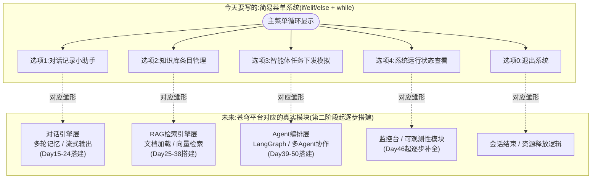
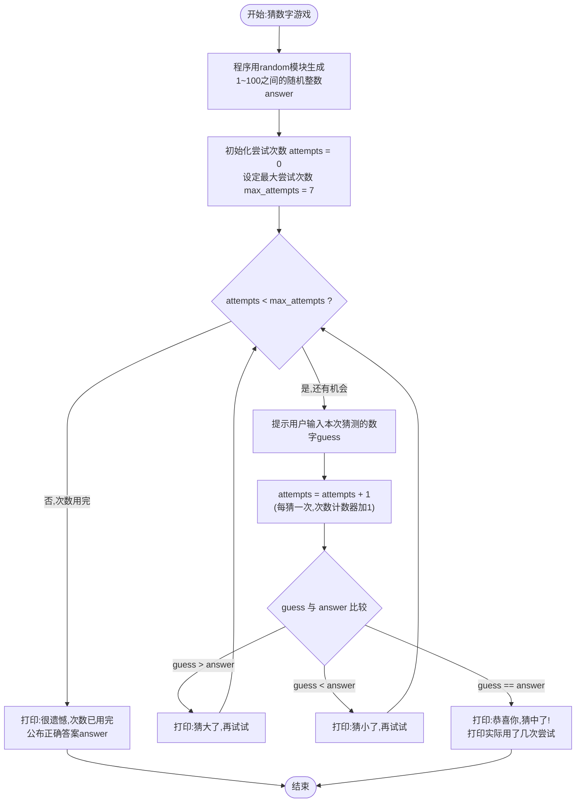
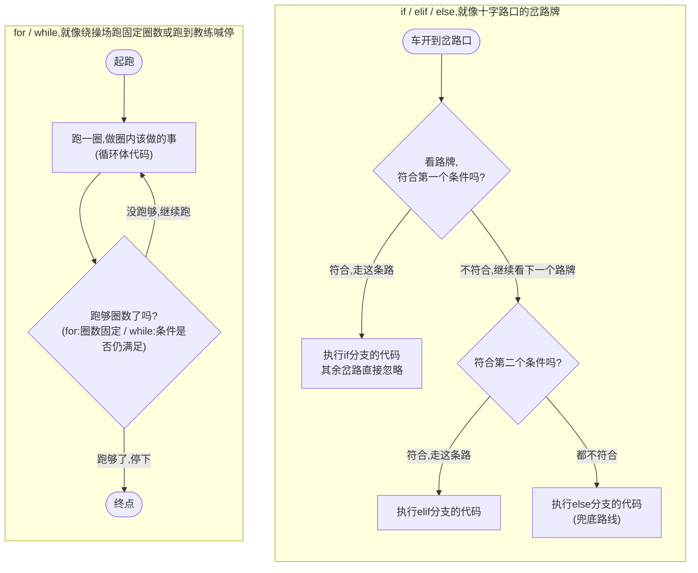

# 第3天 · 流程控制

> **周次/Sprint**:Sprint 0 · 新人内训(Day1-14)—— 阶段项目一:命令行多轮对话AI助手(预计Day14交付)
> **星期**:周三
> **学员**:陈铭、苏梦、韩露、张凡(本期技术培训生小组,导师:王振宇)
> **内训任务卡**:PYXT-ONB-D03(蓬远科技培训中心 · 新人训练营 · Day03)
> **今日关键词**:if/elif/else / 嵌套条件 / while循环 / for循环 / range / break与continue / 猜数字游戏 / 九九乘法表 / 简易菜单系统 / LeetCode实战两题

---

## 【旁白】

写代码这件事,前两天陈铭学到的东西,说穿了都是"陈述句"——变量是陈述"这里放着什么",字符串方法是陈述"把这段文字变成另一段文字"。程序从上到下,一行读完读下一行,像一份没有感情的说明书。今天开始,情况变了。if语句第一次让代码有了"判断力"——遇到不同的情况,走不同的路;while和for第一次让代码有了"重复的耐心"——一件事,不用你写十遍,让计算机自己转十遍圈。这两件事合在一起,才第一次让"程序"这个词开始名副其实:它不再只是一份说明书,它开始像一个会看情况办事、会不厌其烦重复劳动的小员工。

如果把七十天的故事拉到很远的地方回看,今天这一页毫不起眼——没有客户、没有API、没有向量数据库,只有一个猜数字的小游戏和一张乘法表。但老王多次讲过一句话,今天会第一次被验证:"你们今天写的每一个if,每一个while,以后都会在某个更复杂的地方原样出现,只是换了一件更专业的外套。"三十八天后,RAG系统里那句"如果检索不到相关内容,就诚实地告诉用户'不知道',而不是编答案"——那是一个if。三十九天后,ReAct Agent那套"感知、思考、行动,如果任务没完成就继续循环,如果完成就退出"——那是一个while。第四十一天,LangGraph里让人又爱又恨的"条件边"——本质上还是今天这套if/elif/else的思路,只是画在了图上而不是写在代码里。今天学的东西朴素,朴素到有点让人心里没底,但正是这份朴素,撑住了后面几十天所有看起来很酷的东西。

这一天还有另一层意义,虽然不写在任何课程大纲里——这是陈铭第一次因为帮同伴解决问题,而不是自己解决自己的问题,收获了对知识更深一层的理解。人教人,和自己憋着学,是两种完全不同的理解方式,前者往往逼着你把一个模糊的直觉,重新组织成一句能让别人听懂的话,这个"重新组织"的过程,常常比"我自己搞懂了"更接近真正的掌握。这一天,陈铭帮苏梦排查了两个典型的新手bug,他后来在笔记里写道:"我发现我讲给她听的时候,自己对range()和while循环的理解,比我自己一个人啃书的时候清楚了不止一点。"这种协作式的学习方式,会在后面的七十天里反复出现——代码互评、小组结对、项目组内的相互Debug,今天不过是这条线索最早的一个起点。

---

## 晨会纪要 / 今日目标

**时间**:上午8:55,二层小会议室"起航"
**出席**:王振宇(老王)、陈铭、苏梦、韩露、张凡

老王进门时手里端着的还是那杯没什么味道的美式,不过他今天多带了一样东西——U盘,里面是昨天四个人各自提交的"文本清洗小工具"。他把投影打开,先不说话,把苏梦的代码投在了墙上。

"我先说昨天的东西。"老王开场没有寒暄。"你们四个昨天的文本清洗工具,基本功能都做出来了——去空格、统一大小写、敏感词替换,能跑。但我昨晚挨个看了一遍代码,发现了一个几乎所有人都没处理好的问题。"他把苏梦的代码往下滚动了两屏,停在了"敏感词替换"那一段。

**昨天进展**:
- 四人均完成文本清洗小工具的三项基础功能(去除多余空格、统一大小写、敏感词替换),整体思路正确,字符串方法(`strip`/`split`/`join`/`replace`/`format`)的使用基本熟练。
- 陈铭额外多做了一版用f-string重写格式化输出的加强版,得到老王简短肯定。
- 张凡的代码里出现了一个隐蔽bug:用`replace()`替换敏感词时,替换后的文本里"新长出来"的字符又刚好凑成了另一个敏感词的一部分(比如把"垃圾"替换成"*"号之后,某些拼接场景导致误判),昨晚已经在群里提醒但张凡还没来得及修复。
- 苏梦在敏感词替换上,写了四段几乎一样的`replace()`语句,分别处理四个不同的敏感词,老王指出"这样写,以后敏感词库扩展到几十个、上百个,你要写几十行几乎相同的代码,这不是长久之计"。

老王把这个问题抛给全场:"我问你们一个问题——如果客户给我们的文档,有的是产品说明书、有的是客服聊天记录、有的是财务报表,这三类文档要用的清洗规则完全不一样,产品说明书可能要保留专业术语的大小写(比如型号'XJ-3200A'不能被你昨天写的'统一转小写'功能强行改成'xj-3200a'),客服聊天记录则需要更激进地清洗掉表情符号和口语化的重复字,你们的代码,现在有没有办法'看情况'来决定走哪条清洗规则?"

四个人都沉默了几秒,苏梦小声说:"现在的代码是从上到下,所有清洗步骤都会执行一遍,没法'选择性'地跳过某一步。"

老王点头:"对,这就是你们现在最大的短板——代码只会'顺着走',不会'挑着走',更不会'重复走'。今天这一天,咱们就是要解决这两件事:第一,让代码学会'看情况选择该走哪条路',这叫**条件判断**;第二,让代码学会'一件事重复做很多次而不用你手写很多遍',这叫**循环**。这两件事合起来,叫**流程控制**,是编程里比前两天学的东西重要得多的一步——前两天你们学的是'素材',今天开始学的是'骨架'。没有骨架,素材堆得再多也立不起来。"

**今日目标**:
1. 上午:掌握`if`/`elif`/`else`条件判断语句的语法与执行逻辑,理解嵌套条件(nested conditions)的写法与使用场景,重构昨天文本清洗工具中"看情况选择规则"的那部分逻辑。
2. 下午:掌握`while`循环、`for`循环与`range()`函数的用法,理解`break`与`continue`的区别与使用场景;完成猜数字游戏、九九乘法表两个实操项目。
3. 下午收尾:完成简易菜单系统(综合运用if/elif/else与while循环)。
4. 晚自习:完成LeetCode两道简单题的实战练习,尝试多种解法对比。

**风险点**:
- 条件判断和循环是新手最容易"知道语法、不会用"的两个知识点——很多人能背下`if`的写法,但拿到一个具体问题,不知道该用`if`还是`elif`,不知道该用`while`还是`for`。老王打算今天多用对比案例,而不是单独讲语法。
- `while`循环最大的风险是写出"死循环"(infinite loop),四个人电脑性能不同,一旦有人写出死循环,可能会让电脑短时间卡顿甚至需要强制结束程序,今天要提前教会大家`Ctrl+C`强制终止程序的方法。
- 苏梦这两天进度稍慢,老王打算在下午的实操环节,让陈铭和苏梦搭伙互相检查代码——这不完全是"照顾苏梦",老王后来私下跟陈铭说了一句:"你带她过一遍,你自己会更清楚。"

---

## 需求文档:新人训练营 Day3 实训任务书

> 本任务书由技术导师王振宇制定,发放给本期全体培训生。今天不涉及苍穹项目的实际功能开发,属于"内部技术能力练习"性质的任务书,格式仍然沿用公司PRD模板,目的是让新人从入职第一周起,就习惯"先看任务书、再动手写代码"的工作方式,而不是拿到一个模糊的口头要求就直接开始敲键盘。

### 背景

前两天的培训内容(变量、数据类型、运算符、字符串处理),让新人具备了"处理单一数据"的能力,但还不具备"根据不同情况做不同处理"和"批量重复处理"的能力。这两项能力,是几乎所有实际业务逻辑的地基——无论是判断一个客户的会员等级该享受什么优惠,还是批量清洗一千份文档,背后都是条件判断和循环的组合。本次训练任务书围绕if/elif/else、while、for、range、break/continue这几个核心语法点,设计三个循序渐进的实操项目(猜数字游戏、九九乘法表、简易菜单系统),并配套两道LeetCode简单题作为晚自习巩固练习。

### 用户故事

- 作为一名技术培训生,我希望通过"猜数字游戏"这个项目,直观理解`while`循环配合条件判断反复执行、直到满足退出条件的完整逻辑。
- 作为一名技术培训生,我希望通过"九九乘法表"这个项目,掌握`for`循环嵌套的写法,理解外层循环和内层循环各自控制什么。
- 作为一名技术培训生,我希望通过"简易菜单系统"这个项目,把条件判断和循环结合起来,搭建一个能反复接收用户选择、根据选择执行不同功能、直到用户主动退出的完整交互程序,为未来接触真正的产品级交互逻辑打个底。
- 作为技术导师,我希望通过这几个项目,观察新人是否已经建立起"选择用if还是用循环""选择用while还是用for"的基本判断力,而不是死记硬背语法。

### 功能列表

| 编号 | 任务 | 说明 | 验收方式 |
|---|---|---|---|
| T1 | if/elif/else条件判断练习 | 重构昨天文本清洗工具中"根据文档类型选择清洗规则"的逻辑,并额外完成一个"成绩等级判定"小练习(嵌套条件) | 输入不同测试数据,程序都能进入正确的分支,输出符合预期结果 |
| T2 | 猜数字游戏 | 程序随机生成一个1-100之间的整数,用户反复输入猜测,程序给出"大了/小了/猜中了"的提示,直到猜中或达到最大尝试次数 | 至少测试3组不同的猜测路径(先大后小、先小后大、直接猜中),程序行为均正确;超出最大次数后能正常退出并给出正确答案 |
| T3 | 九九乘法表 | 用嵌套for循环打印标准的九九乘法表(1×1=1 到 9×9=81),要求实现至少2种排版格式(完整方阵版、传统三角形版) | 输出内容与手工验证的乘法表完全一致,格式整齐 |
| T4 | 简易菜单系统 | 用while循环+if/elif/else搭建一个不退出就会持续显示菜单、接收用户输入并执行对应功能的命令行系统,至少包含4个功能选项和1个退出选项 | 程序能正确响应每一个菜单选项,遇到非法输入有合理的提示而不会崩溃,选择退出选项后程序能正常结束 |
| T5 | LeetCode实战两题 | 完成"回文数"(LeetCode 9)与"Fizz Buzz"(LeetCode 412)两道简单题,每题至少给出2种不同的解法思路 | 至少用3组测试数据(含边界情况)验证每种解法结果一致且正确 |

### 非功能需求

- **代码规范**:延续前两天的团队规范——变量命名`snake_case`,关键逻辑处必须有中文注释说明"为什么这么判断/为什么这么循环",而不只是"这一行做了什么"。
- **健壮性**:涉及用户输入的地方(猜数字游戏、菜单系统),要考虑用户输入不合法(比如输入了文字而不是数字)的情况,今天暂时不要求用异常处理(那是Day10的内容),但至少要在思考题里讨论这个问题,为后面的异常处理埋一个悬念。
- **可读性优先于炫技**:老王特别强调,今天有些同学可能会去网上搜到"一行流"的高级写法(比如三元表达式、复杂的列表推导式变体),这些内容目前不做要求,能用最朴素的if/for/while写清楚逻辑,比炫技更重要。
- **禁止死循环**:所有`while`循环必须明确写出能让循环终止的条件,并在提交代码前手动测试确认程序能够正常退出。

### 验收标准

1. 猜数字游戏能够处理"猜大了""猜小了""猜中了""超出最大尝试次数"四种结局,且逻辑正确,不出现死循环。
2. 九九乘法表的两种版式输出结果经人工核对,与标准九九乘法表完全一致,不多不少。
3. 简易菜单系统能够循环显示菜单直到用户选择退出,期间任意合法选项都能正确响应,任意非法输入(比如输入字母、超出选项范围的数字)都有明确提示而不崩溃、不退出。
4. LeetCode两道题,每题至少提供2种解法,并用至少3组测试数据(包含正常情况与边界情况)验证正确性。
5. 晚自习结束前,老王在群里对每人提交的代码给出至少一条具体反馈。

### 备注

老王在发这份任务书之前补了一句口头说明:"这份任务书里的每一个'验收方式',其实都在暗示你们一件事——测试用例要自己想,不能只测一种'理想情况'就交作业。以后你们给苍穹平台写代码,测试工程师赵磊会拿着一堆你想不到的边界情况来挑你的bug,现在开始养成'自己先想刁钻输入'的习惯,越早越好。"

---

## 架构设计图:简易菜单系统与苍穹平台未来模块的对应关系

下午写简易菜单系统之前,老王特意先在白板上画了一张图。他说:"你们今天写的菜单系统,看起来就是一个'数字选1234'的小玩具,但我想让你们提前看一眼,这个'数字选1234'的结构,未来会长成什么样子。"



老王讲解的时候,手指着图上那四条虚线:"你们注意,我画的是虚线,不是实线——因为今天这个菜单系统里的四个选项,现在都是'假的',选进去只会打印一句话,不会真的查对话记录,不会真的管理知识库。但这四个选项名字,不是我随便起的,它们分别对应苍穹平台四个真正的核心能力层。你们现在写的if/elif分支判断'用户选了哪个数字,该执行哪块逻辑',这个判断本身的骨架,以后会原样出现在很多地方——比如两个月后你们要写FastAPI的路由,`/chat`请求走对话逻辑,`/knowledge`请求走知识库逻辑,本质上还是'看请求路径选择走哪段代码',只是从'看数字'变成了'看URL路径';再比如四十一天后学LangGraph的'条件边',本质上是'看当前状态该跳转到哪个节点',同样是if/elif的思路,只是画成了一张图而不是写成了代码。"

张凡问了一个很敏锐的问题:"那今天这个菜单系统,是不是可以理解成苍穹控制台的'史前版本'?"

老王笑了:"这个说法我喜欢。控制台上那五个模块——对话工作台、知识库管理、Agent编排、模型管理、监控台——用户点哪个,进哪个界面,本质上也是一个'菜单选择'的过程,只是它长在网页上,用鼠标点,而不是在命令行里敲数字。界面形式变了,但'根据用户的选择,执行对应的逻辑分支'这件事,从今天到发布会那天,都不会变。"

苏梦在笔记本上把这张图工整地抄了一遍,在旁边写了一句:"原来数字1234,后面藏着的是四个真正的产品模块。"

---

## 流程图:猜数字游戏的控制流程

下午实操课正式开始前,老王在群里发了这张流程图,并说:"猜数字游戏和菜单系统,骨架其实是一回事——都是'循环 + 条件判断',区别只是循环的退出条件不一样。你们看这张图的时候,试着把'猜数字'换成'菜单系统的每一轮显示',会发现流程几乎能对上。"



这张图有两个值得停下来看的细节。第一个细节是那个"否/是"的判断菱形——`attempts < max_attempts`,老王特别提醒:"这是while循环的'继续条件',新手最容易搞反的地方是,以为while后面写的是'退出条件',其实恰恰相反,while后面写的是'满足了就继续循环'的条件,一旦这个条件变成False,循环立刻停止。这个方向搞反,是我见过新手在while循环里翻车频率最高的一个坑,今天你们会亲身体会到。"

第二个细节是`F1`和`F2`两个分支,处理完之后都指回了`C`——这个"指回去"的箭头,正是循环的本质:同一段逻辑,反复执行,直到条件不满足。老王说:"你们画流程图的时候,看到一个箭头绕回了上面某个点,那基本就是在暗示你这里需要一个循环结构,而不是从上到下写十遍几乎一样的代码。"

---

## 示意图:条件判断与循环执行过程的可视化类比

条件判断和循环,对完全没有编程背景的人来说,概念本身不难懂,但"程序执行到这里,到底在干什么"这种动态过程,常常想象不出来。老王用了两个不同的类比,分别对应if/elif/else和for/while,画成了下面这张图。



老王讲这张图的时候,特意先讲了if/elif/else那半张图:"你们注意,岔路口的路牌是按顺序看的——先看第一张牌符不符合,符合就直接走,后面的牌根本不会再看。这就是为什么`elif`和`else`不是彼此独立的if,而是'一条路走通了,后面全部跳过'的关系。如果你把它们写成三个独立的`if`,哪怕前面已经走了一条路,后面的if还是会被逐一检查一遍,这不是同一件事,今天下午我会专门用一个例子让你们亲眼看到这个区别有多大。"

讲到for/while那半张图时,他补了一句区分:"操场跑步这个类比里,`for`就像教练说'跑5圈',圈数是提前定好的,跑完5圈准时停;`while`更像教练说'跑到我喊停为止',你不知道具体要跑几圈,只知道一个持续成立的条件——教练还没喊停。这两种'停下来的方式'不一样,决定了你写代码时该选哪一个:如果你明确知道要重复几次,选`for`;如果你不知道要重复几次,只知道'满足什么条件就继续',选`while`。今天的猜数字游戏,严格说你不知道用户会猜几次才对,所以它天然更适合用`while`;而九九乘法表,你明确知道要打印1到9这9行9列,天然更适合用`for`。"

---

## 课堂笔记

### 上午:条件判断——让代码学会"看情况办事"

**9:20,培训室**

晨会结束,四个人回到工位,老王没有马上讲新内容,而是先花了十分钟,带大家把昨天的文本清洗小工具"翻译"成今天要学的语言——他管这个环节叫"预告式复盘",意思是"用还没学过的东西提前对照一下问题所在,等学完了新知识,你会有一种'原来这里缺的就是它'的顿悟感"。

他把苏梦昨天写的敏感词替换代码投在墙上:

```python
text = text.replace("垃圾", "**")
text = text.replace("差评", "**")
text = text.replace("骗子", "**")
text = text.replace("退款", "**")
```

"这段代码,能跑,结果也对。但它有个特点——不管输入的文本里有没有这些词,四行`replace()`都会被执行一遍。如果这个敏感词库以后扩展到两百个词,你要写两百行几乎一样的`replace()`吗?"

苏梦摇头:"肯定不行,但我现在也不知道怎么才能不这样写。"

"今天下午你会学到一个东西,叫`for`循环,配合一个叫`列表`的容器(那是明天的内容,今天先不展开),两百个敏感词可以用几行代码搞定,不用手写两百次。但在那之前,先解决一个更基础的问题——**条件判断**。"老王切了一张新的幻灯片,只有一句话:"程序需要具备'看情况选择该做什么'的能力,这个能力,叫if语句。"

#### 一、if语句:最基础的条件判断

老王打开VS Code,直接开始写代码,一边写一边讲。

```python
score = 85

if score >= 60:
    print("恭喜,及格了")
```

"`if`后面跟一个能判断出True或False的表达式,记不记得昨天讲的比较运算符?`>=`、`<=`、`==`、`!=`,这些运算符算出来的结果,天然就是一个布尔值。`if`后面必须跟一个冒号,然后下一行开始,凡是属于这个`if`分支要执行的代码,都要往右缩进(团队规范统一缩进4个空格,不要用Tab键,也不要Tab和空格混用)。"

他现场演示了一个新手极容易犯的错误——忘记写冒号:

```python
score = 85

if score >= 60
    print("恭喜,及格了")
```

运行后报错:

```
  File "if_demo.py", line 3
    if score >= 60
                  ^
SyntaxError: expected ':'
```

"这个报错非常直白——'期望这里有一个冒号',补上就好。"老王说,"这种报错以后你们几乎不会再犯,因为VS Code装的插件通常会在你没写冒号的地方标红提醒,但我还是想让你们亲眼看一次,知道这类报错长什么样。"

**if的执行逻辑到底是什么**

老王强调了一个新手常常"表面懂但没真懂"的点:"`if`判断的表达式,只要不是严格的False,大多数情况会被当作True来处理,但你们目前只需要记住最核心的用法——用比较运算符或者布尔变量,不要用一些'看起来很聪明但容易出岔子'的写法。"他举了个例子:

```python
# 下面这行代码,虽然能跑,但不建议这样写
is_member = True
if is_member == True:
    print("是会员")

# 更简洁、更符合Python风格的写法
if is_member:
    print("是会员")
```

"`is_member`本身已经是一个布尔值了,`if is_member:`已经足够表达'如果is_member是True',再加一个`== True`是多余的,虽然结果一样,但老手看到`== True`这种写法,会下意识觉得你对布尔值的理解还没到位。这算是个小的代码风格提醒,不算硬性错误。"

#### 二、if...else:两条路必须走一条

"刚才那个例子有个问题,"老王继续说,"如果分数没到60分呢?什么都不会打印,程序悄无声息地跑完了,这不符合我们的预期——不及格,好歌也得告诉用户一句'不及格'。"

```python
score = 55

if score >= 60:
    print("恭喜,及格了")
else:
    print("很遗憾,没有及格")
```

"`else`不需要跟任何判断条件,它的意思是'上面if的条件不满足时,走这一条路'。`if`和`else`合起来,构成了一个'非此即彼'的完整分支——两条路,必须走一条,不会有第三种可能。"

苏梦提了个问题:"那如果我把`else`去掉,只写一个`if`会怎样?"

老王直接现场删掉`else`部分演示:

```python
score = 55

if score >= 60:
    print("恭喜,及格了")

print("本次判断结束")
```

运行结果:

```
本次判断结束
```

"你看,`if`条件不满足,里面的代码就直接被跳过,程序接着往下执行`if`外面的代码。所以只写`if`不写`else`,不会报错,只是'不满足条件时什么都不打印',这在某些场景是合理的(比如'如果有异常就报警,没有异常什么都不做'),但今天这个及格判断的场景,加上`else`更符合业务预期。"

#### 三、if...elif...else:超过两条路怎么办

"及格不及格,是两种结果。但成绩往往要分好几个等级——优秀、良好、及格、不及格,四种结果,`if...else`处理不了这么多分支,这时候需要`elif`。"

老王写下了一个成绩等级判定的例子,这个例子后面会贯穿一整个上午,反复用来讲解各种细节:

```python
score = 78

if score >= 90:
    print("等级:优秀")
elif score >= 75:
    print("等级:良好")
elif score >= 60:
    print("等级:及格")
else:
    print("等级:不及格")
```

"运行一下,`score = 78`,会打印`等级:良好`。`elif`是`else if`的缩写,意思是'如果前面的if条件不满足,再看看这个条件满不满足'。你可以写任意多个`elif`,最后可以选择性地加一个`else`作为兜底——如果前面所有条件都不满足,就走`else`这条路。"

**执行顺序的关键细节:自上而下,一旦命中就停止**

老王重点强调了这一段的执行逻辑,因为这正是他昨天在架构图讲解里提到的"岔路口路牌"类比的核心:"注意`elif score >= 75`这一行,它的完整含义其实是'在score不满足>=90的前提下,判断score是否>=75'。所以哪怕score等于95,走到`elif score >= 75`这一行的时候,压根不会被检查——因为第一个`if score >= 90`已经命中,后面所有的elif和else都会被直接跳过。"

他现场做了一个实验,把顺序反过来写,让大家亲眼看到"顺序错了,结果全错"的现象:

```python
# 反面示范:elif的判断顺序写反了
score = 95

if score >= 60:
    print("等级:及格")
elif score >= 75:
    print("等级:良好")
elif score >= 90:
    print("等级:优秀")
else:
    print("等级:不及格")
```

运行结果:

```
等级:及格
```

"95分,理应是优秀,结果打印出来的是'及格'。问题出在哪?因为我把范围最宽的条件(`score >= 60`)放在了最前面,95分虽然也满足'优秀'的条件,但它首先满足了'及格'这个条件,而`if/elif/else`一旦命中一个分支就不会再往下检查,所以后面的'良好''优秀'判断根本没有机会被执行到。"

"这是新手在使用多重elif时最容易犯的错误——**条件之间如果有重叠关系(比如分数区间层层嵌套),一定要把范围最窄、最严格的条件放在最前面,范围最宽的放在最后面兜底。**"

张凡在这里追问了一句:"那如果条件之间完全不重叠呢,比如判断一个数字是1、2还是3,顺序还重要吗?"

老王点头:"如果条件彼此互斥、不存在重叠关系,顺序确实不影响结果,但即便如此,我还是建议大家养成'范围小的往前放、兜底的往后放'的书写习惯,因为这个习惯在'条件互斥'和'条件有重叠'两种场景下都适用,不用每次都重新判断一遍要不要调整顺序,减少犯错概率。"

**FAQ:if/elif/else常见疑问**

老王讲完基础语法后,顺着大家现场提的问题,整理了几条常见疑问,陈铭在笔记里原样记录了下来:

1. **问:elif可以写多少个?有没有数量限制?**
   答:语法上没有限制,理论上你可以写几十个elif。但实际工程里,如果一段if/elif链条超过5-6个分支,通常意味着这段逻辑该重新设计了——后面会学到的字典查表、函数拆分等手段,都能替代过长的elif链条,让代码更清晰。今天先不展开,记住"太多elif不是好现象"这个直觉即可。

2. **问:if和elif后面,能不能同时判断多个条件?**
   答:可以,用`and`、`or`这两个逻辑运算符组合多个条件,昨天(Day2)已经学过这两个运算符,今天会有专门的例子展示它们和if结合使用的场景。

3. **问:else是不是必须写?**
   答:不是必须的。如果没有"兜底"的需求,只写if(或if+若干elif)是完全合法的,只是不满足任何条件时,程序不会执行任何分支,直接跳过。

4. **问:if里面能不能再写一个新的if?**
   答:可以,这正是接下来要讲的"嵌套条件",几分钟后会详细展开。

5. **问:if判断的时候,能不能直接判断一个字符串或者数字,而不是用比较运算符?**
   答:技术上可以,比如`if user_name:`,只要`user_name`不是空字符串(空字符串在Python里会被判定为False),这个判断就会通过。但今天阶段,建议大家优先用清晰的比较表达式(`if user_name != "":`),等大家对"哪些值会被自动判定为False"这个规则更熟悉之后,再考虑用简写方式,现在图省事容易埋雷。

#### 四、嵌套条件:if里面还能再套一层if

讲完基础的if/elif/else,老王引入了嵌套条件(nested conditions),用了一个更贴近真实业务场景的例子——模拟一个简化版的"用户登录校验"逻辑,这个例子特意选在了这里,因为它跟后面苍穹平台真实存在的`/auth`鉴权接口有直接的呼应关系。

```python
# 模拟一个简化版的登录校验逻辑
# 真实的用户名和密码通常存在数据库里,今天还没学数据库,先用固定值模拟
correct_username = "chenming"
correct_password = "cangqiong2024"

input_username = input("请输入用户名:")
input_password = input("请输入密码:")

if input_username == correct_username:
    # 用户名对了,再往下判断密码是否正确
    # 这一层if,是嵌套在外层if内部的"第二层判断"
    if input_password == correct_password:
        print("登录成功,欢迎回来!")
    else:
        print("密码错误,请重新输入。")
else:
    print("用户名不存在。")
```

"这段代码里,有两层if,外层判断用户名,内层判断密码,内层的if只有在外层if的条件成立(用户名正确)时,才会被执行。"老王解释,"这就是嵌套条件——把一个大的判断问题,拆成'先判断第一层,再判断第二层'的结构,每一层负责一个相对独立的小问题。"

苏梦提问:"这个和写多个elif有什么本质区别?为什么不直接用一堆elif判断'用户名对且密码对''用户名对但密码错''用户名错'这三种情况?"

这是个很好的问题,老王给出了对比示范:

```python
# 方式一:用嵌套if(层层深入)
if input_username == correct_username:
    if input_password == correct_password:
        print("登录成功")
    else:
        print("密码错误")
else:
    print("用户名不存在")

# 方式二:用and组合成一个平铺的条件,配合elif
if input_username == correct_username and input_password == correct_password:
    print("登录成功")
elif input_username == correct_username and input_password != correct_password:
    print("密码错误")
else:
    print("用户名不存在")
```

"两种写法,结果完全一样。"老王说,"但你们对比一下可读性——方式二里,`input_username == correct_username`这个条件,重复写了两遍,而且随着判断的维度增多(比如以后还要判断账号是否被封禁、是否需要验证码),平铺的写法会让条件表达式越来越长、越来越难读。嵌套写法的好处是,'先确认大前提成立,再往细节判断'的逻辑层次感更强,尤其是当判断的维度天然带有'先后关系'(比如必须先确认用户名存在,才有资格判断密码)时,嵌套结构会更自然。今天没有绝对的对错,但你们要建立起'遇到有先后依赖关系的多重判断,可以考虑嵌套'这个意识。"

**嵌套条件的缩进陷阱**

老王特别提醒了一个嵌套条件里最容易出错的地方——缩进层级混乱。他现场演示了一个错误示范:

```python
input_username = "chenming"
input_password = "wrong_password"

if input_username == correct_username:
    if input_password == correct_password:
        print("登录成功")
        else:
        print("密码错误")
else:
    print("用户名不存在")
```

运行后报错:

```
  File "login_demo.py", line 8
    else:
    ^^^^
SyntaxError: invalid syntax
```

"这里的问题是,内层的`else`应该和内层的`if password ==`对齐(缩进8个空格),但我故意写成了先缩进8个空格打印'登录成功',然后`else`又缩进回8个空格——看起来对齐了,但它实际对应的是外层的哪个if,还是内层的哪个if,Python分析不清楚,直接报语法错误。嵌套层级一旦超过两层,新手极容易在缩进上犯迷糊,我的建议是:每加一层嵌套,先把这一层的`if...else`骨架写完整、对齐好,再往里面填内容,不要一边写内容一边加嵌套层级,容易乱。"

#### 五、and、or在条件判断中的实战组合

老王把昨天学过的逻辑运算符`and`、`or`、`not`重新拿出来,结合if语句做了几组实战演示,巩固"逻辑运算符的结果本身就是给if用的"这个认知。

```python
age = 25
has_id_card = True

# and:两个条件必须同时满足
if age >= 18 and has_id_card:
    print("可以办理业务")
else:
    print("不满足办理业务的条件")

# or:两个条件满足任意一个即可
member_level = "普通会员"
order_amount = 350

if member_level == "黄金会员" or order_amount >= 300:
    print("本次订单可以使用免运费券")
else:
    print("本次订单不满足免运费条件")

# not:对条件取反
is_blacklisted = False

if not is_blacklisted:
    print("允许下单")
else:
    print("账户异常,禁止下单")
```

"这三个例子,分别对应三种最常见的业务判断模式,"老王说,"`and`常用在'多个必要条件缺一不可'的场景,比如办理业务既要年满18岁,又要有身份证;`or`常用在'满足任意一个就够了'的场景,比如免运费券,黄金会员身份和订单金额达标,满足任意一条就行;`not`常用在'排除法'的场景,比如'不是黑名单用户就允许下单',这种表达方式有时候比正着写更符合业务描述的原话。"

**运算符优先级的一个真实报错案例**

老王讲了一个他自己早年踩过的坑,作为案例分享给大家:

```python
# 一段容易被误读的条件表达式
score = 65
is_retake = True

if score >= 60 and not is_retake or score >= 90:
    print("通过")
else:
    print("未通过")
```

"这段代码的判断意图,原本是想表达'正常分数及格且不是补考,或者分数够优秀(哪怕是补考也认可)才算通过'。但`and`、`or`、`not`混在一起写的时候,运算符优先级(`not` > `and` > `or`)如果不熟悉,很容易读错这句话的真实含义,进而写出和预期不一致的判断逻辑。我的建议是——凡是`and`和`or`混用的复杂条件,**主动加括号**,哪怕语法上不加括号也不会报错,加了括号能让人一眼看出你的判断意图,也能避免自己以后回头看代码时都要重新推理一遍优先级。"

修改后的写法:

```python
if (score >= 60 and not is_retake) or (score >= 90):
    print("通过")
else:
    print("未通过")
```

"括号加上之后,这句话的意思一目了然——'及格且非补考'是第一种通过路径,'分数达到90'是第二种通过路径,两条路径满足任意一条就通过。这个习惯,你们今天记下来,以后写复杂的业务判断逻辑,永远比省几个字符更重要。"

#### 六、把今天的知识用回昨天的问题:重构文本清洗工具

上午最后半小时,老王让大家真正动手,把开场时提到的"敏感词替换该有选择性"的问题,用今天学的if语句重新设计一版。他给的思路提示是:"不要求你们现在就用循环批量处理(那是下午和明天的内容),但至少可以先用if判断'这段文本属于什么类型',再决定走哪套清洗规则。"

陈铭写出的版本大致是这样(完整版本见"代码实战"部分):

```python
doc_type = input("请输入文档类型(产品说明书/客服聊天记录/财务报表):")
raw_text = input("请输入待清洗的文本:")

if doc_type == "产品说明书":
    # 产品说明书需要保留专业术语的大小写(比如型号编号),只做首尾空格清理
    cleaned_text = raw_text.strip()
    print("已按'产品说明书'规则清洗(保留大小写):", cleaned_text)
elif doc_type == "客服聊天记录":
    # 客服聊天记录清洗更激进:去空格 + 统一转小写,便于后续统一检索
    cleaned_text = raw_text.strip().lower()
    print("已按'客服聊天记录'规则清洗(统一小写):", cleaned_text)
elif doc_type == "财务报表":
    # 财务报表场景,数字和金额格式敏感,这里只做保守的首尾空格清理
    cleaned_text = raw_text.strip()
    print("已按'财务报表'规则清洗(保守处理):", cleaned_text)
else:
    print("未识别的文档类型,暂不做任何清洗处理。")
    cleaned_text = raw_text
```

老王看过陈铭这个版本后,给了一个中肯的评价:"骨架对了,这就是你们今天上午该掌握的东西——条件判断本身没有什么'炫技'的空间,重要的是判断逻辑要覆盖到位、不重叠、有兜底。这段代码明天学完列表之后,还会继续升级,能处理的敏感词、能识别的文档类型都会更多,但今天这一步,是从'代码只会顺着走'到'代码会看情况选路'的第一步,意义比代码量本身大得多。"

11:40,上午的内容在这里收尾,老王照例留了个悬念:"下午,咱们要解决另一件事——重复。你们发现没有,上午写的这些代码,不管多复杂,从头到尾只会执行一次。如果我要你们把'1加到100'这个式子算出来,按你们现在学的东西,你们得写100个加号,这显然不现实。下午我教你们怎么让代码'自己转圈'。"

---

### 下午:循环——让代码学会"不厌其烦"

**14:00,培训室**

午饭后,老王没有直接讲语法,先在白板上写了一道很朴素的算术题:"1加到100等于多少?"

苏梦很快答:"5050。"

"算得挺快,"老王笑了,"但我要的不是答案,我要的是——如果让你写Python代码算出这个结果,按你们现在学过的东西,你打算怎么写?"

张凡想了想说:"`total = 1 + 2 + 3 + ... `一直加到100?"

"对,这就是问题所在——你要手写100个数字相加,这现实吗?更现实的是,如果我把需求换成'1加到10000',或者'加到一个用户输入的任意数字',你这100个加号的写法,直接就废了。"老王停顿了一下,"今天下午要学的两种循环——`while`和`for`,解决的正是这个问题:**让计算机替你重复执行同一段逻辑,重复多少次由你控制,而不是你手写多少遍。**"

#### 一、while循环:条件成立就一直转

老王先写了一个最基础的while循环示范,把"1加到100"这道题正式实现出来:

```python
total = 0      # 用来累加总和的变量,初始值必须是0(如果不初始化,后面直接做加法会报NameError)
number = 1     # 从1开始累加

while number <= 100:
    total = total + number    # 把当前的number累加进total
    number = number + 1       # 每循环一次,number自增1,这一步绝对不能漏

print("1加到100的结果是:", total)
```

运行结果:

```
1加到100的结果是: 5050
```

"这段代码,"老王一边讲一边在白板上画执行过程,"`while number <= 100:`是循环的'继续条件',只要这个条件成立,循环体(缩进的那两行)就会反复执行。第一次进入循环,`number`是1,`total`累加成1,然后`number`自增变成2;第二次循环,判断`2 <= 100`依然成立,`total`累加成3,`number`变成3……这个过程一直重复,直到`number`变成101,这时候`101 <= 100`不成立了,循环立刻停止,程序往下执行`print`那一行。"

**while循环最致命的坑:死循环**

老王话锋一转:"现在我把刚才代码里的一行故意删掉,你们看会发生什么。"他删掉了`number = number + 1`这一行:

```python
# 危险代码,不要直接运行!这是故意演示死循环的反面案例
total = 0
number = 1

while number <= 100:
    total = total + number
    # number = number + 1   # 这一行被删掉了!
```

"如果我现在直接运行这段代码,会发生什么?"老王没有立刻运行,先让大家猜。

韩露反应很快:"number永远是1,`1 <= 100`永远成立,这个循环永远不会停。"

"对,这就是**死循环(infinite loop)**——`while`的继续条件永远成立,循环永远不会退出,程序会一直卡在这里,`total`会一直累加下去,数值越来越大,占用的计算资源也会越来越多,直到你手动终止程序,或者电脑资源耗尽。"老王没有在自己电脑上演示这段死循环,而是叮嘱大家:"我不建议你们真的运行这段代码试错,但我要教你们一件更重要的事——**万一不小心写出了死循环,怎么把程序停下来。**"

他演示了终止方法:"在VS Code的终端窗口里,或者任何命令行窗口,按`Ctrl+C`(Mac上通常也是`Control+C`,不是`Command+C`),就能强制终止当前正在运行的程序。这是你们接下来几十天会反复用到的一个'保命快捷键',尤其是写`while`循环和后面学到的Agent循环的时候。"

苏梦记下了这个快捷键,还在旁边画了个小星标。她没想到,这个快捷键会在半小时后,真正救她一次。

**while循环的三个必要元素**

老王总结了写`while`循环必须具备的三个要素,让大家抄进笔记:

1. **初始化**:循环开始之前,要先给"继续条件"里涉及的变量赋一个初始值(比如`number = 1`)。
2. **继续条件**:`while`后面跟的表达式,决定循环是否继续执行。
3. **状态更新**:循环体内部,必须有让"继续条件"最终会变成False的操作(比如`number = number + 1`),否则就是死循环。

"这三个要素,少了任何一个,`while`循环要么根本不会执行(比如条件一开始就是False),要么会死循环(缺少状态更新)。你们以后看到任何一个`while`循环,可以下意识地用这三点去检查——初始值对不对,条件写得对不对,循环体里到底有没有真的往'让条件变False'这个方向推进。"

#### 二、猜数字游戏(第一版):while循环的完整实战

讲完基础语法,老王直接进入第一个实操项目——猜数字游戏。他先给了一个最基础的框架,让大家在这个框架上迭代。

```python
import random   # random是Python标准库自带的模块,用来生成随机数

# 生成一个1到100之间的随机整数作为答案(包含1和100两端)
answer = random.randint(1, 100)

print("我已经想好了一个1到100之间的数字,你来猜猜看!")

guess = int(input("请输入你猜的数字:"))

while guess != answer:
    if guess > answer:
        print("猜大了,再试试")
    else:
        print("猜小了,再试试")
    guess = int(input("请输入你猜的数字:"))

print("恭喜你,猜中了!答案就是", answer)
```

老王讲解这段代码的时候,特别强调了`while guess != answer:`这一行:"这里的继续条件是'猜的数字不等于答案',换句话说,只要没猜中,就一直循环;一旦猜中了,`guess != answer`变成False,循环自动停止,不需要你额外写`break`。这是`while`条件判断本身就足够表达'猜中就退出'这个逻辑的一个好例子。"

苏梦一边听一边动手跟着写,写完之后自己在终端里试了一轮,猜了三次猜中了,她说:"这个感觉挺神奇的,程序真的会一直陪我'猜'到猜中为止。"

#### 三、for循环与range():明确次数的重复

"while循环适合'不知道要重复几次,只知道啥时候停'的场景,"老王切入下一个话题,"但很多场景,你其实提前就知道要重复几次——比如'打印1到9'、'重复问用户5次问题'。这种场景,用`for`循环配合`range()`函数,写法会更简洁。"

他先演示了`range()`的基本用法:

```python
# range(5) 会生成 0, 1, 2, 3, 4 这五个数字,注意不包含5本身
for i in range(5):
    print(i)
```

运行结果:

```
0
1
2
3
4
```

"这是新手最容易搞错的地方——`range(5)`不是'从1数到5',而是'从0数到4,一共5个数字'。`range()`默认从0开始,并且**不包含**你写的那个终止数字。"

他接着演示了`range()`的另外两种写法:

```python
# range(起始值, 终止值):从起始值开始,到终止值前一个数字结束(不包含终止值)
for i in range(1, 6):
    print(i)
# 输出:1 2 3 4 5

# range(起始值, 终止值, 步长):按指定的步长递增(或递减)
for i in range(1, 10, 2):
    print(i)
# 输出:1 3 5 7 9(每次加2)

for i in range(10, 0, -1):
    print(i)
# 输出:10 9 8 7 6 5 4 3 2 1(步长为负数,表示递减)
```

"三种写法,老王补充说,"分别对应'只给终止值(默认从0开始,步长为1)''给起始和终止值''给起始、终止和步长'三种常见需求。今天你们要记住的核心规则就一句话:**`range()`是左闭右开区间**——包含起始值,不包含终止值。"

**for循环遍历字符串:昨天知识的自然延伸**

老王顺势回顾了昨天学过的字符串,展示`for`循环还能直接遍历字符串里的每一个字符:

```python
company_name = "蓬远科技"

for char in company_name:
    print(char)
```

运行结果:

```
蓬
远
科
技
```

"这是`for`循环另一种常见写法——不用`range()`,直接对一个可以'一个一个数'的东西(专业说法叫'可迭代对象',这个词今天先混个脸熟,不用深究)进行遍历,每一轮循环,`char`会依次变成这个字符串里的每一个字符。明天(Day4)你们会学到列表,列表也可以用这种写法直接遍历,思路完全一样。"

#### 四、九九乘法表:for循环嵌套的第一次真正实战

"接下来这个项目,"老王说,"是检验你们是不是真的理解了`for`循环——九九乘法表。这道题看起来是小学内容,但对新手来说,是嵌套循环最好的练习场。"

他先带大家梳理需求:"乘法表有9行,每一行的列数不一样——第1行只有1列(1×1=1),第2行有2列(2×1=2,2×2=4),以此类推,第9行有9列。这意味着我们需要**两层循环**:外层循环控制'第几行',内层循环控制'这一行打印到第几列'。"

```python
# 九九乘法表(标准三角形版):第i行打印i列
for i in range(1, 10):          # 外层循环,控制行号,从1到9
    for j in range(1, i + 1):   # 内层循环,控制列号,从1到i(注意这里是i不是9)
        # end=" "让每次打印后不换行,而是用空格分隔,方便同一行连续打印多个乘法式
        print(f"{j}×{i}={j * i}", end="  ")
    print()   # 内层循环跑完一整行之后,手动换行,开始下一行
```

运行结果(节选前三行):

```
1×1=1  
1×2=2  2×2=4  
1×3=3  2×3=6  3×3=9  
...
```

老王重点讲了`range(1, i + 1)`这一句:"内层循环的终止值,不是一个固定数字,而是**外层循环当前的变量`i`**,并且要加1,因为`range()`不包含终止值本身。第一行`i=1`的时候,内层是`range(1, 2)`,只会跑一次(j=1);第二行`i=2`,内层是`range(1, 3)`,会跑两次(j=1,j=2)。这种'内层循环的范围依赖外层循环当前的值'的写法,是嵌套循环里最关键、也最容易让新手犯迷糊的地方。"

**完整方阵版:换一种需求,代码怎么调整**

老王又给了一个变体需求:"如果客户(这里就是我)要求打印一个9×9的完整方阵,每一行都打印9个乘法式,该怎么改?"

```python
# 九九乘法表(完整方阵版):每一行都打印9列
for i in range(1, 10):
    for j in range(1, 10):     # 内层循环固定为1到9,不再依赖外层的i
        print(f"{j}×{i}={j * i:>3}", end="  ")   # :>3表示结果按3位宽度右对齐,让排版整齐
    print()
```

"对比这两版代码,唯一的区别就在内层`range()`的终止值——一个依赖外层变量`i`,一个是固定的9。这个对比能帮你们理解:**嵌套循环的'内层range范围',完全取决于业务需求本身长什么样,不是死记硬背的语法,而是要先想清楚'我要的最终效果是什么样',再倒推该怎么写range。**"

#### 五、break与continue:提前退出与跳过本轮

"循环讲到现在,还差最后一块拼图——有时候你不想让循环乖乖跑完所有次数,而是想'提前退出'或者'跳过这一轮,直接进入下一轮',这就是`break`和`continue`要解决的问题。"

老王用了一个查找质数(素数)的小例子来讲解:

```python
# 找出1到20之间的所有质数(质数:只能被1和自身整除的大于1的整数)
for num in range(2, 21):
    is_prime = True    # 先假设num是质数,一旦找到反例就改成False

    for divisor in range(2, num):
        if num % divisor == 0:
            # 找到了一个能整除num的数,说明num不是质数
            is_prime = False
            break     # 已经确定不是质数,没必要再继续往下试其他除数,直接跳出内层循环

    if is_prime:
        print(num, "是质数")
```

"`break`的作用是**立刻终止当前所在的这一层循环**,不再执行循环体里剩下的代码,也不再判断继续条件,直接跳到循环外面。"老王解释,"这段代码里,一旦发现`num`能被某个`divisor`整除,就已经证明它不是质数,继续往下试其他除数是浪费时间,`break`能立刻停止这种无意义的重复。"

接着他演示了`continue`:

```python
# 打印1到10之间所有的偶数,用continue跳过奇数
for num in range(1, 11):
    if num % 2 != 0:
        continue    # 如果是奇数,跳过本次循环剩下的代码,直接进入下一次循环
    print(num, "是偶数")
```

"`continue`和`break`不一样,它不会终止整个循环,只是**跳过本轮循环体里剩下的代码,直接进入下一轮循环的判断**。这段代码里,遇到奇数就`continue`,跳过下面的`print`,直接看下一个数字;遇到偶数则正常执行`print`。"

**break与continue的对比表**

老王让大家把这张对比表抄进笔记,他说这是"新手最容易混淆,但一旦分清楚就再也不会错"的知识点:

| 关键字 | 作用范围 | 效果 | 类比 |
|---|---|---|---|
| `break` | 终止**整个**当前循环 | 循环直接结束,跳到循环外面继续执行后面的代码 | 跑步比赛中途觉得没戏了,直接退赛离场 |
| `continue` | 只影响**本轮**循环 | 跳过本轮循环体里剩下的代码,但循环本身继续,进入下一轮判断 | 跑步比赛中这一圈脏水坑绕不过去,干脆跳过这一圈的计时,下一圈接着跑 |

"还有一个细节要提醒,"老王补充,"如果是嵌套循环,`break`和`continue`默认只作用于它们**所在的那一层**循环,不会影响外层循环。刚才找质数的例子里,内层的`break`只会跳出内层的`for divisor in range(...)`,外层的`for num in range(...)`会继续正常往下执行到下一个num,这是嵌套循环里另一个容易搞混的细节。"

#### 六、猜数字游戏(升级版):加入尝试次数限制与break

有了`break`,老王让大家回头改造上午写的猜数字游戏——原来的版本猜不中就无限猜下去,现实中通常要限制最大尝试次数。

```python
import random

answer = random.randint(1, 100)
max_attempts = 7      # 最多允许猜7次
attempts = 0           # 记录已经猜了多少次

print("我已经想好了一个1到100之间的数字,你有", max_attempts, "次机会!")

while attempts < max_attempts:
    guess = int(input(f"第{attempts + 1}次机会,请输入你猜的数字:"))
    attempts = attempts + 1   # 每猜一次,计数器加1,这一步绝对不能漏,否则会死循环

    if guess == answer:
        print(f"恭喜你,猜中了!一共用了{attempts}次机会。")
        break     # 猜中了,没必要再继续循环,直接跳出while
    elif guess > answer:
        print("猜大了,再试试")
    else:
        print("猜小了,再试试")
else:
    # while...else语法:如果while循环是正常跑完所有次数结束的(没有被break打断),就会执行这个else
    print(f"很遗憾,{max_attempts}次机会都用完了,正确答案是{answer}。")
```

这里老王专门停下来讲了一个大部分教程都不太会提的语法细节——`while...else`结构:"`while`循环后面,可以跟一个`else`,这个`else`**只有在循环是被'条件不满足'自然结束时才会执行,如果循环是被`break`提前打断的,这个`else`不会执行**。这个语法在猜数字游戏这个场景特别好用——'次数用完还没猜中'和'break提前退出(猜中了)'恰好是两种互斥的结局,用`while...else`能优雅地把两种结局分开处理,不需要额外用一个布尔变量去记录'到底是怎么结束的'。"

张凡说这个语法他还是第一次见,老王笑着说:"这个语法确实比较冷门,很多写了几年Python的人都不知道,但知道了以后,遇到'循环是正常跑完还是被break打断'这种场景,会很顺手。不强制要求你们以后都用这个写法,但今天体验一下,以后自己判断要不要用。"

#### 七、一次真实的协作调试:苏梦的两个bug

**15:40,苏梦的求助**

大家各自在电脑上敲九九乘法表和升级版猜数字游戏的时候,苏梦忽然小声"哎"了一声,盯着屏幕愣住了。陈铭工位就在她旁边,看她表情不对,凑过去问:"怎么了?"

苏梦把屏幕转过来给他看,她写的九九乘法表长这样:

```python
for i in range(9):
    for j in range(9):
        print(f"{j}×{i}={j * i}", end="  ")
    print()
```

打印出来的第一行是:

```
0×0=0  1×0=0  2×0=0  3×0=0  4×0=0  5×0=0  6×0=0  7×0=0  8×0=0  
```

"我明明照着老王的思路写的,为什么全是0?而且乘法表应该是9行,我数了一下我这个好像也不太对。"苏梦有点着急。

陈铭没有直接告诉她答案,而是先问了一句他自己也是刚学会不久、但印象很深的问题:"你这里`range(9)`,生成的是哪几个数字,你确定过吗?"

苏梦想了两秒:"1到9?"

"你现在在自己脑子里手动数一遍,`range(9)`到底是从几开始,到几结束。"陈铭没有直接否定她,而是引导她自己验证。苏梦在终端里试了一下`list(range(9))`(虽然"列表"这个词她还没系统学过,但老王上午提到过可以先用这个方式"偷看"一下range生成的内容),看到输出是`[0, 1, 2, 3, 4, 5, 6, 7, 8]`,她愣了一下:"啊,是从0开始的,不是从1开始,而且到8就停了,没有9!"

"对,这就是问题的根源。"陈铭说,"老王上午特别强调过,`range(9)`不是'从1数到9',是'从0数到8,一共9个数字'。你想要1到9,应该写`range(1, 10)`。"

苏梦立刻改了代码:

```python
for i in range(1, 10):
    for j in range(1, 10):
        print(f"{j}×{i}={j * i}", end="  ")
    print()
```

重新运行,输出正确了。她松了一口气:"我刚才死盯着为什么全是0,压根没往这个方向想。"

陈铭笑着说了句实话:"我上周自己第一次写range的时候,也是同样的错误,老王管这个叫'差一错误'(off-by-one error),说这是新手在循环边界上最常见的一种bug,几乎所有人都会中招一次。"

**15:55,第二个bug:猜数字游戏怎么停不下来了**

刚解决完九九乘法表,苏梦又开始写猜数字游戏,几分钟后又喊了陈铭。这次她的表情更慌:"我猜中了,它还在问我!我都退出好几次了,它根本停不下来!"

她的代码是这样写的:

```python
import random

answer = random.randint(1, 100)
max_attempts = 5
attempts = 0

print("我想好了一个1到100之间的数字,你有5次机会!")

while attempts < max_attempts:
    guess = int(input("请输入你猜的数字:"))
    if guess == answer:
        print("恭喜你,猜对了!")
    elif guess > answer:
        print("猜大了,再试试")
    else:
        print("猜小了,再试试")
```

陈铭看了几秒,先注意到终端窗口还在不停地弹出"请输入你猜的数字",他第一反应是让苏梦先按`Ctrl+C`把程序停下来:"你先别慌,按`Ctrl+C`,把它先停掉,不然你越猜它越问,我们先冷静看代码。"

苏梦按下`Ctrl+C`,终端里出现了一段`KeyboardInterrupt`的提示信息,程序总算停了下来。她长舒一口气:"这个快捷键真是救命的。"

陈铭这才带着她一起分析代码,他先问:"你的`while`循环,继续条件是`attempts < max_attempts`,对吧?那`attempts`这个变量,在循环体里面,有没有被改变过?"

苏梦对着代码看了半天,忽然反应过来:"啊……我忘了写`attempts = attempts + 1`了!`attempts`永远是0,`0 < 5`永远成立,所以循环永远不会停!"

"对,这是一个bug。"陈铭说,"但这还不是唯一的问题——你看你猜中之后,`if guess == answer: print('恭喜你,猜对了!')`这一句执行完之后,循环并没有真正结束,因为你没有加`break`,它只是打印了一句祝贺,然后又乖乖回去判断`while`的继续条件,继续问你下一次猜测。"

苏梦这下彻底明白了两个bug叠在了一起:"所以哪怕我加上`attempts += 1`,猜中之后它还是会继续问,直到凑够5次才停,是这个意思吗?"

"对,你可以试一下只修第一个bug,不加break,看看猜中之后的行为。"陈铭建议她先做实验,而不是直接照抄正确答案。

苏梦补上`attempts = attempts + 1`但先不加break,重新测试,果然发现:猜中之后,程序还会提示"恭喜你,猜对了",然后继续追问下一次猜测,直到5次用完才停下,哪怕已经猜中了。她皱着眉说:"这个逻辑上很奇怪,猜中了应该马上结束才对。"

最后她把两个问题一起修好:

```python
import random

answer = random.randint(1, 100)
max_attempts = 5
attempts = 0

print("我想好了一个1到100之间的数字,你有5次机会!")

while attempts < max_attempts:
    guess = int(input("请输入你猜的数字:"))
    attempts = attempts + 1   # 修复点1:每次循环都要更新计数器,否则条件永远成立,变成死循环

    if guess == answer:
        print("恭喜你,猜对了!")
        break   # 修复点2:猜中之后要立刻退出循环,不然会继续追问剩下的次数
    elif guess > answer:
        print("猜大了,再试试")
    else:
        print("猜小了,再试试")
```

修好之后重新测试,行为完全正常了。苏梦长长地"哦——"了一声,在自己的笔记本上写道:"while循环有两个必须检查的东西:1、条件里的变量有没有在循环体内被更新;2、该退出的地方,是不是真的有break,别指望条件自己会帮你处理'提前结束'这种情况。"

老王后来巡场时听陈铭简单复述了这两个bug的排查过程,评价了一句:"这两个bug挑得挺典型,一个是range的边界问题,一个是while循环三要素里'状态更新'和'该break的地方没break'的问题,基本把今天下午最容易踩的坑都踩了一遍。"他看了看陈铭,又补了一句:"你刚才没有直接把答案甩给她,是先带她自己验证`range(9)`到底生成了什么,这个方式比直接给答案好——一个人自己动手验证过一次的东西,比听别人说一遍记得牢得多。你带她过一遍,你自己的理解应该也更扎实了吧?"

陈铭想了想,老老实实地说:"确实,我讲range左闭右开的时候,比我自己看书那会儿理解得更清楚了,好像脑子里第一次真正把'为什么是这样设计'和'这样设计会导致什么bug'串起来了。"

**16:10,一个小小的插曲**

这场debug插曲结束后,苏梦特意跟陈铭说了句谢谢,陈铭挠了挠头说:"别谢我,你俩这题都帮我把上午学的东西复习了一遍,互相的。"这话虽然有点言过其实,但那种"讲出来才发现自己没吃透"的感觉,是真实的。旁边的韩露探过头笑了一句:"你俩这是相互救赎啊。"张凡在自己那边埋头写代码,没抬头,但也小声接了句:"我刚才range也差点写错,幸亏你俩这一出提醒了我。"

#### 八、简易菜单系统:综合运用if/elif/else与while

**16:20,进入下午最后一个项目**

解决完苏梦的两个bug,老王把全场集合起来,开始讲今天下午的最后一个项目——简易菜单系统,也就是前面架构图里对应苍穹平台四大模块雏形的那个程序。

"这个项目,是今天所有知识点的一次'期末联考'——`while`负责让菜单反复显示,`if/elif/else`负责判断用户选了哪个选项、该走哪条逻辑,`break`负责在用户选择退出的时候,让整个程序体面地结束。"

他先给出了最基础的骨架版本:

```python
while True:   # while True:表示这个条件永远成立,循环会一直执行,直到内部遇到break才会停止
    print("\n===== 蓬远科技新人训练营 · 命令行小助手 =====")
    print("1. 对话记录小助手(模拟)")
    print("2. 知识库条目管理(模拟)")
    print("3. 智能体任务下发(模拟)")
    print("4. 系统运行状态查看(模拟)")
    print("0. 退出系统")

    choice = input("请输入你的选择:")

    if choice == "1":
        print(">> 【对话记录小助手】目前只是一个演示,未来会连接真正的对话引擎层。")
    elif choice == "2":
        print(">> 【知识库条目管理】目前只是一个演示,未来会连接真正的RAG检索引擎层。")
    elif choice == "3":
        print(">> 【智能体任务下发】目前只是一个演示,未来会连接真正的Agent编排层。")
    elif choice == "4":
        print(">> 【系统运行状态查看】目前只是一个演示,未来会连接真正的监控台模块。")
    elif choice == "0":
        print("感谢使用,系统即将退出。")
        break
    else:
        print("!! 输入有误,请输入菜单中列出的数字。")
```

老王讲了`while True`这个写法的意义:"`while True`的条件永远是True,理论上是个死循环,但它不是bug,而是一种非常常见的编程模式——**用`break`来主动控制退出时机,而不是靠条件本身变成False**。这种写法特别适合'反复显示菜单、等用户主动选择退出'这类交互式程序,你们以后写命令行工具,这个模式会反复出现。"

他又强调了一点:"菜单系统的`else`分支非常重要——用户是人,人会打错字、按错键,`else`分支要负责兜住所有不在你预期范围内的输入,给出明确的提示,而不是让程序崩溃或者悄无声息地什么都不做。今天你们的菜单系统,至少要覆盖'合法选项'和'非法输入'这两大类情况,这是验收标准里明确写的一条。"

**为什么input()得到的是字符串,这里的比较要格外小心**

老王特别停下来提了一个容易被忽略的细节:"你们注意,我这里判断`choice == "1"`,而不是`choice == 1`。为什么?"

张凡抢答:"因为`input()`返回的永远是字符串,`choice`拿到的是字符串`"1"`,不是整数`1`。"

"对,这是Day1就强调过的知识点,今天在这里再次出现,而且这次如果搞错了,后果比Day1那会儿更隐蔽——如果你写成`choice == 1`,程序不会报错,只是这个条件永远不会成立,`if`分支永远进不去,用户输入1之后什么反应都没有,你自己盯着代码半天都看不出问题在哪,因为语法完全正确,这属于'逻辑对了但类型错了'的隐蔽bug,比直接报错的bug更难排查。"

**给菜单系统加一层"确认退出"的嵌套条件**

老王给了一个进阶要求:"现实中很多系统,用户点退出的时候,会弹出'确定要退出吗?'的二次确认,防止误触。给你们的菜单系统也加上这个逻辑,这正好是对上午学的嵌套条件的一次复习。"

```python
    elif choice == "0":
        confirm = input("确定要退出系统吗?(输入 y 确认,输入其他任意内容取消):")
        if confirm == "y":
            print("感谢使用,系统即将退出。")
            break   # 只有在用户确认退出时,才真正跳出while循环
        else:
            print("已取消退出,返回主菜单。")
            # 注意这里没有break,程序会继续回到while的开头,重新显示菜单
```

苏梦看到这段代码时问了个问题:"如果用户在confirm这里乱输入,比如输入个空字符串,会怎么样?"

老王反问她:"你觉得会怎么样?"

苏梦想了一下:"因为`else`是兜底分支,只要不是`y`,都会走`else`,取消退出,应该没问题。"

"对,这正是`if/else`(只有两条路)天然自带的一个优点——**只要不满足if条件,必然落到else,不存在'漏判'的情况**。这跟你们上午学的'if必须搭配else做兜底'是一致的道理。"

**16:50,今天最后一次全员集合**

老王把大家喊到一起,总结了下午的内容:"今天下午,你们经历了完整的一遍——while循环基础、for循环与range、嵌套循环、break/continue、猜数字游戏两个版本、九九乘法表两个版本,还有刚才这个菜单系统。这些内容单独看,每一个都不难,难的是组合起来用。我看了一圈,今天下午最有价值的一个环节,不是我讲的任何一段代码,是刚才苏梦和陈铭两个人一起排查那两个bug的过程——range的边界问题、while循环忘记更新计数器和忘记break,这三个坑,是新手在循环这一块几乎必然会踩的三个坑,今天你们两个人一起把它们踩完了,比我在黑板上讲十遍都管用。"

他补了一句给全场:"我说这句话不是只表扬苏梦和陈铭,我是想强调一件事——**以后你们在项目组里,遇到卡住的bug,第一反应不该是自己死磕到崩溃,也不该是伸手就问,而是先自己动手验证(像陈铭让苏梦亲自跑一遍`range(9)`那样),验证不出来再找人讨论。这个习惯,会让你们成长得快很多。**"

---

### 晚自习:LeetCode实战两题

**19:00,培训室**

晚自习开始,老王打开了LeetCode(中国区网站),说:"从今天起,我会不定期地布置LeetCode题目,不是为了让你们变成刷题机器,而是想借这些题目,把当天学到的语法,放到一个'别人出的、边界情况已经帮你想好'的题目里检验一遍。今天两道题,都是Easy难度,只需要用到今天学的if/while/for,不需要任何还没学过的知识。"

他先讲了一个重要的前提:"正式的LeetCode题目,通常要求你写成一个函数,函数是Day6才会正式讲的内容。今天你们还不会写函数,所以我们先用'脚本模拟输入输出'的方式把逻辑写出来、跑通,等学完函数,你们可以自己把这两道题重构成标准的解题函数,这也会是很好的复习机会。"

#### 第一题:LeetCode 9 —— 回文数(Palindrome Number)

**题目描述**:给你一个整数 `x`,如果 `x` 是一个回文整数,返回 `True`;否则,返回 `False`。回文数是指正序(从左向右)和倒序(从右向左)读都是一样的整数。例如,`121`是回文数,`123`不是回文数,负数(比如`-121`)不是回文数,因为从右往左读会多出一个负号在错误的位置。

老王先让大家自己想思路,五分钟后收集了几种不同的思路。

**解法一:字符串翻转法(复用Day2学过的字符串切片)**

```python
# 解法一:把整数转换成字符串,利用切片反转字符串,和原字符串对比
x = int(input("请输入一个整数:"))

if x < 0:
    # 负数直接判定不是回文数,因为负号只会出现在最前面,倒序读会导致负号位置错乱
    is_palindrome = False
else:
    x_str = str(x)          # 把整数转换成字符串,方便使用字符串切片
    reversed_str = x_str[::-1]   # 昨天学过的切片技巧:[::-1]表示步长为-1,即整体反转
    is_palindrome = (x_str == reversed_str)

print(f"{x} 是回文数吗?", is_palindrome)
```

"这个解法的好处是直观、代码量少,复用了昨天刚学的字符串切片。"老王说,"但如果面试官追问你'不用字符串转换,只用数字运算,你能做出来吗?',这就引出了第二种解法。"

**解法二:纯数学方法(不转字符串,用while循环逐位反转数字)**

```python
# 解法二:不借助字符串,纯粹用数学运算(取余、整除)反转整数
x = int(input("请输入一个整数:"))

original = x   # 保留一份原始值,用于最后比较

if x < 0:
    is_palindrome = False
else:
    reversed_number = 0   # 用来存放反转后的数字

    while x > 0:
        last_digit = x % 10          # 取出x的最后一位数字(取余运算)
        reversed_number = reversed_number * 10 + last_digit   # 把这一位数字拼接到反转结果的末尾
        x = x // 10                   # 整除10,去掉x的最后一位,准备处理下一位

    is_palindrome = (reversed_number == original)

print(f"{original} 是回文数吗?", is_palindrome)
```

老王在白板上手动演算了一遍`x = 121`的执行过程,帮大家理解这个"逐位剥离、逐位拼接"的思路:

| 循环轮次 | x(处理前) | last_digit | reversed_number(处理后) | x(处理后,整除10) |
|---|---|---|---|---|
| 第1轮 | 121 | 1 | 0×10+1=1 | 12 |
| 第2轮 | 12 | 2 | 1×10+2=12 | 1 |
| 第3轮 | 1 | 1 | 12×10+1=121 | 0 |
| 循环结束 | x=0,条件`x>0`不成立 | - | 最终结果121 | - |

"三轮循环下来,`reversed_number`变成了121,和原始的`original`(121)相等,判定为回文数。这个手动演算的过程,建议你们自己也拿一张纸,换一个奇数位数、偶数位数的数字各演算一遍,这是理解'取余+整除'这套组合最好的方式,没有比自己算一遍更直接的理解方法。"

**两种解法的边界情况讨论**

老王让大家专门讨论了几个边界情况,这是LeetCode题目"验收标准"里特别看重的部分:

| 测试用例 | 预期结果 | 说明 |
|---|---|---|
| `x = 121` | `True` | 最基本的正常回文数 |
| `x = -121` | `False` | 负数,两种解法都需要提前判断并直接返回False |
| `x = 10` | `False` | 末位是0的两位数,反转后变成1,和原数不相等 |
| `x = 0` | `True` | 单个数字0,正序倒序都一样,是回文数中的特殊情况,容易被忽略 |
| `x = 1` | `True` | 单个数字,任何单个数字天然都是回文数 |

"`x = 10`这个用例特别值得强调,"老王说,"很多新手会漏掉这类'末位是0'的情况——`10`反转过来数学上是`01`,但`01`作为数字实际上就是`1`,和原来的`10`不相等,所以`10`不是回文数,这个逻辑用第二种数学解法天然就能处理对,不需要你额外写特殊判断,这也是数学解法比字符串解法在某些边界上更'干净'的地方。"

#### 第二题:LeetCode 412 —— Fizz Buzz

**题目描述**:给你一个整数 `n`,对于从 `1` 到 `n` 的每个整数 `i`:如果 `i` 同时是3和5的倍数,输出`"FizzBuzz"`;如果 `i` 是3的倍数(但不是5的倍数),输出`"Fizz"`;如果 `i` 是5的倍数(但不是3的倍数),输出`"Buzz"`;如果 `i` 既不是3的倍数也不是5的倍数,输出 `i` 本身。

老王提前打了个招呼:"官方题目要求返回一个字符串列表,但列表是明天才讲的内容,今天我们用循环里直接打印的方式实现,等你们明天学完列表,可以自己把'打印'改成'往列表里添加',后天学完函数,还可以把整段逻辑包装成一个标准的解题函数,这道题会跟着你们的知识进度升级好几次。"

**解法一:if/elif链条(最直观的写法)**

```python
n = int(input("请输入n:"))

for i in range(1, n + 1):
    if i % 3 == 0 and i % 5 == 0:
        print("FizzBuzz")
    elif i % 3 == 0:
        print("Fizz")
    elif i % 5 == 0:
        print("Buzz")
    else:
        print(i)
```

老王强调了判断顺序的重要性:"这里`i % 3 == 0 and i % 5 == 0`(同时是3和5的倍数)必须放在最前面,道理和上午讲的成绩等级判定一样——如果你把`i % 3 == 0`单独放在最前面,那所有能被15整除的数(既是3的倍数又是5的倍数),会先命中'Fizz'这一条,根本没机会走到'FizzBuzz'这条分支,这是elif链条顺序错误的又一个典型案例。"

**解法二:字符串拼接法(不用elif链条,更优雅但需要多想一步)**

```python
n = int(input("请输入n:"))

for i in range(1, n + 1):
    result = ""   # 先准备一个空字符串,用来拼接结果

    if i % 3 == 0:
        result = result + "Fizz"
    if i % 5 == 0:
        result = result + "Buzz"

    if result == "":
        # 如果既不是3的倍数,也不是5的倍数,result还是空字符串,这时候打印数字本身
        print(i)
    else:
        print(result)
```

"这个解法巧妙的地方在于,"老王解释,"它用了**两个独立的if(不是elif)**,而不是一条elif链。第一个if专门检查是否是3的倍数,是就把"Fizz"拼接到result里;第二个if专门检查是否是5的倍数,是就把"Buzz"拼接进去。如果一个数字同时是3和5的倍数,两个if都会被执行,`result`会先变成"Fizz"再变成"FizzBuzz",天然就得到了正确的组合结果,不需要像解法一那样单独写一条"同时满足"的判断。这个解法的好处是——**如果以后要求扩展成"3的倍数输出Fizz,5的倍数输出Buzz,7的倍数输出Bazz",这种写法的扩展性明显更好,你只需要多加一个独立的if,不需要重新梳理整条elif链的顺序。**"

张凡问:"这两个if为什么不能写成elif?"

"你可以自己试试改成elif会发生什么。"老王让张凡自己动手验证。张凡改完之后发现,`i = 15`这种情况,`result`只会变成"Fizz",因为第一个`if i % 3 == 0`命中之后,elif形式下第二个条件根本不会被检查——这正好复现了解法一里"同时满足的情况必须单独处理"的教训,只是这次是从反面验证了"两个独立if"和"elif链"的本质区别。

**解法三:用while循环重写,巩固"能用for的地方,while也能实现"这个认知**

```python
n = int(input("请输入n:"))
i = 1   # while版本需要手动维护一个计数器,这是和for最大的语法区别

while i <= n:
    if i % 15 == 0:      # 同时是3和5的倍数,等价于是15的倍数,这是一个数学上的简化技巧
        print("FizzBuzz")
    elif i % 3 == 0:
        print("Fizz")
    elif i % 5 == 0:
        print("Buzz")
    else:
        print(i)
    i = i + 1   # 别忘了这一步,否则又是一个死循环
```

"这个版本用`i % 15 == 0`代替了`i % 3 == 0 and i % 5 == 0`,"老王指出,"数学上,同时是3和5的倍数,等价于是15的倍数(3和5的最小公倍数是15),这是个小优化,写法更简洁,但本质判断逻辑没有变化。这个版本更重要的教学意义是——它证明了**能用for解决的问题,理论上都能用while解决,只是while需要你自己多写一行维护计数器,这也是为什么大多数'已知重复次数'的场景,大家更倾向于用for而不是while,因为for帮你把计数器这件事自动管理好了。**"

**三种解法的测试验证**

老王要求大家用`n = 15`统一测试三种解法,人工核对1到15的输出结果是否完全一致:

```
1  2  Fizz  4  Buzz  Fizz  7  8  Fizz  Buzz  11  Fizz  13  14  FizzBuzz
```

"15正好是3和5的最小公倍数,是这道题最关键的边界测试点,"老王说,"如果你的代码在i=15这一步出了问题(比如只打印了Fizz或者只打印了Buzz),说明你的判断顺序或者判断逻辑有问题,这是这道题的'必考点',面试官出这道题,考察的往往不是能不能做出来,而是能不能想到15这个边界。"

**19:50,晚自习的小结**

老王在晚自习结束前做了个简短的总结:"这两道题,难度都不高,但都有一个共同的教学价值——**同一个问题,可以用不止一种思路解决,而不同的解法,在'可读性''扩展性''性能'上各有取舍**。回文数的字符串解法简单直观,数学解法更'纯粹'、不依赖类型转换;Fizz Buzz的elif链条直观但扩展性一般,拼接法扩展性更好但需要多想一步。你们以后遇到任何一道题,写出第一个能跑的解法之后,不要立刻满足,多问自己一句'还有没有别的思路',这个习惯,比刷题数量本身更值钱。"

苏梦在这两道题上没有再遇到大的障碍,她说:"今天下午被两个bug教育了一番之后,我现在写循环会下意识地先检查计数器有没有更新、该break的地方有没有break,好像形成条件反射了。"陈铭听完笑着说:"这就是所谓的'一次吃亏,长久受益'吧。"

---

## 代码实战

> 以下代码文件严格限定在Day1-Day3已学知识点范围内(变量、数据类型、类型转换、运算符、字符串方法、if/elif/else、嵌套条件、while、for、range、break/continue),**不提前使用函数定义(def,Day6内容)、列表(list,Day4内容)、字典(dict,Day5内容)、类(class,Day8内容)**,所有需要"批量记录多组数据"的场景,今天都用最朴素的独立变量或重复的if/elif分支实现——这种"笨拙感"正是明天要学习列表的最好铺垫,老王管这个叫"先让你们感受到痛点,再给你们解药"。所有代码都可以在配置好Python 3.11环境后直接运行。

### 文件1:`if_elif_else_basics.py` —— 条件判断综合练习

```python
"""
文件名:if_elif_else_basics.py
作者:陈铭
说明:
    今天上午的条件判断知识点综合练习,包含:
    1. 成绩等级判定(if/elif/else链条,重点演示"范围窄的条件放前面")
    2. 反面示范:elif顺序写反导致判断错误(用固定测试值演示,不依赖用户输入,方便复现)
    3. 嵌套条件:模拟简化版登录校验
    4. and/or/not在条件判断中的实战组合
    5. 运算符优先级易错案例与括号改写
    这份文件更偏向"知识点验证脚本",每个部分独立成块,互不依赖。
"""

print("=" * 60)
print("Day3 条件判断综合练习")
print("=" * 60)

# ============================================================
# 第一部分:成绩等级判定(标准写法,范围窄的条件在前)
# ============================================================
print("\n【第一部分:成绩等级判定】")

score = int(input("请输入一个0-100之间的分数,用于等级判定:"))

if score > 100 or score < 0:
    # 先做一次输入合法性的兜底判断,这是企业级代码里常见的"防御性编程"意识
    # 正式的异常处理要等Day10才学,这里先用简单的if进行范围校验
    print("输入的分数超出了0-100的合理范围,请检查输入。")
elif score >= 90:
    print(f"分数{score}:等级为优秀")
elif score >= 75:
    print(f"分数{score}:等级为良好")
elif score >= 60:
    print(f"分数{score}:等级为及格")
else:
    print(f"分数{score}:等级为不及格")

# ============================================================
# 第二部分:反面示范——elif顺序写反,导致判断结果错误
# ============================================================
print("\n【第二部分:elif顺序反面示范(用固定值95分演示)】")

demo_score = 95   # 用固定值而不是input(),方便反复运行观察对比结果,不用每次手动输入

# 错误写法:范围最宽的条件放在了最前面
if demo_score >= 60:
    wrong_result = "及格"
elif demo_score >= 75:
    wrong_result = "良好"
elif demo_score >= 90:
    wrong_result = "优秀"
else:
    wrong_result = "不及格"

print(f"错误顺序下,{demo_score}分被判定为:{wrong_result}(明显不对,95分应该是优秀)")

# 正确写法:范围最窄、最严格的条件放在最前面
if demo_score >= 90:
    correct_result = "优秀"
elif demo_score >= 75:
    correct_result = "良好"
elif demo_score >= 60:
    correct_result = "及格"
else:
    correct_result = "不及格"

print(f"正确顺序下,{demo_score}分被判定为:{correct_result}(符合预期)")

# ============================================================
# 第三部分:嵌套条件——模拟简化版登录校验
# ============================================================
print("\n【第三部分:嵌套条件模拟登录校验】")

# 真实场景下用户名密码应该存在数据库里,今天还没学数据库,先用固定值模拟
correct_username = "chenming"
correct_password = "cangqiong2024"

input_username = input("请输入用户名(模拟登录,尝试输入chenming):")
input_password = input("请输入密码(模拟登录,尝试输入cangqiong2024):")

# 外层if:先判断用户名这个"大前提"
if input_username == correct_username:
    # 内层if:只有用户名对了,才有意义继续判断密码
    if input_password == correct_password:
        print("登录成功,欢迎回来!")
    else:
        print("密码错误,请重新输入。")
else:
    print("用户名不存在。")

# ============================================================
# 第四部分:and / or / not 在条件判断中的实战组合
# ============================================================
print("\n【第四部分:and / or / not 组合判断】")

age = int(input("请输入你的年龄(用于办理业务模拟测试,and场景):"))
has_id_card_input = input("你是否携带身份证?(是/否):")
has_id_card = (has_id_card_input == "是")

# and场景:两个条件必须同时满足才能办理业务
if age >= 18 and has_id_card:
    print("满足办理业务条件:可以办理。")
else:
    print("不满足办理业务条件,原因可能是未成年或未携带身份证。")

member_level = input("请输入会员等级(黄金会员/普通会员,用于or场景测试):")
order_amount = float(input("请输入本次订单金额(用于or场景测试):"))

# or场景:两个条件满足任意一个即可
if member_level == "黄金会员" or order_amount >= 300:
    print("本次订单可以使用免运费券。")
else:
    print("本次订单不满足免运费条件。")

is_blacklisted_input = input("该账户是否在黑名单中?(是/否,用于not场景测试):")
is_blacklisted = (is_blacklisted_input == "是")

# not场景:对条件取反,常用于"排除法"式的业务表达
if not is_blacklisted:
    print("账户状态正常,允许下单。")
else:
    print("账户异常,禁止下单。")

# ============================================================
# 第五部分:运算符优先级易错案例与括号改写对比
# ============================================================
print("\n【第五部分:运算符优先级易错案例】")

demo_score2 = 65
demo_is_retake = True

# 不加括号的写法,依赖对not > and > or优先级的记忆,容易读错
result_no_parentheses = (demo_score2 >= 60 and not demo_is_retake) or (demo_score2 >= 90)

# 主动加括号的写法,含义一目了然,不需要死记优先级
if (demo_score2 >= 60 and not demo_is_retake) or (demo_score2 >= 90):
    print(f"分数{demo_score2},是否补考:{demo_is_retake} —— 判定结果:通过")
else:
    print(f"分数{demo_score2},是否补考:{demo_is_retake} —— 判定结果:未通过")

print("\n" + "=" * 60)
print("条件判断综合练习结束。")
print("=" * 60)
```

### 文件2:`guess_number_game_v1.py` —— 猜数字游戏(基础版)

```python
"""
文件名:guess_number_game_v1.py
作者:陈铭
版本:v1(基础版,上午刚学完while循环后的第一次实操)
说明:
    程序随机生成一个1到100之间的整数,用户反复猜测,
    直到猜中为止,没有限制尝试次数(这是这一版最大的局限,
    v2版本会加上尝试次数限制,今天下午已经在课堂笔记里展示过思路)。
"""

import random   # 标准库自带的随机数模块,不需要额外安装

# --------------------------------------------------------------------------
# 第一步:生成随机答案
# --------------------------------------------------------------------------
# random.randint(a, b) 会返回一个[a, b]闭区间内的随机整数,包含a和b两端
answer = random.randint(1, 100)

print("=" * 40)
print("欢迎来到猜数字游戏(基础版)")
print("我已经想好了一个1到100之间的整数,你来猜猜看!")
print("=" * 40)

# --------------------------------------------------------------------------
# 第二步:第一次猜测,放在循环外面,是为了让循环条件在第一次判断时就有值可用
# --------------------------------------------------------------------------
guess = int(input("请输入你猜的数字:"))

# 记录总共猜了多少次,方便游戏结束时反馈给用户
attempt_count = 1

# --------------------------------------------------------------------------
# 第三步:核心循环——只要没猜中,就一直循环
# --------------------------------------------------------------------------
while guess != answer:
    if guess > answer:
        print("猜大了,再试试")
    else:
        # 这里用else而不是elif单独判断guess < answer,
        # 因为while的条件已经保证guess != answer成立,
        # 除了大于的情况,剩下的必然是小于,不需要再重复判断一次
        print("猜小了,再试试")

    guess = int(input("请输入你猜的数字:"))
    attempt_count = attempt_count + 1   # 每猜一次,计数器加1,这一步绝对不能漏

# --------------------------------------------------------------------------
# 第四步:循环结束,说明guess == answer,游戏胜利
# --------------------------------------------------------------------------
print("=" * 40)
print(f"恭喜你,猜中了!正确答案就是{answer},你一共用了{attempt_count}次机会。")
print("=" * 40)
```

### 文件3:`guess_number_game_v2_with_limit.py` —— 猜数字游戏(加尝试次数限制版)

```python
"""
文件名:guess_number_game_v2_with_limit.py
作者:陈铭
版本:v2(加强版,补上最大尝试次数限制,并使用while...else语法)
改进点:
    1. 增加最大尝试次数限制,超过次数直接结束游戏并公布答案。
    2. 使用break在猜中时提前退出循环。
    3. 使用while...else语法区分"猜中提前退出"和"次数用完自然结束"两种结局,
       不需要额外的布尔变量来记录游戏结局,这是今天课堂笔记里老王讲过的冷门但好用的语法。
"""

import random

# --------------------------------------------------------------------------
# 初始化游戏参数
# --------------------------------------------------------------------------
answer = random.randint(1, 100)
max_attempts = 7        # 最多允许猜7次,这个数字可以根据难度需求调整
attempts = 0             # 记录当前已经猜了多少次

print("=" * 40)
print("欢迎来到猜数字游戏(加强版)")
print(f"我已经想好了一个1到100之间的整数,你有{max_attempts}次机会!")
print("=" * 40)

# --------------------------------------------------------------------------
# 核心循环:只要还有剩余次数,就继续猜
# --------------------------------------------------------------------------
while attempts < max_attempts:
    remaining = max_attempts - attempts   # 计算剩余次数,提升用户体验,让用户知道还剩几次
    guess = int(input(f"（剩余{remaining}次机会）请输入你猜的数字:"))
    attempts = attempts + 1   # 每猜一次,计数器立刻加1,放在最前面,避免后续逻辑分支忘记更新

    if guess == answer:
        print(f"恭喜你,猜中了!一共用了{attempts}次机会。")
        break   # 猜中之后立刻退出while循环,不再继续追问
    elif guess > answer:
        print("猜大了,再试试")
    else:
        print("猜小了,再试试")
else:
    # while...else:只有在while的条件自然变为False(即attempts达到max_attempts)
    # 而不是被break打断的情况下,这个else块才会被执行
    print(f"很遗憾,{max_attempts}次机会都已用完,正确答案是{answer}。")

print("=" * 40)
print("游戏结束,感谢参与。")
print("=" * 40)
```

### 文件4:`guess_number_game_v3_enterprise.py` —— 猜数字游戏(企业风格进阶版)

```python
"""
文件名:guess_number_game_v3_enterprise.py
作者:陈铭
版本:v3(企业风格进阶版,收工前"手痒"多写的版本)
说明:
    老王在讲课时提到,苍穹平台以后会有"多难度场景配置""用户行为统计"这类思路,
    今天用猜数字游戏做一次简化的提前演练:
    1. 支持难度选择(简单/普通/困难),难度不同,数字范围和最大次数都不同,
       这是if/elif/else嵌套配合while的综合应用。
    2. 增加"猜测方向变化统计"(记录用户从"猜大"切换到"猜小"的次数,
       模拟一种简单的用户行为分析指标,虽然还很粗糙)。
    3. 支持"再玩一局"的外层循环,直到用户主动选择退出为止,
       这是一次对"简易菜单系统"思路的提前复用。
    本版本不使用列表/字典/函数,所有统计都用独立变量实现,
    这也是为什么这份代码看起来会有一些"重复但笨拙"的写法——
    这份"笨拙感"正是为了让大家提前感受到,不用列表/字典的时候,
    代码到底会变得多啰嗦,为明天的新知识做一次朴素的心理铺垫。
"""

import random

print("=" * 50)
print("欢迎来到猜数字游戏(企业风格进阶版)")
print("=" * 50)

# --------------------------------------------------------------------------
# 外层循环:控制"是否再玩一局",用while True + break模式实现
# --------------------------------------------------------------------------
keep_playing = True

while keep_playing:

    # ----------------------------------------------------------------------
    # 第一步:难度选择,使用if/elif/else确定数字范围和最大次数
    # ----------------------------------------------------------------------
    print("\n请选择游戏难度:")
    print("1. 简单模式(1-50,最多10次机会)")
    print("2. 普通模式(1-100,最多7次机会)")
    print("3. 困难模式(1-200,最多6次机会)")

    difficulty_choice = input("请输入难度编号(1/2/3):")

    if difficulty_choice == "1":
        lower_bound = 1
        upper_bound = 50
        max_attempts = 10
        difficulty_name = "简单模式"
    elif difficulty_choice == "2":
        lower_bound = 1
        upper_bound = 100
        max_attempts = 7
        difficulty_name = "普通模式"
    elif difficulty_choice == "3":
        lower_bound = 1
        upper_bound = 200
        max_attempts = 6
        difficulty_name = "困难模式"
    else:
        # 非法输入兜底:默认使用普通模式,而不是直接让程序崩溃或者中断整局游戏
        print("难度输入有误,已自动为你选择'普通模式'。")
        lower_bound = 1
        upper_bound = 100
        max_attempts = 7
        difficulty_name = "普通模式(默认)"

    print(f"\n已选择:{difficulty_name},数字范围{lower_bound}~{upper_bound},最多{max_attempts}次机会。")

    # ----------------------------------------------------------------------
    # 第二步:初始化本局游戏的状态变量
    # ----------------------------------------------------------------------
    answer = random.randint(lower_bound, upper_bound)
    attempts = 0
    is_win = False   # 记录本局是否猜中,用于后面统一打印本局结果

    # 用来做一个简化的"猜测方向变化"统计:记录上一次的猜测方向,
    # 每次方向从"大"变"小"或从"小"变"大",就认为发生了一次"方向切换"
    last_direction = ""      # 取值可能是"大"、"小"或空字符串(表示还没猜过)
    direction_switch_count = 0

    # ----------------------------------------------------------------------
    # 第三步:核心猜数字循环
    # ----------------------------------------------------------------------
    while attempts < max_attempts:
        remaining = max_attempts - attempts
        guess = int(input(f"（剩余{remaining}次机会,范围{lower_bound}~{upper_bound}）请输入你猜的数字:"))
        attempts = attempts + 1

        if guess == answer:
            is_win = True
            print(f"恭喜你,猜中了!本局一共用了{attempts}次机会。")
            break
        elif guess > answer:
            print("猜大了,再试试")
            # 判断是否发生了"方向切换":上一次是"小"这次变成了"大"
            if last_direction == "小":
                direction_switch_count = direction_switch_count + 1
            last_direction = "大"
        else:
            print("猜小了,再试试")
            if last_direction == "大":
                direction_switch_count = direction_switch_count + 1
            last_direction = "小"
    else:
        # while...else:次数用完仍未猜中的情况
        print(f"很遗憾,{max_attempts}次机会都已用完,正确答案是{answer}。")

    # ----------------------------------------------------------------------
    # 第四步:打印本局的简易统计报告
    # ----------------------------------------------------------------------
    print("\n----- 本局统计报告 -----")
    print("难度:", difficulty_name)
    print("是否猜中:", is_win)
    print("实际使用次数:", attempts)
    print("猜测方向切换次数(大小反复调整的次数):", direction_switch_count)
    if direction_switch_count >= 3:
        print("提示:你这局猜测方向反复调整较多,可以尝试用'折半猜测法'(每次猜当前范围的中间值)提高效率。")
    print("------------------------")

    # ----------------------------------------------------------------------
    # 第五步:询问是否再来一局,决定外层while的继续条件
    # ----------------------------------------------------------------------
    play_again_input = input("\n是否再玩一局?(输入 y 继续,输入其他任意内容结束):")
    if play_again_input == "y":
        keep_playing = True
        print("\n即将开始新的一局……")
    else:
        keep_playing = False
        print("\n感谢游玩,期待下次再来挑战!")

print("=" * 50)
print("猜数字游戏(企业风格进阶版)已退出。")
print("=" * 50)
```

### 文件5:`multiplication_table.py` —— 九九乘法表(多种排版)

```python
"""
文件名:multiplication_table.py
作者:陈铭
说明:
    九九乘法表的四种实现版本:
    1. 标准三角形版(每行只打印到当前行数为止)
    2. 完整方阵版(每行都打印1到9列,并做数字对齐)
    3. 倒序三角形版(从9行开始逐渐减少列数,复习range的递减步长写法)
    4. 用while循环重写标准三角形版,巩固"能用for的地方,while也能实现"这一认知
"""

print("=" * 60)
print("九九乘法表 —— 四种排版版本")
print("=" * 60)

# ============================================================
# 版本一:标准三角形版
# 每一行打印的列数,等于当前行号(内层循环依赖外层变量i)
# ============================================================
print("\n【版本一:标准三角形版】")

for i in range(1, 10):           # 外层循环:控制行号,1到9
    for j in range(1, i + 1):    # 内层循环:控制列号,1到当前行号i(注意+1,因为range不包含终止值)
        # end="  "表示打印后不换行,而是用两个空格分隔,让同一行的多个乘法式连续显示
        print(f"{j}×{i}={j * i}", end="  ")
    print()   # 内层循环跑完一整行后,手动换行,准备打印下一行

# ============================================================
# 版本二:完整方阵版
# 每一行都固定打印9列,并对结果做右对齐处理,让排版更整齐
# ============================================================
print("\n【版本二:完整方阵版(数字右对齐)】")

for i in range(1, 10):
    for j in range(1, 10):        # 内层循环固定1到9,不依赖外层变量
        # :>3 表示按3位宽度右对齐,数字位数不足3位时前面补空格,保证每一列宽度一致
        print(f"{j}×{i}={j * i:>3}", end="  ")
    print()

# ============================================================
# 版本三:倒序三角形版
# 从第9行开始往回数到第1行,复习range的递减步长写法(第三个参数为负数)
# ============================================================
print("\n【版本三:倒序三角形版】")

for i in range(9, 0, -1):         # 外层循环:从9递减到1,步长为-1
    for j in range(1, i + 1):     # 内层循环依然是1到当前行号i,i现在是从9开始递减
        print(f"{j}×{i}={j * i}", end="  ")
    print()

# ============================================================
# 版本四:用while循环重写标准三角形版
# 目的是巩固"for能做的事,while理论上也能做,只是需要自己维护计数器"这个认知
# ============================================================
print("\n【版本四:while循环重写标准三角形版】")

i = 1   # 外层计数器,手动初始化,for循环里这一步是range()自动帮你完成的
while i <= 9:
    j = 1   # 内层计数器,每次进入新的一行时,都要重新初始化为1
    while j <= i:
        print(f"{j}×{i}={j * i}", end="  ")
        j = j + 1   # 内层计数器自增,绝对不能漏,否则内层是死循环
    print()
    i = i + 1   # 外层计数器自增,同样绝对不能漏

print("\n" + "=" * 60)
print("九九乘法表四种版本已全部打印完毕。")
print("=" * 60)
```

### 文件6:`simple_menu_system_v1.py` —— 简易菜单系统(基础版)

```python
"""
文件名:simple_menu_system_v1.py
作者:陈铭
版本:v1(基础版,下午刚学完之后的第一次实操)
说明:
    综合运用while(反复显示菜单)、if/elif/else(判断用户选择)、break(退出程序)。
    菜单的4个功能选项,分别对应老王架构图里未来苍穹平台的四个核心能力层
    (对话引擎层 / RAG检索引擎层 / Agent编排层 / 监控台),
    今天这些选项都只是"打印一句话"的占位演示,不涉及真正的业务逻辑。
"""

print("=" * 50)
print("蓬远科技新人训练营 · 命令行小助手(基础版)")
print("=" * 50)

while True:   # while True配合break,是"反复显示菜单直到用户主动退出"这类场景的常见写法
    print("\n----- 主菜单 -----")
    print("1. 对话记录小助手(未来对话引擎层雏形)")
    print("2. 知识库条目管理(未来RAG检索引擎层雏形)")
    print("3. 智能体任务下发(未来Agent编排层雏形)")
    print("4. 系统运行状态查看(未来监控台雏形)")
    print("0. 退出系统")

    choice = input("请输入你的选择:")

    # 注意:input()返回的是字符串,这里必须用字符串"1""2"等去比较,不能用整数1、2
    if choice == "1":
        print(">> 【对话记录小助手】这是一个演示占位,未来会连接真正的对话引擎层,实现多轮对话记忆。")
    elif choice == "2":
        print(">> 【知识库条目管理】这是一个演示占位,未来会连接真正的RAG检索引擎层,实现文档检索。")
    elif choice == "3":
        print(">> 【智能体任务下发】这是一个演示占位,未来会连接真正的Agent编排层,实现自动化任务执行。")
    elif choice == "4":
        print(">> 【系统运行状态查看】这是一个演示占位,未来会连接真正的监控台模块,实现系统可观测性。")
    elif choice == "0":
        print("感谢使用,系统即将退出。")
        break   # 只有选择0,才会真正跳出while循环,结束程序
    else:
        # else作为兜底分支,负责处理所有不在0-4范围内的非法输入,避免程序崩溃或无响应
        print("!! 输入有误,请输入菜单中列出的数字(0-4)。")

print("=" * 50)
print("程序已退出,再见。")
print("=" * 50)
```

### 文件7:`simple_menu_system_v2_enhanced.py` —— 简易菜单系统(增强版)

```python
"""
文件名:simple_menu_system_v2_enhanced.py
作者:陈铭
版本:v2(增强版)
改进点:
    1. 退出选项增加"二次确认"逻辑(嵌套条件的实战复用)。
    2. "知识库条目管理"选项拆出一个子菜单,内部再用一层if/elif做分支,
       模拟"添加条目""查看条目数量""清空条目"三个子功能。
    3. 用独立的计数器变量模拟"知识库条目数量",故意不用列表存储真正的条目内容,
       目的是让大家亲身感受到:没有列表,只能记录"有多少条",记不住"每一条具体是什么"。
       这份局限性,正是明天(Day4)要学习列表来解决的问题,是一次故意留下的"痛点式铺垫"。
    4. 增加操作次数统计,统计本次运行期间,用户一共做了多少次有效操作。
"""

print("=" * 50)
print("蓬远科技新人训练营 · 命令行小助手(增强版)")
print("=" * 50)

# --------------------------------------------------------------------------
# 全局状态变量(今天还没学"函数作用域",这些变量在整个while循环运行期间持续存在)
# --------------------------------------------------------------------------
knowledge_item_count = 0    # 模拟知识库条目数量,程序重启后会归零(这正是没有持久化存储的局限)
total_operations = 0        # 记录本次运行期间,用户一共执行了多少次有效操作(不含非法输入)

while True:
    print("\n----- 主菜单 -----")
    print("1. 对话记录小助手")
    print("2. 知识库条目管理")
    print("3. 智能体任务下发")
    print("4. 系统运行状态查看")
    print("0. 退出系统")

    choice = input("请输入你的选择:")

    if choice == "1":
        print(">> 【对话记录小助手】演示占位,未来对接对话引擎层。")
        total_operations = total_operations + 1

    elif choice == "2":
        # ------------------------------------------------------------
        # 知识库条目管理:进入子菜单,这是一次嵌套逻辑的实战
        # ------------------------------------------------------------
        print(">> 已进入【知识库条目管理】子菜单")
        print("   2-1. 添加一条知识库条目(仅做计数演示,不真正保存内容)")
        print("   2-2. 查看当前条目数量")
        print("   2-3. 清空所有条目(计数归零)")
        print("   2-0. 返回主菜单")

        sub_choice = input("   请输入子菜单选择:")

        if sub_choice == "2-1":
            knowledge_item_count = knowledge_item_count + 1
            print(f"   已添加一条条目(仅计数,未保存实际内容),当前共有{knowledge_item_count}条。")
            print("   【提示】这里只能记住'有多少条',记不住'每一条具体写的是什么',")
            print("   这正是我们明天要学的'列表'能解决的问题。")
            total_operations = total_operations + 1
        elif sub_choice == "2-2":
            print(f"   当前知识库条目数量:{knowledge_item_count}")
            total_operations = total_operations + 1
        elif sub_choice == "2-3":
            # 这里再加一层嵌套确认,模拟"清空"这种危险操作前的二次确认
            confirm_clear = input("   确定要清空所有条目吗?(输入 y 确认):")
            if confirm_clear == "y":
                knowledge_item_count = 0
                print("   已清空所有条目,当前数量归零。")
            else:
                print("   已取消清空操作。")
            total_operations = total_operations + 1
        elif sub_choice == "2-0":
            print("   已返回主菜单。")
        else:
            print("   !! 子菜单输入有误,已自动返回主菜单。")

    elif choice == "3":
        print(">> 【智能体任务下发】演示占位,未来对接Agent编排层。")
        total_operations = total_operations + 1

    elif choice == "4":
        # 系统运行状态查看:打印目前记录的所有统计数据
        print(">> 【系统运行状态查看】")
        print(f"   当前知识库条目数量:{knowledge_item_count}")
        print(f"   本次运行期间累计有效操作次数:{total_operations}")

    elif choice == "0":
        # 退出前的二次确认逻辑,是对上午学的嵌套条件的直接复用
        confirm_exit = input("确定要退出系统吗?(输入 y 确认,输入其他任意内容取消):")
        if confirm_exit == "y":
            print(f"感谢使用,本次运行共完成{total_operations}次有效操作,系统即将退出。")
            break
        else:
            print("已取消退出,返回主菜单。")

    else:
        print("!! 输入有误,请输入菜单中列出的数字(0-4)。")

print("=" * 50)
print("程序已退出,再见。")
print("=" * 50)
```

### 文件8:`common_errors_control_flow.py` —— 流程控制常见报错案例集

```python
"""
文件名:common_errors_control_flow.py
作者:陈铭
说明:
    今天上午和下午踩过的、以及老王课堂上重点演示的报错案例整理,
    延续Day1那份"报错案例集"的风格——每个案例包含错误示范(注释保留)、
    真实报错文本(注释记录)、修复后的正确代码(实际执行)。
    这份文件专门收录if/elif/else与while/for相关的报错,
    是Day1报错案例集的"流程控制篇"续集。
"""

print("=" * 60)
print("流程控制常见报错案例集 —— Day3整理")
print("=" * 60)

# --------------------------------------------------------------------------
# 案例1:SyntaxError —— if语句忘记写冒号
# --------------------------------------------------------------------------
# 错误示范(取消注释运行会报错):
# score = 85
# if score >= 60
#     print("及格")
# 报错信息大致为:
#   SyntaxError: expected ':'
# 原因:Python的if语句要求条件表达式后面必须跟一个冒号,标志着代码块的开始。

score_case1 = 85
if score_case1 >= 60:
    print("\n【案例1修复】if语句补上冒号后,正常判断及格:", score_case1 >= 60)

# --------------------------------------------------------------------------
# 案例2:SyntaxError —— 嵌套if/else缩进层级混乱
# --------------------------------------------------------------------------
# 错误示范(取消注释运行会报错):
# if True:
#     if False:
#         print("内层")
#         else:
#         print("内层else")
# else:
#     print("外层else")
# 报错信息大致为:
#   SyntaxError: invalid syntax
# 原因:内层的else缩进和上面的print对齐了,Python无法判断这个else到底
#      对应哪一层if,嵌套结构的缩进必须严格和它所属的if保持一致。

flag_case2 = True
sub_flag_case2 = False
if flag_case2:
    if sub_flag_case2:
        print("【案例2修复】进入内层if")
    else:
        print("【案例2修复】进入内层else,缩进已对齐,层级清晰")
else:
    print("【案例2修复】进入外层else")

# --------------------------------------------------------------------------
# 案例3:elif顺序错误 —— 不报错,但逻辑结果完全错误(隐蔽bug)
# --------------------------------------------------------------------------
# 错误示范(能正常运行,但结果不符合预期):
# score_wrong = 95
# if score_wrong >= 60:
#     result_wrong = "及格"
# elif score_wrong >= 75:
#     result_wrong = "良好"
# elif score_wrong >= 90:
#     result_wrong = "优秀"
# 95分会被误判为"及格",因为最宽松的条件放在了最前面,一旦命中就不再往下检查

score_case3 = 95
if score_case3 >= 90:
    result_case3 = "优秀"
elif score_case3 >= 75:
    result_case3 = "良好"
elif score_case3 >= 60:
    result_case3 = "及格"
else:
    result_case3 = "不及格"
print(f"【案例3修复】调整elif顺序后,{score_case3}分正确判定为:{result_case3}")

# --------------------------------------------------------------------------
# 案例4:死循环 —— while循环忘记更新计数器
# --------------------------------------------------------------------------
# 危险代码,不建议直接运行,以注释形式保留:
# attempts = 0
# while attempts < 5:
#     print("这句话会无限打印下去")
#     # attempts = attempts + 1   # 这一行被遗漏,导致attempts永远是0,条件永远成立
# 现象:程序卡死,需要按Ctrl+C强制终止(终端会显示KeyboardInterrupt提示)

attempts_case4 = 0
while attempts_case4 < 5:
    attempts_case4 = attempts_case4 + 1   # 修复:每次循环都更新计数器
print(f"【案例4修复】补上计数器更新后,循环正常执行了{attempts_case4}次,没有死循环")

# --------------------------------------------------------------------------
# 案例5:忘记写break,导致猜中之后仍然继续循环
# --------------------------------------------------------------------------
# 错误示范(用固定值模拟猜中的场景,不依赖真实input,方便复现问题):
# answer_demo = 50
# guess_demo = 50
# attempts_demo = 0
# max_attempts_demo = 5
# while attempts_demo < max_attempts_demo:
#     attempts_demo = attempts_demo + 1
#     if guess_demo == answer_demo:
#         print("猜对了")
#         # 这里忘记写break,循环会继续执行,直到attempts_demo达到max_attempts_demo才停
#     else:
#         print("没猜对")
# 现象:哪怕第一次就猜中,程序依然会继续循环剩下的次数,行为和预期不符

answer_case5 = 50
guess_case5 = 50
attempts_case5 = 0
max_attempts_case5 = 5
while attempts_case5 < max_attempts_case5:
    attempts_case5 = attempts_case5 + 1
    if guess_case5 == answer_case5:
        print(f"【案例5修复】第{attempts_case5}次就猜中了,立刻break退出,不再空转剩余次数")
        break
    else:
        print(f"【案例5修复】第{attempts_case5}次未猜中,继续循环")

# --------------------------------------------------------------------------
# 案例6:range()边界理解错误(差一错误,off-by-one error)
# --------------------------------------------------------------------------
# 错误示范(苏梦今天下午的真实bug复现):
# for i in range(9):
#     print(i, end=" ")
# 输出结果:0 1 2 3 4 5 6 7 8(一共9个数字,从0到8,而不是从1到9)
# 如果本意是想要1到9,这就是一个典型的range边界理解错误

print("\n【案例6对比】range(9) 实际生成的数字:", end=" ")
for i in range(9):
    print(i, end=" ")
print()

print("【案例6修复】想要1到9,应该写range(1, 10):", end=" ")
for i in range(1, 10):
    print(i, end=" ")
print()

# --------------------------------------------------------------------------
# 案例7:TypeError —— input()返回值未转换类型,直接与整数比较
# --------------------------------------------------------------------------
# 错误示范(取消注释,输入任意数字后运行会报错):
# choice = input("请输入菜单编号:")
# if choice == 1:      # choice是字符串"1",和整数1永远不相等,这不会报错,但逻辑永远进不去
#     print("选择了1")
# 说明:这个案例的"报错"其实是"逻辑上的哑bug"而不是程序崩溃,
#      更隐蔽、更难排查,因为程序看起来"正常运行",只是永远走不到你期望的分支。

choice_case7 = "1"   # 模拟input()返回的字符串
if choice_case7 == "1":
    print("【案例7修复】用字符串'1'进行比较,正确进入分支")
else:
    print("【案例7修复】未进入预期分支,说明比较方式有误")

print("\n" + "=" * 60)
print("以上7个案例覆盖了今天最常见的语法报错与逻辑哑bug,建议熟悉每一种")
print("现象与排查思路,尤其是案例4、5、6、7这几种'不报错但结果错'的情况,")
print("往往比直接报错的语法错误更难排查,也更值得警惕。")
print("=" * 60)
```

### 文件9:`leetcode_09_palindrome_number.py` —— LeetCode 9 回文数(多解法对比)

```python
"""
文件名:leetcode_09_palindrome_number.py
作者:陈铭
说明:
    LeetCode 9 —— 回文数(Palindrome Number),Easy难度。
    题目要求:判断一个整数是否是回文数(正序倒序读法一致)。
    今天还没学函数,这里用"脚本+固定测试值"的方式模拟标准的解题函数,
    并用assert语句自动验证多组测试用例,包含正常情况和边界情况。

    提供两种解法:
    解法一:字符串反转法(复用Day2的字符串切片)
    解法二:纯数学方法(取余、整除,不借助字符串转换)
"""

print("=" * 60)
print("LeetCode 9 —— 回文数,两种解法对比")
print("=" * 60)

# ============================================================
# 解法一:字符串反转法
# ============================================================
print("\n【解法一:字符串反转法】")

# 测试用例1:正常的回文数
x1 = 121
if x1 < 0:
    result1_1 = False
else:
    x1_str = str(x1)
    result1_1 = (x1_str == x1_str[::-1])
print(f"x = {x1}, 解法一判断结果: {result1_1}(预期: True)")
assert result1_1 == True, "解法一在x=121时判断错误"

# 测试用例2:非回文数
x2 = 123
if x2 < 0:
    result1_2 = False
else:
    x2_str = str(x2)
    result1_2 = (x2_str == x2_str[::-1])
print(f"x = {x2}, 解法一判断结果: {result1_2}(预期: False)")
assert result1_2 == False, "解法一在x=123时判断错误"

# 测试用例3:负数,必须直接判定为False
x3 = -121
if x3 < 0:
    result1_3 = False
else:
    x3_str = str(x3)
    result1_3 = (x3_str == x3_str[::-1])
print(f"x = {x3}, 解法一判断结果: {result1_3}(预期: False)")
assert result1_3 == False, "解法一在x=-121时判断错误"

# 测试用例4:末位为0的数字,容易被忽略的边界情况
x4 = 10
if x4 < 0:
    result1_4 = False
else:
    x4_str = str(x4)
    result1_4 = (x4_str == x4_str[::-1])
print(f"x = {x4}, 解法一判断结果: {result1_4}(预期: False)")
assert result1_4 == False, "解法一在x=10时判断错误"

# 测试用例5:单个数字0,特殊边界情况
x5 = 0
if x5 < 0:
    result1_5 = False
else:
    x5_str = str(x5)
    result1_5 = (x5_str == x5_str[::-1])
print(f"x = {x5}, 解法一判断结果: {result1_5}(预期: True)")
assert result1_5 == True, "解法一在x=0时判断错误"

print("解法一(字符串反转法)全部测试用例通过。")

# ============================================================
# 解法二:纯数学方法(取余、整除,逐位反转)
# ============================================================
print("\n【解法二:纯数学方法】")

# 测试用例1:正常的回文数
x1_math = 121
original1 = x1_math
if x1_math < 0:
    result2_1 = False
else:
    reversed_number1 = 0
    temp1 = x1_math
    while temp1 > 0:
        last_digit1 = temp1 % 10
        reversed_number1 = reversed_number1 * 10 + last_digit1
        temp1 = temp1 // 10
    result2_1 = (reversed_number1 == original1)
print(f"x = {x1_math}, 解法二判断结果: {result2_1}(预期: True)")
assert result2_1 == True, "解法二在x=121时判断错误"

# 测试用例2:非回文数
x2_math = 123
original2 = x2_math
if x2_math < 0:
    result2_2 = False
else:
    reversed_number2 = 0
    temp2 = x2_math
    while temp2 > 0:
        last_digit2 = temp2 % 10
        reversed_number2 = reversed_number2 * 10 + last_digit2
        temp2 = temp2 // 10
    result2_2 = (reversed_number2 == original2)
print(f"x = {x2_math}, 解法二判断结果: {result2_2}(预期: False)")
assert result2_2 == False, "解法二在x=123时判断错误"

# 测试用例3:负数
x3_math = -121
if x3_math < 0:
    result2_3 = False
else:
    result2_3 = True   # 不会走到这里,负数直接判定False
print(f"x = {x3_math}, 解法二判断结果: {result2_3}(预期: False)")
assert result2_3 == False, "解法二在x=-121时判断错误"

# 测试用例4:末位为0的数字
x4_math = 10
original4 = x4_math
if x4_math < 0:
    result2_4 = False
else:
    reversed_number4 = 0
    temp4 = x4_math
    while temp4 > 0:
        last_digit4 = temp4 % 10
        reversed_number4 = reversed_number4 * 10 + last_digit4
        temp4 = temp4 // 10
    result2_4 = (reversed_number4 == original4)
print(f"x = {x4_math}, 解法二判断结果: {result2_4}(预期: False)")
assert result2_4 == False, "解法二在x=10时判断错误"

# 测试用例5:单个数字0
x5_math = 0
original5 = x5_math
if x5_math < 0:
    result2_5 = False
else:
    reversed_number5 = 0
    temp5 = x5_math
    while temp5 > 0:
        last_digit5 = temp5 % 10
        reversed_number5 = reversed_number5 * 10 + last_digit5
        temp5 = temp5 // 10
    result2_5 = (reversed_number5 == original5)
print(f"x = {x5_math}, 解法二判断结果: {result2_5}(预期: True,0本身是特殊的回文数)")
assert result2_5 == True, "解法二在x=0时判断错误"

# 测试用例6:较大的多位数回文数,验证解法二在多位数场景下依然正确
x6_math = 12321
original6 = x6_math
if x6_math < 0:
    result2_6 = False
else:
    reversed_number6 = 0
    temp6 = x6_math
    while temp6 > 0:
        last_digit6 = temp6 % 10
        reversed_number6 = reversed_number6 * 10 + last_digit6
        temp6 = temp6 // 10
    result2_6 = (reversed_number6 == original6)
print(f"x = {x6_math}, 解法二判断结果: {result2_6}(预期: True)")
assert result2_6 == True, "解法二在x=12321时判断错误"

print("解法二(纯数学方法)全部测试用例通过。")

print("\n" + "=" * 60)
print("LeetCode 9 —— 回文数,两种解法均验证通过,结果完全一致。")
print("=" * 60)
```

### 文件10:`leetcode_412_fizz_buzz.py` —— LeetCode 412 Fizz Buzz(三解法对比)

```python
"""
文件名:leetcode_412_fizz_buzz.py
作者:陈铭
说明:
    LeetCode 412 —— Fizz Buzz,Easy难度。
    官方题目要求返回一个字符串列表,今天还没学列表,
    这里统一采用"直接打印每一项结果"的方式实现,
    等明天学完列表、后天学完函数,可以自行重构成标准的解题函数。

    提供三种解法:
    解法一:if/elif链条(最直观)
    解法二:字符串拼接法(两个独立if,扩展性更好)
    解法三:while循环重写(巩固for与while的等价性,并用15的倍数简化判断)

    为了验证三种解法结果完全一致,这里用n=15统一测试,
    15正好是这道题最关键的边界测试点(3和5的最小公倍数)。
"""

print("=" * 60)
print("LeetCode 412 —— Fizz Buzz,三种解法对比(n=15)")
print("=" * 60)

n = 15

# ============================================================
# 解法一:if/elif链条
# ============================================================
print("\n【解法一:if/elif链条】")

for i in range(1, n + 1):
    if i % 3 == 0 and i % 5 == 0:
        print("FizzBuzz", end="  ")
    elif i % 3 == 0:
        print("Fizz", end="  ")
    elif i % 5 == 0:
        print("Buzz", end="  ")
    else:
        print(i, end="  ")
print()

# ============================================================
# 解法二:字符串拼接法(两个独立if,而不是elif链)
# ============================================================
print("\n【解法二:字符串拼接法】")

for i in range(1, n + 1):
    result = ""

    if i % 3 == 0:
        result = result + "Fizz"
    if i % 5 == 0:
        result = result + "Buzz"

    if result == "":
        print(i, end="  ")
    else:
        print(result, end="  ")
print()

# ============================================================
# 解法三:while循环重写,并用15的倍数简化"同时满足3和5倍数"的判断
# ============================================================
print("\n【解法三:while循环重写】")

i = 1
while i <= n:
    if i % 15 == 0:   # 数学简化:同时是3和5的倍数,等价于是15的倍数(3和5的最小公倍数)
        print("FizzBuzz", end="  ")
    elif i % 3 == 0:
        print("Fizz", end="  ")
    elif i % 5 == 0:
        print("Buzz", end="  ")
    else:
        print(i, end="  ")
    i = i + 1
print()

# ============================================================
# 三种解法的自动化一致性校验
# 由于还没学列表,这里用字符串拼接的方式,把每种解法的完整输出拼接成一个大字符串,
# 再比较三个字符串是否完全相同,间接验证"逐项结果"是否一致
# ============================================================
print("\n【自动化一致性校验】")

output_solution1 = ""
for i in range(1, n + 1):
    if i % 3 == 0 and i % 5 == 0:
        output_solution1 = output_solution1 + "FizzBuzz,"
    elif i % 3 == 0:
        output_solution1 = output_solution1 + "Fizz,"
    elif i % 5 == 0:
        output_solution1 = output_solution1 + "Buzz,"
    else:
        output_solution1 = output_solution1 + str(i) + ","

output_solution2 = ""
for i in range(1, n + 1):
    result = ""
    if i % 3 == 0:
        result = result + "Fizz"
    if i % 5 == 0:
        result = result + "Buzz"
    if result == "":
        output_solution2 = output_solution2 + str(i) + ","
    else:
        output_solution2 = output_solution2 + result + ","

output_solution3 = ""
i = 1
while i <= n:
    if i % 15 == 0:
        output_solution3 = output_solution3 + "FizzBuzz,"
    elif i % 3 == 0:
        output_solution3 = output_solution3 + "Fizz,"
    elif i % 5 == 0:
        output_solution3 = output_solution3 + "Buzz,"
    else:
        output_solution3 = output_solution3 + str(i) + ","
    i = i + 1

assert output_solution1 == output_solution2, "解法一与解法二的结果不一致!"
assert output_solution2 == output_solution3, "解法二与解法三的结果不一致!"

print("三种解法在n=15的情况下,拼接后的完整结果字符串完全一致,验证通过。")
print("完整结果:", output_solution1)

print("\n" + "=" * 60)
print("LeetCode 412 —— Fizz Buzz,三种解法均验证通过。")
print("=" * 60)
```

### 文件11:`self_check_tests_day3.py` —— Day3基础自检脚本

```python
"""
文件名:self_check_tests_day3.py
作者:陈铭
说明:
    延续Day1的自检脚本风格,用assert语句自动验证今天知识点的掌握情况,
    覆盖if/elif/else、嵌套条件、while、for、range、break/continue六个知识点,
    每个检查点独立成块,互不依赖。
"""

print("开始执行Day3基础自检脚本...\n")

# --------------------------------------------------------------------------
# 检查点1:if/elif/else的分支选择是否正确(重点验证顺序敏感性)
# --------------------------------------------------------------------------
score = 95
if score >= 90:
    level = "优秀"
elif score >= 75:
    level = "良好"
elif score >= 60:
    level = "及格"
else:
    level = "不及格"
assert level == "优秀", "95分应该判定为优秀,elif顺序或条件可能有误"
print("检查点1通过:if/elif/else分支选择正常,95分正确判定为'优秀'。")

# --------------------------------------------------------------------------
# 检查点2:嵌套条件是否能正确处理"外层不满足,内层不应被执行"的情况
# --------------------------------------------------------------------------
username = "wrong_user"
password = "cangqiong2024"
correct_username = "chenming"
correct_password = "cangqiong2024"

login_result = ""
if username == correct_username:
    if password == correct_password:
        login_result = "登录成功"
    else:
        login_result = "密码错误"
else:
    login_result = "用户名不存在"

assert login_result == "用户名不存在", "嵌套条件判断结果不符合预期"
print("检查点2通过:嵌套条件正常,错误用户名被正确拦截在外层判断。")

# --------------------------------------------------------------------------
# 检查点3:while循环是否能正确累加,并且循环次数符合预期
# --------------------------------------------------------------------------
total = 0
number = 1
loop_count = 0
while number <= 100:
    total = total + number
    number = number + 1
    loop_count = loop_count + 1

assert total == 5050, "1加到100的累加结果不符合预期"
assert loop_count == 100, "while循环的实际执行次数不符合预期"
print("检查点3通过:while循环累加结果为5050,循环执行了100次,均符合预期。")

# --------------------------------------------------------------------------
# 检查点4:for循环配合range()生成的序列是否符合预期(重点验证边界)
# --------------------------------------------------------------------------
collected_total = 0
collected_count = 0
for i in range(1, 10):
    collected_total = collected_total + i
    collected_count = collected_count + 1

assert collected_count == 9, "range(1, 10)应该生成9个数字(1到9)"
assert collected_total == 45, "1到9的累加结果应该是45"
print("检查点4通过:range(1, 10)生成了9个数字,累加结果为45,边界正确。")

# --------------------------------------------------------------------------
# 检查点5:break是否能正确提前终止循环
# --------------------------------------------------------------------------
found_number = -1
for i in range(1, 100):
    if i % 7 == 0 and i % 5 == 0:
        found_number = i
        break   # 找到第一个同时是5和7倍数的数字后,立刻停止,不再继续查找更大的数字

assert found_number == 35, "break应该在找到第一个符合条件的数字(35)时就停止循环"
print("检查点5通过:break正确地在找到35之后立刻终止了循环。")

# --------------------------------------------------------------------------
# 检查点6:continue是否只跳过本轮,不影响循环继续执行
# --------------------------------------------------------------------------
even_sum = 0
even_count = 0
for i in range(1, 21):
    if i % 2 != 0:
        continue   # 跳过奇数,不执行下面的累加逻辑,但循环本身继续往下走
    even_sum = even_sum + i
    even_count = even_count + 1

assert even_count == 10, "1到20之间应该有10个偶数"
assert even_sum == 110, "1到20之间所有偶数之和应该是110"
print("检查点6通过:continue正确跳过了奇数,偶数之和为110,共10个偶数。")

# --------------------------------------------------------------------------
# 汇总
# --------------------------------------------------------------------------
print("\n" + "=" * 50)
print("全部6个检查点均已通过,Day3流程控制知识点掌握情况良好。")
print("=" * 50)
```

---

## 今日复盘

晚自习结束,陈铭习惯性地打开那本贴着"慢慢来,比较快"的笔记本,写下了今天的复盘。以下是他笔记内容的整理版本。

**关于"教会别人"这件事**

陈铭在笔记里第一次专门写了一段关于"教学相长"的感受:"今天下午帮苏梦排查那两个bug,我发现一个很有意思的现象——我在给她讲`range(9)`为什么是0到8而不是1到9的时候,我自己脑子里其实经历了一次'重新组织语言'的过程。我平时看书学到这个知识点,理解方式是'噢,原来是这样',是一种被动接收;但要讲给别人听,我得先想清楚'怎么讲她才能自己想明白',这个过程逼着我把'左闭右开区间'这个抽象的说法,转化成了具体的、她能立刻验证的东西(比如让她自己打印`list(range(9))`看看结果)。讲完之后,我发现自己对这个知识点的印象,比我自己看书那会儿深了不止一点。"

他接着写道:"老王后来问我,'你带她过一遍,你自己的理解应该也更扎实了吧',我当时随口应了一句'确实',但晚上写复盘的时候越想越觉得这句话有分量。这大概就是为什么很多技术团队会有'代码互评''结对编程'这种制度——不完全是为了发现别人的bug,也是在逼着讲的人把自己的理解讲透。"

**关于苏梦的两个bug,陈铭自己的收获**

"苏梦的第一个bug(range边界问题)和第二个bug(while忘记更新计数器、忘记break),其实我自己写代码的时候也隐约觉得'这里要小心',但直到亲眼看着她的代码活生生地卡死在死循环里、活生生地在猜中之后还继续追问,我才真正理解'为什么这两件事这么容易出错'。看别人踩坑和自己踩坑,给人的印象深度完全不一样,今天算是'蹭'了苏梦两次教训,收获还挺大的,虽然听起来有点不厚道,但确实是真实感受。"

**和老王的一段对话**

晚自习收尾前,陈铭找老王多聊了两句,问了一个他一直有点犯迷糊的问题:"老王,今天讲的这些if和循环,以后到底会用在什么样的真实场景里?我知道你说'以后都用得上',但具体是什么样子,我脑子里还是有点模糊。"

老王想了想,给了一个比较具体的回答:"我举两个例子,你现在听个大概印象就行,细节不用现在懂。第一个例子,四十天后你们会学Agent——一个AI程序,自己判断'这个任务需不需要调用搜索工具,需不需要调用计算器',这个判断的骨架,今天你写的if/elif几乎原样搬过去,只是判断的对象从'一个数字'变成了'模型认为该不该调用某个工具'。第二个例子,再往后你们会学RAG系统,里面有一句非常关键的逻辑——'如果从知识库里检索不到相关内容,就诚实地告诉用户不知道,而不是瞎编答案',这句话落到代码里,也是一个if判断,只是判断的条件从'guess是否等于answer'变成了'检索到的内容和用户问题的相关度是否足够高'。你今天学的东西,骨架不会变,变的只是判断的对象越来越'聪明'、越来越业务化。"

陈铭把这段话原样记了下来,补了一句自己的感悟:"原来今天写的东西,和几十天后要写的东西,骨架真的是一回事,只是外壳升级了。这么想的时候,今天写猜数字游戏这种'小儿科'的事,好像也没那么无聊了。"

**苏梦、韩露、张凡各自的状态**

苏梦今天经历了两次比较明显的挫折,但晚自习结束时她的状态反而比昨天更松弛,她说:"今天被两个bug教育了一顿,一开始有点慌,但发现问题最后都能定位到,而且陈铭讲的时候没有让我觉得自己很笨,反而觉得这两个坑好像挺'经典'的,以后大概不会再犯,这种感觉比一路顺风顺水更踏实。"

张凡今天的LeetCode两道题完成得很快,但他主动提了一个问题给全场:"我发现我写Fizz Buzz的时候,第一反应是elif链条,压根没想到还能用两个独立的if来写,老王讲的那个'扩展性更好'的说法,我现在能理解,但要是没人提醒,我可能永远都不会往那个方向想。"老王听完补了一句:"这就是为什么多看几种解法有意义——不是因为哪种解法'更正确',而是能拓宽你对'同一个问题可以有几种不同思考角度'的认知边界。"

韩露今天在菜单系统的子菜单设计上花了额外的心思,她给自己的版本加了一个"退出前打印使用总结"的小功能,虽然没有被要求这样做,老王看过之后评价:"这种主动加戏的习惯,比单纯完成任务要求更值钱。"

**一处真实的小插曲**

晚自习进行到一半,陈铭写LeetCode那两道题的时候,不小心把变量名`reversed_number`打成了`reveresd_number`(多打了一个字母),运行的时候报了一个`NameError`,他盯着报错信息愣了两秒,才反应过来是自己打字手滑,笑着在笔记里写道:"今天最后一个bug,不是逻辑问题,纯粹是我自己手速跟不上脑速,这大概是所有程序员逃不掉的日常。"

走出公司的时候,天已经完全黑了,陈铭在地铁上回想今天下午的场景,忽然意识到一件事——从入职到现在第三天,他好像已经开始有一点点"能帮别人一把"的感觉了,这种感觉和前两天纯粹"自己埋头学"的状态很不一样。他把这句话写进了笔记的最后一行:"第三天,除了学会了if和循环,好像还学会了一件更小但更重要的事——原来我也可以是别人的一点点帮助,不只是被帮助的那一个。"

---

## 课后作业

**1.(概念题)** 请说明`if/elif/else`链条中,为什么"条件范围有重叠关系时,范围窄的条件要写在前面",并举一个今天课堂之外的新例子说明这一点(不能直接抄课堂上的成绩等级判定例子)。

**2.(概念题)** 请分别举出一个"更适合用`while`"和一个"更适合用`for`"的真实业务场景(不能直接抄课堂上的例子),并说明你判断的依据是什么。

**3.(代码题)** 请编写一个程序:用户输入一个年份,判断这个年份是不是闰年。闰年的判断规则是——能被4整除但不能被100整除,或者能被400整除。要求用`if/elif/else`或`and`/`or`组合正确实现,并用至少4组测试数据(包含普通闰年、普通非闰年、世纪闰年、世纪非闰年)验证。

**4.(代码题 · 改错题)** 下面这段代码本意是想统计1到100之间所有能被3整除的数字之和,但运行后陷入了死循环。请指出问题所在,并给出修复后的完整代码。

```python
total = 0
number = 1

while number <= 100:
    if number % 3 == 0:
        total = total + number
        number = number + 1
```

**5.(代码题 · 综合)** 请在今天`guess_number_game_v2_with_limit.py`的基础上,增加一个功能:如果用户连续两次猜测的方向发生了"反转"(比如上一次提示"猜大了",这一次又提示"猜小了"),就额外打印一句提示"你的猜测范围正在收窄,加油"。

**6.(思考题)** 结合今天架构图里"简易菜单系统与苍穹平台未来模块的对应关系",说说你认为`if/elif/else`分支判断的思路,和FastAPI的"路由"(根据不同的URL路径执行不同的处理函数)、LangGraph的"条件边"(根据当前状态决定跳转到哪个节点),三者之间有什么共同的本质?请具体说明,不要只回答"都是判断"这种笼统答案。

**7.(思考题)** `break`和`continue`都能用来"提前跳过一部分代码",请分析:在什么场景下,把`continue`换成等价的`if...else`嵌套结构也能达到完全相同的效果?在什么场景下,`break`和`continue`是不能互相替代的?请各举一个具体例子说明。

**8.(代码题)** 请实现一道LeetCode风格的变式题:输出1到n之间所有的数字,如果是3的倍数,输出"Fizz";如果是7的倍数,输出"Bazz";如果同时是3和7的倍数,输出"FizzBazz";否则输出数字本身。请至少给出两种解法(elif链条法和字符串拼接法),并用n=21测试(21同时是3和7的倍数,是最重要的边界测试点)。

---

## 作业参考答案

**1. 参考答案**

`if/elif/else`链条的执行规则是"自上而下逐一判断,一旦命中某个分支就立刻停止,不会继续检查后面的条件"。如果多个条件之间存在"范围重叠"的关系(比如"分数>=60"和"分数>=90"这两个条件,90分显然同时满足这两个条件),就必须把范围更窄、更严格的条件放在前面,否则更宽泛的条件会提前"拦截"本该属于更严格条件的情况,导致判断结果错误。

新例子:假设要根据用户的累计消费金额判定会员等级——消费满10000元是"钻石会员",满5000元是"黄金会员",满1000元是"白银会员",其余是"普通会员"。如果错误地写成:

```python
total_spend = 12000
if total_spend >= 1000:
    level = "白银会员"
elif total_spend >= 5000:
    level = "黄金会员"
elif total_spend >= 10000:
    level = "钻石会员"
else:
    level = "普通会员"
```

即便`total_spend`是12000元,理应判定为"钻石会员",但因为`total_spend >= 1000`这个最宽泛的条件被放在了最前面并且首先命中,程序会直接判定为"白银会员",这与预期严重不符。正确的写法应该把最严格的"钻石会员"(>=10000)放在最前面,依次递减到最宽泛的"普通会员"作为兜底的`else`。

**2. 参考答案**

- **更适合用`while`的场景**:客服系统里"反复提示用户输入手机号,直到用户输入的格式正确为止"。这个场景的特点是——你不知道用户会输入几次错误的格式才能输入对,重复的次数是不确定的,只知道"格式不对就继续要求重新输入"这个持续成立的条件,这正是`while`的典型适用场景。

- **更适合用`for`的场景**:统计一份包含固定12个月份的年度报表,依次打印每个月份的标题(比如"1月报表""2月报表"……"12月报表")。这个场景的特点是——重复的次数提前就是明确已知的(固定12次),用`for`配合`range(1, 13)`能直接、简洁地完成,不需要`while`那样手动维护一个计数器变量。

判断依据总结:核心问题是"进入这段逻辑之前,你是否已经明确知道要重复多少次"。已知次数,优先选`for`;不知道具体次数、只知道"满足什么条件就继续"这样的持续性状态,选`while`。

**3. 参考答案**

```python
"""
文件名:leap_year_checker.py
说明:判断用户输入的年份是否是闰年。
     闰年规则:能被4整除且不能被100整除,或者能被400整除。
"""

year = int(input("请输入一个年份:"))

# 用and和or组合表达闰年的完整判断逻辑,并用括号明确优先级,避免依赖记忆运算符优先级
if (year % 4 == 0 and year % 100 != 0) or (year % 400 == 0):
    print(f"{year}年是闰年。")
else:
    print(f"{year}年不是闰年。")
```

**测试用例验证**:

| 测试年份 | 类型 | 手工验证 | 程序判断 |
|---|---|---|---|
| 2024 | 普通闰年(能被4整除,不能被100整除) | 闰年 | 闰年 ✓ |
| 2023 | 普通非闰年(不能被4整除) | 非闰年 | 非闰年 ✓ |
| 1900 | 世纪非闰年(能被4和100整除,但不能被400整除) | 非闰年 | 非闰年 ✓ |
| 2000 | 世纪闰年(能被400整除) | 闰年 | 闰年 ✓ |

**解析**:这道题的核心考点是能否正确处理"能被4整除但不能被100整除"和"能被400整除"这两条独立成立的路径之间的"或"关系,尤其是像1900这种"能被4整除、也能被100整除,但不能被400整除"的世纪年份,是这道题最容易出错的边界测试点——很多新手会漏掉"不能被100整除"这个附加条件,直接写成`year % 4 == 0 or year % 400 == 0`,这样会把1900误判为闰年,是一个典型的隐蔽逻辑错误。

**4. 参考答案**

**问题所在**:仔细观察这段代码的缩进,`number = number + 1`这一行,缩进层级和`total = total + number`一致,意味着它属于`if number % 3 == 0:`这个if分支的内部,**只有当`number`能被3整除时,`number`才会被更新**;一旦`number`不能被3整除,`if`分支不会执行,`number`永远不会自增,导致`number`卡在某个不能被3整除的值上(比如1),而`number <= 100`这个条件永远成立,程序陷入死循程。

**修复后的完整代码**:

```python
"""
文件名:sum_multiples_of_3_fixed.py
说明:修复原代码的死循环问题,统计1到100之间所有能被3整除的数字之和。
"""

total = 0
number = 1

while number <= 100:
    if number % 3 == 0:
        total = total + number
    number = number + 1   # 修复关键点:number的自增操作,必须放在if分支外面,
                            # 确保每一轮while循环,不管number是否能被3整除,都会被正确更新

print("1到100之间所有能被3整除的数字之和为:", total)
```

**解析**:这是`while`循环里非常经典的一类bug——**状态更新语句被误放进了条件分支内部,导致只有满足某个条件时状态才会更新,其余情况下陷入死循环**。这个问题和苏梦今天下午遇到的"忘记写`attempts = attempts + 1`"性质类似,但更隐蔽一层——不是完全忘记写这一行,而是这一行的缩进层级放错了位置,提醒大家写`while`循环时,一定要仔细核对"状态更新"语句到底应该在哪一层缩进,是每轮循环都要执行,还是只在某个条件下才执行。

**5. 参考答案**

```python
"""
文件名:guess_number_game_v2_direction_hint.py
说明:在v2版本(带尝试次数限制)基础上,增加"猜测方向反转提示"功能。
     如果本次猜测的方向(大/小)和上一次不一样,判定为"方向反转",
     额外打印一句鼓励性提示,暗示用户猜测范围正在收窄。
"""

import random

answer = random.randint(1, 100)
max_attempts = 7
attempts = 0
last_direction = ""   # 记录上一次猜测的方向,初始为空字符串,表示还没有上一次

print("=" * 40)
print(f"欢迎来到猜数字游戏,你有{max_attempts}次机会!")
print("=" * 40)

while attempts < max_attempts:
    remaining = max_attempts - attempts
    guess = int(input(f"（剩余{remaining}次机会）请输入你猜的数字:"))
    attempts = attempts + 1

    if guess == answer:
        print(f"恭喜你,猜中了!一共用了{attempts}次机会。")
        break
    elif guess > answer:
        print("猜大了,再试试")
        # 只有存在"上一次的方向"且这一次方向和上一次不同,才判定为方向反转
        if last_direction == "小":
            print("提示:你的猜测范围正在收窄,加油!")
        last_direction = "大"
    else:
        print("猜小了,再试试")
        if last_direction == "大":
            print("提示:你的猜测范围正在收窄,加油!")
        last_direction = "小"
else:
    print(f"很遗憾,{max_attempts}次机会都已用完,正确答案是{answer}。")

print("=" * 40)
print("游戏结束,感谢参与。")
print("=" * 40)
```

**解析**:这道题的关键是理解"方向反转"必须依赖"上一次的方向"这个记忆,因此需要一个专门的变量(`last_direction`)在循环体外部初始化,并在每一轮猜测之后更新。要注意的是,判断"是否反转"必须在更新`last_direction`**之前**进行,否则你比较的就是"这一次和这一次"而不是"这一次和上一次",这是很多同学在实现这类"需要记住上一轮状态"的逻辑时容易搞反的顺序问题。

**6. 参考答案**

`if/elif/else`分支判断、FastAPI的URL路由、LangGraph的条件边,三者的共同本质是:**"根据当前某个可以被明确判断的状态或输入,决定接下来执行哪一段预先定义好的处理逻辑,而其余没有被选中的逻辑分支不会被执行"**。

具体来看:
- **今天的if/elif/else**:根据一个变量的值(比如`choice`),决定走哪一段`print`语句或者哪一段业务代码,判断的依据是变量的具体取值,分支之间是互斥的。
- **FastAPI的路由**:根据HTTP请求的URL路径(比如`/chat`、`/knowledge`、`/agent`),决定把这个请求交给哪一个专门编写的处理函数(路由函数)去处理,本质上也是"看一个具体的值(路径字符串),决定走哪条预先定义好的处理路径",只是这个"值"从一个普通变量,变成了HTTP请求里的路径信息。
- **LangGraph的条件边**:根据当前"状态"里某个字段的取值(比如"当前任务是否已经完成""模型认为下一步该做什么"),决定图结构里下一个要跳转到的节点,本质上仍然是"看一个值,决定走哪条预先画好的路径",只是这个判断被从代码里"抽出来",画成了一张可视化的图,并且往往是在一个循环结构(Agent的多轮思考)里反复执行这个判断。

三者最大的相似之处在于:**"分支判断"这个思维模式,不会随着技术栈的升级而消失,只会随着系统复杂度的提高,从"写在if语句里"逐渐演变成"写在路由配置里"、"画在状态图里",外在形式在变,但"根据某个条件,决定走哪条预先规划好的路径"这个核心思想,从今天到七十天后,是完全一致的。

**7. 参考答案**

`continue`本质上可以用一个"取反的if条件包裹住循环体剩余的代码"来等价替换。比如:

```python
# 使用continue的写法
for num in range(1, 11):
    if num % 2 != 0:
        continue
    print(num, "是偶数")

# 等价的if...else嵌套写法(把continue换成条件反转+缩进包裹)
for num in range(1, 11):
    if num % 2 == 0:      # 条件取反(原来是continue的条件,现在反过来判断"要执行的条件")
        print(num, "是偶数")
```

这两种写法在结果上完全等价,区别只是可读性——如果循环体后面还有更多行代码,用`continue`可以让代码保持"扁平"(不需要把后面所有代码都缩进包裹在一个if里面),尤其是当"跳过"的条件判断逻辑比较简单、后面正常执行的代码比较多的时候,`continue`能明显减少嵌套层级,提升可读性。

而`break`和`continue`不能互相替代的场景,核心区别在于**`break`会彻底终止整个循环,`continue`只是跳过本轮**。举一个具体例子:在"猜数字游戏"里,一旦猜中就必须用`break`——如果错误地用`continue`代替,虽然本轮循环体后面的代码(比如打印"猜大了/猜小了"的提示)会被跳过,但循环本身依然会继续判断`while`的条件、继续要求用户输入下一次猜测,这完全违背了"猜中就应该结束游戏"的业务需求。`break`和`continue`看似都是"跳过一部分逻辑",但`break`是"到此为止",`continue`是"这一轮算了,下一轮再来",两者要解决的是完全不同的问题,不能凭感觉互换。

**8. 参考答案**

```python
"""
文件名:fizz_bazz_variant.py
说明:LeetCode Fizz Buzz的变式题——
     3的倍数输出Fizz,7的倍数输出Bazz,同时是3和7的倍数输出FizzBazz,否则输出数字本身。
     用n=21测试(21 = 3×7,是这道题最关键的边界测试点)。
"""

n = 21

print("【解法一:elif链条法】")
for i in range(1, n + 1):
    if i % 3 == 0 and i % 7 == 0:
        print("FizzBazz", end="  ")
    elif i % 3 == 0:
        print("Fizz", end="  ")
    elif i % 7 == 0:
        print("Bazz", end="  ")
    else:
        print(i, end="  ")
print()

print("\n【解法二:字符串拼接法】")
for i in range(1, n + 1):
    result = ""
    if i % 3 == 0:
        result = result + "Fizz"
    if i % 7 == 0:
        result = result + "Bazz"

    if result == "":
        print(i, end="  ")
    else:
        print(result, end="  ")
print()
```

**运行结果(n=21,节选到21)**:

```
1  2  Fizz  4  5  Fizz  Bazz  8  Fizz  10  11  Fizz  13  Bazz  Fizz  16  17  Fizz  19  20  FizzBazz
```

**解析**:这道题是Fizz Buzz的直接变式,考察的是能否把"3和5"替换成"3和7"之后,依然正确处理"同时满足两个条件"的边界情况(21 = 3×7)。elif链条法需要格外注意把"同时满足"的判断放在最前面,否则21会被误判为单独的Fizz或Bazz;字符串拼接法则天然不需要额外处理"同时满足"的情况,因为两个独立的`if`都会被执行,`result`会自然拼接成"FizzBazz"。这道题也从另一个角度印证了作业第6题里提到的观点——同一种分支判断思路,换一批具体的数字,本质逻辑完全不变,这正是"抓住核心思路比死记硬背某一道具体题目更重要"的最好证明。

---

## 明日预告

晚自习结束前,老王在群里发了今天最后一条消息,语气比平常多了一点耐心,像是在提前给明天铺路:"你们今天写的简易菜单系统,那个'知识库条目管理'功能,苏梦、韩露她们应该都发现了一个别扭的地方——程序一重启,刚才添加的条目数量,是不是立刻就归零了?"

苏梦立刻回了一句:"对,而且我今天用的是数字计数,根本记不住每一条具体加了什么内容,只能记住'加了几条',这两天我一直觉得这个地方特别别扭。"

老王在群里回复:"这个别扭,就是今天有意留给你们的一个'坑'——不是我们的代码写得不够好,是**你们目前掌握的工具,天生就没办法优雅地记录'一批数据'**。今天的变量,一个变量只能装一个值;今天的循环,能重复执行,但重复执行的过程中,如果想把每一轮产生的结果都'攒起来'留到最后统一处理,你们会发现现在的写法特别笨拙,只能靠不停地拼字符串,或者用一堆几乎一样的独立变量硬凑。"

他补了一句更具体的场景描述,像是提前挖了一个悬念的坑:"明天,我们要正式学习**列表(list)**——Python里第一个真正能'装一批东西'的容器。学完之后,你们回头看今天的菜单系统,会发现'知识库条目管理'这个功能,终于可以真正记住每一条添加过的内容,而不只是记住一个孤零零的数字;猜数字游戏里'猜过的每一个数字',也终于可以被完整地记录下来,而不是猜完就忘。你们会发现,今天学的if和循环,一旦配上明天的列表,才算真正开始有点'产品'的样子。"

陈铭把这句话记在了笔记本最后一页,在旁边画了一个箭头,指向今天架构图里那个"知识库条目管理"的方框——他今天已经隐约感觉到这个功能"缺了点什么",现在总算知道缺的是什么了。

第三天,就这样结束了。

