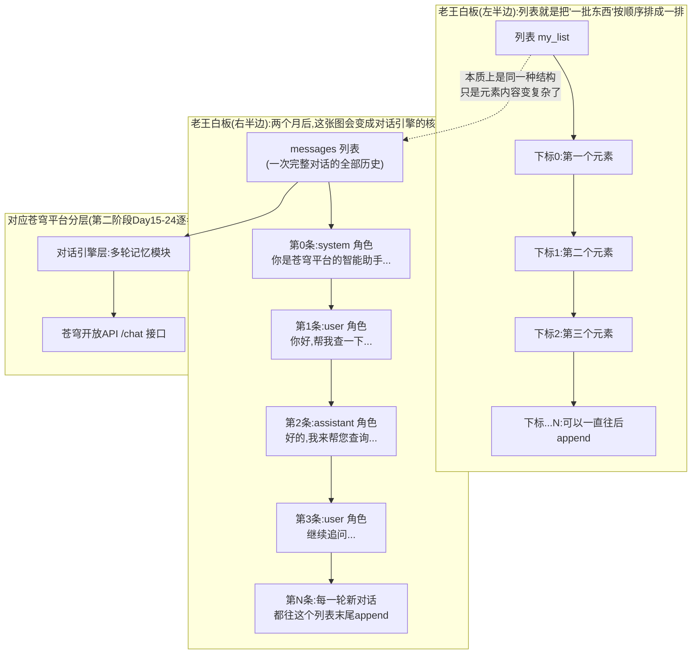
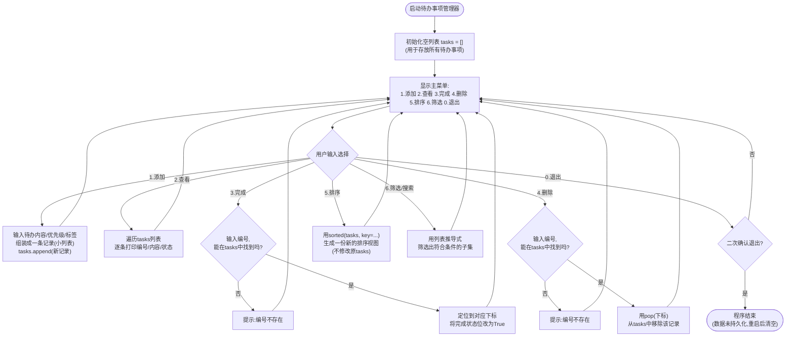
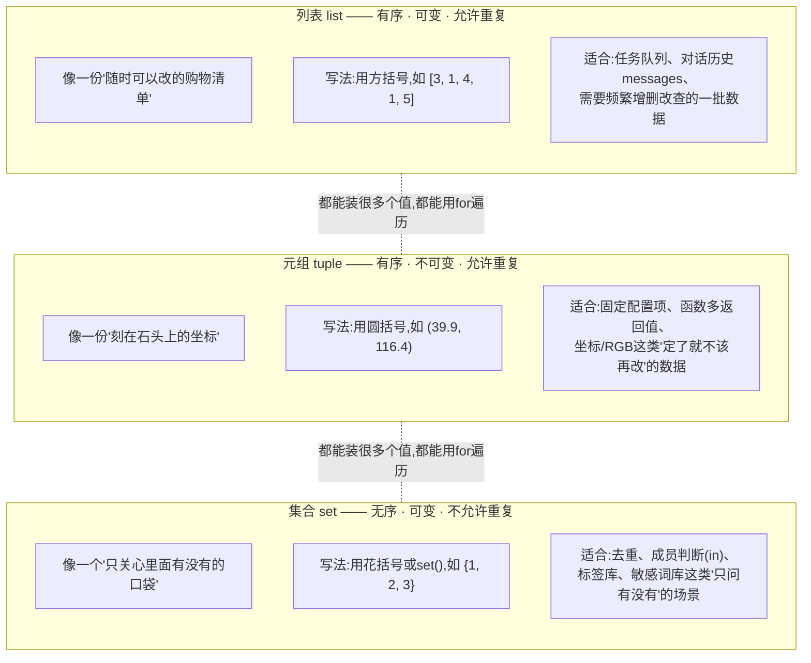

# 第4天 · 核心数据结构(上)

> **周次/Sprint**:Sprint 0 · 新人内训(Day1-14)—— 阶段项目一:命令行多轮对话AI助手(预计Day14交付)
> **星期**:周四
> **学员**:陈铭、苏梦、韩露、张凡(本期技术培训生小组,导师:王振宇)
> **内训任务卡**:PYXT-ONB-D04(蓬远科技培训中心 · 新人训练营 · Day04)
> **今日关键词**:列表list增删改查 / 切片 / 排序 / 列表推导式 / 元组tuple / 集合set / 待办事项管理器

---

## 【旁白】

老王的白板,用了三年,边角已经有点发黄,右下角那块无论怎么擦都残留着一层淡淡的蓝色印子——据说是他刚入职那年画错了一张架构图,气得用记号笔狂划,力道太大渗进了板面。今天上午九点半,他在这块用了三年的白板上,画下了一个后来会被反复提起的图:一个长长的方框,里面用竖线隔成一格一格,每一格塞进去一句话,旁边写着两个字——"列表"。四个新人当时都没意识到,这张随手画的示意图,会在未来六十六天里被反复"翻译"成各种更专业的样子:两个月后,它会变成`messages`这个变量,装着一轮又一轮用户和AI的对话;两三个月后,它会变成向量数据库检索出来的一批文档片段;更远一点,它会变成Agent执行任务时,一步一步攒下来的行动记录。

陈铭后来回想,如果没有这张图,他大概会把今天的知识点当成又一次"应付作业式"的练习,写完就忘;正是这张图,让他隐约意识到,今天写的每一行`append()`,可能都在为几十天后某个更重要的场景打底子——这种"现在看不出重要性,以后回头才懂"的知识点,在这门课的前几周还会反复出现。

这就是这门课程一个不太张扬、但格外重要的特点——很多知识点第一次出现的时候,都裹着一层"这只是个练习"的外衣,不会有人告诉你它有多重要,重要性要等很久以后才会显现出来。列表(list),正是这样一个知识点。今天陈铭、苏梦、韩露、张凡四个人要写的东西,表面上只是一个"待办事项管理器"——听起来朴素得不能再朴素,甚至有点像编程教材里最俗气的那种示例项目。但如果拉远镜头看,这是他们第一次亲手把"一批数据"真正管理起来,而不是像前三天那样,只能靠一堆孤零零的变量,或者一个只会加一的计数器,去凑合应付"记录多个东西"这种需求。

昨天晚自习那个让苏梦和韩露都觉得"哪里不太对"的知识库条目管理子菜单,今天就会被彻底解决——不是打补丁式的解决,是从底层数据结构上,换了一套完全不同的思路。这中间的转变,值得慢下来体会:前三天,程序员脑子里想的是"这一个值应该怎么处理";从今天开始,脑子里要开始想"这一批值应该怎么组织"。这个转变听起来很小,但几乎是所有后端工程、数据处理、AI应用开发的地基性思维方式——不管是列表、字典,还是后面要学的数据库表、向量索引,骨子里都是同一个问题的不同答案:一堆东西,怎么存,怎么找,怎么变。

今天还有一个不那么起眼但值得记一笔的安排——老王把元组(tuple)和集合(set)也放进了同一天,乍看是"顺带学一下",但这两样东西各自代表着"批量数据"这件事的两种极端立场:元组代表"确定了就不许再变"的严谨,集合代表"我只关心有没有,不关心有几个、排第几"的洒脱。列表夹在中间,是最"随和"的那一个——能变、有序、可以重复。三种容器,三种性格,老王这天没有直接讲这么"抽象"的话,但陈铭后来在笔记里,自己总结出了这个说法。而那张画在白板上、还没解释完的"messages"框,会在这一天结束前,被老王简单点破一角——列表将来不只是用来装几条待办事项,它会是整个苍穹平台"记住自己刚才说过什么"的地基。这句话陈铭当时没能完全理解,但他把它原样记进了笔记本,旁边画了一个小小的问号,准备以后回来打勾。

---

## 晨会纪要 / 今日目标

**时间**:上午8:52,二层小会议室"起航"
**出席**:王振宇(老王)、陈铭、苏梦、韩露、张凡

昨天(Day3)四人都提交了代码,群里的反馈还没消化完,今天一早老王就把投影切到了苏梦昨晚发在群里的一条消息截图。

**昨天进展(培训小组)**:
- 四人均完成猜数字游戏、九九乘法表、简易菜单系统三个实操项目,以及LeetCode回文数、Fizz Buzz两道简单题的多种解法练习,整体完成质量不错。
- 老王重点点评了简易菜单系统增强版里"知识库条目管理"子菜单的设计缺陷——那个子菜单用一个叫`knowledge_item_count`的计数器变量模拟条目数量,每添加一条,计数器加一,但从始至终,程序压根不知道每一条具体写的是什么内容,只知道"一共有几条"。这个被老王形容为"故意留下的痛点"的设计,今天要正式解决。
- 韩露给菜单系统加的"退出前打印使用总结"功能得到认可,张凡的LeetCode两种解法对比完成得比较扎实。
- 苏梦昨晚在群里问了一句:"如果我想撤销刚刚添加的最后一条,现在的写法完全做不到,是不是只能重启程序?"这句话被老王截图放进了今天的开场。

老王开场没有绕圈子,直接把那条截图投在墙上:"这句话问得挺好,我准备把它当成今天的开场。"他转身在白板上画了一个长条形的方框,用竖线隔出几格,每一格里写了一个词——"洗地机说明书""打印机驱动更新""员工手册V3"。

"这是什么?"他问。

没人立刻答上来,张凡试探着说:"看起来像是……几条记录排成一排?"

"对。"老王把这个长条框圈了起来,在旁边写下"列表(list)"两个字。"从今天开始,你们手里终于有了一个能装'一批东西'的容器,而且这批东西,不再只是一个数字,可以是任何东西——字符串、数字,甚至一会儿你们会看到,可以是另一个列表。今天这一天,你们会亲手把昨天那个'只能计数、记不住内容'的知识库条目管理功能,升级成一个真正能记住每一条内容的版本;更重要的是,你们会做一个全新的项目——待办事项管理器,一个纯命令行版本,今天写完,明天再升级。苏梦昨晚问的那个'能不能撤销最后一条'的问题,今天下午你会自己找到答案,而且答案不止一种。"

他顿了顿,又在长条框下面画了一个更大的框,写着"messages",还没有解释这是什么,只是说了一句:"这个我先按下不表,后面你们会知道,今天先记住它的样子就行。"(这张图的完整版本,详见下方"架构设计图"一节。)

**今日目标**:
1. 上午:列表list的创建方式、索引、切片、增删改查(append/insert/extend/remove/pop/del/clear)及常见报错排查。
2. 下午:列表的排序(sort/sorted、reverse、key参数)、列表推导式(基础/条件/嵌套);元组tuple的特性与应用场景;集合set的特性、常用操作与应用场景。
3. 晚自习:完成"待办事项管理器"纯命令行版(基础版必做,排序筛选版、标签分类版根据个人进度尽力完成)。
4. 全员在下班前把今天的代码提交到蓬远GitLab个人练习仓库,并在群里同步今天遇到的至少一个"卡住的地方"。

**风险点**:
- 列表的切片语法(`list[start:stop:step]`)是新手极容易出错的地方,尤其是"左闭右开"规则和负数索引,今天要多用具体例子反复验证,而不是只讲一次语法就跳过。
- 列表的可变性(mutable)是一个容易被忽略的"隐藏坑"——比如`list2 = list1`并不是复制,而是让两个变量指向同一份数据,后面改list2会连带影响list1,新手很容易在不知不觉中踩到这个坑。
- 集合(set)是无序的,新手容易想当然地认为集合会保留添加顺序,今天要提前打好这个预防针。

老王补充的一句话:"今天知识点不算特别抽象,但操作细节特别多——切片的三个参数、排序的两种方式、集合的四种运算,你们光靠听是记不住的,一定要跟着敲代码,敲十遍,比听十遍管用得多。"

---

## 需求文档:待办事项管理器(纯命令行版)开发任务书

> 本任务书由技术导师王振宇制定,发放给本期全体培训生。今天不涉及苍穹项目的实际功能开发,属于"内部技术能力练习"性质的任务书,格式沿用公司PRD模板,验收方式仍按公司标准执行。

### 背景

昨天的简易菜单系统暴露出一个明显的短板——"知识库条目管理"子菜单只能记住条目的数量,记不住每一条条目具体写的是什么内容,这个短板的根源,是当时手里只有孤零零的变量,没有任何能"批量存东西"的容器。今天正式学习列表(顺带学习元组、集合)之后,老王要求四人各自独立完成一个"待办事项管理器"的纯命令行版本,作为对今天知识点的综合实战检验,同时也是明天(Day5)"给它加上JSON持久化"这个任务的直接铺垫。老王在任务书里特别注明:"今天先不用管数据保存的问题,程序关掉数据没了是正常的,这是数据结构关,不是持久化关,明天才是持久化关。"

### 用户故事

- 作为一名需要管理日常工作任务的用户,我希望能随时添加一条新的待办事项,以便不遗漏工作。
- 作为一名用户,我希望能查看当前所有待办事项及其完成状态,以便清楚知道自己还有哪些事没做。
- 作为一名用户,我希望能把某一条待办事项标记为"已完成",以便区分正在进行和已经完成的工作。
- 作为一名用户,我希望能删除一条不再需要的待办事项,以便保持列表的整洁。
- (进阶)作为一名任务较多的用户,我希望能按优先级对待办事项进行排序,并能按完成状态或关键词筛选,以便优先处理重要的事情。
- (进阶)作为一名希望更精细管理任务的用户,我希望能给每条待办事项打上标签(比如"工作""学习""生活"),以便按标签分类查看,也能看到自己最常使用哪些标签。

### 功能列表

| 编号 | 任务 | 说明 | 验收方式 |
|---|---|---|---|
| T1 | 待办事项管理器基础版 | 支持添加、查看、完成、删除四项基本操作,数据用列表存储在内存中 | 依次执行增删改查,结果与预期一致,程序不崩溃 |
| T2 | 待办事项管理器排序筛选版 | 在T1基础上,新增按优先级排序、按状态筛选(全部/未完成/已完成)、按关键词搜索三项功能 | 排序结果、筛选结果、搜索结果均正确,且不破坏原有基础功能 |
| T3 | 待办事项管理器标签分类版 | 在T2基础上,新增为待办事项打标签(可打多个标签,标签需去重)、按标签筛选、查看全部标签及使用次数统计三项功能 | 标签能正确去重,按标签筛选结果正确,标签统计数量与实际一致 |
| T4 | list/tuple/set语法练习脚本 | 独立完成列表、元组、集合的语法练习脚本(至少覆盖今天课堂讲过的全部操作) | 脚本运行无报错,四人现场随机抽查任意一个知识点,能准确说出用法与适用场景 |

### 非功能需求

- **数据结构约束**:今天不允许使用字典(dict)和自定义类(class)——这两样是Day5、Day8才学的内容,今天的待办事项一律用"列表中的列表"(每一条待办事项本身也是一个小列表)来表示,这种"暂时笨拙"的写法,是为了让大家扎实理解列表本身,同时给明天的字典留一个清晰的对比对象。
- **代码规范**:延续团队规范——变量命名`snake_case`,关键逻辑处必须有中文注释说明设计意图,而不只是说明这行代码做了什么。
- **健壮性**:用户输入非法数据(比如要完成一个不存在的编号)时,程序要给出合理提示,不能崩溃。
- **数据不要求持久化**:程序重启后待办事项清空是本阶段允许的行为(明天解决)。

### 验收标准

1. 基础版四项操作(增/查/改/删)全部正确,能应对至少一次"输入了不存在编号"的异常情况而不崩溃。
2. 排序筛选版的排序结果按优先级正确排列(支持从高到低、从低到高两种顺序),筛选结果与实际数据一致。
3. 标签分类版的标签去重逻辑正确(同一条待办输入两次相同标签,只会保留一份),标签统计的数字与人工核对结果一致。
4. 四份文件均能独立运行,不依赖前一个版本的文件(每个版本都是独立完整的可运行脚本)。
5. 晚自习结束前,每人至少完成T1和T4,T2、T3根据个人进度尽力完成,老王会针对完成情况给出个别辅导计划。

### 备注

老王在任务书末尾手写了一句话,拍照发到了群里:"今天这几个版本,不是让你们一次到位地把所有功能都堆出来,而是让你们亲身感受'同一个需求,随着我掌握的工具变多,实现方式会怎么升级'——这也是我们苍穹平台过去两年真实的迭代方式,没有一个功能是一次性完美上线的。你们今天写的v1、v2、v3,某种意义上就是苍穹平台从0.1版到1.0版这条路的一个微缩模型。"

---

## 架构设计图:老王白板上的"对话历史 = 列表"类比架构图

上午十点整,讲完列表的基本语法之后,老王没有立刻进入待办事项管理器的需求,而是往白板前多站了两分钟,把刚才随手画的那个长条框重新描了一遍,补完了旁边那个还没解释的"messages"框。



老王指着两张图之间那条虚线说:"你们现在还不需要知道`role`、`system`、`user`这些词是什么意思——那是两个月后的内容。我今天只想让你们记住一件事:不管你们以后写多复杂的AI应用,只要涉及'一轮一轮的对话要被记住',骨子里用的容器,就是今天学的列表。模型每次回答问题,靠的不是'脑子里记住了你说过什么',而是我们把之前每一句话,按顺序整整齐齐地排进一个列表,每次问新问题的时候,把这整个列表原样发给模型,模型才'看起来'像在记忆。"

苏梦举手问:"那这个列表会不会越聊越长,最后装不下?"

"问得好,这个问题现在不展开,但你提前替十五天后的自己问了一个很关键的问题——到时候我们会专门讲'窗口记忆'和'摘要记忆',本质上都是在解决'列表太长怎么办'这件事。今天你只需要知道,这个'一长串按顺序排好的东西'这个形态,叫列表。"

张凡追问了一句更实际的问题:"那我们今天写的待办事项,是不是也可以按这个思路,理解成'一份不断变化的清单'?"

"完全正确。"老王说,"待办事项管理器里的`tasks`这个列表,和未来的`messages`列表,虽然装的内容天差地别——一个是任务,一个是对话——但支撑它们的,是同一套底层规则:有序、可以随时往后加、可以按位置找到某一项、可以整体遍历一遍。你们今天写的每一个`append()`,骨架上和两个月后写的`messages.append({"role": "user", "content": "..."})`是一回事。"

---

## 流程图:待办事项管理器的增删改查流程

讲完架构图之后,老王紧接着画了下面这张流程图,用来梳理待办事项管理器一次完整交互的流转路径——这也是晚自习写代码前,大家应该先在脑子里过一遍的"骨架"。



这张图有一个值得停下来看的细节——"排序"分支里,老王特意标注了"不修改原tasks"。他解释:"这是`sorted()`和`sort()`的核心区别,下午会详细讲,但我想让你们先在流程图层面记住这件事:排序查看,不应该破坏你原来添加待办事项的顺序,用户点一下'按优先级排序',看完之后再点'查看全部',应该还是原来的添加顺序,而不是被排序永久打乱了。这是一个产品体验层面的细节,但背后对应的是一个具体的技术选择——用`sorted()`而不是`sort()`。"

赵磊(测试工程师)恰好路过会议室门口,顺口问了一句:"这个流程图,如果我是测试,我会重点测哪几条路径?"老王把这个问题转给了四人。陈铭想了一下回答:"我觉得至少要测'编号不存在'这条分支,还有'待办事项为空的时候点查看/完成/删除'这几种情况。"老王点头:"对,流程图上画出来的每一条箭头,背后都对应至少一组测试数据,这是你们看流程图时应该养成的习惯——不是看个热闹,是看'这条路我测过了吗'。"

---

## 示意图:列表 / 元组 / 集合三者的适用场景对比

下午正式进入元组和集合的教学之前,老王画了第三张图,专门用来对比列表、元组、集合三者的"性格"差异。



配合这张图,老王在白板旁边补了一张更实用的对比表格,让大家边看图边核对:

| 特性 | 列表 list | 元组 tuple | 集合 set |
|---|---|---|---|
| 是否有序 | 是(按添加/插入顺序) | 是(按创建时的顺序) | 否(无法保证顺序) |
| 是否可变 | 是(可增删改) | 否(创建后不能改内部元素) | 是(可增删,但不能通过下标改) |
| 是否允许重复元素 | 允许 | 允许 | 不允许(自动去重) |
| 字面量写法 | `[1, 2, 3]` | `(1, 2, 3)` | `{1, 2, 3}` |
| 空容器写法 | `[]` | `()` | `set()`(注意`{}`是空字典) |
| 是否支持下标访问 | 支持 | 支持 | 不支持(无序,没有"第几个") |
| 典型场景 | 待办清单、对话历史、检索结果 | 坐标、RGB、函数多返回值 | 去重、标签库、成员判断 |

老王讲这张图的时候,先讲了一个反问:"如果你们只学列表,不学元组和集合,能不能把今天所有需求都实现出来?"

四个人几乎异口同声:"能。"

"对,你们说得没错——列表几乎无所不能,能装重复的,能变,能按位置访问。但正因为它'无所不能',它反而是三者里约束最少、也最容易被误用的一个。"老王继续说,"元组和集合,是用'限制'换来了'表达力'——一个元组摆在那里,任何人看到它,都会下意识地想'这东西大概不会被改',这是一种'代码即文档'的表达;一个集合摆在那里,任何人都会想'这里面的东西大概不允许重复,顺序也不重要'。这种'一看就懂'的表达力,是纯粹用列表实现不出来的,哪怕功能上等价。"

---

## 课堂笔记

### 上午:列表list——终于有了一个能装"一批东西"的容器

**9:15,培训室**

晨会结束,四个人回到工位。老王没有直接讲语法,先花了几分钟把昨天的痛点重新摆上台面。他打开VS Code,把昨天`simple_menu_system_v2_enhanced.py`里那段代码投在墙上:

```python
knowledge_item_count = 0

if sub_choice == "2-1":
    knowledge_item_count = knowledge_item_count + 1
    print(f"已添加一条条目(仅计数,未保存实际内容),当前共有{knowledge_item_count}条。")
```

"你们看这段代码,"老王说,"它能回答'一共有几条',但你要是问它'第三条写的是什么',它答不出来,因为它压根没存下来'内容',只存了一个数字。这就是我昨天说的'故意留下的痛点'。今天我们要解决它,答案就是列表。"

#### 一、告别"只能数数不能记内容"——列表登场

老王打开一个新文件,写下第一行代码:

```python
knowledge_items = []
```

"这一行,和昨天的`knowledge_item_count = 0`,看起来都是'初始化一个空的东西',但性质完全不同。"他解释,"`0`是一个数字,它只能表示'数量';`[]`是一个空列表,它表示'一个还没装东西的容器',这个容器,以后可以装进任意多个、任意类型的元素。"

他接着演示添加操作:

```python
knowledge_items = []
knowledge_items.append("洗地机说明书V2")
knowledge_items.append("打印机驱动更新指南")
knowledge_items.append("员工手册V3")

print(knowledge_items)
print(f"当前一共有{len(knowledge_items)}条知识库条目")
print(f"第一条是:{knowledge_items[0]}")
print(f"第三条是:{knowledge_items[2]}")
```

运行结果:

```
['洗地机说明书V2', '打印机驱动更新指南', '员工手册V3']
当前一共有3条知识库条目
第一条是:洗地机说明书V2
第三条是:员工手册V3
```

苏梦看着这段输出愣了两秒,说:"这就是我昨天想要但做不到的东西——不但知道有几条,还知道每一条具体是什么。"

"对,"老王说,"你们注意`len(knowledge_items)`这一行——它取代了昨天那个手动维护的`knowledge_item_count`,而且它永远不会算错,因为它是'现场数出来的',不是靠你手动加一累积出来的数字。这是列表带来的第一个直接好处:数量这件事,不再需要你操心维护一个额外的计数器,列表自己知道自己有多长。"

#### 二、创建列表的几种姿势

老王把创建列表的几种常见写法逐一过了一遍,强调"根据场景选择不同的创建方式,而不是死记硬背"。

```python
# 方式1:直接写出全部元素,适合"一开始就知道要装什么"的场景
todo_titles = ["写周报", "回复客户邮件", "整理会议记录"]

# 方式2:空列表,之后逐步填充,适合"一开始不知道要装什么,靠用户交互慢慢添加"的场景
empty_list = []

# 方式3:用list()函数,把字符串"拆"成单个字符组成的列表
chars_from_string = list("苍穹")   # 结果:['苍', '穹']

# 方式4:用range()生成一串数字,再用list()转换成真正看得到内容的列表
numbers = list(range(1, 11))       # 结果:[1, 2, 3, ..., 10]

# 方式5:混合类型——列表里可以同时装字符串、数字、布尔值
mixed_list = ["写周报", 3, True, 9.5]

# 方式6:嵌套列表——列表里可以装另一个列表,这是今晚待办事项管理器的核心结构
nested_list = [["写周报", False], ["回复客户邮件", True]]
```

关于方式4,张凡问了一个很实在的问题:"为什么`range(1, 11)`不直接打印出来看,非要转成列表?"

老王现场演示了区别:

```python
print(range(1, 11))
print(list(range(1, 11)))
```

```
range(1, 11)
[1, 2, 3, 4, 5, 6, 7, 8, 9, 10]
```

"`range()`本身是一个'范围对象',它记住的只是'从1开始、到11结束(不含11)、步长1'这三个数字,不是真的一次性把10个数字都算出来摆在内存里——这是一种'惰性求值'的设计,数字量很大的时候能省内存。但正因为这样,直接打印`range(1, 11)`,你看到的只是它的'描述',不是具体的内容,想看到具体内容,得用`list()`把它'展开'。这个知识点今天不深入,后面Day13学生成器的时候,你们会再遇到一次类似的设计思路。"

#### 三、索引:按位置找东西

"列表最基本的能力,是按位置取值,这个位置,叫索引(index)。"老王写下:

```python
fruits = ["苹果", "香蕉", "橙子", "葡萄", "西瓜"]

print(fruits[0])    # 苹果 —— Python的索引从0开始,不是从1开始
print(fruits[2])    # 橙子
print(fruits[-1])   # 西瓜 —— 负数索引表示"从后往前数",-1永远是最后一个
print(fruits[-2])   # 葡萄
```

"这里有一个几乎所有新手都会犯一次的错——下标从0开始,不是从1开始。`fruits[1]`拿到的是'香蕉',不是'苹果'。这个习惯需要刻意练几次才能改过来,我自己刚学的时候也犯过。"老王补了一句真实的自嘲。

韩露追问:"负数索引是不是只能到-1?"

"不是,可以一直往前数——`-2`是倒数第二个,`-3`是倒数第三个,以此类推,直到`-len(列表)`,再往前就越界了。"老王现场演示越界报错:

```python
fruits = ["苹果", "香蕉", "橙子", "葡萄", "西瓜"]
print(fruits[10])
```

报错信息:

```
Traceback (most recent call last):
  File "index_demo.py", line 2, in <module>
    print(fruits[10])
          ~~~~~~^^^^
IndexError: list index out of range
```

"这个报错叫`IndexError`,意思是'索引超出了范围'。`fruits`一共只有5个元素,合法的索引范围是`0`到`4`(正向)或者`-1`到`-5`(负向),`10`远远超出了这个范围。以后你们看到`IndexError: list index out of range`,第一反应应该是——回头数一数这个列表到底有几个元素,你访问的下标是不是超了。"

#### 四、切片:一次取一段(今天上午最容易踩坑的知识点)

老王在讲切片之前,特意停顿了一下,说:"这一部分,我建议你们不要只听,要跟着我一行一行敲,而且每敲一行,先自己猜一下结果,再运行验证——切片是我带过的历届新人里,踩坑率最高的语法点之一。"

```python
numbers2 = [10, 20, 30, 40, 50, 60, 70, 80, 90, 100]

print(numbers2[1:3])     # 猜猜看,结果是什么?
```

四个人各自在纸上写下自己的猜测。苏梦写的是`[20, 30, 40]`,韩露写的是`[20, 30]`,张凡和陈铭都写的是`[20, 30]`。运行结果揭晓:

```
[20, 30]
```

"苏梦猜错了,这很正常,因为切片有一条核心规则叫'左闭右开'——`numbers2[1:3]`,从下标1开始(包含1),到下标3结束(不包含3),所以拿到的是下标1和下标2这两个位置的值,也就是`20`和`30`,下标3那个位置的`40`,不会被包含进来。"

苏梦皱着眉头说:"我一直以为`[1:3]`应该是'从第1个到第3个',结果的确应该是3个数才对啊?"

老王没有直接反驳,反而说:"你这个直觉,其实很多语言的下标习惯都跟你一样'从1数起',但Python的切片规则,你可以换一个记忆方式——把下标想象成'元素之间的缝隙',而不是'元素本身的位置'。"他在白板上画了一行数字和缝隙的对应关系:

```
缝隙位置:  0    1    2    3    4    5   ...
元素:       10 | 20 | 30 | 40 | 50 | 60  ...
```

"`numbers2[1:3]`意思是'从缝隙1切到缝隙3之间的这一段',缝隙1和缝隙2之间夹着`20`,缝隙2和缝隙3之间夹着`30`,所以结果是`[20, 30]`,恰好是两个数,对应缝隙1到缝隙3之间的宽度是2。这个'缝隙'的理解方式,比死记'左闭右开'这四个字更直观。"

紧接着,老王把切片的完整语法摆出来:`list[start:stop:step]`,并逐一演示每个参数的作用:

```python
numbers2 = [10, 20, 30, 40, 50, 60, 70, 80, 90, 100]

# 省略start,表示"从头开始"
print(numbers2[:3])      # [10, 20, 30]

# 省略stop,表示"一直到最后"
print(numbers2[3:])      # [40, 50, 60, 70, 80, 90, 100]

# start和stop都省略,表示"整个列表",常用来快速拷贝一份
print(numbers2[:])       # [10, 20, 30, 40, 50, 60, 70, 80, 90, 100]

# 第三个参数step,表示"步长",即每隔几个取一个,省略时默认是1
print(numbers2[1:8:2])   # [20, 40, 60, 80] —— 从下标1到下标8,每隔一个取一个

# 整个列表,步长2,取所有"偏移量为偶数"的元素
print(numbers2[::2])     # [10, 30, 50, 70, 90]

# step可以是负数,表示"倒着取"
print(numbers2[::-1])    # [100, 90, 80, 70, 60, 50, 40, 30, 20, 10] —— 反转整个列表的经典写法
```

老王特别强调了`numbers2[::-1]`这个写法:"这是Python里'反转一个列表(或字符串)'最常用、最简洁的写法,你们以后会在很多地方看到它,记住它比记住其他很多切片组合更有性价比。"

关于`numbers2[1:3]`和`numbers2[1:3:1]`的关系,老王特意做了对比:

```python
print(numbers2[1:3])      # [20, 30]
print(numbers2[1:3:1])    # [20, 30] —— 完全相同,因为省略step时,默认值就是1
print(numbers2[1:3:2])    # [20]     —— 步长变成2,只能取到一个元素
```

"`[1:3]`和`[1:3:1]`结果完全一样,区别只是后者显式地写出了步长1。但如果把步长改成2,结果就完全不同了——`[1:3:2]`只会取到下标1那一个元素(`20`),因为从下标1出发,跨一步(步长2)就到了下标3,而下标3本身是不包含的,所以只有下标1这一个值被取到。这是一个非常容易被混淆的细节,建议你们今天晚自习自己多敲几组不同的`start`、`stop`、`step`组合,直到看到结果不再意外为止。"

**小提示补充:切片不会因为越界而报错**

老王补了一个和索引访问不同的重要区别:

```python
fruits = ["苹果", "香蕉", "橙子"]

print(fruits[10])        # 报错!IndexError
print(fruits[10:20])     # 不报错,结果是空列表 []
```

"直接用下标访问一个不存在的位置,会报`IndexError`;但切片就算你写的范围完全超出了列表长度,Python也不会报错,只会安静地返回一个空列表或者只包含实际存在部分的列表。这个区别在写健壮代码的时候很有用——切片天然'容错',下标访问不会。"

#### 五、增:让列表变长的四种方式

"接下来讲'增'——往列表里添加元素的几种常见方式,各有各的用法场景。"老王一边说一边用一个贴近今天晚自习任务的例子来演示——记录猜数字游戏里,用户每一次猜过的数字(这是Day3猜数字游戏的一个自然延伸)。

```python
guessed_numbers = []

# append() —— 在列表末尾追加一个元素,是最常用的"增"操作
guessed_numbers.append(50)
guessed_numbers.append(75)
guessed_numbers.append(62)
print(guessed_numbers)     # [50, 75, 62]

# insert() —— 在指定位置插入一个元素,后面的元素会依次往后挪
guessed_numbers.insert(0, 1)   # 在最前面插入一个1
print(guessed_numbers)     # [1, 50, 75, 62]

# extend() —— 一次性把另一个列表的所有元素,逐个追加进当前列表
more_guesses = [80, 45]
guessed_numbers.extend(more_guesses)
print(guessed_numbers)     # [1, 50, 75, 62, 80, 45]
```

陈铭主动提了一个问题:"如果我不小心把`extend()`写成`append()`,会发生什么?"老王让他自己试:

```python
wrong_demo = [1, 2, 3]
wrong_demo.append([4, 5])
print(wrong_demo)          # [1, 2, 3, [4, 5]]
```

"看,`append([4, 5])`是把整个`[4, 5]`当成**一个元素**塞进去了,列表变成了4个元素,其中最后一个元素本身还是一个列表。而`extend([4, 5])`会把`4`和`5`拆开,分别追加成两个独立的元素。这是新手极容易搞混的一对方法,以后如果发现你的列表'莫名其妙嵌套了一层',回头检查一下是不是把`extend`写成了`append`。"

最后,老王补充了`+`和`*`两个运算符在列表上的用法:

```python
list_a = [1, 2, 3]
list_b = [4, 5, 6]
list_c = list_a + list_b
print(list_c)     # [1, 2, 3, 4, 5, 6] —— 生成一个全新的列表,不修改list_a和list_b
print(list_a)     # [1, 2, 3] —— 依然是原样,没有被+运算符修改

placeholder_row = [0] * 5
print(placeholder_row)   # [0, 0, 0, 0, 0] —— 快速生成一批相同的初始值,常用于初始化
```

#### 六、删:让列表变短的四种方式

"删除,是今天上午除了切片之外,第二个容易踩坑的地方,因为Python给了你四种不同的'删除'方式,各自的返回值和使用场景都不一样。"老王用一份模拟的任务列表演示:

```python
tasks_demo = ["写周报", "回邮件", "开会", "写周报", "整理文档"]

# 方式1:remove() —— 按"值"删除,只删除第一个匹配到的元素
tasks_demo.remove("写周报")
print(tasks_demo)   # ['回邮件', '开会', '写周报', '整理文档'] —— 只删掉了第一个"写周报"

# 方式2:pop() —— 按"位置"删除,并且会返回被删除的那个元素
removed_item = tasks_demo.pop(1)   # 删除下标1的元素("开会")
print(removed_item)   # 开会
print(tasks_demo)     # ['回邮件', '写周报', '整理文档']

# pop()不传参数,默认删除并返回最后一个元素——这正是苏梦昨晚问的"撤销最后一条"的答案
last_item = tasks_demo.pop()
print(last_item)     # 整理文档
print(tasks_demo)    # ['回邮件', '写周报']
```

老王特意停下来,对着苏梦说:"这个`pop()`不传参数的用法,就是你昨晚问的那个问题的答案——想撤销最后添加的一条,只需要`列表.pop()`,不需要重启程序。"

苏梦一边记笔记一边说:"原来这么简单,我昨天还以为要专门写一套'撤销机制'。"

"以后到了真正复杂的系统里,'撤销'确实可能要专门设计,比如要支持撤销好几步、要考虑撤销之后能不能'重做',但今天这种最朴素的场景,`pop()`就够用了。"老王继续讲剩下两种删除方式:

```python
del tasks_demo[0]
print(tasks_demo)    # ['写周报'] —— del是Python关键字,按下标删除,没有返回值

numbers3 = [1, 2, 3, 4, 5, 6, 7, 8]
del numbers3[2:5]           # 配合切片,一次删除下标2到4的三个元素
print(numbers3)             # [1, 2, 6, 7, 8]

numbers3.clear()            # 清空整个列表,变成空列表,但列表这个变量本身还存在
print(numbers3)              # []
print(type(numbers3))        # <class 'list'>
```

"`del`和`remove()`/`pop()`最大的区别是——`del`是Python语言本身的一个关键字,不是列表的方法,它更通用,除了列表,后面学字典的时候也会用到`del`删除某个键值对。而且`del`配合切片,能一次删掉一整段,这是`remove()`和`pop()`都做不到的。"

老王补上了删除相关的常见报错:

```python
demo_list_for_error = ["a", "b", "c"]
demo_list_for_error.remove("z")
```

```
Traceback (most recent call last):
  File "remove_error_demo.py", line 2, in <module>
    demo_list_for_error.remove("z")
ValueError: list.remove(x): x not in list
```

"`remove()`找不到匹配的值,报的是`ValueError`,不是`IndexError`,这两种报错类型今天先能分清'长什么样'即可,详细的异常处理语法要等Day10才系统学。今天遇到这类情况,养成'先用`in`判断一下再删除'的习惯就够了。"

#### 七、改:原地修改列表内容

```python
scores = [78, 85, 92, 60, 88]

# 方式1:通过索引直接赋值,修改单个元素
scores[3] = 65
print(scores)   # [78, 85, 92, 65, 88]

# 方式2:通过切片赋值,一次性修改一段元素
scores[0:2] = [80, 90]
print(scores)   # [80, 90, 92, 65, 88]

# 切片赋值有一个有意思的特性:新片段的长度不需要和被替换片段的长度相同
scores[0:2] = [100, 100, 100]
print(scores)   # [100, 100, 100, 92, 65, 88] —— 列表长度从5变成了6
```

"切片赋值这个特性,乍一看有点反直觉——用3个元素替换掉原来2个元素占的位置,整个列表的长度会跟着变化。这个特性平时用得不算特别频繁,但知道它存在,能帮你理解一些'看起来很神奇'的代码。"

#### 八、查:成员判断、定位、统计、聚合

```python
inventory = ["键盘", "鼠标", "显示器", "键盘", "耳机"]

print("键盘" in inventory)         # True —— in用来判断某个值是否存在
print("摄像头" in inventory)       # False
print("摄像头" not in inventory)   # True

print(inventory.index("显示器"))   # 2 —— index()查找第一次出现的位置
print(inventory.count("键盘"))     # 2 —— count()统计出现次数
print(len(inventory))              # 5 —— len()是长度

price_list = [199, 89, 1299, 59, 899]
print(max(price_list))    # 1299
print(min(price_list))    # 59
print(sum(price_list))    # 2545
print(round(sum(price_list) / len(price_list), 2))   # 509.0,平均值需要自己算,没有专门的avg()
```

"`max`、`min`、`sum`这三个是Python的内置函数,不是列表的方法,所以写法是`max(列表)`,不是`列表.max()`,这一点容易和`index()`、`count()`这类"列表自己的方法"搞混,今天先记住这个用法区别,等Day6学函数会更清楚"函数"和"方法"这两个概念本身的差异。"

#### 九、被忽视的坑:可变性与"复制"的误解

老王把这一部分放在上午最后,语气比之前都更认真了一点:"接下来这个坑,是我见过工作好几年的人偶尔还会踩的坑,今天花点时间讲透。"

```python
original = ["A", "B", "C"]
alias = original          # 注意:这一行不是"复制"

alias.append("D")
print(original)    # ['A', 'B', 'C', 'D'] —— original也跟着变了!
print(alias)        # ['A', 'B', 'C', 'D']
```

"这个结果,四个人当场都愣了一下。"老王说,"`alias = original`这一行,很多人第一反应会理解成'把original的内容复制一份,给alias'。但事实并不是这样——它只是让`alias`这个名字,和`original`一样,指向内存里同一份数据。你可以理解成,`original`和`alias`是贴在同一个箱子上的两张标签,不是两个各自独立的箱子。"

他用`id()`函数验证了这一点:

```python
print(id(original))   # 比如 140234567891200
print(id(alias))       # 140234567891200 —— 完全相同的地址,说明是同一份数据
```

"要真正得到一份独立的、修改互不影响的副本,要用下面这几种写法之一:"

```python
real_copy = original[:]           # 切片拷贝
copy_by_list_func = list(original)   # list()函数拷贝
copy_by_copy_method = original.copy()   # copy()方法拷贝

real_copy.append("E")
print(original)     # 不受影响
print(real_copy)     # 多了'E'
```

"这三种写法效果等价,选哪个纯粹是风格偏好。但要特别提醒一句——这三种都是'浅拷贝',如果列表里嵌套了另一个列表,浅拷贝只会复制'外层',内层那个嵌套的列表仍然是共享的。"老王现场演示了这个更深的坑:

```python
nested_original = [["写周报", False], ["回邮件", True]]
nested_shallow_copy = nested_original.copy()
nested_shallow_copy[0][1] = True

print(nested_original)   # [['写周报', True], ['回邮件', True]] —— 内层数据也被连带修改了!
```

"注意`nested_original`也变了,虽然我们改的是`nested_shallow_copy`。这是因为`copy()`只复制了外层这个大列表,内层两个小列表(`["写周报", False]`和`["回邮件", True]`)本身,两份拷贝共享的是同一个对象。彻底解决这个问题,需要`copy`模块里的`deepcopy()`,这个函数今天先知道名字,详细用法等你们后面项目里真正需要处理'多层嵌套数据'的时候再深入。"

韩露若有所思地说:"这么说,今天晚自习待办事项管理器里,如果我要'复制一份待办事项列表去做统计',也得小心这个坑?"

"完全对,这正是你今晚会亲自遇到的场景之一——排序功能如果不小心用错了拷贝方式,可能会把原始数据也搅乱。老王强调,记住一句话就够了:'`=`不是复制,是起了另一个名字'。"

#### 十、上午知识点速查表

上午收尾前,老王把今天讲过的所有列表操作汇总成了一张速查表,建议大家打印出来贴在工位上,免得每次都要翻笔记:

| 分类 | 方法/写法 | 作用 | 是否修改原列表 |
|---|---|---|---|
| 增 | `append(x)` | 末尾追加一个元素 | 是 |
| 增 | `insert(i, x)` | 在下标i处插入元素 | 是 |
| 增 | `extend(可迭代对象)` | 末尾追加多个元素 | 是 |
| 增 | `列表 + 列表` | 拼接生成新列表 | 否(生成新列表) |
| 删 | `remove(x)` | 按值删除第一个匹配项,找不到报ValueError | 是 |
| 删 | `pop(i)` / `pop()` | 按位置删除并返回该元素,不传参默认删最后一个 | 是 |
| 删 | `del 列表[i]` | 按下标删除,可配合切片批量删 | 是 |
| 删 | `clear()` | 清空整个列表 | 是 |
| 改 | `列表[i] = x` | 修改单个位置的元素 | 是 |
| 改 | `列表[i:j] = [...]` | 用新片段替换一段旧片段,长度可以不同 | 是 |
| 查 | `x in 列表` | 判断成员是否存在,返回布尔值 | 否 |
| 查 | `index(x)` | 查找第一次出现的位置,找不到报ValueError | 否 |
| 查 | `count(x)` | 统计出现次数 | 否 |
| 查 | `len()` / `max()` / `min()` / `sum()` | 长度与聚合计算 | 否 |
| 排序 | `sort()` | 就地排序,返回None | 是 |
| 排序 | `sorted(列表)` | 生成新的排好序列表,原列表不变 | 否 |
| 拷贝 | `列表[:]` / `list(列表)` / `列表.copy()` | 生成一份浅拷贝 | 否 |

老王特别提醒:"这张表里,'是否修改原列表'这一列,是我认为你们最应该刻意记住的一列——因为一旦记混,写出来的代码在语法上完全没问题,但运行结果会跟你的直觉严重不符,而且这种bug往往不会报错,只是结果'悄悄地'不对,排查起来比直接报错的bug更让人抓狂。"

---

### 下午:排序、列表推导式,以及元组与集合

**13:40,培训室**

午饭后老王没有让大家马上进入代码,先聊了两句轻松的话题——他说自己中午点的外卖送错了一份,配送员打电话道歉,给他多送了一份甜品,"这算是意外之喜"。这种闲聊没占用太多时间,很快他就切回主题:"上午你们学的是'怎么存一批东西、怎么调整一批东西的内容',下午我们要学'怎么让这批东西按某种顺序排好',以及两个'性格不一样的表亲'——元组和集合。"

#### 一、排序:sort() vs sorted()——一个"改自己",一个"生新的"

```python
scores = [78, 92, 60, 88, 45, 100]

scores.sort()
print(scores)     # [45, 60, 78, 88, 92, 100] —— 原地修改,默认从小到大

scores.sort(reverse=True)
print(scores)     # [100, 92, 88, 78, 60, 45] —— reverse=True表示从大到小
```

"`sort()`是列表自己的方法,它'就地'修改原列表,而且这个方法的返回值是`None`,不是排序后的结果。"老王现场演示了这个容易踩的坑:

```python
demo_list_7 = [3, 1, 2]
result_of_sort = demo_list_7.sort()
print(result_of_sort)     # None
print(demo_list_7)         # [1, 2, 3] —— 排序确实发生了,只是发生在demo_list_7自己身上
```

"如果你想要的是'一个新的、排好序的列表,同时保留原列表不变',要用内置函数`sorted()`,不是`list.sort()`方法:"

```python
names = ["张凡", "陈铭", "苏梦", "韩露"]
sorted_names = sorted(names)
print(names)          # ['张凡', '陈铭', '苏梦', '韩露'] —— 原列表没有被修改
print(sorted_names)    # 排序后的新列表
```

"选择用哪一个,取决于你到底需不需要保留原始顺序。今天晚自习待办事项管理器的'按优先级排序查看'功能,应该用`sorted()`——用户看完排序结果,应该还能切回'按添加顺序查看',原始的添加顺序不该被破坏。"

#### 二、key参数:排序依据可以自己定义

"排序默认是按'值本身'比较大小,但很多真实场景,排序依据不是值本身,而是值的某个'属性'。"老王引入`key`参数,并结合待办事项的场景讲解:

```python
words = ["苍穹", "AI应用工程师", "列表", "待办事项管理器"]
sorted_by_length = sorted(words, key=len)
print(sorted_by_length)   # 按字符串长度从短到长排序
```

"`key=len`的意思是——排序时,不直接比较字符串本身,而是先对每个元素算一次`len()`,拿这个长度值来比较大小。"

接着他引入待办事项的排序场景,顺带介绍`lambda`(明确告知这是"提前借用",完整原理留给Day6):

```python
todo_items = [
    ["写周报", 2],
    ["回复客户邮件", 1],
    ["整理会议记录", 3],
    ["修复线上bug", 1],
]

sorted_by_priority = sorted(todo_items, key=lambda item: item[1])
for item in sorted_by_priority:
    print(item)
```

```
['回复客户邮件', 1]
['修复线上bug', 1]
['写周报', 2]
['整理会议记录', 3]
```

"`lambda item: item[1]`是一个'匿名函数',意思是'对于每一个item,取它下标1的那一项,作为比较依据'。今天你们只需要把它当成一种'取值规则'的写法记下来,完整的lambda语法和使用场景,Day6讲函数的时候会系统展开。"

张凡提了一个有价值的问题:"如果两条待办事项优先级一样,排序结果里谁在前面?"

"好问题。"老王演示了多重排序依据:

```python
sorted_by_priority_then_name = sorted(todo_items, key=lambda item: (item[1], item[0]))
for item in sorted_by_priority_then_name:
    print(item)
```

"`key`返回的可以是一个元组`(item[1], item[0])`,排序时会先比较元组的第一项(优先级),如果相等,再比较第二项(内容的字典序)。这是`sorted()`一个很实用的技巧——用元组打包多个排序依据,一次搞定'先按A排,A相同再按B排'这类需求。"

#### 三、列表推导式:一行代码打包一个for循环

"接下来这个知识点,是很多人学完之后会有点'上瘾'的语法糖——列表推导式(list comprehension)。"老王先用传统写法铺垫:

```python
squares_for_loop = []
for number in range(1, 11):
    squares_for_loop.append(number ** 2)
print(squares_for_loop)   # [1, 4, 9, 16, 25, 36, 49, 64, 81, 100]
```

"这段代码的逻辑,可以用一行写完:"

```python
squares_comprehension = [number ** 2 for number in range(1, 11)]
print(squares_comprehension)   # 结果完全相同
```

"语法结构是`[表达式 for 变量 in 可迭代对象]`——你可以读作'对于可迭代对象里的每一个变量,计算一次表达式,把结果收集成一个新列表'。"

接着老王引入了带条件的写法,并用一个和Day2敏感词场景呼应的例子加深印象:

```python
customer_messages = ["订单什么时候发货", "我要申请退款", "商品有质量问题要退款", "物流很慢", "怎么申请退款"]
refund_related = [msg for msg in customer_messages if "退款" in msg]
print(refund_related)   # ['我要申请退款', '商品有质量问题要退款', '怎么申请退款']
```

"这个例子,你们眼熟吗?"老王问。

陈铭反应很快:"这不就是Day2敏感词替换的思路吗,只是这次不是替换,是筛选出命中的那部分?"

"对,而且这个例子往前想一步——如果这份客户消息有几千条,你要从里面筛出所有提到'退款'的记录,用一行列表推导式就能做到,比昨天那种一条一条`if`判断的写法效率高得多、代码也短得多。"

老王补充了`if...else`三元表达式版本的列表推导式,并特别提醒语法位置的区别:

```python
labels = ["偶数" if number % 2 == 0 else "奇数" for number in range(1, 11)]
print(labels)
```

"注意,这里的`if...else`写在`for`的**前面**,和刚才'筛选式'的`if`写在`for`的**后面**,语法位置完全不同,意思也不一样——前者是'给每个元素打一个标签,元素本身不会被丢弃';后者是'决定这个元素要不要保留进结果列表'。这两种`if`用法混在一起讲最容易搞混,我建议你们各自单独记。"

最后是嵌套推导式,压平一个二维列表:

```python
matrix = [[1, 2, 3], [4, 5, 6], [7, 8, 9]]

flattened_for_loop = []
for row in matrix:
    for value in row:
        flattened_for_loop.append(value)

flattened_comprehension = [value for row in matrix for value in row]

print(flattened_for_loop)        # [1, 2, 3, 4, 5, 6, 7, 8, 9]
print(flattened_comprehension)   # 结果相同
```

"这是列表推导式能做到的'上限'附近的复杂度了。"老王提醒,"如果你发现自己要写三层嵌套的列表推导式才能表达清楚逻辑,那说明该老老实实换回多行的`for`循环了——'代码首先是给人看的,其次才是给机器执行的',这句话我以后还会反复说。"

顺带,老王简单展示了生成器表达式(把方括号换成圆括号),作为对比认知,今天不深入:

```python
squares_generator = (number ** 2 for number in range(1, 6))
print(squares_generator)          # <generator object ...> —— 还没有真正计算出结果
print(list(squares_generator))    # [1, 4, 9, 16, 25] —— 用list()才能"展开"看到内容
```

"生成器表达式是'懒惰'的,列表推导式是'积极'的——列表推导式一执行完,全部结果立刻算好放在内存里;生成器表达式则是'用一个才算一个',更省内存。今天先见一面即可,Day13学`yield`的时候会正式展开原理。"

#### 四、元组:比列表更"严格"的兄弟

"讲完列表,轮到元组和集合登场。"老王换了一个语气,"这两样,不是让你们今天就能熟练判断'什么场景一定要用元组、什么场景一定要用集合'——这种判断力需要经验积累。今天的目标是,认识它们的核心特性,以及'为什么会有这种设计'。"

```python
coordinate = (39.9, 116.4)     # 一个经纬度坐标,一旦确定就不应该被随意修改
print(type(coordinate))         # <class 'tuple'>
```

"元组用圆括号,最核心的特性是——不可变(immutable)。创建之后,内部元素不能被替换。"老王现场演示这一点:

```python
rgb_color = (255, 0, 0)
rgb_color[0] = 200
```

```
Traceback (most recent call last):
  File "tuple_error_demo.py", line 2, in <module>
    rgb_color[0] = 200
TypeError: 'tuple' object does not support item assignment
```

"这个报错说得很直白——元组这种类型,不支持'按下标赋值'这种操作。这不是bug,是设计上刻意为之——元组存在的意义,就是提供一种'创建之后就不该再变'的数据容器。"

关于"只有一个元素的元组"这个语法细节容易踩的坑,老王也特意演示了:

```python
not_a_tuple = (5)
really_a_tuple = (5,)
print(type(not_a_tuple))       # <class 'int'> —— 只是数字5被括号包了一层,不是元组!
print(type(really_a_tuple))     # <class 'tuple'> —— 加了逗号才是真正的元组
```

"括号在Python里本身没有'制造元组'的能力,真正起作用的是逗号——`(5)`只是给数字5加了一层无意义的括号,`(5,)`才是元组,因为有那个逗号。这是个很小但很致命的语法细节,以后写代码不小心漏了一个逗号,很可能得到一个完全不是你预期类型的东西。"

老王接着展示了元组的解包(unpacking),并用一个经典场景加深印象:

```python
a = 100
b = 200
a, b = b, a
print(a, b)     # 200 100 —— 交换两个变量的值
```

"这行`a, b = b, a`,右边先把`b`和`a`的当前值打包成一个临时元组`(200, 100)`,再把这个元组解包,依次赋给`a`和`b`。这是元组解包最经典的一个应用——交换两个变量的值,不需要借助第三个临时变量。"

他还提到了`enumerate()`和`zip()`,并指出它们返回的每一项本质上都是元组:

```python
fruits = ["苹果", "香蕉", "橙子"]
for index, fruit in enumerate(fruits):
    print(index, fruit)

names = ["陈铭", "苏梦", "韩露"]
scores = [92, 85, 88]
for name, score in zip(names, scores):
    print(name, score)
```

"以后你们写`for index, value in enumerate(...)`,骨子里就是在做一次元组解包——`enumerate()`每一轮吐出来的是`(索引, 值)`这样一个元组,`for`循环这里直接用两个变量去接住它,一步到位。"

最后老王总结了元组的典型使用场景,呼应上面的示意图:"函数的多返回值(Day6会学到)、固定配置项(比如一周的星期名称)、坐标/RGB这类不该被随便改的数据,以及Day5要学的字典的键——因为字典的键要求'可哈希',列表因为可变所以不可哈希,不能作为字典的键,元组因为不可变,可以。这个知识点今天先记一个印象,明天讲字典时会正式验证。"

#### 五、集合:只关心"有没有"的口袋

"最后一样,集合。"老王写下第一行代码,特别强调了一个容易踩的陷阱:

```python
looks_like_set = {}
real_empty_set = set()
print(type(looks_like_set))    # <class 'dict'> —— 这其实是空字典,不是空集合!
print(type(real_empty_set))     # <class 'set'>  —— 这才是真正的空集合
```

"`{}`不是空集合,是空字典——字典是明天才学的内容,但今天必须先打好这个预防针,因为这个坑几乎每一届新人都会踩一次。要创建空集合,必须写`set()`,不能写`{}`。"

集合最直观的特性是自动去重,老王用一个和数据处理场景贴近的例子演示:

```python
numbers_with_duplicates = [3, 1, 4, 1, 5, 9, 2, 6, 5, 3, 5]
unique_numbers = set(numbers_with_duplicates)
print(unique_numbers)     # {1, 2, 3, 4, 5, 6, 9} —— 顺序不代表添加顺序,重复元素被自动去掉
```

"这一行`set(列表)`,是Python里最常用的'快速去重'手法之一。但要注意,集合本身是无序的,打印出来的顺序不代表你添加的顺序,如果业务上需要保留顺序,这种去重方式就不适用,需要换别的写法(比如用列表推导式配合'如果还没出现过就添加'的逻辑,这个技巧留给今天的课后作业)。"

接着演示常用的增删操作:

```python
skills = {"Python", "SQL"}

skills.add("LangChain")
skills.add("Python")          # 重复添加已存在的元素,集合不会有任何变化
print(skills)

skills.update(["FastAPI", "Docker", "SQL"])   # 一次性添加多个,SQL会被自动忽略(已存在)
print(skills)

skills.remove("SQL")           # 删除一个存在的元素
print(skills)
```

关于`remove()`和`discard()`的区别,老王专门做了对比,并提醒和列表的`remove()`报错类型不一样:

```python
skills.remove("Java")
```

```
Traceback (most recent call last):
  File "set_error_demo.py", line 1, in <module>
    skills.remove("Java")
KeyError: 'Java'
```

"注意,集合的`remove()`找不到元素,报的是`KeyError`,不是列表那种`ValueError`——这个细节挺容易记混。如果你不确定元素是否存在,又不想因为'删除一个不存在的东西'而报错崩溃,应该用`discard()`,它不存在时不会报错,只是安静地什么都不做。"

集合运算是这一节的重点,老王用陈铭和苏梦的技能对比来演示,场景更贴近日常:

```python
chenming_skills = {"Python", "SQL", "Excel", "PPT"}
suomeng_skills = {"Python", "SQL", "Word", "沟通表达"}

print(chenming_skills & suomeng_skills)   # 交集:{'Python', 'SQL'} —— 两人共同的技能
print(chenming_skills | suomeng_skills)   # 并集:两人加起来所有技能,自动去重
print(chenming_skills - suomeng_skills)   # 差集:陈铭会但苏梦不会的
print(chenming_skills ^ suomeng_skills)   # 对称差集:只有一方会的(不算共同的)
```

"这四种运算符——`&`交集、`|`并集、`-`差集、`^`对称差集——分别对应`.intersection()`、`.union()`、`.difference()`、`.symmetric_difference()`四个方法,两种写法效果完全等价,符号版更简洁,方法版可读性稍强,看个人习惯和团队规范。"

最后,老王讲了两个贴近实际业务的应用场景。第一个呼应Day2的敏感词场景:

```python
sensitive_words = {"垃圾", "差评", "骗子", "退款纠纷"}
customer_message = "你们这服务态度真是垃圾,我要投诉!"

hit_words = [word for word in sensitive_words if word in customer_message]
print(hit_words)   # ['垃圾']
```

"如果敏感词库很大(几百上千个词),用集合来存,判断'是否命中'的效率会明显优于列表——集合的成员判断(`in`)基于哈希表实现,查找速度几乎不受数据量线性拖慢,而列表的`in`需要从头挨个比较,数据量越大越慢。这个性能差异,在词库还很小的时候感觉不出来,但对苍穹平台未来要处理的成千上万条业务规则、敏感词、白名单黑名单来说,是一个值得记住的选型依据。"

第二个场景,直接为今晚的标签分类版待办事项管理器打基础:

```python
all_tags_raw = ["工作", "学习", "工作", "生活", "工作", "学习", "紧急"]
unique_tags = set(all_tags_raw)
print(f"一共有{len(unique_tags)}种不同的标签:{unique_tags}")
```

老王最后简单提了一句`frozenset`(不可变集合),说这是"今天认识一下名字就够了,遇到需要把集合当作另一个集合的元素、或者当作字典的键这类场景时才会用到,因为普通集合本身可变,不可哈希"。

#### 六、三者的选择:一张决策表

讲完三种容器,老王给出了一张简化的"怎么选"决策表,建议贴在工位上:

| 场景 | 该选哪个 | 理由 |
|---|---|---|
| 需要频繁添加、删除、修改内容的一批数据 | 列表 | 可变,支持增删改查 |
| 一批数据,顺序很重要,但确定后不会再变 | 元组 | 不可变,语义上表达"这是固定组合" |
| 只关心"有没有某个值",不关心顺序、不允许重复 | 集合 | 自动去重,成员判断效率高 |
| 一个函数需要同时返回好几个值 | 元组 | Python函数多返回值的标准实现方式(Day6会学到) |
| 需要给一批标签、关键词去重 | 集合 | 天然去重,交并差运算方便统计重叠情况 |
| 对话历史、检索结果、任务队列 | 列表 | 有序、可变、支持不断追加 |

#### 七、FAQ答疑环节

下午课程结束前,老王留了十分钟自由提问,以下是几个被记录下来的问答,对今天的知识点做了一次补充和巩固。

**Q1(张凡问):列表可以嵌套列表,元组是不是也可以嵌套元组,甚至列表和元组能不能互相嵌套?**

老王回答:"可以,而且任意组合都是合法的——元组里可以装列表,列表里可以装元组,元组里可以再装元组。判断'能不能改'的关键,永远是看你要修改的那个具体对象本身是列表还是元组,不是看它外层被谁包裹。比如一个元组`(1, [2, 3])`,元组本身不可变(不能把里面的`1`换成别的东西,也不能往元组里再插入一个新元素),但里面那个`[2, 3]`列表本身,该有的增删改查能力一样都不少。"

**Q2(韩露问):如果我不确定该用列表还是元组,先用列表,以后需要的话再改成元组,可以吗?**

老王回答:"完全可以,而且这是很多人真实的开发习惯——不确定的时候先用列表,等你确认这批数据'定下来就不会再变'了,再考虑要不要换成元组。语言不会因为你选错了而惩罚你,只是元组能传达一种更清晰的'设计意图',让看代码的人一眼知道'这个东西不该被改'。这是代码可读性层面的考量,不是能不能跑起来的问题。"

**Q3(苏梦问):集合的去重,如果元素是列表,能不能放进集合里?**

老王现场演示了这个问题的答案:

```python
demo_set = {[1, 2], [3, 4]}
```

```
Traceback (most recent call last):
  File "set_list_error_demo.py", line 1, in <module>
    demo_set = {[1, 2], [3, 4]}
TypeError: unhashable type: 'list'
```

"报错了——`unhashable type: 'list'`,意思是'列表是不可哈希的类型'。集合(以及后面要学的字典的键)要求元素必须是'可哈希'的,而列表因为可变,天生不可哈希。反过来,元组因为不可变,是可哈希的,可以放进集合里:"

```python
demo_set_ok = {(1, 2), (3, 4)}
print(demo_set_ok)   # {(1, 2), (3, 4)} —— 正常运行
```

"这也从另一个角度印证了元组和列表的核心区别——不可变性,不只是'能不能改'这么简单的一件事,它还决定了这个数据能不能被用在集合、字典键这些'依赖哈希'的场景里。"

**Q4(陈铭问):今天学的排序、推导式这些,以后在苍穹项目里真的会经常用到吗?**

老王给了一个比较具体的回答:"太常用了。检索到一批文档片段之后,按相关度分数排序,决定展示给用户的顺序——用的就是`sorted()`加`key`参数;从一堆候选结果里,筛选出置信度超过某个阈值的那一部分——用的就是列表推导式加条件;去重一批检索出来的重复片段——用的就是集合。你们今天写的这些'小玩具'级别的例子,骨架和三十天后RAG系统里那些'正经'的代码,几乎是同一套东西,只是数据从'待办事项'换成了'文档片段'和'相关度分数'。"

**Q5(苏梦问):列表推导式里那个"表达式"的位置,可以写函数调用吗,还是只能写简单的运算?**

老王给出了肯定的回答,并现场补了一个例子:"完全可以,`表达式`这个位置理论上能放任何一个'算得出一个值'的东西,包括函数调用。"他敲下一段代码:

```python
words = ["苍穹", "AI", "列表推导式"]
lengths_via_call = [len(word) for word in words]   # len(word)就是一次函数调用
print(lengths_via_call)   # [2, 2, 6]
```

"你们下午刚学的`key=len`,和这里`[len(word) for word in words]`用的是同一个函数,只是出现的位置不一样——一个是'排序时用它取值',一个是'推导式里直接拿它算出新元素'。理解了'表达式位置能放函数调用'这一点,以后你们会看到很多更复杂的推导式,本质上都还是这个规律的延伸。"

**Q6(张凡问):元组和集合,今天讲的这些操作,面试或者工作里会被追问'底层原理'吗?**

老王想了想,给出了一个分层次的回答:"今天这个阶段,你们只需要做到'知道怎么用、知道大致的时间复杂度差异'就够了——比如知道集合的成员判断比列表快,是因为底层用了哈希表;知道元组不可变,所以能被哈希、能当字典的键。至于哈希表具体怎么实现、冲突了怎么处理这类更底层的问题,那是计算机科学基础课程的范畴,不是我们这门课的重点,但如果你们以后去面试,被问到'为什么集合的查找比列表快',能说出'底层是哈希表,平均时间复杂度O(1),列表是线性结构,平均要遍历一半的元素才能找到或确认不存在,平均时间复杂度O(n)'这样的答案,会是一个加分项。今天先把'为什么该用哪个'这个更实用的判断力建立起来,底层原理留着以后慢慢补。"

---

### 晚自习:待办事项管理器实战 + 一次真实的切片求助

**19:10,培训室**

晚自习开始,老王把今天的任务书重新贴在群里,四人各自开始动手。陈铭决定按顺序先完成基础版,再挑战排序筛选版和标签分类版;苏梦、韩露、张凡的节奏各不相同。

#### 一、需求拆解与数据结构设计

写代码之前,老王要求大家先想清楚"数据长什么样"——这是他从Day1起就反复强调的口头禅:"先想清楚数据长什么样,再想代码怎么写。"

对于待办事项管理器,今天不允许用字典和类,所以每一条待办事项,需要用一个"小列表"来表示。陈铭在笔记本上画了这样一张草图:

```
一条待办事项 = [任务编号, 任务内容, 是否完成]
例如:                [1,      "写周报",   False]

所有待办事项 tasks = [
    [1, "写周报",        False],
    [2, "回复客户邮件",   True],
    [3, "整理会议记录",   False],
]
```

"这就是'列表中的列表'——外层的`tasks`是一个列表,里面每一个元素,本身又是一个列表。"陈铭在笔记里写道,"访问`tasks[0]`,拿到的是第一条待办事项`[1, "写周报", False]`;再访问`tasks[0][1]`,拿到的才是具体的内容'写周报'。这种'两层下标'的访问方式,一开始有点绕,写几次就习惯了。"

进阶版(v2)在每条记录里加了"优先级"这个第4个位置;标签分类版(v3)又加了"标签集合"这个第5个位置。陈铭发现,随着字段越来越多,靠"数字下标"记住"第几个位置是什么意思"变得越来越费脑子——他在笔记里写了一句略带抱怨的话:"如果哪天能给每个位置起个名字,而不是靠数字下标硬记,那该多好。"这句话,后来在Day5会有正式的回响。

#### 二、v1基础版实现思路走读

基础版的核心逻辑,是"用一个大列表存所有任务,增删改查都围绕这个列表展开"。陈铭在实现"标记完成"和"删除"功能时,发现两者都需要"先根据编号找到这条记录在列表里的位置",于是他把这段逻辑抽成了一个独立的小逻辑块(虽然还不知道该叫它"函数封装",但已经隐约体会到"重复的逻辑应该只写一次"这个朴素的道理)——这也是老王故意埋下的一个小小的伏笔,为下周(Day6)正式学函数时的"重构"做铺垫。

具体实现细节详见下方"代码实战"中的`todo_manager_v1_basic.py`。

#### 三、v2排序筛选版:sorted()和列表推导式的双重实战

写v2的时候,陈铭第一次真正把下午学的`sorted()`配合`key=lambda`用在了"自己的项目"里,而不是老王给的示例代码里。他在群里发了一句感慨:"下午听lambda的时候还觉得有点绕,自己写一遍之后突然就顺了。"

老王在群里回复:"这是学编程一个很典型的规律——'听懂'和'用顺'之间,永远差着'自己动手写一遍、还debug出一两个错'这个过程,没有捷径。"

具体实现详见下方"代码实战"中的`todo_manager_v2_sort_filter.py`。

#### 四、v3标签分类版:集合的实际用武之地

标签分类版是今晚难度最高的部分,核心难点在两处:一是"如何把用户输入的、用逗号分隔的一串文字,解析成一个去重后的标签集合";二是"如何在不用字典的情况下,统计每个标签出现的次数"。

第二个难点,是老王故意设计的"憋屈感"——如果允许用字典,统计计数只需要一行`stats[tag] = stats.get(tag, 0) + 1`;但今天没有字典,只能用一个"由`[标签, 次数]`组成的列表"手动维护,每次统计都要写一个内层循环去逐条比对"这个标签有没有登记过"。陈铭写完这段逻辑之后,在笔记里写了一句直白的抱怨:"这段代码写起来真的挺笨的,感觉像是在用最原始的办法做一件本该很简单的事。"

老王看到这句话,专门在群里回了一句,算是提前给出了一个不点破谜底的预告:"记住这种'笨'的感觉,明天你会有一个'原来可以这样'的瞬间。"

具体实现详见下方"代码实战"中的`todo_manager_v3_tags.py`。

#### 五、插曲:苏梦与切片的"左闭右开"拉锯战

晚自习进行到八点半左右,苏梦在写`todo_manager_v2_sort_filter.py`的"筛选查看"功能时,想顺手加一个"只看前3条"的小功能,用到了切片。她写的代码是这样:

```python
top_three = filtered_view[1:3]
```

运行之后,她发现结果只有两条,而不是自己预期的三条,在群里发了一句:"我想取前三条,写的是`[1:3]`,为什么只有两个?"

陈铭刚好把自己的v2版本调通,看到这句话,走过去看了她的屏幕。他没有直接告诉答案,先问了一句:"你觉得`[1:3]`应该从哪个位置开始数?"

苏梦说:"我以为是从第1个开始,到第3个结束,应该是三个。"

陈铭在她的代码旁边打开一个空的交互式窗口,敲了几行代码,让她自己观察:

```python
demo = ["A", "B", "C", "D", "E"]
print(demo[0:3])
print(demo[1:3])
```

```
['A', 'B', 'C']
['B', 'C']
```

"你看,`[0:3]`结果是三个,`[1:3]`结果是两个。"陈铭说,"这不是因为你少写了什么,是因为下午老王讲的'左闭右开'规则——`[start:stop]`,从start开始数(包含start),到stop为止(不包含stop)。你想要的'前三条',如果是从下标0开始数的话,应该写`[0:3]`,不是`[1:3]`。你写的`[1:3]`,意思其实是'从第二条开始,到第四条前面结束',拿到的自然是第2条和第3条,一共两条。"

苏梦想了几秒钟,又追问了一句:"那如果我确实想从第二条开始取,取两条,是不是也可以写成`[1:3:1]`?"

"完全一样,"陈铭确认,"步长默认就是1,`[1:3]`和`[1:3:1]`结果一模一样,写不写这个`:1`纯粹是个人习惯,不影响结果。你现在纠结的核心问题,其实不是步长,是start和stop两个位置到底对应的是'第几条'。"

两人又一起把切片的"缝隙模型"(下午老王画的那个数字和缝隙对应关系)重新过了一遍,苏梦这才彻底理清楚:如果把"第一条"理解成下标0,"前三条"理所应当是下标0、1、2,对应切片`[0:3]`。她在笔记本上补了一行小结:"下标从0开始数,切片的stop是'切到这里为止,但不包含',以后写切片先把'第几条对应第几个下标'想清楚,别急着套公式。"

这段插曲被陈铭记进了当天的复盘,他后来在笔记里写道:"讲给苏梦听的过程中,我自己对'左闭右开'这个规则的理解,也比自己刚学的时候更扎实了——这大概是老师这个角色的一点'隐藏福利'。"

#### 六、老王的代码点评:数据会"消失"的问题

晚自习快结束时,老王把四人各自的代码简单过了一遍。他对陈铭的三个版本给出了正面评价——功能齐全,增删改查、排序筛选、标签统计都跑通了,唯独提了一个问题,语气比平时更认真了一点:"你这个待办事项管理器,写得挺顺,但我把程序关掉再重新打开,试了一下,发现刚才添加的所有待办事项,全没了。"

陈铭愣了一下:"对,因为数据都存在内存里的`tasks`这个列表变量里,程序一结束,这个变量占用的内存就被释放了,里面的东西自然也就没了。"

老王点点头:"这个问题,你分析得没错,但我想让你多想一步——这跟一个人脑子里记事儿,睡一觉就忘了没什么区别。你现在写的这个待办事项管理器,某种意义上'活在当下',它只能记住'这一次运行期间'发生的事,程序一关,记忆归零。这在今天这个练习阶段是完全可以接受的,但如果放到真正要交付给别人用的产品里,这是一个明显的、不可接受的缺陷。"

苏梦、韩露、张凡也都遇到了完全一样的情况——她们分别做了不同程度的版本,但无一例外,程序重启后待办事项全部消失。老王把这个共同的问题写在了白板上,底下画了一个大大的问号:"今天你们的数据结构关,过了;明天,我们要解决的,是让这份'记忆'能真正留下来的问题。"

---

## 代码实战

> 以下代码文件严格限定在Day1-Day4已学知识点范围内(变量、数据类型、运算符、字符串方法、if/elif/else、while、for、range、break/continue、列表list、元组tuple、集合set),**不使用字典(dict)的增删改查语法、不使用自定义类(class,Day8内容)**;部分文件中提前借用了函数定义(`def`,Day6正式内容)和lambda表达式,这是老王允许的"提前借用"写法(为了让示例代码结构更清晰),已在对应文件的说明注释中标注清楚,不属于今天的知识点考核范围。所有代码均可在配置好Python 3.11环境后直接运行。

### 文件1:`list_basics_playground.py` —— 列表基础操作综合练习

```python
"""
文件名:list_basics_playground.py
作者:陈铭
说明:
    Day4上午知识点综合练习——列表list的创建、索引、切片、增删改查。
    这份文件是"知识点验证脚本"性质,每个部分独立成块,可以从上到下依次运行,
    也可以单独把某一段复制到交互式解释器里反复试验。
    今天严格限定在list相关知识点范围内,暂不使用tuple/set的具体语法(那是下午的内容),
    也不使用函数定义(def是Day6内容)——所有逻辑都用最朴素的顺序执行加if/while/for实现。
"""

print("=" * 60)
print("Day4 上午:列表list基础操作综合练习")
print("=" * 60)

# ============================================================
# 第一部分:创建列表的几种方式
# ============================================================
print("\n【第一部分:创建列表】")

# 方式1:直接用方括号写出全部元素(最常见的写法)
todo_titles = ["写周报", "回复客户邮件", "整理会议记录"]
print("方式1(直接书写):", todo_titles)

# 方式2:空列表,后续再逐步填充(待办事项管理器最常用的初始化方式)
empty_list = []
print("方式2(空列表):", empty_list)

# 方式3:用list()函数,把其他可迭代对象转换成列表
# 这里复用Day2学过的字符串,用list()把字符串"拆成"单个字符组成的列表
chars_from_string = list("苍穹")
print("方式3(list()转换字符串):", chars_from_string)

# 方式4:用range()生成一串数字,再用list()转换成列表
# range()本身不是列表,是一个"惰性"的范围对象,需要list()才能变成真正看得到全部内容的列表
numbers = list(range(1, 11))
print("方式4(list(range())):", numbers)

# 方式5:列表里可以混合装不同类型的数据,这是Python列表和很多语言"数组"最大的区别之一
mixed_list = ["写周报", 3, True, 9.5]
print("方式5(混合类型列表):", mixed_list)

# 方式6:列表可以嵌套列表(列表中的列表),这是今天晚自习待办事项管理器的核心数据结构
nested_list = [["写周报", False], ["回复客户邮件", True]]
print("方式6(嵌套列表):", nested_list)

print(f"\ntodo_titles的类型是:{type(todo_titles)}")
print(f"todo_titles的长度(元素个数)是:{len(todo_titles)}")


# ============================================================
# 第二部分:索引——用位置取出列表中的某一个元素
# ============================================================
print("\n【第二部分:索引】")

fruits = ["苹果", "香蕉", "橙子", "葡萄", "西瓜"]
print("完整列表:", fruits)

# 正向索引:从0开始数
print("fruits[0](第一个元素):", fruits[0])
print("fruits[2](第三个元素):", fruits[2])

# 负向索引:从-1开始数,-1永远是"最后一个"
print("fruits[-1](最后一个元素):", fruits[-1])
print("fruits[-2](倒数第二个元素):", fruits[-2])

# 索引越界会报错,这是新手极容易踩的坑,这里故意用try/except提前演示
# (异常处理的完整语法是Day10内容,今天先用最简单的方式让大家看到报错信息长什么样)
try:
    print(fruits[10])
except IndexError as error:
    print(f"故意越界访问fruits[10],捕获到的报错信息:{error}")
    print("说明:IndexError代表'索引超出了列表的范围',fruits一共只有5个元素,")
    print("合法索引范围是0到4(正向)或-1到-5(负向),10已经远远超出。")


# ============================================================
# 第三部分:切片——一次取出一段连续的元素(重点、易错点)
# ============================================================
print("\n【第三部分:切片slicing】")

numbers2 = [10, 20, 30, 40, 50, 60, 70, 80, 90, 100]
print("完整列表:", numbers2)

# 切片的基本语法:list[start:stop:step]
# 规则一:"左闭右开"——从start开始(包含start),到stop结束(不包含stop)
print("numbers2[1:3] (从下标1到下标3,不包含3):", numbers2[1:3])
# 上面这行结果是[20, 30],很多新手第一反应会以为应该是[20, 30, 40](把3也算进去),
# 这是切片最容易踩的坑——一定要记住"右边界是不包含的"。

# 规则二:省略start表示"从头开始",省略stop表示"一直到最后"
print("numbers2[:3] (从头到下标3,不含3):", numbers2[:3])
print("numbers2[3:] (从下标3到最后):", numbers2[3:])
print("numbers2[:] (完整拷贝一份,常用于'浅拷贝'):", numbers2[:])

# 规则三:第三个参数step,表示"步长",即每隔几个取一个,默认是1
print("numbers2[1:3:1] (从1到3,步长1,与numbers2[1:3]结果完全相同):", numbers2[1:3:1])
print("numbers2[1:8:2] (从1到8,步长2,每隔一个取一个):", numbers2[1:8:2])
print("numbers2[::2] (整个列表,步长2,取所有偶数位置的元素):", numbers2[::2])

# 规则四:step可以是负数,表示"倒着取"
print("numbers2[::-1] (整个列表倒序,一个非常常用的'反转列表'技巧):", numbers2[::-1])
print("numbers2[8:2:-1] (从下标8倒着取到下标2,不含2):", numbers2[8:2:-1])

# 特别提醒:numbers2[1:3]和numbers2[1:3:1]结果完全一样,唯一区别是后者显式写出了步长1
# 但如果写成numbers2[1:3:2],步长变成2,结果就完全不同了,这一点是新手最容易混淆的地方
print("\n对比:numbers2[1:3]  =", numbers2[1:3])
print("对比:numbers2[1:3:1]=", numbers2[1:3:1], "(与上面完全相同,因为默认步长就是1)")
print("对比:numbers2[1:3:2]=", numbers2[1:3:2], "(步长变成2,只取一个元素)")

# 切片不会因为越界而报错,这是和索引访问的一个重要区别
print("\nfruits[10:20](切片越界不报错,只返回空列表):", fruits[10:20])


# ============================================================
# 第四部分:增——往列表里添加元素的四种方式
# ============================================================
print("\n【第四部分:增加元素】")

guessed_numbers = []  # 模拟Day3猜数字游戏里,记录用户每一次猜过的数字
print("初始:", guessed_numbers)

# 方式1:append() —— 在列表末尾追加一个元素,是最常用的"增"操作
guessed_numbers.append(50)
guessed_numbers.append(75)
guessed_numbers.append(62)
print("append()三次之后:", guessed_numbers)

# 方式2:insert() —— 在指定位置插入一个元素,后面的元素会依次往后挪
guessed_numbers.insert(0, 1)  # 在最前面插入一个1,模拟"补记第一次忘记记录的猜测"
print("insert(0, 1)之后:", guessed_numbers)

# 方式3:extend() —— 一次性把另一个列表的所有元素,追加进当前列表(注意区别于append)
more_guesses = [80, 45]
guessed_numbers.extend(more_guesses)
print("extend([80, 45])之后:", guessed_numbers)

# 反面对比:如果用append()去添加一个列表,会把"整个列表"当成一个元素塞进去,而不是展开
wrong_demo = [1, 2, 3]
wrong_demo.append([4, 5])
print("反面示范 wrong_demo.append([4, 5])结果:", wrong_demo, " (注意[4, 5]是作为一个整体被塞进去的)")

# 方式4:用 + 运算符拼接两个列表,会生成一个全新的列表(不会修改原列表)
list_a = [1, 2, 3]
list_b = [4, 5, 6]
list_c = list_a + list_b
print("list_a + list_b 生成的新列表list_c:", list_c)
print("list_a本身有没有被修改:", list_a, "(没有被修改,+运算符不会改变原列表)")

# 补充:用 * 运算符可以让列表"重复"若干次,常用来快速生成一批相同的初始值
placeholder_row = [0] * 5
print("[0] * 5 生成的占位列表:", placeholder_row)


# ============================================================
# 第五部分:删——从列表中移除元素的四种方式
# ============================================================
print("\n【第五部分:删除元素】")

tasks_demo = ["写周报", "回邮件", "开会", "写周报", "整理文档"]
print("初始tasks_demo:", tasks_demo)

# 方式1:remove() —— 按"值"删除,只删除第一个匹配到的元素
tasks_demo.remove("写周报")
print("remove('写周报')之后(只删除了第一个'写周报'):", tasks_demo)

# 方式2:pop() —— 按"位置"删除,并且会返回被删除的那个元素,常用于"取出并移除"的场景
removed_item = tasks_demo.pop(1)  # 删除下标1的元素("开会"),因为上一步删除后列表已经变化
print(f"pop(1)之后,被删除的元素是:'{removed_item}',剩余列表:{tasks_demo}")

# pop()不传参数时,默认删除并返回最后一个元素,这个用法在"撤销最后一次操作"场景中很常见
last_item = tasks_demo.pop()
print(f"pop()不传参数,删除并返回最后一个元素:'{last_item}',剩余列表:{tasks_demo}")

# 方式3:del —— Python的关键字,可以按下标删除,也可以配合切片一次删除一段
del tasks_demo[0]
print("del tasks_demo[0]之后:", tasks_demo)

numbers3 = [1, 2, 3, 4, 5, 6, 7, 8]
del numbers3[2:5]  # 一次性删除下标2到4的三个元素(左闭右开,不含5)
print("del numbers3[2:5]之后:", numbers3)

# 方式4:clear() —— 清空整个列表,变成空列表,但列表本身这个变量还存在
numbers3.clear()
print("clear()之后:", numbers3, f"  (类型仍然是{type(numbers3)},只是内容空了)")

# 常见报错演示:remove()一个不存在的值,会报ValueError
try:
    demo_list_for_error = ["a", "b", "c"]
    demo_list_for_error.remove("z")
except ValueError as error:
    print(f"\nremove('z')但'z'不在列表里,捕获到的报错:{error}")
    print("说明:remove()找不到匹配的值时,会报ValueError,而不是安静地什么都不做。")


# ============================================================
# 第六部分:改——修改列表中已有元素
# ============================================================
print("\n【第六部分:修改元素】")

scores = [78, 85, 92, 60, 88]
print("初始scores:", scores)

# 方式1:通过索引直接赋值,修改单个元素
scores[3] = 65  # 把第4个成绩(下标3)从60改成65,模拟"复核后调整了一次分数"
print("scores[3] = 65 之后:", scores)

# 方式2:通过切片赋值,一次性修改一段元素,甚至可以用不同长度的新片段替换
scores[0:2] = [80, 90]  # 把前两个成绩,替换成新的两个成绩
print("scores[0:2] = [80, 90] 之后:", scores)

# 切片赋值有一个有意思的特性:新片段的长度不需要和被替换片段的长度相同
scores[0:2] = [100, 100, 100]  # 用3个元素替换掉原来的2个元素,列表长度会因此变化
print("scores[0:2] = [100, 100, 100] 之后(长度会变化):", scores)


# ============================================================
# 第七部分:查——判断成员、查找位置、统计出现次数、常用聚合函数
# ============================================================
print("\n【第七部分:查询与统计】")

inventory = ["键盘", "鼠标", "显示器", "键盘", "耳机"]
print("inventory:", inventory)

# in / not in —— 判断某个值是否存在于列表中,结果是布尔值
print("'键盘' in inventory:", "键盘" in inventory)
print("'摄像头' in inventory:", "摄像头" in inventory)
print("'摄像头' not in inventory:", "摄像头" not in inventory)

# index() —— 查找某个值第一次出现的位置,找不到会报ValueError(和remove一样)
print("inventory.index('显示器'):", inventory.index("显示器"))

# count() —— 统计某个值在列表中出现了几次
print("inventory.count('键盘'):", inventory.count("键盘"))

# len() —— 列表的长度(元素个数)
print("len(inventory):", len(inventory))

# 数字列表专用的聚合函数:max/min/sum
price_list = [199, 89, 1299, 59, 899]
print("price_list:", price_list)
print("max(price_list):", max(price_list))
print("min(price_list):", min(price_list))
print("sum(price_list):", sum(price_list))
print("sum(price_list) / len(price_list) (平均值,没有专门的avg函数,要自己算):",
      round(sum(price_list) / len(price_list), 2))


# ============================================================
# 第八部分:列表的可变性(mutable)与浅拷贝陷阱——今天最容易被忽略的隐藏坑
# ============================================================
print("\n【第八部分:可变性与拷贝陷阱】")

original = ["A", "B", "C"]
alias = original  # 注意:这一行不是"复制",是让alias和original指向同一份数据

alias.append("D")
print("修改alias之后,original也跟着变了:", original)
print("这是因为alias = original,只是给同一份列表数据,起了另一个名字,")
print("用id()可以验证——两个变量的id完全相同,说明它们指向内存里同一个对象:")
print("id(original):", id(original), "  id(alias):", id(alias))

# 正确的"复制"写法之一:用切片[:]生成一份新的、独立的列表(浅拷贝)
real_copy = original[:]
real_copy.append("E")
print("\n用original[:]生成real_copy后,修改real_copy不会影响original:")
print("original:", original)
print("real_copy:", real_copy)
print("id(original) != id(real_copy):", id(original) != id(real_copy))

# 也可以用list()函数或copy()方法达到同样的效果
copy_by_list_func = list(original)
copy_by_copy_method = original.copy()
print("\n三种拷贝方式(切片[:]/list()/copy())得到的结果是等价的:")
print("copy_by_list_func:", copy_by_list_func)
print("copy_by_copy_method:", copy_by_copy_method)

print("\n【重要提醒】以上三种都是'浅拷贝',如果列表里嵌套了另一个列表,")
print("浅拷贝只会复制'外层',内层嵌套的列表仍然是共享的——这个更深的坑,")
print("要等学到copy模块的deepcopy()才能彻底解决,今天先知道这个现象存在即可。")

nested_original = [["写周报", False], ["回邮件", True]]
nested_shallow_copy = nested_original.copy()
nested_shallow_copy[0][1] = True  # 修改拷贝后列表里,第一条记录的完成状态
print("\n验证浅拷贝对嵌套列表的局限性:")
print("nested_original:", nested_original, "  (内层数据也被连带修改了,这就是浅拷贝的坑)")
print("nested_shallow_copy:", nested_shallow_copy)

print("\n" + "=" * 60)
print("Day4上午练习结束")
print("=" * 60)
```

### 文件2:`list_sort_and_comprehension.py` —— 排序与列表推导式综合练习

```python
"""
文件名:list_sort_and_comprehension.py
作者:陈铭
说明:
    Day4下午知识点综合练习——列表的排序(sort/sorted)与列表推导式。
    排序部分会用到lambda表达式作为key参数,这里只做"会用"层面的讲解,
    lambda和函数的完整原理是Day6的内容,今天先当作一个"取值规则"的写法记住即可。
"""

print("=" * 60)
print("Day4 下午:排序与列表推导式综合练习")
print("=" * 60)

# ============================================================
# 第一部分:sort() —— 就地排序,修改原列表,不返回新列表
# ============================================================
print("\n【第一部分:sort()就地排序】")

scores = [78, 92, 60, 88, 45, 100]
print("排序前:", scores)

scores.sort()  # 默认从小到大排序,直接修改scores本身,返回值是None
print("scores.sort()之后:", scores)

scores.sort(reverse=True)  # reverse=True表示从大到小
print("scores.sort(reverse=True)之后:", scores)

# 反面提醒:sort()的返回值是None,新手很容易误以为可以这样用
wrong_usage = scores.sort()
print(f"\n错误示范:wrong_usage = scores.sort() 的结果是 {wrong_usage}")
print("说明:sort()只负责'就地修改',它本身不返回排序后的列表,返回的是None,")
print("如果把这个None赋值给一个变量,那个变量就什么都不是,这是新手极常见的坑。")


# ============================================================
# 第二部分:sorted() —— 生成一个新的、排好序的列表,不修改原列表
# ============================================================
print("\n【第二部分:sorted()生成新列表】")

names = ["张凡", "陈铭", "苏梦", "韩露"]
sorted_names = sorted(names)  # 按字符串默认规则排序(实质是按Unicode编码比较)
print("原列表names:", names, "  (没有被修改)")
print("sorted(names)生成的新列表:", sorted_names)

sorted_names_desc = sorted(names, reverse=True)
print("sorted(names, reverse=True):", sorted_names_desc)


# ============================================================
# 第三部分:key参数 —— 自定义"排序依据",今天最实用的一个参数
# ============================================================
print("\n【第三部分:key参数自定义排序依据】")

# 场景1:按字符串长度排序,而不是按默认的字典序
words = ["苍穹", "AI应用工程师", "列表", "待办事项管理器"]
sorted_by_length = sorted(words, key=len)
print("按长度排序(key=len):", sorted_by_length)

# 场景2:待办事项(用嵌套列表模拟,每条是[内容, 优先级]),按优先级从高到低排序
# lambda x: x[1] 的意思是:"排序时,取每个元素x的下标1那一项,作为比较依据"
todo_items = [
    ["写周报", 2],
    ["回复客户邮件", 1],
    ["整理会议记录", 3],
    ["修复线上bug", 1],
]
sorted_by_priority = sorted(todo_items, key=lambda item: item[1])
print("按优先级从小到大排序(数字越小越优先):")
for item in sorted_by_priority:
    print(f"  内容:{item[0]:<10} 优先级:{item[1]}")

# 场景3:多重排序依据——先按优先级,优先级相同时再按内容的字典序
sorted_by_priority_then_name = sorted(todo_items, key=lambda item: (item[1], item[0]))
print("\n先按优先级、优先级相同再按名称排序:")
for item in sorted_by_priority_then_name:
    print(f"  内容:{item[0]:<10} 优先级:{item[1]}")


# ============================================================
# 第四部分:列表推导式——用一行代码,替代一个完整的for循环
# ============================================================
print("\n【第四部分:列表推导式】")

# 传统写法:用for循环,把1到10的每个数字平方,存进一个新列表
squares_for_loop = []
for number in range(1, 11):
    squares_for_loop.append(number ** 2)
print("传统for循环写法:", squares_for_loop)

# 列表推导式写法:[表达式 for 变量 in 可迭代对象]
squares_comprehension = [number ** 2 for number in range(1, 11)]
print("列表推导式写法(结果完全相同):", squares_comprehension)

# 进阶:带条件的列表推导式——[表达式 for 变量 in 可迭代对象 if 条件]
# 场景:只保留1到20之间的偶数,并计算它们的平方
even_squares_for_loop = []
for number in range(1, 21):
    if number % 2 == 0:
        even_squares_for_loop.append(number ** 2)
print("\n传统for循环+if写法(偶数的平方):", even_squares_for_loop)

even_squares_comprehension = [number ** 2 for number in range(1, 21) if number % 2 == 0]
print("列表推导式+if写法(结果完全相同):", even_squares_comprehension)

# 进阶:if...else三元表达式版的列表推导式(注意语法位置和上面的"过滤式if"不一样)
# [表达式1 if 条件 else 表达式2 for 变量 in 可迭代对象] —— 这里的if...else要放在for前面
labels = ["偶数" if number % 2 == 0 else "奇数" for number in range(1, 11)]
print("\n带if...else三元表达式的列表推导式:", labels)

# 实战场景:从一批客户咨询文本中,提取出所有包含"退款"关键词的记录(呼应Day2敏感词场景)
customer_messages = ["订单什么时候发货", "我要申请退款", "商品有质量问题要退款", "物流很慢", "怎么申请退款"]
refund_related = [msg for msg in customer_messages if "退款" in msg]
print("\n所有包含'退款'关键词的客户消息:", refund_related)

# 嵌套列表推导式:把一个二维列表(矩阵)"压平"成一维列表
matrix = [[1, 2, 3], [4, 5, 6], [7, 8, 9]]
flattened_for_loop = []
for row in matrix:
    for value in row:
        flattened_for_loop.append(value)
print("\n传统嵌套for循环压平矩阵:", flattened_for_loop)

flattened_comprehension = [value for row in matrix for value in row]
print("嵌套列表推导式压平矩阵(结果完全相同):", flattened_comprehension)

print("\n【提醒】列表推导式虽然简洁,但不是任何场景都适合硬套。")
print("如果一行推导式要写三层以上的嵌套逻辑,可读性会明显下降,")
print("这种情况下,老老实实写一个多行的for循环,往往是更专业的选择——")
print("'代码首先是给人看的,其次才是给机器执行的',这是老王反复强调的一句话。")


# ============================================================
# 第五部分:生成器表达式——列表推导式的"懒惰版本"(简单认识,不深入)
# ============================================================
print("\n【第五部分:生成器表达式(简单认识)】")

# 把列表推导式的方括号换成圆括号,就变成了生成器表达式
# 区别是:列表推导式立刻计算出全部结果占用内存;生成器表达式是"用一个算一个",更省内存
squares_generator = (number ** 2 for number in range(1, 6))
print("生成器表达式对象本身:", squares_generator, "  (还没有计算出具体的值)")
print("用list()把生成器'展开'成列表看看内容:", list(squares_generator))
print("【提醒】生成器表达式今天先见一面,详细原理在Day13学yield生成器函数时会正式讲。")

# ============================================================
# 第六部分:待办事项去重排序综合小实战(承接晚自习项目)
# ============================================================
print("\n【第六部分:承接晚自习——待办事项排序综合小实战】")

sample_todos = [
    ["写周报", False, 2],
    ["回复客户邮件", True, 1],
    ["整理会议记录", False, 3],
    ["修复线上bug", False, 1],
    ["准备培训材料", True, 2],
]

# 需求:只看未完成的,并按优先级从高到低(数字小的优先)排序
unfinished = [todo for todo in sample_todos if not todo[1]]
unfinished_sorted = sorted(unfinished, key=lambda todo: todo[2])
print("未完成且按优先级排序的待办事项:")
for todo in unfinished_sorted:
    print(f"  {todo[0]:<10} 优先级:{todo[2]}")

print("\n" + "=" * 60)
print("Day4下午排序与推导式练习结束")
print("=" * 60)
```

### 文件3:`tuple_playground.py` —— 元组综合练习

```python
"""
文件名:tuple_playground.py
作者:陈铭
说明:
    Day4下午知识点综合练习——元组tuple的特性与应用场景。
"""

print("=" * 60)
print("Day4 下午:元组tuple综合练习")
print("=" * 60)

# ============================================================
# 第一部分:创建元组
# ============================================================
print("\n【第一部分:创建元组】")

coordinate = (39.9, 116.4)  # 常见场景:经纬度坐标,一旦确定就不应该被随意修改
print("coordinate:", coordinate, "  类型:", type(coordinate))

# 只有一个元素的元组,必须加一个逗号,否则会被当成普通的数值/字符串
not_a_tuple = (5)
really_a_tuple = (5,)
print("不加逗号 (5) 的类型:", type(not_a_tuple), "  (只是数字5,被括号包了一层)")
print("加了逗号 (5,) 的类型:", type(really_a_tuple), "  (才是真正的元组)")

# 不写括号也可以创建元组,Python靠逗号识别,括号只是可读性辅助(比较少见,但要认识)
tuple_without_parentheses = 1, 2, 3
print("不写括号 1, 2, 3 的类型:", type(tuple_without_parentheses), tuple_without_parentheses)

# 用tuple()函数把其他可迭代对象转换成元组
tuple_from_list = tuple([10, 20, 30])
print("tuple([10, 20, 30]):", tuple_from_list)


# ============================================================
# 第二部分:不可变性——元组一旦创建,不能修改内部元素
# ============================================================
print("\n【第二部分:不可变性验证】")

rgb_color = (255, 0, 0)  # 红色,RGB三原色的固定组合
print("rgb_color:", rgb_color)

try:
    rgb_color[0] = 200  # 尝试修改元组的第一个元素
except TypeError as error:
    print(f"尝试修改元组元素,捕获到的报错:{error}")
    print("说明:元组是不可变(immutable)的,一旦创建,内部元素的'位置'不能再被重新赋值,")
    print("这正是元组和列表最根本的区别——列表随时能改,元组'生就是这个样子'。")

# 元组的方法比列表少得多,只保留了count()和index()这两个不涉及修改的方法
print("\nrgb_color.count(0):", rgb_color.count(0))
print("rgb_color.index(255):", rgb_color.index(255))
print("元组没有append/insert/remove/pop/sort这些方法,因为它们都涉及'修改',与不可变性冲突。")

# 特别提醒:元组"不可变"指的是不能替换内部元素的引用,但如果元组里装的是一个列表,
# 这个内部列表本身仍然是可变的——这是一个常被问到的"细节陷阱"
mixed_tuple = (1, 2, ["写周报", "回邮件"])
mixed_tuple[2].append("开会")  # 这里修改的是元组内部那个列表的内容,不是元组本身的结构
print("\n元组内部的列表仍然可变:", mixed_tuple)
print("说明:mixed_tuple这个元组本身,永远只有3个位置,但第3个位置指向的列表内容是可以变的。")


# ============================================================
# 第三部分:元组解包(unpacking)——一行代码同时给多个变量赋值
# ============================================================
print("\n【第三部分:元组解包】")

point = (3, 7)
x, y = point  # 解包:按位置,把元组里的两个值,分别赋给x和y
print(f"x = {x}, y = {y}")

# 交换两个变量的值,是元组解包最经典的应用场景之一
a = 100
b = 200
a, b = b, a  # 右边先打包成一个临时元组(200, 100),再解包赋值给a和b
print(f"交换之后:a = {a}, b = {b}")

# 解包也可以配合*号,收集"剩下的所有值"
first, *middle, last = (1, 2, 3, 4, 5)
print(f"first = {first}, middle = {middle}, last = {last}")

# enumerate()返回的每一项,本质上就是一个(索引, 值)的元组,可以直接解包
fruits = ["苹果", "香蕉", "橙子"]
for index, fruit in enumerate(fruits):
    print(f"下标{index}: {fruit}")

# zip()把多个可迭代对象,按位置"拉链式"打包成一串元组
names = ["陈铭", "苏梦", "韩露"]
scores = [92, 85, 88]
for name, score in zip(names, scores):
    print(f"{name}的分数是{score}")


# ============================================================
# 第四部分:元组作为函数的"多返回值"载体(预告Day6)
# ============================================================
print("\n【第四部分:预告——元组常用于函数的多返回值】")

# 今天还没正式学函数(def是Day6内容),这里只用一个简化的"手工模拟"来说明原理
# Python的函数在写"return a, b"的时候,本质上就是把a、b打包成了一个元组返回
simulated_return_value = (85.5, "良好")  # 模拟一个"计算平均分并给出等级"函数的返回值
average, grade = simulated_return_value  # 拿到返回值后,同样可以用解包一次性拆开
print(f"模拟的函数返回值解包后:平均分 = {average},等级 = {grade}")
print("等到Day6正式学函数,你们会发现,一个函数写'return x, y'返回两个值,")
print("接收的地方直接写'a, b = 函数调用(...)'就能拆开,原理和今天的元组解包完全一致。")


# ============================================================
# 第五部分:为什么很多地方"应该用元组而不是列表"
# ============================================================
print("\n【第五部分:元组的适用场景总结】")

print("场景1:函数的多返回值 —— 返回后一般不会被随意修改,用元组更能表达'这是一份固定组合'。")
print("场景2:固定配置项 —— 比如一周的星期名称、颜色的RGB值,这类'定义完就不该变'的数据。")
print("场景3:作为字典的键(Day5会学到)—— 因为字典的键要求'可哈希',列表不可哈希不能作为键,")
print("      而元组可以,这也是元组和列表在能力上最大的一处不对等。")
print("场景4:轻微的性能优势 —— 元组比结构相同的列表占用的内存更小,访问速度也略快一点,")
print("      不过在绝大多数业务代码里,这个差异都不是选择元组的主要理由。")

print("\n" + "=" * 60)
print("Day4下午元组练习结束")
print("=" * 60)
```

### 文件4:`set_playground.py` —— 集合综合练习

```python
"""
文件名:set_playground.py
作者:陈铭
说明:
    Day4下午知识点综合练习——集合set的特性、常用操作与应用场景。
"""

print("=" * 60)
print("Day4 下午:集合set综合练习")
print("=" * 60)

# ============================================================
# 第一部分:创建集合(注意空集合的陷阱)
# ============================================================
print("\n【第一部分:创建集合】")

tag_pool = {"工作", "学习", "生活", "工作"}  # 注意:重复的"工作"会被自动去重
print("tag_pool:", tag_pool, "  (注意集合是无序的,打印顺序不代表添加顺序,重复元素也被自动去掉了)")

# 陷阱提醒:{}不是空集合,而是空字典(Day5的内容),空集合必须用set()创建
empty_dict_by_mistake = {}
real_empty_set = set()
print("\n{}的类型:", type(empty_dict_by_mistake), "  (这其实是一个空字典,不是空集合!)")
print("set()的类型:", type(real_empty_set), "  (这才是真正的空集合)")

# 用set()函数,把列表转换成集合,是最常用的"快速去重"手段
numbers_with_duplicates = [3, 1, 4, 1, 5, 9, 2, 6, 5, 3, 5]
unique_numbers = set(numbers_with_duplicates)
print("\n原始列表(有重复):", numbers_with_duplicates)
print("set()去重后:", unique_numbers)
print("如果业务需要保留原来的顺序,还想去重,可以用列表推导式配合'是否已出现过'的判断,")
print("而不是直接set()转换,因为集合本身是无序的,直接转换会丢失原始顺序信息。")


# ============================================================
# 第二部分:集合的增删操作
# ============================================================
print("\n【第二部分:增删操作】")

skills = {"Python", "SQL"}
print("初始skills:", skills)

# add() —— 添加一个元素,如果已存在,什么都不会发生(不会报错,也不会重复添加)
skills.add("LangChain")
skills.add("Python")  # 重复添加已存在的元素,集合不会有任何变化
print("add('LangChain')和重复add('Python')之后:", skills)

# update() —— 一次性添加多个元素(类似列表的extend)
skills.update(["FastAPI", "Docker", "SQL"])  # SQL已存在,会被自动忽略
print("update(['FastAPI', 'Docker', 'SQL'])之后:", skills)

# remove() —— 删除一个元素,如果元素不存在,会报KeyError
skills.remove("SQL")
print("remove('SQL')之后:", skills)

try:
    skills.remove("Java")  # Java本来就不在集合里
except KeyError as error:
    print(f"remove('Java')但'Java'不在集合里,捕获到的报错:{error}")

# discard() —— 和remove()功能一样,但元素不存在时不会报错,更"温和"
skills.discard("Java")  # 不存在也不会报错,静默忽略
print("discard('Java')(即使不存在也不报错):", skills)

# pop() —— 随机删除并返回一个元素(因为集合无序,你无法指定删除"哪一个")
popped_skill = skills.pop()
print(f"pop()随机删除的元素是:'{popped_skill}',剩余:{skills}")

# clear() —— 清空整个集合
skills.clear()
print("clear()之后:", skills)


# ============================================================
# 第三部分:集合运算——交集、并集、差集、对称差集
# ============================================================
print("\n【第三部分:集合的数学运算】")

chenming_skills = {"Python", "SQL", "Excel", "PPT"}
suomeng_skills = {"Python", "SQL", "Word", "沟通表达"}

print("陈铭的技能:", chenming_skills)
print("苏梦的技能:", suomeng_skills)

# 交集(intersection):两人共同掌握的技能,& 和 .intersection() 效果相同
common_skills = chenming_skills & suomeng_skills
print("\n交集(共同技能) chenming_skills & suomeng_skills:", common_skills)
print("等价写法 .intersection():", chenming_skills.intersection(suomeng_skills))

# 并集(union):两人加起来一共会的所有技能(自动去重),| 和 .union() 效果相同
all_skills = chenming_skills | suomeng_skills
print("\n并集(全部技能,自动去重) chenming_skills | suomeng_skills:", all_skills)

# 差集(difference):陈铭会但苏梦不会的技能,- 和 .difference() 效果相同
only_chenming = chenming_skills - suomeng_skills
print("\n差集(陈铭会但苏梦不会) chenming_skills - suomeng_skills:", only_chenming)
only_suomeng = suomeng_skills - chenming_skills
print("差集(苏梦会但陈铭不会) suomeng_skills - chenming_skills:", only_suomeng)

# 对称差集(symmetric_difference):两人里只有一方会的技能(不包含共同的),^ 和 .symmetric_difference() 效果相同
either_only = chenming_skills ^ suomeng_skills
print("\n对称差集(只有一方会,不算共同技能) chenming_skills ^ suomeng_skills:", either_only)

# issubset / issuperset —— 判断包含关系
basic_skills = {"Python", "SQL"}
print(f"\nbasic_skills是否是chenming_skills的子集:{basic_skills.issubset(chenming_skills)}")
print(f"chenming_skills是否是basic_skills的超集:{chenming_skills.issuperset(basic_skills)}")


# ============================================================
# 第四部分:应用场景——快速成员判断(in)与敏感词库(呼应Day2)
# ============================================================
print("\n【第四部分:应用场景实战】")

# 场景1:呼应Day2的敏感词替换小工具——如果敏感词库很大,用集合判断"是否命中"效率更高
# (列表的in也能用,但列表要"从头找到尾",集合的in是基于哈希表,查找速度不受数据量线性拖慢)
sensitive_words = {"垃圾", "差评", "骗子", "退款纠纷"}
customer_message = "你们这服务态度真是垃圾,我要投诉!"

hit_words = [word for word in sensitive_words if word in customer_message]
print("客户消息:", customer_message)
print("命中的敏感词:", hit_words)

# 场景2:统计一批标签里,一共出现过多少种"不重复"的标签(为晚自习标签分类版todo管理器打基础)
all_tags_raw = ["工作", "学习", "工作", "生活", "工作", "学习", "紧急"]
unique_tags = set(all_tags_raw)
print(f"\n原始标签记录(可能重复):{all_tags_raw}")
print(f"去重后一共有{len(unique_tags)}种不同的标签:{unique_tags}")

# 场景3:frozenset —— "不可变的集合",今天简单认识,遇到"需要把集合当作另一个集合的元素"
# 或者"字典的键"这类场景时才会用到(因为普通集合本身也是可变、不可哈希的,不能作为字典的键)
frozen_tags = frozenset(["紧急", "重要"])
print("\nfrozenset示例:", frozen_tags, "  类型:", type(frozen_tags))
try:
    frozen_tags.add("其他")  # frozenset不支持任何修改操作
except AttributeError as error:
    print(f"尝试对frozenset调用add(),捕获到的报错:{error}")
    print("说明:frozenset是集合的'不可变版本',连add/remove都没有,今天先认识,不深入使用。")

print("\n" + "=" * 60)
print("Day4下午集合练习结束")
print("=" * 60)
```

### 文件5:`common_errors_data_structures.py` —— 列表/元组/集合常见报错案例集

```python
"""
文件名:common_errors_data_structures.py
作者:陈铭
说明:
    Day4常见报错案例集,专门收集列表/元组/集合最容易踩的坑,
    每个案例都包含"错误代码 + 实际报错信息 + 原因分析 + 正确写法"四个部分。
    这份文件是给自己(和后来的新同学)当"排错参考手册"用的,建议保存好,
    以后遇到类似报错,可以直接回来对照。
"""

print("=" * 60)
print("Day4 常见报错案例集")
print("=" * 60)

# ============================================================
# 案例1:IndexError —— 索引越界
# ============================================================
print("\n【案例1:IndexError,索引越界】")
demo_list_1 = [1, 2, 3]
try:
    print(demo_list_1[5])
except IndexError as error:
    print(f"报错信息:{error}")
    print("原因:demo_list_1一共只有3个元素,合法索引是0、1、2(或-1、-2、-3),")
    print("访问下标5,超出了列表实际拥有的范围。")
    print("正确做法:访问前先用len()确认长度,或者用切片(切片越界不会报错,只会返回空/部分结果)。")
    print("对比:demo_list_1[5:8]的结果是:", demo_list_1[5:8], "(切片越界只是安静地返回空列表)")


# ============================================================
# 案例2:TypeError —— 修改元组元素
# ============================================================
print("\n【案例2:TypeError,尝试修改元组】")
demo_tuple = (1, 2, 3)
try:
    demo_tuple[0] = 100
except TypeError as error:
    print(f"报错信息:{error}")
    print("原因:元组是不可变类型,不支持'item assignment'(按下标赋值)这种操作。")
    print("正确做法:如果确实需要'修改',说明这份数据本质上是可变的,应该一开始就用列表存储,")
    print("而不是先用元组存,遇到报错才回头改成列表。")


# ============================================================
# 案例3:TypeError —— 列表与非列表直接用+拼接
# ============================================================
print("\n【案例3:TypeError,列表加数字】")
demo_list_3 = [1, 2, 3]
try:
    result = demo_list_3 + 4
except TypeError as error:
    print(f"报错信息:{error}")
    print("原因:+运算符对列表的含义是'拼接另一个列表',不是'给每个元素加上一个数字'")
    print("(那是后面会接触的numpy数组才有的能力),4是一个整数,不是列表,类型不匹配。")
    print("正确做法1:如果想拼接,写成 demo_list_3 + [4]")
    print("demo_list_3 + [4] 的结果:", demo_list_3 + [4])
    print("正确做法2:如果想给每个元素都加4,要用列表推导式:")
    print("[x + 4 for x in demo_list_3] 的结果:", [x + 4 for x in demo_list_3])


# ============================================================
# 案例4:ValueError —— remove()/index()找不到目标值
# ============================================================
print("\n【案例4:ValueError,remove/index找不到值】")
demo_list_4 = ["苹果", "香蕉"]
try:
    demo_list_4.remove("橙子")
except ValueError as error:
    print(f"报错信息:{error}")
    print("原因:'橙子'根本不在demo_list_4里,remove()找不到就会报错,而不是安静地忽略。")
    print("正确做法:remove前先用in判断一下是否存在:")
    target = "橙子"
    if target in demo_list_4:
        demo_list_4.remove(target)
    else:
        print(f"'{target}'不在列表中,跳过删除操作,不会导致程序崩溃。")


# ============================================================
# 案例5:KeyError —— 集合remove()一个不存在的元素
# ============================================================
print("\n【案例5:KeyError,集合remove不存在的元素】")
demo_set_5 = {"A", "B", "C"}
try:
    demo_set_5.remove("Z")
except KeyError as error:
    print(f"报错信息:{error}")
    print("原因:集合的remove()同样要求元素必须存在,不存在会报KeyError(不是ValueError,")
    print("这个细节容易记混——列表的remove报ValueError,集合的remove报KeyError)。")
    print("正确做法:用discard()代替remove(),元素不存在时discard()不会报错:")
    demo_set_5.discard("Z")
    print("discard('Z')执行后没有报错,集合内容:", demo_set_5)


# ============================================================
# 案例6:误解——{}不是空集合,是空字典
# ============================================================
print("\n【案例6:{}的陷阱】")
looks_like_set = {}
print(f"looks_like_set = {{}} 的真实类型是:{type(looks_like_set)}")
print("这不是报错,是一个'悄悄埋下但当下看不出问题'的逻辑陷阱——")
print("如果后面代码写了looks_like_set.add('x'),才会在那一刻突然报错:")
try:
    looks_like_set.add("x")
except AttributeError as error:
    print(f"报错信息:{error}")
    print("原因:字典没有add()方法(字典的'增'是Day5要学的赋值写法),")
    print("正确做法:创建空集合务必写成 set(),不要写成 {}。")


# ============================================================
# 案例7:误解——sort()的返回值是None
# ============================================================
print("\n【案例7:sort()返回值陷阱】")
demo_list_7 = [3, 1, 2]
result_of_sort = demo_list_7.sort()
print(f"demo_list_7.sort()的返回值是:{result_of_sort}")
print(f"但demo_list_7本身已经被就地修改成:{demo_list_7}")
print("原因:sort()是'就地排序',它修改原列表但不返回新列表,返回值永远是None,")
print("如果误以为sort()会'返回排序后的结果'并赋值给一个新变量,那个新变量只会是None。")
print("正确做法:如果需要'一个新的、排好序的列表',用sorted()而不是sort()。")


# ============================================================
# 案例8:共享引用陷阱——两个变量名指向同一个列表
# ============================================================
print("\n【案例8:共享引用陷阱(浅拷贝复习)】")
list_x = [1, 2, 3]
list_y = list_x  # 陷阱:这不是复制,是让list_y和list_x指向同一份数据
list_y.append(4)
print(f"修改list_y后,list_x也跟着变了:list_x = {list_x},list_y = {list_y}")
print("原因:list_y = list_x只是多起了一个名字,两者是同一份数据的两个'标签'。")
print("正确做法:如果需要一份'完全独立'的新列表,要显式拷贝,例如 list_y = list_x[:] 或 list_x.copy()")

print("\n" + "=" * 60)
print("常见报错案例集结束——建议把这份文件收藏好,后面遇到类似报错随时回来对照")
print("=" * 60)
```

### 文件6:`todo_manager_v1_basic.py` —— 待办事项管理器(基础版 v1)

```python
"""
文件名:todo_manager_v1_basic.py
作者:陈铭
版本:v1(基础版)
说明:
    今天晚自习的核心实操项目——待办事项管理器,纯命令行版,基础版。
    数据结构说明(重点):
        今天还没学字典(dict)和类(class),所以每一条待办事项,
        用一个"小列表"来表示:[任务编号, 任务内容, 是否完成]
        例如:[1, "写周报", False]
        所有待办事项,再统一放进一个大列表 tasks 里,
        tasks就变成了一个"列表中的列表"结构:
        tasks = [
            [1, "写周报", False],
            [2, "回复客户邮件", True],
        ]
    功能:添加、查看、完成、删除,共四项基本操作,加一个退出选项。
    数据只存在内存里,程序退出后待办事项会全部消失——这是本版本的已知局限,
    明天(Day5)学完JSON持久化之后,会正式解决这个问题。

    补充说明:下面用到了def(函数定义)的写法,这是Day6才正式讲解的语法,
    老王允许在示例代码里"提前借用"这个写法,让代码结构更清晰、避免重复,
    今天的知识点考核范围仍然只限于list/tuple/set本身。
"""

# ------------------------------------------------------------
# 全局数据:所有待办事项,存放在这个大列表里
# ------------------------------------------------------------
tasks = []          # 每个元素是 [任务编号, 任务内容, 是否完成]
next_task_id = 1    # 用于给新任务分配一个不重复的编号,每添加一个任务就加1


def print_welcome():
    """打印欢迎信息。"""
    print("=" * 50)
    print("蓬远科技新人训练营 · 待办事项管理器(基础版 v1)")
    print("=" * 50)


def print_menu():
    """打印主菜单。"""
    print("\n----- 主菜单 -----")
    print("1. 添加待办事项")
    print("2. 查看所有待办事项")
    print("3. 标记某项为已完成")
    print("4. 删除某项待办事项")
    print("0. 退出系统")


def print_all_tasks():
    """遍历tasks列表,逐条打印所有待办事项及其状态。"""
    if len(tasks) == 0:
        print(">> 当前没有任何待办事项,你的清单是空的。")
        return

    print(f"\n当前共有{len(tasks)}条待办事项:")
    for task in tasks:
        task_id, content, is_done = task  # 列表解包,把三个位置的值分别拿出来
        status_text = "已完成" if is_done else "未完成"
        print(f"  [{task_id}] {content}  —— 状态:{status_text}")


def find_task_index_by_id(task_id_to_find):
    """
    根据任务编号,在tasks列表里查找它所在的下标位置。
    找到返回下标(整数),找不到返回-1(约定俗成的"没找到"标记)。
    """
    for index in range(len(tasks)):
        if tasks[index][0] == task_id_to_find:
            return index
    return -1


print_welcome()

while True:
    print_menu()
    choice = input("请输入你的选择:")

    if choice == "1":
        # ---------------- 添加待办事项 ----------------
        content = input("请输入待办事项内容:").strip()
        if content == "":
            print("!! 内容不能为空,已取消添加。")
        else:
            new_task = [next_task_id, content, False]  # 新任务默认是"未完成"
            tasks.append(new_task)
            print(f">> 已添加:[{next_task_id}] {content}")
            next_task_id += 1  # 编号自增,保证每个任务的编号都不重复

    elif choice == "2":
        # ---------------- 查看所有待办事项 ----------------
        print_all_tasks()

    elif choice == "3":
        # ---------------- 标记为已完成 ----------------
        print_all_tasks()
        if len(tasks) > 0:
            id_input = input("请输入要标记为已完成的任务编号:")
            if id_input.isdigit():
                target_index = find_task_index_by_id(int(id_input))
                if target_index == -1:
                    print(f"!! 编号{id_input}不存在,请检查后重新输入。")
                else:
                    tasks[target_index][2] = True  # 把该任务小列表里下标2(是否完成)改成True
                    print(f">> 已将[{id_input}] {tasks[target_index][1]} 标记为已完成。")
            else:
                print("!! 请输入合法的数字编号。")

    elif choice == "4":
        # ---------------- 删除待办事项 ----------------
        print_all_tasks()
        if len(tasks) > 0:
            id_input = input("请输入要删除的任务编号:")
            if id_input.isdigit():
                target_index = find_task_index_by_id(int(id_input))
                if target_index == -1:
                    print(f"!! 编号{id_input}不存在,请检查后重新输入。")
                else:
                    removed_task = tasks.pop(target_index)  # pop按下标删除并返回被删除的元素
                    print(f">> 已删除:[{removed_task[0]}] {removed_task[1]}")
            else:
                print("!! 请输入合法的数字编号。")

    elif choice == "0":
        confirm_exit = input("确定要退出吗?退出后本次添加的所有待办事项都会消失(输入y确认):")
        if confirm_exit == "y":
            print(">> 感谢使用,再见。(提醒:数据未持久化,下次启动将是全新的空列表)")
            break
        else:
            print(">> 已取消退出。")

    else:
        print("!! 输入有误,请输入菜单中列出的数字(0-4)。")
```

### 文件7:`todo_manager_v2_sort_filter.py` —— 待办事项管理器(排序筛选版 v2)

```python
"""
文件名:todo_manager_v2_sort_filter.py
作者:陈铭
版本:v2(排序筛选版)
改进点(相对v1):
    1. 每条待办事项新增"优先级"字段,数据结构升级为:
       [任务编号, 任务内容, 是否完成, 优先级]  (优先级用1/2/3表示,1最高)
    2. 新增"排序查看"功能:支持按优先级从高到低/从低到高两种排序方式,使用sorted()+key参数实现。
    3. 新增"筛选查看"功能:支持只看未完成/只看已完成/查看全部三种筛选条件,使用列表推导式实现。
    4. 新增"关键词搜索"功能:输入一个关键词,只显示内容中包含该关键词的待办事项。
    数据结构上的一个小细节:优先级到文字("高/中/低")的映射,今天用一个列表实现——
    PRIORITY_LABELS[1] == "高"、PRIORITY_LABELS[2] == "中"、PRIORITY_LABELS[3] == "低",
    下标0空着不用,只是为了让"优先级数字"和"列表下标"直接对应,少一次减1的心理负担。
    明天学了字典之后,你们会发现这种"数字转文字"的映射,用字典写会更直观,
    这是留给明天的一个小小对比点。
"""

tasks = []          # 每个元素:[任务编号, 任务内容, 是否完成, 优先级]
next_task_id = 1
PRIORITY_LABELS = ["(未使用)", "高", "中", "低"]  # 下标0占位,不对应任何实际优先级


def print_welcome():
    """打印欢迎信息。"""
    print("=" * 50)
    print("蓬远科技新人训练营 · 待办事项管理器(排序筛选版 v2)")
    print("=" * 50)


def print_menu():
    """打印主菜单。"""
    print("\n----- 主菜单 -----")
    print("1. 添加待办事项")
    print("2. 查看所有待办事项(按添加顺序)")
    print("3. 标记某项为已完成")
    print("4. 删除某项待办事项")
    print("5. 按优先级排序查看")
    print("6. 按状态筛选查看(全部/未完成/已完成)")
    print("7. 按关键词搜索")
    print("0. 退出系统")


def format_task_line(task):
    """把一条任务记录,格式化成一行便于打印的文字。"""
    task_id, content, is_done, priority = task
    status_text = "已完成" if is_done else "未完成"
    priority_text = PRIORITY_LABELS[priority]
    return f"  [{task_id}] {content:<16} 优先级:{priority_text}  状态:{status_text}"


def print_task_list(task_list, empty_message="当前没有符合条件的待办事项。"):
    """打印传入的任意一份任务列表(可以是完整tasks,也可以是筛选/排序后的子集)。"""
    if len(task_list) == 0:
        print(f">> {empty_message}")
        return
    print(f"\n共{len(task_list)}条:")
    for task in task_list:
        print(format_task_line(task))


def find_task_index_by_id(task_id_to_find):
    """根据编号查找下标,找不到返回-1。"""
    for index in range(len(tasks)):
        if tasks[index][0] == task_id_to_find:
            return index
    return -1


print_welcome()

while True:
    print_menu()
    choice = input("请输入你的选择:")

    if choice == "1":
        content = input("请输入待办事项内容:").strip()
        if content == "":
            print("!! 内容不能为空,已取消添加。")
        else:
            priority_input = input("请输入优先级(1=高,2=中,3=低,直接回车默认为2):").strip()
            if priority_input == "":
                priority = 2
            elif priority_input in ("1", "2", "3"):
                priority = int(priority_input)
            else:
                print("!! 优先级输入不合法,已自动设为默认值2(中)。")
                priority = 2

            new_task = [next_task_id, content, False, priority]
            tasks.append(new_task)
            print(f">> 已添加:[{next_task_id}] {content}(优先级:{PRIORITY_LABELS[priority]})")
            next_task_id += 1

    elif choice == "2":
        print_task_list(tasks)

    elif choice == "3":
        print_task_list(tasks)
        if len(tasks) > 0:
            id_input = input("请输入要标记为已完成的任务编号:")
            if id_input.isdigit():
                target_index = find_task_index_by_id(int(id_input))
                if target_index == -1:
                    print(f"!! 编号{id_input}不存在。")
                else:
                    tasks[target_index][2] = True
                    print(f">> 已将[{id_input}] {tasks[target_index][1]} 标记为已完成。")
            else:
                print("!! 请输入合法的数字编号。")

    elif choice == "4":
        print_task_list(tasks)
        if len(tasks) > 0:
            id_input = input("请输入要删除的任务编号:")
            if id_input.isdigit():
                target_index = find_task_index_by_id(int(id_input))
                if target_index == -1:
                    print(f"!! 编号{id_input}不存在。")
                else:
                    removed_task = tasks.pop(target_index)
                    print(f">> 已删除:[{removed_task[0]}] {removed_task[1]}")
            else:
                print("!! 请输入合法的数字编号。")

    elif choice == "5":
        # ---------------- 按优先级排序查看 ----------------
        # sorted()不会修改原来的tasks列表,只是生成一份新的、排好序的"视图"
        # key=lambda task: task[3] 表示"排序时,取每条任务的下标3(优先级)作为比较依据"
        order_input = input("排序方式(1=优先级从高到低,2=优先级从低到高):").strip()
        if order_input == "2":
            sorted_view = sorted(tasks, key=lambda task: task[3], reverse=True)
        else:
            sorted_view = sorted(tasks, key=lambda task: task[3])
        print_task_list(sorted_view)

    elif choice == "6":
        # ---------------- 按状态筛选查看 ----------------
        filter_input = input("筛选条件(1=全部,2=只看未完成,3=只看已完成):").strip()
        if filter_input == "2":
            # 列表推导式:只保留is_done为False(未完成)的任务
            filtered_view = [task for task in tasks if not task[2]]
        elif filter_input == "3":
            filtered_view = [task for task in tasks if task[2]]
        else:
            filtered_view = tasks
        print_task_list(filtered_view)

    elif choice == "7":
        # ---------------- 按关键词搜索 ----------------
        keyword = input("请输入要搜索的关键词:").strip()
        if keyword == "":
            print("!! 关键词不能为空。")
        else:
            # 列表推导式:只保留content中包含keyword的任务
            search_result = [task for task in tasks if keyword in task[1]]
            print_task_list(search_result, empty_message=f"没有找到包含'{keyword}'的待办事项。")

    elif choice == "0":
        confirm_exit = input("确定要退出吗?(输入y确认):")
        if confirm_exit == "y":
            print(">> 感谢使用,再见。")
            break
        else:
            print(">> 已取消退出。")

    else:
        print("!! 输入有误,请输入菜单中列出的数字(0-7)。")
```

### 文件8:`todo_manager_v3_tags.py` —— 待办事项管理器(标签分类版 v3)

```python
"""
文件名:todo_manager_v3_tags.py
作者:陈铭
版本:v3(标签分类版)
改进点(相对v2):
    1. 每条待办事项新增"标签"字段,用集合(set)存储,天然去重——
       同一条待办事项即使重复输入了两次相同标签,也只会保留一份。
       数据结构升级为:
       [任务编号, 任务内容, 是否完成, 优先级, 标签集合]
       例如:[1, "修复线上bug", False, 1, {"工作", "紧急"}]
    2. 新增"按标签筛选"功能,查看某个标签下的所有待办事项。
    3. 新增"标签统计"功能:统计目前一共用过哪些不同的标签,以及每个标签被使用了几次。
       这一部分故意不用字典(dict)实现,而是用"一个由[标签, 次数]组成的列表"手动维护计数,
       这是明天学字典之前的"笨办法"——写完你们会明显感觉到,没有字典,统计计数这件事有多繁琐,
       这也是老王故意设计的、留给明天的一个悬念。
"""

tasks = []          # 每个元素:[任务编号, 任务内容, 是否完成, 优先级, 标签集合]
next_task_id = 1
PRIORITY_LABELS = ["(未使用)", "高", "中", "低"]  # 下标0占位不用,1/2/3对应"高/中/低"


def print_welcome():
    """打印欢迎信息。"""
    print("=" * 50)
    print("蓬远科技新人训练营 · 待办事项管理器(标签分类版 v3)")
    print("=" * 50)


def print_menu():
    """打印主菜单。"""
    print("\n----- 主菜单 -----")
    print("1. 添加待办事项")
    print("2. 查看所有待办事项")
    print("3. 标记某项为已完成")
    print("4. 删除某项待办事项")
    print("5. 按优先级排序查看")
    print("6. 按状态筛选查看")
    print("7. 按关键词搜索")
    print("8. 按标签筛选查看")
    print("9. 查看标签使用统计")
    print("0. 退出系统")


def parse_tags_input(raw_input):
    """
    把用户输入的、用逗号分隔的标签文本,解析成一个标签集合。
    例如输入"工作, 紧急 ,工作",会被解析成 {"工作", "紧急"}(自动去重、自动去掉首尾空格)。
    """
    if raw_input.strip() == "":
        return set()  # 用户什么都没输入,返回一个空集合,而不是None,方便后续统一用集合方法处理
    raw_parts = raw_input.split(",")
    tags = set()
    for part in raw_parts:
        cleaned = part.strip()
        if cleaned != "":
            tags.add(cleaned)
    return tags


def format_task_line(task):
    """把一条任务记录格式化成一行文字,包含标签信息。"""
    task_id, content, is_done, priority, tags = task
    status_text = "已完成" if is_done else "未完成"
    priority_text = PRIORITY_LABELS[priority]
    # 集合本身是无序的,打印前用sorted()转换成一个排好序的列表,保证每次显示顺序一致,便于阅读
    tags_text = "、".join(sorted(tags)) if len(tags) > 0 else "无标签"
    return f"  [{task_id}] {content:<16} 优先级:{priority_text}  状态:{status_text}  标签:{tags_text}"


def print_task_list(task_list, empty_message="当前没有符合条件的待办事项。"):
    """打印传入的任意一份任务列表。"""
    if len(task_list) == 0:
        print(f">> {empty_message}")
        return
    print(f"\n共{len(task_list)}条:")
    for task in task_list:
        print(format_task_line(task))


def find_task_index_by_id(task_id_to_find):
    """根据编号查找下标,找不到返回-1。"""
    for index in range(len(tasks)):
        if tasks[index][0] == task_id_to_find:
            return index
    return -1


def build_tag_statistics():
    """
    统计目前所有待办事项里,每个标签一共被使用了几次。
    故意不用字典,而是用一个"由[标签名, 使用次数]组成的列表"手动维护计数,
    这样写的目的是让大家亲身体会:没有字典的时候,'按名字计数'这件事有多麻烦。
    返回值:一个形如 [["工作", 3], ["紧急", 1], ["学习", 2]] 的列表。
    """
    stats = []  # 每个元素是[标签名, 出现次数]

    for task in tasks:
        task_tags = task[4]
        for tag in task_tags:
            # 手动在stats里查找这个标签是否已经登记过——这一步如果用字典,
            # 只需要stats[tag] = stats.get(tag, 0) + 1一行就能搞定,
            # 但今天只有列表,必须自己写一个循环去逐条比较
            found = False
            for record in stats:
                if record[0] == tag:
                    record[1] += 1
                    found = True
                    break
            if not found:
                stats.append([tag, 1])

    return stats


print_welcome()

while True:
    print_menu()
    choice = input("请输入你的选择:")

    if choice == "1":
        content = input("请输入待办事项内容:").strip()
        if content == "":
            print("!! 内容不能为空,已取消添加。")
        else:
            priority_input = input("请输入优先级(1=高,2=中,3=低,直接回车默认为2):").strip()
            if priority_input == "":
                priority = 2
            elif priority_input in ("1", "2", "3"):
                priority = int(priority_input)
            else:
                print("!! 优先级输入不合法,已自动设为默认值2(中)。")
                priority = 2

            tags_input = input("请输入标签,多个标签用逗号分隔(可直接回车不打标签):")
            tags = parse_tags_input(tags_input)

            new_task = [next_task_id, content, False, priority, tags]
            tasks.append(new_task)
            tags_display = "、".join(sorted(tags)) if len(tags) > 0 else "无"
            print(f">> 已添加:[{next_task_id}] {content}(优先级:{PRIORITY_LABELS[priority]},标签:{tags_display})")
            next_task_id += 1

    elif choice == "2":
        print_task_list(tasks)

    elif choice == "3":
        print_task_list(tasks)
        if len(tasks) > 0:
            id_input = input("请输入要标记为已完成的任务编号:")
            if id_input.isdigit():
                target_index = find_task_index_by_id(int(id_input))
                if target_index == -1:
                    print(f"!! 编号{id_input}不存在。")
                else:
                    tasks[target_index][2] = True
                    print(f">> 已将[{id_input}] {tasks[target_index][1]} 标记为已完成。")
            else:
                print("!! 请输入合法的数字编号。")

    elif choice == "4":
        print_task_list(tasks)
        if len(tasks) > 0:
            id_input = input("请输入要删除的任务编号:")
            if id_input.isdigit():
                target_index = find_task_index_by_id(int(id_input))
                if target_index == -1:
                    print(f"!! 编号{id_input}不存在。")
                else:
                    removed_task = tasks.pop(target_index)
                    print(f">> 已删除:[{removed_task[0]}] {removed_task[1]}")
            else:
                print("!! 请输入合法的数字编号。")

    elif choice == "5":
        order_input = input("排序方式(1=优先级从高到低,2=优先级从低到高):").strip()
        if order_input == "2":
            sorted_view = sorted(tasks, key=lambda task: task[3], reverse=True)
        else:
            sorted_view = sorted(tasks, key=lambda task: task[3])
        print_task_list(sorted_view)

    elif choice == "6":
        filter_input = input("筛选条件(1=全部,2=只看未完成,3=只看已完成):").strip()
        if filter_input == "2":
            filtered_view = [task for task in tasks if not task[2]]
        elif filter_input == "3":
            filtered_view = [task for task in tasks if task[2]]
        else:
            filtered_view = tasks
        print_task_list(filtered_view)

    elif choice == "7":
        keyword = input("请输入要搜索的关键词:").strip()
        if keyword == "":
            print("!! 关键词不能为空。")
        else:
            search_result = [task for task in tasks if keyword in task[1]]
            print_task_list(search_result, empty_message=f"没有找到包含'{keyword}'的待办事项。")

    elif choice == "8":
        # ---------------- 按标签筛选 ----------------
        tag_input = input("请输入要筛选的标签(单个标签):").strip()
        if tag_input == "":
            print("!! 标签不能为空。")
        else:
            # 用in判断标签集合里是否包含这个标签,这正是集合"快速成员判断"的典型应用
            tag_filtered = [task for task in tasks if tag_input in task[4]]
            print_task_list(tag_filtered, empty_message=f"没有标签为'{tag_input}'的待办事项。")

    elif choice == "9":
        # ---------------- 标签统计 ----------------
        stats = build_tag_statistics()
        if len(stats) == 0:
            print(">> 目前还没有任何标签记录。")
        else:
            # 按使用次数从高到低排序展示,key=lambda record: record[1]取每条记录的次数字段
            sorted_stats = sorted(stats, key=lambda record: record[1], reverse=True)
            print(f"\n目前一共使用过{len(sorted_stats)}种不同的标签:")
            for tag_name, count in sorted_stats:
                print(f"  {tag_name}:{count}次")

    elif choice == "0":
        confirm_exit = input("确定要退出吗?(输入y确认):")
        if confirm_exit == "y":
            print(">> 感谢使用,再见。")
            break
        else:
            print(">> 已取消退出。")

    else:
        print("!! 输入有误,请输入菜单中列出的数字(0-9)。")
```

### 文件9:`self_check_tests_day4.py` —— Day4基础自检脚本

```python
"""
文件名:self_check_tests_day4.py
作者:陈铭
说明:
    延续Day3自检脚本的风格,用assert语句自动验证Day4知识点的掌握情况,
    覆盖列表增删改查/切片/排序/列表推导式、元组、集合共7个检查点。
"""

print("开始执行Day4基础自检脚本...\n")

# --------------------------------------------------------------------------
# 检查点1:切片的"左闭右开"规则、显式步长、负数步长反转
# --------------------------------------------------------------------------
numbers = [10, 20, 30, 40, 50, 60, 70, 80, 90, 100]
assert numbers[1:3] == [20, 30], "切片[1:3]应该是左闭右开,只包含下标1和2"
assert numbers[1:3:1] == numbers[1:3], "步长为1时,[1:3:1]和[1:3]结果应该完全相同"
assert numbers[::-1] == [100, 90, 80, 70, 60, 50, 40, 30, 20, 10], "步长-1应该实现整个列表的反转"
print("检查点1通过:切片的左闭右开规则、显式步长、负数步长反转,均符合预期。")

# --------------------------------------------------------------------------
# 检查点2:append/insert/remove/pop的组合操作结果
# --------------------------------------------------------------------------
demo = []
demo.append("A")
demo.append("B")
demo.insert(0, "Z")
demo.remove("A")
popped = demo.pop()
assert demo == ["Z"], f"经过append/insert/remove/pop后,demo应该只剩['Z'],实际是{demo}"
assert popped == "B", "pop()应该返回并删除最后一个元素'B'"
print("检查点2通过:append/insert/remove/pop组合操作结果符合预期。")

# --------------------------------------------------------------------------
# 检查点3:sort()与sorted()的区别(就地修改 vs 生成新列表)
# --------------------------------------------------------------------------
original = [3, 1, 2]
new_sorted = sorted(original)
assert original == [3, 1, 2], "sorted()不应该修改原列表"
assert new_sorted == [1, 2, 3], "sorted()应该返回一个排好序的新列表"
original.sort()
assert original == [1, 2, 3], "sort()应该就地修改原列表为升序"
print("检查点3通过:sort()就地修改、sorted()生成新列表,行为均符合预期。")

# --------------------------------------------------------------------------
# 检查点4:sorted()配合key参数按自定义规则排序
# --------------------------------------------------------------------------
todo_items = [["写周报", 2], ["回邮件", 1], ["开会", 3]]
sorted_by_priority = sorted(todo_items, key=lambda item: item[1])
assert [item[0] for item in sorted_by_priority] == ["回邮件", "写周报", "开会"], \
    "按优先级(下标1)从小到大排序后,顺序应该是回邮件、写周报、开会"
print("检查点4通过:sorted()配合key=lambda按优先级排序结果符合预期。")

# --------------------------------------------------------------------------
# 检查点5:列表推导式与传统for循环结果一致性
# --------------------------------------------------------------------------
squares_loop = []
for i in range(1, 6):
    squares_loop.append(i * i)
squares_comprehension = [i * i for i in range(1, 6)]
assert squares_loop == squares_comprehension == [1, 4, 9, 16, 25], "列表推导式结果应与等价的for循环完全一致"
print("检查点5通过:列表推导式与等价for循环结果一致,均为[1, 4, 9, 16, 25]。")

# --------------------------------------------------------------------------
# 检查点6:元组的不可变性与解包
# --------------------------------------------------------------------------
point = (3, 7)
x, y = point
assert (x, y) == (3, 7), "元组解包结果不符合预期"
try:
    point[0] = 100
    assert False, "元组理应不可修改,这一行不应该被执行到"
except TypeError:
    pass  # 捕获到TypeError,说明不可变性验证通过
print("检查点6通过:元组解包正确,且尝试修改元组元素正确抛出了TypeError。")

# --------------------------------------------------------------------------
# 检查点7:集合的去重与交并差运算
# --------------------------------------------------------------------------
raw_list = [1, 2, 2, 3, 3, 3]
unique = set(raw_list)
assert unique == {1, 2, 3}, "集合去重结果不符合预期"

set_a = {1, 2, 3, 4}
set_b = {3, 4, 5, 6}
assert set_a & set_b == {3, 4}, "交集结果不符合预期"
assert set_a | set_b == {1, 2, 3, 4, 5, 6}, "并集结果不符合预期"
assert set_a - set_b == {1, 2}, "差集结果不符合预期"
print("检查点7通过:集合去重、交集、并集、差集运算结果均符合预期。")

print("\n" + "=" * 50)
print("全部7个检查点均已通过,Day4核心数据结构(上)知识点掌握情况良好。")
print("=" * 50)
```

---

## 今日复盘

晚自习结束,陈铭习惯性地打开那本贴着"慢慢来,比较快"的笔记本,写下了今天的复盘。以下是他笔记内容的整理版本。

**关于"列表"这个知识点的第一印象**

"今天最大的感受,是终于有了一个能'装很多东西'的工具,而不是像前三天那样,一个变量只能装一个值。"陈铭写道,"下午写标签统计那段代码的时候,我明显感觉到'没有字典'的憋屈——为了统计每个标签出现了几次,我得手写一个循环,去列表里一条一条比对'这个标签有没有登记过'。老王说明天会有'原来可以这样'的瞬间,我现在有点期待,又有点怀疑自己是不是白折腾了这一晚上。"

**关于帮苏梦排查切片问题**

"晚上帮苏梦理清楚切片的'左闭右开'规则,过程和Day3帮她排查range边界问题很像——我发现自己讲的时候,又把这个知识点在脑子里重新过了一遍,理解得比自己刚学的时候更扎实了。我开始怀疑,'讲给别人听'这件事,是不是本身就是一种隐藏的、性价比很高的学习方法。"

**和老王的一段对话**

晚自习收尾前,陈铭主动找老王聊了几句,提到了自己写标签统计代码时的"憋屈感"。

老王听完笑了:"这种憋屈感,其实是我故意设计的。你想,如果我今天就直接把字典甩给你们,你们大概只会觉得'哦,这个方法挺方便',但不会真正理解'方便在哪里'。但你自己先用最笨的办法写一遍——手动维护一个`[[标签, 次数], ...]`的列表,亲身感受到这种'笨拙',明天我给你看字典的写法,你才会真正理解那一行代码到底省掉了多少麻烦。这种'先吃苦、再享受'的教学节奏,是我故意安排的,不是我懒得早点教你们。"

陈铭把这段话记了下来,补了一句自己的感悟:"原来今天写的'笨代码',不是绕远路,是明天理解字典价值的铺垫。"

**关于白板上那个还没解释完的"messages"**

"今天上午老王在白板上画了那个'messages'的框,没有细讲,但我一直惦记着。"陈铭写道,"他说这是两个月后才会正式学的东西,但我现在已经能隐约猜到——它大概就是把'一轮一轮的对话',用今天学的列表存起来,每次新的一轮对话,就往这个列表末尾加一条。如果真的是这样,那我今天写的`tasks.append(新任务)`,和两个月后要写的`messages.append(新消息)`,骨架上其实是同一件事,只是内容从'待办事项'换成了'对话消息'。这个念头让我对今天这个'看起来很朴素'的知识点,多了一点敬意。"

**苏梦、韩露、张凡各自的状态**

苏梦今天在切片上卡了比较久,但晚自习结束时她说了一句让陈铭印象很深的话:"我发现只要把切片想成'切缝隙之间的一段',而不是'数第几个元素',就一下子清楚了很多。"她把这个"缝隙模型"写进了自己的笔记,还特意标了颜色。

韩露今天独立完成了排序筛选版,并且额外给"按关键词搜索"功能加了一个"不区分大小写"的小优化(用`.lower()`统一转换成小写再比较,这是Day2字符串方法的自然复用),老王看过之后评价:"这种'多想一步'的习惯,比按时完成任务更值钱。"

张凡今天在标签统计功能上卡了一阵,主要问题出在"忘记初始化`found = False`",导致每次都会重复添加同一个标签的记录。他后来自己通过打印中间结果找到了问题,在群里分享了这个排错过程,老王评价:"这种'自己一步步打印中间变量,缩小问题范围'的排错方法,比瞎猜着改代码效率高得多,值得你们都学一学。"

**一处真实的小插曲**

晚自习进行到接近十点,陈铭在测试v3标签分类版的时候,不小心把一个待办事项的标签输成了"工作, 工作 ,工作",本来是想测试一下"故意重复输入同一个标签"会不会正确去重,结果测试通过了,但他手机这时候震动了一下——是老家妈妈发来的消息问他"最近吃饭正常吗"。他笑着回了一句"挺好的,今天学的东西挺有意思",然后继续把剩下的测试用例跑完。他在笔记末尾写道:"今天学的三样东西,列表、元组、集合,性格各不相同,但组合起来,居然能撑起一个像模像样的小工具。原来'核心数据结构'这个听起来有点枯燥的名字,背后是这么实在的东西。"

**关于四天前的自己**

走出公司之前,陈铭习惯性地打开手机备忘录,翻到了入职第一天写的那条记录——"今天装好了Python和VS Code,写了人生第一行代码`print("Hello, 苍穹!")`,感觉像模像样,又觉得离真正'会编程'还差很远。"他对比了一下今天写的三个版本的待办事项管理器,忽然有点想笑——四天前那个连`print`都要小心翼翼确认语法的自己,今天已经能相对熟练地在一份代码里,同时组合运用列表、元组、集合三种容器,还顺手"借用"了还没正式学的函数和lambda表达式。这种"原来我已经走了这么远"的感觉,在快节奏的培训期里很容易被忽略——每天都被新知识点填满,很少有空停下来回头看,但今天这次偶然的翻看,让他第一次有了一点具体的、可量化的成长感,不是"感觉自己进步了"这种模糊的自我安慰,而是"四天前写不出来的代码,今天能写出来了"这种扎实的对比。他把这个感受也记进了笔记本,并给自己定了一个小习惯——以后每周五晚自习结束,都翻一下这一周第一天写的代码,当成一种"看得见的成长记录"。

**关于"数据结构"这个词本身**

陈铭还写下了一段偏"元认知"的思考:"今天之前,我对'数据结构'这个词的印象,停留在大学计算机课偶尔听到的、觉得很抽象很学术的一个名词。但今天写完待办事项管理器,我发现'数据结构'这个听起来吓人的词,拆开来看其实特别朴素——无非就是'我这批数据,应该用什么样的容器去装,才能让接下来要做的操作(增删改查、排序、去重、统计)变得顺手'。选对了容器,代码写起来顺理成章;选错了容器,不是写不出来,而是要绕很多不必要的弯路,就像我今晚写标签统计时,如果一开始没想清楚'要不要用集合去重标签、要不要用列表存计数',代码大概会写得更乱。这算是我今天除了具体语法之外,收获的一个更底层的思维方式。"

---

## 课后作业

**1.(概念题)** 请说明列表(list)、元组(tuple)、集合(set)三者在"是否有序""是否可变""是否允许重复"三个维度上的区别,并分别举出一个今天课堂之外的新场景(不能直接抄课堂例子),说明该场景应该选择哪一种容器,为什么。

**2.(概念题 · 易错点)** 请解释`my_list[1:3]`和`my_list[1:3:1]`为什么结果完全相同,而`my_list[1:3:2]`结果却不同;并说明切片访问越界(比如`my_list[100:200]`)和索引访问越界(比如`my_list[100]`)之间,行为上的关键区别是什么。

**3.(代码题)** 请编写一个程序:给定一个包含重复元素的列表(至少15个元素,其中有明显重复),要求先用列表推导式或循环筛选出所有"奇数"组成一个新列表,再对这个新列表去重(去重后仍然是列表,不是集合),最后按从大到小排序并打印结果。要求给出至少2组不同的测试数据验证正确性。

**4.(代码题 · 综合)** 请在今天`todo_manager_v2_sort_filter.py`的基础上,新增一个"撤销上一次删除"的功能——用一个额外的列表(例如叫`deleted_history`)记录被删除的任务,新增菜单选项支持把最近一次删除的任务重新恢复到`tasks`列表中。

**5.(代码题)** 请编写一个函数(可以直接借用`def`语法),接收一个字符串列表作为参数,返回一个新列表,新列表中只保留"去重后仍保留原始出现顺序"的元素(即:不能直接用`list(set(原列表))`,因为那样会打乱顺序)。请用至少2组测试数据验证。

**6.(思考题)** 结合今天架构图里"列表就是messages对话历史"的类比,请说说你认为,如果苍穹平台未来的对话历史用元组(tuple)存储而不是列表(list),会遇到什么具体的问题?请从"对话是否需要不断追加新消息"这个角度具体分析,不要只回答"元组不可变所以不行"这种笼统答案。

**7.(思考题 · 综合)** 今天`todo_manager_v3_tags.py`里的标签统计功能(`build_tag_statistics`),故意不用字典,用一个"手动维护的列表"实现。请分析:如果待办事项数量从几十条增长到几万条,标签种类从几个增长到几百个,这种"手动维护列表"的统计方式,会遇到什么具体的性能问题?(提示:可以从"每次判断标签是否已登记过,需要遍历多少次"这个角度思考)

---

## 作业参考答案

**1. 参考答案**

三者的区别可以概括为:

| 维度 | 列表 list | 元组 tuple | 集合 set |
|---|---|---|---|
| 是否有序 | 是 | 是 | 否 |
| 是否可变 | 是 | 否 | 是(但不支持按下标改) |
| 是否允许重复 | 允许 | 允许 | 不允许 |

新场景举例:

- **应该用列表**:一个电商系统里,"用户最近浏览过的商品"这份记录——需要不断追加新浏览记录(可变),浏览顺序有意义(有序),用户可能重复浏览同一件商品(允许重复)。这三个特征,恰好都指向列表。
- **应该用元组**:一个游戏里,"棋盘上某个棋子的坐标"(比如象棋里"车"当前所在的行、列位置)——坐标一旦确定,除非棋子真的移动了(那是产生一个全新的坐标,不是修改原来那个坐标对象),否则这个坐标值本身不应该被"就地"篡改,用元组能更清晰地表达"这是一份此刻固定的组合"。
- **应该用集合**:一个论坛系统里,"某篇帖子被哪些用户点过赞"——一个用户对同一篇帖子只能点一次赞(不允许重复),判断"某用户是否已经点过赞"需要频繁做成员判断(集合的`in`效率更高),点赞的先后顺序在这个场景里通常不重要(无序可以接受)。这三点结合起来,集合是更合适的选择。

**2. 参考答案**

`my_list[1:3]`和`my_list[1:3:1]`结果完全相同,原因是切片语法`[start:stop:step]`里的`step`参数,如果省略,默认值就是`1`。所以`[1:3]`本质上等价于`[1:3:1]`,只是后者显式地把这个默认值写了出来。但一旦把`step`改成`2`(即`[1:3:2]`),意味着"从下标1出发,每跨2步取一个",从下标1跨一步(步长2)就到达下标3,而下标3本身在切片规则里是不包含的(左闭右开),所以最终结果只会取到下标1这一个元素,和步长为1时"逐个取"的结果自然不同。

切片越界和索引越界的关键区别在于:**索引访问越界会直接抛出`IndexError`异常,导致程序在没有额外处理的情况下崩溃;而切片访问即使范围完全超出列表实际长度,也不会报错,只会安静地返回一个空列表,或者返回"实际存在的那一部分"**。例如`my_list = [1, 2, 3]`,`my_list[10]`会报`IndexError: list index out of range`,但`my_list[10:20]`只会返回`[]`,`my_list[1:100]`会返回`[2, 3]`(只返回列表里实际存在的部分)。这个差异在写健壮代码时很有实用价值——如果你不确定一个范围是否会超出列表长度,用切片比用直接索引访问更"安全",不容易导致程序意外崩溃。

**3. 参考答案**

```python
"""
文件名:homework_day4_q3_odd_dedup_sort.py
说明:从一个含重复元素的列表中,筛选出奇数、去重、并按从大到小排序。
"""


def filter_dedup_sort_odd_numbers(source_list):
    """
    对source_list执行:筛选奇数 -> 去重(保留列表类型) -> 按从大到小排序。
    返回一个新列表,不修改原始source_list。
    """
    # 第一步:用列表推导式筛选出所有奇数
    odd_numbers = [number for number in source_list if number % 2 != 0]

    # 第二步:去重,但要求结果仍然是列表(不是集合),所以不能直接set()转换后了事
    # 这里借助集合做"是否已经出现过"的快速判断,但最终收集结果的容器仍然是列表
    seen = set()
    deduped_odd_numbers = []
    for number in odd_numbers:
        if number not in seen:
            deduped_odd_numbers.append(number)
            seen.add(number)

    # 第三步:按从大到小排序,使用sorted()生成新列表,不修改deduped_odd_numbers本身的顺序假设
    result = sorted(deduped_odd_numbers, reverse=True)
    return result


# 测试数据1
test_data_1 = [3, 7, 2, 7, 9, 4, 3, 11, 2, 9, 15, 6, 7, 3, 20]
print("测试数据1:", test_data_1)
print("处理结果1:", filter_dedup_sort_odd_numbers(test_data_1))
# 预期:奇数为[3,7,7,9,3,11,9,15,7,3],去重后为{3,7,9,11,15},从大到小排序为[15, 11, 9, 7, 3]

# 测试数据2(边界情况:全是偶数)
test_data_2 = [2, 4, 6, 8, 10, 2, 4, 6]
print("\n测试数据2:", test_data_2)
print("处理结果2:", filter_dedup_sort_odd_numbers(test_data_2))
# 预期:没有任何奇数,结果应该是空列表 []
```

运行结果:

```
测试数据1: [3, 7, 2, 7, 9, 4, 3, 11, 2, 9, 15, 6, 7, 3, 20]
处理结果1: [15, 11, 9, 7, 3]

测试数据2: [2, 4, 6, 8, 10, 2, 4, 6]
处理结果2: []
```

**解析**:这道题的关键是理解"去重但保持列表类型"和"直接用`set()`去重"的区别——如果只是简单调用`list(set(odd_numbers))`,虽然也能去重,但集合本身无序,`set()`转换后原来的相对顺序会被打乱(不过本题最后要求排序,所以顺序问题这里恰好不敏感;但作为练习,故意要求用集合`seen`辅助判断而不是直接转换,是为了让大家练习"集合作为辅助工具"而不是"集合作为最终结果"的用法,这是实际工程里更常见的模式——很多时候我们需要保留列表的其他特性,只是借助集合的`O(1)`成员判断能力来提速去重过程)。

**4. 参考答案**

```python
"""
文件名:homework_day4_q4_todo_undo_delete.py
说明:在v2排序筛选版基础上,新增"撤销上一次删除"功能。
"""

tasks = []
next_task_id = 1
PRIORITY_LABELS = ["(未使用)", "高", "中", "低"]
deleted_history = []  # 新增:记录被删除的任务,用于支持撤销


def print_menu():
    print("\n----- 主菜单 -----")
    print("1. 添加待办事项")
    print("2. 查看所有待办事项")
    print("3. 标记某项为已完成")
    print("4. 删除某项待办事项")
    print("5. 按优先级排序查看")
    print("6. 按状态筛选查看")
    print("7. 按关键词搜索")
    print("8. 撤销上一次删除")   # 新增功能入口
    print("0. 退出系统")


def format_task_line(task):
    task_id, content, is_done, priority = task
    status_text = "已完成" if is_done else "未完成"
    priority_text = PRIORITY_LABELS[priority]
    return f"  [{task_id}] {content:<16} 优先级:{priority_text}  状态:{status_text}"


def print_task_list(task_list, empty_message="当前没有符合条件的待办事项。"):
    if len(task_list) == 0:
        print(f">> {empty_message}")
        return
    print(f"\n共{len(task_list)}条:")
    for task in task_list:
        print(format_task_line(task))


def find_task_index_by_id(task_id_to_find):
    for index in range(len(tasks)):
        if tasks[index][0] == task_id_to_find:
            return index
    return -1


print("=" * 50)
print("待办事项管理器(含撤销删除功能,课后作业第4题)")
print("=" * 50)

while True:
    print_menu()
    choice = input("请输入你的选择:")

    if choice == "1":
        content = input("请输入待办事项内容:").strip()
        if content == "":
            print("!! 内容不能为空,已取消添加。")
        else:
            priority_input = input("请输入优先级(1=高,2=中,3=低,直接回车默认为2):").strip()
            priority = int(priority_input) if priority_input in ("1", "2", "3") else 2
            tasks.append([next_task_id, content, False, priority])
            print(f">> 已添加:[{next_task_id}] {content}")
            next_task_id += 1

    elif choice == "2":
        print_task_list(tasks)

    elif choice == "3":
        print_task_list(tasks)
        if len(tasks) > 0:
            id_input = input("请输入要标记为已完成的任务编号:")
            if id_input.isdigit():
                target_index = find_task_index_by_id(int(id_input))
                if target_index != -1:
                    tasks[target_index][2] = True
                    print(">> 标记成功。")
                else:
                    print("!! 编号不存在。")

    elif choice == "4":
        # ---------------- 删除待办事项(新增:删除前先存进deleted_history) ----------------
        print_task_list(tasks)
        if len(tasks) > 0:
            id_input = input("请输入要删除的任务编号:")
            if id_input.isdigit():
                target_index = find_task_index_by_id(int(id_input))
                if target_index != -1:
                    removed_task = tasks.pop(target_index)
                    deleted_history.append(removed_task)  # 关键:删除的同时,记入历史列表
                    print(f">> 已删除:[{removed_task[0]}] {removed_task[1]}(可通过菜单8撤销)")
                else:
                    print("!! 编号不存在。")

    elif choice == "5":
        order_input = input("排序方式(1=优先级从高到低,2=优先级从低到高):").strip()
        if order_input == "2":
            sorted_view = sorted(tasks, key=lambda task: task[3], reverse=True)
        else:
            sorted_view = sorted(tasks, key=lambda task: task[3])
        print_task_list(sorted_view)

    elif choice == "6":
        filter_input = input("筛选条件(1=全部,2=只看未完成,3=只看已完成):").strip()
        if filter_input == "2":
            filtered_view = [task for task in tasks if not task[2]]
        elif filter_input == "3":
            filtered_view = [task for task in tasks if task[2]]
        else:
            filtered_view = tasks
        print_task_list(filtered_view)

    elif choice == "7":
        keyword = input("请输入要搜索的关键词:").strip()
        if keyword != "":
            search_result = [task for task in tasks if keyword in task[1]]
            print_task_list(search_result)

    elif choice == "8":
        # ---------------- 撤销上一次删除(新增功能) ----------------
        if len(deleted_history) == 0:
            print(">> 没有可撤销的删除记录。")
        else:
            # pop()不传参数,取出deleted_history里"最后一次被删除"的任务
            restored_task = deleted_history.pop()
            tasks.append(restored_task)
            print(f">> 已恢复:[{restored_task[0]}] {restored_task[1]}")

    elif choice == "0":
        confirm_exit = input("确定要退出吗?(输入y确认):")
        if confirm_exit == "y":
            print(">> 感谢使用,再见。")
            break

    else:
        print("!! 输入有误,请重新选择。")
```

**解析**:这道题的核心设计思路是——"删除"这个操作,不应该是"数据彻底消失",而应该是"从当前展示列表移动到另一个历史列表"。`deleted_history`这个列表,专门用来存放"最近被删除的任务",每次删除操作发生时,除了`tasks.pop(target_index)`,还要把弹出的结果同步`append`进`deleted_history`。撤销时,只需要用`deleted_history.pop()`(不传参数,默认取最后一个,也就是"最近一次删除")取出来,再重新`append`回`tasks`即可。这个设计模式——"用一个额外的列表模拟历史记录/撤销栈"——在很多真实软件里都有类似的原型(比如文本编辑器的撤销功能),虽然真正的撤销系统通常复杂得多(要支持多步撤销、撤销后能否重做等),但今天这个简化版本,已经抓住了"撤销"最核心的思路:不是真正把数据销毁,而是把它转移到一个"暂存区"。

**5. 参考答案**

```python
"""
文件名:homework_day4_q5_dedup_keep_order.py
说明:实现一个"去重但保留原始出现顺序"的函数,并用两组数据验证。
"""


def dedup_keep_order(source_list):
    """
    对source_list去重,但保留元素第一次出现时的相对顺序。
    实现思路:用一个集合seen记录"已经出现过的值"(用于O(1)时间复杂度的快速判断),
    用一个列表result按顺序收集"第一次遇到"的元素。
    """
    seen = set()
    result = []
    for item in source_list:
        if item not in seen:
            result.append(item)
            seen.add(item)
    return result


# 测试数据1:字符串列表,有明显的重复
test_data_1 = ["苹果", "香蕉", "苹果", "橙子", "香蕉", "葡萄", "苹果"]
print("测试数据1:", test_data_1)
print("去重且保留顺序:", dedup_keep_order(test_data_1))
# 预期结果:['苹果', '香蕉', '橙子', '葡萄'] —— 顺序是"第一次出现"的顺序

# 测试数据2:数字列表,验证与直接set()转换的顺序差异
test_data_2 = [5, 3, 5, 1, 3, 9, 1, 7]
print("\n测试数据2:", test_data_2)
print("去重且保留顺序:", dedup_keep_order(test_data_2))
print("对比:直接list(set(...))的结果(顺序可能被打乱):", list(set(test_data_2)))
```

运行结果(示例,`list(set(...))`的具体顺序在不同Python版本/运行环境下可能不同):

```
测试数据1: ['苹果', '香蕉', '苹果', '橙子', '香蕉', '葡萄', '苹果']
去重且保留顺序: ['苹果', '香蕉', '橙子', '葡萄']

测试数据2: [5, 3, 5, 1, 3, 9, 1, 7]
去重且保留顺序: [5, 3, 1, 9, 7]
对比:直接list(set(...))的结果(顺序可能被打乱): [1, 3, 5, 7, 9]
```

**解析**:这道题的核心考察点,是理解"用集合去重"和"保留原始顺序"这两个需求之间的冲突——集合本身不记录任何顺序信息,`set(列表)`转换后,原始的相对顺序完全丢失(实际打印出来的顺序,取决于Python内部哈希表的实现细节,不能依赖它符合直觉)。要同时满足"去重"和"保留顺序"两个要求,思路是"集合只负责判断,列表负责收集"——用一个空集合`seen`,遍历原始列表的过程中,每见到一个新元素,先看它是否已经在`seen`里出现过(这一步用集合的`in`,效率是常数级);如果没出现过,就把它加入最终结果列表`result`,同时也加入`seen`做标记;如果已经出现过,就跳过。这个"集合辅助判断+列表收集结果"的组合模式,是实际工程代码里非常常见的一种写法,值得牢记。

**6. 参考答案**

如果苍穹平台未来的对话历史用元组存储而不是列表,最直接、最致命的问题在于:**元组不支持"追加新元素"这个操作,而对话历史的本质,恰恰是"每一轮新的对话发生时,都需要把新的一条消息接续到历史记录的末尾"**。

具体来说,一次多轮对话的过程是这样的:用户问第一句话,模型回答;用户接着问第二句话(这句话很可能依赖前面的上下文才能被正确理解),模型再回答;这个过程会持续很多轮。每一轮结束,系统都需要执行类似`messages.append({"role": "user", "content": 新的用户消息})`和`messages.append({"role": "assistant", "content": 模型的新回复})`这样的操作,把新产生的消息接续进历史记录里,供下一轮对话使用。

如果`messages`是一个元组,由于元组不可变,`.append()`这个方法根本不存在——你没有办法"就地"往元组里加东西。唯一的变通办法,是每次都创建一个全新的元组(比如`messages = messages + (新消息,)`),但这样做有两个明显的问题:第一,每一轮对话都要重新创建一份"几乎和上一份一样、只多了一两条"的完整数据,随着对话轮数增多,这种重复创建的开销会越来越大,是一种明显的性能浪费;第二,这种写法在语义上也很别�具一格——它不断在制造"新的历史",而不是"延续同一份正在增长的历史",这和"对话记忆"这个概念本身想表达的"持续累积"的语义是不匹配的。

所以,列表的可变性,恰好精准匹配了"对话历史需要不断追加新内容"这个核心需求,这也是为什么苍穹平台(以及几乎所有做多轮对话记忆的系统)都用列表来存储`messages`,而不是元组。元组更适合的,是"确定后基本不会再变"的数据,而对话历史,是一份"永远在变、永远在增长"的数据,这两者的特性正好是相反的。

**7. 参考答案**

`build_tag_statistics`函数里"手动维护一个由`[标签, 次数]`组成的列表"这种做法,存在一个明显的性能瓶颈,根源在于**每次判断"某个标签是否已经登记过",都需要把已经登记的所有记录从头到尾遍历一遍**——这是一个时间复杂度为`O(n)`的操作(`n`是当前已登记的不同标签种类数量)。

具体分析一下增长场景:假设有`m`条待办事项,平均每条待办事项有`k`个标签,那么整个统计过程,总共需要处理`m × k`次"某个标签"的登记操作。而每一次登记,又需要在已经登记的记录列表里,从头挨个比较,直到找到匹配项或者确认没有匹配项——如果当前已经登记了`t`种不同的标签,这一次查找最坏情况下要比较`t`次。当标签种类从几个增长到几百个的时候,`t`会变得很大,而每一次新标签的登记(或者已有标签的计数递增)都要重新扫一遍当前已有的全部`t`条记录,整体的时间复杂度会趋近于`O(m × k × t)`,随着数据规模增大,这个乘积会显著膨胀,变得越来越慢。

如果用字典实现同样的功能(比如`stats[tag] = stats.get(tag, 0) + 1`),字典的键查找是基于哈希表实现的,平均时间复杂度是`O(1)`(常数级,几乎不受当前已有多少个不同的键影响)。同样是`m × k`次标签登记操作,总的时间复杂度会降到`O(m × k)`,不再随着标签种类数`t`的增长而额外变慢。这正是字典相较于"手动维护列表模拟计数"最核心的性能优势——**用空间(哈希表额外的内存开销)换时间(近乎常数级的查找速度)**,这也是明天(Day5)老王会正式讲解、并让大家亲手体会到的一个关键知识点。

---

## 明日预告

晚自习收尾前,老王没有立刻放大家走,他把白板上那个"数据会消失"的问号圈了一圈,又在旁边补了一句话,像是提前给明天定了调。

"今天你们四个人,不约而同都遇到了同一个问题——程序关掉,数据就没了。"他说,"这不是你们代码写得不好,是因为今天学的列表、元组、集合,天生就'活'在程序运行的这段时间里,程序结束,它们占用的内存被系统收回,数据自然跟着消失。这跟人脑子里记事儿,睡一觉忘了,是同一个道理——记忆需要一个'能留存下来'的地方,不能只靠'这一刻还记得'。"

苏梦想了想,问:"那明天是不是要学怎么把数据存到文件里?"

"算你猜中了一半。"老王笑着说,"明天我们要学的,除了怎么把数据存到文件里,还有一个今天故意没展开、但你们已经隐约摸到边的知识点——字典。你们今晚写标签统计功能的时候,应该都体会过'没有字典,统计计数有多别扭'那种感觉,明天我会正式把这个'更方便的容器'交到你们手上,你们会发现,今天很多'笨办法'解决的问题,明天用一行代码就能搞定。"

他顿了一下,又补了一句更具体的预告,像是提前埋了一个小小的悬念:"明天上课,我会先给你们看一段真实的东西——我昨晚测试的时候,调用DeepSeek接口拿到的一段真实返回结果。你们现在还完全看不懂它,但没关系,明天我们就从'看懂它'开始,顺便解决你们今天憋了一晚上的那个问题——**怎么让今晚写的待办事项管理器,关掉程序之后,数据还能好好地待在那儿,等你重新打开程序,一条都不少**。"

陈铭把这句话记在了笔记本最后一页,在旁边画了一个箭头,指向今天架构图里那个还没被完全解开的"messages"框——他隐约觉得,自己好像已经能看到那张图接下来的样子了,但还差最后一块拼图。

第四天,就这样结束了。
