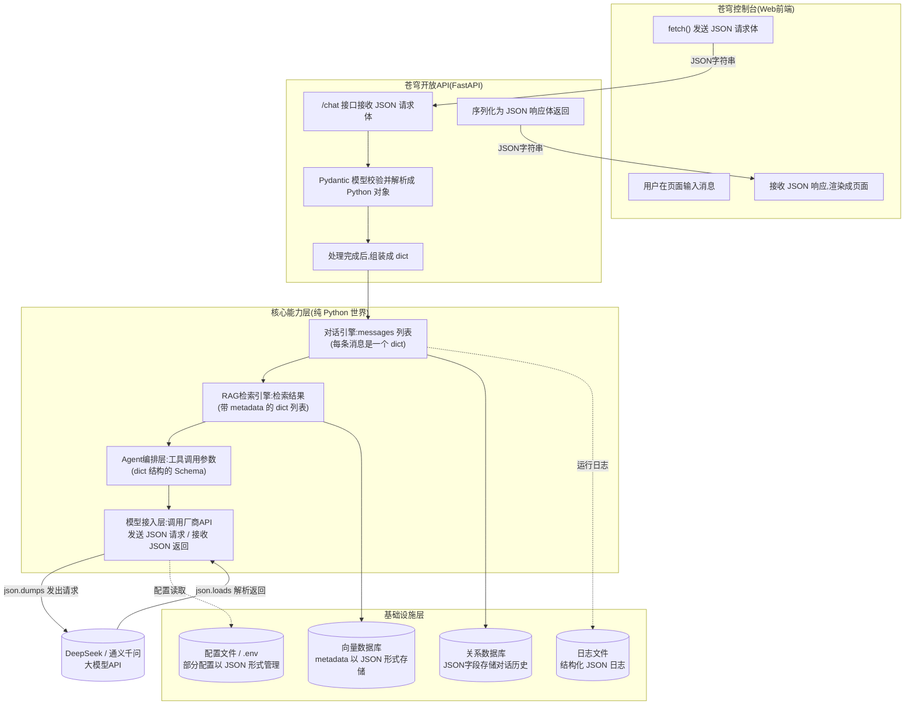
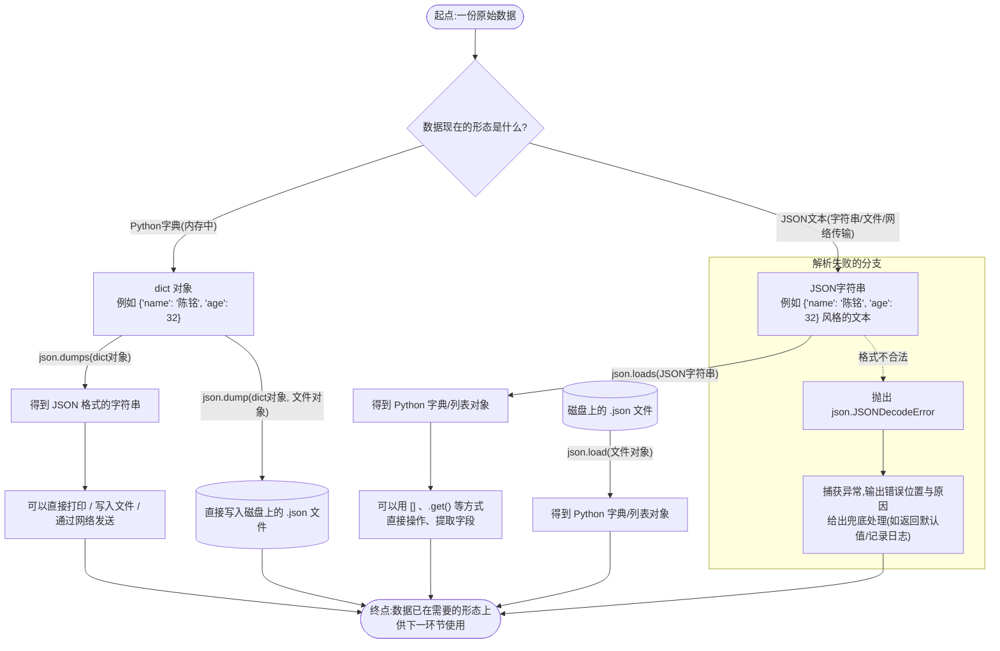

# 第5天 · 核心数据结构(下)——字典与JSON重点日

> **周次/Sprint**:Sprint 0 · 新人内训(Day1-14)—— 阶段项目一:命令行多轮对话AI助手(预计Day14交付)
> **星期**:周五
> **学员**:陈铭、苏梦、韩露、张凡(本期技术培训生小组,导师:王振宇)
> **内训任务卡**:PYXT-ONB-D05(蓬远科技培训中心 · 新人训练营 · Day05)
> **今日关键词**:字典dict / 嵌套字典 / 遍历 / JSON格式 / json模块(loads·dumps·load·dump) / 模拟API返回解析

---

## 【旁白】

如果要给陈铭这七十天的成长曲线标出几个"拐点",今天大概排不进最耀眼的那几个——它不像Day12第一次调用大模型API那样有仪式感,也不像Day30搭出完整RAG系统那样有里程碑式的兴奋。但如果反过来问一句"这七十天里,哪个知识点被用到的次数最多",答案几乎可以肯定是今天学的两样东西:字典,和JSON。

往前数,列表、元组、集合,是"存一堆东西"的容器;往后数,类、对象、函数、Agent、RAG检索链路,是"把事情做成"的手段。但字典和JSON,是贯穿在中间、几乎每一层都绕不开的"数据的形状"。陈铭这一天写的每一个`{}`,三十天后会变成向量库里一条检索结果的元数据;两个月后会变成大模型API请求体里的`messages`字段;半年后(以故事时间线折算)会变成微调数据集里一条Alpaca格式的训练样本;两个月后会变成前端页面通过`fetch`发给后端、后端又通过FastAPI的Pydantic模型接住的那个JSON请求体。今天学的这套"键值对"的思维方式,不是某一个模块的专属知识,它是整本书的通用语法。

这也是老王把这一天的教学策略设计得比前四天都更"刻意"的原因——他没有按部就班先讲完dict语法再讲JSON,而是反过来,先把一段真实的、还没人教过的DeepSeek API返回结果甩到投影幕布上,让四个新人对着一堆他们还看不懂的花括号和方括号愣了几秒钟,再慢慢把这堆符号拆解开,告诉他们"这堆东西,你们迟早要天天跟它打交道,今天咱们先学会怎么'读'它,以后再学怎么'调'出它"。这种"先给结果、再拆过程"的讲法,和前四天"从语法讲到练习"的顺序刚好反过来,是老王故意为之的一次教学节奏调整,目的是让四个人对"为什么学dict和JSON"这件事,从一开始就有一个具体到不能再具体的画面感,而不是抽象的"这是重点,要记住"。

如果你把这一天的课件当成一份"技术地图"来看,它其实在给后面六十五天里出现的几乎每一种数据打了一个共同的地基:对话消息(`{"role": "user", "content": "..."}`)、API请求体、API返回结果、配置文件、数据库里存的JSON字段、向量库的metadata、微调数据集的每一条样本、Docker Compose里那些看起来是YAML但骨子里和JSON是同一种"结构化数据"思维的配置……这些东西,今天陈铭还完全想象不到自己会用到,但老王心里清楚——这是新人训练营里唯一一天,知识点的"复用率"能打满70天全程的一天。

---

## 晨会纪要 / 今日目标

**时间**:上午8:50,二层小会议室"起航"
**出席**:王振宇(老王)、陈铭、苏梦、韩露、张凡

周五的早晨天阴得有点闷,窗外能听到远处工地隐隐约约的打桩声。老王进会议室的时候没端咖啡,手里拿的是自己的笔记本电脑,一进门就把投影打开,屏幕上还残留着他昨晚测试代码时开的几个窗口没关。四个人陆续坐下,还没等老王开口,张凡就先注意到投影上那一大片密密麻麻的花括号,小声问了句:"老师,这是什么?"

老王没有直接回答,而是先花了五分钟同步昨天的进展。

**昨天进展(培训小组)**:
- 四人昨天(Day4)学习了列表list的增删改查、切片、排序、列表推导式,以及元组tuple、集合set的基本用法,产出物是命令行版的"待办事项管理器"——一个用列表存一堆待办事项、支持增加/完成/删除/查看的小工具。
- 陈铭的待办事项管理器写得比预想的顺利,唯一被老王点出的问题是:程序一关掉,所有待办事项就全没了,"这跟一个人脑子里记事儿,睡一觉就忘了没什么区别"。
- 苏梦昨天在"列表切片"这块卡了比较久,搞不清楚`list[1:3]`和`list[1:3:1]`的区别,陈铭主动过去帮她理了一遍,两人一起把切片的"左闭右开"规则重新过了一次。

**风险点**:
- 昨天列表用的是"按位置(索引)"存取数据,今天字典是"按名字(键)"存取数据,两种思维方式容易在脑子里打架,尤其是"什么时候该用列表、什么时候该用字典"这个判断,新手容易混。
- JSON的语法规则和Python字典的字面量写法长得极像,但有几处关键差异(比如JSON里必须用双引号、布尔值是小写的`true`/`false`、没有`None`只有`null`),这几处差异恰恰是新手最容易在实际调用API时踩坑的地方,今天要提前打好预防针。
- 今天信息密度全公司同期新人历年反馈都偏高,晚自习会安排充分的答疑时间,不求进度多快,求理解到位。

老王把投影切到那一片花括号的界面,清了清嗓子:"行,先解答刚才张凡的疑问。这个,"他指着屏幕,"是我昨晚测试的时候,调用DeepSeek的接口拿到的一段真实返回结果,我截了个图搬过来。你们现在完全不需要懂它是怎么调出来的——那是两个月后(Day12)你们才会真正学的东西。但我想让你们提前认一认它长什么样。"

他顿了一下,又补了一句,是那种带着分量的口气:"接下来两个月,你们每天写的代码,大概率都会跟这种格式打交道。今天这一天,咱们不学怎么'调用API',咱们学怎么'看懂'和'处理'这种格式。这个格式,叫JSON。它背后依赖的数据结构,叫字典。今天这两样东西学扎实了,你们后面接触API、接触数据库、接触配置文件,都会觉得'这个我见过'。"

**今日目标**:
1. 上午:字典dict的增删改查、嵌套字典、字典的遍历方式,与列表的对比。
2. 下午:JSON格式详解(与API交互的基石)、json模块的`loads`/`dumps`/`load`/`dump`四个核心方法、解析一份模拟的API返回JSON并提取指定字段。
3. 晚自习:把Day4的待办事项管理器升级为JSON文件持久化版本,同时独立完成`parse_mock_api.py`——解析模拟API返回结果、提取指定字段的完整脚本。
4. 全员在下班前把今天的代码提交到蓬远GitLab个人练习仓库。

**老王补充的一句预告**:"提前说一句,这两天你们会发现,你们写的代码里,重复的东西越来越多——今天写字典的增删改查,你们四个人的实现思路大同小异,却要各写一遍。这个问题我们不今天解决,但记在心里,下周一(Day6)咱们会正式学函数,到时候你们会发现,今天写的这些重复代码,原来可以被'包起来'复用。"

---

## 需求文档:新人训练营内部工具需求书 —— 待办事项持久化升级 & 模拟API响应解析脚本

> 本需求书由技术导师王振宇口头提出、陈铭执行整理,格式沿用公司内部PRD模板。今天不涉及外部客户需求,而是"内部工具"性质的技术自学任务,但验收方式仍按公司标准执行——这也是老王反复强调的"哪怕是练习题,也要用真项目的标准去对待"。

### 背景

Day4产出的待办事项管理器,数据全部存放在内存里的一个列表中,程序运行期间可以正常增删改查,但只要关闭程序,所有数据就彻底丢失。这在真实的企业级软件里是不可接受的——不管是苍穹平台未来要保存的对话历史,还是客户的知识库文档目录,都需要"程序关掉之后,数据还在"的持久化能力。同时,老王判断,四人在两个月后(Day12)就要真正开始调用大模型API,而API返回的数据格式统一是JSON,如果今天不提前打好"读懂JSON、把JSON转换成Python能直接操作的字典"这个基础,到Day12再手忙脚乱地补习,会拖慢那一天本该有的"第一次调用成功"的成就感和节奏。因此,今天的内部工具需求分成两块:一是给待办事项管理器加上JSON文件持久化能力;二是独立完成一份"解析模拟API返回结果"的脚本,为两个月后的真实调用打好地基。

### 用户故事

- 作为一名使用待办事项管理器的用户(即陈铭本人,自用自测),我希望关闭程序再重新打开后,之前添加的待办事项依然存在,以便我不需要每次都重新输入所有内容。
- 作为一名即将在两个月后调用大模型API的培训生,我希望现在就能熟练地把一段JSON格式的文本,转换成Python的字典或列表,并从里面精确提取出我需要的某个字段,以便到时候能快速上手真实的API返回结果处理。
- 作为技术导师,我希望通过今天的练习,提前暴露新人在字典操作和JSON格式理解上的薄弱环节,以便在Day12真正接触API之前完成补课,避免关键日被基础问题拖慢节奏。
- 作为团队协作的一员,我希望自己写的JSON文件在保存中文内容时不出现乱码或转义字符堆砌的问题,以便同事和自己以后都能直接打开文件肉眼核对内容。

### 功能列表

| 编号 | 任务 | 说明 | 验收方式 |
|---|---|---|---|
| T1 | 字典基础练习脚本 | 编写`dict_crud_practice.py`,覆盖字典的增/删/改/查全部操作,至少包含5种不同的增删改查写法对比 | 脚本运行无报错,输出结果与预期一致,老王现场提问能准确说出每种写法的适用场景 |
| T2 | 嵌套字典遍历脚本 | 编写`nested_dict_traversal.py`,构造至少3层嵌套的字典结构,实现完整遍历并打印层级关系 | 能正确遍历并打印所有层级的键值对,不遗漏、不重复 |
| T3 | json模块四方法示例 | 编写`json_module_demo.py`,完整演示`json.loads`/`json.dumps`/`json.load`/`json.dump`四个方法的用法,包含中文处理、格式美化参数 | 四个方法均有独立可运行的示例,涵盖`ensure_ascii`、`indent`等关键参数 |
| T4 | 模拟API响应解析脚本 | 编写`parse_mock_api.py`,解析至少2份不同结构的模拟API返回JSON(参考真实DeepSeek/通义千问返回格式),提取回复内容、token用量、模型名称、结束原因等指定字段 | 脚本能正确提取全部指定字段,并对JSON格式错误、字段缺失等异常情况有合理的处理和提示 |
| T5 | 待办事项管理器JSON持久化升级 | 在Day4版本基础上,新增"保存到JSON文件"和"从JSON文件加载"功能,程序退出前自动保存,启动时自动加载 | 关闭程序后重新运行,之前的待办事项能正确恢复;人为破坏JSON文件内容后,程序不崩溃,能给出友好提示 |

### 非功能需求

- **编码规范**:所有涉及中文内容的JSON文件读写,必须显式指定`encoding="utf-8"`,并在`json.dumps`时设置`ensure_ascii=False`,避免出现`\u4e2d\u6587`这类难以阅读的转义序列。
- **健壮性**:凡是读取外部文件或解析外部字符串的代码,都要考虑到"文件不存在"、"文件内容不是合法JSON"这两种最常见的异常场景,即便今天还没系统学习`try/except`的完整语法,也要用今天能力范围内合理的方式做基本的防护(今天会由老王简单预告try/except的最基本写法,系统学习安排在Day10)。
- **可读性**:保存到文件里的JSON,要用`indent`参数做适当的缩进美化,不能保存成挤在一行里、人眼几乎无法阅读的样子。
- **一致性**:字典里字段的命名,统一使用英文小写加下划线的形式(比如`task_name`而不是`taskName`或`任务名称`),为将来对接真实API的字段命名习惯提前铺垫。

### 验收标准

1. `dict_crud_practice.py`能完整、无报错地运行,涵盖字典增删改查的至少5种典型写法。
2. `nested_dict_traversal.py`能正确遍历一个至少3层嵌套的字典结构,层级关系在输出中清晰可辨。
3. `json_module_demo.py`中`loads`/`dumps`/`load`/`dump`四个方法均有独立示例,且能正确处理中文内容不乱码。
4. `parse_mock_api.py`能从至少2份结构不同的模拟API返回JSON中,准确提取出回复文本、token用量、模型名称等指定字段,并对格式错误的JSON有基本的容错处理。
5. 待办事项管理器升级版关闭重启后,数据不丢失;面对损坏的JSON文件,程序能给出提示而不是直接崩溃退出。
6. 全部代码提交到蓬远GitLab个人练习仓库,commit信息清晰描述改动内容。

### 备注

老王在下发这份任务书时补了一句,后来被陈铭记进了笔记:"这份需求书里,T3和T4看起来是两个独立的练习,但你们往后干活会发现,几乎所有'调用第三方接口'的活儿,骨子里都是这两件事的组合——把你的请求变成JSON发出去,把对方返回的JSON变成你能用的数据。今天先把这两件事拆开练熟,以后合在一起用的时候,才不会手忙脚乱。"

---

## 架构设计图:JSON在苍穹平台各层之间的流转示意

上午课快结束的时候,老王把白板翻到新的一面,说:"我知道你们现在还没写过一行FastAPI代码,这张图你们看不全懂也没关系,但我希望你们现在就在脑子里种下一个印象——JSON不是'调用API时才会出现的东西',它会穿梭在苍穹平台从上到下的每一层。"



老王的讲解大致是这样的:"你们现在只需要记住一个规律——只要数据要'跨边界'走(从前端到后端、从我们的服务到大模型厂商、从内存到数据库或文件),它几乎必然会变成JSON这种文本格式。原因很简单:JSON是一种纯文本格式,不挑操作系统、不挑编程语言,Python能读、JavaScript能读、Java能读、甚至你直接拿文本编辑器打开都能读懂个七八成。但一旦数据'回到'我们自己的Python代码内部去处理,它又会立刻变回字典——因为字典操作起来远比一长串文本字符串方便。"

他又指着图里的箭头补充:"你们看这几个箭头,前端发JSON给API,API转成Python对象处理完了,再转成JSON发回给前端;我们的服务调用大模型API的时候,也是把请求内容打包成JSON发出去,再把对方返回的JSON解析回字典。这个'JSON进、字典处理、字典出、JSON传'的循环,你们今天学的两个函数——`json.loads`把JSON转成字典,`json.dumps`把字典转成JSON——就是这个循环里最核心的两个齿轮。今天学的东西,不起眼,但缺了它,这整张图哪个箭头都走不通。"

苏梦举手问:"那数据库和向量库那两块,为什么也要用JSON?"老王答:"数据库有些字段本身设计成'JSON类型'字段,用来存放结构不固定、字段可能会变化的数据,比如一条对话消息可能有`role`、`content`,以后还可能加上`timestamp`、`token_count`这些字段,如果每加一个字段都要改数据库表结构,太麻烦,不如直接存一整段JSON,灵活。向量库存的每一段文本,除了向量本身,还会挂一些'元数据'(比如这段文本来自哪个文件、第几页),这些元数据几乎清一色是用JSON或者字典的形式挂载的。这些概念你们现在记个印象就行,具体怎么用,后面Day29讲向量数据库的时候我们会细讲。"

---

## 流程图:json.loads 与 json.dumps 的数据流转全过程

上午课接近结束时,老王画了第二张图,专门聚焦在"字典"和"JSON字符串"这两种形态之间怎么互相转换,他管这张图叫"今天的地基图"。



老王讲解这张图的时候,特意在"loads"和"dumps"两个单词上多停留了一会儿:"这俩函数名字长得像,新手最容易记混,我教你们一个不会出错的记忆方法——`s`结尾的两个函数(`loads`、`dumps`),操作对象是字符串(string),`s`就是string的缩写;没有`s`的两个函数(`load`、`dump`),操作对象是文件(file object)。你们把这个规律记下来,以后写代码就不会犯'该用loads的地方写成load'这种低级错误。"

他又补了一句实战经验:"这张图里,右下角那个'解析失败的分支',我特意画出来,不是为了吓唬你们。你们以后处理真实的API返回结果,十次里至少有一两次会遇到返回内容不是标准JSON的情况——可能是网络传输过程中截断了,可能是对方接口本身出了故障返回了一段HTML错误页面而不是JSON。这个分支,你们今天先有个印象,晚自习我们会在`parse_mock_api.py`里加一个简单的异常处理练习。"

---

## 示意图:字典嵌套结构与JSON树形结构的对应关系

第三张图,老王画得比前两张更"接地气",他直接拿陈铭个人信息卡片程序里可能出现的一份"用户档案"数据,把字典嵌套结构和JSON的树形结构并排画在一起。

```mermaid
graph TD
    subgraph DICT["Python嵌套字典(内存里的样子)"]
        D0["user_profile 字典"]
        D0 --> D1["'name': '陈铭'"]
        D0 --> D2["'age': 32"]
        D0 --> D3["'is_full_time': True"]
        D0 --> D4["'address': 嵌套字典"]
        D4 --> D5["'city': '北京'"]
        D4 --> D6["'district': '海淀区'"]
        D0 --> D7["'skills': 嵌套列表"]
        D7 --> D8["'Python'"]
        D7 --> D9["'Excel'"]
        D0 --> D10["'manager': None"]
    end

    subgraph JSONTREE["对应的JSON文本(树形结构)"]
        J0["{ ... } 顶层JSON对象"]
        J0 --> J1["'name': '陈铭'"]
        J0 --> J2["'age': 32"]
        J0 --> J3["'is_full_time': true"]
        J0 --> J4["'address': { ... } 嵌套对象"]
        J4 --> J5["'city': '北京'"]
        J4 --> J6["'district': '海淀区'"]
        J0 --> J7["'skills': [ ... ] 嵌套数组"]
        J7 --> J8["'Python'"]
        J7 --> J9["'Excel'"]
        J0 --> J10["'manager': null"]
    end

    D0 -.json.dumps 转换方向.-> J0
    J0 -.json.loads 转换方向.-> D0
```

老王讲这张图的时候用了一个比喻,后面被陈铭记进了笔记本:"你们把字典想象成一棵倒过来长的树——最上面是根,根上挂着好几个'键',每个键指向一个'值',这个值如果本身又是一个字典或者列表,就相当于这根树枝上又长出了一丛新的分支,可以一层一层往下嵌套,理论上没有层数限制,只是嵌套太深会难以维护。JSON的树形结构和Python字典的树形结构,长得几乎一模一样,区别只在于'写法上的方言'——花括号对应的是'对象'(JSON里的叫法)也对应Python的字典;方括号对应的是'数组'(JSON里的叫法)也对应Python的列表;JSON里的字符串必须用双引号,布尔值写成小写的`true`/`false`,空值写成`null`而不是Python的`None`。你们记住这张图的'形状是一样的,方言不一样',以后看到多深的嵌套结构都不会怕。"

他又特意点出一个容易被忽略的细节:"注意图里的`manager`这个字段,值是`None`(Python里)对应JSON里的`null`。这种'某个字段目前没有值,但字段本身要保留'的场景,在真实业务里非常常见——比如一个新入职的员工,可能暂时还没分配汇报的上级,但档案里这个字段要留着,不能直接删掉不写。"

---

## 课堂笔记

### 上午:字典dict的增删改查、嵌套字典、遍历

**9:00,培训室**

老王把展示DeepSeek返回JSON的那段"开场秀"收起来之后,没有立刻进入正式的字典语法讲解,而是先抛出一个问题:"昨天你们用列表存了一堆待办事项,每一条待办事项,你们是怎么表示的?"

陈铭回答:"我是用字符串存的,比如`'写周报'`,加个前缀表示状态,比如`'[未完成] 写周报'`。"

老王点头:"这是最直接的做法,但有一个问题——如果我现在问你,'写周报'这条待办事项是什么时候创建的、优先级是多少,你打算怎么在这个字符串里塞进去?"

陈铭想了想:"再加个前缀?比如`'[未完成][高优先级][10月8日] 写周报'`?"

老王笑了:"你已经摸到问题的边缘了。这种做法,信息全塞进一个字符串里,读的时候要靠字符串切片或者正则表达式一点点'拆解',拆错一个字符,数据就全乱了。这种'把结构化信息硬塞进一个字符串'的做法,在真实项目里是要被打回来重写的。今天我们要学的字典,就是用来解决这个问题的——它能让你把'一条待办事项'表示成一个有名字、有结构的整体,而不是一串靠约定俗成的格式硬凑出来的文本。"

#### 一、字典是什么:换一种"找东西"的方式

老王先带着大家回顾了Day1讲变量类型时用过的那个比喻——"变量就像贴了标签的储物格"。他说:"列表,你可以想象成一长排连在一起的储物格,每个格子有一个编号(索引),你想找某个东西,得先知道它在第几号格子里。字典不一样,字典是一种可以直接按'标签'找到格子的储物格——你不需要知道它在第几号,你只需要知道它的'标签'(我们管这个标签叫'键',key),就能直接拿到里面的'东西'(我们管这个东西叫'值',value)。"

他在白板上写下最基本的字典写法:

```python
user = {"name": "陈铭", "age": 32, "is_full_time": True}
```

"这一行代码,创建了一个字典,里面有三个'键值对'。`name`是键,`陈铭`是对应的值;`age`是键,`32`是对应的值;`is_full_time`是键,`True`是对应的值。你们注意语法上的几个细节:整个字典用花括号`{}`包起来,每一个键值对用冒号`:`分隔键和值,不同的键值对之间用逗号`,`分隔。"

张凡问了一个很直接的问题:"那字典和列表比,到底什么时候该用哪个?"

老王给了一个至今被陈铭反复引用的判断标准:"你问自己一句话——我需要按'位置'(第几个)去找数据,还是按'名字'(叫什么)去找数据?如果答案是'位置',用列表;如果答案是'名字',用字典。比如你有一批学生的成绩,你想知道'第3个学生'的成绩,这是按位置找,用列表;但如果你想知道'名叫张凡的学生'的成绩,这是按名字找,用字典更合适。"

他又补充了一层更贴近工作场景的说法:"你们以后会发现,几乎所有'一条完整的业务记录'——一个用户的信息、一条对话消息、一次API请求的参数——都会用字典来表示,因为这些记录天然是'有名字的字段的集合',不是简单的一串数字。而'很多条这样的记录排在一起'——比如很多条对话消息构成一段完整的对话历史——才会用列表把很多个字典串起来。这两种结构经常是配合着用的,不是互相排斥的。"

**字典的键有什么限制**

老王在这里补充了一个新手很容易忽略、但一旦踩上就会一头雾水的规则:"字典的键,必须是'不可变'的类型——字符串、数字、元组都可以作为键,但列表、字典这种'可变'的类型不能作为键。"

他现场演示了一次踩坑:

```python
invalid_dict = {["a", "b"]: "测试值"}
```

运行后报错:

```
Traceback (most recent call last):
  File "dict_key_error_demo.py", line 1, in <module>
    invalid_dict = {["a", "b"]: "测试值"}
TypeError: unhashable type: 'list'
```

"`unhashable type: 'list'`,意思是列表这个类型'不可哈希'——你们现在不需要深究'哈希'这个概念的底层原理(这个话题会在你们后面接触到更高级的数据结构和性能优化时再展开),只需要记住一句实用结论:列表和字典不能作为字典的键,但可以作为字典的值。这条规则反过来问也一样成立——为什么昨天(Day4)学的元组tuple看起来和列表功能很像,但很多场景下更推荐用元组?其中一个原因就是元组是'不可变'的,可以被用作字典的键,而列表不行。"

苏梦追问:"那如果我确实需要用'一组东西'当键呢,比如按(城市,年份)这样一对信息去查找数据?"

老王答:"这正是元组作为字典键的经典用法,比如`{("北京", 2024): 1500, ("上海", 2024): 1800}`,元组是不可变的,可以放心当键用。这个用法你们现在记一下,后面写统计类脚本的时候会经常用到。"

#### 二、字典的"查"(读取数据)

老王决定先讲"查",而不是按"增删改查"这个顺序里"增"排第一的惯例来讲。他解释:"我故意先讲查,因为你得先知道'怎么从字典里拿东西',才能更好理解'往字典里放东西'这个动作的意义。"

**方式一:用方括号直接取值(有风险)**

```python
user = {"name": "陈铭", "age": 32}
print(user["name"])   # 输出:陈铭
print(user["age"])    # 输出:32
```

老王紧接着演示了这种取值方式最大的风险——键不存在时会报错:

```python
print(user["email"])
```

运行后:

```
Traceback (most recent call last):
  File "dict_get_demo.py", line 3, in <module>
    print(user["email"])
KeyError: 'email'
```

"`KeyError`,这是字典操作里最常见的报错之一,以后你们处理API返回结果的时候会大量遇到——比如你以为返回结果里一定有某个字段,结果对方接口在某种情况下没返回这个字段,你的代码直接崩掉。这就是为什么,'查字典'这件事,企业级代码里更推荐用另一种更安全的方式。"

**方式二:用get()方法取值(更安全)**

```python
user = {"name": "陈铭", "age": 32}
print(user.get("name"))         # 输出:陈铭
print(user.get("email"))        # 输出:None(键不存在,但不会报错)
print(user.get("email", "未填写"))  # 输出:未填写(指定了默认值)
```

"`get()`方法有一个很大的好处——键不存在的时候,它不会报错,而是返回`None`(如果你没指定默认值)或者你指定的默认值。这个特性,在你们以后处理'字段可能存在也可能不存在'的真实数据时,几乎是标配用法。我给你们一个经验之谈:公司代码规范里,凡是不能100%确定某个键一定存在的场景,统一用`.get()`,不要直接用方括号,除非你非常确定这个键一定在,而且键不存在就应该报错来提醒你程序设计有问题。"

**方式三:用in关键字先判断键是否存在**

```python
user = {"name": "陈铭", "age": 32}
if "email" in user:
    print("邮箱是:", user["email"])
else:
    print("这个用户没有填写邮箱")
```

老王补充:"`in`用在字典上,默认判断的是'键'是否存在,不是判断值。这一点很多新手会搞混,以为`"陈铭" in user`能判断'陈铭'这个值在不在字典里——实际上`in`默认只检查键,如果你想检查值,要写成`"陈铭" in user.values()`。"

**方式四:遍历所有键、所有值、所有键值对**

```python
user = {"name": "陈铭", "age": 32, "is_full_time": True}

print("所有的键:", list(user.keys()))
print("所有的值:", list(user.values()))
print("所有的键值对:", list(user.items()))
```

输出:

```
所有的键: ['name', 'age', 'is_full_time']
所有的值: ['陈铭', 32, True]
所有的键值对: [('name', '陈铭'), ('age', 32), ('is_full_time', True)]
```

老王解释:"`keys()`、`values()`、`items()`这三个方法,严格来说返回的不是列表,而是一种叫'视图对象'(view object)的东西,它会实时反映字典的最新状态。你们现在不用太纠结这个概念,只需要记住,想把它们变成看起来很直观的列表,可以用`list()`包一下,就像我刚才演示的这样。真正在实际写代码遍历的时候,大多数情况你们不需要转成列表,直接放在`for`循环里用就行,这个我们下面马上会讲到。"

#### 三、字典的"增"(添加新的键值对)

**方式一:直接用方括号赋值**

```python
user = {"name": "陈铭", "age": 32}
user["city"] = "北京"          # 键不存在,会新增这个键值对
print(user)   # {'name': '陈铭', 'age': 32, 'city': '北京'}
```

老王强调:"这里有个很重要的特性——如果键已经存在,这个操作会变成'改'(更新已有的值),而不是报错或者新增第二个同名键。字典的键必须是唯一的,你不可能有两个叫`name`的键同时存在。"

**方式二:用update()方法批量添加/更新**

```python
user = {"name": "陈铭", "age": 32}
user.update({"city": "北京", "age": 33})   # city是新增,age是更新
print(user)   # {'name': '陈铭', 'age': 33, 'city': '北京'}
```

"`update()`可以一次性传入一个字典,里面的键如果原字典里没有就新增,如果有就覆盖更新原来的值。这个方法在你们以后合并两份配置、合并两次API返回结果的时候会经常用到。"

**方式三:用setdefault()方法——"如果没有才添加"**

```python
user = {"name": "陈铭", "age": 32}
user.setdefault("city", "未知")     # city键不存在,添加它,值为"未知"
user.setdefault("name", "占位姓名")  # name键已存在,不会覆盖,原值保持不变
print(user)   # {'name': '陈铭', 'age': 32, 'city': '未知'}
```

老王解释这个方法的独特之处:"`setdefault()`和直接用方括号赋值最大的区别是——如果键已经存在,`setdefault()`不会覆盖原来的值,它只在键不存在的时候才会真正生效。这个方法特别适合'给缺省字段设置默认值,但不想影响已经填好的字段'这种场景,你们以后写配置加载逻辑的时候会用得上。"

#### 四、字典的"改"(更新已有的值)

老王指出:"你们已经在'增'的部分看到了,字典的'改'和'增',在语法层面用的是同一套写法(`user[key] = value`或者`update()`),区分它是'增'还是'改',只取决于这个键之前有没有出现过。这一点和数据库里`INSERT`和`UPDATE`是两个不同的操作不太一样,字典里这两个动作是合二为一的。"

```python
user = {"name": "陈铭", "age": 32}

# 改:key已存在,直接覆盖原来的值
user["age"] = 33
print(user)   # {'name': '陈铭', 'age': 33}

# 用update()同时改多个字段
user.update({"age": 34, "name": "陈铭(改名后)"})
print(user)   # {'name': '陈铭(改名后)', 'age': 34}
```

他补充了一个真实业务场景类比:"你们想象一下,苍穹平台以后要给每个客户维护一份'账户配置',里面记录着这个客户开通了哪些功能、额度还剩多少。客户续费之后,你不需要把整个配置重新创建一份,只需要把'额度'这个字段对应的值改一下,这正是字典'改'操作最典型的应用场景。"

#### 五、字典的"删"(删除键值对)

**方式一:用del关键字**

```python
user = {"name": "陈铭", "age": 32, "city": "北京"}
del user["city"]
print(user)   # {'name': '陈铭', 'age': 32}
```

老王提醒:"`del`删除一个不存在的键,会直接报`KeyError`,和之前用方括号读取不存在的键报的错是同一种。用`del`之前,如果不能确定键一定存在,最好先用`in`判断一下,或者用下面这种更安全的方式。"

**方式二:用pop()方法——删除并返回被删除的值**

```python
user = {"name": "陈铭", "age": 32, "city": "北京"}
removed_value = user.pop("city")
print("被删除的值是:", removed_value)   # 北京
print(user)   # {'name': '陈铭', 'age': 32}

# pop()可以指定默认值,键不存在时不会报错,而是返回默认值
removed_value_2 = user.pop("email", "该字段本来就不存在")
print(removed_value_2)   # 该字段本来就不存在
```

"`pop()`比`del`更常用,原因是它在删除的同时,还能把被删掉的值'带出来'给你用,而且可以指定默认值来避免报错,更安全、更灵活。我建议你们以后写业务代码,优先用`pop()`而不是`del`,除非你确实只关心'删掉'这个动作本身,完全不关心被删掉的值是什么。"

**方式三:用popitem()——删除并返回最后一个键值对**

```python
user = {"name": "陈铭", "age": 32, "city": "北京"}
last_item = user.popitem()
print(last_item)   # ('city', '北京')
print(user)        # {'name': '陈铭', 'age': 32}
```

老王补充了一个历史背景细节:"这里有个知识点值得提一句——Python 3.7版本之前,字典是'无序'的,你没法保证`popitem()`删的一定是你最后加进去的那个。但从Python 3.7开始,字典正式承诺'保留插入顺序',也就是说你按什么顺序把键值对加进去,遍历的时候就按什么顺序出来,`popitem()`删除的确实是最后加入的那一个。我们团队统一用3.11版本,这个特性可以放心依赖,但如果你以后在一些很老的代码库里看到'不能依赖字典顺序'这种注释,不要惊讶,那是历史遗留的谨慎写法。"

**方式四:用clear()方法——清空整个字典**

```python
user = {"name": "陈铭", "age": 32, "city": "北京"}
user.clear()
print(user)   # {}
```

"`clear()`会把字典变成一个空字典,但这个字典变量本身还存在,不是被删除了,这和`del user`(把整个变量删掉,以后再用`user`会报`NameError`)是两种完全不同的操作,别搞混。"

#### 六、嵌套字典:一个字典的值,也可以是另一个字典

老王在讲完基础的增删改查之后,停顿了一下,说:"接下来这部分,是今天上午最重要的一个转折点——嵌套字典。你们前面学的都是'一层'的字典,值都是简单的数字、字符串、布尔值。但真实业务数据,几乎从来不会只有一层。"

他现场敲出一个模拟"用户档案"的例子:

```python
user_profile = {
    "name": "陈铭",
    "age": 32,
    "is_full_time": True,
    "address": {
        "city": "北京",
        "district": "海淀区",
        "zip_code": "100080"
    },
    "skills": ["Python", "Excel", "数据分析"],
    "employment_history": [
        {"company": "某跨境电商公司", "role": "运营专员", "years": 6},
        {"company": "蓬远科技", "role": "技术培训生", "years": 0}
    ]
}
```

"你们看,`address`这个键对应的值,本身又是一个字典;`employment_history`这个键对应的值,是一个列表,列表里的每一个元素,又都是一个字典。这就是'嵌套'——字典里可以嵌套字典,字典里可以嵌套列表,列表里也可以嵌套字典,层层组合,理论上可以嵌套任意深度,唯一的限制是'别嵌套得连自己都看不懂'。"

**访问嵌套字典里的数据**

```python
print(user_profile["address"]["city"])            # 北京
print(user_profile["employment_history"][0]["company"])  # 某跨境电商公司
print(user_profile["employment_history"][1]["role"])     # 技术培训生
```

老王解释:"访问嵌套结构,本质上就是'一层一层剥洋葱'——先用第一层的键或索引拿到第二层的数据,再对第二层的数据继续用键或索引往下拿。方括号可以一直往后接,接多少层取决于你的数据嵌套了多少层。"

他现场演示了一个新手常见的报错——中途访问了不存在的层级:

```python
print(user_profile["contact"]["phone"])
```

```
Traceback (most recent call last):
  File "nested_error_demo.py", line 1, in <module>
    print(user_profile["contact"]["phone"])
KeyError: 'contact'
```

"这个报错发生在最外层——因为`user_profile`这个字典里根本没有`contact`这个键,所以连第一层都过不去,报错信息里的`'contact'`已经明确告诉你是哪一层出的问题。以后你们处理层级更深的真实数据(比如API返回结果经常有4层、5层嵌套),遇到`KeyError`,先看报错信息里给出的是哪个键,再回头去对应的层级里核实数据到底长什么样,不要盲目瞎猜。"

**更安全地访问嵌套结构:链式使用get()**

```python
# 如果不确定某一层的键是否存在,可以链式使用get(),配合默认值兜底
phone = user_profile.get("contact", {}).get("phone", "未提供")
print(phone)   # 未提供
```

老王解释这个写法的巧妙之处:"`user_profile.get("contact", {})`,如果`contact`这个键不存在,不会报错,而是返回一个空字典`{}`;紧接着对这个空字典调用`.get("phone", "未提供")`,同样不会报错,返回默认值'未提供'。这种'链式get,每一层都给个默认值兜底'的写法,是处理不确定嵌套结构时非常实用的技巧,你们以后写解析API返回结果的代码时会大量用到这个模式,包括晚自习要写的`parse_mock_api.py`。"

#### 七、字典的遍历:把嵌套结构一层一层"打开"看

老王把这部分称为"今天上午最考验耐心的部分"。他先从最简单的单层字典遍历讲起,再逐步过渡到嵌套字典的遍历。

**遍历单层字典的三种写法**

```python
user = {"name": "陈铭", "age": 32, "city": "北京"}

# 写法一:只遍历键(最常见的默认写法)
print("---写法一:只遍历键---")
for key in user:
    print(key, "->", user[key])

# 写法二:显式调用keys()(效果和写法一完全一样,但更明确地表达意图)
print("---写法二:显式调用keys()---")
for key in user.keys():
    print(key, "->", user[key])

# 写法三:同时遍历键和值(推荐,最简洁,也最不容易出现KeyError)
print("---写法三:同时遍历键和值(items())---")
for key, value in user.items():
    print(key, "->", value)
```

三种写法的输出结果是一致的:

```
---写法一:只遍历键---
name -> 陈铭
age -> 32
city -> 北京
---写法二:显式调用keys()---
name -> 陈铭
age -> 32
city -> 北京
---写法三:同时遍历键和值(items())---
name -> 陈铭
age -> 32
city -> 北京
```

老王给出了明确的团队规范建议:"三种写法功能上没差,但公司代码规范里,我们优先推荐第三种——`for key, value in user.items()`。原因是这种写法在循环体里直接拿到了值,不需要每次再用`user[key]`重新查一次,少一次查找,代码也更清楚地表达了'我要同时用到键和值'这个意图。第一种写法在'你只关心键,压根不需要值'的场景下依然合适,别一刀切地觉得第三种永远最好。"

**遍历嵌套字典:递归思路的第一次直观感受**

老王在这里做了一个"提前剧透"的处理:"接下来这个例子,严格来说用到了一点'函数自己调用自己'的思路,这个概念叫'递归',正式的原理我们要到下周(Day6)才系统讲。今天我先带你们直观感受一下它在遍历嵌套字典时的用处,你们不需要现在就能自己写出递归函数,只需要看懂这个例子在干什么。"

```python
def print_nested_dict(data, indent=0):
    """
    递归打印一个可能存在多层嵌套的字典,用缩进体现层级关系。
    今天先直观感受这个函数的效果,下周(Day6)学完函数和递归之后,
    你会更清楚地理解"函数调用自己"这件事到底是怎么运转的。
    """
    for key, value in data.items():
        if isinstance(value, dict):
            # 如果这个值本身又是一个字典,先打印键名,再"钻进去"继续打印
            print("  " * indent + str(key) + ":")
            print_nested_dict(value, indent + 1)
        else:
            print("  " * indent + str(key) + ": " + str(value))

sample = {
    "name": "陈铭",
    "address": {
        "city": "北京",
        "district": "海淀区"
    }
}
print_nested_dict(sample)
```

输出:

```
name: 陈铭
address:
  city: 北京
  district: 海淀区
```

老王没有深入解释递归的调用栈原理,只是简单说了一句:"你们现在只需要记住一个直观印象——遇到嵌套的字典,'钻进去'的动作,可以让同一个逻辑反复执行,不用为每一层单独写一段代码。这个函数今天你们照着抄一遍、跑一遍、感受一下效果就够了,下周函数专题会带你们从头理解它的原理,那时候再回头看这段代码,会有一种'原来是这么回事'的感觉。"

**for循环遍历字典时能不能修改字典?**

老王在这里补充了一个非常容易踩的坑:"你们以后写代码,可能会想在遍历字典的过程中,顺手删掉几个不需要的键。我现在演示一下,直接这么做会发生什么。"

```python
data = {"a": 1, "b": 2, "c": 3}
for key in data:
    if data[key] == 2:
        del data[key]
```

运行后:

```
Traceback (most recent call last):
  File "modify_during_iteration.py", line 2, in <module>
    for key in data:
RuntimeError: dictionary changed size during iteration
```

"`RuntimeError: dictionary changed size during iteration`,意思是'字典在遍历过程中大小发生了变化'。Python不允许你一边遍历一边直接改变字典的键的数量(增加或删除都不行,单纯修改已有键对应的值是允许的)。正确的做法,是先把要删除的键收集到一个列表里,遍历结束之后再统一删除,或者用字典推导式重新构造一个新字典。"

他演示了正确写法:

```python
data = {"a": 1, "b": 2, "c": 3}

# 正确写法一:先收集要删除的键,遍历结束后再统一删除
keys_to_delete = []
for key in data:
    if data[key] == 2:
        keys_to_delete.append(key)
for key in keys_to_delete:
    del data[key]
print(data)   # {'a': 1, 'c': 3}

# 正确写法二:用字典推导式直接构造一个不包含目标键值对的新字典
data2 = {"a": 1, "b": 2, "c": 3}
data2 = {k: v for k, v in data2.items() if v != 2}
print(data2)  # {'a': 1, 'c': 3}
```

"第二种写法用到了'字典推导式',这个语法结构长得和你们昨天(Day4)学的列表推导式非常像,只是把方括号换成了花括括,把单个表达式换成了`键: 值`的形式。你们现在能看懂它在干什么就够了,不要求今天就能信手写出来。"

#### 八、字典与列表的对比:什么时候用哪个,一张表说清楚

老王让大家把下面这张对比表抄进笔记本,他说这张表"以后你们纠结用列表还是用字典的时候,翻出来看一眼就有答案"。

| 对比维度 | 列表 list | 字典 dict |
|---|---|---|
| 访问数据的方式 | 按位置(索引),如`data[0]` | 按名字(键),如`data["name"]` |
| 数据是否需要"有名字" | 不需要,元素本身没有名字 | 需要,每个值都对应一个键作为名字 |
| 是否允许重复 | 元素可以重复 | 键不能重复(重复会互相覆盖),值可以重复 |
| 典型应用场景 | 一批同类型的记录(多条待办事项、多条对话消息) | 一条有结构的完整记录(一个用户的信息、一条API请求参数) |
| 遍历方式 | `for item in list` | `for key, value in dict.items()` |
| 是否有序 | 天然有序,按添加顺序排列 | Python 3.7+起保留插入顺序 |
| 查找效率 | 按值查找需要逐个比对,效率随长度增长而下降 | 按键查找效率很高,几乎不受字典大小影响 |

他补充了最后一条,是这张表里陈铭后来划了重点线的一条:"字典按键查找效率很高,这背后依赖的是我们前面提过的'哈希'机制,你们现在只需要知道结论——字典的键查找几乎是'瞬间'的,列表如果要按值去找某个元素在哪,得从头到尾一个一个比对,元素越多越慢。这也是为什么很多需要'快速查找'的场景(比如根据用户ID快速找到用户信息),都会优先考虑用字典,而不是遍历列表去找。"

**列表和字典组合使用的典型场景**

老王给出了一个和苍穹平台强相关的例子,直接呼应架构图里的对话引擎层:"你们以后写的对话历史,长这个样子——"

```python
conversation_history = [
    {"role": "user", "content": "你好,苍穹平台是做什么的?"},
    {"role": "assistant", "content": "苍穹是蓬远科技研发的企业级智能体中台……"},
    {"role": "user", "content": "能帮我查一下海纳集团的项目进度吗?"}
]
```

"这是一个列表,列表里的每一个元素是一个字典。列表负责'按顺序排列很多条消息',字典负责'描述每一条消息自己的结构'。这个数据结构,你们大概率在Day8学`ChatMessage`类的时候会再见到一次,在Day14阶段项目一里会亲手写出来,在Day27学Memory记忆机制的时候还会再见到一次。今天这一眼,只是个开场。"

#### 九、FAQ:上午常见疑问6则

1. **问:字典的键可以是数字吗?**
   答:可以。比如`{1: "一", 2: "二"}`是合法的字典。但注意`1`(整数)和`"1"`(字符串)是两个不同的键,不会互相覆盖,这一点新手容易搞混,用之前最好明确自己的键到底是数字类型还是字符串类型。

2. **问:字典里的值,可以是函数吗?**
   答:可以,而且这是一个非常常见的高级用法——用字典模拟"分支跳转"或者"命令映射表",比如`{"add": add_func, "delete": delete_func}`,根据用户输入的命令字符串,直接从字典里取出对应的函数来执行,不用写一长串`if/elif`。这个用法我们今天不深入展开,下周学完函数(Day6)之后你们会更有体会。

3. **问:字典和JSON是同一个东西吗?**
   答:不完全是。字典是Python这门语言里的一种数据类型,是内存里真实存在的对象,支持你调用各种方法(`.get()`、`.update()`等等)。JSON是一种纯文本的数据交换格式,本质上就是一段字符串,不是Python专属的,任何编程语言都能读写它。两者"长得很像"、"表达的信息结构一样",但一个是"活的对象",一个是"死的文本",这个区别我们下午会详细展开。

4. **问:如果我不小心把字典的键写重复了会怎样?**
   答:比如`{"name": "陈铭", "name": "苏梦"}`,这段代码不会报错,但后面出现的键值对会覆盖前面的,最终结果是`{"name": "苏梦"}`。这种"悄悄覆盖、不报错"的特性,反而是最危险的一类坑,因为它不会给你任何提示,你可能都不知道数据已经被覆盖掉了。写代码的时候要格外注意,避免手写字典时出现重复的键。

5. **问:字典可以嵌套自己吗(比如字典a里存了字典a本身)?**
   答:技术上是可以做到"循环引用"的,但这在正常业务逻辑里几乎不会出现,也会给`json.dumps`这类序列化操作带来麻烦(等你们真的这么写的时候会报`ValueError: Circular reference detected`这样的错误)。这个知识点今天记一下就行,不需要现在动手实验,以免把自己绕进去。

6. **问:字典的性能真的比列表好吗?任何场景都推荐用字典?**
   答:不是"任何场景",而是"按名字查找数据"的场景字典更合适。如果你的数据本身没有"名字"这个概念,比如单纯一堆数字要排序、要求和,列表反而更直接、更省心,没必要硬套一个字典结构。老王的原话是:"数据结构没有绝对的好坏,只有'合不合适当前场景',这句话你们以后写系统设计的时候还会反复听到。"

---

### 下午:JSON格式详解与json模块实战

**14:00,培训室**

午饭后,老王没有立刻回到语法细节,而是先把上午展示的那段DeepSeek返回JSON重新投影出来,问了一句:"上午你们已经学完了字典,现在再看这段东西,是不是感觉眼熟了一点?"

四个人凑近看了一眼投影,张凡说:"这不就是个大字典吗,外面套了个花括号,里面还嵌套了好几层。"

老王满意地点头:"说得基本对。这正是我今天故意把顺序倒过来讲的原因——先学会字典的'样子',再来看JSON,你们会发现JSON几乎就是字典的'文本版'。但'几乎'这个词很关键,它们不是完全一样的东西,中间有几处差异,恰恰是你们以后调用真实API时最容易踩的坑。今天下午,咱们把这几处差异一次性讲透。"

#### 一、JSON是什么,为什么它会成为"通用语言"

**JSON的全称与来历**

老王先讲了一点背景知识:"JSON,全称JavaScript Object Notation,直译过来是'JavaScript对象表示法'。听名字你们可能觉得,这不是JavaScript这门语言专属的东西吗,跟我们Python有什么关系?"

他解释了这背后的历史逻辑:"JSON这种格式,最早确实是从JavaScript里'对象'的写法演化出来的,大概二十年前被一个人从JavaScript语言里提炼出来,单独定义成一种独立的数据交换格式,不再依附于JavaScript本身。它的语法非常简单、非常直观,几乎所有主流编程语言都能轻松解析它、生成它。正因为这种'简单到人人都能读懂、人人都能实现'的特点,它慢慢取代了更早期一些更繁琐的数据交换格式(比如XML),成为今天几乎所有Web API、几乎所有大模型API的默认数据交换格式。"

**【旁白】**

写到这里,不妨跳出陈铭今天这一堂课的视角,单独说一句——如果要给这七十天的技术故事挑一个"隐形主角",JSON几乎有资格排进候选名单。它不像Python、不像LangChain、不像向量数据库那样,会在某一天被单独隆重地"介绍"出场,恰恰相反,它安静地嵌在几乎每一天的代码里,从不喧宾夺主。Day12,陈铭第一次调用DeepSeek API,拿到的返回结果是JSON;Day18,学JSON Mode和结构化输出,处理的还是JSON;Day23-24,搭建苍穹0.1版的FastAPI接口,请求体和响应体全部是JSON;Day30,搭建RAG系统时,每一段检索结果带着的引用来源信息,是用字典/JSON的形式挂载的;Day52,构建微调数据集,Alpaca格式的每一条训练样本,本质上还是一份JSON;Day56,做Docker容器化部署,配置文件的骨架思路和JSON是同一种"结构化数据"的思维方式。可以说,从Day5到Day70,陈铭再也没有真正"离开"过JSON这种格式——它就是这整套课程里,唯一一种贯穿全程、每一个阶段都会反复出现的"通用语言"。今天学的这几个函数,看起来朴素,却是打开后面六十五天几乎每一扇门的同一把钥匙。

**为什么不用别的格式**

老王在这里做了一个简单的横向对比,帮大家建立一个更完整的认知坐标系:

| 数据交换格式 | 特点 | 现状 |
|---|---|---|
| XML | 用标签包裹数据,结构清晰但写法冗长,一个简单的字段要写"开始标签+内容+结束标签" | 早期Web服务和企业系统常用,现在逐渐被JSON取代,少数遗留系统和特定行业标准(如部分金融、电信协议)仍在使用 |
| JSON | 语法简洁,用花括号和方括号表达结构,几乎所有语言原生支持解析 | 当前Web API、大模型API的事实标准,本课程后续70天几乎所有API交互都基于JSON |
| YAML | 用缩进表达层级,不用花括号方括号,人读起来更友好,但机器解析规则更复杂 | 常用于配置文件(比如Docker Compose、CI/CD配置文件),不常用于API实时数据交换 |
| CSV | 用逗号分隔字段,适合表格类的扁平数据 | 常用于批量数据导入导出,不适合表达嵌套结构 |

"你们记住一个结论就够了——JSON不是唯一的格式,但在'API请求和返回数据'这个场景里,它几乎是没有争议的行业默认选择。YAML你们后面(Day56)写Docker Compose配置的时候会再打一次照面,CSV你们昨天(Day4)和前几天多少也接触过一点批量数据的概念,今天专门讲的JSON,权重最高,因为它和'调用大模型API'这件事直接绑定。"

#### 二、JSON的语法规则详解

老王在白板上完整写出了一份示例JSON,逐条标注语法规则:

```json
{
  "name": "陈铭",
  "age": 32,
  "height": 175.5,
  "is_full_time": true,
  "manager": null,
  "skills": ["Python", "Excel", "数据分析"],
  "address": {
    "city": "北京",
    "district": "海淀区"
  }
}
```

他逐条讲解:

1. **最外层通常是一个对象(用`{}`包裹)或一个数组(用`[]`包裹)**,对象内部是若干"键: 值"对,数组内部是若干并列的元素。
2. **键必须是字符串,且必须用双引号包裹**,不能用单引号,也不能不加引号。这是JSON和Python字典写法最大的差异之一——Python字典的键可以不加引号地用单引号,但JSON强制要求双引号。
3. **值可以是**:字符串(双引号包裹)、数字(不加引号)、布尔值(小写的`true`/`false`,不是Python的`True`/`False`)、`null`(表示空值,对应Python的`None`)、对象(嵌套的`{}`)、数组(嵌套的`[]`)。
4. **最后一个键值对或最后一个数组元素后面,不能有多余的逗号**(即"没有尾随逗号"),这一点和Python字典/列表的写法不一样,Python里加个尾随逗号是完全合法、甚至是被鼓励的风格(方便以后添加新元素时diff更干净),但标准JSON语法里,尾随逗号是非法的,会导致解析失败。
5. **JSON里没有注释这种东西**。你不能像在Python代码里那样写`# 这是注释`,标准JSON格式完全不支持任何形式的注释。如果你看到一些配置文件写了"JSON"但里面带注释,那通常是某个工具自己扩展的"JSON5"或者"带注释JSON"的变体,不是严格标准的JSON,普通的`json.loads()`是解析不了的。

**JSON与Python字典写法差异对照表**

老王把这些差异整理成一张对照表,让大家抄下来,说这是"接下来两个月踩坑率最高的一张表":

| 对比点 | JSON写法 | Python字典写法 | 说明 |
|---|---|---|---|
| 键的引号 | 必须用双引号`"key"` | 单引号、双引号都可以`'key'`或`"key"` | JSON强制双引号,没有例外 |
| 布尔值 | 小写`true`/`false` | 首字母大写`True`/`False` | 大小写不一致会直接导致JSON解析失败 |
| 空值 | `null` | `None` | 两者含义相同,写法不同 |
| 尾随逗号 | 不允许 | 允许(风格上被鼓励) | JSON里多写一个逗号会导致`json.JSONDecodeError` |
| 注释 | 完全不支持 | Python代码里`#`注释正常使用 | JSON文本内绝对不能出现`#`或`//`注释 |
| 键的类型 | 只能是字符串 | 可以是字符串、数字、元组等可哈希类型 | JSON对象的键必须都是字符串 |
| 元组 | 不存在这个概念,统一用数组`[]`表达 | 支持独立的元组类型`()` | JSON没有"元组"这个概念,元组会被当成数组处理 |

老王讲到这张表的时候,特别提醒:"你们以后自己手写JSON文本(比如写测试数据、写配置文件)的时候,如果按Python字典的习惯写了单引号或者`True`,拿去用`json.loads()`解析,一定会报错。这个错误初学者遇到率极高,我建议你们现在就故意写错一次,亲眼看看报错长什么样,比我讲十遍都有用。"

#### 三、json模块登场:Python与JSON之间的翻译官

老王正式引入今天下午的核心模块:"Python自带一个标准库模块,叫`json`,不需要额外安装,直接`import json`就能用。这个模块,你们可以理解成'Python字典世界'和'JSON文本世界'之间的翻译官,专门负责把两边的东西互相转换。"

**四个核心方法总览**

老王先把四个方法列在白板上,让大家对照着记忆规律(和流程图部分讲的记忆技巧呼应):

| 方法 | 作用 | 输入 | 输出 | 记忆技巧 |
|---|---|---|---|---|
| `json.loads()` | 把JSON字符串解析成Python对象 | 字符串(str) | 字典/列表等 | `s`结尾,操作的是字符串(string) |
| `json.dumps()` | 把Python对象转换成JSON字符串 | 字典/列表等 | 字符串(str) | `s`结尾,操作的是字符串(string) |
| `json.load()` | 从文件对象中读取内容并解析成Python对象 | 文件对象 | 字典/列表等 | 没有`s`,操作的是文件(file) |
| `json.dump()` | 把Python对象转换成JSON格式,直接写入文件对象 | 字典/列表等,文件对象 | 无返回值,直接写文件 | 没有`s`,操作的是文件(file) |

老王补充了一句总结性的说法:"你们可以把这四个方法看成两组,每组两个方向相反的操作。一组是'字符串 <-> 字典'(`loads`和`dumps`),另一组是'文件 <-> 字典'(`load`和`dump`)。字面意思上,`load`是'加载'(把外部的东西读进Python),`dump`是'倾倒'(把Python里的东西倒出去)。"

**json.loads():把JSON字符串变成Python字典**

```python
import json

json_text = '{"name": "陈铭", "age": 32, "is_full_time": true}'
data = json.loads(json_text)

print(data)             # {'name': '陈铭', 'age': 32, 'is_full_time': True}
print(type(data))       # <class 'dict'>
print(data["name"])     # 陈铭
print(type(data["is_full_time"]))  # <class 'bool'>
```

老王强调了这个例子里几个值得注意的细节:"你们看,原始的JSON字符串里,布尔值写的是小写的`true`,但解析成Python对象之后,自动变成了首字母大写的`True`,类型也变成了Python的`bool`类型。这就是`json.loads()`在做的事情——不只是简单的文本替换,而是真正把JSON的语法规则'翻译'成对应的Python数据类型规则。"

**json.dumps():把Python字典变成JSON字符串**

```python
import json

user = {"name": "陈铭", "age": 32, "is_full_time": True, "manager": None}
json_text = json.dumps(user)

print(json_text)     # {"name": "\u9648\u94ed", "age": 32, "is_full_time": true, "manager": null}
print(type(json_text))  # <class 'str'>
```

这里老王故意演示了一个新手一定会遇到的"惊吓时刻"——输出结果里,"陈铭"两个字变成了`\u9648\u94ed`这种看起来像乱码的东西。他等大家反应过来之后才解释:"你们别慌,这不是bug,也不是数据丢失。`json.dumps()`默认会把所有非ASCII字符(也就是英文字母、数字、常见符号之外的字符,包括中文)转义成`\uXXXX`这种Unicode转义序列。这个默认行为是为了兼容一些历史上比较老旧的、只能处理ASCII字符的系统环境,但对我们今天的场景来说,完全没有必要,反而会让文本变得难以阅读。"

**关键参数:ensure_ascii=False**

```python
import json

user = {"name": "陈铭", "age": 32}
json_text = json.dumps(user, ensure_ascii=False)
print(json_text)   # {"name": "陈铭", "age": 32}
```

"加上`ensure_ascii=False`这个参数,中文就能正常显示,不会被转义成一串看不懂的字符。这是我们团队的强制规范——任何时候用`json.dumps()`处理包含中文的数据,都必须显式加上这个参数。忘了加这个参数,不算报错,但会给后续排查问题的人添很多不必要的麻烦,老王的话是:'技术上没毛病,但会让维护你代码的人骂娘。'"

**关键参数:indent(格式美化)**

```python
import json

user = {
    "name": "陈铭",
    "age": 32,
    "address": {"city": "北京", "district": "海淀区"}
}

# 不加indent,输出挤在一行,难以阅读
compact_text = json.dumps(user, ensure_ascii=False)
print("紧凑格式:")
print(compact_text)

# 加上indent=2,自动按2个空格缩进美化输出,层级关系一目了然
pretty_text = json.dumps(user, ensure_ascii=False, indent=2)
print("\n美化格式:")
print(pretty_text)
```

输出对比:

```
紧凑格式:
{"name": "陈铭", "age": 32, "address": {"city": "北京", "district": "海淀区"}}

美化格式:
{
  "name": "陈铭",
  "age": 32,
  "address": {
    "city": "北京",
    "district": "海淀区"
  }
}
```

老王补充:"`indent`参数一般在你要把JSON存进文件、或者打印出来给人肉眼查看、调试的时候用,能大幅提高可读性。但如果这份JSON是要通过网络发送给服务器,追求传输效率的场景下,通常不会加`indent`,因为多余的空格和换行会增加数据体积,虽然增加得不多,但企业级系统对这类细节还是有讲究的。"

**关键参数:sort_keys(按键名排序)**

```python
import json

data = {"city": "北京", "age": 32, "name": "陈铭"}
sorted_text = json.dumps(data, ensure_ascii=False, sort_keys=True)
print(sorted_text)   # {"age": 32, "city": "北京", "name": "陈铭"}
```

"这个参数用得没有前两个频繁,但在一些需要'固定输出顺序方便对比测试结果'的场景很有用,比如你写自动化测试,想确认两次运行输出的JSON内容是否完全一致,如果不排序,同样的数据可能因为字典内部顺序不同而被误判成'不一致',加上`sort_keys=True`可以规避这个问题。"

**json.dump():直接把字典写入文件**

```python
import json

user = {"name": "陈铭", "age": 32, "city": "北京"}

# 用with语句打开一个文件,自动处理关闭文件的操作(这个语法Day11会系统讲)
with open("user_profile.json", "w", encoding="utf-8") as f:
    json.dump(user, f, ensure_ascii=False, indent=2)

print("已保存到 user_profile.json")
```

老王在这里提前预告了一点点即将学到的知识:"`with open(...) as f`这个写法,是Python里管理文件的标准方式,系统的讲解安排在Day11。今天你们只需要知道,这一行代码打开了一个文件,准备往里面写内容,`f`就代表这个打开的文件。`encoding='utf-8'`这个参数,是显式告诉Python用UTF-8编码格式来读写这个文件——中文内容如果编码指定不对,打开文件的时候会看到乱码甚至直接报错,这也是我们团队规范里,任何涉及中文的文件读写操作,必须显式指定`encoding='utf-8'`的原因。"

**json.load():直接从文件读取并解析**

```python
import json

with open("user_profile.json", "r", encoding="utf-8") as f:
    loaded_data = json.load(f)

print(loaded_data)          # {'name': '陈铭', 'age': 32, 'city': '北京'}
print(type(loaded_data))    # <class 'dict'>
```

"你们对比一下`dump`+`load`和`dumps`+`loads`的用法,能不能总结出一个规律?"老王问。

苏梦想了想说:"如果要直接读写文件,就用没有`s`的那两个;如果是处理一段已经在内存里的字符串,就用有`s`的那两个?"

"对,就是这个规律。"老王说,"顺便提一句,`json.load(f)`内部其实就相当于先把文件内容整个读成一个字符串,再调用`json.loads()`解析这个字符串,只是这两步被封装成了一个方法,省得你自己手写`f.read()`再调用`loads()`。你们完全可以自己验证一下这个等价关系。"

他现场验证给大家看:

```python
import json

# 方式一:用json.load()一步完成
with open("user_profile.json", "r", encoding="utf-8") as f:
    data_a = json.load(f)

# 方式二:先手动读取文件内容成字符串,再用json.loads()解析,效果完全一样
with open("user_profile.json", "r", encoding="utf-8") as f:
    raw_text = f.read()
data_b = json.loads(raw_text)

print(data_a == data_b)   # True,两种方式得到的结果完全一致
```

#### 四、真实感的模拟API返回JSON:提前认一认这些"老熟人"

老王把这部分称为"今天下午的重头戏"。他先把上午展示的那段DeepSeek返回结果重新完整地投影出来,逐字段拆解讲解,然后又追加了几份不同场景的模拟样例,让大家提前对"大模型API返回结果长什么样"建立一个扎实的认知。

**样例一:DeepSeek Chat Completion 基础返回结构**

```json
{
  "id": "chatcmpl-8f3a1c2b9d7e4a6f8b0c1d2e3f4a5b6c",
  "object": "chat.completion",
  "created": 1718012345,
  "model": "deepseek-chat",
  "choices": [
    {
      "index": 0,
      "message": {
        "role": "assistant",
        "content": "苍穹是蓬远科技研发的企业级智能体中台,目标是让每一家企业都拥有自己的AI大脑。我们不做基础大模型的预训练,专注于把通用大模型转化为能在企业内部真正落地的应用系统。"
      },
      "logprobs": null,
      "finish_reason": "stop"
    }
  ],
  "usage": {
    "prompt_tokens": 24,
    "completion_tokens": 58,
    "total_tokens": 82,
    "prompt_tokens_details": {
      "cached_tokens": 0
    },
    "completion_tokens_details": {
      "reasoning_tokens": 0
    }
  },
  "system_fingerprint": "fp_1c141eb703"
}
```

老王逐字段讲解:

- `id`:这次请求的唯一标识,以后你们出了问题去找厂商反馈,基本都要提供这个ID,方便对方定位是哪一次调用出的问题。
- `object`:标记这段返回数据的类型是"聊天补全"(chat completion),厂商用这个字段区分不同种类的返回结果。
- `created`:一个整数时间戳,表示这条返回结果生成的具体时间(Unix时间戳,自1970年1月1日以来的秒数),你们Day11学`datetime`模块的时候会学到怎么把它转换成人能看懂的日期格式。
- `model`:实际处理这次请求的模型名称,你们请求时指定的模型名和返回的这个字段,理论上应该一致,如果不一致,说明厂商那边做了自动路由或者降级处理。
- `choices`:一个数组(列表),里面是模型给出的一条或多条候选回复。绝大多数场景下,你们只会拿到一条候选回复,也就是`choices[0]`。数组里每个元素又是一个字典,包含`index`(第几条候选)、`message`(具体的消息内容,自己又是一个嵌套的字典,里面有`role`和`content`)、`finish_reason`(结束原因)。
- `usage`:这次请求消耗的token数量,分为`prompt_tokens`(输入消耗的token数)、`completion_tokens`(输出消耗的token数)、`total_tokens`(两者之和)。你们Day15会系统学Token和分词器,今天先认识这几个字段的位置。
- `finish_reason`:这个字段的取值有讲究,常见的有`"stop"`(模型自然结束,正常完整回答完毕)、`"length"`(因为达到了`max_tokens`限制被截断,回答可能不完整)、`"tool_calls"`(模型决定要调用某个工具,这个概念我们Day19会专门展开)。以后你们的代码里,判断一次调用"是不是正常结束",经常就是检查这个字段是不是等于`"stop"`。

"你们现在把这份JSON当成一份'地图'记下来,"老王说,"两个月后你们真正调用API拿到的结果,骨架和这份几乎一模一样,顶多某些字段的具体取值不同。今天先熟悉'地图长什么样',以后拿到真实数据,你不会因为看到一堆嵌套结构就发懵。"

**样例二:通义千问(DashScope兼容OpenAI接口)返回结构**

```json
{
  "id": "chatcmpl-a1b2c3d4-e5f6-4789-9abc-def012345678",
  "object": "chat.completion",
  "created": 1718012400,
  "model": "qwen-plus",
  "choices": [
    {
      "index": 0,
      "message": {
        "role": "assistant",
        "content": "海纳制造集团的知识库问答系统,核心解决的问题是老师傅的经验难以传承——大量工艺文档和质量规范散落在纸质手册和各个系统里,新员工很难快速找到准确答案。"
      },
      "finish_reason": "stop"
    }
  ],
  "usage": {
    "prompt_tokens": 31,
    "completion_tokens": 45,
    "total_tokens": 76
  }
}
```

老王指出:"你们对比一下这份和上面DeepSeek的那份,骨架几乎完全一样——都有`choices`、都有`message`、都有`usage`。这不是巧合,是因为通义千问通过阿里云DashScope提供了'OpenAI兼容接口',意思是它故意把自己的返回格式设计成和OpenAI(以及绝大多数遵循这套规范的厂商,包括DeepSeek)保持一致,这样你们写的代码,理论上只需要改一下模型名称和密钥,就能无缝切换厂商,不需要为每家厂商单独写一套解析逻辑。这也是我们team选型策略里,为什么反复强调'OpenAI兼容接口'这个概念的原因——它极大降低了多模型接入的工程成本。"

**样例三:带有reasoning_content的DeepSeek-Reasoner返回结构**

```json
{
  "id": "chatcmpl-9d8c7b6a5f4e3d2c1b0a9f8e7d6c5b4a",
  "object": "chat.completion",
  "created": 1718012500,
  "model": "deepseek-reasoner",
  "choices": [
    {
      "index": 0,
      "message": {
        "role": "assistant",
        "reasoning_content": "用户想知道待办事项管理器为什么需要持久化。核心原因是内存数据在程序退出后会被释放,需要把数据转换成可以长期保存的格式,JSON文件是最简单的方案之一。",
        "content": "因为程序运行时数据都存放在内存里,一旦程序关闭,内存会被系统释放,里面的数据也就跟着消失了。要让数据"活下来",就得把它保存到磁盘上的文件里,JSON格式简单又通用,是最合适的选择之一。"
      },
      "finish_reason": "stop"
    }
  ],
  "usage": {
    "prompt_tokens": 18,
    "completion_tokens": 76,
    "total_tokens": 94,
    "completion_tokens_details": {
      "reasoning_tokens": 32
    }
  }
}
```

老王特别指出这份样例的不同之处:"你们注意到`message`这个字典里多了一个字段——`reasoning_content`。这是DeepSeek的推理模型(`deepseek-reasoner`)特有的字段,专门用来单独返回模型的'思考过程',和最终真正给用户看的`content`是分开的。这个设计,是为了让开发者可以选择性地展示或者隐藏模型的'内心戏',你们以后如果接入这类推理模型,处理返回结果的时候要记得多考虑这一个字段,不能直接套用普通模型的解析逻辑,否则会漏掉重要信息。"

**样例四:错误返回(API调用失败时的JSON结构)**

```json
{
  "error": {
    "message": "Incorrect API key provided. You can find your API key at https://platform.deepseek.com/api_keys.",
    "type": "authentication_error",
    "param": null,
    "code": "invalid_api_key"
  }
}
```

"这份样例,提前给你们打个预防针,"老王说,"两个月后你们第一次调用API,大概率会经历至少一次'密钥没配对'导致的调用失败,失败时厂商返回的不是正常的`choices`结构,而是这种带`error`字段的结构。今天不要求你们记住怎么处理这种情况(Day13会系统讲错误处理和重试机制),但至少要知道——JSON格式的返回结果,不代表这次调用一定成功,你们的代码要有能力先判断'这次返回,是正常结果,还是错误信息',这个判断逻辑,通常就是检查返回的字典里,有没有`error`这个键。"

**样例五:请求体(Request Body)的样子——反过来看看"我们发出去的JSON"**

老王补充了一份"反方向"的样例,让大家对"一次完整的API交互"有始有终的认识:

```json
{
  "model": "deepseek-chat",
  "messages": [
    {"role": "system", "content": "你是苍穹智能助手,请用简洁专业的语言回答问题。"},
    {"role": "user", "content": "苍穹平台目前处于哪个开发阶段?"},
    {"role": "assistant", "content": "目前苍穹平台处于新人内训阶段,团队正在打磨基础工程能力,尚未正式立项。"},
    {"role": "user", "content": "那大概什么时候会正式立项?"}
  ],
  "temperature": 0.7,
  "max_tokens": 1024,
  "stream": false
}
```

"这是你们发给大模型API的请求体,同样是JSON格式。`messages`这个字段,是不是看起来特别熟悉?"老王问,"这正是我们上午讲的'列表里嵌套字典'的经典结构——一个列表,按对话顺序排列,每一条消息是一个字典,包含`role`(说话的角色:`system`系统设定、`user`用户、`assistant`模型自己)和`content`(具体说的内容)。这个结构,你们从Day8开始设计`ChatMessage`类,到Day14做阶段项目一,到Day27做记忆管理,会反复见到、反复亲手实现。今天先混个脸熟。"

#### 五、JSON解析常见异常与容错处理

**json.JSONDecodeError:格式不合法**

老王现场演示了几种典型的JSON格式错误,以及对应的报错信息:

```python
import json

# 错误1:用了单引号而不是双引号(JSON不支持单引号)
bad_json_1 = "{'name': '陈铭', 'age': 32}"
data = json.loads(bad_json_1)
```

报错:

```
Traceback (most recent call last):
  File "json_error_demo.py", line 5, in <module>
    data = json.loads(bad_json_1)
json.decoder.JSONDecodeError: Expecting property name enclosed in double quotes: line 1 column 2 (char 1)
```

"`Expecting property name enclosed in double quotes`,意思是'期望属性名用双引号包裹',它连位置都给你标出来了——第1行第2列。这个报错的根本原因,就是我们前面讲过的差异之一:JSON的键必须用双引号,单引号不合法。"

```python
import json

# 错误2:多写了一个尾随逗号
bad_json_2 = '{"name": "陈铭", "age": 32,}'
data = json.loads(bad_json_2)
```

报错:

```
json.decoder.JSONDecodeError: Expecting property name enclosed in double quotes: line 1 column 28 (char 27)
```

```python
import json

# 错误3:布尔值大小写写错了(用了Python风格的True而不是JSON风格的true)
bad_json_3 = '{"is_active": True}'
data = json.loads(bad_json_3)
```

报错:

```
json.decoder.JSONDecodeError: Expecting value: line 1 column 16 (char 15)
```

老王总结:"你们看,三种不同的错误,报错信息里都会明确指出'第几行第几列'出了问题,这个位置信息非常宝贵——以后你们处理的JSON文本可能有几百上千个字符,靠肉眼一个个数是不现实的,要学会根据这个位置信息去定位问题所在。"

**捕获异常的基本写法(简单预告,系统学习安排在Day10)**

老王在这里做了一次小小的"抢跑",提前教了一点点`try/except`的最基础用法:"我知道系统的异常处理语法要到Day10才正式讲,但今天处理JSON解析这件事,如果完全不懂一点点异常捕获,代码的健壮性会大打折扣。所以我先教你们一个最简单的用法,细节和完整原理,Day10见。"

```python
import json

def safe_parse_json(text):
    """
    安全地解析一段可能不合法的JSON文本。
    今天先学这个最基础的写法,try/except的完整原理下周三(Day10)系统讲。
    """
    try:
        # try代码块里,放"可能会出错"的代码
        result = json.loads(text)
        return result
    except json.JSONDecodeError as e:
        # except代码块里,放"如果真的出错了,该怎么处理"的代码
        print("JSON解析失败,原因:", e)
        return None

good_text = '{"name": "陈铭"}'
bad_text = "{'name': '陈铭'}"

print(safe_parse_json(good_text))   # {'name': '陈铭'}
print(safe_parse_json(bad_text))    # 打印错误信息,并返回None,程序不会崩溃
```

"你们现在只需要记住这个最基础的骨架——`try`里放可能出问题的代码,`except`后面跟你要捕获的具体错误类型,如果这类错误真的发生了,程序不会直接崩溃退出,而是执行`except`里的代码,继续往下走。这个骨架今天先会用,下周(Day10)我们会讲清楚`else`、`finally`、自定义异常这些更完整的内容,以及为什么调用API的代码几乎离不开异常处理——'调API一定会出错,你得学会不崩溃',这是我下周会反复强调的一句话,今天算是提前打个照面。"

**TypeError:不是所有Python对象都能被序列化成JSON**

老王演示了另一种常见错误:

```python
import json
from datetime import datetime

data = {
    "name": "陈铭",
    "created_at": datetime.now(),   # datetime对象不能直接被json.dumps()处理
    "tags": {"python", "json"}      # 集合set同样不能直接被处理
}
json_text = json.dumps(data, ensure_ascii=False)
```

报错:

```
Traceback (most recent call last):
  File "type_error_demo.py", line 8, in <module>
    json_text = json.dumps(data, ensure_ascii=False)
TypeError: Object of type datetime is not JSON serializable
```

"`Object of type datetime is not JSON serializable`,意思是`datetime`这个类型的对象,不知道该怎么变成JSON格式。JSON标准里只定义了字符串、数字、布尔值、`null`、对象、数组这几种类型,Python里的`datetime`、`set`这类它没见过的类型,`json`模块不知道该怎么翻译,只能报错。"

他给出了两种解决方案:

```python
import json
from datetime import datetime

data = {
    "name": "陈铭",
    "created_at": datetime.now(),
    "tags": {"python", "json"}
}

# 解决方案一:提前手动转换成JSON认识的类型
data_fixed = {
    "name": data["name"],
    "created_at": data["created_at"].isoformat(),   # datetime转换成字符串
    "tags": list(data["tags"])                        # set转换成list
}
print(json.dumps(data_fixed, ensure_ascii=False))

# 解决方案二:用default参数,提供一个"遇到不认识的类型该怎么办"的转换函数
def json_serializer(obj):
    """
    json.dumps()的default参数会调用这个函数,
    专门处理它默认不认识的类型,交给我们自己决定怎么转换。
    """
    if isinstance(obj, datetime):
        return obj.isoformat()
    if isinstance(obj, set):
        return list(obj)
    # 如果连这个函数都不知道怎么处理,就抛出原本的错误,不要悄悄吞掉问题
    raise TypeError(f"Object of type {type(obj).__name__} is not JSON serializable")

print(json.dumps(data, ensure_ascii=False, default=json_serializer))
```

"第二种方案更通用,尤其是你的数据里可能混杂了好几种`json`模块不认识的类型,用`default`参数统一处理,比每次手动一个个转换更省心。你们以后接触到日志系统、数据库ORM返回的对象,经常会用到这个技巧。"

#### 六、下午小结:JSON与字典的"双向奔赴"

老王在下午课的最后,把今天上午下午的内容串成了一句话总结:"上午你们学的是字典——JSON在Python世界里'活过来'之后的样子;下午你们学的是JSON——字典要'走出去'跟别的系统打交道时,必须换上的这套通用文本格式。中间的桥梁,就是`json`模块的四个方法。这四个方法,你们今天写熟了,以后两个月的每一次API调用,骨子里都是在反复用它们。"

---

### 晚自习:待办事项JSON持久化改造与parse_mock_api.py联调

**19:00,培训室**

晚自习开始前,老王在群里发了一条消息:"今晚两件事——把昨天的待办事项管理器改造成能存进JSON文件、下次打开还能读回来的版本;独立写一份`parse_mock_api.py`,解析我给你们的模拟API返回结果,提取指定字段。这两件事做完,今天才算真正落地。"

**待办事项管理器的改造思路**

陈铭先打开昨天(Day4)的代码回顾了一遍,当时的核心数据结构是一个列表,每个待办事项是一个字符串,比如`"[未完成] 写周报"`。他按照今天学到的内容,决定把每一条待办事项改造成一个字典,包含更清晰的结构化字段:`id`(编号)、`content`(内容)、`is_done`(是否完成)、`priority`(优先级)、`created_at`(创建时间,先用字符串简单表示,正式的`datetime`处理留给Day11)。

写到一半,他在群里问了一句:"老师,如果我把整个待办事项列表存成JSON,读回来的时候,`id`这种整数字段,还会是整数吗?"

老王回复:"会的,JSON的数字类型解析回Python之后,该是`int`还是`float`,`json`模块会自动帮你判断——JSON里写的是没有小数点的数字,解析回来就是`int`;写的是带小数点的数字,解析回来就是`float`。你不需要手动再转换一次。"

**遇到的第一个真实报错:程序第一次运行时文件不存在**

陈铭写好加载逻辑之后,第一次运行程序(此时还没有生成过`todo_list.json`文件),程序直接崩溃:

```
Traceback (most recent call last):
  File "todo_manager_v2.py", line 15, in <module>
    todos = load_todos()
  File "todo_manager_v2.py", line 8, in load_todos
    with open(TODO_FILE, "r", encoding="utf-8") as f:
FileNotFoundError: [Errno 2] No such file or directory: 'todo_list.json'
```

他把这个报错发到群里,老王的回复很快:"这是个非常经典、也非常合理的报错——你的程序第一次运行,当然还没有生成过这个文件,`open()`用只读模式打开一个不存在的文件,自然会报`FileNotFoundError`。解决思路很简单:在读取文件之前,先判断文件是否存在,如果不存在,就返回一个空列表作为初始状态,而不是强行去读一个根本不存在的东西。"

陈铭补上了这个判断逻辑(完整代码见下方"代码实战"部分),用`os.path.exists()`先做判断——这也是老王顺手提前"剧透"了一个Day11才会系统讲的标准库函数,他补充说:"`os`模块我们下周三(Day11)会系统学,今天先知道`os.path.exists(路径)`能判断一个文件是否存在,先用起来,原理细节等到那天再讲透。"

**遇到的第二个真实报错:文件内容被意外破坏**

老王在群里发了一个"故意使坏"的小测试要求:"你们保存好待办事项之后,手动打开`todo_list.json`,随便删掉里面的一个逗号或者一个引号,存盘,然后重新运行程序,看看会发生什么。"

苏梦第一个试了,删掉一个双引号之后重新运行,程序同样直接崩溃,报错信息是:

```
json.decoder.JSONDecodeError: Expecting ',' delimiter: line 3 column 15 (char 47)
```

老王借这个机会强调:"这正是我们下午讲的容错处理要用上的地方——用户或者其他程序有可能意外损坏你保存的JSON文件(比如程序在写入过程中被强行中断,导致文件写了一半),你的代码不能因为文件损坏就直接崩溃给用户看一堆看不懂的报错,至少要有一个'读取失败就当作空列表处理,并提示用户'的兜底逻辑。"

四个人陆续在自己的代码里加上了`try/except json.JSONDecodeError`的处理,苏梦还追问了一句:"如果文件损坏了,我们直接把它当成空列表处理,那用户原来存的数据不就丢了吗?"

老王认可这个问题提得好:"问得对,这也是真实工程里要考虑的取舍——简单粗暴的处理方式是'当空列表,提示用户数据丢失,重新开始记录';更负责任的处理方式是'把损坏的文件先备份一份改名成`.bak`,再从空列表开始,这样至少留了一份'案发现场'可以事后人工抢救'。今天的练习,能做到第一种就算合格,想挑战自己的,可以试试第二种更完整的方案。"

**parse_mock_api.py的编写过程**

老王把今天要解析的两份模拟JSON发到了群里的共享文档里——正是下午课堂上讲过的那份DeepSeek样例和一份Qwen样例,要求写一个脚本,分别提取:模型名称、回复文本内容、`finish_reason`、`prompt_tokens`、`completion_tokens`、`total_tokens`,并且要能处理"某个字段缺失"或者"JSON格式本身就是错的"这两种异常情况。

陈铭第一版写得比较直接,全部用方括号硬取:

```python
model_name = data["model"]
content = data["choices"][0]["message"]["content"]
```

老王看过之后提出了改进意见:"你这个写法,只要有任何一层字段缺失,程序就直接崩掉。真实的API返回结果,字段结构不是100%保证一成不变的——厂商可能会在某个版本悄悄新增或者调整字段。你的解析代码,应该对'关键字段缺失'这种情况有基本的容忍度,不能假设对方永远给你一份完美无缺的数据。"

陈铭据此把取值逻辑改成了链式`get()`加默认值的写法,并在最外层包了一层`try/except`,这才形成了晚自习最终交付的`parse_mock_api.py`(完整代码见下方"代码实战"部分)。

**和林悦的一次简短闲聊**

晚自习中途休息,林悦正好路过培训室,顺口问了一句陈铭在写什么。陈铭简单解释了一下今天学的字典和JSON,林悦笑着说:"你们现在写的这些解析逻辑,以后我写PRD的时候,经常要在'验收标准'里写类似'某个接口返回结果需要包含哪些字段、缺失时如何兜底'这种条款,其实背后对应的正是你们今天写的这套东西。"这句话让陈铭第一次意识到,自己今天写的代码,和林悦"写文档"这件事,原来在描述的是同一件事情的两个侧面——一个用自然语言描述"应该长什么样",一个用代码真正实现"长成那样"。

**晚自习收尾**

21点前十分钟,四个人陆续把今天的代码提交到各自的GitLab练习仓库。老王在群里挨个看了一遍,给陈铭的评论是:"`parse_mock_api.py`这版容错处理做得不错,比我预期的完整度高。有一个小建议——你可以把提取字段的逻辑单独封成一个函数,方便以后复用,不过这个'封函数'的完整技巧,咱们下周一(Day6)正式讲,你现在这个思路已经摸到边了,值得肯定。"

陈铭看着这条评论,想起早上老王那句"今天你们写的这些重复代码,原来可以被包起来复用",忽然觉得,这几天的课好像被一根看不见的线串起来了——今天学的字典和JSON,是为了两个月后调API做准备;而今天暴露出来的"重复代码太多"的问题,又直接指向了下周一要学的函数。这种"处处都在为后面铺路"的感觉,让他对接下来这几周的课程,多了一层"原来都是提前设计好的"的信任感。

---

## 代码实战

> 以下代码文件均可在配置好Python 3.11环境后直接运行,严格限定在Day1-Day5已学知识点范围内(变量、数据类型、字符串、流程控制、列表/元组/集合、字典、JSON、`json`模块),`try/except`只使用今天预告过的最基础写法,不提前使用函数定义(除了今天课堂上已经明确"提前剧透"的递归遍历示例)、不提前使用面向对象等后续课程内容。所有涉及中文的文件读写,均显式指定`encoding="utf-8"`,所有`json.dumps`均加上`ensure_ascii=False`。

### 文件1:`dict_crud_practice.py` —— 字典增删改查综合练习

```python
"""
文件名:dict_crud_practice.py
作者:陈铭
说明:
    今天上午的字典增删改查练习。这份脚本不是一个"功能程序",
    而是把课堂上讲过的每一种增删改查写法,逐一验证一遍,
    并用print()把每一步的结果打印出来,方便对照课堂笔记复习。
    脚本分成四大部分:查、增、改、删,每一部分内部又按"多种写法"细分。
"""

print("=" * 70)
print("Day5 上午练习:字典增删改查综合练习")
print("=" * 70)

# ============================================================
# 第一部分:字典的"查"——四种取值方式
# ============================================================
print("\n【第一部分:查】")

user = {"name": "陈铭", "age": 32, "is_full_time": True}

# 方式一:方括号直接取值,键存在时没问题,键不存在会报KeyError
print("方式一(方括号取值):", user["name"])

# 方式二:get()方法,键不存在时不会报错,而是返回None或指定的默认值
print("方式二(get,键存在):", user.get("age"))
print("方式二(get,键不存在,无默认值):", user.get("email"))
print("方式二(get,键不存在,有默认值):", user.get("email", "未填写"))

# 方式三:用in关键字先判断键是否存在,再决定怎么处理
if "is_full_time" in user:
    print("方式三(in判断后取值):", user["is_full_time"])
else:
    print("方式三:is_full_time字段不存在")

# 方式四:遍历所有键、所有值、所有键值对
print("方式四(keys):", list(user.keys()))
print("方式四(values):", list(user.values()))
print("方式四(items):", list(user.items()))

# 补充:演示KeyError真实会发生的场景(用try/except接住,不让程序崩溃)
# try/except的完整原理下周三(Day10)系统学,今天先用最基础的写法
try:
    print(user["email"])
except KeyError as e:
    print("捕获到KeyError,缺失的键是:", e)

# ============================================================
# 第二部分:字典的"增"——三种新增写法
# ============================================================
print("\n【第二部分:增】")

profile = {"name": "陈铭", "age": 32}
print("初始状态:", profile)

# 方式一:方括号赋值,键不存在时会新增
profile["city"] = "北京"
print("方式一新增city后:", profile)

# 方式二:update()方法,一次性新增/更新多个键值对
profile.update({"department": "苍穹项目组培训生小组", "mentor": "王振宇"})
print("方式二update新增多个字段后:", profile)

# 方式三:setdefault()方法,只在键不存在的时候才会新增
profile.setdefault("city", "上海")   # city已存在,不会被覆盖
profile.setdefault("hobby", "记笔记")  # hobby不存在,会被新增
print("方式三setdefault后:", profile)
print("注意city没有被setdefault覆盖,依然是:", profile["city"])

# ============================================================
# 第三部分:字典的"改"——更新已有的值
# ============================================================
print("\n【第三部分:改】")

score_board = {"陈铭": 88, "苏梦": 82, "韩露": 90, "张凡": 85}
print("修改前:", score_board)

# 方式一:方括号赋值,键已存在时相当于"改"
score_board["陈铭"] = 92
print("方式一(方括号改单个值)后:", score_board)

# 方式二:update(),一次性改多个已有的值
score_board.update({"苏梦": 86, "张凡": 89})
print("方式二(update批量改)后:", score_board)

# ============================================================
# 第四部分:字典的"删"——四种删除写法
# ============================================================
print("\n【第四部分:删】")

inventory = {"苹果": 30, "香蕉": 15, "橙子": 20, "葡萄": 8}
print("初始库存:", inventory)

# 方式一:del关键字直接删除
del inventory["葡萄"]
print("方式一(del)删除葡萄后:", inventory)

# 方式二:pop()方法,删除并返回被删除的值,支持指定默认值避免报错
removed_value = inventory.pop("香蕉")
print("方式二(pop)删除香蕉,返回值是:", removed_value, "剩余库存:", inventory)

not_exist_value = inventory.pop("西瓜", "库存中本来就没有这一项")
print("方式二(pop)尝试删除不存在的西瓜,返回:", not_exist_value)

# 方式三:popitem(),删除并返回最后插入的键值对(Python 3.7+保证插入顺序)
inventory["新到货-草莓"] = 12
last_item = inventory.popitem()
print("方式三(popitem)删除最后一项,返回:", last_item, "剩余库存:", inventory)

# 方式四:clear(),清空整个字典
backup_inventory = inventory.copy()   # 先复制一份,避免clear()把原始数据也清空
inventory.clear()
print("方式四(clear)清空后:", inventory)
print("清空前的备份仍然完整:", backup_inventory)

# ============================================================
# 第五部分:字典与列表对比小实验——按位置找 vs 按名字找
# ============================================================
print("\n【第五部分:字典与列表对比小实验】")

# 用列表存储一批学生成绩,只能按位置(索引)访问
student_scores_list = [88, 82, 90, 85]
print("列表按位置访问第3个学生的成绩:", student_scores_list[2])

# 用字典存储同一批数据,可以按学生姓名直接访问
student_scores_dict = {"陈铭": 88, "苏梦": 82, "韩露": 90, "张凡": 85}
print("字典按姓名访问韩露的成绩:", student_scores_dict["韩露"])

# 结论验证:如果我不记得韩露在列表里排第几个,列表就无法直接按名字找到她
# 只能遍历整个列表逐一比对,这正是字典在"按名字查找"场景下的优势
print("\n字典增删改查综合练习结束。")
```

### 文件2:`nested_dict_traversal.py` —— 嵌套字典遍历练习

```python
"""
文件名:nested_dict_traversal.py
作者:陈铭
说明:
    今天上午"嵌套字典"部分的练习。构造一份多层嵌套的模拟数据
    (蓬远科技培训小组的组织信息),分别用递归和非递归两种方式
    完整遍历它,并对比两种写法的思路差异。
    递归函数的完整原理下周一(Day6)系统学,今天先直观感受效果。
"""

# ============================================================
# 第一部分:构造一份多层嵌套的模拟数据
# ============================================================

training_group = {
    "group_name": "苍穹项目组新人训练营第一期",
    "mentor": {
        "name": "王振宇",
        "role": "技术负责人",
        "contact": {
            "email": "wangzhenyu@pengyuan-tech.com",
            "office": "二层B区"
        }
    },
    "trainees": [
        {
            "name": "陈铭",
            "background": "跨境电商运营转行",
            "progress": {
                "day1_score": 90,
                "day2_score": 88,
                "day3_score": 92
            }
        },
        {
            "name": "苏梦",
            "background": "零基础转行",
            "progress": {
                "day1_score": 82,
                "day2_score": 85,
                "day3_score": 84
            }
        },
        {
            "name": "韩露",
            "background": "产品运营转行,有前端基础",
            "progress": {
                "day1_score": 88,
                "day2_score": 91,
                "day3_score": 89
            }
        },
        {
            "name": "张凡",
            "background": "在读研究生,数学基础好",
            "progress": {
                "day1_score": 95,
                "day2_score": 93,
                "day3_score": 96
            }
        }
    ],
    "is_active": True,
    "next_review_date": None   # 还没定下具体的下次复盘时间,先留空
}

# ============================================================
# 第二部分:递归遍历——用一个函数"钻透"任意深度的嵌套结构
# ============================================================


def print_nested_structure(data, indent=0):
    """
    递归打印任意深度嵌套的字典/列表结构,用缩进体现层级关系。

    参数:
        data: 待打印的数据,可以是字典、列表,也可以是普通的值。
        indent: 当前的缩进层级,每往下钻一层加1。

    说明:
        这是今天课堂上老王演示过的"提前剧透"函数的完整加强版,
        增加了对"值是列表"这种情况的处理,原版只处理了"值是字典"的情况。
        递归的完整原理(调用栈、终止条件设计)下周一(Day6)系统学。
    """
    prefix = "  " * indent
    if isinstance(data, dict):
        for key, value in data.items():
            if isinstance(value, (dict, list)):
                print(f"{prefix}{key}:")
                print_nested_structure(value, indent + 1)
            else:
                print(f"{prefix}{key}: {value}")
    elif isinstance(data, list):
        for index, item in enumerate(data):
            print(f"{prefix}[{index}]")
            print_nested_structure(item, indent + 1)
    else:
        # 递归的"终止条件"——碰到既不是字典也不是列表的普通值,直接打印,不再往下钻
        print(f"{prefix}{data}")


print("=" * 70)
print("Day5 上午练习:嵌套字典遍历练习")
print("=" * 70)

print("\n【递归遍历完整结构】")
print_nested_structure(training_group)

# ============================================================
# 第三部分:针对性提取——不遍历全部,只关心某几个具体字段
# ============================================================
print("\n【针对性字段提取:每位学员的姓名与Day3成绩】")

for trainee in training_group["trainees"]:
    # 链式使用get(),即便某个学员的progress里恰好缺了day3_score,也不会直接报错
    name = trainee.get("name", "未知姓名")
    day3_score = trainee.get("progress", {}).get("day3_score", "暂无记录")
    print(f"学员:{name}, Day3成绩:{day3_score}")

# ============================================================
# 第四部分:非递归的写法对比——用嵌套的for循环手动"钻"两层
# ============================================================
print("\n【非递归写法:手动嵌套for循环,只适合层级固定、不太深的场景】")

for trainee in training_group["trainees"]:
    print(f"\n学员姓名:{trainee['name']}")
    print(f"转行背景:{trainee['background']}")
    for day_key, score in trainee["progress"].items():
        print(f"  {day_key}: {score}分")

# ============================================================
# 第五部分:统计计算——结合遍历,计算每位学员的三日平均分
# ============================================================
print("\n【统计计算:每位学员的三日平均分,并找出平均分最高的学员】")

best_name = None
best_average = -1.0

for trainee in training_group["trainees"]:
    scores = list(trainee["progress"].values())
    average = sum(scores) / len(scores)
    print(f"{trainee['name']} 的三日平均分:{round(average, 2)}")
    if average > best_average:
        best_average = average
        best_name = trainee["name"]

print(f"\n目前三日平均分最高的学员是:{best_name},平均分:{round(best_average, 2)}")

# ============================================================
# 第六部分:访问一个值为None的字段,演示None与"字段不存在"的区别
# ============================================================
print("\n【None字段演示】")

print("next_review_date字段的值:", training_group["next_review_date"])
print("这个字段是存在的,只是值为None,和字段完全不存在(KeyError)是两种不同的情况。")

if training_group["next_review_date"] is None:
    print("下次复盘时间还未确定。")
```

### 文件3:`json_module_demo.py` —— json模块四个核心方法完整示例

```python
"""
文件名:json_module_demo.py
作者:陈铭
说明:
    完整演示json模块的loads/dumps/load/dump四个方法,
    覆盖中文处理(ensure_ascii)、格式美化(indent)、排序(sort_keys)、
    自定义类型转换(default参数)等关键参数用法。
    本文件运行后会在同目录生成两个用于演示的json文件,
    脚本结束时会打印它们的路径,方便自行打开核对内容。
"""

import json
import os
from datetime import datetime

DEMO_DIR = os.path.dirname(os.path.abspath(__file__))
USER_PROFILE_FILE = os.path.join(DEMO_DIR, "demo_user_profile.json")
CHAT_HISTORY_FILE = os.path.join(DEMO_DIR, "demo_chat_history.json")

print("=" * 70)
print("Day5 下午练习:json模块四个核心方法完整示例")
print("=" * 70)

# ============================================================
# 第一部分:json.loads() —— 把JSON字符串解析成Python对象
# ============================================================
print("\n【第一部分:json.loads()】")

raw_json_text = '''
{
    "name": "陈铭",
    "age": 32,
    "height": 175.5,
    "is_full_time": true,
    "manager": null,
    "skills": ["Python", "Excel", "数据分析"],
    "address": {"city": "北京", "district": "海淀区"}
}
'''

parsed_user = json.loads(raw_json_text)
print("解析结果类型:", type(parsed_user))
print("解析结果内容:", parsed_user)
print("取出name字段:", parsed_user["name"])
print("取出嵌套的city字段:", parsed_user["address"]["city"])
print("is_full_time字段的Python类型:", type(parsed_user["is_full_time"]))
print("manager字段的Python类型:", type(parsed_user["manager"]))

# ============================================================
# 第二部分:json.dumps() —— 把Python对象转换成JSON字符串
# ============================================================
print("\n【第二部分:json.dumps()】")

new_user = {
    "name": "苏梦",
    "age": 26,
    "is_full_time": True,
    "manager": None,
    "skills": ["Python", "耐心"]
}

# 默认情况:ensure_ascii默认是True,中文会被转义
default_output = json.dumps(new_user)
print("默认参数(中文会被转义):")
print(default_output)

# 加上ensure_ascii=False,中文正常显示
readable_output = json.dumps(new_user, ensure_ascii=False)
print("\n加上ensure_ascii=False后:")
print(readable_output)

# 加上indent美化格式,层级关系更清晰
pretty_output = json.dumps(new_user, ensure_ascii=False, indent=2)
print("\n加上indent=2美化格式后:")
print(pretty_output)

# 加上sort_keys,按键名字母顺序排序输出
sorted_output = json.dumps(new_user, ensure_ascii=False, indent=2, sort_keys=True)
print("\n加上sort_keys=True后(按键名排序):")
print(sorted_output)

# ============================================================
# 第三部分:json.dump() —— 直接把Python对象写入文件
# ============================================================
print("\n【第三部分:json.dump()】")

user_profile_to_save = {
    "name": "陈铭",
    "age": 32,
    "training_day": 5,
    "is_full_time": True,
    "skills": ["Python基础", "字典与JSON"],
    "address": {"city": "北京", "district": "海淀区"}
}

with open(USER_PROFILE_FILE, "w", encoding="utf-8") as f:
    json.dump(user_profile_to_save, f, ensure_ascii=False, indent=2)

print(f"已将用户档案保存到文件:{USER_PROFILE_FILE}")

# ============================================================
# 第四部分:json.load() —— 直接从文件读取并解析成Python对象
# ============================================================
print("\n【第四部分:json.load()】")

with open(USER_PROFILE_FILE, "r", encoding="utf-8") as f:
    loaded_profile = json.load(f)

print("从文件读取回来的内容:", loaded_profile)
print("读取回来的数据类型:", type(loaded_profile))
print("验证:读取前后数据是否完全一致 ->", loaded_profile == user_profile_to_save)

# ============================================================
# 第五部分:验证load()与"手动read()+loads()"两种方式的等价性
# ============================================================
print("\n【第五部分:验证load()与手动read()+loads()等价】")

with open(USER_PROFILE_FILE, "r", encoding="utf-8") as f:
    profile_by_load = json.load(f)

with open(USER_PROFILE_FILE, "r", encoding="utf-8") as f:
    raw_text_from_file = f.read()
profile_by_loads = json.loads(raw_text_from_file)

print("两种方式结果是否一致:", profile_by_load == profile_by_loads)

# ============================================================
# 第六部分:保存一份"对话历史"结构,模拟未来阶段项目一会用到的数据形态
# ============================================================
print("\n【第六部分:保存对话历史结构(列表嵌套字典)】")

chat_history = [
    {"role": "system", "content": "你是苍穹智能助手,请用简洁专业的语言回答问题。"},
    {"role": "user", "content": "苍穹平台目前处于哪个开发阶段?"},
    {"role": "assistant", "content": "目前苍穹平台处于新人内训阶段,团队正在打磨基础工程能力。"}
]

with open(CHAT_HISTORY_FILE, "w", encoding="utf-8") as f:
    json.dump(chat_history, f, ensure_ascii=False, indent=2)

print(f"对话历史已保存到:{CHAT_HISTORY_FILE}")

with open(CHAT_HISTORY_FILE, "r", encoding="utf-8") as f:
    loaded_chat_history = json.load(f)

print("读取回来的对话历史条数:", len(loaded_chat_history))
for i, message in enumerate(loaded_chat_history):
    print(f"  第{i + 1}条 [{message['role']}]: {message['content']}")

# ============================================================
# 第七部分:default参数——处理json模块默认不认识的Python类型
# ============================================================
print("\n【第七部分:default参数处理特殊类型】")


def custom_json_serializer(obj):
    """
    json.dumps()遇到不认识的类型时,会调用这个函数尝试转换。
    今天先覆盖datetime和set两种常见类型,以后遇到新的类型可以继续往这里加。
    """
    if isinstance(obj, datetime):
        return obj.isoformat()
    if isinstance(obj, set):
        return sorted(obj)   # 集合本身无序,这里排序后转成列表,保证输出结果稳定
    raise TypeError(f"Object of type {type(obj).__name__} is not JSON serializable")


record_with_special_types = {
    "task_name": "完成Day5字典与JSON练习",
    "created_at": datetime(2024, 6, 10, 21, 30, 0),
    "tags": {"python", "json", "dict"}
}

special_output = json.dumps(
    record_with_special_types,
    ensure_ascii=False,
    indent=2,
    default=custom_json_serializer
)
print(special_output)

print("\njson模块四个核心方法完整示例运行结束。")
print(f"提示:可以自行打开 {USER_PROFILE_FILE} 和 {CHAT_HISTORY_FILE} 查看保存的内容。")
```

### 文件4:`json_error_handling_demo.py` —— JSON解析异常处理练习

```python
"""
文件名:json_error_handling_demo.py
作者:陈铭
说明:
    专门练习JSON解析过程中可能遇到的各种异常情况,
    包括json.JSONDecodeError(格式不合法)和TypeError(类型不可序列化)。
    今天的try/except只用最基础的写法,系统学习安排在下周三(Day10)。
"""

import json
from datetime import datetime

print("=" * 70)
print("Day5 下午练习:JSON解析异常处理练习")
print("=" * 70)

# ============================================================
# 第一部分:常见的json.JSONDecodeError场景汇总
# ============================================================
print("\n【第一部分:常见的JSON格式错误案例汇总】")

error_cases = {
    "案例1_单引号而非双引号": "{'name': '陈铭', 'age': 32}",
    "案例2_尾随逗号": '{"name": "陈铭", "age": 32,}',
    "案例3_布尔值大小写错误": '{"is_active": True}',
    "案例4_缺少冒号": '{"name" "陈铭"}',
    "案例5_空字符串(不是合法JSON)": "",
    "案例6_键没有用引号包裹": "{name: \"陈铭\"}",
}

for case_name, case_text in error_cases.items():
    print(f"\n{case_name}")
    print(f"  原始文本: {case_text!r}")
    try:
        # try代码块里放"可能出错"的代码,即尝试解析这段JSON文本
        result = json.loads(case_text)
        print("  解析成功,结果:", result)
    except json.JSONDecodeError as e:
        # except代码块里放"出错之后该怎么处理",这里选择打印详细的错误定位信息
        print(f"  解析失败,错误类型: json.JSONDecodeError")
        print(f"  错误信息: {e.msg}")
        print(f"  错误位置: 第{e.lineno}行, 第{e.colno}列 (字符位置{e.pos})")

# ============================================================
# 第二部分:封装一个通用的安全解析函数,供其他脚本复用思路
# ============================================================
print("\n【第二部分:安全解析函数演示】")


def safe_parse_json(text, default_value=None):
    """
    安全地解析一段可能不合法的JSON文本。

    参数:
        text: 待解析的JSON文本。
        default_value: 解析失败时返回的默认值,默认是None。

    返回:
        解析成功时返回对应的Python对象(字典/列表/等);
        解析失败时返回default_value,并打印错误详情,不会让程序崩溃。

    说明:
        这个函数体现的"防御式编程"思路,在晚自习的parse_mock_api.py
        和todo_manager_v2_json_persistence.py里都会被复用。
    """
    try:
        return json.loads(text)
    except json.JSONDecodeError as e:
        print(f"[safe_parse_json] JSON解析失败: {e.msg} (第{e.lineno}行第{e.colno}列)")
        return default_value


good_text = '{"status": "ok", "value": 100}'
bad_text = "{'status': 'ok'}"

print("解析合法文本:", safe_parse_json(good_text))
print("解析非法文本(带默认值兜底):", safe_parse_json(bad_text, default_value={}))

# ============================================================
# 第三部分:TypeError —— 遇到json模块不认识的Python类型
# ============================================================
print("\n【第三部分:TypeError场景与处理】")

data_with_datetime = {
    "task": "字典与JSON练习",
    "finished_at": datetime.now()
}

try:
    json_text = json.dumps(data_with_datetime, ensure_ascii=False)
    print(json_text)
except TypeError as e:
    print("捕获到TypeError:", e)
    print("原因分析: datetime类型不是JSON原生支持的类型,需要先手动转换或使用default参数。")

# 使用default参数正确处理
def datetime_serializer(obj):
    """处理json.dumps()遇到的datetime类型,转换成ISO格式字符串。"""
    if isinstance(obj, datetime):
        return obj.isoformat()
    raise TypeError(f"Object of type {type(obj).__name__} is not JSON serializable")


fixed_json_text = json.dumps(data_with_datetime, ensure_ascii=False, default=datetime_serializer)
print("\n使用default参数修复后:")
print(fixed_json_text)

# ============================================================
# 第四部分:嵌套结构中局部字段解析失败的容错处理
# ============================================================
print("\n【第四部分:嵌套结构里,某个子字段本身是非法JSON字符串的场景】")

# 模拟一种真实会出现的情况:外层是合法JSON,但某个字段的值本身
# 是"应该是JSON、结果传过来的时候是坏的"字符串(比如上游系统传输异常)
raw_record = '''
{
    "record_id": "REC-2024-0610-001",
    "raw_extra_info": "{'source': '内部测试', 'version': 1}"
}
'''

record = json.loads(raw_record)   # 外层解析没问题
print("外层解析成功:", record)

extra_info = safe_parse_json(record["raw_extra_info"], default_value={"note": "extra_info解析失败,已使用默认值"})
print("尝试解析内层extra_info字段:", extra_info)

print("\nJSON解析异常处理练习运行结束。")
```

### 文件5:`parse_mock_api.py` —— 解析模拟API返回JSON提取指定字段(今日核心产出物)

```python
"""
文件名:parse_mock_api.py
作者:陈铭
说明:
    这是今天最重要的产出物——解析模拟的大模型API返回JSON,
    提取指定字段(模型名称、回复内容、结束原因、token用量等)。
    脚本里内置了4份模拟返回数据:
        1. DeepSeek基础返回结构
        2. 通义千问(Qwen)返回结构
        3. 带reasoning_content的DeepSeek-Reasoner返回结构
        4. 错误返回结构(API调用失败时的样子)
    以及1份"格式本身就损坏"的非法JSON文本,用于验证容错能力。

    今天不涉及真正的网络请求(requests库和真实API调用要到Day12才学),
    这里的"模拟"指的是:老王把真实调用后拿到的JSON结果原样保存下来,
    我们直接对着这份"录像"练习解析,而不是现场去调接口。
"""

import json

# ============================================================
# 第一部分:模拟API返回数据(字符串形式,模拟"从网络上收到的原始文本")
# ============================================================

MOCK_DEEPSEEK_RESPONSE = '''
{
  "id": "chatcmpl-8f3a1c2b9d7e4a6f8b0c1d2e3f4a5b6c",
  "object": "chat.completion",
  "created": 1718012345,
  "model": "deepseek-chat",
  "choices": [
    {
      "index": 0,
      "message": {
        "role": "assistant",
        "content": "苍穹是蓬远科技研发的企业级智能体中台,目标是让每一家企业都拥有自己的AI大脑。"
      },
      "logprobs": null,
      "finish_reason": "stop"
    }
  ],
  "usage": {
    "prompt_tokens": 24,
    "completion_tokens": 58,
    "total_tokens": 82
  },
  "system_fingerprint": "fp_1c141eb703"
}
'''

MOCK_QWEN_RESPONSE = '''
{
  "id": "chatcmpl-a1b2c3d4-e5f6-4789-9abc-def012345678",
  "object": "chat.completion",
  "created": 1718012400,
  "model": "qwen-plus",
  "choices": [
    {
      "index": 0,
      "message": {
        "role": "assistant",
        "content": "海纳制造集团的知识库问答系统,核心解决老师傅经验难以传承的问题。"
      },
      "finish_reason": "stop"
    }
  ],
  "usage": {
    "prompt_tokens": 31,
    "completion_tokens": 45,
    "total_tokens": 76
  }
}
'''

MOCK_DEEPSEEK_REASONER_RESPONSE = '''
{
  "id": "chatcmpl-9d8c7b6a5f4e3d2c1b0a9f8e7d6c5b4a",
  "object": "chat.completion",
  "created": 1718012500,
  "model": "deepseek-reasoner",
  "choices": [
    {
      "index": 0,
      "message": {
        "role": "assistant",
        "reasoning_content": "用户想知道为什么待办事项需要持久化,核心原因是内存数据不会长期保存。",
        "content": "因为程序运行时的数据都存放在内存里,一旦程序关闭,数据就会消失,需要保存到文件里才能长期保留。"
      },
      "finish_reason": "stop"
    }
  ],
  "usage": {
    "prompt_tokens": 18,
    "completion_tokens": 76,
    "total_tokens": 94,
    "completion_tokens_details": {
      "reasoning_tokens": 32
    }
  }
}
'''

MOCK_ERROR_RESPONSE = '''
{
  "error": {
    "message": "Incorrect API key provided. You can find your API key at https://platform.deepseek.com/api_keys.",
    "type": "authentication_error",
    "param": null,
    "code": "invalid_api_key"
  }
}
'''

# 一份故意损坏的JSON文本,用来验证脚本的容错能力
MOCK_BROKEN_RESPONSE = '''
{
  "id": "chatcmpl-broken0001",
  "model": "deepseek-chat",
  "choices": [
    {
      "message": {
        "role": "assistant",
        "content": "这段内容后面缺了一个引号
      },
      "finish_reason": "stop"
    }
  ]
}
'''


# ============================================================
# 第二部分:安全解析函数(复用今天下午学到的容错思路)
# ============================================================


def safe_parse_json(raw_text):
    """
    安全地把一段原始文本解析成Python对象。

    参数:
        raw_text: 疑似JSON格式的原始字符串。

    返回:
        一个元组 (是否成功: bool, 解析结果或错误信息: dict/str)。
        这种"用元组同时返回状态和数据"的写法,是在正式学习异常处理
        (Day10)之前,一种朴素但很实用的错误处理方式。
    """
    try:
        parsed = json.loads(raw_text)
        return True, parsed
    except json.JSONDecodeError as e:
        error_detail = f"JSON解析失败: {e.msg} (第{e.lineno}行第{e.colno}列, 字符位置{e.pos})"
        return False, error_detail


# ============================================================
# 第三部分:字段提取函数——从解析后的字典里,安全地取出指定字段
# ============================================================


def is_error_response(parsed_data):
    """
    判断这份解析后的数据,是不是一个"调用失败"的错误返回结构。
    真实的错误返回结构里,最外层会有一个error字段,而不是choices字段。
    """
    return isinstance(parsed_data, dict) and "error" in parsed_data


def extract_error_info(parsed_data):
    """
    从错误返回结构里,提取出错误信息、错误类型、错误码这几个关键字段。
    统一用get()配合默认值,避免厂商返回结构缺少某个字段时报错。
    """
    error_block = parsed_data.get("error", {})
    return {
        "error_message": error_block.get("message", "未提供错误详情"),
        "error_type": error_block.get("type", "未知错误类型"),
        "error_code": error_block.get("code", "未知错误码"),
    }


def extract_answer_fields(parsed_data):
    """
    从一份正常的chat completion返回结果里,提取我们最关心的几个字段:
        - model: 实际处理这次请求的模型名称
        - content: 模型给出的回复正文
        - reasoning_content: 如果是推理模型,提取它的思考过程(可能不存在)
        - finish_reason: 结束原因(stop/length/tool_calls等)
        - prompt_tokens / completion_tokens / total_tokens: token用量

    所有取值都用链式get()配合默认值,任何一层字段缺失都不会导致程序崩溃,
    只会在对应字段上体现为"字段缺失"这样的占位提示。
    """
    model_name = parsed_data.get("model", "未知模型")

    choices = parsed_data.get("choices", [])
    if len(choices) == 0:
        # choices是空列表,说明这次返回没有给出任何候选回复,提前返回一个兜底结构
        return {
            "model": model_name,
            "content": "（没有获取到任何候选回复,choices为空）",
            "reasoning_content": None,
            "finish_reason": "未知",
            "prompt_tokens": None,
            "completion_tokens": None,
            "total_tokens": None,
        }

    first_choice = choices[0]
    message = first_choice.get("message", {})

    usage = parsed_data.get("usage", {})

    return {
        "model": model_name,
        "content": message.get("content", "（未提供回复内容）"),
        "reasoning_content": message.get("reasoning_content"),   # 推理模型才有,普通模型是None
        "finish_reason": first_choice.get("finish_reason", "未知"),
        "prompt_tokens": usage.get("prompt_tokens"),
        "completion_tokens": usage.get("completion_tokens"),
        "total_tokens": usage.get("total_tokens"),
    }


# ============================================================
# 第四部分:统一的处理流程——把"解析+判断+提取"串成一个完整流程
# ============================================================


def process_mock_api_response(raw_text, label):
    """
    处理一份模拟API返回文本的完整流程:
        1. 尝试解析JSON
        2. 判断是正常返回还是错误返回
        3. 分别提取对应的字段并打印结果

    参数:
        raw_text: 原始的JSON文本。
        label: 用于打印时区分这是哪一份样例的标签。
    """
    print(f"\n{'=' * 20} 正在处理:{label} {'=' * 20}")

    success, result = safe_parse_json(raw_text)

    if not success:
        # result此时是错误描述字符串
        print(f"解析失败,无法继续提取字段。详情: {result}")
        return

    if is_error_response(result):
        error_info = extract_error_info(result)
        print("检测到这是一份【错误返回】结构,提取到的错误信息如下:")
        for key, value in error_info.items():
            print(f"  {key}: {value}")
        return

    fields = extract_answer_fields(result)
    print("检测到这是一份【正常返回】结构,提取到的关键字段如下:")
    print(f"  模型名称(model)        : {fields['model']}")
    print(f"  回复内容(content)      : {fields['content']}")
    if fields["reasoning_content"]:
        print(f"  思考过程(reasoning)    : {fields['reasoning_content']}")
    print(f"  结束原因(finish_reason): {fields['finish_reason']}")
    print(f"  输入token数(prompt)    : {fields['prompt_tokens']}")
    print(f"  输出token数(completion): {fields['completion_tokens']}")
    print(f"  总token数(total)       : {fields['total_tokens']}")


# ============================================================
# 第五部分:主流程——依次处理所有模拟样例
# ============================================================

if __name__ == "__main__":
    print("=" * 70)
    print("Day5 晚自习产出物:parse_mock_api.py —— 解析模拟API返回结果")
    print("=" * 70)

    process_mock_api_response(MOCK_DEEPSEEK_RESPONSE, "DeepSeek基础返回结构")
    process_mock_api_response(MOCK_QWEN_RESPONSE, "通义千问(Qwen)返回结构")
    process_mock_api_response(MOCK_DEEPSEEK_REASONER_RESPONSE, "DeepSeek-Reasoner返回结构(带reasoning_content)")
    process_mock_api_response(MOCK_ERROR_RESPONSE, "API调用失败的错误返回结构")
    process_mock_api_response(MOCK_BROKEN_RESPONSE, "格式本身已损坏的非法JSON")

    print("\n" + "=" * 70)
    print("全部模拟样例处理完毕。")
    print("=" * 70)
```

### 文件6:`todo_manager_v2_json_persistence.py` —— 待办事项管理器JSON持久化升级版

```python
"""
文件名:todo_manager_v2_json_persistence.py
作者:陈铭
版本:v2(在Day4纯列表版本基础上,升级为字典结构+JSON文件持久化)
说明:
    Day4版本的待办事项管理器,数据存放在内存里的一个字符串列表中,
    程序关闭后数据全部丢失。今天的升级点:
        1. 每一条待办事项,改造成一个结构化的字典(id/content/is_done/priority/created_at)。
        2. 程序启动时,自动从todo_list.json加载已有数据(文件不存在则从空列表开始)。
        3. 每次增删改操作后,自动把最新数据保存回todo_list.json。
        4. 对"文件不存在"和"文件内容损坏"两种异常场景,都做了容错处理。

    今天还没系统学函数的完整写法(下周一Day6才正式讲),
    这里的函数只使用最基础的定义和调用方式,没有涉及*args/**kwargs等进阶用法。
    今天还没系统学datetime模块(Day11才讲),created_at字段暂时用一个简单的
    自增序号代替真实时间戳,等Day11学完再回头升级成真实的时间记录。
"""

import json
import os

TODO_FILE = os.path.join(os.path.dirname(os.path.abspath(__file__)), "todo_list.json")


def load_todos():
    """
    从JSON文件加载待办事项列表。

    返回:
        一个字典列表,每个字典代表一条待办事项。
        如果文件不存在(比如第一次运行程序),返回空列表。
        如果文件存在但内容已损坏(不是合法JSON),打印提示后同样返回空列表,
        不会让整个程序直接崩溃退出。
    """
    if not os.path.exists(TODO_FILE):
        print(f"提示: 未找到{TODO_FILE},将从空的待办事项列表开始。")
        return []

    try:
        with open(TODO_FILE, "r", encoding="utf-8") as f:
            todos = json.load(f)
            print(f"已从{TODO_FILE}加载{len(todos)}条待办事项。")
            return todos
    except json.JSONDecodeError as e:
        print(f"警告: {TODO_FILE}内容格式不合法,无法解析(错误: {e.msg})。")
        print("为避免程序崩溃,将从空的待办事项列表开始,原文件不会被覆盖,可自行检查修复。")
        return []


def save_todos(todos):
    """
    把当前的待办事项列表完整保存到JSON文件。

    参数:
        todos: 待保存的待办事项字典列表。
    """
    with open(TODO_FILE, "w", encoding="utf-8") as f:
        json.dump(todos, f, ensure_ascii=False, indent=2)


def generate_next_id(todos):
    """
    生成下一条待办事项的编号。规则很简单:取当前列表里最大的id加1,
    如果列表是空的,从1开始。这个规则今天先用,足够应付个人练习场景;
    真实多用户系统的ID生成策略(比如用UUID),我们在后面项目里会遇到更严谨的做法。
    """
    if len(todos) == 0:
        return 1
    existing_ids = [item["id"] for item in todos]
    return max(existing_ids) + 1


def add_todo(todos, content, priority="中"):
    """
    新增一条待办事项。

    参数:
        todos: 当前的待办事项列表(会被直接修改,这个函数没有返回值)。
        content: 待办事项的具体内容。
        priority: 优先级,取值建议为"高"/"中"/"低",默认是"中"。
    """
    new_item = {
        "id": generate_next_id(todos),
        "content": content,
        "is_done": False,
        "priority": priority,
        "created_at": f"训练营第{len(todos) + 1}条记录",   # 简化处理,真实时间戳留给Day11升级
    }
    todos.append(new_item)
    print(f"已新增待办事项 #{new_item['id']}: {content}(优先级: {priority})")


def complete_todo(todos, todo_id):
    """
    把指定id的待办事项标记为已完成。

    参数:
        todos: 当前的待办事项列表。
        todo_id: 要标记完成的待办事项编号。

    返回:
        True表示标记成功,False表示没有找到对应编号的待办事项。
    """
    for item in todos:
        if item["id"] == todo_id:
            item["is_done"] = True
            print(f"待办事项 #{todo_id} 已标记为完成。")
            return True
    print(f"未找到编号为 #{todo_id} 的待办事项,标记失败。")
    return False


def delete_todo(todos, todo_id):
    """
    删除指定id的待办事项。

    参数:
        todos: 当前的待办事项列表(会被直接修改)。
        todo_id: 要删除的待办事项编号。

    返回:
        True表示删除成功,False表示没有找到对应编号的待办事项。
    """
    for index, item in enumerate(todos):
        if item["id"] == todo_id:
            removed = todos.pop(index)
            print(f"已删除待办事项 #{todo_id}: {removed['content']}")
            return True
    print(f"未找到编号为 #{todo_id} 的待办事项,删除失败。")
    return False


def update_todo_priority(todos, todo_id, new_priority):
    """
    修改指定id待办事项的优先级。

    参数:
        todos: 当前的待办事项列表。
        todo_id: 要修改的待办事项编号。
        new_priority: 新的优先级。

    返回:
        True表示修改成功,False表示没有找到对应编号的待办事项。
    """
    for item in todos:
        if item["id"] == todo_id:
            old_priority = item["priority"]
            item["priority"] = new_priority
            print(f"待办事项 #{todo_id} 优先级已从'{old_priority}'改为'{new_priority}'。")
            return True
    print(f"未找到编号为 #{todo_id} 的待办事项,修改优先级失败。")
    return False


def print_all_todos(todos):
    """
    打印全部待办事项,已完成的用[x]标记,未完成的用[ ]标记。
    """
    if len(todos) == 0:
        print("当前没有任何待办事项。")
        return

    print("\n当前待办事项列表:")
    print("-" * 50)
    for item in todos:
        status_mark = "[x]" if item["is_done"] else "[ ]"
        print(f"{status_mark} #{item['id']} [{item['priority']}优先级] {item['content']}")
    print("-" * 50)


def print_summary(todos):
    """
    打印一份简单的统计摘要:总数、已完成数、未完成数、各优先级的分布。
    这里用到了字典的"增"操作来做计数统计,是嵌套字典遍历的一个实用小案例。
    """
    total = len(todos)
    done_count = 0
    priority_count = {}

    for item in todos:
        if item["is_done"]:
            done_count += 1
        # 用setdefault确保第一次遇到某个优先级时,能正确从0开始计数
        priority_count.setdefault(item["priority"], 0)
        priority_count[item["priority"]] += 1

    print("\n待办事项统计摘要:")
    print(f"  总数: {total}")
    print(f"  已完成: {done_count}")
    print(f"  未完成: {total - done_count}")
    print(f"  优先级分布: {priority_count}")


def run_demo_flow():
    """
    一次完整的功能演示流程:加载 -> 新增几条 -> 完成一条 -> 修改优先级 ->
    删除一条 -> 打印列表与摘要 -> 保存回文件。
    这个函数模拟的是真实使用场景下,一次"打开程序,操作若干步骤,再关闭"的完整生命周期。
    """
    print("=" * 70)
    print("Day5 晚自习练习:待办事项管理器JSON持久化升级版")
    print("=" * 70)

    todos = load_todos()
    print_all_todos(todos)

    print("\n--- 新增几条待办事项 ---")
    add_todo(todos, "复习Day5字典与JSON笔记", priority="高")
    add_todo(todos, "把parse_mock_api.py提交到GitLab", priority="高")
    add_todo(todos, "预习Day6函数相关的资料", priority="中")
    add_todo(todos, "整理今天的常见报错清单", priority="低")

    print_all_todos(todos)

    print("\n--- 完成一条待办事项 ---")
    complete_todo(todos, 1)

    print("\n--- 修改一条待办事项的优先级 ---")
    update_todo_priority(todos, 3, "高")

    print("\n--- 尝试完成一个不存在的编号,验证容错 ---")
    complete_todo(todos, 999)

    print("\n--- 删除一条待办事项 ---")
    delete_todo(todos, 4)

    print_all_todos(todos)
    print_summary(todos)

    save_todos(todos)
    print(f"\n本次操作结果已保存到 {TODO_FILE}")
    print("下次运行本程序,以上数据会被自动重新加载。")


if __name__ == "__main__":
    run_demo_flow()
```

### 文件7:`mock_api_samples.json` —— 独立保存的模拟API样例集合(供parse_mock_api.py读取使用的替代方案)

```json
{
  "deepseek_basic": {
    "id": "chatcmpl-8f3a1c2b9d7e4a6f8b0c1d2e3f4a5b6c",
    "object": "chat.completion",
    "created": 1718012345,
    "model": "deepseek-chat",
    "choices": [
      {
        "index": 0,
        "message": {
          "role": "assistant",
          "content": "苍穹是蓬远科技研发的企业级智能体中台。"
        },
        "finish_reason": "stop"
      }
    ],
    "usage": {
      "prompt_tokens": 24,
      "completion_tokens": 58,
      "total_tokens": 82
    }
  },
  "qwen_basic": {
    "id": "chatcmpl-a1b2c3d4-e5f6-4789-9abc-def012345678",
    "object": "chat.completion",
    "created": 1718012400,
    "model": "qwen-plus",
    "choices": [
      {
        "index": 0,
        "message": {
          "role": "assistant",
          "content": "海纳制造集团的知识库问答系统,核心解决老师傅经验难以传承的问题。"
        },
        "finish_reason": "stop"
      }
    ],
    "usage": {
      "prompt_tokens": 31,
      "completion_tokens": 45,
      "total_tokens": 76
    }
  },
  "error_sample": {
    "error": {
      "message": "Incorrect API key provided.",
      "type": "authentication_error",
      "param": null,
      "code": "invalid_api_key"
    }
  }
}
```

### 文件8:`load_mock_samples_from_file.py` —— 从独立JSON文件加载多份样例并逐一解析

```python
"""
文件名:load_mock_samples_from_file.py
作者:陈铭
说明:
    这份脚本演示"从磁盘上的json文件读取多份模拟样例,再逐一提取字段"的完整流程,
    和parse_mock_api.py里"把JSON样例直接写在代码里当字符串"的方式形成对比,
    体现json.load()在真实工程里更常见的用法——数据和代码分离,
    以后厂商更新了返回格式的示例,只需要改json文件,不需要改动代码本身。

    运行前提:需要先运行json_module_demo.py或手动创建好mock_api_samples.json文件,
    并确保它和本脚本在同一目录下。
"""

import json
import os

SAMPLES_FILE = os.path.join(os.path.dirname(os.path.abspath(__file__)), "mock_api_samples.json")


def load_all_samples():
    """
    从mock_api_samples.json加载全部模拟样例。

    返回:
        一个字典,键是样例名称,值是对应的模拟API返回结构。
        如果文件不存在,打印提示并返回空字典,不让程序崩溃。
    """
    if not os.path.exists(SAMPLES_FILE):
        print(f"未找到样例文件: {SAMPLES_FILE}")
        print("请先确认mock_api_samples.json已经保存在同一目录下。")
        return {}

    try:
        with open(SAMPLES_FILE, "r", encoding="utf-8") as f:
            return json.load(f)
    except json.JSONDecodeError as e:
        print(f"样例文件格式不合法,解析失败: {e.msg}")
        return {}


def summarize_sample(name, sample_data):
    """
    针对一份样例数据,打印一份简要摘要,能同时处理正常返回和错误返回两种结构。
    """
    print(f"\n--- 样例: {name} ---")

    if "error" in sample_data:
        error_info = sample_data["error"]
        print(f"  类型: 错误返回")
        print(f"  错误码: {error_info.get('code', '未知')}")
        print(f"  错误信息: {error_info.get('message', '未提供')}")
        return

    model = sample_data.get("model", "未知模型")
    choices = sample_data.get("choices", [])
    usage = sample_data.get("usage", {})

    print(f"  类型: 正常返回")
    print(f"  模型: {model}")
    if choices:
        content = choices[0].get("message", {}).get("content", "（无内容）")
        print(f"  回复内容: {content}")
        print(f"  结束原因: {choices[0].get('finish_reason', '未知')}")
    print(f"  token用量: {usage}")


if __name__ == "__main__":
    print("=" * 70)
    print("从独立JSON文件加载多份模拟API样例并逐一摘要")
    print("=" * 70)

    all_samples = load_all_samples()

    if not all_samples:
        print("没有可处理的样例数据,脚本结束。")
    else:
        for sample_name, sample_content in all_samples.items():
            summarize_sample(sample_name, sample_content)

        print(f"\n共处理 {len(all_samples)} 份样例。")
```

---

## 今日复盘

21点05分,晚自习正式结束,但四个人都没有立刻走。老王难得没有先走,坐在培训室后排,一边喝着已经凉透的美式,一边随口问了句:"今天这一天,感觉怎么样,比前四天更难还是更容易?"

苏梦第一个开口,说了句让所有人都笑了的话:"我觉得字典本身不难,但今天脑子里同时装着'字典怎么用'和'JSON哪里跟字典不一样'这两套规则,经常串台——我刚才写`True`的时候,有两次手滑写成了JSON的`true`,结果Python报了`NameError`,因为Python压根不认识小写的`true`这个东西。"

老王笑着说:"这个错误你们今天大概率都会犯至少一次,不丢人。JSON和Python字典长得像,恰恰是最容易让人放松警惕的地方——正因为像,你才会下意识用'另一边'的习惯去写这一边的代码。以后你们同时切换在JSON文本和Python代码之间的时候,养成一个习惯:写之前先问自己一句,'我现在写的到底是JSON字符串,还是Python代码里的字典字面量',这两者的语法规则,一个字都不能用混。"

**陈铭笔记里记下的三个"今天最容易忘"的知识点**

陈铭趁着记忆还新鲜,在笔记本上单独列了一个"容易忘清单":

1. **`json.dumps()`默认会转义中文**,忘了加`ensure_ascii=False`不会报错,但会让输出的内容变成一串看不懂的`\uXXXX`。这种"不报错但结果不对"的坑,比直接报错的坑更隐蔽,更容易被忽略。
2. **字典的键不能是列表或字典这类"可变"类型**,只能是字符串、数字、元组这些"不可变"类型。这个规则背后的原理(哈希),今天先记结论,原理留给以后。
3. **`get()`比方括号取值更安全**,尤其是处理外部传入的、结构不完全确定的数据(比如API返回结果)的时候,几乎应该默认使用`get()`而不是方括号,除非你非常确定这个字段一定存在、缺失就应该直接报错提醒你。

**和老王的一段简短对话:关于"今天学的东西什么时候真正用上"**

晚自习收尾前,陈铭忍不住又问了老王一个问题:"今天学的这些,除了两个月后调API,还有别的地方会用到吗?感觉今天信息量很大,但落地场景好像还挺远。"

老王没有直接列举太多例子,只是说了这样一段话:"你现在觉得'落地场景挺远',是因为你还没见过后面的代码长什么样。我给你一个具体的数字体感——从今天往后数六十五天,你写的代码里,只要涉及到'从外部拿到一份结构化数据'或者'把一份数据发给别的系统'这两类操作,几乎百分之百会用到今天学的东西。它不是某一个模块的专属知识,它是'数据长什么样'这件事本身的语法。我常说'先想清楚数据长什么样,再想代码怎么写',这句话背后,今天学的字典和JSON,就是你现在能拿到手的、最基础的'想清楚数据长什么样'的工具。"

**苏梦、韩露、张凡各自的状态**

苏梦今天在字典和JSON语法差异上卡的时间最多,但她自己总结出了一个办法——把"JSON专属规则"单独抄在笔记本一页,和"Python字典规则"分开放在两页,不写在一起,避免视觉上混在一起造成混淆。老王看到这个笔记方法之后,专门在群里点名表扬了一句:"这个分开记录的方法,值得你们都学一下,苏梦这个习惯不是我教的,是她自己想出来的。"

韩露今天的状态相对顺利,她提到自己之前接触过一点点前端知识,JSON这种数据格式,在她学HTML/CSS的时候曾经间接接触过(网页里经常会看到接口返回的JSON数据),所以今天学起来有一种"原来这个东西有名字"的豁然开朗感。

张凡今天在"嵌套字典的递归遍历"这部分表现得比其他人更从容,他坦言自己本科数学课上接触过"递归"的数学定义(比如递归数列),今天老王演示的递归遍历函数,对他来说是"把一个数学概念套进了具体的代码场景",反而比其他三人更快接受。老王借这个机会提了一句:"你们看,不同背景的人,会在不同的知识点上找到'嫁接点',这也是为什么我不建议大家用完全一样的节奏去学——你们四个人今天卡住的地方各不相同,这很正常。"

**一个细节:晚自习中途下的一场小雨**

晚自习进行到大约八点半的时候,外面下起了一场不大不小的雨,培训室的窗户没关严,飘进来一点潮湿的凉气。陈铭当时正卡在`parse_mock_api.py`里处理嵌套结构缺失字段的问题,雨声反而让他莫名地更专注了一些——他后来在笔记里写道:"今天雨下得不大,但那种滴滴答答的背景音,配合脑子里一层一层拆解嵌套字典的过程,居然有一种奇怪的踏实感,可能是因为终于不用再死记硬背语法,而是在真正解决一个'我需要从这堆数据里找到某个具体的东西'的问题。"

**陈铭笔记的最后一段**

"今天最大的感受,是'像'比'不一样'更危险。列表和字典长得完全不一样,不容易搞混;但JSON和Python字典长得太像了,像到我好几次下笔之前完全没意识到自己正在犯错。老王说'先想清楚数据长什么样',我今天对这句话有了新的理解——不只是要想清楚数据的结构,还要想清楚,'我现在是在哪个世界里'——是在Python的世界里操作字典,还是在JSON的文本世界里描述数据。这两个世界很像,但规则不能混用,这大概是我今天最深的一个体会。"

---

## 课后作业

**1.(概念题)** 请说明字典的键可以是哪些数据类型,不可以是哪些数据类型,并解释背后的原因。

**2.(概念题)** 请列出JSON格式与Python字典字面量写法之间至少4处具体的语法差异,并各举一个例子说明。

**3.(代码题)** 请编写一个程序,构造一个表示"图书"的字典,包含书名、作者、价格、是否已读、标签(至少3个标签的列表)这5个字段。然后完成以下操作并打印每一步的结果:(1)把价格打9折并更新;(2)新增一个"出版年份"字段;(3)删除"是否已读"字段;(4)用`get()`安全地读取一个不存在的"库存数量"字段,给出默认值"暂无库存信息"。

**4.(代码题 · 改错题)** 下面这段代码试图把一个Python字典保存成JSON文件,但存在两处问题,请指出问题所在并给出修复后的完整代码。

```python
import json

user = {"name": "陈铭", "age": 32, "city": "北京"}

with open("user.json", "w") as f:
    json.dump(user, f)

with open("user.json", "r") as f:
    content = f.read()
    print(content)
```

**5.(代码题 · 综合)** 请编写一个函数`extract_reply_and_tokens(json_text)`,输入一段模拟的DeepSeek API返回JSON字符串,返回一个元组`(回复内容, 总token数)`。要求:如果传入的字符串不是合法的JSON,函数要能捕获异常并返回`("解析失败", 0)`,不能让程序崩溃;如果解析成功但缺少某些字段,要用合理的默认值兜底,不能因为字段缺失而报`KeyError`。

**6.(思考题)** 结合今天架构图里"JSON在苍穹平台各层之间流转"的内容,说说为什么数据"跨系统边界"传输时几乎总是要转换成JSON这种文本格式,而不是直接把Python的字典对象原封不动地传给另一个系统(比如另一台服务器上运行的程序)?请从至少两个角度分析原因。

**7.(思考题)** 老王说"字典和JSON长得太像,反而更容易出错"。请结合你今天实际踩过的至少一个具体坑(如果没有踩坑,可以结合课堂笔记里提到的坑),分析这种"看起来很像但细节不同"的知识点,在学习上通常需要什么样的应对策略?

**8.(概念题 · 综合)** 请说明`json.loads`、`json.dumps`、`json.load`、`json.dump`这四个方法各自的输入类型、输出类型,并结合"待办事项管理器JSON持久化升级"这个具体场景,说明哪个方法用在"程序启动加载数据"的环节,哪个方法用在"程序保存数据"的环节。

---

## 作业参考答案

**1. 参考答案**

字典的键必须是"不可哈希"类型之外的、即"可哈希"(hashable)的类型,具体来说:字符串(`str`)、数字(`int`/`float`)、布尔值(`bool`)、元组(`tuple`,且元组内部的元素本身也必须都是可哈希的)都可以作为字典的键。列表(`list`)、字典(`dict`)、集合(`set`)这些"可变"(mutable)类型不能作为字典的键。

原因在于:字典底层依赖一种叫"哈希表"的机制来实现快速查找,这要求每个键在其生命周期内,对应的"哈希值"必须是固定不变的。如果允许用列表这种"内容可以随时被修改"的类型作为键,那么当列表的内容被修改后,它对应的哈希值理论上也应该发生变化,这会导致字典内部的查找机制彻底混乱、无法正常工作,所以Python直接在语法层面禁止了这种用法,用列表当键会直接报`TypeError: unhashable type: 'list'`。

**2. 参考答案**

| 差异点 | JSON写法 | Python字典写法 | 例子 |
|---|---|---|---|
| 键的引号 | 必须双引号 | 单引号双引号皆可 | JSON: `{"name": "陈铭"}` / Python: `{'name': '陈铭'}` |
| 布尔值大小写 | 小写`true`/`false` | 首字母大写`True`/`False` | JSON: `{"active": true}` / Python: `{"active": True}` |
| 空值表示 | `null` | `None` | JSON: `{"manager": null}` / Python: `{"manager": None}` |
| 尾随逗号 | 不允许 | 允许(风格上被鼓励) | JSON: `{"a": 1, "b": 2}`(不能加逗号结尾) / Python: `{"a": 1, "b": 2,}`(合法) |

(以上任选4处即符合题目要求,还可以补充"JSON不支持注释,Python代码支持`#`注释"以及"JSON的键只能是字符串,Python字典的键可以是数字或元组"等差异点。)

**3. 参考答案**

```python
"""
文件名:book_dict_practice.py
说明:第3题参考答案 —— 构造图书字典并完成增删改查操作。
"""

book = {
    "title": "深入理解计算机系统",
    "author": "兰德尔·布莱恩特",
    "price": 128.0,
    "is_read": False,
    "tags": ["计算机基础", "系统原理", "经典教材"]
}
print("初始图书信息:", book)

# (1) 把价格打9折并更新
book["price"] = round(book["price"] * 0.9, 2)
print("打9折后:", book)

# (2) 新增一个"出版年份"字段
book["publish_year"] = 2016
print("新增出版年份后:", book)

# (3) 删除"是否已读"字段
del book["is_read"]
print("删除is_read字段后:", book)

# (4) 用get()安全读取一个不存在的字段,给出默认值
stock_info = book.get("stock_count", "暂无库存信息")
print("库存信息(字段本不存在,使用默认值):", stock_info)
```

**解析**:本题综合考察字典的"改"(直接方括号赋值覆盖已有键)、"增"(方括号赋值新增不存在的键)、"删"(`del`)、"查"(`get()`带默认值)四种基本操作在同一个真实场景下的组合运用,核心是让学员体会到,这四种操作在真实业务代码里,往往是穿插组合出现的,不会孤立地单独出现。

**4. 参考答案**

**问题一**:`open("user.json", "w")`和`open("user.json", "r")`两处都没有显式指定`encoding="utf-8"`。虽然这个例子里`user`字典的值恰好没有中文(实际上"陈铭"和"北京"本身就是中文,这里就已经埋了隐患),在某些系统默认编码不是UTF-8的环境下(尤其是部分Windows系统默认使用GBK编码),写入或读取带中文内容的文件时,可能会出现`UnicodeDecodeError`或者乱码问题。

**问题二**:`json.dump(user, f)`没有加上`ensure_ascii=False`,保存到文件里的中文内容会被转义成`\uXXXX`形式,虽然`json.load`/`json.loads`能正确还原,但如果有人直接用普通文本编辑器打开这个文件查看,看到的会是一堆无法直接阅读的转义序列,不符合团队"文件内容要保持可读"的规范。

**修复后的完整代码**:

```python
import json

user = {"name": "陈铭", "age": 32, "city": "北京"}

# 修复点1:显式指定encoding="utf-8",避免不同操作系统默认编码不一致导致的问题
# 修复点2:加上ensure_ascii=False,保证保存的中文内容可以直接阅读,不被转义
with open("user.json", "w", encoding="utf-8") as f:
    json.dump(user, f, ensure_ascii=False, indent=2)

with open("user.json", "r", encoding="utf-8") as f:
    content = f.read()
    print(content)
```

**解析**:这道题的两处问题,都是企业级代码规范里明确要求、但新手极容易忽略的细节。`encoding="utf-8"`和`ensure_ascii=False`这两个参数,建议养成"看到中文相关的文件读写和JSON操作,下意识就把这两个参数带上"的习惯,而不是等出了乱码问题再回头补救。

**5. 参考答案**

```python
"""
文件名:extract_reply_and_tokens.py
说明:第5题参考答案 —— 综合运用json.loads()、异常处理、字典安全取值。
"""

import json


def extract_reply_and_tokens(json_text):
    """
    从一段模拟的DeepSeek API返回JSON字符串中,提取回复内容和总token数。

    参数:
        json_text: 疑似JSON格式的字符串。

    返回:
        一个元组 (回复内容: str, 总token数: int)。
        如果json_text不是合法JSON,返回("解析失败", 0);
        如果解析成功但缺少某些字段,用合理的默认值兜底,不会报KeyError。
    """
    try:
        data = json.loads(json_text)
    except json.JSONDecodeError:
        return "解析失败", 0

    choices = data.get("choices", [])
    if len(choices) == 0:
        reply_content = "（未获取到回复内容)"
    else:
        reply_content = choices[0].get("message", {}).get("content", "（未获取到回复内容)")

    total_tokens = data.get("usage", {}).get("total_tokens", 0)

    return reply_content, total_tokens


# ---------------- 测试验证 ----------------
if __name__ == "__main__":
    valid_json = '''
    {
        "model": "deepseek-chat",
        "choices": [{"message": {"role": "assistant", "content": "你好,我是苍穹智能助手。"}}],
        "usage": {"total_tokens": 45}
    }
    '''
    invalid_json = "{'model': 'deepseek-chat'}"   # 单引号,非法JSON
    incomplete_json = '{"model": "deepseek-chat"}'  # 合法JSON但缺少choices和usage字段

    print(extract_reply_and_tokens(valid_json))       # ("你好,我是苍穹智能助手。", 45)
    print(extract_reply_and_tokens(invalid_json))     # ("解析失败", 0)
    print(extract_reply_and_tokens(incomplete_json))  # ("（未获取到回复内容)", 0)
```

**解析**:本题是今天所有知识点的一次小综合——`json.loads()`的基本用法、`try/except`捕获`json.JSONDecodeError`的最基础写法、链式`get()`配合默认值实现的容错取值。这三者组合起来,正是晚自习`parse_mock_api.py`里核心处理逻辑的简化版本,也是以后处理任何"外部传入的、结构不完全可控的数据"时,最基本的代码骨架。

**6. 参考答案**

数据跨系统边界传输时几乎总要转换成JSON这种文本格式,原因可以从以下几个角度分析:

- **语言无关性**:Python的字典对象,本质上是Python这门语言在内存里维护的一种特定的数据结构,它的内部实现方式(比如哈希表)是Python解释器专属的。如果对方系统是用JavaScript、Java或者Go写的,根本不认识"Python的字典对象"这个东西,双方唯一能达成一致的,只有一种双方都认识的、纯文本的通用格式——这正是JSON存在的意义,它不依赖任何特定编程语言的内部实现。
- **网络传输的本质是字节流**:不管数据在内存里是什么形态,通过网络(比如HTTP请求)传输的时候,最终都要变成一串字节(bytes)。Python字典这种"对象"概念,没办法直接、原样地通过网络发送出去(虽然Python内部有`pickle`这种序列化机制能做到,但那是Python专属的,对方系统同样不认识),必须先转换成一种标准化的文本表示形式,才能被序列化成字节流传输,接收方再按同样的标准把字节流还原成对方语言里对应的数据结构。JSON恰好承担了这个"通用中间语言"的角色。
- **可读性与调试便利性**:JSON是纯文本,人可以直接用眼睛读,配合`indent`参数美化后可读性更好,这对开发调试、排查问题、抓包分析网络请求都极为友好,而内存里的对象结构,没有转换成某种可视化的表示,是没办法直接"看"到的。
- **版本与平台的兼容性**:JSON格式极其简单,几十年来基本没有大的语法变化,几乎所有主流语言的任何版本都能正常解析。这种"简单到几乎不会过时"的特性,让它成为跨平台、跨版本长期兼容的理想选择。

**7. 参考答案**(开放性思考题,以下给出一种合理的分析范式)

"看起来很像但细节不同"的知识点(比如今天的JSON和Python字典,以后还会遇到类似的比较,比如List和Tuple、`==`和`is`),在学习策略上,通常需要以下几种应对方式:

- **刻意对比列表/表格**:把两者的差异点整理成一张明确的对照表(就像今天课堂笔记里那张JSON与Python字典写法差异表),而不是分散地记忆,分散记忆容易在实际写代码时"想不起来到底哪边是哪边"。
- **故意制造错误,亲眼看报错**:像今天课堂上老王演示的那样,故意写一次错误的写法(比如用单引号写JSON),亲眼看一次真实的报错信息,比单纯背规则记忆更深刻,因为报错信息本身会在你以后真的犯错时,成为一个"眼熟"的提示。
- **明确当前所处的"语境"**:写代码之前,先在脑子里明确自己现在是在"哪个世界"里——是在写Python代码(用字典字面量),还是在处理一段JSON文本(可能是从文件读的,也可能是即将要发送出去的),两个世界的语法规则不能混用,养成"先确认语境,再动手写"的习惯。
- **建立"转换动作"的清晰意识**:任何时候,当数据要从"Python字典世界"进入"JSON文本世界",或者反过来,都应该有一个明确的、可见的转换动作(调用`json.dumps()`或`json.loads()`),而不是想当然地认为两边"反正长得差不多,应该能直接用"。

**8. 参考答案**

| 方法 | 输入类型 | 输出类型 | 用途 |
|---|---|---|---|
| `json.loads()` | 字符串(str) | Python对象(通常是dict或list) | 把已经在内存里、以字符串形式存在的JSON文本,解析成Python对象 |
| `json.dumps()` | Python对象(dict/list等) | 字符串(str) | 把Python对象转换成JSON格式的字符串,方便打印、传输或进一步处理 |
| `json.load()` | 文件对象(file object) | Python对象(通常是dict或list) | 直接从一个已打开的文件里读取内容并解析成Python对象,内部相当于自动完成了"读文件+loads" |
| `json.dump()` | Python对象(dict/list等),文件对象 | 无返回值,直接写入文件 | 把Python对象转换成JSON格式,直接写入一个已打开的文件,内部相当于自动完成了"dumps+写文件" |

结合"待办事项管理器JSON持久化升级"这个场景:

- **程序启动加载数据的环节**,用的是`json.load()`——因为数据此时存放在磁盘上的`todo_list.json`文件里,我们需要"从文件读取"并直接得到Python可以操作的列表/字典对象,对应代码中`load_todos()`函数里的`json.load(f)`。
- **程序保存数据的环节**,用的是`json.dump()`——因为此时数据是内存里的Python列表(每个元素是字典),我们需要把它"写入文件"进行持久化,对应代码中`save_todos()`函数里的`json.dump(todos, f, ensure_ascii=False, indent=2)`。

`json.loads()`和`json.dumps()`在这个场景里没有被直接使用到磁盘读写的位置,但如果我们把待办事项数据通过网络接口发送给别的系统(比如以后苍穹平台的后端API需要把待办事项列表以JSON字符串的形式返回给前端),那时候用到的就是`json.dumps()`;如果是接收前端发来的一段JSON字符串,需要先转换成Python对象才能处理,用到的就是`json.loads()`。

---

## 明日预告

晚自习真正结束前,老王在群里最后发了一条消息,语气比平时的"技术预告"多了一点调侃:"今天你们四个人,写了差不多四五份功能上大同小异的字典增删改查代码,写了两三份逻辑差不多的JSON解析代码。有没有觉得,好像在重复干同一件事?"

张凡先反应过来,回复了一句:"是有点,尤其是extract字段那部分逻辑,几个脚本里几乎抄了一遍。"

老王的回复紧跟着来了:"没错。周一(Day6)开始,咱们正式学函数——怎么把这些重复出现的逻辑'包'成一个可以随时调用的、有名字的东西,写一次,到处复用。你们今天写的`parse_mock_api.py`里那几个提取字段的函数,其实已经是'函数'的样子了,只是我们还没系统讲过函数本身的定义规则、参数怎么传、返回值怎么用。周一你们会正式学到位置参数、关键字参数、默认值参数、还有听起来有点玄乎的`*args`和`**kwargs`,以及函数的作用域、匿名函数`lambda`,还会稍微碰一下'递归'的完整原理——今天嵌套字典遍历那个函数,你们现在能看懂效果,周一你们会真正搞懂它'为什么能这样运作'。"

他又补了一句更具体的任务预告:"周一的实操作业,是把你们前五天写的所有小项目——从Day1的个人信息卡片,到今天的待办事项管理器和`parse_mock_api.py`——重构成函数式的结构。到时候你们会亲手对比一下,重构前后代码行数、可读性的变化,那种感觉,比我在这里空口讲'函数很重要'要直观得多。"

陈铭把这条消息读了两遍,想起白天晨会时老王说的那句"这个问题我们不今天解决,但记在心里",忽然明白过来——原来今天暴露出的"重复代码太多"这个问题,不是一个被随口提起又放下的小抱怨,而是老王故意设计好的、通往下一天内容的一条明确的线。他在笔记本最后一页写下:"今天学的是'数据长什么样',周一要学的是'代码怎么才能不重复地把事情做成'。这两件事拼在一起,好像才第一次让我觉得,自己写的东西,开始有点像'系统'的样子了,不再只是一堆各自为战的小脚本。"

窗外的雨已经停了,培训室的灯还亮着,四个人陆续收拾电脑往外走。第五天,就这样结束了。

