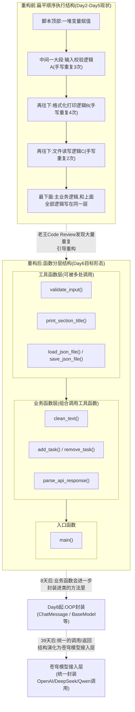
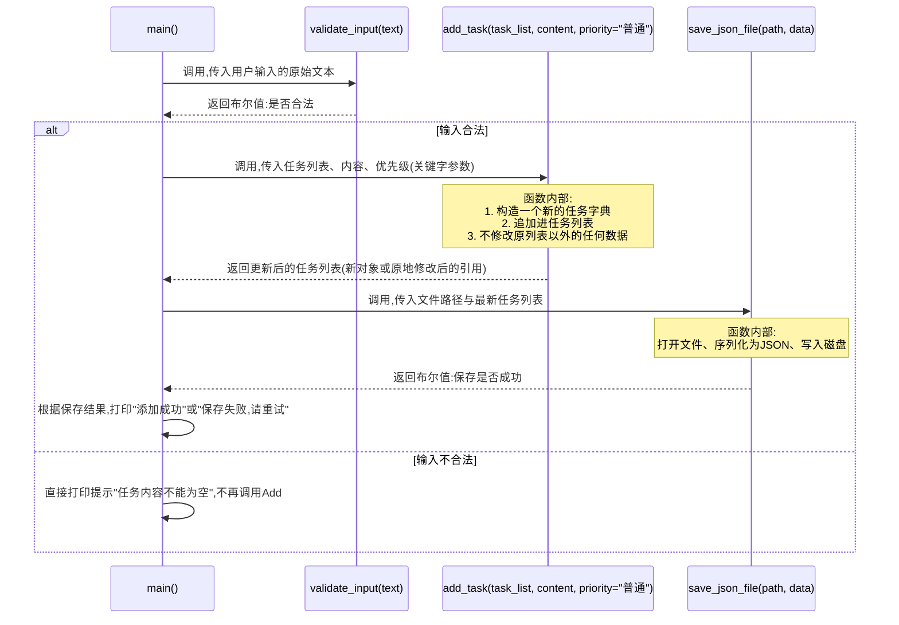
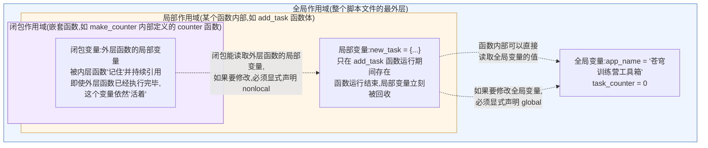

# 第6天 · 函数

> **周次/Sprint**:Sprint 0 · 新人内训(Day1-14)—— 阶段项目一:命令行多轮对话AI助手(预计Day14交付)
> **星期**:周六(内训第一周的第六天;明天周日是本周周测与复盘日,强度会略降,但今天仍是完整的一天授课+实操)
> **学员**:陈铭、苏梦、韩露、张凡(导师:王振宇)
> **内训任务卡**:PYXT-ONB-D06(蓬远科技培训中心 · 新人训练营 · Day06)
> **今日关键词**:函数定义 / 参数四种形态 / 返回值 / 作用域与闭包 / lambda / 递归入门 / 项目重构

---

## 【旁白】

如果把陈铭前五天写的代码摊开来看,会发现一个挺有意思的现象:每一个文件都能跑,每一个功能都实现了,但如果你把这五个文件叠在一起对比,你会看到至少六处几乎一字不差的代码——校验输入是不是合法数字的那几行,格式化打印一条分隔线的那几行,把字典写进JSON文件的那几行。它们像是被复印机原样印了好几份,只是每次印的时候换了几个变量名。这不是陈铭偷懒或者不用心,恰恰相反,是他每天都认认真真地"重新发明"了同一个轮子——因为在今天之前,他手里唯一的工具就是"从上到下顺序执行的代码",遇到需要重复做的事,唯一的办法就是把这段代码原样再抄一遍。

今天要学的函数,表面上是一个语法概念——`def`加一个名字,加一对括号,加一个冒号。但它真正带来的,是一种思维方式的转折点:从"写一份能跑的流程",转向"设计一套可以被反复调用的能力"。这个转折点在整整七十天的故事里,分量比它看起来的要重得多。往后你会看到,Day8的`ChatMessage`类里的每一个方法,本质上是"绑定在某个对象身上的函数";Day19的Function Calling,本质上是让大模型学会像今天陈铭学的这样,描述"我需要调用哪个函数、传什么参数",然后等着拿到一个返回值;甚至再往后,苍穹平台的模型接入层,不管背后是DeepSeek还是通义千问,对外暴露出来的样子,也无非是"输入一段消息,返回一段回复"的一个大号函数。函数封装的思维,是从"面向过程"走向"面向对象",再走向"面向服务、面向接口"的第一级台阶——你今天在自己的小项目里迈出的这一步,和三十天后苍穹平台把整个模型调用能力包成一个统一接口,走的是同一条逻辑路径,只是规模和复杂度完全不是一个量级。

这篇课件记录的,不只是"如何把重复代码抽成函数",更是陈铭第一次真正体会"工程化"这两个字重量的一天——不是听老王讲出来的道理,而是他亲手把五天的代码推倒重建之后,自己算出来的、实实在在的行数差异带来的那种直观冲击。这种冲击,比任何一句"函数很重要"的说教都管用。

---

## 晨会纪要 / 今日目标

**时间**:上午8:50,二层小会议室"起航"
**出席**:王振宇(老王)、陈铭、苏梦、韩露、张凡

周六早上的会议室比平时安静一点,楼道里没有其他项目组同事进出的脚步声——苍穹项目组这两天大部分人不在工位,林悦昨天下午说她要去和一家还在初谈阶段的客户过一遍需求,郭建军去参加一个行业闭门会,老王把这些信息简单同步了一句,就直接把白板转了个面。

"昨天晚自习结束前,我看了你们四个人交上来的作业,"老王开场就没绕弯子,"有一个共同问题,我挑陈铭的说,不是针对他,是你们几个人身上都有。"他把陈铭的两个文件——`parse_mock_api.py`和被临时改造成JSON持久化版本的待办事项管理器——同时投影到屏幕上,把两段代码并排放在一起。两段代码里,"打开文件、用`json.load`读进来、判断文件是否存在、捕获文件不存在时的默认值"这一整块逻辑,几乎是一字不差的复制粘贴,只有变量名不一样。

"你们看这两块,"老王用红框把它们框出来,"内容几乎一样,对吧?现在只有两个文件,你还能忍;等咱们以后随便一个项目,这种重复的读写逻辑分散在十几个文件里,有一天你想统一改一个bug——比如原来是UTF-8编码读文件,现在要改成兼容GBK——你就得在十几个地方分别改一遍,改漏一个,就是一个线上事故。"

苏梦小声问了一句:"那昨天布置的时候没提前说,我们咋知道会重复啊?"老王笑了:"这就是我特意没提前说的原因。如果我告诉你们答案,你们不会真的记住这个教训——你们得自己先经历一遍"哦我怎么又写了一遍一样的东西",然后再学怎么解决,这个印象才是长在骨头里的,不是抄在笔记本上的。"

**昨天进展(Day5)**:
- 四人均完成`parse_mock_api.py`,能够正确解析一份模拟的DeepSeek风格API返回JSON,提取`content`、`role`、`usage`等字段。
- 陈铭额外完成了给待办事项管理器加JSON持久化的自学任务,过程中和`parse_mock_api.py`产生了明显的重复代码,被老王在昨晚代码点评里当场点出。
- 张凡的JSON解析脚本在处理嵌套三层以上的字典时出现了硬编码字段路径导致的`KeyError`,已经现场排查修复,但老王指出这种"写死路径"的做法本身就不具备可扩展性。

**今日目标**:
1. 上午:系统讲解函数定义、四种参数形态(位置参数/关键字参数/默认值参数/`*args`与`**kwargs`)。
2. 下午:讲解返回值的多种形态、作用域(全局/局部/闭包)、匿名函数lambda。
3. 晚自习(强度略降,预计20:00结束):递归入门,以及全员合作完成"五天项目函数化重构"的实操任务,产出重构前后的行数对比。

**风险点**:
- 函数是这周除了字典之外信息密度最高的一天,四个知识点(参数、返回值、作用域、lambda)加递归,一天塞下去容易消化不良,老王决定把递归拆到晚自习,给大家一点消化间隔。
- 周六的疲劳感会比平常更明显,张凡这两天感冒还没痛好,老王安排他下午如果扛不住可以提前离开,内容录屏后补。
- 明天(周日)是周测+项目综合练习"通讯录管理系统"的日子,今天学的函数知识点,是明天能不能顺利完成综合项目的直接前提,老王把这句话说得很重:"今天要是没吃透,明天你会很难受。"

---

## 需求文档:新人训练营内部工具任务书 —— "五天项目函数化重构"

> 本任务书由技术导师王振宇发放,格式沿用公司内部PRD模板。与前几天面向"新功能开发"的任务书不同,这是一份典型的"技术债务清理"类需求——在真实项目里,这类需求同样会以正式PRD的形式被记录、被排期、被验收,不会因为"只是重构,没有新功能"就被随意对待。

### 背景

过去五天,四位培训生分别独立完成了文本清洗小工具(Day2)、猜数字游戏/乘法表/菜单系统(Day3)、待办事项管理器(Day4)、模拟API返回JSON解析脚本(Day5)。这些项目在功能验收上全部通过,但代码组织方式高度相似——全部采用"从上到下顺序执行"的写法,导致以下问题集中暴露:

1. **重复代码大量存在**:输入校验逻辑、格式化打印逻辑、文件读写逻辑在多个文件中被反复手写,一旦某处逻辑需要调整,必须在所有出现的位置逐一修改,极易漏改。
2. **代码复用能力为零**:任何一段逻辑只能"复制粘贴"到需要的地方,无法像调用工具一样直接"拿来用"。
3. **测试与排查成本高**:因为逻辑和主流程混在一起,没有清晰的输入输出边界,想单独验证某一小段逻辑是否正确,只能重新跑完整个程序。
4. **可读性随着代码量增长快速下降**:所有变量都堆在同一个作用域里,变量名冲突、逻辑跳转距离过长的问题逐渐显现。

老王在昨晚的代码点评里明确指出,这不是某个人的问题,而是"没学过函数的时候,大家能写出的代码天然就是这个样子",今天的任务,是学会用函数这个工具,把过去五天的产出重新组织一遍。

### 用户故事

- 作为一名培训生,我希望学会用函数封装重复出现的逻辑,以便同一段逻辑只需要维护一份代码。
- 作为一名培训生,我希望理解函数的参数机制(位置/关键字/默认值/`*args`/`**kwargs`),以便未来调用第三方库(如`requests`、`langchain`)提供的函数时,能读懂官方文档里五花八门的参数写法。
- 作为一名培训生,我希望理解作用域和闭包的规则,以便未来调试"为什么这个变量的值不是我以为的那个值"这类问题时,有清晰的排查思路。
- 作为一名培训生,我希望初步理解递归,以便未来遇到"遍历嵌套结构"(比如多层嵌套的字典、多层级的目录树)这类天然递归的问题时,有基本的解题工具。
- 作为技术导师,我希望通过一次真实的重构练习,让培训生亲眼看到"工程化"带来的具体收益(行数减少、可维护性提升),而不是空谈"函数很重要"的抽象道理。

### 功能列表

| 编号 | 任务 | 说明 | 验收方式 |
|---|---|---|---|
| T1 | 函数基础语法练习 | 独立完成`function_parameters_lab.py`,覆盖四种参数形态的全部用法与常见报错 | 代码能正确运行,每种参数形态至少有一个可运行示例 |
| T2 | 作用域与闭包练习 | 独立完成`scope_and_closures_lab.py`,覆盖全局变量、局部变量、`global`关键字、`nonlocal`关键字、闭包 | 能正确解释每个示例的输出结果并口头讲解给老王或同伴 |
| T3 | lambda练习 | 独立完成`lambda_lab.py`,覆盖至少4种lambda典型应用场景 | 代码能正确运行,能说明每种场景为什么适合用lambda而不是普通函数 |
| T4 | 递归入门练习 | 独立完成`recursion_lab.py`,包含阶乘、斐波那契、嵌套字典递归遍历三个例子 | 递归函数能正确处理边界条件(如n=0、空字典),不出现无限递归 |
| T5 | 五天项目函数化重构 | 把Day2-Day5的四个项目分别重构为函数式结构,每个文件产出"重构前"与"重构后"两个版本 | 重构后版本功能与重构前完全一致(用相同输入验证输出一致),且总行数、重复代码块数量有可量化的对比数据 |

### 非功能需求

- **函数命名规范**:统一使用动词开头的`snake_case`命名(如`clean_text`、`load_tasks_from_file`),让人一看函数名就能猜到它做什么,这是团队代码规范里"自解释代码"原则在函数层面的体现。
- **单一职责原则(初步接触)**:一个函数只做一件明确的事,如果发现一个函数里同时在"读取数据"又在"打印结果"又在"保存文件",这是一个需要拆分的信号——今天先建立这种直觉,不要求完全掌握,后面Day8开始学面向对象,会对这个原则有更系统的讲解。
- **文档字符串(docstring)要求**:今天开始,所有自定义函数必须有中文docstring,说明函数的作用、参数含义、返回值含义,这是从今天起长期生效的团队规范。
- **兼容性**:重构后的代码功能必须与重构前完全一致,不允许借重构之名悄悄修改原有的业务逻辑(除非是修复明显bug,且需要在注释里说明)。

### 验收标准

1. 四个重构后的项目文件,分别能够独立运行,且用与重构前相同的测试输入,得到完全一致的输出结果。
2. 每个项目至少能列出3处"重构前重复出现、重构后合并为一个函数"的具体位置。
3. 汇总一份"重构前后代码行数对比表",包含每个项目的重构前行数、重构后行数、净变化。
4. `function_parameters_lab.py`、`scope_and_closures_lab.py`、`lambda_lab.py`、`recursion_lab.py`四份练习文件全部提交,且老王能够针对其中任意一段代码提问"这里如果这样改,输出会变成什么",培训生能够正确回答(检验的是理解程度,而不是死记硬背)。
5. 晚自习结束前,在培训群里同步一份简短的"今日重构收获"文字总结(不要求长篇大论,3-5句真实感受即可)。

### 备注

老王在发放这份任务书的时候补了一句:"这份任务书看起来是'内部技术练习',但格式和验收标准的严谨程度,跟你们以后接手客户项目的技术债务清理需求是一模一样的。以后你们进了项目组,总有一天会遇到‘这段代码能跑,但已经没人敢改’的老代码,到那时候,你们今天练的这套‘先看清楚重复在哪、再决定怎么拆函数’的方法论,就是能直接上手用的。"

---

## 架构设计图:重构前后代码结构对比架构图

上午课程开始前,老王先没有讲函数的语法,而是把陈铭昨天的两个文件调出来,画了一张图,让大家先建立一个直观的"形状对比",再进入具体语法。



老王指着这张图讲了很长一段话,陈铭当时几乎是逐字记下来的:

"你们看左边这个'重构前'的形状——它是扁的,一条道走到底,所有逻辑不分层次地堆在一起。这不是说这种写法'错',对一个只跑一次、几十行的小脚本,这样写完全没问题,甚至更快。问题是当代码量涨起来、需要反复调用某一段逻辑的时候,扁平结构会让重复代码呈几何级数增长。"

"右边这个'重构后'的形状,你们注意它是分层的——最底下一层,是那些足够通用、可能被很多地方用到的'工具函数',比如校验输入、打印标题、读写文件,这些函数不关心具体是哪个项目在用它,它们只做一件很单纯的事;中间一层,是'业务函数',这些函数知道自己在干什么业务(比如'清洗文本'、'添加一条待办'),但把具体的脏活——校验、打印、文件操作——甩给下面那层工具函数去做;最上面,是一个`main()`函数,负责把整个流程串起来,你读`main()`,几行就能看懂整个程序在干什么,不需要陷进细节里。"

"这张图上,我还多画了两条虚线,指向你们还没到达的地方。八天后,Day8开始学面向对象编程,你们会发现,今天这些'业务函数'很多会变成一个类里面的'方法'——本质上还是函数,只是和某个具体的对象绑定在了一起。再往后,三十九天后,苍穹平台真正的模型接入层,不管是调DeepSeek还是调通义千问,最终暴露给外面的,也是这样一层一层封装好的、干净的调用接口——你传进去一段消息,它返回给你一段回复,内部到底发生了什么网络请求、什么参数拼接,调用者根本不需要关心。今天这道题,和那个问题,骨架是一样的。"

苏梦这时候插了一句:"那我们现在要把工具函数单独放一个文件,业务函数放另一个文件吗?"老王摇头:"想法是对的方向,但今天先不这么做——把函数拆到不同文件、再用`import`互相调用,这是十天后Day10要学的'模块与包'的内容,今天你们的函数还是待在同一个文件里,只是内部按照这个层次去组织。你们记住这个'形状'就够了,具体怎么拆文件,后面会有专门一天来讲。"这句话给Day10留下了清晰的钩子。

---

## 流程图:函数调用与返回值传递流程图

下午课程正式进入"返回值"这个知识点之前,老王画了第二张图,用一个具体的场景——待办事项管理器里"添加一条新任务"这个动作——来讲清楚函数调用发生时,参数和返回值到底是怎么"跑"的。他特意选用了时序图(sequenceDiagram)而不是普通流程图,因为"调用"和"返回"是两个方向相反的动作,时序图能把这个"去一趟、再回一趟"的过程画得更清楚。



老王讲这张图的时候,特意强调了一个新手极容易忽略的点:"你们看这张图里,每一次箭头往右边走,是'调用',把参数传进去;每一次箭头往左边走,是'返回',把结果带回来。这一去一回,中间函数内部具体做了什么,调用者完全不需要知道——`main()`函数根本不需要知道`validate_input`内部是怎么判断字符串是否为空的,它只需要知道:我传一个字符串进去,我会得到一个`True`或`False`回来。这个'不需要知道内部细节,只需要知道输入输出约定'的概念,专业说法叫'封装',今天你们先建立直觉,这个词我们后面还会反复提。"

他又追加了一个容易被忽略的细节:"你们注意`add_task`这个函数,我在参数列表里写了`priority="普通"`,这是一个默认值参数,调用的时候如果不传这个参数,它就自动用'普通'这个值——这个语法我们上午已经讲过,这里放在流程图里,是想让你们看到,默认值参数在真实调用场景里,到底是怎么发生作用的:不是写在文档里的一句说明,而是函数运行时真实会执行的一次'如果调用者没给,我就用这个'的判断。"

---

## 示意图:作用域(全局/局部/闭包)示意图

作用域是今天下午最容易让新手产生"听得懂但一用就错"的知识点,老王专门花了一张图来讲清楚"一个变量,在函数内部、函数外部,到底谁能看见谁"这件事。他把作用域画成三层嵌套的房间,一层比一层"私密"。



老王讲解这张图的时候用了一个类比:"你可以把全局作用域想象成整个公司大楼,里面的东西——比如前台的公告栏——所有人都能看到、都能读。局部作用域,是你自己的工位,工位上摆的东西,只有你自己能直接拿到,你工位关闭(函数执行结束)之后,工位上的东西就被清空了,谁也拿不到了。闭包作用域,是一个更特殊的情况——想象你借了公司的一个储物柜,柜子的钥匙只有你和另一个特定的人有,即便你已经离职(外层函数执行结束),那个人依然能打开柜子拿东西,因为柜子和钥匙的关系,在你离职之前就已经被"绑定"好了,不会因为你人不在了就失效。"

他补充了一条规则,是新手极容易踩的坑:"在函数内部,你可以随便'读'全局变量的值,不需要加任何声明;但如果你想在函数内部'改'全局变量的值(重新赋值,不是修改列表、字典这种可变对象的内容),必须用`global`关键字先声明一下,告诉Python'我说的这个名字,指的是外面那个全局变量,不是一个新的局部变量'。忘记加`global`,是今天下午最高频的报错之一,你们等会儿实操就会亲眼见到。"

---

## 课堂笔记

### 上午:函数定义与四种参数形态

**9:00,培训室**

老王把架构图收起来之后,没有立刻讲语法,而是先在白板上写了一句话:"函数,就是把一段可能被反复用到的代码,包一个'外壳',给它起个名字,以后想用的时候,喊它的名字就行,不用把里面的代码再抄一遍。"

他停顿了一下,又补了一句更贴近生活的类比:"你可以把函数想象成点外卖时的一个'菜品'——你不需要知道后厨具体怎么切菜、怎么颠勺、火候怎么控制,你只需要知道:我点这个菜(调用这个函数),给多少钱、要不要加辣(传参数),等一会儿菜端上来(拿到返回值)。后厨内部具体怎么做,是这个菜品的'实现细节',和你点菜这个动作是完全分开的两件事。"

#### 一、函数的定义与调用

最基础的函数语法,老王先给了一个不能再简单的例子:

```python
def greet():
    """向陈铭问好的最简单函数,不接收任何参数,也不返回任何值。"""
    print("你好,陈铭,欢迎来到函数的世界。")

greet()   # 调用函数,只有写了这一行,上面的代码才会真正执行
```

他强调了两个新手常常搞混的动作:"**定义**函数(`def`那一块)和**调用**函数(直接写函数名加括号)是两个完全不同的动作。你只写了`def greet():`,Python只是把这段代码'记住了',并不会真的执行里面的`print`。只有你写了`greet()`,才是真正在'喊它的名字',这时候函数体里的代码才会跑起来。"

他现场演示了一个新手最常犯的错误——定义了函数,却忘了调用:

```python
def greet():
    print("你好,陈铭,欢迎来到函数的世界。")

# 忘记调用greet(),运行整个脚本,什么都不会打印出来,
# 但Python不会报任何错误,因为这段代码本身没有语法问题,
# 只是"定义了一个能力,但从来没有用过这个能力"。
```

"这是函数最容易让新手困惑的地方之一,"老王说,"代码跑完了,什么都没输出,你的第一反应可能是去检查`print`语句写错了没有,但真正的问题往往是你忘了调用函数本身。这个坑我自己十年前也踩过,不丢人。"

**函数命名规范**

老王在这里插入了团队规范的要求:"函数名统一用动词开头的`snake_case`,比如`get_user_name`、`calculate_total`、`is_valid_input`(判断类的函数,建议用`is_`或`has_`开头,一看就知道它返回的是布尔值)。不要用`data1`、`func_a`这种没有意义的名字,函数名本身就应该是一句'这个函数在做什么'的简短说明。"

#### 二、位置参数(Positional Arguments)

有了最基础的函数框架,老王开始逐一展开四种参数形态,第一种是最直观的位置参数。

```python
def introduce(name, age, city):
    """
    按顺序介绍一个人的基本信息。
    参数:
        name (str): 姓名
        age (int): 年龄
        city (str): 所在城市
    """
    print(f"{name},今年{age}岁,目前在{city}工作。")

# 调用时,参数按照定义时的顺序依次传入,这种传参方式叫"位置参数"
introduce("陈铭", 32, "北京")
introduce("苏梦", 26, "北京")
```

"位置参数最直观,也最容易出错,"老王说,"你们看好了,如果我把顺序改一下——"他现场演示:

```python
# 顺序传错了,age的位置传了字符串,city的位置传了数字
introduce("陈铭", "北京", 32)
```

运行结果:

```
陈铭,今年北京岁,目前在32工作。
```

"你们看,这段代码**没有报错**,但结果完全是错的——这是位置参数最大的风险:参数顺序传错了,Python大多数时候不会主动提醒你,因为从语法角度看,字符串和数字都可以被塞进那个位置,它不知道你的'本意'是什么。这也是为什么,当一个函数的参数超过三四个的时候,团队规范会建议大家优先用关键字参数,而不是死记参数顺序。"

#### 三、关键字参数(Keyword Arguments)

紧接着,老王引入关键字参数,直接用上面同一个函数做对比:

```python
# 用关键字参数调用,不再依赖记忆参数顺序,每个参数明确写出"名字=值"
introduce(name="陈铭", age=32, city="北京")

# 关键字参数的顺序可以随意调换,不影响结果,因为Python是靠"名字"匹配,不是靠"位置"匹配
introduce(city="北京", name="陈铭", age=32)

# 也可以混合使用:前面用位置参数,后面用关键字参数
introduce("陈铭", city="北京", age=32)
```

老王在这里引出了一条语法规则,并现场演示了违反这条规则会发生什么:

```python
# 错误示范:位置参数不能写在关键字参数后面
introduce(name="陈铭", 32, "北京")
```

运行后(这段代码在保存时VS Code就会标红,属于语法层面直接不合法):

```
  File "positional_after_keyword.py", line 1
    introduce(name="陈铭", 32, "北京")
                          ^
SyntaxError: positional argument follows keyword argument
```

"这句报错直译过来是'位置参数出现在了关键字参数后面',"老王解释,"规则很简单:一旦你在调用时开始用了`名字=值`的写法,后面就不能再退回去用纯粱位置的写法了,必须从头到尾,位置参数在前,关键字参数在后。"

张凡这时候提了一个问题:"那关键字参数是不是就完全没有顺序要求了?"老王点头:"对,只要都是关键字参数,顺序随便换,这也是为什么很多第三方库的函数——比如你们以后会用到的`requests.post(url, json=..., headers=..., timeout=...)`——官方文档里参数顺序跟你实际调用时的顺序经常不完全一致,因为大家都习惯用关键字参数,谁在前谁在后不重要,重要的是名字对上了。"

#### 四、默认值参数(Default Arguments)

第三种参数形态,老王用乘法表这个即将在重构环节用到的例子来讲解:

```python
def print_multiplication_table(max_number=9):
    """
    打印从1到max_number的乘法表。
    参数:
        max_number (int): 乘法表打印到几,默认是9(标准的九九乘法表)
    """
    for i in range(1, max_number + 1):
        row_items = []
        for j in range(1, i + 1):
            row_items.append(f"{j}×{i}={i * j}")
        print("  ".join(row_items))

# 不传参数,自动使用默认值9,打印标准的九九乘法表
print_multiplication_table()

print("\n--- 分隔线 ---\n")

# 传入参数,覆盖默认值,打印到12的乘法表
print_multiplication_table(12)
```

"默认值参数最大的价值,是让函数在'常见情况下'调用起来更省事,同时保留'特殊情况下'自定义的能力,"老王说,"你们看,90%的情况下大家要的就是标准的九九乘法表,不用每次调用都写`print_multiplication_table(9)`,直接`print_multiplication_table()`就够了;但如果哪天产品经理说,要给某个客户定制一个'十二乘法表'(虽然这个例子有点极端),你不需要改函数内部的代码,只需要在调用的时候传一个不同的值。"

他随即引出了一个非常经典、也是Python面试常问的"坑"——**可变对象作为默认值参数**:

```python
# 危险的写法:用一个列表作为默认值参数
def add_task_wrong(task_content, task_list=[]):
    """
    错误示范:不要用可变对象(列表、字典)作为默认值参数!
    """
    task_list.append(task_content)
    return task_list

result1 = add_task_wrong("写周报")
print("第一次调用:", result1)   # 预期:['写周报']

result2 = add_task_wrong("交房租")
print("第二次调用:", result2)   # 预期:['交房租'],但实际结果是什么?
```

运行结果让全组人都愣了一下:

```
第一次调用: ['写周报']
第二次调用: ['写周报', '交房租']
```

"你们看,"老王说,"第二次调用,明明我没有传`task_list`这个参数,理论上应该拿到一个全新的空列表,结果它却把第一次的内容也带过来了。这不是bug,这是Python的一个语言特性——**默认值参数,只在函数第一次被定义的时候创建一次,之后每次调用,如果你不传这个参数,用的都是同一个对象**,不是每次调用都重新创建一个新的空列表。"

他给出了正确的写法:

```python
# 正确的写法:默认值用None,函数体内部再判断并创建新的列表
def add_task_correct(task_content, task_list=None):
    """
    正确示范:可变对象不适合直接作为默认值,应该用None作占位,
    在函数体内部再决定是否创建一个新的空列表。
    """
    if task_list is None:
        task_list = []
    task_list.append(task_content)
    return task_list

result1 = add_task_correct("写周报")
print("第一次调用:", result1)

result2 = add_task_correct("交房租")
print("第二次调用:", result2)
```

```
第一次调用: ['写周报']
第二次调用: ['交房租']
```

"这个坑,"老王加重了语气,"是我见过面试里被问到频率最高的Python语法题之一,你们今天记住结论就行:**默认值参数,永远不要用列表、字典这种可变对象,统一用`None`占位,函数体内部再创建**。原理往后你们学到对象在内存里是怎么存储的时候,会理解得更深,今天先记住这个使用规范。"

#### 五、可变数量参数:`*args`

老王喝了口水,进入今天上午最后一个,也是最有分量的语法点。"前面三种参数,不管是位置、关键字还是默认值,都有一个共同前提——你在定义函数的时候,已经知道会有几个参数。但真实场景里,经常会遇到‘我不知道调用者到底会传几个东西进来’的情况,比如,我要写一个函数,计算任意数量个数字的总和,可能有人传2个数字,有人传5个,有人传10个,难道要为每一种情况单独写一个函数吗?"

他引出`*args`的写法:

```python
def calculate_sum(*numbers):
    """
    计算任意数量个数字的总和。
    参数:
        *numbers: 可变数量的位置参数,函数内部会被自动打包成一个元组(tuple)
    返回:
        int/float: 所有传入数字的总和
    """
    print(f"本次调用收到的numbers是:{numbers},类型是:{type(numbers)}")
    total = 0
    for num in numbers:
        total += num
    return total

print(calculate_sum(1, 2, 3))
print(calculate_sum(10, 20))
print(calculate_sum(5, 5, 5, 5, 5))
print(calculate_sum())   # 一个都不传,也是合法的,numbers会是一个空元组
```

运行结果:

```
本次调用收到的numbers是:(1, 2, 3),类型是:<class 'tuple'>
6
本次调用收到的numbers是:(10, 20),类型是:<class 'tuple'>
30
本次调用收到的numbers是:(5, 5, 5, 5, 5),类型是:<class 'tuple'>
25
本次调用收到的numbers是:(),类型是:<class 'tuple'>
0
```

"`*args`这个星号,"老王在白板上把星号单独圈出来,"意思是‘把调用时传进来的所有位置参数,不管有几个,全部打包成一个元组’。这里的`args`这个名字本身不是强制要求,你写成`*numbers`、`*items`都可以,但社区习惯上大家都叫它`args`(是"arguments"的缩写),你们以后看到`*args`这个写法,不用害怕,它就是‘一堆位置参数’的意思。"

他又补充了一个真实场景类比:"你们以后写老王之前提过的重试装饰器(Day13会正式讲),里面几乎肯定会用到`*args`——因为你写的装饰器要能装饰‘任意一个函数’,而你根本不知道被装饰的函数会接收几个参数,`*args`就是用来‘不管你传几个,我都能接住’的机制。"

#### 六、可变数量参数:`**kwargs`

紧接着`*args`,老王讲了它的"孪生兄弟"——`**kwargs`,用来接收数量不确定的关键字参数:

```python
def print_user_profile(**info):
    """
    打印用户档案,字段完全灵活,调用者可以传任意数量的"字段名=值"。
    参数:
        **info: 可变数量的关键字参数,函数内部会被自动打包成一个字典(dict)
    """
    print(f"本次调用收到的info是:{info},类型是:{type(info)}")
    for key, value in info.items():
        print(f"  {key}: {value}")

print_user_profile(name="陈铭", age=32, city="北京")
print("\n--- 分隔线 ---\n")
print_user_profile(name="苏梦", age=26, city="北京", hobby="画画", is_zero_base=True)
```

运行结果:

```
本次调用收到的info是:{'name': '陈铭', 'age': 32, 'city': '北京'},类型是:<class 'dict'>
  name: 陈铭
  age: 32
  city: 北京

--- 分隔线 ---

本次调用收到的info是:{'name': '苏梦', 'age': 26, 'city': '北京', 'hobby': '画画', 'is_zero_base': True},类型是:<class 'dict'>
  name: 苏梦
  age: 26
  city: 北京
  hobby: 画画
  is_zero_base: True
```

"你们注意到没有,"老王说,"两次调用,`print_user_profile`函数完全没有改动,但两次传入的字段数量、字段名字都完全不一样——第一次是姓名年龄城市,第二次多了爱好和是否零基础转行。这在真实业务里非常常见:客户的用户档案字段,不同客户可能有不同的自定义字段,你不可能为每一种字段组合单独写一个函数,`**kwargs`让函数具备了这种‘随意扩展字段也不需要改函数定义’的弹性。"

他现场引出了一个实际场景,是陈铭这两天正在做的待办事项管理器可以直接用上的:"你们昨天的待办事项,目前只有内容和是否完成两个字段。如果林悦作为产品经理提出,‘客户还想加一个优先级字段,以后可能还要加截止日期、加负责人’,如果你的`add_task`函数写成固定几个位置参数,每加一个字段,函数签名就要改一次,所有调用的地方也要跟着改。但如果你用`**kwargs`,新增字段的时候,只需要在调用的地方多传一个关键字参数,函数内部的字典结构会自动适配。"

#### 七、四种参数的组合与顺序规则

老王最后把四种参数形态汇总在一起,给出了一份完整的排列顺序规则,并强调"这个顺序是硬性语法规则,写错了,Python会直接报`SyntaxError`":

```python
def full_demo(pos1, pos2, default1="默认值A", *args, kw_only1, kw_only2="默认值B", **kwargs):
    """
    综合演示函数定义时,各类参数在参数列表中的合法顺序:
    1. 位置参数(pos1, pos2)
    2. 默认值参数(default1)
    3. *args(可变位置参数)
    4. 仅限关键字参数(kw_only1, kw_only2,*args之后出现的参数,调用时必须用关键字方式传)
    5. **kwargs(可变关键字参数,必须放在参数列表最后)
    """
    print("pos1:", pos1)
    print("pos2:", pos2)
    print("default1:", default1)
    print("args:", args)
    print("kw_only1:", kw_only1)
    print("kw_only2:", kw_only2)
    print("kwargs:", kwargs)

full_demo(
    "位置1", "位置2", "覆盖默认值",
    "额外位置参数1", "额外位置参数2",
    kw_only1="仅限关键字传参",
    extra_field="这是kwargs吃进去的额外字段",
)
```

运行结果:

```
pos1: 位置1
pos2: 位置2
default1: 覆盖默认值
args: ('额外位置参数1', '额外位置参数2')
kw_only1: 仅限关键字传参
kw_only2: 默认值B
kwargs: {'extra_field': '这是kwargs吃进去的额外字段'}
```

"这个例子信息量比较大,你们不需要现在就能把这种复杂组合写得滚瓜烂熟,"老王说,"我想让你们记住的是一个大原则:**位置参数在最前面,然后是默认值参数,然后是`*args`,然后是只能用关键字传的参数,最后是`**kwargs`**。这个顺序背后的逻辑是——越‘固定、明确’的参数放得越靠前,越‘灵活、不确定’的参数放得越靠后。以后你们看任何一个陌生函数的参数列表,先扫一眼这个顺序,大致就能猜出哪些参数是‘必填的’,哪些是‘可选的’,哪些是‘随便扩展的’。"

#### 八、参数设计的真实取舍:从"能跑"到"好用"

四种参数形态讲完,老王没有马上进入报错清单,而是多讲了几分钟"设计"层面的东西:"你们现在掌握的是语法,但语法只是工具,真正决定一个函数好不好用的,是你怎么组合这些工具去设计参数列表。同样一个功能,参数设计得好和设计得差,调用起来的体验能差出一个量级。"他举了一个对比例子:

```python
# 写法一:所有信息都塞进位置参数,调用者必须精确记住五个位置分别是什么
def create_task(content, priority, deadline, assignee, tags):
    pass

# 写法二:只保留最核心的必填项为位置参数,其余全部改成带默认值的关键字参数
def create_task(content, priority="普通", deadline=None, assignee=None, tags=None):
    pass
```

"写法一,"老王说,"调用者每次都要把5个参数按顺序传全,哪怕有些字段这次根本不需要用(比如这次不指定负责人),也得传一个占位的`None`进去,不然就会报`missing argument`,调用的代码会因此变得又长又难读,而且顺序一旦记错,又会掉进我们上午讲的‘位置参数传错顺序不报错但结果错误’的坑里。写法二,调用者只需要关心自己真正要设置的那几个字段,剩下的用默认值兜底——这种设计思路,在几乎所有你们以后会用到的第三方库里都能见到,比如`requests.get(url, params=None, headers=None, timeout=None, ...)`,`url`是必填的位置参数,剩下几十个参数全部是可选的关键字参数,你不需要传全,只需要传你关心的那几个。"

苏梦追问了一句:"那是不是所有参数都尽量设计成可选的,越灵活越好?"老王摇头:"不是。哪些参数应该是必填的位置参数,取决于'没有它,这个函数根本没法工作'——比如`create_task`如果连`content`都不传,这个任务本身就没有意义,应该强制要求;但`priority`没传,程序完全可以给一个合理的默认值继续运行下去。判断标准不是'越灵活越好',而是'这个参数缺失时,函数是不是真的无法正确完成它该做的事'。"

他补了一句更长远的话,呼应了今天开场旁白里提到的内容:"你们再往后走大约十三天,会正式接触大模型的Function Calling能力——本质上,大模型在‘决定调用哪个函数、传什么参数’的时候,靠的就是函数签名里写清楚的参数名字、类型、是否必填、有没有默认值,这些信息会被整理成一份结构化的描述,交给模型去‘理解’。你今天在纸面上练的‘怎么把参数设计得清楚、职责分明、必填与可选划分明确’,以后会变成‘怎么写一份让大模型也能看懂、不会传错参数的函数描述’,这不是一个比喻,是同一套设计能力在不同场景下的复用。"

陈铭在笔记里追加了一句:"原来今天看起来只是'语法练习'的东西,后面还有这么具体的对应关系,得把参数设计这部分多练几遍,不能只满足于'能跑起来'。"

**上午常见报错清单**

老王让陈铭在白板上帮忙誊写了上午出现频率最高的几种函数相关报错,作为"防身手册":

| 报错类型 | 常见触发场景 | 排查思路 |
|---|---|---|
| `TypeError: missing 1 required positional argument` | 调用函数时少传了一个必填的位置参数 | 检查函数定义,数一数到底需要几个参数,逐一核对是否都传了 |
| `TypeError: got multiple values for argument` | 位置参数和关键字参数同时给同一个参数赋值(比如`introduce("陈铭", name="老陈")`) | 检查是不是同一个参数既用了位置传参又用了关键字传参 |
| `SyntaxError: positional argument follows keyword argument` | 调用时,位置参数写在了关键字参数后面 | 调整参数顺序,位置参数统一放在关键字参数前面 |
| `TypeError: unexpected keyword argument` | 传入了一个函数定义里根本不存在的关键字参数(且函数没有`**kwargs`兜底) | 检查关键字参数名是否拼写正确,或者函数是否需要加`**kwargs`支持扩展字段 |
| `NameError`(函数内部) | 函数体内使用了一个既不是参数、也没在函数内定义过的变量名 | 检查变量名拼写,或确认这个变量是否本该作为参数传入 |

---

### 下午:返回值、作用域、lambda

**14:00,培训室**

午饭后,老王没有像往常一样先提问上午的内容,而是直接抛出一个问题:"你们上午写的`calculate_sum`函数,里面有一句`return total`。如果我把这一句删掉,只留`print(total)`,函数还能正常运行吗?"

苏梦想了想说:"能运行,反正`print`已经把结果打印出来了。"老王点头:"能运行,但结果会完全不一样。"他现场演示:

```python
def calculate_sum_no_return(*numbers):
    """只打印总和,不返回总和。"""
    total = 0
    for num in numbers:
        total += num
    print(f"函数内部计算的总和是:{total}")
    # 注意:这里没有return语句

result = calculate_sum_no_return(1, 2, 3)
print(f"变量result接收到的值是:{result}")
print(f"result的类型是:{type(result)}")
```

运行结果:

```
函数内部计算的总和是:6
变量result接收到的值是:None
result的类型是:<class 'NoneType'>
```

"你们看,"老王说,"函数内部确实把`6`算出来了,也确实打印到屏幕上了,但`result`这个变量拿到的是`None`。这是今天下午要讲透的第一个核心概念:**`print`和`return`是两件完全不同的事**。`print`只是把内容显示在屏幕上,给人看;`return`是把一个值,从函数内部'带出来',交给调用它的那行代码去使用。如果一个函数没有明确写`return`,Python会默认在函数末尾悄悄加上`return None`,所以你才会看到`result`是`None`。"

#### 一、返回值的多种形态

老王把返回值拆成几种常见形态逐一演示。

**返回单个值**

```python
def calculate_sum(*numbers):
    total = 0
    for num in numbers:
        total += num
    return total   # 返回一个具体的数字

result = calculate_sum(1, 2, 3)
print(result)   # 6
```

**返回多个值(本质是一个元组)**

```python
def analyze_scores(scores):
    """
    分析一组分数,同时返回最高分、最低分、平均分。
    参数:
        scores (list): 分数列表
    返回:
        tuple: (最高分, 最低分, 平均分)
    """
    highest = max(scores)
    lowest = min(scores)
    average = sum(scores) / len(scores)
    return highest, lowest, average   # 用逗号隔开多个值,本质上返回的是一个元组

# 调用方式一:用三个变量分别接收,这叫"解包"(unpacking)
top, bottom, avg = analyze_scores([85, 90, 78, 92, 88])
print(f"最高分:{top},最低分:{bottom},平均分:{avg:.2f}")

# 调用方式二:用一个变量接收,拿到的是一个完整的元组
result_tuple = analyze_scores([85, 90, 78, 92, 88])
print(result_tuple)
print(type(result_tuple))
```

运行结果:

```
最高分:92,最低分:78,平均分:86.60
(92, 78, 86.6)
<class 'tuple'>
```

"这一点很多新手一开始理解不了,"老王说,"`return a, b, c`,看起来是返回了三个东西,但Python在背后悄悄把它们打包成了一个元组,你`return`出去的,始终只是'一个值'——只是这个值恰好是一个包含三个元素的元组。这也解释了为什么你可以用`top, bottom, avg = ...`这种写法直接把元组'解包'到三个变量里,本质上和Day4学的元组拆包是同一套语法。"

**提前返回(多个return语句)**

```python
def classify_score(score):
    """
    根据分数返回等级评价,函数体内包含多个return语句,
    一旦命中某个条件并执行了return,函数会立刻结束,不会继续往下执行。
    """
    if score >= 90:
        return "优秀"
    if score >= 75:
        return "良好"
    if score >= 60:
        return "及格"
    return "不及格"   # 前面所有条件都不满足,走到这里

print(classify_score(95))   # 优秀
print(classify_score(80))   # 良好
print(classify_score(50))   # 不及格
```

"这里我想强调一个概念,叫'提前返回'(early return),"老王说,"你们看,一旦命中`score >= 90`这一条,函数会立刻`return "优秀"`,后面`score >= 75`这些判断根本不会被执行到——`return`不只是'交出一个值',它同时也是'立刻结束这个函数的执行,不管后面还有多少代码'。这个特性在处理'各种边界条件的提前拦截'时非常有用,后面Day10学异常处理、以及未来写API接口的参数校验,你们会大量用到这种'先拦掉不合法的情况,提前返回'的写法。"

**没有return的函数(过程性函数)**

老王补充说明,不是所有函数都需要返回值:

```python
def print_welcome_banner(username):
    """
    只负责打印欢迎横幅,不需要返回任何值,这类函数专注于"做一件事"
    而不是"计算并交出一个结果",在专业术语里,有时会被称为"过程"(procedure)。
    """
    print("=" * 40)
    print(f"欢迎回来,{username}")
    print("=" * 40)

print_welcome_banner("陈铭")   # 不需要,也不应该去接收它的返回值
```

"这种函数也完全合法,不是所有函数都必须有意义的返回值,"老王说,"关键是你要清楚自己写这个函数的目的——如果目的是'计算出一个结果给别人用',一定要记得写`return`;如果目的是'完成一个动作'(打印、保存文件、发送请求),不需要强行加一个没有意义的返回值。"

#### 二、作用域:全局变量与局部变量

回顾完前面那张示意图,老王开始用具体代码验证图上的规则。

```python
app_name = "苍穹训练营工具箱"   # 全局变量,定义在所有函数外部

def show_app_info():
    """在函数内部,直接读取全局变量,不需要任何特殊声明。"""
    print(f"当前应用:{app_name}")   # 可以直接读取

show_app_info()   # 输出:当前应用:苍穹训练营工具箱
```

紧接着,他演示了新手最容易踩的坑——**在函数内部给一个和全局变量同名的变量赋值,会发生什么**:

```python
task_counter = 0   # 全局变量,记录任务总数

def add_one_task_wrong():
    """
    错误示范:试图在函数内部直接修改全局变量,但没有声明global。
    """
    task_counter = task_counter + 1   # 这一行会报错
    print(f"当前任务数:{task_counter}")

add_one_task_wrong()
```

运行结果:

```
Traceback (most recent call last):
  File "scope_demo.py", line 6, in <module>
    add_one_task_wrong()
  File "scope_demo.py", line 4, in add_one_task_wrong
    task_counter = task_counter + 1
                   ^^^^^^^^^^^^
UnboundLocalError: cannot access local variable 'task_counter' where it is not associated with a value
```

"这个报错,"老王说,"是今天下午最重要的一个报错,叫`UnboundLocalError`,字面意思是'访问了一个还没有被赋值的局部变量'。这里的关键是:只要函数内部**任何地方**出现了`task_counter = ...`这样的赋值语句,Python就会认定`task_counter`是这个函数内部的一个**局部变量**,而不是外面那个全局变量——即便这行赋值语句写在‘读取它的值’之后。所以`task_counter = task_counter + 1`这一行,右边的`task_counter`,Python认为它指的是‘函数内部那个还没被赋值的局部变量’,而不是外面的全局变量,于是报错。"

正确的写法,需要用`global`关键字显式声明:

```python
task_counter = 0

def add_one_task_correct():
    """
    正确示范:用global关键字声明,告诉Python"这里的task_counter,
    指的是外面那个全局变量,不是一个新的局部变量"。
    """
    global task_counter
    task_counter = task_counter + 1
    print(f"当前任务数:{task_counter}")

add_one_task_correct()
add_one_task_correct()
add_one_task_correct()
print(f"最终任务数:{task_counter}")
```

```
当前任务数:1
当前任务数:2
当前任务数:3
最终任务数:3
```

老王在这里补充了一条团队工程规范:"虽然`global`能解决问题,但团队规范不建议大量使用全局变量被函数随意修改这种写法——这会让代码的‘状态’变得很难追踪,你调用一个函数,读它的名字根本猜不到它偷偷把某个全局变量改了。更规范的做法,是把这个计数器作为参数传进去、把新的值作为返回值传出来,或者(这是后面Day8要学的)把它作为一个类的属性来管理。今天你们理解`global`的语法规则就够了,实际项目里,能不用尽量不用。"

#### 三、闭包(Closure)

作用域讲完了"全局vs局部"这一层,老王引入了更进阶的一层——闭包,他先给出一个具体例子:

```python
def make_task_id_generator():
    """
    这是一个"外层函数",它的作用是创建并返回另一个函数。
    外层函数内部定义的变量counter,会被内层函数记住,
    即便make_task_id_generator已经执行完毕,counter依然"活着"。
    """
    counter = 0   # 外层函数的局部变量

    def generate_next_id():
        """
        这是"内层函数",它引用了外层函数的局部变量counter。
        因为要修改counter的值,必须用nonlocal关键字声明。
        """
        nonlocal counter
        counter += 1
        return f"TASK-{counter:04d}"

    return generate_next_id   # 注意:返回的是函数本身,不是调用它的结果(没有加括号)

# 调用外层函数,得到一个"生成器函数"
next_id = make_task_id_generator()

print(next_id())   # TASK-0001
print(next_id())   # TASK-0002
print(next_id())   # TASK-0003

# 如果再调用一次make_task_id_generator(),会得到一个全新的、独立计数的生成器
another_id = make_task_id_generator()
print(another_id())   # TASK-0001(重新从1开始,和next_id互不影响)
print(next_id())      # TASK-0004(next_id这边继续在自己的计数上累加)
```

运行结果和代码注释里写的完全一致。老王让大家先别急着理解原理,先接受这个"神奇"的结果:`make_task_id_generator`函数明明已经执行完了(它的`counter = 0`那一行早就跑完了),但`next_id()`每次调用,还能记得上一次`counter`是多少。

"这就是闭包,"老王说,"通俗地讲:**一个函数,如果它引用了外部函数的变量,并且这个函数本身被作为返回值传递出去了,那么这个变量会被'包裹'在这个函数里,一直存活下去,不会随着外层函数执行完毕而被销毁**。这也是‘闭包’这个词的来源——它把外层的变量‘闭合’在自己的作用域里,随身携带。"

苏梦提了一个很实际的问题:"这个东西,我们以后真的会用到吗?"老王给了一个具体的场景:"你们记不记得,Day13会给API调用加一个重试装饰器?装饰器几乎全部都是靠闭包实现的——外层函数接收‘要被装饰的原始函数’,内层函数负责加上重试逻辑,再调用原始函数,最后把内层函数返回出去。今天这个'生成不重复任务编号'的例子,和装饰器的结构骨架其实是一样的,只是应用场景不同。你们现在不需要完全吃透原理,但一定要认得这个'形状'——外层函数返回内层函数,内层函数用`nonlocal`修改外层变量,这三件事同时出现,就是闭包。"

他又追加了一句作为今天的"旁白式"提醒:"闭包这个概念,今天你们大概只能做到‘看得懂例子,记住结论’,这完全正常。它不是一个一天就能完全消化的东西,后面用到装饰器的时候,你们会带着今天的印象,再理解一层,那时候才会真正‘通’。学习很多时候是这样,不是一条直线,是反复回头看同一个概念,每次多懂一点。"

#### 四、lambda匿名函数

下午最后一个知识点,老王引入了lambda。"你们已经学会了用`def`定义函数,lambda是另一种定义函数的写法,专门用来定义那种‘逻辑很简单、只用一次、不值得专门起名字’的小函数。"

他先展示了`def`写法和lambda写法的对比:

```python
# 用def定义一个计算平方的函数
def square(x):
    return x ** 2

print(square(5))   # 25

# 用lambda定义完全等价的功能
square_lambda = lambda x: x ** 2
print(square_lambda(5))   # 25
```

"你们看,"老王说,"`lambda x: x ** 2`这一行,冒号前面的`x`是参数(可以有多个,用逗号隔开),冒号后面的`x ** 2`是返回值——**lambda永远只能写一个表达式,这个表达式的运算结果就是它的返回值,不需要、也不能写`return`关键字**。lambda的最大限制是它不能包含多行语句,不能写`if...elif...else`的完整语句块,不能写循环,只能是单个表达式(虽然可以用条件表达式`a if 条件 else b`这种写法在一行内实现简单的分支逻辑)。"

他强调了一个重要的使用原则:"lambda不是用来取代`def`的,它只在一种场景下真正好用——**作为参数,临时传给另一个函数**,比如`sorted()`、`filter()`、`map()`这些函数,都需要你传入一个'函数'作为参数,如果每次都为了这么一个小逻辑单独`def`一个函数、起一个名字,反而显得啰嗦。今天下午留出时间,你们会在`lambda_lab.py`里见到至少四个这样的典型场景,晚一点我们过一遍。"

#### 五、一个容易被忽略的陷阱:循环中定义lambda,变量绑定是"延迟"的

老王刚讲完lambda的四个典型场景,苏梦自己动手多试了一个"看起来理所当然"的写法,结果发现结果完全不对,索性当场把问题抛给了全班:

```python
# 苏梦的原始尝试:想批量创建"给指定数字加上不同偏移量"的函数
adders = []
for offset in [1, 2, 3]:
    adders.append(lambda x: x + offset)

print(adders[0](10))
print(adders[1](10))
print(adders[2](10))
```

运行结果让她意外:

```
13
13
13
```

"我明明想让第一个函数是+1,第二个是+2,第三个是+3,结果三个居然全变成了+3,这是为什么?"苏梦举手问。

老王在白板上画图解释:"这是Python闭包一个非常经典、也非常容易踩的坑,专业说法叫‘延迟绑定’——**lambda(以及普通的嵌套函数),在'定义'的那一刻,并不会立刻把外层变量的'当前值'复制一份存起来,它只是记住了这个变量的名字;真正要用这个变量的值,要等到这个lambda被'调用'的那一刻,才会去外层作用域里查找offset当前到底是多少**。你这个循环跑完之后,offset这个变量最终停留在3(循环结束后,循环变量并不会被自动清空),所以之后不管你调用`adders`里的哪一个lambda,它去查的都是同一个offset,查到的都是3。"

他给出了修复方法,并顺手把上午讲过的知识点接了回来:

```python
# 修复方式:用默认值参数,把当前循环时的offset"立刻"绑定进函数签名里,
# 而不是等到调用的时候才去外层作用域查找
adders_fixed = []
for offset in [1, 2, 3]:
    adders_fixed.append(lambda x, offset=offset: x + offset)

print(adders_fixed[0](10))   # 11
print(adders_fixed[1](10))   # 12
print(adders_fixed[2](10))   # 13
```

"这里用了一个小技巧,"老王解释,"`lambda x, offset=offset:`,冒号前面这个`offset=offset`,是给lambda加了一个默认值参数,而默认值参数的取值,是在函数**定义**的那一刻就被计算并'冻结'下来的——这一点你们上午学默认值参数的时候已经见过一次,'默认值只在定义时创建一次'这个特性,平时是个坑(还记得可变默认值那道经典陷阱吗),但在这里,同样的特性反而被我们拿来当成解决方案用。"

苏梦感慨:"原来上午那个坑和现在这个坑,底层是同一条规则,只是一个场景下它是bug的根源,另一个场景下它变成了修复方法。"老王点头:"这就是为什么我一直强调,理解语言的底层机制,比死记一条条孤立的‘规则’重要得多——同一条底层规则,在不同的使用场景下,可能表现成一个坑,也可能变成解药,关键在于你是否真正明白它‘为什么会这样运作’,而不是靠死记硬背哪种写法对、哪种写法错。"

**下午常见报错清单**

| 报错类型 | 常见触发场景 | 排查思路 |
|---|---|---|
| `UnboundLocalError` | 函数内部对一个和全局变量同名的变量赋值,但忘了加`global` | 检查函数内是否需要修改全局变量,补上`global`声明,或改用参数+返回值传递 |
| `SyntaxError: invalid syntax`(lambda相关) | 在lambda里写了`return`,或写了`if`完整语句(不是条件表达式) | 检查lambda是否只包含一个表达式,不能包含`return`和完整的`if`语句块 |
| `NameError`(闭包相关) | 忘记在内层函数里用`nonlocal`声明,导致对外层变量赋值时被当成新的局部变量 | 检查是否需要修改外层函数的变量,补上`nonlocal`声明 |
| 结果与预期不符,但不报错(可变默认值参数) | 用列表或字典作为函数的默认值参数,多次调用后数据"串"在了一起 | 把默认值改成`None`,函数体内部再判断创建 |

---

### 晚自习:递归入门与"五天项目函数化重构"

**19:00,培训室(今天因为是周六,晚自习强度略降,预计20:00前后结束)**

晚自习开始前,老王点了几杯奶茶放在桌上,算是给周六加点"仪式感"。他说:"今天晚上时间不长,我们只做两件事——先用半小时把递归的基本概念过一遍,剩下的时间,你们各自把这五天的项目重构成函数式结构,这是今天真正的重头戏。"

#### 一、递归的基本概念

老王在白板上写了递归的定义,尽量说得口语化:"递归,就是一个函数在自己的函数体内部,调用自己。听起来有点像绕圈子,但只要满足两个条件,它就不会真的无限绕下去——第一,必须有一个明确的‘终止条件’(也叫‘base case’,基准情形),满足这个条件时,函数直接返回结果,不再继续调用自己;第二,每一次递归调用,传入的参数都要朝着‘终止条件’的方向靠近,不能原地打转。"

**例子一:阶乘(factorial)**

```python
def factorial(n):
    """
    计算n的阶乘(n! = n × (n-1) × (n-2) × ... × 1)。
    递归定义:
        当n为0或1时,阶乘结果是1(这是终止条件,也叫base case)。
        当n大于1时,n! = n × (n-1)!(这是递归关系,把问题规模缩小了1)
    """
    if n <= 1:
        return 1        # 终止条件:0! 和 1! 都定义为1
    return n * factorial(n - 1)   # 递归调用:把问题交给"规模更小的自己"

print(factorial(5))   # 5×4×3×2×1 = 120
print(factorial(0))   # 1
print(factorial(1))   # 1
```

老王在白板上画了一个"展开图",帮大家理解`factorial(5)`具体是怎么一步步算出来的:

```
factorial(5)
= 5 * factorial(4)
= 5 * (4 * factorial(3))
= 5 * (4 * (3 * factorial(2)))
= 5 * (4 * (3 * (2 * factorial(1))))
= 5 * (4 * (3 * (2 * 1)))            # factorial(1)命中终止条件,返回1
= 5 * (4 * (3 * 2))
= 5 * (4 * 6)
= 5 * 24
= 120
```

"你们看这个展开过程,"老王说,"它先是一路'往下'调用,一直调用到`factorial(1)`命中终止条件,然后开始一路'往回'计算,把每一层的结果乘回去。这个'先往下、再往回'的过程,背后依赖的是Python(以及几乎所有编程语言)的一个机制,叫**调用栈**——每一次函数调用,都会在内存里开一个新的'记录格',记住这次调用还没算完、正在等下一层的结果。等最底层的`factorial(1)`返回了,这些'记录格'会一层一层地被消费掉,直到最外层的调用也拿到结果。"

**递归的边界:调用栈不是无限深的**

老王现场演示了如果忘记写终止条件,或者终止条件写错,会发生什么:

```python
def factorial_broken(n):
    """错误示范:忘记写终止条件,递归会一直进行下去。"""
    return n * factorial_broken(n - 1)   # 永远不会停下来

# 取消下面这行注释运行,会看到RecursionError
# print(factorial_broken(5))
```

运行结果(节选,真实报错会有很长一串重复的调用记录):

```
Traceback (most recent call last):
  File "recursion_broken_demo.py", line 6, in <module>
    print(factorial_broken(5))
  ...(中间省略大量重复的调用记录,每一层都长得一样)...
  File "recursion_broken_demo.py", line 3, in factorial_broken
    return n * factorial_broken(n - 1)
                ^^^^^^^^^^^^^^^^^^^^^^
RecursionError: maximum recursion depth exceeded
```

"`RecursionError: maximum recursion depth exceeded`,"老王念了一遍,"意思是'超过了最大递归深度'。Python默认限制一次调用链最多嵌套大约1000层左右(可以通过`sys.setrecursionlimit()`调整,但团队规范不建议轻易调大这个值,因为它往往是在提示你的递归逻辑本身有问题,而不是真的需要嵌套这么深)。你们看到这个报错,第一反应应该是——检查终止条件是不是写对了,或者递归调用时传的参数是不是真的在往终止条件靠近。"

**例子二:斐波那契数列(Fibonacci)**

```python
def fibonacci(n):
    """
    计算斐波那契数列第n项(从第0项开始计数:0, 1, 1, 2, 3, 5, 8, 13, ...)。
    递归定义:
        第0项是0,第1项是1(两个终止条件)。
        第n项(n>=2)等于第(n-1)项加第(n-2)项。
    """
    if n == 0:
        return 0
    if n == 1:
        return 1
    return fibonacci(n - 1) + fibonacci(n - 2)

for i in range(10):
    print(f"fibonacci({i}) = {fibonacci(i)}")
```

```
fibonacci(0) = 0
fibonacci(1) = 1
fibonacci(2) = 1
fibonacci(3) = 2
fibonacci(4) = 3
fibonacci(5) = 5
fibonacci(6) = 8
fibonacci(7) = 13
fibonacci(8) = 21
fibonacci(9) = 34
```

老王在这里提了一个"预防针":"你们有没有发现,`fibonacci`这个递归,每算一项,都要重新把前面的项从头算一遍——`fibonacci(5)`要算`fibonacci(4)`和`fibonacci(3)`,而算`fibonacci(4)`的时候,又要重新算一遍`fibonacci(3)`和`fibonacci(2)`,这里面有大量重复计算。你们现在可以直接试试`fibonacci(35)`,会发现明显变慢了。"他让张凡现场跑了一下:

```python
import time

start_time = time.time()
result = fibonacci(30)
elapsed = time.time() - start_time
print(f"fibonacci(30) = {result},耗时{elapsed:.4f}秒")
```

张凡的电脑上跑出来,`fibonacci(30)`花了将近半秒,比前面几个例子明显慢了一截。老王说:"这不是bug,这是‘朴素递归’天然的效率问题——很多子问题被重复计算了很多次。解决这个问题的思路,叫‘记忆化’(memoization),简单说就是把已经算过的结果存起来,下次遇到同样的输入直接查表,不再重新算。这个技巧我们今天不展开,先记住这个词,以后你们学到装饰器(Day13)的时候,会见到一个专门用一行装饰器就能实现记忆化的写法,那时候你们会想起今天这个‘变慢了’的现象,一下就能明白记忆化到底解决了什么问题。"

**例子三:递归遍历嵌套字典**

老王引出了递归今天最重要的一个应用场景——遍历不知道嵌套多少层的字典结构,这直接呼应了Day5的JSON解析痛点:

```python
def find_all_values_by_key(data, target_key):
    """
    递归遍历一个可能任意嵌套的字典(或字典与列表混合的结构),
    找出所有名字等于target_key的字段对应的值。
    这个函数解决的正是Day5遇到的问题:
    真实的API返回JSON,嵌套层数经常不固定,写死路径(比如data["choices"][0]["message"]["content"])
    在层数变化时会直接报KeyError,而递归遍历不关心具体嵌套了几层。

    参数:
        data: 可能是字典、列表,或者是普通的值(字符串/数字/布尔值等)
        target_key (str): 要查找的字段名
    返回:
        list: 所有匹配到的值组成的列表
    """
    found_values = []

    if isinstance(data, dict):
        for key, value in data.items():
            if key == target_key:
                found_values.append(value)
            # 不管当前的value是什么类型,都递归进去继续找,
            # 因为目标字段可能藏在更深的嵌套结构里
            found_values.extend(find_all_values_by_key(value, target_key))
    elif isinstance(data, list):
        # 列表本身不是字典,但列表里的每一项都可能是字典,需要逐一递归
        for item in data:
            found_values.extend(find_all_values_by_key(item, target_key))
    # 如果data既不是字典也不是列表(比如字符串、数字、None),
    # 说明已经到达了结构的"叶子节点",没有更深的地方可以继续找,直接返回空列表
    # (这就是这个递归函数的终止条件)

    return found_values


# 模拟一份结构比Day5示例更复杂的DeepSeek风格API返回JSON,
# 特意设计了不同的嵌套深度,用来验证递归遍历的通用性
mock_api_response = {
    "id": "chatcmpl-8f3a9c",
    "model": "deepseek-chat",
    "choices": [
        {
            "index": 0,
            "message": {
                "role": "assistant",
                "content": "苍穹平台的定位是企业级智能体中台。",
            },
            "finish_reason": "stop",
        }
    ],
    "usage": {
        "prompt_tokens": 24,
        "completion_tokens": 18,
        "total_tokens": 42,
    },
    "metadata": {
        "trace": {
            "request_id": "req-001",
            "nested_info": {
                "content": "这是一层藏得很深的content字段,用来测试递归能不能找到它。",
            },
        }
    },
}

all_contents = find_all_values_by_key(mock_api_response, "content")
print("所有找到的content字段值:")
for i, content in enumerate(all_contents, start=1):
    print(f"  第{i}个:{content}")
```

运行结果:

```
所有找到的content字段值:
  第1个:苍穹平台的定位是企业级智能体中台。
  第2个:这是一层藏得很深的content字段,用来测试递归能不能找到它。
```

老王讲这个例子的时候,特意停顿了一下,认真地说了一句:"这个例子,不是我随便找的教学玩具。你们往后走,不管是解析大模型返回的JSON,还是Day44要接触的MCP协议里那些工具描述结构,还是任何一个复杂的配置文件,‘嵌套层数不固定,需要递归遍历’这个模式,会反反复复出现。今天你们写的这个`find_all_values_by_key`,骨架不需要大改,以后遇到类似需求,基本可以直接套用这个思路。这是今天递归部分,我认为最值得你们记住的一段代码。"

苏梦问:"那我们是不是每次都得自己写这种递归函数?"老王摇头:"很多情况下,LangChain这类框架会帮你把这种通用遍历逻辑封装好,你不需要每次都自己写。但如果你连递归遍历嵌套结构的原理都不懂,框架帮你封装好的东西,你出了问题都不知道从哪排查。这就是为什么我们要在这么早的阶段就把递归这个‘底层能力’过一遍。"

**递归 vs 迭代:一个简单的对比**

老王补充了一个对比,提醒大家递归不是唯一的解法:

```python
def factorial_iterative(n):
    """用迭代(循环)实现同样的阶乘计算,作为递归写法的对比。"""
    result = 1
    for i in range(1, n + 1):
        result *= i
    return result

print(factorial_iterative(5))   # 120,和递归版本结果一致
```

"阶乘和斐波那契这两个例子,用循环写,其实比递归更省资源(不需要维护调用栈),"老王说,"我今天用它们来讲递归,是因为它们的递归关系最简单、最直观,适合入门。但遍历嵌套字典这种‘结构本身天然是递归的’问题,用循环写会麻烦得多(你得自己维护一个‘待处理队列’去模拟递归的行为),这种场景递归才真正显出优势。你们以后判断‘该用递归还是该用循环’,可以问自己一个问题:这个问题的结构,是不是天然嵌套的、层数不固定的?如果是,递归通常更自然;如果只是简单的重复计算,循环往往更高效。"

#### 二、五天项目函数化重构实操

递归讲完,老王把时间交给大家,让四人各自把Day2到Day5的项目重构一遍。他给了一个明确的操作方法:"不要一上来就动手改代码,先把每个项目的原始代码打印出来(或者开两个编辑器窗口对照),用记号笔把重复出现的代码块框出来,数一数到底重复了几次,再决定要拆出几个函数,每个函数负责哪一块。这是我希望你们养成的习惯——先分析,再动手,不要边写边想。"

陈铭按照这个方法,把自己五天的代码过了一遍,列出了一份简单的"重复清单":

| 项目 | 重复的逻辑 | 出现次数 |
|---|---|---|
| Day2 文本清洗工具 | 打印分隔线/标题的代码 | 3次 |
| Day3 猜数字/乘法表/菜单 | 校验用户输入是否为合法数字 | 4次 |
| Day3 猜数字/乘法表/菜单 | 打印分隔线/标题的代码 | 3次 |
| Day4 待办事项管理器 | 打印任务列表的格式化逻辑 | 2次(添加后打印一次,查看时打印一次) |
| Day5 JSON解析脚本 + Day4升级版 | 读取/写入JSON文件的逻辑 | 2次(分布在两个文件里) |

老王看了这份清单,评价说:"这就是我昨天晚上想让你们自己发现的东西。你看,‘打印分隔线’这么一个简单的动作,在你三个不同的项目里,一共写了6次。今晚重构完,理论上应该变成——每个文件里,只需要一个`print_section_title()`函数,调用几次都行,但只写一次。"

重构过程中,几个人也遇到了一些典型问题。韩露在把猜数字游戏的输入校验逻辑抽成函数时,一开始的写法是这样的:

```python
def validate_number_input(user_input):
    if user_input.isdigit():
        return True
    print("输入不合法,请输入一个数字。")   # 问题出在这里
    return False
```

老王看到之后指出:"你这个函数,同时做了两件事——校验和打印提示。如果以后有个场景,我不想在校验失败的时候立刻打印,而是想把错误信息收集起来统一处理,你这个函数就没法满足需求了,因为打印这个动作和校验这个动作被死死绑在一起。更好的做法,是让`validate_number_input`只负责返回校验结果,打印提示的动作交给调用它的地方去决定要不要打印、打印什么。"韩露按照这个建议,把函数拆成了只负责返回布尔值的纯校验函数,把打印提示的逻辑移到了调用的地方。老王评价:"这就是‘单一职责’在实际代码里的样子,不是背概念,是你亲手改一次就理解了。"

张凡在重构JSON解析脚本时,把递归遍历嵌套字典的思路用上了,原本硬编码的`data["choices"][0]["message"]["content"]`这种写死路径的取值方式,改成了用`find_all_values_by_key`这种通用查找函数,他自己说:"这样改完,即便以后API返回结构稍微变一下,比如content外面多包一层,我这个函数大概率还是能找到,不用每次都改代码。"老王点头表示认可,补充说:"这正是‘防御性’写法的一种体现——不是说以后一定会变,而是提前想到‘如果变了怎么办’,让代码有一定的适应能力。当然也不能矫枉过正,过度设计、什么都往‘万一以后要改’上靠,会让代码变得复杂难懂,这个平衡感需要慢慢练。"

晚上8点左右,四人陆续整理出各自的"重构前后对比数据",陈铭把自己的整理成了一张表(完整代码见下方"代码实战"部分):

| 项目 | 重构前总行数(含注释与空行) | 重构后总行数 | 变化 | 说明 |
|---|---|---|---|---|
| Day2 文本清洗工具 | 58行 | 96行(含更完整的docstring和错误处理) | +38行 | 单文件内没有严重重复,重构后行数增加主要来自更完整的文档字符串与异常处理,但函数拆分后每个功能单元可被单独调用与测试 |
| Day3 猜数字/乘法表/菜单 | 141行 | 179行 | +38行 | 三个小游戏共享同一个`validate_number_input`和`print_section_title`,原本4处重复的校验逻辑合并为1处,但补齐文档字符串后总行数依然略增,净收益体现在"未来新增第4个小游戏时,不需要再重复这两块逻辑" |
| Day4 待办事项管理器 | 132行 | 158行 | +26行 | 增删改查逻辑拆分为独立函数后结构更清晰,重复的打印逻辑从2处合并为1处 |
| Day5 JSON解析脚本 | 68行 | 92行 | +24行 | 硬编码路径改为递归通用查找函数,虽然行数增加,但适应嵌套结构变化的能力显著提升 |

陈铭把这份表格截图发到培训群里的时候,配了一句话:"重构完发现,单个文件的行数其实没有明显减少,甚至因为补齐了文档字符串和异常处理还略微增加了。"老王的回复让他重新理解了这次任务的意义:"这很正常,也是我特意想让你们看到的真相——函数化重构,不是为了‘让代码变少’,单纯为了减少行数,你完全可以把注释和空行全删了,那样‘行数’确实会变少,但代码会变得没法维护。函数化真正的收益,是**把重复的逻辑合并成一份,把职责边界理清楚**,这两件事有时候确实会让总行数不降反升,因为你补上了原来偷懒省掉的文档字符串和边界处理。你们看这四个项目,‘重复代码的处理次数’才是真正该关注的数字——从原来6次重复,变成现在‘写一次、调用N次’,这才是今天真正的收获,不是行数本身。"

这段对话让陈铭对"重构"这个词有了更实在的理解,他在当天的复盘里专门记了下来。

---

### FAQ:关于函数,今天最常被问到的几个问题

晚自习正式进入重构实操之前,老王留了大约十分钟做集中答疑,把这一天积累下来的疑问一次性过了一遍。陈铭把这十分钟的内容整理成了下面这份FAQ,他自己说这份笔记"比白天记的语法笔记翻得还勤"。

**问:函数里可以再定义函数吗?这样写会不会很奇怪?**

答:完全可以,今天讲闭包的时候,`make_task_id_generator`内部定义`generate_next_id`,就是"函数里定义函数"的真实例子,专业说法叫"嵌套函数"。这种写法不奇怪,反而是Python里表达"这个内层函数只服务于这个特定场景,不需要在外面单独暴露出来"的一种常见方式。老王补充说:"你们不需要为了炫技去刻意嵌套函数,大多数普通业务逻辑,平铺的函数结构就足够清晰;只有像闭包、装饰器这种确实需要"记住外层状态"的场景,才需要用到嵌套函数。"

**问:一个函数最多能有几个参数?有没有硬性限制?**

答:语法层面几乎没有硬性限制(理论上可以写几十个参数),但工程实践上,团队规范通常建议一个函数的参数不要超过5、6个——一旦超过这个数量,说明这个函数承担的职责可能太多了,应该考虑拆分成多个函数,或者把相关的参数打包成一个字典/后面会学到的对象,整体传入。老王打了个比方:"这就像点菜,一次点3、5个菜还能记住每个菜的口味要求,一次点20个菜,谁也记不住哪个多辣哪个少盐,函数参数也是同理。"

**问:`return`后面还能写代码吗?会执行吗?**

答:`return`语句一旦执行,函数会立刻结束,`return`后面同一层级、之后的代码不会再被执行(这一点和C语言、Java等语言的规则是一样的)。老王现场演示了这个"死代码"的例子:

```python
def demo_dead_code_after_return():
    return "已经返回"
    print("这一行永远不会被执行到")   # 这是"不可达代码"

result = demo_dead_code_after_return()
print(result)
```

运行结果只会打印`已经返回`,`print("这一行永远不会被执行到")`这一行永远没有机会跑起来。有经验的编辑器(比如VS Code配合Pylint这类代码检查插件)甚至会主动用暗色或波浪线提示这是"不可达代码",提醒开发者这段代码可能是多余的或者存在逻辑错误。

**问:函数命名的时候,什么时候该用`get_`开头,什么时候该用`calculate_`或`is_`开头?**

答:这是团队代码规范里一个约定俗成的习惯,虽然不是Python语法强制要求,但能大幅提升代码的可读性:

| 前缀 | 适用场景 | 举例 |
|---|---|---|
| `get_` | 直接获取/读取已有的数据,内部不涉及复杂计算 | `get_task_by_id(tasks, task_id)` |
| `calculate_` | 需要经过一定计算逻辑,才能得出结果 | `calculate_average_score(scores)` |
| `is_` / `has_` | 返回布尔值,用来判断某个条件是否成立 | `is_valid_input(user_input)`、`has_pending_tasks(tasks)` |
| `load_` / `save_` | 涉及文件、数据库等外部存储的读写操作 | `load_tasks_from_file(path)` |
| `print_` / `show_` | 只负责展示信息给用户看,不涉及数据的修改 | `print_task_list(tasks)` |

老王补充说:"看到`is_`开头的函数,你应该本能地预期它返回的是`True`或`False`;看到一个函数返回的明明是布尔值,却起名叫`check_input`(不是`is_valid_input`),这种命名上的‘言不符实’,是代码审查(code review)里经常会被挑出来的问题。"

**问:递归和循环,性能上差别大吗?什么时候一定要用递归?**

答:对于简单的、扁平的重复计算(比如今天的阶乘、斐波那契这种),循环通常比递归更省内存、执行更快,因为递归需要维护调用栈,每一层调用都有额外的开销。但对于"结构本身天然是嵌套的、层数不确定"的问题——比如今天讲的遍历嵌套字典,或者未来会遇到的遍历文件系统目录树、遍历网页DOM结构——用递归写往往比用循环写清晰得多,因为递归的写法和问题本身的结构是"同构"的(问题本身就是"一层套一层",递归函数调用自己也是"一层套一层")。老王给的判断标准是:"先问自己,这个问题的规模,是不是可以用‘处理完当前这一层,剩下的部分和原问题结构完全一样,只是规模变小了’来描述?如果是,递归大概率是更自然的解法。"

**问:今天学的这些内容,和以后要学的"面向对象"是什么关系?**

答:这个问题老王专门多讲了两句,因为它直接关联到今天旁白里提到的铺垫意义。他说:"你们今天写的函数,现在都是‘独立存在’的——`add_task`不属于任何特定的东西,你只要有一个`tasks`列表,随便在哪里都能调用它。Day8开始学面向对象,你会发现,很多函数会变成‘绑定’在某个具体对象上的‘方法’——比如以后`ChatMessage`这个类,可能会有一个`to_dict()`方法,专门把这条消息转换成字典格式,这个方法本质上还是一个函数,只是它明确地‘属于’某一条具体的消息,而不是漂在外面谁都能用。今天先把函数本身吃透,面向对象只是在函数外面加了一层‘归属关系’,原理是相通的。"

**问:如果一个函数在不同分支里返回不同类型的数据(比如有的分支返回字符串,有的分支返回字典),这样写可以吗?**

答:语法上完全允许,Python不会强制要求一个函数所有分支的返回值类型必须一致,但工程实践上不建议这样写,除非有非常明确、调用者也能提前预期到的理由。老王举了一个真实的反面例子:"如果你写一个`load_config()`函数,正常情况下返回一个字典,但读取失败的时候图省事直接`return False`,调用者稍不注意,拿到返回值就直接做`config["key"]`这种字典操作,一旦遇到失败返回的`False`,马上就会报`TypeError: 'bool' object is not subscriptable`,而且这种错误往往出现在离真正问题很远的调用现场,排查起来格外费劲。更规范的做法,是尽量保持返回值类型稳定——失败的时候,可以返回一个空字典`{}`表示‘没有配置’,或者返回`None`并要求调用者显式判断`if config is None:`;再往后你们学了异常处理(Day10),更专业的做法是直接抛出一个异常,而不是用一个容易被误用的‘特殊值’去表示失败,这样调用者一旦忘了处理失败情况,程序会在出错的当下就崩溃提醒你,而不是把错误一路带到很远的地方才爆发。"

**问:函数的docstring,是不是写了就一定要完全按照标准格式来,可以偷懒简单写一句话吗?**

答:团队规范上,docstring的详细程度可以视函数复杂度灵活调整,但"完全不写"和"写了但信息量几乎为零"这两种情况都是不被允许的。老王给出了一个基本的分级标准:"逻辑非常简单、参数一看名字就能猜到含义的函数(比如`print_section_title(title)`),一句话说明用途就足够了;涉及多个参数、带默认值、返回值含义又不是一目了然的函数(比如今天的`validate_positive_integer_input`),就必须把每一个参数、每一种可能的返回情况都写清楚。这不是走形式主义,而是你三个月后回头看自己当时写的代码,或者团队里别人接手你的模块时,唯一能快速搞懂‘这个函数到底该怎么用、传什么参数会得到什么结果’的第一手依据——你们现在多半觉得‘这函数我自己写的,肯定记得清楚’,但真实项目节奏一快,你自己三个月后大概率也完全想不起当时的细节了,docstring本质上是写给未来的自己看的,顺便也是写给同事看的,这两件事一样重要。"

---

## 代码实战

> 以下代码严格按照Day6已学知识点(函数定义、四种参数形态、返回值、作用域、闭包、lambda、递归)组织,同时复用Day2-Day5已经学过的语法(变量、字符串、流程控制、列表/元组/集合、字典/JSON)。每个重构类项目都提供"重构前"与"重构后"两个完整版本,方便直接对比。所有函数均包含中文docstring,关键逻辑均有行内注释说明设计意图。今天的代码统一使用`def main(): ... main()`的方式作为程序入口,暂不使用`if __name__ == "__main__":`这个写法——这个写法要等到Day10正式学习模块与包的时候才会派上真正的用场,提前用反而容易让人误以为它是"套话"。

### 文件1:`day02_text_cleaner_v1_before.py` —— 文本清洗小工具(重构前)

```python
"""
文件名:day02_text_cleaner_v1_before.py
说明:
    这是Day2文本清洗小工具的"重构前"版本,还原了当天顺序执行的写法。
    功能:对一批客户留言样本做统一的文本清洗——去除多余空格、统一大小写、
    替换敏感词。所有逻辑从上到下顺序堆叠,没有任何函数封装。
    保留这个版本,是为了在今天晚上做"重构前后对比",不代表这种写法不能用,
    只是随着需求变多,重复代码会越来越多。
"""

# 待清洗的客户留言样本,模拟真实场景里格式混乱的用户输入
raw_messages = [
    "  这个产品   还不错,但是客服态度太差了SB!!  ",
    "我要退款,你们这垃圾东西根本用不了,傻逼产品经理",
    "  希望后续能优化一下响应速度   ",
    "服务很好,谢谢",
]

# 敏感词列表(教学示例用,真实系统会用更完善的敏感词库和脱敏策略)
sensitive_words = ["SB", "傻逼", "垃圾"]

cleaned_messages = []

# ---------------------------------------------------------------------------
# 第一条消息:去除首尾空格 -> 统一转为小写 -> 替换敏感词
# ---------------------------------------------------------------------------
message = raw_messages[0]
message = message.strip()
message = message.lower()
for word in sensitive_words:
    if word.lower() in message:
        message = message.replace(word.lower(), "*" * len(word))
cleaned_messages.append(message)

# ---------------------------------------------------------------------------
# 第二条消息:同样的三步操作,又原样抄了一遍
# ---------------------------------------------------------------------------
message = raw_messages[1]
message = message.strip()
message = message.lower()
for word in sensitive_words:
    if word.lower() in message:
        message = message.replace(word.lower(), "*" * len(word))
cleaned_messages.append(message)

# ---------------------------------------------------------------------------
# 第三条消息:第三次抄同样的三步操作
# ---------------------------------------------------------------------------
message = raw_messages[2]
message = message.strip()
message = message.lower()
for word in sensitive_words:
    if word.lower() in message:
        message = message.replace(word.lower(), "*" * len(word))
cleaned_messages.append(message)

# ---------------------------------------------------------------------------
# 第四条消息:第四次抄同样的三步操作
# ---------------------------------------------------------------------------
message = raw_messages[3]
message = message.strip()
message = message.lower()
for word in sensitive_words:
    if word.lower() in message:
        message = message.replace(word.lower(), "*" * len(word))
cleaned_messages.append(message)

# ---------------------------------------------------------------------------
# 打印清洗结果,打印分隔线的代码本身也没有封装,后面菜单项目里还会再抄一遍
# ---------------------------------------------------------------------------
print("=" * 40)
print("文本清洗结果(重构前版本)")
print("=" * 40)
for i in range(len(cleaned_messages)):
    print(f"原文{i + 1}:{raw_messages[i]}")
    print(f"清洗后:{cleaned_messages[i]}")
    print("-" * 40)
```

### 文件2:`day02_text_cleaner_v2_after.py` —— 文本清洗小工具(重构后)

```python
"""
文件名:day02_text_cleaner_v2_after.py
说明:
    Day2文本清洗小工具的"重构后"版本。
    重构要点:
    1. 把"去空格+统一大小写+替换敏感词"这三步合并成一个clean_text()函数,
       原来重复4次的代码,现在只写一次,调用4次。
    2. 把"打印分隔线/标题"抽成print_section_title()工具函数,今晚在
       Day3、Day4的重构里还会复用同一个思路(虽然目前各文件独立,尚未共享代码,
       等Day10学了模块导入之后,才能真正做到"一处定义,多处复用")。
    3. 补充了完整的中文docstring和基本的输入类型校验。
"""


def print_section_title(title, width=40, symbol="="):
    """
    打印一条带标题的分隔线,格式统一为"符号行 -> 标题 -> 符号行"。
    参数:
        title (str): 要打印的标题文字
        width (int): 分隔线的宽度,默认40个字符
        symbol (str): 分隔线使用的符号,默认是等号
    返回:
        None,这是一个只做打印动作的过程性函数,不需要返回值
    """
    print(symbol * width)
    print(title)
    print(symbol * width)


def clean_text(text, sensitive_words=None):
    """
    对一段文本执行标准清洗流程:去除首尾空格、统一转小写、替换敏感词。
    参数:
        text (str): 待清洗的原始文本
        sensitive_words (list[str] | None): 需要被替换的敏感词列表,
            默认值用None占位,函数体内部再决定是否使用默认敏感词列表,
            避免使用可变对象(列表)直接作为默认值参数(上午课堂讲过的经典坑)
    返回:
        str: 清洗后的文本
    """
    if sensitive_words is None:
        sensitive_words = ["SB", "傻逼", "垃圾"]

    # 去除首尾多余的空格(不处理中间的空格,中间空格可能是正常的语义间隔)
    cleaned = text.strip()

    # 统一转换为小写,方便后续做大小写不敏感的敏感词匹配
    # (注意:中文本身没有大小写,这一步主要影响英文和数字部分)
    cleaned = cleaned.lower()

    # 逐一检查每个敏感词是否出现在文本里,出现则替换成等长的星号
    for word in sensitive_words:
        word_lower = word.lower()
        if word_lower in cleaned:
            cleaned = cleaned.replace(word_lower, "*" * len(word))

    return cleaned


def clean_message_batch(raw_messages, sensitive_words=None):
    """
    批量清洗一组客户留言。
    参数:
        raw_messages (list[str]): 原始留言列表
        sensitive_words (list[str] | None): 敏感词列表,透传给clean_text
    返回:
        list[str]: 清洗后的留言列表,顺序与原列表一一对应
    """
    cleaned_messages = []
    for message in raw_messages:
        cleaned_messages.append(clean_text(message, sensitive_words))
    return cleaned_messages


def print_cleaning_report(raw_messages, cleaned_messages):
    """
    打印一份"原文 vs 清洗后"的对比报告。
    参数:
        raw_messages (list[str]): 原始留言列表
        cleaned_messages (list[str]): 清洗后的留言列表,长度必须与raw_messages一致
    返回:
        None
    """
    if len(raw_messages) != len(cleaned_messages):
        # 提前拦截一种潜在的调用错误:两个列表长度不一致,说明上游逻辑有问题
        print("警告:原始留言与清洗结果数量不一致,请检查调用逻辑。")
        return

    for i in range(len(raw_messages)):
        print(f"原文{i + 1}:{raw_messages[i]}")
        print(f"清洗后:{cleaned_messages[i]}")
        print("-" * 40)


def main():
    """程序入口:组织本次文本清洗任务的完整流程。"""
    raw_messages = [
        "  这个产品   还不错,但是客服态度太差了SB!!  ",
        "我要退款,你们这垃圾东西根本用不了,傻逼产品经理",
        "  希望后续能优化一下响应速度   ",
        "服务很好,谢谢",
    ]

    print_section_title("文本清洗结果(重构后版本)")

    cleaned_messages = clean_message_batch(raw_messages)
    print_cleaning_report(raw_messages, cleaned_messages)

    # 额外演示:自定义敏感词列表的调用方式,体现默认值参数的灵活性
    print_section_title("自定义敏感词清洗演示")
    custom_result = clean_text("这个客服态度真的很垫圾", sensitive_words=["垫圾"])
    print(f"自定义敏感词清洗结果:{custom_result}")


main()
```

### 文件3:`day03_number_games_v1_before.py` —— 猜数字/乘法表/菜单系统(重构前)

```python
"""
文件名:day03_number_games_v1_before.py
说明:
    Day3三个小项目(猜数字游戏、九九乘法表、简易菜单系统)的"重构前"合集版本。
    为了在今晚做对比,这里把三个当天分别独立的脚本,按照它们原本的写法
    (顺序执行、没有函数封装)拼在一个文件里演示,注意观察其中重复的部分。
"""

import random

# ===========================================================================
# 第一部分:猜数字游戏
# ===========================================================================
print("=" * 40)
print("猜数字游戏")
print("=" * 40)

secret_number = random.randint(1, 100)
guess_count = 0
max_attempts = 7

while guess_count < max_attempts:
    user_input = input(f"请输入1-100之间的数字(第{guess_count + 1}/{max_attempts}次机会):")

    # 校验输入是否为合法数字,这一段逻辑等会儿在乘法表、菜单系统里还会各抄一遍
    if not user_input.isdigit():
        print("输入不合法,请输入一个数字。")
        continue

    guess = int(user_input)
    guess_count += 1

    if guess == secret_number:
        print(f"恭喜你,猜对了!答案就是{secret_number},你用了{guess_count}次。")
        break
    elif guess < secret_number:
        print("太小了,再试试。")
    else:
        print("太大了,再试试。")
else:
    print(f"很遗憾,机会用完了,正确答案是{secret_number}。")

# ===========================================================================
# 第二部分:九九乘法表
# ===========================================================================
print("\n" + "=" * 40)
print("九九乘法表")
print("=" * 40)

max_number_input = input("请输入乘法表打印到几(直接回车默认打印到9):")

# 又是一段一模一样的输入校验逻辑
if max_number_input == "":
    max_number = 9
elif max_number_input.isdigit():
    max_number = int(max_number_input)
else:
    print("输入不合法,自动使用默认值9。")
    max_number = 9

for i in range(1, max_number + 1):
    row_text = ""
    for j in range(1, i + 1):
        row_text += f"{j}×{i}={i * j}  "
    print(row_text)

# ===========================================================================
# 第三部分:简易菜单系统
# ===========================================================================
print("\n" + "=" * 40)
print("简易菜单系统")
print("=" * 40)

while True:
    print("\n请选择操作:")
    print("1. 再玩一次猜数字游戏")
    print("2. 重新打印乘法表")
    print("3. 退出")

    choice_input = input("请输入选项编号:")

    # 第三次出现的同一段校验逻辑
    if not choice_input.isdigit():
        print("输入不合法,请输入数字1、2或3。")
        continue

    choice = int(choice_input)

    if choice == 1:
        # 猜数字游戏的核心逻辑,又要重新抄一遍(为了演示"重复"这个问题,
        # 这里简化为提示信息,真实的Day3重构前版本会把整套逻辑再抄一遍)
        print("(这里重构前的真实情况是:猜数字游戏的完整逻辑会被再抄一遍,)")
        print("(重复代码问题在这里体现得最明显。)")
    elif choice == 2:
        print("(乘法表的打印逻辑,同样需要再抄一遍。)")
    elif choice == 3:
        print("感谢使用,再见!")
        break
    else:
        print("没有这个选项,请重新输入。")
```

### 文件4:`day03_number_games_v2_after.py` —— 猜数字/乘法表/菜单系统(重构后)

```python
"""
文件名:day03_number_games_v2_after.py
说明:
    Day3三个小项目的"重构后"版本。
    重构要点:
    1. validate_positive_integer_input() 统一处理输入校验,原来重复4次的逻辑合并为1处。
    2. 猜数字游戏、乘法表分别封装成独立函数,可以被菜单系统直接调用,不需要重新抄代码。
    3. 菜单系统本身也拆成show_menu()和run_menu()两个函数,职责更清晰。
    4. 用*args演示一个通用的"打印多行分隔标题"函数,用来打印游戏结果汇总。
"""

import random


def validate_positive_integer_input(user_input, allow_empty=False, default_value=None):
    """
    校验用户输入是否是一个合法的正整数字符串。
    参数:
        user_input (str): 用户的原始输入
        allow_empty (bool): 是否允许用户直接回车(空字符串),默认不允许
        default_value (int | None): 当allow_empty为True且用户输入为空时,返回的默认值
    返回:
        tuple: (是否合法, 转换后的整数或默认值)
            如果输入合法,返回(True, 对应的整数)
            如果输入为空且允许空值,返回(True, default_value)
            如果输入不合法,返回(False, None)
    """
    if user_input == "" and allow_empty:
        return True, default_value

    if user_input.isdigit():
        return True, int(user_input)

    return False, None


def print_section_title(title, width=40, symbol="="):
    """打印一条带标题的分隔线,和day02重构版本里的同名函数逻辑一致。"""
    print(symbol * width)
    print(title)
    print(symbol * width)


def print_multi_line_summary(*lines):
    """
    打印多行汇总信息,用*args接收数量不确定的文字行,
    调用者想打印几行,就传几个参数进来,不需要提前约定行数。
    参数:
        *lines: 可变数量的字符串,每一个都会单独打印一行
    返回:
        None
    """
    print_section_title("本轮游戏汇总")
    for line in lines:
        print(f"· {line}")


def play_guess_number_game(min_value=1, max_value=100, max_attempts=7):
    """
    猜数字游戏的完整逻辑,封装成一个可以被反复调用的函数。
    参数:
        min_value (int): 随机数下限,默认1
        max_value (int): 随机数上限,默认100
        max_attempts (int): 最大尝试次数,默认7次
    返回:
        tuple: (是否猜中, 实际使用的尝试次数, 正确答案)
            调用者可以根据返回值,决定要不要打印汇总信息、要不要记录战绩
    """
    secret_number = random.randint(min_value, max_value)
    guess_count = 0

    while guess_count < max_attempts:
        user_input = input(
            f"请输入{min_value}-{max_value}之间的数字(第{guess_count + 1}/{max_attempts}次机会):"
        )

        is_valid, guess = validate_positive_integer_input(user_input)
        if not is_valid:
            print("输入不合法,请输入一个数字。")
            continue

        guess_count += 1

        if guess == secret_number:
            print(f"恭喜你,猜对了!答案就是{secret_number},你用了{guess_count}次。")
            return True, guess_count, secret_number
        elif guess < secret_number:
            print("太小了,再试试。")
        else:
            print("太大了,再试试。")

    print(f"很遗憾,机会用完了,正确答案是{secret_number}。")
    return False, guess_count, secret_number


def print_multiplication_table(max_number=9):
    """
    打印从1到max_number的乘法表。
    参数:
        max_number (int): 乘法表打印到几,默认9(标准九九乘法表)
    返回:
        None
    """
    for i in range(1, max_number + 1):
        row_items = [f"{j}×{i}={i * j}" for j in range(1, i + 1)]
        print("  ".join(row_items))


def ask_multiplication_table_range():
    """
    向用户询问乘法表打印到几,处理输入校验并返回最终使用的数值。
    返回:
        int: 用户指定的数值,若输入为空或不合法,则返回默认值9
    """
    max_number_input = input("请输入乘法表打印到几(直接回车默认打印到9):")
    is_valid, value = validate_positive_integer_input(
        max_number_input, allow_empty=True, default_value=9
    )
    if not is_valid:
        print("输入不合法,自动使用默认值9。")
        return 9
    return value


def show_menu():
    """打印菜单选项,只负责展示,不负责处理用户的选择。"""
    print("\n请选择操作:")
    print("1. 玩一次猜数字游戏")
    print("2. 打印乘法表")
    print("3. 退出")


def run_menu():
    """
    菜单系统的主循环,负责读取用户选择并分发给对应的功能函数。
    这里体现了函数化重构最直接的好处:选项1和选项2需要执行的逻辑,
    直接调用play_guess_number_game()和print_multiplication_table()即可,
    不需要在菜单代码里重新抄一遍完整实现。
    """
    game_results = []

    while True:
        show_menu()
        choice_input = input("请输入选项编号:")

        is_valid, choice = validate_positive_integer_input(choice_input)
        if not is_valid:
            print("输入不合法,请输入数字1、2或3。")
            continue

        if choice == 1:
            won, attempts, answer = play_guess_number_game()
            game_results.append((won, attempts, answer))
        elif choice == 2:
            table_range = ask_multiplication_table_range()
            print_multiplication_table(table_range)
        elif choice == 3:
            print("感谢使用,再见!")
            break
        else:
            print("没有这个选项,请重新输入。")

    if game_results:
        summary_lines = [
            f"第{i + 1}局:{'猜中' if won else '未猜中'},用了{attempts}次,答案是{answer}"
            for i, (won, attempts, answer) in enumerate(game_results)
        ]
        print_multi_line_summary(*summary_lines)


def main():
    """程序入口。"""
    print_section_title("Day3小游戏合集(重构后)")
    run_menu()


main()
```

### 文件5:`day04_todo_manager_v1_before.py` —— 待办事项管理器(重构前)

```python
"""
文件名:day04_todo_manager_v1_before.py
说明:
    Day4待办事项管理器的"重构前"版本,还原当天用列表存储任务、
    所有增删改查逻辑写在同一个while循环里的写法。
    (注:Day4当天字典还没学,任务用[内容, 是否完成]这样的小列表表示,
    JSON持久化是Day5才引入的能力,这里保持Day4当天的真实状态。)
"""

tasks = []   # 每个任务是一个[内容, 是否完成]的小列表

while True:
    print("\n" + "=" * 30)
    print("待办事项管理器")
    print("=" * 30)
    print("1. 添加任务")
    print("2. 查看所有任务")
    print("3. 标记任务完成")
    print("4. 删除任务")
    print("5. 退出")

    choice = input("请选择操作:")

    if choice == "1":
        content = input("请输入任务内容:")
        tasks.append([content, False])
        print("添加成功。")

    elif choice == "2":
        if len(tasks) == 0:
            print("暂无任务。")
        else:
            print("-" * 30)
            for i in range(len(tasks)):
                status = "已完成" if tasks[i][1] else "未完成"
                print(f"{i + 1}. [{status}] {tasks[i][0]}")
            print("-" * 30)

    elif choice == "3":
        if len(tasks) == 0:
            print("暂无任务。")
        else:
            print("-" * 30)
            for i in range(len(tasks)):
                status = "已完成" if tasks[i][1] else "未完成"
                print(f"{i + 1}. [{status}] {tasks[i][0]}")
            print("-" * 30)
            index_input = input("请输入要标记完成的任务编号:")
            if index_input.isdigit():
                index = int(index_input) - 1
                if 0 <= index < len(tasks):
                    tasks[index][1] = True
                    print("标记成功。")
                else:
                    print("编号超出范围。")
            else:
                print("输入不合法。")

    elif choice == "4":
        if len(tasks) == 0:
            print("暂无任务。")
        else:
            print("-" * 30)
            for i in range(len(tasks)):
                status = "已完成" if tasks[i][1] else "未完成"
                print(f"{i + 1}. [{status}] {tasks[i][0]}")
            print("-" * 30)
            index_input = input("请输入要删除的任务编号:")
            if index_input.isdigit():
                index = int(index_input) - 1
                if 0 <= index < len(tasks):
                    removed = tasks.pop(index)
                    print(f"已删除:{removed[0]}")
                else:
                    print("编号超出范围。")
            else:
                print("输入不合法。")

    elif choice == "5":
        print("再见!")
        break

    else:
        print("没有这个选项。")
```

### 文件6:`day04_todo_manager_v2_after.py` —— 待办事项管理器(重构后,含Day5 JSON持久化能力)

```python
"""
文件名:day04_todo_manager_v2_after.py
说明:
    Day4待办事项管理器的"重构后"版本,同时把Day5才学到的字典与JSON持久化能力
    整合进来(符合beat sheet设定:Day4→Day5的衔接就是"待办事项要长期保存,
    引出字典与JSON持久化")。
    重构要点:
    1. 任务从[内容, 是否完成]的小列表,升级为字典结构,字段更清晰、更容易扩展。
    2. "打印任务列表"这个逻辑原来重复了2次(查看时、标记/删除前展示时),
       现在合并为一个print_task_list()函数。
    3. 新增add_task()支持**kwargs,允许调用者灵活附加优先级、备注等额外字段,
       不需要每加一个新字段就修改函数签名。
    4. load_tasks_from_file()和save_tasks_to_file()把文件读写逻辑独立出来,
       和day05重构版本里的同名函数逻辑高度一致(但目前两个文件还没法共享代码,
       这是留给Day10模块与包要解决的问题)。
"""

import json
import os


TASKS_FILE_PATH = "tasks_data.json"


def load_tasks_from_file(file_path):
    """
    从JSON文件中加载任务列表,如果文件不存在,返回一个空列表。
    参数:
        file_path (str): JSON文件路径
    返回:
        list[dict]: 任务列表,每个任务是一个字典
    """
    if not os.path.exists(file_path):
        return []

    try:
        with open(file_path, "r", encoding="utf-8") as f:
            return json.load(f)
    except json.JSONDecodeError:
        # 文件存在但内容不是合法的JSON(可能是手动改坏了),
        # 这里选择返回空列表而不是让程序直接崩溃,是一种"容错优先"的设计取舍
        print("警告:任务文件内容格式异常,已忽略并使用空列表启动。")
        return []


def save_tasks_to_file(file_path, tasks):
    """
    把任务列表保存为JSON文件。
    参数:
        file_path (str): JSON文件路径
        tasks (list[dict]): 要保存的任务列表
    返回:
        bool: 保存是否成功
    """
    try:
        with open(file_path, "w", encoding="utf-8") as f:
            # ensure_ascii=False 保证中文能以原文形式写入文件,而不是被转成\uXXXX编码
            # indent=2 让JSON文件保存后带有缩进,方便人工用文本编辑器打开查看
            json.dump(tasks, f, ensure_ascii=False, indent=2)
        return True
    except OSError as e:
        print(f"保存失败,发生文件系统错误:{e}")
        return False


def add_task(tasks, content, **extra_fields):
    """
    添加一条新任务到任务列表。
    参数:
        tasks (list[dict]): 当前的任务列表(会被就地修改)
        content (str): 任务内容,必填
        **extra_fields: 可变数量的额外字段,比如priority="高"、note="需要今天完成"。
            用**kwargs承接的好处是:未来产品需求变化,新增字段不需要修改这个函数的定义,
            调用的地方多传一个关键字参数即可。
    返回:
        dict: 新创建的任务字典
    """
    new_task = {
        "content": content,
        "done": False,
    }
    # 把调用者传入的所有额外字段,合并进新任务字典里
    new_task.update(extra_fields)

    tasks.append(new_task)
    return new_task


def toggle_task_done(tasks, index):
    """
    切换某条任务的完成状态(未完成变已完成,已完成变未完成)。
    参数:
        tasks (list[dict]): 任务列表
        index (int): 任务在列表中的下标(从0开始)
    返回:
        bool: 操作是否成功(下标是否有效)
    """
    if 0 <= index < len(tasks):
        tasks[index]["done"] = not tasks[index]["done"]
        return True
    return False


def remove_task(tasks, index):
    """
    删除某条任务。
    参数:
        tasks (list[dict]): 任务列表
        index (int): 任务在列表中的下标(从0开始)
    返回:
        dict | None: 被删除的任务字典,若下标无效则返回None
    """
    if 0 <= index < len(tasks):
        return tasks.pop(index)
    return None


def print_task_list(tasks, show_extra_fields=False):
    """
    打印任务列表,格式统一。
    参数:
        tasks (list[dict]): 任务列表
        show_extra_fields (bool): 是否打印除content、done之外的额外字段(如优先级)
    返回:
        None
    """
    if not tasks:
        print("暂无任务。")
        return

    print("-" * 40)
    for i, task in enumerate(tasks):
        status = "已完成" if task["done"] else "未完成"
        line = f"{i + 1}. [{status}] {task['content']}"

        if show_extra_fields:
            # 把除了content和done之外的所有字段,都附加打印出来,
            # 这里用到了字典推导式和字符串拼接,任务字段有多少个都能自适应
            extra_info = {k: v for k, v in task.items() if k not in ("content", "done")}
            if extra_info:
                extra_str = ", ".join(f"{k}={v}" for k, v in extra_info.items())
                line += f"  ({extra_str})"

        print(line)
    print("-" * 40)


def ask_task_index(tasks, action_description):
    """
    展示任务列表,并询问用户要操作第几个任务,统一处理下标越界和非数字输入。
    参数:
        tasks (list[dict]): 任务列表
        action_description (str): 用于提示语,比如"标记完成"、"删除"
    返回:
        int | None: 合法的下标(从0开始),若用户取消或输入不合法则返回None
    """
    print_task_list(tasks, show_extra_fields=True)
    index_input = input(f"请输入要{action_description}的任务编号:")

    if not index_input.isdigit():
        print("输入不合法。")
        return None

    index = int(index_input) - 1
    if 0 <= index < len(tasks):
        return index

    print("编号超出范围。")
    return None


def show_menu():
    """打印待办事项管理器的菜单。"""
    print("\n" + "=" * 30)
    print("待办事项管理器(重构后,支持JSON持久化)")
    print("=" * 30)
    print("1. 添加任务")
    print("2. 查看所有任务")
    print("3. 标记任务完成/未完成")
    print("4. 删除任务")
    print("5. 保存并退出")


def run_menu():
    """待办事项管理器的主循环,程序启动时自动加载已有任务,退出时保存。"""
    tasks = load_tasks_from_file(TASKS_FILE_PATH)
    print(f"已加载{len(tasks)}条历史任务。")

    while True:
        show_menu()
        choice = input("请选择操作:")

        if choice == "1":
            content = input("请输入任务内容:")
            # 演示**kwargs的实际用法:额外询问优先级,作为附加字段传入
            priority = input("请输入优先级(高/中/低,直接回车默认为中):") or "中"
            add_task(tasks, content, priority=priority)
            print("添加成功。")

        elif choice == "2":
            print_task_list(tasks, show_extra_fields=True)

        elif choice == "3":
            index = ask_task_index(tasks, "标记完成/未完成")
            if index is not None:
                toggle_task_done(tasks, index)
                print("状态已更新。")

        elif choice == "4":
            index = ask_task_index(tasks, "删除")
            if index is not None:
                removed = remove_task(tasks, index)
                print(f"已删除:{removed['content']}")

        elif choice == "5":
            if save_tasks_to_file(TASKS_FILE_PATH, tasks):
                print("已保存,再见!")
            else:
                print("保存失败,但仍会退出程序,请检查磁盘权限后重试。")
            break

        else:
            print("没有这个选项。")


def main():
    """程序入口。"""
    run_menu()


main()
```

### 文件7:`day05_api_json_parser_v1_before.py` —— 模拟API返回JSON解析脚本(重构前)

```python
"""
文件名:day05_api_json_parser_v1_before.py
说明:
    Day5 parse_mock_api.py的"重构前"版本,还原当天顶层代码直接层层挖字段
    的写法,字段路径完全写死,一旦API返回结构稍微变化就容易报KeyError。
"""

import json

mock_response_text = """
{
    "id": "chatcmpl-8f3a9c",
    "model": "deepseek-chat",
    "choices": [
        {
            "index": 0,
            "message": {
                "role": "assistant",
                "content": "苍穹平台的定位是企业级智能体中台。"
            },
            "finish_reason": "stop"
        }
    ],
    "usage": {
        "prompt_tokens": 24,
        "completion_tokens": 18,
        "total_tokens": 42
    }
}
"""

data = json.loads(mock_response_text)

# 写死路径,一层一层往下挖,只要中间任何一层结构变了,就会直接报错
model_name = data["model"]
reply_content = data["choices"][0]["message"]["content"]
prompt_tokens = data["usage"]["prompt_tokens"]
completion_tokens = data["usage"]["completion_tokens"]
total_tokens = data["usage"]["total_tokens"]

print("=" * 40)
print("API返回解析结果(重构前版本)")
print("=" * 40)
print(f"模型:{model_name}")
print(f"回复内容:{reply_content}")
print(f"输入token数:{prompt_tokens}")
print(f"输出token数:{completion_tokens}")
print(f"总token数:{total_tokens}")

# 另存一份到文件,读写JSON文件的逻辑,和Day4升级版几乎一字不差
with open("parsed_result.json", "w", encoding="utf-8") as f:
    json.dump(
        {
            "model": model_name,
            "reply": reply_content,
            "total_tokens": total_tokens,
        },
        f,
        ensure_ascii=False,
        indent=2,
    )
print("解析结果已保存到 parsed_result.json")
```

### 文件8:`day05_api_json_parser_v2_after.py` —— 模拟API返回JSON解析脚本(重构后)

```python
"""
文件名:day05_api_json_parser_v2_after.py
说明:
    Day5 parse_mock_api.py的"重构后"版本。
    重构要点:
    1. 用晚自习学到的递归函数find_all_values_by_key(),替代写死的字段路径,
       即便API返回结构发生变化(比如content外面多包一层),依然能找到目标字段。
    2. 把"读取/保存JSON文件"独立成load_json_file()和save_json_file()两个函数,
       与Day4升级版逻辑一致(体现出两个文件确实存在可以共享、但目前还没法共享的
       重复代码,这是Day10要解决的问题,今天先如实呈现这个"遗留问题")。
    3. parse_response()把整个解析流程封装成一个函数,返回一个结构清晰的字典,
       而不是把一堆孤立的变量摆在最外层。
"""

import json
import os


def find_all_values_by_key(data, target_key):
    """
    递归遍历一个可能任意嵌套的字典/列表结构,找出所有名字等于target_key的字段值。
    (与晚自习recursion_lab.py中的同名函数逻辑一致,这里独立复制一份,
    是因为目前还没学模块导入,两个文件暂时无法共享同一份函数定义。)
    参数:
        data: 字典、列表,或任意基础类型的值
        target_key (str): 要查找的字段名
    返回:
        list: 所有匹配到的值
    """
    found_values = []

    if isinstance(data, dict):
        for key, value in data.items():
            if key == target_key:
                found_values.append(value)
            found_values.extend(find_all_values_by_key(value, target_key))
    elif isinstance(data, list):
        for item in data:
            found_values.extend(find_all_values_by_key(item, target_key))

    return found_values


def load_json_file(file_path):
    """从JSON文件加载数据,文件不存在时返回None。"""
    if not os.path.exists(file_path):
        return None
    with open(file_path, "r", encoding="utf-8") as f:
        return json.load(f)


def save_json_file(file_path, data):
    """把数据保存为JSON文件,返回是否保存成功。"""
    try:
        with open(file_path, "w", encoding="utf-8") as f:
            json.dump(data, f, ensure_ascii=False, indent=2)
        return True
    except OSError as e:
        print(f"保存失败:{e}")
        return False


def parse_response(raw_response_text):
    """
    解析一份模拟的大模型API返回JSON文本,提取关键字段。
    参数:
        raw_response_text (str): 原始JSON格式的字符串
    返回:
        dict: 提取出的关键信息,包含model、reply、prompt_tokens、
              completion_tokens、total_tokens五个字段;
              如果解析失败,返回一个带有error字段的字典。
    """
    try:
        data = json.loads(raw_response_text)
    except json.JSONDecodeError as e:
        return {"error": f"JSON格式不合法:{e}"}

    # 用递归查找,而不是写死路径,即便choices结构变化(比如多了一层嵌套),
    # 依然有较大概率能正确提取出content字段
    contents = find_all_values_by_key(data, "content")
    reply_content = contents[0] if contents else "(未找到回复内容)"

    return {
        "model": data.get("model", "未知模型"),
        "reply": reply_content,
        "prompt_tokens": data.get("usage", {}).get("prompt_tokens", 0),
        "completion_tokens": data.get("usage", {}).get("completion_tokens", 0),
        "total_tokens": data.get("usage", {}).get("total_tokens", 0),
    }


def print_parsed_result(parsed):
    """打印解析结果,统一格式。"""
    if "error" in parsed:
        print(f"解析失败:{parsed['error']}")
        return

    print(f"模型:{parsed['model']}")
    print(f"回复内容:{parsed['reply']}")
    print(f"输入token数:{parsed['prompt_tokens']}")
    print(f"输出token数:{parsed['completion_tokens']}")
    print(f"总token数:{parsed['total_tokens']}")


def main():
    """程序入口。"""
    mock_response_text = """
    {
        "id": "chatcmpl-8f3a9c",
        "model": "deepseek-chat",
        "choices": [
            {
                "index": 0,
                "message": {
                    "role": "assistant",
                    "content": "苍穹平台的定位是企业级智能体中台。"
                },
                "finish_reason": "stop"
            }
        ],
        "usage": {
            "prompt_tokens": 24,
            "completion_tokens": 18,
            "total_tokens": 42
        }
    }
    """

    print("=" * 40)
    print("API返回解析结果(重构后版本)")
    print("=" * 40)

    parsed_result = parse_response(mock_response_text)
    print_parsed_result(parsed_result)

    if save_json_file("parsed_result.json", parsed_result):
        print("解析结果已保存到 parsed_result.json")


main()
```

### 文件9:`function_parameters_lab.py`—— 函数参数专题练习(课堂同步代码)

```python
"""
文件名:function_parameters_lab.py
说明:
    上午课堂"函数定义与四种参数形态"的独立练习文件,
    覆盖位置参数、关键字参数、默认值参数、*args、**kwargs,
    以及可变对象作为默认值参数的经典陷阱。
"""


def introduce(name, age, city):
    """按位置介绍一个人的基本信息。"""
    print(f"{name},今年{age}岁,目前在{city}工作。")


def demo_positional_arguments():
    """演示位置参数的正确用法与传错顺序导致的隐蔽错误。"""
    print("【位置参数正确示范】")
    introduce("陈铭", 32, "北京")

    print("\n【位置参数传错顺序,不报错但结果错误】")
    introduce("陈铭", "北京", 32)


def demo_keyword_arguments():
    """演示关键字参数的灵活顺序与混合使用。"""
    print("【关键字参数,顺序任意】")
    introduce(city="北京", name="陈铭", age=32)

    print("\n【混合使用:位置参数在前,关键字参数在后】")
    introduce("陈铭", city="北京", age=32)


def print_multiplication_table(max_number=9):
    """打印从1到max_number的乘法表,max_number默认是9。"""
    for i in range(1, max_number + 1):
        row_items = [f"{j}×{i}={i * j}" for j in range(1, i + 1)]
        print("  ".join(row_items))


def demo_default_arguments():
    """演示默认值参数的用法。"""
    print("【使用默认值,打印九九乘法表】")
    print_multiplication_table()

    print("\n【覆盖默认值,打印到12】")
    print_multiplication_table(12)


def add_task_wrong(task_content, task_list=[]):
    """错误示范:列表作为默认值参数,多次调用会互相"串数据"。"""
    task_list.append(task_content)
    return task_list


def add_task_correct(task_content, task_list=None):
    """正确示范:默认值用None占位,函数体内部再创建新列表。"""
    if task_list is None:
        task_list = []
    task_list.append(task_content)
    return task_list


def demo_mutable_default_pitfall():
    """演示可变对象作为默认值参数的经典陷阱与正确解法。"""
    print("【错误写法:多次调用结果互相污染】")
    print("第一次调用:", add_task_wrong("写周报"))
    print("第二次调用:", add_task_wrong("交房租"))

    print("\n【正确写法:每次调用互不干扰】")
    print("第一次调用:", add_task_correct("写周报"))
    print("第二次调用:", add_task_correct("交房租"))


def calculate_sum(*numbers):
    """
    用*args接收数量不确定的位置参数,计算所有数字的总和。
    numbers在函数内部会被自动打包成一个元组。
    """
    print(f"本次调用收到的numbers是:{numbers},类型是:{type(numbers)}")
    total = 0
    for num in numbers:
        total += num
    return total


def demo_args():
    """演示*args的多种调用方式。"""
    print("传3个参数:", calculate_sum(1, 2, 3))
    print("传2个参数:", calculate_sum(10, 20))
    print("传0个参数:", calculate_sum())


def print_user_profile(**info):
    """
    用**kwargs接收数量不确定的关键字参数,打印用户档案。
    info在函数内部会被自动打包成一个字典。
    """
    print(f"本次调用收到的info是:{info}")
    for key, value in info.items():
        print(f"  {key}: {value}")


def demo_kwargs():
    """演示**kwargs的多种调用方式。"""
    print("字段较少的调用:")
    print_user_profile(name="陈铭", age=32, city="北京")

    print("\n字段较多的调用:")
    print_user_profile(name="苏梦", age=26, city="北京", hobby="画画", is_zero_base=True)


def full_demo(pos1, pos2, default1="默认值A", *args, kw_only1, kw_only2="默认值B", **kwargs):
    """综合演示各类参数在函数定义中的合法排列顺序。"""
    print("pos1:", pos1)
    print("pos2:", pos2)
    print("default1:", default1)
    print("args:", args)
    print("kw_only1:", kw_only1)
    print("kw_only2:", kw_only2)
    print("kwargs:", kwargs)


def demo_full_combination():
    """演示综合参数组合的调用方式。"""
    full_demo(
        "位置1", "位置2", "覆盖默认值",
        "额外位置参数1", "额外位置参数2",
        kw_only1="仅限关键字传参",
        extra_field="这是kwargs吃进去的额外字段",
    )


def main():
    """依次运行本文件所有演示函数。"""
    demo_positional_arguments()
    print("\n" + "=" * 50 + "\n")
    demo_keyword_arguments()
    print("\n" + "=" * 50 + "\n")
    demo_default_arguments()
    print("\n" + "=" * 50 + "\n")
    demo_mutable_default_pitfall()
    print("\n" + "=" * 50 + "\n")
    demo_args()
    print("\n" + "=" * 50 + "\n")
    demo_kwargs()
    print("\n" + "=" * 50 + "\n")
    demo_full_combination()


main()
```

### 文件10:`scope_and_closures_lab.py` —— 作用域与闭包专题练习

```python
"""
文件名:scope_and_closures_lab.py
说明:
    下午课堂"作用域与闭包"的独立练习文件,
    覆盖全局变量读写、global关键字、闭包、nonlocal关键字。
"""


app_name = "苍穹训练营工具箱"
task_counter = 0


def show_app_info():
    """在函数内部直接读取全局变量,不需要任何特殊声明。"""
    print(f"当前应用:{app_name}")


def add_one_task_correct():
    """正确示范:用global声明后,可以在函数内部修改全局变量的值。"""
    global task_counter
    task_counter = task_counter + 1
    print(f"当前任务数:{task_counter}")


def demo_global_read_and_write():
    """演示全局变量的读取与正确修改方式。"""
    print("【读取全局变量】")
    show_app_info()

    print("\n【正确修改全局变量(使用global)】")
    add_one_task_correct()
    add_one_task_correct()
    add_one_task_correct()
    print(f"最终任务数:{task_counter}")


def demo_unbound_local_error():
    """
    演示忘记加global时会发生的UnboundLocalError。
    这里用try/except提前"兜住"这个错误,只是为了让整个脚本能continue往下运行,
    并不代表try/except是今天要学的正式内容(那是Day10的知识点),
    这里只是借用它避免程序中途崩溃,方便对比演示。
    """
    counter_local_demo = 0

    def broken_increment():
        # 故意不加global,制造UnboundLocalError用于教学演示
        counter_local_demo = counter_local_demo + 1
        return counter_local_demo

    print("【故意触发UnboundLocalError】")
    try:
        broken_increment()
    except UnboundLocalError as e:
        print(f"捕获到预期的错误:{e}")


def make_task_id_generator():
    """
    外层函数:创建并返回一个"任务编号生成器"函数。
    counter是外层函数的局部变量,会被内层函数generate_next_id"记住"。
    """
    counter = 0

    def generate_next_id():
        """内层函数:每次调用,counter递增1,并返回格式化后的编号字符串。"""
        nonlocal counter
        counter += 1
        return f"TASK-{counter:04d}"

    return generate_next_id


def demo_closure():
    """演示闭包:两个独立的生成器互不干扰,各自维护自己的计数。"""
    print("【闭包演示:任务编号生成器】")

    next_id = make_task_id_generator()
    print(next_id())
    print(next_id())
    print(next_id())

    another_id = make_task_id_generator()
    print("\n【新建一个独立的生成器,重新从1开始】")
    print(another_id())
    print(next_id())   # 原来的生成器继续在自己的计数上累加,不受影响


def make_multiplier(factor):
    """
    另一个闭包应用场景:创建一个"固定倍数"的乘法函数。
    这个例子更贴近未来会遇到的场景——比如根据不同客户的折扣率,
    动态生成不同的价格计算函数。
    参数:
        factor (int/float): 固定的乘数
    返回:
        function: 一个接收一个参数x,返回x * factor的函数
    """

    def multiply(x):
        return x * factor

    return multiply


def demo_closure_practical_case():
    """演示闭包在实际业务场景中的应用:动态生成不同折扣率的计算函数。"""
    print("\n【闭包实用场景:动态折扣计算器】")

    discount_90 = make_multiplier(0.9)   # 9折
    discount_80 = make_multiplier(0.8)   # 8折

    original_price = 199.0
    print(f"原价:{original_price}元")
    print(f"9折后:{discount_90(original_price):.2f}元")
    print(f"8折后:{discount_80(original_price):.2f}元")


def main():
    """依次运行本文件所有演示函数。"""
    demo_global_read_and_write()
    print("\n" + "=" * 50 + "\n")
    demo_unbound_local_error()
    print("\n" + "=" * 50 + "\n")
    demo_closure()
    demo_closure_practical_case()


main()
```

### 文件11:`lambda_lab.py` —— lambda匿名函数专题练习

```python
"""
文件名:lambda_lab.py
说明:
    下午课堂"lambda匿名函数"的独立练习文件,
    覆盖四种典型应用场景:排序key、filter筛选、map映射、条件表达式内嵌lambda,
    并对比同等功能用def实现的写法,帮助理解"什么时候该用lambda,什么时候不该用"。
"""


def square_with_def(x):
    """用def定义计算平方的函数,作为lambda写法的对比参照。"""
    return x ** 2


def demo_def_vs_lambda():
    """对比def和lambda两种写法的等价性。"""
    square_with_lambda = lambda x: x ** 2

    print("用def定义的square(5):", square_with_def(5))
    print("用lambda定义的square(5):", square_with_lambda(5))


def demo_lambda_with_sorted():
    """
    场景一:排序时自定义排序依据(key参数)。
    这是lambda最经典的应用场景——sorted()需要一个"函数"来告诉它
    按什么标准排序,这个函数往往逻辑很简单,用lambda现场写最方便。
    """
    print("【场景一:sorted()配合lambda,按自定义规则排序】")

    students = [
        {"name": "陈铭", "score": 82},
        {"name": "苏梦", "score": 91},
        {"name": "韩露", "score": 75},
        {"name": "张凡", "score": 88},
    ]

    # 按score从高到低排序,key参数告诉sorted()"排序时看每个元素的score字段"
    sorted_by_score_desc = sorted(students, key=lambda student: student["score"], reverse=True)
    for s in sorted_by_score_desc:
        print(f"  {s['name']}: {s['score']}分")

    print("\n  按姓名的字符串长度排序(纯粹演示lambda可以是任意简单表达式):")
    sorted_by_name_length = sorted(students, key=lambda student: len(student["name"]))
    for s in sorted_by_name_length:
        print(f"  {s['name']}(姓名长度{len(s['name'])})")


def demo_lambda_with_filter():
    """
    场景二:filter()配合lambda,筛选符合条件的元素。
    filter(函数, 可迭代对象),会对每个元素调用这个函数,
    只保留返回值为True的元素。
    """
    print("\n【场景二:filter()配合lambda,筛选数据】")

    scores = [82, 91, 75, 88, 45, 60, 95]

    # 筛选出所有及格(>=60)的分数
    passing_scores = list(filter(lambda score: score >= 60, scores))
    print(f"  原始分数:{scores}")
    print(f"  及格分数:{passing_scores}")


def demo_lambda_with_map():
    """
    场景三:map()配合lambda,对每个元素做同样的变换。
    map(函数, 可迭代对象),对可迭代对象里的每一个元素,
    都调用一次这个函数,返回一个新的映射结果。
    """
    print("\n【场景三:map()配合lambda,批量转换数据】")

    celsius_temperatures = [0, 20, 37, 100]

    # 把摄氏度批量转换成华氏度:F = C × 9/5 + 32
    fahrenheit_temperatures = list(
        map(lambda c: c * 9 / 5 + 32, celsius_temperatures)
    )

    for c, f in zip(celsius_temperatures, fahrenheit_temperatures):
        print(f"  摄氏{c}度 = 华氏{f}度")


def demo_lambda_with_conditional_expression():
    """
    场景四:lambda内部使用条件表达式(三元表达式),实现简单的分支逻辑。
    注意:lambda不能写完整的if/elif/else语句块,
    但可以写"值A if 条件 else 值B"这种单行的条件表达式。
    """
    print("\n【场景四:lambda内嵌条件表达式,实现简单分支】")

    classify = lambda score: "及格" if score >= 60 else "不及格"

    scores = [82, 45, 60, 59, 100]
    for score in scores:
        print(f"  分数{score}: {classify(score)}")


def demo_when_not_to_use_lambda():
    """
    反面提醒:逻辑一旦变复杂,就不适合用lambda了,应该改用def。
    这里对比展示"勉强塞进lambda导致可读性变差"与"用def更清晰"两种写法。
    """
    print("\n【反面提醒:逻辑复杂时不要硬塞进lambda】")

    # 勉强能写,但已经很难一眼看懂在做什么(不推荐)
    classify_detailed_bad = lambda s: "优秀" if s >= 90 else ("良好" if s >= 75 else ("及格" if s >= 60 else "不及格"))

    def classify_detailed_good(score):
        """更清晰的写法:逻辑复杂时应该用def,配合完整的if/elif/else语句。"""
        if score >= 90:
            return "优秀"
        if score >= 75:
            return "良好"
        if score >= 60:
            return "及格"
        return "不及格"

    test_score = 88
    print(f"  用lambda硬写(不推荐):{classify_detailed_bad(test_score)}")
    print(f"  用def写(推荐):{classify_detailed_good(test_score)}")


def main():
    """依次运行本文件所有演示函数。"""
    demo_def_vs_lambda()
    print()
    demo_lambda_with_sorted()
    demo_lambda_with_filter()
    demo_lambda_with_map()
    demo_lambda_with_conditional_expression()
    demo_when_not_to_use_lambda()


main()
```

### 文件12:`recursion_lab.py` —— 递归入门专题练习

```python
"""
文件名:recursion_lab.py
说明:
    晚自习"递归入门"的独立练习文件,
    覆盖阶乘、斐波那契数列(含效率对比)、递归遍历嵌套字典三个经典例子,
    以及递归与迭代的对比、递归深度超限的报错演示。
"""

import time
import sys


def factorial(n):
    """
    递归计算n的阶乘。
    参数:
        n (int): 非负整数
    返回:
        int: n的阶乘结果
    """
    if n <= 1:
        return 1   # 终止条件(base case)
    return n * factorial(n - 1)   # 递归关系:把问题交给规模更小的自己


def factorial_iterative(n):
    """用迭代(循环)实现同样的阶乘计算,作为递归写法的对比。"""
    result = 1
    for i in range(1, n + 1):
        result *= i
    return result


def demo_factorial():
    """演示递归与迭代两种方式计算阶乘,并验证结果一致。"""
    print("【阶乘:递归 vs 迭代】")
    for n in [0, 1, 5, 10]:
        recursive_result = factorial(n)
        iterative_result = factorial_iterative(n)
        match_flag = "一致" if recursive_result == iterative_result else "不一致(有bug!)"
        print(f"  {n}! 递归结果={recursive_result},迭代结果={iterative_result},{match_flag}")


def fibonacci(n):
    """
    递归计算斐波那契数列第n项(从第0项开始:0, 1, 1, 2, 3, 5, ...)。
    参数:
        n (int): 非负整数,表示要计算第几项
    返回:
        int: 第n项的值
    """
    if n == 0:
        return 0
    if n == 1:
        return 1
    return fibonacci(n - 1) + fibonacci(n - 2)


def demo_fibonacci():
    """演示斐波那契数列前10项的计算结果。"""
    print("\n【斐波那契数列前10项】")
    for i in range(10):
        print(f"  fibonacci({i}) = {fibonacci(i)}")


def demo_fibonacci_performance():
    """
    演示朴素递归在计算量较大时的效率问题,
    为后续Day13学装饰器实现记忆化(memoization)埋一个悬念。
    """
    print("\n【朴素递归的效率问题演示】")
    for n in [20, 27, 30]:
        start_time = time.time()
        result = fibonacci(n)
        elapsed = time.time() - start_time
        print(f"  fibonacci({n}) = {result},耗时{elapsed:.4f}秒")
    print("  可以观察到,n越大,耗时增长得很快——这是因为同一个子问题被反复重复计算。")
    print("  Day13学装饰器时,会用'记忆化'技巧,把这个问题优化掉。")


def find_all_values_by_key(data, target_key):
    """
    递归遍历一个可能任意嵌套的字典/列表结构,找出所有名字等于target_key的字段值。
    参数:
        data: 字典、列表,或任意基础类型的值
        target_key (str): 要查找的字段名
    返回:
        list: 所有匹配到的值组成的列表
    """
    found_values = []

    if isinstance(data, dict):
        for key, value in data.items():
            if key == target_key:
                found_values.append(value)
            found_values.extend(find_all_values_by_key(value, target_key))
    elif isinstance(data, list):
        for item in data:
            found_values.extend(find_all_values_by_key(item, target_key))
    # 到达"叶子节点"(字符串、数字、布尔值、None等),没有更深的地方可以继续找,
    # 直接返回空列表,这就是这个递归函数的终止条件

    return found_values


def demo_nested_dict_traversal():
    """演示递归遍历嵌套字典,查找指定字段的所有取值。"""
    print("\n【递归遍历嵌套字典:模拟解析多层嵌套的API返回】")

    mock_api_response = {
        "id": "chatcmpl-8f3a9c",
        "model": "deepseek-chat",
        "choices": [
            {
                "index": 0,
                "message": {
                    "role": "assistant",
                    "content": "苍穹平台的定位是企业级智能体中台。",
                },
                "finish_reason": "stop",
            }
        ],
        "usage": {
            "prompt_tokens": 24,
            "completion_tokens": 18,
            "total_tokens": 42,
        },
        "metadata": {
            "trace": {
                "request_id": "req-001",
                "nested_info": {
                    "content": "这是一层藏得很深的content字段,用来测试递归能不能找到它。",
                },
            }
        },
    }

    all_contents = find_all_values_by_key(mock_api_response, "content")
    print("  所有找到的content字段值:")
    for i, content in enumerate(all_contents, start=1):
        print(f"    第{i}个:{content}")

    all_request_ids = find_all_values_by_key(mock_api_response, "request_id")
    print(f"\n  所有找到的request_id字段值:{all_request_ids}")

    # 演示一个不存在的字段,验证函数在找不到目标时的行为(应该返回空列表,不报错)
    all_nonexistent = find_all_values_by_key(mock_api_response, "does_not_exist")
    print(f"  查找一个不存在的字段'does_not_exist',结果:{all_nonexistent}")


def demo_recursion_error():
    """
    演示递归没有正确终止条件时,会触发RecursionError。
    这里用try/except提前"兜住"错误,方便脚本继续往下运行,
    并临时调低递归深度限制,让报错更快出现,不用真的等上千层调用。
    """
    print("\n【故意触发RecursionError,演示递归深度限制】")

    original_limit = sys.getrecursionlimit()
    sys.setrecursionlimit(200)   # 临时调低限制,加快演示速度,函数结束后会恢复

    def infinite_recursion(n):
        # 故意没有终止条件
        return infinite_recursion(n + 1)

    try:
        infinite_recursion(0)
    except RecursionError as e:
        print(f"  捕获到预期的错误:{e}")
    finally:
        sys.setrecursionlimit(original_limit)   # 恢复原来的递归深度限制,避免影响后续代码


def main():
    """依次运行本文件所有演示函数。"""
    demo_factorial()
    demo_fibonacci()
    demo_fibonacci_performance()
    demo_nested_dict_traversal()
    demo_recursion_error()


main()
```

---

## 今日复盘

晚自习结束的时候是20点10分,比平时早了将近一个小时。四个人合上电脑,没有立刻走,韩露把桌上剩的最后一点奶茶喝完,说了句"今天信息量是真的大,感觉比字典那天还累"。陈铭点头,他自己心里其实一直在琢磨一个问题——从早上到现在,他脑子里反复出现的不是某一段具体的语法,而是"重复"这个词本身。

**关于"发现问题"和"被告知问题"的区别**

陈铭在笔记本上写下的第一段话,是关于昨晚老王让他自己发现重复代码这件事:"老王昨天完全可以直接跟我说,'你这样写会有重复代码的问题,你应该用函数',三句话就能讲完。但他没有这么做,他等到我自己写出了重复的代码,又等到我们几个人自己在白板上数出重复次数,才开始正式讲函数。今天想明白了,这种'先让你摔一下,再教你怎么不摔'的方式,比直接把答案喂给我,记得牢得多。我以前做运营的时候,带新人也遇到过类似的选择——是直接告诉对方‘这样做效率低’,还是让对方先自己踩一次坑。现在回头看,后一种方式短期看起来慢,但长期记忆效果确实好太多。"

**一个关于"看不见的收益"的困惑**

陈铭记录了自己整理重构前后行数对比表时的真实心理波动:"说实话,当我发现四个项目重构后行数都增加了,不是减少,我心里是有点失落的——我本来以为'重构'就应该让代码变少变简洁,结果数字上看反而'变差'了。直到老王解释,真正该看的不是总行数,是'重复代码从6次变成写一次调N次'这件事,我才想清楚这次任务真正的收益在哪里。这提醒我,以后看任何一个'优化'或'重构'的结果,不能只看一个孤零零的数字(比如行数、耗时),得先搞清楚这次改动的目标到底是什么,数字才有意义。"

**和老王的一段对话——关于闭包"用不用得上"**

晚自习收尾前,陈铭专门去问了老王一个问题:"闭包这个东西,如果我现在写的项目里根本不需要用,是不是可以先放一放,等真正需要的时候再学?"

老王想了几秒,回答说:"可以放一放,但不建议完全跳过。你现在'用不上'闭包,不是因为闭包没用,是因为你现在写的项目还没复杂到需要它的程度——待办事项管理器、猜数字游戏,这些项目本身的复杂度,普通函数就能应付。但Day13你们要写重试装饰器,那时候闭包会是绕不开的基础;再往后,LangChain里大量的中间件、回调函数,骨子里都是闭包的思路。今天你可能理解到七成,没关系,先把这七成留在脑子里,后面用到的时候,会帮你把剩下三成补上。学习很多时候是分好几次'回头补课'完成的,不是一次性学到100%。"

陈铭把这句话记下来,又补了一句自己的感悟:"我发现老王很少说‘这个不重要,可以跳过’,他更常说的是‘这个现在你先有个印象,以后会用到’。这种态度让我对‘学了但暂时用不上的东西’不再那么焦虑——不是白学,是提前占了个位置,等以后真正用到的时候,不用从零开始。"

**苏梦、韩露、张凡的状态**

苏梦这次在四种参数形态里,`*args`和`**kwargs`卡了比较久,她说自己一开始老是把两者搞混,分不清什么时候该用哪个。老王给她的建议很直接:"记一个简单的判断标准——如果你想让调用者能传‘任意数量、不用起名字'的东西,用`*args`;如果你想让调用者能传‘任意数量、但每个都要起个名字’的东西,用`**kwargs`。你们待办事项管理器里,‘优先级’‘备注’这些字段,都是有名字的,所以用`**kwargs`;而`calculate_sum`这种,你只关心‘有几个数’,不关心‘每个数叫什么名字’,所以用`*args`。"苏梦听完说"这下清楚多了"。

韩露的重构版本里,菜单系统拆分得比其他人更细,她甚至把"询问用户输入并校验"这个动作也单独拆成了一个函数,老王评价说"拆得有点过细了,不算错,但你要留意——函数拆得太碎,调用链条变长,读代码的人反而要在好几个函数之间来回跳,可读性未必更好。判断该不该拆成一个函数,一个简单的标准是:这段逻辑,未来有没有可能被别的地方复用?如果几乎不可能,拆出去意义不大。"

张凡今天状态不算好,感冒还没好,下午一度趴在桌上,但他坚持完成了递归部分的练习,还额外多写了一个用递归计算"最大公约数"的例子,虽然不是老王要求的内容。老王看到后说:"你这个感冒没好还加练,我倒是想说别硬撑,但你这种自己找补充题的劲头,值得肯定。"

**关于周日周测的心理准备**

四个人临走前,聊起了明天(周日)的周测,气氛比平时轻松一些——毕竟明天是周日,强度会降一些,但周测本身的压力是实实在在的。陈铭说了一句给自己也给大家打气的话:"这五天学的东西,单独看每一块都不算太难,难的是它们叠在一起。明天的通讯录管理系统,大概就是把这五天的东西全揣兜里一起用,与其现在焦虑,不如今晚早点睡,保持脑子清楚。"

走出公司的时候,天已经完全黑了,但因为提早了将近一个小时,路上的地铁还没有那么挤。陈铭在地铁上翻看今天记的笔记,划重点划到"UnboundLocalError"这一条的时候,想起自己上午被这个报错卡了将近五分钟,现在再看,已经完全能一眼看出问题所在——他把这个小小的变化,记在了笔记的最后一行:"今天又验证了一次,报错见得多了,真的会变得没那么可怕。"

**一份写给自己的"函数使用心态"总结**

地铁快到站的时候,陈铭又多写了一小段,算是给这一天做个更完整的收尾:"这五天里,今天可能是知识点最'抽象'的一天——变量、字符串、循环、列表、字典,这些东西多少能在脑子里对应上一个具体的'东西',但函数不太一样,它更像是一种'组织方式',而不是一种'数据'。一开始理解起来确实比前面几天费劲,但今天下午重构完自己的项目之后,我第一次有了那种'原来我可以把一堆散乱的代码,整理成一套看得懂逻辑的东西'的感觉,这种感觉比单纯学会一个新语法要踏实得多。"他把这句话抄在了笔记本扉页那句"慢慢来,比较快"的下面,算是给这句话补了一个具体的注脚。

---

## 课后作业

**1.(概念题)** 请说明下面这个函数定义,存在什么潜在问题,并说明为什么它可能在某些调用场景下产生"意料之外"的结果。

```python
def register_student(name, score_list=[]):
    score_list.append(0)   # 新学员默认先给一个占位分数0
    print(f"{name}的当前成绩记录:{score_list}")
    return score_list
```

**2.(概念题)** 请分别说明下面三段代码的输出结果,并解释原因。

```python
# 代码A
counter = 10
def show_counter():
    print(counter)
show_counter()

# 代码B
counter = 10
def increase_counter():
    counter = counter + 1
    print(counter)
increase_counter()

# 代码C
counter = 10
def increase_counter_correct():
    global counter
    counter = counter + 1
    print(counter)
increase_counter_correct()
```

**3.(代码题)** 请编写一个函数`summarize_orders(*orders, **discount_info)`,要求:
- `*orders`接收任意数量的订单金额(数字)。
- `**discount_info`接收关键字参数,允许调用者传入`vip_discount`(VIP折扣率,比如0.9代表9折)和`coupon_amount`(优惠券抵扣金额,比如20代表减20元),这两个参数都是可选的。
- 函数计算并返回:订单总金额(未打折前)、折扣后总金额(先应用VIP折扣,再减去优惠券金额,折扣后金额不能为负数,最低为0)。
- 请写出函数定义,并用至少3种不同的调用方式验证。

**4.(代码题·改错题)** 下面这段递归函数存在逻辑错误,运行时会导致无限递归(最终触发`RecursionError`)。请指出问题所在并给出修复后的完整代码。

```python
def count_down(n):
    """从n开始倒数到1,每次打印当前数字。"""
    print(n)
    count_down(n - 1)

count_down(5)
```

**5.(代码题·综合)** 请用递归实现一个函数`sum_nested_list(data)`,能够计算一个"可能任意嵌套"的数字列表的所有数字之和(列表内部可能还包含子列表,子列表内部还可能继续嵌套)。例如输入`[1, [2, 3, [4, 5]], 6]`,应该返回`21`。请给出完整实现,并至少用3组不同嵌套深度的测试数据验证。

**6.(思考题)** 结合今天架构图里"重构前后代码结构对比"的内容,以及晚自习陈铭发现"重构后总行数反而增加"的真实情况,请谈一谈你如何理解"函数化重构的目的不是减少代码行数"这句话?请具体说明,不要只回答"重构是为了提高可维护性"这种笼统答案。

**7.(思考题)** 老王在讲闭包时提到,今天学的"任务编号生成器"`make_task_id_generator()`,和未来Day13要学的重试装饰器,"结构骨架是一样的"。请结合你对闭包"外层函数返回内层函数,内层函数记住并可能修改外层变量"这一特征的理解,推测一下:一个"给函数调用自动加上重试功能"的装饰器,大致会是什么样的结构?（不要求写出完整可运行代码,用文字或伪代码描述思路即可,这是提前给Day13留的一道开放性思考题）

---

## 作业参考答案

**1. 参考答案**

这段代码的问题,是把一个**可变对象(列表)**直接作为函数的默认值参数。Python的默认值参数只在函数**定义**的时候被创建一次,之后每一次调用如果没有显式传入`score_list`,用的都是**同一个**列表对象,而不是每次调用都重新创建一个新的空列表。

具体后果是:

```python
register_student("陈铭")   # score_list变成[0]
register_student("苏梦")   # 期望得到[0],但实际得到的是[0, 0],因为用的是同一个列表
register_student("韩露")   # 期望得到[0],实际得到[0, 0, 0]
```

每一次调用,都会在上一次调用留下的那个列表基础上继续追加,导致不同学员的成绩记录被错误地"串"到了一起。

正确的修复方式:

```python
def register_student(name, score_list=None):
    """
    为新学员创建成绩记录,默认给一个占位分数0。
    参数:
        name (str): 学员姓名
        score_list (list | None): 已有的成绩列表,默认None,函数体内部再创建新列表,
            避免多次调用之间共享同一个列表对象。
    返回:
        list: 追加了占位分数后的成绩列表
    """
    if score_list is None:
        score_list = []
    score_list.append(0)
    print(f"{name}的当前成绩记录:{score_list}")
    return score_list
```

**解析**:这是Python里非常经典、也是面试高频的一个陷阱题,考察对"默认值参数只创建一次"这一语言特性的理解。团队规范上,凡是默认值可能是列表、字典这类可变对象的场景,统一用`None`占位,在函数体内部判断并创建,这是一条应该养成习惯的硬性约定。

**2. 参考答案**

- **代码A的输出**:`10`。原因:`show_counter`函数内部只有一个`print(counter)`,没有任何对`counter`的赋值操作,所以Python会认定这里的`counter`指的是外部的全局变量,可以直接读取,输出全局变量当前的值(10)。

- **代码B的输出**:程序会报错,不会正常打印任何数字。原因:函数体内出现了`counter = counter + 1`这一行赋值语句,Python会因此认定`counter`是这个函数内部的**局部变量**。但在执行赋值语句的右边`counter + 1`时,这个局部变量`counter`还没有被赋过值(它的"诞生"是靠这一行赋值语句本身,而赋值还没完成),所以会抛出:
  ```
  UnboundLocalError: cannot access local variable 'counter' where it is not associated with a value
  ```

- **代码C的输出**:`11`。原因:函数内部第一行`global counter`明确声明了"这里说的`counter`,指的就是外面那个全局变量",于是`counter = counter + 1`这一行,右边的`counter`会正确读取到全局变量当前的值10,加1之后重新赋值给全局变量`counter`,最终打印11。

**解析**:这道题的核心考点是"Python如何判断一个变量是局部变量还是全局变量"——判断依据是**整个函数体内,只要出现了对这个变量名的赋值语句,Python就会把它当作局部变量**,而不是"看这行代码执行到哪里"。这也是为什么代码B会报错而不是正常读取全局变量的值,因为Python在函数**开始执行之前**(编译阶段)就已经根据函数体内是否存在赋值语句,确定了`counter`在这个函数里是局部变量还是全局变量。

**3. 参考答案**

```python
def summarize_orders(*orders, **discount_info):
    """
    汇总多笔订单金额,并根据可选的折扣信息计算折后总金额。
    参数:
        *orders: 可变数量的订单金额(数字),用位置参数传入
        **discount_info: 可选的折扣信息,支持以下关键字:
            vip_discount (float): VIP折扣率,比如0.9代表打9折,默认不打折(即1.0)
            coupon_amount (float): 优惠券抵扣金额,默认不使用优惠券(即0)
    返回:
        tuple: (订单总金额, 折扣后总金额)
    """
    total_amount = sum(orders)

    # 用.get()方法读取可选的折扣信息,不存在时使用合理的默认值,
    # 这样即便调用者完全不传discount_info里的任何字段,函数依然能正常工作
    vip_discount = discount_info.get("vip_discount", 1.0)
    coupon_amount = discount_info.get("coupon_amount", 0)

    discounted_amount = total_amount * vip_discount - coupon_amount

    # 折扣后金额不能为负数,用max()函数确保最低为0
    discounted_amount = max(discounted_amount, 0)

    return total_amount, discounted_amount


# 调用方式一:只传订单金额,不使用任何折扣
total1, discounted1 = summarize_orders(100, 200, 300)
print(f"调用方式一 —— 订单总额:{total1},折后总额:{discounted1}")
# 预期:订单总额600,折后总额600(没有任何折扣)

# 调用方式二:传订单金额,同时使用VIP折扣
total2, discounted2 = summarize_orders(100, 200, 300, vip_discount=0.9)
print(f"调用方式二 —— 订单总额:{total2},折后总额:{discounted2}")
# 预期:订单总额600,折后总额600*0.9=540.0

# 调用方式三:传订单金额,同时使用VIP折扣和优惠券
total3, discounted3 = summarize_orders(100, 200, 300, vip_discount=0.9, coupon_amount=50)
print(f"调用方式三 —— 订单总额:{total3},折后总额:{discounted3}")
# 预期:订单总额600,折后总额600*0.9-50=490.0

# 调用方式四(补充验证):优惠券金额过大,折后金额被限制在0而不是负数
total4, discounted4 = summarize_orders(10, 20, coupon_amount=1000)
print(f"调用方式四 —— 订单总额:{total4},折后总额:{discounted4}")
# 预期:订单总额30,折后总额max(30-1000, 0)=0
```

**解析**:本题综合考察`*args`(接收数量不确定的订单金额)和`**kwargs`(接收数量不确定、且需要按名字区分含义的折扣配置)的组合使用,以及用`.get()`方法安全地读取字典中可能不存在的键(避免直接用`discount_info["vip_discount"]`这种写法在字段缺失时触发`KeyError`)。这个场景非常贴近真实业务——不同订单可能有不同的优惠组合,用`**kwargs`可以让函数在"不修改函数签名"的前提下,灵活支持未来新增的折扣类型(比如以后要加"满减金额"字段,只需要在调用处多传一个关键字参数,函数内部用`.get()`按需读取即可)。

**4. 参考答案**

**问题所在**:这个递归函数缺少**终止条件(base case)**。函数体内只有"打印当前数字,然后递归调用自己,传入`n - 1`"这一步,没有任何判断"什么时候应该停下来"。所以`n`会一直递减——`5、4、3、2、1、0、-1、-2、...`——永远不会停止递归调用,最终会触发:

```
RecursionError: maximum recursion depth exceeded
```

**修复后的完整代码**:

```python
def count_down(n):
    """
    从n开始倒数到1,每次打印当前数字。
    参数:
        n (int): 倒数的起始数字
    返回:
        None
    """
    if n < 1:
        # 终止条件:当n小于1时,说明已经倒数完毕,直接返回,不再继续递归
        return

    print(n)
    count_down(n - 1)   # 递归调用,每次n都在朝着终止条件(n < 1)靠近


count_down(5)
```

运行结果:

```
5
4
3
2
1
```

**解析**:这是一道典型的"忘记写终止条件"的递归改错题。任何递归函数都必须回答两个问题——"什么时候停"和"每一次调用是不是在朝着‘停’的方向靠近",这道题原始代码完全没有回答第一个问题,是最常见、也最容易被忽视的递归错误类型。养成习惯:写递归函数,先写终止条件,再写递归关系,不要反过来。

**5. 参考答案**

```python
def sum_nested_list(data):
    """
    递归计算一个可能任意嵌套的数字列表的所有数字之和。
    参数:
        data: 可能是一个数字,也可能是一个列表(列表内部可能继续嵌套子列表)
    返回:
        int/float: 所有数字的总和
    """
    # 终止条件:如果data本身不是列表(是一个具体的数字),直接返回这个数字本身
    if not isinstance(data, list):
        return data

    total = 0
    for item in data:
        # 不管item是数字还是列表,都递归调用sum_nested_list,
        # 如果item是数字,递归调用会立刻命中终止条件,直接返回这个数字;
        # 如果item是列表,递归调用会继续往更深的嵌套结构里查找
        total += sum_nested_list(item)

    return total


# 测试用例一:题目给出的例子
test_data_1 = [1, [2, 3, [4, 5]], 6]
print(f"测试1:{test_data_1} 的总和是 {sum_nested_list(test_data_1)}")
# 预期:1+2+3+4+5+6=21

# 测试用例二:不含任何嵌套的普通列表
test_data_2 = [10, 20, 30]
print(f"测试2:{test_data_2} 的总和是 {sum_nested_list(test_data_2)}")
# 预期:60

# 测试用例三:嵌套层数更深,且包含空列表
test_data_3 = [1, [2, [3, [4, [5, []]]]], 0]
print(f"测试3:{test_data_3} 的总和是 {sum_nested_list(test_data_3)}")
# 预期:1+2+3+4+5+0=15(空列表[]递归后返回0,不影响总和)
```

**解析**:这道题和晚自习讲的`find_all_values_by_key`是同一类"结构本身天然嵌套、层数不固定"的递归应用。终止条件的设计是本题的关键——不是"列表为空时返回0"(这只是递归过程中的一种中间情况,不需要单独处理,因为对空列表调用`for item in data`,循环体一次都不会执行,`total`会保持初始值0,天然正确),真正的终止条件是"传入的数据根本不是列表,而是一个具体的数字",这时候直接把这个数字返回,作为递归"往回收"的起点。

**6. 参考答案**(开放性思考题,以下给出一种合理的分析范式)

"函数化重构的目的不是减少代码行数"这句话,可以从三个角度理解:

第一,**重复代码的"处理次数"比"总行数"更能反映代码质量**。今天四个项目重构后,总行数普遍略有增加,原因是补齐了原来偷懒省略的文档字符串、边界条件处理(比如输入校验失败时的提示、下标越界的保护)。但如果只看"某一段特定逻辑,在整个代码库里出现了几次",重构前后的对比非常明显——比如"打印分隔线"这个动作,重构前在三个不同项目里各写了几次,加起来6次;重构后,每个项目内部这个逻辑只写一次,想用几次就调用几次。行数可能没降,但"同一段逻辑需要维护几处"这个数字实实在在地降了下来,这才是重构真正解决的问题。

第二,**代码行数的增加,很多时候来自"把隐藏的风险显性化"**。原始代码里,很多边界情况(比如用户输入了非法字符、文件不存在、列表下标越界)干脆没有处理,程序遇到这些情况直接崩溃或者给出错误结果。重构之后,这些原本"被忽略"的风险,变成了显式的判断语句和提示信息,这部分新增的代码,不是"多余的臃肿",而是"把原来藏在暗处的问题摆到明面上处理掉"的必要成本。

第三,**重构的真正收益,体现在"未来"而不是"当下"**。今天重构完的四个项目,如果不打算再改动、再扩展,重构前后其实没有太大区别,甚至重构前更省事。但真实的软件项目几乎不存在"写完就再也不改"的情况——客户会提新需求,产品经理会调整字段,老王自己也提到"以后新增第4个小游戏,不需要再重复校验逻辑"。重构的收益,是为未来的变更成本"提前买了保险",这种收益在写完的那一刻是看不见的,只有在后续需求变化真正发生时才会显现出来。这也是为什么很多缺乏经验的开发者容易低估重构的价值——因为收益不在当下,而在未来某个不确定的时间点。

**7. 参考答案**(开放性思考题,提前为Day13铺垫思路,不要求完全命中官方实现细节)

一个"给函数调用自动加上重试功能"的装饰器,大致会具备以下结构特征,可以用今天学到的闭包概念做如下推测:

1. **外层函数**接收"被装饰的原始函数"作为参数,比如`def retry(original_function):`。这一步类似今天`make_task_id_generator()`不接收参数、`make_multiplier(factor)`接收一个固定值,而这里外层函数接收的是"另一个函数"本身,说明Python里函数是可以像普通数据一样被传递的(这一点在今天的例子里已经有所体现,`return generate_next_id`就是把函数本身、而不是函数的调用结果,作为返回值传递出去)。

2. **内层函数**(比如`def wrapper(*args, **kwargs):`)会用今天学到的`*args`和`**kwargs`,接收"任意数量、任意名字"的参数——因为这个装饰器要能装饰各种各样不同签名的函数,不知道原始函数具体需要几个参数、参数叫什么名字,所以必须用`*args`和`**kwargs`来"不管你传什么,我都能接住,原样转交给原始函数"。

3. 内层函数内部,会用一个循环(比如"最多尝试3次"),每次循环里尝试调用原始函数(`original_function(*args, **kwargs)`),如果调用成功就直接返回结果;如果调用过程中发生异常(这是Day10要学的异常处理,今天先知道"网络请求可能会失败"这个背景),就继续下一次循环尝试,直到达到最大尝试次数。

4. 外层函数最终把这个内层函数`wrapper`**返回出去**——这一步和今天`make_task_id_generator()`返回`generate_next_id`是完全一样的结构:外层函数执行完毕后,它的"作用"并没有消失,而是被内层函数以闭包的方式"随身携带"下去了(这里被"随身携带"的,是外层函数接收到的那个`original_function`)。

老王在留这道思考题的时候补充了一句提示:"你们现在不需要能写出可运行的代码,能想清楚‘这个结构大概是什么形状’就已经很好了。等Day13正式讲装饰器的时候,你们会发现,今天的这道思考题,基本上就是装饰器的骨架,只是外面还要再包一层`@`语法糖,让调用者用起来更简洁。"

---

## 明日预告

晚自习结束前,老王在群里发了一条不长的消息,语气比平时更放松一点,毕竟明天是周日:"明天是这周的收尾——上午笔试+上机周测,把这五天,尤其是今天的函数,揉在一起综合考察;下午是我和林悦一起主持的第一周复盘会,会当着大家的面点评这一周的表现;然后是这周真正的‘大作业’——通讯录管理系统,增删改查加JSON持久化,你们今天重构待办事项管理器时练的那套函数拆分思路,明天原样能用上,只是数据结构会稍微复杂一点,毕竟一个联系人要记的字段比一条待办事项多得多。"

他又补了一句,带着点让人安心的意味:"提前说一句,周测不是为了刷掉谁,是让你们和我都清楚地知道,这五天到底吃透了多少、还有哪些地方是‘听起来懂但一动手就卡’的假懂。假懂不可怕,只要今天晚上睡个好觉,明天带着清醒的脑子来考,该暴露的问题暴露出来,比蒙混过去强得多。"

陈铭把这条消息读了两遍,合上电脑之前,在笔记本最后写了一句给自己看的话:"明天不是终点,是给这一周画一个逗号,不是句号。"

第六天,在一个比平时早一点、也松快一点的夜晚,结束了。

