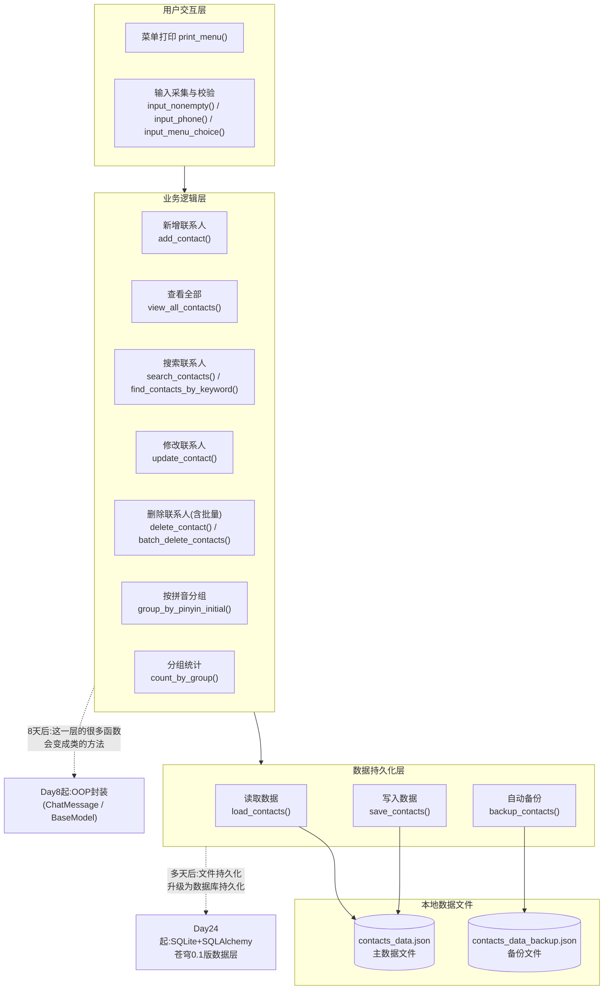
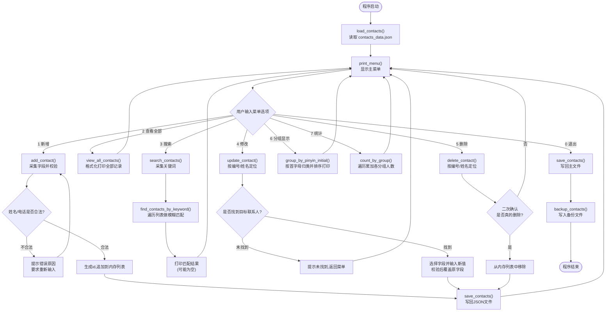

# 第7天 · 第一周复习与周测

> **周次/Sprint**:Sprint 0 · 新人内训(Day1-14)—— 阶段项目一:命令行多轮对话AI助手(预计Day14交付)
> **星期**:周日(内训第一周的收尾日;强度较平日略降——中午和晚饭休息都会拉长一点,但知识串讲、周测笔试、上机综合项目三件事一件不能少)
> **学员**:陈铭、苏梦、韩露、张凡(导师:王振宇;今日列席:王振宇、林悦)
> **内训任务卡**:PYXT-ONB-D07(蓬远科技培训中心 · 新人训练营 · Day07 · 第一周周测与复盘)
> **今日关键词**:知识串讲 / 答疑 / 周测(笔试+上机) / 通讯录管理系统 / JSON持久化 / 阶段性复盘

---

## 【旁白】

七天,说长不长,说短也不短。如果拿后面六十三天做参照,这七天甚至只是一个不起眼的开头——陈铭还没碰过一行大模型API,没写过一个类,没接触过任何一个真正意义上的"客户项目"。但如果你把这七天单独取出来,拿显微镜照一照,会发现它几乎是完整七十天节奏的一个缩小样本:先是几天连续的知识输入,知识点一天比一天抽象、一天比一天有分量,然后紧接着一次检验——不是走过场的检验,是真刀真枪的笔试加上机,最后落地成一个能跑起来、能被人评价"做得怎么样"的完整项目。往后你会在Day14看到几乎一样的结构,在Day21、Day31、Day38、Day45、Day50、Day57、Day65又分别看到一次,只是规模越滚越大——从一个通讯录,滚到一个网页版对话产品,再滚到一个企业级知识库问答系统,最后滚到整个苍穹1.0。今天算是这套"学习—检验—交付"节奏第一次完整地跑给陈铭看,他自己还不知道这个节奏会重复多少次,但老王知道。

这一天在故事的功能上,还承担着另一件事——它是第一次让"评价"这个词变得具体起来。前六天,陈铭一直活在一种相对宽松的状态里:代码跑起来了就是完成了任务,老王的反馈基本都停留在"这样写更规范"这个层面,没有真正意义上的排名、分数、比较。今天不一样,周测有分数,上机项目有验收标准,老王和林悦都会坐在评审席上。陈铭第一次要面对一个略显尴尬却极其真实的结果:论知识点掌握速度和上机项目完成的利落程度,他排在四个人的中间,不算突出;但论代码规范、注释详尽程度、主动补测试这些"看不出聪明但看得出用心"的维度,他拿到了这一周最高的评分。这两件事同时发生,构成了这一天真正的重量——它提前给陈铭上了一课:在一份需要长期投入的职业里,"聪明"和"踏实"从来不是互斥的两条路,但短期内它们带来的反馈速度确实不一样,前者往往先被看见,后者往往走得更远。这句话陈铭这一天还说不出来,但七十天后回头看,他知道这是自己转折点上很关键的一次自我认知校准。

还有一层容易被忽略的意义:今天的综合练习——通讯录管理系统——看起来只是一个"存姓名电话"的小玩具,但它第一次让"增删改查"和"数据持久化"这两个词,以完整闭环的姿态出现在陈铭的项目履历里。往后无论是苍穹0.1版里对话记录的存取,还是海纳制造集团知识库里文档元数据的管理,骨架上都是同一套东西——一份需要长期保存的数据,需要支持新增、需要支持修改、需要支持按条件查找、需要支持删除、还需要在程序重启之后依然存在。今天陈铭写的这套`contacts_manager.py`,如果拿放大镜看,和三十天后苍穹知识库的"文档管理模块"、四十九天后祺瑞集团项目里的"日程与联系人工具",在设计思路上几乎是同一件事的不同尺寸版本。这就是为什么老王愿意把周测的上机部分,压在一个听起来"人畜无害"的通讯录项目上——它足够简单,能在一天内完成;但它又足够完整,完整到能把这一周学的九成知识点全部用上一遍。

---

## 晨会纪要 / 今日目标

**时间**:上午8:50,二层大会议室"望远"(平时新人培训在小会议室"起航",今天因为要开"周会"性质的会议,临时换到能坐更多人的大会议室)
**出席**:王振宇(老王)、林悦、陈铭、苏梦、韩露、张凡

陈铭进会议室的时候愣了一下——平时的小会议室没坐满过,今天却在长桌一头多摆了两张椅子,林悦已经坐在其中一张上,面前摆着一台笔记本电脑和一个纸质文件夹,封面上手写着"新人训练营 · 第一周复盘"。老王比平时晚到了两分钟,进门先跟林悦打了个招呼,然后才转向四个学员:"今天不是纯粹的新人培训课,前二十分钟,我们先过一遍正常的项目周会,你们四个列席听一听——往后你们转正进了项目组,每周都要开这种会,提前熟悉一下节奏没坏处。"

**项目组周会摘要(新人列席观摩)**:

- 苍穹平台目前仍处于内部技术预研阶段,尚未正式立项,但林悦这周和两家意向客户的沟通有了新进展——一家是做智能客服方向,一家提到"知识库问答",具体细节还在保密阶段,林悦只用了一句话概括:"方向感越来越清楚了,大概是知识库和智能办公两条线。"（这句话陈铭后来在自己的笔记里画了个星号,他还不知道这两条线分别对应着后面的海纳制造集团和祺瑞集团。）
- 老王这周花了不少精力在新人培训上,项目组内部的技术预研进度因此有所放缓,郭建军已经知情并表示这是"值得的投入"。
- 风险点:潜在客户的需求还没有落地成正式合同,团队目前的主要产出仍集中在内部技术积累与人才培养上,这也是为什么"新人训练营"在公司当前阶段被摆在一个格外重要的位置——老王原话是"我们现在囤的不是订单,是人"。

周会部分结束,林悦收起了那份"项目周会"的文件,翻开了"新人训练营复盘"那一份。老王把白板转到空白的一面,写下四个名字:陈铭、苏梦、韩露、张凡。

"接下来这一部分,是我和林悦一起看过你们这一周所有作业和代码之后,准备的一次点评,"老王说,"提前说清楚——今天点评不是为了排名次让谁难受,是想让你们清楚地知道,自己这一周到底强在哪、弱在哪,这个认知越早越准,后面十三天你们能补的时间就越多。"

**第一周(Day1-6)战况回顾**

老王先没有直接进入个人点评,而是把这一周的技术脉络快速倒放了一遍,算是给今天上午"知识串讲"打个前奏:

> "Day1,你们装环境、写变量;Day2,学字符串,写文本清洗工具;Day3,学分支和循环,写猜数字和菜单系统;Day4,学列表,写待办事项管理器;Day5,学字典和JSON,解析模拟的API返回;Day6,学函数,把前面几天的代码全部重构了一遍。六天,九个核心知识板块,四个完整的小项目,外加一次工程化的重构练习。这个信息量,如果放在大学一学期的课程里,可能要拆成十六周慢慢讲。你们六天走完了,累不累?"

苏梦小声接了一句:"累,但好像也没有第一天那种完全懵的感觉了。"

"这就是我想让你们意识到的第一件事,"老王说,"知识点是一天天堆上去的,但理解不是线性的——很多时候你在某一天觉得'这个东西我大概懂了',其实是前面几天的东西在后台悄悄拼接完成了。今天的串讲,不是从头再讲一遍,是帮你们把这六天散落的拼图,摆成一张完整的地图。"

**林悦的补充视角**

林悦这时候插了一句话,是她这一周第一次以"产品经理"的身份直接对新人发言:"我看了你们几个人这一周写的所有需求文档相关的部分——虽然你们现在写的还是老王给的练习任务书,不是真正的客户需求,但我注意到几个共同的小问题,想提前说一下,免得带着错误的习惯进正式项目。"她翻了两页笔记:"第一,不少同学在'验收标准'这部分写得比较模糊,比如‘程序能正常运行’——这句话对我来说等于没写,‘正常运行’具体是指什么输入、什么输出、什么边界条件?第二,大家写用户故事的时候,习惯性地站在自己(开发者)的角度想问题,而不是站在真正会用这个东西的人的角度。这两个习惯,我希望你们从今天的综合项目开始就留意改一改。"

陈铭把这句话记在了笔记本上,旁边写了一句自己的批注:"我是运营出身,理论上应该对'用户视角'更敏感才对,但写代码的时候还是会不自觉切回'工程师视角'。得练。"

**个人点评环节**

老王把提前整理好的一张评分表投影到屏幕上(这张表后面会完整出现在"课堂笔记"部分),先做了个总体说明:"这张表分四个维度——知识笔试分、代码规范分、项目完成度、还有一个我加的、叫'踏实分'。踏实分不是随便打的,它对应几件具体的事:主动补测试、代码注释详尽、主动帮同伴排查问题、遇到不懂的东西是刨根问底还是囫囵吞枣。"

他先点到了韩露:"你这一周综合表现最稳,产品背景帮了你不少——需求文档写得最清楚,代码进度也没掉队,唯一提醒你的是,别把太多精力花在‘让程序看起来好看’上,这周有两次你在排版上耗的时间超过了打磨逻辑本身。"

张凡这边,老王的评价带着点提醒的意味:"你底子好,进度最快,昨天重构的四个项目你是第一个交的。但代码规范这块,我上周提过的问题今天还在——变量名还是有随手起的情况,注释写得比别人少一半。你现在觉得自己看得懂,三个月后你自己都未必看得懂。"

苏梦被点到的时候,明显有点紧张,老王的语气软了一些:"你这一周进度确实是四个人里最慢的,这个我不回避。但我想告诉你,你这周有两次主动在群里问'为什么这里要这样写而不是那样写',这种问题比‘这个报错怎么解决’的问题含金量高得多——说明你不是在应付作业,是真的想搞懂。慢一点没关系,方向对最重要。"

最后是陈铭。老王没有立刻说话,而是先把那张评分表放大,四个人的分数并排列在一起——陈铭的知识笔试分和项目完成度都排在中间,不拖后腿,也不算亮眼;但踏实分那一栏,他的分数明显高出其他三人一截。

"陈铭,你这周的知识吸收速度和代码产出速度,说实话不是四个人里最快的,"老王先把这句话说在前面,"但你有几件事,我特意记下来了——Day3你帮苏梦排查for/while循环的bug,那段时间你自己的进度也没落下;Day6重构的时候,你是唯一一个主动补了'重构前后行数对比'这种没被要求、但很有价值的数据的人;还有,你几乎每天的代码注释密度,是四个人里最高的。这些事单独看都不大,但加在一起,就是我说的‘踏实分’——它衡量的不是你今天比别人聪明多少,是你愿不愿意在‘看起来没有直接收益’的地方多花心思。这种特质,短期内不一定让你显得多突出,但我干了十年技术管理,见过太多‘聪明但飘’的人半年后原地打转,也见过‘不算最快但扎实’的人一年后走得比谁都远。"

陈铭当时没太敢接话,只是把这段话一字一句记了下来。晚一点,在今天复盘部分,他会再回到这段对话,重新理解一遍。

**今日目标**:

1. 上午9:00-12:00:第一周(Day1-6)全部知识点系统串讲,现场答疑,重点扫一遍这一周高频出现的报错类型与容易踩的坑。
2. 下午14:00-16:30:周测笔试环节(闭卷为主,允许查阅官方文档但不许互相讨论),覆盖概念题、读代码判断输出题、改错题、简单编程题四大板块。
3. 下午16:30起(比平时提前进入实操,给出更充裕的项目时间)至晚自习结束:周测上机部分,独立完成综合项目"通讯录管理系统"(需求见下方PRD),要求增删改查、JSON持久化、搜索、按拼音首字母分组显示。
4. 晚自习19:30-21:00(比平日提前半小时结束,体现周日强度略降):项目验收、代码点评、简短的一周总结分享。

**风险点**:

- 信息密度极高的一天,串讲环节如果讲得太细会挤占笔试和上机的时间,老王决定串讲以"表格+重点答疑"为主,不逐行回放六天的代码。
- 周测笔试和上机项目连续进行,四人体力和注意力都会在下午后段明显下降,老王已经和后厨确认晚饭会准备得清淡一些,避免饭后犯困影响上机效率。
- 通讯录项目对"输入健壮性"要求较高(不能因为用户乱输入就直接崩溃),但正式的异常处理(`try/except`)要到Day10才系统学,今天只能靠条件判断做"笨办法"的容错——老王提前说明这是有意为之的限制,不是遗漏,"你们今天会觉得有点憋屈,这个憋屈感我们留到Day10解决"。
- 周日的"强度略降"体现在午休和晚饭时间拉长、晚自习提前结束,但笔试和项目本身的分量不打折扣,老王原话:"降的是体力消耗的节奏,不降的是考核的标准。"

---

## 需求文档:周测大纲与《通讯录管理系统》综合项目需求书

> 本文档分为两部分。第一部分"周测大纲"由技术导师王振宇制定,说明本次周测的形式、范围与分值分布,发放给全体培训生作为复习依据。第二部分"《通讯录管理系统》综合项目需求书"由产品经理林悦按照公司真实PRD模板撰写——这是新人训练营第一次收到一份完全由产品经理主笔的需求文档,而不是老王代写的"练习任务书",格式上更贴近未来陈铭进入项目组之后会真实收到的东西。

### 第一部分:第一周周测大纲

**考试形式**:笔试(占60分)+ 上机实操(占40分),总分100分,总用时约6小时(含中间休整)。笔试为半闭卷,允许查阅Python官方文档,不允许查阅他人代码或使用AI辅助工具,不允许相互讨论。上机实操允许查阅文档与自己此前提交的代码,鼓励参考但不允许直接复制同伴代码。

**笔试范围与分值分布**:

| 题型 | 题量 | 分值 | 覆盖知识点 |
|---|---|---|---|
| 概念选择/判断题 | 6题 | 12分 | 变量与类型、运算符优先级、字符串方法、可变/不可变类型、字典与JSON、函数参数机制 |
| 简答题 | 4题 | 16分 | 数据类型转换规则、列表与元组的适用场景差异、`*args`/`**kwargs`的用途、作用域规则 |
| 读代码写输出题 | 4题 | 16分 | 综合运用切片、循环、字典遍历、递归等知识点判断程序真实输出 |
| 改错题 | 2题 | 8分 | 常见的类型错误、索引越界、缩进错误、字典键不存在等典型bug |
| 简单编程题 | 2题 | 8分 | 独立编写符合要求的小函数,考察知识点的综合应用能力 |

**上机实操范围与分值分布**(全部对应综合项目"通讯录管理系统"的验收标准,详见第二部分):

| 验收模块 | 分值 | 说明 |
|---|---|---|
| 基础增删改查功能完整性 | 15分 | 新增、查看、修改、删除四项基本操作均正确实现 |
| JSON持久化正确性 | 10分 | 数据在程序重启后不丢失,格式规范,支持自动备份 |
| 搜索与排序增强功能 | 8分 | 支持关键词模糊搜索,支持按拼音首字母分组显示 |
| 代码规范与健壮性 | 7分 | 命名规范、注释详尽、对非法输入有基本的容错处理(不崩溃) |

老王在下发大纲的时候补了一句提醒:"笔试的分值权重比上机高,不是说上机不重要,是因为如果笔试暴露出你们对基础概念一知半解,上机项目大概率也会写得很吃力——这两部分本质上是一件事的两种检验方式。"

### 第二部分:《通讯录管理系统》综合项目需求书

> 撰写人:林悦(产品经理)
> 文档编号:PYXT-PRD-D07-01
> 版本:v1.0

#### 背景

新人训练营第一周的技术主线是Python基础语法与核心数据结构,培训生已经具备使用变量、运算符、字符串、流程控制、列表/元组/集合、字典、JSON处理以及函数封装的能力。为了检验这些知识点能否被整合进一个"看起来像真实小工具"的完整系统,而不是停留在孤立的语法练习层面,技术团队与产品团队共同确定,以"通讯录管理系统"作为第一周的综合验收项目。

这个选题并非随意为之。公司内部长期存在一个真实的小痛点——不同部门的同事各自用不同方式记录客户和合作方的联系方式(有人用手机备忘录,有人用Excel表格,格式五花八门,查找起来效率很低)。虽然本次培训生开发的版本只是一个命令行工具,不会真正投入公司使用,但其数据结构设计、持久化方案、检索能力,都刻意向"未来这类信息真的需要被系统化管理"的方向靠近——这也是为什么这份需求书会像对待一个真实小型工具一样,写清楚用户故事、功能边界与验收标准。

#### 用户故事

- 作为一名需要频�率联系客户与合作方的行政/业务人员,我希望能够快速记录一个新联系人的姓名、电话、邮箱、地址等信息,以便日后随时查阅,而不必依赖容易丢失的纸质记录或零散的备忘录。
- 作为通讯录的日常使用者,我希望能够按姓名、电话号码或所属分组快速搜索到某位联系人,而不必从几十上百条记录里一条条肉眼查找。
- 作为通讯录的日常使用者,我希望联系人信息发生变化(比如换了电话号码)时,能够方便地修改已有记录,而不必删掉重新添加,丢失原有的其他信息。
- 作为通讯录的日常使用者,我希望在联系人不再需要保留时(比如离职、失效联系方式),能够安全地删除记录,并且系统会在删除前进行二次确认,避免误删。
- 作为通讯录的日常使用者,我希望所有信息在我关闭程序之后依然被保存下来,下次打开程序时能看到之前录入的全部内容,而不是每次都要重新输入。
- 作为一个需要管理大量联系人的用户,我希望通讯录能够按照姓名的首字母进行分组展示,就像手机自带的通讯录一样,而不是把几十条记录一股脑堆在屏幕上。
- 作为一个需要定期整理联系人的用户,我希望能够看到各个分组(家人/朋友/同事/客户/其他)分别有多少联系人,以便了解自己的人脉结构。
- 作为技术导师,我希望通过这个项目,验证每位培训生是否已经具备"独立设计一个完整数据结构、并支撑增删改查全流程"的基本工程能力。

#### 功能列表

| 编号 | 功能 | 说明 | 优先级 |
|---|---|---|---|
| F1 | 新增联系人 | 采集姓名、电话、邮箱、地址、分组、备注等字段,对必填项(姓名、电话)做非空与格式校验 | P0(必须实现) |
| F2 | 查看全部联系人 | 以表格形式列出当前全部联系人,字段对齐、易读 | P0 |
| F3 | 搜索联系人 | 支持按姓名、电话号码、分组关键词进行模糊搜索,返回全部匹配结果 | P0 |
| F4 | 修改联系人 | 根据编号或姓名定位到指定联系人,支持选择性修改某一个或多个字段 | P0 |
| F5 | 删除联系人 | 根据编号或姓名定位并删除,删除前必须二次确认;支持批量删除多个联系人 | P0 |
| F6 | JSON持久化 | 每次新增/修改/删除后自动写入本地JSON文件;程序启动时自动读取已有数据;写入前自动生成一份备份文件 | P0 |
| F7 | 按拼音首字母分组显示 | 模拟手机通讯录的A-Z分组展示效果,联系人未提供拼音信息时按常见姓氏做初步猜测,猜测不到的归入"#"分组 | P1(增强功能) |
| F8 | 分组人数统计 | 统计"家人/朋友/同事/客户/其他"五个分组各自的联系人数量,并给出总人数 | P1 |
| F9 | 输入健壮性保护 | 对非数字选项、超出范围的编号、空白输入等异常情况给出明确提示,不能导致程序直接崩溃退出 | P0 |

#### 非功能需求

- **数据一致性**:任意一次增删改操作完成后,内存中的数据与JSON文件中的数据必须保持一致,不允许出现"程序里显示已经删除,但文件里还留着"这类不同步的情况。
- **性能要求**:本项目数据规模较小(教学场景下预计不超过几百条记录),不需要考虑索引优化等高级性能手段,但代码结构要为未来可能的规模增长留出改造空间(比如把数据加载和保存独立成函数,而不是散落地写在各个操作里)。
- **可维护性**:严格遵循团队代码规范——变量与函数命名清晰、每个函数配中文docstring、关键业务逻辑有行内注释说明"为什么这么做"。
- **兼容性**:程序需要能在Windows和macOS环境下正常运行,JSON文件读写统一使用UTF-8编码,避免中文姓名乱码。
- **可测试性**:核心业务逻辑(搜索、分组、统计等)应当尽量设计成不直接依赖`input()`的纯函数形式,以便后续可以脱离交互式界面单独验证其正确性。

#### 验收标准

1. 程序首次运行时,如果本地不存在数据文件,能够正常初始化一个空通讯录,不报错崩溃。
2. 新增至少5位联系人后关闭程序,重新启动程序,全部数据应完整保留,字段无丢失、无乱码。
3. 搜索功能输入部分姓名(如只输入姓氏)、部分电话号码(如只输入后四位)均能返回正确的匹配结果。
4. 修改功能能够只修改用户选择的字段,未选择修改的字段保持原值不变。
5. 删除功能在未经二次确认的情况下不会真正执行删除;支持一次性删除多个指定联系人(批量删除)。
6. 按拼音首字母分组展示时,分组结果与预期一致(测试数据中至少覆盖5个不同首字母及至少1个无法识别拼音、归入"#"分组的场景)。
7. 分组人数统计结果与实际数据吻合,且总人数等于各分组人数之和。
8. 对菜单选择输入了字母、超出编号范围的数字、直接按回车等异常输入,程序均能给出友好提示并允许用户重新输入,不会抛出未处理的报错导致程序终止。
9. 代码有清晰的函数划分(不少于12个独立函数),每个函数职责单一,配有中文docstring。

林悦在下发文档时补了一句:"这份需求书的格式,你们以后会在苍穹项目里反复见到——背景、用户故事、功能列表、非功能需求、验收标准,五段论。今天先在一个小项目上练熟这个阅读习惯,以后拿到真正复杂的PRD,你们不会觉得陌生。"

---

## 架构设计图:通讯录管理系统模块架构图

下午项目正式开始前,老王没有直接让四人打开编辑器写代码,而是先在白板上画了一张结构图,要求大家先想清楚"这个程序分几层、每一层负责什么",再动手写第一行代码。他把这个习惯总结成一句话:"先想清楚数据长什么样、程序分几层,再想代码怎么写——这句话我以后还会说很多次。"



老王讲解这张图的时候,特意把"用户交互层"和"业务逻辑层"分得很清楚:"你们今天最容易犯的一个错,是把`input()`和真正的业务逻辑写在同一个函数里——比如一个`add_contact`函数,一边`input()`问用户要姓名,一边马上做校验,一边又马上往列表里塞数据。这样写短期能跑,但你没办法在不启动整个交互流程的情况下,单独测试'这条数据校验逻辑对不对'。今天我要求你们尽量把'问用户要什么'和'拿到数据之后怎么处理'分开,这是为你们十几天后要学的单元测试打个提前量。"

他又指了指图上两条虚线:"这张图上的业务逻辑层,八天后你们会发现,很多函数会变成类里的方法——因为一群相关的函数,加上它们共同操作的数据,捆在一起,就是一个对象。而数据持久化层,现在是最朴素的JSON文件读写,十七天后(Day24)你们会学到怎么把它换成真正的数据库。今天这张图的形状,不会变,变的只是每一层具体用什么技术实现。"

张凡问了一句:"那我们现在这样设计,是不是有点'过度设计'了?毕竟只是个通讯录。"老王摇头:"分层这件事,不是'规模大了才需要',而是'规模大了之后没有分层会要命'。你现在多花十分钟想清楚这三层,以后项目规模涨十倍,你不需要推倒重建,只需要把某一层内部换个实现。这笔投资,今天看起来利息很低,以后利息会很高。"

---

## 流程图:通讯录系统增删改查数据流程图

架构图讲完"程序分几层",老王接着用一张流程图讲清楚"一次具体的操作,数据是怎么在这几层之间流动的"——这次他选用了普通的`flowchart`,因为增删改查是一个带分支、带循环的完整交互过程,更适合用流程图表达。



这张图有一个细节陈铭在笔记里特意标注了出来——"新增""修改""删除"这三条支路,最终都汇入了同一个`Persist`节点,再统一走`save_contacts()`。他一开始的写法是在每个操作函数内部各自调用一次保存逻辑,老王看完提出了一个问题:"如果以后你要在保存之前统一加一步'数据校验'或者'写日志',你现在这样写,是不是要在三个地方分别加?"陈铭想了两秒说:"是啊,那我把保存这个动作提出来,变成一个大家都调用的公共步骤是不是更好?"老王点头:"这就是刚才架构图上'数据持久化层'为什么要独立出来的原因——不是因为它复杂,是因为它是"公共动作",公共的东西就应该只有一个入口。"

苏梦看着这张图又问了一句:"为什么删除要单独画一个'二次确认'的判断框,而新增和修改没有?"老王的回答带着一点行业经验的味道:"因为删除是这几个操作里唯一'不可逆'的——改错了你还能改回去,删错了数据可能就真的没了。凡是不可逆的操作,在系统设计里都应该多一层确认,这不是我今天临时想出来的规矩,这是几乎所有正式系统的通用设计原则,你们以后会在几乎每一个正式项目的删除功能上看到这个'二次确认'的影子。"

---

## 示意图:第一周知识点关系脑图

第三张图,老王换了一种画法——不是讲"这个系统怎么运作",而是讲"这一周学的东西,彼此之间是什么关系"。他说这张图更像一张"知识地图",目的是让四人在脱离具体代码的时候,也能在脑子里过一遍这周学了什么、这些东西怎么互相搭着用。

```mermaid
graph TD
    ROOT["第一周:Python基础地基<br/>(Day1-Day6)"]

    ROOT --> D1["Day1 变量与数据类型<br/>int / float / str / bool"]
    ROOT --> D2["Day2 运算符与字符串<br/>算术/比较/逻辑运算符<br/>切片、split/join/strip/replace<br/>f-string"]
    ROOT --> D3["Day3 流程控制<br/>if/elif/else、while、for<br/>break/continue"]
    ROOT --> D4["Day4 列表/元组/集合<br/>增删改查、切片、排序<br/>列表推导式"]
    ROOT --> D5["Day5 字典与JSON<br/>dict增删改查、嵌套字典<br/>json.loads/dumps/load/dump"]
    ROOT --> D6["Day6 函数<br/>参数四种形态、返回值<br/>作用域、lambda、递归"]

    D1 -.类型转换是字符串处理的前提.-> D2
    D2 -.条件判断依赖比较/逻辑运算符结果.-> D3
    D3 -.循环遍历是操作列表的基本手段.-> D4
    D4 -.列表存不下"按名字查找"的需求.-> D5
    D5 -.重复的字典操作逻辑需要抽象.-> D6

    D6 --> PROJECT["Day7综合项目<br/>通讯录管理系统"]
    D5 --> PROJECT
    D4 --> PROJECT
    D3 --> PROJECT
    D2 --> PROJECT
    D1 --> PROJECT

    PROJECT -.8天后需要更好的组织方式.-> NEXT["Day8起:面向对象编程<br/>类与对象"]
```

老王讲这张图时用了一个类比:"你们可以把这一周想象成盖房子打地基前的'材料准备'——变量和类型,是最基础的建材,砖头瓦片;运算符和字符串,是把建材加工成合适形状的工具;流程控制,是决定'先砌这一块还是先砌那一块'的施工顺序;列表和字典,是存放和管理这些建材的仓库;函数,是把'重复的施工动作'总结成一套可以反复执行的标准流程。今天这个项目,是第一次要求你们把仓库里所有的建材、所有的工具、所有的标准流程,同时用上,盖出一个真正能住人的小房子——虽然这个小房子目前还只是一个通讯录。"

韩露提了一个挺尖锐的问题:"这张图上说'Day6函数'直接指向了Day7的项目,但没画出来Day1-5是不是也各自独立指向了项目,这是不是意味着函数比其他知识点更重要?"老王笑着摇头:"不是重要程度的问题,是'组织方式'的问题——函数不产生新的能力,它只是把前面五天已经具备的能力,用一种更好的方式组织起来。你今天写通讯录项目,判断输入是不是数字用的还是Day1的类型转换,遍历列表用的还是Day3的for循环,存数据用的还是Day5的字典和JSON——函数只是让这些能力不再是七零八落地堆在一起,而是被装进一个个清晰命名、边界分明的盒子里。"

---

## 课堂笔记

### 上午:知识点串讲与答疑

**9:00,培训室**

早会结束,四人回到平时的培训室,老王把投影切到一张巨大的表格,开场白和往常不太一样:"今天上午不讲新知识点,我们做一件更重要的事——把这六天学的东西,连成一张网。"

#### 第一周知识点串讲总表

老王让陈铭把这张表逐行念出来,每念一行,他补充一段"这个知识点在实际项目里会怎么被用到"的具体说明,四个人边听边在自己的笔记本上补充细节。以下是陈铭课后整理的完整版本:

| 天数 | 核心知识点 | 代表性代码/语法 | 本周项目中出现的位置 | 常见报错/易错点 |
|---|---|---|---|---|
| Day1 | 变量、四种基础数据类型(int/float/str/bool)、`type()`、类型转换 | `age = int(input(...))` | 通讯录中电话、编号需要int,姓名需要str,是否成功需要bool | `TypeError`(类型不匹配运算)、`ValueError`(转换失败) |
| Day2 | 算术/比较/逻辑运算符、优先级、字符串索引与切片、`split`/`join`/`strip`/`replace`、f-string | `name.strip()`、`f"{name}:{phone}"` | 搜索功能的模糊匹配、姓名首字母提取、格式化打印联系人卡片 | 优先级理解错误导致逻辑"看起来对但结果错";索引越界`IndexError` |
| Day3 | if/elif/else、while、for、range、break/continue | `for c in contacts: if keyword in c["name"]:` | 菜单循环、搜索时的条件筛选、删除前的确认判断 | 缩进错误、`while`条件写反导致死循环或一次都不执行 |
| Day4 | list增删改查/切片/排序/列表推导式、tuple、set | `contacts.append(new_contact)`、`sorted(contacts, key=...)` | 联系人整体存储结构、批量删除、按分组排序展示 | 遍历列表时同时删除元素导致漏删或越界;混淆`append`与`extend` |
| Day5 | dict增删改查、嵌套字典、JSON详解、`json.loads/dumps/load/dump` | `contact = {"name": ..., "phone": ...}`、`json.dump(data, f, ...)` | 单条联系人的数据结构、整份通讯录的持久化文件格式 | `KeyError`(访问不存在的键)、忘记`ensure_ascii=False`导致中文变成`\uXXXX` |
| Day6 | 函数定义、四种参数形态、返回值、作用域、lambda、递归 | `def add_contact(data): ...`、`sorted(x, key=lambda c: c["name"])` | 全部功能模块的函数化组织、排序时的`key`参数、分组统计的递归小工具 | 忘记`return`导致函数默认返回`None`;局部变量和全局变量混淆导致"改了却没生效" |

老王讲到Day5那一行时,特意停顿了一下:"这里我要重新强调一句上周说过的话——JSON几乎是你们接下来两个月每天都要打交道的格式,不是我夸张。今天的通讯录持久化用JSON,十几天后调用大模型API,请求体和返回体也是JSON,再往后写FastAPI接口,请求和响应模型底层对应的还是JSON。你们今天在`contacts_manager.py`里写的`json.dump`和`json.load`,和你们十二天后第一次调用DeepSeek API时用到的,是同一对函数,没有任何区别。"

#### 高频报错关键词回顾(Day1-6累计版)

老王让大家在Day1那张报错表的基础上继续补充,这一次补上了Day2-6新出现的几种典型报错,合并成一张"第一周报错关键词全家桶":

| 报错类型 | 首次出现的天数 | 典型触发场景 | 排查思路 |
|---|---|---|---|
| `SyntaxError` | Day1 | 变量名不合法、缺少冒号、括号不匹配 | 定位到报错指向的行,检查明显的书写错误 |
| `IndentationError` | Day1 | 缩进多一个或少一个空格,tab与空格混用 | 检查该行与上下文缩进是否统一 |
| `NameError` | Day1 | 变量名拼写不一致、变量未定义先使用 | 前后拼写完全一致,确认已赋值 |
| `TypeError` | Day1、Day4、Day6 | 不同类型间的非法运算;函数参数类型不匹配;对`None`做运算 | 用`type()`确认变量真实类型;检查函数返回值是不是漏了`return` |
| `ValueError` | Day1、Day2 | 转换函数收到无法解析的内容;`split`后取索引超出实际分割结果数量 | 检查传入转换函数的字符串格式;打印中间结果确认分割数量 |
| `IndexError` | Day2、Day4 | 字符串或列表索引超出实际长度范围 | 打印`len()`确认实际长度,检查索引计算是否有偏差(尤其负数索引) |
| `KeyError` | Day5 | 访问字典中不存在的键 | 用`dict.get(key, 默认值)`代替直接用`[]`访问,或先用`in`判断键是否存在 |
| `AttributeError` | Day4、Day5 | 对象没有某个方法或属性(比如把字符串当列表用`.append()`) | 用`type()`确认对象类型,查阅该类型真正拥有的方法 |
| `ZeroDivisionError` | Day2 | 除数为0(比如平均分计算时联系人数量为0) | 在除法前加条件判断,处理"除数可能为0"的边界情况 |
| `RecursionError` | Day6 | 递归函数缺少正确的终止条件,导致无限递归 | 检查递归的"基准情形"(base case)是否覆盖了所有会缩小到的边界值 |

张凡看着这张表说了一句:"感觉这些报错,好像已经不那么可怕了。"老王点头:"这正是我想要的效果——报错本质上不是敌人,是程序在很礼貌地告诉你哪里出了问题。你们现在能一眼认出报错类型、大致猜到排查方向,这个能力比死记硬背语法规则值钱得多。"

#### 答疑环节:四个人分别提出的问题

**苏梦的问题**:"字典和列表我总是分不清什么时候该用哪个,有没有一个简单的判断方法?"

老王给了一个比较实用的判断标准:"问自己一个问题——我需要通过'位置/顺序'去访问数据,还是需要通过'一个有意义的标签'去访问数据?如果是前者(比如'第三个任务是什么'),用列表;如果是后者(比如'这个人的电话号码是什么',标签是'电话'这个字段名),用字典。今天的通讯录项目里,你会发现两者是嵌套着用的——整个通讯录是一个列表(许多联系人按添加顺序排列),但每一条联系人记录本身是一个字典(用‘姓名’‘电话’这些字段名去访问对应的值)。这种"列表套字典"的结构,你们接下来很长一段时间都会反复见到。"

**韩露的问题**:"函数的默认参数,是不是任何时候都应该给?会不会掩盖掉一些应该由用户明确指定的信息?"

老王的回答带着一点辩证的味度:"默认参数的意义是'给一个合理的、大多数情况下都适用的兜底值',不是'偷懒不想让用户输入'。什么时候该给默认参数,什么时候不该给,取决于业务逻辑——比如新增联系人时,‘分组’这个字段,如果用户没有明确指定,给一个默认值‘其他’是合理的,因为它不影响核心功能;但‘姓名’和‘电话’这两个必填项,你就不应该给默认值,因为一旦给了空字符串之类的默认值,反而会掩盖用户忘记填写这个关键信息的问题。默认参数是一种设计选择,不是语法技巧,要为业务负责地去用。"

**张凡的问题**:"递归和用循环写出来的效果,很多时候看起来是一样的,那为什么还要学递归?"

老王举了一个具体例子回答:"你说的'看起来一样'是指结果一样,但过程不一样。有些问题天然是‘自己调用自己的小规模版本’这种结构,比如遍历一个不知道嵌套了几层的字典(可能第一层是分组,第二层是联系人列表,联系人字段本身又是一个字典)——用循环写,你要嵌套好几层for,层数一旦不确定,循环写起来会很痛苦;用递归写,你只需要写清楚'遇到字典就往下钻一层,遇到基础类型就返回',代码反而更短、更容易理解。今天的项目里我们只用得上一个很简单的递归小工具,但递归这个思维方式,后面处理嵌套结构(比如多层目录、多级组织架构、树形的对话状态)时,还会反复用到。"

**陈铭的问题**:"我们现在写的这个通讯录项目,如果同时有两个人在用(比如两个人同时打开程序改同一份数据),会出什么问题?"

这个问题让老王多讲了两句超出今天范围的内容:"问得好,这其实已经摸到了'并发'这个更高级的话题的边缘。今天你们的程序是单人单进程运行,不需要考虑这个问题,但你说的场景,恰恰是所有真实多用户系统都要面对的核心难题——两个人同时改同一份数据,谁的修改最终生效?会不会互相覆盖?这个问题我们现在不展开,但你能想到这一层,说明你的运营背景确实让你对'真实使用场景'比一般新手更敏感。记住这个问题,以后我们做数据库、做多用户系统的时候,会有专门的机制(比如锁、事务)来解决它。"

#### FAQ:上午答疑归纳补充

除了上面四人分别提出的问题,还有几个在讨论中反复出现、但没有明确归属到某个人的疑问,老王一并做了解答,整理如下:

1. **问:这一周学的东西这么多,是不是应该全部背下来?**
   答:不需要。老王的说法是:"我十年经验,常用语法我记得住,不常用的我一样要查文档。你们要练的不是记忆力,是‘看到需求,大致知道该用哪个知识点、去哪查具体用法’的判断力。"

2. **问:为什么今天不讲新知识点,而是花一整个上午复习?这样是不是拖慢了进度?**
   答:恰恰相反。老王认为,没有巩固的知识点,是"假掌握"——你以为学会了,遇到综合场景就会露怯。今天串讲加周测,是用最短的时间检验出真正的薄弱环节,比稀里糊涂往前赶进度更省时间。

3. **问:笔试的时候能不能查资料?**
   答:允许查阅Python官方文档,但不允许查阅他人代码、不允许用任何AI辅助工具、不允许互相讨论。老王解释:"查文档是工程师的基本功,以后你们工作中天天查文档,这不算作弊;但抄别人的思路或者让工具帮你想,考的就不是你自己的理解了。"

4. **问:上机项目做不完怎么办?**
   答:老王给了明确的底线:"今天晚自习结束前,至少要交出一个能跑起来的、覆盖增删改查和JSON持久化这两块P0功能的版本。分组显示、统计这些增强功能,如果时间实在不够,可以缺,但核心功能不能缺。"

5. **问:数据类型转换、字符串处理、字典操作这些,以后是不是就不会再用手写的方式做了,会不会都被库函数取代?**
   答:老王给了一个很实在的答案:"很多具体的活会被库函数取代,比如以后你不会自己手写JSON解析器,直接用`json`模块;但‘知道数据长什么样、该用什么结构存’这件事,永远不会被取代,因为这是所有库函数背后共同的逻辑起点。你今天手写的这些东西,以后不会照样手写,但理解它们,是你能看懂任何库函数在干什么的前提。"

6. **问:今天的通讯录项目,和我们平时听说的"数据库"是什么关系?是不是学了JSON持久化,就等于学会了数据库?**
   答:老王对这个问题的回答比较细致:"不是同一件事,但是同一个方向上的两级台阶。JSON文件持久化,本质上是把数据以文本形式整个读进内存、整个写回磁盘——数据量小的时候完全没问题,但数据量一旦大到几万条、十几万条,'每次操作都要把整份文件读进内存'这件事本身就会变得很慢,而且没有办法支持多个程序同时安全地读写同一份数据。数据库解决的正是这些问题——它有专门的索引机制,能只查你需要的那一小部分数据,而不必每次都全量加载;它有专门的机制处理多个连接同时读写的情况,不会互相覆盖。你们十七天后(Day24)会正式接触SQLite和SQLAlchemy,那时候你们会发现,今天这个通讯录项目稍微换个角度看,其实就是‘一张数据库表该有哪些字段’的提前预演——你们今天设计的`id`、`name`、`phone`这些字段,换个说法就是数据库表的‘列’,一条联系人记录,换个说法就是表里的‘一行’。"

7. **问:今天的项目要求"至少不少于12个独立函数",这个数字是怎么定出来的,是不是函数越多越好?**
   答:老王笑着摆了摆手:"这个数字不是什么金科玉律,只是根据这个项目合理拆分之后大致会落在的区间给的一个参考底线,免得有人图省事把所有逻辑塞进两三个大函数里应付了事。函数数量本身不是目标,'每个函数职责单一、边界清晰'才是目标——如果你写出了20个函数,但其中一半只是把另一半的代码原样抄了一遍换个名字,那这20个函数的价值,还不如认真设计的8个函数。数量是结果,不是标准。"

---

### 下午:周测笔试

**14:00,培训室**

午饭后休息时间比平时长了半小时(体现今天"周日强度略降"的安排),14:00准时,老王把打印好的试卷发到每个人桌上,叮嘱了一句:"半闭卷,可以翻文档,不能翻代码,不能说话。时间到我会提前五分钟提醒。"

试卷是老王前一天晚上自己敲出来打印的,纸张边角还带着刚从打印机里出来的温热感。陈铭注意到,试卷第一页右上角印了一行小字——"蓬远科技新人训练营 · 第1周周测(笔试卷) · 满分60分",格式和公司正式的考核文件几乎一模一样,不像是随便糊弄的练习卷。苏梦拿到卷子先快速翻了一遍全部题目,脸上的表情从"还好"慢慢变成"有点多",张凡则是直接从第一题开始按顺序往下答,笔尖划过纸面的声音在安静的培训室里显得格外清楚。窗外偶尔有园区里其他公司的员工说笑着走过,阳光斜斜地照进来,落在陈铭那台贴着"慢慢来,比较快"的笔记本电脑上——今天笔试是纸笔作答,电脑合着放在一边,但那张贴纸依然在他视线边缘,他后来说,那两个半小时里,好几次瞥到这句话,心里都会莫名地稳一下。

以下是本次周测笔试的完整试卷内容,以及每道题在考试结束后老王现场讲评时给出的详细答案与解析(为了保持"考试现场"的真实感,这里连同评分要点一并保留,与文末"课后作业"部分的题目不重复)。

#### 一、概念选择/判断题(每题2分,共12分)

**1.** 下列关于Python变量的说法,正确的是:
A. 变量在使用前必须先声明类型
B. `Age`和`age`是同一个变量
C. 变量名可以以下划线开头,但不能以数字开头
D. 中文可以作为变量名,且团队规范推荐这样做

**2.** 表达式`3 + 2 * 2 > 6 and not False`的求值结果是:
A. `True`
B. `False`
C. 报错
D. `None`

**3.** 下列哪个字符串方法会返回一个新的字符串,而不会修改原字符串?
A. Python的字符串本身就是不可变的,所有字符串方法都返回新字符串
B. `strip()`会直接修改原字符串
C. `replace()`会直接修改原字符串
D. 以上说法都不对

**4.** 关于列表和元组,下列说法正确的是:
A. 列表和元组都不能修改内部元素
B. 元组不能修改内部元素,列表可以
C. 列表不能修改内部元素,元组可以
D. 两者完全没有区别,只是写法不同

**5.** 关于字典,下列说法正确的是:
A. 字典的键可以是列表
B. 字典的键必须是不可变类型(如字符串、数字、元组)
C. 字典中不能存储字典(不支持嵌套)
D. 字典的遍历顺序在Python中是完全随机的

**6.** 关于函数参数,下列说法正确的是:
A. `*args`收集的是关键字参数,`**kwargs`收集的是位置参数
B. 默认参数必须写在所有非默认参数之前
C. 一个函数最多只能有一个`return`语句
D. `*args`收集的是多余的位置参数,`**kwargs`收集的是多余的关键字参数

#### 二、简答题(每题4分,共16分)

**7.** 请简述`int("3.5")`会发生什么,以及正确应该如何把字符串`"3.5"`转换成整数`3`,写出具体代码。

**8.** 请简述列表(list)和元组(tuple)各自更适合用在什么场景,分别举一个本周项目(通讯录管理系统)之外的新例子。

**9.** 请解释以下代码中,`total`最终的值以及原因:

```python
def add_bonus(score, bonus=10):
    score = score + bonus
    return score

total = 80
add_bonus(total)
print(total)
```

**10.** 请简述为什么在字典中查找一个键是否存在时,推荐使用`if key in my_dict:`或`my_dict.get(key)`,而不推荐直接使用`my_dict[key]`后再处理报错。

#### 三、读代码写输出题(每题4分,共16分)

**11.** 写出下面代码的完整输出:

```python
names = ["陈铭", "苏梦", "韩露", "张凡"]
for i, name in enumerate(names):
    if i % 2 == 0:
        print(f"{i}号:{name}")
    else:
        continue
    print("---")
```

**12.** 写出下面代码的完整输出:

```python
contact = {"name": "陈铭", "phone": "138****0001"}
contact["email"] = "chenming@example.com"
info = contact.get("address", "地址未填写")
print(info)
print(len(contact))
```

**13.** 写出下面代码的完整输出:

```python
def make_multiplier(n):
    return lambda x: x * n

double = make_multiplier(2)
triple = make_multiplier(3)
print(double(5), triple(5))
```

**14.** 写出下面代码的完整输出:

```python
def count_down(n):
    if n <= 0:
        print("完成")
        return
    print(n)
    count_down(n - 1)

count_down(3)
```

#### 四、改错题(每题4分,共8分)

**15.** 下面这段代码存在bug,请指出报错类型、报错原因,并给出修复后的完整代码:

```python
contacts = [{"name": "陈铭", "phone": "138****0001"}]

def find_phone(name):
    for c in contacts:
        if c["name"] == name:
            return c["phone"]

phone = find_phone("苏梦")
print("电话是:" + phone)
```

**16.** 下面这段代码存在bug,请指出报错类型、报错原因,并给出修复后的完整代码:

```python
scores = {"陈铭": 88, "苏梦": 76, "韩露": 92}
total = 0
for name in scores:
    total = total + scores[name]
average = total / len(scores)
print("平均分:" + average)
```

#### 五、简单编程题(每题4分,共8分)

**17.** 请写一个函数`count_vowels(text)`,统计字符串`text`中英文元音字母(`a/e/i/o/u`,不区分大小写)出现的总次数,不使用任何正则表达式。

**18.** 请写一个函数`dedupe_keep_order(items)`,输入一个列表,返回一个去除了重复元素、但保留元素第一次出现顺序的新列表(不能直接用`set()`简单转换,因为`set`不保证顺序)。

---

**笔试参考答案与解析**(老王在收卷后现场讲评的完整版本)

**1. 答案:C**
解析:变量使用前不需要声明类型(排除A);`Age`和`age`大小写不同,是两个不同变量(排除B);变量名以下划线开头合法(C正确);团队规范明确禁止中文变量名(排除D)。

**2. 答案:A**
解析:按运算符优先级,`*`高于`+`,所以`2 * 2 = 4`;`+`高于`>`,所以`3 + 4 = 7`;`7 > 6`为`True`;`not False`为`True`;最后`True and True`结果为`True`。

**3. 答案:A**
解析:Python的字符串是不可变类型,任何"看起来修改了字符串"的方法(`strip()`、`replace()`、`upper()`等)实际上都是返回一个新的字符串对象,原字符串本身不会被改变。

**4. 答案:B**
解析:元组一旦创建,不能修改其中的元素(不可变类型);列表可以随时增删改内部元素(可变类型)。

**5. 答案:B**
解析:字典的键必须是不可变类型,列表是可变类型,不能作为键(排除A);字典完全支持嵌套,值可以是另一个字典(排除C);Python 3.7+版本字典会保持插入顺序,并非完全随机(排除D)。

**6. 答案:D**
解析:`*args`收集多余的位置参数,`**kwargs`收集多余的关键字参数,选项A说反了;默认参数必须写在非默认参数之后,选项B说反了;一个函数可以有多个`return`语句(出现在不同分支中),选项C错误。

**7. 参考答案**:`int("3.5")`会直接抛出异常:
```
ValueError: invalid literal for int() with base 10: '3.5'
```
原因是`int()`只能转换"看起来就是整数"的字符串,不接受带小数点的字符串。正确做法是先用`float()`转换成浮点数,再用`int()`取整(舍去小数部分):
```python
result = int(float("3.5"))   # 结果为3
```
需要提醒的是,这种方式是"截断"而不是"四舍五入",如果需要四舍五入,应该用`round(float("3.5"))`。

**8. 参考答案**:列表适合存储"数量不固定、内容可能需要频繁增删改"的数据,例如一个购物车里的商品名称列表`cart_items = ["洗发水", "牙刷", "毛巾"]`,商品可能随时被加入或移除。元组适合存储"数量固定、内容一旦确定就不应该被修改"的数据,例如一个表示"经纬度坐标"的二元组`beijing_location = (39.9, 116.4)`,经纬度一旦确定,不应该在程序运行过程中被意外修改,用元组能从语法层面防止这种误操作。

**9. 参考答案**:`total`最终的值仍然是`80`,不会变成`90`。原因是:`add_bonus`函数内部的参数`score`,是`total`这个整数值的一份拷贝(因为`int`是不可变类型,函数内部对`score`的重新赋值,只是让函数内部的局部变量`score`指向了一个新的整数对象,不会影响函数外部的`total`)。而且,这段代码调用`add_bonus(total)`时并没有用任何变量接收函数的返回值,所以即便函数内部计算出了`90`,这个结果也直接被丢弃了,`total`的值从始至终没有被真正修改过。正确的写法应该是`total = add_bonus(total)`。

**10. 参考答案**:如果直接使用`my_dict[key]`访问一个不存在的键,会立刻抛出`KeyError`并中断程序当前的执行流程(除非用`try/except`捕获,但这是Day10才正式学的内容)。而`if key in my_dict:`可以在访问之前先判断键是否存在,配合条件分支给出合理的默认处理;`my_dict.get(key, 默认值)`则更进一步,直接在一行代码内完成"判断+取默认值"两件事,代码更简洁,也更不容易因为疏忽漏掉判断而导致程序崩溃。在今天的通讯录项目中,读取联系人的"备注"这类非必填字段时,这个技巧尤其重要,因为不是每条记录都一定包含所有字段。

**11. 参考答案**:
```
0号:陈铭
---
2号:韩露
---
```
解析:`enumerate(names)`会依次产出`(0, "陈铭")`、`(1, "苏梦")`、`(2, "韩露")`、`(3, "张凡")`。当`i`是奇数(1和3)时,`continue`会跳过本次循环剩余的代码(即跳过`print("---")`那一行),直接进入下一次循环;当`i`是偶数(0和2)时,才会依次打印姓名和分隔线。所以最终只有0号和2号两条记录被完整打印。

**12. 参考答案**:
```
地址未填写
3
```
解析:`contact["email"] = ...`这一行为字典新增了一个键值对,此时字典有`name`、`phone`、`email`三个键;`contact.get("address", "地址未填写")`因为字典里不存在`address`这个键,返回设定的默认值"地址未填写";`len(contact)`统计的是字典中键值对的数量,此时是3。

**13. 参考答案**:
```
10 15
```
解析:`make_multiplier(2)`返回了一个闭包函数,这个函数"记住"了外层函数调用时`n`的值是2,所以`double(5)`相当于`5 * 2 = 10`;同理`triple = make_multiplier(3)`记住了`n=3`,`triple(5)`相当于`5 * 3 = 15`。这是lambda配合闭包的一个典型用法——每次调用`make_multiplier`都会生成一个"记住了不同倍数"的独立函数。

**14. 参考答案**:
```
3
2
1
完成
```
解析:这是一道标准的递归倒数题。`count_down(3)`先打印`3`,再递归调用`count_down(2)`;`count_down(2)`打印`2`,再调用`count_down(1)`;`count_down(1)`打印`1`,再调用`count_down(0)`;`count_down(0)`满足`n <= 0`的条件,打印"完成"并直接`return`,递归终止。

**15. 参考答案**
报错类型:`TypeError`
报错原因:`find_phone("苏梦")`在`contacts`列表中找不到姓名为"苏梦"的记录,函数循环结束后没有显式的`return`语句被执行到,函数默认返回`None`。随后`"电话是:" + phone`试图把字符串和`None`做拼接,触发:
```
TypeError: can only concatenate str (not "NoneType") to str
```
修复后的代码:
```python
contacts = [{"name": "陈铭", "phone": "138****0001"}]

def find_phone(name):
    """根据姓名查找电话号码,找不到时返回None,由调用方负责处理"""
    for c in contacts:
        if c["name"] == name:
            return c["phone"]
    return None   # 显式返回None,让调用方能够明确区分"没找到"这种情况

phone = find_phone("苏梦")
if phone is None:
    print("未找到该联系人")
else:
    print("电话是:" + phone)
```

**16. 参考答案**
报错类型:`TypeError`
报错原因:`average`是除法运算的结果,类型是`float`,而`"平均分:" + average`试图把字符串和浮点数直接用`+`拼接,触发:
```
TypeError: can only concatenate str (not "float") to str
```
修复后的代码:
```python
scores = {"陈铭": 88, "苏梦": 76, "韩露": 92}
total = 0
for name in scores:
    total = total + scores[name]
average = total / len(scores)
# 用str()显式转换,或者直接使用print()的多参数写法/f-string
print("平均分:" + str(round(average, 2)))
```

**17. 参考答案**:
```python
def count_vowels(text):
    """
    统计字符串text中英文元音字母(a/e/i/o/u,不区分大小写)出现的总次数。
    :param text: 待统计的字符串
    :return: 元音字母出现的总次数(int)
    """
    vowels = "aeiouAEIOU"   # 把大小写元音字母都列出来,避免额外调用大小写转换
    count = 0
    for char in text:
        if char in vowels:
            count += 1
    return count

# 验证:
print(count_vowels("Chenming loves Python"))  # 预期输出: 7
```
解析:本题考查字符串遍历与`in`运算符的组合使用,是最基础但最稳妥的写法。也可以先用`text.lower()`统一转成小写,再只判断`"aeiou"`,两种写法都正确,后者代码略短。

**18. 参考答案**:
```python
def dedupe_keep_order(items):
    """
    对列表items去重,但保留元素第一次出现的顺序。
    :param items: 原始列表(元素需要是可哈希类型,如字符串、数字)
    :return: 去重后的新列表
    """
    seen = set()          # 用集合记录已经出现过的元素,查找效率比列表高
    result = []           # 用列表保存最终结果,保证顺序
    for item in items:
        if item not in seen:
            seen.add(item)
            result.append(item)
    return result

# 验证:
print(dedupe_keep_order(["陈铭", "苏梦", "陈铭", "韩露", "苏梦"]))
# 预期输出: ['陈铭', '苏梦', '韩露']
```
解析:直接用`list(set(items))`确实能去重,但`set`不保证顺序,这在需要保留原始顺序的场景(比如去重后仍要按最初添加顺序展示联系人)是不能接受的。本题的正确思路,是额外维护一个`set`只用来做"是否见过"的快速判断,而真正的顺序输出交给另一个列表来保证,这是"用空间换正确性"的典型例子。

---

老王收完卷子,当场公布了一个简单的统计:六道选择题里,第6题(`*args`/`**kwargs`)的错误率最高,四个人里有两个人选错;改错题第16题几乎全员都在第一遍写出了同样的`TypeError`修复思路,说明这一周关于类型转换的强调"起了效果"。他补了一句:"分数我晚上统一发到群里,现在别纠结分数,我们直接进入下午最重要的环节——上机综合项目。"

---

### 晚自习(实为下午后段延续至晚间):上机综合项目——通讯录管理系统开发实录

**16:30,培训室**

笔试收卷之后,老王没有让大家休息太久,直接把《通讯录管理系统》需求书重新投影出来:"接下来的时间,包括晚自习,都用来做这一件事。文档已经发给你们了,验收标准也写清楚了,现在开始独立设计、独立开发。"

**设计阶段:数据长什么样**

陈铭没有立刻打开VS Code写代码,而是先在笔记本上画草图——这是他这一周慢慢养成的习惯。他想的第一个问题,是老王反复强调的那句话:"数据长什么样"。他给自己列了这样一份草稿:

```
一条联系人记录:
{
  "id": 编号(整数,自动生成,不重复),
  "name": 姓名(字符串,必填),
  "phone": 电话(字符串,必填,存成字符串是因为电话号码不需要参与数学运算,
                而且如果存成int,以0开头的号码会丢掉前面的0),
  "email": 邮箱(字符串,选填),
  "address": 地址(字符串,选填),
  "group": 分组(字符串,从家人/朋友/同事/客户/其他里选,默认"其他"),
  "pinyin_initial": 拼音首字母(字符串,选填,用于分组展示),
  "note": 备注(字符串,选填)
}

整个通讯录:
{
  "next_id": 下一个可用的编号(整数),
  "contacts": [ 一条条上面这样的记录 ]
}
```

他把这份草稿拿给老王看,老王点了点头,只提了一个问题:"电话号码为什么要存字符串而不是数字,你刚才说的理由我认可,但你能不能再想一个理由?"陈铭愣了一下,想了几秒说:"如果存成数字,遇到座机号里带区号加横线的格式,或者以后要加国际号码前缀‘+86’,数字类型根本存不下这种格式。"老王说:"对,这就是第二个理由——电话号码本质上是一串‘标识符’,不是用来算数的‘数值’,凡是不参与数学运算的‘数字样子的东西’,几乎都应该存字符串,身份证号、邮编、订单号都是这个道理。"

**功能模块拆解**

设计完数据结构,陈铭开始按老王要求的三层架构(用户交互层、业务逻辑层、数据持久化层)列函数清单。他给自己定了一个原则——每个函数只做一件事,且尽量让"采集用户输入"和"处理业务逻辑"分开。这份函数清单后来几乎原样变成了代码里的函数列表,以下是他晚自习中途在小组群里分享的草稿版本(其他三人也各自列了自己的版本,思路大同小异,细节略有差异):

- 数据持久化层:`load_contacts()`、`save_contacts(data)`、`backup_contacts(data)`
- 工具函数层:`print_divider()`、`print_banner()`、`input_nonempty()`、`input_phone()`、`input_menu_choice()`、`resolve_pinyin_initial()`、`number_to_chinese()`
- 业务逻辑层:`add_contact(data)`、`view_all_contacts(data)`、`find_contacts_by_keyword(data, keyword)`、`search_contacts(data)`、`update_contact(data)`、`delete_contact(data)`、`batch_delete_contacts(data, *names)`、`group_by_pinyin_initial(data)`、`count_by_group(data)`
- 入口:`print_menu()`、`main()`

**开发过程中的几处真实卡点**

陈铭在写`load_contacts()`的时候第一次卡住——他试着直接用`open()`打开`contacts_data.json`,结果因为这个文件还从未被创建过,程序抛出了报错:

```
FileNotFoundError: [Errno 2] No such file or directory: 'contacts_data.json'
```

他去问老王,老王给了一个坦率的回答:"这个问题的最优雅的解法,是`try/except`——但那是Day10才正式教的东西,今天我先教你们一个'够用'的写法,细节我们十天后系统展开。"他现场写了一小段示范:

```python
def load_contacts():
    try:
        with open(DATA_FILE, "r", encoding="utf-8") as f:
            return json.load(f)
    except FileNotFoundError:
        # 文件不存在,说明是第一次运行,返回一个空的初始结构
        return {"next_id": 1, "contacts": []}
```

老王补充说明:"你们现在只需要知道,`try`里面放‘可能出问题的代码’,`except`后面接的是‘如果真的出了这种问题,该怎么办’,今天先照着这个样子抄一遍,能用就行,原理和更完整的用法,Day10细讲。"陈铭在这段代码上方加了一行注释:"【小超前预告】这里用到的try/except是Day10才正式学的内容,老王今天先教一个够用的写法,细节以后补。"这行注释后来也被原样保留进了正式代码里。

第二个卡点出现在按拼音首字母分组的功能上。陈铭最初的想法是直接对中文姓名字符串排序,结果发现`sorted()`是按Unicode编码值排序的,姓氏"张"和姓氏"陈"排出来的顺序,跟正常汉语拼音的字母顺序完全不对应。他去问老王,老王说:"这是一个很真实的坑——Python内置的排序,不认识‘拼音’这个概念,它只认字符本身的编码值。真正准确地把中文转成拼音,需要用到第三方库,比如`pypinyin`,但我们这周还没学怎么安装和使用第三方库(那是Day10之后的内容,而且严格说属于Day11-13范围)。今天我们用一个‘土办法’——手工维护一个常见姓氏到拼音首字母的对照表,覆盖不到的就归到‘#’分组,这是很多简化版通讯录demo的常见做法,你们要在代码注释里说明这是一个已知的简化方案。"

第三个卡点是苏梦遇到的——她在写批量删除功能时,直接在遍历列表的过程中调用了`contacts.remove(...)`,结果发现如果要删除的两个联系人恰好相邻,第二个经常会"漏删"。陈铭正好坐在她旁边,想起Day3自己帮她debug的经历,主动凑过去帮她看代码,两人一起在纸上画了一遍"一边遍历一边删除,列表长度和索引会同时变化"的示意过程,很快定位到问题——正确的做法是先把要删除的目标全部找出来放进一个新列表,再统一从原列表中移除,而不是"边遍历边删除"。老王后来巡场看到这一段,评价说:"这种问题,是几乎所有初学者迟早都会踩的坑,你们俩今天自己趟出来了,比我直接讲一遍印象深得多。"

**林悦的一次"产品视角"巡场**

晚自习进行到一半,林悦过来看了一圈四人的项目进度,在陈铭的屏幕前多站了一会儿。她提了一个纯粹从使用者角度出发的问题:"如果我是一个每天要查十几次通讯录的行政人员,你这个搜索功能,如果我记不清对方全名,只记得他姓什么,能搜到吗?"陈铭当时的实现只支持精确匹配姓名或电话,被这句话点出了明显的短板,当场把搜索逻辑改成了子串模糊匹配(`if keyword in contact["name"]`),同时也支持按电话号码后几位搜索。林悦看完新版本,笑着说了一句:"这才像一个真的会被人用起来的东西。"

**验收环节**

晚自习19:30左右,老王开始逐一检查四人的项目。检查方式很直接——他会现场删掉本地的`contacts_data.json`文件,重新运行程序,随手新增几条联系人,关闭程序再重新打开,检查数据是否还在;然后故意输入一些"不听话"的内容——比如在选择菜单时输入字母、输入负数编号、直接按回车什么都不输——看程序会不会直接崩溃。

四个人的项目里,张凡的版本第一次验收时在"直接按回车"这一步崩溃了,报错是:

```
ValueError: invalid literal for int() with base 10: ''
```

原因是他在处理菜单选择时,直接对用户输入的空字符串做了`int()`转换,没有提前判断是否为空。老王让他当场加了一层判断——先用`if choice.strip() == "":`拦截空输入,再决定是否继续尝试`int()`转换。修复之后重新验收,通过。

陈铭的版本第一次验收基本顺利通过,但老王指出了一个细节:"你的备份文件`contacts_data_backup.json`,是在写入主文件*之后*才生成的,如果程序在写主文件的过程中突然崩溃(比如断电),你连一份可用的旧备份都没有。备份的意义,是‘万一这次写坏了,还有上一次的存档’,所以正确的顺序应该是——先用当前的旧数据生成一份备份,再去写入新数据。"陈铭调整了`save_contacts`和`backup_contacts`的调用顺序,修复后再次验收通过。

老王在验收结束后,把四份代码摆在投影上做了简短的横向点评:"张凡的实现速度最快,但健壮性这块暴露的问题最多,提醒你别把‘写得快’和‘写得对’划等号;韩露的搜索和排序做得很细,能看出你确实在用‘使用者视角’设计;苏梦这次进度不算最快,但批量删除那个bug自己定位排查出来了,说明这一周积累的调试能力真的在长;陈铭的备份逻辑这个问题,提醒得早,好过等真出事故的时候才发现,这种‘把最坏情况提前想到’的意识,值得你们几个都学一学。"

---

## 代码实战

> 以下是《通讯录管理系统》(`contacts_manager.py`)的完整实现,以及配套的测试数据生成脚本、自检脚本。为了保持知识范围的严谨性,本项目严格限定在Day1-Day6已学知识点之内(变量与类型、运算符与字符串、流程控制、列表/元组/集合、字典与JSON、函数),仅在文件读取环节使用了一处提前预告的`try/except`(已在代码中明确注释说明,这是Day10才会系统讲解的内容,这里先"够用地"用一下)。所有函数均配有中文docstring,关键业务逻辑均有行内注释解释设计意图,不使用任何"此处省略"式的占位写法。

### 文件1:`contacts_manager.py` —— 通讯录管理系统主程序

```python
"""
文件名:contacts_manager.py
作者:陈铭
说明:
    这是新人训练营第一周综合练习项目——命令行版通讯录管理系统。
    功能覆盖:新增/查看/搜索/修改/删除联系人(增删改查全流程)、
    JSON持久化(自动保存+自动备份)、按拼音首字母分组展示、分组人数统计、
    批量删除、基础的输入健壮性保护。

    知识范围说明:
    本文件严格限定在第一周(Day1-Day6)已学的知识点范围内——
    变量与数据类型、运算符与字符串方法、流程控制、列表/元组/集合、
    字典与JSON、函数(四种参数形态/返回值/作用域/lambda/递归)。
    唯一一处提前使用的知识点是文件读取时的try/except(用于处理文件
    首次不存在的情况),这是Day10才会系统讲解的内容,老王允许今天先
    "够用地"用一下,已在对应位置做明确注释说明。

    设计思路:
    整个程序分三层——
    1. 数据持久化层:load_contacts / save_contacts / backup_contacts
    2. 业务逻辑层:增删改查、搜索、分组、统计等核心函数
    3. 用户交互层:菜单打印、输入采集与校验、主循环
    三层的调用关系严格保持单向——用户交互层调用业务逻辑层,
    业务逻辑层调用数据持久化层,不允许出现反向调用或跨层调用。
"""

import json

# ============================================================
# 全局常量:数据文件路径、可选分组、常见姓氏拼音首字母对照表
# ============================================================

# 主数据文件:所有联系人数据的存储位置
DATA_FILE = "contacts_data.json"

# 备份文件:每次保存主文件之前,会先把"旧数据"存一份到这里,
# 这样即便本次写入过程中出现意外,也还有上一版数据可以找回
BACKUP_FILE = "contacts_data_backup.json"

# 分组选项:新增联系人时,分组字段只能从这几个里选,
# 用一个常量列表统一维护,方便以后需要调整分组体系时只改一处
GROUP_OPTIONS = ["家人", "朋友", "同事", "客户", "其他"]

# 常见姓氏到拼音首字母的对照表(教学简化方案)。
# 说明:准确的中文转拼音需要用到第三方库(如pypinyin),
# 但我们这一周还没有学习安装和使用第三方库,所以这里用
# "手工维护常见姓氏对照表"的土办法作为教学期的替代方案——
# 覆盖不到的姓氏,会统一归入"#"分组,这是一个已知的简化处理,
# 不追求覆盖所有中国姓氏,只覆盖教学演示中大概率会出现的姓氏。
COMMON_SURNAME_PINYIN_INITIAL = {
    "陈": "C", "王": "W", "林": "L", "苏": "S", "韩": "H", "张": "Z",
    "赵": "Z", "郭": "G", "孙": "S", "周": "Z", "徐": "X", "李": "L",
    "刘": "L", "杨": "Y", "黄": "H", "吴": "W", "马": "M", "朱": "Z",
    "胡": "H", "郑": "Z", "梁": "L", "谢": "X", "宋": "S", "唐": "T",
    "许": "X", "邓": "D", "冯": "F", "曹": "C", "彭": "P", "曾": "Z",
    "萧": "X", "田": "T", "董": "D", "潘": "P", "袭": "X", "袁": "Y",
    "于": "Y", "余": "Y", "叶": "Y", "蒋": "J", "杜": "D", "魏": "W",
    "程": "C", "吕": "L", "丁": "D", "沈": "S", "任": "R", "姚": "Y",
    "卢": "L", "傅": "F", "钟": "Z", "姜": "J", "崔": "C", "谭": "T",
}


# ============================================================
# 数据持久化层
# ============================================================

def load_contacts():
    """
    读取本地JSON数据文件,返回通讯录的完整数据结构。

    数据结构约定:
        {
            "next_id": 下一个可用的联系人编号(int),
            "contacts": [ {联系人字典1}, {联系人字典2}, ... ]
        }

    如果数据文件尚不存在(比如程序第一次运行),返回一份初始的空结构。

    知识点提前预告:
        这里使用了try/except来处理"文件不存在"这种情况,这是Day10
        才会系统讲解的异常处理语法。老王今天允许先"够用地"用一下,
        因为通讯录项目躲不开"第一次运行时文件还不存在"这个真实问题,
        完整的异常处理原理、except可以怎么组合、finally怎么用,
        我们十天后系统展开。
    :return: 通讯录完整数据结构(dict)
    """
    try:
        with open(DATA_FILE, "r", encoding="utf-8") as f:
            data = json.load(f)
            # 做一次基本的结构校验,避免文件内容被人手动改坏之后程序直接崩溃
            if "next_id" not in data or "contacts" not in data:
                print("警告:数据文件结构不完整,已重置为空通讯录。")
                return {"next_id": 1, "contacts": []}
            return data
    except FileNotFoundError:
        # 文件不存在,说明是第一次运行,返回一份空的初始结构
        return {"next_id": 1, "contacts": []}


def save_contacts(data):
    """
    在写入新数据之前,先调用backup_contacts()备份"旧"数据(如果已经存在),
    再把当前内存中的完整数据结构写入主数据文件。

    设计意图:
        备份必须发生在"写入新数据之前",这样即便本次写入过程中出现意外
        (比如程序被强制中断),硬盘上依然保留着上一次成功保存的完整版本。
        如果顺序反过来(先写新数据、再备份),一旦写入过程中出问题,
        备份文件里存的也是"半成品",失去了备份的意义。
    :param data: 通讯录完整数据结构(dict)
    """
    backup_contacts()  # 备份必须在写入新数据之前完成
    with open(DATA_FILE, "w", encoding="utf-8") as f:
        # ensure_ascii=False:保证中文姓名、地址等内容以可读的中文形式写入文件,
        # 而不是被转成\uXXXX这种转义序列;indent=2:让JSON文件保持人类可读的缩进格式
        json.dump(data, f, ensure_ascii=False, indent=2)


def backup_contacts():
    """
    把当前主数据文件的内容,原样复制一份到备份文件中。

    设计意图:
        如果主数据文件此刻还不存在(比如第一次运行程序,连一次保存都没发生过),
        就没有"旧数据"可以备份,直接跳过即可,不能因此报错。
    """
    try:
        with open(DATA_FILE, "r", encoding="utf-8") as f:
            old_data = f.read()
        with open(BACKUP_FILE, "w", encoding="utf-8") as f:
            f.write(old_data)
    except FileNotFoundError:
        # 主文件还不存在,意味着这是第一次保存,没有旧数据需要备份,正常跳过
        pass


# ============================================================
# 工具函数层:通用的打印、输入采集与校验、辅助计算
# ============================================================

def print_divider(char="-", width=60):
    """
    打印一条由指定字符组成的分隔线,用于美化菜单和输出结果的视觉分隔。
    :param char: 组成分隔线的字符,默认是短横线
    :param width: 分隔线的总长度,默认60个字符
    """
    print(char * width)


def print_banner(title):
    """
    打印一个带边框的标题横幅,用于突出显示模块名称(如"新增联系人"、"搜索结果"等)。
    :param title: 要展示的标题文字
    """
    print_divider("=", 60)
    # center()方法可以让文字在指定宽度内居中显示,两侧自动补空格
    print(title.center(60))
    print_divider("=", 60)


def input_nonempty(prompt):
    """
    反复提示用户输入,直到输入内容去除首尾空格后不为空为止。

    设计意图:
        很多必填字段(如姓名)不允许用户什么都不输入直接按回车,
        这个函数把"反复要求重新输入"这个通用逻辑抽出来,避免在
        每一个采集必填字段的地方都重复写一遍同样的while循环。
    :param prompt: 提示语
    :return: 用户输入的、去除首尾空格后的非空字符串
    """
    while True:
        value = input(prompt).strip()
        if value != "":
            return value
        print("这一项不能为空,请重新输入。")


def input_phone(prompt="请输入电话号码:"):
    """
    反复提示用户输入电话号码,直到输入内容是7-15位纯数字为止。

    设计意图:
        电话号码不使用正则表达式做严格校验(re模块是Day11才学的内容),
        这里用字符串自带的isdigit()方法配合长度判断做一个"够用"的简化校验——
        只要求是纯数字且长度在合理范围内,不细致区分手机号、座机号、
        400客服电话等具体格式差异,这是本项目的一个已知简化点。
    :param prompt: 提示语
    :return: 校验通过的电话号码字符串
    """
    while True:
        phone = input(prompt).strip()
        if phone.isdigit() and 7 <= len(phone) <= 15:
            return phone
        print("电话号码格式不正确,请输入7-15位纯数字(可以按回车重新输入)。")


def input_optional_email(prompt="请输入邮箱(选填,直接回车跳过):"):
    """
    采集邮箱字段,允许直接跳过(返回空字符串)。
    如果用户确实输入了内容,做一个简单的格式检查——
    必须包含"@"符号,且"@"之后的部分包含至少一个"."。
    这里不使用正则表达式,只用字符串的in、split等基础方法完成校验。
    :param prompt: 提示语
    :return: 校验通过的邮箱字符串,或空字符串(表示未填写)
    """
    while True:
        email = input(prompt).strip()
        if email == "":
            return ""   # 允许不填
        if "@" in email:
            domain_part = email.split("@")[-1]
            if "." in domain_part:
                return email
        print("邮箱格式看起来不太对(至少需要包含‘@’和‘.’),请重新输入,或直接回车跳过。")


def input_group(prompt="请选择分组"):
    """
    让用户从GROUP_OPTIONS里选择一个分组,支持直接回车使用默认分组"其他"。
    :param prompt: 提示语前缀,函数内部会自动拼接分组选项列表
    :return: 用户选择的分组名称(字符串)
    """
    options_text = "/".join(GROUP_OPTIONS)
    while True:
        choice = input(f"{prompt}({options_text},直接回车默认为‘其他’):").strip()
        if choice == "":
            return "其他"
        if choice in GROUP_OPTIONS:
            return choice
        print(f"分组必须是以下选项之一:{options_text}")


def input_menu_choice(prompt, valid_choices):
    """
    通用的菜单选项采集与校验函数。反复提示用户输入,
    直到输入内容属于合法选项集合为止,不会因为用户输入了
    字母、空字符串或超出范围的数字而导致程序崩溃。

    设计意图:
        这是本项目"输入健壮性"要求的核心实现——所有菜单选择,
        不管是主菜单还是各个子菜单,统一走这一个函数,
        避免在每个菜单各自重复一遍"判断输入合法性"的逻辑。
    :param prompt: 提示语
    :param valid_choices: 合法选项组成的集合或列表(元素为字符串)
    :return: 用户输入的合法选项(字符串)
    """
    while True:
        choice = input(prompt).strip()
        if choice in valid_choices:
            return choice
        print(f"输入无效,请输入以下选项之一:{', '.join(valid_choices)}")


def resolve_pinyin_initial(name, pinyin_initial_input):
    """
    根据用户手动输入的拼音首字母(如果填写了),或者根据姓名首字符
    在常见姓氏对照表中的猜测结果,确定这个联系人最终归属的分组字母。

    优先级:
        1. 如果用户明确填写了拼音首字母,直接使用用户填写的内容(转大写)。
        2. 否则,尝试从COMMON_SURNAME_PINYIN_INITIAL对照表中查找姓名的
           第一个字符,能查到就用查到的结果。
        3. 如果姓名第一个字符本身就是英文字母(比如联系人是英文名),
           直接取该字母并转大写。
        4. 以上都不满足,归入"#"分组,表示"未能识别的分组"。
    :param name: 联系人姓名
    :param pinyin_initial_input: 用户手动输入的拼音首字母(可能是空字符串)
    :return: 单个大写字母,或"#"
    """
    if pinyin_initial_input:
        # 用户明确提供了拼音首字母,只取第一个字符并转大写,避免用户多输入了别的内容
        return pinyin_initial_input.strip()[0].upper()

    if not name:
        return "#"

    first_char = name[0]

    # 优先查常见姓氏对照表(处理中文姓名的情况)
    if first_char in COMMON_SURNAME_PINYIN_INITIAL:
        return COMMON_SURNAME_PINYIN_INITIAL[first_char]

    # 处理姓名本身就是英文字母开头的情况(比如输入的是英文名)
    if first_char.isalpha() and first_char.isascii():
        return first_char.upper()

    # 既不在对照表里,又不是英文字母,归入"未识别"分组
    return "#"


def number_to_chinese(num):
    """
    使用递归的方式,把一个0-9999之间的整数转换成中文数字表示。
    这是本周函数专题里"递归"知识点的一个实际应用小工具,
    用于在统计报表里增加一点可读性上的趣味(比如"联系人总数:壹拾贰位")。

    实现思路(递归):
        - 基准情形:如果num小于10,直接从"个位数对照表"里取出对应的中文数字。
        - 递归情形:如果num大于等于10,把数字拆成"高位部分"和"低位部分",
          分别递归处理高位部分,再拼接上对应的单位(十/百/千),
          最后再递归处理低位部分并拼接。

    说明:
        这个实现做了教学简化,不处理超过9999的数字,也不处理"一十"和
        "十"这类中文数字书写习惯上的细微差异(比如严格来说"一十二"
        口语中常说"十二"),这是一个已知的简化点,足够满足本项目的
        报表展示需求。
    :param num: 待转换的整数,范围建议在0-9999之间
    :return: 对应的中文数字字符串
    """
    digit_map = ["零", "一", "二", "三", "四", "五", "六", "七", "八", "九"]

    if num < 10:
        # 基准情形:个位数直接查表返回,递归到这里就会停止往下走
        return digit_map[num]

    if num < 100:
        # 两位数:十位数字 + "十" + 个位数字(个位为0时不重复拼接零)
        tens, ones = divmod(num, 10)
        tens_part = ("十" if tens == 1 else digit_map[tens] + "十")
        ones_part = "" if ones == 0 else number_to_chinese(ones)
        return tens_part + ones_part

    if num < 1000:
        hundreds, remainder = divmod(num, 100)
        hundreds_part = digit_map[hundreds] + "百"
        if remainder == 0:
            return hundreds_part
        # 如果余下的部分小于10,中文数字习惯上要补一个"零"占位(如一百零五)
        if remainder < 10:
            return hundreds_part + "零" + number_to_chinese(remainder)
        return hundreds_part + number_to_chinese(remainder)

    # 千位及以上(本项目教学场景不会真的用到,但保留递归结构的完整性)
    thousands, remainder = divmod(num, 1000)
    thousands_part = digit_map[thousands] + "千"
    if remainder == 0:
        return thousands_part
    if remainder < 100:
        return thousands_part + "零" + number_to_chinese(remainder)
    return thousands_part + number_to_chinese(remainder)


def format_contact_line(**kwargs):
    """
    使用**kwargs(关键字参数收集)拼接出一行格式化的联系人展示文本。
    这是本周函数专题里"**kwargs"知识点的一个实际应用——调用方可以
    只传入自己关心的字段,函数内部按预设的字段顺序尝试展示,
    没有传入的字段会自动跳过,不强制要求传入固定数量的参数。

    使用示例:
        format_contact_line(name="陈铭", phone="138****0001", group="同事")
        format_contact_line(name="苏梦", phone="138****0002")  # 不传group也可以

    :param kwargs: 任意数量的关键字参数,支持的字段包括
                   name / phone / email / address / group / note
    :return: 拼接好的单行字符串
    """
    # 预设一个展示顺序,保证不管调用方传参的顺序如何,展示顺序始终统一
    field_order = ["name", "phone", "email", "address", "group", "note"]
    field_labels = {
        "name": "姓名", "phone": "电话", "email": "邮箱",
        "address": "地址", "group": "分组", "note": "备注",
    }

    parts = []
    for field in field_order:
        if field in kwargs and kwargs[field]:
            parts.append(f"{field_labels[field]}:{kwargs[field]}")

    return " | ".join(parts)


# ============================================================
# 业务逻辑层:增删改查、搜索、分组、统计
# ============================================================

def add_contact(data):
    """
    新增一条联系人记录。采集姓名、电话(必填,带校验)、邮箱、地址、
    分组、拼音首字母、备注(均为选填),生成一个新的联系人字典,
    追加到data["contacts"]列表中,分配一个自增的id,并持久化保存。
    :param data: 通讯录完整数据结构(dict),函数会直接修改这个字典
    """
    print_banner("新增联系人")

    name = input_nonempty("请输入姓名:")
    phone = input_phone("请输入电话号码(7-15位数字):")
    email = input_optional_email()
    address = input("请输入地址(选填,直接回车跳过):").strip()
    group = input_group()
    pinyin_initial_input = input(
        "请输入姓名拼音首字母(选填,如‘陈’可填C,不填则系统自动猜测):"
    ).strip()
    note = input("请输入备注(选填,直接回车跳过):").strip()

    pinyin_initial = resolve_pinyin_initial(name, pinyin_initial_input)

    new_contact = {
        "id": data["next_id"],
        "name": name,
        "phone": phone,
        "email": email,
        "address": address,
        "group": group,
        "pinyin_initial": pinyin_initial,
        "note": note,
    }

    data["contacts"].append(new_contact)
    data["next_id"] += 1   # 编号自增,保证每一条记录的id唯一且不重复使用

    save_contacts(data)
    print(f"\n新增成功!编号为 {new_contact['id']} 的联系人‘{name}’已保存。")


def view_all_contacts(data):
    """
    以表格形式列出全部联系人。如果通讯录为空,给出友好提示而不是打印一张空表。
    :param data: 通讯录完整数据结构(dict)
    """
    contacts = data["contacts"]
    print_banner(f"全部联系人(共 {len(contacts)} 位)")

    if not contacts:
        print("通讯录目前是空的,快去新增第一位联系人吧!")
        return

    # 用ljust()方法做简单的列宽对齐,让表格看起来整齐一些
    # (注意:中文字符在大多数终端里显示宽度约等于2个英文字符,
    #  这里的对齐是一个教学期的简化处理,不追求像素级精确对齐)
    header = (
        f"{'编号':<6}{'姓名':<10}{'电话':<16}{'分组':<8}{'邮箱':<24}{'备注':<16}"
    )
    print(header)
    print_divider("-", 80)

    for c in contacts:
        line = (
            f"{c['id']:<6}{c['name']:<10}{c['phone']:<16}"
            f"{c['group']:<8}{(c['email'] or '-'):<24}{(c['note'] or '-'):<16}"
        )
        print(line)


def find_contacts_by_keyword(data, keyword):
    """
    在全部联系人中,按关键字做模糊匹配查找,匹配范围覆盖姓名、
    电话号码、邮箱、分组、备注五个字段,任意一个字段包含关键字即算匹配。

    这是一个不依赖input()的纯函数,方便单独测试其正确性,
    也方便被search_contacts()这个交互式函数调用。
    :param data: 通讯录完整数据结构(dict)
    :param keyword: 搜索关键字(字符串)
    :return: 匹配到的联系人列表(可能为空列表)
    """
    keyword = keyword.strip()
    if keyword == "":
        return []

    matched = []
    for c in data["contacts"]:
        # 依次检查各个字段是否包含关键字,任意一个命中就算这条记录匹配
        searchable_fields = [c["name"], c["phone"], c["email"], c["group"], c["note"]]
        if any(keyword in field for field in searchable_fields):
            matched.append(c)

    return matched


def search_contacts(data):
    """
    交互式的搜索入口:采集关键字,调用find_contacts_by_keyword()做实际查找,
    并把结果格式化打印出来。
    :param data: 通讯录完整数据结构(dict)
    """
    print_banner("搜索联系人")
    keyword = input("请输入要搜索的关键字(可以是姓名/电话/分组/备注的任意片段):").strip()

    if keyword == "":
        print("关键字不能为空。")
        return

    results = find_contacts_by_keyword(data, keyword)

    if not results:
        print(f"没有找到包含‘{keyword}’的联系人。")
        return

    print(f"\n共找到 {len(results)} 条匹配结果:")
    print_divider("-", 60)
    for c in results:
        line = format_contact_line(
            name=c["name"], phone=c["phone"], email=c["email"],
            group=c["group"], note=c["note"],
        )
        print(f"编号{c['id']:<4} {line}")


def find_contact_by_id_or_name(data, keyword):
    """
    根据编号(数字字符串)或者完整姓名,精确定位到唯一一条联系人记录。
    这个函数被update_contact()和delete_contact()共同调用,
    避免"按编号或姓名定位一条记录"这个逻辑被重复实现两次。
    :param data: 通讯录完整数据结构(dict)
    :param keyword: 用户输入的编号或姓名
    :return: 找到的联系人字典;如果没找到,返回None
    """
    keyword = keyword.strip()
    for c in data["contacts"]:
        # 如果用户输入的是纯数字,优先按编号精确匹配
        if keyword.isdigit() and c["id"] == int(keyword):
            return c
        # 否则按姓名精确匹配(注意:这里是精确匹配,不是模糊匹配,
        # 因为修改和删除是"定位到唯一一条记录"的场景,不适合模糊匹配)
        if c["name"] == keyword:
            return c
    return None


def update_contact(data):
    """
    交互式修改联系人信息:先定位到目标联系人,展示当前信息,
    再让用户逐个选择要修改的字段,未选择修改的字段保持原值不变。
    :param data: 通讯录完整数据结构(dict)
    """
    print_banner("修改联系人")
    keyword = input("请输入要修改的联系人编号或姓名:").strip()

    target = find_contact_by_id_or_name(data, keyword)
    if target is None:
        print(f"未找到编号或姓名为‘{keyword}’的联系人。")
        return

    print("\n当前信息:")
    print(format_contact_line(
        name=target["name"], phone=target["phone"], email=target["email"],
        address=target["address"], group=target["group"], note=target["note"],
    ))

    editable_fields = {
        "1": ("phone", "电话", lambda: input_phone("请输入新的电话号码:")),
        "2": ("email", "邮箱", input_optional_email),
        "3": ("address", "地址", lambda: input("请输入新的地址:").strip()),
        "4": ("group", "分组", input_group),
        "5": ("note", "备注", lambda: input("请输入新的备注:").strip()),
    }

    print("\n可修改字段:1-电话  2-邮箱  3-地址  4-分组  5-备注")
    print("(姓名一般不建议修改,如需修改请删除后重新添加,以避免历史记录混乱)")

    choice = input_menu_choice(
        "请输入要修改的字段编号(输入0取消本次修改):",
        ["0", "1", "2", "3", "4", "5"],
    )

    if choice == "0":
        print("已取消本次修改。")
        return

    field_key, field_label, input_func = editable_fields[choice]
    new_value = input_func()
    target[field_key] = new_value

    save_contacts(data)
    print(f"\n修改成功!联系人‘{target['name']}’的{field_label}已更新为:{new_value}")


def delete_contact(data):
    """
    交互式删除单个联系人:先定位目标,展示信息,二次确认后才真正删除。
    :param data: 通讯录完整数据结构(dict)
    """
    print_banner("删除联系人")
    keyword = input("请输入要删除的联系人编号或姓名:").strip()

    target = find_contact_by_id_or_name(data, keyword)
    if target is None:
        print(f"未找到编号或姓名为‘{keyword}’的联系人。")
        return

    print("\n即将删除以下联系人:")
    print(format_contact_line(
        name=target["name"], phone=target["phone"], group=target["group"],
    ))

    confirm = input_menu_choice(
        "此操作不可撤销,确认删除吗?(输入 y 确认 / n 取消):", ["y", "n"]
    )

    if confirm == "n":
        print("已取消删除。")
        return

    data["contacts"].remove(target)
    save_contacts(data)
    print(f"\n已删除联系人‘{target['name']}’。")


def batch_delete_contacts(data, *names):
    """
    批量删除联系人,使用*args收集任意数量的姓名参数。
    这是本周函数专题里"*args"知识点的一个实际应用——调用方
    不需要传入一个列表,可以直接像batch_delete_contacts(data, "陈铭", "苏梦")
    这样传入任意个数的姓名,函数内部自动收集成一个元组处理。

    设计意图(避免"边遍历边删除"的经典bug):
        不能一边用for循环遍历data["contacts"],一边直接调用
        list.remove(),这样做会导致列表长度和索引在遍历过程中同时变化,
        造成相邻的目标漏删。正确做法是:先找出全部需要删除的记录,
        统一放进一个单独的列表,再一次性从原列表中移除。
    :param data: 通讯录完整数据结构(dict)
    :param names: 任意数量的姓名(字符串),表示要删除的联系人
    :return: 实际被删除的联系人数量
    """
    to_remove = []
    for c in data["contacts"]:
        if c["name"] in names:
            to_remove.append(c)

    for c in to_remove:
        data["contacts"].remove(c)

    if to_remove:
        save_contacts(data)

    return len(to_remove)


def batch_delete_contacts_interactive(data):
    """
    交互式的批量删除入口:采集多个姓名(用逗号分隔),二次确认后调用
    batch_delete_contacts()完成实际删除,并打印删除结果。
    :param data: 通讯录完整数据结构(dict)
    """
    print_banner("批量删除联系人")
    raw_input_text = input("请输入要删除的多个姓名,用中文或英文逗号分隔:").strip()

    if raw_input_text == "":
        print("未输入任何姓名,已取消操作。")
        return

    # 同时兼容中文逗号和英文逗号两种分隔习惯,先统一替换成英文逗号再切分
    normalized_text = raw_input_text.replace(",", ",")
    names = [name.strip() for name in normalized_text.split(",") if name.strip()]

    if not names:
        print("未解析出有效的姓名,已取消操作。")
        return

    print(f"\n即将删除以下 {len(names)} 位联系人:{'、'.join(names)}")
    confirm = input_menu_choice(
        "此操作不可撤销,确认删除吗?(输入 y 确认 / n 取消):", ["y", "n"]
    )

    if confirm == "n":
        print("已取消批量删除。")
        return

    # *names 是"解包"写法,把names这个列表拆成多个独立的参数传给函数,
    # 这样batch_delete_contacts内部的*names(收集参数)才能正常接收到
    deleted_count = batch_delete_contacts(data, *names)
    print(f"\n本次共删除 {deleted_count} 位联系人。")


def group_by_pinyin_initial(data):
    """
    按拼音首字母(pinyin_initial字段)对全部联系人分组,并按字母顺序
    依次打印每个分组下的联系人,模拟手机自带通讯录的A-Z展示效果。
    :param data: 通讯录完整数据结构(dict)
    """
    print_banner("按拼音首字母分组显示")

    contacts = data["contacts"]
    if not contacts:
        print("通讯录目前是空的,没有可以分组展示的联系人。")
        return

    # 用字典累加的方式,把联系人按首字母分组;
    # 用setdefault()可以在"分组第一次出现"时自动创建一个空列表,
    # 避免每次都要写"if key not in groups: groups[key] = []"这种判断
    groups = {}
    for c in contacts:
        letter = c["pinyin_initial"]
        groups.setdefault(letter, []).append(c)

    # 按字母顺序展示分组,"#"分组(未识别的姓氏)统一放在最后展示
    sorted_letters = sorted(key for key in groups if key != "#")
    if "#" in groups:
        sorted_letters.append("#")

    for letter in sorted_letters:
        group_contacts = groups[letter]
        # 组内联系人按姓名排序,使用lambda作为sorted()的key参数,
        # 这是本周lambda知识点里最常见的实战用法之一
        group_contacts_sorted = sorted(group_contacts, key=lambda c: c["name"])

        print(f"\n【{letter}】(共{len(group_contacts_sorted)}位)")
        for c in group_contacts_sorted:
            print(f"    {c['name']}  {c['phone']}  [{c['group']}]")


def count_by_group(data):
    """
    统计各个分组(家人/朋友/同事/客户/其他)的联系人数量,并打印统计报表。
    额外使用number_to_chinese()把总人数转成中文数字,增加一点报表的可读性。
    :param data: 通讯录完整数据结构(dict)
    """
    print_banner("分组人数统计")

    contacts = data["contacts"]
    if not contacts:
        print("通讯录目前是空的,暂无统计数据。")
        return

    # 用字典累加的经典写法统计每个分组的人数
    stats = {}
    for c in contacts:
        group = c["group"]
        stats[group] = stats.get(group, 0) + 1

    total = len(contacts)

    print(f"{'分组':<10}{'人数':<8}{'占比':<10}")
    print_divider("-", 40)
    for group in GROUP_OPTIONS:
        count = stats.get(group, 0)
        percentage = (count / total * 100) if total > 0 else 0
        print(f"{group:<10}{count:<8}{percentage:.1f}%")

    print_divider("-", 40)
    total_in_chinese = number_to_chinese(total)
    print(f"联系人总数:{total} 位(中文数字表示:{total_in_chinese}位)")


# ============================================================
# 用户交互层:菜单打印与主循环
# ============================================================

def print_menu():
    """打印主菜单,列出全部可选操作及对应编号。"""
    print()
    print_divider("=", 60)
    print("蓬远科技新人训练营 · 通讯录管理系统 v1.0".center(60))
    print_divider("=", 60)
    print("1. 新增联系人")
    print("2. 查看全部联系人")
    print("3. 搜索联系人")
    print("4. 修改联系人")
    print("5. 删除联系人")
    print("6. 批量删除联系人")
    print("7. 按拼音首字母分组显示")
    print("8. 分组人数统计")
    print("0. 保存并退出")
    print_divider("=", 60)


def main():
    """
    程序主入口:加载数据,进入主循环,根据用户选择分发到对应的功能函数,
    直到用户选择退出为止。退出前会自动保存并备份一次,确保数据不丢失。
    """
    print_banner("欢迎使用通讯录管理系统")
    print("程序启动中,正在读取本地数据……")

    data = load_contacts()
    print(f"读取完成,当前通讯录共有 {len(data['contacts'])} 位联系人。\n")

    valid_choices = ["0", "1", "2", "3", "4", "5", "6", "7", "8"]

    while True:
        print_menu()
        choice = input_menu_choice("请输入操作编号:", valid_choices)

        if choice == "1":
            add_contact(data)
        elif choice == "2":
            view_all_contacts(data)
        elif choice == "3":
            search_contacts(data)
        elif choice == "4":
            update_contact(data)
        elif choice == "5":
            delete_contact(data)
        elif choice == "6":
            batch_delete_contacts_interactive(data)
        elif choice == "7":
            group_by_pinyin_initial(data)
        elif choice == "8":
            count_by_group(data)
        elif choice == "0":
            save_contacts(data)
            print("\n数据已保存,备份文件已更新。感谢使用,再见!")
            break

        input("\n(按回车键返回主菜单)")


# 只有直接运行本文件时才会执行main(),避免以后被当作模块导入到别的
# 文件中时,不小心也把交互式的主程序跑起来(这个写法是提前眼熟一下,
# import机制和模块化的完整讲解在Day10)
if __name__ == "__main__":
    main()
```

### 文件2:`generate_sample_contacts.py` —— 测试数据生成脚本

```python
"""
文件名:generate_sample_contacts.py
作者:陈铭
说明:
    为了方便验收和演示"按拼音首字母分组显示""分组人数统计""搜索"
    这几个增强功能的效果,提前造一批有代表性的测试数据,直接写入
    contacts_data.json,覆盖多个不同的姓氏首字母、多个分组,
    以及至少一个无法被姓氏对照表识别、会落入"#"分组的场景。

    运行本脚本会覆盖已有的contacts_data.json,仅用于演示与测试环境,
    正式验收前如果已经手动录入了重要数据,请先备份。
"""

import json

DATA_FILE = "contacts_data.json"

# 直接手工构造25条示例联系人数据,尽量覆盖:
# 1) 多个不同的常见姓氏(用于验证拼音首字母分组功能)
# 2) 一个英文名联系人(用于验证"姓名本身是英文字母"的分组分支)
# 3) 一个无法被姓氏对照表识别的生僻姓氏(用于验证"#"分组分支)
# 4) 覆盖全部5个分组(家人/朋友/同事/客户/其他)
SAMPLE_CONTACTS_RAW = [
    {"name": "陈铭", "phone": "13800000001", "email": "chenming@example.com",
     "address": "北京市海淀区中关村", "group": "同事", "note": "同期培训生"},
    {"name": "苏梦", "phone": "13800000002", "email": "sumeng@example.com",
     "address": "北京市朝阳区", "group": "同事", "note": "同期培训生,踏实肯干"},
    {"name": "韩露", "phone": "13800000003", "email": "hanlu@example.com",
     "address": "北京市西城区", "group": "同事", "note": "有前端基础"},
    {"name": "张凡", "phone": "13800000004", "email": "zhangfan@example.com",
     "address": "北京市昌平区", "group": "同事", "note": "在读研究生"},
    {"name": "王振宇", "phone": "13900000005", "email": "wangzhenyu@pengyuan-tech.com",
     "address": "北京市海淀区中关村", "group": "同事", "note": "技术导师,花名老王"},
    {"name": "林悦", "phone": "13900000006", "email": "linyue@pengyuan-tech.com",
     "address": "北京市海淀区中关村", "group": "同事", "note": "产品经理"},
    {"name": "郭建军", "phone": "13900000007", "email": "guojianjun@pengyuan-tech.com",
     "address": "北京市海淀区中关村", "group": "同事", "note": "公司CTO"},
    {"name": "赵磊", "phone": "13900000008", "email": "zhaolei@pengyuan-tech.com",
     "address": "北京市海淀区中关村", "group": "同事", "note": "测试工程师"},
    {"name": "周晓", "phone": "13900000009", "email": "zhouxiao@pengyuan-tech.com",
     "address": "北京市海淀区中关村", "group": "同事", "note": "前端工程师"},
    {"name": "孙昊", "phone": "13900000010", "email": "sunhao@pengyuan-tech.com",
     "address": "北京市海淀区中关村", "group": "同事", "note": "运维工程师"},
    {"name": "陈爸爸", "phone": "13655512011", "email": "",
     "address": "广东省某市", "group": "家人", "note": "父亲,退休教师"},
    {"name": "陈妈妈", "phone": "13600000012", "email": "",
     "address": "广东省某市", "group": "家人", "note": "母亲"},
    {"name": "陈铭表弟", "phone": "13600000013", "email": "",
     "address": "广东省某市", "group": "家人", "note": "在读大学生"},
    {"name": "李强", "phone": "13700000014", "email": "liqiang@example.com",
     "address": "上海市浦东新区", "group": "朋友", "note": "大学同学"},
    {"name": "刘芳", "phone": "13700000015", "email": "liufang@example.com",
     "address": "上海市徐汇区", "group": "朋友", "note": "前同事,现在做产品"},
    {"name": "杨帆", "phone": "13700000016", "email": "yangfan@example.com",
     "address": "深圳市南山区", "group": "朋友", "note": "健身搭子"},
    {"name": "黄鑫", "phone": "13700000017", "email": "huangxin@example.com",
     "address": "广州市天河区", "group": "朋友", "note": "跨境电商时期的老同事"},
    {"name": "吴亮", "phone": "13700000018", "email": "wuliang@example.com",
     "address": "杭州市西湖区", "group": "朋友", "note": ""},
    {"name": "马云飞", "phone": "13500000019", "email": "mayunfei@client-example.com",
     "address": "北京市朝阳区某科技园", "group": "客户", "note": "海纳制造集团(模拟客户联系人)"},
    {"name": "朱建国", "phone": "13500000020", "email": "zhujianguo@client-example.com",
     "address": "上海市静安区某写字楼", "group": "客户", "note": "祺瑞集团(模拟客户联系人)"},
    {"name": "胡小雨", "phone": "13500000021", "email": "huxiaoyu@client-example.com",
     "address": "深圳市福田区", "group": "客户", "note": "御风金融(模拟客户联系人)"},
    {"name": "郑天成", "phone": "13500000022", "email": "zhengtiancheng@client-example.com",
     "address": "成都市高新区", "group": "客户", "note": "寰宇集团(模拟客户联系人)"},
    {"name": "欧阳锋", "phone": "13400000023", "email": "",
     "address": "南京市玄武区", "group": "其他", "note": "生僻复姓示例,用于测试‘#’分组"},
    {"name": "John Smith", "phone": "13400000024", "email": "johnsmith@example.com",
     "address": "上海市静安区", "group": "其他", "note": "英文名示例,用于测试英文字母分组分支"},
    {"name": "尉迟恭", "phone": "13400000025", "email": "",
     "address": "西安市碑林区", "group": "其他", "note": "生僻复姓示例,用于测试‘#’分组"},
]

# 与主程序保持一致的常见姓氏拼音首字母对照表(教学简化方案,
# 覆盖不到的姓氏统一归入"#"分组)。这里单独复制一份而不是从
# contacts_manager.py导入,是因为我们这一周还没有学习模块与import机制
# (那是Day10的内容),现阶段每个脚本保持独立、可以单独运行。
COMMON_SURNAME_PINYIN_INITIAL = {
    "陈": "C", "王": "W", "林": "L", "苏": "S", "韩": "H", "张": "Z",
    "赵": "Z", "郭": "G", "孙": "S", "周": "Z", "徐": "X", "李": "L",
    "刘": "L", "杨": "Y", "黄": "H", "吴": "W", "马": "M", "朱": "Z",
    "胡": "H", "郑": "Z", "梁": "L", "谢": "X", "宋": "S", "唐": "T",
    "许": "X", "邓": "D", "冯": "F", "曹": "C", "彭": "P", "曾": "Z",
}


def resolve_pinyin_initial(name):
    """
    与主程序中同名函数逻辑一致的简化版本:根据姓名首字符猜测拼音首字母,
    猜不到的归入"#"分组。这里没有"用户手动输入拼音"这一步,
    因为测试数据是脚本批量生成的,没有交互式输入环节。
    :param name: 联系人姓名
    :return: 单个大写字母,或"#"
    """
    if not name:
        return "#"
    first_char = name[0]
    if first_char in COMMON_SURNAME_PINYIN_INITIAL:
        return COMMON_SURNAME_PINYIN_INITIAL[first_char]
    if first_char.isalpha() and first_char.isascii():
        return first_char.upper()
    return "#"


def build_sample_data():
    """
    根据SAMPLE_CONTACTS_RAW原始数据,依次补全id和pinyin_initial字段,
    组装成与contacts_manager.py约定一致的完整数据结构。
    :return: 通讯录完整数据结构(dict)
    """
    contacts = []
    next_id = 1

    for raw in SAMPLE_CONTACTS_RAW:
        contact = {
            "id": next_id,
            "name": raw["name"],
            "phone": raw["phone"],
            "email": raw["email"],
            "address": raw["address"],
            "group": raw["group"],
            "pinyin_initial": resolve_pinyin_initial(raw["name"]),
            "note": raw["note"],
        }
        contacts.append(contact)
        next_id += 1

    return {"next_id": next_id, "contacts": contacts}


def main():
    """脚本入口:生成测试数据并写入contacts_data.json,同时打印一份摘要。"""
    data = build_sample_data()

    with open(DATA_FILE, "w", encoding="utf-8") as f:
        json.dump(data, f, ensure_ascii=False, indent=2)

    print(f"测试数据已生成,共 {len(data['contacts'])} 条记录,已写入 {DATA_FILE}")

    # 打印一份简单的分组分布摘要,方便生成完之后快速核对数据是否符合预期
    group_count = {}
    letter_count = {}
    for c in data["contacts"]:
        group_count[c["group"]] = group_count.get(c["group"], 0) + 1
        letter_count[c["pinyin_initial"]] = letter_count.get(c["pinyin_initial"], 0) + 1

    print("\n分组分布:")
    for group, count in group_count.items():
        print(f"  {group}: {count}位")

    print("\n拼音首字母分布:")
    for letter in sorted(letter_count.keys()):
        print(f"  {letter}: {letter_count[letter]}位")


if __name__ == "__main__":
    main()
```

### 文件3:`contacts_manager_selfcheck.py` —— 核心逻辑自检脚本

```python
"""
文件名:contacts_manager_selfcheck.py
作者:陈铭
说明:
    这是陈铭自己加练的一份自检脚本,沿用了Day1就养成的习惯——用assert
    语句自动验证代码逻辑是否符合预期,而不是靠肉眼一条条核对print()输出。

    因为我们这一周还没有学习模块与import机制(Day10才学),
    这份脚本没有从contacts_manager.py里导入函数,而是在本文件内部
    重新实现了几个核心的纯逻辑函数(不涉及input()交互的部分)的
    简化版本,专门用于验证"搜索匹配逻辑""分组逻辑""统计逻辑""
    递归转中文数字""去重保序"等核心算法本身是否正确。

    等Day10学完模块与包,这类自检脚本可以真正整理成基于import的
    单元测试,今天先用这种"本地复制核心逻辑"的方式练习测试思维。
"""

# ============================================================
# 第一部分:从contacts_manager.py搬运过来的纯逻辑函数(用于测试)
# ============================================================

COMMON_SURNAME_PINYIN_INITIAL = {
    "陈": "C", "王": "W", "林": "L", "苏": "S", "韩": "H", "张": "Z",
    "赵": "Z", "郭": "G", "孙": "S", "周": "Z", "徐": "X",
}


def resolve_pinyin_initial(name, pinyin_initial_input=""):
    """(逻辑与contacts_manager.py中同名函数一致)"""
    if pinyin_initial_input:
        return pinyin_initial_input.strip()[0].upper()
    if not name:
        return "#"
    first_char = name[0]
    if first_char in COMMON_SURNAME_PINYIN_INITIAL:
        return COMMON_SURNAME_PINYIN_INITIAL[first_char]
    if first_char.isalpha() and first_char.isascii():
        return first_char.upper()
    return "#"


def find_contacts_by_keyword(contacts, keyword):
    """(逻辑与contacts_manager.py中同名函数一致,只是参数从data改为直接传contacts列表)"""
    keyword = keyword.strip()
    if keyword == "":
        return []
    matched = []
    for c in contacts:
        searchable_fields = [c["name"], c["phone"], c.get("email", ""), c["group"], c.get("note", "")]
        if any(keyword in field for field in searchable_fields):
            matched.append(c)
    return matched


def count_by_group(contacts, group_options):
    """(逻辑与contacts_manager.py中同名函数一致,返回统计字典而不是直接打印)"""
    stats = {}
    for c in contacts:
        group = c["group"]
        stats[group] = stats.get(group, 0) + 1
    return {group: stats.get(group, 0) for group in group_options}


def number_to_chinese(num):
    """(逻辑与contacts_manager.py中同名函数一致的简化版,仅覆盖0-99用于测试)"""
    digit_map = ["零", "一", "二", "三", "四", "五", "六", "七", "八", "九"]
    if num < 10:
        return digit_map[num]
    tens, ones = divmod(num, 10)
    tens_part = ("十" if tens == 1 else digit_map[tens] + "十")
    ones_part = "" if ones == 0 else digit_map[ones]
    return tens_part + ones_part


def dedupe_keep_order(items):
    """(与周测编程题18同一实现,用于验证去重保序逻辑)"""
    seen = set()
    result = []
    for item in items:
        if item not in seen:
            seen.add(item)
            result.append(item)
    return result


def batch_delete_by_names(contacts, *names):
    """(逻辑与contacts_manager.py中batch_delete_contacts核心思路一致)"""
    to_remove = [c for c in contacts if c["name"] in names]
    for c in to_remove:
        contacts.remove(c)
    return len(to_remove)


# ============================================================
# 第二部分:自检用例
# ============================================================

def build_sample_contacts_for_test():
    """构造一份不依赖input()的、固定的测试用联系人列表,供以下各检查点复用。"""
    return [
        {"id": 1, "name": "陈铭", "phone": "13800000001", "email": "chenming@example.com",
         "group": "同事", "note": "同期培训生", "pinyin_initial": "C"},
        {"id": 2, "name": "苏梦", "phone": "13800000002", "email": "sumeng@example.com",
         "group": "同事", "note": "踏实肯干", "pinyin_initial": "S"},
        {"id": 3, "name": "陈爸爸", "phone": "13655512011", "email": "",
         "group": "家人", "note": "父亲", "pinyin_initial": "C"},
        {"id": 4, "name": "欧阳锋", "phone": "13400000023", "email": "",
         "group": "其他", "note": "复姓测试", "pinyin_initial": "#"},
    ]


def check_resolve_pinyin_initial():
    """检查点1:拼音首字母猜测逻辑。"""
    assert resolve_pinyin_initial("陈铭", "") == "C", "陈姓应该被识别为C"
    assert resolve_pinyin_initial("苏梦", "") == "S", "苏姓应该被识别为S"
    assert resolve_pinyin_initial("欧阳锋", "") == "#", "无法识别的复姓应该归入#分组"
    assert resolve_pinyin_initial("John Smith", "") == "J", "英文名应该按第一个字母识别"
    assert resolve_pinyin_initial("陈铭", "Z") == "Z", "用户手动指定的拼音首字母应该优先生效"
    print("检查点1通过:拼音首字母猜测逻辑符合预期。")


def check_find_contacts_by_keyword():
    """检查点2:搜索匹配逻辑,覆盖姓名/电话/备注三种匹配来源。"""
    contacts = build_sample_contacts_for_test()

    result_by_name = find_contacts_by_keyword(contacts, "陈")
    assert len(result_by_name) == 2, "按‘陈’搜索应该匹配到陈铭和陈爸爸两条记录"

    result_by_phone = find_contacts_by_keyword(contacts, "0001")
    assert len(result_by_phone) == 1 and result_by_phone[0]["name"] == "陈铭", \
        "按电话号码片段搜索应该精确匹配到陈铭"

    result_by_note = find_contacts_by_keyword(contacts, "培训生")
    assert len(result_by_note) == 1 and result_by_note[0]["name"] == "陈铭", \
        "按备注关键字搜索应该匹配到陈铭"

    result_empty = find_contacts_by_keyword(contacts, "")
    assert result_empty == [], "空关键字应该返回空列表,而不是返回全部联系人"

    print("检查点2通过:搜索匹配逻辑符合预期。")


def check_count_by_group():
    """检查点3:分组统计逻辑。"""
    contacts = build_sample_contacts_for_test()
    group_options = ["家人", "朋友", "同事", "客户", "其他"]
    stats = count_by_group(contacts, group_options)

    assert stats["同事"] == 2, "同事分组应该有2位联系人"
    assert stats["家人"] == 1, "家人分组应该有1位联系人"
    assert stats["其他"] == 1, "其他分组应该有1位联系人"
    assert stats["朋友"] == 0, "朋友分组目前应该是0位联系人"
    assert sum(stats.values()) == len(contacts), "各分组人数之和应该等于联系人总数"

    print("检查点3通过:分组统计逻辑符合预期。")


def check_number_to_chinese():
    """检查点4:递归转中文数字逻辑。"""
    assert number_to_chinese(0) == "零"
    assert number_to_chinese(5) == "五"
    assert number_to_chinese(10) == "十"
    assert number_to_chinese(12) == "十二"
    assert number_to_chinese(25) == "二十五"
    assert number_to_chinese(30) == "三十"
    print("检查点4通过:递归转中文数字逻辑符合预期。")


def check_dedupe_keep_order():
    """检查点5:去重保序逻辑,同时验证了顺序没有被打乱。"""
    original = ["陈铭", "苏梦", "陈铭", "韩露", "苏梦", "张凡"]
    result = dedupe_keep_order(original)
    assert result == ["陈铭", "苏梦", "韩露", "张凡"], "去重后应该保留首次出现的顺序"
    print("检查点5通过:去重保序逻辑符合预期。")


def check_batch_delete_by_names():
    """检查点6:批量删除逻辑,重点验证"相邻元素同时被删除"不会漏删。"""
    contacts = build_sample_contacts_for_test()
    # 故意选择两个在列表中相邻位置的联系人(陈铭是第1个,苏梦是第2个),
    # 这正是"边遍历边删除"最容易出bug的场景
    deleted_count = batch_delete_by_names(contacts, "陈铭", "苏梦")

    assert deleted_count == 2, "应该成功删除2位联系人"
    assert len(contacts) == 2, "删除后剩余联系人数量应该是2"
    remaining_names = [c["name"] for c in contacts]
    assert "陈铭" not in remaining_names and "苏梦" not in remaining_names, \
        "陈铭和苏梦都应该已经被删除"
    assert "陈爸爸" in remaining_names and "欧阳锋" in remaining_names, \
        "未被指定删除的联系人应该原样保留"

    print("检查点6通过:批量删除逻辑符合预期,相邻元素同时删除也没有漏删。")


def run_all_checks():
    """依次运行全部检查点,并打印汇总结果。"""
    print("开始执行通讯录管理系统核心逻辑自检……\n")

    check_resolve_pinyin_initial()
    check_find_contacts_by_keyword()
    check_count_by_group()
    check_number_to_chinese()
    check_dedupe_keep_order()
    check_batch_delete_by_names()

    print("\n" + "=" * 50)
    print("全部6个检查点均已通过,核心逻辑符合预期。")
    print("=" * 50)


if __name__ == "__main__":
    run_all_checks()
```

---

## 今日复盘

晚自习结束,四个人没有像平时一样马上散场——老王说要当场公布今天的分数,大家都没急着走。分数公布之前,老王先说了一句:"分数只是今天的一个结果,我更想让你们记住的是过程里暴露出来的东西,那些东西比分数本身有用得多。"

**分数公布**

| 学员 | 笔试(60分) | 上机项目(40分) | 总分(100分) | 踏实分(独立评定,满分10) |
|---|---|---|---|---|
| 陈铭 | 46 | 33 | 79 | 9 |
| 苏梦 | 40 | 30 | 70 | 7 |
| 韩露 | 52 | 37 | 89 | 7 |
| 张凡 | 50 | 32 | 82 | 6 |

陈铭看到这张表的第一反应,是79分排在四个人中间,心里有点不是滋味——尤其是看到韩露89分排在第一。但当他看到"踏实分"那一栏自己是9分、全场最高时,那种略微失落的情绪被冲淡了一些。他把这份复杂的心情原样写进了当天的笔记:

**关于中等排名与"踏实分"**

"说实话,看到79分排中间,我心里是有点不舒服的。我以前做运营的时候,数据报表出来,排名靠后是真的会被约谈的,那种紧张感这几年一直刻在我身上。但今天老王讲的踏实分这件事,让我重新想了一下——如果只看这一次周测的分数,我不算突出;但如果把这一周我做的所有事情摊开来看(帮苏梦排查bug、补重构对比数据、代码注释密度全场最高),这些事情单独看都不出彩,凑在一起却是一种可以持续、可以积累的东西。老王说得对,聪明短期内更容易被看见,但踏实是能一直往前滚的。我今天决定,以后不要只盯着排名这一个数字。"

**和老王的一段对话**

晚自习收尾前,陈铭主动去问了老王一个问题:"踏实分这个东西,是不是以后每周都会有?"老王的回答让他记了很久:"不是每周都会有一个正式打分的‘踏实分’,那只是我今天想让你们建立这个概念用的一个具体数字。但你往后七十天要留意一件事——真正决定一个人能不能在这行走远的,从来不是某一次考试考多少分,是‘遇到没人要求你做的事,你会不会主动多做一点’这种长期习惯。你今天体会到的这个落差,会在你后面的职业生涯里反复出现——总有人比你学得快、写得快,你要学会不被这种落差打乱节奏。"

**苏梦、韩露、张凡各自的反应**

苏梦对自己70分的成绩没有表现出太多失落,反而说了一句让陈铭印象很深的话:"我知道自己进度慢,但今天上机项目,我至少没有崩溃退出,批量删除那个bug是我自己一步步排查出来的,这个我挺骄傲的。"韩露拿到全场最高分之后,反而主动提了一个问题:"我这次分高,是不是因为我产品背景帮了不少忙,技术底子其实没有比大家扎实多少?"老王的回答很直接:"你产品背景确实是优势,但你今天代码里的搜索和排序逻辑写得很清楚,这不是靠‘会写PRD’就能做到的,你的技术理解力本身没有被低估的必要。"张凡对自己82分和"踏实分"只有6分这件事,情绪上有点复杂,他主动说了一句:"老王上次提我命名和注释的问题,我这次确实还是没完全改,这个我认了,下周开始真的要改。"

**一段关于"第一周"的私人反思**

陈铭在笔记本最后写了一大段,是这一天篇幅最长的一段私人文字:"七天前我坐在这个培训室里,连`print`和`input`都要老王一步步带,今天我能独立设计一个通讯录系统的数据结构,还能在老王故意刁难的边界测试面前撑住不崩溃。这七天走得不快,但走得很稳。今天老王说的那句话我记了很久——‘踏实是能一直往前滚的’,我想这大概是我这个年纪、这个转行决定,最应该相信的一句话。我不是四个人里最聪明的,但我可以是最不容易被落下的那一个。"

**一个真实的小插曲**

晚自习最后,老王把四人的分数发到培训群之后,补了一句:"周一(其实是明天,Day8)开始学面向对象,这是你们后面要写`ChatMessage`、要写模型封装结构的地基,内容和这一周不太一样,提前做好心理准备。"张凡随口问了一句:"面向对象比函数难吗?"老王想了两秒说:"难度不好这么比,但性质不一样——函数教你怎么把'一个动作'包起来,面向对象教你怎么把'一群相关的数据加一群相关的动作'一起包起来。你们今天写的联系人字典加一堆操作它的函数,明天开始,会变成一个真正的'联系人对象'。"这句话让陈铭对第二天多了一点具体的期待,他把老王这句话原样抄在了笔记本新的一页最上面。

散场的时候已经快21点,苏梦点的还是麻辣拌,这次她说了一句:"这周结束了,感觉比上周开工那天松了一口气,又有点不敢松——因为明天又是新的一周。"陈铭笑着回了一句:"松一口气但别彻底松,这大概就是接下来七十天的节奏吧。"

走出办公楼的时候,陈铭没有立刻叫车,而是沿着园区里那条种满法国梧桐的小路慢慢走了一段。七天前他第一次走这条路的时候,心里想的还是"这份工作到底靠不靠谱";今天他脑子里想的问题已经完全不一样了——他在想`ChatMessage`这个类,明天究竟会长什么样子,以及老王说的"下周你们会看到`BaseModel`"这句话背后,到底藏着一张多大的图。这种从"怀疑自己的选择"切换到"好奇接下来会学到什么"的心态转变,他自己都没太留意到具体发生在哪一天,只是在今天这个节点上,回头一看,忽然发现它已经切换过来了。他把这个感受也补进了笔记本,算是这一周留给自己的一句收尾:"七天不算长,但足够让一个人从‘怕自己不行’,变成‘想看看自己还能走多远’。"

---

## 课后作业

**1.(概念题)** 请说明为什么本项目中电话号码字段(`phone`)选择存储为字符串类型,而不是整数类型,请给出至少两个理由,并结合`contacts_manager.py`中的具体实现说明。

**2.(概念题)** 请解释`load_contacts()`函数中`try/except FileNotFoundError`这一段代码分别在什么情况下会走到`try`块正常返回,什么情况下会走到`except`块返回,并说明如果去掉这个`try/except`直接用`open()`会发生什么。

**3.(代码题)** 请为`contacts_manager.py`新增一个函数`export_group_summary_text(data)`,不写入任何文件,只返回一个格式化好的多行字符串,内容是"分组名称:人数"这样的统计摘要(不包含百分比),每个分组占一行,分组顺序按`GROUP_OPTIONS`的顺序排列。要求：函数内部不能使用`input()`,必须是一个可以被单独测试的纯函数。

**4.(代码题 · 改错题)** 下面这段代码是某位同学写的"查找联系人平均备注长度"的函数,运行时会报错,请指出报错类型、原因,并给出修复后的完整代码:

```python
def average_note_length(contacts):
    total_length = 0
    for c in contacts:
        total_length += len(c["note"])
    return total_length / len(contacts)

sample = []
print(average_note_length(sample))
```

**5.(思考题)** 结合本周的知识串讲表格,谈一谈"Day5字典与JSON"和"Day6函数"这两个知识点,分别在《通讯录管理系统》里扮演了什么角色。如果只学过其中一个,缺了另一个,这个项目分别会遇到什么具体的困难?

**6.(思考题)** 老王在今天点评时提出了"踏实分"这个概念,用来衡量"知识笔试分和项目完成度之外"的一些特质。请结合你自己对"工程师职业素养"的理解,补充至少两个你认为也应该被纳入"踏实分"考察范围的具体行为,并说明理由。

**7.(周测卷形式 · 综合编程题)** 请独立编写一个函数`find_duplicate_phones(contacts)`,输入联系人列表(结构与`contacts_manager.py`一致),返回一个列表,列出所有被两个及以上联系人共用的电话号码(现实中这通常意味着数据录入错误或者一人多条记录)。要求给出完整代码与至少一组测试用例及预期输出。

---

## 作业参考答案

**1. 参考答案**

理由一:电话号码本质上是一个"标识符",不是用来参与数学运算的"数值"。程序里从未出现过对`phone`字段做加减乘除的场景,存成字符串更符合它的真实用途。

理由二:如果存成整数,以`0`开头的号码(比如部分座机号或者国际号码格式里可能出现的前导零)在转换成整数后会自动丢失前导的`0`,导致号码信息失真;而字符串类型能完整保留用户输入的原始字符,包括前导零、区号中的横线等格式细节。

在`contacts_manager.py`中,`input_phone()`函数采集到的值全程以字符串形式处理(校验用的是`isdigit()`和`len()`,都是字符串方法),没有任何一处对`phone`做过`int()`转换,这也印证了"电话号码全程按字符串对待"的设计选择贯穿了整个实现。

**2. 参考答案**

当`DATA_FILE`(即`contacts_data.json`)文件确实存在,且内容是合法的JSON格式时,`try`块内的`open()`和`json.load()`能够顺利执行完毕,函数会走到`try`块内部的`return data`(或者结构不完整时的`return`空结构)正常结束。

当`DATA_FILE`文件不存在时(最常见的场景是程序第一次运行,还从未执行过任何一次`save_contacts()`),`open()`函数会抛出`FileNotFoundError`异常,这个异常会被`except FileNotFoundError:`捕获,程序不会因此崩溃,而是转而执行`except`块里的代码,返回一份初始的空数据结构`{"next_id": 1, "contacts": []}`。

如果去掉这段`try/except`,直接写`with open(DATA_FILE, "r", encoding="utf-8") as f: return json.load(f)`,那么在文件不存在的第一次运行场景下,程序会直接抛出未被处理的`FileNotFoundError`并终止运行,用户还没来得及新增任何一条联系人,程序就已经崩溃退出了,这显然不符合"首次运行应该能正常初始化一个空通讯录"的验收标准。

**3. 参考答案**

```python
def export_group_summary_text(data):
    """
    生成一份"分组名称:人数"格式的多行统计摘要文本,不写入文件、不打印,
    只返回字符串,方便被其他函数复用(比如以后可能需要把这份摘要
    写入日志文件,或者展示在某个未来的图形界面上)。
    :param data: 通讯录完整数据结构(dict)
    :return: 多行文本字符串,每行格式为"分组名称:人数"
    """
    contacts = data["contacts"]

    stats = {}
    for c in contacts:
        group = c["group"]
        stats[group] = stats.get(group, 0) + 1

    lines = []
    for group in GROUP_OPTIONS:
        count = stats.get(group, 0)
        lines.append(f"{group}:{count}")

    return "\n".join(lines)


# 验证:
if __name__ == "__main__":
    test_data = {
        "next_id": 4,
        "contacts": [
            {"id": 1, "name": "陈铭", "group": "同事"},
            {"id": 2, "name": "陈爸爸", "group": "家人"},
            {"id": 3, "name": "李强", "group": "朋友"},
        ],
    }
    print(export_group_summary_text(test_data))
    # 预期输出:
    # 家人:1
    # 朋友:1
    # 同事:1
    # 客户:0
    # 其他:0
```

解析:本题考查"纯函数"的设计意识——函数只负责"计算并返回结果",不负责"打印"或"写文件",这样的函数可以被更灵活地复用在不同的场景里(比如以后既可以直接打印,也可以写入日志,也可以在网页界面上展示),这正是需求书"非功能需求"里"可测试性"要求的具体体现。

**4. 参考答案**

报错类型:`ZeroDivisionError`

报错原因:当`contacts`是一个空列表时,`total_length`的初始值是0,循环体一次都不会执行,`total_length`保持为0;但最后一行`total_length / len(contacts)`中,`len(contacts)`同样是0,程序试图执行"除以0"这个数学上没有意义的运算,触发:
```
ZeroDivisionError: division by zero
```

修复后的完整代码:

```python
def average_note_length(contacts):
    """
    计算联系人列表中所有备注字段的平均长度。
    如果联系人列表为空,返回0,避免除以0导致程序崩溃。
    :param contacts: 联系人字典组成的列表
    :return: 平均备注长度(float),列表为空时返回0
    """
    if not contacts:
        return 0   # 提前处理"列表为空"这个边界情况,避免后面的除法运算出错

    total_length = 0
    for c in contacts:
        # 使用get()并给一个默认空字符串,避免某条记录恰好没有note字段时触发KeyError
        total_length += len(c.get("note", ""))

    return total_length / len(contacts)


sample = []
print(average_note_length(sample))   # 修复后输出: 0
```

解析:这道题的核心提醒是——任何涉及除法的计算,都要提前考虑"除数有没有可能是0"这个边界情况,这也是"考虑边界条件"这个工程习惯在真实代码里最常见的一种体现形式,赵磊在未来的项目测试环节里,几乎每次都会追问这一类问题。

**5. 参考答案**

Day5的字典与JSON,在《通讯录管理系统》里扮演的是"数据怎么存"的角色——单条联系人用字典表示(通过字段名而不是位置去访问某个具体信息),整个通讯录用JSON文件持久化保存(保证程序关闭重开之后数据不丢失)。如果只学过字典、没学过JSON,项目会遇到的具体困难是:虽然可以在内存里用字典/列表正常完成增删改查,但没有任何办法把这些数据保存到硬盘上——一旦程序关闭,所有录入过的联系人信息会立刻全部消失,验收标准里"程序重启后数据不丢失"这一条完全无法满足。

Day6的函数,在项目里扮演的是"逻辑怎么组织"的角色——把"新增""查询""删除""统计"这些各自独立的动作,分别封装成边界清晰、可以反复调用的函数,而不是把所有逻辑堆在一个巨大的主流程里。如果只学过JSON、没学过函数,理论上依然可以完成所有功能(把所有逻辑一股脑写在一个大的`while`循环体内),但代码会变得极难维护和测试——任何一个功能的修改都可能牵连到不相关的其他逻辑,而且完全没有办法像`contacts_manager_selfcheck.py`那样,针对某一小段逻辑单独写自检用例,因为逻辑根本没有被拆分成边界清晰的、可以独立调用的单元。

两者结合起来看,字典与JSON解决的是"数据能不能被正确表示、能不能被长期保存"的问题,函数解决的是"处理这些数据的代码能不能被组织得清晰、能不能被独立验证"的问题,二者缺一,今天这个项目都无法真正达到需求书里定义的验收标准。

**6. 参考答案**(开放性思考题,以下给出一种合理的分析范式,不要求与此完全一致)

补充一:**主动补充边界情况的测试,而不是等别人发现bug**。理由是——今天张凡的项目在验收时暴露的"直接按回车导致`ValueError`"问题,如果他自己在提交前多花五分钟测试几种"不听话"的输入,完全可以在验收之前自己发现并修复,而不是等到老王当场测出来才补救。这种"主动给自己找茬"的习惯,直接决定了代码交付时的可靠程度。

补充二:**遇到不确定的设计决策,主动去问清楚原因,而不是随手选一个"看起来能用"的方案**。理由是——陈铭在设计电话号码字段类型时,主动多想了一层"为什么该用字符串而不是数字",这种"多问一句为什么"的习惯,往往能提前避免很多后期才会暴露、而且代价更高的返工问题。像今天陈铭对备份文件写入顺序的疏漏,如果当时多问一句"这个备份到底是为了应对什么情况",本可以更早发现问题。

这两条行为共同的特点是:它们都不会直接体现在"功能是否实现"这个维度的验收结果里,但长期来看,恰恰是这些行为决定了一名工程师写出来的代码,能不能在真实的、会不断变化和出错的生产环境里,持续可靠地跑下去。

**7. 参考答案**

```python
def find_duplicate_phones(contacts):
    """
    在联系人列表中查找被两个及以上联系人共用的电话号码。
    这种情况通常意味着数据录入错误(比如同一个人被重复添加了两次),
    或者确实存在多人共用一个电话号码的特殊场景,需要人工核查。
    :param contacts: 联系人字典组成的列表
    :return: 重复出现的电话号码组成的列表(不保证顺序,每个号码只出现一次)
    """
    phone_count = {}   # 用字典统计每个电话号码出现的次数

    for c in contacts:
        phone = c["phone"]
        phone_count[phone] = phone_count.get(phone, 0) + 1

    duplicates = []
    for phone, count in phone_count.items():
        if count >= 2:
            duplicates.append(phone)

    return duplicates


# 测试用例:
if __name__ == "__main__":
    test_contacts = [
        {"id": 1, "name": "陈铭", "phone": "13800000001"},
        {"id": 2, "name": "陈铭(重复录入)", "phone": "13800000001"},
        {"id": 3, "name": "苏梦", "phone": "13800000002"},
        {"id": 4, "name": "韩露", "phone": "13800000003"},
        {"id": 5, "name": "张凡", "phone": "13800000003"},
    ]

    result = find_duplicate_phones(test_contacts)
    print(result)
    # 预期输出(顺序可能因字典遍历顺序略有不同,但内容应为以下两个号码):
    # ['13800000001', '13800000003']
```

解析:本题综合考查了字典累加统计(Day5+Day6)、条件筛选(Day3)这几项这一周反复出现的知识点组合。这类"查找重复项"的需求在真实工程场景里极为常见——不仅是通讯录,未来的知识库文档去重、用户账号唯一性校验,思路上都和这道题是一脉相承的。

---

## 明日预告

老王在群里发的明天预告消息,比平时长了一些,他先没有直接说技术内容,而是先说了一句总结性的话:"这一周,你们从什么都不会,走到能独立设计一个完整的小系统,这个进度我是满意的。但从明天开始,难度会真正上一个台阶。"

紧接着,他把具体内容说清楚了:"明天开始,我们进入面向对象编程——类和对象、`__init__`构造方法、实例方法、类方法、静态方法。我知道‘面向对象’这四个字听起来很抽象,但我给你们一个非常具体的落脚点:明天你们要做的第一件事,是设计一个`ChatMessage`类,只有两个属性——`role`和`content`。"

他补了一句,把这件事和苍穹项目直接挂上了钩:"再过大概五天,我们就要真正开始调用大模型API了。你们发给DeepSeek或者通义千问的每一条消息,本质上都是一个‘角色+内容’的结构——`role`可能是`user`、`assistant`或`system`,`content`是具体的文字内容。今天你们在通讯录项目里,用字典表示一条联系人记录;明天开始,你们会学到另一种表示‘一条数据+一群操作’的方式——用类和对象。这两种方式不是谁取代谁,是两种工具,用在不同的场景。"

老王最后留了一句悬念,没有细说:"下周除了`ChatMessage`,你们还会看到`BaseModel`、`OpenAIModel`、`QwenModel`这几个名字——先记住,不用现在猜它们是干什么的,明天开始你们会一步一步搞清楚。"

陈铭把这条消息完整抄进了笔记本,在最后画了一个简单的箭头,从"通讯录联系人字典"指向一个问号,又从问号指向"ChatMessage类"——他还说不清楚这两者具体会怎么衔接,但七天下来,他已经学会了一件事:每次老王说"这个先记住,以后你会搞清楚",十之八九都是真的很快就会用上。

第一周,就这样结束了。
