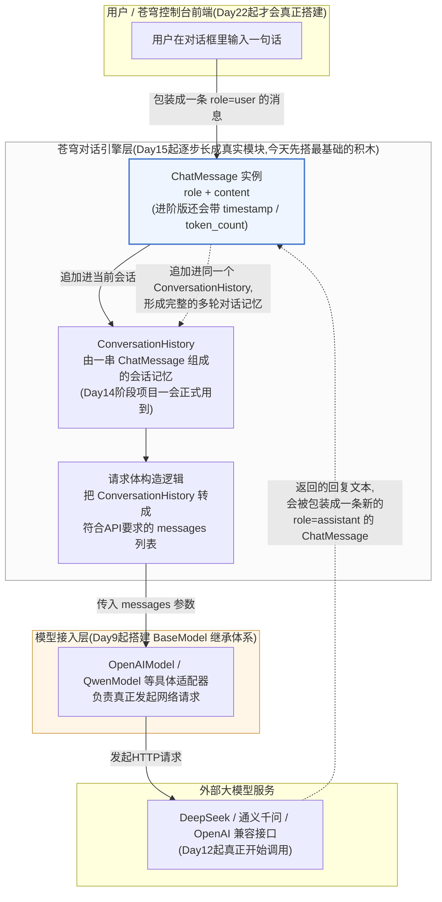
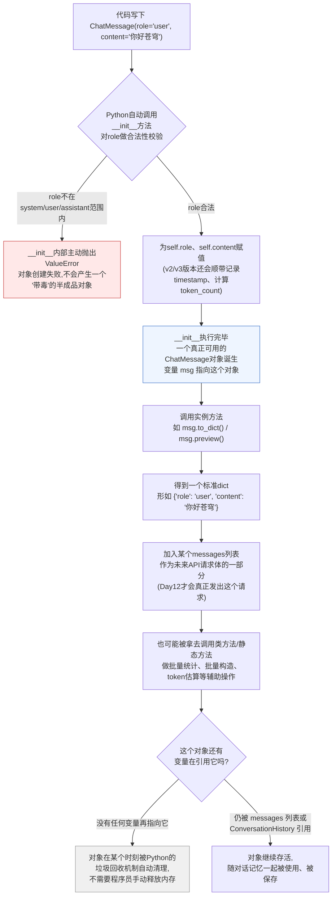
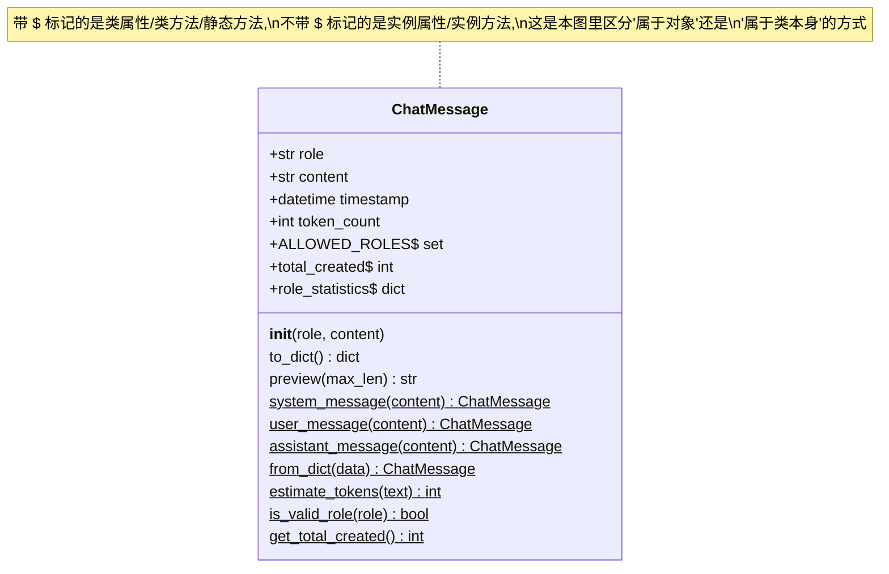

# 第8天 · 面向对象编程(上)

> **周次/Sprint**:Sprint 0 · 新人内训(Day1-14)—— 阶段项目一:命令行多轮对话AI助手(预计Day14交付)
> **星期**:周一(第二周第一天;新的一周,强度恢复到平日标准,不再有"周末略降"的宽松)
> **学员**:陈铭、苏梦、韩露、张凡(导师:王振宇)
> **内训任务卡**:PYXT-ONB-D08(蓬远科技培训中心 · 新人训练营 · Day08)
> **今日关键词**:类与对象 / 属性与方法 / `__init__`构造方法 / 实例方法 / 类方法 / 静态方法 / ChatMessage类设计

---

## 【旁白】

如果说前七天陈铭在学的是"怎么让代码跑起来、跑得对",那么从今天开始,他要学的是性质完全不同的一件事——怎么把一份数据,和操作这份数据的行为,捆在一起,变成一个独立的、可以被反复复制出来的"东西"。这句话现在听起来还很空,但值得先记一笔账:苍穹平台最终跑起来之后,几乎每一个能被单独拿出来讨论的部件——一条对话消息、一次会话、一个模型适配器、一个检索器、一个Agent、一个工具——在代码层面,都是"某个类的一个实例"。今天陈铭亲手写下的`ChatMessage`,朴素到只有`role`和`content`两个属性,却是这条漫长血缘链路上最古老的一块积木,七十天后寰宇集团项目里那套复杂到需要画架构图才能讲清楚的系统,拆到骨头缝里,骨血渊源都能追溯到今天这几十行代码。

这一天也标记着新人训练营叙事节奏上的一次切换。前一周,陈铭学的每个知识点几乎都能立刻在"通讯录管理系统"这样具体的项目里找到落脚点,知识和产出之间的因果关系摆得很直白——学字典是因为要存联系人,学JSON是因为要把联系人存到硬盘上,学函数是因为代码重复得让人受不了。今天开始的面向对象编程不太一样——"类"和"对象"这两个词,第一次要求陈铭在还没看清楚"这东西到底有什么用"之前,先接受一套新的思维习惯。老王很清楚这种"延迟满足"式的学习方式对零基础转行者有多难受,所以他没有像讲函数那样从"重复代码太多"这个痛点切进去,而是直接把最终答案先摆到桌面上——"你们马上要接大模型API了,而每一条发给大模型的消息,长得都是这个样子。"这是老王少见的一次"先给结论,再讲道理"的教学处理,背后的判断很朴素:对于"类"这种一开始不好体会价值的抽象概念,与其指望零基础学员自己摸索出"为什么需要它",不如先给一个具体到不能再具体的落脚点,让理解在动手实践里慢慢长出来,而不是在空对空的比喻里打转。

还有一层更隐蔽的意义,藏在这一天不起眼的位置里:陈铭今天写的`ChatMessage`类,是"上"篇,只涉及类的最基础的部分——属性、方法、构造函数、实例方法、类方法、静态方法;而"下"篇要讲的继承、多态、魔术方法,要等到明天。这种"先扎地基,再起结构"的两天拆分方式,本身就是一次隐性的示范——面向对象编程不是一天学完就能全部用好的技能,它更像是一层一层往上盖楼,今天这一层如果没打牢,明天`BaseModel`到`OpenAIModel`的继承关系,理解起来会格外吃力。老王在多年带教经验里早就验证过这一点,所以他把节奏压得很稳,今天只讲"一个类自己内部长什么样",绝口不提"两个类之间是什么关系"——哪怕陈铭已经隐约猜到,课程尾声提到的那几个陌生名字`BaseModel`、`OpenAIModel`、`QwenModel`,一定和今天学的东西有关系。

---

## 晨会纪要 / 今日目标

**时间**:上午8:55,小会议室"起航"
**出席**:王振宇(老王)、陈铭、苏梦、韩露、张凡

周一的会议室比周日冷清一点——空调好像整个周末都没开,进门有点闷,张凡进来第一件事是把窗户推开了一条缝。老王手里端着一杯速溶咖啡,比平时多晃了两下才坐下,看得出也是刚从周末的松弛状态里切回来。他没有寒暄,直接把昨天在群里发的那条长消息投影到屏幕上,又念了一遍最关键的那句话:"再过大概五天,我们就要真正开始调用大模型API了。你们发给DeepSeek或者通义千问的每一条消息,本质上都是一个'角色+内容'的结构。"

"我知道你们昨晚看到这条消息,多多少少会琢磨一下'角色+内容'具体是什么样子,"老王说,"今天不用猜了,直接上手写。"他转身在白板上写下四个字:"类"和"对象"。"这两个词,你们可能在别的地方听过,听起来有点玄——什么叫'万物皆对象'、什么叫'面向对象思想'。今天我们不聊这些大词,先聊一件很具体的事:你们这一周一直在用字典表示一条联系人信息,今天开始,我要教你们另外一种表示'一份数据'的方式,它比字典多了一样东西——方法。"

苏梦举手问了个直接的问题:"字典不是也能用吗?为什么要多学一种新的东西?"老王笑了一下,说这个问题问得很好,"今天最后我们会专门花时间聊这个,现在你只需要记住——不是新的取代旧的,是多了一个新的工具,不同场景用不同的工具。你学会两种之后,才有资格去判断'这个场景该用哪个',而不是我说哪个好你就信哪个好。"

**关于Day7周测的简短反馈**:老王先花了不到十分钟,简单点评了昨天的周测结果,没有重复昨天已经讲透的评分细节,只补了一句:"你们四个人的通讯录项目代码,我今天早上又看了一遍,发现一个共性问题——为了实现'增删改查',你们写了大量结构类似、参数不同的函数,函数名一个比一个长。这个问题不是你们写得不好,是'字典+函数'这套组合本身,到了一定复杂度就会开始变得笨重。今天学的东西,会给你们看到另一种应对这种复杂度的办法。"这句话像是提前给今天要讲的内容打了个楔子,陈铭注意到,老王几乎每次引入新知识点之前,都会先精准地戳一下"旧工具的痛点在哪",而不是空泛地说"这个新东西很厉害"。

**关于本周节奏的说明**:老王简单交代了第二周的整体安排——"这一周我们讲完面向对象编程剩下的部分(明天继续)、模块与包、异常处理、文件操作,周五之前会摸到网络请求和API调用,也就是说,最迟下周一,你们就能亲手拿到大模型的第一条真实回复。"他停顿了一下,又说:"这周开始,我不会再像第一周那样,每个知识点都配一个独立的小项目喂给你们。从今天起,你们会看到同一个东西——`ChatMessage`——在接下来几天里反复出现、反复被改造。这是故意的,真实项目里,代码很少是'今天写完、明天扔掉',更多时候是'今天写一版,过几天需求变了,回头改'。你们要提前适应这种感觉。"

**今日目标**:

1. 上午9:00-12:00:类与对象的基本概念,类比现实世界与前几天学过的字典结构;属性与方法的区分;`__init__`构造方法详解(包括`self`参数的含义、常见遗漏错误);实操搭建`ChatMessage`类的最基础版本。
2. 下午14:00-17:30:实例方法、类方法、静态方法三者的区别与各自的适用场景;类属性与实例属性的区别(埋一个和Day6"可变默认参数"呼应的坑);围绕`ChatMessage`类做三次迭代——基础版→带时间戳与token计数版→带严格校验版;穿插工厂方法模式的实用写法。
3. 晚自习19:00-21:00:专题讨论"为什么现在要用类而不是字典",结合本周一直在用的字典结构做正面对比;整理常见报错清单;完成课后作业中的代码题草稿(正式提交在明天早上之前)。

**风险点**:

- 面向对象编程是本周新人训练营里公认最容易"听得懂但写不出来"的知识板块,老王决定今天上午放慢语速,每讲一个新概念都立刻现场敲代码验证,而不是讲完一整段理论再统一演示。
- `self`参数是新手报错最集中的地方(`TypeError: xxx() missing 1 required positional argument`),老王准备了三种典型报错情形,计划在下午专门集中"故意踩坑"一次,让大家在受控环境里先撞一次墙,比自己回去晚自习踩坑效率更高。
- 类方法与静态方法的区别,是历年新人训练营里问题最多的知识点——很多学员能记住语法规则,但说不清楚"什么时候该用哪一个",老王今天准备了多个来自真实业务场景的小例子(而不是纯语法讲解),希望能让这个区分更"落地"。
- 张凡数学基础好、进度快,历史上容易在这类抽象概念上"自己先脑补出一套理解,结果理解方向偏了"，老王打算今天多喊他起来口头复述一遍概念，及时纠偏。

散会前,老王多说了一句,像是不经意提起,又像是故意留下的悬念:"提前告诉你们一件事——今天你们写的`ChatMessage`,不是写完就扔的练习。明天你们会看到一个新的类叫`BaseModel`,后天开始它俩会产生关系。先把今天的地基打扎实。"

---

## 需求文档:ChatMessage类设计任务书

> 说明:今天是纯技术自学与内部工具打磨日,尚未涉及真实客户需求,因此这份文档不是林悦主笔的标准PRD,而是老王按照公司内部技术任务书的格式撰写、发放给四位新人的《`ChatMessage`类设计任务书》。格式上刻意贴近正式PRD(背景、用户故事、功能列表、非功能需求、验收标准),目的是让新人从今天起就熟悉"看任务书写代码"而不是"看老师口头要求写代码"这种未来在项目组里会天天遇到的工作方式。

**任务编号**:PYXT-ONB-D08-TASK01
**提出人**:王振宇
**任务背景**:

苍穹平台未来所有与大模型的交互,底层协议都遵循业界通行的"消息列表"格式——一次对话由一组按顺序排列的消息组成,每条消息有一个"角色"(`role`,取值通常是`system`、`user`、`assistant`之一)和一段"内容"(`content`)。这个格式不是苍穹自己发明的,而是OpenAI最早确立、后来被DeepSeek、通义千问等几乎所有主流大模型API原样沿用的事实标准。在正式接入真实API之前(预计Day12),新人训练营需要先用面向对象编程的方式,把"一条消息"这个概念,设计成一个可以被复用、可以被扩展的类,为后续的多轮对话记忆管理、请求体构造、以及Day9即将学习的模型接入层设计打好基础。

**用户故事**:

- 作为一名程序内部使用者(即接下来几天要写命令行AI助手的陈铭自己),我希望能够用一行代码创建一条"用户说的话"或"AI回复的话",而不需要每次都手写一个容易拼错字段名的字典。
- 作为一名未来要维护这份代码的同事,我希望"一条消息"的创建过程中能自动校验数据是否合法(比如角色是不是写错了),而不是等到把错误数据发给大模型API之后,才通过一个语义不明的报错发现问题。
- 作为一名需要统计对话情况的开发者(比如统计一次对话总共产生了多少条消息、消耗了大概多少token),我希望这些统计逻辑能内建在这个"消息"概念本身里,而不是每次要统计的时候现场手写一段临时代码。

**功能列表**:

| 编号 | 功能描述 | 优先级 |
|---|---|---|
| FT-01 | 定义`ChatMessage`类,创建实例时必须提供`role`(角色)和`content`(内容)两个参数 | P0 |
| FT-02 | `role`只能是`system`/`user`/`assistant`三者之一,创建时自动校验,不合法则拒绝创建并给出清晰的报错信息 | P0 |
| FT-03 | 提供实例方法`to_dict()`,把一条消息转换为符合大模型API要求的标准字典格式 | P0 |
| FT-04 | 提供实例方法`preview(max_len)`,返回内容摘要(超长内容截断加省略号),便于调试时打印日志而不刷屏 | P1 |
| FT-05 | 提供三个类方法`system_message(content)`/`user_message(content)`/`assistant_message(content)`,作为比直接调用构造函数更省心的"快捷创建方式" | P1 |
| FT-06 | 提供类方法`from_dict(data)`,能够从一个已有的字典(比如从JSON文件读出来的历史记录)还原出一个`ChatMessage`实例 | P1 |
| FT-07 | 提供静态方法`estimate_tokens(text)`,对一段文本做粗略的token数量估算(为Day15的正式token计费打个前站) | P2 |
| FT-08 | 用类属性维护"全平台目前一共创建了多少条消息"以及"每种角色分别创建了多少条",并提供类方法读取这份统计 | P2 |
| FT-09(进阶) | 为消息记录创建时间戳(`timestamp`),支持后续按时间顺序排列对话历史 | P2 |
| FT-10(进阶) | 对`content`做更严格的校验(不能是空字符串、不能超过设定的最大长度),校验失败时给出准确定位问题的报错文本 | P2 |

**非功能需求**:

- 代码必须遵循PEP8命名规范,类名使用大驼峰(`ChatMessage`),方法名与属性名使用小写加下划线。
- 每个类、每个方法必须有中文docstring,说明这个方法是做什么的、接收什么参数、返回什么。
- 今天不要求实现继承(明天的内容),但类的设计要"留有余地"——比如不要把逻辑写得过于依赖`ChatMessage`这个具体类名,尽量用能适应未来扩展的写法。
- 每个版本迭代完成后,必须提供一段可以直接运行的自测代码(哪怕只是几个`print`语句加断言),验证核心功能符合预期。

**验收标准**:

1. `ChatMessage(role="user", content="你好")`能成功创建实例,`.role`和`.content`能被正确访问。
2. `ChatMessage(role="老板", content="你好")`(不合法角色)应该在创建阶段就报错,而不是创建成功之后才在别处出问题。
3. `msg.to_dict()`返回的字典,必须和大模型API期望的格式(`{"role": "...", "content": "..."}`)完全一致,能直接塞进未来的`messages`列表。
4. 通过`ChatMessage.user_message("你好")`创建的实例,和通过`ChatMessage(role="user", content="你好")`创建的实例,效果必须完全等价。
5. 类属性统计的总消息数,必须能在多次创建实例后正确累加,不能因为某种"共享陷阱"(下午会详细讲这一点)而出现错误结果。
6. 所有方法、类都必须能通过`python -m py_compile`语法检查,且实际运行至少一遍自测代码不报错。

---

## 架构设计图:ChatMessage在未来对话引擎里的位置

上午课程正式讲语法之前,老王先在白板上贴了一张打印出来的架构草图(投影仪那天早上恰好连不上,他直接翻出了随身带的纸质图),说这是"先给你们看看终点长什么样,免得学起来觉得空对空"。课后他把这张图重新画成了正式的Mermaid版本,发进了培训群。



老王讲这张图的时候,特意提醒大家不要被"苍穹对话引擎层""模型接入层"这些听起来很正式的名字吓到:"这张图上蓝色标出来的这个方块——`ChatMessage`——就是你们今天上午要写的那个类,一个字都不多。你们现在觉得它孤零零地待在一张这么大的架构图里显得很单薄,这是正常的,因为它本来就应该是整张图里最简单、最基础的那一块。真正复杂的东西,是图里其他那些方块——`ConversationHistory`怎么管理多轮记忆、请求体构造逻辑怎么把记忆转成请求体、`OpenAIModel`和`QwenModel`怎么应对不同厂商API格式的差异——这些内容会在后面陆陆续续揭开,你们今天不需要,也没有能力,一次性理解整张图。"

他又补了一句,直接点破了图里那两条虚线的意义:"你们注意图的右下角有两条虚线,是从外部API指回`ChatMessage`——这是想告诉你们,`ChatMessage`不只是用来表示'我们发出去的话',它同样要能表示'AI回复回来的话'。这也是为什么它的第一个属性叫`role`而不是叫`sender`或者别的更具体的名字——`role`这个词,天然能同时容纳'user'和'assistant'两种身份,这个设计决策,你们今天写代码的时候要带着这份理解去写,不是随便起个名字。"

苏梦看着图问了一句:"那`ConversationHistory`是不是也是今天要写的东西?"老王摇头:"今天先聚焦在单条消息本身,`ConversationHistory`这种'管理一堆消息的类'涉及到类和类之间怎么协作,难度会更高一点,我把它安排在Day14阶段项目一里正式登场——但今天代码实战部分,我会提前给你们展示一个非常简化的雏形版本,让你们先有个直观感受,别真的动手去实现它的完整功能。"

---

## 流程图:一个ChatMessage对象从创建到使用的生命周期

架构图讲的是"这个类在整个系统里站在哪个位置",而这张流程图,老王说要讲清楚"一个具体的对象,从蹦出来到消失,一辈子经历了什么"。他选用了普通的`flowchart`而不是时序图,因为今天的重点是"单个对象自身的生命轨迹",不涉及多个对象之间的调用往来(那是下午`ConversationHistory`雏形才会涉及的话题)。



老王讲这张图时,重点停在了"半成品对象"这个说法上:"你们注意,`__init__`如果中途因为校验失败抛出了异常,这个对象是彻底创建失败的,不存在'部分属性赋值成功,剩下的没赋值'这种半吊子状态——Python在这一点上处理得很干净,一旦`__init__`抛异常,整个创建过程直接中止,外面拿到的不是一个'残疾'的对象,而是压根没有对象,程序会在赋值那一行直接因为异常而中断(除非你外面用`try/except`包住,这是Day10才系统学的内容,你们今天先知道会中断这件事)。这个特性非常重要——它意味着,只要你的`__init__`把校验逻辑写扎实了,后面你在代码的任何地方拿到一个`ChatMessage`对象,都可以放心地假设它的`role`一定是合法的,不需要每次用到之前都重新检查一遍。这种'创建的时候把关卡把严,后面就可以放心用'的设计哲学,是面向对象编程相比'裸字典'方式,一个非常大的优势,今天晚自习对比环节我们还会细讲。"

张凡追问了一个更技术的问题:"对象没人引用之后是立刻被回收,还是要等一等?"老王给了一个诚实但克制的答案:"CPython(我们用的这个Python实现版本)背后有一套引用计数机制,理论上引用数归零后很快就会被回收,但具体的回收时机涉及垃圾回收算法的细节,这个话题往下挖能挖得很深,今天不做为重点——你们只需要建立一个直觉:创建对象不用你操心内存分配,不用了也不用你操心内存释放,这是Python(相对于C这种语言)对开发者最友好的地方之一,我们今天的精力,应该花在'怎么设计一个对象该有的属性和方法',而不是'对象什么时候被回收'这种底层细节上。"

---

## 示意图:ChatMessage类的属性与方法结构

前两张图分别讲了"这个类在系统里的位置"和"一个对象的一生",这第三张图,老王说要拆开`ChatMessage`这个类本身,让大家一眼看清楚"一个类内部,到底能装哪几种东西"。他选用了`classDiagram`,这是UML(统一建模语言)里专门用来画类结构的标准图形,虽然今天不要求大家掌握UML的全部规则,但先熟悉一下这种业界通用的表达方式,对将来读别人的技术文档、写自己的设计文档都有好处。



老王讲解这张图时,先带大家认了一遍图里的符号规则:"`+`开头的表示这是一个公开的属性或方法,Python里几乎所有东西默认都是公开的(没有像Java那样强制的`private`关键字),这个我们下午会稍微展开一点。带`$`符号的这几行——`ALLOWED_ROLES`、`total_created`、`role_statistics`,还有几个方法——它们的共同点是,不需要先创建一个具体对象,直接通过类名就能访问,这批东西属于'类'本身,不属于某一个具体的对象;剩下没有`$`的——`role`、`content`、`timestamp`、`token_count`,还有`to_dict`、`preview`这两个方法——它们必须依附在某个具体创建出来的对象上才有意义,这批东西属于'实例'。"

他又强调了图里容易被忽略的一个细节:"你们看,带`$`的这批东西里,`ALLOWED_ROLES`、`total_created`、`role_statistics`是数据,是'类属性';而`system_message`、`user_message`、`from_dict`、`estimate_tokens`、`is_valid_role`、`get_total_created`是行为,是方法——但这批方法内部,又能分成两种不同的写法,一种叫'类方法'(装饰器是`@classmethod`),一种叫'静态方法'(装饰器是`@staticmethod`)。图上暂时没有把这两种方法进一步区分开,是因为UML的标准符号体系里,并没有专门为Python这两个概念设计对应的符号——这恰恰说明,'类方法'和'静态方法'的区分,是Python这门语言自己的设计,不是所有面向对象语言都有的通用概念。下午我会专门补一张对比表,把这两者到底哪里不一样讲清楚。"

苏梦盯着这张图看了一会儿,说了一句大实话:"符号我大概能认出来,但为什么`role`要写成`+str role`而不是直接写`role`?"老王解释这只是UML的书写惯例——"`+`表示访问权限是公开的,`str`表示这个属性的数据类型是字符串,这种'类型在后'的写法风格,来自很多强类型语言的传统写法惯例,和Python代码本身怎么写没有直接关系,你们把它当成一种'读图规则'记住就行,不用纠结为什么是这个顺序。"

---

## 课堂笔记

### 上午:类与对象、属性与方法、`__init__`构造方法

**从一个类比讲起,但不止于类比**

老王开场没有直接甩出语法,而是先在白板上写了一个词:"图纸"。"你们谁家里装修过,或者哪怕看过装修?"他问。张凡说自己去年租房的时候看过工长拿一张户型图跟房东比划。老王点头:"图纸本身住不了人,你不能搬进一张图纸里睡觉。但根据同一张图纸,你能盖出很多套结构完全一样的房子——每一套房子的墙在哪儿、门在哪儿、几室几厅,都严格按图纸来,这是共性;但每一套具体的房子,住进去的人不一样,家具摆放不一样,墙的颜色可能也刷得不一样,这是各自的差异。今天要学的'类',就是那张图纸;根据图纸盖出来的每一套具体的房子,就是'对象'——专业说法叫'实例'。"

这个类比说到这里还比较常规,很多教材都会用类似的比喻。老王接下来做的事,才是真正把这个类比落回到今天的主题上:"现在,把这张图纸换成`ChatMessage`——它规定了'一条对话消息'应该长什么样:必须有一个`role`字段,必须有一个`content`字段。根据这张图纸,我可以'盖'出很多条具体的消息——一条`role`是`user`、`content`是'你好'的消息,一条`role`是`assistant`、`content`是'你好,有什么可以帮你'的消息。它们共用同一份'长什么样'的规定(图纸/类),但每一条消息自己的具体取值(房子里的家具摆放)是各自独立的。"

他在白板上写下一行伪代码,不是真正的Python语法,只是先让大家建立感觉:

```
图纸(类) ChatMessage:
    规定必须有:role, content

根据图纸盖房子(创建对象):
    房子A = ChatMessage(role="user", content="你好")
    房子B = ChatMessage(role="assistant", content="你好,有什么可以帮你")
```

"房子A和房子B,是两套完全独立的房子,"老王说,"改房子A的家具摆放(修改`role`或`content`),不会影响房子B。这一点,和你们这一周一直在用的字典,表面上看起来很像——字典也是'一份独立的数据',对不对?但字典和这里的'房子',有一个本质区别,先记住这个悬念,晚自习我们专题讲。"

**类与对象:定义、区分、第一段真正的代码**

铺垫完类比,老王开始进入正式语法。他先给出两个定义,要求大家抄进笔记本:

- **类(class)**:对一类具有相同属性和行为的事物的抽象描述,是"设计图纸"、"模板"、"蓝图"。
- **对象(object)/实例(instance)**:根据类创建出来的一个具体存在,拥有类里规定的属性和方法,但每个对象的属性取值可能各不相同。

"'实例'和'对象'这两个词,今天你们会看到我交替使用,"老王补充道,"严格说起来有一点点语义上的细微差别,但在日常交流和大部分教材里,这两个词基本可以互换,不用纠结这个区分,记住它们指的是同一件事就够了。"

他打开VS Code,新建了一个文件`chat_message_step1.py`,现场敲下了今天的第一段真正的类代码:

```python
class ChatMessage:
    """
    表示一条对话消息,包含说话者角色(role)和具体内容(content)。
    这是全书里贯穿始终的一个核心概念的最初形态。
    """

    def __init__(self, role, content):
        # self指的是"即将被创建出来的这个具体对象自己"
        # 把传进来的role和content,分别存到这个对象自己身上
        self.role = role
        self.content = content


# 创建两个独立的对象(实例)
msg_a = ChatMessage(role="user", content="你好苍穹")
msg_b = ChatMessage(role="assistant", content="你好,有什么可以帮你")

print(msg_a.role, msg_a.content)
print(msg_b.role, msg_b.content)
```

代码敲完,现场运行,输出:

```
user 你好苍穹
assistant 你好,有什么可以帮你
```

"就这么几行,你们已经写出了一个真正意义上的类,"老王说,"接下来我们把这几行拆开,一行一行讲清楚每个部分到底在干什么。"

**属性与方法:两种东西的区分**

老王先把"属性"和"方法"这两个词的定义写在白板上:

- **属性(attribute)**:描述对象"是什么样子"的数据,比如`role`、`content`,访问方式是`对象.属性名`。
- **方法(method)**:描述对象"能做什么事"的行为,本质上是定义在类内部的函数,调用方式是`对象.方法名(参数)`。

"你们回想一下,这一周用字典表示一条联系人的时候,'名字''电话''分组'这些,对应的就是'属性'的概念——只不过字典里没有'方法'这个东西,字典本身不会'自己做什么事',所有操作字典的逻辑(比如格式化打印、校验电话号码格式),你们都是写成外部的独立函数,函数和数据是分开的两块东西。今天开始,'方法'把这两块东西粘在了一起——操作数据的逻辑,不再是一个游离在外面、需要你手动把数据传进去的独立函数,而是'长在'这份数据自己身上的能力。"

他在已有的类基础上,加了第一个方法:

```python
class ChatMessage:
    """表示一条对话消息,包含角色(role)和内容(content)。"""

    def __init__(self, role, content):
        self.role = role
        self.content = content

    def to_dict(self):
        """
        把这条消息转换成一个标准字典,格式与大模型API期望的messages格式一致。
        之所以要单独写这个方法,是因为未来"消息"这个概念还会继续演化
        (比如加上时间戳),但对外提供给API使用的格式,永远只需要role和content。
        """
        return {"role": self.role, "content": self.content}


msg = ChatMessage(role="user", content="今天天气怎么样")
print(msg.to_dict())
```

输出:

```
{'role': 'user', 'content': '今天天气怎么样'}
```

"注意`to_dict`这个方法内部,我引用`self.role`、`self.content`,而不是引用外面传进来的`role`、`content`参数,"老王特意停下来强调,"这是因为`to_dict`这个方法,被调用的时候压根没有接收`role`、`content`这两个参数——它唯一能拿到的信息,就是`self`,也就是'调用这个方法的这个具体对象自己'。方法要访问这个对象身上的数据,永远要通过`self.属性名`这种写法,不能凭空冒出一个裸的`role`变量名——那样Python会去找一个叫`role`的局部变量或全局变量,而不是这个对象身上的`role`属性,如果外面根本没有定义过这样一个变量,就会报`NameError`。"

**`self`到底是什么:新手最容易卡住的一个点**

"接下来这段内容,我今天要讲得特别慢,因为历年新人训练营,这里卡住的人最多,"老王说。他没有直接讲`self`的技术定义,而是先做了一个现场实验——把`__init__`里的`self`偷偷去掉,让大家看报错:

```python
class BrokenMessage:
    def __init__(role, content):   # 故意漏写self
        role = role
        content = content


msg = BrokenMessage(role="user", content="测试")
```

运行结果:

```
TypeError: BrokenMessage.__init__() got multiple values for argument 'role'
```

（老王解释,这个具体报错文本会因为参数是用位置还是关键字传递而略有不同,但共同点是,一定会提示参数数量或参数身份不对,因为创建对象时,Python会自动把"这个即将被创建出来的对象自己"作为第一个参数,悄悄塞进`__init__`的调用里,如果你的函数签名里第一个位置本该留给`self`的位置被`role`占用了,Python传进来的"对象自己"就会和你手写的`role`参数抢位置,产生这类冲突报错。）

"这里有一个非常关键的事实,你们一定要记住,"老王加重了语气,"当你写`ChatMessage(role="user", content="你好")`的时候,你看起来只传了两个参数,但Python在幕后,实际上是把这个'即将诞生的新对象'本身,作为悄悄多加的第一个参数,一起传给了`__init__`。`self`这个名字不是Python的关键字,理论上你可以换成任何名字,但整个Python社区从上到下都约定用`self`这个名字表示'这个方法所属的那个对象自己',你如果换成别的名字,代码依然能跑,但会让所有看你代码的人产生困惑,所以永远遵守这个约定。"

苏梦这时候问了一个很实在的问题:"那如果我不小心忘了加`self`会怎么样?"老王笑着说这个问题她马上就会亲眼见到,让大家现场每人试一次——去掉`to_dict`方法里的`self`参数:

```python
class ChatMessage:
    def __init__(self, role, content):
        self.role = role
        self.content = content

    def to_dict():   # 故意漏写self
        return {"role": self.role, "content": self.content}


msg = ChatMessage(role="user", content="测试self缺失")
print(msg.to_dict())
```

运行结果:

```
TypeError: ChatMessage.to_dict() takes 0 positional arguments but 1 was given
```

"这个报错信息翻译过来是:`to_dict`这个方法定义的时候写的是不接收任何参数,但实际调用它的时候却被传了1个参数,"老王解释,"这个'被传的1个参数'是谁?就是`msg`这个对象自己——你写`msg.to_dict()`,看起来括号里什么都没传,但Python在背后,依然会把`msg`这个对象自己,作为第一个参数悄悄塞进方法调用里,如果方法定义里没有一个位置去接收它(也就是没写`self`),就会出现'方法定义只接收0个参数,但实际收到1个'这种数量不匹配的报错。这就是为什么,类里面几乎所有的方法,第一个参数永远要写`self`——不是因为规定必须这么做,而是因为Python调用实例方法的机制,天然就会自动传入调用者自己这个参数,你的方法签名必须留一个位置去接住它。"

张凡追问:"那`self`是Python自动传的,是不是意味着我调用的时候,永远不用管`self`这个参数,只需要管`self`后面的那些参数?"老王点头:"完全正确。你定义方法的时候,`self`要老老实实写在第一个位置;但你调用这个方法的时候,永远不需要手动传`self`,Python会自动把调用者对象填进去。这也是为什么`ChatMessage(role="user", content="你好")`这行创建对象的代码,你只传了`role`和`content`两个参数,而`__init__`的参数列表却是`self, role, content`三个——差的这一个,就是自动传入的`self`。"

**`__init__`构造方法:名字的含义与执行时机**

老王把`__init__`单独拎出来,强调这是一个"特殊方法"(专业说法叫"魔术方法"或"双下方法",因为它的名字前后各有两个下划线):"这个方法名字是Python规定好的,不能随便改成别的名字,当你写`ChatMessage(role="user", content="你好")`这样的创建语句时,Python内部会自动完成两件事——先'生一个空对象'出来,再自动调用这个空对象的`__init__`方法,把你传进来的参数原样转交给它,由`__init__`负责把这个空对象'填充'成一个真正有意义的对象。这也是为什么这个方法被称为'构造方法'——它负责的是对象诞生那一瞬间要做的初始化工作。"

他特意澄清了一个常见的误解:"很多人会把`__init__`理解成'创建对象的方法',严格说这不完全准确——Python内部真正负责'凑出一个空对象'的,是另一个更底层的特殊方法叫`__new__`,今天不涉及这部分内容,你们只需要知道,`__init__`更准确的定位是'对象诞生之后,立刻执行的初始化逻辑',但在日常交流里,大家习惯把它简称为'构造方法',你们记住这个习惯性说法就够用了。"

他又追加了一个实用的提醒:"`__init__`方法本身不需要,也不允许有`return`返回值(准确说,如果你写了`return`,只能是`return None`或者干脆不写,不能返回别的东西,否则会直接报`TypeError: __init__() should return None`)。这一点和你们这一周学过的普通函数不一样——普通函数经常需要`return`一个结果出去,而`__init__`的职责只是'把这个新对象填充好',对象本身不需要被'返回',因为创建语句`ChatMessage(...)`本身,天然就会把这个填充好的对象作为结果交给你。"

**给`ChatMessage`加上校验逻辑:role不能乱写**

"光是把`role`和`content`存起来,还不够,"老王说,"如果谁不小心传了一个`role="老板"`,程序不会立刻报错,但这条'带毒'的消息一旦被发到真实的大模型API,轻则被API直接拒绝,重则产生一些莫名其妙、排查起来很痛苦的行为。今天我们要做的,是把这个校验,尽可能提前拦在`__init__`里。"

```python
class ChatMessage:
    """表示一条对话消息,包含角色(role)和内容(content)。"""

    # 允许的角色取值,写在类的最外层(还不是今天下午要讲的"类属性"的正式讲法,
    # 这里先让大家眼熟这种写法,下午会讲清楚它到底属于谁)
    ALLOWED_ROLES = ("system", "user", "assistant")

    def __init__(self, role, content):
        if role not in self.ALLOWED_ROLES:
            # 在对象刚诞生、还没完全交到调用者手里的时候,就把不合法的输入拦下来,
            # 这比等到后面某个不确定的时刻才发现数据有问题,排查成本低得多
            raise ValueError(
                f"role必须是{self.ALLOWED_ROLES}之一,但收到的是:{role!r}"
            )
        if not isinstance(content, str):
            raise TypeError(f"content必须是字符串,但收到的是:{type(content)}")

        self.role = role
        self.content = content

    def to_dict(self):
        """把这条消息转换成符合大模型API要求的标准字典格式。"""
        return {"role": self.role, "content": self.content}


# 合法的创建,一切正常
msg1 = ChatMessage(role="user", content="你好")
print(msg1.to_dict())

# 不合法的角色,创建阶段直接报错,而不是留到后面某个未知时刻才暴露问题
msg2 = ChatMessage(role="老板", content="你好")
```

最后一行运行会直接抛出:

```
ValueError: role必须是('system', 'user', 'assistant')之一,但收到的是:'老板'
```

"这里出现了一个你们暂时还没系统学过的语法——`raise`,"老王说,"今天先不展开讲异常处理的完整体系(那是Day10的正式内容),你们只需要知道,`raise ValueError(...)`的效果是'主动抛出一个错误,中止当前正在进行的操作',今天先照着抄,用法上不会有大问题,系统的原理留到Day10细讲。"

他又指出了一个容易被忽略的写法细节:`f"...{role!r}"`里的`!r`。"这个感叹号加r,叫`repr`格式化,效果是打印这个值的时候,会带上它本来的引号——比如字符串会显示成`'老板'`而不是`老板`。这在报错信息里特别有用,因为有时候问题恰恰出在'这个值到底有没有多余的空格、有没有被意外转成了别的类型',带着引号打印出来,能帮你更快分辨清楚这个值原本是什么样子。"

**上午小结与一次现场提问环节**

上午课程收尾前,老王留了十分钟做开放提问。韩露问了一个偏工程实践的问题:"如果`ChatMessage`以后属性越来越多,`__init__`里的参数是不是会变得特别长?"老王给出了一个诚实的回答:"会,这是面向对象编程里一个真实存在的问题,叫'构造函数参数过多'。业界有几种应对方式,比如用带默认值的参数、用`**kwargs`接收不确定数量的参数、或者干脆用Pydantic这种数据校验库(苍穹平台正式项目会用到),但今天我们先老老实实一个个参数写清楚,等你们学到设计模式和`Pydantic`(Day23会正式接触)的时候,会看到更优雅的解决方式,今天先打好最基础的手写地基。"

陈铭把这句话记在了笔记本上——他隐约意识到,今天写的每一行看起来"笨拙"的代码,可能都是为了让自己以后能理解"为什么某个更高级的工具要这么设计"打的前站,但他还说不清楚具体是怎么关联起来的,只能先记下来,等以后自己找答案。

### 下午:实例方法、类方法、静态方法——ChatMessage类的三次进化

午饭后老王没有立刻讲新概念,先带大家把上午的代码在自己的机器上重新敲了一遍(不是复制粘贴,是重新手打),他的理由很直接:"面向对象这种知识点,眼睛看懂和手上的肌肉记住,是两件不同的事,上午你们大概率是听懂了原理,但真正让`self`这种写法变成本能反应,还得靠重复敲。"敲完之后,他才在白板上写下下午的主题:"三种方法。"

**先分类,再讲原理:一张表格建立第一印象**

老王没有像很多教材那样先讲抽象定义,而是先把三种方法的核心差异,用一张对比表格摆出来,要求大家先记住表格,再逐条展开:

| 维度 | 实例方法 | 类方法 | 静态方法 |
|---|---|---|---|
| 装饰器 | 不需要装饰器(默认就是实例方法) | `@classmethod` | `@staticmethod` |
| 第一个参数 | `self`(调用它的具体对象) | `cls`(这个类本身) | 没有强制的第一个参数 |
| 能不能访问某个具体对象的属性 | 能,通过`self.属性名` | 不能直接访问某个具体对象,只能访问类本身的东西 | 也不能,和这个类几乎没有绑定关系,只是"寄放"在类里 |
| 典型调用方式 | `对象.方法名()` | `类名.方法名()`(也能用`对象.方法名()`调用,效果一样) | `类名.方法名()`(同样也能用对象调用) |
| 一句话概括用途 | "这个具体对象自己能做的事" | "和整个类相关、但不针对某一个具体对象的事,常用来做替代构造器" | "逻辑上属于这个类的主题范畴,但完全不需要用到类或对象本身信息的工具函数" |

"这张表你们先抄下来,"老王说,"接下来一个小时,我们不是抽象地讲这张表,是围绕`ChatMessage`这一个类,真刀真枪地把这三种方法都用一遍,你们自己会体会到这张表格里每一行到底在说什么。"

**实例方法:已经用过了,今天把理解补完整**

"实例方法你们上午已经写过了——`to_dict`就是一个实例方法,"老王说,"它最大的特点是,第一个参数是`self`,能通过`self`访问'调用它的这个具体对象'身上的数据。今天我们再给`ChatMessage`加一个实例方法,顺便引出一个新问题。"

```python
class ChatMessage:
    """表示一条对话消息,包含角色(role)和内容(content)。"""

    ALLOWED_ROLES = ("system", "user", "assistant")

    def __init__(self, role, content):
        if role not in self.ALLOWED_ROLES:
            raise ValueError(f"role必须是{self.ALLOWED_ROLES}之一,但收到的是:{role!r}")
        if not isinstance(content, str):
            raise TypeError(f"content必须是字符串,但收到的是:{type(content)}")
        self.role = role
        self.content = content

    def to_dict(self):
        """把这条消息转换成符合大模型API要求的标准字典格式。"""
        return {"role": self.role, "content": self.content}

    def preview(self, max_len=20):
        """
        返回这条消息内容的摘要,超过max_len长度的内容会被截断并加上省略号。
        实际业务场景:调试时打印一大批消息,如果每条都完整打印,日志会被刷屏,
        用摘要能让人一眼扫过去,大致了解对话在讲什么。
        """
        if len(self.content) <= max_len:
            return f"[{self.role}] {self.content}"
        return f"[{self.role}] {self.content[:max_len]}..."


long_msg = ChatMessage(
    role="user",
    content="我想问一下苍穹平台目前支持哪些大模型接入,具体的接入流程是什么样的,大概需要多长时间"
)
print(long_msg.preview())
print(long_msg.preview(max_len=10))
```

输出:

```
[user] 我想问一下苍穹平台目前支持哪些大模型接入,具体的接入流程是什么样的,大概需要多长时间...
[user] 我想问一下苍穹平台目前支...
```

第一行输出居然没有被正确截断,现场有同学发现了这一点。老王解释:"因为默认`max_len=20`,但这条消息前20个字已经超过‘完全展示’的判断门槛了——等等,你们再仔细看一下条件判断。"陈铭很快反应过来,指出`if len(self.content) <= max_len`这一句里,由于`self.content`的长度确实超过了20,所以理论上应该走else分支被截断,但打印结果却显示了几乎完整的内容——他把代码重新读了一遍,发现是自己在现场跟着敲的时候,不小心把`self.content[:max_len]`敲成了`self.content`,漏了切片。老王没有直接告诉答案,而是让陈铭自己对照代码找,找到之后特意点评了一句:"这种'代码逻辑本身没问题,但敲的时候手滑漏了一小段'的错误,是所有工程师一辈子都会犯的错误,不丢人,但要养成'输出不符合预期,先怀疑自己代码,再怀疑框架或者语言本身'的习惯——这句话我上周就说过,今天你亲手验证了一次。"

**类属性登场:这批数据"属于类",不属于某一个对象**

"接下来,我要往`ChatMessage`里加一个新东西——统计功能:全平台一共创建了多少条消息,"老王说,"这个数字,显然不属于任何一条具体的消息,它是所有消息共享的一个'总账',这种'属于类本身,而不属于某一个具体对象'的数据,叫'类属性'。"

```python
class ChatMessage:
    """表示一条对话消息,包含角色(role)和内容(content)。"""

    ALLOWED_ROLES = ("system", "user", "assistant")

    # 类属性:所有ChatMessage实例共享同一份数据,不是每个对象各自拥有一份
    total_created = 0

    def __init__(self, role, content):
        if role not in self.ALLOWED_ROLES:
            raise ValueError(f"role必须是{self.ALLOWED_ROLES}之一,但收到的是:{role!r}")
        if not isinstance(content, str):
            raise TypeError(f"content必须是字符串,但收到的是:{type(content)}")

        self.role = role
        self.content = content

        # 每创建一个新对象,把类属性加1
        # 注意:这里用的是ChatMessage.total_created,不是self.total_created,
        # 下面会详细解释这两种写法的微妙区别
        ChatMessage.total_created += 1

    def to_dict(self):
        return {"role": self.role, "content": self.content}


msg1 = ChatMessage(role="user", content="第一条")
msg2 = ChatMessage(role="assistant", content="第二条")
msg3 = ChatMessage(role="user", content="第三条")

print(ChatMessage.total_created)   # 3,通过类名访问
print(msg1.total_created)          # 3,通过某个对象访问,效果也一样
```

老王讲到`ChatMessage.total_created += 1`这一行,特意停下来做了一次"故意犯错"演示,把这一行换成`self.total_created += 1`,让大家观察区别:

```python
class BuggyMessage:
    total_created = 0

    def __init__(self, role, content):
        self.role = role
        self.content = content
        self.total_created += 1   # 这里悄悄埋了一个陷阱


m1 = BuggyMessage(role="user", content="消息1")
m2 = BuggyMessage(role="user", content="消息2")
m3 = BuggyMessage(role="user", content="消息3")

print(BuggyMessage.total_created)   # 输出0,不是预期中的3!
print(m1.total_created, m2.total_created, m3.total_created)   # 全部输出1
```

现场运行确实输出`0`和三个`1`,不少同学愣了一下。老王解释这背后的机制:"`self.total_created += 1`这行代码,严格拆开看,其实是`self.total_created = self.total_created + 1`——等号右边的`self.total_created`,因为这个对象自己没有同名的实例属性,Python会顺着往上找到类属性`total_created`,读到当前的类属性值;但等号左边的`self.total_created = ...`,这个赋值动作,会在这个对象自己身上,新建一个和类属性同名、但完全独立的'实例属性',把这次计算的结果存在这个新建的实例属性里,而不是修改原来那个类属性。三个对象各自读了一次类属性的当前值(每次读到的都还是初始值0,因为类属性从没被真正修改过),各自在自己身上建了一个值为1的同名实例属性,类属性`total_created`本身,从头到尾都没被真正改动过,所以最后还是0。"

他补充了一句总结性的规则:"这条规则你们要背下来——**读取**一个类属性,可以用`self.属性名`或`类名.属性名`,效果一样;但**修改**一个类属性(重新赋值),必须用`类名.属性名 = 新值`这种写法,不能用`self.属性名 = 新值`,否则会像刚才这样,悄悄创建出一个同名的实例属性,把原来的类属性'遮盖'住,而不是真正修改它。"

张凡这时候敏锐地问了一句:"这个坑,是不是有点像Day6讲的‘可变默认参数’那个坑?都是‘表面上以为改的是一个东西,实际上悄悄产生了另一个东西’。"老王对这个联想给了很高的评价:"这个类比抓得很准。可变默认参数那个坑,根源是'默认值对象在函数定义时只被创建一次,之后所有调用共享同一个对象';今天这个坑,根源是'对同一个名字,读操作和写操作在Python里查找规则不对称'。表面现象类似(都是'以为独立,实际共享,或者以为共享,实际独立'),但背后的原理是两件不同的事,不要把它们记混了,但你能敏锐地发现这种'表面相似'的直觉,是很好的工程师素质。"

**类方法:cls参数、工厂方法模式**

铺垫完类属性,老王正式引入类方法:"你们注意到刚才`ChatMessage.total_created`这种通过类名直接访问的写法了吧?现在我要给`ChatMessage`加一个方法,专门用来'读取'这个总数——按理说这个方法压根不需要针对某一个具体对象操作,它天然应该'属于类',这正是类方法要解决的场景。"

```python
class ChatMessage:
    """表示一条对话消息,包含角色(role)和内容(content)。"""

    ALLOWED_ROLES = ("system", "user", "assistant")
    total_created = 0

    def __init__(self, role, content):
        if role not in self.ALLOWED_ROLES:
            raise ValueError(f"role必须是{self.ALLOWED_ROLES}之一,但收到的是:{role!r}")
        if not isinstance(content, str):
            raise TypeError(f"content必须是字符串,但收到的是:{type(content)}")
        self.role = role
        self.content = content
        ChatMessage.total_created += 1

    def to_dict(self):
        return {"role": self.role, "content": self.content}

    @classmethod
    def get_total_created(cls):
        """
        返回目前为止,一共创建了多少条ChatMessage实例。
        用classmethod而不是普通函数的原因:这个逻辑天然和ChatMessage这个类绑定在一起,
        写成类方法,调用的人一看就知道"这是ChatMessage自己的统计能力",
        而不是一个到处能被随便调用、和ChatMessage关系不明确的独立函数。
        """
        return cls.total_created

    @classmethod
    def user_message(cls, content):
        """
        快捷创建一条role=user的消息,等价于ChatMessage(role="user", content=content),
        但调用者不需要每次都手写role这个参数,减少了拼错role字符串的风险。
        这种"用classmethod包装出一个更方便的创建方式"的写法,叫工厂方法模式。
        """
        return cls(role="user", content=content)

    @classmethod
    def assistant_message(cls, content):
        """快捷创建一条role=assistant的消息。"""
        return cls(role="assistant", content=content)

    @classmethod
    def system_message(cls, content):
        """快捷创建一条role=system的消息。"""
        return cls(role="system", content=content)


msg1 = ChatMessage.user_message("你好苍穹")
msg2 = ChatMessage.assistant_message("你好,有什么可以帮你")
msg3 = ChatMessage.system_message("你是一个专业的企业知识库助手")

print(msg1.to_dict())
print(msg2.to_dict())
print(msg3.to_dict())
print("目前一共创建了", ChatMessage.get_total_created(), "条消息")
```

输出:

```
{'role': 'user', 'content': '你好苍穹'}
{'role': 'assistant', 'content': '你好,有什么可以帮你'}
{'role': 'system', 'content': '你是一个专业的企业知识库助手'}
目前一共创建了 3 条消息
```

老王把`cls`这个参数单独讲了一遍:"和`self`代表'调用这个方法的具体对象'不一样,`cls`代表'调用这个方法的这个类本身'——今天我们只有`ChatMessage`一个类,`cls`就是`ChatMessage`,看起来和直接写`ChatMessage`没什么区别,但明天你们学了继承之后会发现,如果`OpenAIModel`继承自`BaseModel`,而`BaseModel`里定义了一个类方法内部用`cls(...)`创建对象,那么通过`OpenAIModel`调用这个类方法时,`cls`会自动变成`OpenAIModel`而不是`BaseModel`——这种'谁调用,`cls`就是谁'的灵活性,是写死类名做不到的。今天先记住这个语法,明天你们会看到它真正发威的场景。"

苏梦问了一个很关键的问题:"为什么`user_message`这种方法非要用`@classmethod`?我直接写一个独立的函数,里面调用`ChatMessage(role="user", content=content)`,不是效果一样吗?"老王认可这是个好问题,给出了两点理由:"第一,写成类方法,`ChatMessage.user_message(...)`这行代码,读起来清清楚楚地告诉别人'这是ChatMessage自带的一种创建方式',而独立函数散落在模块的某个角落,使用者要先知道有这么一个函数存在,才能用上——归属关系不明确;第二,刚才提到的`cls`的灵活性,能让子类自动'继承'这种创建方式并且创建出正确类型的对象,这一点独立函数完全做不到。这两点合起来,就是为什么这种'替代构造器'的场景,业界公认的最佳实践是用classmethod,不是写成独立函数。"

**静态方法:和类、对象都没有强绑定关系的工具函数**

老王话锋一转:"现在我要加一个新功能——粗略估算一段文本大概有多少个token。这个逻辑,你们注意,它完全不需要知道'当前是哪个ChatMessage对象',甚至不需要知道'这是ChatMessage这个类',它就是一段纯粹的文本处理逻辑,任何字符串扔进去都能算,和`ChatMessage`唯一的关系,只是‘逻辑主题上归它管’。这种场景,该用静态方法。"

```python
class ChatMessage:
    """表示一条对话消息,包含角色(role)和内容(content)。"""

    ALLOWED_ROLES = ("system", "user", "assistant")
    total_created = 0

    def __init__(self, role, content):
        if role not in self.ALLOWED_ROLES:
            raise ValueError(f"role必须是{self.ALLOWED_ROLES}之一,但收到的是:{role!r}")
        if not isinstance(content, str):
            raise TypeError(f"content必须是字符串,但收到的是:{type(content)}")
        self.role = role
        self.content = content
        self.token_count = ChatMessage.estimate_tokens(content)
        ChatMessage.total_created += 1

    def to_dict(self):
        return {"role": self.role, "content": self.content}

    @staticmethod
    def estimate_tokens(text):
        """
        对一段文本做非常粗略的token数量估算。
        真实的token计算依赖具体模型的分词器(比如tiktoken库,Day15会正式学),
        这里先用一个教学用的简化经验规则:中文大致按"1个字≈1个token"估算,
        英文大致按"4个字符≈1个token"估算,只是为了让大家提前建立"内容长度会
        影响token消耗、从而影响调用成本"这个直觉,不代表真实计费口径。
        这个方法不需要访问self或cls,纯粹是一个独立的计算工具,所以用staticmethod。
        """
        chinese_char_count = sum(1 for ch in text if "\u4e00" <= ch <= "\u9fff")
        other_char_count = len(text) - chinese_char_count
        return chinese_char_count + other_char_count // 4

    @staticmethod
    def is_valid_role(role):
        """
        判断一个role字符串是否合法。
        单独拆成静态方法的好处:__init__内部的校验逻辑可以直接调用它,
        未来如果别的地方(比如批量导入历史消息时)需要提前检查role是否合法,
        也可以在不创建对象的情况下直接调用ChatMessage.is_valid_role(某个role),
        不需要先构造一个ChatMessage实例才能做校验。
        """
        return role in ChatMessage.ALLOWED_ROLES


sample_text_cn = "苍穹平台目前支持DeepSeek和通义千问两家厂商的模型接入"
sample_text_en = "Cangqiong platform currently supports DeepSeek and Qwen models"

print(ChatMessage.estimate_tokens(sample_text_cn))
print(ChatMessage.estimate_tokens(sample_text_en))
print(ChatMessage.is_valid_role("user"))
print(ChatMessage.is_valid_role("老板"))
```

输出大致为:

```
27
16
True
False
```

（第二行的具体数字取决于英文文本的实际字符数除以4取整,老王提醒大家自己动手运行验证一遍,而不是死记这个数字。）

"`estimate_tokens`和`is_valid_role`这两个静态方法,你们看它们的方法体内部,完全没有出现`self.xxx`或者`cls.xxx`(`is_valid_role`里出现的是`ChatMessage.ALLOWED_ROLES`,直接写死了类名,这也是允许的写法,只是不像`cls`那样能随继承关系自动适配,这个区别明天讲继承时会再提一次),"老王总结道,"这正是判断'该不该用静态方法'最直接的标准——如果一个方法完全不需要访问`self`或者`cls`,只是借用了类的命名空间,把相关的逻辑组织在一起,那它就该是静态方法。反过来说,如果你写了一个`@staticmethod`,却发现方法体里怎么绕都需要访问`self.role`之类的对象数据,那说明这个方法根本不该是静态方法,应该改回实例方法。"

**三种方法的调用方式实验:类名调用与对象调用的等价性**

为了让大家彻底打消"这三种方法是不是调用方式完全不同"的疑惑,老王现场做了一个对比实验:

```python
msg = ChatMessage(role="user", content="测试三种方法的调用方式")

# 实例方法:一般用对象调用,但技术上也能用类名调用(需要手动把对象传进去当self)
print(msg.to_dict())
print(ChatMessage.to_dict(msg))   # 效果完全一样,但没人会这么写,只是证明原理

# 类方法:一般用类名调用,但对象也能调用,效果一样(cls会自动被推断为该对象所属的类)
print(ChatMessage.get_total_created())
print(msg.get_total_created())

# 静态方法:类名调用和对象调用,效果完全等价,因为静态方法压根不关心是谁调用它
print(ChatMessage.estimate_tokens("测试文本"))
print(msg.estimate_tokens("测试文本"))
```

"这个实验想说明的是,"老王总结,"三种方法在'能不能用对象调用、能不能用类名调用'这件事上,其实没有一条硬性的语法禁令把它们完全隔开——Python的语法层面是比较宽容的。真正决定'该用哪一种'的,不是'能不能这样调用',而是'这个方法在语义上,到底和谁绑定'。这也是为什么我今天反复强调,你们要记住的不是死板的调用规则,而是每种方法背后的'意图'——实例方法处理的是某个具体对象自己的事,类方法处理的是和整个类相关但常用于替代构造的事,静态方法处理的是逻辑上归属这个类、但完全独立于类和对象状态的事。"

**ChatMessage的第二次进化:加上时间戳**

下午课程后半段,老王布置了一个现场小任务——给`ChatMessage`加上时间戳,记录这条消息是什么时候创建的,为将来"按时间顺序排列对话历史"做准备。这一次他让四位学员各自尝试,十分钟后再一起对答案。陈铭写出的版本大致是这样(课后老王点评时,把这个版本作为参考答案发给了大家,细节会在"代码实战"部分完整呈现):

```python
from datetime import datetime


class ChatMessage:
    """表示一条带时间戳的对话消息。"""

    ALLOWED_ROLES = ("system", "user", "assistant")
    total_created = 0

    def __init__(self, role, content):
        if role not in self.ALLOWED_ROLES:
            raise ValueError(f"role必须是{self.ALLOWED_ROLES}之一,但收到的是:{role!r}")
        if not isinstance(content, str):
            raise TypeError(f"content必须是字符串,但收到的是:{type(content)}")

        self.role = role
        self.content = content
        self.timestamp = datetime.now()   # 记录对象创建的那一刻
        self.token_count = ChatMessage.estimate_tokens(content)
        ChatMessage.total_created += 1

    def to_dict(self):
        return {"role": self.role, "content": self.content}

    @staticmethod
    def estimate_tokens(text):
        chinese_char_count = sum(1 for ch in text if "\u4e00" <= ch <= "\u9fff")
        other_char_count = len(text) - chinese_char_count
        return chinese_char_count + other_char_count // 4


msg = ChatMessage(role="user", content="现在几点了")
print(msg.timestamp)
print(msg.token_count)
```

老王点评这段代码时,肯定了`from datetime import datetime`这个引入方式,同时提出一个值得思考的问题留给大家晚自习消化:"`self.timestamp = datetime.now()`,记录的是这个对象在**内存里被创建**的那个时刻,不是这条消息**将来被保存到文件**的那个时刻——这两者听起来接近,但在真实系统里,如果一条消息创建之后过了很久才被写入数据库,这两个时间点可能会有明显差异。今天先不深入,这类'时间到底该记录哪个阶段'的设计考量,在Day24真正做数据库设计的时候,你们会再遇到一次,今天先建立这个问题意识就够了。"

**下午小结:三种方法的记忆口诀**

收尾前,老王给了一个不算严谨、但方便记忆的口诀:"self管一个,cls管一群,static啥都不管。"他解释:"实例方法的`self`,管的是'这一个具体对象';类方法的`cls`,管的是'这一整个类,以及所有属于它的对象共享的东西';静态方法什么都不用管,它只是寄住在这个类的房子里,自己过自己的日子。这个口诀不是严谨的技术定义,但足够帮你们在写代码选择用哪种方法时,快速做出第一版判断,细节拿不准的时候,回来翻今天的对比表格。"

### 晚自习:为什么现在要用类,而不是字典?

晚自习开始前,老王没有像平时那样直接布置任务,而是先在群里发了一句话:"今天晚自习,不写新代码,先想清楚一件事——如果我告诉你们,用字典也完全能表示一条消息(`{"role": "user", "content": "你好"}`,你们上周天天在用),那今天花一整天学的类,到底解决了字典解决不了的什么问题?想不清楚这一点,你们学到的只是语法,不是判断力。"

**并排对比:同一件事,两种写法**

老王把字典版本和类版本的代码并排贴在了白板两侧,让大家对着看:

```python
# 字典版本:表示一条消息
msg_dict = {"role": "user", "content": "帮我查一下今天的天气"}

# 访问:
print(msg_dict["role"])
print(msg_dict["content"])

# 打印摘要(每次要用的地方,都要重新写一遍截断逻辑):
content = msg_dict["content"]
if len(content) > 10:
    print(f"[{msg_dict['role']}] {content[:10]}...")
else:
    print(f"[{msg_dict['role']}] {content}")
```

```python
# 类版本:表示一条消息
msg_obj = ChatMessage(role="user", content="帮我查一下今天的天气")

# 访问:
print(msg_obj.role)
print(msg_obj.content)

# 打印摘要(逻辑已经封装好,随时调用):
print(msg_obj.preview(max_len=10))
```

"表面上看,字典版本也不难,甚至因为语法更简单,写起来还更快,"老王先给足了"字典派"应有的公道,"字典的问题,不在于'能不能表示这份数据',它当然能。问题出在几个更深层的地方,今天晚自习,我们一个一个拆开讲。"

**问题一:字典里的键名,没有任何机制帮你检查是否写对**

老王现场演示了一次典型的、极其容易发生但又不容易第一时间发现的错误:

```python
msg_dict = {"role": "user", "conetnt": "帮我查一下今天的天气"}   # content打成了conetnt

print(msg_dict["content"])
```

运行结果:

```
KeyError: 'content'
```

"这个报错,理论上你一看就知道哪里错了——`conetnt`拼错了,"老王说,"但我要提醒你们,这只是最简单的情形。假设这个字典是从很远的地方传过来的——比如从一个函数的返回值里拿到的,或者从JSON文件里读出来的,你在使用它的地方根本看不到它当初是怎么被构造出来的,这个拼写错误可能要等到程序运行到某一行、真正尝试用`msg_dict['content']`的时候,才会被发现——如果这行代码藏在一个不常触发的分支里,这个bug可能潜伏很久才暴露出来。"

他接着展示了类版本能提供的保护:

```python
msg_obj = ChatMessage(role="user", conetnt="帮我查一下今天的天气")   # 同样打错了字
```

运行结果:

```
TypeError: ChatMessage.__init__() got an unexpected keyword argument 'conetnt'
```

"这个报错,发生的时间点不一样——它是在**创建对象的那一刻**就报错,而不是等到后面某个使用的时刻才报错,"老王强调,"这个差异非常关键——出问题的地方,离你写错代码的地方越近,排查成本就越低。字典允许你在创建的时候随便写任何键名,错误会被'延迟'到未来某个使用的瞬间才暴露;类的构造函数,只接受预先定义好的参数名,写错了立刻就会被拦下来。而且,如果你用的是VS Code这类支持类型提示的编辑器,类的属性名在你输入`msg_obj.`的时候,还会自动弹出补全列表,提示你这个类到底有哪些属性——这一点字典完全做不到,IDE不知道一个字典里应该有哪些键,没办法给你自动补全提示。"

**问题二:字典里能塞任何东西,没有人守门**

```python
# 字典完全不会阻止你塞一些"不合法"的数据进去
weird_msg = {"role": "老板", "content": 12345}

# 程序不会在这一行报任何错,这条"带毒"的数据会一路带着走下去,
# 直到某个更远的地方(比如真的发给了大模型API)才会暴露问题
print(weird_msg)
```

"这行代码,Python完全不会有任何异议,"老王说,"`role`写成'老板'、`content`是一个整数而不是字符串,字典本身没有能力,也没有责任去阻止你这么做——字典只是一个纯粹的容器,它不知道、也不关心你打算把它当成'一条对话消息'来用。这份责任,只能靠写代码的人自己每次都手动检查,而人是会疲惫、会疏忽的,靠人的自觉去保证数据质量,长期来看是不可靠的。"

对比类版本:

```python
weird_msg_obj = ChatMessage(role="老板", content=12345)
```

"这一行,在`__init__`执行的第一步就会报错,"老王说,"因为校验逻辑是'长在'这个类身上的,不管是谁、在哪里创建`ChatMessage`,这份校验都会自动生效,不需要调用者自己记得去检查。这就是面向对象编程里一个很朴素但极其重要的原则——**把数据和维护这份数据合法性的规则,放在同一个地方**,而不是指望所有使用这份数据的代码,各自重复写一遍差不多的校验逻辑(你们Day6学的函数封装,已经在'消除重复代码'这件事上前进了一大步,类是在这个基础上,进一步把'数据'和'操作数据的规则'绑定在一起)。"

**问题三:相关的操作逻辑,字典没有地方"挂"**

"你们回忆一下这一周写通讯录项目的经历,"老王说,"你们写了很多类似`format_contact_summary(contact_dict)`这样的独立函数,专门用来处理'一条联系人字典该怎么格式化打印'。这些函数虽然逻辑上和'联系人'这个概念紧密相关,但它们和字典本身,是两个各自独立、只是偶尔碰面的东西——字典不知道有这些函数存在,这些函数散落在你的代码文件里的某个角落,谁想用,得自己先知道它在哪、叫什么名字。"

"类不一样,"他继续说,"`preview`这个方法,一旦定义在`ChatMessage`类里,它就永远'挂'在这个类身上,任何拿到一个`ChatMessage`对象的人,只需要打一个点,输入几个字母,IDE自动补全就会告诉你'这个类有哪些方法可以用',你不需要额外记忆一个独立函数的名字、也不需要担心传参的时候把这个对象和别的对象搞混。方法和数据长在一起,这件事本身,大幅降低了'找不到该用哪个函数'和'把函数用错对象'这两类常见错误发生的概率。"

**问题四(进阶,给张凡和韩露单独补充的一点):版本演进的可维护性**

张凡提出一个更深的问题:"如果字典和类都能加新字段/新属性,这一点上区别大吗?"老王认可这个问题触及到了更深层的东西,给出了一个稍微超前的回答:"表面上看,给字典加一个新键(比如`timestamp`),和给类加一个新属性,都很容易。但差异体现在'谁负责保证所有创建这份数据的地方,都同步加上了这个新字段'。字典是分散的——如果你的代码里有十个地方在创建类似`{"role": ..., "content": ...}`的字典,你新加一个`timestamp`字段,理论上要记得去十个地方全部补上,少补一个,某些消息就会缺这个字段,后面用到`timestamp`的代码,遇到这些漏补的旧字典就会报`KeyError`。类是集中的——`timestamp`的赋值逻辑,只写在`__init__`这一个地方,任何调用`ChatMessage(...)`创建出来的对象,自动、必然地拥有这个新属性,你完全不需要担心'某个创建的地方漏加了'这种问题。这一点,在真实项目代码量涨到几千行、创建同类数据的地方分布在几十个文件里的时候,差异会变得非常显著。"

**不是全面否定字典:一张适用场景对照表**

老王没有把今天的结论导向"字典不好、类才好"这种简单粗暴的判断,反而专门强调了一句:"字典依然是极其重要、极其常用的工具,你们以后写代码,大部分'临时的、结构不固定的、生命周期很短的数据',依然会优先用字典,不是所有场景都要为了'面向对象'而生搬硬套一个类出来。"他给出了一张判断参考表:

| 场景特征 | 更适合用字典 | 更适合用类 |
|---|---|---|
| 数据结构是否固定 | 字段经常变化、或者干脆是从外部(JSON/API)动态读进来的,结构本身就是灵活的 | 字段基本固定,业务上有明确、稳定的含义(比如"一条消息"永远有role和content) |
| 是否需要配套的行为逻辑 | 只是"存一下、传一下",没有专属的处理逻辑 | 有一批方法天然应该"长在"这份数据身上(校验、格式转换、统计) |
| 是否需要校验规则 | 校验要求不高,或者一次性用完就丢 | 需要保证"任何时候拿到的这份数据都是合法的" |
| 使用频率与生命周期 | 用一次就丢的临时数据 | 会被反复创建、长期存在、在系统里流转很多环节 |
| 团队协作规模 | 单人快速验证一个想法的脚本 | 多人协作的正式项目,需要靠约定好的结构降低沟通成本 |

"你们把这张表贴在心里,不是贴在墙上,"老王最后说,"以后每次要表示一份数据的时候,自己过一遍这几条问题,慢慢就会形成判断力,不用每次都来问我。今天的`ChatMessage`,几乎完美命中了'更适合用类'那一列的每一条——字段固定(role+content)、需要专属逻辑(校验、格式转换、token估算)、需要保证合法性、会在系统里被反复创建和流转、未来是多人协作的正式项目组成部分。这不是巧合,是我特意选了这个例子,让你们第一次学面向对象,就能对着一个'教科书级别该用类'的真实场景去理解。"

**常见报错清单(晚自习整理版)**

老王让大家把今天遇到的报错整理成一张清单,发进群里供全员参考,陈铭主动认领了整理这份清单的任务:

| 报错信息(节选) | 常见原因 | 排查思路 |
|---|---|---|
| `TypeError: __init__() missing 1 required positional argument: 'content'` | 创建对象时少传了一个必填参数 | 检查创建语句,对照`__init__`的参数列表,确认参数数量和名字都对齐 |
| `TypeError: xxx() takes 0 positional arguments but 1 was given` | 定义方法时忘了写`self` | 检查方法定义,第一个参数是不是漏写了`self` |
| `TypeError: __init__() got multiple values for argument 'role'` | `__init__`的参数列表漏写了`self`,导致Python自动传入的对象和手写的第一个参数位置冲突 | 检查`__init__`的参数列表,第一个位置必须是`self` |
| `AttributeError: 'ChatMessage' object has no attribute 'xxx'` | 访问了一个不存在的属性名(常见于拼写错误,或者以为`__init__`里赋值了,实际没有) | 回`__init__`里核对属性名的拼写,或者确认这个属性是不是真的在`__init__`里赋值过 |
| `ValueError: role必须是(...)之一` | 主动写的校验逻辑生效,说明传入的`role`不合法 | 检查传入的`role`值是不是拼写错误或者用错了值 |
| 类属性被意外修改成"各对象各自一份"(如`self.total_created += 1`导致的bug) | 用`self.属性名 = ...`的方式,误以为在修改类属性,实际创建了一个同名实例属性 | 修改类属性时,统一用`类名.属性名 = ...`的写法 |

**FAQ:今天最常被问到的几个问题**

老王在晚自习答疑环节,把当天被问得最多的几个问题,单独整理成FAQ形式,发进了培训群,方便没来得及问的同学也能看到:

**Q1:类名的首字母为什么要大写?这是强制规定吗?**

不是Python语法层面强制的规定,而是PEP8(Python官方推荐的代码风格指南)里的社区约定——类名用"大驼峰"写法(每个单词首字母大写,比如`ChatMessage`),普通变量名和函数名用全小写加下划线(比如`chat_message`)。这样一来,只看名字的写法,就能立刻分辨出"这是一个类"还是"这是一个普通变量/函数",不需要额外去看上下文。不遵守这个约定,代码依然能运行,但会显得不专业,也会增加团队协作时读代码的成本。

**Q2:一个类里能不能同时有很多个`__init__`,针对不同参数组合分别处理?**

不能。Python的类,一个类只能有一个`__init__`方法,如果你定义了两个同名的`__init__`,后面定义的会覆盖前面的,不会像某些语言(比如Java、C++)那样支持"方法重载"(同名方法根据参数个数/类型自动选择使用哪一个)。如果确实需要支持多种不同的创建方式,标准做法正是今天学的"类方法工厂模式"——比如`ChatMessage.user_message(content)`、`ChatMessage.from_dict(data)`,这些类方法内部各自处理不同的参数形式,最终统一调用同一个`__init__`来真正完成对象创建。

**Q3:实例属性一定要在`__init__`里定义吗?能不能在其他方法里临时加一个新属性?**

技术上,Python允许你在任何一个方法里,甚至在类的外部,直接用`对象.新属性名 = 某个值`的方式,给一个已经存在的对象动态加上一个全新的属性,不要求这个属性必须在`__init__`里出现。但这是一种非常不推荐的写法——它会导致"同一个类创建出来的对象,属性构成却可能不一样"这种混乱局面,极大增加代码可读性和排查问题的难度。规范的做法,永远是把一个对象应该拥有的所有属性,集中在`__init__`里统一初始化,即使某个属性一开始还没有确定的值,也应该先赋一个合理的初始值(比如`None`或者空字符串),而不是完全不提及它,等某个偶然的时机才"临时"加上。

**Q4:静态方法和普通的、写在类外面的函数,到底有什么实质区别?**

从纯粹的执行效果上看,区别很小——静态方法确实几乎等价于"一个被放进了类的命名空间里的普通函数"。真正的区别在于组织代码的方式和语义表达:把逻辑相关的静态方法放进对应的类里,能让代码结构更清晰,调用者一看`ChatMessage.estimate_tokens(...)`就知道这是"和消息处理相关"的工具方法,而不需要去猜测一个散落在模块顶层的独立函数`estimate_tokens(...)`到底是谁的、该在什么场景下使用。另外,如果未来这个类被继承(明天的内容),静态方法同样可以被子类直接使用或者重写,这一点普通的模块级函数也做不到。

**Q5:今天的`ChatMessage`,和明天要学的`BaseModel`,到底有什么关系?**

老王在这里没有直接给答案,只留了一句悬念作为FAQ的收尾:"今天学的这些技能——属性、方法、`__init__`、三种方法——是明天`BaseModel`、`OpenAIModel`、`QwenModel`这套继承结构的地基。没有今天打的地基,明天讲'一个类怎么继承另一个类的属性和方法',你们会觉得每一句话都在讲新东西;地基打好了,明天你们会发现,继承讲的很多内容,其实就是'今天学的这些东西,换了一种组织方式而已'。"

---

## 代码实战

> 本节包含6个完整代码文件,依次对应:`ChatMessage`类的三次演进(基础版 → 带时间戳/token计数版 → 带严格校验版,含配套的`ConversationHistory`雏形)、字典与类的正面对比实验室、类属性与实例属性的踩坑实验室、以及类方法与静态方法的多场景练习场。每个文件都可以独立运行,文件末尾都配有`if __name__ == "__main__":`保护的自测代码,方便直接在命令行执行查看效果。

### 文件1:`chat_message_v1_basic.py` —— ChatMessage基础版

```python
"""
文件名:chat_message_v1_basic.py
作用:定义ChatMessage类的最基础版本,只包含role、content两个属性,
     以及最基本的角色校验和格式转换能力。
对应任务书功能点:FT-01、FT-02、FT-03。
这是今天上午课堂上从零开始搭建的第一个正式版本,后面两个文件会在它的基础上继续演进。
"""


class ChatMessage:
    """
    表示一条对话消息,是苍穹平台未来"对话引擎层"最基础的数据单元。

    一条消息由两部分组成:
        role:    说话者的角色,只能是 "system" / "user" / "assistant" 三者之一。
                 system代表系统预设指令,user代表用户说的话,assistant代表AI的回复。
        content: 具体的文字内容。

    这个类的角色和字段名,严格对齐了大模型API(如DeepSeek、通义千问、OpenAI)
    通用的messages格式约定,方便未来Day12直接把它转换成API请求体。
    """

    # 类属性:所有ChatMessage实例共享同一份"合法角色列表",
    # 写在这里而不是写在每个方法内部,是因为这份规则是"属于这个类整体的",
    # 不需要、也不应该随着每个对象各自变化。
    ALLOWED_ROLES = ("system", "user", "assistant")

    def __init__(self, role, content):
        """
        构造方法,创建一个ChatMessage对象时自动调用。

        :param role: 消息角色,必须是ALLOWED_ROLES中的一个
        :param content: 消息内容,必须是字符串
        :raises ValueError: role不在合法范围内时抛出
        :raises TypeError: content不是字符串类型时抛出
        """
        # 提前把不合法的输入拦在对象诞生的这一刻,而不是留到后面某个未知的
        # 使用场景才暴露问题——这是"快速失败"(fail fast)的工程实践思路,
        # 越早发现问题,排查和修复的成本越低。
        if role not in self.ALLOWED_ROLES:
            raise ValueError(
                f"role必须是{self.ALLOWED_ROLES}之一,但收到的是:{role!r}"
            )
        if not isinstance(content, str):
            raise TypeError(
                f"content必须是字符串类型,但收到的是:{type(content).__name__}"
            )

        # self.role、self.content是这个对象自己独有的数据,叫"实例属性"。
        # 不同的ChatMessage对象,各自拥有一份完全独立的role和content,互不影响。
        self.role = role
        self.content = content

    def to_dict(self):
        """
        把这条消息转换为标准字典格式,字段名与大模型API的messages格式完全一致。

        :return: 形如 {"role": "...", "content": "..."} 的字典
        """
        return {"role": self.role, "content": self.content}

    def preview(self, max_len=30):
        """
        返回这条消息的内容摘要,超过max_len长度的内容会被截断并加上省略号。
        典型使用场景:调试时批量打印大量消息,避免长内容刷屏日志。

        :param max_len: 摘要最大展示长度,默认30
        :return: 形如 "[role] 内容前缀..." 的字符串
        """
        if len(self.content) <= max_len:
            return f"[{self.role}] {self.content}"
        return f"[{self.role}] {self.content[:max_len]}..."


def _run_self_check():
    """
    自测函数:验证ChatMessage基础版的核心功能是否符合预期。
    使用简单的assert断言,而不是引入正式的测试框架(pytest要到后面项目中才会系统使用),
    这是训练营阶段一种朴素但有效的自我验证习惯。
    """
    # 1. 正常创建应该成功,且属性值应该和传入的参数完全一致
    msg = ChatMessage(role="user", content="你好苍穹")
    assert msg.role == "user"
    assert msg.content == "你好苍穹"

    # 2. to_dict()应该返回符合API格式的字典
    assert msg.to_dict() == {"role": "user", "content": "你好苍穹"}

    # 3. 不合法的role应该在创建阶段就被拦下来
    try:
        ChatMessage(role="老板", content="这不是一个合法角色")
        assert False, "预期应该抛出ValueError,但没有抛出"
    except ValueError:
        pass

    # 4. content不是字符串时应该被拦下来
    try:
        ChatMessage(role="user", content=12345)
        assert False, "预期应该抛出TypeError,但没有抛出"
    except TypeError:
        pass

    # 5. preview()在内容较短时应该原样返回,较长时应该截断
    short_msg = ChatMessage(role="assistant", content="好的")
    assert short_msg.preview() == "[assistant] 好的"

    long_msg = ChatMessage(role="user", content="我" * 50)
    preview_text = long_msg.preview(max_len=10)
    assert preview_text.endswith("...")
    assert len(preview_text) < len(long_msg.content)

    print("chat_message_v1_basic.py 自测全部通过")


if __name__ == "__main__":
    # 只有直接运行本文件时才会执行自测和演示代码,
    # 避免将来被当作模块导入到别的文件里时,不小心也把这段演示代码跑起来
    # (完整的模块与import机制,会在Day10系统讲解,今天先眼熟这个写法)
    _run_self_check()

    print("\n----- 演示:创建几条不同角色的消息 -----")
    system_msg = ChatMessage(role="system", content="你是一个专业的企业知识库助手")
    user_msg = ChatMessage(role="user", content="苍穹平台目前支持哪些大模型?")
    assistant_msg = ChatMessage(
        role="assistant",
        content="目前主要支持DeepSeek的deepseek-chat/deepseek-reasoner,"
        "以及通义千问的qwen-plus/qwen-max,均通过OpenAI兼容接口调用。",
    )

    for m in (system_msg, user_msg, assistant_msg):
        print(m.preview(max_len=25))
        print(m.to_dict())
```

### 文件2:`chat_message_v2_timestamp_tokens.py` —— 带时间戳与token估算的进化版

```python
"""
文件名:chat_message_v2_timestamp_tokens.py
作用:在基础版之上,给ChatMessage增加时间戳、粗略token估算能力,
     并补充类方法工厂(user_message/assistant_message/system_message/from_dict),
     以及"全平台消息总数统计"这个类属性能力。
对应任务书功能点:FT-04、FT-05、FT-06、FT-07、FT-08、FT-09。
这是下午课堂上老王带着大家现场做的第二次迭代。
"""

from datetime import datetime


class ChatMessage:
    """
    表示一条带时间戳、带token估算的对话消息。

    相比v1基础版,这一版增加了:
        1. timestamp:记录消息创建的具体时间,便于将来按时间顺序排列对话历史。
        2. token_count:对content做粗略的token数量估算,提前建立"内容长度会
           影响调用成本"的直觉(真实的、精确的token计算依赖具体模型的分词器,
           会在Day15使用tiktoken库系统学习)。
        3. 一批类方法工厂(system_message/user_message/assistant_message/from_dict),
           让创建消息的方式更简洁、更不容易出错。
        4. 类属性统计:total_created记录全平台一共创建了多少条消息,
           role_counter按角色分别统计各创建了多少条。
    """

    ALLOWED_ROLES = ("system", "user", "assistant")

    # 类属性一:全平台总消息数,所有实例共享同一份计数
    total_created = 0

    # 类属性二:按角色分类的计数字典,同样是所有实例共享的同一份数据。
    # 注意这里的初始值,是在类定义阶段就确定好的,后续只会被"就地修改"
    # (调用.update()或者按key赋值),不会被"整体重新赋值",
    # 这一点和下午课堂讲的"修改类属性要用类名.属性名="的规则并不矛盾——
    # 因为字典/列表这类可变对象,即使通过self访问,"就地修改"内容的操作,
    # 依然是在修改同一个共享对象,不会像"重新赋值"那样产生新的实例属性。
    role_counter = {"system": 0, "user": 0, "assistant": 0}

    def __init__(self, role, content):
        """
        构造方法。

        :param role: 消息角色,必须是ALLOWED_ROLES之一
        :param content: 消息内容,必须是字符串
        """
        if role not in self.ALLOWED_ROLES:
            raise ValueError(
                f"role必须是{self.ALLOWED_ROLES}之一,但收到的是:{role!r}"
            )
        if not isinstance(content, str):
            raise TypeError(
                f"content必须是字符串类型,但收到的是:{type(content).__name__}"
            )

        self.role = role
        self.content = content
        # 记录对象在内存中被创建的那一刻,注意这不等于"这条消息未来被保存到
        # 数据库/文件的时刻",两者在真实系统里可能存在细微的时间差。
        self.timestamp = datetime.now()
        # 调用静态方法完成token估算,注意这里用类名调用而不是self调用,
        # 两种写法在这个场景下效果等价,用类名调用是为了让读代码的人一眼
        # 看出这是在借助"这个类自带的工具能力",不依赖某个具体对象的状态。
        self.token_count = ChatMessage.estimate_tokens(content)

        # 更新两份类级别的统计数据。
        # 注意:total_created是"重新赋值"(=右边基于当前值做加法),
        # 必须用类名.属性名的写法,不能用self.属性名,原因见下午课堂笔记
        # 关于"读写不对称"的详细讲解。
        ChatMessage.total_created += 1
        # role_counter是"就地修改字典的某个键的值",本质上还是对同一个
        # 共享字典对象做操作,用self.role_counter[self.role]访问也没问题,
        # 但为了和上面保持风格一致、避免歧义,这里统一用类名访问。
        ChatMessage.role_counter[self.role] += 1

    def to_dict(self):
        """把这条消息转换为标准字典格式,只包含role和content,不包含时间戳等元数据。"""
        return {"role": self.role, "content": self.content}

    def to_dict_with_meta(self):
        """
        把这条消息转换为包含全部元数据的字典,用于日志记录或持久化存储,
        区别于to_dict()只返回API需要的最小字段集合。
        """
        return {
            "role": self.role,
            "content": self.content,
            "timestamp": self.timestamp.isoformat(),
            "token_count": self.token_count,
        }

    def preview(self, max_len=30):
        """返回内容摘要,超长内容截断并加省略号。"""
        if len(self.content) <= max_len:
            return f"[{self.role}] {self.content}"
        return f"[{self.role}] {self.content[:max_len]}..."

    # ------------------------------------------------------------------
    # 类方法:工厂方法模式,提供比直接调用构造函数更方便的创建方式
    # ------------------------------------------------------------------

    @classmethod
    def system_message(cls, content):
        """快捷创建一条role=system的消息。"""
        return cls(role="system", content=content)

    @classmethod
    def user_message(cls, content):
        """快捷创建一条role=user的消息。"""
        return cls(role="user", content=content)

    @classmethod
    def assistant_message(cls, content):
        """快捷创建一条role=assistant的消息。"""
        return cls(role="assistant", content=content)

    @classmethod
    def from_dict(cls, data):
        """
        从一个已有的字典还原出一个ChatMessage实例。
        典型使用场景:从JSON文件里读出历史对话记录(每条记录是一个字典),
        需要把它们逐条还原成正式的ChatMessage对象,以便使用后续版本里
        更严格的校验和更丰富的方法。

        :param data: 形如 {"role": "...", "content": "..."} 的字典
        :return: 一个新的ChatMessage实例
        :raises KeyError: 如果字典里缺少role或content字段
        """
        # 显式用方括号访问而不是.get(),是故意的设计——如果历史数据里
        # 缺少必要字段,我们希望第一时间通过KeyError暴露问题,
        # 而不是用.get()默默塞入一个看似合理、实际掩盖了数据缺陷的默认值。
        return cls(role=data["role"], content=data["content"])

    @classmethod
    def get_total_created(cls):
        """返回目前为止一共创建了多少条ChatMessage实例。"""
        return cls.total_created

    @classmethod
    def get_role_statistics(cls):
        """
        返回按角色分类的创建数量统计。
        返回的是role_counter的一份拷贝,而不是直接返回原字典,
        是为了防止调用者拿到返回值之后,不小心直接修改了内部的统计数据
        (比如误写了 stats["user"] = 0 这样的代码,会污染类内部真实的统计状态)。
        """
        return dict(cls.role_counter)

    # ------------------------------------------------------------------
    # 静态方法:与类和对象状态无关的纯工具函数
    # ------------------------------------------------------------------

    @staticmethod
    def estimate_tokens(text):
        """
        对一段文本做粗略的token数量估算(教学简化版,非真实计费口径)。
        规则:中文字符大致按"1字≈1 token"估算,其他字符(英文、数字、符号等)
        大致按"4字符≈1 token"估算——这是社区里流传的一种粗略经验估算方式,
        真实场景下不同模型的分词器行为差异很大,精确计算要用Day15的tiktoken库。

        :param text: 待估算的文本
        :return: 估算出的token数量(整数)
        """
        chinese_char_count = sum(1 for ch in text if "\u4e00" <= ch <= "\u9fff")
        other_char_count = len(text) - chinese_char_count
        return chinese_char_count + other_char_count // 4

    @staticmethod
    def is_valid_role(role):
        """判断一个role字符串是否合法,不需要先创建对象就能直接调用。"""
        return role in ChatMessage.ALLOWED_ROLES


def _run_self_check():
    """自测函数,验证v2版本新增的所有能力。"""
    # 重置类级别的统计数据,避免受到之前其他测试或演示代码创建对象的影响,
    # 保证这次自测的统计结果是可预测、可复现的。
    ChatMessage.total_created = 0
    ChatMessage.role_counter = {"system": 0, "user": 0, "assistant": 0}

    # 1. 工厂方法创建的对象,效果应该和直接调用构造函数完全等价
    msg_a = ChatMessage.user_message("你好")
    msg_b = ChatMessage(role="user", content="你好")
    assert msg_a.role == msg_b.role
    assert msg_a.content == msg_b.content

    # 2. 时间戳应该被正确赋值,且类型是datetime
    assert isinstance(msg_a.timestamp, datetime)

    # 3. token估算的基本合理性检查(不追求精确值,只检查大方向合理)
    cn_tokens = ChatMessage.estimate_tokens("你好世界")
    assert cn_tokens == 4   # 4个中文字符,预期估算为4个token
    en_tokens = ChatMessage.estimate_tokens("hello")
    assert en_tokens == 1   # 5个英文字符,5 // 4 = 1

    # 4. 统计数据应该正确累加
    ChatMessage.system_message("系统提示")
    ChatMessage.assistant_message("回复内容")
    stats = ChatMessage.get_role_statistics()
    assert stats["user"] == 2   # msg_a和msg_b
    assert stats["system"] == 1
    assert stats["assistant"] == 1
    assert ChatMessage.get_total_created() == 4

    # 5. from_dict应该能正确还原对象
    restored = ChatMessage.from_dict({"role": "assistant", "content": "还原测试"})
    assert restored.role == "assistant"
    assert restored.content == "还原测试"

    # 6. get_role_statistics返回的应该是拷贝,修改它不应该影响内部真实状态
    stats_copy = ChatMessage.get_role_statistics()
    stats_copy["user"] = 999
    assert ChatMessage.get_role_statistics()["user"] != 999

    print("chat_message_v2_timestamp_tokens.py 自测全部通过")


if __name__ == "__main__":
    _run_self_check()

    print("\n----- 演示:用工厂方法快速搭建一段小对话 -----")
    conversation = [
        ChatMessage.system_message("你是苍穹平台的企业知识库助手,回答要简洁准确"),
        ChatMessage.user_message("公司的报销流程是什么?"),
        ChatMessage.assistant_message("报销需要在OA系统提交申请,附上发票,主管审批后财务打款。"),
    ]

    for m in conversation:
        print(m.preview(max_len=20), "| token估算:", m.token_count)

    print("\n当前累计消息数:", ChatMessage.get_total_created())
    print("按角色统计:", ChatMessage.get_role_statistics())
```

### 文件3:`chat_message_v3_validated.py` —— 严格校验版 + ConversationHistory雏形

```python
"""
文件名:chat_message_v3_validated.py
作用:进一步加强ChatMessage的校验能力(内容长度、空内容检查),
     并配套设计一个极简的ConversationHistory类,展示"多个ChatMessage对象
     被另一个类统一管理"的雏形效果——这只是Day14阶段项目一里真正的对话历史
     管理模块的一个简化预告,今天不要求完全掌握,重在建立直观感受。
对应任务书功能点:FT-10,以及架构图里提到的ConversationHistory雏形。
"""

from datetime import datetime


class ChatMessage:
    """
    表示一条对话消息的严格校验版本。

    相比v2版本,这一版新增了:
        1. content不允许是空字符串(或者去掉首尾空格后为空)。
        2. content长度不能超过设定的最大长度(默认4000字符),
           模拟真实场景下单条消息长度限制的业务规则。
        3. 把role和content的合法性检查,拆成两个独立的静态方法,
           方便复用,也方便未来针对某一项规则单独做单元测试。
    """

    ALLOWED_ROLES = ("system", "user", "assistant")
    MAX_CONTENT_LENGTH = 4000

    total_created = 0
    role_counter = {"system": 0, "user": 0, "assistant": 0}

    def __init__(self, role, content):
        """
        构造方法,比前两个版本多了两层内容校验。

        :param role: 消息角色
        :param content: 消息内容
        :raises ValueError: role不合法,或content为空,或content超长时抛出
        :raises TypeError: content不是字符串类型时抛出
        """
        if not ChatMessage.is_valid_role(role):
            raise ValueError(
                f"role必须是{ChatMessage.ALLOWED_ROLES}之一,但收到的是:{role!r}"
            )
        if not isinstance(content, str):
            raise TypeError(
                f"content必须是字符串类型,但收到的是:{type(content).__name__}"
            )
        # strip()去掉首尾空格后再判断是否为空,能拦住"看起来有内容,
        # 实际上全是空格或换行符"这种隐蔽的无效输入
        if len(content.strip()) == 0:
            raise ValueError("content不能为空,或者不能只包含空白字符")
        if len(content) > ChatMessage.MAX_CONTENT_LENGTH:
            raise ValueError(
                f"content长度({len(content)})超过了最大限制"
                f"({ChatMessage.MAX_CONTENT_LENGTH}),请拆分成多条消息发送"
            )

        self.role = role
        self.content = content
        self.timestamp = datetime.now()
        self.token_count = ChatMessage.estimate_tokens(content)

        ChatMessage.total_created += 1
        ChatMessage.role_counter[self.role] += 1

    def to_dict(self):
        """转换为API需要的最小字段字典。"""
        return {"role": self.role, "content": self.content}

    def to_dict_with_meta(self):
        """转换为包含全部元数据的字典,用于日志或持久化。"""
        return {
            "role": self.role,
            "content": self.content,
            "timestamp": self.timestamp.isoformat(),
            "token_count": self.token_count,
        }

    def preview(self, max_len=30):
        """返回内容摘要。"""
        if len(self.content) <= max_len:
            return f"[{self.role}] {self.content}"
        return f"[{self.role}] {self.content[:max_len]}..."

    @classmethod
    def system_message(cls, content):
        """快捷创建一条role=system的消息。"""
        return cls(role="system", content=content)

    @classmethod
    def user_message(cls, content):
        """快捷创建一条role=user的消息。"""
        return cls(role="user", content=content)

    @classmethod
    def assistant_message(cls, content):
        """快捷创建一条role=assistant的消息。"""
        return cls(role="assistant", content=content)

    @classmethod
    def from_dict(cls, data):
        """从字典还原出一个ChatMessage实例,并复用本类完整的校验规则。"""
        return cls(role=data["role"], content=data["content"])

    @classmethod
    def get_total_created(cls):
        """返回目前为止一共创建了多少条ChatMessage实例。"""
        return cls.total_created

    @classmethod
    def get_role_statistics(cls):
        """返回按角色分类的创建数量统计(返回拷贝,防止外部误改内部状态)。"""
        return dict(cls.role_counter)

    @staticmethod
    def estimate_tokens(text):
        """对文本做粗略的token数量估算(教学简化版)。"""
        chinese_char_count = sum(1 for ch in text if "\u4e00" <= ch <= "\u9fff")
        other_char_count = len(text) - chinese_char_count
        return chinese_char_count + other_char_count // 4

    @staticmethod
    def is_valid_role(role):
        """判断一个role字符串是否合法。"""
        return role in ChatMessage.ALLOWED_ROLES


class ConversationHistory:
    """
    对话历史管理器的极简雏形,负责统一管理一串ChatMessage对象。

    这个类今天只作演示用途,不要求大家在今天独立完成实现,
    Day14阶段项目一"命令行多轮对话AI助手"里,会有一个功能更完整的正式版本
    (支持保存到JSON、支持/clear清空、支持窗口截断等)。今天先建立
    "多个对象怎么被另一个类统一管理"的直观感受。
    """

    def __init__(self, session_id):
        """
        构造方法。

        :param session_id: 会话标识,未来用于支持多用户/多会话并发,
                            对应Day27要学的"会话记忆隔离"概念的最初雏形。
        """
        self.session_id = session_id
        # 用一个列表保存这个会话里所有的ChatMessage对象,
        # 注意这里保存的是ChatMessage对象本身,不是字典,
        # 这样才能继续使用每条消息自带的方法(比如preview、token_count)。
        self.messages = []

    def add_message(self, message):
        """
        向会话历史中追加一条消息。

        :param message: 一个ChatMessage实例
        :raises TypeError: 如果传入的不是ChatMessage实例
        """
        if not isinstance(message, ChatMessage):
            raise TypeError(
                f"add_message只接受ChatMessage实例,但收到的是:{type(message).__name__}"
            )
        self.messages.append(message)

    def to_api_messages(self):
        """
        把整个对话历史转换成一份可以直接传给大模型API的messages列表。
        这正是架构图里"请求体构造逻辑"这一步的最简化雏形实现。

        :return: 形如 [{"role": ..., "content": ...}, ...] 的列表
        """
        return [m.to_dict() for m in self.messages]

    def total_tokens(self):
        """统计整个会话历史目前累计消耗的估算token总数。"""
        return sum(m.token_count for m in self.messages)

    def last_n_messages(self, n=5):
        """
        返回最近的n条消息,是Day27要学的"窗口记忆"策略的最朴素预告——
        真实场景下,为了控制成本和避免超出模型的上下文长度限制,
        往往不会把全部历史都发给模型,而是只发最近若干轮。

        :param n: 需要返回的最近消息条数
        :return: 一个ChatMessage对象组成的列表
        """
        if n <= 0:
            return []
        return self.messages[-n:]


def _run_self_check():
    """自测函数,验证v3版本新增的严格校验规则,以及ConversationHistory的基本功能。"""
    ChatMessage.total_created = 0
    ChatMessage.role_counter = {"system": 0, "user": 0, "assistant": 0}

    # 1. 空内容应该被拒绝
    try:
        ChatMessage(role="user", content="   ")
        assert False, "预期应该抛出ValueError,但没有抛出"
    except ValueError:
        pass

    # 2. 超长内容应该被拒绝
    try:
        ChatMessage(role="user", content="很长的内容" * 1000)
        assert False, "预期应该抛出ValueError,但没有抛出"
    except ValueError:
        pass

    # 3. 合法内容应该正常创建
    msg = ChatMessage.user_message("正常长度的内容")
    assert msg.content == "正常长度的内容"

    # 4. ConversationHistory基本功能验证
    history = ConversationHistory(session_id="test-session-001")
    history.add_message(ChatMessage.system_message("你是助手"))
    history.add_message(ChatMessage.user_message("你好"))
    history.add_message(ChatMessage.assistant_message("你好,有什么可以帮你"))

    api_messages = history.to_api_messages()
    assert len(api_messages) == 3
    assert api_messages[0] == {"role": "system", "content": "你是助手"}

    assert history.total_tokens() > 0

    # 5. add_message应该拒绝非ChatMessage类型的输入
    try:
        history.add_message({"role": "user", "content": "我是个假冒的字典"})
        assert False, "预期应该抛出TypeError,但没有抛出"
    except TypeError:
        pass

    # 6. last_n_messages边界情况验证
    assert len(history.last_n_messages(n=2)) == 2
    assert len(history.last_n_messages(n=100)) == 3   # 不足n条时,返回全部
    assert history.last_n_messages(n=0) == []

    print("chat_message_v3_validated.py 自测全部通过")


if __name__ == "__main__":
    _run_self_check()

    print("\n----- 演示:用ConversationHistory管理一段完整对话 -----")
    history = ConversationHistory(session_id="demo-session")
    history.add_message(ChatMessage.system_message("你是苍穹平台的企业知识库助手"))
    history.add_message(ChatMessage.user_message("苍穹平台是做什么的?"))
    history.add_message(
        ChatMessage.assistant_message(
            "苍穹是蓬远智能推出的企业级智能体中台,帮助企业把通用大模型"
            "转化为能在内部真正跑起来的应用系统。"
        )
    )
    history.add_message(ChatMessage.user_message("能私有化部署吗?"))
    history.add_message(ChatMessage.assistant_message("可以,支持本地化部署与模型微调。"))

    for m in history.messages:
        print(m.preview(max_len=25))

    print("\n准备发给大模型API的messages列表:")
    for item in history.to_api_messages():
        print(item)

    print("\n最近3条消息:")
    for m in history.last_n_messages(n=3):
        print(m.preview(max_len=20))

    print("\n本次会话累计估算token数:", history.total_tokens())
```

### 文件4:`oop_vs_dict_lab.py` —— 字典与类正面对比实验室

```python
"""
文件名:oop_vs_dict_lab.py
作用:用一组可以直接运行、直接看到报错和输出差异的实验,把晚自习课堂笔记里
     "为什么现在要用类而不是字典"的四个论点,逐一变成可复现的代码证据。
说明:本文件包含的部分实验会"故意"制造错误,用try/except包裹并打印说明,
     方便一次性运行整个文件时不会中途崩溃退出,能完整看到每个实验的对比效果。
"""

from chat_message_v1_basic import ChatMessage


def experiment_1_typo_in_key_name():
    """
    实验一:字典键名拼写错误 vs 类构造参数名拼写错误,
    对比两者报错发生的时间点和报错信息的清晰程度。
    """
    print("=" * 60)
    print("实验一:字段名拼写错误,对比字典与类的报错时机")
    print("=" * 60)

    # 字典版本:创建时不会报任何错误,拼写错误被"悄悄接受"
    msg_dict = {"role": "user", "conetnt": "帮我查一下今天的天气"}   # content拼错了
    print("字典创建成功(即便字段名拼错了):", msg_dict)

    try:
        print("尝试访问content字段:", msg_dict["content"])
    except KeyError as e:
        print(f"字典版本:直到真正使用的时候才报错 -> KeyError: {e}")

    # 类版本:创建的那一刻就会立刻报错
    try:
        ChatMessage(role="user", conetnt="帮我查一下今天的天气")   # 同样拼错content
    except TypeError as e:
        print(f"类版本:在创建对象的那一刻就报错 -> TypeError: {e}")


def experiment_2_no_gatekeeper_for_dict():
    """
    实验二:字典没有任何机制阻止你塞入不合法的数据,
    而类的__init__天然充当"守门人"的角色。
    """
    print("\n" + "=" * 60)
    print("实验二:非法数据能不能被创建出来")
    print("=" * 60)

    weird_dict = {"role": "老板", "content": 12345}
    print("字典版本:非法数据创建成功,没有任何提示 ->", weird_dict)

    try:
        ChatMessage(role="老板", content=12345)
    except (ValueError, TypeError) as e:
        print(f"类版本:非法数据在创建阶段就被拒绝 -> {type(e).__name__}: {e}")


def experiment_3_scattered_logic_vs_bundled_logic():
    """
    实验三:字典版本,格式化摘要的逻辑必须每次单独手写(或者调用一个和字典
    本身没有强绑定关系的独立函数);类版本,这个逻辑天然"挂"在对象身上。
    """
    print("\n" + "=" * 60)
    print("实验三:相关逻辑是分散的,还是绑定在数据身上的")
    print("=" * 60)

    msg_dict = {"role": "user", "content": "这是一条比较长的消息内容用来测试摘要截断效果"}

    # 字典版本:每次要用摘要功能,都要重新写一遍截断逻辑,
    # 或者依赖一个游离在外部、和这个字典没有强制关联的独立函数
    def format_dict_preview(d, max_len=15):
        content = d["content"]
        if len(content) <= max_len:
            return f"[{d['role']}] {content}"
        return f"[{d['role']}] {content[:max_len]}..."

    print("字典版本(需要单独引入一个外部函数):", format_dict_preview(msg_dict))

    # 类版本:直接调用对象自带的方法,不需要额外记忆一个独立函数的存在
    msg_obj = ChatMessage(role="user", content="这是一条比较长的消息内容用来测试摘要截断效果")
    print("类版本(方法直接挂在对象身上):", msg_obj.preview(max_len=15))


def experiment_4_maintainability_when_adding_new_field():
    """
    实验四:模拟"业务需求变化,需要给消息新增一个字段"这个场景,
    对比字典版本和类版本各自的应对成本。
    """
    print("\n" + "=" * 60)
    print("实验四:新增字段时的可维护性对比")
    print("=" * 60)

    # 假设系统里散落着三处"创建消息字典"的代码(模拟真实项目里
    # 同类逻辑分散在多个文件/多个函数里的情形)
    def create_dict_message_style_a(role, content):
        return {"role": role, "content": content}

    def create_dict_message_style_b(role, content):
        # 这里"恰好"忘了同步加上新字段(模拟真实场景里遗漏更新的情况)
        return {"role": role, "content": content}

    def create_dict_message_style_c(role, content, importance="普通"):
        return {"role": role, "content": content, "importance": importance}

    msgs = [
        create_dict_message_style_a("user", "消息A"),
        create_dict_message_style_b("user", "消息B"),
        create_dict_message_style_c("user", "消息C"),
    ]

    print("字典版本:三处创建逻辑,字段构成可能互相不一致 ->")
    for m in msgs:
        print(" ", m)

    # 如果后面统一要读取importance字段,漏加字段的那几条数据就会报错或需要
    # 到处补写.get("importance", "普通")这种防御性代码
    for m in msgs:
        importance = m.get("importance", "普通(使用get兜底,掩盖了数据不一致的事实)")
        print(f"  兜底读取importance: {importance}")

    # 类版本:新增字段只需要修改__init__这一个地方,
    # 所有调用ChatMessage(...)创建出来的对象,自动、必然地拥有这个新属性,
    # 不存在"某几处忘了同步"的问题
    print("\n类版本:所有创建路径,最终都汇聚到同一个__init__,字段构成天然保持一致")


if __name__ == "__main__":
    experiment_1_typo_in_key_name()
    experiment_2_no_gatekeeper_for_dict()
    experiment_3_scattered_logic_vs_bundled_logic()
    experiment_4_maintainability_when_adding_new_field()

    print("\n" + "=" * 60)
    print("四组实验全部运行完毕,对照今天晚自习课堂笔记里的表格,")
    print("自己总结一遍:字典和类,各自更适合什么场景。")
    print("=" * 60)
```

### 文件5:`class_vs_instance_attribute_lab.py` —— 类属性与实例属性踩坑实验室

```python
"""
文件名:class_vs_instance_attribute_lab.py
作用:专门用来复现和讲解"类属性 vs 实例属性"最容易踩的两类坑——
     一是"用self.属性名 += 1误以为修改了类属性,实际创建了同名实例属性";
     二是"用可变对象(列表/字典)作为类属性,在多个实例之间产生意外共享"。
     这两个坑,和Day6讲过的"可变默认参数"陷阱在直觉上有相似之处,
     但背后的原理并不完全相同,本文件会把两者都跑一遍,让大家亲眼验证区别。
"""


class BuggyCounter:
    """
    故意设计的"有问题"的类,用来演示第一类坑:
    用self.属性名 += 1去"修改"一个类属性,实际效果是什么。
    """

    total_created = 0   # 类属性:期望是"所有实例共享的总计数"

    def __init__(self, name):
        self.name = name
        # 这里是故意埋的坑:看起来是在"累加计数",
        # 实际因为等号左边是self.total_created,会在这个对象自己身上
        # 创建一个新的、独立的实例属性total_created,而不是真正修改类属性
        self.total_created += 1


class FixedCounter:
    """修复后的版本:正确地通过类名修改类属性。"""

    total_created = 0

    def __init__(self, name):
        self.name = name
        # 正确写法:通过类名访问并修改,确保修改的是所有实例共享的那一份数据
        FixedCounter.total_created += 1


class BuggyTagHolder:
    """
    故意设计的"有问题"的类,用来演示第二类坑:
    用可变对象(列表)作为类属性的默认初始值,会在多个实例之间产生意外共享。
    这个坑和Day6"可变默认参数"陷阱的表现很像,但成因不同——
    这里的根源是"类属性本身就是所有实例共享的同一个对象",
    而不是"函数默认值只在定义时创建一次"。
    """

    tags = []   # 类属性:一个空列表,本意是给每个实例存放各自的标签

    def __init__(self, name):
        self.name = name

    def add_tag(self, tag):
        # 这里访问的self.tags,因为对象自己没有同名实例属性,
        # Python会顺着找到类属性tags——这是一个所有实例共享的同一个列表对象,
        # .append()是"就地修改"这个共享列表,而不是创建一个新的独立列表,
        # 所以任何一个实例调用add_tag,添加的标签会出现在所有实例身上
        self.tags.append(tag)


class FixedTagHolder:
    """修复后的版本:每个实例在__init__里创建自己独立的列表。"""

    def __init__(self, name):
        self.name = name
        # 在__init__里,给每个对象各自创建一个全新的、独立的列表,
        # 赋值给self.tags(这是"实例属性"),不再依赖任何共享的类属性
        self.tags = []

    def add_tag(self, tag):
        self.tags.append(tag)


def demo_buggy_counter():
    """演示第一类坑:self.属性名 += 1 的陷阱。"""
    print("=" * 60)
    print("演示一:BuggyCounter —— 用self修改类属性的陷阱")
    print("=" * 60)

    c1 = BuggyCounter("计数器A")
    c2 = BuggyCounter("计数器B")
    c3 = BuggyCounter("计数器C")

    print("期望:类属性total_created应该是3(创建了3个对象)")
    print("实际类属性BuggyCounter.total_created =", BuggyCounter.total_created)
    print("每个对象自己的total_created分别是:", c1.total_created, c2.total_created, c3.total_created)
    print("现象解读:类属性从未被真正修改,始终是初始值0;"
          "每个对象各自创建了一份同名的、值为1的实例属性,彼此互不相关。\n")


def demo_fixed_counter():
    """演示修复后的正确写法。"""
    print("=" * 60)
    print("演示二:FixedCounter —— 正确修改类属性")
    print("=" * 60)

    c1 = FixedCounter("计数器A")
    c2 = FixedCounter("计数器B")
    c3 = FixedCounter("计数器C")

    print("类属性FixedCounter.total_created =", FixedCounter.total_created)
    print("通过任意一个对象访问,结果一致:", c1.total_created, c2.total_created, c3.total_created)
    print("现象解读:用类名.属性名的方式做重新赋值,才能真正修改所有实例共享的那份数据。\n")


def demo_buggy_tag_holder():
    """演示第二类坑:可变对象作为类属性的共享陷阱。"""
    print("=" * 60)
    print("演示三:BuggyTagHolder —— 可变类属性的共享陷阱")
    print("=" * 60)

    holder_a = BuggyTagHolder("持有者A")
    holder_b = BuggyTagHolder("持有者B")

    holder_a.add_tag("重要")
    holder_b.add_tag("紧急")

    print("期望:holder_a.tags应该只有['重要'],holder_b.tags应该只有['紧急']")
    print("实际holder_a.tags =", holder_a.tags)
    print("实际holder_b.tags =", holder_b.tags)
    print("现象解读:两个对象访问的其实是同一个共享列表对象,任何一方的追加操作,"
          "都会体现在另一方身上,这在真实业务里是极其隐蔽且危险的bug来源。\n")


def demo_fixed_tag_holder():
    """演示修复后的正确写法。"""
    print("=" * 60)
    print("演示四:FixedTagHolder —— 每个实例拥有独立的列表")
    print("=" * 60)

    holder_a = FixedTagHolder("持有者A")
    holder_b = FixedTagHolder("持有者B")

    holder_a.add_tag("重要")
    holder_b.add_tag("紧急")

    print("holder_a.tags =", holder_a.tags)
    print("holder_b.tags =", holder_b.tags)
    print("现象解读:在__init__里为每个对象单独创建列表,才能保证对象之间数据互相独立。\n")


def _run_self_check():
    """自测函数,用断言验证上面几个演示揭示的现象确实符合预期。"""
    BuggyCounter.total_created = 0
    c1, c2, c3 = BuggyCounter("a"), BuggyCounter("b"), BuggyCounter("c")
    assert BuggyCounter.total_created == 0   # 坑:类属性始终没被真正修改
    assert c1.total_created == c2.total_created == c3.total_created == 1

    FixedCounter.total_created = 0
    f1, f2, f3 = FixedCounter("a"), FixedCounter("b"), FixedCounter("c")
    assert FixedCounter.total_created == 3   # 修复后:类属性被正确累加

    BuggyTagHolder.tags = []   # 重置共享的类属性,避免多次运行互相干扰
    h1, h2 = BuggyTagHolder("a"), BuggyTagHolder("b")
    h1.add_tag("重要")
    h2.add_tag("紧急")
    assert h1.tags == h2.tags == ["重要", "紧急"]   # 坑:两个对象共享同一个列表

    g1, g2 = FixedTagHolder("a"), FixedTagHolder("b")
    g1.add_tag("重要")
    g2.add_tag("紧急")
    assert g1.tags == ["重要"]
    assert g2.tags == ["紧急"]   # 修复后:两个对象各自独立

    print("class_vs_instance_attribute_lab.py 自测全部通过\n")


if __name__ == "__main__":
    _run_self_check()
    demo_buggy_counter()
    demo_fixed_counter()
    demo_buggy_tag_holder()
    demo_fixed_tag_holder()
```

### 文件6:`staticmethod_classmethod_playground.py` —— 类方法与静态方法多场景练习场

```python
"""
文件名:staticmethod_classmethod_playground.py
作用:跳出ChatMessage这一个例子,用几个不同的、更贴近真实工程场景的小例子,
     进一步巩固"什么时候该用classmethod,什么时候该用staticmethod"的判断力,
     避免大家只会在ChatMessage这一个场景下正确使用,换个场景就懵了。
"""

from datetime import datetime


class TokenBudget:
    """
    场景一:纯工具类,所有方法都是静态方法。
    这个类不需要创建任何实例,只是把一批"和token预算计算相关"的工具函数,
    组织在同一个命名空间下,方便调用和查找,是静态方法很典型的使用场景。
    """

    # 教学用的粗略单价(单位:元/千token),数字为示意,不代表真实定价
    PRICE_PER_1K_TOKENS = {
        "deepseek-chat": 0.001,
        "qwen-plus": 0.0008,
        "qwen-max": 0.0024,
    }

    @staticmethod
    def estimate_cost(token_count, model_name):
        """
        根据token数量和模型名称,估算大致费用。
        这是一个纯计算函数,不需要访问任何类或对象的状态,只依赖传入的参数,
        因此是静态方法的典型用例。

        :param token_count: token数量
        :param model_name: 模型名称,必须是PRICE_PER_1K_TOKENS里已收录的模型
        :return: 估算费用(元)
        :raises KeyError: 传入了未收录的模型名称
        """
        if model_name not in TokenBudget.PRICE_PER_1K_TOKENS:
            raise KeyError(f"未收录的模型名称:{model_name}")
        price = TokenBudget.PRICE_PER_1K_TOKENS[model_name]
        return round(token_count / 1000 * price, 6)

    @staticmethod
    def compare_models(token_count):
        """
        比较同样的token消耗量,在不同模型上的估算费用差异。

        :param token_count: token数量
        :return: 一个字典,键是模型名,值是对应的估算费用
        """
        return {
            model: TokenBudget.estimate_cost(token_count, model)
            for model in TokenBudget.PRICE_PER_1K_TOKENS
        }


class TaskIDGenerator:
    """
    场景二:类方法用于维护"全局唯一递增编号"的实用场景,
    对应公司里飞书项目任务编号(如CQ-101)这种业务需求的简化教学版本。
    """

    _next_id = 101   # 类属性,记录下一个即将分配的编号(下划线前缀表示"内部使用,不建议外部直接改")

    @classmethod
    def next_task_id(cls):
        """
        分配并返回下一个任务编号,格式仿照公司真实的CQ-三位数字格式。
        用classmethod的原因:这份"下一个编号是多少"的状态,是属于整个类的、
        全局共享的信息,不属于某一个具体对象,而且每次调用都需要"读取并更新"
        这份共享状态,天然适合用类方法来承载。
        """
        task_id = f"CQ-{cls._next_id}"
        cls._next_id += 1
        return task_id

    @classmethod
    def reset(cls, start_from=101):
        """
        重置编号计数器,主要用于测试场景,避免多次测试之间互相干扰编号结果。
        """
        cls._next_id = start_from


class LogTimestamp:
    """
    场景三:静态方法用于格式化时间,类方法用于提供"当前时刻"这种带有
    "选择使用哪种时间来源"含义的替代构造方式,对比两者细微的语义差异。
    """

    @staticmethod
    def format_for_log(dt):
        """
        把一个datetime对象格式化成日志里常用的字符串形式。
        这个方法不需要知道"现在几点",只需要知道"给我一个时间对象,
        我负责把它转换成指定格式的字符串",是典型的静态方法场景。

        :param dt: 一个datetime对象
        :return: 格式化后的字符串,如 "2024-01-01 12:00:00"
        """
        return dt.strftime("%Y-%m-%d %H:%M:%S")

    @classmethod
    def now_for_log(cls):
        """
        直接返回"当前时刻"格式化后的字符串。
        严格说,这里其实也可以写成staticmethod(因为内部同样没有用到cls),
        但今天故意写成classmethod,是为了给大家留一个思考题(见课后作业):
        判断这个方法到底该用classmethod还是staticmethod,理由是什么。
        """
        return cls.format_for_log(datetime.now())


def _run_self_check():
    """自测函数,验证三个场景类的基本功能。"""
    # 场景一:TokenBudget
    cost = TokenBudget.estimate_cost(1000, "deepseek-chat")
    assert cost == 0.001
    comparison = TokenBudget.compare_models(2000)
    assert len(comparison) == 3
    try:
        TokenBudget.estimate_cost(1000, "不存在的模型")
        assert False, "预期应该抛出KeyError"
    except KeyError:
        pass

    # 场景二:TaskIDGenerator
    TaskIDGenerator.reset(start_from=101)
    id1 = TaskIDGenerator.next_task_id()
    id2 = TaskIDGenerator.next_task_id()
    assert id1 == "CQ-101"
    assert id2 == "CQ-102"

    # 场景三:LogTimestamp
    sample_time = datetime(2024, 1, 1, 12, 0, 0)
    assert LogTimestamp.format_for_log(sample_time) == "2024-01-01 12:00:00"
    now_str = LogTimestamp.now_for_log()
    assert len(now_str) == len("2024-01-01 12:00:00")

    print("staticmethod_classmethod_playground.py 自测全部通过\n")


if __name__ == "__main__":
    _run_self_check()

    print("=" * 60)
    print("场景一:TokenBudget —— 纯静态方法工具类")
    print("=" * 60)
    print("1万token在三个模型上的估算费用对比:", TokenBudget.compare_models(10000))

    print("\n" + "=" * 60)
    print("场景二:TaskIDGenerator —— 类方法维护全局递增编号")
    print("=" * 60)
    TaskIDGenerator.reset(start_from=201)
    for _ in range(3):
        print("分配到的任务编号:", TaskIDGenerator.next_task_id())

    print("\n" + "=" * 60)
    print("场景三:LogTimestamp —— 静态方法与类方法的语义差异")
    print("=" * 60)
    print("格式化指定时间:", LogTimestamp.format_for_log(datetime(2024, 5, 1, 9, 30, 0)))
    print("格式化当前时间:", LogTimestamp.now_for_log())
```

### 文件7:`conversation_history_extended.py` —— ConversationHistory功能扩展版

> 晚自习结束后,陈铭对着白天架构图里"`ConversationHistory`会在Day14正式登场"这句话,还是没忍住多写了一点。他没有超出今天的知识范围去实现继承或者魔术方法(那是明天才学的东西),而是单纯在"一个类管理一批另一个类的对象"这个思路上,把`ConversationHistory`的能力扎扎实实地扩充了一遍——增加按角色过滤、增加简单的关键字搜索、增加批量导入历史记录、增加按session_id管理多个会话的注册表。这份加练代码,他专门在文件开头写了一句注释:"这是Day14正式项目的一次'抢跑',但抢跑的动作必须干净,不能用还没学过的语法。"

```python
"""
文件名:conversation_history_extended.py
作用:在chat_message_v3_validated.py里ConversationHistory雏形的基础上,
     补充更完整的会话管理能力——按角色过滤消息、关键字搜索、批量导入历史记录、
     以及一个ConversationRegistry类,演示"一个类统一管理一批ConversationHistory对象"
     这种更高一层的组织方式。

知识范围说明:
    本文件严格限定在今天(Day8上篇)已学的面向对象知识范围内——属性、方法、
    __init__构造方法、实例方法、类方法、静态方法。不使用继承、不使用魔术方法
    (__str__/__repr__/__eq__等)、不使用@property装饰器,这些都是Day9(下篇)
    才会正式学习的内容。今天先把"类与类之间怎么协作"这件事,在不引入继承的
    前提下,尽量往深处扎一步。
"""

from datetime import datetime


class ChatMessage:
    """
    表示一条对话消息(与chat_message_v3_validated.py中的版本逻辑一致,
    这里重新定义一遍是为了保持本文件可以独立运行,不依赖跨文件import——
    模块与包的正式用法要到Day10才系统学习)。
    """

    ALLOWED_ROLES = ("system", "user", "assistant")
    MAX_CONTENT_LENGTH = 4000

    total_created = 0
    role_counter = {"system": 0, "user": 0, "assistant": 0}

    def __init__(self, role, content):
        """
        构造方法。
        :param role: 消息角色,必须是ALLOWED_ROLES之一
        :param content: 消息内容,非空字符串,长度不超过MAX_CONTENT_LENGTH
        """
        if not ChatMessage.is_valid_role(role):
            raise ValueError(f"role必须是{ChatMessage.ALLOWED_ROLES}之一,但收到的是:{role!r}")
        if not isinstance(content, str):
            raise TypeError(f"content必须是字符串类型,但收到的是:{type(content).__name__}")
        if len(content.strip()) == 0:
            raise ValueError("content不能为空,或者不能只包含空白字符")
        if len(content) > ChatMessage.MAX_CONTENT_LENGTH:
            raise ValueError(f"content长度超过最大限制{ChatMessage.MAX_CONTENT_LENGTH}")

        self.role = role
        self.content = content
        self.timestamp = datetime.now()
        self.token_count = ChatMessage.estimate_tokens(content)

        ChatMessage.total_created += 1
        ChatMessage.role_counter[self.role] += 1

    def to_dict(self):
        """转换为API需要的最小字段字典。"""
        return {"role": self.role, "content": self.content}

    def preview(self, max_len=30):
        """返回内容摘要。"""
        if len(self.content) <= max_len:
            return f"[{self.role}] {self.content}"
        return f"[{self.role}] {self.content[:max_len]}..."

    @classmethod
    def system_message(cls, content):
        """快捷创建一条role=system的消息。"""
        return cls(role="system", content=content)

    @classmethod
    def user_message(cls, content):
        """快捷创建一条role=user的消息。"""
        return cls(role="user", content=content)

    @classmethod
    def assistant_message(cls, content):
        """快捷创建一条role=assistant的消息。"""
        return cls(role="assistant", content=content)

    @classmethod
    def from_dict(cls, data):
        """从字典还原出一个ChatMessage实例。"""
        return cls(role=data["role"], content=data["content"])

    @staticmethod
    def estimate_tokens(text):
        """对文本做粗略的token数量估算(教学简化版)。"""
        chinese_char_count = sum(1 for ch in text if "\u4e00" <= ch <= "\u9fff")
        other_char_count = len(text) - chinese_char_count
        return chinese_char_count + other_char_count // 4

    @staticmethod
    def is_valid_role(role):
        """判断一个role字符串是否合法。"""
        return role in ChatMessage.ALLOWED_ROLES


class ConversationHistory:
    """
    对话历史管理器,负责统一管理一个会话内的所有ChatMessage对象,
    并在雏形版本(只有add_message/to_api_messages/total_tokens/last_n_messages)
    的基础上,补充过滤、搜索、批量导入等更贴近真实使用场景的能力。
    """

    def __init__(self, session_id):
        """
        构造方法。
        :param session_id: 会话标识字符串,不能为空
        """
        if not isinstance(session_id, str) or session_id.strip() == "":
            raise ValueError("session_id必须是非空字符串")
        self.session_id = session_id
        self.messages = []
        # 记录这个会话对象本身是什么时候被创建的,方便未来做会话生命周期管理
        self.created_at = datetime.now()

    def add_message(self, message):
        """
        向会话历史中追加一条消息。
        :param message: 一个ChatMessage实例
        """
        if not isinstance(message, ChatMessage):
            raise TypeError(f"add_message只接受ChatMessage实例,但收到的是:{type(message).__name__}")
        self.messages.append(message)

    def add_many(self, messages):
        """
        批量追加多条消息,内部逐条复用add_message的校验逻辑,
        保证批量导入和单条添加遵守完全相同的规则,不会出现"批量导入绕过了校验"的漏洞。
        :param messages: ChatMessage实例组成的列表(或元组等可迭代对象)
        :return: 实际成功追加的消息数量
        """
        count = 0
        for m in messages:
            self.add_message(m)
            count += 1
        return count

    def import_from_dict_list(self, dict_list):
        """
        从一组字典(比如从JSON文件读出来的历史记录)批量还原并导入消息。
        每个字典会先经过ChatMessage.from_dict()还原成正式对象,复用其中的完整校验逻辑,
        任何一条数据不合法,都会在还原阶段就被立即发现,而不是被"悄悄接受"进历史记录。
        :param dict_list: 字典组成的列表,每个字典形如{"role": ..., "content": ...}
        :return: 成功导入的消息数量
        """
        restored_messages = [ChatMessage.from_dict(d) for d in dict_list]
        return self.add_many(restored_messages)

    def to_api_messages(self):
        """把整个对话历史转换成可以直接传给大模型API的messages列表。"""
        return [m.to_dict() for m in self.messages]

    def total_tokens(self):
        """统计整个会话历史目前累计消耗的估算token总数。"""
        return sum(m.token_count for m in self.messages)

    def last_n_messages(self, n=5):
        """返回最近的n条消息。"""
        if n <= 0:
            return []
        return self.messages[-n:]

    def filter_by_role(self, role):
        """
        筛选出会话历史中,角色为指定role的全部消息。
        典型使用场景:只想统计"用户实际问了多少个问题",或者只想回放"AI说过的话"。
        :param role: 目标角色
        :return: ChatMessage对象组成的列表(可能为空)
        """
        return [m for m in self.messages if m.role == role]

    def search_by_keyword(self, keyword):
        """
        在整个会话历史里,按关键字搜索content中包含该关键字的全部消息。
        :param keyword: 搜索关键字
        :return: 匹配到的ChatMessage对象组成的列表
        """
        if not keyword:
            return []
        return [m for m in self.messages if keyword in m.content]

    def count_by_role(self):
        """
        统计会话历史中,各个角色分别发送了多少条消息。
        :return: 形如{"system": 1, "user": 3, "assistant": 3}的字典
        """
        stats = {"system": 0, "user": 0, "assistant": 0}
        for m in self.messages:
            stats[m.role] += 1
        return stats

    def clear(self):
        """
        清空当前会话的全部消息,但保留session_id和created_at不变
        (对应用户在真实产品里点击"清空对话"这个操作,不等于"删除整个会话记录")。
        :return: 清空前的消息数量
        """
        cleared_count = len(self.messages)
        self.messages = []
        return cleared_count

    def is_empty(self):
        """判断当前会话历史是否为空(尚未产生任何消息)。"""
        return len(self.messages) == 0


class ConversationRegistry:
    """
    会话注册表:统一管理多个ConversationHistory对象,按session_id索引。
    这是"一个类管理一批另一个类的对象,而这批对象自己又各自管理一批更小的对象"
    的三层结构演示——ConversationRegistry管ConversationHistory,
    ConversationHistory管ChatMessage,层层组织,而不是把所有数据摊平堆在一起。
    """

    def __init__(self):
        """构造方法,初始化一个空的会话注册表。"""
        # 用字典而不是列表存储,因为需要通过session_id这个"有意义的标签"
        # 去快速定位某个具体会话,而不是通过"第几个会话"这种位置信息去访问
        self.sessions = {}

    def get_or_create(self, session_id):
        """
        获取指定session_id对应的会话历史;如果这个会话此前从未创建过,
        自动新建一个空的ConversationHistory并注册进来。

        设计意图:
            这种"有就拿来用,没有就顺手创建"的模式,在很多需要"懒加载"的场景里
            非常常见,能避免调用者每次都要先判断"这个会话存在吗"再决定
            "创建还是获取",把这层判断统一封装在这一个方法里。
        :param session_id: 会话标识
        :return: 对应的ConversationHistory对象
        """
        if session_id not in self.sessions:
            self.sessions[session_id] = ConversationHistory(session_id=session_id)
        return self.sessions[session_id]

    def remove_session(self, session_id):
        """
        移除指定的会话记录(彻底删除,不同于ConversationHistory.clear()只清空消息)。
        :param session_id: 要移除的会话标识
        :return: 是否成功移除(如果本来就不存在,返回False)
        """
        if session_id in self.sessions:
            del self.sessions[session_id]
            return True
        return False

    def total_session_count(self):
        """返回当前注册表中一共管理了多少个会话。"""
        return len(self.sessions)

    def total_message_count_across_sessions(self):
        """统计所有会话累计产生了多少条消息,用于全局监控。"""
        return sum(len(history.messages) for history in self.sessions.values())

    def find_sessions_with_keyword(self, keyword):
        """
        找出所有"至少有一条消息包含指定关键字"的会话id列表,
        典型使用场景:客服系统里按关键字排查"哪些用户问过退款相关的问题"。
        :param keyword: 搜索关键字
        :return: session_id组成的列表
        """
        matched_session_ids = []
        for session_id, history in self.sessions.items():
            if history.search_by_keyword(keyword):
                matched_session_ids.append(session_id)
        return matched_session_ids


def _run_self_check():
    """自测函数,验证ConversationHistory扩展能力与ConversationRegistry的基本功能。"""
    ChatMessage.total_created = 0
    ChatMessage.role_counter = {"system": 0, "user": 0, "assistant": 0}

    # 1. 基本的add_message与过滤功能
    history = ConversationHistory(session_id="s001")
    history.add_message(ChatMessage.system_message("你是助手"))
    history.add_message(ChatMessage.user_message("苍穹支持哪些模型"))
    history.add_message(ChatMessage.assistant_message("支持DeepSeek和通义千问"))
    history.add_message(ChatMessage.user_message("能不能私有化部署"))

    assert len(history.filter_by_role("user")) == 2
    assert len(history.filter_by_role("system")) == 1

    # 2. 关键字搜索
    matched = history.search_by_keyword("私有化")
    assert len(matched) == 1
    assert matched[0].role == "user"

    # 3. 角色统计
    stats = history.count_by_role()
    assert stats == {"system": 1, "user": 2, "assistant": 1}

    # 4. session_id为空应该被拒绝
    try:
        ConversationHistory(session_id="")
        assert False, "预期应该抛出ValueError"
    except ValueError:
        pass

    # 5. 批量导入
    history2 = ConversationHistory(session_id="s002")
    imported_count = history2.import_from_dict_list([
        {"role": "user", "content": "你好"},
        {"role": "assistant", "content": "你好,有什么可以帮你"},
    ])
    assert imported_count == 2
    assert len(history2.messages) == 2

    # 6. clear()应该清空消息但保留session_id
    cleared = history2.clear()
    assert cleared == 2
    assert history2.is_empty() is True
    assert history2.session_id == "s002"

    # 7. ConversationRegistry的懒加载获取
    registry = ConversationRegistry()
    assert registry.total_session_count() == 0

    h1 = registry.get_or_create("user-A")
    h1.add_message(ChatMessage.user_message("查询订单状态"))
    h2 = registry.get_or_create("user-B")
    h2.add_message(ChatMessage.user_message("申请退款"))
    h1_again = registry.get_or_create("user-A")   # 应该拿到同一个对象,不是新建的

    assert h1 is h1_again, "重复get_or_create同一个session_id应该返回同一个对象"
    assert registry.total_session_count() == 2
    assert registry.total_message_count_across_sessions() == 2

    # 8. 按关键字跨会话搜索
    matched_sessions = registry.find_sessions_with_keyword("退款")
    assert matched_sessions == ["user-B"]

    # 9. 移除会话
    removed = registry.remove_session("user-A")
    assert removed is True
    assert registry.total_session_count() == 1
    removed_again = registry.remove_session("user-A")   # 已经被移除了,再移除一次
    assert removed_again is False

    print("conversation_history_extended.py 自测全部通过")


if __name__ == "__main__":
    _run_self_check()

    print("\n----- 演示:用ConversationRegistry管理多个客服会话 -----")
    registry = ConversationRegistry()

    session_a = registry.get_or_create("customer-1001")
    session_a.add_message(ChatMessage.system_message("你是海纳制造集团的客服助手"))
    session_a.add_message(ChatMessage.user_message("我的订单什么时候发货"))
    session_a.add_message(ChatMessage.assistant_message("您的订单预计明天发货"))

    session_b = registry.get_or_create("customer-1002")
    session_b.add_message(ChatMessage.system_message("你是海纳制造集团的客服助手"))
    session_b.add_message(ChatMessage.user_message("发货能不能加急"))

    print(f"当前共有 {registry.total_session_count()} 个活跃会话")
    print(f"累计消息数:{registry.total_message_count_across_sessions()}")

    print("\n包含‘发货’关键字的会话:", registry.find_sessions_with_keyword("发货"))

    print("\ncustomer-1001的对话记录:")
    for m in session_a.messages:
        print(" ", m.preview(max_len=20))
    print("按角色统计:", session_a.count_by_role())
```

### 文件8:`badge_management_system.py` —— 工牌管理系统扩展版

> 这份代码脱胎于课后作业第4题的`Badge`类,陈铭觉得单独一个`Badge`类展示力有限,于是仿照通讯录项目"从单条记录到一整套管理系统"的思路,把它扩展成了一个小型的"工牌管理系统"——不仅能创建工牌,还能按部门分类、按姓名搜索、批量注册新员工、统计各部门人数。他特意在文件顶部写了一条注释,提醒自己(也提醒未来读这份代码的人):这里故意没有使用继承,尽管"实习生工牌""正式员工工牌"看起来很适合用继承来表达,但那是明天才学的内容,今天先用"一个字段区分类型"的朴素方式实现同样的业务需求,明天学完继承之后,可以对比着重构一遍,直观感受两种实现方式的差异。

```python
"""
文件名:badge_management_system.py
作用:在课后作业Badge类的基础上,扩展成一个小型工牌管理系统,
     补充部门管理、批量注册、按条件搜索、部门人数统计等功能。

知识范围说明:
    本文件依然严格限定在今天(Day8上篇)的知识范围内。"实习生工牌"和
    "正式员工工牌"这种听起来很适合用继承表达的场景,今天故意用一个普通的
    departmen字段加以区分,而不是设计成两个不同的子类——这是有意的教学处理,
    等明天学完继承,建议大家把这份代码重构一遍,对比体会两种写法的差异。
"""


class Badge:
    """
    表示一枚员工工牌,包含姓名、工号、部门,工号格式统一为"CQ-三位数字"。
    """

    _next_id_number = 101   # 类属性:记录下一个将被分配的工号数字部分

    VALID_DEPARTMENTS = ("技术部", "产品部", "市场部", "行政部", "人力资源部")

    def __init__(self, employee_name, employee_id, department="技术部"):
        """
        构造方法。
        :param employee_name: 员工姓名,不能为空
        :param employee_id: 工号,必须符合"CQ-三位数字"格式
        :param department: 所属部门,必须是VALID_DEPARTMENTS之一,默认"技术部"
        """
        if not employee_name or not employee_name.strip():
            raise ValueError("employee_name不能为空")
        if not Badge.is_valid_id(employee_id):
            raise ValueError(f"employee_id格式不合法,应为'CQ-三位数字'的形式,但收到的是:{employee_id!r}")
        if department not in Badge.VALID_DEPARTMENTS:
            raise ValueError(f"department必须是{Badge.VALID_DEPARTMENTS}之一,但收到的是:{department!r}")

        self.employee_name = employee_name
        self.employee_id = employee_id
        self.department = department
        # is_active表示这枚工牌当前是否有效,员工离职后工牌应该被停用而不是被删除,
        # 这样历史记录(比如"这个人以前在哪个部门")依然能被追溯查询
        self.is_active = True

    def display(self):
        """返回工牌的展示文本,形如'工牌:陈铭(CQ-101) [技术部]'。"""
        status = "" if self.is_active else "(已停用)"
        return f"工牌:{self.employee_name}({self.employee_id}) [{self.department}]{status}"

    def deactivate(self):
        """
        停用这枚工牌(模拟员工离职场景),不真正删除这条记录。
        :return: 如果这枚工牌本来就已经是停用状态,返回False;否则停用并返回True
        """
        if not self.is_active:
            return False
        self.is_active = False
        return True

    def reactivate(self):
        """重新启用一枚已停用的工牌(模拟员工返聘/转正等场景)。"""
        if self.is_active:
            return False
        self.is_active = True
        return True

    @classmethod
    def from_next_id(cls, employee_name, department="技术部"):
        """
        自动分配下一个工号并创建一个Badge对象,调用者不需要手动指定工号。
        :param employee_name: 员工姓名
        :param department: 所属部门
        :return: 新创建的Badge实例
        """
        new_id = f"CQ-{cls._next_id_number}"
        cls._next_id_number += 1
        return cls(employee_name=employee_name, employee_id=new_id, department=department)

    @classmethod
    def reset_id_counter(cls, start_from=101):
        """重置工号计数器,主要用于测试场景,避免多次测试之间互相干扰编号结果。"""
        cls._next_id_number = start_from

    @staticmethod
    def is_valid_id(employee_id):
        """判断一个字符串是否是合法的工号格式:CQ- 加三位数字。"""
        if not isinstance(employee_id, str):
            return False
        if not employee_id.startswith("CQ-"):
            return False
        number_part = employee_id[3:]
        return len(number_part) == 3 and number_part.isdigit()


class BadgeRegistry:
    """
    工牌注册管理中心,统一管理全公司所有已发放的Badge对象,
    提供批量注册、按姓名搜索、按部门统计等企业内部管理场景常见的功能。
    """

    def __init__(self, company_name):
        """
        构造方法。
        :param company_name: 公司名称,仅用于展示,不参与业务逻辑
        """
        self.company_name = company_name
        # 用列表保存全部工牌(而不是字典),因为查询场景更偏向"遍历筛选"
        # (按部门/按姓名模糊搜索),不是"根据一个确定的键做精确定位",
        # 这一点和ConversationRegistry用字典存储的设计考量刚好形成对比,
        # 说明"用列表还是用字典"要看具体的访问模式,而不是一刀切固定用哪一种
        self.badges = []

    def register_new_employee(self, employee_name, department="技术部"):
        """
        为一名新员工注册工牌(自动分配工号)并加入管理中心。
        :param employee_name: 员工姓名
        :param department: 所属部门
        :return: 新创建的Badge实例
        """
        new_badge = Badge.from_next_id(employee_name, department=department)
        self.badges.append(new_badge)
        return new_badge

    def register_batch(self, employee_info_list):
        """
        批量注册一批新员工,employee_info_list中每一项是(姓名, 部门)的二元组。
        :param employee_info_list: [(姓名, 部门), ...] 形式的列表
        :return: 新创建的Badge对象组成的列表
        """
        new_badges = []
        for employee_name, department in employee_info_list:
            new_badges.append(self.register_new_employee(employee_name, department))
        return new_badges

    def find_by_name(self, employee_name):
        """
        按姓名精确查找工牌(可能有同名员工,因此返回列表而不是单个结果)。
        :param employee_name: 员工姓名
        :return: 匹配到的Badge对象组成的列表
        """
        return [b for b in self.badges if b.employee_name == employee_name]

    def find_by_id(self, employee_id):
        """
        按工号精确查找工牌(工号具有唯一性,理论上最多匹配到一条记录)。
        :param employee_id: 工号
        :return: 匹配到的Badge对象,找不到则返回None
        """
        for b in self.badges:
            if b.employee_id == employee_id:
                return b
        return None

    def find_by_department(self, department):
        """
        查找指定部门的全部工牌(不区分是否停用)。
        :param department: 部门名称
        :return: 匹配到的Badge对象组成的列表
        """
        return [b for b in self.badges if b.department == department]

    def find_active_badges(self):
        """返回全部当前处于启用状态的工牌。"""
        return [b for b in self.badges if b.is_active]

    def count_by_department(self):
        """
        统计各部门当前的（启用状态的）员工人数。
        :return: 形如{"技术部": 3, "产品部": 1, ...}的字典
        """
        stats = {department: 0 for department in Badge.VALID_DEPARTMENTS}
        for b in self.badges:
            if b.is_active:
                stats[b.department] += 1
        return stats

    def total_active_count(self):
        """返回当前处于启用状态的员工总人数。"""
        return len(self.find_active_badges())

    def deactivate_by_id(self, employee_id):
        """
        根据工号停用一枚工牌(模拟员工离职)。
        :param employee_id: 工号
        :return: 是否成功停用(找不到该工号,或工牌本来就已停用,均返回False)
        """
        badge = self.find_by_id(employee_id)
        if badge is None:
            return False
        return badge.deactivate()


def _run_self_check():
    """自测函数,验证Badge和BadgeRegistry的核心功能。"""
    Badge.reset_id_counter(start_from=101)

    # 1. 基本创建与校验
    badge1 = Badge(employee_name="陈铭", employee_id="CQ-107", department="技术部")
    assert badge1.display() == "工牌:陈铭(CQ-107) [技术部]"

    try:
        Badge(employee_name="", employee_id="CQ-108")
        assert False, "预期应该抛出ValueError(姓名为空)"
    except ValueError:
        pass

    try:
        Badge(employee_name="测试", employee_id="不合法工号")
        assert False, "预期应该抛出ValueError(工号格式不对)"
    except ValueError:
        pass

    try:
        Badge(employee_name="测试", employee_id="CQ-109", department="不存在的部门")
        assert False, "预期应该抛出ValueError(部门不合法)"
    except ValueError:
        pass

    # 2. 停用与重新启用
    assert badge1.deactivate() is True
    assert badge1.is_active is False
    assert badge1.deactivate() is False   # 已经停用,再次停用应该返回False
    assert badge1.reactivate() is True
    assert badge1.is_active is True

    # 3. BadgeRegistry批量注册与搜索
    Badge.reset_id_counter(start_from=201)
    registry = BadgeRegistry(company_name="蓬远科技")

    registry.register_batch([
        ("陈铭", "技术部"),
        ("苏梦", "技术部"),
        ("韩露", "产品部"),
        ("张凡", "技术部"),
        ("林悦", "产品部"),
    ])

    assert registry.total_active_count() == 5
    tech_dept_badges = registry.find_by_department("技术部")
    assert len(tech_dept_badges) == 3

    found = registry.find_by_name("韩露")
    assert len(found) == 1
    assert found[0].department == "产品部"

    stats = registry.count_by_department()
    assert stats["技术部"] == 3
    assert stats["产品部"] == 2
    assert stats["市场部"] == 0

    # 4. 按id查找与停用
    chen_ming_id = registry.find_by_name("陈铭")[0].employee_id
    found_by_id = registry.find_by_id(chen_ming_id)
    assert found_by_id.employee_name == "陈铭"

    deactivate_result = registry.deactivate_by_id(chen_ming_id)
    assert deactivate_result is True
    assert registry.total_active_count() == 4   # 陈铭被停用后,启用总数应该减少

    stats_after_deactivate = registry.count_by_department()
    assert stats_after_deactivate["技术部"] == 2   # 陈铭停用后,技术部启用人数应该减少

    # 5. 查找不存在的工号或姓名,应该安全返回空结果,不报错
    assert registry.find_by_id("CQ-999") is None
    assert registry.find_by_name("不存在的人") == []
    assert registry.deactivate_by_id("CQ-999") is False

    print("badge_management_system.py 自测全部通过")


if __name__ == "__main__":
    _run_self_check()

    print("\n----- 演示:蓬远科技新人训练营工牌注册 -----")
    Badge.reset_id_counter(start_from=101)
    registry = BadgeRegistry(company_name="蓬远科技")

    new_hires = registry.register_batch([
        ("陈铭", "技术部"),
        ("苏梦", "技术部"),
        ("韩露", "产品部"),
        ("张凡", "技术部"),
    ])

    print(f"{registry.company_name} 本批次新员工工牌:")
    for badge in new_hires:
        print(" ", badge.display())

    print("\n各部门在职人数统计:", registry.count_by_department())

    print("\n模拟张凡离职:")
    zhangfan_id = registry.find_by_name("张凡")[0].employee_id
    registry.deactivate_by_id(zhangfan_id)
    print("离职处理后,张凡工牌状态:", registry.find_by_id(zhangfan_id).display())
    print("更新后各部门在职人数统计:", registry.count_by_department())
```

### 文件9:`day08_extended_selfcheck.py` —— 今日新增代码综合自检脚本

```python
"""
文件名:day08_extended_selfcheck.py
作用:对今天新增的conversation_history_extended.py和badge_management_system.py
     做一次更细致的边界情况自检,补充这两个文件内部_run_self_check()还没有
     覆盖到的一些边界场景,并汇总打印统一的测试报告,风格延续Day7的自检脚本。

知识范围说明:
    本文件同样严格限定在今天已学的面向对象知识范围内,没有引入任何
    Day9及以后才会讲解的语法(继承、魔术方法、property装饰器、异常处理体系等,
    除了沿用之前已经被允许使用的raise/try/except基础写法)。
"""


class ChatMessage:
    """(与conversation_history_extended.py中的版本逻辑一致,独立复制一份便于本文件单独运行)"""

    ALLOWED_ROLES = ("system", "user", "assistant")
    MAX_CONTENT_LENGTH = 4000
    total_created = 0
    role_counter = {"system": 0, "user": 0, "assistant": 0}

    def __init__(self, role, content):
        if not ChatMessage.is_valid_role(role):
            raise ValueError(f"role必须是{ChatMessage.ALLOWED_ROLES}之一,但收到的是:{role!r}")
        if not isinstance(content, str):
            raise TypeError(f"content必须是字符串类型,但收到的是:{type(content).__name__}")
        if len(content.strip()) == 0:
            raise ValueError("content不能为空")
        if len(content) > ChatMessage.MAX_CONTENT_LENGTH:
            raise ValueError("content超长")
        self.role = role
        self.content = content
        ChatMessage.total_created += 1
        ChatMessage.role_counter[self.role] += 1

    def to_dict(self):
        return {"role": self.role, "content": self.content}

    @classmethod
    def user_message(cls, content):
        return cls(role="user", content=content)

    @classmethod
    def assistant_message(cls, content):
        return cls(role="assistant", content=content)

    @classmethod
    def system_message(cls, content):
        return cls(role="system", content=content)

    @classmethod
    def from_dict(cls, data):
        return cls(role=data["role"], content=data["content"])

    @staticmethod
    def is_valid_role(role):
        return role in ChatMessage.ALLOWED_ROLES


class ConversationHistory:
    """(逻辑与conversation_history_extended.py中的版本一致)"""

    def __init__(self, session_id):
        if not isinstance(session_id, str) or session_id.strip() == "":
            raise ValueError("session_id必须是非空字符串")
        self.session_id = session_id
        self.messages = []

    def add_message(self, message):
        if not isinstance(message, ChatMessage):
            raise TypeError("add_message只接受ChatMessage实例")
        self.messages.append(message)

    def filter_by_role(self, role):
        return [m for m in self.messages if m.role == role]

    def search_by_keyword(self, keyword):
        if not keyword:
            return []
        return [m for m in self.messages if keyword in m.content]

    def count_by_role(self):
        stats = {"system": 0, "user": 0, "assistant": 0}
        for m in self.messages:
            stats[m.role] += 1
        return stats

    def clear(self):
        cleared_count = len(self.messages)
        self.messages = []
        return cleared_count

    def is_empty(self):
        return len(self.messages) == 0


class Badge:
    """(逻辑与badge_management_system.py中的版本一致)"""

    _next_id_number = 101
    VALID_DEPARTMENTS = ("技术部", "产品部", "市场部", "行政部", "人力资源部")

    def __init__(self, employee_name, employee_id, department="技术部"):
        if not employee_name or not employee_name.strip():
            raise ValueError("employee_name不能为空")
        if not Badge.is_valid_id(employee_id):
            raise ValueError("employee_id格式不合法")
        if department not in Badge.VALID_DEPARTMENTS:
            raise ValueError("department不合法")
        self.employee_name = employee_name
        self.employee_id = employee_id
        self.department = department
        self.is_active = True

    def deactivate(self):
        if not self.is_active:
            return False
        self.is_active = False
        return True

    def reactivate(self):
        if self.is_active:
            return False
        self.is_active = True
        return True

    @classmethod
    def from_next_id(cls, employee_name, department="技术部"):
        new_id = f"CQ-{cls._next_id_number}"
        cls._next_id_number += 1
        return cls(employee_name=employee_name, employee_id=new_id, department=department)

    @classmethod
    def reset_id_counter(cls, start_from=101):
        cls._next_id_number = start_from

    @staticmethod
    def is_valid_id(employee_id):
        if not isinstance(employee_id, str):
            return False
        if not employee_id.startswith("CQ-"):
            return False
        number_part = employee_id[3:]
        return len(number_part) == 3 and number_part.isdigit()


# ============================================================
# 测试用例
# ============================================================

def test_conversation_history_empty_search_returns_empty():
    """测试1:空关键字搜索应该返回空列表,而不是报错或返回全部消息。"""
    history = ConversationHistory(session_id="t1")
    history.add_message(ChatMessage.user_message("你好"))
    result = history.search_by_keyword("")
    assert result == [], "空关键字搜索应该返回空列表"
    print("测试1通过:空关键字搜索的边界情况处理符合预期。")


def test_conversation_history_filter_role_on_empty_history():
    """测试2:对一个还没有任何消息的会话做角色过滤,应该安全返回空列表。"""
    history = ConversationHistory(session_id="t2")
    assert history.filter_by_role("user") == []
    assert history.is_empty() is True
    print("测试2通过:空会话历史的过滤操作安全返回空结果。")


def test_conversation_history_clear_on_already_empty():
    """测试3:对已经是空的会话调用clear(),不应该报错,返回值应该是0。"""
    history = ConversationHistory(session_id="t3")
    result = history.clear()
    assert result == 0
    print("测试3通过:对空会话调用clear()安全返回0,不报错。")


def test_conversation_history_rejects_non_chatmessage():
    """测试4:add_message应该拒绝任何非ChatMessage类型的输入,包括看起来很像的字典。"""
    history = ConversationHistory(session_id="t4")
    fake_message_as_dict = {"role": "user", "content": "我是一个伪装的字典"}
    try:
        history.add_message(fake_message_as_dict)
        assert False, "预期应该抛出TypeError"
    except TypeError:
        pass
    print("测试4通过:add_message正确拒绝了非ChatMessage类型的输入。")


def test_conversation_history_count_by_role_all_zero_when_empty():
    """测试5:空会话的角色统计,三个角色的计数都应该是0,而不是缺失某个键。"""
    history = ConversationHistory(session_id="t5")
    stats = history.count_by_role()
    assert stats == {"system": 0, "user": 0, "assistant": 0}
    print("测试5通过:空会话的角色统计字典结构完整,数值均为0。")


def test_badge_deactivate_reactivate_cycle():
    """测试6:反复停用/启用一枚工牌,状态应该正确切换,重复操作应该被安全拒绝。"""
    Badge.reset_id_counter(start_from=301)
    badge = Badge.from_next_id("测试员工", department="行政部")

    assert badge.is_active is True
    assert badge.deactivate() is True
    assert badge.deactivate() is False   # 已经停用,不能再停用一次
    assert badge.reactivate() is True
    assert badge.reactivate() is False   # 已经启用,不能再启用一次
    print("测试6通过:工牌停用/启用状态切换的边界情况处理正确。")


def test_badge_id_format_edge_cases():
    """测试7:工号格式校验的若干边界情况——位数不对、前缀不对、包含非数字字符。"""
    assert Badge.is_valid_id("CQ-101") is True
    assert Badge.is_valid_id("CQ-1") is False       # 位数不足
    assert Badge.is_valid_id("CQ-10111") is False   # 位数超出
    assert Badge.is_valid_id("cq-101") is False     # 前缀大小写不匹配(严格区分大小写)
    assert Badge.is_valid_id("CQ-10a") is False     # 包含非数字字符
    assert Badge.is_valid_id("") is False           # 空字符串
    assert Badge.is_valid_id(101) is False          # 传入的根本不是字符串
    print("测试7通过:工号格式校验的多种边界情况均处理正确。")


def test_badge_name_with_only_whitespace_rejected():
    """测试8:姓名如果只包含空白字符(比如全是空格),也应该被视为无效姓名而拒绝。"""
    try:
        Badge(employee_name="   ", employee_id="CQ-401")
        assert False, "预期应该抛出ValueError"
    except ValueError:
        pass
    print("测试8通过:纯空白字符的姓名被正确识别为无效输入。")


def test_chatmessage_from_dict_missing_field_raises_keyerror():
    """测试9:from_dict在字典缺少必要字段时,应该抛出KeyError,而不是静默创建出异常对象。"""
    try:
        ChatMessage.from_dict({"role": "user"})   # 缺少content字段
        assert False, "预期应该抛出KeyError"
    except KeyError:
        pass
    print("测试9通过:from_dict正确暴露了缺失字段的问题,而不是默默兜底。")


def test_chatmessage_role_counter_accumulates_correctly_across_instances():
    """测试10:多次创建不同角色的消息后,role_counter类属性应该正确累加。"""
    ChatMessage.total_created = 0
    ChatMessage.role_counter = {"system": 0, "user": 0, "assistant": 0}

    ChatMessage.system_message("提示词")
    ChatMessage.user_message("问题1")
    ChatMessage.user_message("问题2")
    ChatMessage.assistant_message("回答1")

    assert ChatMessage.role_counter == {"system": 1, "user": 2, "assistant": 1}
    assert ChatMessage.total_created == 4
    print("测试10通过:跨多个实例的类属性累加统计符合预期。")


def run_all_day08_extended_checks():
    """依次运行今天新增的全部10个测试用例,统计并打印通过情况。"""
    all_tests = [
        test_conversation_history_empty_search_returns_empty,
        test_conversation_history_filter_role_on_empty_history,
        test_conversation_history_clear_on_already_empty,
        test_conversation_history_rejects_non_chatmessage,
        test_conversation_history_count_by_role_all_zero_when_empty,
        test_badge_deactivate_reactivate_cycle,
        test_badge_id_format_edge_cases,
        test_badge_name_with_only_whitespace_rejected,
        test_chatmessage_from_dict_missing_field_raises_keyerror,
        test_chatmessage_role_counter_accumulates_correctly_across_instances,
    ]

    passed_count = 0
    failed_tests = []

    print("开始执行Day8新增代码的综合边界情况自检……\n")

    for test_func in all_tests:
        try:
            test_func()
            passed_count += 1
        except AssertionError as e:
            failed_tests.append((test_func.__name__, str(e)))
            print(f"测试失败:{test_func.__name__} —— {e}")

    print("\n" + "=" * 50)
    print(f"测试完成:共{len(all_tests)}项,通过{passed_count}项,失败{len(failed_tests)}项。")
    if not failed_tests:
        print("全部测试通过!")
    print("=" * 50)


if __name__ == "__main__":
    run_all_day08_extended_checks()
```

---

## 今日复盘

晚自习结束前,老王没有像平时那样直接布置作业就散场,而是把四个人留了五分钟,问了一个问题:"今天学完,你们谁能用一句话,跟一个完全不懂编程的人,解释清楚'类'是什么?"

苏梦第一个尝试:"类就是……一个模板,对象是根据模板做出来的东西?"老王点头说"及格,但有点像背书"。张凡换了个角度:"类是数据加上操作这些数据的方法,打包在一起。"老王说"这个更专业,但对一个完全不懂编程的人来说,他听不懂'方法'是什么意思。"轮到陈铭,他想了几秒钟说:"类就像一张空白的表格模板,规定了要填哪些栏——比如'角色'和'内容'——而且这张模板自带几个'自动计算'的功能,比如自动帮你检查角色填得对不对,自动帮你把内容裁剪成摘要。对象呢,就是照着这张模板,真的填了具体内容进去的一张一张的表。"老王听完没有立刻评价,而是问了一句:"你这个解释,是不是比苏梦和张凡的更容易让一个完全不懂编程的人听懂?"陈铭想了想说:"可能是,因为我用了'表格'这种大家生活里都见过的东西,而不是直接用'方法''数据'这些编程词汇去解释编程词汇。"老王说:"这就是我今天想让你们体会的——你们运营背景出身的陈铭,今天这个反应恰恰是你的优势没有被荒废,你比另外几个人更习惯从'对方能不能听懂'的角度去表达一件事,这个能力,以后你带客户理解技术方案的时候,会比你现在意识到的更有用。"

陈铭把这段对话完整记进了笔记本,晚上回去整理今天的内容时,又补充了自己的几点体会:

**关于`self`,他写道**:"今天上午卡`self`的时候,我脑子里一直在想'这不是多此一举吗,方法不是已经写在类里了,为什么还要专门传一个自己'。晚上重新想了一下,好像有点明白了——一个类可能同时存在很多个对象(比如今天创建的msg1、msg2、msg3),当我调用`msg1.to_dict()`的时候,Python得知道'现在具体是哪一个对象在调用这个方法',不然`to_dict`内部写的`self.role`,到底该返回msg1的role,还是msg2的role?`self`就是用来解决这个'到底是哪一个'的问题的。想清楚这一点之后,再看`self`这个参数,突然就不觉得多余了。"

**关于类属性的坑,他写道**:"`self.total_created += 1`这个坑,我今天现场跑代码之前,自己在心里猜的答案是错的——我以为它会正确累加。这提醒我一件事:很多'看起来显然应该这样'的判断,在没有真正验证之前,都只是猜测,不是事实。这一点让我想起Day6学函数的时候,老王说过一句话,'能跑不代表对,对不代表好'——今天这句话有了一个新的、更具体的例子。"

**关于字典和类的对比,他写道**:"晚自习讨论‘为什么现在要用类’的时候,我一开始有点想不通——毕竟字典这一周用得那么顺手,凭什么突然说它不够用了。后来想明白了,老王并没有说字典不好,他给的四个论点,每一个都指向的是‘规模变大之后才会显现的问题’——单独看一条消息、一个字典,确实看不出差别;但如果想象未来苍穹平台每天要处理几十万条消息,分布在几十个不同的模块里,那个时候‘字段名有没有拼错’‘数据有没有被校验’‘相关逻辑有没有集中管理’,这几件事的重要性会被放得很大。这算是我今天最大的一个认知调整——不是'字典差,类好',是'规模和复杂度到了某个程度,某些工具会开始显得力不从心'。"

老王在群里看到陈铭整理的这份笔记(陈铭习惯每天把当天的复盘笔记发到培训群,方便苏梦她们互相参考),特意回复了一句:"你这句'规模和复杂度到了某个程度,某些工具会开始显得力不从心',这句话我打算记下来,以后带新人可能会直接引用。这不是我今天教你的原话,是你自己嚼碎了之后重新组织出来的,这种能力比记住我说的原话更重要。"

苏梦当天的复盘则更多集中在具体的报错排查上,她在群里写道:"我今天写`preview`方法的时候,把`max_len`默认值写反了逻辑(判断条件里`<=`和`>`写混了),导致短消息被截断、长消息反而完整显示,和课堂上讲的正好相反。这种'逻辑本身没有语法错误,但条件判断的方向搞反了'的问题,报错信息完全帮不上忙,只能靠自己一步一步在脑子里重新走一遍逻辑才发现。"老王看到后回复:"这种bug,专业说法叫'逻辑错误'(logic error),和'语法错误'(syntax error)、'运行时错误'(runtime error/异常)是三种不同性质的问题——语法错误程序根本跑不起来,运行时错误会有明确的报错信息,逻辑错误是程序'正常运行,但结果不对',往往是最难排查的一类,因为它不会主动告诉你哪里错了。你今天亲手体会到这一点,比我讲十遍这个概念更有效。"

张凡的复盘比较简短,但提出了一个后来被老王当场表扬的观察:"我发现今天讲的'类方法工厂模式',本质上有点像Day5学的`json.loads`——你不需要自己一步步手写解析JSON字符串的逻辑,直接调用一个现成的、专门为这个场景设计好的入口。`ChatMessage.user_message(content)`跟直接写`ChatMessage(role='user', content=content)`,感觉上的差别,有点像`json.loads`跟自己手写字符串解析的差别——一个是'把常见场景包装成更省心的快捷方式',背后本质还是同一套底层逻辑在跑。"老王在群里回复了一个感叹号,说这个类比"抓得比我预想的还准",并补充说"标准库和第三方库里,这种'为常见场景提供快捷方式'的设计随处可见,你能主动把新知识和旧知识联系起来,这正是我一直在强调的'理解不是线性的'那句话的真实写照"。

韩露今天请假半天(下午去看牙医),补课内容她计划明天早上到得早一点单独找陈铭对一遍笔记,老王在群里特意留了一句:"韩露明天到了先别急着追进度,今天的内容不难,但基础一定要打牢,追进度不追理解,后面会更吃力。"

这一天结束的时候,陈铭在笔记本最后画了一个简单的示意——一个方框写着"ChatMessage",箭头指向"未来某个更大的东西"，旁边打了一个问号。他还不知道明天这个问号会变成"继承",但七天来的经验告诉他,老王留的每一个悬念,几乎都会在很快的时间里得到解答。

---

## 课后作业

**1.(概念题)** 请用你自己的语言(不要照抄课堂笔记原文),分别解释"类"和"对象"的关系,并说明`self`和`cls`这两个参数分别代表什么、分别在哪种方法里出现。

**2.(概念题/辨析题)** 下面这段代码运行后,`Counter.total`和`c1.total`、`c2.total`分别会输出什么?请先自己在纸上推演一遍答案,再上机验证,并解释背后的原理。

```python
class Counter:
    total = 0

    def __init__(self):
        self.total += 1


c1 = Counter()
c2 = Counter()
print(Counter.total, c1.total, c2.total)
```

**3.(代码题·基础)** 请在`chat_message_v1_basic.py`的`ChatMessage`类基础上,新增以下两个能力:
- 一个实例方法`word_count()`,返回`content`按空格切分后的"词数"估算(提示:可以直接用`len(self.content.split())`,注意这种切分方式对中文不完全准确,只作教学演示);
- 一个静态方法`escape_for_log(text)`,把传入文本里的换行符`\n`替换成字符串`"\\n"`(即打印出来能看到`\n`两个字符,而不是真的换行),避免带有换行符的消息内容打乱日志的排版。

**4.(代码题·进阶)** 苍穹训练营内部要开发一个简易的"工牌管理"小工具(和`ChatMessage`无关的独立练习,用于巩固三种方法的综合运用)。请设计一个`Badge`类,满足以下要求:
- 实例属性:`employee_name`(员工姓名)、`employee_id`(工号)。
- `__init__`中校验`employee_id`必须是形如`"CQ-101"`这种"CQ-三位数字"的格式(可以用简单的字符串处理或正则表达式判断,正则的系统讲解在Day11,这里可以先用字符串方法完成,也允许提前查阅`re`模块用法尝试实现),不合法则抛出`ValueError`。
- 实例方法`display()`,返回形如`"工牌:陈铭(CQ-101)"`的字符串。
- 类方法`from_next_id(employee_name)`,自动分配下一个工号(内部维护一个类属性作为计数器,从`CQ-101`开始递增)并创建一个`Badge`对象,不需要调用者手动指定工号。
- 静态方法`is_valid_id(employee_id)`,判断一个字符串是否是合法的工号格式,供`__init__`内部复用,也可以被外部直接调用做提前校验。

**5.(思考题·结合企业场景)** 老王在FAQ里留了一个悬念——`LogTimestamp.now_for_log()`这个方法,内部完全没有用到`cls`参数,但老王故意把它写成了`@classmethod`而不是`@staticmethod`。请思考:如果把它改成`@staticmethod`,在今天学的知识范围内,程序运行效果有没有区别?如果没有区别,那"该用哪一个"这件事,你觉得应该按什么标准来判断?

**6.(思考题·结合企业场景)** 结合晚自习"字典VS类"的对比表格,请你从苍穹平台未来会用到的场景里(可以参考需求文档里提到的、或者你自己合理推测的场景),分别举出2个"更适合用字典"和2个"更适合用类"的具体例子,并说明理由(不能只说"因为老师说的",要结合表格里的判断维度自己分析)。

**7.(综合题·读代码判断输出)** 请仔细阅读下面的代码,**不要直接运行**,先自己判断每一行`print`的输出结果,再上机验证,如果和你的预期不一致,说明哪里想错了。

```python
class Ticket:
    prefix = "T"
    count = 0

    def __init__(self, title):
        self.title = title
        Ticket.count += 1
        self.number = f"{Ticket.prefix}{Ticket.count:03d}"

    @classmethod
    def change_prefix(cls, new_prefix):
        cls.prefix = new_prefix

    def describe(self):
        return f"[{self.number}] {self.title}"


t1 = Ticket("修复登录bug")
t2 = Ticket("优化首页加载速度")
Ticket.change_prefix("BUG")
t3 = Ticket("修复支付超时问题")

print(t1.describe())
print(t2.describe())
print(t3.describe())
print(Ticket.count)
```

---

## 作业参考答案

**1. 参考答案**

类和对象的关系,可以理解为"设计图纸"和"根据图纸盖出来的具体房子"——类是对一类事物共性特征的抽象描述(规定了应该有哪些属性、能做哪些事),对象是根据这份描述,真正创建出来的一个具体存在,拥有类里规定的结构,但每个对象自己的属性取值可以各不相同。一个类可以创建出很多个对象,这些对象共用同一份"结构规则",但相互之间数据是独立的(除非故意设计成共享,比如类属性)。

`self`出现在实例方法(包括`__init__`)里,代表"当前正在调用这个方法的那个具体对象自己"——它是Python在调用实例方法时自动传入的第一个参数,负责让方法内部能够访问和操作这个具体对象自己的数据(比如`self.role`)。`cls`出现在用`@classmethod`装饰的类方法里,代表"当前这个类本身"——它也是Python自动传入的第一个参数,但传入的不是某个具体对象,而是这个方法所属的类,常见用途是在方法内部通过`cls(...)`创建这个类的新实例(工厂方法模式),或者读取/修改类属性。两者的共同点是"都是Python自动传入、不需要调用者手动传递的第一个参数";不同点是`self`指向具体对象,`cls`指向类本身。

**2. 参考答案**

运行结果是:

```
0 1 1
```

原理:`self.total += 1`这一行,拆开理解等价于`self.total = self.total + 1`。等号右边的`self.total`,因为`c1`、`c2`这两个对象自己在创建之初都没有名为`total`的实例属性,Python会沿着"实例属性找不到就去找类属性"的查找规则,找到类属性`Counter.total`(初始值为0),读到这个值;但等号左边的`self.total = ...`,这个赋值动作,不是在修改类属性,而是在当前这个对象(`c1`或`c2`)自己身上,新创建一个同名的实例属性,把计算结果(0+1=1)存进这个新的实例属性里。所以`c1`和`c2`各自读了一次当时还是初始值0的类属性,各自在自己身上新建了一个值为1的实例属性,类属性`Counter.total`从始至终都没有被真正修改过,所以最后依然是0;而`c1.total`、`c2.total`,因为Python会优先在对象自己身上查找同名的实例属性(找到了就不会再往上找类属性),所以分别输出的是各自新建的实例属性的值,都是1。

如果想要正确实现"总计数递增"的效果,`__init__`内部应该写成`Counter.total += 1`,通过类名显式指定,才能确保修改的是所有实例共享的那一份类属性,这一点在今天下午的课堂笔记和`class_vs_instance_attribute_lab.py`的`BuggyCounter`/`FixedCounter`对比里有完整的代码验证。

**3. 参考答案**

```python
class ChatMessage:
    """表示一条对话消息,包含角色(role)和内容(content)。"""

    ALLOWED_ROLES = ("system", "user", "assistant")

    def __init__(self, role, content):
        if role not in self.ALLOWED_ROLES:
            raise ValueError(f"role必须是{self.ALLOWED_ROLES}之一,但收到的是:{role!r}")
        if not isinstance(content, str):
            raise TypeError(f"content必须是字符串,但收到的是:{type(content)}")
        self.role = role
        self.content = content

    def to_dict(self):
        return {"role": self.role, "content": self.content}

    def word_count(self):
        """
        返回content按空格切分后的词数估算。
        注意:这种按空格切分的方式,对英文文本比较合理,对中文文本并不准确
        (因为中文书写习惯上词与词之间没有空格),这里只作为教学演示,
        真实的中文分词需要专门的分词工具(比如jieba库),不在今天课程范围内。
        """
        return len(self.content.split())

    @staticmethod
    def escape_for_log(text):
        """
        把文本中的换行符替换成可见的"\\n"字符串,避免带换行的内容打乱日志排版。
        这是一个纯文本处理函数,不依赖任何ChatMessage的对象状态,因此是静态方法。
        """
        return text.replace("\n", "\\n")


# 自测
msg = ChatMessage(role="user", content="hello world 你好 世界")
assert msg.word_count() == 4

multiline_text = "第一行\n第二行\n第三行"
escaped = ChatMessage.escape_for_log(multiline_text)
assert "\n" not in escaped
assert escaped == "第一行\\n第二行\\n第三行"

print("word_count():", msg.word_count())
print("escape_for_log():", escaped)
```

解析:`word_count`选择用实例方法,是因为它必须依赖`self.content`这个具体对象的数据才能计算出结果,离开某个具体对象,这个方法毫无意义;`escape_for_log`选择用静态方法,是因为它是一个纯粹的文本处理工具,传入什么文本就处理什么文本,和"当前是哪个ChatMessage对象"完全无关,只是逻辑上归属于"消息处理相关的工具"这个主题,所以挂在`ChatMessage`类下面,方便查找和调用。

**4. 参考答案**

```python
class Badge:
    """表示一枚员工工牌,包含姓名和工号,工号格式统一为"CQ-三位数字"。"""

    _next_id_number = 101   # 类属性:记录下一个将被分配的工号数字部分

    def __init__(self, employee_name, employee_id):
        if not Badge.is_valid_id(employee_id):
            raise ValueError(
                f"employee_id格式不合法,应为'CQ-三位数字'的形式,但收到的是:{employee_id!r}"
            )
        self.employee_name = employee_name
        self.employee_id = employee_id

    def display(self):
        """返回工牌的展示文本,形如'工牌:陈铭(CQ-101)'。"""
        return f"工牌:{self.employee_name}({self.employee_id})"

    @classmethod
    def from_next_id(cls, employee_name):
        """
        自动分配下一个工号并创建一个Badge对象,调用者不需要手动指定工号。
        用classmethod的原因:_next_id_number是所有Badge共享的全局计数状态,
        分配新工号这件事天然属于"整个Badge类"层面的操作,不属于某个具体对象,
        且内部需要用cls(...)创建新对象,天然契合类方法工厂模式的用法。
        """
        new_id = f"CQ-{cls._next_id_number}"
        cls._next_id_number += 1
        return cls(employee_name=employee_name, employee_id=new_id)

    @staticmethod
    def is_valid_id(employee_id):
        """
        判断一个字符串是否是合法的工号格式:CQ- 加三位数字。
        用staticmethod的原因:这个校验逻辑只依赖传入的employee_id这一个参数,
        不需要访问任何具体对象或类级别的状态,是一个纯粹的格式校验工具函数。
        """
        if not isinstance(employee_id, str):
            return False
        if not employee_id.startswith("CQ-"):
            return False
        number_part = employee_id[3:]
        return len(number_part) == 3 and number_part.isdigit()


# 自测
assert Badge.is_valid_id("CQ-101") is True
assert Badge.is_valid_id("CQ-10") is False
assert Badge.is_valid_id("XX-101") is False

badge1 = Badge(employee_name="陈铭", employee_id="CQ-107")
print(badge1.display())

Badge._next_id_number = 201   # 重置计数起点,方便自测结果可预测
badge2 = Badge.from_next_id("苏梦")
badge3 = Badge.from_next_id("韩露")
print(badge2.display())
print(badge3.display())
assert badge2.employee_id == "CQ-201"
assert badge3.employee_id == "CQ-202"

try:
    Badge(employee_name="张凡", employee_id="不合法的工号")
    assert False, "预期应该抛出ValueError"
except ValueError as e:
    print("捕获到预期的错误:", e)
```

解析:这道题综合考查了`__init__`里调用静态方法做前置校验、类方法作为工厂方法维护全局递增状态、以及静态方法作为独立校验工具三者的配合使用,是对今天全部知识点的一次小型综合演练,和公司真实的CQ任务编号命名规则做了呼应,提前让大家熟悉这套编号风格。

**5. 参考答案**

如果把`now_for_log`改成`@staticmethod`,在今天学的知识范围内,运行效果完全没有区别——因为它内部确实没有用到`cls`,方法体`cls.format_for_log(datetime.now())`如果把`cls`换成写死的类名`LogTimestamp.format_for_log(datetime.now())`,效果是一样的。这也是为什么这道题特意留成了思考题,而不是有唯一"标准答案"的判断题。

一种合理的判断标准是:如果这个方法**逻辑上**只是一个独立工具、不涉及类的可扩展性,倾向于用`staticmethod`,语义更准确、更"诚实"地表达"这个方法和类/对象状态无关";但如果考虑到未来的可扩展性——比如以后可能会出现`LogTimestamp`的子类,子类想要重写"当前时刻该如何格式化"这个行为(比如子类想用不同的时间格式,或者想接入一个可以被"冻结"用于测试的假时钟)——用`classmethod`并通过`cls.format_for_log(...)`调用,能让子类在重写`format_for_log`之后,`now_for_log`自动使用子类重写后的版本,而不需要额外重写`now_for_log`本身。这正是"今天先埋一个悬念,明天学了继承之后就能理解"的一个典型例子——今天的知识范围内两者效果等价,但"要不要为未来的扩展性留余地",本身就是工程决策里经常要权衡的问题,没有放之四海皆准的唯一答案,要结合具体场景判断这种"预留灵活性"的成本是否值得。

**6. 参考答案**(开放性思考题,以下给出一种合理的分析范式,不强制要求与此完全一致)

更适合用字典的例子:
- **一次性的、临时的配置参数集合**,比如某个知识库检索请求里,可能包含`top_k`、`chunk_size`、`similarity_threshold`这类参数,它们组合在一起只是为了传递给某一次检索调用,结构可能随着不同的检索策略灵活变化,没有必要为每一种参数组合单独设计一个类,用字典传递更灵活,也更贴近"这是本次调用的临时配置"这个语义。
- **从外部系统读取到的、结构不完全受自己控制的原始数据**,比如从大模型API返回的原始JSON响应(其中可能包含很多苍穹平台自己暂时用不上、但未来可能需要的字段),这种"结构由外部定义、自己只是转发或部分提取"的数据,用字典存储更合适,不需要为每一个可能出现的字段都设计对应的类属性。

更适合用类的例子:
- **`ChatMessage`本身**——字段固定(role+content)、需要专属校验逻辑、会在系统里被大量创建和长期流转,这也是今天课程选它做主线例子的原因。
- **未来的`ConversationHistory`(对话历史管理器)**——需要维护一批消息、提供"转换成API格式""统计token""截取最近N条"等专属行为,这些行为天然应该和"一份对话历史"这个概念绑定在一起,而不是散落成一堆独立函数各自操作一个裸列表。

**7. 参考答案**

正确输出是:

```
[T001] 修复登录bug
[T002] 优化首页加载速度
[BUG003] 修复支付超时问题
3
```

解析:`t1`和`t2`创建时,`Ticket.prefix`还是初始值`"T"`,`Ticket.count`分别累加到1和2,所以`t1.number`是`"T001"`,`t2.number`是`"T002"`——这里要留意`{Ticket.count:03d}`这种格式化写法,`03d`表示"整数,至少3位,不足的用0补齐",这是Day2学过的字符串格式化知识点在今天的一次复现。接着调用`Ticket.change_prefix("BUG")`,这是一个类方法,内部用`cls.prefix = new_prefix`修改了类属性`prefix`,由于用的是`cls.属性名`(等价于类名.属性名)的写法,这次修改是真正生效的、所有实例共享的修改,不是之前坑里讲的"self误创建实例属性"的情形。所以`t3`创建时,读到的`Ticket.prefix`已经变成了`"BUG"`,同时`Ticket.count`继续累加到3,所以`t3.number`是`"BUG003"`。最后打印`Ticket.count`,因为它一直是被正确累加的类属性,输出3。这道题的关键考点是:类方法通过`cls`修改类属性是完全正确、会真正生效的写法,不要和"实例方法里用`self`修改类属性会踩坑"这件事搞混——问题从来不在"能不能用cls/self",而在于"用self做重新赋值时会产生新的实例属性",而`cls.属性名 = ...`和`类名.属性名 = ...`本质上是同一种正确的写法。

---

## 明日预告

晚自习最后,老王在群里发了明天的预告消息,这一次他没有绕弯子,直接从今天遗留的悬念讲起:"今天你们设计的`ChatMessage`,只需要应付一件事——正确表示一条消息。但明天开始,场景会变得更复杂一点:苍穹平台不会只接一家大模型厂商的API。DeepSeek有自己的接口细节,通义千问有自己的接口细节,将来可能还会接OpenAI、接私有化部署的开源模型——每一家的请求方式、参数命名、返回格式,都不完全一样,但从我们业务代码的角度看,'调用一个模型、拿到一段回复'这件事的本质是完全一样的。"

他抛出了明天要正式登场的三个名字:"`BaseModel`、`OpenAIModel`、`QwenModel`——我在今天课上已经提过好几次这几个词,现在正式揭开一部分谜底:`BaseModel`是一个'共性模板',规定了'一个模型适配器应该有哪些能力';`OpenAIModel`和`QwenModel`,各自负责实现'调用DeepSeek/通义千问这类兼容OpenAI接口的具体细节',但它们都会'继承'自`BaseModel`,自动获得`BaseModel`里定义好的那批共性能力,不需要每一个模型适配器都从零把这些共性逻辑重复写一遍。这个'继承'的概念,就是明天面向对象编程下篇的核心主题。"

他把这件事和今天的内容明确挂钩:"你们今天已经知道类里能定义属性、能定义方法、能用`__init__`初始化。明天你们会看到,一个类除了自己定义这些东西,还可以'继承'另一个类已经定义好的属性和方法,在这个基础上,再补充自己独有的部分,或者把继承来的某个方法改造成自己的版本(这叫'方法重写')。除了继承,明天还会讲多态、`super()`、几个重要的魔术方法(`__str__`、`__repr__`、`__call__`),以及一个使用频率很高的装饰器`@property`。"

老王最后留了一句总结性的话,像是给今天画上一个句号,又像是给明天挖了一个新的坑:"你们现在应该已经能感觉到,面向对象编程不是学一天就能'学完'的——今天学的是'一个类自己怎么长',明天学的是'一个类和另一个类之间是什么关系'。这两天合起来,才算是给你们把大模型接入所需要的核心设计能力,补得差不多完整。后天开始,我们会讲模块与包——因为到那时候,你们的类会多到没办法再塞进同一个文件里了。"

陈铭把这条消息读了两遍,在笔记本上写下一句自己的猜测:"如果`ChatMessage`是描述'一条消息长什么样',那`BaseModel`大概是在描述'一个能收发消息的东西长什么样'——今天学的和明天要学的,好像是同一件事的两个不同层面。"他把这句话画了一个问号留在旁边,准备明天验证自己猜得对不对。
