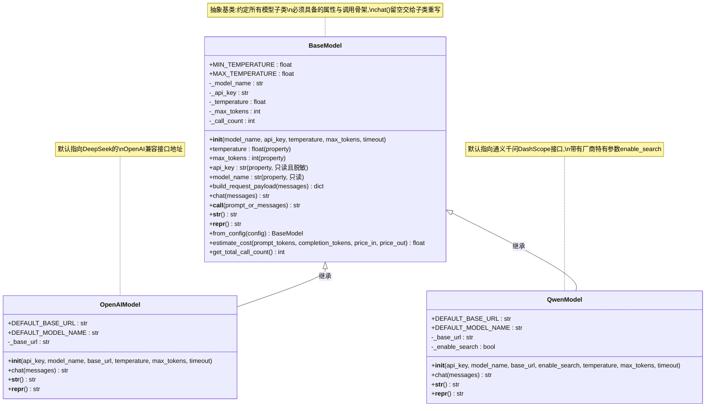

# 第9天 · 面向对象编程(下)

> **周次/Sprint**:Sprint 0 · 新人内训(Day1-14)—— 阶段项目一:命令行多轮对话AI助手(预计Day14交付)
> **星期**:周二
> **学员**:陈铭、苏梦、韩露、张凡(导师:王振宇)
> **内训任务卡**:PYXT-ONB-D09(蓬远科技培训中心 · 新人训练营 · Day09)
> **今日关键词**:继承 / 多态 / 方法重写 / `super()` / 魔术方法`__str__`·`__repr__`·`__call__` / 属性装饰器`@property` / `BaseModel`继承结构设计

---

## 【旁白】

昨天陈铭写完`ChatMessage`那个只有`role`和`content`两个属性的类,心里其实没有太大波澜——一个类,两个属性,几个方法,看起来和他这一周写的字典没有本质区别,只是换了个包装方式。他甚至在笔记本上留了一句略带怀疑的批注:"感觉今天学的这个类,好像就是把字典套了个壳子?"这句话没写错,但也没写全——因为面向对象真正值钱的地方,不在"包一层壳子"这个动作本身,而在"壳子和壳子之间可以产生关系"这件事上。今天要讲的继承,就是把这层关系第一次摆到陈铭面前。

这一天在整整七十天的故事线里,分量比表面看起来重得多。往前看,它是`ChatMessage`类第一次真正"有用武之地"的日子——不是自己一个人待着,而是要和另外三个即将诞生的类(`BaseModel`、`OpenAIModel`、`QwenModel`)产生协作关系;往后看,它是苍穹平台"模型接入层"第一次以图纸的形式出现在陈铭眼前的日子——三天后老王讲到苍穹整体架构时提到的那四个业务层里,"模型接入层"排在最后一位,但恰恰是最先在这一天,以一张最简陋、最原型化的白板草图,预演了自己未来会长成什么样子。更微妙的是,今天这一天还会在陈铭心里留下一枚很小、却会持续发酵的种子——他第一次隐约感觉到,自己写的代码,可能不只是"完成作业"这么简单,而是真的会被后面某个真实的系统继续用下去、继续长大。这种感觉此刻还很模糊,他自己也说不清楚,但正是这种模糊的、说不清楚却又踏踏实实的直觉,构成了本书后面很多"技术选择背后的情感动因"的起点。

【旁白】需要在这里格外郑重地点一句:今天白板上那张`BaseModel → OpenAIModel / QwenModel`的继承结构图,不是老王随手画的教学示意图,而是苍穹企业级智能体中台"模型接入层"的第一版设计原型——真实的原型,不是比喻意义上的"雏形"。往后你会在接下来几十天的篇幅里反复见到这三个名字的变体和升级版:苍穹0.1版里对话引擎调用的模型封装、海纳制造集团项目里知识库问答链路背后的模型调用层、御风金融项目里私有化部署模型的接入适配层——它们的类名、参数名、目录结构会一次次演进,但骨架永远绕不开今天这张图定下的三件事:一个统一的基类规定"所有模型必须具备哪些能力"、若干个具体厂商的子类各自实现"这些能力具体怎么落地"、以及外部调用方永远不需要关心内部是哪个厂商,只需要用同一种方式发出请求。这不是巧合,这是软件工程里"依赖倒置"和"开闭原则"最朴素的体现,只是陈铭此刻还不知道这两个专业词汇,他只知道老王在白板上画了两个箭头,说了一句"这就是咱们以后接不同厂商模型的样子"。

还有一层容易被略过的意义:这一天也是陈铭第一次真正体会到"面向对象"和"面向过程"两种思维方式在解决同一个问题时,会给出完全不同形状的答案。如果继续按照函数式的老办法,要同时支持OpenAI兼容接口和通义千问接口,陈铭大概会写出两个几乎重复的函数——`call_openai_api(messages, api_key, ...)`和`call_qwen_api(messages, api_key, ...)`,调用方每次都要自己判断"这次该调哪个函数"。但用继承和多态之后,调用方只需要拿到一个"模型对象",不管它背后是`OpenAIModel`还是`QwenModel`,调用方式完全一样——这正是"多态"这个词从抽象概念变成陈铭手指下真实代码的第一天。老王说这句话的时候语气很平静,但陈铭后来在笔记里写道,这句话他记了很久:"你们今天写的这几个类,如果放大一万倍,就是真正的生产级系统里,一个团队要维护小半年的核心模块之一。"

---

## 晨会纪要 / 今日目标

**时间**:上午8:50,二层小会议室"起航"
**出席**:王振宇(老王)、陈铭、苏梦、韩露、张凡

周二的会议室里多了一点昨天没有的气味——楼下便利店新到了一批咖啡豆,老王进门时手里端着一杯还冒着热气的美式,先没说话,把投影打开,屏幕上是昨天四个人各自提交的`chat_message.py`。他扫了一眼,神情比昨天放松一些:"整体不错,四份代码,`role`和`content`两个属性都规规矩矩地做了校验,`from_dict`这个类方法也基本写对了。今天开始的内容,难度会往上走一节台阶,提前说清楚,别一上来觉得吃力就先自我否定。"

**昨天进展(Day8)回顾**:

- 四人均完成`ChatMessage`类的实现,包含`__init__`构造方法、对`role`合法性的校验(限定在`system`/`user`/`assistant`三种取值)、实例方法`to_dict()`(转换成`{"role": ..., "content": ...}`格式,为将来直接塞进API请求体做准备)、类方法`from_dict(cls, data)`(反向构造)、以及一个静态方法`is_valid_role(role)`(纯粹的取值校验,不依赖任何具体实例)。
- 陈铭在这个基础上多写了一个`to_display_text()`方法,把消息格式化成"【用户】你好"这种更适合打印在终端上的形式,老王在昨晚代码点评时评价这是"有产品意识的加法"。
- 苏梦在`is_valid_role`这个静态方法上卡了一阵——她一开始把校验逻辑写成了实例方法,传参里多带了一个`self`,后来在老王的提示下想明白"这个校验压根不需要用到任意一个具体实例的数据,只需要拿到`role`这个字符串本身就能判断对错",于是改成了静态方法。
- 张凡把`role`的校验放宽成了"只要是字符串就行",被老王指出这是"偷懒式实现",要求今天开工前先补上严格校验。

老王喝了一口咖啡,把白板转到空白的一面:"昨天你们写的`ChatMessage`,只解决了'一条消息长什么样'这一个问题。但苍穹要做的事,不是只调一家模型的API——你们还记得公司定位吗?"

韩露很快接上:"不做基础大模型预训练,专注把通用大模型转化成企业能用的应用系统,接入OpenAI、DeepSeek、通义千问,后面还有私有化部署。"

"对,"老王点头,"接入不止一家。今天你们要解决的核心问题,就是'一个模型不够用,怎么优雅地同时支持好几个模型'。这个问题,答案就是继承和多态。"

**今日目标**:

1. 上午9:00-12:00:继承(`class Child(Parent)`)、方法重写(override)、`super()`的用法与意义、多态的概念与体现形式;结合`BaseModel`基类的设计,讲清楚"父类定义骨架,子类填充血肉"这套思路。
2. 下午14:00-17:30:魔术方法专题——`__str__`与`__repr__`的区别与各自的适用场景、`__call__`让对象可以像函数一样被调用;属性装饰器`@property`,用来做参数校验与只读属性设计;综合实操——完整搭建`BaseModel → OpenAIModel/QwenModel`继承体系,用mock方式模拟真实API调用结构。
3. 晚自习19:00-21:00:多态调用综合演示、自检脚本编写、今日代码互评。

**风险点**:

- 今天信息密度高,继承相关的几个概念(继承、重写、`super()`、多态)加上魔术方法和`@property`,一共至少六个新知识点,老王决定把讲解节奏放慢,上午只讲继承家族这条线,下午专攻魔术方法和`@property`,晚自习留给综合实操,避免"一次性塞太多导致谁都没吃透"。
- 大模型API调用真正实现是Day12的内容,今天的`OpenAIModel`/`QwenModel`一定不能真的发网络请求(`requests`库还没学),老王提前强调:"今天写的是骨架和结构,不是真的能打通网络的代码,你们要在代码注释里写清楚这是mock实现,别自己搞混了,更别真把假的api_key传出去当真的用。"
- 昨天`ChatMessage`里`role`字段的校验逻辑,今天会在`BaseModel`里以更严谨的方式(`@property`)重新出现一次,老王打算借着这个对比,顺便帮大家理解"用`if`手动校验"和"用`@property`自动校验"之间的差异到底在哪——这是个容易被讲成"新瓶装旧酒"却讲不透差异的知识点,需要格外花时间举例子。

---

## 需求文档:技术任务书 —— 苍穹模型接入层继承结构设计(原型 v0.0.1)

> 本任务书由技术导师王振宇发放。需要特别说明的是,这一天公司层面苍穹项目还没有正式立项(立项要等到Day30海纳制造集团项目启动前后,更早期的对话引擎小组正式成立要等到Day15),今天的任务本质上是一次"内部技术预研+新人训练"合二为一的练习——老王亲自承认:"这份任务书,我是照着真正立项之后我们会写的架构设计文档的格式发给你们的,你们今天写的代码不会直接进苍穹的代码库,但设计思路我会原样带进去。"格式依然沿用公司标准的五段式结构,方便大家提前熟悉。

### 背景

苍穹平台的产品定位,决定了它从第一天起就不可能只依赖单一厂商的大模型。公司当前明确的技术选型里,DeepSeek(`deepseek-chat`/`deepseek-reasoner`)和通义千问(`qwen-plus`/`qwen-max`,经阿里云DashScope的OpenAI兼容接口调用)是首选的低成本主力模型,同时保留对接OpenAI GPT系列、以及未来私有化部署开源模型的能力。如果每接入一家新的模型厂商,都要重新写一整套调用逻辑,系统会迅速积累起大量彼此独立、互不兼容的"烟囱式"代码——同样一句"给模型发一条消息,拿到一段回复"的需求,四个厂商就要写四份逻辑,新增一个厂商就要再写一份,后期任何一次"给所有模型统一加个超时重试机制"这样的需求,都要在四份代码里各改一遍。

技术团队因此确定,在正式开发苍穹之前,先通过新人训练营的练习项目,验证一套"基类定义统一契约,子类实现厂商差异"的类继承结构设计是否可行、是否好用。这份任务书的核心目标,不是产出能真正联网调用的代码(那是Day12才具备的能力),而是产出一套结构清晰、职责分明、经得起后续扩展的"类骨架原型",为将来苍穹后端代码里`backend/app/services/llm/`目录下的`base.py`、`openai_compatible.py`等文件积累最早期的设计经验。

### 用户故事(以"苍穹平台未来的开发者"视角撰写,这些开发者很可能就是今天在座的四位培训生自己)

- 作为苍穹对话引擎的开发者,我希望调用任何一个已接入的模型时,写法完全一致(比如都用`model(用户输入的文本)`这样的方式),而不需要根据背后是哪个厂商去写不同的调用代码。
- 作为苍穹的架构维护者,我希望新增一个模型厂商时,只需要新写一个继承自统一基类的子类,而不需要改动任何调用方已有的代码——新增能力不应该牵连已经跑得很稳定的旧代码。
- 作为苍穹的运维/安全负责人,我希望`api_key`这类敏感信息在任何日志打印、任何对象展示的场景下,都不会以明文的完整形式被暴露出来。
- 作为苍穹的开发者,我希望模型的关键参数(比如`temperature`、`max_tokens`)在设置的一瞬间就能被校验,如果设置了一个不合理的值(比如`temperature=10`),程序应该立刻明确地报错,而不是等到真正发请求给API厂商时才收到一个语义模糊的失败。
- 作为一名刚接触这套代码的新同事,我希望`print()`一个模型对象时,能看到一句话就明白"这是哪个模型、配置是什么",而不是看到一串毫无意义的内存地址。
- 作为苍穹的测试工程师(赵磊未来会真的这样要求),我希望这套模型接入层具备良好的可测试性——每个厂商的请求组装逻辑、返回结果解析逻辑,都应该能在不真正发起网络请求的情况下被单独验证。

### 功能列表

| 编号 | 功能 | 说明 | 优先级 |
|---|---|---|---|
| F1 | `BaseModel`抽象基类 | 定义所有模型子类共享的属性(`model_name`、`api_key`、`temperature`、`max_tokens`、`timeout`)、通用的请求体组装逻辑、以及一个必须被子类重写的`chat()`方法(父类调用会主动抛出`NotImplementedError`) | P0(必须实现) |
| F2 | `OpenAIModel`子类 | 继承`BaseModel`,实现面向"OpenAI兼容接口"的`chat()`方法(默认指向DeepSeek的OpenAI兼容地址),用mock方式模拟请求组装与响应解析的完整结构 | P0 |
| F3 | `QwenModel`子类 | 继承`BaseModel`,实现面向通义千问DashScope接口的`chat()`方法,体现出与OpenAI兼容接口在参数细节上的真实差异(如`enable_search`等千问特有参数),同样用mock方式模拟 | P0 |
| F4 | `__call__`魔术方法 | 让任意一个模型实例可以直接被"调用"(如`model("你好")`),内部自动统一处理字符串输入与messages列表两种入参形式 | P0 |
| F5 | `__str__` / `__repr__`魔术方法 | 分别为"给人看的简洁描述"和"给开发者调试用的精确描述"提供清晰实现,且都不能泄露完整的`api_key` | P0 |
| F6 | `@property`参数校验 | 对`temperature`、`max_tokens`等关键参数,使用属性装饰器实现"赋值时自动校验、不合法立刻报错"的效果 | P0 |
| F7 | 多态调用综合演示 | 编写一段调用方代码,证明"用同一种调用方式,遍历一个包含不同厂商模型实例的列表,分别得到符合各自厂商特征的正确结果" | P0 |
| F8 | 类方法/静态方法的合理复用 | 至少设计一个类方法(如从配置字典构造实例)和一个静态方法(如成本估算、输入校验),并说明为什么选择这种方法类型而不是另一种 | P1(增强功能) |
| F9 | 自检脚本 | 编写基于`assert`的自检用例,验证继承体系的核心行为(校验逻辑、多态分发、魔术方法输出格式等)符合预期 | P1 |

### 非功能需求

- **可扩展性**:新增一个模型厂商子类,不应该要求修改`BaseModel`或者其他已有子类的任何一行代码,只需要新增一个继承类。
- **信息安全**:任何`__str__`、`__repr__`的输出,以及任何日志打印场景,严禁把完整的`api_key`原文暴露出来,必须做脱敏处理。
- **可测试性**:核心的请求组装逻辑与响应解析逻辑,应该设计成不依赖任何真实网络请求即可被单独验证的形式(这也是为什么今天必须用mock,而不是干脆等到Day12再一次性学完)。
- **代码规范**:严格遵循公司PEP8规范,类和方法必须配中文docstring,关键设计决策(比如"为什么这里用`@property`而不是普通属性")要有行内注释说明原因,不能只写"做什么"不写"为什么"。
- **知识边界**:本任务严格限定在Day1-Day9已学或已预告的知识范围内,不允许提前使用`requests`(Day12)、`typing`类型注解(Day13)、`random`/`datetime`(Day11)等尚未系统讲解的模块,如确有必要提前使用极少量语法(如`try/except`的最基础用法,Day7-Day8已经"够用式"用过),需要在代码中明确注释说明。

### 验收标准

1. `BaseModel`不能被直接拿来正常完成一次"调用并拿到回复"的流程——直接对`BaseModel`实例调用`chat()`必须抛出`NotImplementedError`,证明它确实起到了"强制子类实现"的作用。
2. `OpenAIModel`和`QwenModel`的实例,用完全相同的调用代码(如`for model in models: model(prompt)`)执行时,都能正确返回内容,且能看出返回内容里体现了各自厂商的特征差异。
3. 修改`temperature`为超出合理范围的值(如负数或大于2的值)时,必须立刻抛出异常,不允许赋值成功之后才在别处出错。
4. `print(model_instance)`的输出必须是一句人类可读的、包含模型名称与关键配置的描述;直接查看对象(如放入列表打印,或者调用`repr()`)的输出必须是更精确、原则上"看了就能大致还原对象状态"的描述;两种输出都不能包含完整明文的`api_key`。
5. 至少有一个方法内部通过`super()`调用了父类的同名方法(而不是把父类逻辑重新抄一遍),体现继承带来的代码复用价值。
6. 自检脚本中所有`assert`断言全部通过,覆盖至少6个不同的核心行为检查点。

老王在下发任务书时补了一句:"今天这份任务书,格式和内容都比前几天更接近真实的技术任务书——因为你们马上要开始接触真正意义上的'系统设计'了,不是写一个孤立的小工具,是给未来一整套东西打地基。心态上可以正式一点。"

他又补充了一段关于"为什么现在就要考虑扩展性"的说明,这段话后来被陈铭原样抄进了笔记本:"你们可能会觉得,现在苍穹连正式立项都没有,谈'未来接入五个、十个厂商模型'是不是想得太远了。但我做架构这些年,见过太多反例——一开始图省事,把厂商相关的判断逻辑东一块西一块地散落在代码各处,等真的要接入第三个、第四个厂商的时候,才发现自己被自己两个月前的偷懒坑了,返工的成本比一开始多花两个小时想清楚结构,要高出几十倍。今天这道题,与其说是教你们写继承语法,更是想让你们提前建立一种'设计的时候多想一步'的直觉。这种直觉,不是看两本书就能建立起来的,是要在一次次真实的返工之痛里慢慢磨出来的——我希望你们今天先在一个练习项目里,提前体会到这种"多想一步"值不值。"

需要特别说明的一点是,这份任务书里"用户故事"部分刻意没有引入林悦——不是疏忽,而是因为今天这项工作的性质,更接近纯技术架构预研,还没到需要产品经理介入需求优先级排序的阶段。老王在发放任务书时特意解释了这个安排:"以后你们会发现,不是每一份技术任务都需要产品经理参与——纯架构、纯技术选型类的决策,更多是我们技术团队内部先想清楚,想出一个能自洽、能站得住脚的方案,再拿去跟产品、跟业务对齐。今天这份练习,某种程度上就是在模拟这个'技术先行、内部预研'的真实决策链路。"

---

## 架构设计图:`BaseModel`继承体系类图



老王讲这张图的时候,先没有讲任何一行代码,而是先讲了一个类比:"你们把`BaseModel`想象成公司给所有新员工发的《员工手册》通用条款——不管你入职之后是做技术、做产品还是做行政,都必须遵守的那部分;`OpenAIModel`和`QwenModel`,则是不同岗位各自的《岗位操作细则》——通用条款不重复写,但每个岗位有自己独有的具体做法。今天你们要做的事,就是先写清楚那份《通用条款》,再各自补一份《岗位细则》。"

他又指着图上`BaseModel`到两个子类的箭头强调:"这两条箭头的方向不能画反——是`OpenAIModel`继承`BaseModel`,不是反过来。箭头指向谁,谁就是那个更基础、更通用的角色,它不知道也不应该知道自己会有哪些子类,子类反过来知道自己的父类是谁——这是继承关系里一个特别容易被初学者搞反的方向感。"

张凡提了一个问题:"如果以后苍穹真的要接第五个、第六个厂商模型,是不是只要照着这张图,再加一个方框、加一条箭头就行?"老王点头:"理论上就是这么简单,这也是这套设计的核心价值——'开闭原则',对扩展开放,对修改关闭。你新增一个模型厂商,不需要改动`BaseModel`一行代码,也不需要改动`OpenAIModel`、`QwenModel`已经跑得很稳的代码,只需要新增一个新的子类文件。这一点,你们今天写的代码规模还小,体会不深,但等你们三十天后接手过一次'牵一发动全身'的老代码,就会真正理解这张图为什么值钱。"

韩露注意到白板角落老王随手写的一行小字——`backend/app/services/llm/base.py`——追问这是什么意思。老王这才补充说明,这其实是他脑子里已经想好、但还没有正式对外公布的苍穹后端目录结构的一角:"真正的苍穹项目立项之后,后端代码会有一个专门的`services/llm/`目录,专门存放模型接入层的代码,里面会有一个`base.py`放基类,一个`openai_compatible.py`放OpenAI兼容接口的实现,还会有一个`router.py`,负责根据配置或者用户选择,动态决定该实例化哪一个具体的模型类——这个`router.py`本质上就是你们今天写的`create_model_by_vendor`工厂函数的正式生产版本,只是会支持更多厂商、读取更复杂的配置。"他说这句话的时候语气很平淡,像是在描述一件早就计划好、只是还没到时间点的事,但陈铭后来在笔记里写道,这是他这几天第一次这么具体地"看见"了苍穹代码库将来长什么样子,而不只是听一个抽象的"平台愿景"。

---

## 流程图:多态调用时的方法解析顺序

```mermaid
flowchart TD
    Start(["调用方代码: reply = model(\"你好\")"]) --> CallMagic["Python自动识别model(...)这种写法\n转而调用 model.__call__(\"你好\")"]
    CallMagic --> WhereCall{"__call__这个方法,\n实际定义在哪一层?"}
    WhereCall -- "OpenAIModel/QwenModel都没有重写__call__\n只有BaseModel定义了它" --> UseBaseCall["直接执行 BaseModel.__call__()\n(子类自动继承,不需要各自重复实现)"]

    UseBaseCall --> Normalize["_normalize_input():\n把字符串或messages列表统一成标准格式"]
    Normalize --> InvokeChat["在__call__内部调用 self.chat(messages)"]

    InvokeChat --> LookupChat{"从 type(self) 开始,\n沿着MRO(方法解析顺序)查找chat()"}

    LookupChat -- "self实际类型是OpenAIModel" --> CheckOpenAI{"OpenAIModel类自己\n有没有定义chat()?"}
    CheckOpenAI -- "有,已重写" --> RunOpenAI["执行OpenAIModel.chat()\n组装OpenAI兼容请求体\n→_mock_send_request()\n→_parse_response()"]
    RunOpenAI --> ReturnOpenAI["返回带DeepSeek/OpenAI风格标记的回复文本"]

    LookupChat -- "self实际类型是QwenModel" --> CheckQwen{"QwenModel类自己\n有没有定义chat()?"}
    CheckQwen -- "有,已重写" --> RunQwen["执行QwenModel.chat()\n组装DashScope兼容请求体\n(含enable_search等千问专属参数)\n→_mock_send_request()\n→_parse_response()"]
    RunQwen --> ReturnQwen["返回带通义千问风格标记的回复文本"]

    LookupChat -- "假设self是BaseModel自己的实例\n(正常业务流程不该出现这种情况)" --> CheckBase{"沿MRO往上找到BaseModel自己的chat()"}
    CheckBase -- "找到,但内部只有raise语句" --> RunBase["抛出NotImplementedError\n提示必须由具体子类实现"]

    ReturnOpenAI --> End(["调用方拿到最终的reply字符串,\n调用方代码本身完全不知道\n背后走的是哪一条分支"])
    ReturnQwen --> End
    RunBase --> ErrorEnd(["程序在这里报错终止,\n提醒开发者:BaseModel不该被直接实例化使用"])
```

这张图解释的,正是老王上午反复强调的"多态"这个词具体是怎么发生的。他讲解时特别提了一个容易被忽略的细节:"注意`__call__`这个方法本身,`OpenAIModel`和`QwenModel`都没有重写,它俩用的是从`BaseModel`原样继承下来的那一份——多态不需要每个子类都重写每一个方法,只需要重写那些'确实因厂商而不同'的方法(这里是`chat()`),剩下相同的部分,继承机制会自动帮你复用。"

陈铭盯着这张图看了一会儿,问了一个问题:"那Python是怎么知道'这个`self`到底是`OpenAIModel`还是`QwenModel`'的?代码里写的都是同一行`self.chat(messages)`啊。"老王的回答直接点出了多态的核心机制:"Python在运行的那一刻,看的不是你代码写在哪个类里,看的是`self`这个变量真实指向的对象,到底是用哪个类`new`出来的。同样一行`self.chat(messages)`,如果`self`当下绑定的是一个`OpenAIModel`的实例,Python就会先去`OpenAIModel`这个类里找`chat`方法,找到了就直接用;如果没找到,才会继续往它的父类`BaseModel`里找。这个'先从实际类型找,找不到再往父类找'的顺序,叫方法解析顺序,英文缩写MRO,今天你们不需要记这个术语,但要理解这背后的查找顺序。"

---

## 示意图:魔术方法在不同场景下被自动调用的示意

```mermaid
graph TD
    subgraph SCENE1["场景一:直接展示给"人"看"]
        A1["print(model)"] --> A2["Python自动调用 __str__()"]
        A3["f\"当前使用的模型是:{model}\""] --> A2
    end

    subgraph SCENE2["场景二:开发者调试/查看对象的"真实身份""]
        B1["交互式环境里直接输入 model 回车"] --> B2["Python自动调用 __repr__()"]
        B3["print([model1, model2])\n(容器打印内部元素默认用repr)"] --> B2
        B4["显式调用 repr(model)"] --> B2
    end

    subgraph SCENE3["场景三:把对象当函数一样"使用""]
        C1["reply = model(\"你好\")"] --> C2["Python自动调用 __call__()"]
    end

    subgraph SCENE4["场景四:读写被@property装饰的属性"]
        D1["model.temperature = 1.8"] --> D2["Python自动调用 temperature的setter\n先校验,校验通过才真正赋值"]
        D3["print(model.temperature)"] --> D4["Python自动调用 temperature的getter"]
    end

    A2 -. "如果没有重写,继承自object的默认__str__" .-> A5["效果和默认__repr__基本一致,\n看不出任何有意义的信息"]
    B2 -. "如果没有重写,继承自object的默认__repr__" .-> B5["形如:<__main__.OpenAIModel object at 0x7f8a1c0a3d90>\n只能看出类名和内存地址,毫无业务价值"]
```

老王讲这张示意图时,特意提到这四个场景不是凭空编的,而是他从业十年里真实见过、真实踩过坑的四类场景:"场景一和场景二,决定了你未来在日志里、在调试输出里,能不能一眼看懂当前发生了什么;场景三,是今天最有'魔法感'的一个知识点,决定了你的对象能不能被当成一个更自然的接口来使用;场景四,是`@property`存在的全部意义——它让'给属性赋值'这个看起来最普通的动作,背地里悄悄多做了一层校验,调用方完全感觉不到多写了什么代码,但安全性直接上了一个台阶。"

苏梦指着图上"如果没有重写"那两个虚线分支问:"这两个分支是说,如果我们今天不写`__str__`和`__repr__`,程序也不会报错,对吧?"老王点头:"对,不写不会报错,程序照样能跑。但你会看到`print(model)`打出来的是一串`<__main__.OpenAIModel object at 0x7f8a1c0a3d90>`这种毫无意义的东西——这不是bug,这是Python的默认行为,而恰恰因为它'不报错但没用',才是最容易被初学者忽略、被资深工程师重视的一类细节。"

---

## 课堂笔记

### 上午:继承、方法重写与`super()`、多态

**9:00,培训室**

老王没有像前几天一样直接打开投影敲代码,而是先在白板上画了两个空的方框,一个写"父类",一个写"子类",中间画了一个箭头,箭头从子类指向父类。

"先讲一个最朴素的问题,"他说,"如果没有继承,你昨天写的`ChatMessage`类,和你今天要写的`BaseModel`、`OpenAIModel`、`QwenModel`,会变成什么样子?"

陈铭想了想:"如果没有继承……我大概会把`BaseModel`里该有的东西——`model_name`、`api_key`这些——在`OpenAIModel`里重新写一遍,再在`QwenModel`里也重新写一遍,对吧?"

"对,"老王在白板上写了三个类名,每个类名下面都列了`model_name`、`api_key`、`temperature`、`max_tokens`几个属性,"你会发现这三份属性列表,几乎一字不差。这就是我们昨天在函数那一天讲过的重复代码问题的'面向对象版本'——只不过重复的不再是几行代码,是整整一套属性和校验逻辑。继承要解决的,正是这个问题:让'公共的部分'只写一次,写在一个共同的父类里,子类通过'继承'这个动作,自动拥有父类的全部内容,不需要重新抄一遍。"

#### 继承的基本语法

老王现场敲了一段最简单的示例代码,不涉及任何苍穹相关的业务逻辑,只是纯粹讲清楚语法:

```python
class Animal:
    """动物基类,定义所有动物共有的属性和行为。"""

    def __init__(self, name, sound):
        self.name = name
        self.sound = sound

    def make_sound(self):
        print(f"{self.name}发出了声音:{self.sound}")


class Dog(Animal):
    """狗类,继承自Animal。括号里的Animal就表示"Dog是Animal的子类"。"""
    pass


dog = Dog("旺财", "汪汪")
dog.make_sound()  # 输出:旺财发出了声音:汪汪
```

"看,`Dog`这个类里,我什么都没写,只写了一个`pass`,"老王说,"但它照样有`__init__`,照样有`make_sound`方法,而且用起来跟`Animal`一模一样。这就是继承最直接的效果——子类自动拥有父类的全部属性和方法,一行代码都不用重复写。"

韩露举手问:"那如果`Dog`什么都不加,直接继承`Animal`,这个继承的意义在哪?难道不是跟直接用`Animal`一样吗?"

"问得好,"老王说,"这个例子确实还没体现继承真正的价值,因为`Dog`目前跟`Animal`没有任何差异。继承真正开始值钱,是从下一步——子类开始'和父类不一样'的时候。"

#### 方法重写(Override)

老王在刚才的代码基础上继续扩展:

```python
class Cat(Animal):
    """猫类,继承自Animal,但要重写make_sound方法——猫叫和默认的声音提示方式不一样。"""

    def make_sound(self):
        # 这里的方法名和父类完全一样,叫做"方法重写"(override)
        # 效果是:Cat的实例调用make_sound()时,不再走Animal里的那份实现,
        # 而是走Cat自己写的这份——子类的同名方法会"盖掉"父类的同名方法
        print(f"{self.name}优雅地叫了一声:{self.sound}~")


cat = Cat("小咖啡", "喵")
cat.make_sound()   # 输出:小咖啡优雅地叫了一声:喵~(用的是Cat自己的实现)

dog = Dog("旺财", "汪汪")
dog.make_sound()   # 输出:旺财发出了声音:汪汪(Dog没重写,继续用Animal的实现)
```

"这就是方法重写,"老王说,"`Cat`和`Dog`都继承自`Animal`,但`Cat`选择'不满意父类给的默认实现,自己重新写一份',`Dog`选择'父类给的默认实现够用,直接沿用'。这两种选择完全自由,是子类自己决定的,而且互不影响——`Cat`重写了不影响`Dog`,`Dog`不重写也不影响`Cat`。"

张凡追问了一句非常关键的问题:"那如果`Cat`重写了`make_sound`,以后是不是就彻底跟`Animal`原来那份实现没关系了?万一我想在`Cat`自己的实现里,先执行一遍`Animal`原来那份逻辑,再加一点自己的东西,怎么办?"

老王笑了:"这就是你们今天最重要的一个知识点——`super()`。"

#### `super()`:调用父类被重写之前的实现

```python
class Bird(Animal):
    """鸟类,重写make_sound,但希望在父类原本的提示基础上,多加一句"扑扑翅膀"的描述。"""

    def make_sound(self):
        # super()代表"当前这个类的父类",调用super().make_sound()
        # 就相当于执行了Animal里原本的那份make_sound逻辑,一个字都不用重新抄
        super().make_sound()
        print(f"{self.name}还扑扑翅膀,飞高了一点。")


bird = Bird("阿黄", "啾啾")
bird.make_sound()
# 输出:
# 阿黄发出了声音:啾啾
# 阿黄还扑扑翅膀,飞高了一点。
```

老王讲到这里,专门停下来强调:"`super()`不是'重新执行一遍一样的代码',而是'借用父类已经写好的那份代码,执行一次'。如果`Animal`里的`make_sound`逻辑很复杂,有十行,你用`super().make_sound()`就是那十行原样跑一次;你不用`super()`,自己在`Bird`里重新写一遍那十行,以后`Animal`的那十行改了一个bug,你的`Bird`还得手动同步改一遍——这跟我们前几天讲的'重复代码'是一样的道理,只是发生在继承体系里。"

苏梦这时候提了一个很实际的问题:"那`super()`是必须用的吗?如果我重写方法的时候压根不想要父类原本的行为,可以不用`super()`吗?"

"完全可以,"老王说,"`super()`不是语法强制要求,是你自己决定'要不要复用父类的行为'。刚才`Cat`那个例子,它重写`make_sound`的时候压根没调`super()`,因为它想要的效果和父类完全不同,不需要借用父类的那份逻辑。什么时候用`super()`,什么时候不用,取决于业务需求——如果子类的行为是'在父类基础上加一点东西',用`super()`;如果子类的行为是'完全推翻父类原本的做法',就不用。"

#### `super()`在`__init__`里最常见、也最重要的用法

老王补充了一个几乎每天都会用到的场景——在子类的构造方法里调用父类的构造方法:

```python
class Employee:
    """员工基类。"""

    def __init__(self, name, employee_id):
        self.name = name
        self.employee_id = employee_id
        print(f"员工{name}(工号{employee_id})的基础信息已经初始化。")


class Engineer(Employee):
    """工程师类,继承自Employee,但多了一个"擅长技术方向"的属性。"""

    def __init__(self, name, employee_id, tech_stack):
        # 先调用父类的__init__,把name和employee_id这两个"通用属性"的初始化
        # 完全交给父类去做——这一步千万不能漏,漏了self.name、self.employee_id
        # 这两个属性根本不会被创建出来
        super().__init__(name, employee_id)
        self.tech_stack = tech_stack
        print(f"额外补充:{name}擅长的技术方向是{tech_stack}。")


chenming = Engineer("陈铭", "PY2024-07", "AI应用开发")
# 输出:
# 员工陈铭(工号PY2024-07)的基础信息已经初始化。
# 额外补充:陈铭擅长的技术方向是AI应用开发。
```

老王在这里特意留了一个警告:"这是新手最容易踩的坑之一——子类如果自己写了`__init__`,父类的`__init__`不会自动被执行,你必须自己手动调用`super().__init__(...)`。如果你忘了调用,`self.name`、`self.employee_id`这两个属性根本不会存在,后面任何代码想访问`self.name`,都会直接报`AttributeError`。"

他现场演示了一次"忘记调用`super().__init__()`"会发生什么:

```python
class BuggyEngineer(Employee):
    def __init__(self, name, employee_id, tech_stack):
        # 故意不调用super().__init__(name, employee_id),制造一个真实的报错场景
        self.tech_stack = tech_stack

buggy = BuggyEngineer("张凡", "PY2024-09", "算法")
print(buggy.name)
```

运行这段代码,会得到:

```
AttributeError: 'BuggyEngineer' object has no attribute 'name'
```

"看到没,"老王指着报错说,"`self.tech_stack`赋值成功了,因为这一行是子类自己写的;但`self.name`和`self.employee_id`从来没有被真正赋值过,因为负责给它们赋值的那段代码——父类的`__init__`——从来没有被执行过。这个报错信息本身没有说'你忘了调用super()',它只是老实地告诉你'这个对象没有`name`这个属性',排查思路是:看到这种报错,先去检查子类的`__init__`是不是漏调了`super().__init__()`。"

#### 继承的层级关系可以不止一层

老王补了一个小知识点,不算今天的重点,但方便大家理解继承的完整图景:"继承可以一层套一层——比如`Animal`是`Dog`的父类,以后你完全可以再定义一个`Poodle`(贵宾犬)继承自`Dog`,这样`Poodle`会同时拥有`Animal`和`Dog`的全部内容。今天我们的`BaseModel`体系只有两层——`BaseModel`一层,`OpenAIModel`/`QwenModel`一层,不涉及三层继承,但你们要知道这件事在语法上是完全允许的,苍穹后面某些场景(比如给`OpenAIModel`再派生出一个专门针对某个特殊客户定制参数的子类)确实会用到。"

#### 多态:同一个调用方式,不同的实际表现

讲完继承和`super()`,老王正式引出今天最核心的概念——多态。

"多态这个词听起来很玄乎,"他说,"但你们今天已经在无意中理解它了。回到刚才`Cat`、`Dog`、`Bird`那几个例子,我现在写一段调用代码。"

```python
animals = [Dog("旺财", "汪汪"), Cat("小咖啡", "喵"), Bird("阿黄", "啾啾")]

for a in animals:
    a.make_sound()   # 完全一样的一行代码,针对不同的对象,会执行不同的具体逻辑
```

"这个`for`循环里,`a.make_sound()`这一行代码,一个字都没变,"老王说,"但循环跑三次,分别执行了`Dog`继承来的默认实现、`Cat`自己重写的实现、`Bird`调用了`super()`之后又加了一句的实现——三种不同的具体行为。调用方(这里是这个`for`循环)完全不需要关心'当前这一次到底是哪个具体类型',它只需要相信'反正调`make_sound()`,总能得到符合这个对象类型的正确行为'。这种'同一个调用方式,不同对象表现出不同行为'的现象,就是多态。"

陈铭在笔记本上记了一句自己的总结:"多态不是一种额外要写的语法,是继承和方法重写这两件事组合起来,自然产生的一个效果。"老王看到这句话点了点头:"这句话说得比我准备的官方定义还准确。"

#### 从动物例子过渡到`BaseModel`

上午的最后一段时间,老王把话题正式收回到今天的核心任务:

"刚才`Animal`/`Dog`/`Cat`/`Bird`只是热身,现在把这套思路原样套到我们今天真正要写的东西上。"他在白板上重新画了一遍开篇那张继承结构图,"`BaseModel`就是`Animal`,`OpenAIModel`和`QwenModel`就是`Dog`和`Cat`。`BaseModel`里要定义所有模型厂商共有的东西——`model_name`、`api_key`、`temperature`、`max_tokens`这些参数,以及一个统一的调用入口`chat()`。但`chat()`这个方法,`BaseModel`自己写不出真正的实现——它不知道'调用OpenAI兼容接口'具体该怎么组装请求体,也不知道'调用通义千问DashScope接口'具体该怎么组装。这个方法真正的实现,必须交给子类各自完成。"

"那`BaseModel`的`chat()`里应该写什么?"苏梦问。

"写一句话:'我还没被实现,你必须由子类重写我'。"老王说,"具体写法是`raise NotImplementedError(...)`。这样一来,如果哪个子类忘了重写`chat()`,或者有人不小心直接用`BaseModel`本身去调用`chat()`,程序会立刻、清楚地报错,而不是悄悄跑出一个错误的结果。这是一种'故意设计出来的报错',目的是在错误刚刚发生的地方就把它拦下来,而不是让它一路传导到很远的地方才暴露,那时候排查成本会高得多。"

这个设计思路,专业上有一个名字叫"模板方法模式"——父类定义好整体流程的骨架(`__call__`调用`chat()`,`chat()`调用请求组装和响应解析),但骨架中某一个具体环节留空,交给子类去填。老王没有直接抛出这个术语的英文全称,只是说:"这套写法你们以后会反复见到,不需要现在记名字,记住这套'父类搭骨架、子类填肉'的思路就够了。"

---

### 下午:魔术方法专题与`@property`

**14:00,培训室**

午饭后老王没有立刻讲新内容,先花了十分钟让四人独立把上午的`Animal`继承体系在自己电脑上敲一遍、跑一遍,确认语法层面没有遗留问题。14:15左右,他重新回到投影前。

"上午我们解决的是'不同模型厂商怎么共享通用逻辑、各自实现差异逻辑'的问题,"他说,"下午我们要解决另外两个问题——第一,怎么让`print(某个模型对象)`打印出有意义的信息,而不是一串内存地址;第二,怎么让一个模型对象可以像函数一样直接被'调用'。这两个问题的答案,都藏在Python的'魔术方法'里。"

#### 什么是魔术方法

"魔术方法,"老王解释,"是一类名字前后都带双下划线的特殊方法,比如`__init__`、`__str__`、`__repr__`、`__call__`。它们的共同特点是——你从来不会直接手动调用它们(比如你几乎不会自己写`obj.__str__()`),而是通过某个特定的语法动作(比如`print(obj)`),让Python在背后自动帮你调用。"

他先带着大家复习了一遍已经很熟悉的`__init__`:"`__init__`就是一个魔术方法,你从来不会自己写`obj.__init__()`,而是写`ClassName(参数)`创建实例的时候,Python自动帮你调用了它。今天要学的`__str__`、`__repr__`、`__call__`,是同一类东西,只是触发它们的语法动作不一样。"

#### `__str__`:给"人"看的描述

老王写了一个没有魔术方法加持的类,先展示"默认长什么样":

```python
class SimpleModel:
    """一个什么魔术方法都没写的最朴素的类,用来对比默认效果。"""

    def __init__(self, model_name):
        self.model_name = model_name


m = SimpleModel("deepseek-chat")
print(m)
```

运行结果类似:

```
<__main__.SimpleModel object at 0x7f8a1c0a3d90>
```

"这一串东西,`<模块名.类名 object at 内存地址>`,是Python给所有对象兜底的默认打印格式,"老王说,"它没有任何错,但也没有任何用——它只告诉你'这是一个SimpleModel类型的对象',连`model_name`是什么都看不出来。今天,我们要用`__str__`把这个默认行为换成有意义的信息。"

```python
class SimpleModelWithStr:
    """加上__str__之后,print()这个对象时会展示更有意义的信息。"""

    def __init__(self, model_name):
        self.model_name = model_name

    def __str__(self):
        # __str__必须返回一个字符串,这里返回一句人类容易看懂的描述
        return f"一个名为{self.model_name}的模型对象"


m2 = SimpleModelWithStr("deepseek-chat")
print(m2)          # 输出:一个名为deepseek-chat的模型对象
print(f"当前模型:{m2}")  # f-string里嵌入对象,同样会调用__str__,输出:当前模型:一个名为deepseek-chat的模型对象
```

"`__str__`的设计目标是'给人看的、追求可读性的描述',"老王总结,"不追求信息完整,追求'一眼看懂大概是什么'。"

#### `__repr__`:给开发者调试用的描述

"那`__repr__`和`__str__`到底有什么区别?"韩露提前问出了大家心里的问题。

老王没有直接给定义,先演示了一个现象:

```python
class SimpleModelBoth:
    """同时定义__str__和__repr__,对比它们分别在什么场景被触发。"""

    def __init__(self, model_name, temperature):
        self.model_name = model_name
        self.temperature = temperature

    def __str__(self):
        return f"模型:{self.model_name}"

    def __repr__(self):
        return f"SimpleModelBoth(model_name={self.model_name!r}, temperature={self.temperature!r})"


m3 = SimpleModelBoth("qwen-plus", 0.7)

print(m3)             # 输出:模型:qwen-plus  (调用了__str__)
print(repr(m3))        # 输出:SimpleModelBoth(model_name='qwen-plus', temperature=0.7)  (调用了__repr__)

model_list = [m3]
print(model_list)     # 输出:[SimpleModelBoth(model_name='qwen-plus', temperature=0.7)]  (列表打印内部元素时,默认用__repr__,不是__str__)
```

"看最后一行,"老王说,"当一个对象被放进列表、字典等容器里,再打印这个容器的时候,容器内部对每个元素调用的是`__repr__`,不是`__str__`。这是Python的一个明确约定——`__repr__`追求的是'足够精确,理想情况下你能通过这段文字在脑子里还原出这个对象大致的样子',所以它更适合在调试、日志、容器展示这些'给开发者自己看'的场景出现;`__str__`追求的是'给最终用户或者产品界面展示时,读起来顺眼',所以你会看到很多类里,`__str__`写得比`__repr__`更口语化。"

老王又补了一句实用的原则:"如果你只想省事,只实现一个魔术方法,优先实现`__repr__`——因为如果一个类没有定义`__str__`,Python会自动用`__repr__`的结果来代替`__str__`的效果;但反过来不行,`__str__`不会被自动拿来当`__repr__`用。"他现场验证了这句话:

```python
class OnlyRepr:
    def __init__(self, name):
        self.name = name

    def __repr__(self):
        return f"OnlyRepr(name={self.name!r})"


o = OnlyRepr("测试")
print(o)          # 输出:OnlyRepr(name='测试')  ——注意,这里没有定义__str__,但print()依然拿到了有意义的输出
print(repr(o))    # 输出:OnlyRepr(name='测试')
```

#### `__str__`与`__repr__`常见误区对照表

老王整理了一张表格,帮助大家彻底厘清这两个魔术方法的差异:

| 对比维度 | `__str__` | `__repr__` |
|---|---|---|
| 触发场景 | `print(obj)`、`str(obj)`、f-string里嵌入对象 | `repr(obj)`、交互式环境直接输入变量名、容器(列表/字典)打印内部元素 |
| 设计目标 | 可读性优先,给最终用户/产品界面看 | 精确性优先,给开发者调试、排查问题时看 |
| 是否必须存在 | 不写也不会报错,会退化成`__repr__`的效果(如果有)或默认格式 | 建议一定要写,是调试信息的最后一道保障 |
| 常见内容 | 一句自然语言描述 | 类似"能拿去重新构造这个对象"的代码风格字符串 |
| 今天代码里的例子 | `"<OpenAIModel model_name='deepseek-chat' temperature=0.7>"` | `"OpenAIModel(model_name='deepseek-chat', base_url='https://api.deepseek.com/v1', ...)"` |

#### `__call__`:让对象可以像函数一样被调用

"接下来是今天下午最有'魔法感'的一个知识点,"老王说,"你们这几天写函数,调用方式都是`函数名(参数)`;今天开始,一个普通的对象,也可以被写成`对象名(参数)`这种调用形式——前提是它的类定义了`__call__`方法。"

```python
class Multiplier:
    """一个"可调用对象"的最简单示例——创建实例时确定倍数,之后可以像函数一样直接调用它。"""

    def __init__(self, factor):
        self.factor = factor

    def __call__(self, x):
        # 定义了__call__之后,这个类的实例后面可以直接加括号传参调用,
        # 就像调用一个函数一样,内部实际执行的就是这个__call__方法
        return x * self.factor


double = Multiplier(2)
triple = Multiplier(3)

print(double(5))   # 输出:10 —— 实际发生的是 double.__call__(5)
print(triple(5))   # 输出:15
```

老王特意让大家对比这个例子和第六天学过的闭包写法:"你们还记得Day6写的`make_multiplier`吗?用`lambda`和闭包也能实现一模一样的效果。今天的`Multiplier`类,和那个闭包函数,做的事情完全一样——'记住一个倍数,之后拿来乘任意数字'。区别在哪?闭包是一个轻量的临时方案,状态藏在函数内部,你没办法在外部访问和修改这个'倍数';用类实现,`factor`是一个正儿八经的实例属性,你可以在外部读它、改它、给它加校验、给它加更多相关的方法。当'需要记住的状态'简单且不会变化,闭包很好用;当'需要记住的状态'比较复杂,或者以后可能需要围绕它扩展更多功能,类是更合适的选择。"

**`__call__`在苍穹场景里的真正用途**

"回到我们今天的正题,"老王说,"为什么苍穹的模型类需要`__call__`?"

他直接对比了两种写法:

```python
# 写法一:没有__call__,调用方式是显式调用一个方法
reply = my_model.chat([{"role": "user", "content": "你好"}])

# 写法二:有了__call__,调用方式可以更简洁、更直观
reply = my_model("你好")
```

"写法二读起来,更像是'把模型当成一个函数来用'——你给它一句话,它给你一个回复,这种直觉上的自然感,正是`__call__`存在的意义。而且`__call__`内部还可以帮你悄悄做一层转换——用户可能传一句纯文本,也可能传一个规范的messages列表,`__call__`内部统一转换成标准格式再交给`chat()`处理,调用方不需要关心这层转换细节。"

#### `@property`:属性装饰器与参数校验

老王讲完三个魔术方法,把话题转向下午另一个重点——`@property`。

"你们回忆一下,昨天`ChatMessage`类里,`role`的合法性是怎么校验的?"

苏梦回答:"是在`__init__`里,用`if role not in ("system", "user", "assistant"): raise ValueError(...)`这样判断的。"

"没错,这个写法完全正确,能解决问题,"老王说,"但它有一个局限——它只在'创建对象的那一刻'生效。如果我创建好一个`ChatMessage`对象之后,后面又写了一行`msg.role = "不合法的角色"`,直接改属性的值,这行代码会不会报错?"

大家试了一下,发现完全不会报错——因为`__init__`里的校验只在构造的那一瞬间执行了一次,之后`role`就是一个普普通通的属性,谁都可以随便改,没有任何拦截机制。

"这就是`@property`要解决的问题,"老王说,"它能让'读取属性'和'修改属性'这两个动作,背地里都自动经过一层你写的校验逻辑,而且从外部使用的角度看,调用方完全感觉不到多了什么——用起来还是`obj.属性名`,还是`obj.属性名 = 新值`这么朴素的写法。"

**最基础的`@property`用法**

```python
class Temperature:
    """
    一个演示@property最基础用法的小例子:
    用一个"看起来像摄氏度"的属性,内部悄悄做单位换算和范围校验。
    """

    def __init__(self, celsius):
        self.celsius = celsius   # 这一行实际上触发的是下面的setter,不是普通赋值

    @property
    def celsius(self):
        """getter:定义"读取obj.celsius"这个动作,实际返回什么。"""
        return self._celsius

    @celsius.setter
    def celsius(self, value):
        """setter:定义"给obj.celsius赋值"这个动作,实际会执行什么校验和处理。"""
        if not isinstance(value, (int, float)):
            raise TypeError(f"温度必须是数字,收到了{type(value).__name__}")
        if value < -273.15:
            raise ValueError("温度不能低于绝对零度(-273.15摄氏度)")
        self._celsius = value

    @property
    def fahrenheit(self):
        """只有getter、没有setter的属性,叫"只读属性"——外部无法直接给它赋值。"""
        return self._celsius * 9 / 5 + 32


t = Temperature(25)
print(t.celsius)        # 输出:25   (触发getter)
print(t.fahrenheit)     # 输出:77.0  (只读属性,自动按celsius换算)

t.celsius = 30          # 触发setter,校验通过,真正修改了self._celsius
print(t.celsius)        # 输出:30

t.celsius = -300        # 触发setter,校验不通过,直接抛出ValueError,赋值失败
```

老王逐行解释了这段代码的关键设计:"注意到`_celsius`(单下划线开头)和`celsius`(没有下划线)是两个不同的名字——`celsius`是暴露给外部使用的'属性接口',背后真正存数据的地方是`_celsius`。这种'一个负责校验/转换的公开名字,配一个真正存数据的私有名字'的搭配,是`@property`几乎固定的写法套路。还有,`fahrenheit`只写了`@property`,没有配对的`@fahrenheit.setter`,这意味着外部只能读它,不能直接给它赋值——你如果写`t.fahrenheit = 100`,会得到一个`AttributeError: can't set attribute`。这种'只读属性'的设计,在需要保护某个值不被外部随意篡改的场景特别有用。"

#### 手动校验 vs `@property`校验:一张对比表

老王画了一张表,专门用来回应上午还没讲透的那个疑问——两种写法到底差在哪:

| 对比维度 | `__init__`里手动`if`校验 | `@property`校验 |
|---|---|---|
| 生效时机 | 只在对象创建的那一刻生效一次 | 每一次赋值(不管是创建时,还是创建之后的任何一次修改)都会生效 |
| 代码位置 | 集中写在`__init__`里 | 分散写在每个属性各自的setter里,职责更清晰 |
| 使用方式 | 完全一样,`obj.属性`直接读写 | 完全一样,`obj.属性`直接读写(调用方无感知差异) |
| 保护力度 | 只挡"入口",挡不住后续被随意修改 | 从入口到后续每一次修改,全程受控 |
| 适用场景 | 一次性、不会被后续修改的简单字段 | 会被后续多次读写、且必须一直保持合法的关键参数 |

"今天`BaseModel`里的`temperature`、`max_tokens`,属于'会被后续多次读写、且必须一直合法'这一类,"老王说,"所以我们要求你们用`@property`来实现,不能只在`__init__`里做一次性校验。"

#### 只读属性在信息安全上的一个实际用途:`api_key`脱敏

老王把`@property`和苍穹的真实安全需求结合了一下:"你们的`BaseModel`里有一个`api_key`,这是一个极度敏感的信息——真实场景下,一旦这个key被意外打印到日志里、被截图分享出去,后果可能是巨额的资金损失(有人拿着你的key疯狂调用付费API)。我们要求`api_key`这个属性对外只暴露'脱敏后的展示形式',真正完整的key只存在于一个带下划线的私有属性里,外部代码想拿到完整的key,除非直接访问那个私有属性(理论上Python不禁止,但这是一个明确的'你不应该这么做'的信号)。这正是只读`@property`的一个经典应用场景。"

#### 一段额外的延伸:继承不是唯一的选择

下午课程快结束时,老王讲了一段不在任务书要求范围内、但他认为"现在提前说一句,能帮你们少走弯路"的内容——继承和"组合"(把一个对象作为另一个对象的属性去使用)之间的取舍。

"今天我们全程都在用继承解决问题,"他说,"但继承不是解决'一个类想复用另一个类的能力'这件事的唯一办法,甚至不总是最好的办法。有一个业界流传很广的说法,叫'优先使用组合,而不是继承'。我不要求你们今天就完全理解这句话背后的全部考量,但想留一个具体的判断标准给你们——问自己一句:'子类和父类之间,是不是一种真正的`is-a`(是一个)关系?'`OpenAIModel`是一个`BaseModel`吗?是的,它确实'是一种模型',这种关系用继承很自然。但如果有一天,你想给某个模型加上'自动重试'的能力,你应该问:'一个带重试能力的模型,是一种模型吗?还是它其实是一个包裹了模型、附加了重试逻辑的另外一种东西?'——大多数情况下,后者的判断更准确,这时候用组合(像课后作业第4题`RetryableModel`那样,把真正的模型实例作为自己的一个属性持有)会比强行继承更合适。"

苏梦追问:"那我们怎么判断,这次到底该用继承,还是该用组合?"

老王给了一个不算严格但很实用的判断口诀:"继承回答的问题是'我是不是一种更具体的它',组合回答的问题是'我是不是需要用到它的能力,但我本身是另外一种东西'。`QwenModel`是一种`BaseModel`,这是继承该出场的地方;`RetryableModel`需要用到某个具体模型的`chat()`能力,但它本身的核心职责是'管理重试逻辑',这是组合更合适的地方。今天你们不需要马上做出完美的判断,但从今天开始,遇到'要不要继承'这个问题,多问自己这一句'is-a'的判断,慢慢就会形成直觉。"

这段延伸内容,老王特意说明不会出现在今天的验收范围里,但直接关联到课后作业第4题——那道题里`RetryableModel`最初的错误设计,正是"该用组合的地方用了继承",导致`super().chat()`永远指向那个"故意留空等着报错"的`BaseModel.chat()`。

#### 上午下午知识点小结表

老王在下午课程收尾前,整理了一张表,帮四人把今天新学的六个知识点串起来:

| 知识点 | 一句话理解 | 今天代码里的落脚点 |
|---|---|---|
| 继承 | 子类自动拥有父类的全部属性和方法,不用重复写 | `OpenAIModel(BaseModel)`、`QwenModel(BaseModel)` |
| 方法重写 | 子类可以用同名方法覆盖父类的实现 | `OpenAIModel.chat()`、`QwenModel.chat()`各自重写`BaseModel.chat()` |
| `super()` | 在子类里"借用"父类已经写好的实现,避免重复代码 | `OpenAIModel.__init__`里调用`super().__init__(...)` |
| 多态 | 同一种调用方式,不同对象表现出不同的实际行为 | `for model in models: model(prompt)`,分别走向不同厂商的实现 |
| `__str__` / `__repr__` | 分别为"给人看"和"给开发者调试看"提供合适的对象描述 | `print(model)`看到人类可读的一句话;调试时`repr(model)`看到精确描述 |
| `__call__` | 让对象可以像函数一样直接被调用 | `model("你好")`直接触发一次完整的调用流程 |
| `@property` | 让属性的读写自动经过校验逻辑,而调用方无感知 | `temperature`、`max_tokens`的赋值校验,`api_key`的只读脱敏 |

#### 今天最容易踩的高频报错清单

在正式进入FAQ之前,老王先补了一张"今天这类代码最容易触发的报错"清单——这是他这十年带团队积累下来的经验,提前预警比事后排查效率高得多:

| 报错类型 | 典型触发场景 | 排查思路 |
|---|---|---|
| `AttributeError: 'XXX' object has no attribute 'yyy'` | 子类`__init__`忘记调用`super().__init__(...)`,导致父类应该初始化的属性根本不存在 | 检查子类构造方法第一行是否调用了`super().__init__(...)`,且传参是否完整 |
| `TypeError: __init__() missing N required positional argument` | `super().__init__(...)`调用时漏传了父类要求的某个必填参数 | 对照父类`__init__`的参数列表,逐一核对子类传参是否齐全 |
| `NotImplementedError` | 直接对`BaseModel`实例调用`chat()`,或者某个子类忘了重写`chat()` | 检查报错信息里提示的类名,确认该类是否需要重写某个方法但漏掉了 |
| `AttributeError: can't set attribute` / `AttributeError: property 'xxx' of 'YYY' object has no setter` | 试图给一个只写了`@property`getter、没有配对setter的"只读属性"赋值 | 确认这个属性是否设计为只读;如果确实需要支持修改,补上对应的`@xxx.setter` |
| `ValueError`(在`temperature`/`max_tokens`赋值时被主动抛出) | 传入的数值超出了`@property`setter里设定的合理范围 | 这是校验逻辑正常生效的表现,不是bug,检查传入的具体数值是否符合业务预期 |
| `TypeError: XXX() takes N positional arguments but M were given` | 调用`super().__init__(...)`或子类构造方法时,参数个数或顺序对不上 | 仔细核对父类`__init__`签名,确认关键字参数是否传对了名字 |
| 打印对象得到`<__main__.XXX object at 0x...>` | 类没有定义`__str__`或`__repr__`,走了Python的默认展示逻辑 | 补上`__str__`/`__repr__`,而不是把这种输出当成"正常但难看"的现象忍下来 |

老王讲到`AttributeError: can't set attribute`这一行时,特意提醒:"这个报错信息在不同Python版本里,文字描述会略有差异,有的版本会更明确地写出属性名和类名,但核心含义都是一样的——你想改一个'只允许读、不允许写'的属性。看到这类报错,第一反应不应该是'怎么绕过这个限制',而是先问自己'这个属性设计成只读,是不是本来就是故意的,我是不是走错了修改的路径'。"

#### FAQ:关于继承与多态的常见误区问答

下午课程收尾前,老王把这一天四个人陆陆续续问过、但没有集中整理的疑问,汇总成一份FAQ,让大家在动手写代码之前,先把容易踩的认知误区过一遍:

1. **问:子类是不是必须重写父类的每一个方法?**
   答:完全不需要。子类默认原样继承父类的全部方法,只有当"这个方法在子类身上需要不一样的行为"时,才需要重写。今天的`OpenAIModel`和`QwenModel`都只重写了`chat()`、`__str__()`、`__repr__()`这几个真正需要厂商差异化的方法,`__call__()`、`build_request_payload()`这些通用逻辑,两个子类都原样继承自`BaseModel`,一行都没有重写。判断"要不要重写"的标准很简单——先问自己"父类给的默认实现,对这个子类来说够不够用",够用就不动,不够用才重写。

2. **问:继承是不是意味着子类"变得更强大",父类"功能更基础、更弱"?**
   答:不完全是这个方向的理解。继承描述的是"is-a"(是一个)的关系——`OpenAIModel`"是一个"`BaseModel`,而不是"`OpenAIModel`比`BaseModel`更强"。父类之所以显得"内容更少",不是因为它能力弱,而是因为它故意只放"所有子类都通用"的那部分,把"某个子类特有"的部分留给子类自己扩展。你可以把父类想象成"共性的提炼",子类想象成"共性基础上的具体化",而不是简单的"强弱"关系。

3. **问:今天`BaseModel`的`chat()`方法体只有一行`raise NotImplementedError(...)`,那`BaseModel`这个类本身到底有没有存在的价值?它自己一次都不会被真正拿去用,是不是白写了?**
   答:恰恰相反,`BaseModel`存在的核心价值,不在于"它自己能被直接使用",而在于它给所有子类定义了一份"契约"——任何一个继承自`BaseModel`的类,都被要求(通过`NotImplementedError`这种强制手段)必须重写`chat()`,都自动获得`temperature`/`max_tokens`的校验能力、`__call__`的统一调用方式。它更像是一份"设计规范文档",只是这份规范是用真正能跑起来的代码写的,不是用文字写的——这种"用代码本身表达设计约束"的方式,比写在文档里、指望大家自觉遵守,可靠得多。

4. **问:`super()`里为什么不直接写`BaseModel.__init__(self, ...)`,效果不是一样的吗?**
   答:短期效果确实几乎一样,但`super()`更稳健的地方在于——它不需要你在子类内部"硬编码"父类的名字。假设未来某一天,`OpenAIModel`的继承关系发生了调整(比如中间插入了一层新的父类),用`super()`写的代码不需要做任何改动,会自动沿着新的继承链条找到正确的上一层;但如果写成`BaseModel.__init__(self, ...)`这种硬编码方式,继承链条一旦发生变化,这行代码可能就找错了对象,必须手动同步修改。今天我们的继承层级只有两层,差异不明显,但`super()`是更规范、更适应未来变化的写法,值得从一开始就养成习惯。

5. **问:`@property`这么好用,是不是以后所有的属性都应该用`@property`包一层,而不是普通属性?**
   答:不是。老王的原话是:"`@property`不是免费的,它比普通属性多了一层方法调用的开销,也让代码多了几行。什么时候用它——当这个属性需要在赋值时做校验、需要在读取时做一点计算或者转换、或者需要对外只读不可写的时候。像今天`RetryableModel`(见课后作业)里的`_max_retries`,如果没有任何校验需求,完全可以就是一个普通属性,不需要为了'看起来更专业'而强行加`@property`。"过度使用`@property`包装每一个属性,反而会让代码变得啰嗦,是另一种形式的"为了用某个技巧而用技巧"。

6. **问:今天`OpenAIModel`和`QwenModel`的`_parse_response`静态方法,内容几乎一样(都是从`choices[0]["message"]["content"]`里取值),这算不算又是一种"重复代码",是不是应该把它提炼到`BaseModel`里?**
   答:这是一个非常敏锐的观察,老王在晚自习验收时也特意提到了这一点。严格来说,今天的实现确实存在这个可以优化的空间——如果`OpenAIModel`和`QwenModel`的响应解析逻辑完全一致,理论上应该把`_parse_response`提炼成`BaseModel`的一个通用方法(或者一个模块级的公共函数),两个子类共同复用,而不是分别写一份相同的代码。今天的代码保留了这个"已知的可优化点",一方面是因为教学进度上更希望大家先把"每个子类各自独立、结构完整"这件事做扎实,另一方面也刻意留出空间作为课后作业的延伸思考——工程实践里,"完全消除重复"和"保持每个模块独立、互不牵连"之间,常常需要权衡,不存在一个永远正确的答案。

7. **问:今天`BaseModel`里同时出现了`_total_call_count`(类变量)和`_call_count`(实例变量),两个名字看起来很像,具体应该怎么分清楚?**
   答:分清楚这两者最实用的办法,是回到"这份数据到底描述的是谁"这个问题。`_total_call_count`描述的是"从程序启动到现在,不管创建了多少个模型实例、不管是哪个子类,加在一起总共被调用了多少次"——这份统计意义上只应该存在"一份",所有实例共同为它累加数字,这正是类变量该出场的场景。`_call_count`描述的是"这一个具体的模型对象,自己被调用了多少次"——`OpenAIModel`的这个实例和`QwenModel`的那个实例,各自的`_call_count`必须互不影响,这正是实例变量该出场的场景。老王给的判断口诀是:"如果这份数据换成'属于某一个具体对象',听起来才合理,就用实例变量;如果这份数据换成'属于某一个具体对象'反而显得奇怪,听起来更应该'属于这一整个类',就用类变量。"今天代码里`__call__`方法内,一行`BaseModel._total_call_count += 1`(通过类名直接访问,累加的是全类共享的那一份),紧跟着一行`self._call_count += 1`(通过`self`访问,累加的是当前实例自己的那一份),两行代码紧挨着,恰好是这两种变量差异最直观的对比样本。

---

### 晚自习:综合实操——搭建`BaseModel`继承体系与多态演示

**19:00,培训室**

晚自习一开始,老王没有再讲新知识,而是把今天的任务书重新投影出来,把节奏交还给四个人:"接下来的时间,把上午下午讲的东西,拼成一套完整的代码。我在旁边巡场,遇到卡住的地方随时叫我,但我不会主动打断你们。"

**设计阶段:先想清楚"父类到底该管多少事"**

陈铭没有立刻写代码,先在纸上列了一份"哪些东西属于`BaseModel`,哪些东西属于子类"的清单,这是他这几天慢慢养成的习惯——先想清楚边界,再动手写。

```
BaseModel该管的事(所有厂商都一样的部分):
- model_name、api_key、temperature、max_tokens、timeout 这几个基础属性
- 对 temperature、max_tokens 的合法性校验(@property)
- api_key的脱敏展示(@property,只读)
- __call__:统一入口,把输入标准化,再交给chat()处理
- __str__ / __repr__ 的基础版本(子类可以在此基础上补充厂商特有信息)
- from_config:从配置字典构造实例的类方法
- estimate_cost:成本估算的静态方法
- chat():留空,交给子类重写,不重写就raise NotImplementedError

OpenAIModel该管的事(仅OpenAI兼容接口特有的部分):
- 默认的base_url(默认指向DeepSeek的OpenAI兼容地址)
- chat()的具体实现:组装OpenAI兼容格式的请求体,mock发送,解析mock响应

QwenModel该管的事(仅通义千问DashScope接口特有的部分):
- 默认的base_url(指向DashScope)
- 千问特有的参数(如enable_search)
- chat()的具体实现:组装千问风格的请求体,mock发送,解析mock响应
```

他把这份清单拿给老王看,老王只提了一个问题:"`estimate_cost`这个静态方法,你放在`BaseModel`里,而不是分别放在两个子类里,为什么?"

陈铭想了几秒回答:"因为成本估算的公式——输入token数乘单价加输出token数乘单价——这个公式本身跟具体是哪个厂商没关系,不同的只是单价参数。既然公式通用,就应该放在父类,子类调用的时候传各自的单价就行,不需要每个子类各写一份一样的公式。"

"对,"老王说,"这也是判断'一个东西该放在父类还是子类'的核心标准——看它是不是'所有子类通用、跟具体厂商无关的逻辑'。通用的往上放,厂商特有的往下放,这个判断做对了,继承体系才会设计得干净。"

**开发过程中的几处真实卡点**

苏梦在写`OpenAIModel`的`__init__`时,第一次尝试没有调用`super().__init__()`,直接照抄`BaseModel`里`__init__`的每一行,结果被老王当场叫住:"你这样写,`BaseModel`那份`__init__`里如果以后改了一个校验逻辑,你这份复制过来的代码不会跟着变——这正是我们上午反复强调的问题,你现在写的代码,已经违反了继承本该带来的价值。"苏梦把重复的代码删掉,改成`super().__init__(model_name=..., api_key=..., temperature=temperature, max_tokens=max_tokens, timeout=timeout)`,重新运行,效果完全一样,但代码量少了将近十行。

韩露遇到的问题出现在`@property`上——她给`temperature`写了getter和setter,但setter里忘记在最后加`self._temperature = value`这一行,只做了校验判断,没有真正完成赋值。结果她测试的时候发现,校验能正常拦截不合法的值,但合法的值赋值之后,读出来的`temperature`永远是`None`。她自己盯着代码看了快十分钟没发现问题,后来是陈铭凑过去帮忙看,一眼发现setter函数体里"校验完之后没有真正把值存下来"。老王后来评价:"这是`@property`最常见的一个坑——很多人容易把注意力全放在校验逻辑上,反而忘了setter最基础的职责是'真正完成赋值'这件事。"

张凡的卡点出现在`__call__`里——他直接在`__call__`里写死了处理字符串输入的逻辑,没有考虑到调用方也可能想直接传一个完整的messages列表(比如带有历史对话的多轮场景)。老王看到之后提醒他:"你现在这样写,只支持传一句话,以后Day27学到多轮对话记忆,调用方肯定需要传整个历史消息列表进来,你今天要是没考虑这种情况,以后又要回来改。"张凡把`__call__`内部的输入处理拆成了一个独立的`_normalize_input`静态方法,同时支持字符串和列表两种输入形式。

**关于"要不要真的发网络请求"的一次小讨论**

晚自习进行到一半,张凡问了一个问题:"我们现在写`_mock_send_request`,是不是等于白写了,以后Day12还要重新写一遍真的发请求的代码?"

老王的回答很干脆:"不是白写,恰恰相反。你今天如果把`chat()`方法的结构设计对了——组装请求体、调用一个'发送请求'的函数、解析返回结果——Day12你要做的事,只是把中间那个'发送请求'的函数,从`_mock_send_request`换成真正调用`requests.post()`的代码,前后组装请求体、解析响应的逻辑一个字都不用改。这就是为什么我们今天要花时间把结构设计对,而不是随便糊弄一个能跑的假实现——好的结构,是能'即插即用'地替换掉内部某一环节,而不需要推倒重写。"

**赵磊的一次意外到访**

晚自习进行到20点左右,测试工程师赵磊难得地在这个时间点出现在培训室门口——他今天是来加班处理一个跟新人训练营完全无关的正式项目测试计划,路过时看到投影上还亮着代码,顺口进来问了一句:"你们这几个类,写完之后是怎么验证'确实按预期工作'的?"

陈铭把自己刚写完的`model_hierarchy_selfcheck.py`调出来给他看。赵磊扫了一眼那几个`check_xxx`函数,问了一个略显刁钻的问题:"你这个`check_polymorphic_call`,只验证了`OpenAIModel`和`QwenModel`两种情况,那如果以后新加一个厂商子类,忘了让它的回复内容体现出自己的厂商特征,你这份自检脚本能不能发现这个问题?"

陈铭想了几秒,老实回答:"发现不了,因为我这份自检只测试了已经写好的两个子类,没有对'新增子类是否遵守约定'这件事做任何通用性的校验。"

"这个答案我认可,"赵磊说,"我不是想为难你——你今天这份自检脚本,对'现有的这两个子类'覆盖得已经不错,这一点没问题。我提这个问题,是想让你们提前有一个意识:测试用例覆盖的永远是'你想到的场景',覆盖不到'你没想到的场景'。以后你们做真正的项目,新增一个功能模块,光顾着让新模块本身的测试通过是不够的,还要回头想一想,现有的测试体系是不是也应该跟着补一个'新东西有没有遵守老规矩'的检查点。这个习惯,越早养成越好。"

老王在旁边听到这段对话,补了一句总结,像是特意讲给四个人听的:"赵磊刚才这句话,其实点出了'可测试性'这个非功能需求为什么被专门写进今天的任务书——不是走个形式,是真心希望你们从写第一行面向对象的代码开始,就带着'这段代码将来会不会被测试覆盖、能不能被单独验证'的意识去设计,而不是等代码堆到几千行了,才想起来'好像应该写点测试'。"

**验收环节**

21点前,老王逐一检查四人的代码。他的检查方式和这几天一致——不只看能不能跑,还会故意制造一些边界场景:创建一个`OpenAIModel`实例,故意把`temperature`设成`3.5`,看是否报错;创建好实例之后打印它,看`__str__`是否有意义;把`OpenAIModel`和`QwenModel`的实例放进同一个列表,用一个`for`循环统一调用,看是否都能正确返回。

陈铭的版本在这几项检查里全部通过,但老王额外挑出一个细节:"你的`__repr__`里,`api_key`直接原样打印出来了,没有脱敏。"陈铭一开始没反应过来问题在哪,老王补充:"你自己现在测试用的是一个假key,没关系,但假设三个月后真接了正式的API key,你今天写的这份`__repr__`会把完整的key打进日志文件——这不是理论上的风险,这是真实发生过的生产事故类型。"陈铭当场把`__repr__`里`api_key`的部分改成调用`self.api_key`这个脱敏属性,而不是`self._api_key`这个完整原始值。

---

## 代码实战

> 以下代码严格限定在Day1-Day9已学(或已"提前预告并明确注释"过)的知识范围内。`requests`(Day12)、`typing`类型注解(Day13)、`random`/`datetime`(Day11)等尚未系统讲解的内容,一律不出现。由于"如何把一个大项目拆成多个可以互相`import`的模块文件"是Day10才会系统讲解的内容,今天的每一个`.py`文件依然保持完全独立、可以单独运行,不依赖跨文件的自定义`import`——这也是为什么`model_hierarchy.py`会把`BaseModel`、`OpenAIModel`、`QwenModel`三个类全部塞进同一个文件:老王已经提前"剧透"了一句,"这就是你们明天要面对的'一个文件塞太多东西'的真实处境"。

### 文件1:`model_hierarchy.py` —— 苍穹模型接入层继承结构原型(核心文件)

```python
"""
文件名:model_hierarchy.py
作者:陈铭
说明:
    这是新人训练营Day9的核心练习文件——苍穹"模型接入层"的第一版设计原型。
    包含三个类:
        BaseModel   —— 抽象基类,定义所有模型子类共享的属性、校验逻辑与调用骨架
        OpenAIModel —— 面向"OpenAI兼容接口"的具体实现(默认配置指向DeepSeek)
        QwenModel   —— 面向通义千问DashScope接口的具体实现

    知识范围说明:
        本文件只使用Day1-Day9已学过的语法(变量/类型、字符串、流程控制、
        列表/字典、函数、类与对象、继承/多态/super()/魔术方法/@property)。
        涉及到"发起真实网络请求"的部分,全部用_mock_send_request()这类
        方法模拟,不使用requests库(Day12才学),不追求真的联网成功,
        只追求"数据在各层之间怎么组装、怎么解析"的骨架是完全正确的——
        这样Day12学完requests之后,只需要替换mock部分,其余代码不用改。

    设计思路:
        BaseModel定义"所有模型都必须具备哪些能力"(模板方法模式),
        chat()方法本身留空,强制每个具体子类重写。调用方(比如未来
        苍穹对话引擎的代码)只需要认识BaseModel这一个"契约",
        不需要关心具体调用的是哪个厂商的子类——这就是多态在
        真实工程场景里的价值:新增一个厂商,只需要新增一个子类,
        不需要改动任何已有的调用方代码。
"""


# ============================================================
# 第一部分:BaseModel —— 苍穹模型接入层的抽象基类
# ============================================================

class BaseModel:
    """
    苍穹模型接入层的抽象基类(教学版原型)。

    设计说明:
        本类不会真的被单独实例化用来完成一次调用——它的存在意义,是把
        "所有模型子类都必须具备的属性和行为"提前定义清楚,强制每一个
        具体的厂商子类(OpenAIModel、QwenModel等)都遵守同一份"契约"。
        更严格的写法是使用Python标准库abc模块的ABCMeta和@abstractmethod
        显式声明"这是一个抽象类,不允许被直接实例化",但那涉及到额外的
        模块知识,今天先用更直观的"chat()内部raise NotImplementedError"
        的写法达到同样的效果——这个写法足够表达"抽象基类"的设计意图。
    """

    # ------------------------------------------------------------------
    # 类变量:属于BaseModel这个类本身,所有实例(包括所有子类的实例)共享,
    # 不属于任何一个具体对象。修改类变量,会影响所有还没有覆盖它的实例。
    # ------------------------------------------------------------------

    # temperature的合法取值范围,子类如果有厂商特有的范围限制,可以覆盖这两个类变量
    MIN_TEMPERATURE = 0.0
    MAX_TEMPERATURE = 2.0

    # 统计"从程序启动以来,不管是哪个具体子类的实例,一共被调用了多少次"
    # 这是一个典型的"类变量适合承载的数据"——它描述的是整个类层面的统计信息,
    # 不属于某一个具体实例,所有实例共同为它做贡献
    _total_call_count = 0

    def __init__(self, model_name, api_key, temperature=0.7, max_tokens=1024, timeout=30):
        """
        构造方法,由子类通过super().__init__(...)调用,不建议由外部代码
        直接创建BaseModel的实例(虽然语法上不禁止,但这违背了设计意图)。

        :param model_name: 模型名称,如"deepseek-chat"、"qwen-plus"
        :param api_key: 调用该模型服务所需的密钥(教学环境中为占位字符串,
                        真实key绝不允许硬编码进代码或提交进Git仓库——
                        这个教训我们会在Day13正式讲清楚)
        :param temperature: 采样温度,取值范围由MIN_TEMPERATURE/MAX_TEMPERATURE约束
        :param max_tokens: 单次回复最多生成的token数量上限
        :param timeout: 请求超时时间(秒),今天只是存一个数字,
                        真正用它去控制网络请求超时,要等Day12接上requests之后
        """
        # 私有属性用单下划线开头,表示"这是内部实现细节,外部不应该随意直接改它",
        # 真正暴露给外部读写的接口,统一走下面的@property
        self._model_name = model_name
        self._api_key = self._validate_api_key(api_key)
        self._timeout = timeout

        # 注意:这里不能直接写self._temperature = temperature,
        # 而是要写self.temperature = temperature——
        # 后者会触发下面定义的temperature这个property的setter,完成校验;
        # 前者只是绕过校验直接给私有属性赋值,会让今天要求的校验逻辑形同虚设
        self.temperature = temperature
        self.max_tokens = max_tokens

        # 实例变量:只属于"这一个具体对象",不同实例的_call_count互不影响,
        # 与上面类变量_total_call_count(全类共享)形成鲜明对比
        self._call_count = 0

    # ------------------------------------------------------------------
    # 静态方法:纯粹的校验逻辑,不依赖self,也不依赖cls,
    # 是"逻辑上属于这个类的知识领域,但运行时不需要访问任何实例/类状态"的典型场景
    # ------------------------------------------------------------------

    @staticmethod
    def _validate_api_key(api_key):
        """
        校验api_key的基本格式(教学版校验:非空字符串即可,不做更复杂的格式判断)。
        写成静态方法的原因:这个校验只关心传进来的api_key这一个参数本身,
        跟"当前是哪个具体实例"没有任何关系,不需要用到self。
        :param api_key: 待校验的api_key
        :return: 校验通过后、去除首尾空格的api_key字符串
        """
        if not isinstance(api_key, str) or not api_key.strip():
            raise ValueError("api_key必须是一个非空字符串,不能为空或者纯空格")
        return api_key.strip()

    # ------------------------------------------------------------------
    # @property:temperature —— 会被反复读写、且必须始终合法的关键参数
    # ------------------------------------------------------------------

    @property
    def temperature(self):
        """
        temperature的getter:定义"读取obj.temperature"这个动作实际返回什么。
        :return: 当前的temperature值(float)
        """
        return self._temperature

    @temperature.setter
    def temperature(self, value):
        """
        temperature的setter:定义"给obj.temperature赋值"这个动作,
        实际会先做哪些校验,校验通过才真正完成赋值。

        设计意图:
            无论是创建对象时的第一次赋值(在__init__里),还是对象创建
            之后任意一次的重新赋值(比如调用方后续想临时调高温度值),
            都会经过这份校验——这正是@property比"只在__init__里用if判断"
            更彻底的地方。
        :param value: 待设置的temperature值
        """
        if not isinstance(value, (int, float)) or isinstance(value, bool):
            # 注意:bool是int的子类,isinstance(True, int)会得到True,
            # 但True/False显然不应该被当成合法的temperature值,所以要单独排除
            raise TypeError(f"temperature必须是数字,收到的是{type(value).__name__}类型")
        if not (self.MIN_TEMPERATURE <= value <= self.MAX_TEMPERATURE):
            raise ValueError(
                f"temperature必须在{self.MIN_TEMPERATURE}到{self.MAX_TEMPERATURE}之间,"
                f"收到的是{value},这个值超出了大模型API能接受的合理范围"
            )
        self._temperature = float(value)

    # ------------------------------------------------------------------
    # @property:max_tokens
    # ------------------------------------------------------------------

    @property
    def max_tokens(self):
        """max_tokens的getter。"""
        return self._max_tokens

    @max_tokens.setter
    def max_tokens(self, value):
        """
        max_tokens的setter:校验必须是正整数。
        :param value: 待设置的max_tokens值
        """
        if not isinstance(value, int) or isinstance(value, bool):
            raise TypeError(f"max_tokens必须是整数,收到的是{type(value).__name__}类型")
        if value <= 0:
            raise ValueError(f"max_tokens必须是正整数,收到的是{value}")
        self._max_tokens = value

    # ------------------------------------------------------------------
    # @property:api_key —— 只读属性,对外只暴露脱敏后的展示形式
    # ------------------------------------------------------------------

    @property
    def api_key(self):
        """
        api_key的只读property:只有getter,没有配对的setter。

        设计意图:
            真实完整的api_key只存放在self._api_key这个私有属性里,
            外部代码通过obj.api_key拿到的永远是脱敏后的展示形式,
            不允许通过obj.api_key = "新的key"这种方式直接修改
            (真的需要换key,应该走专门的方法,而不是随意赋值)。
        :return: 脱敏后的api_key字符串,格式类似"sk-1***************abcd"
        """
        key = self._api_key
        if len(key) <= 8:
            # key本身太短(比如教学环境的占位key),直接全部用*号代替,
            # 避免"脱敏之后反而暴露了完整长度较短的key"这种边界情况
            return "*" * len(key)
        return key[:4] + "*" * (len(key) - 8) + key[-4:]

    # ------------------------------------------------------------------
    # @property:model_name —— 只读属性,模型名称创建后不应被随意修改
    # ------------------------------------------------------------------

    @property
    def model_name(self):
        """model_name的只读property,创建后不允许被外部随意修改。"""
        return self._model_name

    # ------------------------------------------------------------------
    # 实例方法:build_request_payload —— 通用的请求体组装逻辑,子类可复用
    # ------------------------------------------------------------------

    def build_request_payload(self, messages):
        """
        组装通用的请求体结构(OpenAI兼容接口和DashScope兼容接口的核心字段
        高度一致,都需要model/messages/temperature/max_tokens这几项),
        子类在此基础上补充各自厂商特有的字段。
        :param messages: 消息列表,格式为[{"role": ..., "content": ...}, ...]
        :return: 请求体字典
        """
        return {
            "model": self._model_name,
            "messages": messages,
            "temperature": self._temperature,
            "max_tokens": self._max_tokens,
        }

    # ------------------------------------------------------------------
    # chat():模板方法留空的核心环节,必须由子类重写
    # ------------------------------------------------------------------

    def chat(self, messages):
        """
        给定messages列表,返回模型的回复文本。

        BaseModel自己不知道"具体该怎么把messages发给哪个厂商、怎么解析
        返回结果"这些厂商相关的细节,所以这里直接抛出NotImplementedError,
        强制每一个子类都必须重写这个方法——这就是"父类搭骨架、子类填肉"
        的模板方法思路的核心体现。
        :param messages: 消息列表
        :raises NotImplementedError: 只要没有被子类重写,调用就会失败
        """
        raise NotImplementedError(
            f"{type(self).__name__}还没有重写chat()方法。"
            f"BaseModel是一个抽象基类,不允许被直接当成可用的模型来调用,"
            f"必须由具体的厂商子类(如OpenAIModel、QwenModel)提供真正的实现。"
        )

    # ------------------------------------------------------------------
    # __call__:让模型实例可以像函数一样被直接调用
    # ------------------------------------------------------------------

    def __call__(self, prompt_or_messages):
        """
        魔术方法:定义"把这个对象当成函数来调用"这个动作实际会发生什么。

        例如:
            reply = model("你好")
            reply = model([{"role": "system", "content": "你是一个助手"},
                            {"role": "user", "content": "你好"}])

        两种写法背后,__call__都会先把输入标准化成统一的messages列表格式,
        再交给chat()去处理厂商相关的具体逻辑——这一层"标准化"的工作,
        所有子类都不需要各自重复实现,写在父类里一次性解决。
        :param prompt_or_messages: 一句纯文本,或者一个规范的messages列表
        :return: 模型的回复文本(str)
        """
        # 类变量的计数:不管self具体是哪个子类的实例,统计意义都是"全类一共调用了多少次"
        BaseModel._total_call_count += 1
        # 实例变量的计数:只统计"这一个具体对象自己"被调用了多少次
        self._call_count += 1

        messages = self._normalize_input(prompt_or_messages)
        return self.chat(messages)

    @staticmethod
    def _normalize_input(prompt_or_messages):
        """
        把调用方传入的两种可能形式,统一转换成标准的messages列表格式。
        写成静态方法的原因:这个转换逻辑只依赖传进来的参数本身,
        跟"当前是哪个具体实例"没有任何关系。
        :param prompt_or_messages: 一句纯文本字符串,或者一个messages列表
        :return: 标准格式的messages列表
        """
        if isinstance(prompt_or_messages, str):
            return [{"role": "user", "content": prompt_or_messages}]
        if isinstance(prompt_or_messages, list):
            return prompt_or_messages
        raise TypeError(
            f"model(...)的入参必须是字符串或者messages列表,"
            f"收到的是{type(prompt_or_messages).__name__}类型"
        )

    # ------------------------------------------------------------------
    # __str__ / __repr__:两种不同目的的对象描述
    # ------------------------------------------------------------------

    def __str__(self):
        """
        给人看的简洁描述。子类可以通过super().__str__()复用这段通用格式,
        再自行补充厂商特有的信息(参见OpenAIModel、QwenModel的__str__实现)。
        :return: 人类可读的描述字符串
        """
        return f"<{type(self).__name__} model_name={self._model_name!r} temperature={self._temperature}>"

    def __repr__(self):
        """
        给开发者调试用的精确描述,刻意不暴露完整的api_key,
        使用self.api_key(脱敏后的property)而不是self._api_key(完整原始值)。
        :return: 精确的调试描述字符串
        """
        return (
            f"{type(self).__name__}(model_name={self._model_name!r}, "
            f"api_key={self.api_key!r}, temperature={self._temperature}, "
            f"max_tokens={self._max_tokens})"
        )

    # ------------------------------------------------------------------
    # 类方法:from_config —— 从配置字典构造实例的另一种入口
    # ------------------------------------------------------------------

    @classmethod
    def from_config(cls, config):
        """
        类方法:从一份配置字典构造出一个模型实例。

        设计意图:
            方法内部使用cls(...)而不是硬编码BaseModel(...),这一点至关重要——
            如果是QwenModel.from_config(config)这样调用,cls在方法内部
            实际指向的是QwenModel这个类本身,cls(...)因此会正确地创建出
            一个QwenModel实例,而不是永远只能创建BaseModel实例。这正是
            "多态"在类方法/构造方法层面的一个具体体现:同一份代码,
            因为调用方式不同,产出不同子类的对象。
        :param config: 配置字典,至少应包含model_name、api_key等字段
        :return: 一个模型实例(具体类型取决于调用方是通过哪个类调用的from_config)
        """
        return cls(
            model_name=config.get("model_name"),
            api_key=config.get("api_key"),
            temperature=config.get("temperature", 0.7),
            max_tokens=config.get("max_tokens", 1024),
            timeout=config.get("timeout", 30),
        )

    # ------------------------------------------------------------------
    # 静态方法:estimate_cost —— 跟具体实例状态无关的通用成本估算公式
    # ------------------------------------------------------------------

    @staticmethod
    def estimate_cost(prompt_tokens, completion_tokens, price_per_1k_input, price_per_1k_output):
        """
        根据输入/输出token数量与对应单价,估算一次调用的成本。

        设计意图:
            这个计算公式对所有厂商都通用——不管背后是哪个模型,
            成本永远是"输入token数按输入单价算钱,输出token数按输出单价算钱,
            两者相加"。既然公式通用,只是单价参数不同,这个方法就应该写在
            BaseModel里,而不是在每个子类里各写一份完全相同的公式。
        :param prompt_tokens: 输入(prompt)消耗的token数量
        :param completion_tokens: 输出(completion)消耗的token数量
        :param price_per_1k_input: 每1000个输入token的单价(教学示例定价,
                                    非实时官方价格,具体以厂商官网公布为准)
        :param price_per_1k_output: 每1000个输出token的单价
        :return: 估算的总成本,保留6位小数
        """
        input_cost = (prompt_tokens / 1000) * price_per_1k_input
        output_cost = (completion_tokens / 1000) * price_per_1k_output
        return round(input_cost + output_cost, 6)

    # ------------------------------------------------------------------
    # 类方法:get_total_call_count —— 读取类变量的典型场景
    # ------------------------------------------------------------------

    @classmethod
    def get_total_call_count(cls):
        """
        类方法:返回从程序启动以来,所有模型实例(不管是哪个子类)
        一共被调用了多少次。

        写成类方法而不是静态方法的原因:虽然方法体内没有用到cls去做什么
        复杂的事,但语义上这个方法明确是"在查询BaseModel这个类层面的统计信息",
        用classmethod能更准确地表达这层意图,也为以后子类可能需要
        "只统计自己这个子类的调用次数"这类扩展留出了改造空间。
        :return: 全局调用次数(int)
        """
        return cls._total_call_count

    def get_own_call_count(self):
        """
        实例方法:返回"这一个具体实例自己"被调用了多少次,
        与get_total_call_count()(全类共享的统计)形成对比。
        :return: 当前实例的调用次数(int)
        """
        return self._call_count


# ============================================================
# 第二部分:OpenAIModel —— 面向OpenAI兼容接口的具体实现
# ============================================================

class OpenAIModel(BaseModel):
    """
    OpenAI兼容接口的模型封装。

    命名说明:
        类名叫OpenAIModel,但它封装的不是"只能调用OpenAI公司的模型",
        而是"OpenAI messages格式与请求体结构的兼容接口协议"——DeepSeek、
        通义千问乃至很多其他厂商,都提供了与OpenAI基本一致的兼容接口,
        只需要更换base_url和api_key,就能复用完全相同的调用逻辑。
        今天的默认配置指向DeepSeek,是因为老王说"这是我们接下来最先
        会用到的低成本主力模型"。如果以后想真的调用OpenAI官方GPT模型,
        只需要把base_url换成OpenAI官方地址、api_key换成OpenAI的key,
        chat()方法内部的组装与解析逻辑完全不需要改一行——这正是
        "OpenAI兼容接口"这个行业约定带来的复用价值。
    """

    # 类变量:OpenAIModel自己的默认配置,子类实例创建时如果不指定,会用这些默认值
    DEFAULT_BASE_URL = "https://api.deepseek.com/v1"
    DEFAULT_MODEL_NAME = "deepseek-chat"

    def __init__(self, api_key, model_name=None, base_url=None,
                 temperature=0.7, max_tokens=1024, timeout=30):
        """
        :param api_key: 调用该服务所需的密钥
        :param model_name: 模型名称,不指定时使用DEFAULT_MODEL_NAME
        :param base_url: 接口基础地址,不指定时使用DEFAULT_BASE_URL
        :param temperature: 采样温度
        :param max_tokens: 单次回复最多生成的token数量上限
        :param timeout: 请求超时时间(秒)
        """
        # 调用父类的__init__,把"model_name/api_key/temperature/max_tokens/timeout"
        # 这几项通用属性的初始化与校验,完全交给BaseModel完成——子类不需要
        # 重复写一遍相同的校验逻辑,这正是继承带来的代码复用价值
        super().__init__(
            model_name=model_name or self.DEFAULT_MODEL_NAME,
            api_key=api_key,
            temperature=temperature,
            max_tokens=max_tokens,
            timeout=timeout,
        )
        self._base_url = base_url or self.DEFAULT_BASE_URL

    def chat(self, messages):
        """
        重写(override)父类的chat()方法,给出OpenAI兼容接口真正的调用逻辑。

        重要提示:
            这里没有真正发出网络请求(requests库是Day12才学的内容),
            而是用_mock_send_request()伪造一次"看起来很真实"的HTTP交互过程。
            目的是让大家先把"请求怎么组装、响应怎么解析"这套骨架吃透,
            等Day12真正学会requests之后,只需要把_mock_send_request()换成
            真正的requests.post()调用,其余代码几乎不需要改动。
        :param messages: 消息列表
        :return: 模型的回复文本
        """
        # Step 1:复用父类的通用请求体组装逻辑,得到OpenAI/DeepSeek都认可的基础结构
        payload = self.build_request_payload(messages)

        # Step 2:组装HTTP请求头(教学演示用,不会真的发出去)
        headers = {
            "Authorization": f"Bearer {self._api_key}",
            "Content-Type": "application/json",
        }
        request_url = f"{self._base_url}/chat/completions"

        # Step 3:把即将"发送"的请求完整记录下来,方便调试打印查看
        # 注意:打印用的headers做了脱敏处理,不能把完整的api_key打出来
        mock_request_record = {
            "url": request_url,
            "headers": {**headers, "Authorization": "Bearer ***"},
            "json": payload,
        }

        # Step 4:伪造一次"发送并拿到响应"的过程
        response_data = self._mock_send_request(mock_request_record, messages)

        # Step 5:解析响应,提取真正需要的回复文本
        return self._parse_response(response_data)

    def _mock_send_request(self, request_record, messages):
        """
        伪造一次"发送HTTP请求并拿到响应"的完整过程。

        真实场景下(Day12之后),这里应该是:
            response = requests.post(
                request_record["url"],
                headers=真实的headers,
                json=request_record["json"],
                timeout=self._timeout,
            )
            return response.json()

        今天我们还没学requests,所以根据传入的messages内容,拼出一段
        "看起来像是模型会说的话"的假回复,并组装成与真实OpenAI兼容接口
        返回结构完全一致的JSON——这样等Day12真正接上API,解析返回结果
        的代码几乎不需要改一行。
        :param request_record: 上一步组装好的请求记录(仅用于打印展示,不参与真实发送)
        :param messages: 原始的messages列表
        :return: 一份结构上与真实OpenAI兼容接口一致的mock响应字典
        """
        last_user_message = messages[-1]["content"] if messages else ""
        fake_reply_text = (
            f"[这是{self._model_name}通过OpenAI兼容接口给出的模拟回复] "
            f"我收到了你的消息:“{last_user_message}”。"
            f"由于requests库还没学(Day12才会正式学),这段话是_mock_send_request()"
            f"伪造出来的,Day12之后这里会换成真正联网获得的回答。"
        )

        # 用len()粗略估算token数量,不追求精确——真正的分词器计算方式是Day15的内容,
        # 今天只是先让usage字段看起来"结构上完全正确"
        prompt_tokens = sum(len(m["content"]) for m in messages) // 2
        completion_tokens = len(fake_reply_text) // 2

        # 用调用次数拼出一个假的响应id和假的时间戳,足以区分不同的返回结果,
        # 生产环境下这里会是服务端真实生成的唯一id和真实时间戳(datetime模块,Day11才学)
        fake_id = f"chatcmpl-mock{self._call_count:06d}"
        fake_timestamp = 1700000000 + self._call_count

        return {
            "id": fake_id,
            "object": "chat.completion",
            "created": fake_timestamp,
            "model": self._model_name,
            "choices": [
                {
                    "index": 0,
                    "message": {"role": "assistant", "content": fake_reply_text},
                    "finish_reason": "stop",
                }
            ],
            "usage": {
                "prompt_tokens": prompt_tokens,
                "completion_tokens": completion_tokens,
                "total_tokens": prompt_tokens + completion_tokens,
            },
        }

    @staticmethod
    def _parse_response(response_data):
        """
        从OpenAI兼容接口返回的JSON结构中,提取出真正需要的回复文本。

        写成静态方法的原因:这段解析逻辑固定按"choices -> 第一个元素
        -> message -> content"这个结构剥洋葱式取值,不依赖任何实例状态,
        纯粹是对一份已知结构的数据做处理。
        :param response_data: 响应JSON(字典形式)
        :return: 回复文本内容
        """
        try:
            return response_data["choices"][0]["message"]["content"]
        except (KeyError, IndexError) as exc:
            # 提前用一下try/except(Day10才会系统讲解,这里先够用地防一下),
            # 目的是把"响应结构不符合预期"这种情况转换成一个更清晰的错误提示,
            # 而不是让调用方看到一个语义模糊的KeyError
            raise ValueError(f"OpenAI兼容接口的响应结构不符合预期,解析失败:{exc}") from exc

    def __str__(self):
        """
        复用父类已经写好的通用描述,再补充OpenAIModel特有的base_url信息,
        这是"重写方法内部调用super()"的典型场景。
        """
        base_desc = super().__str__()
        return f"{base_desc} vendor=OpenAI兼容 base_url={self._base_url}"

    def __repr__(self):
        """
        这里选择完全重新组织格式(不调用super().__repr__()),
        因为想把base_url放在更靠前的位置突出展示——这也说明
        "要不要用super()"是一个设计选择,不是语法强制要求。
        """
        return (
            f"OpenAIModel(model_name={self._model_name!r}, base_url={self._base_url!r}, "
            f"api_key={self.api_key!r}, temperature={self._temperature}, "
            f"max_tokens={self._max_tokens})"
        )


# ============================================================
# 第三部分:QwenModel —— 面向通义千问DashScope接口的具体实现
# ============================================================

class QwenModel(BaseModel):
    """
    通义千问(阿里云DashScope)模型封装。

    与OpenAIModel的关键差异说明:
        千问通过DashScope提供的"OpenAI兼容模式"接口,核心的messages格式、
        请求体结构与OpenAI风格高度一致,但DashScope同时暴露了一些
        千问特有的参数,比如enable_search(是否开启互联网搜索增强)、
        result_format(返回结果的格式偏好)。今天用enable_search这个
        参数,具体演示"两个厂商子类看起来很像,但确实存在真实的、
        不能一概而论的差异"这件事——这正是为什么苍穹不能只写一个
        大而全的类硬撑所有厂商,而要用继承体系分别承载共性与差异。
    """

    DEFAULT_BASE_URL = "https://dashscope.aliyuncs.com/compatible-mode/v1"
    DEFAULT_MODEL_NAME = "qwen-plus"

    def __init__(self, api_key, model_name=None, base_url=None, enable_search=False,
                 temperature=0.7, max_tokens=1024, timeout=30):
        """
        :param api_key: 调用DashScope所需的密钥
        :param model_name: 模型名称,不指定时使用DEFAULT_MODEL_NAME(qwen-plus)
        :param base_url: 接口基础地址,不指定时使用DashScope兼容模式地址
        :param enable_search: 是否开启千问特有的互联网搜索增强功能
        :param temperature: 采样温度
        :param max_tokens: 单次回复最多生成的token数量上限
        :param timeout: 请求超时时间(秒)
        """
        super().__init__(
            model_name=model_name or self.DEFAULT_MODEL_NAME,
            api_key=api_key,
            temperature=temperature,
            max_tokens=max_tokens,
            timeout=timeout,
        )
        self._base_url = base_url or self.DEFAULT_BASE_URL
        self._enable_search = bool(enable_search)

    def chat(self, messages):
        """
        重写父类的chat()方法,给出千问DashScope兼容接口的调用逻辑。
        整体结构与OpenAIModel.chat()高度相似(这正是"共性"部分),
        但请求体里多了enable_search这个千问特有字段(这正是"差异"部分)。
        :param messages: 消息列表
        :return: 模型的回复文本
        """
        payload = self.build_request_payload(messages)
        # 补充千问特有的参数,这是OpenAIModel完全不需要考虑的字段
        payload["enable_search"] = self._enable_search

        headers = {
            "Authorization": f"Bearer {self._api_key}",
            "Content-Type": "application/json",
        }
        request_url = f"{self._base_url}/chat/completions"

        mock_request_record = {
            "url": request_url,
            "headers": {**headers, "Authorization": "Bearer ***"},
            "json": payload,
        }

        response_data = self._mock_send_request(mock_request_record, messages)
        return self._parse_response(response_data)

    def _mock_send_request(self, request_record, messages):
        """
        伪造一次千问DashScope接口的请求-响应过程。
        为了体现"两个厂商即便接口协议相似,真实返回结构也常有细微差异"这个
        真实的工程细节,这里的mock响应额外携带了一个DashScope风格特有的
        顶层字段request_id(这是DashScope接口真实存在的一个字段习惯)。
        :param request_record: 请求记录(用于展示,不参与真实发送)
        :param messages: 原始messages列表
        :return: mock响应字典
        """
        last_user_message = messages[-1]["content"] if messages else ""
        search_hint = "(已开启互联网搜索增强)" if self._enable_search else "(未开启搜索增强)"
        fake_reply_text = (
            f"[这是{self._model_name}通过DashScope兼容接口给出的模拟回复]{search_hint} "
            f"我收到了你的消息:“{last_user_message}”。"
            f"真实的千问模型现在还没接上,这段话是_mock_send_request()伪造出来的。"
        )

        prompt_tokens = sum(len(m["content"]) for m in messages) // 2
        completion_tokens = len(fake_reply_text) // 2
        fake_id = f"chatcmpl-mockqwen{self._call_count:06d}"
        fake_timestamp = 1700000000 + self._call_count

        return {
            "request_id": f"req-mock-{self._call_count:08d}",   # DashScope风格特有的顶层字段
            "id": fake_id,
            "object": "chat.completion",
            "created": fake_timestamp,
            "model": self._model_name,
            "choices": [
                {
                    "index": 0,
                    "message": {"role": "assistant", "content": fake_reply_text},
                    "finish_reason": "stop",
                }
            ],
            "usage": {
                "prompt_tokens": prompt_tokens,
                "completion_tokens": completion_tokens,
                "total_tokens": prompt_tokens + completion_tokens,
            },
        }

    @staticmethod
    def _parse_response(response_data):
        """
        解析千问DashScope兼容接口的响应。因为DashScope的"兼容模式"接口
        返回结构与OpenAI兼容接口的choices结构基本一致,这段解析逻辑
        与OpenAIModel._parse_response几乎相同——这里选择独立实现一份
        而不是想办法复用OpenAIModel的实现,是因为两者目前分属两个平行的
        子类,没有直接的继承关系,这也是这套设计目前的一个已知局限
        (更彻底的解决办法是把"响应解析"这段公共逻辑也提炼到BaseModel里,
        留给大家在课后作业里自己动手尝试)。
        :param response_data: 响应JSON(字典形式)
        :return: 回复文本内容
        """
        try:
            return response_data["choices"][0]["message"]["content"]
        except (KeyError, IndexError) as exc:
            raise ValueError(f"千问兼容接口的响应结构不符合预期,解析失败:{exc}") from exc

    def __str__(self):
        base_desc = super().__str__()
        search_status = "开启" if self._enable_search else "关闭"
        return f"{base_desc} vendor=通义千问(DashScope) 搜索增强={search_status}"

    def __repr__(self):
        return (
            f"QwenModel(model_name={self._model_name!r}, base_url={self._base_url!r}, "
            f"api_key={self.api_key!r}, temperature={self._temperature}, "
            f"max_tokens={self._max_tokens}, enable_search={self._enable_search})"
        )


# ============================================================
# 第四部分:一个极简的"厂商到子类"注册表,演示多态在工厂函数里的用法
# ============================================================

# 这个字典把"厂商名字"映射到对应的类本身(不是类的实例,是类这个"东西"),
# 未来苍穹后端backend/app/services/llm/router.py里真正的多模型路由,
# 骨架思路和这里完全一致,只是要支持的厂商更多、配置更复杂
VENDOR_TO_MODEL_CLASS = {
    "openai": OpenAIModel,
    "deepseek": OpenAIModel,   # DeepSeek走的是OpenAI兼容接口,所以复用同一个类
    "qwen": QwenModel,
}


def create_model_by_vendor(vendor, **kwargs):
    """
    工厂函数:根据厂商名字,创建对应的模型子类实例。

    设计意图:
        调用方不需要知道"qwen"具体对应哪个类,只需要传厂商名字字符串,
        这个函数内部帮忙找到正确的类并完成实例化——这是多态思想在
        "对象创建环节"的一个典型应用,称为"简单工厂模式"。
    :param vendor: 厂商名字,如"openai"、"deepseek"、"qwen"
    :param kwargs: 传给对应模型类构造方法的其他参数(如api_key、model_name等)
    :return: 一个具体的模型实例(OpenAIModel或QwenModel)
    """
    vendor_key = vendor.strip().lower()
    if vendor_key not in VENDOR_TO_MODEL_CLASS:
        supported = "、".join(VENDOR_TO_MODEL_CLASS.keys())
        raise ValueError(f"不支持的厂商:{vendor},当前支持的厂商有:{supported}")

    model_class = VENDOR_TO_MODEL_CLASS[vendor_key]
    return model_class(**kwargs)


# ============================================================
# 第五部分:多态调用综合演示
# ============================================================

def demo_polymorphism():
    """
    综合演示函数:创建多个不同厂商的模型实例,用完全相同的调用方式
    (统一走__call__)分别调用,验证多态的效果——调用方代码不需要
    针对不同厂商写任何if/elif分支判断。
    """
    print("=" * 70)
    print("演示一:多态调用 —— 同一种调用方式,不同厂商给出不同风格的回复")
    print("=" * 70)

    models = [
        OpenAIModel(api_key="sk-mock-openai-1234567890abcdef"),
        QwenModel(api_key="sk-mock-qwen-abcdef1234567890", enable_search=True),
    ]

    for model in models:
        # 注意:这一行代码,不管model实际是OpenAIModel还是QwenModel,写法完全一样
        print(f"\n[__str__展示] {model}")
        print(f"[__repr__展示] {repr(model)}")
        reply = model("你好,请先自我介绍一下你是谁。")
        print(f"[调用结果] {reply}")

    print(f"\n截至目前,全部模型实例一共被调用了 {BaseModel.get_total_call_count()} 次。")


def demo_call_style_comparison():
    """
    演示函数:对比"显式调用chat()"和"用__call__语法糖调用"两种写法,
    帮助理解__call__到底帮忙省略了什么。
    """
    print("\n" + "=" * 70)
    print("演示二:__call__ 语法糖前后对比")
    print("=" * 70)

    model = OpenAIModel(api_key="sk-mock-openai-1234567890abcdef")

    # 写法一:显式构造messages列表,显式调用chat()
    messages = [{"role": "user", "content": "介绍一下苍穹平台"}]
    reply_explicit = model.chat(messages)
    print(f"\n[显式调用chat()] {reply_explicit}")

    # 写法二:直接把模型对象当函数用,内部自动完成messages的标准化
    reply_call = model("介绍一下苍穹平台")
    print(f"\n[使用__call__语法糖] {reply_call}")


def demo_property_validation():
    """
    演示函数:验证@property带来的实时校验效果——不合法的赋值会立刻报错,
    而不是等到真正调用API的那一刻才暴露问题。
    """
    print("\n" + "=" * 70)
    print("演示三:@property参数校验演示")
    print("=" * 70)

    model = OpenAIModel(api_key="sk-mock-openai-1234567890abcdef", temperature=0.5)
    print(f"\n初始temperature:{model.temperature}")

    model.temperature = 1.2
    print(f"合法范围内重新赋值后的temperature:{model.temperature}")

    # 提前用一下try/except(Day10才系统讲,这里先"够用地"演示校验拦截的效果)
    try:
        model.temperature = 5.0
    except ValueError as exc:
        print(f"\n尝试把temperature设为5.0,被立刻拦截,报错信息:{exc}")

    try:
        model.max_tokens = -100
    except ValueError as exc:
        print(f"尝试把max_tokens设为-100,被立刻拦截,报错信息:{exc}")

    try:
        # 直接实例化BaseModel,再调用chat(),验证抛出NotImplementedError的设计
        naive_base = BaseModel(model_name="naive", api_key="sk-mock-base-1234567890")
        naive_base.chat([{"role": "user", "content": "测试"}])
    except NotImplementedError as exc:
        print(f"\n直接用BaseModel调用chat(),被拦截,报错信息:{exc}")


def demo_factory_and_cost_estimation():
    """
    演示函数:展示工厂函数create_model_by_vendor()与静态方法estimate_cost()的用法。
    """
    print("\n" + "=" * 70)
    print("演示四:工厂函数创建实例 + 成本估算")
    print("=" * 70)

    deepseek_model = create_model_by_vendor(
        "deepseek", api_key="sk-mock-deepseek-abcdefg1234567"
    )
    print(f"\n通过工厂函数创建的实例类型:{type(deepseek_model).__name__}")
    print(f"实例详情:{deepseek_model}")

    # DeepSeek的教学示例定价(非实时官方价格,仅用于演示成本估算公式的用法)
    cost = BaseModel.estimate_cost(
        prompt_tokens=1500,
        completion_tokens=500,
        price_per_1k_input=0.001,
        price_per_1k_output=0.002,
    )
    print(f"\n假设一次调用消耗1500个输入token、500个输出token,估算成本约为:{cost}元")


def demo_from_config_polymorphic_construction():
    """
    演示函数:验证from_config()这个类方法在不同子类上调用时,
    确实各自创建出正确的子类实例(而不是永远只创建BaseModel实例)。
    """
    print("\n" + "=" * 70)
    print("演示五:from_config() 类方法的多态构造效果")
    print("=" * 70)

    openai_config = {
        "model_name": "deepseek-chat",
        "api_key": "sk-mock-config-openai-123456",
        "temperature": 0.8,
    }
    qwen_config = {
        "model_name": "qwen-max",
        "api_key": "sk-mock-config-qwen-654321",
        "temperature": 0.6,
    }

    model_a = OpenAIModel.from_config(openai_config)
    model_b = QwenModel.from_config(qwen_config)

    print(f"\nOpenAIModel.from_config(...) 得到的实例类型:{type(model_a).__name__}")
    print(f"QwenModel.from_config(...) 得到的实例类型:{type(model_b).__name__}")
    print("可以看到,同一份from_config()代码,因为调用方不同,创建出了不同的子类实例。")


def main():
    """
    脚本入口:依次运行五段演示,完整走一遍今天BaseModel继承体系的核心能力。
    """
    demo_polymorphism()
    demo_call_style_comparison()
    demo_property_validation()
    demo_factory_and_cost_estimation()
    demo_from_config_polymorphic_construction()

    print("\n" + "=" * 70)
    print("全部演示结束。")
    print("=" * 70)


# 只有直接运行本文件时才会执行main(),避免以后被当作模块导入到别的文件中时,
# 不小心也把这一整套演示跑起来(这个写法从Day7开始已经眼熟,
# import机制和模块化的完整讲解在Day10正式展开)
if __name__ == "__main__":
    main()
```

### 文件2:`magic_methods_lab.py` —— 魔术方法专题实验室

```python
"""
文件名:magic_methods_lab.py
作者:陈铭
说明:
    这份文件不直接依赖model_hierarchy.py里的BaseModel体系,而是用两个
    更小、更聚焦的例子——PromptTemplate(简易Prompt模板)和TokenBudget
    (token预算控制器)——专门用来把__str__、__repr__、__call__、@property
    这几个魔术方法/装饰器的差异吃得更透彻。

    选择"Prompt模板"这个例子不是随便凑数——八天后(Day17)大家就要
    正式学习Prompt工程,这里先用一个玩具版本混个脸熟,顺便体会
    __call__在"把模板变量渲染成最终文本"这个场景里的自然贴合度。

    知识范围说明:同model_hierarchy.py,不使用Day1-Day9尚未学过的模块。
"""


# ============================================================
# 第一部分:先展示"什么都不重写"的默认效果,作为对比基线
# ============================================================

class NoMagicDemo:
    """
    一个什么魔术方法都没有额外定义的最朴素类,专门用来对比"默认效果"。
    这个类存在的唯一目的,就是让大家亲眼看到——如果不写__str__/__repr__,
    打印出来的东西有多没用。
    """

    def __init__(self, name):
        self.name = name


def show_default_ugly_output():
    """
    展示NoMagicDemo在没有任何魔术方法加持时,print()和repr()的默认效果。
    """
    print("=" * 70)
    print("对比基线:没有任何魔术方法时,print()和repr()长什么样")
    print("=" * 70)

    demo = NoMagicDemo("测试对象")
    print(f"\nprint(demo)的结果:{demo}")
    print(f"repr(demo)的结果:{repr(demo)}")
    print("\n可以看到,这两行输出只能告诉我们'这是一个NoMagicDemo类型的对象,")
    print("存在于某个内存地址',完全看不出name到底是什么——这正是我们接下来")
    print("要通过__str__和__repr__解决的问题。")


# ============================================================
# 第二部分:PromptTemplate —— 聚焦__call__、__str__、__repr__
# ============================================================

class PromptTemplate:
    """
    一个非常小型的Prompt模板类,专门用来体会__call__、__str__、__repr__
    三个魔术方法在真实场景里各自扮演的角色。

    设计说明:
        模板文本里用Python字符串自带的{}占位符语法(比如"你好,{name}"),
        渲染时通过.format(**kwargs)完成替换,这是我们这几天已经很熟悉的
        字符串方法,不涉及任何新语法。
    """

    def __init__(self, template_text):
        self.template_text = self._validate_template(template_text)
        # 记录这个模板已经被渲染过多少次,用于__str__里展示一点"使用记录"的信息
        self._render_count = 0

    @staticmethod
    def _validate_template(template_text):
        """
        静态方法:校验模板文本的基本格式——必须是字符串,且至少包含
        一个用{}表示的占位符,否则这个"模板"就没有存在的意义。
        :param template_text: 待校验的模板文本
        :return: 校验通过的模板文本
        """
        if not isinstance(template_text, str):
            raise TypeError(f"模板必须是字符串,收到的是{type(template_text).__name__}")
        if "{" not in template_text or "}" not in template_text:
            raise ValueError("模板必须至少包含一个用{}表示的占位符,否则用不到渲染功能")
        return template_text

    def __call__(self, **kwargs):
        """
        让模板对象可以直接像函数一样被"调用"来渲染内容,例如:
            greet = PromptTemplate("你好,{name},今天天气{weather}。")
            greet(name="陈铭", weather="晴")

        相比额外写一个render()方法再调用greet.render(name=..., weather=...),
        __call__能让"拿一个模板,填进变量,产出结果"这件事读起来更直观,
        更接近"模板本身就是一个待填空的函数"这种直觉。
        :param kwargs: 用于填充模板占位符的关键字参数
        :return: 渲染完成的最终文本
        """
        self._render_count += 1
        try:
            return self.template_text.format(**kwargs)
        except KeyError as exc:
            # 提前用一下try/except(Day10才系统讲),把默认的KeyError转换成
            # 更清晰、更贴合业务场景的提示信息
            raise ValueError(
                f"渲染模板缺少必要的变量:{exc},模板内容是:{self.template_text!r}"
            ) from exc

    def __str__(self):
        """
        给人看的简洁描述,附带这个模板已经被使用过多少次——
        这是一个"__str__里适合放展示性信息、不适合放太多细节"的例子。
        """
        return f"PromptTemplate(已渲染{self._render_count}次): {self.template_text}"

    def __repr__(self):
        """
        给开发者调试用的精确描述,只保留能重新构造这个对象所需的核心信息,
        不包含render_count这种"运行时状态",因为repr的目标是"描述这个对象
        本身是什么",不是"描述它当前经历了什么"。
        """
        return f"PromptTemplate(template_text={self.template_text!r})"


def demo_prompt_template():
    """
    演示函数:展示PromptTemplate的__call__、__str__、__repr__分别在什么场景被触发。
    """
    print("\n" + "=" * 70)
    print("演示:PromptTemplate —— __call__ / __str__ / __repr__")
    print("=" * 70)

    greet_template = PromptTemplate("你好,{name},今天是你入职的第{day}天。")

    print(f"\n[print触发__str__] {greet_template}")
    print(f"[repr()触发__repr__] {repr(greet_template)}")

    rendered_text = greet_template(name="陈铭", day=9)
    print(f"\n[调用模板渲染,触发__call__] {rendered_text}")

    # 再渲染一次,观察_render_count的变化如何体现在__str__里
    rendered_text_2 = greet_template(name="苏梦", day=9)
    print(f"[第二次渲染] {rendered_text_2}")
    print(f"[再次print,观察渲染次数是否更新] {greet_template}")

    template_list = [greet_template, PromptTemplate("总结一下:{summary}")]
    print(f"\n[列表打印,内部元素默认走__repr__] {template_list}")

    # 提前用一下try/except,演示缺少变量时的报错处理
    try:
        greet_template(name="张凡")   # 故意漏传day这个变量
    except ValueError as exc:
        print(f"\n[故意漏传变量触发报错] {exc}")


# ============================================================
# 第三部分:TokenBudget —— 聚焦@property的校验与只读属性设计
# ============================================================

class TokenBudget:
    """
    一个token预算控制器的小例子,专门用来演示@property在"参数校验"和
    "只读派生属性"这两个方向上的典型用法。

    设计场景:
        苍穹未来在正式调用大模型API时(Day12起),每一次调用都要消耗
        token,而每一次会话/每一个客户往往会有一个预算上限。这个类
        模拟的正是"设定一个预算上限,每次消耗后自动检查是否超支"的场景,
        比通讯录/联系人这类例子更贴近苍穹接下来会真正遇到的问题。
    """

    def __init__(self, max_tokens):
        self.max_tokens = max_tokens   # 触发下面的setter完成校验
        self._used_tokens = 0

    @property
    def max_tokens(self):
        """max_tokens的getter。"""
        return self._max_tokens

    @max_tokens.setter
    def max_tokens(self, value):
        """
        max_tokens的setter:校验必须是正整数,且不能低于100
        (低于100的预算在实际场景里几乎没有意义,一次正常的对话轮次
        很容易就超过这个数字)。
        :param value: 待设置的预算上限
        """
        if not isinstance(value, int) or isinstance(value, bool):
            raise TypeError(f"max_tokens必须是整数,收到的是{type(value).__name__}")
        if value < 100:
            raise ValueError(f"max_tokens不能低于100,收到的是{value}")
        self._max_tokens = value

    @property
    def used_tokens(self):
        """
        used_tokens是一个只读属性——外部只能通过consume()方法消耗预算,
        不能直接给used_tokens赋值,避免"外部代码随手把已使用量改成0"
        这种破坏数据一致性的操作。
        """
        return self._used_tokens

    @property
    def remaining_tokens(self):
        """
        remaining_tokens是一个只读的"派生属性"——它自己不存储任何数据,
        每次被读取时都是实时用max_tokens减去used_tokens算出来的。
        这种"不存数据,只在读取时实时计算"的property用法非常常见,
        好处是永远不会出现"剩余量和总量、已用量不同步"的数据不一致问题。
        """
        return self._max_tokens - self._used_tokens

    @property
    def usage_percentage(self):
        """
        另一个只读派生属性:已使用比例(百分数,保留1位小数)。
        """
        if self._max_tokens == 0:
            return 0.0
        return round(self._used_tokens / self._max_tokens * 100, 1)

    def consume(self, amount):
        """
        消耗一定数量的token预算。如果消耗后会超过预算上限,拒绝这次消耗
        并抛出异常,而不是让used_tokens悄悄超过max_tokens。
        :param amount: 本次消耗的token数量(必须是正整数)
        """
        if not isinstance(amount, int) or isinstance(amount, bool) or amount <= 0:
            raise ValueError(f"消耗数量必须是正整数,收到的是{amount}")
        if self._used_tokens + amount > self._max_tokens:
            raise ValueError(
                f"本次消耗{amount}个token将超出预算上限"
                f"(当前已用{self._used_tokens},上限{self._max_tokens})"
            )
        self._used_tokens += amount

    def __str__(self):
        return (
            f"TokenBudget: 已用{self._used_tokens}/{self._max_tokens} "
            f"({self.usage_percentage}%),剩余{self.remaining_tokens}"
        )

    def __repr__(self):
        return f"TokenBudget(max_tokens={self._max_tokens}, used_tokens={self._used_tokens})"


def demo_token_budget():
    """
    演示函数:展示TokenBudget的@property校验效果,以及只读派生属性的用法。
    """
    print("\n" + "=" * 70)
    print("演示:TokenBudget —— @property参数校验 + 只读派生属性")
    print("=" * 70)

    budget = TokenBudget(max_tokens=1000)
    print(f"\n初始状态:{budget}")

    budget.consume(300)
    print(f"消耗300之后:{budget}")

    budget.consume(500)
    print(f"再消耗500之后:{budget}")

    # 提前用一下try/except,演示"超支会被拦截"这个核心校验效果
    try:
        budget.consume(400)   # 当前已用800,预算1000,再消耗400必然超支
    except ValueError as exc:
        print(f"\n尝试消耗400(会超支),被拦截:{exc}")

    try:
        budget.used_tokens = 0   # 尝试直接修改只读属性
    except AttributeError as exc:
        print(f"\n尝试直接给只读属性used_tokens赋值,被拦截:{exc}")

    try:
        broken_budget = TokenBudget(max_tokens=50)   # 低于100,应该被setter拒绝
    except ValueError as exc:
        print(f"\n尝试创建max_tokens=50的预算,被拦截:{exc}")


def main():
    """脚本入口:依次运行三段魔术方法专题演示。"""
    show_default_ugly_output()
    demo_prompt_template()
    demo_token_budget()

    print("\n" + "=" * 70)
    print("魔术方法专题演示结束。")
    print("=" * 70)


if __name__ == "__main__":
    main()
```

### 文件3:`model_hierarchy_selfcheck.py` —— 继承体系核心行为自检脚本

```python
"""
文件名:model_hierarchy_selfcheck.py
作者:陈铭
说明:
    延续Day7养成的习惯——用assert语句自动验证代码逻辑是否符合预期,
    而不是靠肉眼一条条核对print()输出。

    因为我们还没有系统学习模块与import机制(Day10才学),这份脚本
    没有从model_hierarchy.py里导入类,而是在本文件内部重新定义了
    一套结构相同、但做了适度精简的BaseModel/OpenAIModel/QwenModel
    (去掉了纯展示性质的部分,保留全部核心校验与多态逻辑),专门用于
    验证继承体系的核心行为。等Day10学完模块与包,这类自检脚本可以
    真正整理成基于import的单元测试,今天先用这种方式练习测试思维。
"""


# ============================================================
# 第一部分:核心类的精简复刻版(保留全部校验与多态相关逻辑)
# ============================================================

class BaseModel:
    """(与model_hierarchy.py中的BaseModel逻辑一致,仅为测试保留核心部分)"""

    MIN_TEMPERATURE = 0.0
    MAX_TEMPERATURE = 2.0
    _total_call_count = 0

    def __init__(self, model_name, api_key, temperature=0.7, max_tokens=1024, timeout=30):
        self._model_name = model_name
        self._api_key = self._validate_api_key(api_key)
        self._timeout = timeout
        self.temperature = temperature
        self.max_tokens = max_tokens
        self._call_count = 0

    @staticmethod
    def _validate_api_key(api_key):
        if not isinstance(api_key, str) or not api_key.strip():
            raise ValueError("api_key必须是一个非空字符串")
        return api_key.strip()

    @property
    def temperature(self):
        return self._temperature

    @temperature.setter
    def temperature(self, value):
        if not isinstance(value, (int, float)) or isinstance(value, bool):
            raise TypeError(f"temperature必须是数字,收到的是{type(value).__name__}")
        if not (self.MIN_TEMPERATURE <= value <= self.MAX_TEMPERATURE):
            raise ValueError(f"temperature必须在{self.MIN_TEMPERATURE}到{self.MAX_TEMPERATURE}之间")
        self._temperature = float(value)

    @property
    def max_tokens(self):
        return self._max_tokens

    @max_tokens.setter
    def max_tokens(self, value):
        if not isinstance(value, int) or isinstance(value, bool):
            raise TypeError(f"max_tokens必须是整数,收到的是{type(value).__name__}")
        if value <= 0:
            raise ValueError(f"max_tokens必须是正整数,收到的是{value}")
        self._max_tokens = value

    @property
    def api_key(self):
        key = self._api_key
        if len(key) <= 8:
            return "*" * len(key)
        return key[:4] + "*" * (len(key) - 8) + key[-4:]

    @property
    def model_name(self):
        return self._model_name

    def build_request_payload(self, messages):
        return {
            "model": self._model_name,
            "messages": messages,
            "temperature": self._temperature,
            "max_tokens": self._max_tokens,
        }

    def chat(self, messages):
        raise NotImplementedError(f"{type(self).__name__}还没有重写chat()方法")

    def __call__(self, prompt_or_messages):
        BaseModel._total_call_count += 1
        self._call_count += 1
        messages = self._normalize_input(prompt_or_messages)
        return self.chat(messages)

    @staticmethod
    def _normalize_input(prompt_or_messages):
        if isinstance(prompt_or_messages, str):
            return [{"role": "user", "content": prompt_or_messages}]
        if isinstance(prompt_or_messages, list):
            return prompt_or_messages
        raise TypeError("入参必须是字符串或messages列表")

    def __str__(self):
        return f"<{type(self).__name__} model_name={self._model_name!r} temperature={self._temperature}>"

    def __repr__(self):
        return (
            f"{type(self).__name__}(model_name={self._model_name!r}, "
            f"api_key={self.api_key!r}, temperature={self._temperature}, "
            f"max_tokens={self._max_tokens})"
        )

    @classmethod
    def from_config(cls, config):
        return cls(
            model_name=config.get("model_name"),
            api_key=config.get("api_key"),
            temperature=config.get("temperature", 0.7),
            max_tokens=config.get("max_tokens", 1024),
            timeout=config.get("timeout", 30),
        )

    @staticmethod
    def estimate_cost(prompt_tokens, completion_tokens, price_per_1k_input, price_per_1k_output):
        input_cost = (prompt_tokens / 1000) * price_per_1k_input
        output_cost = (completion_tokens / 1000) * price_per_1k_output
        return round(input_cost + output_cost, 6)

    @classmethod
    def get_total_call_count(cls):
        return cls._total_call_count


class OpenAIModel(BaseModel):
    """(与model_hierarchy.py中的OpenAIModel逻辑一致,仅为测试保留核心部分)"""

    DEFAULT_BASE_URL = "https://api.deepseek.com/v1"
    DEFAULT_MODEL_NAME = "deepseek-chat"

    def __init__(self, api_key, model_name=None, base_url=None,
                 temperature=0.7, max_tokens=1024, timeout=30):
        super().__init__(
            model_name=model_name or self.DEFAULT_MODEL_NAME,
            api_key=api_key, temperature=temperature,
            max_tokens=max_tokens, timeout=timeout,
        )
        self._base_url = base_url or self.DEFAULT_BASE_URL

    def chat(self, messages):
        payload = self.build_request_payload(messages)
        response_data = self._mock_send_request(payload, messages)
        return self._parse_response(response_data)

    def _mock_send_request(self, payload, messages):
        last_user_message = messages[-1]["content"] if messages else ""
        fake_reply_text = f"[OpenAI兼容模拟回复] 收到:{last_user_message}"
        return {"choices": [{"message": {"role": "assistant", "content": fake_reply_text}}]}

    @staticmethod
    def _parse_response(response_data):
        try:
            return response_data["choices"][0]["message"]["content"]
        except (KeyError, IndexError) as exc:
            raise ValueError(f"响应结构不符合预期:{exc}") from exc


class QwenModel(BaseModel):
    """(与model_hierarchy.py中的QwenModel逻辑一致,仅为测试保留核心部分)"""

    DEFAULT_BASE_URL = "https://dashscope.aliyuncs.com/compatible-mode/v1"
    DEFAULT_MODEL_NAME = "qwen-plus"

    def __init__(self, api_key, model_name=None, base_url=None, enable_search=False,
                 temperature=0.7, max_tokens=1024, timeout=30):
        super().__init__(
            model_name=model_name or self.DEFAULT_MODEL_NAME,
            api_key=api_key, temperature=temperature,
            max_tokens=max_tokens, timeout=timeout,
        )
        self._base_url = base_url or self.DEFAULT_BASE_URL
        self._enable_search = bool(enable_search)

    def chat(self, messages):
        payload = self.build_request_payload(messages)
        payload["enable_search"] = self._enable_search
        response_data = self._mock_send_request(payload, messages)
        return self._parse_response(response_data)

    def _mock_send_request(self, payload, messages):
        last_user_message = messages[-1]["content"] if messages else ""
        fake_reply_text = f"[千问兼容模拟回复] 收到:{last_user_message}"
        return {"choices": [{"message": {"role": "assistant", "content": fake_reply_text}}]}

    @staticmethod
    def _parse_response(response_data):
        try:
            return response_data["choices"][0]["message"]["content"]
        except (KeyError, IndexError) as exc:
            raise ValueError(f"响应结构不符合预期:{exc}") from exc


# ============================================================
# 第二部分:自检用例
# ============================================================

def check_temperature_validation():
    """检查点1:temperature的@property校验逻辑(数字类型、范围边界)。"""
    model = OpenAIModel(api_key="sk-test-1234567890", temperature=0.5)
    assert model.temperature == 0.5, "初始temperature应该被正确设置为0.5"

    model.temperature = 2.0
    assert model.temperature == 2.0, "边界值2.0应该被允许(等于MAX_TEMPERATURE)"

    model.temperature = 0.0
    assert model.temperature == 0.0, "边界值0.0应该被允许(等于MIN_TEMPERATURE)"

    try:
        model.temperature = 2.1
        assert False, "temperature=2.1超出上限,应该抛出ValueError,但没有抛出"
    except ValueError:
        pass   # 符合预期,校验生效了

    try:
        model.temperature = "0.7"   # 字符串类型,不是数字
        assert False, "temperature传字符串应该抛出TypeError,但没有抛出"
    except TypeError:
        pass

    print("检查点1通过:temperature的@property校验逻辑符合预期。")


def check_max_tokens_validation():
    """检查点2:max_tokens的@property校验逻辑。"""
    model = OpenAIModel(api_key="sk-test-1234567890", max_tokens=500)
    assert model.max_tokens == 500

    try:
        model.max_tokens = 0
        assert False, "max_tokens=0应该抛出ValueError,但没有抛出"
    except ValueError:
        pass

    try:
        model.max_tokens = -10
        assert False, "max_tokens=-10应该抛出ValueError,但没有抛出"
    except ValueError:
        pass

    print("检查点2通过:max_tokens的@property校验逻辑符合预期。")


def check_api_key_masking():
    """检查点3:api_key的脱敏展示逻辑,确认repr()不会泄露完整api_key。"""
    real_key = "sk-real-secret-1234567890abcdef"
    model = OpenAIModel(api_key=real_key)

    masked = model.api_key
    assert masked != real_key, "对外暴露的api_key属性必须是脱敏后的,不能等于原始key"
    assert masked.startswith("sk-r"), "脱敏结果应该保留前4位原文,方便人工核对是哪个key"
    assert masked.endswith("cdef"), "脱敏结果应该保留后4位原文"
    assert real_key not in repr(model), "repr()的输出中不允许出现完整的原始api_key"

    print("检查点3通过:api_key脱敏逻辑符合预期,repr()没有泄露完整key。")


def check_polymorphic_call():
    """检查点4:多态调用——用相同的调用方式,不同子类返回内容里体现各自厂商特征。"""
    openai_model = OpenAIModel(api_key="sk-test-openai-1234567890")
    qwen_model = QwenModel(api_key="sk-test-qwen-1234567890")

    reply_openai = openai_model("你好")
    reply_qwen = qwen_model("你好")

    assert "OpenAI兼容" in reply_openai, "OpenAIModel的回复应该体现出OpenAI兼容接口的标记"
    assert "千问兼容" in reply_qwen, "QwenModel的回复应该体现出千问兼容接口的标记"
    assert reply_openai != reply_qwen, "两个不同厂商的回复内容不应该完全一样"

    print("检查点4通过:多态调用符合预期,不同子类分别走向了各自的实现。")


def check_base_model_chat_not_implemented():
    """检查点5:直接对BaseModel实例调用chat(),必须抛出NotImplementedError。"""
    base = BaseModel(model_name="naive-base", api_key="sk-test-base-1234567890")

    try:
        base.chat([{"role": "user", "content": "测试"}])
        assert False, "BaseModel.chat()应该抛出NotImplementedError,但没有抛出"
    except NotImplementedError:
        pass   # 符合预期

    print("检查点5通过:BaseModel.chat()确实拒绝了未被子类重写的直接调用。")


def check_call_normalizes_input_consistently():
    """检查点6:__call__对字符串输入和messages列表输入,处理效果应该一致。"""
    model = OpenAIModel(api_key="sk-test-1234567890")

    reply_from_string = model("你好呀")
    reply_from_messages = model([{"role": "user", "content": "你好呀"}])

    assert reply_from_string == reply_from_messages, (
        "同样内容的字符串输入和messages列表输入,__call__处理后应该得到完全一致的结果"
    )

    print("检查点6通过:__call__对两种输入形式的标准化处理一致。")


def check_total_call_count_is_shared_across_subclasses():
    """检查点7:_total_call_count是类变量,不同子类的实例调用都会累加同一份计数。"""
    before = BaseModel.get_total_call_count()

    openai_model = OpenAIModel(api_key="sk-test-1234567890")
    qwen_model = QwenModel(api_key="sk-test-1234567890")

    openai_model("测试1")
    qwen_model("测试2")
    openai_model("测试3")

    after = BaseModel.get_total_call_count()
    assert after - before == 3, (
        f"三次调用之后,全局计数应该恰好增加3,实际增加了{after - before}——"
        f"说明类变量_total_call_count确实被不同子类的实例共享和累加"
    )

    print("检查点7通过:类变量_total_call_count在不同子类实例之间正确共享。")


def check_from_config_creates_correct_subclass():
    """检查点8:from_config()这个类方法在不同子类上调用,应该创建出对应的子类实例。"""
    config = {"model_name": "qwen-max", "api_key": "sk-test-config-1234567890"}

    model_a = OpenAIModel.from_config(config)
    model_b = QwenModel.from_config(config)

    assert isinstance(model_a, OpenAIModel), "OpenAIModel.from_config()应该创建出OpenAIModel实例"
    assert isinstance(model_b, QwenModel), "QwenModel.from_config()应该创建出QwenModel实例"
    assert not isinstance(model_a, QwenModel), "OpenAIModel.from_config()不应该创建出QwenModel实例"

    print("检查点8通过:from_config()的多态构造效果符合预期。")


def check_estimate_cost_formula():
    """检查点9:成本估算公式的正确性(纯数值计算校验)。"""
    cost = BaseModel.estimate_cost(
        prompt_tokens=1000, completion_tokens=1000,
        price_per_1k_input=0.001, price_per_1k_output=0.002,
    )
    expected = round((1000 / 1000) * 0.001 + (1000 / 1000) * 0.002, 6)
    assert cost == expected, f"成本估算结果不正确,期望{expected},实际得到{cost}"

    print("检查点9通过:estimate_cost()成本估算公式计算正确。")


def run_all_checks():
    """依次运行全部检查点,并打印汇总结果。"""
    print("开始执行BaseModel继承体系核心行为自检……\n")

    check_temperature_validation()
    check_max_tokens_validation()
    check_api_key_masking()
    check_polymorphic_call()
    check_base_model_chat_not_implemented()
    check_call_normalizes_input_consistently()
    check_total_call_count_is_shared_across_subclasses()
    check_from_config_creates_correct_subclass()
    check_estimate_cost_formula()

    print("\n" + "=" * 50)
    print("全部9个检查点均已通过,继承体系核心行为符合预期。")
    print("=" * 50)


if __name__ == "__main__":
    run_all_checks()
```

---

## 今日复盘

晚自习结束,老王没有像Day7那样公布正式分数——毕竟今天不是周测日——但他把四份代码分别投影出来,一份一份地过了一遍设计思路,这种"过设计思路而不是纠语法细节"的点评方式,是今天特有的。

**关于"代码会被真正用上"这件事**

陈铭在笔记本上写下的第一段话,和平时不太一样,带着一点连他自己都觉得有点不好意思的认真:"今天老王在白板上画完那张`BaseModel`的图,提到'三十天后海纳制造集团项目、五十天后祺瑞集团项目,背后的模型调用逻辑,骨架都是从这张图长出来的'那一刻,我心里有一种很奇怪的触动——之前八天写的通讯录、待办事项、字符串清洗工具,虽然也认认真真做了,但心里清楚这些东西写完就是写完了,不会真的被谁拿去用。今天不一样,哪怕我知道现阶段这只是一个'雏形练习',但那种'我现在写的这几个类的命名方式、参数设计,可能真的会在某个真实项目的代码里留下痕迹'的感觉,是我转行以来第一次真正体会到的。"

**和老王的一次课后对话**

晚自习收尾,陈铭主动留下来问了老王一个问题:"你今天说这是'苍穹模型接入层的第一版设计原型',是不是意味着,苍穹真正立项之后,会直接把我们今天写的这几个类原样搬过去用?"

老王摇头,但态度很认真:"不会原样搬,真正的生产代码,会用abc模块显式声明抽象类,会加更完整的异常处理、日志记录、超时重试机制、并发控制,还会经过至少一轮甚至几轮代码评审和重构。但'原样搬过去'和'骨架思路一脉相承'是两件不同的事——你今天设计的这个'父类定义通用契约、子类各自实现差异、外部统一以同一种方式调用'的思路,我可以现在就告诉你,苍穹正式的模型接入层,骨架上不会跟这个有本质区别。你们现在写的,更像是一份'验证过可行性的设计草稿',不是最终交付的图纸,但草稿画对了方向,后面画正式图纸的时候,不会推倒重来。"

陈铭又问了一句:"那你今天讲的这些内容,是你自己设计苍穹的时候真的这么想的,还是专门为了教我们简化过的?"

"两者都有,"老王坦率地说,"简化的部分,主要是去掉了abc模块、去掉了真正的requests调用、去掉了完整的错误处理和日志——这些确实是为了配合你们今天的知识范围。但'继承+多态解决多厂商适配问题'这个核心思路,我入职做架构设计的时候就是这么想的,不是专门为了上课编出来的。你们今天写的代码结构,如果哪天你去面试,能讲清楚'为什么这么设计'这件事,面试官会很买账——这不是我夸大,这是我这十年招过的人里,能不能讲清楚'设计动机'而不是'只会写语法'的人,后续在团队里的表现,差异非常大。"

**苏梦、韩露、张凡的反馈**

苏梦这一次没有表现出太多挫败感,反而主动提了一个问题:"我今天`@property`那个bug(setter忘记真正赋值)让我意识到,我以前写代码好像总是'先想着这一行怎么写',很少停下来问'这一行到底要完成什么职责'。今天这个坑,反而让我对'职责'这个词有了更具体的感觉。"

韩露对`__call__`这个知识点表现出比预期更高的兴趣,她主动多写了一段扩展代码,给`PromptTemplate`加了一个`render_batch`方法,可以一次性渲染多组变量——这不在今天的任务要求里,是她自己额外加的。老王看到之后评价:"这种主动往外扩一步的习惯,比按要求刚好完成任务的习惯,值钱得多。"

张凡这一次的进度依然是四人里最快的,但他坦率地承认了一个问题:"我一开始把`enable_search`这种厂商特有参数直接写在了`BaseModel`里,图省事,后来老王提醒我说'这样一来,以后OpenAIModel也会莫名其妙带着一个它根本用不上的参数',我才意识到,继承体系里'这个东西该放在父类还是子类'这个判断,不是随便放着图省事就完事了。"

**一个真实的小插曲**

晚自习最后,四人一起吃了一顿比平时晚一点的加餐——楼下便利店那种即热的盒饭,陈铭点的是照烧鸡腿饭,吃到一半随口说了一句:"感觉今天脑子转得比前几天累,但吃完饭这一刻,脑子里那张`BaseModel`的图居然还挺清楚地立在那儿。"张凡接了一句:"这大概就是老王说的'今天的知识密度值得这份累'吧。"

陈铭在今天笔记的最后写下了一句总结,语气比前几天更笃定一些:"如果说昨天的`ChatMessage`是学会了'怎么用一个类装一份数据',今天真正学会的,是'怎么让好几个类,以一种彼此不冲突、还能互相借力的方式,共同解决一个更大的问题'。这个'共同解决一个更大问题'的感觉,可能才是面向对象编程真正想教给我的东西。"

收拾电脑的时候,他的目光又落在那张贴在笔记本电脑上的"慢慢来,比较快"贴纸上。这张贴纸从Day1就贴在那里,前几天写字符串、写函数的时候,他很少特意去看它——不是忘了,只是那段时间的知识点,靠"多练几遍"基本就能追上进度,贴纸更多是一句鼓励性质的背景音。但今天不太一样,今天这种"设计一套体系,而不是完成一个孤立任务"的感觉,让他第一次真切体会到,"慢慢来"这四个字,原来不只是在说学习速度,更是在说"愿不愿意为了一个更长远、更站得住脚的结构,放慢眼前这一刻的速度"。他把这个感受也补进了当天笔记的最后一行:"今天的'慢',是老王反复要求先想清楚边界、先画图再写代码;但正是这种'慢',让下午写`OpenAIModel`和`QwenModel`的时候,几乎没有再走回头路——这大概就是这句话真正想告诉我的道理。"

---

## 课后作业

**1.(概念题)** 请说明"方法重写"(override)和"方法重载"(overload,很多其他语言如Java支持,但Python本身不直接支持传统意义上的重载)之间的区别,并结合今天`OpenAIModel.chat()`重写`BaseModel.chat()`的例子说明"重写"具体重写了什么。

**2.(概念题)** 请解释为什么`BaseModel.chat()`内部选择`raise NotImplementedError(...)`,而不是简单地什么都不写(比如只写一个`pass`)。如果把`chat()`方法体改成`pass`,会对整个继承体系的健壮性带来什么影响?请结合具体场景说明。

**3.(代码题)** 请为`model_hierarchy.py`中的`BaseModel`新增一个`__eq__`魔术方法,规则是:两个模型对象如果`model_name`相同且`temperature`相同,就认为它们"相等"(`==`比较返回`True`),否则返回`False`。要求给出完整代码,并给出至少一组测试用例验证效果。

**4.(代码题 · 改错题)** 下面这段代码是某位同学写的一个`RetryableModel`类,希望在继承`BaseModel`基础上,给`chat()`方法加一层"最多重试2次"的逻辑,但运行时行为不符合预期——不管调用多少次,重试次数统计`self._retry_count`始终是0。请指出问题所在,并给出修复后的完整代码。

```python
class RetryableModel(BaseModel):
    def __init__(self, model_name, api_key, temperature=0.7, max_tokens=1024, timeout=30):
        self._retry_count = 0
        super().__init__(model_name, api_key, temperature, max_tokens, timeout)

    def chat(self, messages):
        self._retry_count += 1
        return super().chat(messages)
```
（假设这个类被这样使用:`m = RetryableModel("test", "sk-test"); m.chat([{"role": "user", "content": "你好"}])`,期望`m._retry_count`调用一次后变成1,但实际测试发现它确实变成了1——请指出:这段代码本身在"记录重试次数"这个功能点上其实是正确的,但存在另一个更隐蔽的设计缺陷,导致这个类几乎无法被正常使用,请找出并修复它。）

**5.(思考题)** 结合今天的`BaseModel → OpenAIModel/QwenModel`继承体系,谈一谈如果没有继承和多态,只用Day6学过的函数式写法(比如`call_openai(messages, config)`、`call_qwen(messages, config)`两个独立函数),要支持"同时接入5个不同厂商的模型",代码会面临哪些具体的维护困难?请列举至少3个具体场景。

**6.(思考题)** 老王在今天的复盘对话中提到,真实的苍穹模型接入层会用Python标准库`abc`模块的`ABCMeta`和`@abstractmethod`来更严格地声明抽象基类,而不是像今天这样用"`chat()`内部`raise NotImplementedError`"的写法。请查阅资料(或者根据你对"抽象基类"概念的理解),说明这两种写法在效果上有什么本质区别——具体来说,今天的写法允许`BaseModel(...)`被正常创建出一个实例(尽管创建出来的实例调用`chat()`会报错),而`abc.ABCMeta`+`@abstractmethod`的写法,会在哪一个环节直接拒绝创建实例?

**7.(综合编程题)** 请设计并实现一个新的模型子类`MockLocalModel(BaseModel)`,模拟苍穹未来私有化部署阶段(Day51起会正式学习)本地部署模型的调用场景:它不需要`api_key`做鉴权(本地部署模型通常在内网调用,可以设置`api_key`默认值为字符串`"local-no-auth-needed"`),但需要一个额外的`endpoint_host`参数(表示本地推理服务的地址,如`"127.0.0.1:8000"`),`chat()`方法的mock实现要能体现出"这是本地模型,响应中不应该包含真实的联网调用信息"这个特征。要求：完整实现这个子类,并写一段代码验证它可以和`OpenAIModel`、`QwenModel`一起放进同一个列表,用统一的`for`循环调用而不报错。

---

## 作业参考答案

**1. 参考答案**

"方法重写"(override)指的是:子类定义了一个与父类**同名、同参数形式**的方法,子类的这份实现会在"子类实例调用这个方法名"时,完全替代父类的实现被执行。今天`OpenAIModel.chat(self, messages)`和`BaseModel.chat(self, messages)`方法名相同、参数形式也相同,`OpenAIModel`的实例调用`chat()`时,执行的是`OpenAIModel`自己写的那份实现,不会执行`BaseModel`里`raise NotImplementedError`的那份——这就是"重写"。

"方法重载"(overload)指的是:在同一个类里,定义**多个同名但参数列表不同**(参数个数或参数类型不同)的方法,调用时根据实际传入的参数,自动匹配到对应的那一份实现。这是Java、C++等语言原生支持的特性,但Python并不支持这种传统意义上的重载——如果你在同一个类里写两个同名方法,Python只会保留最后定义的那一份,前一份会被直接覆盖掉,不会有"根据参数自动选择"的效果。Python里如果想实现类似"重载"的灵活参数处理效果,通常是用默认参数、`*args`/`**kwargs`(Day6学过),或者在方法内部用`isinstance()`判断参数类型后走不同分支来实现,而不是真的定义多份同名方法。

**2. 参考答案**

选择`raise NotImplementedError(...)`而不是`pass`,核心原因是"让错误尽早、尽量清晰地暴露出来"。

如果`chat()`方法体是`pass`,意味着这个方法什么都不做,直接返回`None`。假设某个子类因为疏忽忘了重写`chat()`,或者有人不小心直接实例化`BaseModel`并调用了`chat()`,程序不会立刻报错,而是悄无声息地返回一个`None`。这个`None`会继续在后续的代码里流转——比如它可能被拼接进一段要展示给用户的文本里,导致后续某个完全不相关的地方,才因为"试图对`None`做字符串拼接"而报出一个看起来毫不相关的`TypeError`。这种"错误发生的地方"和"错误暴露的地方"相隔很远的情况,在真实项目里排查起来非常痛苦——你要一路往回追溯,才能发现问题的根源其实是"某个子类忘了重写`chat()`"。

而`raise NotImplementedError(...)`会在"调用`chat()`的那一刻"就立刻、明确地报错,报错信息里还可以清楚地写明"是哪个类没有重写这个方法"。这是一种"提前设置好的警报器",让bug在诞生的第一现场就被抓到,而不是让它悄悄流窜到很远的地方才被发现——这也是软件工程里"快速失败"(fail fast)原则的一个具体体现。

**3. 参考答案**

下面给出完整可运行的代码——`BaseModel`在`model_hierarchy.py`已有实现的基础上,新增了`__eq__`这一个方法;为了让这份答案可以独立运行验证,`OpenAIModel`和`QwenModel`沿用`model_hierarchy.py`中的完整实现,一并给出:

```python
class BaseModel:
    """苍穹模型接入层的抽象基类(与model_hierarchy.py中的实现完全一致,新增__eq__方法)。"""

    MIN_TEMPERATURE = 0.0
    MAX_TEMPERATURE = 2.0
    _total_call_count = 0

    def __init__(self, model_name, api_key, temperature=0.7, max_tokens=1024, timeout=30):
        self._model_name = model_name
        self._api_key = self._validate_api_key(api_key)
        self._timeout = timeout
        self.temperature = temperature
        self.max_tokens = max_tokens
        self._call_count = 0

    @staticmethod
    def _validate_api_key(api_key):
        if not isinstance(api_key, str) or not api_key.strip():
            raise ValueError("api_key必须是一个非空字符串")
        return api_key.strip()

    @property
    def temperature(self):
        return self._temperature

    @temperature.setter
    def temperature(self, value):
        if not isinstance(value, (int, float)) or isinstance(value, bool):
            raise TypeError(f"temperature必须是数字,收到的是{type(value).__name__}")
        if not (self.MIN_TEMPERATURE <= value <= self.MAX_TEMPERATURE):
            raise ValueError(f"temperature必须在{self.MIN_TEMPERATURE}到{self.MAX_TEMPERATURE}之间")
        self._temperature = float(value)

    @property
    def max_tokens(self):
        return self._max_tokens

    @max_tokens.setter
    def max_tokens(self, value):
        if not isinstance(value, int) or isinstance(value, bool):
            raise TypeError(f"max_tokens必须是整数,收到的是{type(value).__name__}")
        if value <= 0:
            raise ValueError(f"max_tokens必须是正整数,收到的是{value}")
        self._max_tokens = value

    @property
    def model_name(self):
        return self._model_name

    def chat(self, messages):
        raise NotImplementedError(f"{type(self).__name__}还没有重写chat()方法")

    def __eq__(self, other):
        """
        魔术方法:定义"两个模型对象用==比较"这个动作实际怎么判断。

        设计意图:
            这里认为"model_name相同且temperature相同"就算相等,
            不比较api_key(不同实例的api_key即便配置成一样的字符串,
            也不应该影响"这两个模型配置是否等价"这个业务判断),
            也不比较max_tokens(教学场景下简化为只关心这两个核心字段,
            实际业务中可以根据需求调整判断标准)。
        :param other: 用于比较的另一个对象
        :return: 布尔值,表示两者是否被认为"相等"
        """
        if not isinstance(other, BaseModel):
            # 如果对方根本不是一个模型对象(比如拿一个字符串来比较),
            # 直接返回False,而不是抛出异常——这是__eq__的通用约定
            return False
        return self.model_name == other.model_name and self.temperature == other.temperature


class OpenAIModel(BaseModel):
    """OpenAI兼容接口的模型封装(与model_hierarchy.py中的实现一致,此处保留构造方法用于测试)。"""

    DEFAULT_BASE_URL = "https://api.deepseek.com/v1"
    DEFAULT_MODEL_NAME = "deepseek-chat"

    def __init__(self, api_key, model_name=None, base_url=None,
                 temperature=0.7, max_tokens=1024, timeout=30):
        super().__init__(
            model_name=model_name or self.DEFAULT_MODEL_NAME, api_key=api_key,
            temperature=temperature, max_tokens=max_tokens, timeout=timeout,
        )
        self._base_url = base_url or self.DEFAULT_BASE_URL


class QwenModel(BaseModel):
    """通义千问模型封装(与model_hierarchy.py中的实现一致,此处保留构造方法用于测试)。"""

    DEFAULT_BASE_URL = "https://dashscope.aliyuncs.com/compatible-mode/v1"
    DEFAULT_MODEL_NAME = "qwen-plus"

    def __init__(self, api_key, model_name=None, base_url=None, enable_search=False,
                 temperature=0.7, max_tokens=1024, timeout=30):
        super().__init__(
            model_name=model_name or self.DEFAULT_MODEL_NAME, api_key=api_key,
            temperature=temperature, max_tokens=max_tokens, timeout=timeout,
        )
        self._base_url = base_url or self.DEFAULT_BASE_URL
        self._enable_search = bool(enable_search)


# 测试用例:
if __name__ == "__main__":
    model_a = OpenAIModel(api_key="sk-key-a-1234567890", model_name="deepseek-chat", temperature=0.7)
    model_b = OpenAIModel(api_key="sk-key-b-0987654321", model_name="deepseek-chat", temperature=0.7)
    model_c = QwenModel(api_key="sk-key-c-1122334455", model_name="qwen-plus", temperature=0.7)

    print(model_a == model_b)   # 预期输出:True  (model_name和temperature都相同,api_key不同也不影响)
    print(model_a == model_c)   # 预期输出:False (model_name不同)

    model_d = OpenAIModel(api_key="sk-key-d-5544332211", model_name="deepseek-chat", temperature=1.0)
    print(model_a == model_d)   # 预期输出:False (temperature不同)
```

解析:本题的关键点是理解`__eq__`的调用时机——写`model_a == model_b`时,Python会自动调用`model_a.__eq__(model_b)`。返回值必须严格是布尔类型的判断结果,不能真的直接返回`NotImplemented`(那个特殊写法通常用于告诉Python"我不知道怎么和这种类型比较,你去试试反过来调用对方的`__eq__`",本题教学场景中简化处理,重点是让大家理解"跨类型比较不应该抛异常,应该给出一个明确的比较结果"这个设计原则)。此外要注意,如果一个类定义了`__eq__`,严格来说通常也应该同时考虑`__hash__`(因为默认情况下,定义了`__eq__`会导致这个类的实例变得不可哈希,无法放入`set`或者作为字典的键),这一点超出了今天的知识范围,留个印象即可,不要求今天掌握。

**4. 参考答案**

先说明"记录重试次数"这个功能点本身是正确的:构造方法里，`self._retry_count = 0`这一行写在`super().__init__(...)`**之前**,这一点没有问题,因为`_retry_count`是`RetryableModel`自己的新属性,跟父类`BaseModel.__init__`要初始化的那些属性完全独立,顺序先后不影响最终结果。

真正隐蔽的设计缺陷在于:`RetryableModel`继承了`BaseModel`,但`chat()`方法里调用了`super().chat(messages)`——而`BaseModel.chat()`的真实实现是`raise NotImplementedError(...)`!这意味着,不管`self._retry_count`累加得多顺利,只要执行到`return super().chat(messages)`这一行,程序一定会抛出`NotImplementedError`,因为`RetryableModel`自己压根没有真正重写出一份"能返回真实回复文本"的`chat()`逻辑,它只是在`BaseModel`那个"故意留空等着报错"的实现基础上,加了一层重试计数,而没有加上"真正应该重试执行的目标操作"。

正确的设计思路是:`RetryableModel`不应该直接继承`BaseModel`并自己实现一套"假装是具体厂商"的`chat()`,而应该通过"组合"的方式,包裹住一个真正具体的模型实例(比如`OpenAIModel`),在自己的`chat()`里调用被包裹对象的`chat()`,并在外面加上重试逻辑。修复后的完整代码:

```python
class RetryableModel:
    """
    一个"重试包装器",不再继承BaseModel,而是通过组合的方式,
    包裹住一个真正具体的模型实例,给它的chat()调用加上重试能力。

    设计意图说明:
        这里特意不再走继承的路子,是因为"重试"这个能力,本质上是
        "给任何一个已经具备chat()能力的对象,附加一层行为",这种
        "附加行为、不改变原有类型"的需求,用组合(把目标对象作为
        自己的一个属性持有)比用继承更贴切——继承更适合"我本身也是
        一种模型,只是行为有些差异"的场景,而不适合"我只是想给
        已有对象加个外壳"的场景。这也是本题想引出的一个延伸思考:
        继承不是万能的,有些场景组合比继承更合适。
    """

    def __init__(self, wrapped_model, max_retries=2):
        """
        :param wrapped_model: 被包裹的真正模型实例(比如一个OpenAIModel或QwenModel)
        :param max_retries: 最多重试次数
        """
        self._wrapped_model = wrapped_model
        self._max_retries = max_retries
        self._retry_count = 0

    def chat(self, messages):
        """
        调用被包裹模型的chat(),如果失败,最多重试_max_retries次。
        今天的mock环境里几乎不会真的失败,这里用一个人为设定的
        触发条件模拟"偶尔失败"的场景,方便验证重试逻辑确实生效。
        """
        last_error = None
        for attempt in range(self._max_retries + 1):
            try:
                return self._wrapped_model.chat(messages)
            except Exception as exc:   # 提前用一下try/except,Day10系统讲
                self._retry_count += 1
                last_error = exc
        raise RuntimeError(f"重试{self._max_retries}次后仍然失败:{last_error}")


# 测试用例(需要配合model_hierarchy.py中的OpenAIModel):
if __name__ == "__main__":
    inner_model = OpenAIModel(api_key="sk-test-1234567890")
    retryable = RetryableModel(wrapped_model=inner_model, max_retries=2)
    reply = retryable.chat([{"role": "user", "content": "你好"}])
    print(reply)          # 应该能正常拿到inner_model产出的mock回复
    print(retryable._retry_count)   # 正常情况下应该是0(因为mock不会真的失败)
```

解析:这道题的核心提醒是——继承关系里,`super().方法名()`调用的是父类**真实存在**的实现,如果父类那份实现本身就是"故意设计成会报错的占位符",子类无论加多少层包装逻辑,最终都逃不开那个报错。这也提醒大家,设计一个新类之前,要先想清楚"我到底是不是这个父类的一种特殊情况(适合继承),还是我只是想给某个已有对象附加一层新能力(更适合组合)"。

**5. 参考答案**

如果只用`call_openai(messages, config)`、`call_qwen(messages, config)`这类独立函数的写法(Day6学过的纯函数式风格),同时接入5个厂商,至少会在以下场景遇到具体的维护困难:

场景一:调用方代码里会出现大量`if/elif`分支判断。比如"根据用户在苍穹控制台选择的厂商,决定调用哪个函数",这个判断逻辑必须写在每一个需要发起模型调用的地方——如果苍穹平台有对话接口、Agent工具调用、批量测试脚本等多个地方都需要调用模型,这个`if vendor == "openai": call_openai(...) elif vendor == "qwen": call_qwen(...) elif ...`的判断逻辑就要在每一个地方重复出现一遍。用继承和多态之后,调用方永远只需要一行`model(prompt)`,不需要关心背后是哪个厂商。

场景二:新增一个厂商时,必须找到所有"写了这种`if/elif`分支判断"的地方,逐一新增一个`elif`分支。这些判断逻辑分散在代码库的各个角落,极容易漏改——漏改的后果是"某个功能点悄悄不支持新厂商",而且很可能不会立刻报错,而是等用户真正选择了这个新厂商、触发了那个没被更新的判断逻辑时,才在生产环境暴露出来。

场景三:每个厂商函数的参数列表,很容易随着时间推移变得互不一致——比如`call_openai`加了一个`enable_json_mode`参数,`call_qwen`加了一个`enable_search`参数,调用方如果想写一段"通用的重试逻辑"或者"通用的日志记录逻辑"来包裹这些调用,会因为每个函数的参数形式都不一样,很难写出一份真正通用、不需要针对每个厂商各写一份的包裹逻辑。而用继承体系,只要`__call__`的调用方式统一,包裹逻辑(比如作业第4题的`RetryableModel`)可以做到对所有子类通用。

**6. 参考答案**

今天的写法(`chat()`内部`raise NotImplementedError(...)`)在语法层面,不会阻止`BaseModel(model_name=..., api_key=...)`这行代码正常执行——你可以正常创建出一个`BaseModel`的实例,只是这个实例一旦调用`chat()`,才会在**调用的那一刻**报错。也就是说,"创建实例"和"调用chat()报错",是两个分开发生的时间点,中间有一个"看起来创建成功了,但其实这个对象根本没法正常工作"的危险状态。

而使用`abc`模块的`ABCMeta`(作为元类)配合`@abstractmethod`装饰器,效果会更严格:一旦某个类(通过继承`abc.ABC`,或者把元类设为`ABCMeta`)里,有任何一个方法被`@abstractmethod`标记、且没有被子类完整重写,那么**创建这个类的实例这个动作本身**,在语法层面就会直接失败,抛出`TypeError: Can't instantiate abstract class ... with abstract method ...`。也就是说,`abc`模块把"检测是否遗漏了必须实现的方法"这件事,提前到了"创建实例"的那一刻,而不是"调用那个具体方法"的那一刻——防线设得更靠前,能更早地拦住问题。

简化用大白话总结这两者的差异:今天的写法是"允许你创建出一个'半成品'对象,但这个半成品一旦被真正使用就会报错";`abc`模块的写法是"半成品对象根本不允许被创建出来"。生产级代码通常会倾向于后者,因为它能把问题拦截得更早、更彻底,但今天出于知识范围的考虑,我们暂时用相对朴素的写法达到类似的教学效果。

**7. 参考答案**

```python
class MockLocalModel(BaseModel):
    """
    模拟苍穹未来私有化部署阶段(Day51起系统学习)本地推理服务的调用场景。

    与OpenAIModel/QwenModel的核心差异:
        本地部署模型通常运行在内网,不需要真正的api_key做鉴权
        (但为了保持和BaseModel统一的构造签名,依然接受一个api_key参数,
        只是给了一个"表示不需要鉴权"的默认值),取而代之的是一个
        表示"本地推理服务地址"的endpoint_host参数。
    """

    DEFAULT_MODEL_NAME = "local-qwen2.5-7b-instruct"

    def __init__(self, endpoint_host, api_key="local-no-auth-needed", model_name=None,
                 temperature=0.7, max_tokens=1024, timeout=30):
        """
        :param endpoint_host: 本地推理服务的地址,如"127.0.0.1:8000"
        :param api_key: 本地部署场景通常不需要真正鉴权,给一个语义清晰的默认值
        :param model_name: 模型名称,不指定时使用DEFAULT_MODEL_NAME
        :param temperature: 采样温度
        :param max_tokens: 单次回复最多生成的token数量上限
        :param timeout: 请求超时时间(秒)
        """
        super().__init__(
            model_name=model_name or self.DEFAULT_MODEL_NAME,
            api_key=api_key,
            temperature=temperature,
            max_tokens=max_tokens,
            timeout=timeout,
        )
        if not isinstance(endpoint_host, str) or not endpoint_host.strip():
            raise ValueError("endpoint_host不能为空,本地模型必须指定推理服务地址")
        self._endpoint_host = endpoint_host.strip()

    def chat(self, messages):
        """
        重写chat(),模拟调用本地推理服务的过程。
        mock响应里特意不包含任何"厂商""联网"相关的字样,
        体现"这是本地私有化部署,不经过任何外部网络"这个业务特征。
        """
        payload = self.build_request_payload(messages)
        response_data = self._mock_send_request(payload, messages)
        return self._parse_response(response_data)

    def _mock_send_request(self, payload, messages):
        """伪造一次本地推理服务的调用过程,不涉及任何外部厂商或联网信息。"""
        last_user_message = messages[-1]["content"] if messages else ""
        fake_reply_text = (
            f"[本地私有化部署模型({self._endpoint_host})的模拟回复] "
            f"收到:“{last_user_message}”。本次调用不经过任何外部网络,"
            f"符合数据不出内网的合规要求(这正是Day51起御风金融项目的核心诉求)。"
        )
        return {"choices": [{"message": {"role": "assistant", "content": fake_reply_text}}]}

    @staticmethod
    def _parse_response(response_data):
        try:
            return response_data["choices"][0]["message"]["content"]
        except (KeyError, IndexError) as exc:
            raise ValueError(f"本地模型响应结构不符合预期:{exc}") from exc

    def __str__(self):
        base_desc = super().__str__()
        return f"{base_desc} vendor=本地私有化部署 endpoint={self._endpoint_host}"

    def __repr__(self):
        return (
            f"MockLocalModel(model_name={self._model_name!r}, "
            f"endpoint_host={self._endpoint_host!r}, temperature={self._temperature}, "
            f"max_tokens={self._max_tokens})"
        )


# 验证:MockLocalModel可以和OpenAIModel、QwenModel放进同一个列表统一调用
if __name__ == "__main__":
    models = [
        OpenAIModel(api_key="sk-test-openai-1234567890"),
        QwenModel(api_key="sk-test-qwen-1234567890"),
        MockLocalModel(endpoint_host="127.0.0.1:8000"),
    ]

    for model in models:
        print(model)
        print(model("你好,介绍一下你自己"))
        print()
```

解析:本题的价值在于提前预演"苍穹平台第五阶段(Day51-57)要接入私有化部署模型"这个未来场景——只要新的模型类型依然遵守`BaseModel`定下的契约(重写`chat()`,复用父类的属性校验与`__call__`骨架),不管这个模型是走公网API、还是走内网私有部署,调用方代码完全不需要区分对待,这正是继承与多态设计在真实产品演进过程中最直接的价值体现。

---

## 明日预告

老王收工前,先没有直接说技术内容,而是站在投影前,看着屏幕上四份`model_hierarchy.py`,说了一句带点感慨的话:"你们四个人的这份文件,现在都在两三百行到三四百行之间,一个文件塞了三个类、外加一堆演示函数。今天我没提这个问题,但你们自己心里应该也犯过嘀咕——这份文件已经开始让人有点眼花了。"

苏梦立刻接话:"是的,我今天写着写着,自己都要不停往上翻,确认`OpenAIModel`那部分代码写到哪儿了。"

"这就是明天要解决的问题,"老王说,"明天开始,我们学模块与包——`import`到底是怎么工作的,怎么把一个塞满了东西的大文件,拆成`base_model.py`、`openai_model.py`、`qwen_model.py`这样清晰独立、又能互相`import`调用的小文件。你们今天写的这份'一个文件装下所有东西'的代码,明天就会变成第一批真正被'开刀拆分'的对象。"

他顿了顿,又补上了另一半内容:"另外,明天还会学一件同等重要的事——异常处理,`try/except/else/finally`,还有怎么自己定义异常类。这不是凑巧安排在一起的两件事——你们再过三天(Day12)就要真正连上大模型的API了,调网络接口这件事,一定会遇到各种意外——超时、鉴权失败、返回格式不对、网络中断。你们今天写的`OpenAIModel`、`QwenModel`,里面已经出现过几次'提前用一下try/except'的注释,明天开始,这些'提前用一下'的部分,你们要真正搞懂它们背后完整的原理,而不只是照着抄。"

张凡问了一句:"那明天拆文件之后,今天写的`model_hierarchy.py`是不是就没用了?"

老王摇头:"不是没用,是'完成了它这一阶段的使命'。它今天的价值,是让你们在一个文件里,把继承体系的骨架、逻辑关系全部想清楚——这一步如果跳过,直接一上来就分好几个文件写,你们大概率会在文件之间的调用关系上晕头转向。先在一个文件里把逻辑理顺,再学怎么拆开,这个顺序,是我特意这么安排的。"

陈铭把这段对话记完,在笔记本最后画了一个简单的示意——一个写着"model_hierarchy.py"的大方框,旁边画了一把剪刀,剪刀指向三个更小的方框,分别写着"base_model.py""openai_model.py""qwen_model.py"。他在旁边补了一句:"今天学会了怎么把几个类捏合成一套体系,明天要学的,反而是怎么把这套体系重新拆开——这大概就是工程这件事,拢得住,也要拆得开。"

老王临走前又补了一句,像是怕大家只记住"拆文件"这一件事,把异常处理这半边内容的分量说得更明确:"别小看明天的异常处理这一课,你们今天代码里出现的每一处'提前用一下try/except'的注释,明天开始都要变成你们真正理解、真正能自己动手设计的能力——包括怎么自定义一个异常类,怎么在`except`后面精确匹配某一种错误类型,而不是笼统地捕获所有错误,不分青红皂白地一把'吃掉'。这件事对你们三天后(Day12)第一次真正调用大模型API,重要程度不亚于今天学的继承和多态。"

第二周的第二天,就这样结束了。
