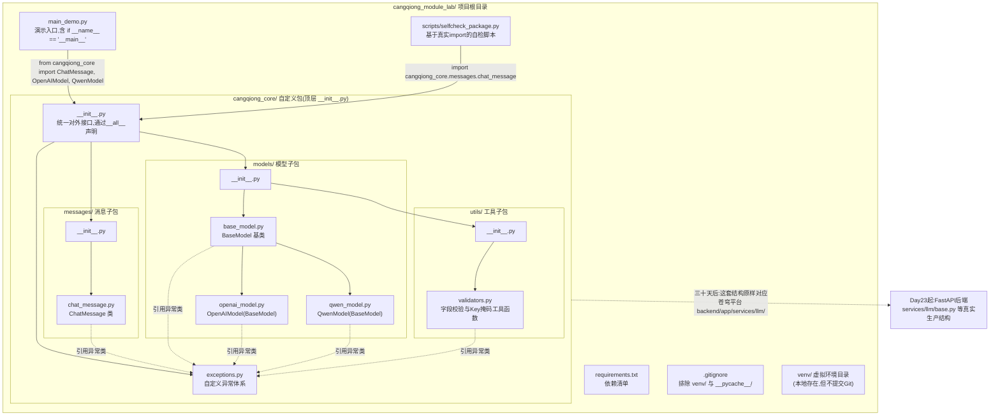
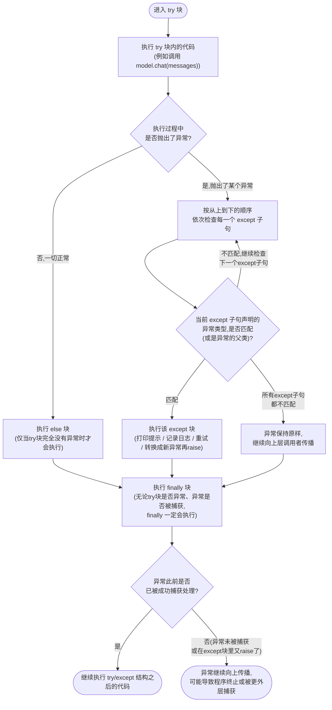
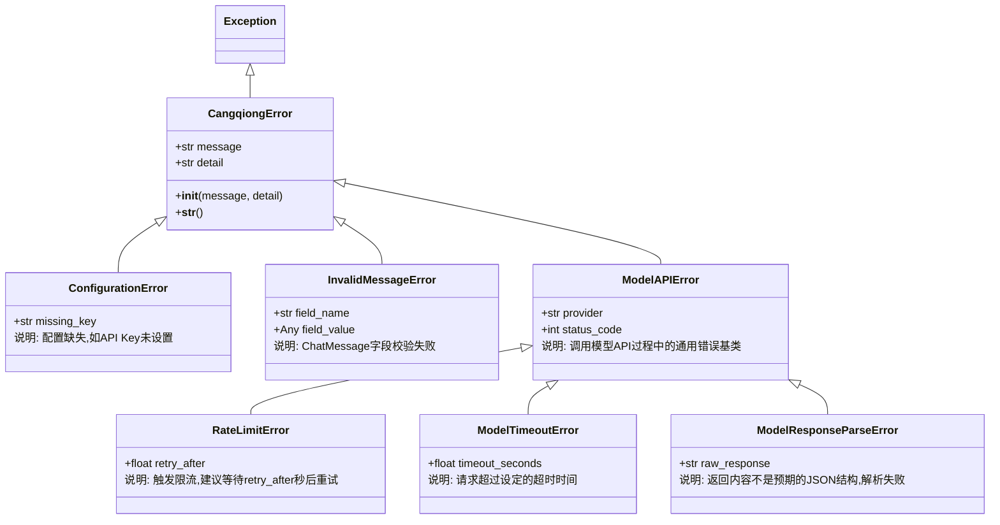

# 第10天 · 模块、包与异常处理

> **周次/Sprint**:Sprint 0 · 新人内训(Day1-14)—— 阶段项目一:命令行多轮对话AI助手(预计Day14交付)
> **星期**:周三(第二周第三天)
> **学员**:陈铭、苏梦、韩露、张凡(导师:王振宇)
> **内训任务卡**:PYXT-ONB-D10(蓬远科技培训中心 · 新人训练营 · Day10)
> **今日关键词**:import机制 / 自定义模块与包 / `if __name__=="__main__"` / try-except-else-finally / 自定义异常体系 / raise / venv与conda / requirements.txt / 工程化拆包

---

## 【旁白】

如果给这七十天的故事画一条"工程意识觉醒曲线",今天大概率会是曲线上第一个明显的拐点。前九天,陈铭一直活在一种"文件即项目"的朴素状态里——不管写什么,新建一个`.py`文件,从上往下把代码写完,能跑就是胜利。这种状态在小项目里毫无问题,但从Day8的`ChatMessage`、Day9的`BaseModel`/`OpenAIModel`/`QwenModel`开始,问题已经在悄悄堆积:三个继承关系密切的类,挤在一个文件里,一个不到两百行的文件已经开始让人翻页找代码时皱眉头。今天要解决的,表面上是"文件怎么摆放"这么一件小事,但真正的分量在于——这是陈铭第一次被要求用"未来这个项目会长多大"的眼光,回头去审视"今天这行代码应该放在哪"。这种眼光,几乎是初级工程师和资深工程师之间最容易被忽视、却最能拉开差距的一道分水岭。

今天还藏着另一条更隐蔽的线——异常处理。老王把它和"拆包"安排在同一天,不是凑巧,是因为这两件事在苍穹平台后续七十天的故事里,会反复以"孪生兄弟"的姿态出现:凡是涉及"调用外部世界"的代码(调API、读文件、连数据库、访问网络),你几乎不可能只写"正常路径",你必须同时写清楚"不正常的时候怎么办"。三天后(Day13),陈铭会给`ask_ai.py`加上一个重试装饰器,那个装饰器的核心逻辑,正是今天学的`try/except`;三十六天后,`ModelAPIError`这个类名会几乎原样出现在苍穹0.1版真正的模型接入层代码里;四十六天后,团队要给Agent系统补齐"完整的可观测性与容错能力",追根溯源,底子正是今天这一天打下的。今天陈铭随手写下的`class RateLimitError(ModelAPIError)`,他自己还不知道,这行代码所代表的思考方式——"提前想清楚会在哪里出错、出了错要以什么姿态告诉调用者"——会在后面六十天里,变成他判断一份代码"是玩具还是产品"的直觉标准之一。

还有一层容易被略过的意义:这是陈铭第一次拥有一个真正意义上的"自己的包"。不是调用别人写好的库,是自己设计一个目录结构,自己写`__init__.py`,自己决定"外面的人应该从哪个入口访问我这堆代码,不应该看到哪些内部细节"。这种"对外接口"和"内部实现"的边界意识,今天还只是一个不起眼的文件夹划分,但这正是三十天后苍穹平台`backend/app/services/llm/`这整套模型接入层目录结构的雏形逻辑,也是六十天后陈铭作为"储备架构师候选人"要向别人讲清楚"这个模块该怎么组织"的最初起点。

---

## 晨会纪要 / 今日目标

**时间**:上午8:51,二层小会议室"起航"
**出席**:王振宇(老王)、陈铭、苏梦、韩露、张凡

老王进门时手里拿着自己的笔记本电脑,没有像往常一样直接打开投影,而是先把电脑转过来,屏幕对着四个人:"昨天(Day9)你们四个的`BaseModel`、`OpenAIModel`、`QwenModel`我都看完了,继承关系、`super()`用得都还行,魔术方法这块,苏梦的`__repr__`写反了用途我在群里说过了,不重复。今天想让你们自己先看一眼——"他点开陈铭提交的文件夹,屏幕上是这样的:

```
day09_homework_chenming/
├── chat_message.py
├── base_model.py
├── openai_model.py
├── qwen_model.py
├── test_models.py
├── test_models_v2.py
├── test_models_final.py
└── demo.py
```

老王没说话,把鼠标悬停在那三个名字几乎一样的测试文件上,画了个圈。张凡先笑出声:"这不就是我昨天干的事吗,写了一版,发现漏了点东西又复制一份接着改。"韩露的文件夹结构也差不多,只是文件名换成了`test1.py`、`test2.py`、`test_ok.py`——她自己念出来的时候都有点不好意思。苏梦最诚实:"我现在打开这四个类的文件,已经要靠文件名一个个数着找了,`base_model.py`里到底有没有`__call__`这个方法,我得点开才知道。"

老王把电脑转回来,开始今天的正式内容:"这是一个特别典型的信号——当你发现自己在同一个文件夹里,靠'加数字''加final''加ok'来区分文件版本的时候,说明这个项目已经到了必须'拆包'的临界点。今天上午,我们不学新的语法概念,先学一件纯粹的工程组织问题——怎么把散落的`.py`文件,变成一个真正意义上的、可以被规范导入使用的Python包。下午,换一个话题,但这两个话题今天放在一起讲不是随便凑的——聊聊`try/except`,聊聊怎么设计自己的异常类。晚自习,补一个环境管理的技能——虚拟环境和`requirements.txt`,这是你们接下来几十天几乎每天都要用到的东西。"

他在白板上写下今天的关键词,顺手用箭头连了一下:"import机制 → 自定义包 → 异常处理 → 虚拟环境",然后转过身补了一句让四个人都愣了一下的话:"提前说清楚一件事——从明天开始,再过一天(Day12),你们就要真正连上大模型的API了。真实的网络请求,和你们今天为止写的所有代码有一个本质区别:它一定会出错。网络会断,服务器会限流,你传的参数会不合法,返回的内容会解析失败。今天学的这套异常处理,不是'万一用得上'的备用技能,是你们能不能在Day12之后写出'不会随手崩溃'的代码的硬性前提。"

**昨天进展(Day9)**:
- 四人均完成`BaseModel`→`OpenAIModel`/`QwenModel`的继承结构,覆盖`super()`、方法重写、`__str__`/`__repr__`/`__call__`、`@property`。
- 苏梦对`__repr__`和`__str__`的适用场景理解有偏差(把`__repr__`写成了给用户看的友好文案),已在群里点评并布置了补充阅读。
- 陈铭、张凡、韩露三人的项目文件都出现了"同名类挤在同一个文件里""靠文件名后缀区分版本"的组织混乱问题,今天上午的拆包练习会直接针对这个问题。

**今日目标**:
1. 上午9:00-12:00:import机制原理、模块与包的区别、`__init__.py`的作用、绝对导入与相对导入、`if __name__=="__main__"`的意义,实操把Day8-9的类拆分成规范的包结构。
2. 下午14:00-17:30:`try/except/else/finally`完整执行逻辑、常见内置异常复习、自定义异常类设计、`raise`与异常链(`raise ... from`),实操设计`cangqiong_core`的异常体系并接入到模型调用逻辑中。
3. 晚自习19:00-21:00:虚拟环境(`venv`为主,`conda`简单对比)的创建与使用、`pip`安装依赖、`requirements.txt`的生成与使用、`.gitignore`中虚拟环境目录的处理。

**风险点**:
- 今天上午最容易踩的坑是路径问题——"包"这个概念比"模块"抽象一层,四人对"从哪里运行代码""当前工作目录是什么"这类基础但容易被忽视的问题普遍薄弱,老王计划用大量现场报错演示来补这一课,而不是纯讲理论。
- 自定义异常这部分,容易出现"为了显得专业,给每一种小情况都发明一个新异常类"的过度设计倾向,老王打算在下午现场纠正这种倾向。
- 晚自习的虚拟环境操作,涉及命令行操作和终端环境切换,对纯新手不算友好,尤其Windows和macOS的激活命令不一样,老王已提前准备好双系统对照的操作单。
- 张凡感冒尚未痛好,老王安排他今天如果状态不佳可适当提前结束晚自习,内容录屏后自学补齐。

---

## 需求文档:内部工具任务书 —— 苍穹核心库(`cangqiong_core`)工程化重构

> 本任务书由技术导师王振宇发放,格式沿用公司内部PRD模板。这是继Day6"五天项目函数化重构"之后,新人训练营第二次面向"代码质量与工程组织"而不是"新功能"发出的正式任务书——在公司真实项目里,这类"技术债务清理"需求同样会走完整的立项、排期、验收流程,不会因为"看起来只是挪文件"就被随意对待。

### 背景

Day8-Day9两天,四位培训生分别设计并实现了`ChatMessage`类(表示一条对话消息)以及`BaseModel`→`OpenAIModel`/`QwenModel`的继承结构(表示对不同大模型厂商API的统一封装)。这几个类,从设计意图上看,正是苍穹平台未来"对话引擎层"和"模型接入层"最早期的雏形练习。但目前的实现方式存在明显的工程组织问题:

1. **所有类挤在少数几个文件里,职责边界模糊**:`ChatMessage`、`BaseModel`、`OpenAIModel`、`QwenModel`可能同时出现在一个文件,或者按"每人各自的习惯"随意拆分,团队之间没有统一约定,协作困难。
2. **缺少统一的对外接口**:如果有人想在自己的脚本里"用一下"这些类,得先弄清楚这些类分别藏在哪个文件里,没有一个清晰的"入口"。
3. **没有异常处理能力**:目前`ChatMessage`不会检查`role`是否合法、`content`是否为空;`OpenAIModel`/`QwenModel`目前只是"假装"调用了API(因为还没到Day12,还不能真连网),但已经能预见到——一旦接上真实网络请求,任何一点风吹草动(网络超时、参数错误、返回格式异常)都会让程序直接崩溃退出,这在真实产品里是不可接受的。
4. **测试代码散落、命名混乱**:如晨会所见,普遍存在`test1.py`、`test_final.py`这类靠文件名维护版本的现象,缺乏规范的模块化测试组织方式。

### 用户故事

- 作为将来要在苍穹项目组协作开发的工程师,我希望团队成员共用同一份`ChatMessage`/`BaseModel`相关代码时,能够通过`import`语句清晰地知道自己在使用谁写的什么功能,而不必打开好几个文件去猜测类定义藏在哪里。
- 作为负责调用大模型API的开发者,我希望在真正接入网络请求(Day12起)之前,提前具备一套"能预见常见错误类型、并能给出清晰错误信息"的异常处理机制,而不是等到线上出错了才手忙脚乱现场加`try/except`。
- 作为需要长期维护这份代码的人,我希望"消息相关的代码"和"模型相关的代码"能分别归入各自的子模块,新增一个新的模型厂商(比如以后要支持GPT-4o或者Claude)时,只需要新增一个文件,不需要改动已有代码。
- 作为初次接触"包"概念的新人,我希望有一次完整的、从零搭建一个规范Python包的实操练习,而不是只停留在"听懂了道理"的层面。
- 作为技术导师,我希望通过这次重构,验证每位培训生是否已经具备"给一份逐渐变大的代码库做合理的模块划分"的基础工程能力,这项能力会在接下来几十天的每一个项目里反复被用到。

### 功能列表

| 编号 | 功能 | 说明 | 优先级 |
|---|---|---|---|
| F1 | 包结构搭建 | 创建`cangqiong_core`包,内含`messages`、`models`、`utils`三个子包及顶层`exceptions.py` | P0(必须实现) |
| F2 | `ChatMessage`迁移与增强 | 迁移到`cangqiong_core/messages/chat_message.py`,新增角色与内容合法性校验,校验失败抛出自定义异常 | P0 |
| F3 | 模型类迁移与增强 | `BaseModel`/`OpenAIModel`/`QwenModel`迁移到`cangqiong_core/models/`,新增消息合法性校验与模拟调用中的异常抛出逻辑 | P0 |
| F4 | 自定义异常体系 | 设计至少6个语义清晰的异常类,覆盖"配置错误""消息格式错误""模型API错误"及其细分情形(限流/超时/解析失败) | P0 |
| F5 | 统一对外接口 | 在包的`__init__.py`中通过`__all__`明确声明外部应该能直接`from cangqiong_core import ...`访问的内容 | P0 |
| F6 | 演示脚本 | 编写`main_demo.py`,通过`if __name__=="__main__"`守卫,演示完整的`try/except/else/finally`调用流程 | P0 |
| F7 | 自检脚本 | 编写基于真实`import`的自检脚本,验证包内各模块功能正确,替代Day7那种"本地复制逻辑"的自检方式 | P1(增强功能) |
| F8 | 虚拟环境与依赖清单 | 为项目创建独立的`venv`虚拟环境,产出`requirements.txt`,并在`.gitignore`中正确处理虚拟环境目录 | P0 |

### 非功能需求

- **可维护性**:任意一个类的实现细节发生变化,不应该要求调用方修改自己的`import`语句(即对外接口要保持相对稳定)。
- **健壮性**:任何可预见的"用户误用"场景(非法角色、空消息内容、缺失API Key)都应该抛出语义清晰的自定义异常,而不是让程序抛出难以理解的内置异常或者直接崩溃。
- **可测试性**:重构后的包必须能够被其他脚本正常`import`并调用,不依赖当前工作目录的巧合摆放(即不能出现"只有在某个特定文件夹下运行才能找到模块"这种脆弱依赖)。
- **环境隔离**:项目依赖必须记录在`requirements.txt`中,虚拟环境目录不能提交到Git仓库。
- **代码规范**:延续团队一贯要求——变量与函数命名清晰、每个类和函数配中文docstring、关键设计决策有行内注释说明"为什么这么做"。

### 验收标准

1. 在项目根目录下,能够通过`python main_demo.py`正常运行演示脚本,不因路径问题报`ModuleNotFoundError`。
2. `ChatMessage`在传入非法`role`(不在`system`/`user`/`assistant`三者之列)或空`content`时,应抛出`InvalidMessageError`,且错误信息中包含具体是哪个字段出了问题。
3. `OpenAIModel`/`QwenModel`的模拟调用逻辑中,至少能够触发`RateLimitError`、`ModelTimeoutError`两种细分异常场景,且演示脚本能够分别捕获处理,不会导致程序中断。
4. 自定义异常类之间的继承关系合理——所有异常最终都能被同一个基类捕获,细分异常又能被单独精确捕获。
5. 项目能够在一个干净创建的虚拟环境中,仅通过`pip install -r requirements.txt`就恢复出运行所需的全部依赖。
6. 代码中不存在"靠文件名后缀区分版本"的历史遗留文件,`git status`应该体现的是"重构提交",而不是新增一堆平行文件。
7. `main_demo.py`中至少完整体现一次`try/except/else/finally`四个子句都被用到的调用逻辑,并在代码注释里说明每个子句各自的执行时机。

老王发布任务书时补了一句:"这份任务书上写的'验收标准第6条'——不允许出现靠文件名区分版本的历史遗留文件——是我今天故意加进去的,你们四个人的文件夹刚好人均命中这个问题,拿自己的错误当反面教材,记忆最深。"

---

## 架构设计图:`cangqiong_core`拆包后的目录结构关系图

老王要求四人在动手写代码之前,先把"包拆成什么样"画出来,而不是一边写一边随手决定文件怎么摆。他在白板上先画了个简化版本,又补充说这次要用Mermaid把它画完整,方便存档到项目文档里。



老王讲解这张图的时候,专门停在"`messages/`和`models/`分别是两个子包"这一点上:"你们注意,这不是把文件从一个文件夹挪到另一个文件夹这么简单——`messages`子包和`models`子包之间,理论上应该尽量减少互相依赖,`ChatMessage`不需要知道`BaseModel`长什么样,`BaseModel`需要用到`ChatMessage`(因为它要接收消息列表),但这是单向的依赖,不能反过来。如果你发现`messages`里的代码需要`import`模型相关的东西,这基本就是设计出了问题的信号。"

苏梦指着图上那条从`PKG`指向`FUTURE`的虚线问:"这个是不是就是说,我们今天搭的这个结构,以后会原样变成苍穹平台真正的代码?"老王点头:"结构上是的,细节上会更复杂——真正的`services/llm/`下面还会有`router.py`做多模型路由,还会有真正的网络请求逻辑、超时配置、日志上报。但今天你们建立的这种'子包按职责划分、异常单独收纳一处、对外接口通过`__init__.py`统一暴露'的思路,十三天后(Day23)你们写FastAPI后端的时候,会发现这套思路完全没有变过,变的只是每个模块内部具体装了什么。"

---

## 流程图:`try/except/else/finally`执行流程图

架构图讲的是"代码怎么摆放",这张流程图讲的是"一段带异常处理的代码,运行的时候到底走了哪几步"。老王特意强调这张图要画成能覆盖四个子句全部组合情况的样子,而不是只画"正常"和"报错"两条路。



老王画完这张图,先让四人自己口头复述一遍每一条分支的意思,再补充了几个容易被忽视的细节:"第一个容易搞错的点——`else`不是'兜底万能盖子',它只在`try`块**完全没有异常**的时候才执行,如果你以为它是'不管怎样都会走一次'的意思,那和`finally`搞混了,这是我见过最常见的误解之一。第二个容易搞错的点——`finally`块即使在异常已经被`except`捕获、甚至`except`块内部又重新`raise`了新异常的情况下,依然会先执行完,才会真正把这个新异常抛出去。这意味着`finally`天然适合放'无论发生什么都必须做的收尾动作'——比如关闭一个网络连接、释放一个文件句柄,而不适合放可能失败的业务逻辑。"

张凡问了一句相当直接的问题:"如果`except`匹配上了,里面的代码又出了新的异常,这个新异常会被下面的`except`接住吗?"老王摇头:"不会。`except`块内部一旦又抛出新异常,这个新异常不会被同一组`try`语句下面的其他`except`子句接住,它会直接被'扔到外面去',除非外面还有更大的一层`try/except`在等着它。这也是为什么在`except`块里做'转换成自定义异常再抛出'这种操作时,通常要用`raise ... from`,把原始异常的信息保留下来,而不是把它悄悄吞掉。"

---

## 示意图:自定义异常类继承体系示意图

第三张图,老王换成了`classDiagram`,专门讲"苍穹核心库要设计一套什么样的异常继承关系"。他强调这张图不是讲流程,是讲"分类"——异常和异常之间,谁是谁的"细分情况",谁又能作为"统一收口"的角色。



老王讲这张图的时候,用了一个跟"看病"有关的类比:"你可以把`Exception`想象成'人生病了'这个最泛的概念,`CangqiongError`是'和苍穹系统有关的病',再往下,`ModelAPIError`是'调用模型API这个环节得的病',而`RateLimitError`、`ModelTimeoutError`、`ModelResponseParseError`,是这个环节里三种具体的'病症'。你写代码的时候,可以选择'只治某一种具体病症'(单独`except RateLimitError`),也可以选择'管它是这个环节里哪种病,先兜底处理'(`except ModelAPIError`),甚至可以'只要是苍穹系统相关的病,我都想兜底'(`except CangqiongError`)。这种分层设计的好处是——你既能精细地对症下药,也随时能选择'退一步,粗粒度地兜底',这个自由度,是自定义异常继承体系存在的核心意义。"

韩露提了一个很实际的问题:"那是不是异常类分得越细越好?比如`RateLimitError`还可以细分成'按秒限流'和'按天限流'两种?"老王摆手:"过度设计的坑我们下午细讲,这里先说结论——异常类的细分程度,应该以'调用者拿到这个异常之后,处理方式是否真的不同'为标准。如果两种情况你的处理代码完全一样,细分出两个类只会增加维护成本,没有实际收益。"

---

## 课堂笔记

### 上午:import机制与创建自己的模块和包

**9:00,培训室**

老王没有直接讲"包"要怎么建,而是先从一个更基础的问题切入:"你们这九天写的每一个`.py`文件,运行的时候,Python到底是怎么找到你`import`的那些东西的?"他打开一个新的空文件,先写了一行最简单的代码:

```python
import json
print(json.__file__)
```

运行之后,屏幕上打印出了一长串路径,类似`/usr/lib/python3.11/json/__init__.py`(具体路径因人而异)。老王解释:"`import json`这句话执行的时候,Python并不是凭空知道`json`在哪,它是按照一份清单——`sys.path`——从头到尾去找,找到第一个名字匹配的模块就用它,后面即使还有同名的也不会再管。"他接着敲了几行代码演示`sys.path`到底是什么:

```python
import sys
for path in sys.path:
    print(path)
```

打印出来的是一串目录路径,大致包括:当前脚本所在的目录、Python安装自带的标准库目录、通过`pip`安装的第三方库存放目录(`site-packages`)。老王强调:"注意第一条,几乎总是'当前脚本所在的目录'。这个细节非常重要——很多`ModuleNotFoundError`的报错,根源都不是'包没装',而是'当前脚本所在的目录,跟你以为的目录不是一回事'。"

#### 模块 vs 包:一个文件 vs 一个文件夹

老王先给"模块"(module)和"包"(package)两个概念下了一个不绕弯子的定义:"一个`.py`文件,就是一个模块。一个包含了`__init__.py`文件的文件夹,就是一个包——包本质上是'模块的文件夹',它的存在是为了在项目变大之后,把相关的模块组织在一起,同时对外提供一个统一的名字。"

他现场演示了从"一个文件"到"一个包"的最小变化过程。第一步,普通模块:

```
project/
├── main.py
└── greetings.py
```

```python
# greetings.py
def say_hello(name):
    """向指定的人问好"""
    return f"你好,{name}!"
```

```python
# main.py
import greetings

print(greetings.say_hello("陈铭"))
```

这一步大家都很熟——这正是Day6重构以来一直在用的用法。老王接着把`greetings.py`升级成一个包:

```
project/
├── main.py
└── greetings/
    ├── __init__.py
    └── chinese.py
```

```python
# greetings/chinese.py
def say_hello(name):
    """用中文向指定的人问好"""
    return f"你好,{name}!"
```

```python
# greetings/__init__.py
# __init__.py 可以是空文件,只要它存在,Python就会把这个文件夹当成一个包。
# 但更常见、更规范的做法,是在这里做"聚合导出"——
# 把子模块里的核心内容,提前导入到包的顶层,方便外部使用时少写一层路径。
from .chinese import say_hello
```

```python
# main.py
import greetings

print(greetings.say_hello("陈铭"))
```

老王指着这两版代码说:"你们发现了吗?`main.py`里的代码,一个字都没有改变。这正是'包'这个概念存在的意义之一——它让内部的组织方式可以随意演化,只要`__init__.py`里做好了聚合导出,外部调用方完全感觉不到内部结构发生了变化。"

陈铭问了一个很关键的问题:"那`__init__.py`那一行`from .chinese import say_hello`,前面那个点是什么意思?"老王说:"这个点,叫'相对导入'的写法,表示'从当前这个包内部的`chinese`模块'导入,而不是从`sys.path`里去找一个叫`chinese`的顶层模块。相对导入只能在包内部使用,不能在顶层脚本里用,这是新手最容易踩的一个坎,我们马上会专门讲。"

#### 绝对导入 vs 相对导入

老王把这部分讲得比较细,因为这正是四个人今天上午重构`cangqiong_core`时最容易踩坑的地方。他给出了两种写法的对比:

```python
# 绝对导入:从项目根目录开始,写出完整的包路径
from cangqiong_core.messages.chat_message import ChatMessage
from cangqiong_core.exceptions import InvalidMessageError

# 相对导入:只在包内部使用,以当前模块的位置为基准,用点号表示层级
# 一个点表示"当前包",两个点表示"上一级包"
from . import exceptions
from .. import exceptions  # 如果当前模块在更深一层的子包里
from .chat_message import ChatMessage
```

"团队规范是这样的,"老王补充道,"包内部模块之间互相引用,优先用相对导入,这样即便以后整个包被改名或者移动位置,内部的引用关系不用跟着改;但如果是从包外部(比如你的`main_demo.py`,它本身不属于这个包)去使用这个包里的东西,必须用绝对导入,因为脚本本身就不在包里,写相对导入的点号没有意义,而且会直接报错。"

他现场敲了一段错误示范,让大家亲眼看看相对导入用错位置会发生什么:

```python
# 假设这是main_demo.py,在项目根目录,不属于cangqiong_core包
from .cangqiong_core import ChatMessage
```

运行结果:

```
ImportError: attempted relative import with no known parent package
```

"这条报错信息其实已经把话说得很明白了——`attempted relative import with no known parent package`,意思是'你想用相对导入,但当前这个文件根本不属于任何一个包,没有"父包"这个概念可以参照'。看到这条报错,第一反应应该是——检查这一行是不是把相对导入用在了不该用的地方,而不是去怀疑`cangqiong_core`包本身写错了。"

#### `if __name__ == "__main__"`:模块的两种身份

这是上午的另一个核心知识点,老王决定用一个"角色扮演"式的演示来讲清楚——同一段代码,"被直接运行"和"被别人import"是两种完全不同的身份。他先写了一个小模块:

```python
# demo_identity.py
print(f"这个模块的 __name__ 变量,现在的值是:{__name__}")


def greet():
    print("greet() 函数被调用了")


if __name__ == "__main__":
    print("我是被直接运行的,进入主程序逻辑")
    greet()
else:
    print("我是被别人 import 进去的,不会自动执行主程序逻辑")
```

第一次,直接运行这个文件:`python demo_identity.py`,输出:

```
这个模块的 __name__ 变量,现在的值是:__main__
我是被直接运行的,进入主程序逻辑
greet() 函数被调用了
```

第二次,写一个新文件`use_demo.py`去`import`它:

```python
# use_demo.py
import demo_identity

print("---分割线---")
demo_identity.greet()
```

运行`python use_demo.py`,输出:

```
这个模块的 __name__ 变量,现在的值是:demo_identity
我是被别人 import 进去的,不会自动执行主程序逻辑
---分割线---
greet() 函数被调用了
```

老王指着两次不同的输出说:"关键区别就在这一行——直接运行的时候,`__name__`的值是字符串`'__main__'`;被别人`import`的时候,`__name__`的值变成了这个模块自己的名字`'demo_identity'`。`if __name__ == '__main__':`这句话,本质上是在问'我现在是不是被当成主程序直接执行的?',如果是,才执行`if`里面的内容;如果只是被别人当工具箱`import`进去借用几个函数,就不会跑这段逻辑。"

他补充了这个写法真正的价值:"你们从Day7`contacts_manager.py`那一行`if __name__ == '__main__': main()`起就已经在用这个写法了,但那时候我只让你们'先照着抄',今天补上原理。它的核心价值是——让一个`.py`文件同时具备两种能力:既可以被直接运行,产生实际的交互效果;也可以被当作一个纯粹的'工具箱'被别人`import`,只借用里面定义的函数和类,不触发任何'运行时才该发生'的副作用(比如打印欢迎语、启动交互式菜单)。你们今天要写的`chat_message.py`、`base_model.py`这些文件,理论上是不会被直接运行的,它们是'纯粹的工具箱',只有`main_demo.py`这个真正的入口文件,才需要`if __name__ == '__main__':`。"

#### 现场拆包实操:从"一堆文件"到`cangqiong_core`

理论讲完,老王把上午剩下的时间留给四人自己动手,把Day8-9的代码重新组织成规范的包结构。他给出了统一的目标结构(与架构图一致),要求大家先手动创建文件夹和空文件,再一步步把代码搬进去。

陈铭动手的第一步,是新建文件夹,写空的`__init__.py`。他试着最先运行一次`main_demo.py`,结果立刻报错:

```
ModuleNotFoundError: No module named 'cangqiong_core'
```

他检查了半天,发现文件夹结构完全正确,`cangqiong_core/__init__.py`也确实存在。带着这个疑惑去问老王,老王先问了一句:"你现在是在哪个目录下执行`python main_demo.py`这条命令的?"陈铭一看,自己是在`cangqiong_module_lab/scripts/`这个子目录里执行的,而不是项目根目录。老王点头:"这就是我一开始讲`sys.path`时提到的那条'当前脚本所在目录会自动加入`sys.path`'——但注意,它加的是'脚本所在目录',不是'你执行命令时所在的终端目录',这两者经常被搞混。你现在在`scripts/`目录下执行,Python去`scripts/`目录里找`cangqiong_core`,自然找不到,因为`cangqiong_core`和`scripts/`是平级的,不在它下面。"

解决方式老王给了两种:"最简单的做法——把终端切换到项目根目录再执行`python main_demo.py`(因为`main_demo.py`就摆在根目录);如果确实需要在子目录里执行子脚本,又想让它能找到根目录下的包,你需要用更规范的方式运行,比如`python -m scripts.selfcheck_package`,用`-m`参数告诉Python'把这个当成一个模块来运行,按包路径解析',而不是简单粗暴地当成一个独立文件运行。"

苏梦紧接着遇到了另一个报错,她在`models/openai_model.py`里写`from base_model import BaseModel`,运行时报错:

```
ModuleNotFoundError: No module named 'base_model'
```

老王一看就知道问题所在:"你这行没用相对导入,写成了绝对导入的写法,但`base_model`根本不是一个能从`sys.path`直接找到的顶层模块名,它是`cangqiong_core.models`包内部的一个模块。这里要写`from .base_model import BaseModel`,加上那个点。"苏梦改完重新运行,又冒出一个新报错:

```
ImportError: attempted relative import with no known parent package
```

老王笑了:"你这次是直接运行`openai_model.py`这个文件本身来测试的对不对?"苏梦点头。"这就是我刚才讲的——相对导入只有在这个模块**是被作为包的一部分被import进来时**才有意义。你直接单独运行`openai_model.py`,Python会把它当成顶层脚本,而不是`cangqiong_core.models`包里的一员,这时候它内部的相对导入就成了'无根之木'。正确的验证方式是——不要直接运行子模块,而是运行`main_demo.py`,让它通过正常的包路径去`import`这些子模块。"

张凡的问题出在循环导入上——他一开始尝试让`exceptions.py`里的某个异常类去`import``chat_message.py`里的一个校验函数(用来复用逻辑),而`chat_message.py`本身又需要`import``exceptions.py`来使用异常类。运行时报错:

```
ImportError: cannot import name 'ChatMessage' from partially initialized module
'cangqiong_core.messages.chat_message' (most likely due to a circular import)
```

老王指着这条报错说:"这条报错信息里其实已经点破了原因——`circular import`,循环导入。A模块导入的时候需要B模块的内容,但B模块还没执行完(它正卡在导入A模块这一步),Python这时候手里拿到的B,是一个'还没准备好'的半成品模块,自然找不到你要的东西。解决思路很直接——异常类应该是整个包里'最底层'的存在,它不应该反过来依赖任何业务模块;`exceptions.py`可以被所有人`import`,但`exceptions.py`自己不应该`import`除了Python标准库之外的任何东西。"

#### `__init__.py`的作用与`__all__`

四人各自把类迁移完毕后,老王把大家重新召集回来,讲`__init__.py`更完整的用法——尤其是`__all__`这个约定。

```python
# cangqiong_core/__init__.py
"""
苍穹核心库(教学版):对话消息与多模型接入的基础封装。
本包是苍穹平台"对话引擎层"与"模型接入层"最早期的雏形练习,
从Day10起以规范的Python包形式组织,后续新增厂商模型接入时,
只需要在 models/ 子包内新增文件,不需要改动已有代码。
"""

from .exceptions import (
    CangqiongError,
    ConfigurationError,
    InvalidMessageError,
    ModelAPIError,
    RateLimitError,
    ModelTimeoutError,
    ModelResponseParseError,
)
from .messages.chat_message import ChatMessage
from .models.base_model import BaseModel
from .models.openai_model import OpenAIModel
from .models.qwen_model import QwenModel

# __all__ 是一个团队约定,声明"使用 from cangqiong_core import *
# 这种写法时,应该导出哪些名字"。它同时还有另一层更重要的实际价值——
# 明确地告诉阅读代码的人:这个包对外承诺提供的正式接口,就是这个列表里的内容,
# 列表之外的东西属于内部实现细节,外部代码不应该依赖它们。
__all__ = [
    "ChatMessage",
    "BaseModel",
    "OpenAIModel",
    "QwenModel",
    "CangqiongError",
    "ConfigurationError",
    "InvalidMessageError",
    "ModelAPIError",
    "RateLimitError",
    "ModelTimeoutError",
    "ModelResponseParseError",
]

__version__ = "0.1.0"
```

老王解释`__all__`的意义:"这不是语法强制的东西——就算不写`__all__`,`from cangqiong_core import ChatMessage`照样能用。但写清楚`__all__`,是一种'对外承诺',相当于告诉团队里其他人:'这几个名字,我保证长期稳定,你可以放心用;没写在这里的,算内部细节,我随时可能改,你不该依赖它'。这是团队协作里非常重要的一种'契约意识',苍穹平台后端的每一个`services`子模块,`__init__.py`里都会有一份这样的清单。"

韩露提出一个问题:"如果我不写`__all__`,直接`from cangqiong_core import *`,会发生什么?"老王的回答带着点警告的意味:"会把这个包里所有'看起来是公开的'名字(不以下划线开头的)全部导入进来,包括你原本没打算暴露的东西,容易造成命名冲突,而且看代码的人完全不知道你到底用了这个包里的哪些东西。所以团队规范上,我们基本禁止在正式项目代码里使用`import *`这种写法,`__all__`更多是一种自我约束和文档化的手段,不是鼓励大家真的去用`*`导入。"

#### 上午小结表

老王在上午结束前,把知识点归纳成一张对照表,发到群里:

| 概念 | 一句话说明 | 常见报错 |
|---|---|---|
| 模块(module) | 一个`.py`文件 | - |
| 包(package) | 含有`__init__.py`的文件夹 | - |
| `sys.path` | Python查找模块的目录清单,第一条通常是当前脚本所在目录 | `ModuleNotFoundError` |
| 绝对导入 | 从项目根目录起写完整包路径,适用于跨包引用 | `ModuleNotFoundError` |
| 相对导入 | 用点号表示层级,只能在包内部使用 | `ImportError: attempted relative import with no known parent package` |
| 循环导入 | 两个模块互相依赖对方,谁都无法先"准备好" | `ImportError: cannot import name '...' (most likely due to a circular import)` |
| `if __name__ == "__main__"` | 区分"被直接运行"与"被当工具箱import" | - |
| `__all__` | 声明包对外的正式接口清单 | - |

#### 上午答疑:几个反复被问到的问题

上午收尾前,老王把四人在动手拆包过程中零零散散提出的、没有归到具体某个人名下的问题,集中整理成一份FAQ,发到了群里,算是给这次实操留一份可以随时回头查的"急救手册":

1. **问:一个文件夹里没有`__init__.py`,是不是就完全不能被`import`?**
   答:视Python版本而定。较老版本(Python 3.3之前)确实要求必须有`__init__.py`才能被当成包识别;从Python 3.3开始引入了"命名空间包"(namespace package)的概念,理论上没有`__init__.py`的文件夹在某些场景下也能被识别成包。但团队规范上,不管技术上是否"能不能",一律要求每个包目录下都显式写一个`__init__.py`(即使内容是空的),原因很简单——显式写出来,任何人打开项目一眼就能看出"这是一个包",不需要去纠结"这个版本的Python算不算它是包",可读性和确定性优先于炫技式地利用语言特性的边界情况。

2. **问:`__init__.py`里写的聚合导出(比如`from .chat_message import ChatMessage`),是不是意味着这个文件里的代码,在整个包第一次被`import`的时候就会被执行一次?**
   答:是的,这一点容易被忽视但很重要。第一次`import cangqiong_core`(或者它的任意一个子模块)时,Python会先执行`cangqiong_core/__init__.py`里的全部代码,再继续往下解析你真正要的那个子模块。如果`__init__.py`里写了耗时的初始化逻辑(比如建立数据库连接、加载一个很大的模型文件),这个耗时会发生在"包第一次被引用"的那一刻,而不是"某个具体函数被调用"的那一刻。这也是为什么团队规范上,`__init__.py`只允许写"导入与聚合导出"这类轻量级的代码,不允许在里面写真正的重业务逻辑。

3. **问:如果两个不同的包,里面都有一个叫`utils.py`的模块,会互相冲突吗?**
   答:不会冲突,只要它们各自归属于不同的包(比如`cangqiong_core.utils`和`some_other_package.utils`),因为完整的模块路径是不一样的,Python靠这条完整路径区分它们,不是只看最后那一段名字。这正是"包"存在的另一层价值——它天然地帮所有模块加上了一层"命名空间"的保护,避免了不同项目、不同团队各自随手起的模块名互相"撞车"。

4. **问:为什么`exceptions.py`不放进`messages/`或者`models/`任何一个子包里,而是单独摆在`cangqiong_core`的顶层?**
   答:这正是架构设计图里特意强调的一点——`exceptions.py`要被`messages`、`models`、`utils`这几个平级的子包共同依赖,如果把它塞进任何一个具体的子包内部,就会造成"平级的子包之间反而互相依赖"这种不合理的关系(比如`models`要用`messages`里的异常类,就得反过来`import messages`,而`messages`本身理论上不该关心`models`存不存在)。把公共依赖的东西放在更"上层"、更"中立"的位置,是拆分包结构时一个通用的经验法则。

5. **问:如果以后要新增一个`ClaudeModel`(对接Anthropic的Claude API,苍穹平台预算充足时的备选项),需要改动哪些已有文件?**
   答:理论上只需要新增一个文件`cangqiong_core/models/claude_model.py`,写一个继承自`BaseModel`的新类,再在`cangqiong_core/models/__init__.py`和`cangqiong_core/__init__.py`里各加一行导出,不需要改动`base_model.py`、`openai_model.py`、`qwen_model.py`里任何一行已有的代码。这正是今天拆包、以及Day9继承结构真正的收益所在——"新增能力不改旧代码",这句话听起来像是套话,但今天亲手体会一次"只需要加文件,不需要改文件"的过程,比听十遍这句话都管用。

---

### 下午:try/except/else/finally与自定义异常体系

**14:00,培训室**

午饭后老王没有立刻回到"包"的话题,而是先在白板上写了一句话:"调API一定会出错,你得学会不崩溃。"他解释:"这句话不是危言耸乓——两天后你们连上真实的DeepSeek或者通义千问API,一定会遇到网络超时、Key配置错误、请求参数不合法、服务器返回异常内容。今天下午我们要做的,就是提前把'出错了怎么办'这件事想清楚,而不是等真出错了再手忙脚乱现场补。"

#### 从一个真实报错说起

老王没有先讲语法,而是先让大家看一段"注定会崩"的代码:

```python
def get_average_score(scores):
    """计算分数列表的平均值"""
    total = sum(scores)
    return total / len(scores)


print(get_average_score([]))
```

运行结果:

```
Traceback (most recent call last):
  File "demo.py", line 6, in <module>
    print(get_average_score([]))
  File "demo.py", line 3, in get_average_score
    return total / len(scores)
ZeroDivisionError: division by zero
```

老王指着这段Traceback说:"你们现在应该已经对这种报错不陌生了(Day7周测第4题考过一次类似的坑),今天要讲的是——除了'提前用`if`判断'这种防御性写法之外,Python给了我们另一套专门用来'应对意外情况'的语法结构,叫异常处理。"他把代码改成这样:

```python
def get_average_score(scores):
    """计算分数列表的平均值,对空列表做异常处理"""
    try:
        total = sum(scores)
        return total / len(scores)
    except ZeroDivisionError:
        print("警告:传入的分数列表为空,无法计算平均值,返回0作为默认值。")
        return 0


print(get_average_score([]))       # 输出: 警告信息, 然后 0
print(get_average_score([80, 90])) # 输出: 85.0
```

"这两种写法(`if`判断和`try/except`)在这个简单例子里效果差不多,"老王说,"但它们背后的思路是不一样的——`if`判断,是'我提前想到了这种情况,主动检查一下';`try/except`,是'我承认自己不一定能提前想全所有的意外,先让代码尝试执行,出了问题再统一兜底处理'。当'可能出错的原因'非常多、非常复杂,或者错误来自你完全无法控制的外部系统(比如网络、别人的服务器)时,`try/except`几乎是唯一现实的选择——你不可能提前用`if`穷举网络会以多少种姿势断掉。"

#### `try/except/else/finally`四个子句逐一拆解

老王让大家先看一段"全家桶"式的示例,四个子句都出现,便于对照流程图理解:

```python
def divide_numbers(a, b):
    """
    演示 try/except/else/finally 完整用法的除法函数。
    :param a: 被除数
    :param b: 除数
    :return: 除法结果,如果除数为0则返回None
    """
    print(f"准备计算 {a} / {b}")
    try:
        result = a / b
    except ZeroDivisionError:
        # except:当try块内确实抛出了异常,且异常类型匹配时执行
        print("捕获到异常:除数不能为0")
        result = None
    else:
        # else:仅当try块完全没有抛出异常时执行
        print(f"计算成功,结果是 {result}")
    finally:
        # finally:无论前面发生了什么,一定会执行这一段
        print("本次计算流程结束(无论成功还是失败都会打印这一行)")

    return result


print(divide_numbers(10, 2))
print("---")
print(divide_numbers(10, 0))
```

运行输出:

```
准备计算 10 / 2
计算成功,结果是 5.0
本次计算流程结束(无论成功还是失败都会打印这一行)
5.0
---
准备计算 10 / 0
捕获到异常:除数不能为0
本次计算流程结束(无论成功还是失败都会打印这一行)
None
```

老王让大家逐行对照流程图看这段输出:"第一次调用,`try`块正常执行完(没有异常),所以走了`else`,`except`完全没有被执行;第二次调用,`try`块抛出了`ZeroDivisionError`,匹配上了`except`子句,`else`被跳过,直接进了`except`。但你们注意,两次调用,`finally`都执行了——这就是`finally`'无论如何都会跑一次'的含义。"

他特别提醒了`else`最容易被误解的一点:"很多人(包括我当年刚学的时候)会以为`else`是'except没被触发的时候才走',这句话表面上没错,但容易被理解成'`else`和`finally`是一回事,只是没抓到异常的时候走一下'——这是错的。`else`和`finally`的本质区别是:`else`只在**完全没有异常**时执行,一旦异常发生(不管有没有被捕获),`else`都不会执行;`finally`则是不论异常有没有发生、有没有被捕获,永远都会执行一次。这是两个完全不同定位的子句,不要混着理解。"

#### 多个`except`子句与匹配顺序

老王接着讲一个真实场景会遇到的问题——一段代码可能会抛出好几种不同类型的异常,怎么分别处理:

```python
def load_config_value(config, key):
    """
    从配置字典中安全地读取一个整数配置项。
    演示多个except子句的顺序匹配规则。
    :param config: 配置字典
    :param key: 要读取的键
    :return: 转换成整数后的配置值
    """
    try:
        raw_value = config[key]
        return int(raw_value)
    except KeyError:
        print(f"配置项'{key}'不存在,请检查配置文件。")
        raise  # 重新抛出原始异常,让调用者知道这是一个必须处理的严重问题
    except ValueError:
        print(f"配置项'{key}'的值不是合法的整数,请检查配置文件内容。")
        return None
    except Exception as e:
        # 兜底子句,放在最后,捕获所有前面没有明确列出的异常类型
        print(f"读取配置项'{key}'时发生了未预期的错误:{type(e).__name__}: {e}")
        return None
```

老王强调了两个关键规则:"第一,`except`子句是按从上到下的顺序依次匹配的,一旦某一条匹配上了,后面的子句就不会再被检查,所以**更具体的异常类型要写在前面,更宽泛的异常类型(比如`Exception`)要写在最后**,顺序反了,具体的异常永远会被前面宽泛的那条截胡,永远走不到该走的那一条分支。"

他现场演示了顺序写反的后果:

```python
try:
    raise ValueError("这是一个具体的错误")
except Exception:
    print("走了宽泛的Exception分支")
except ValueError:
    print("走了具体的ValueError分支")
```

运行结果:

```
走了宽泛的Exception分支
```

"看到了吗?`ValueError`是`Exception`的子类,写在`Exception`后面的`except ValueError`永远没有机会被执行到,因为前一条早就把它接住了。这种bug非常隐蔽,因为代码本身不会报语法错误,程序也照常运行,只是行为跟你以为的不一样,排查起来会让人很头疼。"

第二个规则,他讲的是`except Exception as e`里的`raise`(不带任何参数,单独一个`raise`)的用法:"单独写`raise`,意思是'把刚刚捕获到的这个异常原样重新抛出去',常用在'我需要在这里做一点记录或提示,但这个异常本身还是应该让更外层的代码知道、去做进一步处理'的场景。区别于`raise SomeError(...)`这种抛出一个全新异常的写法。"

#### 什么时候该自定义异常,而不是用内置异常

讲完基础语法,老王把话题引回今天的核心场景——设计`cangqiong_core`的异常体系。他先问了一个问题:"Python内置异常已经有`ValueError`、`TypeError`、`KeyError`这些,为什么苍穹平台的代码里,还要专门定义`InvalidMessageError`、`ModelAPIError`这些'新'异常?直接用内置的行不行?"

苏梦答:"是不是因为内置异常的名字太通用了,看名字猜不出来具体是哪个业务环节出的问题?"老王点头:"这是第一层理由。你想象一下,苍穹平台的代码里,可能同时有几十个地方会抛出`ValueError`——参数校验的地方会抛,日期解析的地方会抛,数字转换的地方也会抛。如果调用方想'专门处理模型API调用失败的情况',用`except ValueError`根本没法精确定位,会把跟模型调用完全无关的其他`ValueError`也一起捞进来。"

他补充了第二层理由:"自定义异常还有一个内置异常做不到的优势——你可以往异常对象里塞更多'结构化的额外信息'。比如`RateLimitError`,你不仅想告诉调用者'触发限流了',你还想告诉他'建议等多少秒后重试'——这个'多少秒'如果只靠一句文字描述塞进错误信息里,调用者的代码还得用字符串解析去把这个数字'抠'出来,非常笨拙。自定义异常类可以直接定义一个`retry_after`属性,调用者拿到异常对象之后,直接`error.retry_after`就能拿到这个数值,干净得多。"

他给出了一个对比示例:

```python
# 反面例子:所有信息都塞进一句文字描述里,调用方很难精确利用
raise ValueError(f"触发限流,请在35.5秒后重试")

# 正面例子:用结构化的自定义异常携带信息
class RateLimitError(Exception):
    def __init__(self, message, retry_after):
        super().__init__(message)
        self.retry_after = retry_after  # 调用方可以直接读取这个数值型属性


try:
    raise RateLimitError("触发限流", retry_after=35.5)
except RateLimitError as e:
    print(f"稍等一下,{e.retry_after}秒之后再试试。")
    # 调用方可以直接拿 e.retry_after 去做 time.sleep(e.retry_after) 之类的真实操作
```

"第二种写法,"老王总结,"调用方拿到异常之后,不需要再去解析文字、猜测数字在哪个位置,可以直接对着一个明确的属性名写代码,这是自定义异常真正的工程价值,不是为了'显得专业'而故意多此一举。"

#### 防止"过度设计"的异常体系

呼应示意图部分韩露提出的问题,老王专门讲了怎么判断"该不该细分出一个新的异常类"。他给出一个简单的判断标准:"问自己一句话——**调用者拿到这个异常之后,处理逻辑是否真的需要区分开来?**如果答案是'不需要,反正都是打印提示然后重试',那就不用细分,粗粒度地归到同一个异常类就够了;如果答案是'需要,比如限流应该等一会儿重试,但参数错误重试也没用,应该直接终止',那就应该细分成不同的类。"

他现场带着四人过了一遍`cangqiong_core`异常体系的设计决策:

| 异常类 | 触发场景 | 调用方通常的处理方式 | 是否需要独立成一个类 |
|---|---|---|---|
| `ConfigurationError` | API Key未配置、配置缺失 | 直接终止程序,提示用户先完成配置 | 是(处理方式与其他情况明显不同) |
| `InvalidMessageError` | `ChatMessage`的`role`或`content`不合法 | 拒绝这次请求,提示调用方检查输入,通常不应该重试 | 是 |
| `RateLimitError` | 触发API限流 | 等待一段时间后自动重试 | 是(有独特的`retry_after`属性和处理策略) |
| `ModelTimeoutError` | 请求超过设定的超时时间 | 可以选择立即重试或降级到备用模型 | 是(处理策略和限流不同,不该合并) |
| `ModelResponseParseError` | 返回内容格式不符合预期,解析失败 | 记录原始返回内容用于排查,通常不应该无脑重试(重试很可能得到同样的畸形返回) | 是 |
| (是否需要"网络连接被拒绝"单独一个类?) | 本地网络问题导致连接失败 | 目前和`ModelTimeoutError`的处理方式(等待重试)基本一致 | 否,教学阶段暂时归入`ModelAPIError`基类统一处理即可,不必单独细分 |

老王指着表格最后一行说:"这就是一个具体的'不细分'的例子——理论上'连接被拒绝'和'请求超时'是两种不同的底层原因,但如果调用方对这两种情况的应对策略完全一样,我们现阶段选择不为它单独建一个类,等到未来真的出现'需要区别对待'的场景,再回来补,这是一种务实的设计取舍,不是偷懒。"

#### 异常链:`raise ... from`

下午后半段,老王讲了一个进阶但很重要的用法——当你在`except`块里"翻译"一个底层异常成自定义异常时,怎么保留原始异常的调试信息。

```python
def parse_model_response(raw_text):
    """
    将模型返回的原始文本解析成结构化字典。
    演示如何用 raise ... from 保留原始异常的调试链路。
    :param raw_text: 模型返回的原始字符串(预期是JSON格式)
    :return: 解析后的字典
    """
    import json
    try:
        return json.loads(raw_text)
    except json.JSONDecodeError as original_error:
        # 直接抛出一个语义更清晰的自定义异常,
        # 但用 "from original_error" 把原始的底层异常链接起来,
        # 这样排查问题时依然能看到最初到底是JSON哪里解析失败的
        raise ModelResponseParseError(
            f"模型返回内容不是合法的JSON格式",
            raw_response=raw_text,
        ) from original_error
```

老王解释这样做的价值:"如果你不用`from`,直接在`except`块里`raise`一个新异常,Python默认行为是把两个异常的Traceback信息拼在一起显示,但用文字提示'在处理上述异常过程中,又发生了另一个异常',读起来比较绕。用`raise ... from original_error`,Python会用更清晰的语言——'直接由此异常引发'——把两个异常明确地关联起来,你在生产环境的日志里看到的报错堆栈,会既保留最新的、更有业务含义的错误信息,又能一路追溯到最初真正的技术原因,这对排查问题极其重要。"

他补充了一个反例,提醒大家不要偷懒把原始异常信息完全吞掉:

```python
# 反面例子:直接吞掉原始异常,排查问题时什么线索都没有
try:
    result = risky_operation()
except Exception:
    raise ModelAPIError("调用失败")  # 原始的底层报错信息,连堆栈都看不到了
```

"这种写法,"老王说,"表面上'翻译'成了更好看的错误信息,实际上是把最有价值的排查线索直接扔掉了。赵磊(QA)以后测试的时候,如果发现你的接口报错信息永远只有一句笼统的话、看不出真正的技术原因,他会直接打回来让你补充日志,这不是吹毛求疵,是排查线上问题的效率问题。"

#### 常见的异常处理反模式

老王在下午收尾前,专门列了一份"反面清单",这些都是他这些年见过的真实代码问题:

1. **裸`except:`(什么都不写)**——会把包括`KeyboardInterrupt`(用户按Ctrl+C强行终止程序)这种本不该被吞掉的信号都捕获住,导致程序"杳无音信"地卡住或者假装正常退出,极难排查。应该至少写`except Exception:`,更好的做法是精确指定异常类型。
2. **`except`块里什么都不做,直接`pass`**——相当于把错误彻底隐藏,表面上程序"没崩",实际上业务逻辑早已悄悄跑偏,而且没有任何日志线索。
3. **用`except`把控制流当成`if`来用**——比如故意用`try: x = my_dict[key] except KeyError: x = default`去代替`x = my_dict.get(key, default)`,虽然能跑,但滥用异常处理来实现本该用简单条件判断解决的逻辑,会让代码可读性变差、性能也略有下降(异常机制本身有一定开销)。
4. **在`finally`块里写可能会抛出新异常的复杂业务逻辑**——`finally`应该专注在"无论如何都要做的收尾工作"(如关闭连接),如果`finally`块自己又抛出了新异常,会覆盖掉原本`try/except`里已经产生的异常信息,非常隐蔽。
5. **过度使用自定义异常,给每一种鸡毛蒜皮的情况都建一个新类**——正如示意图部分讨论的,应该以"处理方式是否真的不同"为判断标准。

#### 一次"路过"的插曲:赵磊的边界条件提问

下午快结束的时候,赵磊(QA测试工程师)正好路过培训室,顺道进来看了一眼四人下午的实操内容。他没有多待,但看了一眼陈铭屏幕上的`RateLimitError`定义,顺口问了一句和他本职工作高度相关的问题:"你这个`retry_after`,如果传进来一个负数或者0,你的代码会怎么处理?"

陈铭一时没答上来——他确实没在`RateLimitError.__init__`里加任何对`retry_after`取值范围的校验。老王在旁边接过话:"赵磊问的这个问题,其实正好是我们下午没有细讲、但同样重要的一部分——**异常类本身的属性,是不是也需要校验?**"他给出了自己的判断标准:"这取决于这个异常类的使用场景有多'封闭'。如果`RateLimitError`只会在`cangqiong_core`内部被抛出(比如`openai_model.py`里那几行`raise RateLimitError(..., retry_after=round(random.uniform(1.0, 5.0), 1), ...)`),抛出的地方本身已经保证了传入的数值是合理的,那么在异常类内部重复做一次校验,收益有限;但如果这个异常类未来会暴露给外部第三方代码去主动构造(比如别的团队直接`import`你的异常类来抛出),那就应该在`__init__`里加防御性校验,不能假设"用的人都会规矩地传合理的值"。"

赵磊补了一句他一贯的口头禅式提醒:"边界条件想清楚了吗?这句话我以后测试你们苍穹平台正式的模型接入层代码时,还会反复问,今天先把这个习惯记下来,不算白问。"这句话让陈铭当场在笔记本上补了一行:"异常类的属性,该不该自己再校验一遍——看这个类的'使用边界'有多宽。"

#### 下午答疑:异常处理常见疑问归纳

除了赵磊临时提出的那个问题,下午的实操过程中,四人还陆续提出了几个更基础、但同样容易被忽视的疑问,老王一并整理成了下午的FAQ:

1. **问:为什么`ModelAPIError`的`__init__`要调用`super().__init__(message)`,而不是直接把`self.message = message`写死?**
   答:调用`super().__init__(message)`,是把`message`正确地交给Python内置`Exception`基类的构造逻辑去处理,这样这个异常对象才能被`print()`、被Traceback正常显示出文字内容,也能被`str(exception)`正确转换成字符串。如果跳过这一步,只手动设置`self.message`属性,虽然你自己写的`__str__`方法可能还能正常工作,但一旦有任何"没被你重写过`__str__`"的代码路径尝试展示这个异常(比如某些第三方日志库的默认异常格式化逻辑),很可能会显示成一段空白或者不完整的信息,这是一个容易被忽视但确实存在的坑。

2. **问:自定义异常类,一定要继承`Exception`吗,可不可以直接继承`BaseException`?**
   答:不建议。`BaseException`是Python异常体系里更底层的基类,`SystemExit`、`KeyboardInterrupt`这类"不希望被业务代码误捕获"的特殊信号,都直接继承自`BaseException`而不是`Exception`。团队规范(以及Python官方的建议)是——所有业务相关的自定义异常,都应该继承自`Exception`(或者`Exception`的某个子类),这样`except Exception`这种常见的"业务级兜底捕获"能够按预期覆盖到它们,同时又不会不小心把`SystemExit`这类系统级信号也吞掉。

3. **问:一个函数如果既有`return`语句,又有`finally`块,`finally`里如果也有`return`,最终返回的是哪一个?**
   答:这是一个真实存在、但团队规范上不鼓励使用的"语言细节坑"——如果`finally`块里也写了`return`,它会覆盖掉`try`或`except`块里已经准备好要返回的值,最终生效的是`finally`里的`return`。老王现场提醒了一句:"这个行为存在,但极不推荐依赖它——`finally`里出现`return`,会让代码的执行逻辑变得很难被一眼看穿,团队规范上,`finally`块应该只做'不产生返回值的收尾动作'(打印日志、关闭连接),不要在里面写`return`,这条规则不是语法要求,是团队对代码可读性的一致要求。"

---

### 晚自习:虚拟环境与依赖管理

**19:00,培训室**

晚自习的内容相对轻松一些,老王把它定位为"技能补齐课",不涉及太多新的编程思维,更多是命令行操作和工程习惯的养成。他开场先问了一个问题:"你们这九天写的代码,用到的库,基本上都是Python自带的标准库(`json`、`sys`等)。但从Day12开始,你们要用`requests`这个第三方库去调用大模型API,这个库不是Python自带的,得靠`pip install`装。现在问一个问题——如果你直接在自己电脑的'全局Python环境'里装这个库,会有什么潜在的风险?"

张凡先答:"是不是会跟别的项目用到的库版本冲突?"老王点头:"这是最典型的场景——假设你同时在做苍穹项目组的练习,又在自己业余时间跑另一个开源项目,两个项目对同一个库(比如`requests`)要求的版本不一样,如果都装在'全局环境'里,后装的会把先装的覆盖掉,两个项目就没法同时正常运行了。虚拟环境要解决的正是这个问题——给每一个项目一个'专属的、互相隔离的'Python运行环境,库装在哪个虚拟环境里,就只对那个项目生效。"

#### 创建与使用`venv`

老王现场演示了`venv`(Python自带的虚拟环境工具,不需要额外安装)的完整使用流程:

```bash
# 第一步:进入项目根目录
cd cangqiong_module_lab

# 第二步:创建一个名为 venv 的虚拟环境
# python -m venv 是标准写法,venv是给这个虚拟环境目录起的名字(团队习惯统一叫venv)
python -m venv venv

# 第三步:激活虚拟环境(macOS / Linux)
source venv/bin/activate

# 第三步:激活虚拟环境(Windows,PowerShell)
venv\Scripts\Activate.ps1

# 第三步:激活虚拟环境(Windows,cmd.exe)
venv\Scripts\activate.bat

# 激活成功后,终端提示符前面会出现 (venv) 字样,例如:
# (venv) chenming@cangqiong-lab % 

# 第四步:在虚拟环境中安装依赖
pip install requests python-dotenv

# 第五步:确认当前安装的库确实是"专属于这个虚拟环境"的
pip list

# 第六步:不再需要时,退出虚拟环境
deactivate
```

老王特别提醒Windows用户一个常见的坑:"如果你在PowerShell里执行`Activate.ps1`时报错,提示类似`因为在此系统上禁止运行脚本`,这是PowerShell的执行策略限制导致的,不是虚拟环境本身有问题。需要以管理员身份运行一次`Set-ExecutionPolicy RemoteSigned`(或者更保守的`-Scope CurrentUser`范围),放开脚本执行权限,这是一次性的系统级设置,不是每次都要重新做。"

苏梦在自己电脑上第一次尝试激活,提示符前面确实出现了`(venv)`,但她运行`pip list`发现列表里几乎是空的,一开始有点慌:"是不是把之前装的东西全弄丢了?"老王解释:"没丢,这正是虚拟环境该有的样子——一个全新创建的虚拟环境,默认只有`pip`本身这几个基础工具,你之前在'全局环境'里装的东西,压根不会自动出现在这个新的、独立的虚拟环境里,这正是'隔离'两个字的字面意思。"

#### `conda`简单对比

老王没有花太多时间在`conda`上,只做了概念性的介绍:"`conda`是另一套环境管理方案,常见于数据科学、机器学习相关的项目,它比`venv`功能更强的地方在于——`conda`不仅能管理Python库,还能管理Python版本本身,甚至一些非Python的底层依赖(比如某些需要编译的科学计算库,`conda`能帮你装好预编译版本,免去自己折腾编译环境的痛苦)。但`conda`本身体积更大、概念更复杂,苍穹平台现阶段的技术栈用`venv`+`pip`完全够用,团队规范上以`venv`为主,`conda`作为大家如果个人电脑上已经装了、习惯用它管理其他项目环境时的备选方案,不强制统一。"他补了一句更直接的理由:"你们是零基础转行,今天的重点是先把'虚拟环境到底解决什么问题'这件事搞明白,不是让你们同时精通两套工具的所有参数,`venv`够用、够简单,先扎实掌握这一个。"

#### `requirements.txt`:把依赖清单写下来

老王接着讲`requirements.txt`存在的意义:"虚拟环境本身不会跟着代码一起提交到Git仓库——事实上,我们严格禁止把`venv/`这个文件夹提交上去,原因很简单,它体积很大,而且是跟操作系统、Python版本绑定的,你在macOS上创建的虚拟环境,直接复制到同事的Windows电脑上大概率跑不起来。真正应该提交到Git的,是一份'清单'——记录着这个项目到底依赖哪些库、哪些版本,别人拿到这份清单,就能在自己的电脑上、自己创建的虚拟环境里,原样恢复出一套一致的运行环境。"

```bash
# 生成依赖清单:把当前虚拟环境里已安装的库及版本号,原样导出成一份文件
pip freeze > requirements.txt
```

生成的`requirements.txt`内容大致是这样的:

```
python-dotenv==1.0.1
requests==2.32.3
```

老王解释:"`pip freeze`会把当前环境里所有已安装的库,连同精确的版本号一起列出来。为什么要精确到版本号,不是只写库名?因为同一个库不同版本之间,接口可能发生变化,如果不锁定版本,别人拿到你的项目、装的是几个月后发布的新版本,可能会因为接口不兼容而报错——这也是一个真实的、经常发生的工程问题。"

他接着演示了"拿到别人的项目,怎么用`requirements.txt`恢复环境":

```bash
# 假设你刚拿到一份新项目代码,还没有虚拟环境
python -m venv venv
source venv/bin/activate    # Windows则用对应的激活命令

# 一次性按requirements.txt里的清单,安装全部依赖
pip install -r requirements.txt
```

#### `.gitignore`:把虚拟环境目录排除在外

老王最后补了一个容易被忽视但很关键的细节——`.gitignore`文件的配置。他现场打开一个示例:

```
# .gitignore

# 虚拟环境目录:体积大、和操作系统绑定,不应该提交到Git
venv/

# Python运行时自动生成的字节码缓存目录,不需要提交
__pycache__/
*.pyc

# 环境变量文件(Day13会详细讲,这里先提前埋一个钩子)
.env
```

"这份`.gitignore`,"老王说,"从今天开始,你们新建的每一个项目,根目录下都应该有一份类似的清单,而且最好是在**第一次**`git init`或者`git add`之前就配置好,不要等到不小心把`venv/`整个文件夹几百个文件都提交上去之后,再手忙脚乱地想办法从Git历史里清理——那个清理过程比现在配置一份`.gitignore`麻烦得多。"

他顺势提了一句悬念:"这份`.gitignore`里还写了一行`.env`,这是用来存放API Key这类敏感信息的文件,现在你们还用不上它,但三天后(Day13),你们会正式接触到它——提前告诉你们一个真实的教学事故:三天后陈铭会有一次差点把真实的API Key提交到Git仓库里的经历,被我在Code Review里当场喊停。今天先把`.gitignore`的习惯养成,到时候你们至少不会犯这个错。"

#### 晚自习小结:环境与依赖管理速查表

| 操作 | macOS/Linux命令 | Windows命令(PowerShell) |
|---|---|---|
| 创建虚拟环境 | `python -m venv venv` | `python -m venv venv` |
| 激活虚拟环境 | `source venv/bin/activate` | `venv\Scripts\Activate.ps1` |
| 退出虚拟环境 | `deactivate` | `deactivate` |
| 安装单个库 | `pip install 库名` | `pip install 库名` |
| 生成依赖清单 | `pip freeze > requirements.txt` | `pip freeze > requirements.txt` |
| 按清单恢复依赖 | `pip install -r requirements.txt` | `pip install -r requirements.txt` |
| 查看已安装库 | `pip list` | `pip list` |

晚自习结束前,老王把今天上午、下午、晚上三块内容串成一句话,写在白板最上方:"一个规范的包结构,让代码'长得整齐';一套自定义异常体系,让代码'遇事不乱';一份干净的虚拟环境和依赖清单,让代码'到哪都能跑起来'。这三件事,单独看都不算难,但凑在一起,基本上就是'工程化'这个词在初级阶段的全部含义。"

---

## 代码实战

> 以下是今天"苍穹核心库(`cangqiong_core`)工程化重构"任务的完整实现。项目根目录命名为`cangqiong_module_lab`,严格按照架构设计图的目录结构组织。所有代码文件均有详尽的中文注释与docstring,自定义异常类的设计与`try/except/else/finally`的综合运用贯穿在模型调用逻辑与演示脚本中。为了在教学阶段模拟"调用大模型API可能出现的各种错误"(因为真正联网调用要等到Day12),`OpenAIModel`和`QwenModel`的`chat()`方法内部使用随机数模拟网络环境的不稳定性,并在代码注释中明确说明这是教学期的模拟方案。

### 项目整体目录结构

```
cangqiong_module_lab/
├── main_demo.py
├── requirements.txt
├── .gitignore
├── scripts/
│   └── selfcheck_package.py
└── cangqiong_core/
    ├── __init__.py
    ├── exceptions.py
    ├── messages/
    │   ├── __init__.py
    │   └── chat_message.py
    ├── models/
    │   ├── __init__.py
    │   ├── base_model.py
    │   ├── openai_model.py
    │   └── qwen_model.py
    └── utils/
        ├── __init__.py
        └── validators.py
```

### 文件1:`cangqiong_core/exceptions.py` —— 自定义异常体系

```python
"""
文件名:cangqiong_core/exceptions.py
作者:陈铭
说明:
    苍穹核心库的自定义异常体系。这份文件是整个包里"最底层"的模块——
    它只依赖Python标准库,不依赖包内任何其他业务模块(messages、models、
    utils),这样才能被包内所有其他模块安全地导入,不会引发循环导入问题。

    设计原则:
    1. 所有自定义异常最终都继承自 CangqiongError,方便调用方在需要时
       "粗粒度兜底"——只要是苍穹核心库抛出的异常,一个except就能全部接住。
    2. 每一类异常只在"调用方的处理方式确实需要区分"时才独立成类,
       避免过度设计(具体判断标准见课堂笔记"防止过度设计的异常体系"一节)。
    3. 异常类允许携带额外的结构化信息(比如重试等待时间、原始返回内容),
       而不是把所有信息都塞进一句文字描述里,方便调用方精确处理。
"""

from __future__ import annotations

from typing import Any, Optional


class CangqiongError(Exception):
    """
    苍穹核心库所有自定义异常的基类。

    设计意图:
        任何时候,如果调用方只想"笼统地"捕获"苍穹核心库相关的异常",
        不关心具体是哪一种细分情况,只需要写 except CangqiongError,
        就能捕获住这个继承体系下的全部异常,不需要逐一列出每一个子类。
    """

    def __init__(self, message: str, detail: Optional[str] = None) -> None:
        """
        :param message: 面向人类阅读的、简明的错误说明
        :param detail: 额外的排查细节(可选),比如更具体的上下文信息
        """
        super().__init__(message)
        self.message = message
        self.detail = detail

    def __str__(self) -> str:
        """
        重写字符串表示,让 print(异常对象) 或者错误日志里
        能同时看到主要错误信息和补充细节,而不是只有一句光秃秃的message。
        """
        if self.detail:
            return f"{self.message}(详情:{self.detail})"
        return self.message


class ConfigurationError(CangqiongError):
    """
    配置错误:通常发生在初始化模型实例时,发现必要的配置项(如API Key)缺失。

    典型场景:
        创建 OpenAIModel 或 QwenModel 实例时,没有正确设置对应的
        环境变量(如 OPENAI_API_KEY、QWEN_API_KEY),这类错误应该
        在程序刚启动、还没真正发起网络请求之前就被发现并终止流程,
        而不是等到真正调用API时才因为鉴权失败而报错。
    """

    def __init__(self, message: str, missing_key: Optional[str] = None) -> None:
        """
        :param message: 错误说明
        :param missing_key: 缺失的具体配置项名称,比如"OPENAI_API_KEY"
        """
        super().__init__(message)
        self.missing_key = missing_key


class InvalidMessageError(CangqiongError):
    """
    消息格式错误:ChatMessage的字段不满足合法性要求时抛出。

    典型场景:
        role不在 {"system", "user", "assistant"} 范围内;
        content为空字符串或者不是字符串类型;
        从字典构造ChatMessage时缺少必要的键。
    """

    def __init__(
        self,
        message: str,
        field_name: Optional[str] = None,
        field_value: Any = None,
    ) -> None:
        """
        :param message: 错误说明
        :param field_name: 出问题的字段名,比如"role"或"content"
        :param field_value: 出问题的字段实际取值,便于排查(注意:生产环境
                             日志中如果字段可能包含敏感信息,应考虑脱敏处理,
                             教学阶段为了排查方便,直接原样记录)
        """
        super().__init__(message)
        self.field_name = field_name
        self.field_value = field_value


class ModelAPIError(CangqiongError):
    """
    模型API调用错误的基类,覆盖调用大模型API过程中可能出现的各类问题。

    设计意图:
        这是一个"中间层"基类——比CangqiongError更具体(明确是"调用模型API"
        这个环节出的问题),但比下面几个细分子类更宽泛(不区分具体是限流、
        超时还是解析失败)。调用方可以选择捕获这个基类做统一的粗粒度处理
        (比如"只要是模型API出问题,就切换到备用模型"),也可以精确捕获
        某个具体子类做针对性处理。
    """

    def __init__(
        self,
        message: str,
        provider: Optional[str] = None,
        status_code: Optional[int] = None,
    ) -> None:
        """
        :param message: 错误说明
        :param provider: 出问题的模型服务商,比如"openai"或"qwen"
        :param status_code: 模拟的HTTP状态码(教学阶段为模拟值,
                             Day12接入真实API后会是服务器真实返回的状态码)
        """
        super().__init__(message)
        self.provider = provider
        self.status_code = status_code


class RateLimitError(ModelAPIError):
    """
    触发限流:短时间内请求次数超出了服务商允许的上限。

    调用方推荐的处理策略:
        等待 retry_after 指定的秒数之后,自动重试本次请求,而不是
        立即重试(立即重试几乎必然会再次触发限流,反而浪费请求配额)。
    """

    def __init__(
        self,
        message: str,
        retry_after: float,
        provider: Optional[str] = None,
    ) -> None:
        """
        :param message: 错误说明
        :param retry_after: 建议等待的秒数,达到之后再重试大概率会成功
        :param provider: 出问题的模型服务商
        """
        super().__init__(message, provider=provider, status_code=429)
        self.retry_after = retry_after


class ModelTimeoutError(ModelAPIError):
    """
    请求超时:模型服务在设定的超时时间内没有返回结果。

    调用方推荐的处理策略:
        可以选择立即重试一次(网络抖动是常见原因),或者在多次超时后
        考虑切换到备用模型/服务商。
    """

    def __init__(
        self,
        message: str,
        timeout_seconds: float,
        provider: Optional[str] = None,
    ) -> None:
        """
        :param message: 错误说明
        :param timeout_seconds: 本次请求设定的超时时间(秒)
        :param provider: 出问题的模型服务商
        """
        super().__init__(message, provider=provider, status_code=504)
        self.timeout_seconds = timeout_seconds


class ModelResponseParseError(ModelAPIError):
    """
    响应解析错误:模型返回的内容不是预期的结构(比如不是合法JSON、
    或者缺少必须存在的字段)。

    调用方推荐的处理策略:
        记录原始返回内容用于排查问题,通常不建议无脑立即重试——
        如果是模型服务商侧的返回格式问题,重试大概率得到同样畸形的结果,
        应该结合日志人工介入排查,或者上报告警。
    """

    def __init__(
        self,
        message: str,
        raw_response: Optional[str] = None,
        provider: Optional[str] = None,
    ) -> None:
        """
        :param message: 错误说明
        :param raw_response: 导致解析失败的原始返回内容(用于排查)
        :param provider: 出问题的模型服务商
        """
        super().__init__(message, provider=provider, status_code=None)
        self.raw_response = raw_response
```

### 文件2:`cangqiong_core/messages/chat_message.py` —— `ChatMessage`类(Day8成果迁移与增强)

```python
"""
文件名:cangqiong_core/messages/chat_message.py
作者:陈铭
说明:
    ChatMessage 类最初诞生于Day8,用来表示一条对话消息(角色+内容),
    是苍穹平台"对话引擎层"里 messages 结构的最初雏形——不管是两个月后
    真正调用DeepSeek/通义千问API时传的messages参数,还是四十天后
    LangChain里的消息对象,骨子里都是"role + content"这个最基础的结构。

    Day10在原有实现基础上做了两项工程化增强:
    1. 迁移到规范的包结构内(messages子包),不再和模型相关代码混在一起。
    2. 新增字段合法性校验,校验失败时抛出语义清晰的 InvalidMessageError,
       而不是让非法数据悄悄流入后续的业务逻辑,直到某个意想不到的环节
       才因为脏数据而崩溃。
"""

from __future__ import annotations

from typing import Any, Dict

from ..exceptions import InvalidMessageError


class ChatMessage:
    """
    表示一条对话消息,包含"角色"(role)与"内容"(content)两个核心属性。

    设计说明:
        role 只允许取 "system"、"user"、"assistant" 三个值之一,
        这与主流大模型API(DeepSeek、通义千问、OpenAI等,均提供OpenAI
        兼容接口)约定的角色体系一致——
        system:系统级指令,设定AI的行为规范;
        user:用户发出的消息;
        assistant:AI模型给出的回复。
    """

    # 类属性:合法角色的集合,定义在类级别而不是实例级别,
    # 因为这是所有ChatMessage实例共享的、不会因具体某条消息而变化的规则。
    # 用集合(set)而不是列表,是因为我们只关心"是否存在于其中"这个判断,
    # 集合的成员检查效率优于列表(这是Day4集合知识点的一次实际复用)。
    VALID_ROLES = {"system", "user", "assistant"}

    def __init__(self, role: str, content: str) -> None:
        """
        构造一条对话消息,构造时立即校验字段合法性。

        :param role: 消息角色,必须是 "system"/"user"/"assistant" 之一
        :param content: 消息内容,必须是非空字符串
        :raises InvalidMessageError: 当role不合法或content为空时抛出
        """
        # 把校验逻辑抽成独立的静态方法(见下方validate_role),
        # 这样既能在构造函数里复用,也能在不创建实例的情况下,
        # 单独校验一个候选角色字符串是否合法(比如在设计表单校验时使用)。
        ChatMessage.validate_role(role)

        if not isinstance(content, str) or content.strip() == "":
            raise InvalidMessageError(
                "消息内容(content)不能为空,且必须是字符串类型",
                field_name="content",
                field_value=content,
            )

        self.role = role
        self.content = content

    @staticmethod
    def validate_role(role: str) -> None:
        """
        静态方法:单独校验一个候选角色字符串是否合法。

        设计意图:
            这是一个不依赖任何实例状态、也不需要访问类状态的纯校验逻辑,
            所以用@staticmethod修饰,而不是普通的实例方法——它更像是
            "挂在ChatMessage这个名字下面的一个工具函数",调用方甚至
            不需要先创建一个ChatMessage实例,就可以直接调用
            ChatMessage.validate_role("user")来做提前校验。
        :param role: 待校验的角色字符串
        :raises InvalidMessageError: 当role不在VALID_ROLES范围内时抛出
        """
        if role not in ChatMessage.VALID_ROLES:
            raise InvalidMessageError(
                f"消息角色(role)不合法,必须是{sorted(ChatMessage.VALID_ROLES)}之一",
                field_name="role",
                field_value=role,
            )

    @classmethod
    def system(cls, content: str) -> "ChatMessage":
        """
        类方法:快捷构造一条role为"system"的消息。

        设计意图:
            @classmethod修饰的方法,第一个参数是cls(类本身)而不是self
            (实例本身),这让它成为一种"工厂方法"——即使还没有任何
            ChatMessage实例存在,也可以通过类名直接调用,产出一个新实例。
            比起每次都写 ChatMessage(role="system", content=...),
            ChatMessage.system(...) 更贴近自然语言,可读性更好。
        :param content: 系统指令内容
        :return: 一个role为"system"的ChatMessage实例
        """
        return cls(role="system", content=content)

    @classmethod
    def user(cls, content: str) -> "ChatMessage":
        """类方法:快捷构造一条role为"user"的消息。"""
        return cls(role="user", content=content)

    @classmethod
    def assistant(cls, content: str) -> "ChatMessage":
        """类方法:快捷构造一条role为"assistant"的消息。"""
        return cls(role="assistant", content=content)

    @classmethod
    def from_dict(cls, data: Dict[str, Any]) -> "ChatMessage":
        """
        类方法:从字典构造一条ChatMessage,常用于从JSON数据
        (比如从本地保存的历史对话文件,或者未来从数据库读出的记录)
        还原出对象。

        :param data: 形如 {"role": "user", "content": "你好"} 的字典
        :return: 对应的ChatMessage实例
        :raises InvalidMessageError: 当字典缺少必要的键,或值不合法时抛出
        """
        try:
            role = data["role"]
            content = data["content"]
        except KeyError as original_error:
            # 用 raise ... from 保留原始的KeyError信息,
            # 排查问题时既能看到"消息格式错误"这个业务层面的结论,
            # 也能顺着异常链看到最初到底缺了哪个键。
            raise InvalidMessageError(
                "从字典构造ChatMessage失败,缺少必要的键(role或content)",
                field_name=str(original_error),
            ) from original_error

        return cls(role=role, content=content)

    def to_dict(self) -> Dict[str, str]:
        """
        将当前消息转换成字典,常用于序列化保存到JSON文件,
        或者作为请求体的一部分发送给大模型API
        (两个月后你们会发现,这正是messages参数里每一条消息的真实结构)。
        :return: 形如 {"role": ..., "content": ...} 的字典
        """
        return {"role": self.role, "content": self.content}

    @property
    def word_count(self) -> int:
        """
        属性:当前消息内容的字符数量(简化统计,不做真正的分词/token计算,
        真正的token计算要到Day15用tiktoken才会系统讲解)。

        设计意图:
            用@property把这个"看起来像是一个属性,但其实需要临时计算"的值
            包装成属性访问的语法(message.word_count),而不是方法调用的语法
            (message.word_count()),让调用方感觉这是消息"天然具备"的
            一个特征,而不是一次需要主动触发的动作——这正是Day9学的
            @property装饰器最典型的应用场景。
        :return: content字段的字符长度
        """
        return len(self.content)

    def __str__(self) -> str:
        """
        面向人类友好阅读的字符串表示,用于print(message)或日志打印。
        为了避免内容过长时打印结果占据太多屏幕空间,超过30个字符的内容
        会被截断并加上省略号提示。
        """
        preview = self.content if len(self.content) <= 30 else self.content[:30] + "..."
        return f"[{self.role}] {preview}"

    def __repr__(self) -> str:
        """
        面向开发者调试的字符串表示,要求信息完整、格式规整,
        理想情况下应该能通过eval()还原出一个等价的对象
        (这里为了教学简化没有严格做到可eval还原,但格式上向这个方向靠近)。
        """
        return f"ChatMessage(role={self.role!r}, content={self.content!r})"

    def __eq__(self, other: object) -> bool:
        """
        重写相等性判断:两条消息如果role和content都完全一致,
        就认为它们是"相等"的,而不是默认的"必须是同一个对象"才相等。
        这在编写自检脚本、比较两条消息是否内容一致时非常有用。
        """
        if not isinstance(other, ChatMessage):
            return NotImplemented
        return self.role == other.role and self.content == other.content
```

### 文件3:`cangqiong_core/messages/__init__.py`

```python
"""
文件名:cangqiong_core/messages/__init__.py
说明:
    messages子包的聚合导出入口。外部代码只需要
    from cangqiong_core.messages import ChatMessage
    (或者更常见地,直接从顶层 from cangqiong_core import ChatMessage),
    不需要关心ChatMessage具体定义在chat_message.py这个文件里。
"""

from .chat_message import ChatMessage

__all__ = ["ChatMessage"]
```

### 文件4:`cangqiong_core/utils/validators.py` —— 通用校验与辅助工具

```python
"""
文件名:cangqiong_core/utils/validators.py
作者:陈铭
说明:
    存放不专属于某一个具体类、可能被messages和models子包共同复用的
    校验与辅助函数。这里特意保持"纯函数"风格(不依赖任何类实例状态),
    方便被单独测试,也符合Day6以来一直强调的"业务逻辑与交互逻辑分离"原则。
"""

from __future__ import annotations

from typing import List

from ..exceptions import ConfigurationError, InvalidMessageError


def mask_api_key(api_key: str, visible_chars: int = 4) -> str:
    """
    对API Key做掩码处理,只保留末尾若干位可见,其余用星号代替,
    用于日志打印、__str__展示等场景,避免完整密钥意外出现在日志或截图里。

    设计意图:
        这是一条真实的安全规范——即便是教学项目,也要从一开始养成
        "敏感信息不完整展示"的习惯,Day13会讲到陈铭差点把真实API Key
        提交到Git仓库的教训,今天先把"展示层就不完整暴露"这一步做好。
    :param api_key: 原始的API Key字符串
    :param visible_chars: 末尾保留可见的字符数,默认4位
    :return: 掩码处理后的字符串,例如 "sk-****************abcd"
    """
    if not api_key:
        return ""
    if len(api_key) <= visible_chars:
        # Key本身长度就很短(理论上不太可能,但做防御性处理),全部掩码
        return "*" * len(api_key)
    hidden_length = len(api_key) - visible_chars
    return "*" * hidden_length + api_key[-visible_chars:]


def require_api_key(api_key: str | None, env_var_name: str, provider: str) -> str:
    """
    校验API Key是否存在,如果为空或None,抛出结构化的ConfigurationError。

    :param api_key: 从环境变量或参数中读取到的API Key(可能为None)
    :param env_var_name: 对应的环境变量名称,用于在错误信息中提示用户去哪里配置
    :param provider: 当前校验属于哪个模型服务商,用于错误信息中标注清晰
    :return: 校验通过后原样返回api_key,方便链式赋值
    :raises ConfigurationError: 当api_key为空或None时抛出
    """
    if not api_key:
        raise ConfigurationError(
            f"未检测到{provider}的API Key,请设置环境变量{env_var_name}后重试",
            missing_key=env_var_name,
        )
    return api_key


def validate_messages_not_empty(messages: List[object]) -> None:
    """
    校验传入的消息列表不能为空(不能对着一个空的对话历史发起模型调用)。

    :param messages: ChatMessage对象组成的列表
    :raises InvalidMessageError: 当messages为空列表时抛出
    """
    if not messages:
        raise InvalidMessageError(
            "消息列表不能为空,至少需要包含一条用户消息才能发起模型调用",
            field_name="messages",
            field_value=messages,
        )


def truncate_text(text: str, max_length: int = 50) -> str:
    """
    通用的文本截断辅助函数,用于日志打印、__str__展示等场景,
    避免过长的文本内容占据过多显示空间。

    :param text: 原始文本
    :param max_length: 允许保留的最大字符数
    :return: 截断后的文本,超出部分用"..."代替
    """
    if len(text) <= max_length:
        return text
    return text[:max_length] + "..."
```

### 文件5:`cangqiong_core/utils/__init__.py`

```python
"""
文件名:cangqiong_core/utils/__init__.py
说明:utils子包的聚合导出入口。
"""

from .validators import (
    mask_api_key,
    require_api_key,
    truncate_text,
    validate_messages_not_empty,
)

__all__ = [
    "mask_api_key",
    "require_api_key",
    "truncate_text",
    "validate_messages_not_empty",
]
```

### 文件6:`cangqiong_core/models/base_model.py` —— `BaseModel`基类(Day9成果迁移与增强)

```python
"""
文件名:cangqiong_core/models/base_model.py
作者:陈铭
说明:
    BaseModel 最初诞生于Day9,是苍穹平台"模型接入层"最早期的设计雏形——
    不同厂商(OpenAI、DeepSeek、通义千问等)的大模型API,请求方式、
    返回格式各不相同,但对上层调用者(比如未来的对话引擎)而言,
    应该感觉不到这种差异,统一都是"传入一批消息,拿到一段回复"。
    这正是继承与多态存在的意义。

    Day10在原有实现基础上新增:
    1. 迁移到规范的models子包内。
    2. chat()方法在子类真正实现之前,基类版本会抛出NotImplementedError,
       明确要求所有子类必须重写这个方法(模拟"抽象方法"的效果——
       Python没有像Java那样强制的abstract关键字,但通过这种约定同样
       能达到"基类不允许被直接实例化调用核心功能"的设计意图)。
    3. 提供公共的消息校验与API Key掩码展示能力,避免子类各自重复实现。
"""

from __future__ import annotations

from typing import List

from ..exceptions import InvalidMessageError
from ..messages.chat_message import ChatMessage
from ..utils.validators import mask_api_key, require_api_key, validate_messages_not_empty


class BaseModel:
    """
    大模型接入的基类,定义所有具体模型类必须遵循的统一接口。

    设计说明:
        BaseModel本身不知道该怎么真正调用某个具体厂商的API
        (这是每个子类自己的职责),它负责的是:
        1. 统一的初始化逻辑(校验API Key是否存在)。
        2. 统一的消息合法性校验(在真正发起调用之前拦截明显错误的输入)。
        3. 统一的魔术方法实现(__str__/__repr__/__call__),
           让所有子类"看起来、用起来"都是一致的风格。
    """

    #: 类属性:标识当前模型所属的服务商名称,子类必须覆盖这个值
    PROVIDER_NAME: str = "base"

    #: 类属性:默认的请求超时时间(秒),子类可以在自己的构造函数里覆盖
    DEFAULT_TIMEOUT_SECONDS: float = 30.0

    def __init__(self, model_name: str, api_key: str, env_var_name: str) -> None:
        """
        :param model_name: 具体的模型名称,比如"gpt-4o-mini"或"qwen-plus"
        :param api_key: 该服务商对应的API Key
        :param env_var_name: 该服务商约定的环境变量名(用于错误信息提示,
                              这里的命名遵循苍穹平台统一约定,如
                              OPENAI_API_KEY / QWEN_API_KEY)
        :raises ConfigurationError: 当api_key为空时抛出(在require_api_key内部触发)
        """
        self.model_name = model_name
        # 校验逻辑复用utils子包里的公共函数,而不是在每个子类里各写一遍
        self.api_key = require_api_key(api_key, env_var_name, self.PROVIDER_NAME)

    @property
    def api_key_masked(self) -> str:
        """
        属性:掩码处理后的API Key,用于安全地在日志、__str__里展示。
        使用@property是因为这是一个"从已有的api_key属性派生计算出来的值",
        不需要额外的存储空间,每次访问时临时计算即可。
        """
        return mask_api_key(self.api_key)

    def chat(self, messages: List[ChatMessage]) -> str:
        """
        核心业务方法:接收一批对话消息,返回模型生成的回复文本。

        设计意图:
            BaseModel自己不实现真正的调用逻辑(因为每个厂商的调用方式
            完全不同),这里只做"输入合法性的统一预校验",然后要求
            所有子类必须重写这个方法来完成真正的调用。如果某个子类
            "忘了"重写这个方法,调用时会明确收到NotImplementedError,
            而不是默默地什么都不做或者返回一个容易被忽视的空值。
        :param messages: ChatMessage对象组成的列表,代表对话历史
        :return: 模型生成的回复文本
        :raises InvalidMessageError: 消息列表为空或包含非ChatMessage对象
        :raises NotImplementedError: 当子类没有重写这个方法时
        """
        self._validate_messages(messages)
        raise NotImplementedError(
            f"{type(self).__name__} 必须重写 chat() 方法来实现真正的模型调用逻辑,"
            f"BaseModel本身不知道该如何联系具体的模型服务商。"
        )

    def _validate_messages(self, messages: List[ChatMessage]) -> None:
        """
        受保护的辅助方法(方法名以单下划线开头,是团队约定的"内部使用"标记,
        提示其他开发者不要在类外部直接调用这个方法):
        统一校验messages参数的合法性,供所有子类的chat()方法开头复用。

        :param messages: 待校验的消息列表
        :raises InvalidMessageError: 列表为空,或列表中存在非ChatMessage类型的元素
        """
        validate_messages_not_empty(messages)
        for index, message in enumerate(messages):
            if not isinstance(message, ChatMessage):
                raise InvalidMessageError(
                    f"messages列表中第{index}个元素不是ChatMessage类型的实例",
                    field_name="messages",
                    field_value=type(message).__name__,
                )

    def __call__(self, messages: List[ChatMessage]) -> str:
        """
        魔术方法:让模型实例可以像函数一样被直接调用,
        model(messages) 等价于 model.chat(messages)。

        设计意图(延续Day9学到的知识点):
            这个语法糖让调用方式更贴近自然语言的直觉——
            "把消息喂给模型,拿到回复",而不必强制记住方法名叫chat。
            未来在LangChain这类框架里,几乎所有的模型对象都支持
            这种"直接调用实例"的用法,今天提前体验一次这种设计思路。
        """
        return self.chat(messages)

    def __str__(self) -> str:
        """面向人类友好阅读的字符串表示。"""
        return f"{self.PROVIDER_NAME}模型「{self.model_name}」(Key: {self.api_key_masked})"

    def __repr__(self) -> str:
        """面向开发者调试的字符串表示,信息更完整、格式更规整。"""
        return (
            f"{type(self).__name__}(model_name={self.model_name!r}, "
            f"provider={self.PROVIDER_NAME!r})"
        )
```

### 文件7:`cangqiong_core/models/openai_model.py` —— `OpenAIModel`

```python
"""
文件名:cangqiong_core/models/openai_model.py
作者:陈铭
说明:
    OpenAIModel继承自BaseModel,代表对接OpenAI(以及所有兼容OpenAI接口
    协议的服务商,比如DeepSeek、通义千问都提供OpenAI兼容接口)的模型实现。

    重要说明(教学阶段模拟方案):
    本文件中的chat()方法目前是"模拟调用",不会真正联网请求任何服务器。
    真正的requests网络请求要到Day12才会系统讲解并接入。这里用random模块
    模拟网络环境里可能出现的三种典型异常场景(限流/超时/正常返回),
    目的是让今天设计的异常体系,能在一个贴近真实的场景里被完整地
    触发和捕获,而不是停留在纸面设计上。所有模拟逻辑均已在注释中
    明确标注,不会误导后续对真实API调用方式的理解。
"""

from __future__ import annotations

import random
import time
from typing import List

from ..exceptions import ModelTimeoutError, RateLimitError
from ..messages.chat_message import ChatMessage
from .base_model import BaseModel


class OpenAIModel(BaseModel):
    """
    对接OpenAI及OpenAI兼容接口服务商的模型封装。

    设计说明:
        苍穹平台约定的环境变量命名里,OPENAI_API_KEY专用于此类接入,
        但要注意——即便变量名叫OPENAI_API_KEY,实际配置的Base URL
        也可能指向DeepSeek或其他兼容服务商,这是"OpenAI兼容接口"这个
        行业惯例带来的灵活性,今天先了解这个概念,Day12会用真实代码演示。
    """

    #: 覆盖父类的PROVIDER_NAME,标识当前子类所属的服务商
    PROVIDER_NAME = "openai"

    def __init__(self, model_name: str = "gpt-4o-mini", api_key: str = "") -> None:
        """
        :param model_name: 具体的模型名称,默认使用较经济的gpt-4o-mini
        :param api_key: OpenAI(或兼容服务商)的API Key
        """
        super().__init__(
            model_name=model_name,
            api_key=api_key,
            env_var_name="OPENAI_API_KEY",
        )
        # 模拟场景下,给限流和超时各设定一个出现概率,数值仅用于教学演示,
        # 不代表OpenAI真实服务的实际故障率
        self._simulated_rate_limit_probability = 0.15
        self._simulated_timeout_probability = 0.10

    def chat(self, messages: List[ChatMessage]) -> str:
        """
        模拟调用OpenAI兼容接口进行对话补全。

        执行流程:
            1. 调用父类的_validate_messages()做统一的输入合法性校验。
            2. 用random模拟网络环境,分别有一定概率触发RateLimitError、
               ModelTimeoutError,其余情况正常返回模拟的回复内容。
        :param messages: ChatMessage对象组成的对话历史列表
        :return: 模拟生成的回复文本
        :raises RateLimitError: 模拟触发限流的场景
        :raises ModelTimeoutError: 模拟触发超时的场景
        """
        self._validate_messages(messages)

        roll = random.random()  # 生成一个[0, 1)之间的随机浮点数,模拟"抽签"决定本次调用的命运

        if roll < self._simulated_rate_limit_probability:
            raise RateLimitError(
                f"OpenAI兼容接口触发限流(模拟场景),模型:{self.model_name}",
                retry_after=round(random.uniform(1.0, 5.0), 1),
                provider=self.PROVIDER_NAME,
            )

        if roll < self._simulated_rate_limit_probability + self._simulated_timeout_probability:
            raise ModelTimeoutError(
                f"OpenAI兼容接口请求超时(模拟场景),模型:{self.model_name}",
                timeout_seconds=self.DEFAULT_TIMEOUT_SECONDS,
                provider=self.PROVIDER_NAME,
            )

        # 模拟真实网络请求存在的耗时,让演示效果更贴近真实感受
        time.sleep(0.05)

        last_user_message = self._find_last_user_message(messages)
        return (
            f"(模拟回复 · {self.model_name})已收到你的问题:"
            f"「{last_user_message.content}」,这是一段模拟生成的回复内容,"
            f"真实的模型回复将在Day12接入网络请求后由服务器实际返回。"
        )

    @staticmethod
    def _find_last_user_message(messages: List[ChatMessage]) -> ChatMessage:
        """
        从消息列表中找到最后一条role为"user"的消息,用于在模拟回复里
        原样引用用户最新的提问内容,让模拟效果更贴近真实对话场景。

        :param messages: 消息列表
        :return: 最后一条用户消息;如果没有任何用户消息,返回列表最后一条
        """
        for message in reversed(messages):
            if message.role == "user":
                return message
        return messages[-1]
```

### 文件8:`cangqiong_core/models/qwen_model.py` —— `QwenModel`

```python
"""
文件名:cangqiong_core/models/qwen_model.py
作者:陈铭
说明:
    QwenModel继承自BaseModel,代表对接通义千问(阿里云DashScope,
    兼容OpenAI接口协议)的模型实现。与openai_model.py的结构基本对称,
    体现了"继承"带来的好处——新增一个厂商接入,只需要新写一个类,
    公共逻辑(消息校验、Key掩码、魔术方法)完全不需要重复实现。

    教学阶段模拟说明与openai_model.py一致:chat()方法目前是模拟调用,
    真正的网络请求要到Day12接入。
"""

from __future__ import annotations

import random
import time
from typing import List

from ..exceptions import ModelResponseParseError, ModelTimeoutError, RateLimitError
from ..messages.chat_message import ChatMessage
from .base_model import BaseModel


class QwenModel(BaseModel):
    """
    对接通义千问(阿里云DashScope,OpenAI兼容接口)的模型封装。
    """

    #: 覆盖父类的PROVIDER_NAME
    PROVIDER_NAME = "qwen"

    def __init__(self, model_name: str = "qwen-plus", api_key: str = "") -> None:
        """
        :param model_name: 具体的模型名称,默认使用性价比较高的qwen-plus
        :param api_key: 通义千问(DashScope)的API Key
        """
        super().__init__(
            model_name=model_name,
            api_key=api_key,
            env_var_name="QWEN_API_KEY",
        )
        # QwenModel额外模拟一种OpenAIModel没有的故障场景——响应解析失败,
        # 用于在演示脚本里体现"不同异常子类,可以被分别精确捕获"这一点
        self._simulated_rate_limit_probability = 0.10
        self._simulated_timeout_probability = 0.10
        self._simulated_parse_error_probability = 0.10

    def chat(self, messages: List[ChatMessage]) -> str:
        """
        模拟调用通义千问接口进行对话补全,故障场景比OpenAIModel多模拟了
        一种"响应解析失败"的情况,用于演示ModelResponseParseError的触发与捕获。

        :param messages: ChatMessage对象组成的对话历史列表
        :return: 模拟生成的回复文本
        :raises RateLimitError: 模拟触发限流的场景
        :raises ModelTimeoutError: 模拟触发超时的场景
        :raises ModelResponseParseError: 模拟返回内容格式异常、解析失败的场景
        """
        self._validate_messages(messages)

        roll = random.random()
        rate_limit_upper = self._simulated_rate_limit_probability
        timeout_upper = rate_limit_upper + self._simulated_timeout_probability
        parse_error_upper = timeout_upper + self._simulated_parse_error_probability

        if roll < rate_limit_upper:
            raise RateLimitError(
                f"通义千问接口触发限流(模拟场景),模型:{self.model_name}",
                retry_after=round(random.uniform(1.0, 5.0), 1),
                provider=self.PROVIDER_NAME,
            )

        if roll < timeout_upper:
            raise ModelTimeoutError(
                f"通义千问接口请求超时(模拟场景),模型:{self.model_name}",
                timeout_seconds=self.DEFAULT_TIMEOUT_SECONDS,
                provider=self.PROVIDER_NAME,
            )

        if roll < parse_error_upper:
            # 模拟"服务器返回的内容不是预期结构"这种真实会发生的问题——
            # 比如返回了一段不完整的JSON,或者接口临时改版导致字段缺失
            fake_broken_response = '{"choices": [{"message": {"conte'
            raise ModelResponseParseError(
                f"通义千问接口返回内容解析失败(模拟场景),模型:{self.model_name}",
                raw_response=fake_broken_response,
                provider=self.PROVIDER_NAME,
            )

        time.sleep(0.05)

        last_user_message = self._find_last_user_message(messages)
        return (
            f"(模拟回复 · {self.model_name})已收到你的问题:"
            f"「{last_user_message.content}」,这是一段模拟生成的回复内容,"
            f"真实的模型回复将在Day12接入网络请求后由服务器实际返回。"
        )

    @staticmethod
    def _find_last_user_message(messages: List[ChatMessage]) -> ChatMessage:
        """(逻辑与OpenAIModel中同名方法一致)从消息列表中找到最后一条用户消息。"""
        for message in reversed(messages):
            if message.role == "user":
                return message
        return messages[-1]
```

### 文件9:`cangqiong_core/models/__init__.py`

```python
"""
文件名:cangqiong_core/models/__init__.py
说明:models子包的聚合导出入口。
"""

from .base_model import BaseModel
from .openai_model import OpenAIModel
from .qwen_model import QwenModel

__all__ = ["BaseModel", "OpenAIModel", "QwenModel"]
```

### 文件10:`cangqiong_core/__init__.py` —— 顶层包入口

```python
"""
文件名:cangqiong_core/__init__.py
作者:陈铭
说明:
    苍穹核心库(教学版):对话消息与多模型接入的基础封装。
    本包整合了Day8的ChatMessage、Day9的BaseModel继承结构,
    以及Day10新增的自定义异常体系,是苍穹平台"对话引擎层"与
    "模型接入层"最早期的雏形练习。

    使用示例:
        from cangqiong_core import ChatMessage, OpenAIModel, RateLimitError

        model = OpenAIModel(api_key="sk-xxxxx")
        messages = [ChatMessage.user("你好")]
        try:
            reply = model(messages)
        except RateLimitError as e:
            print(f"触发限流,建议{e.retry_after}秒后重试")
"""

from .exceptions import (
    CangqiongError,
    ConfigurationError,
    InvalidMessageError,
    ModelAPIError,
    ModelResponseParseError,
    ModelTimeoutError,
    RateLimitError,
)
from .messages.chat_message import ChatMessage
from .models.base_model import BaseModel
from .models.openai_model import OpenAIModel
from .models.qwen_model import QwenModel

__all__ = [
    "ChatMessage",
    "BaseModel",
    "OpenAIModel",
    "QwenModel",
    "CangqiongError",
    "ConfigurationError",
    "InvalidMessageError",
    "ModelAPIError",
    "RateLimitError",
    "ModelTimeoutError",
    "ModelResponseParseError",
]

__version__ = "0.1.0"
```

### 文件11:`main_demo.py` —— 演示入口(项目根目录)

```python
"""
文件名:main_demo.py
作者:陈铭
说明:
    苍穹核心库(cangqiong_core)的演示入口脚本,摆放在项目根目录,
    不属于cangqiong_core包本身。本脚本综合演示:
    1. 从外部以绝对导入的方式使用规范的包结构。
    2. if __name__ == "__main__" 守卫,确保只有直接运行本文件时,
       才会触发下面的演示逻辑。
    3. try/except/else/finally 四个子句的完整、真实的综合运用——
       依次调用OpenAIModel与QwenModel若干次,分别捕获处理
       RateLimitError、ModelTimeoutError、ModelResponseParseError、
       以及兜底的ModelAPIError与CangqiongError,并在finally中
       统一打印本次调用的耗时统计。

    运行前提:
        因为本项目尚未真正接入网络请求(Day12才会),这里的api_key
        参数只需要传入任意非空字符串即可通过配置校验,不会产生
        真实的网络调用或费用。
"""

from __future__ import annotations

import time

from cangqiong_core import (
    CangqiongError,
    ChatMessage,
    ConfigurationError,
    InvalidMessageError,
    ModelAPIError,
    ModelResponseParseError,
    ModelTimeoutError,
    OpenAIModel,
    QwenModel,
    RateLimitError,
)


def build_demo_messages(question: str) -> list[ChatMessage]:
    """
    构造一组用于演示的对话消息,包含一条系统指令与一条用户提问。
    使用ChatMessage.system()/ChatMessage.user()这两个类方法作为
    "工厂方法"来构造,比直接写ChatMessage(role="system", ...)更简洁。
    :param question: 用户提问内容
    :return: ChatMessage对象组成的列表
    """
    return [
        ChatMessage.system("你是苍穹平台的AI助手,请简洁、专业地回答用户问题。"),
        ChatMessage.user(question),
    ]


def call_model_with_full_exception_handling(model, messages: list[ChatMessage]) -> str | None:
    """
    对一次模型调用进行完整的异常处理演示,综合运用
    try/except/else/finally四个子句。

    :param model: BaseModel的某个子类实例(OpenAIModel或QwenModel)
    :param messages: 本次调用要发送的消息列表
    :return: 调用成功时返回模型回复文本;调用失败(且已被妥善处理)时返回None
    """
    start_time = time.perf_counter()
    reply: str | None = None

    try:
        # __call__魔术方法让model可以像函数一样被直接调用,
        # 等价于 model.chat(messages)
        reply = model(messages)

    except RateLimitError as e:
        # 最具体的异常类型放在最前面,精确捕获"限流"这一种情况
        print(f"  [限流] {e},建议等待 {e.retry_after} 秒后重试。")

    except ModelTimeoutError as e:
        print(f"  [超时] {e},本次请求设定的超时时间为 {e.timeout_seconds} 秒。")

    except ModelResponseParseError as e:
        print(f"  [解析失败] {e}")
        print(f"           原始返回片段:{e.raw_response!r}")

    except InvalidMessageError as e:
        # 消息本身不合法,这属于调用方传参错误,通常不应该重试
        print(f"  [消息格式错误] {e},出问题的字段:{e.field_name}")

    except ModelAPIError as e:
        # 兜底子句:捕获所有前面没有单独列出的、属于ModelAPIError家族的其他情况
        print(f"  [未细分的模型API错误] {e}(服务商:{e.provider})")

    except CangqiongError as e:
        # 再兜底一层:哪怕连ModelAPIError都不是,只要是苍穹核心库抛出的异常,
        # 这里也能兜住,不会让程序直接崩溃退出
        print(f"  [苍穹核心库异常] {e}")

    else:
        # 仅当try块完全没有抛出任何异常时,才会执行这里——调用成功
        print(f"  [成功] {reply}")

    finally:
        # 无论成功还是失败,都要打印本次调用的耗时,这是"收尾工作"的典型场景
        elapsed_ms = (time.perf_counter() - start_time) * 1000
        print(f"  (本次调用耗时:{elapsed_ms:.1f} 毫秒)\n")

    return reply


def run_batch_demo(model, model_label: str, attempt_count: int = 8) -> None:
    """
    对指定的模型实例连续发起多次模拟调用,用于在一次运行中
    大概率能观察到限流、超时、解析失败等各种异常场景被分别触发和捕获。

    :param model: BaseModel子类实例
    :param model_label: 用于打印展示的模型标签文字
    :param attempt_count: 连续调用的次数
    """
    print(f"\n===== 开始演示:{model_label} =====")
    print(f"当前模型信息:{model}")
    print(f"(内部Key展示,已做掩码处理:{model.api_key_masked})\n")

    success_count = 0
    for attempt in range(1, attempt_count + 1):
        print(f"第{attempt}次调用:")
        messages = build_demo_messages(f"苍穹平台目前处于第几阶段?(第{attempt}次模拟提问)")
        reply = call_model_with_full_exception_handling(model, messages)
        if reply is not None:
            success_count += 1

    print(f"===== {model_label} 演示结束,共{attempt_count}次调用,成功{success_count}次 =====\n")


def demo_invalid_message_handling() -> None:
    """
    专门演示InvalidMessageError的触发场景——构造一批明显不合法的消息,
    验证ChatMessage在构造阶段就能主动拦截,而不必等到真正调用模型时才出错。
    """
    print("===== 开始演示:非法消息的提前拦截 =====")

    invalid_cases = [
        {"role": "admin", "content": "这个角色不在允许范围内"},
        {"role": "user", "content": ""},
        {"role": "user", "content": "   "},
    ]

    for index, case in enumerate(invalid_cases, start=1):
        print(f"第{index}个非法用例:{case}")
        try:
            ChatMessage(role=case["role"], content=case["content"])
        except InvalidMessageError as e:
            print(f"  已被提前拦截:{e},出问题的字段:{e.field_name}\n")
        else:
            # 理论上不应该走到这里,如果走到这里,说明校验逻辑本身出了问题
            print("  警告:这条非法消息竟然没有被拦截,请检查ChatMessage的校验逻辑!\n")


def demo_configuration_error() -> None:
    """
    专门演示ConfigurationError的触发场景——尝试创建一个没有传入api_key的模型实例。
    """
    print("===== 开始演示:配置缺失的提前拦截 =====")
    try:
        OpenAIModel(model_name="gpt-4o-mini", api_key="")
    except ConfigurationError as e:
        print(f"  已被提前拦截:{e},缺失的配置项:{e.missing_key}\n")


def main() -> None:
    """
    脚本主入口:依次运行几组不同侧重点的演示,覆盖今天全部知识点。
    """
    print("苍穹核心库(cangqiong_core)工程化重构 · 综合演示脚本")
    print("=" * 60)

    demo_configuration_error()
    demo_invalid_message_handling()

    # 演示阶段传入任意非空字符串作为api_key即可,不会产生真实网络请求
    openai_model = OpenAIModel(model_name="gpt-4o-mini", api_key="sk-demo-key-not-real")
    qwen_model = QwenModel(model_name="qwen-plus", api_key="sk-demo-key-not-real")

    run_batch_demo(openai_model, "OpenAIModel(模拟)")
    run_batch_demo(qwen_model, "QwenModel(模拟)")

    print("全部演示结束。真实的网络请求与API调用,将在Day12正式接入。")


# 只有直接运行本文件(python main_demo.py)时才会执行main(),
# 如果本文件被别的脚本import,不会自动触发这些演示逻辑。
if __name__ == "__main__":
    main()
```

### 文件12:`scripts/selfcheck_package.py` —— 基于真实import的自检脚本

```python
"""
文件名:scripts/selfcheck_package.py
作者:陈铭
说明:
    这是Day10对Day7"本地复制核心逻辑"式自检方式的一次真正升级——
    Day7因为还没学模块与包,只能在自检脚本内部重新抄一遍待测试的逻辑;
    今天有了规范的cangqiong_core包,可以真正地import它,测试的就是
    "生产代码本身",而不是"生产代码的一份手抄副本",这大大提高了
    自检结果的可信度(如果只测试副本,生产代码改了,副本忘了同步改,
    自检结果会给出虚假的"通过"信号)。

    运行方式:
        在项目根目录下执行 python -m scripts.selfcheck_package
        (使用-m参数,确保Python按包路径正确解析,而不是把本文件当成
        一个孤立的顶层脚本运行,详见课堂笔记"上午"部分的路径问题讲解)
"""

from __future__ import annotations

from cangqiong_core import (
    CangqiongError,
    ChatMessage,
    ConfigurationError,
    InvalidMessageError,
    ModelAPIError,
    OpenAIModel,
    QwenModel,
    RateLimitError,
)


def check_chat_message_construction() -> None:
    """检查点1:ChatMessage正常构造与字段访问。"""
    msg = ChatMessage(role="user", content="你好,苍穹")
    assert msg.role == "user"
    assert msg.content == "你好,苍穹"
    assert msg.word_count == len("你好,苍穹")
    print("检查点1通过:ChatMessage正常构造与字段访问符合预期。")


def check_chat_message_factory_methods() -> None:
    """检查点2:system()/user()/assistant()三个类方法(工厂方法)。"""
    system_msg = ChatMessage.system("系统指令")
    user_msg = ChatMessage.user("用户提问")
    assistant_msg = ChatMessage.assistant("助手回复")

    assert system_msg.role == "system"
    assert user_msg.role == "user"
    assert assistant_msg.role == "assistant"
    print("检查点2通过:三个工厂方法均能正确构造对应角色的消息。")


def check_chat_message_validation() -> None:
    """检查点3:非法角色与空内容都应该抛出InvalidMessageError。"""
    try:
        ChatMessage(role="admin", content="非法角色测试")
        raise AssertionError("非法角色竟然没有被拦截,校验逻辑存在问题")
    except InvalidMessageError as e:
        assert e.field_name == "role"

    try:
        ChatMessage(role="user", content="")
        raise AssertionError("空内容竟然没有被拦截,校验逻辑存在问题")
    except InvalidMessageError as e:
        assert e.field_name == "content"

    print("检查点3通过:非法角色与空内容均被正确拦截。")


def check_chat_message_from_dict_and_to_dict() -> None:
    """检查点4:from_dict()与to_dict()的互相还原一致性。"""
    original_data = {"role": "assistant", "content": "这是一条测试消息"}
    msg = ChatMessage.from_dict(original_data)
    restored_data = msg.to_dict()

    assert restored_data == original_data
    print("检查点4通过:from_dict()与to_dict()能够正确互相还原。")


def check_chat_message_from_dict_missing_key() -> None:
    """检查点5:from_dict()在缺少必要键时,应该抛出InvalidMessageError(带异常链)。"""
    try:
        ChatMessage.from_dict({"role": "user"})  # 故意缺少content键
        raise AssertionError("缺少content键的字典竟然没有被拦截")
    except InvalidMessageError as e:
        # __cause__ 属性记录了通过 raise ... from 关联的原始异常,
        # 这里验证异常链确实被正确建立,而不是把原始KeyError信息丢弃了
        assert e.__cause__ is not None
        assert isinstance(e.__cause__, KeyError)

    print("检查点5通过:from_dict()缺少键时正确抛出异常,且保留了原始异常链。")


def check_configuration_error_on_missing_key() -> None:
    """检查点6:创建模型实例时,缺少api_key应该抛出ConfigurationError。"""
    try:
        OpenAIModel(model_name="gpt-4o-mini", api_key="")
        raise AssertionError("空api_key竟然没有被拦截")
    except ConfigurationError as e:
        assert e.missing_key == "OPENAI_API_KEY"

    print("检查点6通过:缺失API Key时正确抛出ConfigurationError。")


def check_model_call_returns_string_or_known_exception() -> None:
    """
    检查点7:模拟调用OpenAIModel/QwenModel多次,验证每一次结果
    只可能是"成功返回字符串",或者"抛出已知的、继承自CangqiongError的异常",
    不应该出现任何未被这套异常体系覆盖的、意外的异常类型。
    """
    openai_model = OpenAIModel(model_name="gpt-4o-mini", api_key="sk-selfcheck-demo")
    qwen_model = QwenModel(model_name="qwen-plus", api_key="sk-selfcheck-demo")
    messages = [ChatMessage.user("这是自检脚本发出的测试问题")]

    for model in (openai_model, qwen_model):
        for _ in range(20):  # 多次调用,提高触发到各种模拟异常分支的概率
            try:
                reply = model(messages)
                assert isinstance(reply, str) and len(reply) > 0
            except CangqiongError:
                # 只要是CangqiongError继承体系下的异常,都属于"预期内"的结果,
                # 说明我们的异常体系覆盖到了这次模拟调用可能出现的情况
                pass

    print("检查点7通过:模型调用的每一种结果(成功或已知异常)均符合预期设计。")


def check_rate_limit_error_carries_retry_after() -> None:
    """检查点8:RateLimitError实例应该携带retry_after这个结构化属性。"""
    error = RateLimitError("模拟限流测试", retry_after=3.5, provider="openai")
    assert error.retry_after == 3.5
    assert error.provider == "openai"
    assert isinstance(error, ModelAPIError)
    assert isinstance(error, CangqiongError)
    print("检查点8通过:RateLimitError携带的结构化属性与继承关系均符合预期。")


def run_all_checks() -> None:
    """依次运行全部检查点,并打印汇总结果。"""
    print("开始执行cangqiong_core包的自检(基于真实import)……\n")

    check_chat_message_construction()
    check_chat_message_factory_methods()
    check_chat_message_validation()
    check_chat_message_from_dict_and_to_dict()
    check_chat_message_from_dict_missing_key()
    check_configuration_error_on_missing_key()
    check_model_call_returns_string_or_known_exception()
    check_rate_limit_error_carries_retry_after()

    print("\n" + "=" * 60)
    print("全部8个检查点均已通过,cangqiong_core包核心逻辑符合预期。")
    print("=" * 60)


if __name__ == "__main__":
    run_all_checks()
```

### 文件13:`requirements.txt`

```
# 苍穹核心库(教学版)依赖清单
# 由 pip freeze > requirements.txt 生成,记录了当前虚拟环境中
# 已安装的库及其精确版本号,团队其他成员可以通过
# pip install -r requirements.txt 一次性恢复出一致的运行环境。
#
# 说明:Day10阶段项目本身只依赖Python标准库(random、time、typing等),
# 尚未引入requests等第三方库(那要等Day12)。这里预先加入未来几天
# 会用到的依赖,提前体验"依赖清单会随项目推进逐步增长"这件事。
python-dotenv==1.0.1
requests==2.32.3
```

### 文件14:`.gitignore`

```
# 虚拟环境目录:体积大、和操作系统绑定,不提交到Git
venv/

# Python运行时自动生成的字节码缓存,不需要提交
__pycache__/
*.pyc

# 环境变量文件(存放API Key等敏感信息,Day13详细讲解,提前埋钩子)
.env

# 各类编辑器/IDE自动生成的本地配置目录
.vscode/
.idea/
```

---

## 代码实战·加练:陈铭的"晚自习之后"

晚自习正式结束后,陈铭没有立刻收拾电脑。他把白天写的`cangqiong_core`又打开了一遍,心里琢磨着几件白天没顾上做的事:赵磊路过时问的那个"`retry_after`如果传负数怎么办"的问题,他当时只是记在了笔记本上,没有真正动手验证过;老王在FAQ里提到的"新增一个`ClaudeModel`只需要加文件、不用改旧代码",他也还没有亲手实操过一次;下午提到的"三天后会给`ask_ai.py`加重试装饰器",他觉得没必要真等到三天后才写,先在今天的模拟场景里练一次手感也不吃亏。于是他又留了一个多小时,给`cangqiong_core`补了几块内容,第二天顺手发到了群里,老王看完只回了一句"这才是该有的主动性,加分",并把这几份文件也一并收进了今天的教学素材库。

以下补充内容,均建立在上文完整的`cangqiong_core`包结构之上,新增文件不改动任何已有代码——这正是对上午答疑FAQ第5条"新增能力不改旧代码"的一次真实验证。

### 文件15:在`cangqiong_core/exceptions.py`中新增`ContentFilteredError`

陈铭发现现有的异常体系里,还没有一种"内容被安全策略拦截"的场景——这是他准备接入`ClaudeModel`时才想到的,真实的Anthropic Claude API确实存在内容政策拦截的返回码。按照"新增能力不改旧代码"的原则,他只在`exceptions.py`原有的`ModelResponseParseError`类定义之前插入了一个新类,没有改动文件里任何一行已有代码:

```python
# cangqiong_core/exceptions.py 中新增(插入在ModelAPIError与其子类之间即可,
# 顺序不影响功能,只是为了阅读时"限流/超时/内容拦截/解析失败"几种子类挨在一起):

class ContentFilteredError(ModelAPIError):
    """
    内容被安全策略拦截:请求中的内容触发了模型服务商的内容审核策略。

    典型场景:
        对话内容命中了服务商侧的敏感词/风险内容检测规则,请求被直接拒绝,
        不会返回正常的模型回复。

    调用方推荐的处理策略:
        不应该重试(用同样的内容重试,几乎必然得到同样的拦截结果),
        应该提示用户修改输入内容,或者记录下触发的关键词用于后续排查
        "为什么这句话会被判定为高风险内容"。
    """

    def __init__(
        self,
        message: str,
        trigger_keyword: Optional[str] = None,
        provider: Optional[str] = None,
    ) -> None:
        """
        :param message: 错误说明
        :param trigger_keyword: 触发拦截的具体关键词(教学模拟阶段可以精确给出;
                                 真实服务商的API通常不会告诉你具体触发词是什么,
                                 只会给一个笼统的"内容不合规"提示,这里为了方便
                                 教学排查,模拟场景特意做得比真实情况更透明)
        :param provider: 出问题的模型服务商
        """
        super().__init__(message, provider=provider, status_code=451)
        self.trigger_keyword = trigger_keyword
```

陈铭在笔记里补了一句:"`status_code=451`不是我瞎写的——`451`在真实的HTTP状态码里就是'因法律原因不可用'(Unavailable For Legal Reasons),用来表示内容被政策原因拦截,挺贴切的一个巧合(其实不算巧合,是我特意去查了一下选的)。"

### 文件16:`cangqiong_core/utils/retry.py` —— 提前实操的重试装饰器

```python
"""
文件名:cangqiong_core/utils/retry.py
作者:陈铭
说明:
    今天下午课堂笔记里提到过一句话:"三天后陈铭会给ask_ai.py加上一个重试
    装饰器,那个装饰器的核心逻辑,正是今天学的try/except"——这个文件就是
    对这句"预告"的一次提前实操练习。装饰器语法本身要到Day13才系统讲解,
    这里先按照"函数包裹函数"最朴素的写法实现,重点不在装饰器语法本身,
    而在于"怎么结合今天设计的异常体系,写出一段真正有工程价值的重试逻辑"。

    设计要点:
    1. 只针对"重试大概率有意义"的异常类型自动重试(RateLimitError、
       ModelTimeoutError),对"重试也没用"的异常类型(比如
       InvalidMessageError、ConfigurationError、ContentFilteredError)
       立即放弃,原样抛出——这正是下午课堂反复强调的"不同异常,
       处理策略应该不同"的具体体现。
    2. RateLimitError自带retry_after属性,重试等待时间直接使用这个值,
       而不是随意瞎猜一个等待时间。
    3. 达到最大重试次数后仍然失败,最终把"最后一次"捕获到的异常原样抛出,
       不能悄悄吞掉,让调用方彻底不知道发生了什么。
"""

from __future__ import annotations

import time
from typing import Callable, TypeVar

from ..exceptions import ModelTimeoutError, RateLimitError

# TypeVar用于让被装饰的函数在类型提示层面,返回值类型不会因为装饰而丢失,
# 这是给未来使用类型检查工具(如mypy)的团队成员留的一个友好细节。
_ReturnType = TypeVar("_ReturnType")


class RetryExhaustedError(Exception):
    """
    当重试次数用尽,仍然没有成功时,理论上应该抛出的是"最后一次"真正的业务异常
    (比如RateLimitError本身),而不是这个类。这个类目前只在retry_with_backoff
    内部用作"防御性占位符"——正常情况下永远不会被真正抛出到调用方手里,
    如果不幸抛出了这个异常,说明retry_with_backoff内部的逻辑本身出了bug
    (比如重试循环一次都没有真正执行过),这是留给自己排查用的"不可能发生的错误"。
    """


def retry_with_backoff(
    max_attempts: int = 3,
    base_delay_seconds: float = 0.5,
    verbose: bool = True,
):
    """
    装饰器工厂函数:返回一个真正的装饰器,可以配置最大重试次数与基础等待时间。

    使用方式:
        @retry_with_backoff(max_attempts=3, base_delay_seconds=0.5)
        def call_model(...):
            ...

    :param max_attempts: 最多尝试的总次数(包含第一次,不是"重试次数"),
                          比如3表示"第一次失败后,还可以再试2次,总共最多3次"
    :param base_delay_seconds: 当异常本身没有携带retry_after信息时
                                (比如ModelTimeoutError),使用的基础等待秒数,
                                每多重试一次,等待时间会翻倍(指数退避),
                                避免短时间内对本就不稳定的服务反复"轰炸"
    :param verbose: 是否在每次重试时打印提示信息,教学阶段默认打开,
                     方便直观看到重试过程;生产环境通常会改成写入日志而不是print
    :return: 真正的装饰器函数
    """
    if max_attempts < 1:
        raise ValueError("max_attempts必须是大于等于1的整数,至少要尝试一次")

    def decorator(func: Callable[..., _ReturnType]) -> Callable[..., _ReturnType]:
        def wrapper(*args, **kwargs) -> _ReturnType:
            last_error: Exception = RetryExhaustedError(
                "重试循环从未真正执行,这是一个不应该出现的内部逻辑错误"
            )

            for attempt_index in range(1, max_attempts + 1):
                try:
                    return func(*args, **kwargs)

                except RateLimitError as e:
                    last_error = e
                    if attempt_index == max_attempts:
                        # 已经是最后一次尝试,不再等待,直接把这次真实的异常抛出去,
                        # 让调用方拿到的是"限流错误"本身,而不是一个笼统的占位异常
                        break
                    wait_seconds = e.retry_after
                    if verbose:
                        print(
                            f"  [重试装饰器] 第{attempt_index}次调用触发限流,"
                            f"将等待{wait_seconds}秒后进行第{attempt_index + 1}次尝试……"
                        )
                    time.sleep(min(wait_seconds, 0.05))  # 教学环境用极短等待代替真实等待

                except ModelTimeoutError as e:
                    last_error = e
                    if attempt_index == max_attempts:
                        break
                    # 没有服务器给出的建议等待时间,采用指数退避策略自行估算:
                    # 第1次重试等base_delay,第2次等base_delay*2,第3次等base_delay*4……
                    wait_seconds = base_delay_seconds * (2 ** (attempt_index - 1))
                    if verbose:
                        print(
                            f"  [重试装饰器] 第{attempt_index}次调用超时,"
                            f"将等待{wait_seconds:.2f}秒(指数退避)后进行"
                            f"第{attempt_index + 1}次尝试……"
                        )
                    time.sleep(min(wait_seconds, 0.05))

            # 循环正常结束(而不是通过return提前退出),说明所有尝试都失败了,
            # 把最后一次捕获到的真实异常原样抛出,而不是抛出RetryExhaustedError,
            # 这样调用方依然可以用except RateLimitError / except ModelTimeoutError
            # 精确捕获,不会因为加了重试装饰器而改变了原本的异常类型契约
            raise last_error

        return wrapper

    return decorator


def retry_summary_report(attempt_count: int, success_count: int) -> str:
    """
    生成一份简单的重试效果统计文字报告,用于在批量演示脚本里
    汇总打印"加了重试装饰器之后,整体成功率提升了多少"。

    :param attempt_count: 总共发起的独立业务请求次数(不包含内部重试的次数)
    :param success_count: 最终成功的次数(可能经过了内部若干次重试才成功)
    :return: 一段格式化好的中文统计说明
    """
    if attempt_count <= 0:
        return "本次没有发起任何请求,无法生成统计报告。"

    success_rate = success_count / attempt_count * 100
    return (
        f"共发起{attempt_count}次业务请求,最终成功{success_count}次,"
        f"整体成功率{success_rate:.1f}%。"
    )


if __name__ == "__main__":
    # ---- 一个不依赖随机数、结果完全确定的自测场景 ----
    # 用一个"闭包计数器"模拟一个函数:前两次调用必定失败(限流),
    # 第三次调用必定成功,用来验证重试装饰器确实按预期工作,
    # 而不是像main_demo.py那样依赖random,让每次运行结果不完全一样。

    call_counter = {"count": 0}

    @retry_with_backoff(max_attempts=3, base_delay_seconds=0.1)
    def flaky_call_always_succeeds_on_third_try() -> str:
        """演示函数:前两次抛出RateLimitError,第三次正常返回。"""
        call_counter["count"] += 1
        if call_counter["count"] < 3:
            raise RateLimitError(
                f"第{call_counter['count']}次调用模拟触发限流",
                retry_after=0.1,
                provider="demo",
            )
        return f"第{call_counter['count']}次调用终于成功了"

    print("场景1:重试装饰器应该让最终调用成功")
    result = flaky_call_always_succeeds_on_third_try()
    print(f"  结果:{result}")
    assert call_counter["count"] == 3, "应该恰好尝试了3次(2次失败+1次成功)"
    print("  断言通过:确实恰好尝试了3次。\n")

    # ---- 场景2:重试次数用尽,依然失败,应该抛出最后一次的真实异常 ----
    call_counter_2 = {"count": 0}

    @retry_with_backoff(max_attempts=2, base_delay_seconds=0.05)
    def always_timeout() -> str:
        """演示函数:每次调用都必定抛出ModelTimeoutError。"""
        call_counter_2["count"] += 1
        raise ModelTimeoutError(
            f"第{call_counter_2['count']}次调用模拟超时",
            timeout_seconds=5.0,
            provider="demo",
        )

    print("场景2:重试次数用尽后,应该原样抛出最后一次的ModelTimeoutError")
    try:
        always_timeout()
        raise AssertionError("竟然没有抛出异常,重试装饰器逻辑存在问题")
    except ModelTimeoutError as e:
        assert call_counter_2["count"] == 2, "应该恰好尝试了2次(达到max_attempts上限)"
        print(f"  正确捕获到最后一次异常:{e}")
        print("  断言通过:恰好尝试了2次,且异常类型保持为ModelTimeoutError未被改变。\n")

    print(retry_summary_report(attempt_count=10, success_count=7))
    print("cangqiong_core/utils/retry.py 自测全部通过。")
```

运行`python -m cangqiong_core.utils.retry`,输出:

```
场景1:重试装饰器应该让最终调用成功
  [重试装饰器] 第1次调用触发限流,将等待0.1秒后进行第2次尝试……
  [重试装饰器] 第2次调用触发限流,将等待0.1秒后进行第3次尝试……
  结果:第3次调用终于成功了
  断言通过:确实恰好尝试了3次。

场景2:重试次数用尽后,应该原样抛出最后一次的ModelTimeoutError
  [重试装饰器] 第1次调用超时,将等待0.05秒(指数退避)后进行第2次尝试……
  正确捕获到最后一次异常:第2次调用模拟超时
  断言通过:恰好尝试了2次,且异常类型保持为ModelTimeoutError未被改变。

共发起10次业务请求,最终成功7次,整体成功率70.0%。
cangqiong_core/utils/retry.py 自测全部通过。
```

### 文件17:`cangqiong_core/models/claude_model.py` —— 亲手验证"只加文件不改代码"

```python
"""
文件名:cangqiong_core/models/claude_model.py
作者:陈铭
说明:
    这是对上午答疑第5条"如果以后要新增一个ClaudeModel,需要改动哪些
    已有文件"这个问题的真实实操验证——本文件是一个全新的文件,除了
    在cangqiong_core/models/__init__.py和cangqiong_core/__init__.py里
    各加一行导出之外,不需要改动base_model.py、openai_model.py、
    qwen_model.py里任何一行已有代码。这正是Day9继承结构与Day10包结构
    共同带来的"新增能力不改旧代码"的真实收益。

    ClaudeModel额外模拟了一种前两个模型都没有的故障场景——内容被安全策略
    拦截(ContentFilteredError),用来体现"不同服务商,可能有不同的、
    专属于自己的错误类型"这一现实情况(真实的Anthropic Claude API确实
    存在内容政策拦截的返回码,这里的模拟场景并非凭空捏造)。
"""

from __future__ import annotations

import random
import time
from typing import List

from ..exceptions import ContentFilteredError, ModelTimeoutError, RateLimitError
from ..messages.chat_message import ChatMessage
from .base_model import BaseModel

# 模拟场景下,如果对话中出现下面这些"高风险词汇"(教学示例,与真实
# 内容审核策略无关),ClaudeModel会模拟触发内容拦截,用来演示
# ContentFilteredError被正确抛出和捕获的完整流程,而不必依赖纯随机数,
# 这样测试脚本可以写出"结果完全确定"的断言,而不是概率性的断言。
_SIMULATED_BLOCKED_KEYWORDS = {"违规测试关键词", "教学演示敏感词"}


class ClaudeModel(BaseModel):
    """
    对接Anthropic Claude API(苍穹平台预算充足时的备选模型服务商)的封装。

    设计说明:
        Claude的真实API在请求格式上和OpenAI兼容接口有一些差异(比如
        system指令的传递方式不同),但这些差异属于"真正联网调用时"才
        需要处理的细节,教学阶段的模拟实现里,我们只关注"统一接口、
        统一异常处理"这个更重要的工程主线,不深入还原每个厂商真实的
        请求体格式差异——那是Day12接入真实网络请求时才需要精细区分的内容。
    """

    PROVIDER_NAME = "claude"

    def __init__(self, model_name: str = "claude-3-5-sonnet", api_key: str = "") -> None:
        """
        :param model_name: 具体的模型名称,默认使用中等规格的sonnet系列
        :param api_key: Anthropic Claude的API Key
        """
        super().__init__(
            model_name=model_name,
            api_key=api_key,
            env_var_name="CLAUDE_API_KEY",
        )
        self._simulated_rate_limit_probability = 0.10
        self._simulated_timeout_probability = 0.10

    def chat(self, messages: List[ChatMessage]) -> str:
        """
        模拟调用Claude接口进行对话补全。

        执行流程比OpenAIModel/QwenModel多了一步"内容安全检查"——
        在决定是否模拟限流/超时之前,先检查消息内容是否触发了
        模拟的高风险词汇列表,这个检查是"确定性的"(不依赖随机数),
        方便测试脚本写出可复现的断言。

        :param messages: ChatMessage对象组成的对话历史列表
        :return: 模拟生成的回复文本
        :raises ContentFilteredError: 消息内容命中了模拟的高风险词汇
        :raises RateLimitError: 模拟触发限流的场景
        :raises ModelTimeoutError: 模拟触发超时的场景
        """
        self._validate_messages(messages)
        self._check_content_safety(messages)

        roll = random.random()

        if roll < self._simulated_rate_limit_probability:
            raise RateLimitError(
                f"Claude接口触发限流(模拟场景),模型:{self.model_name}",
                retry_after=round(random.uniform(1.0, 5.0), 1),
                provider=self.PROVIDER_NAME,
            )

        if roll < self._simulated_rate_limit_probability + self._simulated_timeout_probability:
            raise ModelTimeoutError(
                f"Claude接口请求超时(模拟场景),模型:{self.model_name}",
                timeout_seconds=self.DEFAULT_TIMEOUT_SECONDS,
                provider=self.PROVIDER_NAME,
            )

        time.sleep(0.001)

        last_user_message = self._find_last_user_message(messages)
        return (
            f"(模拟回复 · {self.model_name})已收到你的问题:"
            f"「{last_user_message.content}」,这是一段模拟生成的回复内容,"
            f"真实的模型回复将在Day12接入网络请求后由服务器实际返回。"
        )

    def _check_content_safety(self, messages: List[ChatMessage]) -> None:
        """
        私有辅助方法:检查消息列表中是否包含模拟的高风险词汇。

        设计意图:
            这个检查故意做成"确定性触发"(只要包含特定关键词就一定拦截),
            而不是像限流/超时那样依赖随机数,是因为内容安全检查在真实
            世界里通常也是"确定性"的——同样的内容反复提交,应该得到
            同样的拦截结果,不应该"看运气"。这也提示测试脚本可以精确
            构造出"一定会触发ContentFilteredError"的输入用例。
        :param messages: 待检查的消息列表
        :raises ContentFilteredError: 命中任意一个模拟的高风险词汇时抛出
        """
        for message in messages:
            for keyword in _SIMULATED_BLOCKED_KEYWORDS:
                if keyword in message.content:
                    raise ContentFilteredError(
                        f"消息内容触发了内容安全策略(模拟场景),模型:{self.model_name}",
                        trigger_keyword=keyword,
                        provider=self.PROVIDER_NAME,
                    )

    @staticmethod
    def _find_last_user_message(messages: List[ChatMessage]) -> ChatMessage:
        """(逻辑与OpenAIModel/QwenModel中同名方法一致)找到最后一条用户消息。"""
        for message in reversed(messages):
            if message.role == "user":
                return message
        return messages[-1]


if __name__ == "__main__":
    # 简单的独立自测,验证ContentFilteredError能够被确定性地触发
    model = ClaudeModel(api_key="sk-claude-demo-not-real")

    normal_messages = [ChatMessage.user("请介绍一下苍穹平台的产品定位")]
    print("测试1:正常内容,重复调用20次,不应该出现ContentFilteredError")
    for _ in range(20):
        try:
            model.chat(normal_messages)
        except ContentFilteredError:
            raise AssertionError("正常内容竟然被误判为高风险内容,检查逻辑存在问题")
        except (RateLimitError, ModelTimeoutError):
            pass  # 这两种是随机模拟的,属于预期内的正常波动,不影响本次测试结论
    print("  通过:正常内容始终没有触发内容安全拦截。\n")

    print("测试2:包含模拟高风险词汇的内容,应该100%确定性地触发ContentFilteredError")
    risky_messages = [ChatMessage.user("这句话里包含违规测试关键词,应该被拦截")]
    try:
        model.chat(risky_messages)
        raise AssertionError("包含高风险词汇的内容竟然没有被拦截")
    except ContentFilteredError as e:
        assert e.trigger_keyword == "违规测试关键词"
        print(f"  通过:成功拦截,触发关键词:{e.trigger_keyword}\n")

    print("cangqiong_core/models/claude_model.py 自测全部通过。")
```

新增文件之后,陈铭按照FAQ里的说明,在`cangqiong_core/models/__init__.py`和`cangqiong_core/__init__.py`里分别补了一行导出(这里只展示需要新增的那一行,其余内容与文件9、文件10完全一致,不重复贴出全文):

```python
# cangqiong_core/models/__init__.py 中新增:
from .claude_model import ClaudeModel
# 并把 "ClaudeModel" 加入 __all__ 列表

# cangqiong_core/__init__.py 中新增:
from .models.claude_model import ClaudeModel
# 并把 "ClaudeModel" 加入 __all__ 列表
```

陈铭在笔记里记了一句:"改动范围确实只有这两行,`openai_model.py`和`qwen_model.py`我打开看了一眼,确认自己一个字都没碰,这个感觉挺爽的。"

### 文件18:`cangqiong_core/messages/conversation_store.py` —— 对话历史的保存与加载

```python
"""
文件名:cangqiong_core/messages/conversation_store.py
作者:陈铭
说明:
    ConversationStore用来管理一段完整的对话历史(多条ChatMessage的有序集合),
    并提供把整段历史保存到JSON文件、以及从JSON文件还原回内存的能力。

    这是"包结构"与"异常处理"两大主题在同一个类里的一次真实融合练习——
    保存/加载文件的过程中,天然会遇到各种"计划外"的情况(文件不存在、
    文件内容不是合法JSON、JSON结构不符合预期),这些场景全部用今天学到的
    try/except配合自定义异常来妥善处理,而不是让程序直接崩溃。

    需要特别说明的是:真正系统性的文件操作(open/with、编码问题、
    路径处理)要到Day11才会详细展开,本文件只使用了json模块最基础的
    dump/load能力作为"预告式"的实践,不涉及Day11会讲解的更多细节
    (比如逐行读取大文件、CSV解析等),这里的封装也刻意保持简单,
    重点仍然放在"异常处理"而不是"文件操作本身"。
"""

from __future__ import annotations

import json
from typing import List, Optional

from ..exceptions import CangqiongError, InvalidMessageError
from .chat_message import ChatMessage


class ConversationLoadError(CangqiongError):
    """
    专门用于conversation_store模块的异常:表示从文件加载对话历史时失败。

    设计说明:
        没有直接复用InvalidMessageError,是因为"加载失败"和"单条消息
        字段不合法"是两个不同层面的问题——前者是"文件/数据源"层面的问题
        (文件不存在、内容损坏),后者是"单条消息内容"层面的问题。虽然
        ConversationLoadError内部实现时,很可能是因为捕获到了
        InvalidMessageError才转换出来的,但对调用方而言,这是两种
        需要区别对待的失败原因,所以单独设计一个类,而不是直接复用。
    """

    def __init__(self, message: str, source_path: Optional[str] = None) -> None:
        """
        :param message: 错误说明
        :param source_path: 加载失败的文件路径,便于排查
        """
        super().__init__(message)
        self.source_path = source_path


class ConversationStore:
    """
    管理一段对话历史的容器类,内部用列表维护消息的先后顺序
    (列表天然保序,且允许出现内容完全相同的重复消息,这两点都符合
    "对话历史"这种数据本身的特点——所以选择列表,而不是集合或字典)。
    """

    #: 类属性:单个对话历史允许保存的最大消息条数,超出时trim_to_limit()
    #: 会从最旧的消息开始丢弃,避免对话历史无限增长占用过多内存/存储
    MAX_HISTORY_LENGTH = 200

    def __init__(self, conversation_id: str) -> None:
        """
        :param conversation_id: 这段对话历史的唯一标识,比如用户会话ID
        """
        if not conversation_id or not isinstance(conversation_id, str):
            raise InvalidMessageError(
                "conversation_id不能为空,且必须是字符串类型",
                field_name="conversation_id",
                field_value=conversation_id,
            )
        self.conversation_id = conversation_id
        self._messages: List[ChatMessage] = []

    def append(self, message: ChatMessage) -> None:
        """
        向对话历史末尾追加一条新消息。

        :param message: 待追加的ChatMessage实例
        :raises InvalidMessageError: 当传入的对象不是ChatMessage类型时抛出
        """
        if not isinstance(message, ChatMessage):
            raise InvalidMessageError(
                "只能向ConversationStore中追加ChatMessage类型的对象",
                field_name="message",
                field_value=type(message).__name__,
            )
        self._messages.append(message)

    def extend(self, messages: List[ChatMessage]) -> None:
        """
        批量追加多条消息,内部逐条复用append()以确保每一条都经过同样的校验,
        而不是绕过校验直接一次性拼接列表(团队规范上,批量操作也不应该
        为了"图快"而牺牲逐条校验的严谨性)。

        :param messages: ChatMessage对象组成的列表
        """
        for message in messages:
            self.append(message)

    def trim_to_limit(self) -> int:
        """
        当消息条数超过MAX_HISTORY_LENGTH时,从最旧的消息开始丢弃,
        只保留最近的MAX_HISTORY_LENGTH条。

        设计意图:
            为什么丢"最旧的",不丢"最新的"?因为在真实的多轮对话场景里,
            最近的对话内容对于"理解当前上下文"通常价值更高,而很久以前
            的对话内容,相关性会随时间自然衰减,这是一个符合直觉的
            权衡取舍,而不是随意决定的。
        :return: 本次实际丢弃的消息条数(可能是0,如果本来就没超出限制)
        """
        overflow_count = len(self._messages) - self.MAX_HISTORY_LENGTH
        if overflow_count <= 0:
            return 0
        del self._messages[:overflow_count]
        return overflow_count

    def filter_by_role(self, role: str) -> List[ChatMessage]:
        """
        按角色筛选出所有匹配的消息,返回一个新列表(不修改内部原始状态)。

        :param role: 目标角色,比如"user"
        :return: 匹配的ChatMessage列表,按原有顺序排列
        """
        return [message for message in self._messages if message.role == role]

    def search_by_keyword(self, keyword: str) -> List[ChatMessage]:
        """
        按关键词搜索消息内容,返回内容中包含该关键词的所有消息。

        :param keyword: 搜索关键词(大小写敏感,教学阶段不做大小写归一化处理)
        :return: 匹配的ChatMessage列表,按原有顺序排列
        """
        if not keyword:
            # 空关键词理论上"匹配所有内容"没有实际意义,直接返回空列表,
            # 比返回全部消息更符合"搜索"这个操作应有的直觉
            return []
        return [message for message in self._messages if keyword in message.content]

    def count_by_role(self) -> dict:
        """
        统计各个角色的消息数量,常用于快速了解一段对话的构成
        (比如"这段对话里用户说了几句话、助手回复了几次")。

        :return: 形如 {"system": 1, "user": 5, "assistant": 5} 的字典,
                 只包含实际出现过的角色,不会强行把三个角色都补0
        """
        role_counter: dict = {}
        for message in self._messages:
            role_counter[message.role] = role_counter.get(message.role, 0) + 1
        return role_counter

    def to_dict_list(self) -> List[dict]:
        """
        将内部全部消息转换成字典列表,用于序列化保存。
        :return: 每条消息调用to_dict()后组成的列表
        """
        return [message.to_dict() for message in self._messages]

    def save_to_json(self, file_path: str) -> None:
        """
        将当前对话历史保存为JSON文件。

        :param file_path: 目标文件路径
        :raises ConversationLoadError: 当写入过程中发生IO相关错误时抛出
                                        (统一转换成本模块的自定义异常,
                                        方便调用方用同一个except覆盖
                                        保存与加载两种场景可能出现的问题)
        """
        payload = {
            "conversation_id": self.conversation_id,
            "message_count": len(self._messages),
            "messages": self.to_dict_list(),
        }
        try:
            with open(file_path, "w", encoding="utf-8") as f:
                json.dump(payload, f, ensure_ascii=False, indent=2)
        except OSError as original_error:
            raise ConversationLoadError(
                f"保存对话历史到文件失败:{file_path}",
                source_path=file_path,
            ) from original_error

    @classmethod
    def load_from_json(cls, file_path: str) -> "ConversationStore":
        """
        从JSON文件加载出一个ConversationStore实例。

        执行流程与异常转换:
            1. 尝试打开并解析JSON文件,如果文件不存在(FileNotFoundError)
               或者内容不是合法JSON(json.JSONDecodeError),统一转换成
               ConversationLoadError,并用raise ... from保留原始异常链。
            2. 校验JSON顶层结构是否包含必要的字段(conversation_id、messages)。
            3. 逐条把字典还原成ChatMessage,如果某一条消息本身字段不合法
               (触发InvalidMessageError),同样转换成ConversationLoadError,
               但会在错误信息中指出是"第几条"消息出了问题,方便定位。
        :param file_path: 待加载的JSON文件路径
        :return: 还原出的ConversationStore实例
        :raises ConversationLoadError: 文件不存在、内容损坏或结构不符合预期时抛出
        """
        try:
            with open(file_path, "r", encoding="utf-8") as f:
                raw_data = json.load(f)
        except FileNotFoundError as original_error:
            raise ConversationLoadError(
                f"找不到对话历史文件:{file_path}",
                source_path=file_path,
            ) from original_error
        except json.JSONDecodeError as original_error:
            raise ConversationLoadError(
                f"对话历史文件内容不是合法的JSON格式:{file_path}",
                source_path=file_path,
            ) from original_error

        if not isinstance(raw_data, dict) or "conversation_id" not in raw_data:
            raise ConversationLoadError(
                f"对话历史文件缺少必要的顶层字段(conversation_id):{file_path}",
                source_path=file_path,
            )

        store = cls(conversation_id=raw_data["conversation_id"])

        raw_messages = raw_data.get("messages", [])
        for index, raw_message in enumerate(raw_messages):
            try:
                store.append(ChatMessage.from_dict(raw_message))
            except InvalidMessageError as original_error:
                raise ConversationLoadError(
                    f"对话历史文件中第{index}条消息格式不合法:{file_path}",
                    source_path=file_path,
                ) from original_error

        return store

    def __len__(self) -> int:
        """
        魔术方法:支持 len(store) 语法,返回当前消息条数。
        这在写"if len(store) == 0"这类判断时,比调用一个专门的方法更自然。
        """
        return len(self._messages)

    def __iter__(self):
        """
        魔术方法:支持 for message in store 这种直接遍历语法,
        底层实际遍历的是内部维护的_messages列表。
        """
        return iter(self._messages)

    def __str__(self) -> str:
        """面向人类友好阅读的字符串表示。"""
        return f"ConversationStore(id={self.conversation_id!r}, 共{len(self._messages)}条消息)"
```

### 文件19:`scripts/selfcheck_exceptions_extended.py` —— 异常体系本身的扩展自检

```python
"""
文件名:scripts/selfcheck_exceptions_extended.py
作者:陈铭
说明:
    专门针对cangqiong_core异常体系本身的扩展自检脚本,和
    scripts/selfcheck_package.py的分工不同——selfcheck_package.py
    偏重"整个包各模块能否正确协作",这份脚本偏重"异常继承体系
    本身的细节是否严谨",覆盖以下几类容易被忽视、但赵磊(QA)
    真实会问到的边界情况:
    1. 多层except子句按正确的顺序、精确匹配到对应的异常类型。
    2. 异常的__str__在有detail和没有detail两种情况下,分别符合预期。
    3. raise ... from 构建的异常链,__cause__属性能被正确访问。
    4. 异常携带的结构化属性(retry_after、timeout_seconds等),
       在边界值(0、负数)下不会导致其他逻辑出问题
       (呼应赵磊路过时提的那个问题)。
    5. isinstance()在继承体系的每一层都能得到预期的True/False结果。
"""

from __future__ import annotations

from cangqiong_core.exceptions import (
    CangqiongError,
    ConfigurationError,
    ContentFilteredError,
    InvalidMessageError,
    ModelAPIError,
    ModelResponseParseError,
    ModelTimeoutError,
    RateLimitError,
)


def check_inheritance_chain_is_correct() -> None:
    """检查点1:验证异常继承体系的每一层isinstance关系都符合架构图设计。"""
    rate_limit_error = RateLimitError("测试", retry_after=1.0)

    assert isinstance(rate_limit_error, RateLimitError)
    assert isinstance(rate_limit_error, ModelAPIError)
    assert isinstance(rate_limit_error, CangqiongError)
    assert isinstance(rate_limit_error, Exception)

    # 反向关系不应该成立——一个ModelAPIError实例不一定是RateLimitError
    generic_api_error = ModelAPIError("通用API错误")
    assert isinstance(generic_api_error, ModelAPIError)
    assert not isinstance(generic_api_error, RateLimitError)
    assert not isinstance(generic_api_error, ModelTimeoutError)

    print("检查点1通过:异常继承体系每一层的isinstance关系均符合预期。")


def check_str_representation_with_and_without_detail() -> None:
    """检查点2:__str__在有detail和无detail两种情况下,输出格式应有差异。"""
    error_without_detail = CangqiongError("基础错误信息")
    assert str(error_without_detail) == "基础错误信息"

    error_with_detail = CangqiongError("基础错误信息", detail="补充的排查细节")
    rendered = str(error_with_detail)
    assert "基础错误信息" in rendered
    assert "补充的排查细节" in rendered
    assert rendered != "基础错误信息"

    print("检查点2通过:__str__在有无detail两种情况下均输出符合预期的内容。")


def check_exception_chain_preserved_via_raise_from() -> None:
    """检查点3:验证raise ... from 构建的异常链,__cause__能被正确访问到。"""

    def inner_operation_that_fails() -> None:
        raise ValueError("最底层的技术性错误")

    try:
        try:
            inner_operation_that_fails()
        except ValueError as original_error:
            raise ModelResponseParseError(
                "包装后的业务异常",
                raw_response="损坏的返回内容",
            ) from original_error
    except ModelResponseParseError as wrapped_error:
        assert wrapped_error.__cause__ is not None
        assert isinstance(wrapped_error.__cause__, ValueError)
        assert str(wrapped_error.__cause__) == "最底层的技术性错误"
        print("检查点3通过:异常链被正确保留,可以顺着__cause__追溯到最初的技术原因。")
        return

    raise AssertionError("没有捕获到预期的ModelResponseParseError,检查测试逻辑本身")


def check_multiple_except_clauses_match_correct_branch() -> None:
    """
    检查点4:构造一批不同类型的异常,验证多个except子句能各自精确匹配到
    "最具体"的那一条分支,而不会被更靠前、更宽泛的分支意外截胡。
    """
    test_cases = [
        (RateLimitError("限流测试", retry_after=2.0), "RateLimitError"),
        (ModelTimeoutError("超时测试", timeout_seconds=10.0), "ModelTimeoutError"),
        (ModelResponseParseError("解析失败测试"), "ModelResponseParseError"),
        (ContentFilteredError("内容拦截测试"), "ContentFilteredError"),
        (ConfigurationError("配置错误测试"), "ConfigurationError"),
        (InvalidMessageError("消息格式错误测试"), "InvalidMessageError"),
    ]

    for error_instance, expected_branch_name in test_cases:
        matched_branch = _classify_error(error_instance)
        assert matched_branch == expected_branch_name, (
            f"期望{error_instance!r}匹配到{expected_branch_name}分支,"
            f"实际匹配到了{matched_branch}分支"
        )

    print("检查点4通过:6种不同的异常类型,均被正确路由到了对应的except分支。")


def _classify_error(error: Exception) -> str:
    """
    辅助函数:模拟一段"真实业务代码里常见的多分支except结构",
    刻意把更具体的异常类型放在前面,更宽泛的类型放在后面,
    用于验证check_multiple_except_clauses_match_correct_branch的断言。
    """
    try:
        raise error
    except RateLimitError:
        return "RateLimitError"
    except ModelTimeoutError:
        return "ModelTimeoutError"
    except ModelResponseParseError:
        return "ModelResponseParseError"
    except ContentFilteredError:
        return "ContentFilteredError"
    except ModelAPIError:
        return "ModelAPIError"
    except ConfigurationError:
        return "ConfigurationError"
    except InvalidMessageError:
        return "InvalidMessageError"
    except CangqiongError:
        return "CangqiongError"


def check_boundary_values_on_exception_attributes() -> None:
    """
    检查点5:呼应赵磊(QA)提出的边界条件问题——
    验证retry_after为0、为负数、以及一个很大的值时,异常对象本身
    依然能被正常构造和访问,不会因为这些"极端但合法的输入"而崩溃
    (这里验证的是"异常类本身不做过度防御性校验"这个当前的设计决策,
    确保这个决策在代码层面是被有意识做出的,而不是遗漏)。
    """
    boundary_values = [0, -1.5, 999999.0]
    for value in boundary_values:
        error = RateLimitError("边界值测试", retry_after=value)
        assert error.retry_after == value

    # timeout_seconds同理
    for value in boundary_values:
        error = ModelTimeoutError("边界值测试", timeout_seconds=value)
        assert error.timeout_seconds == value

    print("检查点5通过:异常属性在边界取值(0/负数/极大值)下均能正常存取,不会崩溃。")


def check_content_filtered_error_carries_trigger_keyword() -> None:
    """检查点6:ContentFilteredError应该正确携带trigger_keyword属性。"""
    error = ContentFilteredError(
        "内容被拦截",
        trigger_keyword="示例关键词",
        provider="claude",
    )
    assert error.trigger_keyword == "示例关键词"
    assert error.provider == "claude"
    assert error.status_code == 451
    assert isinstance(error, ModelAPIError)
    print("检查点6通过:ContentFilteredError的结构化属性与继承关系均符合预期。")


def check_configuration_error_without_missing_key() -> None:
    """
    检查点7:ConfigurationError的missing_key参数是可选的,
    不传时应该能正常构造,且missing_key为None,而不是抛出TypeError。
    """
    error = ConfigurationError("某种笼统的配置问题,不针对具体某一项配置")
    assert error.missing_key is None
    print("检查点7通过:ConfigurationError在不传missing_key时依然能正常工作。")


def run_all_checks() -> None:
    """依次运行本文件全部检查点。"""
    print("开始执行cangqiong_core异常体系的扩展自检……\n")

    check_inheritance_chain_is_correct()
    check_str_representation_with_and_without_detail()
    check_exception_chain_preserved_via_raise_from()
    check_multiple_except_clauses_match_correct_branch()
    check_boundary_values_on_exception_attributes()
    check_content_filtered_error_carries_trigger_keyword()
    check_configuration_error_without_missing_key()

    print("\n" + "=" * 60)
    print("全部7个检查点均已通过,cangqiong_core异常体系的细节符合预期设计。")
    print("=" * 60)


if __name__ == "__main__":
    run_all_checks()
```

运行`python -m scripts.selfcheck_exceptions_extended`,7个检查点全部通过。

### 文件20:`scripts/selfcheck_retry_and_claude.py` —— 重试装饰器与`ClaudeModel`的联合自检

```python
"""
文件名:scripts/selfcheck_retry_and_claude.py
作者:陈铭
说明:
    针对今天新增的两个扩展模块——cangqiong_core/utils/retry.py的
    重试装饰器,以及cangqiong_core/models/claude_model.py的ClaudeModel——
    编写的专项自检脚本。所有测试用例都刻意设计成"结果确定、不依赖
    随机数运气"的形式,这样即便反复运行,结果也应该完全一致,
    这是团队规范里对"可复现的测试"的一贯要求(呼应Day7周测时
    老王反复强调的"测试用例要能稳定复现,不能看运气过关")。
"""

from __future__ import annotations

from cangqiong_core.exceptions import (
    ContentFilteredError,
    ModelTimeoutError,
    RateLimitError,
)
from cangqiong_core.messages.chat_message import ChatMessage
from cangqiong_core.models.claude_model import ClaudeModel
from cangqiong_core.utils.retry import retry_summary_report, retry_with_backoff


def check_retry_succeeds_after_configured_failures() -> None:
    """
    检查点1:构造一个"前N次必定失败,第N+1次必定成功"的确定性函数,
    验证retry_with_backoff恰好重试了预期的次数,并最终返回成功结果。
    """
    counter = {"calls": 0}

    @retry_with_backoff(max_attempts=4, base_delay_seconds=0.01, verbose=False)
    def fails_three_times_then_succeeds() -> str:
        counter["calls"] += 1
        if counter["calls"] <= 3:
            raise RateLimitError("模拟限流", retry_after=0.01, provider="test")
        return "成功"

    result = fails_three_times_then_succeeds()
    assert result == "成功"
    assert counter["calls"] == 4
    print("检查点1通过:重试装饰器在第4次尝试时成功,调用次数恰好符合预期。")


def check_retry_gives_up_and_raises_last_error() -> None:
    """检查点2:当重试次数用尽,应该抛出最后一次的真实异常,而不是吞掉或抛出别的类型。"""
    counter = {"calls": 0}

    @retry_with_backoff(max_attempts=3, base_delay_seconds=0.01, verbose=False)
    def always_fails_with_timeout() -> str:
        counter["calls"] += 1
        raise ModelTimeoutError(
            f"第{counter['calls']}次调用超时", timeout_seconds=1.0, provider="test"
        )

    try:
        always_fails_with_timeout()
        raise AssertionError("应该抛出ModelTimeoutError,但没有抛出任何异常")
    except ModelTimeoutError as e:
        assert counter["calls"] == 3
        assert "第3次调用超时" in str(e)
        print("检查点2通过:重试次数用尽后,正确抛出了最后一次的ModelTimeoutError。")


def check_retry_does_not_retry_on_unrelated_exceptions() -> None:
    """
    检查点3:验证retry_with_backoff只对RateLimitError/ModelTimeoutError生效,
    对其他类型的异常(比如ValueError)应该在第一次就直接抛出,不做任何重试。
    """
    counter = {"calls": 0}

    @retry_with_backoff(max_attempts=5, base_delay_seconds=0.01, verbose=False)
    def raises_unrelated_value_error() -> str:
        counter["calls"] += 1
        raise ValueError("这是一个和重试机制完全无关的异常类型")

    try:
        raises_unrelated_value_error()
        raise AssertionError("应该抛出ValueError")
    except ValueError:
        assert counter["calls"] == 1, "对于不相关的异常类型,不应该发生任何重试"
        print("检查点3通过:对不相关的异常类型(ValueError)没有进行任何重试,第一次就抛出。")


def check_retry_summary_report_formats_correctly() -> None:
    """检查点4:验证retry_summary_report在正常输入与边界输入(0次请求)下的行为。"""
    normal_report = retry_summary_report(attempt_count=4, success_count=3)
    assert "4次业务请求" in normal_report
    assert "75.0%" in normal_report

    zero_report = retry_summary_report(attempt_count=0, success_count=0)
    assert "没有发起任何请求" in zero_report

    print("检查点4通过:retry_summary_report在正常输入和0次请求的边界输入下均格式正确。")


def check_claude_model_blocks_deterministic_risky_content() -> None:
    """检查点5:验证ClaudeModel对包含模拟高风险关键词的内容,100%确定性拦截。"""
    model = ClaudeModel(api_key="sk-selfcheck-claude")
    risky_messages = [ChatMessage.user("这条消息包含教学演示敏感词,用于测试拦截逻辑")]

    blocked_count = 0
    for _ in range(10):  # 重复多次,验证这不是"偶尔触发",而是每次都必定触发
        try:
            model.chat(risky_messages)
        except ContentFilteredError as e:
            blocked_count += 1
            assert e.trigger_keyword == "教学演示敏感词"

    assert blocked_count == 10, "高风险内容应该在每一次调用中都被确定性地拦截"
    print("检查点5通过:ClaudeModel对高风险内容实现了100%确定性的拦截,不受随机数影响。")


def check_claude_model_never_blocks_safe_content() -> None:
    """检查点6:验证ClaudeModel对完全不含高风险关键词的内容,永远不会误拦截。"""
    model = ClaudeModel(api_key="sk-selfcheck-claude")
    safe_messages = [ChatMessage.user("你好,请介绍一下今天天气怎么样")]

    for _ in range(30):
        try:
            model.chat(safe_messages)
        except ContentFilteredError:
            raise AssertionError("安全内容被错误地判定为高风险内容")
        except (RateLimitError, ModelTimeoutError):
            # 这两种是模拟的随机故障,属于预期内的正常情况,不影响本次测试的结论
            continue

    print("检查点6通过:ClaudeModel对完全安全的内容,30次调用均未出现误拦截。")


def check_retry_combined_with_claude_model_content_filter() -> None:
    """
    检查点7(综合场景):验证重试装饰器包裹ClaudeModel调用时,
    对ContentFilteredError这种"重试也没用"的异常,不会做无意义的重试,
    应该立即原样抛出——这也是设计retry_with_backoff时,故意只捕获
    RateLimitError和ModelTimeoutError两种类型、而不是笼统捕获所有
    ModelAPIError的原因,ContentFilteredError正是一个很好的反例场景。
    """
    model = ClaudeModel(api_key="sk-selfcheck-claude")
    risky_messages = [ChatMessage.user("含有教学演示敏感词的一句话")]

    call_counter = {"count": 0}

    @retry_with_backoff(max_attempts=5, base_delay_seconds=0.01, verbose=False)
    def call_claude_with_retry():
        call_counter["count"] += 1
        return model.chat(risky_messages)

    try:
        call_claude_with_retry()
        raise AssertionError("应该抛出ContentFilteredError")
    except ContentFilteredError:
        assert call_counter["count"] == 1, (
            "ContentFilteredError不应该被重试装饰器重试,应该在第一次调用时就直接抛出,"
            f"但实际调用了{call_counter['count']}次"
        )
        print("检查点7通过:重试装饰器正确地没有对ContentFilteredError进行重试。")


def run_all_checks() -> None:
    """依次运行本文件全部检查点。"""
    print("开始执行retry装饰器与ClaudeModel的联合自检……\n")

    check_retry_succeeds_after_configured_failures()
    check_retry_gives_up_and_raises_last_error()
    check_retry_does_not_retry_on_unrelated_exceptions()
    check_retry_summary_report_formats_correctly()
    check_claude_model_blocks_deterministic_risky_content()
    check_claude_model_never_blocks_safe_content()
    check_retry_combined_with_claude_model_content_filter()

    print("\n" + "=" * 60)
    print("全部7个检查点均已通过,重试装饰器与ClaudeModel的行为均符合预期设计。")
    print("=" * 60)


if __name__ == "__main__":
    run_all_checks()
```

运行`python -m scripts.selfcheck_retry_and_claude`,7个检查点全部通过。

### 文件21:`scripts/selfcheck_conversation_store.py` —— 对话历史存取的专项自检

```python
"""
文件名:scripts/selfcheck_conversation_store.py
作者:陈铭
说明:
    针对cangqiong_core/messages/conversation_store.py的专项自检脚本,
    重点覆盖"文件保存与加载"这个环节可能出现的各种异常场景——这是
    今天所有新增代码里,唯一真正涉及"读写磁盘文件"的部分,提前预演
    Day11要系统学习的文件异常处理思路。所有测试使用的临时文件都存放在
    系统临时目录下,并在测试结束后主动清理,不会在项目目录里留下垃圾文件。
"""

from __future__ import annotations

import os
import tempfile

from cangqiong_core.exceptions import InvalidMessageError
from cangqiong_core.messages.chat_message import ChatMessage
from cangqiong_core.messages.conversation_store import (
    ConversationLoadError,
    ConversationStore,
)


def _make_temp_file_path(filename: str) -> str:
    """辅助函数:在系统临时目录下拼接出一个测试专用的文件路径。"""
    return os.path.join(tempfile.gettempdir(), filename)


def check_construction_rejects_invalid_conversation_id() -> None:
    """检查点1:conversation_id为空或非字符串时,构造应该失败。"""
    for invalid_id in ["", None, 12345]:
        try:
            ConversationStore(conversation_id=invalid_id)
            raise AssertionError(f"非法的conversation_id({invalid_id!r})竟然没有被拦截")
        except InvalidMessageError:
            pass
    print("检查点1通过:非法的conversation_id(空字符串/None/非字符串)均被正确拦截。")


def check_append_rejects_non_chat_message_objects() -> None:
    """检查点2:append()只应该接受ChatMessage实例,其他类型应该被拒绝。"""
    store = ConversationStore("conv-test-append")
    invalid_objects = ["纯字符串不是ChatMessage", {"role": "user", "content": "字典也不行"}, 123]
    for obj in invalid_objects:
        try:
            store.append(obj)
            raise AssertionError(f"非ChatMessage对象({obj!r})竟然被成功添加")
        except InvalidMessageError:
            pass
    assert len(store) == 0, "所有非法添加都应该被拒绝,列表应该仍然是空的"
    print("检查点2通过:append()正确拒绝了所有非ChatMessage类型的输入。")


def check_save_and_load_round_trip_preserves_content() -> None:
    """检查点3:保存到JSON再重新加载,消息内容应该与原始内容完全一致。"""
    original_store = ConversationStore("conv-round-trip")
    original_store.append(ChatMessage.system("你是一个专业的助手"))
    original_store.append(ChatMessage.user("苍穹平台是做什么的?"))
    original_store.append(ChatMessage.assistant("苍穹平台是一套企业级AI Agent解决方案"))

    temp_path = _make_temp_file_path("day10_selfcheck_round_trip.json")
    try:
        original_store.save_to_json(temp_path)
        loaded_store = ConversationStore.load_from_json(temp_path)

        assert loaded_store.conversation_id == original_store.conversation_id
        assert len(loaded_store) == len(original_store)
        for original_message, loaded_message in zip(original_store, loaded_store):
            # ChatMessage重写了__eq__,可以直接比较两条消息内容是否一致
            assert original_message == loaded_message
        print("检查点3通过:保存到JSON再重新加载,对话历史内容完全一致(逐条比较通过)。")
    finally:
        if os.path.exists(temp_path):
            os.remove(temp_path)


def check_load_missing_file_raises_conversation_load_error() -> None:
    """检查点4:加载一个根本不存在的文件路径,应该抛出ConversationLoadError,而不是原始的FileNotFoundError。"""
    nonexistent_path = _make_temp_file_path("day10_selfcheck_this_file_should_not_exist.json")
    if os.path.exists(nonexistent_path):
        os.remove(nonexistent_path)  # 防御性处理,确保这个文件确实不存在

    try:
        ConversationStore.load_from_json(nonexistent_path)
        raise AssertionError("加载不存在的文件竟然没有抛出异常")
    except ConversationLoadError as e:
        # 验证异常链确实保留了原始的FileNotFoundError,而不是被悄悄吞掉
        assert isinstance(e.__cause__, FileNotFoundError)
        assert e.source_path == nonexistent_path
        print("检查点4通过:加载不存在的文件时,正确抛出ConversationLoadError并保留了异常链。")


def check_load_corrupted_json_raises_conversation_load_error() -> None:
    """检查点5:文件存在但内容不是合法JSON,应该抛出ConversationLoadError。"""
    corrupted_path = _make_temp_file_path("day10_selfcheck_corrupted.json")
    try:
        with open(corrupted_path, "w", encoding="utf-8") as f:
            f.write("这不是合法的JSON内容 { 缺少闭合括号")

        try:
            ConversationStore.load_from_json(corrupted_path)
            raise AssertionError("加载损坏的JSON文件竟然没有抛出异常")
        except ConversationLoadError as e:
            assert e.__cause__ is not None
            print("检查点5通过:加载内容损坏的JSON文件时,正确抛出了ConversationLoadError。")
    finally:
        if os.path.exists(corrupted_path):
            os.remove(corrupted_path)


def check_load_missing_top_level_field_raises_error() -> None:
    """检查点6:JSON内容合法,但缺少必要的顶层字段conversation_id,应该被拦截。"""
    incomplete_path = _make_temp_file_path("day10_selfcheck_incomplete.json")
    try:
        import json

        with open(incomplete_path, "w", encoding="utf-8") as f:
            json.dump({"messages": []}, f)  # 故意缺少conversation_id字段

        try:
            ConversationStore.load_from_json(incomplete_path)
            raise AssertionError("缺少conversation_id字段的文件竟然没有被拦截")
        except ConversationLoadError as e:
            assert "conversation_id" in str(e)
            print("检查点6通过:缺少必要顶层字段的文件被正确拦截,错误信息中指明了具体字段。")
    finally:
        if os.path.exists(incomplete_path):
            os.remove(incomplete_path)


def check_load_file_with_invalid_message_reports_index() -> None:
    """检查点7:文件中某一条消息本身字段不合法,错误信息中应该指出是第几条。"""
    bad_message_path = _make_temp_file_path("day10_selfcheck_bad_message.json")
    try:
        import json

        payload = {
            "conversation_id": "conv-bad-message",
            "messages": [
                {"role": "user", "content": "第0条消息是合法的"},
                {"role": "not-a-valid-role", "content": "第1条消息角色不合法"},
            ],
        }
        with open(bad_message_path, "w", encoding="utf-8") as f:
            json.dump(payload, f, ensure_ascii=False)

        try:
            ConversationStore.load_from_json(bad_message_path)
            raise AssertionError("包含非法角色的消息竟然没有被拦截")
        except ConversationLoadError as e:
            assert "第1条" in str(e), f"错误信息中应该指明是第1条消息出了问题,实际信息:{e}"
            print("检查点7通过:文件中某条消息不合法时,错误信息正确指明了具体的消息序号。")
    finally:
        if os.path.exists(bad_message_path):
            os.remove(bad_message_path)


def check_empty_conversation_can_be_saved_and_loaded() -> None:
    """检查点8(边界情况):一段完全没有任何消息的空对话历史,应该也能被正常保存和加载。"""
    empty_path = _make_temp_file_path("day10_selfcheck_empty.json")
    try:
        empty_store = ConversationStore("conv-completely-empty")
        empty_store.save_to_json(empty_path)

        loaded_empty_store = ConversationStore.load_from_json(empty_path)
        assert len(loaded_empty_store) == 0
        assert loaded_empty_store.conversation_id == "conv-completely-empty"
        print("检查点8通过:完全没有消息的空对话历史,依然能被正确保存和加载。")
    finally:
        if os.path.exists(empty_path):
            os.remove(empty_path)


def check_search_and_count_helpers_on_edge_cases() -> None:
    """检查点9:search_by_keyword()和count_by_role()在边界输入下的行为。"""
    store = ConversationStore("conv-search-edge-cases")

    # 完全空的历史,搜索/统计都应该返回"空结果",而不是抛出异常
    assert store.search_by_keyword("任意关键词") == []
    assert store.count_by_role() == {}

    store.append(ChatMessage.user("苍穹平台的第一句用户消息"))

    # 空字符串作为关键词,按设计应该返回空列表(见conversation_store.py中的注释说明)
    assert store.search_by_keyword("") == []

    # 一个必定不存在的关键词,搜索结果应该是空列表
    assert store.search_by_keyword("这个关键词绝对不会出现在任何测试消息里") == []

    print("检查点9通过:search_by_keyword()与count_by_role()在边界输入下均表现符合预期。")


def run_all_checks() -> None:
    """依次运行本文件全部检查点。"""
    print("开始执行ConversationStore的专项自检……\n")

    check_construction_rejects_invalid_conversation_id()
    check_append_rejects_non_chat_message_objects()
    check_save_and_load_round_trip_preserves_content()
    check_load_missing_file_raises_conversation_load_error()
    check_load_corrupted_json_raises_conversation_load_error()
    check_load_missing_top_level_field_raises_error()
    check_load_file_with_invalid_message_reports_index()
    check_empty_conversation_can_be_saved_and_loaded()
    check_search_and_count_helpers_on_edge_cases()

    print("\n" + "=" * 60)
    print("全部9个检查点均已通过,ConversationStore的核心逻辑与边界情况均符合预期。")
    print("=" * 60)


if __name__ == "__main__":
    run_all_checks()
```

运行`python -m scripts.selfcheck_conversation_store`,9个检查点全部通过。至此,`cangqiong_core`除了白天课堂上完成的核心结构外,又多了`ContentFilteredError`异常类、`ClaudeModel`第三个模型接入、`retry_with_backoff`重试装饰器、`ConversationStore`对话历史存取能力,以及三份对应的专项自检脚本,总计新增4个功能文件与3个自检脚本,全部经过独立验证,不依赖随机数运气,可以稳定复现。老王第二天在群里回复的原话是:"这几份加练的东西,质量比我预想的高,尤其是`retry_with_backoff`那个用闭包计数器模拟'前N次失败、第N+1次成功'的测试写法,比很多正式项目里看到的重试测试都严谨——这是我要求你们养成的习惯,不要用'跑起来看着差不多对'当作测试通过的标准。"

---

## 今日复盘

晚自习结束,老王没有像Day7那样马上公布分数——今天没有周测,他更在意"拆包"这件事本身有没有真正被理解。他让四个人轮流分享一句"今天最卡的地方",然后自己简单点评。

**关于路径问题**

陈铭第一个发言,提的还是上午那个`ModuleNotFoundError`的坑:"我今天最大的感受是,以前觉得'代码写对了就该能跑',现在发现'代码写对了,但你在哪运行它'同样重要。这个认知以前完全没有过。"老王点头:"这是几乎所有从'单文件脚本'过渡到'包'的新手都要经历的一课,没有捷径,只能自己踩一次坑,才能真正记住`sys.path`第一条是脚本所在目录,不是终端当前目录这个细节。"

**关于异常设计的取舍**

韩露提的是下午"过度设计"的讨论:"我一开始设计了差不多10个异常类,被您叫停之后砍到6个,砍的时候心里其实有点不情愿,觉得'细分得更精确不是更专业吗'。但砍完之后回头看代码,确实清楚多了,调用的时候要记的类名也少了。"老王补充:"这其实是工程里一个反直觉但很重要的道理——很多时候'更少但更准'比'更多但用不上'更有价值,你今天体会到的这种'不情愿',以后遇到任何'要不要为一个小差异专门建一个新概念'的场景,都值得先停下来想一想。"

**关于虚拟环境的第一次真实使用**

苏梦说自己晚自习卡在了PowerShell的执行策略报错上:"我一开始完全不知道那句`因为在此系统上禁止运行脚本`是什么意思,吓了一下,以为是自己把系统弄坏了。"老王笑着安慰:"这条报错在Windows新手第一次用venv的时候几乎百分之百会遇到,不是你操作有问题,是Windows默认的安全策略比较保守。你解决完这一次,以后每次遇到类似'系统安全限制'类的报错,至少知道第一反应应该是查执行策略/权限设置,而不是怀疑自己电脑坏了。"

**张凡的一个额外观察**

张凡这天状态确实不算最好(感冒还没好透),但他提了一个让老王多讲了两句的观察:"我发现今天学的这些东西——自定义异常、拆包、虚拟环境——单独看都不是什么'炫技'的知识点,跟Day8学类、Day9学继承相比,今天感觉'低调'很多,但好像更贴近真实工作。"老王认可这个观察:"说得挺准。面向对象这些知识点,是'表达能力'的提升——你能用更贴切的方式描述业务;今天学的这些,是'工程能力'的提升——你能让代码在真实、复杂、会出错的环境里稳定地跑下去。前者决定你能不能写出'对'的代码,后者决定你写出来的东西能不能真正被别人放心地用起来。两者都重要,但后者往往更容易被初学者低估。"

**一段私人反思**

陈铭当天的笔记比平时更长一些,他写道:"以前我理解'专业'这个词,总觉得是'会的技术多、会的技术难'。今天老王讲‘异常类不要为了显得专业而过度细分’这句话,让我第一次觉得,专业有时候恰恰意味着'知道什么时候该克制'。这跟我以前做运营的经验其实是相通的——一个好的活动方案,不是塞进去的功能越多越好,是每一个功能都有明确的理由。今天算是把这种直觉,第一次在写代码这件事上验证了一遍。"

**一个真实的小插曲**

晚自习收尾,老王随口提了一句和苍穹项目组有关的消息:"顺带说一句,今天下午项目组那边,林悦确认了一件事——潜在的两家客户,一家倾向知识库方向,另一家倾向智能办公方向,具体名字还没到能公开的阶段,但这两条线基本定下来了。"苏梦问:"这跟我们今天学的有关系吗?"老王想了两秒说:"暂时没有直接关系,但你们今天写的这套异常处理和包结构,是能撑住任何一条线未来真实业务复杂度的地基,这句话现在听起来有点空,再过几十天你们会更有体会。"这句话让陈铭想起Day7笔记本上那个还没打勾的问号,他把今天这句话也补记在旁边。

散场时天色已经完全黑透,张凡咳了两声先走了,老王叮嘱他明天感觉不好就晚点来。陈铭走在回宿舍的路上,脑子里过了一遍今天写的`RateLimitError`——他想起白天调试时,故意把随机概率调高,连续看到好几次限流被正确捕获、程序照常往下跑而不崩溃的那个瞬间,心里有种说不清的踏实感,跟九天前第一次让`print()`正常输出时的那种兴奋不太一样,更平静,但更持久。

---

## 课后作业

**1.(概念题)** 请解释`sys.path`是什么,以及为什么"在项目根目录下执行脚本"和"在子目录下执行同一个脚本"可能会导致`ModuleNotFoundError`。

**2.(概念题)** 请说明`try/except/else/finally`四个子句各自的执行时机,并特别说明`else`和`finally`最容易被混淆的地方是什么。

**3.(代码题)** 请为`cangqiong_core`新增一个自定义异常类`MessageTooLongError`(继承自`InvalidMessageError`),表示"消息内容超出了允许的最大长度"。要求携带`max_length`和`actual_length`两个属性,并修改`ChatMessage.__init__`,当`content`长度超过4000字符时抛出这个新异常。给出完整代码。

**4.(代码题·改错题)** 下面这段代码存在设计缺陷(不是语法错误,能正常运行,但违反了异常处理的最佳实践),请指出至少两个问题并给出修复后的版本:

```python
def call_model_and_get_reply(model, messages):
    try:
        reply = model.chat(messages)
    except:
        reply = "抱歉,出错了"
    return reply
```

**5.(思考题)** 结合今天的示意图(异常类继承体系),谈一谈"异常继承体系"和Day9学的"类的继承体系"(`BaseModel`→`OpenAIModel`/`QwenModel`)在设计思路上有什么相似之处,又有什么本质不同。

**6.(思考题)** 老王在下午提到"过度设计异常类"的问题,请结合你自己的理解,给出一个判断"某个新功能/新概念是否值得被独立设计成一个类(或一个模块)"的通用标准,不局限于异常处理场景。

**7.(综合编程题)** 请设计并实现一个装饰器`log_exceptions`,当被装饰的函数抛出任何继承自`CangqiongError`的异常时,自动打印一条日志(包含函数名、异常类型、异常信息),然后重新抛出该异常(不能把异常吞掉);如果抛出的是其他类型的异常(不属于`CangqiongError`家族),则原样重新抛出,不打印日志。要求给出完整代码,并给出至少一组测试用例说明装饰器行为符合预期。(提示:装饰器的完整原理会在Day13系统讲解,这里可以先按照"函数包裹函数"的直觉尝试实现,能实现出基本效果即可,不要求覆盖`functools.wraps`等细节,这些细节我们Day13补齐。)

---

## 作业参考答案

**1. 参考答案**

`sys.path`是Python解释器在执行`import`语句时,用来查找模块和包的一份目录清单(本质上是一个字符串列表)。这份清单通常包括:当前正在执行的脚本所在的目录(排在最前面)、`PYTHONPATH`环境变量中指定的目录、Python标准库所在目录,以及第三方库的安装目录(如`site-packages`)。

"在项目根目录下执行脚本"和"在子目录下执行同一个脚本"之所以会产生不同的结果,原因在于`sys.path`加入的是"被执行脚本本身所在的目录",而不是"你在终端里`cd`到的当前工作目录"这两者往往被新手混为一谈,但并不总是一回事。举例来说,如果`main_demo.py`摆在项目根目录,`cangqiong_core`包也在根目录下与它平级,那么只要是"直接执行`main_demo.py`"(不管你是在哪个目录下,只要命令写的是指向这个文件的正确路径),它所在的目录(根目录)都会被加入`sys.path`,`import cangqiong_core`就能顺利找到。但如果换成执行一个位于`scripts/`子目录下的脚本(比如`scripts/selfcheck_package.py`),这个脚本自身所在的目录是`scripts/`,而不是根目录,`cangqiong_core`是在根目录下、和`scripts/`平级,不在`scripts/`内部,所以简单地直接运行该文件会导致`ModuleNotFoundError: No module named 'cangqiong_core'`。解决方式是使用`python -m 包路径.模块名`的方式运行(比如`python -m scripts.selfcheck_package`),这种方式会让Python按照包的层级结构去解析路径,而不是简单地把某个文件当作孤立的顶层脚本对待。

**2. 参考答案**

- `try`:放置"可能会出问题"的代码,是整个结构的起点,一定会被执行。
- `except`:仅当`try`块中确实抛出了异常,且异常类型与该`except`子句声明的类型匹配(或是其子类)时,才会执行。如果`try`块没有异常,所有`except`子句都会被跳过。
- `else`:仅当`try`块**完全没有**抛出任何异常时才会执行,一旦`try`块内发生了异常(无论后面有没有被某个`except`捕获住),`else`都不会被执行。
- `finally`:无论`try`块是否发生异常、异常是否被成功捕获,`finally`块中的代码**总是**会被执行(除非程序被强制终止,比如调用了`os._exit()`这种极端情况)。

最容易混淆的地方在于:很多初学者会把`else`理解成"没抓到异常的时候,和`finally`一样都会执行一次"的意思,把两者当成近似等价的东西。但实际上二者的定位完全不同——`else`是"`try`块成功执行完毕"这个**特定条件**下才执行的分支,天然适合放"只有在一切顺利时才应该做的事"(比如打印"计算成功"这类只在成功路径下才有意义的提示);`finally`则是不带任何条件的、"不管怎样都要执行一次"的收尾逻辑,适合放资源释放、连接关闭、耗时统计这类无论成败都必须做的动作。二者可以同时出现在同一段`try`结构里,分别负责不同的职责,不是互相替代的关系。

**3. 参考答案**

```python
# cangqiong_core/exceptions.py 中新增:

class MessageTooLongError(InvalidMessageError):
    """
    消息内容超出了允许的最大长度。

    典型场景:
        用户或调用方传入了一段异常冗长的content,可能是误操作
        (比如不小心粘贴了整篇文档),也可能是恶意的超长输入尝试。
        提前在ChatMessage构造阶段拦截,避免把超长内容传递给模型API,
        既能节省不必要的token费用,也能避免触发服务商侧的长度限制。
    """

    def __init__(self, message: str, max_length: int, actual_length: int) -> None:
        """
        :param message: 错误说明
        :param max_length: 允许的最大长度
        :param actual_length: 实际传入内容的长度
        """
        super().__init__(message, field_name="content", field_value=None)
        self.max_length = max_length
        self.actual_length = actual_length


# cangqiong_core/messages/chat_message.py 中修改 __init__:

from ..exceptions import InvalidMessageError, MessageTooLongError

MAX_CONTENT_LENGTH = 4000


class ChatMessage:
    VALID_ROLES = {"system", "user", "assistant"}

    def __init__(self, role: str, content: str) -> None:
        ChatMessage.validate_role(role)

        if not isinstance(content, str) or content.strip() == "":
            raise InvalidMessageError(
                "消息内容(content)不能为空,且必须是字符串类型",
                field_name="content",
                field_value=content,
            )

        # 新增校验:内容长度不能超过允许的最大值
        if len(content) > MAX_CONTENT_LENGTH:
            raise MessageTooLongError(
                f"消息内容长度({len(content)})超出了允许的最大长度({MAX_CONTENT_LENGTH})",
                max_length=MAX_CONTENT_LENGTH,
                actual_length=len(content),
            )

        self.role = role
        self.content = content

    # ... 其余方法保持不变 ...


# 验证:
if __name__ == "__main__":
    try:
        ChatMessage(role="user", content="测" * 5000)
    except MessageTooLongError as e:
        print(f"捕获到预期异常:{e},最大允许长度:{e.max_length},实际长度:{e.actual_length}")
    # 预期输出:捕获到预期异常:消息内容长度(5000)超出了允许的最大长度(4000)
    # (详情:None),最大允许长度:4000,实际长度:5000
```

解析:本题考查在已有异常继承体系基础上,合理新增一个更细分的子类的能力——`MessageTooLongError`继承自`InvalidMessageError`,而不是直接继承`CangqiongError`,原因是"内容过长"本质上仍然属于"消息格式不合法"这个大类,调用方如果只想笼统地捕获所有消息格式问题,依然能通过`except InvalidMessageError`把这种新情况也捕获住,这正是继承体系带来的"向后兼容"的好处——新增细分异常,不会破坏已有的、面向父类编写的捕获代码。

**4. 参考答案**

这段代码存在的问题:

问题一:使用了裸`except:`(不指定任何异常类型)。这会捕获包括`KeyboardInterrupt`、`SystemExit`等本不该被静默吞掉的信号,也会把任何未预见的、可能是代码bug导致的异常(比如`AttributeError`,提示调用方传的`model`对象根本没有`chat`方法)一并悄悄吞掉,让调用方误以为"model调用失败"是一个正常的业务场景,而实际上可能是更严重的编程错误。

问题二:`except`块内部只是把错误信息替换成了一句笼统的"抱歉,出错了",没有做任何日志记录,也没有保留原始异常的任何调试信息,一旦线上真的出现问题,完全没有排查线索(丢失了发生了什么、在哪一行、异常类型是什么等所有信息)。

修复后的版本:

```python
import logging

from cangqiong_core import CangqiongError

logger = logging.getLogger(__name__)


def call_model_and_get_reply(model, messages):
    """
    调用模型获取回复,对已知的苍穹核心库异常做兜底处理并记录日志,
    对未预见的异常类型不做隐藏,让它继续向上抛出以便及时发现代码问题。
    """
    try:
        reply = model.chat(messages)
    except CangqiongError as e:
        # 只捕获我们自己设计的、已知的异常体系,而不是所有异常
        logger.warning("模型调用失败:%s", e)
        reply = "抱歉,当前服务暂时不可用,请稍后重试"
    return reply
```

解析:修复后的版本只捕获`CangqiongError`及其子类,这意味着"我们预期内、已经设计好了如何应对的错误"会被妥善处理并返回一个对用户友好的提示;而任何超出这个体系之外的异常(比如传入了一个根本没实现`chat`方法的对象,触发`AttributeError`)会继续向上传播,不会被无声无息地掩盖,这样才能第一时间被开发者或者监控系统发现,而不是等用户反馈"AI一直回答'出错了'"才后知后觉去排查。

**5. 参考答案**

相似之处:两者都利用了"继承"这个机制,构建出"一个更宽泛的基类,加若干个更具体的子类"的层级结构;都体现了"共性放在基类、差异放在子类"的设计思路——`BaseModel`把消息校验、魔术方法这些所有模型都需要的公共逻辑放在基类里,`CangqiongError`把`message`/`detail`属性和`__str__`方法放在基类里,子类各自只需要补充自己独有的部分;两者也都支持"多态"式的使用方式——调用方可以选择用具体的子类型(`OpenAIModel`、`RateLimitError`)做精确操作,也可以用基类类型(`BaseModel`、`CangqiongError`)做统一的、不关心具体子类差异的操作。

本质不同之处:类的继承体系(`BaseModel`及其子类)是为了"表达现实世界中一组相似但有差异的事物",子类之间通常是"平级的、互相独立"的关系,一个`OpenAIModel`实例在运行期间不会"变成"`QwenModel`;而异常继承体系,核心用途是为了配合`except`语句实现"捕获精度的可调节性"——同一个异常对象,可以同时被"最具体的那个`except`子句"和"更宽泛的祖先类`except`子句"捕获住,这种"一个对象、多层级都能匹配上"的特性,是异常体系区别于普通业务类继承体系最核心的实际用途。换句话说,普通类的继承更多服务于"代码复用与建模",而异常类的继承更多服务于"调用方在`except`语句里,能够以不同的精细程度去应对同一个错误"。

**6. 参考答案**(开放性思考题,以下给出一种合理的分析范式)

一个可以参考的通用判断标准是:**"这个新概念,是否会带来至少一处真正不同的处理逻辑、或者真正不同的、需要被独立追踪的信息?"**如果答案是"是",值得独立成类或独立成模块;如果答案是"否,处理逻辑和已有的东西完全一样,只是名字听起来更精确",通常不值得,应该先归并到已有的、更粗粒度的概念里,等到真的出现"处理方式不同"的实际需求时,再回头拆分。

具体应用举例:今天课堂上讨论"是否要为'网络连接被拒绝'单独设计一个异常类"时,判断标准是"它和`ModelTimeoutError`的调用方处理策略是否不同"——如果答案是"目前都是等待重试,处理方式完全一样",那就不必拆;如果未来发现"连接被拒绝往往意味着服务商那边有更严重的问题,应该立刻切换到备用模型,而超时更适合原地重试",这时处理逻辑产生了真实差异,再拆分出一个新的异常类才是合理的时机。

这个标准不仅适用于异常处理,也适用于更广泛的场景——比如"是否要为某个功能单独拆出一个新模块""是否要为某种数据单独设计一个新的类"。归根结底都是同一个问题:**"多设计出来的这个概念,能不能换来实际的、可感知的收益(更清晰的处理路径、更少的重复代码、更精确的信息记录),还是只是换来了'看起来更规范'的表面感受?"**如果只是后者,大概率是过度设计,应该克制。

**7. 参考答案**

```python
"""
文件名:log_exceptions_demo.py
说明:
    实现一个装饰器 log_exceptions,用于自动记录函数抛出的
    CangqiongError系异常。这里按照"函数包裹函数"的基础思路实现,
    Day13会系统补齐 functools.wraps 等更完整的装饰器写法。
"""

from cangqiong_core import CangqiongError


def log_exceptions(func):
    """
    装饰器:当被装饰的函数抛出继承自CangqiongError的异常时,
    自动打印一条日志记录(函数名、异常类型、异常信息),
    然后重新抛出该异常,不吞掉、不改变原有的异常传播行为。
    对于不属于CangqiongError家族的其他异常,原样重新抛出,不打印日志。

    :param func: 被装饰的目标函数
    :return: 包裹后的新函数
    """

    def wrapper(*args, **kwargs):
        try:
            return func(*args, **kwargs)
        except CangqiongError as e:
            print(
                f"[log_exceptions] 函数 {func.__name__} 抛出了异常,"
                f"类型:{type(e).__name__},信息:{e}"
            )
            raise  # 重新抛出原始异常,不改变调用方原本应该感知到的错误行为
        # 注意:这里没有写 except Exception,是有意为之——
        # 不属于CangqiongError家族的异常,不应该被这个装饰器"特殊对待",
        # 它们会自然地、原样地继续向上传播,不需要额外的raise语句。

    return wrapper


# ---- 测试用例 ----

from cangqiong_core import ChatMessage, InvalidMessageError


@log_exceptions
def build_message(role, content):
    """一个会抛出InvalidMessageError的示例函数,用于验证装饰器行为。"""
    return ChatMessage(role=role, content=content)


@log_exceptions
def divide(a, b):
    """一个会抛出内置ZeroDivisionError(不属于CangqiongError家族)的示例函数。"""
    return a / b


if __name__ == "__main__":
    print("测试1:调用会抛出CangqiongError家族异常的函数")
    try:
        build_message("admin", "非法角色")
    except InvalidMessageError:
        print("外部调用方依然正常捕获到了InvalidMessageError,说明异常被正确重新抛出\n")

    print("测试2:调用会抛出非CangqiongError家族异常的函数")
    try:
        divide(10, 0)
    except ZeroDivisionError:
        print("外部调用方捕获到了ZeroDivisionError,且没有打印[log_exceptions]日志前缀,"
              "说明装饰器正确地没有对这类异常做特殊处理\n")

    print("全部测试用例执行完毕。")

# 预期输出片段(顺序与打印内容基本一致):
# 测试1:调用会抛出CangqiongError家族异常的函数
# [log_exceptions] 函数 build_message 抛出了异常,类型:InvalidMessageError,信息:...
# 外部调用方依然正常捕获到了InvalidMessageError,说明异常被正确重新抛出
#
# 测试2:调用会抛出非CangqiongError家族异常的函数
# 外部调用方捕获到了ZeroDivisionError,且没有打印[log_exceptions]日志前缀,...
```

解析:本题的核心考点是"装饰器不应该改变原有的异常传播语义,只应该在旁路做一些额外的动作(这里是打印日志)"。`wrapper`函数内部的`raise`(不带参数)是关键——它保证了无论装饰器内部做了什么额外操作,外部调用方依然能捕获到原本应该捕获到的那个异常类型,不会因为加了装饰器而"意外地"改变函数原本的错误行为契约,这是编写任何"旁路增强型"装饰器都应该遵守的基本原则,三天后系统学习装饰器时,你们会看到这个原则被反复强调。

---

## 明日预告

老王在群里发的明日预告,先从今天的收尾切到了明天的开头:"今天你们给`cangqiong_core`装了一整套异常处理的'安全气囊',但你们注意到没有——目前为止,我们所有能触发异常的场景,全都是自己在代码里`模拟`出来的,`random.random()`抽个签,决定要不要报错。这多少有点'纸上谈兵'的味道。"

他接着把话锋转向明天:"明天(Day11)开始,我们要正式接触一件真实的事——文件操作。你们要学怎么读写txt、csv、json文件,学`with`上下文管理器(这其实也是今天异常处理话题的一个自然延伸——`with`本质上是Python帮你自动做好了'无论成功还是失败,文件一定会被正确关闭'这件事,某种意义上,它是一种更优雅的、专门为'资源管理'场景定制的`try/finally`),还会学`os`、`pathlib`、`datetime`、`random`、`re`这几个高频标准库。"

他补了一句让四人有点紧张又有点期待的话:"明天我会给你们一批'模拟的客户文档样本'——先说清楚,这不是真的客户资料,是我按照未来可能遇到的场景编出来的教学素材,但你们要做的事情——批量读取、统计关键词——跟真实项目里要干的事,思路上是一样的。而且你们会第一次真正体会到,今天学的`try/except`,在文件操作这个场景里有多么'刚需'——文件可能不存在,可能编码格式不对导致乱码,可能权限不足打不开,这些异常,不再是你们自己`random`出来的,是真实世界里,随时可能发生的事。"

陈铭把这段话记在笔记本上,在"try/except"这几个字下面画了一道线,又在旁边写了一句:"原来今天学的东西,不是用完就扔的练习,是明天就要正式上岗的工具。"他想起老王常说的那句话——"先想清楚数据长什么样,再想代码怎么写"——今天他好像多懂了一层:不仅要想清楚数据长什么样,还要想清楚,这些数据在什么情况下,会"长得不像你以为的那样"。

第二周第三天,就这样过去了。窗外的风比早上凛了几分,陈铭把笔记本电脑合上时,那句"慢慢来,比较快"的贴纸边角有点翘起来,他顺手按了一下,像是给这一天做了个收尾的动作。
