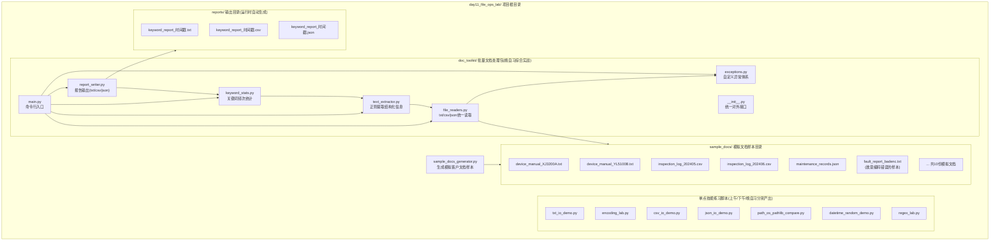
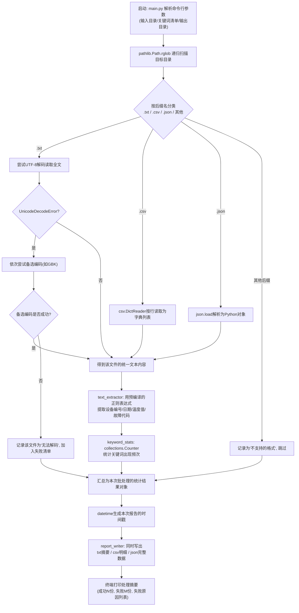
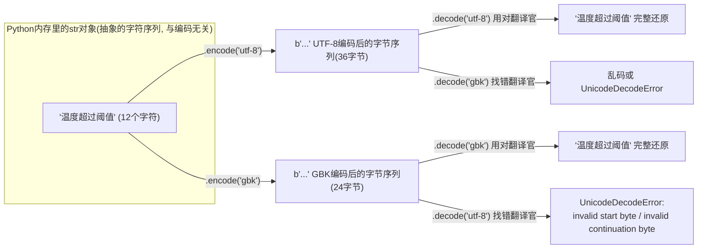

# 第11天 · 文件操作与常用标准库

> **周次/Sprint**:Sprint 0 · 新人内训(Day1-14)—— 阶段项目一:命令行多轮对话AI助手(预计Day14交付)
> **星期**:周四(第二周第四天)
> **学员**:陈铭、苏梦、韩露、张凡(导师:王振宇)
> **内训任务卡**:PYXT-ONB-D11(蓬远科技培训中心 · 新人训练营 · Day11)
> **今日关键词**:文件读写(txt/csv/json) / with上下文管理器 / UTF-8编码问题 / os模块 / pathlib模块 / datetime模块 / random模块 / re正则表达式入门 / 批量文档读取与关键词统计工具

---

## 【旁白】

昨天(Day10)这一天结束的时候,老王在群里留下一句话:"你们要做的事情——批量读取、统计关键词——跟真实项目里要干的事,思路上是一样的。"这句话当时四个人都只当成一句"导师式的鼓励",听完就翻页往下看今天要交的作业去了。但如果把镜头拉远,拉到这本书七十天之外——这句话其实是全书埋得最深、最不动声色的一处伏笔。

三十天后(Day28),苍穹项目会正式立项交付海纳制造集团的知识库问答系统,而那个项目里"文档加载与分割"环节要处理的第一批真实素材,就是设备手册、工艺文档、质量规范——和陈铭今天在`sample_docs/`文件夹里打开的那些"模拟客户文档",在文件格式、行文口吻、信息结构上几乎是同一套东西的两个版本:一个是教学替身,一个是真实项目。今天陈铭写的"批量读取一堆txt/csv/json文件,数一数里面出现最多的关键词"这件事,说得直白一点,就是"检索"这个概念最原始、最朴素、最不需要任何机器学习知识就能实现的版本——你给我一个词,我告诉你它在哪些文档里出现过、出现了几次。而三十天后要搭的RAG(检索增强生成)系统,本质上做的是同一件事的"高级版":把"数一数关键词出现次数"换成了"算一算语义向量的相似度",把"哪个文档命中关键词最多"换成了"哪个文档块和你的问题语义最接近"。技术手段天差地别,但要解决的问题——"我有一堆文档,你问我一个问题,我怎么从里面找到最相关的那一段"——从今天起,就已经是陈铭要面对的问题了,只是他自己还不知道。

老王心里其实清楚这一层用意,但他没有在课堂上把话说穿。教学上这是有意为之——如果现在就把"这是RAG的雏形"这句话讲出来,四个连"函数"都刚学扎实、连"类"才学了三天的新人,大概率会因为听不懂"检索增强生成"这个词而心生畏惧,反而分散了对"怎么把文件读对、怎么把编码搞明白"这些今天真正该掌握的基础技能的注意力。所以这条线,只留在旁白里,留给读到这里、知道后面剧情的你——三十天后,当陈铭第一次面对海纳集团那批排版混乱、表格错位的PDF设备手册,满脸痛苦地问老王"这文档怎么这么难处理"的时候,老王大概会想起今天这个下午,四个人第一次面对一份编码错乱、打开就是一堆乱码的模拟文档时,同样痛苦的表情——本质上,是同一种痛苦,提前预演了一遍。

---

## 晨会纪要 / 今日目标

**时间**:上午8:53,二层小会议室"起航"
**出席**:王振宇(老王)、陈铭、苏梦、韩露、张凡

老王进门时手里多了一个U盘,往桌上一放,还没坐下就先开口:"昨天说要给你们一批模拟客户文档,东西我准备好了,待会儿发给你们。先过一下昨天的收尾。"

**昨天进展(Day10)**:
- 四人均完成`cangqiong_core`包的拆分重构,`messages`、`models`、`utils`三个子包结构清晰,`exceptions.py`里搭出了完整的异常继承体系。
- 陈铭和张凡的异常体系设计得比较克制,没有出现"为每种小情况发明一个新异常类"的过度设计问题;韩露一开始给"限流"和"超时"各设计了三层子类,被老王要求合并简化。
- 苏梦昨晚在配置虚拟环境时,`pip install`半天卡住不动,后来发现是没有配置国内镜像源,老王在群里补发了一遍Day1配置过的镜像源命令,提醒"这个东西你们本子上应该早就记过了,养成随手翻笔记的习惯"。
- 四人的`requirements.txt`都已生成并提交到各自的练习仓库,`.gitignore`正确排除了`venv/`目录。

老王把电脑转过来,投影上是一份文件夹列表,里面大概十来个文件,后缀名有`.txt`、`.csv`、`.json`,文件名看起来都挺"正经"——`device_manual_XJ3200A.txt`、`inspection_log_month.csv`、`maintenance_records.json`之类。张凡瞄了一眼:"这是真的客户资料?"

老王摇头:"不是,先说清楚——这是我按照咱们这个行业(制造业客户)未来大概率会遇到的文档形态,自己编出来的教学素材,里面提到的公司、设备型号,都是我编的,和任何真实企业无关。但我编的时候是照着'真实场景长什么样'去编的,不是随便瞎写几行凑数——设备编号的命名规则、维护记录的字段结构、故障描述的用词习惯,都尽量贴近真实工业文档的样子。你们今天要做的事情,是把这一批文档批量读进来,统计里面出现频率最高的关键词,顺便把一些结构化的信息(比如设备编号、日期、温度参数)用正则表达式提取出来。"

他顿了一下,又补了一句:"提前说明一下今天的技术分量——今天不是概念难,是'知识点数量多且杂'。文件读写、编码问题、`os`、`pathlib`、`datetime`、`random`、`re`,六七个标准库模块一天之内过一遍,单个知识点都不复杂,但加起来信息量不小。我建议你们笔记本今天记得比平时更细一点,尤其是`os`和`pathlib`两种路径操作方式的对照,这两个东西你们以后会同时遇到,得知道彼此的写法怎么互相转换。"

**今日目标**:
1. 上午9:00-12:00:文件读写基础——`open()`函数与文件模式、`with`上下文管理器、txt文件的完整读写方式、csv模块的`reader`/`writer`与`DictReader`/`DictWriter`、编码问题排查(UTF-8/GBK乱码案例、`UnicodeDecodeError`)。
2. 下午14:00-17:30:json文件读写复习与深化(与Day5呼应)、`os`模块常用路径与文件操作、`pathlib`模块的面向对象路径操作、二者对照与选型建议、`datetime`模块日期时间处理、`random`模块常用函数。
3. 晚自习19:00-21:00:`re`正则表达式入门(匹配、查找、替换、分组)、综合实战——批量文档读取与关键词统计工具完整开发。

**风险点**:
- 编码问题是今天最容易"卡壳"的地方——尤其是Windows系统默认编码是GBK(准确说是CP936),而公司统一约定所有文本文件用UTF-8保存,四人的电脑操作系统不完全一致(苏梦用Windows,陈铭和张凡用macOS,韩露用Windows但装了WSL),踩坑的具体报错信息会不一样,老王已经把常见几种报错都准备了复现案例。
- `os`和`pathlib`两套API并存容易让人纠结"到底该用哪个",老王打算明确给出团队统一约定(新代码优先用`pathlib`,`os.environ`这类`os`独有的能力仍然用`os`),避免新人陷入"选择困难症"。
- 正则表达式是新知识点里最容易让新手产生"畏难情绪"的一块,老王计划从"能看懂"到"能改"再到"能写",分三步走,不追求当天写出复杂正则。
- 晚自习的综合实战工作量偏大,老王已经把项目拆成清晰的小模块,四人可以分工中的部分自己先跑通简化版,今天不要求人人都实现全部P1功能。

---

## 需求文档:内部工具任务书 —— 批量文档读取与关键词统计工具

> 本任务书由技术导师王振宇发放,格式沿用公司内部PRD模板。这是新人训练营第一次面向"处理外部输入的文档数据"发出的正式任务书——此前的任务书处理的都是程序自己生成、自己持有的数据(列表、字典、自己`print`出来的东西),而今天要处理的,是"别人给你的、你无法控制其内容和格式"的外部文件,这种差异本身就值得单独强调。

### 背景

老王在晨会上补充说明了这份任务书的业务背景(以内部教学模拟的方式呈现):"公司在和一些制造业客户接触的过程中,经常听到类似的诉求——'我们有一大堆设备手册、巡检记录、维护日志,堆在共享文件夹里没人整理,老师傅退休了经验就带走了,新员工找个资料要翻半天'。这不是空想出来的场景,是这个行业相当普遍的痛点。今天你们要做的这个小工具,虽然功能简单,但解决的正是这个痛点的第一层——先让机器帮你把一堆分散的文档'扫一遍',告诉你这堆文档里到底在讲什么、哪些关键词出现得最频繁、有没有一些结构化的信息(型号、日期、故障代码)可以被提取出来单独看。"

具体的业务背景设定为:蓬远智能内部技术团队收到一批(教学模拟的)客户方设备运维文档样本,格式不统一——有纯文本的设备手册说明、有Excel导出的CSV巡检记录、也有系统导出的JSON格式维护记录。在正式启动知识库项目之前,团队希望先做一次"文档摸底",统计出这批文档里出现频率最高的关键词(比如"故障""异常""维护""检修""更换"等业务高频词),并把其中能结构化提取的信息(设备编号、记录日期、异常温度值等)整理出来,为后续可能的知识库建设工作提供数据基础。

### 用户故事

- 作为技术团队负责人,我希望能够一次性扫描一个文件夹下所有的`.txt`、`.csv`、`.json`格式文档,而不需要人工一个个打开确认格式。
- 作为需要摸底文档内容的工程师,我希望工具能够自动统计出文档中出现频率最高的关键词(允许我提供一份关注的关键词清单,也允许工具自动统计所有高频词),帮助我快速判断这批文档大概涉及哪些主题。
- 作为需要为后续知识库项目做准备的开发者,我希望工具能够用正则表达式提取出文档里的结构化信息(如设备编号、日期、温度数值),并单独汇总成一份结构化的记录,而不是让这些信息淹没在大段文字里。
- 作为对编码问题一直心存疑虑的新人,我希望工具在遇到编码不一致、无法正常解码的文件时,能够给出清晰的错误提示并继续处理其他文件,而不是因为一个文件出问题就让整个程序崩溃。
- 作为团队协作者,我希望统计结果能够同时以txt(人可读的简要报告)、csv(方便用Excel打开做进一步分析)、json(方便后续被程序继续处理)三种格式输出,分别满足不同的使用场景。
- 作为技术导师,我希望通过这次练习,验证四位培训生是否已经具备"面对一批格式不统一、内容不可控的外部文件,依然能写出稳健的处理代码"这项基础但关键的工程能力——这项能力在Day28处理真实(教学模拟的)海纳集团文档时会被直接复用。

### 功能列表

| 编号 | 功能 | 说明 | 优先级 |
|---|---|---|---|
| F1 | 模拟文档样本生成 | 编写脚本生成一批格式多样(txt/csv/json)、内容贴近制造业运维场景的模拟文档样本,存放于`sample_docs/`目录 | P0(必须实现) |
| F2 | 统一文件扫描 | 使用`pathlib`递归扫描目标目录,按后缀名分类识别`.txt`/`.csv`/`.json`三类文件 | P0 |
| F3 | 统一文本读取接口 | 针对三种格式分别实现读取逻辑,统一转换为"文档记录"(文件名+纯文本内容)的标准形式,读取失败时记录到异常报告而不是让整个程序崩溃 | P0 |
| F4 | 编码问题兜底处理 | 读取txt文件时优先尝试UTF-8解码,失败时按预设的备选编码列表(如GBK)依次尝试,全部失败则记录该文件为"无法解码" | P0 |
| F5 | 正则结构化信息提取 | 用正则表达式从文本中提取设备编号、日期、温度/压力数值、故障代码等结构化字段 | P0 |
| F6 | 关键词频次统计 | 基于`collections.Counter`统计关键词出现频次,支持"指定关注关键词清单"和"自动统计高频词"两种模式 | P0 |
| F7 | 报告输出(三种格式) | 将统计结果与提取到的结构化信息,分别输出为txt摘要报告、csv明细表、json完整数据三种文件,报告文件名带时间戳 | P0 |
| F8 | 命令行入口与参数 | 提供`main.py`作为命令行入口,支持指定扫描目录、关键词清单文件、输出目录等参数 | P1(增强功能) |
| F9 | 处理日志 | 打印/记录本次运行处理了多少文件、成功多少、失败多少、失败原因是什么 | P1 |

### 非功能需求

- **健壮性**:任意单个文件的读取失败(编码错误、格式不合法、文件不存在)都不应导致整个批处理任务中断,必须能够跳过该文件并继续处理剩余文件,同时保留清晰的错误记录。
- **可扩展性**:如果未来需要支持新的文件格式(比如`.md`或者Day28会遇到的`.pdf`),应该只需要新增一个读取函数,不需要改动核心的统计与提取逻辑。
- **可读性优先**:考虑到这是新人阶段的练习,代码风格要以"清晰易懂"为第一优先级,允许在性能上做一些不那么极致的选择(比如不引入复杂的多进程/多线程并发读取,这是后面Day13异步内容里才会涉及的话题)。
- **路径处理规范性**:全程优先使用`pathlib.Path`进行路径拼接与操作,不出现手写字符串拼接路径(如`目录 + "/" + 文件名`)这种在不同操作系统上可能出问题的写法。
- **编码规范性**:所有新生成的文件必须显式指定`encoding="utf-8"`,不依赖操作系统默认编码,这是团队工程规范里"编码问题"这一条的具体落地。

### 验收标准

1. 运行`sample_docs_generator.py`能够在`sample_docs/`目录下生成不少于8份格式多样(至少覆盖txt、csv、json三种)、内容贴近制造业运维场景的模拟文档。
2. 运行`main.py`后,程序能够正确扫描并读取`sample_docs/`目录下的全部文件,对人为构造的"编码错误"文件能够给出清晰的错误提示而不崩溃退出。
3. 输出的关键词统计报告中,能够正确反映出预设关键词(如"故障""维护""检修"等)在全部文档中的总出现次数,且数字与人工抽查结果一致。
4. 输出的结构化信息提取结果中,能够正确提取出至少设备编号、日期两类字段,提取结果的格式统一、字段完整。
5. 报告同时以txt、csv、json三种格式成功输出到指定目录,三份报告内容在逻辑上一致(数字对得上)。
6. 全部路径操作使用`pathlib`完成,代码中不出现手写字符串拼接路径的写法(`os.environ`等`os`独有能力除外)。
7. 代码具备完整的中文注释与函数级docstring,异常处理覆盖"文件不存在""编码错误""JSON格式不合法""CSV字段缺失"等常见场景。

老王发布任务书时补了一句:"你们做完这个工具,重点不是工具本身多好用——说实话,这就是一个教学练习级别的小工具。重点是你们要真正体会一遍'处理外部文件'和'处理自己写的数据'这两件事,在心态上、在代码防御性上,应该有多大的差别。以后你们会处理的东西,只会比今天这批模拟文档更乱、更不可控。"

---

## 架构设计图:批量文档读取与关键词统计工具模块结构

老王要求先画结构图再动手,理由和昨天一样——"先想清楚数据长什么样,再想代码怎么写"这条口头禅,在今天这个任务里,可以理解为"先想清楚文件夹里都有什么类型的文件、数据要经过哪几道加工,再决定拆成几个模块"。



这张图分成四块看:第一块是`sample_docs_generator.py`和它生成出来的`sample_docs/`目录,这是今天全部练习的"数据来源",特意造了一份编码故意写错的文件(`fault_report_badenc.txt`),用来配合上午的编码排查教学。第二块是"单点技能练习脚本",对应今天上午到下午分知识点讲解时,每学一个模块就单独写一个小demo脚本练手,互相之间没有依赖关系,方便随时单独运行验证。第三块是晚自习综合实战的`doc_toolkit`包,是今天真正的"产出物"——一个结构清晰、职责单一的批处理小工具,`main.py`是唯一的入口,依次调用`file_readers`(读文件)、`text_extractor`(抽取结构化字段)、`keyword_stats`(统计关键词)、`report_writer`(生成报告),`exceptions`贯穿在读取和主流程里兜底。第四块是运行时才会生成的`reports/`目录,不属于代码本身,是工具运行后的产出。

---

## 流程图:文档批处理的数据流转全过程



这张流程图刻意把"编码解码失败后的兜底路径"画得比正常路径更详细——因为今天上午的教学重点,恰恰就是让大家亲眼看到"一份文件读取失败,不代表整个程序就该崩溃",这条`E → F → F2 → H`的分支,是今天所有代码里最需要被认真对待的一段逻辑,晚自习综合实战里`file_readers.py`的核心设计就是照着这条分支走的。

---

## 示意图:字符串与字节之间的"编码/解码"就像一次翻译

老王在讲编码问题时,在白板上画了一个"翻译官"的类比图,后来他要求大家把这个类比整理成一张Mermaid图,存进当天笔记里,理由是"这个概念不理解到位,你们以后一旦被派去处理老系统留下的历史文件,迟早要在这上面栽一次跟头"。



老王当时的解释是:"你可以把一段中文字符串,想象成一句话本身的'意思';把编码后的字节序列,想象成把这句话'翻译'成某种密码本写下来的一串数字。UTF-8和GBK,就是两本不同的密码本——同一句话,用UTF-8密码本翻译出来的数字串,和用GBK密码本翻译出来的数字串,长得完全不一样。如果你写下来的时候用的是UTF-8密码本,回头读的时候却拿着GBK密码本去'解密',那大概率会解出一堆莫名其妙的乱码,或者密码本自己都说'这串数字根本对不上我这本密码本的规则',那就是`UnicodeDecodeError`。"这张图后面会在今天上午的编码排查环节被反复引用。

---

## 课堂笔记

### 上午:文件读写基础与编码问题排查

老王没有从`open()`函数的语法讲起,而是先在投影上打开了一个文件夹,里面是他昨晚准备好的`sample_docs/`,让四个人轮流打开几份文件看一眼。陈铭打开`device_manual_XJ3200A.txt`,内容看起来是正常的中文说明书语气;张凡打开`fault_report_badenc.txt`,屏幕上刷出一片"闁诬弸鎴﹀础"之类完全看不懂的字符,他愣了一下:"老师,这个文件是不是坏了?"

老王等的就是这句话:"没坏,这是我故意做的。这就是今天上午要解决的第一个真实问题——文件没坏,但你打开它的'方式'不对。今天从这个问题开始讲,比先讲一堆`open()`的参数更容易让你们记住为什么这些参数存在。"

**1. `open()`函数与文件模式**

Python里读写文件的基础入口是内置函数`open()`,最常用的几个参数是文件路径、模式(`mode`)、编码(`encoding`)。老王把常用的模式字符列在白板上:

| 模式 | 含义 | 文件不存在时 | 文件已存在时 |
|---|---|---|---|
| `"r"` | 只读(文本模式,默认) | 报`FileNotFoundError` | 从头读取 |
| `"w"` | 只写(文本模式) | 自动创建 | **清空原内容**后重新写入 |
| `"a"` | 追加写(文本模式) | 自动创建 | 在原内容末尾追加 |
| `"r+"` | 读写(文本模式) | 报`FileNotFoundError` | 可读可写,写入位置从头开始覆盖 |
| `"x"` | 独占创建(文本模式) | 自动创建 | 已存在则报`FileExistsError` |
| `"rb"` | 只读(二进制模式) | 报`FileNotFoundError` | 从头读取字节 |
| `"wb"` | 只写(二进制模式) | 自动创建 | 清空后写入字节 |

老王特别在`"w"`这一行画了个重点符号:"这是新手最容易踩的坑之一——你以为`"w"`只是'打开来准备写点东西',但它的真实行为是'如果这个文件已经有内容,先把它清空'。我见过不止一个人,本来想往一个日志文件里追加一条新记录,结果手滑写成了`"w"`,直接把之前几个月的日志全清空了,这种事故在真实项目里是能上故障复盘会的级别。"

苏梦举手问:"那`"r+"`和`"w"`有什么区别,听起来都能写?"老王答:"`"r+"`要求文件必须已经存在,而且它不会自动清空原内容——它只是把'写入光标'放在文件开头,如果你写入的内容比原内容短,后面剩下的旧内容还会留着,这个行为反而比`"w"`更容易让人搞出意想不到的结果,所以实际工作中`"r+"`用得比`"w"`和`"a"`都少,你们今天记住`"r"`/`"w"`/`"a"`这三个最常用的就够了,`"r+"`了解即可。"

**2. 为什么一定要用`with`——呼应Day10的`try/finally`**

老王没有直接讲`with`的语法,而是先让大家看一段"不用`with`"的写法:

```python
f = open("demo.txt", "r", encoding="utf-8")
content = f.read()
# 假设这里处理content的过程中抛出了异常
result = 10 / 0  # 故意制造一个异常
f.close()  # 这一行永远不会被执行到!
```

"看出问题了吗?"老王问。张凡反应比较快:"如果中间抛异常了,`f.close()`就跳过了,文件就一直没关。"老王点头:"对。文件长期不关闭,会占着系统的'文件描述符'资源不放,如果这种代码在一个长期运行的服务里反复被调用,文件描述符会越占越多,直到某天报`OSError: [Errno 24] Too many open files`,那时候排查起来会非常痛苦,因为报错的时候,你根本看不出来是哪个'看起来早就该结束了'的函数,忘了关文件。"

他接着把这段代码改写成用`try/finally`的版本(呼应昨天刚学的知识点):

```python
f = open("demo.txt", "r", encoding="utf-8")
try:
    content = f.read()
    result = 10 / 0
finally:
    f.close()  # 无论try块是否出异常, finally都会执行, 文件一定会被关闭
```

"这样写是对的,但啰嗦。"老王说,"Python给你们提供了一个专门为'打开资源、用完必须关闭'这种场景量身定做的语法糖,就是`with`语句,它本质上就是帮你自动把`try/finally`这套逻辑写好了,你不需要自己写`f.close()`。"

```python
with open("demo.txt", "r", encoding="utf-8") as f:
    content = f.read()
    result = 10 / 0
# 无论上面代码是否出异常, 离开with代码块的那一刻, 文件已经被自动关闭
```

老王补充说明:"`with`能这么'智能',背后的原理叫上下文管理器协议——任何实现了`__enter__`和`__exit__`两个魔术方法的对象都可以配合`with`使用,`open()`返回的文件对象刚好实现了这两个方法。`__enter__`在进入`with`代码块时被调用(通常就是返回资源本身,比如文件对象),`__exit__`在离开代码块时被调用(不管是正常离开还是因为异常离开,都会被调用),文件对象的`__exit__`里做的事情就是调用`f.close()`。你们上周学的魔术方法(`__str__`、`__repr__`、`__call__`),原来还有这么个实际用途,这算是给Day9那天的内容补一个'原来在这里用得上'的连接点。"

他在白板上补了一句总结,让大家抄下来:"`with`不是一个新的、独立于`try/except`的知识点,它是Python为'资源管理'这一类高频场景专门设计的语法糖,底层思路和`try/finally`完全一致,只是更简洁、更不容易漏写`close()`。从今天起,凡是打开文件,不管是读还是写,只要没有极特殊的理由,统一用`with`,不要单独调用`open()`然后自己管理`close()`。"

**3. txt文件的读取方式:`read()` / `readline()` / `readlines()` / 直接迭代**

老王列出了四种从文本文件里取内容的方式,分别演示行为差异:

- `f.read()`:一次性把整个文件内容读成一个字符串,适合文件不大、需要整体处理的场景。文件很大时会占用大量内存,需要谨慎使用。
- `f.readline()`:每次读一行(包含行尾的`\n`),适合需要"逐行处理、随时可能提前结束"的场景。
- `f.readlines()`:一次性把所有行读成一个列表,每个元素是一行(包含`\n`),本质上是内存占用和`read()`类似,只是多了按行切分的效果。
- 直接对文件对象做`for line in f:`迭代:这是官方推荐的、最省内存的逐行读取方式,因为它不会像`readlines()`一样先把全部内容都读进内存,而是"读一行、处理一行、再读下一行",对大文件特别友好。

陈铭问:"那`readlines()`和直接`for line in f`按行处理,结果不是一样的吗,为什么官方推荐后者?"老王答:"结果确实一样,但过程中的内存占用不一样。假设这个文件有100万行,`readlines()`会先把100万行全部读进内存变成一个列表,然后你再遍历这个列表;而`for line in f`是一边读一边处理,同一时刻内存里只需要装着'当前这一行',文件再大,内存占用基本不会涨。这个差异在小文件上完全感觉不出来,但等你们以后处理几百MB甚至几GB的日志文件、数据文件时,这个差异就是'程序能跑'和'程序把内存吃爆'的区别。"

**4. txt文件的写入方式:`write()` / `writelines()`**

- `f.write(字符串)`:写入一段字符串,不会自动加换行符,如果你想换行,要自己在字符串末尾加`\n`。
- `f.writelines(字符串列表)`:接收一个字符串的列表(或任何可迭代对象),按顺序依次写入,同样**不会自动加换行符**——这一点经常被新手误解为"和`readlines()`是对称操作,应该也是按行处理",但`writelines()`本质上只是"把一堆字符串挨个写进去",如果列表里的字符串本身没带`\n`,输出结果会是所有内容连成一片,不会自动分行。

韩露现场试了一下这个"陷阱":

```python
lines = ["第一行", "第二行", "第三行"]
with open("test_no_newline.txt", "w", encoding="utf-8") as f:
    f.writelines(lines)
# 打开test_no_newline.txt,内容是: 第一行第二行第三行(连成一片,没有换行)
```

老王点评:"这正是我想让你们亲眼看一次的坑——`writelines`这个名字容易让人下意识以为它会像`readlines`的逆操作一样自动分行,但它不会,`\n`必须你自己加。以后写日志、写报告类的代码,这是个常见的低级错误来源。"

**5. 编码问题深度排查——今天上午分量最重的部分**

老王把话题拉回开头张凡打开乱码文件的那一刻:"现在我们正式来解决这个问题。"

他先解释背景知识:"计算机存储的一切内容,归根结底都是二进制的字节(byte)。文字要存成字节,需要一套'字符到字节'的映射规则,这套规则就叫编码(encoding)。历史上出现过很多种编码方式——英文世界最早用ASCII(一个字节能表示128个字符,够用,因为英文字母就26个大小写加数字符号);中文没法用ASCII表示,所以中国自己搞了GB2312、后来扩展成GBK、再扩展成GB18030;为了让全世界所有语言都能被统一的一套规则表示,后来又出现了Unicode字符集,以及基于Unicode的多种具体编码实现方式,其中UTF-8是目前互联网上最主流、最通用的一种。"

"公司的工程规范里明确写了一条——所有文本文件统一用UTF-8保存,这不是随便定的,是因为UTF-8几乎是所有现代系统、所有主流编程语言、所有Web标准的事实标准,用UTF-8能最大程度避免'我这边打开正常,发给你那边就乱码'这种协作事故。但现实世界没这么理想——很多历史遗留系统、很多老旧的Windows软件默认导出的是GBK编码的文件,你们以后接手的客户文档,完全可能出现编码不统一的情况,这就是我今天故意做一个'编码错误样本'的原因。"

他现场演示了`fault_report_badenc.txt`到底是怎么"坏"的——这个文件其实内容是用GBK编码保存的中文文本,但程序默认用UTF-8去解码它:

```python
with open("sample_docs/fault_report_badenc.txt", "r", encoding="utf-8") as f:
    content = f.read()
print(content)
```

"运行这段代码,大概率会看到两种结果之一。"老王说,"第一种,直接报错:"

```
UnicodeDecodeError: 'utf-8' codec can't decode byte 0xc3 in position 0: invalid continuation byte
```

"第二种,如果字节序列凑巧'骗过'了UTF-8的校验规则(这种情况在实际中比较少见,但确实存在),你会得到一堆看起来像字符、但完全没有意义的乱码,比如张凡刚才看到的那种。第一种报错至少还提醒了你'有问题',第二种乱码反而更危险,因为程序'看起来正常运行了',你如果不仔细看内容,根本发现不了数据已经错了。"

苏梦问:"那怎么知道一个文件到底是什么编码保存的?"老王答:"严格来说,没有百分之百准确的办法——编码信息不会随文件内容一起'刻'在文件里(除了少数格式,比如某些文本文件开头会带一个叫BOM的标记,但也不是所有UTF-8文件都会带)。实用的做法通常是这几种:第一,如果你知道这批文件的来源(比如'这是某个老系统导出的,那个系统一贯用GBK'),直接按这个先验知识去试;第二,写一段'编码探测'代码,依次尝试几种常见编码,哪种编码能成功解码且解码结果'看起来像正常文字'(而不是乱码),就大概率是对的;第三,借助第三方库比如`chardet`或者`charset-normalizer`做自动检测,这些库本质上也是在做概率意义上的猜测,不是绝对准确,但准确率通常够用。今天我们用'依次尝试几种常见编码'这个思路,自己实现一个简化版的编码探测函数,不引入第三方库,这样你们能真正理解它的原理,而不是把它当成一个'调一下就好用'的黑盒。"

他给出的排查思路总结成一句口诀,让四人记下来:"**先假设UTF-8,不行就试GBK,还不行就报错并跳过,绝不让一个文件的编码问题拖垮整个批处理任务。**"这句口诀,直接对应了晚自习要实现的`file_readers.py`里的核心容错逻辑。

**6. `errors`参数——另一种应对编码问题的方式**

老王补充了一个`open()`函数里经常被忽略的参数——`errors`,用来控制"解码遇到无法处理的字节时该怎么办":

- `errors="strict"`(默认值):遇到无法解码的字节,直接抛出`UnicodeDecodeError`。
- `errors="ignore"`:直接跳过无法解码的字节,不抛异常,但结果里那部分内容会丢失。
- `errors="replace"`:把无法解码的字节替换成一个占位符(通常是`�`),不抛异常,但你能看出"这里丢了点东西"。

"什么时候该用哪个?"老王自问自答:"如果你的业务场景绝对不能容忍数据丢失或者被替换(比如财务数据、合同条款),那应该用默认的`strict`,让它直接报错,逼着你去正确处理编码问题,而不是悄悄丢数据;如果你的场景是'哪怕丢一点点无关紧要的字符也比整个文件读取失败要好'(比如今天这种统计关键词频次的粗粒度分析场景),用`errors="replace"`是一种务实的折中选择,既不会崩溃,又能留下'这里有问题'的痕迹,方便你事后抽查。今天晚自习的工具里,我们会把这个参数用上,作为兜底方案的最后一层。"

**7. csv文件读写:`csv`模块**

老王把话题转到csv格式:"csv本质上就是纯文本,用逗号(或者其他约定的分隔符)把每一行分隔成若干列,如果你愿意,完全可以自己用字符串的`split(",")`去手写解析,但csv格式有很多容易被忽略的细节——比如某一列的内容本身就包含逗号怎么办(这时候标准做法是给这一列内容加上引号包起来),某一列内容里包含换行符怎么办,这些边界情况自己手写很容易漏掉,所以Python内置的`csv`模块才是正确的选择。"

他讲了`csv`模块最常用的四个接口:

- `csv.reader(f)`:把每一行解析成一个列表,元素是字符串,不区分表头。
- `csv.writer(f)`:配合`writerow()`(写一行)、`writerows()`(写多行,传入嵌套列表)使用。
- `csv.DictReader(f)`:自动把第一行当作表头,每一行解析成一个字典,键是表头字段名,更适合列比较多、希望通过字段名访问而不是记住列序号的场景。
- `csv.DictWriter(f, fieldnames=[...])`:配合`writeheader()`(先写表头)、`writerow()`/`writerows()`(接收字典)使用。

老王特别提醒了csv读写时打开文件的一个"新手常见坑"——在Windows系统上用`csv.writer`写文件,如果打开文件时没有加`newline=""`这个参数,写出来的文件在每一行末尾会多出一个空行(表现为Excel打开时行与行之间隔着空白行),原因是Windows的换行符本来就是`\r\n`,而`csv`模块自己也会在每行末尾加换行,两者叠加就重复了。"这是`csv`模块文档里明确写了、但极容易被忽略的一条,你们打开文件写csv的时候,记住固定写法:`open(path, "w", newline="", encoding="utf-8")`,把这句当成模板背下来就行,不需要每次都重新推理为什么。"

**8. 编码与csv/json的关系**

苏梦问了一个很好的问题:"csv和json文件也会有编码问题吗?"老王答:"会,原理完全一样,毕竟它们本质上也是文本文件,只是内容遵循特定的格式规则。csv文件同样要注意用UTF-8保存和读取;json文件稍微特殊一点——JSON标准本身推荐用UTF-8,Python的`json`模块默认在`dumps`的时候会把非ASCII字符(比如中文)转义成`\uXXXX`这种Unicode转义序列,除非你显式传入`ensure_ascii=False`,这个我们下午会详细讲。"

到了上午快结束的时候,老王布置了一个小练习,让四人现场实践"编码探测函数",作为衔接下午内容的过渡:

```python
def try_decode_with_fallback(raw_bytes, encodings=("utf-8", "gbk", "gb18030")):
    """依次尝试几种编码, 返回第一个能成功解码的结果, 全部失败则返回None。"""
    for enc in encodings:
        try:
            return raw_bytes.decode(enc), enc
        except UnicodeDecodeError:
            continue
    return None, None
```

"这个函数,你们等到晚自习写`doc_toolkit`的时候,会看到它几乎原样出现在`file_readers.py`里,只是包装得更完整一点。"老王说,"先把原理弄懂,晚自习直接复用今天上午的成果,不用重新想一遍。"

---

### 下午:json深化、os与pathlib、datetime与random

午饭后,老王没有立刻讲新内容,先花十分钟带着大家复习了一遍Day5学过的json部分:"json的`loads`/`dumps`/`load`/`dump`,这四个函数名字很像,容易记混,我们今天再过一遍,顺便补几个Day5没细讲的参数,因为今天要写文件,而Day5当时的练习场景是'解析一段已经在内存里的字符串',没有真正落地到文件读写。"

**1. json四个函数的落地版复习**

- `json.loads(字符串)`:把一段**字符串**解析成Python对象(字典/列表等),名字里的`s`代表"string"。
- `json.dumps(Python对象)`:把Python对象转换成一段**字符串**,同样是"string"的意思。
- `json.load(文件对象)`:直接从一个**打开的文件**里读取内容并解析成Python对象,省去你自己先`read()`再`loads()`两步。
- `json.dump(Python对象, 文件对象)`:直接把Python对象序列化后**写入一个打开的文件**,省去你自己先`dumps()`再`write()`两步。

老王在白板上画了个简单的记忆口诀:"带`s`的两个,处理的是纯字符串,和文件没有直接关系;不带`s`的两个,处理的是文件对象,`load`和`dump`本质上就是`loads`/`dumps`加上文件读写的组合快捷方式。"

**2. json.dump/dumps的常用参数**

- `ensure_ascii=False`:默认情况下,`dumps`会把所有非ASCII字符(包括中文)转义成`\uXXXX`形式,这样生成的字符串虽然完全合法,但人眼读起来是一堆看不懂的转义码。加上`ensure_ascii=False`,中文会以原始字符的形式直接写出来,更适合人工查看,团队规范要求所有面向存档、面向人工查阅的json文件都要加这个参数。
- `indent=数字`:控制缩进,生成"美化"过的、带缩进换行的json文本,方便人工阅读;不传这个参数会生成一行到底的紧凑json,适合网络传输场景(省流量,机器解析不在乎排版)。
- `sort_keys=True`:让输出的字典按键名排序,有助于对比两次输出结果的差异(比如做版本对比时,顺序固定能减少无意义的差异)。

陈铭现场对比了加不加`ensure_ascii=False`的区别:

```python
import json

data = {"设备编号": "XJ-3200A", "状态": "正常"}

print(json.dumps(data))
# 输出: {"\u8bbe\u5907\u7f16\u53f7": "XJ-3200A", "\u72b6\u6001": "\u6b63\u5e38"}

print(json.dumps(data, ensure_ascii=False))
# 输出: {"设备编号": "XJ-3200A", "状态": "正常"}
```

"这个坑我记得特别清楚。"老王笑着说,"我三年前刚接触Python的时候,第一次往json文件里存中文数据,打开一看全是`\u`开头的天书,吓了一跳,以为写错了什么,后来才知道这是默认行为,不是bug。这种'默认行为不符合直觉,但确实是设计如此'的情况,在标准库里不算少,记住比自己每次猜要靠谱。"

**3. `os`模块:面向"函数调用"的路径与文件操作**

老王开始讲`os`模块,先定性:"`os`模块提供了一大堆和操作系统交互的函数,路径相关的那部分,通常放在`os.path`子模块里。这套接口的设计风格是——路径就是普通的字符串,所有操作都通过调用函数、把字符串传进去、拿到新的字符串或者结果。"

常用函数速览(老王要求抄一遍,作为查阅笔记):

| 函数 | 作用 |
|---|---|
| `os.path.join(a, b, ...)` | 按操作系统规则拼接路径片段(Windows用`\`,Linux/macOS用`/`,用这个函数拼接可以避免手写分隔符导致的跨平台问题) |
| `os.path.exists(路径)` | 判断路径(文件或目录)是否存在 |
| `os.path.isfile(路径)` / `os.path.isdir(路径)` | 判断是文件还是目录 |
| `os.path.splitext(路径)` | 拆分成"主体部分"和"扩展名"两部分,如`("device", ".txt")` |
| `os.path.basename(路径)` | 取路径最后一段(通常是文件名) |
| `os.path.dirname(路径)` | 取路径去掉最后一段之后剩下的部分(通常是所在目录) |
| `os.path.abspath(路径)` | 把相对路径转换成绝对路径 |
| `os.listdir(目录)` | 返回该目录下所有文件和子目录的名字列表(不递归) |
| `os.walk(目录)` | 递归遍历目录树,每次迭代返回`(当前目录, 子目录列表, 文件列表)` |
| `os.makedirs(路径, exist_ok=True)` | 创建目录,支持多级创建,`exist_ok=True`表示目录已存在时不报错 |
| `os.remove(路径)` | 删除文件 |
| `os.environ` | 一个类似字典的对象,读取/设置环境变量(留意:这是`os`模块独有的能力,`pathlib`没有对应功能) |

**4. `pathlib`模块:面向"对象"的路径操作**

老王切换到`pathlib`:"这是Python 3.4之后加入的模块,思路和`os.path`完全不同——它不是把路径当字符串传来传去,而是把路径包装成一个真正的`Path`对象,路径操作变成了对象的方法调用和运算符重载,写起来更接近'面向对象'的直觉,你们刚学完OOP两天,这个模块正好拿来练手感。"

同样一套操作,用`pathlib`重写:

| `os`/`os.path`写法 | `pathlib`等价写法 |
|---|---|
| `os.path.join(a, b, c)` | `Path(a) / b / c`(用`/`运算符拼接,这是`pathlib`最有辨识度的特性) |
| `os.path.exists(p)` | `Path(p).exists()` |
| `os.path.isfile(p)` | `Path(p).is_file()` |
| `os.path.isdir(p)` | `Path(p).is_dir()` |
| `os.path.splitext(p)[1]` | `Path(p).suffix` |
| `os.path.basename(p)` | `Path(p).name` |
| `os.path.dirname(p)` | `str(Path(p).parent)` |
| `os.path.abspath(p)` | `Path(p).resolve()` |
| `os.listdir(d)` | `list(Path(d).iterdir())`(返回的是`Path`对象列表,不是字符串列表) |
| `os.walk(d)` | `Path(d).rglob("*")`(递归遍历所有文件和目录,写法更简洁,配合通配符筛选更方便) |
| `os.makedirs(p, exist_ok=True)` | `Path(p).mkdir(parents=True, exist_ok=True)` |
| 手动读文件全文本 | `Path(p).read_text(encoding="utf-8")`(不需要单独写`with open`) |
| 手动写文件全文本 | `Path(p).write_text(content, encoding="utf-8")` |

韩露看着这张对照表说:"那以后是不是就完全不用`os`了?"老王摇头:"不是完全替代关系。团队约定是——**涉及路径拼接、文件/目录的存在性判断、遍历、创建这些场景,统一优先用`pathlib`**,因为它写出来更清晰、更不容易在跨平台上出问题,而且`Path`对象可以直接参与`open()`、大部分标准库函数也接受`Path`对象作为路径参数,兼容性很好。但`os`模块里有一部分能力是`pathlib`完全没有覆盖的,比如`os.environ`读取环境变量、`os.getpid()`获取进程号、`os.cpu_count()`获取CPU核心数,这些和'文件路径'无关的系统交互能力,还是要用`os`。简单说——**能用pathlib表达的路径操作,用pathlib;pathlib够不到的系统层面的东西,用os。**"

老王现场用`pathlib`重写了一遍"递归查找目录下所有txt文件"的功能,对比`os.walk`的写法:

```python
import os
from pathlib import Path

# os.walk 写法
def find_txt_files_os(root_dir):
    result = []
    for current_dir, subdirs, files in os.walk(root_dir):
        for filename in files:
            if filename.endswith(".txt"):
                result.append(os.path.join(current_dir, filename))
    return result

# pathlib 写法
def find_txt_files_pathlib(root_dir):
    return list(Path(root_dir).rglob("*.txt"))
```

"一个五行的双重循环,一行`rglob`就搞定了,这就是`pathlib`在这类场景上的优势。"老王说,"但要提醒一句——`rglob`返回的是`Path`对象,不是字符串,如果你后面的代码期望拿到字符串(比如要打印、要传给某个只接受字符串的老接口),记得用`str()`转一下,或者直接用`Path`对象的属性和方法继续操作,不用急着转成字符串。"

**5. `datetime`模块:日期与时间处理**

老王把话题转向`datetime`:"今天的批处理工具要给每次生成的报告文件名加时间戳,避免多次运行互相覆盖,这就要用到`datetime`模块。"

核心概念与常用写法:

- `datetime.datetime.now()`:获取当前的日期时间,返回一个`datetime`对象。
- `.strftime(格式字符串)`:把`datetime`对象格式化成指定样式的字符串,`strftime`可以理解成"string format time"。常用格式码:`%Y`四位年、`%m`两位月、`%d`两位日、`%H`两位小时(24小时制)、`%M`两位分钟、`%S`两位秒。
- `datetime.datetime.strptime(字符串, 格式字符串)`:反过来,把符合指定格式的字符串解析成`datetime`对象,`strptime`可以理解成"string parse time"。
- `datetime.timedelta`:表示一段"时间差",可以和`datetime`对象做加减运算,常用于计算"N天后""N小时前"这类场景。

```python
from datetime import datetime, timedelta

now = datetime.now()
print(now.strftime("%Y-%m-%d %H:%M:%S"))
# 输出示例: 2026-07-16 15:42:07

three_days_later = now + timedelta(days=3)
print(three_days_later.strftime("%Y-%m-%d"))

parsed = datetime.strptime("2026-07-01", "%Y-%m-%d")
print(parsed.year, parsed.month, parsed.day)
```

老王补充了一个业务场景类比:"以后你们做客户项目,经常会遇到'解析文档里出现的日期字符串,判断这条维护记录是不是已经过期'这类需求,`strptime`把字符串变成`datetime`对象之后,就可以直接用比较运算符(`<`、`>`)去比较两个日期谁更早谁更晚,这比拿字符串瞎比要可靠得多——字符串比较是按字符逐个比较编码值,'2026-07-01'和'2026-7-1'这种格式稍有差异的写法,字符串比较结果完全不可靠。"

他还提醒了一个容易被忽略的细节:"`strftime`和`strptime`的格式字符串必须完全对应,如果文档里的日期格式是`2026年07月01日`,你的格式字符串就要写成`"%Y年%m月%d日"`,一个字都不能差,否则会报`ValueError: time data ... does not match format ...`,这是处理真实(哪怕是模拟的)客户文档时,大概率会遇到的报错,今天晚自习的正则表达式部分,我们会专门讲怎么先用正则把日期文本'摘'出来,再交给`strptime`解析。"

**6. `random`模块:常用随机函数**

老王讲`random`模块的时候,特意提了一句:"Day10你们写异常处理练习的时候,已经用过`random.random()`来模拟'要不要触发一次异常',今天正式过一遍这个模块的常用函数,把'知道怎么用'补成'知道每个函数具体是干什么的'。"

| 函数 | 作用 |
|---|---|
| `random.random()` | 返回一个`[0.0, 1.0)`区间的随机浮点数 |
| `random.randint(a, b)` | 返回一个`[a, b]`区间(**两端都包含**)的随机整数 |
| `random.uniform(a, b)` | 返回一个`[a, b]`区间的随机浮点数 |
| `random.choice(序列)` | 从一个序列(列表/元组/字符串)中随机选一个元素 |
| `random.sample(序列, k)` | 从序列中随机不重复地抽取`k`个元素,返回一个新列表 |
| `random.shuffle(列表)` | 原地打乱一个列表的顺序(注意:直接修改原列表,没有返回值) |
| `random.seed(值)` | 设置随机数种子,种子相同时,后续生成的"随机"序列是完全可复现的 |

老王特别强调了`randint`和很多人以为的"左闭右开"习惯不一样:"`randint(1, 10)`,1和10都有可能被抽到,这和你们前几天学的切片、`range()`那种'左闭右开'的规则不一样,是这个函数专门设计成两端都包含,属于标准库里少数'反直觉'的地方之一,记混了会导致边界值抽不到或者多抽到,曾经有同学因为这个把'掷一个六面骰子'写成了`randint(0, 6)`,多算了一个0出来。"

关于`random.seed()`,老王补充了一个实用场景:"你们晚自习写关键词统计工具的时候,如果要生成一批'模拟的巡检记录数据'用来测试,又希望每次运行生成的数据是完全一样的(方便对比调试结果),就可以在生成数据之前调用一次`random.seed(固定的数字)`,这样即便代码里用了很多次`random`函数,只要种子一样,最终生成的结果序列也会完全一样,这是测试和调试阶段非常实用的一个技巧,生产环境如果真的需要'不可预测的随机性'(比如生成安全令牌),就绝对不能固定种子。"

下午收尾前,老王布置了一个衔接性的小任务:"下午的内容,`os`、`pathlib`、`datetime`、`random`,都会在晚自习的综合工具里用到,你们现在应该已经能想象出大概的用法——`pathlib`扫描目录、`datetime`生成报告文件名的时间戳、`random`(这个用得少一点,主要用在样本数据生成脚本里)、`os.environ`(如果需要读取一些配置的话)。晚自习之前,先花十分钟自己在脑子里过一遍,今天的工具大概要怎么组织代码结构,别一上来就直接写。"

---

### 晚自习:正则表达式入门与批量文档读取与关键词统计工具实战

晚自习一开始,老王没有直接讲正则表达式的语法,而是先抛出一个问题:"如果让你从一段文字里,把所有形如'XJ-3200A'这种设备编号找出来,不用正则表达式,你会怎么写?"

陈铭想了想:"可能得先按空格分词,再一个个判断是不是符合'两个大写字母+横线+四位数字+一个大写字母'这种规则,判断逻辑写起来会很啰嗦,而且中文文档里词和词之间没有空格,分词本身就是个问题。"

老王点头:"这就是正则表达式存在的意义——它是一套专门用来描述'字符串应该符合什么样的模式'的迷你语言,一旦你学会怎么'写规则',剩下的匹配、查找、替换,全部交给正则引擎去处理,不需要你自己写一堆`if`判断字符。"

**1. `re`模块的核心函数**

- `re.match(pattern, string)`:只从字符串**开头**尝试匹配,如果开头不符合规则,直接返回`None`,即使字符串后面某处符合规则也不算。
- `re.search(pattern, string)`:在整个字符串中查找**第一处**符合规则的位置,找到就返回一个匹配对象,找不到返回`None`。
- `re.findall(pattern, string)`:找出字符串中**所有**符合规则的片段,返回一个列表。
- `re.finditer(pattern, string)`:和`findall`类似,但返回的是一个迭代器,每次迭代给出一个匹配对象(比字符串多了位置信息),适合需要知道"匹配到的位置在哪"的场景。
- `re.sub(pattern, repl, string)`:把字符串中所有符合规则的片段替换成`repl`,返回替换后的新字符串。
- `re.split(pattern, string)`:按符合规则的片段作为分隔符切分字符串,返回一个列表。

老王特意强调`match`和`search`的区别是新手最容易搞混的一点:"记住一句话——`match`是'从第一个字符开始,你必须立刻符合规则',`search`是'我在整段文字里到处找,只要有一处符合规则就行'。实际工作中`search`和`findall`用得远比`match`多,`match`更适合'校验一个字符串是不是完全从某个特定格式开始'这种场景,比如校验用户输入的手机号是不是以`1`开头。"

**2. 常用元字符与模式速查**

| 元字符/写法 | 含义 |
|---|---|
| `.` | 匹配除换行符外的任意一个字符 |
| `\d` | 匹配一个数字字符,等价于`[0-9]` |
| `\D` | 匹配一个非数字字符 |
| `\w` | 匹配一个"单词字符"(字母、数字、下划线),中文字符在Python的`re`里也会被`\w`匹配 |
| `\s` | 匹配一个空白字符(空格、`\t`、`\n`等) |
| `*` | 前面的模式重复0次或多次 |
| `+` | 前面的模式重复1次或多次 |
| `?` | 前面的模式重复0次或1次(也用于把`*`/`+`变成"非贪婪"模式) |
| `{n}` | 前面的模式精确重复n次 |
| `{n,m}` | 前面的模式重复n到m次 |
| `[...]` | 字符集合,匹配方括号内任意一个字符,如`[A-Z]`表示任意一个大写字母 |
| `(...)` | 分组,可以配合`.group()`单独取出这部分匹配内容 |
| `(?P<名字>...)` | 命名分组,可以用名字而不是数字下标取出对应内容 |
| `^` | 匹配字符串开头(或者配合`re.MULTILINE`匹配每一行开头) |
| `$` | 匹配字符串结尾(或者配合`re.MULTILINE`匹配每一行结尾) |
| `\|` | 表示"或",左右两边任意一边匹配即可 |

老王用一个真实(教学模拟)的设备编号场景带大家从零写一个正则:"目标——从文本里提取形如`XJ-3200A`这样的编号,规律是:两个大写字母,一个横线,四位数字,一个大写字母。"

```python
import re

pattern = r"[A-Z]{2}-\d{4}[A-Z]"
text = "本次巡检的设备型号为XJ-3200A,运行状态正常,备用设备YL-5100B暂未启用。"
matches = re.findall(pattern, text)
print(matches)
# 输出: ['XJ-3200A', 'YL-5100B']
```

"注意到我在正则字符串前面加了个`r`没有?"老王问。张凡答:"是原始字符串,不转义`\`?"老王点头:"对,正则表达式里`\d`、`\w`这些写法,如果不加`r`前缀,Python自己会先按照普通字符串的转义规则处理一遍`\`,`\d`在普通字符串里不是一个合法的转义序列,虽然大部分情况Python会容忍并原样保留,但这是一种脆弱的、依赖巧合的写法,团队规范要求——**所有正则表达式字符串,一律加`r`前缀**,不允许省略,这样能确保`\`被正则引擎按你期望的意思去解释,不受Python字符串转义规则的干扰。"

**3. 贪婪匹配与非贪婪匹配**

老王演示了一个经典的"贪婪陷阱":

```python
text = "<设备>XJ-3200A</设备><设备>YL-5100B</设备>"

greedy_pattern = r"<设备>(.*)</设备>"
match = re.search(greedy_pattern, text)
print(match.group(1))
# 输出: XJ-3200A</设备><设备>YL-5100B  (一直贪婪匹配到最后一个</设备>才停下)

lazy_pattern = r"<设备>(.*?)</设备>"
match2 = re.search(lazy_pattern, text)
print(match2.group(1))
# 输出: XJ-3200A  (加了?变成非贪婪, 匹配到第一个</设备>就停下)
```

"`*`和`+`默认是'贪婪'的——它们会尽可能多地匹配字符,只有在'不能再匹配下去、否则后面的规则就对不上'的时候才会退让。"老王解释,"这在只有一对标签的时候看不出问题,但一旦文本里出现多个重复的结构,贪婪匹配很可能会'吃'得比你想要的更多,把中间本该分开的部分连着一起吃进去了。加一个`?`变成非贪婪(也叫懒惰匹配),规则会变成'尽可能少地匹配',遇到第一个满足条件的地方就立刻停下来。这个坑我自己踩过——早年写一个从HTML里提取内容的脚本,一开始没注意贪婪与非贪婪的区别,提取结果里经常'多带'出一大段本不该要的内容,排查了小半天才想起来是这个问题。"

**4. 分组与命名分组**

老王演示了如何从一条模拟的巡检记录文本里,同时提取出设备编号、日期、温度三个字段:

```python
import re

text = "巡检记录: 设备编号XJ-3200A, 巡检日期2026-07-01, 当前温度78.5度, 状态正常。"

pattern = r"设备编号(?P<device_id>[A-Z]{2}-\d{4}[A-Z]), 巡检日期(?P<date>\d{4}-\d{2}-\d{2}), 当前温度(?P<temperature>\d+\.?\d*)度"

match = re.search(pattern, text)
if match:
    print(match.group("device_id"))    # XJ-3200A
    print(match.group("date"))          # 2026-07-01
    print(match.group("temperature"))   # 78.5
    print(match.groupdict())            # {'device_id': 'XJ-3200A', 'date': '2026-07-01', 'temperature': '78.5'}
```

"命名分组`(?P<名字>...)`,比起用数字下标`.group(1)`、`.group(2)`去取值,可读性高得多。"老王说,"半年之后你回头看自己写的正则,如果全是数字下标,你大概率已经忘了`group(2)`对应的是日期还是温度,命名分组能省下这种回忆成本,写业务相关的正则,团队规范里建议优先用命名分组。"

**5. 预编译正则表达式:`re.compile()`**

老王补充了一个性能相关的小知识点:"如果同一个正则表达式要被反复使用多次(比如今天的工具要对几十份、几百份文档都执行同样的提取逻辑),建议先用`re.compile(pattern)`把它编译成一个正则对象,后面直接调用这个对象的`.search()`/`.findall()`等方法,而不是每次都重新传入`re.search(pattern, text)`这种写法——虽然Python内部对`re`模块也做了一定的缓存优化,但显式`compile`一次、复用多次,是更清晰、也更符合团队规范的写法,尤其是当正则表达式本身比较复杂的时候。"

```python
device_id_re = re.compile(r"[A-Z]{2}-\d{4}[A-Z]")
date_re = re.compile(r"\d{4}-\d{2}-\d{2}")

for text in all_documents_text:
    ids = device_id_re.findall(text)
    dates = date_re.findall(text)
```

**6. 综合实战:批量文档读取与关键词统计工具**

正则讲完,老王把剩下的时间全部留给综合实战:"接下来把今天一整天学的东西——文件读写、编码兜底、csv/json处理、pathlib路径操作、datetime时间戳、正则提取——串成一个真正能跑起来的小工具。我把它拆成了几个文件,你们按模块一个一个实现,不需要非要一次性写完全部,今晚重点是把主流程跑通,细节可以留到自己回去继续打磨。"

他在白板上重新强调了一遍今天`doc_toolkit`包的设计意图:"`file_readers.py`负责'把不同格式的文件,统一变成一段能被后续步骤处理的文本或结构化数据',这一层要扛住今天上午讲的所有编码问题;`text_extractor.py`负责'从文本里用正则抠出结构化字段';`keyword_stats.py`负责纯粹的计数统计,不关心数据是从哪个文件来的;`report_writer.py`只负责'把统计结果变成三种格式的报告文件',同样不关心数据是怎么来的。这种拆法背后的原则,你们应该已经很熟悉了——**单一职责**,一个模块只干一件事,这样以后任何一层需要改动(比如以后要支持读取PDF),影响范围都能控制在一个文件之内。"

苏梦问:"如果时间不够,今晚做不完怎么办?"老王答:"没关系,我按P0/P1标了优先级,P0部分(基础的读取、统计、单一格式报告输出)今晚必须跑通,P1部分(命令行参数、更完整的日志)可以留到明天早自习之前补完,我不会因为P1没做完扣分,但P0跑不通的,明天要单独找我过一遍。"

四个人分头开始动手,晚自习接近结束时,张凡第一个跑通了完整流程,兴奋地在群里发了一句:"我的工具statistics里'故障'这个词出现了23次,和我自己数的一样!"老王回复:"数字对不对不是最重要的,你现在应该更关心——如果我现在往`sample_docs/`里再扔进去一份编码完全乱掉的文件,你的程序会不会崩。去试试。"张凡试了之后回复:"不会崩,会打印一条'无法解码,已跳过'。"老王发了一个表示认可的表情:"这才是今天真正的验收标准。"

---

## 代码实战

> 以下代码构成今天完整的产出物:一组用于单点技能练习的demo脚本,以及晚自习综合实战产出的`doc_toolkit`批处理工具包。所有代码均可在本地Python 3.10+环境下直接运行,统一使用UTF-8编码,统一优先使用`pathlib`处理路径。建议按`sample_docs_generator.py → 各单点demo → doc_toolkit包`的顺序阅读与运行。

### 文件一:`sample_docs_generator.py`(生成模拟客户文档样本)

```python
"""
文件名: sample_docs_generator.py
说明:
    生成一批"模拟客户文档样本",用于今天全部练习的数据来源。
    这批文档不是真实客户资料,是按照制造业设备运维场景教学模拟编写的,
    格式覆盖txt/csv/json三种,并故意包含一份编码错误的样本,
    用于配合上午的编码问题排查教学。

    这批样本在故事设定里,是老王发给陈铭等四位培训生的"教学替身"文档,
    但它们的字段结构(设备编号/巡检日期/温度/故障描述)是照着未来
    Day28要处理的(教学模拟)海纳制造集团设备手册的真实形态设计的。
"""

from __future__ import annotations

import csv
import json
import random
from datetime import datetime, timedelta
from pathlib import Path

# 输出目录统一放在当前脚本同级的 sample_docs 文件夹下
SAMPLE_DIR = Path(__file__).resolve().parent / "sample_docs"

# 固定随机种子, 保证每次运行生成的模拟数据完全一致, 方便对照调试
random.seed(20260711)

# 模拟的设备型号清单, 用于后续随机拼装文本内容
DEVICE_MODELS = [
    "XJ-3200A", "XJ-3200B", "YL-5100A", "YL-5100B",
    "TC-880C", "TC-880D", "HN-6600A",
]

# 模拟的常见故障/维护关键词清单, 供后续统计工具重点关注
FOCUS_KEYWORDS = ["故障", "异常", "维护", "检修", "更换", "巡检", "正常", "报警"]


def build_device_manual_text(device_id: str) -> str:
    """
    构造一份"设备手册说明"风格的纯文本内容。

    :param device_id: 设备编号, 会被嵌入到正文中
    :return: 一段多行的中文说明文字
    """
    lines = [
        f"《{device_id}型号设备运行维护说明》",
        "",
        f"一、设备概述",
        f"{device_id}是本厂主力生产设备之一, 主要用于生产线关键工序的自动化加工。",
        f"该设备自投入使用以来, 累计运行时间较长, 需要定期开展巡检与维护工作。",
        "",
        "二、常见故障与处理",
        "1. 温度异常: 若设备运行温度超过85度, 应立即停机检修, 排查冷却系统是否正常。",
        "2. 异响故障: 设备运转过程中出现明显异响, 通常与轴承磨损或润滑不足有关, "
        "需安排维护人员现场检修, 必要时更换轴承部件。",
        "3. 报警灯持续闪烁: 表示设备触发了内部保护机制, 应先记录报警代码, 再联系厂商技术支持。",
        "",
        "三、日常维护建议",
        "建议每周至少安排一次常规巡检, 每月安排一次深度维护, 巡检人员应重点关注设备温度、"
        "润滑状态、紧固件是否松动等指标, 发现异常应第一时间记录并上报, 不得延误处理。",
        "",
        f"（本文档为教学模拟素材, {device_id}及相关描述均为示例, 与任何真实设备无关）",
    ]
    return "\n".join(lines)


def build_inspection_log_rows(start_date: datetime, days: int) -> list[dict]:
    """
    构造一批"巡检记录"风格的结构化数据行, 供CSV文件使用。

    :param start_date: 巡检记录的起始日期
    :param days: 生成多少天的记录
    :return: 每一行是一个字典, 键为字段名
    """
    rows = []
    for offset in range(days):
        current_date = start_date + timedelta(days=offset)
        device = random.choice(DEVICE_MODELS)
        temperature = round(random.uniform(55.0, 92.0), 1)
        # 温度超过85度时, 标记为异常巡检结果, 否则为正常
        status = "异常" if temperature > 85.0 else "正常"
        note = "温度超标, 已安排检修" if status == "异常" else "运行正常, 无需处理"
        rows.append(
            {
                "巡检日期": current_date.strftime("%Y-%m-%d"),
                "设备编号": device,
                "巡检温度": temperature,
                "巡检结果": status,
                "备注": note,
            }
        )
    return rows


def build_maintenance_records() -> list[dict]:
    """
    构造一批"维护记录"风格的结构化数据, 供JSON文件使用。

    :return: 维护记录列表, 每条记录是一个字典
    """
    records = []
    fault_codes = ["E-101", "E-203", "E-305", "E-410"]
    for i in range(6):
        device = random.choice(DEVICE_MODELS)
        record_date = datetime(2026, 6, 1) + timedelta(days=random.randint(0, 40))
        records.append(
            {
                "record_id": f"MR-{1000 + i}",
                "device_id": device,
                "record_date": record_date.strftime("%Y-%m-%d"),
                "fault_code": random.choice(fault_codes),
                "description": f"设备{device}在巡检中发现异常, 已安排维护人员检修并更换相关部件。",
                "resolved": random.choice([True, False]),
            }
        )
    return records


def write_txt_samples() -> None:
    """生成若干份txt格式的设备手册样本, 统一用UTF-8编码保存。"""
    for device_id in DEVICE_MODELS[:4]:
        file_name = f"device_manual_{device_id.replace('-', '')}.txt"
        file_path = SAMPLE_DIR / file_name
        content = build_device_manual_text(device_id)
        # 团队规范: 所有新生成文本文件必须显式指定encoding="utf-8"
        file_path.write_text(content, encoding="utf-8")
        print(f"已生成txt样本: {file_path.name}")


def write_bad_encoding_sample() -> None:
    """
    故意生成一份"编码错误"的样本文件, 用于上午的编码排查教学。
    做法: 用GBK编码把内容写成字节, 再以二进制模式写入文件,
    这样这份文件的真实编码就是GBK, 如果后续代码默认用UTF-8去读, 就会触发
    UnicodeDecodeError, 或者在极少数情况下产生难以察觉的乱码。
    """
    content = (
        "《故障简报》\n"
        "本报告使用GBK编码保存, 用于演示编码不一致导致的读取问题。\n"
        "如果你看到这段话是乱码, 说明你正在用错误的编码方式打开本文件。\n"
    )
    file_path = SAMPLE_DIR / "fault_report_badenc.txt"
    # 显式用gbk编码把字符串转换成字节序列, 再以二进制模式写入,
    # 从而制造出一份"内容是中文, 但编码是GBK"的样本文件
    raw_bytes = content.encode("gbk")
    file_path.write_bytes(raw_bytes)
    print(f"已生成故意编码错误的样本: {file_path.name}(实际编码为GBK)")


def write_csv_samples() -> None:
    """生成两份csv格式的巡检记录样本, 分别对应两个月份。"""
    month_starts = [datetime(2026, 4, 1), datetime(2026, 5, 1)]
    for start in month_starts:
        rows = build_inspection_log_rows(start, days=10)
        file_name = f"inspection_log_{start.strftime('%Y%m')}.csv"
        file_path = SAMPLE_DIR / file_name
        # newline="" 是csv模块官方推荐写法, 避免在Windows上产生多余空行
        with open(file_path, "w", newline="", encoding="utf-8") as f:
            fieldnames = ["巡检日期", "设备编号", "巡检温度", "巡检结果", "备注"]
            writer = csv.DictWriter(f, fieldnames=fieldnames)
            writer.writeheader()
            writer.writerows(rows)
        print(f"已生成csv样本: {file_path.name}, 共{len(rows)}行记录")


def write_json_sample() -> None:
    """生成一份json格式的维护记录样本。"""
    records = build_maintenance_records()
    file_path = SAMPLE_DIR / "maintenance_records.json"
    with open(file_path, "w", encoding="utf-8") as f:
        # ensure_ascii=False保留中文原样, indent=2便于人工查阅
        json.dump({"records": records}, f, ensure_ascii=False, indent=2)
    print(f"已生成json样本: {file_path.name}, 共{len(records)}条维护记录")


def write_keyword_reference() -> None:
    """生成一份关注关键词清单文件, 供批处理工具的关键词统计模式使用。"""
    file_path = SAMPLE_DIR / "focus_keywords.txt"
    # 每行一个关键词, 简单的纯文本清单格式
    file_path.write_text("\n".join(FOCUS_KEYWORDS), encoding="utf-8")
    print(f"已生成关注关键词清单: {file_path.name}")


def main() -> None:
    """脚本入口: 依次生成全部模拟文档样本。"""
    SAMPLE_DIR.mkdir(parents=True, exist_ok=True)
    print(f"样本输出目录: {SAMPLE_DIR}")
    write_txt_samples()
    write_bad_encoding_sample()
    write_csv_samples()
    write_json_sample()
    write_keyword_reference()
    print("全部模拟文档样本生成完毕。")


if __name__ == "__main__":
    main()
```

### 文件二:`txt_io_demo.py`(txt文件读写完整演示)

```python
"""
文件名: txt_io_demo.py
说明:
    完整演示txt文件的各种读写方式, 对应上午课堂笔记第1-4小节内容:
    open()模式对照、with上下文管理器的必要性、
    read/readline/readlines/直接迭代四种读取方式的差异、
    write/writelines两种写入方式及writelines不自动加换行的常见陷阱。
"""

from __future__ import annotations

from pathlib import Path

DEMO_DIR = Path(__file__).resolve().parent / "txt_io_playground"


def demo_open_modes_without_with() -> None:
    """
    演示不使用with语句时的风险: 如果处理过程中发生异常,
    close()可能永远不会被执行, 导致文件对象长期占用系统资源。
    这里用try/finally手动补救, 呼应Day10学过的异常处理结构。
    """
    demo_file = DEMO_DIR / "risky_demo.txt"
    f = open(demo_file, "w", encoding="utf-8")
    try:
        f.write("这是不使用with语句时, 需要自己用try/finally兜底的写法。\n")
        # 故意在这里制造一次异常, 观察finally是否依然能正确关闭文件
        _ = 1 / 1  # 正常路径, 不真的抛异常, 只是演示finally总会执行
    finally:
        f.close()
    print("risky_demo.txt 已通过手动try/finally正确关闭。")


def demo_with_statement() -> None:
    """演示使用with语句的标准写法: 简洁, 且异常安全。"""
    demo_file = DEMO_DIR / "with_demo.txt"
    with open(demo_file, "w", encoding="utf-8") as f:
        f.write("使用with语句, 离开代码块时文件会被自动关闭, 无需手写close()。\n")
        f.write("即使这里发生异常, 文件依然会被正确关闭。\n")
    # 这里可以放心断言文件已经关闭, 不需要额外判断
    print(f"with_demo.txt写入完成, 文件对象已自动关闭: {f.closed}")


def demo_read_whole_file() -> None:
    """演示read(): 一次性读取整个文件内容为一个字符串。"""
    demo_file = DEMO_DIR / "multi_line_demo.txt"
    content_to_write = "第一行内容\n第二行内容\n第三行内容\n"
    demo_file.write_text(content_to_write, encoding="utf-8")

    with open(demo_file, "r", encoding="utf-8") as f:
        whole_content = f.read()
    print("read()读取结果(repr形式, 可以看到换行符):")
    print(repr(whole_content))


def demo_readline_step_by_step() -> None:
    """演示readline(): 每次调用只读取一行, 适合需要"随时可能提前结束"的场景。"""
    demo_file = DEMO_DIR / "multi_line_demo.txt"
    with open(demo_file, "r", encoding="utf-8") as f:
        line_number = 1
        while True:
            line = f.readline()
            if line == "":  # readline在读到文件末尾时返回空字符串, 是判断结束的标志
                break
            print(f"第{line_number}次readline()结果: {line.strip()!r}")
            line_number += 1


def demo_readlines_vs_iterate() -> None:
    """
    对比readlines()与直接迭代文件对象的差异。
    结果完全一致, 但readlines()会先把全部内容读进内存变成列表,
    直接迭代则是"边读边处理", 对大文件更省内存, 官方推荐后者。
    """
    demo_file = DEMO_DIR / "multi_line_demo.txt"

    with open(demo_file, "r", encoding="utf-8") as f:
        all_lines = f.readlines()
    print(f"readlines()一次性读取到{len(all_lines)}行, 类型为{type(all_lines)}")

    print("直接迭代文件对象的结果:")
    with open(demo_file, "r", encoding="utf-8") as f:
        for idx, line in enumerate(f, start=1):
            print(f"  第{idx}行(迭代方式): {line.strip()!r}")


def demo_write_and_writelines_pitfall() -> None:
    """
    演示write()与writelines()的用法, 并现场重现writelines()不自动加换行的陷阱。
    """
    lines_without_newline = ["第一条记录", "第二条记录", "第三条记录"]

    # 陷阱版本: 直接writelines, 不会自动分行
    pitfall_file = DEMO_DIR / "writelines_pitfall.txt"
    with open(pitfall_file, "w", encoding="utf-8") as f:
        f.writelines(lines_without_newline)
    pitfall_result = pitfall_file.read_text(encoding="utf-8")
    print(f"writelines()陷阱版本结果(未加换行符): {pitfall_result!r}")

    # 正确版本: 自己在每个元素末尾补上换行符
    fixed_file = DEMO_DIR / "writelines_fixed.txt"
    lines_with_newline = [line + "\n" for line in lines_without_newline]
    with open(fixed_file, "w", encoding="utf-8") as f:
        f.writelines(lines_with_newline)
    fixed_result = fixed_file.read_text(encoding="utf-8")
    print(f"writelines()修正版本结果(已手动补换行符): {fixed_result!r}")


def demo_append_mode() -> None:
    """演示追加模式"a": 多次调用会不断在文件末尾追加, 不会清空已有内容。"""
    log_file = DEMO_DIR / "append_demo_log.txt"
    if log_file.exists():
        log_file.unlink()  # 先清理之前运行留下的旧文件, 保证演示结果可复现

    for i in range(3):
        with open(log_file, "a", encoding="utf-8") as f:
            f.write(f"第{i + 1}次追加写入的日志内容\n")

    final_content = log_file.read_text(encoding="utf-8")
    print("追加模式演示, 最终文件内容:")
    print(final_content)


def main() -> None:
    """按顺序运行全部txt文件读写演示函数。"""
    DEMO_DIR.mkdir(parents=True, exist_ok=True)
    print("=" * 60)
    demo_open_modes_without_with()
    print("=" * 60)
    demo_with_statement()
    print("=" * 60)
    demo_read_whole_file()
    print("=" * 60)
    demo_readline_step_by_step()
    print("=" * 60)
    demo_readlines_vs_iterate()
    print("=" * 60)
    demo_write_and_writelines_pitfall()
    print("=" * 60)
    demo_append_mode()
    print("=" * 60)
    print("txt文件读写全部演示完毕。")


if __name__ == "__main__":
    main()
```

### 文件三:`encoding_lab.py`(编码问题排查实验室)

```python
"""
文件名: encoding_lab.py
说明:
    专门用于复现和排查编码问题的实验脚本, 对应上午课堂笔记第5-6小节内容。
    包含: 制造一份GBK编码文件、用UTF-8错误解码触发UnicodeDecodeError、
    编码探测函数的实现、errors参数三种取值的行为对比。
"""

from __future__ import annotations

from pathlib import Path

LAB_DIR = Path(__file__).resolve().parent / "encoding_playground"


def create_gbk_encoded_file() -> Path:
    """
    创建一份真实编码为GBK的文本文件, 用于后续演示编码不一致导致的问题。

    :return: 生成的文件路径
    """
    content = "设备温度异常, 请立即检修, 避免造成更大范围的生产中断。"
    file_path = LAB_DIR / "gbk_sample.txt"
    raw_bytes = content.encode("gbk")
    file_path.write_bytes(raw_bytes)
    return file_path


def demo_decode_error() -> None:
    """
    演示: 用错误的编码(UTF-8)去读取一份实际是GBK编码的文件,
    观察触发的UnicodeDecodeError具体信息。
    """
    gbk_file = create_gbk_encoded_file()
    print(f"已创建GBK编码文件: {gbk_file.name}")

    print("尝试1: 用UTF-8编码读取该文件(预期会失败)")
    try:
        with open(gbk_file, "r", encoding="utf-8") as f:
            content = f.read()
        print(f"竟然读取成功了(极少数情况会发生): {content!r}")
    except UnicodeDecodeError as e:
        # UnicodeDecodeError对象包含丰富的调试信息: 编码方式、
        # 出问题的字节位置区间、具体的原因说明, 排查时应该充分利用这些信息
        print(f"捕获到UnicodeDecodeError: {e}")
        print(f"  出问题的编码方式: {e.encoding}")
        print(f"  出问题的字节位置区间: [{e.start}, {e.end})")
        print(f"  具体原因: {e.reason}")

    print("尝试2: 用正确的GBK编码读取该文件")
    with open(gbk_file, "r", encoding="gbk") as f:
        content = f.read()
    print(f"用GBK正确解码的结果: {content}")


def try_decode_with_fallback(
    raw_bytes: bytes,
    encodings: tuple[str, ...] = ("utf-8", "gbk", "gb18030"),
) -> tuple[str | None, str | None]:
    """
    编码探测函数: 依次尝试给定的候选编码列表, 返回第一个能成功解码的结果。

    :param raw_bytes: 需要被解码的原始字节数据
    :param encodings: 依次尝试的候选编码列表, 默认覆盖国内最常见的几种
    :return: (解码后的字符串, 命中的编码名称), 全部失败时返回(None, None)
    """
    for enc in encodings:
        try:
            decoded_text = raw_bytes.decode(enc)
            return decoded_text, enc
        except UnicodeDecodeError:
            # 当前编码解不通, 静默继续尝试下一种候选编码,
            # 这里不打印日志是因为"尝试失败"是这个函数预期内的正常分支,
            # 不是异常情况, 不应该产生噪音日志
            continue
    return None, None


def demo_fallback_decoding() -> None:
    """演示编码探测函数在两种不同真实编码的文件上都能成功兜底解码。"""
    utf8_file = LAB_DIR / "utf8_sample.txt"
    utf8_content = "本文件使用UTF-8编码保存, 用于验证探测函数在正确场景下依然生效。"
    utf8_file.write_text(utf8_content, encoding="utf-8")

    gbk_file = create_gbk_encoded_file()

    for sample_file in (utf8_file, gbk_file):
        raw_bytes = sample_file.read_bytes()
        text, hit_encoding = try_decode_with_fallback(raw_bytes)
        if text is not None:
            print(f"{sample_file.name}: 探测命中编码[{hit_encoding}], 内容: {text}")
        else:
            print(f"{sample_file.name}: 所有候选编码均无法解码, 已跳过")


def demo_errors_parameter() -> None:
    """演示open()的errors参数三种取值(strict/ignore/replace)在遇到解码失败时的不同行为。"""
    gbk_file = create_gbk_encoded_file()

    print("errors='strict'(默认值): 遇到无法解码的字节直接抛出异常")
    try:
        with open(gbk_file, "r", encoding="utf-8", errors="strict") as f:
            f.read()
    except UnicodeDecodeError:
        print("  按预期抛出了UnicodeDecodeError")

    print("errors='ignore': 直接丢弃无法解码的字节, 不报错, 但内容会缺失")
    with open(gbk_file, "r", encoding="utf-8", errors="ignore") as f:
        content_ignore = f.read()
    print(f"  结果(可能不完整或含义已改变): {content_ignore!r}")

    print("errors='replace': 用占位符替换无法解码的字节, 不报错, 但能看出'这里丢了东西'")
    with open(gbk_file, "r", encoding="utf-8", errors="replace") as f:
        content_replace = f.read()
    print(f"  结果(含占位符): {content_replace!r}")


def main() -> None:
    """按顺序运行编码问题排查的全部演示函数。"""
    LAB_DIR.mkdir(parents=True, exist_ok=True)
    print("=" * 60)
    demo_decode_error()
    print("=" * 60)
    demo_fallback_decoding()
    print("=" * 60)
    demo_errors_parameter()
    print("=" * 60)
    print("编码问题排查实验全部完成。")


if __name__ == "__main__":
    main()
```

### 文件四:`csv_io_demo.py`(csv文件读写完整演示)

```python
"""
文件名: csv_io_demo.py
说明:
    完整演示csv模块的reader/writer与DictReader/DictWriter用法,
    对应上午课堂笔记第7小节内容, 包含newline=""这一容易被忽略的细节说明。
"""

from __future__ import annotations

import csv
from pathlib import Path

DEMO_DIR = Path(__file__).resolve().parent / "csv_io_playground"


def demo_writer_and_reader() -> None:
    """演示最基础的csv.writer与csv.reader: 按行列表读写, 不依赖表头。"""
    file_path = DEMO_DIR / "basic_rows.csv"

    rows = [
        ["设备编号", "巡检日期", "巡检结果"],
        ["XJ-3200A", "2026-06-01", "正常"],
        ["YL-5100B", "2026-06-02", "异常"],
    ]

    # newline=""是csv模块官方文档明确要求的写法,
    # 用于避免在Windows平台上, 每行末尾多出一个空行的问题
    with open(file_path, "w", newline="", encoding="utf-8") as f:
        writer = csv.writer(f)
        writer.writerows(rows)
    print(f"已写入{file_path.name}")

    with open(file_path, "r", newline="", encoding="utf-8") as f:
        reader = csv.reader(f)
        for row_index, row in enumerate(reader):
            print(f"  第{row_index}行(reader返回列表): {row}")


def demo_dict_writer_and_reader() -> None:
    """演示csv.DictWriter与DictReader: 按字段名读写, 更适合列较多的场景。"""
    file_path = DEMO_DIR / "dict_rows.csv"

    fieldnames = ["设备编号", "巡检日期", "巡检温度", "巡检结果"]
    records = [
        {"设备编号": "XJ-3200A", "巡检日期": "2026-06-01", "巡检温度": 72.3, "巡检结果": "正常"},
        {"设备编号": "YL-5100B", "巡检日期": "2026-06-02", "巡检温度": 88.6, "巡检结果": "异常"},
        {"设备编号": "TC-880C", "巡检日期": "2026-06-03", "巡检温度": 65.1, "巡检结果": "正常"},
    ]

    with open(file_path, "w", newline="", encoding="utf-8") as f:
        writer = csv.DictWriter(f, fieldnames=fieldnames)
        writer.writeheader()  # DictWriter必须手动调用writeheader()写表头, 不会自动写
        writer.writerows(records)
    print(f"已写入{file_path.name}")

    with open(file_path, "r", newline="", encoding="utf-8") as f:
        reader = csv.DictReader(f)
        for record in reader:
            # DictReader读出来的每一行是一个字典, 可以直接按字段名取值,
            # 不需要像reader那样靠记住列序号来取值
            device = record["设备编号"]
            temperature = record["巡检温度"]
            print(f"  设备{device}的巡检温度为{temperature}")


def demo_missing_field_handling() -> None:
    """
    演示DictReader遇到"实际列数与表头不一致"时的默认行为,
    以及如何通过restval/extrasaction参数控制这种边界情况。
    """
    file_path = DEMO_DIR / "irregular_rows.csv"
    # 故意构造一份"列数不整齐"的csv原始文本: 第二行缺一列, 第三行多一列
    raw_text = (
        "设备编号,巡检日期,巡检结果\n"
        "XJ-3200A,2026-06-01,正常\n"
        "YL-5100B,2026-06-02\n"
        "TC-880C,2026-06-03,异常,备注信息属于多余的一列\n"
    )
    file_path.write_text(raw_text, encoding="utf-8")

    with open(file_path, "r", newline="", encoding="utf-8") as f:
        # restval用于指定"缺失字段"时的默认填充值
        # extrasaction="ignore"表示忽略多出来的那些列, 不报错
        reader = csv.DictReader(f, restval="(缺失)", extrasaction="ignore")
        for record in reader:
            print(f"  记录: {record}")


def demo_custom_delimiter() -> None:
    """演示自定义分隔符: 有些系统导出的文件用分号或制表符分隔, 而不是逗号。"""
    file_path = DEMO_DIR / "semicolon_delimited.csv"
    content = "设备编号;巡检日期;巡检结果\nXJ-3200A;2026-06-01;正常\n"
    file_path.write_text(content, encoding="utf-8")

    with open(file_path, "r", newline="", encoding="utf-8") as f:
        reader = csv.DictReader(f, delimiter=";")
        for record in reader:
            print(f"  自定义分隔符解析结果: {record}")


def main() -> None:
    """按顺序运行全部csv读写演示函数。"""
    DEMO_DIR.mkdir(parents=True, exist_ok=True)
    print("=" * 60)
    demo_writer_and_reader()
    print("=" * 60)
    demo_dict_writer_and_reader()
    print("=" * 60)
    demo_missing_field_handling()
    print("=" * 60)
    demo_custom_delimiter()
    print("=" * 60)
    print("csv文件读写全部演示完毕。")


if __name__ == "__main__":
    main()
```

### 文件五:`json_io_demo.py`(json文件读写深化演示)

```python
"""
文件名: json_io_demo.py
说明:
    在Day5基础上深化json模块的用法, 对应下午课堂笔记第1-2小节内容:
    loads/dumps/load/dump四个函数的落地对照、
    ensure_ascii/indent/sort_keys参数、
    以及处理"json不能直接序列化datetime对象"这一常见报错的方式。
"""

from __future__ import annotations

import json
from datetime import date, datetime
from pathlib import Path

DEMO_DIR = Path(__file__).resolve().parent / "json_io_playground"


def demo_loads_vs_load() -> None:
    """对比loads(处理字符串)与load(处理文件对象)的用法差异。"""
    json_text = '{"设备编号": "XJ-3200A", "状态": "正常", "温度": 72.3}'

    # loads: 输入是内存中的字符串
    data_from_string = json.loads(json_text)
    print(f"json.loads()解析结果: {data_from_string}")

    # 把同样的内容写入文件, 再用load从文件读取, 对比二者的对应关系
    file_path = DEMO_DIR / "single_record.json"
    file_path.write_text(json_text, encoding="utf-8")
    with open(file_path, "r", encoding="utf-8") as f:
        data_from_file = json.load(f)
    print(f"json.load()解析结果: {data_from_file}")

    assert data_from_string == data_from_file, "两种方式解析结果应当完全一致"
    print("loads()与load()解析结果一致, 验证通过。")


def demo_dumps_vs_dump() -> None:
    """对比dumps(生成字符串)与dump(直接写入文件)的用法差异。"""
    data = {"设备编号": "XJ-3200A", "状态": "正常", "温度": 72.3}

    # dumps: 生成一个字符串, 后续可以自己决定怎么用(打印/网络发送/存变量)
    json_string = json.dumps(data, ensure_ascii=False)
    print(f"json.dumps()生成的字符串: {json_string}")

    # dump: 直接写入文件, 省去自己再手动write一次的步骤
    file_path = DEMO_DIR / "dump_result.json"
    with open(file_path, "w", encoding="utf-8") as f:
        json.dump(data, f, ensure_ascii=False)
    print(f"json.dump()已直接写入文件: {file_path.name}")


def demo_ensure_ascii_and_indent() -> None:
    """演示ensure_ascii与indent参数对输出结果可读性的影响。"""
    data = {"设备编号": "XJ-3200A", "巡检记录": [{"日期": "2026-06-01", "结果": "正常"}]}

    compact_ascii = json.dumps(data)
    print(f"默认参数(紧凑+转义中文): {compact_ascii}")

    readable = json.dumps(data, ensure_ascii=False, indent=2)
    print("加上ensure_ascii=False与indent=2后(更适合人工阅读):")
    print(readable)


def demo_sort_keys() -> None:
    """演示sort_keys参数: 让输出结果的键顺序固定, 便于版本对比。"""
    data_v1 = {"状态": "正常", "设备编号": "XJ-3200A", "温度": 72.3}
    data_v2 = {"温度": 72.3, "设备编号": "XJ-3200A", "状态": "正常"}

    # 两个字典键值对完全相同, 只是构造顺序不同; Python 3.7+的字典本身会保留插入顺序,
    # 如果不加sort_keys, dumps出来的字符串顺序会不同, 容易被误判为"内容不一致"
    without_sort = (json.dumps(data_v1, ensure_ascii=False), json.dumps(data_v2, ensure_ascii=False))
    with_sort = (
        json.dumps(data_v1, ensure_ascii=False, sort_keys=True),
        json.dumps(data_v2, ensure_ascii=False, sort_keys=True),
    )
    print(f"不排序时, 两次结果是否字符串相等: {without_sort[0] == without_sort[1]}")
    print(f"排序后, 两次结果是否字符串相等: {with_sort[0] == with_sort[1]}")


class DateTimeAwareJSONEncoder(json.JSONEncoder):
    """
    自定义JSON编码器, 用于解决"datetime/date对象不能被json直接序列化"的报错。

    默认情况下, json.dumps()遇到datetime.datetime或datetime.date对象会抛出:
        TypeError: Object of type datetime is not JSON serializable
    因为JSON标准里没有"日期时间"这个原生类型, 必须由开发者自己决定
    要把它转换成什么形式(这里选择转换成常见的日期字符串)。
    """

    def default(self, obj):
        """
        重写default方法: 当遇到json默认不认识的类型时, 会调用这个方法。

        :param obj: 无法被默认规则序列化的对象
        :return: 一个可以被json序列化的替代表示(这里是字符串)
        """
        if isinstance(obj, (datetime, date)):
            return obj.strftime("%Y-%m-%d %H:%M:%S") if isinstance(obj, datetime) else obj.isoformat()
        # 不认识的其他类型, 交给父类的默认逻辑处理(通常会抛出TypeError)
        return super().default(obj)


def demo_datetime_serialization_error_and_fix() -> None:
    """演示datetime对象直接序列化会报错, 以及如何用自定义编码器修复。"""
    data_with_datetime = {
        "设备编号": "XJ-3200A",
        "记录时间": datetime(2026, 6, 1, 14, 30, 0),
    }

    print("尝试1: 不做任何处理, 直接dumps(预期会报TypeError)")
    try:
        json.dumps(data_with_datetime, ensure_ascii=False)
    except TypeError as e:
        print(f"  捕获到预期异常: {e}")

    print("尝试2: 使用自定义编码器cls=DateTimeAwareJSONEncoder")
    fixed_result = json.dumps(
        data_with_datetime, ensure_ascii=False, cls=DateTimeAwareJSONEncoder
    )
    print(f"  修复后成功输出: {fixed_result}")


def demo_invalid_json_parsing_error() -> None:
    """演示解析格式不合法的json字符串时, 会得到怎样的报错信息。"""
    invalid_json_text = '{"设备编号": "XJ-3200A", "状态": 正常}'  # 正常两个字没有加引号, 不是合法字符串
    print("尝试解析一段格式不合法的json字符串")
    try:
        json.loads(invalid_json_text)
    except json.JSONDecodeError as e:
        # JSONDecodeError能提供出问题的具体行号和列号, 排查时应优先利用这些信息
        print(f"  捕获到json.JSONDecodeError: {e}")
        print(f"  出问题的位置: 第{e.lineno}行, 第{e.colno}列, 字符偏移{e.pos}")


def main() -> None:
    """按顺序运行全部json读写深化演示函数。"""
    DEMO_DIR.mkdir(parents=True, exist_ok=True)
    print("=" * 60)
    demo_loads_vs_load()
    print("=" * 60)
    demo_dumps_vs_dump()
    print("=" * 60)
    demo_ensure_ascii_and_indent()
    print("=" * 60)
    demo_sort_keys()
    print("=" * 60)
    demo_datetime_serialization_error_and_fix()
    print("=" * 60)
    demo_invalid_json_parsing_error()
    print("=" * 60)
    print("json文件读写深化演示全部完毕。")


if __name__ == "__main__":
    main()
```

### 文件六:`path_os_pathlib_compare.py`(os与pathlib对照演示)

```python
"""
文件名: path_os_pathlib_compare.py
说明:
    并排演示os/os.path与pathlib两套路径操作API的等价写法,
    对应下午课堂笔记第3-4小节内容, 帮助建立"同一件事的两种写法"的对照记忆。
"""

from __future__ import annotations

import os
from pathlib import Path

BASE_DIR = Path(__file__).resolve().parent / "path_playground"


def setup_playground() -> None:
    """搭建一个简单的多级目录结构, 供后续所有对照演示使用。"""
    (BASE_DIR / "reports" / "2026").mkdir(parents=True, exist_ok=True)
    (BASE_DIR / "raw_docs").mkdir(parents=True, exist_ok=True)
    (BASE_DIR / "raw_docs" / "manual_a.txt").write_text("示例内容A", encoding="utf-8")
    (BASE_DIR / "raw_docs" / "manual_b.txt").write_text("示例内容B", encoding="utf-8")
    (BASE_DIR / "raw_docs" / "log.csv").write_text("date,value\n2026-06-01,1\n", encoding="utf-8")
    (BASE_DIR / "reports" / "2026" / "summary.json").write_text("{}", encoding="utf-8")


def demo_path_joining() -> None:
    """对照路径拼接: os.path.join vs pathlib的 / 运算符。"""
    os_style = os.path.join(str(BASE_DIR), "raw_docs", "manual_a.txt")
    pathlib_style = BASE_DIR / "raw_docs" / "manual_a.txt"
    print(f"os.path.join结果: {os_style}")
    print(f"pathlib '/' 运算符结果: {pathlib_style}")
    print(f"两者代表同一个路径: {os_style == str(pathlib_style)}")


def demo_existence_checks() -> None:
    """对照存在性判断: os.path系列 vs pathlib的Path方法。"""
    target = BASE_DIR / "raw_docs" / "manual_a.txt"
    missing = BASE_DIR / "raw_docs" / "not_exist.txt"

    print(f"os.path.exists(存在的文件): {os.path.exists(str(target))}")
    print(f"Path.exists(存在的文件): {target.exists()}")
    print(f"os.path.isfile(存在的文件): {os.path.isfile(str(target))}")
    print(f"Path.is_file(存在的文件): {target.is_file()}")
    print(f"os.path.exists(不存在的文件): {os.path.exists(str(missing))}")
    print(f"Path.exists(不存在的文件): {missing.exists()}")


def demo_name_and_suffix() -> None:
    """对照"取文件名""取扩展名""取所在目录"三种常见需求。"""
    target = BASE_DIR / "raw_docs" / "log.csv"

    # os.path 写法
    base_name_os = os.path.basename(str(target))
    ext_os = os.path.splitext(str(target))[1]
    dir_os = os.path.dirname(str(target))

    # pathlib 写法
    base_name_pathlib = target.name
    ext_pathlib = target.suffix
    dir_pathlib = str(target.parent)

    print(f"文件名 —— os: {base_name_os} | pathlib: {base_name_pathlib}")
    print(f"扩展名 —— os: {ext_os} | pathlib: {ext_pathlib}")
    print(f"所在目录 —— os: {dir_os} | pathlib: {dir_pathlib}")

    # pathlib独有的一些便捷属性, os.path没有直接对应的单一属性
    print(f"pathlib额外提供 .stem(不含扩展名的文件名): {target.stem}")


def demo_listing_files() -> None:
    """对照"列出目录下所有文件"这一需求: os.listdir vs pathlib.iterdir。"""
    target_dir = BASE_DIR / "raw_docs"

    print("os.listdir()结果(返回字符串列表, 不区分文件/目录):")
    for name in os.listdir(str(target_dir)):
        print(f"  {name}")

    print("Path.iterdir()结果(返回Path对象, 可以直接继续调用.is_file()等方法):")
    for path_obj in target_dir.iterdir():
        kind = "文件" if path_obj.is_file() else "目录"
        print(f"  {path_obj.name}({kind})")


def demo_recursive_walk() -> None:
    """对照递归遍历目录树: os.walk vs pathlib.rglob。"""
    print("os.walk()递归遍历结果:")
    for current_dir, subdirs, files in os.walk(str(BASE_DIR)):
        for file_name in files:
            full_path = os.path.join(current_dir, file_name)
            print(f"  {full_path}")

    print("Path.rglob('*')递归遍历结果(等价效果, 写法更简洁):")
    for path_obj in BASE_DIR.rglob("*"):
        if path_obj.is_file():
            print(f"  {path_obj}")

    print("Path.rglob('*.txt')只筛选txt文件(pathlib的通配符筛选优势):")
    for path_obj in BASE_DIR.rglob("*.txt"):
        print(f"  {path_obj}")


def demo_make_directories() -> None:
    """对照创建多级目录: os.makedirs vs pathlib的Path.mkdir。"""
    os_created = BASE_DIR / "os_created" / "sub_level"
    pathlib_created = BASE_DIR / "pathlib_created" / "sub_level"

    os.makedirs(str(os_created), exist_ok=True)
    pathlib_created.mkdir(parents=True, exist_ok=True)

    print(f"os.makedirs创建成功: {os_created.exists()}")
    print(f"Path.mkdir创建成功: {pathlib_created.exists()}")


def demo_read_write_text_shortcuts() -> None:
    """演示pathlib独有的便捷读写方法: read_text/write_text, 省去手写with open。"""
    target = BASE_DIR / "pathlib_shortcut_demo.txt"

    # pathlib风格: 一行完成写入, 内部已经自动处理了文件打开与关闭
    target.write_text("这是通过Path.write_text()直接写入的内容。", encoding="utf-8")

    # 对照: 用os+open实现同样的效果, 需要多写几行
    os_style_target = BASE_DIR / "os_style_demo.txt"
    with open(str(os_style_target), "w", encoding="utf-8") as f:
        f.write("这是通过open()+with语句写入的内容, 效果等价但代码更长。")

    print(f"pathlib风格结果: {target.read_text(encoding='utf-8')}")
    print(f"os+open风格结果: {os_style_target.read_text(encoding='utf-8')}")


def demo_os_environ_no_pathlib_equivalent() -> None:
    """
    演示os模块中pathlib完全没有覆盖的能力: 环境变量读取。
    这类"系统层面"的交互, 依然应该使用os模块, 不属于路径操作的范畴。
    """
    # os.environ.get()是读取环境变量的推荐方式, 找不到时返回默认值而不是抛异常
    fake_env_key = "CANGQIONG_DEMO_ENV_VAR_NOT_SET"
    value = os.environ.get(fake_env_key, "(未设置, 使用默认值)")
    print(f"环境变量{fake_env_key}的值: {value}")
    print(f"当前进程号(os.getpid()): {os.getpid()}")


def main() -> None:
    """按顺序运行os与pathlib的全部对照演示函数。"""
    setup_playground()
    print("=" * 60)
    demo_path_joining()
    print("=" * 60)
    demo_existence_checks()
    print("=" * 60)
    demo_name_and_suffix()
    print("=" * 60)
    demo_listing_files()
    print("=" * 60)
    demo_recursive_walk()
    print("=" * 60)
    demo_make_directories()
    print("=" * 60)
    demo_read_write_text_shortcuts()
    print("=" * 60)
    demo_os_environ_no_pathlib_equivalent()
    print("=" * 60)
    print("os与pathlib对照演示全部完毕。")


if __name__ == "__main__":
    main()
```

### 文件七:`datetime_random_demo.py`(datetime与random模块演示)

```python
"""
文件名: datetime_random_demo.py
说明:
    演示datetime模块的日期时间处理与random模块的常用随机函数,
    对应下午课堂笔记第5-6小节内容, 包含strftime/strptime格式对照、
    timedelta日期运算、以及random模块各函数的边界行为说明。
"""

from __future__ import annotations

import random
from datetime import datetime, timedelta


def demo_now_and_strftime() -> None:
    """演示获取当前时间, 并用strftime格式化成不同样式的字符串。"""
    now = datetime.now()
    print(f"完整日期时间: {now.strftime('%Y-%m-%d %H:%M:%S')}")
    print(f"仅日期: {now.strftime('%Y-%m-%d')}")
    print(f"仅时间: {now.strftime('%H:%M:%S')}")
    print(f"用于文件名的紧凑格式(不含冒号, 避免文件系统对特殊字符的限制): "
          f"{now.strftime('%Y%m%d_%H%M%S')}")


def demo_strptime_parsing() -> None:
    """演示strptime: 把符合特定格式的字符串解析成datetime对象。"""
    date_text = "2026-07-01"
    parsed = datetime.strptime(date_text, "%Y-%m-%d")
    print(f"解析结果: year={parsed.year}, month={parsed.month}, day={parsed.day}")

    # 演示格式字符串必须与实际文本完全对应, 否则会报ValueError
    mismatched_text = "2026年07月01日"
    try:
        datetime.strptime(mismatched_text, "%Y-%m-%d")
    except ValueError as e:
        print(f"格式不匹配时捕获到的错误: {e}")

    # 正确的格式字符串应该照着文本原样的中文字符来写
    correctly_parsed = datetime.strptime(mismatched_text, "%Y年%m月%d日")
    print(f"用正确格式字符串解析成功: {correctly_parsed.strftime('%Y-%m-%d')}")


def demo_timedelta_arithmetic() -> None:
    """演示timedelta: 日期时间的加减运算, 常用于计算截止日期、有效期等场景。"""
    base_date = datetime(2026, 6, 1)

    three_days_later = base_date + timedelta(days=3)
    two_hours_later = base_date + timedelta(hours=2)
    one_week_earlier = base_date - timedelta(weeks=1)

    print(f"基准日期: {base_date.strftime('%Y-%m-%d %H:%M:%S')}")
    print(f"3天后: {three_days_later.strftime('%Y-%m-%d %H:%M:%S')}")
    print(f"2小时后: {two_hours_later.strftime('%Y-%m-%d %H:%M:%S')}")
    print(f"1周前: {one_week_earlier.strftime('%Y-%m-%d %H:%M:%S')}")

    # 两个datetime对象直接相减, 会得到一个timedelta对象, 可以取出总天数/总秒数
    gap = three_days_later - one_week_earlier
    print(f"两个日期之间相差: {gap.days}天, 总秒数: {gap.total_seconds():.0f}")


def demo_date_comparison_use_case() -> None:
    """
    演示一个贴近业务的场景: 判断一批"维护记录"里哪些已经超过30天没有复查,
    体现"先解析成datetime对象再比较"比"直接比较字符串"更可靠。
    """
    today = datetime(2026, 7, 1)
    maintenance_records = [
        {"device_id": "XJ-3200A", "last_check": "2026-06-25"},
        {"device_id": "YL-5100B", "last_check": "2026-05-20"},
        {"device_id": "TC-880C", "last_check": "2026-06-30"},
    ]

    print("超过30天未复查的设备清单:")
    for record in maintenance_records:
        last_check_date = datetime.strptime(record["last_check"], "%Y-%m-%d")
        days_since_check = (today - last_check_date).days
        if days_since_check > 30:
            print(f"  {record['device_id']}: 距上次复查已过去{days_since_check}天, 需要安排复查")


def demo_random_basic_functions() -> None:
    """演示random模块常用函数, 特别强调randint的两端都包含区间。"""
    # 固定随机种子, 保证演示输出可复现, 便于对照讲解
    random.seed(2026)

    print(f"random.random(): {random.random():.4f}")
    print(f"random.randint(1, 6)模拟掷一次六面骰子(两端都包含): {random.randint(1, 6)}")
    print(f"random.uniform(50.0, 90.0)模拟一个温度值: {random.uniform(50.0, 90.0):.1f}")

    device_pool = ["XJ-3200A", "YL-5100B", "TC-880C", "HN-6600A"]
    print(f"random.choice(设备列表)随机抽取一个设备: {random.choice(device_pool)}")

    sampled = random.sample(device_pool, k=2)
    print(f"random.sample(设备列表, 2)不重复抽取两个设备: {sampled}")

    shuffled_pool = device_pool.copy()
    random.shuffle(shuffled_pool)
    print(f"random.shuffle()打乱后的顺序: {shuffled_pool}")
    print(f"random.shuffle()是原地修改, 原列表也已改变: {device_pool != shuffled_pool}")


def demo_random_seed_reproducibility() -> None:
    """演示random.seed()带来的可复现性: 相同种子会产生相同的"随机"序列。"""
    random.seed(42)
    sequence_1 = [random.randint(1, 100) for _ in range(5)]

    random.seed(42)
    sequence_2 = [random.randint(1, 100) for _ in range(5)]

    print(f"第一次(种子42)生成序列: {sequence_1}")
    print(f"第二次(同样种子42)生成序列: {sequence_2}")
    print(f"两次结果完全一致: {sequence_1 == sequence_2}")


def main() -> None:
    """按顺序运行datetime与random的全部演示函数。"""
    print("=" * 60)
    demo_now_and_strftime()
    print("=" * 60)
    demo_strptime_parsing()
    print("=" * 60)
    demo_timedelta_arithmetic()
    print("=" * 60)
    demo_date_comparison_use_case()
    print("=" * 60)
    demo_random_basic_functions()
    print("=" * 60)
    demo_random_seed_reproducibility()
    print("=" * 60)
    print("datetime与random模块演示全部完毕。")


if __name__ == "__main__":
    main()
```

### 文件八:`regex_lab.py`(正则表达式入门实验室)

```python
"""
文件名: regex_lab.py
说明:
    正则表达式入门实验脚本, 对应晚自习课堂笔记第1-5小节内容:
    match/search/findall/finditer/sub/split六个核心函数、
    贪婪与非贪婪匹配对比、分组与命名分组、re.compile预编译的用法。
"""

from __future__ import annotations

import re


def demo_match_vs_search() -> None:
    """演示match只从开头匹配, search在全文任意位置查找的差异。"""
    text = "本次巡检设备编号XJ-3200A, 状态正常。"

    match_from_start = re.match(r"设备编号", text)
    print(f"re.match(从文本开头找'设备编号'): {match_from_start}")  # 预期为None, 因为开头不是这几个字

    search_anywhere = re.search(r"设备编号", text)
    print(f"re.search(全文查找'设备编号'): {search_anywhere}")  # 预期能找到

    match_actual_start = re.match(r"本次巡检", text)
    print(f"re.match(从文本开头找'本次巡检'): {match_actual_start}")  # 预期能匹配, 因为开头确实是这几个字


def demo_findall_and_finditer() -> None:
    """演示findall返回纯文本列表, finditer返回带位置信息的匹配对象迭代器。"""
    text = "设备XJ-3200A与设备YL-5100B均在本次巡检范围内, 另有设备TC-880C暂缓检修。"
    pattern = r"[A-Z]{2}-\d{4}[A-Z]"

    all_matches = re.findall(pattern, text)
    print(f"findall结果(纯字符串列表): {all_matches}")

    print("finditer结果(附带每个匹配的位置信息):")
    for match_obj in re.finditer(pattern, text):
        print(f"  匹配内容: {match_obj.group()}, 起止位置: [{match_obj.start()}, {match_obj.end()})")


def demo_greedy_vs_lazy() -> None:
    """演示贪婪匹配(*)与非贪婪匹配(*?)在处理重复结构时的行为差异。"""
    text = "<设备>XJ-3200A</设备><设备>YL-5100B</设备>"

    greedy_result = re.search(r"<设备>(.*)</设备>", text)
    lazy_result = re.search(r"<设备>(.*?)</设备>", text)

    print(f"贪婪匹配结果(会一直吃到最后一个结束标签): {greedy_result.group(1)!r}")
    print(f"非贪婪匹配结果(遇到第一个结束标签就停): {lazy_result.group(1)!r}")


def demo_named_groups() -> None:
    """演示命名分组: 用有意义的名字取出匹配的各个部分, 而不是记忆数字下标。"""
    text = "巡检记录: 设备编号XJ-3200A, 巡检日期2026-07-01, 当前温度78.5度, 状态正常。"

    pattern = (
        r"设备编号(?P<device_id>[A-Z]{2}-\d{4}[A-Z]), "
        r"巡检日期(?P<date>\d{4}-\d{2}-\d{2}), "
        r"当前温度(?P<temperature>\d+\.?\d*)度"
    )

    match_obj = re.search(pattern, text)
    if match_obj:
        print(f"设备编号: {match_obj.group('device_id')}")
        print(f"巡检日期: {match_obj.group('date')}")
        print(f"当前温度: {match_obj.group('temperature')}")
        print(f"整体字典形式: {match_obj.groupdict()}")
    else:
        print("未能匹配到任何内容, 请检查正则表达式与文本是否对应")


def demo_sub_replacement() -> None:
    """演示re.sub: 按规则替换文本中所有符合模式的片段, 常用于敏感信息脱敏等场景。"""
    text = "联系人电话: 13812345678, 备用电话: 13987654321。"

    # 把手机号中间四位替换成星号, 保留前三位和后四位, 用于脱敏演示
    masked = re.sub(r"(\d{3})\d{4}(\d{4})", r"\1****\2", text)
    print(f"脱敏前: {text}")
    print(f"脱敏后: {masked}")


def demo_split_by_pattern() -> None:
    """演示re.split: 按符合模式的片段作为分隔符切分字符串, 处理分隔符不统一的场景。"""
    # 有的记录用中文逗号分隔, 有的用英文逗号, 有的用分号, 统一用正则切分
    text = "XJ-3200A,YL-5100B;TC-880C,HN-6600A"
    parts = re.split(r"[,;]", text)
    print(f"按逗号或分号切分结果: {parts}")


def demo_compiled_pattern_reuse() -> None:
    """演示re.compile预编译正则表达式, 在多次重复匹配场景下更清晰、更规范。"""
    device_id_re = re.compile(r"[A-Z]{2}-\d{4}[A-Z]")
    date_re = re.compile(r"\d{4}-\d{2}-\d{2}")

    documents = [
        "设备XJ-3200A于2026-06-01完成巡检。",
        "设备YL-5100B于2026-06-15出现异常, 已安排检修。",
    ]

    for doc_text in documents:
        ids_found = device_id_re.findall(doc_text)
        dates_found = date_re.findall(doc_text)
        print(f"文档: {doc_text}")
        print(f"  提取到的设备编号: {ids_found}, 提取到的日期: {dates_found}")


def main() -> None:
    """按顺序运行正则表达式入门实验的全部演示函数。"""
    print("=" * 60)
    demo_match_vs_search()
    print("=" * 60)
    demo_findall_and_finditer()
    print("=" * 60)
    demo_greedy_vs_lazy()
    print("=" * 60)
    demo_named_groups()
    print("=" * 60)
    demo_sub_replacement()
    print("=" * 60)
    demo_split_by_pattern()
    print("=" * 60)
    demo_compiled_pattern_reuse()
    print("=" * 60)
    print("正则表达式入门实验全部完毕。")


if __name__ == "__main__":
    main()
```

### 综合实战:`doc_toolkit` 批量文档读取与关键词统计工具

以下是晚自习综合实战的完整产出物,一个可以独立运行的批处理小工具包。目录结构:

```
doc_toolkit/
├── __init__.py
├── exceptions.py
├── file_readers.py
├── text_extractor.py
├── keyword_stats.py
├── report_writer.py
└── main.py
```

#### `doc_toolkit/__init__.py`

```python
"""
包名: doc_toolkit
说明:
    批量文档读取与关键词统计工具的顶层包。
    对外统一暴露最常用的类与函数, 使用方只需要
    `from doc_toolkit import ...` 即可, 不需要关心内部模块的具体划分。

    这个包是Day11新人训练营的综合实战产出物, 处理的是老王准备的
    模拟客户文档样本; 它的模块划分思路(读取层/提取层/统计层/输出层各自独立),
    在三十天后Day28处理(教学模拟的)海纳集团真实设备手册时, 会以更完整的
    形态重新出现在苍穹平台RAG检索引擎层的Document Loaders设计里。
"""

from .exceptions import (
    DocToolkitError,
    UnsupportedFileTypeError,
    DecodeFailedError,
    InvalidStructuredFileError,
)
from .file_readers import DocumentRecord, read_documents_from_dir
from .text_extractor import ExtractedFields, extract_fields_from_text
from .keyword_stats import KeywordStatsResult, count_keywords
from .report_writer import write_all_reports

__all__ = [
    "DocToolkitError",
    "UnsupportedFileTypeError",
    "DecodeFailedError",
    "InvalidStructuredFileError",
    "DocumentRecord",
    "read_documents_from_dir",
    "ExtractedFields",
    "extract_fields_from_text",
    "KeywordStatsResult",
    "count_keywords",
    "write_all_reports",
]
```

#### `doc_toolkit/exceptions.py`

```python
"""
模块名: doc_toolkit.exceptions
说明:
    定义doc_toolkit包的自定义异常体系, 延续Day10学习的异常设计思路——
    共性放在基类, 差异放在子类, 调用方可以根据需要选择捕获的精细程度。
"""

from __future__ import annotations


class DocToolkitError(Exception):
    """
    doc_toolkit包全部自定义异常的基类。

    设计意图:
        任何调用方如果只想笼统地捕获"doc_toolkit处理文档时可能出现的问题",
        直接捕获这一个基类即可, 不需要逐一列举所有细分异常类型。
    """

    def __init__(self, message: str, *, file_path: str | None = None) -> None:
        """
        :param message: 面向人类可读的错误说明
        :param file_path: 触发该异常的具体文件路径, 便于排查是哪个文件出的问题
        """
        super().__init__(message)
        self.message = message
        self.file_path = file_path

    def __str__(self) -> str:
        if self.file_path:
            return f"{self.message}(文件: {self.file_path})"
        return self.message


class UnsupportedFileTypeError(DocToolkitError):
    """遇到了当前不支持处理的文件类型(既不是txt/csv/json, 也没有被显式忽略)。"""


class DecodeFailedError(DocToolkitError):
    """
    尝试了全部候选编码后, 依然无法把某个txt文件正确解码为字符串。

    典型场景:
        文件本身是用一种非常罕见的编码保存的, 既不是UTF-8也不是常见的GBK/GB18030,
        或者文件本身已经损坏, 不是一份合法的文本文件。
    """

    def __init__(self, message: str, *, file_path: str, tried_encodings: tuple[str, ...]) -> None:
        super().__init__(message, file_path=file_path)
        self.tried_encodings = tried_encodings

    def __str__(self) -> str:
        base = super().__str__()
        return f"{base}, 已尝试的编码: {list(self.tried_encodings)}"


class InvalidStructuredFileError(DocToolkitError):
    """
    csv或json文件的内容不符合预期的结构化格式。

    典型场景:
        json文件内容不是合法的json语法(触发json.JSONDecodeError);
        csv文件缺少必要的表头字段。
    """
```

#### `doc_toolkit/file_readers.py`

```python
"""
模块名: doc_toolkit.file_readers
说明:
    负责把不同格式(txt/csv/json)的原始文件, 统一转换成标准形式的
    "文档记录"(DocumentRecord), 供后续的提取与统计模块使用。

    这一层是整个工具里承担"编码兜底"职责最重的一层, 对应上午课堂笔记
    第5-6小节讲过的编码探测思路: 先假设UTF-8, 不行就依次尝试备选编码,
    全部失败则记录为解码失败, 但绝不让单个文件的问题拖垮整个批处理流程。
"""

from __future__ import annotations

import csv
import json
from dataclasses import dataclass, field
from pathlib import Path

from .exceptions import DecodeFailedError, InvalidStructuredFileError, UnsupportedFileTypeError

# 团队约定的编码兜底优先级: 先尝试公司统一规范使用的UTF-8,
# 再尝试国内历史遗留系统常见的GBK/GB18030
DEFAULT_ENCODING_CANDIDATES: tuple[str, ...] = ("utf-8", "gbk", "gb18030")

# 当前批处理工具支持处理的文件后缀名
SUPPORTED_SUFFIXES: tuple[str, ...] = (".txt", ".csv", ".json")


@dataclass
class DocumentRecord:
    """
    标准化后的文档记录, 是file_readers模块对外输出的统一数据形式,
    不管原始文件是txt/csv/json, 读取完成后都会被规整成这个结构,
    后续的text_extractor与keyword_stats模块只需要认识这一种数据形式。
    """

    file_path: Path
    file_type: str  # "txt" / "csv" / "json"
    raw_text: str  # 该文档对应的、用于关键词统计与正则提取的纯文本内容
    structured_data: object = field(default=None)  # 对csv/json保留原始结构化数据, 便于需要时进一步利用


def _decode_with_fallback(raw_bytes: bytes, file_path: Path) -> str:
    """
    编码探测与兜底解码: 依次尝试DEFAULT_ENCODING_CANDIDATES中的编码,
    返回第一个成功解码的结果; 全部失败则抛出DecodeFailedError。

    :param raw_bytes: 文件的原始字节内容
    :param file_path: 文件路径, 仅用于异常信息中标注是哪个文件出的问题
    :return: 解码成功后的字符串
    :raises DecodeFailedError: 全部候选编码均无法成功解码
    """
    for encoding in DEFAULT_ENCODING_CANDIDATES:
        try:
            return raw_bytes.decode(encoding)
        except UnicodeDecodeError:
            continue
    raise DecodeFailedError(
        "文件无法用任何已知候选编码正确解码",
        file_path=str(file_path),
        tried_encodings=DEFAULT_ENCODING_CANDIDATES,
    )


def read_txt_file(file_path: Path) -> DocumentRecord:
    """
    读取一份txt文件, 内部自带编码兜底逻辑。

    :param file_path: txt文件路径
    :return: 标准化的文档记录
    :raises DecodeFailedError: 编码探测全部失败
    """
    raw_bytes = file_path.read_bytes()
    text = _decode_with_fallback(raw_bytes, file_path)
    return DocumentRecord(file_path=file_path, file_type="txt", raw_text=text, structured_data=None)


def read_csv_file(file_path: Path) -> DocumentRecord:
    """
    读取一份csv文件, 解析为字典列表, 同时拼接出一段用于关键词统计的纯文本。

    :param file_path: csv文件路径
    :return: 标准化的文档记录, structured_data为解析出的字典列表
    :raises DecodeFailedError: 编码探测全部失败
    :raises InvalidStructuredFileError: csv文件缺少必要的表头信息
    """
    raw_bytes = file_path.read_bytes()
    text = _decode_with_fallback(raw_bytes, file_path)

    try:
        # 用io.StringIO把已经解码好的字符串包装成一个"类文件对象",
        # 这样可以复用csv.DictReader的接口, 而不必再次打开文件
        import io

        reader = csv.DictReader(io.StringIO(text))
        if reader.fieldnames is None:
            raise InvalidStructuredFileError("csv文件缺少表头, 无法确定字段名", file_path=str(file_path))
        rows = list(reader)
    except csv.Error as e:
        raise InvalidStructuredFileError(f"csv文件解析失败: {e}", file_path=str(file_path)) from e

    # 把每一行的所有字段值拼接成纯文本, 供后续关键词统计使用,
    # 这样"巡检结果: 异常"这类值信息, 也能被当作普通文本参与关键词计数
    text_parts = []
    for row in rows:
        text_parts.append(" ".join(str(value) for value in row.values()))
    combined_text = "\n".join(text_parts)

    return DocumentRecord(file_path=file_path, file_type="csv", raw_text=combined_text, structured_data=rows)


def read_json_file(file_path: Path) -> DocumentRecord:
    """
    读取一份json文件, 解析为Python对象, 同时提取出一段用于关键词统计的纯文本。

    :param file_path: json文件路径
    :return: 标准化的文档记录, structured_data为解析出的Python对象
    :raises DecodeFailedError: 编码探测全部失败
    :raises InvalidStructuredFileError: json文件内容不是合法的json语法
    """
    raw_bytes = file_path.read_bytes()
    text = _decode_with_fallback(raw_bytes, file_path)

    try:
        data = json.loads(text)
    except json.JSONDecodeError as e:
        raise InvalidStructuredFileError(
            f"json文件内容不是合法的json语法, 第{e.lineno}行第{e.colno}列附近出现问题: {e.msg}",
            file_path=str(file_path),
        ) from e

    combined_text = _flatten_json_to_text(data)
    return DocumentRecord(file_path=file_path, file_type="json", raw_text=combined_text, structured_data=data)


def _flatten_json_to_text(data: object) -> str:
    """
    把任意嵌套结构的json数据(字典/列表/基础类型混合嵌套), 递归展平成一段纯文本,
    只保留其中的字符串与数字信息, 用于后续的关键词统计与正则提取。

    :param data: json.loads解析出的Python对象
    :return: 展平后的纯文本
    """
    text_fragments: list[str] = []

    def _walk(node: object) -> None:
        if isinstance(node, dict):
            for value in node.values():
                _walk(value)
        elif isinstance(node, list):
            for item in node:
                _walk(item)
        elif isinstance(node, (str, int, float)):
            text_fragments.append(str(node))
        # bool/None等其他类型对关键词统计意义不大, 这里直接忽略, 不纳入文本

    _walk(data)
    return " ".join(text_fragments)


def read_single_file(file_path: Path) -> DocumentRecord:
    """
    根据文件后缀名, 分发到对应的读取函数。

    :param file_path: 待读取的文件路径
    :return: 标准化的文档记录
    :raises UnsupportedFileTypeError: 文件后缀名不在支持范围内
    """
    suffix = file_path.suffix.lower()
    if suffix == ".txt":
        return read_txt_file(file_path)
    if suffix == ".csv":
        return read_csv_file(file_path)
    if suffix == ".json":
        return read_json_file(file_path)
    raise UnsupportedFileTypeError(f"不支持的文件类型: {suffix}", file_path=str(file_path))


@dataclass
class BatchReadResult:
    """批量读取的汇总结果: 成功读取的文档记录列表, 以及读取失败的详细信息列表。"""

    succeeded: list[DocumentRecord]
    failed: list[dict]


def read_documents_from_dir(root_dir: Path) -> BatchReadResult:
    """
    递归扫描指定目录下的全部文件, 依次尝试读取支持的文件类型,
    单个文件读取失败不会中断整个批处理流程, 而是被记录进failed列表。

    :param root_dir: 待扫描的根目录
    :return: 批量读取结果, 包含成功与失败两部分
    """
    succeeded: list[DocumentRecord] = []
    failed: list[dict] = []

    # 使用pathlib递归遍历所有文件, 团队规范要求路径操作优先使用pathlib
    for file_path in sorted(root_dir.rglob("*")):
        if not file_path.is_file():
            continue
        if file_path.suffix.lower() not in SUPPORTED_SUFFIXES:
            # 不支持的类型直接跳过, 不计入失败清单(这是预期内的、非异常情况)
            continue
        try:
            record = read_single_file(file_path)
            succeeded.append(record)
        except (DecodeFailedError, InvalidStructuredFileError, UnsupportedFileTypeError) as e:
            # 只捕获doc_toolkit已知的异常体系, 记录下来后继续处理下一个文件,
            # 不属于这个体系的异常(比如代码本身的bug)不应该被这里悄悄吞掉
            failed.append({"file_path": str(file_path), "error": str(e), "error_type": type(e).__name__})

    return BatchReadResult(succeeded=succeeded, failed=failed)
```

#### `doc_toolkit/text_extractor.py`

```python
"""
模块名: doc_toolkit.text_extractor
说明:
    负责从文本内容中, 用预编译的正则表达式提取结构化字段
    (设备编号/日期/温度数值/故障代码), 对应晚自习课堂笔记
    第1-5小节讲过的re模块用法。
"""

from __future__ import annotations

import re
from dataclasses import dataclass, field

# 预编译正则表达式, 在被多次复用的场景下比每次现场传字符串更清晰、更规范
DEVICE_ID_PATTERN = re.compile(r"[A-Z]{2}-\d{4}[A-Z]")
DATE_PATTERN = re.compile(r"\d{4}-\d{2}-\d{2}")
TEMPERATURE_PATTERN = re.compile(r"(\d+\.?\d*)\s*度")
FAULT_CODE_PATTERN = re.compile(r"\bE-\d{3}\b")


@dataclass
class ExtractedFields:
    """从单份文档文本中提取出的结构化字段汇总。"""

    device_ids: list[str] = field(default_factory=list)
    dates: list[str] = field(default_factory=list)
    temperatures: list[float] = field(default_factory=list)
    fault_codes: list[str] = field(default_factory=list)

    def is_empty(self) -> bool:
        """判断本次提取是否什么都没找到, 用于统计"信息密度较低"的文档。"""
        return not (self.device_ids or self.dates or self.temperatures or self.fault_codes)


def extract_fields_from_text(text: str) -> ExtractedFields:
    """
    对一段文本执行全部四类结构化字段的提取。

    :param text: 待提取的纯文本内容
    :return: 提取结果汇总对象
    """
    device_ids = DEVICE_ID_PATTERN.findall(text)
    dates = DATE_PATTERN.findall(text)

    # 温度数值提取时, findall配合分组只会返回分组内容(数字部分), 不含"度"字,
    # 这里额外做一次类型转换, 把字符串转成float, 方便后续做数值统计(如求平均值)
    raw_temperatures = TEMPERATURE_PATTERN.findall(text)
    temperatures = []
    for value_str in raw_temperatures:
        try:
            temperatures.append(float(value_str))
        except ValueError:
            # 理论上正则已经保证了这里是合法数字字符串, 这里的兜底纯粹是防御性编程,
            # 遵循"永远不要假设外部数据一定符合预期"的原则
            continue

    fault_codes = FAULT_CODE_PATTERN.findall(text)

    return ExtractedFields(
        device_ids=device_ids,
        dates=dates,
        temperatures=temperatures,
        fault_codes=fault_codes,
    )


def summarize_temperature_anomalies(
    extracted: ExtractedFields, threshold: float = 85.0
) -> list[float]:
    """
    从提取到的温度数值中, 筛选出超过阈值的异常温度, 用于快速定位"值得关注"的文档。

    :param extracted: 已经提取好的结构化字段
    :param threshold: 判定为异常的温度阈值, 默认85.0度, 与老王在上午设备手册示例中
        提到的"温度超过85度应立即停机检修"规则保持一致
    :return: 超过阈值的温度数值列表
    """
    return [value for value in extracted.temperatures if value > threshold]
```

#### `doc_toolkit/keyword_stats.py`

```python
"""
模块名: doc_toolkit.keyword_stats
说明:
    负责纯粹的关键词频次统计逻辑, 不关心数据来自哪个文件、什么格式,
    只关心"给我一批文本, 告诉我关键词出现了多少次"。
    支持两种模式: 指定关注关键词清单(精确统计) 与 自动统计全部高频词(探索性统计)。
"""

from __future__ import annotations

import re
from collections import Counter
from dataclasses import dataclass, field

# 用于"自动统计高频词"模式的分词正则: 提取连续的中文字符片段或英文单词/数字组合,
# 这是一种简化处理, 不是真正意义上的中文分词(那需要专门的分词库, 比如jieba,
# 我们这里的目标是"统计词" ,不是"精确分词", 简化实现在教学阶段是合理的取舍)
TOKEN_PATTERN = re.compile(r"[\u4e00-\u9fa5]{2,}|[A-Za-z0-9\-]{2,}")

# 统计高频词时需要排除的"停用词"(没有实际业务含义的常见词)
STOPWORDS = {"本次", "该设备", "以下", "如下", "相关", "进行", "本文档"}


@dataclass
class KeywordStatsResult:
    """关键词统计的最终结果。"""

    focus_keyword_counts: dict[str, int] = field(default_factory=dict)  # 指定关注清单的统计结果
    auto_top_keywords: list[tuple[str, int]] = field(default_factory=list)  # 自动统计的高频词排行
    total_documents: int = 0
    total_characters: int = 0


def count_focus_keywords(all_texts: list[str], focus_keywords: list[str]) -> dict[str, int]:
    """
    统计一批文本中, 每个"关注关键词"总共出现了多少次(跨全部文档累加)。

    :param all_texts: 全部文档的纯文本内容列表
    :param focus_keywords: 需要重点关注的关键词清单
    :return: 关键词到出现次数的映射字典, 按出现次数从高到低排列
    """
    counter: Counter[str] = Counter()
    for text in all_texts:
        for keyword in focus_keywords:
            # str.count()统计的是"不重叠出现次数", 对关键词频次统计场景足够准确且高效,
            # 不需要引入正则表达式, 简单场景优先用最简单的工具
            occurrences = text.count(keyword)
            if occurrences > 0:
                counter[keyword] += occurrences

    # 按出现次数从高到低排序后, 转换回普通字典(Python 3.7+字典保留插入顺序,
    # 排序后再构造字典, 遍历结果就会是"从高到低"的直观顺序)
    sorted_items = sorted(counter.items(), key=lambda item: item[1], reverse=True)
    return dict(sorted_items)


def count_auto_top_keywords(all_texts: list[str], top_n: int = 20) -> list[tuple[str, int]]:
    """
    在没有预设关注清单的情况下, 自动从全部文本中提取候选词并统计出现频次最高的若干个。

    :param all_texts: 全部文档的纯文本内容列表
    :param top_n: 返回频次最高的前多少个词
    :return: (词, 出现次数) 组成的列表, 按出现次数从高到低排列
    """
    counter: Counter[str] = Counter()
    for text in all_texts:
        tokens = TOKEN_PATTERN.findall(text)
        for token in tokens:
            if token in STOPWORDS:
                continue
            counter[token] += 1
    return counter.most_common(top_n)


def count_keywords(
    all_texts: list[str],
    focus_keywords: list[str] | None = None,
    auto_top_n: int = 20,
) -> KeywordStatsResult:
    """
    对外统一入口: 同时完成"指定关注清单统计"与"自动高频词统计"两件事。

    :param all_texts: 全部文档的纯文本内容列表
    :param focus_keywords: 关注关键词清单, 传None时跳过这一部分统计
    :param auto_top_n: 自动统计时返回的高频词数量
    :return: 汇总后的统计结果
    """
    result = KeywordStatsResult(
        total_documents=len(all_texts),
        total_characters=sum(len(text) for text in all_texts),
    )

    if focus_keywords:
        result.focus_keyword_counts = count_focus_keywords(all_texts, focus_keywords)

    result.auto_top_keywords = count_auto_top_keywords(all_texts, top_n=auto_top_n)

    return result
```

#### `doc_toolkit/report_writer.py`

```python
"""
模块名: doc_toolkit.report_writer
说明:
    负责把关键词统计结果与结构化提取结果, 分别输出为txt摘要报告、
    csv明细表、json完整数据三种格式, 对应下午课堂笔记里
    ensure_ascii/indent等json参数以及csv写入的newline细节。
"""

from __future__ import annotations

import csv
import json
from dataclasses import asdict
from datetime import datetime
from pathlib import Path

from .keyword_stats import KeywordStatsResult


def _build_report_basename() -> str:
    """
    生成带时间戳的报告文件基础名(不含扩展名), 避免多次运行的报告互相覆盖。

    :return: 形如"keyword_report_20260716_154207"的字符串
    """
    timestamp = datetime.now().strftime("%Y%m%d_%H%M%S")
    return f"keyword_report_{timestamp}"


def write_txt_report(
    output_dir: Path,
    stats: KeywordStatsResult,
    failed_files: list[dict],
    basename: str,
) -> Path:
    """
    输出人可读的txt摘要报告。

    :param output_dir: 输出目录
    :param stats: 关键词统计结果
    :param failed_files: 读取失败的文件清单
    :param basename: 报告文件的基础名(不含扩展名)
    :return: 生成的txt报告文件路径
    """
    lines = [
        "批量文档关键词统计报告",
        "=" * 40,
        f"生成时间: {datetime.now().strftime('%Y-%m-%d %H:%M:%S')}",
        f"成功处理文档数: {stats.total_documents}",
        f"文本总字符数: {stats.total_characters}",
        "",
        "一、关注关键词统计(按出现次数从高到低排列)",
    ]
    if stats.focus_keyword_counts:
        for keyword, count in stats.focus_keyword_counts.items():
            lines.append(f"  {keyword}: {count}次")
    else:
        lines.append("  (本次未指定关注关键词清单)")

    lines.append("")
    lines.append("二、自动统计的高频词(前若干项)")
    for word, count in stats.auto_top_keywords:
        lines.append(f"  {word}: {count}次")

    lines.append("")
    lines.append("三、读取失败的文件")
    if failed_files:
        for failure in failed_files:
            lines.append(f"  {failure['file_path']}: [{failure['error_type']}] {failure['error']}")
    else:
        lines.append("  (本次全部文件均读取成功)")

    file_path = output_dir / f"{basename}.txt"
    # 团队规范: 所有新生成文本文件必须显式指定encoding="utf-8"
    file_path.write_text("\n".join(lines), encoding="utf-8")
    return file_path


def write_csv_report(output_dir: Path, stats: KeywordStatsResult, basename: str) -> Path:
    """
    输出便于用Excel打开进一步分析的csv明细表, 把关注关键词与自动高频词合并为一份统一的清单。

    :param output_dir: 输出目录
    :param stats: 关键词统计结果
    :param basename: 报告文件的基础名(不含扩展名)
    :return: 生成的csv报告文件路径
    """
    file_path = output_dir / f"{basename}.csv"

    # newline=""是csv模块官方推荐写法, 避免在Windows上产生多余空行
    with open(file_path, "w", newline="", encoding="utf-8") as f:
        writer = csv.writer(f)
        writer.writerow(["关键词", "出现次数", "统计来源"])
        for keyword, count in stats.focus_keyword_counts.items():
            writer.writerow([keyword, count, "关注清单"])
        for word, count in stats.auto_top_keywords:
            writer.writerow([word, count, "自动统计"])

    return file_path


def write_json_report(
    output_dir: Path,
    stats: KeywordStatsResult,
    failed_files: list[dict],
    basename: str,
) -> Path:
    """
    输出完整数据的json报告, 便于后续被其他程序继续读取处理。

    :param output_dir: 输出目录
    :param stats: 关键词统计结果
    :param failed_files: 读取失败的文件清单
    :param basename: 报告文件的基础名(不含扩展名)
    :return: 生成的json报告文件路径
    """
    file_path = output_dir / f"{basename}.json"

    payload = {
        "generated_at": datetime.now().strftime("%Y-%m-%d %H:%M:%S"),
        "total_documents": stats.total_documents,
        "total_characters": stats.total_characters,
        "focus_keyword_counts": stats.focus_keyword_counts,
        "auto_top_keywords": stats.auto_top_keywords,
        "failed_files": failed_files,
    }

    with open(file_path, "w", encoding="utf-8") as f:
        # ensure_ascii=False保留中文原样, indent=2便于人工查阅存档
        json.dump(payload, f, ensure_ascii=False, indent=2)

    return file_path


def write_all_reports(
    output_dir: Path,
    stats: KeywordStatsResult,
    failed_files: list[dict],
) -> dict[str, Path]:
    """
    对外统一入口: 一次性生成txt/csv/json三种格式的报告, 三份报告共享同一个时间戳基础名,
    确保三份报告在逻辑上属于"同一次运行"的产出, 便于事后对照核对。

    :param output_dir: 输出目录, 不存在会自动创建
    :param stats: 关键词统计结果
    :param failed_files: 读取失败的文件清单
    :return: 三种格式报告各自的文件路径, 键为"txt"/"csv"/"json"
    """
    output_dir.mkdir(parents=True, exist_ok=True)
    basename = _build_report_basename()

    txt_path = write_txt_report(output_dir, stats, failed_files, basename)
    csv_path = write_csv_report(output_dir, stats, basename)
    json_path = write_json_report(output_dir, stats, failed_files, basename)

    return {"txt": txt_path, "csv": csv_path, "json": json_path}
```

#### `doc_toolkit/main.py`

```python
"""
模块名: doc_toolkit.main
说明:
    命令行入口, 串联file_readers -> text_extractor -> keyword_stats -> report_writer
    四个模块, 完成一次完整的批量文档读取与关键词统计流程。

    使用方式(在项目根目录下运行):
        python -m doc_toolkit.main --input sample_docs --output reports
"""

from __future__ import annotations

import argparse
import sys
from pathlib import Path

from .file_readers import read_documents_from_dir
from .keyword_stats import count_keywords
from .report_writer import write_all_reports
from .text_extractor import ExtractedFields, extract_fields_from_text, summarize_temperature_anomalies

# 团队默认关注的业务关键词清单, 与sample_docs_generator.py中的FOCUS_KEYWORDS保持一致,
# 实际使用时也可以通过--keywords-file参数从外部文件加载
DEFAULT_FOCUS_KEYWORDS = ["故障", "异常", "维护", "检修", "更换", "巡检", "正常", "报警"]


def load_focus_keywords(keywords_file: Path | None) -> list[str]:
    """
    加载关注关键词清单: 如果指定了外部文件, 从文件按行读取; 否则使用默认清单。

    :param keywords_file: 关键词清单文件路径, 每行一个关键词; 传None时使用默认清单
    :return: 关键词字符串列表
    """
    if keywords_file is None:
        return DEFAULT_FOCUS_KEYWORDS

    if not keywords_file.exists():
        print(f"[警告] 指定的关键词清单文件不存在: {keywords_file}, 已回退使用默认清单")
        return DEFAULT_FOCUS_KEYWORDS

    text = keywords_file.read_text(encoding="utf-8")
    keywords = [line.strip() for line in text.splitlines() if line.strip()]
    return keywords or DEFAULT_FOCUS_KEYWORDS


def parse_arguments(argv: list[str] | None = None) -> argparse.Namespace:
    """
    解析命令行参数。

    :param argv: 命令行参数列表, 传None时使用sys.argv(正式运行场景);
        测试代码里可以显式传入一个列表, 方便不依赖真实命令行环境
    :return: 解析后的参数命名空间
    """
    parser = argparse.ArgumentParser(description="批量文档读取与关键词统计工具")
    parser.add_argument(
        "--input", type=str, default="sample_docs", help="待扫描的文档目录, 默认为sample_docs"
    )
    parser.add_argument(
        "--output", type=str, default="reports", help="报告输出目录, 默认为reports"
    )
    parser.add_argument(
        "--keywords-file", type=str, default=None, help="关注关键词清单文件路径(每行一个关键词), 未指定则使用内置默认清单"
    )
    parser.add_argument(
        "--top-n", type=int, default=20, help="自动统计高频词时返回的数量, 默认20"
    )
    return parser.parse_args(argv)


def run(argv: list[str] | None = None) -> int:
    """
    主流程函数: 完成一次完整的批处理任务, 返回进程退出码(0表示成功)。

    :param argv: 命令行参数列表, 用法同parse_arguments
    :return: 进程退出码
    """
    args = parse_arguments(argv)

    input_dir = Path(args.input).resolve()
    output_dir = Path(args.output).resolve()
    keywords_file = Path(args.keywords_file).resolve() if args.keywords_file else None

    if not input_dir.exists():
        print(f"[错误] 输入目录不存在: {input_dir}")
        return 1

    print(f"开始扫描目录: {input_dir}")
    batch_result = read_documents_from_dir(input_dir)
    print(f"扫描完成, 成功读取{len(batch_result.succeeded)}份文档, 失败{len(batch_result.failed)}份")

    if batch_result.failed:
        print("以下文件读取失败, 已跳过:")
        for failure in batch_result.failed:
            print(f"  - {failure['file_path']}: [{failure['error_type']}] {failure['error']}")

    all_texts = [record.raw_text for record in batch_result.succeeded]

    # 对每份成功读取的文档分别执行正则提取, 并汇总温度异常清单,
    # 这是对"结构化信息提取"能力的一次实际落地检验
    all_extracted: list[ExtractedFields] = []
    anomaly_report: list[str] = []
    for record in batch_result.succeeded:
        extracted = extract_fields_from_text(record.raw_text)
        all_extracted.append(extracted)
        anomalies = summarize_temperature_anomalies(extracted)
        if anomalies:
            anomaly_report.append(f"{record.file_path.name}: 发现异常温度{anomalies}")

    if anomaly_report:
        print("检测到以下文档存在温度异常记录:")
        for line in anomaly_report:
            print(f"  {line}")

    focus_keywords = load_focus_keywords(keywords_file)
    print(f"本次关注的关键词清单: {focus_keywords}")

    stats = count_keywords(all_texts, focus_keywords=focus_keywords, auto_top_n=args.top_n)

    report_paths = write_all_reports(output_dir, stats, batch_result.failed)
    print("报告已生成:")
    for fmt, path in report_paths.items():
        print(f"  [{fmt}] {path}")

    print("批量文档读取与关键词统计任务完成。")
    return 0


if __name__ == "__main__":
    sys.exit(run())
```

---

## 今日复盘

晚上九点二十分,老王在群里发了一句:"今天四份代码我都看了一遍,整体思路都对,细节上有几点想单独说一下。"

他先点评了苏梦的代码:"苏梦的`file_readers`里,`except`部分写成了裸的`except Exception`,把所有异常都笼统地捕获了,这个问题我们Day10刚讲过——你这样写,以后代码里真出现了一个自己没预料到的bug(比如变量名写错触发`NameError`),也会被这层`except`一起吞掉,你自己都发现不了。回去改成明确捕获`DecodeFailedError`、`InvalidStructuredFileError`这些咱们自己定义的异常类型。"

苏梦在群里回复:"啊对,我下午写的时候光想着'先别崩',把这个忘了。"

老王又点评了张凡的正则表达式:"你写日期提取用的是`\d+-\d+-\d+`,能匹配出结果,但这个模式太宽松了,连'1-2-3'这种明显不是日期格式的字符串也会被误判成命中,以后遇到这种字段提取场景,尽量把已知的格式约束写进正则里(比如年份四位、月份两位),宽松的正则短期看起来能用,长期会给你带来很多'假阳性'的噪音数据。"

韩露的问题出在报告生成上:"你的csv报告没有加`newline=""`,我用Excel打开确实看到了隔行的空白,这正是上午课上讲过的那个坑,提醒你以后打开csv写文件,固定加这一个参数,别每次都靠现场想起来。"

对陈铭,老王点评得比较简短:"你的`doc_toolkit`拆分和异常处理都还算规范,唯一想提一句的是——你在`text_extractor.py`里,`extract_fields_from_text`函数一次性提取四种字段,如果以后新增第五种字段(比如'压力值'),这个函数得跟着改,是不是可以想想有没有更灵活的组织方式,不一定现在改,但下次遇到类似情况,可以多想一步。"陈铭在笔记本上记下这句话,想了想回复:"是不是可以把'提取规则'做成一个可以配置的清单,而不是写死在函数里边?"老王回复了一个"对"字。

陈铭在自己的成长笔记里补了一段今天的收获:"今天最大的收获不是学会了多少个新函数,是第一次真正意识到——处理'自己写的数据'和处理'别人给的、你控制不了的数据',是完全不同的两种心态。前者你出错了大概率是自己代码写错了,后者出错了很可能是数据本身不符合你的预期,而你不能指望所有输入都是干净的,得学会假设'输入随时可能出问题',然后提前设计好兜底方案。老王让我们做的这个'编码故意写错的样本文件',表面上看只是一个教学小把戏,但它其实在逼着我提前面对一个以后天天会遇到的现实——真实世界的数据,永远比你以为的更乱。"

他又想起晚上老王随口提的一句话,专门记在了笔记本靠后的空白页:"老王说,今天写的这个统计关键词的工具,本质上是最原始的一种'检索'——给一个词,告诉你它在哪出现过。他说等到我们真正学检索增强生成的时候,会明白这句话的分量。我现在还不太懂,但先记下来。"

窗外这时候已经完全黑了,楼下便利店的灯还亮着,张凡下楼买了几杯奶茶回来分给大家,苏梦一边喝一边改自己的异常处理代码,嘴里念叨着:"这`except`改完感觉代码丑了一点,但老王说得对,丑一点但对,比好看但错强。"

---

## 课后作业

**1.(概念题)** 请解释为什么Python官方推荐使用`with`语句打开文件,而不是自己手写`open()`+`close()`。结合Day10学过的异常处理知识,说明`with`语句和`try/finally`之间的关系。

**2.(概念题)** 请解释`open()`函数的`"w"`模式和`"a"`模式的核心区别,并说明如果一名新同事把本该用`"a"`追加写入日志文件的代码,误写成了`"w"`模式,会造成什么样的实际后果。

**3.(代码题)** 请编写一个函数`safe_read_text(file_path, encodings=("utf-8", "gbk"))`,尝试用给定的编码列表依次解码某个文件的内容,如果全部编码都解码失败,返回`None`并打印一条提示信息;如果成功,返回解码后的字符串。不允许使用第三方库(如`chardet`),只能用标准库实现。

**4.(代码题)** 请编写一个函数`extract_all_emails(text)`,使用正则表达式从一段文本中提取出所有看起来像邮箱地址的片段(要求至少覆�业`用户名@域名.后缀`这种基本形态,用户名部分允许包含字母、数字、点、下划线、横线),返回一个列表。并用至少3个包含邮箱和干扰文本的测试字符串验证你的实现。

**5.(代码题)** 请基于本课程的`doc_toolkit`包,新增一个功能:在`report_writer.py`中新增一个函数`write_anomaly_report(output_dir, extracted_fields_list, threshold=85.0)`,输出一份专门列出"哪些文档存在超过温度阈值的异常记录"的txt报告,报告里需要包含具体的文档名与异常温度数值。

**6.(思考题)** 老王在晚自习提到,今天的关键词统计工具"本质上是最原始的一种检索"。请结合你自己的理解,说明"关键词精确匹配统计"和"未来要学的语义检索(向量相似度)"这两种"从一堆文档里找到相关内容"的方式,分别有什么优势和局限,并各举一个"关键词匹配会失效、但语义检索可能有效"的具体场景例子。

**7.(思考题)** 今天的PRD里,验收标准第6条要求"全部路径操作使用pathlib完成"。请结合`os`模块和`pathlib`模块的对照表,分析一下:如果一个团队的老代码里已经大量使用了`os.path`,是否值得专门花时间把它们全部重构成`pathlib`写法?给出你的判断标准和理由(可以参考Day10学过的"过度设计判断标准"这种分析思路)。

---

## 作业参考答案

**1. 参考答案**

`open()`函数打开的文件对象,占用着操作系统层面的"文件描述符"资源,这是一种有限的系统资源,如果代码逻辑里存在"打开了文件却没有正确关闭"的路径,长期运行下去会导致文件描述符持续累积,最终触发类似`OSError: [Errno 24] Too many open files`的资源耗尽错误,而且这种错误往往在系统资源已经消耗到临界点时才会突然爆发,排查起来非常困难,因为出问题的那一刻,你很难立刻联想到"是几个小时前某个函数忘了关文件"。

如果自己手写`open()`+`close()`,只有代码"一路顺利执行到最后一行"才能保证`close()`被执行到;一旦中间某一步抛出了异常,程序会直接跳出当前代码块,后面写的`close()`语句根本没有机会被执行,文件就会一直处于"打开"状态,直到这个文件对象被垃圾回收(这个时机是不确定的,不能依赖它来做资源管理)。用`try/finally`可以解决这个问题——把`close()`放进`finally`块,无论`try`块是正常结束还是中途异常退出,`finally`都会被执行,文件都能被正确关闭。

`with`语句本质上就是Python为"资源获取后必须保证被释放"这一类场景,提供的一层语法糖,它在底层做的事情和`try/finally`几乎完全一致——只不过`with`把"进入代码块时应该做什么"(`__enter__`方法,通常是返回资源对象本身)和"离开代码块时应该做什么"(`__exit__`方法,通常是执行资源释放逻辑,比如`close()`)封装进了对象自身的魔术方法里,你不需要每次都手写`try/finally`的骨架,只需要一行`with open(...) as f:`,剩下的事情由文件对象自己的`__exit__`方法保证完成。所以`with`语句不是一个孤立的新知识点,而是`try/finally`思路针对"资源管理"这一高频场景做的专门封装,写法更简洁,也更不容易因为遗漏`close()`而留下隐患。

**2. 参考答案**

`"w"`模式的核心行为是:如果目标文件已经存在,打开的那一刻会**立即清空文件原有的全部内容**,后续的写入是在一个"空白"的文件上从头开始;如果文件不存在,则自动创建一个新文件。`"a"`模式的核心行为是:如果目标文件已经存在,**保留原有内容不变**,新写入的内容会追加在文件末尾;如果文件不存在,同样会自动创建新文件。

如果一名新同事把本该用`"a"`模式追加写入日志文件的代码,误写成了`"w"`模式,那么每一次程序重新运行(或者每一次调用到这段写日志的代码逻辑,取决于具体实现),都会先把之前累积的全部日志内容清空,只留下这一次运行新写入的内容。这在实际工作中是一种相当危险的低级错误——如果这份日志本来承担着"记录系统历史运行状况、排查历史问题"的作用,一旦被误用`"w"`模式反复清空,团队会在毫无察觉的情况下,持续丢失掉本该被保留的历史记录,往往要等到真正需要回溯排查某个历史问题时,才会发现日志早就在某次运行时被清空了,而这时候数据已经无法恢复。这也是为什么真实项目里,涉及日志、审计记录这类"只应该增量追加、不应该被覆盖"的文件,团队通常会格外强调代码评审时要认真检查`open()`的模式参数是否正确。

**3. 参考答案**

```python
from pathlib import Path


def safe_read_text(file_path, encodings=("utf-8", "gbk")):
    """
    尝试用给定的编码列表依次解码文件内容, 全部失败时返回None并打印提示。

    :param file_path: 待读取的文件路径(字符串或Path对象均可)
    :param encodings: 依次尝试的候选编码元组, 默认(utf-8, gbk)
    :return: 解码成功时返回字符串, 全部编码均失败时返回None
    """
    path_obj = Path(file_path)
    raw_bytes = path_obj.read_bytes()

    for encoding in encodings:
        try:
            return raw_bytes.decode(encoding)
        except UnicodeDecodeError:
            # 当前编码解不通, 静默尝试下一个候选编码, 这是预期内的正常分支
            continue

    print(f"[提示] 文件{path_obj}无法用给定的编码{list(encodings)}中的任意一种正确解码")
    return None


if __name__ == "__main__":
    # 测试用例1: 构造一份GBK编码的文件, 验证兜底解码能否成功
    test_file = Path("safe_read_test_gbk.txt")
    test_file.write_bytes("测试内容".encode("gbk"))
    result = safe_read_text(test_file)
    print(f"测试1结果: {result}")  # 预期能成功解码出"测试内容"
    test_file.unlink()

    # 测试用例2: 构造一份编码列表中都无法解码的文件(用一段不合法的字节序列模拟)
    bad_file = Path("safe_read_test_bad.txt")
    bad_file.write_bytes(b"\xff\xfe\x00\x01\x02")
    result2 = safe_read_text(bad_file)
    print(f"测试2结果: {result2}")  # 预期打印提示并返回None
    bad_file.unlink()
```

解析:本题考查的核心是"编码兜底"的实现思路——用一个`for`循环依次尝试候选编码,用`try/except UnicodeDecodeError`捕获单次尝试失败的情况并`continue`到下一次尝试,只有当循环走完仍未成功返回时,才说明所有编码都试过了,这时给出明确的失败提示。这个实现直接对应了今天`doc_toolkit/file_readers.py`里`_decode_with_fallback`函数的核心逻辑,只是这里简化成了一个独立函数,方便单独测试与理解。

**4. 参考答案**

```python
import re

# 邮箱正则说明:
#   用户名部分: 允许字母、数字、点、下划线、横线, 至少一个字符 [\w.\-]+
#   @符号: 固定的@字符
#   域名部分: 允许字母、数字、点、横线, 至少一个字符, 且必须包含至少一个点分隔的后缀
#   这是一个覆盖常见场景的简化版邮箱正则, 不追求覆盖RFC标准里所有边界情况
EMAIL_PATTERN = re.compile(r"[\w.\-]+@[\w\-]+\.[A-Za-z]{2,}")


def extract_all_emails(text):
    """
    从文本中提取所有形如"用户名@域名.后缀"的邮箱地址片段。

    :param text: 待提取的文本内容
    :return: 提取到的邮箱地址字符串列表
    """
    return EMAIL_PATTERN.findall(text)


if __name__ == "__main__":
    test_cases = [
        "如有问题请联系客服邮箱 support@pengyuan-tech.com 我们会尽快回复。",
        "陈铭的工作邮箱是 chenming.dev@cangqiong-platform.cn, 请勿外传。",
        "这段文字里没有任何邮箱地址, 只是普通的说明文字。",
        "多个邮箱: a.b_c@test-domain.com 和 zhang.san123@example.org 都可以联系。",
    ]

    for idx, text in enumerate(test_cases, start=1):
        result = extract_all_emails(text)
        print(f"测试{idx}: {result}")

    # 预期输出:
    # 测试1: ['support@pengyuan-tech.com']
    # 测试2: ['chenming.dev@cangqiong-platform.cn']
    # 测试3: []
    # 测试4: ['a.b_c@test-domain.com', 'zhang.san123@example.org']
```

解析:本题的核心考点是"如何把一个业务规则(邮箱的基本格式)翻译成正则表达式"——用户名部分用`[\w.\-]+`覆盖字母数字下划线点横线,域名部分同理,最后用`\.[A-Za-z]{2,}`要求至少有一个"点+至少两位字母"的后缀(覆盖`.com`/`.cn`/`.org`等常见后缀)。需要注意的是,这个正则是一个"够用但不完美"的简化版本,真实世界完整的邮箱格式校验规则远比这复杂(RFC 5322标准定义的合法邮箱格式非常庞杂),但对于"从一段文本中找出看起来像邮箱的片段"这种日常场景,这个简化版本已经足够实用,这也是工程实践中常见的"够用即可,不必追求学术意义上完美覆盖所有边界情况"的取舍思路。

**5. 参考答案**

```python
"""
在 doc_toolkit/report_writer.py 中新增以下函数(依赖已有的ExtractedFields类型,
需要从 .text_extractor 模块导入 summarize_temperature_anomalies 与 ExtractedFields):
"""

from .text_extractor import ExtractedFields, summarize_temperature_anomalies


def write_anomaly_report(
    output_dir,
    documents_with_extracted,
    threshold: float = 85.0,
):
    """
    输出一份专门列出"哪些文档存在超过温度阈值的异常记录"的txt报告。

    :param output_dir: 输出目录, 不存在会自动创建
    :param documents_with_extracted: 一个列表, 每个元素是(文档文件名, ExtractedFields对象)的二元组
    :param threshold: 判定为异常的温度阈值, 默认85.0度
    :return: 生成的报告文件路径
    """
    from datetime import datetime
    from pathlib import Path

    output_dir = Path(output_dir)
    output_dir.mkdir(parents=True, exist_ok=True)

    timestamp = datetime.now().strftime("%Y%m%d_%H%M%S")
    file_path = output_dir / f"temperature_anomaly_report_{timestamp}.txt"

    lines = [
        "设备温度异常检测报告",
        "=" * 40,
        f"生成时间: {datetime.now().strftime('%Y-%m-%d %H:%M:%S')}",
        f"判定阈值: 超过{threshold}度视为异常",
        "",
    ]

    found_any_anomaly = False
    for file_name, extracted in documents_with_extracted:
        anomalies = summarize_temperature_anomalies(extracted, threshold=threshold)
        if anomalies:
            found_any_anomaly = True
            lines.append(f"文档: {file_name}")
            lines.append(f"  异常温度记录: {anomalies}")
            lines.append(f"  该文档提及的设备编号: {extracted.device_ids}")
            lines.append("")

    if not found_any_anomaly:
        lines.append("本次检测未发现任何超过阈值的温度异常记录。")

    file_path.write_text("\n".join(lines), encoding="utf-8")
    return file_path


# 使用示例(可以放在main.py的run()函数中, 在提取完全部文档的extracted之后调用):
#
# documents_with_extracted = [
#     (record.file_path.name, extracted)
#     for record, extracted in zip(batch_result.succeeded, all_extracted)
# ]
# anomaly_report_path = write_anomaly_report(output_dir, documents_with_extracted, threshold=85.0)
# print(f"温度异常报告已生成: {anomaly_report_path}")
```

解析:本题考查的是在已有代码基础上做"合理扩展"的能力——新函数复用了`text_extractor.py`里已经实现好的`summarize_temperature_anomalies`函数,不重复实现"筛选超过阈值的温度"这段逻辑,体现了"不要重复自己"(DRY)的工程原则;同时输出格式延续了已有报告函数的写法风格(带时间戳的文件名、UTF-8编码、清晰的分段标题),保证新功能和已有代码在风格上保持一致,这也是团队协作中"照着已有代码的风格续写"这项容易被忽视但很重要的能力。

**6. 参考答案**(思考题,以下给出一种有理有据的分析思路)

关键词精确匹配统计的优势在于:实现简单、结果可解释性强(你能清楚地说出"这个词在这份文档里出现了几次,分别在哪个位置")、运行速度快、不需要任何额外的模型或计算资源,对于"用户提问的措辞和文档原文用词高度一致"的场景,命中率很高且几乎不会有歧义。局限在于:它无法理解"意思相近但用词不同"的情况——比如文档里写的是"设备温度过高需要停机",用户搜索的是"机器太热了怎么办",这两句话在语义上高度相关,但没有任何一个完全相同的关键词,纯粹的关键词匹配会完全命中不到这份文档,哪怕它其实是最相关的答案。

未来要学的语义检索(基于向量相似度),优势恰恰是能够弥补这个局限——它把文本转换成一个能表达"语义"的高维向量,即使两句话用词完全不同,只要语义相近,它们在向量空间里的距离就会比较近,依然能够被检索出来。局限在于:计算成本更高(需要调用Embedding模型、计算向量相似度)、结果的可解释性变差(你很难直观地说清楚"为什么这两个向量的距离近",不像关键词匹配那样一目了然)、对于"必须精确匹配某个具体编号/型号"这类场景反而可能不如关键词匹配可靠(比如设备型号"XJ-3200A"和"XJ-3200B"字面上只差一个字母,语义向量上可能被判断为高度相似,但在业务含义上这是两个完全不同的设备,精确匹配在这种场景下反而更靠谱)。

一个"关键词匹配会失效、但语义检索可能有效"的具体场景例子:客户在知识库里搜索"机器发烫应该怎么处理",而知识库文档原文写的是"设备运行温度超过85度时应立即停机检修,排查冷却系统是否正常"——"发烫"和"温度超过85度"、"处理"和"停机检修",在字面上几乎没有重合的关键词,纯关键词匹配大概率会漏检这份文档,而语义检索因为理解了"发烫"和"温度过高"在语义上的关联,能够正确地把这份文档检索出来。这也恰恰是三十天后要学的RAG系统,相比今天这个"关键词统计工具"要解决的核心痛点。

**7. 参考答案**(思考题,以下给出一种可参考的分析框架)

延续Day10学过的"过度设计判断标准"——判断一件事是否值得做,关键要看"能不能换来实际的、可感知的收益",而不是"看起来更规范"这种表面感受。把这个标准套用到"是否要把老代码全部从`os.path`重构成`pathlib`"这个问题上,可以从以下几个角度分析:

第一,如果老代码运行稳定、没有因为路径处理产生过实际的bug或者跨平台兼容问题,单纯为了"统一写法更规范"而进行大规模重构,收益是偏抽象和主观的(代码看起来更现代、更一致),而重构本身一定会引入新的风险(改动路径处理逻辑,哪怕看起来是等价替换,也有可能因为`os.path`和`pathlib`在极少数边界情况下的行为差异——比如对符号链接、相对路径解析的处理细节——引入新的隐藏bug),这种情况下,笼统地"全部重构"往往不是一个高性价比的选择。

第二,如果老代码在实际使用中确实暴露过路径相关的问题(比如在不同操作系统上跑出过不一致的结果,或者代码里有大量手写字符串拼接路径、维护起来经常出错),那么局部重构这些"确实有问题的部分"是有实际收益的,值得投入时间;但依然不建议不加区分地把整个代码库全部推倒重写,而应该优先处理"确实有问题、改动后收益明确"的那部分。

第三,更务实的做法通常是"增量式演进"——新写的代码统一按照团队规范(优先用`pathlib`)来写,老代码只在"确实需要改动这块逻辑"(比如修复一个bug、添加一个新功能)的时候,顺手把涉及到的那部分路径处理逻辑改成`pathlib`风格,而不是专门开一个"重构老代码"的任务去一次性全部替换。这样既能让代码库逐步向更规范的方向演进,又不会因为一次性大规模重构而引入不必要的风险与工作量,这也是大多数成熟工程团队处理"新旧规范切换"问题时会采用的现实策略。

---

## 明日预告

九点半散会前,老王在群里补了一段话,算是给今天做个收尾,也顺带把明天的悬念挑破了一半:"今天你们的工具已经能读文件、能统计词频、能提取一些结构化信息了。但你们心里应该已经有个疑问——这些文档,到目前为止,全部是我编出来、放在你们本地电脑上的静态文件。真实世界里,信息不会乖乖地等在你的硬盘上,它在网络的另一端,在某个服务器的数据库里,在你从来没打过交道的一个接口后面。"

他顿了顿,把这句话说得慢一点:"明天(Day12),你们要做一件从入职第一天起就在朝着它走的事——真正连上大模型的API。不是模拟、不是`random`抽签决定要不要报错,是真实的网络请求,真实的DeepSeek或者通义千问,会给你们一个真实的回复。今天学的东西,不会浪费——你们马上会发现,API返回的结果,长得和Day5看过的那份模拟JSON几乎一模一样;你们今天写的编码兜底逻辑,思路上和处理网络请求返回的乱码内容也是相通的;你们今天学会的`with`语句,过几天讲`requests`库的时候还会再见一面。"

他最后补了一句,带着点少见的、认真的分量:"从明天开始,你们写的代码,会第一次真正'跟外面的世界说话'。这是这十一天以来,离你们最初报名转行学AI应用开发这件事,最近的一次。"

陈铭把这段话原样抄在了笔记本上,在末尾画了一个小小的箭头,指向新的一页——那一页,他提前写好了标题:"Day12,第一次调用大模型API"。写完他愣了一下,想起十一天前自己第一次打开VS Code时紧张到手心冒汗的样子,又看了看眼前这个已经写了几百行代码、拆过包、设计过异常体系、处理过编码问题的自己,笑了一下,合上了电脑。窗外便利店的灯还亮着,风比早上又凉了一些,第二周,就这样收尾了。
