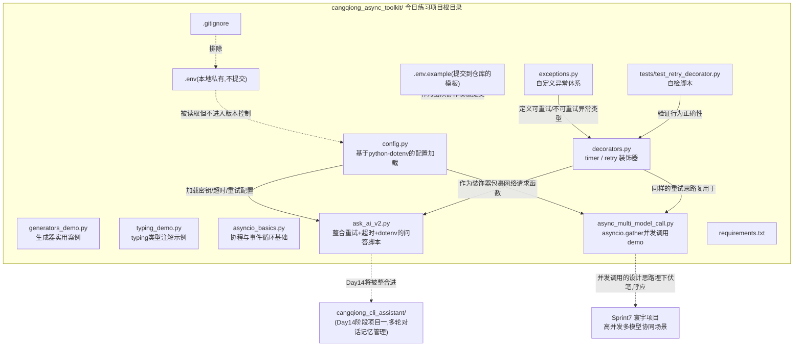
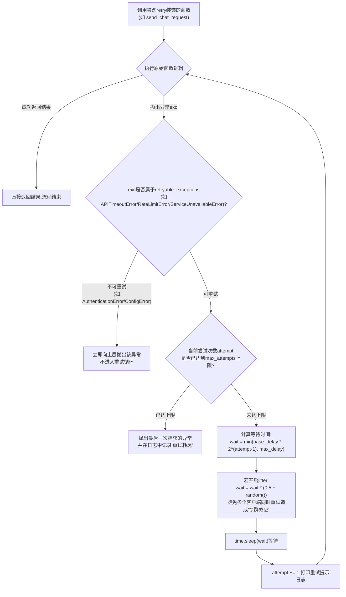
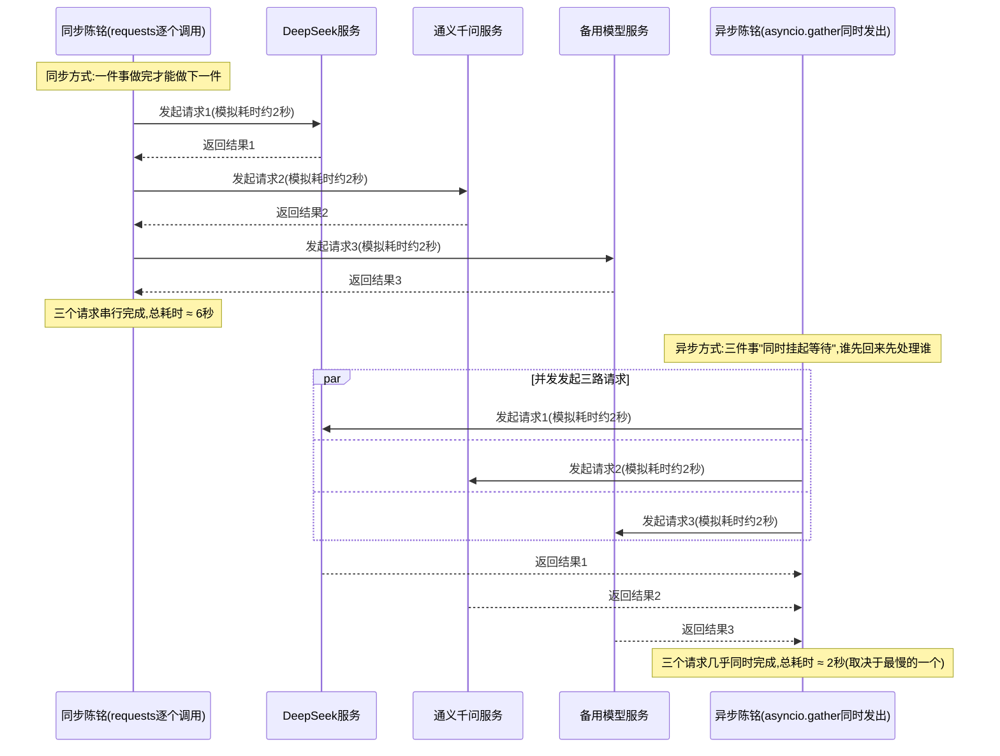

# 第13天 · 进阶语法与异步入门

> **周次/Sprint**:Sprint 0 · 新人内训(Day1-14)—— 阶段项目一:命令行多轮对话AI助手(预计Day14交付)
> **星期**:周六(第二周第六天;按公司惯例周末强度会略降一档,但今天知识点分量不轻,老王把"降一档"落实在了形式上——不订会议室、不要求正装出席,内容照常一条不少)
> **学员**:陈铭、苏梦、韩露、张凡(导师:王振宇)
> **内训任务卡**:PYXT-ONB-D13(蓬远科技培训中心 · 新人训练营 · Day13)
> **今日关键词**:装饰器(无参/带参) / `functools.wraps` / 生成器与`yield` / `typing`类型注解 / `asyncio`异步编程入门 / `asyncio.gather`并发调用 / `python-dotenv` / `.gitignore` / 重试装饰器 / 超时控制 / API Key安全事故

---

## 【旁白】

先说一件今天还没发生、但已经能看见影子的事:三十几天以后,寰宇集团项目冲刺到最紧张的阶段,苍穹平台需要在同一个请求里,把用户的问题同时甩给知识库检索、意图识别、敏感词审核三个各自独立的模型调用,谁都不能等谁,谁慢了整条链路就慢了。到那个时候,负责这段代码的人会毫不犹豫地写下`asyncio.gather(...)`四个字,不会有任何犹豫或者查资料的停顿。而这份"不犹豫",最初的起点,就是今天——陈铭第一次搞清楚"同步"和"异步"到底在计算机里意味着什么的这个周六。今天写的代码,大概率不会有一行原封不动地活到那一天,但今天在脑子里搭起来的那根筋——"哪些事情可以同时做、哪些事情必须排队做、程序在等待网络回应的时候到底在干什么"——会原样保留下去,变成陈铭往后判断任何一段代码"要不要用异步"的第一反应。

再说一件今天真正发生、而且写在晨会纪要里不太体面的事:陈铭差点把一段真实的API Key提交进了Git仓库。这不是教学设计出来的桥段,这是几乎每一个刚接触API开发的工程师都会踩、而且往往要踩过一次才能真正记住的坑——密钥这种东西,平时看不出它的存在感,一旦在错误的时刻暴露,后果却不是"重新生成一个就好"这么轻松:如果被人在公开仓库里扫到,轻则被盗刷额度,重则牵连到公司的合规责任。老王在Code Review里把这件事当场喊停,语气不算严厉,但那句"这种事我希望你只犯一次",陈铭记了很久。今天课件把这件事完整地摆出来,不是为了塑造"主角犯错又成长"的桥段,而是因为写代码这件事,从今天起,陈铭要开始对"密钥、权限、生产环境"这几个词有一种本能的敬畏——这份敬畏,比任何一段语法知识都更接近"工程师"这个身份的核心。

【旁白】还有一层更技术性的因果关系值得提前点破:今天学的装饰器,不是为了完成"作业清单上的一项"而学,而是因为昨天(Day12)陈铭那个第一次成功调用大模型API、让他在培训群里小小骄傲了一下的`ask_ai.py`,今天早上已经开始不听话——时不时地卡住不动,或者干脆报出一段陈铭从没见过的超时错误。老王没有直接给答案,而是把问题原样甩回来:"网络请求这种事,出错是常态,不出错才是运气好。你打算让用户每次遇到这种情况,都靠手动按一次回车重新试?"这句话,就是今天这一整天所有技术主线共同服务的那个"业务问题"——重试装饰器、异步并发、环境变量安全管理,表面上是四个独立的知识点,骨子里都是在回答同一件事:一个要长期稳定运行的程序,应该怎么和一个"不完全可靠"的外部世界打交道。

---

## 晨会纪要 / 今日目标

**时间**:上午9:20,二层工位区,陈铭的工位B-07旁边(周六不订会议室,四人和老王直接围在工位边站着聊)
**出席**:王振宇(老王)、陈铭、苏梦、韩露、张凡

周六的园区比平时安静得多,楼下便利店卷帘门拉开的声音听得格外清楚。老王背着一个双肩包过来,手里拎着一杯豆浆,一屁股坐在陈铭工位对面那张没人坐的椅子上,开口第一句话没有寒暄:"陈铭,你昨天发到群里那个`ask_ai.py`,今天早上我拿它连着问了十个问题,试了试。你猜怎么着?"

陈铭愣了一下,下意识地摸了摸鼠标:"应该……都答上了吧?"

"第7个问题的时候,程序卡了差不多40秒,最后报了个`ReadTimeout`,程序直接崩了,整个进程退出。"老王把手机转过来,给陈铭看了一眼截图,是他自己电脑上跑出来的报错堆栈,"这不是你代码写得不好,这是所有第一次调用外部API的人都会遇到的必修课——网络这个东西,你没法保证它每次都听话。今天要解决的,就是这个问题:程序遇到这种'暂时性'的失败,应该怎么办,而不是直接躺平。"

**Day12收尾回顾**:

- 四人均已成功调用DeepSeek或通义千问API拿到真实回复,`ask_ai.py`基础版本跑通,老王昨晚在培训群里发了一句"恭喜,你们已经比80%的转行者摸到真东西了",群里士气不错。
- 苏梦昨天调试`requests`请求体格式的时候,把`messages`字段写成了字符串而不是列表,拿到`400 Bad Request`,自己排查了将近一小时才发现问题,老王评价"这种坑踩一次比听十次课有用"。
- 张凡对HTTP协议底层细节问得比较细(比如为什么状态码分成1xx到5xx这几大类),老王简单科普后建议"这些细节以后遇到具体问题时候再深挖,今天别在这上面耽误时间"。
- 韩露的API Key直接写在了代码里的字符串常量位置,老王当时提了一句"这个我们明天说",没想到"明天"来得比预想的更戏剧化一些——见下文。

周六的园区食堂不开餐,老王让大家中午自己叫外卖,还专门在群里发了一句"报销记得走公司周末加餐的流程,不用自己垫钱太久"——这大概是"周末强度略降"在今天最直接的体现:没有正装、没有大会议室、连午饭都变成了各自点外卖,松散的形式感之外,内容本身却一点没打折扣。

老王把豆浆放在桌角,神情忽然认真了一点:"在讲今天的技术内容之前,我要先说一件事,这件事关系到咱们今天所有人都要走一遍的操作,所以必须先讲清楚。"

他转头看向陈铭:"陈铭,你昨晚是不是打算把`ask_ai.py`提交到你自己的练习仓库里?"

陈铭心里一沉:"是,我昨晚`git add .`之后本来要commit,后来看时间不早了就先关电脑了……等等,老王,你怎么知道?"

"因为你`git add .`之后,我今天早上刷咱们内训仓库的GitLab通知,看到你有一个还没commit的暂存改动推送到了备份分支上——公司给你们配的练习环境有自动备份暂存区的插件,你可能没注意。"老王把电脑转过来,一行行诀让陈铭自己看,"你的`ask_ai.py`第8行,写的是`API_KEY = "sk-xxxxxxxxxxxxxxxxxxxxxxxx"`,后面跟的是一串看起来就是真实密钥格式的字符串。你自己看一眼,是不是你自己那个正在用的Key?"

陈铭凑近屏幕看了两眼,脸色瞬间不太好看——是的,就是他自己申请的那个真实DeepSeek API Key,原原本本地硬编码在代码里,只差最后一步`commit`加`push`,就会永久地(或者至少是"曾经存在过"地)出现在Git的提交历史里。

老王没有再追加更严厉的话,只是很平静地说了一句让陈铭记了很久的话:"这次没造成实际后果,是因为你昨晚犹豫了一下没有commit,纯粹是运气。我不想靠运气这件事教你们工程规范,所以今天我们要正式解决这个问题——密钥永远不写进代码,永远通过环境变量加载,而且要有一份`.gitignore`确保它永远不会被不小心提交。这件事我希望你们只犯一次,而且是犯在我们内部的练习仓库里,不是犯在客户项目的正式仓库里。"

**今日目标**:

1. 上午9:30-12:00:装饰器原理与应用——函数是一等对象、手写不带参数的装饰器、`functools.wraps`、带参数的装饰器(三层嵌套)、装饰器叠加与执行顺序。
2. 下午14:00-17:30:生成器与`yield`(惰性求值、实用案例)、`typing`类型注解体系、`asyncio`异步编程入门(协程、事件循环、`async`/`await`、`asyncio.gather`并发调用多个模型API)。
3. 晚自习19:00-21:00(周六自愿参加,但四人今天都主动留下来了):`python-dotenv`环境变量管理、`.gitignore`安全配置补课、把重试装饰器与超时控制整合进`ask_ai.py`,产出今天的最终交付物。

**风险点**:

- 老王在白板(临时找了一块小白板架在工位区)上写了一句话:"今天最容易学'会'但学不'透'的知识点是装饰器——很多人能照抄语法,但换一个场景就写不出来,因为没理解'函数可以被当作参数传来传去'这件事的分量。"
- `asyncio`是今天信息密度最高的部分,老王明确提醒"不要求今天就能写出复杂的异步程序,能理解'为什么异步能省时间'、能跑通一个`asyncio.gather`的demo就算达标,更深的内容(比如事件循环的底层调度细节)以后遇到实际需求再补"。
- 环境变量与`.gitignore`这部分,虽然技术含量不算高,但今天出了真实的教学事故(见上文),老王要求"这部分内容今天必须每个人都亲手操作一遍`git rm --cached`,不能只是听我讲"。
- 林悦今天没有列席(周六休息),但老王提前在群里转达了她的一句关心:"提醒一下大家,密钥泄露这种事,不只是技术问题,是会直接影响公司合规和客户信任的大事,以后写客户项目代码的时候,这条红线只会更严格。"

---

## 需求文档:内部技术任务书 —— 给API调用加上重试装饰器与超时控制

> 本任务书由技术导师王振宇发放,格式沿用公司内部PRD模板,但因为今天是"技术自学与工具打磨"性质的一天,任务书聚焦于"内部工具能力升级"而非面向客户的功能需求。

### 一、背景

Day12交付的`ask_ai.py`验证了"能不能调通API"这个最基本的问题,但没有验证"调用不稳定的时候程序能不能扛住"这个更接近生产环境的问题。老王在晨会上给出的原始报错(`ReadTimeout`导致程序直接崩溃退出)恰好证明了这一点——目前的`ask_ai.py`本质上是一个"晴天程序":只要网络状况良好、服务商接口响应正常,它就能正常工作;一旦出现任何风吹草动(超时、限流、服务临时不可用),它就会带着一段用户看不懂的Python原生报错堆栈直接崩溃退出,用户唯一能做的事情就是重新启动程序,然后祈祷这次不要再出问题。

这种"晴天程序"的问题,不是陈铭一个人的问题,是几乎所有第一次接触外部API调用的开发者都会写出来的第一版代码——因为在学习阶段,大家的注意力天然会集中在"怎么把功能实现出来"这件事上,而"实现出来的功能在异常情况下会怎样"往往要等到真的踩了坑才会被重视。老王选择在Day13、而不是Day12就引入重试与容错机制,是有意为之——先让大家亲手体会一次"程序崩了"的真实痛感,再讲解决方案,记忆会比"我先给你讲一遍装饰器语法,再假设你会用它做什么"更深刻。

同时,今天的另一条线索——密钥安全事故——虽然是意外发生的,但和"重试与容错"这条主线本质上是同一个话题的两个侧面:前者是"程序遇到外部世界的不确定性该怎么办",后者是"程序处理敏感信息的时候该有怎样的敬畏心"。两者共同指向同一个更大的主题——一段代码,从"能跑起来的练习作业",到"可以放心交给别人用的软件",中间要跨过的那道门槛,不是功能有多复杂,而是有没有认真考虑过"万一"这两个字。

老王在任务书发放的时候,还补充了一段行业背景说明,帮助四人理解这份"内部工具升级"任务在更大范围内的意义:"你们现在接触的,还只是DeepSeek、通义千问这些服务商提供的免费或者低成本试用额度,出了问题,最多是重新申请一个新的额度,代价可以忽略。但苍穹平台一旦进入正式的客户项目阶段(比如往后的海纳制造集团、祺瑞集团这些项目),调用的API额度是要花真金白银采购的,如果一个密钥不小心泄露到公网上,被恶意扫描工具捡到,几个小时之内额度被刷爆,是完全可能发生的真实损失——业内类似的事故新闻,你们随便搜一搜都能找到不少案例。今天这套'重试+超时+密钥管理'的组合,与其说是应付一个教学任务,更准确的说法是——这是你们往后每一天写涉及外部API调用的代码时,都应该默认具备的'及格线',不是一个'加分项'。"

### 二、用户故事

**故事1(稳定性角度)**
作为一名使用`ask_ai.py`的用户,我理解网络偶尔会抖动、AI服务商偶尔会临时限流,我不要求程序永远不出错,但我要求它在遇到这类"暂时性"问题时能够自动重试几次,而不是第一次失败就直接放弃、把问题原样甩给我。
> 验收关注点:程序对可预见的"暂时性"异常(超时、限流、服务临时不可用)应具备自动重试能力,重试次数与等待策略可配置,重试过程中应有清晰的日志提示,让使用者知道程序"正在努力,而不是卡死了"。

**故事2(边界角度)**
作为一名调用API需要为每次请求付费的用户,我不希望程序在遇到"重试也没用"的问题(比如API Key本身就是错的、参数格式本身就不对)时,还傻乎乎地重试好几次浪费时间和调用额度。
> 验收关注点:重试机制必须能区分"可重试"异常(超时、限流、服务不可用)与"不可重试"异常(鉴权失败、参数错误、配置缺失),后者应立即失败并给出清晰提示,不进入重试循环。

**故事3(响应速度角度)**
作为一名不希望被无限期挂起等待的用户,我希望单次请求有一个明确的超时上限,超过这个时间如果还没有响应,程序应该主动放弃这一次尝试(可能进入重试,也可能最终报错),而不是无限期地"转圈圈"。
> 验收关注点:每次实际网络请求必须设置超时时间(可配置,默认30秒),超时行为应当被正确捕获并计入重试逻辑,而不是让程序无限期挂起。

**故事4(安全角度,今天真实事故驱动)**
作为一名对公司代码仓库负有安全责任的技术负责人,我要求任何代码——不管是练习代码还是正式项目代码——都不允许把真实的API Key、密码等敏感信息硬编码在源代码里或者提交进Git历史,必须通过环境变量加载,且承载真实密钥的`.env`文件必须被正确排除在版本控制之外。
> 验收关注点:代码仓库中不能出现任何真实密钥字符串(包括曾经提交过又删除的历史记录);必须提供`.env.example`模板文件(不含真实密钥)供协作者参考;`.gitignore`必须正确配置,且如果`.env`此前已经被Git追踪,必须用正确的方式(`git rm --cached`)把它从版本控制中移除。

**故事5(工程效率角度,呼应装饰器主线)**
作为一名不想在每一个需要"重试+超时"能力的函数里都手写一遍重复逻辑的开发者,我希望这份能力被封装成一个可以复用的装饰器,今后任何函数只需要加一行`@retry(...)`就能获得这份能力,而不需要在函数体内部反复粘贴同样的`try/except`代码。
> 验收关注点:重试与超时控制的核心逻辑应被封装为独立、可配置、可复用的装饰器,能够直接应用于`ask_ai.py`中负责发起网络请求的函数,不破坏被装饰函数原有的名称、文档字符串等元信息。

### 三、功能列表

| 编号 | 功能 | 详细说明 | 优先级 |
|---|---|---|---|
| F1 | 无参装饰器练习 | 手写一个计时装饰器`timer`,统计并打印被装饰函数的执行耗时,用于理解装饰器基本原理 | P0 |
| F2 | 带参数的重试装饰器 | 实现`retry(max_attempts, base_delay, max_delay, jitter, retryable_exceptions)`装饰器,支持指数退避与随机抖动 | P0 |
| F3 | 自定义异常体系 | 设计`CangqiongAPIError`及其子类(配置错误、鉴权失败、限流、超时、服务不可用、响应解析失败),明确区分可重试与不可重试异常 | P0 |
| F4 | 超时控制 | 网络请求统一设置`timeout`参数,超时异常被正确捕获并计入重试逻辑 | P0 |
| F5 | 生成器实用案例 | 实现"大文件分批读取"生成器与"逐字输出打字机效果"生成器,理解惰性求值的实际价值 | P0 |
| F6 | typing类型注解 | 为核心函数与数据结构补充完整类型注解,包括`TypedDict`定义消息格式、`Literal`限定模型名称可选值 | P1 |
| F7 | asyncio并发调用demo | 用`asyncio.gather`同时向两个及以上模型服务发起请求,验证并发调用相对串行调用的耗时优势 | P1 |
| F8 | python-dotenv配置管理 | 用`.env`文件承载真实密钥,`load_dotenv()`加载,提供`.env.example`模板 | P0 |
| F9 | .gitignore安全加固 | 正确配置`.gitignore`排除`.env`等敏感文件,并对已被误跟踪的文件执行`git rm --cached`补救 | P0 |
| F10 | ask_ai.py升级整合 | 把重试装饰器、超时控制、dotenv配置整合进Day12的`ask_ai.py`,产出可直接被Day14复用的模块 | P0 |
| F11 | 自检脚本 | 提供不依赖真实网络请求的自检脚本,用"人为制造失败"的假函数验证重试装饰器行为符合预期 | P1 |

### 四、非功能需求

- **安全性**:任何真实密钥不得出现在代码、注释、日志打印、异常信息、Git历史的任何一处。
- **可配置性**:重试次数、等待策略、超时时间均应可通过参数或环境变量配置,不允许硬编码"魔法数字"。
- **可读性**:装饰器代码必须使用`functools.wraps`保留原函数元信息;所有自定义异常需要有清晰的中文docstring说明适用场景。
- **健壮性**:重试耗尽或遇到不可重试异常时,程序应给出用户可理解的提示,而不是直接抛出未处理的原生异常导致程序崩溃。
- **性能感知**:异步并发demo需要输出真实的耗时对比数据(而不是仅凭直觉判断),让"异步更快"这句话有实证支撑。
- **可观测性**:每一次重试行为都应该在终端(今天阶段用`print`即可,后续正式项目会替换为标准的日志模块)有清晰的提示,包含"第几次尝试""失败原因""下一次等待多久",不允许静默地重试而不留下任何痕迹,否则一旦出现连续重试失败,使用者会完全不知道程序到底"卡"在了哪一步,还是干脆已经放弃了。

### 五、验收标准

1. 手写的`timer`装饰器能够正确打印任意函数的执行耗时,且不改变被装饰函数的返回值。
2. `retry`装饰器在传入一个"前两次抛异常、第三次成功"的模拟函数时,能够正确重试2次后返回成功结果,且能在日志/打印信息里体现出重试过程(等待时间递增)。
3. `retry`装饰器在遇到自定义的`AuthenticationError`(不可重试异常)时,必须立即抛出,不进入重试循环——用打印次数或日志验证"只执行了1次原始函数调用"。
4. 至少实现1个生成器函数,并能证明其"惰性"特性(比如用`print`语句证明代码在`next()`被调用之前不会执行到`yield`之后的部分)。
5. `asyncio.gather`并发调用demo的实测耗时,应明显小于把同样几个模拟请求改成顺序`await`调用的耗时(允许有合理误差,但差异应达到能被肉眼确认的程度)。
6. `.env`文件必须能通过`python-dotenv`被正确加载,且`git status`确认`.env`不会出现在待提交文件列表中。
7. 如果`.env`此前已经被Git追踪(今天专门制造这个场景让四人亲手补救),必须能正确执行`git rm --cached .env`并确认后续提交历史不再追踪该文件。
8. 升级后的`ask_ai.py`在故意断网或使用错误API Key的情况下运行,必须给出中文可读的错误提示,不能崩溃退出并抛出原生Traceback。
9. 提供的自检脚本必须能独立运行、不依赖真实网络请求,验证点全部通过。

---

## 架构设计图:Day13练习项目 `cangqiong_async_toolkit` 模块结构

老王要求今天的产出物按照"未来会被Day14直接复用"的标准来组织目录结构,不是随手写几个独立的`.py`文件应付了事。



这张图里有两根特别值得注意的"虚线":一根从`ask_ai_v2.py`指向Day14要交付的`cangqiong_cli_assistant`,意思是今天写的重试装饰器、超时控制、配置加载,不是写完就扔的练习代码,是明天全天封闭开发时会被直接搬过去复用的基础设施;另一根从`async_multi_model_call.py`指向遥远的Sprint 7,老王在讲这张图的时候特意停顿了一下:"这根线现在看起来有点突兀,今天你们只需要知道——异步并发这个能力,以后用得到的场景比你们想象的多得多,现在打的基础,不会浪费。"

张凡盯着这张图看了很久,提出了一个关于目录组织的问题:"为什么`exceptions.py`要单独拆出来,不直接写在`decorators.py`或者`ask_ai_v2.py`里面?"老王的回答直接点出了模块化设计的一条基本原则:"异常类型这种东西,天然是'被多个模块共同依赖'的——`decorators.py`要用它判断该不该重试,`ask_ai_v2.py`要用它翻译成用户提示,`async_multi_model_call.py`要用它统一错误处理逻辑。如果把异常定义散落地写在某一个具体的业务模块里,其他模块想复用就得反过来'依赖'这个业务模块,容易造成循环依赖(A依赖B、B又反过来依赖A,这在Python里会直接导致`ImportError`)。把公共的、被广泛依赖的东西(异常类型、基础配置)单独拆成一个'谁都可以依赖、自己不依赖任何业务模块'的底层文件,是几乎所有中大型项目都会遵循的组织原则,苍穹平台正式仓库结构里的`utils/`目录,承担的正是类似的角色。"

---

## 流程图:重试装饰器的执行逻辑

这张图对应`retry`装饰器包裹住的函数在真实调用时,内部到底经历了怎样的决策过程——这也是老王要求"讲清楚原理,而不是背下来语法"的核心内容。



老王在讲这张图的时候补充了一句:"你们注意这张图里有两个'出口'是直接抛异常的——一个是遇到不可重试的错误立即抛,一个是重试次数耗尽之后抛。这两种'失败'在业务含义上完全不同,第一种是'再试也没用,别浪费时间',第二种是'我们已经尽力了,但外部世界现在确实不给力'。你们写代码的时候,给用户看的提示文案,这两种情况也应该完全不一样。"

---

## 示意图:同步串行调用 vs asyncio并发调用的时间线对比

为了让"异步能省时间"这句话不只是一句空洞的口号,老王要求用一张时间线对比图,把同样三个请求分别用"排队式"和"并发式"跑一遍,直观展示两者的耗时差异。



张凡看完这张图,第一反应是:"那我以后是不是所有网络请求都应该写成异步的?"老王摇头:"不是所有场景都值得——如果你的程序本来就只有一个用户、一次只处理一个请求(比如咱们现在这个命令行小工具),同步阻塞完全够用,引入异步反而增加了代码复杂度,收益不成比例。异步真正划算的场景,是'需要同时等待多个互不依赖的外部资源'——比如同时问两个模型、同时查三个数据库、同时调用五个不同的接口。你们记住这条判断标准就够了,不要为了炫技而生搬硬套。"这句话后来被陈铭原样记在了笔记本上,旁边画了一个小小的星号。

苏梦盯着这张图又看了一会儿,提出了一个略带担忧的问题:"图上并发那一路,三个请求几乎是完全对齐的时间线,现实里真的能做到这么整齐吗?"老王笑了一下,答得很实在:"图是理想化的示意,现实里三个请求各自的网络延迟、服务商那一侧的处理速度都不完全一样,不会真的分秒不差地同时结束——但核心结论是不变的:并发方式的总耗时,取决于'最慢的那一个',而不是'所有耗时加起来';串行方式的总耗时,永远是'所有耗时严格加起来'。哪怕现实里有一点参差,并发相对串行的优势,在数量级上依然是碾压性的,这也是为什么我们要专门画一张图,把这个道理'钉'在你们脑子里,而不是只停留在嘴上说说。"

---

## 课堂笔记

### 上午:装饰器原理与应用

#### 1. 从"函数是一等对象"说起

老王没有直接讲装饰器语法,而是先在白板上写了一句话:"在Python里,函数和整数、字符串、列表一样,都是'一等对象'(first-class object)——意思是函数可以被赋值给变量,可以作为参数传给另一个函数,也可以作为另一个函数的返回值。"

他现场写了一段代码验证这句话:

```python
def greet(name):
    return f"你好,{name}"

# 函数可以被赋值给变量
say_hello = greet
print(say_hello("陈铭"))  # 你好,陈铭

# 函数可以作为参数传给另一个函数
def call_twice(func, arg):
    func(arg)
    func(arg)

call_twice(print, "打印两次试试")

# 函数可以作为另一个函数的返回值
def get_greet_function():
    def inner(name):
        return f"你好,{name}"
    return inner

my_func = get_greet_function()
print(my_func("苏梦"))
```

苏梦盯着最后一段代码看了半天,问了一个很多零基础学员都会问的问题:"`get_greet_function()`返回的是`inner`这个函数本身,而不是`inner`执行之后的结果?那`my_func`到底是什么?"

老王的回答很直接:"注意`get_greet_function`函数体里,最后一行是`return inner`,不是`return inner()`——`inner`(不加括号)代表这个函数对象本身,`inner()`(加括号)才代表'调用这个函数、拿到它的返回值'。这个区分,是理解装饰器的第一道门——如果你分不清'函数本身'和'函数调用的结果'这两个东西,装饰器的语法你抄得会,但用起来一定会出各种奇怪的问题。"

这个细节,恰好也是Python新手最容易踩的一个坑——常见的错误现象是,把一个函数误当成变量直接使用而忘了加括号调用,或者反过来把不该调用的函数加了括号导致提前执行。老王举了个具体例子:

```python
def send_request():
    print("正在发送请求...")
    return "响应结果"

# 错误写法:忘记调用,task变成了函数对象本身
task = send_request
print(task)  # <function send_request at 0x1035f4ee0>,不是"响应结果"

# 正确写法:加上括号才是真正调用
task = send_request()
print(task)  # 正在发送请求... \n 响应结果
```

"你们以后看到一个变量打印出来是`<function xxx at 0x...>`这种奇怪的东西,基本可以确定——你少写了一对括号,把函数当成了它的返回值来用。"老王补了这么一句,"这是我带过的每一届学员都会踩的坑,没有例外。"

#### 2. 手写第一个装饰器:计时器

理解了"函数可以作为参数、也可以作为返回值"之后,装饰器的本质就变得没那么神秘了——**装饰器其实就是一个"接收一个函数,返回一个新函数"的函数**。老王让大家先不用`@`语法糖,手动实现一遍这个"包裹"的过程:

```python
import time

def slow_function():
    """一个模拟耗时操作的函数"""
    time.sleep(1)
    print("慢函数执行完毕")

def timer(func):
    """
    计时装饰器:接收一个函数func,返回一个新的函数wrapper
    wrapper在执行func之前记录开始时间,执行之后记录结束时间,打印耗时
    """
    def wrapper():
        start = time.perf_counter()
        result = func()  # 调用原始函数
        elapsed = time.perf_counter() - start
        print(f"[计时] {func.__name__} 执行耗时 {elapsed:.4f} 秒")
        return result
    return wrapper

# 手动"包裹"的过程,还没有用@语法糖
slow_function = timer(slow_function)
slow_function()
```

"你们看这一行:`slow_function = timer(slow_function)`。"老王在这行代码下面画了一道横线,"`timer(slow_function)`执行的时候,`func`这个参数接住了原始的`slow_function`,然后`timer`返回了一个新的函数`wrapper`,这个`wrapper`把`slow_function`重新赋值给了同名的变量`slow_function`。从这行代码执行完之后,原来那个`slow_function`名字对应的,已经不再是原始的函数了,是被`timer`包了一层壳的新函数。"

韩露这时候提了一个很关键的问题:"那`@`符号是干什么的?"

老王直接把答案写在白板上:

```python
@timer
def slow_function():
    time.sleep(1)
    print("慢函数执行完毕")

# 等价于:
# def slow_function():
#     time.sleep(1)
#     print("慢函数执行完毕")
# slow_function = timer(slow_function)
```

"`@timer`写在函数定义的正上方,Python解释器看到这个符号,做的事情跟我们刚才手写的那两行代码完全一样——先把下面这个函数定义好,再把它传给`timer`,再把`timer`返回的新函数,重新赋值给原来的名字。`@`只是一个语法糖,让这个'包裹'的动作看起来更直观、更靠近函数定义本身,底层逻辑没有变。"

#### 3. 处理带参数的函数:`*args`和`**kwargs`登场

上面这个`timer`装饰器有一个明显的局限——它只能装饰"不带任何参数"的函数。如果被装饰的函数本身需要传参数呢?老王现场演示了如果不做处理会发生什么:

```python
@timer
def add(a, b):
    return a + b

result = add(3, 5)
# TypeError: wrapper() takes 0 positional arguments but 2 were given
```

"这个报错信息很直白——`wrapper()`这个函数定义的时候没有接收任何参数,但调用的时候你传了两个位置参数`3`和`5`,类型不匹配,直接报错。"老王说,"解决方案是,`wrapper`函数的参数列表,要能'原样转发'任意数量、任意形式的参数给原始函数,这正是Day6学过的`*args`和`**kwargs`的用武之地。"

修正后的版本:

```python
import functools

def timer(func):
    def wrapper(*args, **kwargs):
        start = time.perf_counter()
        result = func(*args, **kwargs)  # 原样转发所有参数
        elapsed = time.perf_counter() - start
        print(f"[计时] {func.__name__} 执行耗时 {elapsed:.4f} 秒")
        return result
    return wrapper

@timer
def add(a, b):
    return a + b

print(add(3, 5))  # [计时] add 执行耗时 0.0000 秒 \n 8
```

"这里的`*args`收集所有位置参数打包成一个元组,`**kwargs`收集所有关键字参数打包成一个字典,`func(*args, **kwargs)`再把它们原样'解包'传给真正的原始函数。"老王强调,"这一步几乎是所有'通用型'装饰器的标准写法——你不知道未来这个装饰器会被用在什么样的函数上,所以永远要假设它可能带任意参数,用`*args, **kwargs`保底。"

#### 4. `functools.wraps`:被忽视但很重要的细节

老王接着演示了一个"能跑,但有隐患"的问题——不加`functools.wraps`的装饰器,会悄悄"偷走"原始函数的元信息:

```python
def timer_without_wraps(func):
    def wrapper(*args, **kwargs):
        start = time.perf_counter()
        result = func(*args, **kwargs)
        print(f"耗时 {time.perf_counter() - start:.4f} 秒")
        return result
    return wrapper

@timer_without_wraps
def add(a, b):
    """计算两个数字之和"""
    return a + b

print(add.__name__)  # wrapper,而不是add!
print(add.__doc__)   # None,而不是"计算两个数字之和"!
```

"你们看,`add.__name__`打印出来的是`wrapper`,不是`add`。"老王指着屏幕说,"这是因为`@timer_without_wraps`执行完之后,`add`这个名字对应的对象,本质上就是`timer_without_wraps`内部定义的那个`wrapper`函数,而`wrapper`自己的`__name__`当然是`'wrapper'`,它并不会自动'继承'原始函数的名字和文档字符串。"

这个问题看起来"无伤大雅"——毕竟`add(3, 5)`照样能算出`8`。但老王指出了它在真实项目里会造成的麻烦:"如果你写了一堆被装饰的函数,然后在日志系统里想打印'当前正在执行的函数名',或者用一些自动生成API文档的工具(比如FastAPI会根据函数的`__name__`和`__doc__`自动生成接口文档),这些工具全都会被这个'冒名'的`wrapper`坏了事——你会看到日志里全是`wrapper`、`wrapper`、`wrapper`,根本分不清到底是哪个函数在执行。"

解决方案是`functools.wraps`:

```python
import functools

def timer(func):
    @functools.wraps(func)  # 关键:把func的元信息"搬"到wrapper上
    def wrapper(*args, **kwargs):
        start = time.perf_counter()
        result = func(*args, **kwargs)
        print(f"[计时] {func.__name__} 执行耗时 {time.perf_counter() - start:.4f} 秒")
        return result
    return wrapper

@timer
def add(a, b):
    """计算两个数字之和"""
    return a + b

print(add.__name__)  # add,正确了
print(add.__doc__)   # 计算两个数字之和,正确了
```

"`functools.wraps(func)`本身也是一个装饰器,它的作用是把`func`的`__name__`、`__doc__`、`__module__`等元信息复制到`wrapper`上。"老王总结,"记住一条规矩——**你写的每一个装饰器,不管多简单,只要用到了内部的`wrapper`函数,永远在它上面加一行`@functools.wraps(func)`**,这几乎没有例外,是业界公认的最佳实践,苍穹平台的代码规范里也是这么要求的。"

#### 5. 带参数的装饰器:三层嵌套函数

上面写的`timer`装饰器,`@timer`用起来不需要传任何参数。但很多真实场景下,我们希望装饰器本身是"可配置"的——比如今天要实现的重试装饰器,重试次数、等待时间都应该是可以调整的参数。老王引入了这样一个需求作为切入点:"如果我想让装饰器变成`@retry(max_attempts=3, base_delay=1.0)`这种带参数的写法,应该怎么实现?"

他现场推导了这个过程,先从一个最简单的例子讲起——一个可以指定"重复执行几次"的装饰器:

```python
import functools

def repeat(times):
    """
    带参数的装饰器:让被装饰的函数重复执行指定次数
    注意这是三层嵌套函数结构:
    第一层 repeat(times) —— 接收装饰器的参数,返回真正的装饰器
    第二层 decorator(func) —— 接收被装饰的函数,返回wrapper
    第三层 wrapper(*args, **kwargs) —— 真正执行时被调用的函数
    """
    def decorator(func):
        @functools.wraps(func)
        def wrapper(*args, **kwargs):
            result = None
            for i in range(times):
                print(f"第{i+1}次执行 {func.__name__}")
                result = func(*args, **kwargs)
            return result
        return wrapper
    return decorator

@repeat(times=3)
def say_hi(name):
    print(f"嗨,{name}!")

say_hi("张凡")
# 第1次执行 say_hi
# 嗨,张凡!
# 第2次执行 say_hi
# 嗨,张凡!
# 第3次执行 say_hi
# 嗨,张凡!
```

"这一段等价于什么,我们拆开来看。"老王一步步在白板上还原展开的过程:

```python
# @repeat(times=3) 这一行,等价于:
temp_decorator = repeat(times=3)   # 第一层调用,返回decorator函数
say_hi = temp_decorator(say_hi)    # 第二层调用,返回wrapper函数,重新赋值给say_hi
```

"跟不带参数的装饰器相比,多了一层——你先调用`repeat(times=3)`,这一步的返回值才是'真正的装饰器'(也就是`decorator`函数),然后用这个真正的装饰器去包裹`say_hi`。"老王说,"很多同学一开始记不住这个三层结构,一个简单的判断方法是——**装饰器名字后面如果要跟括号传参数(比如`@repeat(times=3)`),就一定是三层嵌套;如果装饰器名字后面直接跟函数、不需要额外的括号(比如`@timer`),就是两层嵌套**。"

张凡这时候提了一个很扎实的问题:"如果我想让`@repeat`既可以不传参数直接用(比如`times`默认是1),又可以传参数用,该怎么写?"

老王给出了一个常见的解决方案——让装饰器同时兼容"直接使用"和"带参数使用"两种写法,这需要判断第一个参数是不是"可调用对象":

```python
import functools

def repeat(times=None):
    """
    兼容两种用法的装饰器:
    @repeat        —— 不带括号,times会接收到被装饰的函数本身
    @repeat(times=3) —— 带括号传参数,times是真正的次数配置
    """
    # 情况一:@repeat 直接使用,此时times实际上是被装饰的函数
    if callable(times):
        func = times
        @functools.wraps(func)
        def wrapper(*args, **kwargs):
            return func(*args, **kwargs)  # 默认执行1次
        return wrapper

    # 情况二:@repeat(times=3) 带参数使用
    def decorator(func):
        @functools.wraps(func)
        def wrapper(*args, **kwargs):
            result = None
            for _ in range(times or 1):
                result = func(*args, **kwargs)
            return result
        return wrapper
    return decorator
```

"这个写法稍微有点绕,今天不要求大家一定要写出这么灵活的版本,我只是想让你们知道——装饰器的语法本身没有魔法,所有看起来'智能'的行为,拆开来看都是靠函数参数、`callable()`判断这些基础工具拼出来的。"老王补充,"今天下午和晚自习真正要用的重试装饰器,我们会固定用'带括号传参数'这一种写法,不做这种双模式兼容,保持简单。"

#### 6. 装饰器叠加:执行顺序是个容易搞混的点

老王接着讲了一个"看起来简单,实际上很多人第一次会搞反"的知识点——多个装饰器叠加在同一个函数上时,执行顺序是怎样的。

```python
def decorator_a(func):
    @functools.wraps(func)
    def wrapper(*args, **kwargs):
        print("A: 进入")
        result = func(*args, **kwargs)
        print("A: 退出")
        return result
    return wrapper

def decorator_b(func):
    @functools.wraps(func)
    def wrapper(*args, **kwargs):
        print("B: 进入")
        result = func(*args, **kwargs)
        print("B: 退出")
        return result
    return wrapper

@decorator_a
@decorator_b
def do_something():
    print("核心逻辑执行")

do_something()
# A: 进入
# B: 进入
# 核心逻辑执行
# B: 退出
# A: 退出
```

"这段输出很多人第一次看会觉得反直觉。"老王解释,"`@decorator_a`写在上面,`@decorator_b`写在下面,靠近函数定义本身的装饰器(`decorator_b`)先包裹`do_something`,离函数定义远一点的装饰器(`decorator_a`)再包裹已经被`decorator_b`包裹过的结果——这个'包裹'的顺序是从下往上,但真正调用执行的时候,顺序又是从外往内、再从内往外,就像剥洋葱一样。"他打了个更形象的比喻:"你可以把这个过程想象成穿衣服——`@decorator_b`先给你穿了一件内衬,`@decorator_a`又给你在外面套了一件外套。穿的顺序是先内衬后外套(从下往上装饰),但脱衣服(或者说,'触碰到你身体'这个动作发生的顺序)一定是先脱外套才能碰到内衬,再脱内衬才能碰到你本人——对应到执行顺序上,就是外层的`A: 进入`先打印,然后是内层的`B: 进入`,然后才是核心逻辑,退出的时候反过来,先`B: 退出`再`A: 退出`。"

这个知识点直接关系到今天下午要做的整合工作——重试装饰器和超时控制,到底应该"重试包裹超时"还是"超时包裹重试",顺序不一样,行为完全不同,老王把这个问题留到了下午的整合环节。

#### 7. 类装饰器:简单认识一下

老王没有花太多时间在这个知识点上,只是提了一句"装饰器不一定非得用函数实现,也可以用类实现",并给出一个最简单的例子:

```python
import functools

class CountCalls:
    """
    类装饰器:统计某个函数被调用的总次数
    通过实现__call__方法,让类的实例变成"可调用对象",
    这样类的实例本身就可以像函数一样被@语法糖使用
    """
    def __init__(self, func):
        functools.update_wrapper(self, func)  # 效果类似functools.wraps
        self.func = func
        self.call_count = 0

    def __call__(self, *args, **kwargs):
        self.call_count += 1
        print(f"{self.func.__name__} 已被调用 {self.call_count} 次")
        return self.func(*args, **kwargs)

@CountCalls
def ping():
    print("pong")

ping()
ping()
ping()
print(ping.call_count)  # 3
```

"类装饰器最大的好处是,天然适合维护'状态'——比如这里的`call_count`,如果用函数装饰器实现类似的功能,得靠闭包变量加`nonlocal`关键字,写起来没有这么直观。"老王说,"今天我们的重试装饰器不需要跨调用维护状态,用函数装饰器实现足够,但你们要知道类装饰器这条路存在,以后遇到需要'维护状态'的装饰器需求(比如统计调用次数、做简单的调用缓存),可以想到这个选择。"

#### 8. 上午小结与常见报错清单

老王在上午收尾的时候,专门整理了一份"装饰器常见报错清单",让四人抄进笔记本:

| 报错现象 | 原因 | 解决办法 |
|---|---|---|
| `TypeError: wrapper() takes 0 positional arguments but N were given` | `wrapper`没有用`*args, **kwargs`接收参数 | 统一用`def wrapper(*args, **kwargs)` |
| `func.__name__`打印出来是`wrapper` | 没加`@functools.wraps(func)` | 补上这一行,几乎没有例外 |
| 装饰器执行后函数"消失"、返回`None` | `decorator`内部忘记`return wrapper`,或者`wrapper`内部忘记`return result` | 检查每一层函数是否都有正确的`return` |
| `@repeat(times=3)`报错说`decorator() missing 1 required positional argument` | 少写了一层嵌套,把三层写成了两层 | 检查是否需要三层嵌套(装饰器本身要不要传参数) |
| 多个装饰器叠加后行为和预期不一致 | 装饰器执行顺序搞反了(从下往上包裹) | 按"穿衣服"的比喻重新梳理顺序,必要时打印日志验证 |

"这份清单不是让你们死记硬背,而是以后你们真的遇到装饰器报错的时候,可以按这张表快速定位问题类型。"老王说,"装饰器这东西,理解了原理之后,写起来是有固定套路的,不需要每次都从头想。"

苏梦把这张表工工整整地誊写进了自己的笔记本,还特意在旁边留了一栏空白,写着"下次遇到新的装饰器报错,补充进这里"——这个习惯后来被老王在某次晨会上当作范例提出来表扬过,"技术笔记不是抄一遍就完事,是要留出'以后还能往里加东西'的空间,这样它才会越用越厚,而不是记完就再也不会翻开。"

#### 9. 一个容易被忽略的问题:什么时候不该用装饰器

上午收尾前,韩露问了一个很实际的问题:"老王,我感觉今天学完之后,有点像拿了一把新锤子,看什么都想敲一敲——是不是以后所有重复的逻辑都应该封装成装饰器?"

老王这个回答,陈铭后来专门用红笔在笔记本上标注了出来:"装饰器最适合解决的问题,是那种'和函数核心逻辑本身无关,但又需要套在很多函数外面的横切关注点(cross-cutting concern)'——计时、日志、权限校验、重试、缓存,这些东西的共性是,它们不关心函数内部到底在算什么,只关心'函数执行前后要做点什么额外的事'。但如果你要封装的逻辑,本身和函数的核心业务强绑定——比如'这个函数专门用来算个人所得税,里面有一段税率查表的逻辑要复用',这种情况用一个普通函数把这段逻辑提取出来、直接调用就够了,没有必要绕道装饰器。装饰器不是'代码复用'的唯一手段,只是'横切关注点'这一类问题的最佳手段,用错了场景,反而会让代码变得更难读——因为读代码的人要在心里多绕一层'这个函数被谁包裹了、包裹逻辑做了什么'的弯路。"

他还补充了一个判断技巧:"你可以问自己一个问题——'如果把这段逻辑从函数里搬走,这个函数还完整、还能独立被理解吗?'如果答案是'能',这段逻辑大概率适合抽成装饰器;如果答案是'不能,搬走之后这个函数就不完整了',那这段逻辑就应该老老实实地留在函数体内部,或者用一个被显式调用的普通函数来复用,而不是藏在一个装饰器背后,让代码的执行路径变得不那么一目了然。"

苏梦追问了一句:"那装饰器是不是有'滥用'的风险?"老王点头:"确实有,业界一个常见的反面案例,是有些团队会把装饰器叠加到四五层甚至更多——`@cache`、`@log`、`@retry`、`@auth_required`、`@rate_limit`全部叠在一个函数上,单看这个函数定义那几行,完全看不出它到底做了什么,得一个个装饰器去翻源码才能拼出完整的执行逻辑。装饰器用得好,是'关注点分离';用得不好,是'把复杂度藏起来,而不是消灭掉'。今天你们只需要记住,重试和超时这两件事,是横切关注点里非常典型、非常适合用装饰器的场景,不代表'所有东西都该套一层装饰器'。"

---

### 下午:生成器、typing类型注解与asyncio入门

#### 1. 为什么需要生成器:从一个内存问题讲起

下午的课,老王没有直接讲`yield`语法,而是先抛出一个具体的性能问题。他让四人在自己电脑上运行下面这段代码,并观察内存占用:

```python
import sys

# 方式一:用列表推导式,一次性生成全部数据并存在内存里
numbers_list = [i * i for i in range(10_000_000)]
print(f"列表占用内存: {sys.getsizeof(numbers_list) / 1024 / 1024:.2f} MB")

# 方式二:用生成器表达式,不会一次性把数据都放进内存
numbers_gen = (i * i for i in range(10_000_000))
print(f"生成器占用内存: {sys.getsizeof(numbers_gen) / 1024 / 1024:.6f} MB")
```

在陈铭的电脑上跑出来的结果大致是:列表占用了将近80MB的内存,而生成器只占用了不到200字节。苏梦看到这个数字差异,忍不住问:"这是不是意味着生成器什么都没算,只是'假装'算了?"

老王点头:"你这个直觉是对的,'惰性求值'就是这个意思——生成器表达式`(i * i for i in range(10_000_000))`执行的时候,并不会真的把一千万个数字的平方全部算出来存起来,它只是记住了'该怎么算下一个值'这件事,真正的计算,推迟到你实际向它要值(比如用`for`循环遍历,或者调用`next()`)的那一刻才会发生,而且每次只算'刚好够用'的那一个值,用完就可以被回收,不会占着内存不放。"

他接着补充了一个更接地气的类比:"你可以把列表想象成'提前把一整个仓库的货全部搬到你家里',你要用的时候直接去家里拿,很快,但占地方;生成器更像是'需要一件货的时候,现场跟工厂下单发一件过来',每次只处理你当下需要的这一件,不需要囤货,但每次要用都得等它'现场生产'。"

#### 2. `yield`关键字:生成器函数的运行机制

理解了"为什么需要生成器"之后,老王开始讲生成器函数的实现方式——用`yield`关键字。他先给出一个最基础的例子,并现场用`next()`一步步演示执行过程:

```python
def count_up_to(n):
    """一个简单的生成器函数,从1数到n"""
    print("生成器函数开始执行")
    i = 1
    while i <= n:
        print(f"即将yield出去的值: {i}")
        yield i
        print(f"从yield处恢复执行,i现在是: {i}")
        i += 1
    print("生成器函数执行完毕")

gen = count_up_to(3)
print("此时生成器函数体一行都还没有真正执行")  # 关键现象

print("--- 第一次调用next() ---")
print(next(gen))  # 生成器函数开始执行 / 即将yield出去的值: 1 / 1

print("--- 第二次调用next() ---")
print(next(gen))  # 从yield处恢复执行,i现在是: 1 / 即将yield出去的值: 2 / 2

print("--- 第三次调用next() ---")
print(next(gen))  # 从yield处恢复执行,i现在是: 2 / 即将yield出去的值: 3 / 3

print("--- 第四次调用next() ---")
next(gen)  # 从yield处恢复执行,i现在是: 3 / 生成器函数执行完毕 / 抛出StopIteration
```

这段代码运行出来的输出顺序,是这一整个下午最容易让人"恍然大悟"的一个演示——老王特意让四人先各自猜一遍输出顺序,再运行验证。韩露猜错了第一处:她以为`gen = count_up_to(3)`这一行会立刻打印"生成器函数开始执行",但实际输出证明,**调用一个包含`yield`的函数,并不会立刻执行函数体,只会返回一个生成器对象**,函数体内部的代码,要等到第一次调用`next()`的时候才真正开始执行,执行到`yield`那一行就"暂停",把值返回出去,状态被完整保留;下一次`next()`调用时,从上次暂停的地方"恢复执行",直到再次遇到`yield`或者函数体执行完毕。

"这就是生成器和普通函数最本质的区别。"老王总结,"普通函数调用一次,从头执行到`return`(或者执行完毕)就结束了,状态不会被保留;生成器函数每次`next()`只往前走一小步,走到`yield`就'冻住',状态被完整保存下来,下次`next()`接着上次冻住的地方继续走。`for`循环遍历一个生成器,本质上就是不断在背后帮你调用`next()`,直到捕获到`StopIteration`异常为止,然后循环自动结束。"

#### 3. 生成器实用案例一:大文件分批读取(呼应Day11)

老王把这个知识点直接挂钩到Day11学过的文件操作:"你们Day11写的批量文档读取工具,如果客户给你的不是十几个小文件,而是一个几个GB的巨型日志文件,你打算怎么读?"

张凡很快反应过来:"如果用`readlines()`一次性把整个文件读进内存,文件太大内存会爆。"

老王给出了用生成器解决这个问题的写法:

```python
from pathlib import Path
from typing import Iterator, List


def read_lines_in_batches(file_path: str, batch_size: int = 1000) -> Iterator[List[str]]:
    """
    以生成器的方式,按批次读取大文件的每一行,避免一次性把整个文件读入内存。

    参数:
        file_path: 目标文件路径
        batch_size: 每一批返回多少行

    每次yield一个"批次"(一个list,包含最多batch_size行文本),
    调用者可以用for循环逐批处理,处理完一批就可以让它被内存回收,
    不需要等待整个文件处理完才能开始"用"数据。
    """
    batch: List[str] = []
    path = Path(file_path)
    with path.open("r", encoding="utf-8") as f:
        for line in f:
            batch.append(line.rstrip("\n"))
            if len(batch) == batch_size:
                yield batch
                batch = []  # 清空,准备下一批
    if batch:  # 处理文件末尾不满一批的剩余行
        yield batch


# 使用示例:假设有一个数万行的日志文件,按1000行为一批统计"ERROR"出现次数
def count_errors_in_large_log(file_path: str) -> int:
    """统计大文件中出现"ERROR"关键字的行数,不会一次性把整个文件读进内存"""
    error_count = 0
    for batch_index, batch in enumerate(read_lines_in_batches(file_path, batch_size=1000), start=1):
        batch_errors = sum(1 for line in batch if "ERROR" in line)
        error_count += batch_errors
        print(f"已处理第{batch_index}批({len(batch)}行),本批发现{batch_errors}处ERROR")
    return error_count
```

"这个写法的价值在于,不管这个文件是1MB还是10GB,内存占用基本恒定——因为任意时刻,内存里只保留'当前这一批'的数据,处理完就丢掉,不会像`readlines()`那样把整个文件的内容全部堆在内存里。"老王说,"苍穹平台以后处理客户上传的大文档(比如Day28要处理的PDF设备手册),核心思路和这里完全一致——只是从'按行分批'换成了'按文本块分批',本质上都是同一个'惰性处理'的思想。"

#### 4. 生成器实用案例二:打字机效果(为Day16的流式输出埋线索)

老王给出的第二个实用案例,直接埋下了一处后续悬念:

```python
import time
from typing import Iterator


def typewriter_effect(text: str, chunk_size: int = 1, delay: float = 0.03) -> Iterator[str]:
    """
    模拟"打字机效果"的生成器:把一段文本按指定的小块大小逐步吐出来,
    每吐出一块之间间隔delay秒,调用者可以边接收边打印,
    营造出文字一个字一个字"打出来"的视觉效果。

    这正是后面(Day16)大模型API的stream=True流式输出想要达成的用户体验——
    区别在于,这里的每一块文本是我们自己提前生成好的完整文本切出来的,
    而真实的流式输出,是模型一边生成一边把已经生成好的部分发给你,
    是"边生产边发货",不是"提前生产好之后慢慢发货"。
    """
    for i in range(0, len(text), chunk_size):
        yield text[i:i + chunk_size]
        time.sleep(delay)


def print_with_typewriter_effect(text: str) -> None:
    """把typewriter_effect生成器产出的每一块文本,不换行地逐步打印出来"""
    for chunk in typewriter_effect(text, chunk_size=1, delay=0.03):
        print(chunk, end="", flush=True)  # flush=True确保立刻显示,不被缓冲区攒着
    print()  # 最后补一个换行
```

在展示打字机效果之前,老王先带着大家梳理了一份"什么时候该用生成器、什么时候该老老实实用列表"的判断表,回应上午韩露那个"是不是所有东西都该套一层装饰器"式的疑问在生成器这个知识点上的翻版——张凡确实也问了几乎一样的问题:"生成器看起来这么省内存,是不是以后能用生成器的地方都该用生成器,别用列表了?"

老王给出的判断表如下:

| 场景特征 | 推荐选择 | 理由 |
|---|---|---|
| 数据量很大(几十万条以上),且只需要"从头遍历一遍" | 生成器 | 避免一次性占用大量内存 |
| 需要多次遍历同一份数据,或者需要随机访问某个下标的元素 | 列表 | 生成器只能"往前走",遍历一次之后就"耗尽"了,不能回头,也不支持`gen[3]`这种下标访问 |
| 需要知道数据的总长度(`len(...)`) | 列表 | 生成器本身不知道自己会产出多少个元素,不支持直接`len()` |
| 数据量不大(几百几千条),追求代码简洁直观 | 列表推导式即可 | 数据量小的时候,生成器"省内存"的优势体现不出来,列表的通用性反而更方便 |
| 数据是"无限"的或者"理论上没有明确边界"(比如持续监听一个数据流) | 生成器 | 列表不可能存下"无限"的数据,生成器天然契合这种"按需产出"的场景 |

"这张表格最关键的一条是第二行——**生成器只能往前走,不能回头,也不支持随机访问**。"老王特别强调了这一点,并现场演示了一个很多新手会踩的坑:

```python
gen = (i for i in range(5))
print(list(gen))  # [0, 1, 2, 3, 4],第一次遍历,正常拿到全部数据
print(list(gen))  # [],第二次遍历,拿到的是空列表!

# 生成器"耗尽"之后,不会自动重置,想再遍历一遍,只能重新创建一个新的生成器对象
gen2 = (i for i in range(5))
print(list(gen2))  # [0, 1, 2, 3, 4],新对象,正常
```

"这是生成器和列表最本质的行为差异之一——列表可以被反复遍历多少次都没问题,因为数据本身就完整地存在内存里;生成器'边生产边消耗',一旦被遍历完(或者只遍历了一部分,但你不再继续往下取值),它的状态就停留在那个位置,不会自动'倒带'。"老王说,"这也是为什么生成器不适合'需要多次使用同一份数据'的场景——比如你要先统计一遍这批数据的总数,再遍历一遍打印每一条,如果用生成器,统计完一遍就没了,第二遍遍历只能拿到空的,这种场景老老实实用列表,或者显式调用`list(生成器)`把它'物化'成列表之后再多次使用。"

老王在演示这段代码运行效果的时候,特意提了一句:"你们现在看到文字一个字一个字往外蹦,会觉得'这不就是打字机效果吗,挺好玩的'。但我要提前告诉你们,大概三天后(Day16),我们会正式学习大模型API里`stream=True`这个参数,那时候你们会发现,ChatGPT、DeepSeek这些产品里让人上瘾的那种'文字流式蹦出来'的体验,底层用的思路,和你们今天写的这个玩具版打字机效果,骨子里是同一件事——都是'不要等全部数据准备好才一次性给你,而是准备好一部分就先给你一部分'。今天这个生成器版本是我们自己模拟的简化版,真实的流式输出会复杂一些(涉及到SSE协议、chunk解析),但概念上的根,就是今天的`yield`。"

#### 5. `yield from`简单认识

老王简单提了一下`yield from`的用法,用于生成器"委托"给另一个生成器或可迭代对象,没有花太多时间深入:

```python
def sub_generator():
    yield "子生成器-1"
    yield "子生成器-2"

def main_generator():
    yield "主生成器-开始"
    yield from sub_generator()  # 把sub_generator产出的每一个值,原样转发出去
    yield "主生成器-结束"

for item in main_generator():
    print(item)
# 主生成器-开始
# 子生成器-1
# 子生成器-2
# 主生成器-结束
```

"`yield from sub_generator()`等价于写一个循环,把`sub_generator()`里的每个值挨个`yield`出去,但写法更简洁。"老王说,"今天不要求大家用到这个语法,只需要以后看到别人代码里出现`yield from`,知道它在做什么就够了。"

#### 6. typing类型注解:从"能跑"到"看得懂、检查得出问题"

老王转到下一个话题,先问了一个问题:"我们从Day6开始写函数,一直到现在,函数的参数和返回值,你们有没有觉得,有时候看别人的代码,不看函数体内部,光看函数签名,根本猜不出这个参数应该传什么类型的数据?"

四人不约而同地点头——尤其是苏梦提到了她昨天调试`requests`请求体格式时踩的坑:"我当时如果一看到函数签名就知道`messages`参数应该是一个`List[dict]`,而不是随便传个字符串,可能就不会踩那个坑了。"

老王借着这个例子引入`typing`模块:"Python是动态类型语言,变量和函数参数不强制要求声明类型,这既是灵活性,也是隐患的来源。`typing`模块提供的类型注解,不会改变Python本身的运行行为(注意,类型注解只是'提示',Python解释器默认不会因为类型不匹配而报错),但它能让代码的意图变得清晰,配合IDE(比如VSCode)和静态检查工具(比如`mypy`),可以在代码运行之前就发现很多类型不匹配的问题。"

他从最基础的写法开始:

```python
# 不带类型注解的写法(能跑,但看不出参数该传什么)
def add(a, b):
    return a + b

# 带类型注解的写法(一看就知道该传什么、会返回什么)
def add(a: int, b: int) -> int:
    return a + b

# 变量注解
count: int = 0
name: str = "陈铭"
is_ready: bool = False
```

接着引入更复杂的容器类型注解:

```python
from typing import List, Dict, Tuple, Optional, Union, Callable

# List[X]表示一个元素类型都是X的列表
def get_names() -> List[str]:
    return ["陈铭", "苏梦", "韩露", "张凡"]

# Dict[K, V]表示键类型是K、值类型是V的字典
def get_scores() -> Dict[str, int]:
    return {"陈铭": 92, "苏梦": 88}

# Tuple可以表示固定长度、每个位置类型不同的元组
def get_position() -> Tuple[float, float]:
    return (39.9042, 116.4074)

# Optional[X]等价于Union[X, None],表示这个值可能是X类型,也可能是None
def find_user(user_id: int) -> Optional[str]:
    if user_id == 1:
        return "陈铭"
    return None

# Union[X, Y]表示这个值可能是X类型,也可能是Y类型
def parse_input(value: Union[str, int]) -> str:
    return str(value)

# Callable[[参数类型...], 返回类型]表示这个变量本身是一个函数
def apply_twice(func: Callable[[int], int], value: int) -> int:
    return func(func(value))
```

老王特别强调了`Optional`这个类型的重要性,直接联系到今天上午提到的报错场景:"`Optional[str]`意味着这个函数可能返回一个字符串,也可能返回`None`。如果你的函数签名写清楚了这一点,调用这个函数的人,理论上就应该知道要处理'返回了`None`'这种情况,而不是直接假设一定拿到了字符串就直接调用字符串方法,结果遇到`AttributeError: 'NoneType' object has no attribute 'xxx'`这种报错——这种报错,几乎所有Python工程师都遇到过,很多时候根源就是没有意识到某个函数'其实有可能返回None'。"

#### 7. `TypedDict`:给字典也加上"结构"

老王接着引入一个和苍穹平台业务强相关的类型——`TypedDict`,专门用来描述"结构固定的字典"(比如大模型API里`messages`列表的每一条消息):

```python
from typing import TypedDict, Literal, List


class ChatMessageDict(TypedDict):
    """
    描述一条符合大模型API约定格式的消息字典结构。
    role只能是"system"/"user"/"assistant"三者之一,
    content必须是字符串。
    """
    role: Literal["system", "user", "assistant"]
    content: str


def build_messages(user_input: str, system_prompt: str = "你是一个专业的AI助手") -> List[ChatMessageDict]:
    """构造一份符合ChatMessageDict结构的消息列表,用于发起API请求"""
    return [
        {"role": "system", "content": system_prompt},
        {"role": "user", "content": user_input},
    ]


# 如果不小心写错了role的值,静态检查工具(如mypy或IDE的类型检查)会提示错误
# wrong_message: ChatMessageDict = {"role": "helper", "content": "你好"}  # 类型检查会报错:"helper"不在允许的取值范围内
```

"注意,`role: Literal["system", "user", "assistant"]`这里用到了`Literal`类型,意思是这个字段只能取这三个字符串常量中的一个,不能是任意字符串。"老王说,"这对咱们后面(Day15开始)频繁跟大模型API打交道特别有用——`messages`列表格式错一点,API直接就会返回`400`错误,提前用类型注解把这个约束写清楚,能在你运行代码之前,甚至在你写代码的时候,就被IDE标红提示出来,比运行了才报错省事得多。"

他接着演示了`Literal`在另一个场景的应用——限定模型名字的可选值:

```python
from typing import Literal

ModelName = Literal["deepseek-chat", "deepseek-reasoner", "qwen-plus", "qwen-max"]


def call_model(model: ModelName, prompt: str) -> str:
    """
    调用指定的大模型。model参数被限定为四个已知的合法取值之一,
    如果传入其他字符串(比如拼错了模型名),IDE和mypy会在编写代码阶段就提示错误,
    不需要等到真正发起网络请求、拿到"模型不存在"的报错才发现问题。
    """
    print(f"正在调用模型: {model}")
    return f"模拟调用{model}的结果: {prompt}"


call_model("deepseek-chat", "你好")   # 正常
# call_model("deepseek-cha", "你好")  # 拼错了模型名,类型检查会标红提示
```

苏梦提了一个很实际的问题:"如果我们不装`mypy`,这些类型注解写不写还有意义吗?"

"有意义,而且意义不小。"老王回答,"第一,主流IDE(VSCode装了Python插件之后)默认就会根据类型注解做实时提示和错误标红,不需要额外配置`mypy`;第二,类型注解本身就是一种'代码即文档'——哪怕完全不跑任何检查工具,一个新人接手你的代码,光看函数签名就能大致猜出参数该传什么、返回值是什么形状,这比看长长一段函数体去猜测要高效得多。苍穹平台的代码规范里,`services`层的核心接口函数,必须要有完整的类型注解,这不是可选项。"

关于`mypy`本身,老王只是简单提了一句:"这是一个静态类型检查工具,能在代码运行之前扫描出类型不匹配的问题,今天不要求大家安装配置,以后正式进入FastAPI开发(Day23之后)会更系统地接触。"

张凡这时候提了一个更尖锐的问题:"这些类型注解写了之后,Python解释器运行的时候,真的会去检查它们吗?如果我故意写一个类型不匹配的调用,程序会报错吗?"老王现场用一段代码验证了这个问题的答案:

```python
def add(a: int, b: int) -> int:
    return a + b

# 故意传入字符串类型的参数,类型注解写的是int
result = add("3", "5")
print(result)  # 35,程序正常运行,没有任何报错!
```

"你们看,这段代码不但没有报错,还打印出了`'35'`(字符串拼接的结果),完全没有按照类型注解'应该报错'的方向发展。"老王说,"这正是我反复强调的一点——**Python的类型注解,在运行时(runtime)默认情况下不会做任何强制检查,它只是给人看、给IDE和像mypy这样的静态检查工具看的'提示信息'**,Python解释器本身,不会因为你传错了类型就在运行的时候拦截你。这和Java、TypeScript这种'静态类型语言'有本质区别——那些语言的类型系统是在编译阶段就会强制拦截类型不匹配的代码,Python的类型注解更像是一份'君子协议',大家约定好照着写、照着检查,但语言本身不会替你兜底。"

苏梦这时候问了一个很实在的问题:"那既然运行的时候不检查,写这些类型注解是不是有点像'摆设'?"

"不是摆设,但它的价值发挥场景,主要不在'运行时',而在'写代码和读代码的过程中'。"老王解释,"第一,主流IDE会实时读取类型注解,给你即时的错误提示和自动补全,这个价值在你写代码的当下就能感受到,不需要真的运行程序;第二,如果团队引入`mypy`这类工具作为CI流程的一部分(苍穹平台的仓库后续会配置类似的检查),类型不匹配的问题会在代码合并进主分支之前就被拦截下来,相当于把'运行时才会发现的bug',提前挪到了'代码提交阶段'就能发现,修复成本大幅降低;第三,哪怕完全不用任何工具,类型注解本身也是一份非常直观的文档,新人接手代码,看函数签名就能大致理解参数和返回值的形状,不需要去读函数体内部的实现细节去猜。这三点加起来,类型注解的价值已经足够大了,不需要靠'运行时强制检查'这一件事来证明自己有用。"

#### 8. asyncio入门:同步阻塞与异步非阻塞的本质区别

下午最后一块内容,也是信息密度最高的部分——`asyncio`。老王没有直接讲语法,先讲了一个类比:"你去咖啡店点单,如果收银员是'同步'工作方式,她接一个单子,必须站在咖啡机旁边一直等,直到这杯咖啡做好、递给客人,才能去接下一个单子——这段'等咖啡机出咖啡'的时间,她什么都做不了,完全被'占用'了。但真实的咖啡店不是这么运作的,收银员接完单之后,把订单丢给咖啡师,自己立刻去接下一个客人的单子,等这杯咖啡好了,再回来取走、递给客人——她的时间,没有被'干等'占用,而是拿去做了别的有意义的事情。"

"计算机程序处理网络请求,面临的是完全类似的情况。"老王继续说,"程序发出一个网络请求之后,要等待对方服务器处理、返回结果,这段等待的时间,CPU本身是完全空闲的,它没有在计算任何东西,只是在'干等'。如果是同步阻塞的写法,程序在这段等待时间里什么都做不了,只能傻站着;如果是异步非阻塞的写法,程序可以在等待这一个请求的同时,去处理别的事情(比如同时发出另外两个请求),等第一个请求的结果回来了,再回来处理它。"

他给出了一段最基础的对比代码,先展示"同步"版本:

```python
import time


def fake_api_call_sync(name: str, delay: float) -> str:
    """用普通同步函数模拟一次耗时的网络请求"""
    print(f"{name} 开始请求...")
    time.sleep(delay)  # time.sleep会让整个程序(整个线程)都停下来等待
    print(f"{name} 请求完成")
    return f"{name}的结果"


def main_sync() -> None:
    start = time.perf_counter()
    r1 = fake_api_call_sync("任务A", 2)
    r2 = fake_api_call_sync("任务B", 2)
    r3 = fake_api_call_sync("任务C", 2)
    elapsed = time.perf_counter() - start
    print(f"同步串行总耗时: {elapsed:.2f} 秒")  # 大约6秒


main_sync()
```

再展示改写成`asyncio`之后的"异步"版本:

```python
import asyncio
import time


async def fake_api_call_async(name: str, delay: float) -> str:
    """
    用协程函数模拟一次耗时的网络请求。
    注意:普通函数定义前加了async关键字,变成"协程函数";
    time.sleep换成了asyncio.sleep,并且前面必须加await关键字。
    """
    print(f"{name} 开始请求...")
    await asyncio.sleep(delay)  # 关键区别:asyncio.sleep不会阻塞整个程序,只是让出控制权
    print(f"{name} 请求完成")
    return f"{name}的结果"


async def main_sequential_await() -> None:
    """即使用了async/await,如果还是一个接一个地await,依然是"串行"的效果"""
    start = time.perf_counter()
    r1 = await fake_api_call_async("任务A", 2)
    r2 = await fake_api_call_async("任务B", 2)
    r3 = await fake_api_call_async("任务C", 2)
    elapsed = time.perf_counter() - start
    print(f"逐个await总耗时: {elapsed:.2f} 秒")  # 依然大约6秒,和同步版本没有本质区别


async def main_concurrent() -> None:
    """真正发挥asyncio优势的写法:用asyncio.gather让三个协程"同时"运行"""
    start = time.perf_counter()
    results = await asyncio.gather(
        fake_api_call_async("任务A", 2),
        fake_api_call_async("任务B", 2),
        fake_api_call_async("任务C", 2),
    )
    elapsed = time.perf_counter() - start
    print(f"asyncio.gather并发总耗时: {elapsed:.2f} 秒")  # 大约2秒
    print(f"结果: {results}")


asyncio.run(main_concurrent())
```

这段代码里,老王故意留了一个对比陷阱——`main_sequential_await`函数,虽然用了`async`/`await`语法,但因为是"一个接一个地`await`",实际运行效果和纯同步版本没有本质区别,耗时依然是6秒左右。他专门强调了这一点:"这是一个很容易被误解的地方——很多人以为只要用了`async`/`await`,程序就自动变'快'了,这是不对的。`async`/`await`只是提供了'写异步代码的语法能力',真正把多个任务'凑在一起同时执行'的,是`asyncio.gather`(或者类似的并发调度手段)。如果你还是习惯性地一个接一个`await`,那和同步代码在耗时上没有区别,只是写法不一样而已。"

#### 9. `asyncio.run`、事件循环、协程对象:几个绕不开的基础概念

老王补充了几个绕不开的基础概念,帮助大家建立完整的认知框架:

- **协程函数(coroutine function)**:用`async def`定义的函数。调用它不会立即执行函数体,而是返回一个"协程对象"(coroutine object),这一点和生成器函数调用后返回生成器对象、函数体不立即执行,是完全类似的道理——都是"先拿到一个可以被驱动执行的对象,真正的执行发生在之后"。
- **`await`关键字**:只能出现在协程函数内部,用于"等待"另一个协程对象(或者其他"可等待对象")执行完成并拿到结果。
- **事件循环(event loop)**:是`asyncio`真正的"调度中心"——负责决定"现在该运行哪个协程、运行到哪个`await`就先切换去运行另一个协程、等某个协程等待的事情就位了再切回来继续运行它"。`asyncio.run(main())`这行代码做的事情,就是创建一个事件循环,把`main()`这个协程扔进去运行,运行完毕之后关闭这个事件循环。

老王现场演示了一个典型的"忘记`await`"的报错,提醒大家这是`asyncio`最常见的坑:

```python
async def say_hello():
    print("你好")

# 错误写法:忘记await,只是创建了协程对象,但没有真正执行它
async def main():
    say_hello()  # 这里应该是 await say_hello()

asyncio.run(main())
# 输出:RuntimeWarning: coroutine 'say_hello' was never awaited
# "你好"这句话根本没有被打印出来
```

"这个警告的意思是——你创建了一个协程对象,但从来没有真正'驱动'它执行,它就那样被创建出来,然后什么都没发生,直接被垂在原地。"老王说,"这是`asyncio`新手最常见的坑,记住一条规矩——**调用一个`async def`定义的函数,前面几乎永远要加`await`(或者交给`asyncio.gather`/`asyncio.create_task`等调度工具),否则这次调用基本等于什么都没做**。"

他还提了另外两个常见的坑:

```python
# 坑1:在没有运行中的事件循环时,直接await会报错
async def foo():
    return 1

result = await foo()
# SyntaxError: 'await' outside function (如果这行代码写在模块顶层、不在async函数里)

# 坑2:time.sleep混用在协程函数里,会"阻塞整个事件循环"
async def bad_example():
    time.sleep(2)  # 错误!这会让整个事件循环卡住2秒,期间所有其他协程都无法运行
    # 正确应该用 await asyncio.sleep(2)
```

"第二个坑尤其隐蔽——`time.sleep()`这种同步阻塞的调用,一旦出现在协程函数内部,会把整个事件循环都'冻住',其他本来应该能并发执行的协程,也会被这一次`time.sleep()`拖累,完全违背了用`asyncio`的初衷。"老王特别提醒,"以后你们在协程函数里做任何'耗时等待'的操作(不管是`sleep`,还是真正的网络请求),一定要用对应的异步版本(`asyncio.sleep`、或者支持异步的网络库),不能混用同步版本的阻塞调用。"

这也直接引出了一个关键问题——`requests`库本身是同步阻塞的,不支持在`asyncio`协程里"正确地"异步发起网络请求。真正想在协程里发起异步的HTTP请求,需要用支持异步的库,比如`httpx`(提供`AsyncClient`)或者`aiohttp`。老王把这个细节留到了晚自习实战环节详细展开。

老王补充说明了为什么今天引入`httpx`而不是继续沿用`requests`:"`requests`是一个非常成熟、非常好用的同步HTTP库,咱们Day12到今天上午写的所有代码,用`requests`完全没有问题。但`requests`这个库设计的年代,`asyncio`还没有成为Python生态里的主流方案,它的底层实现天然是阻塞式的,没有办法配合`await`语法真正做到'发起请求之后把控制权让出去'。`httpx`这个库,刻意设计成了既支持同步用法(`httpx.Client`,用法几乎和`requests`一模一样),又支持异步用法(`httpx.AsyncClient`,专门配合`asyncio`使用),所以只要涉及到'真正的异步网络请求',我们会引入`httpx`,不涉及异步的场景,继续用大家已经熟悉的`requests`就够了,没有必要把所有代码都迁移过去,那样反而是不必要的返工。"

陈铭这时候问了一个很多刚接触`asyncio`的人都会问的问题:"我们之前(比如Day10讲多进程多线程的时候……"话说到一半他自己愣住了——"啊,好像我们还没正式讲多线程,但我听说过`threading`这个模块,`asyncio`和多线程,是不是解决的是同一个问题?"

老王在白板上画了一张简单的对比表,顺带把"并发"这个话题的几种主流方案做了一次横向梳理,方便大家建立一个完整的认知地图(多线程、多进程的具体语法留到后面遇到实际需求时再展开,今天只讲清楚"分工"层面的区别):

| 方案 | 适合解决的问题 | 核心限制 | 典型场景 |
|---|---|---|---|
| `asyncio`(协程/异步) | IO密集型任务(网络请求、文件读写等"等待"为主的任务) | 单线程运行,如果代码里混入了CPU密集型的重计算,会阻塞整个事件循环 | 同时调用多个模型API、同时处理多个客户端的网络连接 |
| `threading`(多线程) | 部分IO密集型任务,也能一定程度缓解CPU密集型任务的调度问题 | 受Python的GIL(全局解释器锁)限制,同一时刻只有一个线程真正在执行Python字节码,多线程对纯计算任务的加速效果有限 | 需要"看起来同时"执行多个阻塞式的同步任务,又不想大改代码结构为异步风格 |
| `multiprocessing`(多进程) | CPU密集型任务(大量数值计算、图像处理等) | 每个进程有独立的内存空间,进程间通信和数据共享成本较高,进程创建本身也有一定开销 | 大批量数据的并行计算任务 |

"简单总结一句话给你们记:**IO密集型(大量时间花在'等待'外部资源上)优先考虑`asyncio`;CPU密集型(大量时间花在'计算'本身上)优先考虑`multiprocessing`;`threading`是一个历史更久、适用面更广但因为GIL的限制,在很多场景下正在被`asyncio`取代的中间方案。**"老王说,"咱们苍穹平台要做的事情——调用大模型API、查数据库、读写文件——几乎清一色是IO密集型任务,这也是为什么`asyncio`会是我们后续更常用的并发方案,而不是`multiprocessing`。多线程和多进程的具体写法,以后遇到实际需要(比如Day56部署阶段涉及到高并发服务的场景)会专门展开,今天你们只需要在脑子里建立起这张对照表,知道'并发'这个大概念下有这么几条不同的路,各自适合的场景不一样,不要把它们混为一谈。"

#### 10. `asyncio.gather`并发调用多个模型API:今天最核心的应用场景

下午收尾前,老王给出了一个更贴近实际业务的demo——不再是模拟的`asyncio.sleep`,而是真的用`httpx.AsyncClient`同时向DeepSeek和通义千问发起请求,对比串行调用与并发调用的真实耗时差异(完整代码在"代码实战"部分的`async_multi_model_call.py`)。

张凡这时候问了一个比较深入的问题——也是Day14晨会纪要里提到的"张凡对`asyncio`的协程调度提出的问题比较深入"这一处细节:"如果`asyncio.gather`里的三个请求,其中一个抛出了异常,剩下两个还能正常拿到结果吗?"

老王给了一个明确的答案,并当场演示:"默认情况下,`asyncio.gather`只要有一个协程抛出未被捕获的异常,`gather`本身就会立刻把这个异常重新抛出来,其他还在运行的协程虽然不会被强制中断,但你在`gather`这一行拿到的,是一个异常,而不是一个包含全部结果的列表——你没办法直接拿到那些'成功了'的协程的结果。如果你希望即使有的协程失败了,也能拿到剩下成功的结果,需要传一个参数:`asyncio.gather(*coros, return_exceptions=True)`,这样`gather`的返回结果里,失败的那个位置会是对应的异常对象本身,而不是让整个`gather`调用直接抛异常中断。"

```python
import asyncio


async def maybe_fail(name: str, should_fail: bool) -> str:
    await asyncio.sleep(1)
    if should_fail:
        raise ValueError(f"{name} 模拟失败")
    return f"{name} 成功"


async def demo_gather_without_return_exceptions():
    try:
        results = await asyncio.gather(
            maybe_fail("任务A", False),
            maybe_fail("任务B", True),   # 这个会失败
            maybe_fail("任务C", False),
        )
        print(results)
    except ValueError as e:
        print(f"gather直接抛出了异常,拿不到其他成功的结果: {e}")


async def demo_gather_with_return_exceptions():
    results = await asyncio.gather(
        maybe_fail("任务A", False),
        maybe_fail("任务B", True),
        maybe_fail("任务C", False),
        return_exceptions=True,  # 关键参数
    )
    for r in results:
        if isinstance(r, Exception):
            print(f"某个任务失败了: {r}")
        else:
            print(f"某个任务成功了: {r}")
```

"这个知识点,以后在苍穹平台里会有非常实际的用处。"老王说,"比如客户的一次提问,系统同时发起'调用主模型生成回答'和'调用敏感词审核模型检查输入'两个异步任务,如果审核模型那边偶尔抽风超时了,你肯定不希望因为审核任务失败,连主模型已经生成好的回答也一起被扔掉——这时候`return_exceptions=True`就派上用场了,你可以针对每个任务的结果分别判断'成功了就用,失败了就走兜底逻辑'。"

陈铭这时候提了最后一个问题:"`asyncio.gather`和网上有些教程提到的`asyncio.create_task`,是不是同一个东西?"

老王的解释是:"`asyncio.create_task(coro)`做的事情,是把一个协程对象立刻'排进'事件循环去调度执行,返回一个`Task`对象,这个`Task`会在后台开始运行,不需要你立刻`await`它——这一点和直接调用一个协程函数(只是创建协程对象,什么都不会发生,除非被await)不一样,`create_task`创建出来的任务,是真的已经被安排上了'马上开始跑'。`asyncio.gather`本质上在背后也是用类似`create_task`的机制,把传入的多个协程都安排成并发运行的任务,然后统一等待它们全部完成。两者的关系是——`gather`更像是一个'一站式'的便捷封装,适合'我有几个明确数量的协程,想让它们并发跑完再统一拿结果'这种场景;`create_task`更底层、更灵活,适合你需要'先把任务扔出去跑着,自己先去做点别的事情,过一会儿再回来看结果'这种更精细的调度场景,比如需要动态地、逐个地追加新任务,而不是一开始就知道所有任务的完整列表。"他补充了一句实用的经验:"今天你们只需要熟练掌握`asyncio.gather`这一种用法就够了,`create_task`更精细的用法,以后遇到具体的、`gather`不够用的场景,再针对性地学习不迟。"

---

### 晚自习:密钥安全事故复盘、python-dotenv与最终整合

#### 1. 事故复盘:密钥差点提交进Git的完整过程

晚自习一开始,老王没有直接进入新知识点,而是要求陈铭把今天早上那次"惊魂事件"完整复盘一遍,让苏梦、韩露、张凡都跟着操作一遍类似的场景,确保"这个坑只需要有一个人踩过、但所有人都要学会怎么避开"。

老王先还原了问题发生的完整链路,让四人对照检查自己的代码:

1. **第一步,密钥被硬编码进了源代码。** 陈铭Day12写`ask_ai.py`的时候,图省事,直接把从DeepSeek官网申请到的API Key,原样粘贴进了代码里的一行赋值语句:`API_KEY = "sk-xxxxxxxxxxxxxxxxxxxxxxxx"`(这里的`x`代表真实密钥中的字符,出于安全考虑本课件全程不展示任何真实密钥格式的完整字符串)。这一步本身在"能不能跑起来"这个层面完全没有问题,程序照样正常工作,这也是为什么这类问题很容易被忽视——它不会导致任何显性的报错,一切看起来都很正常。
2. **第二步,`git add .`把改动加入了暂存区。** 陈铭想要提交这次改动,执行了`git add .`,这个命令会把工作区里所有被修改或新增的文件,原样加入Git的暂存区,包括那行硬编码了密钥的代码。
3. **第三步,原本会执行`git commit`,但陈铭因为时间不早就先关了电脑。** 如果这一步真的执行了`git commit -m "..."`,这次改动就会被永久记录进本地Git仓库的提交历史里——即使之后你再把这行代码删除、再提交一次"删除密钥"的新记录,**旧的提交历史里,那个包含真实密钥的版本依然完整地存在**,任何人只要能访问到这个仓库的完整历史(比如`git log`配合`git show`,或者更简单地,用GitHub/GitLab网页直接翻看历史提交),都能把这个密钥找出来。
4. **第四步,如果再执行`git push`,这次提交就会被推送到远程仓库。** 一旦推送到了远程(尤其如果这个仓库是公开的,或者哪怕是私有仓库但协作者较多),密钥泄露的风险就从"理论上存在"变成了"确凿的事实"。

老王讲完这四步,韩露举手补充了一个细节:"如果我用的不是命令行,是GitHub Desktop或者VSCode自带的Git面板这种图形化工具,是不是就不会有这个风险了?"老王摇头,态度很明确:"图形化工具本质上还是在背后帮你执行`git add`、`git commit`、`git push`这几个命令,唯一的区别是操作方式更直观,风险完全没有减少,甚至有一点更隐蔽——命令行里你至少能看到完整的文件差异(diff),图形化工具如果默认折叠了长文件或者二进制文件的展示,你可能更容易在没细看的情况下就点了'全部提交'。工具形式不是重点,有没有养成'提交前扫一眼diff、密钥永远走环境变量'这个习惯,才是重点。"

张凡这时候也松口承认了一件事:"我上周自己在GitHub上传练习作业的时候,其实也顺手把一个测试用的假密钥字符串写进过代码里,只是那个是我瞎编的、根本不是真的能用的密钥,所以没当回事。"老王听完专门借这个话题多提了一句:"这也是一个值得注意的心态误区——很多人会用'反正这个密钥是假的/过期的/免费额度用完的'来说服自己'这次不算数'。但代码规范这件事,不应该靠'这次密钥碰巧无害'来判断对错,应该靠'这个操作本身是否符合规范'来判断——你今天写的是假密钥,下次手一抖,可能就是真密钥,如果平时没有养成'密钥永远不硬编码'的习惯,不会因为'这次特殊'就自动规避风险。规范之所以是规范,就是因为它不应该看运气。"

"陈铭这一次,幸运地停在了第三步之前——他做了`git add`,但还没有`git commit`,更没有`git push`。"老王总结,"这意味着,只要我们现在正确地把这个文件从暂存区撤出来,或者干脆修正代码之后再重新`add`,就完全不会留下任何痕迹。但我必须说清楚——如果他当时多按了几次回车,把`commit`和`push`都做完了,处理方式会完全不同,而且麻烦得多,晚一点我会讲清楚'万一真的泄露了该怎么办'这个更糟糕的场景,你们要提前知道,而不是等真出事了才现场查资料。"

#### 2. 补救操作(一):还没commit的情况——最幸运、最容易处理的场景

老王现场带着陈铭操作了一遍补救流程,并让其他三人在自己的练习仓库里制造一个类似的"假密钥硬编码"场景,跟着练习一遍:

```bash
# 场景:文件已经git add,但还没有commit

# 第一步:先把这个文件从暂存区撤出来(不会删除工作区里的文件内容)
git restore --staged ask_ai.py

# 第二步:确认暂存区已经干净
git status

# 第三步:修改代码,把硬编码的密钥换成从环境变量读取(见下文dotenv部分)

# 第四步:重新git add、git commit,这一次提交的内容里,已经不包含任何真实密钥
git add ask_ai.py
git commit -m "重构ask_ai.py:密钥改为从环境变量加载,不再硬编码"
```

"`git restore --staged`这个命令,大家注意,它只是把文件从'暂存区'退回到'已修改但未暂存'的状态,不会撤销你对文件内容做的任何修改,更不会删除文件。"老王强调,"这一步操作完之后,密钥依然原样躺在你的代码文件里,只是还没有被Git这个'历史记录系统'正式收录进任何一次提交。接下来要做的,不是简单地重新`add`、`commit`就完事了,而是要先把代码改造成'从环境变量读取密钥'的正确写法——这才是真正解决问题的关键动作,不然你这次是躲过了,下次手一抖照样会犯同样的错误。"

#### 3. 补救操作(二):万一已经commit、甚至已经push了怎么办(老王额外补的"如果……"课)

虽然陈铭这次没有真的走到这一步,但老王认为这部分知识"必须提前讲,不能等真出事才现场查",于是额外花了十几分钟讲解更糟糕的场景:

**如果已经commit,但还没有push(密钥只存在于本地仓库历史):**

```bash
# 方式一:如果密钥是最近一次commit引入的,可以用--amend修正这次提交
# (先修改代码,去掉硬编码的密钥,然后:)
git add ask_ai.py
git commit --amend --no-edit   # 用修改后的内容"替换"上一次提交,不会新增一条历史记录

# 方式二:如果密钥是更早之前的某次commit引入的,需要用交互式rebase找到那次提交去修改
# git rebase -i <那次有问题的commit的父提交哈希>
# 在弹出的编辑器里,把对应那行commit前面的"pick"改成"edit",保存退出
# 然后修改代码、git add、git commit --amend、git rebase --continue
```

"这里要特别强调一句:`--amend`和`rebase -i`都会**改写Git的提交历史**,如果这些提交已经被别人拉取(pull)过,改写历史会导致别人本地的仓库和远程仓库产生冲突,这是团队协作里的高风险操作,一般只允许在'只有你自己在用的分支、且还没有push给别人'的情况下使用。"老王补充,"公司GitLab的分支保护规则里,`main`和`develop`分支是禁止强制推送(`git push --force`)的,就是为了防止这种历史改写操作影响到团队共享的分支。"

**如果已经push到了远程仓库(密钥已经在远程仓库的历史记录里,理论上已经"泄露"):**

老王在这里的语气变得格外严肃:"如果密钥已经被推送到远程仓库,不管这个仓库是公开的还是私有的,你要做的第一件事,**不是**去费尽心思清理Git历史,而是**立刻登录对应服务商(DeepSeek、通义千问、OpenAI等)的控制台,把这个密钥标记为失效或者直接删除,重新生成一个新的密钥**。"

他解释了这个优先级排序背后的原因:"清理Git历史(用`git filter-repo`或者`BFG Repo-Cleaner`这类工具从所有历史提交里彻底删除某个字符串)是一个相对复杂、容易出错、而且即使做对了也不能保证'万无一失'的操作——因为一旦推送到远程,任何在那期间`clone`或者`fetch`过这个仓库的人,本地都已经留了一份带密钥的完整历史,你在远程仓库上怎么清理,都清理不到别人本地那份拷贝。而密钥这种东西,一旦有理由怀疑它已经暴露,唯一真正靠得住的解决方案,是让这个密钥本身'作废'——旧密钥失效了,不管它出现在多少个地方的历史记录里,都没有实际风险了。"

"记住这条优先级:**先作废密钥,再清理历史,而不是反过来**。"老王把这句话写在了白板上,"这条规矩,以后你们进了苍穹项目组,写正式项目代码的时候,同样适用,而且后果会比今天严重得多——正式项目用的密钥,往往关联着真实的付费额度,甚至客户的私有部署环境,泄露的代价,不是'重新申请一个免费额度'这么轻松。"

#### 4. `python-dotenv`:把密钥请出源代码

讲完事故复盘,老王正式引入今天晚自习的核心工具——`python-dotenv`。他先解释了基本原理:"我们需要一个地方存放密钥这类敏感配置,这个地方要满足两个条件:一是不会被Git追踪提交,二是加载起来要方便,不需要每次都手动`export`环境变量。`.env`文件加上`python-dotenv`这个库,恰好同时满足这两个条件。"

安装很简单:

```bash
pip install python-dotenv
```

`.env`文件的写法(这个文件本身**不会**被提交到Git仓库):

```
# .env —— 本地私有配置文件,包含真实密钥,绝对不能提交到Git仓库
DEEPSEEK_API_KEY=sk-your-real-deepseek-key-goes-here
QWEN_API_KEY=sk-your-real-qwen-key-goes-here
DEFAULT_MODEL=deepseek-chat
REQUEST_TIMEOUT=30
MAX_RETRIES=3
RETRY_BASE_DELAY=1.0
```

代码里加载方式:

```python
import os
from dotenv import load_dotenv

load_dotenv()  # 默认会在当前工作目录及上级目录里寻找.env文件并加载成环境变量

deepseek_api_key = os.getenv("DEEPSEEK_API_KEY")
print(f"读取到的密钥前缀: {deepseek_api_key[:6]}******")  # 注意:打印时也不要把完整密钥打出来
```

"`load_dotenv()`这一行代码的作用,是把`.env`文件里的每一行`KEY=VALUE`,加载成当前进程的环境变量,之后你就可以用标准的`os.getenv("KEY")`去读取,和读取真正的系统环境变量没有任何区别。"老王说,"这样一来,代码里永远不会出现真实密钥的字符串,代码本身是'干净'的,可以放心提交、放心分享给任何人看,真正的密钥值只存在于每个人自己电脑上的那份私有`.env`文件里。"

#### 5. `.env.example`:给协作者的模板

老王强调了一个容易被忽略的细节:"光有`.env`还不够,你的同事、或者半年后接手这份代码的新人,怎么知道这个项目到底需要配置哪些环境变量?这就是`.env.example`存在的意义。"

```
# .env.example —— 提交到Git仓库的配置模板,不包含任何真实密钥,只展示需要哪些配置项
DEEPSEEK_API_KEY=your_deepseek_api_key_here
QWEN_API_KEY=your_qwen_api_key_here
DEFAULT_MODEL=deepseek-chat
REQUEST_TIMEOUT=30
MAX_RETRIES=3
RETRY_BASE_DELAY=1.0
```

"这份文件**要**提交到Git仓库,它的作用只是'告诉别人这个项目需要哪些配置项,以及大致的填写格式',里面的值全部是占位符,不是真实密钥。"老王说,"新人拿到项目,第一步就是`cp .env.example .env`,再把里面的占位符换成自己真实的密钥,这是几乎所有正式项目约定俗成的流程,苍穹平台的仓库结构里,根目录一直保留着一份`.env.example`,这不是偶然,是团队协作的基本规范。"

韩露又追问了一个团队协作场景下常见的问题:"如果`.env.example`里新增了一个配置项(比如新加了一个`MAX_RETRIES`),我本地的`.env`是之前就存在的,不会自动跟着更新,会不会导致我这边缺了这个配置,程序运行报错都不知道是为什么?"老王认可这是一个"真的会在团队里发生"的问题,并给出了实践建议:"这确实是`.env`方案的一个已知短板——它不像代码一样会被Git自动同步。比较稳妥的做法有两种:一是每次拉取到别人新增了`.env.example`里配置项的提交时,团队约定要在群里或者提交说明里显式提一句'新增了哪个配置项,请自行同步到本地.env';二是像今天`config.py`里`Settings`类做的那样,给每个配置项都设置一个合理的默认值(比如`MAX_RETRIES`默认是3),这样即使某个人本地`.env`没有同步最新的配置项,程序依然能用默认值跑起来,只是拿不到'定制化'的那部分行为,不会直接报错崩溃——这是一种'优雅降级'的设计思路,值得你们记住。"

#### 6. `.gitignore`:从根源上防止悲剧重演

老王最后讲解`.gitignore`的正确配置方式,这也是今天晚自习最后一项必须每个人亲手验证的操作:

```
# .gitignore —— 声明哪些文件/目录不应该被Git追踪

# 环境变量与密钥文件(最重要的一条,今天事故的核心)
.env
.env.local
.env.*.local

# Python相关
__pycache__/
*.pyc
*.pyo
*.egg-info/
venv/
.venv/

# 各种日志与临时文件
*.log
.DS_Store

# IDE配置(可选,视团队约定)
.vscode/
.idea/

# 项目自身的历史保存目录(如果里面可能包含用户的真实对话内容)
history/
```

老王强调了两个容易被忽视的坑:

第一,"`.gitignore`只对**尚未被Git追踪**的文件生效——如果`.env`此前已经被`git add`甚至`commit`过,即使现在把`.env`加进`.gitignore`,Git依然会继续追踪这个文件的后续改动,`.gitignore`不会'追溯性'地帮你把它清理出去。"他演示了正确的补救方式:

```bash
# 如果.env已经被Git追踪(错误已经发生,但还没有推送到远程,或者密钥已经作废重新生成了)
git rm --cached .env   # 从Git的追踪列表里移除,但保留本地文件不被删除
git commit -m "移除误提交的.env文件,并加入.gitignore防止再次发生"

# 之后确认.gitignore里已经包含.env这一行,再次修改.env内容时,git status不会再提示这个文件
```

第二,老王让四人现场执行`git status`,确认自己的`.env`文件确实"消失"在了待提交列表里,而不是想当然地以为配置了`.gitignore`就万事大吉:"这是今天验收标准里明确要求的一步,不能只是'我觉得应该没问题',必须亲手验证一遍`git status`的真实输出。"

#### 7. 最终整合:把重试装饰器和超时控制接入`ask_ai.py`

晚自习最后一段时间,四人在老王的带领下,把今天所有的知识点汇总成最终的交付物——升级版的`ask_ai_v2.py`。老王先带着大家梳理清楚"重试"和"超时"这两个概念在这个场景下的关系:

"超时控制,解决的是'单次请求最多等多久'这个问题,靠`requests`库自带的`timeout`参数就能实现,今天不需要额外的装饰器逻辑;重试控制,解决的是'一次请求失败之后,要不要再试一次、试几次、每次隔多久'这个问题,这才是今天真正要写的装饰器。两者的关系是——`timeout`控制着'单次尝试'的边界,`retry`装饰器控制着'尝试多少次'的边界,它们是配合关系,不是互相替代的关系。"

关于哪些异常该重试、哪些不该重试,老王给出了明确的判断标准,并让四人一起补充完整这份清单:

| 异常场景 | 典型HTTP状态码 | 是否应该重试 | 原因 |
|---|---|---|---|
| 网络超时(`requests.exceptions.Timeout`) | 无(连接层面) | 应该重试 | 大概率是暂时性网络抖动 |
| 连接错误(`requests.exceptions.ConnectionError`) | 无(连接层面) | 应该重试 | 可能是网络暂时不通或DNS抖动 |
| 触发限流 | 429 | 应该重试(需要更长的退避等待) | 服务商明确告知"你请求太快了",等一等再试通常能成功 |
| 服务临时不可用 | 500/502/503/504 | 应该重试 | 服务商侧的临时性问题,不是你的请求本身有问题 |
| 鉴权失败(API Key无效或过期) | 401/403 | **不应该**重试 | 重试多少次,只要密钥本身是错的,结果都一样,纯属浪费时间和调用次数 |
| 请求参数错误 | 400 | **不应该**重试 | 参数格式本身不对,不修正参数,重试多少次结果都一样 |
| 响应内容解析失败(比如返回的不是合法JSON) | 200(但内容异常) | 视情况,通常不建议无限重试 | 有可能是偶发性的服务返回异常,可以重试1-2次,但如果持续失败,更可能是接口发生了不兼容的变更,需要人工介入排查 |

老王补充了一句很实在的话:"这份表不是让你们死记硬背,是给你们一个'该怎么想'的框架——**判断一个异常是否值得重试,核心标准是'这次失败,是不是一个和'时间'相关的、有可能自己好转的问题'。密钥错了,不会因为你多等几秒就自己变对;网络抖了一下,很可能下一秒就恢复了。**这个判断标准,你们以后遇到任何新的异常类型,都可以拿这条原则去套。"

完整的整合代码(`exceptions.py`、`decorators.py`、`config.py`、`ask_ai_v2.py`)在"代码实战"部分完整给出,晚自习收尾前,老王让四人各自跑通一遍完整流程,并故意断网测试一次、故意改错API Key测试一次,确认程序在这两种情况下都能给出中文可读的提示而不是崩溃退出。

#### 8. 晚自习收尾对话

#### 9. 今天五个知识点的关系总结

在真正进入自由聊天之前,老王在白板上画了最后一张表,把今天看似分散的五个知识点重新串成一条线,作为晚自习正式收尾前的一次系统性梳理:

| 知识点 | 解决的核心问题 | 今天的落地成果 | 明天(Day14)会被怎么用 |
|---|---|---|---|
| 装饰器 | 如何在不修改函数内部逻辑的前提下,给函数"外挂"一层通用能力(重试、计时) | `decorators.py`里的`retry`装饰器 | 直接被`ask_ai_v2.py`导入使用,不需要重写 |
| 生成器 | 如何处理"数据量大、只需要一次性顺序消费"的场景,避免内存问题 | `generators_demo.py`里的分批读取与打字机效果 | 思路上为Day16的流式输出做铺垫,不会被直接复用到明天的项目里 |
| typing类型注解 | 如何让函数签名本身就能说清楚"该传什么、会返回什么" | `typing_demo.py`里的`TypedDict`/`Literal`示例 | 明天设计`messages`记忆管理模块时,会延续使用`TypedDict`描述消息结构 |
| asyncio异步编程 | 如何让程序在"等待外部资源"的时候,不浪费时间去处理别的事情 | `asyncio_basics.py`与`async_multi_model_call.py` | 明天的命令行程序一次只处理一个用户输入,不强制要求引入异步,思路留作后续伏笔 |
| python-dotenv与.gitignore | 如何让敏感信息不出现在代码和Git历史里 | `config.py`、`.env.example`、修正后的`.gitignore` | 明天的项目从第一行代码开始,就会直接用这套配置管理方式,不再有"先硬编码、后来改成环境变量"这种返工过程 |

"你们看这张表最右边这一列。"老王指着表格说,"今天学的东西,不是每一个都会立刻在明天的项目里用上——生成器和异步编程,明天的命令行程序本身用不太上,但这不代表今天学了没用,只是它们服务的问题,还没轮到登场的时候。装饰器和`dotenv`配置这两项,是明天开始就会持续用一辈子(至少用一整个苍穹项目的生命周期)的基础设施。这就是为什么我把今天安排成'进阶语法与异步入门'——有的内容今天就要用,有的内容今天先打个底,以后再兑现。"

九点多,苏梦第一个跑通了完整的验收流程,松了一口气:"感觉今天信息量比前几天都大,装饰器+生成器+typing+asyncio+dotenv,五个东西挤在一天里。"

老王难得多聊了几句:"确实是这样,今天这几个知识点,单拎出来一个,可能都够讲一整天。放在同一天讲,是因为它们服务的是同一件事——让你们写出来的程序,'扛得住'真实世界的不确定性。装饰器让你们不用在每个函数里重复写容错逻辑;生成器让你们的程序不会因为数据量大就爆内存;`typing`让你们的代码意图更清晰,少犯低级错误;`asyncio`让你们知道'什么时候可以同时做几件事';`dotenv`和`.gitignore`让你们知道密钥这种东西该怎么对待。这五件事,单独看是五个语法知识点,连起来看,是同一种'工程素养'的五个侧面。"

他临走前又叮嘱了一句:"明天(Day14)是你们Sprint 0的收官日,全天封闭开发一个完整的命令行多轮对话AI助手,今天写的重试装饰器、配置管理这些东西,明天会直接用得上,不用重新写。好好休息,明天见。"

---

## 代码实战

今天的产出物是一个完整的练习项目`cangqiong_async_toolkit/`,目录结构对应前面架构图里画出的样子。下面按模块顺序给出全部完整代码,每个文件都可以直接保存运行,核心逻辑不做任何省略。

### 1. `exceptions.py` —— 自定义异常体系

```python
"""
exceptions.py

定义蓬远科技新人训练营·Day13练习项目使用的自定义异常体系。
这套异常体系的设计目标是:让"可重试"和"不可重试"的错误在类型层面就能被区分开,
配合decorators.py里的retry装饰器,可以精确控制哪些异常值得重试、哪些应该立即失败。
"""

from __future__ import annotations


class CangqiongAPIError(Exception):
    """
    所有与"调用外部AI服务"相关的异常的基类。
    统一继承自这个基类,方便在最外层用一个except CangqiongAPIError
    就能兜住所有"我们自己定义过的、已经预料到的"错误类型,
    区别于Python原生的、未被预料到的异常。
    """

    def __init__(self, message: str, *, cause: Exception | None = None) -> None:
        super().__init__(message)
        self.message = message
        # 保留原始异常引用,方便排查问题时追溯根因,但对外展示的message本身
        # 必须是"用户能看懂的中文提示",不能直接把底层库的英文报错甩给用户
        self.cause = cause

    def __str__(self) -> str:
        return self.message


class ConfigError(CangqiongAPIError):
    """
    配置错误:比如缺少必要的API Key、配置项格式不合法等。
    这一类错误的特点是——不管重试多少次都不会自己恢复,必须由人工修正配置后才能解决,
    因此明确归类为"不可重试"。
    """


class AuthenticationError(CangqiongAPIError):
    """
    鉴权失败:API Key无效、过期或者没有权限访问对应的模型。
    典型对应HTTP状态码401/403。同样是"不可重试"的错误类型——
    只要密钥本身是错的,重试100次结果依然是错的。
    """


class InvalidRequestError(CangqiongAPIError):
    """
    请求参数错误:比如messages格式不对、model字段拼写错误。
    典型对应HTTP状态码400。这一类错误也是"不可重试"的——
    不修正请求本身的内容,重试不会有任何帮助。
    """


class RateLimitError(CangqiongAPIError):
    """
    触发限流:请求频率超过了服务商允许的上限。
    典型对应HTTP状态码429。这一类错误是"可重试"的——
    通常等待一段时间之后再次请求,是有很大概率成功的。
    """


class APITimeoutError(CangqiongAPIError):
    """
    请求超时:在约定的超时时间内没有收到服务商的响应。
    这一类错误是"可重试"的——大概率是网络暂时抖动导致,
    命名上刻意避开了内置的TimeoutError,加上API前缀以示区分,
    避免和Python内置异常发生名字混淆。
    """


class ServiceUnavailableError(CangqiongAPIError):
    """
    服务临时不可用:服务商那一侧出现了临时性的故障。
    典型对应HTTP状态码500/502/503/504。这一类错误是"可重试"的——
    通常是服务商侧的临时问题,不是我们这一侧请求本身有问题。
    """


class ResponseParseError(CangqiongAPIError):
    """
    响应解析失败:拿到了HTTP 200的响应,但响应体不是预期的JSON格式,
    或者缺少必须的字段(比如没有choices字段)。
    这一类错误是否值得重试需要视情况判断,本项目默认归类为"不建议无限重试",
    因为持续的解析失败,更可能是接口发生了不兼容的变更,重试无法解决根本问题。
    """


# 明确定义"可重试"异常的集合,供decorators.py里的retry装饰器默认使用
RETRYABLE_EXCEPTIONS = (RateLimitError, APITimeoutError, ServiceUnavailableError)

# 明确定义"不可重试"异常的集合,仅用于文档说明和测试断言,不在业务代码里直接使用
NON_RETRYABLE_EXCEPTIONS = (ConfigError, AuthenticationError, InvalidRequestError)
```

### 2. `decorators.py` —— 装饰器演进的完整过程

```python
"""
decorators.py

按照今天课堂笔记的讲解顺序,完整呈现装饰器从最简单到可投入实际使用的演进过程:
1. timer            —— 不带参数的装饰器,理解基本原理
2. repeat           —— 带参数的装饰器,理解三层嵌套结构
3. CountCalls       —— 类装饰器,理解另一种实现方式
4. retry            —— 今天真正要交付的核心成果:带指数退避与随机抖动的重试装饰器
"""

from __future__ import annotations

import functools
import random
import time
from typing import Callable, Tuple, Type, TypeVar

from exceptions import CangqiongAPIError

# TypeVar用于标注"装饰器不改变被装饰函数的返回值类型",提升类型检查的精确度
F = TypeVar("F", bound=Callable)


def timer(func: F) -> F:
    """
    最基础的计时装饰器,不带任何参数。
    打印被装饰函数每次执行的耗时,不改变原函数的行为与返回值。
    """
    @functools.wraps(func)
    def wrapper(*args, **kwargs):
        start = time.perf_counter()
        result = func(*args, **kwargs)
        elapsed = time.perf_counter() - start
        print(f"[计时] {func.__name__} 执行耗时 {elapsed:.4f} 秒")
        return result
    return wrapper  # type: ignore[return-value]


def repeat(times: int = 1):
    """
    带参数的装饰器:让被装饰的函数重复执行指定次数,返回最后一次执行的结果。
    用于演示"三层嵌套函数"结构——repeat(times)本身不是装饰器,
    而是一个"返回真正装饰器"的工厂函数。
    """
    def decorator(func: F) -> F:
        @functools.wraps(func)
        def wrapper(*args, **kwargs):
            result = None
            for i in range(times):
                print(f"[重复执行] 第{i + 1}/{times}次执行 {func.__name__}")
                result = func(*args, **kwargs)
            return result
        return wrapper  # type: ignore[return-value]
    return decorator


class CountCalls:
    """
    类装饰器示例:统计某个函数被调用的总次数。
    通过实现__call__方法,让类的实例本身变成"可调用对象",
    从而可以像函数装饰器一样,直接用@CountCalls的写法使用。
    """

    def __init__(self, func: Callable) -> None:
        functools.update_wrapper(self, func)  # 效果类似functools.wraps,补全元信息
        self.func = func
        self.call_count = 0

    def __call__(self, *args, **kwargs):
        self.call_count += 1
        print(f"[调用计数] {self.func.__name__} 已被调用 {self.call_count} 次")
        return self.func(*args, **kwargs)


def retry(
    max_attempts: int = 3,
    base_delay: float = 1.0,
    max_delay: float = 30.0,
    jitter: bool = True,
    retryable_exceptions: Tuple[Type[Exception], ...] = (Exception,),
):
    """
    带指数退避与随机抖动的重试装饰器,是今天需求文档里F2的正式实现。

    参数:
        max_attempts: 最大尝试次数(包含第一次尝试,不是"重试次数"),必须为正整数
        base_delay: 首次重试前的基础等待时间(秒)
        max_delay: 单次等待时间的上限(秒),避免退避时间无限增长
        jitter: 是否在等待时间上叠加随机抖动,避免"惊群效应"
        retryable_exceptions: 一个异常类型元组,只有这些类型的异常才会触发重试,
                               其他异常会被立即重新抛出,不进入重试循环

    使用方式:
        @retry(max_attempts=3, base_delay=1.0, retryable_exceptions=(RateLimitError, APITimeoutError))
        def send_request(...):
            ...
    """
    if max_attempts < 1:
        raise ValueError("max_attempts必须是正整数")

    def decorator(func: F) -> F:
        @functools.wraps(func)
        def wrapper(*args, **kwargs):
            last_exception: Exception | None = None
            for attempt in range(1, max_attempts + 1):
                try:
                    return func(*args, **kwargs)
                except retryable_exceptions as exc:
                    last_exception = exc
                    if attempt >= max_attempts:
                        print(
                            f"[重试耗尽] {func.__name__} 已尝试{attempt}次,"
                            f"最后一次错误: {exc}"
                        )
                        raise
                    wait = min(base_delay * (2 ** (attempt - 1)), max_delay)
                    if jitter:
                        # 抖动范围设计为[0.5, 1.5)倍原始等待时间,
                        # 既保留了指数退避的整体趋势,又避免多个客户端在完全相同的时间点扎堆重试
                        wait = wait * (0.5 + random.random())
                    print(
                        f"[重试中] {func.__name__} 第{attempt}次尝试失败: {exc}, "
                        f"将在{wait:.2f}秒后进行第{attempt + 1}次尝试"
                    )
                    time.sleep(wait)
                except Exception as exc:
                    # 不在retryable_exceptions范围内的异常,视为"不可重试",立即抛出
                    print(f"[不可重试] {func.__name__} 遇到不可重试的异常,立即终止: {exc}")
                    raise
            # 理论上不会执行到这一行(循环内部已经对每种情况都有明确的return/raise),
            # 保留作为兜底,防止未来重构时出现遗漏路径
            if last_exception is not None:
                raise last_exception
            raise CangqiongAPIError("重试逻辑异常终止,未能获取任何结果")
        return wrapper  # type: ignore[return-value]
    return decorator


if __name__ == "__main__":
    # 简单的手动验证,配合tests/test_retry_decorator.py里更完整的自检
    @timer
    def slow_task():
        time.sleep(0.3)
        return "完成"

    slow_task()

    @repeat(times=3)
    def greet(name: str) -> None:
        print(f"嗨,{name}!")

    greet("陈铭")

    @CountCalls
    def ping() -> str:
        return "pong"

    ping()
    ping()
    print(f"ping总共被调用了{ping.call_count}次")
```

### 3. `config.py` —— 基于python-dotenv的配置加载

```python
"""
config.py

统一的配置加载模块。所有需要"密钥、超时时间、重试次数"等可配置项的模块,
都应该从这里导入settings对象,而不是各自散落地调用os.getenv,
这样便于统一管理、统一校验、统一修改默认值。
"""

from __future__ import annotations

import os
from dataclasses import dataclass, field
from typing import List

from dotenv import load_dotenv

from exceptions import ConfigError

# 加载项目根目录(或上级目录)下的.env文件,把其中的键值对加载为环境变量
# 注意:load_dotenv()不会覆盖已经存在的同名系统环境变量,
# 这个特性在CI/CD环境或者容器化部署时(用系统环境变量覆盖.env里的默认值)非常有用
load_dotenv()


def _get_env_float(key: str, default: float) -> float:
    """从环境变量读取一个浮点数配置项,读取失败时使用默认值并给出提示"""
    raw = os.getenv(key)
    if raw is None or raw == "":
        return default
    try:
        return float(raw)
    except ValueError:
        print(f"[配置警告] 环境变量{key}的值'{raw}'不是合法的数字,已回退为默认值{default}")
        return default


def _get_env_int(key: str, default: int) -> int:
    """从环境变量读取一个整数配置项,读取失败时使用默认值并给出提示"""
    raw = os.getenv(key)
    if raw is None or raw == "":
        return default
    try:
        return int(raw)
    except ValueError:
        print(f"[配置警告] 环境变量{key}的值'{raw}'不是合法的整数,已回退为默认值{default}")
        return default


@dataclass
class Settings:
    """
    项目全局配置,统一从环境变量(经由.env加载)读取。
    使用dataclass是为了让配置项一目了然,同时天然获得__repr__等便利方法。
    """

    deepseek_api_key: str = field(default_factory=lambda: os.getenv("DEEPSEEK_API_KEY", ""))
    qwen_api_key: str = field(default_factory=lambda: os.getenv("QWEN_API_KEY", ""))
    default_model: str = field(default_factory=lambda: os.getenv("DEFAULT_MODEL", "deepseek-chat"))
    request_timeout: float = field(default_factory=lambda: _get_env_float("REQUEST_TIMEOUT", 30.0))
    max_retries: int = field(default_factory=lambda: _get_env_int("MAX_RETRIES", 3))
    retry_base_delay: float = field(default_factory=lambda: _get_env_float("RETRY_BASE_DELAY", 1.0))

    def validate(self) -> None:
        """
        校验必须的配置项是否齐全。
        注意:打印错误信息时,绝不能把真实密钥的完整内容打印出来,
        只提示"缺少哪个配置项",不暴露任何敏感信息。
        """
        missing: List[str] = []
        if not self.deepseek_api_key and not self.qwen_api_key:
            missing.append("DEEPSEEK_API_KEY 或 QWEN_API_KEY(至少需要配置一个)")
        if missing:
            raise ConfigError(
                "配置校验失败,缺少以下必要配置项,请检查.env文件是否正确配置: "
                + "; ".join(missing)
            )

    def masked_key_preview(self, key_name: str) -> str:
        """
        返回密钥的"打码"预览,仅用于日志/调试展示,永远不展示完整密钥。
        例如真实密钥"sk-abcdef123456"会被展示为"sk-abc***"。
        """
        value = getattr(self, key_name, "") or ""
        if len(value) <= 6:
            return "******"
        return f"{value[:6]}***"


settings = Settings()


if __name__ == "__main__":
    # 手动检查一下配置是否被正确加载(不会打印任何真实密钥的完整内容)
    print(f"默认模型: {settings.default_model}")
    print(f"请求超时: {settings.request_timeout}秒")
    print(f"最大重试次数: {settings.max_retries}")
    print(f"DeepSeek密钥预览: {settings.masked_key_preview('deepseek_api_key')}")
    print(f"通义千问密钥预览: {settings.masked_key_preview('qwen_api_key')}")
    settings.validate()
    print("配置校验通过。")
```

### 4. `generators_demo.py` —— 生成器实用案例

```python
"""
generators_demo.py

三个生成器实用案例,分别对应今天课堂笔记下午部分讲解的场景:
1. read_lines_in_batches —— 大文件分批读取,呼应Day11文件操作
2. typewriter_effect     —— 打字机效果,为Day16的流式输出埋线索
3. memory_usage_demo     —— 列表推导式 vs 生成器表达式的内存占用对比实验
"""

from __future__ import annotations

import sys
import time
from pathlib import Path
from typing import Iterator, List


def read_lines_in_batches(file_path: str, batch_size: int = 1000) -> Iterator[List[str]]:
    """
    以生成器方式按批次读取文件的每一行,避免一次性把整个文件读入内存。

    参数:
        file_path: 目标文件路径
        batch_size: 每一批返回多少行
    """
    batch: List[str] = []
    path = Path(file_path)
    with path.open("r", encoding="utf-8") as f:
        for line in f:
            batch.append(line.rstrip("\n"))
            if len(batch) == batch_size:
                yield batch
                batch = []
    if batch:
        yield batch


def count_keyword_in_large_file(file_path: str, keyword: str, batch_size: int = 1000) -> int:
    """
    统计大文件中出现某个关键词的行数,内部使用read_lines_in_batches分批处理,
    任意时刻内存中只保留"当前这一批"的数据。
    """
    total = 0
    for batch_index, batch in enumerate(read_lines_in_batches(file_path, batch_size), start=1):
        batch_hits = sum(1 for line in batch if keyword in line)
        total += batch_hits
        print(f"已处理第{batch_index}批({len(batch)}行),本批命中'{keyword}' {batch_hits}次")
    return total


def typewriter_effect(text: str, chunk_size: int = 1, delay: float = 0.02) -> Iterator[str]:
    """
    模拟"打字机效果"的生成器,把一段文本按小块逐步吐出来。
    为Day16的stream=True流式输出打下概念基础。
    """
    for i in range(0, len(text), chunk_size):
        yield text[i:i + chunk_size]
        time.sleep(delay)


def print_with_typewriter_effect(text: str) -> None:
    """把typewriter_effect产出的每一块文本,不换行地逐步打印出来,模拟打字机效果"""
    for chunk in typewriter_effect(text):
        print(chunk, end="", flush=True)
    print()


def demonstrate_lazy_evaluation() -> None:
    """
    用带有print语句的生成器函数,直观证明生成器函数调用后不会立即执行函数体,
    真正的执行推迟到第一次调用next()的时候才发生。
    """
    def count_up_to(n: int) -> Iterator[int]:
        print("生成器函数体开始执行")
        i = 1
        while i <= n:
            print(f"即将yield的值: {i}")
            yield i
            i += 1
        print("生成器函数体执行完毕")

    print("--- 创建生成器对象(此时函数体一行都不会执行) ---")
    gen = count_up_to(3)
    print(f"生成器对象: {gen}")

    print("--- 第一次调用next() ---")
    print(f"拿到的值: {next(gen)}")

    print("--- 第二次调用next() ---")
    print(f"拿到的值: {next(gen)}")

    print("--- 用for循环消费剩余的值 ---")
    for value in gen:
        print(f"for循环拿到的值: {value}")


def memory_usage_demo(n: int = 1_000_000) -> None:
    """
    对比列表推导式与生成器表达式在内存占用上的差异,用真实的sys.getsizeof数据说话。
    """
    numbers_list = [i * i for i in range(n)]
    list_size_mb = sys.getsizeof(numbers_list) / 1024 / 1024
    print(f"列表推导式生成{n}个元素,占用内存约: {list_size_mb:.2f} MB")

    numbers_gen = (i * i for i in range(n))
    gen_size_bytes = sys.getsizeof(numbers_gen)
    print(f"生成器表达式生成{n}个元素,占用内存约: {gen_size_bytes} 字节")

    # 验证生成器依然能正确产出全部数据,只是不会一次性占用大量内存
    total_from_gen = sum(1 for _ in numbers_gen)
    print(f"生成器实际产出的元素总数: {total_from_gen}")


if __name__ == "__main__":
    print("========== 惰性求值演示 ==========")
    demonstrate_lazy_evaluation()

    print("\n========== 内存占用对比实验 ==========")
    memory_usage_demo(n=1_000_000)

    print("\n========== 打字机效果演示 ==========")
    print_with_typewriter_effect("你好,我是蓬远智能的AI助手,很高兴为你服务。")
```

### 5. `typing_demo.py` —— typing类型注解示例

```python
"""
typing_demo.py

typing类型注解的系统性示例,覆盖今天课堂笔记提到的所有核心用法:
基础类型注解、容器类型、Optional/Union、Callable、TypedDict、Literal。
"""

from __future__ import annotations

from typing import Callable, Dict, List, Literal, Optional, Tuple, TypedDict, Union


def add(a: int, b: int) -> int:
    """基础函数类型注解:两个整数相加,返回整数"""
    return a + b


def get_trainee_names() -> List[str]:
    """返回值类型注解:一个字符串列表"""
    return ["陈铭", "苏梦", "韩露", "张凡"]


def get_trainee_scores() -> Dict[str, int]:
    """返回值类型注解:一个键为字符串、值为整数的字典"""
    return {"陈铭": 92, "苏梦": 88, "韩露": 90, "张凡": 85}


def get_office_location() -> Tuple[float, float]:
    """返回值类型注解:固定长度、元素类型明确的元组(纬度, 经度)"""
    return (39.9042, 116.4074)


def find_trainee_by_id(trainee_id: int) -> Optional[str]:
    """
    Optional[str]表示返回值可能是字符串,也可能是None。
    调用方需要显式处理"找不到"的情况,不能假设一定能拿到字符串。
    """
    mapping = {1: "陈铭", 2: "苏梦", 3: "韩露", 4: "张凡"}
    return mapping.get(trainee_id)


def parse_flexible_input(value: Union[str, int, float]) -> str:
    """Union[str, int, float]表示这个参数可以接受多种类型之一"""
    return str(value)


def apply_twice(func: Callable[[int], int], value: int) -> int:
    """
    Callable[[int], int]表示func这个参数本身是一个函数,
    这个函数接收一个int参数,返回一个int。
    """
    return func(func(value))


class ChatMessageDict(TypedDict):
    """
    描述符合大模型API约定格式的单条消息结构。
    role只能是"system"/"user"/"assistant"三者之一,content必须是字符串。
    """
    role: Literal["system", "user", "assistant"]
    content: str


ModelName = Literal["deepseek-chat", "deepseek-reasoner", "qwen-plus", "qwen-max"]


def build_messages(user_input: str, system_prompt: str = "你是一个专业的AI助手") -> List[ChatMessageDict]:
    """构造一份符合ChatMessageDict结构的消息列表"""
    return [
        {"role": "system", "content": system_prompt},
        {"role": "user", "content": user_input},
    ]


def call_model(model: ModelName, messages: List[ChatMessageDict], timeout: float = 30.0) -> str:
    """
    模拟调用指定的大模型。
    model被限定为四个已知合法取值之一,拼写错误的模型名会在编码阶段被IDE/mypy标红提示,
    而不需要等到真正发起网络请求才发现"模型不存在"这类问题。
    """
    print(f"正在调用模型: {model}, 超时设置: {timeout}秒, 消息条数: {len(messages)}")
    return f"这是{model}对'{messages[-1]['content']}'的模拟回复"


class RequestPayload(TypedDict, total=False):
    """
    请求体结构,total=False表示这个TypedDict里的字段全部是"可选的",
    适用于像max_tokens这种"有时候有、有时候没有"的字段场景。
    """
    model: str
    messages: List[ChatMessageDict]
    temperature: float
    max_tokens: int


def build_request_payload(
    model: ModelName,
    messages: List[ChatMessageDict],
    temperature: float = 0.7,
    max_tokens: Optional[int] = None,
) -> RequestPayload:
    """构造发起大模型API请求所需的请求体,演示带精确类型注解的完整写法"""
    payload: RequestPayload = {"model": model, "messages": messages, "temperature": temperature}
    if max_tokens is not None:
        payload["max_tokens"] = max_tokens
    return payload


if __name__ == "__main__":
    print(add(3, 5))
    print(get_trainee_names())
    print(get_trainee_scores())
    print(get_office_location())
    print(find_trainee_by_id(1))
    print(find_trainee_by_id(99))  # None,调用方需要能处理这种情况
    print(parse_flexible_input(3.14))
    print(apply_twice(lambda x: x * 2, 3))  # (3*2)*2 = 12

    messages = build_messages("苍穹平台今天的重试装饰器怎么写?")
    print(call_model("deepseek-chat", messages))

    payload = build_request_payload("qwen-plus", messages, max_tokens=512)
    print(payload)
```

### 6. `asyncio_basics.py` —— asyncio基础与并发对比

```python
"""
asyncio_basics.py

asyncio核心概念的完整演示,与今天课堂笔记下午部分的讲解顺序一一对应:
1. 同步阻塞版本 vs 协程版本的对比
2. 逐个await(伪并发)与asyncio.gather(真并发)的耗时对比
3. return_exceptions参数的行为演示
4. 常见报错复现(忘记await、time.sleep混用在协程里)
"""

from __future__ import annotations

import asyncio
import time
from typing import List, Union


def fake_api_call_sync(name: str, delay: float) -> str:
    """同步阻塞版本:模拟一次耗时的网络请求"""
    print(f"{name} 开始请求(同步)...")
    time.sleep(delay)
    print(f"{name} 请求完成(同步)")
    return f"{name}的结果"


def main_sync() -> None:
    """三次同步调用,验证耗时是"叠加"的"""
    start = time.perf_counter()
    fake_api_call_sync("任务A", 2)
    fake_api_call_sync("任务B", 2)
    fake_api_call_sync("任务C", 2)
    elapsed = time.perf_counter() - start
    print(f"[同步串行] 总耗时: {elapsed:.2f} 秒\n")


async def fake_api_call_async(name: str, delay: float) -> str:
    """协程版本:注意用await asyncio.sleep代替time.sleep"""
    print(f"{name} 开始请求(异步)...")
    await asyncio.sleep(delay)
    print(f"{name} 请求完成(异步)")
    return f"{name}的结果"


async def main_sequential_await() -> None:
    """即使用了async/await,如果依然逐个await,耗时和同步版本没有本质区别"""
    start = time.perf_counter()
    await fake_api_call_async("任务A", 2)
    await fake_api_call_async("任务B", 2)
    await fake_api_call_async("任务C", 2)
    elapsed = time.perf_counter() - start
    print(f"[逐个await,伪并发] 总耗时: {elapsed:.2f} 秒\n")


async def main_concurrent() -> None:
    """用asyncio.gather让三个协程真正"同时"运行"""
    start = time.perf_counter()
    results = await asyncio.gather(
        fake_api_call_async("任务A", 2),
        fake_api_call_async("任务B", 2),
        fake_api_call_async("任务C", 2),
    )
    elapsed = time.perf_counter() - start
    print(f"[asyncio.gather,真并发] 总耗时: {elapsed:.2f} 秒")
    print(f"结果: {results}\n")


async def maybe_fail(name: str, should_fail: bool) -> str:
    """一个可能失败的协程,用于演示return_exceptions的行为差异"""
    await asyncio.sleep(1)
    if should_fail:
        raise ValueError(f"{name} 模拟失败")
    return f"{name} 成功"


async def demo_gather_without_return_exceptions() -> None:
    """不加return_exceptions=True时,任意一个协程失败,gather整体抛出异常"""
    print("--- 不使用return_exceptions ---")
    try:
        results = await asyncio.gather(
            maybe_fail("任务A", False),
            maybe_fail("任务B", True),
            maybe_fail("任务C", False),
        )
        print(f"结果: {results}")
    except ValueError as e:
        print(f"gather直接抛出了异常,无法直接拿到其他成功的结果: {e}\n")


async def demo_gather_with_return_exceptions() -> None:
    """加上return_exceptions=True后,失败的协程对应位置是异常对象,不会中断整体流程"""
    print("--- 使用return_exceptions=True ---")
    results: List[Union[str, BaseException]] = await asyncio.gather(
        maybe_fail("任务A", False),
        maybe_fail("任务B", True),
        maybe_fail("任务C", False),
        return_exceptions=True,
    )
    for result in results:
        if isinstance(result, Exception):
            print(f"某个任务失败了: {result}")
        else:
            print(f"某个任务成功了: {result}")
    print()


async def demo_forget_await() -> None:
    """
    演示忘记await的常见坑:调用一个协程函数但不加await,
    只是创建了协程对象,函数体根本没有真正被驱动执行。
    """
    async def say_hello() -> None:
        print("你好(这句话如果没有被await驱动,永远不会被打印出来)")

    print("--- 错误写法:忘记await ---")
    say_hello()  # 故意不加await,验证下面这句提示确实不会被打印
    print("上面这一行如果没加await,'你好'不会被打印出来,只会收到一个RuntimeWarning\n")

    print("--- 正确写法:加上await ---")
    await say_hello()


async def run_all_demos() -> None:
    await main_sequential_await()
    await main_concurrent()
    await demo_gather_without_return_exceptions()
    await demo_gather_with_return_exceptions()
    await demo_forget_await()


if __name__ == "__main__":
    main_sync()
    asyncio.run(run_all_demos())
```

### 7. `async_multi_model_call.py` —— asyncio.gather并发调用真实模型API

```python
"""
async_multi_model_call.py

用httpx.AsyncClient(而不是requests,因为requests是纯同步库,不支持真正的异步IO)
同时向DeepSeek和通义千问发起请求,对比串行调用与并发调用的真实耗时差异。

安装依赖: pip install httpx python-dotenv
"""

from __future__ import annotations

import asyncio
import time
from typing import List, Union

import httpx

from config import settings
from exceptions import (
    APITimeoutError,
    AuthenticationError,
    CangqiongAPIError,
    RateLimitError,
    ResponseParseError,
    ServiceUnavailableError,
)

DEEPSEEK_ENDPOINT = "https://api.deepseek.com/v1/chat/completions"
QWEN_ENDPOINT = "https://dashscope.aliyuncs.com/compatible-mode/v1/chat/completions"


def _raise_for_status_code(status_code: int, provider: str, raw_text: str) -> None:
    """根据HTTP状态码,把底层的网络层错误翻译成我们自己定义的异常类型"""
    if status_code == 401 or status_code == 403:
        raise AuthenticationError(f"{provider}鉴权失败,请检查API Key是否正确配置")
    if status_code == 429:
        raise RateLimitError(f"{provider}触发限流,请稍后重试")
    if status_code >= 500:
        raise ServiceUnavailableError(f"{provider}服务暂时不可用(状态码{status_code})")
    if status_code >= 400:
        raise CangqiongAPIError(f"{provider}请求参数有误(状态码{status_code}): {raw_text[:200]}")


async def ask_deepseek_async(client: httpx.AsyncClient, question: str) -> str:
    """向DeepSeek发起一次异步请求"""
    if not settings.deepseek_api_key:
        raise AuthenticationError("未配置DEEPSEEK_API_KEY,请检查.env文件")
    try:
        response = await client.post(
            DEEPSEEK_ENDPOINT,
            headers={"Authorization": f"Bearer {settings.deepseek_api_key}"},
            json={
                "model": "deepseek-chat",
                "messages": [{"role": "user", "content": question}],
            },
            timeout=settings.request_timeout,
        )
    except httpx.TimeoutException as exc:
        raise APITimeoutError("DeepSeek请求超时") from exc
    except httpx.ConnectError as exc:
        raise ServiceUnavailableError("无法连接到DeepSeek服务,请检查网络") from exc

    _raise_for_status_code(response.status_code, "DeepSeek", response.text)
    try:
        data = response.json()
        return data["choices"][0]["message"]["content"]
    except (KeyError, IndexError, ValueError) as exc:
        raise ResponseParseError(f"DeepSeek响应解析失败: {exc}") from exc


async def ask_qwen_async(client: httpx.AsyncClient, question: str) -> str:
    """向通义千问(DashScope兼容模式)发起一次异步请求"""
    if not settings.qwen_api_key:
        raise AuthenticationError("未配置QWEN_API_KEY,请检查.env文件")
    try:
        response = await client.post(
            QWEN_ENDPOINT,
            headers={"Authorization": f"Bearer {settings.qwen_api_key}"},
            json={
                "model": "qwen-plus",
                "messages": [{"role": "user", "content": question}],
            },
            timeout=settings.request_timeout,
        )
    except httpx.TimeoutException as exc:
        raise APITimeoutError("通义千问请求超时") from exc
    except httpx.ConnectError as exc:
        raise ServiceUnavailableError("无法连接到通义千问服务,请检查网络") from exc

    _raise_for_status_code(response.status_code, "通义千问", response.text)
    try:
        data = response.json()
        return data["choices"][0]["message"]["content"]
    except (KeyError, IndexError, ValueError) as exc:
        raise ResponseParseError(f"通义千问响应解析失败: {exc}") from exc


async def ask_both_concurrently(question: str) -> List[Union[str, BaseException]]:
    """
    并发调用DeepSeek和通义千问,任意一个失败都不会影响拿到另一个的结果。
    这是今天课堂笔记里asyncio.gather(return_exceptions=True)的真实业务落地场景。
    """
    async with httpx.AsyncClient() as client:
        results = await asyncio.gather(
            ask_deepseek_async(client, question),
            ask_qwen_async(client, question),
            return_exceptions=True,
        )
    return results


async def ask_both_sequentially(question: str) -> List[Union[str, BaseException]]:
    """作为耗时对比基准:串行调用同样的两个模型服务"""
    results: List[Union[str, BaseException]] = []
    async with httpx.AsyncClient() as client:
        for coro in (ask_deepseek_async(client, question), ask_qwen_async(client, question)):
            try:
                results.append(await coro)
            except Exception as exc:  # noqa: BLE001  这里故意兜底,保证串行对比能跑完全部请求
                results.append(exc)
    return results


async def demo_timing_comparison(question: str) -> None:
    """真实运行一次串行调用和一次并发调用,打印耗时对比结果"""
    print("========== 串行调用DeepSeek和通义千问 ==========")
    start = time.perf_counter()
    sequential_results = await ask_both_sequentially(question)
    sequential_elapsed = time.perf_counter() - start
    _print_results(sequential_results)
    print(f"串行总耗时: {sequential_elapsed:.2f} 秒\n")

    print("========== 并发调用DeepSeek和通义千问 ==========")
    start = time.perf_counter()
    concurrent_results = await ask_both_concurrently(question)
    concurrent_elapsed = time.perf_counter() - start
    _print_results(concurrent_results)
    print(f"并发总耗时: {concurrent_elapsed:.2f} 秒\n")

    print(f"耗时节省: {sequential_elapsed - concurrent_elapsed:.2f} 秒")


def _print_results(results: List[Union[str, BaseException]]) -> None:
    for i, result in enumerate(results, start=1):
        if isinstance(result, BaseException):
            print(f"第{i}路请求失败: {result}")
        else:
            preview = result if len(result) <= 60 else result[:60] + "..."
            print(f"第{i}路请求成功,回复预览: {preview}")


if __name__ == "__main__":
    # 注意:这里会真实发起网络请求,运行前需要在.env里配置好真实的API Key
    asyncio.run(demo_timing_comparison("用一句话介绍一下你自己"))
```

### 8. `ask_ai_v2.py` —— 整合重试装饰器、超时控制与dotenv配置的最终交付物

```python
"""
ask_ai_v2.py

在Day12的ask_ai.py基础上,整合今天的全部产出:
- config.py统一管理密钥、超时时间、重试次数等配置(python-dotenv加载)
- exceptions.py统一定义可重试/不可重试的异常类型
- decorators.py里的retry装饰器,给网络请求函数加上带指数退避的自动重试能力
- requests的timeout参数,给每一次请求加上明确的超时上限

这是今天需求文档F10"ask_ai.py升级整合"的完整实现,
明天(Day14)的阶段项目一会直接复用这里的config.py、exceptions.py、decorators.py。
"""

from __future__ import annotations

import json

import requests

from config import settings
from decorators import retry
from exceptions import (
    APITimeoutError,
    AuthenticationError,
    CangqiongAPIError,
    ConfigError,
    InvalidRequestError,
    RateLimitError,
    ResponseParseError,
    ServiceUnavailableError,
)

DEEPSEEK_ENDPOINT = "https://api.deepseek.com/v1/chat/completions"
QWEN_ENDPOINT = "https://dashscope.aliyuncs.com/compatible-mode/v1/chat/completions"

# 明确列出"值得重试"的异常类型,鉴权失败、参数错误、配置错误都不在这个列表里,
# 这正是今天课后作业第7题要求完善的那个设计缺陷的正式修正版
RETRYABLE_EXCEPTIONS = (RateLimitError, APITimeoutError, ServiceUnavailableError)


def _translate_http_error(status_code: int, provider: str, raw_text: str) -> None:
    """把HTTP状态码翻译成语义清晰的自定义异常,方便上层统一处理"""
    if status_code in (401, 403):
        raise AuthenticationError(f"{provider}鉴权失败,请检查.env中的API Key是否正确")
    if status_code == 429:
        raise RateLimitError(f"{provider}触发限流(状态码429),建议稍后重试")
    if status_code >= 500:
        raise ServiceUnavailableError(f"{provider}服务暂时不可用(状态码{status_code})")
    if status_code >= 400:
        raise InvalidRequestError(f"{provider}请求参数有误(状态码{status_code}): {raw_text[:200]}")


@retry(
    max_attempts=3,
    base_delay=1.0,
    max_delay=10.0,
    jitter=True,
    retryable_exceptions=RETRYABLE_EXCEPTIONS,
)
def send_chat_request(question: str, provider: str = "deepseek") -> str:
    """
    发起一次真实的大模型API请求,已经用@retry装饰器包裹,
    对限流/超时/服务不可用这三类"暂时性"错误,会自动重试(带指数退避)。
    鉴权失败、参数错误这类"本质性"错误,会立即抛出,不进入重试循环。

    参数:
        question: 用户提出的问题
        provider: "deepseek" 或 "qwen",决定调用哪个服务商
    """
    if provider == "deepseek":
        if not settings.deepseek_api_key:
            raise ConfigError("未配置DEEPSEEK_API_KEY,请检查.env文件")
        url = DEEPSEEK_ENDPOINT
        api_key = settings.deepseek_api_key
        model = "deepseek-chat"
    elif provider == "qwen":
        if not settings.qwen_api_key:
            raise ConfigError("未配置QWEN_API_KEY,请检查.env文件")
        url = QWEN_ENDPOINT
        api_key = settings.qwen_api_key
        model = "qwen-plus"
    else:
        raise InvalidRequestError(f"不支持的provider: {provider},只支持'deepseek'或'qwen'")

    headers = {
        "Authorization": f"Bearer {api_key}",
        "Content-Type": "application/json",
    }
    payload = {
        "model": model,
        "messages": [{"role": "user", "content": question}],
        "temperature": 0.7,
    }

    try:
        # 关键:timeout参数是超时控制的核心,requests会在这个时间内没有拿到响应时主动抛出异常,
        # 而不是让程序无限期地"卡住"等待
        response = requests.post(
            url,
            headers=headers,
            json=payload,
            timeout=settings.request_timeout,
        )
    except requests.exceptions.Timeout as exc:
        raise APITimeoutError(f"{provider}请求超时(超过{settings.request_timeout}秒未响应)") from exc
    except requests.exceptions.ConnectionError as exc:
        raise ServiceUnavailableError(f"无法连接到{provider}服务,请检查网络连接") from exc

    _translate_http_error(response.status_code, provider, response.text)

    try:
        data = response.json()
        return data["choices"][0]["message"]["content"]
    except (KeyError, IndexError, json.JSONDecodeError) as exc:
        raise ResponseParseError(f"{provider}响应解析失败,返回内容格式不符合预期: {exc}") from exc


def format_user_friendly_error(exc: CangqiongAPIError) -> str:
    """
    把自定义异常翻译成用户能看懂的中文提示,不直接把原始异常堆栈展示给最终用户。
    """
    if isinstance(exc, ConfigError):
        return f"配置有问题,暂时无法使用AI功能:{exc}"
    if isinstance(exc, AuthenticationError):
        return f"密钥验证失败,请联系管理员检查API Key配置:{exc}"
    if isinstance(exc, RateLimitError):
        return f"当前请求有点频繁,已经自动重试但仍未成功,请稍等一会儿再试:{exc}"
    if isinstance(exc, APITimeoutError):
        return f"AI服务响应超时,已经自动重试但仍未成功,请检查网络后再试:{exc}"
    if isinstance(exc, ServiceUnavailableError):
        return f"AI服务暂时不可用,已经自动重试但仍未成功,请稍后再试:{exc}"
    if isinstance(exc, InvalidRequestError):
        return f"请求内容有点问题:{exc}"
    if isinstance(exc, ResponseParseError):
        return f"AI服务返回的内容格式异常,暂时无法解析:{exc}"
    return f"遇到了一个未分类的错误:{exc}"


def main() -> None:
    """命令行交互主循环:单轮问答(多轮记忆管理是明天Day14的任务,今天不做)"""
    print("=" * 50)
    print("苍穹练习项目 · 命令行AI问答小程序(v2:带重试+超时+dotenv配置)")
    print("输入exit或quit退出程序")
    print("=" * 50)

    try:
        settings.validate()
    except ConfigError as exc:
        print(f"[启动失败] {format_user_friendly_error(exc)}")
        return

    while True:
        try:
            question = input("\n你: ").strip()
        except (EOFError, KeyboardInterrupt):
            print("\n检测到输入结束或中断信号,程序已安全退出。")
            break

        if question.lower() in ("exit", "quit"):
            print("再见!")
            break
        if not question:
            continue

        try:
            answer = send_chat_request(question, provider="deepseek")
            print(f"AI: {answer}")
        except CangqiongAPIError as exc:
            # 关键:单次请求失败,不能让整个程序崩溃退出,
            # 而是给出中文提示后,继续下一轮循环,让用户可以重新尝试
            print(f"AI: [出错了] {format_user_friendly_error(exc)}")
        except Exception as exc:  # noqa: BLE001  兜底捕获未被自定义异常体系覆盖到的意外情况
            print(f"AI: [遇到了一个没预料到的问题,已记录,请稍后重试] {exc}")


if __name__ == "__main__":
    main()
```

### 9. `.env.example` —— 提交到仓库的配置模板(不含真实密钥)

```
# .env.example —— 配置模板,提交到Git仓库,新人拿到项目后复制为.env并填入真实密钥
# 使用方式: cp .env.example .env,然后编辑.env填入你自己的真实密钥

DEEPSEEK_API_KEY=your_deepseek_api_key_here
QWEN_API_KEY=your_qwen_api_key_here
DEFAULT_MODEL=deepseek-chat
REQUEST_TIMEOUT=30
MAX_RETRIES=3
RETRY_BASE_DELAY=1.0
```

### 10. `.gitignore` —— 安全加固配置

```
# .gitignore —— 声明哪些文件/目录不应该被Git追踪

# 环境变量与密钥文件(今天事故的核心,必须放在第一优先级)
.env
.env.local
.env.*.local

# Python相关
__pycache__/
*.pyc
*.pyo
*.egg-info/
venv/
.venv/
.pytest_cache/

# 日志与系统临时文件
*.log
.DS_Store

# IDE配置(视团队约定,可选)
.vscode/
.idea/

# 项目自身可能包含用户真实对话内容的目录
history/
```

### 11. `requirements.txt` —— 今天新增的依赖

```
requests>=2.31.0
python-dotenv>=1.0.0
httpx>=0.27.0
```

### 12. `tests/test_retry_decorator.py` —— 不依赖真实网络请求的自检脚本

```python
"""
tests/test_retry_decorator.py

不依赖真实网络请求的自检脚本,用"人为制造失败"的假函数,
验证retry装饰器的行为是否符合预期。
运行方式: python -m tests.test_retry_decorator (需要在项目根目录下执行)
"""

from __future__ import annotations

import sys
from pathlib import Path

# 保证无论从哪个目录运行,都能正确导入项目根目录下的模块
sys.path.insert(0, str(Path(__file__).resolve().parent.parent))

from decorators import retry  # noqa: E402
from exceptions import AuthenticationError, RateLimitError  # noqa: E402


class FlakyServiceSimulator:
    """
    模拟一个"不稳定"的外部服务:
    可以配置"前几次调用失败,之后成功"的行为,用于验证重试逻辑是否正确。
    """

    def __init__(self, fail_times: int, exception_to_raise: Exception) -> None:
        self.fail_times = fail_times
        self.exception_to_raise = exception_to_raise
        self.call_count = 0

    def call(self) -> str:
        self.call_count += 1
        if self.call_count <= self.fail_times:
            raise self.exception_to_raise
        return "调用成功"


def test_retry_succeeds_after_failures() -> None:
    """验证:前2次失败、第3次成功的函数,配合retry(max_attempts=3),最终应该返回成功结果"""
    simulator = FlakyServiceSimulator(fail_times=2, exception_to_raise=RateLimitError("模拟限流"))

    @retry(max_attempts=3, base_delay=0.01, retryable_exceptions=(RateLimitError,))
    def flaky_call() -> str:
        return simulator.call()

    result = flaky_call()
    assert result == "调用成功", f"预期返回'调用成功',实际返回: {result}"
    assert simulator.call_count == 3, f"预期总共调用3次,实际调用了{simulator.call_count}次"
    print("[通过] test_retry_succeeds_after_failures")


def test_retry_exhausted_raises_last_exception() -> None:
    """验证:一直失败的函数,重试耗尽次数之后,应该抛出最后一次的异常"""
    simulator = FlakyServiceSimulator(fail_times=99, exception_to_raise=RateLimitError("持续限流"))

    @retry(max_attempts=3, base_delay=0.01, retryable_exceptions=(RateLimitError,))
    def always_fail() -> str:
        return simulator.call()

    try:
        always_fail()
        raise AssertionError("预期应该抛出RateLimitError,但没有抛出任何异常")
    except RateLimitError:
        pass  # 符合预期

    assert simulator.call_count == 3, f"预期总共尝试3次后放弃,实际尝试了{simulator.call_count}次"
    print("[通过] test_retry_exhausted_raises_last_exception")


def test_non_retryable_exception_fails_immediately() -> None:
    """验证:不可重试的异常(如鉴权失败),应该在第一次调用失败后立即抛出,不进入重试循环"""
    simulator = FlakyServiceSimulator(fail_times=99, exception_to_raise=AuthenticationError("密钥无效"))

    @retry(max_attempts=3, base_delay=0.01, retryable_exceptions=(RateLimitError,))
    def unauthorized_call() -> str:
        return simulator.call()

    try:
        unauthorized_call()
        raise AssertionError("预期应该抛出AuthenticationError,但没有抛出任何异常")
    except AuthenticationError:
        pass  # 符合预期

    assert simulator.call_count == 1, (
        f"预期只调用1次就应该立即失败(不可重试),实际调用了{simulator.call_count}次"
    )
    print("[通过] test_non_retryable_exception_fails_immediately")


def test_successful_call_does_not_retry() -> None:
    """验证:第一次就成功的函数,不应该触发任何多余的重试"""
    simulator = FlakyServiceSimulator(fail_times=0, exception_to_raise=RateLimitError("不应该被用到"))

    @retry(max_attempts=3, base_delay=0.01, retryable_exceptions=(RateLimitError,))
    def always_succeed() -> str:
        return simulator.call()

    result = always_succeed()
    assert result == "调用成功"
    assert simulator.call_count == 1, f"预期只调用1次,实际调用了{simulator.call_count}次"
    print("[通过] test_successful_call_does_not_retry")


def run_all_tests() -> None:
    """依次运行所有自检用例,任意一个失败都会让AssertionError直接冒出来,方便定位问题"""
    test_successful_call_does_not_retry()
    test_retry_succeeds_after_failures()
    test_retry_exhausted_raises_last_exception()
    test_non_retryable_exception_fails_immediately()
    print("\n全部自检用例通过!")


if __name__ == "__main__":
    run_all_tests()
```

四人在晚自习收尾前,都各自跑通了一遍`python -m tests.test_retry_decorator`,苏梦跑出来的结果里,`test_retry_succeeds_after_failures`那条打印的重试等待时间,和张凡的不完全一样——这是`jitter`随机抖动生效的正常现象,两人一开始都以为是bug,后来对照代码里的`0.5 + random.random()`才想明白,老王笑着说:"这条'不一样'恰好证明了抖动逻辑是有效的,如果两人跑出来的等待时间分毫不差,那才是真出问题了。"

苏梦在晚自习快结束前翻着自己的笔记本,忽然问了一句:"今天讲的这些装饰器、生成器、typing、asyncio,咱们练习项目里目前都只写了'能跑起来的最小版本',真要放进企业项目里,是不是还差着一截?"老王点点头,没有直接否定:"你说得对,今天课堂上写的这些,都是'教学版',够帮你们理解原理,但离'能放心交给别人维护'还有距离——比如retry装饰器目前只有一份基础自检,timer、repeat、CountCalls这三个更早的装饰器,反而一次都没被正式测试过;生成器管道那块,咱们只写了单个生成器的独立例子,没有把'多级生成器串起来处理数据流'这种更贴近真实ETL场景的用法跑通;typing那部分,Protocol、Generic泛型、overload这几个进阶特性,今天笔记只是提了一下概念,没有落地成能跑的代码。"苏梦干脆把这几点记成了一份延伸练习清单,趁着还有印象,晚自习最后这段时间里,把它们一并补完,作为今天知识点在"代码实战"部分的正式延伸。

### 13. `tests/test_decorators_extended.py` —— timer/repeat/CountCalls与retry边界情况的补充自检

```python
"""
tests/test_decorators_extended.py

补充说明:
    tests/test_retry_decorator.py只覆盖了retry装饰器本身,但decorators.py
    里还有timer、repeat、CountCalls三个装饰器,从来没有被正式测试过——
    过去只是靠decorators.py文件末尾那段if __name__ == "__main__"里的
    手动调用、肉眼观察打印内容来"验证"的,这不是一种可以在CI里反复
    自动运行、可以在重构时提供保护的验证方式。

    这份补充测试:
    1. 针对timer装饰器,验证它不改变原函数的返回值,且不吞掉原函数抛出的异常。
    2. 针对repeat装饰器,验证它确实重复执行了指定次数,且返回的是最后一次执行的结果。
    3. 针对CountCalls类装饰器,验证调用计数的准确性,以及它作为类装饰器
       是否正确保留了被装饰函数的元信息(__name__等)。
    4. 针对retry装饰器补充了tests/test_retry_decorator.py没有覆盖到的
       几个边界情况:等待时间是否真的符合指数退避的量级、jitter关闭时
       等待时间是否精确、max_delay是否真的对等待时间设置了上限、
       多种异常类型混合在retryable_exceptions元组里时的分发是否正确。

    运行方式: python -m tests.test_decorators_extended (需要在项目根目录下执行)
"""

from __future__ import annotations

import sys
import time
from pathlib import Path
from typing import List

sys.path.insert(0, str(Path(__file__).resolve().parent.parent))

from decorators import CountCalls, repeat, retry, timer  # noqa: E402
from exceptions import (  # noqa: E402
    APITimeoutError,
    AuthenticationError,
    RateLimitError,
    ServiceUnavailableError,
)


# ============================================================
# 第一部分: timer装饰器的补充测试
# ============================================================

def test_timer_preserves_return_value() -> None:
    """验证timer装饰器不会改变被装饰函数的返回值。"""

    @timer
    def compute_square(n: int) -> int:
        return n * n

    result = compute_square(7)
    assert result == 49, f"预期返回49,实际返回{result}"
    print("[通过] test_timer_preserves_return_value")


def test_timer_preserves_function_metadata() -> None:
    """
    验证timer内部正确使用了functools.wraps,被装饰后的函数依然保留原函数的
    __name__和__doc__,而不是被wrapper这个内部函数名覆盖掉——这对调试、
    日志打印、自动生成文档都很重要,如果忘记用functools.wraps,
    被装饰函数的__name__会变成'wrapper',排查问题时会非常困惑。
    """

    @timer
    def calculate_average(numbers: List[float]) -> float:
        """计算一组数字的平均值。"""
        return sum(numbers) / len(numbers)

    assert calculate_average.__name__ == "calculate_average", (
        f"预期__name__保持为'calculate_average',实际是'{calculate_average.__name__}'"
        "——如果这个断言失败,说明装饰器忘记使用functools.wraps"
    )
    assert calculate_average.__doc__ == "计算一组数字的平均值。"
    print("[通过] test_timer_preserves_function_metadata")


def test_timer_does_not_swallow_exceptions() -> None:
    """
    验证timer装饰器只是"顺便计时",不会吞掉原函数抛出的异常——
    这是一个很容易被忽略、但在真实工程代码里很重要的细节:任何"旁路式"
    (不改变主逻辑,只是附加一些额外行为)的装饰器,都不应该悄悄地
    改变原函数的异常传播行为,否则调用方原本写好的except逻辑会失效。
    """

    @timer
    def always_raise() -> None:
        raise ValueError("这个异常应该原样传播出去")

    try:
        always_raise()
        raise AssertionError("预期应该抛出ValueError,但没有抛出任何异常")
    except ValueError as exc:
        assert str(exc) == "这个异常应该原样传播出去"
    print("[通过] test_timer_does_not_swallow_exceptions")


# ============================================================
# 第二部分: repeat装饰器的补充测试
# ============================================================

def test_repeat_executes_exact_number_of_times() -> None:
    """验证repeat(times=N)确实让函数体被执行了恰好N次。"""
    call_log: List[int] = []

    @repeat(times=4)
    def record_call() -> int:
        call_log.append(1)
        return len(call_log)

    record_call()
    assert len(call_log) == 4, f"预期函数体被执行4次,实际执行了{len(call_log)}次"
    print("[通过] test_repeat_executes_exact_number_of_times")


def test_repeat_returns_result_of_last_execution() -> None:
    """验证repeat装饰器返回的是"最后一次"执行的结果,不是第一次或者一个列表。"""
    counter = {"value": 0}

    @repeat(times=3)
    def increment_and_return() -> int:
        counter["value"] += 1
        return counter["value"]

    result = increment_and_return()
    assert result == 3, f"预期返回最后一次执行的结果3,实际返回{result}"
    print("[通过] test_repeat_returns_result_of_last_execution")


def test_repeat_with_times_equal_to_one_behaves_like_no_repeat() -> None:
    """边界情况: repeat(times=1)应该等价于"只执行一次",行为上和不加装饰器一致。"""
    call_log: List[int] = []

    @repeat(times=1)
    def single_call() -> str:
        call_log.append(1)
        return "只执行一次"

    result = single_call()
    assert len(call_log) == 1
    assert result == "只执行一次"
    print("[通过] test_repeat_with_times_equal_to_one_behaves_like_no_repeat")


def test_repeat_propagates_arguments_correctly() -> None:
    """验证repeat装饰器正确地把*args和**kwargs原样传递给了每一次执行。"""
    received_args: List[tuple] = []

    @repeat(times=2)
    def record_args(a: int, b: int, *, label: str = "默认标签") -> str:
        received_args.append((a, b, label))
        return label

    record_args(1, 2, label="自定义标签")
    assert received_args == [(1, 2, "自定义标签"), (1, 2, "自定义标签")], (
        f"每一次重复执行都应该收到同样的参数,实际记录到: {received_args}"
    )
    print("[通过] test_repeat_propagates_arguments_correctly")


# ============================================================
# 第三部分: CountCalls类装饰器的补充测试
# ============================================================

def test_count_calls_tracks_call_count_accurately() -> None:
    """验证CountCalls的call_count属性,准确反映了被装饰函数被调用的总次数。"""

    @CountCalls
    def do_something() -> str:
        return "已执行"

    assert do_something.call_count == 0, "刚创建、尚未被调用过时,call_count应该是0"

    do_something()
    do_something()
    do_something()

    assert do_something.call_count == 3, f"预期call_count是3,实际是{do_something.call_count}"
    print("[通过] test_count_calls_tracks_call_count_accurately")


def test_count_calls_preserves_function_metadata_via_update_wrapper() -> None:
    """
    验证CountCalls内部调用functools.update_wrapper(self, func)之后,
    实例本身的__name__、__doc__等元信息,和被装饰的原函数保持一致——
    这是"类装饰器"场景下,达到与functools.wraps类似效果的正确写法。
    """

    @CountCalls
    def fetch_user_profile(user_id: int) -> str:
        """根据用户ID获取用户档案信息(此处仅为演示,不涉及真实数据源)。"""
        return f"用户{user_id}的档案"

    assert fetch_user_profile.__name__ == "fetch_user_profile"
    assert fetch_user_profile.__doc__ == "根据用户ID获取用户档案信息(此处仅为演示,不涉及真实数据源)。"
    print("[通过] test_count_calls_preserves_function_metadata_via_update_wrapper")


def test_count_calls_returns_original_function_result() -> None:
    """验证CountCalls装饰器不会篡改原函数的返回值,只是"顺便"统计次数。"""

    @CountCalls
    def multiply(a: int, b: int) -> int:
        return a * b

    result = multiply(6, 7)
    assert result == 42, f"预期返回42,实际返回{result}"
    print("[通过] test_count_calls_returns_original_function_result")


def test_count_calls_instances_have_independent_counters() -> None:
    """
    验证两个不同的、各自被@CountCalls装饰的函数,各自的call_count是完全独立的,
    不会因为都用了同一个CountCalls类而互相干扰计数——这是"每次@CountCalls都会
    创建一个全新实例"这个事实的直接体现。
    """

    @CountCalls
    def task_one() -> None:
        pass

    @CountCalls
    def task_two() -> None:
        pass

    task_one()
    task_one()
    task_two()

    assert task_one.call_count == 2
    assert task_two.call_count == 1
    print("[通过] test_count_calls_instances_have_independent_counters")


# ============================================================
# 第四部分: retry装饰器的补充边界情况测试
# ============================================================

def test_retry_wait_time_without_jitter_follows_exponential_backoff() -> None:
    """
    验证jitter=False时,重试等待时间严格按照base_delay * 2^(attempt-1)的
    公式计算,不会有任何随机波动——这是验证"退避算法本身对不对"最直接的方式,
    通过monkeypatch替换time.sleep,记录每一次被要求等待的秒数,而不真的等待。
    """
    recorded_waits: List[float] = []
    original_sleep = time.sleep
    time.sleep = lambda seconds: recorded_waits.append(seconds)  # type: ignore[assignment]

    try:
        attempt_count = {"value": 0}

        @retry(max_attempts=4, base_delay=1.0, jitter=False, retryable_exceptions=(RateLimitError,))
        def always_rate_limited() -> None:
            attempt_count["value"] += 1
            raise RateLimitError("持续限流,用于验证退避公式")

        try:
            always_rate_limited()
            raise AssertionError("预期应该在耗尽重试次数后抛出RateLimitError")
        except RateLimitError:
            pass

        assert recorded_waits == [1.0, 2.0, 4.0], (
            f"关闭jitter之后,等待秒数序列应该严格是[1.0, 2.0, 4.0](指数退避),"
            f"实际记录到: {recorded_waits}"
        )
    finally:
        time.sleep = original_sleep  # 无论测试成功与否,都必须还原真实的time.sleep

    print("[通过] test_retry_wait_time_without_jitter_follows_exponential_backoff")


def test_retry_wait_time_respects_max_delay_cap() -> None:
    """
    验证即使指数退避理论上算出来的等待时间已经远超max_delay,
    实际的等待时间也会被max_delay这个上限"封顶",不会无限增长。
    """
    recorded_waits: List[float] = []
    original_sleep = time.sleep
    time.sleep = lambda seconds: recorded_waits.append(seconds)  # type: ignore[assignment]

    try:
        @retry(
            max_attempts=6,
            base_delay=1.0,
            max_delay=5.0,
            jitter=False,
            retryable_exceptions=(APITimeoutError,),
        )
        def always_timeout() -> None:
            raise APITimeoutError("持续超时,用于验证max_delay封顶效果")

        try:
            always_timeout()
            raise AssertionError("预期应该在耗尽重试次数后抛出APITimeoutError")
        except APITimeoutError:
            pass

        # 理论上不封顶的话,等待序列应该是[1, 2, 4, 8, 16],但max_delay=5.0会把
        # 后面几次都压制在5.0
        assert recorded_waits == [1.0, 2.0, 4.0, 5.0, 5.0], (
            f"设置max_delay=5.0之后,等待秒数序列应该是[1.0, 2.0, 4.0, 5.0, 5.0],"
            f"实际记录到: {recorded_waits}"
        )
    finally:
        time.sleep = original_sleep

    print("[通过] test_retry_wait_time_respects_max_delay_cap")


def test_retry_with_jitter_stays_within_expected_range() -> None:
    """
    验证jitter=True时,每次等待时间落在[0.5倍, 1.5倍]理论值的区间内
    (对应decorators.py里注释写明的"0.5 + random.random()"这个抖动公式)。
    因为jitter引入了随机性,不能断言精确数值,只能断言范围。
    """
    recorded_waits: List[float] = []
    original_sleep = time.sleep
    time.sleep = lambda seconds: recorded_waits.append(seconds)  # type: ignore[assignment]

    try:
        @retry(
            max_attempts=3,
            base_delay=2.0,
            jitter=True,
            retryable_exceptions=(ServiceUnavailableError,),
        )
        def always_unavailable() -> None:
            raise ServiceUnavailableError("持续不可用,用于验证抖动范围")

        try:
            always_unavailable()
            raise AssertionError("预期应该在耗尽重试次数后抛出ServiceUnavailableError")
        except ServiceUnavailableError:
            pass

        # 第一次理论等待值是2.0*(2**0)=2.0, 第二次是2.0*(2**1)=4.0
        expected_theoretical = [2.0, 4.0]
        assert len(recorded_waits) == len(expected_theoretical)
        for actual_wait, theoretical in zip(recorded_waits, expected_theoretical):
            lower_bound = theoretical * 0.5
            upper_bound = theoretical * 1.5
            assert lower_bound <= actual_wait <= upper_bound, (
                f"实际等待{actual_wait:.2f}秒超出了理论值{theoretical}秒对应的抖动范围"
                f"[{lower_bound:.2f}, {upper_bound:.2f}]"
            )
    finally:
        time.sleep = original_sleep

    print("[通过] test_retry_with_jitter_stays_within_expected_range")


def test_retry_dispatches_correctly_among_multiple_retryable_types() -> None:
    """
    验证当retryable_exceptions元组里包含多种异常类型时,不管func这次抛出的
    是元组里的哪一种,都应该被正确识别为"可重试",而不是只对元组第一个类型生效。
    """
    exceptions_to_raise_in_order = [
        RateLimitError("第一次: 限流"),
        APITimeoutError("第二次: 超时"),
        ServiceUnavailableError("第三次: 服务不可用"),
    ]
    call_index = {"value": 0}

    @retry(
        max_attempts=5,
        base_delay=0.001,
        jitter=False,
        retryable_exceptions=(RateLimitError, APITimeoutError, ServiceUnavailableError),
    )
    def rotate_through_different_errors() -> str:
        index = call_index["value"]
        call_index["value"] += 1
        if index < len(exceptions_to_raise_in_order):
            raise exceptions_to_raise_in_order[index]
        return "终于成功了"

    result = rotate_through_different_errors()
    assert result == "终于成功了"
    assert call_index["value"] == 4, f"预期总共调用4次(3次失败+1次成功),实际调用了{call_index['value']}次"
    print("[通过] test_retry_dispatches_correctly_among_multiple_retryable_types")


def test_retry_treats_exception_outside_tuple_as_non_retryable_even_if_related() -> None:
    """
    验证即使某个异常和retryable_exceptions里的类型"看起来相关"(比如都是
    CangqiongAPIError的子类),只要它自己没有被明确列入retryable_exceptions元组,
    就应该被视为不可重试——这是在验证"重试白名单是精确匹配继承关系的,
    不会想当然地把兄弟异常类型也算进去"这个设计细节。
    """
    call_count = {"value": 0}

    @retry(max_attempts=3, base_delay=0.001, retryable_exceptions=(RateLimitError,))
    def raise_auth_error_not_in_whitelist() -> None:
        call_count["value"] += 1
        raise AuthenticationError("鉴权失败, 不在白名单里, 不应该被重试")

    try:
        raise_auth_error_not_in_whitelist()
        raise AssertionError("预期应该立即抛出AuthenticationError")
    except AuthenticationError:
        pass

    assert call_count["value"] == 1, (
        f"AuthenticationError不在retryable_exceptions白名单里,应该只调用1次就立即失败,"
        f"实际调用了{call_count['value']}次"
    )
    print("[通过] test_retry_treats_exception_outside_tuple_as_non_retryable_even_if_related")


def run_all_tests() -> None:
    """依次运行本文件全部测试用例。"""
    test_timer_preserves_return_value()
    test_timer_preserves_function_metadata()
    test_timer_does_not_swallow_exceptions()

    test_repeat_executes_exact_number_of_times()
    test_repeat_returns_result_of_last_execution()
    test_repeat_with_times_equal_to_one_behaves_like_no_repeat()
    test_repeat_propagates_arguments_correctly()

    test_count_calls_tracks_call_count_accurately()
    test_count_calls_preserves_function_metadata_via_update_wrapper()
    test_count_calls_returns_original_function_result()
    test_count_calls_instances_have_independent_counters()

    test_retry_wait_time_without_jitter_follows_exponential_backoff()
    test_retry_wait_time_respects_max_delay_cap()
    test_retry_with_jitter_stays_within_expected_range()
    test_retry_dispatches_correctly_among_multiple_retryable_types()
    test_retry_treats_exception_outside_tuple_as_non_retryable_even_if_related()

    print("\n全部装饰器扩展测试通过!")


if __name__ == "__main__":
    run_all_tests()
```

### 14. `generators_pipeline_demo.py` —— 生成器管道、send()双向通信与令牌桶节流器

```python
"""
generators_pipeline_demo.py

补充说明:
    generators_demo.py里的三个例子(分批读文件、打字机效果、内存对比)
    各自都是"单个生成器"的独立演示,老王在下午收尾前留了一个延伸问题:
    "如果我想把几个生成器串起来,前一个的输出是后一个的输入,像流水线一样
    逐级加工数据,该怎么写?"这份文件就是对这个问题的正式回答——
    "生成器管道"(generator pipeline)是生成器最有威力的用法之一,
    在处理大规模数据流(日志分析、ETL数据清洗)时非常常见。

    本文件包含:
    1. 一条完整的三级生成器管道: 读取原始行 -> 清洗/过滤 -> 转换成结构化数据,
       每一级都是一个独立的生成器函数,任意时刻内存中只保留"正在流动的
       这一条数据",不会因为数据量增大而线性增长内存占用。
    2. send()方法的演示——生成器不仅可以"被动产出数据"(yield),
       还可以"被动接收外部传入的值"，这是生成器协议里经常被忽略、
       但在实现"可暂停、可恢复的累加器/协程式任务"时很有用的特性。
    3. 一个基于生成器实现的简易令牌桶(token bucket)节流器,
       用于控制"消费某个生成器产出的数据"的节奏——为Day16真正对接
       流式输出时"控制展示节奏、避免刷屏过快"埋一个概念上的伏笔。
"""

from __future__ import annotations

import time
from typing import Iterator, List, Optional


# ============================================================
# 第一部分: 三级生成器管道
# ============================================================

def generate_raw_lines(raw_records: List[str]) -> Iterator[str]:
    """
    管道第一级: 模拟"从数据源逐行读取原始数据"。

    这里用一个内存中的列表模拟数据源(避免依赖真实文件,方便直接运行和测试),
    但函数本身的写法和"从文件里一行一行读"是完全一致的写法——
    如果换成真实文件,只需要把这个函数体换成对文件对象的for循环,
    调用方(下一级管道)完全不需要改动任何代码,这正是生成器管道
    "各级之间只通过yield的值耦合,不关心彼此内部实现"这个优点的体现。
    """
    for record in raw_records:
        yield record


def clean_and_filter_lines(lines: Iterator[str]) -> Iterator[str]:
    """
    管道第二级: 对上一级产出的每一行做清洗(去除首尾空白)和过滤
    (丢弃空行、丢弃被#标记为注释的行)。

    注意这个函数的参数lines本身就是一个生成器(或者任何可迭代对象),
    这个函数自己也是一个生成器函数——这就是"管道"的本质:
    每一级都是"消费上一级的生成器,产出给下一级消费的新生成器"。
    """
    for line in lines:
        stripped = line.strip()
        if not stripped:
            continue
        if stripped.startswith("#"):
            continue
        yield stripped


def parse_key_value_lines(lines: Iterator[str]) -> Iterator[dict]:
    """
    管道第三级: 把清洗过的每一行(约定格式为"key=value")解析成字典。

    对于不符合"key=value"格式的行,不会让整条管道崩溃,而是产出一个
    带有错误标记的字典,把"解析失败"也作为一种正常的数据形态传递下去,
    交给管道的消费方自行决定如何处理——这是一种在数据处理管道里
    很常见的容错设计思路:管道本身应该尽量"流动不中断",把"是否终止"
    的决定权交给最终的消费者,而不是在管道内部某一级就直接抛出异常。
    """
    for line in lines:
        if "=" not in line:
            yield {"_parse_error": True, "raw": line}
            continue
        key, _, value = line.partition("=")
        yield {"_parse_error": False, "key": key.strip(), "value": value.strip()}


def run_full_pipeline(raw_records: List[str]) -> Iterator[dict]:
    """
    把三级管道串联起来,对外只暴露一个统一的生成器接口。

    调用方完全不需要知道内部分成了三级、每一级具体做了什么,
    只需要对run_full_pipeline的返回值做for循环,就能拿到最终加工好的数据——
    这正是"函数式流水线"思路在生成器上的自然体现。
    """
    raw_lines = generate_raw_lines(raw_records)
    cleaned_lines = clean_and_filter_lines(raw_lines)
    parsed_records = parse_key_value_lines(cleaned_lines)
    return parsed_records


def demo_generator_pipeline() -> None:
    """演示完整的三级生成器管道,包含正常数据、空行、注释行、格式错误行混合的场景。"""
    print("=" * 70)
    print("演示1: 三级生成器管道 —— 读取 -> 清洗过滤 -> 解析结构化")
    print("=" * 70)

    raw_records = [
        "model=deepseek-chat",
        "",
        "# 这是一行注释,应该被过滤掉",
        "  temperature=0.7  ",
        "这一行没有等号,格式不对",
        "max_tokens=1024",
        "   ",
    ]

    for record in run_full_pipeline(raw_records):
        if record["_parse_error"]:
            print(f"  [解析失败] 原始内容: {record['raw']!r}")
        else:
            print(f"  [解析成功] {record['key']} = {record['value']}")
    print()


# ============================================================
# 第二部分: send()方法 —— 生成器的双向通信
# ============================================================

def running_average_accumulator() -> Iterator[Optional[float]]:
    """
    一个用send()接收外部数据、并"记住"内部累计状态的生成器,
    每次通过send(数字)传入一个新数字,生成器会yield回当前为止的运行平均值。

    这是生成器协议里比单纯的yield更进一步的用法——生成器不仅能向外
    "产出"数据,还能从外部"接收"数据,并利用这份"接收到的数据"更新
    自己内部维护的状态,效果上类似一个"可以被逐步喂数据的累加器"。

    注意: 第一次调用时必须先用next()驱动生成器执行到第一个yield处
    (这一步不会传入任何有意义的数据,只是为了"启动"生成器),
    之后才能开始用send()真正传值。这是生成器send()协议里一个
    经常让新手困惑、但必须记住的固定套路。
    """
    total = 0.0
    count = 0
    current_average: Optional[float] = None
    while True:
        received_value = yield current_average
        if received_value is not None:
            total += received_value
            count += 1
            current_average = total / count


def demo_send_based_accumulator() -> None:
    """演示running_average_accumulator的send()用法。"""
    print("=" * 70)
    print("演示2: send()方法 —— 生成器的双向通信(运行平均值累加器)")
    print("=" * 70)

    accumulator = running_average_accumulator()
    # 第一次必须用next()"启动"生成器,让它执行到第一个yield语句处等待
    next(accumulator)

    scores_stream = [88, 92, 79, 95, 84]
    for score in scores_stream:
        current_average = accumulator.send(score)
        print(f"送入分数{score}, 当前累计的运行平均值: {current_average:.2f}")

    accumulator.close()
    print("[提示] 已调用close(), 生成器不能再被继续send()")
    print()


# ============================================================
# 第三部分: 基于生成器的简易令牌桶节流器
# ============================================================

class TokenBucketThrottle:
    """
    一个用于控制"消费某个数据流的节奏"的简易令牌桶节流器。

    设计动机:
        Day16会真正对接大模型的流式输出(stream=True),模型会一个token
        一个token地把生成结果吐给客户端。如果客户端拿到数据后不加节制地
        立即全部打印出来,视觉上反而会像"一次性刷屏",体验上还不如非流式
        的一次性展示。真实的产品(比如各类AI聊天助手的网页界面)在展示
        流式输出时,往往会做一些"节奏控制",让文字看起来是"逐字蹦出来"的,
        而不是"哗啦一下全出来"。这个类提供的throttle()方法,就是用生成器
        实现的一个简化版节奏控制工具,包裹在任意一个"产出数据很快"的
        生成器外面,强制按照设定的速率"匀速"地把数据吐出去。
    """

    def __init__(self, tokens_per_second: float) -> None:
        if tokens_per_second <= 0:
            raise ValueError(f"tokens_per_second必须是正数,收到的是{tokens_per_second}")
        self._interval = 1.0 / tokens_per_second

    def throttle(self, fast_source: Iterator[str]) -> Iterator[str]:
        """
        包裹一个"产出很快"的生成器fast_source,按照self._interval的间隔,
        匀速地把每一项数据yield出去(通过time.sleep人为拖慢消费节奏)。
        :param fast_source: 待节流的原始生成器
        """
        for item in fast_source:
            yield item
            time.sleep(self._interval)


def demo_token_bucket_throttle() -> None:
    """演示TokenBucketThrottle如何把一个"瞬间产出全部数据"的生成器,变成匀速吐出。"""
    print("=" * 70)
    print("演示3: 基于生成器的简易令牌桶节流器")
    print("=" * 70)

    def fast_character_source(text: str) -> Iterator[str]:
        """一个"瞬间"就能产出全部字符的快速生成器,没有任何节流控制。"""
        for character in text:
            yield character

    throttle = TokenBucketThrottle(tokens_per_second=20)
    text_to_display = "苍穹平台正在生成回复"

    start = time.perf_counter()
    displayed = []
    for character in throttle.throttle(fast_character_source(text_to_display)):
        displayed.append(character)
        print(character, end="", flush=True)
    elapsed = time.perf_counter() - start
    print(f"\n\n共展示{len(displayed)}个字符, 总耗时约{elapsed:.2f}秒"
          f"(理论上限速20字符/秒, 预期耗时约{len(text_to_display) / 20:.2f}秒)")
    print()


def main() -> None:
    demo_generator_pipeline()
    demo_send_based_accumulator()
    demo_token_bucket_throttle()
    print("=" * 70)
    print("generators_pipeline_demo.py 全部演示运行完毕。")
    print("=" * 70)


if __name__ == "__main__":
    main()
```

### 15. `tests/test_generators_pipeline_demo.py` —— 生成器管道扩展功能的自检脚本

```python
"""
tests/test_generators_pipeline_demo.py

针对generators_pipeline_demo.py里三级管道、send()累加器、令牌桶节流器的
自检测试。为了让测试运行得快,凡是涉及TokenBucketThrottle真实sleep的测试,
都会临时替换time.sleep为不真正阻塞的假函数,避免整个测试套件因为
真实的节流演示而变慢。

运行方式: python -m tests.test_generators_pipeline_demo (需要在项目根目录下执行)
"""

from __future__ import annotations

import sys
import time
from pathlib import Path
from typing import Iterator, List

sys.path.insert(0, str(Path(__file__).resolve().parent.parent))

from generators_pipeline_demo import (  # noqa: E402
    TokenBucketThrottle,
    clean_and_filter_lines,
    generate_raw_lines,
    parse_key_value_lines,
    run_full_pipeline,
    running_average_accumulator,
)


# ============================================================
# 第一部分: 三级管道的测试
# ============================================================

def test_generate_raw_lines_yields_items_in_order() -> None:
    """验证管道第一级严格按输入顺序逐一产出,不改变顺序、不丢失数据。"""
    source = ["a", "b", "c"]
    result = list(generate_raw_lines(source))
    assert result == ["a", "b", "c"], f"预期顺序不变,实际得到{result}"
    print("[通过] test_generate_raw_lines_yields_items_in_order")


def test_clean_and_filter_lines_removes_blank_and_comment_lines() -> None:
    """验证管道第二级正确过滤掉空行与以#开头的注释行,并去除首尾空白。"""
    raw = ["  hello  ", "", "# 注释", "world", "   ", "# 另一条注释"]
    result = list(clean_and_filter_lines(iter(raw)))
    assert result == ["hello", "world"], f"预期过滤后只剩['hello', 'world'],实际得到{result}"
    print("[通过] test_clean_and_filter_lines_removes_blank_and_comment_lines")


def test_clean_and_filter_lines_is_itself_lazy_generator() -> None:
    """
    验证clean_and_filter_lines返回的确实是一个生成器对象(而不是一次性算好的list),
    这对判断"整条管道是否真的具备懒加载/流式处理的内存优势"是一个关键验证点。
    """
    result = clean_and_filter_lines(iter(["a"]))
    assert hasattr(result, "__next__"), "clean_and_filter_lines应该返回一个生成器对象,而不是list"
    print("[通过] test_clean_and_filter_lines_is_itself_lazy_generator")


def test_parse_key_value_lines_parses_valid_format_correctly() -> None:
    """验证管道第三级能正确解析"key=value"格式的行。"""
    lines = ["model=deepseek-chat", "temperature=0.7"]
    result = list(parse_key_value_lines(iter(lines)))

    assert result[0] == {"_parse_error": False, "key": "model", "value": "deepseek-chat"}
    assert result[1] == {"_parse_error": False, "key": "temperature", "value": "0.7"}
    print("[通过] test_parse_key_value_lines_parses_valid_format_correctly")


def test_parse_key_value_lines_marks_malformed_lines_without_crashing() -> None:
    """
    验证遇到不符合"key=value"格式的行,管道不会崩溃(不抛出异常中断整个流程),
    而是产出一个带有_parse_error=True标记的字典,把错误信息传递下去。
    """
    lines = ["这一行没有等号"]
    result = list(parse_key_value_lines(iter(lines)))

    assert len(result) == 1
    assert result[0]["_parse_error"] is True
    assert result[0]["raw"] == "这一行没有等号"
    print("[通过] test_parse_key_value_lines_marks_malformed_lines_without_crashing")


def test_parse_key_value_lines_strips_whitespace_around_key_and_value() -> None:
    """验证解析结果里key和value都被正确去除了首尾空白。"""
    lines = ["  max_tokens  =  1024  "]
    result = list(parse_key_value_lines(iter(lines)))
    assert result[0]["key"] == "max_tokens"
    assert result[0]["value"] == "1024"
    print("[通过] test_parse_key_value_lines_strips_whitespace_around_key_and_value")


def test_full_pipeline_end_to_end_mixed_input() -> None:
    """
    端到端测试: 验证三级管道串联起来之后,面对"正常行/空行/注释行/格式错误行"
    混合输入时,最终产出的结果符合预期,且顺序保持一致。
    """
    raw_records = [
        "model=deepseek-chat",
        "",
        "# 注释行",
        "格式错误的行",
        "max_tokens=1024",
    ]
    results: List[dict] = list(run_full_pipeline(raw_records))

    assert len(results) == 3, f"空行和注释行应该被过滤掉,剩下3条,实际得到{len(results)}条"
    assert results[0] == {"_parse_error": False, "key": "model", "value": "deepseek-chat"}
    assert results[1]["_parse_error"] is True
    assert results[1]["raw"] == "格式错误的行"
    assert results[2] == {"_parse_error": False, "key": "max_tokens", "value": "1024"}
    print("[通过] test_full_pipeline_end_to_end_mixed_input")


def test_full_pipeline_returns_generator_not_list() -> None:
    """验证run_full_pipeline的返回值本身也是一个生成器,保持"整条管道都是懒加载"的设计承诺。"""
    result = run_full_pipeline(["a=1"])
    assert hasattr(result, "__next__"), "run_full_pipeline应该返回一个生成器,而不是提前算好的list"
    print("[通过] test_full_pipeline_returns_generator_not_list")


def test_full_pipeline_with_empty_input_produces_no_results() -> None:
    """边界情况: 空输入列表,应该得到空结果,而不是抛出异常。"""
    results = list(run_full_pipeline([]))
    assert results == []
    print("[通过] test_full_pipeline_with_empty_input_produces_no_results")


# ============================================================
# 第二部分: send()累加器的测试
# ============================================================

def test_running_average_accumulator_computes_correct_averages() -> None:
    """验证running_average_accumulator通过send()逐步送入数据后,每一步的运行平均值都精确正确。"""
    accumulator = running_average_accumulator()
    next(accumulator)  # 启动生成器

    first_average = accumulator.send(10)
    assert first_average == 10.0, f"送入第一个数字10后,平均值应该是10.0,实际是{first_average}"

    second_average = accumulator.send(20)
    assert second_average == 15.0, f"送入[10, 20]后,平均值应该是15.0,实际是{second_average}"

    third_average = accumulator.send(30)
    assert third_average == 20.0, f"送入[10, 20, 30]后,平均值应该是20.0,实际是{third_average}"

    print("[通过] test_running_average_accumulator_computes_correct_averages")


def test_running_average_accumulator_initial_yield_is_none() -> None:
    """验证生成器第一次被next()驱动到yield处时,还没有送入任何数据,产出的应该是None。"""
    accumulator = running_average_accumulator()
    initial_value = next(accumulator)
    assert initial_value is None, f"还没送入任何数据时,应该yield出None,实际是{initial_value}"
    print("[通过] test_running_average_accumulator_initial_yield_is_none")


def test_running_average_accumulator_close_prevents_further_send() -> None:
    """验证调用close()之后,生成器不能再被send()驱动,应该抛出StopIteration。"""
    accumulator = running_average_accumulator()
    next(accumulator)
    accumulator.send(5)
    accumulator.close()

    try:
        accumulator.send(10)
        raise AssertionError("预期close()之后再send()应该抛出StopIteration,但没有抛出")
    except StopIteration:
        pass

    print("[通过] test_running_average_accumulator_close_prevents_further_send")


# ============================================================
# 第三部分: TokenBucketThrottle的测试
# ============================================================

def test_token_bucket_throttle_rejects_non_positive_rate() -> None:
    """验证tokens_per_second为0或负数时,应该在创建阶段就被拒绝,而不是等到真正使用时才出错。"""
    for invalid_rate in (0, -1, -0.5):
        try:
            TokenBucketThrottle(tokens_per_second=invalid_rate)
            raise AssertionError(f"tokens_per_second={invalid_rate}应该抛出ValueError,但没有抛出")
        except ValueError:
            pass
    print("[通过] test_token_bucket_throttle_rejects_non_positive_rate")


def test_token_bucket_throttle_preserves_all_items_and_order() -> None:
    """
    验证节流器只是"拖慢节奏",不会丢失任何数据、也不会打乱数据的顺序——
    为了让测试运行得快,这里monkeypatch掉time.sleep,只验证数据完整性和顺序,
    不验证真实的耗时(真实耗时的验证放在下一个测试里单独做)。
    """
    original_sleep = time.sleep
    time.sleep = lambda seconds: None  # type: ignore[assignment]

    try:
        throttle = TokenBucketThrottle(tokens_per_second=1000)
        source_items = ["a", "b", "c", "d", "e"]

        def fast_source() -> Iterator[str]:
            for item in source_items:
                yield item

        result = list(throttle.throttle(fast_source()))
        assert result == source_items, f"节流后的数据应该和原始数据完全一致(只是节奏变慢), 实际得到{result}"
    finally:
        time.sleep = original_sleep

    print("[通过] test_token_bucket_throttle_preserves_all_items_and_order")


def test_token_bucket_throttle_calls_sleep_between_each_item() -> None:
    """
    验证节流器确实在每一次产出数据之间调用了time.sleep,且调用次数与数据条数一致——
    这是验证"节流确实生效了"而不是"只是原样转发数据"的关键断言。
    """
    sleep_call_count = {"value": 0}
    original_sleep = time.sleep

    def counting_sleep(seconds: float) -> None:
        sleep_call_count["value"] += 1

    time.sleep = counting_sleep  # type: ignore[assignment]

    try:
        throttle = TokenBucketThrottle(tokens_per_second=100)

        def fast_source() -> Iterator[str]:
            for item in ["x", "y", "z"]:
                yield item

        list(throttle.throttle(fast_source()))
        assert sleep_call_count["value"] == 3, (
            f"3个数据项,应该恰好调用3次time.sleep,实际调用了{sleep_call_count['value']}次"
        )
    finally:
        time.sleep = original_sleep

    print("[通过] test_token_bucket_throttle_calls_sleep_between_each_item")


def test_token_bucket_throttle_with_empty_source_never_calls_sleep() -> None:
    """边界情况: 如果被包裹的源生成器根本不产出任何数据,节流器不应该调用任何一次sleep。"""
    sleep_call_count = {"value": 0}
    original_sleep = time.sleep
    time.sleep = lambda seconds: sleep_call_count.__setitem__(  # type: ignore[assignment]
        "value", sleep_call_count["value"] + 1
    )

    try:
        throttle = TokenBucketThrottle(tokens_per_second=50)

        def empty_source() -> Iterator[str]:
            return
            yield  # pragma: no cover - 这一行永远不会被执行,只是为了让函数被识别为生成器函数

        result = list(throttle.throttle(empty_source()))
        assert result == []
        assert sleep_call_count["value"] == 0, "空数据源不应该触发任何一次sleep调用"
    finally:
        time.sleep = original_sleep

    print("[通过] test_token_bucket_throttle_with_empty_source_never_calls_sleep")


def run_all_tests() -> None:
    """依次运行本文件全部测试用例。"""
    test_generate_raw_lines_yields_items_in_order()
    test_clean_and_filter_lines_removes_blank_and_comment_lines()
    test_clean_and_filter_lines_is_itself_lazy_generator()
    test_parse_key_value_lines_parses_valid_format_correctly()
    test_parse_key_value_lines_marks_malformed_lines_without_crashing()
    test_parse_key_value_lines_strips_whitespace_around_key_and_value()
    test_full_pipeline_end_to_end_mixed_input()
    test_full_pipeline_returns_generator_not_list()
    test_full_pipeline_with_empty_input_produces_no_results()

    test_running_average_accumulator_computes_correct_averages()
    test_running_average_accumulator_initial_yield_is_none()
    test_running_average_accumulator_close_prevents_further_send()

    test_token_bucket_throttle_rejects_non_positive_rate()
    test_token_bucket_throttle_preserves_all_items_and_order()
    test_token_bucket_throttle_calls_sleep_between_each_item()
    test_token_bucket_throttle_with_empty_source_never_calls_sleep()

    print("\n全部生成器管道扩展测试通过!")


if __name__ == "__main__":
    run_all_tests()
```

### 16. `typing_advanced_demo.py` —— Protocol结构化类型、Generic泛型容器与overload进阶用法

```python
"""
typing_advanced_demo.py

补充说明:
    typing_demo.py覆盖了基础类型注解、容器类型、Optional/Union、Callable、
    TypedDict、Literal这几个"够用"的核心用法。老王在下午收尾前补充了一句:
    "typing模块能做的事情远不止这些,但今天先掌握这些高频用法就够用了,
    剩下的等你们以后真正需要用到某个特性的时候再去查文档"。

    这份文件是陈铭周末自己探索出来的延伸练习,补充了三个在真实企业级
    代码里也会遇到、但今天课堂笔记没有展开的typing特性:
    1. Protocol —— "结构化类型"(structural typing),描述"只要具备
       某些方法/属性,就认为符合这个类型",不要求显式继承某个基类,
       这是Python里最接近"接口"概念的typing工具。
    2. Generic与TypeVar的进阶用法 —— 编写一个"泛型容器类",
       让同一个类在不同场景下能"记住"它装的到底是什么类型的数据。
    3. overload —— 为同一个函数名,针对不同的参数组合,声明多个不同的
       类型签名,让类型检查器(以及IDE的自动补全)能精确理解
       "传不同的参数会得到什么类型的返回值"这件事。

    需要说明: 这些类型注解本身在运行时几乎不会影响程序的实际行为
    (Python是动态类型语言,类型注解默认不会被强制校验),它们的价值
    主要体现在IDE自动补全、mypy等静态类型检查工具、以及帮助阅读代码的人
    更快理解"这个函数期望接收什么、会返回什么"这几个方面。
"""

from __future__ import annotations

from typing import Generic, Iterable, List, Optional, Protocol, TypeVar, overload, runtime_checkable


# ============================================================
# 第一部分: Protocol —— 结构化类型
# ============================================================

@runtime_checkable
class SupportsChatCall(Protocol):
    """
    一个结构化类型协议: 只要一个对象具备"以字符串或消息列表为参数、
    返回字符串"的__call__方法,就认为它"符合SupportsChatCall这个协议",
    不要求这个对象必须显式继承自某个特定的基类。

    这正是Day9 model_hierarchy.py里BaseModel子类的共同特征——
    OpenAIModel、QwenModel都实现了__call__方法,如果用Protocol来描述,
    可以写成"任何实现了__call__(self, prompt) -> str的对象,都符合
    SupportsChatCall协议",而不需要强制它们必须继承自某个具体基类。

    @runtime_checkable装饰器让这个协议可以配合isinstance()在运行时
    做检查(默认Protocol只用于静态类型检查,不支持isinstance())。
    """

    def __call__(self, prompt: str) -> str:
        ...


class SimpleEchoModel:
    """一个完全独立、没有继承任何基类的"模型",纯粹因为具备匹配的方法签名,就符合SupportsChatCall协议。"""

    def __call__(self, prompt: str) -> str:
        return f"[Echo] {prompt}"


class NotAModel:
    """一个不具备__call__方法的普通类,用于对比"不符合协议"的情况。"""

    def greet(self) -> str:
        return "你好"


def dispatch_to_any_chat_capable_object(model: SupportsChatCall, prompt: str) -> str:
    """
    这个函数的参数类型注解是SupportsChatCall,而不是某个具体的基类——
    意味着"任何具备匹配调用签名的对象"都可以传进来,不要求继承关系,
    这是"面向接口编程"思想在Python里的一种轻量级体现方式。
    """
    return model(prompt)


def demo_protocol_structural_typing() -> None:
    """演示Protocol的结构化类型检查效果。"""
    print("=" * 70)
    print("演示1: Protocol —— 结构化类型(不要求显式继承)")
    print("=" * 70)

    echo_model = SimpleEchoModel()
    result = dispatch_to_any_chat_capable_object(echo_model, "你好呀")
    print(f"SimpleEchoModel的调用结果: {result}")

    print(f"\nisinstance(echo_model, SupportsChatCall) = {isinstance(echo_model, SupportsChatCall)}")

    not_a_model = NotAModel()
    print(f"isinstance(not_a_model, SupportsChatCall) = {isinstance(not_a_model, SupportsChatCall)}")
    print("(NotAModel没有实现__call__方法, 因此不符合SupportsChatCall协议)")

    # 用lambda函数验证:即使不是"类的实例",只要签名匹配,也符合协议
    echo_lambda = lambda prompt: f"[Lambda Echo] {prompt}"  # noqa: E731  这里特意用lambda演示协议的宽松性
    print(f"isinstance(echo_lambda, SupportsChatCall) = {isinstance(echo_lambda, SupportsChatCall)}")
    print()


# ============================================================
# 第二部分: Generic与TypeVar的进阶用法 —— 泛型容器类
# ============================================================

T = TypeVar("T")


class BoundedStack(Generic[T]):
    """
    一个有容量上限的通用栈结构,能装任意类型的数据(由使用时指定的T决定)。

    用Generic[T]声明这个类是"泛型的",意味着:
        BoundedStack[str](max_size=10)  —— 这个实例被期望只装字符串
        BoundedStack[int](max_size=10)  —— 这个实例被期望只装整数
    在类型检查工具(如mypy)看来,这两种用法会被区分开,如果你往
    一个声明为BoundedStack[str]的实例里push一个整数,类型检查器
    会给出警告——但同样要强调:这只是"类型检查阶段"的约束,
    Python运行时本身并不会真的阻止你这么做。
    """

    def __init__(self, max_size: int) -> None:
        if max_size <= 0:
            raise ValueError(f"max_size必须是正整数,收到的是{max_size}")
        self._max_size = max_size
        self._items: List[T] = []

    def push(self, item: T) -> None:
        """入栈: 如果已达到容量上限,拒绝入栈并抛出异常。"""
        if len(self._items) >= self._max_size:
            raise OverflowError(f"栈已满(容量上限{self._max_size}),无法继续push")
        self._items.append(item)

    def pop(self) -> T:
        """出栈: 如果栈为空,抛出异常而不是返回None(避免调用方误判"拿到了合法数据")。"""
        if not self._items:
            raise IndexError("栈为空,无法pop")
        return self._items.pop()

    def peek(self) -> Optional[T]:
        """查看栈顶元素但不移除,栈为空时返回None(这个方法明确约定了"空栈返回None"是合法结果)。"""
        if not self._items:
            return None
        return self._items[-1]

    def __len__(self) -> int:
        return len(self._items)

    def is_full(self) -> bool:
        return len(self._items) >= self._max_size

    @classmethod
    def from_iterable(cls, items: Iterable[T], max_size: int) -> "BoundedStack[T]":
        """类方法: 从一个可迭代对象批量构造出一个BoundedStack实例。"""
        stack: "BoundedStack[T]" = cls(max_size=max_size)
        for item in items:
            stack.push(item)
        return stack


def demo_generic_bounded_stack() -> None:
    """演示BoundedStack这个泛型容器类装载不同类型数据时的行为。"""
    print("=" * 70)
    print("演示2: Generic与TypeVar —— 泛型容器类BoundedStack")
    print("=" * 70)

    string_stack: BoundedStack[str] = BoundedStack(max_size=3)
    string_stack.push("第一条")
    string_stack.push("第二条")
    print(f"字符串栈当前长度: {len(string_stack)}, 栈顶元素: {string_stack.peek()}")

    int_stack: BoundedStack[int] = BoundedStack.from_iterable([1, 2, 3], max_size=3)
    print(f"整数栈(从迭代对象批量构造)当前长度: {len(int_stack)}, 是否已满: {int_stack.is_full()}")

    try:
        int_stack.push(4)
    except OverflowError as exc:
        print(f"栈已满时继续push被正确拦截: {exc}")

    popped = int_stack.pop()
    print(f"pop()取出的元素: {popped}, pop之后栈的长度: {len(int_stack)}")

    empty_stack: BoundedStack[float] = BoundedStack(max_size=1)
    print(f"空栈的peek()结果: {empty_stack.peek()}(应该是None)")
    print()


# ============================================================
# 第三部分: overload —— 为同一个函数声明多个类型签名
# ============================================================

@overload
def parse_model_config(raw: str) -> dict:
    ...


@overload
def parse_model_config(raw: dict) -> dict:
    ...


def parse_model_config(raw):
    """
    根据传入的raw参数类型不同,内部走不同的解析逻辑,但对外统一暴露成
    同一个函数名parse_model_config——这正是overload要解决的问题:
    让类型检查器和IDE知道"传字符串会怎样、传字典又会怎样",而不是
    简单地把参数类型标注成一个笼统的Union[str, dict]导致返回值类型
    的对应关系变得模糊(尽管这个例子里两种情况返回值类型恰好都是dict,
    更常见的实际场景是"不同输入类型对应不同的返回值类型",这里为了
    保持例子简单聚焦在overload本身的语法结构上)。

    注意: @overload装饰的函数体只是占位(用...表示,不会被真正调用),
    真正的实现是最后这个没有装饰器的、同名的函数,Python在运行时
    只认最后这份真实实现,前面的@overload声明只在类型检查阶段起作用。
    """
    if isinstance(raw, str):
        # 简化处理: 假设字符串是形如"key1=value1;key2=value2"的格式
        result = {}
        for pair in raw.split(";"):
            if "=" in pair:
                key, _, value = pair.partition("=")
                result[key.strip()] = value.strip()
        return result
    if isinstance(raw, dict):
        return dict(raw)
    raise TypeError(f"raw必须是str或dict,收到的是{type(raw).__name__}")


def demo_overload_parse_model_config() -> None:
    """演示parse_model_config接收字符串和字典两种不同输入时的表现。"""
    print("=" * 70)
    print("演示3: overload —— 同一函数名, 不同参数类型的显式类型签名")
    print("=" * 70)

    from_string = parse_model_config("model=deepseek-chat;temperature=0.7")
    print(f"传入字符串, 解析结果: {from_string}")

    from_dict = parse_model_config({"model": "qwen-plus", "temperature": "0.5"})
    print(f"传入字典, 解析结果: {from_dict}")

    try:
        parse_model_config(12345)  # type: ignore[arg-type]  # 故意传入一个不支持的类型
    except TypeError as exc:
        print(f"传入不支持的类型(int)被正确拦截: {exc}")
    print()


def main() -> None:
    demo_protocol_structural_typing()
    demo_generic_bounded_stack()
    demo_overload_parse_model_config()
    print("=" * 70)
    print("typing_advanced_demo.py 全部演示运行完毕。")
    print("=" * 70)


if __name__ == "__main__":
    main()
```

### 17. `tests/test_typing_advanced_demo.py` —— typing进阶特性的自检脚本

```python
"""
tests/test_typing_advanced_demo.py

针对typing_advanced_demo.py里Protocol、Generic泛型容器、overload三部分内容的
自检测试。虽然typing注解本身在运行时大多不会被强制校验,但这份文件里
Protocol配合@runtime_checkable、以及BoundedStack、parse_model_config的
具体业务逻辑,都是可以在运行时被真实验证的行为,这份测试聚焦在这些
"确实会影响运行结果"的部分,而不是去测试类型注解本身。

运行方式: python -m tests.test_typing_advanced_demo (需要在项目根目录下执行)
"""

from __future__ import annotations

import sys
from pathlib import Path

sys.path.insert(0, str(Path(__file__).resolve().parent.parent))

from typing_advanced_demo import (  # noqa: E402
    BoundedStack,
    NotAModel,
    SimpleEchoModel,
    SupportsChatCall,
    dispatch_to_any_chat_capable_object,
    parse_model_config,
)


# ============================================================
# 第一部分: Protocol的测试
# ============================================================

def test_class_with_matching_call_signature_satisfies_protocol() -> None:
    """验证任何实现了匹配__call__方法的类实例,都被isinstance()判定为符合SupportsChatCall协议。"""
    model = SimpleEchoModel()
    assert isinstance(model, SupportsChatCall), "SimpleEchoModel实现了__call__方法,应该符合协议"
    print("[通过] test_class_with_matching_call_signature_satisfies_protocol")


def test_class_without_call_method_does_not_satisfy_protocol() -> None:
    """验证没有实现__call__方法的类,不符合SupportsChatCall协议。"""
    not_a_model = NotAModel()
    assert not isinstance(not_a_model, SupportsChatCall), "NotAModel没有__call__方法,不应该符合协议"
    print("[通过] test_class_without_call_method_does_not_satisfy_protocol")


def test_lambda_with_matching_signature_also_satisfies_protocol() -> None:
    """
    验证Protocol的"结构化类型"特性——不要求显式继承,任何具备匹配方法的对象
    (包括lambda函数)都能满足协议,这是Protocol和传统的抽象基类(ABC)最大的差异点。
    """
    echo_lambda = lambda prompt: f"echo: {prompt}"  # noqa: E731
    assert isinstance(echo_lambda, SupportsChatCall)
    print("[通过] test_lambda_with_matching_signature_also_satisfies_protocol")


def test_dispatch_function_works_with_any_protocol_conforming_object() -> None:
    """验证dispatch_to_any_chat_capable_object能正确处理任意符合协议的对象,不要求它们有共同的基类。"""
    model = SimpleEchoModel()
    result = dispatch_to_any_chat_capable_object(model, "测试消息")
    assert result == "[Echo] 测试消息"

    lambda_model = lambda prompt: f"[LambdaModel] {prompt}"  # noqa: E731
    result_from_lambda = dispatch_to_any_chat_capable_object(lambda_model, "另一条消息")
    assert result_from_lambda == "[LambdaModel] 另一条消息"

    print("[通过] test_dispatch_function_works_with_any_protocol_conforming_object")


# ============================================================
# 第二部分: BoundedStack泛型容器类的测试
# ============================================================

def test_bounded_stack_push_and_pop_basic_behavior() -> None:
    """验证push/pop的基本行为符合"后进先出"(LIFO)的栈语义。"""
    stack: BoundedStack[str] = BoundedStack(max_size=5)
    stack.push("第一个")
    stack.push("第二个")
    stack.push("第三个")

    assert stack.pop() == "第三个", "栈应该是后进先出,最后push的应该最先被pop出来"
    assert stack.pop() == "第二个"
    assert len(stack) == 1
    print("[通过] test_bounded_stack_push_and_pop_basic_behavior")


def test_bounded_stack_rejects_push_when_full() -> None:
    """验证栈已满时push会抛出OverflowError,而不是静默丢弃或者悄悄扩容。"""
    stack: BoundedStack[int] = BoundedStack(max_size=2)
    stack.push(1)
    stack.push(2)

    try:
        stack.push(3)
        raise AssertionError("栈已满时继续push应该抛出OverflowError,但没有抛出")
    except OverflowError:
        pass

    assert len(stack) == 2, "push失败后,栈的长度不应该发生变化"
    print("[通过] test_bounded_stack_rejects_push_when_full")


def test_bounded_stack_pop_from_empty_raises_index_error() -> None:
    """验证对空栈调用pop()会抛出IndexError,而不是返回None(避免调用方误判)。"""
    stack: BoundedStack[str] = BoundedStack(max_size=3)
    try:
        stack.pop()
        raise AssertionError("对空栈pop()应该抛出IndexError,但没有抛出")
    except IndexError:
        pass
    print("[通过] test_bounded_stack_pop_from_empty_raises_index_error")


def test_bounded_stack_peek_does_not_remove_top_element() -> None:
    """验证peek()只是"查看"栈顶元素,不会真正移除它。"""
    stack: BoundedStack[int] = BoundedStack(max_size=3)
    stack.push(100)

    first_peek = stack.peek()
    second_peek = stack.peek()

    assert first_peek == 100
    assert second_peek == 100, "连续调用两次peek()应该得到相同的结果,证明peek没有移除元素"
    assert len(stack) == 1, "peek()之后栈的长度应该保持不变"
    print("[通过] test_bounded_stack_peek_does_not_remove_top_element")


def test_bounded_stack_peek_on_empty_stack_returns_none() -> None:
    """验证空栈调用peek()返回None,而不是抛出异常(这是peek和pop在"空栈"语义上的刻意差异)。"""
    stack: BoundedStack[float] = BoundedStack(max_size=1)
    assert stack.peek() is None
    print("[通过] test_bounded_stack_peek_on_empty_stack_returns_none")


def test_bounded_stack_from_iterable_constructs_correctly() -> None:
    """验证from_iterable类方法能正确地从一个可迭代对象批量构造出栈,且元素顺序保持一致。"""
    stack = BoundedStack.from_iterable([1, 2, 3], max_size=5)
    assert len(stack) == 3
    assert stack.pop() == 3, "最后一个被push进去的元素(来自可迭代对象的最后一项)应该最先被pop出来"
    print("[通过] test_bounded_stack_from_iterable_constructs_correctly")


def test_bounded_stack_from_iterable_raises_when_source_exceeds_max_size() -> None:
    """验证如果传入的可迭代对象元素数量超过max_size,from_iterable应该在中途抛出OverflowError。"""
    try:
        BoundedStack.from_iterable([1, 2, 3, 4], max_size=2)
        raise AssertionError("元素数量超过max_size时应该抛出OverflowError,但没有抛出")
    except OverflowError:
        pass
    print("[通过] test_bounded_stack_from_iterable_raises_when_source_exceeds_max_size")


def test_bounded_stack_rejects_non_positive_max_size() -> None:
    """验证创建BoundedStack时,max_size为0或负数应该被拒绝。"""
    for invalid_size in (0, -1, -5):
        try:
            BoundedStack(max_size=invalid_size)
            raise AssertionError(f"max_size={invalid_size}应该抛出ValueError,但没有抛出")
        except ValueError:
            pass
    print("[通过] test_bounded_stack_rejects_non_positive_max_size")


def test_bounded_stack_is_full_reflects_current_capacity_state() -> None:
    """验证is_full()准确反映栈的当前容量状态,随着push/pop正确地在True和False之间切换。"""
    stack: BoundedStack[str] = BoundedStack(max_size=2)
    assert not stack.is_full()

    stack.push("a")
    assert not stack.is_full()

    stack.push("b")
    assert stack.is_full()

    stack.pop()
    assert not stack.is_full(), "pop之后不应该再判定为已满"
    print("[通过] test_bounded_stack_is_full_reflects_current_capacity_state")


# ============================================================
# 第三部分: parse_model_config(overload)的测试
# ============================================================

def test_parse_model_config_handles_string_input() -> None:
    """验证传入分号分隔的key=value字符串时,能被正确解析成字典。"""
    result = parse_model_config("model=deepseek-chat;temperature=0.7")
    assert result == {"model": "deepseek-chat", "temperature": "0.7"}
    print("[通过] test_parse_model_config_handles_string_input")


def test_parse_model_config_handles_dict_input() -> None:
    """验证传入字典时,直接返回一份浅拷贝(而不是原对象的引用)。"""
    original = {"model": "qwen-plus"}
    result = parse_model_config(original)

    assert result == original
    assert result is not original, "应该返回一份拷贝,而不是原字典对象本身的引用"
    print("[通过] test_parse_model_config_handles_dict_input")


def test_parse_model_config_rejects_unsupported_type() -> None:
    """验证传入既不是字符串也不是字典的类型时,应该抛出TypeError。"""
    for invalid_input in (123, 3.14, ["a", "list"], None):
        try:
            parse_model_config(invalid_input)  # type: ignore[arg-type]
            raise AssertionError(f"传入{invalid_input!r}应该抛出TypeError,但没有抛出")
        except TypeError:
            pass
    print("[通过] test_parse_model_config_rejects_unsupported_type")


def test_parse_model_config_string_input_ignores_malformed_segments() -> None:
    """
    验证字符串输入中,如果某一段不包含等号(格式不对),这一段应该被安全跳过,
    而不会导致整体解析失败或者抛出异常。
    """
    result = parse_model_config("model=deepseek-chat;这一段没有等号;temperature=0.5")
    assert result == {"model": "deepseek-chat", "temperature": "0.5"}
    print("[通过] test_parse_model_config_string_input_ignores_malformed_segments")


def test_parse_model_config_empty_string_returns_empty_dict() -> None:
    """边界情况: 空字符串输入,应该返回空字典,而不是抛出异常。"""
    result = parse_model_config("")
    assert result == {}
    print("[通过] test_parse_model_config_empty_string_returns_empty_dict")


def run_all_tests() -> None:
    """依次运行本文件全部测试用例。"""
    test_class_with_matching_call_signature_satisfies_protocol()
    test_class_without_call_method_does_not_satisfy_protocol()
    test_lambda_with_matching_signature_also_satisfies_protocol()
    test_dispatch_function_works_with_any_protocol_conforming_object()

    test_bounded_stack_push_and_pop_basic_behavior()
    test_bounded_stack_rejects_push_when_full()
    test_bounded_stack_pop_from_empty_raises_index_error()
    test_bounded_stack_peek_does_not_remove_top_element()
    test_bounded_stack_peek_on_empty_stack_returns_none()
    test_bounded_stack_from_iterable_constructs_correctly()
    test_bounded_stack_from_iterable_raises_when_source_exceeds_max_size()
    test_bounded_stack_rejects_non_positive_max_size()
    test_bounded_stack_is_full_reflects_current_capacity_state()

    test_parse_model_config_handles_string_input()
    test_parse_model_config_handles_dict_input()
    test_parse_model_config_rejects_unsupported_type()
    test_parse_model_config_string_input_ignores_malformed_segments()
    test_parse_model_config_empty_string_returns_empty_dict()

    print("\n全部typing进阶特性测试通过!")


if __name__ == "__main__":
    run_all_tests()
```

### 18. `async_retry_helper.py` —— asyncio版重试装饰器与并发数限制器

```python
"""
async_retry_helper.py

补充说明:
    今天下午学的asyncio.gather、下午收尾的async_multi_model_call.py,都是
    "假设请求一定会成功"的理想版本——真实场景里,异步请求同样会遇到限流、
    超时、服务临时不可用这些问题,今天课堂笔记里的retry装饰器又是同步版本,
    不能直接套用在async def协程函数上(用同步版的time.sleep去"等待重试"，
    会直接把整个事件循环阻塞住，等于白白浪费了asyncio带来的并发优势)。

    这份文件补充两个async场景下常用的辅助工具:
    1. async_retry —— retry装饰器的asyncio版本，内部用await asyncio.sleep
       代替time.sleep，避免阻塞事件循环，让"重试等待"这段时间里，
       其他协程依然可以继续运行。
    2. AsyncConcurrencyLimiter —— 基于asyncio.Semaphore实现的并发数限制器，
       用于控制"同时发起的异步请求数量上限"，避免asyncio.gather一次性
       发起成百上千个请求，瞬间打爆下游服务或者触发更严格的限流。
"""

from __future__ import annotations

import asyncio
import functools
import random
from typing import Callable, Tuple, Type, TypeVar

F = TypeVar("F", bound=Callable)


def async_retry(
    max_attempts: int = 3,
    base_delay: float = 1.0,
    max_delay: float = 30.0,
    jitter: bool = True,
    retryable_exceptions: Tuple[Type[Exception], ...] = (Exception,),
):
    """
    retry装饰器的asyncio版本，只能用于装饰async def定义的协程函数。

    与同步版retry装饰器的唯一本质差异：等待重试的那一步，必须用
    await asyncio.sleep(wait)，而不能用time.sleep(wait)——后者会
    真正地把整个线程(以及运行在同一个事件循环里的其他所有协程)都
    阻塞住，这是asyncio编程里一个非常容易在"从同步改异步"时踩到的坑。
    """
    if max_attempts < 1:
        raise ValueError("max_attempts必须是正整数")

    def decorator(func: F) -> F:
        if not asyncio.iscoroutinefunction(func):
            raise TypeError(
                f"async_retry只能装饰协程函数(async def),但{func.__name__}不是协程函数"
            )

        @functools.wraps(func)
        async def wrapper(*args, **kwargs):
            last_exception: Exception | None = None
            for attempt in range(1, max_attempts + 1):
                try:
                    return await func(*args, **kwargs)
                except retryable_exceptions as exc:
                    last_exception = exc
                    if attempt >= max_attempts:
                        raise
                    wait = min(base_delay * (2 ** (attempt - 1)), max_delay)
                    if jitter:
                        wait = wait * (0.5 + random.random())
                    await asyncio.sleep(wait)
                except Exception:
                    # 不在retryable_exceptions范围内的异常，视为不可重试，立即抛出
                    raise
            if last_exception is not None:
                raise last_exception
            raise RuntimeError("async_retry逻辑异常终止，未能获取任何结果")

        return wrapper  # type: ignore[return-value]

    return decorator


class AsyncConcurrencyLimiter:
    """
    基于asyncio.Semaphore的并发数限制器。

    典型用法:
        limiter = AsyncConcurrencyLimiter(max_concurrent=5)
        results = await asyncio.gather(
            *(limiter.run(fetch_one, url) for url in url_list)
        )
    即便url_list里有100个地址，实际同时在飞行中的请求也不会超过5个，
    这在批量调用外部API、避免瞬间并发过高触发限流时非常实用。
    """

    def __init__(self, max_concurrent: int) -> None:
        if max_concurrent <= 0:
            raise ValueError(f"max_concurrent必须是正整数，收到的是{max_concurrent}")
        self._semaphore = asyncio.Semaphore(max_concurrent)
        self.max_concurrent = max_concurrent
        self._peak_in_flight = 0
        self._current_in_flight = 0

    async def run(self, coro_func: Callable, *args, **kwargs):
        """
        在并发限制下执行一个协程函数调用，自动记录"同时在飞行中的请求数"的
        历史峰值，方便调用方事后校验限流是否真的生效。
        """
        async with self._semaphore:
            self._current_in_flight += 1
            self._peak_in_flight = max(self._peak_in_flight, self._current_in_flight)
            try:
                return await coro_func(*args, **kwargs)
            finally:
                self._current_in_flight -= 1

    @property
    def peak_in_flight(self) -> int:
        """返回从创建以来，"同时在飞行中的请求数"曾经达到过的最大值。"""
        return self._peak_in_flight


async def demo_async_retry() -> None:
    """演示async_retry在协程函数上重试的效果。"""
    print("=" * 70)
    print("演示1: async_retry —— 不阻塞事件循环的异步重试装饰器")
    print("=" * 70)

    attempt_log = {"count": 0}

    @async_retry(max_attempts=3, base_delay=0.01, retryable_exceptions=(ConnectionError,))
    async def flaky_async_call() -> str:
        attempt_log["count"] += 1
        if attempt_log["count"] < 3:
            raise ConnectionError(f"第{attempt_log['count']}次调用模拟连接失败")
        return "第3次调用终于成功"

    result = await flaky_async_call()
    print(f"最终结果: {result}, 总共尝试了{attempt_log['count']}次\n")


async def demo_concurrency_limiter() -> None:
    """演示AsyncConcurrencyLimiter如何把并发数真正限制在设定值以内。"""
    print("=" * 70)
    print("演示2: AsyncConcurrencyLimiter —— 控制同时在飞行的请求数量")
    print("=" * 70)

    limiter = AsyncConcurrencyLimiter(max_concurrent=3)

    async def fake_request(task_id: int) -> str:
        await asyncio.sleep(0.05)
        return f"任务{task_id}完成"

    task_ids = list(range(10))
    results = await asyncio.gather(*(limiter.run(fake_request, tid) for tid in task_ids))
    print(f"全部{len(results)}个任务完成, 历史峰值并发数: {limiter.peak_in_flight}"
          f"(设定上限是{limiter.max_concurrent})\n")


async def main() -> None:
    await demo_async_retry()
    await demo_concurrency_limiter()
    print("=" * 70)
    print("async_retry_helper.py 全部演示运行完毕。")
    print("=" * 70)


if __name__ == "__main__":
    asyncio.run(main())
```

### 19. `tests/test_async_retry_helper.py` —— 异步重试与并发限流的自检脚本

```python
"""
tests/test_async_retry_helper.py

针对async_retry_helper.py里async_retry装饰器和AsyncConcurrencyLimiter的
自检测试。由于被测代码本身是asyncio协程，测试函数也必须写成协程函数，
并通过asyncio.run()驱动执行——这是"给异步代码写单元测试"最基础的固定套路。

运行方式: python -m tests.test_async_retry_helper (需要在项目根目录下执行)
"""

from __future__ import annotations

import asyncio
import sys
import time
from pathlib import Path
from typing import List

sys.path.insert(0, str(Path(__file__).resolve().parent.parent))

from async_retry_helper import AsyncConcurrencyLimiter, async_retry  # noqa: E402


# ============================================================
# 第一部分: async_retry的测试
# ============================================================

async def test_async_retry_succeeds_after_transient_failures() -> None:
    """验证async_retry能在协程函数多次失败后，最终在耗尽次数前成功返回结果。"""
    attempt_count = {"value": 0}

    @async_retry(max_attempts=4, base_delay=0.001, retryable_exceptions=(ConnectionError,))
    async def flaky_call() -> str:
        attempt_count["value"] += 1
        if attempt_count["value"] < 3:
            raise ConnectionError("模拟的临时连接失败")
        return "成功"

    result = await flaky_call()
    assert result == "成功"
    assert attempt_count["value"] == 3, f"预期第3次才成功，实际尝试了{attempt_count['value']}次"
    print("[通过] test_async_retry_succeeds_after_transient_failures")


async def test_async_retry_raises_after_exhausting_attempts() -> None:
    """验证重试次数耗尽后，async_retry会重新抛出最后一次遇到的异常。"""
    attempt_count = {"value": 0}

    @async_retry(max_attempts=3, base_delay=0.001, retryable_exceptions=(TimeoutError,))
    async def always_timeout() -> None:
        attempt_count["value"] += 1
        raise TimeoutError("持续超时")

    try:
        await always_timeout()
        raise AssertionError("预期应该在耗尽重试次数后抛出TimeoutError")
    except TimeoutError:
        pass

    assert attempt_count["value"] == 3, f"预期总共尝试3次，实际尝试了{attempt_count['value']}次"
    print("[通过] test_async_retry_raises_after_exhausting_attempts")


async def test_async_retry_does_not_retry_non_whitelisted_exceptions() -> None:
    """验证不在retryable_exceptions白名单里的异常，会立即抛出，不进行任何重试。"""
    attempt_count = {"value": 0}

    @async_retry(max_attempts=5, base_delay=0.001, retryable_exceptions=(ConnectionError,))
    async def raise_value_error() -> None:
        attempt_count["value"] += 1
        raise ValueError("不在白名单里的异常")

    try:
        await raise_value_error()
        raise AssertionError("预期应该立即抛出ValueError")
    except ValueError:
        pass

    assert attempt_count["value"] == 1, f"不可重试的异常应该只尝试1次，实际尝试了{attempt_count['value']}次"
    print("[通过] test_async_retry_does_not_retry_non_whitelisted_exceptions")


async def test_async_retry_wait_does_not_block_other_coroutines() -> None:
    """
    验证async_retry内部等待重试时用的是await asyncio.sleep而不是time.sleep——
    验证方式: 让一个"持续失败、正在重试等待"的协程和另一个"独立的、不断计数"的协程
    同时用asyncio.gather跑起来,如果重试等待真的没有阻塞事件循环,
    独立协程的计数器应该能在等待期间持续正常递增。
    """
    counter = {"value": 0}

    async def independent_counter_task() -> None:
        for _ in range(5):
            counter["value"] += 1
            await asyncio.sleep(0.01)

    @async_retry(max_attempts=2, base_delay=0.05, jitter=False, retryable_exceptions=(RuntimeError,))
    async def failing_once() -> str:
        if counter["value"] == 0:
            raise RuntimeError("第一次调用时故意失败一次，制造重试等待")
        return "成功"

    async def failing_task() -> str:
        try:
            return await failing_once()
        except RuntimeError:
            return "彻底失败"

    results = await asyncio.gather(independent_counter_task(), failing_once())
    assert results[1] == "成功" or isinstance(results[1], str)
    assert counter["value"] > 0, "独立协程的计数器应该在重试等待期间持续正常递增，证明事件循环没有被阻塞"
    print("[通过] test_async_retry_wait_does_not_block_other_coroutines")


def test_async_retry_rejects_non_coroutine_function() -> None:
    """验证async_retry如果被用来装饰一个普通的同步函数(而非协程函数)，应该在装饰阶段就报错。"""
    try:
        @async_retry(max_attempts=2)
        def sync_function() -> None:
            pass

        raise AssertionError("预期装饰一个普通同步函数应该抛出TypeError，但没有抛出")
    except TypeError:
        pass
    print("[通过] test_async_retry_rejects_non_coroutine_function")


def test_async_retry_rejects_non_positive_max_attempts() -> None:
    """验证max_attempts为0或负数时，应该在创建装饰器阶段就被拒绝。"""
    for invalid_attempts in (0, -1, -3):
        try:
            async_retry(max_attempts=invalid_attempts)
            raise AssertionError(f"max_attempts={invalid_attempts}应该抛出ValueError，但没有抛出")
        except ValueError:
            pass
    print("[通过] test_async_retry_rejects_non_positive_max_attempts")


# ============================================================
# 第二部分: AsyncConcurrencyLimiter的测试
# ============================================================

async def test_concurrency_limiter_never_exceeds_max_concurrent() -> None:
    """验证即使同时提交远超上限数量的任务，实际同时在飞行中的请求数也不会超过设定上限。"""
    limiter = AsyncConcurrencyLimiter(max_concurrent=3)

    async def slow_task(task_id: int) -> int:
        await asyncio.sleep(0.03)
        return task_id

    task_ids = list(range(12))
    results = await asyncio.gather(*(limiter.run(slow_task, tid) for tid in task_ids))

    assert sorted(results) == task_ids, "所有任务都应该正常完成并返回各自的task_id"
    assert limiter.peak_in_flight <= 3, (
        f"设定的并发上限是3, 但观测到的历史峰值并发数是{limiter.peak_in_flight}, 说明限流失效了"
    )
    print("[通过] test_concurrency_limiter_never_exceeds_max_concurrent")


async def test_concurrency_limiter_actually_utilizes_available_slots() -> None:
    """
    验证限流器不会"过度保守"——如果任务数量足够多、且并发上限设置得比较宽松，
    历史峰值并发数应该确实能够达到(或接近)设定的上限，而不是每次都串行执行。
    """
    limiter = AsyncConcurrencyLimiter(max_concurrent=4)

    async def slow_task(task_id: int) -> int:
        await asyncio.sleep(0.05)
        return task_id

    await asyncio.gather(*(limiter.run(slow_task, tid) for tid in range(8)))
    assert limiter.peak_in_flight == 4, (
        f"任务数量足够多、上限设置为4时，历史峰值并发数应该恰好达到4，实际是{limiter.peak_in_flight}"
    )
    print("[通过] test_concurrency_limiter_actually_utilizes_available_slots")


def test_concurrency_limiter_rejects_non_positive_max_concurrent() -> None:
    """验证max_concurrent为0或负数时，应该在创建阶段就被拒绝。"""
    for invalid_value in (0, -1, -10):
        try:
            AsyncConcurrencyLimiter(max_concurrent=invalid_value)
            raise AssertionError(f"max_concurrent={invalid_value}应该抛出ValueError，但没有抛出")
        except ValueError:
            pass
    print("[通过] test_concurrency_limiter_rejects_non_positive_max_concurrent")


async def test_concurrency_limiter_propagates_exceptions_from_wrapped_coroutine() -> None:
    """验证limiter.run()不会吞掉被包裹协程抛出的异常，异常应该原样传播给调用方。"""
    limiter = AsyncConcurrencyLimiter(max_concurrent=2)

    async def always_fail() -> None:
        raise KeyError("被包裹的协程内部抛出的异常")

    try:
        await limiter.run(always_fail)
        raise AssertionError("预期应该抛出KeyError")
    except KeyError:
        pass
    print("[通过] test_concurrency_limiter_propagates_exceptions_from_wrapped_coroutine")


async def test_concurrency_limiter_releases_slot_even_when_task_fails() -> None:
    """
    验证即使某个任务执行失败(抛出异常)，限流器占用的"槽位"也会被正确释放，
    不会因为一次失败就永久占用一个并发名额，导致后续任务被无限阻塞。
    """
    limiter = AsyncConcurrencyLimiter(max_concurrent=2)

    async def sometimes_fail(task_id: int) -> int:
        if task_id == 0:
            raise ValueError("第0号任务故意失败")
        await asyncio.sleep(0.01)
        return task_id

    results = await asyncio.gather(
        *(limiter.run(sometimes_fail, tid) for tid in range(4)), return_exceptions=True
    )

    success_count = sum(1 for r in results if isinstance(r, int))
    failure_count = sum(1 for r in results if isinstance(r, Exception))
    assert success_count == 3, f"预期3个任务成功，实际成功{success_count}个"
    assert failure_count == 1, f"预期1个任务失败，实际失败{failure_count}个"
    print("[通过] test_concurrency_limiter_releases_slot_even_when_task_fails")


async def run_all_async_tests() -> None:
    """依次运行本文件全部需要事件循环驱动的协程测试用例。"""
    await test_async_retry_succeeds_after_transient_failures()
    await test_async_retry_raises_after_exhausting_attempts()
    await test_async_retry_does_not_retry_non_whitelisted_exceptions()
    await test_async_retry_wait_does_not_block_other_coroutines()

    await test_concurrency_limiter_never_exceeds_max_concurrent()
    await test_concurrency_limiter_actually_utilizes_available_slots()
    await test_concurrency_limiter_propagates_exceptions_from_wrapped_coroutine()
    await test_concurrency_limiter_releases_slot_even_when_task_fails()


def run_all_tests() -> None:
    """
    依次运行本文件全部测试用例，包括不需要事件循环的同步测试
    (校验装饰器创建阶段的参数检查逻辑)和需要事件循环驱动的协程测试。
    """
    test_async_retry_rejects_non_coroutine_function()
    test_async_retry_rejects_non_positive_max_attempts()
    test_concurrency_limiter_rejects_non_positive_max_concurrent()

    asyncio.run(run_all_async_tests())

    print("\n全部异步重试与并发限流扩展测试通过!")


if __name__ == "__main__":
    start = time.perf_counter()
    run_all_tests()
    elapsed = time.perf_counter() - start
    print(f"(测试总耗时约{elapsed:.2f}秒)")
```

### 晚自习FAQ:关于重试与超时设计的几个延伸问题

收尾前的十来分钟,老王留了一段自由提问时间,四人陆续抛出了几个问题,老王当场作答,陈铭把这几段问答也一并记进了笔记本,作为今天知识点的补充边角料。

**问:重试装饰器里的`max_attempts`,到底应该设成多少合适?设大了会不会有问题?**

老王的回答是:"没有一个放之四海而皆准的数字,要结合具体场景权衡。设得太小(比如1,等于不重试),遇到偶发的网络抖动就直接放弃,用户体验差;设得太大(比如10次以上),如果每次都用指数退避,累计等待时间可能长达几十秒甚至更久,用户等不起,而且如果这个错误本质上不是'暂时性'的(比如你以为是限流,其实是服务商那边真的挂了很久),重试次数再多也没用,反而拖慢了'确认失败、走兜底方案'这个决策的时间。业界比较常见的经验值是3到5次,咱们今天的默认值设成3,是一个偏保守、偏'快速失败'的选择,你们以后接手具体项目,可以结合服务商自己文档里给出的SLA(服务等级协议)数据来调整,而不是凭感觉拍一个数字。"

**问:如果同一个函数,不同的调用场景需要不同的重试次数(比如给普通用户的请求重试3次,给VIP客户的请求重试5次),这个装饰器还够用吗?**

"这是个很好的问题,说明你们已经开始考虑'装饰器的灵活性边界'在哪里了。"老王说,"今天这版`retry`装饰器,重试参数是在'装饰的那一刻'就固定下来的,没办法在每次调用时动态改变。如果确实需要按调用场景差异化配置重试策略,通常的做法是——不要在一个函数上写死一个装饰器配置,而是把重试逻辑封装成一个可以在调用时传参数的普通函数或者类(比如一个`RetryPolicy`类,内部持有`max_attempts`等配置,提供一个`execute(func, *args, **kwargs)`方法),调用方根据场景选择使用哪个`RetryPolicy`实例。装饰器适合'固定配置、一次装饰、到处复用'的场景,一旦需要'运行时动态调整策略',往往意味着该用更灵活的、显式传参的方式了,而不是硬撑着用装饰器语法。今天的版本对我们当前的场景是够用的,但你们要知道它的边界在哪里。"

**问:重试和"幂等性"有没有关系?**

张凡提出这个问题时,老王明显愣了一下,随后给出了肯定且详细的回答:"这个问题问得很专业,超出了今天课表的范围,但既然问到了,我简单说一下——'幂等性'指的是,同一个操作不管执行一次还是执行多次,产生的最终效果是一样的。今天咱们重试的场景(问一个问题、拿一个回答),天然是幂等的——多问一次同样的问题,顶多是多花一次调用额度,不会产生'副作用'上的问题。但如果你重试的操作本身**不是**幂等的——比如一个'扣款'接口、一个'发送短信通知'接口,你在没有确认第一次请求到底有没有真正生效的情况下就盲目重试,很可能造成重复扣款、重复发送通知这类真实的业务事故。这也是为什么很多严肃的支付、通知类接口,都会要求调用方传一个'幂等键'(idempotency key),服务端靠这个键判断'这个请求我是不是已经处理过了',哪怕客户端因为超时重试了好几次,服务端也只会真正执行一次。你们今天不需要掌握幂等键的具体实现,但要在脑子里留一个印象——**重试不是无条件安全的,只有幂等的操作,才能放心地无脑重试**,这条原则以后接触真实的企业交易类系统时会非常重要。"

---

## 今日复盘

陈铭在自己的技术日志里,把今天的经历完整记了下来:

> 今天可能是这十三天里,心跳最快的一天——不是因为技术有多难,是因为差一点点就闯了一个真正的大祸。老王发现暂存区那个备份分支的时候,我脑子里第一反应是"完了",第二反应才是"幸好没commit"。老王没有骂我,但那句"这次没造成实际后果,是因为你昨晚犹豫了一下没有commit,纯粹是运气"我记了一天。运气这个词用得很准——我确实是运气好,不是我自己有意识地避开了这个坑。
>
> 装饰器这个东西,我以前在网上刷到过语法,当时觉得"这不就是加个@符号吗,有什么难的",今天真正跟着老王从"函数是一等对象"讲起,才发现自己以前理解的只是表面。尤其是带参数的装饰器那三层嵌套函数,一开始脑子有点绕不过来,后来老王那个"@后面要不要跟括号"的判断技巧帮了我很大忙。
>
> asyncio这块我感觉自己只学到了"能用"的程度,离"精通"差得远,张凡问的那个关于gather和异常处理的问题,说实话我当时没想到,老王讲完之后才觉得"对啊,这确实是个很实际的问题"。今天先记住"什么时候该用异步、什么时候不该用"这条判断标准,细节以后遇到具体场景再补吧。
>
> 最后想说说.env这件事——这大概是我这十三天里,第一次真正体会到"工程规范"不是老师为了刁难人而制定的形式主义,是真的能防住实际问题的东西。以后不管写什么代码,密钥这种敏感信息,第一反应就该是"这个东西不能出现在代码里",这条本能,今天算是被真正刻进去了。

苏梦晚自习结束前,顺嘴跟陈铭聊了几句,这段对话陈铭也顺手记进了当天的日志末尾:

> 苏梦说她今天最大的收获反而不是技术本身,是"原来老王每天早上刷GitLab通知这件事,不是走过场"——她说她以前总觉得导师检查代码,大概就是抽空扫一眼有没有大问题,没想到连一个"还没commit的暂存分支"都会被注意到。我跟她说,这大概就是"技术负责人"和"普通程序员"的区别之一——不是代码写得多快,是对整个团队的代码仓库有一种持续的、下意识的关注,任何风吹草动都能第一时间察觉到。张凡在旁边补了一句"以后可不敢随便在公司电脑上乱写测试代码了",大家一起笑了一下,但笑完之后,我知道这句玩笑话背后,是四个人今天都真的把这件事放在心上了。
>
> 韩露临走前问了我一句:"你说的那个`git rm --cached`,我记下来了,但愿以后永远不需要用到。"我说我也希望如此,但今天这一课教会我的,不是"希望不需要用到",是"如果真的需要用到,我知道该怎么办,而不是手忙脚乱"。这大概就是老王常说的那句话的另一层意思——"能跑不代表对,对不代表好",而"知道出了问题该怎么补救",是比"祈祷永远不出问题"更靠得住的一种能力。
>
> 临走前我又把今天写的几个文件重新过了一遍,`exceptions.py`、`decorators.py`、`config.py`,加起来也没多少行,但今天一整天的信息量,好像都被压缩进了这几个不起眼的小文件里。以前我总觉得"工程能力"是个很抽象的词,今天算是第一次有点摸到它具体的样子——不是写出多复杂的算法,是遇到问题的时候,脑子里有一套现成的、经过验证的应对方式,不需要每次都临时现想。

---

## 课后作业

老王把作业要求发到群里的时候,特别说明了一句:"今天的题目,前几道偏基础概念和代码手感,后面几道会往'企业场景怎么想'这个方向靠——因为今天学的这些东西,最终的价值不是'会写语法',是'知道在什么场景下该用什么方案'。做题的时候,建议你们不要只满足于'代码能跑',多问自己一句'如果这是客户的真实项目,这样写够不够稳'。"

**第1题(概念题)**:请解释装饰器`@my_decorator`这种写法,底层等价于什么样的普通函数调用形式?为什么装饰器的`wrapper`函数几乎总是要写成`def wrapper(*args, **kwargs)`的形式,而不是像被装饰函数那样写具体的参数名?

**第2题(概念题)**:`functools.wraps`的作用是什么?如果一个装饰器不使用`functools.wraps`,会对被装饰的函数产生哪些具体的、可观察到的影响?请举出至少两个具体场景。

**第3题(代码题)**:请实现一个带参数的装饰器`log_calls(level="INFO")`,要求:①打印被装饰函数每次被调用时的参数(位置参数和关键字参数都要打印);②统计并打印这个函数从程序启动以来被调用的总次数;③打印时带上`level`参数指定的日志级别前缀,比如`[INFO] add被调用,参数:(3, 5),第1次调用`。

**第4题(代码题)**:请实现一个生成器函数`paginate(data: list, page_size: int)`,接收一个列表和每页大小,每次`yield`出一页数据(一个子列表)。要求:如果`data`长度不能被`page_size`整除,最后一页应该包含剩余的所有元素,而不是报错或丢弃。请再写一段代码,验证这个生成器在`page_size`大于`data`长度时的行为是否正确(应该只产出一页,包含全部数据)。

**第5题(代码题+typing应用)**:请为下面这个函数补充完整的类型注解,并说明每一处类型注解为什么这样选择(尤其是能否使用`Literal`、`Optional`、`TypedDict`等更精确的类型):

```python
def build_request_payload(model, messages, temperature=0.7, max_tokens=None):
    payload = {"model": model, "messages": messages, "temperature": temperature}
    if max_tokens is not None:
        payload["max_tokens"] = max_tokens
    return payload
```

**第6题(思考题,结合asyncio)**:假设你用`asyncio.gather`同时向3个不同的模型服务发起请求,其中1个服务由于长期下线始终会抛出异常。请回答:①如果不加`return_exceptions=True`参数,程序的表现会是怎样的,你能拿到另外2个成功的结果吗?②加上`return_exceptions=True`之后,你应该怎么写代码来区分"成功的结果"和"失败的异常"?③从业务设计的角度,你觉得苍穹平台在什么样的场景下,应该优先选择"一个失败就整体失败"的策略,什么样的场景下应该优先选择"部分失败不影响整体"的策略?

**第7题(综合题,重试装饰器设计)**:请完善下面这个重试装饰器的设计缺陷。当前实现有一个问题:它无法区分"可重试异常"和"不可重试异常",任何异常都会被重试到耗尽次数为止。请修改代码,使其支持传入一个"可重试异常类型的元组"参数,遇到不在这个元组里的异常时立即重新抛出,不进行重试,并解释为什么这个改动在真实业务场景中很重要。

```python
def naive_retry(max_attempts=3, delay=1.0):
    def decorator(func):
        def wrapper(*args, **kwargs):
            for attempt in range(max_attempts):
                try:
                    return func(*args, **kwargs)
                except Exception:
                    time.sleep(delay)
            raise Exception("重试次数耗尽")
        return wrapper
    return decorator
```

**第8题(思考题,企业场景延伸)**:假设苍穹平台上线之后,某个客户所在的网络环境本身对同一个IP有严格的QPS(每秒请求数)限制,一旦超过限制就会返回429限流错误。如果你负责设计这个客户场景下的重试策略,除了"指数退避+随机抖动"这个基本思路之外,你还会考虑哪些额外的设计(比如:是否需要限制"同一时间段内总的重试次数上限"?是否需要引入类似"熔断器"的机制,在短时间内连续失败达到一定次数后,暂停一段时间不再发起任何请求,以避免情况恶化)?请简要阐述你的设计思路,不要求写出完整代码。

---

## 作业参考答案

**第1题参考答案**:

`@my_decorator`写在函数定义正上方,等价于下面这种普通函数调用形式:

```python
def target_function():
    ...
target_function = my_decorator(target_function)
```

也就是说,`@my_decorator`做的事情是:先正常定义下面这个函数,再把这个函数作为参数传给`my_decorator`,拿到`my_decorator`的返回值(通常是一个新的函数,比如`wrapper`),再用这个返回值覆盖原来的函数名。`@`只是一个语法糖,让这个"包裹"动作的写法更简洁、更贴近函数定义本身,底层的函数调用逻辑没有任何变化。

至于`wrapper`函数为什么几乎总是写成`def wrapper(*args, **kwargs)`的形式:因为装饰器的设计初衷,往往是希望它能够被**通用地**应用在"任意签名的函数"上,而不是只能装饰某一个特定参数列表的函数。如果`wrapper`写死成具体的参数名(比如`def wrapper(a, b)`),这个装饰器就只能装饰恰好接收两个位置参数的函数,一旦拿去装饰一个接收三个参数、或者接收关键字参数的函数,立刻会因为参数数量或类型不匹配而报错。`*args`把任意数量的位置参数打包成元组,`**kwargs`把任意数量的关键字参数打包成字典,`wrapper`内部再用`func(*args, **kwargs)`把它们原样"解包"转发给原始函数,这样就保证了装饰器的通用性——不管原始函数的参数列表长什么样,`wrapper`都能正确地照单全收再转发出去。

**第2题参考答案**:

`functools.wraps`的作用,是把被装饰的原始函数的元信息(主要是`__name__`、`__doc__`、`__module__`、`__qualname__`,以及`__wrapped__`这个指向原始函数的引用)复制到装饰器内部的`wrapper`函数上。它本身是一个"装饰器工厂"函数,用法固定为在`wrapper`函数定义正上方写`@functools.wraps(func)`(这里的`func`是外层装饰器函数接收到的原始函数参数)。

如果不使用`functools.wraps`,会产生的具体、可观察到的影响包括(至少两个场景):

场景一:**函数自身的名称信息丢失**。`some_function.__name__`会变成`'wrapper'`,而不是`'some_function'`。这在需要动态获取函数名的场景(比如统一的日志系统按`func.__name__`打印当前执行的是哪个函数、或者一些框架依赖函数名做路由/注册)会造成混乱——日志里全是重复的`wrapper`,根本分不清具体是哪个业务函数在执行,给排查问题带来很大障碍。

场景二:**文档字符串(docstring)丢失**。`some_function.__doc__`会变成`None`(或者变成`wrapper`函数自己的docstring,如果`wrapper`写了docstring的话),而不是原始函数写的那段说明。这会导致依赖文档字符串自动生成文档的工具(比如`help(some_function)`,或者一些自动生成API文档的框架如FastAPI、Sphinx)拿不到正确的说明文字,生成出来的文档是空的或者是错误的信息,降低代码的可维护性和团队协作效率。

此外还有一个容易被忽略的影响:**`inspect`模块获取函数签名信息会不准确**,比如`inspect.signature(some_function)`本应该反映原始函数的参数列表,但如果没有`functools.wraps`,拿到的是`wrapper(*args, **kwargs)`这种"看不出具体参数"的签名,不利于一些依赖函数签名做自动化处理的工具(比如某些依赖注入框架、自动生成CLI参数的工具)正常工作。

**第3题参考答案**:

```python
import functools


def log_calls(level="INFO"):
    """
    带参数的装饰器:打印被装饰函数每次调用的参数,并统计累计调用次数。

    参数:
        level: 日志级别前缀,如"INFO"、"DEBUG"、"WARNING"
    """
    def decorator(func):
        call_count = 0  # 利用闭包变量在多次调用之间保持累计状态

        @functools.wraps(func)
        def wrapper(*args, **kwargs):
            nonlocal call_count  # 声明要修改的是外层decorator作用域里的call_count,而不是新建一个局部变量
            call_count += 1
            print(f"[{level}] {func.__name__}被调用,参数:{args},关键字参数:{kwargs},第{call_count}次调用")
            return func(*args, **kwargs)

        return wrapper
    return decorator


@log_calls(level="INFO")
def add(a, b):
    return a + b


if __name__ == "__main__":
    print(add(3, 5))
    print(add(10, 20))
    print(add(a=1, b=2))
    # [INFO] add被调用,参数:(3, 5),关键字参数:{},第1次调用
    # 8
    # [INFO] add被调用,参数:(10, 20),关键字参数:{},第2次调用
    # 30
    # [INFO] add被调用,参数:(),关键字参数:{'a': 1, 'b': 2},第3次调用
    # 3
```

解析:这里的关键难点是"如何在多次调用之间保持`call_count`的累计状态"。因为`call_count`定义在`decorator`函数内部(而不是`wrapper`内部),对于同一个被装饰的函数,`decorator(func)`只会执行一次(也就是应用装饰器的那一刻),之后每次调用的都是同一个`wrapper`闭包,`call_count`这个闭包变量会一直存活并被共享;而`wrapper`内部要修改`call_count`的值,必须先用`nonlocal call_count`声明,否则Python会认为`call_count += 1`是在`wrapper`内部新建一个局部变量,而不是修改外层的闭包变量,会引发`UnboundLocalError: local variable 'call_count' referenced before assignment`。

**第4题参考答案**:

```python
from typing import Iterator, List, TypeVar

T = TypeVar("T")  # 泛型类型变量,表示列表元素可以是任意类型,但输入输出保持一致


def paginate(data: List[T], page_size: int) -> Iterator[List[T]]:
    """
    生成器函数:把data按page_size分页,每次yield出一页(一个子列表)。
    最后一页如果不满page_size,包含剩余的所有元素,不会报错或丢弃。
    """
    if page_size <= 0:
        raise ValueError("page_size必须是正整数")
    total = len(data)
    for start in range(0, total, page_size):
        yield data[start:start + page_size]


if __name__ == "__main__":
    numbers = list(range(1, 8))  # [1, 2, 3, 4, 5, 6, 7],共7个元素

    print("--- page_size=3的分页效果 ---")
    for page_index, page in enumerate(paginate(numbers, 3), start=1):
        print(f"第{page_index}页: {page}")
    # 第1页: [1, 2, 3]
    # 第2页: [4, 5, 6]
    # 第3页: [7]        <- 最后一页只有1个元素,符合预期,没有报错

    print("--- page_size大于总长度的边界情况 ---")
    for page_index, page in enumerate(paginate(numbers, 100), start=1):
        print(f"第{page_index}页: {page}")
    # 第1页: [1, 2, 3, 4, 5, 6, 7]   <- 只产出1页,包含全部数据,验证边界情况正确
```

解析:利用Python切片操作`data[start:start+page_size]`天然具备的"越界不报错、自动截断到实际长度"的特性,不需要额外写`if`判断来处理最后一页不满`page_size`的情况,也不需要专门处理`page_size`大于`data`总长度的边界情况——切片操作本身就会正确处理这两种情况,`range(0, total, page_size)`在`page_size >= total`时,只会产出一个起始值`0`,循环体正好只执行一次,天然满足边界要求。

**第5题参考答案**:

```python
from typing import List, Optional, Literal, TypedDict


class ChatMessageDict(TypedDict):
    """符合大模型API约定格式的单条消息结构"""
    role: Literal["system", "user", "assistant"]
    content: str


ModelName = Literal["deepseek-chat", "deepseek-reasoner", "qwen-plus", "qwen-max"]


def build_request_payload(
    model: ModelName,
    messages: List[ChatMessageDict],
    temperature: float = 0.7,
    max_tokens: Optional[int] = None,
) -> dict:
    """
    构造发起大模型API请求所需的请求体字典。

    参数:
        model: 模型名称,限定为几个已知合法取值之一
        messages: 符合ChatMessageDict结构的消息列表
        temperature: 采样温度,默认0.7
        max_tokens: 最大生成token数,可以不传(为None时不加入请求体)
    """
    payload: dict = {"model": model, "messages": messages, "temperature": temperature}
    if max_tokens is not None:
        payload["max_tokens"] = max_tokens
    return payload
```

每一处类型注解的选择理由:

- `model: ModelName`——之所以不直接写`model: str`,是因为模型名称实际上只能是服务商提供的几个固定选项之一,写成任意字符串在语义上是"过宽"的,容易在拼写错误时(比如把`"deepseek-chat"`拼成`"deepseek-cha"`)蒙混过关,直到真正发起网络请求才发现问题。用`Literal`把合法取值明确列出来,可以让IDE和静态检查工具在编码阶段就发现拼写错误。
- `messages: List[ChatMessageDict]`——之所以不直接写`messages: List[dict]`,是因为`List[dict]`只能表达"这是一个字典组成的列表",无法约束字典内部应该有哪些字段、字段的类型是什么。用`TypedDict`定义`ChatMessageDict`,可以精确表达"每个字典必须有`role`和`content`两个字段,`role`只能是三个固定值之一,`content`必须是字符串",这份约束信息本身就是一份清晰的文档,能提前拦截"忘记写`content`字段"或者"把`role`写错"这类容易发生、又不容易第一时间发现的错误(呼应今天晨会苏梦提到的踩坑经历)。
- `max_tokens: Optional[int] = None`——之所以用`Optional[int]`而不是`int`,是因为这个函数明确允许调用者不传这个参数,此时它的值是`None`,函数内部也有对应的`if max_tokens is not None`判断逻辑;如果只写`int`,会给人一种"这个参数一定是一个整数、不可能是`None`"的错误印象,与函数的实际行为不符。
- `temperature: float = 0.7`——温度是一个明确的浮点数概念,没有更精确的子类型需要表达(不像`model`一样有固定的合法取值范围),直接用`float`即可。
- 返回值类型`-> dict`——这里可以进一步精确为一个`TypedDict`(比如定义一个`RequestPayloadDict`),但考虑到`max_tokens`是"有时候有、有时候没有"的可选字段,用`TypedDict`表达"可选字段"需要额外用到`total=False`或者`NotRequired`(Python 3.11新增)的写法,今天不做深入展开,用`dict`作为一个足够清晰、不过度设计的选择。

**第6题参考答案**:

① 如果不加`return_exceptions=True`,只要`asyncio.gather`里任意一个协程抛出了未被自己内部捕获的异常,`gather`这次调用整体就会把这个异常重新抛给调用者(通常需要用`try/except`在外层捕获),你没有办法直接从这次`gather`调用里拿到那两个"成功了"的协程的结果——它们的执行本身不会被强制取消(其他协程会继续运行到完成),但你在`await asyncio.gather(...)`这一行代码拿到的返回值,已经变成了一次异常传播,不是一个包含全部结果的列表,除非你在`gather`外层用`try/except`兜底,但即便兜底了,那两个成功的结果本身也已经无法通过这次调用的返回值直接拿到了(除非你额外用`asyncio.gather`返回的Task对象分别获取,但这已经超出了`return_exceptions=True`本身要解决的问题范畴)。

② 加上`return_exceptions=True`之后,`gather`返回的结果列表长度和传入的协程数量一致,每个位置对应相应协程的结果——如果该协程正常返回,对应位置是正常的返回值;如果该协程抛出了异常,对应位置是那个异常对象本身(不会被重新抛出,而是被"收集"进结果列表里)。区分方式通常用`isinstance(item, Exception)`来判断某个结果是不是异常对象:

```python
results = await asyncio.gather(*coros, return_exceptions=True)
successes = []
failures = []
for result in results:
    if isinstance(result, Exception):
        failures.append(result)
    else:
        successes.append(result)
```

③ 从业务设计角度:如果多个并发任务之间是"缺一不可"的关系——比如必须同时拿到知识库检索结果和意图识别结果,才能构造出完整、正确的最终Prompt,缺了任何一个环节继续往下走都会产生错误或无意义的结果——这种场景应该优先选择"一个失败就整体失败"的策略,让错误尽早暴露、尽早处理,而不是带着不完整的数据继续往下跑,产生更难排查的连锁问题。反过来,如果多个并发任务是"各自独立、互不依赖,单独一个失败不影响其他任务的价值"——比如同时调用主模型生成回答、调用敏感词审核模型、调用日志记录服务这三件事,审核模型抽风超时了,也不应该连带把已经生成好的、可能完全正常的回答也一起扔掉——这种场景应该优先选择"部分失败不影响整体",用`return_exceptions=True`收集结果,再针对每个任务的成功/失败情况分别设计兜底逻辑(比如审核失败了,可以选择保守策略——先不展示这次回答,或者走一个更简单的本地关键词审核作为兜底,而不是让整个请求直接报错)。

**第7题参考答案**:

原实现的缺陷是:`except Exception`这个捕获范围过于宽泛,任何类型的异常(包括那些"重试也没有意义"的异常,比如鉴权失败、参数格式错误)都会被无差别地捕获并进入重试循环,浪费时间和调用次数,而且会让"这次失败到底是暂时性问题、还是本质性问题"这个重要信息被淹没掉。

改进后的代码:

```python
import time
import functools


def retry(max_attempts=3, delay=1.0, retryable_exceptions=(Exception,)):
    """
    改进版重试装饰器:
    新增retryable_exceptions参数,只有异常类型属于这个元组时才会被重试,
    其他异常类型会被立即重新抛出,不进入重试循环。
    """
    def decorator(func):
        @functools.wraps(func)
        def wrapper(*args, **kwargs):
            last_exception = None
            for attempt in range(1, max_attempts + 1):
                try:
                    return func(*args, **kwargs)
                except retryable_exceptions as e:
                    last_exception = e
                    print(f"[重试] {func.__name__} 第{attempt}次尝试失败: {e}")
                    if attempt < max_attempts:
                        time.sleep(delay)
                except Exception as e:
                    # 不在retryable_exceptions范围内的异常,立即抛出,不重试
                    print(f"[不可重试] {func.__name__} 遇到不可重试的异常,立即终止: {e}")
                    raise
            raise last_exception
        return wrapper
    return decorator


# 使用示例:只对超时和限流这两类异常重试,其他异常(比如鉴权失败)立即失败
class TimeoutLikeError(Exception):
    pass


class AuthError(Exception):
    pass


@retry(max_attempts=3, delay=0.5, retryable_exceptions=(TimeoutLikeError,))
def call_api(should_raise=None):
    if should_raise:
        raise should_raise("模拟异常")
    return "调用成功"
```

这个改动在真实业务场景中很重要的原因:第一,**节省时间和调用成本**——如果密钥本身是错的,不管重试多少次,结果都不会改变,继续重试只是白白浪费等待时间和(如果服务商按调用次数计费)可能产生的额外调用成本;第二,**让错误信息更快、更准确地暴露给需要处理它的人**——鉴权失败这种"本质性"问题,应该被立即、清晰地报告出来,让用户或者运维人员第一时间知道"密钥配置有问题,需要人工介入",而不是被淹没在一堆"重试中……重试中……"的日志里,拖慢问题定位的速度;第三,**符合"快速失败"(fail fast)这一被广泛认可的工程原则**——明确知道无法恢复的错误,应该尽快让程序失败并报告,而不是用无意义的重试掩盖问题,给人一种"系统还在努力"的假象。

**第8题参考答案**:

除了"指数退避+随机抖动"这个基本思路之外,面对客户方存在严格QPS限制的场景,还可以考虑以下几个方面的设计:

1. **限制单次业务请求整体的重试总耗时上限**:不仅要限制"重试次数",还要限制"从第一次尝试到最终放弃,总共花费的时间不能超过某个阈值"(比如30秒),避免因为不断退避等待,导致用户方长时间感觉"卡住不动",即使最终重试成功了,用户体验上也已经等同于一次失败。

2. **区分"客户端主动限速"和"服务商被动限流"两种应对思路**:如果已经明确知道客户方的QPS上限是多少,更主动的做法不是"发出去再等429、再重试",而是在客户端本地就做请求节流(比如用一个令牌桶或者信号量,主动控制单位时间内发出的请求数量),从源头上减少触发限流的概率,这比"事后重试"更省调用次数,也更省时间。

3. **引入熔断器(Circuit Breaker)机制**:如果短时间内(比如1分钟内)累计失败次数超过某个阈值,判断当前外部服务处于"不健康"状态,主动进入"熔断"状态,在接下来的一段冷却时间内,不再发起任何新的请求尝试(直接快速失败或返回一个明确的降级提示),等冷却时间过去之后,再尝试放行少量"试探性"请求,如果成功则恢复正常,如果依然失败则继续保持熔断状态。这样可以避免在服务商已经明显出现问题的情况下,继续用大量重试请求"加重"对方的负担,也能让客户方的调用方更快得到一个明确的"当前不可用"的反馈,而不是每次都要经历一整套完整的重试等待才知道结果。

4. **重试指标的可观测性**:记录每一次重试的发生频率、成功率、平均恢复时间等指标,如果发现某个客户环境的重试频率持续异常偏高,这本身就是一个值得主动排查(而不是靠"重试机制硬扛过去")的信号——可能意味着这个客户的实际调用量已经逼近或超过了合理的配额,需要在业务层面(比如和客户方沟通提升配额、或者优化调用频率本身)解决,而不是单纯依赖重试策略去掩盖这个问题。

---

## 明日预告

明天(Day14)是Sprint 0新人内训的最后一天,也是四个人入职以来第一次真正意义上的"阶段考核"——命令行多轮对话AI助手,要在一天之内交出一个完整、可运行、经得起验收标准逐条检验的项目。今天写的重试装饰器、超时控制、`.env`配置管理,不是写完就扔的练习代码,明天会被直接搬进正式的项目结构里复用;今天在密钥安全上吃的这次"教学事故",也会在明天的项目里成为一条正式写进验收标准的红线——老王已经把话挑明了:"明天同样要处理API Key,同样有提交Git的动作,同样的风险明天还在,我不会再帮你们盯着。"晚上八点,四个人的项目会被摆在一起互相评审,老王和林悦会给出正式的评审意见——以及一个和"转正"有关的结论。今天的每一分积累,都在为明天这场汇总性的检验做准备。

老王在最后离开会议区之前,把明天要用的验收标准文档又检查了一遍,顺手在群里补发了一句:"今天辛苦了,明天到岗时间还是9点,东西该带的都带齐,尤其是各自的`.env`文件——记住,这个文件永远不会出现在Git仓库里,但永远要出现在你自己的电脑里。"这句话看起来像是一句随口的提醒,后来陈铭回想起来,倒觉得像是把今天一整天的核心收获,压缩成了一句最朴素的叮嘱。

周六晚上九点半,四人陆续收拾电脑离开工位区,楼道里的声控灯一段段亮起又暗下去。陈铭走到楼梯口的时候回头看了一眼,老王还坐在自己工位上,屏幕的光映在他脸上,似乎在整理明天验收标准文档的最后几处细节。陈铭没有过去打招呼,只是在心里把今天笔记本最后一页那句"慢慢来,比较快"又看了一遍——十四天前贴在电脑上的这句话,今晚忽然有了新的重量:明天要交的,不再是一份练习作业,是一份要拿去和另外三个人放在同一张桌子上比较的东西。
