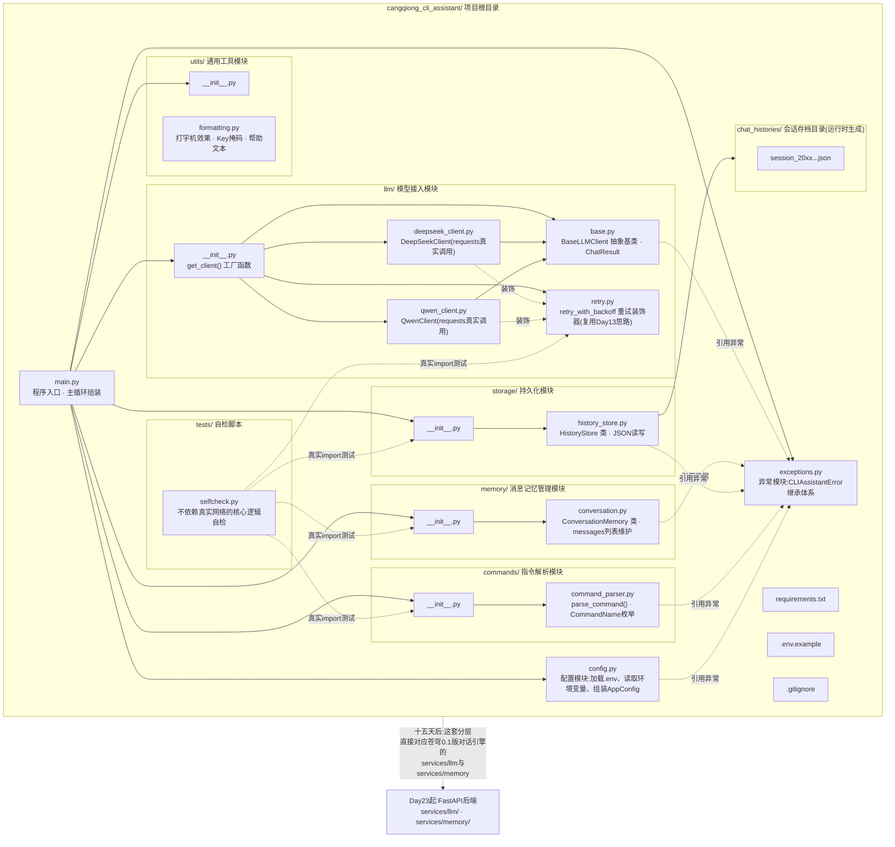
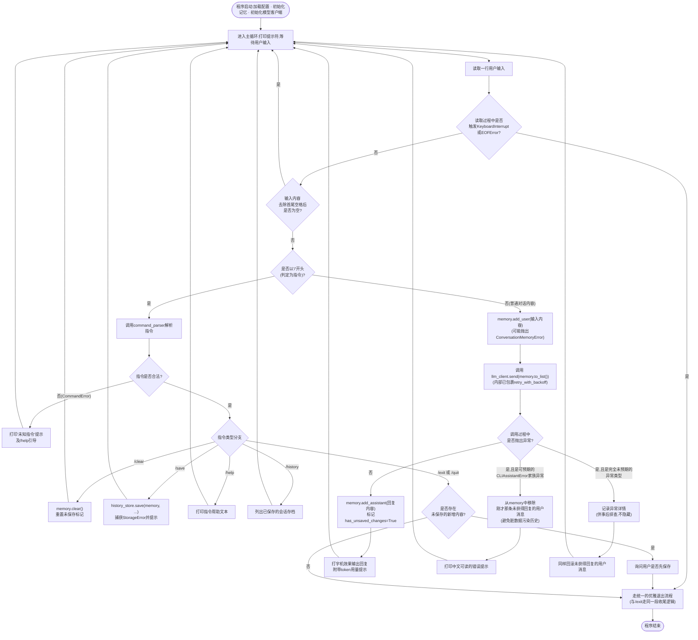
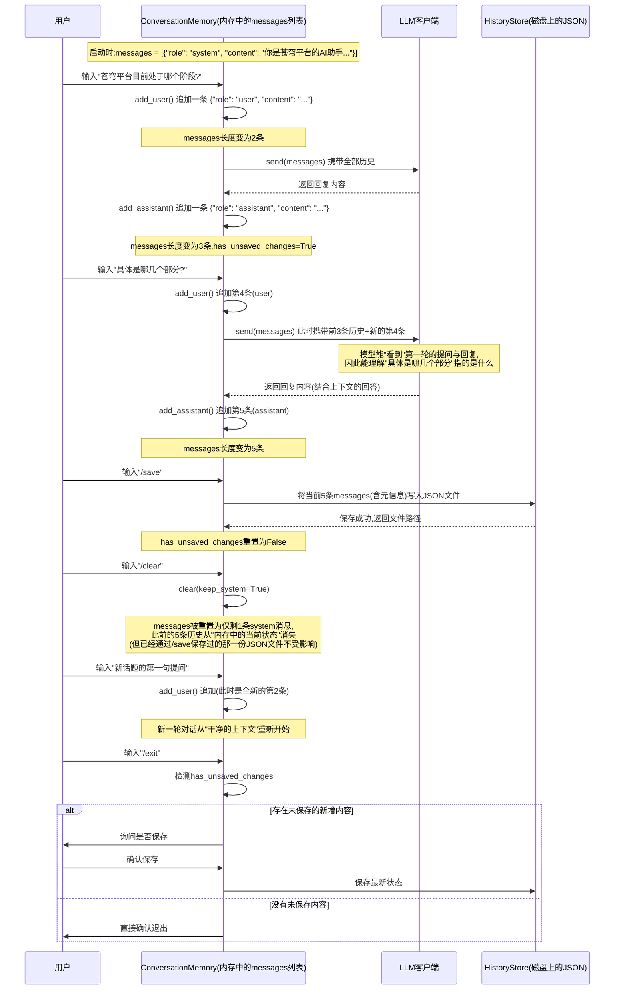

# 第14天 · 阶段考核——项目一

> **周次/Sprint**:Sprint 0 · 新人内训(Day1-14)—— 阶段项目一:命令行多轮对话AI助手(今日验收交付)
> **星期**:周日(第二周第七天,内训期最后一天;按常理这天该是"周末强度略降"的日子,但因为是阶段验收日,老王和林悦破例全天列席,晚上还加了一场代码互评会,强度不降反升)
> **学员**:陈铭、苏梦、韩露、张凡(导师:王振宇;今日列席:王振宇、林悦)
> **内训任务卡**:PYXT-ONB-D14(蓬远科技培训中心 · 新人训练营 · Day14 · 阶段项目一验收考核)
> **今日关键词**:命令行多轮对话AI助手 / messages多轮记忆 / 对话历史JSON持久化 / 指令解析(`/clear` `/save` `/exit`) / 异常处理综合运用 / 重试装饰器复用 / 代码互评会 / 转正

---

## 【旁白】

如果把陈铭这十四天的成长曲线画成一张图,今天应该是曲线上第一次真正意义的"合流点"——前面十三天,每一天学的东西看起来都是孤立的:变量和类型是一条线,分支循环是一条线,列表字典是一条线,函数是一条线,面向对象是一条线,模块异常是一条线,文件操作是一条线,网络请求是一条线,装饰器与环境变量又是一条线。这些线在各自的那一天,都只解决了自己那一天的问题,谁都没有机会真正证明自己"在一个真实项目里能撑住多少重量"。今天,所有这些线第一次被要求汇成一股——命令行多轮对话AI助手,不是一个新知识点,是一次"拿已经学过的东西,去解决一个完整问题"的考试。这也是为什么老王把这一天从"新知识传授日"整体调成了"全天封闭开发日":他不再站在讲台上,他只在需要的时候出现。

这一天在整个七十天故事里承担的角色,比表面看起来更重一些。往后看,Day21的综合小项目、Day31的RAG调优实验、Day38的项目答辩、Day45的低代码平台对比、Day50的阶段复盘、Day57的安全合规专题、Day65的终审答辩——几乎都会复刻今天的节奏:先有一段扎实的技能积累期,再有一次带着仪式感的、需要交付真实产出物的检验。今天是这套节奏第一次完整地在陈铭身上跑一遍,他还不知道自己十四天后要交的不是一个命令行程序,是一整个网页版对话产品;三十六天后要交的不是自己一个人的作业,是一整个企业客户的知识库系统;六十四天后要交的甚至不只是代码,是一场公开发布会。但今天这道"多轮对话AI助手"的题目,恰好精确地卡在苍穹平台产品分层里"对话引擎层"最初的雏形位置——`messages`列表怎么维护、怎么持久化、遇到网络问题怎么不崩溃,这几件事,是陈铭往后六十天里几乎每一天都会以某种更复杂的形式重新遇到的母题。今天写的代码不会被直接搬进苍穹的正式仓库,但今天想清楚的那几个问题——"一段对话的状态应该长什么样""什么时候该清空、什么时候该保存""调用外部世界失败了该怎么收场"——会在往后被反复验证是对的。

【旁白】还想多说一句关于"验收"这两个字的分量。前面十三天,陈铭遇到的每一次检验,本质上都还是"老师出题、学生答题"的关系——即便是Day7的周测,也更像是一次阶段性的自我校准。但今天不一样,今天有了一份真正意义上的、由产品经理林悦以正式格式撰写的验收标准文档,有了明确的P0/P1功能优先级,有了逐条可验证的验收标准,晚上还有一场四人对着彼此代码"互相挑毛病"的评审会——这几乎是陈铭第一次完整地经历一次企业级项目从"需求"到"交付"到"评审"的全流程,哪怕规模很小,流程是真的。而这一天结束时等着他的转正通知,某种意义上不是对"代码写得多好"的奖励,是对"能不能完整走完这套流程"的认可——这也是苍穹平台,乃至任何一家真正靠交付软件吃饭的公司,考核一个工程师时,真正在意的核心能力。

---

## 晨会纪要 / 今日目标

**时间**:上午8:45,二层大会议室"望远"
**出席**:王振宇(老王)、林悦、陈铭、苏梦、韩露、张凡

陈铭到会议室的时候比平时早了五分钟,进门却发现老王和林悦已经在了,桌上摆着四份打印出来的文件,封面统一印着"阶段项目一:命令行多轮对话AI助手 · 验收标准文档",文件夹右上角还贴了一张手写的便签——"Sprint 0 收官日"。窗外是周日上午少见的安静,园区里没有几个人走动,只有楼下便利店卷帘门刚拉开一半的声音。

老王没有像平时一样先开口讲知识点,他把四份文件推到桌子中间:"今天不上新课。从早上九点开始,到晚上八点,你们要独立完成这份文档里写的项目——命令行多轮对话AI助手。这是你们入职以来第一个'阶段项目',也是我和林悦、以后可能还有郭总,评估你们十四天到底学明白了多少的第一次正式验收。"

**Day13收尾回顾**:

- 四人昨天(Day13)都已经给自己的`ask_ai.py`(Day12产出)加上了重试装饰器与超时控制,整体运行稳定性明显提升;陈铭那次"差点把真实API Key提交到Git仓库"的教学事故也已经在Code Review里被当场喊停并修复,`.env`文件正确进了`.gitignore`,没有造成真正的泄露。
- 老王特别提到:"这件事我不想再重复批评,但我要提醒你们所有人——今天的项目,同样要处理API Key,同样有提交Git的动作,同样的风险今天还在。我不会再帮你们盯着,这次是真正的考验。"
- 装饰器、生成器、类型注解、`asyncio`入门这几块内容,四人整体接受度不错,张凡对`asyncio`的协程调度提出的问题比较深入,老王给了额外的参考资料,但强调"今天的项目不强制要求用`asyncio`,命令行程序一次只处理一个用户的输入,同步阻塞完全够用,不要为了炫技生搬硬套"。

**今日目标**:

1. 上午9:00-12:00:项目启动。集体阅读验收标准文档,拆解任务,搭建项目骨架(目录结构、配置模块、异常模块),完成消息记忆管理的核心类。
2. 下午14:00-18:00:完成模型接入模块(真实调用DeepSeek/通义千问API,复用Day13的重试装饰器)、持久化模块、指令解析模块,组装主循环,自测与debug。
3. 晚自习19:00-21:30:代码互评会——四人依次演示自己的项目,互相提问点评,老王与林悦给出正式评审意见与评分,收尾环节公布转正结果。

**风险点**:

- 老王在白板上写下一句话:"今天不是四道单独的题,是一道综合题,任何一个环节写崩了,整个程序都跑不起来——这就是'集成'和'练习'的区别。"
- 提前预警的高风险环节:异常处理覆盖是否完整(网络出问题程序千万不能直接崩溃退出)、JSON持久化的编码问题(中文内容写进文件容易出现乱码,这是几乎所有人在这个阶段都会踩的坑)、指令解析与正常对话内容的边界(用户如果输入的内容恰好是"/"开头的普通句子怎么办)。
- 林悦补充了一句产品视角的提醒:"我今天会重点看两件事——你们的错误提示是不是'人看得懂',还有你们的指令设计是不是'自然'。这两件事技术上都不难,但很能看出一个人有没有站在使用者的角度想问题。"
- 老王最后加了一句略带分量的话:"你们四个人今天写的代码,今晚会摆在一起互相评审。评审不是走过场,今晚结束前,我会给每个人一个正式的阶段性结论。"没有人多问那句话具体指什么,但每个人都听出了它和"转正"有关。

---

## 需求文档:阶段项目一《命令行多轮对话AI助手》验收标准文档

> **文档编号**:PYXT-PRD-D14-01
> **撰写人**:林悦(产品经理)
> **评审人**:王振宇(技术负责人)
> **文档版本**:v1.0(正式验收版)
> **适用范围**:蓬远科技新人训练营 · Sprint 0阶段项目一

### 一、背景

蓬远科技新人训练营自Day1开课至今,四位培训生(陈铭、苏梦、韩露、张凡)已经系统学习了Python基础语法、核心数据结构、函数、面向对象编程、模块与异常处理、文件操作与标准库、网络请求与大模型API调用、装饰器与环境变量管理这九个技术板块,并配套完成了个人信息卡片、文本清洗工具、猜数字游戏、待办事项管理器、API返回解析脚本、函数化重构项目、通讯录管理系统、`ChatMessage`类、`BaseModel`继承结构、`cangqiong_core`工程化重构、批量文档读取工具、命令行AI问答小程序`ask_ai.py`、带重试装饰器的API调用模块等一系列练习项目。

这些练习项目分别验证了单一知识板块的掌握程度,但迄今为止,还没有任何一个项目,要求四位培训生把"多轮对话记忆管理""数据持久化""网络请求的异常处理""用户交互指令解析"这四类能力,同时组织进同一个可交付、可运行、可长期维护的软件项目里。而这四类能力,恰恰是苍穹平台"对话引擎层"未来长期依赖的核心能力——不管苍穹平台未来长成多大规模,它的产品内核始终是"一个能记住上下文、能持久化会话、能优雅处理各种异常情况的对话系统"。

本项目——**命令行多轮对话AI助手**——是蓬远科技新人训练营Sprint 0(新人内训阶段)的收官项目,也是"阶段项目一"的正式交付物。项目本身不会被直接并入苍穹平台正式代码仓库(苍穹平台的正式立项要等到Day15之后),但项目的设计思路、代码组织方式、异常处理规范,将直接影响培训生能否顺利过渡到接下来Sprint 1"对话引擎MVP"阶段的正式开发工作。因此,本次验收不仅是对十四天学习成果的检验,也是团队评估"是否具备转正条件、能否直接投入苍穹项目组正式开发工作"的重要依据之一。

### 二、用户故事

为了避免"验收标准模糊不清"这个林悦在Day7周复盘时特别提醒过的问题,本次PRD严格按照"角色 + 需求 + 目的"的三段式结构撰写每一条用户故事,并在每条故事后面标注对应的验收关注点。

**故事1(核心使用者角度)**
作为一名需要频繁向AI助手提问、并且经常一次会话里连续问多个相关问题的用户,我希望AI助手能够"记住"我们这次会话里之前说过的话,这样我不需要每次提问都把背景信息重复一遍。
> 验收关注点:AI助手在同一次会话内,必须具备真正的多轮上下文记忆能力——即第N次提问时,模型接收到的请求里应该包含此前全部(或按策略截断后的)对话历史,而不是每次只发送当前这一句话。

**故事2(会话延续角度)**
作为一名可能因为各种原因(误操作关闭终端、需要暂时离开)中断了当前对话的用户,我希望能够把这次对话完整地保存下来,以便日后回顾,而不是关掉程序就彻底丢失了所有内容。
> 验收关注点:必须支持`/save`指令,将当前完整的对话历史(包含系统提示、用户消息、AI回复,以及必要的元信息如会话创建时间、使用的模型)保存为结构规范的JSON文件;保存时中文内容不能出现乱码或转义为难以阅读的Unicode编码序列。

**故事3(重新开始角度)**
作为一名有时候想换个话题、不希望AI助手被之前无关的对话内容"带偏"的用户,我希望能够用一个简单的指令,清空当前的对话记忆,重新开始一段干净的对话,而不需要重启整个程序。
> 验收关注点:必须支持`/clear`指令,清空除系统提示之外的全部历史消息;清空动作不应影响程序其他状态(比如已经选定的模型、历史保存目录配置)。

**故事4(优雅退出角度)**
作为一名用完了这次对话、准备结束使用的用户,我希望能够用一个明确的指令正常退出程序,而不是只能用`Ctrl+C`强行掐断——尤其是如果这次对话还没有保存,我希望程序能提醒我一下,而不是让我在退出之后才想起"忘记保存了"。
> 验收关注点:必须支持`/exit`(及常见别名如`/quit`)指令正常退出;若当前对话存在未保存的新增内容,退出前应给出明确提示,询问是否需要先保存;程序对`Ctrl+C`(`KeyboardInterrupt`)以及输入流意外结束(`EOFError`)这两种"非正常但常见"的退出触发方式,也应该做出与正常`/exit`一致的、体面的收尾处理,而不能让程序直接抛出一大段用户看不懂的报错堆栈后崩溃退出。

**故事5(容错角度,承接Day10-13异常处理主线)**
作为一名使用网络服务的用户,我理解网络偶尔会抖动、AI服务商偶尔会限流或者临时不可用,我不要求程序永远不出错,但我要求程序在出错的时候,能够清楚地告诉我"发生了什么、我现在能做什么",而不是给我一段我看不懂的技术报错然后直接退出,让我连刚才聊了什么都不知道该怎么办。
> 验收关注点:所有可预见的异常场景(配置缺失、鉴权失败、请求超时、触发限流、服务不可用、返回内容解析失败等)都必须被自定义异常体系覆盖,并在主循环中被恰当地捕获、转换成用户可理解的中文提示;单次请求失败不应该导致整个程序退出,也不应该污染当前的对话记忆(比如把一条没有得到回复的用户提问,错误地当成"一轮完整对话"保留在历史里)。

**故事6(可维护角度,团队协作视角)**
作为接下来要在苍穹项目组和陈铭、以及其他团队成员一起协作开发的技术负责人,我希望这个阶段项目本身的代码组织方式,能够体现出清晰的模块划分(配置、异常、模型接入、记忆管理、持久化、指令解析各自独立成模块),这样即便这份代码本身不会被直接沿用,团队也能通过它准确判断——这名培训生是否已经具备独立承接一个中等复杂度模块、并保持代码可读、可维护的能力。

### 三、功能列表

| 编号 | 功能 | 详细说明 | 优先级 |
|---|---|---|---|
| F1 | 多轮对话记忆(`messages`列表) | 维护一个符合主流大模型API约定格式(`[{"role": ..., "content": ...}, ...]`)的消息列表,每次向模型发起请求时,完整或按策略传入历史消息,而不是只传当前这一句 | P0 |
| F2 | 真实模型调用 | 至少支持DeepSeek(`deepseek-chat`)和通义千问(`qwen-plus`)两个服务商中的一个可真实调用成功,推荐同时支持两者并可切换 | P0 |
| F3 | 对话历史持久化(JSON) | 支持将当前完整对话历史保存为JSON文件,文件需可被重新读取还原;支持中文内容,不能出现编码问题 | P0 |
| F4 | 异常处理体系 | 设计一套语义清晰的自定义异常类,覆盖配置错误、鉴权失败、限流、超时、服务不可用、响应解析失败等场景,并在主流程中被恰当捕获,不允许程序因为网络问题直接崩溃退出 | P0 |
| F5 | 指令系统:`/clear` | 支持清空当前对话历史(保留系统提示) | P0 |
| F6 | 指令系统:`/save` | 支持保存当前对话历史到JSON文件,支持指定文件名,不指定时自动生成带时间戳的文件名 | P0 |
| F7 | 指令系统:`/exit`(及别名`/quit`) | 支持优雅退出程序,若有未保存内容需先提示确认 | P0 |
| F8 | 指令系统:`/help` | 显示当前支持的全部指令及简要说明 | P1 |
| F9 | 指令系统:`/history` | 列出历史保存目录中已有的会话存档,附带简要元信息(保存时间、对话轮数) | P1 |
| F10 | 重试与超时控制 | 网络请求需复用Day13设计的重试装饰器思路,对可重试的异常(限流、超时、服务不可用)进行有限次数的自动重试,带指数退避 | P0 |
| F11 | 配置模块 | 通过`.env`文件与环境变量管理API Key、默认模型、超时时间、重试次数等配置项,不允许在代码里硬编码任何密钥 | P0 |
| F12 | 自检脚本 | 提供不依赖真实网络请求、可独立运行的自检脚本,验证核心模块(记忆管理、持久化、指令解析、异常体系、重试装饰器)行为符合预期 | P1 |

### 四、非功能需求

- **健壮性**:程序在任意一次网络请求失败之后,必须能够继续接受用户下一次输入,不能因为单次失败而整体退出(除非是用户主动选择的`/exit`,或者是配置层面的、必须终止程序才能解决的致命错误,如API Key完全缺失)。
- **安全性**:API Key等敏感信息不允许出现在代码仓库中的任何一处(包括注释、日志打印、异常信息的完整展示),必须通过`.env`加载,且`.env`必须被`.gitignore`正确排除。
- **可读性与可维护性**:模块划分清晰(配置、异常、模型接入、记忆管理、持久化、指令解析各自独立文件/子模块);类与函数需配中文docstring;关键设计决策需要有行内中文注释说明"为什么这么做"。
- **用户体验**:错误提示必须使用用户能理解的中文自然语言描述,不能直接把Python原生异常堆栈甩给最终用户;支持基础的、逐字输出的"打字机"效果作为可选的体验优化项(P2,非强制)。
- **数据完整性**:任何一次已保存的JSON历史文件,必须能够被正确重新读取,字段完整,编码正确(`ensure_ascii=False`,`utf-8`编码)。
- **性能**:单次模型调用的默认超时时间不超过30秒(可通过配置调整);重试机制的总耗时应有明确上限,避免用户长时间无响应地等待。

### 五、验收标准

1. 项目能够在配置了合法API Key的环境下,通过`python main.py`正常启动,进入交互式命令行界面。
2. 连续进行至少3轮对话后,第3轮模型收到的请求中,能够验证包含此前两轮的完整上下文(可通过调试打印或日志验证,而非仅凭肉眼判断回复"看起来"记住了)。
3. 执行`/clear`后,再次查看当前对话状态(或立即发起新一轮对话),应确认此前的历史消息已被清空,仅保留系统提示。
4. 执行`/save`(不带参数)后,应在配置的历史保存目录下生成一个新的JSON文件,文件名包含可读的时间戳;用文本编辑器打开该文件,中文内容应正常显示,不能是`\u4e2d\u6587`这种转义序列。
5. 执行`/save 我的会话.json`(带自定义文件名参数)后,应在历史保存目录下生成对应命名的文件,且文件名中的非法字符(如路径分隔符)已被妥善处理,不会导致文件保存到预期目录之外的位置。
6. 执行`/exit`时,若本次会话有未保存的新增对话内容,程序必须给出明确提示并等待用户确认是否保存,确认逻辑不能被绕过或默认静默跳过。
7. 在没有网络连接,或者故意配置一个错误的API Key的情况下启动程序并尝试对话,程序不能崩溃退出,必须给出用户能理解的中文错误提示,并允许用户继续尝试其他操作(如`/exit`正常退出)。
8. 代码中不允许出现裸露的`except:`语句;所有`except`子句必须精确指定异常类型,且捕获顺序符合"更具体的异常写在前面"的规范。
9. 代码中不允许出现任何硬编码的真实API Key字符串(包括被注释掉的);仓库提交记录中不允许出现`.env`文件本身。
10. 提供的自检脚本(`tests/selfcheck.py`)必须能够独立运行、不依赖真实网络请求,且全部检查点通过。
11. 按`Ctrl+C`中断程序时,程序应给出与`/exit`基本一致的、体面的收尾提示,不能残留无法解读的原生Traceback信息直接展示给用户。
12. 晚间代码互评会上,须完整演示一次包含"至少一次成功对话""执行一次`/clear`""执行一次`/save`""模拟一次异常场景(如断网或错误Key)""执行`/exit`"的完整流程,由老王和林悦现场确认全部通过。

林悦在发布这份文档时,补充说明了一句她一贯的原则:"你们注意第2条和第10条——'看起来记住了'和'确实记住了'是两件不同的事,'我觉得应该没问题'和'有一份能独立运行、不依赖运气的自检脚本证明没问题'也是两件不同的事。今天晚上互评的时候,我会现场随机挑一条验收标准,让你们当场演示,不是看PPT,是看真实运行效果。"

---

## 架构设计图:`cangqiong_cli_assistant`项目整体架构

老王要求四人在动手写代码之前,先各自画一版架构草图,再统一对照他给出的"参考架构"检查自己的设计是否合理。这张图对应的正是今天要交付的完整项目结构。



老王讲这张图的时候,特意把"模型接入模块"和"消息记忆管理模块"分开画在两个平行的子图里,和Day10讲`cangqiong_core`时的逻辑一脉相承:"你们注意,`ConversationMemory`不需要知道`DeepSeekClient`长什么样,它只关心'消息列表'这个纯粹的数据结构;反过来,`DeepSeekClient`需要接收一个符合格式的消息列表,但它不关心这个列表是从哪个类、用什么方式维护出来的。这种'谁也不依赖谁的实现细节,只依赖一份约定好的数据格式'的关系,是模块之间最健康的关系。"

张凡指着图上那条从`ROOT`指向`FUTURE`的虚线问:"这是不是说我们今天写的东西,又要变成十五天后苍穹项目的地基了?"老王点头:"和Day10那次一样的道理——具体代码不会被直接搬过去,但这套'配置独立、异常独立、模型接入独立、记忆管理独立、持久化独立、指令解析独立'的分层思路,你今天亲手搭一遍,以后看到任何一个正式项目的目录结构,都不会觉得陌生。"

---

## 流程图:主循环处理流程图

第二张图,老王要求画的是程序运行起来之后,每一次"用户输入 → 程序响应"这个完整闭环里,到底经历了哪几个判断分支。这张图直接对应`main.py`里主循环的核心逻辑,和架构图讲"东西怎么摆"的角度完全不同。



老王讲解这张图时特别停在"回滚未获得回复的用户消息"这一步:"这是很多人第一版代码会漏掉的细节——如果一次调用失败了,你的`messages`列表里,已经加进去的那条用户消息,要不要留着?留着的话,下一轮对话再发起请求,这条'提了问题但没拿到回复'的消息还夹在中间,模型看到的对话历史是不完整、不连贯的,甚至可能让模型产生困惑。今天设计的原则是——只有'一问一答'完整配对成功,才算这轮对话真正发生过,失败的尝试,不应该留下痕迹污染后续的上下文。"

苏梦问:"那如果我想让用户知道'刚才那个问题没有真正被回答',是不是应该在界面上单独提示一下,而不是完全没反应?"老王点头:"对,这正是图上'打印中文可读的错误提示'这一步的意义——数据层面(`messages`列表)要保持干净,但界面层面(打印给用户看的内容)完全可以、也应该告诉用户刚才发生了什么。数据的干净和信息的透明,这两件事不矛盾。"

---

## 示意图:`messages`状态变化时序图

第三张图,老王换成了`sequenceDiagram`,用来讲清楚"一次完整的会话,从启动到退出,`messages`这个核心数据结构在时间线上到底经历了哪些变化"。这是三张图里唯一专门讲"抽象数据状态"而不是"代码结构"或者"处理流程"的一张。



这张图讲完,老王抛出了一个问题让四人思考:"你们看图上有两处关键的'转折'——一次是`/save`,一次是`/clear`。这两个动作,对`messages`这份数据分别意味着什么?"

韩露先答:"`/save`是把内存里的东西'复制'一份到磁盘上,内存里的`messages`本身没有变化;`/clear`是真的把内存里的`messages`清空重置了。"老王点头:"说得很准。这也是为什么图上特意标注了'已经保存过的JSON文件不受`/clear`影响'——很多人容易下意识以为'清空'会波及到已经落盘的存档,这是一种误解。`/save`是'快照',`/clear`是'重置',两者操作的是同一份数据在不同时刻的状态,但彼此互不影响,这个边界一定要在代码里体现清楚,不能让两者的实现互相耦合。"

---

## 课堂笔记

### 上午:项目启动——从需求文档到项目骨架

**9:00,培训室"起航"**

四人各自把PRD文档看了一遍,老王没有立刻讲技术方案,而是先问了一个看起来有点"跑题"的问题:"这份文档里,你们觉得哪一条验收标准,实现起来最难?"

张凡先答:"感觉是第7条,断网或者Key错误的时候不能崩溃——这个得覆盖好多种异常情况。"苏梦答的是第2条:"多轮记忆'确实记住了'而不是'看起来记住了',这个怎么验证,我一开始没想明白。"陈铭想了一下说:"我觉得反而是第5条和第6条容易被低估——自定义文件名要处理非法字符,这个如果不特意想,很容易漏掉。"

老王点评道:"你们三个说的都对,这正是我想让你们意识到的——这份PRD看起来是'四个功能加一堆异常处理',但真正落地的时候,处处都是细节。今天上午,我们先不碰模型调用这个'看起来最难'的部分,先把最基础的骨架搭好——配置模块、异常模块、消息记忆管理模块。原因很简单:这三个模块是其他所有模块的地基,地基没打好,后面每一个环节都会返工。"

#### 项目骨架:先搭"空房子"

老王要求四人先手动创建好完整的目录结构,再往里面填内容,避免"边写边想目录该长什么样"的低效方式。他给出的参考骨架就是架构图里画的那份:

```
cangqiong_cli_assistant/
├── main.py
├── requirements.txt
├── .env.example
├── .gitignore
├── config.py
├── exceptions.py
├── llm/
│   ├── __init__.py
│   ├── base.py
│   ├── retry.py
│   ├── deepseek_client.py
│   └── qwen_client.py
├── memory/
│   ├── __init__.py
│   └── conversation.py
├── storage/
│   ├── __init__.py
│   └── history_store.py
├── commands/
│   ├── __init__.py
│   └── command_parser.py
├── utils/
│   ├── __init__.py
│   └── formatting.py
└── tests/
    └── selfcheck.py
```

"这套结构,"老王补充,"和Day10你们搭`cangqiong_core`的思路一脉相承,但这次是一个'完全独立可交付'的项目,不允许直接`import`训练期写的实验性代码——公司真实项目里,一个正式交付的仓库,不能依赖另一个人电脑上一堆散乱的练习代码,所有依赖都必须显式地写进`requirements.txt`,或者干脆是你自己这个仓库内部的模块。这个要求,是今天故意加上去的,目的是让你们体会一次'真正独立打包一个项目'是什么感觉。"

#### 配置模块:`config.py`——先把"从哪里读配置"想清楚

老王让大家先写配置模块,理由是:"这是整个项目里,唯一一处需要接触敏感信息(API Key)的入口,先把这个入口的规范定下来,后面所有模块用到配置的地方,都只应该通过这一个入口去拿,不应该在别的地方各自重新`os.getenv`一遍。"

他现场带着四人过了一遍设计思路:配置项应该包括——当前默认使用哪个模型服务商(`deepseek`或`qwen`)、两个服务商各自的API Key与模型名、请求超时时间、最大重试次数、历史记录保存目录、系统提示语。用一个`dataclass`把这些配置项打包成一个`AppConfig`对象,`load_config()`函数负责从`.env`和环境变量里读取原始值、填充默认值,返回这个对象。

"这里要强调一个边界,"老王说,"`config.py`只负责'读取原始配置、给出默认值',它*不负责*'校验API Key对应的服务商是否真的可用'——那是`llm`模块的职责。这是一次典型的职责划分练习:'读配置'和'用配置做校验判断'是两件不同粒度的事,不要为了图省事把两者混在一起。"

韩露问:"那如果用户在`.env`里,`DEEPSEEK_API_KEY`和`QWEN_API_KEY`一个都没填,`load_config()`要不要直接报错?"老王给出了明确答案:"不要。`load_config()`应该原样把'空字符串'或者读到的`None`交给调用方,真正决定'这次到底能不能用这个服务商'的判断,应该延后到真正要创建对应的模型客户端时才做——这正是Day10学过的`require_api_key`那套思路的自然延续,今天要在一个新项目里重新实现一遍,而不是简单粘贴复用旧代码,借此检验你们是不是真的理解了这套设计,而不是记住了一份代码。"

#### 异常模块:`exceptions.py`——一次"重新设计"而不是"照抄"

上午第二个环节是异常模块。老王刻意没有让大家直接翻Day10的笔记抄一遍,而是让四人先各自凭记忆重新设计一遍继承结构,再互相对照。他解释:"如果你能不看笔记,凭理解重新设计出一套语义清晰、层次合理的异常体系,说明Day10那天真正学进去的是'设计思路',不是'代码文本'。如果你发现自己完全想不起来该怎么设计,那正好说明需要重新过一遍Day10的内容,现在发现比转正之后发现要好。"

四人各自设计了十几分钟后,老王把参考版本投影出来做统一对齐(完整代码见"代码实战"部分),核心继承结构是:`CLIAssistantError`作为项目基类,往下分出`ConfigError`(配置错误)、`ConversationMemoryError`(消息记忆相关错误)、`StorageError`(持久化相关错误)、`CommandError`(指令解析错误)、`ModelAPIError`(模型调用错误基类,再往下细分`AuthenticationError`鉴权失败、`RateLimitError`限流、`ModelTimeoutError`超时、`ModelServiceUnavailableError`服务不可用、`ModelResponseParseError`响应解析失败)。

张凡提出一个问题:"`AuthenticationError`和Day10的`ConfigurationError`有什么区别?看起来都是'Key不对'。"老王的解释很清楚:"区别在于'什么时候被发现'。`ConfigurationError`是在*本地*、还没发出网络请求之前就能确定的问题——比如环境变量压根没配置任何值,这种情况你根本不用联网就知道肯定不对。`AuthenticationError`是发出了真实的网络请求之后,服务器*明确告诉你*'这个Key是无效的、过期的、或者没有权限',这个判断权在对方服务器手里,不在你本地。两者处理策略也不同——`ConfigurationError`应该直接终止流程,提示用户先去`.env`里补配置;`AuthenticationError`理论上也应该终止(重试没有意义,同一个错误的Key,重试100次结果都一样),但它是在真实调用过程中才会暴露,不能提前拦截。"

苏梦追问了一句和Day10很像的问题:"那'请求超时'和'服务不可用',是不是也可以合并成一个类?处理方式看起来也差不多,都是等一等再重试。"老王先卖了个关子:"这个问题问得好,和Day10讨论'要不要为连接被拒绝单独建类'几乎是同一个问题的翻版。我们下午写模型接入模块的时候会具体验证——你们等着,下午会有一个真实的bug,恰好和这个问题有关。"

#### 消息记忆管理模块:`memory/conversation.py`——核心中的核心

上午的重头戏,是`ConversationMemory`类的设计与实现。老王在白板上重新画了一遍Day4当年那张"未来对话历史就是一个列表"的草图,补了一句:"十天前我画这张图的时候,你们还没学类,只能想象一个纯粹的列表。今天你们要做的,是把'一个纯粹的列表'升级成'一个懂得自己该怎么维护自己'的对象。"

他给出的设计要点:

1. 内部维护一个`List[Dict[str, str]]`,而不是`List[ChatMessage]`——这是刻意的选择,因为最终要直接把这份数据原样发给大模型API,API要求的格式就是`{"role": ..., "content": ...}`这种字典,如果内部维护的是自定义对象,每次调用前都要多一层转换,增加了不必要的复杂度。"Day8-9你们学的`ChatMessage`类,概念上是对的,但今天这个项目的目标之一,是让你们体会'什么时候该用一个自定义类去包装数据,什么时候直接用最贴近目标格式的原生结构反而更合适'——这也是一种设计取舍能力。"
2. 构造函数`__init__(self, system_prompt: Optional[str] = None)`,如果传入了系统提示,自动作为第一条`system`消息;这里要特别小心一个经典陷阱,老王故意没有直接提醒,留给大家自己下午去踩(这也是等一下"下午"部分要讲的第一个真实bug)。
3. 提供`add_user()`、`add_assistant()`、`add_system()`三个方法,内部统一做角色与内容的合法性校验,校验失败抛出`ConversationMemoryError`。
4. 提供`clear(keep_system: bool = True)`方法,默认保留第一条系统消息。
5. 提供`to_list()`方法,返回一份"独立的副本",而不是内部列表的引用——这一点老王重点强调:"如果`to_list()`直接返回`self._messages`本身,调用方拿到这个列表之后,如果不小心对它做了`append`或者`sort`之类的原地修改,会直接污染你`ConversationMemory`内部真正的状态,而你完全不知道发生了什么。这是Python里一个非常经典、也非常隐蔽的坑——可变对象的引用传递。"
6. 提供`turn_count`属性(用户和助手成对出现的轮数)、`has_content`属性(是否存在除系统消息外的任何内容)。

陈铭在实现`add_user`的时候,写了这样一段校验逻辑:

```python
if not content or not content.strip():
    raise ConversationMemoryError("用户消息内容不能为空")
```

老王看了一眼,没有说这样写错了,而是追问了一句:"如果用户输入的是一句纯粹由标点符号组成的内容,比如就打了一个'?',你的`content.strip()`结果是什么?"陈铭试了一下,发现`"?".strip()`结果还是`"?"`,不是空字符串,能正常通过校验。"这个没问题,"老王说,"我是想确认你有没有想清楚`strip()`到底在处理什么——它去掉的是首尾的*空白字符*,不是'看起来没有意义的字符'。一句纯标点的输入,业务上也算是用户'说了句话',不应该被拦截,你这个校验的边界是对的。"

上午收尾前,老王让四人先跑一遍自己的`ConversationMemory`,不接模型、不接持久化,单独验证"连续调几次`add_user`/`add_assistant`,`to_list()`返回的内容是否符合预期"。这正是PRD验收标准第2条要求的"确实记住了,不是看起来记住了"的最基础验证方式——老王的原话是:"你连自己维护的这份`messages`到底装了什么都说不清楚,后面接上模型,出了问题你根本没法判断是模型接入的问题,还是记忆管理本身的问题。"

---

### 下午:核心开发与四个真实的bug

**14:00,培训室**

午饭后老王没有讲新内容,直接把时间交给四人独立开发。他和林悦分坐在教室两侧,不主动打扰,只有被叫到才会过去看。这一节的"课堂笔记",记录的是陈铭下午实际遇到、并且解决掉的四个真实bug——按照PRD要求,这些bug和排查过程本身,就是今天最重要的"教学内容"。

#### Bug 1:可变默认参数——`ConversationMemory`的"共享记忆"事故

陈铭写`ConversationMemory`最初的版本,构造函数是这样写的:

```python
class ConversationMemory:
    def __init__(self, system_prompt=None, messages=None):
        self._messages = messages if messages is not None else []
        if system_prompt:
            self.add_system(system_prompt)
```

看起来没问题——他特意避开了"默认参数直接写`[]`"这个Day6就讲过的经典陷阱(`def __init__(self, messages=[])`会导致所有实例共享同一个默认列表对象)。但在写自检脚本的时候,他为了图省事,写了一个"工厂函数",想批量生成测试用的对话实例:

```python
DEFAULT_TEST_MESSAGES = []

def build_test_memory(extra_content):
    memory = ConversationMemory(messages=DEFAULT_TEST_MESSAGES)
    memory.add_user(extra_content)
    return memory
```

跑起来之后,他发现连续调用两次`build_test_memory`,第二次生成的对话实例里,竟然莫名其妙地包含了第一次调用时加进去的用户消息——两个理论上应该"各自独立"的对话,共享了同一份历史。他盯着输出愣了几秒钟,以为是`ConversationMemory`内部哪里写错了,检查了一遍`add_user`的实现,完全没问题。

带着这个疑惑去问老王,老王没有直接指出问题,先反问了一句:"你这个`DEFAULT_TEST_MESSAGES`,是在函数外面定义的,还是在函数里面定义的?"陈铭一看,恍然大悟:"是在外面,是个模块级的全局列表……我每次调用`build_test_memory`,传进去的都是*同一个*列表对象,`ConversationMemory`内部又是直接把这个引用赋值给了`self._messages`,没有做拷贝,所以两次调用其实操作的是同一份数据!"

老王点头:"这正是Day10结尾我提醒过的'可变对象引用传递'问题,只是这次它不是出现在默认参数上,是出现在你自己写的测试代码里——但本质是同一个坑:*任何时候,一个可变对象(列表、字典)被多次共享引用,而不是各自独立拷贝,就有可能出现'改一个,另一个跟着变'的意外行为*。"他给出了两处修复建议:

第一处,`ConversationMemory.__init__`内部,即便传入了`messages`参数,也应该做一次拷贝,而不是直接持有外部引用:

```python
def __init__(self, system_prompt=None, messages=None):
    # 用list()显式拷贝,而不是直接持有外部传入列表的引用,
    # 避免"外部代码后续修改了原始列表,连带影响到本实例内部状态"这种隐蔽的耦合
    self._messages = list(messages) if messages is not None else []
    if system_prompt:
        self.add_system(system_prompt)
```

第二处,测试代码本身也不应该复用同一个全局列表作为多次调用的"种子数据":

```python
def build_test_memory(extra_content):
    # 每次调用都创建全新的空列表,而不是复用一个模块级的共享对象
    memory = ConversationMemory(messages=[])
    memory.add_user(extra_content)
    return memory
```

老王最后总结:"这个bug今天花了你二十分钟,但我要说一句可能有点扎心的话——这类bug,是几乎所有工程师(包括我自己),职业生涯里会反复遇到、反复被'教育'一次的经典问题。Python的可变默认参数和引用共享,是这门语言里少数几个'表面上很直觉,实际上很容易反直觉'的设计,你今天真的踩一次坑,比我讲十遍'不要用可变对象做默认参数'管用得多。"

#### Bug 2:JSON持久化的编码陷阱——保存下来的中文变成了天书

第二个bug出现在`HistoryStore.save()`的第一版实现。陈铭最初的写法是:

```python
def save(self, memory, provider, model, filename=None):
    filepath = self._resolve_filepath(filename)
    data = {
        "provider": provider,
        "model": model,
        "saved_at": datetime.now().isoformat(),
        "messages": memory.to_list(),
    }
    with open(filepath, "w") as f:
        json.dump(data, f)
    return filepath
```

跑起来没有报错,文件也确实生成了。但他打开生成的JSON文件一看,里面的中文内容全部变成了类似`"\u4f60\u597d\uff0c\u82cd\u7a79\u5e73\u53f0"`这样的转义序列——虽然技术上这依然是合法的、能被正确解析回中文的JSON,但作为一份"保存下来给人看"的历史存档,这种展示方式完全不符合PRD第4条"打开该文件,中文内容应正常显示"的要求。

他想起Day5学JSON的时候,`json.dumps`默认参数里有一个`ensure_ascii`,当时只是简单提了一句"默认是`True`",没有细讲影响。这次亲眼看到转义后的效果,他很快反应过来该往哪个方向查,加了一个参数:

```python
with open(filepath, "w", encoding="utf-8") as f:
    json.dump(data, f, ensure_ascii=False, indent=2)
```

重新运行,文件里的中文正常显示了。他把这个改动截图发到了训练群里,老王补充了一句更完整的解释:"`ensure_ascii=False`只解决了'中文会不会被转义成`\u`序列'这个问题,但你还漏了另一件事——`open()`函数如果不显式指定`encoding="utf-8"`,在不同操作系统上默认使用的编码可能不一样(比如某些Windows环境默认是GBK系列编码),写文件的时候用一种编码,以后换一台机器、换一个编码环境去读这份文件,又可能出问题。这两个参数,`ensure_ascii=False`和`encoding="utf-8"`,处理的是两个不同层面的问题,但在这个场景里必须同时加上,少了任何一个都不算真正解决问题。"

他接着追问了一句更深的问题:"这个坑为什么这么容易被踩到?"老王的回答带着点行业经验的味道:"因为`json.dump`不加任何参数,'能跑'。这是很多编码相关的bug共同的特点——它们几乎从不在开发阶段直接报错崩溃,而是悄悄地把错误的结果生产出来,你只有真的去*看*那份数据(而不是只看'程序有没有报错')才会发现问题。所以我一直强调,验收一个功能,不能只看'跑起来没报错',必须真的去检查产出物本身是不是符合预期——这正是PRD里第4条为什么专门要求'用文本编辑器打开该文件'的原因。"

#### Bug 3:重试装饰器"叠罗汉"——一次超时变成了长达一分钟的假死

第三个bug出现在陈铭组装`main.py`主循环的阶段。他复用了Day13写好的重试装饰器思路,在`llm/retry.py`里重新实现了一版`retry_with_backoff`,并把它施加在`DeepSeekClient.send()`方法上——这一步没有问题。但他在`main.py`里调用模型的地方,出于"多一层保险"的心理,又手写了一层看起来很像的重试逻辑:

```python
def call_model_with_retry(client, messages, max_attempts=3):
    for attempt in range(max_attempts):
        try:
            return client.send(messages)
        except ModelAPIError:
            if attempt == max_attempts - 1:
                raise
            time.sleep(2 ** attempt)
```

问题在测试"故意断网"这个场景时暴露出来——他把网络断开,故意触发超时,结果程序卡住了将近一分钟才给出错误提示,远远超出他预期的"最多重试3次、每次等待时间不超过几秒"的设计。他一开始怀疑是自己`retry_with_backoff`装饰器里的等待时间算错了,反复检查了`base_delay`和`backoff_factor`的计算公式,确认公式本身没有问题。

带着这个疑惑去问老王,老王只问了一句:"你在`main.py`里调用`client.send()`的地方,又包了一层`call_model_with_retry`?"陈铭这才意识到问题所在——`client.send()`本身已经被`retry_with_backoff`装饰过,内部会自动重试最多3次;而`main.py`里的`call_model_with_retry`又在外面套了一层重试3次的逻辑,两层重试叠加起来,一次真实的失败调用,实际触发的重试次数变成了3乘3等于最多9次,每一层各自的指数退避等待时间又累加在一起,总耗时远远超出了任何人的预期。

老王讲了一个略带调侃的类比:"这就像你已经戴了安全帽,又在安全帽外面套了个头盔,单独看这两个东西都没有错,但叠在一起的效果,不是'更安全',是'脖子转不动了'。装饰器最容易被滥用的地方,恰恰是它'看起来很方便,随手一加就能用'——正因为方便,才更容易在不知不觉中被重复叠加,而这种叠加往往不会直接报错,只会让程序的实际行为变得难以预测,和你脑子里想的完全不一样。"

修复方式很直接——删掉`main.py`里那层手写的`call_model_with_retry`,统一只依赖`llm/retry.py`里那一层装饰器,`main.py`只负责在捕获到"重试耗尽后仍然失败"的最终异常时,给用户展示一条清晰的中文提示。老王补充了一条团队规范:"重试逻辑这种'横切关注点',原则上应该只在一个地方实现一次,而且应该尽量靠近'真正发起网络请求'的那一层,不要在调用链路的多个环节都各自加一遍,这也是我们之后写苍穹后端时会反复强调的一条规矩。"

#### Bug 4:裸`except`吞掉了`Ctrl+C`——一次"程序假死"的复现与修复

第四个bug,是老王主动安排四人互相测试对方代码时,苏梦在陈铭的程序上发现的。她按照PRD验收标准第11条,尝试对着运行中的程序按`Ctrl+C`,期望看到一条优雅的退出提示,结果程序毫无反应——终端光标停在那里,既没有退出,也没有任何输出,像是"卡死了"。

陈铭排查了一会儿,定位到问题出在主循环里一处早期为了"图省事"写的代码:

```python
while True:
    try:
        user_input = input("你: ")
        # ...处理逻辑...
    except Exception:
        print("发生了未知错误,已忽略")
        continue
```

`KeyboardInterrupt`(`Ctrl+C`触发的信号)在Python里实际上继承自`BaseException`,不是`Exception`的子类,理论上不应该被`except Exception`捕获——但陈铭这段代码之所以"看起来吞掉了"`Ctrl+C`,根本原因是`input()`函数本身在等待输入的过程中,被`Ctrl+C`打断后确实会抛出`KeyboardInterrupt`,理论上会跳过这段`try`直接往外传播;但陈铭最初的完整代码里,在更外层还套了一层`while True`加上一段"读取用户输入之后,处理指令与对话逻辑"里,某个更深层的辅助函数里,恰好写了一处真正的裸`except:`,把包括`KeyboardInterrupt`都吞掉了,导致外层循环完全感知不到这次中断,只是默默地`continue`到了下一次循环,表现出来就是"按了Ctrl+C毫无反应"的假死状态。

这正是Day10课堂笔记里"常见的异常处理反模式"第一条——裸`except:`会吞掉`KeyboardInterrupt`——第一次在真实项目里,以一种不那么直白的方式复现出来。老王评价说:"你看,Day10我讲这个反模式的时候,举的例子很直白,一眼就能看出问题;但今天这个bug藏得更深——问题代码根本不在你以为的主循环那一层,是藏在一个被多层调用的辅助函数里。这才是裸`except`真正可怕的地方:它的坑经常不在你正在盯着的那一行代码,而在你完全没想到会被牵连进来的某个角落。"

修复方式是把那处裸`except:`改成精确指定的异常类型,并且在主循环这一层,专门、显式地捕获`KeyboardInterrupt`和`EOFError`(用户输入流被意外关闭时触发,比如管道输入结束),让它们统一走"优雅退出"这条分支,而不是被当成普通错误吞掉:

```python
while True:
    try:
        user_input = input("你: ")
    except (KeyboardInterrupt, EOFError):
        graceful_exit(memory, history_store)
        break
    # ...正常处理逻辑,内部不再有任何裸except:...
```

老王补充了一句总结性的话,呼应了PRD第8条验收标准:"从今天开始,'代码里不允许出现裸`except:`'不再只是一条书面规范,是你们四个人都亲眼见过、亲手改过的一条切肤之痛的教训。以后你们review别人代码,看到一个裸的`except:`,应该本能地起疑心,而不是一眼扫过去当作没看见。"

#### 下午收尾:自检脚本与真实调用的双重验证

四个bug陆续解决之后,下午后半段,陈铭把重心转到`tests/selfcheck.py`——不依赖真实网络请求,验证记忆管理、持久化、指令解析、重试装饰器的行为是否符合预期(完整代码见"代码实战"部分)。老王强调了自检脚本和"真实跑一遍对话"这两种验证方式各自的价值:"自检脚本能反复运行、不花钱、不依赖网络状况,适合验证'逻辑本身对不对';但只有真实调用一次DeepSeek或者通义千问的API,你才能确认'整个链路真的能跑通,格式确实匹配对方真实的接口协议'。两者缺一个都不完整,今天两个都要做。"

下午17:40左右,陈铭第一次用真实的API Key,跑通了完整的一次三轮对话+`/save`+`/clear`+故意断网触发异常+`/exit`的全流程,没有崩溃,历史文件正确生成,中文显示正常。他把这一刻的终端截图存了下来,没有立刻发到群里——他想留到晚上互评会上,当面演示给老王和林悦看。

---

### 晚自习:代码互评会与转正仪式

**19:00,培训室"起航"改成了会议室"望远"**

晚饭后,四人被叫到大会议室——桌子被重新摆成了一个方形,老王和林悦坐在正对投影屏幕的位置。老王开场说得很直接:"接下来两个半小时,我们做三件事:一,每个人依次演示,现场随机抽验收标准里的一条,当场验证;二,四份代码摆在一起做横向点评,不藏着不掖着;三,今晚结束前,我会给出正式结论。"

外面天已经黑了,楼下小区有人在放晚间广场舞的音乐,隔着两层玻璃传进来,声音不大,却成了这场评审会略显反差的背景音。林悦让人点了一些简单的外卖当晚餐(几盒炒饭和一份水果拼盘),大家边吃边听,气氛比白天松散了一些,但没有人真正放松下来。

#### 演示环节:四份代码,四种风格

**苏梦的版本**——她的项目结构相对简单,`main.py`一个文件承担了大部分逻辑,但指令处理部分用了清晰的`if-elif`链,逻辑分支写得很直白,容易读懂。老王随机抽到验收标准第7条("断网或者Key错误时不能崩溃"),现场帮她把`.env`里的`DEEPSEEK_API_KEY`改成了一个明显错误的字符串,重新运行——程序在收到错误响应后,直接抛出了一段完整的Python原生Traceback,最后一行是`requests.exceptions.HTTPError: 401 Client Error`,整个程序随即退出。

苏梦脸有点红:"我这里没有针对401单独处理……"老王没有过多追问,只是记下了这一条,转向下一位。

**韩露的版本**——她的项目在用户体验上明显做了额外的打磨:错误提示用了不同的前缀符号区分类型(比如"⚠"表示警告,"✗"表示错误),对话回复也做了简单的分行排版,看起来比其他三份更"像一个产品"。但老王翻看代码时提到一个问题:她的模型接入部分,`DeepSeekClient`和`QwenClient`几乎是完全独立的两份代码,几乎没有复用任何公共逻辑,连"请求头怎么拼、超时怎么设置"这种通用代码都各写了一遍。老王指着代码问:"如果以后要新增第三个模型服务商,按你现在这个写法,是不是又要完整复制一份?"韩露想了两秒说:"是……我这次赶时间,没有像Day9-10那样先抽一个基类出来。"

**张凡的版本**——他实现了一个所有人都没做的额外功能:当对话历史积累到一定长度后,自动裁剪掉最早的几轮对话,避免请求体无限增长。这个想法本身很有价值(林悦当场评价"这个思路很好,已经有点像未来Day27要学的窗口记忆的意思了"),但实现方式是用递归函数一层层去"剥掉"最早的消息,老王现场运行时,故意构造了一段特别长的对话历史进行测试,程序抛出了:

```
RecursionError: maximum recursion depth exceeded while calling a Python object
```

老王看完代码后指出问题:"你这个裁剪逻辑,每次递归调用都没有真正让问题规模明确地缩小到能触底的程度,导致递归层数远超预期。这类问题,原则上完全可以用一个简单的`while`循环或者切片操作解决,不需要用递归——递归更适合'问题结构本身天然是自相似的嵌套结构'的场景,单纯的'从列表头部不断移除元素直到长度达标'这种线性操作,用循环更直接、更不容易踩坑。"张凡挠了挠头:"我下意识觉得递归比较'高级'……"老王笑了:"高级不高级不重要,合适才重要,这句话你们四个都要记住。"

**陈铭的版本**——轮到陈铭演示时,老王先随机抽了验收标准第12条,要求完整走一遍"对话→`/clear`→`/save`→断网模拟异常→`/exit`"的全流程。陈铭调出下午留存的那次真实调用记录,重新跑了一遍,过程中所有环节都顺利完成,`/exit`时因为有未保存的新增内容,程序正确弹出了确认提示,他选择保存后正常退出,整个过程没有任何异常报错穿透到用户面前。

林悦全程没打断,演示结束后说了一句评价:"你这版的错误提示文字,是四个人里最贴近'客服话术'的——比如限流的时候你写的是'当前AI助手请求较多,系统正在自动重试,请稍候',而不是直接甩一句技术术语。这个细节我很满意,说明你确实有认真想'用户看到这句话会怎么想'。"

老王补充了一条技术层面的观察:"你今天下午自己发现并修复的那四个bug——可变默认参数、编码问题、重试叠加、裸except吞异常——刚好覆盖了我们Day6、Day5、Day13、Day10四天分别讲过的知识点,而且都是你自己主动发现、主动定位、主动修复的,不是我或者林悦提前告诉你要测这些场景。这说明什么?说明你已经养成了'不相信自己代码是对的,要主动去验证'的习惯,这个习惯,比你今天写的任何一行具体代码都值钱。"

#### 老王总评

四人演示完毕,老王把评审总结写在了投影上,分维度做了横向对比(完整对照见下方表格):

| 维度 | 苏梦 | 韩露 | 张凡 | 陈铭 |
|---|---|---|---|---|
| 功能完整度 | 中(异常场景覆盖不全) | 高 | 高(且有额外亮点) | 高 |
| 代码规范与模块化 | 中(逻辑直白但集中) | 中(重复代码较多) | 中(个别实现方式不合适) | 高 |
| 异常处理健壮性 | 低(裸露的401直接崩溃) | 中 | 中(递归导致的新bug) | 高(四个真实bug均已修复) |
| 用户体验 | 中 | 高(视觉与提示语打磨用心) | 中 | 高 |
| 自我验证意识 | 中 | 中 | 中 | 高 |

老王的总评是:"你们四个人的项目,今天单独拿出来,放在验收标准面前,没有一份是完美的——完美本来也不是今天的目标。我想说的是,这份对比表格里,每个人身上都有值得别人学的地方:苏梦的代码最直白,直白不是缺点,是一种诚实,以后维护起来成本低;韩露的产品直觉这次体现得最明显,错误提示写得像话是很多资深工程师都容易忽视的一件事;张凡的窗口裁剪想法,是四个人里唯一一个'超出PRD要求、主动往前想了一步'的尝试,方向是对的,只是实现方式选错了工具;陈铭这次相对完整一些,主要原因不是他比别人聪明,是他这一周养成的'主动折腾自己代码、不怕发现自己写错'的习惯,让他在今天这种综合考验里,把之前埋下的坑提前挖出来了。"

他接着说了一段更长的话,针对"过度设计vs合理设计"这条主线做了个阶段性收口:"从Day10到今天,我反复讲一个道理——工程能力,不是知道的语法特性越多越好,是知道'什么时候该用、什么时候不该用'。今天张凡的递归、韩露没有抽公共基类,某种程度上都是'工具用得不合适'的例子,不是'不会写代码'。这个判断力,是接下来五十六天里,我最想帮你们培养出来的东西,今天只是一个开始。"

林悦补充了产品视角的总评:"技术上的事老王讲得很细,我从产品经理的角度补一句——你们四份代码今天让我最在意的一件事是,'验收标准'不是用来应付的,是用来真正指导你怎么写代码的。今天苏梦那个401崩溃的问题,如果晚一步在真正的客户面前暴露出来,后果不是'扣一点分'这么简单,是客户当场对系统失去信任。这也是为什么我们公司,每一个正式项目上线前,都会有一份和今天这份文档同样严格的验收清单——它看起来是走流程,但它背后保护的是团队的信誉。"

#### 转正仪式

评审基本结束,老王没有立刻宣布结果,先让四人各自谈一句"这十四天最大的收获"。轮到陈铭时,他说了一句朴素的话:"以前我觉得学编程是学一门'技术',今天写这个项目的时候突然意识到,好像更像是学一种'把事情想清楚'的方式——想清楚数据长什么样,想清楚出错了怎么办,想清楚用户到底想要什么。"

老王听完,没有立刻评价这句话,而是打开了自己电脑上一份文档,转向大家宣布:"新人训练营Day1到Day14的内容,到此正式结束。经过我和林悦的联合评估,四位同学的阶段项目一考核,均达到基本合格标准。"他停顿了一下,看向陈铭:"陈铭,你的综合表现,尤其是今天体现出来的问题排查能力和异常处理意识,达到了我们提前设定的转正标准。从明天开始,你正式结束试用观察期,转为苍穹平台正式员工,直接加入**苍穹对话引擎小组**,试用期三个月。"

会议室里响起了几声不算大声但很真诚的鼓掌,苏梦第一个凑过来道贺,张凡拍了拍陈铭的肩膀说了句"总算不是白学十四天",韩露笑着说"以后有产品相关的问题,可得来问我这个产品经理转型的老兵"。老王补了一句面向所有人的话:"你们三个的具体去向,后面几天HR会分别沟通,今天不是只有陈铭一个人过关——这十四天你们四个都完成了一次真正意义上的'从零到能独立交付一个完整小项目'的转变,这件事本身,比任何一次单独的考核分数都更重要。"

林悦最后补了一句,带着点她一贯的严谨劲儿:"陈铭,提前说清楚——转正不是终点,是新的起点。加入对话引擎小组之后,验收标准只会更细、更严,今天这份文档,以后你会觉得'原来还是简单版'。"

散会的时候已经快十点,老王让大家先回去休息,叮嘱陈铭:"正式的转正文件和offer补充协议,HR明天会发到你邮箱,记得及时确认签字。"陈铭走出大楼时,给自己笔记本电脑上那句"慢慢来,比较快"的贴纸又按了一下——这已经是这两周里第无数次这么做了,但今天这个动作,他自己觉得比之前任何一次都更用力一些。

---

## 代码实战

> 以下是今天"命令行多轮对话AI助手"阶段项目一的完整实现。项目根目录命名为`cangqiong_cli_assistant`,严格按照架构设计图的目录结构组织,所有代码文件均有详尽的中文注释与docstring。真实的模型调用基于`requests`库,分别对接DeepSeek(`deepseek-chat`)与通义千问(`qwen-plus`,通过阿里云DashScope兼容模式接口)——两者都提供OpenAI兼容的Chat Completions接口协议,因此`DeepSeekClient`与`QwenClient`的核心调用逻辑高度相似,但各自独立实现,便于分别处理各服务商的细节差异(如限流响应头字段、超时策略)。

### 项目整体目录结构

```
cangqiong_cli_assistant/
├── main.py
├── config.py
├── exceptions.py
├── requirements.txt
├── .env.example
├── .gitignore
├── llm/
│   ├── __init__.py
│   ├── base.py
│   ├── retry.py
│   ├── deepseek_client.py
│   └── qwen_client.py
├── memory/
│   ├── __init__.py
│   └── conversation.py
├── storage/
│   ├── __init__.py
│   └── history_store.py
├── commands/
│   ├── __init__.py
│   └── command_parser.py
├── utils/
│   ├── __init__.py
│   └── formatting.py
└── tests/
    └── selfcheck.py
```

### 文件1:`exceptions.py` —— 异常模块

```python
"""
文件名:exceptions.py
作者:陈铭
说明:
    苍穹命令行AI助手(阶段项目一)的自定义异常体系。

    设计原则(承接Day10"cangqiong_core"工程化重构一天定下的规矩,
    今天在一个全新的、独立交付的项目里重新落地一遍):
    1. 所有自定义异常最终都继承自 CLIAssistantError,方便调用方在
       需要"粗粒度兜底"时,一个except就能捕获住整个体系。
    2. 只在"调用方处理方式确实需要区分"时才独立成类,避免过度设计。
    3. 本文件只依赖Python标准库,不依赖项目内任何其他业务模块,
       从而保证它能被llm、memory、storage、commands、config等
       所有模块安全导入,不会引发循环导入问题——这是Day10反复强调的
       "异常体系应放在包结构最底层"这一条工程规范的延续。
"""

from __future__ import annotations

from typing import Any, Optional


class CLIAssistantError(Exception):
    """
    命令行AI助手所有自定义异常的基类。

    任何时候,只要调用方想笼统地捕获"这个项目相关的异常",
    不关心具体是哪一种细分情况,写 except CLIAssistantError 即可。
    """

    def __init__(self, message: str, detail: Optional[str] = None) -> None:
        """
        :param message: 面向人类阅读的、简明的错误说明
        :param detail: 额外的排查细节(可选)
        """
        super().__init__(message)
        self.message = message
        self.detail = detail

    def __str__(self) -> str:
        if self.detail:
            return f"{self.message}(详情:{self.detail})"
        return self.message


class ConfigError(CLIAssistantError):
    """
    配置错误:程序启动阶段、还没有发起任何网络请求之前,
    就能确定"配置不完整,无法继续"的场景。

    典型场景:
        指定使用的模型服务商对应的API Key完全没有配置
        (环境变量为空或缺失)。
    """

    def __init__(self, message: str, missing_key: Optional[str] = None) -> None:
        super().__init__(message)
        self.missing_key = missing_key


class ConversationMemoryError(CLIAssistantError):
    """
    消息记忆相关错误:ConversationMemory在维护messages列表过程中,
    发现输入不合法时抛出。

    典型场景:
        角色不在system/user/assistant范围内;
        消息内容为空字符串。
    """

    def __init__(
        self,
        message: str,
        field_name: Optional[str] = None,
        field_value: Any = None,
    ) -> None:
        super().__init__(message)
        self.field_name = field_name
        self.field_value = field_value


class StorageError(CLIAssistantError):
    """
    持久化相关错误:保存或读取对话历史JSON文件过程中出现的问题。

    典型场景:
        目标目录没有写入权限;
        磁盘空间不足;
        待读取的文件不存在,或者内容不是合法的JSON,或者
        JSON结构缺少必要的字段(如"messages")。
    """

    def __init__(self, message: str, filepath: Optional[str] = None) -> None:
        super().__init__(message)
        self.filepath = filepath


class CommandError(CLIAssistantError):
    """
    指令解析错误:用户输入的内容以"/"开头(判定为指令意图),
    但指令名称不在已支持的指令集合中,或者参数格式不合法。
    """

    def __init__(self, message: str, raw_input: Optional[str] = None) -> None:
        super().__init__(message)
        self.raw_input = raw_input


class ModelAPIError(CLIAssistantError):
    """
    模型API调用错误的基类,覆盖调用大模型API过程中可能出现的各类问题。

    设计意图:
        这是一个"中间层"基类——比CLIAssistantError更具体
        (明确是"调用模型API"这个环节出的问题),但比下面几个
        细分子类更宽泛。调用方可以选择捕获这个基类做统一的
        粗粒度处理,也可以精确捕获某个具体子类做针对性处理。
    """

    def __init__(
        self,
        message: str,
        provider: Optional[str] = None,
        status_code: Optional[int] = None,
    ) -> None:
        super().__init__(message)
        self.provider = provider
        self.status_code = status_code


class AuthenticationError(ModelAPIError):
    """
    鉴权失败:服务器明确返回401/403等状态码,表示API Key
    无效、过期,或者没有访问该模型的权限。

    与ConfigError的区别(今天上午讨论过的重点):
        ConfigError是"本地就能确定的、配置根本没填"的问题;
        AuthenticationError是"发出了真实网络请求之后,由服务器
        明确判定"的问题,只有真正调用之后才能发现。

    推荐处理策略:
        不建议自动重试——同一个无效的Key,重试多少次结果都一样,
        应该直接终止本次尝试,提示用户检查配置。
    """

    def __init__(self, message: str, provider: str, status_code: int) -> None:
        super().__init__(message, provider=provider, status_code=status_code)


class RateLimitError(ModelAPIError):
    """
    触发限流:短时间内请求次数超出了服务商允许的上限。

    推荐处理策略:
        等待retry_after指定的秒数后自动重试,而不是立即重试。
    """

    def __init__(
        self,
        message: str,
        retry_after: float,
        provider: str,
    ) -> None:
        super().__init__(message, provider=provider, status_code=429)
        self.retry_after = retry_after


class ModelTimeoutError(ModelAPIError):
    """
    请求超时:模型服务在设定的超时时间内没有返回结果。

    推荐处理策略:
        可以立即重试一次(网络抖动是常见原因)。
    """

    def __init__(
        self,
        message: str,
        timeout_seconds: float,
        provider: str,
    ) -> None:
        super().__init__(message, provider=provider, status_code=None)
        self.timeout_seconds = timeout_seconds


class ModelServiceUnavailableError(ModelAPIError):
    """
    服务不可用:服务器返回5xx状态码,或者出现底层网络连接问题
    (连接被拒绝、DNS解析失败等)。

    设计说明(呼应Day10课堂笔记"防止过度设计"一节的讨论):
        "服务器返回5xx"和"本地网络连接失败(连接被拒绝)"
        本质上是两种不同的底层原因,但调用方对这两种情况的
        处理策略完全一致——都是等待后重试,重试耗尽后都应该
        提示用户"服务暂时不可用"。因此这里选择不再往下细分出
        两个独立的类,统一归入这一个类,是一次有意识的、
        克制的设计决策,而不是遗漏。
    """

    def __init__(
        self,
        message: str,
        provider: str,
        status_code: Optional[int] = None,
    ) -> None:
        super().__init__(message, provider=provider, status_code=status_code)


class ModelResponseParseError(ModelAPIError):
    """
    响应解析错误:模型返回的内容不是预期的结构
    (不是合法JSON,或者缺少choices/message/content等必须字段)。

    推荐处理策略:
        记录原始返回内容用于排查,通常不建议无脑立即重试。
    """

    def __init__(
        self,
        message: str,
        provider: str,
        raw_response: Optional[str] = None,
    ) -> None:
        super().__init__(message, provider=provider, status_code=None)
        self.raw_response = raw_response
```

### 文件2:`config.py` —— 配置模块

```python
"""
文件名:config.py
作者:陈铭
说明:
    配置模块,负责从.env文件与环境变量中读取原始配置项,
    组装成一个不可变的AppConfig对象供全项目使用。

    设计原则:
    1. 本模块只负责"读取原始配置、填充默认值",不负责校验
       某个具体的API Key是否真的可用——那是llm模块创建具体
       客户端时的职责,两者是不同粒度的关注点,不应该混在一起。
    2. 所有默认值集中定义在本文件顶部的常量区域,方便统一调整。
    3. 不允许在代码里硬编码任何真实的API Key,所有敏感信息
       必须通过环境变量传入。
"""

from __future__ import annotations

import os
from dataclasses import dataclass, field
from pathlib import Path
from typing import Optional

from dotenv import load_dotenv

# ---------------------------------------------------------------------------
# 默认值区域:集中管理,方便统一调整,避免"魔法数字"散落在各处代码里
# ---------------------------------------------------------------------------

DEFAULT_PROVIDER = "deepseek"
DEFAULT_DEEPSEEK_MODEL = "deepseek-chat"
DEFAULT_QWEN_MODEL = "qwen-plus"
DEFAULT_TIMEOUT_SECONDS = 30.0
DEFAULT_MAX_RETRIES = 3
DEFAULT_HISTORY_DIR = "chat_histories"
DEFAULT_SYSTEM_PROMPT = (
    "你是苍穹平台的AI助手,请用简洁、专业、友好的中文回答用户问题。"
    "如果不确定答案,请诚实说明,不要编造内容。"
)

# 支持的模型服务商集合,用于校验用户配置或命令行参数是否合法
SUPPORTED_PROVIDERS = {"deepseek", "qwen"}


@dataclass(frozen=True)
class AppConfig:
    """
    应用配置的不可变数据容器。

    使用@dataclass(frozen=True)而不是普通类,是因为配置在程序
    运行期间理论上不应该被随意修改——如果某个模块拿到config对象后
    尝试对它的字段重新赋值,frozen=True会让Python在运行时直接
    抛出FrozenInstanceError,提前暴露"谁在不恰当地修改全局配置"
    这种设计上的坏味道。
    """

    provider: str
    deepseek_api_key: str
    qwen_api_key: str
    deepseek_model: str
    qwen_model: str
    timeout_seconds: float
    max_retries: int
    history_dir: Path
    system_prompt: str

    def model_name_for(self, provider: str) -> str:
        """
        根据服务商名称,返回对应的默认模型名。
        :param provider: "deepseek" 或 "qwen"
        :return: 对应服务商配置的模型名称
        """
        if provider == "deepseek":
            return self.deepseek_model
        if provider == "qwen":
            return self.qwen_model
        # 不应该走到这里,provider的合法性应该在更早的环节被校验过,
        # 这里用一个明确的异常兜底,避免静默返回一个错误的空字符串
        raise ValueError(f"不支持的模型服务商:{provider}")

    def api_key_for(self, provider: str) -> str:
        """
        根据服务商名称,返回对应的API Key(原始值,可能是空字符串)。
        本方法不做"是否配置了合法Key"的校验,校验职责在llm模块。
        :param provider: "deepseek" 或 "qwen"
        :return: 对应服务商的API Key原始值
        """
        if provider == "deepseek":
            return self.deepseek_api_key
        if provider == "qwen":
            return self.qwen_api_key
        raise ValueError(f"不支持的模型服务商:{provider}")


def _read_float_env(env_var_name: str, default_value: float) -> float:
    """
    安全地读取一个应该是浮点数的环境变量,读取失败时使用默认值
    并打印提示,而不是让程序因为配置格式错误直接崩溃退出。
    :param env_var_name: 环境变量名
    :param default_value: 转换失败或未设置时使用的默认值
    :return: 转换后的浮点数
    """
    raw_value = os.getenv(env_var_name)
    if raw_value is None or raw_value.strip() == "":
        return default_value
    try:
        return float(raw_value)
    except ValueError:
        print(
            f"[配置警告] 环境变量{env_var_name}的值'{raw_value}'不是合法的数字,"
            f"已使用默认值{default_value}代替。"
        )
        return default_value


def _read_int_env(env_var_name: str, default_value: int) -> int:
    """与_read_float_env逻辑一致,针对整数类型配置项。"""
    raw_value = os.getenv(env_var_name)
    if raw_value is None or raw_value.strip() == "":
        return default_value
    try:
        return int(raw_value)
    except ValueError:
        print(
            f"[配置警告] 环境变量{env_var_name}的值'{raw_value}'不是合法的整数,"
            f"已使用默认值{default_value}代替。"
        )
        return default_value


def load_config(override_provider: Optional[str] = None) -> AppConfig:
    """
    加载项目配置:先调用load_dotenv()把.env文件中的键值对
    注入到进程环境变量中,再依次读取每一项配置,填充默认值。

    :param override_provider: 允许调用方(如命令行参数)显式覆盖
                               .env中配置的默认服务商,便于临时切换
                               DeepSeek/通义千问,而不必修改.env文件
    :return: 组装完成的AppConfig对象
    """
    # load_dotenv()默认会查找当前工作目录下的.env文件;
    # 如果.env文件不存在,这个函数不会报错,只是什么都不做——
    # 这是一个刻意的、宽松的设计,方便在没有.env文件、
    # 仅依赖系统环境变量的部署场景下(比如未来的容器化部署)也能正常工作。
    load_dotenv()

    provider = (override_provider or os.getenv("CQ_PROVIDER") or DEFAULT_PROVIDER).strip().lower()

    return AppConfig(
        provider=provider,
        deepseek_api_key=os.getenv("DEEPSEEK_API_KEY", "").strip(),
        qwen_api_key=os.getenv("QWEN_API_KEY", "").strip(),
        deepseek_model=os.getenv("CQ_DEEPSEEK_MODEL", DEFAULT_DEEPSEEK_MODEL).strip(),
        qwen_model=os.getenv("CQ_QWEN_MODEL", DEFAULT_QWEN_MODEL).strip(),
        timeout_seconds=_read_float_env("CQ_TIMEOUT_SECONDS", DEFAULT_TIMEOUT_SECONDS),
        max_retries=_read_int_env("CQ_MAX_RETRIES", DEFAULT_MAX_RETRIES),
        history_dir=Path(os.getenv("CQ_HISTORY_DIR", DEFAULT_HISTORY_DIR)),
        system_prompt=os.getenv("CQ_SYSTEM_PROMPT", DEFAULT_SYSTEM_PROMPT),
    )
```

### 文件3:`llm/base.py` —— 模型客户端抽象基类

```python
"""
文件名:llm/base.py
作者:陈铭
说明:
    定义所有具体模型客户端(DeepSeekClient、QwenClient)必须遵循的
    统一接口,以及调用结果的结构化返回类型ChatResult。

    设计说明(承接Day9"BaseModel→OpenAIModel/QwenModel"继承结构的思路,
    今天在一个真实会发起网络请求的项目里重新落地):
        BaseLLMClient本身不知道该怎么真正连接某个具体厂商的服务器,
        它只负责统一的初始化校验、统一的输入合法性检查,以及统一的
        对外接口约定,真正的HTTP请求逻辑由各个子类自行实现。
"""

from __future__ import annotations

from dataclasses import dataclass, field
from typing import Dict, List

from exceptions import ConfigError, ConversationMemoryError


@dataclass
class ChatResult:
    """
    一次模型调用成功后的结构化返回结果。

    携带token用量信息,是为了给下周(Day15)要详细讲解的
    token计费概念提前留一个真实的数据入口——今天先原样记录,
    不做任何费用换算。
    """

    content: str
    provider: str
    model: str
    prompt_tokens: int = 0
    completion_tokens: int = 0
    total_tokens: int = 0
    elapsed_ms: float = 0.0


class BaseLLMClient:
    """
    大模型接入的抽象基类,定义所有具体模型客户端必须遵循的统一接口。
    """

    #: 类属性:标识当前客户端所属的服务商名称,子类必须覆盖
    PROVIDER_NAME: str = "base"

    def __init__(self, api_key: str, model: str, timeout_seconds: float, env_var_name: str) -> None:
        """
        :param api_key: 该服务商对应的API Key
        :param model: 具体使用的模型名称
        :param timeout_seconds: 单次请求的超时时间(秒)
        :param env_var_name: 该服务商约定的环境变量名(用于错误提示)
        :raises ConfigError: 当api_key为空时抛出
        """
        if not api_key:
            raise ConfigError(
                f"未检测到{self.PROVIDER_NAME}的API Key,请在.env文件中设置{env_var_name}后重试",
                missing_key=env_var_name,
            )
        self.api_key = api_key
        self.model = model
        self.timeout_seconds = timeout_seconds

    def send(self, messages: List[Dict[str, str]]) -> ChatResult:
        """
        核心业务方法:发送完整的对话消息列表,返回模型生成的结果。
        基类本身不实现真正的HTTP调用逻辑,只做统一的输入合法性预校验,
        要求所有子类必须重写这个方法。

        :param messages: 符合{"role": ..., "content": ...}格式的消息列表
        :return: ChatResult结构化结果
        :raises ConversationMemoryError: 消息列表为空或格式不合法
        :raises NotImplementedError: 子类没有重写这个方法时
        """
        self._validate_messages(messages)
        raise NotImplementedError(
            f"{type(self).__name__} 必须重写 send() 方法来实现真正的模型调用逻辑。"
        )

    @staticmethod
    def _validate_messages(messages: List[Dict[str, str]]) -> None:
        """
        统一校验messages参数的合法性,供所有子类的send()方法开头复用。
        :param messages: 待校验的消息列表
        :raises ConversationMemoryError: 列表为空,或存在字段不完整的消息
        """
        if not messages:
            raise ConversationMemoryError(
                "消息列表不能为空,至少需要包含一条消息才能发起模型调用",
                field_name="messages",
                field_value=messages,
            )
        for index, message in enumerate(messages):
            if "role" not in message or "content" not in message:
                raise ConversationMemoryError(
                    f"messages列表中第{index}项缺少role或content字段",
                    field_name="messages",
                    field_value=message,
                )

    def __str__(self) -> str:
        return f"{self.PROVIDER_NAME}模型客户端「{self.model}」"

    def __repr__(self) -> str:
        return f"{type(self).__name__}(model={self.model!r})"
```

### 文件4:`llm/retry.py` —— 重试装饰器(Day13思路的正式落地)

```python
"""
文件名:llm/retry.py
作者:陈铭
说明:
    重试装饰器模块,把Day13"给API调用加上重试装饰器与超时控制"的
    思路,在今天这个正式项目里重新、完整地实现一遍。

    重要的工程约定(下午Bug 3的教训已经吸收进这份设计说明里):
        本项目里,重试逻辑只允许在这一个地方实现一次,并且只应该
        施加在"真正发起网络请求"的那一层方法上(即各个具体客户端
        的send()方法)。调用这些客户端的更上层代码(如main.py),
        不应该再叠加任何形式的重试逻辑,避免出现"重试次数被
        意外放大"的问题。
"""

from __future__ import annotations

import functools
import random
import time
from typing import Callable, Tuple, Type, TypeVar

from exceptions import ModelAPIError, RateLimitError

T = TypeVar("T")


def retry_with_backoff(
    max_retries: int = 3,
    base_delay: float = 1.0,
    backoff_factor: float = 2.0,
    max_delay: float = 20.0,
    retry_on: Tuple[Type[BaseException], ...] = (ModelAPIError,),
) -> Callable[[Callable[..., T]], Callable[..., T]]:
    """
    带指数退避的重试装饰器。

    :param max_retries: 最大重试次数(不包含第一次正常调用),
                         例如max_retries=3表示总共最多尝试4次
    :param base_delay: 第一次重试前的基础等待时间(秒)
    :param backoff_factor: 每次重试后,等待时间的放大倍数
    :param max_delay: 单次等待时间的上限,避免指数增长导致等待时间失控
    :param retry_on: 一个异常类型元组,只有抛出的异常属于这些类型
                      (或其子类)时,才会触发重试;其余异常原样
                      立即向上抛出,不做任何重试处理
    :return: 装饰器函数
    """

    def decorator(func: Callable[..., T]) -> Callable[..., T]:
        @functools.wraps(func)
        def wrapper(*args: object, **kwargs: object) -> T:
            attempt = 0
            while True:
                try:
                    return func(*args, **kwargs)
                except retry_on as error:
                    attempt += 1
                    if attempt > max_retries:
                        # 重试次数已耗尽,不再吞掉这个异常,
                        # 原样向上抛出,交给更上层的代码做最终的用户提示
                        raise

                    delay = min(base_delay * (backoff_factor ** (attempt - 1)), max_delay)
                    # 如果异常本身携带了服务商建议的等待时间(比如限流场景),
                    # 优先尊重服务商的建议,而不是完全按自己算出来的退避时间走
                    if isinstance(error, RateLimitError):
                        delay = max(delay, error.retry_after)

                    # 加入一点小幅度的随机抖动(jitter),避免多个客户端在完全
                    # 相同的时间点同时重试,造成"重试风暴"式的二次压力
                    jitter = random.uniform(0, delay * 0.1)
                    total_wait = delay + jitter

                    print(
                        f"  [重试提示] 第{attempt}次调用失败({type(error).__name__}:{error}),"
                        f"将在{total_wait:.1f}秒后进行第{attempt + 1}次尝试"
                        f"(最多尝试{max_retries + 1}次)……"
                    )
                    time.sleep(total_wait)

        return wrapper

    return decorator
```

### 文件5:`llm/deepseek_client.py` —— DeepSeek客户端(真实网络调用)

```python
"""
文件名:llm/deepseek_client.py
作者:陈铭
说明:
    对接DeepSeek开放平台Chat Completions接口的真实客户端实现。
    DeepSeek提供OpenAI兼容的接口协议,这里直接使用requests库
    发起标准的HTTP POST请求,不引入OpenAI SDK(承接Day12"用
    requests库首调大模型API"的教学路径)。

    接口约定(截至当前使用的接口版本):
        Base URL: https://api.deepseek.com
        路径: /chat/completions
        鉴权方式: HTTP Header中携带 Authorization: Bearer <API_KEY>
        请求体: {"model": ..., "messages": [...], "temperature": ...}
        响应体: {"choices": [{"message": {"content": ...}}], "usage": {...}}
"""

from __future__ import annotations

import time
from typing import Dict, List

import requests

from exceptions import (
    AuthenticationError,
    ModelResponseParseError,
    ModelServiceUnavailableError,
    ModelTimeoutError,
    RateLimitError,
)
from llm.base import BaseLLMClient, ChatResult
from llm.retry import retry_with_backoff
from exceptions import ModelAPIError

DEEPSEEK_BASE_URL = "https://api.deepseek.com"
DEEPSEEK_CHAT_ENDPOINT = f"{DEEPSEEK_BASE_URL}/chat/completions"

# 默认的限流重试等待秒数,当服务器返回429但没有携带明确的
# Retry-After响应头时,使用这个兜底值
DEFAULT_RATE_LIMIT_RETRY_AFTER = 3.0


class DeepSeekClient(BaseLLMClient):
    """
    对接DeepSeek开放平台的模型客户端实现。
    """

    PROVIDER_NAME = "deepseek"

    def __init__(self, api_key: str, model: str, timeout_seconds: float) -> None:
        """
        :param api_key: DeepSeek开放平台的API Key
        :param model: 使用的模型名称,如"deepseek-chat"
        :param timeout_seconds: 单次请求的超时时间(秒)
        """
        super().__init__(
            api_key=api_key,
            model=model,
            timeout_seconds=timeout_seconds,
            env_var_name="DEEPSEEK_API_KEY",
        )

    @retry_with_backoff(
        max_retries=3,
        base_delay=1.0,
        backoff_factor=2.0,
        # 只对"值得重试"的异常类型做自动重试,鉴权失败、消息格式错误、
        # 响应解析失败均不属于这个范围,重试它们没有意义,只会浪费时间
        retry_on=(RateLimitError, ModelTimeoutError, ModelServiceUnavailableError),
    )
    def send(self, messages: List[Dict[str, str]]) -> ChatResult:
        """
        向DeepSeek发起一次Chat Completions请求。

        :param messages: 符合{"role": ..., "content": ...}格式的消息列表
        :return: ChatResult结构化结果
        :raises AuthenticationError: 鉴权失败(401/403)
        :raises RateLimitError: 触发限流(429)
        :raises ModelTimeoutError: 请求超时
        :raises ModelServiceUnavailableError: 服务器5xx错误或网络连接问题
        :raises ModelResponseParseError: 返回内容格式不符合预期
        """
        self._validate_messages(messages)

        headers = {
            "Authorization": f"Bearer {self.api_key}",
            "Content-Type": "application/json",
        }
        payload = {
            "model": self.model,
            "messages": messages,
            # temperature/stream等参数的详细含义,下周(Day16)会系统讲解,
            # 今天先固定使用一组保守的默认值,保证输出相对稳定、可复现
            "temperature": 0.7,
            "stream": False,
        }

        start_time = time.perf_counter()
        try:
            response = requests.post(
                DEEPSEEK_CHAT_ENDPOINT,
                headers=headers,
                json=payload,
                timeout=self.timeout_seconds,
            )
        except requests.exceptions.Timeout as original_error:
            raise ModelTimeoutError(
                f"调用DeepSeek接口超时(超过{self.timeout_seconds}秒未响应)",
                timeout_seconds=self.timeout_seconds,
                provider=self.PROVIDER_NAME,
            ) from original_error
        except requests.exceptions.ConnectionError as original_error:
            # 本地网络连接问题与服务器5xx错误,处理策略一致(等待重试),
            # 因此统一归入ModelServiceUnavailableError,不再单独细分,
            # 这正是exceptions.py文档字符串里说明过的、有意识的设计取舍
            raise ModelServiceUnavailableError(
                "无法连接到DeepSeek服务器,请检查本机网络连接",
                provider=self.PROVIDER_NAME,
            ) from original_error

        elapsed_ms = (time.perf_counter() - start_time) * 1000
        self._raise_for_status(response)

        return self._parse_response(response, elapsed_ms)

    def _raise_for_status(self, response: "requests.Response") -> None:
        """
        根据HTTP状态码,把服务器返回的错误信息转换成对应的自定义异常。
        :param response: requests发起请求后得到的响应对象
        """
        status_code = response.status_code
        if status_code == 200:
            return

        if status_code in (401, 403):
            raise AuthenticationError(
                f"DeepSeek接口鉴权失败(状态码{status_code}),请检查DEEPSEEK_API_KEY是否正确",
                provider=self.PROVIDER_NAME,
                status_code=status_code,
            )

        if status_code == 429:
            # 优先读取服务器返回的Retry-After响应头,没有则使用兜底默认值
            retry_after_header = response.headers.get("Retry-After")
            try:
                retry_after = float(retry_after_header) if retry_after_header else DEFAULT_RATE_LIMIT_RETRY_AFTER
            except ValueError:
                retry_after = DEFAULT_RATE_LIMIT_RETRY_AFTER
            raise RateLimitError(
                "DeepSeek接口触发限流,请求过于频繁",
                retry_after=retry_after,
                provider=self.PROVIDER_NAME,
            )

        if 500 <= status_code < 600:
            raise ModelServiceUnavailableError(
                f"DeepSeek服务暂时不可用(状态码{status_code})",
                provider=self.PROVIDER_NAME,
                status_code=status_code,
            )

        # 兜底:遇到没有特别细分处理的其他状态码,统一归入ModelAPIError基类,
        # 而不是让程序在这里因为找不到匹配分支而意外崩溃
        raise ModelAPIError(
            f"调用DeepSeek接口返回了未预期的状态码{status_code}:{response.text[:200]}",
            provider=self.PROVIDER_NAME,
            status_code=status_code,
        )

    def _parse_response(self, response: "requests.Response", elapsed_ms: float) -> ChatResult:
        """
        解析DeepSeek返回的JSON响应体,提取回复内容与token用量信息。
        :param response: 状态码已确认为200的响应对象
        :param elapsed_ms: 本次请求的耗时(毫秒)
        :return: ChatResult结构化结果
        :raises ModelResponseParseError: 返回内容不是合法JSON,或缺少必要字段
        """
        try:
            data = response.json()
        except ValueError as original_error:
            raise ModelResponseParseError(
                "DeepSeek接口返回的内容不是合法的JSON格式",
                provider=self.PROVIDER_NAME,
                raw_response=response.text[:500],
            ) from original_error

        try:
            content = data["choices"][0]["message"]["content"]
        except (KeyError, IndexError, TypeError) as original_error:
            raise ModelResponseParseError(
                "DeepSeek接口返回的JSON结构缺少预期的choices/message/content字段",
                provider=self.PROVIDER_NAME,
                raw_response=str(data)[:500],
            ) from original_error

        usage = data.get("usage", {}) or {}
        return ChatResult(
            content=content,
            provider=self.PROVIDER_NAME,
            model=self.model,
            prompt_tokens=usage.get("prompt_tokens", 0),
            completion_tokens=usage.get("completion_tokens", 0),
            total_tokens=usage.get("total_tokens", 0),
            elapsed_ms=elapsed_ms,
        )
```

### 文件6:`llm/qwen_client.py` —— 通义千问客户端(真实网络调用)

```python
"""
文件名:llm/qwen_client.py
作者:陈铭
说明:
    对接阿里云DashScope通义千问兼容模式(OpenAI兼容接口)的真实客户端实现。
    与deepseek_client.py的结构高度对称——这正是Day9继承结构、
    Day10工程化拆包带来的好处:新增一个厂商接入,核心骨架几乎照抄,
    只需要调整各自的接口地址、鉴权细节与响应字段差异。

    接口约定(截至当前使用的接口版本):
        Base URL: https://dashscope.aliyuncs.com/compatible-mode/v1
        路径: /chat/completions
        鉴权方式: HTTP Header中携带 Authorization: Bearer <API_KEY>
"""

from __future__ import annotations

import time
from typing import Dict, List

import requests

from exceptions import (
    AuthenticationError,
    ModelAPIError,
    ModelResponseParseError,
    ModelServiceUnavailableError,
    ModelTimeoutError,
    RateLimitError,
)
from llm.base import BaseLLMClient, ChatResult
from llm.retry import retry_with_backoff

QWEN_BASE_URL = "https://dashscope.aliyuncs.com/compatible-mode/v1"
QWEN_CHAT_ENDPOINT = f"{QWEN_BASE_URL}/chat/completions"

DEFAULT_RATE_LIMIT_RETRY_AFTER = 3.0


class QwenClient(BaseLLMClient):
    """
    对接阿里云DashScope通义千问(OpenAI兼容模式)的模型客户端实现。
    """

    PROVIDER_NAME = "qwen"

    def __init__(self, api_key: str, model: str, timeout_seconds: float) -> None:
        """
        :param api_key: DashScope平台的API Key
        :param model: 使用的模型名称,如"qwen-plus"
        :param timeout_seconds: 单次请求的超时时间(秒)
        """
        super().__init__(
            api_key=api_key,
            model=model,
            timeout_seconds=timeout_seconds,
            env_var_name="QWEN_API_KEY",
        )

    @retry_with_backoff(
        max_retries=3,
        base_delay=1.0,
        backoff_factor=2.0,
        retry_on=(RateLimitError, ModelTimeoutError, ModelServiceUnavailableError),
    )
    def send(self, messages: List[Dict[str, str]]) -> ChatResult:
        """
        向通义千问(DashScope兼容模式)发起一次Chat Completions请求。
        :param messages: 符合{"role": ..., "content": ...}格式的消息列表
        :return: ChatResult结构化结果
        """
        self._validate_messages(messages)

        headers = {
            "Authorization": f"Bearer {self.api_key}",
            "Content-Type": "application/json",
        }
        payload = {
            "model": self.model,
            "messages": messages,
            "temperature": 0.7,
            "stream": False,
        }

        start_time = time.perf_counter()
        try:
            response = requests.post(
                QWEN_CHAT_ENDPOINT,
                headers=headers,
                json=payload,
                timeout=self.timeout_seconds,
            )
        except requests.exceptions.Timeout as original_error:
            raise ModelTimeoutError(
                f"调用通义千问接口超时(超过{self.timeout_seconds}秒未响应)",
                timeout_seconds=self.timeout_seconds,
                provider=self.PROVIDER_NAME,
            ) from original_error
        except requests.exceptions.ConnectionError as original_error:
            raise ModelServiceUnavailableError(
                "无法连接到通义千问(DashScope)服务器,请检查本机网络连接",
                provider=self.PROVIDER_NAME,
            ) from original_error

        elapsed_ms = (time.perf_counter() - start_time) * 1000
        self._raise_for_status(response)
        return self._parse_response(response, elapsed_ms)

    def _raise_for_status(self, response: "requests.Response") -> None:
        """根据HTTP状态码转换成对应的自定义异常,逻辑与DeepSeekClient保持一致。"""
        status_code = response.status_code
        if status_code == 200:
            return

        if status_code in (401, 403):
            raise AuthenticationError(
                f"通义千问接口鉴权失败(状态码{status_code}),请检查QWEN_API_KEY是否正确",
                provider=self.PROVIDER_NAME,
                status_code=status_code,
            )

        if status_code == 429:
            retry_after_header = response.headers.get("Retry-After")
            try:
                retry_after = float(retry_after_header) if retry_after_header else DEFAULT_RATE_LIMIT_RETRY_AFTER
            except ValueError:
                retry_after = DEFAULT_RATE_LIMIT_RETRY_AFTER
            raise RateLimitError(
                "通义千问接口触发限流,请求过于频繁",
                retry_after=retry_after,
                provider=self.PROVIDER_NAME,
            )

        if 500 <= status_code < 600:
            raise ModelServiceUnavailableError(
                f"通义千问服务暂时不可用(状态码{status_code})",
                provider=self.PROVIDER_NAME,
                status_code=status_code,
            )

        raise ModelAPIError(
            f"调用通义千问接口返回了未预期的状态码{status_code}:{response.text[:200]}",
            provider=self.PROVIDER_NAME,
            status_code=status_code,
        )

    def _parse_response(self, response: "requests.Response", elapsed_ms: float) -> ChatResult:
        """解析通义千问返回的JSON响应体。"""
        try:
            data = response.json()
        except ValueError as original_error:
            raise ModelResponseParseError(
                "通义千问接口返回的内容不是合法的JSON格式",
                provider=self.PROVIDER_NAME,
                raw_response=response.text[:500],
            ) from original_error

        try:
            content = data["choices"][0]["message"]["content"]
        except (KeyError, IndexError, TypeError) as original_error:
            raise ModelResponseParseError(
                "通义千问接口返回的JSON结构缺少预期的choices/message/content字段",
                provider=self.PROVIDER_NAME,
                raw_response=str(data)[:500],
            ) from original_error

        usage = data.get("usage", {}) or {}
        return ChatResult(
            content=content,
            provider=self.PROVIDER_NAME,
            model=self.model,
            prompt_tokens=usage.get("input_tokens", usage.get("prompt_tokens", 0)),
            completion_tokens=usage.get("output_tokens", usage.get("completion_tokens", 0)),
            total_tokens=usage.get("total_tokens", 0),
            elapsed_ms=elapsed_ms,
        )
```

### 文件7:`llm/__init__.py` —— 工厂函数

```python
"""
文件名:llm/__init__.py
作者:陈铭
说明:
    llm子包的对外统一入口,提供get_client()工厂函数——调用方不需要
    关心具体是DeepSeekClient还是QwenClient,只需要传入provider字符串
    与配置对象,即可拿到一个已经初始化好、可以直接调用send()的客户端实例。

    这正是Day9多态思想在真实项目里的具体应用:main.py里只会看到
    BaseLLMClient这个统一的类型,不需要写任何"if provider == deepseek
    就怎样,否则就怎样"的判断逻辑去决定该调用哪个类的哪个方法——
    这类判断逻辑被"收口"进了这一个工厂函数里,不会散落在调用方代码中。
"""

from __future__ import annotations

from config import AppConfig
from exceptions import ConfigError
from llm.base import BaseLLMClient, ChatResult
from llm.deepseek_client import DeepSeekClient
from llm.qwen_client import QwenClient

__all__ = ["BaseLLMClient", "ChatResult", "DeepSeekClient", "QwenClient", "get_client"]

# 服务商名称到具体客户端类的映射表,新增一个厂商接入时,
# 只需要在这里补一行映射,不需要改动本文件其余任何逻辑
_CLIENT_REGISTRY = {
    "deepseek": DeepSeekClient,
    "qwen": QwenClient,
}


def get_client(provider: str, config: AppConfig) -> BaseLLMClient:
    """
    模型客户端工厂函数。
    :param provider: 服务商名称,如"deepseek"或"qwen"
    :param config: 已加载完成的应用配置对象
    :return: 对应服务商的BaseLLMClient子类实例
    :raises ConfigError: provider不在支持范围内,或对应的API Key未配置
    """
    provider = provider.strip().lower()
    client_class = _CLIENT_REGISTRY.get(provider)
    if client_class is None:
        raise ConfigError(
            f"不支持的模型服务商'{provider}',目前支持:{sorted(_CLIENT_REGISTRY.keys())}"
        )

    return client_class(
        api_key=config.api_key_for(provider),
        model=config.model_name_for(provider),
        timeout_seconds=config.timeout_seconds,
    )
```

### 文件8:`memory/conversation.py` —— 消息记忆管理模块

```python
"""
文件名:memory/conversation.py
作者:陈铭
说明:
    ConversationMemory类,是今天整个项目的核心——负责维护一份
    符合大模型API约定格式的messages列表,支持增量追加、清空、
    序列化导出等操作。

    设计说明:
        内部直接维护List[Dict[str, str]],而不是包装一层自定义的
        ChatMessage对象——这是有意识的选择:这份数据最终要原样发给
        大模型API,API要求的就是这种"角色+内容"的字典格式,直接维护
        目标格式,能省去每次调用前的额外转换步骤。
"""

from __future__ import annotations

from typing import Dict, List, Optional

from exceptions import ConversationMemoryError

VALID_ROLES = {"system", "user", "assistant"}


class ConversationMemory:
    """
    维护一次会话的完整消息历史(messages列表)。

    典型使用方式:
        memory = ConversationMemory(system_prompt="你是苍穹平台的AI助手")
        memory.add_user("你好")
        # ... 调用模型,拿到回复 ...
        memory.add_assistant("你好,有什么可以帮你?")
        payload_messages = memory.to_list()  # 用于发起下一次请求
    """

    def __init__(
        self,
        system_prompt: Optional[str] = None,
        messages: Optional[List[Dict[str, str]]] = None,
    ) -> None:
        """
        :param system_prompt: 系统提示语,若提供,会作为第一条system消息
        :param messages: 可选的初始消息列表(通常用于从已保存的历史恢复)

        重要的设计细节(下午Bug 1的教训已经吸收进这份实现里):
            即便调用方传入了messages参数,这里也会显式地用list()
            做一次拷贝,而不是直接持有外部传入列表的引用——避免
            "外部代码后续修改了原始列表对象,连带影响到本实例内部状态"
            这种隐蔽的耦合关系。
        """
        self._messages: List[Dict[str, str]] = list(messages) if messages is not None else []
        self._has_unsaved_changes: bool = False

        if system_prompt and not self._has_system_message():
            self.add_system(system_prompt)

    def _has_system_message(self) -> bool:
        """检查当前消息列表中是否已经存在一条system消息。"""
        return any(message["role"] == "system" for message in self._messages)

    @staticmethod
    def _validate(role: str, content: str) -> None:
        """
        校验单条消息的角色与内容是否合法。
        :param role: 待校验的角色
        :param content: 待校验的内容
        :raises ConversationMemoryError: 角色不合法,或内容为空
        """
        if role not in VALID_ROLES:
            raise ConversationMemoryError(
                f"消息角色'{role}'不合法,必须是{sorted(VALID_ROLES)}之一",
                field_name="role",
                field_value=role,
            )
        # 注意:这里只校验content是否为None或非字符串类型,
        # 不对"纯标点符号"这类内容做拦截——今天上午讨论过,
        # strip()去掉的是空白字符,不是"看起来没意义"的字符,
        # 一句纯标点的输入,业务上也算用户"说了句话",不应被拦截
        if not isinstance(content, str) or content.strip() == "":
            raise ConversationMemoryError(
                "消息内容不能为空,且必须是字符串类型",
                field_name="content",
                field_value=content,
            )

    def add_system(self, content: str) -> None:
        """追加一条系统消息。"""
        self._validate("system", content)
        self._messages.append({"role": "system", "content": content})

    def add_user(self, content: str) -> None:
        """追加一条用户消息,并标记存在未保存的新增内容。"""
        self._validate("user", content)
        self._messages.append({"role": "user", "content": content})
        self._has_unsaved_changes = True

    def add_assistant(self, content: str) -> None:
        """追加一条助手回复消息,并标记存在未保存的新增内容。"""
        self._validate("assistant", content)
        self._messages.append({"role": "assistant", "content": content})
        self._has_unsaved_changes = True

    def remove_last(self) -> Optional[Dict[str, str]]:
        """
        移除并返回最后一条消息。

        典型使用场景(对应今天流程图里"回滚未获得回复的用户消息"这一步):
            当一次模型调用因为异常失败时,主循环会调用这个方法,
            把刚才那条"提了问题但没拿到回复"的用户消息从历史中移除,
            避免残留不完整的、未配对的对话轮次污染后续的上下文。
        :return: 被移除的消息字典;如果消息列表本身为空,返回None
        """
        if not self._messages:
            return None
        return self._messages.pop()

    def clear(self, keep_system: bool = True) -> None:
        """
        清空对话历史。
        :param keep_system: 是否保留第一条系统消息,默认True
        """
        if keep_system:
            system_messages = [m for m in self._messages if m["role"] == "system"]
            # 只保留第一条系统消息,理论上一次会话不应该有多条system消息,
            # 这里做防御性处理,即便历史数据里意外混入了多条也只保留最早的一条
            self._messages = system_messages[:1]
        else:
            self._messages = []
        # 清空是一次"重置"动作,不算"新增未保存的内容",
        # 因此这里不修改has_unsaved_changes的取值——它应该由调用方
        # 根据业务需要自行决定是否重置(main.py里会在/clear后重置这个标记)

    def mark_saved(self) -> None:
        """将"存在未保存的新增内容"标记重置为False,由持久化成功后调用。"""
        self._has_unsaved_changes = False

    @property
    def has_unsaved_changes(self) -> bool:
        """是否存在自上次保存(或清空)之后新增的对话内容。"""
        return self._has_unsaved_changes

    @property
    def has_content(self) -> bool:
        """是否存在除系统消息之外的任何对话内容。"""
        return any(message["role"] != "system" for message in self._messages)

    @property
    def turn_count(self) -> int:
        """
        当前对话轮数,一轮定义为一条用户消息(不要求必须配对成功的助手回复,
        这里统计的是"用户提问的次数",便于在界面上给用户一个直观的进度感)。
        """
        return sum(1 for message in self._messages if message["role"] == "user")

    def to_list(self) -> List[Dict[str, str]]:
        """
        返回当前消息列表的一份独立拷贝,供发起模型调用时使用。

        重要设计细节(下午Bug 1教训的另一处应用):
            这里返回的是list(self._messages)的拷贝,而不是
            self._messages本身——避免调用方拿到返回值后,如果不小心
            对它做了原地修改(append、sort、pop等),意外污染了
            ConversationMemory内部真正维护的状态。
        """
        return list(self._messages)

    def to_dict(self) -> Dict[str, object]:
        """
        将当前完整状态序列化为一个普通字典,便于交给持久化模块保存。
        :return: 包含messages与轮数统计等信息的字典
        """
        return {
            "messages": self.to_list(),
            "turn_count": self.turn_count,
        }

    @classmethod
    def from_messages(cls, messages: List[Dict[str, str]]) -> "ConversationMemory":
        """
        类方法:从一份已有的消息列表(如从JSON文件读取后)重新构造出
        一个ConversationMemory实例,常用于/history相关的恢复场景。
        :param messages: 符合格式要求的消息列表
        :return: 新的ConversationMemory实例
        """
        return cls(system_prompt=None, messages=messages)

    def __len__(self) -> int:
        """支持len(memory)语法,返回当前消息总条数(包含系统消息)。"""
        return len(self._messages)

    def __repr__(self) -> str:
        return f"ConversationMemory(共{len(self._messages)}条消息,{self.turn_count}轮对话)"
```

### 文件9:`memory/__init__.py`

```python
"""
文件名:memory/__init__.py
说明:memory子包的聚合导出入口。
"""

from memory.conversation import ConversationMemory

__all__ = ["ConversationMemory"]
```

### 文件10:`storage/history_store.py` —— 持久化模块

```python
"""
文件名:storage/history_store.py
作者:陈铭
说明:
    HistoryStore类,负责把ConversationMemory的当前状态保存为JSON文件,
    以及从已有的JSON文件中恢复出历史会话。

    下午Bug 2(编码问题)与Bug 4关联的"文件名安全性"问题,
    修复方案均已体现在本文件的实现中。
"""

from __future__ import annotations

import json
import re
from datetime import datetime
from pathlib import Path
from typing import Dict, List, Optional

from exceptions import StorageError
from memory.conversation import ConversationMemory

# 文件名中不允许出现的字符集合(路径分隔符、常见非法字符),
# 用于防止用户通过/save指令传入的自定义文件名意外"跳出"历史保存目录,
# 或者在不同操作系统上产生非法文件名
_ILLEGAL_FILENAME_PATTERN = re.compile(r'[\\/:*?"<>|]')


class HistoryStore:
    """
    对话历史的JSON文件持久化管理器。
    """

    def __init__(self, base_dir: Path) -> None:
        """
        :param base_dir: 历史文件保存的根目录,构造时会自动创建
                          (如果目录不存在),避免调用方每次使用前
                          都要重复判断目录是否存在
        """
        self.base_dir = Path(base_dir)
        try:
            self.base_dir.mkdir(parents=True, exist_ok=True)
        except OSError as original_error:
            raise StorageError(
                f"无法创建历史记录保存目录:{self.base_dir}",
                filepath=str(self.base_dir),
            ) from original_error

    @staticmethod
    def _sanitize_filename(filename: str) -> str:
        """
        对用户提供的自定义文件名做安全处理:
        1. 去除路径分隔符与其他非法字符,防止路径遍历
           (比如用户输入"../../etc/passwd"这种恶意或误操作的文件名)。
        2. 如果处理后文件名为空,回退到一个默认名称。
        3. 补全.json后缀(如果用户没有自己带上)。
        :param filename: 用户提供的原始文件名
        :return: 处理后的、安全的文件名
        """
        # 先只保留文件名本身,丢弃任何路径部分——即便用户传入的是
        # 一个看起来像路径的字符串,也只取其中Path.name这一段
        base_name = Path(filename).name
        sanitized = _ILLEGAL_FILENAME_PATTERN.sub("_", base_name).strip()

        if not sanitized:
            sanitized = f"session_{datetime.now().strftime('%Y%m%d_%H%M%S')}"

        if not sanitized.lower().endswith(".json"):
            sanitized = f"{sanitized}.json"

        return sanitized

    def _default_filename(self) -> str:
        """生成一个带可读时间戳的默认文件名。"""
        timestamp = datetime.now().strftime("%Y%m%d_%H%M%S")
        return f"session_{timestamp}.json"

    def save(
        self,
        memory: ConversationMemory,
        provider: str,
        model: str,
        filename: Optional[str] = None,
    ) -> Path:
        """
        将当前对话历史保存为JSON文件。

        :param memory: 待保存的ConversationMemory实例
        :param provider: 本次会话使用的模型服务商
        :param model: 本次会话使用的具体模型名称
        :param filename: 可选的自定义文件名;不传则自动生成
                          带时间戳的默认文件名
        :return: 实际保存的文件完整路径
        :raises StorageError: 写入过程中出现任何IO错误
        """
        safe_filename = self._sanitize_filename(filename) if filename else self._default_filename()
        filepath = self.base_dir / safe_filename

        payload: Dict[str, object] = {
            "provider": provider,
            "model": model,
            "saved_at": datetime.now().isoformat(timespec="seconds"),
            "turn_count": memory.turn_count,
            "messages": memory.to_list(),
        }

        try:
            # 下午Bug 2的修复:
            # 1. encoding="utf-8" 确保写文件时使用统一、明确的编码,
            #    不依赖操作系统默认编码这种不确定的行为;
            # 2. ensure_ascii=False 确保中文内容以原始可读的形式写入文件,
            #    而不是被转义成"\uXXXX"这种对人类不友好的序列;
            # 3. indent=2 让生成的JSON文件带有清晰的缩进层次,方便人工查看。
            with open(filepath, "w", encoding="utf-8") as f:
                json.dump(payload, f, ensure_ascii=False, indent=2)
        except OSError as original_error:
            raise StorageError(
                f"保存对话历史失败,无法写入文件:{filepath}",
                filepath=str(filepath),
            ) from original_error

        memory.mark_saved()
        return filepath

    def load(self, filepath: Path) -> Dict[str, object]:
        """
        从指定路径读取一份已保存的对话历史。
        :param filepath: JSON文件路径
        :return: 反序列化后的字典,包含provider/model/messages等字段
        :raises StorageError: 文件不存在、内容不是合法JSON,
                               或缺少必要字段
        """
        filepath = Path(filepath)
        if not filepath.exists():
            raise StorageError(f"历史文件不存在:{filepath}", filepath=str(filepath))

        try:
            with open(filepath, "r", encoding="utf-8") as f:
                data = json.load(f)
        except (OSError, json.JSONDecodeError) as original_error:
            raise StorageError(
                f"读取历史文件失败,内容可能已损坏:{filepath}",
                filepath=str(filepath),
            ) from original_error

        if "messages" not in data:
            raise StorageError(
                f"历史文件缺少必要的messages字段,可能不是合法的会话存档:{filepath}",
                filepath=str(filepath),
            )

        return data

    def list_sessions(self) -> List[Dict[str, object]]:
        """
        列出历史保存目录下的全部会话存档,附带简要元信息。
        对于个别损坏、无法正常读取的文件,不会中断整个列表操作,
        而是跳过并在返回结果中标注"无法读取",这是一种"部分失败
        不应该拖垮整体功能"的健壮性设计。
        :return: 每一项包含filename/saved_at/turn_count等信息的列表,
                 按文件名(即按时间戳)倒序排列,最新的会话排在最前面
        """
        sessions: List[Dict[str, object]] = []
        for filepath in sorted(self.base_dir.glob("*.json"), reverse=True):
            try:
                data = self.load(filepath)
                sessions.append(
                    {
                        "filename": filepath.name,
                        "provider": data.get("provider", "未知"),
                        "model": data.get("model", "未知"),
                        "saved_at": data.get("saved_at", "未知"),
                        "turn_count": data.get("turn_count", "未知"),
                    }
                )
            except StorageError:
                sessions.append(
                    {
                        "filename": filepath.name,
                        "provider": "无法读取",
                        "model": "无法读取",
                        "saved_at": "无法读取",
                        "turn_count": "无法读取",
                    }
                )
        return sessions
```

### 文件11:`storage/__init__.py`

```python
"""
文件名:storage/__init__.py
说明:storage子包的聚合导出入口。
"""

from storage.history_store import HistoryStore

__all__ = ["HistoryStore"]
```

### 文件12:`commands/command_parser.py` —— 指令解析模块

```python
"""
文件名:commands/command_parser.py
作者:陈铭
说明:
    负责识别用户输入是否是一条指令(以"/"开头),并解析出
    具体的指令类型与参数。

    支持的指令(对应PRD功能列表F5-F9):
        /clear                清空当前对话历史
        /save [文件名]         保存当前对话历史
        /exit 或 /quit         退出程序
        /help                 查看帮助
        /history              查看已保存的历史会话列表
"""

from __future__ import annotations

from dataclasses import dataclass, field
from enum import Enum
from typing import List


class CommandName(str, Enum):
    """
    支持的指令名称枚举。

    使用(str, Enum)的写法,是为了让枚举成员本身可以直接当作字符串
    使用(比如直接和普通字符串做==比较、直接参与字符串格式化),
    比纯粹的Enum使用起来更顺手,减少不必要的.value取值操作。
    """

    CLEAR = "clear"
    SAVE = "save"
    EXIT = "exit"
    HELP = "help"
    HISTORY = "history"


# 指令别名映射表:把用户可能习惯输入的多种写法,统一归一化到
# CommandName枚举定义的标准名称上,提升指令系统的容错性与易用性
_COMMAND_ALIASES = {
    "clear": CommandName.CLEAR,
    "cls": CommandName.CLEAR,
    "save": CommandName.SAVE,
    "exit": CommandName.EXIT,
    "quit": CommandName.EXIT,
    "q": CommandName.EXIT,
    "help": CommandName.HELP,
    "h": CommandName.HELP,
    "?": CommandName.HELP,
    "history": CommandName.HISTORY,
    "list": CommandName.HISTORY,
}


@dataclass
class ParsedCommand:
    """
    解析成功后的指令结构化表示。
    """

    name: CommandName
    args: List[str] = field(default_factory=list)
    raw_input: str = ""


class CommandParseError(Exception):
    """
    指令解析失败时抛出的内部异常。

    设计说明:
        这是command_parser模块内部使用的、轻量级的解析异常,
        与项目统一异常体系里的CommandError是两个不同层次的概念——
        本模块只负责"识别不出这是什么指令",不负责决定"应该怎么
        向最终用户展示这条错误"。main.py在调用parse_command()时,
        会捕获这个内部异常,再统一转换成项目对外的CommandError,
        这是一种"内部实现细节与对外异常契约相互解耦"的设计练习。
    """


def is_command(raw_input: str) -> bool:
    """
    判断一段用户输入是否应该被当作指令处理。
    判定规则很简单:以"/"开头,即认为是指令意图
    (这是绝大多数命令行工具约定的通用规则)。
    :param raw_input: 用户原始输入(未去除首尾空格)
    :return: True表示应该走指令解析流程
    """
    return raw_input.strip().startswith("/")


def parse_command(raw_input: str) -> ParsedCommand:
    """
    解析一条以"/"开头的用户输入,拆分出指令名称与参数。

    :param raw_input: 用户原始输入,例如"/save 今天的会话.json"
    :return: 解析成功后的ParsedCommand对象
    :raises CommandParseError: 指令名称不在已支持的范围内
    """
    stripped = raw_input.strip()
    # 去掉开头的"/",再按空白字符切分成若干个token,
    # 第一个token是指令名,剩余的token作为参数列表
    tokens = stripped[1:].split()

    if not tokens:
        raise CommandParseError("指令内容为空,请在'/'后面输入具体的指令名称")

    command_text = tokens[0].lower()
    args = tokens[1:]

    command_name = _COMMAND_ALIASES.get(command_text)
    if command_name is None:
        supported = sorted({alias for alias in _COMMAND_ALIASES})
        raise CommandParseError(
            f"未知指令'/{command_text}',当前支持的指令(含别名)包括:{supported}"
        )

    return ParsedCommand(name=command_name, args=args, raw_input=raw_input)
```

### 文件13:`commands/__init__.py`

```python
"""
文件名:commands/__init__.py
说明:commands子包的聚合导出入口。
"""

from commands.command_parser import CommandName, CommandParseError, ParsedCommand, is_command, parse_command

__all__ = ["CommandName", "CommandParseError", "ParsedCommand", "is_command", "parse_command"]
```

### 文件14:`utils/formatting.py` —— 通用格式化与展示工具

```python
"""
文件名:utils/formatting.py
作者:陈铭
说明:
    存放和"展示给用户看"相关的辅助函数——打字机式的逐字输出效果、
    API Key掩码展示、帮助文本、欢迎横幅等。

    把这些"纯粹的展示逻辑"独立成一个模块,而不是分散写在main.py里,
    是为了让main.py只专注于"业务流程该怎么走",不被大量和界面
    展示相关的琐碎细节拖累可读性——这是Day6以来一直强调的
    "业务逻辑与交互逻辑分离"原则的延续。
"""

from __future__ import annotations

import sys
import time
from typing import Generator

from llm.base import ChatResult


def mask_api_key(api_key: str, visible_chars: int = 4) -> str:
    """
    对API Key做掩码处理,只保留末尾若干位可见,其余用星号代替,
    用于日志打印、调试信息展示等场景,避免完整密钥意外出现在
    终端截图、日志文件里(承接Day10同名工具函数的设计思路)。
    :param api_key: 原始的API Key字符串
    :param visible_chars: 末尾保留可见的字符数,默认4位
    :return: 掩码处理后的字符串
    """
    if not api_key:
        return "(未配置)"
    if len(api_key) <= visible_chars:
        return "*" * len(api_key)
    hidden_length = len(api_key) - visible_chars
    return "*" * hidden_length + api_key[-visible_chars:]


def typewriter_effect(text: str, delay: float = 0.012) -> Generator[str, None, None]:
    """
    生成器函数:逐字产出文本内容,配合print(..., end="", flush=True)
    使用,能实现简单的"打字机"式输出效果。

    设计说明(Day13"生成器与yield"知识点的实际应用,
    也是下周Day16真正的流式输出stream=True效果的一次简化预演):
        这里的"逐字"效果是本地模拟的——完整的回复内容已经
        一次性从服务器返回了,我们只是在*展示*的时候,人为地
        控制每个字符的打印节奏,营造出"正在实时生成"的视觉效果。
        真正的流式传输(服务器一边生成一边把内容分段推送过来),
        要等到Day16学习stream=True参数之后才会真正实现。
    :param text: 待逐字产出的完整文本
    :param delay: 每个字符之间的停顿时间(秒)
    :yield: 每次产出一个字符
    """
    for char in text:
        yield char
        time.sleep(delay)


def print_with_typewriter_effect(text: str, delay: float = 0.012) -> None:
    """
    以打字机效果把一段文本打印到终端。
    :param text: 待打印的文本
    :param delay: 逐字打印的停顿时间(秒)
    """
    for char in typewriter_effect(text, delay=delay):
        sys.stdout.write(char)
        sys.stdout.flush()
    sys.stdout.write("\n")


def format_chat_result_footer(result: ChatResult) -> str:
    """
    生成一条附加在AI回复下方的、简要的调用信息footer,
    展示本次调用使用的服务商、模型、耗时与token用量。

    :param result: 一次成功调用后返回的ChatResult
    :return: 格式化后的footer文本
    """
    return (
        f"  ({result.provider}/{result.model} · "
        f"耗时{result.elapsed_ms:.0f}ms · "
        f"tokens提示{result.prompt_tokens}/生成{result.completion_tokens}"
        f"/合计{result.total_tokens})"
    )


def print_welcome_banner(provider: str, model: str, history_dir: str) -> None:
    """打印程序启动时的欢迎横幅,展示当前配置概览。"""
    banner_lines = [
        "=" * 62,
        "  苍穹命令行多轮对话AI助手 · 阶段项目一验收版".center(56),
        "=" * 62,
        f"  当前模型服务商:{provider}",
        f"  当前模型名称  :{model}",
        f"  历史保存目录  :{history_dir}",
        "  输入内容直接开始对话;输入 /help 查看全部支持的指令。",
        "=" * 62,
    ]
    print("\n".join(banner_lines))


HELP_TEXT = """
可用指令列表:
  /clear              清空当前对话历史(保留系统提示),开始全新话题
  /save [文件名]       保存当前对话历史为JSON文件;不指定文件名则自动按时间生成
  /history            查看已保存的历史会话存档列表
  /exit 或 /quit       退出程序(若有未保存内容会先询问是否保存)
  /help               显示本帮助信息

直接输入非"/"开头的内容,将作为普通对话消息发送给AI助手。
""".strip()


def print_help() -> None:
    """打印指令帮助文本。"""
    print(HELP_TEXT)


def print_session_list(sessions: list) -> None:
    """
    以简单的表格形式打印已保存的历史会话列表。
    :param sessions: HistoryStore.list_sessions()返回的会话元信息列表
    """
    if not sessions:
        print("  当前还没有保存过任何历史会话。")
        return

    print(f"  {'文件名':<28}{'服务商':<10}{'保存时间':<22}{'轮数':<6}")
    print("  " + "-" * 64)
    for session in sessions:
        print(
            f"  {session['filename']:<28}{session['provider']:<10}"
            f"{str(session['saved_at']):<22}{str(session['turn_count']):<6}"
        )
```

### 文件15:`utils/__init__.py`

```python
"""
文件名:utils/__init__.py
说明:utils子包的聚合导出入口。
"""

from utils.formatting import (
    format_chat_result_footer,
    mask_api_key,
    print_help,
    print_session_list,
    print_welcome_banner,
    print_with_typewriter_effect,
)

__all__ = [
    "format_chat_result_footer",
    "mask_api_key",
    "print_help",
    "print_session_list",
    "print_welcome_banner",
    "print_with_typewriter_effect",
]
```

### 文件16:`main.py` —— 程序入口,主循环组装

```python
"""
文件名:main.py
作者:陈铭
说明:
    苍穹命令行多轮对话AI助手,阶段项目一验收版的程序入口。
    本文件负责组装配置、记忆、模型客户端、持久化、指令解析这几个
    独立模块,实现完整的交互式主循环。

    运行方式:
        1. 复制.env.example为.env,填入真实的DEEPSEEK_API_KEY
           或QWEN_API_KEY。
        2. pip install -r requirements.txt
        3. python main.py                    (使用.env中配置的默认服务商)
        4. python main.py --provider qwen    (临时切换到通义千问)
"""

from __future__ import annotations

import argparse
import sys
from typing import Optional

from commands import CommandName, CommandParseError, is_command, parse_command
from config import AppConfig, load_config
from exceptions import (
    CLIAssistantError,
    CommandError,
    ConfigError,
    ConversationMemoryError,
    ModelAPIError,
    StorageError,
)
from llm import BaseLLMClient, get_client
from memory import ConversationMemory
from storage import HistoryStore
from utils import (
    format_chat_result_footer,
    mask_api_key,
    print_help,
    print_session_list,
    print_welcome_banner,
    print_with_typewriter_effect,
)


def parse_cli_args() -> argparse.Namespace:
    """
    解析程序启动时的命令行参数,支持临时覆盖.env中配置的默认服务商。
    :return: 解析后的命令行参数对象
    """
    parser = argparse.ArgumentParser(description="苍穹命令行多轮对话AI助手")
    parser.add_argument(
        "--provider",
        choices=["deepseek", "qwen"],
        default=None,
        help="临时指定本次运行使用的模型服务商,不指定则使用.env中的配置",
    )
    return parser.parse_args()


def confirm_yes_no(prompt: str, default_yes: bool = True) -> bool:
    """
    向用户展示一个是/否确认提示,并读取用户的选择。
    :param prompt: 展示给用户的提示文字
    :param default_yes: 用户直接按回车(不输入任何内容)时的默认选择
    :return: True表示用户确认(是),False表示用户拒绝(否)
    """
    suffix = "[Y/n]" if default_yes else "[y/N]"
    try:
        answer = input(f"{prompt} {suffix} ").strip().lower()
    except (KeyboardInterrupt, EOFError):
        # 在确认环节再次遇到中断,直接按"否"处理,避免陷入二次卡死
        print()
        return False

    if answer == "":
        return default_yes
    return answer in ("y", "yes", "是")


def handle_save_command(
    memory: ConversationMemory,
    history_store: HistoryStore,
    config: AppConfig,
    provider: str,
    args: list,
) -> None:
    """
    处理/save指令:调用HistoryStore完成保存,并统一处理可能出现的StorageError。
    :param memory: 当前会话的ConversationMemory实例
    :param history_store: 持久化管理器实例
    :param config: 应用配置对象
    :param provider: 当前使用的服务商名称
    :param args: /save指令携带的参数列表,args[0](如果存在)作为自定义文件名
    """
    if not memory.has_content:
        print("  当前对话还没有任何实质内容,没有需要保存的东西。")
        return

    custom_filename = args[0] if args else None
    try:
        filepath = history_store.save(
            memory,
            provider=provider,
            model=config.model_name_for(provider),
            filename=custom_filename,
        )
    except StorageError as error:
        print(f"  [保存失败] {error}")
        return

    print(f"  已保存到:{filepath}")


def handle_history_command(history_store: HistoryStore) -> None:
    """处理/history指令:列出已保存的历史会话存档。"""
    sessions = history_store.list_sessions()
    print_session_list(sessions)


def graceful_exit(
    memory: ConversationMemory,
    history_store: HistoryStore,
    config: AppConfig,
    provider: str,
) -> None:
    """
    统一的优雅退出流程,被/exit指令、Ctrl+C、EOFError三种触发方式共用。

    :param memory: 当前会话的ConversationMemory实例
    :param history_store: 持久化管理器实例
    :param config: 应用配置对象
    :param provider: 当前使用的服务商名称
    """
    print()  # 换行,避免退出提示紧贴在用户上一行输入或Ctrl+C的^C符号后面
    if memory.has_unsaved_changes:
        should_save = confirm_yes_no("检测到本次会话有未保存的内容,是否先保存?", default_yes=True)
        if should_save:
            handle_save_command(memory, history_store, config, provider, args=[])
    print("感谢使用苍穹命令行AI助手,再见!")


def dispatch_command(
    parsed_name: CommandName,
    args: list,
    memory: ConversationMemory,
    history_store: HistoryStore,
    config: AppConfig,
    provider: str,
) -> bool:
    """
    根据解析出的指令类型,分发到对应的处理逻辑。
    :return: True表示程序应该退出主循环,False表示继续循环
    """
    if parsed_name == CommandName.CLEAR:
        memory.clear(keep_system=True)
        memory.mark_saved()  # 清空之后,不应该再提示"有未保存的内容"
        print("  已清空当前对话历史,系统提示语保留,可以开始新的话题。")
        return False

    if parsed_name == CommandName.SAVE:
        handle_save_command(memory, history_store, config, provider, args)
        return False

    if parsed_name == CommandName.HELP:
        print_help()
        return False

    if parsed_name == CommandName.HISTORY:
        handle_history_command(history_store)
        return False

    if parsed_name == CommandName.EXIT:
        graceful_exit(memory, history_store, config, provider)
        return True

    # 理论上不应该走到这里——parse_command()已经保证了返回的
    # CommandName一定是枚举中已定义的成员之一,这里保留一个显式的
    # 兜底提示,而不是让程序静默地什么都不做,便于未来新增指令时
    # 如果忘了在这里补处理分支,能第一时间被发现
    print(f"  [内部提示] 指令'{parsed_name}'已被识别但尚未实现具体处理逻辑。")
    return False


def handle_chat_turn(memory: ConversationMemory, client: BaseLLMClient, user_input: str) -> None:
    """
    处理一次普通对话(非指令)输入:追加用户消息、调用模型、
    追加助手回复,并在过程中出现异常时妥善回滚。
    :param memory: 当前会话的ConversationMemory实例
    :param client: 当前使用的模型客户端实例
    :param user_input: 用户输入的原始文本
    """
    try:
        memory.add_user(user_input)
    except ConversationMemoryError as error:
        print(f"  [输入被拒绝] {error}")
        return

    try:
        result = client.send(memory.to_list())
    except ModelAPIError as error:
        # 对应流程图里"回滚未获得回复的用户消息"这一步:
        # 一次调用失败,意味着这一轮"一问一答"没有真正完整发生过,
        # 不应该让这条孤立的、没有得到回复的用户消息留在历史里
        memory.remove_last()
        print(f"  [调用失败] {error}")
        return
    except Exception as error:  # noqa: BLE001 —— 见下方说明
        # 这里特意保留一个宽泛的Exception兜底,但与"裸except"反模式
        # (Day10、以及今天下午Bug 4讨论过的那种)有本质区别:
        # 1. 明确指定了Exception,不会捕获KeyboardInterrupt/SystemExit;
        # 2. 捕获后没有静默吞掉,而是完整打印了异常类型与内容,
        #    并同样执行了回滚,保证即便遇到完全没预料到的新异常类型,
        #    程序也不会崩溃退出,同时不会隐藏排查线索。
        memory.remove_last()
        print(f"  [未预期的错误] {type(error).__name__}: {error}")
        return

    memory.add_assistant(result.content)
    print_with_typewriter_effect(f"AI: {result.content}")
    print(format_chat_result_footer(result))


def main() -> None:
    """程序主入口:初始化各模块,进入交互式主循环。"""
    cli_args = parse_cli_args()

    try:
        config = load_config(override_provider=cli_args.provider)
    except ConfigError as error:
        print(f"[启动失败] {error}")
        sys.exit(1)

    provider = config.provider

    try:
        client = get_client(provider, config)
    except ConfigError as error:
        print(f"[启动失败] {error}")
        print("请检查.env文件中的API Key配置是否完整,可参照.env.example重新设置。")
        sys.exit(1)

    print_welcome_banner(provider, client.model, str(config.history_dir))
    print(f"  (当前使用的API Key:{mask_api_key(client.api_key)})")

    memory = ConversationMemory(system_prompt=config.system_prompt)
    history_store = HistoryStore(config.history_dir)

    while True:
        try:
            user_input = input("\n你: ")
        except (KeyboardInterrupt, EOFError):
            # 下午Bug 4的修复成果:精确捕获这两种"非正常但常见"的中断方式,
            # 统一走和/exit完全一致的优雅退出流程,而不是被某处裸except
            # 悄悄吞掉、或者让原生Traceback直接展示给用户
            graceful_exit(memory, history_store, config, provider)
            break

        stripped_input = user_input.strip()
        if stripped_input == "":
            continue

        if is_command(stripped_input):
            try:
                parsed = parse_command(stripped_input)
            except CommandParseError as error:
                print(f"  [指令错误] {error}")
                continue

            should_exit = dispatch_command(
                parsed.name, parsed.args, memory, history_store, config, provider
            )
            if should_exit:
                break
            continue

        handle_chat_turn(memory, client, stripped_input)


if __name__ == "__main__":
    main()
```

### 文件17:`tests/selfcheck.py` —— 不依赖真实网络的自检脚本

```python
"""
文件名:tests/selfcheck.py
作者:陈铭
说明:
    不依赖真实网络请求、可独立反复运行的核心逻辑自检脚本。
    延续Day10"基于真实import的自检脚本"思路——这里测试的是
    项目本身的生产代码,不是另外复制一份逻辑副本。

    运行方式:
        在项目根目录下执行 python -m tests.selfcheck
"""

from __future__ import annotations

import shutil
import tempfile
import time
from pathlib import Path

from commands import CommandName, CommandParseError, is_command, parse_command
from exceptions import CLIAssistantError, ConversationMemoryError, ModelAPIError, RateLimitError
from llm.retry import retry_with_backoff
from memory import ConversationMemory
from storage import HistoryStore


def check_conversation_memory_basic_flow() -> None:
    """检查点1:ConversationMemory的基础增删与轮数统计。"""
    memory = ConversationMemory(system_prompt="你是测试助手")
    assert len(memory) == 1  # 只有一条系统消息
    assert memory.turn_count == 0

    memory.add_user("第一个问题")
    memory.add_assistant("第一个回答")
    memory.add_user("第二个问题")
    memory.add_assistant("第二个回答")

    assert len(memory) == 5
    assert memory.turn_count == 2
    print("检查点1通过:ConversationMemory基础增删与轮数统计符合预期。")


def check_conversation_memory_validation() -> None:
    """检查点2:非法角色与空内容都应该被拦截。"""
    memory = ConversationMemory()
    try:
        memory.add_user("")
        raise AssertionError("空内容竟然没有被拦截")
    except ConversationMemoryError:
        pass
    print("检查点2通过:空内容被正确拦截。")


def check_to_list_returns_independent_copy() -> None:
    """
    检查点3:to_list()返回的应该是独立拷贝,而不是内部列表的引用
    (对应下午Bug 1教训的直接验证)。
    """
    memory = ConversationMemory(system_prompt="系统提示")
    memory.add_user("你好")

    snapshot = memory.to_list()
    snapshot.append({"role": "user", "content": "外部悄悄加的一条,不应该影响memory内部状态"})

    assert len(memory) == 2, "to_list()返回的应该是独立拷贝,外部修改不应该影响memory内部状态"
    print("检查点3通过:to_list()返回独立拷贝,内部状态不受外部修改影响。")


def check_clear_keeps_system_message() -> None:
    """检查点4:clear(keep_system=True)应该只保留系统消息。"""
    memory = ConversationMemory(system_prompt="系统提示")
    memory.add_user("问题1")
    memory.add_assistant("回答1")
    memory.clear(keep_system=True)

    assert len(memory) == 1
    assert memory.to_list()[0]["role"] == "system"
    print("检查点4通过:clear()正确保留了系统消息并清空了其余历史。")


def check_remove_last_for_rollback() -> None:
    """检查点5:remove_last()用于回滚未获得回复的用户消息。"""
    memory = ConversationMemory()
    memory.add_user("一个注定得不到回复的问题")
    assert len(memory) == 1

    removed = memory.remove_last()
    assert removed["role"] == "user"
    assert len(memory) == 0
    print("检查点5通过:remove_last()能正确回滚最后一条消息。")


def check_history_store_save_and_load_roundtrip() -> None:
    """
    检查点6:HistoryStore保存与读取的往返一致性,同时验证中文内容
    没有被转义成\\uXXXX序列(对应下午Bug 2的直接验证)。
    """
    temp_dir = Path(tempfile.mkdtemp(prefix="cli_assistant_selfcheck_"))
    try:
        store = HistoryStore(temp_dir)
        memory = ConversationMemory(system_prompt="你是苍穹平台的AI助手")
        memory.add_user("苍穹平台目前处于第几阶段?")
        memory.add_assistant("目前处于Sprint 0新人内训阶段。")

        filepath = store.save(memory, provider="deepseek", model="deepseek-chat")
        assert filepath.exists()

        # 直接读原始文本,验证中文没有被转义
        raw_text = filepath.read_text(encoding="utf-8")
        assert "苍穹" in raw_text, "保存的文件中应该能直接看到可读的中文内容,而不是转义序列"
        assert "\\u" not in raw_text, "文件中不应该出现\\u开头的转义序列"

        loaded_data = store.load(filepath)
        assert loaded_data["messages"][0]["content"] == "你是苍穹平台的AI助手"
        assert len(loaded_data["messages"]) == 3

        print("检查点6通过:HistoryStore保存与读取往返一致,中文内容未被转义。")
    finally:
        shutil.rmtree(temp_dir, ignore_errors=True)


def check_history_store_filename_sanitization() -> None:
    """检查点7:自定义文件名中的非法字符应该被妥善处理,不发生路径遍历。"""
    temp_dir = Path(tempfile.mkdtemp(prefix="cli_assistant_selfcheck_"))
    try:
        store = HistoryStore(temp_dir)
        memory = ConversationMemory()
        memory.add_user("测试问题")
        memory.add_assistant("测试回答")

        dangerous_filename = "../../etc/passwd_style_name"
        filepath = store.save(memory, provider="deepseek", model="deepseek-chat", filename=dangerous_filename)

        # 保存后的文件,必须仍然落在temp_dir这个安全目录内部,
        # 不能因为文件名里包含路径分隔符就意外跑到目录外面去
        assert filepath.parent.resolve() == temp_dir.resolve()
        print("检查点7通过:危险文件名被正确处理,文件仍保存在安全目录内。")
    finally:
        shutil.rmtree(temp_dir, ignore_errors=True)


def check_command_parser_basic_cases() -> None:
    """检查点8:指令解析的基础场景,包括别名归一化。"""
    assert is_command("/clear") is True
    assert is_command("普通对话内容") is False

    parsed = parse_command("/save 我的会话.json")
    assert parsed.name == CommandName.SAVE
    assert parsed.args == ["我的会话.json"]

    parsed_alias = parse_command("/q")
    assert parsed_alias.name == CommandName.EXIT

    try:
        parse_command("/not_a_real_command")
        raise AssertionError("未知指令竟然没有被拦截")
    except CommandParseError:
        pass

    print("检查点8通过:指令解析(含别名归一化与未知指令拦截)符合预期。")


def check_retry_decorator_eventually_succeeds() -> None:
    """
    检查点9:重试装饰器在遇到可重试异常时,应该按预期重试并最终成功,
    且重试次数、总耗时在合理范围内。
    """
    call_count = {"value": 0}

    @retry_with_backoff(max_retries=3, base_delay=0.05, backoff_factor=2.0, retry_on=(RateLimitError,))
    def flaky_function() -> str:
        call_count["value"] += 1
        if call_count["value"] < 3:
            raise RateLimitError("模拟限流", retry_after=0.05, provider="test")
        return "成功"

    start = time.perf_counter()
    result = flaky_function()
    elapsed = time.perf_counter() - start

    assert result == "成功"
    assert call_count["value"] == 3, "应该在第3次调用时成功(前两次模拟失败)"
    assert elapsed < 2.0, "使用了很小的base_delay,总耗时应该在合理范围内"
    print(f"检查点9通过:重试装饰器行为符合预期(共调用{call_count['value']}次,耗时{elapsed:.2f}秒)。")


def check_retry_decorator_gives_up_after_max_retries() -> None:
    """检查点10:重试次数耗尽后,应该原样抛出最后一次的异常,而不是无限重试。"""
    call_count = {"value": 0}

    @retry_with_backoff(max_retries=2, base_delay=0.01, backoff_factor=1.5, retry_on=(RateLimitError,))
    def always_fails() -> str:
        call_count["value"] += 1
        raise RateLimitError("永远失败的模拟场景", retry_after=0.01, provider="test")

    try:
        always_fails()
        raise AssertionError("重试次数耗尽后,竟然没有抛出异常")
    except RateLimitError:
        pass

    assert call_count["value"] == 3, "max_retries=2意味着总共应该尝试3次(1次正常+2次重试)"
    print("检查点10通过:重试次数耗尽后正确放弃并向上抛出异常。")


def check_exception_hierarchy() -> None:
    """检查点11:异常继承体系的层级关系符合设计预期。"""
    error = RateLimitError("测试", retry_after=1.0, provider="deepseek")
    assert isinstance(error, ModelAPIError)
    assert isinstance(error, CLIAssistantError)
    assert error.retry_after == 1.0
    print("检查点11通过:异常继承体系层级关系符合预期。")


def run_all_checks() -> None:
    """依次运行全部检查点,并打印汇总结果。"""
    print("开始执行cangqiong_cli_assistant自检(不依赖真实网络请求)……\n")

    check_conversation_memory_basic_flow()
    check_conversation_memory_validation()
    check_to_list_returns_independent_copy()
    check_clear_keeps_system_message()
    check_remove_last_for_rollback()
    check_history_store_save_and_load_roundtrip()
    check_history_store_filename_sanitization()
    check_command_parser_basic_cases()
    check_retry_decorator_eventually_succeeds()
    check_retry_decorator_gives_up_after_max_retries()
    check_exception_hierarchy()

    print("\n" + "=" * 60)
    print("全部11个检查点均已通过,核心模块逻辑符合预期设计。")
    print("=" * 60)


if __name__ == "__main__":
    run_all_checks()
```

### 文件18:`requirements.txt`

```
# 苍穹命令行多轮对话AI助手(阶段项目一)依赖清单
# 由 pip freeze > requirements.txt 生成并手工精简至核心依赖,
# 可通过 pip install -r requirements.txt 一次性恢复运行环境。
requests==2.32.3
python-dotenv==1.0.1
```

### 文件19:`.env.example`

```
# 复制本文件为.env,并填入真实的API Key,严禁把.env提交到Git仓库

# DeepSeek开放平台API Key
DEEPSEEK_API_KEY=

# 通义千问(阿里云DashScope)API Key
QWEN_API_KEY=

# 默认使用的模型服务商,可选 deepseek 或 qwen
CQ_PROVIDER=deepseek

# 可选:覆盖默认的模型名称
CQ_DEEPSEEK_MODEL=deepseek-chat
CQ_QWEN_MODEL=qwen-plus

# 可选:单次请求超时时间(秒)与最大重试次数
CQ_TIMEOUT_SECONDS=30
CQ_MAX_RETRIES=3

# 可选:历史记录保存目录
CQ_HISTORY_DIR=chat_histories
```

### 文件20:`.gitignore`

```
# 虚拟环境目录
venv/

# Python运行时自动生成的缓存
__pycache__/
*.pyc

# 环境变量文件(存放真实API Key,严禁提交)
.env

# 运行时生成的对话历史存档(存放可能包含真实对话内容的文件,
# 不作为项目源代码的一部分提交;示例结构由.gitkeep占位保留目录)
chat_histories/*.json
!chat_histories/.gitkeep

# 各类编辑器/IDE自动生成的本地配置
.vscode/
.idea/
```

---

## 今日复盘

晚上十点多,陈铭回到宿舍,第一件事不是躺下,是把手机里存的那张终端截图——下午跑通的完整对话流程——转存了一份到自己的云笔记里,备注写着"Day14,阶段项目一验收通过"。他打开笔记本电脑,想把这一天记录下来,却发现比平时任何一天都更难开头。

**关于"综合"这两个字**

他在笔记里写道:"以前每天学一个新知识点,写代码的时候很清楚'今天用的是哪个知识点',感觉是在做单选题。今天完全不一样,写`ConversationMemory`的时候用到了类和属性(Day8-9),写`retry_with_backoff`用到了装饰器(Day13),写`HistoryStore`用到了文件操作和`pathlib`(Day11)和JSON(Day5),写指令解析用到了字典和枚举……我甚至说不清楚今天到底用了多少个知识点,它们已经不是一道道单选题,是拧成了一股绳。这大概就是老王说的'综合'的意思。"

**关于四个bug**

他把下午那四个bug重新在笔记里过了一遍,写了一句总结:"可变默认参数的坑,是Day6讲过的道理;编码的坑,是Day5的道理;重试叠加的坑,是Day13的道理;裸except的坑,是Day10的道理。今天最大的感触是——这些道理我'当时'都听懂了,但只有真正在一个足够复杂、足够真实的项目里亲自踩一遍,才算是'真的记住了'。听懂和记住,中间隔着一次真正的犯错和修复。"

**关于晚上的互评会**

对于晚上的互评会,他写得比较克制,没有过多渲染自己的表现,反而记录了对其他三人的观察:"苏梦那个401崩溃的问题,我看着的时候第一反应是'幸好我今天下午测过类似的场景',但转念一想,如果我今天没主动去模拟断网、没主动去测错误Key,我大概率也会漏掉同样的地方。今天的'过关',运气成分比我一开始以为的更大一点,提醒自己以后不能靠运气。"

他又写了一句关于张凡的观察:"他那个用递归裁剪对话历史的想法,其实是这四个人里唯一一个'主动往前多想了一步'的尝试,虽然实现方式出了问题,但这种'不满足于刚好完成任务'的冲动,是我该学的。"

**关于转正**

写到转正这件事,他停顿了很久,最后写下的是一段比平时更长的话:"两周前第一天走进这栋楼的时候,我完全不知道自己能不能坚持到今天。运营转行,32岁,零基础,身边同龄人可能已经是资深运营总监或者创业公司合伙人了,我却在从`print('Hello')`开始学。这两周有过好几次觉得自己'比另外三个人慢'的沮丧,尤其是Day7周测那次,分数排在中间,那种感觉不算好受。但今天老王说的那句话我记得很清楚——'你不是因为比别人聪明才走到今天,是因为你愿意在看起来没有直接收益的地方多花心思'。我想,这可能就是转行这件事,对我这个年龄、这种背景的人来说,真正能拼的东西。"

**一段和自己的对话**

笔记的最后,他写了一句像是留给未来自己看的话:"从明天开始,我不再是'培训生陈铭',是'苍穹对话引擎小组的陈铭'。这个身份变化听起来轻飘飘的,但我知道从明天起,验收标准只会更严,林悦说得对,今天这份PRD,以后可能真的会显得像'简单版'。慢慢来,比较快——这句话陪了我十四天,接下来还要陪很久。"

他合上电脑,把桌上那份印着"阶段项目一:命令行多轮对话AI助手 · 验收标准文档"字样的纸质文件夹放进了背包最里层的夹层——他打算留着它,和第一天的"个人信息卡片"程序打印稿放在一起,算是给自己这两周留一份实物纪念。

---

## 课后作业

**1.(概念题)** 请解释为什么`ConversationMemory.to_list()`方法要返回内部消息列表的一份拷贝,而不是直接返回`self._messages`本身。如果直接返回内部引用,可能会导致什么具体问题?请结合今天下午的Bug 1举例说明。

**2.(概念题)** 请说明`ConfigError`与`AuthenticationError`这两个异常类在触发时机、判断依据、推荐处理策略三个方面分别有什么不同,为什么不能把二者合并成一个类。

**3.(代码题)** 请为`command_parser.py`新增一个指令`/model <provider>`,用于在程序运行期间动态切换当前使用的模型服务商(`deepseek`或`qwen`),要求:(1)在`CommandName`枚举中新增`MODEL`成员;(2)`parse_command()`能正确解析出目标服务商参数;(3)如果用户没有提供参数,或者提供的服务商名称不在支持范围内,应该抛出`CommandParseError`并给出清晰的提示。给出完整代码。

**4.(代码题·改错题)** 下面这段代码是某位同学实现的`/save`指令处理逻辑,存在至少两个设计缺陷,请指出并给出修复后的版本:

```python
def handle_save(memory, filename):
    data = {"messages": memory.to_list()}
    f = open(filename, "w")
    json.dump(data, f)
    f.close()
    print("保存成功")
```

**5.(思考题)** 结合今天下午Bug 3(重试装饰器叠罗汉)的教训,谈一谈"横切关注点"(比如重试、日志记录、鉴权校验)在一个多模块项目里,应该遵循什么原则来决定"该在哪一层实现、只实现一次",并说明如果不遵循这个原则,可能带来哪些除了"耗时变长"之外的其他潜在风险。

**6.(思考题)** PRD验收标准第2条要求"确实记住了,不是看起来记住了",请你设计一个不依赖真实模型调用、只依赖`ConversationMemory`自身的自动化验证方法,证明"连续三轮对话后,第三轮请求确实携带了完整的历史上下文",而不是仅凭肉眼观察AI的回复内容是否合理。

**7.(综合编程题)** 请为`llm/base.py`增加一个新的辅助方法`estimate_context_length(messages) -> int`,用于估算一批消息的总字符数(把所有消息的`content`字段长度累加起来),并在`main.py`的主循环中,每次成功获得AI回复后,如果当前`memory`的总字符数超过一个可配置的阈值(比如3000字符),就打印一条友好的中文提示,建议用户考虑执行`/clear`开始新话题。要求给出完整代码,并说明这个功能与Day27将要学习的"窗口记忆"机制之间是什么关系。

---

## 作业参考答案

**1. 参考答案**

`to_list()`需要返回拷贝而不是内部引用,核心原因在于:Python里列表是可变对象,如果直接`return self._messages`,调用方拿到的实际上是与`ConversationMemory`内部完全同一个列表对象的引用。这意味着调用方对这个返回值做的任何原地修改操作(`append`、`pop`、`sort`、切片赋值等),都会直接反映到`ConversationMemory`实例内部真正维护的状态上,而这个副作用对`ConversationMemory`自身完全不可见、不可控。

结合下午Bug 1具体说明:陈铭最初在`__init__`里,把外部传入的`messages`参数直接赋值给`self._messages`(而不是`list(messages)`拷贝),导致多次调用`build_test_memory`工厂函数时,由于传入的是同一个模块级全局列表对象,不同的`ConversationMemory`实例实际上共享了同一份底层数据——对一个实例调用`add_user()`,竟然影响到了另一个理论上应该完全独立的实例。这正是"直接持有可变对象引用而不做拷贝"带来的典型问题。`to_list()`如果不做拷贝,会在"读取"这个方向上重演同样的风险:调用方本意只是想"看一下"当前的对话历史(比如打印出来调试,或者传给模型调用),完全没有"修改"的意图,但因为拿到的是引用而不是拷贝,一次无意的原地操作就可能悄悄污染`ConversationMemory`内部真正的状态,而且这种bug极难排查——因为出问题的那一行代码,往往和真正被污染的数据,在代码里相隔很远,看起来毫无关联。

**2. 参考答案**

| 维度 | `ConfigError` | `AuthenticationError` |
|---|---|---|
| 触发时机 | 程序启动阶段,尚未发出任何真实网络请求之前 | 已经真实发出了网络请求,由服务器返回401/403等状态码后才能确定 |
| 判断依据 | 本地检查:环境变量是否为空或缺失 | 服务器的明确判定:Key是否有效、是否有权限访问 |
| 推荐处理策略 | 直接终止启动流程,提示用户去`.env`补充配置 | 同样应该终止本次尝试(重试无意义),但发现时机更晚,且提示内容应聚焦在"Key的值本身可能不正确/已过期",而不是"根本没配置" |

不能合并成一个类的核心原因是:两者对应的"排查路径"完全不同。如果收到`ConfigError`,用户应该去检查`.env`文件里对应的环境变量是否真的存在、有没有拼写错误、有没有被正确加载;如果收到`AuthenticationError`,说明配置项确实存在、也被正确读取和发送出去了,但服务器认为这个Key本身不合法(可能是复制粘贴时截断了几位、可能是Key已经过期或被平台停用、可能是账户欠费导致权限被收回)——用户此时应该去对应的模型服务商后台检查账户状态,而不是回头检查`.env`文件的格式。如果把两者合并,调用方拿到异常后无法区分"该往哪个方向排查",错误信息的指导价值会大打折扣,这正是Day10反复强调的"自定义异常存在的意义在于携带精确的、能指导下一步处理的信息"这条原则的直接应用。

**3. 参考答案**

```python
# commands/command_parser.py 中的修改

from config import SUPPORTED_PROVIDERS  # 复用config.py中已经定义好的合法服务商集合


class CommandName(str, Enum):
    CLEAR = "clear"
    SAVE = "save"
    EXIT = "exit"
    HELP = "help"
    HISTORY = "history"
    MODEL = "model"  # 新增:动态切换模型服务商


_COMMAND_ALIASES = {
    "clear": CommandName.CLEAR,
    "cls": CommandName.CLEAR,
    "save": CommandName.SAVE,
    "exit": CommandName.EXIT,
    "quit": CommandName.EXIT,
    "q": CommandName.EXIT,
    "help": CommandName.HELP,
    "h": CommandName.HELP,
    "?": CommandName.HELP,
    "history": CommandName.HISTORY,
    "list": CommandName.HISTORY,
    "model": CommandName.MODEL,  # 新增别名映射
}


def parse_command(raw_input: str) -> ParsedCommand:
    stripped = raw_input.strip()
    tokens = stripped[1:].split()

    if not tokens:
        raise CommandParseError("指令内容为空,请在'/'后面输入具体的指令名称")

    command_text = tokens[0].lower()
    args = tokens[1:]

    command_name = _COMMAND_ALIASES.get(command_text)
    if command_name is None:
        supported = sorted({alias for alias in _COMMAND_ALIASES})
        raise CommandParseError(
            f"未知指令'/{command_text}',当前支持的指令(含别名)包括:{supported}"
        )

    # 新增:针对/model指令的专属参数校验,提前在解析阶段就拦截不合法的输入,
    # 而不是把校验责任推迟到main.py的业务处理逻辑里
    if command_name == CommandName.MODEL:
        if not args:
            raise CommandParseError(
                f"/model指令需要指定目标服务商,例如'/model qwen',"
                f"当前支持:{sorted(SUPPORTED_PROVIDERS)}"
            )
        target_provider = args[0].lower()
        if target_provider not in SUPPORTED_PROVIDERS:
            raise CommandParseError(
                f"不支持的服务商'{target_provider}',当前支持:{sorted(SUPPORTED_PROVIDERS)}"
            )

    return ParsedCommand(name=command_name, args=args, raw_input=raw_input)


# main.py中dispatch_command()需要新增对应分支(简化示意,实际项目中
# 还需要在main()里维护一个可变的"当前provider/client"状态并重新赋值):
#
# if parsed_name == CommandName.MODEL:
#     new_provider = args[0].lower()
#     new_client = get_client(new_provider, config)
#     print(f"  已切换到{new_provider}模型服务商({new_client.model})")
#     return False, new_provider, new_client
```

解析:本题考查在已有的枚举与解析框架基础上新增一个指令类型的完整改动路径——不仅要在`CommandName`里加成员、在别名映射表里加条目,更重要的是要在`parse_command()`内部为这个新指令补上专属的参数合法性校验,把"参数校验"尽量提前到解析阶段完成,而不是让不完整、不合法的参数一路带到业务处理层才被发现,这是一种"尽早失败、尽早暴露问题"(fail fast)的工程原则。

**4. 参考答案**

这段代码存在的问题:

问题一:没有指定`open()`的编码方式,也没有传递`ensure_ascii=False`给`json.dump()`——这正是今天下午Bug 2的原始形态,会导致保存的文件里,中文内容被转义成`\uXXXX`序列,或者在不同操作系统的默认编码环境下产生乱码。

问题二:使用了手动的`open()`/`close()`配对,而不是`with`上下文管理器。这意味着如果`json.dump(data, f)`这一行本身抛出了异常(比如`data`里包含了无法被序列化的对象),`f.close()`这一行代码根本不会被执行到,文件句柄会被泄漏,没有被正确关闭——这正是Day10、Day11反复强调的"`with`语句应该是文件操作的标准写法"这条规范的直接违反案例。

问题三(附加,细心的同学可以发现):函数参数直接接收一个`filename`字符串,没有做任何文件名安全性处理(对应今天下午处理过的路径遍历风险),也没有把文件真正的保存目录纳入统一管理。

修复后的版本:

```python
import json
from pathlib import Path


def handle_save(memory, filename: str, history_dir: Path) -> Path:
    """
    保存对话历史到指定目录下的JSON文件,修复原版本的编码问题
    与资源管理问题。
    :param memory: ConversationMemory实例
    :param filename: 已经过安全处理的文件名
    :param history_dir: 历史记录保存的根目录
    :return: 实际保存的文件路径
    """
    filepath = history_dir / filename
    data = {"messages": memory.to_list()}

    # 使用with语句确保文件句柄一定会被正确关闭,即便中途抛出异常;
    # 显式指定encoding="utf-8"与ensure_ascii=False,
    # 保证中文内容以人类可读的形式正确写入
    with open(filepath, "w", encoding="utf-8") as f:
        json.dump(data, f, ensure_ascii=False, indent=2)

    print(f"保存成功:{filepath}")
    return filepath
```

**5. 参考答案**

对于重试、日志记录、鉴权校验这类"横切关注点"(cross-cutting concern,指那些不属于某一个模块独有的业务逻辑,而是横跨多个模块、多个调用层级都可能需要的通用能力),一个可以遵循的原则是:**尽量只在"最靠近真正产生该关注点所对应的底层动作"的那一层实现一次,并且明确规定更上层的调用代码不应该重复叠加同类逻辑**。具体到重试机制,"真正产生网络请求"的动作发生在`DeepSeekClient.send()`/`QwenClient.send()`内部,所以重试装饰器应该、也只应该施加在这一层;`main.py`调用这些客户端的代码,只需要关心"调用失败后,拿到的是哪种异常、该给用户展示什么提示",不应该再自己实现一套重试循环。

如果不遵循这个原则,除了"总耗时被不合理放大"这个今天已经暴露出来的直接问题之外,还存在其他潜在风险:第一,**重试次数会呈几何级数增长且难以预估**——两层各自重试N次,理论上限就是N×N次,如果未来有人在更外层(比如一个批量处理脚本)又包了一层重试,风险会进一步复合;第二,**对下游服务造成不必要的压力**——尤其是"限流"这种场景,本意是服务商在提示你"已经请求太频繁了,该减速",如果客户端因为多层重试叠加而实际发出的请求频率反而更高,可能会导致限流状态进一步恶化,甚至触发更严重的封禁措施;第三,**排查问题的难度显著增加**——当故障真实发生时,工程师需要在两层(甚至更多层)重试逻辑之间来回跳转,才能搞清楚"这次调用到底重试了几次、每次分别等了多久",如果只有一层重试逻辑,整个重试过程的可预测性和可观测性会好得多。

**6. 参考答案**

一个不依赖真实模型调用的验证方法,可以直接对`ConversationMemory`的状态做断言,而不需要真正发起网络请求去观察AI回复内容是否"看起来合理"。具体思路是:构造一段模拟的多轮对话,在每一轮结束后,调用`to_list()`,断言返回的消息列表里,确实按顺序包含了此前所有轮次的用户消息与助手消息,而不是只有最新这一轮。

```python
def check_multi_turn_context_is_actually_included() -> None:
    """
    验证连续三轮对话后,第三轮"即将发送给模型的消息列表"
    确实完整包含了前两轮的历史内容,而不是只有最新一句。
    这是对PRD验收标准第2条"确实记住了,不是看起来记住了"的
    一种不依赖真实网络请求的自动化验证方式。
    """
    memory = ConversationMemory(system_prompt="系统提示")

    memory.add_user("第一轮提问")
    memory.add_assistant("第一轮回答")

    memory.add_user("第二轮提问")
    memory.add_assistant("第二轮回答")

    memory.add_user("第三轮提问")
    # 注意:这里还没有调用add_assistant(),因为我们要验证的是
    # "即将发给模型的这份消息列表",也就是第三轮真正发起请求前的状态
    payload = memory.to_list()

    # 断言消息列表里,确实按顺序出现了此前两轮的全部内容,
    # 而不仅仅是最新的第三轮提问——这才是"记住了上下文"的
    # 可验证定义,而不是凭感觉判断AI的回复是否连贯
    contents_in_order = [m["content"] for m in payload]
    assert contents_in_order == [
        "系统提示",
        "第一轮提问",
        "第一轮回答",
        "第二轮提问",
        "第二轮回答",
        "第三轮提问",
    ]
    print("验证通过:第三轮请求确实携带了完整的前两轮历史上下文。")
```

这种验证方式的关键优势在于——它把"是否记住了上下文"这个原本依赖主观判断("回复听起来是否连贯")的问题,转化成了一个可以被程序自动、精确、可重复验证的断言("发给模型的数据结构里,是否按预期顺序包含了预期的内容"),这正是软件测试里"让判断标准客观化、可自动化"这一核心思想的具体体现,不依赖任何真实网络请求,却能对"记忆机制是否正确"给出确定性的结论。

**7. 参考答案**

```python
# llm/base.py 中新增:

def estimate_context_length(messages) -> int:
    """
    估算一批消息的总字符数(粗略估算,不是真正的token数量,
    真正的token计算要到Day15用tiktoken才会系统讲解)。
    :param messages: 符合{"role": ..., "content": ...}格式的消息列表
    :return: 所有消息content字段长度的总和
    """
    return sum(len(message.get("content", "")) for message in messages)


# main.py 中 handle_chat_turn() 的修改:

CONTEXT_LENGTH_WARNING_THRESHOLD = 3000  # 可以进一步改为从config读取,变成可配置项


def handle_chat_turn(memory, client, user_input: str) -> None:
    try:
        memory.add_user(user_input)
    except ConversationMemoryError as error:
        print(f"  [输入被拒绝] {error}")
        return

    try:
        result = client.send(memory.to_list())
    except ModelAPIError as error:
        memory.remove_last()
        print(f"  [调用失败] {error}")
        return
    except Exception as error:
        memory.remove_last()
        print(f"  [未预期的错误] {type(error).__name__}: {error}")
        return

    memory.add_assistant(result.content)
    print_with_typewriter_effect(f"AI: {result.content}")
    print(format_chat_result_footer(result))

    # 新增:估算当前对话总字符数,超出阈值时给出中文提示
    from llm.base import estimate_context_length  # 局部导入,避免不必要的循环依赖风险

    current_length = estimate_context_length(memory.to_list())
    if current_length > CONTEXT_LENGTH_WARNING_THRESHOLD:
        print(
            f"  [提示] 当前对话累计字符数已达到{current_length},"
            f"内容较长可能影响响应速度与效果,建议执行 /clear 开始新话题。"
        )
```

与Day27"窗口记忆"机制的关系:本题实现的功能,本质上是窗口记忆思想的一个"极简、被动提示版"雏形——它只是在检测到上下文过长时*提示用户手动干预*(执行`/clear`),并没有*自动*帮用户裁剪掉过旧的历史内容。而Day27要学的窗口记忆(以及摘要记忆等更成熟的记忆管理策略),会在检测到上下文超出预设范围时,由程序*自动*决定保留哪些内容、舍弃或压缩哪些内容,不需要用户手动介入。今天这个功能相当于给"上下文会不会超长"这个问题,先装了一个"仪表盘警示灯",十几天后学的窗口记忆,则是给这台仪表盘配上了一套"自动驾驶"式的应对策略——两者解决的是同一个真实问题,只是自动化程度不同,这也是张凡下午那次"用递归裁剪对话历史"的尝试,方向完全正确、只是实现工具选错了的原因所在。

---

## 明日预告

老王在群里发的明日预告,没有像平时一样先讲技术,而是先讲了一句和身份有关的话:"陈铭,苏梦,韩露,张凡——从明天开始,新人训练营这个说法,对你们四个人都要正式画上一个句号了。"

他接着转向具体的内容:"明天(Day15)开始,你们进入Sprint 1——对话引擎MVP阶段,目标是交付苍穹0.1版,一个真正的网页版对话产品。但明天不会直接让你们写代码,我会先花一整天,给你们补一门课——大模型原理科普。"他解释了原因:"这十四天,你们已经会'用'大模型的API了——发请求、传messages、解析返回,这些操作层面的东西都没问题。但你们现在对'为什么模型能听懂你说的话、为什么同一个问题问两次答案可能不一样、Transformer到底是什么、预训练和微调分别在解决什么问题'这些'知其所以然'的东西,基本还是空白。这个空白,现在补,是主动学习;将来在客户面前被问到、答不上来,就是被动尴尬。"

他补了一句更具体的预告:"明天你们会第一次系统了解NLP的发展简史,通俗理解Transformer到底在做什么,预训练、SFT、RLHF这三个阶段分别对应模型能力形成的哪个环节,还会用`tiktoken`这个工具,亲手算一算你们过去两天调用API,到底花了多少token、值多少钱。这个estimate today你们已经提前摸到边了——`estimate_context_length`那道作业题,算的是字符数,不是真正的token数,明天你们会知道两者之间的换算关系,以及为什么这个换算关系,直接决定了苍穹平台未来给客户报价时,成本到底怎么算。"

陈铭把这段话记在笔记本最新一页的顶部,笔尖在"苍穹对话引擎小组"这几个字下面画了一道线,又在旁边写了一句给自己看的话:"十四天学会了怎么用,接下来要学明白为什么能用——这大概就是从'培训生'到'工程师'真正的分界线。"

窗外夜已经深了,园区里大部分公司的灯都熄了,只有蓬远科技所在的这栋小楼二层,还亮着几盏灯。陈铭把电脑合上前,最后看了一眼那句"慢慢来,比较快"的贴纸,笑了一下——两周前贴上这句话的时候,他还不知道自己能不能撑到今天;此刻他知道,这句话不是终点站的总结,是接下来五十六天,还要接着走的路。
