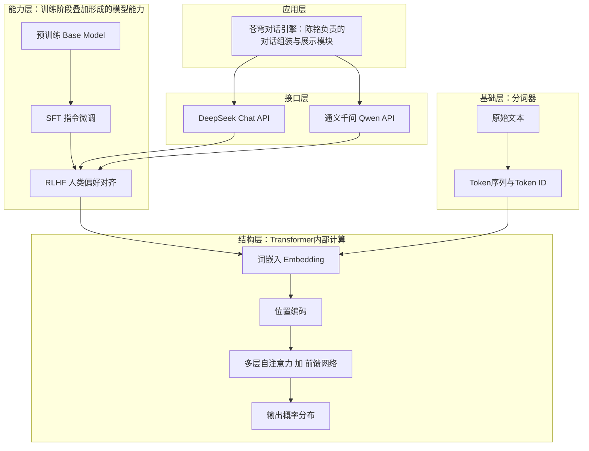
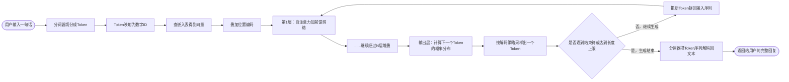
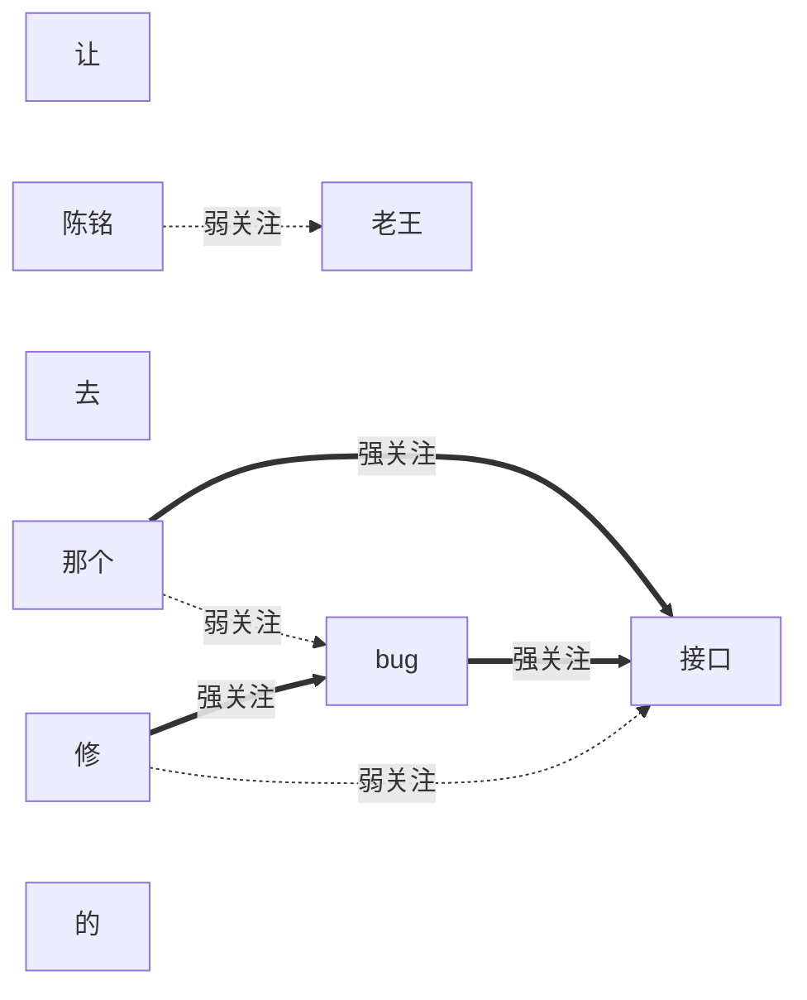

# 第15天 · 大模型原理科普(无需数学基础)

> **周次/Sprint**:Sprint 1 · 对话引擎MVP(Day15-24)—— 苍穹0.1版开发正式开工日
> **星期**:周一(第三周第一天,陈铭以正式员工身份第一次坐进工位的日子)
> **学员**:陈铭(苍穹对话引擎小组 · 初级AI应用工程师)
> **导师/列席**:王振宇(老王,技术负责人)、林悦(产品经理)
> **任务卡**:CQ-S1-D15(苍穹项目 · Sprint 1 · Day15 · 内部技术培训——大模型原理科普)
> **今日关键词**:NLP发展简史 / Transformer通俗理解 / 注意力机制类比 / 预训练·SFT·RLHF三阶段 / Token与分词器 / tiktoken成本估算 / 主流模型盘点

---

## 【旁白】

转正通知是昨晚八点多在互评会上公布的,陈铭以为今天早上会是另一种节奏——至少该是"正式项目、正式仓库、正式提交"那种带着仪式感的开工场面。他甚至提前把工位上那盆从工位上前任留下来的绿萜藻挪了个更朝阳的位置,把用了两周的笔记本换成新买的、封面上什么图案都没有的黑色本子,准备用来记录"苍穹项目组"的第一页笔记。结果九点整,老王在工位边站定,说的第一句话是:"今天不写代码。"

陈铭愣了两秒才反应过来这不是玩笑。老王接着说的话,后来被他原样记在了新笔记本的第一页:"你现在会用API了——发请求、传messages、解析返回,这套操作层面的东西,过去十四天你已经练得很熟了。但你现在要真去回答一个问题,比如'为什么同一个问题问两次答案不一样'、'为什么这段话让模型算,报价会比那段话贵'、'Transformer到底是什么',你答得上来吗?"陈铭想了想,老实说答不上来。老王点点头,不是责备的语气,只是确认了一个事实:"这个空白,现在补,是主动学习,成本是一天;将来在客户面前被问到答不上来,是被动尴尬,成本是这一单生意,甚至是团队的专业度评价。我宁愿你今天在我这儿露怯十次,也不愿意你在客户面前露怯一次。"

这大概是陈铭第一次真正意识到,"知道怎么用"和"知道为什么能用"之间,隔着的不是一层薄纸,是一整套体系。过去十四天他调用API的时候,那份`messages`列表在他脑子里更像一个"黑箱输入口"——扔进去文字,吐出来文字,中间发生了什么,他没有认真想过,甚至没觉得有必要想。但从今天起,他要负责的不再是一个练习项目,是苍穹平台正式的"对话引擎层",而这一层的每一个技术决策——用哪个模型、上下文怎么管理、成本怎么控制——都建立在对"模型内部到底在做什么"这件事有基本认知的前提上。老王没有让他去啃数学公式,反而在白板上写了一句话:"今天讲的所有东西,不许出现一个公式,讲不明白就是我没讲好,不是你听不懂。"

窗外的园区跟往常的周一没什么不同,楼下的便利店已经排起了买咖啡的短队,但陈铭工位这一侧,气氛却和过去两周任何一天都不太一样——不是因为知识点变难了,是因为从今天起,"我今天弄懂了什么"这件事,第一次直接和"苍穹平台未来会长成什么样子"挂上了钩。

---

## 晨会纪要 / 今日目标

**时间**:上午8:55,二层大会议室"望远"
**出席**:王振宇(老王)、林悦、陈铭

陈铭到会议室的时候,发现摆在桌上的不是打印文件,是老王随手带来的一支白板笔和一块擦得半干净的白板。林悦坐在靠窗的位置,面前摆着电脑,屏幕上开着一份文档,标题是"苍穹项目内部技术培训需求书"。

老王先开口确认了昨晚的结果:"转正的事,郭总那边已经批了,人事系统今天中午前会更新你的员工状态,工位、工牌、内部系统权限都会跟着切换成正式员工权限,苏梦、韩露、张凡三个人也是同样的流程,只是他们被分到了别的项目组,今天不会跟你一起上课了。"陈铭这才明白,从今天起,"新人训练营"四个人一起上课的场面,正式结束了。

林悦补充了背景:"苍穹项目组正式立项是在Day15,也就是今天。第一个交付目标是苍穹0.1版——一个网页版的对话产品,目标周期是Sprint 1,十天左右,Day15到Day24。这十天里,你会先跟着老王把大模型的原理和Prompt工程补完,然后进入Web开发基础,最后把这些拼装成一个能跑起来的对话产品。"

老王接过话头,把今天的安排写在了白板顶部:

**今日目标**:

1. 上午9:10-12:00:技术串讲第一段——NLP发展简史(从规则系统到统计模型再到神经网络),通俗理解Transformer与注意力机制(全程不写公式,靠类比讲清楚)。
2. 下午14:00-18:00:技术串讲第二段——预训练/SFT/RLHF三阶段详解,Token是什么、分词器怎么工作,主流模型盘点(GPT系列、Claude、DeepSeek、Qwen、Llama、GLM),随后进入实操环节:用`tiktoken`估算token数与调用成本,手写一个简化分词器演示,整理一份模型参数与价格对比表。
3. 晚间:陈铭独立完成课后作业,老王明早抽查提问,不写代码但要能"讲明白"。

**风险点**:

- 老王特别强调了一件事:"今天你可能会觉得'这些东西讲得挺有道理,但好像不影响我明天写代码',这是正常的错觉。原理这东西,不会立刻变成一行代码,但会在你调参数、选模型、跟客户解释报价的时候,变成你和别人之间那道'懂不懂'的分水岭。"
- 林悦从产品视角补了一句:"我们后面签的客户,大概率不是技术团队,他们会问的问题往往很朴素——'为什么问两次答案不一样'、'为什么处理长文档要收更多钱'、'国产模型和国外模型到底差在哪'。这些问题背后,今天要讲的东西都是答案的一部分。你今天学的不是给自己用的知识,是将来要讲给客户听的知识,所以务必要求自己'能讲清楚',而不只是'自己懂了'。"
- 老王还提了一句操作层面的提醒:"下午实操会用到`tiktoken`这个库,它第一次运行时需要联网下载编码表文件,如果编码表本地有缓存就不需要联网。今天的实操代码我都加了兜底方案——如果环境没有联网或者没装这个库,代码会自动降级成一个近似估算器,不会直接报错崩掉。这也是我一直强调的'工具要有离线兜底'的具体例子,你自己写工具的时候也要养成这个习惯。"
- 陈铭在笔记本上记下了老王随口说的一句话,准备贴在工位隔板上:"能讲清楚原理的人,和只会调API的人,客户能感觉出来区别,哪怕客户自己也不懂技术。"

---

## 需求文档:苍穹项目内部技术培训需求书《大模型原理科普与成本意识建立》

> **文档编号**:CQ-TRN-D15-01
> **撰写人**:林悦(产品经理)
> **技术审核**:王振宇(技术负责人)
> **文档版本**:v1.0
> **适用范围**:苍穹对话引擎小组内部培训 · Sprint 1启动培训

### 一、背景

苍穹项目自今日(Day15)正式立项,进入Sprint 1"对话引擎MVP"阶段,目标是在十天内交付苍穹0.1版——一个具备基础多轮对话能力的网页版产品。项目组新增正式成员陈铭,此前十四天的新人训练营已经验证了他具备扎实的Python工程能力与基础的大模型API调用经验,但团队在近期的客户预沟通与内部评审中,反复遇到同一类问题暴露出的能力缺口:工程师能够熟练调用API完成功能,但当被问及"为什么"层面的问题时,往往无法给出让人信服的解释。

这类问题并非孤例。上一季度,苍穹平台在为某意向客户做技术方案讲解时,客户方技术负责人提出过一个朴素但关键的问题——"你们这个对话系统,为什么处理一份长文档比处理一句短问题贵这么多倍",当时负责讲解的工程师只能给出"模型本身收费规则就是这样"的模糊回答,未能进一步解释背后的Token计费机制,客户方当场追问细节,现场气氛一度陷入被动。类似的情况还包括客户问"为什么同一个问题问了两次,回答内容却不完全一样"——这背后涉及模型的概率采样机制(将在Day16课程中随参数详解一并展开),如果工程师连"模型的输出本质上是一个概率分布采样过程"这个基础事实都不了解,是无法给出合理解释的。

更具体地说,团队在梳理这类问题时发现,工程师欠缺的往往不是"操作能力",而是"解释能力"——同样一个技术现象,懂原理的人能用两三句话讲清楚背后的逻辑,不懂原理的人只能重复"模型就是这样设计的""这是行业惯例"这类空洞的说法,后者不仅无法真正解决客户的疑虑,反而容易让客户对整个团队的专业度产生怀疑。林悦在整理需求时特意强调了一点:"我们不是要把每个工程师都培养成算法研究员,苍穹项目的定位始终是'把已有的大模型能力,工程化地组装成企业能用的产品',这个定位没有变。但'工程化组装'不代表'黑箱式调用',一个不理解自己在组装什么的工程师,是没有办法对最终交付的产品质量、成本、风险做出准确判断的。"这也是本次培训被安排在苍穹项目正式立项的第一天、而不是往后随便找个时间补的原因——团队希望从项目一开始,就把"理解原理"作为一种默认要求,而不是"遇到问题才临时抱佛脚"。

有鉴于此,团队决定在苍穹项目正式启动的第一天,安排一次系统性的原理科普培训,目标不是让工程师掌握深度学习的数学推导(这超出了本项目团队的岗位定位,也不是应用层工程师的核心能力要求),而是让工程师能够用非技术语言,把"大模型为什么能听懂人话""模型能力是怎么一步步训练出来的""一次调用到底产生了多少成本"这几件事讲清楚、讲准确。这份能力,将直接影响苍穹项目在客户沟通、成本报价、方案设计等环节的专业度呈现。

### 二、培训目标(用户故事形式)

**故事1(工程师自身能力建设角度)**
作为一名刚加入苍穹对话引擎小组的工程师,我希望能够理解大模型技术演进的基本脉络与Transformer架构的核心思想,这样我在后续做架构设计、模型选型、性能调优等工作时,能够基于对原理的理解做出判断,而不是仅凭经验或者文档里的示例代码"照抄照搬"。
> 验收关注点:能够不借助任何数学公式,用类比方式向非技术背景的同事讲清楚"自注意力机制"大致在做什么;能够准确说出NLP技术演进的四个主要阶段及每个阶段的核心突破。

**故事2(客户沟通角度)**
作为一名未来可能需要参与客户技术方案讲解的工程师,我希望能够解释清楚大模型能力是如何通过预训练、指令微调、人类反馈强化学习三个阶段逐步形成的,这样当客户问及"这个模型是怎么学会对话的""为什么它有时候会拒绝回答某些问题"时,我能够给出准确且不引发误解的回答。
> 验收关注点:能够准确区分预训练、SFT、RLHF三个阶段各自解决的问题,并能举例说明每个阶段对模型行为的具体影响。

**故事3(成本控制与报价角度)**
作为一名需要为客户项目做成本预估的工程师,我希望能够理解Token的概念、掌握主流分词器的基本工作原理,并能够使用工具准确估算一次调用的Token消耗与费用,这样我在做项目报价、选择模型、设计长文本处理方案时,能够给出有依据的成本测算,而不是凭感觉估计。
> 验收关注点:能够独立使用`tiktoken`(或近似估算工具)计算一段文本的Token数量,并结合价格表计算出预估费用;能够解释清楚为什么同样字数的中文文本和英文文本,消耗的Token数量往往不同。

**故事4(模型选型角度)**
作为一名需要为不同客户场景推荐合适模型的工程师,我希望能够全面了解当前主流大模型(GPT系列、Claude、DeepSeek、通义千问、Llama、GLM等)的基本定位、能力特点与价格区间,这样在面对具体业务场景时,能够给出有依据的选型建议,而不是只知道用团队最熟悉的一两个模型。
> 验收关注点:能够列举至少6款主流大模型,并准确说出每款模型的厂商、开源/闭源属性、大致定位与适用场景。

### 三、培训范围与优先级

| 优先级 | 培训内容 | 说明 |
|---|---|---|
| P0 | Transformer与注意力机制的通俗理解 | 后续所有大模型相关工作的认知基础,必须掌握 |
| P0 | 预训练/SFT/RLHF三阶段 | 直接影响对模型行为、模型选型的判断能力 |
| P0 | Token与分词器原理 | 直接决定成本核算的准确性,是Sprint 1报价工作的基础 |
| P1 | NLP发展简史 | 帮助建立技术脉络认知,非当下工作的直接依赖项,但有助于长期技术判断力 |
| P1 | 主流模型盘点 | 为后续模型选型工作打基础,具体选型细节会在项目实践中持续更新 |

### 四、验收标准

1. 能够在不使用任何数学公式的前提下,用至少两个不同的生活化类比,向非技术背景的同事解释清楚"注意力机制"的核心思想。
2. 能够准确复述NLP技术发展的四个阶段(规则驱动、统计方法、神经网络、Transformer),并对每个阶段的代表性技术或事件给出具体例子。
3. 能够清晰区分预训练、SFT、RLHF三个阶段分别在解决什么问题,并能举出至少一个例子说明某个阶段的缺失会导致模型出现什么问题。
4. 能够独立运行`tiktoken`计费估算工具,对给定文本计算Token数与预估费用,并能解释中英文Token消耗差异的原因。
5. 能够列举至少6款主流大模型,说出各自的厂商、开源属性、大致价格区间与适用场景,并能针对一个具体的业务场景(如"预算敏感且需要长上下文")给出初步选型建议。

### 五、后续跟进与知识沉淀机制

考虑到大模型技术演进速度很快,今天整理的模型盘点、价格表等内容,存在较短时间内过时的风险,本次培训额外约定以下跟进机制。第一,项目组内部会维护一份"模型价格与能力对照表"的共享文档,由陈铭负责在完成今天培训后创建初始版本,后续每当团队评估新模型或者厂商发布价格调整公告时,由当时负责跟进的工程师更新对应条目,避免团队决策依赖过时数据;第二,凡是苍穹项目在后续与客户的技术方案沟通中,遇到本次培训未覆盖但客户实际提出的原理性问题(比如具体某个模型的训练细节、某个厂商未公开的技术白皮书内容),记录在项目组的"问题澄清清单"里,由老王安排定期(初期计划按周)的答疑会统一讲解,避免遗留的知识盲点在下一次客户沟通中重复暴露;第三,鉴于本次培训是苍穹项目组"新人补课"的第一次尝试,后续如果项目组有新成员加入,本文档以及对应的课堂笔记记录,将作为标准化的入职培训材料重复使用,并根据实际使用效果持续修订完善,这也是林悦在本次培训结束后特别提出的一项要求——"不能每次有新人来都重新讲一遍、讲法还不一样,培训材料要标准化、可复用"。

为了让今天的培训成果真正能被检验,而不是"听完就忘",本文档还约定了一个简单的自测机制:培训结束当天,由陈铭本人对照第四节"验收标准"逐条自评,标注每一条是"完全掌握""基本掌握,需要补充练习"或者"尚未掌握,需要老王额外答疑"三档之一,并把自评结果同步给老王;次日上午,老王会随机挑选其中一到两条,现场用口头提问的方式做抽查确认,确认方式不局限于让陈铭背诵定义,而是给出一个具体场景(比如"客户问为什么处理长文档比短文档贵"),要求陈铭现场用今天学到的内容给出解释。这种"自评+抽查+场景化提问"三段式的验收方式,是团队在过往几次内训环节里逐步摸索出来的,林悦解释了采用这种方式的原因:"单纯的书面测验很容易变成'背下来就能过关',但我们真正想验证的是'遇到实际场景能不能反应过来',场景化提问更接近工作里真实会发生的情况。"

### 七、非目标(本次培训不涉及的内容)

为避免培训范围无限扩散,本文档明确以下内容不在本次培训范围内,将在后续课程中专门安排:temperature、top_p等API调用参数的详细含义与调参实验(安排在Day16);Prompt设计方法论(安排在Day17-18);模型微调与私有化部署的工程实践(安排在Sprint 6,Day51-57附近)。今天的培训聚焦于"原理认知",不涉及具体的调参与微调操作。

---

## 架构设计图:从一句话到一次回复,技术栈全景

老王在白板上画完这张图之后说了一句话:"你以后每次纠结'这个问题到底该归哪一层管',就回来看这张图。"



这张图从上到下分成五层,对应的正是老王讲课时反复提到的"分层认知"方法:最上面的应用层,是陈铭每天实际打交道的部分——苍穹对话引擎怎么组装`messages`、怎么展示回复,这一层今天不深入(留给后续Web开发的课程);接口层,是DeepSeek、通义千问这些厂商暴露出来的API,今天之前陈铭已经很熟悉这一层;再往下,能力层描述的是"模型的能力从哪里来"——预训练打地基,SFT教会它怎么好好说话,RLHF让它的回答更符合人类偏好,这是今天下午的重点;结构层是Transformer内部真正的计算过程,今天上午重点讲;最底下的基础层是分词器,任何一段文字进入模型之前,都要先经过这一层的切分。老王强调:"你今天要建立的,不是一份孤立的知识点清单,是这张图——知道每一件事发生在哪一层,以后遇到问题,你至少知道该去哪一层找答案。"

---

## 流程图:Transformer推理的简化数据流

讲完架构图之后,老王话锋一转:"刚才那张图讲的是'结构长什么样',接下来这张图讲的是'一次真实的推理过程,数据是怎么流动的'。"



这张图里最容易被忽略、但老王反复强调的一点,是中间那个"循环"——从"是否遇到结束符"判断为"否"之后,箭头会绕回到"第1层"重新走一遍全部计算。老王解释道:"这就是所谓的'自回归生成'——模型每一次只生成一个Token,生成完之后,把这个新Token拼回输入序列的末尾,再整个重新算一遍,预测下一个Token,一直循环,直到模型自己生成了一个'结束符'Token,或者达到了你设置的最大长度上限。"陈铭当时提了一个问题:"那如果模型要生成一百个字的回复,是不是相当于把整个计算过程重复了一百次?"老王点头:"差不多是这个意思,这也是为什么生成长回复往往比生成短回复慢得多、贵得多——每多生成一个Token,都要把前面所有Token重新过一遍计算(工程上有KV缓存等优化手段减少重复计算量,但基本的'一次只出一个词、每出一个词都要重新算一遍概率分布'这个核心逻辑是不变的)。"这句话为下午要讲的Token计费问题埋下了一个自然的技术性铺垫。

---

## 示意图:注意力机制类比示意——"那个bug"到底在说谁

老王在讲解自注意力机制时,现场用陈铭平时说话的习惯造了一个例句:"老王让陈铭去修那个接口的bug"。他把这句话拆成一个个词,画在白板上,然后问了一句:"如果我现在把这句话里的每一个词都当成一个'发言人',让他们互相'投票'——每个词要判断这句话里其他哪几个词跟自己关系最紧密,你觉得'那个'这个词,会把票投给谁?"



图里加粗的箭头表示"强关注",虚线箭头表示"弱关注"。陈铭当时的第一反应是"那个"应该关注"bug",因为字面上离得更近,但老王指出真正重要的关联其实是"那个"和"接口"——因为"那个接口的bug"整体是在描述"接口"的某个具体的bug,"那个"起的是限定作用,它真正要"锁定"的对象是"接口"这个名词,而不是紧跟在后面的"bug"。这张图想传达的核心思想是:自注意力机制不是简单地"看相邻的词",而是让每一个词都有能力"跨越距离",直接和句子里任何一个真正相关的词建立联系,不管这两个词在句子里隔了多远。这正是Transformer相较于早期RNN模型最大的突破之一——RNN按顺序一个词一个词地处理,天然更容易"记住"最近处理过的词,却容易"遗忘"很久之前出现过的词;而自注意力机制里,每个词和每个词之间的"距离"在计算上是平等的,不存在"越远越难记住"的先天缺陷。

除了词与词之间的注意力关系,老王当天在白板上还顺手画了一张更简单的示意,用来讲清楚"Token化"这件事到底在做什么——这张示意后面在课堂笔记里会详细展开,这里先给出结构化的呈现方式:

| 阶段 | 内容形态 | 举例(以"苍穹企业级智能体中台"为例) |
|---|---|---|
| 原始文本 | 人类可读的字符串 | 苍穹企业级智能体中台 |
| 分词后的Token序列 | 模型能处理的最小语义单元序列(不一定对应人类直觉里的"字"或"词") | 视具体分词器而定,可能被切成七八个甚至十几个片段,详见下午课堂笔记的实测结果 |
| Token ID序列 | 每个Token对应词表里的一个数字编号 | 每个片段被映射为一个具体的整数,比如`[59, 12043, 47821, ...]` |
| 嵌入向量序列 | 每个Token ID被查表转换成一个高维向量 | 这一步开始,文本彻底变成了模型能做数学计算的数字形式 |

---

## 课堂笔记 · 上午场——从规则时代到Transformer,人类怎么一步步教会机器"读懂"人话

老王讲课有个习惯,不喜欢一上来就抛术语,他从一个问题开场:"你有没有想过,'让机器理解人话'这件事,人类是从什么时候开始尝试的?其实比你想象得早得多,而且走了很长一段弯路。"

**第一阶段:规则驱动时代(上世纪50年代到80年代)**

最早的自然语言处理思路非常直接——既然人类是靠语法规则和词典来理解语言的,那机器为什么不能照搬这套思路?这一时期最具代表性的产物是1966年出现的聊天程序ELIZA,它扮演一个心理咨询师的角色,靠的完全是一套关键词匹配和模板替换规则:如果用户说的话里出现"我觉得",程序就套用预设模板回一句"为什么你觉得……",本质上没有任何"理解"发生,纯粹是模式匹配加字符串替换。老王打了个比方:"这就像一个完全不会外语、但背了一整本'常用对话模板'的服务员,你说'菜单'他就递菜单,你说'账单'他就递账单,一旦你说的话超出了模板范围,他立刻就露馅。"

这一时期还有大量专家系统尝试用人工编写的语法规则、词典和逻辑推理规则来处理语言任务,比如早期的机器翻译系统,依赖的是语言学家手工编写的转换规则——"英语的这种句型,对应法语的那种句型"。这类系统的问题是显而易见的:人类语言的例外情况太多,规则写得再详细,总有覆盖不到的场景,而且规则库的维护成本随着语言现象的复杂度呈指数级增长,几乎不可持续。陈铭在这里提了一个问题:"那这个阶段完全没有价值吗?"老王摇头:"恰恰相反,这个阶段沉淀下来的很多语言学分析方法——词性标注、句法分析树、命名实体识别的基本框架——到今天依然是NLP领域的基础概念,只是'规则'这个具体的实现方式,后来被更擅长处理不确定性的方法取代了。"

**第二阶段:统计方法时代(上世纪90年代到2000年代中期)**

进入90年代,研究者开始意识到,语言现象本质上是充满不确定性的,与其试图用规则穷尽所有情况,不如换个思路——用大量真实文本去统计"什么词后面接什么词的概率更高"。这一时期最具代表性的技术是n-gram语言模型:模型不再理解"语法为什么这样",只是单纯统计"在历史文本里,某个词序列出现的频率有多高",然后用这个频率去预测下一个最可能出现的词。老王用了一个类比:"这有点像你在手机上打字时,输入法自动给你推荐下一个字——它不是真的'理解'你想说什么,只是根据海量用户过去打字的习惯,统计出'打了这几个字之后,接下来最可能打的字是什么'。"

这一时期,统计机器翻译取代了基于规则的机器翻译,成为主流方法;隐马尔可夫模型(HMM)被广泛用于词性标注、语音识别等任务;支持向量机(SVM)等统计学习方法也被大量应用于文本分类问题。这个阶段的核心思路转变,是从"人告诉机器规则是什么"变成了"机器从数据里自己统计出规律",这是一次重要的思路转折,但统计方法有一个明显的局限——它很难捕捉词与词之间"更深层的语义关联",一个词的统计频率再准,也无法真正理解"这个词在这句话里到底是什么意思"。

**第三阶段:神经网络时代(2010年代初到2017年前)**

真正的转折点出现在词嵌入(word embedding)技术的兴起,尤其是2013年谷歌提出的word2vec方法。老王讲这部分内容时,特意放慢了语速:"这是你之后理解Transformer的一个重要基础概念,一定要听懂。"词嵌入解决的核心问题是——怎么把一个词变成一组数字,而且这组数字要能反映出词与词之间的语义关系。举个例子,如果把"国王"和"男人"的向量做差,再加上"女人"的向量,结果会非常接近"女王"的向量——这说明词嵌入向量里,确实编码进去了某种语义层面的"关系结构",而不只是随机分配的编号。这是NLP历史上第一次,机器处理的"词"从孤立的符号,变成了带有语义信息的数学对象。

有了词嵌入之后,循环神经网络(RNN)以及它的改进版本长短期记忆网络(LSTM)成为处理序列数据的主流架构。这类模型的核心思路是"按顺序逐个处理",就像人阅读一句话时是从左到右一个字一个字看过去的,RNN会把"读到目前为止的信息"压缩成一个"记忆状态",不断向后传递、更新。这种设计天然适合处理语言这种有先后顺序的数据,在机器翻译等任务上取得了显著进展,编码器-解码器(Encoder-Decoder)架构也是在这个阶段成型的——用一个编码器把整句话压缩成一个向量,再用一个解码器把这个向量重新展开成另一种语言的句子。

但RNN有两个根本性的缺陷,老王把这两个缺陷讲得格外仔细,因为这正是Transformer要解决的核心问题:第一,**顺序处理导致无法并行计算**——RNN必须先处理完第一个词,才能开始处理第二个词,因为第二个词的计算依赖第一个词处理完之后产生的"记忆状态",这意味着无论你有多少块GPU,RNN的计算过程始终是"排队走"的,训练速度被严重限制;第二,**长距离依赖问题**——句子越长,越靠前的信息在"记忆状态"里被反复压缩和覆盖的次数越多,越容易被"冲淡"甚至遗忘,就像传话游戏里,传到第十个人的时候,原始信息已经严重失真。LSTM在一定程度上缓解了第二个问题,但没有从根本上解决,而第一个问题——无法并行——则是RNN架构本身决定的,几乎无解。

**第四阶段:Transformer时代(2017年至今)**

2017年,谷歌团队发表了一篇后来影响了整个人工智能领域走向的论文,标题就是简单直接的"Attention Is All You Need"(注意力就是你所需要的全部),核心贡献是提出了Transformer架构。老王说:"这篇论文最颠覆性的地方,不是提出了一个更强的模型,是提出了一种全新的思路——彻底抛弃RNN的'按顺序处理'范式,改用自注意力机制,让序列里的每一个位置,都能直接和其他任意位置建立联系,不再依赖'一步步传递记忆'这种方式。"这个改变带来了两个决定性的好处:第一,**摆脱了顺序依赖,可以大规模并行计算**——因为不再需要等前一个词处理完才能处理下一个词,整句话里所有位置的注意力计算可以同时进行,这使得在GPU集群上训练远比RNN时代更大规模的模型变成了可能;第二,**任意两个位置之间的距离在计算上是等价的**,不存在"越远越难关联"的先天缺陷,这从根本上缓解了长距离依赖问题。

正是Transformer这套架构带来的并行计算效率,才使得后来"把模型做得更大、用更多数据训练"这条路径变得可行——如果没有Transformer,像GPT这样动辄千亿参数规模的模型,根本无法在合理的时间和成本内完成训练。老王总结这段历史时说了一句让陈铭印象很深的话:"NLP这几十年的发展史,本质上是一个'从人类主动教规则,到机器从数据里自己学规律,再到用一种更高效的架构把'自己学'这件事的效率和规模都推向新高度'的过程。你今天要建立的,不是记住几个年代和几个术语,是理解这条主线背后的逻辑——每一次范式转变,都是在解决上一个范式解决不了的核心痛点。"

紧接着Transformer架构提出之后,业界很快出现了两条并行发展的重要路线,老王专门花了几分钟讲这段"承前启后"的历史,因为它直接关系到今天下午要讲的"预训练/SFT/RLHF"框架是怎么成型的。2018年前后,谷歌提出了BERT模型,采用的是Encoder-only架构,核心训练思路是"随机遮住句子里的一些词,让模型根据上下文猜出被遮住的词是什么"(这种训练方式后来被称为"掩码语言模型"),BERT在各类语言理解任务上取得了当时最好的效果,证明了"先在海量无标注文本上做预训练,再针对具体任务做微调"这条路径是可行且高效的,这也是"预训练"这个概念第一次被广泛验证有效。几乎同一时期,OpenAI选择了另一条路线——采用Decoder-only架构,训练目标是纯粹的"预测下一个词",这就是GPT系列的起点。老王指出:"BERT和早期GPT走的是两条不同的路,BERT更擅长'理解'类任务,早期GPT更擅长'生成'类任务,但历史后来证明,'预测下一个词'这个看起来极其朴素的训练目标,配合足够大的模型规模和数据规模,反而展现出了远超预期的通用能力,这也是为什么后来几乎所有主流的对话大模型,包括DeepSeek、通义千问,都选择了Decoder-only这条路线而不是BERT的路线。"

这段历史还牵出了一个后来被反复验证的重要现象,业界称之为"规模法则"(Scaling Law)——研究者发现,当模型参数规模、训练数据量、训练计算量同步增长时,模型的能力会以一种相对可预测的方式持续提升,而不是很快遇到天花板。这个发现直接催生了后续"大模型竞赛"的基本逻辑:各家厂商持续投入更多算力、收集更多训练数据、训练更大规模的模型,期待获得能力上的持续提升。老王补充了一句提醒:"这几年你会看到,'规模法则'本身也在被不断修正和讨论——单纯堆参数规模的边际收益是否在递减、数据质量比数据数量是否更重要、像DeepSeek-R1这类通过强化学习强化推理能力的路径是否代表了新的增长点,这些都是学术界和产业界仍在持续探讨的问题,你不需要现在就能回答,但要知道'越大越好'这个朴素结论,并不是一条永远成立的铁律。"

**通俗理解Transformer:注意力机制到底在做什么**

讲完历史脉络,老王开始正式拆解Transformer内部的核心机制,反复强调:"接下来这段,不许出现任何公式,我们全靠打比方。"

**类比一:开会记笔记。**老王说,你可以把"自注意力"想象成开会记笔记的过程。一场会议里,发言人说了一大段话,你的脑子不会像录音机一样机械地逐字记录,而是会自动给不同的句子分配不同的"重要程度"——领导强调的关键结论,你会格外留意;顺口提到的闲聊内容,你可能直接忽略。自注意力机制做的事情本质上类似:对于句子里的每一个词,模型都会计算它和句子里其他所有词之间的"关联程度"(也就是常说的"注意力权重"),关联程度高的词,会在生成这个词的理解表示时,被赋予更大的"发言权";关联程度低的词,则被相对弱化。这个过程对句子里的每一个词都会重复一遍,所以最终每个词的理解,都是"综合考虑了整句话里所有其他词的相关程度"之后得出的结果,而不是孤立地看这个词本身。

**类比二:翻译时的"目光扫视"。**老王又补了一个类比:一个熟练的译者翻译一句话时,眼睛不会死死盯着当前正在翻译的那个词,而是会不断地在整句话里"扫视",比如遇到代词"他",会本能地回头看前面出现过的人名,确认"他"指的是谁。这正是自注意力机制解决的核心问题——传统RNN只能依靠"按顺序传递的记忆"来间接获取更早之前的信息,而自注意力机制允许模型在处理句子中任意一个位置的词时,直接"回看"整句话里的任何其他位置,不需要绕经中间的"记忆传递链条"。

**类比三:多头注意力——多位审稿人同时审一篇论文。**陈铭当时问了一个问题:"如果只有一种'关联程度'的判断方式,会不会不够全面?"老王说这正是"多头注意力"要解决的问题。可以把多头注意力想象成:一篇论文同时被交给几位不同专长的审稿人去审——一位专注检查语法是否通顺,一位专注检查逻辑是否自洽,一位专注检查引用的文献是否恰当,一位专注检查这段话跟前后文是否呼应。每一位审稿人(也就是每一个"注意力头")都会独立地给出一套"关联程度"的判断,关注的侧重点各不相同,最后把所有审稿人的意见综合起来,才能得到一个更全面、更鲁棒的理解。Transformer里的"多头注意力"正是同时运行多组独立的注意力计算,每一组各自学习捕捉不同类型的语言关联模式(比如有的头可能更擅长捕捉语法结构,有的头可能更擅长捕捉指代关系),最后把多个头的结果拼接融合,得到更丰富的表示。

**类比四:位置编码——给每个词发一个"座位号"。**老王指出一个容易被忽略但很关键的问题:自注意力机制本身,是"无视顺序"的——它只关心"两个词之间的关联程度",却不天然知道"谁在前谁在后"。但语言的顺序显然是有意义的,"猫追狗"和"狗追猫"完全是两个不同的意思,如果模型分不清顺序,理解就会出错。为了解决这个问题,Transformer引入了"位置编码"——在每个词的向量表示里,额外叠加进去一段专门用来表示"这个词排在第几位"的信息,相当于给每个词发了一个"座位号"。老王打比方说:"这就像开会时,即便所有人可以自由发言、互相交流(对应自注意力的'任意位置可关联'),会议纪要里依然会标注'谁先说的、谁后说的',顺序信息不能丢。"

**类比五:多层堆叠——一次讨论不够,那就开很多轮。**Transformer不是只做一次自注意力计算就结束,而是把"自注意力+前馈网络"这样一个处理单元,堆叠很多层(比如几十层甚至上百层),一层接一层地处理。老王把这个过程比作"多轮讨论会":第一轮讨论,大家先对句子里明显的、表层的关联(比如语法结构)达成基本共识;第二轮讨论,在第一轮的基础上,进一步挖掘更深层的语义关联;每往后一层,理解就更抽象、更精细一层。最终经过很多层的反复"讨论",模型对整句话的理解会变得非常丰富和抽象,这也是为什么大模型的层数往往和它的能力上限有很强的相关性。

**类比六:Encoder、Decoder与Decoder-only——三种不同的"读写方式"。**老王介绍了Transformer的三种主要变体形态。Encoder-only架构(以BERT为代表)只负责"读懂"一段文本,把它转换成一种深层的理解表示,擅长做阅读理解、情感分类之类"输入一段话、输出一个判断"的任务,好比一个"精读型阅卷老师",只批改不写作;Encoder-Decoder架构(以早期的T5、传统机器翻译模型为代表)既有负责"读"的部分,也有负责"写"的部分,擅长处理"把一种形式的文本转换成另一种形式"的任务,比如翻译、摘要;而Decoder-only架构(以GPT系列、DeepSeek、通义千问等当前绝大多数主流对话大模型为代表)则专注于"续写"——给定前面已经出现的所有内容,不断预测下一个最可能出现的Token,一个接一个往后写,直到生成完整的回复。老王说:"今天我们打交道最多的DeepSeek、通义千问,骨子里都是Decoder-only架构,它们的核心能力,本质上是'超强的续写能力'——你给它一段对话历史,它做的事情,就是不断预测'接下来最合理的下一个词是什么',一直写下去,直到该结束了。理解了这一点,你会对后面要讲的很多现象——比如为什么长上下文会拖慢生成速度、为什么模型有时候会'一本正经地编造内容'——有更直觉性的理解。"

陈铭顺着"续写能力"这个说法,追问了一个此前一直感到困惑的问题:"那是不是可以解释,为什么有时候模型会一本正经地编造一些根本不存在的内容,比如编造一篇不存在的论文标题,或者编造一个不存在的法律条文?"老王认可了这个联想的方向:"这确实是理解这类现象的一个重要切入角度——Decoder-only模型的核心机制,是不断预测'接下来最合理的下一个词',它优化的目标从来不是'这句话在事实上是否真实',而是'这句话在统计意义上是否通顺、是否像人话'。如果训练数据里,某一类表达方式(比如'某某论文提出了……')出现的模式非常典型,模型即便对具体内容一无所知,也完全有能力生成一句'看起来很像那么回事'的续写,这就是通常所说的'幻觉'现象的一种技术性根源。当然,幻觉问题的成因是多方面的,预训练数据里本身包含的错误信息、模型在SFT和RLHF阶段有没有被专门训练'不知道就说不知道',都会影响幻觉出现的频率,但今天这个'续写本质'的理解,至少能帮你解释清楚,为什么模型明明看起来'很自信',却依然可能一本正经地说错话——它并不是在'说谎',它只是在做它被训练来做的事情:预测下一个最合理的词,合理与否,和事实是否真实,并不是同一件事。"这段对话让陈铭对后面Sprint 3要学的RAG检索增强技术的必要性,提前有了一层朴素的理解——如果模型本身不能保证生成内容的事实准确性,那给它"喂"真实、可核查的外部知识,就成了弥补这个缺陷的一条自然路径,这也是后话,今天先不展开。

陈铭在笔记本上写下了这一段的小结:"Transformer不是凭空多聪明,是把'谁和谁有关系、关系有多大'这件事,从RNN那种'按顺序死记硬背'的低效方式,换成了'谁都能直接和谁对话、还能从多个角度同时判断关系'的高效方式,顺带解决了顺序信息容易丢失的问题(靠位置编码补回来),再通过堆叠很多层反复加深理解——这套设计换来的,是训练效率和长距离理解能力的双重提升,这才是它能撑起后来越做越大的模型规模的根本原因。"

---

## 课堂笔记 · 下午场——模型是怎么被"调教"出来的,以及一次对话到底在烧多少钱

午饭后,老王换了个话题的开场方式:"上午讲的是模型的'骨架'长什么样,下午讲的是——同样一套骨架,为什么训练出来的模型,行为却千差万别。"

**预训练:海量阅读期,让模型先"读遍互联网"**

老王先讲的是模型能力形成的第一阶段——预训练(Pretraining)。这个阶段的核心思路非常朴素:收集海量的文本数据(网页、书籍、代码、论文等等,规模通常是万亿级别的Token),让模型不断去做一件事——给定前面一段文字,预测下一个最可能出现的词是什么。这个训练目标本身极其简单,但当训练数据规模足够大、模型参数规模足够大的时候,模型会在"学会预测下一个词"这个过程中,顺带学会大量隐含在文本里的知识——语法规则、常识信息、逻辑推理模式、甚至一定程度的世界知识,都是在这个过程中"顺带"被模型吸收进去的。

老王打了个比方:"预训练阶段的模型,像一个读了海量书籍、但从来没有人教过它'怎么态度得体地跟人对话'的学者。它知道的东西可能很多,但如果你问它一个问题,它未必会给你一个'像助手一样'的直接回答,反而更可能'顺着你的话继续往下写'。"这正是预训练结束后得到的模型——通常被称为"基座模型"(Base Model)——的典型行为特征:如果你输入"如何写一份请假条",一个纯粹的基座模型,可能不会直接给你写请假条的步骤,而是有可能继续"续写"出一段类似"这是很多员工都会遇到的问题,请假条一般包括以下几个部分……"这样风格模糊的文字,甚至可能续写出完全不相关的内容——因为它的训练目标只是"预测下一个最合理的词",而不是"像助手一样精准满足用户的请求"。

**SFT:答题训练班,教会模型"像助手一样说话"**

第二阶段是监督微调(Supervised Fine-Tuning,简称SFT)。这一阶段,团队会准备大量人工标注(或者精心筛选)的高质量"指令-回复"配对数据——用户提出一个问题或者一个指令,配上一段规范、得体、有帮助性的回复,然后用这批数据继续训练预训练阶段得到的基座模型,让它学会"应该按照什么样的格式和风格来回应用户的请求"。老王打比方:"这个阶段有点像给一个读了很多书但不太会说话的学者,报了一个'客服话术培训班'——教他遇到不同类型的问题,应该怎么组织语言、怎么给出有条理的回答,而不是自由发挥地续写。"

经过SFT之后,模型的行为会发生明显变化——从"倾向于自由续写"变成"倾向于像一个助手一样直接回应用户的意图"。这也是为什么几乎所有你能直接对话使用的产品(不管是DeepSeek官网的对话界面,还是苍穹平台未来要做的对话产品),背后调用的都不是纯粹的基座模型,而是经过SFT之后的"对话模型"(Chat Model)或"指令模型"(Instruct Model)。老王补了一句提醒:"你们在API文档里经常看到模型名字后面带'chat'或者'instruct'这类后缀,基本就是在告诉你——这是经过SFT调教过的版本,不是原始的基座模型。"

**RLHF:带教老师反复打分调教,让模型的回答更符合人类偏好**

第三阶段是基于人类反馈的强化学习(Reinforcement Learning from Human Feedback,简称RLHF)。老王说这一阶段解决的问题,比SFT更进一步——SFT教会了模型"按照什么格式回答问题",但没有解决"在多个看起来都还算合理的回答里,哪一个才是人类真正更喜欣、更认可的那一个"这个更细粒度的偏好问题。

RLHF的大致流程是这样的:首先,让模型针对同一个问题生成好几个不同的候选回答;然后,请人类标注员对这几个候选回答进行排序或打分,标出哪个回答更好、好在哪里(比如更有用、更安全、更简洁、更少废话);接着,用这批"人类偏好排序数据"训练出一个专门的"奖励模型"(Reward Model),让这个奖励模型学会模仿人类的打分标准,给任意一个回答打出一个分数;最后,用强化学习的方法,不断调整对话模型的参数,让它生成的回答,能够在这个奖励模型那里拿到更高的分数——本质上是"用一个学会了模仿人类偏好的模型,去指导另一个模型不断调整自己的输出倾向"。

老王打了一个更接地气的比方:"这就像你刚入职时写周报,第一版你按照公司模板写(相当于SFT阶段,学会了基本格式);但老板看了之后,会告诉你'这段话可以更简洁一点''这个结论应该放前面,不要藏在最后',你根据老板反复的反馈调整自己的写作习惯,这就是RLHF在做的事情——不是教你'格式该怎么写',是教你'什么样的表达,更符合评判者真正的偏好'。"经过RLHF调整之后,模型在"有用性"(有没有真正解决用户的问题)、"无害性"(会不会输出危险或者不当内容)、"诚实性"(会不会一本正经地编造不存在的信息)这几个维度上,通常会有明显的提升。老王也补充了一点:"业界现在还有一些RLHF的简化替代方法,比如DPO(直接偏好优化),核心思路类似,都是想办法让模型学习'人类更喜欢哪个回答',只是具体实现路径更简洁,这些属于更细节的工程优化,你现在不需要深究算法细节,知道'这个方向上还有其他做法'就够了。"

陈铭听完RLHF这部分,又问了一个更细节的问题:"如果人类标注员之间对'哪个回答更好'意见不一致,会不会影响训练效果?"老王说这确实是RLHF实践中一个真实存在的挑战:"人类的偏好本身就不是绝对统一的标准,不同标注员的判断标准可能存在差异,这也是为什么真正做RLHF的团队,会投入大量精力制定详细的标注规范、对标注员进行培训、做多人标注结果的一致性校验,尽量减少主观偏差带来的噪音。这也从另一个角度说明,RLHF不是一个'一次性调完就永远好用'的阶段,厂商往往会持续迭代对齐策略,根据实际使用中暴露出的问题,不断补充新的偏好数据、调整训练方式。"他还提到了业界近年来在这个方向上的一些新探索:"除了经典的RLHF流程,还有一种叫做DPO(直接偏好优化)的方法,大致思路是跳过'先训练一个独立奖励模型,再用强化学习调整'这个相对复杂、也相对不稳定的两步流程,改成直接用人类偏好排序数据,以一种更简洁的优化方式直接调整模型参数,训练过程通常更稳定、更容易复现。这类方法目前也被不少团队采用,但核心目标和RLHF是一致的——都是让模型的输出更贴近人类的真实偏好,你现在不需要掌握具体的算法细节,只需要知道'实现这个目标的具体技术路径,这几年也在持续演进',不要把RLHF当成唯一或者一成不变的标准做法。"

陈铭在这一段结束时,把三个阶段的关系总结成了一句话,写在笔记本上:"预训练负责'知道很多东西',SFT负责'知道怎么好好回答问题',RLHF负责'知道什么样的回答才是人类真正想要的那种好'——三者缺一个,模型都会表现出明显的短板,这也是为什么有些开源社区自己拿基座模型简单微调一下就上线,用起来总感觉'差点意思'的原因。"

**Token是什么,分词器到底在干什么**

讲完三阶段,老王转向了下午实操的核心背景知识——Token。他先纠正了一个陈铭原本以为理所当然的认知:"你可能以为,模型处理文字的最小单位是'字'(对中文而言)或者'单词'(对英文而言),其实都不对,模型处理的最小单位是Token,而Token既不完全等于字,也不完全等于词,它是分词器按照训练时学到的统计规律,切分出来的一套'子词单元'。"

老王用了一个类比:"你可以把Token化想象成快递分拣中心的'标准化装箱'过程——同一批货物,不同的分拣规则,会打包成不同大小的箱子。常见、高频出现的词或字,往往会被打包成一个独立的'箱子'(一个Token);不常见的、生僻的内容,可能会被拆解成更小的碎片,一个字甚至可能被拆成两三个'箱子'才能装完。这个打包规则,是分词器在训练阶段,通过统计海量文本里'哪些字符组合出现得特别频繁'学出来的,不是人工规定的。"

具体到英文和中文的差异,老王讲得格外细致:英文的分词器(比如OpenAI系列模型常用的tiktoken)是基于字节对编码(BPE, Byte Pair Encoding)或者其变体训练出来的,由于英文文本天然有空格分词,加上很多常见的完整英文单词在训练语料里出现频率极高,所以英文的分词效率通常比较高,一个常见的英文单词往往刚好对应一个Token,大致可以估算"一个Token约等于四个英文字符,或者约等于四分之三个英文单词"这样的经验比例。而中文没有天然的空格分界,加上很多主流分词器(比如给GPT系列使用的cl100k_base)本质上是在英文语料为主的训练数据基础上学出来的编码规则,对中文的支持相对没有那么"高效"——很多常见汉字确实对应一个独立的Token,但相当一部分汉字(尤其相对不那么高频的字)会被拆解成更细碎的字节级片段,导致同样的信息量,中文往往会消耗比英文更多的Token数。老王当场提到:"下午实操的时候,你会亲眼看到这个现象——用tiktoken对一句中文做编码,再把编码结果一个个解码回来看,你会发现有些常见汉字确实是一个完整的Token,但也有一些字,会被拆成两三个看起来像乱码的'字节碎片',这不是bug,是这一类分词器对中文天生没那么友好的真实体现。"

这一点直接关系到成本核算——因为绝大多数API厂商是按照Token数量来计费的,而不是按照"字数"或者"字符数"计费,这意味着同样一段信息,用中文表达和用英文表达,实际消耗的Token数量、进而产生的费用,可能是不一样的,这也是老王反复强调"要理解分词器行为,才能准确做成本预估"的核心原因。

陈铭追问了一个很实际的问题:"那我们做成本估算的时候,是不是应该直接用DeepSeek或者通义千问官方的分词规则来算,而不是用tiktoken这种给GPT系列用的编码器?"老王肯定了这个问题的方向是对的:"理论上确实应该这样,但现实情况是,大多数国产模型厂商目前没有公开发布可以离线安装使用的分词器工具包,你没有办法在本地精确复现它们的真实切分结果,只能退而求其次,用tiktoken的cl100k_base或者类似的通用编码规则做近似估算,这个近似值和真实值之间会存在一定误差,误差的方向和大小,取决于具体厂商的分词器和cl100k_base的相似程度。对苍穹项目来说,更靠谱的成本核算方式,是结合两种手段——开发阶段用近似估算工具快速做量级判断,用来支撑选型决策和报价的大致区间;真正上线前或者拿到一定量的真实调用数据之后,一定要以API返回结果里的`usage`字段记录的真实token数为准,去校准和修正之前的估算模型,不能一直依赖近似值。"这段对话也解释了今天`token_cost_estimator.py`里,为什么每一条计费结果后面都明确标注了"精确计算"或者"近似估算"——这不是代码风格上的讲究,是要求任何看到这份报告的人,都清楚意识到这个数字的可信程度边界在哪里,避免近似估算的数字被误当成精确报价依据,进而在实际项目合同里造成成本预估失真的风险。

**主流模型盘点**

下午课堂的最后一部分,老王带着陈铭梳理了当前主流的几款大模型,他强调:"这份盘点你要记住的不是具体数字(数字会一直变),是每个模型的'定位'和'性格',这样你以后遇到新客户、新场景,能快速判断该往哪个方向考虑。"

**GPT系列(OpenAI)**:目前综合能力最受认可的闭源模型系列之一,从GPT-3.5到GPT-4、GPT-4o,再到后续更新的版本,长期占据行业标杆位置,生态成熟(配套的工具、社区资源、第三方集成最丰富),多模态能力(同时理解图像、音频等)推进得比较靠前,但整体调用价格相对偏高,且因为地域和网络因素,国内客户直接调用有一定的使用门槛。

**Claude系列(Anthropic)**:同样是闭源模型,以长文本处理能力和"安全对齐"口碑好著称,上下文窗口普遍支持得比较大,在代码生成、长文档分析等任务上评价一直不错,定价与GPT系列处于同一量级,同样存在国内直接调用的门槛问题。

**DeepSeek系列(深度求索,国产)**:苍穹平台目前的主力模型之一,最大的特点是"开源+官方API双轨"——既可以直接调用官方API,也可以下载开源权重自行部署,价格在业内以"性价比极高"著称。DeepSeek-V3是通用对话主力型号,DeepSeek-R1是专门强化了推理能力的版本,擅长处理需要多步骤逻辑推导的复杂问题,输出内容里通常会包含更详细的"思考过程",相应地输出Token量、调用成本也会更高一些。

**通义千问Qwen系列(阿里云,国产)**:阿里云推出的大模型系列,型号覆盖非常齐全——从轻量级到旗舰级(Qwen-Max),从闭源商用API到开源可自部署版本(Qwen2.5系列),选择空间很大,中文语料训练充分,中文场景下的表现普遍受到认可,和阿里云自身的云服务生态集成也比较方便。

**Llama系列(Meta,开源标杆)**:开源社区里生态最庞大、影响力最深远的模型系列之一,商用许可条款相对宽松,大量的微调、量化、私有化部署工具链都是围绕Llama系列率先成熟起来的。使用Llama通常意味着企业需要自备算力进行部署和推理,没有现成的官方API调用费用(但会有实际的服务器和运维成本)。

**GLM系列(智谱AI,国产)**:国内较早一批投入大模型研发的团队之一,ChatGLM系列在国内开源社区里积累了很长时间的口碑基础,目前的GLM-4系列采取开源与闭源商用API并行的策略,工具调用(Function Calling)等企业级能力的支持相对完善。

陈铭在记录这几款模型的时候,顺手在每一条后面标注了自己的一句"记忆口诀",算是把老王反复强调的"记定位、记性格"这句话落实成了具体动作:GPT系列是"最贵但最全能的老大哥";Claude是"读长文档最耐心的那一个";DeepSeek是"性价比之王,还能自己搬回家部署";通义千问是"中文本地作战最熟练的选手";Llama是"开源世界里人最多的那条街";GLM是"国产阵营里资历最老的那一位"。老王看到这份口诀笑了一下,没有否定,只是补充了一句:"这种记法能帮你快速建立第一印象,但千万别停在这一层——真正做选型决策的时候,一定要回到具体的验收标准上核实清楚,口诀是用来'快速筛选候选范围'的,不是用来'替代实际测算'的,这个边界你要分清楚。"

陈铭注意到DeepSeek-V3的参数规模标注里出现了"MoE"这个缩写,追问了一句。老王在白板上补画了一张简图解释:"MoE是混合专家模型(Mixture of Experts)的缩写,你可以把它想象成一个大型企业的组织架构——不是所有员工都要参加每一场会议、处理每一项业务,而是分成很多个'专家小组',每个小组各有侧重,遇到具体问题时,系统会先判断'这个问题该交给哪几个专家小组处理',只调用相关的小组,而不是让全公司所有人都参与进来。DeepSeek-V3总参数量高达6710亿,但每次实际处理一个Token时,只会激活其中大约370亿参数对应的'专家小组'参与计算,这样一来,模型整体的知识容量可以做得很大(因为总参数多),但实际推理时的计算成本却能控制在远小于'全参数都参与计算'的水平——这也是为什么DeepSeek能在保持很强能力的同时,把价格做得比很多同级别模型低得多的一个重要技术原因。"这个类比让陈铭对"参数规模"这个此前只当成一个抽象数字的概念,有了更具体的认识——参数规模大,不完全等同于"每次都要动用全部参数",这中间还有MoE这样的工程设计空间可以做取舍。

老王讲完之后总结:"你会发现,这几款模型大致可以按两个维度分类——一个是开源还是闭源,一个是国产还是海外厂商。开源意味着你有机会私有化部署、掌控自己的数据(这一点会在Sprint 6我们做金融客户私有化项目的时候变得极其关键);闭源意味着通常综合能力更强、维护更省心,但你要接受把数据发到别人的服务器上这个前提。国产模型这两年在价格和中文能力上的优势非常明显,这也是为什么苍穹项目当前主力选择DeepSeek和通义千问的原因之一。"

林悦在这里补充了一个产品视角的观察:"我们跟客户介绍模型选型的时候,发现客户其实很少一开始就关心'这个模型参数量多大''架构是什么',他们真正关心的问题往往非常朴素——'能不能保证我的数据不外泄'、'出了问题谁负责'、'一个月大概要花多少钱'、'换个模型是不是要重新开发一遍'。所以你们盘点这些模型的时候,除了记住技术定位,更要习惯性地把这些技术特点翻译成客户能听懂的关切点——比如'开源可私有化部署'翻译过去就是'能保证数据不出企业内网',这才是真正能打动客户的表达方式。"老王认可了这个补充,又加了一句关于选型灵活性的提醒:"还有一点你要记住,苍穹平台的架构设计从一开始就不能绑死在某一个具体模型上——今天调用的可能是DeepSeek,明天客户可能因为合规要求换成必须私有化部署的开源模型,这就是为什么我们在做模型接入层设计的时候,始终要求接口做统一抽象,不能让上层业务代码直接依赖某个厂商的具体API格式,这一点你在后续Sprint 1开发对话引擎的时候会真正体会到它的重要性。"

---

## 代码实战

老王在下午课程接近尾声时说:"讲了一下午的原理,如果不亲手跑一遍代码,这些概念很容易变成'听起来懂了、其实没懂'。接下来三个小实操,你自己动手跑一遍。"

### 实战一:用tiktoken估算调用成本

第一个实操,是写一个能实际计算Token数量并估算调用成本的工具。老王要求:"这个工具要能处理两种情况——环境里装了tiktoken能精确算,没装的话要有兜底方案,不能直接报错崩掉,这是给客户环境部署工具的基本素养。"

```python
"""
tiktoken计费估算脚本
======================

苍穹对话引擎小组内部工具：估算一次对话调用大模型API会消耗多少Token，
并结合各厂商公开的参考价格，估算这次调用大概花了多少钱。

背景说明：
- OpenAI的GPT系列模型官方提供了tiktoken库，可以精确复现其分词器的
  切分结果，因此算出来的token数是"精确值"。
- DeepSeek、通义千问等国产模型有自己独立的分词器，官方没有直接提供
  Python版的离线分词库给开发者本地复现，行业内通常的做法是：
  第一，调用官方API后从返回结果里自带的usage字段拿到"真实token数"
  （最准，但要先发起一次真实请求，会产生真实费用）；
  第二，本地用tiktoken的cl100k_base编码规则做"近似估算"，作为下单
  前的预算参考（不完全准，但足够拿来做成本预算和给客户报价前的
  内部测算）。
本脚本采用第二种思路，所有涉及DeepSeek、Qwen、Claude的token数字，
都会明确标注为"近似估算"，避免被误当成官方精确计费依据。

本脚本还做了一个重要的工程化处理：如果当前运行环境没有安装
tiktoken（比如没有网络、无法下载编码表，或者压根没装这个包），
脚本会自动降级到一个内置的近似估算器，保证工具在任何环境下都
"能跑起来"——这也是老王反复强调的"工具要有离线兜底"的具体体现。
"""

from __future__ import annotations

import re
from dataclasses import dataclass
from typing import Optional

try:
    import tiktoken  # type: ignore

    _TIKTOKEN_AVAILABLE = True
except ImportError:  # pragma: no cover - 取决于运行环境是否装了这个包
    _TIKTOKEN_AVAILABLE = False


# ------------------------------------------------------------------
# 第一部分：价格表
# ------------------------------------------------------------------
# 说明：以下价格均为教学演示用的示例数据，参考各厂商公开资料整理，
# 不代表本文撰写时刻的真实计费标准，实际报价请以厂商官网最新公告为准。
# 价格单位统一按"每100万Token"计（行业内俗称"每1M token"）。

RMB_PER_USD = 7.2  # 教学用示例汇率，实际汇率会随时波动


@dataclass(frozen=True)
class ModelPrice:
    vendor: str
    currency: str  # "USD" 或 "CNY"
    input_price_per_1m: float
    output_price_per_1m: float
    tiktoken_encoding: Optional[str]  # None表示没有官方对应编码，需要走近似估算
    notes: str = ""

    def price_in_rmb(self) -> "ModelPrice":
        """把美元计价的模型，按示例汇率统一折算成人民币，方便跨模型比价。"""
        if self.currency == "CNY":
            return self
        return ModelPrice(
            vendor=self.vendor,
            currency="CNY",
            input_price_per_1m=self.input_price_per_1m * RMB_PER_USD,
            output_price_per_1m=self.output_price_per_1m * RMB_PER_USD,
            tiktoken_encoding=self.tiktoken_encoding,
            notes=self.notes + "（按示例汇率折算为人民币，仅供内部比价参考）",
        )


PRICE_TABLE: dict[str, ModelPrice] = {
    "gpt-4o": ModelPrice(
        vendor="OpenAI",
        currency="USD",
        input_price_per_1m=2.5,
        output_price_per_1m=10.0,
        tiktoken_encoding="o200k_base",
        notes="旗舰闭源模型，多模态能力强",
    ),
    "gpt-4o-mini": ModelPrice(
        vendor="OpenAI",
        currency="USD",
        input_price_per_1m=0.15,
        output_price_per_1m=0.6,
        tiktoken_encoding="o200k_base",
        notes="轻量版，适合高频、低复杂度调用",
    ),
    "claude-3.5-sonnet": ModelPrice(
        vendor="Anthropic",
        currency="USD",
        input_price_per_1m=3.0,
        output_price_per_1m=15.0,
        tiktoken_encoding=None,
        notes="长文本与安全对齐口碑好，无公开tiktoken编码，只能近似估算",
    ),
    "deepseek-chat": ModelPrice(
        vendor="深度求索",
        currency="CNY",
        input_price_per_1m=1.0,
        output_price_per_1m=2.0,
        tiktoken_encoding=None,
        notes="国产模型代表之一，价格公开且低，苍穹当前主力模型之一",
    ),
    "deepseek-reasoner": ModelPrice(
        vendor="深度求索",
        currency="CNY",
        input_price_per_1m=4.0,
        output_price_per_1m=16.0,
        tiktoken_encoding=None,
        notes="推理增强版，输出中会包含思维链内容，输出token量通常更大",
    ),
    "qwen-plus": ModelPrice(
        vendor="阿里云",
        currency="CNY",
        input_price_per_1m=0.8,
        output_price_per_1m=2.0,
        tiktoken_encoding=None,
        notes="性价比档位，日常对话场景够用",
    ),
    "qwen-max": ModelPrice(
        vendor="阿里云",
        currency="CNY",
        input_price_per_1m=20.0,
        output_price_per_1m=60.0,
        tiktoken_encoding=None,
        notes="旗舰档位，复杂推理/长文任务优先考虑",
    ),
}


# ------------------------------------------------------------------
# 第二部分：分词与Token计数
# ------------------------------------------------------------------

_CJK_PATTERN = re.compile(r"[\u4e00-\u9fff]")
_WORD_PATTERN = re.compile(r"[A-Za-z0-9]+|[^\sA-Za-z0-9\u4e00-\u9fff]|[\u4e00-\u9fff]")


class ApproximateEncoder:
    """
    没有安装tiktoken，或者目标模型没有公开tokenizer时使用的近似估算器。

    估算规则（经验规则，不是精确算法）：
    - 每个中文/日文/韩文汉字近似记为1个token（真实模型里，常见汉字
      多数落在1个token，少数生僻字或生僻组合会被拆成2个甚至更多个
      token，这里取一个折中的近似值，教学用途足够）；
    - 英文/数字串按长度做经验修正：真实的子词分词器会把长单词继续
      拆成更小的子词片段，这里粗略假定每4个字符切一次；
    - 标点符号各记为1个token。
    这只是"没有更好工具时"的兜底方案，精度弱于tiktoken，仅用于估算
    数量级，不能作为正式报价依据。
    """

    name = "approximate-fallback"

    def encode(self, text: str) -> list[str]:
        tokens: list[str] = []
        for chunk in _WORD_PATTERN.findall(text):
            if _CJK_PATTERN.match(chunk):
                tokens.append(chunk)
            elif chunk.isalnum():
                approx_pieces = max(1, round(len(chunk) / 4))
                tokens.extend([chunk[:1]] * approx_pieces)
            else:
                tokens.append(chunk)
        return tokens


def get_encoder(model_name: str):
    """
    按模型名拿到对应的编码器：
    - 如果tiktoken可用，且该模型在价格表里登记了官方编码名，用tiktoken；
    - 如果tiktoken可用但模型没有官方编码，退而用cl100k_base近似替代；
    - 如果tiktoken完全不可用（未安装/下载编码表失败），统一降级为
      ApproximateEncoder兜底。
    """
    price = PRICE_TABLE.get(model_name)
    encoding_name = price.tiktoken_encoding if price else None

    if _TIKTOKEN_AVAILABLE and encoding_name:
        try:
            return tiktoken.get_encoding(encoding_name)
        except Exception:
            return ApproximateEncoder()

    if _TIKTOKEN_AVAILABLE and not encoding_name:
        try:
            return tiktoken.get_encoding("cl100k_base")
        except Exception:
            return ApproximateEncoder()

    return ApproximateEncoder()


def count_tokens(text: str, model_name: str) -> int:
    encoder = get_encoder(model_name)
    return len(encoder.encode(text))


# ------------------------------------------------------------------
# 第三部分：成本估算
# ------------------------------------------------------------------

@dataclass
class CostReport:
    model_name: str
    input_tokens: int
    output_tokens: int
    input_cost: float
    output_cost: float
    currency: str
    is_approximate: bool

    @property
    def total_cost(self) -> float:
        return self.input_cost + self.output_cost

    def to_line(self) -> str:
        approx_mark = "（近似估算）" if self.is_approximate else "（精确计算）"
        return (
            f"{self.model_name:<20}"
            f"输入{self.input_tokens:>6}token  输出{self.output_tokens:>6}token  "
            f"合计{self.total_cost:>10.6f}{self.currency}  {approx_mark}"
        )


def estimate_cost(input_text: str, output_text: str, model_name: str) -> CostReport:
    if model_name not in PRICE_TABLE:
        raise KeyError(f"价格表里没有登记模型：{model_name}，请先在PRICE_TABLE中补充")

    price = PRICE_TABLE[model_name]
    input_tokens = count_tokens(input_text, model_name)
    output_tokens = count_tokens(output_text, model_name)

    input_cost = input_tokens / 1_000_000 * price.input_price_per_1m
    output_cost = output_tokens / 1_000_000 * price.output_price_per_1m

    is_approximate = price.tiktoken_encoding is None or not _TIKTOKEN_AVAILABLE

    return CostReport(
        model_name=model_name,
        input_tokens=input_tokens,
        output_tokens=output_tokens,
        input_cost=input_cost,
        output_cost=output_cost,
        currency=price.currency,
        is_approximate=is_approximate,
    )


# ------------------------------------------------------------------
# 第四部分：demo数据与主程序
# ------------------------------------------------------------------

SAMPLE_CONVERSATIONS = [
    {
        "name": "客服场景：退货政策咨询",
        "input": (
            "你好，我想问一下，苍穹企业级智能体中台对接的电商客服机器人，"
            "如果客户问退货政策，通常需要多长时间处理完，运费谁承担？"
        ),
        "output": (
            "您好，一般情况下，非质量问题的退货，7天无理由退货期内运费由买家承担，"
            "如果是商品质量问题，卖家承担运费，处理时长通常为1到3个工作日，"
            "具体以商家在店铺公告里公示的售后规则为准。"
        ),
    },
    {
        "name": "内部培训场景：陈铭向老王提问",
        "input": "老王，Transformer里的自注意力机制，能不能用一个不涉及公式的例子讲一下？",
        "output": (
            "可以，你可以把自注意力想象成开会记笔记：一句话里的每一个词，"
            "都会环顾这句话里所有其他词，判断这个词跟自己关系有多大，"
            "关系大的词会被赋予更高的关注权重，这样模型才知道'那个'指的是前面提到的哪个名词。"
        ),
    },
    {
        "name": "长文档场景：企业制度问答（模拟长上下文）",
        "input": "蓬远科技员工手册第五章关于加班调休的规定原文是什么？" * 20,
        "output": "根据模拟员工手册第五章内容，加班调休需提前申请，经直属主管审批后生效……" * 10,
    },
]


def main() -> None:
    print("=" * 70)
    print("苍穹对话引擎小组 · Token计费估算工具")
    print(f"当前环境tiktoken可用：{_TIKTOKEN_AVAILABLE}")
    print("=" * 70)

    for conversation in SAMPLE_CONVERSATIONS:
        print(f"\n【场景】{conversation['name']}")
        for model_name in PRICE_TABLE:
            report = estimate_cost(conversation["input"], conversation["output"], model_name)
            print("  " + report.to_line())

    print("\n" + "=" * 70)
    print("跨币种统一换算成人民币后的合计成本对比（以第一个场景为例）：")
    first = SAMPLE_CONVERSATIONS[0]
    for model_name, price in PRICE_TABLE.items():
        report = estimate_cost(first["input"], first["output"], model_name)
        rmb_price = price if price.currency == "CNY" else price.price_in_rmb()
        input_cost_rmb = report.input_tokens / 1_000_000 * rmb_price.input_price_per_1m
        output_cost_rmb = report.output_tokens / 1_000_000 * rmb_price.output_price_per_1m
        total_rmb = input_cost_rmb + output_cost_rmb
        print(f"  {model_name:<20}折算约 {total_rmb:.4f} 元人民币")


if __name__ == "__main__":
    main()
```

陈铭跑完这段代码后,盯着输出结果愣了一下——同样一段客服咨询对话,GPT-4o算下来大概是0.000785美元,折算成人民币不到0.006元,而调用DeepSeek-chat这一类国产便宜模型只要大约0.00025元人民币,两者相差了二十倍以上;而如果换成长文档场景(输入文本被人为放大到重复二十次),几乎所有模型的成本都跟着涨了近十倍。老王在旁边补充:"这就是为什么林悦一直强调,做项目报价之前一定要先测算,不能靠感觉——不同模型之间的价格差距,有时候是几倍,有时候是几十倍,一旦客户的调用量上去了,选错模型,一个月下来的成本差异可能就是天壤之别。"

### 实战二:手写一个简化分词器,亲眼看看Token到底怎么切出来的

第二个实操,老王要求陈铭手写一个极简版的BPE(字节对编码)分词器训练过程,目的不是造一个能用的工具,是"亲手把课堂上讲的'合并规则是从统计数据里学出来的'这句话,变成一行行能打印出来的过程"。

```python
"""
简化分词器演示脚本
====================

这不是一个给生产环境用的分词器，是老王在Day15现场演示"Token到底是
怎么被切出来的"时用的教学脚本。核心目的：让"Token不是字、也不是词，
是分词算法按照统计规律学出来的一套子词单元"这句话，从课堂上的一句话，
变成一段可以亲眼看到的运行结果。

脚本分三部分：
1. 手写一个极简版BPE（Byte Pair Encoding，字节对编码）训练算法，
   在一个小型英文语料上跑一遍"合并"过程，观察子词单元是怎么从
   零散的字母，一步步合并成"low_""wer_"这样的常见子词片段的；
2. 用训练出来的极简BPE分词器，对比它在处理语料里从未出现过的
   新词时，是不是依然能给出合理的拆分，而不是直接判定"不认识"；
3. 如果当前环境装了tiktoken，用真实的GPT系列分词规则（cl100k_base）
   对同一批中英文句子做切分，和前面手写的教学版本做对照，直观感受
   "工业级分词器"与"教学演示版"之间的差距，尤其是中文在这类分词器
   里经常被拆成比想象中更多的token这件事。
"""

from __future__ import annotations

import re
from collections import Counter

try:
    import tiktoken  # type: ignore

    _TIKTOKEN_AVAILABLE = True
except ImportError:
    _TIKTOKEN_AVAILABLE = False


# ------------------------------------------------------------------
# 第一部分：极简版BPE训练器
# ------------------------------------------------------------------

WORD_END_MARKER = "_"  # 用一个特殊符号标记"这里是词尾"，模仿真实BPE分词器
                        # 用特殊符号区分词首/词中/词尾子词的做法


class SimpleBPETokenizer:
    """
    极简版BPE分词器，只用来演示"合并规则是怎么从语料统计中学出来的"，
    不追求效率，也不处理真实生产环境里的各种边界情况（比如Unicode
    规范化、字节级回退、特殊符号转义等），这些在真实的tiktoken/
    sentencepiece等工具里都有更严谨的实现，这里只保留核心思想。
    """

    def __init__(self) -> None:
        self.merges: list[tuple[str, str]] = []  # 按学习顺序记录的合并规则

    @staticmethod
    def _word_to_symbols(word: str) -> list[str]:
        # 把一个单词拆成"逐字符 + 结尾标记"的符号序列，例如
        # "low" -> ['l', 'o', 'w', '_']
        return list(word) + [WORD_END_MARKER]

    def train(self, corpus: list[str], num_merges: int) -> None:
        """
        用语料训练num_merges轮合并规则。
        每一轮：统计当前所有词里"相邻符号对"出现的总频次，
        选出频次最高的那一对，合并成一个新符号，并记录这条规则。
        这正是真实BPE算法的核心循环，只是真实实现会处理百万级
        词表规模，这里用几十个词的玩具语料方便肉眼观察全过程。
        """
        word_freq = Counter(corpus)
        word_symbols = {word: self._word_to_symbols(word) for word in word_freq}

        for step in range(1, num_merges + 1):
            pair_freq: Counter = Counter()
            for word, symbols in word_symbols.items():
                freq = word_freq[word]
                for i in range(len(symbols) - 1):
                    pair_freq[(symbols[i], symbols[i + 1])] += freq

            if not pair_freq:
                break

            best_pair, best_count = pair_freq.most_common(1)[0]
            merged_symbol = best_pair[0] + best_pair[1]
            self.merges.append(best_pair)

            for word, symbols in word_symbols.items():
                word_symbols[word] = self._merge_symbols(symbols, best_pair, merged_symbol)

            print(
                f"  第{step:>2}轮合并：{best_pair[0]!r} + {best_pair[1]!r} "
                f"-> {merged_symbol!r}（出现{best_count}次）"
            )

    @staticmethod
    def _merge_symbols(symbols: list[str], pair: tuple[str, str], merged: str) -> list[str]:
        result: list[str] = []
        i = 0
        while i < len(symbols):
            if i < len(symbols) - 1 and symbols[i] == pair[0] and symbols[i + 1] == pair[1]:
                result.append(merged)
                i += 2
            else:
                result.append(symbols[i])
                i += 1
        return result

    def tokenize_word(self, word: str) -> list[str]:
        """把一个新词，按学到的合并规则顺序，逐步应用得到最终子词切分。"""
        symbols = self._word_to_symbols(word)
        for pair in self.merges:
            merged = pair[0] + pair[1]
            symbols = self._merge_symbols(symbols, pair, merged)
        return symbols

    def tokenize(self, text: str) -> list[str]:
        tokens: list[str] = []
        for word in re.findall(r"[A-Za-z]+", text.lower()):
            tokens.extend(self.tokenize_word(word))
        return tokens


TOY_CORPUS = (
    ["low"] * 5
    + ["lower"] * 2
    + ["lowest"] * 3
    + ["newer"] * 6
    + ["new"] * 4
    + ["wider"] * 3
    + ["widest"] * 2
)


def demo_bpe_training() -> SimpleBPETokenizer:
    print("【第一部分】用一个只有几个英文单词的迷你语料训练极简BPE：")
    print(f"  语料词频：{dict(Counter(TOY_CORPUS))}")
    tokenizer = SimpleBPETokenizer()
    tokenizer.train(TOY_CORPUS, num_merges=8)
    return tokenizer


def demo_unseen_word(tokenizer: SimpleBPETokenizer) -> None:
    print("\n【第二部分】用训练好的规则，切分语料里从未出现过的新词：")
    for word in ["slowest", "newest", "lowering"]:
        pieces = tokenizer.tokenize_word(word)
        print(f"  {word!r:<12} -> {pieces}")
    print(
        "  可以看到，即使'slowest'这个完整单词从没在语料里出现过，"
        "分词器依然能把它拆解成'lo'、'we'之类学过的子词片段，"
        "而不会像整词词表那样直接判定为'未知词'——这正是子词分词"
        "相比整词分词的核心优势：词表有限，但能表达的词几乎无限。"
    )


# ------------------------------------------------------------------
# 第二部分：与真实tiktoken分词器对照
# ------------------------------------------------------------------

COMPARISON_SENTENCES = [
    "苍穹企业级智能体中台",
    "老王让陈铭去修那个接口的bug",
    "lowest newest widening",
    "DeepSeek和通义千问都是国产大模型",
]


def demo_naive_vs_tiktoken() -> None:
    print("\n【第三部分】朴素按字切分 与 真实tiktoken分词器 的对比：")
    if not _TIKTOKEN_AVAILABLE:
        print("  当前环境未安装tiktoken，跳过真实分词器对照。")
        return

    encoder = tiktoken.get_encoding("cl100k_base")

    for sentence in COMPARISON_SENTENCES:
        naive_chars = list(sentence.replace(" ", ""))
        token_ids = encoder.encode(sentence)
        token_pieces = [encoder.decode([tid]) for tid in token_ids]
        print(f"\n  原句：{sentence}")
        print(f"    朴素按字切分（{len(naive_chars)}个单位）：{naive_chars}")
        print(f"    tiktoken真实切分（{len(token_ids)}个token）：{token_pieces}")
        if len(token_ids) != len(naive_chars):
            print(
                "    -> 真实分词结果的token数量和朴素按字数并不相等，"
                "说明模型眼里的'一个token'既不完全等于'一个汉字'，"
                "也不完全等于'一个英文单词'，中文常见字往往被切成"
                "不止一个token，生僻字甚至会被拆到字节级别。"
            )


def main() -> None:
    tokenizer = demo_bpe_training()
    demo_unseen_word(tokenizer)
    demo_naive_vs_tiktoken()


if __name__ == "__main__":
    main()
```

这段代码跑起来之后,最让陈铭印象深刻的是第三部分的输出——用真实的cl100k_base编码器去切"苍穹企业级智能体中台"这十个汉字,朴素按字切分是十个单位,但tiktoken真实切出来是十三个Token,其中"苍""穹""智""体"这几个字,单独解码出来的结果是无法正常显示的乱码字符,说明它们被拆成了不足以构成一个完整UTF-8字符的字节片段;而"企""业""级""能""中""台"这几个字,则各自完整对应一个Token。老王解释:"这正好印证了上午讲的内容——分词器的合并规则是从训练语料统计出来的,如果某个汉字在训练语料里出现的频率足够高,它更容易被单独收进词表,变成一个完整Token;出现频率不够高的字,就只能退回到更底层的字节级编码,被拆得更碎。这也是国产模型厂商往往要专门训练一套对中文更友好的分词器的原因——同样的中文内容,分词效率上去了,处理同样信息量所需要的Token数就能降下来,成本自然也降下来了。"另一个有意思的对照是"lowest newest widening"这句英文,tiktoken真实切分只用了3个Token,而朴素按字切分需要20个单位——这印证了英文常见完整单词往往直接对应一个Token的规律,和陈铭自己手写的极简BPE分词器在小语料上跑出来的结果(需要拆成好几个子词片段)形成了鲜明对比,老王解释:"这是因为tiktoken的词表是在海量真实语料上训练出来的,'lowest'这种常见词大概率已经被收进词表里变成了一个独立Token,而我们自己写的demo只在几十个词的玩具语料上训练了8轮合并,词表规模差了好几个数量级,这不是算法本身有问题,是训练数据规模的差距。"

### 实战三:整理一份主流模型参数与价格对比表

第三个实操,老王要求陈铭把下午盘点的几款主流模型,整理成一份结构化的数据,并写一个能打印对比表、做场景化初筛推荐、估算月度成本的小工具,"这份东西以后会经常被翻出来用,尤其是林悦跟客户谈方案的时候"。

```python
"""
主流大模型参数与价格对比脚本
================================

老王布置的"主流模型盘点"实操作业：把当前市面上活跃的几款主流大模型，
按厂商、开源/闭源、上下文窗口、参数规模、价格、适用场景等维度整理成
一张对比表，方便后续苍穹项目在给客户做模型选型建议时，有据可查，
而不是"凭印象"随口推荐。

再次强调：本脚本里的具体数字均为教学演示用的示例数据，整理自公开
资料，不代表当前真实价格与参数，实际选型请查阅各厂商官网最新文档，
苍穹项目组内部也会由专人定期维护一份"实时更新版"价格表。
"""

from __future__ import annotations

from dataclasses import dataclass, field

RMB_PER_USD = 7.2  # 教学用示例汇率，与tiktoken计费估算脚本保持一致，便于跨脚本对照


@dataclass(frozen=True)
class ModelProfile:
    display_name: str
    vendor: str
    is_open_source: bool
    context_window_tokens: int
    param_scale_label: str
    currency: str
    input_price_per_1m: float
    output_price_per_1m: float
    strengths: list[str] = field(default_factory=list)

    def input_price_in_rmb(self) -> float:
        """统一折算成人民币的输入单价，避免直接拿USD数字和CNY数字比大小这种低级错误。"""
        if self.currency == "CNY":
            return self.input_price_per_1m
        return self.input_price_per_1m * RMB_PER_USD


MODEL_LANDSCAPE: list[ModelProfile] = [
    ModelProfile(
        display_name="GPT-4o",
        vendor="OpenAI",
        is_open_source=False,
        context_window_tokens=128_000,
        param_scale_label="未公开（推测超千亿）",
        currency="USD",
        input_price_per_1m=2.5,
        output_price_per_1m=10.0,
        strengths=["综合能力强", "多模态", "生态成熟"],
    ),
    ModelProfile(
        display_name="Claude 3.5 Sonnet",
        vendor="Anthropic",
        is_open_source=False,
        context_window_tokens=200_000,
        param_scale_label="未公开",
        currency="USD",
        input_price_per_1m=3.0,
        output_price_per_1m=15.0,
        strengths=["长文本理解", "代码能力强", "安全对齐口碑好"],
    ),
    ModelProfile(
        display_name="DeepSeek-V3",
        vendor="深度求索",
        is_open_source=True,
        context_window_tokens=64_000,
        param_scale_label="6710亿（MoE，激活约370亿）",
        currency="CNY",
        input_price_per_1m=1.0,
        output_price_per_1m=2.0,
        strengths=["价格极具竞争力", "开源可私有化部署", "中文能力强"],
    ),
    ModelProfile(
        display_name="DeepSeek-R1",
        vendor="深度求索",
        is_open_source=True,
        context_window_tokens=64_000,
        param_scale_label="与V3同源架构，强化推理能力",
        currency="CNY",
        input_price_per_1m=4.0,
        output_price_per_1m=16.0,
        strengths=["复杂推理与思维链", "开源", "适合难题拆解场景"],
    ),
    ModelProfile(
        display_name="通义千问 Qwen-Max",
        vendor="阿里云",
        is_open_source=False,
        context_window_tokens=32_000,
        param_scale_label="未公开",
        currency="CNY",
        input_price_per_1m=20.0,
        output_price_per_1m=60.0,
        strengths=["中文语料丰富", "阿里云生态集成方便", "旗舰能力档位"],
    ),
    ModelProfile(
        display_name="通义千问 Qwen2.5-72B",
        vendor="阿里云/开源社区",
        is_open_source=True,
        context_window_tokens=128_000,
        param_scale_label="720亿",
        currency="CNY",
        input_price_per_1m=0.0,
        output_price_per_1m=0.0,
        strengths=["开源可本地部署", "无API调用费（需自备算力）", "尺寸系列丰富"],
    ),
    ModelProfile(
        display_name="Llama 3.1 70B",
        vendor="Meta",
        is_open_source=True,
        context_window_tokens=128_000,
        param_scale_label="700亿",
        currency="USD",
        input_price_per_1m=0.0,
        output_price_per_1m=0.0,
        strengths=["开源标杆", "社区生态最大", "可商用许可较宽松"],
    ),
    ModelProfile(
        display_name="GLM-4",
        vendor="智谱AI",
        is_open_source=True,
        context_window_tokens=128_000,
        param_scale_label="未完全公开",
        currency="CNY",
        input_price_per_1m=5.0,
        output_price_per_1m=5.0,
        strengths=["国产老牌", "开源与闭源双轨", "工具调用能力完善"],
    ),
]


def format_context_window(tokens: int) -> str:
    if tokens >= 1000:
        return f"{tokens // 1000}K"
    return str(tokens)


def print_landscape_table(models: list[ModelProfile]) -> None:
    header = (
        f"{'模型':<22}{'厂商':<16}{'开源':<6}{'上下文窗口':<10}"
        f"{'输入价/1M':<14}{'输出价/1M':<14}"
    )
    print(header)
    print("-" * 80)
    for model in models:
        open_mark = "是" if model.is_open_source else "否"
        input_price = f"{model.input_price_per_1m:.2f}{model.currency}"
        output_price = f"{model.output_price_per_1m:.2f}{model.currency}"
        print(
            f"{model.display_name:<22}{model.vendor:<16}{open_mark:<6}"
            f"{format_context_window(model.context_window_tokens):<10}"
            f"{input_price:<14}{output_price:<14}"
        )


def print_strengths(models: list[ModelProfile]) -> None:
    print("\n各模型定位速览：")
    for model in models:
        strengths_text = "、".join(model.strengths)
        print(f"  {model.display_name}：{strengths_text}")


def recommend_by_scenario(
    models: list[ModelProfile],
    budget_sensitive: bool,
    need_long_context: bool,
    budget_ceiling_rmb: float = 5.0,
) -> list[ModelProfile]:
    """
    按场景做一次非常粗糙的初筛推荐（教学演示逻辑，真实选型要综合更多
    因素，比如实测效果、合规要求、私有化部署能力、SLA稳定性等）。

    注意：判断"预算敏感"时，统一把价格折算成人民币再比较，
    而不是直接拿USD计价模型的数字和CNY计价模型的数字比大小——
    这正是tiktoken计费估算脚本里强调过的"跨币种不能直接比价"，
    在这里如果偷懒直接比较原始数字，会把GPT-4o这种美元计价、
    看起来"数字很小"但折算成人民币其实不便宜的模型误判为便宜档。
    """
    candidates = list(models)

    if need_long_context:
        candidates = [m for m in candidates if m.context_window_tokens >= 64_000]

    if budget_sensitive:
        candidates = [
            m
            for m in candidates
            if m.is_open_source or m.input_price_in_rmb() <= budget_ceiling_rmb
        ]

    return candidates


def estimate_monthly_cost(
    model: ModelProfile,
    daily_conversations: int,
    avg_input_tokens: int,
    avg_output_tokens: int,
) -> float:
    """粗略估算：给定一个模型和预估的日调用规模，估算一个月大概花多少钱。"""
    monthly_conversations = daily_conversations * 30
    input_cost = (
        monthly_conversations * avg_input_tokens / 1_000_000 * model.input_price_per_1m
    )
    output_cost = (
        monthly_conversations * avg_output_tokens / 1_000_000 * model.output_price_per_1m
    )
    return input_cost + output_cost


def main() -> None:
    print("=" * 90)
    print("苍穹项目 · 主流大模型参数与价格对比")
    print("=" * 90)
    print_landscape_table(MODEL_LANDSCAPE)
    print_strengths(MODEL_LANDSCAPE)

    print("\n" + "=" * 90)
    print("场景化初筛：客户要求预算敏感 + 需要较长上下文窗口")
    print("=" * 90)
    filtered = recommend_by_scenario(
        MODEL_LANDSCAPE, budget_sensitive=True, need_long_context=True
    )
    for model in filtered:
        print(f"  推荐候选：{model.display_name}（{model.vendor}）")

    print("\n" + "=" * 90)
    print("月度成本估算：假设日均500轮对话，平均每轮输入300token、输出500token")
    print("=" * 90)
    for model in MODEL_LANDSCAPE:
        monthly_cost = estimate_monthly_cost(
            model, daily_conversations=500, avg_input_tokens=300, avg_output_tokens=500
        )
        print(f"  {model.display_name:<22} 预估月成本：约{monthly_cost:.2f}{model.currency}")


if __name__ == "__main__":
    main()
```

跑完这份脚本,场景化初筛的结果给陈铭上了一课:在"预算敏感+需要长上下文"这个筛选条件下,GPT-4o和Claude 3.5 Sonnet被排除在推荐候选之外,留下的是DeepSeek-V3、DeepSeek-R1、通义千问Qwen2.5-72B、Llama 3.1 70B和GLM-4。老王指出这背后有一个容易踩的坑:"如果你偷懒,直接拿GPT-4o标的'2.5美元'和判断门槛'5块钱'比大小,会得出'2.5小于5,所以GPT-4o也算便宜'这个错误结论——这正是刚才计费脚本里强调过的跨币种陷阱,写代码的时候一定要先统一单位再比较,这不是小题大做,是真实会出现在报价环节的低级错误。"月度成本估算的结果也很直观——同样的调用规模,通义千问Qwen-Max一个月预估要五百四十元,而DeepSeek-V3只要不到二十元,价格差距接近三十倍,这进一步印证了下午课堂上讲过的"选型不是选'最强',是选'匹配场景'"这句话背后的真实分量。

跑完这三个实操,陈铭以为下午的代码环节就结束了,老王却把椅子往陈铭工位这边挪了挪:"你现在写的这几个工具,都还停留在'一次性算一算'的阶段——给定一段文字算个成本,给定几个模型比个价格。但苍穹项目真正要接的客户,场景往往比这复杂得多:客户可能一次甩过来几十份合同文档要求批量处理,平台上线之后每天有真实调用在跑,你得知道有没有异常调用把成本悄悄拉高,而且回头给客户做方案讲解的时候,一份纯文字表格远不如一张图直观。这三个问题,今天顺手都解决一遍,免得以后现踩现造。"林悦在旁边补了一句:"这三个工具以后会被反复用到,尤其是给客户做批量文档处理报价、日常运营监控告警、方案汇报配图,你现在打磨扎实,比以后每次现场现造省事得多。"

### 实战四:批量文档成本预算与预警工具

老王先抛出的场景是:"假设一个制造业客户,一次性要求你们批量处理三十份设备维护合同,要求生成摘要——你怎么在下单跑批之前,就把总成本摸清楚,而不是等账单出来才后悔?而且如果预算是有上限的,系统应该主动提醒你'这批快超支了',不能全靠人肉盯着。"

```python
"""
批量文档成本预算与预警工具
================================

背景：老王在下午实操收尾时，追加了一个更贴近实际项目场景的问题——
"如果客户一次性甩过来几十份合同文档，要求批量跑摘要或者批量问答，
你怎么在下单之前，就把总成本和风险都摸清楚，而不是等账单出来才后悔？"
这正是本脚本要解决的问题：批量估算一批文档在不同模型下的总成本，
并在预计费用超出预算上限时主动预警，而不是让预算超支这件事，
变成月底财务对账时才被发现的意外。

本脚本在`token_cost_estimator.py`的价格表与近似估算逻辑基础上，
做了三点企业级增强：
1. 支持一次性传入多份文档（批量场景），逐份计算并汇总成本；
2. 支持同时对比多个模型的批量总成本，方便做选型决策；
3. 引入预算阈值机制，超过阈值时生成明确的预警信息，而不是
   简单打印一个数字让人自己去判断"贵不贵"。
"""

from __future__ import annotations

import re
from dataclasses import dataclass, field
from typing import Optional

try:
    import tiktoken  # type: ignore

    _TIKTOKEN_AVAILABLE = True
except ImportError:
    _TIKTOKEN_AVAILABLE = False


# ------------------------------------------------------------------
# 第一部分：价格表（与token_cost_estimator.py保持一致的结构，
# 独立成文件，避免两份教学脚本之间产生隐式依赖）
# ------------------------------------------------------------------

@dataclass(frozen=True)
class ModelPrice:
    vendor: str
    currency: str  # "USD" 或 "CNY"
    input_price_per_1m: float
    output_price_per_1m: float
    tiktoken_encoding: Optional[str]  # None表示没有官方公开编码，需要走近似估算


BATCH_PRICE_TABLE: dict[str, ModelPrice] = {
    "gpt-4o-mini": ModelPrice("OpenAI", "USD", 0.15, 0.6, "o200k_base"),
    "deepseek-chat": ModelPrice("深度求索", "CNY", 1.0, 2.0, None),
    "qwen-plus": ModelPrice("阿里云", "CNY", 0.8, 2.0, None),
    "glm-4": ModelPrice("智谱AI", "CNY", 5.0, 5.0, None),
}

RMB_PER_USD = 7.2  # 教学用示例汇率，与前面几份脚本保持一致，便于跨脚本对照


# ------------------------------------------------------------------
# 第二部分：Token计数（近似估算兜底，逻辑与实战一保持一致）
# ------------------------------------------------------------------

_CJK_PATTERN = re.compile(r"[\u4e00-\u9fff]")
_WORD_PATTERN = re.compile(r"[A-Za-z0-9]+|[^\sA-Za-z0-9\u4e00-\u9fff]|[\u4e00-\u9fff]")


def _approximate_token_count(text: str) -> int:
    """没有tiktoken时的兜底估算，规则与实战一的ApproximateEncoder保持一致。"""
    count = 0
    for chunk in _WORD_PATTERN.findall(text):
        if _CJK_PATTERN.match(chunk):
            count += 1
        elif chunk.isalnum():
            count += max(1, round(len(chunk) / 4))
        else:
            count += 1
    return count


def count_tokens(text: str, model_name: str) -> int:
    price = BATCH_PRICE_TABLE[model_name]
    if _TIKTOKEN_AVAILABLE:
        encoding_name = price.tiktoken_encoding or "cl100k_base"
        try:
            encoder = tiktoken.get_encoding(encoding_name)
            return len(encoder.encode(text))
        except Exception:
            pass
    return _approximate_token_count(text)


# ------------------------------------------------------------------
# 第三部分：批量文档结构与批量估算逻辑
# ------------------------------------------------------------------

@dataclass
class DocumentJob:
    """一份待处理的文档任务：输入是文档正文，输出是预估的模型回复长度。"""

    doc_name: str
    input_text: str
    expected_output_tokens: int = 300  # 摘要/问答类场景，输出长度相对稳定，可按经验值预设


@dataclass
class BatchCostResult:
    model_name: str
    per_doc_costs: list[tuple[str, float]] = field(default_factory=list)
    total_input_tokens: int = 0
    total_output_tokens: int = 0
    currency: str = "CNY"

    @property
    def total_cost(self) -> float:
        return sum(cost for _, cost in self.per_doc_costs)

    def total_cost_in_rmb(self) -> float:
        if self.currency == "CNY":
            return self.total_cost
        return self.total_cost * RMB_PER_USD


def estimate_batch_cost(jobs: list[DocumentJob], model_name: str) -> BatchCostResult:
    price = BATCH_PRICE_TABLE[model_name]
    result = BatchCostResult(model_name=model_name, currency=price.currency)

    for job in jobs:
        input_tokens = count_tokens(job.input_text, model_name)
        output_tokens = job.expected_output_tokens
        cost = (
            input_tokens / 1_000_000 * price.input_price_per_1m
            + output_tokens / 1_000_000 * price.output_price_per_1m
        )
        result.per_doc_costs.append((job.doc_name, cost))
        result.total_input_tokens += input_tokens
        result.total_output_tokens += output_tokens

    return result


# ------------------------------------------------------------------
# 第四部分：预算预警机制
# ------------------------------------------------------------------

@dataclass
class BudgetAlert:
    model_name: str
    total_cost_rmb: float
    budget_ceiling_rmb: float

    @property
    def is_over_budget(self) -> bool:
        return self.total_cost_rmb > self.budget_ceiling_rmb

    @property
    def usage_ratio(self) -> float:
        if self.budget_ceiling_rmb <= 0:
            return float("inf")
        return self.total_cost_rmb / self.budget_ceiling_rmb

    def to_message(self) -> str:
        ratio_pct = self.usage_ratio * 100
        if self.is_over_budget:
            return (
                f"[预警] {self.model_name}：预估费用{self.total_cost_rmb:.4f}元，"
                f"已超出预算上限{self.budget_ceiling_rmb:.2f}元"
                f"（占预算{ratio_pct:.1f}%），建议更换更低价模型或拆分批次执行"
            )
        if ratio_pct >= 80:
            return (
                f"[提醒] {self.model_name}：预估费用{self.total_cost_rmb:.4f}元，"
                f"已达到预算的{ratio_pct:.1f}%，接近上限，请留意后续调用量"
            )
        return (
            f"[正常] {self.model_name}：预估费用{self.total_cost_rmb:.4f}元，"
            f"占预算{ratio_pct:.1f}%，处于安全区间"
        )


def check_budget(result: BatchCostResult, budget_ceiling_rmb: float) -> BudgetAlert:
    return BudgetAlert(
        model_name=result.model_name,
        total_cost_rmb=result.total_cost_in_rmb(),
        budget_ceiling_rmb=budget_ceiling_rmb,
    )


# ------------------------------------------------------------------
# 第五部分：demo数据与主程序
# ------------------------------------------------------------------

def build_sample_jobs(count: int) -> list[DocumentJob]:
    """
    模拟一批客户合同文档任务：这里用重复拼接的方式模拟"几十页文档"的
    量级，真实场景中应该是从文档解析模块拿到的真实正文文本。
    """
    base_paragraph = (
        "本合同项下，甲方委托乙方提供企业级智能体中台相关的技术开发与"
        "运维服务，服务范围包括但不限于对话引擎搭建、知识库问答系统"
        "部署与调优、模型接入层设计等内容，具体交付标准与验收方式"
        "详见本合同附件一《项目实施计划书》。"
    )
    jobs = []
    for i in range(count):
        doc_text = base_paragraph * (3 + i % 5)  # 让每份文档长度略有差异，更贴近真实批量场景
        jobs.append(
            DocumentJob(
                doc_name=f"合同文档_{i + 1:02d}",
                input_text=doc_text,
                expected_output_tokens=250,
            )
        )
    return jobs


def main() -> None:
    print("=" * 78)
    print("苍穹对话引擎小组 · 批量文档成本预算与预警工具")
    print(f"当前环境tiktoken可用：{_TIKTOKEN_AVAILABLE}")
    print("=" * 78)

    jobs = build_sample_jobs(count=30)
    print(f"\n模拟批量任务：共{len(jobs)}份合同文档待处理\n")

    budget_ceiling_rmb = 50.0
    for model_name in BATCH_PRICE_TABLE:
        result = estimate_batch_cost(jobs, model_name)
        alert = check_budget(result, budget_ceiling_rmb)
        print(
            f"{model_name:<16}输入合计{result.total_input_tokens:>8}token  "
            f"输出合计{result.total_output_tokens:>8}token  "
            f"总费用{result.total_cost:.4f}{result.currency}"
            f"（折合{result.total_cost_in_rmb():.4f}元人民币）"
        )
        print(f"  -> {alert.to_message()}")


if __name__ == "__main__":
    main()
```

跑完这份脚本,陈铭发现三十份合同文档批量处理下来,gpt-4o-mini折算成人民币的总费用比deepseek-chat和qwen-plus高出不少,而glm-4的输出单价虽然只有5元/1M token,但因为总量放大之后,四个模型里最终触发"预警"级别提示的正是glm-4。老王看到这个结果,补充了一个容易被忽略的教训:"批量场景最怕的就是'单次看起来便宜,量一放大就完全不一样了',这也是为什么这份工具一定要在下单前跑一遍,而不是拍脑袋估个大概数——三十份文档的差距现在看着还能接受,如果客户的真实量级是三千份,这个价格差距会直接决定这笔生意能不能盈利。"陈铭还注意到,预警信息分成了"预警""提醒""正常"三档,而不是简单的"超没超预算"两档,他追问原因,老王解释:"只做'是否超支'的二元判断,团队往往是在真正超支之后才反应过来;加一档'接近上限的提醒',能给团队留出提前调整的窗口,这是工程上'提前预警'和'事后报警'的差别,苍穹项目里凡是涉及预算、资源占用这类会随时间累积的指标,都应该默认设计成这种多档预警,而不是非黑即白的单一阈值判断。"

### 实战五:Token使用监控与预警工具

批量估算解决的是"下单前"的问题,老王紧接着抛出下一个场景:"苍穹平台真正上线之后,你面对的不再是'一批文档处理前先算一算',而是每时每刻都有真实调用在发生。你怎么知道今天到底花了多少钱,有没有哪个客户的调用量突然异常飙升?这不能靠你隔三差五手动去翻账单,得有一个实时盯着的机制。"

```python
"""
Token使用监控与预警工具
==========================

背景：老王在批量成本估算工具之后，补充了一个更贴近"线上运行时"
场景的需求——"批量估算解决的是下单前的预算问题，但苍穹平台
上线之后，真正需要盯着的是运行时的实时消耗——今天到底花了多少钱，
有没有哪个客户的调用量突然异常飙升，这些问题不能靠事后翻账单，
得有一个实时监控的机制。"

本脚本模拟一个最简化版的Token使用监控看板：
1. 记录每一次真实调用产生的Token消耗与费用（模拟"调用日志"）；
2. 按客户、按模型汇总消耗，与预设的日预算、月预算对比；
3. 识别"异常调用"：单次调用消耗远超该客户历史平均值时触发预警；
4. 按当前消耗速度线性外推出月度费用预估，提前判断是否需要降本。

这不是一个生产级的监控系统（真实系统通常会用时序数据库、消息队列、
告警平台等专业组件），但核心的监控思路——"记录、汇总、对比阈值、
识别异常"——是通用的，日后接入真实监控系统时可以直接复用这套设计思路。
"""

from __future__ import annotations

import statistics
from dataclasses import dataclass, field
from datetime import datetime, timedelta


# ------------------------------------------------------------------
# 第一部分：调用记录与统计结构
# ------------------------------------------------------------------

@dataclass
class CallRecord:
    """一次真实API调用的记录，字段模拟从真实响应的usage字段里能拿到的信息。"""

    timestamp: datetime
    client_name: str
    model_name: str
    input_tokens: int
    output_tokens: int
    cost_rmb: float

    @property
    def total_tokens(self) -> int:
        return self.input_tokens + self.output_tokens


@dataclass
class UsageMonitor:
    """Token使用监控器：负责接收调用记录、维护统计数据、判断是否需要预警。"""

    daily_budget_rmb: float
    monthly_budget_rmb: float
    anomaly_multiplier: float = 3.0  # 单次调用成本超过历史均值的这个倍数，视为异常
    records: list[CallRecord] = field(default_factory=list)

    def record_call(self, record: CallRecord) -> list[str]:
        """
        记录一次调用，并立即返回本次调用触发的预警信息列表
        （可能为空列表，表示一切正常）。这种"边记录边检测"的
        设计，是为了让预警尽可能实时，而不是等到每天汇总时才发现问题。
        """
        alerts: list[str] = []

        history_costs = [r.cost_rmb for r in self.records if r.client_name == record.client_name]
        if len(history_costs) >= 3:
            avg_cost = statistics.mean(history_costs)
            if avg_cost > 0 and record.cost_rmb > avg_cost * self.anomaly_multiplier:
                alerts.append(
                    f"[异常调用] 客户「{record.client_name}」本次调用费用"
                    f"{record.cost_rmb:.4f}元，是其历史均值{avg_cost:.4f}元的"
                    f"{record.cost_rmb / avg_cost:.1f}倍，建议核查是否存在异常大文档、"
                    f"死循环重试或者恶意调用"
                )

        self.records.append(record)

        recent_cost = self._cost_since(record.timestamp - timedelta(hours=24))
        if recent_cost > self.daily_budget_rmb:
            alerts.append(
                f"[超出日预算] 最近24小时累计费用{recent_cost:.4f}元，"
                f"已超出日预算{self.daily_budget_rmb:.2f}元"
            )

        return alerts

    def _cost_since(self, since: datetime) -> float:
        return sum(r.cost_rmb for r in self.records if r.timestamp >= since)

    def summarize_by_client(self) -> dict[str, dict[str, float]]:
        summary: dict[str, dict[str, float]] = {}
        for record in self.records:
            bucket = summary.setdefault(
                record.client_name, {"calls": 0, "tokens": 0, "cost": 0.0}
            )
            bucket["calls"] += 1
            bucket["tokens"] += record.total_tokens
            bucket["cost"] += record.cost_rmb
        return summary

    def summarize_by_model(self) -> dict[str, dict[str, float]]:
        summary: dict[str, dict[str, float]] = {}
        for record in self.records:
            bucket = summary.setdefault(
                record.model_name, {"calls": 0, "tokens": 0, "cost": 0.0}
            )
            bucket["calls"] += 1
            bucket["tokens"] += record.total_tokens
            bucket["cost"] += record.cost_rmb
        return summary

    def monthly_projection(self, days_elapsed: int) -> float:
        """
        用"当前已产生的总费用 / 已经过去的天数 * 30"这个最朴素的
        线性外推方式，估算本月费用可能达到的量级，帮助团队提前判断
        是否需要在月中就采取降本措施，而不是等到月底账单出来才发现
        严重超支。这是一个粗略的估算，真实业务量往往有周期性波动
        （比如工作日与周末调用量不同），更精细的预测应该考虑这些
        周期性因素，这里保留最简单的版本用于教学演示。
        """
        if days_elapsed <= 0:
            return 0.0
        total_cost = sum(r.cost_rmb for r in self.records)
        return total_cost / days_elapsed * 30


# ------------------------------------------------------------------
# 第二部分：demo模拟一天的调用流水
# ------------------------------------------------------------------

def build_sample_call_stream() -> list[CallRecord]:
    """
    模拟苍穹平台某一天内，几个不同客户产生的调用流水，其中故意在
    中途插入一条"异常调用"（某个客户突然发起一次超大文档处理请求），
    用来验证监控器能不能正确识别出来。
    """
    base_time = datetime(2026, 3, 2, 9, 0, 0)
    stream: list[CallRecord] = []

    normal_clients = ["制造业客户A", "零售客户B", "制造业客户A", "零售客户B"]
    for i, client in enumerate(normal_clients * 4):
        stream.append(
            CallRecord(
                timestamp=base_time + timedelta(minutes=15 * i),
                client_name=client,
                model_name="deepseek-chat",
                input_tokens=300 + (i % 5) * 20,
                output_tokens=200 + (i % 3) * 15,
                cost_rmb=0.0008 + (i % 5) * 0.00005,
            )
        )

    # 人为插入一条异常调用：某客户发起了一次远超日常量级的大文档处理请求
    stream.insert(
        10,
        CallRecord(
            timestamp=base_time + timedelta(minutes=150),
            client_name="制造业客户A",
            model_name="deepseek-chat",
            input_tokens=180_000,
            output_tokens=6_000,
            cost_rmb=0.192,
        ),
    )

    return stream


def main() -> None:
    print("=" * 78)
    print("苍穹对话引擎小组 · Token使用监控与预警工具")
    print("=" * 78)

    monitor = UsageMonitor(daily_budget_rmb=0.15, monthly_budget_rmb=10.0)
    call_stream = build_sample_call_stream()

    print(f"\n模拟接入{len(call_stream)}条调用流水，逐条送入监控器：\n")
    for record in call_stream:
        alerts = monitor.record_call(record)
        for alert in alerts:
            print(f"  {record.timestamp.strftime('%H:%M')}  {alert}")

    print("\n" + "-" * 78)
    print("按客户汇总：")
    for client, stats in monitor.summarize_by_client().items():
        print(
            f"  {client:<12} 调用{stats['calls']:>3.0f}次  "
            f"消耗{stats['tokens']:>10.0f}token  合计{stats['cost']:.4f}元"
        )

    print("\n按模型汇总：")
    for model_name, stats in monitor.summarize_by_model().items():
        print(
            f"  {model_name:<16} 调用{stats['calls']:>3.0f}次  "
            f"消耗{stats['tokens']:>10.0f}token  合计{stats['cost']:.4f}元"
        )

    projection = monitor.monthly_projection(days_elapsed=1)
    print(f"\n按当前消耗速度线性外推的月度预估费用：约{projection:.2f}元")
    if projection > monitor.monthly_budget_rmb:
        print(
            f"  [预警] 按当前速度外推，月度费用将超出预算"
            f"{monitor.monthly_budget_rmb:.2f}元，建议排查是否有异常调用拉高了均值"
        )


if __name__ == "__main__":
    main()
```

这段代码跑起来之后,陈铭很直观地看到了"异常调用"预警是怎么被触发的——那条被人为插入的、消耗了十八万输入Token的超大文档请求,一出现就被监控器标记成"是历史均值数十倍"的异常,紧接着又因为单笔费用直接推高了近24小时的累计消耗,连带触发了"超出日预算"的提示。老王指着这两条连续出现的预警说:"你看,这就是真实运营里最容易被忽略、但代价最高的一类问题——不是稳定的日常调用把预算花超了,往往是某一次异常(可能是客户端bug导致的死循环重试,也可能是有人误传了一份特别大的文档)突然把成本推高。如果没有这种实时监控,这种异常可能要等到月底账单出来,团队才会一脸茫然地问'这个月怎么突然贵了这么多'。"陈铭又追问了一句:"那这个'历史均值的三倍'这个阈值,是怎么定出来的?"老王坦言这本身也是一个需要持续调优的参数:"三倍是一个教学演示里给的经验值,真实项目里,这类阈值往往需要结合具体业务特点反复试调——阈值定得太敏感,会有大量正常的波动被误报成异常,搞得团队疲于奔命;定得太宽松,又会让真正的异常被漏掉。这也是为什么很多成熟的监控系统会引入更复杂的统计方法(比如基于历史数据分布动态调整阈值),而不是用一个固定倍数一刀切,你现在只需要理解这个'纪律'——阈值本身也需要被持续验证和调整,不是设一次就一劳永逸的。"

### 实战六:主流模型能力与价格对比可视化脚本

最后一个实操,林悦提出的需求相对朴素:"给客户讲方案的时候,一份纯文字表格,客户听着容易走神,你们能不能顺手加一个能生成图表的小工具?哪怕简单一点,能让人一眼看出'谁贵谁便宜'就行。"老王把这个需求接了过来,同时提出了和上午一模一样的要求:"离线兜底还是要有——很多客户现场环境不一定装了matplotlib,甚至可能没有图形界面,装了就画真图存成图片,没装就退化成字符拼出来的条形图,不能因为一个可选依赖没装上,整个演示就卡死。"

```python
"""
主流模型能力与价格对比可视化脚本
====================================

背景：整理出`model_landscape_compare.py`那份结构化对比表之后，
林悦提出了一个建议——"给客户讲方案的时候，一份纯文字表格远不如
一张一眼就能看出价格差距的图直观，你们能不能顺手加一个可视化的
小工具？" 老王认可了这个建议，并且提出了同样的"离线兜底"要求：
"很多客户现场环境不一定装了matplotlib，甚至可能没有图形界面，
你这个工具得两条腿走路——装了matplotlib就画真正的图表并保存成
图片文件，没装的话就退化成一个用字符画出来的ASCII条形图，
好歹能在终端里让人直观感受到价格差距，不能因为一个可选依赖
没装上，整个演示就卡死。"
"""

from __future__ import annotations

from dataclasses import dataclass

try:
    import matplotlib

    matplotlib.use("Agg")  # 无图形界面的环境（比如服务器、CI）下也能正常保存图片文件
    import matplotlib.pyplot as plt

    _MATPLOTLIB_AVAILABLE = True
except ImportError:
    _MATPLOTLIB_AVAILABLE = False


RMB_PER_USD = 7.2


@dataclass(frozen=True)
class PricePoint:
    display_name: str
    currency: str
    input_price_per_1m: float
    output_price_per_1m: float
    context_window_k: int

    def input_price_rmb(self) -> float:
        if self.currency == "CNY":
            return self.input_price_per_1m
        return self.input_price_per_1m * RMB_PER_USD

    def output_price_rmb(self) -> float:
        if self.currency == "CNY":
            return self.output_price_per_1m
        return self.output_price_per_1m * RMB_PER_USD


PRICE_POINTS: list[PricePoint] = [
    PricePoint("GPT-4o", "USD", 2.5, 10.0, 128),
    PricePoint("Claude 3.5 Sonnet", "USD", 3.0, 15.0, 200),
    PricePoint("DeepSeek-V3", "CNY", 1.0, 2.0, 64),
    PricePoint("DeepSeek-R1", "CNY", 4.0, 16.0, 64),
    PricePoint("Qwen-Max", "CNY", 20.0, 60.0, 32),
    PricePoint("Qwen2.5-72B(开源自部署)", "CNY", 0.0, 0.0, 128),
    PricePoint("GLM-4", "CNY", 5.0, 5.0, 128),
]


# ------------------------------------------------------------------
# 第一部分：ASCII条形图兜底方案
# ------------------------------------------------------------------

def render_ascii_bar_chart(points: list[PricePoint]) -> None:
    """
    没有matplotlib时的兜底方案：用字符拼出一个横向条形图，条形长度
    按输出价格（统一折算为人民币）等比例缩放，方便在任意终端里直观
    比较各模型的价格差异，不依赖任何图形库。
    """
    print("\n[无matplotlib环境，使用ASCII条形图兜底展示价格对比]\n")
    max_price = max(p.output_price_rmb() for p in points) or 1.0
    bar_width_limit = 50

    for point in points:
        price_rmb = point.output_price_rmb()
        bar_length = int(price_rmb / max_price * bar_width_limit) if max_price else 0
        bar = "█" * max(bar_length, 1 if price_rmb > 0 else 0)
        print(f"  {point.display_name:<26}{bar} {price_rmb:.2f}元/1M token（输出价）")


# ------------------------------------------------------------------
# 第二部分：matplotlib图表方案
# ------------------------------------------------------------------

def render_matplotlib_chart(points: list[PricePoint], output_path: str) -> None:
    """
    用matplotlib画一张双子图：左图是各模型输入/输出价格对比的分组柱状图
    （统一折算成人民币），右图是各模型支持的上下文窗口大小对比，两张图
    放在一起，方便同时评估"贵不贵"和"能处理多长的文本"这两个客户最
    关心的维度。
    """
    names = [p.display_name for p in points]
    input_prices = [p.input_price_rmb() for p in points]
    output_prices = [p.output_price_rmb() for p in points]
    context_windows = [p.context_window_k for p in points]

    fig, (ax1, ax2) = plt.subplots(1, 2, figsize=(14, 6))

    x_positions = range(len(names))
    bar_width = 0.35
    ax1.bar(
        [x - bar_width / 2 for x in x_positions],
        input_prices,
        width=bar_width,
        label="输入价格(元/1M token)",
    )
    ax1.bar(
        [x + bar_width / 2 for x in x_positions],
        output_prices,
        width=bar_width,
        label="输出价格(元/1M token)",
    )
    ax1.set_xticks(list(x_positions))
    ax1.set_xticklabels(names, rotation=45, ha="right")
    ax1.set_ylabel("价格（元，已统一折算为人民币）")
    ax1.set_title("主流大模型输入/输出价格对比")
    ax1.legend()

    ax2.barh(names, context_windows, color="steelblue")
    ax2.set_xlabel("上下文窗口（K token）")
    ax2.set_title("主流大模型上下文窗口对比")

    fig.tight_layout()
    fig.savefig(output_path, dpi=150)
    plt.close(fig)
    print(f"\n[已生成对比图表，保存至：{output_path}]")


# ------------------------------------------------------------------
# 第三部分：统一入口
# ------------------------------------------------------------------

def visualize_model_landscape(
    points: list[PricePoint], output_path: str = "model_price_comparison.png"
) -> None:
    sorted_points = sorted(points, key=lambda p: p.output_price_rmb())

    if _MATPLOTLIB_AVAILABLE:
        try:
            render_matplotlib_chart(sorted_points, output_path)
            return
        except Exception as exc:  # pragma: no cover - 兜底容错，比如无写入权限等环境问题
            print(f"[matplotlib绘图失败，自动降级为ASCII图表。原因：{exc}]")

    render_ascii_bar_chart(sorted_points)


def main() -> None:
    print("=" * 78)
    print("苍穹对话引擎小组 · 主流大模型价格与能力可视化对比")
    print(f"当前环境matplotlib可用：{_MATPLOTLIB_AVAILABLE}")
    print("=" * 78)
    visualize_model_landscape(PRICE_POINTS)


if __name__ == "__main__":
    main()
```

这份脚本在陈铭的电脑上跑出的是真实的图表文件,双子图左边一眼能看出GPT-4o和Claude的输出价格明显高出DeepSeek-V3一大截,右边的上下文窗口对比里Claude 3.5 Sonnet的两百K token条形明显最长。老王特意让陈铭把环境里的matplotlib临时卸载,重新跑了一遍,确认ASCII条形图兜底方案也能正常输出,一整排用"█"字符拼出来的条形,虽然不如真图美观,但价格差距的相对关系依然一目了然。老王总结这三个新增工具时说了一句话:"你会发现,这三个工具背后其实是同一套思考方式在反复出现——先假设'理想情况下工具应该怎么用',再倒回来问一句'如果依赖的东西不齐全,这个工具是不是就彻底瘫痪了',然后专门为'不齐全'这种情况设计一条退路。这不是额外的负担,这是任何要交给客户环境去跑的工具,都必须具备的基本素质,你今天写的每一份代码,都在练这个习惯。"

---

## 今日复盘

晚上六点多,老王过来陈铭工位旁边简单碰了个头,林悦也在旁边补充了几句产品视角的收尾意见。

老王先问了一句:"今天讲了一整天,你觉得哪部分最难,哪部分最有用?"陈铭想了想说:"最难的是Transformer那部分,尤其是多头注意力和位置编码,一开始类比听着好像懂了,但真要自己讲一遍,发现还是有些地方讲得磕磕巴巴。最有用的是Token和成本估算那部分,因为今天下午跑代码的时候,亲眼看到中文和英文的Token数差这么多,以前完全没意识到这一点。"老王点头:"这很正常,Transformer那部分本来就是今天信息量最大的一块,你回去可以把白板上那几张图自己重新画一遍,画的过程比听的过程更能巩固理解。Token那部分你能有这种'亲眼看到'的直观感受,说明今天的实操是有效的——这也是我坚持每次讲完原理都要配一段能跑的代码的原因,光讲不练,记不住三天。"

林悦补充了一段产品视角的收尾:"我今天听了一下午,最想强化的一点是——你以后跟客户解释这些内容的时候,千万别用'模型的注意力机制通过计算Query和Key的点积……'这种讲法,客户听不懂,也没兴趣听懂。用今天老王教你的'开会记笔记''翻译时目光扫视'这种类比就够了,能把复杂的东西讲简单,恰恰是专业能力的体现,不是能力不足的表现。"

老王最后总结了三句话,陈铭原样记在了笔记本上:"第一,原理不是拿来炫技的,是拿来在关键时刻'讲清楚为什么'的;第二,Token和成本意识,是你从今天开始必须带在身上的职业习惯,任何一次调用,你脑子里都应该本能地过一遍'这大概要花多少钱';第三,今天学的这些东西,明天开始就要在实际调参和写Prompt的时候用起来了——原理是地基,接下来的日子是往上砌墙。"

临走前,老王又多说了一句让陈铭没太想到的话:"你今天可能觉得,自己讲的类比不够熟练,这是因为你还是第一次尝试把这些概念'讲出来',不是'听进去'。我建议你今晚不用急着刷题式地把作业赶完,先花十分钟,假装林悦是完全不懂技术的客户,你对着空气,把'大模型是怎么学会说话的'这件事,完整讲一遍,卡住的地方,就是你真正没吃透的地方。"林悦在旁边笑着接话:"这个方法我们做产品经理的天天在用——写PRD之前,先把需求讲给一个假想的、什么都不懂的人听一遍,讲顺了才敢写下来。"陈铭把这句话也记了下来,决定今晚试一试。他还留意到,老王在整场复盘里,没有再提起"转正"这两个字,反而一直用"接下来"这种面向未来的措辞——这让他隐约感觉到,老王真正在意的,从来不是"你今天通过了什么考核",而是"你明天能不能更好地接住下一个任务",这或许才是"正式员工"和"培训生"之间,真正意义上的分界线。

陈铭合上笔记本前,又翻回第一页看了一眼今天记下的那句话——"十四天学会了怎么用,接下来要学明白为什么能用",在下面补了一句:"原来'为什么'这件事,不是学术意义上的好奇心满足,是工作里随时可能被问到、答不上来就会露怯的真实能力项。"

---

## 课后作业

1. 不借助任何数学公式,用至少两个不同的生活化类比,向一位完全不懂技术的朋友解释清楚"自注意力机制"大致在做什么。写成一段完整的口语化解释,字数不少于200字。
2. 用一张表格,梳理NLP技术发展的四个主要阶段(规则驱动、统计方法、神经网络、Transformer),每个阶段填写:大致时间范围、核心技术或代表性成果、这个阶段最大的局限性是什么。
3. 用一个具体的类比说明预训练、SFT、RLHF三个阶段各自解决的问题,并举例说明:如果一个模型只经过预训练、没有经过SFT和RLHF,直接拿来做客服机器人,大概会出现什么样的问题。
4. 使用今天的`token_cost_estimator.py`工具(或自己重写一份等价逻辑),给出以下这段客户对话文本,分别计算在DeepSeek-chat和Qwen-max两个模型下的预估Token数与费用,并说明两者价格差距的量级:
   输入:"你好,我们是一家制造业企业,想了解一下你们的知识库问答系统能不能支持PDF格式的设备手册,大概多长时间能完成部署?"
   输出:"您好,我们的系统支持PDF、Word、Excel等常见办公文档格式,针对制造业设备手册这类结构化程度较高的文档,部署周期通常在两到四周,具体取决于文档数量和格式复杂度。"
5. 分别对"苍穹企业级智能体中台"和"Cangqiong Enterprise Agent Platform"这两句话(一句中文、一句意思相近的英文)进行Token化分析(可以用`mini_tokenizer_demo.py`里的对比逻辑,或者自己安装tiktoken验证),说明两者Token消耗量的差异,并解释这种差异背后的原因。
6. 假设有一个新客户,提出的需求是"预算比较有限,但需要经常处理几十页的合同文档,要求模型上下文窗口足够大",请使用今天的`model_landscape_compare.py`脚本(或自己修改其中的筛选条件),给出至少两个候选模型推荐,并说明推荐理由。
7. (思考题,不要求写代码)林悦提到客户常问的另一个问题是"为什么同一个问题问两次,答案不完全一样",结合今天学到的"模型的输出本质上是基于概率分布做采样"这一点,尝试用自己的话初步解释一下这个现象(不需要涉及temperature等具体参数,这部分内容会在Day16详细展开),写100字左右即可。

---

## 作业参考答案

**1. 参考答案**

自注意力机制可以理解成"每个词都在开会时记笔记"。想象一句话里的每一个词,都像会议室里的一位发言人,当轮到某个词"发言"(也就是模型要计算这个词的深层含义)的时候,它不会孤立地只看自己,而是会环顾整句话里其他所有词,判断"这几个词跟我关系有多大"——关系密切的词,会被给予更高的"关注权重",关系疏远的词则被相对忽略。比如"老王让陈铭去修那个接口的bug"这句话里,"那个"这个词在"发言"时,会格外关注"接口"这个词,而不是紧挨着自己的"bug",因为"那个"真正要限定的对象是"接口"。另一个类比是"翻译时的目光扫视"——熟练的译者翻译一句话时,眼睛不会死盯着眼前这一个词,遇到代词会本能地回头找前面提到过的名词,自注意力机制做的正是类似的事情,只是这个"回头看"的动作,是模型对句子里每一个位置同时进行的,而且不受距离远近的限制,不管两个词隔了多远,只要它们语义上真的相关,模型都能直接建立联系,不需要像早期模型那样"一步步传递记忆"才能间接联系上。

**2. 参考答案**

| 阶段 | 大致时间范围 | 核心技术/代表性成果 | 最大局限性 |
|---|---|---|---|
| 规则驱动时代 | 1950s-1980s | 关键词匹配聊天程序ELIZA、专家系统、人工编写的语法规则与词典、基于规则的机器翻译 | 人类语言例外情况太多,规则库维护成本随语言现象复杂度指数级增长,难以覆盖真实场景的多样性 |
| 统计方法时代 | 1990s-2000s中期 | n-gram语言模型、隐马尔可夫模型(HMM)、统计机器翻译、支持向量机(SVM)等统计学习方法 | 只能捕捉表层的词频统计规律,难以捕捉词与词之间更深层的语义关联 |
| 神经网络时代 | 2010s初-2017年前 | word2vec词嵌入、循环神经网络(RNN)/长短期记忆网络(LSTM)、编码器-解码器架构 | 顺序处理导致无法并行计算,训练效率低;长距离依赖问题,句子越长越容易"遗忘"较早的信息 |
| Transformer时代 | 2017年至今 | "Attention Is All You Need"论文提出的Transformer架构、自注意力机制、大规模预训练语言模型(BERT/GPT系列等) | 计算复杂度随序列长度呈平方级增长(上下文越长,计算和显存开销越大),模型规模越大对算力和数据的要求也越高 |

补充说明:这四个阶段之间不是简单的"后者完全取代前者"的关系,而是"每一次转变都在解决上一阶段最突出的痛点,同时也带来了新的、暂时无法完全解决的局限"。规则驱动时代解决了"完全没有系统能处理语言"的问题,但被"规则穷举不完"卡住;统计方法时代解决了"机器能从数据里自己学规律"的问题,但被"学不到深层语义"卡住;神经网络时代解决了"能表示语义关系"的问题,但被"顺序处理效率低、长距离容易遗忘"卡住;Transformer时代解决了"并行计算效率和长距离依赖"的问题,但也带来了"上下文越长、计算开销呈平方级增长"这个新的瓶颈,这也是目前学术界和产业界在长文本处理效率方面持续投入研究的方向之一。理解这条"解决旧问题、带来新问题"的演进逻辑,比单纯记住每个阶段的名称和年代更重要。

**3. 参考答案**

可以把三个阶段类比成"培养一个新员工"的三个环节:预训练相当于让这个人海量阅读各类书籍资料,积累广泛的知识面,但没有人专门教过他"该怎么像职场人一样得体地回应别人的请求";SFT相当于给他报了一个"职场应答培训班",用大量真实的问答范例,教会他遇到不同类型的请求应该用什么样的格式和语气来回应;RLHF则相当于他上岗之后,带教老师根据他实际给出的多个候选回答反复打分、给反馈,教他"在几个看起来都还算合理的回答里,哪一种表达才是真正更受欢迎、更让人满意的"。如果一个模型只经过预训练,直接拿来做客服机器人,大概会出现的问题是:客户问"退货政策是什么",模型可能不会直接给出退货政策的具体条款,而是"顺着话题往下续写"出一段风格模糊、甚至偏离主题的文字,比如开始讨论电商行业退货政策的一般性话题,而不会像一个真正的客服助手那样,直接、准确地回应用户的具体请求;更严重的情况下,由于没有经过RLHF阶段针对"有害性"的对齐训练,模型也更容易在不恰当的场景下输出不合适或者不准确的内容,缺乏基本的安全边界意识。

**4. 参考答案**

使用`token_cost_estimator.py`中的`estimate_cost`函数,对给定的输入输出文本分别在`deepseek-chat`和`qwen-max`两个模型下计算,大致会得到与今天课堂实操场景类似的结果模式(以下为示意计算方式,实际Token数会因具体文本内容与所用的近似估算规则略有出入,但相对量级关系是稳定的):

```python
from token_cost_estimator import estimate_cost

input_text = (
    "你好,我们是一家制造业企业,想了解一下你们的知识库问答系统"
    "能不能支持PDF格式的设备手册,大概多长时间能完成部署?"
)
output_text = (
    "您好,我们的系统支持PDF、Word、Excel等常见办公文档格式,"
    "针对制造业设备手册这类结构化程度较高的文档,部署周期通常在"
    "两到四周,具体取决于文档数量和格式复杂度。"
)

for model_name in ["deepseek-chat", "qwen-max"]:
    report = estimate_cost(input_text, output_text, model_name)
    print(report.to_line())
```

由于两个模型都没有官方公开的tiktoken编码,脚本会统一走cl100k_base近似估算路径,得到的Token数应该是相同或非常接近的(大约是输入四十多个Token、输出五十多个Token的量级),但由于`qwen-max`的输入输出单价(20元/60元每百万Token)远高于`deepseek-chat`(1元/2元每百万Token),两者最终计算出的费用会相差大约二十倍左右——这说明在Token数相同的前提下,选择哪个模型对最终成本的影响是决定性的,这也是为什么老王反复强调"报价前必须先做模型选型测算",而不能只按Token数量估算,忽略了不同模型之间价格档位的巨大差异。

**5. 参考答案**

用tiktoken的cl100k_base编码器分别对"苍穹企业级智能体中台"和"Cangqiong Enterprise Agent Platform"进行编码,可以观察到明显的差异:中文句子按朴素计数是10个汉字,但真实切分出来的Token数往往会超过10个(今天课堂实操里,同样这句话被切成了13个Token),原因是"苍""穹""智""体"这几个相对不那么高频的汉字,没有被完整收进cl100k_base的词表,只能被拆解成更细碎的字节级片段(单独解码时会显示为无法正常展示的乱码字符),而"企""业""级""能""中""台"这几个更常见的字,则各自对应一个完整的Token。反过来看对应的英文表达,由于"Cangqiong"是一个专有名词、词表里没有直接收录,可能会被拆成几个子词片段,但"Enterprise"、"Agent"、"Platform"这类常见英文单词,大概率会各自对应一个或很少的几个Token,整体来看,如果单纯类比"表达同样的信息量",中文版本很可能消耗的Token数量并不比英文版本少,甚至可能更多——这背后的根本原因是,主流的BPE类分词器大多是在以英文为主的海量语料上训练出来的,词表对高频英文单词的覆盖非常完善,但对中文常用词的覆盖相对没有那么充分,导致中文文本的分词效率天然偏低,这也是国产大模型厂商往往会专门训练针对中文优化的分词器的重要原因之一。

**6. 参考答案**

对于"预算比较有限,但需要经常处理几十页合同文档,要求上下文窗口足够大"的客户需求,可以调用`model_landscape_compare.py`中的`recommend_by_scenario`函数,设置`budget_sensitive=True`和`need_long_context=True`:

```python
from model_landscape_compare import MODEL_LANDSCAPE, recommend_by_scenario

candidates = recommend_by_scenario(
    MODEL_LANDSCAPE, budget_sensitive=True, need_long_context=True
)
for model in candidates:
    print(f"{model.display_name}（{model.vendor}）：{model.context_window_tokens}token上下文")
```

按今天整理的示例数据,筛选结果大致会包含DeepSeek-V3、DeepSeek-R1、通义千问Qwen2.5-72B、Llama 3.1 70B、GLM-4这几款模型——它们的共同特点是,要么是开源模型(可以自行部署,不受官方API单价限制,长期来看更适合调用量大的场景),要么是价格明显低于闭源旗舰模型档位的选项,同时上下文窗口都达到了处理几十页合同文档所需的规模(64K到128K token量级,足以覆盖绝大多数合同文档的篇幅)。如果进一步要求"中文合同处理效果优先",可以在这几个候选里优先推荐DeepSeek系列或通义千问系列,因为它们针对中文语料的训练更充分;如果客户对"数据不出企业内网"这类合规要求敏感,则应优先推荐开源可私有化部署的选项(如DeepSeek开源版本、Qwen2.5-72B、Llama 3.1、GLM-4的开源版本),这一点会在后续Sprint 6的私有化部署项目中进一步展开。

**7. 参考答案**

同一个问题问两次答案不完全一样,和模型生成回复的底层机制有关——模型在生成每一个词的时候,本质上是先计算出"接下来可能出现的所有候选词各自的概率",而不是直接锁定唯一一个"标准答案",最终具体选中哪个词,是按照这个概率分布做一次"采样"决定的,而不是每次都机械地选择概率最高的那一个。这意味着即便是同样的问题、同样的模型,只要采样过程存在一定的随机性,每一次生成出来的具体词语选择路径就有可能不完全相同,最终呈现出来的回答内容也会有细微甚至明显的差异。具体这个"随机性"由哪个参数控制、可以怎么调整,会在明天的课程里详细展开。

---

## 明日预告

老王在今天最后离开会议室之前,顺口预告了明天的内容:"你现在知道了模型的输出本质上是'按概率分布采样',也算过了同一句话在不同模型上的计费差异,那你自然会好奇一件事——这个'采样过程'能不能被人为控制?想让回答更稳定、更省钱,或者想让回答更有创意、更多样化,是不是有什么参数可以调?"

他没有直接给答案,只是把明天的主题写在了白板上:"大模型API核心参数详解——temperature、top_p、max_tokens、frequency_penalty,这几个参数逐一做实验对比,你会亲手把同一个问题,用不同的参数配置分别跑一遍,看着输出结果一点点变化,你会比听我讲十遍都更快理解这些参数到底在控制什么。"他还补了一句和林悦有关的预告:"明天的故事线是林悦先抛出一个真实业务场景的问题——'客户问,为什么同一个问题问两次答案不一样',这个问题今天你已经从原理上摸到了边(概率采样),明天你会知道具体是哪个参数在控制这个'不一样'的程度,以及怎么把它调到你想要的状态。"

陈铭把这句话记在笔记本最新一页的顶部,想起今天课后作业最后一题自己写下的那句不算完整的解释,在下面补了一句:"今天知道了'为什么会不一样',明天要学的是'怎么让它按我的意思一样或者不一样'——原理是用来支撑决策的,不是用来背的。"

他又往前翻了翻今天记的满满几页笔记,从NLP发展简史的四个阶段,到自注意力的几个类比,到预训练、SFT、RLHF的三段培训比方,再到Token和分词器的实测结果,最后是几款主流模型的定位速览——信息量之大,让他一度怀疑自己今天是不是"因为不用写代码,反而学得更累"。但翻到最后一页,看着自己写下的那些还带着点生硬、但确实是自己的语言重新组织出来的类比句子,他又觉得这种"累"和过去十四天里调试代码到深夜的那种累不太一样——那种累更多是体力和耐心的消耗,而今天这种累,更像是脑子里某些原本孤立的知识碎片,被逼着彼此建立联系时产生的那种"锻炼感"。他把笔记本翻回第一页,盯着"苍穹对话引擎小组"这几个字看了几秒,合上电脑,起身往楼下走,心里已经开始琢磨明天要怎么把"同一个问题问两次答案不一样"这件事,用今天学到的"概率采样"这个说法,先在脑子里预演一遍讲给客户听的版本。

窗外这时候已经完全黑了,园区大部分楼层的灯陆续熄灭,陈铭把电脑合上前,看了一眼工位牌上"陈铭 · 苍穹对话引擎小组"几个字——这是今天下午人事系统更新完权限之后才挂上去的新工牌,边角还带着塑封的新鲜感。转正后的第一天,没有写一行生产代码,但他清楚地知道,今天补上的这一块认知,会在接下来的每一天里,以某种他现在还想象不到的方式被反复用到。
