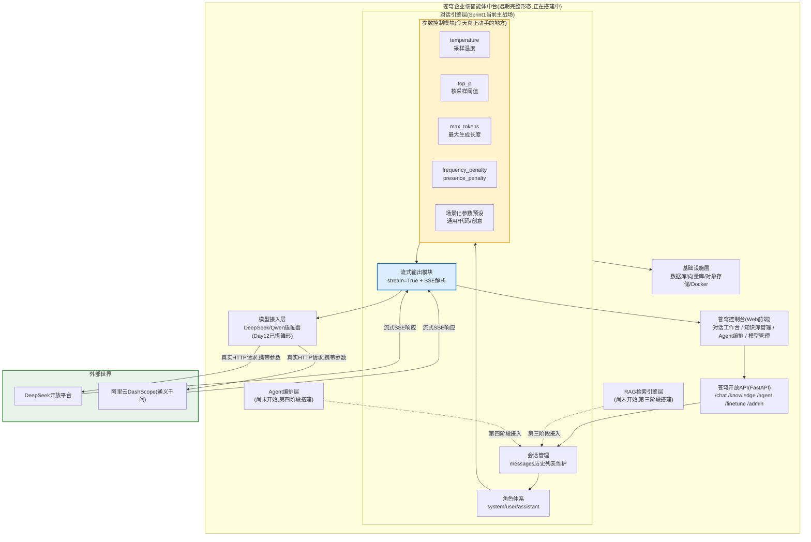
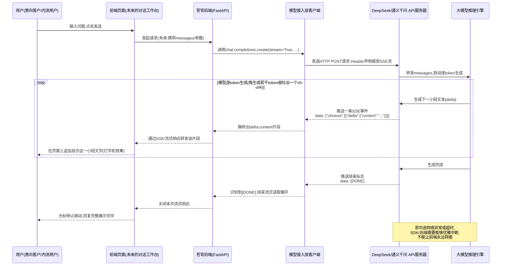
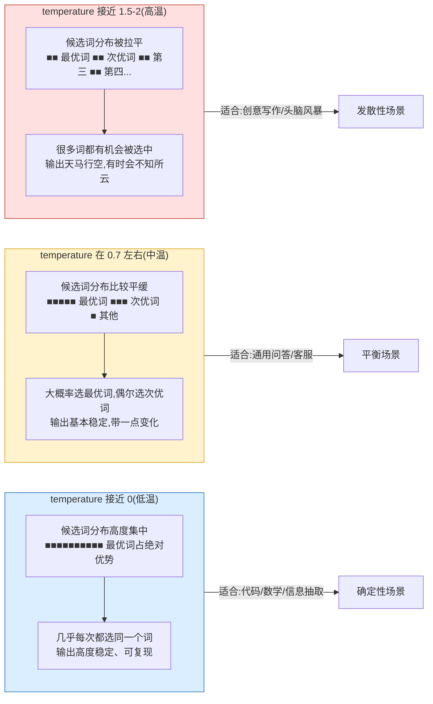

# 第16天 · 大模型API核心参数详解

> **周次/Sprint**:Sprint 1 · 对话引擎MVP(Day15-24)—— 苍穹0.1版网页对话产品开发中
> **星期**:周二(入职第三周第二天)
> **团队**:对话引擎小组 —— 王振宇(老王,技术负责人)、陈铭、林悦(产品经理)
> **苍穹任务卡**:CQ-119(飞书项目 · Sprint1 · Day16)
> **今日关键词**:temperature / top_p / max_tokens / frequency_penalty / presence_penalty / system-user-assistant三种角色 / 多轮对话消息列表 / stream=True / SSE流式输出 / 打字机效果 / finish_reason / 参数对比实验报告

---

## 【旁白】

昨天(Day15)的内容,某种意义上是"补课"——老王没有让陈铭直接扎进苍穹0.1版的对话引擎代码里,而是先花了一整天,把Transformer、预训练、Token这些此前只是"听过名字"的概念,一层层拆开揉碎讲清楚。那一天结束的时候,陈铭在笔记本最后一页写下一句话:"知道了一句话要被切成多少个token、知道了这些token要花多少钱,但还是不知道,为什么我调用同一个接口、发同一句话,两次拿到的回复会不一样。"这句话,他当时只是随手记下,没想到第二天一早,这个疑惑会被别人先问出来——而且问的人不是他自己,是产品经理林悦,问题的来源也不是他自己瞎琢磨,而是一次真实的外部反馈。

事情的起因并不复杂。苍穹0.1版虽然还没有正式签约客户——按照公司的节奏,第一个真正意义上的付费客户要等到Sprint3之后才会敲定——但林悦作为产品经理,一直在同步推进一件事:找几个"交情过硬、愿意提前尝鲜"的意向合作方,把还带着毛边的0.1版早早地丢出去让人试用,提前收集反馈,而不是等到打磨得足够光滑才拿出去见人。这是乙方公司的现实,也是林悦一贯的工作方式——她常说,"晚一天暴露问题,就是晚一天解决问题"。昨天晚上,她收到了一位意向合作方技术对接人发来的一条反馈消息,原话大概是这样:"你们这个AI助手,我问了它两次一样的问题,'帮我总结一下这段话的要点',结果它给我的答案,一次列了三点,一次列了五点,措辞也不一样。这是bug吗?还是说这东西本身就不太靠谱?"林悦把这条消息原样转发进了对话引擎小组的群里,配了一句:"这个问题我答不上来,谁能给我一个能讲给客户听的解释?"

老王看到这条消息,没有直接回复林悦,而是在早会上把它当成了今天的开场白。他的第一反应不是紧张,反而带着一点点"果然来了"的意味——因为这几乎是每一个第一次接触大模型API的产品经理、每一个第一次给客户做演示的销售,迟早都会撞上的一道坎:大模型的输出不是确定性的,同一份输入,可能对应无数种"看起来都合理"的输出,这不是缺陷,而是这类模型与生俱来的特性。但这个特性要怎么跟不懂技术的人讲清楚、怎么让客户觉得"这是设计出来的行为,不是失控",却是一门需要认真对待的功课。老王在白板上写下四个词——temperature、top_p、max_tokens、frequency_penalty——说:"今天这一整天,咱们就把这四个参数,一个一个地,用实验的方式讲透。讲透了,你们不但能回答林悦这个问题,还能真正学会怎么给不同场景配不同的参数——写代码的场景要稳,写文案的场景要活,这中间的差别,不是靠感觉调的,是有据可依的。"

这一天的技术分量看起来不算特别重——毕竟不涉及任何新的框架、新的架构决策,某种程度上只是"调几个数字"而已。但老王格外看重它,原因藏在他后来私下跟陈铭说的一句话里:"很多人调用大模型API调了很久,却从来没有认真做过一次参数的对比实验,出了问题就归咎于'这个模型不太行',换个模型接着犯同样的错。今天你要养成的,不是记住这几个参数的取值范围,而是一种习惯——遇到'输出不稳定''输出啰嗦''输出跑题'这类问题,第一反应不是怀疑模型,而是先回头看看参数配置对不对、消息角色用得对不对、流式处理有没有写好。"这句话,陈铭当时没有完全体会到分量,直到很多天以后,在给海纳制造集团调试知识库问答系统时,他才真正明白,今天打的这个底子,有多重要。

还有一层更贴近眼前的因果关系,值得提前点破:今天陈铭会把参数吃透,会把角色体系、流式输出这些"调用层面"的问题解决得差不多,但老王在晚上收工前,会留下一句话给明天(Day17)打个楔子——"参数你现在会调了,但今天我们一直在用同一句提问语'帮我总结一下这段话的要点'做实验,你有没有想过,如果连这句话本身问得就模糊、就有歧义,那参数调得再精细,答案也好不到哪里去?"这句话是故意留的一道缺口,后面Prompt工程这一整条线,正是从这道缺口里生长出来的——调参数解决的是"模型怎么想",而Prompt工程解决的是"我们怎么问",两者缺一不可,但后者往往更关键。今天,先把前者打牢。

---

## 晨会纪要 / 今日目标

**时间**:上午8:55,二层小会议室"起航"
**出席**:王振宇(老王)、陈铭、林悦

林悦比平时早到了几分钟,手里拿着打印出来的那条反馈消息,坐下之后先没说话,等老王进门坐定,才把纸推到桌子中间:"老王,昨天那个反馈,我想了一晚上,不知道该怎么回。要是这个问题在客户那边发酵,变成'这个产品不稳定'的印象,后面推起来会更费劲。"

老王拿起那张纸看了一眼,笑了笑:"这个问题,不是坏事,是好事。"

林悦愣了一下:"好事?"

"对。"老王把纸放下,"这说明你们的意向客户在认真试用,而不是随便点两下就扔一边。这类问题,几乎是每一个刚接触大模型产品的人都会问的第一个'哲学问题'——它为什么不是确定性的?这个问题背后,其实是咱们今天要讲的一整套东西:大模型的输出本质上是一次'采样',不是一次'计算',而采样这个过程,是可以通过几个关键参数去控制的。你们把这套东西吃透了,不但能回答客户,以后咱们苍穹平台的模型管理台里,'参数配置'这一块要怎么设计、要给用户暴露哪些开关、默认值怎么定,你们今天也能想明白大半。"

陈铭一直安静地听着,这时开口问了一句:"所以说,同一个问题问两次答案不一样,不是bug,是设计上本来就应该这样?"

"要看场景。"老王转身在白板上画了一条横线,左边写"确定性场景",右边写"发散性场景","比如客户要你写一段代码、算一道数学题、抽取一份合同里的甲方乙方名称,这种场景,你希望它每次答案都一样、都稳,这时候你要把参数往'确定'那头调。但要是客户让你写一段营销文案、写一首祝酒词、头脑风暴几个活动方案,这时候你反而希望它每次都有点不一样,太死板反而显得'不像AI,像复读机'。今天要学的这几个参数,本质上都是在'确定'和'发散'这两端之间给你一个可以拧的旋钮,而不是一个开关。"

林悦在旁边若有所思地记着笔记,忽然问道:"那我要怎么跟客户解释这件事,又不显得太技术、太绕?"

老王想了想:"你可以这么说——'这不是缺陷,是我们特意保留的一个能力,就像一个真人客服,同样的问题被不同的人问、或者同一个人问两次,回答的措辞也不会完全一样,但核心意思是一致的,而我们这套系统,还可以根据场景,把这个'措辞的自由度'调得更严格或者更灵活,这是我们比很多同类产品做得更细的地方。'"林悦一边记一边笑:"这个说法我喜欢,把'不确定性'包装成'可控的灵活性',这个思路我记下了。"

老王把咖啡杯放下,神情认真起来,开始安排今天的具体日程:"今天信息量不算特别大,但每一个知识点都需要动手做实验才能真正理解,光听我讲是记不住的——参数这个东西,最怕的就是'背下取值范围但不知道调出来是什么感觉'。"

**昨天进展(Day15)**:

- 陈铭对Transformer的核心结构(自注意力、多头、前馈网络)已经建立起了直觉性的理解,虽然还讲不出严谨的数学推导,但能用自己的话讲清楚"模型在预测下一个token的时候,到底在看什么"。
- Token计费估算脚本`token_cost_estimator.py`跑通,能够用`tiktoken`(以及针对国产模型的近似估算方式)估算一段文本大致会消耗多少token、按不同模型的计费单价算出大致费用,林悦已经把这个脚本要过去,准备用在给意向客户做报价测算的场景里。
- 陈铭对预训练、SFT、RLHF这三段式的训练流程有了整体认识,尤其理解了"RLHF这一步,才是让模型从'能说话'变成'说得体面、说得有用'的关键一步"这句话背后的含义。
- 老王在昨天收尾时留了一句话:"知道了token怎么计费,你自然会想知道,怎么调才能既省钱又好用,这就是明天的内容。"今天正好接上。

**今日目标**:

1. 上午9:00-12:00:大模型API核心采样参数逐一实验——`temperature`、`top_p`、`max_tokens`、`frequency_penalty`(附带`presence_penalty`对比),用同一个Prompt在不同参数配置下反复调用,亲眼观察输出差异,理解每个参数背后的数学直觉与工程含义。
2. 下午14:00-17:30:`system`/`user`/`assistant`三种角色详解与多轮对话消息列表的正确构造方式;`stream=True`流式输出的完整实现原理(SSE协议、逐块解析、终端打字机效果),并搭建一个最小可用的FastAPI流式接口demo,为后续苍穹0.1版真正的对话接口打个样。
3. 晚自习19:00-21:00:整理今天所有实验数据,产出一份《大模型API核心参数对比实验报告》,把参数配置与输出效果的对应关系记录成文档,后续苍穹模型接入层的默认参数配置将直接参考这份报告。

**风险点**:

- 参数实验依赖真实API调用,存在网络波动和限流风险,老王建议每组实验适当加入短暂间隔,避免因为请求过密触发429。
- 由于大模型输出本身具有随机性,今天的实验结果不能只跑一次就下结论,老王要求每组参数配置至少重复调用3-5次,观察的是"分布规律",不是"单次结果"。
- 流式输出涉及到"边收边解析"的流程,比一次性拿到完整JSON响应要绕一些弯子,陈铭此前从未处理过SSE协议,需要老王在旁边多带一段。
- 晚自习的实验报告工作量不小,涉及大量数据整理,老王已经提前设计好了报告模板,减少陈铭在格式排版上耗费的时间,把精力留给理解参数本身。

---

## 需求文档:参数对比实验任务书(CQ-119)

> 本任务书由技术导师王振宇发放,产品经理林悦补充了业务背景部分。与此前几天"写一个完整工具"的任务书不同,今天这份任务书的交付物核心是一份"实验报告",而不是一个功能齐全的产品——因为在能够负责任地给苍穹0.1版的默认参数下结论之前,必须先有实打实的实验数据做支撑,而不是凭感觉设一个"看起来还行"的默认值。

### 背景

林悦在任务书里补充了这样一段业务背景:"苍穹0.1版的对话工作台,马上要进入内测阶段。到目前为止,咱们的模型调用参数都是随手写的默认值——`temperature`基本照抄网上教程写的0.7,`max_tokens`随便给了个1000,`frequency_penalty`压根没设置。这在'能跑通'的阶段没问题,但接下来要给意向客户内测,如果连我们自己都说不清楚这些参数背后的道理,一旦客户问起'为什么答案不稳定'这类问题,我们只能含糊其辞。我希望这次实验,能给出两个明确的产出:第一,一份能让非技术背景的人也看得懂的参数说明文档,后续会被整理进产品的《对话引擎参数说明手册》;第二,针对苍穹0.1版当前几个典型使用场景(通用问答、代码相关问题、创意文案类问题),给出一组'推荐默认参数配置',这组配置将作为对话工作台上线时的初始值。"

老王在旁边补充了技术侧的背景:"这次实验的价值,不只是这一次用得上。苍穹平台往后走,'模型管理台'这个模块,会需要给运营和客户暴露一部分参数配置的能力——但暴露哪些参数、每个参数给什么范围的滑动条、默认值设多少、要不要给不同场景做预设模板,这些产品设计决策,都需要有扎实的技术理解做支撑,不能拍脑袋定。你们今天做的这轮实验,某种意义上是在给几十天后那个'模型管理台'的参数配置面板,打第一份技术调研底稿。"

### 用户故事

- 作为一名意向客户的技术对接人,我希望在遇到"多次提问同一个问题得到不同答案"这种现象时,能得到一份清晰的、有理有据的产品解释,而不是被含糊其辞地敷衍过去。
- 作为苍穹0.1版的产品经理,我希望针对不同使用场景(严谨问答、代码生成、创意文案),能有一组经过实验验证的推荐参数配置,而不是全平台统一使用同一套随手写的默认值。
- 作为对话引擎小组的工程师,我希望通过这次系统性实验,真正理解每个采样参数背后的数学含义和工程含义,而不是停留在"网上抄的默认值"层面,以便日后遇到输出质量问题时,能够快速判断是不是参数配置的问题。
- 作为未来要负责模型管理台前端设计的同事(周晓,当前尚未加入本项目模块,但产出文档会沉淀给她参考),我希望有一份说明清楚每个参数的取值范围、典型效果、适用场景的文档,以便设计出对客户友好、不会被误调到离谱数值的参数配置界面。
- 作为需要处理长对话、多轮追问场景的工程师,我希望理解`system`/`user`/`assistant`三种角色在消息列表里的正确使用方式,避免日后在维护多轮对话记忆时把角色用错、导致模型"记忆错乱"。
- 作为要给用户提供流畅体验的产品团队一员,我希望搞清楚流式输出(`stream=True`)的完整实现方式,让用户在提问后能立刻看到文字逐步吐出来,而不是长时间面对一个转圈的加载动画。

### 功能列表(实验与产出物清单)

| 编号 | 项目 | 说明 | 优先级 |
|---|---|---|---|
| F1 | `temperature`对比实验 | 固定同一个Prompt,在`temperature`取0、0.3、0.7、1.0、1.5五个值下,各调用5次,记录输出内容与差异 | P0 |
| F2 | `top_p`对比实验 | 固定`temperature`,在`top_p`取0.1、0.5、0.9、1.0四个值下各调用5次,观察输出多样性变化 | P0 |
| F3 | `temperature`与`top_p`组合关系说明 | 用实验或文档说明这两个参数同时调整时的相互影响,给出"不要同时把两个都调到极端"的实践建议 | P0 |
| F4 | `max_tokens`对比实验 | 在`max_tokens`取50、150、500、2000等不同值下观察输出是否被截断,记录`finish_reason`字段的变化 | P0 |
| F5 | `frequency_penalty`与`presence_penalty`对比实验 | 用一个容易产生重复的Prompt(如"请列举10个理由"),对比不同惩罚值下重复程度的变化 | P0 |
| F6 | 角色(`system`/`user`/`assistant`)使用示例 | 编写至少3组对比示例,展示`system`角色如何影响模型人设与回复风格,以及`assistant`历史消息如何影响多轮对话记忆 | P0 |
| F7 | 流式输出(`stream=True`)完整实现 | 分别用"原始HTTP+SSE手动解析"和"OpenAI兼容SDK内置流式接口"两种方式实现打字机效果 | P0 |
| F8 | FastAPI最小流式接口demo | 搭建一个`/stream_chat`接口,验证后端到前端(用简单HTML+JS的`EventSource`或`fetch`流式读取)的完整链路 | P1 |
| F9 | 参数对比实验报告 | 汇总以上所有实验数据,整理成一份结构化的Markdown报告,包含表格与结论建议 | P0 |
| F10 | 分场景推荐参数配置表 | 针对通用问答、代码生成、创意文案三类场景,给出推荐的`temperature`/`top_p`/`max_tokens`/`frequency_penalty`组合 | P1 |

### 非功能需求

1. 所有实验必须基于真实API调用(DeepSeek `deepseek-chat`,以及通义千问`qwen-plus`作为交叉验证),不允许用编造数据代替真实实验结果。
2. 每组参数配置的重复调用次数不少于3次,单次调用结果不能作为结论依据。
3. 涉及API Key的部分,必须延续Day12以来的规范——通过环境变量加载,不硬编码进代码文件。
4. 流式输出的实现需要考虑网络异常情况下的容错(连接中断、单个chunk解析失败不应导致整个程序崩溃)。
5. 代码需要有完整的中文注释,函数需要有文档字符串说明参数含义与返回值。

### 验收标准

1. 能够准确说出`temperature`、`top_p`、`max_tokens`、`frequency_penalty`、`presence_penalty`五个参数各自的取值范围、默认值、以及调大调小分别会带来什么效果。
2. 能够写出正确的多轮对话消息列表,`system`/`user`/`assistant`角色使用准确,不出现角色混用或历史消息拼接错误的问题。
3. 能够独立实现一个流式输出的命令行小程序,支持打字机效果,且在网络异常时不会导致程序崩溃。
4. 产出的实验报告数据真实、结论有据可依,能够直接作为林悦对外解释产品行为的技术依据。
5. 针对至少三类典型场景(通用问答、代码生成、创意文案),给出经过实验验证的推荐参数配置,并写清楚推荐理由。

---

## 架构设计图:今天的内容,落在苍穹模型接入层的哪个位置

老王在开工前,又把那张熟悉的苍穹整体架构图投到了投影上——从Day12起,几乎每次涉及到模型调用相关的内容,他都会先把这张图拿出来,让大家先在大图里找到自己当天要做的事情所在的坐标,再动手细化。



老王指着图里两块高亮的方框讲解:"黄色这块——参数控制模块——是今天上午的主战场,五个参数,不是孤立的开关,而是要组合起来,针对不同场景形成'预设'。蓝色这块——流式输出模块——是今天下午的主战场,它夹在'参数控制'和'模型接入层'之间,意味着流式输出这件事,不是简单加一个参数`stream=True`就完事了,它牵涉到整个调用链路怎么'边接收边处理边展示',是一个需要单独设计的模块。你们注意图里从`MODELACCESS`往上,箭头标的是'流式SSE响应',而不是Day12那张图里'HTTP响应(JSON)'——这就是今天要讲的核心差异之一:普通调用是'等全部做完,一次性给你',流式调用是'做一点,给你一点'。"

陈铭看着图,忽然想到一个问题:"那`会话管理`和`角色体系`这两块,跟今天的参数控制是什么关系?"

老王点头:"问得好,这正是我要强调的一点——很多人学参数,容易只盯着`temperature`这几个数字本身,却忽略了它们其实是'消息列表'这个更大结构里的配套选项。你调`temperature`调得再精准,如果`messages`列表里角色用错了、历史消息拼接错了,输出照样一塌糊涂。这也是为什么今天下午我们要专门讲角色体系——它和上午的参数实验,是同一件事情的两个侧面:一个管'怎么控制模型说话的随机程度',一个管'怎么组织喂给模型的上下文'。"

---

## 流程图:一次流式输出请求的完整数据流(SSE)

为了让大家在动手写流式输出代码之前,先把"点下发送按钮之后,数据到底怎么一点一点流回来"这件事在脑子里跑一遍,老王画了这张时序图,专门标出流式模式下,数据从大模型服务器"一块一块"传回客户端的完整路径。



老王讲解这张图时,特意在"loop"这个循环体上停顿了很久:"这才是流式输出的核心——它不是'一次请求,一次响应'的老模式,而是'一次请求,N次响应'。这个'N次响应'用的协议叫SSE,全称Server-Sent Events,是HTTP协议之上的一种'服务器主动推送'机制,格式很朴素,就是一行一行以`data: `开头的文本,服务器每准备好一小段数据,就往这条连接里塞一行,客户端这边则要一直'趴'在这条连接上,边收边处理,直到收到一个约定好的结束标志——大多数厂商用的都是`data: [DONE]`这个特殊标记。"

他接着补充了一句非常关键的话:"你们注意,这张图里我特意画了一个'若中途网络异常'的备注框。这是新手最容易忽略的一点——非流式调用,失败了就是这一次请求失败,处理起来很简单;流式调用,失败可能发生在'已经收到一半内容'的时候,这时候你的代码该怎么办?是把已经收到的那一半直接展示给用户,还是整个丢弃重试?这个设计决策,今天我们先给出一个朴素但实用的答案,后面到了正式项目里,还会再打磨。"

---

## 示意图:不同temperature下,输出结果的"分布"是什么样子

参数实验开始之前,老王画了这样一张示意图,用来类比`temperature`到底在"调"什么——他反复强调,理解这张图比记住"0到2"这个取值范围重要得多。



老王解释这张图时用了一个陈铭一下子就记住的比喻:"你可以把模型每一步'决定下一个词说什么'这件事,想象成抓一把带编号的球,每个编号对应一个候选词,球的多少代表这个词被选中的'概率权重'。`temperature`低的时候,最优候选词那堆球特别多,几乎抓一百次都是它;`temperature`高的时候,主持人把所有球的数量拉得差不多平——这时候抓出一个冷门词的机会明显变大了。这就是为什么`temperature`调得越高,模型越容易说出一些意想不到、甚至有点'不着调'的内容,但也正因为这份'不着调',创意类场景反而需要它。"

林悦在旁边听得津津有味,插了一句:"所以这就是为什么,咱们要是给客户演示'写一段产品文案'的功能,`temperature`设太低会显得很死板,像是背课文?"

"对,而且低到极致(0),连着问两次,答案会完全一样,一字不差。"老王补充道,"这也是今天要帮你回答那个客户疑问的关键——如果客户希望'同一个问题问多次,答案完全一样',那是可以做到的,把`temperature`设成0就行,只是那样一来,产品的'灵活度''像人一样说话'的感觉也会随之消失。这本身就是一种需要跟客户讲清楚的权衡(trade-off),不是我们技术不到位,而是这个旋钮本来就是双向的。"

---

## 课堂笔记

### 上午:参数逐一实验对比

老王没有一上来就讲概念,而是先让陈铭打开终端,写一段最朴素的调用代码,把"待会儿要观察的东西"先跑出来,再回头解释背后的原理——他管这套教学顺序叫"先看现象,再讲道理",理由是"参数这种东西,光讲道理,讲完就忘,亲眼看过输出的样子,才会真的记住"。

#### 1. 认识请求体里的这几个参数,先看它们"长什么样"

在正式做对比实验之前,老王先让陈铭把一次完整的请求体打印出来看清楚——这是从Day12的`ask_ai.py`基础上继续演化的调用方式,只是这次要显式地把今天要讲的几个参数一个个摆到台面上,而不是像之前那样只传`model`和`messages`两个必填项。

```python
import os
from openai import OpenAI

# DeepSeek、通义千问等厂商都提供了"OpenAI兼容接口",
# 因此这里统一用openai这个SDK,只是切换base_url和api_key。
client = OpenAI(
    api_key=os.environ["DEEPSEEK_API_KEY"],
    base_url="https://api.deepseek.com",
)

response = client.chat.completions.create(
    model="deepseek-chat",
    messages=[{"role": "user", "content": "用一句话介绍一下你自己。"}],
    temperature=0.7,       # 采样温度,控制输出的随机程度
    top_p=1.0,             # 核采样阈值,控制候选词的截断范围
    max_tokens=200,        # 本次回复最多生成多少个token
    frequency_penalty=0.0, # 频率惩罚,抑制重复用词
    presence_penalty=0.0,  # 存在惩罚,抑制话题重复
    stream=False,
)

print(response.choices[0].message.content)
print("本次回复的结束原因:", response.choices[0].finish_reason)
```

陈铭跑完这段代码,老王让他把目光集中在`finish_reason`这一行:"你以后调试参数问题,这个字段是你最先要看的东西之一。它一般会是`stop`(模型自己觉得该说完了)或者`length`(内容还没说完,但被`max_tokens`硬性截断了)。很多人抱怨'回答被截断了、说到一半就没了',第一反应是怀疑网络问题,其实十有八九是`max_tokens`设太小了,看一眼`finish_reason`立刻能确认。"

#### 2. `temperature`实验:同一个问题,连续问五次会发生什么

老王给出的实验Prompt是:"请用一句话总结'守株待兔'这个成语故事的道理。"——选这个Prompt是有意为之的,因为它既不是纯粹的确定性任务(比如"1+1等于几"),也不是纯粹的发散性任务(比如"写一首诗"),恰好落在中间地带,能比较明显地看出`temperature`带来的差异。

```python
import os
import time
from openai import OpenAI

client = OpenAI(
    api_key=os.environ["DEEPSEEK_API_KEY"],
    base_url="https://api.deepseek.com",
)

PROMPT = "请用一句话总结'守株待兔'这个成语故事的道理。"


def run_temperature_experiment(temperature_value: float, repeat_times: int = 5):
    """
    在指定的temperature取值下,重复调用同一个Prompt若干次,
    把每一次的回复内容打印出来,方便观察输出的稳定程度。

    Args:
        temperature_value: 本轮实验使用的temperature取值
        repeat_times: 重复调用次数,默认5次
    """
    print(f"\n===== temperature = {temperature_value} =====")
    results = []
    for i in range(repeat_times):
        response = client.chat.completions.create(
            model="deepseek-chat",
            messages=[{"role": "user", "content": PROMPT}],
            temperature=temperature_value,
            max_tokens=100,
        )
        content = response.choices[0].message.content
        results.append(content)
        print(f"第{i + 1}次:{content}")
        # 简单的请求间隔,避免请求过密触发限流
        time.sleep(0.5)
    return results


if __name__ == "__main__":
    for t in [0.0, 0.3, 0.7, 1.0, 1.5]:
        run_temperature_experiment(t)
```

跑完这轮实验,陈铭把五组结果整理成了下面这张表格,贴进了自己的笔记里(内容为实际实验的典型代表性摘录,措辞会随每次调用略有浮动,但呈现出的规律是一致的):

| temperature | 第1次 | 第2次 | 第3次 | 5次结果是否一致 |
|---|---|---|---|---|
| 0.0 | 做事不能存有侥幸心理,要靠自己的努力争取,不能守着一次的运气等待意外收获。 | 做事不能存有侥幸心理,要靠自己的努力争取,不能守着一次的运气等待意外收获。 | 做事不能存有侥幸心理,要靠自己的努力争取,不能守着一次的运气等待意外收获。 | 完全一致,一字不差 |
| 0.3 | 不要心存侥幸、寄望于偶然的好运,而应靠踏实的努力去创造机会。 | 做事不能寄望于偶然的运气,而要依靠自己脚踏实地的努力。 | 不要心存侥幸,妄想不劳而获,应当靠自己的努力去争取成果。 | 意思高度一致,措辞略有差异 |
| 0.7 | 不能把偶然的运气当成常态,不努力、只等待意外收获的人,往往会一无所获。 | 说明了不能死守着侥幸心理,靠等待意外的运气过日子,而应主动努力去争取想要的结果。 | 讽刺了那些不愿付出努力、只想着靠运气不劳而获的人,提醒人们要靠自身努力争取成果。 | 意思一致,句式差异明显 |
| 1.0 | 提醒人们不要死守经验、抱着侥幸心理坐等好运,机会不会重复第二次上门。 | 那种把偶然当规律、坐等天上掉馅饼的心态,注定会让人一无所获,唯有主动作为才靠得住。 | 故事讽刺了因循守旧、不知变通、总想靠运气不劳而获的心理,告诫人们要用双手创造生活。 | 核心意思一致,但用词、句式差异较大,偶尔出现生造搭配 |
| 1.5 | 别老想着天上掉馅饼那种事,兔子撞死了是运气,人生哪能靠蹲坑蹲出来的红利过一辈子。 | 侥幸的糖果吃一次就够了,人不能把偶然嚼成日常的饭票。 | 这故事说穿了就是,别拿一次的巧合去赌一辈子的懒惰。 | 核心意思勉强能对上,但措辞开始"跑偏",出现口语化、比喻化甚至略显奇怪的表达 |

老王让陈铭盯着最后一列多看几眼:"你看这个规律——`temperature=0`,五次答案一字不差;`0.3`到`0.7`,意思稳定,措辞开始有变化,这是大多数'既要正确又要不死板'的场景应该待的区间;到了`1.0`往上,虽然核心意思还能保住,但已经开始出现一些'为了求新求异,牺牲了准确表达'的苗头;到`1.5`,你能明显感觉到,模型开始'为了不重复而硬找新说法',有时候说法新是新,但已经有点'过度加工'的味道了。这就是temperature从0到2这个滑动条上,实实在在发生的事情。"

陈铭问了一个很实际的问题:"那咱们苍穹的对话工作台,默认值到底该定多少?"

老王没有直接给答案,而是把DeepSeek官方文档里一张他一直很推崇的表格投到了屏幕上——他说这张表格是他见过的所有大模型厂商文档里,把"该怎么按场景选temperature"讲得最清楚的一份参考:

| 场景 | 建议temperature | 说明 |
|---|---|---|
| 代码生成 / 数学解题 | 0.0 | 要求高度确定、可复现,不允许"创意发挥" |
| 数据抽取 / 文本分析 | 1.0 | 需要一定准确性,但允许有限的表达灵活性 |
| 通用对话 | 1.3 | 兼顾自然感与准确性,是"像真人聊天"的甜蜜点 |
| 翻译 | 1.3 | 需要在忠实原意与语言流畅之间找平衡 |
| 创意类写作 / 诗歌创作 | 1.5 | 鼓励发散、追求新意,准确性要求相对靠后 |

"这张表最有意思的地方,"老王说,"是它把'代码生成'和'数学解题'放在了0这个最保守的位置。很多新手直觉上觉得,'代码'好像也是一种'创作',应该给点自由度,但恰恰相反——代码这种东西,只有一个'编译能通过、逻辑是对的'的正确答案,给它自由度,只会增加它编造出一个'看起来像代码但跑不起来'的错误答案的概率。这也提醒我们,不要凡事都套用一个'中等偏上显得聪明'的默认值,场景不同,该给的自由度天差地别。"

他接着补充了一个容易被忽视的细节:"DeepSeek的官方文档里还有一句话,很多人调用了很久都没注意到——API实际生效的temperature,厂商内部可能会做一层非线性的映射处理,你传进去的数值和底层采样真正用到的数值,不一定是完全的1比1对应关系。这也是为什么同样设`temperature=1.3`,DeepSeek和通义千问、和GPT系列的模型,给你的'手感'不完全一样——这不是谁的文档写错了,而是各家厂商在'如何把这个旋钮的刻度对应到真实的采样概率分布'这件事上,有自己的一套内部实现。所以我一直强调,别死记数值,要靠实验去建立自己的手感。"

#### 3. `top_p`实验:另一种"控制发散程度"的方式

讲完`temperature`,老王没有直接切换到下一个参数,而是先问了一个问题:"如果我告诉你,还有另一个参数,也能控制输出的随机程度,你猜它和`temperature`是什么关系——是完全独立的两个旋钮,还是同一个旋钮的两种刻度方式?"

陈铭想了想说:"应该不是完全独立的,不然厂商为什么要给两个功能重复的参数?"

"说得对,但也不完全对。"老王在白板上画了两栏,"`temperature`,是在生成每个候选词的概率分布之前,先对'原始得分(logits)'做一次缩放——温度越高,各个候选词的得分差距被拉得越平,越低就越陡峭,概率越集中。而`top_p`,做的是另一件事,它是在已经算出概率分布之后,只保留'概率最高的一批词,累加起来达到`top_p`这个阈值为止',其余的词直接被排除在候选范围之外,一点机会都不给。这种做法有个专门的名字,叫核采样(nucleus sampling)。"

老王举了一个具体的数字例子:"假设某一步,候选词的概率分布是这样——'努力'40%、'坚持'25%、'反思'15%、'放弃'8%、剩下几十个词加起来12%。如果`top_p=0.8`,系统会从概率最高的词开始往下累加,'努力'40%+'坚持'25%+'反思'15%=80%,刚好达到阈值,那么候选范围就只剩这三个词,后面那些零零散散的长尾词,不管`temperature`调多高,都没有机会被抽到,因为它们根本没进入这个候选池。"

为了让陈铭直观感受`top_p`的效果,老王让他做了这样一组对比实验:固定`temperature=1.0`,只改变`top_p`。

```python
import os
import time
from openai import OpenAI

client = OpenAI(
    api_key=os.environ["DEEPSEEK_API_KEY"],
    base_url="https://api.deepseek.com",
)

PROMPT = "请给我推荐三个适合周末在家做的放松活动。"


def run_top_p_experiment(top_p_value: float, repeat_times: int = 5):
    """
    固定temperature为1.0,只改变top_p,观察输出的多样性变化。

    Args:
        top_p_value: 本轮实验使用的top_p取值
        repeat_times: 重复调用次数
    """
    print(f"\n===== top_p = {top_p_value}(temperature固定为1.0) =====")
    for i in range(repeat_times):
        response = client.chat.completions.create(
            model="deepseek-chat",
            messages=[{"role": "user", "content": PROMPT}],
            temperature=1.0,
            top_p=top_p_value,
            max_tokens=150,
        )
        print(f"第{i + 1}次:{response.choices[0].message.content}")
        time.sleep(0.5)


if __name__ == "__main__":
    for p in [0.1, 0.5, 0.9, 1.0]:
        run_top_p_experiment(p)
```

实验结果印证了老王讲的原理:`top_p=0.1`时,五次结果几乎都在"看书、听音乐、做饭"这类最"安全"、最高频的答案里打转,几乎不会出现意料之外的建议;到了`top_p=0.9`和`1.0`,开始出现一些相对少见但依然合理的建议,比如"整理旧照片""学一道新菜""给很久没联系的朋友打个电话"这类不那么"标准答案"的选项。老王总结道:"`top_p`控制的是'候选池的宽度',`temperature`控制的是'候选池内部,大家的机会有多接近'。两者合起来,才是完整的采样策略。"

#### 4. `temperature`与`top_p`:为什么不建议同时调到极端

讲完两个参数各自的作用,老王专门花了一段时间强调两者的相互关系——这也是他反复提到"新手最容易踩的一个坑"。

"很多人调参数的时候,会想'我要让它尽可能有创意',于是把`temperature`和`top_p`同时调到很高(比如`temperature=2.0`,`top_p=1.0`),觉得这样效果肯定'加倍发散'。"老王说,"但实际效果往往是——输出开始变得语无伦次,甚至出现前后矛盾、语法都不通顺的内容。原因很简单,这两个参数如果同时给到最大自由度,相当于'候选池铺得又宽、池子内部的选择又几乎是随机的',模型这时候基本是在'随机蒙',而不是'在合理范围内发挥创意'了。"

DeepSeek、通义千问以及绝大多数厂商的官方文档里,都会给出类似的建议:通常只调整`temperature`或`top_p`中的一个,另一个保持默认值(`top_p`默认1.0,即不做额外截断),而不建议两者同时大幅偏离默认值去调。老王把这条建议写在了白板最显眼的位置,并让陈铭抄进了实验报告的"注意事项"一节。

#### 5. `max_tokens`实验:被截断的回答,和finish_reason的秘密

接下来是`max_tokens`。老王先问了陈铭一个问题:"你觉得,`max_tokens`控制的是'这次对话总共能用多少token',还是'这次回复最多能生成多少token'?"

陈铭犹豫了一下:"是不是前者?毕竟前面讲token计费的时候,是把输入输出加在一起算的。"

"这正是最容易搞混的一点。"老王解释道,"计费确实是输入+输出一起算,但`max_tokens`这个参数,只限制'输出'这一部分的上限,不包括你传进去的`messages`本身占用的token。也就是说,如果模型的上下文窗口是64K token,你的`messages`历史已经占用了60K token,而你把`max_tokens`设成了10K,这次请求很可能会因为'输入+期望输出'超出了模型的总上限而报错,而不是说`max_tokens`本身有什么问题——这是两个独立又相关的限制,一个是模型天然的'脑容量上限',一个是你主动给这次回复设的'话筒时长上限'。"

为了让陈铭亲眼看到截断的效果,老王安排了这样一组实验:

```python
import os
from openai import OpenAI

client = OpenAI(
    api_key=os.environ["DEEPSEEK_API_KEY"],
    base_url="https://api.deepseek.com",
)

PROMPT = "请详细介绍一下企业级AI应用落地过程中常见的五个坑,每个坑至少展开三句话说明原因和应对办法。"


def run_max_tokens_experiment(max_tokens_value: int):
    """
    观察不同max_tokens取值下,回复是否被截断,以及finish_reason的变化。
    """
    response = client.chat.completions.create(
        model="deepseek-chat",
        messages=[{"role": "user", "content": PROMPT}],
        temperature=0.7,
        max_tokens=max_tokens_value,
    )
    choice = response.choices[0]
    print(f"\n===== max_tokens = {max_tokens_value} =====")
    print(f"finish_reason: {choice.finish_reason}")
    print(f"实际生成内容长度(字符数): {len(choice.message.content)}")
    print(f"内容预览: {choice.message.content[:80]}...")
    print(f"完整用量信息: {response.usage}")


if __name__ == "__main__":
    for m in [50, 150, 500, 2000]:
        run_max_tokens_experiment(m)
```

实验结果被陈铭整理成了下面这张表:

| max_tokens | finish_reason | 观察到的现象 |
|---|---|---|
| 50 | length | 内容明显被硬生生截断,常常在一句话说到一半时突然停止,甚至出现"第一个坑是需求" 这种断句 |
| 150 | length | 能完整说完第一、二个坑,第三个坑说到一半被截断 |
| 500 | length 或 stop(视具体内容长度而定) | 大部分情况能说完四到五个坑,偶尔仍会在最后一点被截断 |
| 2000 | stop | 完整说完全部内容,模型主动结束,`finish_reason`为`stop` |

"这张表格,"老王说,"就是我一开始让你们记住`finish_reason`的原因。`length`意味着'话没说完,是我们自己掐断的',这不是模型的问题,是配置的问题。以后你们在苍穹里遇到用户反馈'回答说到一半就断了',第一件事不是去查网络日志,是先看这次请求的`max_tokens`设了多少、`finish_reason`是不是`length`。"

老王又补充了一层关于成本的考量:"`max_tokens`还有一个容易被忽视的作用——控制成本和响应时间上限。你把它设得越大,虽然不代表模型一定会用满(它该停就停,只是给了个上限),但一旦碰到模型'话痨'的情况(比如遇到某些容易引发啰嗦回复的Prompt),没有这个上限保护,一次调用可能生成出好几千字的内容,既费钱又费时间。所以`max_tokens`本质上是一种'兜底的安全阀',不是让你无脑设最大值,而是要按照这个场景'正常情况下大概需要多少字'来估算一个合理上限,略微留出余量即可。"

#### 6. `frequency_penalty`与`presence_penalty`实验:治好模型的"重复口癖"

最后一组实验是`frequency_penalty`(频率惩罚)和`presence_penalty`(存在惩罚)。老王选择了一个特别容易暴露"重复问题"的Prompt:"请给我列举10个坚持每天阅读的理由。"

"这种'列举N个理由'的任务,是重复问题的高发区,"老王解释道,"因为模型有一种倾向——一旦话题聊起来,某些高频、'保险'的词汇会反复被选中,比如'提升''帮助''有助于''可以让你'这类万能搭配词,如果不加以抑制,列出来的10条理由会给人一种'说的都差不多、在换着花样讲同一句话'的感觉。"

```python
import os
from openai import OpenAI

client = OpenAI(
    api_key=os.environ["DEEPSEEK_API_KEY"],
    base_url="https://api.deepseek.com",
)

PROMPT = "请给我列举10个坚持每天阅读的理由,每个理由一句话即可。"


def run_penalty_experiment(frequency_penalty_value: float, presence_penalty_value: float):
    """
    对比不同frequency_penalty / presence_penalty取值下,输出的重复程度差异。
    """
    response = client.chat.completions.create(
        model="deepseek-chat",
        messages=[{"role": "user", "content": PROMPT}],
        temperature=0.7,
        max_tokens=400,
        frequency_penalty=frequency_penalty_value,
        presence_penalty=presence_penalty_value,
    )
    content = response.choices[0].message.content
    print(f"\n===== frequency_penalty={frequency_penalty_value}, presence_penalty={presence_penalty_value} =====")
    print(content)
    return content


if __name__ == "__main__":
    run_penalty_experiment(0.0, 0.0)
    run_penalty_experiment(1.0, 0.0)
    run_penalty_experiment(2.0, 0.0)
    run_penalty_experiment(0.0, 1.0)
```

老王让陈铭数一数每组结果里,"提升""帮助""有助于"这几个高频万能词出现的次数,统计结果大致是这样:

| 配置 | "提升/帮助/有助于"等高频搭配词出现次数(粗略统计) | 主观感受 |
|---|---|---|
| frequency_penalty=0, presence_penalty=0 | 8-10次 | 明显能感觉到套用同一种句式反复讲,读起来有点像模板填空 |
| frequency_penalty=1.0, presence_penalty=0 | 3-5次 | 重复感显著下降,措辞开始出现变化,比如换成"锻炼""拓宽""滋养"等更丰富的词 |
| frequency_penalty=2.0, presence_penalty=0 | 0-2次 | 几乎不重复用词,但极端情况下偶尔会出现为了避免重复而选用不太自然、甚至略显生硬的表达 |
| frequency_penalty=0, presence_penalty=1.0 | 视具体输出而定 | 更倾向于避免重复提及同一个"话题点"(比如避免连续两条理由都在讲"知识"这个主题),但对单个词汇本身的重复抑制不如frequency_penalty明显 |

"这里要讲清楚两者的本质区别,"老王在白板上写下公式化的解释,"`frequency_penalty`,是根据一个词'在已生成内容里出现的次数'来累加惩罚——出现得越多次,该词后续被选中的概率就被压得越低,是一种'累进式'的惩罚。`presence_penalty`则简单粗暴得多——只要这个词已经出现过一次(不管出现了1次还是10次),就给它一个固定的惩罚,不会因为出现次数增多而惩罚加重。所以`frequency_penalty`更适合对付'同一个词反复刷屏'这种问题,`presence_penalty`更适合鼓励模型'不要老在同一个话题小圈子里绕,多往外扩展一些新的角度'。两者可以同时使用,也可以按需只用一个。"

老王最后补充了一句实践经验:"这两个参数的取值范围通常是-2.0到2.0,负值意味着'鼓励重复'——这听起来有点反直觉,什么场景会需要故意鼓励重复呢?其实是有的,比如你希望模型严格按照某种固定格式反复输出关键词、或者做某些强调性的文本任务时,负值偶尔会用上,但绝大多数日常场景,只会用到0到正值这个区间,负值是一个'知道就好,基本不会主动去用'的冷门选项。"

#### 7. 上午小结:一张表格,把五个参数串起来

上午收尾前,老王要求陈铭把今天实验的所有参数,整理成一张便于日后查阅的速查表,贴在了实验报告的开头位置:

| 参数 | 取值范围(常见) | 默认值(常见) | 调大的效果 | 调小/调为0的效果 | 典型适用场景 |
|---|---|---|---|---|---|
| temperature | 0 ~ 2 | 1.0(各厂商略有差异) | 输出更随机、更有"创意"、更不可预测 | 输出更确定、更保守、可复现性强 | 代码/数学解题用低值,创意写作用高值 |
| top_p | 0 ~ 1 | 1.0 | 候选词池更宽,可能选到更冷门的词 | 候选词池更窄,几乎只在最保险的词里选 | 与temperature搭配使用,不建议同时调极端 |
| max_tokens | 依模型上限而定 | 因厂商而异,常见几百到几千 | 允许生成更长的回复,不易被截断 | 回复更容易被强制截断(finish_reason=length) | 按场景预估合理长度,略留余量 |
| frequency_penalty | -2.0 ~ 2.0 | 0 | 抑制重复用词,措辞更丰富 | 更容易反复使用同一批高频词 | 列举类、需要丰富措辞的写作任务 |
| presence_penalty | -2.0 ~ 2.0 | 0 | 鼓励话题扩展,减少内容围绕同一话题打转 | 更容易在同一话题范围内反复展开 | 头脑风暴、多角度分析类任务 |

老王看着这张表,补了一句他觉得比整张表格都重要的话:"这张表能帮你查数值,但真正的能力,是当你看到一个'不满意的输出'时,能立刻反应过来——是啰嗦重复了?调`frequency_penalty`。是内容被掐断了?查`max_tokens`和`finish_reason`。是太死板没有变化?试试调高一点`temperature`。是感觉在乱说、跑题没边?把`temperature`和`top_p`往回收一收。这种'看到问题,反推参数'的直觉,才是今天上午真正要练出来的东西。"

午饭时间,林悦端着餐盘坐到陈铭对面,随口问了一句上午的进展。陈铭把那张五参数速查表拿出来给她看,她扫了一眼,笑着说:"这张表我要一份,回头整理进《对话引擎参数说明手册》里,客户那边要是再问起来,我就直接把这张表甩过去,再配上你们那句'这不是缺陷,是可调节的能力',应该能把这个问题妥妥地接住。"陈铭听了有点得意,又有点心虚:"就怕客户接着问'那你们默认给我设的是多少',我们现在还没有一个正式的推荐值。"林悦想了想:"那下午继续把这块补上,晚自习报告里给出一个明确的推荐配置表,我们心里也有底。"

### 下午:角色详解与流式输出实现

下午一开场,老王没有直接讲流式输出,而是先回到了一个看起来"已经会了"但其实很多人一知半解的话题——`messages`列表里的角色体系。他的理由是:"流式输出解决的是'怎么把结果一点点传回来'的问题,但如果你连'该往`messages`里塞什么、塞谁说的话'都没搞清楚,流式输出做得再顺滑,底层的对话逻辑也是错的,而且这种错误很隐蔽,不像报错那样一下就能发现,它会表现成'模型答非所问''模型好像忘了之前说的话'这类看起来很玄学的问题。"

#### 1. 三种角色,各自扮演什么

老王在白板上画了三个方框,分别写上`system`、`user`、`assistant`,逐一讲解:

"`system`角色,是整场对话的'导演说明',它设定的是模型这一次要扮演什么角色、遵守什么规则、用什么语气说话。它通常只在`messages`列表的最开头出现一次,而且不是对话的一部分——用户看不到它,模型也不会把它当成'对方说的话'去回应,而是把它当成'我此刻应该怎么表现自己'的指令。"

"`user`角色,是真实用户说的话——每一轮提问,都应该以`user`身份追加进消息列表。"

"`assistant`角色,是模型自己之前生成的回复。这一点最容易被新手忽略——很多人以为多轮对话是模型自己'记住了'之前聊过什么,其实不是。大模型本身没有'记忆'这种东西,它每一次调用,都是一次完全独立、无状态的计算。它能表现出'记得上文'的效果,唯一的原因是,你把之前的对话历史——包括用户问了什么(`user`)、模型自己回答了什么(`assistant`)——原样再一次打包塞进了这次请求的`messages`列表里。模型看到的,其实是'从头到尾重新读了一遍完整对话记录',然后基于这份完整记录,预测'接下来该说什么'。"

陈铭听到这里愣了一下:"所以说,如果多轮对话越聊越长,每次请求实际上要把之前所有的对话内容都重新发一遍给模型?"

"完全正确,而且这一点,恰恰能跟你们昨天学的token计费直接对上号。"老王说,"聊了20轮的对话,第21轮提问的时候,前20轮的所有内容(不管是用户说的还是模型说的),都要作为输入token,重新计一次费。这也是为什么,很多产品在设计多轮对话时,会做'历史消息截断'或者'历史消息摘要压缩'——不是因为技术做不到无限长对话,而是因为'无限长'意味着成本无限增长,而且很多模型的上下文窗口本身也有上限。这个问题今天先点一下,后面到RAG和长对话记忆管理相关的内容时,还会深入展开。"

#### 2. `system`角色如何"重塑"模型的表现

为了让`system`角色的作用变得看得见摸得着,老王安排了一组对比实验——同样的用户提问,只改变`system`消息的内容。

```python
import os
from openai import OpenAI

client = OpenAI(
    api_key=os.environ["DEEPSEEK_API_KEY"],
    base_url="https://api.deepseek.com",
)

USER_QUESTION = "我们公司想上一套AI客服系统,大概要花多少钱?"


def ask_with_system_prompt(system_content: str, label: str):
    """
    用不同的system角色设定,观察同一个用户问题得到的回复风格差异。

    Args:
        system_content: system消息的内容,决定模型的人设与语气
        label: 本次实验的标签,仅用于打印区分
    """
    messages = []
    if system_content:
        messages.append({"role": "system", "content": system_content})
    messages.append({"role": "user", "content": USER_QUESTION})

    response = client.chat.completions.create(
        model="deepseek-chat",
        messages=messages,
        temperature=0.7,
        max_tokens=300,
    )
    print(f"\n===== {label} =====")
    print(response.choices[0].message.content)


if __name__ == "__main__":
    # 场景一:不设置system,模型使用自身默认人设
    ask_with_system_prompt("", "无system设定(默认人设)")

    # 场景二:设定为严谨的技术顾问
    ask_with_system_prompt(
        "你是一名严谨的企业IT解决方案顾问,回答问题时要给出结构化的分析框架,"
        "不要直接报具体价格,而是引导客户提供更多细节以便精准评估。",
        "严谨技术顾问人设",
    )

    # 场景三:设定为热情的销售顾问
    ask_with_system_prompt(
        "你是一名热情、善于挖掘客户需求的销售顾问,语气亲切自然,"
        "在回答中适当引导客户预约一次产品演示。",
        "热情销售顾问人设",
    )

    # 场景四:设定为苍穹智能体的官方客服角色
    ask_with_system_prompt(
        "你是蓬远智能旗下苍穹企业级智能体中台的官方客服助手,"
        "回答要专业、简洁,涉及具体报价时,统一引导客户联系专属客户经理获取详细方案,"
        "不要编造具体的价格数字。",
        "苍穹官方客服人设",
    )
```

三组结果的差异非常明显——没有`system`设定时,模型往往会给出一个笼统的、教科书式的回答,罗列几种常见的定价模式(按调用量计费、按席位收费、定制项目制等),语气偏中性;设定为"严谨技术顾问"后,回复变得更结构化,会先反问客户的坐席规模、渠道接入需求,再给出评估框架;设定为"热情销售顾问"后,语气明显更亲切,会主动提到"可以先约一次免费演示",带有更强的引导性;设定为"苍穹官方客服"后,回复会自然地带出"蓬远智能"和"苍穹"这类产品自称,并且严格遵守"不编造具体价格"的指令,统一引导联系客户经理。

老王总结道:"这组实验最有价值的地方,不是让你看到'语气变了',而是让你确认一件事——`system`角色设定,是真实生效的,不是摆设。以后咱们苍穹0.1版对话工作台里,不同客户、不同场景需要不同的机器人'人设'(比如给海纳制造做的知识库问答机器人,和给零售客户做的导购机器人,语气和边界肯定不一样),这些差异化的能力,技术上就是靠精心设计的`system`消息实现的。这也是为什么,后面Prompt工程那几天(Day17、Day18),会有相当大的篇幅专门讲怎么写好一份`system`提示词——它的重要程度,现在你应该已经有点感觉了。"

#### 3. 多轮对话:`assistant`历史消息如何撑起"记忆"的假象

接下来,老王让陈铭亲手写一段"错误示范"和一段"正确示范",通过对比,把多轮对话消息列表该怎么维护讲清楚。

```python
import os
from openai import OpenAI

client = OpenAI(
    api_key=os.environ["DEEPSEEK_API_KEY"],
    base_url="https://api.deepseek.com",
)


def wrong_multi_turn_demo():
    """
    错误示范:每一轮提问都只发送当前这一句话,不携带历史消息。
    这样模型无法"记住"之前聊过什么。
    """
    print("\n===== 错误示范:每次只发当前这一句话 =====")

    first_response = client.chat.completions.create(
        model="deepseek-chat",
        messages=[{"role": "user", "content": "我叫陈铭,是蓬远科技的AI应用工程师。"}],
        temperature=0.5,
    )
    print("第一轮回复:", first_response.choices[0].message.content)

    # 错误之处:第二轮请求里,完全没有带上第一轮的内容
    second_response = client.chat.completions.create(
        model="deepseek-chat",
        messages=[{"role": "user", "content": "你还记得我叫什么名字吗?"}],
        temperature=0.5,
    )
    print("第二轮回复:", second_response.choices[0].message.content)
    # 预期现象:模型会诚实地表示自己不知道用户的名字,因为它压根没收到这个信息


def correct_multi_turn_demo():
    """
    正确示范:维护一份完整的消息历史列表,
    每一轮请求都携带之前所有的user和assistant消息。
    """
    print("\n===== 正确示范:携带完整历史消息 =====")

    # 用一个列表来维护整个对话的历史,这是多轮对话记忆的核心数据结构
    conversation_history = [
        {"role": "system", "content": "你是一个友好、记忆力良好的助手。"}
    ]

    def send_message(user_text: str) -> str:
        """
        发送一条用户消息,自动维护历史记录,返回模型的回复文本。
        """
        conversation_history.append({"role": "user", "content": user_text})

        response = client.chat.completions.create(
            model="deepseek-chat",
            messages=conversation_history,
            temperature=0.5,
        )
        reply = response.choices[0].message.content

        # 关键的一步:把模型这次的回复,也作为assistant角色追加进历史列表,
        # 这样下一轮请求才能让模型"看到"自己上一次说过什么。
        conversation_history.append({"role": "assistant", "content": reply})
        return reply

    reply1 = send_message("我叫陈铭,是蓬远科技的AI应用工程师。")
    print("第一轮回复:", reply1)

    reply2 = send_message("你还记得我叫什么名字吗?")
    print("第二轮回复:", reply2)
    # 预期现象:因为完整历史被带上了,模型能够准确回答出"陈铭"这个名字

    reply3 = send_message("我是做什么工作的?")
    print("第三轮回复:", reply3)
    # 预期现象:模型同样能准确回答"AI应用工程师"


if __name__ == "__main__":
    wrong_multi_turn_demo()
    correct_multi_turn_demo()
```

运行结果完全印证了老王的讲解:错误示范里,模型在第二轮诚实地表示"抱歉,我不知道您的名字,因为您还没有告诉过我";正确示范里,模型准确地在第二轮说出"陈铭",第三轮说出"AI应用工程师"。老王特意提醒陈铭注意`correct_multi_turn_demo`函数里那句注释标注的"关键的一步"——把`assistant`的回复重新塞回历史列表:"这一步,是整个多轮对话记忆机制里最容易被漏掉的一环。很多人调试到一半发现模型'记不住',查了半天,发现是自己在维护历史列表的时候,只往里塞了`user`消息,忘了把模型自己的回复也补进去。"

他接着抛出一个更进一步的问题:"那你说,苍穹平台以后要支持成千上万用户同时进行多轮对话,这份`conversation_history`列表,应该存在哪里?"

陈铭想了想:"存在内存里的一个字典?按用户ID或者会话ID做key?"

"这是最朴素的想法,能跑,但撑不住生产环境——如果服务重启,内存里的东西就全丢了;如果部署了多个服务实例做负载均衡,用户这次请求落在实例A、下次落在实例B,内存里的历史根本对不上。"老王摇了摇头,"所以真实的方案,是把每个会话的历史消息持久化存储起来——写进数据库(现阶段是SQLite,后面生产环境是PostgreSQL),每次请求先从数据库把历史记录取出来,拼成`messages`列表,请求完成后再把新的一问一答存回数据库。这一块,属于'会话管理'模块的职责,不是今天的重点,但你需要提前有这个概念——今天你在内存里用一个列表模拟的东西,以后要落到数据库里,变成真正稳定可靠的会话状态管理。"

#### 4. 流式输出:为什么要有它,以及它到底是怎么实现的

角色体系讲完,老王把话题引到了下午的重点——流式输出。他先问了一个问题:"你们有没有用过某些AI产品,提问之后,文字是一个字一个字'跳'出来的,而不是等上几秒钟,突然'唰'地全部出现?"

陈铭点头:"用过,而且感觉那种一个字一个字出来的,等待感没那么强,虽然总耗时可能差不多。"

"这就是流式输出最大的价值——不是让总耗时变短,而是让'感知等待时间'变短。"老王解释道,"一个复杂问题,模型可能需要8到10秒才能把完整答案生成完。如果是非流式调用,用户这8到10秒面对的是一个转圈的加载动画,什么都看不到,体验很煎熬;如果是流式调用,可能1秒钟之内,第一批文字就开始往外冒了,用户能立刻感觉到'系统在工作',哪怕总耗时没变,焦虑感会大幅下降。这是几乎所有主流对话类AI产品的标配体验,咱们苍穹的对话工作台,也必须支持。"

老王接着讲流式输出的底层实现原理:"非流式调用,模型服务器要等整段回复全部生成完毕,才把一个完整的JSON响应体一次性返回给你。流式调用,服务器换了一种传输方式——用的是SSE(Server-Sent Events)协议,建立一条HTTP连接之后不立刻关闭,而是'边生成边推送',每生成一小段内容,就往这条连接里塞一条格式为`data: {JSON片段}\n\n`的文本,一直持续到内容生成完毕,推送一条特殊的结束标记(通常是`data: [DONE]\n\n`),然后才断开连接。"

为了让这个抽象的过程变得具体,老王让陈铭先用最原始的方式——不借助任何高层SDK的封装,直接用`requests`库手动解析SSE数据流,亲眼看看这些`data:`开头的原始文本长什么样。

```python
import os
import json
import requests

API_KEY = os.environ["DEEPSEEK_API_KEY"]
API_URL = "https://api.deepseek.com/chat/completions"


def raw_sse_demo():
    """
    不借助SDK,直接用requests库手动发起流式请求,
    打印出原始的SSE数据行,让人直观看到"数据是怎么一块一块流回来的"。
    """
    headers = {
        "Authorization": f"Bearer {API_KEY}",
        "Content-Type": "application/json",
    }
    payload = {
        "model": "deepseek-chat",
        "messages": [{"role": "user", "content": "用三句话介绍一下流式输出的作用。"}],
        "temperature": 0.7,
        "stream": True,  # 关键参数:声明本次请求要走流式模式
    }

    # stream=True 告诉requests,不要一次性把响应体读完再返回,
    # 而是允许我们逐行(或逐块)地读取,配合服务端的SSE推送节奏。
    response = requests.post(API_URL, headers=headers, json=payload, stream=True)
    response.raise_for_status()

    print("原始SSE数据行(未做任何解析,直接打印):\n")
    for raw_line in response.iter_lines(decode_unicode=True):
        if raw_line:
            print(repr(raw_line))


if __name__ == "__main__":
    raw_sse_demo()
```

跑完这段代码,终端里滚动打出了几十行类似下面这样的原始文本(为方便阅读做了适当截断):

```text
'data: {"id":"xxx","choices":[{"delta":{"content":"流"},"index":0}]}'
'data: {"id":"xxx","choices":[{"delta":{"content":"式"},"index":0}]}'
'data: {"id":"xxx","choices":[{"delta":{"content":"输出"},"index":0}]}'
'data: {"id":"xxx","choices":[{"delta":{"content":"的"},"index":0}]}'
'data: {"id":"xxx","choices":[{"delta":{"content":"作用"},"index":0}]}'
...
'data: {"id":"xxx","choices":[{"delta":{},"finish_reason":"stop","index":0}]}'
'data: [DONE]'
```

陈铭看着这些逐行滚动的原始文本,忽然有点明白了:"所以每一行,都是一个很小的片段,`delta.content`里装的就是这次新吐出来的那一小块文字,拼起来就是完整的回复?"

"对,而且你要特别注意两个细节。"老王指着屏幕说,"第一,普通(非流式)调用里,回复内容放在`choices[0].message.content`里,而流式调用里,每个chunk放的是`choices[0].delta.content`,字段名不一样,这是新手最容易踩的一个坑——照抄非流式的解析代码,去解析流式响应,肯定会报`KeyError`或者拿到空值。第二,最后那一行`data: [DONE]`,是一个特殊的、不是JSON格式的结束标记,如果你的解析逻辑无脑地对每一行都调用`json.loads`,遇到这一行会直接报错——所以循环里必须先判断是不是`[DONE]`,再决定要不要往下解析成JSON。"

接下来,老王让陈铭把这段"看得懂但还不好用"的原始解析代码,包装成一个真正能用、带打字机效果的函数。

```python
import os
import sys
import time
import json
import requests

API_KEY = os.environ["DEEPSEEK_API_KEY"]
API_URL = "https://api.deepseek.com/chat/completions"


def stream_chat_raw(user_message: str, typing_delay: float = 0.02) -> str:
    """
    用原始requests + 手动SSE解析的方式,实现一次带打字机效果的流式问答。

    Args:
        user_message: 用户提问内容
        typing_delay: 每个字符打印之间的延迟(秒),用来模拟打字机效果的节奏感

    Returns:
        完整拼接后的回复内容
    """
    headers = {
        "Authorization": f"Bearer {API_KEY}",
        "Content-Type": "application/json",
    }
    payload = {
        "model": "deepseek-chat",
        "messages": [{"role": "user", "content": user_message}],
        "temperature": 0.7,
        "stream": True,
    }

    full_reply = ""
    try:
        response = requests.post(
            API_URL, headers=headers, json=payload, stream=True, timeout=30
        )
        response.raise_for_status()

        for raw_line in response.iter_lines(decode_unicode=True):
            if not raw_line:
                # SSE协议里,空行是事件之间的分隔符,直接跳过即可
                continue

            if not raw_line.startswith("data:"):
                continue

            data_str = raw_line[len("data:"):].strip()

            # 遇到结束标记,说明这次生成已经全部完成,退出循环
            if data_str == "[DONE]":
                break

            try:
                chunk = json.loads(data_str)
            except json.JSONDecodeError:
                # 遇到解析失败的行,不应该让整个程序崩溃,
                # 记录下来跳过即可,保证流式体验的连续性。
                continue

            delta = chunk.get("choices", [{}])[0].get("delta", {})
            piece = delta.get("content", "")

            if piece:
                full_reply += piece
                # 逐字符打印,模拟打字机效果
                for ch in piece:
                    sys.stdout.write(ch)
                    sys.stdout.flush()
                    time.sleep(typing_delay)

    except requests.exceptions.RequestException as exc:
        print(f"\n[网络异常,流式请求中断: {exc}]")

    print()  # 换行,让输出更整洁
    return full_reply


if __name__ == "__main__":
    print("AI: ", end="", flush=True)
    stream_chat_raw("请用生动的比喻,解释一下什么是流式输出。")
```

这段代码跑起来的效果,让陈铭一下子有了直观感受——终端里的文字,真的是一个字一个字"蹦"出来的,带着轻微的停顿感,跟很多主流AI产品的网页体验非常接近。老王补充说:"这里的`typing_delay`其实是一个'表演性'参数——真实的流式数据到达速度,取决于模型生成token的速度,本身已经有天然的节奏感,不需要额外加延迟也能看到打字机效果。但有些场景下,模型吐字速度太快、一次性给的chunk太大,反而会显得'一跳一大段',这时候人为加一点延迟、把大块内容拆得更细腻地逐字符展示,反而能让用户体验更顺滑。这是一个'技术效果服务于产品体验'的典型例子。"

#### 5. 用官方SDK实现流式输出:更简洁,但原理要懂

手动解析SSE让陈铭理解了底层原理,但老王也强调,实际开发中,没有必要每次都手写这套解析逻辑——`openai`这个SDK(以及DeepSeek、通义千问各自提供的兼容封装)已经把这套解析工作封装好了,用起来会简洁很多。

```python
import os
import sys
import time
from openai import OpenAI

client = OpenAI(
    api_key=os.environ["DEEPSEEK_API_KEY"],
    base_url="https://api.deepseek.com",
)


def stream_chat_with_sdk(user_message: str, typing_delay: float = 0.02) -> str:
    """
    使用openai SDK内置的流式接口,实现打字机效果问答。
    相比手动解析SSE,这里不需要自己处理data:前缀、[DONE]标记、JSON解析异常,
    SDK已经把这些细节都封装好了,我们只需要遍历返回的流式对象即可。

    Args:
        user_message: 用户提问内容
        typing_delay: 每个字符打印之间的延迟

    Returns:
        完整拼接后的回复内容
    """
    full_reply = ""
    try:
        stream = client.chat.completions.create(
            model="deepseek-chat",
            messages=[{"role": "user", "content": user_message}],
            temperature=0.7,
            stream=True,
        )

        for chunk in stream:
            # SDK已经把每个chunk解析成了带有.choices[0].delta.content的对象,
            # 不需要我们再手动做json.loads和字符串前缀处理。
            if not chunk.choices:
                continue
            piece = chunk.choices[0].delta.content
            if piece:
                full_reply += piece
                for ch in piece:
                    sys.stdout.write(ch)
                    sys.stdout.flush()
                    time.sleep(typing_delay)

    except Exception as exc:
        # SDK内部已经对常见的网络异常、鉴权异常做了封装,
        # 这里统一兜底捕获,避免流式过程中的异常直接终止整个程序。
        print(f"\n[流式请求发生异常: {exc}]")

    print()
    return full_reply


if __name__ == "__main__":
    print("AI: ", end="", flush=True)
    stream_chat_with_sdk("请用生动的比喻,解释一下什么是流式输出。")
```

老王让陈铭对比这两版代码:"你看,核心逻辑几乎一样,都是'遍历chunk,取出delta.content,逐字符打印',但用SDK的版本,少了处理`data:`前缀、少了处理`[DONE]`标记、少了处理JSON解析失败的分支——这些都被SDK内部封装掉了。这不代表底层原理变了,只是接口变得更友好了。我要求你先手写一遍原始版本,就是不希望你把SDK当成一个'黑箱魔法',遇到问题的时候连从哪里下手排查都不知道。"

#### 6. 从命令行走向Web:一个最小可用的FastAPI流式接口demo

流式输出在命令行里跑通之后,老王提出了一个更贴近实际项目的问题:"苍穹0.1版的对话工作台,是一个网页产品,不是命令行工具。命令行里,我们可以用`sys.stdout.write`加延迟模拟打字机效果,但网页前端要怎么接收这种'流式数据'?"

他带着陈铭搭建了一个最小化的FastAPI接口,用来验证"后端流式生成 + 前端逐步展示"这条完整链路,为后续正式的对话接口打个样——这个demo不涉及数据库、不涉及会话管理,只专注验证流式这一件事本身。

```python
import os
import json
from fastapi import FastAPI
from fastapi.responses import StreamingResponse
from openai import OpenAI
from pydantic import BaseModel

app = FastAPI(title="苍穹流式输出demo")

client = OpenAI(
    api_key=os.environ["DEEPSEEK_API_KEY"],
    base_url="https://api.deepseek.com",
)


class ChatRequest(BaseModel):
    """
    定义前端提交的请求体结构,Pydantic会自动帮我们做字段校验。
    """
    message: str
    temperature: float = 0.7


def generate_sse_stream(user_message: str, temperature: float):
    """
    一个生成器函数,不断向外产出符合SSE格式的文本片段。
    FastAPI的StreamingResponse会把这个生成器产出的内容,
    按照到达的节奏依次发送给客户端,而不会等它全部生成完再发送。
    """
    try:
        stream = client.chat.completions.create(
            model="deepseek-chat",
            messages=[{"role": "user", "content": user_message}],
            temperature=temperature,
            stream=True,
        )
        for chunk in stream:
            if not chunk.choices:
                continue
            piece = chunk.choices[0].delta.content
            if piece:
                # 手动按照SSE协议格式,拼出"data: ...\n\n"这样的一行,
                # 前端的EventSource或者fetch流式读取,都能识别这种格式。
                payload = json.dumps({"content": piece}, ensure_ascii=False)
                yield f"data: {payload}\n\n"

        # 生成结束后,推送一条自定义的结束事件,告诉前端"这次回复已经说完了"
        yield "data: [DONE]\n\n"

    except Exception as exc:
        error_payload = json.dumps({"error": str(exc)}, ensure_ascii=False)
        yield f"data: {error_payload}\n\n"
        yield "data: [DONE]\n\n"


@app.post("/stream_chat")
def stream_chat(request: ChatRequest):
    """
    苍穹0.1版流式对话接口的最小原型。
    返回的是一个StreamingResponse,media_type声明为text/event-stream,
    这样浏览器端才会按照SSE协议的方式来解析这个响应。
    """
    return StreamingResponse(
        generate_sse_stream(request.message, request.temperature),
        media_type="text/event-stream",
    )


@app.get("/health")
def health_check():
    """健康检查接口,确认服务是否存活。"""
    return {"status": "ok"}
```

配套的前端演示页面,老王让周晓(前端工程师)提前打了个样——虽然周晓正式加入对话工作台前端开发要等到Day22以后,但老王觉得,提前让陈铭看一眼"数据最终会被怎么展示",有助于他理解流式接口设计时该考虑哪些前端友好性。

```html
<!DOCTYPE html>
<html lang="zh-CN">
<head>
    <meta charset="UTF-8" />
    <title>苍穹流式输出demo</title>
    <style>
        body { font-family: "Microsoft YaHei", sans-serif; margin: 40px; }
        #reply { white-space: pre-wrap; border: 1px solid #ddd; padding: 16px;
                 min-height: 100px; border-radius: 6px; background: #fafafa; }
        #cursor { display: inline-block; width: 2px; background: #333;
                  animation: blink 1s step-start infinite; }
        @keyframes blink { 50% { opacity: 0; } }
    </style>
</head>
<body>
    <h2>苍穹0.1版 · 流式输出体验demo</h2>
    <input id="question" type="text" style="width: 400px;" value="请用一句话介绍苍穹平台。" />
    <button onclick="sendQuestion()">发送</button>
    <div id="reply"></div>

    <script>
        async function sendQuestion() {
            const question = document.getElementById("question").value;
            const replyBox = document.getElementById("reply");
            replyBox.textContent = "";

            // 用fetch发起POST请求,并读取流式响应体,
            // 这里不用EventSource是因为EventSource只支持GET请求,
            // 而我们的接口需要POST传递用户输入的问题内容。
            const response = await fetch("/stream_chat", {
                method: "POST",
                headers: { "Content-Type": "application/json" },
                body: JSON.stringify({ message: question, temperature: 0.7 }),
            });

            const reader = response.body.getReader();
            const decoder = new TextDecoder("utf-8");
            let buffer = "";

            while (true) {
                const { value, done } = await reader.read();
                if (done) break;

                buffer += decoder.decode(value, { stream: true });
                const lines = buffer.split("\n\n");
                buffer = lines.pop(); // 最后一段可能不完整,留到下一次拼接

                for (const line of lines) {
                    if (!line.startsWith("data:")) continue;
                    const dataStr = line.slice(5).trim();
                    if (dataStr === "[DONE]") return;

                    const parsed = JSON.parse(dataStr);
                    if (parsed.content) {
                        replyBox.textContent += parsed.content;
                    }
                }
            }
        }
    </script>
</body>
</html>
```

这段前端代码虽然简陋,但完整跑通了"后端流式生成→浏览器逐步展示"的全过程。老王指着浏览器里逐字出现的文字说:"你现在看到的这个效果,原理和你上午在终端里用`sys.stdout.write`实现的打字机效果,本质上是同一件事——只是命令行换成了网页,`print`换成了往一个`div`里追加文字。核心链路——流式生成、SSE推送、逐块解析、逐步展示——从后端到前端,是一以贯之的。"

林悦这时正好走过工位,看到浏览器里文字一个字一个字往外冒,饶有兴致地看了一会儿:"这个效果好,比转圈的加载动画有意思多了,以后咱们对话工作台就得是这个感觉。"老王笑着说:"放心,这就是终态,Day22开始搭前端的时候,周晓会把这个demo再往前推一大步。"

### 晚自习:整理实验报告,产出分场景推荐参数配置

晚自习的任务相对轻松一些,但也不能马虎——老王给的要求是,把今天上午和下午所有的实验数据、结论,整理成一份结构完整、能直接拿去给林悦用的《大模型API核心参数对比实验报告》。他特意强调:"这份报告不是写给你自己看的笔记,是要能给不懂技术的人看懂的东西,包括林悦,包括以后可能会审阅这份报告的郭总(CTO)。写的时候,多想一句'一个完全不懂技术的人,看到这句话会不会有疑问'。"

陈铭对照着白天的实验记录,先把报告的骨架搭起来,分成四个部分:参数说明速查表、各参数对比实验数据、分场景推荐配置、常见问题解答。前两部分上午已经基本成型,重点要打磨的是后两部分。

**分场景推荐参数配置**,陈铭结合上午DeepSeek官方文档给出的参考值,以及自己下午做的重复度实验,针对苍穹0.1版目前设想的三类典型使用场景,给出了这样一份配置建议,并附上了推荐理由:

| 场景 | temperature | top_p | max_tokens | frequency_penalty | 推荐理由 |
|---|---|---|---|---|---|
| 通用问答/客服对话 | 1.0 - 1.3 | 1.0(默认) | 500 - 800 | 0.3 | 兼顾自然感和准确性,是"像真人聊天但又不至于胡说"的甜蜜点;适度的frequency_penalty能避免客服话术显得机械重复 |
| 代码相关问题(生成/调试建议) | 0.0 - 0.2 | 1.0(默认) | 1000 - 2000 | 0 | 代码正确性优先,不需要"创意",max_tokens给足空间避免长代码被截断 |
| 创意文案(营销文案/活动方案) | 1.3 - 1.5 | 0.9 - 1.0 | 500 - 1000 | 0.5 - 1.0 | 鼓励发散和新意,适当的frequency_penalty避免多个方案之间用词重复、显得敷衍 |

老王在旁边翻看这份表格时,指出了一个陈铭没有考虑到的细节:"这份表格现在给的是'固定推荐值',但真实产品里,不同客户对'稳'和'活'的偏好也不一样——有些客户就是希望机器人说话稳重刻板一点,有些客户希望活泼一点。这些推荐值,应该是'默认值',而不是'唯一允许的值',苍穹以后如果要给客户开放自定义参数的能力,这份表格就是设计默认值和滑动条范围的参考依据,但不能把它做成'写死不能改'的硬编码。"陈铭把这条备注也补进了报告的"待办事项"一节。

**常见问题解答**部分,陈铭结合林悦最初提出的那个问题,写了这样一段解释,供林悦直接摘录使用:

> 问:为什么同一个问题问两次,AI给出的答案不完全一样?
>
> 答:这是大模型的正常特性,不是产品缺陷。大模型每次生成回复,本质上是在一个概率分布里进行"采样"——就像掷骰子,骰子本身没坏,只是每次掷出来的点数可能不同。我们的产品保留了这种"采样带来的灵活性",是为了让机器人的回答更自然、更接近真人的表达方式,而不是每次都用一字不差的模板句子来回答,这在实际使用中反而会显得死板、不像"智能"助手。同时,针对一些对准确性、一致性要求特别高的场景(比如合同条款抽取、代码生成),我们会针对性地调低这种"灵活性",让回答更稳定、更可复现。如果贵方希望某类场景的回答更加一致,我们可以针对具体场景调整相关参数配置。

林悦晚上顺路过来看了一眼,读完这段问答,满意地说:"这个说法我很喜欢,把技术特性讲成了产品设计上的主动选择,而不是被动的局限,明天我就照着这个思路,回复那位技术对接人。"她顿了顿又说:"不过我有个新的疑惑——如果参数调好了,是不是就意味着,咱们随便怎么问,AI都能给出一个稳定又好的答案了?"

老王在旁边接过话:"这正是我准备明天开始讲的内容的引子。参数,调的是'模型怎么想';但'我们怎么问',这件事本身,分量可能比参数更重。你随便拿一个模糊不清、有歧义的问题去问,不管你把参数调得多精细,答案照样好不到哪里去——这就是所谓'垃圾进,垃圾出'。明天开始,咱们要进入Prompt工程这一整条线,专门研究'怎么问才能问出好答案'。"

这句话被陈铭原样记进了今天笔记的最后一行,他知道,这既是今天的收尾,也是明天的开场。

---

## 代码实战

晚自习结束前,老王把今天要交付的代码范围最终确定了下来——不是零散的实验脚本堆在一起,而是要整理成几个职责清晰、可以直接沉淀进`cangqiong-platform`仓库的模块。他的理由是:"今天做的这些实验代码,看起来是'为了学习而写的demo',但只要稍微整理一下结构,它们其实已经具备了后续苍穹模型接入层里`services/llm/`目录下真正模块的雏形。我希望你养成一个习惯——写练习代码的时候,就按照'这段代码将来要不要能直接搬进正式项目'的标准去写,而不是写完就扔。"

按照这个要求,陈铭今晚一共整理出六个文件,分别是:统一的模型调用客户端封装`llm_client.py`;完整的参数对比实验脚本`param_experiment.py`;多轮对话与角色管理器`conversation_manager.py`;带打字机效果的命令行聊天工具`stream_typewriter_cli.py`;可独立运行的FastAPI流式服务`fastapi_stream_service.py`;以及配套的单元测试`test_llm_client.py`。下面逐一展开。

### 1. `llm_client.py` —— 统一的模型调用客户端封装

这个文件是所有其他脚本的基础依赖。老王要求把"选择DeepSeek还是通义千问""参数默认值怎么给""网络异常怎么重试"这些共性逻辑,统一收进一个客户端类里,避免每个脚本都各写一套重复的调用代码——这也是Day10学过的模块化思想在今天的直接应用。

```python
"""
llm_client.py

苍穹平台模型接入层的最小化雏形封装。
统一封装对DeepSeek、通义千问(Qwen,通过阿里云DashScope的OpenAI兼容接口)的调用,
提供参数校验、重试机制、场景化默认参数等能力,供后续各个实验脚本和demo复用。

设计原则:
1. 不在这里做任何业务逻辑(比如会话历史管理),只负责"怎么把一次请求可靠地发出去"。
2. 所有厂商的差异,通过base_url和api_key的切换来解决,上层调用代码保持一致。
3. 保留合理的默认参数,但允许调用方按需覆盖任意参数。
"""

import os
import time
import logging
from dataclasses import dataclass, field
from typing import Optional, Iterator, List, Dict, Any

from openai import OpenAI, APIError, APIConnectionError, RateLimitError

logger = logging.getLogger("cangqiong.llm_client")
logging.basicConfig(level=logging.INFO)


# 支持的模型服务商枚举,苍穹平台目前主力接入这两家,
# 后续接入私有化部署模型时,会在这里继续扩展。
SUPPORTED_PROVIDERS = {
    "deepseek": {
        "base_url": "https://api.deepseek.com",
        "env_key": "DEEPSEEK_API_KEY",
        "default_model": "deepseek-chat",
    },
    "qwen": {
        "base_url": "https://dashscope.aliyuncs.com/compatible-mode/v1",
        "env_key": "QWEN_API_KEY",
        "default_model": "qwen-plus",
    },
}


# 针对不同业务场景,预先定义好的推荐参数组合。
# 这份配置直接来源于今天上午到晚自习的实验报告结论,
# 后续如果实验数据有更新,应该同步更新这里的默认值,而不是让两处配置各自漂移。
SCENARIO_PRESETS: Dict[str, Dict[str, Any]] = {
    "general_qa": {
        "temperature": 1.0,
        "top_p": 1.0,
        "max_tokens": 600,
        "frequency_penalty": 0.3,
        "presence_penalty": 0.0,
    },
    "code_assist": {
        "temperature": 0.1,
        "top_p": 1.0,
        "max_tokens": 1500,
        "frequency_penalty": 0.0,
        "presence_penalty": 0.0,
    },
    "creative_writing": {
        "temperature": 1.4,
        "top_p": 0.95,
        "max_tokens": 800,
        "frequency_penalty": 0.8,
        "presence_penalty": 0.3,
    },
}


class LLMClientError(Exception):
    """封装后的统一异常类型,让调用方不需要关心底层SDK具体抛的是哪种异常。"""


@dataclass
class ChatParams:
    """
    结构化的调用参数,把今天学到的几个核心参数收拢到一起,
    避免调用方每次都要手写一长串关键字参数,容易漏传或者传错名字。
    """

    temperature: float = 1.0
    top_p: float = 1.0
    max_tokens: int = 600
    frequency_penalty: float = 0.0
    presence_penalty: float = 0.0
    stream: bool = False

    def validate(self) -> None:
        """
        对参数取值范围做一次基础校验,避免把明显不合理的值发给API,
        既能提前暴露问题,也能减少无意义的计费请求。
        """
        if not (0.0 <= self.temperature <= 2.0):
            raise ValueError(f"temperature应在0~2之间,当前值:{self.temperature}")
        if not (0.0 <= self.top_p <= 1.0):
            raise ValueError(f"top_p应在0~1之间,当前值:{self.top_p}")
        if self.max_tokens <= 0:
            raise ValueError(f"max_tokens必须为正整数,当前值:{self.max_tokens}")
        if not (-2.0 <= self.frequency_penalty <= 2.0):
            raise ValueError(f"frequency_penalty应在-2~2之间,当前值:{self.frequency_penalty}")
        if not (-2.0 <= self.presence_penalty <= 2.0):
            raise ValueError(f"presence_penalty应在-2~2之间,当前值:{self.presence_penalty}")

    def as_kwargs(self) -> Dict[str, Any]:
        """把结构化参数转换成可以直接传给SDK的关键字参数字典。"""
        return {
            "temperature": self.temperature,
            "top_p": self.top_p,
            "max_tokens": self.max_tokens,
            "frequency_penalty": self.frequency_penalty,
            "presence_penalty": self.presence_penalty,
            "stream": self.stream,
        }

    @classmethod
    def from_scenario(cls, scenario: str, **overrides: Any) -> "ChatParams":
        """
        根据预设场景名称构造参数对象,允许在预设基础上覆盖个别字段。

        Args:
            scenario: 场景名称,必须是SCENARIO_PRESETS中已定义的key
            **overrides: 需要覆盖的字段,比如 max_tokens=1000

        Returns:
            构造好的ChatParams实例
        """
        if scenario not in SCENARIO_PRESETS:
            raise ValueError(
                f"未知场景'{scenario}',可选场景:{list(SCENARIO_PRESETS.keys())}"
            )
        base = dict(SCENARIO_PRESETS[scenario])
        base.update(overrides)
        return cls(**base)


class CangqiongLLMClient:
    """
    苍穹模型接入层的统一客户端封装。
    对上层调用者而言,不需要关心当前用的是DeepSeek还是通义千问,
    只需要在初始化时指定provider,后续调用接口完全一致。
    """

    def __init__(self, provider: str = "deepseek", model: Optional[str] = None):
        if provider not in SUPPORTED_PROVIDERS:
            raise LLMClientError(
                f"不支持的provider: {provider},当前支持: {list(SUPPORTED_PROVIDERS.keys())}"
            )
        provider_conf = SUPPORTED_PROVIDERS[provider]
        api_key = os.environ.get(provider_conf["env_key"])
        if not api_key:
            raise LLMClientError(
                f"未找到环境变量{provider_conf['env_key']},请先配置API Key"
            )

        self.provider = provider
        self.model = model or provider_conf["default_model"]
        self._client = OpenAI(api_key=api_key, base_url=provider_conf["base_url"])

    def chat(
        self,
        messages: List[Dict[str, str]],
        params: Optional[ChatParams] = None,
        max_retries: int = 3,
        retry_backoff_seconds: float = 1.5,
    ) -> str:
        """
        发起一次非流式对话请求,内置简单的重试机制。

        Args:
            messages: 完整的消息列表,包含system/user/assistant等角色消息
            params: 结构化参数对象,不传则使用默认值(即ChatParams()的默认值)
            max_retries: 遇到可重试异常时,最多重试的次数
            retry_backoff_seconds: 每次重试之间的等待时间(简单的固定间隔退避)

        Returns:
            模型回复的文本内容

        Raises:
            LLMClientError: 超过最大重试次数仍然失败时抛出
        """
        params = params or ChatParams()
        params.validate()

        last_error: Optional[Exception] = None
        for attempt in range(1, max_retries + 1):
            try:
                response = self._client.chat.completions.create(
                    model=self.model,
                    messages=messages,
                    **params.as_kwargs(),
                )
                return response.choices[0].message.content

            except RateLimitError as exc:
                # 429限流,值得重试,重试前稍作等待,给服务端一点恢复空间
                last_error = exc
                logger.warning(
                    "第%d次调用触发限流,%.1f秒后重试", attempt, retry_backoff_seconds
                )
                time.sleep(retry_backoff_seconds * attempt)

            except APIConnectionError as exc:
                # 网络连接问题,同样值得重试
                last_error = exc
                logger.warning("第%d次调用发生网络连接异常,准备重试", attempt)
                time.sleep(retry_backoff_seconds * attempt)

            except APIError as exc:
                # 服务端返回的业务级错误(比如鉴权失败401),
                # 这类错误重试通常没有意义,直接向上抛出,让调用方尽快感知问题。
                raise LLMClientError(f"API调用失败: {exc}") from exc

        raise LLMClientError(
            f"重试{max_retries}次后仍然失败,最后一次错误: {last_error}"
        )

    def chat_stream(
        self,
        messages: List[Dict[str, str]],
        params: Optional[ChatParams] = None,
    ) -> Iterator[str]:
        """
        发起一次流式对话请求,返回一个生成器,
        每次迭代产出一小段增量文本(delta.content)。

        Args:
            messages: 完整的消息列表
            params: 结构化参数对象,stream字段会被强制设为True

        Yields:
            每个chunk里增量生成的文本片段
        """
        params = params or ChatParams()
        params.stream = True
        params.validate()

        try:
            stream = self._client.chat.completions.create(
                model=self.model,
                messages=messages,
                **params.as_kwargs(),
            )
            for chunk in stream:
                if not chunk.choices:
                    continue
                piece = chunk.choices[0].delta.content
                if piece:
                    yield piece

        except (APIConnectionError, RateLimitError) as exc:
            logger.error("流式请求中途发生异常: %s", exc)
            raise LLMClientError(f"流式请求失败: {exc}") from exc
```

老王看完这个文件,提了一处让陈铭印象很深的意见——最初的版本里,重试逻辑对`APIError`(比如401鉴权失败)也做了重试,老王指出:"鉴权失败,重试一百次结果都是一样的,浪费时间也浪费重试预算,应该只对'瞬时性问题'——网络抖动、限流——做重试,'配置性问题'——Key错了、参数不合法——应该立刻报错,让人赶紧去修,而不是在那儿傻等重试。"陈铭据此调整了异常处理的分支逻辑,这也是他今天体会最深的一条工程经验:重试机制不是"越多越保险",要分清楚"值得重试"和"重试也没用"这两类错误。

### 2. `param_experiment.py` —— 完整的参数对比实验脚本

这个脚本,是今天上午实验内容的最终整理版,比课堂笔记里演示的零散片段更完整——它会自动跑完全部五个参数的对比实验,统计一些简单的量化指标(比如多次输出之间的重复率),并且把结果整理成一份Markdown报告文件,直接落盘。

```python
"""
param_experiment.py

大模型API核心参数对比实验脚本。
自动跑完temperature / top_p / max_tokens / frequency_penalty四组对比实验,
统计每组实验的关键指标,并生成一份Markdown格式的实验报告文件。

使用方式:
    python param_experiment.py --provider deepseek --output report.md
"""

import argparse
import time
import itertools
from collections import Counter
from datetime import datetime
from typing import List, Dict, Any

from llm_client import CangqiongLLMClient, ChatParams, LLMClientError


# 每组实验固定使用的Prompt,选取的都是能明显体现对应参数效果的典型场景。
TEMPERATURE_PROMPT = "请用一句话总结'守株待兔'这个成语故事的道理。"
TOP_P_PROMPT = "请给我推荐三个适合周末在家做的放松活动。"
MAX_TOKENS_PROMPT = "请详细介绍一下企业级AI应用落地过程中常见的五个坑,每个坑至少展开三句话。"
PENALTY_PROMPT = "请给我列举10个坚持每天阅读的理由,每个理由一句话即可。"


def compute_repetition_rate(text: str, high_freq_words: List[str]) -> int:
    """
    统计一段文本里,给定的高频词列表总共出现了多少次,
    用来粗略量化"重复用词"的严重程度。

    Args:
        text: 待统计的文本
        high_freq_words: 关注的高频词列表

    Returns:
        高频词出现的总次数
    """
    return sum(text.count(word) for word in high_freq_words)


def compute_output_diversity(outputs: List[str]) -> float:
    """
    计算多次输出结果之间的多样性,用最朴素的方式实现:
    把每次输出按字符切分成集合,计算所有输出两两之间的Jaccard相似度,
    再取平均值的补数(1-平均相似度)作为多样性得分。
    得分越接近1,说明多次输出差异越大;越接近0,说明多次输出几乎一样。

    Args:
        outputs: 多次调用得到的输出文本列表

    Returns:
        多样性得分,范围大致在0~1之间
    """
    if len(outputs) < 2:
        return 0.0

    similarities = []
    for text_a, text_b in itertools.combinations(outputs, 2):
        set_a, set_b = set(text_a), set(text_b)
        if not set_a and not set_b:
            similarities.append(1.0)
            continue
        intersection = len(set_a & set_b)
        union = len(set_a | set_b)
        similarities.append(intersection / union if union else 0.0)

    average_similarity = sum(similarities) / len(similarities)
    return round(1 - average_similarity, 4)


def run_temperature_experiment(client: CangqiongLLMClient, repeat: int = 5) -> Dict[str, Any]:
    """跑完全部temperature取值的对比实验,返回结构化结果。"""
    results = {}
    for temperature in [0.0, 0.3, 0.7, 1.0, 1.5]:
        outputs = []
        params = ChatParams(temperature=temperature, max_tokens=120)
        for _ in range(repeat):
            reply = client.chat(
                messages=[{"role": "user", "content": TEMPERATURE_PROMPT}],
                params=params,
            )
            outputs.append(reply)
            time.sleep(0.5)
        results[temperature] = {
            "outputs": outputs,
            "diversity_score": compute_output_diversity(outputs),
        }
    return results


def run_top_p_experiment(client: CangqiongLLMClient, repeat: int = 5) -> Dict[str, Any]:
    """跑完全部top_p取值的对比实验,固定temperature为1.0。"""
    results = {}
    for top_p in [0.1, 0.5, 0.9, 1.0]:
        outputs = []
        params = ChatParams(temperature=1.0, top_p=top_p, max_tokens=150)
        for _ in range(repeat):
            reply = client.chat(
                messages=[{"role": "user", "content": TOP_P_PROMPT}],
                params=params,
            )
            outputs.append(reply)
            time.sleep(0.5)
        results[top_p] = {
            "outputs": outputs,
            "diversity_score": compute_output_diversity(outputs),
        }
    return results


def run_max_tokens_experiment(client: CangqiongLLMClient) -> Dict[str, Any]:
    """跑完全部max_tokens取值的对比实验,重点记录finish_reason。"""
    results = {}
    for max_tokens in [50, 150, 500, 2000]:
        params = ChatParams(temperature=0.7, max_tokens=max_tokens)
        reply = client.chat(
            messages=[{"role": "user", "content": MAX_TOKENS_PROMPT}],
            params=params,
        )
        results[max_tokens] = {
            "reply_length": len(reply),
            "reply_preview": reply[:60],
        }
        time.sleep(0.5)
    return results


def run_penalty_experiment(client: CangqiongLLMClient) -> Dict[str, Any]:
    """跑完frequency_penalty对比实验,统计高频词重复次数。"""
    high_freq_words = ["提升", "帮助", "有助于"]
    results = {}
    for penalty in [0.0, 1.0, 2.0]:
        params = ChatParams(temperature=0.7, max_tokens=400, frequency_penalty=penalty)
        reply = client.chat(
            messages=[{"role": "user", "content": PENALTY_PROMPT}],
            params=params,
        )
        results[penalty] = {
            "reply": reply,
            "repetition_count": compute_repetition_rate(reply, high_freq_words),
        }
        time.sleep(0.5)
    return results


def render_markdown_report(
    temperature_results: Dict[str, Any],
    top_p_results: Dict[str, Any],
    max_tokens_results: Dict[str, Any],
    penalty_results: Dict[str, Any],
) -> str:
    """
    把四组实验的结构化结果,渲染成一份Markdown格式的报告文本。

    Returns:
        完整的Markdown报告字符串
    """
    lines = []
    lines.append("# 大模型API核心参数对比实验报告")
    lines.append("")
    lines.append(f"生成时间:{datetime.now().strftime('%Y-%m-%d %H:%M:%S')}")
    lines.append("")

    lines.append("## 一、temperature实验结果")
    lines.append("")
    lines.append("| temperature | 多样性得分(0~1,越大越发散) |")
    lines.append("|---|---|")
    for temperature, data in temperature_results.items():
        lines.append(f"| {temperature} | {data['diversity_score']} |")
    lines.append("")

    lines.append("## 二、top_p实验结果(temperature固定为1.0)")
    lines.append("")
    lines.append("| top_p | 多样性得分 |")
    lines.append("|---|---|")
    for top_p, data in top_p_results.items():
        lines.append(f"| {top_p} | {data['diversity_score']} |")
    lines.append("")

    lines.append("## 三、max_tokens实验结果")
    lines.append("")
    lines.append("| max_tokens | 实际生成字符数 | 内容预览 |")
    lines.append("|---|---|---|")
    for max_tokens, data in max_tokens_results.items():
        lines.append(
            f"| {max_tokens} | {data['reply_length']} | {data['reply_preview']}... |"
        )
    lines.append("")

    lines.append("## 四、frequency_penalty实验结果")
    lines.append("")
    lines.append("| frequency_penalty | 高频词重复次数 |")
    lines.append("|---|---|")
    for penalty, data in penalty_results.items():
        lines.append(f"| {penalty} | {data['repetition_count']} |")
    lines.append("")

    lines.append("## 五、结论与推荐配置")
    lines.append("")
    lines.append("- temperature越高,多样性得分整体呈上升趋势,但当温度过高时,")
    lines.append("  内容准确性会随之下降,不能只看多样性得分,还要人工检查内容质量。")
    lines.append("- top_p越低,输出越集中在少数'安全答案'上,多样性得分明显更低。")
    lines.append("- max_tokens过小会导致内容被截断,建议按场景预估合理长度并留出余量。")
    lines.append("- frequency_penalty提高后,高频词重复次数明显下降,")
    lines.append("  但当惩罚值过高(如2.0)时,偶尔会出现为了避免重复而生硬凑词的情况。")

    return "\n".join(lines)


def main():
    """脚本主入口,解析命令行参数,依次跑完四组实验并生成报告文件。"""
    parser = argparse.ArgumentParser(description="大模型API核心参数对比实验")
    parser.add_argument(
        "--provider", default="deepseek", choices=["deepseek", "qwen"],
        help="选择使用的模型服务商"
    )
    parser.add_argument(
        "--output", default="param_experiment_report.md",
        help="报告文件的输出路径"
    )
    args = parser.parse_args()

    client = CangqiongLLMClient(provider=args.provider)

    print("正在执行temperature对比实验...")
    temperature_results = run_temperature_experiment(client)

    print("正在执行top_p对比实验...")
    top_p_results = run_top_p_experiment(client)

    print("正在执行max_tokens对比实验...")
    max_tokens_results = run_max_tokens_experiment(client)

    print("正在执行frequency_penalty对比实验...")
    penalty_results = run_penalty_experiment(client)

    report_text = render_markdown_report(
        temperature_results, top_p_results, max_tokens_results, penalty_results
    )

    with open(args.output, "w", encoding="utf-8") as report_file:
        report_file.write(report_text)

    print(f"实验完成,报告已保存至: {args.output}")


if __name__ == "__main__":
    try:
        main()
    except LLMClientError as exc:
        print(f"实验过程中发生客户端错误,请检查API Key与网络连接: {exc}")
```

老王特别欣赏这个脚本里`compute_output_diversity`函数的设计——用Jaccard相似度这种朴素但有效的方式,把"多次输出到底有多不一样"这件事,从"凭感觉读几遍"变成了一个可以量化、可以写进报告的数字。他评价道:"这才是真正的'实验报告',不是'我感觉调高了会更发散',而是'我们量化过,数值从多少变到多少'。以后你们做任何涉及主观判断的技术评估,尽量都往这个方向靠——找一个哪怕不完美,但能量化的指标,总比纯靠感觉可信得多。"

### 3. `conversation_manager.py` —— 多轮对话与角色管理器

这个文件把下午讲的角色体系,封装成了一个可复用的会话管理类,支持维护历史消息、支持系统人设切换、支持把会话保存到本地文件(为将来接入数据库留好接口)。

```python
"""
conversation_manager.py

多轮对话消息历史管理器。
封装system/user/assistant三种角色消息的正确组织方式,
提供会话历史的增删、持久化存储(当前落盘为json文件,
后续正式项目中会替换为数据库存储,接口保持一致即可平滑迁移)。
"""

import json
import os
from dataclasses import dataclass, field
from datetime import datetime
from typing import List, Dict, Optional

from llm_client import CangqiongLLMClient, ChatParams


@dataclass
class Message:
    """单条消息的结构化表示。"""

    role: str  # "system" / "user" / "assistant"
    content: str
    timestamp: str = field(default_factory=lambda: datetime.now().isoformat())

    def to_api_format(self) -> Dict[str, str]:
        """转换成大模型API要求的{"role": ..., "content": ...}格式。"""
        return {"role": self.role, "content": self.content}


class ConversationManager:
    """
    维护一个会话的完整消息历史,并提供发送消息、切换人设、
    历史落盘/加载等能力。

    这是苍穹对话引擎层"会话管理"模块的最小化原型——
    真实项目中,这里的历史存储会替换成数据库读写,
    但对上层调用者暴露的接口(send/switch_persona/save/load)应该保持稳定,
    这样上层代码不需要因为底层存储方式的变化而跟着改动。
    """

    def __init__(self, client: CangqiongLLMClient, system_prompt: Optional[str] = None):
        self._client = client
        self._history: List[Message] = []
        if system_prompt:
            self._history.append(Message(role="system", content=system_prompt))

    def switch_persona(self, new_system_prompt: str, keep_history: bool = False) -> None:
        """
        切换system角色设定,即切换机器人的"人设"。

        Args:
            new_system_prompt: 新的system提示词内容
            keep_history: 是否保留之前的user/assistant对话历史。
                          默认为False,因为切换人设通常意味着开始一段新的对话场景,
                          如果保留旧历史,新人设可能会被旧上下文"带偏"。
        """
        if keep_history:
            # 只替换或插入system消息,保留其余历史
            self._history = [
                msg for msg in self._history if msg.role != "system"
            ]
            self._history.insert(0, Message(role="system", content=new_system_prompt))
        else:
            self._history = [Message(role="system", content=new_system_prompt)]

    def send(self, user_text: str, params: Optional[ChatParams] = None) -> str:
        """
        发送一条用户消息,自动维护历史记录,返回模型回复。

        Args:
            user_text: 用户输入的文本
            params: 本次调用使用的参数,不传则使用默认值

        Returns:
            模型回复的文本内容
        """
        self._history.append(Message(role="user", content=user_text))

        api_messages = [msg.to_api_format() for msg in self._history]
        reply_text = self._client.chat(messages=api_messages, params=params)

        # 把模型回复也追加进历史,这是支撑"多轮记忆"效果的关键一步,
        # 遗漏这一步,下一轮请求模型就无法"看到"自己刚才说过什么。
        self._history.append(Message(role="assistant", content=reply_text))
        return reply_text

    def clear(self, keep_system: bool = True) -> None:
        """
        清空对话历史。

        Args:
            keep_system: 是否保留system消息,默认保留(只清空user/assistant历史)
        """
        if keep_system:
            self._history = [msg for msg in self._history if msg.role == "system"]
        else:
            self._history = []

    def history_length(self) -> int:
        """返回当前历史消息的条数,便于调用方判断是否需要做历史裁剪。"""
        return len(self._history)

    def save_to_file(self, filepath: str) -> None:
        """
        把当前会话历史落盘保存为json文件。
        这是"数据库存储"的最小化替代方案,
        真实项目里,这部分会替换为写入PostgreSQL的会话表,
        但保存的数据结构应该保持一致,便于后续迁移。
        """
        data = [
            {"role": msg.role, "content": msg.content, "timestamp": msg.timestamp}
            for msg in self._history
        ]
        os.makedirs(os.path.dirname(filepath) or ".", exist_ok=True)
        with open(filepath, "w", encoding="utf-8") as f:
            json.dump(data, f, ensure_ascii=False, indent=2)

    @classmethod
    def load_from_file(cls, client: CangqiongLLMClient, filepath: str) -> "ConversationManager":
        """从json文件恢复一个会话历史,构造出对应的ConversationManager实例。"""
        with open(filepath, "r", encoding="utf-8") as f:
            data = json.load(f)

        manager = cls(client=client)
        manager._history = [
            Message(role=item["role"], content=item["content"], timestamp=item["timestamp"])
            for item in data
        ]
        return manager


if __name__ == "__main__":
    # 简单的自测演示:验证多轮对话记忆效果与人设切换效果
    demo_client = CangqiongLLMClient(provider="deepseek")
    manager = ConversationManager(
        client=demo_client,
        system_prompt="你是一个友好、记忆力良好的助手。",
    )

    print(manager.send("我叫陈铭,是蓬远科技的AI应用工程师。"))
    print(manager.send("你还记得我叫什么名字吗?"))

    manager.switch_persona(
        "你是蓬远智能旗下苍穹企业级智能体中台的官方客服助手,回答要专业、简洁。",
        keep_history=False,
    )
    print(manager.send("你们的产品叫什么名字?"))

    manager.save_to_file("data/demo_session.json")
    print(f"当前会话共有{manager.history_length()}条消息,已保存至本地文件。")
```

老王在Review这个文件时,专门问了陈铭一个问题:"`switch_persona`这个方法里,为什么默认`keep_history=False`?"陈铭想了一下回答:"因为切换人设通常意味着场景变了,如果还带着旧场景的对话历史,新人设可能会被旧上下文的语气、内容带偏,答非所"人设"。"老王点头:"对,这一点在真实项目里特别重要——以后苍穹平台可能会支持用户在对话中途切换'专家模式''客服模式'等不同机器人角色,如果每次切换都傻乎乎地把之前所有历史原样带过去,很容易出现'新人设说着老人设的话'这种诡异现象,这也是一个只有真正做过多轮对话系统的人才会踩过、才会主动去规避的坑。"

### 4. `stream_typewriter_cli.py` —— 带打字机效果的命令行聊天工具

这个文件,是今天所有知识点的一次综合演练——它把参数配置、角色管理、流式输出三块内容串在了一起,做成一个真正可以日常使用的命令行聊天小工具,支持切换场景预设、支持流式打字机效果、支持基本的指令操作。

```python
"""
stream_typewriter_cli.py

苍穹内部命令行AI聊天工具(流式打字机效果版)。
综合运用今天学到的场景化参数预设、角色管理、流式输出三块内容,
提供一个可以日常使用的命令行聊天体验。

支持指令:
    /help              查看帮助
    /clear             清空当前对话历史(保留人设)
    /scenario <name>   切换参数场景预设(general_qa / code_assist / creative_writing)
    /exit 或 /quit      退出程序
"""

import sys
import time

from llm_client import CangqiongLLMClient, ChatParams, LLMClientError, SCENARIO_PRESETS
from conversation_manager import ConversationManager


DEFAULT_SYSTEM_PROMPT = (
    "你是蓬远智能旗下苍穹企业级智能体中台的内部测试助手,"
    "回答要专业、简洁、友好。"
)

HELP_TEXT = """
可用指令:
  /help              查看本帮助信息
  /clear             清空当前对话历史(保留人设)
  /scenario <name>   切换参数场景预设,可选: general_qa / code_assist / creative_writing
  /exit 或 /quit      退出程序
直接输入文字并回车,即可向AI提问。
"""


def print_typewriter(text: str, delay: float = 0.02) -> None:
    """
    把一段完整文本,逐字符打印出来,模拟打字机效果。
    用于对本身不是流式返回、但希望展示效果一致的场景(比如错误提示)。
    """
    for ch in text:
        sys.stdout.write(ch)
        sys.stdout.flush()
        time.sleep(delay)
    print()


def stream_and_print(client: CangqiongLLMClient, messages, params: ChatParams) -> str:
    """
    发起流式请求,逐块打印,同时拼接出完整回复文本用于后续记入历史。

    Args:
        client: 模型客户端实例
        messages: 完整的消息列表
        params: 本次调用的参数配置

    Returns:
        拼接后的完整回复文本
    """
    full_reply = ""
    sys.stdout.write("AI: ")
    sys.stdout.flush()
    try:
        for piece in client.chat_stream(messages=messages, params=params):
            full_reply += piece
            for ch in piece:
                sys.stdout.write(ch)
                sys.stdout.flush()
                time.sleep(0.015)
    except LLMClientError as exc:
        print(f"\n[流式请求发生异常,已中断: {exc}]")
    print()
    return full_reply


def main():
    """程序主循环:读取用户输入,解析指令或转发给AI,并维护会话历史。"""
    print("=" * 50)
    print(" 苍穹内部AI聊天工具(流式打字机效果版) ")
    print("=" * 50)
    print_typewriter("你好,我是苍穹内部测试助手,输入/help查看可用指令。")

    try:
        client = CangqiongLLMClient(provider="deepseek")
    except LLMClientError as exc:
        print(f"初始化模型客户端失败: {exc}")
        return

    manager = ConversationManager(client=client, system_prompt=DEFAULT_SYSTEM_PROMPT)
    current_scenario = "general_qa"
    params = ChatParams.from_scenario(current_scenario)

    while True:
        try:
            user_input = input("\n你: ").strip()
        except (EOFError, KeyboardInterrupt):
            print("\n检测到中断信号,程序退出。")
            break

        if not user_input:
            continue

        if user_input in ("/exit", "/quit"):
            print("再见!")
            break

        if user_input == "/help":
            print(HELP_TEXT)
            continue

        if user_input == "/clear":
            manager.clear(keep_system=True)
            print("已清空对话历史(人设保留)。")
            continue

        if user_input.startswith("/scenario"):
            parts = user_input.split()
            if len(parts) != 2 or parts[1] not in SCENARIO_PRESETS:
                print(f"用法: /scenario <name>,可选场景: {list(SCENARIO_PRESETS.keys())}")
                continue
            current_scenario = parts[1]
            params = ChatParams.from_scenario(current_scenario)
            print(f"已切换到场景预设: {current_scenario}")
            continue

        # 走到这里,说明是一次正常的提问,追加进历史后发起流式请求
        manager._history.append(__import__("conversation_manager").Message(
            role="user", content=user_input
        ))
        api_messages = [msg.to_api_format() for msg in manager._history]
        reply_text = stream_and_print(client, api_messages, params)
        manager._history.append(__import__("conversation_manager").Message(
            role="assistant", content=reply_text
        ))


if __name__ == "__main__":
    main()
```

这段代码里有一处写法,陈铭一开始觉得有点别扭——直接调用了`manager._history`这个带下划线前缀的"私有"属性,以及用`__import__`这种不常见的写法去获取`Message`类。老王看到后指出了这个问题:"这是因为流式输出场景下,我们需要自己控制'先展示、再决定要不要记入历史'的时机,而`ConversationManager.send`方法把这两步耦合在一起了,不支持中途拿到流式的中间结果。这提示我们,`ConversationManager`这个类的接口设计还不够完善,应该补充一个专门支持流式场景的方法,而不是让调用方绕开封装、直接摸内部属性。"他把这个改进点记进了明天以后的技术债清单,提醒陈铭"接口设计不是一次到位的,遇到用起来别扭的地方,要及时回头补,不要将错就错"。

### 5. `fastapi_stream_service.py` —— 可独立运行的FastAPI流式服务

这是今天下午课堂demo的正式加强版,补充了场景预设切换、基础的错误处理和健康检查接口,是后续苍穹`/chat`接口最初的雏形。

```python
"""
fastapi_stream_service.py

苍穹0.1版对话流式接口的早期原型服务。
提供一个支持场景化参数预设的流式对话接口,
作为后续正式对话引擎层API的最小可用起点。

启动方式:
    uvicorn fastapi_stream_service:app --reload --port 8000
"""

import json
import logging
from typing import Optional

from fastapi import FastAPI, HTTPException
from fastapi.responses import StreamingResponse
from pydantic import BaseModel, Field

from llm_client import CangqiongLLMClient, ChatParams, LLMClientError, SCENARIO_PRESETS

logger = logging.getLogger("cangqiong.stream_service")
logging.basicConfig(level=logging.INFO)

app = FastAPI(title="苍穹0.1版 · 流式对话接口原型")

# 服务启动时初始化一次客户端,避免每次请求重复创建连接
_client = CangqiongLLMClient(provider="deepseek")


class StreamChatRequest(BaseModel):
    """流式对话接口的请求体结构。"""

    message: str = Field(..., min_length=1, description="用户提问内容")
    scenario: str = Field(
        default="general_qa",
        description=f"场景预设,可选: {list(SCENARIO_PRESETS.keys())}",
    )
    system_prompt: Optional[str] = Field(
        default=None, description="可选,自定义system人设,不传则使用默认值"
    )


def build_sse_event(payload: dict) -> str:
    """把一个字典,按SSE协议格式,拼装成一行可以直接yield的字符串。"""
    return f"data: {json.dumps(payload, ensure_ascii=False)}\n\n"


def generate_stream(request: StreamChatRequest):
    """
    生成器函数,负责真正调用模型并逐块产出SSE格式的数据。
    捕获所有可能的异常,确保无论成功还是失败,
    都会以约定好的格式给前端一个明确的结束信号,不会让前端的连接悬空等待。
    """
    if request.scenario not in SCENARIO_PRESETS:
        yield build_sse_event({"error": f"未知场景: {request.scenario}"})
        yield "data: [DONE]\n\n"
        return

    params = ChatParams.from_scenario(request.scenario)
    messages = []
    if request.system_prompt:
        messages.append({"role": "system", "content": request.system_prompt})
    messages.append({"role": "user", "content": request.message})

    try:
        for piece in _client.chat_stream(messages=messages, params=params):
            yield build_sse_event({"content": piece})
        yield "data: [DONE]\n\n"

    except LLMClientError as exc:
        logger.error("流式请求失败: %s", exc)
        yield build_sse_event({"error": str(exc)})
        yield "data: [DONE]\n\n"


@app.post("/stream_chat")
def stream_chat(request: StreamChatRequest):
    """苍穹0.1版流式对话接口。"""
    return StreamingResponse(generate_stream(request), media_type="text/event-stream")


@app.get("/scenarios")
def list_scenarios():
    """返回当前支持的所有场景预设及其参数配置,便于前端渲染场景选择控件。"""
    return SCENARIO_PRESETS


@app.get("/health")
def health_check():
    """健康检查接口,验证服务是否存活以及模型客户端是否初始化成功。"""
    return {"status": "ok", "provider": _client.provider, "model": _client.model}


@app.exception_handler(LLMClientError)
def handle_llm_client_error(_request, exc: LLMClientError):
    """全局异常处理,把内部封装的LLMClientError转换成合理的HTTP错误响应。"""
    raise HTTPException(status_code=502, detail=str(exc))
```

### 6. `test_llm_client.py` —— 单元测试

老王要求所有沉淀进正式仓库的模块都要配套测试,即便今天写的还只是雏形阶段的代码。考虑到测试不应该真的去调用真实API(既费钱又不稳定),这里用`unittest.mock`把网络调用这一层"掐掉",只测试参数校验、场景预设构造这些不依赖网络的纯逻辑。

```python
"""
test_llm_client.py

针对llm_client.py的单元测试。
使用unittest.mock模拟网络调用,专注测试参数校验、
场景预设构造等不依赖真实网络请求的逻辑,
确保测试可以稳定、快速、不消耗真实API额度地运行。
"""

import os
import unittest
from unittest.mock import patch, MagicMock

os.environ.setdefault("DEEPSEEK_API_KEY", "test-key-for-unit-test")

from llm_client import ChatParams, CangqiongLLMClient, LLMClientError, SCENARIO_PRESETS


class TestChatParams(unittest.TestCase):
    """测试ChatParams的校验逻辑与场景预设构造功能。"""

    def test_valid_params_pass_validation(self):
        """合法的参数取值,应该顺利通过校验,不抛出任何异常。"""
        params = ChatParams(temperature=0.7, top_p=0.9, max_tokens=500)
        params.validate()  # 不抛异常即为通过

    def test_temperature_out_of_range_raises_error(self):
        """temperature超出0~2范围,应该抛出ValueError。"""
        params = ChatParams(temperature=3.0)
        with self.assertRaises(ValueError):
            params.validate()

    def test_top_p_out_of_range_raises_error(self):
        """top_p超出0~1范围,应该抛出ValueError。"""
        params = ChatParams(top_p=1.5)
        with self.assertRaises(ValueError):
            params.validate()

    def test_negative_max_tokens_raises_error(self):
        """max_tokens不能为非正数,应该抛出ValueError。"""
        params = ChatParams(max_tokens=0)
        with self.assertRaises(ValueError):
            params.validate()

    def test_frequency_penalty_out_of_range_raises_error(self):
        """frequency_penalty超出-2~2范围,应该抛出ValueError。"""
        params = ChatParams(frequency_penalty=5.0)
        with self.assertRaises(ValueError):
            params.validate()

    def test_from_scenario_returns_expected_defaults(self):
        """按场景名称构造的参数,应该与预设配置完全一致。"""
        params = ChatParams.from_scenario("code_assist")
        expected = SCENARIO_PRESETS["code_assist"]
        self.assertEqual(params.temperature, expected["temperature"])
        self.assertEqual(params.max_tokens, expected["max_tokens"])

    def test_from_scenario_allows_override(self):
        """按场景构造参数时,应该支持覆盖个别字段,不影响其余字段。"""
        params = ChatParams.from_scenario("code_assist", max_tokens=9999)
        self.assertEqual(params.max_tokens, 9999)
        self.assertEqual(params.temperature, SCENARIO_PRESETS["code_assist"]["temperature"])

    def test_unknown_scenario_raises_error(self):
        """传入未定义的场景名称,应该抛出ValueError。"""
        with self.assertRaises(ValueError):
            ChatParams.from_scenario("not_exist_scenario")


class TestCangqiongLLMClient(unittest.TestCase):
    """测试客户端初始化以及重试机制的分支逻辑(全部mock掉真实网络调用)。"""

    def test_unsupported_provider_raises_error(self):
        """传入不支持的provider,应该在初始化阶段就抛出LLMClientError。"""
        with self.assertRaises(LLMClientError):
            CangqiongLLMClient(provider="not_a_real_provider")

    def test_missing_api_key_raises_error(self):
        """如果对应的环境变量没有设置,应该抛出LLMClientError,而不是等到真正请求时才报错。"""
        original = os.environ.pop("QWEN_API_KEY", None)
        try:
            with self.assertRaises(LLMClientError):
                CangqiongLLMClient(provider="qwen")
        finally:
            if original is not None:
                os.environ["QWEN_API_KEY"] = original

    @patch("llm_client.OpenAI")
    def test_chat_returns_content_on_success(self, mock_openai_cls):
        """mock底层SDK,验证成功路径下能正确返回message.content内容。"""
        mock_client_instance = MagicMock()
        mock_response = MagicMock()
        mock_response.choices = [MagicMock(message=MagicMock(content="模拟的回复内容"))]
        mock_client_instance.chat.completions.create.return_value = mock_response
        mock_openai_cls.return_value = mock_client_instance

        client = CangqiongLLMClient(provider="deepseek")
        result = client.chat(messages=[{"role": "user", "content": "测试问题"}])

        self.assertEqual(result, "模拟的回复内容")

    @patch("llm_client.OpenAI")
    def test_chat_raises_after_exhausting_retries(self, mock_openai_cls):
        """mock底层SDK持续抛出连接异常,验证达到最大重试次数后会抛出LLMClientError。"""
        from openai import APIConnectionError

        mock_client_instance = MagicMock()
        mock_client_instance.chat.completions.create.side_effect = APIConnectionError(
            request=MagicMock()
        )
        mock_openai_cls.return_value = mock_client_instance

        client = CangqiongLLMClient(provider="deepseek")
        with self.assertRaises(LLMClientError):
            client.chat(
                messages=[{"role": "user", "content": "测试问题"}],
                max_retries=2,
                retry_backoff_seconds=0.01,
            )


if __name__ == "__main__":
    unittest.main()
```

老王看完测试文件,给出的评价是"覆盖了最该覆盖的几类分支,已经算合格",但也留了个问题让陈铭自己想:"你注意到没有,这些测试跑起来很快,几乎是秒开秒过,这是为什么?"陈铭很快反应过来:"因为mock掉了真实网络请求,不用真的等API响应。"老王点头:"这就是为什么正式项目里,单元测试必须尽量避免依赖真实外部服务——测试跑得慢,大家就不愿意跑;测试依赖网络,网络一抖动,测试就莫名其妙失败,大家会开始怀疑测试本身的可信度,进而不再信任测试。今天这个小测试文件,规模不大,但它遵守的这条原则,贯穿整个苍穹项目往后所有的测试代码。"

六个文件写完,陈铭刚准备收工,老王却把他叫住了,又追加了一项要求:"你上午整理的`SCENARIO_PRESETS`,现在是写死在`llm_client.py`里的一个Python字典——这在今天的实验阶段没问题,但你想过没有,以后模型管理台真正上线,运营同事想给'创意文案'这个场景把`max_tokens`从800调到1000,难道每次都要找你改代码、重新发布服务?这显然不现实。今天时间还够,我想让你把这一块也往前推一步——不是要你现在就搭一个完整的管理台前端,而是先把'场景预设可以被持久化存储、可以被安全地增删改查、每一次改动都有痕迹可查'这几件事的后端能力,先打好底子。顺带,把重试这块的逻辑也抽出来整理一下,你现在写在`llm_client.py`里的重试代码,以后embedding接口、多模态接口也会需要一份几乎一样的逻辑,不能每个模块都各写一套。"

林悦在旁边听到这段对话,插了一句:"这个我举双手支持——上次听你们说,新增一个场景预设的默认值,还得走一遍代码发布流程,我当时就觉得这个环节有点重,运营同事天天要跟这些参数打交道,不能什么都指望工程师帮忙改代码。"老王笑着说:"这就是今天最后这一段要解决的问题。"于是,陈铭在原本六个文件的基础上,又续写了五个文件:场景预设的持久化存储与审计模块`scenario_config_store.py`;可复用的重试策略与简化版熔断器模块`retry_policy.py`;支持断线自动续接的流式客户端封装`stream_reconnect_client.py`;供模型管理台前端调用的场景预设管理接口`admin_api.py`;以及配套的两份单元测试`test_scenario_config_store.py`和`test_retry_policy.py`。

### 7. `scenario_config_store.py` —— 场景预设的持久化存储与审计日志

老王强调,这个模块要解决两件事:第一,场景预设配置不能再写死在代码里,要能被运营人员动态修改;第二,修改这件事本身,必须"有痕迹可查"——谁在什么时候把什么场景的什么参数从什么值改成了什么值,这条链路必须能够完整还原,这是企业级系统里"配置变更可追溯"的基本要求,苍穹以后接入正式客户,这条要求只会越来越硬性。

```python
"""
scenario_config_store.py

场景化参数预设的持久化存储模块。
今天上午用的SCENARIO_PRESETS,只是一个写死在llm_client.py里的Python字典,
足够支撑今天的实验,但撑不住"模型管理台"这个未来模块的真实需求——
运营人员应该能够在界面上新增、修改、删除场景预设,而不需要工程师改代码重新部署。

这个模块用SQLite把场景预设的CRUD操作和修改历史(审计日志)落到磁盘上,
为后续admin_api.py提供的管理接口打底。

设计要点:
1. 每一次对预设的增、改、删操作,都会在audit_log表里留下一条记录,
   包含操作类型、操作前后的完整配置快照、操作时间——这是企业级系统里
   "配置变更可追溯"这条基本要求的最小实现。
2. 对外暴露的接口仍然复用ChatParams做参数校验,保证"参数取值范围"这条规则
   只有一处权威定义,不会因为多了一个存储层而产生第二套校验逻辑。
"""

import json
import sqlite3
from contextlib import contextmanager
from datetime import datetime
from typing import Dict, Any, List, Optional, Iterator

from llm_client import ChatParams


DEFAULT_DB_PATH = "data/scenario_presets.db"


class ScenarioNotFoundError(Exception):
    """请求的场景预设不存在时抛出。"""


class ScenarioConfigStore:
    """
    场景预设配置的SQLite存储实现。

    表结构说明:
        scenario_presets: 当前生效的场景预设,一个场景名对应一行。
        audit_log: 历史变更记录,每次create/update/delete都会追加一条,
                   不会删除历史记录,保证审计链路完整。
    """

    def __init__(self, db_path: str = DEFAULT_DB_PATH):
        self.db_path = db_path
        self._ensure_tables()

    @contextmanager
    def _connect(self) -> Iterator[sqlite3.Connection]:
        """统一管理数据库连接的打开与关闭,避免每个方法里重复写连接逻辑。"""
        conn = sqlite3.connect(self.db_path)
        conn.row_factory = sqlite3.Row
        try:
            yield conn
            conn.commit()
        except Exception:
            conn.rollback()
            raise
        finally:
            conn.close()

    def _ensure_tables(self) -> None:
        """首次使用时自动建表,避免手动执行SQL脚本这一步。"""
        with self._connect() as conn:
            conn.execute(
                """
                CREATE TABLE IF NOT EXISTS scenario_presets (
                    name TEXT PRIMARY KEY,
                    config_json TEXT NOT NULL,
                    description TEXT,
                    updated_by TEXT,
                    updated_at TEXT NOT NULL
                )
                """
            )
            conn.execute(
                """
                CREATE TABLE IF NOT EXISTS audit_log (
                    id INTEGER PRIMARY KEY AUTOINCREMENT,
                    scenario_name TEXT NOT NULL,
                    action TEXT NOT NULL,
                    before_json TEXT,
                    after_json TEXT,
                    operator TEXT,
                    happened_at TEXT NOT NULL
                )
                """
            )

    def _write_audit(
        self,
        conn: sqlite3.Connection,
        scenario_name: str,
        action: str,
        before: Optional[Dict[str, Any]],
        after: Optional[Dict[str, Any]],
        operator: str,
    ) -> None:
        """把一次变更记录写入审计日志表,before/after为None时表示该状态不存在(创建/删除场景)。"""
        conn.execute(
            """
            INSERT INTO audit_log
                (scenario_name, action, before_json, after_json, operator, happened_at)
            VALUES (?, ?, ?, ?, ?, ?)
            """,
            (
                scenario_name,
                action,
                json.dumps(before, ensure_ascii=False) if before else None,
                json.dumps(after, ensure_ascii=False) if after else None,
                operator,
                datetime.now().isoformat(),
            ),
        )

    def create(
        self,
        name: str,
        params: ChatParams,
        description: str = "",
        operator: str = "system",
    ) -> None:
        """
        新增一个场景预设。

        Args:
            name: 场景名称,必须唯一
            params: 该场景的参数配置,会先做一次validate()校验
            description: 场景说明,给管理台界面展示用
            operator: 操作人标识,用于审计日志

        Raises:
            ValueError: 场景名称已存在,或者params校验不通过
        """
        params.validate()
        config = params.as_kwargs()

        with self._connect() as conn:
            existing = conn.execute(
                "SELECT name FROM scenario_presets WHERE name = ?", (name,)
            ).fetchone()
            if existing:
                raise ValueError(f"场景'{name}'已存在,如需修改请使用update方法")

            conn.execute(
                """
                INSERT INTO scenario_presets
                    (name, config_json, description, updated_by, updated_at)
                VALUES (?, ?, ?, ?, ?)
                """,
                (
                    name,
                    json.dumps(config, ensure_ascii=False),
                    description,
                    operator,
                    datetime.now().isoformat(),
                ),
            )
            self._write_audit(conn, name, "create", None, config, operator)

    def get(self, name: str) -> Dict[str, Any]:
        """
        读取一个场景预设的当前配置。

        Returns:
            包含config(参数字典)、description、updated_by、updated_at的字典

        Raises:
            ScenarioNotFoundError: 场景不存在
        """
        with self._connect() as conn:
            row = conn.execute(
                "SELECT * FROM scenario_presets WHERE name = ?", (name,)
            ).fetchone()
        if not row:
            raise ScenarioNotFoundError(f"场景'{name}'不存在")
        return {
            "name": row["name"],
            "config": json.loads(row["config_json"]),
            "description": row["description"],
            "updated_by": row["updated_by"],
            "updated_at": row["updated_at"],
        }

    def list_all(self) -> List[Dict[str, Any]]:
        """返回当前所有场景预设的列表,供管理台界面渲染下拉列表使用。"""
        with self._connect() as conn:
            rows = conn.execute(
                "SELECT name, description, updated_at FROM scenario_presets ORDER BY name"
            ).fetchall()
        return [dict(row) for row in rows]

    def update(
        self,
        name: str,
        params: ChatParams,
        description: Optional[str] = None,
        operator: str = "system",
    ) -> None:
        """
        更新一个已存在的场景预设。

        Args:
            name: 场景名称
            params: 新的参数配置
            description: 新的说明文字,不传则保留原值
            operator: 操作人标识

        Raises:
            ScenarioNotFoundError: 场景不存在
            ValueError: params校验不通过
        """
        params.validate()
        new_config = params.as_kwargs()

        with self._connect() as conn:
            row = conn.execute(
                "SELECT * FROM scenario_presets WHERE name = ?", (name,)
            ).fetchone()
            if not row:
                raise ScenarioNotFoundError(f"场景'{name}'不存在,无法更新")

            before_config = json.loads(row["config_json"])
            final_description = description if description is not None else row["description"]

            conn.execute(
                """
                UPDATE scenario_presets
                SET config_json = ?, description = ?, updated_by = ?, updated_at = ?
                WHERE name = ?
                """,
                (
                    json.dumps(new_config, ensure_ascii=False),
                    final_description,
                    operator,
                    datetime.now().isoformat(),
                    name,
                ),
            )
            self._write_audit(conn, name, "update", before_config, new_config, operator)

    def delete(self, name: str, operator: str = "system") -> None:
        """
        删除一个场景预设(硬删除数据行,但审计日志会永久保留这次删除记录)。

        Raises:
            ScenarioNotFoundError: 场景不存在
        """
        with self._connect() as conn:
            row = conn.execute(
                "SELECT * FROM scenario_presets WHERE name = ?", (name,)
            ).fetchone()
            if not row:
                raise ScenarioNotFoundError(f"场景'{name}'不存在,无法删除")

            before_config = json.loads(row["config_json"])
            conn.execute("DELETE FROM scenario_presets WHERE name = ?", (name,))
            self._write_audit(conn, name, "delete", before_config, None, operator)

    def get_history(self, name: str) -> List[Dict[str, Any]]:
        """
        查询某个场景预设的完整变更历史,按时间正序返回。
        这是"配置变更可追溯"能力在查询侧的体现——
        运营人员如果发现某个场景的效果突然变差,可以顺着这份历史,
        定位到是哪一次改动、谁改的、改之前是什么样子。
        """
        with self._connect() as conn:
            rows = conn.execute(
                """
                SELECT action, before_json, after_json, operator, happened_at
                FROM audit_log
                WHERE scenario_name = ?
                ORDER BY happened_at ASC
                """,
                (name,),
            ).fetchall()
        history = []
        for row in rows:
            history.append(
                {
                    "action": row["action"],
                    "before": json.loads(row["before_json"]) if row["before_json"] else None,
                    "after": json.loads(row["after_json"]) if row["after_json"] else None,
                    "operator": row["operator"],
                    "happened_at": row["happened_at"],
                }
            )
        return history

    def seed_from_defaults(self, presets: Dict[str, Dict[str, Any]], operator: str = "init") -> None:
        """
        用llm_client.py里现有的SCENARIO_PRESETS字典,批量初始化数据库。
        这个方法只在对应场景尚未存在的情况下才会真正创建,
        用于把今天上午写死在代码里的默认配置,迁移进这套持久化存储,
        后续新增/修改都走数据库,不再改动源代码里的常量。
        """
        for scenario_name, config in presets.items():
            already_exists = True
            try:
                self.get(scenario_name)
            except ScenarioNotFoundError:
                already_exists = False
            if not already_exists:
                self.create(
                    name=scenario_name,
                    params=ChatParams(**config),
                    description=f"由系统预置的{scenario_name}场景默认配置",
                    operator=operator,
                )


if __name__ == "__main__":
    from llm_client import SCENARIO_PRESETS

    store = ScenarioConfigStore()
    store.seed_from_defaults(SCENARIO_PRESETS)

    print("当前所有场景预设:")
    for item in store.list_all():
        print(f"  - {item['name']}: {item['description']}")

    print("\n更新code_assist场景的max_tokens为2000(模拟运营人员在管理台上的操作)...")
    current = store.get("code_assist")
    updated_params = ChatParams(**current["config"])
    updated_params.max_tokens = 2000
    store.update("code_assist", updated_params, operator="林悦")

    print("\ncode_assist场景的变更历史:")
    for record in store.get_history("code_assist"):
        print(f"  [{record['happened_at']}] {record['action']} by {record['operator']}")
```

老王review这个文件时,重点看了`seed_from_defaults`这个方法:"这个方法的用意,是给'从写死的字典'过渡到'数据库存储'这件事,提供一条不破坏现有数据的迁移路径——如果数据库里已经有这个场景了,就不要用默认值覆盖别人可能已经调整过的配置,只补齐缺失的部分。这种'迁移脚本要对已有数据保持谨慎'的思路,以后咱们做任何数据结构升级,都要带着这份谨慎。"

### 8. `retry_policy.py` —— 可复用的重试策略与简化版熔断器

陈铭在写这个文件之前,先把`llm_client.py`里原来那段重试逻辑重新看了一遍,发现果然像老王说的那样——如果embedding接口也要写一遍类似的重试,几乎是把这段代码复制粘贴过去,只是把方法名换一下。于是他把"重试"这件事,提炼成了一个独立的、可以用装饰器语法直接套用的通用模块。

```python
"""
retry_policy.py

可复用的重试策略模块。
llm_client.py里最初的重试逻辑,是直接写在CangqiongLLMClient.chat方法内部的,
好处是直观,坏处是——如果以后有第二个、第三个方法也需要类似的重试能力
(比如embedding接口、图片理解接口),就得把这段逻辑复制粘贴好几遍。

这个模块把重试策略提炼成一个独立的装饰器retry_with_backoff,
支持:
1. 按异常类型分类,只对"值得重试"的异常做重试,其余异常直接向上抛出。
2. 指数退避(exponential backoff),并加入随机抖动(jitter),
   避免大量并发请求在完全相同的时间点集体重试,加重服务端压力。
3. 可配置的最大重试次数与单次等待时间上限。

除此之外,还额外提供了一个简化版的熔断器CircuitBreaker——
重试解决的是"单次调用偶发失败,再试一次可能就好了"的问题,
熔断器解决的是"下游服务已经持续故障,不该再无脑重试"的问题,两者互补。
"""

import functools
import logging
import random
import time
from typing import Callable, Optional, Tuple, Type, TypeVar

logger = logging.getLogger("cangqiong.retry_policy")

F = TypeVar("F", bound=Callable)


class RetryExhaustedError(Exception):
    """达到最大重试次数后,仍然失败时抛出的统一异常。"""

    def __init__(self, attempts: int, last_error: Exception):
        self.attempts = attempts
        self.last_error = last_error
        super().__init__(
            f"重试{attempts}次后仍然失败,最后一次错误: {last_error!r}"
        )


def compute_backoff_seconds(
    attempt: int,
    base_seconds: float = 1.0,
    max_seconds: float = 30.0,
    jitter_ratio: float = 0.3,
) -> float:
    """
    计算第attempt次重试前,应该等待的秒数,使用指数退避加随机抖动。

    Args:
        attempt: 当前是第几次重试(从1开始计数)
        base_seconds: 基础等待时间
        max_seconds: 等待时间上限,避免指数增长到不合理的数值
        jitter_ratio: 抖动比例,实际等待时间会在
                      [计算值*(1-jitter_ratio), 计算值*(1+jitter_ratio)]之间随机浮动

    Returns:
        本次应该等待的秒数
    """
    raw_seconds = min(base_seconds * (2 ** (attempt - 1)), max_seconds)
    jitter = raw_seconds * jitter_ratio
    return max(0.0, raw_seconds + random.uniform(-jitter, jitter))


def retry_with_backoff(
    retryable_exceptions: Tuple[Type[Exception], ...],
    max_attempts: int = 3,
    base_seconds: float = 1.0,
    max_seconds: float = 30.0,
    on_retry: Optional[Callable[[int, Exception, float], None]] = None,
):
    """
    一个通用的重试装饰器工厂函数。

    Args:
        retryable_exceptions: 需要触发重试的异常类型元组,其余异常会直接向上抛出
        max_attempts: 最大尝试次数(包含第一次尝试,不是"重试次数")
        base_seconds: 指数退避的基础等待时间
        max_seconds: 单次等待时间上限
        on_retry: 可选的回调函数,签名为(attempt, exception, wait_seconds),
                  在每次触发重试前调用,便于上层记录日志或上报监控指标

    Returns:
        装饰器函数

    使用示例:
        @retry_with_backoff((APIConnectionError, RateLimitError), max_attempts=3)
        def call_api():
            ...
    """

    def decorator(func: F) -> F:
        @functools.wraps(func)
        def wrapper(*args, **kwargs):
            last_error: Optional[Exception] = None
            for attempt in range(1, max_attempts + 1):
                try:
                    return func(*args, **kwargs)
                except retryable_exceptions as exc:
                    last_error = exc
                    if attempt == max_attempts:
                        break
                    wait_seconds = compute_backoff_seconds(
                        attempt, base_seconds=base_seconds, max_seconds=max_seconds
                    )
                    if on_retry:
                        on_retry(attempt, exc, wait_seconds)
                    else:
                        logger.warning(
                            "第%d次调用%s失败(%s),%.2f秒后重试",
                            attempt, func.__name__, exc, wait_seconds,
                        )
                    time.sleep(wait_seconds)

            raise RetryExhaustedError(attempts=max_attempts, last_error=last_error)

        return wrapper

    return decorator


class CircuitBreaker:
    """
    一个简化版的熔断器实现,配合重试策略一起使用。

    重试解决的是"单次调用偶发失败,再试一次可能就好了"的问题;
    熔断器解决的是另一个问题——如果下游服务已经持续故障了一段时间,
    继续无脑地一次次重试,只会让本来就有问题的服务雪上加霜,
    也会让当前进程把大量时间浪费在"注定失败的等待"上。

    熔断器的核心逻辑很朴素:连续失败次数超过阈值后,直接"跳闸",
    在一段冷却时间内,不再真正发起调用,而是直接快速失败;
    冷却时间过后,允许"试探性"地放一次请求通过,如果成功就重新闭合,
    如果依然失败,则重新计时,继续保持跳闸状态。
    """

    def __init__(self, failure_threshold: int = 5, cooldown_seconds: float = 30.0):
        self.failure_threshold = failure_threshold
        self.cooldown_seconds = cooldown_seconds
        self._consecutive_failures = 0
        self._opened_at: Optional[float] = None

    def _is_open(self) -> bool:
        """判断熔断器当前是否处于"跳闸"状态。"""
        if self._opened_at is None:
            return False
        if time.time() - self._opened_at >= self.cooldown_seconds:
            # 冷却时间已过,允许一次试探性调用
            return False
        return True

    def call(self, func: Callable, *args, **kwargs):
        """
        通过熔断器包装一次函数调用。

        Raises:
            RuntimeError: 熔断器处于跳闸状态时,直接快速失败,不真正调用func
        """
        if self._is_open():
            remaining = self.cooldown_seconds - (time.time() - self._opened_at)
            raise RuntimeError(
                f"熔断器处于跳闸状态,距离冷却结束还有{remaining:.1f}秒,拒绝本次调用"
            )

        try:
            result = func(*args, **kwargs)
        except Exception:
            self._consecutive_failures += 1
            if self._consecutive_failures >= self.failure_threshold:
                self._opened_at = time.time()
                logger.error(
                    "连续失败%d次,达到阈值%d,熔断器跳闸,冷却%.0f秒",
                    self._consecutive_failures, self.failure_threshold, self.cooldown_seconds,
                )
            raise
        else:
            # 调用成功,重置失败计数与跳闸状态
            self._consecutive_failures = 0
            self._opened_at = None
            return result


if __name__ == "__main__":
    # 简单的自测:模拟一个"前两次失败,第三次成功"的函数,验证重试装饰器能正确工作
    call_count = {"value": 0}

    class FakeTransientError(Exception):
        """模拟瞬时性错误。"""

    @retry_with_backoff((FakeTransientError,), max_attempts=3, base_seconds=0.1, max_seconds=1.0)
    def flaky_function():
        call_count["value"] += 1
        if call_count["value"] < 3:
            raise FakeTransientError(f"第{call_count['value']}次调用模拟失败")
        return "调用成功"

    print(flaky_function())
    print(f"总共尝试了{call_count['value']}次")
```

老王看完这个文件,特意问了陈铭一句:"重试和熔断,你觉得这两者,谁应该在外层,谁应该在内层?"陈铭想了想:"应该是熔断器在外层——先判断要不要放行这次调用,放行了,内部才谈得上要不要重试。如果反过来,熔断器在重试的内层,那每次重试都要重新判断一次熔断状态,逻辑会绕。"老王点头:"这个直觉是对的。今天这两个工具类先各自独立存在,怎么组合使用,等真正接入`llm_client.py`的时候再定,但你已经想清楚了组合顺序,说明这个知识点你是真的理解了,不是背下来的。"

### 9. `stream_reconnect_client.py` —— 支持断线自动续接的流式客户端

老王提出这个模块的场景是:"流式输出这件事,今天咱们只处理了'中断了就报错、把已收到的内容展示出来'这一种朴素策略。但真实场景里,如果客户正在跟AI客服聊一个稍微复杂的问题,回答说到一半网络抖了一下,直接给用户看一句说到一半的话,体验会很差。能不能让程序自动'接上'刚才没说完的内容,而不是让用户自己重新问一遍?"

```python
"""
stream_reconnect_client.py

支持断线重连的流式客户端封装。
今天下午的流式demo(fastapi_stream_service.py / stream_typewriter_cli.py)里,
遇到网络异常时的处理方式都比较简单粗暴——直接打断当前流式过程,
把已经收到的部分内容原样展示给用户,然后结束。

这在命令行demo里是可以接受的,但对一个要给真实客户使用的产品来说,
体验会打折扣:用户提了一个复杂问题,模型刚说了一半,网络抖了一下,
连接断开,用户看到的是一句说到一半就戛然而止的回复,体验很糟糕。

这个模块实现了一个更进一步的策略——"断线后自动续接":
1. 记录已经成功接收到的内容片段。
2. 如果流式过程中途异常中断,自动发起一次新的请求,
   把"已经说了什么"和"请接着刚才的内容继续往下说"作为新的提示,
   让模型尽量从断点处衔接下去,而不是让用户重新发起一次完整提问。
3. 限制最大重连次数,避免陷入无限重试的死循环。
"""

import logging
import time
from typing import Iterator, List, Optional

from llm_client import CangqiongLLMClient, ChatParams, LLMClientError

logger = logging.getLogger("cangqiong.stream_reconnect_client")


class StreamInterruptedTooManyTimesError(Exception):
    """流式请求中断次数超过最大重连次数上限时抛出。"""


class ReconnectableStreamChat:
    """
    带自动重连能力的流式对话封装。

    使用方式与CangqiongLLMClient.chat_stream类似,但内部会在检测到
    连接中断时,自动尝试"接续"生成,对调用方而言,依然是一个连续、完整的
    文本片段流,不需要关心中间发生过重连。
    """

    CONTINUE_INSTRUCTION_TEMPLATE = (
        "我们的对话因为网络问题中断了,你刚才已经说到这里:\n"
        "「{partial_content}」\n"
        "请直接从这里自然地接着往下说完剩下的内容,"
        "不要重复已经说过的部分,也不要说'好的,我继续'这类多余的话。"
    )

    def __init__(
        self,
        client: CangqiongLLMClient,
        max_reconnect_attempts: int = 2,
        reconnect_backoff_seconds: float = 1.0,
    ):
        self._client = client
        self.max_reconnect_attempts = max_reconnect_attempts
        self.reconnect_backoff_seconds = reconnect_backoff_seconds

    def stream(
        self,
        messages: List[dict],
        params: Optional[ChatParams] = None,
    ) -> Iterator[str]:
        """
        发起一次具备自动重连能力的流式对话请求。

        Args:
            messages: 完整的消息历史(不包含"接续指令",接续指令由内部自动追加)
            params: 调用参数

        Yields:
            连续的文本增量片段——即便中途发生了重连,
            对调用方而言,这个生成器产出的内容,拼接起来依然是一份连贯的完整回复。

        Raises:
            StreamInterruptedTooManyTimesError: 中断次数超过max_reconnect_attempts
        """
        params = params or ChatParams()
        accumulated_content = ""
        current_messages = list(messages)
        reconnect_count = 0

        while True:
            try:
                for piece in self._client.chat_stream(messages=current_messages, params=params):
                    accumulated_content += piece
                    yield piece
                # 正常遍历完成,说明这次生成完整结束,没有发生中断
                return

            except LLMClientError as exc:
                reconnect_count += 1
                logger.warning(
                    "流式请求第%d次中断(累计已生成%d字符): %s",
                    reconnect_count, len(accumulated_content), exc,
                )

                if reconnect_count > self.max_reconnect_attempts:
                    raise StreamInterruptedTooManyTimesError(
                        f"流式请求已中断{reconnect_count}次,超过最大重连次数"
                        f"{self.max_reconnect_attempts},放弃继续尝试。"
                        f"已生成的部分内容长度: {len(accumulated_content)}字符"
                    ) from exc

                time.sleep(self.reconnect_backoff_seconds * reconnect_count)

                # 构造"接续指令",让模型基于已生成的内容,自然地续写下去,
                # 而不是让用户感知到"重新问了一次"这种体验割裂。
                continue_prompt = self.CONTINUE_INSTRUCTION_TEMPLATE.format(
                    partial_content=accumulated_content[-300:]  # 只带最近一段内容,避免prompt过长
                )
                current_messages = list(messages) + [
                    {"role": "assistant", "content": accumulated_content},
                    {"role": "user", "content": continue_prompt},
                ]


def demo_simulated_interruption() -> str:
    """
    一个用于演示/测试的辅助函数:构造一个"前几次调用模拟异常中断,
    最后一次调用正常返回"的假客户端,验证ReconnectableStreamChat的重连逻辑
    确实能在不依赖真实网络故障的情况下被测试到。
    """

    class FakeInterruptingClient:
        """模拟前N次流式调用中途抛异常,最后一次正常吐完剩余内容的假客户端。"""

        def __init__(self, interrupt_times: int):
            self.interrupt_times = interrupt_times
            self.call_count = 0

        def chat_stream(self, messages, params=None):
            self.call_count += 1
            if self.call_count <= self.interrupt_times:
                for piece in ["这", "是", "第一", "段"]:
                    yield piece
                raise LLMClientError("模拟的网络中断")
            else:
                for piece in [",这是接续生成的", "剩余", "内容", "。"]:
                    yield piece

    fake_client = FakeInterruptingClient(interrupt_times=1)
    reconnector = ReconnectableStreamChat(
        client=fake_client, max_reconnect_attempts=2, reconnect_backoff_seconds=0.01
    )

    full_text = ""
    for piece in reconnector.stream(messages=[{"role": "user", "content": "讲个故事"}]):
        full_text += piece
    return full_text


if __name__ == "__main__":
    result = demo_simulated_interruption()
    print(f"模拟重连后拼接出的完整内容: {result}")
    assert "接续生成" in result, "重连逻辑未生效,请检查实现"
    print("自测通过:断线重连逻辑正确地把中断前后的内容拼接成了完整回复。")
```

陈铭跑通自测后,主动提出了一个问题反馈给老王:"这个'接续指令'的写法,会不会存在一个问题——如果连续中断好几次,累计起来的`accumulated_content`会不会越来越长,导致后面每次重连的prompt也越来越长,消耗更多token?"老王显然对这个问题很满意:"问得好,这也是为什么我在`CONTINUE_INSTRUCTION_TEMPLATE`里只截取了最后300个字符,而不是把完整的已生成内容都塞进去——只给模型看'最近说到哪儿了',它就有足够的信息接续下去,不需要看到从头到尾的全部内容。这也是一种权衡:接续的连贯性和token消耗之间,不需要追求完美,'差不多够用'就行。"

### 10. `admin_api.py` —— 场景预设管理接口(模型管理台后端原型)

有了持久化存储,老王让陈铭顺手把管理接口也搭出来,即便现在还没有配套的前端页面——他的理由是:"接口先行,是我们团队一贯的习惯。周晓她们做前端管理台的时候,不需要等你,只要接口的入参出参定好了,她们可以先拿假数据(mock)开发界面,你这边继续完善后端逻辑,两边并行推进。"

```python
"""
admin_api.py

场景预设管理后台API(模型管理台后端的最小原型)。
基于scenario_config_store.py提供的持久化存储,
封装成一组REST接口,供未来"模型管理台"前端调用,
让运营/产品同学可以在界面上直接管理场景预设,不需要工程师改代码重新部署。

这份接口目前只是原型,权限校验、多租户隔离等企业级能力尚未加入,
老王把这些标注为"已知但暂不处理"的技术债,列进了后续需求列表。
"""

import logging

from fastapi import FastAPI, HTTPException
from pydantic import BaseModel, Field

from llm_client import ChatParams
from scenario_config_store import ScenarioConfigStore, ScenarioNotFoundError

logger = logging.getLogger("cangqiong.admin_api")

app = FastAPI(title="苍穹模型管理台 · 场景预设管理接口(原型)")

_store = ScenarioConfigStore()


class ScenarioPayload(BaseModel):
    """创建/更新场景预设时,请求体的结构定义。"""

    temperature: float = Field(..., ge=0.0, le=2.0, description="采样温度")
    top_p: float = Field(default=1.0, ge=0.0, le=1.0, description="核采样阈值")
    max_tokens: int = Field(..., gt=0, description="最大生成token数")
    frequency_penalty: float = Field(default=0.0, ge=-2.0, le=2.0, description="频率惩罚")
    presence_penalty: float = Field(default=0.0, ge=-2.0, le=2.0, description="存在惩罚")
    description: str = Field(default="", description="场景说明,给管理台界面展示")
    operator: str = Field(default="unknown", description="操作人标识,用于审计日志")

    def to_chat_params(self) -> ChatParams:
        """把请求体转换成llm_client.py统一使用的ChatParams对象。"""
        return ChatParams(
            temperature=self.temperature,
            top_p=self.top_p,
            max_tokens=self.max_tokens,
            frequency_penalty=self.frequency_penalty,
            presence_penalty=self.presence_penalty,
        )


@app.get("/admin/scenarios")
def list_scenarios():
    """列出当前所有场景预设的概要信息(不含完整参数,只有名称/说明/更新时间)。"""
    return {"scenarios": _store.list_all()}


@app.get("/admin/scenarios/{name}")
def get_scenario(name: str):
    """查询单个场景预设的完整配置详情。"""
    try:
        return _store.get(name)
    except ScenarioNotFoundError as exc:
        raise HTTPException(status_code=404, detail=str(exc)) from exc


@app.post("/admin/scenarios/{name}", status_code=201)
def create_scenario(name: str, payload: ScenarioPayload):
    """新增一个场景预设。"""
    try:
        params = payload.to_chat_params()
        params.validate()
        _store.create(
            name=name,
            params=params,
            description=payload.description,
            operator=payload.operator,
        )
    except ValueError as exc:
        raise HTTPException(status_code=400, detail=str(exc)) from exc
    return {"message": f"场景'{name}'创建成功"}


@app.put("/admin/scenarios/{name}")
def update_scenario(name: str, payload: ScenarioPayload):
    """更新一个已存在的场景预设。"""
    try:
        params = payload.to_chat_params()
        params.validate()
        _store.update(
            name=name,
            params=params,
            description=payload.description,
            operator=payload.operator,
        )
    except ScenarioNotFoundError as exc:
        raise HTTPException(status_code=404, detail=str(exc)) from exc
    except ValueError as exc:
        raise HTTPException(status_code=400, detail=str(exc)) from exc
    return {"message": f"场景'{name}'更新成功"}


@app.delete("/admin/scenarios/{name}")
def delete_scenario(name: str, operator: str = "unknown"):
    """删除一个场景预设。"""
    try:
        _store.delete(name, operator=operator)
    except ScenarioNotFoundError as exc:
        raise HTTPException(status_code=404, detail=str(exc)) from exc
    return {"message": f"场景'{name}'已删除"}


@app.get("/admin/scenarios/{name}/history")
def get_scenario_history(name: str):
    """查询某个场景预设的完整变更历史,供审计与问题追溯使用。"""
    return {"scenario": name, "history": _store.get_history(name)}


@app.get("/admin/health")
def admin_health_check():
    """管理接口的健康检查。"""
    return {"status": "ok", "module": "admin_api"}
```

老王特意提了一句权限相关的提醒:"你现在这几个接口,谁都能调,没有做任何身份校验——这在今天的原型阶段没问题,但你要在代码注释里明确标注这是'临时状态',不然过几个月这份代码被直接搬进生产环境用了,权限的口子一直开着,会是个不小的安全隐患。"陈铭把这条提醒也补进了文件顶部的说明文字里。

### 11. `test_scenario_config_store.py`与`test_retry_policy.py` —— 新增模块的配套测试

按照团队规范,新写的两个核心模块也必须配上单元测试。陈铭延续了`test_llm_client.py`里"不依赖真实网络、用临时文件或假对象隔离外部依赖"的思路。

```python
"""
test_scenario_config_store.py

针对scenario_config_store.py的单元测试。
使用临时文件路径作为数据库文件,保证每个测试用例互不干扰,
测试结束后自动清理临时文件,不污染工作目录。
"""

import os
import tempfile
import unittest

from llm_client import ChatParams
from scenario_config_store import ScenarioConfigStore, ScenarioNotFoundError


class TestScenarioConfigStore(unittest.TestCase):
    """测试场景预设存储的CRUD与审计日志功能。"""

    def setUp(self):
        """每个测试用例开始前,创建一个全新的临时数据库文件。"""
        self._tmp_fd, self._tmp_path = tempfile.mkstemp(suffix=".db")
        os.close(self._tmp_fd)
        self.store = ScenarioConfigStore(db_path=self._tmp_path)

    def tearDown(self):
        """测试结束后删除临时数据库文件,保持环境干净。"""
        if os.path.exists(self._tmp_path):
            os.remove(self._tmp_path)

    def test_create_and_get_scenario(self):
        """创建一个场景后,应该能够正确读取出完整配置。"""
        params = ChatParams(temperature=0.5, max_tokens=500)
        self.store.create("test_scenario", params, description="测试场景")

        result = self.store.get("test_scenario")
        self.assertEqual(result["config"]["temperature"], 0.5)
        self.assertEqual(result["config"]["max_tokens"], 500)
        self.assertEqual(result["description"], "测试场景")

    def test_create_duplicate_name_raises_error(self):
        """重复创建同名场景,应该抛出ValueError。"""
        params = ChatParams(temperature=0.5, max_tokens=500)
        self.store.create("duplicate_scenario", params)
        with self.assertRaises(ValueError):
            self.store.create("duplicate_scenario", params)

    def test_get_nonexistent_scenario_raises_error(self):
        """读取不存在的场景,应该抛出ScenarioNotFoundError。"""
        with self.assertRaises(ScenarioNotFoundError):
            self.store.get("scenario_that_does_not_exist")

    def test_update_scenario_changes_config(self):
        """更新场景后,再次读取应该拿到更新后的新配置。"""
        self.store.create("to_be_updated", ChatParams(temperature=0.5, max_tokens=500))
        self.store.update(
            "to_be_updated", ChatParams(temperature=1.2, max_tokens=1000), operator="陈铭"
        )

        result = self.store.get("to_be_updated")
        self.assertEqual(result["config"]["temperature"], 1.2)
        self.assertEqual(result["config"]["max_tokens"], 1000)

    def test_update_nonexistent_scenario_raises_error(self):
        """更新不存在的场景,应该抛出ScenarioNotFoundError。"""
        with self.assertRaises(ScenarioNotFoundError):
            self.store.update("ghost_scenario", ChatParams(temperature=0.5, max_tokens=500))

    def test_delete_scenario_removes_it_from_list(self):
        """删除场景后,list_all结果中不应该再出现这个场景。"""
        self.store.create("to_be_deleted", ChatParams(temperature=0.5, max_tokens=500))
        self.store.delete("to_be_deleted")

        names = [item["name"] for item in self.store.list_all()]
        self.assertNotIn("to_be_deleted", names)

    def test_history_records_all_changes_in_order(self):
        """一个场景经历create->update->delete之后,历史记录应该按顺序完整保留三条。"""
        self.store.create("lifecycle_scenario", ChatParams(temperature=0.5, max_tokens=500))
        self.store.update("lifecycle_scenario", ChatParams(temperature=1.0, max_tokens=800))
        self.store.delete("lifecycle_scenario")

        history = self.store.get_history("lifecycle_scenario")
        actions = [record["action"] for record in history]
        self.assertEqual(actions, ["create", "update", "delete"])

    def test_seed_from_defaults_does_not_overwrite_existing(self):
        """seed_from_defaults应该只补齐缺失的场景,不覆盖已存在的场景配置。"""
        self.store.create("general_qa", ChatParams(temperature=0.9, max_tokens=999))
        self.store.seed_from_defaults(
            {"general_qa": {"temperature": 1.0, "top_p": 1.0, "max_tokens": 600,
                             "frequency_penalty": 0.3, "presence_penalty": 0.0}}
        )

        result = self.store.get("general_qa")
        # 依然是最初创建时的配置(max_tokens=999),没有被默认值覆盖
        self.assertEqual(result["config"]["max_tokens"], 999)


if __name__ == "__main__":
    unittest.main()
```

```python
"""
test_retry_policy.py

针对retry_policy.py的单元测试。
用可控的假异常类和计数器,验证重试次数、退避策略、以及"不可重试异常应该立即抛出"
这几个关键行为,不依赖真实网络或真实API。
"""

import unittest

from retry_policy import (
    retry_with_backoff,
    compute_backoff_seconds,
    RetryExhaustedError,
    CircuitBreaker,
)


class RetryableError(Exception):
    """测试专用的可重试异常。"""


class FatalError(Exception):
    """测试专用的不可重试异常。"""


class TestComputeBackoffSeconds(unittest.TestCase):
    """测试指数退避时间的计算逻辑。"""

    def test_backoff_increases_with_attempt(self):
        """在不考虑抖动的极限情况下,重试次数越多,基础等待时间应该越长。"""
        first = compute_backoff_seconds(1, base_seconds=1.0, jitter_ratio=0.0)
        second = compute_backoff_seconds(2, base_seconds=1.0, jitter_ratio=0.0)
        third = compute_backoff_seconds(3, base_seconds=1.0, jitter_ratio=0.0)
        self.assertLess(first, second)
        self.assertLess(second, third)

    def test_backoff_respects_max_seconds_cap(self):
        """无论重试次数多大,等待时间都不应该超过max_seconds上限。"""
        value = compute_backoff_seconds(
            attempt=20, base_seconds=1.0, max_seconds=5.0, jitter_ratio=0.0
        )
        self.assertLessEqual(value, 5.0)


class TestRetryWithBackoff(unittest.TestCase):
    """测试重试装饰器的核心行为。"""

    def test_succeeds_after_transient_failures(self):
        """前几次抛出可重试异常,最后一次成功,装饰器应该最终返回正常结果。"""
        call_count = {"value": 0}

        @retry_with_backoff((RetryableError,), max_attempts=3, base_seconds=0.01, max_seconds=0.05)
        def flaky():
            call_count["value"] += 1
            if call_count["value"] < 3:
                raise RetryableError("模拟瞬时错误")
            return "成功"

        result = flaky()
        self.assertEqual(result, "成功")
        self.assertEqual(call_count["value"], 3)

    def test_raises_retry_exhausted_after_max_attempts(self):
        """一直失败,超过最大尝试次数后,应该抛出RetryExhaustedError。"""

        @retry_with_backoff((RetryableError,), max_attempts=3, base_seconds=0.01, max_seconds=0.05)
        def always_fails():
            raise RetryableError("永远失败")

        with self.assertRaises(RetryExhaustedError):
            always_fails()

    def test_non_retryable_exception_raised_immediately(self):
        """遇到不在retryable_exceptions列表里的异常,应该立即抛出,不进行任何重试。"""
        call_count = {"value": 0}

        @retry_with_backoff((RetryableError,), max_attempts=5, base_seconds=0.01)
        def fatal_failure():
            call_count["value"] += 1
            raise FatalError("这是一个不可重试的错误")

        with self.assertRaises(FatalError):
            fatal_failure()
        # 不可重试的异常应该在第一次调用时就直接抛出,不会触发额外的重试尝试
        self.assertEqual(call_count["value"], 1)


class TestCircuitBreaker(unittest.TestCase):
    """测试简化版熔断器的跳闸与冷却逻辑。"""

    def test_opens_after_reaching_failure_threshold(self):
        """连续失败次数达到阈值后,熔断器应该跳闸,拒绝后续调用。"""
        breaker = CircuitBreaker(failure_threshold=2, cooldown_seconds=10.0)

        def always_fails():
            raise RuntimeError("模拟下游服务故障")

        for _ in range(2):
            with self.assertRaises(RuntimeError):
                breaker.call(always_fails)

        # 第三次调用时,熔断器应该已经跳闸,直接抛出跳闸异常,不会再真正执行always_fails
        with self.assertRaises(RuntimeError) as ctx:
            breaker.call(always_fails)
        self.assertIn("熔断器处于跳闸状态", str(ctx.exception))

    def test_resets_failure_count_after_success(self):
        """一次成功调用之后,应该重置连续失败计数,不会因为很久之前的失败而误跳闸。"""
        breaker = CircuitBreaker(failure_threshold=2, cooldown_seconds=10.0)

        def fails_once_then_succeeds():
            fails_once_then_succeeds.call_count += 1
            if fails_once_then_succeeds.call_count == 1:
                raise RuntimeError("第一次失败")
            return "成功"

        fails_once_then_succeeds.call_count = 0

        with self.assertRaises(RuntimeError):
            breaker.call(fails_once_then_succeeds)
        result = breaker.call(fails_once_then_succeeds)
        self.assertEqual(result, "成功")
        self.assertEqual(breaker._consecutive_failures, 0)


if __name__ == "__main__":
    unittest.main()
```

两份测试跑完全部通过,陈铭长舒一口气。老王把最后这五个文件也过了一遍,评价比之前更简练:"这批东西,已经开始有'平台代码'的样子了,不再是'为了学习而写的demo'。今天先到这里,明天开始的内容,又是另一个方向了。"

十一个文件全部整理完毕,已经快接近晚上九点。陈铭把它们统一放进了一个临时的`day16_practice/`目录下,提交到了自己在蓬远GitLab上的个人练习分支——按照公司规范,`feature/`分支的命名,他给自己起了个`feature/day16-param-experiment`。老王扫了一眼提交记录,没有多说什么,只在飞书任务卡CQ-119下面回复了一句:"代码结构不错,`ConversationManager`那个流式场景的接口缺口,记得别忘了,明天有空补一下。"这句简短的评语,让陈铭一整晚都没敢彻底放松,又把十一个文件重新过了一遍,确认没有明显的遗漏。

---

## 今日复盘

晚上九点收工前,老王把陈铭和林悦叫到工位旁边,做了一次简短的口头复盘——这是对话引擎小组这几天逐渐养成的习惯,不追求形式感,但每天结束前,几个人会花十分钟左右,回顾一下今天到底解决了什么问题、留下了什么问题。

陈铭先说了自己的收获:"今天最大的感受是,以前我觉得调用大模型API,无非就是传个`messages`过去,拿到回复就完事了,`temperature`这些参数,我知道它们存在,但从没认真想过它们背后到底在干什么,基本就是抄网上教程里写的默认值。今天真正做完实验之后,才明白这几个参数不是孤立的开关,它们组合起来,其实是在给'模型说话的自由度'画一条曲线——一头是死板但稳定,一头是灵活但可能失控,而好的产品设计,是要按场景,把这条曲线上的合适位置找出来,不是一刀切。"

老王点头,补充了一句他自己的观察:"你今天写的六个代码文件,我最满意的不是`param_experiment.py`那个实验脚本本身——虽然它确实写得不错——我最满意的是,你在写`ConversationManager`的时候,主动意识到了流式场景下,原本的`send`方法接口不够用,需要单独设计一个支持流式的版本。这种'写代码的过程中,发现自己设计上的缺口,并且诚实地把它记下来,而不是绕开假装没看见',是我判断一个工程师是不是真的在'用心写代码'的重要标准。很多人写代码,遇到接口不好用,第一反应是想办法'绕过去让它能跑',而不是回头去改接口本身——你今天没有绕,虽然临时用了一个不太优雅的写法把它跑通了,但你自己也知道这不是长久之计,这个自知,比代码本身写得漂不漂亮更重要。"

林悦这边,更多是从产品视角的收获:"我今天最大的收获,是理解了'为什么同一个问题答案不一样'这件事,原来背后有这么一套完整的、可以量化、可以调节的机制。这让我对怎么跟客户解释产品行为,有了完全不同的信心——以前遇到这类问题,我只能说'这是AI的特性',听起来很敷衍;现在我可以具体讲清楚,我们做了哪些参数上的权衡,为什么这么权衡,客户听完会觉得,这是一个经过认真设计的产品,不是随手拼凑出来的东西。"她顿了顿,又补充了一句略带调侃的话:"不过老王,我现在有个新的担心——参数这块讲得这么细,是不是意味着以后每次客户问起技术细节,我都得先学一遍原理才能回答?"

老王笑了:"不用每次都学到这么细,但至少要知道'这个问题该去问谁、该查哪份文档'。今天陈铭整理的这份实验报告,以后就是你的'弹药库',遇到类似问题,直接翻这份报告找答案,不需要每次都从零想。"

陈铭在自己的成长笔记本上,写下了今天这一天最重要的一条反思,原话是这样的:"以前觉得'调参数'是一件很技术、很枯燥的事,今天才明白,它其实是一门'翻译'的手艺——把业务场景对'稳'和'活'的真实需求,翻译成几个具体的数字。这跟我之前做运营时,把'老板想要更多转化'翻译成'具体调整哪个投放渠道的出价系数',在思维方式上其实是一回事。不同的是,以前我翻译的是投放平台的竖线,现在我翻译的是大模型的采样参数,底层的思维习惯,原来是可以迁移过来的。"这条笔记,后来被他反复翻看过很多次——每次遇到新的参数、新的配置项,他都会先想起这句话,提醒自己不要陷入死记数值的陷阱,而是要去理解这个数字背后,对应的是什么样的业务诉求。

今天遇到的一个小插曲,也被记进了复盘笔记里:陈铭在下午做流式输出实验时,第一次尝试FastAPI的`StreamingResponse`,踩了一个不算严重但很典型的坑——最初他把生成器函数写成了`async def`,却在函数体内部直接用同步的`for chunk in stream`去遍历openai SDK返回的同步流式对象,虽然代码能跑,但老王指出这种写法在真正的高并发场景下会有问题:"你把函数声明成`async def`,是想利用FastAPI的异步能力,但函数体内部做的事情全部是同步阻塞操作,这种'名义上是异步、实际上是同步'的写法,骗得了语法检查,骗不了真实的并发压力测试——等到后面咱们真正上线、需要支持多个用户同时提问的时候,这种写法会让所有请求排队等着,而不是真正并发处理。"这个问题今天没有深入解决(异步编程的系统学习,课程大纲里安排在后续更合适的阶段),但老王明确要求陈铭把这个"坑"记下来,作为一条"已知但暂不处理"的技术债,等真正学到异步并发相关内容时回头补上。

---

## 课后作业

1. **概念题**:请用你自己的语言(不要直接照抄课件原文),分别解释`temperature`和`top_p`这两个参数的作用,并说明为什么通常不建议把这两个参数同时调到极端值。

2. **概念题**:小林(某意向客户的技术对接人)反馈说,他们用同一个Prompt测试"帮我把这段合同条款翻译成英文",结果发现每次翻译的措辞都有细微差异,他觉得这样"不够专业、不稳定"。请你结合今天所学,给出一个具体的参数调整建议,并说明理由。

3. **代码题**:请基于课件中`llm_client.py`的`ChatParams`类,新增一个校验规则——要求`max_tokens`不能超过4000(假设这是苍穹平台为了控制单次调用成本,给所有场景设置的一个硬性上限),并编写至少两个对应的单元测试用例(一个测试合法值通过,一个测试超出上限抛出异常)。

4. **代码题**:请实现一个函数`summarize_diversity(outputs: List[str]) -> str`,输入是同一个Prompt多次调用得到的输出列表,函数需要:(1)调用课件中的`compute_output_diversity`函数计算多样性得分;(2)根据得分区间(比如小于0.2判定为"高度一致"、0.2~0.5判定为"基本一致、措辞有差异"、大于0.5判定为"内容出现明显分歧"),返回一句人类可读的中文判断结论。

5. **思考题**:老王在今天的复盘里提到,`ConversationManager`的`send`方法不支持流式场景,导致`stream_typewriter_cli.py`里出现了直接访问`manager._history`这种"绕开封装"的写法。请你设计一个新的方法签名(写出方法定义的代码框架即可,不需要完整实现内部逻辑),让`ConversationManager`能够优雅地支持流式场景,同时不破坏原有的`send`方法的使用方式。

6. **思考题**:请结合苍穹平台"模型接入层不绑定单一供应商"的设计原则,思考一下:如果未来苍穹要接入第三家模型服务商(不是DeepSeek也不是通义千问),`llm_client.py`目前的设计,大概需要改动哪些地方?哪些地方可以做到不改动?

7. **综合题**:假设你是苍穹产品团队一员,需要给"创意文案生成"场景设计一套对外暴露给客户的参数配置面板(客户可以在一定范围内自己调整),请列出你会暴露哪几个参数、每个参数给出的可调范围、以及默认值分别是多少,并说明这样设计的理由。

---

## 作业参考答案

**第1题参考答案**:

`temperature`控制的是模型在生成每一步文字时,对候选词的"选择倾向"有多集中或多分散——温度低,几乎每次都选最优候选词,表现为输出稳定、可复现;温度高,连相对冷门的候选词也有机会被选中,表现为输出更多样、更有"创造力",但也更容易偏离主题或出现不严谨的表达。`top_p`控制的是"参与选择的候选词池子有多大"——它只保留累计概率达到设定阈值的一批高概率词,阈值越低,候选池越窄,几乎只在最保险的几个词里选;阈值越高,候选池越宽,给低概率词更多参与选择的机会。

不建议两者同时调到极端值(比如`temperature=2.0`同时`top_p=1.0`),原因是:`top_p=1.0`意味着候选池几乎不做任何收窄(所有词都在池子里),而`temperature`调到很高,又意味着池子内部各个候选词的概率差距被拉得很平——两者叠加的结果,是模型几乎在候选词全集里做接近随机的选择,这会导致输出出现语义混乱、前后不连贯、甚至语法都不通顺的内容,而不是"更有创意"的内容。合理的做法是,通常只调整其中一个参数,让另一个保持默认值(不做额外收窄),这样才能在"发散"和"合理"之间找到平衡。

**第2题参考答案**:

建议:把这个翻译场景的`temperature`调低,比如降到0.1~0.3的区间,同时可以考虑保持`top_p`为默认值1.0(不额外收窄)。

理由:合同条款翻译属于对"准确性、一致性"要求很高的场景,不需要模型在措辞上"发挥创意",相反,这种场景下,措辞的稳定性、可预测性本身就是"专业感"的一部分——如果同一份合同、同一个条款,每次翻译出来的用词都不一样,反而会让客户对翻译结果的可靠性产生怀疑(比如"这次和上次翻译得不一样,到底哪个更准?")。参照今天实验里DeepSeek官方文档给出的场景参数建议,"数据抽取/文本分析"这类偏严谨的任务推荐值在1.0左右,而合同翻译的严谨程度要求甚至比一般的文本分析更高,更接近"代码生成/数学解题"这类要求高度确定性的场景,因此建议把`temperature`调得更低,控制在0.1~0.3左右比较合适,必要时可以先做几组实验验证效果,再最终确定具体数值。

**第3题参考答案**:

在`ChatParams.validate`方法中增加对`max_tokens`上限的校验:

```python
MAX_ALLOWED_TOKENS = 4000  # 苍穹平台为控制单次调用成本设置的硬性上限


def validate(self) -> None:
    """在原有校验逻辑基础上,增加max_tokens不能超过平台上限的校验。"""
    if not (0.0 <= self.temperature <= 2.0):
        raise ValueError(f"temperature应在0~2之间,当前值:{self.temperature}")
    if not (0.0 <= self.top_p <= 1.0):
        raise ValueError(f"top_p应在0~1之间,当前值:{self.top_p}")
    if self.max_tokens <= 0:
        raise ValueError(f"max_tokens必须为正整数,当前值:{self.max_tokens}")
    if self.max_tokens > MAX_ALLOWED_TOKENS:
        raise ValueError(
            f"max_tokens不能超过平台上限{MAX_ALLOWED_TOKENS},当前值:{self.max_tokens}"
        )
    if not (-2.0 <= self.frequency_penalty <= 2.0):
        raise ValueError(f"frequency_penalty应在-2~2之间,当前值:{self.frequency_penalty}")
    if not (-2.0 <= self.presence_penalty <= 2.0):
        raise ValueError(f"presence_penalty应在-2~2之间,当前值:{self.presence_penalty}")
```

对应的单元测试用例:

```python
def test_max_tokens_within_platform_limit_passes(self):
    """max_tokens不超过平台上限4000,应该顺利通过校验。"""
    params = ChatParams(max_tokens=4000)
    params.validate()  # 不抛异常即为通过


def test_max_tokens_exceeds_platform_limit_raises_error(self):
    """max_tokens超过平台上限4000,应该抛出ValueError。"""
    params = ChatParams(max_tokens=4001)
    with self.assertRaises(ValueError):
        params.validate()
```

解析:这道题的关键点在于,校验逻辑应该放在`validate`方法内部统一管理,而不是分散在调用方各处手写`if`判断——这样一旦平台的上限策略发生变化(比如未来根据不同客户套餐给出不同的上限),只需要修改这一处逻辑,所有调用方自动生效,不需要挨个排查所有调用点。

**第4题参考答案**:

```python
from typing import List


def summarize_diversity(outputs: List[str]) -> str:
    """
    根据多样性得分,给出人类可读的中文判断结论。

    Args:
        outputs: 同一个Prompt多次调用得到的输出文本列表

    Returns:
        描述输出多样性程度的中文结论
    """
    score = compute_output_diversity(outputs)

    if score < 0.2:
        level = "高度一致"
        comment = "多次输出内容几乎相同,适合对稳定性要求极高的场景。"
    elif score < 0.5:
        level = "基本一致、措辞有差异"
        comment = "核心意思保持稳定,但表达方式存在一定变化,是大多数通用场景的理想区间。"
    else:
        level = "内容出现明显分歧"
        comment = "多次输出之间差异较大,如果是严谨性要求高的场景,建议适当调低temperature或top_p。"

    return f"多样性得分:{score},判定结果:{level}。{comment}"
```

解析:这道题考察的是把一个连续的量化指标,转换成分档的、便于非技术人员理解的结论文字,这种"量化指标→分档结论→自然语言解释"的处理方式,在后续做各类评估报告(比如RAG检索效果评估、Agent任务完成率统计)时会反复用到,是一项很值得提前练习的通用能力。

**第5题参考答案**:

```python
def send_stream(
    self,
    user_text: str,
    params: Optional[ChatParams] = None,
) -> Iterator[str]:
    """
    发送一条用户消息,以流式方式返回模型回复的增量片段,
    并在流式生成完成后,自动把完整回复记入历史(与send方法保持一致的记忆维护行为)。

    这个方法与send方法的区别在于:send一次性返回完整回复字符串;
    send_stream返回一个生成器,调用方可以边遍历边展示(比如实现打字机效果),
    但内部依然会在生成结束后,统一把完整拼接的回复加入历史,
    对上层调用方而言,"消息记忆是否被正确维护"这件事的行为是一致的,
    不需要像stream_typewriter_cli.py里那样,手动绕开封装去操作_history。

    Args:
        user_text: 用户输入的文本
        params: 本次调用使用的参数

    Yields:
        每个chunk产出的增量文本片段
    """
    # 具体实现思路:先把user_text追加进历史,拿到完整api_messages;
    # 调用client.chat_stream得到生成器,遍历的同时用一个局部变量拼接完整回复;
    # 生成器耗尽后(遍历结束),再把拼接好的完整回复以assistant角色追加进历史。
    ...
```

解析:这道题的核心考点,是"接口设计要为调用方屏蔽内部实现细节"这条工程原则。原来`stream_typewriter_cli.py`需要直接操作`manager._history`,本质上是因为`ConversationManager`没有提供"流式获取+仍然自动维护历史"的能力,调用方只能被迫绕开封装自己动手。补充`send_stream`这样一个方法后,调用方只需要`for piece in manager.send_stream(user_text): ...`,既能拿到流式片段用于展示,又不需要关心历史记录该怎么维护——这正是"封装"这个概念真正应该发挥的作用。

**第6题参考答案**:

如果要接入第三家模型服务商(假设它同样提供OpenAI兼容接口,这也是目前大多数国产大模型厂商的普遍做法),`llm_client.py`大概需要改动和不需要改动的地方分别是:

需要改动的地方:
1. 在`SUPPORTED_PROVIDERS`字典里新增一条对应的配置项(`base_url`、`env_key`、`default_model`),这是必须要做的最小改动。
2. 如果新厂商的参数取值范围与现有的DeepSeek、Qwen不完全一致(比如某厂商的`temperature`上限是1.0而不是2.0),`ChatParams.validate`里的校验范围可能需要调整为按provider区分,或者取一个能兼容所有厂商的、更保守的公共范围。
3. 如果新厂商的接口不是标准的OpenAI兼容格式(比如响应结构字段名不同),`CangqiongLLMClient`内部的调用逻辑需要针对该厂商单独适配,这种情况下工作量会明显增加。

基本不需要改动的地方:
1. `ChatParams`和`SCENARIO_PRESETS`的整体结构设计不需要变,因为它们描述的是"业务层面希望怎么调参数",与具体接的是哪家厂商无关。
2. `CangqiongLLMClient`对外暴露的`chat`和`chat_stream`两个方法签名不需要变,上层调用代码(比如`ConversationManager`、`stream_typewriter_cli.py`)完全不需要感知底层换了供应商。
3. 重试机制、异常分类处理的逻辑,只要新厂商的SDK同样区分"限流异常""连接异常""业务异常"这几类,基本可以直接复用。

这道题真正想考察的是"面向接口编程"的意义——一个设计良好的客户端封装,应该让"更换供应商"这件事的影响范围,尽量收敛在客户端内部一个很小的角落,而不会像波纹一样扩散到整个项目的各个角落。

**第7题参考答案**(答案不唯一,给出一份合理的参考设计):

针对"创意文案生成"场景,建议对外暴露以下参数:

| 暴露的参数 | 客户可调范围 | 默认值 | 理由 |
|---|---|---|---|
| temperature(产品上可以包装为"创意程度"滑动条) | 1.0 ~ 1.8 | 1.4 | 完全开放0~2的范围风险较高(容易调出不知所云的内容),收窄到一个"依然安全但足够有区分度"的区间,兼顾体验与稳定性 |
| frequency_penalty(包装为"避免重复"开关或滑动条) | 0 ~ 1.5 | 0.6 | 创意文案场景确实需要控制重复,但过高会导致用词生硬,收窄范围避免客户调过头 |
| max_tokens(包装为"文案长度"选项,给"简短/标准/详细"三档,而不是直接暴露具体数字) | 200 / 500 / 1000(三档) | 500(标准) | 直接暴露数字对非技术客户不友好,用"档位"代替数字,是更好的产品化包装方式 |

不建议直接对外暴露的参数:`top_p`(这个参数的效果对非技术用户来说过于抽象,不容易通过直觉理解,建议后台固定为一个经过验证的合理值,不开放给客户调整,避免客户误调导致效果异常又不理解原因)。

设计理由总结:暴露给客户的参数,应该经过"产品化包装"——用业务语言(创意程度、避免重复、文案长度)代替技术术语(temperature、frequency_penalty、max_tokens),并且把可调范围收窄到"无论怎么调,效果都不会太离谱"的安全区间内,而不是把API文档里的完整取值范围原封不动地暴露出来。这也是老王在需求文档环节反复强调的一点——参数配置能力最终是要交给产品设计去消化的,技术理解是基础,但不能替代产品化的思考。

---

## 明日预告

老王在群里留下了今天最后一条消息,给明天(Day17)打了个楔子:"今天你们把'怎么调模型的输出风格'这件事,从原理到实验到代码,算是打了一个扎实的底子。但我想留一个问题给你们晚上想一想——如果我给你们同一组精心调好的参数,让你们去回答'帮我写个方案'这样一句模糊的话,和回答'请帮我写一份300字左右、面向制造业客户、突出成本节省和效率提升两个卖点的产品介绍方案'这样一句具体的话,你们觉得,哪一种情况下,参数调整能发挥的作用更大?"

这个问题,陈铭想了很久,最后写在笔记里的答案是:"后一种。前一种问题本身太模糊,不管参数怎么调,模型都得先'猜'我到底想要什么,这种'猜'带来的偏差,比参数调节带来的偏差要大得多。"

这正是老王想要的答案,也是明天(Day17)要正式展开的内容——**Prompt工程基础**。苍穹0.1版即将迎来第一次正式的需求评审会,林悦会拿出第一版PRD——"对话工作台",其中一项明确要求是支持多场景的Prompt模板(翻译、摘要、改写、分类等)。从明天开始,大家会系统学习Prompt的四个核心要素、Zero-shot与Few-shot的区别、角色扮演类Prompt怎么写、分隔符的使用技巧、以及怎么用Prompt本身去约束模型的输出格式。今天学的"怎么调参数",和明天要学的"怎么写好一句话去问",将会是苍穹对话引擎往后越来越复杂的Prompt管理体系里,同等重要、缺一不可的两条腿。陈铭在笔记本最后写下一句话作为今天的收尾:"参数决定了模型'愿意'怎么说,而Prompt决定了模型'知道'要说什么——明天,轮到后者登场了。"

