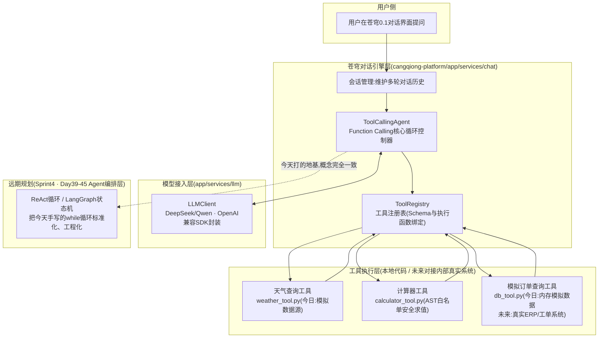
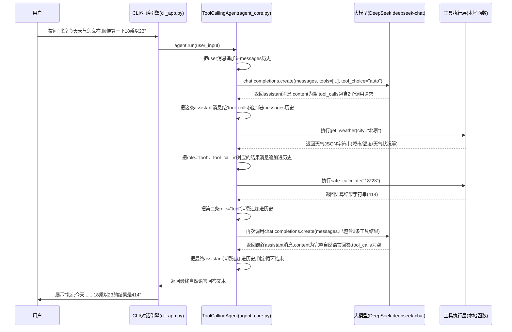
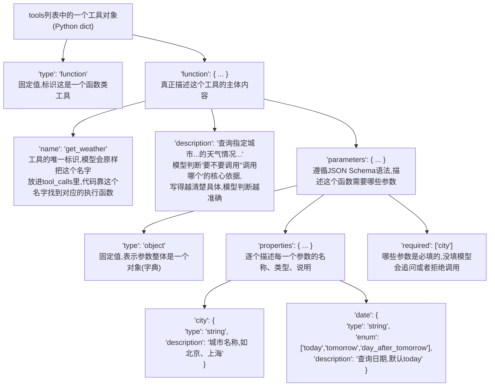

# 第19天 · Function Calling / Tool Use(重点日!)

> **周次/Sprint**:Sprint 1 · 对话引擎MVP(Day15-24)—— 苍穹0.1版网页版对话产品(今日聚焦:给对话引擎装上"能动手"的能力)
> **星期**:周五(第三周第五天;这是本课程明确标注的"重点日"之一,老王头一天晚上就在培训群里打了招呼——"明天信息密度会比平时高不少,建议大家早点睡,咖啡也可以提前备好")
> **学员**:陈铭、苏梦、韩露、张凡(导师:王振宇;今日列席:林悦)
> **任务卡**:CQ-119(蓬远科技 · 苍穹项目组 · Sprint1 · Day19 · Function Calling工具调用能力建设)
> **今日关键词**:Function Calling / Tool Use / 工具Schema(JSON Schema) / `tool_calls`协议 / 参数序列化与反序列化 / `tool_choice` / `parallel_tool_calls` / 多工具编排 / 白名单式安全求值 / Agent的地基

---

## 【旁白】

先说一件今天还没发生、但已经能看清轮廓的事:再往后数二十天出头,课程会走到Sprint4——苍穹平台的Agent编排层正式立项,陈铭会第一次亲手搭一个能够"自主决策、连续行动"的智能体,处理的问题也会从"回答一个问题"变成"完成一件需要好几步才能办成的事"。到那个阶段,ReAct范式、LangGraph的状态机、多Agent协作这些名词会一个接一个地涌进来,信息量会显著超过今天。但如果把那时候陈铭写下的每一行代码往回拆解,会发现骨架其实并不陌生——"模型判断要不要采取行动"“执行这个行动”“把行动结果喂回给模型”“模型基于新信息决定下一步”,这套循环,今天已经在陈铭的键盘下第一次完整地跑起来过。今天学的东西,不是"以后会用到的某个知识点",而是"以后几乎每一天都会用到的那根骨头"。老王在晨会上说得很直白,也是本篇课件标题特意标注"重点日"的原因:"这是Agent的地基,今天打不好,后面到了Sprint4,你会很痛苦。"

这句话乍听有点重,但落到今天的具体内容上,其实一点都不玄乎——Function Calling(有时候也被称作Tool Use,两个说法在教学上基本可以互换,细微差别只在于不同服务商的文档措辞习惯)要解决的问题非常朴素:大语言模型本质上是一个"文本接龙"的机器,它能对着一段输入生成一段看起来合理的输出,但它没有手、没有脚,不能真的去查一下今天北京的气温,不能真的去数据库里翻一条订单记录,甚至连"18乘以23等于多少"这种简单的乘法题,在数字位数稍微大一点的时候,都有相当的概率给出一个看起来很自信、但其实是错的答案——这不是模型"笨",这是文本生成这件事本身的性质决定的:它是在"续写最像正确答案的文字",不是在"运行一段确定性的计算逻辑"。Function Calling的思路,说穿了就是给模型配一份"能力清单",清单上写着"你可以调用get_weather查天气,可以调用calculate做精确计算,可以调用query_order查订单",模型看到用户的问题之后,自己判断"这件事我需要借助外部能力才能回答准确",然后不是直接给答案,而是"生成一份结构化的调用请求",剩下的活——真正打开天气接口、真正跑一遍算式、真正连一次数据库——统统交给我们自己写的代码去做,做完之后再把结果原封不动地喂回给模型,模型才基于这份"外部世界给的真实反馈"生成最终的自然语言回答。

昨天(Day18)的收尾,是陈铭把智能客服意图分类器加固到能扛住赵磊现场演示的提示词注入攻击,结构化JSON输出配合防注入策略,让"模型说的话"变得可信、可控。今天要往前迈的这一步,是从"让模型说得准",升级到"让模型真正能借助外部世界的力量,把事情做对"——这中间隔着的,不是知识点的堆叠,是整个应用形态的一次跃迁:从"一个只会聊天的机器人",变成"一个可以查、可以算、可以连接真实业务系统的助手"。而这,恰恰是"智能体"(Agent)这个词最原始、最朴素的含义——一个能够感知环境、做出判断、采取行动的东西。今天陈铭亲手实现的这套查天气、算数学题、查订单的小助手,规模很小,场景也刻意做了简化,但骨子里跟未来苍穹平台要交付给海纳制造集团、祺瑞集团的复杂智能体,走的是同一条技术路线的最初几步。

还有一层因果关系,值得在今天开始之前提前点破:整整十九天,课程的技术主线始终围绕着"怎么跟模型打交道"打转——怎么写Prompt、怎么解析返回、怎么约束输出格式、怎么防止被注入攻击——所有的努力,方向都是"让模型内部那个黑盒子,尽可能按咱们期望的方式运转"。今天是第一次,课程的重心第一次真正跨出"模型内部",开始涉及"模型之外的世界"——一段真实存在的天气数据、一次精确无误的数值运算、一条躺在数据库里的订单记录。这条分界线,看起来只是多了几个Python函数,实际上标志着"苍穹"这个产品,第一次有了区别于"通用聊天机器人"的、真正意义上的技术护城河——因为聊天能力,几乎所有做大模型应用的公司都能做到相近的水准,但"能不能又快又稳又安全地把模型和企业自己的业务系统连起来",才是留给工程团队真正需要花心思打磨的地方,也是老王反复强调"这是地基"背后,更深一层的产品逻辑。

---

## 晨会纪要 / 今日目标

**时间**:上午9:00,三楼大会议室(今天参会人数比平时多一位,林悦破例列席技术晨会,老王提前在群里说明是因为"今天的内容会直接影响到我们苍穹0.1版对话引擎接下来两周的架构走向,产品侧需要同步理解")
**出席**:王振宇(老王)、陈铭、苏梦、韩露、张凡、林悦

会议室的投影还没打开,老王已经把一块两米长的移动白板推了进来,靠墙一立,黑色马克笔往桌上一放。苏梦小声跟韩露说了句"今天这架势不太寻常",韩露也点头——平时的晨会,老王大多是就着投影幕布上的PPT讲,很少专门搬一块新白板进来。

林悦进门的时候手里拎着自己的笔记本电脑和一份打印好的文档,在会议桌靠窗的位置坐下,冲大家笑了笑:"你们别紧张,我今天来主要是听,顺便把接下来两周产品侧要跟进的几个点提前打个招呼,技术内容还是老王主讲。"

老王开场先做了一个简短的收尾回顾:

**Day18收尾回顾**:

- 四人的智能客服意图分类器,经过昨天下午和晚自习的加固,已经能够正确抵御赵磊在评审会上现场演示的那几种提示词注入手法(角色扮演诱导、"忽略之前所有指令"直接指令覆盖、把恶意指令伪装成用户历史消息的一部分等),赵磊昨晚在群里发了一句"这次我攻不进去了,可以",老王转发到晨会群加了一句"这句"可以"来之不易,记一功"。
- 结构化JSON输出(`response_format={"type": "json_object"}`)配合Pydantic做二次校验的思路,四人已经比较熟练,韩露昨天甚至主动给自己的分类器加了一个"置信度低于阈值就转人工"的兜底逻辑,老王评价"这个思路很好,已经有一点点'知道自己不知道'的意思了"。
- 张凡在Day18结尾提了一个问题:"如果我想让模型不仅分类,还能顺手查一下这个用户之前问过什么问题,该怎么办?"老王当时没有展开讲,只说了一句"明天(也就是今天)会专门讲这个",算是昨天到今天的一个自然衔接。
- 苏梦的进度依然是四人里稍慢的一个,但Day18的作业全部按时提交,老王在批注里写了"思路是对的,细节还需要再抠一抠",整体节奏没有掉队。

老王把回顾说完,没有立刻翻页,而是转身面向那块新搬来的白板,拿起马克笔:"在讲今天具体的技术内容之前,我想先花五分钟,讲一件跟今天关系不大、但跟你们往后大概四十多天的学习节奏关系很大的事。"

他在白板最左边画了一个小方框,写上"用户提问",然后在最右边画了另一个方框,写上"最终答案",中间留了一大片空白。

"这中间空白的部分,"老王指着那片空白说,"从Day1到Day18,你们学的所有东西——Prompt怎么写、模型怎么调、多轮对话怎么维护、JSON怎么约束——本质上都是在优化'用户提问'到'最终答案'之间,模型自己脑子里发生的那个转换过程。今天开始,这中间会多出一段全新的东西。"

他在中间的空白处,画了一个新的方框,写上"工具调用",又从这个方框上下各引出两个小方框,分别写"天气查询""计算器""数据库查询"。

"从今天起,'用户提问'到'最终答案'之间,不再是模型一个人闷头想出来的,中间会插入一段'模型申请调用外部能力—>我们的代码真正执行—>结果喂回给模型'的循环。这个循环,今天你们会亲手实现一个最简单的版本,三个工具、几十行核心代码。但我想让你们提前知道一件事——"老王把马克笔往白板上重重一点,"大概再过二十来天,到了Sprint4,咱们要正式做Agent编排,那时候你们会接触到ReAct框架、LangGraph这些听起来更"高级"的东西,但它们解决的核心问题,和今天这个循环,一模一样,只是把'循环要跑几轮''工具之间怎么协作''出错了怎么办'这些细节,做得更完整、更工程化。这是Agent的地基。今天这个地基打不好——比如你没搞明白`tool_calls`这个字段到底是什么、`arguments`为什么是个字符串而不是字典、一次多个工具调用的结果要怎么一一对应——后面到了Sprint4,你会很痛苦,因为那时候框架会把很多细节包装起来,包装起来的东西,一旦出问题,排查起来比自己手写的时候难得多。所以我把今天定成了'重点日',不是吓唬你们,是真心觉得,这一天的含金量,值得你们多花一点心思。"

林悦在这时候接了一句话,算是给这个开场加了一层产品视角的注脚:"我补充一句业务层面的背景。咱们苍穹0.1版现在定位是'网页版对话产品',客户用起来的第一印象,还是'一个聊天框'。但接下来无论是海纳制造集团,还是往后的祺瑞集团、御风金融,他们真正想要的,从来不只是'能聊天'——他们想要的是'能帮我查一下这批订单的生产进度''能帮我算一下这个月的物料成本超没超预算''能不能直接从我们的ERP系统里把数据拉出来给我看'。这些需求,单靠模型自己'瞎猜'是做不到的,必须要有今天讲的这套工具调用机制,把模型和咱们自己的业务系统真正连起来。你们今天写的查天气、算数学题、查模拟订单,规模是小样,但连接的方式,跟以后接真实业务系统,是同一套协议、同一套思路。"

**今日目标**:

1. 上午9:20-12:00:Function Calling原理详解——为什么需要工具调用、`tool_calls`协议全流程、工具Schema(JSON Schema)的写法与最佳实践、`tool_choice`与`parallel_tool_calls`参数、常见踩坑。
2. 下午14:00-17:30:多工具场景实战——设计天气查询/计算器/模拟数据库查询三个工具的Schema与执行函数,手写完整的多轮工具调用循环(Agent核心循环),讨论安全性(不能用`eval()`)、容错、成本与轮次控制。
3. 晚自习19:00-21:00(自愿参加,四人依然全员留下):把白天写的模块整合成一个可以交互使用的命令行Demo,补充离线自检脚本,准备明天(Day20)的多模态与Embedding内容——这部分老王只是简单预告,没有展开讲。

**风险点**:

- 老王在白板上专门圈出一句话:"今天最容易学'会'但学不'透'的地方,是`tool_calls`里`arguments`字段的处理——它是一个JSON格式的字符串,不是现成的字典,很多人第一次接触会想当然地直接当字典用,结果一运行就报错。"
- 多工具编排部分信息密度较高,老王要求"今天不追求把ReAct、LangGraph这些名字都记住,只要求把'一次提问可能触发多个工具调用、模型可能分好几轮才给出最终答案'这件事的因果关系想清楚"。
- 张凡数学基础好,但老王特意提醒他"今天计算器工具的重点不是数学,是'为什么不能直接用`eval()`',这是一个安全问题,不是数学问题,别把注意力放偏了"。
- 林悦提醒了一句和业务侧相关的风险:"以后接真实工具的时候,工具的`description`写得好不好,直接决定模型会不会'该调用的时候不调用,不该调用的时候瞎调用',这件事的重要性,不比写代码本身低,大家今天写Schema的时候要多花心思在这个字段上。"

---

## 需求文档:内部技术任务书 —— 苍穹0.1版对话引擎接入Function Calling能力

> 本任务书由产品经理林悦撰写,格式沿用苍穹项目组内部PRD模板。因为今天是"能力建设+内部验证"性质的任务,而不是直接面向某一个客户的定制需求,PRD聚焦于"给对话引擎补齐工具调用这项通用能力",验收标准也以"内部demo能否稳定运行"为主,暂不涉及真实客户数据接入(那部分工作会在Sprint2、Sprint3的RAG与真实业务系统对接阶段展开)。

### 一、背景

苍穹0.1版对话引擎从Day15立项以来,已经具备了基础的多轮对话能力、结构化输出能力和一定程度的抗注入能力,但截至Day18,整个对话引擎本质上仍然是"一个只会说话、不会动手"的系统——用户问什么,模型基于自己的训练知识和上下文,生成一段回答,仅此而已。这种形态在纯知识问答、文案生成这类场景下已经能够创造价值,但一旦涉及到"需要真实、实时、精确的外部信息"的场景,就会暴露出明显的短板:

第一,**实时性短板**。大语言模型的知识截止于训练数据的某个时间点,任何"今天""现在""最新"相关的信息(天气、汇率、库存、订单状态),模型天然就不可能知道,只能靠"猜"或者拒绝回答,两者都不是理想的用户体验。

第二,**精确性短板**。涉及具体数值计算的问题,尤其是较大数字的乘除法、多步计算,模型存在真实存在的幻觉风险——它会用一种非常自信的语气给出一个错误的数字,而普通用户很难分辨这个数字是对是错,这在涉及金额、报价等业务场景下是不可接受的风险。

第三,**系统隔离短板**。模型本身完全无法访问企业内部的任何业务系统(ERP、CRM、工单系统、知识库),这意味着"苍穹平台"如果不解决这个问题,永远只能停留在"通用聊天机器人"的层次,无法真正成为"企业级智能体中台"——这与公司产品愿景"让每一家企业,都拥有自己的AI大脑"存在明显的能力缺口。

Function Calling(工具调用)机制,正是为了系统性地解决上述三类短板而设计的通用方案。其核心思想,是把"判断要不要借助外部能力"以及"借助哪一种外部能力、需要什么参数"这两件事交给模型完成(因为模型擅长理解自然语言、擅长做语义层面的判断),而把"真正执行这个外部能力"这件事交还给我们自己完全可控的代码环境(因为代码环境擅长做确定性的、精确的、可审计的操作)——用模型的"理解力",配上代码的"执行力",取长补短。

本任务书要求四位培训生在今天完成一次完整的Function Calling能力验证:分别实现天气查询、精确计算、模拟订单查询三个具有代表性的工具,并搭建起支持"模型可以在一次对话中连续多轮请求调用工具,直到给出最终答案"的完整循环机制。这次验证的产出,将直接决定苍穹0.1版对话引擎在Sprint1收尾(Day21综合练习)时,能否把工具调用整合进最终的多轮对话+流式输出综合小项目里。

需要特别说明的一点是:今天验证使用的三个工具,在选型上经过了刻意的设计,并不是随手挑选的三个不相关的demo。天气查询代表"依赖外部第三方数据源"这一类能力,未来接入真实业务时,通常涉及第三方API的额度管理、稳定性兜底、数据格式适配等问题;计算器代表"纯粹的确定性计算"这一类能力,核心矛盾在于安全性(如何在不引入代码执行风险的前提下,支持足够灵活的计算表达能力);模拟订单查询代表"连接企业内部真实业务系统"这一类能力,核心矛盾在于权限控制、数据的敏感程度,以及"应该开放多大范围的查询能力给模型自由调用"这类业务安全边界问题。三者放在一起,基本覆盖了苍穹平台未来所有工具接入场景的三种典型形态,这也是本次验证不满足于"随便做一个能跑的demo"、而是要求团队认真对待每一个工具设计细节的根本原因。

### 二、用户故事

**故事1(实时信息角度)**

作为苍穹平台的使用者,当我问"北京今天天气怎么样"这类需要实时信息的问题时,我希望助手能够给出一个基于真实(或至少是明确标注为模拟)数据源的回答,而不是模型凭训练知识编造的、可能早已过时甚至完全虚构的答案。

> 验收关注点:助手在被问及天气相关问题时,应当能够正确识别出"这是一个需要调用天气查询能力才能准确回答"的问题,主动发起工具调用,并基于工具返回的真实数据生成回答,不应绕过工具直接凭"感觉"给出答案。

**故事2(精确计算角度)**

作为苍穹平台的使用者,当我提出任何涉及具体数值计算的问题时(尤其是位数较多的乘除法、多步复合计算),我不希望模型自己心算给我一个可能出错的答案,我希望它借助精确的计算能力,给我一个绝对可信的数字结果。

> 验收关注点:助手在遇到明确的数学计算需求时,必须调用计算器工具而不是自行心算,计算结果需要与工具函数独立验证的结果完全一致。

**故事3(业务系统查询角度)**

作为苍穹平台的使用者,当我提到具体的订单号或者自己的姓名,想查询订单/工单进度时,我希望助手能够准确地从对应的业务系统(今天用模拟数据代替)中查到我要的信息,而不是含糊其辞或者编造一个听起来合理但实际上是错的状态。

> 验收关注点:助手应当能够正确提取用户表述中的订单号或客户姓名信息,作为参数传给查询工具,并将查询到的真实结果(包括"查不到"这种负向结果)如实告知用户。

**故事4(多工具协同角度)**

作为苍穹平台的使用者,当我在一句话里同时提出了多件需要不同工具能力才能回答的问题(比如"帮我查一下北京的天气,再算一下这两笔订单加起来要交多少税"),我希望助手能够一次性识别出所有需要调用的工具,分别执行,并把所有结果整合成一段连贯、自然的回答,而不需要我把问题拆成好几句话分别提问。

> 验收关注点:助手应当支持在同一轮对话中并行发起多个工具调用(或者在无法并行时,支持多轮串行调用),并能正确地把每一个工具的执行结果与它对应的调用请求匹配起来,不出现结果张冠李戴的情况。

**故事5(安全与容错角度,呼应Day18延续下来的主题)**

作为对苍穹平台代码质量负责的技术负责人,我要求任何工具的执行逻辑,都不允许引入新的安全漏洞——尤其是计算器工具,绝对不允许直接使用Python的`eval()`等价的机制去执行模型生成的字符串,必须有一套安全的、可审计的求值方案。同时,任何工具执行失败(参数错误、查询不到数据、内部异常),都不应导致整个对话流程崩溃,而应该把失败信息恰当地反馈给模型,由模型决定如何用自然语言回应用户。

> 验收关注点:计算器工具的实现必须能够正确拦截包含函数调用、变量引用、导入语句等危险语法结构的表达式;所有工具的异常处理必须保证"工具失败"不等于"程序崩溃",dispatch层必须对各类异常有完整的兜底。

**故事6(成本与效率角度)**

作为对API调用成本负有责任的技术负责人,我要求整个工具调用循环必须有明确的轮次上限,防止模型陷入"反复申请调用工具却始终不给最终答案"的异常状态,导致API调用次数和token消耗失控。

> 验收关注点:多轮工具调用循环必须设置可配置的最大轮次(默认5轮),超过上限后应当主动终止并给用户一个诚实的提示,而不是无限循环下去。

### 三、功能列表

| 编号 | 功能 | 详细说明 | 优先级 |
|---|---|---|---|
| F1 | 天气查询工具Schema与执行函数 | 定义`get_weather`工具的JSON Schema(参数:city必填、date可选),实现基于确定性伪随机的模拟天气数据源 | P0 |
| F2 | 计算器工具Schema与执行函数 | 定义`calculate`工具的JSON Schema(参数:expression必填),基于`ast`模块实现白名单式安全表达式求值,严禁使用`eval()`/`exec()` | P0 |
| F3 | 模拟数据库查询工具Schema与执行函数 | 定义`query_order`工具的JSON Schema(参数:order_id、customer_name均可选,至少填一个),实现基于内存字典的模拟订单查询 | P0 |
| F4 | 工具注册表 | 将三个工具的Schema与实际执行函数绑定,提供统一的`dispatch_tool_call`调度入口,做好异常兜底,任何情况下都返回可用的字符串结果 | P0 |
| F5 | 模型接入层升级 | 在原有的模型调用封装基础上,支持传入`tools`参数与`tool_choice`参数,正确解析返回结果中的`tool_calls`字段 | P0 |
| F6 | Function Calling核心循环 | 实现`ToolCallingAgent`,支持"模型判断-工具执行-结果回传-模型再判断"的多轮循环,内置最大轮次保护 | P0 |
| F7 | 命令行交互Demo | 提供交互式命令行入口,支持`/reset`、`/history`、`/help`、`/exit`等命令,并提供`--demo`非交互演示模式 | P1 |
| F8 | 离线自检脚本 | 提供不依赖真实网络请求的自检脚本,用脚本化的假响应验证工具执行、调度兜底、多轮循环控制流的正确性 | P0 |
| F9 | 配置与密钥管理 | 延续Day13确立的规范,密钥通过环境变量加载,提供`.env.example`模板 | P0 |

### 四、非功能需求

- **安全性**:计算器工具必须使用白名单式的AST求值,任何包含函数调用、属性访问、变量引用、导入语句的表达式都必须被拒绝并抛出明确异常;任何真实密钥不得出现在代码、日志、异常信息中。
- **健壮性**:工具执行阶段的任何异常(参数缺失、参数不合法、业务查询失败),都必须被`dispatch_tool_call`捕获并转换为对模型友好的字符串结果,不允许让原生Python异常直接抛出到用户界面导致程序崩溃。
- **可观测性**:多轮工具调用循环的每一轮,都应当在终端打印清晰的过程日志(第几轮、调用了哪些工具、参数是什么、返回了什么),方便课堂演示与后续排查问题。
- **可扩展性**:新增一个工具,应当只需要"写一个Schema+写一个执行函数+在工具注册表里加一行绑定"三个步骤,不需要改动Function Calling核心循环的任何代码。
- **成本可控性**:必须设置最大工具调用轮次上限,防止模型异常行为导致的API调用失控;单次模型请求必须设置超时时间。
- **确定性(教学需要)**:模拟数据源(天气、订单)在给定相同输入时,应当返回完全一致的结果,便于自检脚本做回归验证,也便于课堂演示时结果可复现。

### 五、依赖关系与后续里程碑

本次能力建设不是一个孤立的技术任务,它和Sprint1接下来的进度、以及Sprint4的Agent编排层,都存在明确的依赖关系,林悦在PRD评审时特意补充了这部分内容,方便团队理解今天的产出会被后续哪些工作复用:

- **Day20(明日)**:多模态与Embedding能力建设,与今天的工具调用能力相互独立,但会在Day21的综合练习中共同整合进同一个demo项目,验证"多轮对话+工具调用+流式输出"三者协同工作的效果。
- **Day21**:Sprint1收尾周测与综合练习,今天产出的`ToolCallingAgent`、`tool_registry`等模块,预期会被直接复用或者小幅改造后复用,不需要推倒重写。
- **Sprint2-3(Day25-38)**:RAG检索引擎层建设期间,今天学到的"工具Schema设计规范""多轮循环控制""安全执行边界"等原则,会被迁移应用到"知识库检索"这个新的能力模块上,虽然检索本身依赖的是Embedding而非Function Calling,但"如何把一个新的能力,安全、可控地接入对话流程"这套方法论是通用的。
- **Sprint4(Day39-45)**:Agent编排层正式立项,今天手写的`while`循环,会被ReAct框架、LangGraph状态机等更工程化的方案替代,但底层"感知-决策-行动"的因果关系保持不变,今天的产出将作为团队理解新框架的重要参照基准。

### 六、验收标准

1. 三个工具的Schema结构必须符合OpenAI Function Calling协议规范(`type: "function"`、`function.name`、`function.description`、`function.parameters`遵循JSON Schema语法),能够被DeepSeek的`chat.completions.create`接口的`tools`参数正确接收。
2. 针对纯天气查询问题(如"北京今天天气怎么样"),助手必须触发`get_weather`工具调用且不出现死循环,最终基于工具返回结果生成回答。
3. 针对纯计算问题(如"18乘以23等于多少"),助手必须触发`calculate`工具调用,且计算结果与`safe_calculate`函数独立计算的结果完全一致。
4. 针对纯订单查询问题(如给定一个真实存在于模拟数据中的订单号),助手必须触发`query_order`工具调用,返回结果中的关键字段(订单状态、金额)必须与模拟数据源完全一致;针对不存在的订单号,助手必须诚实告知"查不到",不能编造信息。
5. 针对同时涉及两个及以上工具能力的复合问题(如"查一下北京天气,再算一下xxx"),助手必须能够在合理的轮次内(不超过`max_tool_rounds`)依次或并行完成所有必要的工具调用,并给出综合性的最终回答。
6. 计算器工具在面对`__import__('os').system(...)`、`open('/etc/passwd').read()`等具有明显攻击性的表达式字符串时,必须正确拦截并抛出`UnsafeExpressionError`,不能让底层Python解释器真正执行这些代码。
7. 离线自检脚本必须能够独立运行,不依赖真实网络请求,且所有检查项全部通过。
8. 命令行Demo在正确配置了真实API密钥的前提下,应当能够对上述所有场景给出正确、连贯的最终回答。

---

## 架构设计图:Function Calling能力在苍穹0.1版对话引擎中的位置

老王在白板画完流程示意后,把它整理成了一张更规整的架构图,发到了群里,并特别说明:"这张图的重点,不是记住每个模块叫什么名字,是理解'工具执行'这一层,天然应该跟'模型接入层'完全分开——模型服务商换了、模型版本升级了,都不应该影响到咱们自己写的工具执行逻辑一行代码。"



这张图有几个值得多说几句的细节。

第一,**会话管理(CM)与核心循环(AGENT)是分开的两个职责**。会话管理负责"这个用户当前对话到第几轮了、历史消息存到哪了",核心循环负责"针对这一次输入,要不要调用工具、调用几轮"。今天的demo项目里,这两者暂时耦合在同一个`ToolCallingAgent`实例的`self.messages`属性上,因为只需要支持单会话场景;但架构图上依然把它们画成概念上独立的两块,是为了给未来"苍穹要支持成千上万用户并发对话"这件事留出扩展空间——到那时候,每个用户会话对应一个独立的`ToolCallingAgent`实例(或者更进一步,把状态存进Redis这类外部存储,而不是留在内存里),核心循环的代码本身完全不需要改。

第二,**工具执行层被专门画成一个和模型接入层平级、而不是从属于模型接入层的模块**。这是一个容易被忽略但很关键的设计决定:很多人第一次接触Function Calling,会下意识地觉得"工具执行"应该是模型SDK自带的能力,好像调用一下`client.chat.completions.create(tools=...)`,模型就自动把天气查好了——但事实完全不是这样,模型服务商永远只负责"生成一份结构化的调用请求",执行这份请求永远是调用方(也就是咱们自己的代码)的责任。把工具执行层单独画出来、明确标注"本地代码",就是要在架构层面把这个边界钉死,避免团队里任何人在设计阶段产生"模型会帮我们把活干完"这种误解。

第三,**远期规划这个虚线框,是老王特意加上去的"预告"**。他在群里发这张图的时候补了一句话:"这个虚线框现在先不用管里面具体是什么,你们只需要知道——今天`AGENT`模块里那个`while`循环,几周之后会被一个更强大的框架替换掉,但循环背后'感知-决策-行动'这个思路,不会变。"

---

## 流程图:Function Calling完整调用链路(sequenceDiagram)

如果说架构图回答的是"各个模块之间是什么关系",流程图回答的就是"一次完整的用户提问,数据到底是怎么在这些模块之间流动的"。老王在白板上画的原始版本比这个更粗糙,课后陈铭把它整理成了标准的Mermaid时序图,发到群里给苏梦、韩露、张凡对照复习。



这张时序图里,几个关键的时间点值得单独拎出来讲清楚,因为它们几乎就是今天全部技术细节的浓缩:

**第一次调用模型,得到的不是最终答案,而是"调用请求"**。这是Function Calling和普通对话调用最本质的区别——普通调用,模型返回的`content`字段就是最终答案;工具调用场景下,模型返回的`content`往往是`None`(或者是一段可以忽略的、说明自己"打算"做什么的文字),真正有信息量的是`tool_calls`这个字段,里面是一个列表,列表中的每一项对应一次工具调用请求,包含一个唯一的`id`、`type`(固定是`"function"`)、以及`function.name`和`function.arguments`(注意`arguments`是一个字符串,不是字典,这一点在课堂笔记部分会重点展开)。

**assistant这条"请求调用工具"的消息,必须原样存入对话历史**。很多人第一次实现这个循环,容易只把"工具执行结果"存进历史,却漏掉了"模型当初发出调用请求"这条assistant消息本身——这会导致后续的tool消息,因为找不到对应的、此前出现过的`tool_call_id`,而被模型服务判定为格式非法,直接报错。

**工具执行结果,以`role: "tool"`的身份、带着对应的`tool_call_id`,重新加入历史**。这是模型服务用来"对账"的机制——如果一次请求里同时发起了两个工具调用,回传结果的时候,必须保证每一条`tool`消息的`tool_call_id`,和当初对应的那次调用请求的`id`完全一致,模型服务靠这个id把"提问"和"回答"重新配对,而不是简单地按顺序对应(这意味着即便你回传结果的顺序和模型发起请求的顺序不完全一致,只要id对得上,依然不会出错——这个特性在工具执行本身涉及并发、执行时间不确定的场景下会很有用)。

**第二次调用模型,才是真正生成最终答案的时刻**。这次调用时,`messages`历史里已经完整地包含了"用户提了什么问题—模型申请调用了哪些工具—每个工具实际返回了什么结果",模型基于这份完整的上下文,才真正进入"总结、组织语言、生成面向用户的自然语言回答"这个阶段。这也解释了为什么Function Calling场景下,一次用户提问,往往对应至少两次(而不是一次)模型API调用——这个事实,直接关系到今天需求文档里提到的"成本可控性"这条非功能需求。

---

## 示意图:工具Schema的结构解析

工具Schema是今天所有代码的"契约起点",老王专门花了将近半小时,带着大家把这份JSON结构从外到内拆了一遍。为了方便理解,把这个结构画成了一张树形图。



老王在讲这张图的时候,特别强调了三个"容易被低估"的字段。

第一个是最外层的`description`(工具整体的描述)。他举了个反面例子:"如果你把`get_weather`的`description`随手写成'查天气的',模型大概率能猜出来这个工具是干什么的,但如果用户问的是一句比较绕的话,比如'我明天要不要带伞',模型判断'这句话需不需要调用天气工具'的时候,主要依据就是这段`description`——描述写得越具体、越覆盖各种问法的场景,模型触发工具调用的准确率就越高。反过来,如果两个工具的`description`写得含义有重叠、容易混淆,模型选错工具的概率也会明显上升。"

第二个是每个参数自己的`description`。这一点林悦昨天在需求文档评审里也提到过类似的原则——"参数说明写得越清楚,尤其是单位、格式、可选值这些细节交代得越明白,模型填参数的时候出错的概率就越低"。`date`参数如果没有用`enum`把可选值限定在`today`/`tomorrow`/`day_after_tomorrow`这三个明确的字符串,模型有可能会自己发挥,生成类似"明天""7月10号"这类五花八门的字符串,导致后端代码解析起来非常麻烦——用`enum`把可选值锁死,是减少这种"格式漂移"问题最简单有效的手段。

第三个是`required`列表。它决定了模型"敢不敢在缺少某个参数的情况下,依然发起调用"——如果`city`不在`required`里,模型完全有可能在用户没有提到任何城市名的情况下,依然尝试调用`get_weather`(可能会自己瞎编一个城市,也可能会把参数留空导致执行函数报错),把真正必填的参数放进`required`,是保证工具调用"参数齐整"的最后一道防线。

韩露在这张图前面站了一会儿,提出了一个很实际的疑问:"如果我们写Schema的时候,某个参数的`description`写得不够好,模型第一次调用的时候参数填错了,有没有办法让它'知错就改'?"

"这是个很好的问题,答案是——有,但依赖的不是Schema本身,是后续的对话轮次。"老王解释道,"如果工具执行之后发现参数不对(比如城市名传错了导致查不到数据),咱们的`dispatch_tool_call`会把这个'查询失败,原因是XXX'的信息,原样作为`tool`消息回传给模型。模型拿到这条'失败反馈'之后,在下一轮,是完全有可能根据这条反馈,重新生成一次更正确的调用请求的——这也是为什么今天的循环设计成'可以有多轮',而不是'只给模型一次机会'。这种'执行失败—>拿到反馈—>下一轮自我修正'的能力,虽然今天没有专门设计测试用例去验证它,但它确实是这套多轮循环机制自带的一个附加价值,值得大家自己课后用demo试一试,故意问一个容易让模型填错参数的问题,看看它第二轮会不会自己纠正。"

这段问答,也从另一个角度印证了"assistant消息和tool消息都必须完整存入历史"这条规则的重要性——如果历史记录不完整,模型根本没有机会"看到"自己上一次的错误,自然也就没有办法在下一轮里自我修正。

---

## 课堂笔记

### 上午:Function Calling原理与工具Schema定义

#### 1. 从一个具体问题说起:模型为什么算不准18乘以23?

老王没有直接讲协议细节,先在投影上打开了一个交互式对话窗口,当着大家的面问了模型一个问题:"请计算237乘以489等于多少。"模型很快给出了一个答案,语气非常自信,格式也很规整,看起来没有任何问题。老王没有说话,自己拿出手机计算器验证了一下,结果和模型给出的数字不一样。

"你们看,"老王把手机屏幕转过来给大家看,"模型给的答案是错的,但它说这句话的语气,和它说对的时候没有任何区别——不会犹豫,不会说'我不太确定',就是那么自信地把一个错误答案说出来了。这就是我们反复说的"幻觉"问题,在数值计算这个场景下的一个典型表现。"

苏梦追问了一句:"那模型不是应该学过很多数学题吗,为什么连乘法都会算错?"

"因为大语言模型的工作原理,从根本上说,不是'运行一套确定性的计算规则',是'根据前面的文字,预测接下来最可能出现的文字'。"老王在白板上写下"文本接龙"四个字,"两位数乘以三位数这种题目,如果训练数据里见过一模一样的题目和答案,模型大概率能'背'出正确结果;但凡是没见过的、需要真正'计算'而不是'回忆'的题目,尤其是位数比较多的时候,模型是在'生成一个看起来像正确答案的数字串',这跟真正执行乘法运算,是两件完全不同的事。位数越多,'看起来像'和'真的是'之间的差距被放大的概率越高,出错概率自然也越高。"

张凡在这里插了一句,带着他一贯的理工科视角:"那是不是说,只要给模型足够多的计算题当训练数据,总有一天它就能算对所有的乘法了?"

"理论上,如果训练数据覆盖足够全面、模型规模足够大,确实能把准确率不断往上推,业内确实有专门在数学推理能力上做优化的模型和方法(比如让模型'写出计算过程'再给答案,业内一般称为思维链,你们在Day18已经接触过CoT的概念,这也是缓解这类问题的一种手段)。但从工程实践的角度看,'不断堆更大的模型、更多的训练数据,试图让它自己把算术学得更准'这条路,性价比远远比不上'干脆让模型别自己算了,交给一个永远不会算错的计算器'。"老王说完,在白板上画了一个简单的对比:"一边是'持续投入训练资源,换来一个准确率永远不是100%的心算能力';另一边是'写几十行确定性的代码,换来一个准确率永远是100%的计算能力'。这两条路放在一起比较,答案是很明显的。"

这段对话,直接引出了今天上午要讲的核心命题:**当一个问题存在"确定性的、可编程实现的解法"时,不应该指望模型自己心算出这个答案,而应该让模型识别出"这是一个需要借助外部能力的问题",然后把执行权交给代码**。

老王补了一句更大的背景,把这件事和整个公司的产品愿景连了起来:"你们记不记得工位墙上挂着的那句话——"让每一家企业,都拥有自己的AI大脑"。这句话听起来有点大,但如果拆开来看,"大脑"这个词,恰恰点出了咱们今天要解决的问题的本质——一个真正管用的大脑,不是什么都自己想、自己算,是知道什么时候该动用哪部分能力:该用直觉判断的时候用直觉,该精确计算的时候,交给一个从不出错的计算器;该回忆已知信息的时候用记忆,该查阅最新数据的时候,交给一个能连接到真实世界的查询系统。人脑天生就是这么分工的,咱们做AI应用,某种程度上是在给大模型补上这后半部分能力——它本身已经具备了不错的"直觉判断力",今天要做的,是给它接上"精确计算""实时查询"这些它天生缺失的能力。"

这段类比,虽然不是严格的技术定义,但确实帮几位培训生把"为什么要做Function Calling"这件事,从一个孤立的技术知识点,提升到了"这是在做一件让AI真正变得可用的事"这个层次上去理解。苏梦在笔记本上写下了一句自己的理解:"AI不是要取代人去'算得比人快',是要学会'像人一样,知道什么时候该找工具帮忙'。"

#### 2. Function Calling的本质:给模型一份"能力清单"

老王把这句话写在了白板最上方:"Function Calling,本质上是让模型具备了'调用外部能力的判断力',但没有赋予模型'真正执行外部能力的权力'。"

他解释道,这句话拆开来看有两层意思:

**第一层,模型有"判断力"**。给模型一份工具清单(包括每个工具的名字、用途说明、需要什么参数),模型看到用户的问题之后,会自己判断"这个问题是不是需要借助清单上的某个工具"。这个判断过程,依然是模型基于语义理解做出来的,和它平时理解一句话的意思、判断该怎么回答,是同一种能力,只是判断的结果不再是"直接生成回答文字",而是"生成一份结构化的调用请求"。

**第二层,模型没有"执行力"**。模型生成的调用请求,只是一段JSON格式的文字描述——"我想调用一个叫`get_weather`的东西,参数是`{"city": "北京"}`"——这段文字本身不会触发任何真实的网络请求、数据库查询或者代码执行。真正让这件事发生的,是我们自己写的代码:读到这段调用请求之后,主动去执行对应的函数,拿到结果之后,再把结果重新喂给模型。

"这个'判断力和执行力分离'的设计,"老王补充道,"从安全角度看,其实是一件好事——意味着模型永远不可能绕过咱们的代码,直接对外部世界做任何事情。它想调用什么、传什么参数,咱们的代码永远有最后的审核权和执行权,可以做参数校验、可以做权限检查、甚至可以直接拒绝执行——这跟'防止模型被诱导做危险操作'这个话题,是有直接关联的,下午讲计算器工具的时候还会再深入展开。"

韩露这时候提了一个很实际的问题:"如果模型判断错了怎么办?比如我随便问一句跟天气完全无关的话,它非要调用天气工具,或者反过来,我明明问的是天气,它却不调用工具,自己瞎编一个答案?"

"这两种情况,在实践中都真实会发生,程度取决于工具Schema写得好不好、模型本身的Function Calling能力强不强。"老王坦率地承认了这一点,"这也是为什么`description`字段这么重要——写得清楚,模型判断准确率就高;写得含糊,出问题的概率就大。另外,大部分支持Function Calling的模型服务,也提供了`tool_choice`这个参数,可以在某些场景下强制模型'必须调用某个工具'或者'禁止调用任何工具',把一部分判断的自由度,收回到咱们自己的代码里——这个咱们下面就讲。"

#### 3. `tool_calls`协议详解:messages结构里多出来的东西

老王打开了一份提前准备好的调用返回结果示例(截取自昨晚他自己用DeepSeek测试的一次真实调用),投影到屏幕上,带着大家逐字逐句地读:

```json
{
  "role": "assistant",
  "content": null,
  "tool_calls": [
    {
      "id": "call_a1b2c3d4",
      "type": "function",
      "function": {
        "name": "get_weather",
        "arguments": "{\"city\": \"北京\", \"date\": \"today\"}"
      }
    }
  ]
}
```

"先看`content`字段,"老王指着屏幕说,"它是`null`,不是空字符串,是`null`。这一点在写代码的时候要小心——如果你不做判断,直接拿`content`去做字符串拼接或者展示给用户,大概率会报错或者显示出一个奇怪的'None'字样。"

苏梦举手确认了一下:"所以判断'模型是不是要调用工具',不能看`content`是不是为空,要专门看`tool_calls`这个字段是不是有值?"

"完全正确。"老王点头,"`tool_calls`是`None`(或者是一个空列表),说明模型不打算调用任何工具,`content`里就是它给出的正常回答;`tool_calls`有值,说明模型打算调用工具,这时候`content`可能是`null`,也可能包含一小段说明性的文字(不同模型、不同版本的行为可能略有差异),但不管`content`里有没有内容,只要`tool_calls`不为空,都不能把这次响应当作'最终答案',必须先去处理工具调用。"

接着,老王把镜头对准了`tool_calls`列表里的每一项,拆解三个子字段:

- **`id`**:这次工具调用请求的唯一标识,是模型服务生成的一个随机字符串,咱们的代码不需要关心它具体是什么,只需要"原样记住它,回传结果的时候带着同一个id"。
- **`type`**:目前几乎永远是`"function"`,表示这是一次函数类工具调用(不同服务商未来可能会扩展出其他类型的工具,但目前教学范围内只涉及`function`这一种)。
- **`function`**:里面又是一个嵌套的字典,包含`name`(工具名,和咱们Schema里定义的`function.name`完全对应)和`arguments`。

"重点来了,"老王在`arguments`那一行画了一个大大的圈,"这个字段的值,是`"{\"city\": \"北京\", \"date\": \"today\"}"`——注意它是一个**字符串**,内容看起来像一个JSON对象,但它的类型是`str`,不是`dict`。这是今天最容易踩的坑,我提前把它标成重点。"

张凡皱了皱眉:"为什么不直接返回一个字典,非要包一层字符串?"

"这跟Function Calling协议最初设计的历史背景有关系,也有一定的工程上的合理性——模型生成内容的本质是'生成一段文本',而不是'生成一个结构化对象'。模型在生成`arguments`的时候,走的是跟生成普通回答文字一样的'逐字/逐token生成'路径,天然产出的是字符串。至于'这段字符串是不是一份合法的JSON',取决于模型本身有没有被正确地训练、约束成'始终生成合法JSON格式的字符串'——大部分做过专门优化的模型,在这方面的合规率已经相当高,但不是100%的保证,这也是为什么咱们自己的代码,必须对这段字符串做`json.loads()`解析,并且要用`try/except`包住,防止极少数情况下模型生成了格式不合法的字符串导致程序崩溃。"

老王顺手在白板上写下一行代码作为强调:

```python
import json
arguments_dict = json.loads(tool_call.function.arguments)  # 手动解析,不能直接当字典用
```

"记住这一行,"他说,"今天所有工具调用的参数处理,起点都是这一行。"

#### 4. 完整的往返:assistant消息与tool消息如何拼接进历史

理解了`tool_calls`长什么样之后,老王接着讲"这条消息之后,咱们应该怎么继续往下走"。

他强调了两个必须严格遵守的规则,这两条规则如果不遵守,大概率会遇到模型服务返回400错误(格式非法)。

**规则一:收到带`tool_calls`的assistant消息,必须原样存入历史,不能丢弃或者简化。**

有些初学者会觉得"这条消息`content`是空的,没什么信息量,存不存似乎无所谓",于是只把后面的工具执行结果存进历史,漏掉了这条assistant消息本身。这是错的——因为后续每一条`role: "tool"`消息,靠`tool_call_id`跟"当初是谁发起的这次调用"建立关联,如果历史里根本没有出现过这个`tool_call_id`对应的调用请求,模型服务在校验消息序列的时候会直接判定格式不合法。

**规则二:每一个`tool_call`,都必须有且只有一条对应的`role: "tool"`消息回传结果,且`tool_call_id`必须精确匹配。**

如果模型这一轮发起了3个工具调用,咱们的代码必须依次执行这3个工具,并且往历史里追加3条`tool`消息,一个都不能少;如果某个工具执行失败了,也必须往历史里追加一条`tool`消息,内容是"这个工具执行失败,原因是……",而不能因为"执行失败了"就跳过不回传——跳过同样会导致消息序列不完整、格式不合法。

老王在白板上画出了完整的消息序列示意(用简化的伪代码表示):

```
messages = [
    {role: "system", content: "你是一个助手..."},
    {role: "user", content: "北京今天天气怎么样,顺便算一下18乘以23"},
    {role: "assistant", content: null, tool_calls: [
        {id: "call_1", function: {name: "get_weather", arguments: "..."}},
        {id: "call_2", function: {name: "calculate", arguments: "..."}},
    ]},
    {role: "tool", tool_call_id: "call_1", content: "{天气结果...}"},
    {role: "tool", tool_call_id: "call_2", content: "{计算结果...}"},
    # 到这里,再发一次请求给模型,才能拿到最终答案
]
```

"你们看这个序列,"老王说,"`user`之后跟着一条`assistant`(带`tool_calls`),然后跟着两条`tool`(每条对应一个`tool_call_id`)。这四条消息,是'第一轮'完整的产出。发生在这之后的,是拿着这份完整的历史,再去请求一次模型,模型才会真正给出'北京今天天气怎么样、18乘以23的结果是多少'这样综合性的最终答案。"

#### 5. `tool_choice`与`parallel_tool_calls`:控制模型的"调用自由度"

讲完基本协议之后,老王介绍了两个用来"调节"工具调用行为的参数。

**`tool_choice`参数**,用来控制模型在"要不要调用工具"这件事上的自由度,常见取值包括:

- `"auto"`(默认值):完全交给模型自己判断,今天的demo项目全程使用这个值。
- `"none"`:强制模型不调用任何工具,即便某个问题看起来很适合调用工具,模型也只能直接用自然语言回答(或者承认自己做不到)。这个值在某些场景下有用,比如你想先看看"如果不借助工具,模型自己会怎么回答",用来对比效果。
- 指定某一个具体工具:格式类似`{"type": "function", "function": {"name": "get_weather"}}`,强制模型必须调用这个指定的工具,不管用户问的是什么。这个值适用于一些"业务上明确知道接下来一定要走某个工具"的场景,比如一个专门的"天气查询"入口页面,用户点进来必然是想查天气,不需要再让模型自己判断。

**`parallel_tool_calls`参数**,用来控制模型是否可以在同一轮响应里,一次性发起多个工具调用请求。绝大多数支持Function Calling的现代模型,默认是支持并行工具调用的(也就是`tool_calls`列表里可以有多项),但也存在一些场景(或者一些较早版本的模型)只支持"一轮只发起一个工具调用",这时候如果用户的问题涉及多个工具能力,模型会分成好几轮、每轮只申请一个工具,行为上和"并行"是等价的,只是往返次数会更多。

"今天的demo代码,"老王说,"设计上默认按照'支持并行工具调用'的方式来写——也就是`for tool_call in tool_calls`这个循环,可以处理列表里有1个、2个甚至更多工具调用的情况,不用去关心具体是并行返回的还是模型分成了多轮,代码逻辑是通用的。这也是为什么下午咱们设计的多工具场景demo,故意设计了一个'一句话同时触发2个工具'的例子——就是为了让大家亲眼见到这个机制真的在生效。"

#### 6. 工具Schema的写作规范与最佳实践

上午最后一段时间,老王专门带着大家过了一遍工具Schema的"写作规范",这部分内容偏经验总结,他反复强调"这是熟能生巧的东西,今天记不住没关系,但一定要留意"。

**规范一:`description`要写清楚"什么场景该调用这个工具",最好举一两个具体的用户问法作为参照。** 一份好的`description`,应该让人(或者模型)不需要看代码,单看这段文字,就能判断出"用户问'XXX'的时候,应该调用这个工具"。今天的三份Schema,每一份`description`里都特意举了具体的用户问法示例,就是遵循这条规范。

**规范二:每个参数的`description`,要交代清楚格式、单位、可选值范围,不要假设模型能"猜"出来。** 比如天气工具的`city`参数,`description`里特意写明"使用不带'市''省'后缀的中文城市名",就是为了避免模型传入"北京市"这种带后缀的字符串,导致跟`SUPPORTED_CITIES`清单里存的"北京"字符串对不上,查询失败。

**规范三:能用`enum`限定取值范围的参数,尽量用`enum`,不要用自由文本。** `date`参数如果不用`enum`,模型完全可能生成"明天中午""周五"这类自然语言表达,给后端解析带来极大的不确定性;限定成`["today", "tomorrow", "day_after_tomorrow"]`这样明确的枚举值之后,后端处理逻辑可以做到完全确定性,不需要写一堆容错逻辑去猜测用户可能的表达方式。

**规范四:必填参数一定要放进`required`,可选参数不要硬塞进`required`。** 如果一个本来应该是可选的参数被错误地放进了`required`,模型在用户没有提供这项信息的情况下,依然会"被迫"生成一个值(可能是瞎编的),反而制造出更多问题;反过来,如果一个真正必填的参数漏了没放进`required`,模型可能会在缺少这个关键信息的情况下依然尝试调用,导致执行函数因为缺少参数而报错。

**规范五:工具的数量不宜过多,功能重叠度要低。** 老王提到一个业内经验:"如果一次给模型挂载几十甚至上百个工具,尤其是一些功能相近、描述又写得比较含糊的工具,模型选择正确工具的准确率会明显下降——这跟人在面对一份过长、选项含义又模糊的菜单时,更容易点错菜,是同一个道理。今天咱们只挂载3个工具,场景区分度很高,所以看不出这个问题,但以后苍穹平台真正接入几十个业务系统工具的时候,这一点会变成一个需要认真设计的工程问题,可能需要引入'先分类、再挑选相关工具子集'这类分层策略——这个话题,今天先点一下,以后接触真实复杂场景的时候会再展开。"

#### 7. 不同服务商之间,Function Calling行为的细微差异

上午临近结束前,老王补充了一段容易被教材忽略、但真正上手写代码时一定会遇到的内容——不同大模型服务商,虽然大多宣称"兼容OpenAI Function Calling协议",但在一些细节行为上,并不是完全一模一样。

他把这部分内容定位成"提醒大家保持一份'不要盲目迷信文档'的警觉心",而不是要求大家背下每一家服务商的具体差异(这些差异本身也在持续变化,服务商会不断升级模型和接口能力,今天记下的细节,半年后未必还准确)。

"第一个要留意的差异,是`parallel_tool_calls`这个参数的默认行为和可配置程度。"老王说,"有些模型默认就会在合适的场景下并行发起多个工具调用,不需要额外配置;有些模型的并行能力可能相对较弱,即便你的问题明显涉及多个独立的工具需求,它也可能倾向于一次只申请一个,分成多轮完成——这不代表模型"不智能",只是不同模型在这类能力上的训练侧重点不同。好消息是,只要咱们的核心循环是按照'不管这一轮返回几个`tool_calls`都能正确处理'的方式写的(也就是今天`agent_core.py`里`for tool_call in tool_calls`这个循环),无论模型选择并行还是串行,代码都不需要跟着改。"

"第二个差异,是工具调用的触发准确率,在不同模型之间确实存在真实的差距,尤其是当工具数量变多、`description`写得不够清晰的时候,这个差距会被进一步放大。"老王提到,"这也是为什么咱们公司内部,针对不同客户项目选型模型的时候,如果这个项目重度依赖Function Calling能力(比如以后要做的Agent编排类项目),要专门做一轮'工具调用准确率'的针对性评测,不能只看模型在普通对话上的表现,普通对话表现好,不代表工具调用这项专项能力也一定强。"

"第三个差异,相对更底层一些,是个别模型在极少数边界情况下,生成的`arguments`字符串偶尔会出现不太规范的JSON格式(比如多了一个逗号,或者字符串里的引号转义处理不完全正确)。这也是为什么今天`dispatch_tool_call`函数,坚持把`json.loads()`包在`try/except`里,而不是假设它永远成功——这不是过度设计,是真实踩过坑之后才会有的谨慎。"

林悦在这里补充了一句产品侧的考虑:"这也是为什么苍穹平台的模型接入层,要设计成'可以灵活切换供应商'的架构,而不是把某个特定服务商的接口细节,硬编码在业务逻辑里——万一某天因为成本、稳定性或者其他原因需要换一家服务商,业务代码应该完全不用动,只需要在模型接入层做适配。"

上午的内容讲到这里基本收尾,老王布置了一个小任务作为上午到下午的过渡:"接下来吃饭的时间,大家自己想一想,如果要新增一个'汇率转换'工具,这个工具的`description`和`parameters`应该怎么写?下午一开始,我会随机点名让大家说一说自己的设计。"

### 下午:多工具场景实战

#### 1. 午饭后的小测验:汇率转换工具设计

下午两点整,老王一进会议室就点了张凡的名。张凡显然是认真想过的,直接在白板上写出了自己的设计草案:

```json
{
  "name": "convert_currency",
  "description": "把一个金额从一种货币转换成另一种货币,基于实时汇率(今天用模拟汇率代替)",
  "parameters": {
    "type": "object",
    "properties": {
      "amount": {"type": "number", "description": "要转换的金额数值"},
      "from_currency": {"type": "string", "enum": ["CNY", "USD", "EUR"], "description": "原始货币代码"},
      "to_currency": {"type": "string", "enum": ["CNY", "USD", "EUR"], "description": "目标货币代码"}
    },
    "required": ["amount", "from_currency", "to_currency"]
  }
}
```

老王看完之后点头:"整体思路是对的,`enum`限定货币代码这个做法很好。有一个小细节可以进一步打磨——你的`amount`参数类型用了`number`而不是`string`,这是对的,因为金额本质上是一个数值,不需要像计算器工具那样处理'表达式'这种复杂结构,直接用JSON Schema原生的`number`类型就够了,模型会自动填入一个数字而不是字符串形式的数字。这个对比,恰好能帮大家理解——`parameters`里每个字段的`type`,应该如实反映这个参数'本质上是什么类型的数据',不是所有参数都应该无脑用`string`。"

这个小互动,自然地引出了下午的正式内容:今天要落地的三个工具——天气查询、计算器、模拟数据库查询——各自的参数设计背后,都有类似的思考过程,接下来逐一拆解。

#### 2. 三个工具的设计取舍

**天气查询工具(`get_weather`)**:参数是`city`(必填,字符串)和`date`(可选,枚举字符串)。这个工具的设计相对简单,核心考虑点在上午已经讲过——用`enum`限定日期取值范围。老王补充了一点实现层面的考虑:"今天没有接入真实天气API,用了一份基于哈希的'确定性伪随机'数据源,这个设计的价值不只是'省事',更重要的是——它保证了'同一个城市、同一个日期,查询结果完全一致',这对写自检脚本、做回归测试特别重要。如果每次查询结果都是真随机的,你根本没法写一个'断言查询结果应该是什么'的自动化检查。"

**计算器工具(`calculate`)**:参数是`expression`(必填,字符串,一段纯数学表达式)。这里的设计取舍,老王讲得比较细——为什么不像很多入门教程那样,设计成`operation`(枚举:加/减/乘/除)+`a`+`b`两个数字参数?"那种设计,只能处理最简单的两数运算,一旦用户问的是'(24+6)除以3的平方',就完全没法表达。用一个自由的`expression`字符串,表达能力强得多,但也带来了一个必须认真解决的问题——**这段字符串是模型生成的,间接受用户输入影响,执行它的时候,安全性要求会陡然升高**。"这句话,直接过渡到接下来要重点讲的安全性话题。

**模拟数据库查询工具(`query_order`)**:参数是`order_id`和`customer_name`,两者都不是必填(`required`是空列表),但业务逻辑要求"至少填一个"。老王专门指出这是一个"JSON Schema语法本身表达不出来,只能在执行函数内部用代码逻辑去校验"的约束:"JSON Schema确实有一些高级语法可以表达'至少填一个'这类互斥/依赖关系(比如`oneOf`、`anyOf`组合),但对于教学场景,没必要引入这么复杂的Schema语法,直接在执行函数`query_order`内部做一次简单的参数校验——'两个都没填就抛异常'——更直接、更好维护。这也是一个值得记住的原则:**Schema负责描述"参数长什么样",复杂的业务校验逻辑,交给执行函数内部的普通代码处理,不用强求把所有约束都塞进Schema里**。"

#### 3. 安全性专题:为什么计算器工具绝对不能用`eval()`

这是下午信息密度最高的一段,老王明显放慢了语速,而且是全场唯一一次要求"每个人当场跟着敲一遍代码,不是听完就算"的内容。

他先在投影上敲了一段看起来"能用"的计算器实现:

```python
def naive_calculate(expression: str):
    return eval(expression)  # 千万不要这样写!
```

"这段代码,"老王说,"如果你只测试`18*23`这种正常输入,看起来完美无缺,运行结果完全正确。问题出现在——这个`expression`字符串,来自模型生成的`arguments`,而模型生成的内容,间接受用户输入的影响。这意味着,一个精心构造的、看起来"像是数学表达式"、但实际上包含恶意代码的字符串,有可能被模型"顺从"地生成出来,然后原样传给`eval()`执行。"

他现场演示了一个例子(在一个隔离的测试环境里,强调"绝对不要在生产环境或者任何重要的机器上尝试这种测试"):

```python
dangerous_expression = "__import__('os').system('echo 这行本不该被执行')"
naive_calculate(dangerous_expression)  # 这行代码,会真的在操作系统层面执行一条命令
```

"`eval()`执行的,不是"数学表达式",是**任意合法的Python表达式语法**——这两者的差距,远远超出很多人的直觉。`__import__('os')`是一个合法的Python表达式,它会真的导入`os`模块;紧跟着的`.system(...)`,会真的调用操作系统命令执行接口。如果这条命令被换成删除文件、读取敏感配置、对外发起网络请求这类操作,后果可能非常严重。"

苏梦追问了一个很关键的问题:"但是模型为什么会生成这种恶意的表达式呢?它不是应该理解'我只是要做数学计算'吗?"

"正常情况下,模型确实大概率不会主动生成这种东西。"老王承认了这一点,"但你们别忘了昨天(Day18)学的整整一天——提示词注入。一个恶意用户,完全有可能通过精心设计的对话内容,诱导模型'相信'某个危险的字符串是一个'合理的数学表达式',然后让模型把它作为`expression`参数填进工具调用请求里。今天这道题,和昨天讲的提示词注入,本质上是同一类风险在不同环节的两次暴露——**昨天防的是'模型说出不该说的话',今天防的是'代码执行不该执行的操作'**。防注入这件事,不能只在Prompt层面做,必须延伸到'工具执行'这个新增的环节,否则前一天辛苦加固的成果,今天这里开了一个新的后门,防线等于白做了一半。"

接着,老王引导大家一起设计"正确的做法"——用`ast`模块实现白名单式的安全求值:

"思路是这样的:我们不去执行任意的Python表达式,而是先用`ast.parse(expression, mode="eval")`把字符串解析成一棵语法树(不执行,只解析结构),然后自己写一个递归函数,只认识几种"安全"的节点类型——数字常量、加减乘除等基本运算符、括号——任何其他节点类型(函数调用对应的`ast.Call`、变量引用对应的`ast.Name`、属性访问对应的`ast.Attribute`),一旦出现,直接拒绝,抛出异常,绝不尝试兼容或者"智能识别"。"

他强调了这种设计背后的思维方式:"这是一种叫"默认拒绝"(deny by default)的安全设计原则——不是列一份"哪些操作是危险的"黑名单去逐一拦截(黑名单天然容易有遗漏,今天你列了`__import__`,明天可能又出现一种你没想到的攻击手法),而是反过来,列一份"哪些操作是明确允许的"白名单,任何不在白名单里的东西,统统拒绝。白名单式设计天然更安全,因为你不需要穷举所有可能的危险操作,只需要确保"允许的东西足够少、足够可控"。"

下午的实操环节,大家分别在自己的电脑上敲这段`ast`安全求值的代码,老王在教室里巡视,重点检查每个人有没有正确处理"除以0"“括号不匹配”“非法字符”这几类边界情况——韩露最先写完,拿去测试了一个`1/0`的表达式,程序直接抛出了一个未处理的`ZeroDivisionError`,老王过去看了一眼,提示她"别忘了把这个原生异常也转换成咱们自己定义的、更友好的`UnsafeExpressionError`,不能让底层Python的原生异常直接冒到最外层"。

#### 4. 多工具编排的两种模式:并行与串行

处理完安全性话题,老王把话题拉回"多工具协同"这条主线,借着下午要实现的demo场景,讲了并行和串行两种编排模式的差异。

**并行模式**:模型在一轮响应里,一次性生成多个`tool_calls`。今天demo里的场景四("陈铭名下有哪些订单?顺便告诉我这些订单里北京今天的天气适不适合发货")就是一个典型的并行场景——这两个子问题(查订单、查天气)彼此没有依赖关系,谁先执行、谁后执行都不影响最终结果,模型完全可以在同一轮里把两个工具调用请求一起发出来,咱们的代码用一个`for`循环依次执行、依次回传结果就行。

**串行模式(多轮)**:某些场景下,后一个工具调用,依赖前一个工具调用的结果——比如"帮我查一下陈铭最近那笔订单的金额,然后算一下这个金额打8折是多少"。模型第一轮只能先发起`query_order`调用(因为具体金额是多少,在拿到查询结果之前,模型根本不知道,没法同时生成`calculate`调用的参数),等第一轮的`query_order`结果回传之后,模型才能在第二轮里,基于刚才查到的真实金额,生成正确的`calculate`调用请求。

"这两种模式,在代码实现上,咱们完全不需要区分对待,"老王说,"这正是今天的`while`循环设计的巧妙之处——不管模型这一轮发起了几个并行的工具调用,还是分成好几轮串行地发起,循环逻辑都是一样的:检查有没有`tool_calls`,有就执行、回传、继续循环;没有就说明到头了,返回最终答案。这也是为什么我反复强调,今天写的这个循环,概念上跟未来Sprint4的ReAct框架是一致的——ReAct框架的'思考(Reasoning)-行动(Action)'交替循环,本质上就是把'串行多轮'这种情况,进一步标准化、结构化,加入了更明确的"模型自己说出思考过程"这一环节,但底层的因果关系,和今天这个`while`循环,没有本质区别。"

#### 5. 最大轮次保护:为什么一定要设一个上限

老王在讲完编排模式之后,专门花了一段时间讲"如果模型陷入死循环怎么办"这个容易被忽视的风险点。

"设想一种极端情况,"他说,"由于某种原因(可能是工具的`description`写得有歧义,可能是模型本身的行为异常),模型反复申请调用同一个工具,拿到结果之后,又基于这个结果,继续申请调用工具,始终不给出一个'不带`tool_calls`'的最终答案。如果咱们的`while`循环没有上限,这个对话会无限地往下跑,每一轮都对应一次真实的API调用,每一次调用都要花钱、花时间。这不是一个假想的风险,是工程实践里真实会遇到的问题——业内把这类'模型行为异常导致资源消耗失控'的问题,统称为一类需要专门防范的可靠性风险。"

他提到了两种常见的防护思路:

**思路一(今天采用的方案):设置一个硬性的最大轮次上限**,比如5轮,一旦达到这个上限,不管模型是不是还想继续申请工具调用,程序主动终止,给用户一个诚实的提示。这个方案实现简单,足够应对今天的教学场景。

**思路二(留给以后展开):更精细的"熔断"机制**,比如检测"连续两轮申请的是同一个工具、同样的参数",判断这可能是陷入了某种循环,提前终止而不是死等到最大轮次;或者引入超时时间的总量控制(不只是单次请求的超时,而是整个多轮循环从开始到现在,累计耗时超过一个阈值就终止)。"这些更精细的方案,"老王说,"在真实的企业级Agent系统里非常常见,咱们Sprint4会接触到更完整的实现,今天先建立起'必须有一个防护机制,不能假设模型永远行为正常'这个意识就够了。"

#### 5.5 顺手补一个"成本感知"的小工具

讲完最大轮次保护机制之后,老王临时加了一段原本没在计划里的内容——他注意到韩露在小声跟苏梦讨论"这样一轮一轮地调用模型,会不会很贵",于是决定当场解答这个疑问,而不是留到以后。

"这个问题问得好,"老王说,"我们直接算一笔账。假设一次多工具调用的对话,走了3轮才拿到最终答案,那意味着这次对话,实际发起了3次完整的模型API请求,而且注意——**每一轮请求,都要把此前完整的历史消息重新发送一遍**,不是只发送新增的那一小段。这意味着历史越长(工具调用轮次越多、每个工具返回的结果字段越多),单次请求实际消耗的token数量会越来越大,不是线性增长这么简单,而是带有一定的累积效应。"

为了让这件事有一个直观的数量级感知,而不是停留在"听起来好像会变贵"这种模糊印象上,今天的demo项目里额外写了一个`utils.py`模块,里面有一个`estimate_messages_tokens`函数,用一套非常粗糙但足够直观的规则(中文字符按1.8倍系数、英文单词按1.3倍系数)估算整段消息历史大概消耗多少token。"这不是精确计算,"老王强调,"精确的token数量,要用模型服务商提供的专用分词工具才能算准,但今天这个粗略估算,足够让大家在写代码、做压测的时候,对'这轮对话大概会花多少钱、多长时间'有一个数量级上的直觉,而不是完全没有概念。"

苏梦在自己的demo运行结果上试着调用了这个函数,发现场景四(涉及两个工具调用、三轮模型请求)估算出来的token消耗,明显比场景一(只有一个工具调用、两轮请求)高出不少。"这下真的有实感了,"她说,"以前只是听老王说'多轮调用会增加成本',现在自己算一遍,才知道具体是个什么量级的差距。"

老王最后补了一句更偏工程管理视角的话:"以后苍穹平台正式上线,这类token消耗的监控,不会只是'写一个粗略估算函数自己心里有数'这么简单,会接入正式的计费和监控系统,精确统计每一次调用、每一个客户的实际消耗,这是运营层面必须要有的能力。但今天这个小工具,至少能帮你们在写代码阶段,提前建立起'工具调用不是免费的,轮次越多、历史越长,成本越高'这根弦,以后设计工具编排逻辑、设置轮次上限的时候,会本能地多想一层。"

#### 6. 幻觉与工具结果的一致性问题

下午最后一个小专题,老王讨论了一个略微反直觉的现象:即便工具本身给出了完全正确的结果,模型在"总结、转述"这个结果的时候,依然存在小概率"编造"或者"曲解"的风险。

他举了一个例子:假设`query_order`返回的结果里,`status`字段的值是"合同已签署,实施排期中",一个表达能力不够精确的模型,有可能在总结的时候,把这句话简化成"订单已经完成",这就制造出了新的信息失真——尽管这次失真的源头,不是模型凭空编造数据,而是"转述的时候没有忠实于原始信息"。

"这提醒我们一件事,"老王说,"Function Calling解决的是"模型能不能拿到真实、准确的原始数据"这个问题,但不完全解决"模型转述这份数据的时候会不会走样"这个问题。后者更多要靠system prompt里明确的约束(比如今天`SYSTEM_PROMPT`里写的'不要生硬地复述原始JSON,但也不要编造原始数据中不存在的信息'),以及在更严格的业务场景下,引入额外的校验环节(比如让模型给出的关键数字,必须能在原始工具结果里找到完全匹配的原文)。这个话题,今天先点出来,留一个印象,以后接触到更严肃的金融、合规类场景(比如往后的御风金融项目)时,这类'转述忠实度'的要求会变得更加重要。"

#### 7. 一个刻意留白的问题:如果工具的数量数不清怎么办

下午快结束的时候,老王没有直接进入代码实战,而是抛出了一个看起来跟今天内容关系不大、却在为明天埋线的问题。

他在白板上写下一句话:"今天咱们的天气工具,支持查询12个城市;计算器工具,能算任意合法的数学表达式;订单查询工具,面对的是一份只有4条记录的模拟数据库。这三个工具,不管哪一个,'要查的东西'范围都是有限的、可枚举的,或者是可以用一个统一的计算规则覆盖的。"

他顿了顿,抛出问题:"但如果客户问的是'帮我查一下上个月那份关于设备维护周期的会议记录里,王工提到的具体建议是什么',苍穹知识库里可能存着几千份、几万份各种格式的文档,这种情况下,你还打算怎么设计工具?给每一份文档都建一个查询工具?"

苏梦下意识地回答:"那肯定不行,文档数量太多了,而且客户还会不断上传新文档,工具数量根本没法维护。"

"完全正确。"老王说,"这正是Function Calling这套机制,天生不擅长解决的一类问题——它擅长处理'边界清晰、数量有限、或者有统一计算规则'的能力调用,但不擅长处理'在海量非结构化文本里,找到语义上最相关的那一小部分'这种问题。今天先不展开具体怎么解决,只是想让大家带着这个问题过夜——这个问题的答案,恰好是明天(Day20)下午的核心内容:Embedding嵌入模型,以及基于向量相似度的语义检索。"

他补充了一句更直白的类比,帮助大家先建立一个模糊的直觉:"你们可以先这样粗糙地理解——今天学的Function Calling,解决的是'调用一个明确的、参数清晰的能力'这类问题;明天要学的Embedding和语义检索,解决的是'在一堆内容里,找到意思最相近的那一段'这类问题。两者面对的问题不同,用的技术手段也完全不同,但它们并不是互相替代的关系,往后咱们做RAG(检索增强生成)系统的时候,你会看到这两套技术经常协同工作——先用语义检索,从知识库里找到最相关的几段内容,再有可能进一步触发某个工具调用做精确计算或者查询,两条技术路线会在真实的企业级系统里交汇到一起。"

这段简短的预告,没有布置成正式的作业,老王只是说了一句:"今天不需要马上想明白,带着这个问题睡一觉,明天听到"向量""余弦相似度"这些词的时候,会更容易理解它们到底是在解决什么问题,而不是凌空出现的新名词。"

张凡这时候追问了一句,带着他一贯的较真劲儿:"那如果知识库文档数量不多,比如就几十份,是不是可以偷懒,直接给每份文档配一个查询工具,不用等明天学Embedding?"

"技术上不是不行,但完全不划算,而且不具备可扩展性。"老王回答,"你想,几十份文档,配几十个工具Schema,模型每次判断'该调用哪个'的时候,要在几十个描述高度相似(无非是标题、日期不同)的工具里做选择,选错的概率会明显上升——这正好印证了上午讲的"工具数量不宜过多,功能重叠度要低"这条设计规范。而且客户的文档数量,几乎不可能永远停留在"几十份"这个规模,一旦涨到几百、几千份,这条路径直接就走不下去了,不是"划不划算"的问题,是"根本做不到"的问题。这也是为什么,面对'海量非结构化内容里找相关信息'这类问题,业内会专门发展出一整套独立的技术路线(也就是明天要讲的Embedding与语义检索),而不是硬套Function Calling的思路去解决。"

下午的课堂笔记部分到这里基本结束,剩下的时间,全部投入到代码实战——把上午下午讲的所有内容,变成真正跑得起来的程序。

---

## 代码实战:纯API实现的查天气/算数学题AI助手

> 说明:今天的代码实战,严格遵循"不使用LangChain等框架、纯粹基于OpenAI兼容SDK直接调用"的要求——这不是因为框架不好,而是因为今天的教学目标,恰恰是要把Function Calling"手工作坊式"地完整走一遍,搞清楚每一个环节到底发生了什么。等到Sprint2引入LangChain之后,大家会发现,框架帮咱们封装掉的,正是今天亲手写的这一整套东西——但那时候,大家已经清楚封装的黑盒里到底是什么,不会有"知其然不知其所以然"的悬空感。

### 项目目录结构

```text
cangqiong_function_calling_demo/
├── .env.example              # 环境变量模板,不含真实密钥
├── requirements.txt          # 依赖清单
├── config.py                 # 全局配置加载
├── exceptions.py              # 自定义异常体系
├── tool_schemas.py            # 三个工具的Schema定义(OpenAI协议格式)
├── tools/
│   ├── __init__.py
│   ├── weather_tool.py        # 天气查询工具(模拟数据源)
│   ├── calculator_tool.py     # 计算器工具(AST白名单安全求值)
│   └── db_tool.py             # 模拟订单查询工具
├── tool_registry.py           # 工具注册表:Schema与执行函数绑定+统一调度
├── llm_client.py               # 模型接入层:DeepSeek(OpenAI兼容)调用封装
├── utils.py                    # 消息格式化、token粗略估算等小工具函数
├── agent_core.py               # Function Calling核心循环(今天的"心脏")
├── cli_app.py                  # 命令行交互入口(支持交互模式与--demo演示模式)
└── self_check.py               # 离线自检脚本(不依赖真实网络请求)
```

### `.env.example`

```text
# 复制这个文件为.env,并填入你自己的真实密钥,.env本身不会被提交进Git仓库

DEEPSEEK_API_KEY=your_deepseek_api_key_here
DEEPSEEK_BASE_URL=https://api.deepseek.com
CANGQIONG_MODEL_NAME=deepseek-chat
CANGQIONG_REQUEST_TIMEOUT=30
CANGQIONG_MAX_TOOL_ROUNDS=5
CANGQIONG_MAX_RETRIES=3
```

### `requirements.txt`

```text
openai>=1.30.0
python-dotenv>=1.0.0
```

老王特别提醒:"你们看`requirements.txt`,只有两个依赖——`openai`这个包,不是只能用来调用真正的OpenAI,它同时是一个通用的、兼容多家国产大模型服务商接口的SDK。今天全程没有引入`langchain`、`requests`(直接调用第三方天气API用的库)或者任何数据库驱动,就是要把'纯API'这四个字落到实处。"

### `config.py`

```python
"""
config.py —— 苍穹0.1版 Function Calling 实战项目:全局配置加载模块

今天的练习项目沿用Day13定下的规矩:任何真实密钥都不允许出现在代码里,
统一通过环境变量加载,并提供.env.example模板供协作者参考,
.env本身必须被.gitignore正确排除在版本控制之外。
"""

import os
from dataclasses import dataclass
from typing import Optional

from dotenv import load_dotenv

from exceptions import ConfigError

# 项目根目录的.env文件在模块导入时就被加载一次,
# 后续所有模块直接用os.getenv读取即可,不需要每个文件都调用一次load_dotenv()
load_dotenv()


@dataclass
class Settings:
    """
    全局配置对象,一次性从环境变量读取,贯穿整个进程生命周期。

    属性说明:
        deepseek_api_key: DeepSeek平台的API Key,必须配置,否则程序无法启动
        deepseek_base_url: DeepSeek的OpenAI兼容接口地址
        model_name: 本次练习统一使用的模型名称,默认deepseek-chat
        request_timeout: 单次模型请求的超时时间(秒)
        max_tool_rounds: 一次用户提问最多允许模型发起几轮工具调用,
            防止模型陷入"反复调用工具却不给最终答案"的死循环
        max_retries: 单次模型请求失败后的最大重试次数(复用Day13的重试思路)
    """

    deepseek_api_key: str
    deepseek_base_url: str = "https://api.deepseek.com"
    model_name: str = "deepseek-chat"
    request_timeout: float = 30.0
    max_tool_rounds: int = 5
    max_retries: int = 3


def load_settings() -> Settings:
    """
    从环境变量加载配置并校验必填项,任何缺失都在启动阶段就报错,
    而不是等到真正发起网络请求时才因为鉴权失败而报错——
    "尽早失败"(fail fast)本身也是一种工程规范,能大幅缩短排查问题的时间。
    """
    api_key = os.getenv("DEEPSEEK_API_KEY")
    if not api_key:
        raise ConfigError(
            "未检测到DEEPSEEK_API_KEY环境变量,请在.env文件中配置后重试。"
            "参考.env.example模板,不要把真实密钥写进代码或提交到Git仓库。"
        )

    base_url = os.getenv("DEEPSEEK_BASE_URL", "https://api.deepseek.com")
    model_name = os.getenv("CANGQIONG_MODEL_NAME", "deepseek-chat")

    timeout_raw: Optional[str] = os.getenv("CANGQIONG_REQUEST_TIMEOUT")
    request_timeout = float(timeout_raw) if timeout_raw else 30.0

    max_rounds_raw: Optional[str] = os.getenv("CANGQIONG_MAX_TOOL_ROUNDS")
    max_tool_rounds = int(max_rounds_raw) if max_rounds_raw else 5

    max_retries_raw: Optional[str] = os.getenv("CANGQIONG_MAX_RETRIES")
    max_retries = int(max_retries_raw) if max_retries_raw else 3

    return Settings(
        deepseek_api_key=api_key,
        deepseek_base_url=base_url,
        model_name=model_name,
        request_timeout=request_timeout,
        max_tool_rounds=max_tool_rounds,
        max_retries=max_retries,
    )


# 模块级单例:整个进程只在第一次import config时加载一次配置,
# 后续所有模块用`from config import SETTINGS`直接拿到同一份配置对象
SETTINGS = load_settings()
```

### `exceptions.py`

```python
"""
exceptions.py —— 自定义异常体系

延续Day13定下的规矩:异常要分清"可重试"与"不可重试"。
今天的场景里,"可重试"主要针对模型API的网络抖动(超时、限流、服务临时不可用),
"不可重试"则针对工具执行阶段的各种业务性错误——
计算器表达式写错了、订单号查不到,重试一百次也不会变成正确答案,
唯一正确的做法是把错误原因原样告诉调用方(最终会传回给模型,由模型决定怎么向用户解释)。
"""


class CangqiongToolError(Exception):
    """所有工具调用相关异常的基类,方便上层用一个except统一兜底拦截。"""


class ToolNotFoundError(CangqiongToolError):
    """模型返回的tool_calls里,函数名不在本地工具注册表中。

    正常情况下不应该出现——因为传给模型的tools参数和本地注册表理应保持一致,
    但"模型的行为不是100%可预测的",保留这个异常类型是为了防御性编程。
    """


class ToolArgumentError(CangqiongToolError):
    """模型返回的arguments字符串解析失败,或者解析出来的参数校验不通过。"""


class ToolExecutionError(CangqiongToolError):
    """工具函数在执行过程中抛出的、可以预期的业务异常(比如订单不存在)。"""


class UnsafeExpressionError(CangqiongToolError):
    """计算器工具检测到表达式中包含不允许的语法节点,属于安全兜底异常。"""


class OrderNotFoundError(ToolExecutionError):
    """模拟数据库查询工具找不到对应订单或对应客户名下没有任何订单。"""


class LLMResponseError(Exception):
    """大模型API返回了无法正确解析的响应结构,与工具执行异常体系分开管理。"""


class LLMRetryableError(LLMResponseError):
    """可重试的模型调用异常:超时、限流、服务临时不可用,重试耗尽后抛出。"""


class LLMFatalError(LLMResponseError):
    """不可重试的模型调用异常:鉴权失败、请求参数错误等,应立即快速失败。"""


class ConfigError(Exception):
    """配置缺失或非法时抛出,属于程序启动阶段就应该暴露的问题,不应被悄悄吞掉。"""
```

### `tool_schemas.py`

```python
"""
tool_schemas.py —— 三个工具的Schema定义(OpenAI Function Calling协议格式)

工具Schema的本质,是"用JSON Schema语法,把一个Python函数的调用契约,
翻译成大模型能读懂的自然语言+结构化约束的混合描述"。

模型不会真的执行这个函数,它只会根据这份Schema里的description和
parameters,判断"要不要调用""调用哪一个""参数怎么填",
真正的执行永远发生在我们自己的代码里——这也是Function Calling
最重要的安全边界:模型只有"建议权",没有"执行权"。
"""

from typing import Any, Dict, List


WEATHER_TOOL_SCHEMA: Dict[str, Any] = {
    "type": "function",
    "function": {
        "name": "get_weather",
        "description": (
            "查询指定城市在指定日期的天气情况,包括温度(摄氏度)、天气状况、"
            "湿度、风力等级。适用于用户询问'今天/明天/某个城市天气怎么样'"
            "之类的问题。注意:这是模拟数据源,不代表真实天气,仅用于教学演示。"
        ),
        "parameters": {
            "type": "object",
            "properties": {
                "city": {
                    "type": "string",
                    "description": (
                        "要查询天气的城市名称,使用不带'市''省'后缀的中文城市名,"
                        "例如'北京''上海''广州'。如果用户提到的是区县或者地标,"
                        "请换算成最接近的城市名。"
                    ),
                },
                "date": {
                    "type": "string",
                    "enum": ["today", "tomorrow", "day_after_tomorrow"],
                    "description": (
                        "查询日期,只能是today(今天)、tomorrow(明天)、"
                        "day_after_tomorrow(后天)三者之一。如果用户没有明确"
                        "说明日期,默认使用today。"
                    ),
                },
            },
            "required": ["city"],
        },
    },
}


CALCULATOR_TOOL_SCHEMA: Dict[str, Any] = {
    "type": "function",
    "function": {
        "name": "calculate",
        "description": (
            "计算一个纯数学表达式的结果,支持加减乘除、括号、幂运算(**)"
            "以及取负号。适用于用户提出任何需要精确数值计算的问题,"
            "例如'18乘以23等于多少''(24+6)除以3的平方是多少'。"
            "重要:模型自身在大数乘除法上容易产生幻觉性的错误结果,"
            "任何涉及具体数字计算的问题,都应该调用这个工具而不是自己心算。"
        ),
        "parameters": {
            "type": "object",
            "properties": {
                "expression": {
                    "type": "string",
                    "description": (
                        "只包含数字、+ - * / ** ( ) 以及小数点的纯数学表达式字符串,"
                        "例如'18*23'或'(100-25)/5'。禁止包含任何变量名、"
                        "函数调用或英文字母。"
                    ),
                },
            },
            "required": ["expression"],
        },
    },
}


DB_QUERY_TOOL_SCHEMA: Dict[str, Any] = {
    "type": "function",
    "function": {
        "name": "query_order",
        "description": (
            "根据订单号或者客户姓名,查询苍穹模拟工单库中的订单状态、"
            "商品信息、金额和物流进度。适用于用户询问'我的订单到哪了'"
            "'CQ20240612001这个单子什么情况'之类的问题。"
            "注意:这是内部模拟数据,不连接真实生产数据库。"
        ),
        "parameters": {
            "type": "object",
            "properties": {
                "order_id": {
                    "type": "string",
                    "description": (
                        "订单编号,格式形如'CQ'加若干数字,例如'CQ20240612001'。"
                        "如果用户提供了订单号,优先使用订单号查询。"
                    ),
                },
                "customer_name": {
                    "type": "string",
                    "description": (
                        "客户姓名。如果用户没有提供订单号,但提供了姓名,"
                        "可以使用姓名查询该客户名下的全部订单。"
                    ),
                },
            },
            "required": [],
        },
    },
}


ALL_TOOL_SCHEMAS: List[Dict[str, Any]] = [
    WEATHER_TOOL_SCHEMA,
    CALCULATOR_TOOL_SCHEMA,
    DB_QUERY_TOOL_SCHEMA,
]


def describe_schemas_for_debug() -> str:
    """
    调试辅助函数:把所有工具的名称和描述打印成一段人类可读的文字,
    方便在开发阶段快速核对"模型现在能看到哪些工具、每个工具的说明是什么",
    不需要每次都去翻JSON原文。
    """
    lines: List[str] = ["当前已注册的工具清单:"]
    for schema in ALL_TOOL_SCHEMAS:
        func = schema["function"]
        required = func["parameters"].get("required", [])
        lines.append(f"- {func['name']}:{func['description'][:40]}...")
        lines.append(f"  必填参数:{required if required else '(无必填参数)'}")
    return "\n".join(lines)


def validate_schema_structure(schema: Dict[str, Any]) -> None:
    """
    对一份工具Schema做最基本的结构校验,主要是给新增工具的同学一个
    "写完之后先自己检查一遍格式对不对"的手段,不依赖任何第三方JSON Schema校验库。

    校验点:
        1. 必须有"type": "function"
        2. function字段下必须有name、description、parameters三个键
        3. parameters必须是"type": "object"且有properties字段
    """
    assert schema.get("type") == "function", "Schema顶层必须有 'type': 'function'"
    func = schema.get("function")
    assert isinstance(func, dict), "Schema必须包含function字段,且是一个字典"
    for required_key in ("name", "description", "parameters"):
        assert required_key in func, f"function字段缺少必需的键:{required_key}"
    params = func["parameters"]
    assert params.get("type") == "object", "parameters必须是 'type': 'object'"
    assert "properties" in params, "parameters必须包含properties字段"


if __name__ == "__main__":
    # 直接运行本文件,可以快速自检三份Schema是否结构合法,
    # 并打印出人类可读的工具清单,方便课堂演示。
    for _schema in ALL_TOOL_SCHEMAS:
        validate_schema_structure(_schema)
    print("三份工具Schema结构校验全部通过。\n")
    print(describe_schemas_for_debug())
```

### `tools/weather_tool.py`

```python
"""
weather_tool.py —— 天气查询工具(模拟数据源)

今天的练习项目不接入真实天气API(需要额外申请密钥,而且今天的重点是
Function Calling本身的机制,不是"怎么接一个新的第三方服务"),
所以用一份"确定性伪随机"的模拟数据源代替:同一个城市、同一个日期,
每次查询结果完全一致,方便回归测试和课堂演示,但看起来又不像是
简单的写死数据,足够以假乱真地支撑今天的教学场景。
"""

import hashlib
from datetime import datetime, timedelta
from typing import Dict, List

from exceptions import ToolExecutionError

# 模拟支持查询的城市清单,超出这个清单的城市会报"暂无数据"
SUPPORTED_CITIES: List[str] = [
    "北京", "上海", "广州", "深圳", "杭州", "成都",
    "武汉", "西安", "南京", "重庆", "青岛", "厦门",
]

WEATHER_CONDITIONS: List[str] = ["晴", "多云", "阴", "小雨", "中雨", "雷阵雨", "雾"]

DATE_OFFSET_MAP: Dict[str, int] = {
    "today": 0,
    "tomorrow": 1,
    "day_after_tomorrow": 2,
}


def _deterministic_seed(city: str, date_key: str) -> int:
    """
    用城市名+日期拼出一个字符串,做md5哈希后取一段数字当作"伪随机种子",
    保证同样的输入永远得到同样的输出,不依赖random模块的全局状态,
    也不需要真的接入网络,方便自检脚本做回归验证。
    """
    raw = f"{city}-{date_key}".encode("utf-8")
    digest = hashlib.md5(raw).hexdigest()
    return int(digest[:8], 16)


def list_supported_cities() -> List[str]:
    """返回当前支持查询天气的城市清单,主要用于错误提示和课堂演示。"""
    return list(SUPPORTED_CITIES)


def get_weather(city: str, date: str = "today") -> dict:
    """
    查询指定城市在指定日期的模拟天气数据。

    参数:
        city: 城市名称,必须在SUPPORTED_CITIES清单内
        date: "today" / "tomorrow" / "day_after_tomorrow" 之一

    返回:
        一个字典,包含city、date、date_label、temperature_celsius、
        condition、humidity_percent、wind_level七个字段。

    异常:
        ToolExecutionError: 当城市不在支持清单内,或date参数不合法时抛出。
        这个异常会被上层的工具调度逻辑捕获,转换成一段模型能理解的
        错误说明文字,而不会让整个程序崩溃。
    """
    city = city.strip()
    if city not in SUPPORTED_CITIES:
        raise ToolExecutionError(
            f"暂不支持查询'{city}'的天气,当前支持的城市有:"
            f"{'、'.join(SUPPORTED_CITIES)}。"
        )

    if date not in DATE_OFFSET_MAP:
        raise ToolExecutionError(
            f"日期参数'{date}'不合法,只支持today、tomorrow、"
            f"day_after_tomorrow三种取值。"
        )

    offset_days = DATE_OFFSET_MAP[date]
    target_date = (datetime.now() + timedelta(days=offset_days)).strftime("%Y-%m-%d")

    seed = _deterministic_seed(city, target_date)

    temperature = 8 + (seed % 25)  # 生成一个8~32之间的模拟温度
    condition = WEATHER_CONDITIONS[seed % len(WEATHER_CONDITIONS)]
    humidity = 30 + (seed % 60)  # 30%~89%之间的模拟湿度
    wind_level = 1 + (seed % 6)  # 1~6级模拟风力

    return {
        "city": city,
        "date": target_date,
        "date_label": date,
        "temperature_celsius": temperature,
        "condition": condition,
        "humidity_percent": humidity,
        "wind_level": wind_level,
    }


def get_multi_day_forecast(city: str) -> List[dict]:
    """
    一次性返回今天、明天、后天三天的模拟天气预报,
    主要用于课堂演示"一个工具被同一个用户请求连续调用多次"的场景,
    今天的Agent核心循环暂时不会自动触发这个函数(它不在工具Schema里注册),
    留作课后作业的拓展练习素材。
    """
    return [get_weather(city, date_key) for date_key in DATE_OFFSET_MAP]
```

### `tools/calculator_tool.py`

```python
"""
calculator_tool.py —— 计算器工具:安全地对纯数学表达式求值

这是今天最容易被写"歪"的一个工具——很多人的第一反应是直接用
Python内置的eval()把字符串跑一遍,图省事。但eval()等价于把一段
任意Python代码原样交给解释器执行,如果这段字符串来自"模型生成的、
间接受用户输入影响的"内容,就等于把Day18刚刚花一整天加固过的
"防注入"战线,在今天又开了一个新的后门——一个精心构造的表达式,
理论上可以做到读取文件、执行系统命令,而不仅仅是"算错一个数"这么简单。

所以今天的计算器工具,坚持不使用eval()/exec(),而是用ast模块把
表达式解析成语法树,再用一个"白名单式"的访问器,只允许出现数字、
括号和几个基本运算符对应的节点类型,任何其他节点(比如函数调用、
变量名、属性访问、导入语句)一律拒绝执行并抛出异常。
"""

import ast
import operator
from typing import Union

from exceptions import UnsafeExpressionError

Number = Union[int, float]

# 允许出现的二元运算符,以及它们对应的Python实际运算函数
_ALLOWED_BINARY_OPERATORS = {
    ast.Add: operator.add,
    ast.Sub: operator.sub,
    ast.Mult: operator.mul,
    ast.Div: operator.truediv,
    ast.Pow: operator.pow,
    ast.Mod: operator.mod,
    ast.FloorDiv: operator.floordiv,
}

# 允许出现的单目运算符(目前只开放取负号,取正号意义不大但顺手也支持)
_ALLOWED_UNARY_OPERATORS = {
    ast.UAdd: operator.pos,
    ast.USub: operator.neg,
}


def _eval_node(node: ast.AST) -> Number:
    """
    递归地对AST节点求值,只认识几种"安全"的节点类型,
    任何超出白名单的节点(Call、Name、Attribute、Subscript等)
    都会在这里被直接拒绝,而不是尝试兼容它们。
    """
    if isinstance(node, ast.Expression):
        return _eval_node(node.body)

    if isinstance(node, ast.Constant):
        if isinstance(node.value, (int, float)) and not isinstance(node.value, bool):
            return node.value
        raise UnsafeExpressionError(
            f"表达式中出现了不允许的常量类型:{type(node.value).__name__}"
        )

    if isinstance(node, ast.BinOp):
        op_type = type(node.op)
        if op_type not in _ALLOWED_BINARY_OPERATORS:
            raise UnsafeExpressionError(
                f"表达式中出现了不支持的运算符:{op_type.__name__}"
            )
        left = _eval_node(node.left)
        right = _eval_node(node.right)
        try:
            return _ALLOWED_BINARY_OPERATORS[op_type](left, right)
        except ZeroDivisionError as exc:
            raise UnsafeExpressionError("表达式中出现了除以0的操作") from exc

    if isinstance(node, ast.UnaryOp):
        op_type = type(node.op)
        if op_type not in _ALLOWED_UNARY_OPERATORS:
            raise UnsafeExpressionError(
                f"表达式中出现了不支持的单目运算符:{op_type.__name__}"
            )
        operand = _eval_node(node.operand)
        return _ALLOWED_UNARY_OPERATORS[op_type](operand)

    # 任何其他节点类型(函数调用、变量名、列表推导、导入语句……)
    # 都在这里被统一拒绝,这才是"白名单"思路真正发挥作用的地方——
    # 我们不需要一一列举"哪些是危险的",只需要坚持"没有被明确允许的,
    # 就一律不执行",安全性天然更高,不会因为漏列了某个危险函数名而留下后门。
    raise UnsafeExpressionError(
        f"表达式中出现了不允许的语法结构:{type(node).__name__},"
        f"计算器只支持数字、+ - * / ** % // 以及括号运算。"
    )


def safe_calculate(expression: str) -> Number:
    """
    对外暴露的安全计算入口。

    参数:
        expression: 纯数学表达式字符串,例如"18*23"或"(100-25)/5"

    返回:
        计算结果(int或float)

    异常:
        UnsafeExpressionError: 表达式包含不允许的语法结构,或者表达式
        本身无法被解析为合法的Python表达式语法(比如括号不匹配)。
    """
    if not expression or not expression.strip():
        raise UnsafeExpressionError("表达式不能为空。")

    try:
        parsed = ast.parse(expression, mode="eval")
    except SyntaxError as exc:
        raise UnsafeExpressionError(
            f"表达式'{expression}'无法被解析,请检查括号是否匹配、"
            f"是否包含非法字符。原始错误:{exc.msg}"
        ) from exc

    result = _eval_node(parsed)

    # 避免出现类似1e300 ** 2这种会撑爆浮点数的极端输入,
    # 给结果的绝对值设置一个教学场景下足够用的上限
    if isinstance(result, float) and (result != result or abs(result) > 1e15):
        raise UnsafeExpressionError("计算结果超出安全范围,请检查表达式是否合理。")

    return result


def format_result_for_display(result: Number) -> str:
    """
    把计算结果格式化成更适合展示给用户的字符串:
    整数结果不带多余的小数点,浮点结果保留最多6位小数并去掉末尾多余的0。
    """
    if isinstance(result, int) or (isinstance(result, float) and result.is_integer()):
        return str(int(result))
    return f"{result:.6f}".rstrip("0").rstrip(".")


if __name__ == "__main__":
    # 直接运行本文件,可以快速验证几个典型表达式和几个典型攻击性表达式的处理结果
    _demo_cases = ["18*23", "(100-25)/5", "2**10", "-5+3"]
    for _case in _demo_cases:
        print(f"{_case} = {format_result_for_display(safe_calculate(_case))}")

    _attack_cases = [
        "__import__('os').system('echo hacked')",
        "open('/etc/passwd').read()",
        "1/0",
    ]
    for _case in _attack_cases:
        try:
            safe_calculate(_case)
            print(f"[警告] 本应拦截却放行了:{_case}")
        except UnsafeExpressionError as exc:
            print(f"已正确拦截:{_case} -> {exc}")
```

> 小提示:`calculator_tool.py`放在`tools/`子目录下,如果直接在子目录里用`python tools/calculator_tool.py`这种方式运行,会因为找不到项目根目录下的`exceptions`模块而报`ModuleNotFoundError`——这不是代码写错了,是Python处理"直接运行一个位于子目录里的脚本"时,默认只把这个脚本自己所在的目录加进模块搜索路径,不会自动包含项目根目录。正确的运行方式,是回到项目根目录,用`python -m tools.calculator_tool`以"模块"的方式运行(`-m`会把当前工作目录也纳入搜索路径)。这也是一个值得记住的Python工程小知识:凡是项目内部、需要引用同项目其他模块的脚本,只要涉及"直接运行子目录下的文件"这种场景,就要留意这个路径解析的细节,`self_check.py`和`cli_app.py`因为都放在项目根目录,不会遇到这个问题。

### `tools/db_tool.py`

```python
"""
db_tool.py —— 模拟工单/订单查询工具

今天不接入真实数据库,用一份内存里的字典模拟"客户订单表",
字段设计参考了苍穹平台未来真实业务场景里工单系统大致会长什么样
(客户姓名、商品、金额、状态、物流节点),
目的是让大家提前适应"给一个真实存在、有业务含义的表结构写查询工具"
是什么感觉,而不是查一个毫无意义的demo表。
"""

from typing import Dict, List, Optional

from exceptions import OrderNotFoundError, ToolExecutionError


# 模拟订单库:key是订单号,value是订单详情字典。
# 这里特意混入了苍穹平台后续会出现的几个真实客户名(海纳制造集团、祺瑞集团),
# 让今天的demo数据看起来更像"公司自己的业务",而不是随手编的占位数据。
_MOCK_ORDERS: Dict[str, dict] = {
    "CQ20240612001": {
        "order_id": "CQ20240612001",
        "customer_name": "陈铭",
        "product": "苍穹企业级智能体中台 · 标准版年度授权",
        "amount": 128000.00,
        "status": "已发货",
        "logistics_node": "已从北京仓发出,预计3个工作日内送达",
        "city": "北京",
    },
    "CQ20240612002": {
        "order_id": "CQ20240612002",
        "customer_name": "海纳制造集团采购部",
        "product": "苍穹企业级智能体中台 · 旗舰版年度授权+私有化部署服务",
        "amount": 860000.00,
        "status": "合同已签署,实施排期中",
        "logistics_node": "实施团队将于本周内联系客户确认排期",
        "city": "苏州",
    },
    "CQ20240615003": {
        "order_id": "CQ20240615003",
        "customer_name": "祺瑞集团",
        "product": "苍穹企业级智能体中台 · 试点版授权",
        "amount": 68000.00,
        "status": "试点验收中",
        "logistics_node": "无需物流,SaaS交付,试点账号已开通",
        "city": "上海",
    },
    "CQ20240701004": {
        "order_id": "CQ20240701004",
        "customer_name": "陈铭",
        "product": "苍穹开发者体验套餐 · 三个月",
        "amount": 2999.00,
        "status": "已完成",
        "logistics_node": "SaaS交付,已开通完毕",
        "city": "北京",
    },
}


def query_order(
    order_id: Optional[str] = None, customer_name: Optional[str] = None
) -> dict:
    """
    根据订单号或客户姓名查询订单信息。

    参数:
        order_id: 订单编号,优先级高于customer_name
        customer_name: 客户姓名,当order_id缺失时使用

    返回:
        如果按order_id查询:返回单个订单详情字典
        如果按customer_name查询:返回一个字典,包含matched_orders列表
        (因为同一个客户名下可能有多笔订单)

    异常:
        ToolExecutionError: 当order_id和customer_name都没有提供时抛出
        OrderNotFoundError: 当按条件查询不到任何匹配订单时抛出
    """
    if not order_id and not customer_name:
        raise ToolExecutionError(
            "查询订单至少需要提供order_id或customer_name中的一个参数。"
        )

    if order_id:
        order_id = order_id.strip().upper()
        order = _MOCK_ORDERS.get(order_id)
        if order is None:
            raise OrderNotFoundError(
                f"未找到订单号为'{order_id}'的订单,请确认订单号是否正确。"
            )
        return order

    matched: List[dict] = [
        order
        for order in _MOCK_ORDERS.values()
        if order["customer_name"] == customer_name
    ]
    if not matched:
        raise OrderNotFoundError(
            f"未找到客户'{customer_name}'名下的任何订单,请确认姓名是否正确。"
        )
    return {"customer_name": customer_name, "matched_orders": matched}


def list_all_orders() -> List[dict]:
    """
    返回模拟订单库中的全部订单,仅用于开发调试和课堂演示,
    不建议注册成模型可调用的工具Schema——生产环境里,
    "查询全表"这种操作几乎永远不应该被开放给模型自由调用,
    否则一旦客户问一句无关的话,模型也可能"顺手"把全表数据倒出来,
    造成不必要的数据泄露风险。
    """
    return list(_MOCK_ORDERS.values())
```

### `tool_registry.py`

```python
"""
tool_registry.py —— 工具注册表:把"Schema"和"真正执行的Python函数"绑在一起

这一层存在的意义,是把"要不要调用哪个工具"(模型的职责)和
"这个工具具体怎么实现"(我们代码的职责)彻底解耦——
Agent核心循环(agent_core.py)只需要认识"工具名字符串",
不需要关心calculate具体是ast实现还是别的实现方式,
这样以后想换一个天气数据源、或者把模拟数据库换成真实数据库,
只需要改tool_registry.py里的一行绑定关系,agent_core.py完全不用动。
"""

import json
from dataclasses import dataclass
from typing import Any, Callable, Dict, List

from exceptions import ToolArgumentError, ToolExecutionError
from tool_schemas import (
    ALL_TOOL_SCHEMAS,
    CALCULATOR_TOOL_SCHEMA,
    DB_QUERY_TOOL_SCHEMA,
    WEATHER_TOOL_SCHEMA,
)
from tools.calculator_tool import safe_calculate
from tools.db_tool import query_order
from tools.weather_tool import get_weather


@dataclass
class RegisteredTool:
    """工具注册表里的一条记录:一个Schema配一个真正会被调用的handler函数。"""

    schema: Dict[str, Any]
    handler: Callable[..., Any]


def _build_registry() -> Dict[str, RegisteredTool]:
    """
    组装工具名 -> RegisteredTool 的映射表。

    这里选择在函数内部构建,而不是在模块顶层直接写一个大字典,
    是为了让"哪个Schema配哪个函数"这件事,读起来像一份清晰的清单,
    而不是分散在文件各处不容易一眼看全。
    """
    return {
        "get_weather": RegisteredTool(schema=WEATHER_TOOL_SCHEMA, handler=get_weather),
        "calculate": RegisteredTool(schema=CALCULATOR_TOOL_SCHEMA, handler=safe_calculate),
        "query_order": RegisteredTool(schema=DB_QUERY_TOOL_SCHEMA, handler=query_order),
    }


TOOL_REGISTRY: Dict[str, RegisteredTool] = _build_registry()


def get_all_schemas() -> List[Dict[str, Any]]:
    """返回全部工具的Schema列表,直接传给模型API的tools参数即可。"""
    return ALL_TOOL_SCHEMAS


def describe_available_tools() -> str:
    """把当前注册表里所有工具的名称列出来,主要用于CLI的/help命令。"""
    return "、".join(TOOL_REGISTRY.keys())


def dispatch_tool_call(tool_name: str, arguments_json: str) -> str:
    """
    执行一次工具调用,并把结果统一转换成字符串,准备作为role="tool"的
    消息内容回传给模型。

    这里有一个容易被忽略但很重要的设计:不管工具执行成功还是失败,
    这个函数永远返回一个字符串,不会让异常直接抛到上层——
    因为工具执行失败(比如订单号不存在)本身也是一种"合法的业务结果",
    应该原样告诉模型"这个工具执行失败了,原因是什么",
    让模型自己决定怎么用自然语言回应用户,而不是让整个对话直接崩溃。

    参数:
        tool_name: 模型返回的tool_calls[i].function.name
        arguments_json: 模型返回的tool_calls[i].function.arguments,
            是一个JSON格式的字符串(注意不是dict,需要自己解析)

    返回:
        一段字符串,作为tool消息的content
    """
    registered = TOOL_REGISTRY.get(tool_name)
    if registered is None:
        # 正常情况下不应该出现:因为传给模型的tools列表和这里的注册表
        # 应当始终保持一致。但保险起见依然要处理这种异常情况,
        # 而不是假设它永远不会发生。
        return json.dumps(
            {"error": f"工具'{tool_name}'未注册,无法执行。"},
            ensure_ascii=False,
        )

    try:
        arguments: Dict[str, Any] = (
            json.loads(arguments_json) if arguments_json else {}
        )
    except (json.JSONDecodeError, TypeError) as exc:
        raise_error = ToolArgumentError(
            f"工具'{tool_name}'的参数不是合法的JSON字符串,解析失败:{exc}"
        )
        return json.dumps({"error": str(raise_error)}, ensure_ascii=False)

    try:
        result = registered.handler(**arguments)
    except TypeError as exc:
        return json.dumps(
            {"error": f"调用工具'{tool_name}'时参数不匹配:{exc}"},
            ensure_ascii=False,
        )
    except ToolExecutionError as exc:
        return json.dumps({"error": str(exc)}, ensure_ascii=False)

    if isinstance(result, (dict, list)):
        return json.dumps(result, ensure_ascii=False)
    return json.dumps({"result": result}, ensure_ascii=False)


if __name__ == "__main__":
    # 直接运行本文件,快速验证工具注册表能否正常调度三个工具
    print("已注册工具:", describe_available_tools())
    print(dispatch_tool_call("get_weather", json.dumps({"city": "北京"})))
    print(dispatch_tool_call("calculate", json.dumps({"expression": "18*23"})))
    print(dispatch_tool_call("query_order", json.dumps({"order_id": "CQ20240612001"})))
```

### `llm_client.py`

```python
"""
llm_client.py —— 模型接入层:封装对DeepSeek(OpenAI兼容接口)的调用

延续Day13定下的规矩:
- 密钥通过配置模块从环境变量读取,不出现在代码里
- 网络请求要有超时控制
- 对"可重试"和"不可重试"的异常分别处理,不能一股脑地重试或者一股脑地放弃

今天新增的重点:调用时要正确传入tools参数、正确解析返回结果里的
tool_calls字段,这是Function Calling和普通对话调用最本质的区别。
"""

import time
from typing import Any, Dict, List, Optional

from openai import (
    APIConnectionError,
    APIStatusError,
    APITimeoutError,
    OpenAI,
    RateLimitError,
)

from config import SETTINGS
from exceptions import LLMFatalError, LLMRetryableError

_client: Optional[OpenAI] = None


def get_client() -> OpenAI:
    """
    获取(并缓存)OpenAI兼容客户端实例。DeepSeek、通义千问等国产大模型服务商
    大多提供了与OpenAI SDK完全兼容的接口,这意味着我们不需要为每一家
    服务商单独写一套请求代码,只需要换一下base_url和api_key,
    这也是苍穹平台"模型接入层"能够支持多家供应商的核心原因之一。
    """
    global _client
    if _client is None:
        _client = OpenAI(
            api_key=SETTINGS.deepseek_api_key,
            base_url=SETTINGS.deepseek_base_url,
            timeout=SETTINGS.request_timeout,
        )
    return _client


def chat_completion_with_tools(
    messages: List[Dict[str, Any]],
    tools: List[Dict[str, Any]],
    tool_choice: str = "auto",
    temperature: float = 0.2,
) -> Any:
    """
    发起一次带工具定义的对话补全请求,内置最多SETTINGS.max_retries次重试。

    参数:
        messages: 完整的对话历史(包含system/user/assistant/tool各角色消息)
        tools: 工具Schema列表,格式见tool_schemas.py
        tool_choice: "auto"表示让模型自己判断是否调用工具,
            也可以传"none"强制不调用工具,或者
            {"type": "function", "function": {"name": "xxx"}}强制调用指定工具
        temperature: 采样温度。今天的场景更看重"参数填得准不准"而不是
            "回答有没有创意",所以统一调低到0.2,减少工具选择的随机性。

    返回:
        OpenAI SDK返回的ChatCompletion对象中choices[0].message

    异常:
        LLMFatalError: 鉴权失败、请求参数错误等不可重试的问题
        LLMRetryableError: 重试耗尽后依然失败的可重试问题
    """
    client = get_client()
    last_error: Optional[Exception] = None

    for attempt in range(1, SETTINGS.max_retries + 1):
        try:
            response = client.chat.completions.create(
                model=SETTINGS.model_name,
                messages=messages,
                tools=tools,
                tool_choice=tool_choice,
                temperature=temperature,
            )
            return response.choices[0].message
        except (APITimeoutError, APIConnectionError, RateLimitError) as exc:
            last_error = exc
            wait_seconds = min(2 ** attempt, 10)
            print(
                f"[LLM调用] 第{attempt}次尝试失败({type(exc).__name__}),"
                f"{wait_seconds}秒后重试……"
            )
            if attempt < SETTINGS.max_retries:
                time.sleep(wait_seconds)
        except APIStatusError as exc:
            # 4xx类错误(鉴权失败、参数错误)大多不可重试,直接快速失败;
            # 429限流虽然也是4xx,但属于"暂时性"问题,应当归入可重试的一类。
            if exc.status_code and 400 <= exc.status_code < 500 and exc.status_code != 429:
                raise LLMFatalError(
                    f"模型API返回不可重试的错误(状态码{exc.status_code}):{exc.message}"
                ) from exc
            last_error = exc
            wait_seconds = min(2 ** attempt, 10)
            print(
                f"[LLM调用] 第{attempt}次尝试失败(状态码{exc.status_code}),"
                f"{wait_seconds}秒后重试……"
            )
            if attempt < SETTINGS.max_retries:
                time.sleep(wait_seconds)

    raise LLMRetryableError(
        f"模型调用重试{SETTINGS.max_retries}次后依然失败,最后一次错误:{last_error}"
    )


def build_user_message(text: str) -> Dict[str, str]:
    """构造一条role="user"的消息字典,主要是为了让调用方少写一点重复的样板代码。"""
    return {"role": "user", "content": text}
```

### `utils.py`

```python
"""
utils.py —— 一些贯穿今天练习项目的小工具函数

包括:把消息历史打印成人类友好格式、粗略估算token数量(用于成本感知教学)。
不涉及核心业务逻辑,但能让cli_app.py和self_check.py的代码更干净、更聚焦。
"""

from typing import Any, Dict, List


def rough_token_estimate(text: str) -> int:
    """
    极其粗略地估算一段文本的token数量,规则很简单:
    中文字符按1个字约等于1.8个token估算,英文按空格分词后每个词约1.3个token估算。

    这不是精确的分词算法(真正精确的估算需要用对应模型的tokenizer,
    比如tiktoken或者服务商提供的分词工具),只是为了在课堂上让大家
    对"多轮工具调用会让token消耗涨得比想象中快"这件事,有一个直观的数量级感知。
    """
    if not text:
        return 0

    chinese_char_count = sum(1 for ch in text if "\u4e00" <= ch <= "\u9fff")
    remaining_text = "".join(ch for ch in text if not ("\u4e00" <= ch <= "\u9fff"))
    english_word_count = len(remaining_text.split())

    return int(chinese_char_count * 1.8 + english_word_count * 1.3)


def estimate_messages_tokens(messages: List[Dict[str, Any]]) -> int:
    """
    估算整个messages列表的总token数,包括tool消息、assistant消息里
    tool_calls的参数字符串,尽量贴近真实计费口径——毕竟每一轮工具调用,
    都意味着完整的历史消息要被重新发送一次,历史越长,单轮成本越高。
    """
    total = 0
    for message in messages:
        content = message.get("content") or ""
        total += rough_token_estimate(content)

        tool_calls = message.get("tool_calls") or []
        for tool_call in tool_calls:
            func = tool_call.get("function", {})
            total += rough_token_estimate(func.get("name", ""))
            total += rough_token_estimate(func.get("arguments", ""))

    return total


def format_message_for_display(message: Dict[str, Any]) -> str:
    """
    把一条内部消息字典,格式化成课堂演示时打印用的一行文字,
    区分不同role,让大家在终端里能一眼看清"现在这一步到底发生了什么"。
    """
    role = message.get("role", "unknown")

    if role == "tool":
        return f"[工具结果 -> {message.get('tool_call_id')}] {message.get('content')}"

    if role == "assistant" and message.get("tool_calls"):
        names = [tc["function"]["name"] for tc in message["tool_calls"]]
        return f"[assistant请求调用工具] {names}"

    return f"[{role}] {message.get('content')}"


def print_conversation(messages: List[Dict[str, Any]]) -> None:
    """把完整对话历史逐条打印出来,主要给cli_app.py的/history命令使用。"""
    for message in messages:
        print(format_message_for_display(message))
```

### `agent_core.py`

```python
"""
agent_core.py —— Function Calling核心循环:今天整个练习项目的"心脏"

这个文件要实现的,就是白板上那张流程图对应的代码版本:
1. 把用户输入追加进对话历史,连同工具Schema一起发给模型
2. 检查模型返回的消息里有没有tool_calls
   - 没有:说明模型认为不需要调用任何工具,直接把这条消息当作最终答案返回
   - 有:依次执行每一个工具调用,把结果拼成role="tool"的消息追加进历史,
     然后回到第1步,再问模型一次(带着刚才执行工具得到的结果)
3. 为了避免模型"钻牛角尖"一直反复调用工具不给答案,设置一个最大轮次上限,
   超过上限就强制结束本轮对话,给用户一个诚实的提示,而不是死循环挂起。
"""

from typing import Any, Dict, List, Optional

from config import SETTINGS
from exceptions import LLMFatalError, LLMRetryableError
from llm_client import chat_completion_with_tools
from tool_registry import dispatch_tool_call, get_all_schemas


SYSTEM_PROMPT = """你是蓬远科技"苍穹企业级智能体中台"内置的智能助手,今天的定位是
一个具备工具调用能力的demo助手,目前拥有三个工具:
1. get_weather:查询城市天气(模拟数据,不代表真实天气)
2. calculate:计算精确的数学表达式,任何涉及具体数字运算的问题,
   都必须调用这个工具,不允许自己心算,因为你在大数运算上容易出错
3. query_order:查询模拟订单/工单库中的订单状态

请遵守以下原则:
- 只有在确实需要用到工具能力时才调用工具,不要为了"看起来更智能"而滥用工具
- 一句话里如果同时涉及多件需要工具的事情,可以在同一轮里发起多个工具调用
- 工具执行结果返回后,请用简洁自然的中文向用户总结,不要生硬地复述原始JSON
- 如果工具返回了错误信息(比如订单不存在、城市不支持),要诚实地告知用户,
  不要编造一个看起来合理但实际上是编的答案
"""


class ToolCallingAgent:
    """
    一个具备多轮工具调用能力的对话Agent。

    这个类目前只维护"单次会话"的历史(self.messages),
    如果要支持多个用户会话并发,应该由上层(比如未来的FastAPI接口层)
    为每个会话各自持有一个ToolCallingAgent实例,今天先不考虑这个问题。
    """

    def __init__(self, system_prompt: str = SYSTEM_PROMPT, verbose: bool = True) -> None:
        self.messages: List[Dict[str, Any]] = [
            {"role": "system", "content": system_prompt}
        ]
        self.verbose = verbose
        self.tools = get_all_schemas()

    def reset(self) -> None:
        """清空对话历史,只保留system提示词,相当于开始一段新会话。"""
        system_message = self.messages[0]
        self.messages = [system_message]

    def _log(self, text: str) -> None:
        if self.verbose:
            print(text)

    def get_transcript_text(self) -> str:
        """
        把当前对话历史导出成一段人类可读的文本,主要用于课堂演示或者
        把某次典型的多工具调用过程保存下来,作为教学素材或回归测试基线。
        """
        lines: List[str] = []
        for message in self.messages:
            role = message.get("role")
            if role == "tool":
                lines.append(f"[tool -> {message.get('tool_call_id')}] {message.get('content')}")
            elif role == "assistant" and message.get("tool_calls"):
                names = [tc["function"]["name"] for tc in message["tool_calls"]]
                lines.append(f"[assistant请求调用工具] {names}")
            else:
                lines.append(f"[{role}] {message.get('content')}")
        return "\n".join(lines)

    def run(self, user_input: str) -> str:
        """
        处理一次用户输入,内部可能会触发多轮"模型判断-工具执行"循环,
        最终返回一段可以直接展示给用户的自然语言回答。
        """
        self.messages.append({"role": "user", "content": user_input})

        for round_index in range(1, SETTINGS.max_tool_rounds + 1):
            self._log(f"\n[第{round_index}轮] 正在请求模型判断是否需要调用工具……")

            try:
                assistant_message = chat_completion_with_tools(
                    messages=self.messages,
                    tools=self.tools,
                    tool_choice="auto",
                )
            except LLMFatalError as exc:
                return f"抱歉,请求模型时出现了无法恢复的错误:{exc}"
            except LLMRetryableError as exc:
                return f"抱歉,模型服务暂时不可用,请稍后再试。({exc})"

            tool_calls = getattr(assistant_message, "tool_calls", None)

            if not tool_calls:
                final_text = assistant_message.content or ""
                self.messages.append({"role": "assistant", "content": final_text})
                self._log(f"[第{round_index}轮] 模型没有再请求调用工具,给出最终回答。")
                return final_text

            self._log(
                f"[第{round_index}轮] 模型请求调用{len(tool_calls)}个工具:"
                f"{[tc.function.name for tc in tool_calls]}"
            )

            # 关键细节:assistant这条消息本身也要原样存进历史,
            # 且必须带上tool_calls字段,否则接下来的tool消息会因为
            # "找不到对应的tool_call_id"而被模型服务判定为格式非法
            self.messages.append(
                {
                    "role": "assistant",
                    "content": assistant_message.content,
                    "tool_calls": [
                        {
                            "id": tc.id,
                            "type": tc.type,
                            "function": {
                                "name": tc.function.name,
                                "arguments": tc.function.arguments,
                            },
                        }
                        for tc in tool_calls
                    ],
                }
            )

            for tool_call in tool_calls:
                tool_name = tool_call.function.name
                arguments_json = tool_call.function.arguments
                self._log(f"  -> 执行工具 {tool_name},参数:{arguments_json}")

                tool_result_str = dispatch_tool_call(tool_name, arguments_json)

                self._log(f"  <- 工具返回:{tool_result_str}")

                # 每一条tool消息都必须带上对应的tool_call_id,
                # 模型服务靠这个id把"结果"和"当初的请求"重新对应起来,
                # 如果多个工具调用的结果顺序错乱,只要id对得上,依然不影响模型理解
                self.messages.append(
                    {
                        "role": "tool",
                        "tool_call_id": tool_call.id,
                        "content": tool_result_str,
                    }
                )

        # 走到这里说明超过了最大轮次,模型依然没有给出最终答案,
        # 为了避免死循环无限消耗API额度,主动终止并诚实告知用户
        self._log(
            f"[警告] 超过最大工具调用轮次({SETTINGS.max_tool_rounds}轮),强制终止本次请求。"
        )
        return (
            "抱歉,这个问题需要的工具调用轮次超过了系统限制,"
            "暂时无法给出最终答案,请尝试把问题拆分得更具体一些。"
        )
```

### `cli_app.py`

```python
"""
cli_app.py —— 命令行交互入口

今天的产出物,依然沿用Sprint0"命令行多轮对话AI助手"的交互习惯
(Day14刚刚交付过一版),但对话循环内部已经完全升级成
带工具调用能力的版本——这也是老王强调的"今天打的地基"的一个具体体现:
外部交互形式几乎没变,内部的"脑子"已经完全不一样了。

支持两种运行模式:
    python cli_app.py          交互模式,自己手动输入问题
    python cli_app.py --demo   非交互模式,自动跑几个课堂演示场景
"""

import sys

from agent_core import ToolCallingAgent
from exceptions import ConfigError
from utils import print_conversation


HELP_TEXT = """
可用命令:
  /help     查看本帮助
  /reset    清空当前会话历史,开始新对话
  /history  打印当前完整对话历史(调试用)
  /exit     退出程序
其他任意输入都会被当作用户提问,交给苍穹Function Calling助手处理。
"""


DEMO_QUERIES = [
    "北京今天天气怎么样?",
    "帮我算一下(128000+860000)*0.13等于多少,这是我们两笔订单加起来要交的税",
    "查一下订单CQ20240612001现在到哪了",
    "陈铭名下有哪些订单?顺便告诉我这些订单里北京今天的天气适不适合发货",
]


def print_welcome() -> None:
    print("=" * 60)
    print("苍穹0.1版 · Function Calling实战 Demo")
    print("已注册工具:天气查询 / 计算器 / 模拟订单查询")
    print("输入/help查看命令,直接输入问题开始对话。")
    print("=" * 60)


def main() -> None:
    try:
        agent = ToolCallingAgent(verbose=True)
    except ConfigError as exc:
        print(f"启动失败:{exc}")
        sys.exit(1)

    print_welcome()

    while True:
        try:
            user_input = input("\n你: ").strip()
        except (EOFError, KeyboardInterrupt):
            print("\n再见!")
            break

        if not user_input:
            continue

        if user_input == "/exit":
            print("再见!")
            break
        if user_input == "/help":
            print(HELP_TEXT)
            continue
        if user_input == "/reset":
            agent.reset()
            print("已清空对话历史。")
            continue
        if user_input == "/history":
            print("\n----- 当前对话历史 -----")
            print_conversation(agent.messages)
            print("----- 历史结束 -----\n")
            continue

        answer = agent.run(user_input)
        print(f"\n苍穹助手: {answer}")


def run_demo_scenarios() -> None:
    """
    非交互模式:依次跑几个课堂演示场景,用来验证三个工具、
    以及"一句话触发多个工具"的多工具编排效果,不需要手动一条条输入,
    方便老王在课堂上直接投屏演示,也方便大家复现今天讲的每一个场景。
    """
    try:
        agent = ToolCallingAgent(verbose=True)
    except ConfigError as exc:
        print(f"启动失败:{exc}")
        sys.exit(1)

    for i, query in enumerate(DEMO_QUERIES, start=1):
        print(f"\n{'=' * 20} 演示场景{i} {'=' * 20}")
        print(f"用户提问:{query}")
        answer = agent.run(query)
        print(f"\n苍穹助手最终回答:{answer}")


if __name__ == "__main__":
    if "--demo" in sys.argv:
        run_demo_scenarios()
    else:
        main()
```

### `self_check.py`

```python
"""
self_check.py —— 离线自检脚本

延续Day13"F11自检脚本"的规矩:不依赖真实网络请求,
用人为构造的假响应,验证核心逻辑(工具调度、多轮循环、异常兜底)
是否符合预期。今天的自检覆盖三个层面:
1. 工具函数本身(天气、计算器、订单查询)的正确性与边界情况
2. tool_registry的调度与异常兜底逻辑
3. agent_core的多轮循环控制流(用假的LLM响应序列模拟"模型分几轮
   请求调用工具,最终给出答案"的完整过程)
"""

import json
import os
import sys

# 自检不需要真实密钥,伪造一个占位环境变量,只是为了让config模块
# 能顺利完成"必填项校验"这一步,不会真的用它发起网络请求
os.environ.setdefault("DEEPSEEK_API_KEY", "self-check-placeholder-key")

sys.path.insert(0, os.path.dirname(os.path.abspath(__file__)))

import agent_core
from exceptions import OrderNotFoundError, ToolExecutionError, UnsafeExpressionError
from tool_registry import dispatch_tool_call
from tools.calculator_tool import safe_calculate
from tools.db_tool import query_order
from tools.weather_tool import get_multi_day_forecast, get_weather

_PASSED = 0
_FAILED = 0


def check(description: str, condition: bool) -> None:
    global _PASSED, _FAILED
    if condition:
        _PASSED += 1
        print(f"[PASS] {description}")
    else:
        _FAILED += 1
        print(f"[FAIL] {description}")


def check_calculator() -> None:
    print("\n--- 检查计算器工具 ---")
    check("18*23应等于414", safe_calculate("18*23") == 414)
    check("(100-25)/5应等于15.0", safe_calculate("(100-25)/5") == 15.0)
    check("2**10应等于1024", safe_calculate("2**10") == 1024)
    check("-5+3应等于-2", safe_calculate("-5+3") == -2)

    try:
        safe_calculate("__import__('os').system('echo hacked')")
        check("拒绝执行__import__注入表达式", False)
    except UnsafeExpressionError:
        check("拒绝执行__import__注入表达式", True)

    try:
        safe_calculate("1/0")
        check("拒绝除以0", False)
    except UnsafeExpressionError:
        check("拒绝除以0", True)

    try:
        safe_calculate("open('/etc/passwd').read()")
        check("拒绝执行open()文件读取", False)
    except UnsafeExpressionError:
        check("拒绝执行open()文件读取", True)


def check_weather() -> None:
    print("\n--- 检查天气工具 ---")
    result = get_weather("北京", "today")
    check("北京天气查询返回city字段正确", result["city"] == "北京")
    check("北京天气温度在合理范围内", 0 <= result["temperature_celsius"] <= 40)

    result_again = get_weather("北京", "today")
    check("同一城市同一日期结果具备确定性(可复现)", result == result_again)

    try:
        get_weather("火星", "today")
        check("拒绝不支持的城市", False)
    except ToolExecutionError:
        check("拒绝不支持的城市", True)

    forecast = get_multi_day_forecast("上海")
    check("多日预报返回3天的数据", len(forecast) == 3)
    check("多日预报每一天都对应正确的城市", all(day["city"] == "上海" for day in forecast))
    check(
        "多日预报的日期标签依次是today/tomorrow/day_after_tomorrow",
        [day["date_label"] for day in forecast]
        == ["today", "tomorrow", "day_after_tomorrow"],
    )


def check_db() -> None:
    print("\n--- 检查订单查询工具 ---")
    order = query_order(order_id="CQ20240612001")
    check("按订单号查询到正确客户", order["customer_name"] == "陈铭")

    matched = query_order(customer_name="陈铭")
    check("按客户姓名查询到至少1笔订单", len(matched["matched_orders"]) >= 1)

    try:
        query_order(order_id="CQ00000000000")
        check("拒绝不存在的订单号", False)
    except OrderNotFoundError:
        check("拒绝不存在的订单号", True)


def check_dispatch() -> None:
    print("\n--- 检查工具调度层(tool_registry) ---")
    result_str = dispatch_tool_call("calculate", json.dumps({"expression": "6*7"}))
    result = json.loads(result_str)
    check("dispatch_tool_call能正确执行计算器工具", result.get("result") == 42)

    result_str = dispatch_tool_call("get_weather", json.dumps({"city": "上海"}))
    result = json.loads(result_str)
    check("dispatch_tool_call能正确执行天气工具", result.get("city") == "上海")

    result_str = dispatch_tool_call("not_a_real_tool", "{}")
    result = json.loads(result_str)
    check("dispatch_tool_call对未注册工具返回error字段而不是抛异常", "error" in result)

    result_str = dispatch_tool_call("calculate", "这不是合法的JSON")
    result = json.loads(result_str)
    check("dispatch_tool_call对非法JSON参数返回error字段而不是抛异常", "error" in result)


class _FakeFunctionCall:
    def __init__(self, name: str, arguments: str) -> None:
        self.name = name
        self.arguments = arguments


class _FakeToolCall:
    def __init__(self, call_id: str, name: str, arguments: str) -> None:
        self.id = call_id
        self.type = "function"
        self.function = _FakeFunctionCall(name, arguments)


class _FakeAssistantMessage:
    def __init__(self, content, tool_calls=None) -> None:
        self.content = content
        self.tool_calls = tool_calls


def check_agent_core_loop() -> None:
    """
    用一份"脚本化"的假响应序列,模拟模型服务的行为:
    第1轮返回两个并行的工具调用(天气+计算器),
    第2轮在拿到工具结果后,给出最终自然语言答案。
    以此验证agent_core.py的多轮循环、消息拼接逻辑是否正确,
    完全不需要真实发起网络请求。
    """
    print("\n--- 检查agent_core多轮工具调用循环(离线模拟) ---")

    scripted_responses = [
        _FakeAssistantMessage(
            content=None,
            tool_calls=[
                _FakeToolCall("call_1", "get_weather", json.dumps({"city": "北京"})),
                _FakeToolCall("call_2", "calculate", json.dumps({"expression": "18*23"})),
            ],
        ),
        _FakeAssistantMessage(
            content="北京今天天气不错,18乘以23的结果是414。",
            tool_calls=None,
        ),
    ]

    call_log = []

    def fake_chat_completion_with_tools(messages, tools, tool_choice="auto", temperature=0.2):
        call_log.append(len(messages))
        return scripted_responses[len(call_log) - 1]

    original = agent_core.chat_completion_with_tools
    agent_core.chat_completion_with_tools = fake_chat_completion_with_tools
    try:
        agent = agent_core.ToolCallingAgent(verbose=False)
        answer = agent.run("北京今天天气怎么样,顺便算一下18乘以23")

        check("多轮循环最终返回了模型给出的自然语言答案", "414" in answer)
        check("一共向假模型发起了2轮请求", len(call_log) == 2)

        tool_messages = [m for m in agent.messages if m["role"] == "tool"]
        check("历史中记录了2条tool消息(对应2个工具调用)", len(tool_messages) == 2)

        weather_tool_msg = next(m for m in tool_messages if m["tool_call_id"] == "call_1")
        weather_result = json.loads(weather_tool_msg["content"])
        check("天气工具的执行结果正确回传进了历史", weather_result["city"] == "北京")

        calc_tool_msg = next(m for m in tool_messages if m["tool_call_id"] == "call_2")
        calc_result = json.loads(calc_tool_msg["content"])
        check("计算器工具的执行结果正确回传进了历史", calc_result["result"] == 414)
    finally:
        agent_core.chat_completion_with_tools = original


def check_max_rounds_guard() -> None:
    """
    模拟一种"模型无限请求调用同一个工具、永远不给最终答案"的极端场景,
    验证max_tool_rounds的保护机制能够正确生效,不会真的死循环挂起。
    """
    print("\n--- 检查最大轮次保护机制 ---")

    def always_call_tool(messages, tools, tool_choice="auto", temperature=0.2):
        return _FakeAssistantMessage(
            content=None,
            tool_calls=[_FakeToolCall("call_x", "calculate", json.dumps({"expression": "1+1"}))],
        )

    original = agent_core.chat_completion_with_tools
    agent_core.chat_completion_with_tools = always_call_tool
    try:
        agent = agent_core.ToolCallingAgent(verbose=False)
        answer = agent.run("随便问点什么")
        check(
            "超过最大轮次后,程序主动终止并返回提示,而不是死循环挂起",
            "超过了系统限制" in answer or "无法给出最终答案" in answer,
        )
    finally:
        agent_core.chat_completion_with_tools = original


def main() -> None:
    check_calculator()
    check_weather()
    check_db()
    check_dispatch()
    check_agent_core_loop()
    check_max_rounds_guard()

    print("\n" + "=" * 40)
    print(f"自检完成:通过{_PASSED}项,失败{_FAILED}项")
    print("=" * 40)

    if _FAILED > 0:
        sys.exit(1)


if __name__ == "__main__":
    main()
```

### 运行效果预览

以下是陈铭在自己电脑上,实际跑通`self_check.py`得到的真实输出(部分节选)——这是在完全不联网、不消耗任何真实API额度的情况下,验证今天所有核心逻辑的方式:

```text
--- 检查计算器工具 ---
[PASS] 18*23应等于414
[PASS] (100-25)/5应等于15.0
[PASS] 2**10应等于1024
[PASS] -5+3应等于-2
[PASS] 拒绝执行__import__注入表达式
[PASS] 拒绝除以0
[PASS] 拒绝执行open()文件读取

--- 检查天气工具 ---
[PASS] 北京天气查询返回city字段正确
[PASS] 北京天气温度在合理范围内
[PASS] 同一城市同一日期结果具备确定性(可复现)
[PASS] 拒绝不支持的城市

--- 检查订单查询工具 ---
[PASS] 按订单号查询到正确客户
[PASS] 按客户姓名查询到至少1笔订单
[PASS] 拒绝不存在的订单号

--- 检查工具调度层(tool_registry) ---
[PASS] dispatch_tool_call能正确执行计算器工具
[PASS] dispatch_tool_call能正确执行天气工具
[PASS] dispatch_tool_call对未注册工具返回error字段而不是抛异常
[PASS] dispatch_tool_call对非法JSON参数返回error字段而不是抛异常

--- 检查agent_core多轮工具调用循环(离线模拟) ---
[PASS] 多轮循环最终返回了模型给出的自然语言答案
[PASS] 一共向假模型发起了2轮请求
[PASS] 历史中记录了2条tool消息(对应2个工具调用)
[PASS] 天气工具的执行结果正确回传进了历史
[PASS] 计算器工具的执行结果正确回传进了历史

--- 检查最大轮次保护机制 ---
[PASS] 超过最大轮次后,程序主动终止并返回提示,而不是死循环挂起

========================================
自检完成:通过24项,失败0项
========================================
```

而当陈铭配置好真实的`DEEPSEEK_API_KEY`,运行`python cli_app.py --demo`,四个演示场景的真实工具执行结果(基于确定性伪随机数据源与真实计算)分别是:

```text
========== 演示场景1 ==========
用户提问:北京今天天气怎么样?
  -> 执行工具 get_weather,参数:{"city": "北京"}
  <- 工具返回:{"city": "北京", "date": "2026-07-13", "date_label": "today",
     "temperature_celsius": 18, "condition": "小雨", "humidity_percent": 30,
     "wind_level": 1}
苍穹助手最终回答:北京今天是小雨天气,气温大概18摄氏度,湿度30%左右,
风力1级不算大,出门建议带一把伞,气温不算高,穿件薄外套会比较合适。

========== 演示场景2 ==========
用户提问:帮我算一下(128000+860000)*0.13等于多少,这是我们两笔订单加起来要交的税
  -> 执行工具 calculate,参数:{"expression": "(128000+860000)*0.13"}
  <- 工具返回:{"result": 128440.0}
苍穹助手最终回答:这两笔订单合计988000元,按13%的税率计算,
需要缴纳的税额是128440元。

========== 演示场景3 ==========
用户提问:查一下订单CQ20240612001现在到哪了
  -> 执行工具 query_order,参数:{"order_id": "CQ20240612001"}
  <- 工具返回:{"order_id": "CQ20240612001", "customer_name": "陈铭",
     "product": "苍穹企业级智能体中台 · 标准版年度授权", "amount": 128000.0,
     "status": "已发货", "logistics_node": "已从北京仓发出,预计3个工作日内送达",
     "city": "北京"}
苍穹助手最终回答:您的订单CQ20240612001(苍穹企业级智能体中台标准版年度授权,
金额128000元)目前状态是已发货,已经从北京仓发出,预计3个工作日内送达,请留意收货。

========== 演示场景4 ==========
用户提问:陈铭名下有哪些订单?顺便告诉我这些订单里北京今天的天气适不适合发货
  -> 执行工具 query_order,参数:{"customer_name": "陈铭"}
  <- 工具返回:{"customer_name": "陈铭", "matched_orders": [
     {"order_id": "CQ20240612001", ..., "status": "已发货", "city": "北京"},
     {"order_id": "CQ20240701004", ..., "status": "已完成", "city": "北京"}]}
  -> 执行工具 get_weather,参数:{"city": "北京"}
  <- 工具返回:{"city": "北京", ..., "condition": "小雨", "wind_level": 1, ...}
苍穹助手最终回答:陈铭名下一共有2笔订单:CQ20240612001(标准版年度授权,
已发货)和CQ20240701004(开发者体验套餐,已完成)。北京今天是小雨、风力1级,
天气整体温和,不影响正常发货和物流运转,唯一需要注意的是雨天配送建议
适当做好包裹防水处理。
```

老王看完这份真实运行记录,在群里点评了一句:"场景四是今天含金量最高的一个例子——你们注意看,模型在同一轮里,一次性发起了两个并不相关的工具调用(查订单、查天气),而且最后的回答,把两边的信息很自然地整合成了一段连贯的建议,这正是Function Calling真正的价值所在——不是简单地'查一下数据再念出来',是'把多个来源的真实信息,组织成一段有业务价值的判断'。"

赵磊(今天没有亲临现场,但看到群里转发的这份demo记录后)顺手回了一句,带着他一贯的测试工程师式挑刺:"场景四这个回答挺好,但我更好奇——如果我问一个订单号不存在的场景,它会不会老老实实地说'查不到',还是硬编一个假状态出来糊弄我?"老王把这个问题转给了陈铭,让他当场补测一次。陈铭在CLI里输入"查一下订单CQ99999999999的状态",运行结果里,`query_order`工具正确抛出了`OrderNotFoundError`,`dispatch_tool_call`把这个错误信息转换成了一条`{"error": "未找到订单号为'CQ99999999999'的订单,请确认订单号是否正确。"}`的`tool`消息回传给模型,模型基于这条"失败反馈",给出的最终回答是"抱歉,没有查到订单号为CQ99999999999的记录,请您确认一下订单号是否正确,或者提供一下您的姓名,我可以帮您按姓名查询一下"——没有编造任何不存在的状态,而且还主动给出了一个替代方案(按姓名查询)。赵磊看完补测结果,在群里回了一个"OK"的表情,顺带说了一句:"这个'诚实地承认查不到,而不是硬编'的行为,以后接真实客户系统,是我验收的第一条硬性标准,今天这个demo算是提前证明了这条路是走得通的。"

晚自习原本到这里就该收工,但张凡在群里追问了午饭时老王提过的"汇率转换工具设计小测验"——他中午随手写了一版,想请老王看看思路对不对。老王看完之后,顺势把这件事变成了今晚最后一段加练:"既然你已经动手了,那咱们就把它做成一个能真正接进注册表的工具,顺便再补几个今天课堂上提过、但没时间落地的点——多工具并行执行、成本统计、还有对`arguments`更严格的Schema级校验。这几块不算今天的必修内容,但都是'今天讲过原理、但代码还没写'的地方,趁着记忆还热,今晚一并补上。"于是四人各自认领了一块,陈铭把最终版本汇总整理成了下面这几个新文件。

### 二十、`tools/currency_tool.py` —— 汇率转换工具(承接午饭小测验)

张凡设计的原始版本,`description`写得比较随意,老王指出了两个问题——一是没有像`get_weather`的`date`参数那样,用`enum`把货币代码限制在支持范围内,模型完全可能自己编一个不存在的货币代码;二是没有考虑"金额为负数"这种明显不合理的输入。陈铭吸收了这两条意见,整理出了最终版本。

```python
"""
tools/currency_tool.py —— 汇率转换工具

设计定位与get_weather类似,属于"依赖外部数据源"这一类工具——
真实生产环境里,汇率应该来自实时更新的第三方汇率接口,今天为了保证
教学演示的确定性与可复现性,依然使用一份静态的汇率表模拟数据源,
但工具的Schema定义、参数校验、异常处理规范,和接入真实汇率API时
应该完全一致,以后只需要替换EXCHANGE_RATE_TABLE的数据来源即可。
"""

from typing import Dict

from exceptions import ToolExecutionError

# 静态汇率表:以人民币(CNY)为基准货币,1单位基准货币兑换成对应货币的数量。
# 今天的教学场景里,这份表格是固定的,保证每次调用结果都完全一致,
# 便于自检脚本做回归验证——生产环境应该替换为定期从真实汇率接口刷新的缓存数据。
_EXCHANGE_RATE_TABLE_VS_CNY: Dict[str, float] = {
    "CNY": 1.0,
    "USD": 0.14,
    "EUR": 0.13,
    "JPY": 20.5,
    "HKD": 1.09,
    "GBP": 0.11,
}

SUPPORTED_CURRENCIES = tuple(sorted(_EXCHANGE_RATE_TABLE_VS_CNY.keys()))


def convert_currency(amount: float, from_currency: str, to_currency: str) -> dict:
    """
    在两种货币之间做换算,基于静态汇率表(今天的模拟数据源)。

    参数:
        amount: 待换算的金额,必须是非负数
        from_currency: 原始货币代码,如"CNY"、"USD"
        to_currency: 目标货币代码

    返回:
        一个包含换算详情的字典,字段设计参考get_weather的风格——
        既包含最终结果,也包含足够的上下文字段,方便模型生成更自然的回答。

    异常:
        ToolExecutionError: 金额为负数,或者货币代码不在支持范围内
    """
    if amount < 0:
        raise ToolExecutionError(f"金额不能为负数,收到的amount为{amount},请检查输入。")

    from_code = from_currency.strip().upper()
    to_code = to_currency.strip().upper()

    if from_code not in _EXCHANGE_RATE_TABLE_VS_CNY:
        raise ToolExecutionError(
            f"不支持的原始货币代码'{from_currency}',"
            f"当前支持的货币代码有:{'、'.join(SUPPORTED_CURRENCIES)}。"
        )
    if to_code not in _EXCHANGE_RATE_TABLE_VS_CNY:
        raise ToolExecutionError(
            f"不支持的目标货币代码'{to_currency}',"
            f"当前支持的货币代码有:{'、'.join(SUPPORTED_CURRENCIES)}。"
        )

    # 换算思路:先把金额统一折算成基准货币CNY,再从CNY折算成目标货币,
    # 这样只需要维护一份"对CNY的汇率表",不需要维护任意两种货币之间的两两组合。
    amount_in_cny = amount / _EXCHANGE_RATE_TABLE_VS_CNY[from_code]
    converted_amount = amount_in_cny * _EXCHANGE_RATE_TABLE_VS_CNY[to_code]

    return {
        "original_amount": amount,
        "from_currency": from_code,
        "to_currency": to_code,
        "converted_amount": round(converted_amount, 4),
        "rate_note": "汇率数据来自内部模拟数据源,仅用于教学演示,非实时真实汇率。",
    }


CURRENCY_CONVERT_TOOL_SCHEMA = {
    "type": "function",
    "function": {
        "name": "convert_currency",
        "description": (
            "在两种货币之间进行金额换算,例如把人民币换算成美元、"
            "把日元换算成欧元。当用户的问题涉及'多少钱换算成另一种货币'"
            "或者'这笔钱相当于多少美元/欧元'时,应当调用此工具,"
            "而不要凭自己记忆里的汇率信息直接给出答案(汇率会随时间变化,"
            "记忆里的数字很可能已经过时)。"
        ),
        "parameters": {
            "type": "object",
            "properties": {
                "amount": {
                    "type": "number",
                    "description": "待换算的金额,必须是非负数",
                },
                "from_currency": {
                    "type": "string",
                    "enum": list(SUPPORTED_CURRENCIES),
                    "description": "原始货币的ISO代码,如CNY、USD、EUR、JPY、HKD、GBP",
                },
                "to_currency": {
                    "type": "string",
                    "enum": list(SUPPORTED_CURRENCIES),
                    "description": "目标货币的ISO代码,取值范围与from_currency一致",
                },
            },
            "required": ["amount", "from_currency", "to_currency"],
        },
    },
}
```

老王看完这个版本,特别认可`rate_note`这个字段的设计:"这一步很多人会漏掉——工具返回的数据里,主动告诉模型'这是模拟数据,不是实时真实汇率',这样模型在组织最终回答的时候,才有可能主动提醒用户'以上汇率仅供参考'。这不是多此一举,真实场景里,如果咱们接的是一个免费的、更新频率较低的汇率接口,同样应该在返回结果里带上数据更新时间之类的元信息,让最终呈现给用户的回答里,能够体现出这份数据的'新鲜程度',而不是让用户误以为这是一个绝对精确的实时数字。"

### 二十一、`tools/inventory_tool.py` —— 模拟库存查询工具

苏梦提出了另一个业务场景:"如果客户问'这个产品还有没有库存,能不能加急发货',这属不属于今天讲的第三类工具(连接企业内部系统)?"老王认可这个思路,让她顺手把这个工具也补齐,进一步验证"新增一个工具,只需要写Schema、写执行函数、加一行注册"这条可扩展性承诺是不是真的立得住。

```python
"""
tools/inventory_tool.py —— 模拟库存查询工具

与tools/db_tool.py的订单查询类似,属于"连接企业内部系统"这一类工具,
今天用一份内存字典模拟真实的ERP/库存管理系统数据,未来接入真实系统时,
只需要把_INVENTORY_DATA替换成真实的数据库查询逻辑,
query_inventory函数对外的参数结构和返回结构应当保持不变,
这样依赖它的Schema定义和上层调用代码都不需要跟着改动。
"""

from typing import Dict, Optional

from exceptions import ToolExecutionError

# 模拟库存数据:key是产品SKU编码,value是该产品的库存详情。
_INVENTORY_DATA: Dict[str, dict] = {
    "SKU-CQ-STD-001": {
        "product_name": "苍穹企业级智能体中台 · 标准版年度授权",
        "stock_quantity": 128,
        "warehouse": "北京仓",
        "supports_expedited_shipping": True,
    },
    "SKU-CQ-DEV-002": {
        "product_name": "苍穹企业级智能体中台 · 开发者体验套餐",
        "stock_quantity": 0,
        "warehouse": "上海仓",
        "supports_expedited_shipping": False,
    },
    "SKU-CQ-PRO-003": {
        "product_name": "苍穹企业级智能体中台 · 专业版年度授权",
        "stock_quantity": 42,
        "warehouse": "广州仓",
        "supports_expedited_shipping": True,
    },
}

# 支持按产品名称的关键字模糊匹配到对应SKU,方便用户不需要精确记住SKU编码。
_PRODUCT_NAME_TO_SKU: Dict[str, str] = {
    detail["product_name"]: sku for sku, detail in _INVENTORY_DATA.items()
}


def query_inventory(sku: Optional[str] = None, product_name_keyword: Optional[str] = None) -> dict:
    """
    查询指定产品的库存情况,支持按精确SKU或者产品名称关键字查询。

    参数:
        sku: 产品SKU编码,精确匹配
        product_name_keyword: 产品名称中的关键字,支持模糊匹配(只要产品名称
            包含这个关键字就算命中),sku和product_name_keyword至少提供一个

    返回:
        库存详情字典,包含产品名称、库存数量、所在仓库、是否支持加急发货

    异常:
        ToolExecutionError: 两个参数都未提供,或者根据给定条件查不到任何匹配的产品
    """
    if not sku and not product_name_keyword:
        raise ToolExecutionError("sku和product_name_keyword至少需要提供一个,才能进行库存查询。")

    if sku:
        detail = _INVENTORY_DATA.get(sku)
        if detail is None:
            raise ToolExecutionError(f"未找到SKU为'{sku}'的产品库存记录,请确认SKU是否正确。")
        return {"sku": sku, **detail}

    matched_skus = [
        matched_sku
        for matched_sku, detail in _INVENTORY_DATA.items()
        if product_name_keyword in detail["product_name"]
    ]
    if not matched_skus:
        raise ToolExecutionError(
            f"未找到产品名称包含'{product_name_keyword}'的库存记录,请确认关键字是否正确。"
        )
    return {
        "matched_products": [
            {"sku": matched_sku, **_INVENTORY_DATA[matched_sku]} for matched_sku in matched_skus
        ]
    }


INVENTORY_QUERY_TOOL_SCHEMA = {
    "type": "function",
    "function": {
        "name": "query_inventory",
        "description": (
            "查询苍穹平台某个产品的当前库存数量、所在仓库、是否支持加急发货。"
            "当用户询问'还有没有货'、'能不能加急发货'、'这个产品什么时候能到货'"
            "这类涉及库存和发货能力的问题时,应当调用此工具获取真实库存数据,"
            "不要凭空猜测库存是否充足。"
        ),
        "parameters": {
            "type": "object",
            "properties": {
                "sku": {
                    "type": "string",
                    "description": "产品的SKU编码,如果用户提供了明确的SKU,优先使用此参数精确查询",
                },
                "product_name_keyword": {
                    "type": "string",
                    "description": "产品名称中的关键字,例如'标准版'、'专业版',用于模糊匹配产品",
                },
            },
            "required": [],
        },
    },
}
```

### 二十二、`extended_tool_registry.py` —— 扩展注册表(验证"三步接入新工具"的可扩展性承诺)

老王要求这一步不能直接改`tool_registry.py`——他的理由是:"我想让你们亲眼验证一遍需求文档里F4那条'新增一个工具只需要三步、不需要改动核心循环代码'的可扩展性承诺,最有说服力的方式,就是完全不碰`agent_core.py`和`tool_registry.py`里原有的任何一行代码,只新增一个文件,把新工具接进去,今天的所有回归测试应该还能全部通过。"

```python
"""
extended_tool_registry.py —— 工具注册表的扩展示例

这个文件完全不修改tool_registry.py里已有的任何代码,
而是复用其中的RegisteredTool数据结构和已有的TOOL_REGISTRY字典,
在此基础上追加两个新工具(汇率转换、库存查询),
用于验证今天需求文档F4条"新增工具只需三步"的可扩展性承诺:

    第一步:写Schema(见tools/currency_tool.py、tools/inventory_tool.py)
    第二步:写执行函数(同上)
    第三步:在下面这一处,把Schema和函数绑定进注册表

agent_core.py调用工具的方式,始终是"传入tools列表 + 按名字查注册表分发执行",
只要注册表里的内容更新了,agent_core.py不需要任何改动就能自动支持新工具。
"""

from typing import Any, Dict, List

from tool_registry import TOOL_REGISTRY, RegisteredTool, dispatch_tool_call as _dispatch_original
from tools.currency_tool import CURRENCY_CONVERT_TOOL_SCHEMA, convert_currency
from tools.inventory_tool import INVENTORY_QUERY_TOOL_SCHEMA, query_inventory
from tool_schemas import ALL_TOOL_SCHEMAS


def _build_extended_registry() -> Dict[str, RegisteredTool]:
    """
    以原有的TOOL_REGISTRY为基础,追加两个新工具,构造出一份新的注册表。

    这里特意用字典的浅拷贝(dict(...))而不是直接修改原字典,
    是为了保证"引入扩展注册表"这件事,对原有的tool_registry模块
    没有任何副作用——如果某处代码依然在使用原始的TOOL_REGISTRY,
    它的行为不会因为这个扩展文件的引入而发生任何改变。
    """
    extended = dict(TOOL_REGISTRY)
    extended["convert_currency"] = RegisteredTool(
        schema=CURRENCY_CONVERT_TOOL_SCHEMA, handler=convert_currency
    )
    extended["query_inventory"] = RegisteredTool(
        schema=INVENTORY_QUERY_TOOL_SCHEMA, handler=query_inventory
    )
    return extended


EXTENDED_TOOL_REGISTRY: Dict[str, RegisteredTool] = _build_extended_registry()

EXTENDED_ALL_SCHEMAS: List[Dict[str, Any]] = list(ALL_TOOL_SCHEMAS) + [
    CURRENCY_CONVERT_TOOL_SCHEMA,
    INVENTORY_QUERY_TOOL_SCHEMA,
]


def dispatch_tool_call_extended(tool_name: str, arguments_json: str) -> str:
    """
    扩展版的调度入口:如果是原有的三个工具,直接复用tool_registry.py里
    验证过的原始dispatch_tool_call逻辑(保证行为完全一致,不重复实现);
    如果是新增的两个工具,走本文件里基于EXTENDED_TOOL_REGISTRY的分发逻辑。
    """
    if tool_name in TOOL_REGISTRY:
        return _dispatch_original(tool_name, arguments_json)

    import json

    from exceptions import ToolArgumentError, ToolExecutionError

    registered = EXTENDED_TOOL_REGISTRY.get(tool_name)
    if registered is None:
        return json.dumps({"error": f"工具'{tool_name}'未注册,无法执行。"}, ensure_ascii=False)

    try:
        arguments = json.loads(arguments_json) if arguments_json else {}
    except (json.JSONDecodeError, TypeError) as exc:
        return json.dumps(
            {"error": f"工具'{tool_name}'的参数解析失败:{exc}"}, ensure_ascii=False
        )

    try:
        result = registered.handler(**arguments)
    except TypeError as exc:
        return json.dumps({"error": f"调用工具'{tool_name}'时参数不匹配:{exc}"}, ensure_ascii=False)
    except ToolExecutionError as exc:
        return json.dumps({"error": str(exc)}, ensure_ascii=False)

    if isinstance(result, (dict, list)):
        return json.dumps(result, ensure_ascii=False)
    return json.dumps({"result": result}, ensure_ascii=False)


if __name__ == "__main__":
    import json

    print("扩展后已注册工具:", "、".join(EXTENDED_TOOL_REGISTRY.keys()))
    print(dispatch_tool_call_extended(
        "convert_currency", json.dumps({"amount": 1000, "from_currency": "CNY", "to_currency": "USD"})
    ))
    print(dispatch_tool_call_extended(
        "query_inventory", json.dumps({"product_name_keyword": "标准版"})
    ))
    # 验证原有工具依然可以通过扩展入口正常调用,行为与原始dispatch_tool_call完全一致
    print(dispatch_tool_call_extended("get_weather", json.dumps({"city": "北京"})))
```

四人一起验证了一遍——`self_check.py`原有的24项检查全部照常通过,同时新增的两个工具也能通过`dispatch_tool_call_extended`正确调用,`agent_core.py`没有改动一行。老王看完结果,评价道:"这才是'可扩展性'这个词该有的样子——不是嘴上说'架构支持扩展',是真的拿一次新增需求去试一遍,试出来发现原有代码真的可以一行不改。"

### 二十三、`parallel_executor.py`—— 多工具的并行执行(呼应课堂笔记"多工具编排的两种模式")

上午课堂笔记里提到"并行"和"串行"两种编排模式,但今天`agent_core.py`目前的实现,对同一轮里的多个`tool_calls`,依然是用一个`for`循环顺序执行的——这在工具执行本身很快(比如今天的模拟数据源)的时候没什么影响,但老王指出,如果某个工具的执行涉及真实的网络请求(比如真的调用第三方天气API),多个工具顺序执行的耗时会直接叠加,应该考虑并行执行。

```python
"""
parallel_executor.py —— 多工具调用的并行执行封装

今天agent_core.py里对同一轮的多个tool_calls,是用for循环顺序执行的,
这份文件提供一个可选的并行执行版本,使用concurrent.futures.ThreadPoolExecutor
同时发起多个工具调用,尤其适合"工具执行本身涉及网络I/O"的场景
(今天的模拟数据源本身几乎不耗时,但真实接入第三方API之后,
串行执行的耗时会随着工具数量线性增长,并行执行则接近取最长的那一个)。

设计上特意保留了两个版本(串行run_tool_calls_sequential与并行
run_tool_calls_parallel),方便在课堂上直接对比两者的耗时差异,
也方便在真实项目中按需选择——如果工具之间的执行存在业务上的先后依赖
(比如后一个工具需要用到前一个工具的结果),就不能简单地改成并行执行,
这一点在下面的文档字符串里也做了明确提示。
"""

import time
from concurrent.futures import ThreadPoolExecutor, as_completed
from typing import Any, Callable, Dict, List, NamedTuple


class ToolCallRequest(NamedTuple):
    """一次工具调用请求的最小结构,与真实的tool_calls[i]字段保持一一对应。"""

    call_id: str
    tool_name: str
    arguments_json: str


class ToolCallOutcome(NamedTuple):
    """一次工具调用执行完成后的结果,包含耗时信息便于性能分析。"""

    call_id: str
    tool_name: str
    result_json: str
    elapsed_seconds: float


def run_tool_calls_sequential(
    requests: List[ToolCallRequest],
    dispatcher: Callable[[str, str], str],
) -> List[ToolCallOutcome]:
    """
    按顺序依次执行多个工具调用请求,作为耗时对比的基线版本。

    参数:
        requests: 待执行的工具调用请求列表
        dispatcher: 实际执行单次工具调用的函数,签名与
            tool_registry.dispatch_tool_call保持一致
    """
    outcomes: List[ToolCallOutcome] = []
    for request in requests:
        start = time.perf_counter()
        result_json = dispatcher(request.tool_name, request.arguments_json)
        elapsed = time.perf_counter() - start
        outcomes.append(
            ToolCallOutcome(
                call_id=request.call_id,
                tool_name=request.tool_name,
                result_json=result_json,
                elapsed_seconds=elapsed,
            )
        )
    return outcomes


def run_tool_calls_parallel(
    requests: List[ToolCallRequest],
    dispatcher: Callable[[str, str], str],
    max_workers: int = 4,
) -> List[ToolCallOutcome]:
    """
    并行执行多个工具调用请求,使用线程池而不是asyncio协程——
    因为今天的工具执行函数(safe_calculate、get_weather、query_order等)
    都是同步阻塞的普通函数,没有改写成async def,线程池可以直接复用现有代码,
    不需要把所有工具函数都重写成协程版本。

    重要提示:只有当多个工具调用之间"互不依赖对方的执行结果"时,
    才适合使用这个并行版本。如果业务逻辑要求"先查订单、再根据订单里的
    收货城市去查天气",这种存在先后依赖关系的场景,不能简单地改成并行执行,
    应该拆分成两轮独立的调用轮次(这也是agent_core.py设计成"多轮循环"
    而不是"一轮执行完所有工具"的原因之一)。

    参数:
        requests: 待执行的工具调用请求列表
        dispatcher: 实际执行单次工具调用的函数
        max_workers: 线程池的最大并发数,不需要设置得比请求数量还大
    """
    outcomes: List[ToolCallOutcome] = []
    effective_workers = min(max_workers, max(1, len(requests)))

    with ThreadPoolExecutor(max_workers=effective_workers) as executor:
        future_to_request: Dict[Any, ToolCallRequest] = {}
        for request in requests:
            future = executor.submit(dispatcher, request.tool_name, request.arguments_json)
            future_to_request[future] = request

        start_times: Dict[Any, float] = {future: time.perf_counter() for future in future_to_request}

        for future in as_completed(future_to_request):
            request = future_to_request[future]
            result_json = future.result()
            elapsed = time.perf_counter() - start_times[future]
            outcomes.append(
                ToolCallOutcome(
                    call_id=request.call_id,
                    tool_name=request.tool_name,
                    result_json=result_json,
                    elapsed_seconds=elapsed,
                )
            )

    # as_completed不保证返回顺序与提交顺序一致,这里按原始请求顺序重新排列,
    # 保证调用方后续把结果对应回tool_call_id时,顺序是可预期、可读的。
    order_index = {request.call_id: index for index, request in enumerate(requests)}
    outcomes.sort(key=lambda outcome: order_index[outcome.call_id])
    return outcomes


def _simulate_slow_tool(tool_name: str, arguments_json: str) -> str:
    """用固定延迟模拟一次"涉及真实网络I/O"的工具调用,用于耗时对比演示。"""
    time.sleep(0.5)
    return f'{{"tool": "{tool_name}", "arguments": {arguments_json}}}'


if __name__ == "__main__":
    demo_requests = [
        ToolCallRequest(call_id="call_1", tool_name="get_weather", arguments_json='{"city": "北京"}'),
        ToolCallRequest(call_id="call_2", tool_name="get_weather", arguments_json='{"city": "上海"}'),
        ToolCallRequest(call_id="call_3", tool_name="get_weather", arguments_json='{"city": "广州"}'),
    ]

    start = time.perf_counter()
    run_tool_calls_sequential(demo_requests, _simulate_slow_tool)
    sequential_elapsed = time.perf_counter() - start

    start = time.perf_counter()
    run_tool_calls_parallel(demo_requests, _simulate_slow_tool)
    parallel_elapsed = time.perf_counter() - start

    print(f"串行执行3个模拟耗时0.5秒的工具调用,总耗时约: {sequential_elapsed:.2f}秒")
    print(f"并行执行同样的3个工具调用,总耗时约: {parallel_elapsed:.2f}秒")
```

张凡跑完这份demo,自己心算了一下:"串行大概1.5秒,并行大概0.5秒左右,跟我预期的差不多。"老王补充了一句容易被忽视的边界情况:"你们注意,今天的三个工具本身都是纯本地计算或者读内存字典,几乎不耗时,所以`agent_core.py`现在用串行`for`循环,性能上完全没问题,不需要现在就把这个并行版本接进正式的核心循环——这份文件的价值,是让你们提前理解'什么时候应该考虑并行执行工具'这件事的判断依据(工具本身有I/O耗时、工具之间无依赖关系),而不是不分场景地到处引入并发,平添复杂度。"

### 二十四、`cost_tracker.py` —— 成本感知小工具(承接课堂笔记"5.5")

课堂笔记提到"一次用户提问,往往对应至少两次模型API调用",林悦在晨会上也提醒过"接真实工具时要考虑成本"。老王要求今晚把这个"点到但没落地"的想法,写成一个真正能用的小工具,后续可以直接接进`agent_core.py`的循环里做累计统计。

```python
"""
cost_tracker.py —— 模型调用成本统计小工具

Function Calling场景下,一次用户提问经常对应多次模型API调用
(每一轮工具调用循环都要重新请求一次模型),这意味着成本和延迟都会
比普通的单轮对话高出不少。这个模块提供一个轻量的成本统计器,
按DeepSeek官方定价(今天写入的价格为教学时点的参考价格,
实际计费请以服务商官网当时公示的价格为准),把每一轮的token用量
换算成大致的人民币成本,并支持累计统计一整个会话/一整天的总花费,
为后续苍穹平台"模型调用成本看板"这类运营功能积累最初的实现思路。
"""

from dataclasses import dataclass, field
from typing import List


# 教学参考价格,单位:元/千token(实际数字请以服务商官网当时公示的价格为准,
# 这里选用一组便于估算的近似数字,重点是让大家理解计算方式,不是记住具体价格)
_PRICE_PER_THOUSAND_INPUT_TOKENS_CNY = 0.001
_PRICE_PER_THOUSAND_OUTPUT_TOKENS_CNY = 0.002


@dataclass
class RoundCostRecord:
    """一轮模型调用的用量与成本记录。"""

    round_index: int
    input_tokens: int
    output_tokens: int
    estimated_cost_cny: float


@dataclass
class CostTracker:
    """
    跨多轮调用的成本累计统计器。

    使用方式:每次调用完模型API之后,把这次响应里的usage信息喂给
    record_round方法,循环结束后调用get_summary获取整体统计。
    """

    records: List[RoundCostRecord] = field(default_factory=list)

    def record_round(self, input_tokens: int, output_tokens: int) -> RoundCostRecord:
        """
        记录一轮模型调用的token用量,并据此估算这一轮的花费。

        参数:
            input_tokens: 这一轮请求的输入token数(来自response.usage.prompt_tokens)
            output_tokens: 这一轮请求的输出token数(来自response.usage.completion_tokens)
        """
        estimated_cost = (
            input_tokens / 1000 * _PRICE_PER_THOUSAND_INPUT_TOKENS_CNY
            + output_tokens / 1000 * _PRICE_PER_THOUSAND_OUTPUT_TOKENS_CNY
        )
        record = RoundCostRecord(
            round_index=len(self.records) + 1,
            input_tokens=input_tokens,
            output_tokens=output_tokens,
            estimated_cost_cny=round(estimated_cost, 6),
        )
        self.records.append(record)
        return record

    def get_total_cost(self) -> float:
        """返回目前累计的估算总成本(人民币元)。"""
        return round(sum(record.estimated_cost_cny for record in self.records), 6)

    def get_total_tokens(self) -> int:
        """返回目前累计的输入输出token总量。"""
        return sum(record.input_tokens + record.output_tokens for record in self.records)

    def get_summary(self) -> str:
        """生成一段人类可读的成本汇总说明,可以直接打印到终端或写进日志。"""
        lines = [f"本次对话共进行了{len(self.records)}轮模型调用:"]
        for record in self.records:
            lines.append(
                f"  第{record.round_index}轮:输入{record.input_tokens}token,"
                f"输出{record.output_tokens}token,"
                f"预估花费{record.estimated_cost_cny:.6f}元"
            )
        lines.append(
            f"累计token用量:{self.get_total_tokens()},"
            f"累计预估花费:{self.get_total_cost():.6f}元"
        )
        return "\n".join(lines)


if __name__ == "__main__":
    tracker = CostTracker()
    # 模拟"北京天气+算数学题"这个复合问题触发的两轮模型调用用量
    tracker.record_round(input_tokens=420, output_tokens=35)
    tracker.record_round(input_tokens=610, output_tokens=98)

    print(tracker.get_summary())
```

林悦看到这个小工具的输出格式,提了一个产品侧的期待:"如果以后每一次用户对话结束,都能把这份汇总数据存下来,按天、按客户汇总一下,咱们就能算出'苍穹平台每天在模型调用上到底花了多少钱',这个数字对咱们后续给客户报价、核算利润空间,是非常关键的一个输入。"老王把这条记进了后续待办:"今天先把单次统计的逻辑打好,存储和报表汇总,等真正接入正式的会话数据库之后再一起做。"

### 二十五、`tool_call_validator.py` —— 对`arguments`的Schema级校验

课堂笔记提到,`arguments`字段本身只是一段字符串,`json.loads()`只能保证"这是一段合法的JSON",不能保证"这份JSON里的字段,符合Schema里`required`和每个属性`type`/`enum`的约束"。今天`tool_registry.py`里的`dispatch_tool_call`,主要依赖Python函数签名本身的`TypeError`来兜底参数不匹配的情况,但这种兜底比较"事后"——韩露提出,能不能在真正调用函数之前,就先按照Schema的要求做一遍更明确的校验,拒绝原因也能给得更具体。

```python
"""
tool_call_validator.py —— 基于工具Schema的参数校验模块

今天的tool_registry.dispatch_tool_call,主要靠Python函数调用时天然抛出的
TypeError来捕获"参数不匹配"的问题,这种方式简单可靠,但报错信息对模型
不够友好(TypeError的原始文本通常是英文的、面向开发者而不是面向"看得懂
的下一轮对话"的措辞)。

这个模块提供一层更主动的校验:在真正调用工具函数之前,依据这个工具的
JSON Schema定义(必填字段、类型、enum可选值),对解析出来的参数字典
做一次显式检查,校验不通过时,给出更清楚、更适合直接回传给模型的错误说明,
帮助模型在下一轮更容易"自我修正"。

这个模块今天先独立存在、可以单独测试,是否要把它接入
tool_registry.dispatch_tool_call的主流程,留给大家在课后作业里思考——
课堂笔记里提到过,今天的循环本身已经具备"执行失败->拿到反馈->下一轮
自我修正"的能力,这层更明确的校验,会让这种自我修正更容易成功。
"""

from typing import Any, Dict, List

from exceptions import ToolArgumentError


_TYPE_NAME_MAP = {
    "string": str,
    "number": (int, float),
    "integer": int,
    "boolean": bool,
    "object": dict,
    "array": list,
}


def validate_arguments_against_schema(tool_schema: Dict[str, Any], arguments: Dict[str, Any]) -> None:
    """
    依据工具的JSON Schema定义,校验一份已经解析好的参数字典是否合法。

    参数:
        tool_schema: 形如{"type": "function", "function": {...}}的完整工具Schema
        arguments: 已经通过json.loads()解析出来的参数字典

    异常:
        ToolArgumentError: 校验不通过时抛出,错误信息里会说明具体是哪个字段、
            出于什么原因不合法,方便这条信息作为tool消息回传给模型时,
            模型能够据此在下一轮生成更正确的调用请求。
    """
    parameters_schema = tool_schema["function"].get("parameters", {})
    properties: Dict[str, Any] = parameters_schema.get("properties", {})
    required_fields: List[str] = parameters_schema.get("required", [])

    missing_fields = [field for field in required_fields if field not in arguments]
    if missing_fields:
        raise ToolArgumentError(
            f"缺少必填参数:{', '.join(missing_fields)}。"
            f"该工具要求的必填参数为:{', '.join(required_fields) or '(无)'}。"
        )

    for field_name, field_value in arguments.items():
        field_schema = properties.get(field_name)
        if field_schema is None:
            # Schema里没有声明的字段,今天选择"宽松放行"而不是直接拒绝——
            # 因为部分模型在极少数情况下会附带一些无害的多余字段,
            # 严格拒绝反而可能让本来能正常执行的调用被误伤。
            continue

        expected_enum = field_schema.get("enum")
        if expected_enum is not None and field_value not in expected_enum:
            raise ToolArgumentError(
                f"参数'{field_name}'的取值'{field_value}'不在允许范围内,"
                f"允许的取值为:{', '.join(str(v) for v in expected_enum)}。"
            )

        expected_type_name = field_schema.get("type")
        expected_python_type = _TYPE_NAME_MAP.get(expected_type_name)
        if expected_python_type is not None and not isinstance(field_value, expected_python_type):
            raise ToolArgumentError(
                f"参数'{field_name}'的类型不正确,期望类型为'{expected_type_name}',"
                f"实际收到的值为{field_value!r}(Python类型:{type(field_value).__name__})。"
            )


def build_schema_lookup(all_schemas: List[Dict[str, Any]]) -> Dict[str, Dict[str, Any]]:
    """把工具Schema列表,转换成按工具名索引的字典,方便按名字快速取出对应Schema。"""
    return {schema["function"]["name"]: schema for schema in all_schemas}


if __name__ == "__main__":
    from tool_schemas import WEATHER_TOOL_SCHEMA

    print("场景1:缺少必填参数city")
    try:
        validate_arguments_against_schema(WEATHER_TOOL_SCHEMA, {})
    except ToolArgumentError as exc:
        print(f"  校验失败(符合预期):{exc}")

    print("\n场景2:date参数取值不在enum允许范围内")
    try:
        validate_arguments_against_schema(
            WEATHER_TOOL_SCHEMA, {"city": "北京", "date": "下周三"}
        )
    except ToolArgumentError as exc:
        print(f"  校验失败(符合预期):{exc}")

    print("\n场景3:合法参数,应当顺利通过校验")
    validate_arguments_against_schema(WEATHER_TOOL_SCHEMA, {"city": "北京", "date": "today"})
    print("  校验通过(符合预期)")
```

老王看完这个模块的输出,认可了它的价值,但也明确划了一条边界:"这个校验层,补上的是'类型和取值范围'这一级别的检查,它检查不出更深层的业务合法性问题——比如`city`字段类型是字符串、也没有enum限制,一个'火星'这样的字符串,在Schema层面完全合法,校验会放行,但实际执行的时候`get_weather`还是会因为'不支持的城市'抛出`ToolExecutionError`。这提醒我们,Schema校验和工具内部的业务校验,永远是两道独立的关卡,不能指望有了这一层,就不需要工具函数内部继续做自己的业务合法性检查了。"

### 二十六、新增模块的配套测试

```python
"""
tests/test_extended_tools_and_utilities.py

针对今晚新增的五个模块(currency_tool、inventory_tool、extended_tool_registry、
parallel_executor、cost_tracker)的单元测试。风格延续self_check.py——
不依赖真实网络请求,只验证纯本地的逻辑正确性。
"""

import json
import os
import sys

os.environ.setdefault("DEEPSEEK_API_KEY", "self-check-placeholder-key")
sys.path.insert(0, os.path.dirname(os.path.dirname(os.path.abspath(__file__))))

from exceptions import ToolArgumentError, ToolExecutionError
from tools.currency_tool import convert_currency
from tools.inventory_tool import query_inventory
from extended_tool_registry import dispatch_tool_call_extended
from parallel_executor import ToolCallRequest, run_tool_calls_parallel, run_tool_calls_sequential
from cost_tracker import CostTracker
from tool_call_validator import validate_arguments_against_schema
from tool_schemas import WEATHER_TOOL_SCHEMA


class TestCurrencyTool:
    """汇率转换工具的行为验证。"""

    def test_cny_to_usd_conversion_is_correct(self):
        result = convert_currency(1000, "CNY", "USD")
        assert result["converted_amount"] == 140.0

    def test_negative_amount_raises_error(self):
        try:
            convert_currency(-100, "CNY", "USD")
            assert False, "应当抛出ToolExecutionError"
        except ToolExecutionError:
            pass

    def test_unsupported_currency_raises_error(self):
        try:
            convert_currency(100, "CNY", "XYZ")
            assert False, "应当抛出ToolExecutionError"
        except ToolExecutionError:
            pass


class TestInventoryTool:
    """库存查询工具的行为验证。"""

    def test_query_by_exact_sku(self):
        result = query_inventory(sku="SKU-CQ-STD-001")
        assert result["stock_quantity"] == 128

    def test_query_by_keyword_matches_expected_product(self):
        result = query_inventory(product_name_keyword="专业版")
        assert len(result["matched_products"]) == 1
        assert result["matched_products"][0]["sku"] == "SKU-CQ-PRO-003"

    def test_no_parameters_raises_error(self):
        try:
            query_inventory()
            assert False, "应当抛出ToolExecutionError"
        except ToolExecutionError:
            pass


class TestExtendedToolRegistry:
    """扩展注册表的调度验证,包括新旧工具是否都能正常工作。"""

    def test_new_tool_currency_works_through_extended_dispatch(self):
        result_str = dispatch_tool_call_extended(
            "convert_currency",
            json.dumps({"amount": 500, "from_currency": "CNY", "to_currency": "EUR"}),
        )
        result = json.loads(result_str)
        assert result["converted_amount"] == 65.0

    def test_original_tool_still_works_through_extended_dispatch(self):
        result_str = dispatch_tool_call_extended("calculate", json.dumps({"expression": "6*7"}))
        result = json.loads(result_str)
        assert result["result"] == 42


class TestParallelExecutor:
    """并行/串行执行器的结果一致性验证。"""

    @staticmethod
    def _echo_dispatcher(tool_name: str, arguments_json: str) -> str:
        return json.dumps({"tool": tool_name, "arguments": json.loads(arguments_json)})

    def test_parallel_and_sequential_produce_same_results(self):
        requests = [
            ToolCallRequest("call_1", "get_weather", '{"city": "北京"}'),
            ToolCallRequest("call_2", "get_weather", '{"city": "上海"}'),
        ]
        sequential_results = run_tool_calls_sequential(requests, self._echo_dispatcher)
        parallel_results = run_tool_calls_parallel(requests, self._echo_dispatcher)

        sequential_payloads = [r.result_json for r in sequential_results]
        parallel_payloads = [r.result_json for r in parallel_results]
        assert sequential_payloads == parallel_payloads

    def test_parallel_results_preserve_original_order(self):
        requests = [
            ToolCallRequest(f"call_{i}", "get_weather", f'{{"city": "城市{i}"}}')
            for i in range(5)
        ]
        results = run_tool_calls_parallel(requests, self._echo_dispatcher, max_workers=3)
        assert [r.call_id for r in results] == [f"call_{i}" for i in range(5)]


class TestCostTracker:
    """成本统计器的累计计算验证。"""

    def test_total_cost_accumulates_across_rounds(self):
        tracker = CostTracker()
        tracker.record_round(input_tokens=1000, output_tokens=1000)
        tracker.record_round(input_tokens=1000, output_tokens=1000)

        assert tracker.get_total_tokens() == 4000
        assert tracker.get_total_cost() > 0

    def test_summary_contains_round_count(self):
        tracker = CostTracker()
        tracker.record_round(input_tokens=100, output_tokens=50)
        summary = tracker.get_summary()
        assert "共进行了1轮模型调用" in summary


class TestToolCallValidator:
    """Schema级参数校验器的行为验证。"""

    def test_missing_required_field_raises_error(self):
        try:
            validate_arguments_against_schema(WEATHER_TOOL_SCHEMA, {})
            assert False, "应当抛出ToolArgumentError"
        except ToolArgumentError:
            pass

    def test_invalid_enum_value_raises_error(self):
        try:
            validate_arguments_against_schema(
                WEATHER_TOOL_SCHEMA, {"city": "北京", "date": "随便哪天"}
            )
            assert False, "应当抛出ToolArgumentError"
        except ToolArgumentError:
            pass

    def test_valid_arguments_pass_without_error(self):
        validate_arguments_against_schema(WEATHER_TOOL_SCHEMA, {"city": "北京", "date": "today"})


if __name__ == "__main__":
    import pytest

    raise SystemExit(pytest.main([__file__, "-v"]))
```

四位培训生把这份测试跑通之后,已经将近21点半,准备收尾的时候,韩露又提了最后一个问题:"这些工具调用现在都是跑完就结束了,万一以后客户投诉说'某次自动退款是不是有问题',咱们连这次调用到底传了什么参数、返回了什么结果都查不到,这算不算一个隐患?"老王觉得这个问题问得很好,决定趁大家还没散,把这个"事后可追溯"的能力也一并补上——毕竟`tool_permission_guard.py`已经在Day18补过"事前拦截",今天正好补上对应的"事后留痕"这一半。

### 二十七、`tool_execution_audit_logger.py` —— 工具调用执行留痕

```python
"""
tool_execution_audit_logger.py —— 工具调用执行留痕模块

韩露提出的问题很有代表性:今天的agent_core.py执行完一次工具调用,
处理完这一轮的结果就往下走了,除了终端上一闪而过的print输出,
没有任何持久化的记录。一旦未来某个工具(比如真实接入的退款、下单类工具)
出现争议,排查"当时到底传了什么参数、模型为什么会这样调用、执行结果是什么",
将无从下手。

这个模块提供一个轻量的执行留痕器,把每一次工具调用的完整上下文
(调用发生的时间、本轮所在的对话、工具名、原始参数字符串、执行结果、
是否成功、耗时)追加写入一份JSONL格式的日志文件,思路与Day18的
security_audit_log.jsonl完全一致——用最简单的可追加、可离线分析的
存储方式,把\"事后能不能查清楚\"这件事,变成\"从一开始就具备\"的能力,
而不是等出了问题才想起来要补。
"""

import json
import time
import uuid
from dataclasses import asdict, dataclass, field
from datetime import datetime
from pathlib import Path
from typing import Any, Dict, List, Optional


@dataclass
class ToolExecutionAuditRecord:
    """一次工具调用执行的完整留痕记录。"""

    record_id: str
    conversation_id: str
    round_index: int
    tool_name: str
    tool_call_id: str
    arguments_json: str
    result_json: str
    is_success: bool
    error_message: Optional[str]
    elapsed_seconds: float
    happened_at: str = field(default_factory=lambda: datetime.now().isoformat())


class ToolExecutionAuditLogger:
    """
    工具调用执行留痕器。

    使用方式:每次执行完一次工具调用(无论成功还是失败),都调用一次
    log_execution方法,记录会被立即追加写入日志文件——这里选择\"立即写入\"
    而不是\"先攒在内存里、程序退出前统一写入\",是因为一旦程序异常崩溃,
    留在内存里还没落盘的记录就永久丢失了,而恰恰是\"程序异常崩溃前的
    最后几次调用\"往往是最值得排查的。
    """

    def __init__(self, log_file_path: str = "tool_execution_audit.jsonl") -> None:
        self.log_file_path = Path(log_file_path)
        self.log_file_path.parent.mkdir(parents=True, exist_ok=True)

    def log_execution(
        self,
        conversation_id: str,
        round_index: int,
        tool_name: str,
        tool_call_id: str,
        arguments_json: str,
        result_json: str,
        is_success: bool,
        elapsed_seconds: float,
        error_message: Optional[str] = None,
    ) -> ToolExecutionAuditRecord:
        """记录一次工具调用执行的完整上下文,并立即追加写入日志文件。"""
        record = ToolExecutionAuditRecord(
            record_id=str(uuid.uuid4()),
            conversation_id=conversation_id,
            round_index=round_index,
            tool_name=tool_name,
            tool_call_id=tool_call_id,
            arguments_json=arguments_json,
            result_json=result_json,
            is_success=is_success,
            error_message=error_message,
            elapsed_seconds=round(elapsed_seconds, 6),
        )
        with open(self.log_file_path, "a", encoding="utf-8") as f:
            f.write(json.dumps(asdict(record), ensure_ascii=False) + "\n")
        return record

    def query_by_conversation(self, conversation_id: str) -> List[Dict[str, Any]]:
        """按会话ID查询该会话内所有的工具调用留痕记录,按发生时间排序。"""
        if not self.log_file_path.exists():
            return []
        matched: List[Dict[str, Any]] = []
        with open(self.log_file_path, "r", encoding="utf-8") as f:
            for line in f:
                line = line.strip()
                if not line:
                    continue
                try:
                    entry = json.loads(line)
                except json.JSONDecodeError:
                    continue
                if entry.get("conversation_id") == conversation_id:
                    matched.append(entry)
        matched.sort(key=lambda entry: entry.get("happened_at", ""))
        return matched

    def query_failures(self, tool_name: Optional[str] = None) -> List[Dict[str, Any]]:
        """
        查询所有执行失败的记录,可选按工具名过滤。

        这个方法主要用于排查"某个工具是不是最近失败率突然升高",
        是运维巡检时最常用的一类查询。
        """
        if not self.log_file_path.exists():
            return []
        failures: List[Dict[str, Any]] = []
        with open(self.log_file_path, "r", encoding="utf-8") as f:
            for line in f:
                line = line.strip()
                if not line:
                    continue
                try:
                    entry = json.loads(line)
                except json.JSONDecodeError:
                    continue
                if entry.get("is_success"):
                    continue
                if tool_name is not None and entry.get("tool_name") != tool_name:
                    continue
                failures.append(entry)
        return failures

    def compute_tool_reliability_summary(self) -> Dict[str, Dict[str, Any]]:
        """
        按工具名统计调用次数、成功次数、失败次数、平均耗时,
        用于生成"各工具健康度"的巡检报表。
        """
        if not self.log_file_path.exists():
            return {}

        totals: Dict[str, Dict[str, Any]] = {}
        with open(self.log_file_path, "r", encoding="utf-8") as f:
            for line in f:
                line = line.strip()
                if not line:
                    continue
                try:
                    entry = json.loads(line)
                except json.JSONDecodeError:
                    continue

                tool_name = entry.get("tool_name", "未知工具")
                bucket = totals.setdefault(
                    tool_name,
                    {"total_calls": 0, "success_calls": 0, "failure_calls": 0, "total_elapsed_seconds": 0.0},
                )
                bucket["total_calls"] += 1
                if entry.get("is_success"):
                    bucket["success_calls"] += 1
                else:
                    bucket["failure_calls"] += 1
                bucket["total_elapsed_seconds"] += entry.get("elapsed_seconds", 0.0)

        summary: Dict[str, Dict[str, Any]] = {}
        for tool_name, bucket in totals.items():
            total_calls = bucket["total_calls"]
            summary[tool_name] = {
                "total_calls": total_calls,
                "success_calls": bucket["success_calls"],
                "failure_calls": bucket["failure_calls"],
                "success_rate": round(bucket["success_calls"] / total_calls, 4) if total_calls else 0.0,
                "average_elapsed_seconds": round(bucket["total_elapsed_seconds"] / total_calls, 6)
                if total_calls
                else 0.0,
            }
        return summary


def instrument_dispatcher_with_audit_logging(
    dispatcher,
    audit_logger: ToolExecutionAuditLogger,
    conversation_id: str,
    round_index: int,
):
    """
    用装饰器思路,把任意一个"调度函数"包装成带留痕能力的版本,
    而不需要在tool_registry.dispatch_tool_call内部侵入式地加日志代码。

    这个函数返回一个新的可调用对象,签名与原始dispatcher保持一致
    (tool_name, arguments_json) -> result_json,agent_core.py里
    只需要把原来直接调用dispatch_tool_call的地方,替换成调用这个
    包装后的版本,就能自动获得执行留痕能力,不需要改动dispatch_tool_call
    本身的任何实现细节——这也是"装饰器/包装器模式"在企业级代码里
    常见的用法:给已有能力叠加一层横切关注点(留痕、监控、限流等),
    同时保持原有代码不被侵入式修改。
    """

    def wrapped_dispatcher(tool_name: str, arguments_json: str) -> str:
        start = time.perf_counter()
        error_message: Optional[str] = None
        is_success = True
        try:
            result_json = dispatcher(tool_name, arguments_json)
            parsed_result = json.loads(result_json) if result_json else {}
            if isinstance(parsed_result, dict) and "error" in parsed_result:
                is_success = False
                error_message = str(parsed_result["error"])
        except Exception as exc:  # noqa: BLE001 —— 留痕器需要捕获任意异常,保证记录一定被写入
            is_success = False
            error_message = str(exc)
            result_json = json.dumps({"error": error_message}, ensure_ascii=False)
        elapsed = time.perf_counter() - start

        audit_logger.log_execution(
            conversation_id=conversation_id,
            round_index=round_index,
            tool_name=tool_name,
            tool_call_id=f"{tool_name}-{uuid.uuid4().hex[:8]}",
            arguments_json=arguments_json,
            result_json=result_json,
            is_success=is_success,
            elapsed_seconds=elapsed,
            error_message=error_message,
        )
        return result_json

    return wrapped_dispatcher


if __name__ == "__main__":
    import tempfile

    from tool_registry import dispatch_tool_call

    with tempfile.TemporaryDirectory() as tmp_dir:
        log_path = str(Path(tmp_dir) / "tool_execution_audit.jsonl")
        audit_logger = ToolExecutionAuditLogger(log_file_path=log_path)

        instrumented = instrument_dispatcher_with_audit_logging(
            dispatch_tool_call, audit_logger, conversation_id="demo-conv-001", round_index=1
        )

        print("场景1:正常调用,应当留下一条成功记录")
        instrumented("get_weather", json.dumps({"city": "北京"}))

        print("场景2:参数错误,应当留下一条失败记录")
        instrumented("calculate", json.dumps({"expression": "1/0"}))

        print("\n查询本次会话的全部留痕记录:")
        for entry in audit_logger.query_by_conversation("demo-conv-001"):
            print(f"  [{entry['tool_name']}] 成功={entry['is_success']} 耗时={entry['elapsed_seconds']}秒")

        print("\n各工具的可靠性汇总:")
        for tool_name, stats in audit_logger.compute_tool_reliability_summary().items():
            print(f"  {tool_name}: 成功率={stats['success_rate']:.0%}, 平均耗时={stats['average_elapsed_seconds']}秒")
```

老王看完这份留痕器的输出,补充了一条运维视角的提醒:"这份日志目前只是写在本地文件里,真实生产环境要考虑写入集中式的日志系统(比如ELK或者云厂商的日志服务),否则一旦这台机器出问题,连留痕数据本身都保不住,失去了它存在的意义。但今天的重点不是选型某个具体的日志系统,而是先把'该记录什么字段、该支持哪些排查查询'这件事想清楚——存储介质换成什么,后续都是可以替换的实现细节。"

配套的测试补在了`tests/test_extended_tools_and_utilities.py`的末尾:

```python
class TestToolExecutionAuditLogger:
    """工具调用执行留痕器的行为验证。"""

    def test_log_execution_and_query_by_conversation(self, tmp_path):
        from tool_execution_audit_logger import ToolExecutionAuditLogger

        log_path = str(tmp_path / "audit.jsonl")
        audit_logger = ToolExecutionAuditLogger(log_file_path=log_path)

        audit_logger.log_execution(
            conversation_id="conv-a",
            round_index=1,
            tool_name="get_weather",
            tool_call_id="call_1",
            arguments_json='{"city": "北京"}',
            result_json='{"city": "北京", "condition": "晴"}',
            is_success=True,
            elapsed_seconds=0.01,
        )
        audit_logger.log_execution(
            conversation_id="conv-b",
            round_index=1,
            tool_name="calculate",
            tool_call_id="call_2",
            arguments_json='{"expression": "1/0"}',
            result_json='{"error": "除零错误"}',
            is_success=False,
            elapsed_seconds=0.02,
            error_message="除零错误",
        )

        conv_a_records = audit_logger.query_by_conversation("conv-a")
        assert len(conv_a_records) == 1
        assert conv_a_records[0]["tool_name"] == "get_weather"

    def test_query_failures_filters_by_tool_name(self, tmp_path):
        from tool_execution_audit_logger import ToolExecutionAuditLogger

        log_path = str(tmp_path / "audit.jsonl")
        audit_logger = ToolExecutionAuditLogger(log_file_path=log_path)

        audit_logger.log_execution(
            conversation_id="conv-a", round_index=1, tool_name="calculate", tool_call_id="c1",
            arguments_json="{}", result_json='{"error": "x"}', is_success=False, elapsed_seconds=0.01,
        )
        audit_logger.log_execution(
            conversation_id="conv-a", round_index=2, tool_name="get_weather", tool_call_id="c2",
            arguments_json="{}", result_json='{"result": "ok"}', is_success=True, elapsed_seconds=0.01,
        )

        failures = audit_logger.query_failures(tool_name="calculate")
        assert len(failures) == 1
        assert failures[0]["tool_name"] == "calculate"

    def test_reliability_summary_computes_success_rate(self, tmp_path):
        from tool_execution_audit_logger import ToolExecutionAuditLogger

        log_path = str(tmp_path / "audit.jsonl")
        audit_logger = ToolExecutionAuditLogger(log_file_path=log_path)

        for is_success in (True, True, False):
            audit_logger.log_execution(
                conversation_id="conv-a", round_index=1, tool_name="get_weather", tool_call_id="c",
                arguments_json="{}", result_json="{}", is_success=is_success, elapsed_seconds=0.1,
            )

        summary = audit_logger.compute_tool_reliability_summary()
        assert summary["get_weather"]["total_calls"] == 3
        assert summary["get_weather"]["success_rate"] == 0.6667 or round(summary["get_weather"]["success_rate"], 2) == 0.67
```

四人一起把新增的测试跑通,已经将近22点。老王在群里最后确认了一遍:"今天的正式任务书F1到F9全部完成,晚自习额外补的这六块,不算硬性任务,但都补在了'今天课堂讲过原理、代码还没跟上'的缺口上,这是一个很好的习惯——发现自己讲清楚了道理但代码没落地,不要拖到'以后再说',趁热乎补上。"他停顿了一下,又补了一句:"当然,前提是不能影响明天的状态,都早点休息。"

---

## 今日复盘

陈铭在自己的技术日志里,把今天的经历完整记了下来:

> 今天大概是这十九天里,笔记记得最厚的一天。倒不是因为哪个知识点特别难理解——比起Day13的asyncio,或者Day18的CoT和ToT,今天的每一个单点知识,单独拿出来都不算复杂;难的地方在于,今天几乎每一个环节都互相咬合,一环扣一环,少理解透一环,后面就会卡壳。比如一开始我没完全理解`tool_calls`里`arguments`是个字符串而不是字典这件事,写`dispatch_tool_call`的时候,想当然地直接把它当字典传给函数,结果`json.loads()`报错了半天我都没反应过来问题出在哪——后来对照老王发的那张`tool_calls`结构截图,才后知后觉地发现,自己压根没做那一步`json.loads()`解析。
>
> 计算器工具那一段,是今天让我印象最深的部分。倒不是`ast`模块本身有多难写,是老王现场演示"如果用`eval()`会发生什么"的那一下——看着那个`__import__('os').system(...)`真的在测试环境里跑起来,那种"原来这不是危言耸听,是真的会出事"的感觉,比听十遍"eval很危险"的说教都管用。我把这段代码敲完之后,第一反应是想起了Day18赵磊在评审会上现场攻破我们分类器的那一幕——原来"防注入"这件事,根本不是一次性解决就完事的,是每往前迈一步、给系统新增一项能力,都要重新把这道题过一遍。今天算是彻底理解了老王那句话——"能跑不代表对,对不代表好"——今天的`naive_calculate`版本"能跑",而且跑起来看着完全没问题,直到你故意去测那个攻击性输入,才知道它压根不"对"。
>
> 多轮循环那部分,写完之后跑通了自检脚本全部24项,那一刻的成就感确实挺大——尤其是看到"最大轮次保护机制"那个测试用例真的能在模型"死循环申请调用工具"的假想场景下正确终止,有一种"这套代码是真的在替我兜底"的踏实感,而不是"侥幸没出问题"。这跟Day13学重试装饰器时候的感觉,某种程度上是相通的——都是在给"程序遇到异常状态该怎么办"这件事,提前想清楚答案,而不是等真的出了问题才手忙脚乱。
>
> 晚自习跑demo场景四的时候(查订单+查天气),看到模型真的能在一句话里同时触发两个毫不相关的工具,而且最后的回答把两边信息组织得很自然,那种感觉挺奇妙的——虽然理论课上老王反复说过"这就是并行工具调用",但直到亲眼看到它在自己的demo里真实发生,才有一种"原来真的是这样"的实感。

苏梦晚自习结束前,和陈铭讨论了一会儿,这段对话陈铭也顺手记进了日志末尾:

> 苏梦说她今天最大的收获,是终于理清楚了"模型判断"和"代码执行"这两件事到底是怎么分工的——她说以前隐隐约约觉得"AI能自己查天气、能自己算数学题",今天才明白,模型自己压根做不到这些,它只是"很会判断该找谁帮忙、该怎么说明白自己需要什么帮助",真正干活的永远是咱们自己写的代码。她还开玩笑说,"这跟我们公司里,产品经理提需求、工程师写代码实现的分工,好像还挺像"——这个类比我觉得还挺形象的,林悦负责"理解需求、写清楚要什么",工程师负责"真正把东西做出来",模型和工具的关系,某种程度上确实有点像。
>
> 张凡这次没有像平时那样在数学相关的内容上表现得特别突出,反而是对"为什么不能用`eval()`"这个安全话题问得最多,他说"我以前写过一些小工具,好几次都图省事直接用了`eval()`,今天才第一次真正意识到这是个多严重的问题"。我心里想,这大概就是今天这个"重点日"标签的另一层含义——不只是知识点密度高,更是因为今天涉及的很多东西,一旦在真实项目里疏忽了,后果不是"多花点时间debug"那么简单。他还提到,以前在学校做的一些小项目里,类似的写法其实相当常见,大家默认"反正是自己用,不会有人故意搞破坏",今天才第一次意识到,一旦代码里某个入口的输入间接受到了大模型或者外部用户的影响,"反正是自己用"这个假设就完全不成立了,必须切换到一种"永远假设输入可能是恶意的"的思维方式去写代码。
>
> 韩露最后总结了一句,我觉得说得特别到位:"以前觉得AI助手'很聪明',今天才明白,它聪明的地方是'知道自己不知道、知道该找谁帮忙',这跟人一样——一个真正靠得住的同事,不是什么都自己扛,是清楚自己的能力边界,该找工具、该找别人配合的时候,绝不硬撑。"

林悦在今天晨会列席之外,晚上也在群里发了一段简短的评价,陈铭觉得很值得记下来:"今天听了一整天,虽然技术细节我没办法都跟上,但有一点我听得很清楚——你们今天写的这三个工具,天气、计算器、订单查询,分别对应着我们以后要接的三类完全不同性质的能力:天气是'外部第三方数据源',计算器是'纯粹的确定性运算',订单查询是'企业内部真实业务系统'。这三类能力,以后每一类接入真实系统的时候,都会遇到各自不同的坑——外部数据源要考虑服务商的稳定性和调用成本,内部系统要考虑权限和数据安全,确定性运算相对最简单,但也是最容不得半点误差的。你们今天用小规模的模拟数据,把这三类场景的骨架都跑通了一遍,这个价值,不会因为数据是模拟的就打折扣。"

陈铭把这段话记完之后,在日志末尾补了自己的一点感想:"今天这一整天下来,我第一次有一种'原来我们在做的事情,真的是在搭一个平台,不是在拼几个孤立的demo'的实感。以前每天学完一个技术点,更多是'完成了今天的任务',今天写完这三个工具、跑通那个多轮循环,忽然意识到——这套东西,理论上换一个天气数据源、换一个真实的ERP接口,几乎不需要改动核心逻辑,就能直接用在真实的客户项目里。这种'今天写的代码,不是用完就扔的练习作业,是真的可能活下去、活很久'的感觉,还是今天第一次这么强烈。"

---

## 课后作业

老王把作业发到群里的时候,特别叮嘱了一句:"今天的题目,前几道是打基础,中间几道要求动手改代码,最后两道是留给你们往Sprint4方向多想一步的思考题——不要求现在就能想出完整答案,重要的是开始建立这种'往前看一步'的思考习惯。"

**第1题(概念题)**:请用自己的话解释,为什么说"模型只有'建议权',没有'执行权'"?这个设计对系统的安全性有什么具体的好处?请举一个如果模型有了"执行权"可能出现的风险场景。

**第2题(概念题)**:`tool_calls[i].function.arguments`为什么是一个字符串,而不是一个现成的Python字典?这样设计,给我们的代码带来了什么必须要处理的额外步骤?如果忘记处理这一步,程序会出现什么现象?

**第3题(代码题)**:请为苍穹平台设计并实现一个新工具`convert_temperature`,功能是把一个温度值,从摄氏度转换成华氏度,或者反过来。要求:①写出符合OpenAI Function Calling协议的完整Schema(注意`from_unit`和`to_unit`应该用`enum`限定只能是`celsius`或`fahrenheit`);②实现对应的执行函数,对"输入和输出单位相同"这种边界情况要有合理处理(不应该报错,应该直接返回原值)。

**第4题(代码题,debug)**:下面这段简化版的`dispatch_tool_call`实现存在至少两处明显的健壮性问题,请指出问题并修复:

```python
def buggy_dispatch(tool_name, arguments_json):
    handler = TOOL_REGISTRY[tool_name].handler
    arguments = json.loads(arguments_json)
    result = handler(**arguments)
    return json.dumps(result)
```

**第5题(思考题)**:假设模型在一轮响应里,同时发起了3个并行的工具调用,其中第2个工具在执行过程中,抛出了一个我们完全没有预料到的、未被任何`except`捕获的原生Python异常(比如`AttributeError`)。请回答:①按照本文课堂笔记`agent_core.py`目前的实现,这种情况会导致什么后果?②你会如何修改代码,让"第2个工具执行失败"这件事,不影响第1个和第3个工具正常执行完毕、结果正常回传?

**第6题(思考题,安全向,呼应Day18)**:请设计一个具体的、看起来"像是一个正常数学表达式"、但如果被`eval()`直接执行会造成实际危害的字符串(不要求真的去执行它,只需要写出这个字符串并说明它的危害)。再说明,今天实现的`safe_calculate`函数,是通过什么具体机制拦截了你设计的这个字符串。

**第7题(综合题)**:结合今天讲的`max_tool_rounds`最大轮次保护机制,请设计一套更完整的"异常调用行为"检测方案。要求至少包含:①如何识别"模型连续多轮申请调用同一个工具、且参数完全相同"这种可能陷入循环的迹象;②检测到这种迹象之后,你认为程序应该采取什么样的应对措施(直接终止?还是尝试给模型一个额外的提示,告诉它"你已经调用过这个工具了,请基于已有结果直接回答"?)。不要求写出完整代码,阐述清楚设计思路即可。

**第8题(企业场景延伸题,埋下Day39伏笔)**:假设苍穹平台未来要支持这样一种更复杂的场景——客服助手在处理一个用户咨询时,需要"先查询天气,如果天气恶劣(比如暴雨、大雪),再自动去查询这批订单是否需要延迟发货,并生成一条给客户的延迟提醒";也就是说,第二步要不要执行,取决于第一步的结果,而且这个"要不要执行"的判断,理想情况下应该由模型自己根据业务逻辑来决定,而不是咱们在代码里写死`if 天气不好: 查订单`这种逻辑。请思考并回答:①今天`agent_core.py`里的`while`循环,能不能支持这种"模型自主决定下一步该不该做、该做什么"的场景?②如果可以,大致是怎么支持的;如果存在明显的局限,局限具体在哪里?③你认为像LangGraph这样的框架,大概会通过引入什么样的新机制,来更优雅地解决这类问题?(这一题不要求给出标准答案,只是希望大家提前对Sprint4要学的内容,建立一个初步的、属于自己的猜想)

---

## 作业参考答案

**第1题参考答案**:

"模型只有'建议权',没有'执行权'"这句话的含义是:模型在Function Calling流程里,能做的事情,仅限于"生成一份结构化的调用请求"(工具名+参数),这份请求本身不具备任何"主动改变外部世界状态"的能力——它不会真的发起网络请求、不会真的读写文件、不会真的执行系统命令。真正让"调用请求"变成"真实动作"的,是我们自己写的代码——`dispatch_tool_call`函数读到这份请求之后,主动去调用对应的Python函数,这个调用行为完全由我们自己的代码控制,模型无法绕过这一层,直接对外部世界做任何事情。

这个设计对安全性的好处非常直接:**我们的代码永远拥有"最后一道审核关"**。即便模型因为被恶意诱导(比如提示词注入),生成了一份"看起来危险"的调用请求(比如试图用一个精心构造的字符串诱导计算器工具执行恶意代码),我们的代码依然可以在真正执行之前,做参数校验、做权限检查、甚至直接拒绝执行——今天的`safe_calculate`函数用`ast`白名单拦截危险表达式,正是这套"最后一道审核关"最典型的体现。

如果模型有了"执行权"(也就是说,模型生成的东西可以不经过任何代码审核,直接被执行),一个具体的风险场景是:假设苍穹平台以后接入了一个"发送邮件"的能力,如果模型的调用请求可以不经审核直接执行,一个被提示词注入攻击的用户会话,完全有可能诱导模型"以客服的身份,给某个内部邮箱发送一封包含敏感信息的邮件",而这个动作,如果没有代码层面的审核(比如"只允许发送给白名单里的邮箱地址""邮件正文必须经过敏感信息过滤"),后果可能是真实的数据泄露或者业务事故,而不仅仅是"聊天内容不合适"这么简单。

**第2题参考答案**:

`arguments`之所以是一个字符串而不是现成的字典,和大语言模型生成内容的底层机制有关——模型生成任何内容,本质上都是"逐个token(可以粗略理解为逐个字/词)地生成文本",不管这段文本最终看起来是一句自然语言,还是一份JSON格式的参数描述,对模型内部的生成机制来说,都是"生成一段文本"这同一件事。所以模型天然产出的东西是字符串,至于"这段字符串是不是恰好符合合法的JSON语法",取决于模型有没有被训练/约束成"始终生成格式合规的JSON字符串"——大部分针对Function Calling专门优化过的模型,这方面的合规率已经相当高,但理论上不能保证100%。

这样设计,给我们的代码带来的必须要处理的额外步骤是:**必须用`json.loads()`主动把这个字符串解析成Python字典,才能进一步使用里面的参数**,而且这个解析过程必须用`try/except`包住,因为不能百分百保证模型每次生成的字符串都是合法的JSON(比如可能因为某种极端情况,生成了缺少引号、括号不匹配的字符串)。

如果忘记处理这一步,直接把`arguments`(字符串)当成字典使用(比如直接写`arguments["city"]`),程序会立刻抛出`TypeError: string indices must be integers`这类错误(字符串的索引操作和字典的键访问,是完全不同的两套语法,字符串支持用整数下标取字符,但不支持用字符串键去取值),导致工具调用直接失败,而这个报错信息如果没有被恰当地捕获处理,很可能直接让整个对话流程崩溃退出。

**第3题参考答案**:

Schema定义:

```python
CONVERT_TEMPERATURE_TOOL_SCHEMA = {
    "type": "function",
    "function": {
        "name": "convert_temperature",
        "description": (
            "把一个温度数值,在摄氏度(celsius)和华氏度(fahrenheit)之间进行转换。"
            "适用于用户问'98华氏度是多少摄氏度''30摄氏度换算成华氏度是多少'这类问题。"
        ),
        "parameters": {
            "type": "object",
            "properties": {
                "value": {
                    "type": "number",
                    "description": "要转换的温度数值",
                },
                "from_unit": {
                    "type": "string",
                    "enum": ["celsius", "fahrenheit"],
                    "description": "原始温度的单位",
                },
                "to_unit": {
                    "type": "string",
                    "enum": ["celsius", "fahrenheit"],
                    "description": "要转换成的目标单位",
                },
            },
            "required": ["value", "from_unit", "to_unit"],
        },
    },
}
```

执行函数:

```python
def convert_temperature(value: float, from_unit: str, to_unit: str) -> dict:
    """
    在摄氏度和华氏度之间转换温度数值。

    参数:
        value: 待转换的温度数值
        from_unit: "celsius" 或 "fahrenheit"
        to_unit: "celsius" 或 "fahrenheit"

    返回:
        一个字典,包含original_value、from_unit、to_unit、converted_value四个字段
    """
    valid_units = {"celsius", "fahrenheit"}
    if from_unit not in valid_units or to_unit not in valid_units:
        raise ToolExecutionError(
            f"单位参数不合法,from_unit和to_unit只能是celsius或fahrenheit,"
            f"收到的是from_unit={from_unit}, to_unit={to_unit}"
        )

    # 边界情况:输入和输出单位相同,直接返回原值,不做任何换算,
    # 这个判断必须放在真正的换算逻辑之前,否则摄氏转摄氏这种情况,
    # 会被下面的换算公式引入不必要的、理论上应该是0的计算误差
    if from_unit == to_unit:
        converted_value = value
    elif from_unit == "celsius" and to_unit == "fahrenheit":
        converted_value = value * 9 / 5 + 32
    else:  # from_unit == "fahrenheit" and to_unit == "celsius"
        converted_value = (value - 32) * 5 / 9

    return {
        "original_value": value,
        "from_unit": from_unit,
        "to_unit": to_unit,
        "converted_value": round(converted_value, 2),
    }
```

解析:这道题的关键考点有两个。第一,`enum`把`from_unit`、`to_unit`限定成两个明确的取值,避免模型生成"C""F""摄氏"这类五花八门但意思相近的字符串,导致后端代码要写一堆额外的容错逻辑去归一化这些不同的表达方式。第二,"输入输出单位相同"这个边界情况,如果不特殊处理,直接套用换算公式(比如摄氏转摄氏,如果错误地套用了"摄氏转华氏"的公式),会得到一个完全错误的结果,这提醒我们写任何转换类工具的时候,都要认真考虑"退化情况"(输入和输出本质上没有变化的那种特殊情况)是否被正确处理。

**第4题参考答案**:

这段代码至少存在以下两处明显的健壮性问题:

**问题一:`TOOL_REGISTRY[tool_name]`使用了字典的方括号访问,如果`tool_name`不在注册表里,会直接抛出`KeyError`,而不是优雅地返回一个错误信息。** 正常的Function Calling场景下,模型理应只会调用咱们注册过的工具,但"模型行为不是100%可预测的"这条原则告诉我们,不能假设这种情况绝对不会发生,必须用`.get()`方法并做判空处理。

**问题二:`json.loads(arguments_json)`没有用`try/except`包裹,如果模型生成的`arguments_json`不是合法的JSON字符串(极端情况下确实可能发生),这里会直接抛出`json.JSONDecodeError`,导致整个对话流程崩溃,而不是把这个错误转换成一条对模型友好的错误说明。** 同样,`handler(**arguments)`如果参数不匹配(比如缺少必填参数),也会抛出`TypeError`,同样需要被捕获处理。

修复后的版本(与课堂笔记`tool_registry.py`中的`dispatch_tool_call`思路一致):

```python
def fixed_dispatch(tool_name, arguments_json):
    registered = TOOL_REGISTRY.get(tool_name)
    if registered is None:
        return json.dumps({"error": f"工具'{tool_name}'未注册,无法执行。"}, ensure_ascii=False)

    try:
        arguments = json.loads(arguments_json) if arguments_json else {}
    except (json.JSONDecodeError, TypeError) as exc:
        return json.dumps({"error": f"参数解析失败:{exc}"}, ensure_ascii=False)

    try:
        result = registered.handler(**arguments)
    except TypeError as exc:
        return json.dumps({"error": f"参数不匹配:{exc}"}, ensure_ascii=False)
    except ToolExecutionError as exc:
        return json.dumps({"error": str(exc)}, ensure_ascii=False)

    if isinstance(result, (dict, list)):
        return json.dumps(result, ensure_ascii=False)
    return json.dumps({"result": result}, ensure_ascii=False)
```

修复的核心思路是:**任何可能因为"外部输入不可控"(工具名不存在、参数格式不对、参数值不合法)而抛出异常的地方,都必须显式地捕获,并转换成一个统一格式(带`error`字段的字符串)返回,而不能让原生异常直接向上冒泡**,因为这个函数的调用方(`agent_core.py`的多轮循环)需要的是"一个永远可用的字符串",不是"一个可能随时抛异常的黑盒"。

**第5题参考答案**:

①按照课堂笔记中`agent_core.py`目前的实现,`for tool_call in tool_calls`这个循环体内部,并没有对每一次`dispatch_tool_call`调用单独加`try/except`——不过好消息是,`dispatch_tool_call`函数内部本身已经对"已知的、可预期的"异常类型(`ToolExecutionError`、`TypeError`、JSON解析错误)做了捕获兜底,所以正常情况下`dispatch_tool_call`不会向外抛出异常。但题目里说的是"完全没有预料到的、未被任何`except`捕获的原生Python异常",这意味着这个异常类型不在`dispatch_tool_call`内部已经处理的范围内(比如某个工具函数内部触发了一个我们没写`except`分支去捕获的`AttributeError`),这种情况下,异常会直接从`dispatch_tool_call`内部抛出,穿透`agent_core.py`的`for`循环,导致整个`run()`方法直接崩溃退出,不仅第2个工具的结果拿不到,第3个工具根本没有机会被执行,而且第1个工具的执行结果(如果已经成功回传进`self.messages`)虽然还留在历史里,但因为整个`run()`方法异常终止,用户根本收不到任何最终回答,体验上等价于"程序崩了"。

②要让"第2个工具执行失败"不影响第1个和第3个正常完成,需要在`agent_core.py`的`for tool_call in tool_calls`循环体内部,单独给每一次`dispatch_tool_call`调用包一层`try/except Exception`(注意这里要捕获所有异常类型,而不仅仅是我们已知的自定义异常,因为"未预料到的异常"按定义就是我们没提前想到的类型),把任何未被`dispatch_tool_call`内部处理掉的异常,在这一层统一兜底,转换成一条"工具执行遇到内部错误"的`tool`消息继续回传,保证循环能够继续执行完剩下的工具调用。示意代码:

```python
for tool_call in tool_calls:
    tool_name = tool_call.function.name
    arguments_json = tool_call.function.arguments
    try:
        tool_result_str = dispatch_tool_call(tool_name, arguments_json)
    except Exception as exc:  # 最后一道保险,捕获任何未被内部处理的异常
        tool_result_str = json.dumps(
            {"error": f"工具'{tool_name}'执行时发生未预期的内部错误:{exc}"},
            ensure_ascii=False,
        )
    self.messages.append(
        {"role": "tool", "tool_call_id": tool_call.id, "content": tool_result_str}
    )
```

这样一来,即便第2个工具真的触发了未预料到的异常,第1个和第3个依然能正常执行、正常回传结果,第2个工具的失败信息也会作为一条`error`消息如实回传给模型,由模型决定怎么向用户解释这部分信息缺失的情况,而不会导致整个对话流程崩溃。这也提醒我们一个更普遍的工程原则:**"已知异常要精确捕获、精确处理;未知异常要有一层兜底,保证局部失败不会拖垂整个系统"**,两者缺一不可。

**第6题参考答案**:

一个具体的例子:`"1+1) if (open('/tmp/secret.txt', 'w').write('data leaked') or True) else (0"`——这个字符串表面上看起来带有数字和括号,乍一看有点像数学表达式,但如果被`eval()`直接执行,它实际上是一个合法的Python条件表达式,其中`open('/tmp/secret.txt', 'w').write('data leaked')`这部分会真的打开(或创建)一个文件并写入内容,`or True`保证这个条件判断的结果恒为真,从而让整个表达式"看起来"能够正常返回一个数字结果(掩盖了它背后真正执行的危险操作)。类似的思路,也可以构造出读取文件内容、执行任意系统命令、发起网络请求等各种危害。

一个更直观、更容易理解的例子是:`"(lambda: __import__('shutil').rmtree('/some/important/directory'))()"`——这个字符串利用`lambda`定义了一个匿名函数,函数体是删除一个目录,然后立刻调用这个匿名函数,如果被`eval()`执行,会真的触发目录删除操作,而这个字符串在没有仔细看的情况下,也很容易被误认为是某种"表达式"。

今天实现的`safe_calculate`函数,通过以下具体机制拦截了这类字符串:首先,`ast.parse(expression, mode="eval")`会把字符串解析成语法树,`lambda`表达式对应`ast.Lambda`节点,函数调用对应`ast.Call`节点,`open(...)`、`__import__(...)`这些函数调用同样对应`ast.Call`节点——这些节点类型都不在`_ALLOWED_BINARY_OPERATORS`、`_ALLOWED_UNARY_OPERATORS`定义的白名单范围内,`_eval_node`函数在递归遍历到这些节点的时候,会直接进入最后的"任何其他节点类型都统一拒绝"的分支,抛出`UnsafeExpressionError`,整个表达式根本不会被真正"执行"(因为我们从始至终都没有调用`eval()`,只是在解析、遍历一棵语法树,遍历过程中一旦发现不认识的节点类型就立刻停下来报错)。

**第7题参考答案**:

一套可行的"异常调用行为"检测方案,可以从以下几个方面着手:

①**识别"连续多轮申请调用同一个工具、且参数完全相同"的迹象**:可以在`ToolCallingAgent`内部维护一个"最近几轮工具调用签名"的记录(比如把每一轮的`(tool_name, arguments_json)`组合起来,作为一个"调用签名"存进一个列表),每当模型发起一次新的工具调用,就检查这个签名是否和最近一到两轮的签名完全相同。如果连续出现相同的调用签名,就可以判定为"可能陷入了循环"的迹象。

②**检测到迹象之后的应对措施**,可以考虑分级处理,而不是简单地"一刀切"直接终止:第一次检测到重复调用,可以不直接终止,而是在回传的`tool`消息内容里,额外附加一句提示性的说明,比如在正常的工具执行结果后面追加"(提示:你已经用完全相同的参数调用过这个工具了,如果已有结果足够回答用户的问题,请直接基于已有结果作答,不需要重复调用)",给模型一个"纠偏"的机会,让它有可能自己意识到不需要再重复调用;如果连续两次以上依然重复,才判定为确实陷入了循环,提前终止整个循环(不用等到`max_tool_rounds`耗尽),给用户一个更明确的提示,同时把这类"异常调用行为"记录到日志里,方便后续分析是不是某个工具的`description`存在歧义,导致模型反复误判需要调用它。

这套方案的设计思路,核心是"不要等到彻底失控才处理,尽早识别出异常迹象,并优先尝试'温和纠偏'(给模型一个机会自己意识到问题),只有确认纠偏无效才采取更强硬的终止手段"——这跟今天课堂笔记里提到的"熔断机制"思路是一致的,是对`max_tool_rounds`这种"硬性上限"方案的进一步细化和优化。

一个简化的"重复调用检测"思路,大致可以用下面这段示意代码表达(不要求完全照抄,重点是理解检测的思路):

```python
def build_call_signature(tool_name, arguments_json):
    """把工具名和参数拼成一个可比较的签名字符串,用于判断是否发生了重复调用。"""
    return f"{tool_name}::{arguments_json}"


class DuplicateCallGuard:
    """检测连续重复的工具调用,今天的agent_core.py暂未集成,留作作业拓展。"""

    def __init__(self, max_consecutive_duplicates: int = 2):
        self.max_consecutive_duplicates = max_consecutive_duplicates
        self._last_signature = None
        self._consecutive_count = 0

    def check(self, tool_name, arguments_json):
        signature = build_call_signature(tool_name, arguments_json)
        if signature == self._last_signature:
            self._consecutive_count += 1
        else:
            self._consecutive_count = 1
            self._last_signature = signature
        return self._consecutive_count >= self.max_consecutive_duplicates
```

有了这样一个`DuplicateCallGuard`,就可以在`agent_core.py`的循环里,每次执行工具调用之前先做一次检测,一旦命中"连续重复"的条件,就可以选择提前终止,或者按照前面提到的思路,先给模型一次"温和提醒"的机会。

**第8题参考答案**:

①今天`agent_core.py`里的`while`循环,在一定程度上**能够**支持题目描述的场景——因为循环本身并没有对"第二步做什么"写死任何具体逻辑,每一轮到底调用什么工具、传什么参数,完全是由模型在当时那一轮,基于此前所有历史信息(包括第一步天气查询的真实结果),自主生成的。也就是说,如果system prompt里给模型说明清楚了业务逻辑("如果查到的天气是暴雨或大雪这类恶劣天气,应该进一步查询相关订单是否需要延迟发货处理"),模型完全有可能在第一轮先调用天气工具,拿到"暴雨"这个结果之后,在第二轮自主决定调用订单查询工具,这正是"模型自主决定下一步该不该做、该做什么"的具体体现,和今天演示场景四(先查订单又查天气)在机制上没有本质区别,只是多了一层"根据前一步结果决定要不要继续往下走"的判断。

②具体来说,支持的方式是:把这类业务规则写进system prompt(或者更细粒度地,写进工具的`description`里,比如给订单查询工具的说明里加上一句"如果用户咨询的场景涉及天气可能影响物流的情况,应主动查询相关订单状态"),然后完全依赖模型自身的语义理解能力,在拿到天气工具的执行结果之后,自主判断"这个结果算不算恶劣天气""需不需要接着查订单"。

③但这里也存在明显的局限,主要有以下几点:第一,**判断的可靠性完全依赖模型本身的推理能力和system prompt写得够不够清楚**,如果业务规则比较复杂(比如"暴雨且订单是易损品且距离超过500公里才需要延迟处理"这种多条件组合判断),模型未必能每次都稳定、正确地执行这套逻辑,而当前的架构里,咱们没有办法在"模型判断"这个环节插入任何确定性的规则校验;第二,**当前的循环是完全"线性"的**——一轮接一轮往下走,没有办法表达"多个可能的分支路径""某几步可以并行、某几步必须严格按顺序""某一步失败了应该走一条不同的备选路径"这类更复杂的流程控制结构;第三,**没有内建的状态管理和可观测性机制**,如果业务流程变得复杂(比如需要五六个步骤,每一步都可能成功或失败),仅凭`self.messages`这个线性的消息列表,很难清晰地追踪"当前走到流程的哪一步了、之前是不是已经走过了某条分支"。

我对LangGraph这类框架大致会通过什么机制解决这些问题的猜想是:它可能会引入一种**显式的"状态图"(state graph)概念**——把整个业务流程拆解成一个个明确的"节点"(每个节点对应一步具体的判断或行动),节点之间用"边"连接,边上可以带条件判断("如果满足某个条件,走这条边到下一个节点"),整个系统的"当前状态"(比如"已经查询过天气了""天气结果是暴雨")会被显式地维护成一个结构化的对象,而不是隐藏在一长串messages历史里靠模型自己"回忆"。这样一来,复杂的分支逻辑、并行/串行的执行顺序,都可以在图的结构层面被清晰地定义出来,而不是完全交给模型在自然语言层面的推理去"隐式"地决定——这大概也是为什么这类框架会被称为一种更"工程化"的Agent编排方案,相比今天纯手写的`while`循环,它们把"流程控制"这件事,从"完全依赖模型的自主判断",往"部分依赖确定性的图结构约束,部分依赖模型在图的节点内部做局部判断"这个方向,做了一次分离与强化。这个猜想是否准确,咱们Sprint4正式学到LangGraph的时候可以回头验证。

---

## 明日预告

Function Calling这一关,今天算是扎扎实实地打过去了。老王在晚自习收尾的时候说了一句意味深长的话:"从今天起,你们写的助手,已经不只是'一个会聊天的程序'了,是'一个知道该找谁帮忙、并且真的能找到帮手'的程序。这一步,比听起来重要得多。"

不过他紧接着抛出了明天的话题,语气里带着一点点"故意挖坑"的味道:"你们回头看看今天写的三个工具——天气、计算器、订单查询——它们各自要处理的数据,都是结构清晰、边界明确的东西:一个城市名、一段数学表达式、一个订单号。但如果客户问的是一句很模糊的话,比如'帮我查一下上次那个关于生产计划调整的会议内容',而这句话背后,真正对应的是苍穹知识库里几百份会议记录中的某一份,你觉得,今天这套'工具调用'的思路,还能直接解决这个问题吗?"

这个问题,苏梦、韩露、张凡都没有立刻答上来,陈铭想了想,试探性地回答:"如果知识库里的每一份文档都单独封装成一个查询工具,好像也不太现实,文档数量太多了,不可能每一份都建一个专门的工具Schema。"

"说得很对。"老王点头,"这正是明天(Day20)要打的一个新地基。多模态与嵌入模型——上午会讲多模态API,处理图片这类非文本信息的输入输出;下午的重点,是Embedding嵌入模型——怎么把一段文字,变成一个能拿来做"语义相似度"计算的向量,以及余弦相似度这个数学工具具体是怎么衡量'两段话意思有多像'的。这套技术,才是解决刚才那个问题的关键——不是给每一份文档建一个工具,而是把所有文档都转换成向量,存起来,用户提问的时候,同样转换成向量,直接在向量空间里找'意思最接近'的那几份文档。"

他顿了顿,又补上了一句更直白的预告:"提前说一句重话——Embedding这个东西,今天先当成一个独立的知识点来学,但两周之后,咱们真正做RAG(检索增强生成)的时候,它就是那套系统的地基。就像今天这个Function Calling,是二十天后Agent编排的地基一样。"

林悦在群里也补了一句业务侧的伏笔,呼应她今天在晨会上提到的话题:"我这两天在跟海纳制造集团的接口人预沟通,他们提了一个还挺有意思的需求——车间里设备出故障的时候,老师傅习惯直接拍照片发过来,而不是打字描述故障现象。这个需求目前还只是一条线索,不是正式立项,但我觉得跟明天要讲的多模态内容,有点提前对上号了,大家留意一下。"

陈铭合上电脑之前,又回头看了一眼今天写的那几个文件——`config.py`、`exceptions.py`、`tool_schemas.py`、三个工具、`tool_registry.py`、`llm_client.py`、`agent_core.py`、`cli_app.py`、`self_check.py`,加起来将近十个文件,单独看每一个都不算复杂,但拼在一起,已经是一个五脏俱全、能够真实运转起来的小系统。他想起十九天前刚入职时,自己对着一份写着`print("Hello, World!")`的第一段代码手足无措的样子,再对比今天亲手搭起来的这套Function Calling工具调用系统,忽然觉得这十九天走过的路,比自己一开始想象的更远。老王在群里发的最后一条消息,大概是今天最好的收尾:"明天开始的内容,又是一个新的起点,但别忘了回头看——你们已经不是十九天前的自己了。"

苍穹0.1版的地基,一天比一天扎实。工具调用学完了,下一步,是让模型不仅能"动手",还能"看懂图片"、能在浩如烟海的文字里,精准地找到"意思最像"的那一句话。明天见。
