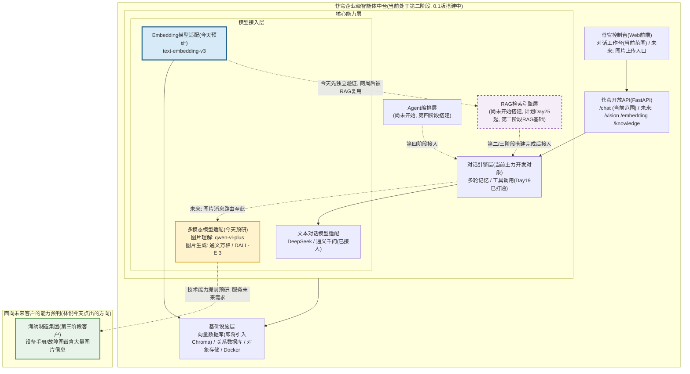
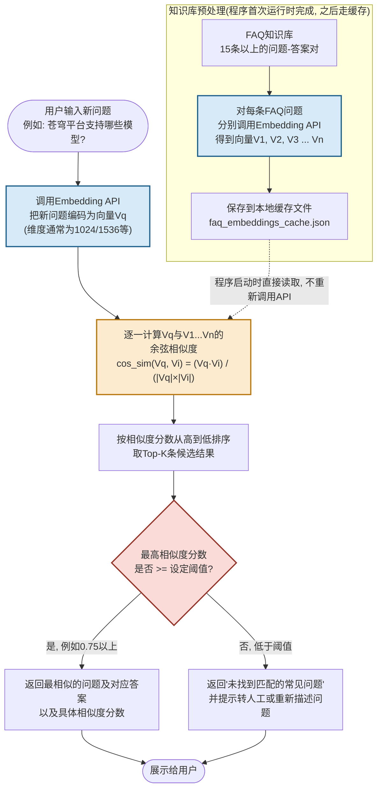
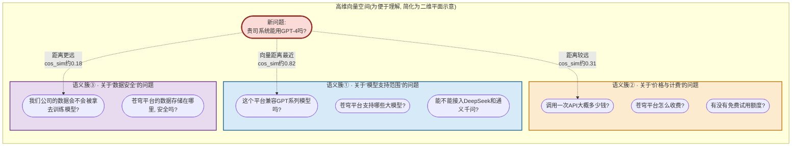

# 第20天 · 多模态与嵌入模型

> **周次/Sprint**:Sprint 1 · 对话引擎MVP(Day15-24)—— 产出物:苍穹0.1版(网页版对话产品)
> **星期**:周六(第三周第六天,项目制作息,周末只休半天,今天上午照常到岗)
> **学员**:陈铭、苏梦、韩露、张凡(导师:王振宇)
> **产品经理**:林悦
> **苍穹项目任务卡**:CQ-096(蓬远科技 · 苍穹项目组 · Sprint1 · Day20)
> **今日关键词**:多模态大模型 / 图片理解API(Qwen-VL / GPT-4o Vision) / 图片生成API(DALL-E 3 / 通义万相) / Embedding嵌入模型 / 文本向量化 / 余弦相似度 / 向量空间 / 语义检索 / 相似问题匹配小工具`similar_question_matcher.py`

---

## 【旁白】

如果把陈铭这七十天要走的路铺开来看,会发现有几个日子格外特殊——它们看起来只是"学一个新知识点",但实际上是在悄悄往地基里打一根桩,这根桩要撑起的东西,当下还看不见,得再往后走上十天、二十天,某一天你回头才会"哦"一声,意识到"原来那天学的就是为了今天"。第20天,就是这样的一天。

从表面上看,今天要学的东西挺"跳"——上午讲多模态,让大模型看懂一张图;下午讲Embedding,把一句话变成一串数字。这两件事乍一听风马牛不相及,一个是"看图说话",一个是"文字转数字",硬凑在一起,像是因为课程进度表上刚好排到这一天,不得不放在一起讲。但老王在这一天的晨会上会讲得很清楚——这两件事,是苍穹平台接下来要走的两条完全不同、却同样重要的分支路线上,各自的第一块砖。多模态这条线,指向的是"未来客户的真实需求会越来越复杂",林悦今天会顺嘴提一句海纳制造集团——这是苍穹平台第三阶段(Day25往后)真正要交付的第一个客户项目,一个做智能制造的企业,他们的设备手册、故障图谱里,塞满了大量的图片,不是所有信息都能用文字表达清楚。而Embedding这条线,指向的是一个更直接、更近的未来——两周后,Sprint2开始,陈铭他们就要正式动手搭建RAG(检索增强生成)系统,而RAG能够成立的全部前提,就是今天下午要学的这一件事:怎么把一段文字,变成一个可以被"数学化地比较相似程度"的向量。

这也是为什么老王在下午课程一开场,会说出这样一句话——"这是两周后我们做RAG的地基"。这句话听起来轻描淡写,但它的分量,陈铭要等到Day29左右真正搭建向量数据库、跑通第一次语义检索的时候,才会完全体会到。今天学的东西,如果学得潦草、只是"知道有这么个API能调",那么两周后搭建RAG的时候,遇到检索结果不准、召回率低这些问题,会完全找不到排查的方向——因为问题的根源,往往就藏在"相似度到底是怎么算出来的"这个最基础的原理里。这一天的课件,注定要比前几天更"数学"一点,要真正带着大家用纸和笔,把余弦相似度公式里的每一个数字,亲手算一遍,而不是简单调一个API拿到一个分数就算完事——因为只有亲手算过一遍,才会对"这个分数到底意味着什么"这件事,产生真正踏实的理解,而不是一种"知道有这么回事"的模糊印象。

还有一层更隐蔽的关联,值得提前点出来——多模态和Embedding,看似是今天课表上两个并列的知识点,但往远处看,它们迟早会在同一个具体项目里"会师"。海纳制造集团那个"识别设备图片"的需求,如果真的推进下去,最终要落地的形态,大概率不会是"单纯让大模型看一眼图片就给出判断"这么简单,而是会演变成"先用多模态能力理解图片内容,再用语义检索去匹配企业自己积累的专业知识,最后把两者结合起来生成一个真正靠谱的判断"——这正是多模态与RAG结合的典型场景,业内有时称之为"多模态RAG"。陈铭现在当然还想不到这么远,今天他能做到的,顶多是把两条线各自的原理弄扎实,但这门课的编排逻辑里,几乎每一处看似孤立的知识点,最终都会在某个后续的项目节点上,与别的知识点交汇、拼接,长成一整套真正能打的能力体系,这也是七十天这个跨度存在的意义——不是七十次孤立的"今天学点新东西",而是一张会持续生长、彼此咬合的知识网络。

---

## 晨会纪要 / 今日目标

**时间**:上午8:55,二层小会议室"起航"
**出席**:王振宇(老王)、林悦、陈铭、苏梦、韩露、张凡

周六的公司比平时安静不少,楼下前台没开灯,茶水间的咖啡机也还没被谁摸过。老王进门的时候手里端着自己带的保温杯,不是平时办公室那种一次性纸杯,看起来今天他打算在这里坐得比平时久一点。林悦跟在他后面,抱着一个平板,还没坐下就先开口:"周六麻烦大家来一趟,我尽量精简,不占太久。"

"先说昨天的事。"老王把保温杯放下,"Day19你们把Function Calling这条线打通了,查天气、算数学题两个工具场景,四个人都跑通了,陈铭那份多工具路由的代码,老王昨晚看完之后专门在评审记录里写了一句——'工具Schema设计得清楚,`function.description`写得足够让模型自己判断该不该调这个工具,这个能力,等到Sprint4做Agent编排的时候,是核心基础之一'。"

陈铭听到这句话愣了一下,他其实没太在意自己代码写得怎么样,只记得昨天调试`tool_calls`那个嵌套结构的时候折腾了将近一个小时,结果老王反而先夸的是这个部分。

"今天呢,"老王翻开白板,"跟前面几天不太一样,今天讲的这两块内容——多模态、Embedding——严格来说,跟你们正在做的苍穹0.1版对话工作台没有直接的功能需求,0.1版目前的范围里,没有'看图'这个功能,也没有'语义检索'这个功能。你们可能会觉得奇怪,项目进度紧,为什么排一天课去讲两个眼下用不上的东西?"

他停顿了一下,看了林悦一眼,林悦接上话:"因为客户的需求,永远比我们的排期跑得快一点。"她打开平板,投到屏幕上,"这两天我在整理第三阶段客户的初步资料,虽然离我们正式接触海纳制造集团还有一个多月的时间,但我看了一下他们提供的一些公开资料——他们是做精密设备制造的,厂里的设备故障手册、维修记录里,大量信息是靠图片和标注传达的,比如一张设备的爆炸图,箭头指着某个零件说'这里容易松动';比如一张现场拍的故障照片,老师傅一眼就能看出问题在哪,但这种经验,写成纯文字手册,往往写不清楚,或者写出来也没人愿意去读那么长的文档。"

"所以你的意思是,"苏梦问,"海纳制造以后可能会要求,苍穹平台不仅能回答文字问题,还要能'看图'?"

"极有可能。"林悦点头,"我不是说现在就要做这个功能,我们连第二阶段的RAG都还没开始搭,更别说第三阶段的客户项目。但我想让你们提前有这根线在脑子里——以后遇到多模态相关的技术选型,不要觉得'这是没用的知识',它很可能就是下一个客户项目里,决定我们能不能拿下这个单子的关键能力之一。"

老王补了一句:"这就是我为什么把多模态排在今天讲,不是巧合。行业里现在几乎所有主流大模型厂商,都已经把'看图'这个能力,做成了跟'聊天'同等基础的能力,不是什么高深的黑科技,调用方式跟你们这两周天天在用的对话API,几乎是同一套东西,只是多传了一张图片进去。你们上午会发现,这个知识点,'学起来'其实不难,难的是'想清楚什么场景该用它'——这恰恰是林悦刚才那段话想让你们提前建立的意识。"

**昨天进展(Day19)**:
- 四人的Function Calling多工具路由全部跑通,查天气工具用的是模拟数据(真实天气API申请审核还没下来,老王允许先用固定返回值代替),计算器工具是真实可执行的表达式求值。
- 张凡在设计工具Schema的时候,把`required`字段漏写了,导致模型有时候会用缺参数的方式调用工具,排查了半小时才定位到问题,老王把这个案例记进了今天要提的"上周典型错误"清单。
- 陈铭额外做了一个"多工具优先级"的小优化——当用户问题同时涉及查天气和算数学题时,让模型先调用哪个工具、再调用哪个工具,这个设计被老王当场表扬,说这是"提前在想Agent编排要解决的问题"。

老王喝了一口保温杯里的水,神情比平时随意一点,毕竟是周六:"今天的安排,上午讲多模态,包括图片理解和图片生成两块;下午讲Embedding,这是今天真正的重头戏,信息量会比上午大不少,我会带你们真正拿纸笔算一遍余弦相似度,不是光讲公式;晚自习不布置新的大项目,给大家留时间把今天的代码整理完,顺便预留一点体力——明天(Day21)是周测加综合练习,会把这两周学的Prompt工程、API使用、Function Calling全部串起来考一遍,今天早点收工,别熬夜。"

韩露看了一眼窗外,楼下小区的早市还没散,问了一句和技术无关的问题:"老王,咱们这两周都排得挺满,周六还要正常来,后面每周都这样吗?"

老王笑了一下,似乎预料到会有人问这个:"不瞒你们说,Sprint0新人内训那两周,强度是故意拉到最高的,那是为了让你们尽快建立起'手上有活干'的节奏感,像我们干这行的常说的一句话——'手熟为上',越早开始高强度练手,越早能摆脱'看着教程觉得懂了、自己写代码却下不去手'那种状态。进了Sprint1,你们已经不是纯粹的新人了,是真正在参与苍穹0.1版开发的正式贡献者,周六到岗,一部分是延续内训期的节奏惯性,另一部分也是因为——项目组现在真的有实打实的产出压力,林悦要在Day24之前看到一个能跑起来的网页版对话产品。等这个阶段的项目节点过去,排班会逐步往正常的工作节奏靠拢,不会一直这么紧,你们可以把这两周当成一次'冲刺前的加速期'来理解。"

林悦在旁边补了一句:"而且今天这种'周六讲预研性内容'的安排,其实也是有意为之——我不太希望技术预研这类内容占用你们平时最紧张的工作日排期,挤占对话引擎开发的正经进度,周六相对轻松一点的节奏,拿来消化多模态和Embedding这类'当下不紧急、但长期重要'的内容,时间分配上反而更合理。"

**今日目标**:

1. 上午9:00-12:00:多模态大模型API使用——图片理解(通义千问VL模型`qwen-vl-plus`、OpenAI GPT-4o系列的Vision能力)的调用方式、图片编码与传输方式(URL vs Base64)、常见应用场景;图片生成API(OpenAI DALL-E 3、阿里云通义万相)的基础调用与参数说明。
2. 下午14:00-18:00:Embedding嵌入模型详解——什么是词向量/句向量、Embedding模型的调用方式(通义千问`text-embedding-v3`、OpenAI `text-embedding-3-small`)、向量维度与语义空间、余弦相似度的数学原理与手动计算演示、语义检索(Semantic Search)的基本原理,这是两周后RAG的核心前置知识。
3. 晚自习19:00-20:30(强度降低,提前收工):整合上午与下午的内容,完成"相似问题匹配"小工具`similar_question_matcher.py`——给定一批已有的常见问题(FAQ),用户输入一个新问题,程序通过Embedding计算语义相似度,找出最接近的已有问题并返回对应答案。

**风险点**:

- 多模态API目前不是所有厂商都对新账号免费开放,老王已经提前确认DeepSeek目前还没有正式对外开放视觉理解能力,今天的图片理解演示会以通义千问VL和(如果条件允许)OpenAI GPT-4o为主,请大家不要惊讶"为什么DeepSeek这块没有对应的接口"。
- Embedding部分涉及的数学(向量、点积、模长、余弦相似度),对纯转行背景的学员可能存在一定的知识断层,老王计划用非常具体的小例子(而不是抽象公式)带大家过一遍,今天如果听得吃力,晚上可以多花时间在手动计算的练习上,这是决定两周后能不能听懂RAG原理的关键一环。
- 图片生成API(DALL-E 3、通义万相)调用成本通常比文本对话API更高,老王要求大家演示阶段控制调用次数,不要"手滑"生成太多张图片,尤其是DALL-E 3官方定价按张计费,不是按token计费,这个计费模式的差异也是今天顺带要讲清楚的一点。
- 晚自习强度调低,是考虑到明天(Day21)是周测,大家需要一定的复习和休整时间,今天的产出物`similar_question_matcher.py`功能不算复杂,但涉及的Embedding调用如果账号额度紧张,建议提前跟老王确认好各自的DashScope账号额度是否够用。

---

## 需求文档:内部技术预研任务书 —— 多模态能力评估与"相似问题匹配"原型工具

> 本任务书由技术导师王振宇联合产品经理林悦发放。与前几天不同,今天这份任务书带有明显的"技术预研"性质,不是直接服务于苍穹0.1版当前的功能范围,而是为苍穹平台后续阶段——尤其是第三阶段海纳制造集团项目、以及即将到来的RAG检索引擎搭建——提前做能力验证与知识储备。

### 背景

林悦在需求文档开头补充了这样一段业务背景说明:"苍穹0.1版当前聚焦的是'对话工作台'这一个功能——用户跟AI聊天,支持多轮对话、支持工具调用。这个范围目前是够用的,因为我们的第一个真正落地场景,就是把这套对话能力包装成一个通用的企业内部AI助手网页产品。但从产品规划的角度看,我必须提前看得更远一点——苍穹平台真正想成为的,不是一个'聊天机器人',而是一个'企业级智能体中台',这意味着它要能处理企业里各种各样的真实数据,而企业里的真实数据,从来不会乖乖地只以纯文字的形式存在。"

"这次的预研任务,目的是让技术团队提前具备两项关键能力的'肌肉记忆'——第一,多模态能力,让我们的产品未来具备'看图'的可能性,这对接下来即将接触的海纳制造集团这类制造业客户尤其重要,他们的很多知识资产是图文混合的;第二,Embedding与语义检索能力,这是我们两周后要正式启动的RAG项目的地基,如果这块基础知识现在打得不牢,两周后搭建向量数据库、做语义检索的时候,遇到问题会缺乏排查思路。"

具体的任务范围,林悦拆成了两个相对独立的子任务,分别对应上午和下午的教学内容,晚自习则要求把下午的能力,收敛成一个具体的、可运行的原型工具。

林悦还在任务书里额外加了一段"为什么是现在做这件事"的说明,她坦率地写道:"我知道从纯粹的项目排期角度看,今天这个预研任务,可以往后拖一拖,不影响苍穹0.1版按时交付。但我更倾向于'技术能力的储备,永远要跑在业务需求正式提出之前',而不是等客户已经明确提出'我们需要识别设备图片'这个要求之后,团队才手忙脚乱地从零开始学多模态调用方式——那时候留给我们的反应时间,会比现在紧张得多。同样的道理也适用于Embedding,RAG项目的启动时间点(第二阶段Day25)已经排在日程表上,如果到那天才第一次接触Embedding这个概念,整个Sprint2的节奏都会被拖慢。这份任务书,本质上是在为'团队的技术准备度'提前买一份保险。"

### 用户故事

**多模态能力评估部分:**

- 作为技术团队的一员,我希望验证清楚"给大模型一张图片,让它描述图片内容、回答关于图片的问题"这件事,在技术上是如何实现的,涉及哪些API参数与图片传输方式。
- 作为技术团队的一员,我希望验证清楚"让大模型根据一段文字描述生成一张图片"这件事的调用方式,以及不同服务商(OpenAI DALL-E 3、阿里云通义万相)在参数设计与计费模式上的差异。
- 作为产品经理,我希望技术团队能整理出一份简明的"多模态能力现状清单",列出目前哪些厂商、哪些模型支持图片理解与图片生成,分别的调用成本大致是多少,方便我在后续跟海纳制造集团等客户沟通需求时,能给出有依据的技术可行性判断。

**Embedding与语义检索部分:**

- 作为技术团队的一员,我希望理解清楚"文本向量化"这件事的本质——为什么一段文字能被转换成一串数字,这串数字又代表了什么。
- 作为技术团队的一员,我希望能亲手计算一次余弦相似度,理解这个数学指标为什么能用来衡量"两段文字语义上有多接近",而不是把它当作一个只会调用API、拿到一个分数就完事的黑盒操作。
- 作为技术团队的一员,我希望产出一个"相似问题匹配"的原型工具,验证"给定一批已知问题和答案,用户输入一个新问题,系统能自动找出语义最相近的已知问题并给出对应答案"这个核心能力是否可行,这个能力将直接被两周后的RAG检索引擎复用和扩展。

### 功能列表

| 编号 | 功能 | 说明 | 优先级 |
|---|---|---|---|
| F1 | 图片理解API调用 | 编写脚本,调用通义千问VL(`qwen-vl-plus`)模型,传入一张图片(通过URL或Base64编码方式),获得模型对图片内容的文字描述与问答能力 | P0(必须实现) |
| F2 | 图片生成API调用 | 编写脚本,调用图片生成模型(优先通义万相,如条件允许补充DALL-E 3),根据文字描述生成一张图片,并将生成结果保存到本地 | P1(尽量实现) |
| F3 | Embedding获取 | 编写脚本,调用Embedding模型API(通义千问`text-embedding-v3`),输入一段文本,获得对应的向量表示,并能观察向量的维度、数值范围等基本特征 | P0 |
| F4 | 余弦相似度手动实现 | 不依赖任何第三方数学库,纯用Python基础语法(列表、循环、`math`模块),手动实现余弦相似度计算函数,并用几组具体的文本向量验证计算结果的正确性 | P0 |
| F5 | 余弦相似度库函数实现 | 额外用`numpy`实现同样的余弦相似度计算,与手动实现的结果做交叉验证,理解工程实践中通常会直接使用现成的数值计算库,而不是每次都手写底层数学逻辑 | P1 |
| F6 | 相似问题匹配小工具 | 准备一批(不少于15条)苍穹产品相关的常见问题与答案(FAQ)作为"知识库",支持用户输入一个新问题,程序自动计算该问题与知识库中每条问题的语义相似度,返回最相似的Top-K条问题及其答案,并显示相似度分数 | P0 |
| F7 | 相似度阈值判断 | 在F6基础上,增加一个相似度阈值判断——如果最高相似度分数低于设定阈值,认为知识库中没有足够相近的答案,给出"未找到匹配的常见问题"的友好提示,而不是强行返回一个语义上并不真正相关的结果 | P1 |
| F8 | 向量本地缓存 | 考虑到重复调用Embedding API会产生额外成本与延迟,增加一个简单的本地缓存机制——知识库中每条问题的向量,只需要在程序首次运行时计算一次并保存到本地文件,后续运行直接读取缓存,不重复调用API | P2(有时间再做) |

林悦在文档的最后,还额外补充了一条关于"预研成果如何被复用"的说明,她写道:"我理解这次任务对你们来说,可能会有一种'做完就结束了,不会立刻在正式产品里看到它的价值'的感觉,所以我想提前说明——今天产出的多模态能力现状清单,会被我整理进下个月给公司管理层汇报的技术储备情况里,作为评估'我们是否具备承接海纳制造集团这类客户需求的能力'的一份重要材料;而`similar_question_matcher.py`这个小工具,虽然表面上只是一个内部演示性质的原型,但它验证通过的这套'知识库向量化+相似度检索+阈值判断'的逻辑,会在两周后被直接迁移进RAG项目的早期版本里,作为最初的检索模块雏形。换句话说,你们今天写的代码,不是'写完就扔的练习作业',它们的产出会被真实地留存、被后续项目引用,这也是为什么我要求今天的代码质量,同样要达到平时的规范标准,不能因为是'预研性质'就随意对待。"

### 验收标准

1. 图片理解脚本能够成功调用通义千问VL模型,针对至少3张不同内容的图片(建议包含一张纯文字截图、一张实物照片、一张图表)给出准确、合理的文字描述或问答结果。
2. 图片生成脚本能够根据给定的文字描述,成功生成并保存至少1张图片文件(如果DALL-E 3因为账号权限或额度限制无法调用,允许仅用通义万相完成,并在报告中说明情况)。
3. 手动实现的余弦相似度函数,与`numpy`实现的余弦相似度函数,在同一组测试向量上的计算结果,数值误差不超过`1e-6`(浮点数精度范围内应视为完全一致)。
4. "相似问题匹配"小工具,针对至少5个测试问题(建议包含"完全匹配已知问题的改写版本""语义相关但用词完全不同的问题""与知识库完全无关的问题"三类场景),都能给出合理的匹配结果或"未找到匹配"的提示。
5. 代码需要包含清晰的文档字符串,余弦相似度手动实现部分需要有逐步骤的中文注释,说明每一步在数学上对应什么含义,便于日后回顾复习。
6. 整个预研过程中产生的任何API调用成本,需要控制在合理范围内(图片生成类API调用总次数不超过10次,Embedding类API调用做好本地缓存避免重复调用)。

---

## 架构设计图:多模态与Embedding能力,在苍穹平台中分别处在什么位置

老王讲需求之前,照例把苍穹平台的整体分层图重新投到白板上,这一次他专门标出了两块此前从未点亮过的区域——一块属于"模型接入层"内部新增的多模态适配分支,另一块直接指向了此刻还是空白状态的"RAG检索引擎层"。



老王指着图里高亮的三块——黄色的"多模态模型适配"、蓝色加粗的"Embedding模型适配"、紫色虚线框的"RAG检索引擎层"——说:"这张图里,今天你们要动手的两块东西,用了两种不同的线条画出了它们和整个平台的关系。多模态那块,我用了一条指向'海纳制造集团'的虚线,意思是——它现在还没有一个具体的、马上要接的功能需求,它连接的是一个'预判中的未来',所以这条线是虚的、方向性的,不是当下就要打通的实际调用链路。但Embedding这块不一样,我用了一条同样是虚线、但更醒目地指向了'RAG检索引擎层'的箭头,而且这个箭头旁边写着'两周后被RAG复用'——这不是一个模糊的预判,这是一个已经排上日程、板上钉钉的事情,你们今天写的Embedding调用代码,两周后几乎可以原样搬进RAG项目里继续用,顶多做一些封装上的调整。"

苏梦盯着图看了一会儿,问:"那我们今天写的Embedding代码,和两周后RAG项目里的代码,差别主要在哪?"

"差别在于'规模'和'存储方式'。"老王回答,"今天你们的Embedding代码,处理的是十几条FAQ问题,向量算完直接放在内存里的一个列表里比较相似度就完事;两周后的RAG项目,要处理的是成百上千段、甚至上万段的文档内容,内存里放不下这么多向量,还要考虑'新增文档进来要不要重新算全部向量''查询的时候怎么快速从几万个向量里找出最相似的几个,而不是笨拙地一个个比对'——这些问题,今天先不涉及,但今天学的'怎么获取向量'和'怎么计算相似度'这两件最核心的事,是完全不会变的,变的只是'怎么把这两件事做得更快、更省'的工程手段,而工程手段是建立在你今天理解的原理之上的,原理不对,后面学再多向量数据库的优化技巧都是在盖歪的房子上加楼层。"

张凡看着图里"基础设施层"下面新增的"向量数据库(即将引入Chroma)"这行小字,问了一句:"这个Chroma,是不是Sprint2一开始就会讲?"

"对,Day25左右就会正式接触。"老王说,"今天先不展开讲它内部原理,你们只需要知道一件事——向量数据库这类产品存在的意义,不是'发明了一种新的相似度计算方式'(它底层依然是余弦相似度,或者跟它数学上等价的其他距离度量),而是解决了'当向量数量从几十条膨胀到几十万条之后,怎么还能在几十毫秒之内找到最相似的那几条'这个纯粹的工程性能问题。这跟你们学数据库的时候,理解'索引'这个概念的思路是相通的——普通的`SELECT * FROM table WHERE`全表扫描,数据量小的时候够用,数据量大了就会拖垮性能,加了索引之后,查询能大幅加速,但索引本身不改变'数据到底是什么、代表什么意思'这件事。向量数据库,可以类比理解成'专门为向量数据设计的一种高效索引结构',今天你们脑子里先建立这么一层直觉,两周后再落地到具体代码,会理解得更顺。"

---

## 流程图:一句话从"文本"到"向量"再到"相似度分数"的完整链路

多模态部分讲完之后,老王把白板整个擦掉,开始画下午最核心的一张图——这张图专门用来讲清楚"相似问题匹配"这个小工具,从用户输入一个问题,到最终拿到一个匹配结果,中间每一步到底发生了什么。



老王讲这张图的时候,特意把"知识库预处理"这个子图和"用户提问处理"这条主线分开画,他解释说:"这是一个很多新手容易忽略、但工程上极其重要的设计——知识库里的问题,是相对'静态'的,不会每一次用户提问都重新变化,所以它们的向量,应该'提前算好、缓存起来',而不是每次用户问一个新问题,都把知识库里所有问题重新过一遍Embedding API——这样做不仅慢,而且极其浪费调用成本。真正需要'实时计算'的,只有用户当下输入的这一句话对应的向量`Vq`。这个'预处理与实时查询分离'的思路,你们现在可能觉得只是个'省钱的小技巧',但两周后搭建真正的RAG系统,这个思路会被放大成一个专门的概念——'索引构建'(Indexing)和'查询检索'(Retrieval)是两个完全独立的阶段,索引构建通常在文档入库的时候一次性完成,查询检索才是用户提问时实时发生的事,这两者如果混在一起,系统性能会差得离谱。"

张凡问了一个直接的问题:"那如果知识库里的某条问题后来改了答案,或者新增了一条问题,向量缓存要怎么处理?"

"改答案不需要重新算向量,"老王回答,"因为向量是根据'问题'算出来的,不是根据'答案',答案变了,只要问题文本没变,向量就不需要重新计算,直接更新缓存里对应的答案字段就行。新增问题,或者修改了问题本身的文字,那就需要给这条新问题单独调一次Embedding API,把新向量加进缓存里,不需要把整个知识库全部重新算一遍——这也是缓存设计里一个基本原则,增量更新,而不是全量重算,这个原则我们晚自习写`similar_question_matcher.py`的时候会具体落地。"

韩露又追问了一句实际操作层面的问题:"如果换了一个新的Embedding模型版本(比如从`text-embedding-v3`升级到未来某个新版本),之前缓存的向量还能继续用吗?"

"这是个特别值得单独强调的坑,不能继续用,而且必须整体重新计算一遍。"老王的语气变得严肃了一点,"不同版本、不同厂商的Embedding模型,即使输出的向量维度刚好相同,它们所构建出来的'语义空间'的坐标系,本质上是完全不同、互不兼容的——同一句话,用模型A编码出来的向量,和用模型B编码出来的向量,拿去做余弦相似度比较,得到的结果是没有意义的,因为它们描述的根本不是同一套'坐标体系'。这就好比两份地图,一份用的是经纬度坐标系,另一份用的是某个城市自己定义的本地坐标系,即使两份地图上都标了数字坐标,把它们直接叠在一起比较距离,得出的结论毫无意义。所以一个必须写进你们脑子里的原则是——同一个检索系统里,所有参与比较的向量,必须来自完全同一个Embedding模型(同一个厂商、同一个模型名称、同一个版本),一旦切换模型,历史缓存的向量必须作废,全部用新模型重新计算一遍,不能有任何例外,这个原则,两周后你们在RAG项目里升级或更换Embedding模型的时候,会是一个必须严格遵守的操作规范,如果疏忽了,检索效果会莫名其妙地全面崩坏,而且报错信息不会直接告诉你'是因为你混用了两个模型的向量',排查起来会非常痛苦。"

苏梦顺着这条流程图,追问了一个更细的问题:"图里最后那个判断——'最高相似度分数是否大于阈值',这个阈值0.75是怎么定出来的,是不是每个业务场景都用同一个数字?"

"这是个非常实际的问题,答案是——不是固定的,而是需要针对具体场景做实验调出来的。"老王说,"阈值定得太高,会导致明明是相关的问题,也被判定为'没找到匹配',用户体验很差,系统显得'笨';阈值定得太低,又会导致明明不相关的问题,也被强行拉出一个'看起来相关'的答案,用户会觉得系统在'胡说'。今天演示里我给的0.55和0.75这类数字,只是教学阶段一个大致合理的经验值,真实项目里,通常会拿一批标注好的'哪些问题应该匹配、哪些不应该匹配'的测试数据,把阈值从低往高一档一档地试,画出类似'精确率-召回率曲线'的东西,找一个综合表现最好的平衡点——这个调优过程,在RAG项目里会有一个专门的环节,叫'检索效果评估',Sprint3会系统讲到,今天你们只需要知道'这个数字不是拍脑袋定的,是要靠实验验证的'就够了。"

---

## 示意图:向量空间里,语义相近的句子会"聚"在一起

讲完调用链路,老王话锋一转,说:"刚才那张图讲的是'流程',但我发现一个问题——你们现在应该知道'怎么算'相似度了,但可能还没有一个直观的画面感,理解'为什么'两句话意思相近,算出来的向量就会靠得很近。我画一张更抽象、但也更本质的图给你们看。"



"这张图是简化过的,"老王特意强调,"真实的Embedding向量,维度通常是几百到几千(比如今天要用的通义千问`text-embedding-v3`,常见维度是1024),完全没办法直接画在一张二维的纸上给你们看。但简化归简化,它想表达的核心事实是完全真实的——语义相近的句子,不管字面上用词差多少,它们的向量在这个高维空间里的'距离',会比语义无关的句子近得多。你们看图里那句新问题'贵司系统能用GPT-4吗',它跟'苍穹平台支持哪些大模型'这句话,字面上几乎没有重复的词,但语义上明显是同一类问题,它们的向量在空间里,会被'拉'到彼此靠近的位置;而它跟'我们公司的数据会不会被拿去训练模型'这句话,虽然都是关于苍穹平台的问题,但讨论的完全是两个不同维度的话题,向量距离就会明显更远。"

韩露若有所思:"所以Embedding模型做的事情,本质上就是'学会了怎么把意思相近的话,放到空间里离得近的位置'?"

"说得很准确。"老王点头,"这背后的训练原理,今天不深入展开(这属于Day15讲过的预训练范畴的延伸,如果感兴趣可以课后自己查一查'对比学习'`Contrastive Learning`这个关键词),但从使用者的角度,你只需要牢牢记住这个结论——Embedding模型的价值,不在于'把文字变成了数字'这件事本身(这只是表面现象),而在于'变成数字之后,原本人类才能判断的语义相似程度,变成了一个可以用数学公式(余弦相似度)精确计算出来的分数'。这一步转换,是让计算机具备'语义理解和检索能力'最核心的一次'翻译'。"

陈铭盯着这张图看了很久,忽然问了一个更进一步的问题:"这三个语义簇,图上画得边界很清楚,但真实情况下,会不会有一句话,同时跟两个簇都有点像,不知道该归到哪一类?"

"问得很到位,这恰恰是简化图和真实向量空间之间最大的差别之一。"老王回答,"真实的语义空间,不是像图里画的那种彼此分得清清楚楚的'岛屿',更接近一片连续的、没有明确边界的'地形'——有些句子确实会同时跟好几个话题都有一定程度的关联,它的向量位置也会相应地落在几个簇的'中间地带',跟每个簇都有一定的相似度,只是程度有高有低。这也是为什么我们今天设计的'相似问题匹配'工具,返回的是Top-K个结果加上具体的相似度分数,而不是简单粗暴地'必须唯一归到某一类'——保留分数、保留多个候选,把'到底该信哪个'的最终判断权,部分交还给下游的业务逻辑或者人工复核,这是处理这种'模糊边界'问题时,一种更稳妥、更贴近真实情况的设计思路。你们可以留意一下,这个思路和分类算法里'软分类'(输出每个类别的概率,而不是直接给出一个绝对结论)的设计理念,其实是相通的。"

---

## 课堂笔记

### 上午:多模态大模型API使用

上午9点,老王没有像往常一样直接打开IDE,而是先问了大家一个问题:"你们平时用手机上的AI助手,或者网页版的ChatGPT、通义千问,有没有试过上传一张图片,让它帮你看看这张图是什么?"

张凡第一个回答:"用过,之前有次装修选瓷砖,拍了张照片问AI这个花色搭什么颜色的柜子好看,它还真给了几个不错的建议。"

"这就是多模态能力最典型、最生活化的应用场景之一。"老王说,"'多模态'(Multimodal)这个词,拆开来看,'模态'指的是信息的呈现形式——文字是一种模态,图片是一种模态,音频、视频也是模态。一个'多模态大模型',指的是它不再局限于只能处理文字这一种模态的输入输出,而是能够同时理解、处理多种模态的信息。今天我们重点讲两个方向——第一,图片理解(Image Understanding,给模型一张图,让它看懂、描述、回答关于图片的问题);第二,图片生成(Image Generation,给模型一段文字描述,让它画出一张对应的图片)。这两个方向,虽然都叫'多模态',但背后的模型原理、调用方式、应用场景,差异其实相当大,我们分开讲。"

他补了一句更宏观的铺垫:"如果往整个AI技术发展的脉络上看,'多模态'其实是过去两三年整个行业最重要的演进方向之一——早几年的大模型,清一色只处理文字;后来先是加上了图片理解能力,再逐渐扩展到能处理音频(语音识别与合成)、视频,乃至一些更实验性的模型已经开始尝试处理三维空间信息。这个演进方向背后的驱动力很朴素——人类感知和处理信息,本来就不是只靠文字,现实世界里绝大多数信息,都是图文声像混合在一起呈现的,一个真正'智能'的系统,如果永远只能处理其中一种模态,能应用的场景就会天然受限。你们今天接触的图片理解和图片生成,只是多模态这个大方向里,目前相对成熟、商业化程度最高的两块,以后随着技术进一步发展,这个清单只会越来越长,保持对新模态能力的关注,是这个行业里长期需要具备的学习习惯。"

**图片理解能力的调用方式**。老王先讲了一个重要的认知转折:"你们这两周天天在用的对话API,`messages`列表里每一条消息的`content`字段,到目前为止你们看到的都是一个字符串。但支持多模态输入的模型,`content`字段可以变成一个列表,列表里的每个元素,既可以是文字类型的内容,也可以是图片类型的内容。这个设计,本质上是在保持`messages`结构不变的前提下,扩展了单条消息能承载的信息类型,而不是重新发明一套全新的接口——这也是为什么我说,今天这个知识点'学起来不难',因为它是在你们已经很熟悉的结构上做了一个自然的扩展,不是从零开始的新概念。"

他打开通义千问(阿里云DashScope)的官方文档,投影出`qwen-vl-plus`模型的请求体示例:

```json
{
  "model": "qwen-vl-plus",
  "messages": [
    {
      "role": "user",
      "content": [
        {
          "type": "image_url",
          "image_url": {"url": "https://example.com/some-device-photo.jpg"}
        },
        {
          "type": "text",
          "text": "这张图片里的设备是什么类型?有没有能看出明显的故障或异常?"
        }
      ]
    }
  ]
}
```

"注意`content`字段,"老王指着屏幕,"从一个字符串,变成了一个列表,列表里有两种类型的元素——`type`为`image_url`的,负责传图片信息;`type`为`text`的,负责传文字问题。这两个元素在列表里的顺序,大部分厂商的实现里并不严格要求,但习惯上会把图片放在文字之前,更符合人类'先给你看东西,再问你问题'的自然顺序。"

苏梦提出了一个实际的问题:"如果我的图片不是放在网上的、没有一个公开的URL,是我本机电脑上的一张图片文件,怎么办?"

"这就是图片传输方式的第二种做法——Base64编码。"老王说,"把本地的图片文件,读取成二进制内容,再用Base64编码转换成一段纯文本字符串,直接嵌入到请求体里,不需要真的先把图片上传到某个公开可访问的地址。绝大多数支持多模态的模型,`image_url`这个字段其实也支持接收一段符合特定格式的Base64字符串,格式类似`data:image/jpeg;base64,`后面跟着编码后的内容。"

他现场演示了这段编码逻辑:

```python
import base64

def encode_image_to_base64(image_path: str) -> str:
    with open(image_path, "rb") as f:
        image_bytes = f.read()
    base64_str = base64.b64encode(image_bytes).decode("utf-8")
    return f"data:image/jpeg;base64,{base64_str}"
```

"这几行代码,"老王强调,"逻辑非常简单——打开图片文件、读取成二进制内容(注意打开模式是`"rb"`,二进制读取,不是文本读取)、用`base64.b64encode`编码、再解码成普通字符串(因为`b64encode`返回的是`bytes`类型,不能直接拼进请求体的JSON字符串里)、最后拼接上`data:image/jpeg;base64,`这个前缀,告诉接收方'这段字符串代表一个jpeg格式的图片,以Base64方式编码'。你们要注意,如果图片本身是png格式,这里的`image/jpeg`要相应改成`image/png`,否则有些模型可能会因为格式声明不匹配而解析失败或者理解异常。"

韩露问:"Base64编码之后,文件大小会不会变化很多?这会不会影响请求速度或者产生额外的费用?"

"会变大,大概会变大三分之一左右(Base64编码本身的数学特性决定了编码后体积会比原始二进制略大)。"老王回答,"这也是为什么,如果图片本来就有一个稳定的公开URL可用,通常优先选择URL方式,请求体更小、传输更快;只有当图片确实是本地文件、没有现成的公开访问地址时,才用Base64方式。另外要提醒一句,大部分厂商对通过多模态接口传输的图片大小是有限制的(常见限制在几MB到十几MB之间,具体以各家文档为准),如果图片文件本身很大(比如高分辨率照片),建议先做适当的压缩或者缩放,再进行编码传输,既能避免超出限制,也能减少请求体积、加快响应速度。"

苏梦顺着这个话题又问了一句:"那如果我们以后真的要给海纳制造集团做设备图片识别功能,他们现场拍的照片,会不会经常出现分辨率特别高、文件特别大的情况?"

"这是个很现实的问题,大概率会出现。"老王说,"工业现场拍摄的照片,出于记录细节的需要,分辨率往往设置得比较高,一张照片几MB到十几MB是很常见的。真实做产品的时候,不会简单粗暴地要求客户'自己把照片压缩好再上传',而是应该在系统内部,自动完成图片的预处理——上传环节做统一的尺寸压缩、格式转换,把处理好的、符合接口要求的版本再传给多模态模型,这个预处理逻辑,应该是产品后端的标准职责,不能指望每一个使用产品的普通员工,都懂得'自己先压缩一下图片'这种技术细节。这也是为什么,一个看起来'调一下API就能用'的功能,真正做成能交付给客户的产品,中间往往还要补上很多这类'看不见但很重要'的工程细节,今天说到这里,提前给你们打个预防针,以后设计类似功能的时候,别漏掉这一层。"

**图片理解的完整调用与响应解析**。老王让大家跟着敲一遍完整的调用代码,复用了这两周已经非常熟练的`requests.post`模式:

```python
import os
import requests

api_key = os.environ.get("QWEN_API_KEY")
url = "https://dashscope.aliyuncs.com/compatible-mode/v1/chat/completions"
headers = {
    "Content-Type": "application/json",
    "Authorization": f"Bearer {api_key}",
}
payload = {
    "model": "qwen-vl-plus",
    "messages": [
        {
            "role": "user",
            "content": [
                {
                    "type": "image_url",
                    "image_url": {
                        "url": "https://help-static-aliyun-doc.aliyuncs.com/file-manage-files/zh-CN/20241022/emyrja/dog_and_girl.jpeg"
                    },
                },
                {"type": "text", "text": "详细描述一下这张图片里有什么内容。"},
            ],
        }
    ],
}

response = requests.post(url, headers=headers, json=payload, timeout=60)
response.raise_for_status()
result = response.json()
reply = result["choices"][0]["message"]["content"]
print(reply)
```

陈铭注意到一个细节,问:"这个`timeout`我看你写的是60,前两天调纯文字对话API的时候我们一般写30,是因为图片理解比纯文字回复更慢吗?"

"观察得很仔细。"老王说,"图片理解类的请求,模型需要先对图片本身做一次'视觉编码'的计算(把图片的像素信息,转换成模型能理解的内部表示),这一步比单纯处理文字token,通常会多消耗一些时间,尤其是图片分辨率比较高的情况下。所以工程上给多模态类接口设置的`timeout`,一般会比纯文字接口更宽松一点,今天我给的经验值是60秒,不是绝对标准,你们以后接触到具体厂商的文档,如果文档里有明确给出的建议超时时间,优先参考文档给出的数值。"

他运行代码,拿到的回复大致是这样一段描述(具体措辞会随每次调用略有不同):"这张图片展示了一位女性和一只狗坐在沙滩上,狗的品种看起来像是拉布拉多犬,两者似乎在互动,场景显得轻松愉快,背景是海边的沙滩与天空。"

"你们看这段描述,"老王说,"模型不仅认出了'狗'和'人'这两个物体,还判断出了狗的大致品种、描述了两者的互动状态、甚至推断出了场景的氛围。这种理解能力,是这两年多模态大模型进步非常快的一个方向,不再局限于'识别图片里有什么物体'这种早期计算机视觉的能力,而是能给出更接近人类视角的、带有一定推理和描述能力的解读。这也是为什么林悦今天早上提到海纳制造集团的例子——如果他们希望AI能'看懂'一张设备故障照片,不只是识别出'这是一台设备',而是能进一步判断'这个部位的螺丝看起来松动了''这个区域有明显的锈蚀痕迹',这种更细粒度的推理描述能力,正是现在的多模态大模型逐渐具备、并且还在快速进步的方向。"

苏梦盯着这段回复,又追问了一句更基础的问题:"模型是怎么'看'这张图片的?它是不是把图片先转换成了什么中间格式,再去理解?"

"这个问题涉及一点模型内部结构,我简单讲一下大致原理,不深入数学细节。"老王说,"目前主流的多模态大模型,通常会有一个专门的'视觉编码器'(Vision Encoder)模块,它的作用,是把输入的图片(本质上是一个像素矩阵),转换成一组能够被语言模型部分'读懂'的向量表示——你没听错,这一步,本质上也是一种'Embedding'过程,只是编码的对象从文字变成了图片。这组视觉向量,会以类似'额外的token'的形式,拼接到文字部分的token序列里,一起送进语言模型主体做后续的推理和生成。这也是为什么我在最开始强调,多模态模型的`messages`结构,只是在原有对话结构上'扩展'了一种新的内容类型,底层的处理逻辑,依然是把所有信息——无论来自文字还是图片——统一转换成模型能理解的向量表示,再交给同一套生成机制去处理。这也从另一个角度印证了今天下午要讲的Embedding概念的普适性——'把信息转换成向量'这件事,不只发生在纯文字场景,图片、音频等其他模态,本质上走的都是类似的思路,只是各自用来做转换的编码器模块不同。"

**图片理解的应用场景梳理**。老王让大家花十分钟,一起讨论并记录几个典型的图片理解应用场景,这部分内容后续会被整理进林悦要求的"多模态能力现状清单":

- **内容审核与合规检查**:自动识别图片中是否包含违规内容(暴力、色情、敏感标识等),用于用户上传内容的自动审核。
- **文档/票据信息提取**:拍一张发票、身份证、名片的照片,让模型提取出其中的关键结构化信息(这个场景严格来说更偏向OCR加理解的结合,但现在很多多模态大模型已经能直接较好地完成这类任务,不再需要单独训练一个OCR模型)。
- **产品/商品视觉问答**:电商场景下,用户上传一张商品图片,询问"这个和我之前买的那个型号有什么区别""这件衣服搭配什么颜色的裤子好看",这类场景对判断准确性的容忍度相对较高,即使模型偶尔给出不够精准的建议,用户体验上的损失也比较有限,是目前多模态能力商业化落地相对成熟、风险相对较低的一类典型场景。
- **设备/工业场景故障辅助诊断**(林悦提到的方向):拍摄设备现场照片,让AI辅助判断可能存在的异常或给出初步的排查建议,这类场景的准确性要求通常远高于其他场景,实际落地时往往需要结合企业自有的专业知识库(这一点,恰好指向两周后要学的RAG,把通用多模态理解能力和企业专属知识结合起来,才能真正满足这类高准确性要求的场景)。
- **图表/数据可视化理解**:给模型一张统计图表(柱状图、饼图、折线图),让它读出图表反映的数据趋势或具体数值,这在处理企业内部的报表、PPT截图时很实用。

苏梦一边记笔记一边问:"这些场景里,哪一类是我们最容易在近期用得上的?"

"如果单纯从苍穹平台当前的产品规划节奏看,"老王想了想回答,"离我们最近的,大概是'文档/票据信息提取'和'图表理解'这两类——因为它们不需要特别高的判断准确性,更多是'把图片里已经写清楚的信息,结构化地提取出来'这样一种相对确定性的任务,通用多模态模型现在的水平,应付这类场景已经相当不错了。而'设备故障辅助诊断'这一类,判断的准确性要求高得多,通用模型给出的建议,更适合作为'辅助参考',不能直接当成'专业结论'来使用,这中间的差距,恰恰是林悦提到海纳制造集团这个案例时,想让你们提前建立的一层清醒认知——不要看到一个技术能力'能跑通demo',就想当然地觉得它'已经能直接商用交付',demo能跑通和能不能真正满足客户对准确性、专业性的要求,中间往往还有很长一段路要走,这段路怎么走,很大程度上就是要靠RAG这类技术,把通用能力和企业专属知识结合起来补齐。"

"我要特别强调最后这条'设备故障辅助诊断'场景背后括号里的那句话,"老王说,"这也是我想让你们提前建立的一个产品直觉——通用的多模态大模型,'看图'能力已经相当强,但它终究是在海量互联网通用图片数据上训练出来的,对一个具体客户内部专属的设备型号、专属的故障判断标准,它是'不认识'的,顶多能给出一些通用性的、听起来还算靠谱但未必真正准确的描述。真正要做到'专业级'的判断,往往需要把通用多模态能力,和企业自己积累的专业知识(比如设备手册、历史故障案例)结合起来使用——这正是RAG的价值所在,只不过那时候检索的对象,不只是文字,也可能扩展到图片。这个话题今天先点到为止,埋个种子,不展开讲。"

**图片生成能力的调用方式**。上午最后一段时间,老王讲图片生成,他先做了一个对比性的说明:"图片理解,是'输入图片,输出文字';图片生成,恰好反过来,是'输入文字,输出图片'。这两者背后的模型架构完全不同——图片理解通常是在一个大语言模型的基础上,加装了一个'视觉编码器'的模块;图片生成用的是另一类完全不同的生成式模型架构(比较主流的是基于Diffusion扩散模型的技术路线),调用方式上,也不再是我们熟悉的`chat/completions`这类对话接口,而是专门的图片生成接口。"

老王以阿里云的通义万相为例,讲解调用方式(通义万相的图片生成接口,采用的是"异步任务"模式,和对话类接口"一次请求直接拿到结果"的同步模式不一样,这是今天要重点讲清楚的一个差异点):

"图片生成任务,通常比对话生成文字要耗时更久(可能是几秒到几十秒,甚至更长),很多厂商的图片生成接口,不会让你的请求'傻等'在那里直到生成完成,而是采用'先提交任务、拿到一个任务ID,再用这个任务ID去轮询查询生成结果'的异步模式。这跟你们前两天学的Function Calling里'工具执行'的思路有点像——先发起一个'动作',动作本身需要时间才能完成,不能指望它立刻给你答案。"

```python
import os
import time
import requests

api_key = os.environ.get("QWEN_API_KEY")

create_task_url = "https://dashscope.aliyuncs.com/api/v1/services/aigc/text2image/image-synthesis"
headers = {
    "Content-Type": "application/json",
    "Authorization": f"Bearer {api_key}",
    "X-DashScope-Async": "enable",
}
payload = {
    "model": "wanx2.1-t2i-turbo",
    "input": {"prompt": "一台工业机械臂在明亮的现代化工厂车间里工作, 写实风格, 高清"},
    "parameters": {"size": "1024*1024", "n": 1},
}

create_response = requests.post(create_task_url, headers=headers, json=payload, timeout=30)
create_response.raise_for_status()
task_id = create_response.json()["output"]["task_id"]
print(f"任务已提交, task_id: {task_id}")
```

"提交任务之后,拿到的不是图片,是一个任务ID。"老王接着讲轮询查询的部分,"接下来要用这个ID,反复去查询'这个任务现在完成了没有',这个过程叫轮询(Polling),写法上通常是一个循环,每隔几秒查一次状态,直到状态变成'成功'或者'失败',或者超过我们自己设置的最大等待时间就放弃。"

```python
query_url_template = "https://dashscope.aliyuncs.com/api/v1/tasks/{task_id}"

def wait_for_image_result(task_id: str, max_wait_seconds: int = 60, interval: int = 3) -> dict:
    query_url = query_url_template.format(task_id=task_id)
    query_headers = {"Authorization": f"Bearer {api_key}"}
    waited = 0
    while waited < max_wait_seconds:
        resp = requests.get(query_url, headers=query_headers, timeout=15)
        resp.raise_for_status()
        data = resp.json()
        status = data["output"]["task_status"]
        print(f"当前任务状态: {status}(已等待{waited}秒)")
        if status == "SUCCEEDED":
            return data
        if status == "FAILED":
            raise RuntimeError(f"图片生成任务失败: {data['output'].get('message')}")
        time.sleep(interval)
        waited += interval
    raise TimeoutError("等待图片生成结果超时")


result = wait_for_image_result(task_id)
image_url = result["output"]["results"][0]["url"]
print(f"生成的图片地址: {image_url}")
```

陈铭在演示过程中留意到一个细节,主动提了出来:"我看轮询的时候,每次查询状态,响应里除了`task_status`,好像还有一个字段记录了当前排队的位置或者进度百分比,这个信息有实际用途吗?"

"有,而且在真实产品里很有用。"老王说,"如果你的产品界面上,给用户展示的不只是一个转圈的加载动画,而是'当前排队第3位,预计还需15秒'这类具体的进度提示,用户等待时的焦虑感会明显降低——这是一个很朴素但很有效的产品体验优化点,在任何'需要等待较长时间才能拿到结果'的功能里都适用,不只是图片生成。你们以后如果负责设计类似的异步任务功能,可以留意一下服务商接口有没有提供这类中间状态信息,能用上就尽量用上,不要偷懒只做一个'转圈+成功/失败'这种最简版本的交互。"

张凡问:"如果我用DALL-E 3,是不是也要走这种'提交任务再轮询'的流程?"

"这正是我要提到的差异点。"老王说,"不同厂商在图片生成这块的接口设计上,并没有像对话接口那样形成一个统一的'兼容标准'。OpenAI的DALL-E 3接口,设计上反而是同步的——一次请求发出去,服务端处理完直接把结果(通常是一个图片URL或者Base64编码的图片数据)放在响应里返回,不需要你自己写轮询逻辑,虽然这意味着你的这一次请求,可能要等待十几秒甚至更久才会收到响应,但省去了轮询的代码复杂度。这也提醒你们一件很现实的事——多模态、图片生成这类还在快速发展、行业标准还没有充分统一的能力,厂商之间的接口设计差异,会比对话类接口大得多,你们以后接入任何一个新的图片生成服务商,第一件事永远是先仔细读一遍它的官方文档,搞清楚它是同步返回还是异步轮询模式,不能想当然地套用其他厂商的调用方式。"

"计费方式上的差异也值得一提。"老王补充道,"DALL-E 3是按'张'计费的,不同分辨率、不同质量档位价格不同,但本质上是'一张图一个固定价格',跟token数量没关系;通义万相的计费,也是主要按生成的图片数量和分辨率档位计费,逻辑类似。这跟我们前面一直强调的'大模型对话按token计费'的心智模型是不一样的,这也是为什么林悦要求'今天演示阶段控制调用次数',因为图片生成类API,哪怕你的文字描述(Prompt)很短,一次调用产生的费用,通常也比一次普通的文字对话调用贵不少。"

上午临近12点,陈铭忍不住又多问了一句,想把上午的内容在脑子里串一遍:"如果照您刚才讲视觉编码器的思路,那图片理解模型内部那个'视觉编码器',和下午要讲的Embedding模型,是不是可以理解成本质上做的是同一类事情,只是处理的输入类型不一样?"

"这个联想非常准确,也是我今天特意想让你们建立起来的一条暗线。"老王赞许地点头,"不管输入是文字还是图片,'编码器'这个角色要完成的任务,本质上都是——把某种形式的原始信息,转换成一组计算机能进行数学运算的向量表示,只是文字用的编码器和图片用的编码器,内部具体的网络结构不同,训练时用的数据也不同。你们今天上午看到的多模态、下午要学的Embedding,表面上是两个独立的知识点,但如果站得足够高来看,它们其实是同一个'把信息转换成向量'这个更大主题下的两个具体应用,这也是我为什么把它们排在同一天讲的原因之一——不完全是因为课程进度凑巧排到了一起,也是想借着这两个知识点前后呼应的关系,让你们提前对'向量化'这个更根本的概念,建立起一个比单独学任何一个知识点都更完整的认识。"

老王让大家整理今天上午的输出,准备了一份简单的表格模板,要求大家填写"多模态能力现状清单"的雏形,林悦下午会来收集这份材料。表格大致包含:能力类型(图片理解/图片生成)、代表模型(qwen-vl-plus/DALL-E 3/通义万相)、调用方式(同步/异步)、计费方式、当前评估到的能力边界与局限性。

### 下午:Embedding详解 —— 文本向量化与余弦相似度

下午2点,大家吃完饭回到会议室,老王没有直接讲技术,先在白板上写了一句话——"一句话有多'像'另一句话,怎么用数字表示出来?"他问大家:"你们凭直觉,觉得下面两句话,哪一对更'像'?第一对:'苍穹平台支持哪些大模型'和'能不能接入DeepSeek和通义千问';第二对:'苍穹平台支持哪些大模型'和'今天天气怎么样'。"

大家几乎异口同声地说第一对更像。老王追问:"你们是怎么判断出来的?第一对两句话,字面上重复的字并不多,'支持''哪些''大模型'这几个词,第二句里根本没有出现。"

苏梦想了想说:"因为意思相近,虽然说法不一样,但都是在问'这个平台能用什么模型'这件事。"

"这就是问题的关键——人类判断'像不像',靠的是'意思'(语义),不是靠'字面重复了多少个字'。"老王在白板上写下"语义相似度"这四个字,"而计算机,天生不理解'意思'是什么,它只会做数学运算——加减乘除、比大小。Embedding这件事要解决的核心问题,就是搭一座桥,把'人类凭直觉理解的语义相似程度',转换成'计算机能直接用数学公式算出来的一个具体分数'。"

老王顿了顿,又补充了一句更直白的类比,帮助大家在心里先立住一个粗略的框架,再往细节里钻:"如果实在觉得抽象,你们可以先记住一句不那么严谨、但足够形象的话——Embedding模型,像一个'翻译官',它把人类世界里'意思'这种模糊、主观、只能靠感觉去把握的东西,'翻译'成了一串计算机能直接拿来做数学运算的数字。这个翻译过程中,一定会有信息的损耗和抽象化,不可能做到100%还原人类理解的全部细微差别,但它做到的程度,已经足够支撑起'语义检索'这样一个此前很难用纯计算机手段解决的实际问题,这就是它的价值所在——不追求完美,追求'够用,而且比之前的手段好用得多'。"

**什么是Embedding**。老王给出了一个相对严谨但尽量通俗的定义:"Embedding,中文常翻译成'嵌入'或者'向量化',指的是把一段文本(可以是一个词、一句话,甚至一整篇文档),通过一个专门训练过的模型,转换成一个固定长度的数字列表,这个数字列表,我们称之为'向量'(Vector)。这个向量,不是随便生成的,它是Embedding模型经过海量文本数据训练之后学到的一种'编码规则'——语义相近的文本,编码出来的向量,在数学意义上会彼此'靠近';语义无关的文本,编码出来的向量,会彼此'疏远'。"

他打了一个类比:"你可以把这件事想象成给每一句话在一个巨大的、多维度的地图上,标出一个具体的坐标点。这个地图有多少个维度,取决于用的是哪个Embedding模型——今天要用的通义千问`text-embedding-v3`,维度是1024,意味着每句话会被表示成一个包含1024个数字的列表,你可以理解成这句话在一个'1024维空间'里的坐标。人类大脑没办法直观想象1024维空间长什么样,但数学上,'计算两个点之间的距离或者相似程度'这件事,在1024维空间和我们熟悉的二维、三维空间里,用的是同一套数学工具,只是维度数字变大了而已,原理完全不变。"

**Embedding API的调用方式**。老王直接带大家动手写代码,调用通义千问的Embedding接口:

```python
import os
import requests

api_key = os.environ.get("QWEN_API_KEY")
url = "https://dashscope.aliyuncs.com/compatible-mode/v1/embeddings"
headers = {
    "Content-Type": "application/json",
    "Authorization": f"Bearer {api_key}",
}
payload = {
    "model": "text-embedding-v3",
    "input": "苍穹平台支持哪些大模型?",
}

response = requests.post(url, headers=headers, json=payload, timeout=30)
response.raise_for_status()
result = response.json()
embedding_vector = result["data"][0]["embedding"]

print(f"向量维度: {len(embedding_vector)}")
print(f"向量前5个数值: {embedding_vector[:5]}")
```

陈铭运行完这段代码,盯着终端打印出来的东西愣了一下——1024个浮点数,每一个数值都在-1到1之间的一个不算大的范围内浮动,单独看任何一个数字,完全看不出任何"意义"。他把这个疑惑说了出来:"这一千零二十四个数字,单独看每一个,完全看不懂它代表什么,这样真的能表示'语义'吗?"

"问得非常好,这正是Embedding向量最容易让新手产生困惑的地方。"老王说,"你说得完全对——单独看向量里的某一个数字,是没有任何可解释的含义的,你不能说'第37个数字代表这句话有多少'愉快'的情绪'之类的话,Embedding模型学到的编码规则,是一种高度抽象、分散在整个向量所有维度上的表示,不是那种'每个维度对应一个具体人类可理解概念'的设计。它的意义,不体现在'单看一个向量',而体现在'比较两个向量之间的关系'——这也是为什么,接下来我们要讲的余弦相似度,永远是拿两个向量放在一起计算,而不是去解读单个向量本身的含义。"

**响应结构与`usage`字段**。老王让大家打印完整的响应体,顺带讲一下Embedding接口返回结构里的其他字段:

```python
import json
print(json.dumps(result, indent=2, ensure_ascii=False)[:500])
```

```json
{
  "data": [
    {
      "embedding": [0.0123, -0.0456, 0.0789, ...],
      "index": 0,
      "object": "embedding"
    }
  ],
  "model": "text-embedding-v3",
  "object": "list",
  "usage": {
    "prompt_tokens": 8,
    "total_tokens": 8
  }
}
```

"注意`usage`字段。"老王说,"Embedding接口的计费,同样是按token计费,只是这里只有输入token(`prompt_tokens`),没有输出token的概念——因为它的'输出'不是一段文字,是一个向量,厂商不会针对向量的'长度'额外计费,只按你输入的文本消耗了多少token收费。这个计费模式,通常比对话类API便宜得多,一次Embedding调用消耗的成本,往往是同等长度文字对话调用成本的很小一部分,这也是为什么RAG类系统即使需要对大量文档反复进行Embedding编码,整体成本相比直接调用大模型对话接口,依然是可以接受的。"

**余弦相似度:手动计算,不依赖任何库**。这是老王下午铺垫最久、也最花心思讲的一块内容。他先在白板上写下公式:

```
cosine_similarity(A, B) = (A · B) / (|A| × |B|)
```

"这个公式看起来简单,但里面有三个概念需要拆开讲清楚——'点积'(A · B)、'模长'(|A|和|B|)、以及最后为什么要用'点积除以两个模长的乘积'这种方式,而不是别的算法。"老王说,"我们先不用1024维那么复杂的真实向量,用两个只有3个维度的、假想出来的简化向量,手动算一遍,把每一步搞明白,再回去看真实的Embedding向量,你会发现原理完全一样,只是数字多了而已。"

他在白板上写下两个简化的三维向量:

```
向量A = [1, 2, 3]
向量B = [2, 3, 1]
```

**第一步:计算点积(Dot Product)**。"点积的计算方式,是把两个向量对应位置上的数字,两两相乘,再把所有乘积加起来。"老王一步步演示:

```
A · B = (1×2) + (2×3) + (3×1)
      = 2 + 6 + 3
      = 11
```

"点积这个数字,单独看,意义不够直观——它同时受两个因素影响:一是两个向量'方向'有多接近,二是两个向量本身'有多长'(向量的每个数值有多大)。你们想一想,如果我把向量B的每个数值都乘以10,变成`[20, 30, 10]`,点积会变成110,数字大了整整10倍,但B这个向量代表的'方向'(也就是语义信息,如果这是真实的Embedding向量的话)并没有发生任何变化,只是'长度'变了。这就说明,单纯用点积来衡量相似程度,是不够准确的——它会被向量的长度干扰,而我们真正关心的,是'方向'像不像,不是'长度'像不像。这就是为什么公式里还需要除以两个向量的'模长'。"

**第二步:计算模长(Magnitude / Norm)**。"一个向量的模长,你可以理解成这个向量的'长度',计算方式是——把每个维度的数值平方、加起来、再开平方根,这其实就是勾股定理在多维空间里的自然推广。"

```
|A| = sqrt(1² + 2² + 3²) = sqrt(1 + 4 + 9) = sqrt(14) ≈ 3.7417
|B| = sqrt(2² + 3² + 1²) = sqrt(4 + 9 + 1) = sqrt(14) ≈ 3.7417
```

"这个例子里凑巧两个向量的模长完全一样,都是根号14,这不是我特意设计的巧合的陷阱,只是这两个例子向量刚好各个维度数字是彼此打乱顺序的排列,导致平方和相同,你们自己练习的时候换别的数字,模长通常都会不一样,不用觉得奇怪。"

张凡还是有点没转过弯,追问了一句:"模长这个东西,如果拿几何图形来理解,它对应的是什么?"

"你可以把一个向量,想象成从坐标原点出发、指向空间里某一个具体点的一根箭头。"老王用手在空中比划了一下,"模长,就是这根箭头本身的长度——原点到箭头指向的那个点之间的直线距离。在二维平面上,这就是你们高中学过的'两点间距离公式',三维空间也是同样的思路,只是多了一个坐标轴。当维度扩展到几百、几千维的时候,几何直观上已经没办法真的在脑子里画出这根'箭头'了,但数学公式的结构完全没有变化——还是各维度平方、求和、开平方根,只是要相加的项从2个、3个,变成了成百上千个。这也是我反复强调的一点,高维空间里的很多数学运算,'算法'本身和低维空间是完全一样的,只是计算量变大了,原理没有任何变化,不需要因为维度数字变大就觉得这是完全不同的、更神秘的东西。"

**第三步:计算余弦相似度**。"现在把点积除以两个模长的乘积,就得到最终的余弦相似度分数。"

```
cosine_similarity(A, B) = 11 / (3.7417 × 3.7417)
                         = 11 / 14
                         ≈ 0.7857
```

"这个0.7857怎么理解?"老王抛出问题,"我们先说结论——余弦相似度的取值范围,理论上是-1到1之间。1表示两个向量方向完全一致(最相似);0表示两个向量方向完全垂直,没有任何线性相关性(可以理解成'毫不相关');-1表示两个向量方向完全相反(最不相似,方向上南辕北辙)。0.7857这个数字,说明A和B这两个向量,方向上比较接近,但又没有完全重合,是一个'比较相似但不是完全一样'的中间状态,这跟直觉上'`[1,2,3]`和`[2,3,1]`这两组数字确实有点像,但顺序不一样,不完全相同'的感觉是吻合的。"

老王在写下这道题之前,先带大家复盘了一遍算术上的基本准备知识,确保四个人对"平方根"和"求和符号"这类基础数学概念没有生疏到影响后续理解:"这道题不涉及任何超出高中数学范围的知识,`sqrt`就是开平方根,你们计算器上那个根号键;整个计算过程,翻来覆去用到的只有加法、乘法和一次开平方,没有任何'高深'的数学,如果你们盯着公式觉得有点绕,大概率不是因为数学本身难,而是因为这是你们第一次把'向量''点积''模长'这几个此前陌生的名词,和具体的、能亲手算出来的数字对应起来,一旦对应上了,后面看到1024维的真实向量,也不会再觉得那是什么神秘的东西,只是维度更多、算起来更繁琐,原理完全一样,交给计算机去算就行,你们要负责理解的是'为什么这么算',不是要求你们能心算1024维向量的点积。"这句话说完,苏梦和韩露原本因为看到公式而略显紧张的神情缓和了不少,老王见状又补了一句玩笑:"这门课不考数学分析,考的是你们能不能把原理讲清楚给别人听,能讲明白,才算真懂。"

陈铭在这里问了一个很关键的问题:"为什么'除以两个模长的乘积'就能解决刚才说的'被长度干扰'的问题?"

"这是个很值得深挖的好问题。"老王说,"我们回头验证一下刚才的假设——如果把B变成`[20, 30, 10]`(每个数值放大10倍),点积会变成110(放大10倍),但B的模长`|B|`,同样会变成原来的10倍(因为模长计算里有一层开平方,先各维度平方乘以100、再开平方根,根号100正好是10,整体模长精确放大10倍)。也就是说,点积放大了10倍,分母(两个模长的乘积)也放大了10倍,两者相除,10倍的影响正好被'约掉了',最终算出来的余弦相似度,是完全不变的。这从数学上严格证明了——余弦相似度衡量的,纯粹是两个向量'方向'上的相似程度,和向量本身的'长度大小'完全无关。这也是为什么它特别适合用来衡量文本语义相似度——因为我们真正关心的,只是'这两句话意思像不像',而不希望这个判断,被一些跟语义无关的、纯技术性的因素(比如两句话长度不同导致向量数值整体偏大或偏小)干扰。"

**手动实现余弦相似度函数**。讲完原理,老王让大家动手把这套计算过程,用Python代码实现出来,故意要求"先不用numpy,只用最基础的Python语法",目的是让大家亲手把公式的每一步都变成代码,而不是调一个库函数就跳过理解的过程:

```python
import math


def cosine_similarity_manual(vector_a: list, vector_b: list) -> float:
    """
    手动实现余弦相似度计算, 不依赖numpy等第三方数值计算库。

    :param vector_a: 第一个向量, 一个数字列表
    :param vector_b: 第二个向量, 一个数字列表, 长度必须与vector_a相同
    :raises ValueError: 两个向量长度不一致时抛出
    :return: 余弦相似度, 取值范围理论上在[-1, 1]之间
    """
    if len(vector_a) != len(vector_b):
        raise ValueError(
            f"两个向量的维度不一致, vector_a长度为{len(vector_a)}, "
            f"vector_b长度为{len(vector_b)}, 无法计算相似度"
        )

    dot_product = sum(a * b for a, b in zip(vector_a, vector_b))
    magnitude_a = math.sqrt(sum(a * a for a in vector_a))
    magnitude_b = math.sqrt(sum(b * b for b in vector_b))

    if magnitude_a == 0 or magnitude_b == 0:
        raise ValueError("向量的模长为0, 无法计算余弦相似度(通常意味着这是一个零向量)")

    return dot_product / (magnitude_a * magnitude_b)


test_a = [1, 2, 3]
test_b = [2, 3, 1]
print(f"手动计算的余弦相似度: {cosine_similarity_manual(test_a, test_b):.4f}")
```

大家跑完这段代码,拿到的结果是`0.7857`,跟白板上手算的结果完全一致,苏梦对着这个数字松了一口气——"总算亲手算出来一样的数字了,之前听公式的时候还有点飘,现在感觉踏实多了。"

老王没有立刻转到下一个话题,反而追问了一句:"我想再确认一下,你们代码里的`if magnitude_a == 0 or magnitude_b == 0`这行判断,是干什么用的,为什么要单独处理这种情况?"

张凡答得比较快:"是不是防止除以0报错?"

"对,但我想让你们再往深一层想——什么情况下,一个真实的Embedding向量,会变成模长为0的'零向量'?"老王追问。

大家一时没答上来,老王自己解释道:"正常情况下,只要输入的文本不是空字符串,Embedding模型编码出来的向量,几乎不可能是一个所有维度都恰好为0的零向量,这在实际调用中属于极端罕见的情况。但工程代码里,永远不能假设'调用方一定会传入合法的输入'——如果什么原因导致传入的是一个空列表,或者上游某个环节出了bug,传进来一个全是0的占位向量,你的函数如果没有这个防御性判断,程序会直接抛出`ZeroDivisionError`,而且这个报错信息本身,很可能不会直接告诉你'问题出在向量是零向量',排查起来会浪费时间。像这样'对不太可能发生、但理论上有可能发生的边界情况,提前做好防御性判断,给出一个清晰的报错提示,而不是让程序在意料之外的地方以一种令人费解的方式崩溃',是我一直强调的工程素养的一部分,这个习惯,你们从Day10学异常处理的时候就开始建立了,今天写`cosine_similarity_manual`函数,是又一次实践的机会。"

**用numpy实现同样的计算,做交叉验证**。老王接着说:"手动实现的价值,在于让你彻底理解原理,但在真正的工程项目里,没有人会真的每次都手写这套`sum`加`zip`的循环逻辑,大家会直接用`numpy`这类专门为数值计算优化过的库,一方面代码更简洁,另一方面`numpy`底层用C语言实现,处理大量数据时的运算速度,比纯Python循环快得多。"

```python
import numpy as np


def cosine_similarity_numpy(vector_a, vector_b) -> float:
    """
    使用numpy实现余弦相似度计算, 与手动实现在数学上完全等价,
    但代码更简洁, 且在处理大规模向量批量计算时性能远高于纯Python循环。
    """
    a = np.array(vector_a, dtype=np.float64)
    b = np.array(vector_b, dtype=np.float64)

    dot_product = np.dot(a, b)
    magnitude_a = np.linalg.norm(a)
    magnitude_b = np.linalg.norm(b)

    return float(dot_product / (magnitude_a * magnitude_b))


print(f"numpy计算的余弦相似度: {cosine_similarity_numpy(test_a, test_b):.4f}")
```

两种方式算出来的结果,精确到小数点后很多位都完全一致。老王总结:"`np.dot`对应我们手动写的点积求和,`np.linalg.norm`对应模长计算(`norm`这个词,在数学和工程里,泛指'范数',最常用的默认就是我们今天讲的这种'欧几里得范数',也就是模长)。你们以后写实际项目代码,写余弦相似度,直接用`numpy`这套写法就够了,但我要求你们今天必须先手写一遍不依赖库的版本——这是我们这门课一贯的教学原则,任何一个看起来'调个库函数就能解决'的能力,如果你不知道库函数内部到底在做什么数学运算,一旦遇到结果不符合预期的情况(比如两句话你觉得明明很像,算出来的相似度却很低),你会完全没有排查方向,只会怀疑'是不是API调用错了',而排查不到'是不是这两个模型本身对这类文本的编码效果就不够好'这种更深层的问题。"

**真实文本的余弦相似度实验**。原理讲完,老王让大家分组,用真实的Embedding向量,做一次直观的对比实验,验证"语义相似的句子,余弦相似度真的会更高"这个结论:

```python
sentences = [
    "苍穹平台支持哪些大模型?",
    "能不能接入DeepSeek和通义千问?",
    "这个平台兼容GPT系列模型吗?",
    "苍穹平台怎么收费?",
    "今天天气怎么样?",
]

vectors = [get_embedding(s) for s in sentences]

for i in range(len(sentences)):
    for j in range(i + 1, len(sentences)):
        sim = cosine_similarity_numpy(vectors[i], vectors[j])
        print(f"「{sentences[i]}」 vs 「{sentences[j]}」: {sim:.4f}")
```

运行结果大致(具体数值每次调用可能有细微浮动,但相对大小关系是稳定的)呈现出这样的规律:前三句(都在问"支持哪些模型")两两之间的相似度普遍在0.7以上;第四句("怎么收费")跟前三句的相似度明显低一档,大概在0.3到0.5之间(虽然也是在问苍穹平台,但话题不同);第五句("今天天气怎么样")跟前面所有句子的相似度都非常低,通常不到0.2,因为它跟苍穹平台这个话题完全没有关系。

张凡看着这组数据感慨:"这个规律跟咱们凭直觉判断的顺序,还真的完全一样。"

"这正是Embedding模型真正的价值所在。"老王总结,"它把一件原本只能'靠人主观感觉'的事,变成了一件'计算机能自动、批量、一致地判断'的事。想象一下,如果苍穹平台的知识库里,不是5句话,而是5万句话,靠人工一条一条去判断'哪句话跟用户提问最相关',根本不可能做到,但通过Embedding加余弦相似度,计算机可以在几毫秒到几百毫秒之间,把5万个向量全部比对一遍,找出最相关的几条——这正是语义检索(Semantic Search)的核心原理,也正是两周后你们要搭建的RAG系统里,'检索'这一步真正在做的事情。"

**语义检索与传统关键词检索的区别**。老王最后花了一点时间,对比了语义检索和大家可能更熟悉的"关键词检索"(比如数据库里用`LIKE`模糊匹配,或者搜索引擎里传统的关键词匹配)之间的本质区别:"关键词检索,判断'相关'的依据,是字面上有没有出现相同或相近的词——你搜索'支持哪些大模型',它会去找包含'支持''大模型'这几个字的内容,如果知识库里有一条问题写的是'能接入DeepSeek吗',关键词检索大概率是找不到这条的,因为字面上完全没有重复的词。而语义检索,判断依据是意思像不像,不要求字面上有重复的词,这也是为什么语义检索,能大幅提升'哪怕用户的提问方式和知识库里的原始表述完全不一样,也能找到真正相关的内容'这种场景下的检索效果——而现实中用户提问的方式,几乎永远不会跟知识库里存的原始文档表述完全一致,这正是纯关键词检索在很多真实场景下效果不理想、而语义检索(以及建立在语义检索基础上的RAG)会成为主流方案的根本原因。"

苏梦追问了一句:"那是不是语义检索完全可以取代关键词检索了?"

"不完全是。"老王摇头,"语义检索也有它的局限——比如用户搜索一个非常具体的产品型号、订单编号、人名这类'精确匹配'比语义理解更重要的场景,关键词检索反而更可靠、更精确,语义检索有时候反而会因为'语义上相关但不是用户真正要找的那个具体对象'而引入一些噪音。真实的生产级检索系统,往往是把关键词检索和语义检索结合起来使用(业内把这种结合方式称为'混合检索',Hybrid Search),这个话题,我们会留到Sprint2、Sprint3做RAG进阶的时候详细展开,今天先建立'语义检索是什么、为什么有用'这个基础认知就够了。"

张凡举了一个自己想到的反例,想验证一下自己的理解:"如果我在苍穹平台的知识库里搜索一个具体的订单号,比如'CQ20260713001',语义检索是不是反而找不准?"

"这个例子举得很典型。"老王说,"订单号这类字符串,本身不携带'语义'信息——Embedding模型看到这样一串字符,没办法从'意思'的角度去理解它,顶多把它当成一个普通的字符序列去编码,编码出来的向量,很难保证'完全一样的订单号'会比'差一位数字的订单号'在向量空间里靠得更近,因为模型训练时压根没有针对这种'精确字符匹配'的任务目标做优化。这种场景下,老老实实用数据库的精确查询(比如`WHERE order_id = 'CQ20260713001'`)或者关键词全文检索,又快又准,没有必要为了'用上语义检索这个时髦技术'而舍近求远。所以我一直强调,任何技术选型都要回到'这个场景本质上需要解决什么问题'这个出发点,语义检索解决的是'意思相近但表达方式不同怎么找到'这个问题,不是万能钥匙,能不能用、该不该用,要看具体场景的性质。"

韩露补充问道:"那实际项目里,是怎么判断'这个字段该用关键词检索还是语义检索'的?"

"一个比较实用的判断标准,"老王说,"看这个查询对象本身,'表达方式的多样性'有多高。像订单号、身份证号、产品型号这类字段,同一个东西几乎只有一种写法,不存在'换一种说法但意思一样'的情况,适合精确匹配;像用户的自然语言提问、产品描述、故障现象描述这类字段,同一个意思可以有无数种不同的表达方式,这时候语义检索的价值就体现出来了。真实项目里,这两类字段往往会同时存在于同一个系统里,针对不同字段用不同的检索方式,该精确匹配的地方精确匹配,该语义检索的地方语义检索,不是非此即彼的选择题。"

---

## 代码实战

> 以下代码构成今天完整的产出物:多模态图片理解与图片生成调用示例、Embedding获取与余弦相似度手动/库函数双重实现、以及晚自习综合实战产出的"相似问题匹配"小工具`similar_question_matcher.py`。所有代码均可在本地Python 3.11环境下运行,涉及真实API调用的脚本运行前需要先设置好环境变量`QWEN_API_KEY`(如需对比OpenAI相关接口,额外设置`OPENAI_API_KEY`,该部分为可选内容)。建议按`vision_understanding_demo.py → image_generation_demo.py → embedding_basics_demo.py → cosine_similarity_manual.py → vector_math_utils.py → similar_question_matcher.py → semantic_search_mini_demo.py`的顺序阅读与运行。

### 文件一:`vision_understanding_demo.py`(图片理解API调用示例)

```python
"""
文件名: vision_understanding_demo.py
说明:
    上午多模态教学的配套实战脚本, 演示如何调用通义千问VL模型(qwen-vl-plus)
    实现图片理解能力, 包括通过图片URL传输和通过本地文件Base64编码传输两种
    方式, 覆盖图片描述、图片问答、多图片对比等常见应用场景。

    运行前提: 设置好环境变量QWEN_API_KEY。
"""

from __future__ import annotations

import base64
import json
import os
from pathlib import Path
from typing import Optional

import requests

QWEN_VL_API_URL = "https://dashscope.aliyuncs.com/compatible-mode/v1/chat/completions"
QWEN_VL_MODEL = "qwen-vl-plus"
DEFAULT_TIMEOUT_SECONDS = 60

# 使用公开可访问的示例图片URL, 便于所有学员无需准备本地图片即可跑通演示
SAMPLE_IMAGE_URL = (
    "https://help-static-aliyun-doc.aliyuncs.com/file-manage-files/"
    "zh-CN/20241022/emyrja/dog_and_girl.jpeg"
)


def load_api_key() -> str:
    """从环境变量QWEN_API_KEY中读取API Key。"""
    api_key = os.environ.get("QWEN_API_KEY")
    if not api_key:
        raise RuntimeError("未检测到环境变量QWEN_API_KEY, 请先设置后再运行本脚本。")
    return api_key


def encode_image_to_base64(image_path: str) -> str:
    """
    将本地图片文件编码为Base64字符串, 并拼接成data URI格式,
    供不具备公开访问URL的本地图片场景使用。

    :param image_path: 本地图片文件路径
    :raises FileNotFoundError: 文件不存在时抛出
    :return: 形如data:image/jpeg;base64,xxxx 的完整data URI字符串
    """
    path = Path(image_path)
    if not path.exists():
        raise FileNotFoundError(f"找不到图片文件: {image_path}")

    suffix = path.suffix.lower().lstrip(".")
    mime_type = {"jpg": "jpeg", "jpeg": "jpeg", "png": "png", "webp": "webp"}.get(
        suffix, "jpeg"
    )

    with open(path, "rb") as f:
        image_bytes = f.read()
    base64_str = base64.b64encode(image_bytes).decode("utf-8")
    return f"data:image/{mime_type};base64,{base64_str}"


def build_vision_messages(image_source: str, question: str) -> list:
    """
    构造多模态请求所需的messages结构。

    :param image_source: 图片来源, 可以是公开URL, 也可以是本地文件路径
        (函数内部会自动判断: 以http开头视为URL, 否则视为本地文件路径进行Base64编码)
    :param question: 关于这张图片的问题或指令
    :return: 符合qwen-vl-plus接口要求的messages列表
    """
    if image_source.startswith("http://") or image_source.startswith("https://"):
        image_url_value = image_source
    else:
        image_url_value = encode_image_to_base64(image_source)

    return [
        {
            "role": "user",
            "content": [
                {"type": "image_url", "image_url": {"url": image_url_value}},
                {"type": "text", "text": question},
            ],
        }
    ]


def call_vision_model(
    image_source: str,
    question: str,
    timeout: int = DEFAULT_TIMEOUT_SECONDS,
) -> str:
    """
    调用通义千问VL模型, 针对一张图片提问, 返回模型的文字回复。

    :param image_source: 图片URL或本地文件路径
    :param question: 关于图片的问题
    :param timeout: 请求超时时间(秒), 图片理解耗时通常比纯文字对话稍长
    :raises requests.exceptions.HTTPError: 状态码4xx/5xx时抛出
    :return: 模型生成的文字回复
    """
    api_key = load_api_key()
    headers = {
        "Content-Type": "application/json",
        "Authorization": f"Bearer {api_key}",
    }
    payload = {
        "model": QWEN_VL_MODEL,
        "messages": build_vision_messages(image_source, question),
    }

    response = requests.post(QWEN_VL_API_URL, headers=headers, json=payload, timeout=timeout)
    response.raise_for_status()
    result = response.json()
    return result["choices"][0]["message"]["content"]


def demo_basic_image_description() -> None:
    """演示1: 最基础的图片描述场景, 让模型详细描述图片内容。"""
    print("=" * 60)
    print("演示1: 图片内容描述")
    print("=" * 60)

    reply = call_vision_model(
        SAMPLE_IMAGE_URL, "详细描述一下这张图片里有什么内容, 包括场景、人物或动物、氛围。"
    )
    print(f"模型回复: {reply}")
    print()


def demo_visual_qa() -> None:
    """演示2: 针对图片的具体问答, 而不仅仅是泛泛的描述。"""
    print("=" * 60)
    print("演示2: 针对图片的具体问答")
    print("=" * 60)

    questions = [
        "图片里一共有几个主体(人或动物)?",
        "从画面色调判断, 这张照片大概是在什么时间段拍摄的?",
    ]
    for question in questions:
        reply = call_vision_model(SAMPLE_IMAGE_URL, question)
        print(f"问: {question}")
        print(f"答: {reply}")
        print()


def demo_multi_image_comparison() -> None:
    """
    演示3: 同时传入多张图片, 让模型进行对比分析。

    多张图片的传输方式, 只需要在content列表里, 依次追加多个
    type为image_url的元素即可, 文字问题放在最后。
    """
    print("=" * 60)
    print("演示3: 多图片对比分析")
    print("=" * 60)

    api_key = load_api_key()
    headers = {
        "Content-Type": "application/json",
        "Authorization": f"Bearer {api_key}",
    }

    image_urls = [SAMPLE_IMAGE_URL, SAMPLE_IMAGE_URL]  # 教学演示复用同一张图片模拟多图场景
    content = [{"type": "image_url", "image_url": {"url": url}} for url in image_urls]
    content.append({"type": "text", "text": "这两张图片有什么相同和不同之处?"})

    payload = {
        "model": QWEN_VL_MODEL,
        "messages": [{"role": "user", "content": content}],
    }
    response = requests.post(
        QWEN_VL_API_URL, headers=headers, json=payload, timeout=DEFAULT_TIMEOUT_SECONDS
    )
    response.raise_for_status()
    reply = response.json()["choices"][0]["message"]["content"]
    print(f"模型回复: {reply}")
    print()


def demo_industrial_scenario_simulation() -> None:
    """
    演示4: 模拟林悦提到的"设备图片识别"场景, 用文字提示引导模型
    以设备巡检的视角来解读图片, 便于直观感受多模态能力在这类场景下
    当前的表现水平与局限性(通用模型没有见过客户专属设备, 描述会偏通用)。
    """
    print("=" * 60)
    print("演示4: 模拟工业设备巡检场景的图片问答")
    print("=" * 60)

    prompt = (
        "假设你是一名设备巡检助手, 请观察这张图片, 判断画面中是否存在"
        "任何可能的安全隐患或异常状况, 如果没有明显异常, 请直接说明。"
    )
    reply = call_vision_model(SAMPLE_IMAGE_URL, prompt)
    print(f"模型回复: {reply}")
    print(
        "\n说明: 本例使用的示例图片并非真实设备图片, 仅用于验证接口调用链路可行性, "
        "真实的工业巡检场景需要结合客户实际设备图片与专业知识做进一步评估, "
        "这也是海纳制造集团项目(第三阶段)需要认真对待的关键点。"
    )
    print()


def main() -> None:
    try:
        demo_basic_image_description()
        demo_visual_qa()
        demo_multi_image_comparison()
        demo_industrial_scenario_simulation()
        print("全部图片理解演示运行完毕。")
    except RuntimeError as exc:
        print(f"[配置错误] {exc}")
    except requests.exceptions.HTTPError as exc:
        print(f"[HTTP错误] {exc}")
    except requests.exceptions.RequestException as exc:
        print(f"[网络异常] {exc}")


if __name__ == "__main__":
    main()
```

### 文件二:`image_generation_demo.py`(图片生成API调用示例:通义万相)

```python
"""
文件名: image_generation_demo.py
说明:
    上午多模态教学下半场的配套脚本, 演示如何调用阿里云通义万相
    (text2image异步任务接口)根据文字描述生成图片, 包含任务提交、
    轮询查询、结果下载保存的完整流程。

    重要提醒: 图片生成类接口按张计费, 演示时请控制调用次数,
    本文件默认只在main()中触发2次生成任务, 请勿在测试时无限制循环调用。

    运行前提: 设置好环境变量QWEN_API_KEY, 且账号已开通通义万相服务权限。
"""

from __future__ import annotations

import os
import time
from pathlib import Path
from typing import Optional

import requests

CREATE_TASK_URL = (
    "https://dashscope.aliyuncs.com/api/v1/services/aigc/text2image/image-synthesis"
)
QUERY_TASK_URL_TEMPLATE = "https://dashscope.aliyuncs.com/api/v1/tasks/{task_id}"
IMAGE_MODEL = "wanx2.1-t2i-turbo"
OUTPUT_DIR = Path(__file__).resolve().parent / "generated_images"


def load_api_key() -> str:
    """从环境变量QWEN_API_KEY中读取API Key。"""
    api_key = os.environ.get("QWEN_API_KEY")
    if not api_key:
        raise RuntimeError("未检测到环境变量QWEN_API_KEY, 请先设置后再运行本脚本。")
    return api_key


def submit_image_generation_task(
    prompt: str,
    size: str = "1024*1024",
    n: int = 1,
) -> str:
    """
    向通义万相提交一次文生图任务, 返回任务ID(此时图片尚未生成完成)。

    :param prompt: 描述想要生成的图片内容的文字提示词, 越具体越有助于生成效果
    :param size: 生成图片的分辨率, 常见取值如1024*1024
    :param n: 一次任务生成的图片张数
    :raises requests.exceptions.HTTPError: 提交失败(如账号未开通权限)时抛出
    :return: 任务ID字符串
    """
    api_key = load_api_key()
    headers = {
        "Content-Type": "application/json",
        "Authorization": f"Bearer {api_key}",
        "X-DashScope-Async": "enable",
    }
    payload = {
        "model": IMAGE_MODEL,
        "input": {"prompt": prompt},
        "parameters": {"size": size, "n": n},
    }

    response = requests.post(CREATE_TASK_URL, headers=headers, json=payload, timeout=30)
    response.raise_for_status()
    result = response.json()
    task_id = result["output"]["task_id"]
    return task_id


def wait_for_generation_result(
    task_id: str,
    max_wait_seconds: int = 90,
    interval_seconds: int = 3,
) -> dict:
    """
    轮询查询图片生成任务的状态, 直到任务成功、失败, 或超过最大等待时间。

    :param task_id: submit_image_generation_task返回的任务ID
    :param max_wait_seconds: 最长等待时间(秒), 超过则抛出TimeoutError
    :param interval_seconds: 每次查询之间的等待间隔(秒)
    :raises RuntimeError: 任务状态返回FAILED时抛出
    :raises TimeoutError: 超过max_wait_seconds仍未得到最终结果时抛出
    :return: 任务成功时的完整响应数据字典
    """
    api_key = load_api_key()
    query_headers = {"Authorization": f"Bearer {api_key}"}
    query_url = QUERY_TASK_URL_TEMPLATE.format(task_id=task_id)

    waited = 0
    while waited < max_wait_seconds:
        response = requests.get(query_url, headers=query_headers, timeout=15)
        response.raise_for_status()
        data = response.json()
        status = data["output"]["task_status"]
        print(f"  [轮询] 任务{task_id}当前状态: {status}(已等待{waited}秒)")

        if status == "SUCCEEDED":
            return data
        if status == "FAILED":
            error_message = data["output"].get("message", "未知错误")
            raise RuntimeError(f"图片生成任务失败: {error_message}")

        time.sleep(interval_seconds)
        waited += interval_seconds

    raise TimeoutError(f"任务{task_id}在{max_wait_seconds}秒内未完成, 放弃等待")


def download_generated_image(image_url: str, save_name: str) -> Path:
    """
    下载生成好的图片并保存到本地generated_images目录。

    :param image_url: 通义万相返回的图片临时下载地址(通常有一定时效性)
    :param save_name: 保存的文件名(不含目录)
    :return: 保存后的本地文件路径
    """
    OUTPUT_DIR.mkdir(parents=True, exist_ok=True)
    save_path = OUTPUT_DIR / save_name

    response = requests.get(image_url, timeout=30)
    response.raise_for_status()
    save_path.write_bytes(response.content)
    return save_path


def generate_image_end_to_end(prompt: str, save_name: str) -> Optional[Path]:
    """
    完整的"提交任务->轮询等待->下载保存"流程封装, 一次调用即可完成
    从文字描述到本地图片文件的全过程。

    :param prompt: 图片生成的文字描述
    :param save_name: 保存的文件名
    :return: 成功时返回保存的本地路径, 失败时返回None(异常已被内部捕获打印)
    """
    print(f"提交生成任务, 提示词: 「{prompt}」")
    try:
        task_id = submit_image_generation_task(prompt)
    except requests.exceptions.HTTPError as exc:
        print(f"[提交失败] {exc}, 请检查账号是否已开通通义万相服务权限。")
        return None

    try:
        result = wait_for_generation_result(task_id)
    except (RuntimeError, TimeoutError) as exc:
        print(f"[生成失败] {exc}")
        return None

    image_url = result["output"]["results"][0]["url"]
    saved_path = download_generated_image(image_url, save_name)
    print(f"图片已生成并保存至: {saved_path}")
    return saved_path


def demo_basic_generation() -> None:
    """演示1: 最基础的文生图场景。"""
    print("=" * 60)
    print("演示1: 基础文生图")
    print("=" * 60)
    generate_image_end_to_end(
        "一台工业机械臂在明亮的现代化工厂车间里工作, 写实风格, 高清摄影质感",
        "demo_factory_arm.png",
    )
    print()


def demo_detailed_prompt_generation() -> None:
    """
    演示2: 对比更详细、更具体的提示词, 与简单提示词在生成效果上的差异,
    帮助大家体会"提示词工程"在图片生成场景下同样适用(承接Day17-18所学)。
    """
    print("=" * 60)
    print("演示2: 更详细的提示词生成效果")
    print("=" * 60)
    generate_image_end_to_end(
        (
            "苍穹企业级智能体中台的产品海报草图, 深蓝色科技感背景, "
            "画面中央有一个抽象的、由发光节点和连线组成的智能体网络图形, "
            "整体风格现代简约, 适合作为企业级软件产品的宣传素材"
        ),
        "demo_cangqiong_poster.png",
    )
    print()


def main() -> None:
    print("注意: 本脚本每次运行会产生真实的图片生成调用费用, 请勿频繁重复运行。\n")
    try:
        demo_basic_generation()
        demo_detailed_prompt_generation()
        print("全部图片生成演示运行完毕。")
    except RuntimeError as exc:
        print(f"[配置错误] {exc}")


if __name__ == "__main__":
    main()
```

### 文件三:`embedding_basics_demo.py`(Embedding获取基础)

```python
"""
文件名: embedding_basics_demo.py
说明:
    下午Embedding教学的第一部分配套脚本, 演示如何调用通义千问的
    text-embedding-v3模型获取文本向量, 观察向量的基本特征(维度、
    数值范围), 并演示批量获取多段文本的向量表示。

    运行前提: 设置好环境变量QWEN_API_KEY。
"""

from __future__ import annotations

import os
from typing import List

import requests

EMBEDDING_API_URL = "https://dashscope.aliyuncs.com/compatible-mode/v1/embeddings"
EMBEDDING_MODEL = "text-embedding-v3"
DEFAULT_TIMEOUT_SECONDS = 30


def load_api_key() -> str:
    """从环境变量QWEN_API_KEY中读取API Key。"""
    api_key = os.environ.get("QWEN_API_KEY")
    if not api_key:
        raise RuntimeError("未检测到环境变量QWEN_API_KEY, 请先设置后再运行本脚本。")
    return api_key


def get_embedding(text: str, timeout: int = DEFAULT_TIMEOUT_SECONDS) -> List[float]:
    """
    获取单段文本对应的Embedding向量。

    :param text: 需要向量化的文本内容
    :param timeout: 请求超时时间(秒)
    :raises requests.exceptions.HTTPError: 请求失败时抛出
    :return: 表示该文本语义的浮点数向量(列表形式)
    """
    api_key = load_api_key()
    headers = {
        "Content-Type": "application/json",
        "Authorization": f"Bearer {api_key}",
    }
    payload = {"model": EMBEDDING_MODEL, "input": text}

    response = requests.post(EMBEDDING_API_URL, headers=headers, json=payload, timeout=timeout)
    response.raise_for_status()
    result = response.json()
    return result["data"][0]["embedding"]


def get_embeddings_batch(
    texts: List[str], timeout: int = DEFAULT_TIMEOUT_SECONDS
) -> List[List[float]]:
    """
    批量获取多段文本的Embedding向量。

    大部分Embedding接口支持在一次请求中传入一个文本列表, 一次性
    返回所有对应的向量, 比逐条单独调用效率更高、也更省网络往返开销。

    :param texts: 文本列表
    :param timeout: 请求超时时间(秒)
    :return: 与texts顺序一致的向量列表
    """
    api_key = load_api_key()
    headers = {
        "Content-Type": "application/json",
        "Authorization": f"Bearer {api_key}",
    }
    payload = {"model": EMBEDDING_MODEL, "input": texts}

    response = requests.post(EMBEDDING_API_URL, headers=headers, json=payload, timeout=timeout)
    response.raise_for_status()
    result = response.json()

    # 部分接口返回的data顺序可能不严格按输入顺序排列, 使用index字段校正排序,
    # 这是批量调用时容易被忽略但值得注意的一个细节
    sorted_data = sorted(result["data"], key=lambda item: item["index"])
    return [item["embedding"] for item in sorted_data]


def demo_single_text_embedding() -> None:
    """演示1: 获取单句文本的Embedding, 观察向量基本特征。"""
    print("=" * 60)
    print("演示1: 单句文本Embedding获取")
    print("=" * 60)

    text = "苍穹平台支持哪些大模型?"
    vector = get_embedding(text)

    print(f"文本: 「{text}」")
    print(f"向量维度: {len(vector)}")
    print(f"向量前10个数值: {[round(v, 4) for v in vector[:10]]}")
    print(f"向量数值范围: 最小值={min(vector):.4f}, 最大值={max(vector):.4f}")
    print()


def demo_batch_embedding() -> None:
    """演示2: 批量获取多段文本的Embedding, 一次请求处理多条数据。"""
    print("=" * 60)
    print("演示2: 批量Embedding获取")
    print("=" * 60)

    texts = [
        "苍穹平台支持哪些大模型?",
        "能不能接入DeepSeek和通义千问?",
        "今天天气怎么样?",
    ]
    vectors = get_embeddings_batch(texts)

    for text, vector in zip(texts, vectors):
        print(f"「{text}」 -> 向量维度{len(vector)}, 前3位: {[round(v, 4) for v in vector[:3]]}")
    print()


def demo_empty_and_long_text_edge_cases() -> None:
    """
    演示3: 一些边界情况的观察 —— 极短文本与较长文本的Embedding表现,
    帮助建立"Embedding模型对文本长度的适应范围"的直观认识。
    """
    print("=" * 60)
    print("演示3: 边界情况观察(极短文本 vs 较长文本)")
    print("=" * 60)

    short_text = "你好"
    long_text = (
        "苍穹企业级智能体中台是蓬远科技自主研发的一站式企业级AI应用开发平台, "
        "支持多模型接入、Prompt工程、Function Calling、RAG知识库检索、"
        "多Agent编排等能力, 目前正处于0.1版本的对话引擎开发阶段。"
    )

    short_vector = get_embedding(short_text)
    long_vector = get_embedding(long_text)

    print(f"极短文本「{short_text}」 -> 向量维度: {len(short_vector)}")
    print(f"较长文本(约{len(long_text)}字) -> 向量维度: {len(long_vector)}")
    print(
        "说明: 无论输入文本长短, Embedding模型输出的向量维度始终固定不变"
        "(由模型本身决定, 不随输入文本长度变化), 这是Embedding模型的一个"
        "重要特性 —— 它把任意长度的文本, 统一映射到同一个固定维度的空间里。"
    )
    print()


def main() -> None:
    try:
        demo_single_text_embedding()
        demo_batch_embedding()
        demo_empty_and_long_text_edge_cases()
        print("全部Embedding基础演示运行完毕。")
    except RuntimeError as exc:
        print(f"[配置错误] {exc}")
    except requests.exceptions.HTTPError as exc:
        print(f"[HTTP错误] {exc}")


if __name__ == "__main__":
    main()
```

### 文件四:`cosine_similarity_manual.py`(余弦相似度手动实现与原理演示)

```python
"""
文件名: cosine_similarity_manual.py
说明:
    下午课堂笔记中"手动计算余弦相似度"环节的完整配套脚本, 不依赖numpy等
    第三方数值计算库, 纯用Python基础语法(math模块、列表推导、zip)实现
    余弦相似度的每一步计算, 并附带详细的分步骤打印输出, 便于对照公式
    逐行核对计算过程。
"""

from __future__ import annotations

import math
from typing import List, Sequence


def dot_product(vector_a: Sequence[float], vector_b: Sequence[float]) -> float:
    """
    计算两个向量的点积(Dot Product)。

    点积的几何意义: 反映两个向量在"方向一致程度"和"各自长度"共同作用下
    的乘积关系, 单独使用点积衡量相似度会被向量长度干扰, 这正是余弦相似度
    需要额外除以模长乘积来做归一化的原因。

    :param vector_a: 第一个向量
    :param vector_b: 第二个向量, 长度必须与vector_a相同
    :return: 点积结果
    """
    return sum(a * b for a, b in zip(vector_a, vector_b))


def magnitude(vector: Sequence[float]) -> float:
    """
    计算向量的模长(Magnitude / Euclidean Norm), 即向量的"长度"。

    计算方式: 对每个维度的数值求平方, 求和后再开平方根,
    这是勾股定理在多维空间中的自然推广。

    :param vector: 输入向量
    :return: 该向量的模长(非负实数)
    """
    return math.sqrt(sum(value * value for value in vector))


def cosine_similarity_manual(vector_a: Sequence[float], vector_b: Sequence[float]) -> float:
    """
    手动实现余弦相似度计算。

    公式: cosine_similarity(A, B) = (A · B) / (|A| × |B|)

    :param vector_a: 第一个向量
    :param vector_b: 第二个向量, 长度必须与vector_a相同
    :raises ValueError: 向量长度不一致, 或者存在零向量时抛出
    :return: 余弦相似度, 理论取值范围为[-1, 1]
    """
    if len(vector_a) != len(vector_b):
        raise ValueError(
            f"两个向量维度不一致: {len(vector_a)} vs {len(vector_b)}, 无法计算相似度"
        )

    mag_a = magnitude(vector_a)
    mag_b = magnitude(vector_b)
    if mag_a == 0 or mag_b == 0:
        raise ValueError("存在模长为0的零向量, 余弦相似度无法计算(分母不能为0)")

    return dot_product(vector_a, vector_b) / (mag_a * mag_b)


def explain_calculation_step_by_step(vector_a: Sequence[float], vector_b: Sequence[float]) -> None:
    """
    以打印详细步骤的方式, 展示一次余弦相似度计算的完整推导过程,
    对应课堂笔记里老王在白板上手写的那几步演算, 用于教学复盘。

    :param vector_a: 第一个向量
    :param vector_b: 第二个向量
    """
    print(f"向量A = {list(vector_a)}")
    print(f"向量B = {list(vector_b)}")

    products = [a * b for a, b in zip(vector_a, vector_b)]
    print(f"\n第一步: 逐维度相乘 -> {products}")
    dot = sum(products)
    print(f"       求和得到点积 A·B = {dot}")

    squares_a = [a * a for a in vector_a]
    squares_b = [b * b for b in vector_b]
    print(f"\n第二步: 计算模长")
    print(f"       |A| = sqrt({' + '.join(str(s) for s in squares_a)}) "
          f"= sqrt({sum(squares_a)}) = {magnitude(vector_a):.4f}")
    print(f"       |B| = sqrt({' + '.join(str(s) for s in squares_b)}) "
          f"= sqrt({sum(squares_b)}) = {magnitude(vector_b):.4f}")

    result = cosine_similarity_manual(vector_a, vector_b)
    print(f"\n第三步: 余弦相似度 = {dot} / ({magnitude(vector_a):.4f} × {magnitude(vector_b):.4f})"
          f" = {result:.4f}")

    if result > 0.9:
        interpretation = "两者几乎在同一个方向上, 非常相似"
    elif result > 0.6:
        interpretation = "两者方向比较接近, 具有较高相似度"
    elif result > 0.2:
        interpretation = "两者有一定相关性, 但相似度不算高"
    elif result > -0.2:
        interpretation = "两者基本没有线性相关性, 可视为不相关"
    else:
        interpretation = "两者方向相反, 呈现负相关"
    print(f"解读: {interpretation}")
    print()


def demo_length_invariance() -> None:
    """
    演示: 验证余弦相似度不受向量"长度"(数值大小整体缩放)影响的特性,
    这是课堂笔记里陈铭提出的问题("为什么除以模长乘积就能消除长度干扰")
    的代码化验证。
    """
    print("=" * 60)
    print("演示: 余弦相似度的长度无关性验证")
    print("=" * 60)

    vector_a = [1, 2, 3]
    vector_b = [2, 3, 1]
    vector_b_scaled = [v * 10 for v in vector_b]

    sim_original = cosine_similarity_manual(vector_a, vector_b)
    sim_scaled = cosine_similarity_manual(vector_a, vector_b_scaled)

    print(f"原始B向量 {vector_b} 与A的余弦相似度: {sim_original:.6f}")
    print(f"放大10倍后的B向量 {vector_b_scaled} 与A的余弦相似度: {sim_scaled:.6f}")
    print(f"两者是否几乎相等: {abs(sim_original - sim_scaled) < 1e-9}")
    print(
        "结论: 即使把向量B的每个数值都放大10倍(改变了'长度', 但方向不变), "
        "余弦相似度的计算结果完全不受影响, 这正是它适合用来衡量语义相似度的原因。"
    )
    print()


def demo_extreme_cases() -> None:
    """演示: 几种极端情况下余弦相似度的表现, 帮助建立取值范围的直观感受。"""
    print("=" * 60)
    print("演示: 极端情况下的余弦相似度取值")
    print("=" * 60)

    identical_vector = [3, 4, 0]
    same_direction_sim = cosine_similarity_manual(identical_vector, identical_vector)
    print(f"完全相同的向量与自身的相似度: {same_direction_sim:.4f}(应接近1)")

    opposite_vector_a = [1, 0]
    opposite_vector_b = [-1, 0]
    opposite_sim = cosine_similarity_manual(opposite_vector_a, opposite_vector_b)
    print(f"方向完全相反的两个向量的相似度: {opposite_sim:.4f}(应接近-1)")

    perpendicular_vector_a = [1, 0]
    perpendicular_vector_b = [0, 1]
    perpendicular_sim = cosine_similarity_manual(perpendicular_vector_a, perpendicular_vector_b)
    print(f"完全垂直(无线性相关性)的两个向量的相似度: {perpendicular_sim:.4f}(应接近0)")
    print()


def main() -> None:
    print("=" * 60)
    print("完整分步骤演算: 向量A=[1,2,3] 与 向量B=[2,3,1]")
    print("=" * 60)
    explain_calculation_step_by_step([1, 2, 3], [2, 3, 1])

    demo_length_invariance()
    demo_extreme_cases()
    print("全部手动余弦相似度演算演示运行完毕。")


if __name__ == "__main__":
    main()
```

### 文件五:`vector_math_utils.py`(基于numpy的向量运算工具集)

```python
"""
文件名: vector_math_utils.py
说明:
    在cosine_similarity_manual.py手动实现的基础上, 提供基于numpy的
    工程化实现, 用于similar_question_matcher.py等后续脚本直接复用。

    额外提供了"批量相似度计算"能力 —— 给定一个查询向量和一批候选向量,
    一次性计算出查询向量与每个候选向量的相似度, 这是相似问题匹配、
    以及两周后RAG检索场景下真正会被大量使用的核心工具函数。
"""

from __future__ import annotations

from typing import List, Sequence, Tuple

import numpy as np


def to_numpy_vector(vector: Sequence[float]) -> np.ndarray:
    """将普通的Python列表/序列转换为numpy的float64数组, 统一后续计算的数据类型。"""
    return np.array(vector, dtype=np.float64)


def cosine_similarity(vector_a: Sequence[float], vector_b: Sequence[float]) -> float:
    """
    使用numpy计算两个向量的余弦相似度, 数学上与cosine_similarity_manual.py
    中的手动实现完全等价, 用于工程代码中直接调用。

    :param vector_a: 第一个向量
    :param vector_b: 第二个向量
    :raises ValueError: 存在零向量时抛出
    :return: 余弦相似度, 取值范围[-1, 1]
    """
    a = to_numpy_vector(vector_a)
    b = to_numpy_vector(vector_b)

    norm_a = np.linalg.norm(a)
    norm_b = np.linalg.norm(b)
    if norm_a == 0 or norm_b == 0:
        raise ValueError("存在模长为0的零向量, 无法计算余弦相似度")

    return float(np.dot(a, b) / (norm_a * norm_b))


def batch_cosine_similarity(
    query_vector: Sequence[float], candidate_vectors: Sequence[Sequence[float]]
) -> np.ndarray:
    """
    批量计算一个查询向量与多个候选向量之间的余弦相似度。

    这是相似问题匹配、语义检索场景下真正常用的写法 —— 不是写一个循环
    逐个调用cosine_similarity, 而是利用numpy的矩阵运算能力一次性完成
    全部计算, 在候选向量数量较大时性能优势非常明显。

    :param query_vector: 查询向量, 长度为D
    :param candidate_vectors: 候选向量集合, 形如N个长度为D的向量
    :return: 长度为N的numpy数组, 每个元素对应query_vector与第i个候选向量的相似度
    """
    query = to_numpy_vector(query_vector)
    candidates = np.array(candidate_vectors, dtype=np.float64)

    query_norm = np.linalg.norm(query)
    candidate_norms = np.linalg.norm(candidates, axis=1)

    # 用矩阵乘法一次性计算query与所有候选向量的点积, 避免写显式的for循环
    dot_products = candidates @ query

    # 避免除以0: 对模长为0的候选向量(理论上不应出现, 但做防御性处理), 用一个极小值替代
    safe_candidate_norms = np.where(candidate_norms == 0, 1e-10, candidate_norms)
    safe_query_norm = query_norm if query_norm != 0 else 1e-10

    similarities = dot_products / (safe_candidate_norms * safe_query_norm)
    return similarities


def top_k_most_similar(
    query_vector: Sequence[float],
    candidate_vectors: Sequence[Sequence[float]],
    k: int = 3,
) -> List[Tuple[int, float]]:
    """
    从候选向量集合中, 找出与查询向量最相似的Top-K个, 按相似度从高到低排序。

    :param query_vector: 查询向量
    :param candidate_vectors: 候选向量集合
    :param k: 返回最相似的前k个结果
    :return: 列表, 每个元素为(候选向量在原列表中的索引, 相似度分数)的元组
    """
    similarities = batch_cosine_similarity(query_vector, candidate_vectors)
    # argsort默认从小到大排序, 用[::-1]反转成从大到小, 再取前k个
    sorted_indices = np.argsort(similarities)[::-1][:k]
    return [(int(idx), float(similarities[idx])) for idx in sorted_indices]


def normalize_vector(vector: Sequence[float]) -> np.ndarray:
    """
    将向量归一化为单位向量(模长为1, 方向不变)。

    归一化的实际用途: 如果提前把所有向量都归一化为单位向量, 那么两个
    单位向量的点积, 数值上就直接等于它们的余弦相似度(因为除以模长乘积
    这一步, 在归一化阶段已经提前做过了), 这在需要频繁、大批量计算相似度
    的场景下(比如向量数据库内部实现), 是一种常见的预处理优化手段。

    :param vector: 输入向量
    :raises ValueError: 输入为零向量时抛出
    :return: 归一化后的单位向量(numpy数组)
    """
    v = to_numpy_vector(vector)
    norm = np.linalg.norm(v)
    if norm == 0:
        raise ValueError("零向量无法归一化")
    return v / norm


def demo_normalization_shortcut() -> None:
    """
    演示: 归一化之后, 点积直接等价于余弦相似度, 用具体数值验证这个结论,
    帮助理解向量数据库内部常见的"预归一化+点积"优化思路。
    """
    vector_a = [1, 2, 3]
    vector_b = [2, 3, 1]

    direct_similarity = cosine_similarity(vector_a, vector_b)

    normalized_a = normalize_vector(vector_a)
    normalized_b = normalize_vector(vector_b)
    dot_of_normalized = float(np.dot(normalized_a, normalized_b))

    print(f"直接计算的余弦相似度: {direct_similarity:.6f}")
    print(f"归一化后再做点积的结果: {dot_of_normalized:.6f}")
    print(f"两者是否一致: {abs(direct_similarity - dot_of_normalized) < 1e-9}")


if __name__ == "__main__":
    demo_normalization_shortcut()
```

### 文件六:`similar_question_matcher.py`(今日最终交付物 —— 相似问题匹配小工具)

```python
"""
文件名: similar_question_matcher.py
说明:
    Day20晚自习的最终交付物 —— 相似问题匹配小工具。

    核心能力: 维护一份FAQ知识库(问题-答案对), 用户输入一个新问题时,
    通过Embedding将新问题与知识库中所有问题编码为向量, 计算语义相似度,
    返回最相似的Top-K条已知问题及其答案, 并支持相似度阈值判断。

    覆盖今天需求文档的F3-F8:
        F3 Embedding获取
        F4/F5 余弦相似度计算(复用vector_math_utils中基于numpy的实现)
        F6 相似问题匹配核心逻辑
        F7 相似度阈值判断
        F8 向量本地缓存, 避免重复调用API

    用法:
        python similar_question_matcher.py                  # 进入交互模式
        python similar_question_matcher.py --rebuild-cache   # 强制重建向量缓存

    运行前提: 已设置好环境变量QWEN_API_KEY。
"""

from __future__ import annotations

import argparse
import json
import os
import sys
from dataclasses import dataclass, field
from pathlib import Path
from typing import List, Optional

import requests

from vector_math_utils import top_k_most_similar

EMBEDDING_API_URL = "https://dashscope.aliyuncs.com/compatible-mode/v1/embeddings"
EMBEDDING_MODEL = "text-embedding-v3"
DEFAULT_TIMEOUT_SECONDS = 30
CACHE_FILE_PATH = Path(__file__).resolve().parent / "faq_embeddings_cache.json"
DEFAULT_SIMILARITY_THRESHOLD = 0.55
DEFAULT_TOP_K = 3


# 苍穹产品相关的常见问题知识库, 覆盖不少于15条问题, 作为今天F6验收标准要求的知识库素材
FAQ_KNOWLEDGE_BASE = [
    {
        "question": "苍穹平台支持哪些大模型?",
        "answer": "苍穹平台目前已接入DeepSeek(deepseek-chat)与通义千问(qwen-plus)系列模型, "
                   "架构上采用统一的模型接入层设计, 后续会逐步支持更多主流模型服务商。",
    },
    {
        "question": "能不能接入GPT系列的模型?",
        "answer": "技术架构上是支持的, 苍穹平台的模型接入层采用可插拔的适配器设计, "
                   "接入任意兼容OpenAI消息格式的模型服务商, 只需要新增一份配置, "
                   "目前暂未正式开放GPT系列接入, 请联系产品团队了解规划进度。",
    },
    {
        "question": "苍穹平台的调用价格是怎么计算的?",
        "answer": "苍穹平台按实际调用大模型API产生的token消耗计费, 不同模型的单价不同, "
                   "具体价格请参考最新的计费说明文档, 企业客户可以联系销售获取批量折扣方案。",
    },
    {
        "question": "有没有免费试用的额度?",
        "answer": "新注册的企业账号会获得一定的免费试用额度, 具体额度以当前的运营政策为准, "
                   "试用额度用完后需要充值或升级到付费套餐才能继续使用。",
    },
    {
        "question": "苍穹平台支持多轮对话吗?",
        "answer": "支持。苍穹的对话引擎层原生支持多轮对话记忆, 会在每次请求时自动携带完整的"
                   "历史对话上下文, 用户无需自行拼接messages列表。",
    },
    {
        "question": "苍穹平台能不能调用外部工具或者查询数据库?",
        "answer": "支持。苍穹平台内置了Function Calling能力, 支持配置自定义工具(如查天气、"
                   "数据库查询、计算器等), 模型会根据对话上下文自动判断是否需要调用工具。",
    },
    {
        "question": "我们公司的对话数据会不会被用来训练模型?",
        "answer": "不会。苍穹平台的数据隔离策略明确规定, 客户的对话数据仅用于服务客户自身的"
                   "业务场景, 不会被用于训练任何底层大模型, 具体的数据安全条款请参考服务协议。",
    },
    {
        "question": "苍穹平台的数据存储在哪里, 安全性如何保障?",
        "answer": "苍穹平台采用企业级的数据加密存储方案, 数据存储在受控的云基础设施内, "
                   "并支持私有化部署选项, 满足对数据合规要求较高的客户场景。",
    },
    {
        "question": "苍穹平台支持知识库问答吗?",
        "answer": "苍穹平台的RAG检索引擎层正在建设中(计划于第二阶段完成基础版), "
                   "建成后将支持企业上传自有文档, 构建专属知识库问答能力。",
    },
    {
        "question": "苍穹平台能识别图片内容吗?",
        "answer": "苍穹平台的模型接入层已完成多模态能力的技术预研, 具备接入图片理解与图片"
                   "生成能力的技术基础, 具体功能上线时间请关注产品迭代公告。",
    },
    {
        "question": "苍穹平台支持流式输出(打字机效果)吗?",
        "answer": "支持。苍穹平台的对话接口支持stream模式, 前端可以实现逐字打印的打字机效果, "
                   "提升用户等待回复时的交互体验。",
    },
    {
        "question": "如何申请苍穹平台的API Key?",
        "answer": "企业客户注册账号并完成实名认证后, 可在控制台的'API管理'页面自助创建API Key, "
                   "创建时请注意妥善保管, 避免泄露。",
    },
    {
        "question": "苍穹平台目前是什么版本, 后续规划是什么?",
        "answer": "苍穹平台目前处于0.1版本(对话引擎MVP)开发阶段, 后续规划包括RAG知识库检索、"
                   "多Agent编排、私有化部署与模型微调等能力, 最终形成完整的1.0企业级智能体中台。",
    },
    {
        "question": "苍穹平台能部署在客户自己的服务器上吗?",
        "answer": "支持私有化部署方案, 具体的部署架构与资源要求, 需要根据客户实际的业务规模"
                   "与合规要求, 由技术团队进行专项评估后确定。",
    },
    {
        "question": "苍穹平台的响应速度大概是多久?",
        "answer": "响应速度受所选模型、问题复杂度、网络状况等多个因素影响, 一般情况下首字"
                   "响应时间在1-3秒左右, 完整回复时间根据回复长度会有所不同, 流式输出模式下"
                   "用户等待体验会明显优于非流式模式。",
    },
]


@dataclass
class FAQEntry:
    """表示知识库中的一条FAQ记录, 包含问题、答案与对应的Embedding向量。"""

    question: str
    answer: str
    embedding: Optional[List[float]] = field(default=None, repr=False)


def load_api_key() -> str:
    """从环境变量QWEN_API_KEY中读取API Key。"""
    api_key = os.environ.get("QWEN_API_KEY")
    if not api_key:
        raise RuntimeError("未检测到环境变量QWEN_API_KEY, 请先设置后再运行本脚本。")
    return api_key


def get_embedding(text: str, timeout: int = DEFAULT_TIMEOUT_SECONDS) -> List[float]:
    """调用Embedding API获取单段文本的向量表示, 逻辑与embedding_basics_demo.py一致。"""
    api_key = load_api_key()
    headers = {
        "Content-Type": "application/json",
        "Authorization": f"Bearer {api_key}",
    }
    payload = {"model": EMBEDDING_MODEL, "input": text}

    response = requests.post(EMBEDDING_API_URL, headers=headers, json=payload, timeout=timeout)
    response.raise_for_status()
    result = response.json()
    return result["data"][0]["embedding"]


def load_cache() -> dict:
    """
    从本地缓存文件读取已经计算过的问题向量, 文件不存在时返回空字典。

    缓存文件结构: {问题文本: 向量列表}, 以问题文本本身作为key,
    这样即使知识库顺序发生变化, 依然能正确匹配到已缓存的向量。
    """
    if not CACHE_FILE_PATH.exists():
        return {}
    try:
        return json.loads(CACHE_FILE_PATH.read_text(encoding="utf-8"))
    except (json.JSONDecodeError, OSError):
        print("[提示] 缓存文件读取失败或格式异常, 将重新计算全部向量。")
        return {}


def save_cache(cache: dict) -> None:
    """将向量缓存写入本地json文件。"""
    CACHE_FILE_PATH.write_text(
        json.dumps(cache, ensure_ascii=False), encoding="utf-8"
    )


def build_faq_entries(force_rebuild: bool = False) -> List[FAQEntry]:
    """
    构建完整的FAQ知识库条目列表, 为每条问题填充Embedding向量。

    采用增量缓存策略: 已经计算过向量的问题, 直接从本地缓存读取,
    只有新增的、或者force_rebuild=True强制要求重算的问题, 才会真正
    调用一次Embedding API, 这是F8需求(向量本地缓存)的核心实现。

    :param force_rebuild: 是否强制忽略缓存, 重新计算全部向量
    :return: 已经填充好embedding字段的FAQEntry列表
    """
    cache = {} if force_rebuild else load_cache()
    entries: List[FAQEntry] = []
    newly_computed_count = 0

    for item in FAQ_KNOWLEDGE_BASE:
        question = item["question"]
        answer = item["answer"]

        if question in cache:
            embedding = cache[question]
        else:
            print(f"[计算向量] 「{question}」(未命中缓存, 调用Embedding API)")
            embedding = get_embedding(question)
            cache[question] = embedding
            newly_computed_count += 1

        entries.append(FAQEntry(question=question, answer=answer, embedding=embedding))

    if newly_computed_count > 0:
        save_cache(cache)
        print(f"[缓存更新] 本次新增计算了{newly_computed_count}条向量, 已写入本地缓存文件。")
    else:
        print(f"[缓存命中] 全部{len(entries)}条知识库向量均从本地缓存读取, 未产生新的API调用。")

    return entries


def find_similar_questions(
    query: str,
    faq_entries: List[FAQEntry],
    top_k: int = DEFAULT_TOP_K,
) -> List[dict]:
    """
    给定一个用户查询, 从知识库中找出最相似的Top-K条问题。

    :param query: 用户输入的新问题
    :param faq_entries: 已经计算好向量的知识库条目列表
    :param top_k: 返回最相似的前k条结果
    :return: 列表, 每个元素包含question/answer/similarity三个字段, 按相似度从高到低排序
    """
    query_vector = get_embedding(query)
    candidate_vectors = [entry.embedding for entry in faq_entries]

    top_matches = top_k_most_similar(query_vector, candidate_vectors, k=top_k)

    results = []
    for index, similarity in top_matches:
        matched_entry = faq_entries[index]
        results.append(
            {
                "question": matched_entry.question,
                "answer": matched_entry.answer,
                "similarity": similarity,
            }
        )
    return results


def format_match_result(
    query: str,
    matches: List[dict],
    threshold: float = DEFAULT_SIMILARITY_THRESHOLD,
) -> str:
    """
    根据相似度阈值判断逻辑, 把匹配结果格式化为一段面向终端用户的文本输出。

    :param query: 用户原始查询
    :param matches: find_similar_questions返回的匹配结果列表
    :param threshold: 判定"是否找到有效匹配"的相似度阈值
    :return: 格式化后的输出字符串
    """
    if not matches or matches[0]["similarity"] < threshold:
        best_score = matches[0]["similarity"] if matches else 0.0
        return (
            f"未找到与「{query}」足够相似的常见问题"
            f"(最高相似度仅{best_score:.4f}, 低于阈值{threshold})。\n"
            f"建议: 请尝试更换问题的描述方式, 或转人工客服进一步咨询。"
        )

    lines = [f"针对「{query}」, 找到以下相关的常见问题:\n"]
    for rank, match in enumerate(matches, start=1):
        lines.append(
            f"  {rank}. 【相似度 {match['similarity']:.4f}】{match['question']}\n"
            f"     答: {match['answer']}"
        )
    return "\n".join(lines)


def run_interactive_loop(faq_entries: List[FAQEntry]) -> None:
    """
    程序的主交互循环, 接受用户输入的问题, 实时计算并展示匹配结果,
    直到用户输入/exit或/quit退出。

    :param faq_entries: 已经计算好向量的知识库条目列表
    """
    print("=" * 60)
    print("苍穹训练营 · 相似问题匹配小工具")
    print(f"当前知识库共{len(faq_entries)}条常见问题")
    print("输入你的问题并回车即可查询, 输入 /exit 或 /quit 退出。")
    print("=" * 60)

    while True:
        try:
            query = input("\n请输入问题: ").strip()
        except (EOFError, KeyboardInterrupt):
            print("\n检测到中断信号, 正在退出……")
            break

        if not query:
            continue
        if query in ("/exit", "/quit"):
            print("再见!")
            break

        try:
            matches = find_similar_questions(query, faq_entries, top_k=DEFAULT_TOP_K)
        except requests.exceptions.RequestException as exc:
            print(f"[错误] 查询过程中发生网络异常: {exc}")
            continue

        print()
        print(format_match_result(query, matches))


def run_builtin_test_cases(faq_entries: List[FAQEntry]) -> None:
    """
    运行一组预设的测试问题, 覆盖验收标准里要求的三类场景:
    完全匹配已知问题的改写版本、语义相关但用词不同的问题、与知识库完全无关的问题。

    :param faq_entries: 已经计算好向量的知识库条目列表
    """
    test_cases = [
        "苍穹能用哪些模型呀?",  # 改写版本, 预期高相似度匹配到第1条
        "贵司系统能接入GPT-4吗?",  # 用词不同但语义相关, 预期匹配到第2条
        "用你们家产品一次大概花多少钱?",  # 语义相关但表述差异较大, 预期匹配价格相关问题
        "你们家的对话数据安全吗, 会不会拿去训练?",  # 预期匹配数据安全相关问题
        "今天股市行情怎么样?",  # 与知识库完全无关, 预期返回未找到匹配
    ]

    print("\n" + "=" * 60)
    print("内置测试用例运行结果")
    print("=" * 60)

    for query in test_cases:
        matches = find_similar_questions(query, faq_entries, top_k=DEFAULT_TOP_K)
        print()
        print(format_match_result(query, matches))
        print("-" * 60)


def parse_arguments() -> argparse.Namespace:
    """解析命令行参数, 支持--rebuild-cache强制重建向量缓存, --test运行内置测试用例。"""
    parser = argparse.ArgumentParser(description="苍穹训练营相似问题匹配小工具")
    parser.add_argument(
        "--rebuild-cache",
        action="store_true",
        help="强制忽略本地缓存, 重新计算全部知识库问题的向量",
    )
    parser.add_argument(
        "--test",
        action="store_true",
        help="运行内置测试用例(覆盖三类典型场景), 而不是进入交互模式",
    )
    return parser.parse_args()


def main() -> None:
    args = parse_arguments()

    try:
        faq_entries = build_faq_entries(force_rebuild=args.rebuild_cache)
    except RuntimeError as exc:
        print(f"[启动失败] {exc}")
        sys.exit(1)

    if args.test:
        run_builtin_test_cases(faq_entries)
    else:
        run_interactive_loop(faq_entries)


if __name__ == "__main__":
    main()
```

### 文件七:`semantic_search_mini_demo.py`(语义检索原理迷你演示, 为RAG铺垫)

```python
"""
文件名: semantic_search_mini_demo.py
说明:
    在similar_question_matcher.py的基础上, 用一个更贴近"文档片段检索"
    场景的迷你示例, 演示语义检索的完整原理 —— 把一批"文档片段"编码为
    向量、构建一个简单的内存索引、根据用户查询检索最相关的片段。

    这份代码结构上已经非常接近两周后RAG项目中"检索"模块的雏形,
    只是索引存储用的是最朴素的Python列表, 而不是专门的向量数据库,
    这个差异会在Sprint2正式讲解Chroma向量数据库时被显式对比讲解。
"""

from __future__ import annotations

from dataclasses import dataclass
from typing import List

from embedding_basics_demo import get_embedding
from vector_math_utils import top_k_most_similar


@dataclass
class DocumentChunk:
    """表示一段"文档片段", 模拟企业知识库中被切分好的一段文本内容。"""

    chunk_id: str
    content: str
    embedding: List[float] = None


# 模拟苍穹平台产品文档中的若干段落, 用于演示语义检索(而不是关键词检索)的效果
DOCUMENT_CHUNKS_RAW = [
    ("chunk-001", "苍穹平台的对话引擎层负责维护多轮对话的上下文记忆, 每次请求会自动"
                   "携带完整的历史消息列表, 无需前端或调用方手动拼接。"),
    ("chunk-002", "苍穹平台的模型接入层采用统一的适配器设计模式, 新增一个模型服务商"
                   "只需要实现约定好的调用接口, 不需要改动上层业务逻辑代码。"),
    ("chunk-003", "苍穹平台的Function Calling能力支持开发者自定义工具Schema, 模型"
                   "会根据对话上下文自动判断是否需要调用某个工具以及传入什么参数。"),
    ("chunk-004", "苍穹平台计划在第二阶段引入RAG检索引擎层, 支持企业用户上传自有"
                   "文档, 构建专属的知识库问答能力, 底层将使用向量数据库存储文档向量。"),
    ("chunk-005", "苍穹平台的计费模式按实际消耗的token数量计算, 不同模型的单价存在"
                   "差异, 企业客户可以联系销售团队获取批量采购折扣方案。"),
    ("chunk-006", "苍穹平台正在预研多模态能力, 包括图片理解与图片生成, 未来计划应用于"
                   "制造业客户的设备图片识别、故障辅助诊断等场景。"),
    ("chunk-007", "苍穹平台的数据安全策略明确规定客户数据不会被用于训练底层大模型, "
                   "并支持私有化部署方案以满足更高的数据合规要求。"),
]


def build_document_index() -> List[DocumentChunk]:
    """
    为每一段文档片段计算Embedding向量, 构建一个最朴素的"内存向量索引"。

    :return: 已经填充好embedding字段的DocumentChunk列表
    """
    chunks = []
    for chunk_id, content in DOCUMENT_CHUNKS_RAW:
        embedding = get_embedding(content)
        chunks.append(DocumentChunk(chunk_id=chunk_id, content=content, embedding=embedding))
    return chunks


def semantic_search(query: str, index: List[DocumentChunk], top_k: int = 2) -> List[dict]:
    """
    对用户查询做一次语义检索, 从文档片段索引中找出最相关的Top-K段内容。

    :param query: 用户查询文本
    :param index: build_document_index构建好的文档片段索引
    :param top_k: 返回最相关的前k段内容
    :return: 列表, 每个元素包含chunk_id/content/similarity三个字段
    """
    query_vector = get_embedding(query)
    candidate_vectors = [chunk.embedding for chunk in index]
    top_matches = top_k_most_similar(query_vector, candidate_vectors, k=top_k)

    results = []
    for idx, similarity in top_matches:
        chunk = index[idx]
        results.append(
            {
                "chunk_id": chunk.chunk_id,
                "content": chunk.content,
                "similarity": similarity,
            }
        )
    return results


def compare_with_keyword_search(query: str, index: List[DocumentChunk]) -> None:
    """
    对比演示: 用最朴素的关键词包含判断(模拟传统关键词检索), 与语义检索
    在同一个查询下的表现差异, 直观呈现课堂笔记里讲到的核心结论。

    :param query: 用户查询文本
    :param index: 文档片段索引
    """
    print(f"查询: 「{query}」\n")

    print("【传统关键词检索模拟结果】(判断依据: content中是否包含query的任意片段词)")
    keyword_hits = [chunk for chunk in index if any(word in chunk.content for word in query if len(word) > 1)]
    if keyword_hits:
        for chunk in keyword_hits[:2]:
            print(f"  命中: [{chunk.chunk_id}] {chunk.content[:40]}...")
    else:
        print("  未命中任何文档片段(字面上没有找到重复的关键词)")

    print("\n【语义检索结果】(判断依据: 余弦相似度)")
    semantic_results = semantic_search(query, index, top_k=2)
    for result in semantic_results:
        print(
            f"  [{result['chunk_id']}] 相似度{result['similarity']:.4f} "
            f"-> {result['content'][:40]}..."
        )
    print()


def demo_semantic_vs_keyword() -> None:
    """
    演示: 用一个字面上完全不重复关键词、但语义高度相关的查询,
    对比关键词检索和语义检索的效果差异。
    """
    print("=" * 60)
    print("语义检索 vs 关键词检索 对比演示")
    print("=" * 60)

    index = build_document_index()

    demo_queries = [
        "贵司系统能用GPT-4吗?",  # 字面无重复词, 但语义上接近chunk-002(模型接入)
        "如果客户想接入自己的私有文档做问答怎么办?",  # 语义接近chunk-004(RAG)
    ]
    for query in demo_queries:
        compare_with_keyword_search(query, index)


if __name__ == "__main__":
    demo_semantic_vs_keyword()
```

### 文件八:`README.md`(项目说明与运行手册)

````markdown
# day20_multimodal_embedding —— 多模态与嵌入模型实战项目

本项目是蓬远科技苍穹项目组Day20的完整代码产出, 涵盖多模态图片理解与
图片生成API调用、Embedding获取、余弦相似度手动与库函数双重实现,
以及最终的相似问题匹配小工具`similar_question_matcher.py`。

## 目录结构

```
day20_multimodal_embedding/
├── vision_understanding_demo.py    # 图片理解API调用示例(qwen-vl-plus)
├── image_generation_demo.py        # 图片生成API调用示例(通义万相)
├── embedding_basics_demo.py        # Embedding获取基础演示
├── cosine_similarity_manual.py     # 余弦相似度手动实现与原理演示
├── vector_math_utils.py            # 基于numpy的向量运算工具集
├── similar_question_matcher.py     # 今日最终交付物: 相似问题匹配小工具
├── semantic_search_mini_demo.py    # 语义检索迷你演示, 为RAG铺垫
├── faq_embeddings_cache.json       # 运行时自动生成, 知识库向量本地缓存
├── generated_images/               # 运行时自动生成, 存放图片生成结果
└── README.md                       # 本说明文件
```

## 环境要求

- Python 3.11及以上
- 第三方依赖: `requests`、`numpy`

安装依赖:

```bash
pip install requests numpy
```

## 运行前必须完成的配置

本项目涉及真实API调用的脚本, 都通过环境变量加载密钥:

```bash
export QWEN_API_KEY="你的真实通义千问/DashScope Key"
```

请确认账号已开通以下服务权限: 通义千问对话模型、通义千问VL视觉模型、
通义万相文生图模型、通义千问Embedding模型(text-embedding-v3), 部分
权限可能需要在阿里云DashScope控制台单独申请开通。

## 各脚本运行方式与用途

| 脚本 | 是否需要API Key | 用途说明 |
|---|---|---|
| `vision_understanding_demo.py` | 需要 | 图片理解: 描述、问答、多图对比 |
| `image_generation_demo.py` | 需要 | 图片生成: 文生图完整流程(注意计费) |
| `embedding_basics_demo.py` | 需要 | Embedding基础获取与特征观察 |
| `cosine_similarity_manual.py` | 不需要 | 纯数学演算, 不涉及网络调用 |
| `vector_math_utils.py` | 不需要 | 工具函数库, 被其他脚本import |
| `similar_question_matcher.py` | 需要 | 最终交付物, 相似问题匹配小工具 |
| `semantic_search_mini_demo.py` | 需要 | 语义检索原理演示, 对比关键词检索 |

运行示例:

```bash
python vision_understanding_demo.py
python image_generation_demo.py
python embedding_basics_demo.py
python cosine_similarity_manual.py
python vector_math_utils.py
python similar_question_matcher.py
python similar_question_matcher.py --rebuild-cache
python similar_question_matcher.py --test
python semantic_search_mini_demo.py
```

## `similar_question_matcher.py` 使用说明

- 直接运行进入交互模式, 输入问题即可查询知识库中最相似的常见问题。
- `--rebuild-cache`: 强制忽略本地缓存, 重新计算全部知识库问题的向量。
- `--test`: 运行内置的5个测试用例, 覆盖改写匹配、语义相关、完全无关三类场景。
- 输入`/exit`或`/quit`退出交互模式。

## 成本与调用注意事项

1. 图片生成类API按张计费, 单价通常高于普通文字对话调用, 请勿频繁重复运行
   `image_generation_demo.py`, 建议每次只运行必要的演示函数。
2. Embedding类API调用成本较低, 但`similar_question_matcher.py`已经实现了
   本地向量缓存机制, 正常使用下, 知识库部分的向量只会在首次运行时计算一次。
3. 图片理解类API的响应耗时通常比纯文字对话稍长, 相关脚本中的`timeout`
   参数已适当调大(60秒), 如遇到超时, 可以检查网络状况或适当再调大该参数。

## 与两周后RAG项目的关系

`vector_math_utils.py`中的`batch_cosine_similarity`与`top_k_most_similar`
函数, 以及`semantic_search_mini_demo.py`展示的"文档片段编码为向量 + 语义
检索"思路, 将在Sprint2搭建RAG检索引擎层时被直接复用和扩展 —— 区别主要在于
向量存储方式会从"内存列表"升级为专门的向量数据库(教学示例采用Chroma,
生产环境选型为Milvus), 以支持更大规模的文档数据与更高效的检索性能, 但
"向量化 + 余弦相似度检索"这套核心原理完全不变。
````

---

## 今日复盘

晚上8点10分,老王在群里发了今天的复盘留言,比平时短一些,毕竟是周六,他也没打算让大家熬太久。

"今天这一天,跟前面十几天的性质不太一样,"他开场先定了个调,"前面学的东西,基本上你们学完当天或者第二天就能在苍穹0.1版的实际开发里用上,反馈周期特别短。但今天学的多模态和Embedding,一个是'埋在未来的线',一个是'埋在两周后的地基',反馈周期拉长了,这种'学了但暂时用不上'的感觉,可能会让人觉得没那么有成就感,我想先把这句话说明白——不是今天讲的东西不重要,恰恰相反,越是这种'现在看不出直接用处'的知识,越容易在真正需要它的那一刻,因为提前没打好底子而掉链子。"

他接着点评具体的细节:"苏梦,你上午问的那个'为什么图片理解接口的`timeout`要设置更长'的问题,问得挺细,说明你在认真对比这两周学过的接口差异,不是死记硬背调用方式。"

"张凡,你晚自习写`similar_question_matcher.py`的时候,一开始把知识库缓存的key设计成了问题在列表里的索引(比如`0`、`1`、`2`),而不是问题文本本身,后来自己发现了问题——如果知识库顺序调整了,或者中间插入了一条新问题,索引对应的内容就全乱了。这个坑,你自己发现并改成了用问题文本本身做key,这个自我纠错的过程,比我直接告诉你'应该用文本做key'要有价值得多。"

"韩露,你的图片生成演示,轮询逻辑写得很规范,超时和失败两种情况都处理了,唯一的建议是——你把`interval_seconds`(每次轮询间隔)设成了1秒,对于一个通常需要十几秒到几十秒才能完成的图片生成任务来说,1秒轮询一次有点过于频繁,虽然功能上没问题,但如果这是真实生产环境,过于频繁的轮询本身也会消耗一定的接口调用配额,一般设置成3到5秒是更合理的经验值,你可以调一下。"

"陈铭,"老王最后说,"你今天在下午的余弦相似度环节,提的那个'为什么除以模长乘积就能消除长度干扰'的问题,还有你在验证`similar_question_matcher.py`那五个测试用例的时候,特意多加了一条边界测试——完全无关的问题'今天股市行情怎么样',这个我很认可,验证'系统能正确识别出无关问题, 而不是硬凑一个不靠谱的答案'这件事,比验证'系统能找到明显相关的答案'更重要,前者决定了这套系统敢不敢真正上线给用户用,后者只能证明它'能用',这是两个不同层次的可靠性要求。"

回工位的路上,陈铭又把今天白天记下的几张草图翻出来看了一遍——架构图、流程图、向量空间示意图,三张图叠在一起,他忽然觉得今天这一天的知识,比想象中更成体系,不是散落的知识点,而是一条从"是什么"到"怎么算"再到"怎么用"的完整链路。

陈铭在自己的成长笔记里写了今天的感受:"今天是这二十天里,唯一一次明确被告知'这个东西今天用不上,但以后一定用得上'的一天。上午的多模态,林悦提到海纳制造集团,我脑子里第一次有了一个具体的'未来客户'的形象,虽然离真正接触他们还有一个多月,但那种'我现在做的事,是在给未来某个真实的、还没见过面的客户打提前量'的感觉,挺新奇的。下午的Embedding,是这二十天里数学含量最高的一天,老王带着我们拿纸笔把余弦相似度公式一步步算了一遍,说实话,这种'笨办法'一开始觉得有点慢,但算完之后再看代码里那一行`np.dot(a, b) / (norm_a * norm_b)`,突然觉得这行代码不再是一个黑盒子了,我知道它每一步在算什么、为什么要这样算。老王说这是'两周后RAG的地基',我现在还没法完全体会这句话的分量,但我把它记下来了,准备两周后回头再看一遍今天的笔记,验证一下老王说的话到底有多准。"

他又补了一句关于晚自习的记录:"晚自习提前收工,老王反复强调明天是周测,让大家早点休息。说实话,这两周的内容确实挺密的——从大模型原理讲到API参数,从Prompt工程讲到Function Calling,再到今天的多模态和Embedding,回头看这份清单,感觉信息量已经不小了。明天要考的,应该就是这一整条线,希望自己这两周攒下的东西,真的经得起一次系统性的检验。"

晚自习收工前,四个人难得聚在一起吃了顿简单的外卖,没有像平时那样各自埋头调代码。张凡提起自己今天下午做的"关键词检索 vs 语义检索"对比实验,说起自己一开始设计的关键词检索代码写得太简单粗暴,拿"贵司系统能用GPT-4吗"这句话去匹配知识库,因为句子里没有一个字跟知识库文档重合,结果关键词检索直接返回"零命中",而语义检索准确地找到了"能不能接入GPT系列的模型"这一条,那种"亲眼看着两种方法给出截然不同结果"的直观冲击,比单纯听老王讲道理更让他印象深刻。苏梦接话说她今天最有感触的,反倒是余弦相似度那道手算题——"以前看这种数学符号会本能地想跳过,今天算完发现其实没那么可怕,难的不是算术本身,是要先弄明白每一步在解决什么问题。"韩露则提到自己下午调试图片生成轮询逻辑时,第一次真正体会到"异步"这个词在实际接口设计里意味着什么,不再是一个抽象概念,"以前觉得'异步'就是`async/await`那两个关键字,今天发现原来接口设计本身,也有'同步返回'和'异步轮询'两种完全不同的哲学,这个认知补上了。"

陈铭听着大家七嘴八舌地聊,心里默默把这顿饭也算进了今天的"复盘"素材——不是每一次收获,都发生在代码运行成功的那一刻,有时候是在几个人围着一顿外卖互相印证彼此的理解、把零散的感受拼成一个更完整的画面的时候。

窗外的天色比平时暗得早一点,周六的公司大部分工位已经空了,只有几个还在赶项目的工程师亮着灯。陈铭合上电脑之前,把`similar_question_matcher.py`又跑了一遍`--test`模式,盯着终端里那五条测试结果,尤其是最后一条"今天股市行情怎么样"被正确判定为"未找到匹配"的输出,心里踏实了一些——这是他今天最想验证清楚的一件事,系统不会不知道自己"不知道"。他把电脑合上,顺手把桌上那张写满余弦相似度演算过程的白纸,仔细折好夹进了笔记本里,准备明天带去当复习材料。

---

## 课后作业

**1.(概念题)** 请解释"Embedding"这个概念的本质含义,并说明为什么"两句话字面上完全不重复任何词,但语义高度相关"这种情况,依然能够通过余弦相似度计算出较高的相似度分数。

**2.(概念题)** 请解释余弦相似度公式`cosine_similarity(A, B) = (A · B) / (|A| × |B|)`中,分子(点积)和分母(模长乘积)分别承担了什么作用,并说明如果只用点积、不除以模长乘积,会导致什么问题。

**3.(代码题)** 请基于`vector_math_utils.py`中的`cosine_similarity`函数,编写一个函数`euclidean_distance(vector_a, vector_b)`,用numpy实现欧几里得距离(Euclidean Distance)的计算(公式:两个向量对应维度差值的平方和, 再开平方根)。然后用今天课堂笔记中的示例向量`A=[1,2,3]`和`B=[2,3,1]`,分别计算余弦相似度和欧几里得距离,并说明这两个指标分别衡量的是什么, 存在什么本质区别。

**4.(代码题)** 请为`similar_question_matcher.py`增加一个新函数`find_low_confidence_questions(faq_entries, threshold=0.3)`,遍历知识库中所有问题,两两之间计算余弦相似度,找出与知识库中"所有其他问题"相似度都低于`threshold`的孤立问题(可以理解为知识库里的"话题孤岛"),返回这些问题的列表,这个功能可以用于辅助人工审查知识库内容是否存在覆盖不足的话题盲区。

**5.(代码题)** 请编写一个函数`batch_add_new_faq(new_items, cache_path)`,支持向现有的FAQ知识库缓存文件中,增量添加一批新的问题-答案对,要求:只对`new_items`中尚未出现在缓存里的新问题调用一次Embedding API计算向量,已存在的问题跳过不重复计算,最终把更新后的缓存重新写回文件。

**6.(思考题)** 老王在下午提到,余弦相似度取值范围是`[-1, 1]`,但在真实的文本Embedding场景下,几乎不会出现接近`-1`的负相关结果。请结合你对文本语义的理解,分析一下:为什么"两段文字语义完全相反"这种直觉概念,在Embedding向量空间里,通常并不会表现为余弦相似度接近`-1`,而更可能只是一个相对较低、但依然是正数的相似度分数?

**7.(思考题)** 林悦在晨会上提到,海纳制造集团未来可能需要"识别设备图片"的能力,但通用多模态大模型对客户专属设备"不认识",给出的描述往往比较通用、缺乏专业判断力。请结合今天学到的Embedding与语义检索原理,思考一下:如果要提升多模态模型在垂直行业(比如制造业设备诊断)场景下的判断准确性,除了"等模型厂商训练出更专业的行业模型"之外,苍穹平台自己可以从哪些技术角度入手做增强(提示: 可以从"给模型补充专业知识背景"的角度展开思考,不要求现在就能实现,只需要说明思路方向)?

---

## 作业参考答案

**1. 参考答案**

Embedding(嵌入)的本质,是用一个经过大规模文本数据训练的模型,把一段文本(词、句子、段落)转换成一个固定维度的数字向量,这个向量并不是对文本内容的"字面编码"(不是简单地把每个字对应成一个数字那种朴素映射),而是模型在训练过程中学习到的、能够捕捉文本"语义"信息的一种抽象表示。这个模型的训练目标,大致可以理解为——让语义相近的文本,在向量空间中的位置彼此靠近;让语义无关或相反的文本,在向量空间中的位置彼此疏远。这种训练目标(业内常用"对比学习"等技术路线实现,涉及大量"正样本对"和"负样本对"的构造,今天课堂笔记里提到但未深入展开)决定了Embedding向量捕捉的是"意思",不是"字面"。

正因为如此,"两句话字面上完全不重复任何词,但语义高度相关"这种情况,才能被正确地计算出较高的相似度——因为Embedding模型在编码这两句话的时候,依据的不是"这句话里有哪些具体的字/词",而是它在海量训练数据中学习到的、这两句话所表达的"意思"在语义空间里应该处于什么位置。举例来说,"贵司系统能用GPT-4吗"和"苍穹平台支持哪些大模型"这两句话,字面上几乎没有任何重复的实词,但两者讨论的都是"模型支持范围"这个话题,Embedding模型在训练中见过大量类似的语义关联模式,因此能把这两句话编码到向量空间中彼此靠近的位置,余弦相似度计算出来的分数自然会比较高。这正是语义检索相比传统关键词检索最核心的优势所在。

补充一点值得强调的是,这种能力不是Embedding模型"凭空具备"的,而是训练数据规模和训练方式共同作用的结果——模型在训练阶段见过的文本数据里,包含了大量"同一个意思、不同表达方式"的实例(比如同义句、翻译对照、问答对等等),模型在拟合这些数据的过程中,逐渐学会了把这些"形式不同但意思相近"的文本,编码到相近的向量位置上,这个能力本质上是一种统计规律的归纳,而不是模型真正"理解"了语言的意义(这涉及到更深层的哲学与认知科学讨论,今天不展开)。理解这一层,能帮助你们对Embedding模型的能力边界有更准确的预期——它在"常见的、训练数据里出现过类似模式"的语义关联上表现得相当好,但面对特别生僻、特别专业、或者训练数据里几乎没有覆盖过的表达方式组合时,效果可能会打折扣,这也是为什么某些高度专业化的领域,有时候会需要针对性地微调专属的Embedding模型,而不是完全依赖通用模型,这个话题课程后续会有专门的阶段展开讨论。

**2. 参考答案**

分子(点积,`A · B`)承担的作用,是同时反映两个向量"方向的一致程度"和"各自数值大小"这两方面因素的综合结果——点积越大,通常意味着两个向量在多数维度上"同方向、且数值都比较大"这种情况出现得越明显;但单独看点积数值,没办法判断这个"大"到底是因为方向真的很一致,还是仅仅因为其中一个向量本身数值普遍偏大(比如某段文本特别长,理论上可能导致对应向量在某些实现中数值整体偏大,尽管现代Embedding模型通常已经在设计上尽量避免了这种单纯因长度导致的数值膨胀问题,但这仍是一个需要通过归一化处理来规避风险的因素)。

分母(两个向量的模长乘积,`|A| × |B|`)承担的作用,是对点积做"归一化"处理——把点积除以两个向量各自的模长,相当于把两个向量都换算成"单位向量"(长度为1的向量)之后再计算点积,这样一来,最终得到的相似度分数,只反映"两个向量方向上"的接近程度,完全不受两个向量各自"数值有多大/多小"这个因素的影响。如果只用点积、不除以模长乘积,会导致的问题是——同样一对语义关系(方向关系不变)的向量,只要其中一个向量的整体数值被放大或缩小,点积结果就会跟着放大或缩小,导致"相似度"这个数值失去了统一的、可比较的标准。比如比较"向量A与向量B的点积"和"向量A与向量C的点积"这两个数字大小时,如果B和C的模长(整体数值大小)本身差异很大,单纯比较点积大小,可能会得出"B比C更相似"这样一个完全被向量长度误导的错误结论,而这个结论在归一化之后计算余弦相似度时,很可能会被纠正。

**3. 参考答案**

```python
import numpy as np
from vector_math_utils import cosine_similarity


def euclidean_distance(vector_a, vector_b) -> float:
    """
    计算两个向量之间的欧几里得距离。

    公式: distance = sqrt(sum((a_i - b_i)^2 for i in range(维度)))

    :param vector_a: 第一个向量
    :param vector_b: 第二个向量, 长度必须与vector_a相同
    :return: 欧几里得距离, 取值范围为[0, +无穷), 数值越小代表两个向量在
        空间中的"直线距离"越近
    """
    a = np.array(vector_a, dtype=np.float64)
    b = np.array(vector_b, dtype=np.float64)
    if a.shape != b.shape:
        raise ValueError(f"两个向量维度不一致: {a.shape} vs {b.shape}")
    return float(np.linalg.norm(a - b))


if __name__ == "__main__":
    vector_a = [1, 2, 3]
    vector_b = [2, 3, 1]

    cos_sim = cosine_similarity(vector_a, vector_b)
    euclid_dist = euclidean_distance(vector_a, vector_b)

    print(f"余弦相似度: {cos_sim:.4f}")
    print(f"欧几里得距离: {euclid_dist:.4f}")
```

运行结果:余弦相似度约为`0.7857`,欧几里得距离约为`2.4495`。

这两个指标衡量的是完全不同维度的东西:余弦相似度衡量的是两个向量"方向"上的接近程度,不受向量本身"长度"(数值大小)的影响;欧几里得距离衡量的是两个向量在空间中作为"两个点"之间的直线距离,这个距离会同时受到"方向差异"和"长度差异"两方面因素的影响——即使两个向量方向完全一致(比如`[1,2,3]`和`[2,4,6]`,后者恰好是前者放大2倍),它们的余弦相似度会是1(完全相似),但欧几里得距离却不会是0(因为两个点在空间中的实际位置并不重合)。在文本语义检索场景下,业内更常用余弦相似度而不是欧几里得距离,正是因为语义相似性关心的是"意思方向像不像",不太关心Embedding向量本身数值的绝对大小,余弦相似度在这一点上更贴合业务语义;但在某些其他场景(比如衡量物理空间中两个点的实际距离),欧几里得距离则是更直接、更合适的选择,两者没有绝对的优劣,取决于具体应用场景关心的是什么。

**4. 参考答案**

```python
from typing import List

from similar_question_matcher import FAQEntry
from vector_math_utils import cosine_similarity


def find_low_confidence_questions(
    faq_entries: List[FAQEntry], threshold: float = 0.3
) -> List[str]:
    """
    找出知识库中的"孤立问题" —— 与知识库中所有其他问题的余弦相似度
    都低于threshold的问题, 可用于辅助排查知识库是否存在话题覆盖盲区
    (孤立问题通常意味着这个话题在知识库里缺乏相关的邻近内容支撑)。

    :param faq_entries: 已经填充好embedding字段的知识库条目列表
    :param threshold: 判定"孤立"的相似度阈值
    :return: 孤立问题的question文本列表
    """
    isolated_questions = []

    for i, entry_i in enumerate(faq_entries):
        max_similarity_to_others = 0.0
        for j, entry_j in enumerate(faq_entries):
            if i == j:
                continue
            similarity = cosine_similarity(entry_i.embedding, entry_j.embedding)
            max_similarity_to_others = max(max_similarity_to_others, similarity)

        if max_similarity_to_others < threshold:
            isolated_questions.append(entry_i.question)

    return isolated_questions


if __name__ == "__main__":
    from similar_question_matcher import build_faq_entries

    entries = build_faq_entries()
    isolated = find_low_confidence_questions(entries, threshold=0.3)

    if isolated:
        print("发现以下孤立问题(可能存在话题覆盖盲区):")
        for question in isolated:
            print(f"  - {question}")
    else:
        print("未发现明显的孤立问题, 知识库话题分布相对连贯。")
```

解析:本题采用的是"两两比较、取最大值"的朴素实现方式(时间复杂度为O(n²)),对于今天知识库这种十几条数据的规模完全够用,如果未来知识库扩展到几千甚至几万条,这种两两比较的方式会变得非常低效,需要用到更高效的近似最近邻搜索算法(比如向量数据库底层常用的HNSW、IVF等索引结构),这个话题会在Sprint2搭建向量数据库时展开讲解,今天先理解"孤立问题检测"这个应用思路本身即可。

**5. 参考答案**

```python
import json
from pathlib import Path
from typing import List, Tuple

from similar_question_matcher import get_embedding, CACHE_FILE_PATH, load_cache, save_cache


def batch_add_new_faq(
    new_items: List[Tuple[str, str]], cache_path: Path = CACHE_FILE_PATH
) -> int:
    """
    向FAQ向量缓存中增量添加一批新的问题, 只对尚未出现在缓存里的新问题
    调用Embedding API, 已存在的问题直接跳过, 避免重复计算浪费成本。

    :param new_items: 新增的(问题, 答案)元组列表(答案本身不参与向量计算,
        仅问题文本会被编码, 这里保留答案参数是为了方便调用方后续扩展持久化逻辑)
    :param cache_path: 缓存文件路径, 默认使用similar_question_matcher.py中定义的路径
    :return: 本次实际新增计算了向量的问题数量
    """
    cache = load_cache()
    newly_added_count = 0

    for question, _answer in new_items:
        if question in cache:
            print(f"[跳过] 「{question}」已存在于缓存中, 不重复计算")
            continue

        print(f"[新增计算] 「{question}」")
        embedding = get_embedding(question)
        cache[question] = embedding
        newly_added_count += 1

    if newly_added_count > 0:
        save_cache(cache)
        print(f"缓存已更新, 本次新增{newly_added_count}条向量。")
    else:
        print("没有需要新增的问题, 缓存未发生变化。")

    return newly_added_count


if __name__ == "__main__":
    new_faq_items = [
        ("苍穹平台支持私有化部署吗?", "支持, 具体方案需要技术团队评估。"),
        ("苍穹平台支持哪些大模型?", "这条问题已存在于知识库, 用于验证跳过逻辑。"),
    ]
    batch_add_new_faq(new_faq_items)
```

解析:本题考查的是"增量更新"这个在Embedding缓存、以及后续向量数据库场景下反复出现的核心工程思路——绝大多数知识库/文档库,在真实运营中都是持续增长、偶尔修改的,如果每次有一点变化就把全部内容重新计算一遍向量,会随着知识库规模增大而产生越来越高、越来越不必要的重复成本,"只对变化的部分做处理"是几乎所有涉及大规模数据处理场景下的通用工程原则,不只局限于Embedding这一个具体场景。

**6. 参考答案**(思考题, 以下给出一种有理有据的分析框架)

要理解这个现象,需要先弄清楚"语义完全相反"这个人类直觉概念,在向量空间的数学结构里,到底对应着什么。余弦相似度接近`-1`,数学上意味着两个向量的方向几乎完全相反,也就是说,如果把向量A的每一个维度都乘以`-1`,得到的向量会几乎和向量B重合。但对于文本Embedding模型的训练方式而言,它学习到的语义空间结构,主要是靠"哪些文本经常在相似语境下出现、哪些文本经常在不同语境下出现"这类信号来构建的,这种训练方式,天然更擅长捕捉"相关 vs 不相关"这种维度上的差异,而不是刻意去构建一个"意思相反就必须落在向量空间里精确相反的方向"这样一种严格的几何对称结构。

举一个具体的例子:"这家公司的服务态度非常好"和"这家公司的服务态度非常差",这两句话在人类直觉里是"意思完全相反"的一对句子,但它们其实共享了大量的语义信息——都在讨论"这家公司""服务态度"这个话题,只是情感倾向(正面/负面)不同。Embedding模型编码出来的向量,很可能会因为"讨论的话题高度重合"这个更强的语义信号,而让这两个向量在空间中依然保持一定的接近程度(余弦相似度可能是一个中等的正数,比如0.4-0.6之间,具体数值因模型而异),而不会被推向`-1`附近这个"完全相反"的极端位置——因为"完全不相关"(比如这句话和"今天天气怎么样"相比)和"话题相同但情感相反"是两种性质完全不同的"不相似",前者在语义空间里的距离感,反而可能比后者更远。这也是为什么在很多需要判断"情感倾向"或者"观点是否相反"的应用场景中,单纯依赖通用Embedding模型的余弦相似度是不够的,通常还需要额外结合专门的情感分类模型或者更有针对性的判别逻辑,这是Embedding与余弦相似度这套工具本身的局限性之一,值得在实际应用中留意。

进一步往深处想,这个现象背后还牵涉到Embedding模型训练数据的构造方式——大多数通用Embedding模型在训练时,构造"正样本对"(应该被拉近的一对文本)所依据的信号,通常来自"这两段文本是否描述同一件事、是否经常在相似语境下共同出现"这类相对宽泛的语义关联,而不是专门去构造"情感完全相反"这样一种精细的负样本对。也就是说,模型压根没有被专门"教过"要把"服务态度好"和"服务态度差"这两类句子往向量空间里相反的方向去推,它学到的更多是一种"话题聚合"的能力,而不是"情感方向判别"的能力。这也解释了为什么工业界在处理"评论情感分析""舆情正负面判断"这类任务时,更常见的做法是单独训练一个轻量级的分类模型(输入是Embedding向量或者原始文本,输出是"正面/负面/中性"这样的离散标签),而不是指望通过"看余弦相似度的正负"来间接判断情感倾向,这两种任务在技术方案的选型上,压根不是同一条路径,理解这一点,能帮助你们在以后面对"能不能用Embedding做情感分析"这类问题时,给出更准确、更有依据的判断,而不是想当然地"什么都往余弦相似度上套"。

**7. 参考答案**(思考题, 以下给出一种可参考的分析框架)

通用多模态大模型对客户专属设备"不认识"、给出的描述偏通用,根本原因在于它的训练数据是海量的互联网通用图片数据,里面很少包含某个具体客户内部专属型号设备的图片、更不会包含这些设备特定故障模式的专业判断标准——这类"高度垂直、高度私有"的专业知识,不太可能通过重新训练一个通用大模型来解决(成本极高、也不现实,而且客户的设备型号、故障标准会持续更新变化,没办法靠一次性训练解决)。

结合今天学到的Embedding与语义检索原理,一个更现实、更贴近RAG思路的增强方向是:把"通用多模态理解能力"和"企业专属的结构化知识"结合起来使用,而不是指望模型本身"天生就懂"。具体可以从以下几个技术角度展开:第一,构建设备知识库并建立图文关联索引——把客户提供的设备手册、历史故障案例、维修记录等资料,按设备型号、故障类型等维度整理成结构化的知识条目,并对其中的文字描述部分计算Embedding向量,建立可检索的知识库(这正是RAG的核心思路,只是应用对象从"纯文字问答"扩展到了"图文结合的诊断场景");第二,让多模态模型先给出一个"通用初步判断"(比如"图中零件看起来存在锈蚀""连接处可能松动"),再把这个初步判断转换成文字描述,通过语义检索去匹配企业知识库中最相关的专业条目(比如具体的处理流程、历史类似案例),把检索到的专业内容作为补充上下文,再让模型结合这些专业信息给出一个更有依据、更贴合企业实际标准的最终判断,这种"通用模型初判 + 检索增强专业知识 + 二次生成"的组合方式,是当前工业界处理垂直领域多模态场景较为务实的技术路径;第三,长期来看,如果客户的图片数据积累到一定规模,也可以考虑对多模态模型做进一步的微调(Fine-tuning),让模型直接在这批专属数据上学习到更贴合该客户实际场景的判断模式,但这属于更后期、成本更高的技术选型,通常会在RAG方案已经验证有效、且业务价值确实值得投入的前提下,才会进一步考虑,这个话题会在课程后续阶段(第五阶段,私有化微调)详细展开。

除了上述三个技术角度,还有一层更偏产品设计的考量,同样值得提前纳入思考——不管技术方案做得多完善,通用多模态模型给出的判断,在涉及安全性、可靠性要求较高的工业场景下,都应该被定位为"辅助建议",而不是"最终结论"。这意味着产品层面需要设计相应的机制,比如在界面上明确标注"以下为AI辅助判断结果, 请结合专业人员现场确认"这类提示语,或者要求关键判断结论必须经过有资质的工程师二次确认之后才能进入正式的处置流程。这种"人机协同、AI辅助而非AI全权决策"的产品设计思路,在制造业这类对安全性要求极高的行业里几乎是必选项,而不是可选项——这也是林悦这类产品经理,在真正把一项技术能力包装成客户可以放心使用的产品功能之前,必须反复推敲的一层设计考量,技术上"能做到什么程度"和产品上"应该以什么姿态呈现给用户"，往往是两个需要分开权衡的问题,值得陈铭这些技术背景的同学提前建立起这层产品思维,而不是只盯着"模型判断准不准"这一个维度。

---

## 明日预告

晚上8点半,老王在群里发了今天最后一段话,语气比平时更放松一点,毕竟是周六:"今天这一天信息量不小,尤其是下午的余弦相似度,如果你们感觉消化得不算特别透彻,不用太焦虑——这块知识,不是学一次就该'彻底掌握'的东西,两周后正式做RAG的时候,你们会带着今天这份底子,再把它用一遍、再理解得更深一层,这是这门课一贯的节奏,不追求'一次学到位',追求'每次用到的时候,都比上一次理解得更深'。"

他接着说到明天:"明天(Day21)是周测加综合练习,收官Sprint1前半段——严格来说,是收官'大模型原理+API使用+Prompt工程+Function Calling+多模态Embedding'这整条知识线的第一次系统性检验。笔试部分会覆盖从Day15到今天的核心概念,不会出特别刁钻的题,但会要求你们对每个知识点'为什么这样设计''不这样设计会有什么问题'这类原理性的问题,能说出个逻辑清楚的答案,而不是只会背API怎么调。上机部分,会要求你们把多轮对话、工具调用、流式输出这几件事整合成一个综合小项目,这个项目本质上是把你们这两周分散学的能力,拧成一股绳,验证'学过的东西,能不能真正组合起来解决一个稍微复杂一点的问题',而不是各自孤立地会用。"

他最后补了一句,带着点鼓励的意味:"这两周,你们四个人的进步,我看在眼里——从第一天连Prompt四要素都要现场翻笔记,到现在能独立设计工具Schema、能亲手推导余弦相似度公式,这条曲线是扎实的,不是靠死记硬背堆出来的。明天好好考,考完之后,苍穹0.1版的后端接口设计评审也快要提上日程了,咱们Sprint1后半段,会正式往FastAPI、前后端联调这个方向走,到那时候,你们会看到自己这两周攒下的所有能力,真正开始拼成一个能跑起来的产品。"

林悦也在群里留了一句话,是对今天这份技术预研成果的简单反馈:"今天你们整理的多模态能力现状清单,我会拿去补充到下周跟部门内部汇报的资料里,虽然离真正接触海纳制造集团还有一段时间,但提前把'我们能做到什么程度、边界在哪里'这件事想清楚,会让我在后续跟客户沟通预期的时候,心里更有底气,不会盲目承诺做不到的事情,也不会因为过于保守而错过真正能做成的机会。谢谢你们今天的配合,周末也辛苦了,明天周测加油。"

陈铭看着这段话,把手边那份写满数字演算的余弦相似度笔记又翻了一遍,确认自己确实能不看提示,从头到尾把`[1,2,3]`和`[2,3,1]`这两个向量的相似度重新推一遍。他把笔记本合上,心里对明天的周测,多了一分踏实,也多了一分认真——这两周积累的东西,终于要在一次真正的检验里,看看到底扎不扎实。走出公司大门的时候,天已经完全黑了下来,周六晚上的街道比平时热闹一些,路边的小吃摊飘来阵阵香气,陈铭没有多逛,径直往地铁站走,脑子里还在过一遍今天下午那道手算题的每一个步骤——他想在睡前再确认一次,自己是不是真的把这件事想明白了,而不是只是"感觉上明白了"。

