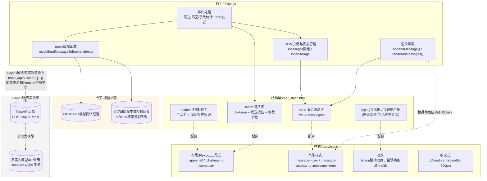
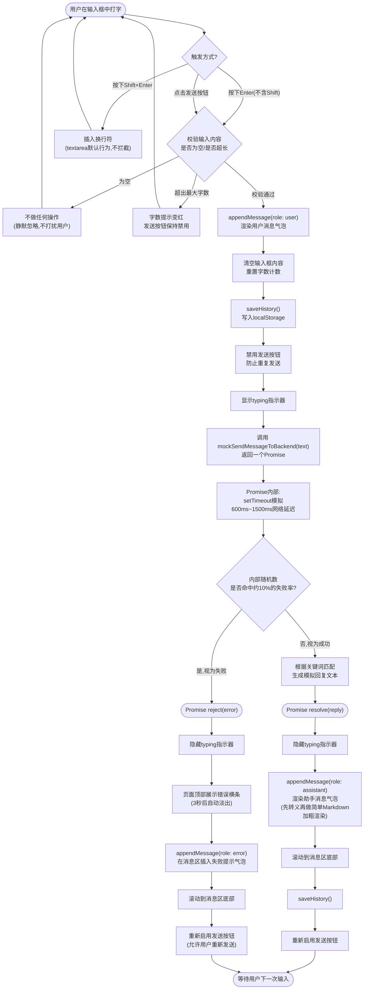
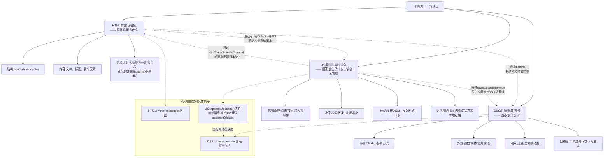

# 第22天 · 前端速成

> **周次/Sprint**:Sprint 1 · 对话引擎MVP(Day15-24)—— 交付苍穹0.1版(本周为Sprint1第二周 · Web开发基础周第一天)
> **星期**:周一(入职第22天,转正后进入第二周;昨天刚刚收官Sprint1前半段的周测与综合练习,今天课程节奏和知识类型都发生了明显切换)
> **参与人**:陈铭、苏梦、韩露、张凡(导师:王振宇;今日新入场:周晓;上午列席:林悦)
> **飞书任务号**:CQ-074(苍穹控制台前端 · 静态聊天界面页面 · `chat_static.html`)、CQ-075(前端基础培训 · HTML/CSS/JS速成)
> **今日关键词**:前端工程师周晓入场 / HTML语义结构 / CSS盒模型与Flexbox / JavaScript基础与DOM操作 / fetch API与Promise / mock数据模拟 / 静态聊天界面`chat_static.html`

---

## 【旁白】

如果说过去三周,陈铭一直在跟一些"看不见"的东西打交道——API请求体里那些字段、终端里一行行滚动的文字、`messages`列表里悄悄增长的历史记录——那么从今天开始,情况要反过来了。他即将第一次亲手做一件"看得见"的东西:一个真正可以被打开、被点击、被人用眼睛看到的网页。这件事说起来轻描淡写,做起来却是这三周里少有的、需要陈铭切换一整套思维习惯的转折点。

昨天晚自习散场前,老王留下的那句话,陈铭一直记在心里:"后端你们习惯想'数据怎么流转',前端要多想一层'用户的眼睛会先看到什么、手会往哪里点'。"这句话乍听起来像是一句职场客套的总结发言,但今天上午周晓正式入场之后,陈铭才慢慢体会到这句话背后真正的份量——写了三周命令行程序,他早已经习惯了"只要逻辑对,输出对,这段代码就是好代码"这套评判标准;而今天他要面对一套全新的、几乎完全不同的评判维度:同样一段逻辑正确的代码,放在页面上,可能因为一个"看起来"很小的细节(比如按钮和输入框没对齐、聊天气泡的间距太挤、错误提示的颜色刺眼)而显得很不专业。这种"逻辑对但体验差"的落差,是陈铭过去三周从未真正遇到过的一种"正确性"。

这一天在整条故事线里,承担着一个承上启下的、相对轻量但意义不小的角色。往回看,它紧接着昨天(Day21)那场高强度的周测与综合练习——用老王的话说,"知识密度最高的六天"已经结束,今天开始,节奏会变得更"手感"一些,更依赖动手尝试和视觉反馈,而不是死记硬背的概念。往前看,它是苍穹0.1版从"能在终端里跑起来的demo"变成"能在浏览器里被真正点开的产品"这条链路上的第一块拼图——今天写出来的静态页面`chat_static.html`,明后两天(Day23-24)会被接上一套真正的FastAPI后端接口,变成一个网页版的对话产品,这也是Sprint1(Day15-24)结束时要正式交付、要让CTO郭建军亲自看一眼的东西。

还有一层意义,藏在"周晓"这个新名字里。过去三周,陈铭接触到的同事,基本上都是"后端血统"或者"产品血统"——老王是资深架构师,林悦是产品经理,赵磊是测试工程师,连郭建军也是从技术出身一路走到CTO的位置。今天第一次有一位纯前端背景的工程师,以"老师"的身份出现在陈铭面前。这意味着陈铭要第一次学着适应一种新的沟通语言——前端工程师说话时经常挂在嘴边的"这个交互感觉怪怪的""这里应该有个过渡动效",这类描述在后端的世界里几乎不存在对应的说法,却是前端世界里再正常不过的专业判断依据。陈铭隐约意识到,今天要学的不只是HTML、CSS、JavaScript这三门具体的技术,更是要学会理解一种新的、以"用户体感"为核心尺度的专业判断方式。

老王在这一天的安排上,给了一个很明确的定位——"速成"这两个字不是随便起的名字。他跟林悦提前打过招呼:"这一周(Day22-24)的目标,不是把他们四个培养成前端工程师,苍穹控制台前端从Day22起就正式交给周晓全职负责,长期迭代;我们要的,是让陈铭他们四个具备'看得懂、改得动'的能力——以后前后端联调出了问题,他们至少能自己打开浏览器控制台看一眼报错,而不是每次都要抓着周晓问'这是什么意思'。"这句话后来被林悦转述给了周晓,周晓听完只回了一句:"明白,今天我不讲'漂亮的前端',我讲'扎实的、够用的前端'。"这句朴素的表态,某种程度上定下了今天这一整天的教学基调——不追求华丽,只追求"学完就能立刻用上"。

而对陈铭个人而言,这一天还有一层更私人的意义。三周前刚入职的时候,他其实对"前端"这个词是有一点隐约的畏惧的——运营岗位转行学编程的这半年里,他在网上零零散散看过一些前端教程,印象最深的感受是"知识点特别碎、特别多,永远学不完"。而今天,当他真正坐进培训室、听周晓把这一天要学的内容清清楚楚地列在白板上时,他忽然发现,这份畏惧感,和三周前第一次打开VS Code时对Python的畏惧感,几乎是同一种情绪的重复——而这一次,他至少已经知道,这种畏惧感通常撑不过一周就会自然消退。

---

## 晨会纪要 / 今日目标

**时间**:上午9:00,二层大会议室"望远"
**出席**:王振宇(老王)、林悦、周晓、陈铭、苏梦、韩露、张凡

陈铭走进会议室的时候,发现今天的座位格局有一点不一样——投影幕布前面多站了一个人,一个他从没见过的年轻女生,笔记本电脑上贴着一张贴纸,写着"像素不能差"。他心里嘀咕了一下,猜这大概就是老王昨天提到的"前端工程师周晓"。

**项目组周会摘要**

老王没有像往常一样先讲昨天的成果,而是直接把话筒交给了新来的人:"这位是周晓,苍穹控制台前端的负责人,今天开始,她会带你们四个快速过一遍前端的基础。先让她自己介绍一下。"

周晓接过话,语速比老王快不少,带着一点习惯性的调侃:"大家好,我是周晓,做前端五年了,之前在一家电商公司待过,双十一大促那几天的页面基本都是我和另外两个同事熬夜死磕出来的——所以我对'页面卡了要立刻查是哪个环节的问题'这件事,有一种近乎生理性的敏感。"她顿了一下,继续说:"今天开始,苍穹控制台前端正式交给我全职负责。但这不意味着你们四个可以完全不管前端——苍穹是一个需要前后端紧密配合的产品,你们四个作为对话引擎/后端方向的工程师,以后必然会遇到前后端联调的场景,到时候如果你们连浏览器控制台都不会打开、连一个简单的CSS类名冲突都看不出来,联调效率会很低。所以老王找我商量,先花两天半时间,给你们做一次'前端速成'——目标不是让你们变成前端工程师,是让你们'看得懂、能改'。"

老王在旁边补了一句,算是给这次安排定调:"我们内部有个说法,叫'全栈素养,专精分工'——每个人有自己的主战场,陈铭你们四个的主战场还是后端和大模型应用这条线,但基本的前端素养,是这个岗位往后几年都绕不开的东西。今天这一天,你们要抱着'这是我职业生涯里迟早要补的一课'的心态来学,而不是'反正以后不用我做前端'的心态来敷衍。"

**训练线摘要**

老王把这周的整体安排讲清楚:"这一周(Day22-24)三天,是Sprint1(Day15-24)最后的收尾,也是这十天里节奏切换最明显的一段。今天(Day22)上午HTML/CSS快速入门,下午JavaScript基础和`fetch`,今天结束前你们要独立写出一个静态的聊天界面页面`chat_static.html`——注意,是'静态'的,意思是这个页面暂时不会真的连上任何后端接口,你们会用一种叫'mock数据'的方式,自己在前端伪造一份看起来像是后端返回的数据,先把界面和交互跑通。"

他接着解释为什么要这样安排:"你们现在手上并没有一个现成的、可以随时调用的对话接口——真正的后端接口,是明天(Day23)才会开始写的`/api/v1/chat`。如果非要等到接口写完才开始做前端,会导致前后端完全串行,谁都在等谁,这在真实项目里是效率杀手。企业级项目里,前后端并行开发几乎是标配做法,靠的就是今天你们要学的这个技巧——mock数据、提前约定好接口的输入输出格式,前端先假装有一个后端在那儿,把界面和交互全部跑通,等真正的后端接口写好了,只需要把'假的那一步'换成'真的那一步',其他代码几乎不用动。"

**今日目标**:

1. 上午9:00-10:30:项目周会同步,周晓自我介绍与前端速成课整体安排预告。
2. 上午10:45-12:00:周晓主讲HTML/CSS快速入门,现场live coding演示。
3. 下午13:30-15:30:周晓主讲JavaScript基础(变量、函数、DOM操作、事件)。
4. 下午15:45-17:30:周晓主讲Promise/async-await与fetch API,重点讲解"mock后端"的设计思路。
5. 下午17:30起至晚自习结束:独立完成静态聊天界面页面`chat_static.html`(含`style.css`、`app.js`),要求覆盖消息气泡样式、输入框、发送按钮、模拟fetch调用、typing指示器、错误提示、本地历史持久化。
6. 晚自习19:30-21:00:项目验收、代码点评、今日复盘。

**风险点**:

- 四人此前完全没有系统学过前端,尤其苏梦和张凡对"浏览器渲染网页"这件事几乎没有任何直觉认知,周晓需要控制好讲解的抽象层级,避免一开始就讲得太底层(比如渲染引擎、重排重绘)吓退零基础的学员。
- 韩露此前有一点前端基础(产品经理转型),她的学习曲线会明显快于其他三人,周晓需要在保证整体进度的同时,给韩露留一点"进阶追问"的空间,避免她觉得内容太浅而失去兴趣。
- 下午最容易卡壳的地方是"异步"这个概念——Promise、`then`、`async/await`这几个词汇对没写过JS的人来说,听起来比Python的同步代码抽象得多,周晓提前和老王沟通过,打算用"点外卖"这类生活化比喻先建立直觉,再讲语法细节。
- 今天要求独立完成的静态页面,验收标准里特别强调"必须能正确处理mock函数模拟的失败场景"(比如网络异常),这是容易被新手忽略的一块——很多人写Demo的时候只考虑"成功"这一条路径,不会主动去想"如果失败了怎么办",周晓打算在需求文档里明确写清楚这一条,强制大家动手实现。
- 老王和林悦都提到一点:虽然今天的主讲人换成了周晓,但代码规范(命名、注释、结构拆分)仍然要按照公司统一标准执行,不能因为"是前端,是练习"就放松要求。

---

## 需求文档:苍穹控制台前端 · 静态聊天界面页面需求书

> 撰写人:林悦(产品经理) · 技术评审:周晓 · 文档编号:CQ-PRD-D22-01 · 版本:v1.0

### 背景

苍穹0.1版的目标,是在Sprint1结束时(Day24)交付一个"网页版对话产品"——用户能够打开一个网址,在页面上和苍穹智能体进行对话,而不再是像过去三周那样,只能通过命令行终端进行交互。要做到这一点,前后端需要分别推进:后端这一周(Day23-24)会正式动手实现`/api/v1/chat`接口(以及后续的流式接口和数据库);前端这一周(Day22-24)需要先把界面结构、交互逻辑、视觉样式跑通,不能等后端接口全部就位之后才开始。

因此,本次任务的核心目标,是产出一份完全独立于后端、可以直接在浏览器里双击打开运行的静态聊天界面页面,内部使用"模拟数据"(mock data)代替真实的网络请求,提前验证界面结构是否合理、交互流程是否顺畅、异常情况(网络失败、内容过长等)是否有合适的提示。这份静态页面在功能上是"假的"(所有回复都是本地生成的模拟内容,不是真正调用大模型得到的回答),但在工程结构上必须是"真的"——代码组织方式、函数命名、模块划分,都要为明天(Day23)接入真实后端接口做好铺�垫,做到"换一个函数的内部实现,其他代码基本不用改"。

林悦在下发需求文档时,专门补了一句说明背景意图的话:"郭总这周五(Day24)会亲自来看苍穹0.1版的演示,这份静态页面虽然不是最终交付物,但它是整个视觉呈现和交互体验的第一版原型,决定了后面两天联调的效率,也决定了郭总第一眼看到产品时的第一印象——所以哪怕暂时用的是假数据,这个页面本身的完成度,不能'凑合'。"

### 用户故事

- 作为一名正在体验苍穹智能体中台的用户,我希望打开页面后能立刻看到一句欢迎语,知道这是一个"苍穹智能客服助手"的对话页面,而不是一个空白的、令人困惑的界面。
- 作为用户,我希望我自己发出的消息和助手回复的消息,在视觉上能够被一眼区分开(比如颜色不同、左右对齐方式不同),而不需要逐字阅读才能分辨"这句话是我说的还是它说的"。
- 作为用户,我希望在输入框里打完一段话之后,可以直接按Enter键发送,而不是每次都要用鼠标去点发送按钮;但如果我想在一句话里换行,也应该有办法做到(比如Shift+Enter)。
- 作为用户,我希望在发送消息之后,能看到一个"对方正在输入"或类似的等待提示,而不是面对一段空白等待,不知道系统是否正常工作。
- 作为用户,我希望在输入内容过长时,能提前看到字数提示,而不是发送之后才被告知"内容太长,发送失败"。
- 作为用户,我希望即使我不小心输入了一些奇怪的符号(比如尖括号、引号),页面也不会因此显示错乱或出现意外的行为。
- 作为用户,我希望即使遇到网络问题(在这份静态页面里体现为"模拟的随机失败"),系统也能给出清晰的错误提示,而不是让页面卡住或者什么反应都没有。
- 作为用户,我希望能够一键清空当前的聊天记录,重新开始一段新的对话。
- 作为用户,我希望刷新页面之后,之前的聊天记录不会丢失(在真实产品里,这通常意味着从后端数据库加载;在这份静态页面里,先用浏览器本地存储实现一个简化版)。
- 作为一名用手机浏览器打开这个页面的用户,我希望页面在小屏幕上依然能正常显示,不会出现内容被挤出屏幕或者按钮点不到的情况。
- 作为技术负责人,我希望这份静态页面的代码结构清晰,HTML、CSS、JS职责分离,不允许出现行内`style`属性堆砌样式、也不允许在HTML里直接写JS逻辑,这样明天接入真实后端接口的时候,改动范围能被限制在JS文件的少数几个函数内。

### 功能列表

| 编号 | 功能 | 说明 | 优先级 |
|---|---|---|---|
| F1 | 页面整体布局 | 顶部标题栏(产品名+"示例模式"标识)、中部消息滚动区、底部输入区,三段式布局,适配桌面与移动端 | P0 |
| F2 | 消息气泡样式区分 | 用户消息靠右显示、使用品牌色背景;助手消息靠左显示、使用浅灰背景;错误提示消息使用醒目的警示色 | P0 |
| F3 | 输入框与发送 | 支持多行文本输入(textarea),Enter键发送、Shift+Enter换行,发送后自动清空输入框 | P0 |
| F4 | 字数限制与计数 | 实时显示已输入字数/最大字数,超出限制时禁用发送按钮并给出提示 | P0 |
| F5 | typing指示器 | 消息发送后,在助手消息出现之前,显示一个"正在输入"的动态提示(三个跳动的小圆点) | P0 |
| F6 | mock后端模拟 | 编写一个函数模拟"发送消息给后端并等待回复"的完整过程,包含模拟网络延迟、模拟随机失败(约10%概率)、根据关键词返回不同模拟回复内容 | P0 |
| F7 | 错误提示与重试引导 | 当模拟请求失败时,在页面顶部展示错误提示条,并在消息区插入一条失败提示,允许用户重新发送 | P0 |
| F8 | 本地历史持久化 | 使用`localStorage`保存聊天记录,刷新页面后能自动恢复;提供"清空对话"按钮 | P1 |
| F9 | 响应式布局 | 页面宽度小于600px时(模拟移动端),调整间距、字号、头像显示方式,保证可用性 | P1 |
| F10 | 内容安全渲染 | 用户输入的任何内容,渲染到页面时都不能被当作HTML/脚本执行,必须做到即使输入`<script>`标签,也只会被当作纯文本显示 | P0 |
| F11 | 简单Markdown渲染 | 助手消息支持`**加粗**`语法的简单渲染,为将来接入真实大模型输出的Markdown格式做准备(渲染前必须先转义原始文本,避免引入XSS风险) | P2 |

### 非功能需求

- **性能**:整个页面不引入任何第三方框架或构建工具,纯HTML+CSS+原生JavaScript即可运行,双击HTML文件就能在浏览器里直接打开查看效果,不需要启动任何服务器(这一点会在明天接入真实后端fetch请求时发生变化,但今天的静态版本必须保持这个"零依赖、双击即用"的特性)。
- **兼容性**:面向现代浏览器(Chrome、Edge、Firefox最新版本),不需要兼容IE等老旧浏览器。
- **可维护性**:HTML负责结构与内容,CSS负责样式与视觉呈现,JS负责行为与交互逻辑,三者严格分离,不允许在HTML标签上直接写`style="..."`,不允许在HTML里嵌入`<script>`标签写业务逻辑(全部逻辑都在`app.js`里)。
- **安全性**:任何用户输入的内容,在渲染到页面之前,都必须经过安全处理,不能让用户输入的内容被当作HTML标签或脚本执行——这是前端最基础也最容易被忽视的安全底线,呼应此前(Day18)在后端反复强调的"用户输入是数据,不是指令"这一设计原则,只是这一次"指令"换成了"HTML标签和脚本"。
- **可扩展性**:模拟后端交互的函数(`mockSendMessageToBackend`),其函数签名(输入什么、返回什么样的Promise结构)必须和明天要接入的真实`fetch`调用保持一致,确保接入真实后端时,只需要替换这一个函数的内部实现,页面其余部分的代码不需要任何改动。
- **代码规范**:命名统一使用小驼峰(变量、函数)和kebab-case(CSS类名),关键逻辑必须有中文注释说明设计意图,不允许出现无意义的占位注释。

### 验收标准

1. 双击打开`chat_static.html`,页面能正常显示欢迎语,布局、样式符合设计预期。
2. 在输入框中输入一段文字并按Enter键(不按Shift),消息能正确发送并显示在右侧,输入框自动清空。
3. 发送消息后,能观察到明显的"正在输入"动态提示,随后出现模拟的助手回复(靠左显示)。
4. 连续发送至少10条消息,反复触发模拟失败场景(可以通过多次尝试观察到约10%概率出现的失败提示),验证失败时页面有清晰提示且不会崩溃、不会卡死。
5. 尝试输入超过字数上限的内容,验证字数提示和发送按钮禁用逻辑生效。
6. 尝试在输入框中输入`<script>alert(1)</script>`并发送,验证这段内容在页面上原样以文本形式显示,不会真的弹出警告框。
7. 点击"清空对话"按钮,验证聊天记录被清空并恢复到欢迎语状态;刷新页面前先发送几条消息,再刷新页面,验证历史记录能够被正确恢复。
8. 将浏览器窗口缩小到手机宽度(或使用浏览器DevTools的移动端模拟模式),验证页面布局依然可用,没有明显的错位或遮挡。
9. 打开浏览器控制台(F12),确认没有任何报错或警告信息。
10. 代码结构上,HTML、CSS、JS分别存放在`chat_static.html`、`style.css`、`app.js`三个文件里,HTML中不存在行内`style`属性和内嵌`<script>`业务逻辑。

周晓在下发需求文档时补了一句:"这份需求书里,F10和F11是最容易被你们忽略、但恰恰是我最看重的两条。很多人写前端Demo的时候,图省事直接用`innerHTML`把用户输入的内容塞进页面,这在真实产品里是一个非常经典的安全漏洞——今天下午我会专门花时间演示一次这个漏洞长什么样,你们看完就会理解为什么这条要求写进了P0优先级。"

---

## 架构设计图:静态页面结构与未来后端接口的关系

周晓讲完需求文档之后,先在白板上画了这张图,帮四人建立一个整体认知——"今天写的东西,分几层,以及它们和'明天开始要接入的后端',具体是什么关系"。



周晓讲解这张图时,特别强调了`J4`这个节点:"你们看,`mockSendMessageToBackend`这个函数,今天内部做的事情是`setTimeout`加一点随机逻辑,明天(Day23)它会被替换成真正的`fetch`请求——但只要今天你们把这个函数的'输入是什么、返回的Promise长什么样'设计得足够规范,明天这一步替换,理论上只需要改这一个函数的函数体,页面上所有调用它的地方,一行都不用动。这是前端开发里一个很常见但很重要的思维习惯——'先约定接口形状,再决定内部怎么实现',跟你们上周学的Function Calling里'工具Schema先定义清楚,再谈内部执行逻辑'其实是同一个道理,只是换了个场景。"

陈铭听到这句话,下意识在笔记本上写了一句:"前端的mock函数,和后端Day19工具调度器`TOOL_DISPATCH`的设计思路,居然是同一件事——先定接口,再填实现。"

韩露提了一个问题:"图里`FUTURE`那部分标了虚线框和灰色,是不是说明今天完全不用管这部分?"周晓点头又摇头:"今天确实不需要写这部分的代码,但你们脑子里要提前有这张图——你们今天设计`mockSendMessageToBackend`的时候,如果完全不考虑'它以后要被替换成真的fetch',很可能会把这个函数设计成一个'返回值是普通数据,不是Promise'的同步函数,这样明天替换的时候,前面调用它的代码全都要跟着改,等于白做了一遍。这就是为什么我要求你们今天这个函数,哪怕内部是`setTimeout`,也必须返回一个真正的Promise对象,和真实的`fetch`保持同样的'使用方式'。"

---

## 流程图:一次消息发送到渲染完成的完整数据流程图

周晓接着画了第二张图,专门讲清楚"用户按下发送之后,数据具体是怎么在页面内部流转的",这也是下午写`app.js`时最核心的一条主线逻辑。



这张图讲完,张凡提了一个很直接的问题:"为什么要故意设计一个'10%概率失败'?真实的网络请求,难道也会随机失败吗?"周晓的回答把这件事和真实工程场景连了起来:"会的,而且比你想象得更频繁——网络抖动、服务器临时过载、请求超时,这些在生产环境里都是常态,不是例外。如果你今天写的mock函数永远只模拟'成功'这一条路径,你的错误处理代码(`ShowErrorBanner`、`AppendErrorMsg`这些逻辑)可能从来没有被真正跑起来验证过,等真的接入后端之后,第一次遇到网络失败,你才发现这部分代码从来没测过,大概率会出问题。故意设计一个失败概率,就是逼着你在今天这个阶段,把'失败路径'也当成和'成功路径'同等重要的东西来对待。"

苏梦问了一个更细节的问题:"图里`Validate`那一步,如果输入内容是空的,你写的是'静默忽略,不打扰用户',为什么不弹一个提示框告诉用户'不能发送空消息'?"周晓给出了一个体验设计上的解释:"这是一个很小但很能体现'产品感'的细节——用户不小心按了一下空白的Enter键,这是极其常见的操作失误,如果每次都弹一个警示框打断用户,体验上是很烦人的。'静默忽略'的意思是,程序知道这个操作没有意义,直接不做任何反应,用户甚至可能都没意识到自己按了一次空Enter。什么时候该'明确提示',什么时候该'静默处理',某种程度上就是前端和后端在'容错'这件事上思路不完全一样的地方——后端更倾向于'任何异常都要显式记录、显式反馈',前端要多考虑'这个反馈会不会打扰到正常使用的用户'。"

---

## 示意图:HTML / CSS / JS 职责划分示意图

第三张图,周晓换了一个更轻松的类比来讲——她把一个网页比作一场"演出",帮四人建立起"这三门技术各自到底在管什么"的直觉。



周晓讲这张图时,补充了一个说法:"这个'演出'的比喻不是我随口编的,是我入行前两年,我的第一个前端师傅教我的——他当时说,'很多新手学前端最容易犯的错,是把三件事的职责搞混,比如在HTML里写`style="color:red"`,这就好比让舞台上的演员自己决定灯光颜色,演员该干的事是站在该站的位置、说该说的台词,灯光师才该管颜色。'这句话我记了很多年,今天原样转述给你们。"

陈铭举手提了一个问题,带着明显的"往后端类比"的思考习惯:"如果按这个比喻,HTML像是我们后端的数据结构定义,CSS像是……前端特有的东西,没有直接对应;JS像是业务逻辑代码?这个类比对不对?"周晓想了几秒,给出了一个部分认可、部分修正的回答:"HTML对应'数据结构'这个类比,大方向是对的——它确实定义了'页面上有哪些东西、它们之间是什么层级关系',这和你们写JSON结构、写Pydantic模型,确实是相通的抽象能力。JS对应'业务逻辑',也基本说得通。但CSS你说的'没有直接对应'——其实也不是完全没有,如果一定要找一个类比,CSS更像是你们后端里的'配置文件'或者'样式化的规则引擎',它不改变数据本身,只改变数据被'呈现'出来的方式,有点像你们后端根据配置动态调整行为,但CSS调整的是视觉呈现而不是业务行为。这个类比不完美,但能帮你先建立起'这是另一个维度的东西'这个直觉。"

---

## 课堂笔记

### 上午:HTML/CSS快速入门

**10:45,培训室**

周会结束,四人回到平时的位置,周晓把投影切换到一个空白的代码编辑器,直接开始现场敲代码——她没有先放一堂PPT理论课,而是先在编辑器里敲出一个最简单的HTML骨架,让页面先"跑起来",再逐步往里填内容。

**网页是怎么被浏览器"画"出来的(简述,不深入)**

周晓先给了一个非常简化的心智模型,没有涉及浏览器渲染引擎的具体术语:"你可以把浏览器理解成一个'翻译官加画家'的组合。它先读HTML,在脑子里搭出一棵'家谱树'——这个东西专业说法叫DOM树,你现在只需要知道,浏览器会把你写的每一个标签,理解成家谱树上的一个节点,标签之间的嵌套关系,就是家谱树上的父子关系。搭完这棵树之后,浏览器再读CSS,给这棵树上的每个节点'化妆'——决定每个节点该长多宽多高、什么颜色、摆在哪个位置。最后,浏览器把化好妆的这棵树,真正'画'到屏幕上,你看到的网页,就是这幅画。而JS,是随时可以伸手进去,'改家谱树的结构'或者'改某个节点的妆'的那双手。"

她补了一句:"这个模型足够你们今天用了,更精确的说法(比如渲染树、重排重绘的性能细节),等你们以后真的往前端方向深入,再慢慢补,今天不展开。"

**HTML必知标签清单**

周晓把这张表格投影出来,作为今天HTML部分的核心参考:

| 标签/属性 | 作用 | 今天项目里的用法 |
|---|---|---|
| `<!DOCTYPE html>` | 告诉浏览器用现代标准模式解析这个页面 | 每个HTML文件的第一行,固定写法 |
| `<html>` | 整个页面的根节点 | 固定包裹全部内容,建议加`lang="zh-CN"` |
| `<head>` | 存放页面的"元信息",不直接显示在页面上 | 放`<meta charset>`、`<title>`、`<link>`引入CSS |
| `<meta charset="UTF-8">` | 声明页面字符编码,避免中文显示乱码 | 必须写,且建议放在`<head>`最前面 |
| `<meta name="viewport">` | 声明页面在移动设备上的缩放规则,响应式的基础 | `content="width=device-width, initial-scale=1.0"` |
| `<title>` | 浏览器标签页上显示的标题 | "苍穹智能体中台 · 对话演示" |
| `<link rel="stylesheet">` | 引入外部CSS文件 | `<link rel="stylesheet" href="style.css">` |
| `<body>` | 页面真正显示出来的内容的根节点 | 包裹header、main、footer |
| `<header>` `<main>` `<footer>` | 语义化的结构标签,表示"页头/主体/页脚" | 分别对应标题栏、消息区、输入区 |
| `<div>` | 没有特殊语义的通用容器,用于布局分组 | 消息气泡的外层容器、输入区内部分组 |
| `<span>` | 行内的通用容器,不会独占一整行 | 头像里的文字、状态小圆点 |
| `<p>` | 段落文本 | 消息正文(或者用`div`,视布局需要) |
| `<textarea>` | 多行文本输入框 | 聊天输入框(比单行`input`更适合多行消息) |
| `<button>` | 可点击的按钮,自带一些默认的可访问性行为 | 发送按钮、清空对话按钮 |
| `<script defer src="...">` | 引入外部JS文件 | 放在`</body>`结束前,`defer`保证HTML解析完才执行 |

她特别强调了`<button>`和`<div>`的区别:"永远不要为了图省事,用一个`<div onclick="...">`来充当按钮——`<button>`标签自带键盘可访问性(可以用Tab键聚焦、用空格或Enter触发),自带一些默认的视觉反馈,`<div>`什么都没有,你需要手写一大堆额外代码才能让它'看起来像个按钮',这是典型的'不用语义化标签,给自己找麻烦'的反面例子。"

**为什么不能全用`<div>`——语义化的意义**

韩露主动分享了她之前接触前端时踩过的坑:"我刚学的时候,确实有一段时间就是无脑全用`<div>`,反正样式都能用CSS调出来,页面看起来一样。后来才知道这样对屏幕阅读器(帮助视觉障碍用户使用网页的辅助工具)特别不友好,也不利于搜索引擎理解页面内容。"周晓点头认同:"她说的这两点都对,再补一点更贴近你们今天场景的理由——语义化标签本身自带一部分'免费的'默认行为和默认样式,`<button>`自带点击反馈和键盘操作支持,`<header>``<main>``<footer>`能让任何后来读这份代码的人(包括三个月后的你自己),一眼看出页面的整体结构,不需要每次都去读CSS才能搞懂'这块到底是干什么的'。这本质上和你们后端写代码要用有意义的变量名、要写清楚的docstring,是同一个道理——代码是给人读的,不只是给机器执行的。"

**CSS选择器与优先级(经验法则,不深入specificity计算)**

周晓讲了几种最常用的选择器:类选择器(`.message`)、id选择器(`#chat-messages`)、伪类选择器(`:hover`、`:focus`、`:disabled`)、后代选择器(`.message .avatar`表示"`.message`内部的`.avatar`")。

关于优先级,她没有讲精确的权重计算规则,给了一个"够用的经验法则":"记住三条就够你们今天用了:第一,写得更具体的选择器(比如带了两层的后代选择器)通常会赢过写得更笼统的;第二,id选择器的优先级天然比class选择器高,但我们团队约定——尽量不要用id来写样式(id留给JS去精确定位元素),样式全部用class来写,这样能避免很多优先级纠缠的麻烦;第三,如果你改了CSS但样式没生效,大概率不是CSS语法错了,是被别的规则'盖住了',这时候打开浏览器DevTools的Elements面板,右侧会列出所有命中的规则,被划横线的就是被覆盖掉的,这是排查优先级问题最快的方法,不需要死记硬背规则。"

**盒模型:content / padding / border / margin**

这一部分,周晓用了一个"套娃"的比喻:"你可以把每一个HTML元素想象成一个快递盒子——最里面是`content`,也就是真正的内容(文字、图片);往外一层是`padding`,是盒子内部的填充空间,内容和盒子边缘之间的距离;再往外是`border`,是盒子本身的边框;最外面是`margin`,是这个盒子和其他盒子之间的空隙。这四层由内到外,决定了一个元素最终占用的空间到底有多大。"

她重点强调了`box-sizing`这个属性:"默认情况下,CSS里设置的`width`只计算`content`的宽度,`padding`和`border`是'额外加上去的',这经常导致一个你以为设置成'宽度300px'的盒子,实际占用空间远超300px,新手在这里踩坑的概率极高。解决方法很简单——在CSS最开头,给所有元素统一加一条`box-sizing: border-box`,这样`width`就会把`padding`和`border`都算在内,宽度计算会变得符合直觉得多。这是几乎所有正规前端项目都会加的一条'团队规范',今天的`style.css`我会要求你们从第一行就加上。"

**Flexbox速成(今天CSS部分的重点)**

周晓把这部分标成了"今天必须掌握"的重点内容,因为聊天气泡"用户靠右、助手靠左"的布局,以及整个页面"上中下三段式"的布局,核心都要靠Flexbox实现。

她用了一个"排队"的比喻:"想象你有一排子元素,是一群正在排队的人。给父元素设置`display: flex`,相当于宣布'从现在起,这些人要排成一队,不再像平常那样各自占一整行'。`flex-direction`决定这队人是横着站(`row`,默认)还是竖着站(`column`)。`justify-content`决定这队人在'排队方向'上怎么分布——挤在开头(`flex-start`)、挤在结尾(`flex-end`)、居中(`center`)、还是均匀撑满整个空间并留出间隔(`space-between`)。`align-items`决定这队人在'垂直于排队方向'上怎么对齐——比如横向排队时,是所有人头顶齐平(`flex-start`)、脚底齐平(`flex-end`)、还是正中间对齐(`center`)。最后,`gap`直接给队伍里每两个人之间加固定间距,不用再手动给每个子元素调`margin`。"

她当场live coding演示了聊天气泡的核心布局代码:

```css
.message-row {
  display: flex;
  margin-bottom: 12px;
}

.message-row--user {
  justify-content: flex-end; /* 用户消息推到最右边 */
}

.message-row--assistant {
  justify-content: flex-start; /* 助手消息保持在最左边 */
}
```

她解释:"这四行CSS,就是'用户消息靠右、助手消息靠左'这个视觉效果的全部秘密——每一条消息外面包一层`.message-row`,这一层用`display: flex`加上`justify-content`,根据是用户还是助手,分别推到左边或右边。这比你去手动计算'该给这条消息设置多少margin-left'要简单可靠得多,而且不用管容器宽度变化,Flexbox会自动帮你处理。"

**常用单位与调试方法**

周晓简单过了一下项目里会用到的单位:`px`(绝对像素,今天大部分尺寸用这个,直观好懂)、`%`(相对于父元素的百分比,用于让某些容器占满宽度)、`rem`(相对于根元素字号的单位,常用于字号本身,方便统一缩放,今天项目里字号会用`rem`)。她建议:"今天不用纠结单位选择的'最佳实践',先把`px`用熟,`rem`用在字号上,够用了,以后深入学响应式设计时再系统学`vh`/`vw`这些视口单位。"

关于调试,她现场演示了浏览器DevTools的基本用法:按F12打开开发者工具,切到Elements面板可以实时修改CSS属性看效果(改动不会保存,只是临时预览,刷新就恢复),切到Console面板可以看到JS报错信息,这是接下来一整天都会反复用到的工具。"从今天起,你们打开网页,F12基本上要成为一个本能反射动作,跟你们之前看Python报错要先看Traceback最后一行是同一种习惯。"

**答疑环节**

**苏梦的问题**:"class和id到底什么时候该用哪个?我感觉两个好像功能差不多。"

周晓的回答直接给出了团队约定:"从纯技术角度说,id在一个页面里必须唯一,class可以被多个元素共用;但从今天团队的实际约定角度说——CSS样式全部用class来写,id只留给JS去精确查找某个唯一的元素(比如`#chat-messages`,整个页面只有一个消息容器,JS要靠这个id快速拿到它)。你可以简单记成:'样式找class,JS抓id',这是最省心的用法习惯,不用纠结底层规则的所有细节。"

**张凡的问题**:"CSS的优先级计算,是不是像数学运算符优先级那样,有一套固定的公式?"

周晓给了一个部分肯定的回答:"确实有一套精确的权重计算规则(专业说法叫specificity),但今天我不打算教你们去手算这套公式,原因是——在真实工作中,靠脑子算优先级效率很低,靠DevTools直接看'哪条规则生效了、哪条被覆盖了'效率高得多。你现在只需要记住我刚才说的经验法则(具体选择器赢笼统的、id比class高、团队约定不用id写样式),遇到样式不生效的问题,打开DevTools看,而不是在脑子里模拟计算。"

**韩露的问题**(她过去有一点前端基础,问得更深入):"Flexbox里`flex-grow`和`flex-shrink`具体怎么用?我记得之前遇到过子元素被意外压缩的情况。"

周晓给出了更细致的回答,也借这个问题多讲了一点:"`flex-grow`决定'如果父容器有多余空间,这个子元素要不要去抢占额外的空间,抢占的比例是多少';`flex-shrink`决定'如果父容器空间不够,这个子元素要不要被压缩,压缩的比例是多少'。默认情况下,大部分元素的`flex-shrink`是1,意味着空间不够时,所有子元素都会被等比例压缩——这就是你之前遇到'子元素被意外压缩'的常见原因。今天项目里,输入框旁边的发送按钮,我们会给它设置`flex-shrink: 0`,意思是'不管容器空间够不够,这个按钮绝对不许被压缩变形',这是一个很实用的小技巧,你们等下写`app.js`配套的CSS时会用到。"

**陈铭的问题**:"HTML的结构和我们之前写的JSON数据结构,是不是本质上是一回事——都是在描述'东西之间的层级关系'?"

周晓思考了几秒,给出了认可但带一点补充的回答:"这个类比抓得挺准——HTML确实和JSON一样,本质上都是一种'带层级的数据描述方式',你可以把一段HTML在脑子里翻译成一棵嵌套的对象结构,这和JSON的嵌套结构确实是同构的。不过有一点区别值得注意:JSON纯粹是数据,它自己不会被'画'出来;HTML的每一个标签,除了表达层级关系,还自带了浏览器默认的显示行为和语义(比如`<button>`自带点击交互),这一点是JSON完全不具备的。你可以理解成,HTML是'为了被渲染和交互而设计的一种特殊的、结构化数据格式',这样理解会比单纯类比JSON更完整一点。"

老王(上午后半段回到培训室旁听)在旁边补了一句:"这个问题的思考方式,其实和你们上周学Embedding时问的'关键词搜索和语义检索有什么本质区别'是同一种习惯——遇到新概念,先找一个自己已经会的东西去类比,再去挑这个类比在哪里会失效。这个思考习惯,你已经用得越来越顺手了。"

### 下午:JavaScript基础与fetch

**13:30,培训室**

午休结束,周晓把投影切到一个能同时看到代码和浏览器预览的分屏窗口:"上午我们搭好了'骨架'和'外观',但现在这个页面除了能看,什么都不能做——按钮点了没反应,输入框输入了也不会发生任何事情。下午,我们要给这个页面装上'大脑和手',这就是JavaScript要做的事。"

**JS变量与基本数据类型**

周晓先讲了变量声明:"JS里现在基本只用两个关键字声明变量——`let`(值可以被重新赋值)和`const`(值不能被重新赋值,声明后就固定)。你们可能在一些老教程里看到`var`,团队规范里,`var`是明确禁止使用的,它有一些历史遗留的作用域坑(比如变量提升、没有块级作用域),`let`和`const`已经完全解决了这些问题,没有理由继续用`var`。今天的原则很简单——默认用`const`,只有确定这个变量以后需要被重新赋值时,才用`let`。"

基本数据类型她简单过了一遍:字符串(string)、数字(number,JS里不区分整数和浮点数,统一是number)、布尔值(boolean)、`null`和`undefined`(都表示"没有值",但`undefined`通常表示"从来没被赋值过",`null`通常表示"曾经被显式地设置为空")、以及对象(object)和数组(array,本质上是一种特殊的对象)。

她特意对比了一下和Python的差异:"你们已经很熟悉Python的字典和列表了,JS里的对象大致对应Python的字典,数组大致对应Python的列表,写法上用`{}`和`[]`,这一点两边是相似的,能帮你们更快上手。"

**函数:声明式与箭头函数**

她展示了两种最常见的函数写法:

```javascript
// 传统函数声明
function greet(name) {
  return `你好,${name}`;
}

// 箭头函数(更简洁,今天项目里大量使用)
const greetArrow = (name) => {
  return `你好,${name}`;
};

// 箭头函数如果函数体只有一行return,可以进一步简写
const greetShort = (name) => `你好,${name}`;
```

她解释了为什么今天的代码会大量使用箭头函数:"箭头函数写起来更短,而且在处理事件回调(等下会讲)的场景下,它对`this`关键字的处理方式更符合直觉,不容易踩坑。今天你们不需要深究`this`的所有细节,只需要记住一条经验:写事件处理函数、写回调函数,优先用箭头函数,这样能避免很多新手常见的诡异bug。"

她还提到了模板字符串(反引号包裹的字符串,支持`${}`插入变量),说这是今天项目里拼接HTML片段、拼接提示文字时会大量用到的语法,和Python的f-string在用法直觉上非常接近。

**DOM操作核心API**

这是下午最核心的一部分——怎么用JS去"操作"上午写好的HTML结构。周晓依次介绍了几个最常用的API,并配合浏览器实时演示:

- `document.querySelector('选择器')`:按CSS选择器语法,找到页面上第一个匹配的元素,比如`document.querySelector('#chat-messages')`拿到消息容器。
- `document.querySelectorAll('选择器')`:找到所有匹配的元素,返回一个类似数组的集合。
- `document.createElement('标签名')`:在内存里创建一个新的、还没有被插入页面的元素节点。
- `父元素.appendChild(子元素)` 或更现代的 `父元素.append(子元素)`:把一个元素节点插入到某个父元素的末尾,真正让它出现在页面上。
- `元素.classList.add('类名')` / `.remove('类名')` / `.toggle('类名')`:动态给元素增加、移除、或者切换某个CSS类,这是JS"反过来影响CSS呈现"最常用的手段。
- `元素.textContent = '文字'`:把某个元素内部的文字内容设置成指定的字符串。
- `元素.innerHTML = '一段HTML字符串'`:把某个元素内部的内容,当作HTML代码解析并插入。

讲到最后两个API的对比时,周晓停下来,专门花了一段时间做了一次现场演示,气氛明显变得严肃了一些。

**卡点(现场安全演示):`innerHTML`与XSS风险**

周晓在浏览器里现场敲了一段代码:

```javascript
const testDiv = document.querySelector('#test-area');
const userInput = '';
testDiv.innerHTML = userInput; // 危险写法,仅用于现场演示
```

她运行之后,浏览器立刻弹出了一个警告框,四个人都愣了一下。周晓关掉弹窗,解释道:"这就是前端最经典的安全漏洞之一,专业名称叫XSS(跨站脚本攻击)。我刚才做的事情,和一个恶意用户能做的事情完全一样——如果你的页面把'用户输入的内容'不做任何处理,直接塞进`innerHTML`,那么用户输入的任何看起来像HTML标签的内容,都会被浏览器当作真正的HTML来解析和执行。刚才这个例子只是弹了一个无害的警告框,但如果换成恶意代码,理论上可以做到窃取用户的登录凭证、篡改页面内容、甚至冒充用户发起请求——这不是理论上的风险,是真实发生过很多次的生产事故。"

她接着展示了正确的写法:

```javascript
const testDiv2 = document.querySelector('#test-area-2');
const userInput2 = '';
testDiv2.textContent = userInput2; // 安全写法
```

"用`textContent`赋值,浏览器只会把这段内容当作纯文本显示——你们打开页面会看到,这个`div`里原样显示出了那一串``的文字,没有任何弹窗,因为它没有被解析成HTML,只是被当成了一串普通字符。"

苏梦当场想起了什么,举手说:"这个跟上周(Day18)赵磊攻破分类器的那次Prompt注入事故,感觉是同一种教训——都是'把用户的输入,不小心当成了指令去执行'?"

周晓听完,眼神里带着一点意外的认可:"这个类比抓得非常准。Prompt注入是'把用户输入的文字,错误地当成了系统指令去执行';XSS是'把用户输入的文字,错误地当成了HTML/JS代码去执行'。两者的本质,其实是同一类安全问题的不同变体——只要一个系统存在'数据'和'指令(或者代码)'之间的边界,而这个边界又没有被严格地、结构性地维护住,攻击者就有机会往里面塞'伪装成数据的指令',让系统在不知情的情况下执行了不该执行的东西。今天的规则很简单——除非你非常清楚自己在做什么、并且做了严格的转义处理,否则永远用`textContent`而不是`innerHTML`来显示用户输入的内容。今天下午写的`app.js`,你们会看到,连'助手的模拟回复'这种看起来'安全'的内容,我们也会先做转义,再做加粗渲染,这是一种'纵深防御'的习惯——不因为'这个数据来源看起来可信'就放松处理。"

这段现场演示,后来被陈铭写进了当天最长的一段笔记,他专门在旁边画了一条线,把"Day18 Prompt注入"和"Day22 XSS"连在了一起,写下一句话:"底层的安全直觉,原来是可以从后端迁移到前端的——不管是模型的输入,还是页面的输入,凡是'用户可控的内容',都要被当成潜在的攻击面来对待,而不是想着'大概没问题'。"

**事件监听**

周晓接着讲事件:"网页要'响应'用户的操作,靠的就是事件监听。最常用的写法是`元素.addEventListener('事件类型', 处理函数)`。"她演示了点击事件:

```javascript
const sendButton = document.querySelector('#send-button');
sendButton.addEventListener('click', () => {
  console.log('发送按钮被点击了');
});
```

以及键盘事件,专门对应今天"Enter发送、Shift+Enter换行"的需求:

```javascript
const textarea = document.querySelector('#message-input');
textarea.addEventListener('keydown', (event) => {
  if (event.key === 'Enter' && !event.shiftKey) {
    event.preventDefault(); // 阻止默认的换行行为
    console.log('该发送消息了');
  }
  // 如果按的是Shift+Enter,不拦截,让textarea保持默认的换行行为
});
```

她特别解释了`event.preventDefault()`这一行的意义:"`textarea`默认情况下,按Enter键的行为就是换行——如果我们想让Enter变成'发送'的触发键,就必须显式调用`preventDefault()`,告诉浏览器'不要执行你默认打算做的那个动作'。这一行忘了写,会导致你的发送逻辑和默认的换行行为同时发生,输入框里会先换一行,然后再触发发送,体验上会很奇怪。"

**卡点:忘记`preventDefault`导致的意外表现**

陈铭在自己动手实现的时候,真的踩到了这个坑——他一开始把发送逻辑写在了一个包裹`<form>`标签里的`submit`事件上(参考了他之前看到的一些教程写法),按Enter键之后,页面突然刷新了一下,输入框里的内容也随之消失,他一开始以为是自己的清空逻辑提前触发了。周晓过来看了一眼,立刻发现了问题:"你这里用了`<form>`标签包裹输入区,`<form>`的默认行为是,当内部某个输入框按下Enter,会触发整个表单的'提交'动作,而表单提交的默认行为是——向当前页面地址发起一次新的请求,这本质上等同于刷新页面。你需要在`submit`事件的处理函数里,同样调用一次`event.preventDefault()`,阻止这个默认的整页刷新行为,只保留你自己写的发送逻辑。"

陈铭把这一行加上之后,页面刷新的问题消失了。他后来把这次踩坑写进了笔记:"表单的'默认行为'这个概念,和Python里很多内置方法的'默认参数值'有点像——你不显式覆盖,它就会按照一套约定好的规则自己跑一遍,而这套规则未必是你此刻想要的。"

**异步基础:从回调到`Promise`,再到`async/await`**

下午最后一段硬骨头,是"异步"这个概念。周晓没有直接讲语法,先讲了一个类比:"你可以把'异步'理解成'点外卖'——你在手机上点了外卖(发起了一个耗时的操作,比如网络请求),你不会站在原地一直等,你会先去做别的事(浏览器不会被卡住,可以继续响应其他操作),等外卖真的送到了(异步操作真正完成),你才会被'通知'去处理它(执行回调函数)。这就是异步编程最核心的直觉——你交出去的是'一个还没有结果的任务',而不是马上拿到结果。"

她讲了`Promise`的基本结构:

```javascript
function waitAndReturn(value, delayMs) {
  return new Promise((resolve, reject) => {
    setTimeout(() => {
      if (value === '') {
        reject(new Error('内容不能为空')); // 失败:调用reject
      } else {
        resolve(value); // 成功:调用resolve
      }
    }, delayMs);
  });
}
```

"`Promise`本质上是'一张收据'——你发起一个异步操作,立刻拿到的不是结果本身,而是这张收据(Promise对象),这张收据将来会变成两种状态之一:'兑现'(resolved,意味着操作成功,附带一个结果值)或者'作废'(rejected,意味着操作失败,附带一个错误信息)。你可以用`.then()`来处理'兑现'之后要做的事,用`.catch()`来处理'作废'之后要做的事。"

她接着展示了`async/await`这种更现代、更接近同步代码写法的语法:

```javascript
async function run() {
  try {
    const result = await waitAndReturn('你好', 1000);
    console.log('拿到结果:', result);
  } catch (error) {
    console.log('出错了:', error.message);
  }
}
```

"`async/await`本质上是`Promise`的一种'语法糖'——它不是一种全新的异步机制,而是让你写异步代码时,能用`try/catch`这种你们已经很熟悉的同步风格来组织代码,不用再写一层套一层的`.then().then().then()`(这种写法在业内有个不太好听的名字,叫'回调地狱')。今天团队约定——统一使用`async/await`加`try/catch`来写异步逻辑,风格上会更接近你们写Python的`try/except`,方便你们做知识迁移。"

**fetch API入门与"mock先行"的设计思路**

到了下午最关键的部分。周晓先展示了未来(Day23起)真正会用到的`fetch`写法,明确告诉大家"这段代码今天不会真的跑起来,因为后端还没写好,但你们必须先认识它长什么样":

```javascript
// 这是"未来"真实接入后端之后的写法示例,今天先认识,不会真的执行
async function fetchFromRealBackend(userText) {
  const response = await fetch('/api/v1/chat', {
    method: 'POST',
    headers: { 'Content-Type': 'application/json' },
    body: JSON.stringify({ message: userText }),
  });

  if (!response.ok) {
    throw new Error(`请求失败,状态码:${response.status}`);
  }

  const data = await response.json();
  return data.reply;
}
```

她逐行解释:"`fetch(url, options)`发起一次网络请求,`method`指定请求方式(今天场景下是`POST`,因为我们要把消息内容发送给后端,不只是获取数据),`headers`里的`Content-Type: application/json`是在告诉后端'我发给你的请求体是JSON格式',`body`是真正发送的数据,但注意——`fetch`要求`body`必须是字符串,所以你不能直接把一个JS对象丢进去,必须先用`JSON.stringify()`把对象转换成JSON格式的字符串。拿到响应之后,`response.ok`是一个布尔值,表示HTTP状态码是不是2xx(成功范围),如果不是,说明请求本身在网络层面'成功送达'了,但后端处理的结果是失败的(比如400参数错误、500服务器错误),这种情况需要你自己判断并抛出错误,`fetch`本身不会因为状态码是4xx/5xx就自动进入`catch`分支——这是很多新手第一次用`fetch`最容易搞错的一点。最后`response.json()`把响应体的JSON字符串解析回JS对象,这一步本身也是异步的,所以前面也要加`await`。"

讲完真实版本,她才引出今天真正要写的东西:"既然后端还没准备好,我们今天要写一个'假的'`mockSendMessageToBackend`函数,它必须做到两件事:第一,函数签名(输入什么、返回什么)和上面这个真实版本保持一致——输入一段用户文字,返回一个Promise,这个Promise最终会兑现成一段回复文字,或者作废并附带一个错误。第二,内部实现完全不需要真的发网络请求,用`setTimeout`模拟延迟,用一点随机逻辑模拟失败,用简单的关键词匹配模拟'像是AI生成的回复'。"

她现场写出了雏形(完整实现在下午的代码实战环节会进一步完善):

```javascript
function mockSendMessageToBackend(userText) {
  return new Promise((resolve, reject) => {
    const delay = 600 + Math.random() * 900; // 模拟600ms~1500ms的网络延迟
    setTimeout(() => {
      const isSimulatedFailure = Math.random() < 0.1; // 约10%概率模拟失败
      if (isSimulatedFailure) {
        reject(new Error('模拟网络异常:请求超时,请重试'));
        return;
      }
      resolve(`收到你说的:"${userText}",这是一句模拟回复。`);
    }, delay);
  });
}
```

"你们看,这个函数外部使用者完全不需要知道'内部是真的发了请求,还是假装等了一会儿'——它拿到的永远是一个Promise,用`await`或者`.then()`去处理就行。这就是'先约定接口形状,再决定内部怎么实现'这句话真正的落地方式。"

**JSON与`localStorage`**

周晓补充了两个今天会用到的小知识点。第一,`JSON.stringify(对象)`把JS对象转换成JSON字符串,`JSON.parse(字符串)`反过来把JSON字符串还原成JS对象——这两个函数在"给`fetch`准备请求体"和"给`localStorage`存取数据"两个场景里都会用到。第二,`localStorage`是浏览器提供的一种简单的本地存储机制,`localStorage.setItem('键名', 字符串)`用来存,`localStorage.getItem('键名')`用来取,取出来的永远是字符串,如果存的是对象,要配合`JSON.stringify`/`JSON.parse`使用。"它的特点是,数据会一直留在用户的浏览器里,直到用户主动清除,刷新页面、关闭浏览器都不会丢——这正好用来实现今天需求文档里'刷新页面后聊天记录不丢失'这个功能。"

**答疑环节**

**张凡的问题**:"`Promise`和`async/await`,如果两种写法本质上是同一个东西,为什么不统一只教一种?"

周晓的回答带着一点实用主义:"从今天开始写新代码,我建议你们优先用`async/await`,因为它更符合你们已经熟悉的同步代码阅读习惯。但你们迟早会读到别人写的、用`.then()`链式调用的代码——这在很多现有项目和第三方库的文档示例里依然很常见,你们至少要能看懂它,即使自己不这么写。这就跟你们后端有时候会看到用`functools.reduce`写的一行代码,即使团队规范建议写成更直白的for循环,你也得能读懂别人的写法。"

**韩露的问题**:"`fetch`请求失败的时候,是走`catch`还是走`then`里判断状态码,这两种处理方式听起来有点绕,有没有更清晰的记忆方法?"

周晓给出了一个简化的判断标准:"记住这条分界线——`catch`(或者`async/await`下的`try/catch`)捕获的,是'请求本身没有正常完成'的情况,比如网络彻底断开、DNS解析失败、请求被浏览器安全策略拦截;而`response.ok`判断的,是'请求确实送达了服务器,服务器也确实给了回应,但这个回应本身表示业务上出了问题'的情况,比如你传的参数不对(400)、服务器内部出错(500)。今天的mock函数里,我们简化处理,把两种情况都统一走`reject`,但你们要知道,真实场景下这两种失败的'性质'是不一样的,以后调试的时候,分清楚'请求没发出去'和'请求发出去了但后端说不行',能帮你更快定位问题出在前端还是后端。"

**苏梦的问题**:"我总觉得`Promise`里`resolve`和`reject`这两个词有点抽象,记不住哪个对应成功哪个对应失败。"

周晓给了一个记忆技巧:"`resolve`本意是'解决、兑现',对应'这件事顺利搞定了';`reject`本意是'拒绝、驳回',对应'这件事被判定为不行'。你可以联想成——发起一个异步任务,就像提交了一份申请,`resolve`是申请通过,`reject`是申请被拒。今天写代码的时候,如果实在记不住,就多写几次,手感会很快建立起来,这个不需要死记硬背,写多了自然就记住了。"

**陈铭的问题**:"mock函数和真实fetch函数,虽然今天说'签名保持一致,以后能无缝替换',但我们怎么知道自己设计的这个签名'够用'、以后不会因为真实后端返回的数据结构不一样,还是要大改?"

周晓的回答带出了明天(Day23)会正式发生的事情:"这是一个很实际的问题,答案是——今天这个mock函数的签名,不是你们自己凭空拍脑袋决定的,而是要提前和后端(也就是明天开始写接口的你们自己)对齐一份'接口约定'——输入长什么样、成功时返回长什么样、失败时返回长什么样。今天需求文档里其实已经暗含了这份约定的雏形:输入是一段用户文字,成功时是一段回复文字,失败时是一个错误信息。明天(Day23)你们写FastAPI接口的时候,会用Pydantic正式定义这份约定的'请求模型'和'响应模型',那时候你们会发现,今天这个mock函数的输入输出结构,基本就是明天真实接口的一个简化预告。这也是为什么我反复强调,今天这个函数的设计不能随便糊弄——它某种程度上,是你们对'即将要设计的后端接口'的一次前瞻性预演。"

---

## 代码实战

> 以下是《静态聊天界面页面》`chat_static.html`的完整实现,共3个文件:`chat_static.html`(结构)、`style.css`(样式)、`app.js`(行为)。全部代码不依赖任何第三方框架或构建工具,双击`chat_static.html`即可在浏览器中直接打开查看效果。所有函数均配有中文注释说明设计意图,用户输入内容全部通过`textContent`或转义后处理,不使用`innerHTML`直接拼接未经处理的用户输入,严格落实今天课堂反复强调的XSS防御原则。`mockSendMessageToBackend()`函数的签名和返回的Promise结构,是为Day23接入真实FastAPI后端`/api/v1/chat`接口预留的过渡设计。

### 文件1:`chat_static.html` —— 页面结构

```html
<!DOCTYPE html>
<!--
  文件名:chat_static.html
  作者:陈铭(前端速成实战练习,周晓审阅)
  说明:
      苍穹智能体中台 · 静态聊天界面页面。
      本页面暂不连接任何真实后端接口,所有对话数据均由app.js中的
      mockSendMessageToBackend()函数模拟生成,用于在真实后端接口
      (Day23起开发的FastAPI /api/v1/chat)就位之前,提前验证界面结构、
      交互流程与视觉样式是否合理。

      结构说明:
      - header:顶部标题栏,展示产品名称与"示例模式"标识
      - main:消息滚动区,承载全部对话消息气泡
      - footer:输入区,包含多行文本输入框、字数计数、发送按钮、清空按钮
      - 页面顶部悬浮的错误提示条与typing指示器,默认隐藏,由app.js控制显隐

      安全说明:
      本页面中不存在任何行内style属性,也不存在内嵌的<script>业务逻辑,
      全部样式集中在style.css,全部行为逻辑集中在app.js,符合团队
      "结构/样式/行为三层分离"的工程规范。
-->
<html lang="zh-CN">
<head>
  <meta charset="UTF-8">
  <meta name="viewport" content="width=device-width, initial-scale=1.0">
  <title>苍穹智能体中台 · 对话演示</title>
  <link rel="stylesheet" href="style.css">
</head>
<body>

  <!-- 顶部悬浮的错误提示条,默认通过CSS隐藏,由app.js在模拟请求失败时显示 -->
  <div id="error-banner" class="error-banner" role="alert" aria-hidden="true">
    <span id="error-banner-text">网络异常提示占位文字</span>
    <button id="error-banner-close" class="error-banner__close" aria-label="关闭提示" type="button">
      &times;
    </button>
  </div>

  <div class="app-shell">

    <!-- ============ 顶部标题栏 ============ -->
    <header class="app-header">
      <div class="app-header__brand">
        <span class="app-header__logo" aria-hidden="true">苍</span>
        <div class="app-header__titles">
          <h1 class="app-header__title">苍穹智能体中台</h1>
          <p class="app-header__subtitle">对话演示 · 前端静态原型</p>
        </div>
      </div>
      <div class="app-header__status">
        <span class="status-dot" aria-hidden="true"></span>
        <span class="app-header__status-text">示例模式(当前使用模拟数据,未连接真实后端)</span>
      </div>
    </header>

    <!-- ============ 中部消息滚动区 ============ -->
    <main class="chat-main" aria-live="polite">
      <div id="chat-messages" class="chat-messages">
        <!-- 消息气泡将由app.js动态插入到这里,初始为空,
             页面加载时会由app.js插入一条欢迎语 -->
      </div>

      <!-- typing指示器:助手"正在输入"时显示,默认隐藏 -->
      <div id="typing-indicator" class="typing-indicator" hidden>
        <span class="typing-indicator__avatar" aria-hidden="true">AI</span>
        <div class="typing-indicator__bubble">
          <span class="typing-dot"></span>
          <span class="typing-dot"></span>
          <span class="typing-dot"></span>
        </div>
      </div>
    </main>

    <!-- ============ 底部输入区 ============ -->
    <footer class="composer">
      <div class="composer__toolbar">
        <div class="composer__toolbar-left">
          <button id="clear-history-btn" class="composer__tool-btn" type="button" title="清空对话">
            清空对话
          </button>
          <!--
            模型选择下拉框:今天仅作为静态UI元素展示,选中的值暂时只会被
            记录在app.js的内存状态里,拼接进模拟回复文案,不会真正影响
            后端调用哪个模型——真正的多模型路由能力,要等苍穹后端的
            模型接入层(services/llm/router.py)完成之后才会生效。
          -->
          <label for="model-select" class="visually-hidden">选择模型</label>
          <select id="model-select" class="composer__model-select" title="选择模型(示例模式下仅作展示)">
            <option value="deepseek-chat">DeepSeek Chat</option>
            <option value="qwen-plus">通义千问 Plus</option>
          </select>
        </div>
        <span id="char-counter" class="composer__char-counter">0 / 500</span>
      </div>

      <div class="composer__input-row">
        <textarea
          id="message-input"
          class="composer__textarea"
          placeholder="输入消息,Enter发送,Shift+Enter换行……"
          maxlength="500"
          rows="1"
          aria-label="消息输入框"
        ></textarea>
        <button id="send-btn" class="composer__send-btn" type="button" disabled>
          发送
        </button>
      </div>

      <p class="composer__disclaimer">
        当前页面为前端静态原型,所有回复均为模拟数据,不代表真实的苍穹智能体能力。
      </p>
    </footer>

  </div>

  <!-- defer确保HTML解析完成后才执行脚本,避免脚本执行时DOM还未构建完整 -->
  <script defer src="app.js"></script>
</body>
</html>
```

### 文件2:`style.css` —— 样式层

```css
/*
  文件名:style.css
  作者:陈铭(前端速成实战练习,周晓审阅)
  说明:
      苍穹静态聊天界面页面的样式表。整体布局采用Flexbox三段式
      (顶部标题栏 / 中部可滚动消息区 / 底部输入区),按今天课堂
      "结构层/样式层/行为层三者分离"的规范,本文件不包含任何
      业务逻辑,只负责视觉呈现与布局。

      设计规范:
      - 统一使用CSS变量(:root中定义)管理颜色、间距、圆角,
        方便后续统一调整视觉风格,不在各处散落写死的数值。
      - 全局统一box-sizing: border-box,避免padding/border撑大盒子尺寸。
      - 样式统一使用class选择器,不使用id选择器写样式
        (id留给JS去做精确的元素定位)。
*/

/* ============================================================
   1. CSS变量与全局重置
   ============================================================ */

:root {
  /* 品牌与语义颜色 */
  --color-brand: #2f6fed;
  --color-brand-dark: #1d54c9;
  --color-bg-page: #f4f6fb;
  --color-bg-panel: #ffffff;
  --color-bg-assistant-bubble: #eef1f6;
  --color-bg-user-bubble: #2f6fed;
  --color-text-primary: #1f2430;
  --color-text-secondary: #6b7280;
  --color-text-on-brand: #ffffff;
  --color-border: #e2e5eb;
  --color-danger: #e0433f;
  --color-danger-bg: #fdecec;
  --color-success: #2f9e64;

  /* 间距与圆角 */
  --spacing-xs: 4px;
  --spacing-sm: 8px;
  --spacing-md: 16px;
  --spacing-lg: 24px;
  --radius-sm: 6px;
  --radius-md: 12px;
  --radius-lg: 18px;

  /* 字体 */
  --font-family-base: "PingFang SC", "Microsoft YaHei", "Helvetica Neue", Arial, sans-serif;
  --font-size-base: 0.95rem;
  --font-size-sm: 0.8rem;
  --font-size-lg: 1.1rem;

  /* 阴影 */
  --shadow-panel: 0 2px 12px rgba(31, 36, 48, 0.08);
  --shadow-bubble: 0 1px 2px rgba(31, 36, 48, 0.06);
}

/* 团队统一约定:所有元素box-sizing使用border-box,
   避免padding/border被"额外加到"width之外,减少布局计算的心理负担 */
* {
  box-sizing: border-box;
}

html,
body {
  margin: 0;
  padding: 0;
  height: 100%;
  font-family: var(--font-family-base);
  font-size: var(--font-size-base);
  color: var(--color-text-primary);
  background-color: var(--color-bg-page);
}

button {
  font-family: inherit;
  cursor: pointer;
}

button:disabled {
  cursor: not-allowed;
  opacity: 0.55;
}

textarea {
  font-family: inherit;
}

/* 可访问性:键盘聚焦时给出清晰的焦点轮廓,不要因为"好看"而移除它 */
button:focus-visible,
textarea:focus-visible {
  outline: 2px solid var(--color-brand);
  outline-offset: 2px;
}

/* ============================================================
   2. 页面整体布局:三段式Flexbox
   ============================================================ */

.app-shell {
  display: flex;
  flex-direction: column;
  height: 100vh;
  max-width: 860px;
  margin: 0 auto;
  background-color: var(--color-bg-panel);
  box-shadow: var(--shadow-panel);
}

/* ============================================================
   3. 顶部标题栏
   ============================================================ */

.app-header {
  display: flex;
  align-items: center;
  justify-content: space-between;
  gap: var(--spacing-md);
  padding: var(--spacing-md) var(--spacing-lg);
  border-bottom: 1px solid var(--color-border);
  flex-shrink: 0; /* 顶部栏不允许被压缩变形 */
}

.app-header__brand {
  display: flex;
  align-items: center;
  gap: var(--spacing-sm);
}

.app-header__logo {
  display: flex;
  align-items: center;
  justify-content: center;
  width: 40px;
  height: 40px;
  border-radius: var(--radius-md);
  background-color: var(--color-brand);
  color: var(--color-text-on-brand);
  font-weight: 700;
  font-size: var(--font-size-lg);
  flex-shrink: 0;
}

.app-header__titles {
  display: flex;
  flex-direction: column;
}

.app-header__title {
  margin: 0;
  font-size: var(--font-size-lg);
  font-weight: 600;
}

.app-header__subtitle {
  margin: 2px 0 0;
  font-size: var(--font-size-sm);
  color: var(--color-text-secondary);
}

.app-header__status {
  display: flex;
  align-items: center;
  gap: var(--spacing-xs);
  flex-shrink: 0;
}

.status-dot {
  width: 8px;
  height: 8px;
  border-radius: 50%;
  background-color: #f2a93b;
  box-shadow: 0 0 0 3px rgba(242, 169, 59, 0.2);
}

.app-header__status-text {
  font-size: var(--font-size-sm);
  color: var(--color-text-secondary);
  white-space: nowrap;
}

/* ============================================================
   4. 中部消息滚动区
   ============================================================ */

.chat-main {
  flex: 1; /* 占据除顶部/底部之外的全部剩余空间 */
  overflow-y: auto; /* 内容超出时纵向滚动,而不是撑大整个页面 */
  padding: var(--spacing-lg);
  display: flex;
  flex-direction: column;
}

.chat-messages {
  display: flex;
  flex-direction: column;
  gap: var(--spacing-md);
}

/* 自定义滚动条样式(仅WebKit系浏览器生效,不影响功能,只是视觉细节) */
.chat-main::-webkit-scrollbar {
  width: 6px;
}

.chat-main::-webkit-scrollbar-thumb {
  background-color: var(--color-border);
  border-radius: 3px;
}

/* ---- 单条消息的外层容器,通过Flexbox决定靠左还是靠右 ---- */

.message-row {
  display: flex;
  gap: var(--spacing-sm);
  max-width: 100%;
}

.message-row--user {
  justify-content: flex-end;
}

.message-row--assistant,
.message-row--error {
  justify-content: flex-start;
}

.message-row__avatar {
  display: flex;
  align-items: center;
  justify-content: center;
  width: 32px;
  height: 32px;
  border-radius: 50%;
  font-size: var(--font-size-sm);
  font-weight: 600;
  flex-shrink: 0; /* 头像不允许被压缩变形 */
  color: var(--color-text-on-brand);
}

.message-row--user .message-row__avatar {
  background-color: var(--color-brand-dark);
  order: 2; /* 用户消息的头像排在气泡右边 */
}

.message-row--assistant .message-row__avatar {
  background-color: #8b93a5;
}

.message-row--error .message-row__avatar {
  background-color: var(--color-danger);
}

/* ---- 消息气泡本体 ---- */

.message-bubble {
  max-width: 68%;
  padding: 10px 14px;
  border-radius: var(--radius-lg);
  box-shadow: var(--shadow-bubble);
  line-height: 1.55;
  word-break: break-word; /* 长单词/长英文字符串也能正确换行,不撑破布局 */
  white-space: pre-wrap; /* 保留用户输入中的换行符 */
}

.message-row--user .message-bubble {
  background-color: var(--color-bg-user-bubble);
  color: var(--color-text-on-brand);
  border-bottom-right-radius: var(--radius-sm); /* 让气泡朝向头像一侧的角更"收紧",形成气泡尖角的视觉暗示 */
}

.message-row--assistant .message-bubble {
  background-color: var(--color-bg-assistant-bubble);
  color: var(--color-text-primary);
  border-bottom-left-radius: var(--radius-sm);
}

.message-row--error .message-bubble {
  background-color: var(--color-danger-bg);
  color: var(--color-danger);
  border: 1px solid rgba(224, 67, 63, 0.25);
  border-bottom-left-radius: var(--radius-sm);
}

.message-bubble__meta {
  display: block;
  margin-top: 6px;
  font-size: 0.7rem;
  opacity: 0.7;
}

.message-row--user .message-bubble__meta {
  text-align: right;
}

/* Markdown加粗渲染出来的<strong>标签,颜色跟随所在气泡的文字颜色即可,
   这里只额外强调一下字重,不需要单独设置颜色 */
.message-bubble strong {
  font-weight: 700;
}

/* ============================================================
   5. typing指示器动效
   ============================================================ */

.typing-indicator {
  display: flex;
  align-items: center;
  gap: var(--spacing-sm);
  margin-top: var(--spacing-md);
}

.typing-indicator[hidden] {
  display: none;
}

.typing-indicator__avatar {
  display: flex;
  align-items: center;
  justify-content: center;
  width: 32px;
  height: 32px;
  border-radius: 50%;
  background-color: #8b93a5;
  color: var(--color-text-on-brand);
  font-size: var(--font-size-sm);
  font-weight: 600;
  flex-shrink: 0;
}

.typing-indicator__bubble {
  display: flex;
  align-items: center;
  gap: 4px;
  padding: 12px 16px;
  border-radius: var(--radius-lg);
  border-bottom-left-radius: var(--radius-sm);
  background-color: var(--color-bg-assistant-bubble);
  box-shadow: var(--shadow-bubble);
}

.typing-dot {
  width: 6px;
  height: 6px;
  border-radius: 50%;
  background-color: #9aa2b1;
  animation: typing-bounce 1.2s infinite ease-in-out;
}

.typing-dot:nth-child(2) {
  animation-delay: 0.15s;
}

.typing-dot:nth-child(3) {
  animation-delay: 0.3s;
}

@keyframes typing-bounce {
  0%,
  60%,
  100% {
    transform: translateY(0);
    opacity: 0.5;
  }
  30% {
    transform: translateY(-4px);
    opacity: 1;
  }
}

/* ============================================================
   6. 底部输入区
   ============================================================ */

.composer {
  flex-shrink: 0; /* 输入区不允许被压缩变形 */
  border-top: 1px solid var(--color-border);
  padding: var(--spacing-md) var(--spacing-lg);
  background-color: var(--color-bg-panel);
}

.composer__toolbar {
  display: flex;
  align-items: center;
  justify-content: space-between;
  margin-bottom: var(--spacing-sm);
}

.composer__toolbar-left {
  display: flex;
  align-items: center;
  gap: var(--spacing-sm);
}

.composer__tool-btn {
  border: 1px solid var(--color-border);
  background-color: var(--color-bg-panel);
  color: var(--color-text-secondary);
  padding: 4px 12px;
  border-radius: var(--radius-sm);
  font-size: var(--font-size-sm);
}

.composer__tool-btn:hover {
  border-color: var(--color-brand);
  color: var(--color-brand);
}

/* 模型选择下拉框:今天只是静态展示用的UI元素,样式上保持和
   清空按钮同一档次的"次要操作"视觉权重,不抢输入框和发送按钮的注意力 */
.composer__model-select {
  border: 1px solid var(--color-border);
  background-color: var(--color-bg-panel);
  color: var(--color-text-secondary);
  padding: 4px 8px;
  border-radius: var(--radius-sm);
  font-size: var(--font-size-sm);
  max-width: 140px;
}

.composer__model-select:hover {
  border-color: var(--color-brand);
}

.composer__char-counter {
  font-size: var(--font-size-sm);
  color: var(--color-text-secondary);
}

.composer__char-counter--warning {
  color: var(--color-danger);
  font-weight: 600;
}

.composer__input-row {
  display: flex;
  align-items: flex-end;
  gap: var(--spacing-sm);
}

.composer__textarea {
  flex: 1; /* 输入框占据除按钮之外的全部剩余宽度 */
  min-height: 44px;
  max-height: 160px;
  padding: 10px 14px;
  border: 1px solid var(--color-border);
  border-radius: var(--radius-md);
  resize: none; /* 禁止用户手动拖拽调整大小,改由JS按内容自动调整高度 */
  font-size: var(--font-size-base);
  line-height: 1.5;
}

.composer__textarea:focus {
  border-color: var(--color-brand);
}

.composer__send-btn {
  flex-shrink: 0; /* 发送按钮绝对不允许被压缩变形,这是今天课堂重点提到的技巧 */
  height: 44px;
  padding: 0 20px;
  border: none;
  border-radius: var(--radius-md);
  background-color: var(--color-brand);
  color: var(--color-text-on-brand);
  font-size: var(--font-size-base);
  font-weight: 600;
  transition: background-color 0.15s ease;
}

.composer__send-btn:hover:not(:disabled) {
  background-color: var(--color-brand-dark);
}

.composer__disclaimer {
  margin: var(--spacing-sm) 0 0;
  font-size: 0.72rem;
  color: var(--color-text-secondary);
  text-align: center;
}

/* ============================================================
   7. 顶部悬浮错误提示条
   ============================================================ */

.error-banner {
  position: fixed;
  top: 16px;
  left: 50%;
  transform: translate(-50%, -120%);
  display: flex;
  align-items: center;
  gap: var(--spacing-md);
  padding: 10px 16px;
  border-radius: var(--radius-md);
  background-color: var(--color-danger);
  color: var(--color-text-on-brand);
  box-shadow: 0 4px 16px rgba(224, 67, 63, 0.35);
  z-index: 1000;
  transition: transform 0.25s ease;
}

.error-banner--visible {
  transform: translate(-50%, 0);
}

.error-banner__close {
  border: none;
  background: transparent;
  color: var(--color-text-on-brand);
  font-size: 1.1rem;
  line-height: 1;
  padding: 0 4px;
}

/* ============================================================
   8. 响应式布局:小屏幕(约手机宽度)适配
   ============================================================ */

@media (max-width: 600px) {
  .app-shell {
    max-width: 100%;
  }

  .app-header {
    padding: var(--spacing-sm) var(--spacing-md);
  }

  .app-header__status-text {
    display: none; /* 小屏幕空间有限,只保留状态点,隐藏完整文字说明 */
  }

  .chat-main {
    padding: var(--spacing-md);
  }

  .message-bubble {
    max-width: 82%; /* 小屏幕下气泡可以占用更大比例的宽度 */
  }

  .composer {
    padding: var(--spacing-sm) var(--spacing-md);
  }

  .message-row__avatar,
  .typing-indicator__avatar {
    width: 26px;
    height: 26px;
    font-size: 0.7rem;
  }
}

/* ============================================================
   9. 无障碍辅助类
   ============================================================ */

.visually-hidden {
  position: absolute;
  width: 1px;
  height: 1px;
  overflow: hidden;
  clip: rect(0 0 0 0);
  white-space: nowrap;
}
```

### 文件3:`app.js` —— 行为层

```javascript
/**
 * 文件名:app.js
 * 作者:陈铭(前端速成实战练习,周晓审阅)
 * 说明:
 *     苍穹静态聊天界面页面的行为逻辑层,负责:
 *     1. 维护聊天消息的内存状态与本地持久化(localStorage)
 *     2. 将消息渲染成DOM节点,插入到消息滚动区
 *     3. 处理用户输入、发送、清空等交互事件
 *     4. 模拟"发送消息给后端并等待回复"的完整异步流程
 *        (mockSendMessageToBackend函数,Day23起会被替换为真实的fetch调用)
 *
 *     安全设计:
 *     所有用户输入内容,渲染到页面时统一先做HTML转义(escapeHtml),
 *     绝不直接使用未经处理的innerHTML拼接用户输入,这是今天课堂
 *     现场演示XSS漏洞之后,团队达成的强制性规范。
 */

"use strict";

// ============================================================
// 1. 全局配置常量
// ============================================================

const CONFIG = {
  MAX_INPUT_LENGTH: 500,          // 输入框最大字数
  MOCK_MIN_DELAY_MS: 600,          // 模拟网络延迟的下限
  MOCK_MAX_DELAY_MS: 1500,         // 模拟网络延迟的上限
  MOCK_FAILURE_RATE: 0.1,          // 模拟随机失败的概率(约10%)
  STORAGE_KEY: "cangqiong_chat_static_history_v1", // localStorage存储键名
  ERROR_BANNER_AUTO_HIDE_MS: 3000, // 错误提示条自动淡出前的展示时长
  USE_MOCK_BACKEND: true,          // 今天固定为true;Day23接入真实后端后改为false
};

// 预置的欢迎语,页面首次加载、或用户清空历史之后都会展示这一条
const WELCOME_MESSAGE = {
  id: "welcome-message",
  role: "assistant",
  text: "你好,我是苍穹智能客服助手(示例模式)。当前页面使用的是模拟数据,还没有连接真实的大模型后端,你可以先随便体验一下界面和交互效果。",
  timestamp: Date.now(),
};

// ============================================================
// 2. DOM元素引用
// ============================================================
// 统一在这里获取一次,避免在业务逻辑函数内部反复调用querySelector,
// 既减少重复代码,也让"这个页面一共有哪些关键交互元素"一眼可见。

const dom = {
  chatMessages: document.querySelector("#chat-messages"),
  typingIndicator: document.querySelector("#typing-indicator"),
  messageInput: document.querySelector("#message-input"),
  sendBtn: document.querySelector("#send-btn"),
  clearHistoryBtn: document.querySelector("#clear-history-btn"),
  modelSelect: document.querySelector("#model-select"),
  charCounter: document.querySelector("#char-counter"),
  errorBanner: document.querySelector("#error-banner"),
  errorBannerText: document.querySelector("#error-banner-text"),
  errorBannerClose: document.querySelector("#error-banner-close"),
};

// ============================================================
// 3. 内存状态
// ============================================================

// state.messages是当前完整的聊天记录,页面刷新后会尝试从localStorage恢复。
// 这是页面内存中唯一的"数据源",所有渲染都应该以这份数据为准,
// 而不是反过来从DOM里读取数据——这条原则和后端"数据库是唯一真相来源"
// 是同一种设计思路,只是搬到了前端的语境里。
const state = {
  messages: [],
  isWaitingForReply: false, // 防止用户在等待回复期间重复发送
  errorBannerTimer: null,   // 错误提示条自动隐藏的定时器引用,便于清理
  selectedModel: "deepseek-chat", // 当前选中的模型,今天只用于mock回复文案展示
};

const MODEL_STORAGE_KEY = "cangqiong_chat_static_model_v1";

/**
 * 从localStorage恢复此前选择的模型,并同步到下拉框和内存状态。
 * 今天这个选择不会真正影响后端调用哪个模型,只是提前把"模型选择"
 * 这个交互元素的完整闭环(选择->持久化->恢复)搭起来,方便苍穹后端
 * 模型接入层(services/llm/router.py)未来接入后,前端几乎不用改动。
 */
function initModelSelect() {
  const savedModel = localStorage.getItem(MODEL_STORAGE_KEY);
  if (savedModel) {
    state.selectedModel = savedModel;
    dom.modelSelect.value = savedModel;
  }

  dom.modelSelect.addEventListener("change", () => {
    state.selectedModel = dom.modelSelect.value;
    localStorage.setItem(MODEL_STORAGE_KEY, state.selectedModel);
  });
}

// ============================================================
// 4. 工具函数
// ============================================================

/**
 * 对字符串做HTML转义,防止内容被浏览器误当作HTML标签解析。
 *
 * 设计意图:
 *     即使我们大部分场景优先使用textContent(浏览器自动帮我们转义),
 *     但涉及"简单Markdown加粗渲染"这种需要拼接少量HTML片段的场景
 *     (比如把**加粗**转换成<strong>加粗</strong>),就必须先手动转义
 *     原始文本,再对转义后的安全文本做有限的、可控的标签替换,
 *     绝不能直接对原始未处理的文本做innerHTML赋值。
 * @param {string} rawText 原始文本
 * @returns {string} 转义后的安全文本
 */
function escapeHtml(rawText) {
  const div = document.createElement("div");
  div.textContent = rawText;
  return div.innerHTML;
}

/**
 * 对已经转义过的安全文本,做一层非常有限的"类Markdown"渲染:
 * 目前只支持**加粗**语法,替换成<strong>标签。
 *
 * 重要:调用方必须保证传入的text已经经过escapeHtml处理,
 * 否则这里的正则替换本身不具备任何安全防护能力。
 * @param {string} escapedText 已转义的安全文本
 * @returns {string} 包含<strong>标签的HTML片段字符串
 */
function renderLiteMarkdown(escapedText) {
  return escapedText.replace(/\*\*(.+?)\*\*/g, "<strong>$1</strong>");
}

/**
 * 生成一个足够唯一的消息id,用于列表渲染和后续可能的定位操作。
 * @returns {string} 形如"msg_1699999999999_384"的字符串
 */
function generateMessageId() {
  return `msg_${Date.now()}_${Math.floor(Math.random() * 1000)}`;
}

/**
 * 把时间戳格式化成"HH:MM"这种简洁的展示形式。
 * @param {number} timestamp 毫秒级时间戳
 * @returns {string} 格式化后的时间字符串
 */
function formatTime(timestamp) {
  const date = new Date(timestamp);
  const hours = String(date.getHours()).padStart(2, "0");
  const minutes = String(date.getMinutes()).padStart(2, "0");
  return `${hours}:${minutes}`;
}

/**
 * 让消息滚动区自动滚动到最底部,保证用户始终能看到最新的消息。
 */
function scrollMessagesToBottom() {
  dom.chatMessages.scrollTop = dom.chatMessages.scrollHeight;
}

/**
 * 生成一个指定范围内的随机延迟毫秒数,用于mock函数模拟网络耗时。
 * @param {number} min 最小毫秒数
 * @param {number} max 最大毫秒数
 * @returns {number} 随机毫秒数
 */
function randomDelay(min, max) {
  return min + Math.random() * (max - min);
}

// ============================================================
// 5. 本地持久化:localStorage
// ============================================================

/**
 * 把当前的聊天记录保存到localStorage。
 * 设计上只保存state.messages这一份数据,不保存任何DOM相关的状态,
 * 这与memory.py里"只持久化messages列表本身"的设计思路是一致的。
 */
function saveHistoryToLocalStorage() {
  try {
    const payload = JSON.stringify(state.messages);
    localStorage.setItem(CONFIG.STORAGE_KEY, payload);
  } catch (error) {
    // localStorage在极少数情况下可能因为浏览器隐私模式或存储空间已满而抛出异常,
    // 这里不应该让保存失败导致整个页面崩溃,只在控制台留下记录即可。
    console.warn("[本地存储] 保存聊天记录失败:", error);
  }
}

/**
 * 尝试从localStorage恢复此前保存的聊天记录。
 * @returns {boolean} 是否成功恢复了历史记录
 */
function loadHistoryFromLocalStorage() {
  try {
    const raw = localStorage.getItem(CONFIG.STORAGE_KEY);
    if (!raw) {
      return false;
    }
    const parsed = JSON.parse(raw);
    if (!Array.isArray(parsed) || parsed.length === 0) {
      return false;
    }
    state.messages = parsed;
    return true;
  } catch (error) {
    console.warn("[本地存储] 恢复聊天记录失败,将使用初始欢迎语:", error);
    return false;
  }
}

/**
 * 清空本地存储与内存中的聊天记录,恢复到初始的欢迎语状态。
 */
function clearHistory() {
  state.messages = [WELCOME_MESSAGE];
  saveHistoryToLocalStorage();
  renderAllMessages();
}

// ============================================================
// 6. 渲染层:把state.messages渲染成DOM
// ============================================================

/**
 * 根据一条消息数据,创建对应的DOM节点(一行消息,包含头像+气泡)。
 * @param {{id: string, role: string, text: string, timestamp: number}} message 消息数据
 * @returns {HTMLElement} 构建好的消息行DOM节点
 */
function createMessageRowElement(message) {
  const row = document.createElement("div");
  row.className = `message-row message-row--${message.role}`;
  row.dataset.messageId = message.id;

  const avatar = document.createElement("div");
  avatar.className = "message-row__avatar";
  avatar.setAttribute("aria-hidden", "true");
  avatar.textContent = resolveAvatarText(message.role);

  const bubble = document.createElement("div");
  bubble.className = "message-bubble";

  // 核心安全环节:先转义原始文本,再对转义后的安全文本做有限的加粗渲染,
  // 绝不直接把message.text未经处理地赋值给innerHTML。
  const safeText = escapeHtml(message.text);
  const renderedHtml = renderLiteMarkdown(safeText);
  bubble.innerHTML = renderedHtml; // 此时的HTML内容已经是安全的,可以放心使用innerHTML

  const meta = document.createElement("span");
  meta.className = "message-bubble__meta";
  meta.textContent = formatTime(message.timestamp);
  bubble.appendChild(meta);

  row.appendChild(avatar);
  row.appendChild(bubble);

  return row;
}

/**
 * 根据消息角色,返回头像里展示的文字。
 * @param {string} role 消息角色:user / assistant / error
 * @returns {string} 头像文字
 */
function resolveAvatarText(role) {
  if (role === "user") {
    return "我";
  }
  if (role === "error") {
    return "!";
  }
  return "AI";
}

/**
 * 把state.messages中的全部消息,清空重绘到消息容器中。
 * 适用于"清空历史""从localStorage恢复历史"这类需要整体重建的场景。
 */
function renderAllMessages() {
  dom.chatMessages.innerHTML = ""; // 这里清空的是我们自己创建的、已知安全的内容,不涉及用户输入
  state.messages.forEach((message) => {
    const rowElement = createMessageRowElement(message);
    dom.chatMessages.appendChild(rowElement);
  });
  scrollMessagesToBottom();
}

/**
 * 增量追加一条新消息:更新内存状态、渲染DOM、持久化、滚动到底部。
 * 这是日常发送/接收消息时的主要调用路径,比整体重绘性能更好。
 * @param {"user"|"assistant"|"error"} role 消息角色
 * @param {string} text 消息文本内容
 * @returns {{id: string, role: string, text: string, timestamp: number}} 新创建的消息对象
 */
function appendMessage(role, text) {
  const message = {
    id: generateMessageId(),
    role,
    text,
    timestamp: Date.now(),
  };

  state.messages.push(message);

  const rowElement = createMessageRowElement(message);
  dom.chatMessages.appendChild(rowElement);

  scrollMessagesToBottom();
  saveHistoryToLocalStorage();

  return message;
}

// ============================================================
// 7. typing指示器与错误提示条的显隐控制
// ============================================================

function showTypingIndicator() {
  dom.typingIndicator.hidden = false;
  scrollMessagesToBottom();
}

function hideTypingIndicator() {
  dom.typingIndicator.hidden = true;
}

/**
 * 展示顶部悬浮错误提示条,并在一段时间后自动淡出。
 * @param {string} text 要展示的错误文案
 */
function showErrorBanner(text) {
  dom.errorBannerText.textContent = text;
  dom.errorBanner.classList.add("error-banner--visible");
  dom.errorBanner.setAttribute("aria-hidden", "false");

  // 如果之前已经有一个待触发的自动隐藏定时器,先清除,避免多次触发互相干扰
  if (state.errorBannerTimer) {
    clearTimeout(state.errorBannerTimer);
  }
  state.errorBannerTimer = setTimeout(() => {
    hideErrorBanner();
  }, CONFIG.ERROR_BANNER_AUTO_HIDE_MS);
}

function hideErrorBanner() {
  dom.errorBanner.classList.remove("error-banner--visible");
  dom.errorBanner.setAttribute("aria-hidden", "true");
}

// ============================================================
// 8. mock后端模拟(Day23起会被替换为真实fetch调用)
// ============================================================

// 一份非常朴素的"关键词->模拟回复"映射表,让模拟回复看起来至少
// 有一点"针对性",而不是永远返回同一句话。这不是真正的AI能力,
// 只是为了今天的界面演示效果更真实一些。
const MOCK_REPLY_RULES = [
  { keywords: ["你好", "hi", "hello"], reply: "你好呀!我是苍穹智能客服助手的模拟回复,当前是示例模式。" },
  { keywords: ["天气"], reply: "目前是模拟数据阶段,还没有接入真实的天气查询能力,不过这个功能在Day19已经用Function Calling实现过啦。" },
  { keywords: ["价格", "多少钱", "费用"], reply: "关于苍穹平台的报价,建议联系产品团队获取详细方案,这个页面目前只是前端原型演示哦。" },
  { keywords: ["谢谢", "感谢"], reply: "不客气!有其他问题随时可以继续问我。" },
];

/**
 * 根据用户输入的文字,匹配一条相对"贴题"的模拟回复;
 * 如果没有命中任何关键词,返回一条通用的兜底回复。
 * @param {string} userText 用户输入的原始文字
 * @returns {string} 模拟生成的回复文本
 */
function buildMockReplyText(userText) {
  const matchedRule = MOCK_REPLY_RULES.find((rule) =>
    rule.keywords.some((keyword) => userText.includes(keyword))
  );

  if (matchedRule) {
    return matchedRule.reply;
  }

  const modelLabel = resolveModelLabel(state.selectedModel);
  return `收到你说的:"**${userText}**"。这是一句**模拟回复**(当前选择的模型标签:${modelLabel}),页面尚未连接真实的大模型后端(预计Day23-24接入)。`;
}

/**
 * 把模型的内部标识(如"deepseek-chat")转换成更适合展示给用户的名称。
 * @param {string} modelId 模型内部标识
 * @returns {string} 展示用的模型名称
 */
function resolveModelLabel(modelId) {
  const labels = {
    "deepseek-chat": "DeepSeek Chat",
    "qwen-plus": "通义千问 Plus",
  };
  return labels[modelId] || modelId;
}

/**
 * 模拟"把消息发送给后端并等待回复"的完整异步过程。
 *
 * 重要设计约定(为Day23接入真实后端做铺垫):
 *     这个函数的签名——输入一段用户文字,返回一个Promise,
 *     Promise最终resolve一段回复文字,或者reject一个Error对象——
 *     和未来真实的fetchFromRealBackend()函数完全一致。
 *     Day23接入真实后端时,理论上只需要把CONFIG.USE_MOCK_BACKEND
 *     改为false,并在sendUserMessage()里调用真实的fetch版本,
 *     其余调用方代码不需要任何改动。
 * @param {string} userText 用户输入的文字
 * @returns {Promise<string>} resolve时附带回复文字,reject时附带Error对象
 */
function mockSendMessageToBackend(userText) {
  return new Promise((resolve, reject) => {
    const delay = randomDelay(CONFIG.MOCK_MIN_DELAY_MS, CONFIG.MOCK_MAX_DELAY_MS);

    setTimeout(() => {
      const isSimulatedFailure = Math.random() < CONFIG.MOCK_FAILURE_RATE;

      if (isSimulatedFailure) {
        reject(new Error("模拟网络异常:请求超时,请稍后重试。"));
        return;
      }

      const replyText = buildMockReplyText(userText);
      resolve(replyText);
    }, delay);
  });
}

/**
 * 未来(Day23起)真实接入后端之后的参考实现示例。
 * 今天这个函数不会被实际调用(CONFIG.USE_MOCK_BACKEND始终为true),
 * 只是提前展示真实版本大致的样子,方便对照mockSendMessageToBackend
 * 理解"两者的使用方式为什么完全一致"。
 * @param {string} userText 用户输入的文字
 * @returns {Promise<string>} resolve时附带回复文字
 */
async function fetchFromRealBackend(userText) {
  const response = await fetch("/api/v1/chat", {
    method: "POST",
    headers: { "Content-Type": "application/json" },
    body: JSON.stringify({ message: userText }),
  });

  if (!response.ok) {
    throw new Error(`请求失败,状态码:${response.status}`);
  }

  const data = await response.json();
  return data.reply;
}

/**
 * 统一的"发送消息给后端"入口,根据配置决定实际调用mock版本还是真实版本。
 * 这一层封装,是让上层的sendUserMessage()逻辑完全不需要关心
 * "现在到底连的是假数据还是真接口"。
 * @param {string} userText 用户输入的文字
 * @returns {Promise<string>}
 */
function sendMessageToBackend(userText) {
  if (CONFIG.USE_MOCK_BACKEND) {
    return mockSendMessageToBackend(userText);
  }
  return fetchFromRealBackend(userText);
}

// ============================================================
// 9. 交互逻辑:发送、校验、字数统计
// ============================================================

/**
 * 根据当前输入框的内容,更新字数计数显示与发送按钮的可用状态。
 */
function updateComposerState() {
  const currentLength = dom.messageInput.value.length;
  dom.charCounter.textContent = `${currentLength} / ${CONFIG.MAX_INPUT_LENGTH}`;

  const isOverLimit = currentLength > CONFIG.MAX_INPUT_LENGTH;
  dom.charCounter.classList.toggle("composer__char-counter--warning", isOverLimit);

  const isEmpty = dom.messageInput.value.trim().length === 0;
  dom.sendBtn.disabled = isEmpty || isOverLimit || state.isWaitingForReply;
}

/**
 * 根据输入框当前内容,自动调整其高度(在min-height和max-height之间),
 * 实现"输入内容越多,输入框越高"的常见聊天界面体验。
 */
function autoResizeTextarea() {
  dom.messageInput.style.height = "auto";
  const newHeight = Math.min(dom.messageInput.scrollHeight, 160);
  dom.messageInput.style.height = `${newHeight}px`;
}

/**
 * 完整处理一次"用户发送消息"的流程:
 * 校验输入 -> 渲染用户消息 -> 显示typing指示器 -> 调用后端(或mock) ->
 * 成功则渲染助手回复,失败则展示错误提示,最终恢复输入区可用状态。
 */
async function sendUserMessage() {
  const rawText = dom.messageInput.value.trim();

  if (rawText.length === 0 || rawText.length > CONFIG.MAX_INPUT_LENGTH) {
    // 空输入或超长输入,理论上此时发送按钮已经被禁用,这里是双重保险,
    // 静默返回,不打扰用户,不弹出任何提示框。
    return;
  }

  // 第一步:渲染用户自己发出的消息
  appendMessage("user", rawText);

  // 清空输入框,恢复到初始高度,并刷新字数计数与按钮状态
  dom.messageInput.value = "";
  autoResizeTextarea();
  updateComposerState();

  // 第二步:进入"等待回复"状态,禁止用户在等待期间重复点击发送
  state.isWaitingForReply = true;
  dom.sendBtn.disabled = true;
  showTypingIndicator();

  try {
    const replyText = await sendMessageToBackend(rawText);
    hideTypingIndicator();
    appendMessage("assistant", replyText);
  } catch (error) {
    hideTypingIndicator();
    showErrorBanner(error.message || "发生未知错误,请稍后重试。");
    appendMessage("error", `发送失败:${error.message || "未知错误"}(可以重新输入内容再试一次)`);
  } finally {
    // 无论成功还是失败,都要恢复"可以继续发送"的状态,
    // 否则一次失败会导致用户之后永远无法再发消息。
    state.isWaitingForReply = false;
    updateComposerState();
    dom.messageInput.focus();
  }
}

// ============================================================
// 10. 事件绑定
// ============================================================

/**
 * 统一在这里绑定全部DOM事件监听,让"页面上有哪些交互入口"
 * 能在一个函数里被完整看到,方便维护。
 */
function bindEventListeners() {
  // 点击发送按钮
  dom.sendBtn.addEventListener("click", () => {
    sendUserMessage();
  });

  // 输入框按键:Enter发送(不含Shift),Shift+Enter换行(默认行为,不拦截)
  dom.messageInput.addEventListener("keydown", (event) => {
    if (event.key === "Enter" && !event.shiftKey) {
      event.preventDefault(); // 阻止textarea默认的换行行为
      sendUserMessage();
    }
  });

  // 输入框内容变化:实时更新字数计数、按钮状态、自动高度
  dom.messageInput.addEventListener("input", () => {
    updateComposerState();
    autoResizeTextarea();
  });

  // 清空对话按钮
  dom.clearHistoryBtn.addEventListener("click", () => {
    const confirmed = window.confirm("确定要清空当前的全部对话记录吗?此操作无法撤销。");
    if (confirmed) {
      clearHistory();
    }
  });

  // 错误提示条的关闭按钮
  dom.errorBannerClose.addEventListener("click", () => {
    hideErrorBanner();
    if (state.errorBannerTimer) {
      clearTimeout(state.errorBannerTimer);
    }
  });
}

// ============================================================
// 11. 初始化入口
// ============================================================

/**
 * 页面初始化:尝试恢复历史记录(否则使用欢迎语)、渲染消息列表、
 * 绑定事件监听、初始化输入区状态、聚焦输入框。
 */
function init() {
  const restored = loadHistoryFromLocalStorage();
  if (!restored) {
    state.messages = [WELCOME_MESSAGE];
  }

  renderAllMessages();
  bindEventListeners();
  initModelSelect();
  updateComposerState();
  dom.messageInput.focus();

  console.log("[苍穹前端原型] 初始化完成,当前使用mock模式:", CONFIG.USE_MOCK_BACKEND);
}

// HTML中<script>标签使用了defer属性,DOM在脚本执行前已经解析完成,
// 这里可以直接调用init(),不需要再额外监听DOMContentLoaded事件。
init();
```

---

## 今日复盘

晚自习19:30,四个人陆续把各自的`chat_static.html`打开在投影幕布上,周晓和老王一起做验收。

**验收环节的几个细节**

陈铭的版本第一次验收基本顺利,周晓打开浏览器控制台反复发送了十几条消息,专门等到触发一次模拟失败,确认错误提示条和错误气泡都正常出现,发送按钮也正确恢复可用状态。她指出了一个小细节:"你的typing指示器在失败之后隐藏得很快,但错误提示条的自动淡出定时器,如果用户在3秒内又手动点了一次关闭按钮,你有没有把之前的定时器清掉?"陈铭想了一下,翻到`errorBannerClose`的事件监听代码,发现自己确实处理了这一点(`clearTimeout(state.errorBannerTimer)`),周晓看完点头:"这个细节很多人会漏,你没漏,说明你在写`showErrorBanner`那个函数的时候,已经在想'如果这个函数被连续调用两次会怎样'——这是很好的习惯。"

苏梦的版本在验收时暴露了一个问题——她一开始把清空对话的确认逻辑漏掉了,点击按钮直接清空,没有二次确认。周晓现场演示了一下:"如果这是真实产品,用户一个不小心点错,聊天记录说没就没了,这种'高破坏性操作没有二次确认'的设计,在真实项目里几乎肯定会被产品经理打回来重做。"苏梦立刻补上了`window.confirm()`的确认逻辑。

韩露这次表现明显更从容,她是四人里唯一在验收前主动多做了一步的人——她给页面加了一个额外的小细节:输入框在超过400字(接近500字上限)时,字数计数会先变成橙色警告色,再到500字才变红色禁用。周晓看到后专门表扬了这个细节:"这是一个很典型的'渐进式警告'设计思路——不要等用户真的撞到边界才提示,提前给一个'快到边界了'的信号,体验会好很多。你这个思路做得很到位。"陈铭在旁边听着,心里想起了老王之前提过的一句话——"韩露虽然主要精力在需求文档上,但她的产品直觉,很多时候比单纯写代码的人更敏锐",今天这个细节算是印证了这句话。

张凡的版本功能上完全达标,但周晓指出了一处代码规范问题——他在`app.js`里定义了两个功能几乎一样的函数(一个用来渲染用户消息,一个用来渲染助手消息),内部逻辑高度重复。周晓引导他重新看了一遍今天上午的示意图:"你还记得我们说HTML/CSS/JS各自的职责吗?你现在做的事情,相当于把'同一件事'(渲染一条消息)按'角色'拆成了两份几乎相同的代码,这在工程上是一种典型的重复——你完全可以只写一个`createMessageRowElement(message)`函数,让`role`字段去决定具体的样式差异(通过class),而不是复制两份逻辑。"张凡当场重构了这部分代码,行数少了将近一半。

**关于XSS演示的余波**

周晓在验收快结束时,又提了一次下午的XSS演示:"我发现你们四个的代码,不约而同地,没有一个人直接用`innerHTML`去塞未经处理的用户输入,这一点我很满意——但我想强调,今天你们记住这条规则,靠的是'亲眼看到了一次弹窗',这种直观的冲击力,比我讲十遍道理都管用。以后你们做前端相关的任何工作,遇到'要不要用innerHTML'这个选择的时候,希望你们脑子里会重新浮现出今天这个弹窗的画面。"

陈铭主动提了一个问题:"我们今天的`renderLiteMarkdown`函数,虽然是在转义之后才做的正则替换,但如果以后要支持更复杂的Markdown语法(比如链接、代码块),这种手写正则的方式是不是就不够用了?"周晓给出了坦诚的回答:"你的直觉是对的——手写正则做Markdown渲染,只适合支持极少数、极简单的语法,一旦语法变复杂(比如链接、列表、代码块互相嵌套),手写正则会迅速变得难以维护,而且更容易在转义和渲染的顺序上出错,埋下新的安全隐患。真实项目里,支持完整Markdown渲染,通常会引入专门的Markdown解析库(比如`marked.js`配合`DOMPurify`做二次净化),但这已经超出了今天'速成'范围。今天你们只需要理解这个正则示例背后'先转义、再做有限渲染'这条设计原则本身,原则不变,以后换成专业的库,原则依然适用。"

**陈铭的私人反思**

陈铭在笔记本里写下了今天的反思:"三周以来,我写的代码从来没有一次像今天这样,'写完之后立刻用眼睛看到它长什么样'——这种反馈的即时性,和写命令行程序完全不一样。命令行程序写完,我看到的是一行行文字;今天写完,我看到的是一个真正'像产品'的东西,哪怕它现在还是假的。这种视觉上的即时反馈,让我第一次直观地理解了老王说的那句话——'用户的眼睛会先看到什么、手会往哪里点',这句话在我写命令行代码的时候完全无法体会,但今天写`app.js`的时候,我发现自己会不自觉地去想'如果我是第一次打开这个页面的用户,我会先看哪里、会不会一眼就明白该往输入框里打字'。这种思考角度的切换,可能就是老王说的'前端要多想一层'的真正含义。"

他还写下了另一段更技术性的反思:"今天最大的收获,不是学会了HTML/CSS/JS的具体语法(这些语法本身查文档就能补),而是理解了'mock先行'这个思路——先约定好接口的形状,再决定内部是真实现还是假实现,这样前后端才能真正并行推进,不用互相等待。这个思路和Day21综合练习里'依赖注入、测试用假数据'的思路,本质上是同一件事,只是今天换了个更贴近真实工程场景的应用方式。明天开始写FastAPI后端接口,我打算先把接口的输入输出格式定清楚,再动手写具体实现——这大概就是今天真正学到的、能带到明天继续用的东西。"

**周晓、苏梦、韩露、张凡各自的反应**

苏梦这次的心态比第一周(Day7)踩坑时明显更平静:"清空按钮没做二次确认这件事,我以前用一些App的时候确实遇到过类似的坑,自己写的时候反而没想到,今天算是从'被坑的用户'变成了'差点坑用户的开发者',这个视角转换挺有意思的。"

韩露今天状态很好,她坦言:"前端这块我确实比另外三位同学起步早一点,但今天最大的收获其实是周晓讲的'纵深防御'这个安全思路,这块我之前接触前端的时候完全没系统想过,今天算是补上了一课。"

张凡对自己重复代码被指出这件事没有太多情绪,反而很认真地记了下来:"我发现自己写代码有个习惯,遇到'两个东西看起来不一样'就倾向于写两份逻辑,而不是先想'它们的差异是不是可以用一个参数来表达'。这个习惯在Python里我可能也存在,只是今天在JS里被更直观地暴露出来了。"

周晓在散场前,对老王说了一句评价:"这四位同学的底子,比我预想的要好——他们对'为什么这么设计'这类问题的追问习惯,明显是之前几周训练出来的,这一点在纯前端新人身上反而不常见,很多前端新人容易满足于'样式调对了、能跑就行',不会主动去想背后的设计原则。"老王笑了笑:"这大概是他们这三周在Python和大模型应用上,被我逼着反复问'为什么'留下的后遗症。"

---

## 课后作业

**1.(概念题)** 请说明为什么今天的静态页面代码里,渲染消息内容时统一使用先`escapeHtml()`再进行有限的加粗替换,而不是直接把用户输入的原始文本赋值给某个元素的`innerHTML`。结合课堂现场演示的XSS漏洞例子,说明这种风险具体是如何被利用的。

**2.(概念题)** 请解释CSS的`box-sizing: border-box`具体解决了什么问题。假设一个元素设置了`width: 200px; padding: 20px; border: 2px solid;`,在默认的`box-sizing: content-box`和设置为`border-box`两种情况下,这个元素最终占用的总宽度分别是多少?

**3.(代码题)** 请为`chat_static.html`新增一个"深色模式切换"按钮,点击后页面整体切换到一套深色配色方案(可以通过给`<body>`添加/移除一个class,并在CSS里配套编写深色模式下的样式覆盖规则来实现),并要求这个切换状态同样能通过`localStorage`持久化,刷新页面后保持用户上次选择的模式。

**4.(代码题 · 改错题)** 下面这段简化的消息渲染代码存在一个安全隐患,请指出问题并给出修复后的完整代码:

```javascript
function renderUserMessage(container, userText) {
  const bubble = document.createElement("div");
  bubble.className = "message-bubble";
  bubble.innerHTML = userText;
  container.appendChild(bubble);
}
```

**5.(思考题)** 今天`mockSendMessageToBackend()`函数被要求"函数签名和返回的Promise结构,与未来真实的`fetch`调用保持一致"。请谈一谈,如果没有遵循这条设计约定(比如mock函数直接返回一个字符串,而不是Promise),Day23接入真实后端接口时,前端代码大概会遇到哪些具体的返工问题。

**6.(思考题)** 结合今天课堂笔记里"HTML/CSS/JS职责划分"的示意图,谈一谈如果你在项目中发现同事写的HTML标签上大量使用了行内`style="..."`属性,你会指出这样做存在哪些具体的维护性问题(至少两点)。

**7.(综合编程题)** 请为`app.js`新增一个函数`countMessagesByRole(messages)`,输入当前的消息数组(结构与`state.messages`一致),返回一个对象,统计其中`user`、`assistant`、`error`三种角色各自的消息数量。要求给出完整代码,并给出至少一组测试用例及预期输出。

---

## 作业参考答案

**1. 参考答案**

直接把用户输入的原始文本赋值给`innerHTML`,浏览器会把这段文本当作真正的HTML代码来解析和执行,而不是当作普通的文字显示。如果用户(或者恶意攻击者)输入的内容里包含类似``这样的标签,浏览器在解析这段"HTML"时,会尝试加载`src="x"`指定的图片,加载失败后触发`onerror`事件,而这个事件绑定的正是一段JS代码,于是这段本应只是"文字"的内容,变成了"会被执行的代码"。今天课堂现场演示的例子里,只是弹出了一个无害的警告框,但如果换成恶意脚本,理论上可以做到窃取用户在当前页面的登录状态信息、篡改页面显示的内容、甚至冒充用户向其他接口发起请求,这是一种真实存在且危害等级很高的漏洞类别(XSS,跨站脚本攻击)。

正确的做法是,默认情况下使用`textContent`赋值,浏览器只会把内容当作纯文本显示,不会解析成HTML标签,即使内容里包含尖括号也是安全的。如果确实需要渲染一部分有限的HTML结构(比如今天的加粗效果),必须遵循"先转义、再对转义后的安全文本做有限的、可控的标签替换"这条原则——`escapeHtml()`函数先把原始文本里所有可能被误解析成标签的字符(尖括号等)转换成对应的HTML实体,之后`renderLiteMarkdown()`只在这份已经安全的文本上,对固定的、受控的`**xxx**`模式做替换,不会引入任何用户可以自行注入的、未经审查的HTML标签。

**2. 参考答案**

`box-sizing: border-box`解决的问题是——默认情况下(`content-box`),CSS里设置的`width`/`height`只计算元素`content`区域本身的尺寸,`padding`和`border`的宽度会被"额外叠加"在这个尺寸之外,导致元素最终在页面上占用的总空间,比开发者设置的`width`数值大出不少,容易让人在布局计算时产生困惑,尤其在多个元素需要精确对齐或者等分空间的场景下容易出错。`border-box`则让`width`/`height`直接代表"元素最终占用的总宽高",`padding`和`border`会被"扣在"这个总尺寸内部,不会额外增加占用空间。

对于题目给出的例子`width: 200px; padding: 20px; border: 2px solid;`:

- `content-box`(默认)下,最终总宽度 = `width` + 左右`padding` + 左右`border` = 200 + (20×2) + (2×2) = 200 + 40 + 4 = **244px**。
- `border-box`下,`width`本身就代表最终总宽度,`padding`和`border`被包含在这200px以内,最终总宽度就是 **200px**。

**3. 参考答案**

```html
<!-- 在chat_static.html的composer__toolbar内新增按钮 -->
<button id="theme-toggle-btn" class="composer__tool-btn" type="button" title="切换深色模式">
  深色模式
</button>
```

```css
/* 在style.css中新增深色模式的覆盖规则 */
body.theme-dark {
  --color-bg-page: #14161c;
  --color-bg-panel: #1c1f27;
  --color-bg-assistant-bubble: #2a2e38;
  --color-text-primary: #e7e9ee;
  --color-text-secondary: #9aa2b1;
  --color-border: #2f333d;
}

body.theme-dark .app-header,
body.theme-dark .composer {
  background-color: var(--color-bg-panel);
}
```

```javascript
// 在app.js中新增的相关逻辑

const THEME_STORAGE_KEY = "cangqiong_chat_static_theme_v1";

/**
 * 从localStorage恢复此前保存的主题选择(深色/浅色),并应用到body上。
 */
function initTheme() {
  const savedTheme = localStorage.getItem(THEME_STORAGE_KEY);
  if (savedTheme === "dark") {
    document.body.classList.add("theme-dark");
  }
}

/**
 * 切换深色/浅色模式,并把新的选择持久化到localStorage。
 */
function toggleTheme() {
  const isDark = document.body.classList.toggle("theme-dark");
  localStorage.setItem(THEME_STORAGE_KEY, isDark ? "dark" : "light");
}

// 在bindEventListeners()函数内追加:
document.querySelector("#theme-toggle-btn").addEventListener("click", () => {
  toggleTheme();
});

// 在init()函数最开头追加一行:
// initTheme();
```

解析:本题的关键设计点在于,不是每次切换都用JS直接操作一堆具体的样式属性,而是统一给`<body>`增加或移除一个`theme-dark`这个class,具体的颜色差异全部交给CSS的变量覆盖规则去处理,JS只负责"决定当前处于哪种状态"以及"把这个状态持久化",这正是今天示意图里反复强调的"JS通过classList操作反过来触发CSS样式切换"这条职责划分原则的具体应用。

**4. 参考答案**

问题:这段代码把`userText`(用户输入的原始文本)直接赋值给了`bubble.innerHTML`,如果`userText`中包含类似``这样的内容,浏览器会把它当作真正的HTML标签解析并执行,构成XSS漏洞,这正是今天课堂现场演示过的那类安全问题。

修复后的完整代码:

```javascript
function renderUserMessage(container, userText) {
  const bubble = document.createElement("div");
  bubble.className = "message-bubble";
  bubble.textContent = userText; // 使用textContent,浏览器只会把内容当作纯文本处理,不会解析成HTML
  container.appendChild(bubble);
}
```

**5. 参考答案**

如果`mockSendMessageToBackend()`没有遵循"返回Promise、结构与真实fetch一致"这条约定,比如它被写成一个同步函数,直接`return`一段字符串,那么今天所有调用这个函数的地方(比如`sendUserMessage()`函数里),都会写成"直接拿到返回值,不需要`await`"的同步风格代码。等到Day23真的要接入`fetch('/api/v1/chat', ...)`时,由于`fetch`本身必然是异步的、必然返回Promise,调用方代码就必须从"同步获取返回值"改写成"用`await`或者`.then()`处理异步结果",这意味着不仅`sendMessageToBackend()`这一层要改,连它的所有调用方(`sendUserMessage()`内部的逻辑结构,包括错误处理的`try/catch`包裹方式)都要跟着大改,甚至可能需要重新设计整个函数的执行顺序(比如原来"渲染完用户消息立刻同步渲染助手回复"的顺序,现在必须变成"渲染完用户消息,等待一段异步时间之后才能渲染助手回复")。这种"因为最初的接口设计没有为将来的真实形态预留空间,导致后续替换牵一发动全身"的返工成本,正是今天反复强调"mock先行、接口约定优先"这条设计原则真正想要避免的问题。

**6. 参考答案**

至少存在以下两点具体的维护性问题:第一,行内`style`属性的优先级在CSS里非常高(几乎只有`!important`能覆盖它),一旦某个元素写了行内样式,以后想通过修改CSS文件里的某条规则来统一调整这个元素的样式,会发现改了CSS完全不生效,必须回到HTML文件里逐个查找并修改行内样式,这在元素数量增多之后几乎不可维护;第二,行内样式把"内容/结构"和"视觉呈现"这两种完全不同性质的信息混在了同一个文件、同一行代码里,违反了今天示意图强调的"HTML负责结构、CSS负责样式"的职责分离原则,导致HTML文件变得臃肿、难以阅读,也没办法通过CSS文件统一管理和复用同一套视觉风格——比如项目里所有的消息气泡都想统一调整一次圆角大小,如果是写在CSS的class规则里,只需要改一处;如果每个气泡都各自写了行内`border-radius`,就必须逐个查找修改,极易漏改。

**7. 参考答案**

```javascript
/**
 * 统计一组消息数组中,各个角色(user/assistant/error)分别有多少条消息。
 * @param {Array<{role: string}>} messages 消息数组,每项至少包含role字段
 * @returns {{user: number, assistant: number, error: number}} 各角色的消息数量统计
 */
function countMessagesByRole(messages) {
  const counts = { user: 0, assistant: 0, error: 0 };

  messages.forEach((message) => {
    if (Object.prototype.hasOwnProperty.call(counts, message.role)) {
      counts[message.role] += 1;
    }
  });

  return counts;
}

// 测试用例:
const sampleMessages = [
  { role: "assistant", text: "欢迎语" },
  { role: "user", text: "你好" },
  { role: "assistant", text: "你好,有什么可以帮你的?" },
  { role: "user", text: "帮我算一下1+1" },
  { role: "error", text: "发送失败:模拟网络异常" },
  { role: "user", text: "再试一次" },
  { role: "assistant", text: "结果是2" },
];

console.log(countMessagesByRole(sampleMessages));
// 预期输出:{ user: 3, assistant: 3, error: 1 }
```

解析:本题考查的是数组遍历(`forEach`)、对象属性动态读写、以及`Object.prototype.hasOwnProperty`这种防御性写法的综合运用——这里特意使用`hasOwnProperty`判断,而不是直接假设`message.role`一定是`counts`里已经存在的键,是为了避免出现"消息数据里混入了未知角色字符串"这种异常情况时,代码不会因为访问了`counts`对象上不存在的键而产生意料之外的行为。这种"统计聚合"的需求,在真实前端项目里很常见,比如做一个简单的"今日对话轮次统计"小面板时,思路和这里完全一致。

---

## 明日预告

晚自习收尾前,老王把今天四人的静态页面依次投到大屏幕上,挨个点评了一遍视觉效果,最后说了一句:"你们今天做的这个东西,已经很像一个真正的产品雏形了——但它现在还是一座'空房子',没有真正的水电线路,所有的对话内容都是你们自己在JS里编出来的假数据。"

他把接下来的安排讲得很直接:"明天(Day23)开始,我们正式动手写后端。苍穹0.1版的后端代码,会正式在GitLab上开出一个新的分支`feature/chat-api`,任务号CQ-101,我已经把这个任务分配给了陈铭——这不是随便分的,是因为你上周(Day19-21)在Function Calling和流式输出这两块的理解和实现,是四个人里最扎实的,这个任务需要你把这些能力,真正包装成一个能被前端调用的Web接口。"

周晓在旁边补了一句,把今天和明天正式连了起来:"明天你们会用到一个叫FastAPI的Python框架,写出真正的`/api/v1/chat`接口。等接口写好,你们再回头看今天写的`app.js`里那个`sendMessageToBackend`函数,会发现只需要把`CONFIG.USE_MOCK_BACKEND`改成`false`,把`fetchFromRealBackend`函数里的地址和参数对齐真实接口,这个页面就能真的'活'过来——不再是自己跟自己聊天,而是真的在和后端跑起来的对话引擎对话。"

老王最后留了一句悬念:"FastAPI这个框架,你们会发现和你们之前用的原生Python写法很不一样——它会强迫你把'一个接口该接收什么数据、该返回什么数据'这件事,提前用一种叫Pydantic模型的方式,写得清清楚楚、明明白白,这一点,其实和你们今天做前端时被反复要求的'先约定接口形状,再谈内部怎么实现',是同一个道理,只是换了个更正式的技术形式来落地。"

陈铭把这几句话完整记进了笔记本,在最后画了一个箭头,从"`mockSendMessageToBackend()`"指向一个问号,又指向"`/api/v1/chat`真实接口"。他忽然想起今天上午周晓画的那张架构图里,那个被虚线框住、标注成灰色的"未来"区域——现在,这块区域终于要从图纸变成真正要动手写的代码了。走出培训室的时候,他没有像上周日那样带着一身考试之后的疲惫感,反而是带着一种略微兴奋的期待——他知道,明天他要第一次,亲手把自己这三周写的后端能力,真正接到一张"脸"上。

苏梦临走前问了一句:"FastAPI是不是比我们之前学的东西更难?"老王笑着摇头:"难度不在概念本身,难度在于你们要开始习惯'写代码不再只是为了自己跑通,而是为了给另一个系统(前端)调用'——这是一种新的责任感,写接口和写脚本,心态上是不一样的。"

入职第四周的第一天,就这样在几张静态页面的截图和一句关于FastAPI的预告里,画上了句号。
