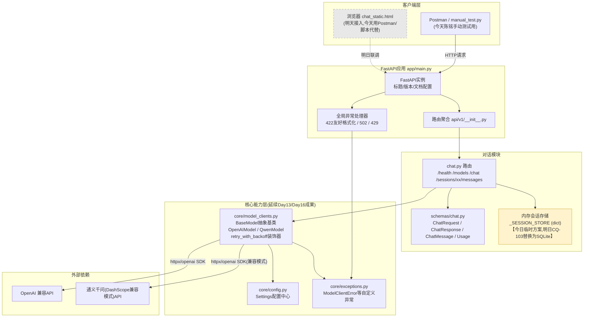
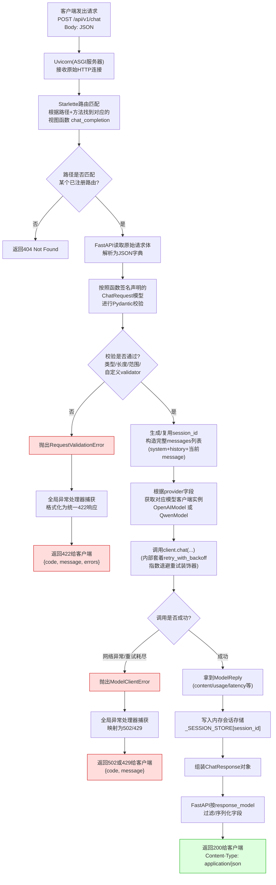

# 第23天 · FastAPI后端开发(上) —— 苍穹0.1版,第一行接口代码

> **周次/Sprint**:Sprint 1 · 对话引擎MVP(Day15-24)—— 苍穹0.1版倒数第二天
> **星期**:周二(入职第23天,转正后第二周周二;昨天周晓带完前端速成,静态页面`chat_static.html`已经能在浏览器里"假装"聊天,今天开始要让它真正连上一个活的后端接口)
> **参与人**:陈铭、周晓(列席上午需求评审)(导师:王振宇;全天答疑;需求文档由林悦提前下发)
> **飞书任务号 / GitLab任务号**:CQ-101(苍穹0.1版 · 对话API `/api/v1/chat` 基础版开发),对应仓库`cangqiong-platform`分支`feature/chat-api`
> **今日关键词**:FastAPI路由 / 路径参数 / 查询参数 / 自动生成接口文档(Swagger UI / ReDoc) / Pydantic v2数据模型 / 请求体校验 / 响应模型 / 422错误处理 / REST API封装大模型对话能力

---

## 【旁白】

如果把陈铭这七天写过的所有代码摆在一起看,会发现一个挺有意思的现象:从Day15到Day22,他写的每一段程序,不管是调用OpenAI接口做多轮对话,还是给Prompt加系统提示词,还是练习Function Calling的工具调用循环,归根结底都只服务于同一个使用者——他自己。程序跑在他自己的电脑上,输入是他自己在终端里敲的字符,输出是他自己盯着屏幕看的文字。这种代码有一个共同的、几乎不需要额外说明的隐含前提:"只要我自己能看懂、能跑通,这段代码就算完成了。"

从今天开始,这个隐含前提被彻底打破了。

苍穹0.1版的后端代码,今天正式在GitLab上开出了一个新的功能分支——`feature/chat-api`。这不是一个抽象的说法,是陈铭亲手在终端里敲下`git checkout -b feature/chat-api`那一刻真实发生的事情。分支开出来的同一时间,飞书项目里跳出来一张新的任务卡,编号CQ-101,标题写着"苍穹0.1版 · 对话API `/api/v1/chat` 基础版开发",指派人一栏,是陈铭自己的名字。与此同步,GitLab那边也开出了同一编号的Issue,和飞书任务卡挂钩联动——这是老王坚持要求的习惯,"代码分支要对得上任务号,任务号要对得上需求文档,三件东西对不齐,以后排查问题就是一场灾难。"

这张任务卡意味着什么,陈铭其实心里有数——从今天起,他写的代码,第一次要被"别人"使用。这个"别人"暂时不是真实的客户,而是周晓——她昨天写的静态页面`chat_static.html`,明天(Day24)就要真正调用陈铭今天写的这套接口,而不再是自己伪造的mock数据。再往后一步想,一旦对接完成,苍穹平台的第一个"活的产品"就诚实地立在了那里,任何一个同事,甚至老王口中提到过的"郭总",都可能在浏览器里输入一个地址,点开、发一句话、等一个回复。这种"代码要为别人负责"的感觉,和过去七天写命令行脚本时那种"跑给自己看"的心态,是两种完全不同的责任重量。

老王在昨天晚自习结束前,特意把陈铭单独留下来聊了两句,没有讲太多技术细节,只说了一句让陈铭一直惦记到今天早上的话:"你这七天写的那些对话逻辑——多轮记忆、重试机制、工具调用——这些东西本身没有变,但从今天开始,它们要换一层"外壳"。以前这层外壳是`input()`和`print()`,今天这层外壳换成HTTP请求和HTTP响应。外壳换了,里面装的东西是不是还立得住,就看你今天写的这套接口够不够规范。"这句话点出了今天这一天在整条故事线里最核心的位置——FastAPI和Pydantic不是要推翻陈铭过去七天学到的东西,恰恰相反,今天要做的事情,是把过去七天积累的、原本"裸露"在Python函数调用里的对话能力,包裹进一套有明确契约、有自动校验、有自描述文档的REST接口里,让它第一次具备"被任何人、被任何前端、被任何未来的客户端调用"的资格。

而这一天,单独拎出来看,分量不算最重——它没有Day19学Function Calling时那种"第一次让AI自己决定做什么"的震撼感,也没有Day24前后端联调成功、郭总亲自到场道贺那种仪式感。它更像是这十天Sprint里一块朴素但极其关键的承重墙:静态页面已经有了,对话引擎的核心逻辑也早就打磨过多次,今天要做的,是在这两者之间,亲手浇筑一层地基——地基打得不扎实,明天流式接口、数据库、前后端联调这三件事一起压上来的时候,才会真正出问题。老王后来在评审记录里写的那句话,某种程度上也印证了这一点:"接口设计规范,但缺少两个东西——一是它现在是'一次性返回',二是历史全部存在内存里的一个全局变量里"——这两条"缺口",恰恰是留给明天的悬念,今天陈铭还不需要为它们焦虑,但需要在写代码的时候,提前把结构设计得足够"松动",让明天的改造不至于伤筋动骨。

这也是为什么,今天上午的需求评审会上,林悦反复强调的不是"功能要多完整",而是"接口的契约要多清楚"——请求体长什么样、响应体长什么样、出错的时候返回什么,这三件事必须在写代码之前就用文字钉死,而不是等代码写完之后再回头补文档。这是陈铭第一次真正意义上体验"接口先行"(API-First)这种企业级的协作方式,而这套方式,恰恰是他接下来几十天要反复打交道的东西——从Sprint2的知识库检索接口,到Sprint4的Agent编排接口,再到Sprint7苍穹1.0全量整合时对外开放的完整API体系,今天写下的这几十行FastAPI路由和几个Pydantic模型,是这条漫长链路上,第一块真正立住的地基石。

---

## 晨会纪要 / 今日目标

**时间**:上午9:00,二层大会议室"望远"
**出席**:王振宇(老王)、林悦、陈铭、周晓(列席前半段)

陈铭提前五分钟到会议室的时候,发现今天的白板上已经提前画好了一张简单的框图——三个方框,从左到右分别写着"浏览器/Postman""FastAPI应用""大模型API",中间用箭头连着,箭头上标注着"HTTP请求""HTTP响应"。老王见他推门进来,笑着指了指白板:"这就是你今天一整天要搭的东西,别看它简单,今天写的每一行代码,都会在明天被摊在阳光下检验——周晓明天要拿你的接口去联调,联调不通,你俩都跑不了。"

**昨日进展回顾**

老王先简单回顾了周晓昨天带完的前端速成成果:"周晓昨天把苏梦他们四个的前端基础过了一遍,静态页面`chat_static.html`我看了,骨架和交互都挺完整,消息气泡、输入框、发送按钮,连异常提示都做了。但那都是假数据,今天开始,陈铭要给它配一个真的大脑。"

周晓在旁边一边翻着自己昨天写的静态页面代码,一边补充,带着点期待的语气:"我昨天写mock函数的时候,已经提前把请求和响应的字段格式,按照咱们讨论过的接口约定写好了——就等陈铭这边接口上线,理论上我这边只需要把`mockFetchChatReply`这个函数换成真正的`fetch`调用,其他代码基本不用动。"

老王听完点了点头,又转头看向陈铭:"这就是接口先行的好处——你们俩今天几乎是各自独立在推进,靠的就是提前约定好的契约。今天你的任务,就是把这个契约,变成真正能跑起来的代码。"

**训练线摘要**

老王把今天的安排写在白板上,分成清楚的两段:

**上午(9:30-12:00):FastAPI基础**。老王亲自主讲,系统过一遍FastAPI这个框架——路由怎么定义、路径参数和查询参数的区别与用法、FastAPI自带的自动接口文档(Swagger UI和ReDoc)怎么用。上午结束前,要求陈铭独立搭出一个最小可运行的FastAPI应用骨架,包含几个用于练习路径参数和查询参数的辅助接口。

**下午(13:30-17:30):Pydantic数据模型与请求体校验**。继续由老王主讲,重点讲Pydantic v2的数据模型定义、字段校验规则(`Field`的各种约束)、自定义校验器、响应模型(`response_model`)的作用,以及FastAPI在校验失败时如何自动返回422错误。下午的核心任务,是把陈铭过去七天积累的对话引擎代码(模型客户端封装、重试装饰器),正式封装进一个符合企业规范的REST接口`/api/v1/chat`里,提交前用Postman做完整的手动测试。

**晚自习(19:30起):自测与代码自查**。要求陈铭针对CQ-101里列出的所有边界场景(正常对话、空消息、超长消息、非法的temperature参数、不存在的provider等)逐条手动测试,并把测试记录整理进任务卡的验收清单里,为明天上午的代码评审做准备。

**今日目标清单**:

1. 上午9:30-10:15:FastAPI框架总览、路由基础、`uvicorn`启动方式讲解。
2. 上午10:15-11:00:路径参数(Path Parameters)详解,类型声明、类型校验、`Path()`约束。
3. 上午11:00-11:45:查询参数(Query Parameters)详解,可选参数、默认值、`Query()`约束、列表类型查询参数。
4. 上午11:45-12:00:自动接口文档(`/docs`、`/redoc`)现场演示,讲清楚它是"免费"生成的、为什么企业级项目离不开它。
5. 下午13:30-14:30:Pydantic v2数据模型基础,`BaseModel`、字段类型、默认值、`Field`约束、嵌套模型。
6. 下午14:30-15:15:自定义校验器(`field_validator`)、模型级校验(`model_validator`)。
7. 下午15:15-16:00:响应模型(`response_model`)的作用、为什么不能直接返回内部数据结构、字段过滤与安全性。
8. 下午16:00-17:30:代码实战——把`ChatRequest`/`ChatResponse`模型、`OpenAIModel`/`QwenModel`客户端类、`retry_with_backoff`重试装饰器,整合进`/api/v1/chat`接口,完成CQ-101的全部验收标准。
9. 晚自习19:30-21:00:Postman/脚本手动测试所有正常与异常场景,整理测试记录,完成CQ-101任务卡自查清单。

**风险点**

- **路径参数和查询参数的取舍容易混淆**。老王提前打了个预防针:"很多新手容易把该放在路径里的东西塞进查询参数,或者反过来。判断标准很简单——'定位资源'用路径参数(比如是哪个会话),'过滤/控制返回内容'用查询参数(比如翻页参数)。"
- **Pydantic v2和v1的语法差异**。老王特别提醒:"网上很多教程还是v1的写法,比如`@validator`,咱们统一用v2的`@field_validator`,写代码之前先确认清楚版本,不要把两套语法混着抄。"
- **响应模型里"多返回字段"和"少返回字段"都是问题**。老王举了个例子:"如果响应模型里不小心把内部的API Key或者完整的Prompt结构原样返回给前端,这是安全事故,不是小问题。"
- **422错误处理容易被新手忽略**。林悦特别叮嘱:"很多同学写接口,只关心'成功了该返回什么',没有认真想过'失败了该返回什么',而失败场景往往比成功场景更常见、更需要被认真设计,前端要靠这些错误信息给用户提示。"
- **今天写的接口是"一次性返回"、历史存在内存里,这是已知的、暂时接受的简化**。老王明确说清楚边界:"你不用在今天就想着流式输出和数据库持久化,那是明天(CQ-102、CQ-103)的任务。今天的目标很纯粹——把一个规范、健壮、有完整校验和文档的REST接口立起来,这一步没做好,明天什么都推不动。"

---

## 需求文档:苍穹0.1版 · 对话API `/api/v1/chat` 接口设计文档

> 撰写人:林悦(产品经理) · 技术评审:王振宇 · 文档编号:CQ-PRD-D23-01 · 版本:v1.0

### 背景

苍穹0.1版的目标是交付一个"网页版对话产品"——用户在浏览器里打开静态页面,输入内容,能收到智能体的回复。周一到周二这两天(Day22-23),前后端并行推进:周晓负责的静态页面已经在Day22完成了界面结构和交互逻辑;陈铭需要在今天完成后端第一个正式的REST接口,把过去七天积累的对话引擎能力,包装成一个符合企业接口规范的HTTP服务,供前端(以及未来任何其他客户端,比如移动端、第三方系统集成)调用。

需要特别说明的是,本次CQ-101只覆盖"基础版"能力——即接口以标准的"一次性返回完整回复"方式工作,不涉及流式输出(SSE)、不涉及数据库持久化(对话历史暂时存储在服务进程的内存里)。这两项能力将在明天(CQ-102、CQ-103)分别实现。这是一个刻意的分阶段安排——先把"接口契约、参数校验、错误处理"这一层地基打扎实,再叠加"流式""持久化"这些相对独立的能力,避免一次性引入太多变量导致排查问题时无从下手。

### 接口总览

本次CQ-101需要交付以下四个接口,统一挂载在`/api/v1/chat`路由前缀下:

| 序号 | 方法 | 路径 | 作用 |
|---|---|---|---|
| 1 | GET | `/api/v1/chat/health` | 健康检查,确认服务已启动且可用 |
| 2 | GET | `/api/v1/chat/models` | 查询当前支持的模型供应商及可用模型列表,支持按`provider`查询参数过滤 |
| 3 | POST | `/api/v1/chat` | 核心接口:提交一轮对话请求,同步返回大模型的完整回复 |
| 4 | GET | `/api/v1/chat/sessions/{session_id}/messages` | 查询某个会话(路径参数`session_id`)的历史消息,支持`skip`/`limit`查询参数分页 |

### 接口详细设计

#### 接口1:`GET /api/v1/chat/health`

**用途**:供前端、运维监控脚本、未来的负载均衡健康检查探针使用,确认服务进程处于正常可响应状态。

**请求参数**:无。

**响应**(200):

```json
{
  "status": "ok",
  "service": "cangqiong-chat-api",
  "version": "0.1.0"
}
```

#### 接口2:`GET /api/v1/chat/models`

**用途**:让前端知道当前后端支持哪些模型供应商、每个供应商下有哪些可选模型,方便前端未来做"模型选择器"这类界面(苍穹0.1版暂时不需要这个界面,但接口先预留好)。

**查询参数**:

| 参数名 | 类型 | 必填 | 默认值 | 说明 |
|---|---|---|---|---|
| `provider` | string | 否 | 不传则返回全部 | 按供应商过滤,取值范围`openai`、`qwen` |

**响应**(200,不传`provider`时返回全部供应商):

```json
{
  "providers": [
    {
      "provider": "qwen",
      "models": ["qwen-plus", "qwen-turbo", "qwen-max"],
      "default_model": "qwen-plus"
    },
    {
      "provider": "openai",
      "models": ["gpt-4o-mini", "gpt-4o"],
      "default_model": "gpt-4o-mini"
    }
  ]
}
```

**异常场景**:如果`provider`传了一个不支持的取值(比如`baidu`),返回404,响应体:

```json
{
  "code": "PROVIDER_NOT_FOUND",
  "message": "不支持的模型供应商:baidu,当前支持:openai、qwen"
}
```

#### 接口3(核心):`POST /api/v1/chat`

**用途**:提交用户当前这一轮的输入,连同历史对话(如果有),提交给指定的大模型供应商,同步等待并返回完整的回复内容。这是本次CQ-101的核心交付物。

**请求体**(JSON,对应`ChatRequest`模型):

| 字段名 | 类型 | 必填 | 默认值/约束 | 说明 |
|---|---|---|---|---|
| `session_id` | string \| null | 否 | 不传则由服务端生成一个新的UUID | 会话标识,同一个会话的多轮对话应该传同一个值 |
| `message` | string | 是 | 长度1-2000字符 | 用户当前这一轮的输入内容 |
| `history` | 数组(每项含`role`/`content`) | 否 | 默认空列表,最多40条 | 之前的对话历史,`role`取值`system`/`user`/`assistant` |
| `provider` | string | 否 | 默认`qwen` | 模型供应商,取值`openai`/`qwen` |
| `model` | string \| null | 否 | 不传则使用该供应商默认模型 | 具体模型名称 |
| `temperature` | float | 否 | 默认0.7,范围0.0-2.0 | 采样温度 |
| `max_tokens` | int | 否 | 默认1024,范围1-8192 | 最大生成token数 |

**请求体示例**:

```json
{
  "session_id": "sess-8f21b3",
  "message": "帮我用一句话总结一下FastAPI和Flask的核心区别",
  "history": [
    {"role": "user", "content": "你好,今天状态怎么样"},
    {"role": "assistant", "content": "你好,我随时待命,有什么可以帮你的吗"}
  ],
  "provider": "qwen",
  "temperature": 0.7,
  "max_tokens": 512
}
```

**成功响应**(200,对应`ChatResponse`模型):

```json
{
  "session_id": "sess-8f21b3",
  "reply": "FastAPI基于异步ASGI和Pydantic类型系统,天生自带数据校验和自动接口文档;Flask是同步WSGI框架,更轻量灵活但这些能力需要额外插件补齐。",
  "provider": "qwen",
  "model": "qwen-plus",
  "usage": {
    "prompt_tokens": 86,
    "completion_tokens": 47,
    "total_tokens": 133
  },
  "latency_ms": 842.3
}
```

**异常场景一览**:

| 场景 | HTTP状态码 | 错误码(`code`字段) | 说明 |
|---|---|---|---|
| `message`字段缺失或为空字符串 | 422 | 由FastAPI自动生成 | Pydantic校验不通过 |
| `message`超过2000字符 | 422 | 由FastAPI自动生成 | 超出`max_length`约束 |
| `temperature`超出0.0-2.0范围 | 422 | 由FastAPI自动生成 | 超出`Field`约束 |
| `history`超过40条 | 422 | 由自定义`field_validator`触发 | 业务级校验规则 |
| `provider`取值不在`openai`/`qwen`范围内 | 422 | 由FastAPI自动生成 | 枚举/`Literal`类型校验 |
| 大模型API调用失败(网络问题、重试耗尽) | 502 | `MODEL_UPSTREAM_ERROR` | 由自定义异常处理器返回 |
| 大模型API返回限流错误 | 429 | `MODEL_RATE_LIMITED` | 由自定义异常处理器返回 |

#### 接口4:`GET /api/v1/chat/sessions/{session_id}/messages`

**用途**:查询某个会话的历史对话记录,用于前端展示历史消息列表(周一静态页面里的"假历史",今天开始要有真实数据来源,尽管暂时只是内存存储,不支持重启保留——这是留给明天CQ-103数据库持久化任务要解决的问题)。

**路径参数**:

| 参数名 | 类型 | 说明 |
|---|---|---|
| `session_id` | string | 会话标识,必须是`POST /api/v1/chat`接口返回过的合法session_id |

**查询参数**:

| 参数名 | 类型 | 必填 | 默认值/约束 | 说明 |
|---|---|---|---|
| `skip` | int | 否 | 默认0,不能为负数 | 跳过的消息条数,用于分页 |
| `limit` | int | 否 | 默认20,范围1-100 | 本次返回的最大消息条数 |

**成功响应**(200):

```json
{
  "session_id": "sess-8f21b3",
  "total": 4,
  "skip": 0,
  "limit": 20,
  "messages": [
    {"role": "user", "content": "你好,今天状态怎么样"},
    {"role": "assistant", "content": "你好,我随时待命,有什么可以帮你的吗"},
    {"role": "user", "content": "帮我用一句话总结一下FastAPI和Flask的核心区别"},
    {"role": "assistant", "content": "FastAPI基于异步ASGI和Pydantic类型系统……"}
  ]
}
```

**异常场景**:`session_id`不存在,返回404,响应体:

```json
{
  "code": "SESSION_NOT_FOUND",
  "message": "会话sess-xxxxxx不存在,请确认session_id是否正确,或先调用POST /api/v1/chat创建会话"
}
```

### 非功能性要求

1. 所有接口必须能在`/docs`(Swagger UI)和`/redoc`(ReDoc)里自动展示,字段说明、约束、示例都要完整,不允许出现"unnamed field"这类看不懂的默认命名。
2. 所有请求体、响应体必须用Pydantic模型定义,不允许直接操作裸字典(`dict`)作为接口的输入输出契约。
3. 422错误的响应体格式要统一,林悦要求"哪怕是框架自动生成的校验错误,前端拿到的格式也要跟我们自己抛出的业务错误长得差不多,不能一半是FastAPI原生格式、一半是我们自定义格式,那样前端要写两套解析逻辑"。
4. 今天不要求实现CORS跨域配置(留给CQ-102),但要求陈铭本地用Postman或者`requests`脚本完成全部场景的手动测试,并将测试记录附在任务卡下面。
5. 代码规范延续公司统一标准:PEP8、中文docstring、关键逻辑行内中文注释、模块划分清晰(路由、模型、业务逻辑分层,不允许把所有代码堆在一个文件里)。

### CQ-101任务卡

```
【飞书项目 / GitLab Issue】CQ-101
标题:苍穹0.1版 · 对话API /api/v1/chat 基础版开发
指派人:陈铭
关联分支:feature/chat-api(仓库:cangqiong-platform)
优先级:P0
预计工时:1人日
状态:进行中 → (今日晚自习后)待评审

任务描述:
按照CQ-PRD-D23-01接口设计文档,实现以下四个接口:
1. GET /api/v1/chat/health
2. GET /api/v1/chat/models
3. POST /api/v1/chat(核心接口,整合已有的模型客户端封装与重试机制)
4. GET /api/v1/chat/sessions/{session_id}/messages

验收标准:
[ ] 所有接口能在/docs中正常展示,字段说明完整
[ ] ChatRequest/ChatResponse等Pydantic模型字段类型、约束与PRD一致
[ ] POST /api/v1/chat 能正确处理正常对话请求,返回结构符合ChatResponse
[ ] message为空、超长、temperature超范围、history超40条,均返回422且错误信息可读
[ ] provider传入不支持的取值,POST接口返回422,GET /models接口返回404
[ ] 会话查询接口对不存在的session_id正确返回404
[ ] 大模型调用失败时(可用手动断网或改错API Key模拟),接口不会导致进程崩溃,返回502且错误信息合理
[ ] 使用Postman或脚本完成不少于10个用例的手动测试,记录附在本任务卡下方评论区
[ ] 代码提交到feature/chat-api分支,commit信息清晰,不与main分支冲突

备注(老王评审时补充):
"这一版重点看接口设计和校验逻辑是否扎实,流式和持久化明天再看,今天不要提前引入这两块复杂度。"
```

---

## 架构设计图

下面这张图展示的是`feature/chat-api`分支上,苍穹0.1版后端在今天(CQ-101)结束后的整体代码结构与依赖关系。可以看到,今天新增的这几层——路由层、数据模型层——是包裹在过去几天已经写好的模型客户端能力(`OpenAIModel`/`QwenModel`/重试装饰器)外面的一层新外壳,底层能力本身几乎没有改动。



需要特别说明架构图里两个用虚线或者特殊底色标出的部分:一是"浏览器"和"FastAPI应用"之间的连线画成了虚线,因为今天陈铭还没有和周晓的静态页面做真正的联调,这条连线要等到明天才会变成实线;二是"内存会话存储"这个方框特意用了醒目的浅黄底色,提醒这是一个已知的、暂时接受的技术债——数据存在进程内存里,一旦服务重启,所有会话历史会全部清空,这个问题不属于今天CQ-101的范畴,但架构图里必须诚实地标出来,而不是假装它不存在。

---

## 流程图:一次HTTP请求的完整生命周期

这张图展示的是`POST /api/v1/chat`这个核心接口,从客户端发出请求到最终收到响应,中间经过的每一步——路由匹配、Pydantic校验、业务逻辑执行、响应序列化,以及校验失败和业务异常两条分支路径分别会走到哪里。



这张流程图有一个细节值得反复强调:Pydantic校验(步骤F、G)发生在"业务逻辑代码被真正执行之前"——也就是说,如果`message`字段是空字符串,陈铭在路由函数体里写的那些业务逻辑代码,一行都不会被执行到,请求会在FastAPI框架层面就被拦截下来,直接返回422。这正是FastAPI"声明式校验"最大的价值——校验规则写在数据模型的定义里,而不是写成路由函数体开头一堆`if not message: raise ...`这样的命令式代码,业务逻辑代码因此可以变得干净很多,只需要关心"校验通过之后该做什么",不需要重复关心"输入合不合法"。

---

## 示意图:Pydantic请求体校验的数据流

上面那张流程图已经能看出"校验"是整个请求生命周期里的一个关键环节,但校验内部到底经历了哪几步、每一步谁负责、失败了信息是怎么一步步传递出去的,这里用一张更细的示意图单独讲清楚。

```mermaid
sequenceDiagram
    participant C as 客户端
    participant U as Uvicorn/Starlette
    participant F as FastAPI路由函数签名
    participant P as Pydantic(ChatRequest模型)
    participant V as 自定义field_validator
    participant H as 全局异常处理器
    participant B as 业务逻辑(路由函数体)

    C->>U: 发送JSON请求体(bytes)
    U->>F: 解析为原始dict,准备绑定到参数
    F->>P: 按ChatRequest的字段定义逐字段校验
    activate P
    P->>P: 类型校验(str/int/float/list等)
    P->>P: 内置约束校验(min_length/max_length/ge/le)
    P->>V: 触发自定义校验器(如history长度<=40)
    activate V
    alt 自定义规则不通过
        V-->>P: raise ValueError("history不能超过40条")
    else 自定义规则通过
        V-->>P: 返回校验后的值
    end
    deactivate V
    alt 任一字段校验失败
        P-->>F: 汇总所有失败字段,抛出ValidationError
        deactivate P
        F->>H: 转换为RequestValidationError并抛出
        H->>H: 遍历errors(),按字段分组、翻译成中文提示
        H-->>C: 返回422 + {code, message, errors:[{field, reason}]}
    else 全部字段校验通过
        P-->>F: 返回一个类型安全的ChatRequest实例
        deactivate P
        F->>B: 把ChatRequest实例作为参数注入路由函数
        B->>B: 执行业务逻辑(调用模型客户端等)
        B-->>C: 最终返回200 + ChatResponse
    end
```

这张图想表达的核心观念是:Pydantic校验不是"一次性通过或失败"的单一判断,而是"逐字段独立校验、失败原因逐字段收集"的过程——哪怕请求体里同时有三个字段都不合法(比如`message`是空字符串,`temperature`是3.5超出范围,`history`有45条超过40条上限),Pydantic也不会校验完第一个字段就提前退出,而是会把三个字段的错误都收集起来,一次性通过422响应全部告诉客户端。这一点对前端开发者(明天要联调的周晓)非常友好——她不需要"改一个字段、提交一次、看一个错误"这样反复试错,而是能一次性看到所有问题,批量修正。

---

## 课堂笔记

### 上午:FastAPI路由 / 路径参数 / 查询参数 / 自动接口文档

老王上午开场没有直接讲FastAPI的语法,而是先在白板上写了一行字:"FastAPI是什么?一句话——它是一个'把Python函数签名,变成HTTP接口契约'的框架。"他解释说,这句话初听有点抽象,但理解了这句话,后面所有的语法细节都会变得顺理成章:你在函数签名里怎么声明参数类型,FastAPI就怎么校验、怎么生成文档;你怎么声明返回值类型,FastAPI就怎么过滤、序列化响应。FastAPI本身几乎没有发明什么新概念,它做的事情,是把Python原生的"类型注解"(Type Hints)这个特性,和HTTP协议、和Pydantic的数据校验能力,三者严丝合缝地粘合在了一起。

**为什么是FastAPI,不是Flask或Django**

陈铭之前零零散散听过Flask和Django这两个名字,上午一开始就问了这个问题。老王给出的答案很实际:"Flask足够轻量灵活,但数据校验、接口文档这些企业级项目天天要用的能力,都需要额外装插件、额外写代码去补;Django功能大而全,但对咱们这种'轻量级API服务'场景来说,过重了,很多能力(比如它自带的ORM、Admin后台)用不上。FastAPI这几年在Python生态里能迅速普及,核心原因就是它'原生自带'了两件企业级项目最刚需的能力——基于Pydantic的自动数据校验,和基于OpenAPI标准的自动接口文档。这两件事,如果用Flask手写,工作量不是一星半点。"他补充了一句:"苍穹平台选型FastAPI,不是跟风,是因为咱们要做的事情——给外部客户提供API、给不同团队提供接口——天生就需要这两件能力,FastAPI刚好是'为这类场景而生'的框架。"

**最小可运行的FastAPI应用**

老王让陈铭先跟着敲一个最简单的例子,建立起最基本的直觉:

```python
from fastapi import FastAPI

app = FastAPI()


@app.get("/")
def read_root():
    return {"message": "苍穹后端已启动"}
```

保存成`main.py`之后,用一条命令启动:

```bash
uvicorn main:app --reload --port 8000
```

老王解释这条命令的几个部分:`main:app`表示"`main.py`文件里名叫`app`的那个FastAPI实例";`--reload`表示代码改动后自动重启进程,开发阶段必备,但生产环境绝对不能带这个参数,因为它有额外的性能开销和潜在的安全隐患;`--port 8000`指定监听端口,不写默认是8000。

启动之后,浏览器打开`http://127.0.0.1:8000/`,能看到`{"message": "苍穹后端已启动"}`这个JSON被直接显示出来。陈铭当时的第一反应是"这跟我这几天用`requests`库调用OpenAI接口时看到的响应长得一样"——老王肯定了这个观察:"对,这就是HTTP服务的对称性——你之前一直是'客户端'的角色,在调别人的接口;从今天起,你要学会当'服务端',让别人调你的接口。协议是同一套东西,只是这次你站在了另一侧。"

**路由(Routing)的核心概念**

老王在白板上画了一张简单的对照表,说明"路由"到底是什么:

| HTTP方法 | 典型语义 | 苍穹后端的例子 |
|---|---|---|
| GET | 获取资源,不应该有副作用 | 查询健康状态、查询历史消息 |
| POST | 创建资源,或提交一次有副作用的操作 | 提交一轮对话 |
| PUT | 整体替换一个资源 | (苍穹0.1版暂未用到) |
| PATCH | 局部更新一个资源 | (苍穹0.1版暂未用到) |
| DELETE | 删除资源 | (苍穹0.1版暂未用到) |

他特别强调GET请求"不应该有副作用"这条原则:"GET请求理论上应该是可以被浏览器缓存、可以被重复发送而不产生任何额外影响的——如果你把'提交一次对话,消耗一次API调用额度'这种有明显副作用的操作设计成GET接口,是明显违反HTTP语义的错误设计,面试的时候被问到这一点答不上来,是会被明显扣分的。这也是为什么PRD里`POST /api/v1/chat`用的是POST,而查健康状态、查历史消息用的是GET。"

在FastAPI里,声明一个路由,靠的是装饰器:

```python
@app.get("/api/v1/chat/health")
def health_check():
    return {"status": "ok"}


@app.post("/api/v1/chat")
def chat_completion(request_body):
    ...
```

老王补充了一个容易被忽略的细节:"函数名本身(`health_check`、`chat_completion`)对HTTP客户端来说完全不可见,客户端只关心你注册的路径和方法。函数名怎么起,是给写代码的人看的,好的函数名同样重要——但它和路由本身是两件独立的事,不要混淆。"

**状态码的显式声明:status_code参数**

在正式讲路径参数之前,老王补了一个容易被忽略的小知识点,提前埋一个"伏笔"——今天写的所有GET接口成功时都返回200,这是FastAPI的默认行为,但并不是唯一合理的选择。他举了个例子:"如果以后要设计一个'创建资源'的接口(比如未来创建一个新的知识库),按照HTTP规范更严谨的做法,是成功创建之后返回201(Created),而不是笼统地返回200。FastAPI允许你在装饰器上显式声明:"

```python
@app.post("/api/v1/chat", status_code=200)
def chat_completion(body):
    ...
```

"`POST /api/v1/chat`这个接口,语义上更接近'提交一次操作并同步拿到结果',不是严格意义上的'创建一个持久化资源',所以PRD里约定它返回200是合理的;但如果未来遇到那种'调用一次就在数据库里新建一条记录'的接口,记得考虑用201,这是很多面试和代码评审里会被单独挑出来问的细节,今天先留个印象,不需要今天就去改动。"

**路径参数(Path Parameters)**

老王接着讲路径参数,先给了一个直观的例子——查询某个会话的历史消息,`session_id`是路径的一部分:

```python
@app.get("/api/v1/chat/sessions/{session_id}/messages")
def get_session_messages(session_id: str):
    return {"session_id": session_id}
```

他解释:大括号`{session_id}`占据的这段路径,会被FastAPI自动提取出来,绑定到函数参数里同名的`session_id`上。关键点在于:函数参数上写的类型注解`: str`,FastAPI会拿这个类型去做校验和类型转换。如果换成`int`类型:

```python
@app.get("/api/v1/chat/messages/{message_index}")
def get_message_by_index(message_index: int):
    return {"index": message_index, "type": type(message_index).__name__}
```

访问`/api/v1/chat/messages/3`,`message_index`会被自动转换成Python的整数`3`(不是字符串`"3"`),`type(message_index).__name__`打印出来是`int`。但如果访问`/api/v1/chat/messages/abc`,FastAPI会自动返回422,因为`"abc"`没办法被转换成整数——这个校验完全不需要陈铭手写任何`try/except`或者`isinstance`判断,只靠一个类型注解就自动生效了。老王评价说:"这是FastAPI'类型即校验规则'这套设计哲学里,最直观的一个体现——你以前学Python的时候,类型注解经常只是给人看的'装饰性'注释,IDE可能会提示你,但运行时完全不做任何检查;FastAPI把这层类型注解,变成了运行时真正生效的校验逻辑,这是它和纯Python原生语法最大的区别之一。"

路径参数还可以加更细的约束,用`Path()`:

```python
from fastapi import Path

@app.get("/api/v1/chat/sessions/{session_id}/messages/{msg_index}")
def get_one_message(
    session_id: str,
    msg_index: int = Path(..., ge=0, description="消息在会话中的序号,从0开始"),
):
    ...
```

老王解释`Path(..., ge=0, ...)`里的省略号`...`(Python里叫`Ellipsis`)是Pydantic/FastAPI里表示"这个参数是必填的"的一种写法,`ge=0`表示"greater than or equal,大于等于0",这样`msg_index=-1`这种非法输入,也会在框架层面自动被拦截返回422,不需要业务代码里再写一层判断。

**查询参数(Query Parameters)**

查询参数是老王讲得最细的一块,因为团队新人最容易在这里犯迷糊。他先给出一个判断标准:"函数参数如果没有出现在路径的大括号里,FastAPI默认会把它当成查询参数处理,拼在URL的`?`后面,比如`?skip=0&limit=20`。"

```python
@app.get("/api/v1/chat/sessions/{session_id}/messages")
def get_session_messages(session_id: str, skip: int = 0, limit: int = 20):
    return {"session_id": session_id, "skip": skip, "limit": limit}
```

访问`/api/v1/chat/sessions/sess-001/messages?skip=10&limit=5`,`session_id`是路径参数(必填,因为它出现在路径里),`skip`和`limit`是查询参数,因为函数签名里给了默认值`0`和`20`,所以不传的时候也不会报错,直接使用默认值。老王强调:"这里有个容易犯的错——如果一个参数没有默认值,并且没有出现在路径里,FastAPI会认为它是'必填的查询参数',不传就会报422。这经常是新手写接口调试半天,发现'为什么少传一个参数就报错'的根源——去检查一下这个参数是不是忘了给默认值,或者本来就应该是必填的。"

同样,查询参数也能用`Query()`加约束,并且能自动出现在文档里:

```python
from fastapi import Query

@app.get("/api/v1/chat/sessions/{session_id}/messages")
def get_session_messages(
    session_id: str,
    skip: int = Query(default=0, ge=0, description="跳过的消息条数,用于分页"),
    limit: int = Query(default=20, ge=1, le=100, description="本次返回的最大消息条数"),
):
    ...
```

老王还补充了一种容易被问到的查询参数用法——可选参数(允许完全不传,且没有一个"看起来正常"的默认值,比如按`provider`过滤模型列表这个场景,不传就表示"查全部"):

```python
from typing import Optional

@app.get("/api/v1/chat/models")
def list_models(provider: Optional[str] = Query(default=None, description="按供应商过滤,不传则返回全部")):
    if provider is None:
        return {"providers": "全部"}
    return {"providers": provider}
```

他还提到Python 3.10之后更简洁的写法`provider: str | None = None`,和`Optional[str] = None`是完全等价的,团队内部统一用`str | None`这种新语法,"更直观,不用额外`import Optional`"。

陈铭当时提了一个问题:"如果我想让查询参数支持传多个值,比如同时按几个供应商过滤,怎么办?"老王给出了答案,用列表类型的查询参数:

```python
@app.get("/api/v1/chat/models")
def list_models(providers: list[str] = Query(default=[])):
    return {"filter": providers}
```

请求URL写成`/api/v1/chat/models?providers=openai&providers=qwen`,同一个参数名重复出现多次,FastAPI会自动把它们收集成一个列表`["openai", "qwen"]`。这个用法在苍穹0.1版暂时用不到,但老王提醒"以后写筛选类接口(比如按多个标签筛选知识库文档),这个技巧会经常用到,今天先建立印象。"

**同步函数与异步函数:def与async def的取舍**

上午讲到查询参数的时候,陈铭注意到一个细节:老王写的所有路由函数,用的都是普通的`def`,而不是他在别的地方零星见过的`async def`。他问了这个问题,老王干脆把这个问题当成一个正式的知识点讲开:"FastAPI这两种写法都支持,而且很多新手第一次看到`async def`,会下意识地觉得'异步一定比同步快,以后都写异步'——这个理解是有偏差的,今天必须讲清楚,不然以后你写代码会用错场景。"

老王在白板上写下两条规则,让陈铭抄下来:"第一条规则——如果你的路由函数体里,调用的是纯CPU计算,或者调用的是一个'同步阻塞'的库(比如今天咱们用的OpenAI官方SDK的同步客户端,它内部走的是同步的HTTP请求,会阻塞住当前线程直到网络请求返回),那就老老实实用`def`,不要写成`async def`。第二条规则——只有当你函数体里,调用的是真正支持`await`的异步库(比如`httpx.AsyncClient`、异步版本的数据库驱动),写成`async def`才有意义,而且这时候几乎每一次对外部资源的调用,都要记得加上`await`,漏掉一个,这个函数就退化成了'看起来是异步,实际上还是同步阻塞'的假异步函数,反而比诚实地写成`def`更危险。"

他补充解释了背后的原理:"FastAPI底层跑在Starlette和Uvicorn这套ASGI架构上,`async def`的路由函数,是直接在主事件循环里执行的——如果这个函数内部藏着一段同步阻塞的代码(比如没用异步SDK,却写成了`async def`),这段阻塞代码会把整个事件循环卡住,期间**所有**其他正在处理的请求都会被拖慢,不只是你自己这一个请求变慢。而普通的`def`函数,FastAPI会自动把它扔进一个独立的线程池里去执行,不会阻塞主事件循环——这也是为什么,今天咱们复用Day13、Day21写的那套基于同步OpenAI SDK的模型客户端代码,路由函数体老老实实写成`def`,反而是更安全、更正确的选择,不是'偷懒没升级成异步',是'认清楚了同步SDK的本质,做出了匹配的选择'。"

陈铭追问了一句:"那以后要是把模型客户端换成异步SDK,是不是就应该无脑全部改成`async def`?"老王摇头:"不是无脑改,是要跟着'调用链路是不是彻底异步'这条标准走——只要链路上有一环还是同步阻塞的,'把最外层的路由函数改成`async def`'这个动作本身,反而会带来风险而不是收益。这个话题今天先点到这里,涉及到高并发下的性能调优,是后面Sprint讲到部署优化(大致在苍穹平台真正对外承接较大流量的阶段)才会深入展开的内容,今天你只需要记住'同步库配同步def,异步库配异步def,不要混着乱用'这条最基本的对应关系。"

**依赖注入初探:Depends的第一印象**

上午临近查询参数收尾的时候,老王顺带提了一句FastAPI里另一个非常核心、但今天不会深入展开的概念——依赖注入(Dependency Injection),用`Depends()`实现。他没有花太多时间展开细节,只是先让陈铭对这个概念有一个直观印象,承诺"明天封装校验session_id是否存在这类'很多接口都要重复做一次'的逻辑时,会正式用到这个东西"。

```python
from fastapi import Depends


def get_current_settings():
    """一个简单的依赖函数,今天先建立印象,返回配置对象。"""
    return get_settings()


@app.get("/api/v1/chat/health")
def health_check(settings=Depends(get_current_settings)):
    return {"status": "ok", "env": settings.app_env}
```

老王解释这段代码的意图:"`Depends()`里包着一个普通的函数(或者是一个类),FastAPI在真正调用你的路由函数之前,会先执行这个依赖函数,把它的返回值,作为参数注入到路由函数里。今天你可能觉得'这不就是自己在函数体里手写一行`settings = get_settings()`吗,何必绕这么一圈?'——单看这一个例子,确实看不出明显的好处。但等到明天,你会遇到'好几个不同的接口,都需要先确认session_id存在、需要拿到当前登录用户信息、需要做一次权限校验'这类逻辑,如果每个路由函数体开头都手写一遍同样的判断代码,会有大量重复;用`Depends()`把这类'公共的前置检查逻辑'抽成一个独立的依赖函数,所有需要它的接口,只需要在函数签名里声明一下`Depends(...)`,FastAPI会自动帮你在真正执行业务逻辑之前跑一遍这个检查,校验失败还能直接在依赖函数内部抛出异常,提前拦截掉整个请求,业务代码完全不需要关心这件事。"

周晓当时还在会议室,听到这段随口问了一句:"那前端要不要关心后端用没用`Depends`?"老王笑着回答:"完全不需要,`Depends`是纯后端内部的代码组织方式,对HTTP请求本身的格式没有任何影响,前端该怎么传参数还是怎么传,这是这套机制'对调用方透明'的一个体现。"这个概念今天先停在"知道它存在、知道它大致解决什么问题"这一步,正式动手写依赖函数,要等到明天封装"校验session_id合法性"这类逻辑时才会真正用上。

**自动接口文档:Swagger UI 与 ReDoc**

上午最后半小时,老王没有讲新语法,而是直接打开浏览器演示。启动服务之后,访问`http://127.0.0.1:8000/docs`,会看到一个完整的、交互式的接口文档页面——这是Swagger UI(OpenAPI标准的一种可视化实现)。每一个注册过的路由,都会自动出现在这个页面上,包括请求参数、参数类型、约束条件、请求体结构示例,甚至可以直接在页面上填参数、点"Execute"按钮发起真实请求,看到真实的响应结果。

老王点开`/api/v1/chat/sessions/{session_id}/messages`这个接口的文档条目,给陈铭展示细节:"你看,`session_id`标了'required'(必填),`skip`和`limit`标了默认值和取值范围,这些信息全都是从你刚才写的类型注解和`Query()`约束里自动生成的,你一个字都没有额外写文档,它就自动长出来了。"他强调这一点的价值:"你们以后跟前端、跟客户对接接口,最痛苦的场景之一,就是接口文档和实际代码不一致——文档说这个字段必填,代码里其实是可选的,或者反过来。FastAPI的自动文档,从根本上避免了这类'文档滞后于代码'的问题,因为文档不是你手写维护的,它就是代码本身生成出来的,代码变了文档自动就变了。"

另一个文档页面是`http://127.0.0.1:8000/redoc`,用的是ReDoc这套渲染方式,视觉风格更偏"阅读型",没有Swagger UI那种"可以直接在页面上发请求测试"的交互能力,但排版更适合当作正式的接口文档分享给外部客户或者合作方查阅。老王提到:"以后咱们苍穹平台对外开放API给客户接入的时候,ReDoc这种风格的文档,通常会更正式地打包进对外的开发者文档站点里;Swagger UI更多是内部开发调试阶段用。"

他还提了一句关于生产环境的安全考量:"这两个文档页面默认是完全公开的,任何人知道地址就能看到你所有接口的结构,甚至能直接在页面上尝试调用。开发阶段没问题,但真正对外上线的生产环境,通常需要考虑是否要关闭这两个文档路由,或者加一层访问控制——这个点先记下来,以后讲部署上线的课件(Sprint6附近)会正式展开讲。"FastAPI提供的关闭方式很简单,创建`FastAPI()`实例时传参数:

```python
app = FastAPI(docs_url=None, redoc_url=None)  # 生产环境关闭自动文档,示例写法
```

上午的内容,老王最后用一句话做了收束:"路由决定了'这个URL该由谁处理',路径参数和查询参数决定了'处理函数能拿到哪些外部输入',自动文档是'这些输入输出契约的免费副产品'。这三件事,是你今天上午需要彻底吃透的地基,下午要讲的Pydantic模型,是在这个地基上,给'请求体'这种更复杂的结构化输入,补上同样级别的类型校验能力。"

### 下午:Pydantic数据模型 / 请求体校验 / 响应模型

下午一开始,老王先抛出一个问题:"路径参数和查询参数,天生都是'字符串'或者简单类型——一个session_id、一个数字。但`POST /api/v1/chat`要接收的请求体,是一整个JSON对象,里面有字符串、有数字、有列表、列表里还嵌套着对象。这种复杂结构,靠函数参数一个个声明肯定不现实,那该怎么办?"陈铭想了想,回答说"用字典接收,自己写代码校验?"老王点头:"这是没有Pydantic之前,大家真实的做法——但写过一次你就知道,手写这种校验代码,又啰嗦又容易漏。Pydantic要解决的,就是这个问题。"

**Pydantic BaseModel基础**

Pydantic的核心概念,是用一个继承自`BaseModel`的类,去描述一份数据"应该长什么样":

```python
from pydantic import BaseModel


class ChatMessage(BaseModel):
    role: str
    content: str
```

老王解释:"这个类不是普通的Python类,它背后有一整套校验、序列化的机制。你可以把它想象成'给这份数据画了一张身份证规格表'——字段叫什么、类型是什么,写清楚之后,任何时候你拿一份实际数据去'套'这张身份证规格表,Pydantic都会告诉你,这份数据合不合格。"

用起来非常直接:

```python
msg = ChatMessage(role="user", content="你好")
print(msg.role)      # user
print(msg.content)   # 你好
print(msg.model_dump())  # {'role': 'user', 'content': '你好'}
```

如果传入的数据类型不对,比如`content`传了一个整数`123`,Pydantic v2默认会尝试做"合理的类型强转"(比如整数转字符串在某些模式下是允许的,但要看具体字段类型和配置),如果实在无法转换,或者缺少必填字段,会直接抛出`ValidationError`异常,并且把所有校验失败的字段和原因,清清楚楚地打印出来:

```python
try:
    ChatMessage(role="user")  # 缺少content字段
except Exception as e:
    print(e)
```

输出大致是这样(实际输出会更详细,包含字段路径和错误类型):

```
1 validation error for ChatMessage
content
  Field required [type=missing, input_value={'role': 'user'}, input_type=dict]
```

老王指出这条报错信息的价值:"它精确告诉你,是`content`这个字段出了问题,原因是'必填字段缺失',甚至连你原始传进去的输入长什么样都给你打印出来了。这种报错的详细程度,是手写`if`判断很难达到的水平——手写判断的话,你要么写得极其啰嗦才能达到同样的详细度,要么就只能给一句模糊的'参数错误'。"

**Field:字段级约束**

`role: str`和`content: str`只声明了类型,没有加任何约束——理论上`content`可以是空字符串,`role`可以是任何字符串,这在业务上显然不合理。这时候要用`Field`:

```python
from pydantic import BaseModel, Field


class ChatMessage(BaseModel):
    role: str = Field(..., description="消息角色,取值system/user/assistant")
    content: str = Field(..., min_length=1, max_length=4000, description="消息内容")
```

老王逐一讲解`Field`常用的约束参数:

- `...`(Ellipsis)作为第一个位置参数,表示"必填,没有默认值"。
- `default=`(或者直接把默认值写在第一个位置),表示"选填,不传则使用这个默认值"。
- `min_length`/`max_length`:字符串或列表长度的下限和上限。
- `ge`/`le`/`gt`/`lt`:数值的"大于等于/小于等于/大于/小于"约束(greater/less, equal与否)。
- `description`:字段说明,会自动出现在接口文档里。
- `default_factory`:当默认值不是一个"固定的值",而是需要"每次都重新计算"时使用(比如默认生成一个新的UUID,或者默认是一个空列表——这一点尤其重要,因为Python里"可变对象作为默认参数"是一个经典陷阱,Pydantic用`default_factory`规避了这个陷阱)。

老王特别停下来讲了一下`default_factory`背后的陷阱,确认陈铭真的理解了原因,不是死记硬背:"你们Day7学面向对象的时候,应该遇到过'可变默认参数'这个坑——`def foo(items=[])`,如果直接用列表作为默认值,所有没传参数的调用,会共享同一个列表对象,一个调用改了这个列表,会'污染'后续所有调用。Pydantic的字段默认值,如果直接写`history: list = []`,理论上也有类似的风险(虽然Pydantic内部做了一些保护,但这不是你应该依赖的行为),更规范、更清楚地表达意图的写法,是用`default_factory=list`,显式告诉Pydantic'每次创建实例时,重新调用一次`list()`生成一个全新的空列表',而不是共享同一个对象。"

**嵌套模型**

`ChatRequest`里的`history`字段,类型是"一个由`ChatMessage`组成的列表",这就是嵌套模型:

```python
class ChatRequest(BaseModel):
    message: str = Field(..., min_length=1, max_length=2000)
    history: list[ChatMessage] = Field(default_factory=list)
```

老王强调这种嵌套的价值:"如果`history`只声明成`list`,不指定里面元素的类型,Pydantic完全没办法帮你校验列表里每一项的结构对不对——它只能确认'这是个列表',至于列表里塞的是字符串、数字,还是格式完全不对的字典,它一无所知。写成`list[ChatMessage]`之后,Pydantic会递归地对列表里的每一项,都套用`ChatMessage`这张'身份证规格表'去校验,任何一项不合格,都会精确报出'是第几项、哪个字段'出了问题。"

**枚举/Literal类型:限定取值范围**

`provider`字段只能是`openai`或`qwen`,不能是任意字符串,这种"取值范围有限的字符串"字段,有两种常见写法。第一种用`Literal`:

```python
from typing import Literal


class ChatRequest(BaseModel):
    provider: Literal["openai", "qwen"] = "qwen"
```

第二种用`Enum`(枚举类),更适合取值会在多处被复用、或者未来可能扩展的场景:

```python
from enum import Enum


class ModelProvider(str, Enum):
    openai = "openai"
    qwen = "qwen"


class ChatRequest(BaseModel):
    provider: ModelProvider = ModelProvider.qwen
```

老王解释两者的取舍:"`Literal`更轻量,适合'这个约束只在这一个字段上用一次'的场景;`Enum`更适合'这套取值在很多地方都要复用'的场景,比如`role`字段(system/user/assistant),在`ChatMessage`模型和别的地方都可能用到,用`Enum`统一定义一次,到处引用,比每处都写一遍`Literal`更不容易出现'两处枚举值悄悄不一致'的低级错误。"无论哪种写法,一旦传入的值不在允许范围内,FastAPI都会自动返回422,并且在接口文档里,这个字段会自动展示成一个"下拉选择"式的可选值列表,而不是一个自由输入的文本框——这也是自动文档的一个很实用的细节。

**自定义校验器:field_validator与model_validator**

`Field`能表达的约束,基本都是"单个字段自身"的规则(长度、范围、正则等)。但有些校验规则,涉及更复杂的逻辑,或者涉及多个字段之间的关系,这时候需要自定义校验器。老王给了`history`长度限制这个例子:

```python
from pydantic import BaseModel, Field, field_validator


class ChatRequest(BaseModel):
    history: list[ChatMessage] = Field(default_factory=list)

    @field_validator("history")
    @classmethod
    def history_must_not_exceed_limit(cls, v: list[ChatMessage]) -> list[ChatMessage]:
        """
        业务规则:单次请求携带的历史消息不能超过40条。
        之所以不用Field(max_length=40)直接约束,是因为这条规则背后有业务解释
        (超过40条建议做摘要或截断,而不是简单粗暴地拒绝),用自定义校验器
        更方便未来扩展成"自动截断"而不是"直接报错拒绝"这类更友好的处理方式。
        """
        if len(v) > 40:
            raise ValueError(f"历史消息数量不能超过40条,当前传入{len(v)}条,请考虑做摘要或截断")
        return v
```

老王重点提醒Pydantic v2的语法变化:"如果你在网上搜到的教程里,看到`@validator("history")`这种写法,那是v1的旧语法,v2里改成了`@field_validator`,并且强制要求配合`@classmethod`使用。咱们苍穹平台统一用v2,写代码之前一定要确认清楚版本,不要把两套语法糅在一起抄,会直接报错。"

对于涉及"多个字段之间关系"的校验规则(比如"如果`provider`是`openai`,那`model`字段必须是`gpt-4o-mini`或`gpt-4o`这两个值之一,如果是`qwen`,则必须是另一组值"),需要用`model_validator`,它拿到的是整个模型实例,而不是单个字段的值:

```python
from pydantic import model_validator


class ChatRequest(BaseModel):
    provider: Literal["openai", "qwen"] = "qwen"
    model: str | None = None

    _AVAILABLE_MODELS = {
        "openai": {"gpt-4o-mini", "gpt-4o"},
        "qwen": {"qwen-turbo", "qwen-plus", "qwen-max"},
    }

    @model_validator(mode="after")
    def model_must_match_provider(self) -> "ChatRequest":
        """
        跨字段校验:如果用户显式指定了model,必须确认这个model
        属于所选provider支持的模型列表,防止"provider和model不匹配"
        这种在业务上明显不合理、但单看某一个字段都合法的组合。
        """
        if self.model is not None:
            allowed = self._AVAILABLE_MODELS.get(self.provider, set())
            if self.model not in allowed:
                raise ValueError(
                    f"model={self.model!r}不属于provider={self.provider!r}支持的模型列表:{sorted(allowed)}"
                )
        return self
```

老王解释`mode="after"`的意思:"`model_validator`有两种模式,`mode='before'`是在Pydantic还没有对各字段做类型转换之前拿到原始输入(通常是原始字典),用于处理'输入格式本身就需要预处理'的场景;`mode='after'`是所有字段都已经完成各自的类型校验和转换之后,拿到的是一个类型安全的模型实例,用于处理'字段之间关系'这类校验,咱们今天用到的场景,用`after`模式就足够了。"

**响应模型:response_model的作用**

下午另一个重点是响应模型。老王先问了一个问题:"如果路由函数体里,直接返回一个Python字典或者内部业务对象,会有什么风险?"陈铭想了想说"字段可能对不上前端预期的格式?"老王补充了更关键的一点:"不只是格式对不上,更严重的风险是'字段泄露'——如果你内部处理对话的时候,某个对象上恰好挂着API Key、完整的原始Prompt模板、或者别的不该暴露给客户端的内部信息,不加约束地直接把整个对象序列化返回出去,这些敏感信息就会原样出现在HTTP响应里,这是实打实的安全事故,不是'代码风格'层面的小问题。"

`response_model`就是用来解决这个问题的——在路由装饰器上声明返回值应该符合哪个Pydantic模型,FastAPI会在真正把数据发送给客户端之前,强制按这个模型的字段做一次"过滤+校验+序列化":

```python
class ChatResponse(BaseModel):
    session_id: str
    reply: str
    provider: str
    model: str
    usage: "Usage"
    latency_ms: float


@app.post("/api/v1/chat", response_model=ChatResponse)
def chat_completion(body: ChatRequest) -> ChatResponse:
    ...
```

老王举了个具体的例子说明"过滤"这个动作到底发生了什么:"假设你路由函数体里实际返回的对象,除了`session_id`、`reply`这些字段之外,还多带了一个内部调试用的`raw_upstream_response`字段(存的是大模型API返回的完整原始JSON,可能很大、也可能包含一些不适合暴露的内部字段)。只要你声明了`response_model=ChatResponse`,而`ChatResponse`模型里没有定义`raw_upstream_response`这个字段,FastAPI序列化响应的时候,会自动把这个多出来的字段'滤掉',客户端永远不会看到它。"陈铭当时追问:"那如果`ChatResponse`里定义了某个字段,但路由函数体返回的对象里,恰好缺了这个字段呢?"老王回答:"那会在服务端直接报错(通常是500),这也是`response_model`带来的另一重好处——它像一份'契约',保证你对外承诺的字段结构,和实际返回的数据结构,始终是一致的,一旦不一致,能在开发阶段就被发现,而不是等到上线之后,前端才发现'文档说有这个字段,但实际返回里没有'。"

老王补充了一点性能上的考量,他说得比较克制:"`response_model`这层过滤和校验,是有一点点运行时开销的,对绝大多数业务接口来说完全可以忽略;但如果未来遇到那种单次返回超大数据量、对性能极度敏感的场景,FastAPI也提供了`response_model_exclude_unset`之类的精细化控制选项,今天不展开,先建立'知道有这个开关'的印象就够了。"

**Pydantic模型的其他实用能力:字段别名、计算字段与序列化控制**

下午讲完`response_model`之后,还剩一点时间,老王补充了几个Pydantic v2里同样常用、但今天CQ-101暂时用不太上的能力,提前让陈铭"混个脸熟",免得以后第一次遇到的时候手忙脚乱。

第一个是字段别名(`alias`)。他给的场景是:"假设未来咱们要对接一个第三方系统的回调接口,对方传过来的JSON字段名是`userId`(驼峰命名),但咱们Python这边的代码规范,变量名统一用`user_id`这种下划线命名,难道要为了兼容对方的命名风格,把咱们自己的字段也改成驼峰吗?"

```python
from pydantic import BaseModel, Field, ConfigDict


class ExternalCallbackPayload(BaseModel):
    """接收第三方回调时使用的模型示例,演示alias的用法。"""

    model_config = ConfigDict(populate_by_name=True)

    user_id: str = Field(..., alias="userId", description="第三方系统里的用户标识")
```

老王解释:"加了`alias='userId'`之后,Pydantic在解析输入数据时,会认`userId`这个键名;而`populate_by_name=True`这个配置,则允许你在Python代码里既可以用`user_id`这个字段名去实例化,也兼容用`userId`这个别名去实例化,两头都不耽误。这样一来,咱们自己的代码规范(`user_id`)完全不受影响,只是在'接收外部数据'这一层,做了一层命名风格的转换,这是一个很常见的、用来解决'内外命名规范不一致'问题的技巧,以后咱们要接入客户已有的老系统时,大概率会用到。"

第二个是计算字段(`computed_field`)。老王给的例子,是响应体里想直接带上一个"根据其他字段算出来的展示用字段",不需要在业务代码里手动算好再塞进去:

```python
from pydantic import BaseModel, computed_field


class UsageDisplay(BaseModel):
    """演示computed_field的用法:cost_estimate字段不需要外部传入,
    而是根据prompt_tokens和completion_tokens自动算出来的。"""

    prompt_tokens: int
    completion_tokens: int

    @computed_field
    @property
    def cost_estimate(self) -> float:
        """按一个示例单价估算本次调用的大致成本,单位:元。"""
        return round(self.prompt_tokens * 0.00001 + self.completion_tokens * 0.00003, 6)
```

老王补充说:"这个能力在苍穹平台后面做'调用成本统计'相关功能的时候,会用得比较多——比如以后可能要给每个客户展示'本月大致消耗了多少调用成本',这类'基于已有字段实时算出来、不需要单独存储'的展示字段,用`computed_field`定义在模型上,比每次在业务代码里手动算完再拼接进字典,更清晰、也更不容易漏算或者算错。今天`ChatResponse`模型里暂时不需要这个东西,记住这个能力的存在就够了。"

第三个,老王顺带提了一句关于`model_dump()`的参数控制,呼应"响应模型过滤字段"这个话题,但换了一个更细粒度的角度:"`response_model`是在路由这一层统一起作用的过滤机制,但有时候你在业务代码内部,可能想更灵活地控制'某次序列化要不要包含某些字段'——比如同一个`ChatMessage`模型,给内部日志记录用的时候,想把所有字段都打出来,给对外接口用的时候,只想要一部分字段。这时候`model_dump(exclude={...})`或者`model_dump(include={...})`这类参数就派上用场了,今天不需要写这类代码,但以后遇到'同一份数据,不同场景要求不同字段可见性'的需求,可以想到这个工具。"

林悦在这里补充了一句产品视角的提醒,呼应她一直强调的"敏感字段不能泄露"这条原则:"不管是`response_model`统一过滤,还是`model_dump`局部控制,核心目的都是一样的——什么字段该给谁看,要在写代码的阶段就明确想清楚,不能是'反正先都传出去,以后有问题再删'这种心态,信息一旦泄露出去,是收不回来的,这一点比语法本身重要得多。"

**接口文档里的示例值:json_schema_extra**

老王又补了一个和"文档质量"直接相关的小技巧,呼应上午讲过的"自动接口文档为什么重要"这个话题。他说:"你有没有注意到,今天`/docs`页面里,`ChatRequest`这个请求体的示例值,是FastAPI根据字段类型自动瞎凑出来的,看起来不太像一句正常的对话——这对咱们自己调试没什么影响,但如果是给客户看的正式文档,一个不像样的示例值,会显得很不专业。"

```python
class ChatRequest(BaseModel):
    model_config = {
        "json_schema_extra": {
            "examples": [
                {
                    "message": "帮我用一句话总结一下FastAPI和Flask的核心区别",
                    "provider": "qwen",
                    "temperature": 0.7,
                }
            ]
        }
    }
    # ...(其余字段定义同正文)...
```

"加上这段`json_schema_extra`之后,`/docs`页面里这个接口的示例值,就会显示成咱们自己精心准备的、真正像一句正常提问的例子,而不是框架自动生成的、看起来毫无意义的占位字符串。"老王补充说,"今天CQ-101的验收标准里没有强制要求这一条,但既然PRD里专门要求过'字段说明、约束、示例都要完整',这个技巧值得记下来,下次评审的时候用上,会让文档质量看起来更用心。"

**请求体校验失败:422错误的产生与处理**

下午最后一段,老王专门讲了422错误的处理机制,呼应今天PRD里反复提到的"错误信息格式要统一"这条要求。他先解释背景:"FastAPI默认在校验失败时,会返回一个它自己规定好格式的422响应,大致长这样:"

```json
{
  "detail": [
    {
      "type": "string_too_short",
      "loc": ["body", "message"],
      "msg": "String should have at least 1 character",
      "input": ""
    }
  ]
}
```

"这个格式本身是清楚的,但有两个问题:一是错误信息是英文的,前端拿到这种`String should have at least 1 character`,想要展示给中国用户看,还得自己再翻译一遍;二是这个格式和咱们业务代码里自己抛出的错误(比如`SESSION_NOT_FOUND`)风格完全不一样,前端要分别写两套解析逻辑,很麻烦。"

解决办法,是注册一个全局的异常处理器,拦截FastAPI默认抛出的`RequestValidationError`,重新格式化成公司统一的错误响应结构:

```python
from fastapi import FastAPI, Request
from fastapi.exceptions import RequestValidationError
from fastapi.responses import JSONResponse


app = FastAPI()


@app.exception_handler(RequestValidationError)
async def validation_exception_handler(request: Request, exc: RequestValidationError):
    """
    统一422错误响应格式,把Pydantic原生的、偏英文技术化的报错,
    转换成前端更容易直接展示的结构——按字段分组,给出人类可读的提示。
    """
    field_errors = []
    for error in exc.errors():
        # error["loc"]是一个元组,比如("body", "message"),
        # 第一项通常是body/query/path,后面是具体的字段路径
        field_path = ".".join(str(part) for part in error["loc"][1:])
        field_errors.append({"field": field_path, "reason": error["msg"]})

    return JSONResponse(
        status_code=422,
        content={
            "code": "VALIDATION_ERROR",
            "message": "请求参数校验未通过,请检查以下字段",
            "errors": field_errors,
        },
    )
```

老王解释这段代码的关键点:"`exc.errors()`会返回一个列表,每一项都是一个字典,描述'哪个字段、什么类型的错误、具体错误信息是什么'。`loc`这个字段是个元组,第一项通常是`body`、`query`、`path`,表示这个错误来自请求体、查询参数还是路径参数,后面的部分才是具体到哪个字段。我们把这些信息重新组织成一个更贴合公司统一风格的结构——`code`统一给个机器可读的错误码,`message`给一句概括性的提示,`errors`给出逐字段的详细原因,前端拿到这个结构,可以直接遍历`errors`数组,把每条错误提示显示在对应的输入框下面,这是一个相当常见、也相当实用的企业级接口设计模式。"

周晓临走前(她只列席了上午需求评审,下午的Pydantic课件是后来陈铭在晚自习整理笔记时补讲给她听的)问过一个挺实际的问题:"如果我前端这边,想提前知道后端某个字段到底是不是必填,除了看PRD文档,还有别的更直接的办法吗?"陈铭当时想了想,把上午学到的自动接口文档和下午学到的Pydantic模型串起来回答:"其实最权威的答案永远是`/docs`页面——它是后端代码本身生成出来的,不存在'文档没同步更新'这种问题,如果PRD文字描述和`/docs`页面显示的不一致,应该以`/docs`为准,然后立刻去找我们核对,而不是自己猜。"老王后来听陈铭讲这段复述给周晓的话,评价说:"这个回答说得很到位,这正是自动接口文档存在的意义——它是唯一一份'不可能过期'的文档,因为它和代码是同一个东西的两种呈现形式。"

他最后总结下午的内容:"Pydantic模型,本质上是把'数据应该长什么样'这件事,从散落在业务代码各处的`if`判断,收敛成一份集中的、声明式的定义;请求体校验,是这份定义在'输入'方向上的应用;响应模型,是这份定义在'输出'方向上的应用;而422错误处理,是校验失败之后,如何把'哪里错了'这件事,清楚、一致地传达给调用方。这四件事拼起来,就是企业级API接口设计里,数据契约这一层最核心的内容,也是陈铭今天下午笔记本上抄得最满、圈画标注最多的一页。"

---

## 代码实战:苍穹0.1版对话API `/api/v1/chat`

今天的代码实战,目标是在`feature/chat-api`分支上,搭出一个结构清晰、分层合理的FastAPI项目,把过去几天已经写好的模型客户端能力(抽象基类`BaseModel`、具体实现`OpenAIModel`/`QwenModel`、重试装饰器`retry_with_backoff`)重新整理成独立的核心模块,再在它外面包一层符合CQ-PRD-D23-01文档要求的REST接口。项目结构如下:

```
cangqiong-platform/
├── requirements.txt
├── .env.example
├── app/
│   ├── __init__.py
│   ├── main.py
│   ├── core/
│   │   ├── __init__.py
│   │   ├── config.py
│   │   ├── exceptions.py
│   │   ├── logging_config.py
│   │   └── model_clients.py
│   ├── schemas/
│   │   ├── __init__.py
│   │   └── chat.py
│   └── api/
│       ├── __init__.py
│       └── v1/
│           ├── __init__.py
│           └── chat.py
├── tests/
│   ├── __init__.py
│   └── test_chat_api.py
└── scripts/
    └── manual_test.py
```

### 文件1:`requirements.txt` —— 项目依赖清单

```text
fastapi==0.115.6
uvicorn[standard]==0.32.1
pydantic==2.10.3
pydantic-settings==2.6.1
openai==1.57.4
python-dotenv==1.0.1
httpx==0.27.2
pytest==8.3.4
requests==2.32.3
```

### 文件2:`.env.example` —— 环境变量样例

```text
# 苍穹0.1版后端环境变量样例,实际使用时复制为.env并填入真实值,.env不要提交到GitLab
APP_ENV=development
APP_LOG_LEVEL=INFO

# OpenAI(或兼容OpenAI协议的服务商)配置
OPENAI_API_KEY=sk-your-openai-key-here
OPENAI_BASE_URL=https://api.openai.com/v1
OPENAI_DEFAULT_MODEL=gpt-4o-mini

# 通义千问(DashScope兼容OpenAI协议模式)配置
QWEN_API_KEY=sk-your-qwen-key-here
QWEN_BASE_URL=https://dashscope.aliyuncs.com/compatible-mode/v1
QWEN_DEFAULT_MODEL=qwen-plus

# 默认使用的模型供应商
DEFAULT_PROVIDER=qwen

# 重试策略
MODEL_MAX_RETRIES=3
MODEL_RETRY_BASE_DELAY=1.0
MODEL_REQUEST_TIMEOUT=30.0
```

### 文件3:`app/core/config.py` —— 配置中心

```python
"""
文件名:app/core/config.py
作者:陈铭
说明:
    苍穹后端的统一配置中心。所有需要从环境变量读取的配置项,
    都集中在这一个Settings类里定义,不允许在业务代码里散落地
    直接调用os.environ.get(...),这是从Day13就开始坚持的规范——
    配置来源要单一、要集中、要有类型和默认值的保护。

    今天新增的部分,是把配置改造成基于pydantic-settings的Settings类,
    相比Day13直接读环境变量拼字典的写法,这里多了一层自动的类型校验——
    如果.env文件里MODEL_MAX_RETRIES被误填成一个非数字的字符串,
    程序会在启动阶段就直接报错,而不是等真正发起请求的时候才出问题。
"""

from functools import lru_cache

from pydantic_settings import BaseSettings, SettingsConfigDict


class Settings(BaseSettings):
    """
    苍穹后端全局配置。

    每一个字段对应.env文件里的一个环境变量(大小写不敏感),
    字段的类型注解,同时承担着"配置项类型校验"的职责——
    这是Pydantic的能力,在配置管理场景下的自然延伸,
    并不是专属于HTTP请求体校验的特权用法。
    """

    model_config = SettingsConfigDict(env_file=".env", env_file_encoding="utf-8", extra="ignore")

    app_env: str = "development"
    app_log_level: str = "INFO"

    openai_api_key: str = ""
    openai_base_url: str = "https://api.openai.com/v1"
    openai_default_model: str = "gpt-4o-mini"

    qwen_api_key: str = ""
    qwen_base_url: str = "https://dashscope.aliyuncs.com/compatible-mode/v1"
    qwen_default_model: str = "qwen-plus"

    default_provider: str = "qwen"

    model_max_retries: int = 3
    model_retry_base_delay: float = 1.0
    model_request_timeout: float = 30.0

    @property
    def is_production(self) -> bool:
        """是否是生产环境,用于决定是否关闭自动接口文档等安全相关行为。"""
        return self.app_env.lower() == "production"


@lru_cache
def get_settings() -> Settings:
    """
    获取全局唯一的Settings实例。

    用lru_cache做成单例,避免每次调用都重新解析一遍.env文件——
    配置在服务运行期间是不会变化的,没有必要重复解析。
    """
    return Settings()
```

### 文件4:`app/core/exceptions.py` —— 自定义异常体系

```python
"""
文件名:app/core/exceptions.py
作者:陈铭
说明:
    苍穹后端的自定义业务异常体系。延续Day10学过的"自定义异常类型"思路——
    不同类型的失败,应该用不同的异常类区分开,方便上层代码用except精确捕获,
    也方便统一的异常处理器把它们分别映射成合适的HTTP状态码。
"""


class CangqiongBaseError(Exception):
    """
    苍穹后端所有自定义业务异常的基类。

    统一携带一个机器可读的code(方便前端做条件判断/国际化文案映射)
    和一段人类可读的message(方便直接展示或者写日志)。
    """

    code: str = "CANGQIONG_ERROR"
    default_message: str = "服务发生未知错误"

    def __init__(self, message: str | None = None):
        self.message = message or self.default_message
        super().__init__(self.message)


class ModelClientError(CangqiongBaseError):
    """
    模型客户端调用失败的通用异常——网络问题、重试耗尽等场景抛出这个异常,
    由上层路由代码决定具体映射成502还是其他状态码。
    """

    code = "MODEL_UPSTREAM_ERROR"
    default_message = "调用大模型服务失败,请稍后重试"


class ModelRateLimitedError(ModelClientError):
    """大模型服务返回限流响应时抛出,单独区分出来是因为这类错误对前端的
    处理建议(稍后重试、降低请求频率)和普通的上游故障不完全一样。"""

    code = "MODEL_RATE_LIMITED"
    default_message = "大模型服务当前请求过于频繁,请稍后重试"


class ProviderNotSupportedError(CangqiongBaseError):
    """请求里指定的provider不在系统支持范围内时抛出。"""

    code = "PROVIDER_NOT_FOUND"
    default_message = "不支持的模型供应商"


class SessionNotFoundError(CangqiongBaseError):
    """查询一个不存在的session_id时抛出。"""

    code = "SESSION_NOT_FOUND"
    default_message = "会话不存在"
```

### 文件5:`app/core/model_clients.py` —— 模型客户端封装(整合BaseModel/OpenAIModel/QwenModel与重试装饰器)

```python
"""
文件名:app/core/model_clients.py
作者:陈铭
说明:
    苍穹后端对接大模型供应商的核心封装层,今天把过去几天积累的能力
    重新整理成一套清晰的类层次结构,方便后续被FastAPI路由层直接调用:

    - BaseModel:抽象基类,定义所有模型客户端必须实现的统一接口chat()。
      (注意:这里的BaseModel是我们自己定义的抽象基类,和pydantic.BaseModel
      是两个完全不同的类,只是同名——在本文件里我们没有导入pydantic,
      不会产生命名冲突;真正会用到两者的代码里,通过分别导入不同模块来
      避免混淆,比如schemas/chat.py里用的是pydantic.BaseModel。)
    - OpenAIModel / QwenModel:BaseModel的两个具体实现,分别对接OpenAI
      官方API和通义千问的OpenAI兼容模式API。
    - retry_with_backoff:延续Day13学的装饰器思路、Day21综合练习里
      实现过的指数退避重试机制,今天原样复用,给所有模型客户端的
      chat()方法提供统一的网络容错能力。
    - ModelReply:统一的返回结果数据结构,不区分供应商,上层代码只需要
      关心这一份结构化的结果,不需要关心不同供应商原始返回格式的差异。
"""

from __future__ import annotations

import functools
import time
from abc import ABC, abstractmethod
from dataclasses import dataclass

from openai import (
    APIConnectionError,
    APIStatusError,
    APITimeoutError,
    OpenAI,
    RateLimitError,
)

from app.core.config import Settings
from app.core.exceptions import ModelClientError, ModelRateLimitedError


@dataclass
class ModelReply:
    """
    统一的模型回复结构,所有具体的模型客户端实现,最终都要把各自
    厂商SDK返回的原始对象,转换成这一份结构,交还给上层业务代码。
    """

    content: str
    provider: str
    model: str
    prompt_tokens: int
    completion_tokens: int
    total_tokens: int
    latency_ms: float


def retry_with_backoff(max_retries: int = 3, base_delay: float = 1.0):
    """
    带指数退避的重试装饰器。

    延续Day13、Day21的实现思路——网络请求偶尔会因为超时、连接失败、
    限流等临时性问题失败,这类问题往往重试一两次就能恢复,不应该让
    整个请求直接失败退出。指数退避(每次重试等待时间翻倍)是为了避免
    "立刻重试"反而加重服务端的限流压力。

    今天在Day21版本的基础上做了一处调整:重试耗尽之后,不再直接把
    原始的openai异常抛给上层,而是统一包装成我们自己的ModelClientError
    (或者更精确的ModelRateLimitedError),方便路由层用统一的方式处理,
    不需要关心底层SDK具体抛的是哪个类。

    :param max_retries: 最大重试次数
    :param base_delay: 首次重试前的等待秒数,之后每次翻倍
    """

    def decorator(func):
        @functools.wraps(func)
        def wrapper(*args, **kwargs):
            last_error: Exception | None = None
            for attempt in range(max_retries + 1):
                try:
                    return func(*args, **kwargs)
                except RateLimitError as e:
                    last_error = e
                    if attempt < max_retries:
                        delay = base_delay * (2**attempt)
                        print(f"[限流] 第{attempt + 1}次尝试被限流,{delay:.1f}秒后重试……")
                        time.sleep(delay)
                    else:
                        print(f"[限流] 已达到最大重试次数({max_retries}次),放弃本次请求。")
                        raise ModelRateLimitedError() from e
                except (APIConnectionError, APITimeoutError) as e:
                    last_error = e
                    if attempt < max_retries:
                        delay = base_delay * (2**attempt)
                        print(f"[网络异常] {type(e).__name__},{delay:.1f}秒后进行第{attempt + 1}次重试……")
                        time.sleep(delay)
                    else:
                        print(f"[网络异常] 已达到最大重试次数({max_retries}次),本次请求失败。")
                        raise ModelClientError(f"网络异常,重试{max_retries}次后仍失败:{e}") from e
                except APIStatusError as e:
                    # 服务端返回了明确的4xx/5xx状态码(不是网络层问题),
                    # 这类错误通常重试也没有意义(比如API Key无效、参数被拒绝),
                    # 直接包装成ModelClientError抛出,不做重试。
                    raise ModelClientError(f"大模型服务返回错误状态:{e}") from e
            # 理论上不会走到这里,留作保护性兜底
            if last_error is not None:
                raise ModelClientError(str(last_error)) from last_error
            raise ModelClientError("未知原因导致请求失败")

        return wrapper

    return decorator


class BaseModel(ABC):
    """
    所有大模型客户端的抽象基类。

    定义统一的chat()接口——不管底层对接的是OpenAI、通义千问,
    还是未来可能接入的其他供应商,上层业务代码只需要认识这一个接口,
    不需要为每个供应商写一套不同的调用逻辑,这是"面向接口编程"
    (Day9学过的多态思想)在这个具体场景下的落地应用。
    """

    provider_name: str = "base"

    @abstractmethod
    def chat(
        self,
        messages: list[dict],
        temperature: float = 0.7,
        max_tokens: int = 1024,
        model: str | None = None,
    ) -> ModelReply:
        """
        发起一次对话请求,返回统一结构的ModelReply。

        :param messages: 符合OpenAI消息格式的列表,每项是{"role":..., "content":...}
        :param temperature: 采样温度
        :param max_tokens: 最大生成token数
        :param model: 具体模型名称,不传则使用该供应商的默认模型
        :return: ModelReply
        """
        raise NotImplementedError


class OpenAIModel(BaseModel):
    """
    对接OpenAI官方API(或任何兼容OpenAI协议的服务)的模型客户端。
    """

    provider_name = "openai"

    def __init__(self, settings: Settings):
        self._settings = settings
        self._client = OpenAI(
            api_key=settings.openai_api_key,
            base_url=settings.openai_base_url,
            timeout=settings.model_request_timeout,
        )

    @retry_with_backoff(max_retries=3, base_delay=1.0)
    def chat(
        self,
        messages: list[dict],
        temperature: float = 0.7,
        max_tokens: int = 1024,
        model: str | None = None,
    ) -> ModelReply:
        """
        调用OpenAI的chat.completions接口,完成一次同步(非流式)对话请求。
        """
        actual_model = model or self._settings.openai_default_model
        start = time.perf_counter()
        response = self._client.chat.completions.create(
            model=actual_model,
            messages=messages,
            temperature=temperature,
            max_tokens=max_tokens,
        )
        latency_ms = (time.perf_counter() - start) * 1000

        choice = response.choices[0]
        usage = response.usage
        return ModelReply(
            content=choice.message.content or "",
            provider=self.provider_name,
            model=response.model,
            prompt_tokens=usage.prompt_tokens if usage else 0,
            completion_tokens=usage.completion_tokens if usage else 0,
            total_tokens=usage.total_tokens if usage else 0,
            latency_ms=round(latency_ms, 1),
        )


class QwenModel(BaseModel):
    """
    对接通义千问(DashScope的OpenAI兼容模式)的模型客户端。

    实现上和OpenAIModel几乎一样——这正是"面向接口编程"带来的好处,
    两个供应商的SDK调用方式高度相似(因为都遵循OpenAI协议规范),
    区别仅在于base_url、api_key和默认模型名称的不同。
    """

    provider_name = "qwen"

    def __init__(self, settings: Settings):
        self._settings = settings
        self._client = OpenAI(
            api_key=settings.qwen_api_key,
            base_url=settings.qwen_base_url,
            timeout=settings.model_request_timeout,
        )

    @retry_with_backoff(max_retries=3, base_delay=1.0)
    def chat(
        self,
        messages: list[dict],
        temperature: float = 0.7,
        max_tokens: int = 1024,
        model: str | None = None,
    ) -> ModelReply:
        """
        调用通义千问的chat.completions接口,完成一次同步(非流式)对话请求。
        """
        actual_model = model or self._settings.qwen_default_model
        start = time.perf_counter()
        response = self._client.chat.completions.create(
            model=actual_model,
            messages=messages,
            temperature=temperature,
            max_tokens=max_tokens,
        )
        latency_ms = (time.perf_counter() - start) * 1000

        choice = response.choices[0]
        usage = response.usage
        return ModelReply(
            content=choice.message.content or "",
            provider=self.provider_name,
            model=response.model,
            prompt_tokens=usage.prompt_tokens if usage else 0,
            completion_tokens=usage.completion_tokens if usage else 0,
            total_tokens=usage.total_tokens if usage else 0,
            latency_ms=round(latency_ms, 1),
        )


# 支持的供应商与其对应的可选模型列表,今天GET /api/v1/chat/models接口
# 直接读取这份配置,今天先用一个模块级常量表示,后续如果模型列表需要
# 动态从供应商API查询,再单独升级成一个独立的服务函数。
AVAILABLE_MODELS: dict[str, list[str]] = {
    "qwen": ["qwen-turbo", "qwen-plus", "qwen-max"],
    "openai": ["gpt-4o-mini", "gpt-4o"],
}


_CLIENT_CACHE: dict[str, BaseModel] = {}


def get_model_client(provider: str, settings: Settings) -> BaseModel:
    """
    模型客户端工厂函数,按provider返回对应的客户端实例(单例缓存)。

    单例缓存的意义:每个客户端内部持有一个OpenAI SDK的Client对象,
    这个对象内部维护着HTTP连接池,重复创建的成本不低,也没有必要——
    同一个provider在整个服务生命周期里,复用同一个客户端实例即可。

    :param provider: 供应商标识,取值openai/qwen
    :param settings: 配置对象
    :return: BaseModel的具体子类实例
    :raises app.core.exceptions.ProviderNotSupportedError: provider不在支持范围内
    """
    from app.core.exceptions import ProviderNotSupportedError

    if provider not in AVAILABLE_MODELS:
        raise ProviderNotSupportedError(
            f"不支持的模型供应商:{provider},当前支持:{'、'.join(AVAILABLE_MODELS.keys())}"
        )

    if provider in _CLIENT_CACHE:
        return _CLIENT_CACHE[provider]

    if provider == "openai":
        client: BaseModel = OpenAIModel(settings)
    elif provider == "qwen":
        client = QwenModel(settings)
    else:  # pragma: no cover - 已经在上面校验过,这里是防御性兜底
        raise ProviderNotSupportedError(f"不支持的模型供应商:{provider}")

    _CLIENT_CACHE[provider] = client
    return client
```

### 文件6:`app/core/logging_config.py` —— 日志配置

```python
"""
文件名:app/core/logging_config.py
作者:陈铭
说明:
    统一的日志初始化配置。企业级项目里,print()调试信息够用于开发阶段,
    但正式的服务进程,应该用标准库logging模块统一管理日志格式、
    日志级别、输出目标,方便未来接入日志采集系统(ELK/Loki之类,
    这些是后续Sprint才会涉及的内容,今天先把基础的日志规范立起来)。
"""

import logging
import sys


def setup_logging(level: str = "INFO") -> None:
    """
    初始化全局日志配置。

    :param level: 日志级别字符串,比如"INFO"、"DEBUG"、"WARNING"
    """
    numeric_level = getattr(logging, level.upper(), logging.INFO)

    formatter = logging.Formatter(
        fmt="%(asctime)s | %(levelname)-8s | %(name)s | %(message)s",
        datefmt="%Y-%m-%d %H:%M:%S",
    )

    handler = logging.StreamHandler(stream=sys.stdout)
    handler.setFormatter(formatter)

    root_logger = logging.getLogger()
    root_logger.setLevel(numeric_level)
    # 避免重复添加handler(比如--reload模式下模块被多次导入的场景)
    if not root_logger.handlers:
        root_logger.addHandler(handler)


logger = logging.getLogger("cangqiong")
```

### 文件7:`app/schemas/chat.py` —— Pydantic数据模型

```python
"""
文件名:app/schemas/chat.py
作者:陈铭
说明:
    苍穹0.1版对话API的请求体、响应体数据模型定义。
    本文件是今天下午课堂笔记里讲的Pydantic v2各项能力的实战落地——
    字段类型、Field约束、嵌套模型、Literal枚举约束、
    field_validator自定义校验、model_validator跨字段校验。

    注意:本文件里的BaseModel是pydantic.BaseModel,和
    app/core/model_clients.py里我们自己定义的抽象基类BaseModel
    是两个完全不同的类,分别属于不同的模块,不会产生冲突,
    但阅读代码时要留意"到底是哪个BaseModel",这是今天课堂笔记里
    特别提醒过的一个容易混淆的点。
"""

from __future__ import annotations

import uuid
from enum import Enum
from typing import Literal

from pydantic import BaseModel, Field, field_validator, model_validator

from app.core.model_clients import AVAILABLE_MODELS


class MessageRole(str, Enum):
    """对话消息的角色枚举,取值范围固定为system/user/assistant三种。"""

    system = "system"
    user = "user"
    assistant = "assistant"


class ChatMessage(BaseModel):
    """
    单条对话消息的结构。用于ChatRequest.history字段(历史消息列表)
    和查询历史消息接口的响应内容。
    """

    role: MessageRole = Field(..., description="消息角色:system/user/assistant")
    content: str = Field(..., min_length=1, max_length=4000, description="消息内容")


class ChatRequest(BaseModel):
    """
    POST /api/v1/chat 接口的请求体模型。

    这是今天CQ-101里最核心的一份数据契约——PRD文档里列出的每一个字段
    约束,都要在这个模型里精确对应,不能出现"文档说必填,代码里其实
    默认给了兜底值"这类文档和代码不一致的问题。
    """

    session_id: str | None = Field(
        default=None,
        description="会话标识,不传则由服务端生成一个新的UUID",
    )
    message: str = Field(
        ...,
        min_length=1,
        max_length=2000,
        description="用户当前这一轮的输入内容",
    )
    history: list[ChatMessage] = Field(
        default_factory=list,
        description="历史对话消息列表,最多40条",
    )
    provider: Literal["openai", "qwen"] = Field(
        default="qwen",
        description="模型供应商,取值openai或qwen",
    )
    model: str | None = Field(
        default=None,
        description="具体模型名称,不传则使用该供应商的默认模型",
    )
    temperature: float = Field(
        default=0.7,
        ge=0.0,
        le=2.0,
        description="采样温度,范围0.0-2.0,越大生成内容越随机",
    )
    max_tokens: int = Field(
        default=1024,
        ge=1,
        le=8192,
        description="本次回复最大生成的token数量",
    )

    @field_validator("history")
    @classmethod
    def history_must_not_exceed_limit(cls, v: list[ChatMessage]) -> list[ChatMessage]:
        """
        业务规则:单次请求携带的历史消息不能超过40条。

        这是一条"业务解释性"规则,不是单纯的字段长度限制——
        超过40条通常意味着对话已经进行了很多轮,更合理的处理方式
        是做摘要或截断(这属于后续RAG/记忆管理阶段的内容,苍穹0.1版
        暂不实现),而不是无限制地把所有历史都塞进一次请求里,
        这也是为什么用field_validator而不是Field(max_length=40)——
        为将来替换成"自动截断"逻辑留出改造空间。
        """
        if len(v) > 40:
            raise ValueError(f"历史消息数量不能超过40条,当前传入{len(v)}条,请考虑做摘要或截断")
        return v

    @field_validator("session_id")
    @classmethod
    def session_id_must_not_be_blank(cls, v: str | None) -> str | None:
        """
        如果显式传了session_id,不允许是空字符串或只包含空格——
        空字符串在字面意义上"不是None",但业务上应该视为无效输入。
        """
        if v is not None and not v.strip():
            raise ValueError("session_id不能是空字符串,不传该字段则由服务端自动生成")
        return v

    @model_validator(mode="after")
    def model_must_match_provider(self) -> "ChatRequest":
        """
        跨字段校验:如果用户显式指定了model,必须确认这个model
        属于所选provider支持的模型列表。
        """
        if self.model is not None:
            allowed = AVAILABLE_MODELS.get(self.provider, [])
            if self.model not in allowed:
                raise ValueError(
                    f"model={self.model!r}不属于provider={self.provider!r}支持的模型列表:{allowed}"
                )
        return self

    def resolve_session_id(self) -> str:
        """
        返回本次请求实际应该使用的session_id——如果用户没有传,
        在这里生成一个新的UUID。之所以不用Field(default_factory=...)
        直接在字段定义上生成,是因为"是否传了session_id"这件事本身
        在业务上有意义(区分"新建会话"还是"继续已有会话"),
        字段的默认值必须保持None,由业务代码显式调用这个方法来决定
        真正使用的session_id。
        """
        return self.session_id or f"sess-{uuid.uuid4().hex[:12]}"


class Usage(BaseModel):
    """Token用量统计,原样透传自大模型供应商返回的usage信息。"""

    prompt_tokens: int = Field(..., ge=0, description="输入消耗的token数")
    completion_tokens: int = Field(..., ge=0, description="生成内容消耗的token数")
    total_tokens: int = Field(..., ge=0, description="本次请求消耗的token总数")


class ChatResponse(BaseModel):
    """
    POST /api/v1/chat 接口的响应体模型。

    作为response_model使用——路由函数即便返回了更多的内部字段,
    FastAPI在序列化响应之前,也只会按这个模型定义的字段结构输出,
    这是下午课堂笔记里讲过的"响应模型过滤敏感/多余字段"能力的直接应用。
    """

    session_id: str = Field(..., description="本轮对话所属的会话标识")
    reply: str = Field(..., description="模型生成的回复内容")
    provider: str = Field(..., description="实际使用的模型供应商")
    model: str = Field(..., description="实际使用的具体模型名称")
    usage: Usage = Field(..., description="本次请求的token用量统计")
    latency_ms: float = Field(..., description="本次请求的耗时,单位毫秒")


class ModelInfo(BaseModel):
    """单个供应商的模型信息,用于GET /api/v1/chat/models接口的响应。"""

    provider: str
    models: list[str]
    default_model: str


class ModelListResponse(BaseModel):
    """GET /api/v1/chat/models接口的响应体模型。"""

    providers: list[ModelInfo]


class SessionMessagesResponse(BaseModel):
    """GET /api/v1/chat/sessions/{session_id}/messages接口的响应体模型。"""

    session_id: str
    total: int = Field(..., ge=0, description="该会话历史消息的总条数")
    skip: int = Field(..., ge=0)
    limit: int = Field(..., ge=1)
    messages: list[ChatMessage]


class ErrorResponse(BaseModel):
    """
    统一的错误响应体结构,业务异常和422校验错误最终都会被格式化成
    这个结构返回给客户端,确保前端只需要维护一套错误解析逻辑。
    """

    code: str = Field(..., description="机器可读的错误码")
    message: str = Field(..., description="人类可读的错误提示")
    errors: list[dict] | None = Field(default=None, description="逐字段的详细校验错误(仅422场景返回)")
```

### 文件8:`app/api/v1/chat.py` —— 对话API路由

```python
"""
文件名:app/api/v1/chat.py
作者:陈铭
说明:
    苍穹0.1版对话API的核心路由模块,对应CQ-101任务卡的四个接口:
    GET  /api/v1/chat/health
    GET  /api/v1/chat/models
    POST /api/v1/chat
    GET  /api/v1/chat/sessions/{session_id}/messages

    今天的实现里,会话历史用一个模块级字典存在内存里——这是一个
    明确标注过的临时方案,PRD文档和架构图里都写清楚了这一点,
    明天(CQ-103)会替换成SQLite+SQLAlchemy的持久化存储,
    今天不提前引入数据库相关的复杂度。
"""

from __future__ import annotations

import time

from fastapi import APIRouter, HTTPException, Query

from app.core.config import get_settings
from app.core.exceptions import (
    CangqiongBaseError,
    ModelClientError,
    ProviderNotSupportedError,
    SessionNotFoundError,
)
from app.core.logging_config import logger
from app.core.model_clients import AVAILABLE_MODELS, get_model_client
from app.schemas.chat import (
    ChatMessage,
    ChatRequest,
    ChatResponse,
    MessageRole,
    ModelInfo,
    ModelListResponse,
    SessionMessagesResponse,
    Usage,
)

router = APIRouter(prefix="/api/v1/chat", tags=["对话接口"])

# 会话历史的内存存储:{session_id: [ChatMessage, ChatMessage, ...]}
# 【今日临时方案】进程重启即丢失,明天CQ-103会替换成SQLite持久化存储。
_SESSION_STORE: dict[str, list[ChatMessage]] = {}


@router.get(
    "/health",
    summary="健康检查",
    description="确认对话服务进程已启动且可正常响应,供前端和运维监控探针调用。",
)
def health_check() -> dict:
    """
    健康检查接口。

    刻意不做任何耗时操作(比如真的去调用大模型API),
    健康检查接口的语义是"服务进程本身是否存活",不是"上游依赖是否健康"——
    这两者是不同层面的问题,混在一起容易导致监控告警噪音过多。
    """
    return {"status": "ok", "service": "cangqiong-chat-api", "version": "0.1.0"}


@router.get(
    "/models",
    response_model=ModelListResponse,
    summary="查询可用模型列表",
    description="查询当前支持的模型供应商及其可用模型,可通过provider查询参数过滤。",
)
def list_models(
    provider: str | None = Query(
        default=None,
        description="按供应商过滤,不传则返回全部,取值openai/qwen",
    ),
) -> ModelListResponse:
    """
    查询可用模型列表接口。

    :param provider: 可选的查询参数,指定则只返回该供应商的模型信息
    :raises HTTPException: provider不在支持范围内时返回404
    """
    settings = get_settings()
    default_models = {
        "openai": settings.openai_default_model,
        "qwen": settings.qwen_default_model,
    }

    if provider is not None:
        if provider not in AVAILABLE_MODELS:
            raise HTTPException(
                status_code=404,
                detail={
                    "code": "PROVIDER_NOT_FOUND",
                    "message": f"不支持的模型供应商:{provider},当前支持:{'、'.join(AVAILABLE_MODELS.keys())}",
                },
            )
        providers_info = [
            ModelInfo(
                provider=provider,
                models=AVAILABLE_MODELS[provider],
                default_model=default_models[provider],
            )
        ]
        return ModelListResponse(providers=providers_info)

    providers_info = [
        ModelInfo(provider=p, models=models, default_model=default_models[p])
        for p, models in AVAILABLE_MODELS.items()
    ]
    return ModelListResponse(providers=providers_info)


@router.post(
    "",
    response_model=ChatResponse,
    summary="提交一轮对话",
    description="提交用户当前这一轮输入(及可选的历史对话),同步返回大模型的完整回复。",
)
def chat_completion(body: ChatRequest) -> ChatResponse:
    """
    核心对话接口:POST /api/v1/chat

    处理流程:
    1. 解析请求体(FastAPI已经在进入函数体之前完成了Pydantic校验)
    2. 确定本次请求使用的session_id(新建或复用已有会话)
    3. 拼装完整的messages列表(历史+当前输入)
    4. 根据provider获取对应的模型客户端,调用chat()(内置重试机制)
    5. 把本轮对话写入内存会话存储
    6. 组装并返回ChatResponse

    :param body: 经过Pydantic校验的ChatRequest实例
    :raises HTTPException: 模型调用失败时返回502/429
    """
    settings = get_settings()
    session_id = body.resolve_session_id()

    # 拼装完整的messages列表:历史消息 + 当前这一轮用户输入
    history_messages = _SESSION_STORE.get(session_id, [])
    full_messages = [{"role": m.role.value, "content": m.content} for m in history_messages]
    # 如果请求体自带的history字段和内存里已有的历史不一致(比如是全新会话,
    # 但客户端主动传了一段历史),优先信任客户端传入的history——
    # 这在苍穹0.1版里是一个简化处理,明天引入数据库后,历史来源会统一为服务端权威存储。
    if body.history:
        full_messages = [{"role": m.role.value, "content": m.content} for m in body.history]
    full_messages.append({"role": "user", "content": body.message})

    logger.info(
        "session=%s provider=%s model=%s 收到一轮对话请求,历史消息数=%d",
        session_id,
        body.provider,
        body.model or "(默认)",
        len(full_messages) - 1,
    )

    try:
        client = get_model_client(body.provider, settings)
        reply = client.chat(
            messages=full_messages,
            temperature=body.temperature,
            max_tokens=body.max_tokens,
            model=body.model,
        )
    except ProviderNotSupportedError as e:
        # 理论上Pydantic的Literal约束已经拦掉了非法provider,这里是防御性兜底
        raise HTTPException(status_code=422, detail={"code": e.code, "message": e.message}) from e
    except ModelClientError as e:
        status_code = 429 if e.code == "MODEL_RATE_LIMITED" else 502
        logger.error("session=%s 模型调用失败:%s", session_id, e.message)
        raise HTTPException(status_code=status_code, detail={"code": e.code, "message": e.message}) from e

    # 把用户这一轮输入和模型回复,都写入内存会话存储,供历史查询接口使用
    updated_history = list(body.history) if body.history else history_messages
    updated_history = list(updated_history)
    updated_history.append(ChatMessage(role=MessageRole.user, content=body.message))
    updated_history.append(ChatMessage(role=MessageRole.assistant, content=reply.content))
    _SESSION_STORE[session_id] = updated_history

    return ChatResponse(
        session_id=session_id,
        reply=reply.content,
        provider=reply.provider,
        model=reply.model,
        usage=Usage(
            prompt_tokens=reply.prompt_tokens,
            completion_tokens=reply.completion_tokens,
            total_tokens=reply.total_tokens,
        ),
        latency_ms=reply.latency_ms,
    )


@router.get(
    "/sessions/{session_id}/messages",
    response_model=SessionMessagesResponse,
    summary="查询会话历史消息",
    description="按分页方式查询指定会话的历史对话记录。",
)
def get_session_messages(
    session_id: str,
    skip: int = Query(default=0, ge=0, description="跳过的消息条数,用于分页"),
    limit: int = Query(default=20, ge=1, le=100, description="本次返回的最大消息条数"),
) -> SessionMessagesResponse:
    """
    查询会话历史消息接口,支持skip/limit分页查询参数。

    :param session_id: 路径参数,会话标识
    :param skip: 查询参数,跳过的消息条数
    :param limit: 查询参数,本次返回的最大条数
    :raises HTTPException: session_id不存在时返回404
    """
    if session_id not in _SESSION_STORE:
        raise HTTPException(
            status_code=404,
            detail={
                "code": "SESSION_NOT_FOUND",
                "message": f"会话{session_id}不存在,请确认session_id是否正确,或先调用POST /api/v1/chat创建会话",
            },
        )

    all_messages = _SESSION_STORE[session_id]
    page = all_messages[skip : skip + limit]

    return SessionMessagesResponse(
        session_id=session_id,
        total=len(all_messages),
        skip=skip,
        limit=limit,
        messages=page,
    )
```

### 文件9:`app/api/v1/__init__.py` —— v1路由聚合

```python
"""
文件名:app/api/v1/__init__.py
作者:陈铭
说明:
    v1版本API的路由聚合入口。今天苍穹0.1版只有一个chat模块,
    但从项目结构上,提前按"版本(v1)+ 业务模块(chat)"两级划分,
    是为了给未来Sprint2的知识库接口、Sprint4的Agent编排接口
    预留清晰的挂载位置,避免所有路由都堆在一个文件里。
"""

from fastapi import APIRouter

from app.api.v1.chat import router as chat_router

api_v1_router = APIRouter()
api_v1_router.include_router(chat_router)
```

### 文件10:`app/api/__init__.py`

```python
"""app/api包的初始化文件,当前无需额外逻辑,保留用于未来扩展。"""
```

### 文件11:`app/core/__init__.py`

```python
"""app/core包的初始化文件,当前无需额外逻辑,保留用于未来扩展。"""
```

### 文件12:`app/schemas/__init__.py`

```python
"""app/schemas包的初始化文件,当前无需额外逻辑,保留用于未来扩展。"""
```

### 文件13:`app/__init__.py`

```python
"""app包的初始化文件,当前无需额外逻辑,保留用于未来扩展。"""
```

### 文件14:`app/main.py` —— FastAPI应用入口

```python
"""
文件名:app/main.py
作者:陈铭
说明:
    苍穹0.1版后端服务的应用入口。负责创建FastAPI实例、挂载路由、
    注册全局异常处理器、配置启动日志。

    本文件里最重要的部分,是三个全局异常处理器——它们把FastAPI
    原生的422校验错误、我们自己抛出的业务异常(CangqiongBaseError及其子类)、
    以及任何未被预料到的裸异常,统一格式化成公司规定的错误响应结构,
    这是今天下午课堂笔记里反复强调的"错误信息格式要统一"这条要求
    的最终落地位置。
"""

from __future__ import annotations

from fastapi import FastAPI, Request
from fastapi.exceptions import RequestValidationError
from fastapi.responses import JSONResponse

from app.api.v1 import api_v1_router
from app.core.config import get_settings
from app.core.exceptions import CangqiongBaseError
from app.core.logging_config import logger, setup_logging

settings = get_settings()
setup_logging(settings.app_log_level)

app = FastAPI(
    title="苍穹企业级智能体中台 · 对话API",
    description=(
        "苍穹0.1版对话引擎的REST接口文档。当前版本(CQ-101)提供基础的"
        "同步对话能力,流式输出与数据库持久化将在下一个版本(CQ-102/CQ-103)中提供。"
    ),
    version="0.1.0",
    # 生产环境关闭自动接口文档,避免接口结构完全暴露给未授权的访问者;
    # 开发/测试环境保留,方便团队内部调试和联调。
    docs_url=None if settings.is_production else "/docs",
    redoc_url=None if settings.is_production else "/redoc",
)

app.include_router(api_v1_router)


@app.get("/", summary="根路径", description="简单确认服务已启动,建议使用/api/v1/chat/health做正式的健康检查。")
def read_root() -> dict:
    """服务根路径,返回一句简单的欢迎信息。"""
    return {"message": "苍穹0.1版后端服务已启动,接口文档见 /docs"}


@app.exception_handler(RequestValidationError)
async def validation_exception_handler(request: Request, exc: RequestValidationError) -> JSONResponse:
    """
    统一422错误响应格式。

    把FastAPI/Pydantic原生的、按英文技术术语描述的校验错误,
    转换成公司统一的{code, message, errors}结构,errors数组里
    按字段分组给出人类可读的失败原因,方便前端直接遍历渲染到对应输入框下方。
    """
    field_errors = []
    for error in exc.errors():
        field_path = ".".join(str(part) for part in error["loc"][1:])
        field_errors.append({"field": field_path or "(根字段)", "reason": error["msg"]})

    logger.warning("请求参数校验失败:path=%s errors=%s", request.url.path, field_errors)

    return JSONResponse(
        status_code=422,
        content={
            "code": "VALIDATION_ERROR",
            "message": "请求参数校验未通过,请检查以下字段",
            "errors": field_errors,
        },
    )


@app.exception_handler(CangqiongBaseError)
async def cangqiong_error_handler(request: Request, exc: CangqiongBaseError) -> JSONResponse:
    """
    统一处理所有我们自己定义的业务异常(CangqiongBaseError及其子类)。

    注意:实际的路由代码里(app/api/v1/chat.py)已经把大部分业务异常
    显式转换成了HTTPException,这个处理器主要作为兜底——防止未来
    新增路由时,某处业务代码里遗漏了转换步骤,直接抛出了原始的
    CangqiongBaseError子类,也能被这里统一兜住,不会变成裸的500错误。
    """
    status_map = {
        "PROVIDER_NOT_FOUND": 404,
        "SESSION_NOT_FOUND": 404,
        "MODEL_UPSTREAM_ERROR": 502,
        "MODEL_RATE_LIMITED": 429,
    }
    status_code = status_map.get(exc.code, 500)

    logger.error("业务异常:code=%s message=%s path=%s", exc.code, exc.message, request.url.path)

    return JSONResponse(
        status_code=status_code,
        content={"code": exc.code, "message": exc.message},
    )


@app.exception_handler(Exception)
async def unhandled_exception_handler(request: Request, exc: Exception) -> JSONResponse:
    """
    兜底捕获所有未被预料到的裸异常,防止进程因为一次未处理的异常而崩溃退出,
    同时避免把Python的原始堆栈信息直接暴露给客户端(安全考量——堆栈信息
    可能泄露内部文件路径、依赖库版本等敏感信息)。
    """
    logger.exception("未预期的内部错误:path=%s", request.url.path)
    return JSONResponse(
        status_code=500,
        content={"code": "INTERNAL_SERVER_ERROR", "message": "服务器内部发生了未预期的错误,请联系管理员"},
    )
```

### 文件15:`tests/__init__.py`

```python
"""tests包的初始化文件,当前无需额外逻辑。"""
```

### 文件16:`tests/test_chat_api.py`—— 自动化测试(覆盖正常场景与422场景)

```python
"""
文件名:tests/test_chat_api.py
作者:陈铭
说明:
    今天晚自习整理的自测用例,用pytest+FastAPI自带的TestClient编写,
    覆盖CQ-101任务卡验收清单里列出的正常场景和异常场景。
    模型客户端的真实网络调用,用monkeypatch替换成一个假的客户端实现,
    避免测试跑起来真的消耗大模型API额度、也避免测试结果受网络状况影响。
"""

from __future__ import annotations

import pytest
from fastapi.testclient import TestClient

from app.core.model_clients import ModelReply
from app.main import app

client = TestClient(app)


class _FakeModelClient:
    """
    假的模型客户端,用于替换真实的OpenAIModel/QwenModel,
    避免测试过程中真的发起网络请求。
    """

    provider_name = "qwen"

    def chat(self, messages, temperature=0.7, max_tokens=1024, model=None):
        return ModelReply(
            content=f"这是对'{messages[-1]['content']}'的模拟回复",
            provider="qwen",
            model=model or "qwen-plus",
            prompt_tokens=10,
            completion_tokens=8,
            total_tokens=18,
            latency_ms=12.3,
        )


@pytest.fixture(autouse=True)
def _patch_model_client(monkeypatch):
    """自动生效的fixture,把真实的get_model_client替换成返回假客户端的函数。"""
    monkeypatch.setattr(
        "app.api.v1.chat.get_model_client",
        lambda provider, settings: _FakeModelClient(),
    )


def test_health_check():
    """健康检查接口应该始终返回200和固定的状态字段。"""
    resp = client.get("/api/v1/chat/health")
    assert resp.status_code == 200
    body = resp.json()
    assert body["status"] == "ok"
    assert body["service"] == "cangqiong-chat-api"


def test_list_models_without_filter():
    """不传provider查询参数,应该返回全部供应商信息。"""
    resp = client.get("/api/v1/chat/models")
    assert resp.status_code == 200
    body = resp.json()
    provider_names = {p["provider"] for p in body["providers"]}
    assert provider_names == {"openai", "qwen"}


def test_list_models_with_valid_filter():
    """传合法的provider查询参数,应该只返回该供应商的信息。"""
    resp = client.get("/api/v1/chat/models", params={"provider": "qwen"})
    assert resp.status_code == 200
    body = resp.json()
    assert len(body["providers"]) == 1
    assert body["providers"][0]["provider"] == "qwen"


def test_list_models_with_unknown_provider_returns_404():
    """传不支持的provider,应该返回404而不是500或者静默返回空列表。"""
    resp = client.get("/api/v1/chat/models", params={"provider": "baidu"})
    assert resp.status_code == 404
    body = resp.json()
    assert body["detail"]["code"] == "PROVIDER_NOT_FOUND"


def test_chat_success_creates_new_session():
    """不传session_id发起对话,应该自动生成一个新的session_id并返回完整回复。"""
    resp = client.post(
        "/api/v1/chat",
        json={"message": "你好,苍穹"},
    )
    assert resp.status_code == 200
    body = resp.json()
    assert body["session_id"].startswith("sess-")
    assert "你好,苍穹" in body["reply"]
    assert body["usage"]["total_tokens"] == 18


def test_chat_missing_message_returns_422():
    """message字段缺失,应该返回422而不是500,且错误信息里能定位到具体字段。"""
    resp = client.post("/api/v1/chat", json={})
    assert resp.status_code == 422
    body = resp.json()
    assert body["code"] == "VALIDATION_ERROR"
    fields = [e["field"] for e in body["errors"]]
    assert "message" in fields


def test_chat_empty_message_returns_422():
    """message为空字符串,应该触发min_length=1约束,返回422。"""
    resp = client.post("/api/v1/chat", json={"message": ""})
    assert resp.status_code == 422


def test_chat_message_too_long_returns_422():
    """message超过2000字符,应该触发max_length约束,返回422。"""
    resp = client.post("/api/v1/chat", json={"message": "字" * 2001})
    assert resp.status_code == 422


def test_chat_temperature_out_of_range_returns_422():
    """temperature超出0.0-2.0范围,应该返回422。"""
    resp = client.post("/api/v1/chat", json={"message": "你好", "temperature": 3.5})
    assert resp.status_code == 422
    body = resp.json()
    fields = [e["field"] for e in body["errors"]]
    assert "temperature" in fields


def test_chat_history_too_long_returns_422():
    """history超过40条,应该触发自定义field_validator,返回422。"""
    long_history = [{"role": "user", "content": f"第{i}条历史消息"} for i in range(45)]
    resp = client.post("/api/v1/chat", json={"message": "你好", "history": long_history})
    assert resp.status_code == 422


def test_chat_invalid_provider_returns_422():
    """provider不在openai/qwen范围内,应该返回422(Literal类型校验)。"""
    resp = client.post("/api/v1/chat", json={"message": "你好", "provider": "baidu"})
    assert resp.status_code == 422


def test_chat_model_not_match_provider_returns_422():
    """model和provider不匹配,应该触发model_validator跨字段校验,返回422。"""
    resp = client.post(
        "/api/v1/chat",
        json={"message": "你好", "provider": "qwen", "model": "gpt-4o"},
    )
    assert resp.status_code == 422


def test_get_session_messages_not_found_returns_404():
    """查询不存在的session_id,应该返回404而不是空列表或者500。"""
    resp = client.get("/api/v1/chat/sessions/sess-does-not-exist/messages")
    assert resp.status_code == 404
    body = resp.json()
    assert body["detail"]["code"] == "SESSION_NOT_FOUND"


def test_get_session_messages_pagination():
    """先发起一轮对话创建会话,再验证历史查询接口的分页参数生效。"""
    chat_resp = client.post("/api/v1/chat", json={"message": "第一轮问题"})
    session_id = chat_resp.json()["session_id"]

    resp = client.get(
        f"/api/v1/chat/sessions/{session_id}/messages",
        params={"skip": 0, "limit": 1},
    )
    assert resp.status_code == 200
    body = resp.json()
    assert body["total"] == 2  # 一条用户消息+一条模型回复
    assert len(body["messages"]) == 1


def test_message_index_type_error_returns_422():
    """如果路径参数被声明为int类型,传入非数字字符串应该自动返回422。"""

    @app.get("/api/v1/chat/_debug/messages/{message_index}")
    def _debug_get_message(message_index: int):
        return {"index": message_index}

    resp = client.get("/api/v1/chat/_debug/messages/not-a-number")
    assert resp.status_code == 422
```

### 文件17:`scripts/manual_test.py` —— 手动测试脚本(Postman之外的补充手段)

```python
"""
文件名:scripts/manual_test.py
作者:陈铭
说明:
    今天晚自习用来配合Postman做手动测试的辅助脚本,覆盖CQ-101任务卡
    要求的"不少于10个用例"的手动测试记录。比起在Postman里一个个手点,
    写成脚本方便反复运行、方便截图存证、也方便日后回归测试时直接复用。

    运行前提:先用`uvicorn app.main:app --reload`把服务跑起来,
    再运行本脚本(默认假设服务跑在127.0.0.1:8000)。
"""

import json

import requests

BASE_URL = "http://127.0.0.1:8000"


def _print_case(title: str, resp: requests.Response) -> None:
    """统一格式打印每个测试用例的请求结果,方便截图记录到任务卡里。"""
    print(f"\n=== {title} ===")
    print(f"状态码:{resp.status_code}")
    try:
        print("响应体:", json.dumps(resp.json(), ensure_ascii=False, indent=2))
    except ValueError:
        print("响应体(非JSON):", resp.text)


def case_health_check():
    """用例1:健康检查接口应正常返回200。"""
    resp = requests.get(f"{BASE_URL}/api/v1/chat/health", timeout=5)
    _print_case("健康检查", resp)
    assert resp.status_code == 200


def case_list_all_models():
    """用例2:查询全部模型列表,不传provider。"""
    resp = requests.get(f"{BASE_URL}/api/v1/chat/models", timeout=5)
    _print_case("查询全部模型列表", resp)
    assert resp.status_code == 200


def case_list_models_filtered():
    """用例3:按provider查询参数过滤模型列表。"""
    resp = requests.get(f"{BASE_URL}/api/v1/chat/models", params={"provider": "qwen"}, timeout=5)
    _print_case("按provider过滤模型列表", resp)
    assert resp.status_code == 200


def case_list_models_unknown_provider():
    """用例4:查询不存在的provider,应返回404。"""
    resp = requests.get(f"{BASE_URL}/api/v1/chat/models", params={"provider": "baidu"}, timeout=5)
    _print_case("查询不存在的provider", resp)
    assert resp.status_code == 404


def case_chat_normal():
    """用例5:正常的一轮对话请求。"""
    resp = requests.post(
        f"{BASE_URL}/api/v1/chat",
        json={"message": "用一句话介绍一下FastAPI", "provider": "qwen"},
        timeout=30,
    )
    _print_case("正常对话请求", resp)
    assert resp.status_code == 200
    return resp.json().get("session_id")


def case_chat_multi_turn(session_id: str):
    """用例6:携带session_id和历史消息的多轮对话请求。"""
    resp = requests.post(
        f"{BASE_URL}/api/v1/chat",
        json={
            "session_id": session_id,
            "message": "再详细说说它和Flask的区别",
            "history": [
                {"role": "user", "content": "用一句话介绍一下FastAPI"},
                {"role": "assistant", "content": "(此处省略上一轮真实回复,示例用途)"},
            ],
        },
        timeout=30,
    )
    _print_case("多轮对话请求", resp)
    assert resp.status_code == 200


def case_chat_empty_message():
    """用例7:message为空字符串,预期422。"""
    resp = requests.post(f"{BASE_URL}/api/v1/chat", json={"message": ""}, timeout=5)
    _print_case("message为空字符串", resp)
    assert resp.status_code == 422


def case_chat_missing_message():
    """用例8:请求体完全不带message字段,预期422。"""
    resp = requests.post(f"{BASE_URL}/api/v1/chat", json={}, timeout=5)
    _print_case("缺少message字段", resp)
    assert resp.status_code == 422


def case_chat_temperature_invalid():
    """用例9:temperature超出范围,预期422。"""
    resp = requests.post(
        f"{BASE_URL}/api/v1/chat", json={"message": "你好", "temperature": 5.0}, timeout=5
    )
    _print_case("temperature超出范围", resp)
    assert resp.status_code == 422


def case_chat_history_too_long():
    """用例10:history超过40条,预期422。"""
    long_history = [{"role": "user", "content": f"历史消息{i}"} for i in range(50)]
    resp = requests.post(
        f"{BASE_URL}/api/v1/chat", json={"message": "你好", "history": long_history}, timeout=5
    )
    _print_case("history超过40条", resp)
    assert resp.status_code == 422


def case_chat_invalid_provider():
    """用例11:provider传入不支持的取值,预期422。"""
    resp = requests.post(
        f"{BASE_URL}/api/v1/chat", json={"message": "你好", "provider": "baidu"}, timeout=5
    )
    _print_case("provider取值不合法", resp)
    assert resp.status_code == 422


def case_session_not_found():
    """用例12:查询不存在的session_id,预期404。"""
    resp = requests.get(f"{BASE_URL}/api/v1/chat/sessions/sess-not-exist/messages", timeout=5)
    _print_case("查询不存在的会话", resp)
    assert resp.status_code == 404


def case_session_pagination(session_id: str):
    """用例13:分页查询已存在会话的历史消息。"""
    resp = requests.get(
        f"{BASE_URL}/api/v1/chat/sessions/{session_id}/messages",
        params={"skip": 0, "limit": 2},
        timeout=5,
    )
    _print_case("分页查询会话历史", resp)
    assert resp.status_code == 200


def main() -> None:
    """依次执行所有手动测试用例,任何一个断言失败都会让脚本直接抛出异常终止。"""
    case_health_check()
    case_list_all_models()
    case_list_models_filtered()
    case_list_models_unknown_provider()
    session_id = case_chat_normal()
    if session_id:
        case_chat_multi_turn(session_id)
        case_session_pagination(session_id)
    case_chat_empty_message()
    case_chat_missing_message()
    case_chat_temperature_invalid()
    case_chat_history_too_long()
    case_chat_invalid_provider()
    case_session_not_found()
    print("\n全部手动测试用例执行完毕,请对照CQ-101任务卡验收清单逐项打勾。")


if __name__ == "__main__":
    main()
```

### 一段真实的422排查记录

晚自习整理测试记录的时候,陈铭特意留了一段文字,记录了他今天踩到的一个小坑,后来也被原样贴进了CQ-101任务卡的评论区:

"一开始测`temperature`超范围的用例,发现返回的居然是200,而不是预期的422。查了半天,发现是自己在`ChatRequest`模型里,把`Field(default=0.7, ge=0.0, le=2.0)`误写成了`Field(default=0.7, ge=0.0, le=20)`,把`le=2.0`的小数点看漏了,写成了整数20。这种问题Pydantic本身不会帮你发现——它只是忠实地按你写的约束去校验,你写错约束,它就按错的约束通过校验,不会有任何警告提示你'这个约束看起来不太对'。修正之后重新跑测试,才变成预期的422。这件事让我意识到,Pydantic能保证的是'代码里写的约束,一定会被严格执行',但不能保证'代码里写的约束,本身就是对的'——后面这件事,还是要靠自己写测试用例去验证,单靠框架兜不住。"

老王看到这段记录之后,在评论区回复了一句:"这个坑很典型,记下来,以后写Field约束,建议对照PRD文档里的表格逐字核对一遍,不要凭感觉写数字。"

### 加练:把今天上午提到的Depends()真正用起来,顺手把内存存储升级成仓储模式

晚自习临近九点,CQ-101任务卡上的验收标准已经全部打勾,陈铭其实可以准时收工。但他把白天记的笔记翻回去看了一眼,上午老王讲`Depends()`的时候留过一句话:"今天先建立印象,明天封装校验session_id是否存在这类逻辑时,会正式用到这个东西。"陈铭盘算了一下:明天CQ-102、CQ-103两张任务卡一起压上来,流式接口、数据库迁移,任务量本来就不小,如果今晚能先把`Depends()`用起来、把`_SESSION_STORE`这个裸字典封装成一层"仓储"(Repository)接口,明天替换成SQLite的时候,改动范围会小很多——路由层代码几乎不用变,只需要换一个仓储的具体实现。

他把这个想法在项目群里跟老王提了一句,老王只回了四个字:"可以,加练。"于是这部分内容,严格来说超出了CQ-101任务卡本身的验收范围,陈铭把它们放在一个新的commit里,commit信息写的是"feat: 加练——依赖注入与仓储模式预置(为CQ-102/103铺路)",单独标注出来,不和任务卡验收的核心代码混在一起,方便明天评审的时候老王能一眼看出"哪些是必须交付的,哪些是自己额外加的"。

#### 新文件:`app/repositories/__init__.py`

```python
"""app/repositories包的初始化文件,用于统一管理各类数据的持久化访问方式。"""
```

#### 新文件:`app/repositories/session_repository.py` —— 会话存储的仓储层抽象

```python
"""
文件名:app/repositories/session_repository.py
作者:陈铭
说明:
    今晚加练的核心产出——把原本直接散落在app/api/v1/chat.py路由函数里的
    "_SESSION_STORE字典读写"逻辑,抽出来做成一层独立的"仓储"(Repository)抽象。

    为什么要这么做,陈铭在提交说明里写了这样一段解释:
    "今天路由函数体里直接操作_SESSION_STORE字典,代码是能跑,但这样写法有
    一个隐藏的问题——路由层的代码,同时承担了'处理HTTP请求'和'管理数据存取'
    两种完全不同的职责。老王白天讲响应模型的时候提过一句"分层"的原则,我把
    这个原则往前又推了一步:抽出一个SessionRepository接口,定义好'存一条''查一条'
    '查全部'这几个动作的方法签名,今天先给一个InMemorySessionRepository实现
    (内部还是用字典存,行为上跟原来完全一样),但路由层代码,从今天起只认
    这个接口,不直接碰字典。这样明天CQ-103要把存储迁移到SQLite,只需要新写一个
    SQLiteSessionRepository类,实现同一套接口方法,路由层代码理论上一行都不用改。"

    这是典型的"依赖倒置原则"(Dependence Inversion Principle)在企业级项目里
    的实际应用——上层代码(路由)依赖的是一个抽象接口,不依赖某个具体的实现细节,
    具体实现可以在不影响上层代码的前提下自由替换。
"""

from __future__ import annotations

import threading
from abc import ABC, abstractmethod
from dataclasses import dataclass, field
from datetime import datetime, timezone

from app.schemas.chat import ChatMessage


@dataclass
class SessionRecord:
    """
    单个会话的完整记录,除了消息列表之外,还额外记录创建时间、
    最近一次更新时间、以及这个会话累计使用过的provider——
    这些字段今天的响应模型里暂时不需要用到,但提前存下来,
    方便明天(甚至更后面Sprint2做用量统计的时候)直接复用,
    不需要再回头补数据。
    """

    session_id: str
    messages: list[ChatMessage] = field(default_factory=list)
    created_at: datetime = field(default_factory=lambda: datetime.now(timezone.utc))
    updated_at: datetime = field(default_factory=lambda: datetime.now(timezone.utc))
    last_provider: str | None = None
    total_turns: int = 0


class SessionRepository(ABC):
    """
    会话存储的仓储接口。任何存储介质(内存字典、SQLite、未来的Redis/PostgreSQL)
    的具体实现,都必须遵守这套方法签名,上层业务代码只依赖这个抽象类,
    不关心具体是哪种存储介质。
    """

    @abstractmethod
    def get(self, session_id: str) -> SessionRecord | None:
        """按session_id查询会话记录,不存在返回None。"""
        raise NotImplementedError

    @abstractmethod
    def exists(self, session_id: str) -> bool:
        """判断某个session_id是否已经存在。"""
        raise NotImplementedError

    @abstractmethod
    def append_turn(
        self,
        session_id: str,
        user_message: ChatMessage,
        assistant_message: ChatMessage,
        provider: str,
    ) -> SessionRecord:
        """
        向指定会话追加一轮对话(一条用户消息+一条模型回复),
        如果session_id不存在,应该自动创建一条新的会话记录。

        :return: 更新之后的完整会话记录
        """
        raise NotImplementedError

    @abstractmethod
    def replace_history(self, session_id: str, messages: list[ChatMessage]) -> SessionRecord:
        """
        直接用一份新的消息列表整体替换某个会话的历史记录。

        这个方法主要是为了兼容今天PRD里"客户端可以在请求体里主动传history,
        覆盖服务端记录"这条简化规则而存在——严格来说这不是一个特别健康的
        设计(通常应该以服务端存储为唯一权威来源),但今天的架构图和PRD文档
        里已经明确写清楚了这是一个临时简化,仓储层如实提供这个方法,
        不额外加戏、不偷偷改变约定好的行为。
        """
        raise NotImplementedError

    @abstractmethod
    def list_messages(self, session_id: str, skip: int, limit: int) -> tuple[list[ChatMessage], int]:
        """
        分页查询某个会话的历史消息。

        :return: (本页消息列表, 该会话消息总数)
        """
        raise NotImplementedError

    @abstractmethod
    def count_sessions(self) -> int:
        """统计当前存储里一共有多少个会话,用于诊断接口展示服务运行状态。"""
        raise NotImplementedError


class InMemorySessionRepository(SessionRepository):
    """
    基于Python字典的内存实现。

    今天的行为效果和之前直接操作_SESSION_STORE字典完全等价,唯一的区别是
    "读写这个字典"这件事,被集中收敛到了这一个类里,并且额外加了一把线程锁——
    这是为了提前呼应课后作业第5题里讨论过的"并发写入"风险:虽然今天单进程
    单线程运行下几乎不会真正触发并发问题,但既然要写一层正式的仓储实现,
    就顺手把这个已知风险防护起来,而不是留一个"知道有问题但没处理"的隐患。
    """

    def __init__(self) -> None:
        self._store: dict[str, SessionRecord] = {}
        # 用一把全局锁保护读写,今天的并发量很小,这把锁的性能开销完全可以忽略;
        # 明天迁移到SQLite之后,并发控制会交给数据库自身的事务机制,这把锁的
        # 使命也就完成了,这是一个"过渡期"的防御性设计,不是长期方案。
        self._lock = threading.Lock()

    def get(self, session_id: str) -> SessionRecord | None:
        with self._lock:
            return self._store.get(session_id)

    def exists(self, session_id: str) -> bool:
        with self._lock:
            return session_id in self._store

    def append_turn(
        self,
        session_id: str,
        user_message: ChatMessage,
        assistant_message: ChatMessage,
        provider: str,
    ) -> SessionRecord:
        with self._lock:
            record = self._store.get(session_id)
            if record is None:
                record = SessionRecord(session_id=session_id)
                self._store[session_id] = record
            record.messages.append(user_message)
            record.messages.append(assistant_message)
            record.updated_at = datetime.now(timezone.utc)
            record.last_provider = provider
            record.total_turns += 1
            return record

    def replace_history(self, session_id: str, messages: list[ChatMessage]) -> SessionRecord:
        with self._lock:
            record = self._store.get(session_id)
            if record is None:
                record = SessionRecord(session_id=session_id)
                self._store[session_id] = record
            record.messages = list(messages)
            record.updated_at = datetime.now(timezone.utc)
            return record

    def list_messages(self, session_id: str, skip: int, limit: int) -> tuple[list[ChatMessage], int]:
        with self._lock:
            record = self._store.get(session_id)
            if record is None:
                return [], 0
            total = len(record.messages)
            page = record.messages[skip : skip + limit]
            return page, total

    def count_sessions(self) -> int:
        with self._lock:
            return len(self._store)


_repository_singleton: SessionRepository | None = None


def get_session_repository() -> SessionRepository:
    """
    仓储实例的工厂函数,同时也是今晚加练里第一个正式用到FastAPI Depends()的地方。

    今天先固定返回InMemorySessionRepository的单例;明天CQ-103只需要改这一个
    函数内部的实现(比如换成读取配置,决定用内存实现还是SQLite实现),
    所有依赖`Depends(get_session_repository)`的路由函数,完全不需要跟着改动。
    """
    global _repository_singleton
    if _repository_singleton is None:
        _repository_singleton = InMemorySessionRepository()
    return _repository_singleton


def reset_session_repository_for_test() -> None:
    """
    仅供测试代码使用:重置仓储单例,确保每个测试用例之间数据互不干扰。
    生产代码路径永远不会调用这个函数。
    """
    global _repository_singleton
    _repository_singleton = None
```

#### 新文件:`app/core/dependencies.py` —— 依赖注入函数集合

```python
"""
文件名:app/core/dependencies.py
作者:陈铭
说明:
    今晚加练的第二部分——把上午课堂笔记里提到的Depends()真正用起来,
    集中定义几个今天CQ-101里能用得上的依赖函数。这个文件承担的角色,
    类似于"公共前置检查逻辑的聚集地",所有路由函数只需要在函数签名里
    声明Depends(...),就能复用这里定义好的逻辑,不需要各自重复实现。

    今晚加练一共实现了三个依赖:
    1. get_current_settings:返回全局配置对象(上午课堂笔记里的示例,今天正式落地)。
    2. get_request_context:生成一个贯穿本次请求生命周期的上下文对象
       (包含一个请求级别的trace_id,用于日志追踪,方便未来排查问题时,
       能把同一次请求在各处打印的日志串联起来)。
    3. require_existing_session:校验路径参数session_id是否存在于仓储中,
       如果不存在直接抛出404异常,拦截掉后续所有业务逻辑的执行——
       这正是上午老王举的那个例子:"好几个不同的接口都需要先确认session_id
       存在",用Depends()把这条重复逻辑收敛成一个函数,而不是每个路由
       函数体开头都手写一遍同样的if判断。
"""

from __future__ import annotations

import uuid
from dataclasses import dataclass

from fastapi import Depends, HTTPException, Path

from app.core.config import Settings, get_settings
from app.repositories.session_repository import (
    SessionRepository,
    get_session_repository,
)


def get_current_settings() -> Settings:
    """
    依赖函数:返回全局配置对象。

    单看这一个函数,确实像老王上午说的"看起来跟直接调用get_settings()没什么区别"——
    但它的价值在于"可替换性":测试代码里,可以用FastAPI提供的
    app.dependency_overrides机制,把这个依赖函数替换成一个返回"测试专用配置"
    的假函数,而完全不需要修改任何路由代码,这是今天新写的test_dependencies_and_middleware.py
    里会具体演示的用法。
    """
    return get_settings()


@dataclass
class RequestContext:
    """
    请求级别的上下文对象,今晚加练里第一次引入"trace_id"这个概念——
    每一次HTTP请求进来,都会分配一个独一无二的trace_id,后续这次请求
    涉及到的所有日志打印,都可以带上这个trace_id,方便未来排查问题时,
    在一堆并发请求混杂的日志里,精确筛出属于"这一次"请求的完整日志链路。
    这个思路在企业级后端里非常常见,通常被称为"请求追踪"(Request Tracing)。
    """

    trace_id: str


def get_request_context() -> RequestContext:
    """
    依赖函数:为每一次请求生成一个新的trace_id,并包装成RequestContext返回。

    今天先用一个简单的uuid4生成trace_id,注意这里特意没有用default_factory
    这种Pydantic专属写法,因为RequestContext是一个普通的dataclass,不是
    Pydantic模型——今晚加练特意展示了"不是所有数据结构都要用Pydantic
    BaseModel",纯粹用于内部传递、不需要序列化成HTTP响应的数据结构,
    用轻量的dataclass就足够了,没必要都套上Pydantic的校验开销。
    """
    return RequestContext(trace_id=uuid.uuid4().hex)


def require_existing_session(
    session_id: str = Path(..., description="会话标识,必须是已存在的会话"),
    repository: SessionRepository = Depends(get_session_repository),
) -> str:
    """
    依赖函数:校验路径参数session_id对应的会话是否存在。

    这是今晚加练里最能体现Depends()价值的一个例子——上午老王讲这个概念时,
    举的例子正是"校验session_id合法性"这个场景,陈铭今晚把它真正实现出来了。

    用法上,任何路由函数只需要把参数声明为
    `session_id: str = Depends(require_existing_session)`,FastAPI就会先执行
    这个依赖函数——如果session_id不存在,这里会直接抛出HTTPException,
    整个请求在到达路由函数体之前就被拦截,业务代码完全不需要再重复写一遍
    "if session_id not in repository: raise ..."这样的判断。

    :raises HTTPException: session_id不存在时返回404
    :return: 经过校验、确认存在的session_id(原样返回,方便路由函数直接使用)
    """
    if not repository.exists(session_id):
        raise HTTPException(
            status_code=404,
            detail={
                "code": "SESSION_NOT_FOUND",
                "message": f"会话{session_id}不存在,请确认session_id是否正确,或先调用POST /api/v1/chat创建会话",
            },
        )
    return session_id
```

#### 新文件:`app/services/__init__.py`

```python
"""app/services包的初始化文件,存放业务逻辑服务层,与路由层、仓储层各自分工。"""
```

#### 新文件:`app/services/chat_service.py` —— 对话业务逻辑服务层

```python
"""
文件名:app/services/chat_service.py
作者:陈铭
说明:
    今晚加练的第三部分——把原本直接堆在app/api/v1/chat.py路由函数体里的
    "拼装messages列表、调用模型客户端、组装响应"这段业务逻辑,抽取成一个
    独立的服务层ChatService。

    抽取之后,路由函数体会变得非常薄——只负责"接收请求、调用service、
    返回响应",真正的业务逻辑集中在ChatService里,这样做的好处,陈铭在
    提交说明里总结成了一句话:"路由层负责'和HTTP协议打交道',服务层负责
    '和业务规则打交道',仓储层负责'和数据存储打交道',三层各管一段,
    以后写单元测试,可以直接测服务层的业务逻辑,完全不需要伪造一个HTTP请求,
    测试会更快、更聚焦。"

    这套"路由层-服务层-仓储层"的三层结构,是企业级Web后端里极其常见的
    分层方式,苍穹平台后续所有模块(知识库检索、Agent编排等),基本都会
    沿用这套结构,今天在对话模块上先跑通一遍,是给后面的模块打样。
"""

from __future__ import annotations

from dataclasses import dataclass

from app.core.config import Settings
from app.core.exceptions import ModelClientError, ProviderNotSupportedError
from app.core.logging_config import logger
from app.core.model_clients import get_model_client
from app.repositories.session_repository import SessionRecord, SessionRepository
from app.schemas.chat import ChatMessage, ChatRequest, MessageRole, Usage


@dataclass
class ChatTurnResult:
    """
    服务层返回给路由层的结果结构。之所以单独定义,而不是直接返回
    schemas/chat.py里的ChatResponse,是为了让服务层不依赖"响应体到底
    长什么样"这个纯粹属于接口层的细节——服务层只关心"这一轮对话的
    业务结果是什么",至于这份结果最终怎么包装成HTTP响应,是路由层的职责。
    这是"关注点分离"在分层设计里的一个具体体现。
    """

    session_id: str
    reply_content: str
    provider: str
    model: str
    prompt_tokens: int
    completion_tokens: int
    total_tokens: int
    latency_ms: float


class ChatService:
    """
    对话业务逻辑服务层,封装"提交一轮对话"这件事背后的完整业务规则:
    拼装历史消息、调用模型客户端、把结果写回仓储、组装成service层的结果对象。
    """

    def __init__(self, settings: Settings, repository: SessionRepository) -> None:
        self._settings = settings
        self._repository = repository

    def submit_turn(self, body: ChatRequest) -> ChatTurnResult:
        """
        处理一轮完整的对话提交流程,和之前直接写在路由函数体里的逻辑
        在行为上完全等价,只是换了一个更清晰的落脚点。

        :param body: 经过Pydantic校验的请求体
        :raises ModelClientError: 模型调用失败(网络异常/限流等)
        :raises ProviderNotSupportedError: provider不在支持范围内(防御性兜底)
        """
        session_id = body.resolve_session_id()
        full_messages = self._build_full_messages(session_id, body)

        logger.info(
            "session=%s provider=%s model=%s 收到一轮对话请求,历史消息数=%d",
            session_id,
            body.provider,
            body.model or "(默认)",
            len(full_messages) - 1,
        )

        client = get_model_client(body.provider, self._settings)
        reply = client.chat(
            messages=full_messages,
            temperature=body.temperature,
            max_tokens=body.max_tokens,
            model=body.model,
        )

        self._persist_turn(session_id, body, reply.content)

        return ChatTurnResult(
            session_id=session_id,
            reply_content=reply.content,
            provider=reply.provider,
            model=reply.model,
            prompt_tokens=reply.prompt_tokens,
            completion_tokens=reply.completion_tokens,
            total_tokens=reply.total_tokens,
            latency_ms=reply.latency_ms,
        )

    def _build_full_messages(self, session_id: str, body: ChatRequest) -> list[dict]:
        """
        拼装本次请求实际要发送给大模型的完整messages列表。

        沿用今天PRD里约定的简化规则:如果请求体自带history字段,优先信任
        客户端传入的history;否则读取仓储里已经存在的历史记录。
        """
        if body.history:
            base_messages = [{"role": m.role.value, "content": m.content} for m in body.history]
        else:
            existing: SessionRecord | None = self._repository.get(session_id)
            existing_messages = existing.messages if existing else []
            base_messages = [{"role": m.role.value, "content": m.content} for m in existing_messages]

        base_messages.append({"role": "user", "content": body.message})
        return base_messages

    def _persist_turn(self, session_id: str, body: ChatRequest, reply_content: str) -> None:
        """把用户输入和模型回复,通过仓储接口持久化(今天是内存,明天是数据库)。"""
        if body.history:
            # 客户端主动传了history,先整体替换,再追加这一轮,
            # 保持和之前路由层实现完全一致的行为语义。
            history_messages = list(body.history)
            self._repository.replace_history(session_id, history_messages)

        user_message = ChatMessage(role=MessageRole.user, content=body.message)
        assistant_message = ChatMessage(role=MessageRole.assistant, content=reply_content)
        self._repository.append_turn(session_id, user_message, assistant_message, body.provider)

    def build_usage(self, result: ChatTurnResult) -> Usage:
        """把服务层的结果对象里的用量信息,转换成对外响应用的Usage模型。"""
        return Usage(
            prompt_tokens=result.prompt_tokens,
            completion_tokens=result.completion_tokens,
            total_tokens=result.total_tokens,
        )


def get_chat_service(settings: Settings, repository: SessionRepository) -> ChatService:
    """
    ChatService的简单工厂函数。之所以不用@lru_cache做成严格单例,是因为
    ChatService本身不持有任何需要跨请求复用的重资源(重资源—比如HTTP连接池—
    是由model_clients.py里的_CLIENT_CACHE负责管理的),每次请求new一个
    ChatService实例的开销几乎可以忽略,不需要额外的单例复杂度。
    """
    return ChatService(settings=settings, repository=repository)
```

#### 新文件:`app/core/middleware.py` —— 请求追踪与耗时统计中间件

```python
"""
文件名:app/core/middleware.py
作者:陈铭
说明:
    今晚加练的第四部分。中间件(Middleware)是ASGI/Starlette里的一个概念——
    它包裹在"路由匹配"这个环节的外层,每一个进来的请求,不管最终匹配到
    哪个路由,都会先经过所有注册过的中间件。今天新增两个中间件:

    1. RequestContextMiddleware:给每个请求生成一个trace_id,写入
       请求的state里,并且在响应头里也带上这个trace_id(方便前端/测试
       脚本在拿到响应之后,能把trace_id反馈给后端团队,加速问题定位)。
    2. TimingLoggingMiddleware:统计每个请求的处理耗时,并在请求结束后
       打印一条结构化的访问日志(路径、方法、状态码、耗时),这是运维
       排查性能问题时最基础也最常用的一类日志。

    这两个中间件和app/core/dependencies.py里的RequestContext依赖函数,
    看起来功能上有点像,但作用的层次不一样:中间件工作在"所有请求"层面
    (哪怕认证失败、路由未匹配到,都会经过中间件);依赖函数工作在"某个
    具体路由"层面,只有真正匹配到路由、进入FastAPI的依赖解析阶段才会执行。
    今天先把两者都实现出来,是为了让陈铭亲身体会这个层次差异,而不是
    只停留在概念上的理解。
"""

from __future__ import annotations

import time
import uuid

from starlette.middleware.base import BaseHTTPMiddleware
from starlette.requests import Request
from starlette.responses import Response

from app.core.logging_config import logger

TRACE_ID_HEADER = "X-Trace-Id"


class RequestContextMiddleware(BaseHTTPMiddleware):
    """
    为每个请求分配trace_id,存入request.state,并写回响应头。

    request.state是Starlette提供的、挂在单次请求生命周期上的一个
    "临时存储空间",中间件、依赖函数、路由函数体之间,可以通过它
    传递一些和"这一次请求"绑定的上下文信息,而不需要通过函数参数
    一层层显式传递。
    """

    async def dispatch(self, request: Request, call_next):
        trace_id = request.headers.get(TRACE_ID_HEADER) or uuid.uuid4().hex
        request.state.trace_id = trace_id

        response = await call_next(request)
        response.headers[TRACE_ID_HEADER] = trace_id
        return response


class TimingLoggingMiddleware(BaseHTTPMiddleware):
    """
    统计每个请求的处理耗时,请求结束后打印一条结构化的访问日志。

    注意:这个中间件用的是async def dispatch,这是Starlette中间件的
    固定写法要求,和上午课堂笔记里讨论过的"同步def还是异步async def"
    这个话题不完全是一回事——中间件运行在ASGI的事件循环里,本身
    必须是异步函数,但中间件内部包裹的call_next(request),最终仍然会
    正确地把请求分发给我们写的、用普通def声明的路由函数(FastAPI/Starlette
    内部会自动把同步的路由函数调度到线程池执行,这一点上午已经讲过)。
    """

    async def dispatch(self, request: Request, call_next):
        start = time.perf_counter()
        response: Response = await call_next(request)
        elapsed_ms = (time.perf_counter() - start) * 1000

        trace_id = getattr(request.state, "trace_id", "-")
        logger.info(
            "trace_id=%s method=%s path=%s status_code=%d elapsed_ms=%.1f",
            trace_id,
            request.method,
            request.url.path,
            response.status_code,
            elapsed_ms,
        )
        response.headers["X-Response-Time-Ms"] = f"{elapsed_ms:.1f}"
        return response


def register_middlewares(app) -> None:
    """
    统一的中间件注册入口,app/main.py只需要调用这一个函数,
    就能把今晚加练新增的两个中间件都挂载上,避免main.py里
    堆积过多零散的app.add_middleware(...)调用。

    需要特别注意中间件注册的顺序——Starlette的中间件是"洋葱模型",
    后add_middleware的中间件,反而会包裹在更外层,请求会先经过它。
    这里先注册TimingLoggingMiddleware再注册RequestContextMiddleware,
    实际执行顺序是:请求先进入RequestContextMiddleware(生成trace_id),
    再进入TimingLoggingMiddleware(此时已经能从request.state读到trace_id
    并打印到日志里)。这个顺序细节今天晚自习陈铭调试了两次才搞清楚,
    值得在注释里明确写下来,避免以后有人调整顺序时踩到同样的坑。
    """
    app.add_middleware(TimingLoggingMiddleware)
    app.add_middleware(RequestContextMiddleware)
```

#### 新文件:`app/core/rate_limiter.py` —— 简单的进程内限流器

```python
"""
文件名:app/core/rate_limiter.py
作者:陈铭
说明:
    今晚加练的第五部分,呼应课后作业第6题里讨论过的429状态码——
    今天PRD文档里,429场景仅限于"大模型服务返回限流响应"这一种情况,
    但陈铭想额外练习一下"我方服务自己主动限流"这个更常见的企业级场景:
    如果同一个客户端(今天简化成用IP地址区分)在很短时间内发起了过多
    请求,即使还没触发大模型供应商那边的限流,我们自己也可以提前拒绝,
    避免宝贵的调用额度被一个异常客户端迅速消耗掉。

    今天实现的是一个非常基础的"滑动窗口计数"限流算法,足够在教学场景
    下建立直观理解,严格来说,生产环境更常见的做法是用Redis实现的
    分布式限流(因为今天这个实现和内存会话存储一样,只在单个进程内生效,
    多进程部署下每个进程会各算各的,这个局限性和课后作业第5题分析的
    问题是同一类问题)——这个局限,今天同样诚实地写在注释里,不藏起来。
"""

from __future__ import annotations

import threading
import time
from collections import defaultdict, deque


class SlidingWindowRateLimiter:
    """
    基于滑动时间窗口的简单限流器。

    核心思路:给每个key(今天用客户端IP当key)维护一个时间戳队列,
    每次请求进来,先把队列里"超出窗口时间"的旧时间戳清理掉,
    再检查剩下的时间戳数量是否已经达到上限——没达到就允许通过并
    记录本次时间戳,达到了就拒绝。
    """

    def __init__(self, max_requests: int, window_seconds: float) -> None:
        """
        :param max_requests: 窗口时间内允许的最大请求数
        :param window_seconds: 窗口时长,单位秒
        """
        self._max_requests = max_requests
        self._window_seconds = window_seconds
        self._records: dict[str, deque] = defaultdict(deque)
        self._lock = threading.Lock()

    def allow(self, key: str) -> bool:
        """
        判断某个key(比如某个客户端IP)当前这次请求是否被允许通过。

        :return: True表示允许通过,False表示已达到限流阈值,应当拒绝
        """
        now = time.monotonic()
        with self._lock:
            timestamps = self._records[key]
            # 清理超出窗口时间的旧记录
            while timestamps and now - timestamps[0] > self._window_seconds:
                timestamps.popleft()

            if len(timestamps) >= self._max_requests:
                return False

            timestamps.append(now)
            return True

    def remaining(self, key: str) -> int:
        """查询某个key在当前时刻,窗口内还剩多少次可用请求额度,用于响应头展示。"""
        now = time.monotonic()
        with self._lock:
            timestamps = self._records[key]
            while timestamps and now - timestamps[0] > self._window_seconds:
                timestamps.popleft()
            return max(0, self._max_requests - len(timestamps))

    def reset(self) -> None:
        """清空所有限流记录,仅供测试代码使用。"""
        with self._lock:
            self._records.clear()


# 今天给对话接口配置一个相对宽松的限流阈值:每个IP每10秒最多20次请求,
# 这个数字今天先按教学环境的经验值设定,真正上线前需要结合实际的
# 并发压测结果重新校准,今天不深入展开压测方法论,scripts/load_test.py
# 里只是提供了一个非常初步的验证脚本。
chat_rate_limiter = SlidingWindowRateLimiter(max_requests=20, window_seconds=10.0)
```

#### 新文件:`app/schemas/common.py` —— 通用响应结构

```python
"""
文件名:app/schemas/common.py
作者:陈铭
说明:
    今晚加练顺手补充的通用数据模型,后面新增的诊断接口会用到。
    之所以单独开一个common.py,而不是继续往chat.py里堆,是因为
    这些模型(分页信息、服务运行状态)并不是"对话"这一个业务领域
    专属的东西,未来知识库模块、Agent模块的接口,同样可能需要
    复用"分页信息"这类通用结构,提前放在一个独立的common模块里,
    避免出现"要用分页结构,却要导入chat.py"这种模块职责不清晰的写法。
"""

from __future__ import annotations

from pydantic import BaseModel, Field


class PageInfo(BaseModel):
    """通用分页信息结构,描述"当前返回的是全部数据里的哪一段"。"""

    skip: int = Field(..., ge=0, description="本次查询跳过的条数")
    limit: int = Field(..., ge=1, description="本次查询请求的最大条数")
    total: int = Field(..., ge=0, description="满足条件的数据总条数")

    @property
    def has_more(self) -> bool:
        """根据skip/limit/total计算是否还有更多数据可供翻页,方便前端判断是否要展示"加载更多"。"""
        return self.skip + self.limit < self.total


class ServiceStatus(BaseModel):
    """服务运行状态,用于诊断接口展示当前进程的关键运行时信息。"""

    service: str = Field(..., description="服务名称")
    version: str = Field(..., description="服务版本号")
    active_sessions: int = Field(..., ge=0, description="当前内存中记录的会话总数")
    uptime_seconds: float = Field(..., ge=0.0, description="服务进程已运行的时长,单位秒")
```

#### 新文件:`app/api/v1/diagnostics.py` —— 诊断/统计接口

```python
"""
文件名:app/api/v1/diagnostics.py
作者:陈铭
说明:
    今晚加练新增的诊断接口模块,提供给运维/开发自查用的一个轻量统计入口,
    并顺便在这个新模块里,示范今晚加练的三项成果——Depends()依赖注入、
    仓储接口调用、限流器的实际用法——是如何被一起组合使用的。

    这个模块不属于CQ-101任务卡的强制验收范围,老王同意作为"加练"内容
    一并提交,评审时会单独说明这一点。
"""

from __future__ import annotations

import time

from fastapi import APIRouter, Depends, HTTPException, Request

from app.core.dependencies import get_current_settings
from app.core.rate_limiter import chat_rate_limiter
from app.repositories.session_repository import (
    SessionRepository,
    get_session_repository,
)
from app.schemas.common import ServiceStatus

router = APIRouter(prefix="/api/v1/diagnostics", tags=["诊断接口(加练)"])

_PROCESS_START_TIME = time.monotonic()


@router.get(
    "/status",
    response_model=ServiceStatus,
    summary="服务运行状态统计",
    description="返回当前进程的会话总数、运行时长等基础运行时信息,供开发自查使用。",
)
def get_service_status(
    repository: SessionRepository = Depends(get_session_repository),
    settings=Depends(get_current_settings),
) -> ServiceStatus:
    """
    诊断接口:查询服务运行状态。

    这个接口同时演示了"一个路由函数里声明多个Depends()"的写法——
    FastAPI会分别解析每一个依赖,互不影响,也不需要关心它们的声明顺序。
    """
    return ServiceStatus(
        service="cangqiong-chat-api",
        version="0.1.0",
        active_sessions=repository.count_sessions(),
        uptime_seconds=round(time.monotonic() - _PROCESS_START_TIME, 1),
    )


@router.get(
    "/rate-limit-probe",
    summary="限流探测接口(仅用于本地演示限流器行为)",
    description="演示SlidingWindowRateLimiter的实际效果,连续快速调用会在达到阈值后返回429。",
)
def rate_limit_probe(request: Request) -> dict:
    """
    限流探测接口:每个客户端IP,10秒窗口内最多允许20次调用,
    超过之后返回429,方便本地用脚本快速验证限流器的行为是否符合预期。

    注意:今天正式的POST /api/v1/chat接口暂时没有接入这个限流器——
    PRD文档里今天没有把"我方主动限流"列为CQ-101的验收范围,
    陈铭把这个能力先做成一个独立的演示接口,等评审通过、明确要不要
    正式接入核心对话接口之后,再决定下一步怎么落地,不在加练阶段
    就直接改动已经验收通过的核心接口行为。
    """
    client_ip = request.client.host if request.client else "unknown"
    if not chat_rate_limiter.allow(client_ip):
        raise HTTPException(
            status_code=429,
            detail={
                "code": "RATE_LIMITED_LOCALLY",
                "message": "请求过于频繁,请稍后重试(本地限流演示,非大模型供应商限流)",
            },
        )
    remaining = chat_rate_limiter.remaining(client_ip)
    return {"allowed": True, "remaining_in_window": remaining}
```

#### main.py的更新说明

今晚加练涉及的main.py改动,不是重写整个文件,只是新增两行——挂载诊断路由、调用中间件注册函数。为了让评审时一眼能看清改动范围,陈铭把改动之后完整的路由挂载区域重新贴了一份出来(其余异常处理器等代码保持今天正文版本不变,不重复贴出):

```python
# app/main.py 中,今晚加练新增的部分(插入在 app.include_router(api_v1_router) 之后):

from app.api.v1.diagnostics import router as diagnostics_router
from app.core.middleware import register_middlewares

app.include_router(api_v1_router)
app.include_router(diagnostics_router)  # 加练新增:诊断/统计接口,非CQ-101强制验收范围

register_middlewares(app)  # 加练新增:请求追踪(trace_id)与耗时日志中间件
```

#### 新文件:`tests/test_dependencies_and_middleware.py` —— 加练部分的单元测试

```python
"""
文件名:tests/test_dependencies_and_middleware.py
作者:陈铭
说明:
    覆盖今晚加练新增的三块内容:仓储层、依赖注入、中间件。
    每个测试用例开始前,都会重置仓储和限流器的状态,避免测试用例之间
    互相污染彼此的数据(这也是InMemorySessionRepository特意提供
    reset_session_repository_for_test()这个测试专用入口的原因)。
"""

from __future__ import annotations

import pytest
from fastapi.testclient import TestClient

from app.core.model_clients import ModelReply
from app.core.rate_limiter import chat_rate_limiter
from app.main import app
from app.repositories.session_repository import reset_session_repository_for_test

client = TestClient(app)


class _FakeModelClient:
    """和tests/test_chat_api.py里同名的假客户端,今天在两个测试文件里各自
    独立定义一份,是为了保持每个测试文件相对自足、不产生跨文件的隐式依赖,
    这是一个小小的取舍——牺牲一点点重复,换取测试文件之间更清晰的边界。"""

    provider_name = "qwen"

    def chat(self, messages, temperature=0.7, max_tokens=1024, model=None):
        return ModelReply(
            content=f"针对'{messages[-1]['content']}'的加练测试回复",
            provider="qwen",
            model=model or "qwen-plus",
            prompt_tokens=5,
            completion_tokens=5,
            total_tokens=10,
            latency_ms=8.8,
        )


@pytest.fixture(autouse=True)
def _reset_state(monkeypatch):
    """每个测试用例执行前,重置仓储单例和限流器状态,并替换掉真实的模型客户端。"""
    reset_session_repository_for_test()
    chat_rate_limiter.reset()
    monkeypatch.setattr(
        "app.api.v1.chat.get_model_client",
        lambda provider, settings: _FakeModelClient(),
    )
    yield
    reset_session_repository_for_test()
    chat_rate_limiter.reset()


def test_service_status_reports_zero_sessions_initially():
    """全新状态下,诊断接口应该报告0个会话。"""
    resp = client.get("/api/v1/diagnostics/status")
    assert resp.status_code == 200
    body = resp.json()
    assert body["active_sessions"] == 0
    assert body["service"] == "cangqiong-chat-api"


def test_service_status_reflects_new_session_after_chat():
    """发起一轮对话之后,诊断接口报告的会话数应该增加到1。"""
    client.post("/api/v1/chat", json={"message": "加练测试第一句"})
    resp = client.get("/api/v1/diagnostics/status")
    assert resp.json()["active_sessions"] == 1


def test_trace_id_header_present_in_response():
    """所有响应都应该带上X-Trace-Id响应头,证明RequestContextMiddleware生效。"""
    resp = client.get("/api/v1/chat/health")
    assert "X-Trace-Id" in resp.headers
    assert len(resp.headers["X-Trace-Id"]) > 0


def test_trace_id_header_is_echoed_back_if_provided():
    """如果客户端主动传了X-Trace-Id,中间件应该原样透传,而不是强行生成新的。"""
    custom_trace_id = "trace-from-client-1234"
    resp = client.get("/api/v1/chat/health", headers={"X-Trace-Id": custom_trace_id})
    assert resp.headers["X-Trace-Id"] == custom_trace_id


def test_response_time_header_present():
    """所有响应都应该带上X-Response-Time-Ms响应头,证明TimingLoggingMiddleware生效。"""
    resp = client.get("/api/v1/chat/health")
    assert "X-Response-Time-Ms" in resp.headers
    elapsed = float(resp.headers["X-Response-Time-Ms"])
    assert elapsed >= 0.0


def test_rate_limit_probe_allows_within_threshold():
    """限流探测接口,在阈值范围内应该始终返回200且allowed为True。"""
    for _ in range(5):
        resp = client.get("/api/v1/diagnostics/rate-limit-probe")
        assert resp.status_code == 200
        assert resp.json()["allowed"] is True


def test_rate_limit_probe_blocks_after_threshold():
    """超过阈值(测试环境限流器配置为max_requests=20)之后,应该返回429。"""
    for _ in range(20):
        resp = client.get("/api/v1/diagnostics/rate-limit-probe")
        assert resp.status_code == 200
    blocked_resp = client.get("/api/v1/diagnostics/rate-limit-probe")
    assert blocked_resp.status_code == 429
    assert blocked_resp.json()["detail"]["code"] == "RATE_LIMITED_LOCALLY"


def test_require_existing_session_dependency_blocks_missing_session():
    """require_existing_session依赖函数,应该在session不存在时提前拦截请求。"""
    resp = client.get("/api/v1/chat/sessions/sess-truly-not-exist/messages")
    assert resp.status_code == 404
    assert resp.json()["detail"]["code"] == "SESSION_NOT_FOUND"
```

#### 新文件:`tests/test_chat_service.py` —— 服务层的独立单元测试

```python
"""
文件名:tests/test_chat_service.py
作者:陈铭
说明:
    专门测试ChatService这一层的业务逻辑,完全不经过HTTP请求——
    这正是今晚加练做分层改造之后带来的直接好处:服务层的单元测试,
    只需要构造Settings、Repository、ChatRequest这几个纯Python对象,
    不需要启动TestClient、不需要拼URL、不需要关心HTTP状态码,
    测试运行速度更快,失败时定位问题也更聚焦(如果这里测试失败,
    问题一定出在业务逻辑本身,不会和路由层、中间件的行为混在一起)。
"""

from __future__ import annotations

from unittest.mock import patch

from app.core.model_clients import ModelReply
from app.repositories.session_repository import InMemorySessionRepository
from app.schemas.chat import ChatMessage, ChatRequest, MessageRole
from app.services.chat_service import ChatService


class _FakeSettings:
    """测试专用的极简配置对象,只需要提供ChatService用得到的属性即可,
    不需要真的构造一个完整的Settings实例(也不需要读取.env文件)。"""

    pass


def _make_fake_reply(content: str) -> ModelReply:
    return ModelReply(
        content=content,
        provider="qwen",
        model="qwen-plus",
        prompt_tokens=3,
        completion_tokens=4,
        total_tokens=7,
        latency_ms=5.5,
    )


def test_submit_turn_creates_new_session_and_persists_history():
    """服务层处理一轮全新对话后,仓储里应该出现对应的会话记录。"""
    repository = InMemorySessionRepository()
    service = ChatService(settings=_FakeSettings(), repository=repository)

    with patch("app.services.chat_service.get_model_client") as mock_get_client:
        mock_client = mock_get_client.return_value
        mock_client.chat.return_value = _make_fake_reply("服务层测试回复")

        request = ChatRequest(message="服务层测试提问")
        result = service.submit_turn(request)

    assert result.reply_content == "服务层测试回复"
    assert result.session_id.startswith("sess-")

    record = repository.get(result.session_id)
    assert record is not None
    assert len(record.messages) == 2
    assert record.messages[0].role == MessageRole.user
    assert record.messages[1].role == MessageRole.assistant
    assert record.total_turns == 1


def test_submit_turn_reuses_existing_session_history():
    """携带已存在的session_id发起第二轮对话,历史消息数量应该正确累加。"""
    repository = InMemorySessionRepository()
    service = ChatService(settings=_FakeSettings(), repository=repository)

    with patch("app.services.chat_service.get_model_client") as mock_get_client:
        mock_client = mock_get_client.return_value
        mock_client.chat.return_value = _make_fake_reply("第一轮回复")
        first_request = ChatRequest(session_id="sess-fixed-for-test", message="第一轮提问")
        first_result = service.submit_turn(first_request)

        mock_client.chat.return_value = _make_fake_reply("第二轮回复")
        second_request = ChatRequest(session_id="sess-fixed-for-test", message="第二轮提问")
        second_result = service.submit_turn(second_request)

    assert first_result.session_id == second_result.session_id
    record = repository.get("sess-fixed-for-test")
    assert record is not None
    assert len(record.messages) == 4
    assert record.total_turns == 2


def test_submit_turn_with_explicit_history_overrides_repository():
    """如果请求体主动携带history,服务层应该以客户端传入的history为准来拼装messages。"""
    repository = InMemorySessionRepository()
    service = ChatService(settings=_FakeSettings(), repository=repository)

    captured_messages = []

    with patch("app.services.chat_service.get_model_client") as mock_get_client:
        mock_client = mock_get_client.return_value

        def _record_and_reply(messages, **kwargs):
            captured_messages.extend(messages)
            return _make_fake_reply("带历史的回复")

        mock_client.chat.side_effect = _record_and_reply

        request = ChatRequest(
            message="继续这个话题",
            history=[
                ChatMessage(role=MessageRole.user, content="第一句寒暄"),
                ChatMessage(role=MessageRole.assistant, content="寒暄的回复"),
            ],
        )
        service.submit_turn(request)

    assert len(captured_messages) == 3
    assert captured_messages[0]["content"] == "第一句寒暄"
    assert captured_messages[-1]["content"] == "继续这个话题"


def test_build_usage_converts_result_fields_correctly():
    """build_usage方法应该正确地把ChatTurnResult的用量字段,转换成Usage模型。"""
    repository = InMemorySessionRepository()
    service = ChatService(settings=_FakeSettings(), repository=repository)

    with patch("app.services.chat_service.get_model_client") as mock_get_client:
        mock_client = mock_get_client.return_value
        mock_client.chat.return_value = _make_fake_reply("用量测试回复")
        result = service.submit_turn(ChatRequest(message="随便问一句"))

    usage = service.build_usage(result)
    assert usage.prompt_tokens == 3
    assert usage.completion_tokens == 4
    assert usage.total_tokens == 7
```

#### 新文件:`scripts/load_test.py` —— 简易并发压测脚本

```python
"""
文件名:scripts/load_test.py
作者:陈铭
说明:
    今晚加练的最后一部分,呼应课后作业第5题讨论过的"并发写入"风险——
    与其纸上谈兵地分析潜在问题,陈铭想亲手写一个最简易的并发压测脚本,
    真实地对着本地跑起来的服务发起并发请求,观察一下"内存字典+锁"这个
    实现,在并发场景下到底表现如何。

    这不是一个严谨的性能测试工具(不追求精确的P95/P99延迟统计,那属于
    专业压测工具如Locust、wrk的范畴),只是一个用标准库threading写的、
    非常朴素的并发验证脚本,目的是建立"并发到底会带来什么现象"的直观体感,
    而不是替代真正的性能测试工作。
"""

from __future__ import annotations

import statistics
import threading
import time

import requests

BASE_URL = "http://127.0.0.1:8000"


class LoadTestResult:
    """收集并发压测过程中每个请求的结果,线程安全地追加数据。"""

    def __init__(self) -> None:
        self._lock = threading.Lock()
        self.latencies_ms: list[float] = []
        self.status_codes: list[int] = []
        self.errors: list[str] = []

    def record_success(self, latency_ms: float, status_code: int) -> None:
        with self._lock:
            self.latencies_ms.append(latency_ms)
            self.status_codes.append(status_code)

    def record_error(self, error_message: str) -> None:
        with self._lock:
            self.errors.append(error_message)


def _single_request_worker(session_id: str, turn_index: int, result: LoadTestResult) -> None:
    """单个并发线程要执行的任务:向同一个session_id发起一轮对话请求。"""
    start = time.perf_counter()
    try:
        resp = requests.post(
            f"{BASE_URL}/api/v1/chat",
            json={"session_id": session_id, "message": f"并发测试第{turn_index}句提问"},
            timeout=30,
        )
        elapsed_ms = (time.perf_counter() - start) * 1000
        result.record_success(elapsed_ms, resp.status_code)
    except requests.RequestException as e:
        result.record_error(f"第{turn_index}个请求失败:{e}")


def run_concurrent_same_session_test(concurrency: int = 10) -> None:
    """
    并发压测用例:多个线程,同时向"同一个session_id"发起对话请求,
    验证仓储层在并发写入场景下,是否会出现历史记录丢失的现象——
    这正是课后作业第5题里分析过的风险点,今天用真实压测验证一下结论。
    """
    print(f"\n=== 并发压测:{concurrency}个线程同时对同一个session_id发起对话 ===")
    session_id = "sess-load-test-shared"
    result = LoadTestResult()
    threads = []

    for i in range(concurrency):
        thread = threading.Thread(target=_single_request_worker, args=(session_id, i, result))
        threads.append(thread)

    start = time.perf_counter()
    for thread in threads:
        thread.start()
    for thread in threads:
        thread.join()
    total_elapsed = time.perf_counter() - start

    print(f"总耗时:{total_elapsed:.2f}秒,成功请求数:{len(result.latencies_ms)},失败请求数:{len(result.errors)}")
    if result.latencies_ms:
        print(f"平均延迟:{statistics.mean(result.latencies_ms):.1f}ms")
        print(f"最大延迟:{max(result.latencies_ms):.1f}ms")
        print(f"最小延迟:{min(result.latencies_ms):.1f}ms")
    for error in result.errors:
        print(f"错误:{error}")

    # 验证历史记录的完整性:理论上concurrency个线程各自成功追加一轮对话,
    # 会话历史消息总数应该是concurrency*2(每轮包含1条用户消息+1条模型回复)。
    verify_resp = requests.get(
        f"{BASE_URL}/api/v1/chat/sessions/{session_id}/messages",
        params={"limit": 100},
        timeout=10,
    )
    if verify_resp.status_code == 200:
        actual_total = verify_resp.json()["total"]
        expected_total = concurrency * 2
        print(f"预期历史消息总数:{expected_total},实际记录的总数:{actual_total}")
        if actual_total != expected_total:
            print("【发现问题】实际记录数与预期不符,可能存在并发写入丢失的情况,值得进一步排查!")
        else:
            print("本次压测未观察到历史记录丢失(今天的InMemorySessionRepository已加锁保护append_turn操作)。")
    else:
        print(f"验证阶段查询历史消息失败,状态码:{verify_resp.status_code}")


def run_concurrent_different_sessions_test(concurrency: int = 20) -> None:
    """
    并发压测用例2:多个线程,各自使用不同的session_id发起对话请求,
    模拟"多个独立用户同时使用系统"这种更贴近真实场景的并发模式。
    """
    print(f"\n=== 并发压测:{concurrency}个线程各自使用独立session_id ===")
    result = LoadTestResult()
    threads = []

    def _worker(idx: int) -> None:
        start = time.perf_counter()
        try:
            resp = requests.post(
                f"{BASE_URL}/api/v1/chat",
                json={"message": f"独立用户{idx}号的提问"},
                timeout=30,
            )
            elapsed_ms = (time.perf_counter() - start) * 1000
            result.record_success(elapsed_ms, resp.status_code)
        except requests.RequestException as e:
            result.record_error(f"独立用户{idx}号请求失败:{e}")

    for i in range(concurrency):
        thread = threading.Thread(target=_worker, args=(i,))
        threads.append(thread)

    for thread in threads:
        thread.start()
    for thread in threads:
        thread.join()

    success_count = len(result.latencies_ms)
    print(f"成功请求数:{success_count}/{concurrency},失败请求数:{len(result.errors)}")
    if result.latencies_ms:
        print(f"平均延迟:{statistics.mean(result.latencies_ms):.1f}ms")


def main() -> None:
    """依次运行两组并发压测用例,并在最后打印诊断接口的服务状态,方便对照验证。"""
    run_concurrent_same_session_test(concurrency=10)
    run_concurrent_different_sessions_test(concurrency=20)

    status_resp = requests.get(f"{BASE_URL}/api/v1/diagnostics/status", timeout=5)
    if status_resp.status_code == 200:
        print("\n=== 压测结束后的服务状态 ===")
        print(status_resp.json())


if __name__ == "__main__":
    main()
```

这一整段加练内容,老王第二天早上代码评审时看得比预想的更认真——他没有按老规矩只看CQ-101验收清单,反而先点开了`load_test.py`跑了一遍,看完压测输出的那一串"历史消息总数与预期一致"的结果,在评审记录里补了一句和技术关系不大、但陈铭后来一直记在心里的评价:"这份加练最有价值的地方,不是多写了几个类,是你主动去验证了自己提出的假设——很多人分析问题头头是道,却懒得动手去证明分析是对的,你今天做了这一步。"

---

## 今日复盘

晚自习接近尾声的时候,老王把陈铭叫到工位旁边,顺手拉了张椅子坐下,没有翻代码,先问了一句:"今天写完这套接口,你觉得跟你过去七天写的代码,最大的不一样是什么?"

陈铭想了一下,回答说:"以前我写代码,基本是'我知道输入是什么样,因为输入就是我自己敲的'。今天写这套接口,我完全不知道调用它的人会传什么进来——可能传空字符串,可能传一个天知道多长的字符串,可能`provider`传个我压根没听过的名字。以前那种'输入我说了算'的安全感,今天完全没有了。"

老王点头:"这就是'服务'和'脚本'最本质的区别——脚本是你写给自己用的,你知道自己不会故意犯傻;服务是写给所有人用的,你必须假设总有人会传一些你没想到的东西进来,哪怕不是故意的,也可能是一次误操作、一次前端的bug、一次网络传输中数据被截断。今天你花了大半天时间在写Pydantic的各种校验规则,表面上看是'在防御一些也许永远不会发生的边界情况',但企业级项目里,这些'也许不会发生'的情况,发生的概率远比你想象的高——你们四个同学,加上以后要接入的客户系统、要联调的前端页面,只要调用量上去了,这些边界情况迟早会被撞到。"

陈铭又提了一个今天让他印象很深的细节:"我原来一直觉得,'校验参数'和'写业务逻辑'是同一件事,写在一起理所当然。但今天用Pydantic写完之后,我发现这两件事被彻底拆开了——校验规则写在数据模型里,业务逻辑写在路由函数体里,路由函数体里基本看不到任何`if not xxx: raise ...`这种防御性代码,读起来清爽了很多。"

老王对这句话给了正面反馈:"这正是我今天上午一开始讲的那句话的落地——FastAPI把'类型注解'变成了'运行时校验规则',本质上是把'契约的定义'和'契约通过之后该做什么',从代码结构上分离开了。这种分离,在小项目里可能感觉不出明显的好处,但项目一旦变大——苍穹平台以后会有几十个接口,每个接口的请求体可能有十几个字段——如果每个路由函数体开头都堆一串校验`if`,代码会迅速变得又长又难读,而且校验逻辑会散落在各处,想统一调整一条规则,得挨个文件去找。今天你体会到的这份'清爽感',会随着项目规模变大,价值感越来越明显。"

林悦在旁边补了一句,是从产品视角提出的观察:"我今天看你写的PRD对照表——422错误场景那张表,每一行都对应着一条具体的、可以写测试用例去验证的规则。这种'需求文档能直接翻译成测试用例'的状态,其实是产品和技术配合得比较顺畅的一个信号。以后你写代码前,如果发现某条需求'翻译不成一条可验证的规则',往往说明这条需求本身还没想清楚,值得回头再跟我确认一下。"

陈铭把今天的心得,归纳成了三句话,记在自己的笔记本里:

第一句:"路径参数用来定位资源,查询参数用来过滤或控制返回内容,这个判断标准以后写接口要养成本能反应。"

第二句:"Pydantic模型不是'写完就完事'的样板代码,它是接口的契约本身——契约里的每一条约束,要对着需求文档逐字核对,写错一个数字(比如`le=2.0`写成`le=20`),校验规则照样'正常运行',只是运行的是一条错的规则,这种错误框架本身发现不了。"

第三句:"响应模型不只是'格式规范'的问题,它是一道安全防线——内部对象上多带的字段,不会因为你'忘了删'就自动泄露出去,前提是你真的用`response_model`约束了输出。"

老王最后留了一句话,给明天的CQ-102、CQ-103定了个调:"今天这一层地基,打的是'一次请求、一次响应'这种最简单的交互模型。明天你会发现,一旦引入流式输出,'一次请求对应一次响应'这个假设本身就会被打破——一次请求,会对应一连串陆续到达的响应片段。今天先把这个最简单的模型吃透,明天再去理解'为什么流式会更复杂',会顺畅很多。"

---

## 课后作业

1. **概念题**:请分别用一到两句话解释"路径参数"和"查询参数"的核心区别,并各举一个苍穹0.1版接口设计中的具体例子。

2. **概念题**:FastAPI的自动接口文档(`/docs`和`/redoc`)分别适合什么场景使用?为什么企业级项目里,通常需要考虑在生产环境关闭这两个文档路由?

3. **代码题**:请为苍穹0.1版新增一个查询参数`sort_order`,用于`GET /api/v1/chat/sessions/{session_id}/messages`接口,取值只能是`asc`(按时间正序,默认值)或`desc`(按时间倒序),如果传入其他值应该返回422。请写出完整的函数签名声明方式,并说明你选择的实现方式(`Literal`还是`Enum`)的理由。

4. **代码题**:请为`ChatRequest`模型新增一个`model_validator`,实现如下业务规则:当`provider`字段为`"openai"`时,`max_tokens`不能超过4096(因为教学环境下OpenAI账号额度有限,超过这个值直接在校验阶段拒绝,不进入真正的API调用,避免浪费额度);当`provider`为`"qwen"`时,`max_tokens`上限维持原有的8192不变。请写出完整代码。

5. **思考题**:今天的`/api/v1/chat`接口把会话历史存在一个模块级的字典`_SESSION_STORE`里。假设苍穹0.1版上线之后,同时有两个用户各自开着一个浏览器窗口在跟系统对话,请分析这种内存存储方式,除了"进程重启后历史会丢失"之外,还可能存在哪些潜在问题?(提示:可以从"多进程部署""并发写入"两个角度思考)

6. **思考题**:PRD文档里,`POST /api/v1/chat`接口在"大模型API调用失败、重试耗尽"的场景下返回502,在"大模型API返回限流错误"的场景下返回429。请解释一下,为什么这两种失败场景,选择返回不同的HTTP状态码,而不是统一都返回500或者502?这种区分对前端的错误处理逻辑分别有什么帮助?

7. **拔高题(选做)**:请尝试用`model_validator(mode="before")`(而不是今天课堂笔记里用的`mode="after"`)重新实现"如果`model`字段和`provider`字段不匹配就报错"这条规则,并说明`mode="before"`和`mode="after"`在这个场景下,各自的优劣。

---

## 作业参考答案

**第1题参考答案**:

路径参数(Path Parameters)用于"定位一个具体的资源",通常是URL路径的一部分,一般是必填的,且天然带有"资源标识"的语义;查询参数(Query Parameters)用于"过滤、排序、分页或者控制返回内容的细节",拼接在URL的`?`之后,一般是可选的,并且往往带有合理的默认值。

苍穹0.1版的例子:`GET /api/v1/chat/sessions/{session_id}/messages`这个接口里,`session_id`是路径参数——它定位的是"具体哪一个会话",不传就完全无法确定要查哪个会话,语义上是必填的;`skip`和`limit`是查询参数——它们控制的是"从这个会话已经确定的历史消息里,怎么分页返回",不传的话,接口依然能正常工作(使用默认的`skip=0, limit=20`),只是返回内容的"范围"不同。

**第2题参考答案**:

`/docs`(Swagger UI)提供了可交互的接口文档——除了能查看每个接口的参数说明、请求体结构、响应结构,还能直接在页面上填参数、点击执行,发起真实的请求并看到真实响应,非常适合团队内部开发调试阶段使用,比如陈铭今天上午刚写完一个接口,可以立刻在`/docs`页面里点开测试,而不需要额外打开Postman或者写测试脚本。

`/redoc`(ReDoc)提供的是纯阅读型的接口文档,排版更适合正式发布、对外分享给客户或者合作方的开发者文档场景,但它没有"直接在页面上发起请求"的交互能力。

生产环境考虑关闭这两个文档路由的原因,主要是安全性:这两个路由默认是完全公开的,任何知道地址的人都能看到系统全部接口的结构(路径、参数、字段约束),甚至能直接在`/docs`页面上尝试调用接口。对外正式上线的服务,如果不希望把全部接口结构暴露给任意访问者(尤其是那些还没有做鉴权保护的接口),通常会选择在生产环境关闭这两个文档路由,或者给它们单独加一层访问控制(比如只允许内网IP访问,或者要求登录后才能查看)。

**第3题参考答案**:

```python
from typing import Literal

from fastapi import Query


@router.get("/sessions/{session_id}/messages", response_model=SessionMessagesResponse)
def get_session_messages(
    session_id: str,
    skip: int = Query(default=0, ge=0),
    limit: int = Query(default=20, ge=1, le=100),
    sort_order: Literal["asc", "desc"] = Query(
        default="asc",
        description="排序方式:asc按时间正序(默认),desc按时间倒序",
    ),
) -> SessionMessagesResponse:
    if session_id not in _SESSION_STORE:
        raise HTTPException(status_code=404, detail={"code": "SESSION_NOT_FOUND", "message": "会话不存在"})

    all_messages = _SESSION_STORE[session_id]
    ordered_messages = all_messages if sort_order == "asc" else list(reversed(all_messages))
    page = ordered_messages[skip : skip + limit]

    return SessionMessagesResponse(
        session_id=session_id, total=len(all_messages), skip=skip, limit=limit, messages=page
    )
```

选择用`Literal["asc", "desc"]`而不是`Enum`的理由:`sort_order`这个取值范围(`asc`/`desc`)只在这一个接口里使用,不太可能在项目其他地方被复用,用`Literal`足够轻量、代码量最小,且在接口文档里同样能正确展示成"下拉可选值"的形式。如果未来发现有好几个不同的接口都需要"asc/desc排序方向"这个概念,再考虑升级成一个统一的`Enum`(比如叫`SortOrder`),集中定义一次,避免多处`Literal`定义不一致的风险。今天这个场景,`Literal`是更合适、更省心的选择。

**第4题参考答案**:

```python
from pydantic import model_validator


class ChatRequest(BaseModel):
    # ...(其余字段定义与正文一致,此处省略重复部分)...

    @model_validator(mode="after")
    def max_tokens_must_fit_provider_limit(self) -> "ChatRequest":
        """
        业务规则:openai供应商的max_tokens上限为4096(教学环境额度保护),
        qwen供应商维持Field里定义的原始上限8192,不做额外收紧。
        """
        provider_limits = {"openai": 4096, "qwen": 8192}
        limit = provider_limits.get(self.provider, 8192)
        if self.max_tokens > limit:
            raise ValueError(
                f"provider={self.provider!r}下,max_tokens不能超过{limit},当前传入{self.max_tokens}"
            )
        return self
```

需要注意的是,这条校验规则依赖`self.provider`,而`provider`字段本身也需要先通过它自己的`Literal`类型校验,所以这条`model_validator`必须用`mode="after"`(在所有字段完成各自校验和类型转换之后才执行),不能用`mode="before"`(那时候拿到的还是原始未校验的输入字典,写起来会更繁琐,也失去了直接用`self.provider`这种类型安全访问方式的便利)。

**第5题参考答案**:

至少可以从两个角度分析潜在问题:

一是"多进程部署"角度——生产环境为了提升吞吐量,通常会用多个worker进程同时跑同一个FastAPI应用(比如用Gunicorn管理多个Uvicorn worker)。而Python的模块级字典`_SESSION_STORE`,是每个进程各自独立的一份内存,并不会在多个进程之间共享。这意味着如果用户第一次请求被进程A处理、生成了session_id并写入进程A的内存,第二次请求(哪怕带着同一个session_id)如果被负载均衡分配到了进程B,进程B的内存里根本没有这个session_id的历史记录,查询历史消息接口会返回404,或者对话本身会"丢失记忆",看起来像是一个诡异的、间歇性出现的bug。这正是"内存存储不适合多进程/多实例部署"的核心问题,也是明天(CQ-103)要把历史迁移到SQLite这种真正的持久化存储、并且未来生产环境要考虑用能被多进程共享访问的数据库(而不是进程内存)的根本原因。

二是"并发写入"角度——如果同一个session_id,在极短时间内几乎同时发起了两次请求(比如用户手速很快连续点了两次发送按钮,或者网络重试导致同一个请求被发送了两次),两次请求可能会几乎同时读取`_SESSION_STORE[session_id]`、各自在本地拼接新的历史列表、再各自写回`_SESSION_STORE[session_id]`——这种"读取旧值、修改、写回"的模式,如果没有加锁保护,后写入的那次请求会直接覆盖先写入的那次请求刚刚追加的内容,导致其中一轮对话的历史记录"丢失"(尽管请求本身可能都成功返回了200,用户表面上看不出错误,但历史记录已经不完整了)。这是一个典型的并发写入竞争问题,今天的内存字典实现里完全没有处理这个问题,而真正的数据库配合适当的事务机制,通常能更好地应对这类并发场景。

**第6题参考答案**:

502(Bad Gateway)通常用于表达"当前服务作为客户端,去调用一个上游依赖(这里是大模型供应商的API),但这次调用本身失败了(网络异常、连接超时、或者重试多次后依然失败)"——这个状态码告诉调用方(前端):问题不在于你(前端/用户)传的参数有问题,也不完全是我方服务自身代码有bug,而是"我依赖的下游服务这次没有正常响应我"。

429(Too Many Requests)专门用于表达"限流"这一特定语义——不管是我方服务自己的限流策略,还是上游大模型供应商返回的限流响应,这个状态码明确告诉调用方:"你(或者我代表你发起的请求)发起得太频繁了,请求本身没有问题,只是需要降低频率或者稍等一会儿再重试。"

区分这两种状态码,对前端的意义在于:收到502时,前端通常应该提示用户"当前服务暂时不可用,请稍后重试",并且可能需要考虑是否要给用户一个"重新发送"的按钮,或者展示相对通用的错误提示;而收到429时,前端可以给出更精确的提示,比如"你发送得有点快,请稍等几秒钟再试",甚至可以在前端自己做一层"倒计时禁用发送按钮"这样更友好的交互处理,而不是让用户反复点击重试、进一步加剧限流。如果统一都返回500或者502,前端就失去了区分"服务器出问题了"和"我发太快了"这两种完全不同性质的信息,给出的用户提示也只能是笼统的、不够精确的。

**第7题参考答案(选做)**:

用`mode="before"`重新实现的版本大致如下:

```python
from pydantic import model_validator


class ChatRequest(BaseModel):
    # ...(其余字段定义与正文一致)...

    @model_validator(mode="before")
    @classmethod
    def check_model_matches_provider_before(cls, data):
        """
        在字段类型转换之前拦截校验。data在这里通常是一个原始字典
        (或者是尚未转换的输入对象),需要自己用.get()小心地取值,
        因为此时Pydantic还没有帮你确认每个字段的类型和默认值是否已经生效。
        """
        if isinstance(data, dict):
            provider = data.get("provider", "qwen")
            model = data.get("model")
            if model is not None:
                allowed = AVAILABLE_MODELS.get(provider, [])
                if model not in allowed:
                    raise ValueError(f"model={model!r}不属于provider={provider!r}支持的模型列表:{allowed}")
        return data
```

两种模式的优劣对比:

`mode="after"`(正文采用的方式)的优势在于,执行校验器时,`self.provider`和`self.model`都已经是经过完整类型校验、应用过默认值的、类型安全的属性访问,写起来更简洁、更不容易出错(不需要处理"字段可能还没被赋予默认值""字段可能是字符串也可能已经被转换成目标类型"这类不确定性)。它的局限是,如果`provider`字段本身的校验就已经失败了(比如传了一个完全不存在的类型),`mode="after"`的校验器根本不会被执行到,错误信息里只会看到`provider`字段本身的类型错误,不会同时看到"model和provider不匹配"这条信息——但这通常不是问题,因为`provider`都没通过校验,再去谈"model和provider是否匹配"确实没有意义。

`mode="before"`的优势在于,能够在所有字段类型转换之前,拿到最原始的输入数据,适合处理"需要对原始输入做预处理/字段改写"这类场景(比如把一个历史遗留的字段名`provider_name`自动映射成新的`provider`字段名)。它的局限在于,写代码时要格外小心地处理各种"字段可能缺失、可能是错误类型"的情况,因为此时Pydantic还没有帮你完成任何校验和转换,代码的健壮性完全要靠自己保证,一旦疏忽,容易引入新的bug,可读性通常也不如`mode="after"`直观。

对于今天这个"跨字段一致性校验"的场景,`mode="after"`通常是更推荐、更省心的选择,`mode="before"`更适合"数据预处理/字段兼容性转换"这类场景——这也是为什么正文的实现选用了`mode="after"`。

---

## 明日预告

CQ-101的评审记录,老王晚上写得很干脆:"接口设计规范,校验逻辑扎实,但缺少两个东西——一是它现在是'一次性返回',用户体验上会有明显的等待感;二是历史全部存在内存里的一个全局变量里,进程一重启,所有对话记录全部清空,这在正式产品里是不能接受的。"这两条,恰好就是明天(Day24)CQ-102和CQ-103两张任务卡要解决的问题。

明天要打通的第一件事,是把今天这个"一次性返回完整文字"的接口,改造成支持SSE(Server-Sent Events)的流式接口——用户不用再干等着一大段文字突然一次性出现,而是像现在市面上主流的对话产品那样,一个字一个字地"打出来",同时还要配上CORS跨域配置,让周晓那边跑在不同端口上的前端页面,真正能发起跨域请求调通接口。第二件事,是把`_SESSION_STORE`这个今天特意标黄警示过的临时内存字典,正式迁移到SQLite数据库,用SQLAlchemy这套ORM框架,设计出`Conversation`和`Message`两张表,让对话历史第一次具备"重启进程也不会消失"的能力。第三件事,也是明天真正的重头戏——陈铭要和周晓并排作战,把静态页面`chat_static.html`里所有的mock函数,一个个替换成真正调用后端接口的代码,当着老王、林悦,甚至可能还有郭总的面,现场联调,直到浏览器里能真正打出一段流式回复,而且刷新页面之后历史记录还能重新加载出来。

老王在晚自习结束前留的那句话,某种程度上给明天的挑战难度打了个预防针:"你今天写的这套接口,自己测起来觉得挺扎实——但'自己测通过'和'跟另一个人写的代码握手成功',从来不是同一件事。真实项目里,前后端第一次联调出问题,是大概率事件,不是意外,明天做好这个心理准备。"苍穹0.1版,这个从三个月前还只是墙上一句海报语、十天前还只是白板上一张架构草图的东西,明天晚上,会第一次变成一个真正能在浏览器里被点开、被使用的网页产品——而这一切的地基,正是今天这一天,在`feature/chat-api`分支上,一行一行敲出来的。
