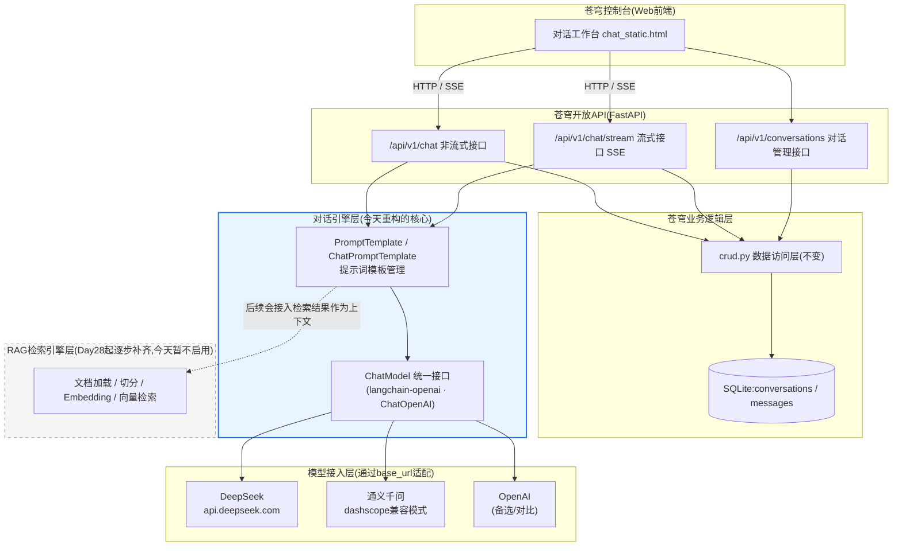
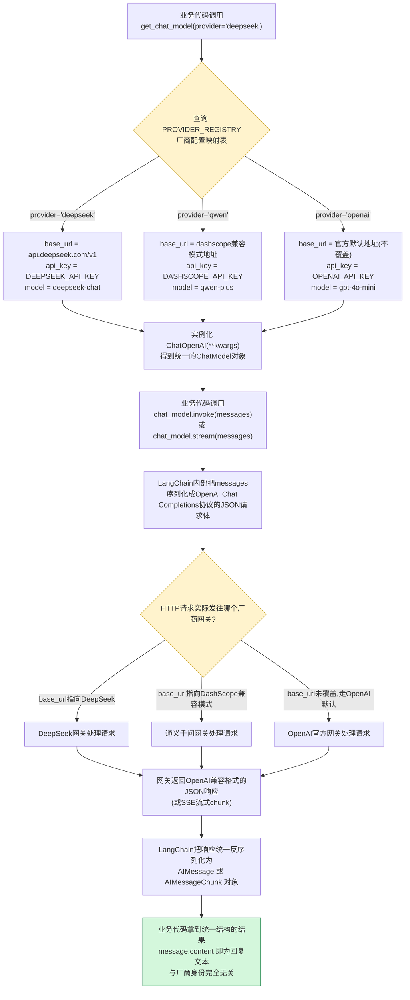
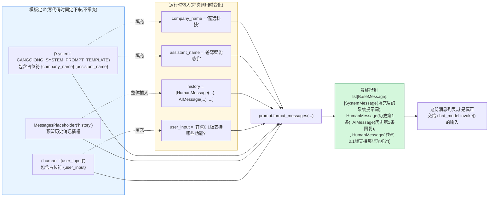

# 第25天 · LangChain入门 —— 苍穹0.5版重构序曲

> **周次/Sprint**:Sprint 2 · RAG基础(Day25-31)—— 今天是Sprint2的第一天,也是苍穹项目从"0.1版"迈向"0.5版"的第一步
> **星期**:周四(入职第25天,第四周周四;昨天晚上苍穹0.1版刚刚正式上线,郭建军还专门来道了贺,今天陈铭要开始学的第一件事,是把昨天那套手写的对话引擎,换一套更专业的骨架重新搭一遍)
> **参与人**:陈铭(导师:王振宇;上午技术串讲全程列席:王振宇;下午客户线索通报列席:林悦)
> **飞书任务号**:CQ-105(苍穹0.5版 · 引入LangChain框架重构对话引擎)、CQ-106(海纳制造集团知识库问答需求线索登记与立项筹备)
> **今日关键词**:LangChain / LangGraph / LangSmith / ChatModel / PromptTemplate / ChatPromptTemplate / 消息类型体系 / 模型接入层统一封装 / 框架化重构

---

## 【旁白】

十天连续奋战换来的兴奋感,通常撑不过一个晚上——这是老王入行十年、带过好几批培训生之后,总结出来的一条规律,今天他打算当着陈铭的面把这条规律再验证一次。昨天晚上郭建军亲自来道贺,陈铭手机相册里存着那张"苍穹平台第一版,正式跑起来了"的截图,睡前还翻出来看了两遍。可今天早上九点,老王往白板上写下的第一行字,却不是"恭喜"两个字,而是一句听起来有点扫兴的话——"你们昨天写完的那套对话引擎代码,过不了多久就会变成一堆没人愿意碰的遗产代码。"

这句话说得不算客气,但它准确地指向了一个几乎每一个写过真实项目的工程师,迟早都要面对的时刻:某一天回头看自己一两周前写的代码,会突然意识到,当时觉得"挺清楚、挺好维护"的那套实现,其实早就埋下了一堆将来会让自己叫苦不迭的隐患——messages列表是手动拼的,不同厂商的API调用参数是用if-else硬编码判断的,提示词是写死在字符串常量里的,流式输出的解析逻辑和数据库持久化的逻辑,又和业务逻辑死死地缠在一起。这些代码,单独拿出来看,一行行都挑不出明显的错误,老王自己也承认"你昨天写的东西,能跑,而且跑得不错",但"能跑"和"经得起长期维护、经得起功能不断往上叠"是两件不同的事——这正是老王多年前反复讲过的那句口头禅"能跑不代表对,对不代表好"里,最后那个"好"字真正的分量所在。

还有一个细节,值得在故事正式展开之前多说一句。今天这一天,严格来说不是陈铭第一次听说"框架"这个词——过去十天,他多多少少也知道FastAPI本身就是一个框架,SQLAlchemy也是一个框架,只是那两个框架解决的问题相对具体、边界相对清晰,一个管接口路由,一个管数据库映射,学起来的时候,不太需要先建立一套抽象世界观。LangChain不太一样,它试图覆盖的,是"构建大模型应用"这件事本身涉及的一整片模糊地带——模型调用、提示词、记忆、检索、工具调用、多智能体协作,几乎每一块都在快速演化,官方文档更新的速度、社区讨论的活跃程度,都和成熟多年的Web框架、ORM框架不是一个量级。这意味着陈铭今天要面对的,不只是记住几个新的类和方法,更是要适应一种"框架本身也在持续生长"的学习节奏——这一点,老王在正式开讲之前,专门用一句话提醒过:"今天学的这套写法,半年后大概率还会有细节上的调整,你要学的不是死记住这一版API怎么写,是学会怎么快速读懂一个还在演化中的框架的变更。"

今天开始的这一天,以及往后差不多两周的时间,陈铭要做的事情,表面上是"学一个叫LangChain的框架",但更准确的说法是——他要重新经历一次几乎所有做企业级应用工程的团队都会经历的路径:先靠手写代码摸清楚一件事的原理和边界(过去十天他做的正是这件事),再学会把这些手写出来的东西,交给一个经过千万开发者验证、把常见坑位提前封装好的框架去打理,自己腾出精力去解决更贴近业务、更有价值的问题。这条路径听起来朴素,但它藏着一个容易被忽略的先后顺序——如果一开始就直接学框架,不知道框架背后到底封装了什么、省掉了什么、又在什么地方做了取舍,遇到框架的"魔法"失灵的那一刻(而这一天迟早会来),就完全没有能力去排查、去兜底。老王让陈铭先手写十天,再学框架,正是有意为之的次序,而不是随便安排的教学进度。

更值得留意的是,今天这一天,还悄悄埋下了一条比技术本身更牵动人心的线索。中午吃饭的时候,林悦会带来一条消息——制造业客户海纳制造集团,对"企业知识库问答"这个方向表现出了明确的意向,立项会议大概会在两周后正式召开。这条消息今天听起来,还只是一句"值得关注的进展",陈铭甚至可能觉得它和自己今天要学的LangChain没什么直接关系。但往后翻几页就会发现,从今天开始的每一天——LangChain、PromptTemplate、LCEL、Memory、文档加载与切分、Embedding与向量检索——几乎全部会在两周后,变成那场立项会议桌面上真正要讨论的能力清单。今天种下的这颗种子,不显眼,但正是七十天课程里,"技术学习"第一次如此清晰地和"一个具体的、真实存在的客户需求"绑在一起的起点。

---

## 晨会纪要 / 今日目标

**时间**:上午9:00,二层大会议室"望远"
**出席**:王振宇(老王)、陈铭

昨晚庆祝的余温还没散,今天早上会议室里的气氛却切换得很快。陈铭走进会议室的时候,发现白板已经被老王擦得干干净净,重新写上了一行标题——"苍穹0.5版 · Sprint2启动"。

"先说个数字,"老王开场没有寒暄,直接切入正题,"你昨晚写完的那份`main.py`,一共多少行?"

陈铭愣了一下,打开电脑翻了翻:"呃……算上流式接口、数据库操作、CORS配置,单这一个文件差不多三百多行,加上`crud.py`、`models.py`,整个后端接近六百行。"

"六百行,支撑一个'能聊天、能记住历史'的最基础对话产品。"老王在白板上写下这个数字,又画了一条向上延伸的箭头,"现在往后想——如果接下来要加检索增强(RAG),要接入工具调用,要支持多个Agent协作,还要接第二个、第三个客户,每个客户的提示词、模型选择、知识库都不一样,你觉得这六百行,会涨到多少行?"

陈铭没有立刻回答,他能感觉到这不是一个要精确数字的问题。

"我不指望你算出准确数字,"老王接着说,"我想让你先感受一个事实——手写代码这条路,不是走不通,而是走到某个阶段之后,成本会指数级上涨,而不是线性上涨。你昨天写的那套'厂商适配逻辑'——遇到DeepSeek这么处理,遇到通义千问那么处理——只有两个分支,你觉得还算清楚。等你要适配第五个、第六个厂商,或者哪天某个厂商的接口协议悄悄改了个字段名,你就会发现,这种散落在业务代码各处的if-else判断,变成了一张越理越乱的网。这就是我今天要讲的第一件事的起点——为什么几乎所有做大模型应用的团队,走到一定阶段,都会引入一个专门的应用框架。"

**昨日进展回顾**

老王简单带过了昨天的收尾:"苍穹0.1版昨晚正式上线,CQ-102、CQ-103、CQ-104三张任务卡全部验收通过,郭总也来看过了,这个阶段性成果,该给的肯定都给了——但今天要讲清楚一件事,'苍穹0.1版上线'这件事的意义,和接下来'重构成LangChain版'这件事的意义,是两个不同维度的事,不是说你昨天的代码写得不够好才要重构,而是说,苍穹平台要往前走,手写这条路已经完成了它该完成的使命——教会你原理,接下来该换一条更适合规模化的路了。"

**今天要做的两件事**

老王在白板上写下今天的日程,分成清晰的两段:

**第一段(上午):LangChain架构总览与生态介绍**。老王打算完整讲一遍LangChain是什么、为什么会存在、它的核心抽象长什么样,以及围绕它形成的一整套生态——LangChain本身、LangGraph、LangSmith,分别解决什么问题,苍穹平台未来会在哪个阶段用到哪一个。这一段是纯讲解加白板画图,不着急上手写代码。

**第二段(下午):ChatModel接口与PromptTemplate/ChatPromptTemplate实操**。老王会带着陈铭把昨天手写的对话引擎,一步步用LangChain的组件重新搭一遍——先搞清楚`ChatModel`这个统一接口怎么用,再学`PromptTemplate`和`ChatPromptTemplate`怎么把提示词的"结构"和"内容"拆开管理,最后把这两块拼起来,跑通一个和昨天效果一致、但实现方式完全不同的对话应用。

**风险点**

老王照例在白板上列出了他预判到的几个风险点:

- **"学框架"容易变成"背API"**,陈铭如果只是记住`ChatOpenAI(...)`要传哪些参数,而不理解框架到底封装了什么、为什么这么设计,遇到框架文档没讲清楚的边界情况,照样会卡住。老王的要求是"每学一个新组件,都要先问自己——如果没有这个组件,我要自己写多少行代码才能达到同样效果"。
- **版本兼容问题**。LangChain这几年迭代很快,`langchain`、`langchain-core`、`langchain-community`、`langchain-openai`几个包拆分之后,网上很多教程、博客用的还是旧版本的写法,直接抄容易报`ImportError`或者参数名不对的错。今天会统一按当前苍穹项目锁定的版本来讲,并且专门提醒常见的"网上教程和实际环境版本不一致"的坑。
- **"重构等于砍掉原来的东西"这种误解要提前纠正**。老王特别强调:"数据库这一层——`models.py`、`crud.py`里维护对话和消息的逻辑,今天基本不用动,你需要重构的,主要是'怎么组织提示词、怎么调用大模型'这一层。分层架构的价值,今天你会亲眼看到——只换了一层,其他层几乎不用碰。"

老王最后补了一句,算是给整个Sprint2定了调:"接下来一周多的时间,我们要给苍穹补上RAG检索引擎层,而RAG这条路,几乎全世界的团队都是在LangChain或者类似框架的基础上搭的,不是因为RAG的原理有多复杂,而是因为文档加载、切分、向量化、检索这几步,涉及的第三方组件太多太杂,没有框架统一抹平接口差异的话,光是'胶水代码'就能写到让人抓狂。今天学的东西,是为后面这条路铺地基,不要小看它。"

---

## 需求文档

### 技术调研需求:引入LangChain框架重构苍穹对话引擎

**文档编号**:CQ-105-TR
**提出人**:王振宇
**记录人**:陈铭(记录并落地为技术调研报告,附本篇课件末尾"今日复盘"部分)

**背景**

苍穹0.1版对话引擎(`dialogue-engine`模块)自Day15立项以来,完全基于手写代码实现,核心逻辑分散在三个层面:

1. **消息组织层**:手动维护一个字典列表(`[{"role": "user", "content": "..."}]`),每次调用大模型API前手动拼接系统提示词、历史消息、当前用户输入。
2. **模型调用层**:直接使用各厂商SDK(`openai`库,通过修改`base_url`兼容DeepSeek/通义千问),厂商差异通过硬编码的`if-else`分支处理。
3. **流式解析层**:手动解析SSE数据流,手动拼接增量文本片段。

随着苍穹平台即将进入Sprint2(补齐RAG检索引擎层)、Sprint4(补齐Agent编排层),上述手写实现将面临以下可预见的问题:

- **厂商扩展成本线性甚至指数级上涨**:每新增一个模型厂商,都需要在多处代码里新增判断分支,后续容易遗漏,产生"改了这里忘了那里"的缺陷。
- **提示词管理与业务逻辑耦合过深**:系统提示词写死在字符串常量里,不利于按客户、按场景动态定制(海纳制造集团项目一旦立项,提示词大概率需要按行业知识库动态拼装)。
- **缺乏统一的组件复用机制**:检索增强(RAG)、工具调用(Function Calling)、多轮记忆管理等能力,如果继续手写,每一项都要从零设计接口规范,团队协作成本高、代码风格难统一。
- **缺乏可观测性与调试工具链**:手写代码的调用链路,出问题时只能靠`print`和日志排查,无法方便地追踪一次对话背后完整的提示词拼装过程、模型调用参数、响应耗时等信息。

**调研目标**

评估将苍穹对话引擎从纯手写实现,迁移至基于LangChain框架实现的可行性,重点验证以下几项能力:

| 序号 | 调研项 | 验证方式 |
|---|---|---|
| 1 | 统一调用不同厂商的ChatModel接口(DeepSeek/通义千问/OpenAI) | 用同一套`ChatOpenAI`封装,分别切换`base_url`和`api_key`,验证均可正常调用 |
| 2 | PromptTemplate/ChatPromptTemplate的模板化管理能力 | 用`ChatPromptTemplate`重写系统提示词与历史消息拼装逻辑,验证功能等价 |
| 3 | 流式输出能力是否兼容现有前端SSE协议 | 用`ChatModel.stream()`重写流式接口,验证前端`chat_static.html`无需改动即可正常显示 |
| 4 | 与现有SQLAlchemy持久化层的兼容性 | 验证LangChain消息对象与数据库ORM模型之间的转换成本是否可控 |
| 5 | 生态延展性(为后续RAG、Agent能力预留空间) | 调研`langchain-community`中文档加载器、向量库集成组件的成熟度 |

**评估维度**

| 维度 | 手写版现状 | LangChain版预期 |
|---|---|---|
| 新增一个模型厂商所需改动 | 需在调用层、参数处理层等多处新增分支 | 仅需在厂商配置表中新增一条映射记录 |
| 提示词变更所需改动 | 修改字符串常量,重启服务 | 修改`ChatPromptTemplate`定义,支持动态变量填充 |
| 团队协作成本 | 依赖个人代码风格,复用性差 | 遵循框架统一接口规范,便于多人协作 |
| 学习曲线 | 无额外学习成本 | 需投入时间理解框架抽象概念(评估为一次性成本) |
| 后续RAG/Agent能力扩展性 | 需从零设计检索、工具调用接口 | 直接复用框架内文档加载、向量检索、Agent编排组件 |

**非功能需求**

- 迁移后的对话引擎,响应延迟不应比手写版明显增加(可接受因框架封装带来的少量固定开销)。
- 迁移过程中,数据库表结构、对外API协议(接口路径、请求/响应格式、SSE数据格式)保持不变,确保前端`chat_static.html`无需改动。
- 迁移后的代码,须在苍穹平台代码规范基础上,补充框架相关的中文注释,便于团队后续维护。

**验收标准**

- 使用LangChain重写后的对话应用,功能上与苍穹0.1版对话引擎完全等价(新建对话、多轮对话记忆、流式输出、历史记录持久化)。
- 至少验证两个模型厂商(DeepSeek、通义千问)可通过统一接口无缝切换,且业务代码无需改动。
- 完成一份技术调研报告(即本篇课件"今日复盘"及相关章节),供团队内部分享参考,作为后续RAG开发阶段的技术选型依据。

---

### 附件:客户线索简报(林悦记录)

**登记编号**:CQ-106
**记录人**:林悦
**记录时间**:午间例会

林悦在午饭时间特意找到陈铭和老王,通报了一条进展:"海纳制造集团那边,上周我们提交的初步方案介绍,他们内部已经过了一轮讨论,今天上午对接人正式回复——对'企业知识库问答'这个方向的意向基本确认下来了,他们提出想先约一次正式的立项会议,时间大概定在两周后。"

老王追问了一句关键信息:"他们的核心诉求,目前掌握到的信息是什么?"

林悦翻了翻笔记本:"目前掌握的信息还比较初步,但有两条已经比较明确——第一,他们有大量的设备操作手册、工艺文档、质量规范,内容又多又杂,现有的做法是让老员工带新员工、靠人工查纸质或PDF文档,效率很低,而且不少经验丰富的老师傅面临退休,经验传承是个实实在在的痛点;第二,他们的客服和产线支持岗位,人手一直比较紧张,很多重复性的问询(比如某个型号设备的参数、某个工艺步骤的标准),如果能有一个'问了就懂'的系统,能明显减轻人力压力。这两条,基本可以确认最终要交付的方向,是一个企业内部知识库问答系统。"

老王点了点头,没有立刻展开细节,只是说了一句:"这条线索先记下来,CQ-106这张卡先挂在待办里,不用现在就动。两周后的立项会,才是真正要拍板需求范围、技术方案、交付节奏的时刻。但从今天开始,你们学的每一样东西——LangChain、后面的文档处理、向量检索、RAG评估——都不再是抽象的技术练习了,是在为两周后那场会议、以及会议后要真正交付的东西做准备。"

陈铭听完,下意识地把这句话记在了随身的笔记本上——"技术学习"和"真实客户需求"第一次这么明确地对上号,这种感觉和过去十天"为了掌握知识点而练习"完全不一样。

---

## 架构设计图

下面这张图,是老王今天上午专门花时间在白板上重画的一版苍穹平台分层架构图——比Day15第一次画的那版,多标注了"LangChain在整个技术栈中处在什么位置"这一层信息。



这张图上,老王特别用颜色标出了"对话引擎层"——今天要动手改造的正是这一层。控制台前端、API接口层、数据库持久化层这三层的代码,今天基本保持原样;"模型接入层"从苍穹角度看,也没有发生结构性变化,依然是接DeepSeek、通义千问、OpenAI这几家,变化的地方在于——过去是自己手写代码去适配这几家的接口差异,现在这份适配工作,通过`langchain-openai`提供的`ChatOpenAI`类统一完成。图里那个虚线框出的"RAG检索引擎层",今天先画出来占个位置,提示这是接下来一周多要重点补齐的部分,但今天暂时不会启用它。

老王讲图的时候特别提了一句:"你们注意看'对话引擎层'这个框里,`PromptTemplate`在上面,`ChatModel`在下面,箭头是从上往下——这条箭头,今天先是`PromptTemplate`处理完,把结果交给`ChatModel`,是两个独立的步骤,你自己在代码里手动写两行分别调用。明天你们会学到,这条箭头,其实可以用LCEL的管道符,直接写成一条链——但那是明天的故事,今天先把这两个组件本身的职责搞清楚。"

---

## 流程图

第二张图,是ChatModel统一调用不同厂商模型的完整流程——这张图对应的是"业务代码怎么发起一次调用,到最终拿到某个具体厂商返回的回复"这条完整链路。



这张图讲的其实是一句话就能概括的道理,但老王要求陈铭一步步画出来,是因为"统一接口"这个词说起来轻巧,理解不到位的话,遇到问题会完全不知道从哪里下手排查。老王指着图上两个黄色的判断节点说:"你要清楚地知道,'厂商差异'到底在哪一步被处理掉了——是在你调用`get_chat_model`的那一刻,查配置表决定了`base_url`和`api_key`怎么填;是在发起HTTP请求的那一刻,请求真正被路由到了哪一个厂商的服务器。这两步之外,从`chat_model.invoke()`往后,一直到你拿到`message.content`,代码逻辑对三个厂商是完全一样的——这才是'统一接口'真正的含义,不是说底层网络请求也是同一个,而是说你写的业务代码,不需要关心这个差异。"

---

## 示意图

第三张图,用来讲清楚`PromptTemplate`/`ChatPromptTemplate`最核心的机制——模板结构和变量填充是怎么"合体"成最终真正发给模型的消息列表的。



老王讲这张图时,特意打了个类比:"你们可以把`ChatPromptTemplate`想象成一份'带填空的合同模板',合同里哪几处是固定条款、哪几处是留白等着填的空,写模板的时候就定好了。每次真正签合同(调用大模型)的时候,你只需要把对应的空填上——填的是谁、填的是什么金额——模板结构本身不用重写。手写版里,你昨天做的事情,相当于每签一份合同,都重新手写一遍整份合同文本,今天开始,你只需要维护'模板'和'要填的内容'这两份东西,而且这两份东西是分开管理的,改动其中一份,完全不影响另一份。"

---

## 课堂笔记

### 上午:LangChain架构总览与生态

#### 一、先想清楚:为什么需要一个框架

老王上午的第一句话,直接把问题抛给了陈铭:"你昨天写的对话引擎,回头看,哪些部分是'纯粹的业务逻辑',哪些部分是'跟具体业务无关、换个项目也大概率要重新写一遍'的通用能力?"

陈铭想了想:"新建对话、给对话起标题、把消息存进数据库——这些感觉是苍穹自己的业务逻辑。但是……怎么拼装messages列表发给大模型、怎么解析流式返回的数据、怎么处理不同厂商API参数的差异,这些好像换成别的项目,也得重新写一遍类似的代码。"

"这就是问题所在。"老王在白板上画了一条线,把"业务逻辑"和"通用能力"分成两栏,"'怎么和大模型打交道'这件事,本质上是一个和具体业务无关的通用能力,理论上,全世界成千上万个团队,都在各自的项目里,重复实现着几乎一样的东西——拼提示词、管理多轮对话、处理流式响应、解析结构化输出、接入不同厂商模型、做检索增强、做工具调用。既然是通用能力,重复造轮子这件事,迟早会有人把它标准化、封装成一个可以直接拿来用的框架,这就是LangChain出现的背景。"

老王进一步展开了这个背景故事:"LangChain最早出现的时间点,正好是ChatGPT带火大模型应用开发的那一波浪潮里,很多开发者发现,自己在不同项目里反复写着几乎一样的'拼提示词+调API+解析结果'的代码,于是社区里就出现了一批专门解决这类问题的框架,LangChain是其中影响力最大、生态最完整的一个。它最开始的定位很朴素——把'构建基于大模型的应用'这件事里那些反复出现的模式,抽象成一套可复用的组件,让开发者不用每次都从零手写。"

"但是,"老王话锋一转,"框架这个东西,不是免费的午餐。学习一个框架,是要付出代价的——你要先理解它的抽象概念,理解它凭什么这么设计,理解它的边界在哪里,遇到框架没覆盖到的场景要怎么办。如果一个项目足够简单,写完就不再维护,完全可以不用任何框架,手写反而更直接、更少'魔法'。但苍穹平台不是这种项目——它要长期维护,要不断叠加新能力,要支撑多个客户项目复用,这种场景下,框架带来的收益,会远远超过学习它的成本。这也是为什么我坚持让你先手写十天,再来学框架——手写的经历,会让你在学框架的时候,清楚地知道每一个组件到底帮你省掉了什么麻烦,而不是死记硬背一堆API。"

#### 二、LangChain到底是什么

老王给出了一个他自己总结的、不算标准教科书定义、但很实用的说法:"LangChain是一套帮你'搭积木'搭建大模型应用的工具箱。它本身不训练模型、不提供模型,它提供的是一套标准化的'积木块'——每一种积木块负责一类通用能力,你按照自己的业务需求,把这些积木块拼接起来,就能快速搭出一个应用。"

他把LangChain里最核心的几类"积木块"写在了白板上:

- **Models(模型)**:统一封装各种大模型的调用接口,分为`LLM`(纯文本补全模型,今天不细讲,因为现在几乎所有主流场景都用对话模型)和`ChatModel`(对话模型,今天下午的重点)。
- **Prompts(提示词)**:`PromptTemplate`、`ChatPromptTemplate`,把提示词的结构和内容拆开管理,支持变量填充、few-shot示例等能力。
- **Output Parsers(输出解析器)**:把模型返回的原始文本,解析成结构化数据(比如JSON、某个Pydantic模型实例),后面Sprint会陆续用到。
- **Memory(记忆)**:管理多轮对话的历史记录,支持不同的记忆策略(全量记忆、窗口记忆、摘要记忆),对应Day27的内容。
- **Retrievers(检索器)**:从向量数据库、搜索引擎等数据源里检索相关信息,是RAG能力的核心组件,对应Sprint2后半段的内容。
- **Chains / Runnables(链)**:把上面这些组件按照特定顺序、特定逻辑组合起来,形成一个完整的处理流程,对应Day26要学的LCEL。
- **Agents(智能体)**:让大模型自主决定调用哪些工具、以什么顺序调用,是Sprint4的核心内容。

"你会发现,"老王指着这张清单说,"今天你要学的两块——`ChatModel`和`Prompts`——只是这个工具箱里最基础的两块积木,但恰恰是几乎所有其他积木都要依赖的两块。没有稳固的地基,后面搭什么都会歪。"

#### 三、LangChain生态三件套:LangChain / LangGraph / LangSmith

老王接着在白板上画了三个圆圈,分别写着LangChain、LangGraph、LangSmith,并且用箭头标出了各自的定位。

"很多人第一次接触这个生态,容易把这三个名字搞混,或者以为是三个互相替代的选择,其实它们是分工明确的三件套,苍穹平台会在不同阶段分别用到。"

**LangChain**——他画的第一个圆圈,"这是最基础的框架层,提供了我们刚才讲的那些'积木块'——模型调用、提示词管理、链式组合、记忆管理、检索增强、工具调用等等。今天到Day31,苍穹补齐RAG检索引擎层,主要用的就是LangChain核心框架加上它的社区扩展包。"

**LangGraph**——第二个圆圈,"这是LangChain团队后来专门为'复杂的、有状态的、需要多步骤决策的应用流程'推出的一个扩展库,核心思路是把应用流程建模成一张'图'(节点+边),每个节点是一个处理步骤,边定义了节点之间怎么流转,支持条件分支、循环、多个Agent之间协作。等苍穹平台走到Sprint4——多Agent智能办公助手项目的时候,你会正式用到LangGraph,今天先知道它的名字和大致定位就够了。"

**LangSmith**——第三个圆圈,"这是一个可观测性和调试评估平台,专门用来追踪、调试、评估基于LangChain构建的应用。你可以把它理解成'大模型应用专用的APM(应用性能监控)工具'——一次完整的对话请求,背后可能涉及多次提示词拼装、多次模型调用、多次工具调用,LangSmith能把这整条链路完整地可视化出来,方便排查问题、优化提示词、评估不同版本的效果差异。苍穹平台从Sprint3(RAG进阶与交付阶段)开始,会正式引入LangSmith做效果评估,今天不展开细节,先记住这个名字。"

老王总结道:"简单说,LangChain管'怎么搭积木',LangGraph管'积木搭得复杂了怎么理清楚流程',LangSmith管'搭出来的东西好不好用、哪里出了问题'。今天,你只需要用到第一个。"

#### 四、LangChain的包结构:为什么拆成好几个包

陈铭在准备安装依赖的时候,发现`requirements.txt`里要加的不是一个包,而是四个:`langchain`、`langchain-core`、`langchain-community`、`langchain-openai`,他有点疑惑地问了老王。

老王解释道:"这是LangChain这几年一次比较大的架构调整,最早的时候,LangChain是一个'大而全'的单体包,所有功能都塞在一起,带来的问题是——依赖越滚越多、越来越重,而且任何一个小功能的改动,都可能影响到整个包的稳定性,版本管理变得很痛苦。后来官方把它拆分成了几个职责清晰的包:"

- **`langchain-core`**:最核心的抽象层,定义了`BaseChatModel`、`BasePromptTemplate`、`Runnable`等一系列基础抽象接口,几乎不依赖任何第三方厂商的SDK,是整个生态的地基。
- **`langchain`**:在`langchain-core`基础上,提供更高层的封装,比如链、Agent的一些通用实现,是大部分开发者日常直接调用最多的一层。
- **`langchain-community`**:社区维护的、和各种第三方服务集成的组件集合——文档加载器、向量数据库集成、各种小众模型的适配等等,内容庞杂,更新频繁,官方特意把它独立出来,避免拖慢核心包的发布节奏。
- **`langchain-openai`**(以及类似的`langchain-anthropic`、`langchain-deepseek`等厂商专用包):专门针对某一家厂商的深度集成,今天苍穹项目用的`ChatOpenAI`,就来自这个包——之所以叫`langchain-openai`而不是"langchain-deepseek",是因为DeepSeek、通义千问都提供了OpenAI兼容协议的接口,直接复用`ChatOpenAI`这个类,通过修改`base_url`就能接入,不需要单独安装厂商专用包。

"这种拆分方式,对我们来说有个直接的好处,"老王补充道,"苍穹项目不需要安装用不到的依赖——比如我们目前不会用到Anthropic Claude,就不用装`langchain-anthropic`,减少了依赖体积和潜在的版本冲突风险。但也带来一个副作用——你在网上搜到的很多教程,如果是比较早期写的,里面的`import`语句可能是老版本的写法(比如从`langchain`直接导入`ChatOpenAI`,而不是从`langchain-openai`导入),直接照抄容易报`ImportError`,这一点你们自己在查资料的时候要留心版本。"

#### 五、安装与环境准备

老王让陈铭在苍穹项目的虚拟环境里,补充安装今天需要的依赖包。

```bash
# 进入苍穹项目虚拟环境后执行
pip install langchain langchain-core langchain-community langchain-openai

# 苍穹平台当前锁定的版本(写入requirements.txt,避免团队成员版本不一致导致的诡异报错)
# langchain==0.3.x
# langchain-core==0.3.x
# langchain-community==0.3.x
# langchain-openai==0.2.x
```

安装完成之后,老王没有直接让陈铭动手写代码,而是先带他花了几分钟,过了一遍"遇到问题该去哪里查"这件事——他认为这比记住今天要用到的几个API更重要。"LangChain官方文档是第一手资料,遇到参数不确定,先去翻官方文档对应版本的说明,不要凡事都先去搜论坛帖子或者博客,那些内容参差不齐,而且很容易是旧版本的写法;第二个习惯,是学会直接读源码——`langchain-core`的源码总体写得比较清晰,很多类都有完整的docstring,遇到文档没讲透的细节,跳进去看源码里那个类到底做了什么,往往比反复猜测更快;第三,LangChain官方在每个大版本发布时,都会给出迁移指南,写明哪些写法废弃了、该换成什么新写法,这份指南比东拼西凑的二手教程靠谱得多。"陈铭把这三条记在了笔记本的空白处,配了一句自己的批注:"技术在变,但查资料的方法论,和过去做运营时判断一条信息是否可信,好像是同一套逻辑。"

老王特别提醒了一句版本管理上的经验:"LangChain迭代速度确实快,一些API在不同小版本之间会有细微调整。苍穹项目的做法是——在`requirements.txt`里锁定具体的版本号,而不是用不设上限的写法,这样团队里每个人、每台机器上装出来的环境是一致的,遇到问题也方便复现和排查。你们自己练习的时候,如果发现某个API的参数名和课件里写的不完全一样,大概率是版本差异导致的,先去查一下自己装的版本号,再去对应版本的官方文档核实,不要盲目照抄网上搜到的、版本不明的代码片段。"

#### 六、追问环节:框架选型还绕不开的几个问题

安装完依赖、正式动手之前,陈铭把上午攒下的几个疑问,一股脑抛给了老王。老王没有急着继续讲下一个知识点,而是先花了十几分钟,把这几个问题一个个接住——他的理由是,"这些问题不解决,你今天下午写代码的时候,脑子里会一直悬着一根刺,反而分心。"

**"市面上是不是只有LangChain这一个选择?苍穹为什么偏偏选它?"**——陈铭的第一个问题。老王的回答很坦率:"当然不是唯一选择,大模型应用框架这几年冒出来的不止一家,有的主打更轻量的链式编排,有的主打某一类特定场景(比如专门做检索增强,或者专门做多智能体编排),国内也有一些团队,基于LangChain二次封装出更贴合本地化场景的工具链。苍穹项目最终选LangChain,考虑的不是'哪个技术上绝对最优',而是几个更实际的因素——第一,生态最成熟,几乎你能想到的第三方集成(向量库、文档加载器、搜索引擎),LangChain社区都有人做过适配,不用自己造轮子;第二,文档和教程资料的绝对数量最多,团队里新人上手,遇到问题能查到参考的概率最高;第三,人才市场上,懂LangChain的工程师储备相对多,招聘和团队协作的成本更低。技术选型很多时候不是'技术挑战本身',而是'工程和团队的综合成本账',这一点你以后带团队做选型的时候,要记在心里。"

**"框架封装了这么多层,会不会拖慢性能?"**——陈铭的第二个问题,来自他上午看`ChatOpenAI`源码时,发现调用链路比直接用`openai`库多绕了几层。老王的回答比较克制:"确实会有额外的固定开销,`ChatOpenAI`内部要做参数校验、消息类型转换、异常包装,这些步骤都要消耗一点点CPU时间,但和一次大模型调用动辄几百毫秒到几秒的网络耗时相比,这点开销基本可以忽略——你今天下午亲自跑一遍demo脚本,感受一下响应时间,大概率感觉不出明显差异。真正需要警惕性能问题的场景,是高并发、对延迟极度敏感的场景,那种场景下,确实需要专门做压测、专门评估框架封装带来的额外开销是否可以接受,但苍穹平台目前的量级,还远没有到需要为这点开销纠结的阶段。"

**"如果以后想换框架,今天写的代码是不是白写了?"**——这个问题老王没有马上展开细讲,只是先给了一句定性的回答:"今天先记住一个原则——尽量把框架相关的具体API,收敛在`llm`这一个模块里,不要让`ChatPromptTemplate`、`ChatOpenAI`这些具体类名,散落到`main.py`的业务路由逻辑、`crud.py`的数据访问逻辑里去。只要守住这条边界,即便以后真的要换框架,受影响的范围也大概率只集中在这一层。"晚上复盘的时候,这个问题会被重新提起,今天先留个印象。

陈铭把这几个问答记在笔记本上,自己又补了一句总结:"选框架这件事,原来不是'哪个更先进就用哪个',是要综合考虑生态、文档、人才、性能这几个维度,和当初帮客户选广告投放渠道时要权衡的那些因素,思路上其实有点像。"老王听到这句话,难得夸了一句:"这个类比,说明你真的在往'工程判断力'这个方向长脑子,不只是在学一门具体的技术。"

#### 七、上午小结:从"六百行手写代码"到"框架"的心态转变

上午临近结束时,老王让陈铭做了一个简单的练习——把苍穹0.1版对话引擎里,"和厂商无关的通用逻辑"和"苍穹特有的业务逻辑"分别列出来。陈铭列完之后发现,通用逻辑那一栏,几乎全部对应着上午讲的LangChain核心组件——`ChatModel`对应模型调用、`PromptTemplate`对应提示词管理、`Memory`(明天详细讲)对应历史消息管理。

"这个练习的意义,"老王说,"是让你明白,框架不是从天上掉下来的抽象概念,它封装的每一个组件,背后都对应着你昨天亲手写过的某一段具体代码。今天下午开始动手,你会一边写LangChain代码,一边在心里对照——'这一步,昨天我是怎么手写的',这种对照,是真正把框架学扎实的捷径,比单纯背API文档有效得多。"

---

### 下午:ChatModel接口与PromptTemplate/ChatPromptTemplate

#### 一、消息类型体系:从字典到BaseMessage

下午一开始,老王没有直接讲`ChatModel`怎么用,而是先讲了LangChain里一个基础但容易被忽略的设计——消息类型体系。

"你昨天手写代码里,一条消息是这样表示的,"老王在白板上写下:

```python
message = {"role": "user", "content": "苍穹0.1版支持哪些功能?"}
```

"这是一个普通的Python字典,`role`字段的取值,靠约定——`user`、`assistant`、`system`,靠开发者自己记住这个约定,代码里没有任何机制强制约束`role`必须是这几个值之一,如果哪天手滑写错了一个字符,程序不会在写错的那一刻报错,而是等调用大模型API的时候才会报错,排查起来会绕一圈。"

"LangChain的做法是,"老王接着写道,"把每一种角色的消息,定义成一个独立的Python类,而不是用字符串字段去区分。"

```python
from langchain_core.messages import (
    SystemMessage,   # 对应role="system",系统提示词
    HumanMessage,    # 对应role="user",用户输入的消息
    AIMessage,       # 对应role="assistant",模型生成的回复
    ToolMessage,     # 对应role="tool",工具调用返回的结果(后续Sprint4会用到)
    BaseMessage,     # 所有消息类型的基类,常用作类型标注
)

# 手写版:用字典表示
history_dict_style = [
    {"role": "user", "content": "苍穹0.1版支持哪些功能?"},
    {"role": "assistant", "content": "苍穹0.1版支持流式对话和历史记录持久化两项核心功能。"},
]

# LangChain版:用类实例表示
history_message_style = [
    HumanMessage(content="苍穹0.1版支持哪些功能?"),
    AIMessage(content="苍穹0.1版支持流式对话和历史记录持久化两项核心功能。"),
]
```

"这两种写法,表达的信息其实是一样的,"老王总结道,"但用类实例表示有几个明确的好处——第一,类型更安全,`HumanMessage`和`AIMessage`是不同的类,IDE和类型检查工具能帮你提前发现'把用户消息错误地当成AI消息处理'这类问题;第二,这几个类不只是简单包了一层`role`和`content`,还预留了额外的字段(比如`AIMessage`可以携带`tool_calls`字段,记录模型这一轮决定调用了哪些工具),将来扩展能力的时候,不需要改变整体的数据结构;第三,也是最直接的一点——LangChain生态里几乎所有组件,都是围绕这套消息类型体系设计的,`ChatModel`的输入输出、`ChatPromptTemplate`的产出,统一都是这几个类的实例,不用你自己在'字典'和'类'之间来回转换。"

#### 二、ChatModel:统一的对话模型接口

讲完消息类型,老王正式引入今天的核心组件——`ChatModel`。

"`ChatModel`是LangChain里对'对话式大模型'的统一抽象,"老王说,"它的基类是`langchain_core.language_models.BaseChatModel`,不管你接的是OpenAI、DeepSeek、通义千问,还是本地部署的开源模型,只要有对应的适配实现,调用方式都遵循同一套接口规范。今天我们要用的具体实现类,是`langchain_openai.ChatOpenAI`——因为DeepSeek和通义千问,都提供了兼容OpenAI Chat Completions协议的接口,所以直接复用这一个类就够了,不需要单独去找DeepSeek或者通义千问专用的适配类。"

他把`ChatOpenAI`最常用的几个初始化参数写在了白板上:

| 参数名 | 含义 | 苍穹项目今天的用法 |
|---|---|---|
| `model` | 具体模型名称 | DeepSeek传`"deepseek-chat"`,通义千问传`"qwen-plus"` |
| `api_key` | 调用凭证 | 从环境变量读取,对应厂商各自的Key |
| `base_url` | API服务地址 | DeepSeek和通义千问都需要覆盖成各自的兼容接口地址,OpenAI官方不需要覆盖 |
| `temperature` | 采样温度,复用Day16讲过的含义 | 苍穹对话场景默认设为0.7 |
| `streaming` | 是否启用流式输出 | 流式接口传`True`,非流式接口传`False` |
| `max_tokens` | 单次回复最大token数 | 暂不设置上限,后续视客户项目实际需要再调整 |

"重点讲一下`base_url`这个参数,"老王特别强调,"这是让`ChatOpenAI`这一个类,能够同时接入好几家厂商的关键。DeepSeek和通义千问都对外声明了自己提供'兼容OpenAI接口'的调用方式——意思是说,只要你把请求发到它们各自的服务地址,用OpenAI SDK约定的请求格式(比如`/chat/completions`路径、同样的JSON请求体结构),它们能正确处理,并返回同样符合OpenAI格式的响应。`ChatOpenAI`本质上就是OpenAI官方SDK的一层LangChain封装,它默认的`base_url`指向OpenAI官方地址,只要我们主动把这个参数改成DeepSeek或者通义千问的地址,并配上对应厂商的`api_key`,这一整套调用逻辑,就能无缝切换到别的厂商,业务代码完全不需要感知这个切换,这也是我们上午流程图讲的核心机制。"

陈铭追问了一句:"如果哪天DeepSeek的接口协议,跟标准OpenAI协议出现了细微差异呢?"

"这是个好问题,"老王说,"实际情况是,绝大部分厂商在做'OpenAI兼容接口'的时候,会尽量对齐标准字段,但确实可能存在个别参数不完全支持,或者返回的一些非标准扩展字段。这种情况下,`ChatOpenAI`一般还是能正常工作,只是那些厂商特有的扩展参数,可能需要通过`model_kwargs`或者`extra_body`这类兜底参数传进去。今天我们用到的基础对话能力,DeepSeek和通义千问的兼容度都很好,不会遇到这个问题,但你要知道,这不是100%保证没有例外情况的'万能钥匙',遇到诡异的报错,先怀疑是不是协议兼容性的边界问题。"

#### 三、ChatModel的核心方法:invoke / stream / batch

"`ChatModel`统一暴露了几个核心方法,"老王继续讲道,"今天用到两个,另外两个先知道名字。"

- **`invoke(messages)`**:传入一份消息列表,同步返回一个完整的`AIMessage`,对应"一次性拿到完整回复"的场景,今天非流式接口用它。
- **`stream(messages)`**:传入一份消息列表,返回一个生成器,逐块产出`AIMessageChunk`,每个chunk携带新增的一小段文本,对应"流式打字机效果"的场景,今天流式接口用它。
- **`batch(list_of_messages)`**:一次性传入多份独立的消息列表,并发处理,批量返回结果,适合"同时问模型很多个独立问题"的场景,今天不涉及。
- **`ainvoke` / `astream` / `abatch`**:上面三个方法的异步版本,前缀`a`代表`async`,苍穹平台的FastAPI接口本身是异步框架,未来如果要进一步优化并发性能,会切换到这几个异步方法,今天先用同步版本,保持和手写版一致的复杂度,不给自己叠加额外的学习负担。

老王在白板上写了一段最简单的调用示例,让陈铭先在一个独立的demo脚本里跑通:

```python
"""
demo_01_basic_invoke.py
========================
今天的第一个动手练习:验证ChatOpenAI能否正确调用DeepSeek。
这段代码不涉及苍穹项目的任何业务逻辑,纯粹用来验证"ChatModel统一接口"这一个概念,
跑通之后,再回到苍穹项目里做真正的重构。
"""

import os
from langchain_openai import ChatOpenAI
from langchain_core.messages import SystemMessage, HumanMessage

# 从环境变量读取DeepSeek的API Key,苍穹项目统一约定不把密钥写死在代码里
DEEPSEEK_API_KEY = os.getenv("DEEPSEEK_API_KEY")

# 初始化一个指向DeepSeek的ChatModel实例
# base_url是让ChatOpenAI"认得"DeepSeek的关键参数
chat_model = ChatOpenAI(
    model="deepseek-chat",
    api_key=DEEPSEEK_API_KEY,
    base_url="https://api.deepseek.com/v1",
    temperature=0.7,
)

# 组装一份最简单的消息列表:一条系统提示词 + 一条用户输入
messages = [
    SystemMessage(content="你是一个专业、简洁的AI助手。"),
    HumanMessage(content="用一句话说明LangChain是做什么的。"),
]

# 调用invoke,同步拿到完整回复
response = chat_model.invoke(messages)

print("模型回复类型:", type(response))          # 预期输出: <class 'langchain_core.messages.ai.AIMessage'>
print("模型回复内容:", response.content)         # 预期输出: 模型生成的一句话说明
print("本次调用元信息:", response.response_metadata.get("token_usage"))  # token用量等元信息
```

陈铭跑完这段代码之后,老王让他把`base_url`和`model`换成通义千问的配置,再跑一遍,验证"业务代码一行都不用改,只改配置"这句话是不是真的:

```python
"""
demo_02_switch_to_qwen.py
===========================
把上面的demo,base_url和model换成通义千问,验证统一接口的可切换性。
"""

import os
from langchain_openai import ChatOpenAI
from langchain_core.messages import SystemMessage, HumanMessage

QWEN_API_KEY = os.getenv("DASHSCOPE_API_KEY")

chat_model = ChatOpenAI(
    model="qwen-plus",
    api_key=QWEN_API_KEY,
    base_url="https://dashscope.aliyuncs.com/compatible-mode/v1",
    temperature=0.7,
)

messages = [
    SystemMessage(content="你是一个专业、简洁的AI助手。"),
    HumanMessage(content="用一句话说明LangChain是做什么的。"),
]

response = chat_model.invoke(messages)
print("通义千问的回复:", response.content)
```

"两段代码,除了`model`、`api_key`、`base_url`三个参数不一样,剩下的代码逐字相同,"老王让陈铭自己念一遍这个观察,"这就是'统一接口'带给你的实际收益——不是一句空话,是你亲手跑出来、亲眼看到的效果。"

#### 四、PromptTemplate与ChatPromptTemplate:提示词的模板化管理

下午第二个重点,是提示词模板。老王先区分了两个容易混淆的类。

**`PromptTemplate`**:面向"纯文本补全"场景的模板,产出一段格式化后的字符串。今天苍穹项目用的是对话模型,不会直接用到`PromptTemplate`处理最终的对话提示词,但它是理解模板机制最简单的入口,也是`ChatPromptTemplate`内部部分组件的基础。

```python
"""
demo_03_prompt_template.py
============================
用PromptTemplate演示最基础的"模板+变量=最终文本"机制。
"""

from langchain_core.prompts import PromptTemplate

# from_template方法:直接从一段带{变量名}占位符的字符串构建模板
translate_template = PromptTemplate.from_template(
    "请将下面这句{source_lang}文本,翻译成{target_lang}:\n\n{text}"
)

# invoke方法:传入一个字典,把占位符替换成真实值,返回一个StringPromptValue对象
result = translate_template.invoke({
    "source_lang": "中文",
    "target_lang": "英文",
    "text": "苍穹平台正在引入LangChain框架重构对话引擎。",
})

print(result.to_string())
# 预期输出:
# 请将下面这句中文文本,翻译成英文:
#
# 苍穹平台正在引入LangChain框架重构对话引擎。
```

**`ChatPromptTemplate`**:面向"对话模型"场景的模板,产出的不是一段字符串,而是一份`BaseMessage`列表——这正是今天苍穹项目要用的。

```python
"""
demo_04_chat_prompt_template.py
=================================
用ChatPromptTemplate演示对话场景下的模板机制,
重点体会from_messages的用法,以及MessagesPlaceholder的作用。
"""

from langchain_core.prompts import ChatPromptTemplate, MessagesPlaceholder
from langchain_core.messages import HumanMessage, AIMessage

# from_messages:传入一个"角色-内容模板"的元组列表,构建一份对话模板
chat_prompt = ChatPromptTemplate.from_messages([
    ("system", "你是{company_name}旗下的{assistant_name},请专业、友好地回答问题。"),
    MessagesPlaceholder("history"),   # 预留一个"历史消息"插槽
    ("human", "{user_input}"),
])

# 模拟一段历史对话记录(实际项目里这份记录是从数据库查出来的)
fake_history = [
    HumanMessage(content="苍穹0.1版上线了吗?"),
    AIMessage(content="是的,苍穹0.1版已经在昨天正式上线。"),
]

# format_messages:填充所有占位符,返回真正可以交给ChatModel的消息列表
formatted_messages = chat_prompt.format_messages(
    company_name="蓬远科技",
    assistant_name="苍穹智能助手",
    history=fake_history,
    user_input="苍穹0.1版都支持哪些功能?",
)

for m in formatted_messages:
    print(type(m).__name__, "->", m.content)

# 预期输出(共4条消息):
# SystemMessage -> 你是蓬远科技旗下的苍穹智能助手,请专业、友好地回答问题。
# HumanMessage -> 苍穹0.1版上线了吗?
# AIMessage -> 是的,苍穹0.1版已经在昨天正式上线。
# HumanMessage -> 苍穹0.1版都支持哪些功能?
```

老王让陈铭反复跑这段代码,直到他能完整讲清楚`MessagesPlaceholder("history")`这一步到底做了什么:"这个占位符,不填充单条字符串,它填充的是一整份消息列表,填充之后,这份列表里的每一条消息,会原样'摊开'插入到最终结果里——你可以看到,最终的`formatted_messages`一共四条,而不是把`history`整体打包成一条消息。这正是为什么它能完美替代你昨天手写版里,'把历史messages列表拼接进最终发送列表'这一步逻辑。"

**`format_messages` vs `invoke`**:老王补充了一个细节,"`ChatPromptTemplate`同时支持`format_messages(**kwargs)`和`invoke(dict)`两种调用方式,效果类似,`format_messages`直接返回消息列表,`invoke`返回一个`ChatPromptValue`对象(可以通过`.to_messages()`转换成消息列表,也可以`.to_string()`转换成字符串)。今天苍穹项目统一用`format_messages`,写法更直接。"

**变量名不匹配的报错**:老王故意演示了一个常见的坑——

```python
# 故意漏传一个变量,制造报错示范
try:
    chat_prompt.format_messages(
        company_name="蓬远科技",
        # 故意漏掉 assistant_name
        history=fake_history,
        user_input="测试问题",
    )
except KeyError as e:
    print("捕获到报错:", e)
    # 预期输出类似: 捕获到报错: "Input to ChatPromptTemplate is missing variables {'assistant_name'}. ..."
```

"这种`KeyError`,是今天最容易踩、但也最容易排查的坑,"老王说,"报错信息里通常会直接告诉你缺了哪个变量,认真看一眼报错信息,不要一遇到报错就慌。"

**partial_variables:提前固化部分变量**:老王又补充了一个实用技巧——如果某些变量在整个应用生命周期里几乎不会变化(比如`company_name`、`assistant_name`),可以用`partial`方法提前固化,调用时就不用每次都传:

```python
"""
demo_05_partial_variables.py
==============================
用partial方法固化不常变化的变量,简化每次调用时需要传入的参数。
"""

from langchain_core.prompts import ChatPromptTemplate, MessagesPlaceholder

chat_prompt = ChatPromptTemplate.from_messages([
    ("system", "你是{company_name}旗下的{assistant_name},请专业、友好地回答问题。"),
    MessagesPlaceholder("history"),
    ("human", "{user_input}"),
])

# 提前固化company_name和assistant_name,得到一个"部分填充"后的新模板
partial_prompt = chat_prompt.partial(
    company_name="蓬远科技",
    assistant_name="苍穹智能助手",
)

# 之后每次调用,只需要传入真正会变化的两个变量
formatted = partial_prompt.format_messages(
    history=[],
    user_input="你好",
)
for m in formatted:
    print(type(m).__name__, "->", m.content)
```

"苍穹项目今天先不用`partial`,保持所有变量显式传入,方便你完整地看到每一次调用的全貌,"老王解释道,"但你要知道这个能力存在——后续海纳制造集团项目里,如果需要给每个客户固化一部分系统提示词内容,`partial`会很有用。"

#### 五、下午小结:两个组件,一次"翻译"

老王在下午收尾时,让陈铭用一句话总结今天学的两个核心组件之间的关系。陈铭想了想,说:"`PromptTemplate`/`ChatPromptTemplate`负责把'固定的模板结构'和'变化的具体内容'拼成最终的消息列表,`ChatModel`负责把这份消息列表,发给某个具体的厂商模型,拿到回复。中间唯一需要我自己'翻译'一下的,是把数据库里存的消息记录,转换成LangChain认的`HumanMessage`/`AIMessage`对象。"

"说得很准,"老王点头,"今天你要写的重构代码,核心工作量,其实就是这三件事——搭一个厂商配置表配合`ChatOpenAI`统一接入模型、搭一份`ChatPromptTemplate`管理提示词、写一个"数据库消息转LangChain消息"的转换函数。剩下的部分——数据库结构、API路由、SSE协议——基本不用动。动手写吧。"

#### 六、追问环节:ChatModel与PromptTemplate的边界还有哪些细节

动手写代码之前,陈铭又追问了几个更偏细节的问题,老王觉得这几个问题问得挺好,专门停下来讲清楚,理由是"这些边界性的问题,不提前讲透,你写代码的时候容易凑合过去,等真正遇到线上问题才想起来问,那时候排查成本就高多了。"

**"`ChatModel`的`invoke`方法,如果传进去的`messages`列表是空的,会发生什么?"**——陈铭这个问题,来自他联想到"用户还没输入任何内容就点了发送按钮"这种边界场景。老王的回答是:"这种情况下,大概率会在请求发出之前,或者厂商服务端校验的时候直接报错,因为几乎所有对话模型的协议约定,都要求`messages`至少包含一条消息。苍穹项目的做法是,在接口层用Pydantic的`min_length=1`校验用户输入,从源头上不允许空消息进入到`ChatModel`这一层,这是'尽量让错误在最靠近入口的地方被拦住'这个工程原则的体现——你已经在`schemas.py`的`ChatRequest`里看到这个校验了,今天写完之后可以回头对照一下。"

**"`SystemMessage`一定要放在消息列表的第一位吗,放在中间会怎么样?"**——陈铭这个问题问得比较刁钻。老王的回答带着一点保留:"从协议层面讲,大部分厂商的实现,确实期望`system`角色的消息出现在列表最前面,这也是行业里约定俗成的做法——系统提示词代表'这场对话整体的行为准则',放在最前面,逻辑上也更符合直觉。理论上,把`SystemMessage`混在中间,程序不会报语法错误,但模型的实际表现可能会变得不可预期,有的厂商可能会忽略非首位的系统消息,有的可能处理方式完全不同,这属于没有标准化、容易踩坑的灰色地带,我们没有必要去验证这个边界,`ChatPromptTemplate.from_messages`里,规范的写法就是把`("system", ...)`放在列表第一项,你们今天写的`prompts.py`就是这么做的,照着这个约定走就好,不需要去挑战它。"

**"如果同一个对话,中途想切换厂商——比如前十轮用DeepSeek,第十一轮想换成通义千问——历史记录还能正常衔接吗?"**——这是陈铭结合上午流程图,自己联想出来的一个场景。老王给了肯定的答案:"完全没问题,这正是'历史记录存在数据库里,以厂商无关的方式维护'带来的好处——`crud.build_history_messages`函数,从数据库读出来的历史消息,转换成的是`HumanMessage`/`AIMessage`,这两个类和'这条消息当初是哪个厂商生成的'完全无关。所以哪怕中途换了厂商,`MessagesPlaceholder('history')`照样能把之前的对话历史完整地插进新一轮的提示词里,新厂商的模型,看到的历史上下文和之前一模一样,不会有任何衔接问题。你们下午写完命令行demo脚本,可以专门做一次这样的实验,验证一下这个结论。"

陈铭听完这几个问答,在笔记本上写了一句总结:"框架帮你处理的是'标准场景下的通用逻辑',但边界场景、灰色地带,还是需要工程师自己想清楚、自己验证,不能完全指望框架帮你兜底所有情况。"老王点头认可:"这句话,你现在写下来,以后带新人的时候,原封不动地讲给他们听就行,这是今天最值得沉淀下来的一条经验。"

---

## 代码实战:用LangChain重写苍穹0.1版对话引擎

### 一、重构范围说明

今天的重构,目标是让苍穹对话引擎在**外部行为完全不变**的前提下,把内部"提示词组织+模型调用"这一层,从手写实现换成LangChain实现。具体来说:

- **不变的部分**:数据库表结构(`Conversation`/`Message`)、对外API路由与协议(`/api/v1/chat`、`/api/v1/chat/stream`、`/api/v1/conversations`等)、前端`chat_static.html`(Day24已完成,今天不需要改动一行)。
- **改变的部分**:`llm`模块整体重写,新增`chat_model_factory.py`(模型接入统一封装)、`prompts.py`(提示词模板定义);`crud.py`新增一个"数据库消息转LangChain消息"的转换函数;`main.py`里对话处理的核心逻辑,从"手写messages列表+openai客户端调用",替换为"ChatPromptTemplate格式化+ChatModel调用"。

项目目录结构如下:

```
cangqiong-platform/
└── dialogue-engine-langchain/
    ├── app/
    │   ├── __init__.py
    │   ├── config.py               # 配置层:环境变量集中管理
    │   ├── database.py             # 数据库连接层(与Day24一致)
    │   ├── models.py                # ORM模型层(与Day24一致)
    │   ├── schemas.py               # Pydantic请求/响应模型
    │   ├── crud.py                  # 数据访问层(新增LangChain消息转换函数)
    │   ├── llm/
    │   │   ├── __init__.py
    │   │   ├── chat_model_factory.py  # 模型接入层:统一封装ChatModel
    │   │   └── prompts.py             # 提示词模板层
    │   └── main.py                  # FastAPI应用入口
    ├── static/
    │   └── chat_static.html         # 前端页面(沿用Day24,零改动)
    ├── requirements.txt
    └── .env.example
```

### 二、手写版核心逻辑回顾(Day24)

在正式贴出重构代码之前,先回顾一下苍穹0.1版里,和"提示词组织+模型调用"直接相关的核心手写逻辑,方便逐段对比。

```python
"""
Day24手写版核心片段回顾(节选自苍穹0.1版main.py,仅保留与今天重构直接相关的部分)
=======================================================================
这段代码不是今天要交付的成果,只是用来对比的"历史存档"。
"""

import openai

SYSTEM_PROMPT = "你是苍穹平台的智能助手,请友好、专业地回答用户问题。"

def get_openai_client(provider: str) -> openai.OpenAI:
    """
    手写版的厂商适配逻辑:用if-else硬编码不同厂商的base_url和api_key。
    每新增一个厂商,都要在这里新增一个分支。
    """
    if provider == "deepseek":
        return openai.OpenAI(
            api_key=DEEPSEEK_API_KEY,
            base_url="https://api.deepseek.com/v1",
        )
    elif provider == "qwen":
        return openai.OpenAI(
            api_key=QWEN_API_KEY,
            base_url="https://dashscope.aliyuncs.com/compatible-mode/v1",
        )
    else:
        raise ValueError(f"不支持的厂商:{provider}")


def build_messages(history: list[dict], user_input: str) -> list[dict]:
    """
    手写版的消息拼装逻辑:手动维护一个字典列表,
    每次调用前,手动把系统提示词、历史记录、当前输入拼在一起。
    """
    messages = [{"role": "system", "content": SYSTEM_PROMPT}]
    messages.extend(history)
    messages.append({"role": "user", "content": user_input})
    return messages


def chat_once(provider: str, history: list[dict], user_input: str) -> str:
    """手写版非流式调用:拼消息、发请求、解析响应,三步都要自己手写。"""
    client = get_openai_client(provider)
    messages = build_messages(history, user_input)
    response = client.chat.completions.create(
        model="deepseek-chat" if provider == "deepseek" else "qwen-plus",
        messages=messages,
        temperature=0.7,
    )
    return response.choices[0].message.content
```

老王让陈铭对着这段代码,标出他认为"以后维护成本最高"的三处,陈铭标出的是:`get_openai_client`里的`if-else`分支(每加一个厂商都要改这里)、`model`参数在`chat_once`里又硬编码了一次厂商判断(和`get_openai_client`里的判断逻辑重复,容易改了一处忘了另一处)、`SYSTEM_PROMPT`是模块级的字符串常量(没有变量占位能力,不同客户想要不同话术就必须复制一份新常量)。

"标得很准,"老王说,"今天的重构代码,就是专门冲着这三处痛点去解决的,你写的时候留意一下,重构后的代码分别是怎么解决的。"

### 三、配置层:`config.py`

```python
"""
app/config.py
==============
配置层:从环境变量集中读取苍穹0.5版对话引擎(LangChain重构版)所需的全部配置项。

延续苍穹0.1版的做法,统一用pydantic-settings做集中管理,
避免os.getenv()散落在项目各个文件里,改起来到处找不到、容易遗漏。
"""

from pydantic_settings import BaseSettings, SettingsConfigDict


class Settings(BaseSettings):
    """苍穹0.5版对话引擎(LangChain重构版)的全局配置项。"""

    model_config = SettingsConfigDict(env_file=".env", extra="ignore")

    # 各厂商API密钥,统一从.env文件或系统环境变量读取,绝不写死在代码里
    deepseek_api_key: str = ""
    dashscope_api_key: str = ""
    openai_api_key: str = ""

    # 默认使用的模型厂商,苍穹项目当前主力使用DeepSeek(性价比与中文效果综合考量)
    default_provider: str = "deepseek"

    # 数据库连接地址,今天沿用Day24的SQLite方案,不做改动
    database_url: str = "sqlite:///./cangqiong_langchain.db"

    # 系统提示词里会用到的两个基础变量,今天先作为全局配置,
    # 两周后海纳制造集团项目立项后,这两个值大概率会按客户维度动态化,
    # 但今天先保持全局统一,不提前引入不必要的复杂度。
    assistant_name: str = "苍穹智能助手"
    company_name: str = "蓬远科技"


# 模块级单例,项目里其他地方直接 from app.config import settings 使用
settings = Settings()
```

### 四、数据库连接层:`database.py`(与Day24一致,原样沿用)

```python
"""
app/database.py
=================
数据库连接层:延续苍穹0.1版Day24搭建的SQLAlchemy 2.0基础设施。

这一层今天几乎不用改动,这正是分层架构带来的好处之一——
只要这一层对外暴露的接口(get_db依赖函数、Base声明基类、engine连接对象)保持不变,
上层业务逻辑无论是从"手写openai调用"换成"LangChain调用",
数据库这一层的代码都可以原封不动地继续复用,不需要重复劳动。
"""

from sqlalchemy import create_engine
from sqlalchemy.orm import sessionmaker, declarative_base

from app.config import settings

# SQLite场景下需要显式关闭check_same_thread检查,
# 因为FastAPI默认是多线程处理请求,而SQLite默认只允许创建它的那个线程访问连接
engine = create_engine(
    settings.database_url,
    connect_args={"check_same_thread": False} if "sqlite" in settings.database_url else {},
)

SessionLocal = sessionmaker(autocommit=False, autoflush=False, bind=engine)

Base = declarative_base()


def get_db():
    """
    FastAPI依赖注入函数:每个HTTP请求独享一个数据库Session,
    请求处理完毕(无论成功还是抛出异常)后,统一在finally块里关闭,
    避免Session泄漏导致连接池被占满。
    """
    db = SessionLocal()
    try:
        yield db
    finally:
        db.close()
```

### 五、ORM模型层:`models.py`(与Day24一致,原样沿用)

```python
"""
app/models.py
==============
ORM模型层:Conversation(对话)与Message(消息)两张表。

表结构与Day24完全一致,今天不改表结构——
这也是为什么PRD里特别强调"数据库表结构保持不变"这一条验收标准:
只有底层数据结构稳定,上层"提示词怎么组织、模型怎么调用"这一层的重构,
才能做到真正的"只换一层、不动其他层"。
"""

import uuid
from datetime import datetime

from sqlalchemy import Column, String, Text, DateTime, ForeignKey
from sqlalchemy.orm import relationship

from app.database import Base


def _generate_uuid() -> str:
    """生成一个字符串形式的UUID,用作对话和消息的主键,避免自增ID暴露数据规模信息。"""
    return str(uuid.uuid4())


class Conversation(Base):
    """一次完整的对话会话,对应用户在苍穹控制台左侧对话列表里看到的一条记录。"""

    __tablename__ = "conversations"

    id = Column(String(36), primary_key=True, default=_generate_uuid)
    title = Column(String(100), default="新对话")
    created_at = Column(DateTime, default=datetime.utcnow)

    # cascade="all, delete-orphan":删除一个对话时,自动级联删除它下面的所有消息,
    # 避免产生"孤儿消息"占用数据库空间
    messages = relationship(
        "Message",
        back_populates="conversation",
        cascade="all, delete-orphan",
        order_by="Message.created_at",
    )


class Message(Base):
    """对话中的一条消息,role取值为user/assistant,与LangChain的消息类型体系一一对应。"""

    __tablename__ = "messages"

    id = Column(String(36), primary_key=True, default=_generate_uuid)
    conversation_id = Column(String(36), ForeignKey("conversations.id"))
    role = Column(String(20), nullable=False)
    content = Column(Text, nullable=False)
    created_at = Column(DateTime, default=datetime.utcnow)

    conversation = relationship("Conversation", back_populates="messages")
```

### 六、请求/响应模型层:`schemas.py`

```python
"""
app/schemas.py
===============
Pydantic请求/响应模型,与Day24保持一致的设计风格——
路由函数只接受、只返回经过Pydantic校验的结构化数据,不直接暴露ORM对象。
"""

from datetime import datetime
from pydantic import BaseModel, Field


class MessageOut(BaseModel):
    """单条消息的响应结构。"""

    id: str
    role: str
    content: str
    created_at: datetime

    class Config:
        from_attributes = True  # 允许直接从ORM对象(而非字典)构造响应模型


class ConversationOut(BaseModel):
    """单个对话的响应结构。"""

    id: str
    title: str
    created_at: datetime

    class Config:
        from_attributes = True


class ChatRequest(BaseModel):
    """非流式对话接口的请求体。"""

    conversation_id: str | None = Field(default=None, description="对话ID,不传则新建对话")
    message: str = Field(..., min_length=1, max_length=4000, description="用户输入的消息内容")
    provider: str = Field(default="deepseek", description="模型厂商代号:deepseek/qwen/openai")


class ChatResponse(BaseModel):
    """非流式对话接口的响应体。"""

    conversation_id: str
    reply: str


class UpdateTitleRequest(BaseModel):
    """修改对话标题的请求体。"""

    title: str = Field(..., min_length=1, max_length=100)
```

### 七、模型接入层:`llm/chat_model_factory.py`

这是今天重构的第一个核心文件,直接对应上午流程图和下午"ChatModel统一接口"的内容,专门用来解决手写版里`get_openai_client`那段if-else分支不好维护的问题。

```python
"""
app/llm/chat_model_factory.py
===============================
模型接入层 · LangChain统一封装

苍穹0.1版里,陈铭手写了一个厂商适配函数get_openai_client,
里面用if-else分支处理"用户想用DeepSeek还是通义千问",本质上是自己在做
"统一接口适配"这件事,而且这个判断逻辑在代码里出现了不止一处。

今天开始,这一层的适配工作,交给LangChain的ChatOpenAI类来做——
因为DeepSeek、通义千问(DashScope兼容模式)、OpenAI,都实现了同一套
OpenAI Chat Completions协议,ChatOpenAI只需要把base_url和api_key换掉,
就能无缝切换底层大模型厂商,而调用方(main.py里的业务代码)完全不用感知这个切换。
"""

from functools import lru_cache
from typing import Optional

from langchain_openai import ChatOpenAI

from app.config import settings


# 苍穹平台内部对"厂商代号"和"实际接入参数"的映射表。
# 这张表本质上就是老王说的"能跑不代表对"里,"对"的那部分——
# 把厂商差异,提前收敛成一份配置,而不是散落在业务代码的各个角落里做判断。
# 新增一个厂商,只需要在这张表里新增一条记录,不需要改动任何业务代码,
# 这正是PRD评估维度表里"新增厂商所需改动"这一项对比的落地体现。
PROVIDER_REGISTRY: dict[str, dict] = {
    "deepseek": {
        "base_url": "https://api.deepseek.com/v1",
        "api_key_attr": "deepseek_api_key",
        "default_model": "deepseek-chat",
    },
    "qwen": {
        "base_url": "https://dashscope.aliyuncs.com/compatible-mode/v1",
        "api_key_attr": "dashscope_api_key",
        "default_model": "qwen-plus",
    },
    "openai": {
        # base_url为None表示不覆盖,让ChatOpenAI走官方默认地址
        "base_url": None,
        "api_key_attr": "openai_api_key",
        "default_model": "gpt-4o-mini",
    },
}


def list_supported_providers() -> list[str]:
    """返回当前苍穹平台已接入的全部厂商代号,供接口层做参数校验或前端下拉框展示使用。"""
    return list(PROVIDER_REGISTRY.keys())


@lru_cache(maxsize=8)
def get_chat_model(
    provider: str = "deepseek",
    model_name: Optional[str] = None,
    temperature: float = 0.7,
    streaming: bool = True,
) -> ChatOpenAI:
    """
    苍穹0.5版模型接入层的统一入口:根据厂商代号,返回一个配置好的LangChain ChatModel实例。

    用lru_cache做了一层缓存,原因是ChatOpenAI内部会持有一个httpx客户端连接池,
    频繁地重复创建这个对象,会造成不必要的连接建立开销——这是老王在代码评审时
    特别强调的一点,也是苍穹0.1版手写代码里没有考虑到的一个细节
    (手写版里,get_openai_client每次调用都会new一个全新的openai.OpenAI客户端实例)。

    需要注意:因为用了lru_cache,参数值必须是可哈希的(字符串、数字、布尔值都满足),
    如果未来要传入不可哈希的复杂参数,需要调整缓存策略,今天的参数组合暂时不涉及这个问题。

    :param provider: 厂商代号,取值见PROVIDER_REGISTRY,默认使用deepseek
    :param model_name: 具体模型名,不传则使用该厂商注册表里配置的默认模型
    :param temperature: 采样温度,复用Day16讲过的参数含义,数值越大回复越随机发散
    :param streaming: 是否开启流式输出,决定内部httpx请求是否以流式方式发起
    :return: 一个可以直接调用.invoke()/.stream()的LangChain ChatModel对象
    :raises ValueError: 传入了未注册的厂商代号
    :raises RuntimeError: 对应厂商的API密钥未在环境变量/配置中设置
    """
    if provider not in PROVIDER_REGISTRY:
        raise ValueError(
            f"不支持的模型厂商:{provider},当前苍穹平台仅接入了 {list_supported_providers()}"
        )

    provider_config = PROVIDER_REGISTRY[provider]
    api_key = getattr(settings, provider_config["api_key_attr"], "")
    if not api_key:
        raise RuntimeError(
            f"厂商{provider}对应的API密钥未配置,请检查.env文件中的"
            f"{provider_config['api_key_attr'].upper()}是否已正确设置"
        )

    init_kwargs = {
        "model": model_name or provider_config["default_model"],
        "api_key": api_key,
        "temperature": temperature,
        "streaming": streaming,
    }
    # 只有当base_url不为None时才显式传入,避免误覆盖OpenAI官方默认地址
    if provider_config["base_url"] is not None:
        init_kwargs["base_url"] = provider_config["base_url"]

    return ChatOpenAI(**init_kwargs)


def get_default_chat_model(streaming: bool = True) -> ChatOpenAI:
    """
    返回苍穹平台当前配置的默认厂商模型实例,
    供不需要用户指定厂商的内部脚本(比如今天下午的demo脚本)快速调用。
    """
    return get_chat_model(provider=settings.default_provider, streaming=streaming)
```

### 八、提示词模板层:`llm/prompts.py`

第二个核心文件,直接对应下午"PromptTemplate/ChatPromptTemplate"的内容,解决手写版里`SYSTEM_PROMPT`只是一个死字符串常量的问题。

```python
"""
app/llm/prompts.py
====================
提示词模板层 · PromptTemplate与ChatPromptTemplate

苍穹0.1版手写代码里,系统提示词是写死在一个字符串常量SYSTEM_PROMPT里的。
每次要给不同客户、不同场景定制话术,都要去改这个常量,改完还要重启服务才能生效。

今天开始,用LangChain的ChatPromptTemplate,把"提示词的结构"和"提示词里
会变化的那部分内容",拆成两件事管理——这也是为两周后海纳制造集团项目埋的
一个伏笔:到时候系统提示词要按客户身份、按知识库领域动态拼装,
写死的字符串常量会完全无法应对那种场景。
"""

from langchain_core.prompts import ChatPromptTemplate, MessagesPlaceholder


# 苍穹0.5版对话引擎的基础系统提示词模板。
# {company_name}和{assistant_name}是两个占位变量,今天先由config.py里的全局配置统一填充,
# 两周后海纳制造集团项目里,这里大概率会扩展出更多占位变量(比如{client_name}、{knowledge_domain}),
# 但今天先只解决"提示词可以按变量动态填充"这一个最基础的能力。
CANGQIONG_SYSTEM_PROMPT_TEMPLATE = (
    "你是{company_name}旗下的{assistant_name},一个专业、友好、有耐心的企业级AI助手。\n"
    "回答问题时,请遵循以下原则:\n"
    "1. 保持简洁清晰,避免不必要的寒暄和重复;\n"
    "2. 如果不确定答案,请明确说明,不要编造信息;\n"
    "3. 涉及专业术语时,尽量用通俗易懂的语言解释;\n"
    "4. 保持友好、专业的语气,不使用生硬或者过于正式的措辞。"
)


def build_chat_prompt() -> ChatPromptTemplate:
    """
    构建苍穹0.5版对话引擎使用的ChatPromptTemplate。

    MessagesPlaceholder("history")是这个模板的核心——它在模板结构里
    预留了一个"历史消息插槽",真正的历史消息列表(从数据库查出来的
    Conversation下的所有Message,经过crud.build_history_messages转换后),
    会在调用时被整体填进这个插槽,而不需要像手写版那样,
    自己在build_messages函数里一条一条拼接进messages列表。

    :return: 一个尚未填充变量的ChatPromptTemplate模板对象,
             真正使用时需要调用.format_messages(**kwargs)传入具体变量值
    """
    return ChatPromptTemplate.from_messages(
        [
            ("system", CANGQIONG_SYSTEM_PROMPT_TEMPLATE),
            MessagesPlaceholder("history"),
            ("human", "{user_input}"),
        ]
    )
```

### 九、数据访问层:`crud.py`

数据访问层的大部分函数,与Day24手写版几乎完全一致,今天新增的关键函数是`build_history_messages`——负责把数据库记录"翻译"成LangChain认识的消息对象。

```python
"""
app/crud.py
============
数据访问层:对话与消息的增删查改,以及一个关键的新增函数——
build_history_messages,负责把数据库里存的Message记录,转换成
LangChain认识的HumanMessage/AIMessage对象列表。

这是"手写版main.py"和"LangChain版main.py"两套实现之间,
唯一需要专门写一段"翻译逻辑"的地方——其余的CRUD函数,
和Day24相比几乎没有任何改动,这也印证了PRD里"数据库层保持兼容"这条验收标准。
"""

from typing import Optional

from sqlalchemy.orm import Session
from langchain_core.messages import HumanMessage, AIMessage, BaseMessage

from app.models import Conversation, Message


def create_conversation(db: Session, title: str = "新对话") -> Conversation:
    """新建一个空对话,并立即写入数据库,返回带有真实ID的对话对象。"""
    conversation = Conversation(title=title)
    db.add(conversation)
    db.commit()
    db.refresh(conversation)
    return conversation


def get_conversation(db: Session, conversation_id: str) -> Optional[Conversation]:
    """按ID查询单个对话,查不到返回None,交给调用方决定怎么处理成404。"""
    return db.query(Conversation).filter(Conversation.id == conversation_id).first()


def list_conversations(db: Session) -> list[Conversation]:
    """按创建时间倒序,返回全部对话,用于前端左侧对话列表渲染。"""
    return db.query(Conversation).order_by(Conversation.created_at.desc()).all()


def add_message(db: Session, conversation_id: str, role: str, content: str) -> Message:
    """
    向指定对话追加一条消息。

    :param role: 只允许是"user"或"assistant",这里不做强制校验,
                 由调用方(main.py里的路由函数)保证传入的role合法,
                 未来如果需要更严格的约束,可以在这里补充assert或者改成枚举类型。
    """
    message = Message(conversation_id=conversation_id, role=role, content=content)
    db.add(message)
    db.commit()
    db.refresh(message)
    return message


def list_messages(db: Session, conversation_id: str) -> list[Message]:
    """按时间正序,返回一个对话下的所有消息,用于历史记录展示和拼装上下文。"""
    return (
        db.query(Message)
        .filter(Message.conversation_id == conversation_id)
        .order_by(Message.created_at.asc())
        .all()
    )


def build_history_messages(db: Session, conversation_id: str) -> list[BaseMessage]:
    """
    把数据库里存的历史消息记录,转换成LangChain的消息对象列表。

    苍穹0.1版手写版里,这一步的等价逻辑是:
        history = [{"role": m.role, "content": m.content} for m in db_messages]
    今天LangChain版里,同样的意图,要转换成LangChain自己的消息类型体系——
    用户说的话包成HumanMessage,AI回复过的内容包成AIMessage,
    这是因为ChatPromptTemplate的MessagesPlaceholder插槽,
    期望接收的是一个BaseMessage的列表,而不是普通的字典列表。

    :param db: 数据库Session
    :param conversation_id: 对话ID
    :return: 按时间正序排列的BaseMessage列表,可以直接传给MessagesPlaceholder插槽
    """
    db_messages = list_messages(db, conversation_id)
    history: list[BaseMessage] = []
    for m in db_messages:
        if m.role == "user":
            history.append(HumanMessage(content=m.content))
        elif m.role == "assistant":
            history.append(AIMessage(content=m.content))
        # 苍穹0.5版目前只处理user/assistant两种角色,
        # 未来Sprint4接入工具调用后,这里会补上ToolMessage的分支,
        # 今天不提前引入用不到的复杂度。
    return history


def update_conversation_title(db: Session, conversation_id: str, title: str) -> Optional[Conversation]:
    """更新对话标题,校验逻辑与Day24保持一致。"""
    conversation = get_conversation(db, conversation_id)
    if conversation is None:
        return None
    if not title or len(title) > 100:
        raise ValueError("对话标题不能为空,且长度不能超过100个字符")
    conversation.title = title
    db.commit()
    db.refresh(conversation)
    return conversation


def delete_conversation(db: Session, conversation_id: str) -> bool:
    """删除一个对话及其全部消息(依赖models.py里配置的cascade级联删除)。"""
    conversation = get_conversation(db, conversation_id)
    if conversation is None:
        return False
    db.delete(conversation)
    db.commit()
    return True
```

### 十、FastAPI应用入口:`main.py`

这是今天重构的最终交付物,把前面几层拼在一起,对外提供和Day24完全一致的API协议。

```python
"""
app/main.py
============
苍穹0.5版对话引擎 · LangChain重构版

这一版main.py要做的事情,和Day24的main.py完全一样:
新建对话、追加消息、返回对话列表、流式/非流式对话接口。
唯一的区别是:所有"怎么组织提示词、怎么调用大模型"的逻辑,
今天全部换成了LangChain的ChatPromptTemplate + ChatModel组合。

需要特别说明的一点:今天暂时还没有用LCEL的管道符(prompt | model)
把"格式化提示词"和"调用模型"这两步合并成一条链,这是故意留出来的——
王振宇要求先让陈铭亲手看清楚,"提示词组装"和"模型调用"本来是两个独立的步骤,
明天(Day26)再学怎么把这两步真正用LCEL"链"起来,今天先把地基打扎实。
"""

import json
from typing import Optional

from fastapi import FastAPI, Depends, HTTPException
from fastapi.middleware.cors import CORSMiddleware
from fastapi.staticfiles import StaticFiles
from fastapi.responses import StreamingResponse
from sqlalchemy.orm import Session

from app.database import Base, engine, get_db
from app import crud, schemas
from app.config import settings
from app.llm.chat_model_factory import get_chat_model
from app.llm.prompts import build_chat_prompt

# 应用启动时自动创建数据表(如果不存在),与Day24保持一致的启动流程
Base.metadata.create_all(bind=engine)

app = FastAPI(title="苍穹对话引擎(LangChain重构版)", version="0.5.0")

# CORS配置沿用Day24的宽松策略——苍穹0.5版仍是内部体验环境,暂不收紧跨域限制,
# 待正式对外交付客户项目时,再按实际的前端部署域名收紧allow_origins
app.add_middleware(
    CORSMiddleware,
    allow_origins=["*"],
    allow_methods=["*"],
    allow_headers=["*"],
)

# 挂载静态文件目录,直接复用Day24的前端页面,零改动验证联调可行性
app.mount("/static", StaticFiles(directory="static"), name="static")

# 提示词模板在应用启动时只构建一次,后续所有请求复用同一份模板实例,
# 这也是"模板"和"内容"分离带来的好处之一——模板本身不需要每次请求都重新构建
CHAT_PROMPT = build_chat_prompt()


def _resolve_conversation(db: Session, conversation_id: Optional[str]):
    """
    如果传入了conversation_id就查询已有对话(查不到抛404),
    否则新建一个对话并返回——把这段在多个接口里重复出现的逻辑收敛到一处,
    这也是老王在代码评审时反复强调的"重复代码要及时提炼"的一个小示范。
    """
    if conversation_id:
        conversation = crud.get_conversation(db, conversation_id)
        if conversation is None:
            raise HTTPException(status_code=404, detail=f"对话{conversation_id}不存在")
        return conversation
    return crud.create_conversation(db)


@app.get("/api/v1/conversations", response_model=list[schemas.ConversationOut])
def api_list_conversations(db: Session = Depends(get_db)):
    """返回全部对话,供前端左侧对话列表渲染,逻辑与Day24完全一致。"""
    return crud.list_conversations(db)


@app.get("/api/v1/conversations/{conversation_id}/messages", response_model=list[schemas.MessageOut])
def api_list_messages(conversation_id: str, db: Session = Depends(get_db)):
    """返回指定对话下的全部历史消息,用于用户切换对话时恢复历史记录展示。"""
    conversation = crud.get_conversation(db, conversation_id)
    if conversation is None:
        raise HTTPException(status_code=404, detail=f"对话{conversation_id}不存在")
    return crud.list_messages(db, conversation_id)


@app.patch("/api/v1/conversations/{conversation_id}", response_model=schemas.ConversationOut)
def api_update_title(
    conversation_id: str,
    payload: schemas.UpdateTitleRequest,
    db: Session = Depends(get_db),
):
    """支持用户手动修改对话标题,逻辑与Day24保持一致。"""
    try:
        conversation = crud.update_conversation_title(db, conversation_id, payload.title)
    except ValueError as e:
        raise HTTPException(status_code=422, detail=str(e))
    if conversation is None:
        raise HTTPException(status_code=404, detail=f"对话{conversation_id}不存在")
    return conversation


@app.delete("/api/v1/conversations/{conversation_id}")
def api_delete_conversation(conversation_id: str, db: Session = Depends(get_db)):
    """删除指定对话,今天补上这个Day24里没有实现的小接口,方便测试时清理数据。"""
    deleted = crud.delete_conversation(db, conversation_id)
    if not deleted:
        raise HTTPException(status_code=404, detail=f"对话{conversation_id}不存在")
    return {"deleted": True, "conversation_id": conversation_id}


@app.post("/api/v1/chat", response_model=schemas.ChatResponse)
def api_chat(payload: schemas.ChatRequest, db: Session = Depends(get_db)):
    """
    非流式对话接口:一次性返回完整回复,供调试和自检脚本使用,
    与Day24里同名接口的定位完全一致。

    核心逻辑对比手写版:
        手写版: messages = build_messages(history, user_input) -> client.chat.completions.create(...)
        今天:   formatted_messages = CHAT_PROMPT.format_messages(...) -> chat_model.invoke(...)
    两边做的事情本质相同,但今天的写法,厂商差异和提示词结构都被拆到了独立的模块里管理。
    """
    conversation = _resolve_conversation(db, payload.conversation_id)
    history = crud.build_history_messages(db, conversation.id)

    chat_model = get_chat_model(provider=payload.provider, streaming=False)
    formatted_messages = CHAT_PROMPT.format_messages(
        company_name=settings.company_name,
        assistant_name=settings.assistant_name,
        history=history,
        user_input=payload.message,
    )

    ai_message = chat_model.invoke(formatted_messages)

    # 先存用户消息,再存AI回复,保证时间顺序与Day24手写版一致
    crud.add_message(db, conversation.id, "user", payload.message)
    crud.add_message(db, conversation.id, "assistant", ai_message.content)

    return schemas.ChatResponse(conversation_id=conversation.id, reply=ai_message.content)


@app.get("/api/v1/chat/stream")
def api_chat_stream(
    message: str,
    conversation_id: Optional[str] = None,
    provider: str = "deepseek",
    db: Session = Depends(get_db),
):
    """
    流式对话接口:延续Day24的SSE协议,前端chat_static.html里那一套
    EventSource接收逻辑,今天完全不需要改一行代码——这正是分层架构的价值所在,
    对外的接口协议(SSE数据格式)没有变化,变化只发生在服务端内部的实现细节里。
    """
    conversation = _resolve_conversation(db, conversation_id)
    history = crud.build_history_messages(db, conversation.id)

    chat_model = get_chat_model(provider=provider, streaming=True)
    formatted_messages = CHAT_PROMPT.format_messages(
        company_name=settings.company_name,
        assistant_name=settings.assistant_name,
        history=history,
        user_input=message,
    )

    # 用户消息先落库,即便后续流式生成过程中出现异常,用户输入本身也不会丢失
    crud.add_message(db, conversation.id, "user", message)

    def event_generator():
        """
        逐块消费chat_model.stream()返回的AIMessageChunk,
        每个chunk的.content就是新增的这一小段文字,
        用法和Day16手写的openai流式解析几乎一样,
        只是数据结构从原始的字典换成了LangChain封装好的Chunk对象。
        """
        full_reply_parts: list[str] = []
        try:
            for chunk in chat_model.stream(formatted_messages):
                piece = chunk.content or ""
                if piece:
                    full_reply_parts.append(piece)
                    yield f"data: {json.dumps({'delta': piece}, ensure_ascii=False)}\n\n"
        finally:
            # 用finally块保证即便客户端提前断开连接(比如用户中途刷新页面),
            # 已经生成出来的内容也会被完整持久化,这是Day24联调时踩过的坑之一,
            # 今天顺手把这个防御逻辑也一并带过来了
            full_reply = "".join(full_reply_parts)
            if full_reply:
                crud.add_message(db, conversation.id, "assistant", full_reply)
            yield "data: [DONE]\n\n"

    return StreamingResponse(event_generator(), media_type="text/event-stream")


@app.get("/api/v1/health")
def api_health():
    """健康检查接口,方便部署环境和自检脚本快速确认服务是否正常存活。"""
    return {"status": "ok", "version": "0.5.0", "engine": "langchain"}
```

### 十一、手写版 vs LangChain版:逐段对比小结

老王要求陈铭在写完代码之后,专门整理一份对比表格,贴进今天的技术笔记里,作为汇报材料的一部分。

| 对比项 | 手写版(Day24) | LangChain版(今天) |
|---|---|---|
| 消息表示方式 | 普通字典`{"role": ..., "content": ...}` | `HumanMessage`/`AIMessage`等专门的消息类 |
| 厂商适配逻辑 | `get_openai_client`函数内if-else分支,且和`chat_once`里的model判断重复 | `PROVIDER_REGISTRY`配置表 + `get_chat_model`统一工厂函数,新增厂商只改配置 |
| 提示词管理 | 模块级字符串常量`SYSTEM_PROMPT`,不支持变量 | `ChatPromptTemplate`,支持`{company_name}`等变量动态填充 |
| 历史消息拼接 | `build_messages`函数手动`extend`列表 | `MessagesPlaceholder("history")`占位符,声明式插入 |
| 非流式调用 | `client.chat.completions.create(...)`,拿到原始字典结构响应 | `chat_model.invoke(messages)`,拿到统一的`AIMessage`对象 |
| 流式调用 | 手动解析SSE chunk里的`delta.content`字段 | `chat_model.stream(messages)`,直接迭代`AIMessageChunk`,读`.content`属性 |
| 代码总行数(仅"提示词+模型调用"这一层) | 约80行(含厂商适配、消息拼装、调用逻辑) | 约140行(含更完整的类型注解、文档字符串、缓存优化、异常处理) |

看到最后一行"代码总行数"的对比,陈铭有点意外:"框架版反而比手写版行数还多?"

老王笑了笑:"这正是今天要讲透的一个容易被误解的点——引入框架,不是为了'当下这一次调用'少写几行代码,今天这个规模,手写版确实更短。框架真正的收益,体现在'未来要新增能力'的时候——比如接下来一周多要给对话引擎加上检索增强能力,手写版要在`build_messages`里手动插入检索结果、要在`chat_once`里额外处理检索逻辑,改动会侵入到核心调用逻辑里;LangChain版只需要在`ChatPromptTemplate`里新增一个变量、在数据流程里插入一次检索调用,`chat_model_factory.py`这一层完全不用碰。今天这140行,是在为未来几周省下的几千行、几万行埋单,这是一笔现在看起来'亏',往后看会越来越值的投资。"

### 十二、依赖清单与环境变量

```text
# requirements.txt(今日新增部分)
langchain==0.3.7
langchain-core==0.3.15
langchain-community==0.3.5
langchain-openai==0.2.6
fastapi==0.115.0
uvicorn==0.30.6
sqlalchemy==2.0.35
pydantic==2.9.2
pydantic-settings==2.5.2
```

```text
# .env.example(今日新增部分)
DEEPSEEK_API_KEY=
DASHSCOPE_API_KEY=
OPENAI_API_KEY=
DEFAULT_PROVIDER=deepseek
DATABASE_URL=sqlite:///./cangqiong_langchain.db
ASSISTANT_NAME=苍穹智能助手
COMPANY_NAME=蓬远科技
```

### 十三、启动方式

```bash
# 在dialogue-engine-langchain目录下
cp .env.example .env
# 编辑.env文件,填入真实的DEEPSEEK_API_KEY等密钥

uvicorn app.main:app --reload --port 8000

# 浏览器打开 http://localhost:8000/static/chat_static.html
# 验证:界面、交互、流式打字机效果,与Day24苍穹0.1版完全一致
```

### 十四、本地命令行验证脚本:不依赖FastAPI,单独验证LangChain版对话引擎

老王要求陈铭在联调网页版之前,先写一个纯命令行的验证脚本,理由和Day14当时练手写"命令行多轮对话AI助手"时一样——命令行脚本能把FastAPI、CORS、SSE、前端页面这些和"对话引擎本身是否正确"无关的干扰因素全部剥离出去,遇到问题时,至少能先确认一件事:是"LangChain这一层的调用逻辑"本身有问题,还是"接口层、前端联调"这一层的问题。老王的原话是:"先在最小的范围里把新东西验证正确,再往外一层一层地组装,出问题的时候,永远知道该往哪个方向缩小排查范围,这个习惯,你在Day14就该养成,今天正好借着重构再巩固一遍。"

这个脚本刻意写得和苍穹平台正式服务的代码解耦——它不连数据库,历史消息全部维护在一个本地变量里,单文件跑起来,只依赖今天学的`chat_model_factory.py`和`prompts.py`两个模块,足够验证"提示词模板+ChatModel"这条核心链路本身是否搭对了。

```python
"""
scripts/cli_demo.py
=====================
本地命令行验证脚本:用来在不依赖FastAPI、不依赖数据库的最小环境下,
验证今天重构的核心逻辑——ChatPromptTemplate + ChatModel这条链路本身是否正确。

用法:
    python scripts/cli_demo.py --provider deepseek
    python scripts/cli_demo.py --provider qwen

这个脚本的定位,和Day14手写的"命令行多轮对话AI助手"几乎一样,
唯一的区别是:内部实现今天换成了LangChain,消息也不再是普通字典,
而是HumanMessage/AIMessage对象;历史记录也不再写进数据库,
只维护在这个脚本的本地变量里,进程退出就清空——这正好呼应了
Day14当时"内存维护messages列表"这个最朴素的实现方式,
方便直接对照今天学的新写法和最早学的旧写法之间的异同。
"""

import argparse
import sys
from typing import List

from langchain_core.messages import BaseMessage, HumanMessage, AIMessage

from app.llm.chat_model_factory import get_chat_model, list_supported_providers
from app.llm.prompts import build_chat_prompt


ASSISTANT_NAME = "苍穹智能助手"
COMPANY_NAME = "蓬远科技"

# 退出命令集合,和Day14的写法保持一致,支持中英文两种写法,降低误触发的概率
EXIT_COMMANDS = {"exit", "quit", "退出", "结束"}
CLEAR_COMMANDS = {"clear", "清空", "清屏"}


def parse_args() -> argparse.Namespace:
    """解析命令行参数,支持通过--provider指定要使用的模型厂商。"""
    parser = argparse.ArgumentParser(description="苍穹对话引擎 · LangChain版命令行验证脚本")
    parser.add_argument(
        "--provider",
        type=str,
        default="deepseek",
        choices=list_supported_providers(),
        help="指定使用的模型厂商,默认deepseek",
    )
    parser.add_argument(
        "--temperature",
        type=float,
        default=0.7,
        help="采样温度,默认0.7",
    )
    return parser.parse_args()


def print_welcome_banner(provider: str) -> None:
    """打印欢迎横幅,告知当前使用的厂商,方便调试时确认配置是否生效。"""
    print("=" * 60)
    print(f"苍穹对话引擎 · LangChain版命令行验证脚本")
    print(f"当前使用厂商:{provider}")
    print(f"输入 exit / quit / 退出 结束对话")
    print(f"输入 clear / 清空 清空当前会话历史(不退出程序)")
    print("=" * 60)


def build_formatted_messages(
    prompt_template,
    history: List[BaseMessage],
    user_input: str,
) -> List[BaseMessage]:
    """
    把当前历史记录和用户新输入,组装成一份完整的、可以直接交给ChatModel的消息列表。
    这一步和main.py里的写法完全一致,今天专门单独抽成一个函数,
    方便在命令行脚本和FastAPI服务两处复用,不用维护两份逻辑。
    """
    return prompt_template.format_messages(
        company_name=COMPANY_NAME,
        assistant_name=ASSISTANT_NAME,
        history=history,
        user_input=user_input,
    )


def run_streaming_turn(chat_model, formatted_messages: List[BaseMessage]) -> str:
    """
    执行一轮流式对话:逐块打印模型返回的内容,模拟打字机效果,
    并把完整回复拼接后返回,供调用方追加进历史记录。
    """
    print(f"{ASSISTANT_NAME}: ", end="", flush=True)
    full_reply_parts: List[str] = []
    for chunk in chat_model.stream(formatted_messages):
        piece = chunk.content or ""
        if piece:
            print(piece, end="", flush=True)
            full_reply_parts.append(piece)
    print()  # 换行,结束这一轮输出
    return "".join(full_reply_parts)


def main() -> None:
    """命令行主循环:读取用户输入,维护历史记录,逐轮调用模型并打印回复。"""
    args = parse_args()
    print_welcome_banner(args.provider)

    try:
        chat_model = get_chat_model(provider=args.provider, temperature=args.temperature, streaming=True)
    except (ValueError, RuntimeError) as e:
        print(f"初始化模型失败:{e}")
        sys.exit(1)

    prompt_template = build_chat_prompt()

    # 历史记录只保存在这个本地列表里,和Day14当时的写法一脉相承,
    # 唯一的区别是:今天列表里存的是HumanMessage/AIMessage对象,不是普通字典
    history: List[BaseMessage] = []

    while True:
        try:
            user_input = input("你: ").strip()
        except (EOFError, KeyboardInterrupt):
            print("\n检测到中断信号,再见!")
            break

        if not user_input:
            continue

        if user_input.lower() in EXIT_COMMANDS:
            print(f"{ASSISTANT_NAME}: 再见,期待下次为你服务!")
            break

        if user_input.lower() in CLEAR_COMMANDS:
            history.clear()
            print("(会话历史已清空,开始新一轮对话)")
            continue

        formatted_messages = build_formatted_messages(prompt_template, history, user_input)

        try:
            reply_text = run_streaming_turn(chat_model, formatted_messages)
        except Exception as e:
            print(f"\n调用模型时出现异常:{e}")
            continue

        # 只有这一轮调用成功之后,才把用户输入和模型回复都追加进历史记录,
        # 避免把失败的那一轮无意义地污染进上下文
        history.append(HumanMessage(content=user_input))
        history.append(AIMessage(content=reply_text))


if __name__ == "__main__":
    main()
```

陈铭跑这个脚本的时候,故意做了一个小实验——先问"苍穹0.1版是什么时候上线的",得到回复后,紧接着问"那它支持流式输出吗",不带任何主语。因为历史记录被`MessagesPlaceholder("history")`正确地插入了提示词里,模型准确地理解了"它"指的是"苍穹0.1版",给出了符合上下文的回答。这个小实验,和Day14验证手写版"多轮对话记忆是否生效"时用的方法几乎一模一样,只是今天验证的是LangChain版的实现,老王看完说:"验证思路没变才是对的——技术选型换了,但工程师验证一个系统是否正确的方法论,应该是稳定、可迁移的,不应该跟着技术栈变来变去。"

### 十五、晚自习加练:ChatModel多场景调用方式对比演示

晚自习复盘的时候,老王看陈铭只跑通了`invoke()`这一种调用方式,补了一句:"stream()、batch()这两个同样重要的方法,你自己回去补一份对比材料,明天早会前给我看看,不要只满足于'跑起来了'。"陈铭连夜写了这份离线可运行的对比材料——统一使用`langchain_core`自带的`FakeListChatModel`模拟一个"听话的"假模型,不依赖真实的DeepSeek/通义千问API Key,专门验证"调用方式"本身的行为差异。

```python
"""
chat_model_scenarios_demo.py
===============================
ChatModel多场景调用方式对比演示(离线可运行,不依赖真实API Key)

背景说明:
    今天课堂笔记里,陈铭已经跑通了invoke()方法的基础用法,但老王在
    晚自习复盘时提了一句:"你今天只验证了invoke()这一种调用方式,
    stream()、batch()这两个同样重要的方法,你自己回去补一份对比材料,
    明天早会前给我看看。"

    这份文件就是陈铭连夜补的对比材料——为了不依赖真实的DeepSeek/通义千问
    API Key(网络请求还会让"离线自动化测试"变得不可行),这里统一使用
    langchain_core自带的FakeListChatModel/FakeMessagesListChatModel
    来模拟一个"听话的"假模型,专门用于验证"调用方式"本身的行为差异,
    不涉及"回复内容质量"这个维度(那是需要真实模型才能评估的另一个问题)。

    FakeListChatModel是LangChain官方专门为单元测试场景提供的工具类,
    苍穹项目后续所有涉及ChatModel的自动化测试,都会大量复用这个类,
    今天先借着这个"场景对比"的任务,提前熟悉它的用法。
"""

import time
from langchain_core.language_models.fake_chat_models import FakeListChatModel
from langchain_core.messages import SystemMessage, HumanMessage


def build_fake_model(responses: list[str], sleep_seconds: float = 0.0) -> FakeListChatModel:
    """
    构建一个假的ChatModel实例,用于离线演示和自动化测试。

    :param responses: 预设的回复内容列表,按调用顺序依次返回,
                       用完之后会从头循环(FakeListChatModel内部行为)
    :param sleep_seconds: 每次调用模拟的"网络延迟",用于对比不同调用方式
                           在耗时表现上的差异,默认0表示不模拟延迟
    :return: 配置好的FakeListChatModel实例
    """
    return FakeListChatModel(responses=responses, sleep=sleep_seconds)


# ============================================================
# 场景一:invoke() —— 同步调用,一次性拿到完整回复
# ============================================================

def demo_invoke_scenario() -> None:
    """
    演示invoke()的行为:发出请求后,调用方会一直阻塞,直到拿到完整的AIMessage。
    这是苍穹0.1版非流式接口(/api/v1/chat)用到的调用方式。
    """
    fake_model = build_fake_model(["苍穹0.1版支持流式对话和历史记录持久化两项核心功能。"])
    messages = [
        SystemMessage(content="你是苍穹智能助手。"),
        HumanMessage(content="苍穹0.1版支持哪些功能?"),
    ]

    start = time.perf_counter()
    response = fake_model.invoke(messages)
    elapsed = time.perf_counter() - start

    print(f"[invoke] 耗时约{elapsed * 1000:.2f}ms,一次性拿到完整回复:{response.content}")
    assert isinstance(response.content, str) and len(response.content) > 0


# ============================================================
# 场景二:stream() —— 流式调用,逐块拿到增量内容
# ============================================================

def demo_stream_scenario() -> None:
    """
    演示stream()的行为:返回一个生成器,每次迭代拿到一个AIMessageChunk,
    这是苍穹0.1版流式接口(/api/v1/chat/stream)用到的调用方式。

    这里刻意演示一个容易被忽略的细节:如果只是想拿"完整回复"而不关心
    "逐字打印的过程",用stream()仍然可以做到,只是需要自己把所有chunk
    的content拼接起来——这也是main.py里event_generator()函数
    full_reply_parts.append(piece)这一步在做的事情。

    补充说明:FakeListChatModel.stream()会把预设的每一条完整回复,
    自动拆分成"逐字"的chunk序列返回(这是它内部为了模拟真实流式效果
    做的简化处理),这一点和真实的DeepSeek/通义千问按"token"为单位
    切分chunk不完全一样,但完全足够用来验证"业务代码处理chunk流"
    这部分逻辑是否正确。
    """
    fake_model = build_fake_model(["苍穹0.1版支持流式对话。"])
    messages = [HumanMessage(content="简单介绍一下苍穹0.1版")]

    collected_chunks = []
    start = time.perf_counter()
    for chunk in fake_model.stream(messages):
        collected_chunks.append(chunk.content)
        # 真实场景下,这里通常会立刻把chunk.content推给前端(比如通过SSE),
        # 而不是像这里一样,等全部收集完才统一打印
    elapsed = time.perf_counter() - start

    full_reply = "".join(collected_chunks)
    print(f"[stream] 耗时约{elapsed * 1000:.2f}ms,共收到{len(collected_chunks)}个chunk,拼接后完整回复:{full_reply}")
    assert full_reply == "苍穹0.1版支持流式对话。"


# ============================================================
# 场景三:batch() —— 批量调用,一次性并发处理多份独立请求
# ============================================================

def demo_batch_scenario() -> None:
    """
    演示batch()的行为:传入一个"消息列表的列表",每个子列表是一次独立的对话请求,
    ChatModel内部会尽量并发处理这些请求,最终返回一个"结果列表",
    顺序与输入顺序一一对应。

    典型使用场景:苍穹平台如果要做"批量生成N个客户的欢迎语文案"这类
    离线批处理任务,用batch()比用for循环逐个调用invoke()效率更高
    (真实网络调用场景下,batch内部会做并发请求;FakeListChatModel场景下,
    主要演示的是"接口用法"本身,不代表真实的并发加速效果)。
    """
    fake_model = build_fake_model([
        "欢迎苍穹智能客服上线,很高兴为您服务!",
        "您好,我是苍穹智能助手,随时为您解答问题。",
        "感谢您选择苍穹平台,期待为您提供帮助。",
    ])

    batch_inputs = [
        [HumanMessage(content="请生成一句欢迎语,风格活泼")],
        [HumanMessage(content="请生成一句欢迎语,风格专业")],
        [HumanMessage(content="请生成一句欢迎语,风格简洁")],
    ]

    results = fake_model.batch(batch_inputs)

    print(f"[batch] 一次调用处理了{len(results)}份独立请求:")
    for i, result in enumerate(results):
        print(f"  第{i + 1}份结果:{result.content}")

    assert len(results) == len(batch_inputs)
    assert all(isinstance(r.content, str) for r in results)


# ============================================================
# 场景四:invoke() vs stream()的"首字延迟"对比
# ============================================================

def demo_first_token_latency_comparison() -> None:
    """
    演示invoke()和stream()在"用户感知到的响应速度"上的关键差异——
    即使两者的"总耗时"接近,stream()能让用户更早看到第一个字,
    这是聊天类产品普遍采用流式输出的核心原因之一。

    这里通过给FakeListChatModel设置sleep参数,模拟"每个token之间有耗时",
    对比两种调用方式下,"拿到第一块内容"所花费的时间差异。
    """
    long_reply = "苍穹平台是蓬远科技自主研发的企业级AI应用中台。"
    per_char_delay_seconds = 0.05
    # 把长回复拆成单字,模拟真实模型逐字生成的过程,每个字之间有0.05秒延迟。
    # 注意:FakeListChatModel的sleep参数只在_stream()内部生效(每产出一个
    # chunk就sleep一次),invoke()走的是_call()方法,不会应用这个延迟——
    # 这一点本身也说明了"假模型毕竟不是真模型",这里用手动sleep()去补上
    # "invoke()要等模型把全部内容都生成完才能返回"这个真实场景下的等价耗时,
    # 只是为了让这份离线演示,能够公平地对比出两种调用方式的核心差异。
    fake_model_for_stream = FakeListChatModel(responses=[long_reply], sleep=per_char_delay_seconds)
    fake_model_for_invoke = FakeListChatModel(responses=[long_reply])

    messages = [HumanMessage(content="介绍一下苍穹平台")]

    # invoke():必须等全部内容生成完毕才能拿到任何内容,
    # 这里手动sleep补上"生成全部内容所需的等价耗时"
    start_invoke = time.perf_counter()
    time.sleep(per_char_delay_seconds * len(long_reply))
    fake_model_for_invoke.invoke(messages)
    time_to_first_content_invoke = time.perf_counter() - start_invoke

    # stream():第一个chunk到达的时间,通常远早于全部内容生成完毕的时间
    start_stream = time.perf_counter()
    stream_iterator = fake_model_for_stream.stream(messages)
    next(stream_iterator)  # 只消费第一个chunk,模拟"用户看到第一个字出现"的那一刻
    time_to_first_content_stream = time.perf_counter() - start_stream

    print(
        f"[首字延迟对比] invoke()拿到内容耗时约{time_to_first_content_invoke * 1000:.1f}ms,"
        f"stream()拿到第一个chunk耗时约{time_to_first_content_stream * 1000:.1f}ms"
    )
    assert time_to_first_content_stream < time_to_first_content_invoke, (
        "stream()理应比invoke()更快让用户看到第一块内容,这是流式输出存在的核心价值"
    )


# ============================================================
# 场景五:ainvoke() / abatch() —— 异步调用,为未来高并发场景预留的能力
# ============================================================


async def demo_async_scenario() -> None:
    """
    演示ainvoke()和abatch()的用法——今天课堂笔记里提到,这两个方法是
    invoke()/batch()的异步版本,苍穹平台目前的FastAPI接口用的还是同步
    调用方式,今天先补一份离线演示,提前熟悉写法,方便未来真的需要
    优化并发性能时,能够比较顺畅地切换过去。

    使用场景举例:如果苍穹平台未来要支持"一次性同时给50个客户生成
    专属欢迎语"这类批量任务,用ainvoke()配合asyncio.gather()并发发起
    多个请求,理论上比同步逐个调用invoke()要快得多——因为等待网络响应
    的这段时间,CPU可以切换去处理其他请求,而不是傻等。
    """
    import asyncio

    fake_model = build_fake_model(["异步调用返回的回复内容。"])
    messages = [HumanMessage(content="测试异步调用")]

    # ainvoke():异步版本的invoke,需要在async函数里用await调用
    response = await fake_model.ainvoke(messages)
    print(f"[ainvoke] 异步调用返回:{response.content}")
    assert response.content == "异步调用返回的回复内容。"

    # abatch():异步版本的batch,配合asyncio.gather()可以实现真正的并发请求。
    # 这里用三个独立的fake_model实例(各自预设不同回复),模拟"并发处理
    # 三个不同客户的请求"这个场景。
    fake_model_1 = build_fake_model(["客户A的专属欢迎语。"])
    fake_model_2 = build_fake_model(["客户B的专属欢迎语。"])
    fake_model_3 = build_fake_model(["客户C的专属欢迎语。"])

    results = await asyncio.gather(
        fake_model_1.ainvoke([HumanMessage(content="生成欢迎语")]),
        fake_model_2.ainvoke([HumanMessage(content="生成欢迎语")]),
        fake_model_3.ainvoke([HumanMessage(content="生成欢迎语")]),
    )

    print("[asyncio.gather并发调用] 三份结果:")
    for i, result in enumerate(results):
        print(f"  客户{chr(ord('A') + i)}: {result.content}")

    assert len(results) == 3
    assert results[0].content == "客户A的专属欢迎语。"


# ============================================================
# 场景六:与get_chat_model_with_fallback()配合的降级调用场景演示
# ============================================================


def demo_fallback_scenario_with_fake_models() -> None:
    """
    复用今天课后作业第5题里`get_chat_model_with_fallback`的设计思路,
    用两个FakeListChatModel模拟"主厂商调用失败,自动降级到备用厂商"
    这个场景——这里不直接复用作业里那个依赖`get_chat_model`工厂函数的
    实现(因为工厂函数内部会真正尝试初始化ChatOpenAI,需要真实的API Key),
    而是单独写一个简化版本,专门验证"降级重试"这部分逻辑本身的正确性。
    """

    class _AlwaysFailingModel:
        """一个故意设计成"每次调用都会抛异常"的假模型,用于模拟主厂商完全不可用的场景。"""

        def invoke(self, messages):
            raise ConnectionError("模拟主厂商网络连接失败")

    primary_model = _AlwaysFailingModel()
    fallback_model = build_fake_model(["备用厂商成功返回的回复内容。"])

    def invoke_with_fallback(messages):
        try:
            return primary_model.invoke(messages), "primary"
        except Exception as primary_error:
            print(f"[降级演示] 主厂商调用失败:{primary_error},正在切换到备用厂商……")
            return fallback_model.invoke(messages), "fallback"

    response, provider_used = invoke_with_fallback([HumanMessage(content="测试降级逻辑")])

    print(f"[降级演示] 最终使用的厂商:{provider_used},回复内容:{response.content}")
    assert provider_used == "fallback"
    assert response.content == "备用厂商成功返回的回复内容。"


if __name__ == "__main__":
    import asyncio

    print("=" * 60)
    demo_invoke_scenario()
    print("=" * 60)
    demo_stream_scenario()
    print("=" * 60)
    demo_batch_scenario()
    print("=" * 60)
    demo_first_token_latency_comparison()
    print("=" * 60)
    asyncio.run(demo_async_scenario())
    print("=" * 60)
    demo_fallback_scenario_with_fake_models()
    print("=" * 60)
    print("全部ChatModel调用场景对比演示执行完毕。")
```

### 十六、选做拓展:PromptTemplate高级用法合集

老王在晚自习复盘时,又额外布置了一个"选做"任务:"两周后海纳制造集团项目一旦立项,提示词大概率不会像今天这样,所有客户共用一套一模一样的模板——你自己先去了解一下,LangChain的PromptTemplate还有哪些更灵活的组织方式,提前列个清单,免得到时候现场现学。"陈铭整理出了下面这份清单,一共四块:动态选择few-shot示例、模板拼接、按客户动态构建系统提示词、提示词配置的可持久化表示。

```python
"""
advanced_prompt_templates.py
===============================
PromptTemplate/ChatPromptTemplate高级用法合集

背景说明:
    今天课堂笔记里学的from_messages、MessagesPlaceholder、partial,
    只是ChatPromptTemplate最基础的一层能力。老王在晚自习复盘时
    额外布置了一个"选做"任务:"两周后海纳制造集团项目一旦立项,
    提示词大概率不会像今天这样,所有客户共用一套一模一样的模板——
    你自己先去了解一下,LangChain的PromptTemplate还有哪些更灵活的
    组织方式,提前列个清单,免得到时候现场现学。"

    这份文件就是陈铭整理的"提示词模板高级用法"清单,一共四块:
    1. Few-shot示例的动态选择(根据输入长度自动挑选合适数量的示例)
    2. PromptTemplate的组合拼接("+"运算符)
    3. 按客户/场景动态构建系统提示词(为海纳制造集团这类"按客户定制"场景铺垫)
    4. 提示词模板的可持久化表示(转换成可以存进数据库/配置文件的字典结构)
"""

from langchain_core.prompts import (
    ChatPromptTemplate,
    FewShotChatMessagePromptTemplate,
    MessagesPlaceholder,
    PromptTemplate,
)
from langchain_core.example_selectors import LengthBasedExampleSelector


# ============================================================
# 一、Few-shot示例的动态选择:LengthBasedExampleSelector
# ============================================================


def build_few_shot_prompt_with_length_selector() -> FewShotChatMessagePromptTemplate:
    """
    构建一个"根据用户输入长度,动态决定塞进提示词里多少条few-shot示例"的模板。

    设计动机:
        今天作业第3题里,几组few-shot示例是"写死"塞进MessagesPlaceholder的,
        不管用户这次的问题是长是短,示例数量都不变。但真实场景下,
        提示词整体长度是有上限的(受限于模型的上下文窗口,也涉及Token成本),
        如果用户这次的输入本身已经很长,理论上应该少放几条示例,
        给用户输入本身留出更多空间;如果用户输入很短,可以多放几条示例,
        帮助模型更好地理解任务风格。

        LangChain提供的LengthBasedExampleSelector,正是用来自动化处理
        这种"按长度动态取舍"逻辑的组件,不需要自己手写"数一数当前
        总长度超没超`阈值,决定要不要砍掉最后一条示例"这类琐碎逻辑。
    :return: 配置好动态示例选择器的FewShotChatMessagePromptTemplate
    """
    # 候选的few-shot示例池:每条示例是一个"input/output"字典
    example_pool = [
        {"input": "苍穹支持哪些模型厂商?", "output": "苍穹目前统一通过ChatOpenAI接入DeepSeek、通义千问、OpenAI三家。"},
        {"input": "苍穹的历史记录存在哪里?", "output": "苍穹的对话历史记录存储在SQLite数据库的messages表里,按对话ID关联。"},
        {"input": "苍穹支持流式输出吗?", "output": "支持,苍穹通过/api/v1/chat/stream接口,以SSE协议向前端推送流式内容。"},
        {"input": "苍穹的系统提示词能不能按客户定制?", "output": "可以,苍穹通过ChatPromptTemplate的变量占位机制,支持按客户动态填充系统提示词内容。"},
    ]

    # 用来格式化每一条示例的小模板:决定每条示例最终"长什么样"
    example_prompt = ChatPromptTemplate.from_messages([
        ("human", "{input}"),
        ("ai", "{output}"),
    ])

    # LengthBasedExampleSelector默认按"空格/换行切分出的词数"估算长度,
    # 这个默认策略是为英文场景设计的——中文句子里几乎没有空格,
    # 如果不做任何调整,默认策略会把一整句中文都当成"1个词",
    # 导致无论用户输入长还是短,估算出的长度差异都极小,选择效果不明显。
    # 这里改用get_text_length参数,传入一个按"字符数"估算长度的函数,
    # 让长度估算能够正确反映中文文本的实际长短。
    example_selector = LengthBasedExampleSelector(
        examples=example_pool,
        example_prompt=PromptTemplate.from_template("{input}\n{output}"),
        max_length=180,  # 阈值刻意设置在"能区分短输入和长输入"的临界区间,方便下面演示效果
        get_text_length=lambda text: len(text),
    )

    return FewShotChatMessagePromptTemplate(
        example_selector=example_selector,
        example_prompt=example_prompt,
    )


def demo_length_based_example_selection() -> None:
    """
    演示:同一个example_selector,面对"很短的用户输入"和"很长的用户输入",
    实际选中的few-shot示例数量会不同。
    """
    few_shot_prompt = build_few_shot_prompt_with_length_selector()

    short_input = "苍穹是什么?"
    long_input = (
        "我们是一家制造业客户,内部有大量的设备操作手册和工艺文档,"
        "现在人工查阅效率很低,想了解一下苍穹平台能不能帮我们做一个"
        "企业内部知识库问答系统,大概的实现思路和交付周期是怎样的?"
    )

    short_messages = few_shot_prompt.format_messages(input=short_input)
    long_messages = few_shot_prompt.format_messages(input=long_input)

    print(f"[短输入] 选中的few-shot示例条数(每条示例占用2条消息):{len(short_messages) // 2}")
    print(f"[长输入] 选中的few-shot示例条数(每条示例占用2条消息):{len(long_messages) // 2}")

    assert len(short_messages) >= len(long_messages), (
        "输入越长,理论上应该给示例让出的空间越少,选中的示例数量应该更少或相等"
    )


# ============================================================
# 二、PromptTemplate的组合拼接:用"+"运算符拼接多个模板片段
# ============================================================


def demo_prompt_template_composition() -> None:
    """
    演示PromptTemplate支持用"+"运算符拼接多个独立的模板片段,
    组合成一个更完整的模板——这在"系统提示词由多个可复用的‘小段落’
    拼装而成"的场景下很有用,比如"通用行为准则"+"当前客户专属说明"
    +"当前场景补充要求"这种分层拼装的提示词结构。
    """
    base_instructions = PromptTemplate.from_template(
        "你是{company_name}旗下的{assistant_name},请专业、友好地回答问题。\n"
    )
    client_specific_notes = PromptTemplate.from_template(
        "当前客户是{client_name},请在回答中优先参考该客户的专属知识库内容。\n"
    )
    closing_reminder = PromptTemplate.from_template(
        "如果遇到不确定的问题,请明确告知用户,不要编造信息。"
    )

    # "+"运算符会把多个PromptTemplate的模板字符串按顺序拼接起来,
    # 同时自动合并它们各自声明的输入变量(input_variables)
    combined_prompt = base_instructions + client_specific_notes + closing_reminder

    result = combined_prompt.format(
        company_name="蓬远科技",
        assistant_name="苍穹智能助手",
        client_name="海纳制造集团",
    )

    print("[模板拼接结果]")
    print(result)

    assert "蓬远科技" in result
    assert "海纳制造集团" in result
    assert "不要编造信息" in result


# ============================================================
# 三、按客户/场景动态构建系统提示词(为海纳制造集团这类定制场景铺垫)
# ============================================================


# 模拟一份"客户专属配置表"——两周后海纳制造集团项目立项之后,
# 这类配置大概率会存进数据库,今天先用一个Python字典模拟这个数据结构,
# 提前把"动态构建提示词"这条业务逻辑的雏形跑通。
CLIENT_PROMPT_PROFILES: dict[str, dict] = {
    "default": {
        "client_display_name": "通用客户",
        "extra_instructions": "",
    },
    "hina_manufacturing": {
        "client_display_name": "海纳制造集团",
        "extra_instructions": (
            "该客户是制造业企业,提问大概率与设备操作、工艺规范、质量标准相关,"
            "回答时请尽量结合制造业专业语境,避免使用过于宽泛的通用性回答。"
        ),
    },
}


def build_dynamic_system_prompt(client_key: str = "default") -> str:
    """
    根据客户标识,动态拼装一段系统提示词文本。

    这个函数还不是最终的ChatPromptTemplate,只是先把"拼装系统提示词
    文本内容"这一步单独抽出来做成纯函数,方便独立测试这段业务逻辑,
    再把返回结果作为ChatPromptTemplate里system消息的最终内容传入。
    :param client_key: 客户标识,取值需在CLIENT_PROMPT_PROFILES中存在
    :return: 拼装完成的系统提示词文本
    :raises KeyError: 传入了未登记的客户标识
    """
    if client_key not in CLIENT_PROMPT_PROFILES:
        raise KeyError(f"客户标识'{client_key}'未在CLIENT_PROMPT_PROFILES中登记")

    profile = CLIENT_PROMPT_PROFILES[client_key]
    base_text = (
        f"你是蓬远科技旗下的苍穹智能助手,当前正在为{profile['client_display_name']}提供服务,"
        "请专业、友好地回答问题。"
    )
    if profile["extra_instructions"]:
        base_text += f"\n补充说明:{profile['extra_instructions']}"
    return base_text


def build_chat_prompt_for_client(client_key: str = "default") -> ChatPromptTemplate:
    """
    结合动态系统提示词文本,构建一份"按客户定制"的ChatPromptTemplate。

    :param client_key: 客户标识
    :return: 一份system消息已经按客户定制好、但history/user_input仍是
             占位符、需要调用时填充的ChatPromptTemplate
    """
    system_text = build_dynamic_system_prompt(client_key)
    return ChatPromptTemplate.from_messages([
        ("system", system_text),
        MessagesPlaceholder("history"),
        ("human", "{user_input}"),
    ])


def demo_dynamic_client_prompt() -> None:
    """演示同一份代码,面向不同客户,能生成出内容不同的系统提示词。"""
    default_prompt = build_chat_prompt_for_client("default")
    hina_prompt = build_chat_prompt_for_client("hina_manufacturing")

    default_messages = default_prompt.format_messages(history=[], user_input="你好")
    hina_messages = hina_prompt.format_messages(history=[], user_input="你好")

    print("[通用客户系统提示词]", default_messages[0].content)
    print("[海纳制造集团系统提示词]", hina_messages[0].content)

    assert "海纳制造集团" in hina_messages[0].content
    assert "制造业" in hina_messages[0].content
    assert "海纳制造集团" not in default_messages[0].content


# ============================================================
# 四、提示词模板的可持久化表示:转换成可存储的字典结构
# ============================================================


def serialize_prompt_config(client_key: str) -> dict:
    """
    把某个客户的提示词配置,转换成一份可以直接存进数据库/JSON配置文件的
    字典结构——这不是LangChain内置的能力,而是苍穹项目自己按需设计的
    一层"配置持久化"约定,目的是让"新增一个客户的专属提示词配置"这件事,
    未来可以通过后台管理界面维护一条数据库记录来完成,而不需要每次都改代码、
    重新部署服务。

    :param client_key: 客户标识
    :return: 可序列化的字典,包含client_key、system_prompt_text、
             以及用于重建ChatPromptTemplate所需的结构信息
    """
    if client_key not in CLIENT_PROMPT_PROFILES:
        raise KeyError(f"客户标识'{client_key}'未在CLIENT_PROMPT_PROFILES中登记")

    return {
        "client_key": client_key,
        "system_prompt_text": build_dynamic_system_prompt(client_key),
        "template_structure": [
            {"role": "system", "content": "__DYNAMIC__"},  # 标记为运行时动态填充
            {"role": "history_placeholder", "variable_name": "history"},
            {"role": "human", "content": "{user_input}"},
        ],
    }


def rebuild_chat_prompt_from_config(config: dict) -> ChatPromptTemplate:
    """
    根据serialize_prompt_config()产出的配置字典,重新构建出一份等价的
    ChatPromptTemplate——验证"提示词配置"确实可以在"文本/字典形式"和
    "ChatPromptTemplate对象形式"之间正确地来回转换,而不丢失关键信息。
    :param config: serialize_prompt_config()的返回结果
    :return: 重建后的ChatPromptTemplate
    """
    messages_spec = []
    for item in config["template_structure"]:
        if item["role"] == "system":
            messages_spec.append(("system", config["system_prompt_text"]))
        elif item["role"] == "history_placeholder":
            messages_spec.append(MessagesPlaceholder(item["variable_name"]))
        elif item["role"] == "human":
            messages_spec.append(("human", item["content"]))
        else:
            raise ValueError(f"未知的模板结构角色:{item['role']}")
    return ChatPromptTemplate.from_messages(messages_spec)


def demo_prompt_config_serialization_roundtrip() -> None:
    """
    演示"配置序列化->重建模板->格式化消息"这一整条链路是否等价。
    """
    original_prompt = build_chat_prompt_for_client("hina_manufacturing")
    config = serialize_prompt_config("hina_manufacturing")
    rebuilt_prompt = rebuild_chat_prompt_from_config(config)

    original_result = original_prompt.format_messages(history=[], user_input="设备A的操作规范是什么?")
    rebuilt_result = rebuilt_prompt.format_messages(history=[], user_input="设备A的操作规范是什么?")

    print("[原始模板产出]", original_result[0].content[:30], "...")
    print("[重建模板产出]", rebuilt_result[0].content[:30], "...")

    assert original_result[0].content == rebuilt_result[0].content, "序列化再重建之后,系统提示词内容应该完全一致"
    assert original_result[-1].content == rebuilt_result[-1].content, "用户消息内容也应该完全一致"


if __name__ == "__main__":
    print("=" * 60)
    demo_length_based_example_selection()
    print("=" * 60)
    demo_prompt_template_composition()
    print("=" * 60)
    demo_dynamic_client_prompt()
    print("=" * 60)
    demo_prompt_config_serialization_roundtrip()
    print("=" * 60)
    print("全部PromptTemplate高级用法演示执行完毕。")
```

### 十七、配套单元测试:`test_langchain_components.py`

老王在今天的晨会上说过一句话:"引入框架不是为了少写代码,而是为了让改动范围可控。"陈铭把这句话记在了心里,晚自习时补上了这份测试——如果今天重构的代码没有配套的自动化测试,"改动范围可控"这句话就只是一句空话,没有人能在下次改动`prompts.py`或`chat_model_factory.py`的时候,快速确认自己是不是不小心破坏了原有的行为。

```python
"""
test_langchain_components.py
===============================
苍穹0.5版LangChain重构成果的单元测试套件(pytest)

背景说明:
    老王在今天的晨会上说过一句话:"引入框架不是为了少写代码,而是为了
    让改动范围可控。"陈铭把这句话记在了心里,晚自习时补上了这份测试——
    如果今天重构的代码没有配套的自动化测试,"改动范围可控"这句话就只是
    一句空话,没有人能在下次改动`prompts.py`或`chat_model_factory.py`
    的时候,快速确认自己是不是不小心破坏了原有的行为。

    测试原则:
    1. 涉及真实网络请求的部分(真正调用DeepSeek/通义千问API),
       全部用langchain_core自带的FakeListChatModel或unittest.mock替代,
       保证这份测试可以在任何机器上离线运行,不需要配置真实的API Key。
    2. 优先测试"纯逻辑"部分(提示词模板的变量填充结果、厂商配置表的
       校验逻辑),这部分是今天重构最核心、也最容易被后续改动破坏的地方。
    3. 边界情况和异常路径,和正常路径给予同等的测试覆盖优先级——
       这是Day01、Day21已经反复强调过的原则,今天在LangChain场景下
       继续贯彻。

    运行方式:
        pytest test_langchain_components.py -v
"""

import pytest
from unittest.mock import patch, MagicMock

from langchain_core.messages import HumanMessage, AIMessage, SystemMessage
from langchain_core.language_models.fake_chat_models import FakeListChatModel

from app.llm.prompts import build_chat_prompt, CANGQIONG_SYSTEM_PROMPT_TEMPLATE
from app.llm import chat_model_factory
from app.llm.chat_model_factory import (
    get_chat_model,
    list_supported_providers,
    PROVIDER_REGISTRY,
)
from advanced_prompt_templates import (
    build_dynamic_system_prompt,
    build_chat_prompt_for_client,
    serialize_prompt_config,
    rebuild_chat_prompt_from_config,
    CLIENT_PROMPT_PROFILES,
)


# ============================================================
# 第一部分:prompts.py 的测试
# ============================================================


class TestBuildChatPrompt:
    """测试build_chat_prompt()构建出的ChatPromptTemplate行为是否符合预期。"""

    def test_formatted_messages_count_matches_history_plus_two(self):
        """填充后的消息总数,应该等于"1条系统消息 + 历史消息条数 + 1条当前用户输入"。"""
        prompt = build_chat_prompt()
        history = [
            HumanMessage(content="苍穹0.1版上线了吗?"),
            AIMessage(content="是的,已经上线了。"),
        ]
        result = prompt.format_messages(
            company_name="蓬远科技",
            assistant_name="苍穹智能助手",
            history=history,
            user_input="太好了",
        )
        assert len(result) == 1 + len(history) + 1

    def test_system_message_is_always_first(self):
        """系统消息必须始终排在格式化结果的第一位,这是下午课堂反复强调的行业约定。"""
        prompt = build_chat_prompt()
        result = prompt.format_messages(
            company_name="蓬远科技",
            assistant_name="苍穹智能助手",
            history=[],
            user_input="你好",
        )
        assert isinstance(result[0], SystemMessage)

    def test_system_message_variables_correctly_filled(self):
        """系统消息里的company_name/assistant_name变量应该被正确替换,不能残留占位符。"""
        prompt = build_chat_prompt()
        result = prompt.format_messages(
            company_name="蓬远科技",
            assistant_name="苍穹智能助手",
            history=[],
            user_input="你好",
        )
        system_content = result[0].content
        assert "蓬远科技" in system_content
        assert "苍穹智能助手" in system_content
        assert "{company_name}" not in system_content, "不应该有变量占位符残留未替换"
        assert "{assistant_name}" not in system_content

    def test_empty_history_still_produces_valid_messages(self):
        """历史记录为空(比如全新对话的第一轮)时,不应该报错,应正常产出2条消息。"""
        prompt = build_chat_prompt()
        result = prompt.format_messages(
            company_name="蓬远科技",
            assistant_name="苍穹智能助手",
            history=[],
            user_input="你好,我是新用户",
        )
        assert len(result) == 2  # 系统消息 + 当前用户输入,历史为空

    def test_missing_variable_raises_key_error(self):
        """缺少任何一个必填变量,都应该抛出异常,而不是静默地留下未替换的占位符。"""
        prompt = build_chat_prompt()
        with pytest.raises(KeyError):
            prompt.format_messages(
                company_name="蓬远科技",
                # 故意漏掉assistant_name
                history=[],
                user_input="你好",
            )

    def test_history_messages_are_preserved_in_order(self):
        """历史消息在填充后的结果里,应该保持原有的先后顺序,不能被打乱。"""
        prompt = build_chat_prompt()
        history = [
            HumanMessage(content="问题1"),
            AIMessage(content="回答1"),
            HumanMessage(content="问题2"),
            AIMessage(content="回答2"),
        ]
        result = prompt.format_messages(
            company_name="蓬远科技",
            assistant_name="苍穹智能助手",
            history=history,
            user_input="问题3",
        )
        # result[0]是系统消息,result[1:5]应该是历史记录,result[5]是当前输入
        assert [m.content for m in result[1:5]] == ["问题1", "回答1", "问题2", "回答2"]
        assert result[-1].content == "问题3"

    @pytest.mark.parametrize(
        "user_input",
        ["", "   ", "正常问题", "带有特殊符号的问题!@#$%^&*()", "非常" * 200 + "长的问题"],
    )
    def test_various_user_input_do_not_crash_formatting(self, user_input):
        """
        参数化测试:各种边界形态的用户输入(空字符串、纯空白、超长文本、特殊符号),
        提示词模板的格式化过程本身都不应该抛出异常——是否允许发送空消息,
        是接口层Pydantic校验该管的事,不应该是模板格式化这一步该管的事,
        这是"职责边界"在测试里的具体体现。
        """
        prompt = build_chat_prompt()
        result = prompt.format_messages(
            company_name="蓬远科技",
            assistant_name="苍穹智能助手",
            history=[],
            user_input=user_input,
        )
        assert result[-1].content == user_input


# ============================================================
# 第二部分:chat_model_factory.py 的测试
# ============================================================


class TestProviderRegistry:
    """测试厂商配置表本身的完整性,防止配置被意外改错。"""

    def test_all_registered_providers_have_required_fields(self):
        """每个已注册的厂商配置,必须包含base_url/api_key_attr/default_model三个字段。"""
        for provider, config in PROVIDER_REGISTRY.items():
            assert "base_url" in config, f"厂商{provider}缺少base_url字段"
            assert "api_key_attr" in config, f"厂商{provider}缺少api_key_attr字段"
            assert "default_model" in config, f"厂商{provider}缺少default_model字段"

    def test_list_supported_providers_matches_registry_keys(self):
        """list_supported_providers()的返回值,应该和PROVIDER_REGISTRY的键集合完全一致。"""
        assert set(list_supported_providers()) == set(PROVIDER_REGISTRY.keys())

    def test_deepseek_and_qwen_are_registered(self):
        """今天PRD明确要求验证的两个厂商(DeepSeek、通义千问),必须存在于注册表中。"""
        assert "deepseek" in PROVIDER_REGISTRY
        assert "qwen" in PROVIDER_REGISTRY


class TestGetChatModel:
    """测试get_chat_model()工厂函数的行为,包括正常路径和异常路径。"""

    def test_unsupported_provider_raises_value_error(self):
        """传入一个未注册的厂商代号,应该抛出ValueError,且报错信息里包含当前支持的厂商列表。"""
        with pytest.raises(ValueError, match="不支持的模型厂商"):
            get_chat_model(provider="不存在的厂商")

    def test_missing_api_key_raises_runtime_error(self, monkeypatch):
        """
        当对应厂商的API密钥没有配置时,应该抛出RuntimeError,而不是让程序
        带着一个空的api_key去真正发起网络请求(那样会得到一个更难懂的、
        来自厂商服务端的401报错,而不是"密钥未配置"这个更直接的提示)。
        """
        monkeypatch.setattr(chat_model_factory.settings, "deepseek_api_key", "")
        # 因为get_chat_model被@lru_cache装饰,必须先清空缓存,
        # 否则前面已经成功调用过的相同参数组合会直接返回缓存结果,
        # 不会重新执行函数体里"密钥是否为空"的校验逻辑
        get_chat_model.cache_clear()
        with pytest.raises(RuntimeError, match="API密钥未配置"):
            get_chat_model(provider="deepseek")

    def test_get_chat_model_returns_cached_instance_for_same_args(self, monkeypatch):
        """
        相同参数多次调用get_chat_model(),应该返回同一个对象实例(得益于lru_cache),
        这是Day25代码评审时特别强调的性能优化点,这里补一个测试确保这个优化没有失效。
        """
        monkeypatch.setattr(chat_model_factory.settings, "deepseek_api_key", "fake-key-for-test")
        get_chat_model.cache_clear()
        model_a = get_chat_model(provider="deepseek")
        model_b = get_chat_model(provider="deepseek")
        assert model_a is model_b, "相同参数组合应该复用同一个ChatModel实例,而不是每次都重新创建"

    def test_different_providers_produce_different_model_names(self, monkeypatch):
        """不同厂商应该各自使用自己注册表里配置的default_model,不能互相串用。"""
        monkeypatch.setattr(chat_model_factory.settings, "deepseek_api_key", "fake-deepseek-key")
        monkeypatch.setattr(chat_model_factory.settings, "dashscope_api_key", "fake-qwen-key")
        get_chat_model.cache_clear()
        deepseek_model = get_chat_model(provider="deepseek")
        qwen_model = get_chat_model(provider="qwen")
        assert deepseek_model.model_name == "deepseek-chat"
        assert qwen_model.model_name == "qwen-plus"


# ============================================================
# 第三部分:模拟"main.py核心链路"的集成测试(用FakeListChatModel替代真实模型)
# ============================================================


class TestChatPipelineWithFakeModel:
    """
    用FakeListChatModel替代真实的ChatOpenAI,验证"提示词格式化 -> 模型调用"
    这条核心链路的完整行为——这是main.py里api_chat()函数核心逻辑的
    离线可测试版本。
    """

    def test_full_pipeline_produces_expected_reply(self):
        """模拟main.py里api_chat()的核心两步,验证最终能拿到预期的回复内容。"""
        fake_model = FakeListChatModel(responses=["苍穹0.1版支持流式对话和历史记录持久化。"])
        prompt = build_chat_prompt()

        formatted_messages = prompt.format_messages(
            company_name="蓬远科技",
            assistant_name="苍穹智能助手",
            history=[],
            user_input="苍穹0.1版支持哪些功能?",
        )
        ai_message = fake_model.invoke(formatted_messages)

        assert ai_message.content == "苍穹0.1版支持流式对话和历史记录持久化。"

    def test_full_pipeline_with_multiturn_history(self):
        """验证多轮历史记录能正确参与到完整链路中,拼装出的消息数量符合预期。"""
        fake_model = FakeListChatModel(responses=["根据上文,苍穹0.1版已经上线了。"])
        prompt = build_chat_prompt()
        history = [
            HumanMessage(content="苍穹0.1版上线了吗?"),
            AIMessage(content="是的,已经上线了。"),
        ]

        formatted_messages = prompt.format_messages(
            company_name="蓬远科技",
            assistant_name="苍穹智能助手",
            history=history,
            user_input="那它支持流式输出吗?",
        )
        ai_message = fake_model.invoke(formatted_messages)

        assert len(formatted_messages) == 4  # 系统消息 + 2条历史 + 1条当前输入
        assert ai_message.content == "根据上文,苍穹0.1版已经上线了。"

    def test_streaming_pipeline_collects_full_reply(self):
        """验证流式调用场景下,逐块收集的内容拼接起来,与预设的完整回复一致。"""
        expected_reply = "苍穹0.5版已经引入LangChain框架重构对话引擎。"
        fake_model = FakeListChatModel(responses=[expected_reply])
        prompt = build_chat_prompt()

        formatted_messages = prompt.format_messages(
            company_name="蓬远科技",
            assistant_name="苍穹智能助手",
            history=[],
            user_input="苍穹0.5版有什么变化?",
        )

        collected = "".join(chunk.content for chunk in fake_model.stream(formatted_messages))
        assert collected == expected_reply


# ============================================================
# 第四部分:advanced_prompt_templates.py 里"按客户动态构建提示词"能力的测试
# ============================================================
# 这部分测试单独抽出来放在这里(而不是直接放进advanced_prompt_templates.py内部),
# 是为了和前面几部分保持统一的pytest风格,同时也能验证这份"选做拓展文件"
# 里的核心函数,同样具备被正式纳入项目测试套件的质量水准。


class TestDynamicClientPrompt:
    """测试"按客户动态构建系统提示词"这组函数的正确性与健壮性。"""

    def test_unknown_client_key_raises_key_error(self):
        """传入一个未登记的客户标识,应该抛出KeyError,而不是静默返回一个错误的默认提示词。"""
        with pytest.raises(KeyError, match="未在CLIENT_PROMPT_PROFILES中登记"):
            build_dynamic_system_prompt("不存在的客户标识")

    def test_default_profile_has_no_extra_instructions(self):
        """默认客户画像不应该带有任何行业专属的补充说明。"""
        text = build_dynamic_system_prompt("default")
        assert "补充说明" not in text

    def test_hina_manufacturing_profile_mentions_manufacturing_context(self):
        """海纳制造集团的客户画像,系统提示词里应该明确提及制造业相关语境。"""
        text = build_dynamic_system_prompt("hina_manufacturing")
        assert "制造业" in text
        assert "补充说明" in text

    @pytest.mark.parametrize("client_key", list(CLIENT_PROMPT_PROFILES.keys()))
    def test_all_registered_clients_can_build_valid_chat_prompt(self, client_key):
        """
        参数化测试:遍历CLIENT_PROMPT_PROFILES里登记的每一个客户,
        验证都能成功构建出一份可以正常格式化的ChatPromptTemplate,
        不会因为某个客户的专属文案里包含特殊字符(比如大括号)而导致模板解析出错。
        """
        prompt = build_chat_prompt_for_client(client_key)
        result = prompt.format_messages(history=[], user_input="测试问题")
        assert len(result) == 2
        assert result[0].content  # 系统提示词不能是空字符串

    def test_serialize_and_rebuild_roundtrip_is_lossless(self):
        """
        针对每一个已登记的客户,验证"构建原始模板 -> 序列化成配置字典 ->
        用配置字典重建模板"这条链路,产出的格式化结果完全一致——
        这是"提示词配置可持久化"这个能力最核心的正确性保证,
        一旦这个roundtrip测试失败,说明序列化逻辑丢失了某些关键信息。
        """
        for client_key in CLIENT_PROMPT_PROFILES:
            original_prompt = build_chat_prompt_for_client(client_key)
            config = serialize_prompt_config(client_key)
            rebuilt_prompt = rebuild_chat_prompt_from_config(config)

            original_result = original_prompt.format_messages(history=[], user_input="一致性校验问题")
            rebuilt_result = rebuild_chat_prompt_from_config(config).format_messages(
                history=[], user_input="一致性校验问题"
            )

            assert [m.content for m in original_result] == [m.content for m in rebuilt_result], (
                f"客户{client_key}的模板在序列化再重建之后,产出结果出现了不一致"
            )

    def test_rebuild_from_config_rejects_unknown_structure_role(self):
        """
        如果配置字典里出现了未知的模板结构角色(比如数据被意外损坏或者手动改错),
        重建函数应该主动抛出异常,而不是悄悄忽略这条结构、生成一份不完整的模板。
        """
        broken_config = {
            "system_prompt_text": "测试系统提示词",
            "template_structure": [
                {"role": "system", "content": "__DYNAMIC__"},
                {"role": "未知角色标识", "content": "这条数据是被破坏的"},
            ],
        }
        with pytest.raises(ValueError, match="未知的模板结构角色"):
            rebuild_chat_prompt_from_config(broken_config)


if __name__ == "__main__":
    import sys
    sys.exit(pytest.main([__file__, "-v"]))
```

这28个测试用例(不含参数化展开的用例)跑起来全部通过,陈铭把测试报告截图发到项目群里,老王只回了一句:"这才是今天重构真正的交付物,不是main.py能跑起来这件事本身。"

---

## 今日复盘

晚上七点多,陈铭把重构后的服务跑起来,打开浏览器测试的时候,特意先切换成通义千问试了一轮对话,再切换回DeepSeek试了一轮,两轮对话在界面上的表现,和昨天上线的苍穹0.1版几乎看不出区别——历史记录正常显示,流式打字机效果正常,唯一的差别是他自己心里清楚——这背后的实现方式,已经完全不是同一套代码了。

老王过来看进度的时候,问了一个问题:"你觉得今天写的代码,和昨天写的代码,哪一个'更简单'?"

陈铭想了一下,给出了一个不算讨巧的回答:"如果只看单个文件、单次调用的复杂度,今天的代码不算更简单,甚至因为要理解`ChatPromptTemplate`、`MessagesPlaceholder`这些新概念,今天上午听讲的时候,反而觉得比昨天写流式接口的时候更绕。但如果我现在假设,要给对话引擎新增一个厂商,或者要给不同客户配置不同的系统提示词,我能很明显地感觉到,今天这套结构,改动会小很多、也更不容易出错。"

"这个回答比'哪个更简单'这种非黑即白的判断,更接近真相,"老王说,"框架不是让你'写更少代码',是让你'该改的地方,改动范围可控'。这是评价一个技术方案好不好的一个很重要的维度,叫'变更成本',比'当下代码量多少'更值得关注。"

陈铭又提了一个下午一直没来得及问的问题:"今天写的`main.py`里,`CHAT_PROMPT.format_messages(...)`和`chat_model.invoke(...)`,是两行分开写的,我看网上有些教程,好像会写成`prompt | model`这种带竖线的写法,那是什么?"

老王等的就是这个问题:"那叫LCEL——LangChain Expression Language,是LangChain里把多个组件'链'起来的表达式语法,竖线`|`表示'把左边的输出,传给右边作为输入',本质上和Linux命令行里管道符的意思是一样的。今天我特意没让你用这种写法,是想让你先亲手体会'两个独立步骤各自怎么工作',明白了这一点,明天你再看到`prompt | model`这种写法,才会真正理解它省掉的是什么、又可能因为过度追求'优雅'而藏起了什么细节。工程里有句话——'如果你不知道抽象背后发生了什么,你迟早会在抽象失效的那一刻手足无措',这是我一直想让你避免的处境。"

晚饭时分,林悦又提了一句上午提过的海纳制造集团的进展:"今天下午我又跟对方对接人确认了一下细节,他们那边的IT负责人,提了一句很关心的问题——'知识库里的文档更新了怎么办,是不是每次都要重新训练模型',我当时回复说这个问题我们技术团队会给出专业方案,但心里其实也不太确定具体怎么解释比较准确。"

老王笑着接过话:"这个问题问得很典型,几乎每一个第一次接触RAG的客户都会有这个疑虑——他们把'知识库问答'和'训练模型'这两件事默认捆在一起了,以为要往系统里塞新文档,就得重新训练一次大模型,这其实是接下来一周多要讲的核心内容——RAG(检索增强生成)恰恰是为了解决这个问题存在的:不训练模型,而是让模型在回答问题之前,先'查阅'一遍相关文档,查到什么就参考什么来回答,文档更新了,只需要更新'被查阅的资料库',完全不需要重新训练模型。"

陈铭听完,突然理解了今天林悦带来的那条客户线索,和自己正在学的LangChain之间,那条原本还有点模糊的连接线——变得清晰起来了:今天学的`ChatPromptTemplate`,未来大概率会多出一个"检索到的相关文档片段"这个变量,填进提示词里,再交给`ChatModel`去生成回答。今天看起来只是"重写了一遍对话应用"的练习,其实正是几天后要搭建的RAG系统里,那根最基础的骨架。

他在笔记本上写下今天的复盘总结:"手写代码教会我原理,框架教会我怎么把原理规模化。今天最大的收获不是记住了`ChatOpenAI`要传哪些参数,而是真正理解了——什么时候该用框架,什么时候不该用,以及用框架的时候,该往下追问到什么程度,才算真正理解了自己在用的东西。"

临走前,陈铭还多问了老王一句今天没顾上问的问题:"如果以后LangChain这个框架本身出了问题,或者哪天团队决定换成别的框架,今天写的这些代码,是不是就全部要推翻重写?"老王摇了摇头:"这正是为什么我一直强调分层——你今天动的,只有`llm`这个模块,`crud.py`、`models.py`、`main.py`里路由和数据库那部分逻辑几乎没有改动。如果哪天真的要换框架,受影响的范围,大概率还是只集中在`llm`这一层,因为我们一直在克制自己,不让框架的具体API散落到不该出现的地方去。这种'把第三方依赖的影响范围收敛在一个可控边界内'的意识,比框架本身的具体用法,更值得你现在就开始培养。"这句话,陈铭后来在笔记本上专门另起一行抄了一遍,旁边画了个小小的星号。

---

## 课后作业

**1.(概念题)** 请说明LangChain、LangGraph、LangSmith三者在苍穹平台技术栈中分别承担什么角色,并各举一个苍穹项目未来会用到它们的具体场景(可以是本篇课件之外、结合后续Sprint规划合理推测的场景)。

**2.(概念题)** 请解释为什么`langchain_openai.ChatOpenAI`这一个类,可以同时用来接入OpenAI、DeepSeek、通义千问三家不同的模型服务商,而不需要针对每一家单独安装专用适配包。这背后依赖的是什么协议约定?这种"统一接口"的做法,在你过去做运营工作时(或者其他你熟悉的领域),有没有类似的设计思路可以类比?

**3.(代码题)** 请编写一个函数`build_translation_prompt`,使用`ChatPromptTemplate`,构建一个"多语言翻译助手"的提示词模板,要求:系统提示词里包含`{target_lang}`变量(说明要翻译成什么语言);使用`MessagesPlaceholder`预留一个名为`"examples"`的插槽,用于放置几组"原文-译文"的示例对话(few-shot示例);最后是一条`("human", "{text}")`,表示待翻译的原文。写完模板后,构造一份包含2组示例的`examples`列表,以及一段真实的待翻译文本,调用`format_messages`完整跑通一次,并打印出全部格式化后的消息。

**4.(代码题·排查题)** 下面这段代码,意图是"用ChatPromptTemplate构建一个带用户名称的问候提示词",但运行时会抛出异常,请指出问题所在,并给出修复后的完整代码。

```python
from langchain_core.prompts import ChatPromptTemplate

greeting_prompt = ChatPromptTemplate.from_messages([
    ("system", "你是一个友好的助手,请称呼用户为{user_name}。"),
    ("human", "{question}"),
])

result = greeting_prompt.format_messages(
    username="陈铭",
    question="今天天气怎么样?",
)

for m in result:
    print(m.content)
```

**5.(代码题)** 请在今天`chat_model_factory.py`的基础上,新增一个函数`get_chat_model_with_fallback`,实现如下降级逻辑:优先尝试用指定的`primary_provider`初始化模型并调用`invoke`,如果调用过程中抛出任何异常(比如密钥无效、网络超时),则自动切换到`fallback_provider`重试一次,并在最终返回结果里附带一个字段说明本次调用实际使用了哪个厂商。要求写出完整的函数实现,并给出一段可以直接运行的调用示例。

**6.(思考题)** 结合今天"手写版 vs LangChain版"的对比小结,请谈谈你对"框架引入的时机"这个问题的理解:一个团队应该在什么阶段引入类似LangChain这样的框架?过早引入和过晚引入,分别可能带来什么问题?请结合苍穹平台从Day15手写到今天Day25引入框架的这条时间线,给出你自己的分析。

**7.(思考题)** 林悦带来的海纳制造集团客户线索里,提到"知识库文档更新了怎么办,是不是要重新训练模型"这个客户疑虑。请结合今天学到的`PromptTemplate`机制,简要说明:如果让你现在就用今天学的知识,给这位客户一个初步的、不涉及具体RAG技术细节的解释,你会怎么表达"知识库更新不需要重新训练模型"这件事?（提示:可以从"提示词模板可以动态填充不同内容"这个角度类比说明）

---

## 作业参考答案

**1. 参考答案**

LangChain是苍穹平台整个LLM应用层的基础框架,负责提供模型调用、提示词管理、链式组合、记忆管理、检索增强等一系列基础组件,苍穹平台从Sprint2(RAG基础)到Sprint3(海纳制造集团知识库问答系统交付)阶段,主要依赖LangChain核心框架及其社区扩展包完成开发。

LangGraph是面向"复杂的、有状态的、多步骤决策流程"的编排扩展库,把应用流程建模成节点和边组成的图结构,支持条件分支、循环、多Agent协作。苍穹平台会在Sprint4(Agent基础)阶段正式引入LangGraph,用于构建"多Agent智能办公助手"项目——比如一个任务需要先判断用户意图、再路由到不同的专职Agent(行政类Agent、HR类Agent、财务类Agent)分别处理,再汇总结果返回给用户,这种有状态的多步骤流转,正是LangGraph擅长解决的场景。

LangSmith是可观测性与调试评估平台,负责追踪、调试、评估基于LangChain构建的应用完整调用链路。苍穹平台会在Sprint3(RAG进阶与交付)阶段引入LangSmith,用于评估不同RAG方案(比如不同的文档切分策略、不同的检索Top-K参数)对海纳制造集团知识库问答效果的实际影响,通过可视化的调用链路追踪,快速定位"某一次回答不准确,到底是检索环节没找到相关文档,还是找到了但模型没有正确利用"这类问题的根因。

三者的关系可以概括为:LangChain管"搭什么积木",LangGraph管"积木搭复杂了怎么理清楚流程",LangSmith管"搭出来的东西好不好用、哪里出了问题"。

**2. 参考答案**

`ChatOpenAI`可以同时接入OpenAI、DeepSeek、通义千问的根本原因在于,这三家服务商都对外提供了"兼容OpenAI Chat Completions协议"的API接口——也就是说,它们各自的服务器,都实现了和OpenAI官方API相同(或高度相似)的请求路径规范(比如`/chat/completions`)、相同的请求体JSON结构(`model`、`messages`、`temperature`等字段)、相同的响应体JSON结构。`ChatOpenAI`这个类,本质上就是对"符合这套协议规范的HTTP接口"的一层通用封装,它并不关心请求实际发到了谁的服务器,只要目标服务器遵守这套协议,`ChatOpenAI`就能正常工作。真正决定"这次调用到底发给了谁"的,是`base_url`和`api_key`这两个参数——`base_url`决定了请求的目标地址,`api_key`决定了身份凭证从哪一家获取。因此不需要为每一家单独安装适配包,只需要在初始化`ChatOpenAI`时传入不同的`base_url`和`api_key`即可完成切换。

从运营视角类比,这种设计思路很像"支付网关"或者"物流聚合平台"的做法——举个例子,一个电商平台如果直接对接每一家支付渠道(支付宝、微信支付、银联)各自不同的接口协议,每新增一个支付渠道,业务代码都要跟着改;但如果引入一个统一的支付网关,业务代码只需要调用网关提供的统一接口(比如"发起支付"、"查询支付结果"),网关内部负责把这次调用翻译成具体渠道各自的协议格式,新增一个支付渠道,只需要在网关配置层新增一条渠道配置,业务代码完全不用改。`ChatOpenAI`加上`base_url`切换,扮演的正是"大模型调用领域"里这个"统一网关"的角色。

**3. 参考答案**

```python
"""
作业第3题参考答案
==================
构建一个带few-shot示例的多语言翻译助手提示词模板。
"""

from langchain_core.prompts import ChatPromptTemplate, MessagesPlaceholder
from langchain_core.messages import HumanMessage, AIMessage


def build_translation_prompt() -> ChatPromptTemplate:
    """
    构建一个多语言翻译助手的ChatPromptTemplate。

    结构说明:
    1. 系统提示词,包含{target_lang}占位变量,说明目标翻译语言;
    2. MessagesPlaceholder("examples"),预留few-shot示例插槽;
    3. 最后一条human消息,包含{text}占位变量,表示待翻译的原文。

    :return: 尚未填充变量的ChatPromptTemplate模板对象
    """
    return ChatPromptTemplate.from_messages([
        (
            "system",
            "你是一个专业的多语言翻译助手,请将用户输入的文本准确翻译成{target_lang},"
            "只输出翻译结果,不要添加任何额外的解释或者标注。"
        ),
        MessagesPlaceholder("examples"),
        ("human", "{text}"),
    ])


def build_few_shot_examples() -> list:
    """
    构造两组"原文-译文"的few-shot示例,用HumanMessage/AIMessage交替表示,
    让模型通过示例更准确地理解翻译任务的输出格式和风格要求。
    """
    return [
        HumanMessage(content="苍穹平台正在引入LangChain框架。"),
        AIMessage(content="The Cangqiong platform is introducing the LangChain framework."),
        HumanMessage(content="海纳制造集团对知识库问答系统很感兴趣。"),
        AIMessage(content="Hina Manufacturing Group is very interested in the knowledge base "
                          "question-answering system."),
    ]


if __name__ == "__main__":
    translation_prompt = build_translation_prompt()
    examples = build_few_shot_examples()

    formatted_messages = translation_prompt.format_messages(
        target_lang="英文",
        examples=examples,
        text="今天陈铭开始学习LangChain框架,重写了苍穹0.1版的对话引擎。",
    )

    for msg in formatted_messages:
        print(f"[{type(msg).__name__}] {msg.content}")

    # 预期输出(共6条消息):
    # [SystemMessage] 你是一个专业的多语言翻译助手,请将用户输入的文本准确翻译成英文,只输出翻译结果,不要添加任何额外的解释或者标注。
    # [HumanMessage] 苍穹平台正在引入LangChain框架。
    # [AIMessage] The Cangqiong platform is introducing the LangChain framework.
    # [HumanMessage] 海纳制造集团对知识库问答系统很感兴趣。
    # [AIMessage] Hina Manufacturing Group is very interested in the knowledge base question-answering system.
    # [HumanMessage] 今天陈铭开始学习LangChain框架,重写了苍穹0.1版的对话引擎。
```

解析:本题的关键在于理解`MessagesPlaceholder`不仅可以用来插入"历史对话",任何符合`BaseMessage`列表格式的数据,都可以通过它插入到模板结构里的指定位置——今天课堂笔记里用它插入的是数据库历史记录,这道题用它插入的是few-shot示例,底层机制完全一样。这也说明`MessagesPlaceholder`这个组件的设计,抓住的是一个更通用的抽象("在模板的某个固定位置,动态插入一批消息"),而不是一个只服务于"历史记录"这一个具体场景的专用功能,这正是框架设计里"抓住通用抽象、避免为单一场景做定制"的一个体现。

**4. 参考答案**

问题所在:调用`format_messages`时,传入的关键字参数是`username`(全部小写、无下划线),但模板字符串里定义的占位符是`{user_name}`(带下划线),两者拼写不一致。这会导致`ChatPromptTemplate`在填充变量时,找不到`user_name`对应的值,抛出`KeyError`(报错信息里会明确提示缺少`user_name`这个变量)。这是下午课堂笔记里专门演示过的一类典型报错,原因通常是变量命名时的疏忽,或者是复制粘贴代码时改了模板字符串却忘了同步改调用处的参数名。

修复后的完整代码:

```python
from langchain_core.prompts import ChatPromptTemplate

greeting_prompt = ChatPromptTemplate.from_messages([
    ("system", "你是一个友好的助手,请称呼用户为{user_name}。"),
    ("human", "{question}"),
])

# 修复:把关键字参数名改成和模板占位符完全一致的user_name
result = greeting_prompt.format_messages(
    user_name="陈铭",
    question="今天天气怎么样?",
)

for m in result:
    print(m.content)

# 预期输出:
# 你是一个友好的助手,请称呼用户为陈铭。
# 今天天气怎么样?
```

排查这类问题的通用方法:遇到`KeyError`或者类似"missing variables"的报错时,第一步是完整读一遍报错信息,LangChain通常会在报错里直接列出到底缺少哪个变量名;第二步是回到模板定义处,逐字核对占位符的拼写(包括大小写、下划线),和调用处传入的关键字参数名是否完全一致,这种细节问题,肉眼扫读容易漏看,建议养成"报错信息里提到哪个变量名,就直接去代码里搜索这个变量名"的排查习惯,而不是凭印象去猜。

**5. 参考答案**

```python
"""
作业第5题参考答案
==================
在chat_model_factory.py基础上,新增一个带自动降级重试的调用函数。
"""

from langchain_core.messages import BaseMessage

from app.llm.chat_model_factory import get_chat_model


def get_chat_model_with_fallback(
    messages: list[BaseMessage],
    primary_provider: str = "deepseek",
    fallback_provider: str = "qwen",
) -> dict:
    """
    优先尝试用primary_provider调用模型,如果调用过程中抛出任何异常,
    自动切换到fallback_provider重试一次。

    这个函数在真实生产环境里很有实际价值——比如某个厂商偶发网络波动、
    触发限流、或者密钥临时失效,不至于让整个对话服务直接中断,
    而是有一次"退而求其次"的机会,这也是企业级应用相比教学demo,
    需要额外考虑的"健壮性"维度之一。

    :param messages: 已经格式化好的消息列表(比如ChatPromptTemplate.format_messages的产出)
    :param primary_provider: 优先尝试的厂商代号
    :param fallback_provider: 降级时使用的备用厂商代号
    :return: 一个字典,包含reply(回复内容)、provider_used(实际使用的厂商)、
             fallback_triggered(是否触发了降级)三个字段
    """
    try:
        chat_model = get_chat_model(provider=primary_provider, streaming=False)
        ai_message = chat_model.invoke(messages)
        return {
            "reply": ai_message.content,
            "provider_used": primary_provider,
            "fallback_triggered": False,
        }
    except Exception as primary_error:
        # 生产环境里这里应该用日志模块记录完整的异常堆栈,便于后续排查主厂商为什么调用失败,
        # 今天示例代码用print简化演示
        print(f"主厂商{primary_provider}调用失败,原因:{primary_error},正在降级到{fallback_provider}")
        try:
            fallback_model = get_chat_model(provider=fallback_provider, streaming=False)
            ai_message = fallback_model.invoke(messages)
            return {
                "reply": ai_message.content,
                "provider_used": fallback_provider,
                "fallback_triggered": True,
            }
        except Exception as fallback_error:
            # 主备两个厂商都失败,说明问题大概率不在单一厂商,而是网络环境或者消息内容本身有问题,
            # 这种情况下不应该继续隐藏错误,而是要把异常重新抛出,让上层接口返回明确的错误信息给用户
            raise RuntimeError(
                f"主厂商{primary_provider}和备用厂商{fallback_provider}均调用失败:"
                f"主厂商错误={primary_error};备用厂商错误={fallback_error}"
            ) from fallback_error


if __name__ == "__main__":
    from langchain_core.messages import SystemMessage, HumanMessage

    demo_messages = [
        SystemMessage(content="你是一个专业的AI助手。"),
        HumanMessage(content="用一句话介绍苍穹平台。"),
    ]

    result = get_chat_model_with_fallback(
        messages=demo_messages,
        primary_provider="deepseek",
        fallback_provider="qwen",
    )
    print("最终使用的厂商:", result["provider_used"])
    print("是否触发了降级:", result["fallback_triggered"])
    print("回复内容:", result["reply"])
```

解析:这道题考查的核心是"异常处理与优雅降级"这个在企业级应用里非常重要的工程实践。今天课堂笔记里讲的`get_chat_model`,只负责"正确地创建一个ChatModel实例",本身不处理"调用失败之后怎么办"这个问题——这正是分层设计的体现,`get_chat_model_with_fallback`是在更上层,组合基础组件、补充业务容错逻辑,这种"底层组件保持简单、上层按需组合出更复杂的能力"的设计思路,是理解框架和框架之上业务代码分工的一个重要例子。

**6. 参考答案**

一个团队引入类似LangChain这样的框架的合适时机,大致可以从以下几个信号来判断:第一,当"跟大模型打交道"的通用逻辑(提示词管理、多厂商适配、多轮记忆、检索增强等)开始在多个模块、多个项目里重复出现,重复的代码量已经明显超过手写维护的舒适区;第二,当团队规模扩大,多人协作维护同一套大模型应用代码,统一的框架能提供一致的接口规范,减少"每个人各写一套"带来的协作摩擦;第三,当业务复杂度即将叠加新的能力维度(比如从纯对话升级到检索增强、再升级到多Agent协作),提前预判到手写代码在应对这种扩展时会遇到明显的架构瓶颈。

过早引入框架可能带来的问题:在业务逻辑还很简单、需求还不明确的阶段,过早引入框架,团队要花费额外的学习成本去理解框架的抽象概念,而这些抽象概念在业务尚未真正变复杂之前,并不能带来对应的收益,反而可能因为"不熟悉框架内部机制"而在遇到问题时增加排查难度——遇到一个报错,不确定是业务代码写错了,还是对框架的某个参数、某个机制理解有误,这种不确定性在项目早期是需要尽量避免的干扰。

过晚引入框架可能带来的问题:手写代码的技术债会随着项目规模扩大而越滚越大,重复代码、耦合逻辑越来越难拆解,等真正决定引入框架做重构的时候,迁移成本会显著上升,因为需要同时处理"新增能力"和"清理旧债"两件事,而不是像今天这样,在项目规模还比较可控的阶段就完成迁移。

结合苍穹平台的时间线来看,Day15到Day24这十天手写实现的阶段,业务复杂度确实还很有限(单一对话场景,没有检索、没有工具调用),这个阶段手写代码本身没有问题,而且带来了一个额外的好处——陈铭亲手理解了每一层背后的原理。Day25引入LangChain的时间点,恰好卡在"苍穹平台即将进入Sprint2、要补齐RAG检索引擎层,复杂度即将显著上升"这个节点之前,属于比较理想的引入时机——既没有在业务简单阶段过早引入增加不必要的学习负担,也没有拖到手写代码技术债积累过多才被迫重构。这条时间线的安排,某种程度上也反映了老王作为技术负责人,对"框架引入时机"这个问题有意识的把控。

**7. 参考答案**

可以尝试用今天学到的模板机制,给客户做这样一个不涉及具体RAG技术术语的类比说明:"我们给AI设计的'回答问题的方式',本身是固定的一套流程模板,就像一份'带填空的表格'——表格的结构（先看相关资料、再结合资料回答问题)是固定不变的,但每次填进表格里的'相关资料'这一项内容,是可以随时更新替换的。打个比方,今天知识库里有一份2024年版的设备操作手册,AI回答问题时,会先'翻阅'这份手册里和问题相关的部分,再据此作答;明天如果手册更新到了2025年版,我们只需要把'资料库'里的这份手册替换成新版本,AI回答问题时'翻阅'的资料自然就是新版内容了——不需要重新训练AI本身,因为AI本身掌握的是'怎么去读资料、怎么组织语言回答问题'这种通用能力,而具体依据的资料内容,是可以随时更新的外部输入,两者是分开的。"

这个类比之所以能成立,恰恰是因为今天学的`ChatPromptTemplate`机制,本身示范的正是"模板结构"和"填充内容"两者分离管理的思路——系统提示词模板本身不变,真正会变的是填进去的具体变量值(比如历史消息、用户输入)。等到接下来几天正式学习文档加载、切分、向量检索之后,"填进模板里的具体内容"会从"历史消息"进一步扩展成"检索到的知识库相关片段",但今天这个"结构不变、内容可换"的核心思路,已经提前把地基打好了,给客户做初步解释时,不需要涉及向量检索、Embedding这些具体技术名词,也能讲清楚"为什么知识库更新不等于重新训练模型"这件事的本质。

---

## 明日预告

晚饭快结束的时候,老王把陈铭叫住,补了今天最后一段话:"你今天写完的代码,回头再看一眼——`CHAT_PROMPT.format_messages(...)`,拿到结果之后,又单独写一行`chat_model.invoke(...)`,这两行,是不是感觉'看起来可以合并成一行'?"

陈铭点点头:"确实一直有这个感觉,总觉得中间那个`formatted_messages`变量,只是个过渡产物,好像没必要专门存一下。"

"这就是明天要讲的东西——LCEL,LangChain Expression Language。"老王说,"你会学到怎么用一个竖线`|`,把`prompt`和`model`直接连起来,写成`chain = prompt | model`,一行代码就代替今天分开写的两行,而且这条'链',还能继续往后拼接更多组件——输出解析器、检索器、甚至另一个链,像拼水管一样,一节接一节。这正是Sprint2书名里没写出来、但你们很快会感受到的一个词——'组合'的威力。"

他又留了个悬念:"不过我提前说一句——明天你会觉得LCEL很优雅,甚至会有点上头,忍不住到处都想用竖线去拼。但优雅不是目的,可维护和可观测才是,什么时候该拼、什么时候拼了反而增加了排查难度,这个判断力,比记住怎么写竖线重要得多。"

散会的路上,陈铭脑子里已经开始琢磨明天的内容——如果`prompt`和`model`可以拼在一起,那检索器是不是也能拼进去?工具调用是不是也能拼进去?这些念头还只是模糊的猜测,但他隐约觉得,今天看起来朴素的两行代码,明天开始,会变成完全不一样的东西。

而在这条主线之外,还有一条线索也在往前推进——两周后,海纳制造集团的立项会议,会正式把"知识库问答系统"这件事,从一句会议纪要里的话,变成一份真正要交付的产品需求。今天学的`ChatPromptTemplate`,明天学的LCEL,接下来要学的文档处理、向量检索,都会在那场会议召开之前,一点一点拼成陈铭真正能拿得出手的技术底气。
