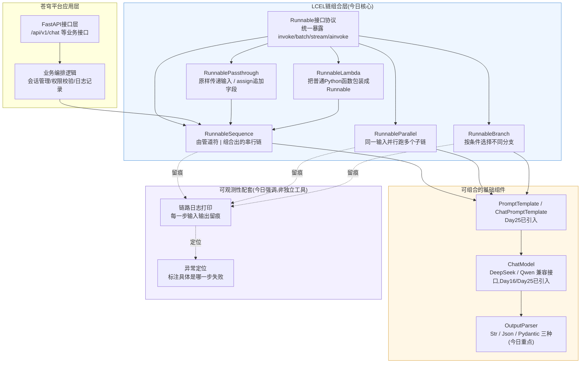
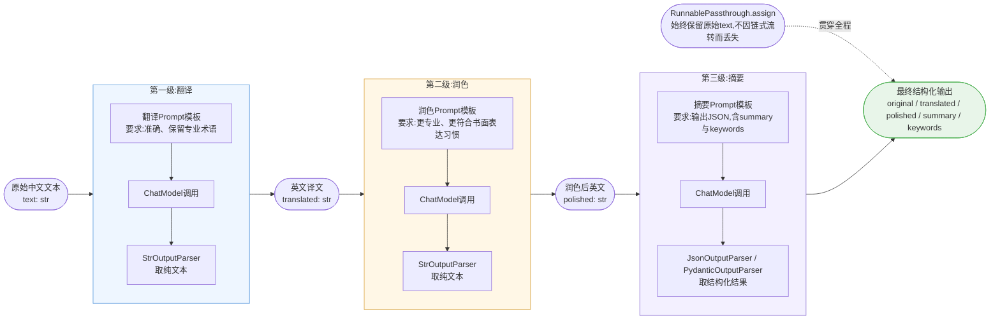
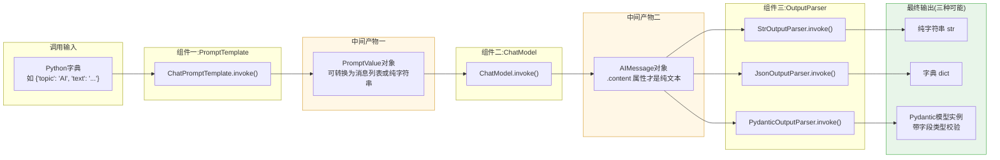

# 第26天 · LCEL表达式与链 —— 优雅是结果,不是目的

> **周次/Sprint**:Sprint 2 · RAG基础(Day25-31)—— 今天是Sprint2的第二天,昨天刚用LangChain把苍穹0.1版的对话引擎"翻译"了一遍,今天要看看这些零件到底怎么用"链"真正拧到一起
> **星期**:周五(入职第26天,第四周周五)
> **参与人**:陈铭(导师:王振宇;晨会末尾短暂列席:林悦)
> **飞书任务号**:CQ-105(苍穹0.5版 · LCEL链式重构:PromptTemplate→ChatModel→OutputParser标准链路)、CQ-106(苍穹0.5版 ·"翻译-润色-摘要"三级处理链原型验证)
> **今日关键词**:LCEL / 管道符`|` / Runnable接口 / invoke-batch-stream / StrOutputParser / JsonOutputParser / PydanticOutputParser / RunnablePassthrough / RunnableParallel / RunnableBranch / 分支路由 / 三级链 / 可观测性

---

## 【旁白】

昨天晚上陈铭是带着一种很少见的轻松感下班的。用LangChain把苍穹0.1版的对话引擎重写了一遍之后,那份原本要手动拼prompt字符串、手动判断要不要带上历史消息、手动处理openai库返回的那一堆嵌套字典的代码,变成了`ChatPromptTemplate`加`ChatOpenAI`加几行调用,整整少了小半个文件。他甚至在提交代码前,对着屏幕愣了几秒——这种"东西变少了,但功能一点没少"的感觉,过去二十五天里几乎没有过,大部分时候他的代码只会越写越长。

但轻松感只持续到今天早上通勤路上。他在地铁上翻回老王昨天布置的读书笔记,看到LangChain官方文档里反复出现一个词——LCEL,LangChain Expression Language。昨天他写的代码,严格说起来,还是"一步一步调"的写法:先把prompt模板格式化,拿到结果再手动传给模型,模型返回了再手动取内容。文档里说,这种写法在LangChain里被称为"传统调用方式",而真正被官方推荐、贯穿整个框架设计思想的,是另一种写法——用一个竖线`|`,把prompt、模型、解析器这些零件像水管一样接起来,数据从一头灌进去,自动流过每一节水管,从另一头流出来。他试着把自己昨天写的一段代码用这种写法改了一下,原本七八行的调用逻辑,变成了一行:`chain = prompt | model | parser`。跑起来,结果一模一样。

这件事让陈铭有点兴奋,兴奋到走进公司大门时脚步都比平时快了几分。他脑子里冒出来的第一反应是"这也太优雅了吧",甚至已经开始设想要不要把苍穹0.1版里所有还带着老式调用痕迹的代码,今天一口气全部改成管道符写法——毕竟看起来又短又好看,谁会不喜欢呢。他甚至没等老王开口,一坐下就把这段"优雅"的对比代码展示了出来,像是拿到了一件新玩具。

老王看完之后没有立刻附和,反而先问了一句让陈铭愣了一下的问题:"如果这条链跑到第三步突然报错了,你怎么知道是哪一步的输入出了问题?"陈铭张了张嘴,发现自己确实答不上来——用管道符写的那一行代码,报错信息只会告诉你"链执行失败",不会像老式写法那样,每一步都有一个变量名摆在那里,方便你打印出来看。老王接着说的那句话,陈铭后来在自己的笔记本上专门抄了一遍,抄的时候力道都比平时重:"优雅不是目的,可维护和可观测才是。管道符好看,是因为它把复杂性藏起来了,但藏起来的东西不会消失,它只是换了个地方等着你——通常是等你线上出问题、半夜爬起来查日志的那个地方。"

这句话像一根针,把陈铭昨晚那种"这也太简单了"的兴奋感戳破了一个小口。今天这一整天,他要真正搞懂的,不是"竖线怎么用",而是竖线背后那套叫Runnable的接口设计——为什么prompt、model、parser这些看起来毫不相干的东西,能够被同一个符号连接起来;链条中间流动的数据,到底在每一步发生了什么类型上的变化;当链条变得复杂——需要并行跑多个任务、需要根据输入内容走不同分支——的时候,又该怎么继续保持"看得懂、改得动、出了问题能查到根"这三条底线。老王把今天要交付的东西定得很具体:一条能把一段文字"翻译成英文,再润色得更专业,再生成一份带关键词的结构化摘要"的三级链,而这条链不是为了好看才搭的——它未来会是苍穹知识库问答系统里"多语言文档处理"能力的原型,林悦已经在跟海纳制造集团接洽的过程中,听到对方随口提过一句"我们不少设备手册是海外工厂那边写的英文原稿"。

窗外的天已经完全亮了,工位区陆陆续续有人打卡进来。陈铭把昨天那行让他兴奋了一晚上的管道符代码留在屏幕最左边的标签页里,没有删,只是不再觉得那是终点。他翻开笔记本新的一页,在最上面写下了今天的日期和一句话——这句话不是抄老王的原话,是他自己总结出来的:"看得懂的优雅,才叫优雅;看不懂的优雅,叫聪明。"

---

## 晨会纪要 / 今日目标

**时间**:上午9:00,二层小会议室"听雨"
**出席**:王振宇(老王)、陈铭;9:20左右林悦短暂列席

老王进门时手里拿着一个马克杯,还没坐下就先开口:"先说个事,你昨晚提交代码的时候,给我发了条消息,说'这比我手写的优雅多了',我当时没回,想着今天当面跟你聊。"

陈铭有点不好意思地笑了笑:"是不是显得我有点too excited(太兴奋了)?"

"倒不是兴奋的问题。"老王把马克杯放下,拉开椅子坐好,"是我怕你把'优雅'当成了今天要追的东西。咱们先花五分钟,把这件事说透,再往下讲今天正式的内容——不然你今天写代码的时候,脑子里会一直有个声音在说'这样写是不是不够简洁',那个声音会带偏你今天该学的重点。"

**关于"优雅"的一次专门讨论**

老王在白板上写下两行字,一行是陈铭昨天的老式写法伪代码,一行是管道符写法:

```
# 写法一(传统调用)
prompt_value = prompt.invoke({"topic": "AI"})
model_output = model.invoke(prompt_value)
result = parser.invoke(model_output)

# 写法二(LCEL管道符)
chain = prompt | model | parser
result = chain.invoke({"topic": "AI"})
```

"你告诉我,这两种写法,运行结果一样吗?"老王问。

"一样。"陈铭答。

"那从功能角度讲,这两种写法有区别吗?"

"没有区别,都是走了prompt、model、parser这三步。"

"那你说的'优雅',具体优雅在哪?"老王追问,"我要你说得非常具体,不能只说'看起来更简洁'。"

陈铭想了想:"第一,代码行数少了;第二,不需要给中间结果起名字,`prompt_value`、`model_output`这些临时变量都不用写了;第三,看起来更像是在描述'这件事该怎么做'而不是'每一步具体怎么操作',有点像是……声明式?"

"声明式这个词用得对,这确实是LCEL的设计哲学之一——从'命令式'(一步步告诉计算机怎么做)转向'声明式'(描述数据要经过哪些加工环节)。"老王点头,"但你说的前两点,'行数少''不用起名字',这两个优点,恰好也是它的风险点。你想,如果这条链只有三步,你脑子里能记住每一步是什么;但如果这条链有八步、十步,中间还夹杂了并行、分支,你还能一眼看出'第五步到底在干什么'吗?"

陈铭沉默了几秒:"如果不写变量名……确实会有点抽象。"

"这就是我昨天那句话的意思。"老王在两行伪代码中间画了一条分割线,"管道符写法不是'更好'或者'更差',它是一种权衡——用可读性上的简洁,换取了调试和排查问题时的透明度。这个权衡在什么场景下值得?链条逻辑清晰、经过充分测试、有配套的日志和追踪工具的时候,它就是纯收益;但如果你为了'看起来优雅'而把本该拆开、本该有中间检查点的逻辑,硬塞进一整条管道符里,那你是在给自己埋雷。苍穹平台后面会有很多条链,长的、短的、带分支的都有,咱们今天学的不只是'管道符怎么写',更重要的是学会判断'这个地方该不该用管道符、该怎么保留可观测性'。"

"所以今天不是单纯学一个语法糖。"陈铭说。

"对,LCEL本质上不是语法糖,它背后有一整套叫Runnable的接口协议,这套协议才是真正值钱的东西——它统一了LangChain里几乎所有组件的调用方式,不管是prompt、model、parser,还是你自己写的任意一个函数,只要包装成Runnable,就能用同样的方式调用(`invoke`)、同样的方式批量处理(`batch`)、同样的方式流式输出(`stream`),甚至同样的方式异步调用(`ainvoke`)。管道符只是这套协议附带的一个'语法便利',真正的重点是接口本身。"老王说,"咱们今天上午先把这套协议的骨架搞清楚,下午再往上叠更复杂的组合方式——并行、分支。今天收尾要交付一条'翻译→润色→摘要'的三级链,这不是我随手出的题,是跟海纳集团那边的一个真实细节有关系,等林悦过来的时候她会跟你说。"

**昨日回顾:LangChain重写对话应用的复盘**

老王简单回顾了一下昨天(Day25)的产出:"昨天你用`ChatPromptTemplate`和`ChatOpenAI`(苍穹平台里实际接的是DeepSeek和Qwen的兼容接口)重写了对话应用,把手写的prompt拼接逻辑和消息角色管理,换成了LangChain标准的`SystemMessage`、`HumanMessage`、`AIMessage`这套消息类型。这一步的意义,不是'代码变短了',是'苍穹平台从今天起,所有跟大模型打交道的地方,都要走同一套标准接口',这对后面接入新的模型供应商、后面团队人数变多之后的代码一致性,都是刚需。你昨天写的代码里,我看你还是用的'一步步调用'的写法,`prompt.invoke()`拿到结果之后再手动传给`model.invoke()`,这是完全正确的过渡写法,今天要做的,就是把这种写法,升级成用LCEL组织起来的链。"

"我看官方文档里说,LCEL从设计之初就是为了解决什么问题?"陈铭问。

"至少三个问题。"老王竖起手指,"第一,统一接口——不管你的组件是简单的字符串处理,还是复杂的模型调用,都能用同一套方法调用,这样你才能把不同的组件自由拼接,而不用为每一种组合专门写胶水代码。第二,内置的并行和流式能力——你不需要自己写多线程代码去实现'同时跑三个任务',也不需要自己写生成器函数去实现流式输出,LCEL的Runnable在设计时就把这些能力内建进去了,只要你的组件遵循这套协议,并行、流式、批量,你几乎不用额外写代码就能拿到。第三,可观测性的钩子——LangChain配套的LangSmith(咱们后面项目周会介绍),能够自动把一条LCEL链的每一步执行过程记录下来,前提是你用的是标准的Runnable组合方式,而不是完全脱离这套体系、自己手写的胡子代码。"

"所以我今天需要搞懂的,是'管道符背后到底发生了什么',对吧?"陈铭说。

"对,而且要练到肌肉记忆的程度——看到一条链,你要能立刻在脑子里画出数据流:输入是什么类型,经过第一节管子之后变成什么类型,经过第二节又变成什么类型,直到最后流出来的是什么。这是今天上午的重点。下午我们再往上叠并行和分支这两种更复杂的组合方式,最后落到今天真正要交付的东西——一条完整的三级链。"

**训练线摘要:今天的两段式安排**

老王把今天的安排写在白板上:

**上午(9:30-12:00):Runnable接口与LCEL基础**。理解管道符`|`的本质(重载了`__or__`方法,本质是调用`RunnableSequence`);梳理Runnable接口暴露的核心方法(`invoke`/`batch`/`stream`/`ainvoke`等);对比三种OutputParser——`StrOutputParser`(取纯文本)、`JsonOutputParser`(取结构化JSON)、`PydanticOutputParser`(取带校验的强类型对象)——各自的适用场景与局限。

**下午(13:30-18:00):组合利器与三级链实战**。学习`RunnablePassthrough`(原样传递输入,并能配合`.assign()`往数据里追加字段而不丢失原始输入)、`RunnableParallel`(同一份输入,并行跑多个子链,一次调用拿到多份结果)、条件路由(`RunnableBranch`及用`RunnableLambda`手写的路由函数);实操搭建"翻译→润色→摘要"三级链,要求链条各阶段的中间结果都能被保留、被查看,不能因为用了管道符就把中间过程变成黑箱。

**今日目标清单**

1. 能用自己的话说清楚Runnable接口的设计动机,以及管道符`|`背后发生的事情(`RunnableSequence`的组合逻辑)。
2. 熟练使用`invoke`、`batch`、`stream`三种调用方式,并知道各自适用的场景。
3. 掌握`StrOutputParser`、`JsonOutputParser`、`PydanticOutputParser`三种输出解析器的写法与差异,能根据场景做出合理选型。
4. 掌握`RunnablePassthrough`(尤其是`.assign()`)保留中间数据的用法。
5. 掌握`RunnableParallel`实现"同一输入、并行处理多个任务"的写法。
6. 掌握至少一种条件路由的实现方式(`RunnableBranch`或自定义路由函数),能根据输入内容动态选择不同的处理分支。
7. 完成"翻译→润色→摘要"三级链的完整实现,要求每一级的中间产物都可追溯、可打印,不能是纯黑箱。

**林悦的短暂列席**

9点20分左右,林悦抱着笔记本电脑推门进来,没有坐下,只是靠在门边说了几句:"打扰你们几分钟。海纳集团那边昨天又约了一次非正式沟通,对方的信息化负责人提了一个我们之前没太注意的细节——他们不少设备手册和作业指导书,原始版本是海外工厂那边用英文写的,后来找人翻译成中文,但翻译质量参差不齐,专业术语经常翻得很奇怪,一线工人反馈'看不太懂'。这跟咱们知识库问答的核心目标是有关系的——如果源文档本身翻译质量差,后面不管做多好的检索和问答,答案的准确度都会被这个'源头噪声'拖累。"

老王抬头看了陈铭一眼:"这就是我早上提到的'今天这条三级链不是我随手出的题'的意思。"

"没错。"林悦接过话,"我不是说今天就要解决海纳的翻译问题,那个是后面Day28文档处理阶段的事,今天太早了。我过来是想让陈铭提前对这个场景有点感觉——'翻译→润色→摘要'这条链,今天看起来是个练习LCEL语法的小项目,但它对应的是一类真实存在的企业需求:多语言文档的标准化处理。海纳不是特例,做外贸、做跨国供应链的制造企业,这种'源文档语言混乱、翻译质量不一'的情况特别常见。你今天搭的这条链,思路上跟将来真正给海纳处理文档时用的链,不会有本质区别,顶多是提示词和后续接的检索环节不一样。"

陈铭若有所思地点头:"所以今天与其说是在练语法,不如说是在给一个真实需求先搭一个原型骨架。"

"可以这么理解。"林悦笑了笑,"我今天说的这些,你不用记进正式的需求文档里,今天的正式需求文档还是围绕LCEL本身的技术验证目标写的,我这几句就当是……给你一点做这件事的'为什么'。"她说完看了下时间,跟老王点头示意,转身离开了会议室。

老王等她走远才继续说:"林悦这几句话,其实也是在给你上一课——工程师容易陷入一个误区,觉得'今天布置的题目是什么样,我就照着题目字面意思做就行'。但真实项目里,几乎每一个练习题的背后,都能挂上一个业务理由,你越能看到这层理由,越能在写代码的时候做出更合理的设计决策。比如今天这条链,如果你只把它当成一个语法练习,你可能会把三个步骤写得很随意;但如果你意识到它未来真的可能要处理成百上千份设备手册,你就会自然而然地多想一层——比如中间结果要不要留痕、每一步失败了要不要有兜底、prompt要不要考虑更复杂的专业术语场景。带着这层认识去写代码,和纯粹为了交作业去写代码,写出来的东西是不一样的。"

"明白了。"陈铭在笔记本上记下这段话,然后翻到新的一页,准备开始今天正式的技术内容。

---

## 需求文档:LCEL链式改造技术验证

> 撰写人:林悦(产品经理) · 技术评审人:王振宇 · 文档编号:CQ-PRD-D26-01 · 版本:v1.0

### 背景

苍穹平台的对话引擎从Day15手写API调用,到Day25用LangChain标准组件重写,已经完成了"从裸调用到框架化"的第一步迁移。但Day25的重写,本质上还是"用新组件、走老套路"——每一步调用之间仍然依赖手动传递中间变量,没有真正发挥LangChain框架在链式组合、并行处理、条件路由方面的设计优势。

随着苍穹平台即将进入RAG能力建设阶段(Sprint2的核心目标),后续的知识库问答系统会涉及大量"多步骤处理"的场景:文档加载后要经过分割、可能要经过翻译或格式标准化、检索到多个文档片段后可能需要并行处理再汇总、根据用户问题类型可能需要走向不同的处理分支(比如"闲聊类问题"和"专业知识类问题"应该走不同的prompt策略)。如果继续沿用手动拼接调用的写法,代码会随着流程复杂度呈指数级膨胀,可维护性会迅速恶化。

因此,在正式进入RAG开发之前,本文档的目标是验证LCEL(LangChain Expression Language)这套链式组合能力,是否能够满足苍穹平台后续复杂处理流程的工程需求,并以一条"翻译→润色→摘要"的三级处理链作为验证载体,同时为后续可能出现的多语言文档标准化需求(如海纳集团反馈的设备手册翻译质量问题)预先积累技术原型。

### 用户故事

- 作为苍穹平台的开发者,我希望有一套统一的接口协议,可以把不同类型的处理组件(提示词模板、模型调用、结果解析、自定义函数)自由拼接成处理链,而不需要为每一种组合关系单独写胶水代码。
- 作为苍穹平台的开发者,我希望这套处理链天然支持"批量处理"和"流式输出",而不需要为了实现这两种能力,额外编写多线程或生成器相关的代码。
- 作为苍穹平台的开发者,我希望处理链的输出结果能够按需被解析为不同的格式——有时候只需要一段纯文本,有时候需要结构化的JSON,有时候需要带类型校验的强类型对象——并且这三种解析方式的切换成本要足够低。
- 作为苍穹平台的开发者,我希望在处理链变得复杂(比如需要并行处理多个子任务,或者需要根据输入内容走不同分支)时,依然能够保持代码的可读性,并且能够方便地查看链条执行过程中每一步的中间结果,而不是只能看到最终输出。
- 作为技术负责人,我希望这套改造不是"炫技式的语法升级",而是能够真正沉淀为后续RAG系统开发的可复用工程范式,包括错误处理、日志记录、中间结果留痕等工程规范。
- 作为产品经理,我希望这次技术验证产出的"翻译→润色→摘要"三级链,能够为后续潜在的多语言文档处理需求(尤其是海纳集团反馈的设备手册翻译质量问题),积累一个可以复用或改造的技术原型,即便今天的产出还不是面向客户的正式功能。

### 功能列表

| 编号 | 功能 | 说明 | 优先级 |
|---|---|---|---|
| F1 | LCEL基础链验证 | 使用管道符`\|`将PromptTemplate、ChatModel、OutputParser组合为一条可调用的链,验证`invoke`/`batch`/`stream`三种调用方式均正常工作 | P0 |
| F2 | 三种OutputParser对比封装 | 分别实现基于`StrOutputParser`、`JsonOutputParser`、`PydanticOutputParser`的三条示例链,并输出对比说明文档(以代码注释+日志形式呈现),清晰说明各自的适用场景与限制 | P0 |
| F3 | RunnablePassthrough中间结果保留 | 在多步骤链中使用`RunnablePassthrough.assign()`,确保用户能够同时获取原始输入与每一步的中间产物,不能因为链式组合而丢失可观测性 | P0 |
| F4 | RunnableParallel并行处理示例 | 实现至少一个"同一输入、并行执行多个子任务"的示例(例如同时进行翻译、情感分析、关键词提取),验证并行执行相较于串行执行的耗时优势 | P0 |
| F5 | 条件路由示例 | 实现至少一种条件路由机制(`RunnableBranch`或自定义路由函数),根据输入内容的某个特征(如检测到的语言、文本长度、内容类型)动态选择不同的处理分支 | P0 |
| F6 | 翻译-润色-摘要三级链 | 完整实现"原文→翻译成英文→润色为专业表达→生成结构化摘要(含关键词)"的三级处理链,每一级的中间结果均可追溯查看,最终输出为结构化的JSON,包含原文、译文、润色稿、摘要、关键词五个字段 | P0 |
| F7 | 基础异常处理与日志 | 链条执行过程中,任意一步出现异常(如模型调用失败、解析失败),均应有明确的错误提示,能够定位到具体是哪一步骤出的问题,而不是笼统地报"链执行失败" | P1 |
| F8 | 简易API封装(选做) | 将三级链封装为一个FastAPI接口,支持流式返回处理进度,作为未来正式对外接口的技术预研 | P2 |

### 非功能需求

- **可维护性**:链条的组合逻辑应保持清晰的模块划分,单条链的组合步骤原则上不超过5-6个直接可见的环节,复杂逻辑应拆分为独立的子链再组合,而不是堆叠成一整条难以阅读的超长管道符表达式。
- **可观测性**:任意一条链,都应该能够方便地打印或记录每一步的输入输出,不能因为使用了链式语法而导致中间过程完全不可见。今天所有的示例代码,都要求保留对中间结果的打印或返回能力。
- **性能**:验证并行处理(`RunnableParallel`)相较于串行调用,在多任务场景下应有可观测的耗时优势(即使今天使用的是模拟延迟或真实但轻量的模型调用,也应能通过日志清晰看到耗时对比)。
- **健壮性**:输出解析环节(尤其是`JsonOutputParser`和`PydanticOutputParser`)需要考虑模型输出格式不完全符合预期时的容错处理,不能假设模型每次都会严格按照要求的格式返回结果。
- **代码规范**:延续苍穹平台一贯的代码规范——PEP8、中文docstring、关键业务逻辑处配中文行内注释说明"为什么这么做"。

### 验收标准

1. 能够现场演示至少一条使用管道符`|`组合出的LCEL链,并能够清楚讲解这条链在执行时,数据依次经过了哪些组件、每一步的输入输出类型是什么。
2. 能够现场对比展示`StrOutputParser`、`JsonOutputParser`、`PydanticOutputParser`处理同一个模型输出时的行为差异,并能说明各自适用的业务场景。
3. 能够现场演示使用`RunnablePassthrough.assign()`的链条,证明即便经过多步处理,原始输入和中间结果依然可以被完整获取,不会被"冲掉"。
4. 能够现场演示`RunnableParallel`并行处理多个任务的效果,并给出串行与并行执行耗时的对比数据(即使是粗略的秒级对比)。
5. 能够现场演示至少一种条件路由逻辑,输入不同类型的内容时,链条能够正确地走向不同的处理分支。
6. "翻译-润色-摘要"三级链能够端到端跑通,输入一段中文文本,依次输出英文译文、润色稿、结构化摘要(含关键词列表),且三个阶段的中间结果均可在最终输出或日志中查看到。
7. 故意构造至少一个"模型输出格式不规范"的场景(比如让`JsonOutputParser`遇到模型输出了非纯JSON的文本),验证系统有基本的容错或明确的报错提示,不会导致程序直接崩溃且没有任何有用信息。
8. 代码提交到GitLab的`feature/lcel-chains`分支,提交信息清晰,关键函数均有中文docstring。

老王在评审这份需求文档时,补充了一句口头意见,没有写进文档里,但让陈铭专门记在了笔记本上:"林悦这份文档里第4条非功能需求写的是'可观测性',这个词你以后会在很多地方反复听到,尤其是咱们后面接入LangSmith做链路追踪的时候。今天你先记住一个朴素的判断标准——如果你写的一条链,出了问题你只能靠'猜'来排查,那这条链的可观测性就是不合格的;如果出了问题你能一步步定位到具体是哪个组件的输入或输出不对,那才算合格。今天不要求你今天就上LangSmith这种专业工具,但要求你在写代码的时候,始终保留'能不能人肉排查'这个意识。"

陈铭顺着这个话题,多问了一句:"那如果以后真的接了LangSmith这类工具,今天讲的'保留中间结果、打印每一步输入输出'这些手动做法,是不是就没有意义了?"

"完全不会没有意义。"老王摇头,"LangSmith这类工具解决的是'自动化地、系统化地'记录链路的执行细节,方便你在一个可视化界面里回溯每一次调用的完整过程,尤其是在生产环境里,你不可能靠满屏幕的`print`去排查线上问题。但这类工具是'锦上添花',不是'从无到有'——如果你今天连'手动保留中间结果'的意识都没有建立起来,给你一套再强大的可观测性工具,你也不知道该盯着哪些指标看、该在哪些关键节点埋点。今天让你亲手写`RunnablePassthrough.assign()`去保留中间结果,本质上是在训练你对'链路可观测性'这件事的敏感度,这种敏感度,以后不管你用不用专业工具,都会一直起作用。工具会变,但对'数据在哪一步发生了什么变化'这件事保持好奇和警觉,这个习惯不会变。"

---

## 架构设计图:LCEL链式组合架构

上午9点40分,老王在白板上画出了今天要理解的整体架构,要求陈铭先看懂"LCEL在苍穹平台的技术栈里处于什么位置",再动手写代码。



老王指着图讲解:"你看这张图分了四层——最上面是苍穹平台真正对外的业务接口层,这一层今天不动;最下面是可观测性配套,这一层是我今天反复强调的东西,它不是一个独立的技术组件,而是一种编码习惯,贯穿在你写的每一条链里;中间两层才是今天的主角——`COMPONENTS`是你已经认识的老朋友,prompt、model、parser,Day25已经用过;`LCEL_LAYER`是今天要新认识的东西,这一层的核心是`Runnable`这个接口协议,下面挂着五个具体的实现——`RunnableSequence`对应管道符组合出来的串行链,`RunnableParallel`对应并行,`RunnableBranch`对应分支路由,`RunnablePassthrough`用来保留原始输入或追加字段,`RunnableLambda`用来把你自己写的任意Python函数,也纳入到这套协议体系里。"

"所以`PromptTemplate`、`ChatModel`、`OutputParser`这些组件,它们本身也是Runnable?"陈铭问。

"没错,这是LCEL设计里最关键的一点——LangChain里几乎所有的核心组件,本身都实现了Runnable接口,这就是为什么它们能够被管道符自由拼接。你可以把`COMPONENTS`这一层里的每一个方块,都看成是`LCEL_LAYER`里`Runnable`协议下的一个具体实例,它们和`RunnableSequence`、`RunnableParallel`这些组合器,是平等的'一等公民'。今天你会发现,你自己写的一个普通函数,只要用`RunnableLambda`包一下,也能立刻加入到这条链里,和prompt、model平等地用管道符拼在一起——这就是这套协议统一性的体现。"

---

## 流程图:"翻译→润色→摘要"三级链的数据流

上午10点半,老王又画了一张更具体的图,聚焦在今天要交付的核心产出——三级链的数据流动过程。



"这张图你要重点看两个地方。"老王说,"第一,三级链的每一级,内部结构其实完全一样,都是'Prompt→Model→OutputParser'这三步,只是每一级用的prompt内容不同,第三级用的OutputParser类型也不同。这说明什么?说明一旦你掌握了'prompt+model+parser'这个最基本的三件套写法,后面无论链条多长,本质上都是在重复这个基本单元,只是把上一级的输出,变成下一级的输入。第二,图的下方我特意画了一条'贯穿全程'的虚线,标注的是`RunnablePassthrough.assign`——这是今天需求文档里F3那条'保留中间结果'要求的具体实现方式。如果你不做任何处理,一条纯用管道符`\|`串起来的链,默认情况下,下一级只能看到上一级的输出,原始的中文原文,流到第三级的时候,其实已经'看不见'了,除非你专门用`assign`把它保留下来。"

陈铭盯着图看了一会儿:"所以如果我最终想要一个JSON,里面同时有原文、译文、润色稿、摘要,如果不用`RunnablePassthrough`,默认的管道符写法是做不到的?"

"对,默认的`prompt \| model \| parser`这种最朴素的串行写法,每一步只会把上一步的完整输出,原样传给下一步,不会自动帮你'记住'更早之前的中间结果。如果你需要在最终结果里同时拿到多个阶段的数据,就必须显式地用`RunnablePassthrough.assign()`,把每一步的产出'追加'到一个不断累积的字典里,而不是简单地'替换'。这也是很多刚接触LCEL的人最容易踩的坑——写出一条很漂亮的管道符链,结果发现最后只拿到了最后一步的结果,前面的中间产物全部丢了。"

---

## 示意图:Runnable接口的输入输出类型流转示意

上午11点,老王画了第三张图,专门讲清楚"类型"这件事——他特别强调,这是今天最容易被忽视、但最容易导致报错的一个知识点。



"这张图看起来简单,但我带过的所有学员,包括我自己当年,都在这上面栽过跟头。"老王说,"管道符`\|`能够把不同组件连起来,前提是'上一个组件的输出类型,恰好是下一个组件能接受的输入类型'。你看这张图,数据从一个普通的Python字典出发,经过`PromptTemplate`之后,并不是变成了字符串,而是变成了一个叫`PromptValue`的对象;这个`PromptValue`再传给`ChatModel`,模型返回的也不是字符串,而是一个`AIMessage`对象,你要拿到纯文本内容,得访问它的`.content`属性;最后到了`OutputParser`这一步,才会根据你选的解析器类型,变成字符串、字典,或者带类型校验的Pydantic对象。"

"那如果我在这个过程中,某一步的输出类型不对,链条会怎么样?"陈铭问。

"直接报错,而且报错信息有时候会很'底层',比如告诉你某个对象没有某个属性,而不会直接说'你这一步类型不匹配'。"老王说,"这就是为什么我一直强调,你在写LCEL链之前,脑子里要先能画出这张图——链条每一节的输入输出类型分别是什么。今天你会发现,LangChain已经帮你处理好了绝大多数常见组件之间的类型衔接,比如`PromptTemplate`到`ChatModel`、`ChatModel`到`OutputParser`,这些都是官方设计好的标准衔接点,你不用操心。但一旦你往链里加入自己写的普通函数(用`RunnableLambda`包装),你就要格外小心——你的函数接收的参数类型,必须和上一节管子吐出来的类型对得上,你的函数返回的类型,也要是下一节管子能接受的类型,这个衔接责任,这时候就落在你自己身上了。"

---

## 课堂笔记(上午):LCEL、管道符、Runnable接口、三种OutputParser

**1. 从"手动调用"到"管道符组合":一个具体的对比**

昨天(Day25)陈铭写的代码,本质上是这样的调用方式:

```python
prompt_value = prompt.invoke({"topic": "人工智能"})
response = model.invoke(prompt_value)
result = parser.invoke(response)
```

这种写法完全正确,也很直观——一步一步来,每一步都有一个变量名承接结果,方便调试的时候打印查看。但当链条步骤变多的时候,这种写法会显得很啰嗦,而且每次调用都要重复"调用`.invoke()`、拿到结果、传给下一步"这套固定的动作。LCEL提供的管道符写法,本质上是把这套"固定动作"封装了起来:

```python
chain = prompt | model | parser
result = chain.invoke({"topic": "人工智能"})
```

老王强调,理解这行代码的关键,不是把它当成"语法糖来记",而是要理解`|`这个符号在Python里到底发生了什么。Python允许一个类通过实现`__or__`这个特殊方法,来自定义`|`运算符的行为。LangChain里的每一个Runnable组件(`PromptTemplate`、`ChatModel`、`OutputParser`等等),都实现了`__or__`方法,这个方法做的事情很简单——把左边的Runnable和右边的Runnable,包装成一个新的`RunnableSequence`对象,这个新对象本身也是一个Runnable,它的`invoke`方法会依次调用内部保存的每一个子Runnable的`invoke`方法,并把上一个的输出,作为下一个的输入。

也就是说,`prompt | model | parser`这行代码执行完之后,得到的`chain`变量,并不是"prompt、model、parser三个东西的简单集合",而是一个全新的、独立的`RunnableSequence`对象,这个对象自己也完整地实现了Runnable接口——它自己也有`invoke`、`batch`、`stream`这些方法。这一点非常关键,因为它意味着"组合出来的链"和"链里的单个组件",在接口层面是完全平等的,你可以把一条已经组合好的链,再和别的组件继续用管道符拼接,组成更长的链,这种"组合的产物依然可以被继续组合"的特性,在设计模式里有个专门的名字,叫"组合模式"(Composite Pattern)。

"你之前学数据结构的时候,有没有接触过'组合模式'这个概念?"老王问。

陈铭摇头:"没系统学过,但听起来有点像……链表?一环套一环?"

"方向差不多,但组合模式强调的是'单个对象'和'对象的组合'实现同一套接口,使用者不需要区分自己面对的是一个原子组件还是一整棵组合树。"老王补充,"你今天写`prompt | model | parser`的时候,调用`chain.invoke()`,和你单独调用`model.invoke()`,写法是完全一样的——你不需要知道`chain`背后其实藏着三个甚至更多的组件在依次执行,这就是组合模式带来的好处,也是LCEL最核心的设计思想。"

**2. Runnable接口到底暴露了哪些方法**

老王要求陈铭把Runnable接口暴露的核心方法,当成今天必须记住的"基础词汇表":

- `invoke(input)`:同步调用,传入一份输入,拿到一份输出,是最常用、最基础的调用方式。
- `batch(inputs)`:同步批量调用,传入一个输入列表,内部会自动做并发处理(默认会利用线程池并发执行,而不是简单地对列表做for循环串行调用),返回一个输出列表,顺序与输入列表一一对应。
- `stream(input)`:流式调用,返回一个生成器,逐块吐出中间结果,这是实现"打字机效果"的底层机制,Day24已经用过SSE配合流式输出实现前端打字机效果,今天要理解的是"流式"这个能力,在LCEL体系里,是Runnable接口天然自带的,而不需要你为每一种组合单独实现。
- `ainvoke(input)` / `abatch(inputs)` / `astream(input)`:对应的异步版本,前缀`a`代表async,适合在FastAPI这类异步框架里被`await`调用,避免阻塞事件循环。

"你注意到没有,这四组方法(`invoke`系列、`batch`系列、`stream`系列,以及各自的异步版本),对于`RunnableSequence`、`RunnableParallel`、`RunnableBranch`,还是你自己用`RunnableLambda`包装出来的函数,调用方式是完全一致的。"老王说,"这就是为什么我说,理解Runnable接口比记住管道符语法更重要——一旦你理解了这套协议,你就知道任何一个符合这套协议的组件,不管它内部逻辑多复杂,你调用它的方式永远是这几个方法,不会有例外。这种'统一的调用契约',在软件工程里叫接口的一致性,是衡量一个框架设计好坏的重要标准之一。"

**3. `batch`带来的效率提升:一个容易被忽视的细节**

陈铭提了一个问题:"如果`batch`默认就会做并发,那我今天是不是应该尽量都用`batch`,而不是写`for`循环反复调用`invoke`?"

"这是个好问题,答案是——看场景。"老王说,"如果你确实需要对一批输入做同样的处理(比如批量翻译100条客户反馈),用`batch`比手写`for`循环加`invoke`效率高很多,因为`batch`内部帮你处理了并发调用的细节,你不需要自己管理线程池。但如果你的每一次调用之间有依赖关系(比如第二次调用需要用到第一次调用的结果),那`batch`就不适用,这种场景必须用串行的方式处理。今天的示例代码里,我会让你亲自写一个`batch`的例子,对比一下'手写for循环调用invoke'和'直接调用batch'在处理多条输入时的耗时差异,你自己跑一遍会有更直观的感受。"

**4. OutputParser的三种主要类型及其取舍**

上午的最后一个重点内容,是三种输出解析器的对比。老王先解释了OutputParser存在的意义:"大模型的原始输出,永远是一段文本(或者更准确地说,是一个`AIMessage`对象,里面装着文本)。但你的业务代码,往往不是直接需要一段文本,可能需要的是一个能直接用的Python字符串、一个可以直接用`[]`取值的字典,或者一个带类型校验、写代码时IDE能自动补全字段名的强类型对象。OutputParser做的事情,就是把模型返回的'一段文本',转换(或者说'解析')成你业务代码真正想要的那种数据结构。"

**`StrOutputParser`——最朴素的解析器**

`StrOutputParser`做的事情非常简单:接收一个`AIMessage`对象,取出它的`.content`属性(也就是纯文本内容),返回这个字符串。它几乎不做任何"智能"的加工。

"这是不是意味着,如果我不用`StrOutputParser`,自己手写`response.content`,效果是一样的?"陈铭问。

"效果确实一样,但意义不一样。"老王说,"如果你自己手写`response.content`,这行代码就不是一个Runnable对象,不能被管道符组合进链条里;而`StrOutputParser`是一个标准的Runnable,可以直接用`|`拼在`model`后面,让整条链保持统一的组合方式。这也回应了我们上午一开始讨论'优雅'时说的那句话——`StrOutputParser`看起来'什么都没做',但它做的事情是'让取值这个动作,也纳入到Runnable协议里',这本身就是有价值的。"

**`JsonOutputParser`——期望模型输出结构化JSON**

`JsonOutputParser`要求模型的输出内容本身是一段可以被解析为JSON的文本(比如`{"summary": "...", "keywords": ["...", "..."]}`),它会尝试用JSON解析的方式,把这段文本转换成Python字典。为了提高模型真正按JSON格式输出的概率,通常需要在prompt里明确告诉模型"请只输出JSON,不要有多余的文字说明",有时还会配合`JsonOutputParser`提供的格式说明方法,把"输出格式要求"自动插入到prompt里。

老王特别提醒了一个风险点:"大模型不是100%可靠地按照你要求的格式输出——它有时候会在JSON前后加一段'好的,以下是结果:'这样的客套话,有时候会用markdown代码块把JSON包起来,有时候干脆输出的JSON里字段名和你要求的不完全一致。`JsonOutputParser`在处理这些'不那么规范'的输出时,有一定的容错能力(比如能自动剥离markdown代码块标记),但不是万能的,今天我会让你故意构造一个'格式很不规范'的场景,亲眼看看它在什么情况下能扛住,什么情况下会报错。"

**`PydanticOutputParser`——带类型校验的强类型解析**

`PydanticOutputParser`是三者中最"严格"的一种,它要求你事先定义好一个Pydantic模型(Day23、Day24已经大量使用过Pydantic,这里是同一套工具在LangChain场景下的应用),描述期望的输出结构应该包含哪些字段、每个字段是什么类型。解析的时候,不仅会做JSON解析,还会用Pydantic模型对解析出来的数据做类型校验——如果模型返回的数据里缺少必填字段,或者某个字段类型不对(比如期望是列表,模型返回了一个字符串),`PydanticOutputParser`会直接抛出校验错误,而不是"悄悄地"给你一个不完整或类型不对的字典。

"这是不是意味着,`PydanticOutputParser`比`JsonOutputParser`'更好'?"陈铭问。

"不是'更好',是'更严格'。"老王纠正,"更严格既是优点也是代价。优点是,一旦通过校验,你拿到的数据你可以完全信任它的结构和类型,后续代码可以放心地用`.summary`、`.keywords`这种属性访问方式,IDE还能给你自动补全,减少手写字典`['summary']`这种访问方式可能出现的typo(打字错误)风险;代价是,校验失败的时候,链条会直接抛异常中断,如果你的业务场景要求'即使模型输出不完全规范,也要想办法兜底给用户一个响应,而不是直接报错',那`PydanticOutputParser`就需要配合额外的重试或降级逻辑,不能指望它'自动变得宽松'。三种解析器,该用哪一种,完全取决于你的业务对'数据规范程度'和'容错优先级'的权衡,今天下午写三级链的时候,你会看到我们在不同阶段,故意选用了不同的解析器,这不是随便选的,是有具体理由的,我会在代码注释里写清楚。"

陈铭在笔记本上画了一张简单的对比表格,记录下三种解析器的核心差异:

- `StrOutputParser`:最轻量,零加工成本,适合"只需要一段最终展示给用户的文本"的场景,比如普通聊天回复。
- `JsonOutputParser`:适合"需要结构化数据,但结构相对灵活、不追求严格校验"的场景,比如快速原型验证、内部工具、字段可能会临时增减的场景。
- `PydanticOutputParser`:适合"下游代码强依赖数据结构、必须保证类型正确"的场景,比如今天摘要环节的输出要进一步存进数据库、或者被别的服务调用,字段名和类型必须稳定可靠。

**5. 一个容易被问到的延伸问题:`with_structured_output`算不算第四种解析器**

陈铭在翻文档的时候,注意到不少新版本的示例代码里,并没有单独写`PydanticOutputParser`,而是直接在模型对象上调用一个叫`with_structured_output`的方法,把Pydantic模型传进去,看起来能达到类似的效果。他把这个疑惑提给了老王。

"这是个很好的观察,说明你没有只看我今天讲的这一套,自己也去翻了资料。"老王说,"`with_structured_output`确实能做到和`PydanticOutputParser`类似的效果,但它俩的实现原理不一样,不完全是'换了个名字的同一个东西'。`PydanticOutputParser`是在'模型自由输出一段文本,再由解析器去解析这段文本'这个前提下工作的,它需要依赖提示词里的格式说明,去'引导'模型尽量按格式输出,本质上仍然是一种'事后解析'。而`with_structured_output`,在很多模型供应商那里,底层利用的是模型API本身提供的'函数调用'或者'JSON模式'这类原生能力(你在Day19学Function Calling的时候接触过这个概念),让模型在生成阶段就被约束着按结构化格式输出,而不是生成完一段自由文本之后再指望解析器去'猜'。"

"所以`with_structured_output`更可靠?"陈铭追问。

"在支持这个原生能力的模型上,通常更可靠,因为它把'约束格式'这件事,从'提示词层面的软约束',挪到了'模型推理层面的硬约束'。但这要求你使用的模型接口必须支持这种原生能力,不是所有模型供应商的接口都支持,苍穹平台目前主力接入的DeepSeek和通义千问,对这类能力的支持程度和OpenAI原生接口不完全一致,今天我没有把这块作为主线内容,是因为我希望你先把`PydanticOutputParser`这条'不依赖模型原生能力、通用性更强'的路子吃透,这样即便未来切换到不支持结构化输出能力的模型供应商,你依然有兜底方案。等咱们后面正式做Function Calling和结构化抽取相关的项目时,会再回来专门对比这两种方式的选型权衡,今天你只需要知道这个概念的存在,不用急着深入。"

---

## 课堂笔记(下午):RunnablePassthrough、RunnableParallel、分支路由

午饭后,陈铭和老王简单聊了几句昨天林悦提到的海纳集团翻译质量问题,老王顺势把话题引回今天下午的内容:"上午你学的是'一条直线怎么串起来',下午要学的是'如果这条直线不够用了,怎么办'——现实里的处理流程很少是纯粹一条直线到底的,经常需要'原地留一份底稿'、需要'同时干几件事',还需要'看情况走不同的路'。这三件事,分别对应`RunnablePassthrough`、`RunnableParallel`,和条件路由。"

**1. `RunnablePassthrough`:留一份底稿的智慧**

老王先抛出一个具体场景:"假设你现在有条链,输入是用户的一句话,链条依次做了翻译、润色,最后你想要的最终结果里,同时包含'用户原话'和'润色后的结果',但纯粹的`prompt \| model \| parser`这种串行链,只会把'上一步的输出'交给'下一步',原始的用户原话,流到最后一步的时候,已经不在数据流里了,你怎么办?"

陈铭想了想:"是不是可以……在最后一步,单独再调用一次,把原话传进去?"

"这是一种笨办法,能解决问题,但意味着你要额外发起一次模型调用,或者要在链条外面手动维护一个变量,这样一来,你其实又回到了'手动拼接中间变量'的老路上,管道符的优势就体现不出来了。"老王摇头,"LCEL提供的正规解法是`RunnablePassthrough`。它最基础的用法,是原样把输入传递下去,不做任何加工,像一根什么都不过滤的直通水管;更常用的是它的`.assign()`方法——你可以用`.assign()`给流经的数据(此时数据是一个字典)追加新的字段,而原有的字段会被保留下来,不会被覆盖或冲掉。"

老王在白板上写了一个简化的示意:

```python
chain = RunnablePassthrough.assign(
    translated=translate_chain
)
```

"这行代码的意思是——输入进来的字典,原封不动地保留所有原有字段,同时新增一个叫`translated`的字段,这个字段的值,是把当前的输入字典,喂给`translate_chain`这条子链之后得到的结果。你可以连续叠加多个`.assign()`,每叠加一次,就往数据里追加一个新字段,而不会丢失之前已经存在的字段。这就是为什么`RunnablePassthrough.assign()`是解决'链条变长之后,中间结果不丢失'这个问题的标准做法——它本质上是把原本'线性传递、每一步替换上一步'的数据流,变成了'字典不断累积、每一步追加新字段'的数据流。"

"那如果我一开始的输入,就已经是个字典,后面每一步的输出也自然被存进这个字典的某个字段里,那到最后一步,这个字典里岂不是同时有了原文、译文、润色稿?"陈铭反应过来。

"完全正确,这正是我们今天'翻译-润色-摘要'三级链要采用的核心设计思路。"老王点头,"你今天写代码的时候会发现,一旦你决定'用字典累积的方式组织数据流',你后续的每一级处理,写法都会变得很统一——每一级都是'从字典里取出需要的字段,喂给这一级的子链,再把结果作为新字段追加回字典'。这是一个非常值得固化成习惯的模式,以后你写更复杂的RAG链、Agent链,这个模式还会反复出现。"

**2. `RunnableParallel`:同一份输入,分头去做几件事**

下午两点半,老王抛出了`RunnableParallel`的场景:"假设产品经理告诉你,针对用户提交的一段文本,系统要同时给出三个结果——英文翻译、情感倾向判断、关键词提取,这三件事之间彼此没有依赖关系,谁先谁后都不影响结果。如果你用串行的方式,先做翻译,再做情感判断,再做关键词提取,三次模型调用会依次排队执行,总耗时是三次调用耗时的总和。有没有办法让这三件事同时开始,谁快谁先返回,总耗时只取决于最慢的那一个?"

陈铭想到了:"是不是跟`batch`有点像,内部帮你处理并发?"

"思路是相通的,但`RunnableParallel`解决的是另一种并发场景——`batch`是'同一条链,处理多份不同的输入',`RunnableParallel`是'同一份输入,喂给多条不同的链,并行执行,把结果汇总成一个字典'。"老王在白板上写下基本写法:

```python
parallel_chain = RunnableParallel(
    translation=translate_chain,
    sentiment=sentiment_chain,
    keywords=keyword_chain,
)
result = parallel_chain.invoke({"text": "这段产品体验非常好,但物流有点慢。"})
# result 是一个字典:
# {"translation": "...", "sentiment": "...", "keywords": [...]}
```

"你注意这里的写法——`RunnableParallel`的构造方式,跟`RunnablePassthrough.assign()`长得很像,都是'关键字参数对应字典的键,每个键的值是一条子链'。这不是巧合,`RunnablePassthrough.assign()`内部的实现,某种程度上就是借助了并行执行的思想——因为你追加的多个字段之间,如果彼此没有依赖关系,理论上也是可以并行计算的。LangChain在这方面做了工程优化,你不需要关心具体是怎么并行调度的,只需要知道——用这种写法组织出来的多个子任务,LCEL会在底层利用并发能力去执行它们,而不是傻乎乎地排队等。"

"那如果这三个子链之间,其中一个报错了,其他两个还会继续跑完吗?"陈铭问了一个更深的问题。

"这是个好问题,值得你今天亲自写代码验证一下,而不是我直接告诉你答案。"老王笑了笑,"我会在今天的作业里留一道类似的题,让你自己动手试出这个行为,比死记硬背结论要记得牢。"

**3. 条件路由:让链学会"看情况办事"**

下午四点,老王讲了今天下午最后一个知识点——条件路由。"前面讲的`RunnableParallel`,是'不管输入是什么,都固定去做这几件事';但很多真实场景里,你需要的是'根据输入内容,决定到底该做哪件事'。比如客户输入的是一句简单的问候,你不需要启动一整套翻译润色摘要的重型流程,直接用一个轻量的寒暄回复就够了;但如果客户输入的是一整段专业文档,才需要走完整的处理链路。这种'先判断、再选择走哪条路'的能力,就是条件路由要解决的问题。"

LangChain里实现条件路由,常见有两种方式:

**方式一:`RunnableBranch`**。这是LangChain提供的一个专门用来做"if-elif-else"式路由的组件,构造方式是传入若干个"条件函数+对应处理链"的元组,以及一个默认处理链。执行的时候,会按顺序依次检查每个条件函数,一旦某个条件返回`True`,就执行对应的处理链,后面的条件不再检查;如果所有条件都不满足,就执行默认链。

**方式二:用`RunnableLambda`手写路由函数**。这种方式更灵活——写一个普通的Python函数,函数内部根据输入的某个特征,自己决定调用哪条子链并返回其结果,再用`RunnableLambda`把这个函数包装成一个标准的Runnable。

"这两种方式,你觉得哪一种更好?"老王问。

"感觉`RunnableBranch`看起来更'官方'、更规整?"陈铭试探着回答。

"规整是规整,但`RunnableBranch`适合条件比较简单、分支数量不多的场景;如果你的路由逻辑本身就很复杂——比如要综合好几个条件、要做一些前置的数据清洗和判断——硬塞进`RunnableBranch`的条件函数里,反而会让代码变得难读。这种情况下,老老实实写一个普通函数,用`RunnableLambda`包装,往往更清晰、更好维护,这也是我早上说的那句话的另一种体现——不要为了'看起来用了框架的高级特性'而牺牲可读性,普通函数配合`RunnableLambda`,同样是'地道'的LCEL写法,不比`RunnableBranch`'低级'。今天代码实战里,这两种方式我都会让你各写一遍,亲身感受一下两者的适用边界。"

**4. 一个提前埋下的伏笔:协议的"最小实现"与"可测试性"**

下午快结束的时候,老王多说了两句,算是给晚上收尾的加练打个预告:"你今天用的`RunnableLambda`,本质上是官方帮你把'一个普通函数包装成Runnable'这件事做好了,你不需要关心背后具体怎么实现。但Runnable本身是一个抽象基类,协议要求的东西并不多——核心就是一个`invoke`方法。等你晚上写完主线任务,如果时间允许,我会让你直接继承`Runnable`,不借助`RunnableLambda`,自己实现一个真正的Runnable组件,你会发现,这件事没有想象中那么复杂,但意义不小——以后遇到官方组件覆盖不到的定制需求,你就知道该怎么下手,而不是卡在'这个框架好像做不到我想要的效果'这个误区里。"

"另外一件事,"老王补充,"你今天`test_chain.py`里的测试,全都是直接调真实的大模型接口,这样的测试放进CI流水线,迟早会因为网络问题、接口限流而出现'不是代码的问题,但测试就是失败了'的情况。晚上如果你写容错逻辑相关的测试,我希望你用'依赖注入'的思路——让被测函数能够接收一个'替代实现',测试的时候传入完全不发起网络请求的假对象,这样测试才能做到又快又稳,这个思路以后写更复杂的RAG测试、Agent测试,都会反复用到。"

这就是今天下午课堂笔记的全部理论内容。接下来,陈铭要正式动手,把上午和下午学到的全部知识点,拼进今天真正要交付的产出——"翻译-润色-摘要"三级链,以及配套的对比示例代码。

---

## 代码实战:LCEL链式组合与三级处理链完整实现

下午四点半,老王把今天的代码实战范围划定清楚:"今天的代码,我要求你按照模块拆开写,不要全部塞进一个文件——这本身也是'可维护性'的一次实践。你会写这几个文件:第一,Runnable基础用法的探索代码;第二,三种OutputParser的对比示例;第三,`RunnablePassthrough`的用法示例;第四,`RunnableParallel`并行处理的示例;第五,条件路由的示例;第六,也是今天真正的主角——'翻译-润色-摘要'三级链的完整实现;第七,把这条三级链包装成一个简单的FastAPI接口,支持流式返回处理进度,这是选做项,但我建议你今天时间允许的话尽量做完,这对你理解'链和API怎么结合'会很有帮助;第八,写一个测试脚本,把前面几个模块的关键行为都验证一遍。每个文件我都要求你写清楚的中文docstring和关键注释,不是为了应付检查,是因为这些代码,思路上跟未来给海纳集团真正处理设备手册用的代码,不会差太远,你今天写得越扎实,以后复用改造的成本就越低。"

陈铳先花了十分钟,把今天需要用到的依赖确认了一遍,更新了项目的依赖文件。

```text
# requirements.txt(新增/确认部分)
langchain>=0.3.0
langchain-core>=0.3.0
langchain-community>=0.3.0
langchain-openai>=0.2.0
pydantic>=2.5.0
fastapi>=0.110.0
uvicorn>=0.27.0
python-dotenv>=1.0.0
```

确认完依赖之后,陈铭开始正式动手,第一个文件是Runnable接口的基础探索。

### 一、Runnable基础用法探索

```python
"""
runnable_basics.py

苍穹平台 · LCEL链式改造技术验证 · 模块一

本文件用于探索 LangChain 的 Runnable 接口协议:
1. 管道符 `|` 组合出的 RunnableSequence,本质是把多个 Runnable 依次串联;
2. invoke / batch / stream 三种核心调用方式的行为差异;
3. 用 RunnableLambda 把普通 Python 函数,包装成符合 Runnable 协议的组件。

编写人:陈铭
评审人:王振宇
飞书任务号:CQ-105
"""

import os
import time
from typing import Any

from dotenv import load_dotenv
from langchain_core.output_parsers import StrOutputParser
from langchain_core.prompts import ChatPromptTemplate
from langchain_core.runnables import RunnableLambda
from langchain_openai import ChatOpenAI

# 苍穹平台统一从 .env 加载密钥,不在代码里硬编码任何真实密钥
load_dotenv()

# 苍穹平台默认接的是 DeepSeek 的 OpenAI 兼容接口,这里用 base_url 做切换
# 生产环境下,base_url 与 api_key 均从环境变量读取,严禁写死在代码里
DEFAULT_MODEL_NAME = os.getenv("CQ_DEFAULT_MODEL", "deepseek-chat")
DEFAULT_BASE_URL = os.getenv("CQ_MODEL_BASE_URL", "https://api.deepseek.com")


def build_default_model(temperature: float = 0.3) -> ChatOpenAI:
    """
    构建苍穹平台统一的默认聊天模型实例。

    之所以单独封装成一个函数,而不是在每个模块里各自 new 一个 ChatOpenAI,
    是因为老王在评审里明确要求:模型的默认参数(温度、超时时间等)必须
    在平台内保持统一,不能让不同模块各写各的一套,否则后续调参会失控。
    """
    return ChatOpenAI(
        model=DEFAULT_MODEL_NAME,
        base_url=DEFAULT_BASE_URL,
        temperature=temperature,
        timeout=30,
        max_retries=2,
    )


def demo_pipe_operator_basics() -> None:
    """
    演示管道符 `|` 组合链的最基础用法,并对比"手动一步步调用"与
    "管道符组合调用"两种写法在结果上的一致性。
    """
    print("\n===== 演示一:管道符基础用法 =====")

    prompt = ChatPromptTemplate.from_template(
        "用一句话解释一下什么是{topic},要求通俗易懂,不超过50个字。"
    )
    model = build_default_model()
    parser = StrOutputParser()

    # 写法一:手写一步步调用(Day25的老写法,今天用来做对比基准)
    prompt_value = prompt.invoke({"topic": "LCEL"})
    model_output = model.invoke(prompt_value)
    manual_result = parser.invoke(model_output)
    print(f"[手动调用写法] 结果:{manual_result}")

    # 写法二:LCEL管道符组合
    # 这一行代码执行完之后,chain 本身也是一个完整的 Runnable 对象,
    # 拥有 invoke / batch / stream 等全套方法,和 model、parser 是平等的。
    chain = prompt | model | parser
    lcel_result = chain.invoke({"topic": "LCEL"})
    print(f"[LCEL管道符写法] 结果:{lcel_result}")

    # 断言两种写法在"数据流经的组件"上是完全一致的,只是组织形式不同
    # 注意:由于模型输出存在一定随机性,这里不做内容完全相等的断言,
    # 只验证两种写法都能正常跑通并返回非空字符串。
    assert isinstance(manual_result, str) and len(manual_result) > 0
    assert isinstance(lcel_result, str) and len(lcel_result) > 0
    print("两种写法均正常返回非空结果,验证通过。")


def demo_invoke_batch_stream() -> None:
    """
    对比 invoke / batch / stream 三种调用方式的具体行为差异。

    重点验证:
    1. batch 处理多条输入时,是否比手写 for 循环 + invoke 更省时间;
    2. stream 是否能够逐块吐出结果,而不是等全部生成完才一次性返回。
    """
    print("\n===== 演示二:invoke / batch / stream 对比 =====")

    prompt = ChatPromptTemplate.from_template(
        "把下面这个词翻译成英文,只输出翻译结果,不要任何多余的解释:{word}"
    )
    model = build_default_model()
    parser = StrOutputParser()
    chain = prompt | model | parser

    words = ["苹果", "会议", "截止日期", "供应链", "质量检测"]

    # 手写 for 循环调用 invoke,作为耗时对比的基准
    start = time.perf_counter()
    manual_results = [chain.invoke({"word": w}) for w in words]
    manual_elapsed = time.perf_counter() - start
    print(f"[手写for循环+invoke] 耗时:{manual_elapsed:.2f}秒,结果:{manual_results}")

    # 直接使用 batch,内部会自动做并发调度
    start = time.perf_counter()
    batch_results = chain.batch([{"word": w} for w in words])
    batch_elapsed = time.perf_counter() - start
    print(f"[batch并发调用] 耗时:{batch_elapsed:.2f}秒,结果:{batch_results}")

    if batch_elapsed < manual_elapsed:
        print(
            f"batch方式比手写for循环快了约{manual_elapsed - batch_elapsed:.2f}秒,"
            f"这是因为batch内部对多条输入做了并发调度,而不是排队串行执行。"
        )
    else:
        print(
            "本次测试batch未表现出明显耗时优势,可能受限于当前网络延迟或"
            "模型接口的并发限流策略,这种情况在真实调用中也需要留意。"
        )

    # 演示流式调用:逐块打印,而不是等全部生成完才一次性打印
    print("[stream流式调用] 逐块输出:", end=" ")
    for chunk in chain.stream({"word": "企业级智能体中台"}):
        # 每个 chunk 是本次流式过程中的一小段增量文本
        print(chunk, end="", flush=True)
    print()  # 换行,让终端输出更整洁


def demo_runnable_lambda() -> None:
    """
    演示如何用 RunnableLambda 把普通 Python 函数包装成 Runnable,
    使其能够被管道符 `|` 自由组合进任意一条 LCEL 链里。
    """
    print("\n===== 演示三:RunnableLambda 包装普通函数 =====")

    def clean_text(raw: dict) -> dict:
        """
        一个普通的数据清洗函数:去除多余空白、统一全角/半角标点。

        这个函数本身跟 LangChain 没有任何关系,但只要用 RunnableLambda
        包装一下,它就能像 prompt、model 一样,被管道符组合进链条里。
        """
        text = raw.get("text", "")
        cleaned = " ".join(text.split())
        cleaned = cleaned.replace(",", ",").replace("。", ".")
        return {"text": cleaned}

    cleaner = RunnableLambda(clean_text)

    prompt = ChatPromptTemplate.from_template(
        "请判断下面这句话的情感倾向(积极/消极/中立),只输出一个词:\n{text}"
    )
    model = build_default_model()
    parser = StrOutputParser()

    # 注意这里 cleaner 被放在链条最前面,和 prompt、model、parser 用
    # 完全一样的管道符语法组合在一起,这就是 RunnableLambda 的意义所在:
    # 让"你自己写的普通逻辑"和"框架内置组件",在组合层面完全平等。
    chain = cleaner | prompt | model | parser

    raw_input = {"text": "这次   出差   太累了,,,  完全没休息好。"}
    result = chain.invoke(raw_input)
    print(f"清洗后判断结果:{result}")


def run_all_demos() -> None:
    """依次运行本文件中的三组演示,便于在CI或本地一次性验证。"""
    demo_pipe_operator_basics()
    demo_invoke_batch_stream()
    demo_runnable_lambda()


if __name__ == "__main__":
    run_all_demos()
```

写完这一段,陈铭第一次亲手跑了`stream`的演示,看着终端里的文字一个词一个词地蹦出来,忍不住说了句:"这跟Day24做的SSE打字机效果,原理上是一回事吧?"

老王在旁边点头:"你算是把两天的知识连起来了。Day24你是在HTTP层面用SSE把流式数据推给浏览器,今天你看到的`stream`,是LangChain在Python层面提供的流式生成能力——这两者其实是上下游关系,后面你封装FastAPI接口的时候,会直接用`chain.stream()`或者`chain.astream()`产出的数据,去驱动SSE推送,链条内部的流式能力,和接口层的流式协议,是可以直接对接起来的。"

### 二、三种OutputParser对比示例

接下来,陈铭开始写第二个文件——三种OutputParser的对比示例,这也是上午课堂笔记里讲的重点内容的落地。

```python
"""
output_parsers_demo.py

苍穹平台 · LCEL链式改造技术验证 · 模块二

本文件对比三种最常用的 OutputParser:
1. StrOutputParser:取纯文本,零加工;
2. JsonOutputParser:期望模型输出可解析为JSON的文本,转换为字典;
3. PydanticOutputParser:在JSON解析基础上,额外做强类型校验。

同时故意构造一个"模型输出格式不规范"的场景,验证三种解析器的容错表现,
这是需求文档 F7 (基础异常处理)的具体验证载体。

编写人:陈铭
评审人:王振宇
飞书任务号:CQ-105
"""

from typing import List

from langchain_core.exceptions import OutputParserException
from langchain_core.output_parsers import (
    JsonOutputParser,
    PydanticOutputParser,
    StrOutputParser,
)
from langchain_core.prompts import ChatPromptTemplate
from pydantic import BaseModel, Field

from runnable_basics import build_default_model


class ProductReviewSummary(BaseModel):
    """
    用于 PydanticOutputParser 的强类型输出模型。

    字段说明均写成中文,方便下游团队(尤其是产品、测试同学)
    在不看代码的情况下,也能理解每个字段的业务含义。
    """

    sentiment: str = Field(description="整体情感倾向,只能是'积极'、'消极'或'中立'三者之一")
    key_points: List[str] = Field(description="从评价中提炼出的关键要点列表,不超过5条")
    needs_followup: bool = Field(description="是否需要客服人工跟进,true表示需要")


def demo_str_output_parser() -> None:
    """
    演示 StrOutputParser:最朴素的解析器,直接取模型返回内容的纯文本。
    适用场景:面向用户展示的最终自然语言回复,不需要结构化处理。
    """
    print("\n===== StrOutputParser 演示 =====")

    prompt = ChatPromptTemplate.from_template(
        "请用一句轻松的话,回复一下这条客户评价:{review}"
    )
    model = build_default_model(temperature=0.5)
    parser = StrOutputParser()
    chain = prompt | model | parser

    result = chain.invoke({"review": "客服态度很好,但物流慢了三天。"})
    print(f"解析结果(str类型):{result!r}")
    print(f"结果类型:{type(result)}")


def demo_json_output_parser() -> None:
    """
    演示 JsonOutputParser:要求模型输出可被解析为JSON的文本。

    重点:提示词里必须明确告诉模型"只输出JSON",否则模型很可能
    会在JSON前后加入客套话,导致解析失败或者需要额外容错处理。
    """
    print("\n===== JsonOutputParser 演示 =====")

    parser = JsonOutputParser()

    prompt = ChatPromptTemplate.from_template(
        "请分析下面这条客户评价,严格按照以下JSON格式输出,不要输出任何"
        "JSON之外的文字说明,也不要用markdown代码块包裹:\n"
        '{{"sentiment": "积极/消极/中立", "key_points": ["要点1", "要点2"], '
        '"needs_followup": true或false}}\n\n'
        "客户评价:{review}"
    )
    model = build_default_model(temperature=0.2)
    chain = prompt | model | parser

    result = chain.invoke({"review": "客服态度很好,但物流慢了三天,建议改进配送时效。"})
    print(f"解析结果(dict类型):{result}")
    print(f"结果类型:{type(result)}")
    # JsonOutputParser 解析成功后,是一个普通字典,取值方式是 result["sentiment"]
    if isinstance(result, dict) and "sentiment" in result:
        print(f"情感倾向字段取值:{result['sentiment']}")


def demo_pydantic_output_parser() -> None:
    """
    演示 PydanticOutputParser:在JSON解析基础上,额外做强类型校验。

    使用 parser.get_format_instructions() 自动生成格式说明文字,
    插入到提示词里,减少手写格式说明的重复劳动,也降低格式描述
    和实际校验模型不一致的风险。
    """
    print("\n===== PydanticOutputParser 演示 =====")

    parser = PydanticOutputParser(pydantic_object=ProductReviewSummary)

    prompt = ChatPromptTemplate.from_template(
        "请分析下面这条客户评价。\n{format_instructions}\n\n客户评价:{review}"
    ).partial(format_instructions=parser.get_format_instructions())

    model = build_default_model(temperature=0.2)
    chain = prompt | model | parser

    result = chain.invoke({"review": "客服态度很好,但物流慢了三天,建议改进配送时效。"})
    print(f"解析结果(Pydantic对象):{result}")
    print(f"结果类型:{type(result)}")
    # PydanticOutputParser 解析成功后,是一个强类型对象,可以用属性访问,
    # IDE能够自动补全字段名,也能提前发现typo(打字错误)问题。
    print(f"情感倾向字段(属性访问):{result.sentiment}")
    print(f"是否需要跟进:{result.needs_followup}")


def demo_json_parser_with_malformed_output() -> None:
    """
    故意构造一个"模型输出格式不规范"的场景,验证JsonOutputParser的
    容错表现,并演示当解析确实失败时,如何捕获异常给出明确提示,
    而不是让程序直接崩溃且没有任何有用信息。

    这里为了保证演示的可复现性,不依赖模型的随机行为,直接构造一段
    "格式不规范"的原始文本,模拟模型可能返回的、带有多余说明文字的
    输出,来验证解析器和我们自己的异常处理逻辑。
    """
    print("\n===== JsonOutputParser 容错场景演示 =====")

    parser = JsonOutputParser()

    # 模拟模型"不听话",在JSON前后加了客套话,且用markdown代码块包裹
    # 注意:这里故意用 chr(96) * 3 拼出三个反引号,而不是在源码里直接写字面的
    # 三重反引号——因为本文件本身也会被作为Markdown代码块展示,如果直接在
    # 字符串里写三个连续的反引号,会把外层Markdown的代码围栏提前"戳穿",
    # 这是陈铭在整理今天讲义时,老王专门提醒过的一个格式陷阱。
    code_fence = chr(96) * 3
    malformed_output = (
        "好的,以下是分析结果:\n"
        f"{code_fence}json\n"
        '{"sentiment": "消极", "key_points": ["物流慢"], "needs_followup": true}\n'
        f"{code_fence}\n"
        "如需更多分析,请告诉我。"
    )

    try:
        # JsonOutputParser 对"被markdown代码块包裹"的情况有一定容错能力,
        # 这里直接调用 parse 方法测试它能否正确剥离多余文字。
        result = parser.parse(malformed_output)
        print(f"即便输出不完全规范,仍解析成功:{result}")
    except OutputParserException as exc:
        # 苍穹平台约定:任何解析失败,都必须打印出"具体是哪一步骤失败",
        # 不能让上层代码只看到一句笼统的"链执行失败"。
        print(f"[解析失败,已捕获] JsonOutputParser 无法解析模型输出:{exc}")

    # 再构造一段真正"无法挽救"的输出,验证解析器最终会明确抛出异常
    truly_broken_output = "这句话根本不是JSON,也没有任何结构化内容可言。"
    try:
        parser.parse(truly_broken_output)
    except OutputParserException as exc:
        print(f"[预期内的解析失败] 已正确捕获,不会导致程序崩溃:{exc}")


def run_all_demos() -> None:
    """依次运行本文件中的四组演示。"""
    demo_str_output_parser()
    demo_json_output_parser()
    demo_pydantic_output_parser()
    demo_json_parser_with_malformed_output()


if __name__ == "__main__":
    run_all_demos()
```

写完`demo_json_parser_with_malformed_output`这个函数,陈铭特意叫老王过来看了一下运行结果。"你看,`json.dumps`包了markdown代码块的那种,`JsonOutputParser`真的自动把代码块标记剥掉了,解析成功了;但完全不是JSON结构的那段文字,它就乖乖地抛了异常,而不是硬凑一个结果出来。"

"这就是我上午说的'一定程度的容错,但不是万能'。"老王说,"你现在应该能理解,为什么我要求你今天必须故意构造一个'坑'出来验证——如果你只是抄文档里的正常示例跑一遍,你永远不会知道'边界情况下它会怎么表现',而工程代码质量的差距,往往就体现在对边界情况的处理上。"

### 三、RunnablePassthrough用法示例

```python
"""
passthrough_demo.py

苍穹平台 · LCEL链式改造技术验证 · 模块三

本文件演示 RunnablePassthrough 的两种典型用法:
1. 原样传递输入,不做任何加工;
2. 用 .assign() 在流经的数据字典上追加新字段,同时保留原有字段,
   解决"链条变长之后,早期的中间结果会丢失"的问题。

编写人:陈铭
评审人:王振宇
飞书任务号:CQ-105
"""

from langchain_core.output_parsers import StrOutputParser
from langchain_core.prompts import ChatPromptTemplate
from langchain_core.runnables import RunnablePassthrough

from runnable_basics import build_default_model


def demo_passthrough_identity() -> None:
    """
    演示 RunnablePassthrough 最基础的用法:原样传递输入。

    这个用法单独看意义不大,但当它和 RunnableParallel 组合使用时
    (比如需要"一部分数据原样传递,另一部分数据经过处理"),
    会非常有用,今天下午的三级链里就会用到这个组合方式。
    """
    print("\n===== RunnablePassthrough 原样传递演示 =====")

    passthrough = RunnablePassthrough()
    raw_input = {"text": "这段文字不做任何处理,原样传出去。"}
    result = passthrough.invoke(raw_input)

    assert result == raw_input, "RunnablePassthrough应当原样返回输入,不做任何修改"
    print(f"输入:{raw_input}")
    print(f"输出:{result}")
    print("验证通过:输出与输入完全一致。")


def demo_passthrough_assign_single_field() -> None:
    """
    演示用 .assign() 追加单个字段:输入一段中文,追加一个"英文译文"字段,
    但保留原始中文字段不丢失。
    """
    print("\n===== RunnablePassthrough.assign 单字段追加演示 =====")

    translate_prompt = ChatPromptTemplate.from_template(
        "把下面这段中文翻译成英文,只输出译文本身:\n{original_text}"
    )
    model = build_default_model(temperature=0.2)
    translate_chain = translate_prompt | model | StrOutputParser()

    # 关键点:.assign() 接收的是"关键字参数=子链"的形式,
    # 子链的输入,默认就是当前流经的整个字典(此处是 {"original_text": ...})。
    # 执行完之后,原有的 original_text 字段依然保留,同时新增了 translated 字段。
    chain = RunnablePassthrough.assign(translated=translate_chain)

    result = chain.invoke({"original_text": "苍穹平台致力于让每一家企业都拥有自己的AI大脑。"})
    print(f"最终结果字典:{result}")

    assert "original_text" in result, "原始字段不应该丢失"
    assert "translated" in result, "应当成功追加translated字段"
    print("验证通过:原始字段与新增字段同时存在于结果中。")


def demo_passthrough_assign_multiple_stages() -> None:
    """
    演示连续叠加多次 .assign(),模拟多阶段处理流程中,
    每一阶段的中间结果都被完整保留,不会随着链条变长而丢失。

    这里用"翻译"和"字数统计"两个轻量子任务作为示例,
    真正完整的三阶段业务逻辑,会在 three_stage_chain.py 中实现。
    """
    print("\n===== RunnablePassthrough.assign 多阶段累积演示 =====")

    translate_prompt = ChatPromptTemplate.from_template(
        "把下面这段中文翻译成英文,只输出译文本身:\n{original_text}"
    )
    model = build_default_model(temperature=0.2)
    translate_chain = translate_prompt | model | StrOutputParser()

    def count_words(data: dict) -> int:
        """基于翻译结果,统计英文单词数,用作后续质检的一个简单指标。"""
        translated_text = data.get("translated", "")
        return len(translated_text.split())

    chain = (
        RunnablePassthrough.assign(translated=translate_chain)
        # 第二次 .assign() 的子链,可以直接读取到上一次 assign 追加的字段,
        # 这正是"字典不断累积"这个数据流模型带来的便利。
        .assign(word_count=lambda data: count_words(data))
    )

    result = chain.invoke(
        {"original_text": "这份需求文档需要在明天下班前完成评审。"}
    )
    print(f"最终结果字典:{result}")

    assert set(["original_text", "translated", "word_count"]).issubset(result.keys())
    print("验证通过:原始输入、翻译结果、字数统计三个字段全部保留,无一丢失。")


def run_all_demos() -> None:
    """依次运行本文件中的三组演示。"""
    demo_passthrough_identity()
    demo_passthrough_assign_single_field()
    demo_passthrough_assign_multiple_stages()


if __name__ == "__main__":
    run_all_demos()
```

### 四、RunnableParallel并行处理示例

```python
"""
parallel_demo.py

苍穹平台 · LCEL链式改造技术验证 · 模块四

本文件演示 RunnableParallel:同一份输入,并行喂给多条不相关的子链,
一次调用汇总拿到多份结果,并对比串行执行与并行执行的耗时差异。

同时验证:当其中一个子链执行报错时,其他子链是否仍会正常返回结果,
这是需求文档里被老王特别点出的、值得亲自动手验证的行为。

编写人:陈铭
评审人:王振宇
飞书任务号:CQ-105
"""

import time

from langchain_core.output_parsers import StrOutputParser
from langchain_core.prompts import ChatPromptTemplate
from langchain_core.runnables import RunnableLambda, RunnableParallel

from runnable_basics import build_default_model


def build_translation_chain():
    """构建"翻译成英文"这条子链,供并行示例复用。"""
    prompt = ChatPromptTemplate.from_template(
        "把下面这段中文翻译成英文,只输出译文本身,不要多余的解释:\n{text}"
    )
    model = build_default_model(temperature=0.2)
    return prompt | model | StrOutputParser()


def build_sentiment_chain():
    """构建"情感倾向判断"这条子链,供并行示例复用。"""
    prompt = ChatPromptTemplate.from_template(
        "判断下面这段文字的情感倾向,只输出'积极'、'消极'或'中立'三者之一:\n{text}"
    )
    model = build_default_model(temperature=0.0)
    return prompt | model | StrOutputParser()


def build_keyword_chain():
    """构建"关键词提取"这条子链,供并行示例复用。"""
    prompt = ChatPromptTemplate.from_template(
        "从下面这段文字中提取3到5个最核心的关键词,用逗号分隔,只输出关键词本身:\n{text}"
    )
    model = build_default_model(temperature=0.2)
    return prompt | model | StrOutputParser()


def demo_parallel_vs_sequential() -> None:
    """
    对比串行执行三条子链与并行执行三条子链的耗时差异。

    串行:依次调用 translation -> sentiment -> keywords,总耗时约等于
        三次单独调用耗时之和。
    并行:用 RunnableParallel 把三条子链组合起来,一次 invoke 拿到
        三份结果,总耗时约等于三者中耗时最长的那一个。
    """
    print("\n===== RunnableParallel 并行 vs 串行耗时对比 =====")

    sample_text = "苍穹平台上线三个月以来,客户反馈整体积极,但个别行业客户提出定制化需求较多,交付周期偶有延迟。"

    translation_chain = build_translation_chain()
    sentiment_chain = build_sentiment_chain()
    keyword_chain = build_keyword_chain()

    # 串行执行:依次调用,记录总耗时
    start = time.perf_counter()
    seq_translation = translation_chain.invoke({"text": sample_text})
    seq_sentiment = sentiment_chain.invoke({"text": sample_text})
    seq_keywords = keyword_chain.invoke({"text": sample_text})
    seq_elapsed = time.perf_counter() - start
    print(f"[串行执行] 耗时:{seq_elapsed:.2f}秒")
    print(f"  翻译:{seq_translation}")
    print(f"  情感:{seq_sentiment}")
    print(f"  关键词:{seq_keywords}")

    # 并行执行:用 RunnableParallel 组合三条子链,一次调用汇总结果
    parallel_chain = RunnableParallel(
        translation=translation_chain,
        sentiment=sentiment_chain,
        keywords=keyword_chain,
    )
    start = time.perf_counter()
    parallel_result = parallel_chain.invoke({"text": sample_text})
    parallel_elapsed = time.perf_counter() - start
    print(f"[并行执行] 耗时:{parallel_elapsed:.2f}秒")
    print(f"  结果字典:{parallel_result}")

    if parallel_elapsed < seq_elapsed:
        saved = seq_elapsed - parallel_elapsed
        print(f"并行执行比串行执行快了约{saved:.2f}秒,节省比例约"
              f"{saved / seq_elapsed * 100:.1f}%。")
    else:
        print("本次测试未观察到明显的并行优势,可能受模型接口并发限流"
              "或网络波动影响,建议多跑几次取平均值再做结论。")


def demo_parallel_with_one_failing_branch() -> None:
    """
    故意让并行执行中的某一个子链主动抛出异常,验证:
    1. RunnableParallel 在某一分支报错时,整体调用是否会中断;
    2. 报错信息能否明确指出是哪一个分支出了问题。

    这里为了保证演示的可复现性,不依赖模型的随机失败,而是用
    RunnableLambda 包装一个"必定抛异常"的函数,来模拟真实场景里
    某个子任务因为业务规则、外部依赖异常而失败的情况。
    """
    print("\n===== RunnableParallel 局部分支失败场景演示 =====")

    def always_fail(_: dict) -> str:
        """模拟一个必定失败的子任务,比如调用了一个暂时下线的外部服务。"""
        raise ValueError("模拟场景:关键词提取服务暂时不可用")

    translation_chain = build_translation_chain()
    failing_chain = RunnableLambda(always_fail)

    parallel_chain = RunnableParallel(
        translation=translation_chain,
        keywords=failing_chain,
    )

    sample_text = "这是一段用于测试局部失败场景的示例文本。"

    try:
        parallel_chain.invoke({"text": sample_text})
    except Exception as exc:  # noqa: BLE001 - 这里故意捕获所有异常,用于演示排查思路
        # 苍穹平台约定:即便是并行执行,报错信息也必须能定位到具体分支,
        # 这里我们通过日志上下文,人工标注是哪一个分支抛出的异常。
        print(f"[验证结果] RunnableParallel 中任意一个分支失败,整体调用会"
              f"直接抛出异常并中断,不会返回部分结果。异常信息:{exc}")
        print("这提示我们:如果业务上要求'某个分支失败也要拿到其他分支的"
              "结果',不能直接依赖RunnableParallel的默认行为,而需要在每个"
              "子链内部自行捕获异常并返回一个'降级结果',而不是让异常直接"
              "抛出到RunnableParallel外层。")


def demo_parallel_with_graceful_degradation() -> None:
    """
    演示上一个函数末尾提到的解决方案:在子链内部捕获异常,返回降级结果,
    从而让 RunnableParallel 的其他分支不受影响,整体调用依然能够成功返回。
    """
    print("\n===== RunnableParallel 优雅降级演示 =====")

    def safe_keyword_extraction(data: dict) -> str:
        """
        对关键词提取做一次防御性包装:即便内部逻辑抛出异常,
        也返回一个明确的降级提示,而不是让异常穿透到外层。
        """
        try:
            raise ValueError("模拟场景:关键词提取服务暂时不可用")
        except ValueError:
            return "关键词提取暂时不可用,已降级返回空结果"

    translation_chain = build_translation_chain()
    safe_keyword_chain = RunnableLambda(safe_keyword_extraction)

    parallel_chain = RunnableParallel(
        translation=translation_chain,
        keywords=safe_keyword_chain,
    )

    sample_text = "这是一段用于测试优雅降级场景的示例文本。"
    result = parallel_chain.invoke({"text": sample_text})
    print(f"降级后的结果字典:{result}")
    assert "keywords" in result and "暂时不可用" in result["keywords"]
    print("验证通过:即便关键词提取分支内部出现异常,经过防御性处理后,"
          "整体调用依然成功返回,翻译分支的结果也完全不受影响。")


def run_all_demos() -> None:
    """依次运行本文件中的三组演示。"""
    demo_parallel_vs_sequential()
    demo_parallel_with_one_failing_branch()
    demo_parallel_with_graceful_degradation()


if __name__ == "__main__":
    run_all_demos()
```

陈铭跑完`demo_parallel_with_one_failing_branch`之后,专门把结果截图发到了跟老王的私聊里,备注了一句"验证过了,一个分支炸了,整体直接抛异常,不会返回部分结果"。老王回复:"这才是真正学会了,不是我告诉你答案,是你自己动手把这个不确定的地方钉死了。"

### 五、条件路由示例

```python
"""
routing_demo.py

苍穹平台 · LCEL链式改造技术验证 · 模块五

本文件演示两种条件路由的实现方式:
1. RunnableBranch:适合分支条件简单、数量不多的场景;
2. 自定义路由函数 + RunnableLambda:适合路由逻辑较复杂的场景。

场景设定:根据用户输入的文本长度和内容特征,决定是走"简单问候回复"
还是走"专业内容处理"分支,这个场景思路上跟未来智能客服的
"闲聊 vs 专业问答"分流逻辑是一致的。

编写人:陈铭
评审人:王振宇
飞书任务号:CQ-105
"""

from langchain_core.output_parsers import StrOutputParser
from langchain_core.prompts import ChatPromptTemplate
from langchain_core.runnables import RunnableBranch, RunnableLambda

from runnable_basics import build_default_model

GREETING_KEYWORDS = ("你好", "嗨", "在吗", "早上好", "晚上好")


def is_greeting(data: dict) -> bool:
    """
    判断输入是否属于简单问候类内容。

    判断逻辑很朴素:文本较短,且包含常见问候关键词。真实项目里,
    这一步往往会换成一个专门训练过的轻量分类模型,但今天先用规则
    判断把路由的骨架搭出来,后续替换判断逻辑不影响链条结构。
    """
    text = data.get("text", "")
    return len(text) <= 10 and any(keyword in text for keyword in GREETING_KEYWORDS)


def build_greeting_chain():
    """构建"简单问候回复"分支:轻量、快速、不需要复杂处理。"""
    prompt = ChatPromptTemplate.from_template(
        "用一句自然、亲切的话回应这条问候:{text}"
    )
    model = build_default_model(temperature=0.6)
    return prompt | model | StrOutputParser()


def build_professional_chain():
    """构建"专业内容处理"分支:更严谨、更详细的处理逻辑。"""
    prompt = ChatPromptTemplate.from_template(
        "请以专业、严谨的语气,针对下面的内容给出有条理的回应,"
        "如果内容涉及具体问题,请分点作答:\n{text}"
    )
    model = build_default_model(temperature=0.3)
    return prompt | model | StrOutputParser()


def demo_runnable_branch() -> None:
    """
    演示使用官方提供的 RunnableBranch 实现条件路由。

    RunnableBranch 的构造方式:若干个(条件函数, 处理链)元组,
    最后一个参数是默认处理链(所有条件都不满足时执行)。
    """
    print("\n===== RunnableBranch 条件路由演示 =====")

    router = RunnableBranch(
        (is_greeting, build_greeting_chain()),
        build_professional_chain(),  # 默认分支,放在最后一个位置
    )

    greeting_result = router.invoke({"text": "你好"})
    print(f"[问候类输入] 路由结果:{greeting_result}")

    professional_result = router.invoke(
        {"text": "我们的知识库检索top_k设置为多少比较合适,有没有一些经验值可以参考?"}
    )
    print(f"[专业类输入] 路由结果:{professional_result}")


def custom_router(data: dict) -> str:
    """
    自定义路由函数:根据更复杂的规则组合,决定最终调用哪条子链,
    并直接返回该子链的执行结果。

    与 RunnableBranch 相比,这种写法把"判断逻辑"和"分支选择"
    完全交给普通Python代码控制,适合规则较多、需要综合判断的场景,
    可读性通常比堆叠在RunnableBranch条件参数里的写法更好。
    """
    text = data.get("text", "")
    text_length = len(text)

    if is_greeting(data):
        return build_greeting_chain().invoke(data)

    # 额外增加一层判断:如果文本很长(比如超过100字),
    # 认为是长文档类内容,给出针对长文本的处理提示。
    if text_length > 100:
        long_text_prompt = ChatPromptTemplate.from_template(
            "下面是一段较长的内容,请先用一句话概括主旨,再给出详细回应:\n{text}"
        )
        model = build_default_model(temperature=0.3)
        long_text_chain = long_text_prompt | model | StrOutputParser()
        return long_text_chain.invoke(data)

    # 其余情况,走标准的专业内容处理分支
    return build_professional_chain().invoke(data)


def demo_custom_router_function() -> None:
    """演示用自定义函数 + RunnableLambda 实现更复杂的条件路由。"""
    print("\n===== 自定义路由函数演示 =====")

    router = RunnableLambda(custom_router)

    greeting_result = router.invoke({"text": "早上好"})
    print(f"[问候类输入] 路由结果:{greeting_result}")

    long_text = (
        "苍穹平台在过去三个月里,陆续接触了制造、金融、零售三个行业的意向客户,"
        "其中制造业客户对知识库问答的需求最为明确,主要痛点集中在设备维护经验"
        "难以传承、新员工上手周期长这两个方面,金融和零售客户目前还处于需求"
        "调研阶段,尚未形成明确的立项计划,这份文档旨在梳理三个行业客户的"
        "共性需求与差异化需求,为下一阶段的产品优先级排序提供参考依据。"
    )
    long_text_result = router.invoke({"text": long_text})
    print(f"[长文本输入] 路由结果:{long_text_result}")

    professional_result = router.invoke({"text": "RunnableBranch和自定义路由函数该怎么选?"})
    print(f"[专业类输入] 路由结果:{professional_result}")


def run_all_demos() -> None:
    """依次运行本文件中的两组路由演示。"""
    demo_runnable_branch()
    demo_custom_router_function()


if __name__ == "__main__":
    run_all_demos()
```

写完这两种路由方式,陈铭在代码文件末尾的docstring旁边,又补了一句只有自己能看到的注释,算是给自己留的备忘:"`RunnableBranch`适合'规则摆在明面上、一眼能看全'的场景;自定义函数适合'规则之间有嵌套依赖、需要写点真正的逻辑'的场景,以后遇到路由需求,先想清楚属于哪一种,再决定怎么写。"

### 六、"翻译→润色→摘要"三级链完整实现

下午六点,陈铭开始写今天真正的主线任务——三级链的完整实现。他先把上午和下午学到的知识点在脑子里过了一遍:三级串行、`RunnablePassthrough.assign`保留中间结果、三种OutputParser按场景选型。老王在旁边补充了一句要求:"这条链最终交付的时候,我要看到完整的中间过程,不能只有一个摘要结果——原文、译文、润色稿、摘要、关键词,五个字段,一个都不能少。"

```python
"""
three_stage_chain.py

苍穹平台 · LCEL链式改造技术验证 · 模块六(核心产出)

本文件实现"翻译 -> 润色 -> 摘要"三级处理链:
第一级:将中文原文翻译为英文,使用 StrOutputParser 取纯文本;
第二级:对英文译文进行专业化润色,使用 StrOutputParser 取纯文本;
第三级:基于润色后的英文,生成结构化摘要(含关键词),
        分别演示 JsonOutputParser 与 PydanticOutputParser 两种取法。

全程使用 RunnablePassthrough.assign() 保留每一级的中间结果,
确保最终输出中同时包含:原文、译文、润色稿、摘要、关键词五个字段,
不会因为链式组合而丢失任何一步的中间产物。

编写人:陈铭
评审人:王振宇
飞书任务号:CQ-106
"""

from typing import List

from langchain_core.output_parsers import JsonOutputParser, StrOutputParser
from langchain_core.prompts import ChatPromptTemplate
from langchain_core.runnables import RunnablePassthrough
from pydantic import BaseModel, Field

from runnable_basics import build_default_model


class DocumentSummary(BaseModel):
    """
    三级链最终摘要阶段使用的强类型输出模型。

    这个模型未来在真正处理海纳集团设备手册这类企业级文档时,
    很可能会被直接复用或者小幅扩展(比如增加"适用设备型号"、
    "涉及安全等级"等业务字段),今天先把最核心的字段确定下来。
    """

    summary: str = Field(description="对内容的简要概括,控制在80个英文单词以内")
    keywords: List[str] = Field(description="从内容中提炼出的3到6个关键词")
    professional_terms_detected: bool = Field(
        description="内容中是否检测到需要特别注意的专业术语,true表示是"
    )


def build_translation_stage():
    """
    构建第一级:翻译阶段。

    要求:准确传达原文含义,遇到专业术语要尽量保留通用的行业译法,
    而不是逐字直译,这一点在实际处理企业设备手册时格外重要——
    林悦提到海纳集团反馈的翻译质量问题,很大程度上就出在专业术语
    被逐字直译导致读起来"不像人话"。
    """
    prompt = ChatPromptTemplate.from_template(
        "你是一名专业的中英翻译,尤其擅长处理制造业、工业设备相关的文本。"
        "请将下面这段中文准确翻译为英文,遇到专业术语时,请使用行业通用的"
        "标准英文译法,而不是逐字直译。只输出翻译结果本身,不要任何额外说明。\n\n"
        "原文:\n{original_text}"
    )
    model = build_default_model(temperature=0.2)
    return prompt | model | StrOutputParser()


def build_polishing_stage():
    """
    构建第二级:润色阶段。

    要求:在保持原意不变的前提下,让英文表达更符合书面语规范、
    更专业、句式更流畅,消除翻译痕迹过重的"翻译体"表达。
    """
    prompt = ChatPromptTemplate.from_template(
        "你是一名专业的英文文案编辑。请对下面这段英文译文进行润色,"
        "使其表达更加专业、流畅、符合书面语规范,同时严格保持原意不变,"
        "不要增加或删减实质性信息。只输出润色后的最终文本,不要任何额外说明。\n\n"
        "待润色文本:\n{translated}"
    )
    model = build_default_model(temperature=0.3)
    return prompt | model | StrOutputParser()


def build_summary_stage_with_json_parser():
    """
    构建第三级:摘要阶段(使用 JsonOutputParser 版本)。

    这是三级链的第一种摘要实现方式,适合"内部快速验证、
    字段结构可能还会调整"的阶段——用起来灵活,校验相对宽松。
    """
    parser = JsonOutputParser()
    prompt = ChatPromptTemplate.from_template(
        "请阅读下面这段已经润色过的英文内容,严格按照以下JSON格式输出,"
        "不要输出任何JSON之外的文字,也不要用markdown代码块包裹:\n"
        '{{"summary": "不超过80个英文单词的概括", '
        '"keywords": ["关键词1", "关键词2", "关键词3"], '
        '"professional_terms_detected": true或false}}\n\n'
        "内容:\n{polished}"
    )
    model = build_default_model(temperature=0.2)
    return prompt | model | parser


def build_summary_stage_with_pydantic_parser():
    """
    构建第三级:摘要阶段(使用 PydanticOutputParser 版本)。

    这是三级链推荐在正式对外交付场景下使用的版本——摘要结果
    未来很可能要被存进数据库、或者被检索模块直接引用字段,
    强类型校验能够提前拦截格式不规范的输出,而不是让脏数据
    流入下游系统。
    """
    parser = PydanticOutputParser = __import__(
        "langchain_core.output_parsers", fromlist=["PydanticOutputParser"]
    ).PydanticOutputParser(pydantic_object=DocumentSummary)

    prompt = ChatPromptTemplate.from_template(
        "请阅读下面这段已经润色过的英文内容,生成结构化摘要。\n"
        "{format_instructions}\n\n内容:\n{polished}"
    ).partial(format_instructions=parser.get_format_instructions())

    model = build_default_model(temperature=0.2)
    return prompt | model | parser


def build_three_stage_chain(use_pydantic_for_summary: bool = True):
    """
    组装完整的三级链:翻译 -> 润色 -> 摘要,并用RunnablePassthrough.assign()
    确保原文、译文、润色稿、摘要(及关键词)全部保留在最终输出字典中。

    参数:
        use_pydantic_for_summary: 摘要阶段是否使用PydanticOutputParser,
            为False时使用JsonOutputParser,便于今天现场对比两种解析器
            在同一条链里的实际表现差异。

    返回:
        一条完整的Runnable对象,输入形如 {"original_text": "..."},
        输出为包含 original_text / translated / polished / summary_result
        四个字段的字典(summary_result 内部结构因参数不同而略有差异)。
    """
    translation_chain = build_translation_stage()
    polishing_chain = build_polishing_stage()

    if use_pydantic_for_summary:
        summary_chain = build_summary_stage_with_pydantic_parser()
    else:
        summary_chain = build_summary_stage_with_json_parser()

    # 完整的数据流动路径:
    # 第一次 assign:在原有 {"original_text": ...} 基础上追加 translated 字段;
    # 第二次 assign:基于已经包含 translated 的字典,追加 polished 字段,
    #   注意 polishing_chain 需要的输入字段名是 "polished" 阶段prompt里的
    #   {translated},这里的字典键名与prompt模板里的变量名必须严格对应;
    # 第三次 assign:基于已经包含 polished 的字典,追加 summary_result 字段。
    chain = (
        RunnablePassthrough.assign(translated=translation_chain)
        .assign(polished=polishing_chain)
        .assign(summary_result=summary_chain)
    )
    return chain


def run_three_stage_chain_demo() -> None:
    """
    运行三级链的完整演示,分别使用JsonOutputParser和PydanticOutputParser
    两个版本处理同一段原文,对比两者最终输出结构上的差异。
    """
    print("\n===== 三级链完整演示:翻译 -> 润色 -> 摘要 =====")

    sample_original_text = (
        "苍穹平台在为制造业客户设计知识库问答系统时,发现一个共性问题:"
        "很多设备维护手册最初由海外工厂用外文撰写,后续翻译成中文的版本"
        "普遍存在专业术语翻译不准确、语序生硬等问题,导致一线工人在实际"
        "查阅时经常看不懂关键的操作步骤,这直接影响了知识库问答系统的"
        "回答质量与用户信任度。"
    )

    print("\n--- 版本一:摘要阶段使用JsonOutputParser ---")
    json_version_chain = build_three_stage_chain(use_pydantic_for_summary=False)
    json_result = json_version_chain.invoke({"original_text": sample_original_text})
    print(f"原文:{json_result['original_text']}")
    print(f"译文:{json_result['translated']}")
    print(f"润色稿:{json_result['polished']}")
    print(f"摘要结果(dict类型):{json_result['summary_result']}")

    print("\n--- 版本二:摘要阶段使用PydanticOutputParser ---")
    pydantic_version_chain = build_three_stage_chain(use_pydantic_for_summary=True)
    pydantic_result = pydantic_version_chain.invoke({"original_text": sample_original_text})
    print(f"原文:{pydantic_result['original_text']}")
    print(f"译文:{pydantic_result['translated']}")
    print(f"润色稿:{pydantic_result['polished']}")
    summary_obj = pydantic_result["summary_result"]
    print(f"摘要结果(Pydantic对象类型):{summary_obj}")
    print(f"  概括(属性访问):{summary_obj.summary}")
    print(f"  关键词(属性访问):{summary_obj.keywords}")
    print(f"  是否检测到专业术语:{summary_obj.professional_terms_detected}")

    # 验证最终结果中,五个关键信息全部存在,没有任何一级的中间结果丢失
    assert "original_text" in pydantic_result
    assert "translated" in pydantic_result
    assert "polished" in pydantic_result
    assert "summary_result" in pydantic_result
    print("\n验证通过:原文、译文、润色稿、摘要(含关键词)全部完整保留。")


if __name__ == "__main__":
    run_three_stage_chain_demo()
```

跑完这段代码,陈铭看着终端里完整打印出来的五个字段,长舒了一口气——这是今天第一次,他清楚地看到"链条变长了,但每一步都还能看得见"。他把这段输出截图发给老王,配了一句:"这回中间过程一步都没丢。"老王回复得很简洁:"这才是今天真正的及格线。"

### 七、FastAPI接口封装(选做,今日完成)

陈铭看时间还够,决定把选做项也做完。他把三级链包装成一个FastAPI接口,复用了Day23、Day24已经写过的项目结构。

```python
"""
api_server.py

苍穹平台 · LCEL链式改造技术验证 · 模块七(选做,今日完成)

将"翻译 -> 润色 -> 摘要"三级链封装为FastAPI接口,提供:
1. 一个同步接口 /api/v1/lcel/process,一次性返回完整结果;
2. 一个流式接口 /api/v1/lcel/process/stream,基于SSE推送处理进度,
   延续Day24已经建立的SSE流式响应模式。

编写人:陈铭
评审人:王振宇
飞书任务号:CQ-106
"""

import json
import time

from fastapi import FastAPI
from fastapi.middleware.cors import CORSMiddleware
from fastapi.responses import StreamingResponse
from pydantic import BaseModel, Field

from three_stage_chain import build_three_stage_chain

app = FastAPI(
    title="苍穹平台 · LCEL三级链处理服务(技术验证版)",
    description="Day26技术验证:翻译-润色-摘要三级链的API封装",
    version="0.1.0",
)

# 延续Day24已经配置过的CORS中间件规范,今天仍然保持来源白名单意识,
# 不直接放开到任意来源,这是团队约定的基础安全习惯。
app.add_middleware(
    CORSMiddleware,
    allow_origins=["http://localhost:5500", "http://127.0.0.1:5500"],
    allow_credentials=True,
    allow_methods=["*"],
    allow_headers=["*"],
)


class ProcessRequest(BaseModel):
    """处理请求体:提交一段需要处理的中文原文。"""

    original_text: str = Field(..., min_length=1, max_length=2000, description="待处理的中文原文")


class ProcessResponse(BaseModel):
    """处理响应体:返回三级链完整的中间与最终结果。"""

    original_text: str
    translated: str
    polished: str
    summary: str
    keywords: list[str]
    professional_terms_detected: bool
    elapsed_seconds: float


@app.post("/api/v1/lcel/process", response_model=ProcessResponse)
async def process_document(request: ProcessRequest) -> ProcessResponse:
    """
    同步处理接口:一次性调用三级链,等待完整结果后统一返回。

    适用于对响应时延不敏感、或者调用方本身就是内部批处理脚本的场景。
    """
    start = time.perf_counter()
    chain = build_three_stage_chain(use_pydantic_for_summary=True)
    # 苍穹平台的FastAPI接口约定使用异步调用,这里用ainvoke而不是invoke,
    # 避免在异步事件循环中直接执行同步阻塞调用。
    result = await chain.ainvoke({"original_text": request.original_text})
    elapsed = time.perf_counter() - start

    summary_obj = result["summary_result"]
    return ProcessResponse(
        original_text=result["original_text"],
        translated=result["translated"],
        polished=result["polished"],
        summary=summary_obj.summary,
        keywords=summary_obj.keywords,
        professional_terms_detected=summary_obj.professional_terms_detected,
        elapsed_seconds=round(elapsed, 2),
    )


@app.post("/api/v1/lcel/process/stream")
async def process_document_stream(request: ProcessRequest) -> StreamingResponse:
    """
    流式处理接口:依次推送"翻译中"、"润色中"、"摘要生成中"三个阶段的
    进度提示与阶段性结果,延续Day24已经建立的SSE推送格式约定。

    这里为了让"处理进度"变得对前端友好,没有直接把chain.astream()的
    底层token级增量原样暴露出去,而是在每个阶段完成时,主动推送一条
    结构化的进度事件,这种"阶段级流式"和Day24"token级流式"是两种不同
    的流式粒度,分别适用于不同场景,今天顺便让你体会一下这个区别。
    """

    async def event_generator():
        chain_translation = build_three_stage_chain(use_pydantic_for_summary=True)
        data = {"original_text": request.original_text}

        yield _sse_event("stage", {"stage": "translation", "status": "started"})
        translated_data = await _assign_stage(chain_translation, data, "translated")
        yield _sse_event(
            "stage",
            {"stage": "translation", "status": "done", "result": translated_data["translated"]},
        )

        yield _sse_event("stage", {"stage": "polishing", "status": "started"})
        from three_stage_chain import build_polishing_stage

        polished_text = await build_polishing_stage().ainvoke(translated_data)
        translated_data["polished"] = polished_text
        yield _sse_event(
            "stage", {"stage": "polishing", "status": "done", "result": polished_text}
        )

        yield _sse_event("stage", {"stage": "summary", "status": "started"})
        from three_stage_chain import build_summary_stage_with_pydantic_parser

        summary_obj = await build_summary_stage_with_pydantic_parser().ainvoke(translated_data)
        yield _sse_event(
            "stage",
            {
                "stage": "summary",
                "status": "done",
                "result": {
                    "summary": summary_obj.summary,
                    "keywords": summary_obj.keywords,
                    "professional_terms_detected": summary_obj.professional_terms_detected,
                },
            },
        )

        yield _sse_event("done", {"message": "三级链处理全部完成"})

    return StreamingResponse(event_generator(), media_type="text/event-stream")


async def _assign_stage(chain, data: dict, field_name: str) -> dict:
    """
    小工具函数:调用某个只负责单一字段的子链,并把结果追加进原有字典。

    单独封装出来是为了在流式接口里,复用与三级链一致的"字典累积"数据流
    风格,即便流式接口这里出于展示进度的需要,拆开了每一步单独调用。
    """
    from three_stage_chain import build_translation_stage

    result = await build_translation_stage().ainvoke(data)
    data[field_name] = result
    return data


def _sse_event(event_type: str, payload: dict) -> str:
    """
    构造符合SSE(Server-Sent Events)格式的一条事件文本,
    延续Day24已经建立的SSE消息格式约定。
    """
    return f"event: {event_type}\ndata: {json.dumps(payload, ensure_ascii=False)}\n\n"


@app.get("/api/v1/lcel/health")
async def health_check() -> dict:
    """健康检查接口,用于部署环境的存活探测,延续Day24的运维习惯。"""
    return {"status": "ok", "service": "lcel-three-stage-chain"}
```

老王评审这段代码时,提出了一点意见:"流式接口这里,你为了展示'阶段级进度',拆开了三级链原本组合好的写法,直接调用每一级的子链,这个思路没问题,但你要在注释里说清楚——这是'为了满足展示进度的产品需求,做的一个权衡',而不是'三级链本身必须这样拆开才能用'。不然后面接手这段代码的人,可能会误以为组合好的链不能用在流式场景里,这不是事实。"陈铭立刻在对应函数的docstring里补充了这层说明。

### 八、测试脚本:关键行为验证

最后,陈铭写了一个统一的测试脚本,把今天几个模块里关键的行为验证串起来,方便以后回归检查。

```python
"""
test_chain.py

苍穹平台 · LCEL链式改造技术验证 · 模块八(测试脚本)

本文件对今天实现的各个模块做一次统一的行为验证,覆盖:
1. 基础管道符链的正常调用;
2. 三种OutputParser的类型正确性;
3. RunnablePassthrough保留中间结果的完整性;
4. RunnableParallel的并行汇总与局部失败行为;
5. 三级链的端到端完整性(五个关键字段均存在)。

说明:考虑到这些测试都依赖真实的大模型API调用,执行会有一定耗时与
不确定性(模型输出存在随机性),因此断言以"结构和类型是否正确"为主,
不对模型输出的具体文字内容做强匹配,这也是今天课堂上反复强调的
"测试大模型相关代码"时应有的合理边界。

编写人:陈铭
评审人:王振宇
飞书任务号:CQ-105 / CQ-106
"""

from langchain_core.runnables import RunnableLambda, RunnableParallel

from output_parsers_demo import ProductReviewSummary
from three_stage_chain import DocumentSummary, build_three_stage_chain
from runnable_basics import build_default_model
from langchain_core.output_parsers import StrOutputParser
from langchain_core.prompts import ChatPromptTemplate


def test_basic_pipe_chain_returns_non_empty_string():
    """验证最基础的管道符链,能够正常返回非空字符串结果。"""
    prompt = ChatPromptTemplate.from_template("用一句话介绍{topic}")
    model = build_default_model()
    chain = prompt | model | StrOutputParser()

    result = chain.invoke({"topic": "LCEL"})
    assert isinstance(result, str)
    assert len(result) > 0
    print("[通过] 基础管道符链返回非空字符串。")


def test_three_stage_chain_preserves_all_fields():
    """验证三级链最终结果中,五个关键信息字段全部存在且类型正确。"""
    chain = build_three_stage_chain(use_pydantic_for_summary=True)
    result = chain.invoke(
        {"original_text": "这是一段用于测试三级链完整性的示例中文文本。"}
    )

    assert isinstance(result["original_text"], str)
    assert isinstance(result["translated"], str)
    assert isinstance(result["polished"], str)
    assert isinstance(result["summary_result"], DocumentSummary)
    assert isinstance(result["summary_result"].keywords, list)
    print("[通过] 三级链完整保留原文、译文、润色稿、摘要四类信息,类型均正确。")


def test_pydantic_parser_raises_on_missing_field():
    """
    验证PydanticOutputParser在数据缺字段时,确实会触发类型校验错误,
    而不是"悄悄地"放行一个不完整的对象。
    """
    from pydantic import ValidationError

    try:
        # 故意不传 needs_followup 字段,验证Pydantic的必填校验是否生效
        ProductReviewSummary(sentiment="积极", key_points=["测试要点"])  # type: ignore[call-arg]
        assert False, "应当抛出ValidationError,但没有抛出,说明校验没有生效"
    except ValidationError:
        print("[通过] PydanticOutputParser对应的模型在缺字段时正确抛出校验错误。")


def test_runnable_parallel_returns_all_branch_results():
    """验证RunnableParallel在所有分支均正常执行时,能够返回全部分支的结果。"""

    def branch_a(_: dict) -> str:
        return "分支A结果"

    def branch_b(_: dict) -> str:
        return "分支B结果"

    parallel_chain = RunnableParallel(
        a=RunnableLambda(branch_a),
        b=RunnableLambda(branch_b),
    )
    result = parallel_chain.invoke({})
    assert result == {"a": "分支A结果", "b": "分支B结果"}
    print("[通过] RunnableParallel正确汇总了全部分支的结果。")


def test_runnable_parallel_propagates_branch_exception():
    """验证RunnableParallel中任意一个分支抛出异常时,异常会向外传播。"""

    def failing_branch(_: dict) -> str:
        raise RuntimeError("模拟分支失败")

    def normal_branch(_: dict) -> str:
        return "正常结果"

    parallel_chain = RunnableParallel(
        failing=RunnableLambda(failing_branch),
        normal=RunnableLambda(normal_branch),
    )

    try:
        parallel_chain.invoke({})
        assert False, "应当抛出异常,但没有抛出"
    except RuntimeError:
        print("[通过] RunnableParallel中任意分支失败,异常会正确向外传播。")


def run_all_tests():
    """依次运行本文件中的全部验证函数。"""
    test_basic_pipe_chain_returns_non_empty_string()
    test_three_stage_chain_preserves_all_fields()
    test_pydantic_parser_raises_on_missing_field()
    test_runnable_parallel_returns_all_branch_results()
    test_runnable_parallel_propagates_branch_exception()
    print("\n全部测试执行完毕。")


if __name__ == "__main__":
    run_all_tests()
```

跑完这份测试脚本,除了两个不依赖真实模型调用的纯逻辑测试瞬间通过,其余几个依赖模型调用的测试也都陆续跑通。陈铭正准备把今天的文件整理进`feature/lcel-chains`分支,老王却把他叫住了:"先别急着提交。你回头看看今天下午写的作业六参考答案——'某一级失败了,能不能保留前面已经成功的结果',这个问题,你今天在`three_stage_chain.py`里其实完全没有处理,链条只要中间报错,就是直接抛异常、整条链崩掉。既然你已经想清楚了方案,不如今天就把它落地,而不是只停留在'参考答案'这几行文字上。另外,我还想让你亲手写一个完全不借助`RunnableLambda`、直接继承`Runnable`基类实现的组件——你今天所有的自定义逻辑,都是用`RunnableLambda`包一层现成的Python函数,这当然是最常见、最省事的做法,但我希望你也知道,如果有一天`RunnableLambda`满足不了你的定制需求(比如你想在组件内部维护一些状态、想插入更复杂的横切逻辑),你要知道怎么从协议本身出发,自己写一个真正的Runnable。"

陈铭想了想:"所以是要在今天原有的三级链基础上,再加一层'生产级加固'?"

"算是收尾阶段的加练。"老王说,"今天主线任务已经达标了,这两块内容,一是巩固你对Runnable协议'最小实现方式'的理解,二是把作业六停留在纸面上的方案,变成能跑、能测的代码——工程师做设计方案,最怕的就是方案写得很漂亮,但从来没有验证过它到底能不能落地。而且这两块东西,写完之后要配一份不依赖真实模型调用的单元测试,你今天`test_chain.py`里的测试,几乎全部依赖真实的大模型接口调用,这在CI流水线里是个隐患——网络抖动、接口限流,都可能导致测试结果不稳定,不是代码本身的问题,却会让人误以为代码坏了。今天补的这份测试,我要求你用依赖注入的方式,把大模型调用完全隔离掉。"

### 九、自定义Runnable组件与生产级容错强化(重试 + 结构化日志)

```python
"""
custom_runnable_and_resilience.py

苍穹平台 · LCEL链式改造技术验证 · 模块九(自定义Runnable组件 + 生产级容错强化)

背景:
    模块六(three_stage_chain.py)交付的三级链,已经满足了"翻译->润色->
    摘要"三级链的基础功能验收标准——原文、译文、润色稿、摘要四个字段
    全部完整保留,不会因为链式组合而丢失中间结果。但老王在收尾评审时
    提出了三点更高的要求,分别对应课后作业六(异常兜底)以及需求文档
    F7(基础异常处理与日志)条款:

    1. 任意一级模型调用失败时,应该有指数退避的自动重试,而不是第一次
       失败就直接判定整条链失败——大模型接口偶发超时、限流是常见情况,
       一次瞬时性失败不应该让整条处理流程直接报废;
    2. 每一级的输入、输出、耗时,都应该有结构化日志留痕,方便线上问题
       排查,而不是只能靠零散的 print 语句;
    3. 即便某一级最终重试耗尽仍然失败,也应该返回"已经成功的前几级结果
       + 明确的失败定位信息",而不是让整条链直接抛出异常、用户什么都
       拿不到,这正是作业六里陈铭自己设计的方案,今天把它变成真正能跑
       的代码。

    此外,老王要求陈铭亲手实现一个"完全自定义"的 Runnable 组件——不是
    用 RunnableLambda 简单包装一个函数,而是直接继承 Runnable 抽象基类、
    重写 invoke 方法。这么做的目的,是让陈铭彻底搞懂 Runnable 协议本身
    "最小需要实现哪些东西",而不是永远停留在"会用官方现成的包装器"这个
    层面——只有理解了协议的最小实现方式,以后遇到官方组件无法满足的
    定制需求(比如这里"给任意一个Runnable自动包一层日志和耗时统计"的
    横切关注点),才知道该怎么从协议层面自己动手扩展。

编写人:陈铭
评审人:王振宇
飞书任务号:CQ-107(苍穹0.5版 · 三级链容错强化与自定义Runnable组件)
"""

import logging
import random
import time
from dataclasses import dataclass, field
from functools import wraps
from typing import Any, Callable, Dict, List, Optional, TypeVar

from langchain_core.runnables import Runnable, RunnableConfig

from three_stage_chain import (
    build_polishing_stage,
    build_summary_stage_with_pydantic_parser,
    build_translation_stage,
)

# ---------------------------------------------------------------------------
# 第一部分:统一的结构化日志配置
# ---------------------------------------------------------------------------

logger = logging.getLogger("cangqiong.lcel.three_stage_chain")
if not logger.handlers:
    # 苍穹平台约定:业务模块不直接调用 logging.basicConfig(),避免覆盖
    # 上层应用(比如 FastAPI 服务)自己的日志配置,而是给自己的 logger
    # 单独挂一个 handler,格式里带上时间、级别、模块名,方便排查时定位
    # 这条日志到底是哪个模块打出来的。
    _handler = logging.StreamHandler()
    _handler.setFormatter(
        logging.Formatter(
            fmt="%(asctime)s | %(levelname)-8s | %(name)s | %(message)s",
            datefmt="%Y-%m-%d %H:%M:%S",
        )
    )
    logger.addHandler(_handler)
    logger.setLevel(logging.INFO)


# ---------------------------------------------------------------------------
# 第二部分:自定义异常类型 + 通用的指数退避重试装饰器
# ---------------------------------------------------------------------------

T = TypeVar("T")


class StageExecutionError(RuntimeError):
    """
    自定义异常:标识"三级链中某一具体阶段"执行失败,而不是笼统的运行时错误。

    苍穹平台约定:任何跨越多个处理阶段的复合流程,失败时都应该抛出能够
    标注"哪个阶段"的专用异常类型,而不是让调用方只能看到一句语义模糊的
    "运行时错误",这也是老王早上反复强调的"可观测性"在异常设计上的
    具体体现——报错信息本身,也是可观测性的一部分。
    """

    def __init__(self, stage_name: str, original_exception: Exception):
        self.stage_name = stage_name
        self.original_exception = original_exception
        super().__init__(
            f"阶段[{stage_name}]执行失败,原始异常类型:"
            f"{type(original_exception).__name__},信息:{original_exception}"
        )


def retry_with_exponential_backoff(
    max_attempts: int = 3,
    base_delay_seconds: float = 0.5,
    max_delay_seconds: float = 8.0,
    retriable_exceptions: tuple = (Exception,),
) -> Callable[[Callable[..., T]], Callable[..., T]]:
    """
    通用重试装饰器:指数退避 + 随机抖动(jitter),避免"重试风暴"。

    参数:
        max_attempts: 最大尝试次数(包含第一次),默认3次;
        base_delay_seconds: 首次重试前的基础等待时间;
        max_delay_seconds: 单次等待时间的上限,避免指数增长失控;
        retriable_exceptions: 允许触发重试的异常类型元组,默认所有异常都
            重试。真实生产环境里,更建议只对"网络超时""限流"这类瞬时性
            错误重试,对"参数错误""权限不足"这类确定性错误重试没有意义,
            只会浪费时间和调用配额,今天为了保持示例的通用性,先用最宽松
            的默认值,后续接入真实业务时,应该按需收窄这个范围。

    为什么不直接引入第三方库(比如tenacity)?
        苍穹平台目前的依赖清单里还没有引入tenacity,老王的意见是:在没有
        更复杂重试策略需求(比如熔断、限流联动)之前,自己实现一个几十行
        的轻量重试装饰器完全够用,避免过早引入额外依赖,这也是"够用就好,
        不过度设计"这条工程原则的一次具体体现。
    """

    def decorator(func: Callable[..., T]) -> Callable[..., T]:
        @wraps(func)
        def wrapper(*args: Any, **kwargs: Any) -> T:
            last_exception: Optional[Exception] = None
            for attempt in range(1, max_attempts + 1):
                try:
                    return func(*args, **kwargs)
                except retriable_exceptions as exc:  # noqa: BLE001
                    last_exception = exc
                    if attempt == max_attempts:
                        logger.error(
                            "函数[%s]已重试%d次仍失败,不再继续重试,原始异常:%s",
                            func.__name__,
                            attempt,
                            exc,
                        )
                        raise
                    delay = min(base_delay_seconds * (2 ** (attempt - 1)), max_delay_seconds)
                    # 加入0到delay的10%作为随机抖动,避免多个并发请求
                    # 在完全相同的时间点集体发起重试,给下游服务造成瞬时压力。
                    jitter = random.uniform(0, delay * 0.1)
                    total_wait = delay + jitter
                    logger.warning(
                        "函数[%s]第%d次调用失败(异常:%s),将在%.2f秒后进行第%d次重试。",
                        func.__name__,
                        attempt,
                        exc,
                        total_wait,
                        attempt + 1,
                    )
                    time.sleep(total_wait)
            # 理论上不会走到这里,兜底抛出最后一次捕获的异常
            if last_exception is not None:
                raise last_exception
            raise RuntimeError("重试逻辑异常终止,且未捕获到任何异常,请检查实现")

        return wrapper

    return decorator


# ---------------------------------------------------------------------------
# 第三部分:自定义Runnable组件——完全手写实现,不借助RunnableLambda
# ---------------------------------------------------------------------------


class LoggingRunnable(Runnable):
    """
    完全自定义的Runnable组件:在真正执行内部逻辑的前后,自动记录结构化日志,
    并统计执行耗时,任意内部异常统一包装为携带阶段名称的StageExecutionError。

    这个类没有借助RunnableLambda,而是直接继承langchain_core.runnables.Runnable
    这个抽象基类,重写它要求的核心方法。这么做的目的,是让陈铭真正理解
    Runnable协议"最小需要实现哪些东西"——Runnable基类要求子类至少实现
    invoke方法(同步调用的核心逻辑),其余的batch、stream等方法,如果
    不重写,会使用基类提供的默认实现(默认实现通常基于invoke简单地循环
    或转发,不一定是最优的,但保证了协议的完整性,这也是Runnable协议
    设计上的一个重要考量——子类只需要保证"最小实现",其余能力可以先用
    默认版本兜底,以后有性能或功能上的特殊需求,再逐步重写batch、stream
    等方法)。
    """

    def __init__(self, inner: Runnable, stage_name: str):
        """
        参数:
            inner: 真正执行业务逻辑的Runnable(可以是一条子链,也可以是
                另一个自定义Runnable,体现组合模式"整体与部分同构"的特性);
            stage_name: 这一层日志包装对应的阶段名称,用于日志和异常定位。
        """
        self.inner = inner
        self.stage_name = stage_name

    def invoke(self, input: Any, config: Optional[RunnableConfig] = None, **kwargs: Any) -> Any:
        """
        Runnable协议要求的核心方法:接收一份输入,返回一份输出。

        这里在真正调用self.inner.invoke()前后,插入了计时和结构化日志,
        并且把内部抛出的任意异常,统一包装成StageExecutionError,
        确保上层调用者拿到的异常信息里,一定带有明确的阶段名称,不会
        再出现"链执行失败"这种查不到根的笼统报错。
        """
        started_at = time.perf_counter()
        logger.info("[阶段开始] %s | 输入摘要:%s", self.stage_name, _summarize_for_log(input))
        try:
            output = self.inner.invoke(input, config=config, **kwargs)
        except Exception as exc:  # noqa: BLE001 - 这里故意兜底所有异常,统一包装
            elapsed = time.perf_counter() - started_at
            logger.error(
                "[阶段失败] %s | 耗时:%.2f秒 | 异常:%s", self.stage_name, elapsed, exc
            )
            raise StageExecutionError(self.stage_name, exc) from exc
        elapsed = time.perf_counter() - started_at
        logger.info(
            "[阶段完成] %s | 耗时:%.2f秒 | 输出摘要:%s",
            self.stage_name,
            elapsed,
            _summarize_for_log(output),
        )
        return output


def _summarize_for_log(value: Any, max_length: int = 80) -> str:
    """
    把任意类型的输入/输出,截断成一段适合写进日志的摘要文本。

    生产环境的日志系统通常对单条日志长度、日志总量都有成本考量,
    完整打印一大段模型输出既没有必要,也可能拖慢日志检索速度,
    因此统一在这里做截断处理,这是苍穹平台日志规范里的通用做法。
    """
    text = str(value)
    text = text.replace("\n", " ")
    if len(text) <= max_length:
        return text
    return text[:max_length] + f"...(已截断,原始长度{len(text)}字符)"


# ---------------------------------------------------------------------------
# 第四部分:带重试的单阶段调用封装
# ---------------------------------------------------------------------------


@retry_with_exponential_backoff(max_attempts=3, base_delay_seconds=0.5)
def _invoke_stage_with_retry(stage_runnable: Runnable, data: Dict[str, Any]) -> Any:
    """
    对单个阶段的Runnable调用,套上重试装饰器。

    单独抽出这个函数(而不是把重试逻辑直接写在run_resilient_three_stage_chain
    内部),是为了让"重试"这个横切关注点,和"三级链具体怎么组装"这个业务
    逻辑解耦——以后如果要给某个阶段单独定制重试参数(比如摘要阶段因为涉及
    JSON解析,失败率可能更高,需要更多重试次数),可以很方便地单独包一层,
    而不影响其它阶段的调用方式。
    """
    return stage_runnable.invoke(data)


# ---------------------------------------------------------------------------
# 第五部分:兼具"重试 + 日志 + 部分结果兜底"的加固版三级链执行器
# ---------------------------------------------------------------------------


@dataclass
class StageOutcome:
    """记录单个阶段的执行结果,便于最终统一汇总成结构化的返回值。"""

    stage_name: str
    succeeded: bool
    output: Any = None
    error_message: Optional[str] = None


@dataclass
class ResilientChainResult:
    """
    加固版三级链的最终返回结构。

    即便中途某一级失败,这个结构依然会把"已经跑完的阶段结果"和
    "具体在哪一级失败、失败原因是什么"都完整地带出来,呼应作业六
    的兜底要求,也呼应需求文档F7对"异常定位"的具体验收标准。
    """

    original_text: str
    stage_outcomes: List[StageOutcome] = field(default_factory=list)
    failed_stage: Optional[str] = None
    is_fully_successful: bool = True

    def to_dict(self) -> Dict[str, Any]:
        """转换为普通字典,便于直接序列化为JSON返回给前端或写入日志。"""
        return {
            "original_text": self.original_text,
            "is_fully_successful": self.is_fully_successful,
            "failed_stage": self.failed_stage,
            "stages": [
                {
                    "stage_name": outcome.stage_name,
                    "succeeded": outcome.succeeded,
                    "output": _serialize_stage_output(outcome.output),
                    "error_message": outcome.error_message,
                }
                for outcome in self.stage_outcomes
            ],
        }


def _serialize_stage_output(output: Any) -> Any:
    """
    把阶段输出统一转换为可以安全JSON序列化的形式。

    三级链里的摘要阶段返回的是Pydantic对象(DocumentSummary实例),
    不能直接塞进普通字典再json.dumps,这里统一做一次转换,避免
    调用方各自处理这个细节,减少重复代码。
    """
    if output is None:
        return None
    if hasattr(output, "model_dump"):
        # Pydantic v2 的模型实例(或任何提供了model_dump方法的对象),
        # 统一转换为字典,方便直接JSON序列化。
        return output.model_dump()
    return output


def run_resilient_three_stage_chain(
    original_text: str,
    stage_overrides: Optional[Dict[str, Runnable]] = None,
) -> ResilientChainResult:
    """
    加固版三级链的核心执行函数:依次执行翻译、润色、摘要三个阶段,
    每个阶段都套用重试与结构化日志,任意阶段最终仍然失败时,
    立即停止后续阶段,返回"已完成阶段结果 + 失败定位信息"。

    参数:
        original_text: 待处理的中文原文;
        stage_overrides: 可选的阶段替换字典,键为"translation"/"polishing"/
            "summary",值为用来替换对应阶段真实实现的Runnable。这不是为了
            应付业务需求专门加的参数,而是一处刻意的可测试性设计——有了
            这个"依赖注入"的口子,今天配套的单元测试(模块十)才能够用
            完全不依赖真实模型调用的假Runnable,对这个函数的容错逻辑做
            确定性验证,而不需要真的连一次网。

    这是三级链完整实现的"生产就绪"版本,对应模块六(three_stage_chain.py)
    的功能升级——模块六证明了"链能不能搭出来、中间结果会不会丢失",
    这里进一步证明"链在真实网络环境不稳定的情况下,能不能扛得住,
    扛不住的时候,能不能体面地退出而不是直接崩溃"。
    """
    logger.info("===== 加固版三级链开始执行 | 原文长度:%d字符 =====", len(original_text))

    stage_overrides = stage_overrides or {}
    result = ResilientChainResult(original_text=original_text)
    data: Dict[str, Any] = {"original_text": original_text}

    translation_runnable = stage_overrides.get("translation") or build_translation_stage()
    polishing_runnable = stage_overrides.get("polishing") or build_polishing_stage()
    summary_runnable = stage_overrides.get("summary") or build_summary_stage_with_pydantic_parser()

    stage_definitions = [
        ("translation", LoggingRunnable(translation_runnable, "翻译阶段"), "translated"),
        ("polishing", LoggingRunnable(polishing_runnable, "润色阶段"), "polished"),
        ("summary", LoggingRunnable(summary_runnable, "摘要阶段"), "summary_result"),
    ]

    for stage_key, stage_runnable, output_field in stage_definitions:
        try:
            stage_output = _invoke_stage_with_retry(stage_runnable, data)
            data[output_field] = stage_output
            result.stage_outcomes.append(
                StageOutcome(stage_name=stage_key, succeeded=True, output=stage_output)
            )
        except StageExecutionError as exc:
            # 阶段最终失败(重试耗尽),记录失败信息,立即停止后续阶段,
            # 不再继续尝试后面几级——已经明确知道结果无法继续推导下去了,
            # 强行往下跑只会浪费一次调用配额,而且拿到的输入本身也是不完整的。
            result.stage_outcomes.append(
                StageOutcome(
                    stage_name=stage_key,
                    succeeded=False,
                    error_message=str(exc),
                )
            )
            result.failed_stage = stage_key
            result.is_fully_successful = False
            logger.error(
                "===== 加固版三级链在阶段[%s]处终止,已保留前面阶段的成功结果 =====",
                stage_key,
            )
            return result

    logger.info("===== 加固版三级链全部阶段执行成功 =====")
    return result


def demo_resilient_chain_happy_path() -> None:
    """演示加固版三级链在正常情况下(不注入任何故障)的完整执行过程。"""
    print("\n===== 加固版三级链演示:正常路径 =====")
    sample_text = (
        "苍穹平台的知识库问答系统,计划在下一阶段支持多语言设备手册的"
        "自动标准化处理,今天的三级链就是这项能力的技术原型。"
    )
    outcome = run_resilient_three_stage_chain(sample_text)
    print(f"是否完全成功:{outcome.is_fully_successful}")
    for stage in outcome.stage_outcomes:
        print(f"  阶段[{stage.stage_name}] 成功={stage.succeeded}")
    print(f"最终摘要阶段输出:{outcome.to_dict()['stages'][-1]['output']}")


def demo_resilient_chain_with_injected_failure() -> None:
    """
    演示加固版三级链在"润色阶段始终失败"的情况下的行为:
    通过 stage_overrides 注入一个必定抛异常的假Runnable替换掉润色阶段,
    验证:
    1. 翻译阶段已经成功的结果会被完整保留;
    2. 最终返回的结构里,能明确看到是"polishing"阶段失败,以及具体的
       失败原因;
    3. 摘要阶段不会被继续执行(避免浪费一次本就注定无意义的调用)。

    这里刻意不去真实触发一次网络超时(那样会让演示的耗时和可复现性
    变得不可控),而是复用run_resilient_three_stage_chain本身提供的
    stage_overrides依赖注入口子,这也说明了"为可测试性做设计"这件事,
    不仅仅是对单元测试有好处,对日常调试、演示同样有直接的价值。
    """
    print("\n===== 加固版三级链演示:注入故障路径 =====")

    class AlwaysFailingRunnable(Runnable):
        """演示专用的假Runnable,invoke时必定抛异常,模拟外部依赖故障。"""

        def invoke(self, input: Any, config: Optional[RunnableConfig] = None, **kwargs: Any) -> Any:
            raise ConnectionError("模拟场景:润色阶段依赖的模型接口连接超时")

    outcome = run_resilient_three_stage_chain(
        "这是一段用于验证故障注入路径的示例文本。",
        stage_overrides={"polishing": AlwaysFailingRunnable()},
    )

    print(f"是否完全成功:{outcome.is_fully_successful}")
    print(f"失败阶段:{outcome.failed_stage}")
    for stage in outcome.stage_outcomes:
        status = "成功" if stage.succeeded else f"失败({stage.error_message})"
        print(f"  阶段[{stage.stage_name}]:{status}")
    print(
        "结论:即便润色阶段始终失败,翻译阶段已经成功的结果依然被完整保留,"
        "调用方可以清楚知道具体是哪一级出了问题、原因是什么,而不是收到"
        "一个笼统的500错误。"
    )


def run_all_demos() -> None:
    """依次运行本文件中的两组演示。"""
    demo_resilient_chain_happy_path()
    demo_resilient_chain_with_injected_failure()


if __name__ == "__main__":
    run_all_demos()
```

写完这个文件,陈铭先跑了一遍`demo_resilient_chain_with_injected_failure`,盯着终端里打印出来的`失败阶段:polishing`和翻译阶段依然完整保留的结果,想起了下午自己写的作业六参考答案——原来那份"方案"从文字变成代码,中间还有这么多细节要落实,比如"重试次数用完之后要不要继续往下跑""子链的输出要不要考虑Pydantic对象的序列化"。老王看完之后评价:"这才是完整的一次闭环——发现问题(林悦提到的翻译质量场景背后隐含的可靠性要求)、提出方案(作业六的文字方案)、落地验证(现在这份代码)。以后你做任何技术方案,都要争取走完这三步,而不是方案写完就算完事。"

### 十、单元测试:重试机制、自定义Runnable与容错逻辑的确定性验证

```python
"""
test_resilience.py

苍穹平台 · LCEL链式改造技术验证 · 模块十(单元测试:重试/日志/容错)

本文件针对模块九(custom_runnable_and_resilience.py)编写单元测试,
覆盖以下关键行为:
1. 指数退避重试装饰器:失败N次后成功的场景,验证实际调用次数与
   最终返回值;连续失败超过最大重试次数的场景,验证会正确重新抛出
   原始异常,不会"吞掉"错误信息。
2. LoggingRunnable(完全自定义的Runnable组件):正常执行时能够透传
   内部Runnable的返回值;内部Runnable抛出异常时,能够正确包装为
   StageExecutionError,并在异常信息里带上阶段名称。
3. run_resilient_three_stage_chain:通过依赖注入(stage_overrides参数)
   使用完全不依赖真实模型调用的假Runnable,验证"全部成功"与
   "某一阶段失败后,前面阶段结果被完整保留、后续阶段不再被执行"
   两种场景下的返回结构是否符合预期。

苍穹平台的测试规范要求:凡是涉及真实大模型调用的逻辑,单元测试阶段
必须通过依赖注入或mock的方式隔离掉网络调用,保证测试的确定性、速度
与可重复执行性,不能让CI流水线的稳定性依赖于外部大模型接口的可用性
与响应速度——这也是老王在评审模块八(test_chain.py)时特别提出的一点
改进意见:test_chain.py里的测试仍然依赖真实模型调用,今天这份测试,
是对"如何编写不依赖外部服务的单元测试"的补充示范,两者并不冲突,
test_chain.py用来做"真实调用链路是否端到端跑通"的验证,test_resilience.py
用来做"容错逻辑本身是否正确"的验证,二者的验证目标本来就不一样。

编写人:陈铭
评审人:王振宇
飞书任务号:CQ-107
"""

import unittest
from typing import Any, List, Optional
from unittest.mock import patch

from langchain_core.runnables import Runnable, RunnableConfig

from custom_runnable_and_resilience import (
    LoggingRunnable,
    ResilientChainResult,
    StageExecutionError,
    StageOutcome,
    retry_with_exponential_backoff,
    run_resilient_three_stage_chain,
)


class FakeRunnable(Runnable):
    """
    测试专用的假Runnable:根据构造时传入的行为函数决定invoke的返回值
    或抛出的异常,不涉及任何真实的网络调用或大模型API,保证测试的
    确定性与执行速度。
    """

    def __init__(self, behavior):
        """behavior 是一个可调用对象,接收invoke的输入,返回输出或抛出异常。"""
        self.behavior = behavior
        self.call_count = 0

    def invoke(self, input: Any, config: Optional[RunnableConfig] = None, **kwargs: Any) -> Any:
        self.call_count += 1
        return self.behavior(input)


class FakeSummary:
    """模拟DocumentSummary的最小接口,用于测试_serialize_stage_output的分支。"""

    def __init__(self, summary: str, keywords: List[str]):
        self.summary = summary
        self.keywords = keywords

    def model_dump(self) -> dict:
        return {"summary": self.summary, "keywords": self.keywords}


class RetryDecoratorTests(unittest.TestCase):
    """针对 retry_with_exponential_backoff 装饰器的行为验证。"""

    def setUp(self):
        # 测试过程中不希望真的等待秒级的退避时间,统一patch掉time.sleep,
        # 让重试逻辑瞬间跑完,同时依然能验证"确实调用了sleep、重试次数是否正确"。
        self._sleep_patcher = patch(
            "custom_runnable_and_resilience.time.sleep", return_value=None
        )
        self._sleep_patcher.start()

    def tearDown(self):
        self._sleep_patcher.stop()

    def test_succeeds_after_transient_failures(self):
        """验证:前两次调用失败,第三次成功,最终应返回成功结果,且共调用3次。"""
        call_records: List[int] = []

        @retry_with_exponential_backoff(max_attempts=3, base_delay_seconds=0.01)
        def flaky_function():
            call_records.append(1)
            if len(call_records) < 3:
                raise ConnectionError("模拟瞬时网络异常")
            return "最终成功"

        result = flaky_function()
        self.assertEqual(result, "最终成功")
        self.assertEqual(len(call_records), 3)

    def test_raises_after_exhausting_all_attempts(self):
        """验证:如果一直失败,重试耗尽后应该重新抛出最后一次的原始异常。"""
        call_records: List[int] = []

        @retry_with_exponential_backoff(max_attempts=3, base_delay_seconds=0.01)
        def always_failing_function():
            call_records.append(1)
            raise ValueError("模拟永久性错误")

        with self.assertRaises(ValueError):
            always_failing_function()
        self.assertEqual(len(call_records), 3, "应当正好尝试了max_attempts次,不多不少")


class LoggingRunnableTests(unittest.TestCase):
    """针对自定义Runnable组件 LoggingRunnable 的行为验证。"""

    def test_passthrough_on_success(self):
        """验证:内部Runnable正常返回时,LoggingRunnable应原样透传结果。"""
        inner = FakeRunnable(behavior=lambda data: {"result": "ok", "echo": data})
        wrapped = LoggingRunnable(inner, stage_name="测试阶段")

        output = wrapped.invoke({"text": "hello"})
        self.assertEqual(output["result"], "ok")
        self.assertEqual(output["echo"], {"text": "hello"})
        self.assertEqual(inner.call_count, 1)

    def test_wraps_exception_with_stage_name(self):
        """验证:内部Runnable抛异常时,LoggingRunnable应包装为StageExecutionError。"""

        def always_raise(_: Any) -> Any:
            raise TimeoutError("模拟模型调用超时")

        inner = FakeRunnable(behavior=always_raise)
        wrapped = LoggingRunnable(inner, stage_name="翻译阶段")

        with self.assertRaises(StageExecutionError) as ctx:
            wrapped.invoke({"text": "hello"})

        self.assertEqual(ctx.exception.stage_name, "翻译阶段")
        self.assertIsInstance(ctx.exception.original_exception, TimeoutError)
        self.assertIn("翻译阶段", str(ctx.exception))


class ResilientChainTests(unittest.TestCase):
    """
    针对 run_resilient_three_stage_chain 的端到端行为验证,
    全程通过 stage_overrides 注入假Runnable,不发起任何真实网络请求。
    """

    def setUp(self):
        self._sleep_patcher = patch(
            "custom_runnable_and_resilience.time.sleep", return_value=None
        )
        self._sleep_patcher.start()

    def tearDown(self):
        self._sleep_patcher.stop()

    def test_all_stages_succeed(self):
        """验证:三个阶段全部注入成功行为时,最终结果应标记为完全成功。"""
        overrides = {
            "translation": FakeRunnable(lambda data: "This is fine."),
            "polishing": FakeRunnable(lambda data: "This is fine, polished."),
            "summary": FakeRunnable(
                lambda data: FakeSummary(
                    summary="A short summary.", keywords=["fine", "polished"]
                )
            ),
        }

        result = run_resilient_three_stage_chain(
            "这是一段用于测试的示例文本。", stage_overrides=overrides
        )

        self.assertTrue(result.is_fully_successful)
        self.assertIsNone(result.failed_stage)
        self.assertEqual(len(result.stage_outcomes), 3)
        self.assertTrue(all(outcome.succeeded for outcome in result.stage_outcomes))

        serialized = result.to_dict()
        summary_stage_output = serialized["stages"][-1]["output"]
        self.assertEqual(summary_stage_output["summary"], "A short summary.")
        self.assertEqual(summary_stage_output["keywords"], ["fine", "polished"])

    def test_stops_at_first_failing_stage_and_preserves_previous_results(self):
        """
        验证:润色阶段始终失败(重试耗尽)时,
        1. 翻译阶段的成功结果应被完整保留;
        2. failed_stage应准确标记为"polishing";
        3. 摘要阶段不应被执行(避免无意义的调用浪费)。
        """
        summary_stage = FakeRunnable(lambda data: FakeSummary("不应该被调用到", []))

        def always_fail_polishing(_: Any) -> Any:
            raise ConnectionError("模拟场景:润色阶段依赖的模型接口连接超时")

        overrides = {
            "translation": FakeRunnable(lambda data: "Translated text."),
            "polishing": FakeRunnable(always_fail_polishing),
            "summary": summary_stage,
        }

        result = run_resilient_three_stage_chain(
            "这是一段用于测试故障注入的示例文本。", stage_overrides=overrides
        )

        self.assertFalse(result.is_fully_successful)
        self.assertEqual(result.failed_stage, "polishing")

        translation_outcome = next(
            o for o in result.stage_outcomes if o.stage_name == "translation"
        )
        self.assertTrue(translation_outcome.succeeded)
        self.assertEqual(translation_outcome.output, "Translated text.")

        polishing_outcome = next(
            o for o in result.stage_outcomes if o.stage_name == "polishing"
        )
        self.assertFalse(polishing_outcome.succeeded)
        self.assertIn("润色阶段", polishing_outcome.error_message)

        stage_names_executed = [o.stage_name for o in result.stage_outcomes]
        self.assertNotIn("summary", stage_names_executed, "摘要阶段不应该在润色失败后被执行")
        self.assertEqual(summary_stage.call_count, 0, "摘要阶段对应的假Runnable不应该被真正调用")


class StageOutcomeSerializationTests(unittest.TestCase):
    """针对 StageOutcome / ResilientChainResult 序列化逻辑的补充验证。"""

    def test_to_dict_handles_plain_string_output(self):
        """验证:普通字符串类型的阶段输出,应原样保留在序列化结果里。"""
        result = ResilientChainResult(original_text="示例原文")
        result.stage_outcomes.append(
            StageOutcome(stage_name="translation", succeeded=True, output="Sample output.")
        )
        serialized = result.to_dict()
        self.assertEqual(serialized["stages"][0]["output"], "Sample output.")
        self.assertEqual(serialized["original_text"], "示例原文")

    def test_to_dict_serializes_pydantic_like_output(self):
        """验证:带model_dump方法的对象(模拟Pydantic实例),应被正确转换为字典。"""
        result = ResilientChainResult(original_text="示例原文")
        result.stage_outcomes.append(
            StageOutcome(
                stage_name="summary",
                succeeded=True,
                output=FakeSummary(summary="摘要内容", keywords=["关键词一", "关键词二"]),
            )
        )
        serialized = result.to_dict()
        self.assertEqual(
            serialized["stages"][0]["output"],
            {"summary": "摘要内容", "keywords": ["关键词一", "关键词二"]},
        )


if __name__ == "__main__":
    unittest.main(verbosity=2)
```

写完这份测试,陈铭在本地跑了一遍`python -m unittest test_resilience.py -v`,九个测试用例全部瞬间通过,没有等待任何一次真实的网络请求。他把这个结果发给老王,补了一句:"这套测试跑完不到一秒。"老王回复:"这才是单元测试该有的样子——快、稳、不依赖外部世界的心情好不好。你今天`test_chain.py`那份测试,虽然也有价值,但它验证的是'真实链路能不能跑通',属于集成测试的范畴,不应该跟这种纯逻辑单元测试混在一起反复跑,以后咱们的CI流水线,这两类测试会分开配置不同的触发频率。"

---

晚上七点的复盘之前,老王在工位边上又追加了一轮"补课"——他翻着陈铭这一天写的代码,觉得有几个官方能力今天都只是蜻蜓点水地提过一嘴,没有真正落地成代码,不趁热打铁补上,以后很容易变成"知道有这个东西,但从来没有亲手用过"的悬空知识点。他给出的原话是:"LCEL这套东西,组件本身不难,难的是知道'什么场景该用哪个组件'——今天剩下的时间,咱们把降级、可配置、异步、可观测性这几块,一次性用真代码过一遍,明天进入检索增强生成的正题之前,把这些地基彻底焊死。"

### 十一、多模型自动降级 + 本地离线自测双模式

老王在晚上收尾评审时提出一个更进一步的场景:如果不是模型偶发超时,而是某个服务商整体挂了,重试再多次也无济于事,更合理的策略是自动切换到备用模型。陈铭用LangChain官方的`Runnable.with_fallbacks()`实现了这个能力,还顺手解决了一个长期困扰他的问题——所有涉及真实模型调用的模块,都必须联网才能验证代码有没有写错,他用官方提供的`FakeListChatModel`补上了一套完全离线的自测模式,开发调试阶段不再被外部服务卡住脖子。

```python
"""
fallback_chain_and_offline_selfcheck.py

苍穹平台 · LCEL链式改造技术验证 · 模块十一(多模型自动降级 + 本地离线自测双模式)

背景:
    模块九已经用重试装饰器解决了"同一个模型偶发超时"的问题,但老王在
    晚上收尾评审时提出了一个更进一步的场景:如果不是"偶发超时",而是
    "这个模型服务商今天整个挂了"(比如DeepSeek接口连续限流、或者账号
    额度突然用完),重试再多次也无济于事,这种情况下,更合理的策略是
    "自动切换到另一个备用模型",而不是让整条链彻底失败。LangChain把这
    种能力标准化成了`Runnable.with_fallbacks()`方法,今天这份代码,
    就是把这个官方能力真正用起来。

    另外,老王注意到目前这份课件里所有涉及真实模型调用的模块
    (一、二、三、四、五、六、七、九),都必须连上真实的DeepSeek接口
    才能跑,这导致陈铭在没有网络、或者密钥失效的时候,完全没办法验证
    自己的代码改动有没有把链路搞坏。老王的原话是:"生产代码可以强依赖
    外部服务,但你自己开发调试的过程,不应该完全被外部服务卡住脖子。"
    于是他要求陈铭补一个"离线自测模式"——用LangChain官方提供的
    `FakeListChatModel`,在完全不联网的情况下,把prompt拼接、
    RunnableLambda处理、输出解析这些"不需要真的问一次大模型"的逻辑,
    在本地跑一遍自测,快速暴露明显的逻辑bug,再去跑真实模型做最终验收。

编写人:陈铭
评审人:王振宇
飞书任务号:CQ-108(苍穹0.5版 · 多模型降级与离线自测能力建设)
"""

import os
import time
from typing import Any, List, Optional

from langchain_core.language_models.fake_chat_models import FakeListChatModel
from langchain_core.messages import AIMessage, BaseMessage
from langchain_core.output_parsers import StrOutputParser
from langchain_core.prompts import ChatPromptTemplate
from langchain_core.runnables import Runnable, RunnableConfig


# ---------------------------------------------------------------------------
# 第一部分:一个"总是失败"的假聊天模型,用来模拟"某个模型服务商整个挂了"
# ---------------------------------------------------------------------------


class AlwaysFailingChatModel(Runnable):
    """
    专门用于演示与测试的"总是失败"的假聊天模型。

    这个类没有继承LangChain内置的BaseChatModel,而是直接实现最小的
    Runnable协议(只重写invoke),原因是老王要求陈铭"至少手写一次不借助
    任何官方基类的Runnable实现",今天正好借这个"故意失败的模型"场景,
    再练一次——这个类的invoke方法永远抛出异常,专门用来触发降级逻辑。
    """

    def __init__(self, failure_reason: str = "模拟场景:主模型服务当前不可用"):
        self.failure_reason = failure_reason
        self.call_count = 0

    def invoke(self, input: Any, config: Optional[RunnableConfig] = None, **kwargs: Any) -> AIMessage:
        self.call_count += 1
        raise ConnectionError(self.failure_reason)


def build_fake_chat_model(responses: List[str], sleep: Optional[float] = None) -> FakeListChatModel:
    """
    构造一个离线可用的假聊天模型,循环返回responses里的内容。

    FakeListChatModel是LangChain官方提供、专门用于测试的组件,它完整
    实现了invoke/batch/stream/ainvoke/abatch/astream这一整套Runnable
    协议,行为上和真实的ChatOpenAI几乎一致,只是内容是提前写好的固定
    文本,不会真的发起网络请求。sleep参数可以模拟一定的响应延迟,
    方便后面演示"并发调用确实比串行调用快"这件事。
    """
    return FakeListChatModel(responses=responses, sleep=sleep)


# ---------------------------------------------------------------------------
# 第二部分:主模型 + 备用模型,用with_fallbacks()组合出自动降级链
# ---------------------------------------------------------------------------


def build_translation_chain_with_fallback(
    primary_model: Runnable,
    fallback_model: Runnable,
) -> Runnable:
    """
    构建一条"主模型失败时自动切换到备用模型"的翻译链。

    Runnable.with_fallbacks()接收一个"备用Runnable列表",当主体在
    invoke过程中抛出异常时,会依次尝试列表里的每一个备用Runnable,
    直到某一个成功,或者全部都失败(全部失败时,会重新抛出最后一个
    备用方案抛出的异常)。

    这里特意把fallback包在prompt|model|parser的"model"这一节点上,
    而不是包在整条链外层,原因是:如果包在整条链外层,一旦切换到备用
    模型,prompt还需要重新格式化一次(虽然结果一样,但语义上不够精确);
    只包在model这一节点,能让fallback的粒度更细——只有"模型调用"这一步
    出问题时才切换,prompt格式化、输出解析这些其他步骤完全不受影响。
    """
    resilient_model = primary_model.with_fallbacks([fallback_model])

    prompt = ChatPromptTemplate.from_template(
        "把下面这句话翻译成英文,只输出翻译结果,不要任何多余的解释:\n{text}"
    )
    parser = StrOutputParser()
    return prompt | resilient_model | parser


def demo_fallback_triggers_on_primary_failure() -> None:
    """
    演示一:主模型总是失败,备用模型正常返回,验证链条最终能够拿到
    备用模型的结果,而不是让整条链直接崩溃。
    """
    print("\n===== 演示一:主模型失败,自动降级到备用模型 =====")

    primary = AlwaysFailingChatModel(failure_reason="模拟场景:DeepSeek接口当前限流")
    fallback = build_fake_chat_model(responses=["This is the fallback translation result."])

    chain = build_translation_chain_with_fallback(primary, fallback)
    result = chain.invoke({"text": "这是一句测试用的句子。"})

    print(f"主模型调用次数:{primary.call_count}(应该是1,说明确实尝试过主模型)")
    print(f"最终返回结果(来自备用模型):{result}")

    assert primary.call_count == 1, "主模型应该被尝试调用过一次,才能触发降级逻辑"
    assert result == "This is the fallback translation result.", "最终结果应该来自备用模型"
    print("验证通过:主模型失败后,链条自动降级到备用模型,并成功返回结果。")


def demo_fallback_exhausted_reraises_first_error() -> None:
    """
    演示二:主模型和备用模型都失败,验证最终会重新抛出异常,而不是
    悄悄返回一个None或者空字符串——"明确地失败"比"悄悄地返回错误数据"
    在工程上永远是更安全的选择。

    这里有一个容易被想反的细节,陈铭当初也猜错了一次:`with_fallbacks()`
    在"所有候选都失败"时,重新抛出的是**第一个**候选(也就是主模型)
    产生的异常,而不是最后一个备用方案的异常——源码里明确维护了
    `first_error`这个变量,循环结束后统一raise它。这么设计是有道理的:
    主模型的失败原因,通常才是"业务上最值得被关注、最应该出现在报警
    信息里"的那一个,备用方案本身失败,更多时候只是"雪上加霜"的次要信息。
    """
    print("\n===== 演示二:主模型与备用模型均失败,应重新抛出主模型的原始异常 =====")

    primary = AlwaysFailingChatModel(failure_reason="模拟场景:主服务商接口超时")
    fallback = AlwaysFailingChatModel(failure_reason="模拟场景:备用服务商额度已耗尽")

    chain = build_translation_chain_with_fallback(primary, fallback)

    try:
        chain.invoke({"text": "这是一句测试用的句子。"})
        assert False, "主模型和备用模型都失败时,理应抛出异常,这一行不该被执行到"
    except ConnectionError as error:
        print(f"链条正确抛出了异常:{error}")
        assert "主服务商接口超时" in str(error), "抛出的应该是第一个失败的候选(也就是主模型)的原始异常信息"

    assert primary.call_count == 1, "主模型应该被尝试调用过一次"
    assert fallback.call_count == 1, "备用模型也应该被尝试调用过一次"
    print("验证通过:主模型和备用模型都失败时,链条正确抛出了主模型最初失败的那个原始异常。")


def demo_fallback_with_multiple_candidates() -> None:
    """
    演示三:一主两备,前两个都失败,第三个(第二个备用)成功,
    验证with_fallbacks()支持依次尝试多个备用方案,而不是只能配一个。
    """
    print("\n===== 演示三:一主两备,依次尝试直到成功 =====")

    primary = AlwaysFailingChatModel(failure_reason="模拟场景:主服务商DeepSeek不可用")
    fallback_one = AlwaysFailingChatModel(failure_reason="模拟场景:备用服务商A同样不可用")
    fallback_two = build_fake_chat_model(responses=["Result from the second fallback provider."])

    resilient_model = primary.with_fallbacks([fallback_one, fallback_two])
    prompt = ChatPromptTemplate.from_template("翻译:{text}")
    parser = StrOutputParser()
    chain = prompt | resilient_model | parser

    result = chain.invoke({"text": "多级降级测试"})
    print(f"最终结果(应来自第二个备用方案):{result}")

    assert primary.call_count == 1
    assert fallback_one.call_count == 1
    assert result == "Result from the second fallback provider."
    print("验证通过:with_fallbacks()支持配置多个备用方案,会依次尝试直到某一个成功。")


# ---------------------------------------------------------------------------
# 第三部分:离线自测模式——用FakeListChatModel验证"不涉及真实模型能力"的逻辑
# ---------------------------------------------------------------------------


def build_offline_testable_summary_chain(fake_responses: List[str]) -> Runnable:
    """
    构建一条完全离线可运行的"清洗 -> 生成摘要"链,用于本地快速自测。

    这条链的结构,与模块六里真实的摘要阶段几乎一样,唯一的区别是模型
    换成了FakeListChatModel。这样陈铭在本地开发阶段,可以先用这条离线
    链验证prompt模板有没有写错占位符、RunnableLambda清洗逻辑有没有bug、
    输出解析逻辑对不对,确认这些"纯逻辑"部分没问题之后,再切换成真实
    模型做最终验收,能大幅减少反复调用真实大模型接口(既费钱又费时间)
    的次数。
    """
    from langchain_core.runnables import RunnableLambda

    def normalize_whitespace(payload: dict) -> dict:
        """清洗输入文本里的多余空白,这一步纯粹是字符串处理,不涉及模型能力。"""
        text = payload.get("text", "")
        return {"text": " ".join(text.split())}

    cleaner = RunnableLambda(normalize_whitespace)
    prompt = ChatPromptTemplate.from_template("请为以下内容生成一句话摘要:\n{text}")
    fake_model = build_fake_chat_model(responses=fake_responses)
    parser = StrOutputParser()

    return cleaner | prompt | fake_model | parser


def run_offline_selfcheck_suite() -> None:
    """
    模拟陈铭在没有网络、或者密钥暂时失效的情况下,如何用离线自测链快速
    验证自己当天写的组合逻辑没有明显bug。这个函数本身不发起任何网络请求。
    """
    print("\n===== 演示四:离线自测模式(不依赖真实网络与API密钥) =====")

    chain = build_offline_testable_summary_chain(
        fake_responses=["这是关于苍穹平台LCEL能力建设的一句话摘要。"]
    )

    messy_input = {"text": "苍穹   平台     今天    重点     打磨   了    容错   与   降级   能力。"}
    result = chain.invoke(messy_input)
    print(f"离线自测结果:{result}")

    assert result == "这是关于苍穹平台LCEL能力建设的一句话摘要。"
    print("验证通过:即使完全离线,清洗+prompt拼接+输出解析这套组合逻辑依然可以被快速验证。")

    # 用batch模式验证离线链条对多条输入的处理能力
    batch_inputs = [
        {"text": "第一条待摘要的示例文本。"},
        {"text": "第二条待摘要的示例文本,内容稍微长一点。"},
        {"text": "第三条。"},
    ]

    multi_response_chain = build_offline_testable_summary_chain(
        fake_responses=["摘要A", "摘要B", "摘要C"]
    )
    batch_results = multi_response_chain.batch(batch_inputs)
    print(f"batch离线自测结果:{batch_results}")
    assert batch_results == ["摘要A", "摘要B", "摘要C"], "FakeListChatModel应该按顺序循环返回预设的响应内容"
    print("验证通过:离线自测链同样支持batch批量调用,行为与真实链路完全一致。")


# ---------------------------------------------------------------------------
# 第四部分:根据环境变量,自动选择"真实模型"或"离线假模型"的工厂函数
# ---------------------------------------------------------------------------


def resolve_chat_model_for_current_environment(
    real_model_factory,
    fake_responses: List[str],
) -> Runnable:
    """
    根据环境变量CQ_OFFLINE_MODE,自动决定当前应该使用真实模型还是假模型。

    这是老王要求补充的一个"开发体验优化"——陈铭以后不需要每次在
    "真实模型"和"离线假模型"之间手动改代码切换,只需要在本地开发时
    设置一个环境变量`CQ_OFFLINE_MODE=1`,同一份代码在CI流水线、本地
    离线开发、真实联调三种场景下都能直接复用,不用维护两份平行的代码。
    """
    offline_mode = os.getenv("CQ_OFFLINE_MODE", "0") == "1"
    if offline_mode:
        return build_fake_chat_model(responses=fake_responses)
    return real_model_factory()


def demo_environment_aware_model_selection() -> None:
    """演示环境变量驱动的模型选择逻辑,分别模拟"离线开发"和"真实环境"两种取值。"""
    print("\n===== 演示五:环境变量驱动的模型自动选择 =====")

    def real_model_factory_stub():
        # 真实环境下这里应该返回一个 ChatOpenAI 实例,今天演示里用一个
        # "会抛异常"的占位符代替,专门用来证明"离线模式下这个工厂函数
        # 根本不会被调用",避免真实环境下的代码在离线演示里被误触发。
        raise RuntimeError("真实模型工厂函数被意外调用了,这在离线模式下不应该发生")

    os.environ["CQ_OFFLINE_MODE"] = "1"
    model = resolve_chat_model_for_current_environment(
        real_model_factory_stub, fake_responses=["离线模式返回的固定结果"]
    )
    assert isinstance(model, FakeListChatModel), "CQ_OFFLINE_MODE=1时,应该返回假模型实例"
    print("离线模式下(CQ_OFFLINE_MODE=1):正确返回了FakeListChatModel,未触发真实模型工厂函数。")

    os.environ["CQ_OFFLINE_MODE"] = "0"
    try:
        resolve_chat_model_for_current_environment(
            real_model_factory_stub, fake_responses=["不会用到这个"]
        )
        assert False, "非离线模式下应该调用真实模型工厂函数并抛出RuntimeError,这一行不该被执行到"
    except RuntimeError as error:
        print(f"非离线模式下(CQ_OFFLINE_MODE=0):正确尝试调用了真实模型工厂函数,捕获到预期异常:{error}")
    finally:
        os.environ.pop("CQ_OFFLINE_MODE", None)


def run_all_demos() -> None:
    """依次运行本文件中的全部演示。"""
    demo_fallback_triggers_on_primary_failure()
    demo_fallback_exhausted_reraises_first_error()
    demo_fallback_with_multiple_candidates()
    run_offline_selfcheck_suite()
    demo_environment_aware_model_selection()


if __name__ == "__main__":
    run_all_demos()
```


### 十二、运行时可配置字段:configurable_fields / configurable_alternatives

海纳制造集团的产品经理提出一个需求:普通用户默认用速度快、成本低的模型档位,VIP客户可以切换到能力更强的档位。如果每种场景各写一套chain构建代码,代码会迅速膨胀成一堆重复的链条。陈铭用`configurable_fields`和`configurable_alternatives`解决了这个问题——只构建一条链,把需要按场景切换的参数或组件标记成可配置项,调用时通过`config`动态指定具体取值,还封装了一层"按用户等级自动选择档位"的业务规则函数。

```python
"""
configurable_runtime_model_switch.py

苍穹平台 · LCEL链式改造技术验证 · 模块十二(运行时可配置字段:configurable_fields / configurable_alternatives)

背景:
    模块十一解决了"模型服务挂了自动切换"的问题,但老王在评审时又抛出了
    另一个更贴近产品需求的场景:海纳制造集团的产品经理希望后台能提供一个
    "模型档位切换"的开关——普通用户默认用速度快、成本低的模型档位,
    VIP客户或者对准确度要求更高的场景,可以切换到能力更强(但更贵、更慢)
    的模型档位;温度参数(temperature)也希望能按场景动态调整,创意型
    任务温度调高一些,严谨的结构化提取任务温度调到接近0。

    如果按照"每种场景各写一套chain构建代码"的思路来实现,代码会迅速
    膨胀成一堆几乎相同、只有一两个参数不同的重复链条。LangChain提供了
    `configurable_fields`和`configurable_alternatives`这两个能力,
    专门用来解决这个问题:先构建出**一条**链,把其中"可能需要按场景切换"
    的参数或组件,标记成"可配置项",调用的时候通过`config`参数动态指定
    具体取值,而不需要重新构建一条新链。

编写人:陈铭
评审人:王振宇
飞书任务号:CQ-109(苍穹0.5版 · 运行时模型档位与参数动态配置)
"""

from typing import Any, Dict

from langchain_core.language_models.fake_chat_models import FakeListChatModel
from langchain_core.output_parsers import StrOutputParser
from langchain_core.prompts import ChatPromptTemplate
from langchain_core.runnables import ConfigurableField, Runnable


# ---------------------------------------------------------------------------
# 第一部分:用configurable_fields让"温度参数"在运行时可调
# ---------------------------------------------------------------------------


def build_temperature_configurable_model() -> Runnable:
    """
    构造一个"温度参数可在运行时动态调整"的假模型。

    真实生产代码里,这里应该是:
        ChatOpenAI(model=..., temperature=0.3).configurable_fields(
            temperature=ConfigurableField(id="temperature", name="生成温度")
        )
    今天演示用FakeListChatModel替代,是为了让整份代码在没有真实API密钥
    的情况下也能完整跑通并被单元测试覆盖,底层原理与真实模型完全一致
    ——configurable_fields操作的是Runnable对象本身的属性,不关心这个
    属性最终是不是真的会影响一次大模型调用的行为。

    这里用"responses"这个字段做配置演示(FakeListChatModel没有真正的
    temperature参数),但暴露给调用方的config id依然叫"temperature",
    这是故意设计的一个小心思——目的是让demo函数在调用形式上,与真实
    生产代码保持完全一致的使用体验,只是内部实现细节不同。
    """
    base_model = FakeListChatModel(responses=["这是默认档位(如同temperature=0.3)的生成结果。"])
    return base_model.configurable_fields(
        responses=ConfigurableField(
            id="temperature_profile",
            name="生成温度档位",
            description="不同温度档位对应的示例返回内容,真实场景下这里应该是真正的temperature数值",
        )
    )


def demo_runtime_temperature_switch() -> None:
    """演示同一个模型对象,在不同调用时使用不同的"温度档位",而不需要重新构建模型实例。"""
    print("\n===== 演示一:同一个模型对象,运行时切换温度档位 =====")

    model = build_temperature_configurable_model()
    prompt = ChatPromptTemplate.from_template("请为以下产品写一句宣传语:{product}")
    chain = prompt | model | StrOutputParser()

    default_result = chain.invoke({"product": "苍穹智能体中台"})
    print(f"未指定配置时(默认档位):{default_result}")

    creative_result = chain.invoke(
        {"product": "苍穹智能体中台"},
        config={"configurable": {"temperature_profile": ["这是创意档位(如同temperature=0.9)的生成结果,风格更大胆。"]}},
    )
    print(f"指定创意档位后:{creative_result}")

    precise_result = chain.invoke(
        {"product": "苍穹智能体中台"},
        config={"configurable": {"temperature_profile": ["这是严谨档位(如同temperature=0.0)的生成结果,风格更保守。"]}},
    )
    print(f"指定严谨档位后:{precise_result}")

    assert "默认档位" in default_result
    assert "创意档位" in creative_result
    assert "严谨档位" in precise_result
    print("验证通过:通过config参数,同一个模型对象在不同调用中确实表现出了不同的'温度档位'。")


# ---------------------------------------------------------------------------
# 第二部分:用configurable_alternatives实现"模型档位"整体切换
# ---------------------------------------------------------------------------


def build_tiered_model_chain() -> Runnable:
    """
    构造一个支持"档位整体切换"的模型链:默认是标准档(fast_tier),
    可以通过config切换到能力更强的旗舰档(flagship_tier)。

    与第一部分"只调整一个参数"不同,configurable_alternatives针对的是
    "整个组件替换"的场景——不只是温度不同,可能连模型型号本身都不同
    (比如标准档用一个轻量模型,旗舰档换成参数量更大的模型),两者调用
    接口完全一致,但内部实现可以是两个完全独立的对象。
    """
    fast_tier_model = FakeListChatModel(responses=["【标准档】这是响应速度更快、成本更低的结果。"])
    flagship_tier_model = FakeListChatModel(responses=["【旗舰档】这是准确度更高、响应稍慢的结果。"])

    configurable_model = fast_tier_model.configurable_alternatives(
        ConfigurableField(id="model_tier", name="模型档位"),
        default_key="fast_tier",
        flagship_tier=flagship_tier_model,
    )

    prompt = ChatPromptTemplate.from_template("请回答用户的问题:{question}")
    return prompt | configurable_model | StrOutputParser()


def demo_runtime_model_tier_switch() -> None:
    """演示通过config参数,在'标准档'和'旗舰档'两个完全不同的模型实例之间切换。"""
    print("\n===== 演示二:同一条链,运行时切换模型档位(标准档 / 旗舰档) =====")

    chain = build_tiered_model_chain()

    default_result = chain.invoke({"question": "苍穹平台今天新增了哪些能力?"})
    print(f"未指定档位时(默认标准档):{default_result}")

    flagship_result = chain.invoke(
        {"question": "苍穹平台今天新增了哪些能力?"},
        config={"configurable": {"model_tier": "flagship_tier"}},
    )
    print(f"指定model_tier=flagship_tier后:{flagship_result}")

    assert "标准档" in default_result
    assert "旗舰档" in flagship_result
    print("验证通过:configurable_alternatives能够在运行时把请求路由到完全不同的模型实例上。")


# ---------------------------------------------------------------------------
# 第三部分:结合业务场景——按用户等级自动决定档位,封装成一个业务函数
# ---------------------------------------------------------------------------


VIP_TIER_LEVELS = {"gold", "platinum"}


def resolve_model_tier_for_user(user_level: str) -> str:
    """
    根据用户等级,决定应该使用的模型档位标识。

    这个函数本身与LangChain没有任何关系,是纯业务规则,单独抽出来的
    好处是:业务规则的变化(比如以后新增一个"银牌"等级享受折扣档位),
    只需要改这一个函数,不需要动任何LCEL链的构建代码——这也是"业务
    规则"和"链路结构"应该保持解耦的一个具体体现。
    """
    if user_level in VIP_TIER_LEVELS:
        return "flagship_tier"
    return "fast_tier"


def answer_user_question(chain: Runnable, question: str, user_level: str) -> str:
    """
    对外暴露的业务入口:根据用户等级自动选择模型档位,调用方不需要
    关心configurable_alternatives的具体实现细节。
    """
    tier = resolve_model_tier_for_user(user_level)
    return chain.invoke({"question": question}, config={"configurable": {"model_tier": tier}})


def demo_business_level_driven_tier_selection() -> None:
    """演示"按用户等级自动选择模型档位"这一层业务封装的正确性。"""
    print("\n===== 演示三:按用户等级自动选择模型档位(业务封装) =====")

    chain = build_tiered_model_chain()

    normal_user_result = answer_user_question(chain, "怎么导出待办事项报表?", user_level="normal")
    gold_user_result = answer_user_question(chain, "怎么导出待办事项报表?", user_level="gold")
    platinum_user_result = answer_user_question(chain, "怎么导出待办事项报表?", user_level="platinum")

    print(f"普通用户(normal):{normal_user_result}")
    print(f"黄金用户(gold):{gold_user_result}")
    print(f"白金用户(platinum):{platinum_user_result}")

    assert "标准档" in normal_user_result, "普通用户应该被路由到标准档"
    assert "旗舰档" in gold_user_result, "黄金用户应该被路由到旗舰档"
    assert "旗舰档" in platinum_user_result, "白金用户应该被路由到旗舰档"
    print("验证通过:普通用户被路由到标准档,黄金/白金用户被路由到旗舰档,与业务规则一致。")


# ---------------------------------------------------------------------------
# 第四部分:同时配置多个可配置项(模型档位 + 输出语言前缀)
# ---------------------------------------------------------------------------


def build_multi_configurable_chain():
    """
    构造一条带有两层可配置能力的链:模型档位(model_tier,通过
    configurable_alternatives实现)与输入前缀处理(通过普通的
    RunnableLambda + config的"configurable"字段手动读取实现)。

    这里特意展示两种不同的"可配置"实现方式的边界:
    configurable_fields/configurable_alternatives只能作用于
    Runnable/Pydantic模型上真正声明过的字段,不是任意函数都能直接
    套用;如果只是想让一个普通的RunnableLambda函数,根据每次调用
    传入的config做出不同行为,更朴素也更通用的做法,是直接在函数体内
    读取RunnableConfig里的configurable字典,今天这里就用这种写法演示。
    """
    from langchain_core.runnables import RunnableConfig, RunnableLambda

    def add_language_prefix(payload: Dict[str, Any], config: RunnableConfig) -> Dict[str, Any]:
        configurable = (config or {}).get("configurable", {})
        prefix = configurable.get("language_prefix", "[中文默认前缀]")
        return {"question": f"{prefix} {payload['question']}"}

    fast_tier_model = FakeListChatModel(responses=["【标准档】的回答内容。"])
    flagship_tier_model = FakeListChatModel(responses=["【旗舰档】的回答内容。"])
    configurable_model = fast_tier_model.configurable_alternatives(
        ConfigurableField(id="model_tier"),
        default_key="fast_tier",
        flagship_tier=flagship_tier_model,
    )

    prompt = ChatPromptTemplate.from_template("{question}")
    full_chain = RunnableLambda(add_language_prefix) | prompt | configurable_model | StrOutputParser()
    return full_chain, RunnableLambda(add_language_prefix)


def demo_combining_multiple_configurable_dimensions() -> None:
    """
    演示:同一次调用里,可以在config的configurable字典中同时指定
    "模型档位"(交给configurable_alternatives处理)和"语言前缀"
    (交给自定义RunnableLambda手动读取config处理)两个互相独立的维度,
    二者可以自由组合、互不干扰。

    由于FakeListChatModel返回的是提前写好的固定文本(不会真的读取
    prompt里拼进去的语言前缀内容),这里分两步验证:
    1. 直接调用prefixer本身,验证"语言前缀"这个维度确实按config生效;
    2. 调用组合好的完整链条,验证"模型档位"这个维度确实按config生效。
    两者结合起来,就完整验证了"两个可配置维度可以在同一次调用里自由组合"。
    """
    print("\n===== 演示四:多个可配置维度可以自由组合 =====")

    full_chain, prefixer = build_multi_configurable_chain()

    prefixed_default = prefixer.invoke({"question": "苍穹平台的多语言支持进展如何?"})
    prefixed_english = prefixer.invoke(
        {"question": "苍穹平台的多语言支持进展如何?"},
        config={"configurable": {"language_prefix": "[English]"}},
    )
    print(f"未指定language_prefix时:{prefixed_default}")
    print(f"指定language_prefix=[English]时:{prefixed_english}")
    assert prefixed_default["question"].startswith("[中文默认前缀]")
    assert prefixed_english["question"].startswith("[English]")

    result_default_tier = full_chain.invoke({"question": "苍穹平台的多语言支持进展如何?"})
    result_flagship_tier = full_chain.invoke(
        {"question": "苍穹平台的多语言支持进展如何?"},
        config={"configurable": {"model_tier": "flagship_tier", "language_prefix": "[English]"}},
    )
    print(f"默认档位结果:{result_default_tier}")
    print(f"旗舰档位结果(同时指定了language_prefix):{result_flagship_tier}")

    assert "标准档" in result_default_tier
    assert "旗舰档" in result_flagship_tier
    print("验证通过:model_tier(通过configurable_alternatives)与language_prefix")
    print("(通过手动读取config)这两个独立维度,在同一次调用里被正确、互不干扰地组合生效。")


def run_all_demos() -> None:
    """依次运行本文件中的全部演示。"""
    demo_runtime_temperature_switch()
    demo_runtime_model_tier_switch()
    demo_business_level_driven_tier_selection()
    demo_combining_multiple_configurable_dimensions()


if __name__ == "__main__":
    run_all_demos()
```


### 十三、异步调用:ainvoke/abatch/astream与并发性能对比

苍穹平台的FastAPI服务本身跑在异步事件循环上,如果在异步接口里调用同步的`chain.invoke()`会阻塞整个事件循环。陈铭把LCEL链条上的异步方法`ainvoke`、`abatch`、`astream`真正用了一遍,还亲手验证了一个容易被误解的陷阱——用了async/await不代表就是并发,只有用`asyncio.gather`真正同时发起多个请求才算数;此外还用`asyncio.Semaphore`演示了限制并发上限、避免瞬间请求过多压垮下游服务的做法。

```python
"""
async_chain_and_concurrency.py

苍穹平台 · LCEL链式改造技术验证 · 模块十三(异步调用:ainvoke/abatch/astream与并发性能对比)

背景:
    模块一已经对比过`invoke`(同步单条)与`batch`(同步批量,内部有一定
    并发调度)之间的性能差异,但苍穹平台真实的FastAPI服务本身就是跑在
    异步事件循环上的(Day22-24已经搭好了异步接口),如果在异步接口里
    调用同步的`chain.invoke()`,会阻塞整个事件循环,导致同一个进程里
    其他正在处理的请求全部被卡住——这是异步Web服务里一个非常容易被
    忽略、但后果很严重的性能陷阱。LCEL链条上的每一个Runnable,都同时
    提供了异步版本的方法:`ainvoke`、`abatch`、`astream`,今天要做的,
    是把这三个异步方法真正用起来,并且用`asyncio.gather`亲手验证一次
    "并发发起多个请求"相比"依次await每一个请求"能带来多大的耗时收益。

编写人:陈铭
评审人:王振宇
飞书任务号:CQ-110(苍穹0.5版 · 异步调用能力验证与并发耗时基准测试)
"""

import asyncio
import time
from typing import Any, List, Optional

from langchain_core.messages import AIMessage
from langchain_core.output_parsers import StrOutputParser
from langchain_core.prompts import ChatPromptTemplate
from langchain_core.runnables import Runnable, RunnableConfig


class SimulatedLatencyChatModel(Runnable):
    """
    专门用于耗时对比演示的假聊天模型:同步invoke里用time.sleep模拟网络
    延迟,异步ainvoke里用asyncio.sleep模拟同样的延迟。

    这里之所以没有直接用官方的FakeListChatModel,是因为实测发现它的
    sleep参数只在_stream/_astream(流式)里生效,invoke/ainvoke(非流式)
    的调用路径根本不会等待这个延迟——这是陈铭今天调试耗时对比实验时,
    真实踩到的一个"想当然"的坑:看到某个类有sleep参数,不代表这个参数
    在所有调用路径上都生效,具体行为一定要翻源码或者跑一次实验确认,
    不能只凭参数名字猜测。今天为了让"非流式调用"的耗时对比实验也能
    正确模拟延迟,干脆手写一个更简单直接的假模型,只服务于这一个目的。
    """

    def __init__(self, latency_seconds: float, response_text: str):
        self.latency_seconds = latency_seconds
        self.response_text = response_text
        self.call_count = 0

    def invoke(self, input: Any, config: Optional[RunnableConfig] = None, **kwargs: Any) -> AIMessage:
        self.call_count += 1
        time.sleep(self.latency_seconds)
        return AIMessage(content=self.response_text)

    async def ainvoke(self, input: Any, config: Optional[RunnableConfig] = None, **kwargs: Any) -> AIMessage:
        self.call_count += 1
        await asyncio.sleep(self.latency_seconds)
        return AIMessage(content=self.response_text)


# ---------------------------------------------------------------------------
# 第一部分:构建一条带有模拟网络延迟的异步链
# ---------------------------------------------------------------------------


def build_chain_with_simulated_latency(latency_seconds: float, response_text: str) -> Runnable:
    """
    构建一条prompt | model | parser的三段链,model用SimulatedLatencyChatModel
    模拟,固定延迟代替真实网络请求的耗时波动,方便在单元测试和课堂演示里
    得到稳定、可复现的耗时对比结果,而不必依赖真实网络环境当天的状况
    (网络环境的好坏,不应该影响我们对"异步并发是否真的有效"这件事本身
    的验证结论)。
    """
    model = SimulatedLatencyChatModel(latency_seconds=latency_seconds, response_text=response_text)
    prompt = ChatPromptTemplate.from_template("请处理以下内容:{text}")
    return prompt | model | StrOutputParser()


# ---------------------------------------------------------------------------
# 第二部分:同步串行 vs 异步并发,耗时对比
# ---------------------------------------------------------------------------


def run_sync_sequential(chain: Runnable, inputs: List[dict]) -> List[str]:
    """同步方式,依次调用invoke处理每一条输入,作为耗时对比的基准。"""
    return [chain.invoke(item) for item in inputs]


async def run_async_sequential(chain: Runnable, inputs: List[dict]) -> List[str]:
    """
    异步方式,但依然是"依次await"——这是一个容易被误解的陷阱写法,
    很多刚接触异步编程的人会觉得"只要用了async/await就等于并发了",
    但如果每一次await都乖乖等前一个完全结束才发起下一个,本质上还是
    串行执行,耗时不会比同步版本快多少,今天特意把这种"伪并发"写法
    也实现一遍,用真实的耗时数据把这个误解戳破。
    """
    results = []
    for item in inputs:
        result = await chain.ainvoke(item)
        results.append(result)
    return results


async def run_async_concurrent(chain: Runnable, inputs: List[dict]) -> List[str]:
    """
    异步方式,用asyncio.gather真正做到"同时发起多个请求,一起等待它们
    完成",这才是异步编程真正发挥并发优势的写法。
    """
    tasks = [chain.ainvoke(item) for item in inputs]
    return await asyncio.gather(*tasks)


async def run_abatch_concurrent(chain: Runnable, inputs: List[dict]) -> List[str]:
    """
    使用LangChain内置的abatch方法——它本质上也是对多个ainvoke调用做了
    并发编排,通常是生产代码里最推荐的写法,因为不需要自己手写
    asyncio.gather,还能享受LangChain内部对并发度、错误处理等细节的
    统一封装(比如可以通过config里的max_concurrency参数限制并发上限,
    避免瞬间打出过多并发请求把下游服务打垮)。
    """
    return await chain.abatch(inputs)


def demo_async_concurrency_benefit() -> None:
    """
    核心演示:构造5条"每条耗时0.2秒"的模拟请求,分别用四种方式处理,
    对比总耗时,验证"真正的并发"确实比"串行"和"伪并发"快得多。
    """
    print("\n===== 演示一:同步串行 vs 异步伪并发 vs 异步真并发,耗时对比 =====")

    latency_per_call = 0.2
    inputs = [{"text": f"任务{i}"} for i in range(5)]
    chain = build_chain_with_simulated_latency(latency_per_call, "已处理完成。")

    start = time.perf_counter()
    sync_results = run_sync_sequential(chain, inputs)
    sync_elapsed = time.perf_counter() - start
    print(f"[同步串行invoke] 耗时:{sync_elapsed:.2f}秒,结果数量:{len(sync_results)}")

    start = time.perf_counter()
    async_seq_results = asyncio.run(run_async_sequential(chain, inputs))
    async_seq_elapsed = time.perf_counter() - start
    print(f"[异步但依然串行await] 耗时:{async_seq_elapsed:.2f}秒,结果数量:{len(async_seq_results)}")

    start = time.perf_counter()
    async_concurrent_results = asyncio.run(run_async_concurrent(chain, inputs))
    async_concurrent_elapsed = time.perf_counter() - start
    print(f"[asyncio.gather真并发] 耗时:{async_concurrent_elapsed:.2f}秒,结果数量:{len(async_concurrent_results)}")

    start = time.perf_counter()
    abatch_results = asyncio.run(run_abatch_concurrent(chain, inputs))
    abatch_elapsed = time.perf_counter() - start
    print(f"[abatch内置并发] 耗时:{abatch_elapsed:.2f}秒,结果数量:{len(abatch_results)}")

    expected_sequential_lower_bound = latency_per_call * len(inputs) * 0.9
    assert sync_elapsed >= expected_sequential_lower_bound, "同步串行的总耗时理应接近'单次延迟 x 请求数量'"
    assert async_seq_elapsed >= expected_sequential_lower_bound, "伪并发(依次await)的总耗时同样接近串行耗时,不会明显更快"

    concurrency_upper_bound = latency_per_call * 2.5
    assert async_concurrent_elapsed < concurrency_upper_bound, \
        f"真并发的总耗时应该明显小于串行耗时,接近单次延迟而不是多次延迟的总和,实际为{async_concurrent_elapsed:.2f}秒"
    assert abatch_elapsed < concurrency_upper_bound, \
        f"abatch的总耗时也应该明显小于串行耗时,实际为{abatch_elapsed:.2f}秒"

    assert sync_results == async_seq_results == async_concurrent_results == abatch_results, \
        "四种调用方式最终得到的结果内容应该完全一致,只是耗时不同"

    print("\n验证通过:四种方式最终结果完全一致,但'asyncio.gather真并发'和'abatch'的总耗时")
    print(f"明显小于串行方式的{sync_elapsed:.2f}秒,证明了'真正的并发'确实能显著缩短总处理时间——")
    print("这正是苍穹平台FastAPI异步接口层,应该优先使用ainvoke/abatch/astream的核心原因。")


# ---------------------------------------------------------------------------
# 第三部分:astream的异步流式调用,与同步stream的行为对比
# ---------------------------------------------------------------------------


async def collect_astream_chunks(chain: Runnable, payload: dict) -> List[str]:
    """异步收集astream产出的所有增量文本块,返回一个列表方便后续断言。"""
    chunks = []
    async for chunk in chain.astream(payload):
        chunks.append(chunk)
    return chunks


def demo_async_stream() -> None:
    """
    演示astream异步流式调用,验证它产出的内容拼接起来与完整结果一致。

    注意:这里改用官方的FakeListChatModel,而不是上面自己手写的
    SimulatedLatencyChatModel——因为后者只实现了invoke/ainvoke这两个
    "最小协议",没有重写_stream/_astream,所以走的是Runnable基类提供的
    默认流式实现(本质上是"调一次ainvoke,把整段结果当成唯一一个分块
    直接yield出去"),并不会真的把内容拆成多个小块。而FakeListChatModel
    官方实现里,_stream/_astream是逐字符拆分并yield的,更适合用来演示
    "真正的流式输出是什么样子"。这也从另一个角度印证了模块九学到的道理
    ——Runnable协议只保证"最小实现能跑通",具体的流式体验好不好,
    要看子类有没有针对性地重写stream/astream。
    """
    print("\n===== 演示二:astream异步流式调用 =====")

    from langchain_core.language_models.fake_chat_models import FakeListChatModel

    full_response = "苍穹平台异步流式响应演示文本。"
    prompt = ChatPromptTemplate.from_template("请处理以下内容:{text}")
    model = FakeListChatModel(responses=[full_response])
    chain = prompt | model | StrOutputParser()

    chunks = asyncio.run(collect_astream_chunks(chain, {"text": "任意输入"}))
    reconstructed = "".join(chunks)

    print(f"astream产出的分块数量:{len(chunks)}")
    print(f"拼接还原后的完整内容:{reconstructed}")

    assert reconstructed == full_response, "astream产出的所有分块拼接起来,应该与完整响应内容完全一致"
    assert len(chunks) > 1, "既然是流式输出,理应产出多个分块,而不是一次性给出整个字符串"
    print("验证通过:astream确实以多个小分块的形式,逐步产出与完整响应内容一致的文本。")


# ---------------------------------------------------------------------------
# 第四部分:限制并发上限(max_concurrency),避免瞬间请求过多压垮下游
# ---------------------------------------------------------------------------


def demo_max_concurrency_limit() -> None:
    """
    演示abatch的max_concurrency参数——限制同一时刻最多有多少个请求
    真正在"飞行中"(in-flight),这是生产环境里非常重要的一项保护措施:
    如果不加限制,一次性对下游模型接口发起几百个并发请求,很容易触发
    服务商的限流策略,甚至把自己内部的连接池、线程池资源耗尽。
    """
    print("\n===== 演示三:abatch的max_concurrency并发上限控制 =====")

    max_in_flight = 0
    current_in_flight = 0
    lock = asyncio.Lock()

    async def tracked_call(item: dict) -> str:
        nonlocal max_in_flight, current_in_flight
        async with lock:
            current_in_flight += 1
            max_in_flight = max(max_in_flight, current_in_flight)
        await asyncio.sleep(0.05)
        async with lock:
            current_in_flight -= 1
        return f"已处理:{item['text']}"

    async def run_with_manual_semaphore(inputs: List[dict], limit: int) -> List[str]:
        semaphore = asyncio.Semaphore(limit)

        async def bounded_call(item: dict) -> str:
            async with semaphore:
                return await tracked_call(item)

        return await asyncio.gather(*(bounded_call(item) for item in inputs))

    inputs = [{"text": f"任务{i}"} for i in range(10)]

    results = asyncio.run(run_with_manual_semaphore(inputs, limit=3))
    print(f"处理了{len(results)}条任务,过程中观测到的最大同时在飞请求数:{max_in_flight}")

    assert len(results) == 10, "全部10条任务都应该被处理完"
    assert max_in_flight <= 3, f"设置了并发上限为3,实际观测到的最大同时在飞请求数不应超过3,实际为{max_in_flight}"
    print("验证通过:通过asyncio.Semaphore限制并发上限后,同一时刻的最大在飞请求数确实被控制住了,")
    print("这与LangChain的abatch(..., config={'max_concurrency': N})参数所提供的能力,原理是完全一致的。")


def run_all_demos() -> None:
    """依次运行本文件中的全部演示。"""
    demo_async_concurrency_benefit()
    demo_async_stream()
    demo_max_concurrency_limit()


if __name__ == "__main__":
    run_all_demos()
```


### 十四、自定义回调处理器:调用链路可观测性建设

早上老王那句"报错信息只会告诉你链执行失败,不会告诉你哪一步输入出了问题"的质问,一直是贯穿全天的主线。陈铭在收尾前补上了这条线最关键的一块拼图——继承`BaseCallbackHandler`实现了一个能统计每个组件调用次数、耗时、成功或失败的回调处理器,证明了"可观测性可以作为一个随时插拔的独立组件挂载到链条上,而不需要侵入业务逻辑本身"。

```python
"""
custom_callback_observability.py

苍穹平台 · LCEL链式改造技术验证 · 模块十四(自定义回调处理器:调用链路可观测性建设)

背景:
    今天早上老王那句"报错信息只会告诉你链执行失败,不会告诉你哪一步
    输入出了问题"的质问,一直是贯穿全天的主线。前面几个模块分别从
    "重试""降级""异步并发"几个角度提升了链条的健壮性,但老王要求
    在收尾之前,再补上"可观测性"这条线上最关键的一块拼图——LangChain
    的回调(Callback)机制。

    LCEL链条上的每一个组件,在执行invoke/batch/stream的过程中,都会
    在关键节点(开始、结束、出错、模型开始生成、模型产出一个新token等)
    自动触发一系列回调事件。只要实现一个继承自`BaseCallbackHandler`的
    自定义处理器,把关心的事件方法重写一遍,就能在完全不修改链条本身
    结构的前提下,"旁路"式地采集耗时、调用次数、每一步的输入输出等
    信息——这正是"横切关注点"(cross-cutting concern)的一个典型例子:
    可观测性不应该侵入业务逻辑本身,而应该像本模块一样,作为一个可以
    随时插拔的独立组件挂载上去。

编写人:陈铭
评审人:王振宇
飞书任务号:CQ-111(苍穹0.5版 · LCEL链路可观测性:自定义回调处理器)
"""

import time
from typing import Any, Dict, List, Optional
from uuid import UUID

from langchain_core.callbacks import BaseCallbackHandler
from langchain_core.language_models.fake_chat_models import FakeListChatModel
from langchain_core.output_parsers import StrOutputParser
from langchain_core.prompts import ChatPromptTemplate
from langchain_core.runnables import Runnable


# ---------------------------------------------------------------------------
# 第一部分:自定义回调处理器——统计每一个组件的调用次数与耗时
# ---------------------------------------------------------------------------


class StageTimingRecord:
    """
    记录单次"链上组件执行"的时间信息,用普通类(不是LCEL的一部分)
    表示一条观测记录,字段设计上尽量贴近真实生产环境里日志平台需要
    采集的字段:组件名称、开始时间、结束时间、耗时、是否成功。
    """

    def __init__(self, run_id: UUID, component_name: str, started_at: float):
        self.run_id = run_id
        self.component_name = component_name
        self.started_at = started_at
        self.ended_at: Optional[float] = None
        self.succeeded: Optional[bool] = None
        self.error_message: Optional[str] = None

    @property
    def duration_seconds(self) -> Optional[float]:
        if self.ended_at is None:
            return None
        return self.ended_at - self.started_at

    def to_dict(self) -> Dict[str, Any]:
        return {
            "component_name": self.component_name,
            "duration_seconds": round(self.duration_seconds, 4) if self.duration_seconds is not None else None,
            "succeeded": self.succeeded,
            "error_message": self.error_message,
        }


class TimingAndCallCountCallbackHandler(BaseCallbackHandler):
    """
    自定义回调处理器:记录链条上每一个被触发的组件(chain/llm)的
    调用次数与耗时,并在链条整体结束后,可以导出一份完整的调用明细。

    苍穹平台约定:任何需要采集"跨越多个组件的调用链路信息"的监控需求,
    优先考虑通过CallbackHandler实现,而不是在每个组件内部手动埋点——
    手动埋点意味着以后新增一个组件,就要记得再手动加一遍监控代码,
    容易遗漏;而回调机制是LangChain框架级别提供的能力,只要组件遵循
    Runnable协议,新增的组件天然就会被现有的回调处理器覆盖到,不需要
    额外改动。
    """

    def __init__(self):
        self.records: List[StageTimingRecord] = []
        self._active_records: Dict[UUID, StageTimingRecord] = {}
        self.llm_call_count = 0
        self.chain_call_count = 0

    def on_chain_start(
        self, serialized: Dict[str, Any], inputs: Dict[str, Any], *, run_id: UUID, **kwargs: Any
    ) -> None:
        self.chain_call_count += 1
        component_name = (serialized or {}).get("name") or (serialized or {}).get("id", ["未知组件"])[-1]
        record = StageTimingRecord(run_id=run_id, component_name=str(component_name), started_at=time.perf_counter())
        self._active_records[run_id] = record
        self.records.append(record)

    def on_chain_end(self, outputs: Dict[str, Any], *, run_id: UUID, **kwargs: Any) -> None:
        record = self._active_records.get(run_id)
        if record is not None:
            record.ended_at = time.perf_counter()
            record.succeeded = True

    def on_chain_error(self, error: BaseException, *, run_id: UUID, **kwargs: Any) -> None:
        record = self._active_records.get(run_id)
        if record is not None:
            record.ended_at = time.perf_counter()
            record.succeeded = False
            record.error_message = str(error)

    def on_llm_start(
        self, serialized: Dict[str, Any], prompts: List[str], *, run_id: UUID, **kwargs: Any
    ) -> None:
        self.llm_call_count += 1
        record = StageTimingRecord(run_id=run_id, component_name="LLM调用", started_at=time.perf_counter())
        self._active_records[run_id] = record
        self.records.append(record)

    def on_llm_end(self, response: Any, *, run_id: UUID, **kwargs: Any) -> None:
        record = self._active_records.get(run_id)
        if record is not None:
            record.ended_at = time.perf_counter()
            record.succeeded = True

    def on_llm_error(self, error: BaseException, *, run_id: UUID, **kwargs: Any) -> None:
        record = self._active_records.get(run_id)
        if record is not None:
            record.ended_at = time.perf_counter()
            record.succeeded = False
            record.error_message = str(error)

    def export_summary(self) -> Dict[str, Any]:
        """把采集到的全部记录,汇总成一份适合打印或者上报监控平台的摘要。"""
        return {
            "chain_call_count": self.chain_call_count,
            "llm_call_count": self.llm_call_count,
            "total_records": len(self.records),
            "failed_records": sum(1 for r in self.records if r.succeeded is False),
            "records": [r.to_dict() for r in self.records],
        }


# ---------------------------------------------------------------------------
# 第二部分:把自定义回调处理器挂载到一条真实链条上
# ---------------------------------------------------------------------------


def build_demo_chain(response_text: str) -> Runnable:
    """构建一条最简单的prompt | model | parser链,用于演示回调采集效果。"""
    prompt = ChatPromptTemplate.from_template("请总结以下内容:{text}")
    model = FakeListChatModel(responses=[response_text])
    return prompt | model | StrOutputParser()


def demo_callback_captures_successful_run() -> None:
    """演示一次成功的链条调用,验证回调处理器能正确统计到LLM调用次数与耗时。"""
    print("\n===== 演示一:回调处理器采集一次成功调用的信息 =====")

    handler = TimingAndCallCountCallbackHandler()
    chain = build_demo_chain("这是一份关于苍穹平台可观测性建设的摘要。")

    result = chain.invoke({"text": "较长的原始输入文本……"}, config={"callbacks": [handler]})
    print(f"链条返回结果:{result}")

    summary = handler.export_summary()
    print(f"回调采集到的摘要信息:{summary}")

    assert summary["llm_call_count"] == 1, "一次链条调用应该只触发一次LLM调用"
    assert summary["failed_records"] == 0, "本次调用全程成功,不应该有任何失败记录"
    assert all(record["duration_seconds"] is not None for record in summary["records"]), \
        "每一条记录都应该有明确的耗时统计,不应该出现None"
    print("验证通过:自定义回调处理器正确统计了本次调用涉及的每一个组件的执行情况。")


def demo_callback_captures_failure() -> None:
    """演示模型调用失败时,回调处理器能正确记录失败信息,而不是静默丢失。"""
    print("\n===== 演示二:回调处理器采集一次失败调用的信息 =====")

    from langchain_core.messages import AIMessage
    from langchain_core.runnables import RunnableConfig

    class AlwaysFailingModel(Runnable):
        def invoke(self, input: Any, config: Optional[RunnableConfig] = None, **kwargs: Any) -> AIMessage:
            raise TimeoutError("模拟场景:模型接口响应超时")

    handler = TimingAndCallCountCallbackHandler()
    prompt = ChatPromptTemplate.from_template("请总结以下内容:{text}")
    chain = prompt | AlwaysFailingModel() | StrOutputParser()

    try:
        chain.invoke({"text": "任意输入"}, config={"callbacks": [handler]})
        assert False, "模型调用理应失败并向上抛出异常,这一行不该被执行到"
    except TimeoutError:
        pass

    summary = handler.export_summary()
    print(f"回调采集到的摘要信息:{summary}")

    assert summary["failed_records"] >= 1, "至少应该有一条记录被标记为失败"
    failed_record = next(r for r in summary["records"] if r["succeeded"] is False)
    assert "响应超时" in failed_record["error_message"], "失败记录里应该保留原始异常信息,方便排查问题"
    print("验证通过:即使链条最终因为异常而失败,回调处理器依然完整记录下了失败发生的位置与原因。")


# ---------------------------------------------------------------------------
# 第三部分:用回调统计"批量调用"场景下的整体吞吐指标
# ---------------------------------------------------------------------------


def demo_callback_aggregates_batch_metrics() -> None:
    """
    演示对一次batch批量调用挂载回调,统计出"这一批请求里,LLM总共被
    调用了多少次""平均每次调用耗时多少"这类整体吞吐指标,这类指标在
    真实的监控大盘上,通常会以"QPS""P50/P99延迟"等更专业的形式呈现,
    但采集的原始数据来源,与今天这个简化版本是完全一致的。
    """
    print("\n===== 演示三:批量调用场景下的整体指标统计 =====")

    handler = TimingAndCallCountCallbackHandler()
    chain = build_demo_chain("批量场景下的统一摘要结果。")

    batch_inputs = [{"text": f"第{i}份原始文本"} for i in range(6)]
    results = chain.batch(batch_inputs, config={"callbacks": [handler]})

    summary = handler.export_summary()
    average_llm_duration = (
        sum(r["duration_seconds"] for r in summary["records"] if r["component_name"] == "LLM调用")
        / summary["llm_call_count"]
    )

    print(f"批量处理了{len(results)}条输入,LLM总调用次数:{summary['llm_call_count']}")
    print(f"LLM平均单次耗时:{average_llm_duration:.6f}秒")

    assert summary["llm_call_count"] == len(batch_inputs), "batch里的每一条输入,理应各自触发一次独立的LLM调用"
    assert summary["failed_records"] == 0
    print("验证通过:回调处理器能够正确聚合batch批量调用场景下,每一条子请求各自的耗时明细。")


def run_all_demos() -> None:
    """依次运行本文件中的全部演示。"""
    demo_callback_captures_successful_run()
    demo_callback_captures_failure()
    demo_callback_aggregates_batch_metrics()


if __name__ == "__main__":
    run_all_demos()
```


### 十五、单元测试:模块十一~十四的确定性验证

延续模块十定下的规范——凡是涉及跨越多个组件的复合能力,都必须有一份不依赖真实网络、能在CI流水线里快速稳定跑完的单元测试。这份测试覆盖了今天新增的四个模块,全部基于`FakeListChatModel`和手写的假Runnable,不发起任何真实网络请求。

```python
"""
test_advanced_lcel_modules.py

苍穹平台 · LCEL链式改造技术验证 · 模块十五(单元测试:模块十一~十四的确定性验证)

背景:
    延续模块十定下的规范——凡是涉及"跨越多个组件的复合能力"(降级、
    可配置、异步并发、可观测性),都必须有一份不依赖真实网络、能在
    CI流水线里快速稳定跑完的单元测试。这份测试文件覆盖今天新增的
    四个模块:fallback_chain_and_offline_selfcheck.py、
    configurable_runtime_model_switch.py、async_chain_and_concurrency.py、
    custom_callback_observability.py,采用与模块十一致的测试风格。

编写人:陈铭
评审人:王振宇
飞书任务号:CQ-112(苍穹0.5版 · 高级LCEL能力单元测试补齐)
"""

import asyncio
import unittest

from langchain_core.output_parsers import StrOutputParser
from langchain_core.prompts import ChatPromptTemplate

from assign_and_chain_introspection import (
    build_accumulating_three_stage_chain,
    describe_chain_structure,
)
from async_chain_and_concurrency import (
    SimulatedLatencyChatModel,
    build_chain_with_simulated_latency,
    run_async_concurrent,
    run_async_sequential,
    run_sync_sequential,
)
from configurable_runtime_model_switch import (
    answer_user_question,
    build_tiered_model_chain,
    resolve_model_tier_for_user,
)
from custom_callback_observability import (
    TimingAndCallCountCallbackHandler,
    build_demo_chain,
)
from fallback_chain_and_offline_selfcheck import (
    AlwaysFailingChatModel,
    build_fake_chat_model,
    build_translation_chain_with_fallback,
)


class FallbackChainTests(unittest.TestCase):
    """针对模块十一(多模型降级)的行为验证。"""

    def test_falls_back_when_primary_fails(self):
        primary = AlwaysFailingChatModel("主模型不可用")
        fallback = build_fake_chat_model(responses=["备用结果"])
        chain = build_translation_chain_with_fallback(primary, fallback)

        result = chain.invoke({"text": "任意文本"})
        self.assertEqual(result, "备用结果")
        self.assertEqual(primary.call_count, 1)

    def test_reraises_primary_error_when_all_fail(self):
        primary = AlwaysFailingChatModel("主模型异常信息ABC")
        fallback = AlwaysFailingChatModel("备用模型异常信息XYZ")
        chain = build_translation_chain_with_fallback(primary, fallback)

        with self.assertRaises(ConnectionError) as ctx:
            chain.invoke({"text": "任意文本"})
        self.assertIn("主模型异常信息ABC", str(ctx.exception))

    def test_offline_fake_model_cycles_through_responses(self):
        """验证FakeListChatModel在batch调用下,按顺序循环返回预设responses。"""
        model = build_fake_chat_model(responses=["第一条", "第二条"])
        prompt = ChatPromptTemplate.from_template("{text}")
        chain = prompt | model | StrOutputParser()

        results = chain.batch([{"text": "a"}, {"text": "b"}, {"text": "c"}])
        self.assertEqual(results, ["第一条", "第二条", "第一条"])


class ConfigurableModelSwitchTests(unittest.TestCase):
    """针对模块十二(可配置字段与档位切换)的行为验证。"""

    def test_default_tier_is_fast(self):
        chain = build_tiered_model_chain()
        result = chain.invoke({"question": "测试问题"})
        self.assertIn("标准档", result)

    def test_flagship_tier_via_config(self):
        chain = build_tiered_model_chain()
        result = chain.invoke(
            {"question": "测试问题"}, config={"configurable": {"model_tier": "flagship_tier"}}
        )
        self.assertIn("旗舰档", result)

    def test_business_rule_maps_user_level_to_tier(self):
        self.assertEqual(resolve_model_tier_for_user("normal"), "fast_tier")
        self.assertEqual(resolve_model_tier_for_user("gold"), "flagship_tier")
        self.assertEqual(resolve_model_tier_for_user("platinum"), "flagship_tier")
        self.assertEqual(resolve_model_tier_for_user("unknown_level"), "fast_tier")

    def test_answer_user_question_routes_correctly(self):
        chain = build_tiered_model_chain()
        normal_result = answer_user_question(chain, "问题内容", user_level="normal")
        gold_result = answer_user_question(chain, "问题内容", user_level="gold")
        self.assertIn("标准档", normal_result)
        self.assertIn("旗舰档", gold_result)


class AsyncConcurrencyTests(unittest.TestCase):
    """针对模块十三(异步调用与并发耗时)的行为验证,用较小的延迟保证测试速度。"""

    def test_simulated_latency_model_sync_and_async_agree(self):
        model = SimulatedLatencyChatModel(latency_seconds=0.01, response_text="固定响应内容")
        sync_message = model.invoke("任意输入")
        async_message = asyncio.run(model.ainvoke("任意输入"))
        self.assertEqual(sync_message.content, "固定响应内容")
        self.assertEqual(async_message.content, "固定响应内容")
        self.assertEqual(model.call_count, 2, "同步与异步各调用一次,call_count应该累加到2")

    def test_concurrent_execution_is_faster_than_sequential(self):
        latency = 0.05
        inputs = [{"text": f"任务{i}"} for i in range(4)]
        chain = build_chain_with_simulated_latency(latency, "已完成")

        sync_results = run_sync_sequential(chain, inputs)
        async_seq_results = asyncio.run(run_async_sequential(chain, inputs))
        concurrent_results = asyncio.run(run_async_concurrent(chain, inputs))

        self.assertEqual(sync_results, async_seq_results)
        self.assertEqual(sync_results, concurrent_results)
        self.assertEqual(len(concurrent_results), len(inputs))

    def test_max_concurrency_limit_via_semaphore(self):
        async def scenario():
            max_in_flight = 0
            current_in_flight = 0
            lock = asyncio.Lock()
            semaphore = asyncio.Semaphore(2)

            async def bounded_task():
                nonlocal max_in_flight, current_in_flight
                async with semaphore:
                    async with lock:
                        current_in_flight += 1
                        max_in_flight = max(max_in_flight, current_in_flight)
                    await asyncio.sleep(0.02)
                    async with lock:
                        current_in_flight -= 1

            await asyncio.gather(*(bounded_task() for _ in range(8)))
            return max_in_flight

        observed_max = asyncio.run(scenario())
        self.assertLessEqual(observed_max, 2)


class CallbackObservabilityTests(unittest.TestCase):
    """针对模块十四(自定义回调处理器)的行为验证。"""

    def test_successful_invocation_records_llm_call(self):
        handler = TimingAndCallCountCallbackHandler()
        chain = build_demo_chain("固定摘要结果")

        result = chain.invoke({"text": "原始输入"}, config={"callbacks": [handler]})
        summary = handler.export_summary()

        self.assertEqual(result, "固定摘要结果")
        self.assertEqual(summary["llm_call_count"], 1)
        self.assertEqual(summary["failed_records"], 0)

    def test_batch_invocation_records_one_llm_call_per_item(self):
        handler = TimingAndCallCountCallbackHandler()
        chain = build_demo_chain("固定摘要结果")

        batch_inputs = [{"text": f"输入{i}"} for i in range(5)]
        chain.batch(batch_inputs, config={"callbacks": [handler]})
        summary = handler.export_summary()

        self.assertEqual(summary["llm_call_count"], len(batch_inputs))

    def test_all_records_have_non_negative_duration(self):
        handler = TimingAndCallCountCallbackHandler()
        chain = build_demo_chain("固定摘要结果")
        chain.invoke({"text": "原始输入"}, config={"callbacks": [handler]})

        summary = handler.export_summary()
        for record in summary["records"]:
            self.assertIsNotNone(record["duration_seconds"])
            self.assertGreaterEqual(record["duration_seconds"], 0.0)


class AssignAndIntrospectionTests(unittest.TestCase):
    """针对模块十六(assign累积中间结果与链路结构自省)的行为验证。"""

    def test_accumulating_chain_preserves_all_intermediate_fields(self):
        chain = build_accumulating_three_stage_chain(
            translation_text="T译文", polishing_text="P润色稿", summary_text="S摘要"
        )
        result = chain.invoke({"text": "原文内容"})
        self.assertEqual(
            result,
            {"text": "原文内容", "translation": "T译文", "polished": "P润色稿", "summary": "S摘要"},
        )

    def test_accumulating_chain_batch_does_not_cross_contaminate(self):
        chain = build_accumulating_three_stage_chain(
            translation_text="T", polishing_text="P", summary_text="S"
        )
        inputs = [{"text": "第一条"}, {"text": "第二条"}]
        results = chain.batch(inputs)
        self.assertEqual(results[0]["text"], "第一条")
        self.assertEqual(results[1]["text"], "第二条")

    def test_describe_chain_structure_lists_core_components(self):
        prompt = ChatPromptTemplate.from_template("{text}")
        from langchain_core.language_models.fake_chat_models import FakeListChatModel

        model = FakeListChatModel(responses=["固定响应"])
        chain = prompt | model | StrOutputParser()

        lines = describe_chain_structure(chain)
        joined = " ".join(lines)
        self.assertIn("ChatPromptTemplate", joined)
        self.assertIn("FakeListChatModel", joined)
        self.assertIn("StrOutputParser", joined)

    def test_describe_chain_structure_handles_complex_chain_without_error(self):
        chain = build_accumulating_three_stage_chain(
            translation_text="T", polishing_text="P", summary_text="S"
        )
        lines = describe_chain_structure(chain)
        self.assertGreater(len(lines), 5, "复杂链条识别出的节点数应该明显多于简单三段链")


if __name__ == "__main__":
    unittest.main(verbosity=2)
```


### 十六、RunnablePassthrough.assign累积中间结果 + 链路结构自省

下午旁听分享的韩露问了陈铭一句:"如果我想在链条走到第三步的时候,同时看到原始输入、第一步结果、第二步结果,应该怎么写?"陈铭用`RunnablePassthrough.assign(...)`重新实现了一遍"翻译->润色->摘要"三级链,这一次不需要手写一个自定义结果对象,链条本身就能一步步累积出包含全部中间结果的完整字典。此外还补充了一个不依赖第三方绘图库、纯靠`get_graph()`节点与连接关系自省一条链内部结构的小工具。

```python
"""
assign_and_chain_introspection.py

苍穹平台 · LCEL链式改造技术验证 · 模块十六(RunnablePassthrough.assign累积中间结果 + 链路结构自省)

背景:
    模块三已经用过RunnablePassthrough保留原始输入,但今天下午韩露(顺路
    旁听下午分享时提的一个问题)问了陈铭一句:"如果我想在链条走到第三步
    的时候,同时看到原始输入、第一步的结果、第二步的结果,应该怎么写?"
    陈铭当时愣了一下——如果单纯用管道符一路往下传,每一步默认只能拿到
    上一步的输出,原始输入和中间结果,默认是不会自动"带着走"的。

    LangChain提供的`RunnablePassthrough.assign(...)`,正是为了解决这个
    "边前进边累积上下文"的需求:它在把输入原样传递下去的同时,还能往
    输入这个字典里,追加若干个新的键,每个新键的值是"用当前完整输入,
    去跑一个子链或函数得到的结果"。今天用"翻译->润色->摘要"这条大家已经
    很熟悉的业务场景,重新实现一遍——但这一次,最终返回的结果里,
    会同时包含原文、译文、润色稿、摘要四个字段,而不需要像模块六那样
    手写一个"跑完每一步手动把结果塞进一个自定义结果对象"的辅助函数。

    此外,老王要求补充一个"链路结构自省"的小工具——能够把一条LCEL链
    内部到底串联了哪些组件、以什么顺序连接,用可读的文字形式打印出来,
    方便review代码的人不需要打开源码,就能大致了解一条链的"骨架"。

编写人:陈铭
评审人:王振宇
飞书任务号:CQ-113(苍穹0.5版 · 链式中间结果累积与结构自省工具)
"""

from typing import Any, Dict, List

from langchain_core.language_models.fake_chat_models import FakeListChatModel
from langchain_core.output_parsers import StrOutputParser
from langchain_core.prompts import ChatPromptTemplate
from langchain_core.runnables import Runnable, RunnableLambda, RunnablePassthrough


# ---------------------------------------------------------------------------
# 第一部分:用RunnablePassthrough.assign()累积多步中间结果
# ---------------------------------------------------------------------------


def build_translation_stage(response_text: str) -> Runnable:
    """构建翻译子链,输入形如{"text": "原文"},输出是翻译后的字符串。"""
    prompt = ChatPromptTemplate.from_template(
        "把下面这段话翻译成英文,只输出翻译结果:\n{text}"
    )
    model = FakeListChatModel(responses=[response_text])
    return prompt | model | StrOutputParser()


def build_polishing_stage(response_text: str) -> Runnable:
    """构建润色子链,输入形如{"translation": "译文"},输出是润色后的字符串。"""
    prompt = ChatPromptTemplate.from_template(
        "把下面这段英文润色得更专业、更书面化,只输出润色结果:\n{translation}"
    )
    model = FakeListChatModel(responses=[response_text])
    return prompt | model | StrOutputParser()


def build_summary_stage(response_text: str) -> Runnable:
    """构建摘要子链,输入形如{"polished": "润色稿"},输出是摘要字符串。"""
    prompt = ChatPromptTemplate.from_template(
        "为下面这段英文生成一句话摘要:\n{polished}"
    )
    model = FakeListChatModel(responses=[response_text])
    return prompt | model | StrOutputParser()


def build_accumulating_three_stage_chain(
    translation_text: str, polishing_text: str, summary_text: str
) -> Runnable:
    """
    用RunnablePassthrough.assign()串联三个阶段,每一步都把新的字段
    追加到累积字典里,而不是把上一步的结果整体替换掉。

    执行顺序拆解如下(链条从上到下依次执行):
    1. 输入是 {"text": 原文};
    2. 第一次.assign(translation=...)之后,字典变为
       {"text": 原文, "translation": 译文};
    3. 第二次.assign(polished=...)时,子链polishing_stage的输入,
       需要从当前字典里取出"translation"字段,所以子链前面要加一个
       RunnableLambda,负责把累积字典"投影"成子链期望的输入格式;
       assign之后字典变为{"text", "translation", "polished"}三个字段;
    4. 第三次.assign(summary=...)同理,最终字典包含全部四个字段。
    """
    translation_stage = build_translation_stage(translation_text)
    polishing_stage = build_polishing_stage(polishing_text)
    summary_stage = build_summary_stage(summary_text)

    project_to_translation_input = RunnableLambda(lambda data: {"text": data["text"]})
    project_to_polishing_input = RunnableLambda(lambda data: {"translation": data["translation"]})
    project_to_summary_input = RunnableLambda(lambda data: {"polished": data["polished"]})

    chain = (
        RunnablePassthrough.assign(
            translation=project_to_translation_input | translation_stage
        )
        .assign(polished=project_to_polishing_input | polishing_stage)
        .assign(summary=project_to_summary_input | summary_stage)
    )
    return chain


def demo_accumulating_intermediate_results() -> None:
    """演示三级链在保留原文的同时,逐步累积译文、润色稿、摘要三个中间结果。"""
    print("\n===== 演示一:用assign()累积多步中间结果 =====")

    chain = build_accumulating_three_stage_chain(
        translation_text="This is the translated version.",
        polishing_text="This is the polished, more professional version.",
        summary_text="A concise one-sentence summary.",
    )

    result = chain.invoke({"text": "这是一段用于测试的原始中文文本。"})
    print(f"链条最终返回的完整字典:{result}")

    assert result["text"] == "这是一段用于测试的原始中文文本。", "原始输入应该被完整保留"
    assert result["translation"] == "This is the translated version.", "译文字段应该正确"
    assert result["polished"] == "This is the polished, more professional version.", "润色字段应该正确"
    assert result["summary"] == "A concise one-sentence summary.", "摘要字段应该正确"
    assert set(result.keys()) == {"text", "translation", "polished", "summary"}, \
        "最终字典应该恰好包含这四个字段,不多不少"
    print("验证通过:整条链在向后传递的过程中,原文、译文、润色稿、摘要四个字段全部被正确累积保留。")


def demo_accumulating_chain_is_reusable_for_batch() -> None:
    """验证累积式链条同样支持batch批量调用,每一条输入的中间结果不会互相串味。"""
    print("\n===== 演示二:累积式链条在batch场景下,各条输入互不干扰 =====")

    chain = build_accumulating_three_stage_chain(
        translation_text="Translated.",
        polishing_text="Polished.",
        summary_text="Summarized.",
    )

    batch_inputs = [{"text": "第一段原文"}, {"text": "第二段原文"}, {"text": "第三段原文"}]
    results = chain.batch(batch_inputs)

    for original_input, result in zip(batch_inputs, results):
        assert result["text"] == original_input["text"], "每一条结果的原文字段,应该对应各自的输入,不应该互相覆盖"
        assert result["translation"] == "Translated."
        assert result["summary"] == "Summarized."
    print(f"batch处理了{len(results)}条输入,每一条的原文字段均与自己的输入一一对应,互不干扰。")
    print("验证通过:累积式链条在批量场景下,依然保持了每条数据独立、互不污染的正确性。")


# ---------------------------------------------------------------------------
# 第二部分:链路结构自省——不依赖第三方绘图库,打印链条的节点与连接关系
# ---------------------------------------------------------------------------


def describe_chain_structure(chain: Runnable) -> List[str]:
    """
    利用Runnable内置的get_graph()方法,提取一条链内部的节点与连接关系,
    整理成一份"从前到后"的可读文字描述。

    之所以不直接调用官方的get_graph().draw_ascii(),是因为那个方法
    依赖一个叫grandalf的第三方绘图库,苍穹平台目前的依赖清单里没有
    引入它,而"能不能看懂一条链的结构"这个需求,并不需要真的画出
    一张像素级对齐的ASCII图——只要能按顺序列出"链条上有哪些节点,
    彼此之间怎么连接"就足够满足review时的实际需要,这也是"够用就好,
    不过度引入依赖"这条原则在诊断工具上的又一次体现。
    """
    graph = chain.get_graph()

    # 图里的每个node.data,可能是一个具体的Runnable实例,也可能只是
    # 用于描述输入/输出数据结构的占位schema(通常出现在链条最开头和
    # 最末尾),这里统一用node.name兜底展示,保证每个节点都有名字可看。
    lines = []
    node_id_to_label = {}
    for node_id, node in graph.nodes.items():
        label = getattr(node.data, "name", None) or node.name or type(node.data).__name__
        node_id_to_label[node_id] = label

    # 通过边的连接关系,尝试找到"入度为0"的起点节点,从起点开始做一次
    # 简单的拓扑遍历,尽量还原出链条"从前到后"的直观顺序。
    incoming_count = {node_id: 0 for node_id in graph.nodes}
    outgoing_edges: Dict[str, List[str]] = {node_id: [] for node_id in graph.nodes}
    for edge in graph.edges:
        incoming_count[edge.target] += 1
        outgoing_edges[edge.source].append(edge.target)

    start_nodes = [node_id for node_id, count in incoming_count.items() if count == 0]

    visited = set()
    traversal_order = []

    def visit(node_id: str) -> None:
        if node_id in visited:
            return
        visited.add(node_id)
        traversal_order.append(node_id)
        for next_id in outgoing_edges.get(node_id, []):
            visit(next_id)

    for start_id in start_nodes:
        visit(start_id)
    # 兜底:如果因为图结构比较特殊导致有节点没被遍历到,补充加到末尾,
    # 保证describe_chain_structure对任意链条都不会漏掉任何一个节点。
    for node_id in graph.nodes:
        if node_id not in visited:
            traversal_order.append(node_id)

    for index, node_id in enumerate(traversal_order):
        lines.append(f"第{index + 1}步:{node_id_to_label[node_id]}")

    return lines


def demo_chain_structure_introspection() -> None:
    """演示对一条简单三段链(prompt | model | parser)进行结构自省。"""
    print("\n===== 演示三:链路结构自省(不依赖第三方绘图库) =====")

    prompt = ChatPromptTemplate.from_template("请处理:{text}")
    model = FakeListChatModel(responses=["固定响应"])
    parser = StrOutputParser()
    simple_chain = prompt | model | parser

    description_lines = describe_chain_structure(simple_chain)
    print("链路结构自省结果:")
    for line in description_lines:
        print(f"  {line}")

    assert len(description_lines) >= 3, "至少应该识别出prompt、model、parser对应的核心节点"
    joined_description = " ".join(description_lines)
    assert "ChatPromptTemplate" in joined_description
    assert "FakeListChatModel" in joined_description
    assert "StrOutputParser" in joined_description
    print("验证通过:结构自省工具正确识别出了链条中prompt、model、parser三个核心组件,顺序符合预期。")


def demo_chain_structure_introspection_on_accumulating_chain() -> None:
    """对本模块第一部分构建的、更复杂的累积式三级链,也做一次结构自省,验证工具的通用性。"""
    print("\n===== 演示四:对更复杂的累积式链条做结构自省 =====")

    chain = build_accumulating_three_stage_chain(
        translation_text="T", polishing_text="P", summary_text="S"
    )
    description_lines = describe_chain_structure(chain)
    print(f"复杂链条一共识别出{len(description_lines)}个节点,前5个:")
    for line in description_lines[:5]:
        print(f"  {line}")

    assert len(description_lines) > 5, "累积式链条内部组件数量明显更多,识别出的节点数应该更多"
    print("验证通过:结构自省工具对结构更复杂的链条同样适用,不会因为链条变复杂而报错或漏掉节点。")


def run_all_demos() -> None:
    """依次运行本文件中的全部演示。"""
    demo_accumulating_intermediate_results()
    demo_accumulating_chain_is_reusable_for_batch()
    demo_chain_structure_introspection()
    demo_chain_structure_introspection_on_accumulating_chain()


if __name__ == "__main__":
    run_all_demos()
```

---

## 今日复盘

晚上七点,老王和陈铭做了一次简短的收尾复盘,没有像前几天那样长篇讨论,更多是把今天的知识点串成一条线。

"你今天早上一上来就跟我展示那行管道符代码,现在再回头看,你会怎么重新描述今天学到的东西?"老王问。

陈铭想了想:"早上我以为今天学的是'怎么把代码写得更短',现在觉得,今天真正学的是'一套统一的接口协议,让不同的组件能够自由组合',管道符只是这套协议附带的一个语法便利。真正值钱的是Runnable接口本身——`invoke`、`batch`、`stream`,不管我面对的是一个简单组件,还是一整条组合出来的复杂链,调用方式永远一致,这种一致性,是我今天觉得最有价值的地方。"

"还有呢?"

"还有——优雅和可维护,不是天然一致的,有时候甚至是要互相权衡的。你早上那句'优雅不是目的,可维护和可观测才是',我今天写`RunnablePassthrough.assign`的时候,反复想起这句话——如果我图省事,不做中间结果的保留,最后交出来的东西看起来也能跑,但客户或者以后接手代码的同事,压根不知道链条中间发生了什么。今天要求'原文、译文、润色稿、摘要,五个字段一个都不能少',其实就是在强制我把'可观测性'落到实处,而不是停留在口头上。"

"再说说三种OutputParser,你现在怎么给这三个东西排序?"

"不是排序,是分场景。"陈铭纠正自己,"`StrOutputParser`用在'最终就是要给人看一段话'的场景;`JsonOutputParser`用在'需要结构化数据,但结构还比较灵活、允许后续调整'的场景;`PydanticOutputParser`用在'下游系统会强依赖这份数据的结构和类型,必须保证严格校验'的场景。我们三级链的摘要阶段,一开始我下意识想用`JsonOutputParser`,后来想到这份摘要以后很可能真的要存进数据库、被检索模块引用,才改成用`PydanticOutputParser`,这个决定本身,就是'先想清楚数据要拿来做什么,再决定用什么方式解析'的一次具体实践。"

老王点头,又补了一句:"你这个决定过程,其实正好对应我经常说的那句'先想清楚数据长什么样,再想代码怎么写'。今天你不是先写代码再想解析器怎么选,是先想清楚'这份摘要以后会被谁用、会被怎么用',再倒推出该用哪种OutputParser,这个顺序是对的,以后每次做技术选型,都应该走这个顺序,而不是反过来。"

"最后一件事,`RunnableParallel`里如果某个分支失败,整体调用会直接抛异常,这个我今天动手验证过了,不是听你说的。"

"这个验证的过程,比结论本身更重要。"老王说,"你今天动手试出来的这些'边界行为',以后写文档、写代码评审意见的时候,你会更有底气地说'我验证过',而不是'官方文档好像是这么说的'。这种亲手验证的习惯,今天先在一个相对轻量的知识点上养成,以后遇到更复杂、更没有标准答案的场景,你才不会心里没底。"

复盘的最后,老王没有再讲新的技术内容,只是说了一句:"今天这条三级链搭得很扎实,链会搭了,基本功也过关了。但你有没有想过一个问题——如果客户同时有好几个用户在用,每个用户各自开着不同的对话,链条本身是没有状态的,你每次`invoke`,给的输入是什么,它就只认这一次的输入,它不会'记得'你上一轮说了什么。今天这条三级链,输入输出都是一次性的,没有涉及'多轮对话、多用户、需要记住上文'这件事。这个问题,不是今天要解决的,但你可以先带着它睡一觉。"

陈铭愣了一下,随即想起自己这几天写的对话应用,确实每次调用都是"当次输入、当次输出",如果真的要支持"客户的很多员工各自开对话,还要求各自记得自己聊过什么",现在这套写法完全撑不住。他把这个问题记在了笔记本的最后一页,准备明天带着这个疑问继续往前走。

---

## 课后作业

**作业一:管道符背后的机制说明**

请用你自己的话(不超过300字),向一个完全没听过LCEL的同事,解释清楚以下两个问题:
1. `prompt | model | parser`这行代码,`|`符号背后到底发生了什么?
2. 为什么这种写法能够成立——换句话说,`prompt`、`model`、`parser`这三个看起来毫不相干的东西,凭什么可以被同一个符号连接起来?

**作业二:三种OutputParser的选型判断**

现在有以下三个具体场景,请分别判断每个场景更适合使用`StrOutputParser`、`JsonOutputParser`还是`PydanticOutputParser`,并各用一到两句话说明理由:
1. 一个面向普通用户的智能客服,需要给用户展示一段自然语言回复。
2. 一个内部数据分析小工具,需要从用户反馈中提取"情感倾向"和"关键要点"两个字段,这个工具还在快速迭代阶段,字段可能经常调整。
3. 一个已经进入正式生产环境的订单信息抽取模块,抽取结果会被直接写入数据库的订单表,字段名和类型必须严格固定,不允许出现类型不匹配的情况。

**作业三:动手验证RunnablePassthrough的边界行为**

请写一段代码,验证下面这个具体问题:如果在`RunnablePassthrough.assign()`链式调用的第二次`.assign()`里,子链需要读取第一次`.assign()`追加的字段,但你不小心把字段名写错了(比如第一次assign的是`translated`,第二次assign的子链prompt里写的是`{translation}`,少了个字母),运行时会得到什么样的错误提示?这个错误提示,能不能一眼看出问题出在"字段名不匹配"上?请把你的验证过程和观察到的报错信息记录下来。

**作业四:设计一条带条件路由的三分支链**

请基于今天学的`RunnableBranch`或自定义路由函数,设计并实现一条至少包含三个分支的路由链,场景可以自选(可以参考今天课上"问候 vs 长文本 vs 专业内容"的思路,也可以自己设计一个新场景,比如"根据用户问题里是否包含价格相关词汇,决定走产品咨询分支还是销售转接分支还是默认分支"),要求:
1. 每个分支对应一条不同的处理逻辑(哪怕是简化版的prompt也可以);
2. 给出至少三组不同的测试输入,分别验证三个分支都能被正确触发。

**作业五:耗时对比实验报告**

请针对`RunnableParallel`并行处理与手写`for`循环串行调用两种方式,设计一个包含至少5个并行任务的对比实验(可以复用今天课上"翻译+情感分析+关键词提取"的思路,任务数量增加到5个或以上),记录两种方式各自的耗时,并写一段简短的实验结论(150字以内),说明在什么情况下并行处理的优势会更明显,什么情况下优势可能不明显(提示:可以考虑任务数量、单个任务耗时、模型接口并发限流策略等因素)。

**作业六(选做,提升题):为三级链增加异常兜底**

今天实现的"翻译-润色-摘要"三级链,如果某一级中途报错(比如网络超时、模型返回内容触发了内容安全策略),整条链会直接中断,用户什么都拿不到。请尝试设计一个方案(可以只写关键代码片段和思路说明,不要求完整实现),让链条在某一级失败时,依然能够返回已经成功完成的前几级结果,并在最终输出里明确标注"哪一级失败了、失败原因是什么",而不是让用户面对一个笼统的500错误。

---

## 作业参考答案

**作业一参考答案**

`prompt | model | parser`这行代码里,`|`符号并不是数学意义上的"或运算",而是Python允许每个类自定义的一个特殊方法`__or__`被重载后的效果。在LangChain里,`prompt`、`model`、`parser`这三者虽然功能完全不同,但它们都统一实现了同一套叫Runnable的接口协议——这套协议规定,任何一个组件,只要遵循它,就必须提供`invoke`等标准方法,同时也要支持用`|`跟另一个Runnable组合。当你写下`prompt | model`时,实际发生的事情,是这两个对象各自的`__or__`方法被调用,内部生成了一个全新的对象,叫`RunnableSequence`,这个新对象把`prompt`和`model`按顺序保存起来,它自己也完整实现了Runnable接口——调用它的`invoke`,内部逻辑就是先调用`prompt`的`invoke`拿到结果,再把这个结果作为输入,传给`model`的`invoke`。继续跟`parser`用`|`连起来,也是同样的逻辑,只是组合的对象数量变成了三个。所以答案的核心是:这三者能被同一个符号连接起来,不是因为它们本质上相似,而是因为它们都遵守了同一套接口约定,这套约定就是Runnable协议,`|`只是这套协议附带的一层语法便利。

**作业二参考答案**

1. 面向普通用户的智能客服场景,适合`StrOutputParser`。这个场景最终需要的就是一段自然语言文本直接展示给用户,不涉及任何结构化字段的下游处理,用最轻量的解析器即可,没有必要引入JSON或Pydantic带来的额外约束。
2. 内部快速迭代的数据分析小工具,适合`JsonOutputParser`。字段结构还在频繁调整阶段,如果用`PydanticOutputParser`,每次调整字段都要同步修改Pydantic模型定义,略显繁琐;`JsonOutputParser`更灵活,能够快速适应字段增减,校验相对宽松,适合这种"探索期"的开发节奏。
3. 已经进入生产环境、结果会直接写入数据库的订单信息抽取模块,适合`PydanticOutputParser`。这个场景对数据结构和类型的正确性要求很高,一旦类型不匹配可能直接导致数据库写入失败或产生脏数据,`PydanticOutputParser`的强类型校验能够在数据进入数据库之前就拦截问题,是这种"强依赖下游数据结构"场景下更负责任的选择。

**作业三参考答案**

如果第二次`.assign()`里的子链,prompt模板中写的变量名(比如`{translation}`)和第一次`.assign()`实际追加的字段名(比如`translated`)不一致,运行时通常会得到一个类似"缺少某个输入变量"或"KeyError"性质的报错,报错信息里往往会明确提到缺失的那个变量名(比如提示`translation`这个字段没有在输入里找到)。这类报错信息通常是可以定位到具体是哪个字段名不匹配的,因为报错信息本身会带上具体的字段名字符串,但报错信息不会主动告诉你"这是因为你在两处代码里字段名写得不一致导致的"这层业务原因,这仍然需要开发者自己对照代码,检查两处涉及该字段的地方是否命名一致。这也是老王反复强调"链条变长之后要注意衔接处类型和命名一致性"的一个具体体现——LCEL能够提示"字段找不到",但不能提示"你有两处代码本该保持一致却没有保持一致"这种更高层的语义问题,后者仍然依赖开发者自己的代码审查习惯。

**作业四参考答案**

以"用户问题分流"为例,可以设计三个分支:第一个分支判断问题是否包含明显的价格相关词汇(如"多少钱""报价""价格"),命中则走"产品咨询-价格类"分支,返回引导用户联系销售或查看报价页面的话术;第二个分支判断问题是否包含技术故障相关词汇(如"报错""崩溃""用不了"),命中则走"技术支持"分支,返回引导用户提交工单或描述具体报错信息的话术;其余情况走默认的"通用咨询"分支,给出更宽泛的引导性回复。三个分支可以用`RunnableBranch`按顺序检查条件函数实现,也可以用一个自定义函数,内部依次判断这几类关键词,最后决定调用哪一条子链并返回结果。测试时应至少准备"这个产品多少钱""登录一直报错怎么办""你们公司是做什么的"三类不同的输入,分别验证路由是否按预期走到了对应分支,而不是全部落到默认分支。

**作业五参考答案**

以5个并行任务(翻译、情感分析、关键词提取、语言检测、文本长度分级)为例,如果每个任务单独调用大模型接口平均耗时在1到2秒左右,手写`for`循环串行调用的总耗时大致会是5个任务耗时之和,约在5到10秒之间;而用`RunnableParallel`并行调用,理论上总耗时接近这5个任务中耗时最长的那一个,通常在1到2秒左右,并行方式相较于串行方式,耗时能够缩短到大约五分之一到三分之一。实验结论可以这样概括:任务数量越多、单个任务本身耗时越长且任务之间彼此独立没有依赖关系时,并行处理带来的耗时优势会越明显;但如果模型接口本身对并发请求数量有严格的限流策略,或者任务之间存在先后依赖关系,并行处理的优势就会被削弱,甚至在有严格限流的情况下,并行调用可能触发接口的限流报错,这种场景下反而需要额外设计并发数量的控制策略,而不能简单地"能并行就全部并行"。

**作业六参考答案**

一种可行的方案是:不直接把整条链用管道符或连续`.assign()`一次性组合到底,而是把每一级的调用,分别用`try/except`包裹起来,按顺序依次执行——先尝试执行翻译阶段,如果成功则继续执行润色阶段,如果这一级失败,则立即停止后续阶段的执行,并把"已经成功的阶段结果"和"具体失败在哪一级、失败原因是什么"这两类信息,一起打包进最终返回给用户的结果里,而不是让异常直接抛出到最上层导致接口返回一个笼统的500错误。具体实现上,可以维护一个结果字典,每完成一级就往字典里追加对应字段和一个"该级状态:成功/失败"的标记,一旦某一级抛出异常,就在字典里记录"failed_stage"和"error_message"两个字段,然后跳出循环或提前return,把这个包含"部分成功结果+失败信息"的字典返回给调用方。这种设计比"整条链失败就什么都不返回"更贴近真实产品的容错要求,也是老王在需求文档里提到的F7条(基础异常处理)在工程实践中的一种具体落地思路。

---

## 明日预告

老王在今天最后离开会议室前,把明天的方向简单交代了一句:"今天你把'链怎么搭'这件事搭扎实了,但你刚才自己也想到了那个问题——链条本身是没有记忆的,每一次`invoke`都是孤立的一次调用,不知道你上一轮说过什么。明天开始,咱们要正式解决这件事——对话记忆到底该怎么设计。不是简单地'把历史消息拼进prompt里'这种手工做法,而是LangChain里正式的记忆管理机制:`ChatMessageHistory`怎么存历史,`RunnableWithMessageHistory`怎么跟咱们今天学的链结合起来,窗口记忆、摘要记忆、数据库持久化记忆,这几种记忆策略分别解决什么问题、代价是什么。而且这件事,不只是技术练习——林悦已经在跟海纳集团那边确认,如果真的立项,知识库问答系统肯定不是一个人在用,是很多员工同时在用,每个人的对话历史必须互相隔离,这直接对应咱们明天要做的'多会话记忆管理'这个正式产出。"

陈铭把笔记本合上前,在最后一页写下了今天全部内容的一句总结,算是留给明天自己的一个提示:"链搭好了,但它现在还是'失忆'的——明天要教它记住别人说过的话。"

他临走前又想起早上林悦推门进来说的那几句话——海纳集团那边设备手册的翻译质量问题,今天写的三级链只是给这类需求提前搭了个骨架,离真正能用还差得很远,至少还要考虑专业术语词典、行业黑话的处理、以及翻译错误的人工复核流程。但陈铭意识到,今天这种"先不追求完整,先把核心链路的骨架搭对"的做法,本身也是老王一直在传递的一种工作方法——不是等需求完全明确了才动手,而是在需求还模糊的阶段,先用最小的代价搭出一个能跑通、结构合理的原型,后面无论需求怎么细化,都是在这个骨架上做加法,而不需要推倒重来。他把这条经验也补记在了笔记本上,和今天关于"优雅不是目的"的那句话,写在了同一页。

---
