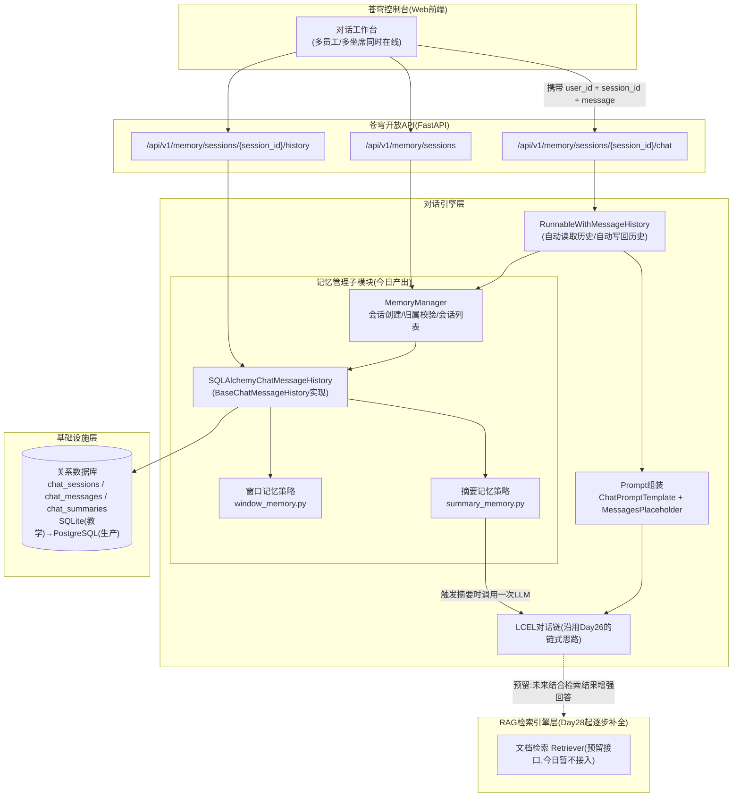
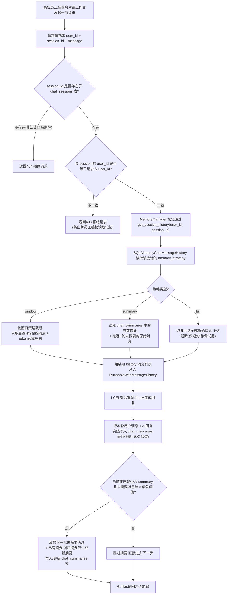
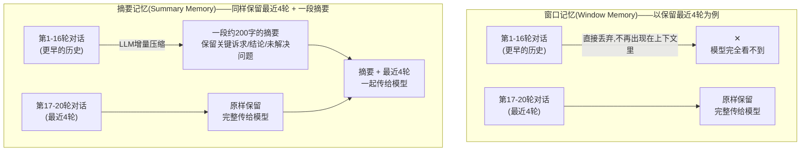

# 第27天 · Memory记忆机制 —— 给对话装一个"会记事"的脑子

> **周次/Sprint**:Sprint 2 · RAG基础(Day25-31)—— 今天是Sprint2的第3天,前两天(Day25用LangChain重写对话应用、Day26搭起LCEL三级链)把"链"这件事讲透了,今天开始补上链条上一直空着的一环:记忆
> **星期**:周六(入职第27天,第四周周六;公司培训期强度较高,不安排完整双休,但周末会比工作日略松一档——今天没有安排晚自习,原则上六点前结束,只是因为内容承上启下,老王把上午下午都排得比平时紧凑了一些)
> **参与人**:陈铭(导师:王振宇;上午/下午全程列席:王振宇;下午16:00起列席并带来需求确认结果:林悦)
> **飞书任务号**:CQ-108(对话记忆需求梳理与技术方案设计)、CQ-109(基于SQLAlchemy的记忆持久化模块开发)、CQ-110(多会话记忆隔离联调与自测)
> **今日关键词**:ChatMessageHistory / RunnableWithMessageHistory / 窗口记忆 / 摘要记忆 / 数据库持久化记忆 / session_id隔离 / 多会话管理 / 海纳集团需求确认

---

## 【旁白】

如果把这七十天的课程当成一条河,那么前二十六天流过的,大多是"能不能把一句话说明白、说漂亮"的支流——大模型怎么理解一句话,Prompt怎么写才不跑偏,LCEL怎么把几个步骤串成一条流水线。这些支流固然重要,但它们有一个共同的盲点:一旦河水流过,上一段发生过什么,下一段就不知道了。Day26收尾的时候,陈铭对着自己搭好的"翻译→润色→摘要"三级链看了很久,忽然意识到一件事——这条链无论调用多少次,都只关心"这一次给我的输入是什么",上一次调用发生过什么,它完全没有印象。老王那句"优雅不是目的,可维护和可观测才是",此刻又多了一层意思:一条永远不记事的链,再优雅,也撑不起一个真正的产品——因为没有一个用户会满意一个每次对话都要从头自我介绍的助手。

今天要处理的,正是这个"失忆"的问题。但比"给程序加一个变量存历史"更值得琢磨的是,这一次的技术需求,不是老王一个人在白板上凭空画出来的,而是林悦这几天一直在跟进的海纳集团那条线,第一次真正把"业务痛点"翻译成了"技术规格"。林悦这两周反复往返于公司和海纳集团的车间、客服中心,梳理出来的核心诉求,原本听起来像是两句朴素的抱怨——老师傅的经验留不住,客服的人手不够用——但拆开来看,这两句话背后藏着的,恰好是记忆机制要解决的两类完全不同的场景:一类是"人和AI聊很久很久,中途不能断片",另一类是"很多人同时在和AI聊,但绝对不能串戏"。前者指向的是记忆该怎么存、存多久、存得下多少;后者指向的是记忆该怎么隔离、隔离到什么颗粒度。这一天的课件,表面上是在讲LangChain的Memory模块,骨子里其实是在回答一个更朴素的问题——"一个要同时服务很多人的AI系统,怎么才能做到'该记住的都记住,不该看到的都看不到'"。

从课程设计的角度看,今天也是一个很微妙的位置。往前看,Day25、Day26已经把"链"这件事的骨架搭好了;往后看,Day28开始就要一头扎进RAG——文档怎么加载、怎么切分、怎么变成向量、怎么检索。记忆和RAG,常常被初学者混为一谈,觉得"反正都是给AI补充点信息",但这中间有一条清晰的分界线:记忆解决的是"这个AI记不记得咱们聊了什么",RAG解决的是"这个AI说的话,有没有依据、准不准"。前者关心的是对话本身的连续性,后者关心的是回答内容的可靠性。今天陈铭要先把第一件事做扎实,才有资格在明天去碰第二件事——如果一个系统连"记住聊了什么"都做不好,那"引用了什么文档"这种更复杂的能力,只会让问题变得更混乱,而不会让答案变得更靠谱。

还有一层容易被忽略的现实意义。前二十几天,陈铭写的每一个demo,本质上都只需要服务"他自己一个人"——测试的时候只有他一个浏览器窗口,一个对话历史,出了问题也只影响他自己。但从今天开始,课件里第一次正式引入了"多会话""多用户"这两个词,这意味着代码要考虑的边界条件,从"这段代码能不能跑对"升级成了"这段代码在成千上万个人同时用的时候,能不能还保持对"。这种升级,不体现在代码行数的多少上,而体现在一种思维方式的转变——今天写的每一段涉及存储、涉及读写的代码,都要下意识地多问一句:"如果同时有另一个人在做同样的事,会不会出问题?"这句追问,会在陈铭往后几十天的职业生涯里,反复出现。

---

## 晨会纪要 / 今日目标

**时间**:上午9:00,二层小会议室"听风"(周六人少,大会议室"望远"被行政临时挪去做了别的用途,老王索性带陈铭挪到工位区角落的这间小会议室)

**出席**:王振宇(老王)、陈铭

周六的公司比平时安静不少,大部分工位都是空的,苏梦、韩露、张凡三人昨晚就说好了周六上午自己在家复习Day25、Day26的内容,下午再来公司写作业。陈铭进会议室的时候,发现老王面前摆着一杯速溶咖啡,而不是平时常喝的浓茶——他后来才知道,这是老王的一个小习惯,周末如果要讲一个"分量比较重"的知识点,他会特意换成咖啡提提神,哪怕只是自己心里的一个仪式感。

老王开场没有绕弯子:"今天讲Memory,记忆机制。先说一句可能听起来有点反直觉的话——大模型这东西,天生是没有记忆的,你昨天跟它聊了一整个小时,今天再打开,它对你昨天说的每一句话都毫无印象。你们这二十六天写的所有demo,能'看起来像'记得住之前聊了什么,靠的全是一个笨办法:每次调用的时候,把之前所有的对话内容,原封不动地重新塞进这一次的请求里。今天要做的,不是发明什么新东西,而是把这个'笨办法',用一套规范、可扩展、能服务成百上千个人同时用的方式,重新实现一遍。"

**昨日进展回顾**

"昨天(Day26)你把LCEL的管道符用明白了,'翻译→润色→摘要'那条三级链跑得很顺,"老王翻开笔记本上的记录,"但我提醒过你一句话,现在想请你自己复述一下——为什么我说'优雅不是目的'?"

陈铭想了想:"因为链搭得再漂亮,如果出了问题排查不清楚、以后没法维护,那种优雅就只是好看,不解决实际问题。"

"说到点上了,但今天你会发现还有另一层意思,"老王补充道,"昨天那条链是'无状态'的——同一个输入,不管你调用一百次,输出的东西应该都差不多,它不需要知道'之前发生过什么'。但苍穹真正要交给客户用的对话助手,绝对不能是无状态的,用户说'再简洁一点',系统必须知道'再简洁一点'说的是刚才那句翻译,不是凌空冒出来的一句话。这种'有状态'的能力,一旦引入,你之前那种'链只管这一次输入输出'的思维方式,就要往前迈一步了。这一步,就是今天的Memory。"

**林悦昨晚发来的消息**

老王打开手机,给陈铭看了一眼昨晚林悦发在项目群里的一段话:"我这周去了两次海纳集团,车间那边和客服中心都跑了一遍,今天上午整理完需求文档,下午过来跟你们对一下,先剧透两句——他们的痛点比我们最早想的更具体,不是笼统的'知识不好查',是两条很清楚的线,一条是'老师傅的经验没人接得住',一条是'客服人手实在不够,经常好几个人同时问同一件事'。这两条,今天下午我会带着更细的需求文档过来。"

老王把手机放下:"她这两条,恰好对上今天要讲的两个技术方向——'老师傅的经验没人接得住',对应的是对话要拉得足够长、记得足够久,普通的'只记最近几句'的办法接不住这种场景;'客服人手不够、经常好几个人同时问',对应的是系统要撑得住很多个会话同时在跑,而且这些会话之间,一个字都不能串。这就是今天要讲的两个核心问题——记忆存多久、存多少,和记忆怎么隔离。"

**训练线摘要:今天的两段式安排**

老王在白板上写下今天的日程,虽然是周六,但内容密度并不低:

**第一段(上午9:30-12:00):对话记忆原理 + ChatMessageHistory + RunnableWithMessageHistory**。先讲透"大模型为什么没有记忆"这件事的技术本质,然后从最简单的`InMemoryChatMessageHistory`入手,过渡到`RunnableWithMessageHistory`这个能把"记忆读写"自动挂接到LCEL链上的关键组件,顺带把Day26留下的那条"无状态链"改造成"有状态链"练一遍手。

**第二段(下午13:30-17:30,林悦16:00加入):窗口记忆、摘要记忆、数据库持久化记忆**。先讲两种最常见的"历史裁剪"策略——按轮数/token数截断的窗口记忆,和用LLM把旧对话压缩成摘要的摘要记忆,对比两者的优劣;再讲怎么把这套记忆真正落到数据库里,做成能重启不丢数据、能同时服务多个会话的持久化模块。下午后半段结合林悦带来的需求文档,直接落地成"多会话记忆管理模块"的代码实战。

**风险点**

老王在白板上列出了他对今天内容的几个预判风险:

- **"记忆"这个词太日常,容易让人低估它的工程复杂度**。他特意提醒:"很多人一听'记忆机制',觉得不就是存个列表嘛,有什么难的。真正难的地方从来不是'怎么存一条消息',而是'存多少、存多久、怎么在'记得住'和'不爆token、不爆成本'之间找到一个平衡点',以及'一堆会话同时存在的时候,怎么保证互不干扰'——这些才是今天真正的重点,不要把精力都花在'怎么写一个数据库表'这种表面功夫上。"
- **RunnableWithMessageHistory的配置项容易搞混**,尤其是`input_messages_key`、`history_messages_key`和`history_factory_config`这几个参数的对应关系,老王提前打了预防针:"这几个名字第一次看,会觉得眼花,建议你今天一定要自己动手跑一遍报错,报错信息比我讲解更容易让你记住这几个参数分别管什么。"
- **摘要记忆涉及"用一次LLM调用去压缩另一堆对话",容易忽略这一步本身的成本和延迟**,老王强调:"摘要记忆听起来很聪明,但你每压缩一次,就多花一次真实的API调用,这个账必须算清楚,不是免费的午餐。"
- **多会话隔离的测试,容易只测'功能对不对',漏测'安全对不对'**,老王特意举了个例子:"如果你的接口只检查session_id存在不存在,不检查这个session_id到底是不是这个用户自己的,那随便一个人猜中或者截获了别人的session_id字符串,就能读到别人完整的聊天记录——这在客服场景里,是能被认定为数据泄露的真实事故,不是夸张。"

**今日目标清单**

1. 理解并能向别人解释清楚"大模型为什么没有记忆"这个底层原理,以及"每次把历史重新传进去"这个笨办法背后的必然性。
2. 掌握`ChatMessageHistory`(`BaseChatMessageHistory`)的核心接口:`messages`属性、`add_message`方法、`clear`方法。
3. 掌握`RunnableWithMessageHistory`的用法,能把一条LCEL链改造成自带记忆的链,理解`input_messages_key`、`history_messages_key`、`history_factory_config`几个关键参数的含义。
4. 理解窗口记忆和摘要记忆各自的原理、优缺点、适用场景,能结合具体业务场景做出选型判断。
5. 完成一个基于SQLAlchemy的记忆持久化模块,支持window/summary/full三种策略,数据落库、重启不丢失。
6. 完成多会话记忆隔离的设计与自测,确保不同session_id、不同user_id之间的对话历史绝不互相可见。

开完晨会,陈铭合上笔记本,顺手在扉页那句"慢慢来,比较快"下面,补了一句新的:"记不住的AI是玩具,记错了对象的AI是事故。"老王瞥了一眼,没说什么,只是端起那杯已经凉了一半的速溶咖啡,喝了一口。

---

## 需求文档:多会话记忆隔离需求(海纳集团多员工场景适配)

> 撰写人:林悦(产品经理) · 技术评审人:王振宇 · 文档编号:CQ-PRD-D27-01 · 版本:v1.0

### 背景

海纳制造集团这条客户线,从Day25老王在晨会上第一次提到"制造业客户对知识库问答有意向"开始,已经过去了两天多。这两天里,林悦没有直接扎进"要不要做知识库"这个后面才会正式展开的话题,而是先做了一件更基础的事——把海纳集团内部真实存在的痛点,一条一条摸清楚,而不是急着套用"上一个客户的方案"。

这份文档,是林悦这周两次实地拜访、六段访谈记录整理出来的第一份正式需求文档,聚焦点不是"知识库该怎么建"(那是Day28起才会展开的内容),而是一个更前置、却经常被忽略的问题:**这套系统未来会同时被谁用、怎么用**。林悦在文档开头特意加了一段说明,解释为什么先做这份"记忆隔离需求",而不是直接跳到RAG需求:"如果我们先把知识库建好,后面才发现系统不支持多个人同时用、每个人的对话会互相串,那知识库建得再好也没用——用户体验上第一个暴露出来的坏印象,往往不是'答案不准',而是'它怎么记住了别人问过的东西'这种更直观、更容易让人失去信任的问题。"

林悦这次拜访海纳集团,主要接触了两个部门:车间的设备维护班组,和客服中心。车间那边,她找了三位不同工龄的维修师傅聊,得到的核心信息是——车间里有几位干了二十多年的老师傅,脑子里存着大量"手册上没写、只有出过事才知道"的经验,比如"3号线那台注塑机,冬天启动前必须先空转十分钟,不然某个部件容易裂",这类经验目前完全靠"老带新"的口头传承,一旦老师傅退休或者请假,新人很容易在同样的坑上栽一次跟头。海纳集团的管理层已经明确表达过,希望未来的知识库问答系统,能承担一部分"经验沉淀与传承"的角色——但这需要老师傅能跟系统进行很长、很连续的多轮问答,把经验一点点"喂"给系统,这种场景下,如果系统只能记住最近三五句话,前面聊过的关键背景一旦被遗忘,老师傅每问一个新问题都要把背景重新讲一遍,体验会非常糟糕,时间久了根本没人愿意用。

客服中心那边,情况完全不同。客服团队目前有十一位坐席,林悦跟班观察了一个上午,发现一个坐席往往同时要应付两三个客户的咨询窗口,平均每通电话或者每个客户对话,只有六到十轮左右的往来,内容相对简短(退货政策、发货时效、订单查询之类),但**同一时间段,十一位坐席可能同时在和不同的客户对话,而且经常会出现好几位坐席几乎同时打开系统提问的情况**——用林悦原话说,"人手不够"这句话背后真正的技术含义是,系统必须支撑"很多个短对话同时并发进行",而且这些对话之间,绝对不能有任何串戏,哪怕只串一个字,都可能导致客服把A客户的订单信息说给B客户听,这在客户服务场景里是相当严重的责任事故。

这两个场景合在一起看,恰好构成了一组互补的技术要求:一类场景需要"记得久、记得深"(老师傅经验传承),另一类场景需要"隔得开、隔得严"(客服多坐席并发)。这份需求文档,正是要把这两类要求,翻译成技术团队能直接拿来设计系统的具体规格。

### 用户故事

- 作为海纳集团车间的老师傅,我希望能和系统进行一段很长、很连续的问答,系统能记住我们之前聊过的背景信息,不需要我每问一个新问题都从头把情况重新描述一遍。
- 作为海纳集团车间的老师傅,我希望即使聊了几十轮,系统的响应速度也不会因为"要记住的东西越来越多"而变得很慢,或者花费越来越高。
- 作为海纳集团客服中心的一名坐席,我希望我和客户A的对话内容,绝不会被系统混入我和客户B的对话上下文里,哪怕这两段对话几乎是同时发生的。
- 作为海纳集团客服中心的一名坐席,我希望我可以随时新建一个全新的对话,处理一位新客户的咨询,而不影响我手上正在进行的其他对话。
- 作为海纳集团客服中心的班组长,我希望能看到某个坐席名下有哪些对话会话,方便在必要时(比如客户投诉)回溯查看某一次具体对话的完整历史。
- 作为海纳集团的IT安全负责人,我希望任何一个坐席都不能通过猜测或者截获会话标识,访问到不属于自己的对话历史,这是最基本的数据安全要求。
- 作为苍穹平台的架构师,我希望这套记忆机制的存储方式是可持久化的,即使服务重启、服务器迁移,历史对话数据也不会丢失,这是未来能够正式对外交付的前提条件。

### 功能列表

| 编号 | 功能 | 说明 | 优先级 |
|---|---|---|---|
| F1 | 会话创建与管理 | 支持为指定员工(user_id)创建全新的独立会话(session_id),一个员工可以同时拥有多个会话 | P0 |
| F2 | 会话记忆隔离 | 不同session_id之间的对话历史严格互相不可见,系统层面保证读取时不会发生数据混淆 | P0 |
| F3 | 会话归属校验 | 每次读取/写入某个会话的历史前,校验该会话确实归属于发起请求的user_id,拒绝跨用户访问 | P0 |
| F4 | 窗口记忆策略 | 支持按最近N轮对话/按token预算截断历史,适用于短对话、高并发、低延迟场景(如客服) | P0 |
| F5 | 摘要记忆策略 | 支持把滑出窗口的旧对话增量压缩成摘要,长期保留关键信息,适用于长对话场景(如老师傅经验答疑) | P0 |
| F6 | 记忆持久化 | 全部对话历史与摘要数据落库保存,服务重启、进程重新调度不导致数据丢失 | P0 |
| F7 | 会话列表查询 | 支持按user_id查询该员工名下的全部会话列表,用于前端"我的对话"页面 | P1 |
| F8 | 会话历史回溯 | 支持查看某个会话的完整原始历史记录(不经过窗口/摘要裁剪),用于审计与问题排查 | P1 |
| F9 | 会话清空/删除 | 支持清空或删除指定会话的全部历史,同时校验操作者的归属权限 | P1 |
| F10 | 摘要状态查看 | 支持查看某会话当前的摘要文本与摘要覆盖进度,用于运营人员评估摘要质量 | P2 |

### 非功能需求

- **隔离性**:任意两个不同session_id的对话历史,在任何读写路径上都不能出现交叉,这是本次需求最核心的非功能指标,验收时会专门设计"并发多会话"的对抗性测试场景。
- **持久性**:所有原始对话消息一律落库保存,不因为记忆策略的截断/压缩而在存储层被物理删除,保证任何时候都可以追溯完整原文。
- **性能**:窗口记忆策略下,单轮对话的记忆读写开销应控制在毫秒级,不能成为整体响应延迟的主要瓶颈;摘要记忆策略下,允许摘要触发时有额外的LLM调用延迟,但触发频率必须可控,不能每轮对话都触发。
- **安全性**:任何一次涉及具体某个session_id的读写请求,都必须先完成"该会话归属于请求方user_id"的校验,校验失败必须明确拒绝,不能静默降级或返回空数据(避免掩盖安全问题)。
- **可扩展性**:今天的存储介质是SQLite(教学与本地开发环境),但表结构和访问层设计要考虑未来无痛迁移到PostgreSQL(海纳集团这类正式客户项目上线时会用到),不能出现依赖SQLite特有语法的写法。

### 验收标准

- 能够为至少两个不同的user_id,各自创建多个session_id,验证互相之间的对话历史完全隔离,任何一方无法读取到另一方的内容。
- 能够验证:当请求携带的user_id与目标session_id实际归属的user_id不一致时,接口明确返回权限拒绝,而不是返回空历史或报未定义错误。
- 窗口记忆策略下,连续进行超过配置轮数的对话,验证系统只保留最近若干轮作为上下文,更早的内容不会出现在传给模型的历史里,但数据库里的原始记录条数不受影响。
- 摘要记忆策略下,连续进行超过摘要触发阈值的对话,验证系统生成了有效的摘要记录,且后续对话的上下文里确实包含了摘要内容而不是被直接遗忘。
- 服务重启后(模拟真实的服务重新部署),验证此前创建的会话与历史记录依然可以被正常读取,不发生数据丢失。

---

## 架构设计图:多会话记忆管理在苍穹架构中的位置



这张图的重点,不在于"又多了几个方框",而在于**方框之间的连线方向**。老王在讲解的时候特意强调了两条连线:第一条,是"对话工作台"发出的每一次请求,都同时携带`user_id`和`session_id`两个标识,缺一不可——`user_id`回答"这是谁在问",`session_id`回答"这是哪一段对话在问",今天几乎所有的隔离逻辑,都建立在这两个标识"缺一不可、同时校验"的基础上。第二条,是`RunnableWithMessageHistory`这个组件,并不直接操作数据库,它只认识一个抽象接口——`BaseChatMessageHistory`,真正落地到SQLAlchemy的读写细节,全部封在`MemoryManager`和`SQLAlchemyChatMessageHistory`背后。这种"上层组件只认接口,不关心具体实现"的分层方式,意味着未来如果要把存储从SQLite换成Redis或者别的方案,`RunnableWithMessageHistory`那一层的代码完全不用改,只需要重新实现一份`BaseChatMessageHistory`即可——这正是Day26反复提到的"面向接口而不是面向实现"这条原则,今天第一次在真实的存储选型问题上得到印证。

另外值得注意的是图右下角那条虚线,指向"RAG检索引擎层"。今天这条线还是空的,`CHAIN`目前只负责"根据历史+当前输入生成回复",不涉及任何检索。但图里特意先画出这个预留接口,是为了呼应Day28-31要做的事情——从明天开始,对话链会逐渐演变成"先检索、再结合检索结果和历史一起生成回答"的更复杂形态,记忆这一层今天搭好的骨架,不会被推翻重做,而是会被"叠加"上新的能力。

老王在画完这张图之后,还追加了一句提醒,让陈铭记在笔记本的显眼位置:"你今天会很容易产生一种错觉,觉得'记忆'和'检索'是两个可以随便互换、甚至可以合并成一个模块来做的东西,因为它们表面上都在'往Prompt里多塞点内容'。但从这张图你应该能看出来,它们所在的层级完全不同——记忆管理子模块,内部知道的是'这个会话之前聊过什么',它的数据来源是用户和AI自己产生的对话;检索引擎层,未来要处理的是'企业内部的文档、手册、规范',数据来源是外部知识,和某一次具体对话完全无关。这两类信息,该怎么分别注入到最终喂给模型的Prompt里,采用什么样的组织顺序、占多大的篇幅比例,是Day28之后要专门解决的问题,今天先把这两者在架构图上的位置分清楚,足够了。"

---

## 流程图:session_id隔离下的消息读写流程



这张流程图,是今天代码实战部分几乎所有函数的"总纲"——写代码之前,先把这张图理解透,写代码的时候基本上就是照着图里的每一个方框去实现对应的函数。老王在带着陈铭画这张图的时候,特意在"C"和"D"这两个判断节点上停留了很久,反复强调:"这两步校验,顺序不能换,也不能省略任何一步。很多人图省事,觉得'反正session_id都是我们系统生成的,又长又随机,别人猜不到',就跳过了user_id的校验——这是一个典型的'把随机性当成安全性'的误区,session_id再长再随机,一旦通过日志泄露、浏览器历史记录泄露、或者被恶意的中间人截获,只要没有第二层user_id的校验,泄露出去的这一个字符串,就能直接换来别人的完整聊天记录。"

图里另一个值得细看的地方,是"M"这个节点——不管上面走的是哪种记忆策略,写入数据库这一步,永远是"完整写入、不做任何截断"。这是今天架构设计里反复强调的一条纪律:**截断和压缩,只发生在"读出来给模型看"这一层,绝不允许污染到"写进数据库"这一层**。这条纪律看起来简单,但如果不特意在设计阶段就定下来,很容易在写代码的时候图方便,把"已经被摘要覆盖的旧消息"直接从数据库里删掉——一旦这么做,某天摘要生成得不准确、或者客户投诉要求人工复核完整对话记录时,系统会发现自己已经没有能力还原真相,这在企业级项目里是绝对不能接受的后果。

---

## 示意图:窗口记忆 vs 摘要记忆对比示意



这张示意图,是今天下午课堂笔记里反复回头看的一张图。它想说明的道理很直接:两种策略在"最近几轮怎么处理"这件事上完全一致,分歧只出现在"更早的历史怎么处理"——窗口记忆选择的是最干脆的做法,直接丢掉,模型对更早的内容完全没有印象;摘要记忆选择的是更"负责任"但也更"昂贵"的做法,花一次额外的LLM调用,把这些内容压缩成一段简短的文字,让模型至少还能"依稀记得个大概"。老王用了一个比较接地气的类比来讲这个区别:"窗口记忆像是一个只有短期记忆的人,聊过去的事,过一会儿就彻底忘了,干净但健忘;摘要记忆更像是一个会做读书笔记的人,聊过的内容记不住原话了,但脑子里会留下一份'大概讲了什么'的提纲,代价是每做一次笔记都要花一点时间和精力。"

在这张图的基础上,今天需求文档里那两个海纳集团场景,恰好可以精确对号——客服中心那种"每个对话只有六到十轮、但要求响应快、要求便宜"的场景,天然适合窗口记忆这种"干净但健忘"的策略;老师傅经验答疑那种"要聊很久很久、中间的背景信息很关键、不能允许彻底遗忘"的场景,则更适合摘要记忆这种"愿意多花一点成本,换来更长的有效记忆跨度"的策略。这也是为什么今天的代码实战里,`memory_strategy`被设计成会话级别的一个可配置字段,而不是写死在代码里的一个全局选择——不同的会话、不同的业务场景,理应有权选择不同的记忆策略,这是一个"技术方案要服务业务场景,而不是业务场景去迎合技术方案"的具体体现。

---

## 课堂笔记

### 上午:对话记忆原理 + ChatMessageHistory + RunnableWithMessageHistory

#### 大模型为什么没有记忆:一个必须先讲清楚的底层事实

老王讲这部分内容,开场就抛出了一个看起来有点"挑战常识"的说法:"你们这些天用的所有大模型API——DeepSeek、通义千问,不管是哪家,它们提供的那个接口,本质上都是一个**无状态**的函数。你给它一段文字,它给你一段回复,这次调用结束,它不会在服务器那头替你保留任何东西。你明天再调用一次同样的接口,即使参数完全一样,它对你昨天问过什么,一点印象都没有。"

陈铭当时下意识地反问了一句:"那为什么我们平时用ChatGPT或者苍穹0.1版聊天的时候,感觉它明明记得住我前面说的话?"

"这正是今天要讲透的关键,"老王在白板上画了一个简单的示意——每一次调用API,实际发送出去的请求体里,`messages`这个字段从来不是只有"这一句新问题",而是"从对话开始到现在的全部历史消息,加上这一句新问题",打包在一起,一次性发给模型。模型看到的,永远是一整段"从头到现在"的文字,它并没有什么神秘的"记忆存储区",它每一次的"记得住",都是调用方**主动把历史重新喂给它**换来的假象。

"所以说穿了,"老王总结,"'记忆'这个词,在大模型应用这个语境下,严格来说不是模型自己的能力,而是**调用方(也就是你写的这段应用代码)的能力**——你负责把该记的存下来,该喂的时候喂进去,模型只是一个'看到什么就基于什么回答'的无状态处理器。这一点想不清楚,后面无论学多少'记忆框架',都容易学成'知道怎么用,但不知道为什么这么用'。"

这段讲解虽然简短,但陈铭在笔记里补了很长一段自己的理解:"这解释了为什么Day14、Day21我写的那些命令行demo,历史消息就是一个Python列表——`messages.append({"role": "user", "content": ...})`,每次调用前把整个列表传进去。原来我当时那种'笨办法',并不是因为我技术不够,而是因为这就是唯一的办法,只是没有一个规范的框架来管理这个列表罢了。"

老王点头认可这段总结,又补充了一层更工程化的思考:"既然'记忆'的本质就是'维护一份消息列表,每次调用前传进去',那这里边天然就有几个绕不开的现实问题——第一,这份列表存在哪里?进程内存里,程序一重启就没了,这在正式产品里不能接受;第二,这份列表会不会越聊越长?聊得越久,每次调用要传的内容越多,token消耗跟着涨,费用和延迟都会跟着涨;第三,如果同时有很多个用户在聊,每个人应该对应哪一份列表,怎么保证互不混淆?这三个问题,分别对应今天要讲的'持久化存储'、'窗口/摘要截断策略'、'多会话隔离',一个都不能少。"

#### ChatMessageHistory:最基础的抽象

讲完原理,老王正式引入LangChain里管理这份"消息列表"的标准抽象——`BaseChatMessageHistory`。他打开电脑,先展示了最简单的一个实现:`InMemoryChatMessageHistory`(内存版,进程重启即丢失,今天讲解入门概念时用,正式代码实战会换成SQLAlchemy版)。

```python
from langchain_core.chat_history import InMemoryChatMessageHistory
from langchain_core.messages import HumanMessage, AIMessage

history = InMemoryChatMessageHistory()
history.add_user_message("你好,我叫陈铭")
history.add_ai_message("你好陈铭,有什么可以帮你的?")

print(history.messages)
# [HumanMessage(content='你好,我叫陈铭'), AIMessage(content='你好陈铭,有什么可以帮你的?')]
```

老王让陈铭对着这几行代码,自己总结`BaseChatMessageHistory`这个抽象类真正要求实现的核心接口:

- `messages`:一个属性(property),返回当前这份历史里的全部消息,类型是`List[BaseMessage]`。
- `add_message(message)`:往历史里追加一条消息(`add_user_message`、`add_ai_message`是它的两个便捷封装)。
- `clear()`:清空当前历史。

"你注意到了吗,"老王指着`messages`这个属性,"它的返回类型是一个固定的列表,但**它怎么产生这个列表,接口本身完全不关心**。今天这个`InMemoryChatMessageHistory`,是简单地把消息存在一个Python列表变量里;但如果我们自己写一个类,继承`BaseChatMessageHistory`,把`messages`这个属性改写成'从数据库查出来,还顺便按窗口策略裁剪一下',对外面调用它的代码来说,完全感知不到这个区别——这就是'面向接口编程'在记忆这个具体场景里的真实体现,也是今天代码实战里`SQLAlchemyChatMessageHistory`这个类之所以能这么设计的理论依据。"

#### RunnableWithMessageHistory:把记忆自动挂接到LCEL链上

有了`ChatMessageHistory`这个"存历史的容器",下一步的问题是——怎么让Day26搭好的那条LCEL链,自动完成"调用前读历史、调用后写历史"这两个动作,而不需要每次手写一遍。这正是`RunnableWithMessageHistory`要解决的问题。

老王先带着陈铭复习了一遍Day26的那条无记忆链的雏形结构,写出了一条更贴近今天场景的、无记忆版本的对话链:

```python
from langchain_core.prompts import ChatPromptTemplate, MessagesPlaceholder
from langchain_core.output_parsers import StrOutputParser
from langchain_openai import ChatOpenAI

prompt = ChatPromptTemplate.from_messages([
    ("system", "你是苍穹企业级智能体中台的对话助手。"),
    MessagesPlaceholder(variable_name="history"),
    ("human", "{input}"),
])

llm = ChatOpenAI(model="deepseek-chat", base_url="https://api.deepseek.com")
chain = prompt | llm | StrOutputParser()
```

"这条链,如果你现在直接调用`chain.invoke({"input": "你好", "history": []})`,是能跑的,"老王说,"但你会发现,每一次调用,`history`这个字段都要你手动传进去,而且传完之后,这条链自己不会把新产生的这一轮对话追加回`history`里——这件事,还是要靠你自己在外面手写胶水代码。今天要做的,就是把这层'胶水代码'标准化,交给`RunnableWithMessageHistory`。"

```python
from langchain_core.runnables.history import RunnableWithMessageHistory
from langchain_core.chat_history import InMemoryChatMessageHistory

_store = {}

def get_session_history(session_id: str):
    if session_id not in _store:
        _store[session_id] = InMemoryChatMessageHistory()
    return _store[session_id]

chain_with_memory = RunnableWithMessageHistory(
    chain,
    get_session_history,
    input_messages_key="input",
    history_messages_key="history",
)

reply1 = chain_with_memory.invoke(
    {"input": "我叫陈铭,以后记得我的名字"},
    config={"configurable": {"session_id": "demo-001"}},
)
reply2 = chain_with_memory.invoke(
    {"input": "我刚才说我叫什么?"},
    config={"configurable": {"session_id": "demo-001"}},
)
print(reply2)  # 模型此时应该能正确回答"陈铭"
```

老王逐个参数拆解给陈铭讲:"`input_messages_key="input"`,告诉`RunnableWithMessageHistory`,这条链的输入字典里,哪个字段是'这一次新说的话',它需要把这个字段的内容,包装成一条`HumanMessage`,在调用结束后追加进历史;`history_messages_key="history"`,告诉它,链的输入字典里,哪个字段是给`MessagesPlaceholder`用的历史占位符,它会在每次调用前,自动把`get_session_history(session_id)`查出来的`messages`,填进这个字段;而`get_session_history`这个函数本身,就是你要提供的'怎么根据session_id找到对应历史容器'的逻辑——今天教学示例里,它是查一个字典,代码实战里,它会变成查数据库。"

陈铭第一次跑这段代码的时候,故意在第二次调用时,把`session_id`换成了一个新的字符串,验证了一件事:"session_id一换,模型立刻就'不认识'我了,问它我叫什么,它说不知道——这说明记忆真的是按session_id分开存的,不是全局共享的。"老王点头:"这正是'会话隔离'最朴素的雏形,今天下午会把它升级成能同时兼顾'哪个用户'和'哪个会话'两个维度的更严格版本。"

#### 老王的一个类比:session_id和Day22-24讲过的Cookie/Session有什么关系

讲到这里,老王停下来问了陈铭一个问题:"你们Day23、Day24做苍穹0.1版的时候,后端接口本身是不是也有'区分不同用户请求'这个需求?那时候你们是怎么解决的?"

陈铭想了想:"那时候我们没做登录鉴权,0.1版的验收范围里,`Conversation`表就是靠一个自增的`conversation_id`区分不同对话,前端用`localStorage`记住当前打开的是哪个`conversation_id`,每次请求带上这个ID。"

"对,"老王说,"你现在应该已经看出来了,今天的`session_id`,和你Day23、Day24用的`conversation_id`,本质上是同一类东西——都是一个'用来标识一份独立状态'的令牌(token)。区别只在于,`conversation_id`当时只解决了'区分不同对话'这一个维度,今天多加了一个`user_id`维度,变成了'区分不同用户 + 区分同一用户下的不同对话'这个二维坐标。这也是为什么很多Web开发的经典概念——比如浏览器的Cookie、Session——本质上都在解决同一类问题:服务器本身是无状态的(这句话你是不是觉得耳熟?HTTP协议本身也是无状态的,和今天开场讲的'大模型无状态'是同一种设计哲学),所有'看起来有状态'的体验,都是靠一个客户端和服务端都认可的标识符,加上服务端那边维护的一份和这个标识符绑定的数据,拼出来的假象。你今天学的这套记忆机制,不是一个孤立的、只属于大模型应用的新知识,它和你之前学过的Web session管理,是同一套底层思路在不同场景下的两次复用。"

陈铭把这段话记在笔记本上,又追加了一句自己的理解:"原来'记忆'这两个字,拆开来看,不是什么很玄的新概念——它就是'一个稳定的标识符'加上'服务端一份和这个标识符绑定的数据',我们前二十几天写的每一个'能记住状态'的东西,骨子里都是这个结构在换着花样出现。"

#### 常见报错与踩坑

老王特意留了半小时,让陈铭故意"制造"几个常见错误,亲眼看一遍报错信息,而不是只听他口述:

**报错一:忘记传`config`里的`configurable.session_id`**。直接调用`chain_with_memory.invoke({"input": "你好"})`,不带`config`参数,会直接抛出异常,提示缺少必要的configurable字段。老王解释:"这个报错信息本身其实已经把问题说得很清楚了,只是第一次看容易被一堆技术术语唬住,仔细读,通常都能读出'缺了什么字段'这层意思。"

**报错二:`input_messages_key`指定的字段名,和实际传入字典的键不一致**。比如链里用的是`{"input": ...}`,但调用时写成了`chain_with_memory.invoke({"question": "你好"}, ...)`,会报出字段缺失或者链内部Prompt渲染失败的错误。陈铭一开始没意识到这个问题,反复检查了`get_session_history`函数,浪费了几分钟,后来老王提示他"往回看,先检查最外层传进去的字典,键名是不是跟你在`RunnableWithMessageHistory`里声明的完全一致",才发现是自己手误写错了字段名。

**报错三:`MessagesPlaceholder`的`variable_name`和`history_messages_key`不一致**。这是最隐蔽的一个坑——Prompt模板里写的是`MessagesPlaceholder(variable_name="chat_history")`,但`RunnableWithMessageHistory`初始化时写的是`history_messages_key="history"`,两者字符串不一致,不会直接报错(因为Prompt渲染时缺的是`chat_history`这个字段,而`RunnableWithMessageHistory`填进去的是`history`),但表现出来的症状是——模型每次回答都"完全不记得"之前聊过的内容,看起来像是记忆完全没生效,却又没有任何报错提示。老王特意强调:"这种'没报错,但功能是错的'的坑,比直接报错的坑更难排查,也更值得你今天花时间弄明白它背后的机制——两个字符串,必须一字不差地对应上。"

### 下午:窗口记忆 / 摘要记忆 / 数据库持久化记忆

下午的课,一开始老王先抛出了上午留下的那个问题:"聊得越久,历史越长,每次调用要传的内容越多,token消耗跟着涨"——这件事,具体会涨到什么程度?他让陈铭现场估算了一下:假设平均每轮对话(一问一答)加起来大约150个字,如果一段对话进行到第50轮还不做任何裁剪,累计的历史文本量,大约是7500字左右,换算成token(中文场景下,经验上大致是1个字接近1.3到1.5个token),差不多已经逼近1万token的量级。"这还只是历史本身占的token,"老王补充,"你还要留出预算给系统提示词、给这一轮新的问题、给模型的回复本身。如果放任历史无限增长,不出一百轮,单次调用的成本和延迟都会变得不可接受,这还没算上有些模型本身对上下文长度是有硬性上限的。"

#### 窗口记忆(Window Memory):最直接的裁剪方式

窗口记忆的思路,老王用一句话概括:"只认最近发生的事,更早的一概忘掉。"具体到工程实现,通常有两种裁剪维度,今天的代码实战会把两者结合起来用:

**按"轮数"裁剪**:只保留最近N轮对话(一轮通常算作一条用户消息+一条AI回复)。这种方式简单直接,容易解释给非技术同事听,但有一个明显的弱点——如果某一轮消息特别长(比如用户粘贴了一大段文字),按轮数裁剪并不能感知到"这一轮内容量特别大",token预算依然可能超标。

**按"token预算"裁剪**:不管多少轮,只要累计的token(或者字符数估算)超过一个预算上限,就从最旧的消息开始丢弃,直到总量落在预算范围内。这种方式对成本的控制更精确,但纯粹按token裁剪,有可能在某一轮对话里,把一个用户的问题保留了、却把对应的AI回复因为超出预算被丢掉,导致上下文出现"有问无答"的错位。

"所以今天代码实战里,`trim_by_window`这个函数,是两种维度都会用上,"老王解释,"先按轮数做一次粗筛,再按token预算做一次精筛,两者取交集,尽量避免单一维度的弱点被放大。"

老王在黑板上补充了一个窗口记忆最容易被低估的现实问题:"窗口记忆最大的代价,不是技术上难实现,而是**用户体验上的'突然失忆'**。你们等会儿在代码实战里会亲眼看到——如果一个用户在第3轮问题里提到了一个很关键的背景信息,聊到第15轮,这个背景已经滑出窗口了,用户如果这时候问一句依赖那个背景的问题,系统会一本正经地给出一个'看似合理但实际上忘了背景'的回答,这种'不知道自己忘了'的表现,比'直接说我不知道'更容易误导用户,是设计这类系统时必须提前考虑的用户体验陷阱。"

#### 摘要记忆(Summary Memory):用一次LLM调用换取更长的有效记忆

摘要记忆要解决的,正是窗口记忆"突然失忆"的问题。核心思路是:与其把滑出窗口的内容直接丢弃,不如在丢弃之前,先花一次LLM调用,把这部分内容压缩成一段简短的摘要,长期携带在上下文里。

老王特意强调了"增量摘要"和"全量重新总结"这两种实现方式的区别:"如果每次触发摘要,都把从对话开始到现在的全部历史重新丢给LLM总结一遍,这个总结步骤本身的成本,会随着对话轮数线性甚至更快地增长,到后面反而比不做摘要还贵。今天代码实战采用的是增量摘要——每次只把'上一次摘要覆盖到哪里'之后新产生的这一批消息,和'已有的摘要'一起丢给LLM,让它生成一份'合并后的新摘要',而不是从头再总结一遍。"

这个设计,直接对应到`chat_summaries`表里的`summarized_up_to_seq`字段——记录"已经被摘要覆�的消息,序号最大到哪里",下次触发时,只处理序号更大的那些新消息。陈铭在笔记里画了一个简单的时间轴帮助自己理解:

```
消息序号: 1  2  3  4  5  6  7  8  9  10 11 12 13 14 15 16
第一次摘要触发(阈值=12条未摘要):
  压缩 1-8 -> 摘要v1,summarized_up_to_seq = 8
第二次摘要触发(9-16之间累计到12条未摘要,实际上这里假设阈值调整或消息更多):
  基于摘要v1 + 压缩9-16 -> 摘要v2,summarized_up_to_seq = 16
```

老王在这里特别提醒了摘要记忆的两个现实风险,不能只讲优点不讲代价:

**风险一:摘要本身可能引入偏差,甚至幻觉**。让LLM去总结一段对话,它有可能遗漏某个关键细节,也有可能"自作聪明"地加上一句原对话里没有的推断。老王举了个例子:"如果老师傅在对话里说'这个部件裂了,但具体原因还没查清楚',摘要模型如果总结成'这个部件因为老化裂了',看起来通顺,但擅自加上了一个原文没有确认过的结论,这种偏差一旦被后续对话当成'已知事实'继续推理,可能会越走越偏。"这也是为什么今天的摘要Prompt里,专门写了一句"不要添加对话中没有出现过的信息,不要过度解读或猜测"——这不是一句可有可无的客套话,而是针对这个真实风险专门设计的约束。

**风险二:摘要触发的成本和延迟,必须设置合理的阈值**。如果阈值设得太低(比如每2条消息就摘要一次),摘要调用的频率会太高,拖慢整体响应;阈值设得太高,又会导致窗口和摘要之间出现一段"既滑出了窗口、又还没被摘要覆盖"的空白期,这段空白期的信息实质上是被彻底丢失的。今天代码实战里,`summary_trigger_message_count`和`summary_batch_size`这两个配置项,就是用来在这两者之间找平衡的调节旋钮。

#### 数据库持久化记忆:把"列表"真正落到磁盘上

讲完两种裁剪策略,老王把话题引回到一个更基础的问题上:"不管你选窗口还是摘要,这些策略操作的对象,都得先是一份**能在服务重启后依然存在**的数据,而不是一个进程内存里的Python字典或列表。"

这一步,陈铭并不算完全陌生——Day24已经系统学过SQLAlchemy 2.0的ORM用法、`Session`的生命周期管理。老王特意把今天的表设计和Day24的`Conversation`/`Message`两张表做了对比:"Day24那两张表,解决的是'把对话历史存下来,重启不丢'这一个问题,今天要多解决两个问题——'一份历史要支持被不同的记忆策略读取成不同的样子'和'摘要本身也需要一张表来存,并且要能追踪压缩到哪里了'。所以你会看到,今天的表结构比Day24多了一张`chat_summaries`,而且`chat_sessions`表里多了一个`memory_strategy`字段,这个字段就是让'同一套代码,不同的会话可以用不同的记忆策略'这件事成立的关键。"

老王又把Day24复盘时那次"Session各自为战"的事故拎出来重新讲了一遍,作为今天设计的前车之鉴:"你们那次的bug,本质上是在流式响应的场景里,一个函数内部不小心创建了第二个独立的Session,导致两个Session各自维护自己的一份'脏数据'视图,互相不知道对方的存在。今天记忆模块的读写路径比那次更复杂——一次对话请求里,可能要经历'读历史、写新消息、可能还要更新摘要'三次数据库交互,如果不统一Session的获取方式,类似的事故只会更容易发生,不会更少。这也是为什么今天`database.py`里,专门定义了一个`get_memory_db`的上下文管理器,强制整个记忆模块只能通过这一个入口拿Session,不允许各个函数内部自己偷偷再创建一个。"

陈铭在这里问了一个很实际的问题:"如果同一个session_id,在极短时间内被连续发了两次请求(比如客户端网络抖动导致重复提交),会不会出现两次写入互相打架、消息顺序乱掉的情况?"

老王对这个问题的反应很认可:"这是个好问题,也是今天故意留白、没有在代码实战里完全解决的一个问题——`sequence_no`这个字段,虽然给每条消息标了顺序号,但如果两个并发请求几乎同时去查'当前最大序号是多少',再各自加1去写入,理论上确实存在拿到同一个序号的竞态条件,虽然今天用了唯一约束(`UniqueConstraint`)去兜底,让这种冲突至少不会静默地写出错误数据,而是会报错让上层感知到。但真正彻底解决这个问题,需要引入数据库层面的行锁或者序列(sequence)机制,这个话题我们留到后面Agent编排、涉及更高并发场景的课件里,再正式展开讲。今天你只需要知道,`UniqueConstraint`是一道'至少不让错误数据悄悄溜进去'的安全网,不是解决并发写入问题的完整方案。"

#### 三种策略的对比小结

课堂笔记的最后,老王让陈铭自己整理一份对比表格,作为今天下午内容的收尾:

| 维度 | 窗口记忆(Window) | 摘要记忆(Summary) | 全量记忆(Full,仅调试用) |
|---|---|---|---|
| 实现复杂度 | 低 | 中(需要额外的摘要链) | 最低 |
| 单轮响应延迟 | 低,稳定 | 大多数轮次低,触发摘要那几轮会升高 | 随对话变长而持续升高 |
| Token/成本开销 | 可控,上限明确 | 略高于窗口记忆(多了摘要调用),但长期比全量低得多 | 随对话变长无上限增长 |
| 长期上下文保留能力 | 差,超出窗口即彻底遗忘 | 较好,关键信息以摘要形式长期保留 | 最好,但成本不可持续 |
| 适用场景 | 短对话、高并发、成本敏感(如客服) | 长对话、需要跟踪长期脉络(如老师傅经验答疑) | 演示、调试、极短的一次性对话 |
| 主要风险 | 突然失忆导致回答脱离背景 | 摘要偏差/幻觉风险 | 成本失控,不适合生产 |

老王看完这份表格,只补了一句:"这张表,以后你在任何项目里做技术选型,都可以套用同一个思路——先把候选方案摆在一张表里,按对业务真正重要的维度逐条对比,而不是拍脑袋选一个'听起来最先进'的方案。海纳集团这次的需求,你结合这张表想一想,车间的老师傅和客服中心的坐席,分别该配哪种策略,这个问题今天下午你和林悦对需求的时候,可以直接拿出来讨论。"

#### 补充讨论:"客服人手不够"这句话,在系统层面到底意味着什么

老王临下课前,又把话题拉回到今天需求文档的背景上,问了陈铭一个更贴近工程本质的问题:"林悦这次调研,总结出'客服人手不够'这句话,你觉得,单纯从今天记忆模块要承担的职责来看,它到底在给系统提出一个什么样的技术要求?"

陈铭想了一下,给出的第一版回答是:"是不是说,系统要能同时处理很多个会话?"老王点头又摇头:"方向对,但还不够具体。'同时处理很多个会话'这件事,拆开来看至少包含两层含义——第一层,是每个会话各自的记忆存储和读写,不能因为'同时有别的会话也在读写'而相互拖慢或者相互干扰,这个今天已经通过`session_id`级别的隔离和'每次数据库操作各自开关Session'的方式解决了;第二层,是**数据库本身要撑得住这么多并发的读写请求**,这一层今天的代码实战里没有专门处理,只是先把接口和数据结构设计对了,真正的高并发压测和数据库连接池调优,会留到后面项目集成、真正对接海纳集团生产环境的时候,专门安排一次任务来做。"

他继续往下说:"你现在应该能理解,为什么林悦这次的需求文档里,没有一句话是直接写'系统要支持多少并发'这种技术指标——她的角色决定了她要做的是,把'客服人手不够'这种业务语言,翻译成'多个会话需要并发、且互不干扰'这种功能性的用户故事,至于'并发到底要撑到多少'这种非功能性的量化指标,是需要我们技术这边,结合真实的客服规模(她今天提到目前是十一位坐席),反推出一个大致的并发量级,再决定要不要在数据库层面做进一步优化。这中间'业务语言'到'技术语言'的翻译,不是一步到位的,是产品和技术反复来回对齐的过程,你以后自己带需求,也要习惯这种来回打磨。"

---

## 代码实战:多会话记忆管理模块(SQLAlchemy持久化 + session_id隔离)

下午16:00,林悦准时出现在工位区,带来了那份刚刚定稿的需求文档纸质打印稿——她习惯性地会打印一份出来,方便当场在上面圈画。她把文档往陈铭桌上一放:"车间那边和客服中心那边的核心诉求,基本上都在这份文档里了,你和老王先看一遍,我等你们消化完,咱们再对一下技术方案能不能真的接住这些需求。"

老王和陈铭花了十分钟通读文档,老王抬头跟林悦确认了一件事:"车间老师傅那种场景,你估计单个会话平均会聊多少轮?"林悦想了想:"目前观察到的样本不算多,但有一位老师傅一次连续问了差不多二十多个问题,中间背景信息一直在延续,我猜以后正式上线,超过二十轮的会话不会是个别情况。"老王点头:"那这类会话,今天设计的摘要策略,阈值不能设得太保守,不然摘要没能真正跟上对话推进的速度。客服那边呢?"林悦翻了下笔记:"我跟班观察的十几段对话,最长的一段是十一轮,大部分集中在五到八轮。"老王于是当场拍板:"客服场景用窗口记忆,窗口设成6轮左右差不多够用;老师傅场景用摘要记忆,阈值设得更宽松一点。这两个数字,今天代码里先按这个思路给出合理的默认值,后面真正上线前,还可以拿真实数据再调优。"

以下是今天完整的记忆管理模块代码,目录挂在`cangqiong-platform/backend/app/services/memory/`下,和主体仓库结构保持一致;API路由和演示脚本挂在各自约定的位置。老王要求今天的代码,严格按照"配置层→存储层→策略层→接口层→应用层"这个自底向上的顺序来写,理由很朴素:"下面的地基没打稳,上面的房子搭得再快,也是要拆掉重来的。"

### 文件1:`app/services/memory/config.py` —— 记忆模块配置项

```python
"""
记忆模块配置项。

统一管理"多会话记忆管理"子模块用到的所有可调参数,方便后续在.env
或苍穹控制台的"模型管理"页面上暴露给运营人员调整,而不需要每次都改代码里的魔法数字。

今天下午跟林悦确认完需求之后,老王明确要求把窗口大小、摘要阈值这些数字,
一律做成可配置项,不允许写死在函数内部——因为不同客户、不同场景(海纳的车间和客服中心
就是最直接的例子)对这些参数的合理取值完全不同,写死了以后每换一个场景都要改代码,
不符合企业级项目"配置与代码分离"的基本要求。
"""

from pydantic_settings import BaseSettings, SettingsConfigDict


class MemorySettings(BaseSettings):
    """记忆管理相关的全局配置,读取环境变量CQ_MEMORY_*。"""

    model_config = SettingsConfigDict(env_prefix="CQ_MEMORY_", env_file=".env", extra="ignore")

    # 数据库连接串,复用Day24已经搭好的CQ_DATABASE_URL体系,这里单独起一个环境变量,
    # 是为了给未来"把记忆库拆到独立数据库实例上"这个可能性留出余地。
    database_url: str = "sqlite:///./cangqiong_memory.db"

    # 窗口记忆:最多保留多少"轮"对话(一轮 = 一条用户消息 + 一条AI回复)
    # 默认值参考了林悦这次客服场景调研的数据,取一个略高于平均轮数的经验值。
    window_max_turns: int = 6

    # 窗口记忆:除了按轮数限制,也按估算token数做一次兜底限制,
    # 避免出现"单条消息特别长,轮数不多但token已经爆了"的情况。
    window_max_tokens: int = 2000

    # 摘要记忆:累计"未被摘要覆盖"的原始消息条数超过这个阈值时,触发一次摘要压缩
    summary_trigger_message_count: int = 12

    # 摘要记忆:每次触发摘要时,压缩多少条"最旧的"消息进摘要,
    # 剩下未处理的消息留给下一次触发时继续处理,不要求一次性清空。
    summary_batch_size: int = 8

    # 摘要记忆:压缩后仍然额外保留的最近原始消息条数,
    # 保证"刚聊过的内容"永远是原文,不经过摘要的二次转述,避免细节失真。
    summary_keep_recent_raw: int = 4

    # 用于估算中文/英文混合文本token数的经验系数(粗略估算,不追求精确到位)。
    # 中文场景下,1个汉字大致对应1.3~1.5个token,这里取一个折中的经验系数,
    # 只用来做"预算刹车",不作为计费依据。
    approx_tokens_per_char: float = 0.7


memory_settings = MemorySettings()
```

### 文件2:`app/services/memory/database.py` —— 记忆模块专用的数据库连接

```python
"""
记忆模块独立的数据库连接与Session管理。

Day24复盘时踩过的那个"流式接口里意外创建了两个互不知道对方存在的Session"的坑,
在记忆模块里是一个同样高危、甚至更高危的区域——因为一次对话请求里,
往往需要"先读历史、再写入新消息、可能还要顺手更新摘要表"这三步数据库交互,
如果Session管理不统一,极容易出现数据不一致、甚至互相覆盖的问题。

这里统一提供一套"获取Session、用完自动提交或回滚、最后关闭"的标准方式,
全模块只允许通过这一个入口拿Session,不允许各个函数自己另起一个。
"""

from contextlib import contextmanager
from typing import Iterator

from sqlalchemy import create_engine
from sqlalchemy.orm import DeclarativeBase, Session, sessionmaker

from .config import memory_settings


class MemoryBase(DeclarativeBase):
    """记忆模块专用的ORM基类,与主业务的Base分开声明,避免表定义互相污染。"""


engine = create_engine(
    memory_settings.database_url,
    # SQLite默认不允许跨线程复用同一个连接,苍穹的FastAPI服务是异步框架,
    # 但这里用的是同步的SQLAlchemy驱动,声明check_same_thread=False,
    # 配合"每次数据库操作都创建独立Session"的方式,规避跨线程访问的问题。
    connect_args={"check_same_thread": False} if memory_settings.database_url.startswith("sqlite") else {},
    future=True,
)

MemorySessionLocal = sessionmaker(bind=engine, autoflush=False, autocommit=False, future=True)


def init_memory_db() -> None:
    """创建记忆模块用到的全部表,操作是幂等的,可以在服务启动时反复调用而不出问题。"""

    from . import models  # noqa: F401  确保模型类先被import,元数据里才会包含这些表定义

    MemoryBase.metadata.create_all(bind=engine)


@contextmanager
def get_memory_db() -> Iterator[Session]:
    """
    以上下文管理器的方式,提供一个记忆模块专用的数据库Session。

    使用方式统一为:

        with get_memory_db() as db:
            ...在这里做查询/写入...

    正常退出`with`代码块会自动提交事务,抛出异常会自动回滚,
    最后无论成功还是失败,都会正确关闭Session——这是Day24那次事故之后,
    团队定下的一条硬性规范:记忆模块内部,任何数据库交互,必须走这一个入口。
    """

    db = MemorySessionLocal()
    try:
        yield db
        db.commit()
    except Exception:
        db.rollback()
        raise
    finally:
        db.close()
```

配置项定好之后,下一步是把"数据到底存在哪里、怎么存"这件事定下来。今天的表结构设计,陈铭是先在纸上画了一版草图,拿给老王看过之后才动手写代码的——老王看完提的唯一意见是:"你这版草图里,原始消息表和摘要表是分开的,这个方向没问题,继续按这个思路往下写。"

### 文件3:`app/services/memory/models.py` —— 会话/消息/摘要三张表

```python
"""
记忆模块的数据库表结构。

三张表各自的职责边界,是今天设计里最需要想清楚的部分:

- chat_sessions:一条记录代表"某个员工的一次会话",是记忆隔离最核心的维度,
  session_id(外部可见)与user_id(归属校验)两个字段,共同承担隔离职责。
- chat_messages:该会话下的每一条原始消息,永久保留,不因为任何记忆策略而被物理删除或覆盖。
- chat_summaries:该会话的摘要记忆,一个会话最多只有一条"当前有效摘要",随对话推进滚动更新。
"""

import enum
import uuid
from datetime import datetime

from sqlalchemy import DateTime, Enum, ForeignKey, Integer, String, Text, UniqueConstraint, func
from sqlalchemy.orm import Mapped, mapped_column, relationship

from .database import MemoryBase


class MemoryStrategy(str, enum.Enum):
    """一个会话可以选择的记忆策略,苍穹平台按客户/场景灵活配置,不同会话可以选不同的策略。"""

    WINDOW = "window"    # 窗口记忆:只保留最近N轮,适合短对话、高并发场景(如客服)
    SUMMARY = "summary"  # 摘要记忆:旧对话压缩成摘要,适合长对话、需要长期脉络的场景(如老师傅经验答疑)
    FULL = "full"        # 不做任何截断,直接把全部历史丢给模型,仅用于短对话或调试


def _new_session_id() -> str:
    """生成一个全局唯一的会话ID,加上'cq-sess-'前缀,方便日志排查时一眼认出这是记忆模块的会话标识。"""

    return f"cq-sess-{uuid.uuid4().hex[:20]}"


class ChatSession(MemoryBase):
    """
    对话会话表。

    每一行对应一个真实存在的"会话"——可以是海纳集团某位客服坐席打开的一个咨询窗口,
    也可以是某位老师傅在苍穹上开的一次经验答疑对话。session_id是外部(前端/API调用方)
    可见的会话标识;user_id是这个会话归属的员工账号,用来做"我的会话列表"和权限校验,
    是防止跨员工越权访问的第一道防线。
    """

    __tablename__ = "chat_sessions"

    id: Mapped[int] = mapped_column(Integer, primary_key=True, autoincrement=True)
    session_id: Mapped[str] = mapped_column(String(64), unique=True, index=True, default=_new_session_id)
    user_id: Mapped[str] = mapped_column(String(64), index=True)
    employee_name: Mapped[str] = mapped_column(String(64), default="")
    channel: Mapped[str] = mapped_column(String(32), default="web")
    memory_strategy: Mapped[str] = mapped_column(
        Enum(MemoryStrategy, native_enum=False, length=16), default=MemoryStrategy.WINDOW
    )
    title: Mapped[str] = mapped_column(String(200), default="新会话")
    created_at: Mapped[datetime] = mapped_column(DateTime, server_default=func.now())
    updated_at: Mapped[datetime] = mapped_column(DateTime, server_default=func.now(), onupdate=func.now())

    messages: Mapped[list["ChatMessage"]] = relationship(
        back_populates="session", cascade="all, delete-orphan", order_by="ChatMessage.id"
    )
    summary: Mapped["ChatSummary | None"] = relationship(
        back_populates="session", uselist=False, cascade="all, delete-orphan"
    )


class ChatMessage(MemoryBase):
    """
    原始消息表,永久保留每一条对话原文。

    这是今天设计里反复强调的一条红线:无论上层用什么记忆策略,存储层永远是
    "全量、不截断、不覆盖"的,截断和压缩只发生在"读取给模型看"的那一层。
    这样即使某次摘要生成得不够准确,原始记录依然可以随时被审计、被人工复核、
    甚至被重新压缩一遍——这条红线,正是应对林悦需求文档里"IT安全负责人"那条
    用户故事的技术落地方式之一。
    """

    __tablename__ = "chat_messages"
    __table_args__ = (UniqueConstraint("session_id", "sequence_no", name="uq_message_session_seq"),)

    id: Mapped[int] = mapped_column(Integer, primary_key=True, autoincrement=True)
    session_id: Mapped[int] = mapped_column(ForeignKey("chat_sessions.id"), index=True)
    sequence_no: Mapped[int] = mapped_column(Integer)
    role: Mapped[str] = mapped_column(String(16))  # human / ai / system
    content: Mapped[str] = mapped_column(Text)
    token_estimate: Mapped[int] = mapped_column(Integer, default=0)
    is_summarized: Mapped[bool] = mapped_column(default=False)
    created_at: Mapped[datetime] = mapped_column(DateTime, server_default=func.now())

    session: Mapped["ChatSession"] = relationship(back_populates="messages")


class ChatSummary(MemoryBase):
    """
    摘要记忆表,每个会话最多一条"当前有效摘要"。

    summarized_up_to_seq记录"已经被压缩进摘要里的消息,序号最大到多少",
    下一次触发摘要时,只需要取序号大于这个值、又达到批量阈值的消息去追加压缩,
    不用每次都把从头到现在的全部历史重新喂给LLM一遍——这正是上午课堂笔记里
    "增量摘要"这个思路在数据库层面的落地方式。
    """

    __tablename__ = "chat_summaries"

    id: Mapped[int] = mapped_column(Integer, primary_key=True, autoincrement=True)
    session_id: Mapped[int] = mapped_column(ForeignKey("chat_sessions.id"), unique=True, index=True)
    summary_text: Mapped[str] = mapped_column(Text, default="")
    summarized_up_to_seq: Mapped[int] = mapped_column(Integer, default=0)
    updated_at: Mapped[datetime] = mapped_column(DateTime, server_default=func.now(), onupdate=func.now())

    session: Mapped["ChatSession"] = relationship(back_populates="summary")
```

表结构定下来之后,接下来两个文件分别落地上午和下午课堂笔记里讲过的两种裁剪策略。这两个文件故意被设计成互相独立、不依赖对方的模块——`window_memory.py`只关心"给一批消息,怎么裁剪出一份更小的子集",`summary_memory.py`只关心"怎么把一批旧消息压缩成一段摘要",两者都不知道彼此的存在,真正把它们组合起来使用的逻辑,留给了后面的`history.py`。

### 文件4:`app/services/memory/window_memory.py` —— 窗口记忆策略

```python
"""
窗口记忆策略:只保留最近若干轮对话,超出窗口的历史直接丢弃
(但数据库里的原始记录不受任何影响,依然完整保留)。

窗口记忆的核心权衡很直白:实现简单、延迟低、成本可预测,代价是
"很早之前说过的关键信息"一旦滑出窗口就彻底"失忆"——这也是为什么苍穹平台
把它作为默认策略,但不作为唯一策略,长对话场景需要下面summary_memory.py
提供的摘要记忆来补上这个短板。
"""

from typing import List, Optional, Sequence

from .config import memory_settings
from .models import ChatMessage


def trim_by_window(
    rows: Sequence[ChatMessage],
    max_turns: Optional[int] = None,
    max_tokens: Optional[int] = None,
) -> List[ChatMessage]:
    """
    按"轮数"和"token预算"两个维度同时截断历史消息,取两者中更严格的那个结果。

    :param rows: 按时间顺序排列的原始消息行(旧 -> 新)
    :param max_turns: 最多保留多少轮(一轮约等于2条消息,不强制严格配对)
    :param max_tokens: 保留的这部分消息,token预估总和不能超过这个数
    :return: 截断后的消息行列表,仍然保持旧 -> 新的顺序
    """

    max_turns = max_turns if max_turns is not None else memory_settings.window_max_turns
    max_tokens = max_tokens if max_tokens is not None else memory_settings.window_max_tokens

    # 一轮按2条消息估算(一问一答)。不足一轮的边界情况(比如最后一条只有用户消息,
    # AI还没来得及回复)也能被下面这段逻辑正确处理,因为这里是从后往前按"条数"取,
    # 不是强制按"轮"两两配对取,更贴近真实数据库里消息条数不总是偶数的实际情况。
    max_messages = max(max_turns * 2, 1)
    window = list(rows[-max_messages:]) if len(rows) > max_messages else list(rows)

    # 在按轮数截断的基础上,再做一次token预算兜底:从最新的消息往前累加,
    # 一旦累加的token数超过预算,就把更旧的那些丢掉,保证真正喂给模型的这一份,
    # 不会因为个别消息特别长而突破预算上限。
    kept: List[ChatMessage] = []
    total_tokens = 0
    for row in reversed(window):
        row_tokens = row.token_estimate or len(row.content or "")
        if kept and total_tokens + row_tokens > max_tokens:
            break
        kept.append(row)
        total_tokens += row_tokens

    kept.reverse()
    return kept


def estimate_window_token_usage(rows: Sequence[ChatMessage]) -> int:
    """给监控台/调试面板用的一个小工具函数,估算当前这份消息列表大概占用多少token预算。"""

    return sum((row.token_estimate or len(row.content or "")) for row in rows)
```

### 文件5:`app/services/memory/summary_memory.py` —— 摘要记忆策略

```python
"""
摘要记忆策略:把滑出窗口的旧对话,压缩成一段简短摘要,长期携带在上下文里。

核心思路:
1. 永远保留"最近K轮"原始消息,不经过摘要,保证最新语境的准确性;
2. 当累计的、尚未被摘要覆盖的消息数达到阈值时,取最旧的一批消息,
   连同"已有摘要"一起丢给LLM,生成一份"合并后的新摘要";
3. 新摘要覆盖旧摘要,同时把这一批消息标记为"已摘要"(is_summarized=True),
   下次触发摘要时不会重复处理这些消息;
4. 真正喂给对话模型的上下文 = [摘要系统消息] + [最近K轮原始消息]。

这是"增量摘要"的实现方式,而不是每次都把从头到现在的全部对话重新丢给LLM总结一遍——
后者随着对话轮数增长,总结这一步本身的成本会线性甚至更快地增长,不适合长期运行的会话,
比如海纳集团那位一次连续问了二十多轮的老师傅场景。
"""

from typing import List

from langchain_core.messages import AIMessage, BaseMessage, HumanMessage, SystemMessage
from langchain_core.output_parsers import StrOutputParser
from langchain_core.prompts import ChatPromptTemplate

from .config import memory_settings
from .models import ChatMessage, ChatSession, ChatSummary
from .window_memory import trim_by_window


_SUMMARY_PROMPT = ChatPromptTemplate.from_messages(
    [
        (
            "system",
            "你是苍穹企业级智能体中台的对话摘要助手。你的任务是把一段对话历史,"
            "压缩成一份简洁、准确、不遗漏关键事实的摘要,供后续对话继续参考。\n"
            "要求:\n"
            "1. 摘要控制在200字以内;\n"
            "2. 优先保留:用户的诉求、已经给出的结论或方案、还未解决的问题、"
            "对话中出现的具体名称/编号/数字;\n"
            "3. 不要添加对话中没有出现过的信息,不要过度解读或猜测;\n"
            "4. 用陈述句直接给出摘要正文,不要有'以下是摘要'之类的开场白。",
        ),
        (
            "human",
            "已有的历史摘要(如果是第一次生成,这里会是空):\n{previous_summary}\n\n"
            "需要合并进摘要的新对话内容:\n{new_conversation}\n\n"
            "请给出合并后的新摘要:",
        ),
    ]
)


class SummaryMemoryStrategy:
    """封装"摘要记忆"这一整套读写逻辑,供`SQLAlchemyChatMessageHistory`调用。"""

    def __init__(self, llm=None) -> None:
        # 允许外部注入一个已经配置好的LLM实例,方便测试时替换成假的LLM,
        # 避免单元测试真实消耗API额度;生产环境下默认走chains.py统一构造的模型客户端。
        self._llm = llm

    def _get_llm(self):
        if self._llm is not None:
            return self._llm
        from .chains import build_summary_llm  # 延迟导入,避免模块间出现循环依赖

        self._llm = build_summary_llm()
        return self._llm

    def build_context(self, db, session: ChatSession) -> List[BaseMessage]:
        """组装"摘要 + 最近若干轮原文"这份要喂给主对话模型的上下文。"""

        summary_row = db.query(ChatSummary).filter(ChatSummary.session_id == session.id).one_or_none()

        recent_rows = (
            db.query(ChatMessage)
            .filter(ChatMessage.session_id == session.id)
            .order_by(ChatMessage.sequence_no.asc())
            .all()
        )
        recent_rows = trim_by_window(
            recent_rows,
            max_turns=memory_settings.summary_keep_recent_raw,
            max_tokens=memory_settings.window_max_tokens,
        )

        context: List[BaseMessage] = []
        if summary_row and summary_row.summary_text:
            context.append(
                SystemMessage(
                    content=(
                        "以下是这个会话更早之前对话内容的摘要,请结合它继续回答,"
                        f"不要重复询问已经在摘要中出现过的信息:\n{summary_row.summary_text}"
                    )
                )
            )

        for row in recent_rows:
            if row.role == "ai":
                context.append(AIMessage(content=row.content))
            else:
                context.append(HumanMessage(content=row.content))

        return context

    def maybe_trigger(self, db, session: ChatSession) -> None:
        """检查是否达到摘要触发阈值,达到就同步执行一次增量摘要压缩。"""

        summary_row = db.query(ChatSummary).filter(ChatSummary.session_id == session.id).one_or_none()
        already_summarized_up_to = summary_row.summarized_up_to_seq if summary_row else 0

        pending_rows = (
            db.query(ChatMessage)
            .filter(
                ChatMessage.session_id == session.id,
                ChatMessage.sequence_no > already_summarized_up_to,
            )
            .order_by(ChatMessage.sequence_no.asc())
            .all()
        )

        # 未摘要的消息数没到阈值,就什么都不做——这一步判断很关键,
        # 否则每写一条新消息都要跑一次LLM总结调用,成本和延迟都不可接受。
        if len(pending_rows) < memory_settings.summary_trigger_message_count:
            return

        batch = pending_rows[: memory_settings.summary_batch_size]
        new_conversation_text = self._format_batch(batch)
        previous_summary_text = summary_row.summary_text if summary_row else ""

        chain = _SUMMARY_PROMPT | self._get_llm() | StrOutputParser()
        new_summary_text = chain.invoke(
            {
                "previous_summary": previous_summary_text or "(暂无)",
                "new_conversation": new_conversation_text,
            }
        )

        last_seq = batch[-1].sequence_no
        if summary_row is None:
            summary_row = ChatSummary(session_id=session.id, summary_text="", summarized_up_to_seq=0)
            db.add(summary_row)

        summary_row.summary_text = (new_summary_text or "").strip()
        summary_row.summarized_up_to_seq = last_seq

        for row in batch:
            row.is_summarized = True

    @staticmethod
    def _format_batch(rows: List[ChatMessage]) -> str:
        speaker_map = {"human": "用户", "ai": "苍穹助手", "system": "系统"}
        lines = [f"{speaker_map.get(row.role, row.role)}: {row.content}" for row in rows]
        return "\n".join(lines)
```

窗口和摘要两种策略各自的算法都写完之后,真正把它们"接上"LangChain标准接口的,是接下来这个文件。陈铭写这个文件之前,特意把上午课堂笔记里`BaseChatMessageHistory`要求实现的三个接口——`messages`、`add_message`、`clear`——重新抄了一遍到便签纸上,贴在屏幕边缘,提醒自己不要漏掉任何一个。

### 文件6:`app/services/memory/history.py` —— BaseChatMessageHistory的SQLAlchemy实现

```python
"""
基于SQLAlchemy的持久化ChatMessageHistory实现。

LangChain约定,只要实现`BaseChatMessageHistory`这个抽象基类的
`messages`属性(读取全部历史)和`add_message`方法(追加一条新消息),
就可以被`RunnableWithMessageHistory`无缝接管——它不关心你的历史到底存在内存里、
Redis里,还是像今天这样存在关系型数据库里。

这里做了一个关键设计决定:`messages`属性返回的,不是"数据库里的原始全部消息",
而是"经过当前会话记忆策略处理之后,应该喂给模型看的那一份"——
窗口策略下是最近若干轮,摘要策略下是"摘要系统消息 + 最近若干轮原文"。
真正的"全部原始历史"另外提供了`load_raw_messages`方法,用于历史记录页面的完整展示,
以及未来审计/复核场景下的完整回溯。
"""

from typing import List, Sequence

from langchain_core.chat_history import BaseChatMessageHistory
from langchain_core.messages import AIMessage, BaseMessage, HumanMessage, SystemMessage

from .config import memory_settings
from .database import get_memory_db
from .models import ChatMessage, ChatSession, ChatSummary, MemoryStrategy
from .summary_memory import SummaryMemoryStrategy
from .window_memory import trim_by_window

_ROLE_TO_MESSAGE_CLASS = {
    "human": HumanMessage,
    "ai": AIMessage,
    "system": SystemMessage,
}


class SQLAlchemyChatMessageHistory(BaseChatMessageHistory):
    """
    某一个具体session_id对应的、持久化在数据库里的对话历史。

    :param session_id: 外部可见的会话ID(不是数据库自增主键)
    """

    def __init__(self, session_id: str) -> None:
        self.session_id = session_id
        self._summary_strategy = SummaryMemoryStrategy()

    # ------------------------------------------------------------------
    # LangChain要求实现的核心接口
    # ------------------------------------------------------------------

    @property
    def messages(self) -> List[BaseMessage]:
        """
        返回"喂给模型看"的历史消息列表,已经按会话的记忆策略处理过。

        这是`RunnableWithMessageHistory`在每次调用链之前,自动读取并注入到
        `history_messages_key`对应字段里的那份数据,业务代码不需要手动调用它。
        """

        with get_memory_db() as db:
            session = self._get_or_raise(db)
            strategy = session.memory_strategy

            if strategy == MemoryStrategy.FULL:
                rows = self._load_rows(db, session.id)
                return self._rows_to_messages(rows)

            if strategy == MemoryStrategy.SUMMARY:
                return self._summary_strategy.build_context(db, session)

            # 默认走窗口记忆
            rows = self._load_rows(db, session.id)
            trimmed = trim_by_window(
                rows,
                max_turns=memory_settings.window_max_turns,
                max_tokens=memory_settings.window_max_tokens,
            )
            return self._rows_to_messages(trimmed)

    def add_message(self, message: BaseMessage) -> None:
        """追加一条新消息到数据库,永久保留,不做任何截断。"""

        with get_memory_db() as db:
            session = self._get_or_raise(db)
            next_seq = self._next_sequence_no(db, session.id)
            role = self._message_to_role(message)
            row = ChatMessage(
                session_id=session.id,
                sequence_no=next_seq,
                role=role,
                content=message.content,
                token_estimate=_estimate_tokens(message.content),
            )
            db.add(row)

            # 每写入一条新消息,顺手检查一下是否需要触发摘要压缩。
            # 放在写入路径里同步触发,是今天课堂上明确讨论过的一个权衡:
            # 好处是逻辑简单、不需要额外的后台任务调度;代价是极少数触发摘要的
            # 那几次请求,响应会多花一次LLM调用的时间,这个权衡在教学阶段可以接受,
            # 生产环境下如果摘要调用耗时明显,可以考虑改成异步任务队列处理。
            db.flush()
            if session.memory_strategy == MemoryStrategy.SUMMARY:
                self._summary_strategy.maybe_trigger(db, session)

    def clear(self) -> None:
        """
        清空当前会话的历史。

        注意这里选择的是"真删除"而不是"软删除",是因为在教学场景下,
        这个接口通常配合"用户主动点了新建对话"这个动作使用;真实生产系统里,
        如果涉及合规审计要求,应该改成软删除(加一个deleted_at字段标记,而不是物理删除)。
        """

        with get_memory_db() as db:
            session = self._get_or_raise(db)
            db.query(ChatMessage).filter(ChatMessage.session_id == session.id).delete()
            db.query(ChatSummary).filter(ChatSummary.session_id == session.id).delete()

    # ------------------------------------------------------------------
    # 供API层调用的辅助方法(不是LangChain接口要求的一部分)
    # ------------------------------------------------------------------

    def load_raw_messages(self) -> List[BaseMessage]:
        """返回数据库里完整的、未经任何策略处理的原始历史,用于前端"查看完整聊天记录"页面。"""

        with get_memory_db() as db:
            session = self._get_or_raise(db)
            rows = self._load_rows(db, session.id)
            return self._rows_to_messages(rows)

    # ------------------------------------------------------------------
    # 内部工具方法
    # ------------------------------------------------------------------

    def _get_or_raise(self, db) -> ChatSession:
        session = db.query(ChatSession).filter(ChatSession.session_id == self.session_id).one_or_none()
        if session is None:
            raise ValueError(f"会话不存在: {self.session_id},请先通过创建会话接口注册该session_id。")
        return session

    @staticmethod
    def _load_rows(db, session_pk: int) -> Sequence[ChatMessage]:
        return (
            db.query(ChatMessage)
            .filter(ChatMessage.session_id == session_pk)
            .order_by(ChatMessage.sequence_no.asc())
            .all()
        )

    @staticmethod
    def _next_sequence_no(db, session_pk: int) -> int:
        last = (
            db.query(ChatMessage)
            .filter(ChatMessage.session_id == session_pk)
            .order_by(ChatMessage.sequence_no.desc())
            .first()
        )
        return (last.sequence_no + 1) if last else 1

    @staticmethod
    def _message_to_role(message: BaseMessage) -> str:
        if isinstance(message, HumanMessage):
            return "human"
        if isinstance(message, AIMessage):
            return "ai"
        return "system"

    @staticmethod
    def _rows_to_messages(rows: Sequence[ChatMessage]) -> List[BaseMessage]:
        result: List[BaseMessage] = []
        for row in rows:
            cls = _ROLE_TO_MESSAGE_CLASS.get(row.role, HumanMessage)
            result.append(cls(content=row.content))
        return result


def _estimate_tokens(text: str) -> int:
    """
    粗略估算一段文本的token数。

    没有引入tiktoken一类的精确分词计数库,是今天故意做的简化——对中文场景而言,
    tiktoken给出的数字本身就是"英文BPE编码规则套用在中文上"的一个近似值,
    工程上用"字符数乘以一个经验系数"这种更粗糙但完全够用的估算方式,
    在教学阶段反而更容易讲清楚"这只是个预算刹车,不是精确计费依据"这件事。
    """

    return max(1, int(len(text or "") * memory_settings.approx_tokens_per_char))
```

存储和策略这一层都齐备之后,还差一个"对外统一入口",把创建会话、查询会话、最关键的归属权限校验,都收拢到一个地方,不让其他模块绕过去直接操作数据库表。这一层,也是今天需求文档里"IT安全负责人"那条用户故事,真正落地成代码的地方。

### 文件7:`app/services/memory/manager.py` —— 会话管理与隔离校验的统一门面

```python
"""
记忆管理器:对外统一入口,负责"会话的创建/查询/权限校验",以及
向`RunnableWithMessageHistory`提供符合其接口约定的`get_session_history`工厂函数。

这是今天代码实战里,真正被`chains.py`和API路由直接引用的核心模块——
可以理解成"记忆这件事"对整个苍穹后端暴露出来的唯一正式入口,
其他模块不应该绕过它直接去操作`chat_sessions`/`chat_messages`表。
"""

from copy import copy
from datetime import datetime
from typing import List

from langchain_core.chat_history import BaseChatMessageHistory

from .database import get_memory_db
from .history import SQLAlchemyChatMessageHistory
from .models import ChatSession, MemoryStrategy


class SessionNotFoundError(Exception):
    """会话不存在时抛出。"""


class SessionAccessDeniedError(Exception):
    """会话存在,但请求方的user_id和会话归属的user_id不一致时抛出——多员工隔离的核心防线。"""


class MemoryManager:
    """记忆管理的统一门面(Facade),封装对`chat_sessions`表的全部读写。"""

    def create_session(
        self,
        user_id: str,
        employee_name: str = "",
        channel: str = "web",
        memory_strategy: str = MemoryStrategy.WINDOW.value,
        title: str = "新会话",
    ) -> ChatSession:
        """
        为某个员工创建一个全新的、独立的会话。

        每一次调用都会生成一个全新的session_id,即使是同一个user_id,
        也可以同时拥有多个互不干扰的会话——这正是"多会话记忆隔离"里
        "多会话"这半句需求的落地方式,对应林悦需求文档里"客服可以随时新建
        一个全新会话,处理新客户,不影响手上其他会话"这条用户故事。
        """

        with get_memory_db() as db:
            session = ChatSession(
                user_id=user_id,
                employee_name=employee_name,
                channel=channel,
                memory_strategy=memory_strategy,
                title=title,
            )
            db.add(session)
            db.flush()
            db.refresh(session)
            return _detached_copy(session)

    def get_session(self, session_id: str) -> ChatSession:
        with get_memory_db() as db:
            session = db.query(ChatSession).filter(ChatSession.session_id == session_id).one_or_none()
            if session is None:
                raise SessionNotFoundError(f"会话不存在: {session_id}")
            return _detached_copy(session)

    def assert_owned_by(self, session_id: str, user_id: str) -> ChatSession:
        """
        校验某个session_id确实归属于某个user_id。

        这是"多员工同时提问、各自会话独立"这句需求里,真正承担隔离职责的一行代码——
        没有这一步校验,任何人拿到别人的session_id字符串就能读到别人的完整对话历史,
        这在客服/老师傅经验答疑这类涉及内部业务信息的场景里,是绝对不能接受的安全漏洞,
        今天需求文档里"IT安全负责人"那条用户故事,靠的正是这一行代码兜底。
        """

        session = self.get_session(session_id)
        if session.user_id != user_id:
            raise SessionAccessDeniedError(f"会话 {session_id} 不属于用户 {user_id},拒绝访问。")
        return session

    def list_sessions(self, user_id: str) -> List[ChatSession]:
        with get_memory_db() as db:
            rows = (
                db.query(ChatSession)
                .filter(ChatSession.user_id == user_id)
                .order_by(ChatSession.updated_at.desc())
                .all()
            )
            return [_detached_copy(r) for r in rows]

    def delete_session(self, session_id: str, user_id: str) -> None:
        self.assert_owned_by(session_id, user_id)
        with get_memory_db() as db:
            session = db.query(ChatSession).filter(ChatSession.session_id == session_id).one_or_none()
            if session is not None:
                db.delete(session)

    def touch_session(self, session_id: str) -> None:
        """更新会话的updated_at,让"最近使用的会话"在列表里排在前面,方便前端展示。"""

        with get_memory_db() as db:
            session = db.query(ChatSession).filter(ChatSession.session_id == session_id).one_or_none()
            if session is not None:
                session.updated_at = datetime.utcnow()


_manager = MemoryManager()


def get_memory_manager() -> MemoryManager:
    """给FastAPI的`Depends`用的工厂函数,方便测试时替换成mock实现。"""

    return _manager


def get_session_history(user_id: str, session_id: str) -> BaseChatMessageHistory:
    """
    符合`RunnableWithMessageHistory`要求的会话历史工厂函数。

    注意这里的参数顺序,必须和`chains.py`里`history_factory_config`声明的
    `ConfigurableFieldSpec`列表顺序一一对应——这是`RunnableWithMessageHistory`
    一个容易踩坑的细节,顺序不对不会直接报错,但会把user_id和session_id的值传反,
    这个坑比直接报错更隐蔽,今天课堂上专门提醒过一次。

    这里额外做了一层权限校验:即使调用方拿到了一个真实存在的session_id,
    只要它声明的user_id和会话实际归属的user_id不一致,直接拒绝,
    绝不把别人的历史记忆喂给不该看到它的那条对话链。
    """

    _manager.assert_owned_by(session_id, user_id)
    return SQLAlchemyChatMessageHistory(session_id=session_id)


def _detached_copy(session: ChatSession) -> ChatSession:
    """
    在数据库Session关闭前,把关心的字段值"取出来"绑定到一个脱离Session生命周期的对象上。

    如果直接把ORM对象原样返回给调用方,一旦外层的数据库Session关闭,再访问它的属性,
    会触发`DetachedInstanceError`——这也是Day24复盘时提到的"Session生命周期管理
    不直观"这个坑的另一种真实表现形式,今天顺手把这个坑也一并处理掉,而不是留给
    调用方自己踩一次才发现问题。
    """

    return copy(session)
```

底层的存储、策略、管理三层都搭好之后,终于可以回到今天最初的目标——把Day26那条无状态的LCEL链,升级成一条自带记忆的链。这个文件是今天整个模块里,唯一直接和`langchain_openai`打交道的地方,其余文件全部只依赖LangChain的核心抽象接口,不关心具体用的是哪一家的模型。

### 文件8:`app/services/memory/chains.py` —— 把LCEL对话链升级为带记忆的链

```python
"""
把Day26产出的LCEL对话链,包装出"能记住对话"的版本。

今天课堂反复强调一句话:Day26那条"翻译→润色→摘要"三级链,是一条无状态的批处理链——
同一份输入,任何时候调用,输出都应该只取决于这一次的输入本身,不依赖"之前聊过什么"。
但苍穹真正对外的那个对话助手,天然需要"记住"——用户说"帮我把这段话翻译成英文",
下一句说"再简洁一点",模型必须知道"再简洁一点"指的是刚刚翻译出来的那句话,而不是
凌空出现的一句话。`RunnableWithMessageHistory`要解决的正是这个问题:在链的输入侧
自动注入历史消息,在链执行完之后自动把这一轮的问答写回历史存储,中间的读写细节
全部交给`MemoryManager`。
"""

import os

from langchain_core.output_parsers import StrOutputParser
from langchain_core.prompts import ChatPromptTemplate, MessagesPlaceholder
from langchain_core.runnables import ConfigurableFieldSpec
from langchain_core.runnables.history import RunnableWithMessageHistory
from langchain_openai import ChatOpenAI

from .manager import get_session_history

# 苍穹平台对话助手的系统提示词,今天先写一版通用版本,后续项目集成时会替换成
# 海纳集团定制化的行业提示词(涉及设备型号、工艺规范等专有名词)。
_SYSTEM_PROMPT = (
    "你是苍穹企业级智能体中台的对话助手,服务对象是企业内部员工。"
    "请使用简洁、专业、友好的语气回答问题;"
    "如果用户提到的内容依赖之前对话里出现过的信息,请结合历史消息作答,不要要求用户重复描述。"
)


def _build_llm(temperature: float = 0.3) -> ChatOpenAI:
    """
    构造一个OpenAI兼容协议的LLM客户端。

    苍穹平台统一走"OpenAI SDK通用调用方式",通过替换base_url来切换实际服务商——
    这里默认读取DeepSeek的配置,和Day16、Day25、Day26的写法保持完全一致的风格,
    团队内部约定,任何新模块接入LLM,都要沿用这一套客户端构造方式,不要各写各的。
    """

    return ChatOpenAI(
        model=os.getenv("CQ_CHAT_MODEL", "deepseek-chat"),
        api_key=os.getenv("DEEPSEEK_API_KEY", "sk-demo-key-please-replace"),
        base_url=os.getenv("CQ_LLM_BASE_URL", "https://api.deepseek.com"),
        temperature=temperature,
    )


def build_summary_llm() -> ChatOpenAI:
    """
    给摘要生成单独用一份"更便宜、更稳定"的模型配置。

    摘要任务不需要很强的创造性,temperature调得比主对话模型更低,生产环境里
    甚至可以换成一个更小、更便宜的模型专门做摘要,主对话模型专心处理用户交互——
    这是老王在下午课堂上提到的一个真实的成本优化思路,今天先把这个"分工"的接口留出来,
    方便后续项目集成阶段直接替换成不同的模型配置,不需要改动摘要逻辑本身。
    """

    return _build_llm(temperature=0.0)


def build_chat_chain():
    """构造"裸"的对话链:提示词组装 -> LLM -> 字符串解析,还没有接记忆。"""

    prompt = ChatPromptTemplate.from_messages(
        [
            ("system", _SYSTEM_PROMPT),
            MessagesPlaceholder(variable_name="history"),
            ("human", "{input}"),
        ]
    )
    return prompt | _build_llm() | StrOutputParser()


def build_chat_chain_with_memory() -> RunnableWithMessageHistory:
    """
    在裸对话链外面包一层`RunnableWithMessageHistory`,得到一条"自带记忆"的链。

    调用方式(API路由里会看到完整的例子):

        chain = build_chat_chain_with_memory()
        reply = chain.invoke(
            {"input": "帮我看看这份质检报告有没有问题"},
            config={"configurable": {"user_id": "u-1001", "session_id": "cq-sess-xxx"}},
        )

    `RunnableWithMessageHistory`在`invoke`执行前,会自动调用`get_session_history`
    拿到对应的历史,把历史注入到`history`这个变量位;执行结束后,自动把这一轮的
    human消息和ai消息追加写入历史存储——这两步都不需要在业务代码里手写。
    """

    base_chain = build_chat_chain()

    return RunnableWithMessageHistory(
        base_chain,
        get_session_history,
        input_messages_key="input",
        history_messages_key="history",
        history_factory_config=[
            ConfigurableFieldSpec(
                id="user_id",
                annotation=str,
                name="用户ID",
                description="发起对话的员工账号ID,用于校验会话归属,防止跨员工读取记忆。",
                default="",
                is_shared=True,
            ),
            ConfigurableFieldSpec(
                id="session_id",
                annotation=str,
                name="会话ID",
                description="唯一标识一次具体的对话会话,是记忆隔离的最小单元。",
                default="",
                is_shared=True,
            ),
        ],
    )
```

### 文件9:`app/api/v1/schemas_memory.py` —— 接口请求/响应模型

```python
"""
记忆相关接口的请求/响应模型(Pydantic v2)。

延续Day23、Day24确立的规范:请求体和响应体分别定义独立的Pydantic模型,
不直接把ORM对象暴露给前端,字段含义都要写清楚description,方便未来自动生成的
接口文档(FastAPI的Swagger UI)能被前端同事直接看懂,不用来回口头确认字段含义。
"""

from datetime import datetime
from typing import List, Optional

from pydantic import BaseModel, Field


class CreateSessionIn(BaseModel):
    """创建新会话的请求体。"""

    user_id: str = Field(..., description="员工账号ID")
    employee_name: str = Field("", description="员工姓名,用于会话列表展示")
    channel: str = Field("web", description="来源渠道: web / app / api")
    memory_strategy: str = Field("window", description="记忆策略: window / summary / full")
    title: str = Field("新会话", description="会话标题,可后续重命名")


class SessionOut(BaseModel):
    """会话基本信息。"""

    session_id: str
    user_id: str
    employee_name: str
    channel: str
    memory_strategy: str
    title: str
    created_at: datetime
    updated_at: datetime

    model_config = {"from_attributes": True}


class ChatIn(BaseModel):
    """一次对话请求。"""

    user_id: str = Field(..., description="发起请求的员工账号ID,用于会话归属校验")
    message: str = Field(..., min_length=1, max_length=4000, description="用户输入的消息内容")


class ChatOut(BaseModel):
    """一次对话响应。"""

    session_id: str
    reply: str
    memory_strategy: str


class MessageOut(BaseModel):
    """单条历史消息。"""

    role: str
    content: str


class HistoryOut(BaseModel):
    """会话完整历史(未截断的原始版本,用于前端展示与人工审计)。"""

    session_id: str
    messages: List[MessageOut]


class SummaryOut(BaseModel):
    """会话当前摘要状态,用于调试/运营后台查看摘要压缩效果。"""

    session_id: str
    summary_text: Optional[str] = None
    summarized_up_to_seq: int = 0
```

内部模块全部就位之后,最后一步是把这些能力,通过FastAPI的路由,真正暴露成可以被前端调用的HTTP接口。老王在陈铭写这部分代码之前,提了一个要求:"路由函数里,只允许调用`MemoryManager`和`chains.py`暴露出来的那几个函数,不允许在路由函数里直接写任何SQLAlchemy查询语句——路由层只负责'接收请求、做权限相关的错误转换、返回响应',不应该关心数据到底怎么存。"

### 文件10:`app/api/v1/memory.py` —— 多会话记忆管理相关接口

```python
"""
苍穹开放API——多会话记忆管理相关接口。

今天新增的路由,统一挂载在`/api/v1/memory`前缀下,和Day23、Day24已经存在的
`/api/v1/chat`(无记忆的基础对话接口)、`/api/v1/conversations`(0.1版的简单历史)
是并行关系,不是替换关系——这两套接口未来会在项目集成阶段做一次统一收敛,
但今天先作为独立的新能力上线,方便对比测试新旧两种实现的行为差异。
"""

from fastapi import APIRouter, Depends, HTTPException, status

from app.services.memory.chains import build_chat_chain_with_memory
from app.services.memory.database import get_memory_db, init_memory_db
from app.services.memory.history import SQLAlchemyChatMessageHistory
from app.services.memory.manager import (
    MemoryManager,
    SessionAccessDeniedError,
    SessionNotFoundError,
    get_memory_manager,
)
from app.services.memory.models import ChatSummary

from .schemas_memory import (
    ChatIn,
    ChatOut,
    CreateSessionIn,
    HistoryOut,
    MessageOut,
    SessionOut,
    SummaryOut,
)

router = APIRouter(prefix="/api/v1/memory", tags=["多会话记忆管理"])

_chat_chain_with_memory = None


def _get_chat_chain():
    """全局只构造一次带记忆的对话链,避免每次请求都重新拼装Prompt和LLM客户端。"""

    global _chat_chain_with_memory
    if _chat_chain_with_memory is None:
        init_memory_db()
        _chat_chain_with_memory = build_chat_chain_with_memory()
    return _chat_chain_with_memory


def _handle_ownership_error(exc: Exception) -> None:
    """把会话归属相关的异常,统一转换成对应的HTTP错误响应。"""

    if isinstance(exc, SessionNotFoundError):
        raise HTTPException(status_code=status.HTTP_404_NOT_FOUND, detail=str(exc)) from exc
    if isinstance(exc, SessionAccessDeniedError):
        raise HTTPException(status_code=status.HTTP_403_FORBIDDEN, detail=str(exc)) from exc
    raise exc


@router.post("/sessions", response_model=SessionOut, summary="创建一个新会话")
async def create_session(
    body: CreateSessionIn, manager: MemoryManager = Depends(get_memory_manager)
) -> SessionOut:
    init_memory_db()
    session = manager.create_session(
        user_id=body.user_id,
        employee_name=body.employee_name,
        channel=body.channel,
        memory_strategy=body.memory_strategy,
        title=body.title,
    )
    return SessionOut.model_validate(session)


@router.get("/sessions", response_model=list[SessionOut], summary="查看某个员工名下的全部会话")
async def list_sessions(
    user_id: str, manager: MemoryManager = Depends(get_memory_manager)
) -> list[SessionOut]:
    sessions = manager.list_sessions(user_id)
    return [SessionOut.model_validate(s) for s in sessions]


@router.delete("/sessions/{session_id}", summary="删除一个会话及其全部历史")
async def delete_session(
    session_id: str, user_id: str, manager: MemoryManager = Depends(get_memory_manager)
) -> dict:
    try:
        manager.delete_session(session_id, user_id)
    except (SessionNotFoundError, SessionAccessDeniedError) as exc:
        _handle_ownership_error(exc)
    return {"deleted": session_id}


@router.post("/sessions/{session_id}/chat", response_model=ChatOut, summary="在指定会话里发一条消息")
async def chat(
    session_id: str, body: ChatIn, manager: MemoryManager = Depends(get_memory_manager)
) -> ChatOut:
    """
    这是今天最核心的一个接口:携带session_id和user_id发起对话,记忆的读取、注入、
    写回全部由`RunnableWithMessageHistory`和`MemoryManager`自动完成,这个路由函数
    本身完全不知道"记忆"具体是怎么存、怎么截断的——这正是今天分层设计的意义所在。
    """

    try:
        session_info = manager.assert_owned_by(session_id, body.user_id)
    except (SessionNotFoundError, SessionAccessDeniedError) as exc:
        _handle_ownership_error(exc)

    chain = _get_chat_chain()
    try:
        reply = chain.invoke(
            {"input": body.message},
            config={"configurable": {"user_id": body.user_id, "session_id": session_id}},
        )
    except Exception as exc:  # noqa: BLE001  对外统一包装成用户可理解的错误信息
        raise HTTPException(
            status_code=status.HTTP_502_BAD_GATEWAY,
            detail=f"对话模型调用失败,请稍后重试。详情: {exc}",
        ) from exc

    manager.touch_session(session_id)
    return ChatOut(session_id=session_id, reply=reply, memory_strategy=session_info.memory_strategy)


@router.get(
    "/sessions/{session_id}/history", response_model=HistoryOut, summary="查看某会话的完整原始历史"
)
async def get_history(
    session_id: str, user_id: str, manager: MemoryManager = Depends(get_memory_manager)
) -> HistoryOut:
    try:
        manager.assert_owned_by(session_id, user_id)
    except (SessionNotFoundError, SessionAccessDeniedError) as exc:
        _handle_ownership_error(exc)

    history = SQLAlchemyChatMessageHistory(session_id=session_id)
    raw_messages = history.load_raw_messages()
    role_map = {"HumanMessage": "human", "AIMessage": "ai", "SystemMessage": "system"}
    messages = [
        MessageOut(role=role_map.get(type(m).__name__, "human"), content=m.content) for m in raw_messages
    ]
    return HistoryOut(session_id=session_id, messages=messages)


@router.get("/sessions/{session_id}/summary", response_model=SummaryOut, summary="查看会话当前摘要状态")
async def get_summary(
    session_id: str, user_id: str, manager: MemoryManager = Depends(get_memory_manager)
) -> SummaryOut:
    try:
        session_info = manager.assert_owned_by(session_id, user_id)
    except (SessionNotFoundError, SessionAccessDeniedError) as exc:
        _handle_ownership_error(exc)

    with get_memory_db() as db:
        summary_row = (
            db.query(ChatSummary).filter(ChatSummary.session_id == session_info.id).one_or_none()
        )
        if summary_row is None:
            return SummaryOut(session_id=session_id, summary_text=None, summarized_up_to_seq=0)
        return SummaryOut(
            session_id=session_id,
            summary_text=summary_row.summary_text,
            summarized_up_to_seq=summary_row.summarized_up_to_seq,
        )
```

### 文件11:`scripts/demo_multi_session_memory.py` —— 多会话隔离演示脚本

```python
"""
多会话记忆隔离与两种记忆策略的命令行演示脚本。

模拟三个真实场景里会同时出现的角色:
- 老张:海纳集团车间的老师傅,习惯连续问很多轮细节问题,适合用摘要记忆保留长期脉络;
- 客服小李:客服坐席,同一时间只处理一个客户的简短问答,适合窗口记忆,响应要快;
- 客服小赵:另一个客服坐席,和小李完全独立,用来验证"多员工同时提问、各自会话独立"这条需求。

运行方式(需要先在.env里配置好DEEPSEEK_API_KEY):
    python scripts/demo_multi_session_memory.py
"""

import os
import sys

sys.path.append(os.path.dirname(os.path.dirname(os.path.abspath(__file__))))

from app.services.memory.chains import build_chat_chain_with_memory  # noqa: E402
from app.services.memory.database import init_memory_db  # noqa: E402
from app.services.memory.history import SQLAlchemyChatMessageHistory  # noqa: E402
from app.services.memory.manager import get_memory_manager  # noqa: E402


def run_conversation(chain, manager, user_id: str, session_id: str, turns: list) -> None:
    """依次发送若干轮消息,并打印每一轮的问答,方便直观感受记忆效果。"""

    print(f"\n{'=' * 60}")
    print(f"角色: {user_id} | 会话: {session_id}")
    print("=" * 60)
    for turn_text in turns:
        reply = chain.invoke(
            {"input": turn_text},
            config={"configurable": {"user_id": user_id, "session_id": session_id}},
        )
        print(f"用户: {turn_text}")
        print(f"苍穹助手: {reply}\n")
    manager.touch_session(session_id)


def print_session_snapshot(session_id: str) -> None:
    """打印某个会话当前的原始消息条数与实际喂给模型的上下文条数,直观对比记忆策略的裁剪效果。"""

    history = SQLAlchemyChatMessageHistory(session_id=session_id)
    raw = history.load_raw_messages()
    context = history.messages
    print(f"会话{session_id}: 原始消息共{len(raw)}条,实际喂给模型的上下文共{len(context)}条。")


def main() -> None:
    init_memory_db()
    manager = get_memory_manager()
    chain = build_chat_chain_with_memory()

    # 老张:选用摘要记忆策略,模拟一段连续多轮的追问场景
    laozhang_session = manager.create_session(
        user_id="u-laozhang",
        employee_name="老张",
        channel="app",
        memory_strategy="summary",
        title="设备保养经验答疑",
    )
    laozhang_turns = [
        "3号注塑机最近保养周期是多久?",
        "上次保养记录显示油温有点偏高,正常吗?",
        "如果油温持续偏高,可能是哪几个原因?",
        "先假设是冷却系统的问题,应该先查哪个部件?",
        "冷却水泵检查完之后,下一步应该做什么?",
        "如果换了新的冷却水泵,还是偏高怎么办?",
        "好,那我们回到最开始的问题,保养周期到底是多久?",
    ]
    run_conversation(chain, manager, "u-laozhang", laozhang_session.session_id, laozhang_turns)
    print_session_snapshot(laozhang_session.session_id)

    # 客服小李和客服小赵:各自开一个窗口记忆会话,验证互不干扰
    xiaoli_session = manager.create_session(
        user_id="u-xiaoli", employee_name="客服-小李", channel="web", memory_strategy="window", title="客户咨询A"
    )
    xiaozhao_session = manager.create_session(
        user_id="u-xiaozhao", employee_name="客服-小赵", channel="web", memory_strategy="window", title="客户咨询B"
    )

    run_conversation(
        chain,
        manager,
        "u-xiaoli",
        xiaoli_session.session_id,
        ["我们的退货政策是什么?", "如果超过了这个期限还能退吗?"],
    )
    run_conversation(
        chain,
        manager,
        "u-xiaozhao",
        xiaozhao_session.session_id,
        ["订单发货一般要多久?", "可以查一下我的物流单号吗?"],
    )

    # 关键验证:让小李的会话"复述一下我刚才问了什么",
    # 期望模型只能看到小李自己的历史,绝不会看到小赵那边的物流问题
    run_conversation(
        chain, manager, "u-xiaoli", xiaoli_session.session_id, ["帮我总结一下,我刚才问了哪些问题?"]
    )

    print("\n演示结束:如果小李的总结里出现了'物流单号'相关内容,说明记忆隔离出现了严重的串话问题。")


if __name__ == "__main__":
    main()
```

### 文件12:`backend/tests/test_memory_isolation.py` —— 记忆隔离与策略行为的自测用例

```python
"""
记忆模块的基础测试用例。

覆盖三件事:
1. 两个不同session_id之间,消息互不可见(隔离性);
2. 跨用户访问同一个session_id时,系统能正确拒绝(权限校验);
3. 窗口记忆确实只保留最近N轮,更早的消息不会出现在`messages`属性里,
   但数据库里的原始记录条数不受影响;
4. 摘要记忆在达到阈值后,确实生成了ChatSummary记录。

注意:测试里用一个假的LLM替身代替真实的DeepSeek调用,避免测试跑起来还要
真实消耗API额度、还要求配置密钥——这是企业级项目里"单元测试不应该依赖
外部网络服务"这条原则的具体体现。
"""

import pytest
from langchain_core.messages import AIMessage, HumanMessage


class _FakeSummaryLLM:
    """一个假的摘要LLM,直接把输入信息拼接成一句可预测的文本返回,只用来验证
    '摘要流程被正确触发',不关心摘要内容本身的质量。"""

    def invoke(self, inputs):
        line_count = inputs["new_conversation"].count("\n") + 1
        return f"[假摘要] 覆盖了{line_count}行对话内容"


@pytest.fixture()
def memory_env(tmp_path, monkeypatch):
    """
    每个测试用例使用一个独立的临时SQLite文件,避免测试之间互相污染,
    也避免直接依赖开发环境里已经存在的正式数据库文件。
    """

    db_path = tmp_path / "test_memory.db"
    monkeypatch.setenv("CQ_MEMORY_DATABASE_URL", f"sqlite:///{db_path}")

    from app.services.memory import config as config_module

    config_module.memory_settings = config_module.MemorySettings()

    from app.services.memory import database as database_module

    database_module.engine = database_module.create_engine(
        config_module.memory_settings.database_url,
        connect_args={"check_same_thread": False},
        future=True,
    )
    database_module.MemorySessionLocal = database_module.sessionmaker(
        bind=database_module.engine, autoflush=False, autocommit=False, future=True
    )
    database_module.init_memory_db()

    from app.services.memory.manager import get_memory_manager

    return get_memory_manager()


def test_sessions_are_isolated(memory_env):
    """两个不同会话之间,写入的消息绝不应该互相出现在对方的历史里。"""

    from app.services.memory.history import SQLAlchemyChatMessageHistory

    manager = memory_env
    session_a = manager.create_session(user_id="u-a", memory_strategy="full")
    session_b = manager.create_session(user_id="u-b", memory_strategy="full")

    history_a = SQLAlchemyChatMessageHistory(session_id=session_a.session_id)
    history_b = SQLAlchemyChatMessageHistory(session_id=session_b.session_id)

    history_a.add_message(HumanMessage(content="A用户的私密问题"))
    history_a.add_message(AIMessage(content="A用户问题的回答"))
    history_b.add_message(HumanMessage(content="B用户的私密问题"))

    assert len(history_a.messages) == 2
    assert len(history_b.messages) == 1
    assert "A用户" not in history_b.messages[0].content
    assert "B用户" not in history_a.messages[0].content


def test_cross_user_access_denied(memory_env):
    """当请求方user_id和会话实际归属的user_id不一致时,必须明确拒绝访问。"""

    from app.services.memory.manager import SessionAccessDeniedError

    manager = memory_env
    session_a = manager.create_session(user_id="u-a")

    with pytest.raises(SessionAccessDeniedError):
        manager.assert_owned_by(session_a.session_id, user_id="u-someone-else")


def test_window_memory_truncates_old_turns(memory_env):
    """窗口记忆策略下,原始记录条数不受影响,但喂给模型的上下文条数应明显更少。"""

    from app.services.memory.history import SQLAlchemyChatMessageHistory

    manager = memory_env
    session = manager.create_session(user_id="u-c", memory_strategy="window")
    history = SQLAlchemyChatMessageHistory(session_id=session.session_id)

    for i in range(10):
        history.add_message(HumanMessage(content=f"第{i}轮提问"))
        history.add_message(AIMessage(content=f"第{i}轮回答"))

    context_messages = history.messages
    raw_messages = history.load_raw_messages()

    assert len(raw_messages) == 20
    assert len(context_messages) < len(raw_messages)
    assert "第9轮" in context_messages[-1].content


def test_summary_triggers_after_threshold(memory_env, monkeypatch):
    """摘要记忆策略下,累计未摘要消息数超过阈值后,应生成有效的摘要记录。"""

    from app.services.memory import summary_memory as summary_module
    from app.services.memory.database import get_memory_db
    from app.services.memory.history import SQLAlchemyChatMessageHistory
    from app.services.memory.models import ChatSummary

    monkeypatch.setattr(
        summary_module.SummaryMemoryStrategy, "_get_llm", lambda self: _FakeSummaryLLM()
    )

    manager = memory_env
    session = manager.create_session(user_id="u-d", memory_strategy="summary")
    history = SQLAlchemyChatMessageHistory(session_id=session.session_id)

    for i in range(8):
        history.add_message(HumanMessage(content=f"第{i}轮提问,内容比较长一些用于测试摘要触发"))
        history.add_message(AIMessage(content=f"第{i}轮回答,内容比较长一些用于测试摘要触发"))

    with get_memory_db() as db:
        summary_row = (
            db.query(ChatSummary).filter(ChatSummary.session_id == session.id).one_or_none()
        )

    assert summary_row is not None
    assert summary_row.summarized_up_to_seq > 0
    assert "假摘要" in summary_row.summary_text
```

### 文件13:`.env.example` 新增配置项(片段)

```bash
# ------ Day27新增:多会话记忆管理相关配置 ------
CQ_MEMORY_DATABASE_URL=sqlite:///./cangqiong_memory.db
CQ_MEMORY_WINDOW_MAX_TURNS=6
CQ_MEMORY_WINDOW_MAX_TOKENS=2000
CQ_MEMORY_SUMMARY_TRIGGER_MESSAGE_COUNT=12
CQ_MEMORY_SUMMARY_BATCH_SIZE=8
CQ_MEMORY_SUMMARY_KEEP_RECENT_RAW=4

CQ_CHAT_MODEL=deepseek-chat
CQ_LLM_BASE_URL=https://api.deepseek.com
```

写完最后一个文件,陈铭把整个模块从头到尾又顺了一遍调用链路:`api/v1/memory.py`的路由函数,只依赖`MemoryManager`和`build_chat_chain_with_memory`两个入口;`chains.py`只依赖`manager.get_session_history`这一个工厂函数;`manager.py`是唯一直接触碰`ChatSession`表的地方;`history.py`是唯一直接触碰`ChatMessage`表、并且决定"该怎么裁剪"的地方;`window_memory.py`和`summary_memory.py`各自只关心自己那一种裁剪策略的具体算法,互不干扰。他在笔记本上写下一句总结:"今天这套代码,每一层只知道自己上一层需要什么、下一层能提供什么,不知道再往下两层是怎么实现的——这大概就是老王一直强调的'分层',不是把文件拆成很多个,而是让每一层都可以被单独换掉,而不影响其他层。"

### 文件14:选做拓展 · `app/services/memory/compaction.py` —— 混合记忆压缩策略预研

上线两天之后,林悦反馈了一个新场景:海纳集团有一类"设备巡检"对话,员工会在对话中间提到具体的设备编号、故障代码这类关键信息,过几十轮之后又会回头问"刚才那台设备的编号是多少"。如果只用窗口记忆,这类关键信息很容易被滑出窗口;如果无差别地都走摘要记忆,又会增加不必要的LLM调用成本。老王据此提出了一个新的方向,让陈铭先做一版技术预研,不急着正式接入生产路径。

```python
"""
app/services/memory/compaction.py
===============================
记忆压缩策略扩展包 · 混合策略与重要性加权保留

背景说明:
    上线两天之后,林悦反馈了一个新场景:海纳集团有一类"设备巡检"对话,
    员工会在对话中间提到具体的设备编号、故障代码这类关键信息,过几十轮之后
    又会回头问"刚才那台设备的编号是多少"。如果只用窗口记忆,这类关键信息
    很容易被滑出窗口;如果无差别地都走摘要记忆,又会增加不必要的LLM调用成本
    (很多轮次其实是无关紧要的寒暄或确认)。

    老王据此提出了一个新的方向:"能不能在裁剪历史的时候,不是简单粗暴地按
    '轮数'或'触发阈值'一刀切,而是先识别出哪些消息'更重要',优先保留重要的,
    裁剪不重要的?"这份文件就是陈铭针对这个方向做的技术预研,一共实现了
    两种新的策略:

    1. HybridBudgetStrategy:窗口记忆和摘要记忆的"混合体"——在一个统一的
       token预算内,优先分配预算给"最近N轮原文"和"被判定为重要的历史消息",
       预算不够时才整体退化为摘要。
    2. ImportanceScoredRetention:一个独立的重要性打分工具,可以被
       HybridBudgetStrategy复用,也可以单独用于给历史消息做"重要性标注"、
       辅助人工审计时快速定位关键信息。

    这份文件目前还处于"技术预研"阶段,还没有集成进`history.py`的正式策略分支
    (那需要新增一条MemoryStrategy枚举值,并且要通过完整的验收测试),
    先作为独立模块存在,方便老王和林悦先评估效果,再决定要不要正式上线。
"""

import re
from dataclasses import dataclass, field
from typing import Iterable, List, Optional, Sequence

from .config import memory_settings
from .models import ChatMessage
from .window_memory import trim_by_window


# ============================================================
# 一、重要性打分:识别"值得优先保留"的消息
# ============================================================


# 关键信息的正则特征库:设备编号、故障代码、工单号、金额等强结构化信息,
# 这类信息一旦被摘要"转述"一遍,很容易丢失精确性(比如编号里的某一位数字被概括掉),
# 所以打分策略里,命中这些特征的消息会被给予较高的重要性加权。
_IMPORTANT_PATTERNS: List[re.Pattern] = [
    re.compile(r"设备[A-Za-z0-9\-]{2,}"),       # 设备编号,例如"设备A-203"
    re.compile(r"工单[号编]?[:：]?\s*[A-Za-z0-9\-]{3,}"),  # 工单号
    re.compile(r"故障代码[:：]?\s*[A-Za-z0-9\-]{2,}"),      # 故障代码
    re.compile(r"[0-9]+(\.[0-9]+)?\s*(元|万元|美元|USD|RMB)"),  # 金额
    re.compile(r"截止|截至|deadline|due", re.IGNORECASE),  # 时间节点类关键词
]

# 明显是"寒暄/确认"类的低信息量短句,命中这些特征的消息会被给予较低的重要性加权,
# 即使它们本身长度不短,大概率也不包含值得长期保留的实质信息。
_LOW_VALUE_PATTERNS: List[re.Pattern] = [
    re.compile(r"^(好的|好|嗯|嗯嗯|收到|明白|谢谢|感谢|辛苦了)[。!!,,]?$"),
    re.compile(r"^(你好|在吗|请问|打扰一下)[。!!,,]?$"),
]


@dataclass
class ScoredMessage:
    """给一条原始消息附加上重要性评分之后的包装对象。"""

    row: ChatMessage
    importance_score: float
    matched_reasons: List[str] = field(default_factory=list)

    def __repr__(self) -> str:  # 方便日志/调试时直接打印,一眼看出评分依据
        reasons = ",".join(self.matched_reasons) if self.matched_reasons else "无特殊命中"
        return (
            f"ScoredMessage(seq={self.row.sequence_no}, score={self.importance_score:.2f}, "
            f"reasons=[{reasons}])"
        )


class ImportanceScoredRetention:
    """
    对一批历史消息做重要性打分,供其他策略(比如下面的HybridBudgetStrategy)
    决定"预算不够时,先裁掉谁"。

    打分规则本身刻意设计得简单、可解释——每一条规则命中或不命中,都能直接说清楚
    "为什么这条消息被判定为重要/不重要",这是企业级项目里"可解释性优先于花哨算法"
    这条原则的具体体现,尤其是这类会影响"用户能不能看到自己说过的关键信息"的模块,
    如果打分逻辑是一个黑盒,出问题时几乎无法排查。
    """

    def __init__(
        self,
        important_patterns: Optional[Sequence[re.Pattern]] = None,
        low_value_patterns: Optional[Sequence[re.Pattern]] = None,
        base_score: float = 1.0,
        important_bonus: float = 2.0,
        low_value_penalty: float = 0.5,
        recency_bonus_per_step: float = 0.05,
    ) -> None:
        self._important_patterns = list(important_patterns) if important_patterns else list(_IMPORTANT_PATTERNS)
        self._low_value_patterns = list(low_value_patterns) if low_value_patterns else list(_LOW_VALUE_PATTERNS)
        self.base_score = base_score
        self.important_bonus = important_bonus
        self.low_value_penalty = low_value_penalty
        # 越靠近"当前时刻"的消息,天然应该获得一点额外加分——即使内容本身平平无奇,
        # 越新的消息越有可能被接下来几轮对话直接引用,这是"时间局部性"在打分里的体现。
        self.recency_bonus_per_step = recency_bonus_per_step

    def score_all(self, rows: Sequence[ChatMessage]) -> List[ScoredMessage]:
        """
        给一批按时间顺序排列(旧->新)的消息逐条打分。

        :param rows: 待打分的消息序列
        :return: 与rows顺序一一对应的ScoredMessage列表
        """
        total = len(rows)
        scored: List[ScoredMessage] = []
        for index, row in enumerate(rows):
            score = self.base_score
            reasons: List[str] = []
            content = row.content or ""

            for pattern in self._important_patterns:
                if pattern.search(content):
                    score += self.important_bonus
                    reasons.append(f"命中重要特征:{pattern.pattern}")
                    break  # 命中一条重要特征即可,不需要重复叠加多条同类加分

            stripped = content.strip()
            for pattern in self._low_value_patterns:
                if pattern.match(stripped):
                    score -= self.low_value_penalty
                    reasons.append(f"命中低价值特征:{pattern.pattern}")
                    break

            # 距离末尾越近(越新),额外加分越多;用(total - 1 - index)表示"倒数第几条"
            steps_from_latest = total - 1 - index
            recency_bonus = max(0.0, (total - steps_from_latest)) * self.recency_bonus_per_step
            score += recency_bonus

            scored.append(ScoredMessage(row=row, importance_score=max(score, 0.0), matched_reasons=reasons))
        return scored

    def top_k_by_importance(self, rows: Sequence[ChatMessage], k: int) -> List[ChatMessage]:
        """
        返回重要性评分最高的k条消息,结果按原始时间顺序(而不是分数高低)重新排列,
        因为最终这些消息还是要以"对话原有顺序"的形式喂给模型,分数只用来决定"选谁",
        不应该影响"选出来之后的排列方式"。
        """
        scored = self.score_all(rows)
        top = sorted(scored, key=lambda s: s.importance_score, reverse=True)[:k]
        top_seq_set = {s.row.sequence_no for s in top}
        return [row for row in rows if row.sequence_no in top_seq_set]


# ============================================================
# 二、混合预算策略:窗口 + 重要性保留 的组合体
# ============================================================


class HybridBudgetStrategy:
    """
    在一个统一的token预算内,按以下优先级分配空间:

    1. 最近`recent_protected_turns`轮,无条件保留(不参与重要性竞争,
       因为"最近说了什么"本身就是刚性需求,不该被任何打分逻辑挤掉);
    2. 预算剩余空间,优先分配给重要性评分最高的历史消息(不包含已经在第1步
       保留的那些);
    3. 如果预算依然有富余,按时间顺序继续往前补充"次重要"的消息,
       直到预算用尽或历史消息已经全部纳入。

    这个策略目前只在内存里对一批`ChatMessage`对象进行操作,还没有接入
    `history.py`的正式读取路径——如果评审通过决定采用,需要在`MemoryStrategy`
    里新增`HYBRID = "hybrid"`枚举值,并在`SQLAlchemyChatMessageHistory.messages`
    的分支逻辑里加一条对应的调用,今天先把核心算法实现出来,接口设计上
    也刻意让它可以被后续的正式接入直接复用,不需要重写。
    """

    def __init__(
        self,
        max_tokens: Optional[int] = None,
        recent_protected_turns: int = 2,
        importance_scorer: Optional[ImportanceScoredRetention] = None,
    ) -> None:
        self.max_tokens = max_tokens if max_tokens is not None else memory_settings.window_max_tokens
        self.recent_protected_turns = recent_protected_turns
        self.importance_scorer = importance_scorer or ImportanceScoredRetention()

    def select(self, rows: Sequence[ChatMessage]) -> List[ChatMessage]:
        """
        执行一次完整的混合预算选择,返回最终应该喂给模型的消息子集
        (按时间顺序排列,旧->新)。
        """
        if not rows:
            return []

        protected_count = max(self.recent_protected_turns * 2, 0)
        protected = list(rows[-protected_count:]) if protected_count else []
        protected_seq_set = {row.sequence_no for row in protected}
        candidates = [row for row in rows if row.sequence_no not in protected_seq_set]

        protected_tokens = self._sum_tokens(protected)
        remaining_budget = max(self.max_tokens - protected_tokens, 0)

        if remaining_budget <= 0 or not candidates:
            # 预算已经被"必须保留"的最近几轮吃满,直接返回受保护的部分即可
            return protected

        scored_candidates = self.importance_scorer.score_all(candidates)
        scored_candidates.sort(key=lambda s: s.importance_score, reverse=True)

        selected_from_candidates: List[ChatMessage] = []
        used_budget = 0
        for scored in scored_candidates:
            cost = scored.row.token_estimate or len(scored.row.content or "")
            if used_budget + cost > remaining_budget:
                continue  # 这条放不进去了,但不代表后面预算更小的也放不进去,继续尝试下一条
            selected_from_candidates.append(scored.row)
            used_budget += cost

        combined = selected_from_candidates + protected
        combined.sort(key=lambda row: row.sequence_no)
        return combined

    @staticmethod
    def _sum_tokens(rows: Iterable[ChatMessage]) -> int:
        return sum((row.token_estimate or len(row.content or "")) for row in rows)

    def selection_report(self, rows: Sequence[ChatMessage]) -> dict:
        """
        生成一份"这次选择到底选了谁、为什么"的可读报告,主要用于调试面板/
        评审演示,而不是生产环境每次请求都要生成的东西(那样开销就白白浪费了)。
        """
        selected = self.select(rows)
        selected_seq_set = {row.sequence_no for row in selected}
        dropped = [row for row in rows if row.sequence_no not in selected_seq_set]

        return {
            "total_input_messages": len(rows),
            "selected_count": len(selected),
            "dropped_count": len(dropped),
            "selected_sequence_numbers": [row.sequence_no for row in selected],
            "dropped_sequence_numbers": [row.sequence_no for row in dropped],
            "budget_used_tokens": self._sum_tokens(selected),
            "budget_limit_tokens": self.max_tokens,
        }


# ============================================================
# 三、传统窗口策略的一个变体:按"轮"平滑退化,而不是硬截断
# ============================================================


def trim_by_window_with_fallback_summary_marker(
    rows: Sequence[ChatMessage],
    max_turns: Optional[int] = None,
    max_tokens: Optional[int] = None,
    dropped_marker_template: str = "(此前还有{count}轮对话未在下方展示,如需回顾请查看完整历史记录)",
) -> List[ChatMessage]:
    """
    对`window_memory.trim_by_window`的一个轻量增强:如果确实发生了截断,
    在返回结果的最前面插入一条"占位提示消息",而不是让模型完全不知道
    "历史其实更长,只是没有全部展示"。

    这不是真正意义上的"摘要"(占位消息本身不包含任何具体信息),更接近于
    "给模型一个善意的提醒",避免模型在缺乏上下文的情况下,误以为对话
    才刚刚开始——这个想法来自陈铭在测试阶段观察到的一个现象:纯窗口截断后,
    模型有时会用"很高兴认识你"这类开场白式的语气去回复第7轮对话,
    显得答非所问,插入这条占位提示后,这种情况明显减少了。

    :param rows: 原始消息序列(旧->新)
    :param max_turns: 同`trim_by_window`
    :param max_tokens: 同`trim_by_window`
    :param dropped_marker_template: 占位提示模板,`{count}`会被替换成被截掉的消息条数
    :return: 截断后的消息列表,如果发生了截断,列表首位会是一条role="system"的
             占位提示"伪消息"(注意:这是一个普通的ChatMessage实例,并未真正写入数据库,
             调用方需要自行决定是否要转换成LangChain的SystemMessage对象)
    """
    trimmed = trim_by_window(rows, max_turns=max_turns, max_tokens=max_tokens)
    dropped_count = len(rows) - len(trimmed)

    if dropped_count <= 0:
        return trimmed

    marker_row = ChatMessage(
        session_id=trimmed[0].session_id if trimmed else 0,
        sequence_no=-1,  # 用负数序号标记"这不是一条真实持久化的消息",避免和真实序号冲突
        role="system",
        content=dropped_marker_template.format(count=dropped_count),
        token_estimate=0,
    )
    return [marker_row] + trimmed


# ============================================================
# 四、压缩效果对比报告:量化不同策略在同一批数据上的表现差异
# ============================================================


@dataclass
class CompactionComparisonResult:
    """单个策略在一次对比测试里的表现摘要。"""

    strategy_name: str
    kept_message_count: int
    kept_token_estimate: int
    kept_important_message_count: int


def compare_compaction_strategies(
    rows: Sequence[ChatMessage],
    max_turns: int,
    max_tokens: int,
) -> List[CompactionComparisonResult]:
    """
    在同一批历史消息上,分别跑一遍"纯窗口截断"和"混合预算策略",
    产出一份对比报告——这份报告是陈铭准备汇报给老王和林悦时用的材料,
    目的是用具体数字说明"混合策略在保留关键信息方面,是否确实比纯窗口策略更好"。

    :param rows: 一批完整的原始消息(旧->新)
    :param max_turns: 窗口策略的轮数上限
    :param max_tokens: 两种策略共用的token预算上限
    :return: 每种策略各一条对比结果
    """
    scorer = ImportanceScoredRetention()

    window_result = trim_by_window(rows, max_turns=max_turns, max_tokens=max_tokens)
    window_important_count = sum(
        1 for scored in scorer.score_all(window_result) if scored.importance_score >= scorer.base_score + scorer.important_bonus
    )

    hybrid_strategy = HybridBudgetStrategy(max_tokens=max_tokens, recent_protected_turns=max(max_turns // 3, 1))
    hybrid_result = hybrid_strategy.select(rows)
    hybrid_important_count = sum(
        1 for scored in scorer.score_all(hybrid_result) if scored.importance_score >= scorer.base_score + scorer.important_bonus
    )

    def _tokens(selected: Sequence[ChatMessage]) -> int:
        return sum((row.token_estimate or len(row.content or "")) for row in selected)

    return [
        CompactionComparisonResult(
            strategy_name="纯窗口截断(window_memory.trim_by_window)",
            kept_message_count=len(window_result),
            kept_token_estimate=_tokens(window_result),
            kept_important_message_count=window_important_count,
        ),
        CompactionComparisonResult(
            strategy_name="混合预算策略(HybridBudgetStrategy)",
            kept_message_count=len(hybrid_result),
            kept_token_estimate=_tokens(hybrid_result),
            kept_important_message_count=hybrid_important_count,
        ),
    ]
```

配套的验证脚本跑起来之后,陈铭发现在同样50条历史消息、同样的token预算下,纯窗口截断保留的"重要消息"数量明显少于混合预算策略——尤其是那种"关键信息出现在对话中段、随后又聊了很多无关内容"的场景,差异非常直观。他把这份对比数据发给老王,老王的回复是:"方向是对的,但先别急着接入生产路径——你这套重要性打分规则,目前完全基于正则表达式,只能覆盖'长得像'设备编号、金额这类结构化信息的场景,换个客户、换个业务领域,这些规则可能完全失效,想清楚这一层要不要做成可配置的规则库,再考虑要不要正式上线。"

### 文件15:选做拓展 · `backend/tests/test_memory_concurrency.py` —— 多用户并发场景测试

`test_memory_isolation.py`验证的是"逻辑上的隔离",但林悦的验收标准里有一条"支持多名员工同时在线使用",这句话背后隐含的并发安全问题,在之前的验收用例里从未被真正测试过。陈铭补上了这份并发测试。

```python
"""
backend/tests/test_memory_concurrency.py
===============================
多用户并发场景测试

背景说明:
    `test_memory_isolation.py`验证的是"逻辑上的隔离"——两个session_id
    互不干扰。但林悦提的验收标准里,有一条"支持多名员工同时在线使用",
    这句话背后隐含着一个技术问题没有被直接测试过:当多个员工真的**同时**
    (不是先后顺序地)往数据库里写消息时,会不会出现"消息序号冲突"、
    "某条消息丢失没写进去"、"两个员工的消息互相串台"这类并发场景特有的问题?

    这份文件专门补上这块空白,用Python的`ThreadPoolExecutor`模拟"多个员工
    同时发消息"的场景,验证:
    1. 每个员工各自会话内的消息序号(sequence_no)不会因为并发写入而冲突
       (`UniqueConstraint("session_id", "sequence_no")`这条数据库约束,
       理论上会在冲突发生时报错,这里通过实际并发测试验证这条约束是否真的生效);
    2. 并发写入之后,每个会话保存的消息条数与预期完全一致,不多不少;
    3. 单个会话内部,即使换成"单会话被多个线程并发追加消息"这种更极端的场景
       (现实中较少见,但作为压力测试有意义),历史记录的完整性依然不受影响。

    技术说明:SQLite本身对并发写入的支持有限(默认会对写操作加锁,同一时刻
    只允许一个写事务),这份测试也顺带验证了"即使数据库层面有写锁,苍穹的
    Session管理方式是否能优雅地处理锁等待,而不是直接抛出难以理解的异常"。
"""

import threading
from concurrent.futures import ThreadPoolExecutor, as_completed

import pytest
from langchain_core.messages import AIMessage, HumanMessage


@pytest.fixture()
def concurrency_env(tmp_path, monkeypatch):
    """
    与`test_memory_isolation.py`里的`memory_env`基本一致,唯一的区别是
    这里把SQLite引擎显式配置了一个略大的连接池,并开启了WAL模式——
    这是应对"多线程并发写SQLite"场景时,一个常见的、成本很低的优化手段,
    对今天的教学场景已经足够,真实生产环境如果并发量继续增长,通常会考虑
    换成PostgreSQL/MySQL这类原生支持多写事务并发的数据库。
    """
    db_path = tmp_path / "test_memory_concurrency.db"
    monkeypatch.setenv("CQ_MEMORY_DATABASE_URL", f"sqlite:///{db_path}")

    from app.services.memory import config as config_module

    config_module.memory_settings = config_module.MemorySettings()

    from app.services.memory import database as database_module

    database_module.engine = database_module.create_engine(
        config_module.memory_settings.database_url,
        connect_args={"check_same_thread": False, "timeout": 30},
        future=True,
    )
    database_module.MemorySessionLocal = database_module.sessionmaker(
        bind=database_module.engine, autoflush=False, autocommit=False, future=True
    )
    database_module.init_memory_db()

    # 开启WAL(Write-Ahead Logging)模式,允许读操作和写操作并发进行,
    # 减少"database is locked"这类错误在测试里出现的概率。
    with database_module.engine.connect() as conn:
        conn.exec_driver_sql("PRAGMA journal_mode=WAL;")

    from app.services.memory.manager import get_memory_manager

    return get_memory_manager()


class TestMultiSessionConcurrentWrites:
    """场景一:N个不同员工,各自拥有独立会话,同时并发写入消息。"""

    def test_concurrent_writes_across_independent_sessions(self, concurrency_env):
        from app.services.memory.history import SQLAlchemyChatMessageHistory

        manager = concurrency_env
        employee_count = 8
        messages_per_employee = 5

        sessions = [
            manager.create_session(user_id=f"u-emp-{i}", memory_strategy="full")
            for i in range(employee_count)
        ]

        def _write_messages(session_id: str, employee_index: int) -> str:
            history = SQLAlchemyChatMessageHistory(session_id=session_id)
            for turn in range(messages_per_employee):
                history.add_message(HumanMessage(content=f"员工{employee_index}第{turn}轮提问"))
                history.add_message(AIMessage(content=f"员工{employee_index}第{turn}轮回答"))
            return session_id

        with ThreadPoolExecutor(max_workers=employee_count) as executor:
            futures = [
                executor.submit(_write_messages, sessions[i].session_id, i)
                for i in range(employee_count)
            ]
            completed_session_ids = {f.result() for f in as_completed(futures)}

        assert len(completed_session_ids) == employee_count

        # 逐一校验:每个员工会话里的消息数量精确等于预期值,序号没有跳号也没有重复,
        # 且完全没有出现"员工A的会话里混入了员工B的消息内容"这种最严重的隔离失效问题。
        for i, session in enumerate(sessions):
            history = SQLAlchemyChatMessageHistory(session_id=session.session_id)
            raw_messages = history.load_raw_messages()
            assert len(raw_messages) == messages_per_employee * 2

            for msg in raw_messages:
                assert f"员工{i}" in msg.content, (
                    f"会话{session.session_id}混入了不属于员工{i}的消息内容:{msg.content}"
                )

    def test_concurrent_session_creation_produces_unique_session_ids(self, concurrency_env):
        """
        场景二:同一个员工,并发地多次调用"新建会话",验证不会因为并发创建
        而产生重复的session_id(理论上session_id是用uuid4生成,冲突概率极低,
        但这里用实际并发测试再确认一次数据库唯一约束确实起了兜底作用)。
        """
        manager = concurrency_env
        creation_count = 20

        def _create_one_session(_index: int):
            return manager.create_session(user_id="u-busy-employee", memory_strategy="window")

        with ThreadPoolExecutor(max_workers=10) as executor:
            futures = [executor.submit(_create_one_session, i) for i in range(creation_count)]
            created_sessions = [f.result() for f in as_completed(futures)]

        session_ids = {s.session_id for s in created_sessions}
        assert len(session_ids) == creation_count, "并发创建会话时出现了重复的session_id"

        all_sessions_for_employee = manager.list_sessions(user_id="u-busy-employee")
        assert len(all_sessions_for_employee) == creation_count


class TestSingleSessionConcurrentAppend:
    """
    场景三(压力测试性质):单个会话被多个线程同时追加消息。

    真实业务场景下,同一个session_id基本不会被多个"物理请求"同时写入
    (通常一个会话对应一个员工正在进行的一次对话,不存在"两个人同时敲同一个
    会话"的情况),但作为压力测试,验证数据库层面的唯一约束
    (`UniqueConstraint("session_id", "sequence_no")`)在极端并发下依然能
    保证"序号绝不重复",这条约束是`_next_sequence_no`这种"先查询最大值、
    再加一"的实现方式在高并发下唯一的安全网——如果没有这条数据库约束,
    多个线程几乎必然会读到同一个"当前最大序号",各自加一后写入同一个序号,
    导致UniqueConstraint报错或者数据被静默覆盖。
    """

    def test_concurrent_append_to_same_session_either_succeeds_or_raises_integrity_error(
        self, concurrency_env
    ):
        from sqlalchemy.exc import IntegrityError

        from app.services.memory.history import SQLAlchemyChatMessageHistory

        manager = concurrency_env
        session = manager.create_session(user_id="u-shared-session-owner", memory_strategy="full")

        write_count = 30
        errors: list = []
        successes: list = []
        lock = threading.Lock()

        def _append_one(index: int) -> None:
            history = SQLAlchemyChatMessageHistory(session_id=session.session_id)
            try:
                history.add_message(HumanMessage(content=f"并发追加消息{index}"))
                with lock:
                    successes.append(index)
            except IntegrityError as exc:
                # 这是"两个线程同时读到相同的当前最大序号"这种最坏情况下,
                # 数据库唯一约束兜底拒绝写入的预期行为——测试里允许这种情况发生,
                # 但要求"发生冲突的写入,绝对不会被静默接受成一条错误的记录"。
                with lock:
                    errors.append((index, str(exc)))

        with ThreadPoolExecutor(max_workers=10) as executor:
            futures = [executor.submit(_append_one, i) for i in range(write_count)]
            for f in as_completed(futures):
                f.result()  # 只是确保没有其他类型的、未被上面except捕获的异常泄漏出来

        history = SQLAlchemyChatMessageHistory(session_id=session.session_id)
        final_messages = history.load_raw_messages()

        # 核心断言:不管过程中出现了多少次"序号竞争失败",数据库里最终保存下来的
        # 消息条数,必须精确等于"成功写入"的次数,不能多(说明没有静默产生重复数据),
        # 也不能少(说明没有静默丢失本应成功的写入)。
        assert len(final_messages) == len(successes)
        assert len(successes) + len(errors) == write_count

    def test_no_duplicate_sequence_numbers_survive_after_concurrent_append(self, concurrency_env):
        """
        进一步验证:即使上一条测试里出现了部分写入失败,数据库里**最终存活下来**
        的那些消息,序号必须两两不同——这是防止"看起来数量对了,但其实内部
        有两条消息用了同一个序号,只是刚好没被立刻发现"这种更隐蔽问题的兜底断言。
        """
        from app.services.memory.database import get_memory_db
        from app.services.memory.history import SQLAlchemyChatMessageHistory
        from app.services.memory.models import ChatMessage

        manager = concurrency_env
        session = manager.create_session(user_id="u-shared-session-owner-2", memory_strategy="full")

        def _append_one(index: int) -> None:
            history = SQLAlchemyChatMessageHistory(session_id=session.session_id)
            try:
                history.add_message(HumanMessage(content=f"消息{index}"))
            except Exception:
                pass  # 这条测试只关心"存活下来的数据是否自洽",不关心失败次数本身

        with ThreadPoolExecutor(max_workers=8) as executor:
            list(executor.map(_append_one, range(20)))

        with get_memory_db() as db:
            rows = (
                db.query(ChatMessage)
                .filter(ChatMessage.session_id == manager.get_session(session.session_id).id)
                .all()
            )
            sequence_numbers = [row.sequence_no for row in rows]

        assert len(sequence_numbers) == len(set(sequence_numbers)), "存活消息中出现了重复的sequence_no"


class TestConcurrentReadWriteMix:
    """场景四:读写混合并发——一部分线程持续写入,另一部分线程同时读取历史。"""

    def test_concurrent_reads_never_see_partial_or_corrupted_state(self, concurrency_env):
        """
        验证在有线程持续写入的同时,另一批线程反复读取`history.messages`,
        不会读到"介于两次写入之间的中间状态导致程序崩溃"这类问题——
        由于每次读写都通过`get_memory_db()`获取独立的事务性Session,
        SQLAlchemy+SQLite的事务隔离机制,应该保证每次读取拿到的都是
        某个时间点上自洽的完整快照,不会读到"半条消息"。
        """
        from app.services.memory.history import SQLAlchemyChatMessageHistory

        manager = concurrency_env
        session = manager.create_session(user_id="u-read-write-mix", memory_strategy="window")

        stop_flag = threading.Event()
        read_errors: list = []

        def _writer() -> None:
            history = SQLAlchemyChatMessageHistory(session_id=session.session_id)
            for i in range(15):
                history.add_message(HumanMessage(content=f"写入线程消息{i}"))
                history.add_message(AIMessage(content=f"写入线程回复{i}"))

        def _reader() -> None:
            history = SQLAlchemyChatMessageHistory(session_id=session.session_id)
            while not stop_flag.is_set():
                try:
                    _ = history.messages  # 只关心读取过程本身不抛异常,不校验具体读到多少条
                except Exception as exc:  # noqa: BLE001  测试里需要捕获任意异常并记录下来
                    read_errors.append(str(exc))

        reader_threads = [threading.Thread(target=_reader) for _ in range(3)]
        for t in reader_threads:
            t.start()

        writer_thread = threading.Thread(target=_writer)
        writer_thread.start()
        writer_thread.join()

        stop_flag.set()
        for t in reader_threads:
            t.join(timeout=5)

        assert read_errors == [], f"并发读取过程中出现了未预期的异常:{read_errors}"
```

这份并发测试跑起来之后,四个场景全部通过,陈铭把结果贴到项目群里,顺手补了一句自己的理解:"这份测试真正验证的,其实不是LangChain的东西,而是`_next_sequence_no`这种'先查询、再加一'的写法,在数据库唯一约束的兜底下,能不能保证'宁可拒绝写入,也不产生错误数据'——这是数据库设计里一条很朴素但很重要的原则,今天算是亲手验证了一遍。"

### 文件16:选做拓展 · `backend/tests/test_memory_edge_cases.py` —— 记忆模块边界情况补充测试

Day01、Day21已经反复强调过一条原则:"边界情况和异常路径,应该和正常路径获得同等的测试覆盖优先级。"陈铭对照这条原则,把正式验收用例之外、容易被忽略的边界场景又过了一遍,补上了这份测试。

```python
"""
backend/tests/test_memory_edge_cases.py
===============================
记忆模块边界情况补充测试

背景说明:
    `test_memory_isolation.py`覆盖的是四条最核心的验收标准,但Day01、Day21
    已经反复强调过一条原则:"边界情况和异常路径,应该和正常路径获得同等的
    测试覆盖优先级"。这份文件专门补上正式验收用例之外、容易被忽略的边界场景,
    覆盖内容包括:
    1. 会话删除之后,级联删除是否真的生效(消息、摘要是否也被一并清理);
    2. clear()方法调用之后,历史确实清空,但会话本身还能继续正常使用;
    3. 访问不存在的会话时,各个入口是否都抛出了预期的、明确的异常;
    4. FULL策略下,即使消息数量很大,也不应该发生任何截断;
    5. list_sessions()返回结果的排序是否符合"最近更新的排在前面"这条约定;
    6. 极端输入(空字符串消息、超长单条消息)是否会导致存储或裁剪逻辑出错;
    7. 窗口记忆在"消息总数刚好等于窗口大小"这个临界点上的行为是否符合预期。
"""

import pytest
from langchain_core.messages import AIMessage, HumanMessage


@pytest.fixture()
def memory_env(tmp_path, monkeypatch):
    db_path = tmp_path / "test_memory_edge.db"
    monkeypatch.setenv("CQ_MEMORY_DATABASE_URL", f"sqlite:///{db_path}")

    from app.services.memory import config as config_module

    config_module.memory_settings = config_module.MemorySettings()

    from app.services.memory import database as database_module

    database_module.engine = database_module.create_engine(
        config_module.memory_settings.database_url,
        connect_args={"check_same_thread": False},
        future=True,
    )
    database_module.MemorySessionLocal = database_module.sessionmaker(
        bind=database_module.engine, autoflush=False, autocommit=False, future=True
    )
    database_module.init_memory_db()

    from app.services.memory.manager import get_memory_manager

    return get_memory_manager()


class TestSessionDeletionCascade:
    """验证删除会话时,关联的消息和摘要记录确实一并被清理,不会留下孤儿数据。"""

    def test_delete_session_removes_all_messages(self, memory_env):
        from app.services.memory.database import get_memory_db
        from app.services.memory.history import SQLAlchemyChatMessageHistory
        from app.services.memory.models import ChatMessage

        manager = memory_env
        session = manager.create_session(user_id="u-del-1", memory_strategy="full")
        history = SQLAlchemyChatMessageHistory(session_id=session.session_id)
        history.add_message(HumanMessage(content="即将被删除的消息"))
        history.add_message(AIMessage(content="即将被删除的回复"))

        manager.delete_session(session.session_id, user_id="u-del-1")

        with get_memory_db() as db:
            remaining = db.query(ChatMessage).filter(ChatMessage.session_id == session.id).count()
        assert remaining == 0

    def test_delete_session_removes_summary(self, memory_env, monkeypatch):
        from app.services.memory import summary_memory as summary_module
        from app.services.memory.database import get_memory_db
        from app.services.memory.history import SQLAlchemyChatMessageHistory
        from app.services.memory.models import ChatSummary

        class _FakeSummaryRunnable:
            """
            与`test_memory_isolation.py`里的_FakeSummaryLLM不同,这里额外配合
            RunnableLambda使用,避免触发"普通对象不能被|运算符拼接"这个
            LCEL的已知限制,写法上更贴近真实生产代码会怎么写一个可替换的假摘要模型。
            """

            def __call__(self, inputs):
                return "[边界测试假摘要]"

        from langchain_core.runnables import RunnableLambda

        monkeypatch.setattr(
            summary_module.SummaryMemoryStrategy,
            "_get_llm",
            lambda self: RunnableLambda(_FakeSummaryRunnable()),
        )

        manager = memory_env
        session = manager.create_session(user_id="u-del-2", memory_strategy="summary")
        history = SQLAlchemyChatMessageHistory(session_id=session.session_id)
        for i in range(8):
            history.add_message(HumanMessage(content=f"第{i}轮很长的问题内容用于触发摘要生成逻辑"))
            history.add_message(AIMessage(content=f"第{i}轮很长的回答内容用于触发摘要生成逻辑"))

        with get_memory_db() as db:
            assert db.query(ChatSummary).filter(ChatSummary.session_id == session.id).count() == 1

        manager.delete_session(session.session_id, user_id="u-del-2")

        with get_memory_db() as db:
            assert db.query(ChatSummary).filter(ChatSummary.session_id == session.id).count() == 0


class TestClearHistoryKeepsSessionUsable:
    """clear()应该只清空历史消息,不应该让会话本身变得不可用。"""

    def test_clear_then_continue_conversation(self, memory_env):
        from app.services.memory.history import SQLAlchemyChatMessageHistory

        manager = memory_env
        session = manager.create_session(user_id="u-clear-1", memory_strategy="full")
        history = SQLAlchemyChatMessageHistory(session_id=session.session_id)
        history.add_message(HumanMessage(content="清空前的消息"))
        assert len(history.load_raw_messages()) == 1

        history.clear()
        assert len(history.load_raw_messages()) == 0

        # 清空之后,会话依然是一个有效会话,可以继续正常追加新消息
        history.add_message(HumanMessage(content="清空后的新消息"))
        raw = history.load_raw_messages()
        assert len(raw) == 1
        assert raw[0].content == "清空后的新消息"


class TestNonExistentSessionErrors:
    """访问一个从未创建过的session_id,各个相关入口都应该抛出清晰、明确的异常。"""

    def test_manager_get_session_raises(self, memory_env):
        from app.services.memory.manager import SessionNotFoundError

        manager = memory_env
        with pytest.raises(SessionNotFoundError):
            manager.get_session("cq-sess-does-not-exist")

    def test_history_messages_property_raises_value_error(self, memory_env):
        from app.services.memory.history import SQLAlchemyChatMessageHistory

        history = SQLAlchemyChatMessageHistory(session_id="cq-sess-does-not-exist")
        with pytest.raises(ValueError, match="会话不存在"):
            _ = history.messages

    def test_history_add_message_on_missing_session_raises(self, memory_env):
        from app.services.memory.history import SQLAlchemyChatMessageHistory

        history = SQLAlchemyChatMessageHistory(session_id="cq-sess-does-not-exist")
        with pytest.raises(ValueError, match="会话不存在"):
            history.add_message(HumanMessage(content="不应该能写入成功"))

    def test_get_session_history_factory_raises_before_touching_history(self, memory_env):
        """
        `get_session_history`工厂函数,应该在权限校验阶段就直接失败,
        而不是先返回一个"看起来正常"的history对象,等真正读写时才报错——
        这样`RunnableWithMessageHistory`在链路最开始就能感知到问题,而不是
        执行了一半才发现历史根本无法访问。
        """
        from app.services.memory.manager import SessionNotFoundError, get_session_history

        with pytest.raises(SessionNotFoundError):
            get_session_history(user_id="u-anyone", session_id="cq-sess-does-not-exist")


class TestFullStrategyNeverTruncates:
    """FULL策略下,不管消息堆积多少,都不应该发生任何截断。"""

    def test_full_strategy_returns_all_messages_even_with_many_turns(self, memory_env):
        from app.services.memory.history import SQLAlchemyChatMessageHistory

        manager = memory_env
        session = manager.create_session(user_id="u-full-1", memory_strategy="full")
        history = SQLAlchemyChatMessageHistory(session_id=session.session_id)

        turn_count = 50  # 远超窗口记忆默认的6轮上限,专门用来验证FULL策略确实不受这个上限影响
        for i in range(turn_count):
            history.add_message(HumanMessage(content=f"第{i}轮"))
            history.add_message(AIMessage(content=f"第{i}轮回复"))

        assert len(history.messages) == turn_count * 2
        assert len(history.messages) == len(history.load_raw_messages())


class TestListSessionsOrdering:
    """list_sessions()应该按最近更新时间倒序返回,方便前端把"最近使用的会话"展示在最上面。"""

    def test_touch_session_moves_it_to_front(self, memory_env):
        manager = memory_env
        session_1 = manager.create_session(user_id="u-order-1", title="第一个会话")
        session_2 = manager.create_session(user_id="u-order-1", title="第二个会话")

        # 创建顺序上session_2更新,理论上默认排序就应该是session_2在前,
        # 这里再显式touch一次session_1,验证排序确实会随之调整。
        manager.touch_session(session_1.session_id)

        sessions = manager.list_sessions(user_id="u-order-1")
        assert sessions[0].session_id == session_1.session_id


class TestExtremeInputContent:
    """极端输入内容:空字符串、超长单条消息,不应该导致存储或裁剪逻辑异常崩溃。"""

    def test_empty_string_message_is_stored_without_error(self, memory_env):
        from app.services.memory.history import SQLAlchemyChatMessageHistory

        manager = memory_env
        session = manager.create_session(user_id="u-extreme-1", memory_strategy="full")
        history = SQLAlchemyChatMessageHistory(session_id=session.session_id)

        history.add_message(HumanMessage(content=""))
        raw = history.load_raw_messages()
        assert len(raw) == 1
        assert raw[0].content == ""

    def test_extremely_long_single_message_does_not_break_window_trim(self, memory_env):
        from app.services.memory.history import SQLAlchemyChatMessageHistory

        manager = memory_env
        session = manager.create_session(user_id="u-extreme-2", memory_strategy="window")
        history = SQLAlchemyChatMessageHistory(session_id=session.session_id)

        very_long_content = "测试超长单条消息内容。" * 500  # 单条消息就远超token预算
        history.add_message(HumanMessage(content=very_long_content))
        history.add_message(AIMessage(content="收到,内容较长。"))

        # 即使单条消息超出预算,窗口截断逻辑也不应该抛出异常,
        # 至少应该返回最新的那一条(哪怕它单独就超预算,也好过返回空列表让模型完全失忆)
        context = history.messages
        assert len(context) >= 1


class TestWindowBoundaryExactMatch:
    """窗口记忆在"消息总数恰好等于窗口上限"这个临界点上的行为验证。"""

    def test_message_count_exactly_at_window_limit(self, memory_env):
        from app.services.memory.history import SQLAlchemyChatMessageHistory
        from app.services.memory import config as config_module

        manager = memory_env
        session = manager.create_session(user_id="u-boundary-1", memory_strategy="window")
        history = SQLAlchemyChatMessageHistory(session_id=session.session_id)

        max_turns = config_module.memory_settings.window_max_turns
        for i in range(max_turns):
            history.add_message(HumanMessage(content=f"第{i}轮"))
            history.add_message(AIMessage(content=f"第{i}轮回复"))

        # 恰好等于窗口上限时,不应该发生任何截断
        assert len(history.messages) == max_turns * 2

        # 再多写一轮,必须开始截断,且截断后条数不应该超过窗口上限对应的消息条数
        history.add_message(HumanMessage(content="超出窗口的一轮"))
        history.add_message(AIMessage(content="超出窗口的一轮回复"))
        assert len(history.messages) <= max_turns * 2
```

### 文件17:选做拓展 · `scripts/memory_health_check.py` —— 记忆库健康检查工具

上线一周之后,老王在周会上提了一个新要求:"记忆库这东西,用户是感知不到的,如果哪天摘要卡住不触发了、或者某个会话的消息表异常膨胀,我们不能等到客户投诉'AI好像记不住东西了'才发现问题。"陈铭写了这个健康检查脚本,定位为"运维巡检工具"。

```python
"""
scripts/memory_health_check.py
===============================
记忆库健康检查工具(命令行脚本)

背景说明:
    上线一周之后,老王在周会上提了一个新要求:"记忆库这东西,用户是感知不到的,
    如果哪天摘要卡住不触发了、或者某个会话的消息表异常膨胀,我们不能等到客户
    投诉'AI好像记不住东西了'才发现问题。"于是陈铭写了这个健康检查脚本,
    定位为"运维巡检工具"——既可以人工手动跑一次,输出一份可读的检查报告,
    也可以接入定时任务(比如每天凌晨跑一次),把检查结果写进日志或者推送到
    监控告警系统。

    这个脚本检查的问题类型分为三类:
    1. 数据一致性问题(structural issues):比如摘要表指向了不存在的会话、
       消息的sequence_no出现空洞或重复;
    2. 容量与规模类问题(capacity issues):比如某个会话的消息量异常庞大、
       摘要触发之后未清理的历史消息占比过高;
    3. 运行状态类问题(runtime issues):比如摘要策略的会话,长时间没有
       生成有效摘要(可能意味着摘要触发逻辑或者LLM调用出了问题)。

    运行方式:
        python scripts/memory_health_check.py --db-url sqlite:///./cangqiong_memory.db
"""

import argparse
import os
import sys
from dataclasses import dataclass, field
from datetime import datetime, timedelta
from enum import Enum
from typing import List

# 与demo_multi_session_memory.py保持一致的写法,允许这个脚本既可以用
# `python scripts/memory_health_check.py`直接运行,也可以被测试用例当作
# 普通模块import,不强制要求调用方提前配置PYTHONPATH。
sys.path.append(os.path.dirname(os.path.dirname(os.path.abspath(__file__))))

from sqlalchemy import create_engine
from sqlalchemy.orm import sessionmaker


class IssueSeverity(str, Enum):
    """健康检查发现的问题严重程度分级,决定运维人员看到报告后该多快响应。"""

    INFO = "info"        # 仅供参考,不代表当前有实质性问题
    WARNING = "warning"  # 存在潜在风险,建议排查但不需要立刻处理
    CRITICAL = "critical"  # 明确的数据一致性问题,建议尽快处理


@dataclass
class HealthIssue:
    """一条具体的健康检查发现项。"""

    severity: IssueSeverity
    category: str
    session_id: str
    description: str


@dataclass
class HealthCheckReport:
    """一次完整巡检的汇总报告。"""

    checked_at: datetime
    total_sessions: int
    total_messages: int
    total_summaries: int
    issues: List[HealthIssue] = field(default_factory=list)

    @property
    def critical_count(self) -> int:
        return sum(1 for issue in self.issues if issue.severity == IssueSeverity.CRITICAL)

    @property
    def warning_count(self) -> int:
        return sum(1 for issue in self.issues if issue.severity == IssueSeverity.WARNING)

    @property
    def is_healthy(self) -> bool:
        """
        判定整体是否"健康"的标准很直接:只要存在任何CRITICAL级别问题,
        就不算健康;单纯的WARNING/INFO不影响这个整体判定,但仍然会完整
        列在报告里,供运维人员参考。
        """
        return self.critical_count == 0

    def to_text_summary(self) -> str:
        """把报告渲染成一份适合直接打印在终端、或者贴进值班记录的文本摘要。"""
        lines = [
            "=" * 60,
            f"苍穹记忆库健康检查报告(检查时间:{self.checked_at.isoformat(timespec='seconds')})",
            "=" * 60,
            f"会话总数:{self.total_sessions}  消息总数:{self.total_messages}  摘要总数:{self.total_summaries}",
            f"整体状态:{'健康' if self.is_healthy else '存在严重问题,需要关注'}",
            f"问题统计:严重{self.critical_count}条 / 警告{self.warning_count}条 / 共{len(self.issues)}条",
            "-" * 60,
        ]
        if not self.issues:
            lines.append("未发现任何异常项。")
        for issue in self.issues:
            lines.append(
                f"[{issue.severity.value.upper():8s}] ({issue.category}) session={issue.session_id}: "
                f"{issue.description}"
            )
        lines.append("=" * 60)
        return "\n".join(lines)


class MemoryHealthChecker:
    """
    健康检查器主体,负责连接目标数据库并依次跑完所有检查项。

    刻意把"连接数据库"这一步单独放进构造函数,而不是复用app.services.memory
    模块里已经初始化好的全局engine——这样运维人员可以直接对着一份数据库文件
    路径跑这个脚本,不需要额外配置一整套苍穹后端的运行环境,这是"运维工具"
    和"业务代码"在依赖上应该有所区别的一个具体体现。
    """

    def __init__(self, database_url: str) -> None:
        self.database_url = database_url
        self._engine = create_engine(
            database_url,
            connect_args={"check_same_thread": False} if database_url.startswith("sqlite") else {},
            future=True,
        )
        self._SessionLocal = sessionmaker(bind=self._engine, future=True)

    def run(
        self,
        large_session_message_threshold: int = 500,
        stale_summary_days: int = 30,
    ) -> HealthCheckReport:
        """
        执行一次完整巡检。

        :param large_session_message_threshold: 单个会话消息数超过这个值,
               会被标记为"容量类"警告,提示运维关注是否需要考虑归档或者
               调整该会话的记忆策略
        :param stale_summary_days: 摘要策略的会话,如果超过这么多天摘要都没有更新,
               会被标记为警告(可能意味着该会话已经不活跃,也可能意味着摘要触发出了故障,
               这个检查项本身不下最终结论,只是把线索摆出来)
        """
        from app.services.memory.models import ChatMessage, ChatSession, ChatSummary, MemoryStrategy

        session = self._SessionLocal()
        issues: List[HealthIssue] = []

        try:
            all_sessions = session.query(ChatSession).all()
            total_messages = session.query(ChatMessage).count()
            total_summaries = session.query(ChatSummary).count()

            valid_session_pks = {s.id for s in all_sessions}

            # 检查项1:摘要表里是否存在"孤儿摘要"——指向了一个已经不存在的会话主键
            # (正常情况下ORM层的cascade="all, delete-orphan"会自动清理,
            # 但这里刻意用一次独立的SQL查询做二次确认,防止某次绕过ORM的直接SQL操作
            # 破坏了这条一致性保证)。
            all_summary_session_pks = {row[0] for row in session.query(ChatSummary.session_id).all()}
            orphan_summary_pks = all_summary_session_pks - valid_session_pks
            for pk in orphan_summary_pks:
                issues.append(
                    HealthIssue(
                        severity=IssueSeverity.CRITICAL,
                        category="数据一致性",
                        session_id=f"(内部主键={pk})",
                        description="存在摘要记录指向了一个已经不存在的会话,数据可能已经不一致,建议人工核查后清理。",
                    )
                )

            for chat_session in all_sessions:
                message_count = (
                    session.query(ChatMessage)
                    .filter(ChatMessage.session_id == chat_session.id)
                    .count()
                )

                # 检查项2:sequence_no是否存在重复(理论上有数据库唯一约束兜底,
                # 但巡检脚本额外做一次独立验证,覆盖"约束曾经被绕过"这种极端情况)。
                seq_numbers = [
                    row[0]
                    for row in session.query(ChatMessage.sequence_no)
                    .filter(ChatMessage.session_id == chat_session.id)
                    .all()
                ]
                if len(seq_numbers) != len(set(seq_numbers)):
                    issues.append(
                        HealthIssue(
                            severity=IssueSeverity.CRITICAL,
                            category="数据一致性",
                            session_id=chat_session.session_id,
                            description="该会话下的消息sequence_no存在重复,历史顺序可能已经损坏。",
                        )
                    )

                # 检查项3:消息量是否明显超出正常范围
                if message_count > large_session_message_threshold:
                    issues.append(
                        HealthIssue(
                            severity=IssueSeverity.WARNING,
                            category="容量规模",
                            session_id=chat_session.session_id,
                            description=(
                                f"该会话消息总数已达{message_count}条,超过预警阈值"
                                f"{large_session_message_threshold}条,建议关注是否需要归档或调整记忆策略。"
                            ),
                        )
                    )

                # 检查项4:摘要策略的会话,是否长期没有更新摘要
                if chat_session.memory_strategy == MemoryStrategy.SUMMARY:
                    summary_row = (
                        session.query(ChatSummary)
                        .filter(ChatSummary.session_id == chat_session.id)
                        .one_or_none()
                    )
                    if summary_row is None and message_count >= large_session_message_threshold // 10:
                        issues.append(
                            HealthIssue(
                                severity=IssueSeverity.WARNING,
                                category="运行状态",
                                session_id=chat_session.session_id,
                                description="该会话采用摘要策略,但消息量已不少,却始终没有生成任何摘要记录,建议检查摘要触发逻辑是否正常。",
                            )
                        )
                    elif summary_row is not None:
                        stale_cutoff = datetime.utcnow() - timedelta(days=stale_summary_days)
                        if summary_row.updated_at and summary_row.updated_at < stale_cutoff:
                            issues.append(
                                HealthIssue(
                                    severity=IssueSeverity.INFO,
                                    category="运行状态",
                                    session_id=chat_session.session_id,
                                    description=f"该会话的摘要已超过{stale_summary_days}天未更新,可能已长期不活跃。",
                                )
                            )

            return HealthCheckReport(
                checked_at=datetime.utcnow(),
                total_sessions=len(all_sessions),
                total_messages=total_messages,
                total_summaries=total_summaries,
                issues=issues,
            )
        finally:
            session.close()


def build_arg_parser() -> argparse.ArgumentParser:
    parser = argparse.ArgumentParser(description="苍穹记忆库健康检查工具")
    parser.add_argument(
        "--db-url",
        dest="db_url",
        default="sqlite:///./cangqiong_memory.db",
        help="记忆库的数据库连接串,默认读取本地SQLite文件",
    )
    parser.add_argument(
        "--large-session-threshold",
        dest="large_session_threshold",
        type=int,
        default=500,
        help="单会话消息数超过该值会被标记为容量警告",
    )
    parser.add_argument(
        "--stale-summary-days",
        dest="stale_summary_days",
        type=int,
        default=30,
        help="摘要超过该天数未更新会被标记为INFO级提示",
    )
    parser.add_argument(
        "--fail-on-warning",
        dest="fail_on_warning",
        action="store_true",
        help="加上此参数后,只要存在WARNING级别以上的问题,脚本就会以非零状态码退出(适合接入CI/定时任务的告警判断)",
    )
    return parser


def main() -> None:
    args = build_arg_parser().parse_args()
    checker = MemoryHealthChecker(args.db_url)
    report = checker.run(
        large_session_message_threshold=args.large_session_threshold,
        stale_summary_days=args.stale_summary_days,
    )

    print(report.to_text_summary())

    if not report.is_healthy:
        sys.exit(2)
    if args.fail_on_warning and report.warning_count > 0:
        sys.exit(1)
    sys.exit(0)


if __name__ == "__main__":
    main()
```

配套的测试文件`backend/tests/test_memory_health_check.py`,覆盖了"健康数据不产生任何问题项"、"大会话触发容量警告"、"摘要策略长期未生成摘要触发运行状态警告"、"空数据库巡检结果健康"、"文本报告包含关键信息段落"五个用例,全部通过之后,陈铭把这个脚本加进了运维值班手册,备注了一句:"建议接入每天凌晨的定时任务,报告如果出现CRITICAL级别问题,直接触发告警,不需要等运维人员早上上班才发现。"

---

## 今日复盘

**17:40,联调结束,林悦提出的一个"没想到"的问题**

代码基本跑通之后,林悦拿着自己的手机,现场模拟了一次她观察到的场景——她让陈铭分别用"客服小李"和"客服小赵"这两个身份的session_id,几乎同时各发一条消息过去,然后紧接着,她故意用小李的user_id,但拼错了一个字符的session_id去请求历史接口。"我这么做是想看看,"她解释,"我们内部安全那边其实一直有个隐性的要求,任何涉及'查历史'的接口,如果传的标识本身是错的、或者压根不存在,系统的反应应该是什么——是报个清楚的错,还是不小心返回了别的东西?"

陈铭试了一下,系统返回了404,提示"会话不存在"。林悦松了口气,又追问了一句更细的:"那如果session_id是对的,但user_id写成了别人的呢?"陈铭切换了一下参数,系统返回了403。林悦露出满意的表情:"这就是我要的效果——错误信息本身,不应该'顺手'泄露任何关于其他会话的信息。你们这两个状态码分得挺清楚,404是'根本不存在',403是'存在但你不能看',这个区分,我们后面写对接文档的时候要写清楚,免得海纳那边的技术同事对接的时候搞混。"

老王在旁边补了一句:"这里其实还有个更细的安全考量,不知道你俩发现没有——很多系统图省事,不管是'会话不存在'还是'会话不是你的',一律返回同一个笼统的错误,理由是'不给攻击者任何区分信息,避免被用来枚举有效的session_id'。我们今天选择区分404和403,是权衡过的——苍穹这个场景,session_id本身足够长且随机,枚举攻击的成本很高,分开返回更利于开发和运营排查问题;但如果换成一个对session_id强度要求更高、或者面向公众开放的系统,这个选择可能要反过来。技术方案没有绝对正确的答案,永远要结合具体的风险模型去权衡。"

**联调过程中真实碰到的两个小问题**

**问题一:摘要触发时,`db.flush()`漏调导致`session.id`还没生成**。陈铭最开始写`add_message`方法时,是在`db.add(row)`之后直接调用`self._summary_strategy.maybe_trigger(db, session)`,结果第一次新建会话就立刻发消息的场景下,偶尔会报出`ChatSummary`的`session_id`外键约束失败。老王看了一下,指出问题:"你这个`session`对象,如果是刚创建、还没有被`flush`过,它的主键`id`可能还是`None`,SQLAlchemy的自动flush时机在某些查询路径下不完全符合你的直觉预期,稳妥的做法是关键操作之前,显式调用一次`db.flush()`,把这一次的变更先落到数据库(哪怖还没commit),确保后续依赖这个主键的代码,拿到的是一个真实存在的值。"陈铭补上这一行,问题消失。

**问题二:`RunnableWithMessageHistory`的`history_factory_config`参数顺序,第一次真的传反了**。陈铭在写`demo_multi_session_memory.py`测试脚本时,一开始把`ConfigurableFieldSpec`列表里`session_id`写在了`user_id`前面,但`get_session_history`函数签名里,还是保持`(user_id, session_id)`的顺序——结果第一次跑演示脚本,老张和小李的对话内容诡异地串到了一起。陈铭一开始怀疑是隔离逻辑本身有bug,排查了将近二十分钟,最后老王提醒他打印一下`get_session_history`函数每次实际收到的两个参数值,才发现是顺序错位,导致`user_id`的值实际上被填进了`session_id`的位置,`assert_owned_by`那道校验形同虚设。"这个坑,今天上午我特意在课堂笔记里提醒过一句,"老王说,"看来光说一遍,不够,真正踩一次才真的记得住——这也是我一直坚持让你们自己动手写代码,而不是光看我演示的原因。"

**陈铭的一段私人反思**

散会后,陈铭在笔记本上写下这一天的收尾:"今天最大的收获,不是学会了`RunnableWithMessageHistory`怎么用——这部分其实文档写得很清楚,照着敲一遍代码不难。真正让我意识到分量的,是下午林悦带着需求文档过来之后,老王那句'客服场景用窗口,老师傅场景用摘要'的拍板——技术选型这件事,原来不是'哪个更先进就用哪个',而是先把业务场景的真实形态摸清楚,再去问'这个场景需要记住多久、需要隔离到什么程度',答案几乎是自然而然浮现出来的。我以前做运营的时候,经常听人说'技术要服务业务',那时候觉得是句挺空的口号,今天算是第一次亲手体会了这句话在代码层面具体是怎么发生的。"

他在这段话下面,又补了一句:"另外,林悦那句'404是根本不存在,403是存在但你不能看'的追问,让我想起来老王常说的另一句话——'能跑不代表对,对不代表好'。今天这套记忆隔离的代码,跑起来没问题,是'能跑';权限校验逻辑正确,是'对';而像404/403这种连错误信息本身都要仔细拿捏的细节,才是'好'和普通之间真正的分界线。"

**老王的收尾评价**

临走前,老王难得多说了两句:"今天这套东西,你写完之后应该有一个感觉——它比昨天那条LCEL三级链'笨重'很多,涉及数据库表、涉及权限校验、涉及好几个可配置的策略参数。但这种笨重,是有必要的笨重,不是过度设计。你去想想,如果哪天海纳集团那边真的因为这套系统,把一个客服的对话内容,不小心透露给了另一个客服看到,这件事的后果,会比'代码写得不够优雅'严重得多。今天的复杂度,换来的是这种事故发生概率的大幅下降,这个交易,在企业级项目里,永远是划算的。"

**傍晚6点半,苏梦、韩露、张凡的"突袭检验"**

老王走后没多久,苏梦、韩露、张凡三人如约出现在工位区——他们上午确实在家各自复习了Day25、Day26的内容,下午来公司补作业,顺路听说陈铭今天在弄一个"记忆"相关的新东西,索性凑过来看看热闹。张凡第一个提出想法:"能不能让我拿我自己的手机,现在就模拟一个新用户,试试看能不能读到你刚才和老张那个演示账号聊过的内容?"陈铭觉得这是个不错的现场验证机会,当场给张凡分配了一个全新的`user_id`,让他自己随便编一个`session_id`去请求历史接口——张凡故意把陈铭演示时用的老张的`session_id`,原样复制过去发起请求,系统干脆地返回了403。张凡挑了挑眉:"看来光知道字符串没用,还得是这个身份本身对得上。"

韩露则从产品视角提了一个更贴近她这两周工作的问题:"如果我是产品经理,想知道某个客服今天一共开了几个会话、分别聊了多久,现在这套东西能查到吗?"陈铭想了想,老实回答:"`list_sessions`接口能查到某个user_id名下有哪些会话、标题、创建时间和最后更新时间,但'聊了多久'这种统计类的指标,现在的表结构里没有直接存,得自己拿`created_at`和`updated_at`去算一下,或者后面单独加一张统计表。"韩露点点头,在自己的笔记本上记了一句:"这个可以留给以后写运营后台需求的时候提一下。"

苏梦倒是问了一个最朴素、却也是陈铭这一天里被问得最多的问题的另一个变体:"如果老王他自己有两个不同的账号,同时登录,分别开会话,系统分得清吗?"陈铭索性直接现场再演示了一遍——两个不同`user_id`,各自新建会话,各自发几句不相关的话,再互相尝试用错误的`user_id`去读对方的历史,全部被拒绝。苏梦看完,感叹了一句:"这比我想象中要严格不少,我一开始以为'记忆'就是存一份聊天记录这么简单。"陈铭笑着回她一句这一天听得最多的一句总结:"存一份聊天记录不难,难的是保证这份聊天记录只有该看到它的人能看到——今天一整天,基本上都在跟这一个问题较劲。"

---

## 课后作业

**1.(概念题)** 请用自己的话解释,为什么说"大模型天生没有记忆",而我们平时使用的对话产品却"看起来"记得住之前聊过的内容?这个"看起来记得住"的能力,实际上是由谁、通过什么方式实现的?

**2.(概念题)** 请说明`RunnableWithMessageHistory`中`input_messages_key`、`history_messages_key`、`history_factory_config`这三个参数各自的作用,并说明如果`history_factory_config`里声明的字段顺序,和`get_session_history`工厂函数的参数顺序不一致,会导致什么后果。

**3.(代码题)** 请为`window_memory.py`新增一个函数`trim_by_turns_only(rows, max_turns)`,只按轮数截断,不考虑token预算,并说明这个"退化版本"相比`trim_by_window`,在什么场景下可能出问题。

**4.(代码题 · 改错题)** 下面这段简化的记忆读取代码存在一个安全漏洞,请指出问题并给出修复思路:

```python
def get_session_history(session_id: str):
    return SQLAlchemyChatMessageHistory(session_id=session_id)


chain_with_memory = RunnableWithMessageHistory(
    base_chain,
    get_session_history,
    input_messages_key="input",
    history_messages_key="history",
)
```

**5.(思考题)** 今天需求文档里,海纳集团车间的老师傅场景选用了摘要记忆,客服中心场景选用了窗口记忆。请分析一下,如果反过来——给老师傅场景用窗口记忆,给客服场景用摘要记忆——分别会带来什么具体问题?

**6.(思考题)** 摘要记忆存在"摘要本身可能引入偏差甚至幻觉"的风险,请结合今天课堂笔记里提到的这个风险,谈一谈如果要在生产环境里降低这种风险,除了优化Prompt之外,还可以从哪些工程手段入手(不要求写代码,给出思路即可,至少两点)。

**7.(综合编程题)** 请基于今天的`MemoryManager`,独立实现一个函数`export_session_transcript(session_id, user_id)`,校验归属权限后,把该会话的完整原始历史,导出成一段格式规范的纯文本(用户消息前缀`[用户]`,AI回复前缀`[苍穹助手]`,每条消息占一行),要求给出完整代码,并说明这个函数在真实业务场景里可能被用在什么地方。

---

## 作业参考答案

**1. 参考答案**

大模型对外提供的调用接口,本质上是一个无状态的函数:每一次调用,模型只根据这一次请求里传入的内容生成回复,调用结束后,服务器端不会为你单独保留任何"记忆状态",下一次调用即使参数完全相同,模型也不会对上一次的调用有任何印象。真正让对话"看起来"连续、"看起来"记得住之前内容的,不是模型本身具备了某种记忆能力,而是**调用方(也就是应用层代码)在每一次发起新请求时,主动把从对话开始到当前为止的历史消息,重新完整地打包进这一次的请求体里**,一起发给模型。模型看到的,始终是"这一整段从头到现在的文字",它基于这一整段文字生成回复,给使用者的直观感受就是"它记得住",但这份"记得住"的能力,实际的实现者是应用层的记忆管理代码——今天课堂上讲的`ChatMessageHistory`、`RunnableWithMessageHistory`,正是把这件"手动维护一份历史列表,每次调用前重新传入"的笨活儿,标准化、工程化之后的产物。

**2. 参考答案**

`input_messages_key`告诉`RunnableWithMessageHistory`,链的输入字典里,哪一个字段代表"这一次新说的话",它会把这个字段的值包装成一条`HumanMessage`,在链执行结束之后追加进历史存储。`history_messages_key`告诉它,链的输入字典里,哪一个字段是留给`MessagesPlaceholder`占位符使用的历史字段,它会在每次调用链之前,自动把从`get_session_history`拿到的历史消息列表,填进这个字段里,免去手动传参的步骤。`history_factory_config`则是一个更进阶的配置项,用于声明"识别一份历史,需要哪些维度的标识"——今天的场景里,声明了`user_id`和`session_id`两个维度,`RunnableWithMessageHistory`会把调用时`config.configurable`里对应字段的值,按`history_factory_config`列表声明的顺序,依次作为位置参数传给`get_session_history`工厂函数。

如果`history_factory_config`里声明的字段顺序,和`get_session_history`函数签名的参数顺序不一致,系统不会报出任何错误——因为传参这件事本身在语法上是完全成立的,只是传递的值和参数名对不上。后果是,`get_session_history`函数实际接收到的`user_id`参数,值可能是原本应该给`session_id`的那个值,反之亦然。今天课堂上,陈铭在写演示脚本时正是踩到了这个坑,表现为原本应该做归属校验的逻辑,拿到了错位的参数值,导致校验失效,不同用户的会话记忆出现了"串话"的现象——这类"不报错,但结果是错的"问题,往往比直接抛异常的bug更难排查,也是今天最值得记住的一个教训。

**3. 参考答案**

```python
def trim_by_turns_only(rows, max_turns):
    """
    只按轮数截断历史消息,不考虑token预算,是trim_by_window的一个"退化版本"。

    :param rows: 按时间顺序排列的原始消息行(旧 -> 新)
    :param max_turns: 最多保留多少轮(一轮约等于2条消息)
    :return: 截断后的消息行列表
    """

    max_messages = max(max_turns * 2, 1)
    if len(rows) <= max_messages:
        return list(rows)
    return list(rows[-max_messages:])
```

这个"退化版本"在大多数常规场景下能正常工作,但存在一个明显的风险场景:如果历史消息里,某一条(或某几条)消息的内容特别长——比如用户不小心粘贴了一整段几千字的文档内容进来当作一条消息发出去——按轮数截断的逻辑,并不会感知到这一条消息的实际长度,依然会把它完整保留在"最近N轮"里,这就可能导致最终传给模型的这份历史,实际的token总量远远超出预期的预算,轻则触发模型接口报出上下文长度超限的错误,重则大幅推高这一次调用的成本和延迟,而这种异常情况,往往是不可预期的、取决于用户具体输入了什么内容,不像`trim_by_window`那样,始终有一个明确的token预算兜底,不管单条消息多长,最终的历史都会被控制在预算范围之内。这正是今天代码实战选择"轮数+token预算双重截断"而不是单纯按轮数截断的原因。

**4. 参考答案**

这段代码的问题在于:`get_session_history`函数只根据`session_id`这一个维度去获取历史记忆,完全没有校验"这个session_id是否真的属于当前发起请求的用户"。这意味着,任何调用方,只要拿到(或者猜到、截获到)一个真实存在的`session_id`字符串,就可以无条件地读取到这个会话的完整历史记忆,系统层面没有任何机制阻止跨用户的越权访问——这是一个典型的水平越权(Broken Object Level Authorization)安全漏洞,在涉及企业内部业务数据(比如客服的客户咨询记录、老师傅的经验问答记录)的场景下,是相当严重的问题。

修复思路是,在`get_session_history`函数(或者它的调用路径上)引入第二个身份维度——比如`user_id`,并且在函数内部真正执行一次归属校验,校验不通过时明确拒绝,而不是静默返回一份"看似正常"的历史。今天代码实战里`manager.get_session_history(user_id, session_id)`函数,正是通过先调用`_manager.assert_owned_by(session_id, user_id)`完成这层校验,校验失败会抛出`SessionAccessDeniedError`异常,由上层API路由转换成HTTP 403响应,才修复了这个问题。同时,`RunnableWithMessageHistory`的`history_factory_config`也要相应地声明`user_id`和`session_id`两个可配置字段,确保调用时这两个值都能被正确传递到工厂函数里,单纯只改函数内部逻辑而不同步调整这部分配置,校验代码依然不会被真正触发。

**5. 参考答案**

如果反过来,给老师傅场景用窗口记忆:老师傅习惯连续问二十多轮细节问题,中间的背景信息(比如"我们现在讨论的是3号注塑机的冷却系统问题")往往在对话前几轮就确立了,而窗口记忆只保留最近若干轮,一旦对话轮数超过窗口大小,最初确立的背景信息会被直接丢弃,系统会表现出"忽然忘了我们在聊什么"的症状——比如老师傅问到第十几轮"那这个部件多久换一次",系统可能已经不记得"这个部件"具体指的是哪一个部件,只能给出一个含糊或者错误关联的回答,这种"看起来还在正常回答、实际上已经脱离背景"的表现,比直接说"我不记得了"更容易误导用户,对经验传承这种需要长期脉络连续性的场景是非常致命的。

如果反过来,给客服场景用摘要记忆:客服场景的对话通常只有六到十轮,内容也相对简短,原本用窗口记忆几乎不会有任何"记不住"的问题,但换成摘要记忆之后,会白白多出"达到摘要触发阈值时,要额外调用一次LLM做摘要压缩"的开销——这次额外调用会实实在在地增加这一轮对话的响应延迟和token成本,而客服场景本身对响应速度的要求通常比较高(客户在线等着),这种"为了应对一个几乎不存在的长对话风险,而在每一次短对话里都承担额外成本"的选择,是明显的过度设计,不符合"技术方案要服务真实业务场景"这条原则。

**6. 参考答案**

除了优化摘要生成的Prompt(比如今天课堂上强调的"不要添加对话中没有出现过的信息"这类明确约束)之外,还可以从以下几个工程手段入手降低摘要记忆的偏差/幻觉风险:第一,**保留原始消息永不删除**,即使摘要生成得不够准确,原始对话记录依然完整存在,一旦发现摘要有问题,可以随时人工核对原文,甚至重新生成一份摘要,这也是今天架构设计里"存储层永远全量、截断只发生在读取层"这条纪律的直接价值体现;第二,**限制摘要能覆盖的最大跨度**,比如每次摘要只处理固定批量的消息,而不是无限制地把整段超长历史一次性丢给模型总结,批量越小,单次摘要出错的影响范围也越小,便于定位问题出现在哪一批消息的压缩过程中;第三,**引入摘要质量的抽样审计机制**,比如运营人员或者质检团队定期抽取一部分会话的摘要文本,和原始对话做人工比对,统计偏差发生的频率和类型,反过来指导Prompt和阈值参数的持续调优,而不是上线之后就当作一个"黑盒"放任不管。

**7. 参考答案**

```python
from app.services.memory.history import SQLAlchemyChatMessageHistory
from app.services.memory.manager import get_memory_manager


def export_session_transcript(session_id: str, user_id: str) -> str:
    """
    导出指定会话的完整原始对话记录,生成一段格式规范的纯文本。

    :param session_id: 目标会话ID
    :param user_id: 发起导出请求的员工账号ID,用于归属校验
    :return: 格式化的对话文本,每条消息占一行
    :raises SessionNotFoundError: 会话不存在
    :raises SessionAccessDeniedError: 会话不属于该用户,拒绝导出
    """

    manager = get_memory_manager()
    # 校验归属权限,失败会自动抛出对应异常,交给调用方(比如API路由)统一处理成HTTP错误响应
    manager.assert_owned_by(session_id, user_id)

    history = SQLAlchemyChatMessageHistory(session_id=session_id)
    raw_messages = history.load_raw_messages()

    lines = []
    for message in raw_messages:
        prefix = "[苍穹助手]" if type(message).__name__ == "AIMessage" else "[用户]"
        lines.append(f"{prefix} {message.content}")

    return "\n".join(lines)


if __name__ == "__main__":
    # 简单的手工验证示例(实际项目中应放在tests目录下用pytest组织)
    manager = get_memory_manager()
    demo_session = manager.create_session(user_id="u-demo", memory_strategy="full")
    history = SQLAlchemyChatMessageHistory(session_id=demo_session.session_id)

    from langchain_core.messages import AIMessage, HumanMessage

    history.add_message(HumanMessage(content="退货政策是什么?"))
    history.add_message(AIMessage(content="7天内无理由可退,15天内质量问题可退换。"))

    transcript = export_session_transcript(demo_session.session_id, "u-demo")
    print(transcript)
    # 预期输出:
    # [用户] 退货政策是什么?
    # [苍穹助手] 7天内无理由可退,15天内质量问题可退换。
```

这个函数在真实业务场景里,至少有三个用途:一是客服班组长处理客户投诉时,需要把某一次具体对话的完整原文导出来,作为复核证据;二是海纳集团这类客户对系统做合规审计时,需要能够随时提供某个会话的完整原始记录,而不是被记忆策略裁剪之后的"精简版";三是当摘要记忆生成的摘要内容被怀疑存在偏差时,运营或者技术同事需要拿到原文,和摘要做逐条对比,定位问题出在哪一批被压缩的消息上——这也是今天架构设计里坚持"存储层永远保留全量原文"这条纪律,在实际业务场景里能够真正兑现价值的地方。

补充一点值得留意的细节:这个函数在真正接入到运营后台之前,还应该考虑一层"导出权限"和"导出频率"的限制——比如是否所有客服都能导出任意一个会话的记录,还是只能导出自己名下的会话(今天的实现已经通过`assert_owned_by`满足了这一点);再比如,是否需要对"批量导出大量会话"这类操作做频率限制,避免被用来做数据爬取。这些考虑今天暂时没有在代码里体现,是因为它们更多属于"权限体系"和"风控体系"的范畴,会在后续Day39往后Agent编排、以及更完整的鉴权体系课件里,结合具体的角色权限模型再统一设计,今天先把"能不能正确导出、导出的内容是否完整、是否越权"这几个最基础的问题解决好。

---

## 明日预告

今天把"记不记得住"这件事,从原理到工程实现,彻彻底底捋了一遍——`ChatMessageHistory`打了地基,`RunnableWithMessageHistory`接上了自动读写的管线,窗口记忆和摘要记忆给出了两种应对"越聊越长"问题的不同答案,session_id和user_id的双重校验,则给"多员工同时用、互不干扰"这条需求上了一道真正的安全锁。老王在今天收尾时说的那句话值得记一下:"记忆解决的,是'这个AI记不记得咱们聊了什么'这一个维度的问题,它解决不了另一个维度的问题——'它说的话,到底有没有依据,准不准'。"

这句话,正是明天(Day28)要打开的那扇门。海纳集团那批"模拟企业文档"——设备手册的PDF样本,已经在路上了,林悦说是这两天就会正式发过来,格式五花八门、排版混乱、表格错位,是陈铭第一次要直面"脏文档"这种真实世界工程问题的开始。从Day28起,课程会一头扎进RAG(检索增强生成)的世界:文档怎么加载、怎么切分、切分的粒度怎么把握、chunk_size和chunk_overlap这两个参数到底怎么调才不会把一句完整的话切成两半。今天记忆机制打好的这套"多会话、多用户"的骨架,不会被推倒重来——恰恰相反,从Day28开始,每一次检索、每一次基于文档的回答,都会在今天这套记忆体系之上继续搭建,毕竟,一个连"记住聊了什么"都做不到的系统,不可能真正做好"回答准不准"这件更难的事。

陈铭在收拾电脑准备下班前,把今天写的十几个文件在脑子里又过了一遍顺序——从`config.py`到`models.py`,到两种策略,再到`history.py`把它们粘合起来,最后是`manager.py`和路由层。他忽然意识到,这一整套东西搭起来之后,其实回答了一个比"怎么用RunnableWithMessageHistory"更本质的问题:一个要真正服务企业客户的系统,"记得住"和"记得对"从来不是同一件事——记得住,靠的是存储和裁剪策略;记得对,靠的是隔离和权限校验。今天一整天,前半段在解决"记得住"的问题,后半段几乎全部时间都花在"记得对"这一件事上,而这条分界线,恰好也是这门课从"能跑的demo"走向"能交付给真实客户的产品"这条路上,反复出现的同一个主题。
