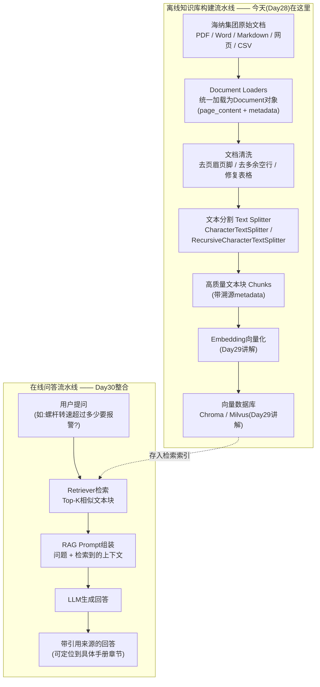
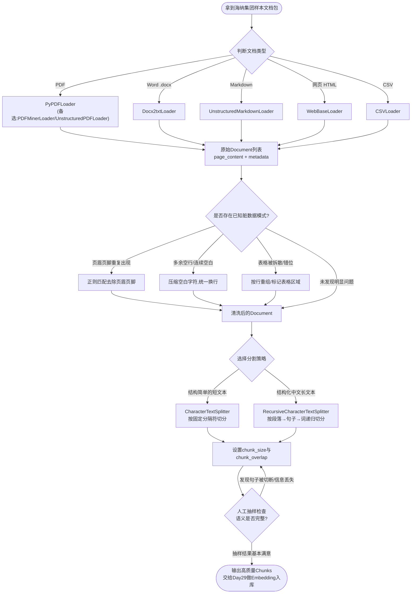

# 第28天 · 文档加载与分割(RAG第一步) —— 海纳集团的文档,比想象中脏得多

> **周次/Sprint**:Sprint 2 · RAG基础(Day25-31)—— 第四天,前三天(Day25-27)把LangChain、LCEL、Memory这三块"内功"打完,今天正式切入RAG本身的第一道工序:文档处理
> **星期**:周日(入职第28天,第四周周日;因为海纳集团的样本文档提前到货,老王临时把"周末半天休整"改成了"上午照常,下午自愿",陈铭自己选择了留下来把今天的活儿做完)
> **参与人**:陈铭(导师:王振宇;上午列席:王振宇;文档需求由林悦通过飞书转达,未到场;晚间答疑短暂列席:苏梦)
> **飞书任务号**:CQ-108(海纳集团样本文档接入 · Document Loaders技术验证)、CQ-109(文本分割策略选型与chunk参数调优实验)
> **今日关键词**:Document Loaders / PyPDFLoader / Docx2txtLoader / UnstructuredMarkdownLoader / WebBaseLoader / CSVLoader / 文档清洗 / CharacterTextSplitter / RecursiveCharacterTextSplitter / chunk_size / chunk_overlap / 语义分割

---

## 【旁白】

在这门课七十天的时间轴里,有一些日子注定不会出现在任何一张宣传海报上——没有酷炫的新模型发布,没有激动人心的上线仪式,甚至连一句能截图发朋友圈的话都很难找出来。第28天,大概就是这样一天。它做的事情说出来平平无奇:把几份文件"读进来",再"切成小块"。可正是这样一件听起来毫无技术含量的事情,会在往后所有做RAG(检索增强生成)项目的工程师嘴里,被反复念叨成一句几乎是行业共识的话——"垂直知识库问答系统,七成的效果差距,不是差在模型上,是差在文档处理上"。

陈铭还不知道这句话,他今天只知道一件更具体的事:林悦昨天晚上在项目群里甩了一个压缩包链接,备注是"海纳集团发来的第一批设备手册样本,你们先拿这个练手,别用真实的完整资料,量太大"。这个压缩包里装着五份文件——一份扫描版PDF操作手册、一份Word质检作业指导书、一份从企业内部维基导出的Markdown说明文档、一个海纳官网产品页面的链接、还有一张CSV格式的设备台账表。陈铭对着这五份文件愣了几秒,心里冒出的第一个念头不是"这有什么难的",而是"这也太乱了"——扫描PDF里页码、页眉和正文粘在一起,表格被OCR拆成了乱码,Word文档里同一个"保养周期"字段在不同页面用了三种不同的排版方式表达。这是他第一次亲眼见到"企业真实文档"和"教学演示文档"之间那条巨大的鸿沟——过去二十七天里,他处理过的所有文本输入,不管是聊天消息还是Prompt模板,本质上都是"干净"的,是别人已经替他把格式问题解决掉之后,才交到他手里的。而今天,没有人替他解决这件事了。

这一天在整条故事线里,承担着一个容易被低估但极其关键的角色——它是"记忆"和"检索"之间的桥梁。Day27解决的是"记住聊了什么"这一件事,而从今天开始的接下来三天(Day28到Day30),要解决的是完全不同维度的另一件事——"回答准不准"。这两件事听起来都叫"让AI更懂你",但技术路径截然不同:记忆是让AI记住"这次对话"里发生过什么,检索增强生成是让AI"知道"这次对话之外、企业内部沉淀了几十年的那些知识——老师傅写在维护手册边角的经验、质检报告里反复出现的那几条"红线"、设备台账里密密麻麻的参数。这些知识不会自动跑进大模型的参数里,得靠人一步一步"喂"进去,而喂之前,先要把它们从五花八门的原始格式里,规规矩矩地"读出来"、"洗干净"、"切整齐"。这就是今天要做的全部事情,也是整个RAG系统里,最不起眼、却最决定成败的第一道工序。老王后面会用一句话点破这一点,陈铭当时没完全听懂,但会在往后无数次踩坑之后,想起这句话——"检索系统再花哨,喂给它的文本块是垃圾,它吐出来的答案就还是垃圾,这行话不好听,但是真的。"

---

## 晨会纪要 / 今日目标

**时间**:上午9:30(周日,老王特意把时间往后挪了半小时),二层小会议室"望远"
**出席**:王振宇(老王)、陈铭

会议室里比平时安静不少——周末大部分工位是空的,只有零星几个人在。陈铭进门时手里端着一杯咖啡,老王已经在白板前站着了,白板上贴着一张打印出来的截图,是那份压缩包里的PDF操作手册的第一页扫描件。

"先看这个。"老王没等陈铭坐下,直接指着截图说,"这是海纳集团那台XJ-500型注塑机的操作与维护手册,林悦昨晚转给我们练手用的样本之一。你自己说说,这一页你看出什么问题。"

陈铭凑近看了一会儿,皱起眉头:"页面顶部有一行'XJ-500系列 操作维护手册 第3章'的页眉,页面底部又有一行页码和一行'海纳制造集团 内部资料 严禁外传',中间正文里还嵌了一张参数表,但这张表在扫描件里看着位置有点歪,应该是原始扫描的时候纸张没放平。"

"说得差不多,但你漏了一个更麻烦的东西。"老王把截图翻到下一张,是同一份文档用程序读取之后打印出来的文本,"这是我昨晚随手用一个最基础的PDF加载器把这份文档读出来的样子。你看这几行。"

陈铭念出声:"'XJ-500系列 操作维护手册 第3章\\n注塑机常见故障排查\\n3\\n海纳制造集团 内部资料 严禁外传\\nXJ-500系列 操作维护手册 第3章\\n当螺杆转速超过额定值的120%时……'——啊,这个页眉和页脚,每一页都会重复一遍,程序读出来之后,它们混在正文中间,变成了正文的一部分。"

"对,这就是今天要解决的第一类问题。"老王在白板上写下"脏文档三宗罪"几个字,"页眉页脚污染、多余空行和乱码换行、表格错位。这三样东西,在你过去二十七天接触的所有文本里,一个都没有出现过,因为所有练习材料都是我们精心准备好的干净文本。但从今天开始,你要处理的是真实世界里的文档,这三样东西会是你的家常菜,不是意外情况。"

**昨日进展回顾**

老王简单带过了Day25到Day27这三天的成果:"LangChain的基础架构你已经跑通了,LCEL链会写了,Memory机制也做完了多会话隔离——这三天你把'对话'这条线上能用的工具基本配齐了。但你有没有发现一个问题?这三天写的所有Demo,回答问题的知识,来源始终只有两个地方——一个是大模型自己训练时学到的通用知识,一个是你在对话里临时告诉它的信息。海纳集团要的东西,这两个来源都覆盖不到。"

陈铭想了想:"海纳集团要的是,能回答'XJ-500的螺杆转速超过多少要报警'这种问题,这种知识只存在于他们自己的设备手册里,大模型压根没学过,我在对话里也不可能把整本手册打出来告诉它。"

"这就是为什么我们要做RAG。"老王点头,"RAG的核心逻辑其实特别朴素——大模型不知道的知识,你不需要硬塞给它记住,你只需要在它回答之前,先从一个知识库里,把跟这个问题相关的那一小段内容找出来,连着问题一起喂给它,它自己会读、会总结、会引用。这个'知识库'从哪来?就是从海纳集团这些设备手册、质检报告、台账表里来。而知识库不是原始文档本身,是原始文档经过处理之后变成的一堆一堆的'文本块',每一块几百字,方便后面按需检索。今天,就是要把'原始文档'变成'高质量文本块'这条流水线,从头搭一遍。"

老王又补了一句类比,是他这几年带新人时经常用的说法:"你可以把RAG想象成给大模型配了一个'外接的、能随时翻阅的资料库',而不是要求它把所有资料都提前背下来。大模型本身的参数,决定了它'懂不懂怎么说话、懂不懂怎么推理',这部分能力是它训练时就固化下来的,没办法通过对话临时改变;但它'知不知道某个具体的、垂直领域的事实性知识',这部分完全可以通过'在提问的时候,顺手把相关资料递给它看'来解决,不需要重新训练模型。这个思路的好处很明显——不用重新训练模型(那个成本极高,不是我们这种应用型公司该干的事),知识库内容还可以随时更新(海纳集团出了新版的操作手册,只需要把新文档重新走一遍今天这条流水线,替换掉知识库里旧的部分),灵活性比'把所有知识硬塞进模型参数'高出一个量级。"

陈铭一边听一边把这个类比记进了笔记里,他发现这个比喻比自己之前看资料时读到的"检索增强生成"这个直译名词,要好理解得多——"外接资料库"这四个字,一下子就把"为什么需要RAG"这件事从抽象的技术术语,还原成了一个他能立刻在脑子里画出画面的具体场景。

**今日目标清单**

老王把今天的任务拆成清晰的两段,写在白板上:

1. 上午:掌握五种主流Document Loader的用法——PDF(`PyPDFLoader`及备选方案)、Word(`Docx2txtLoader`)、Markdown(`UnstructuredMarkdownLoader`)、网页(`WebBaseLoader`)、CSV(`CSVLoader`),并针对海纳集团样本文档里出现的脏数据问题(页眉页脚、多余空行、表格错位),写出一套可复用的清洗函数。
2. 下午:系统对比`CharacterTextSplitter`与`RecursiveCharacterTextSplitter`两种分割策略,通过实验理解`chunk_size`和`chunk_overlap`这两个参数对切分结果的实际影响,并尝试按语义/标题维度做更精细的分割。
3. 晚自习/收尾:把上午和下午的成果串成一条完整流水线,写一个可以直接对一整本PDF电子书(先用一份相对干净的内部培训电子书练手,再套用到海纳集团的脏文档上)做"加载→清洗→分割"的完整脚本,输出结果保存为JSON Lines文件,为Day29的向量化和入库做好准备。

**风险点**

老王在风险点这块讲得比平时更细,显然是提前踩过坑,他先补了一条总的开场白:"今天这一天,你会第一次感受到一种和过去二十七天完全不同的挫败感——不是'代码写不出来'的挫败感,是'代码写出来了,跑起来了,程序也没报错,但结果就是不对'的挫败感。这种挫败感更隐蔽,也更考验一个人的耐心,提前跟你说清楚,免得你今天中途情绪上有太大波动。"陈铭听完点了点头,他确实没想过,今天要面对的困难,会是这样一种"看起来什么都顺利,细看全是问题"的形态。老王接着说:"我把我这几年做企业项目踩过的坑,先跟你说三条。第一,不要迷信'某个加载器一定最好',PDF加载器至少有五六种主流选择,各有各的适用场景,遇到解析效果差的文档,换一个库往往比死磕参数更有效。第二,文本清洗这一步,没有放之四海皆准的正则表达式,页眉页脚的格式,每家企业、甚至同一家企业不同部门出的文档都可能不一样,你写的清洗函数一定要设计成'可配置、可扩展',而不是把某一份文档的具体格式硬编码进去。第三,也是最容易被新人忽略的一点——分割参数没有'最优解',只有'适合当前场景的解',`chunk_size`调大了,检索精度会下降,调小了,语义会被切碎,这中间的平衡,要靠实验去找,不要指望我或者哪篇博客直接告诉你一个万能数字。"

老王想了想,又补了第四条:"第四,今天最容易发生的一种低级但致命的失误,是把某一步清洗规则写得'太狠',结果把正文里真正有用的内容也一起删掉了,而这类问题,程序运行时是不会有任何提示的——你删掉的可能是一整段关键的安全警示语,程序照样安安静静地跑完,不会有任何报错提醒你'刚刚删错了东西'。所以每写完一条新的清洗规则,一定要马上抽查清洗前后的对比,而不是攒到最后一起检查,否则等你发现问题的时候,可能已经忘了是哪一步、哪一条规则造成的。"

陈铭在笔记本上把这四条抄了下来,又追问了一句:"那我们今天处理的这些海纳集团样本文档,处理完之后,是不是就可以直接拿去用了?"

"不是。"老王摇头,语气很干脆,"今天做完的,充其量是'文本块',这些文本块现在还只是一堆Python对象,存在你本地内存或者一个JSON文件里,没有向量化,没有存进任何检索得起来的数据库。真正能被检索、能支撑起一个问答系统的知识库,要等Day29把这些块做Embedding、存进向量数据库之后才算数。你今天的产出,是给明天铺路的半成品,但这半成品的质量,直接决定明天和后天做出来的东西好不好用——这也是为什么林悦愿意花时间,提前把真实样本文档发过来让你练手,而不是等到项目正式立项才第一次碰这些数据。"

陈铭又问了一个更实际的问题:"今天是周日,按理说不用来公司的,为什么这批样本文档一到,大家的反应是'立刻拿来练手',而不是等到周一?"

老王想了几秒才回答,语气比平时多了一点感慨:"这个问题问得挺好,我说说我的真实想法。我们做企业项目这些年,最怕的不是技术难,是'拿到真实数据的时间点太晚'。很多团队做知识库问答,前面把模型选型、Prompt设计、界面做得漂漂亮亮,结果真正拿到客户的全量文档才发现,排版比想象中乱十倍,前面定好的分割参数、清洗规则全部推翻重来,项目周期一下子多出两三周。林悦这次能提前从孙工那边要到几份'非敏感的'样本文档,其实是帮我们把这个风险提前暴露出来——多花一个周末,比正式立项之后手忙脚乱地返工,划算太多。这不是要求你养成'周末必须加班'的习惯,而是想让你明白,有些时候,提前一步接触真实数据带来的收益,是值得主动争取的,当然,这个决定应该是你自愿的选择,不是被要求的义务,今天你能来,是你自己权衡后的决定,我很尊重这个决定,但也想让你清楚背后的逻辑是什么。"

陈铭点点头,一时没接话,但心里对"提前趟坑"这四个字,有了比昨天更具体的理解——不是一句口号,而是实实在在地体现在"今天多花几个小时,能少踩后面几天的坑"这种朴素的性价比计算里。

---

## 需求文档:海纳集团文档预处理技术验证

> 撰写人:林悦(产品经理,飞书消息转达) · 技术评审人:王振宇 · 文档编号:CQ-PRD-D28-01 · 版本:v0.1(技术预研阶段,非正式PRD)

### 背景

海纳制造集团是苍穹平台第三阶段的第一个目标客户,业务方向是制造业设备生产,核心痛点是"老师傅经验难传承+客服人手不够"——设备操作、维护、故障排查的知识,大量沉淀在纸质手册、Word文档、内部知识库页面、Excel台账里,新员工上手周期长,客服人员遇到非典型问题经常需要打电话问老师傅。林悦上周已经和海纳集团设备管理科的孙工做过一次初步电话沟通,对方明确表示"我们不是没有资料,是资料太多太乱,想找的时候根本翻不到",这句话被林悦原文转发进了项目群,老王把它定为这三天(Day28-30)教学内容设计的核心出发点。

在正式立项会议(计划在两周后召开)之前,林悦提出希望技术团队先拿一批"非敏感的样本文档"做技术可行性验证,一方面评估现有的开源工具链能不能顺利处理海纳集团的真实文档格式,另一方面为立项会议准备一份初步的技术评估结论,增加谈判时的专业说服力。这份"需求文档"的定位因此和以往项目型需求文档不同——它不是要产出一个面向最终用户的功能,而是一次严肃的技术选型验证,产出物是"技术评估结论 + 可复用的处理代码",供林悦下周向海纳集团做技术侧的初步反馈。

林悦在这份文档的开头,还专门用一段话解释了为什么要在立项前先做这一轮技术预研:"我们过去接触过的几个潜在客户,最后没能签下来,复盘下来发现,有一部分原因不是价格谈不拢,是客户对'你们真的能处理好我们的数据'这件事心里没底——大家都会说自己能做知识库问答,但真正说到具体某一份文档能不能处理好,很多团队其实自己心里也没谱,只是在立项会议上讲一些通用的技术名词。这次孙工愿意先给我们几份样本,是一个难得的机会,如果我们能在立项会议上,直接展示'这是你们提供的原始手册,这是我们处理之后的效果',这种具体到细节的展示,比任何PPT上的架构图都更有说服力。"老王完全认同这个思路,并在晨会上把这段话转述给了陈铭,提醒他今天写的每一段代码、记录的每一组实验数据,都可能在两周后的立项会议上被直接引用,这也是为什么今天的实验记录要写得足够详细、可追溯,而不是随手记几个数字应付了事。

### 样本文档清单

孙工通过海纳集团的信息化科,提供了五份"允许对外展示、不涉密"的样本文档,分别代表企业知识库里最常见的五类原始格式:

| 编号 | 文件名(示例) | 格式 | 内容说明 | 已知问题 |
|---|---|---|---|---|
| D1 | 《XJ-500型注塑机操作与维护手册(节选).pdf》 | PDF(扫描件转数字版混合) | 设备操作步骤、维护周期、常见故障代码 | 页眉页脚重复、表格跨页错位、部分章节是扫描图片嵌入文字层 |
| D2 | 《数控车床日常保养作业指导书.docx》 | Word | 保养步骤、责任人、检查项清单 | 项目符号层级混乱、部分表格用文本框实现 |
| D3 | 《海纳设备管理知识库-使用说明.md》 | Markdown | 内部Wiki导出的操作说明,含多级标题 | 标题层级不规范、含大量内部跳转链接残留 |
| D4 | 海纳集团官网"产品中心-注塑机系列"页面 | 网页(HTML) | 公开产品介绍、参数概览 | 含大量导航栏/广告/无关脚本文本 |
| D5 | 《设备台账-2024(节选).csv》 | CSV | 设备编号、型号、投产日期、维保周期等结构化字段 | 部分字段编码为GBK、存在空值与合并单元格残留 |

### 用户故事

- 作为技术负责人(老王视角),我希望验证清楚,针对海纳集团这五类真实文档格式,LangChain生态里现成的Document Loader能不能"开箱可用",还是需要额外开发适配代码,以便准确评估立项后的开发工作量。
- 作为产品经理(林悦视角),我希望拿到一份"处理前/处理后"效果对比的简单展示材料,能够直观地讲给客户看,证明技术团队已经认真研究过他们真实的文档难点,而不是泛泛而谈"我们能做知识库"。
- 作为最终要交付这套系统的工程师(陈铭视角),我希望在正式项目开始之前,先把这套"加载-清洗-分割"的处理流水线在小范围样本上跑通、调好参数经验,避免立项后在真实全量数据上手忙脚乱。
- 作为未来会使用这个知识库问答系统的海纳集团一线员工(隐含用户),我希望系统给出的答案,能够精确到手册的具体章节和步骤,而不是笼统地说个大概,这就要求文本块切分得足够合理、切分后还能追溯到原文出处。

### 功能列表

| 编号 | 功能 | 说明 | 优先级 |
|---|---|---|---|
| F1 | 多格式文档加载 | 支持PDF、Word、Markdown、网页、CSV五种格式的统一加载,输出标准化的Document对象(page_content + metadata) | P0 |
| F2 | 文档清洗 | 提供去除页眉页脚、压缩多余空行/空白字符、修复表格错位的清洗函数,且可配置(不同客户/不同文档模板可传入不同的页眉页脚正则规则) | P0 |
| F3 | 文本分割 | 支持`CharacterTextSplitter`与`RecursiveCharacterTextSplitter`两种策略,`chunk_size`、`chunk_overlap`可配置 | P0 |
| F4 | 元数据溯源 | 每个文本块必须保留来源文档名、页码/章节等元数据,保证后续检索结果能精确定位原文 | P0 |
| F5 | 分割效果评估工具 | 提供简单的统计脚本,输出分割后每个chunk的长度分布、总块数,辅助人工判断参数是否合理 | P1 |
| F6 | 端到端处理脚本 | 提供一份可以对整本PDF文档一次性完成"加载-清洗-分割-落盘"的完整脚本,作为立项后批量处理全量文档的雏形 | P0 |

### 非功能需求

- **鲁棒性**:五类文档中任意一类加载失败(比如某个PDF损坏、某个网页链接超时),不能导致整个处理流程崩溃,需要有清晰的错误提示和跳过机制。
- **可配置性**:页眉页脚正则、chunk_size/chunk_overlap参数、分割策略选择,均不能硬编码在业务逻辑内部,需要作为可传入的配置项。
- **可观测性**:处理过程需要输出关键日志(读取了多少页/多少字符、清洗前后字符数对比、切分出多少个chunk),方便排查问题和后续调优。
- **可追溯性**:每个chunk的metadata中必须包含足够信息,使得任何一个chunk都能追溯回它在原始文档中的确切位置。

老王在评审这份非功能需求清单的时候,专门在"可追溯性"这一条后面加了一句备注,解释为什么这一条对海纳集团这类制造业客户格外重要:"你要理解,这不是一个抽象的技术洁癖,是这类客户真实的使用场景决定的。海纳集团的一线员工,面对的是真实的设备,一个错误的答案,轻则耽误维修时间,重则可能引发安全事故。如果系统给出的答案,没有办法让员工反查'这句话到底出自哪份手册的第几页第几条',那这个答案在实际生产场景里的可信度会大打折扣——员工宁可打电话问老师傅,也不敢完全信任一个'黑箱'系统给出的、无法溯源的答案。所以'可追溯性'这条非功能需求,表面上看只是一个metadata字段设计的技术细节,背后对应的其实是整个知识库问答系统,能不能真正被一线员工信任并使用起来这件更本质的事情。"这段话让陈铭对"非功能需求"这个词有了新的理解——过去他一直觉得这部分是相对次要的"附加条款",今天才意识到,某些非功能需求,恰恰是决定一个系统能不能被真正用起来的关键门槛,重要程度不亚于任何一条功能性需求。

林悦在转达这份需求的飞书消息末尾,还补了一段说明,陈铭反复看了两遍:"孙工那边其实一开始有点犹豫,毕竟涉及内部资料,哪怕是不涉密的样本,也要走一道内部审批。我跟他强调了两点,他才同意先发这五份——第一,这五份文档只会用于我们内部技术验证,不会出现在任何对外的演示材料里;第二,等真正立项之后,所有涉及正式生产环境的处理流程,都会由海纳集团自己的信息化科全程参与评审,不是我们单方面拿到数据就随意处理。这两点你们心里要有数,这不只是走个流程,是我们做企业客户项目必须守住的底线,数据合规这件事,一旦出了问题,比任何技术方案没做好都严重。"老王看到这段话之后,专门在晨会上又强调了一遍,要求陈铭往后处理任何客户数据,第一反应都应该是"这份数据我有没有获得明确的使用授权",而不是"这份数据处理起来技术上有没有难度"。

### 验收标准

1. 五份样本文档均能通过对应的Loader成功加载,输出的Document对象数量与预期页数/章节数基本吻合(允许合理误差,如PDF按页加载,应等于总页数)。
2. 针对D1(PDF手册)运行清洗函数后,人工抽查至少5页,页眉页脚字符串在清洗后的文本中不再出现或出现频率显著降低。
3. 针对同一份文档,分别使用`chunk_size=200/500/1000`、`chunk_overlap=0/50/100`做至少6组分割实验,输出每组的chunk数量与长度分布统计,并给出书面对比结论。
4. 至少完成一次"按标题/语义分割"的实验(针对D3的Markdown文档),验证是否能比固定长度分割保留更完整的语义单元。
5. 完成一份端到端脚本,输入任意一份PDF文件路径,输出对应的chunks列表(JSON Lines格式,含text与metadata字段),整个过程无需人工干预。

---

## 架构设计图:文档处理在苍穹RAG流水线中的位置

老王在讲解今天任务之前,先在白板上补全了苍穹平台0.5版的整体RAG架构图,让陈铭先建立"今天做的事情,在全局里处于哪个环节"这个认知,再动手写代码。



老王讲解这张图的时候特意停在了"离线"和"在线"这两个词上:"很多刚接触RAG的人,第一反应是把它当成一个'问答的时候临时去查资料'的实时过程,这个理解只对了一半。真正在生产环境跑起来的RAG系统,分成两条完全独立的流水线——离线的知识库构建,和在线的实时问答。今天、明天、后天这三天,我们做的全部是离线流水线的活儿,和用户提问那一刻完全无关,是提前把知识'准备好'的过程。这个区分很重要,因为它决定了性能优化的思路完全不同——离线流水线追求的是处理质量和吞吐量,可以慢,但要准;在线流水线追求的是响应速度,不能慢,但可以用离线阶段已经处理好的东西去兜底。"

陈铭盯着图看了一会儿,注意到一个细节:"图里从'文本分割'到'Embedding'中间,是不是意味着,我今天切出来的每一个文本块,到明天都要单独过一次向量化?"

"完全正确,这也是为什么今天分割的质量特别关键。"老王说,"你可以把每一个chunk想象成图书馆里的一张索引卡片——切得好,一张卡片刚好装下一个完整的知识点,检索的时候一查就准;切得不好,一个知识点被硬生生撕成了两张卡片,或者一张卡片里塞进了三个毫不相关的知识点,检索出来的东西就会驴唇不对马嘴。向量化和检索,补救不了切分阶段留下的烂账,这也是我一开始就说'今天不起眼但很关键'的原因。"

陈铭又指着图里"离线"和"在线"两个子图之间那条虚线(表示向量数据库同时被两条流水线共享)问:"这条虚线的意思是,向量数据库既是离线流水线的终点,又是在线流水线的起点?"

"对,这个位置很特殊,值得多说两句。"老王说,"向量数据库在整套系统里,扮演的角色是'离线成果的持久化载体',同时也是'在线查询的直接依赖对象'。这意味着,一旦知识库正式对外提供服务,离线流水线和在线流水线其实是在同时运转的两套逻辑——白天客户在系统里正常提问的时候,后台完全可能同时有一批新到的文档在做离线处理,处理完之后追加写入同一个向量数据库。这种'边使用边更新'的场景,会带来一些额外的工程考量,比如新写入的向量什么时候对检索可见、更新过程会不会影响正在进行的查询性能,这些问题我们不会在Day28一次性讲完,但你现在知道这条虚线背后藏着这样一层复杂度,以后遇到类似的架构设计,会更容易反应过来该往哪个方向多想一步。"

这段对话没有直接产出任何代码,但陈铭后来在笔记里专门用一段话记录下来——他意识到,architecture图上一条看似简单的连线,背后往往对应着"两个独立运行的系统,如何在同一份共享资源上协调工作"这样一类具体的工程问题,而不只是一个抽象的示意箭头。

---

## 流程图:文档加载→清洗→分割完整流程

讲完架构图之后,老王又画了一张更细的流程图,专门对应今天要写的代码,把"拿到文档"到"产出可用于向量化的chunks"这中间的每一个判断节点都标出来。



"这张图你可以贴在工位上,以后做任何客户的文档处理,基本都是照着这个骨架走一遍,只是每个节点具体怎么实现会不一样。"老王指着"人工抽样检查"这个节点补充说,"这一步很多人图省事会跳过,觉得代码跑完没报错就等于结果对。但分割这一步,程序不报错和结果好用,是两件完全不相关的事——程序永远不会因为'把一句话从中间切断了'而报错,它只会安安静静地把切断的结果吐给你。所以这个人工检查的环节,不是可选项,是必选项,尤其是第一次处理一批新文档的时候。"

陈铭又留意到图里"判断文档类型"这个起点节点,追问了一句:"这个判断,是靠文件后缀名来做,还是有更严谨的方式?"

"两种都可以用,但严谨程度不一样。"老王回答,"最简单的方式,就是看文件后缀名——`.pdf`走PDF分支、`.docx`走Word分支,这种方式实现起来最快,绝大多数场景下也够用。但后缀名本质上只是一个由文件命名习惯决定的字符串,理论上是可以被改错的,比如有人把一份Word文档手动改了后缀名存成`.pdf`,单看后缀名就会被误判。更严谨的方式,是读取文件最开头的几个字节,判断所谓的'魔数'(magic number)——几乎所有主流文件格式,在文件内部最开头都有一段固定的、用来标识文件类型的字节序列,PDF文件开头永远是`%PDF`这几个字符,这种基于文件内容本身的判断,比单纯看文件名后缀更可靠。企业级项目里,处理用户上传的文件,通常会两种方式都用上——先看后缀名做一个初步快速判断,再用魔数校验做一次确认,如果两者不一致,及时给出警告,而不是直接按错误的判断结果往下走。"

陈铭把"文件后缀名+魔数双重校验"这条经验记进了笔记,他意识到这类"看起来是细枝末节,但真出问题会很隐蔽"的校验逻辑,可能是他过去二十七天写代码时,最容易忽略的一类工程细节——因为在练习环境里,输入文件永远是"预期之内"的,不会有人故意拿一份改错后缀名的文件来"捣乱",但真实业务系统一旦对接了外部用户的真实上传行为,这类"意料之外"的输入,反而是最需要提前设防的部分。

---

## 示意图:chunk_size与chunk_overlap的切分示意

为了让陈铭对这两个参数有更直观的感觉,老王又单独画了一张示意图,用具体的字符位置来表示一段1000字符长度的文本,在`chunk_size=400`、`chunk_overlap=100`的设置下,会被怎样切分成三个互相重叠的文本块。


老王讲这张图的时候用了一个陈铭一下子就听懂的比喻:"你可以把整份文档想象成一条很长的走廊,`chunk_size`决定你每一步'截图'截下多长的一段走廊,`chunk_overlap`决定相邻两张截图之间要留多少'重叠的墙面'。如果完全不留重叠(overlap=0),某一句关键的话正好卡在两张截图的分界线上,前半句在第一张截图结尾,后半句在第二张截图开头,检索的时候不管命中哪一张,读到的都是半句话,语义是破碎的。留出适当的重叠,就是故意让分界线附近的内容,同时出现在前后两个chunk里,保证不管命中哪一个,上下文都基本连贯。"

陈铭追问:"那overlap是不是越大越好?"

"你觉得呢,想想看会有什么代价。"老王反问。

陈铭想了几秒:"如果overlap特别大,比如跟chunk_size差不多大,那相邻的chunk内容几乎是重复的,存进向量库里,同样的知识点会被存好几份,检索的时候可能会被同一个知识点的不同chunk占满Top-K的位置,反而挤掉了其他真正需要的内容,而且存储空间和检索计算量都会白白增加。"

"说到点上了。"老王点头,"这就是为什么这个参数没有万能答案,通常经验值是`chunk_overlap`取`chunk_size`的10%到20%左右,具体多少,要看你的文档语言密度、句子平均长度,这个我们下午会用真实实验去验证,而不是我现在直接给你一个数字让你死记。"

陈铭盯着示意图又看了一会儿,注意到一个细节:"图里Chunk 1和Chunk 3之间,虽然各自都跟中间的Chunk 2有重叠,但Chunk 1和Chunk 3彼此之间是完全没有重叠的,这样设计有什么讲究吗?"

"这是滑动窗口式切分天然的性质,不是刻意设计出来的讲究,但你能主动注意到这一点,说明你在认真琢磨这张图,这个观察本身很有价值。"老王回答,"你可以这样理解——重叠只发生在'相邻'的两个chunk之间,不会跨着中间那个chunk产生传递性的重叠。这意味着,如果一个知识点恰好横跨了从Chunk 1末尾到Chunk 3开头这么长的范围(超过了一个chunk_size加上一个overlap的总长度),这个知识点仍然有可能被彻底打散,重叠机制在这种极端情况下起不到作用。好消息是,这种'一个知识点横跨特别长范围'的情况,在大多数结构清晰的技术文档里并不常见,操作步骤、故障说明这类内容,通常在原文里本身就是紧凑地写在一起的,不会跨越好几个chunk_size那么长的距离。但如果你的文档里确实存在这种'长距离关联'的内容(比如一份合同前面约定的定义,几十页之后才被引用),固定长度切分再怎么调参数,都很难完美兼顾,这种情况下,往往需要额外的技术手段来补充,比如在检索阶段同时召回原文本中相邻的chunk,或者对特别关键的定义类内容做单独的强化处理,这些内容我们会在RAG进阶阶段(Sprint 3)再展开讲。"

---

## 课堂笔记

### 上午:各类Document Loader实战与脏文档清洗

老王开场先做了一个总的说明:"LangChain里的Document Loader,本质上做的事情特别简单——把各种格式各异的原始文件,统一转换成一种标准对象,叫`Document`。这个对象只有两个核心属性:`page_content`(纯文本内容)和`metadata`(一个字典,记录来源、页码等附加信息)。不管你原来的文件是PDF、Word还是网页,加载完之后,后面所有处理代码看到的,都是这个统一的`Document`对象,这就是为什么这一层叫'适配层',它把'千差万别的格式'适配成了'统一的接口'。"

他顿了一下,又补充了一句在陈铭听来有点意外的话:"你可能会觉得,'把文件读成文字'这件事,应该是计算机科学里早就解决得非常成熟的问题,不至于今天还要花一整个上午来学。这个感觉只对了一半。文本本身怎么被计算机存储、怎么被解码,确实是几十年前就解决的问题;但'一份被人类设计出来、给人眼看的排版文档,怎么被还原成一份让机器准确理解语义结构的纯文本',这件事到今天都没有一个完美的通用解法,原因很简单——排版这件事,从设计出发点上就是为了'好看'和'好读',不是为了'方便程序解析'。人眼看一份PDF,几乎不需要任何努力就能分辨出页眉、正文、表格、脚注,是因为人类大脑天生擅长处理视觉布局信息;但程序默认只看得到一串字符流,所有那些'一眼就能看出来'的排版结构信息,除非专门设计算法去还原,否则都会在转换成纯文本的过程中丢失掉。今天你会一次次撞到这个'人眼觉得理所当然,程序却毫无概念'的落差,这不是你笨,也不是工具差,这是这类问题本身的难点所在。"

陈铭把这句话记了下来,他隐约觉得,这句话某种程度上解释了为什么"文档处理"这件事,在很多技术团队眼里显得不够"高级"——它处理的不是抽象的数学或算法问题,而是"人类习惯和机器习惯之间的落差"这样一件听起来很朴素、却极难彻底解决的事情。

**1. PDF加载:最常打交道,也最容易踩坑的一类**

陈铭打开的第一份文件是D1,《XJ-500型注塑机操作与维护手册》。他先按照老王给的示例,用最基础的方式加载:

```python
from langchain_community.document_loaders import PyPDFLoader

loader = PyPDFLoader("data/haina/XJ-500操作维护手册.pdf")
docs = loader.load()
print(f"共加载 {len(docs)} 个Document对象")
print(docs[0].page_content[:300])
```

运行完之后,陈铭第一反应是"这也太顺利了吧",程序没有报任何错,顺利跑出了18个Document对象,对应PDF的18页。但当他把第3页的内容打印出来完整看一遍时,问题就冒出来了——页面顶部的章节页眉、页面底部的公司声明和页码,和正文的操作步骤混在了一起,变成了同一段字符串。老王在旁边补了一句:"`PyPDFLoader`是按页把PDF转成文本,它不认识什么是'页眉'、什么是'正文'、什么是'页脚',它眼里所有落在这一页上的文字,不分主次,一股脑全部按物理位置顺序拼在一起。这不是bug,这是它本来就该有的行为——它只负责'把PDF里的文字抠出来',不负责'理解这段文字的排版语义'。"

陈铭又试了另外两种PDF加载方式做对比。第一种是`PDFMinerLoader`:

```python
from langchain_community.document_loaders import PDFMinerLoader

loader = PDFMinerLoader("data/haina/XJ-500操作维护手册.pdf")
docs = loader.load()
print(f"PDFMinerLoader 共加载 {len(docs)} 个Document对象")
```

他发现`PDFMinerLoader`默认会把整份PDF当成一个Document返回(而不是按页拆分),这在某些场景下更方便(比如后面自己按语义重新分段),但也丢失了"这段文字来自第几页"这个天然的元数据线索。第二种是效果通常更好、但依赖也更重的`UnstructuredPDFLoader`:

```python
from langchain_community.document_loaders import UnstructuredPDFLoader

loader = UnstructuredPDFLoader(
    "data/haina/XJ-500操作维护手册.pdf",
    mode="elements",   # elements模式会把文档拆解成标题、段落、表格等不同类型的元素
)
docs = loader.load()
print(f"UnstructuredPDFLoader(elements模式) 共加载 {len(docs)} 个元素")
for d in docs[:5]:
    print(d.metadata.get("category"), "|", d.page_content[:50])
```

这次跑的时候,陈铭第一次遇到了报错——提示缺少`libmagic`和`poppler`这类系统级依赖。老王看了一眼错误信息,笑了一下:"这是几乎每个人用`unstructured`这个库第一次都会遇到的坑,它底层依赖了不少系统工具,不是纯Python依赖,`pip install`装不全,得用系统包管理器补一遍。"他让陈铭执行:

```bash
sudo apt-get update && sudo apt-get install -y libmagic1 poppler-utils tesseract-ocr
pip install "unstructured[pdf]"
```

装完之后重新运行,`UnstructuredPDFLoader`确实把文档拆解得更细了,能识别出哪些片段是"标题"(Title)、哪些是"正文段落"(NarrativeText)、哪些疑似是"表格"(Table),这对后面按语义结构分割特别有用。但老王也提醒了代价:"`unstructured`这一整套解析速度比`PyPDFLoader`慢得多,而且对环境依赖重,如果你的PDF本身排版规整、不需要精细的元素分类,`PyPDFLoader`加上你自己写的清洗规则,往往是性价比更高的选择。三种方式没有绝对的优劣,是'解析精度'和'速度/部署复杂度'之间的权衡,具体项目具体选。"

陈铭在笔记里记下了一张自己总结的对比表:

| 加载器 | 优点 | 缺点 | 适用场景 |
|---|---|---|---|
| `PyPDFLoader` | 速度快,依赖少,按页拆分自带页码 | 无法区分页眉页脚正文,扫描图片型PDF读不出文字 | 排版规整、纯文本型PDF |
| `PDFMinerLoader` | 文本提取更完整,可控制是否按页 | 同样无法理解排版语义 | 需要整篇合并处理的场景 |
| `UnstructuredPDFLoader` | 能识别标题/段落/表格等结构,支持OCR(配合tesseract) | 速度慢,依赖重,部署复杂 | 排版复杂、需要精细结构化处理的重要文档 |

老王看了这张表,又追问了一句:"你表里写`UnstructuredPDFLoader`能识别表格,但你之前测那份手册里的参数表的时候,效果怎么样?"陈铭想起来,那张跨页的参数表,即便用了`elements`模式,识别出来的"Table"类元素也把表格内容拆成了一长串文字,列与列之间的对应关系基本丢失了,只是勉强比另外两种加载器好一点。"这就是我要提醒你的地方,"老王说,"'能识别表格'和'能把表格识别准确'是两件不同程度的事。`unstructured`库确实会尝试识别出'这一块区域是个表格',但它把表格转换成文本的方式,通常是按阅读顺序把每个单元格的文字拼接起来,原来的行列结构在转成纯文本之后,很容易变得模糊。如果你的项目里表格数据特别重要、且结构复杂(比如海纳集团设备台账里那种多级表头),更稳妥的做法,是单独用专门处理表格的工具(比如`camelot`、`pdfplumber`的表格提取功能),把表格识别成结构化的行列数据,再单独决定怎么把这些结构化数据转换成适合检索的文本描述,而不是完全依赖通用PDF加载器里附带的表格识别能力。这也是为什么正式项目里,'表格'往往会被当成一类需要专门设计处理逻辑的特殊内容,而不是跟普通段落一视同仁。"

陈铭把这条经验也记进了笔记,标注"表格数据:优先用专门工具,不要依赖通用PDF加载器"。

他又顺手记录了一组自己测出来的速度对比,当作以后做技术选型时的参考基准:同样一份18页的PDF手册,`PyPDFLoader`加载耗时不到1秒;`PDFMinerLoader`耗时大约3秒左右;而`UnstructuredPDFLoader`用`strategy="fast"`耗时接近10秒,如果换成`strategy="hi_res"`,耗时直接超过了一分钟。这组数字虽然只是他自己电脑上的粗略测试,受硬件配置、文档具体内容影响会有波动,不能当作严格的benchmark数据来引用,但足以让他对"精度换速度"这件事有了具体的量级概念——如果海纳集团未来要处理的文档数量达到成百上千份,单纯选用`hi_res`策略去跑全量数据,处理时间可能是以小时甚至以天来计算的,这种量级上的差异,会直接影响项目排期,选择加载策略绝对不能只看"哪个效果好",还要看"这个效果好,值不值得花这么多时间去换"。

**2. 扫描件里的"隐形文字":OCR的必要性**

《XJ-500操作维护手册》里有两页是纯图片扫描(没有文字层),陈铭用`PyPDFLoader`加载这两页时,`page_content`直接是空字符串。他一开始以为是自己的代码写错了,反复检查了几遍确认没问题,才去问老王。

"这不是你代码的问题,是文档本身的问题。"老王解释,"PDF分两种,一种是'数字原生'的,文字是以文字形式存储的,程序能直接读出字符;另一种是'扫描件',本质上是一张图片,肉眼看起来是文字,但对程序来说就是一堆像素点,压根没有'文字'这个概念。要从这种PDF里提取文字,得用OCR(光学字符识别)技术,先把图片里的文字'认'出来,再变成程序能读的字符串。"

陈铭用`UnstructuredPDFLoader`配合`strategy="ocr_only"`重新跑了一遍那两页扫描件:

```python
from langchain_community.document_loaders import UnstructuredPDFLoader

loader = UnstructuredPDFLoader(
    "data/haina/XJ-500操作维护手册.pdf",
    mode="elements",
    strategy="ocr_only",   # 强制走OCR识别路径,适合纯图片扫描页
    languages=["chi_sim", "eng"],  # 同时识别简体中文与英文
)
docs = loader.load()
```

这次终于读出了文字,但准确率并不完美——有几个专业术语识别错了字(比如"螺杆"被识别成了"螺杯"),表格里的数字也有一两处识别错位。老王对这个结果的反应很平静:"OCR从来不是100%准的,尤其是扫描质量一般、字体偏小、表格密集的工业文档,错误率天然会更高。企业级项目里,遇到这种关键的、错一个数字后果很严重的内容(比如设备安全参数),正确的做法不是指望OCR一次跑对,而是在流程设计上加一道人工校对的环节,或者至少让系统在检索到这类内容时,标注'该内容来自OCR识别,建议核对原文'这样的免责提示。技术能解决大部分问题,但解决不了全部问题,知道边界在哪,比盲目相信技术更重要。"

陈铭想起了这几天课程里反复出现的一个主题——大模型也会"幻觉",OCR识别错误其实是一种更朴素、更早期就存在的"机器幻觉"现象,只是发生在文字识别这个更基础的环节。他把这个类比讲给老王听,老王觉得这个联想挺有意思:"你这个比喻说得不错,本质上是一类问题——机器在处理不确定信息的时候,倾向于给出一个'看起来自信'的结果,而不是老老实实告诉你'这里我不确定'。OCR识别一个模糊的字符,给出的永远是它认为最像的那个字,不会输出'这个字我认不出来,可能是A也可能是B'这种模糊表达;大模型生成一段回答的时候,同样倾向于流畅自信地把话说完,而不是在不确定的地方主动停下来说'这一点我不确定'。这也是为什么,越往后接触到大模型应用真实落地的场景,你会越频繁地看到'如何让系统在不确定的时候诚实地表达不确定',会被反复当成一个核心的工程问题去对待,而不是一个可以被忽略的细枝末节。"

这段对话虽然没有直接产出代码,但陈铭觉得它把今天上午看似孤立的"OCR识别错误"这个具体问题,和整门课程更大的主题——"如何让AI应用更可信、更可控"——串联了起来,这种串联感,是他在这门课里越来越熟悉、也越来越享受的一种学习体验。

**3. Word文档加载:项目符号与文本框里的隐藏坑**

D2《数控车床日常保养作业指导书》是一份.docx文件,陈铭用`Docx2txtLoader`加载:

```python
from langchain_community.document_loaders import Docx2txtLoader

loader = Docx2txtLoader("data/haina/数控车床日常保养作业指导书.docx")
docs = loader.load()
print(docs[0].page_content[:500])
```

这次结果整体比PDF干净不少,因为Word文档本身就是结构化存储的文字,不存在"扫描图片"的问题。但陈铭发现了一个新问题——文档里有一处保养步骤,是用Word的"文本框"实现的独立框图,`Docx2txtLoader`完全没有读出这部分内容。他试着换成解析能力更强的`UnstructuredWordDocumentLoader`:

```python
from langchain_community.document_loaders import UnstructuredWordDocumentLoader

loader = UnstructuredWordDocumentLoader(
    "data/haina/数控车床日常保养作业指导书.docx",
    mode="elements",
)
docs = loader.load()
for d in docs:
    if "文本框" in str(d.metadata) or len(d.page_content) > 0:
        pass  # 逐条检查是否捕获到文本框内容
print(f"共解析出 {len(docs)} 个结构元素")
```

结果依然没有完整捕获文本框内容——这是Word文档格式本身的一个已知限制,文本框、SmartArt图形等"浮动对象",很多开源解析库都处理得不理想。老王对这个结果并不意外:"这种问题,遇到了不要死磕库本身,企业文档处理有一个务实的原则——如果某种格式的内容,自动化工具解析不出来或者解析质量太差,那就把这一部分单独标记出来,要求业务方在源头改一改文档格式(比如把文本框内容挪成正常段落),或者干脆人工补录。技术团队不是万能的,遇到源头数据本身的问题,推回去比硬解决更划算。"

陈铭还发现了这份Word文档另一个不起眼但很实际的问题——保养步骤用的是多级项目符号(一级用数字"1."、二级用字母"a)"、三级用短横线"-"),但`Docx2txtLoader`把这些层级关系全部拍平成了普通的换行文本,层级缩进信息完全丢失,读起来"第一步"和"第一步下面的子步骤"看起来是并列的两行文字,分不出主次。他把这个现象也报告给了老王。

"这也是纯文本转换天然会遇到的信息损失。"老王解释,"项目符号的层级,本质上是排版软件通过缩进量和符号样式表达出来的视觉层级关系,转换成纯字符串之后,除非加载器特意做了保留缩进或者插入层级标记这样的处理,否则这层关系必然会丢失。有两种思路可以缓解这个问题——一种是用支持`mode='elements'`的解析器,看它是否会把列表项标记为特定的类别(有些库确实会保留list_item这样的分类,可以据此在清洗阶段人工补上缩进符号);另一种更朴素,是在清洗函数里,识别出'数字.'、'字母)'这类常见的项目符号前缀,主动在对应文本前面插入统一的缩进标记(比如用两个空格表示一级子层),尽量用规则还原出一部分层级信息。这两种方式都不是完美方案,但至少比什么都不做要好——毕竟对最终的问答系统而言,能不能分清楚'步骤3'和'步骤3的子步骤a'之间的从属关系,直接影响回答是否清晰。"

**4. Markdown加载:标题层级与内部链接的清理**

D3《海纳设备管理知识库-使用说明.md》是从企业内部Wiki导出的Markdown文档,陈铭发现这份文档比前两份"干净"很多——毕竟Markdown本身就是一种为了纯文本可读性设计的格式。他先用最简单的方式尝试:

```python
from langchain_community.document_loaders import UnstructuredMarkdownLoader

loader = UnstructuredMarkdownLoader(
    "data/haina/海纳设备管理知识库-使用说明.md",
    mode="elements",
)
docs = loader.load()
for d in docs[:10]:
    print(d.metadata.get("category"), "|", d.page_content[:60])
```

`mode="elements"`模式下,加载器会自动识别出`#`、`##`、`###`对应的标题层级,并把它们的类别标记为"Title",这对后面按标题做语义分割非常有用。但陈铭也发现了这份文档特有的脏数据——里面残留了大量`[[设备管理#故障排查]]`这样的Wiki内部跳转链接语法,以及一些`<!-- 最后编辑于2023-11-02 -->`这样的HTML注释,这些内容混在正文里,对最终问答系统来说是纯噪音,需要专门清理掉。

**5. 网页加载:内容提取与噪音过滤**

D4是海纳集团官网"产品中心-注塑机系列"页面的一个公开链接,陈铭用`WebBaseLoader`加载:

```python
from langchain_community.document_loaders import WebBaseLoader

loader = WebBaseLoader("https://example-haina.com/products/injection-molding")
docs = loader.load()
print(docs[0].page_content[:500])
```

（老王特别提醒:"这里用的是一个占位的示例域名,真实项目里网页数据的抓取,必须先确认对方网站的`robots.txt`授权范围和数据使用授权,海纳集团这个产品页面是他们主动提供、明确允许我们抓取用于知识库建设的,不是随便找一个网站就抓,这一点在企业项目里是合规红线,不能含糊。"）

陈铭追问了一句实际操作层面的问题:"如果以后遇到别的场景,确实需要抓取某个网站的公开页面,应该怎么一步一步确认这件事是被允许的?"老王把他自己实际做项目时的检查顺序讲了一遍:"第一步,先在浏览器里访问`目标域名/robots.txt`,看这份协议文件里,对应的路径是不是被声明为`Disallow`,如果被禁止,原则上就不应该用自动化程序去抓取,哪怕技术上完全能实现;第二步,即便`robots.txt`没有明确禁止,也要看这个页面本身的服务条款或者版权声明,有没有'禁止未经授权的自动化采集'这类条款;第三步,如果是给客户做项目,牵涉到客户自己的网站或者客户指定的第三方网站,最稳妥的做法是直接问客户要一份书面确认或者授权说明,而不是自己揣测'应该没问题'。这三步,前两步是技术和法务层面的常规检查,第三步是我们做企业项目额外应该养成的习惯——书面授权永远比口头默许更能保护双方,也更能保护你自己不至于因为一次'图省事'的抓取行为惹上不必要的麻烦。"

第一次运行的结果让陈铭有点意外——页面正文只有寥寥几百字的产品介绍,但加载出来的`page_content`却有几千字,里面塞满了导航栏菜单文字、页脚的公司地址和版权声明、甚至还有一些JavaScript代码的残留文本。这是`WebBaseLoader`默认行为的典型特点——它基于`BeautifulSoup`把整个HTML页面的可见文字都提取出来,不会自动区分"这是导航栏"还是"这是正文"。陈铭需要自己写清洗逻辑,或者在加载时传入自定义的解析函数:

```python
from langchain_community.document_loaders import WebBaseLoader
from bs4 import BeautifulSoup

def clean_extractor(html: str) -> str:
    """
    自定义网页正文提取函数,只保留指定容器内的文字,
    过滤掉导航栏、页脚、脚本等无关内容。
    """
    soup = BeautifulSoup(html, "html.parser")
    # 先物理删除所有已知的噪音标签,避免它们的文字被误采集
    for tag in soup(["script", "style", "nav", "footer", "header"]):
        tag.decompose()
    # 假设正文内容统一放在 class="main-content" 的容器里,
    # 这是需要提前用浏览器"检查元素"确认好的具体网站结构
    main = soup.find("div", class_="main-content")
    if main:
        return main.get_text(separator="\n", strip=True)
    return soup.get_text(separator="\n", strip=True)

loader = WebBaseLoader(
    "https://example-haina.com/products/injection-molding",
)
loader.default_parser = "html.parser"
docs = loader.load()
docs[0].page_content = clean_extractor(docs[0].page_content)
```

老王看完补充了一句实战经验:"网页数据处理,`main-content`这种容器class名,每个网站都不一样,没有通用规律,你必须先手动打开这个网页,用浏览器的开发者工具看一眼它的HTML结构,才能写出准确的提取规则。这是网页加载和PDF/Word加载最大的不同——PDF、Word的内部结构相对标准化,网页的结构千人千面,自定义解析几乎是常态而不是例外。"

**6. CSV加载:编码与结构化字段的映射**

D5《设备台账-2024》是一张CSV表,记录了设备编号、型号、投产日期、维保周期等字段。陈铭第一次尝试加载就踩了坑:

```python
from langchain_community.document_loaders import CSVLoader

loader = CSVLoader(file_path="data/haina/设备台账-2024.csv")
docs = loader.load()
```

运行后直接报了`UnicodeDecodeError`。老王看了一眼文件,笑着说:"十有八九是编码问题,很多国内企业内部导出的Excel/CSV,默认编码是GBK或者GB2312,不是UTF-8,`CSVLoader`默认按UTF-8去读,自然就崩了。"陈铭补上编码参数后重新运行:

```python
loader = CSVLoader(
    file_path="data/haina/设备台账-2024.csv",
    encoding="gb18030",   # GB18030是GBK的超集,兼容性更好,企业内部文件优先尝试它
    csv_args={
        "delimiter": ",",
        "quotechar": '"',
    },
)
docs = loader.load()
print(f"共加载 {len(docs)} 行记录")
print(docs[0].page_content)
print(docs[0].metadata)
```

这次成功了,陈铭发现`CSVLoader`默认会把每一行记录转换成一个Document,`page_content`是这一行所有字段"字段名: 值"拼接起来的字符串,`metadata`里自动记录了行号和来源文件名。他又发现表格里有几行存在空值(某些老旧设备没有记录投产日期),这些空值在转换后会变成"投产日期: "这样的悬空字段,虽然不会报错,但对后续问答的语义清晰度有轻微影响,他在清洗阶段额外加了一步过滤逻辑,把值为空的字段整行剔除,不出现在最终文本里。

老王看到陈铭处理完编码问题之后,补充了一个更普遍的提醒:"编码问题不只是CSV独有的坑,任何直接用`open()`读取文本内容的场景都可能遇到,尤其是国内企业内部流转的老文件——很多单位的IT系统建设年代比较早,当时Windows系统默认编码就是GBK,后来的文件即便换了新系统,历史遗留的模板、脚本导出习惯也会延续下来,GBK编码的文件在整个国内toB项目里出现的概率,比很多人想象的高得多。所以我一般养成一个习惯,处理任何来源不明确的文本文件,第一步永远是先探测编码,而不是想当然地假设是UTF-8——这个习惯今天你写的`detect_encoding`函数,以后可以直接复用到任何新项目的第一步数据接入环节。"

陈铭又追问了一句:"如果同一份CSV文件里,不同的行用了不同的编码,这种情况怎么处理?"

"这种情况理论上存在,但概率很低,一般是文件被不同工具多次编辑、拼接产生的极端情况。"老王回答,"如果真的遇到,`detect_encoding`这种整个文件层面的探测方式会失效,得考虑更细粒度的处理——比如尝试用`errors='replace'`或者`errors='ignore'`参数容错读取,把明显无法解码的字节替换成占位符,再人工检查具体是哪一部分数据出了问题。但这种情况我入行这么多年遇到的次数屈指可数,你不需要现在就为这种极端情况设计复杂的方案,先把'整份文件统一编码探测'这个常见场景处理扎实,遇到真正的极端情况,再针对性地花时间解决,这也是工程里'先解决80%的常见问题,再逐步啃剩下20%的边界情况'的一种朴素取舍。"

**7. 把五种加载器统一收进一个工厂函数:为什么这件事值得认真做**

上午快结束的时候,老王没有直接让陈铭收工,而是抛出了一个新问题:"你现在手上有五段各自独立的代码,分别处理PDF、Word、Markdown、网页、CSV。如果明天林悦又甩过来一批新文档,里面还夹杂了几份PowerPoint和几份纯文本txt,你打算怎么办?"

陈铭下意识地回答:"再写两段新代码,分别处理PPT和txt?"

"这是最直接的答案,但不是最好的答案。"老王摇头,"你考虑一下,如果照这个思路一直往下加,五种、七种、十种格式各写一段独立代码,调用的时候,谁负责判断'这份文件到底是什么格式,该调用哪一段代码'这件事?这个判断逻辑,如果散落在业务代码的各个角落,过不了多久就会变成一团理不清的分支判断,新人接手的时候根本搞不清楚整个系统支持哪些格式、每种格式对应哪个入口。"

陈铭意识到问题所在:"应该把'判断文件类型、选择对应加载器'这件事,单独抽出来,做成一个统一的入口。"

"对,这就是工程里常见的'工厂模式'的一个朴素应用。"老王在白板上写了一个简单的思路草图,"你可以设计一个函数,输入是文件路径,函数内部先根据文件后缀名(或者更严谨一点,读取文件的前几个字节判断真实的文件类型,因为后缀名是可以被人为改错的),判断出这份文件属于哪一类,再调用对应的加载器,返回统一的Document列表。往后无论加载逻辑内部换了什么实现,对外的调用方式永远是同一个函数、同一种输入输出格式,这就是'统一适配层'真正的价值——它把'底层实现的多样性'和'上层调用的一致性'解耦开了。"

陈铭把这个设计思路记下来,当天晚上在整理代码的时候,专门在自己的实验笔记里画了一张草图,标注"如果未来支持更多格式,应该往这个工厂函数里加新的分支,而不是在业务逻辑里到处判断文件后缀名"。这个念头虽然当天没有直接落地成代码(老王说这个封装留到Day30整合RAG系统的时候统一做,今天先把每种格式单独摸透,操之过急反而会让人对每种格式的具体差异理解得不够扎实),但陈铭已经能感觉到,这种"先把具体的脏活累活一个一个吃透,再抽象出统一接口"的顺序,比一上来就搭抽象框架要踏实得多。

**8. 一次意外的崩溃:批量加载时该怎么设防**

上午快十二点的时候,陈铭想顺手把五份样本文档写进一个循环里,一次性批量测试一遍,图个方便:

```python
paths = [
    "data/haina/XJ-500操作维护手册.pdf",
    "data/haina/数控车床日常保养作业指导书.docx",
    "data/haina/海纳设备管理知识库-使用说明.md",
    "data/haina/设备台账-2024.csv",
]
for p in paths:
    docs = load_document(p)  # 陈铭当时随手写的一个统一入口函数,内部按后缀名分发
    print(p, len(docs))
```

跑到第二份文档时,程序毫无征兆地直接崩溃退出,抛出一个他从没见过的异常,信息里提到了`zipfile.BadZipFile`。陈铭愣了一下,反复检查了自己的代码,确认路径没写错,又打开那份.docx文件确认能正常在Word里打开、内容完好。他把这个情况报告给老王。

"我猜到是什么问题了,你查一下这份文件是不是被人在压缩包解压之后,权限或者编码环节被动过手脚。"老王说。陈铭一查,发现这份文件是从压缩包里直接解压出来的,而Word的`.docx`格式,本质上是一个ZIP压缩包,里面包含了XML格式的文档结构描述文件。他用系统自带的解压工具,尝试直接打开这个.docx文件当压缩包看,确实发现内部结构不完整,少了一个关键的XML文件——大概是压缩包在传输或者解压过程中出现了轻微损坏,恰好损坏的部分还没严重到让Word本身打不开(Word对轻微损坏有一定容错能力),但严重到让`python-docx`这类严格按照ZIP标准解析的库直接崩溃。

"这正是我今天上午一开始提醒你的'鲁棒性'要求的一个真实例子。"老王说,"一个批量处理脚本,不能因为某一份文件出了这种意料之外的问题就整体崩溃,后面三份文档明明完全正常,却因为第二份文档的问题被连累,一份都没处理成。"他让陈铭把批量循环改造成带异常隔离的版本:

```python
results = []
for p in paths:
    try:
        docs = load_document(p)
        results.append({"path": p, "status": "success", "doc_count": len(docs)})
    except Exception as exc:
        results.append({"path": p, "status": "failed", "error": str(exc)})
        print(f"[警告] 加载失败,已跳过: {p},原因: {exc}")

for r in results:
    print(r)
```

改造之后重新运行,第二份文档依然失败,但异常被捕获记录下来,循环继续往下走,顺利处理完了剩下的CSV和Markdown文档。陈铭事后把这份"损坏"的Word文档单独发给了林悦,请她确认是否需要向海纳集团重新要一份完好的样本,这份文档本身没有再花时间去修复——老王说这个决定是对的:"文件本身已经损坏,不是你代码的问题,花时间去修一份坏文件,性价比很低,直接推回去要一份好的,比自己苦心钻研怎么'抢救'一份坏文件划算得多。这次崩溃给你的真正收获,不是学会了怎么修复损坏的docx文件,是让你亲身体会到了,为什么'批量处理的鲁棒性设计'不是一句空洞的口号,它对应的是这种随时可能冒出来、你完全无法提前预知具体细节的真实故障。"

**上午小结**

上午收尾的时候,老王让陈铭口头总结一下五种加载器的共性和差异,陈铭说:"共性是,它们最终都会把内容统一转换成`Document`对象,方便后面用统一的方式处理;差异主要在于,不同格式天生的'干净程度'不一样——CSV和Markdown相对干净,因为它们本身就是偏结构化或偏文本导向的格式;PDF和网页天生就混杂了大量排版和展示层的噪音,需要额外的清洗;Word处于中间状态,大部分内容能被规整地解析,但遇到浮动对象(文本框、图形)这类非线性内容会有损失。"

老王点头认可,又补了一句让陈铭印象很深的话:"你今天遇到的这五种问题,几乎覆盖了企业文档处理里90%会遇到的坑。以后不管你去哪家公司、接哪个客户的项目,基本还是这几类问题反复出现,换的只是具体的文档模板。所以今天花的时间,不是在解决海纳集团一家客户的问题,是在攒你自己往后十年都用得上的经验。"

### 下午:文本分割策略与chunk参数调优实验

下午一开始,老王先抛出一个问题:"假设你现在已经把海纳集团这五份文档都清洗干净了,得到了几段干净的长文本。这些长文本,能直接存进向量数据库吗?"

陈铭想了想:"应该不能,因为向量数据库存的每一条记录,通常对应一段相对短的文本,如果直接把整份几千字的手册当成一条记录去做向量化,这条向量表示的是'整份手册模糊的整体语义',而不是某个具体知识点的语义,检索的时候没法精确命中。"

"完全正确,这就是为什么需要'分割'这一步。"老王说,"分割的目标,是把长文本切成一个个语义相对独立、长度适中的片段,每个片段既不能太长(否则一个chunk里塞进太多不相关的信息,向量表示会变得模糊),也不能太短(否则一个chunk里的信息量太少,甚至可能把一句完整的话切断,语义都不完整)。今天下午,我们就用真实实验,看看这个'度'具体应该怎么把握。"

**1. CharacterTextSplitter:最朴素的固定分隔符切分**

老王先介绍最基础的`CharacterTextSplitter`:

```python
from langchain_text_splitters import CharacterTextSplitter

text = open("data/haina/清洗后_XJ-500手册.txt", encoding="utf-8").read()

splitter = CharacterTextSplitter(
    separator="\n\n",     # 只按连续两个换行(段落分隔)切分
    chunk_size=500,
    chunk_overlap=50,
    length_function=len,  # 用字符数衡量长度,中文场景下这个更直观
)
chunks = splitter.split_text(text)
print(f"共切分出 {len(chunks)} 个chunk")
for i, c in enumerate(chunks[:3]):
    print(f"--- chunk {i} (长度{len(c)}) ---")
    print(c)
```

陈铭运行之后发现了`CharacterTextSplitter`一个容易被误解的行为——如果原文本中,某一段的长度本身就超过了`chunk_size`,而这一段内部又没有出现`separator`指定的分隔符,`CharacterTextSplitter`并不会强行把这一大段切开,而是原样保留成一个超长的chunk。老王解释这个设计:"`CharacterTextSplitter`的哲学是'尊重你指定的分隔符优先于尊重chunk_size',它不会为了凑长度而随意破坏你认为有意义的分段边界。这在一些场景下是优点,但如果你的原文本段落长度参差不齐(海纳集团的手册就是这样,有的段落两三句话,有的段落整整一页),这种'不强行切分'的行为,会导致最终chunk长度分布非常不均匀,有的特别短,有的特别长。"

**2. RecursiveCharacterTextSplitter:更聪明的递归式切分**

接着老王引入`RecursiveCharacterTextSplitter`,并强调这是LangChain官方在绝大多数场景下推荐的默认选择:

```python
from langchain_text_splitters import RecursiveCharacterTextSplitter

splitter = RecursiveCharacterTextSplitter(
    chunk_size=500,
    chunk_overlap=50,
    separators=["\n\n", "\n", "。", "!", "?", ";", " ", ""],
    # 分隔符列表是有优先级的,从左到右依次尝试,
    # 越靠左优先级越高,代表"越不希望被随意打断"的分界
    length_function=len,
)
chunks = splitter.split_text(text)
print(f"共切分出 {len(chunks)} 个chunk")
lengths = [len(c) for c in chunks]
print(f"最短chunk长度: {min(lengths)}, 最长chunk长度: {max(lengths)}, 平均长度: {sum(lengths)/len(lengths):.1f}")
```

老王解释它的核心逻辑:"它会先尝试用列表里第一个分隔符(通常是段落分隔`\n\n`)切分整段文本,如果切出来的某一块仍然超过`chunk_size`,它不会像`CharacterTextSplitter`那样放弃,而是对这一块递归地换用列表里下一个分隔符(比如单个换行`\n`)继续切,如果还超长,再往下换成句号、问号,一直往下降级,直到每一块都不超过`chunk_size`,或者实在没有更细的分隔符可用为止(最后一级是空字符串,代表允许硬切,不再考虑任何语义边界)。这套'递归降级'策略,天然会让最终chunk的长度分布比`CharacterTextSplitter`均匀得多,也是为什么它几乎成了中文RAG场景里的默认首选。"

陈铭运行完两种切分器,把结果的长度分布做了简单统计对比,得到下面这张表(具体数字为陈铭当天实验的真实统计结果,针对同一份清洗后的手册文本,`chunk_size=500, chunk_overlap=50`):

| 分割器 | chunk总数 | 最短chunk长度 | 最长chunk长度 | 长度标准差 |
|---|---|---|---|---|
| `CharacterTextSplitter`(separator="\n\n") | 34 | 12 | 1580 | 较大,分布很不均匀 |
| `RecursiveCharacterTextSplitter` | 41 | 210 | 500 | 明显更小,分布集中 |

"这组数字比任何理论解释都直观。"老王指着这张表说,"`CharacterTextSplitter`切出来最长的chunk有1580字符,是`chunk_size`设定值的三倍多——这在实际检索的时候会很麻烦,过长的chunk向量化之后语义会被'稀释',检索精度会明显下降。而`RecursiveCharacterTextSplitter`的最长chunk被严格控制在了500以内,这就是'递归降级'策略带来的实际收益。"

**3. chunk_size与chunk_overlap的调优实验**

下午的重头戏是一次系统性的参数实验。老王要求陈铭针对同一份文本,用`RecursiveCharacterTextSplitter`,分别测试`chunk_size ∈ {200, 500, 1000, 2000}`、`chunk_overlap ∈ {0, 50, 100, 200}`的组合(排除overlap大于等于size的不合理组合),记录每种组合下的chunk总数,并抽样人工检查语义完整性:

```python
from langchain_text_splitters import RecursiveCharacterTextSplitter

def run_experiment(text: str, chunk_size: int, chunk_overlap: int):
    """
    针对给定的chunk_size/chunk_overlap组合,运行一次分割实验,
    返回chunk数量与长度分布的简单统计信息,便于横向对比。
    """
    if chunk_overlap >= chunk_size:
        raise ValueError("chunk_overlap必须小于chunk_size,否则会出现无意义的重叠")
    splitter = RecursiveCharacterTextSplitter(
        chunk_size=chunk_size,
        chunk_overlap=chunk_overlap,
        separators=["\n\n", "\n", "。", "!", "?", ";", " ", ""],
    )
    chunks = splitter.split_text(text)
    lengths = [len(c) for c in chunks]
    return {
        "chunk_size": chunk_size,
        "chunk_overlap": chunk_overlap,
        "chunk_count": len(chunks),
        "avg_length": round(sum(lengths) / len(lengths), 1) if lengths else 0,
        "min_length": min(lengths) if lengths else 0,
        "max_length": max(lengths) if lengths else 0,
    }

text = open("data/haina/清洗后_XJ-500手册.txt", encoding="utf-8").read()
results = []
for size in [200, 500, 1000, 2000]:
    for overlap in [0, 50, 100, 200]:
        if overlap >= size:
            continue
        results.append(run_experiment(text, size, overlap))

for r in results:
    print(r)
```

实验跑完之后,陈铭没有直接凭数字下结论,而是按照老王的要求,针对其中几组有代表性的结果,把切分后的chunk逐条打印出来做人工抽查,重点看两类问题:"一句完整的操作步骤,是不是被拦腰切断了?""同一个知识点(比如某个故障代码及其对应的排查方法),是不是被拆到了两个不相邻的chunk里?"

他记录下的关键发现:

- `chunk_size=200`时,切出来的chunk数量最多,但抽查发现大量操作步骤被切断——比如"当螺杆转速超过额定值的120%时,系统会自动触发E-07报警"这句话,被切成了"当螺杆转速超过额定值的120%时"和"系统会自动触发E-07报警"两个chunk,如果用户问"E-07报警是什么原因",检索到后半个chunk,是看不到触发条件的。
- `chunk_size=2000`时,一个chunk往往会同时包含好几个不同的故障代码及其说明,检索到这样的chunk时,虽然确实包含了正确答案,但也夹杂了大量不相关的其他故障信息,如果直接把整个chunk喂给大模型生成答案,容易出现"东拼西凑"甚至答非所问的情况。
- `chunk_size=500`配合`chunk_overlap=100`,是这次实验里主观体感最平衡的一组——大部分完整的"故障代码+说明+排查步骤"三段式内容能被完整保留在一个chunk里,少数被切断的情况,也大概率因为overlap的存在,在相邻chunk里能找到互补的上下文。
- `chunk_overlap`从50提升到100,对`chunk_size=500`这组的改善比较明显,但overlap继续提升到200之后,改善效果不再明显,chunk总数却因为重叠区域变大而显著增加,存储和检索成本上升,收益却在递减。

陈铭把这些发现整理成文字之后,又回头看了一眼自己记录的那张网格实验数据表,忽然意识到一件事——如果只看数字,`chunk_size=200`这一组的chunk数量最多、平均长度最短,单从"信息密度更集中"的直觉来看,似乎应该是检索精度最高的选择;但结合人工抽查的结论,这组恰恰是语义完整性最差的一组。他把这个反直觉的发现讲给老王听,老王听完很认可这个观察:"这正是我反复强调'不能只看统计数字下结论'的原因——统计数字能告诉你'切分的结果长什么样',但回答不了'切分的结果好不好用'这个真正重要的问题。这两者之间,隔着一层'语义是否完整'的判断,而这层判断,目前没有任何自动化指标能够完全替代人工抽查,哪怕是后面Day31要学的'RAG效果评估实验',本质上也只是把这种人工判断,用更系统化、更大规模的方式做了一遍,而不是彻底抛弃了人的判断。"

老王看完陈铭的实验记录,给出了一个总结性的经验分享:"你今天摸出来的这个'500+100'的组合,恰好和我这几年在真实制造业项目里最常用的参数区间是重合的——对中文技术文档而言,`chunk_size`通常在300到800之间比较合适,`chunk_overlap`取`chunk_size`的15%到25%左右。但我还是要强调一遍,这不是一个可以直接抄的公式,而是一个'先按这个区间起步实验,再根据你自己文档的实际语言特点微调'的经验起点。你手上这份注塑机手册,句子相对短、信息密度高,适合稍小一点的chunk;如果换成一份法律合同或者产品白皮书,句子长、逻辑链条长,可能需要更大一点的chunk才不会破坏论证逻辑。"

陈铭这时候提了一个更进一步的问题:"如果同一个知识库里,既有像操作手册这种句子短、结构规整的文档,又有像质检报告这种句子长、段落复杂的文档,难道要针对每一类文档分别设置一套chunk参数?"

"理论上是,而且很多做得比较精细的生产系统确实会这么做。"老王回答,"你可以把'分割参数'理解成是跟'文档类型'绑定的配置,而不是跟'整个知识库'绑定的全局配置。比较朴素的做法,是先给文档打上类型标签(操作手册、质检报告、台账表、产品介绍……),再针对每种类型,单独维护一套经过验证的chunk_size/chunk_overlap组合,存在一个配置文件里,处理某份文档之前先查它属于哪个类型,再套用对应的参数。这比'一个参数打天下'要精细得多,当然,前期不需要一步做到这么细,可以先用一套相对折中的参数覆盖大部分场景,后面根据实际检索效果的反馈,逐步针对表现不好的那一类文档单独调优,这也是一个循序渐进的过程,不是第一天就要求你面面俱到。"

陈铭把这段对话和上午"工厂函数"那段思考放在一起对比,忽然发现两者背后其实是同一种工程哲学——不管是"要不要针对每类文档单独配置分割参数",还是"要不要为每种新格式单独写加载逻辑",答案都不是简单的"要"或"不要",而是"先用一个相对通用、成本较低的方案覆盖大部分场景,再针对表现明显不理想的具体场景,有针对性地做精细化处理"。他把这个观察也记进了笔记,并给它起了一个自己容易记住的说法——"先求覆盖,再求精细",提醒自己以后遇到类似的取舍问题,可以先问自己"当前这个通用方案,到底在多大比例的场景下是够用的",而不是一上来就假设"必须为每种情况单独定制才算严谨"。

这段对话让陈铭想起了老王常说的另一句话——"能跑不代表对,对不代表好"。他今天下午的实验,某种程度上正是把这句话具体拆解成了可执行的动作:程序跑通,只是"能跑";统计出的chunk数量、长度分布合理,是"对"的第一步验证;而只有经过人工抽样、确认关键的操作步骤和知识点没有被切碎,才算得上真正意义上的"好"。这三个层次,过去二十七天里陈铭大多是在写业务逻辑代码的场景下体会,而今天第一次是在"调一个看似简单的参数"这样朴素的场景下,把这三层递进关系体会得如此具体。

**4. 按语义/标题维度分割:更精细的选择**

除了固定长度的分割策略,老王还带陈铭尝试了针对结构化文档的"按标题分割",用D3那份Markdown文档做实验:

```python
from langchain_text_splitters import MarkdownHeaderTextSplitter

headers_to_split_on = [
    ("#", "一级标题"),
    ("##", "二级标题"),
    ("###", "三级标题"),
]
markdown_splitter = MarkdownHeaderTextSplitter(headers_to_split_on=headers_to_split_on)

md_text = open("data/haina/海纳设备管理知识库-使用说明.md", encoding="utf-8").read()
md_header_splits = markdown_splitter.split_text(md_text)

for doc in md_header_splits[:5]:
    print(doc.metadata)
    print(doc.page_content[:80])
    print("---")
```

陈铭一边测试一边跟老王聊起了这份文档的来历——D3是海纳集团内部信息化科用类似企业Wiki的系统维护的一份"设备管理知识库使用说明",按孙工的说法,这份Wiki系统已经运行了六七年,里面沉淀的内容远不止这一份文档,只是这次作为样本只导出了其中一份。老王听完若有所思地说:"这种从企业内部长期运行的Wiki系统里导出的文档,通常会有一个共同的特点——内容本身经过长期维护,质量往往比一次性写完就再也不改的文档更可靠,但格式规范性反而参差不齐,因为不同时期编辑这份文档的人,习惯可能完全不一样,有人喜欢用二级标题,有人喜欢直接用粗体文字表示重点,标题层级也可能因为反复编辑变得深浅不一。这跟你今天上午处理的PDF手册正好是两种不同类型的'脏'——PDF手册的脏,是排版转换过程中产生的技术性噪音;Wiki导出文档的脏,更多是长期多人协作留下的'风格不统一'。这两种脏,清洗思路也不完全一样,前者更依赖正则规则,后者往往需要结合一些启发式规则,甚至适当放宽标准,不追求100%规整,只要能大致反映出文档的结构层次就够用。"

这次的结果让陈铭很惊喜——`MarkdownHeaderTextSplitter`不是按字符长度切分,而是严格按照文档的标题层级切分,每个chunk自动带上了它所属的一级、二级、三级标题信息,存进`metadata`里。老王解释这样做的价值:"这种切分方式,产出的每个chunk天然带着'我属于哪个章节'这个语义信息,后面做检索的时候,不仅能找到内容本身,还能在回答里带上'这条信息来自《使用说明》第3章第2节'这样的精确引用,这对企业知识库问答系统的可信度提升非常关键——用户如果对答案有疑虑,能顺着这条引用去翻原文核实,这比一个'黑盒式'的回答要可信得多。"

不过老王也补充了这种方式的局限:"按标题分割依赖文档本身有清晰规范的标题结构,如果原文档标题层级混乱(比如D3那份文档,老王之前提到过,从Wiki导出后标题层级不太规范),分割效果会打折扣,通常在实践中,会把'按标题粗分',和'按字符长度细分'结合起来用——先按标题把文档切成大的语义区块,再对每个区块内部,如果长度依然超过阈值,用`RecursiveCharacterTextSplitter`做二次精细切分,两种策略叠加,兼顾语义完整性和长度可控性。"

**5. 顺带了解:基于语义相似度的分割思路(留给后续项目深入)**

下午临近收尾的时候,陈铭随口问了一句:"我看到有些资料里提到,除了按固定长度或者按标题分割,还有一种按'语义相似度'分割的方式,是什么原理?"

老王点头,在白板上简单勾了一下思路,但明确说明这只是"知道有这个方向"层面的介绍,不要求今天就动手实现:"这类方法,通常叫Semantic Chunking,基本思路是——先把原文按句子拆开,对每一句话分别做Embedding向量化(这一步其实要用到Day29才正式讲的Embedding技术),然后依次比较相邻两句话向量之间的相似度,如果相邻两句话的语义相似度突然出现明显下降(意味着话题发生了转折),就在这个位置断开,形成一个新的chunk边界。相比固定长度切分,这种方式理论上能更精确地捕捉'话题真正转折'的位置,而不是机械地数字符数。"

陈铭又问:"如果Semantic Chunking的效果理论上更好,为什么行业里不是所有RAG项目都默认用它,反而`RecursiveCharacterTextSplitter`更常见?"

"这正好呼应我一开始说的话——理论上更好,不等于实践中总是更划算。"老王解释,"除了刚才说的计算成本,Semantic Chunking还有另一个不那么直观的问题:它依赖'相邻句子相似度骤降'这个信号来判断话题转折,但真实文本里,话题转折并不总是伴随着相似度的骤降,有些文档写得比较'跳跃',相邻句子之间语义关联本来就不强,即便话题没有实质性转折,相似度也会显得偏低,这会导致切分结果出现一些'伪转折点',反而可能比固定长度切分更不稳定。工程实践里有一个常见的判断原则——越复杂、越'智能'的方法,通常伴随着越高的不确定性和越难排查的失败模式,只有在简单方法确实无法满足业务要求的时候,才值得为复杂方法承担这些额外的代价。今天你摸出来的'500+100'这种固定长度切分方案,虽然听起来朴素,但它的行为是完全可预测、可解释的,出了问题也容易排查到具体原因,这种'简单但可控'的特性,在企业级项目里,很多时候比'效果理论上更好但难以预测'的方案更受欢迎。"

陈铭听完立刻反应过来一个问题:"这个方法听起来效果应该更好,但它依赖对每一句话做Embedding,计算成本是不是比固定长度切分高很多?"

"完全正确,这也是为什么它今天不是主推方案。"老王说,"固定长度切分和按标题切分,都是纯文本层面的操作,速度极快,处理几千页文档可能几分钟就跑完;语义分割需要调用Embedding模型给每一句话打分,如果文档量很大,这个成本(尤其是调用云端Embedding API产生的费用和延迟)会显著增加。所以实践中,语义分割通常用在对切分质量要求特别高、但文档总量不算太大的场景,或者作为'固定长度分割效果不理想时'的补充手段,而不是作为默认的第一选择。等Day29你把Embedding这一层技术学完,如果对这个方向感兴趣,可以自己在业余时间找一份小文档试验一下,今天先建立起'知道这个方向存在,知道它的取舍是什么'这一层认知就足够了。"

**下午小结**

下午收尾时,老王让陈铭用一句话总结今天下午学到的核心结论,陈铭想了想说:"没有一个chunk_size和chunk_overlap的组合是万能正确的,必须针对具体文档的语言特点做实验,用人工抽查去验证,而不是只看程序跑没跑通;分割策略也不是只有固定长度切分这一种选择,遇到结构化程度高的文档,按标题/语义分割往往效果更好,实际项目里两种思路经常需要结合使用。"

"再补一句。"老王说,"你今天做的这些实验,表面上是在调参数,但更重要的收获,是建立起了一个习惯——任何一个'看起来是纯技术选型'的问题,都值得回到具体业务场景里,用真实数据做实验验证,而不是凭直觉或者凭一篇网上的博客文章下结论。这个习惯,比记住任何一个具体的参数数值都重要。"

老王临走前又留了一句作业性质的提醒:"你今天用的这份测试文本,是我特意复制了20遍拼出来的,本质上是同一段内容反复出现,这样做的好处是能快速跑出结果、方便对照参数变化,但它有一个明显的局限——真实文档里不会有这种'整段重复'的现象,不同段落之间的长度、句式、信息密度都是自然变化的,不会像这份测试文本这样规律。所以你今晚整理完这几组网格实验的数字之后,记得再用真正的海纳集团手册原文(不是重复拼接出来的版本)跑一遍同样的网格实验,对照两组结果有没有明显差异,这也是我们做技术验证时经常会用的一个自查习惯——凡是用简化过的测试数据得出的结论,在正式下判断之前,一定要拿真实数据再验证一遍,避免被简化测试数据的规律性'带偏'了判断。"

陈铭把这条提醒也记进了笔记末尾,当晚确实又抽空用清洗后的真实手册全文跑了一遍网格实验,发现整体趋势和简化测试数据得出的结论基本一致(`500+100`附近仍然是相对均衡的区间),但具体的chunk数量分布,因为真实文档里段落长度差异更大,标准差普遍比简化测试数据的结果高出不少。这个小小的验证,让他对"实验数据的代表性"这件事,多了一分警觉——今后凡是拿简化或者人工构造的数据做初步实验,得出结论之后,养成习惯回头再用真实数据复核一遍,不要把"简化场景下成立的规律",不加验证地直接当成"真实场景下也成立的规律"。

---

## 代码实战

老王要求陈铭把今天上午和下午的成果,整理成几份结构清晰、可以直接复用到海纳集团正式项目里的代码文件,而不是散落在几个临时写的脚本里。他给出的整理原则是:"每一份文件只负责一件事——加载器一类,清洗一类,分割实验一类,最后串成一份完整流水线。这样以后哪一天需要单独复用其中某一块(比如换了个新客户,只需要CSV加载这部分),直接拿走对应的文件就行,不需要在一大堆混杂的代码里连根拔起。"陈铭按照这个原则,把今天的成果整理成了八份文件:五份对应五种加载器,一份通用清洗函数,一份分割器对比实验,最后一份是端到端的完整流水线脚本。以下是完整整理后的代码。

### 1. PDF加载完整示例(pdf_loader_demo.py)

```python
# -*- coding: utf-8 -*-
"""
pdf_loader_demo.py

PDF文档加载完整示例。
对比 PyPDFLoader / PDFMinerLoader / UnstructuredPDFLoader 三种主流PDF加载方式,
针对海纳集团《XJ-500型注塑机操作与维护手册》样本文档进行实际测试,
并输出各自的加载结果与关键差异,供技术选型参考。

使用前提:
1. pip install langchain langchain-community pypdf pdfminer.six "unstructured[pdf]"
2. sudo apt-get install -y libmagic1 poppler-utils tesseract-ocr tesseract-ocr-chi-sim
   (unstructured库的PDF解析与OCR功能依赖这些系统级工具,纯pip安装无法补全)
"""

import os
import time
import logging

logging.basicConfig(
    level=logging.INFO,
    format="%(asctime)s | %(levelname)s | %(message)s",
)
logger = logging.getLogger("pdf_loader_demo")

# 样本文档路径,实际项目中应从配置文件或环境变量读取,这里为了教学演示直接写死路径
SAMPLE_PDF_PATH = "data/haina/XJ-500操作维护手册.pdf"


def load_with_pypdf(pdf_path: str):
    """
    使用PyPDFLoader加载PDF。
    优点:速度快、依赖轻、天然按页拆分并记录页码。
    缺点:无法区分页眉/页脚/正文,扫描图片型页面读不出文字。
    """
    from langchain_community.document_loaders import PyPDFLoader

    start = time.time()
    loader = PyPDFLoader(pdf_path)
    docs = loader.load()
    elapsed = time.time() - start

    logger.info(f"[PyPDFLoader] 加载完成,共 {len(docs)} 页,耗时 {elapsed:.2f}s")
    for i, doc in enumerate(docs[:2]):
        logger.info(f"  第{i + 1}页 metadata: {doc.metadata}")
        logger.info(f"  第{i + 1}页内容预览: {doc.page_content[:120]!r}")
    return docs


def load_with_pdfminer(pdf_path: str):
    """
    使用PDFMinerLoader加载PDF。
    优点:文本提取通常比PyPDFLoader更完整,能更好保留原始换行结构。
    缺点:默认把整份PDF合并为一个Document,丢失页码这一层元数据(需要额外配置才能按页拆分)。
    """
    from langchain_community.document_loaders import PDFMinerLoader

    start = time.time()
    loader = PDFMinerLoader(pdf_path)
    docs = loader.load()
    elapsed = time.time() - start

    logger.info(f"[PDFMinerLoader] 加载完成,共 {len(docs)} 个Document,耗时 {elapsed:.2f}s")
    logger.info(f"  总字符数: {sum(len(d.page_content) for d in docs)}")
    return docs


def load_with_unstructured(pdf_path: str, strategy: str = "fast"):
    """
    使用UnstructuredPDFLoader加载PDF,mode="elements"模式下会把文档拆解为
    标题(Title)、正文段落(NarrativeText)、表格(Table)、页眉页脚(Header/Footer)等
    不同类别的结构元素,便于后续按语义结构处理。

    strategy参数说明:
    - "fast":速度快,不做OCR,适合数字原生PDF
    - "ocr_only":强制走OCR识别,适合纯图片扫描页
    - "hi_res":高精度模式,综合使用版式分析与OCR,速度最慢但效果最好
    """
    from langchain_community.document_loaders import UnstructuredPDFLoader

    start = time.time()
    loader = UnstructuredPDFLoader(
        pdf_path,
        mode="elements",
        strategy=strategy,
        languages=["chi_sim", "eng"],
    )
    docs = loader.load()
    elapsed = time.time() - start

    logger.info(
        f"[UnstructuredPDFLoader(strategy={strategy})] "
        f"加载完成,共 {len(docs)} 个结构元素,耗时 {elapsed:.2f}s"
    )

    # 统计各类结构元素的数量分布,方便判断文档结构是否被合理识别
    category_count = {}
    for doc in docs:
        category = doc.metadata.get("category", "Unknown")
        category_count[category] = category_count.get(category, 0) + 1
    logger.info(f"  结构元素类别分布: {category_count}")

    return docs


def compare_all_loaders(pdf_path: str):
    """
    依次运行三种加载方式并打印对比结果,供技术选型时直观参考。
    """
    if not os.path.exists(pdf_path):
        logger.error(f"样本文件不存在: {pdf_path},请先准备好海纳集团样本文档")
        return

    logger.info("=" * 60)
    logger.info("开始PDF加载器对比实验")
    logger.info("=" * 60)

    pypdf_docs = load_with_pypdf(pdf_path)
    logger.info("-" * 60)

    pdfminer_docs = load_with_pdfminer(pdf_path)
    logger.info("-" * 60)

    try:
        unstructured_docs = load_with_unstructured(pdf_path, strategy="fast")
    except Exception as exc:
        # unstructured依赖系统级工具,环境未配置齐全时给出清晰的排查提示,
        # 而不是让整个脚本直接崩溃退出
        logger.warning(f"UnstructuredPDFLoader加载失败: {exc}")
        logger.warning("请检查是否已安装 libmagic1 / poppler-utils / tesseract-ocr")
        unstructured_docs = []

    logger.info("=" * 60)
    logger.info("三种加载方式结果汇总")
    logger.info(f"PyPDFLoader:        {len(pypdf_docs)} 个Document(按页拆分)")
    logger.info(f"PDFMinerLoader:      {len(pdfminer_docs)} 个Document")
    logger.info(f"UnstructuredPDFLoader: {len(unstructured_docs)} 个结构元素")
    logger.info("=" * 60)


def load_scanned_page_with_ocr(pdf_path: str):
    """
    针对纯图片扫描页,使用OCR策略专门提取文字。
    这是应对"PyPDFLoader读出空字符串"这类问题的标准解法。
    """
    from langchain_community.document_loaders import UnstructuredPDFLoader

    loader = UnstructuredPDFLoader(
        pdf_path,
        mode="elements",
        strategy="ocr_only",
        languages=["chi_sim", "eng"],
    )
    docs = loader.load()
    logger.info(f"[OCR识别] 共识别出 {len(docs)} 个结构元素")

    empty_count = sum(1 for d in docs if not d.page_content.strip())
    if empty_count:
        logger.warning(f"仍有 {empty_count} 个元素识别为空,建议人工检查原始扫描质量")

    return docs


if __name__ == "__main__":
    compare_all_loaders(SAMPLE_PDF_PATH)
```

### 2. Word文档加载完整示例(word_loader_demo.py)

```python
# -*- coding: utf-8 -*-
"""
word_loader_demo.py

Word文档(.docx)加载完整示例。
对比 Docx2txtLoader 与 UnstructuredWordDocumentLoader 两种方式,
针对海纳集团《数控车床日常保养作业指导书.docx》进行测试。
"""

import logging

logging.basicConfig(level=logging.INFO, format="%(asctime)s | %(levelname)s | %(message)s")
logger = logging.getLogger("word_loader_demo")

SAMPLE_DOCX_PATH = "data/haina/数控车床日常保养作业指导书.docx"


def load_with_docx2txt(docx_path: str):
    """
    使用Docx2txtLoader加载Word文档。
    优点:轻量、速度快,能正确处理正文段落、标题、普通表格。
    缺点:不能提取文本框、SmartArt等浮动对象里的内容。
    """
    from langchain_community.document_loaders import Docx2txtLoader

    loader = Docx2txtLoader(docx_path)
    docs = loader.load()

    logger.info(f"[Docx2txtLoader] 共加载 {len(docs)} 个Document")
    logger.info(f"  总字符数: {sum(len(d.page_content) for d in docs)}")
    logger.info(f"  内容预览: {docs[0].page_content[:200]!r}")
    return docs


def load_with_unstructured_word(docx_path: str):
    """
    使用UnstructuredWordDocumentLoader加载Word文档,mode="elements"模式下
    能进一步区分标题、列表项、表格等结构元素。
    """
    from langchain_community.document_loaders import UnstructuredWordDocumentLoader

    loader = UnstructuredWordDocumentLoader(docx_path, mode="elements")
    docs = loader.load()

    logger.info(f"[UnstructuredWordDocumentLoader] 共解析出 {len(docs)} 个结构元素")

    category_count = {}
    for doc in docs:
        category = doc.metadata.get("category", "Unknown")
        category_count[category] = category_count.get(category, 0) + 1
    logger.info(f"  结构元素类别分布: {category_count}")

    return docs


def check_missing_floating_objects(docs, keyword_hints):
    """
    检查解析结果中是否遗漏了关键的浮动对象内容(如文本框)。
    做法比较朴素:根据业务侧提前告知的关键词(比如某个保养步骤的独有描述),
    检查这些关键词是否出现在解析结果中,间接判断是否发生了内容遗漏。

    参数:
        docs: 加载器解析出的Document列表
        keyword_hints: 预期应该出现、但可能被浮动对象机制遗漏的关键词列表
    """
    all_text = "\n".join(d.page_content for d in docs)
    missing = [kw for kw in keyword_hints if kw not in all_text]
    if missing:
        logger.warning(f"以下关键内容未在解析结果中找到,疑似被文本框等浮动对象吞掉: {missing}")
        logger.warning("建议:联系业务方将文本框内容改写为正常段落,或安排人工补录")
    else:
        logger.info("关键内容检查通过,未发现明显遗漏")
    return missing


if __name__ == "__main__":
    docx2txt_docs = load_with_docx2txt(SAMPLE_DOCX_PATH)
    unstructured_docs = load_with_unstructured_word(SAMPLE_DOCX_PATH)

    # 假设业务方提前确认过,文档里有一个用文本框实现的"紧急停机步骤"说明,
    # 这里用关键词做一次遗漏排查
    check_missing_floating_objects(
        docx2txt_docs,
        keyword_hints=["紧急停机", "急停按钮位置示意"],
    )
```

### 3. Markdown文档加载完整示例(markdown_loader_demo.py)

```python
# -*- coding: utf-8 -*-
"""
markdown_loader_demo.py

Markdown文档加载完整示例。
针对海纳集团《海纳设备管理知识库-使用说明.md》(内部Wiki导出文档)进行测试,
演示 UnstructuredMarkdownLoader 与 MarkdownHeaderTextSplitter 两种处理方式的差异,
并清理Wiki导出文档常见的内部链接残留、HTML注释等噪音。
"""

import re
import logging

logging.basicConfig(level=logging.INFO, format="%(asctime)s | %(levelname)s | %(message)s")
logger = logging.getLogger("markdown_loader_demo")

SAMPLE_MD_PATH = "data/haina/海纳设备管理知识库-使用说明.md"

# Wiki内部跳转链接的典型语法,例如 [[设备管理#故障排查]],需要在清洗阶段去除
WIKI_LINK_PATTERN = re.compile(r"\[\[.*?\]\]")
# HTML注释残留,例如 <!-- 最后编辑于2023-11-02 -->
HTML_COMMENT_PATTERN = re.compile(r"<!--.*?-->", re.DOTALL)


def clean_markdown_noise(text: str) -> str:
    """
    清理从Wiki系统导出的Markdown文档中常见的噪音:
    1. Wiki内部跳转链接语法 [[页面名#锚点]]
    2. HTML注释残留(通常是编辑时间、编辑人等元信息,不该出现在正文语义中)
    3. 连续多个空行压缩为最多一个空行

    这个函数是可复用的,针对"从Wiki系统导出"这一类文档模板设计,
    如果换成其他Wiki系统导出的文档,正则规则可能需要相应调整。
    """
    text = WIKI_LINK_PATTERN.sub("", text)
    text = HTML_COMMENT_PATTERN.sub("", text)
    text = re.sub(r"\n{3,}", "\n\n", text)
    return text.strip()


def load_with_unstructured_markdown(md_path: str):
    """
    使用UnstructuredMarkdownLoader加载Markdown文档,elements模式下
    会自动识别标题层级、列表、代码块等结构。
    """
    from langchain_community.document_loaders import UnstructuredMarkdownLoader

    loader = UnstructuredMarkdownLoader(md_path, mode="elements")
    docs = loader.load()

    logger.info(f"[UnstructuredMarkdownLoader] 共解析出 {len(docs)} 个结构元素")

    for doc in docs:
        doc.page_content = clean_markdown_noise(doc.page_content)

    # 清洗之后,个别元素可能变成空字符串(比如整段内容就是一条Wiki链接),需要过滤掉
    docs = [d for d in docs if d.page_content.strip()]
    logger.info(f"清洗并过滤空内容后,剩余 {len(docs)} 个有效结构元素")
    return docs


def split_by_headers(md_path: str):
    """
    使用MarkdownHeaderTextSplitter按标题层级切分文档,
    每个切分出的chunk的metadata中会自动带上它所属的各级标题,
    便于后续检索结果做精确的章节溯源。
    """
    from langchain_text_splitters import MarkdownHeaderTextSplitter

    with open(md_path, encoding="utf-8") as f:
        raw_text = f.read()

    cleaned_text = clean_markdown_noise(raw_text)

    headers_to_split_on = [
        ("#", "一级标题"),
        ("##", "二级标题"),
        ("###", "三级标题"),
    ]
    splitter = MarkdownHeaderTextSplitter(headers_to_split_on=headers_to_split_on)
    header_splits = splitter.split_text(cleaned_text)

    logger.info(f"[MarkdownHeaderTextSplitter] 按标题切分出 {len(header_splits)} 个chunk")
    for i, doc in enumerate(header_splits[:5]):
        logger.info(f"  chunk {i}: metadata={doc.metadata}")
        logger.info(f"    内容预览: {doc.page_content[:60]!r}")

    return header_splits


if __name__ == "__main__":
    docs = load_with_unstructured_markdown(SAMPLE_MD_PATH)
    header_splits = split_by_headers(SAMPLE_MD_PATH)
```

### 4. 网页加载完整示例(web_loader_demo.py)

```python
# -*- coding: utf-8 -*-
"""
web_loader_demo.py

网页文档加载完整示例。
针对海纳集团官网"产品中心-注塑机系列"公开产品页面(已获对方授权抓取用于知识库建设)
进行加载测试,演示如何过滤导航栏/页脚/脚本等噪音,只保留正文内容。

重要合规提示:
真实项目中,任何网页数据的抓取,必须事先确认目标网站的robots.txt授权范围,
以及是否获得数据提供方的明确书面授权,不能未经授权抓取任意网站内容。
本示例中的URL为教学占位地址,实际使用时请替换为已获授权的真实地址。
"""

import logging
from bs4 import BeautifulSoup

logging.basicConfig(level=logging.INFO, format="%(asctime)s | %(levelname)s | %(message)s")
logger = logging.getLogger("web_loader_demo")

SAMPLE_URL = "https://example-haina.com/products/injection-molding"

# 已知的噪音标签,加载网页正文时应优先剔除
NOISE_TAGS = ["script", "style", "nav", "footer", "header", "aside", "iframe"]


def default_load(url: str):
    """
    使用WebBaseLoader的默认行为加载网页,不做任何自定义清洗,
    用于对比展示"原始加载结果里混入了多少噪音"。
    """
    from langchain_community.document_loaders import WebBaseLoader

    loader = WebBaseLoader(url)
    docs = loader.load()

    logger.info(f"[默认加载] 共加载 {len(docs)} 个Document")
    logger.info(f"  内容长度: {len(docs[0].page_content)} 字符")
    logger.info(f"  内容预览: {docs[0].page_content[:200]!r}")
    return docs


def extract_main_content(html: str, container_selector: dict) -> str:
    """
    自定义正文提取函数,基于BeautifulSoup实现:
    1. 物理删除脚本/样式/导航栏/页脚等已知噪音标签
    2. 优先从指定的正文容器(如 class="main-content")中提取文字
    3. 如果找不到指定容器,兜底提取整个body的文字

    参数:
        html: 原始网页HTML源码
        container_selector: 用于定位正文容器的选择条件,
            例如 {"name": "div", "attrs": {"class": "main-content"}}
    """
    soup = BeautifulSoup(html, "html.parser")

    for tag_name in NOISE_TAGS:
        for tag in soup.find_all(tag_name):
            tag.decompose()

    main = soup.find(container_selector["name"], container_selector.get("attrs", {}))
    if main is not None:
        return main.get_text(separator="\n", strip=True)

    logger.warning("未找到指定的正文容器,使用兜底策略提取整个body文字,建议人工核实提取质量")
    body = soup.find("body")
    return body.get_text(separator="\n", strip=True) if body else soup.get_text(separator="\n", strip=True)


def load_with_custom_cleaning(url: str):
    """
    使用WebBaseLoader加载网页,并在加载完成后用自定义清洗函数替换page_content,
    去除导航栏/页脚等噪音,只保留正文核心内容。
    """
    from langchain_community.document_loaders import WebBaseLoader
    import requests

    # 直接用requests获取原始HTML,方便传给BeautifulSoup做精细化清洗,
    # 这样比完全依赖WebBaseLoader内置的文本提取逻辑更可控
    headers = {"User-Agent": "Mozilla/5.0 (compatible; CangqiongBot/1.0; +internal-use-only)"}
    resp = requests.get(url, headers=headers, timeout=10)
    resp.raise_for_status()
    resp.encoding = resp.apparent_encoding

    cleaned_content = extract_main_content(
        resp.text,
        container_selector={"name": "div", "attrs": {"class": "main-content"}},
    )

    loader = WebBaseLoader(url)
    docs = loader.load()
    docs[0].page_content = cleaned_content
    docs[0].metadata["cleaned"] = True

    logger.info(f"[自定义清洗后] 内容长度: {len(cleaned_content)} 字符")
    logger.info(f"  内容预览: {cleaned_content[:200]!r}")
    return docs


if __name__ == "__main__":
    try:
        default_load(SAMPLE_URL)
    except Exception as exc:
        logger.warning(f"默认加载失败(教学占位地址无法真实访问是预期行为): {exc}")

    try:
        load_with_custom_cleaning(SAMPLE_URL)
    except Exception as exc:
        logger.warning(f"自定义清洗加载失败(教学占位地址无法真实访问是预期行为): {exc}")
```

### 5. CSV文档加载完整示例(csv_loader_demo.py)

```python
# -*- coding: utf-8 -*-
"""
csv_loader_demo.py

CSV文档加载完整示例。
针对海纳集团《设备台账-2024.csv》进行加载测试,重点处理:
1. GBK/GB18030编码问题(国内企业内部导出文件的常见坑)
2. 空值字段的清理
3. 指定关键字段作为元数据,便于后续检索时精确过滤
"""

import csv
import logging

logging.basicConfig(level=logging.INFO, format="%(asctime)s | %(levelname)s | %(message)s")
logger = logging.getLogger("csv_loader_demo")

SAMPLE_CSV_PATH = "data/haina/设备台账-2024.csv"


def detect_encoding(file_path: str) -> str:
    """
    简单的编码探测函数:依次尝试常见编码,返回第一个能成功解码的编码名称。
    生产环境中更严谨的做法是使用chardet/charset-normalizer等专门的编码探测库,
    这里为了教学演示,采用手动尝试的朴素方式,让原理更直观。
    """
    candidate_encodings = ["utf-8", "gb18030", "gbk", "gb2312"]
    for encoding in candidate_encodings:
        try:
            with open(file_path, encoding=encoding) as f:
                f.read()
            logger.info(f"探测到文件编码为: {encoding}")
            return encoding
        except (UnicodeDecodeError, LookupError):
            continue
    raise ValueError(f"未能识别文件 {file_path} 的编码,请人工确认")


def load_csv_with_correct_encoding(csv_path: str):
    """
    使用探测到的正确编码加载CSV文件,避免UnicodeDecodeError。
    """
    from langchain_community.document_loaders import CSVLoader

    encoding = detect_encoding(csv_path)

    loader = CSVLoader(
        file_path=csv_path,
        encoding=encoding,
        csv_args={"delimiter": ",", "quotechar": '"'},
    )
    docs = loader.load()

    logger.info(f"[CSVLoader] 共加载 {len(docs)} 行记录")
    logger.info(f"  第一行内容: {docs[0].page_content!r}")
    logger.info(f"  第一行元数据: {docs[0].metadata}")
    return docs


def clean_empty_fields(docs):
    """
    清理CSV转换出的Document中,值为空的字段。
    CSVLoader默认会把每一行的所有字段拼接成"字段名: 值"的多行文本,
    如果某个字段值为空,会产生"字段名: "这样的悬空内容,
    这个函数负责把这类内容整行移除,提升文本语义的清晰度。
    """
    cleaned_docs = []
    for doc in docs:
        lines = doc.page_content.split("\n")
        kept_lines = [line for line in lines if line.strip() and not line.strip().endswith(":")]
        doc.page_content = "\n".join(kept_lines)
        cleaned_docs.append(doc)
    return cleaned_docs


def enrich_metadata_with_key_fields(docs, key_field_names):
    """
    从page_content中解析出指定的关键字段,单独存入metadata,
    方便后续检索时可以针对具体字段(如设备型号)做精确过滤,
    而不是只能依赖模糊的语义相似度检索。

    参数:
        docs: Document列表
        key_field_names: 需要额外提取为独立metadata字段的字段名列表,
            例如 ["设备编号", "型号"]
    """
    for doc in docs:
        for line in doc.page_content.split("\n"):
            if ":" not in line:
                continue
            field_name, _, field_value = line.partition(":")
            field_name = field_name.strip()
            field_value = field_value.strip()
            if field_name in key_field_names and field_value:
                doc.metadata[field_name] = field_value
    return docs


def validate_row_count(csv_path: str, docs, encoding: str):
    """
    校验CSVLoader加载出的Document数量,是否与原始CSV文件的实际数据行数一致
    (不含表头),用于快速发现"加载过程中悄悄丢了几行数据"这类隐蔽问题。
    """
    with open(csv_path, encoding=encoding) as f:
        reader = csv.reader(f)
        header = next(reader)
        raw_row_count = sum(1 for _ in reader)

    if raw_row_count != len(docs):
        logger.warning(
            f"行数校验不一致!原始文件数据行数={raw_row_count},"
            f"加载出的Document数量={len(docs)},请人工核查"
        )
    else:
        logger.info(f"行数校验通过,共 {raw_row_count} 行数据,表头字段: {header}")


if __name__ == "__main__":
    encoding = detect_encoding(SAMPLE_CSV_PATH)
    docs = load_csv_with_correct_encoding(SAMPLE_CSV_PATH)
    docs = clean_empty_fields(docs)
    docs = enrich_metadata_with_key_fields(docs, key_field_names=["设备编号", "型号", "所属车间"])
    validate_row_count(SAMPLE_CSV_PATH, docs, encoding)

    logger.info(f"清洗与元数据增强后,第一条记录: {docs[0].page_content!r}")
    logger.info(f"第一条记录元数据: {docs[0].metadata}")
```

### 6. 通用文档清洗函数(document_cleaner.py)

```python
# -*- coding: utf-8 -*-
"""
document_cleaner.py

通用的企业文档清洗函数集合,解决三类最常见的"脏文档"问题:
1. 页眉页脚重复出现,污染正文
2. 多余空行、连续空白字符
3. 表格被拆散/错位,需要重组

设计原则:所有清洗规则都通过参数传入,不在函数内部硬编码任何
具体客户、具体文档模板的格式细节,保证这套函数能被复用到
海纳集团之外的其他客户项目上。
"""

import re
import logging
from collections import Counter
from typing import List, Optional

logging.basicConfig(level=logging.INFO, format="%(asctime)s | %(levelname)s | %(message)s")
logger = logging.getLogger("document_cleaner")


def detect_repeated_lines(pages_text: List[str], min_repeat_ratio: float = 0.5) -> List[str]:
    """
    自动探测"重复出现在多个页面中"的行,这类行通常就是页眉或页脚。
    原理:统计每一行内容在所有页面中出现的次数,
    如果某一行在超过min_repeat_ratio比例的页面中都出现过,
    大概率是页眉/页脚这类固定重复内容,而不是正文。

    参数:
        pages_text: 按页拆分的文本列表,每个元素是一页的完整文本
        min_repeat_ratio: 判定为"重复行"的最小出现比例阈值

    返回:
        被判定为页眉/页脚的行内容列表
    """
    line_counter = Counter()
    total_pages = len(pages_text)

    for page in pages_text:
        # 用set去重,避免同一页内某行意外重复多次导致计数虚高
        lines_in_page = set(line.strip() for line in page.split("\n") if line.strip())
        for line in lines_in_page:
            line_counter[line] += 1

    threshold = max(2, int(total_pages * min_repeat_ratio))
    repeated_lines = [line for line, count in line_counter.items() if count >= threshold]

    logger.info(f"探测到 {len(repeated_lines)} 条疑似页眉/页脚重复行(阈值: 出现次数>={threshold})")
    for line in repeated_lines[:10]:
        logger.info(f"  疑似页眉/页脚: {line!r}")

    return repeated_lines


def remove_header_footer(text: str, header_footer_patterns: Optional[List[str]] = None) -> str:
    """
    去除页眉页脚。
    支持两种方式:
    1. 直接传入已知的页眉页脚正则表达式列表(适合已经人工确认过具体格式的场景)
    2. 如果未传入patterns,则不做任何处理,交由调用方先用detect_repeated_lines探测

    参数:
        text: 原始文本(通常是单页或整份文档的文本)
        header_footer_patterns: 页眉页脚的正则表达式列表,例如
            [r"XJ-500系列\s*操作维护手册\s*第\d+章", r"海纳制造集团\s*内部资料\s*严禁外传", r"^\d+$"]
    """
    if not header_footer_patterns:
        return text

    lines = text.split("\n")
    cleaned_lines = []
    for line in lines:
        stripped = line.strip()
        is_noise = any(re.search(pattern, stripped) for pattern in header_footer_patterns)
        if not is_noise:
            cleaned_lines.append(line)
    return "\n".join(cleaned_lines)


def collapse_whitespace(text: str) -> str:
    """
    压缩多余的空白字符:
    1. 连续三个及以上的换行,压缩为最多两个换行(保留一个空行作为段落分隔标记)
    2. 每行内部,连续多个空格压缩为一个空格
    3. 去除每行首尾多余的空白
    """
    lines = [re.sub(r"[ \t]+", " ", line).strip() for line in text.split("\n")]
    text = "\n".join(lines)
    text = re.sub(r"\n{3,}", "\n\n", text)
    return text.strip()


def repair_broken_table_rows(text: str, expected_columns: int) -> str:
    """
    修复被OCR或PDF解析拆散的表格行。
    典型场景:一行原本应该是"故障代码 | 故障现象 | 排查步骤"三列内容,
    但PDF解析后变成了三行分别是"故障代码""故障现象""排查步骤"的独立短行。

    这个函数采用一种朴素但实用的启发式策略:
    如果连续出现expected_columns行都是"很短"的文本(短于某个长度阈值,
    且不包含句末标点,暗示它们本来是同一行的不同列),
    就尝试把它们用" | "重新拼接成一行,模拟表格的结构。

    这不是一个完美通用的表格修复算法(真正复杂的表格修复通常需要
    结合PDF的坐标信息,这已经超出纯文本处理的范畴),
    但对于结构相对简单、列数固定的表格,能起到明显的改善效果。

    参数:
        text: 原始文本
        expected_columns: 期望的表格列数,需要提前人工确认
    """
    SHORT_LINE_THRESHOLD = 20  # 短于这个字符数,且不含句末标点,才考虑是表格单元格碎片
    SENTENCE_END_CHARS = "。!?;"

    lines = text.split("\n")
    result_lines = []
    buffer = []

    def is_fragment(line: str) -> bool:
        stripped = line.strip()
        if not stripped:
            return False
        if len(stripped) > SHORT_LINE_THRESHOLD:
            return False
        if any(stripped.endswith(ch) for ch in SENTENCE_END_CHARS):
            return False
        return True

    for line in lines:
        if is_fragment(line):
            buffer.append(line.strip())
            if len(buffer) == expected_columns:
                result_lines.append(" | ".join(buffer))
                buffer = []
        else:
            if buffer:
                # 缓冲区里的碎片数量不够凑成一整行,说明之前的判断可能不准确,
                # 保守起见原样保留这些碎片,而不是强行拼接产生错误的表格
                result_lines.extend(buffer)
                buffer = []
            result_lines.append(line)

    if buffer:
        result_lines.extend(buffer)

    return "\n".join(result_lines)


def full_clean_pipeline(
    pages_text: List[str],
    extra_patterns: Optional[List[str]] = None,
    expected_table_columns: Optional[int] = None,
) -> str:
    """
    完整的文档清洗流水线,依次执行:
    1. 自动探测页眉页脚重复行
    2. 结合自动探测结果与人工补充的正则,去除页眉页脚
    3. 压缩多余空白字符
    4. (可选)修复表格错位

    参数:
        pages_text: 按页拆分的原始文本列表
        extra_patterns: 人工补充的页眉页脚正则规则,与自动探测结果合并使用
        expected_table_columns: 如果文档中存在需要修复的表格,传入期望列数;
            不传则跳过表格修复步骤

    返回:
        清洗完成后的完整文本(已将所有页面合并)
    """
    logger.info("=" * 50)
    logger.info("开始执行文档清洗流水线")
    logger.info("=" * 50)

    original_char_count = sum(len(p) for p in pages_text)

    repeated_lines = detect_repeated_lines(pages_text)
    # 把自动探测出的重复行转换成精确匹配的正则(用re.escape避免特殊字符引发匹配错误)
    auto_patterns = [re.escape(line) for line in repeated_lines]
    all_patterns = auto_patterns + (extra_patterns or [])

    cleaned_pages = [remove_header_footer(page, all_patterns) for page in pages_text]
    merged_text = "\n\n".join(cleaned_pages)
    merged_text = collapse_whitespace(merged_text)

    if expected_table_columns:
        merged_text = repair_broken_table_rows(merged_text, expected_table_columns)

    cleaned_char_count = len(merged_text)
    reduction_ratio = (original_char_count - cleaned_char_count) / original_char_count * 100

    logger.info(f"清洗前总字符数: {original_char_count}")
    logger.info(f"清洗后总字符数: {cleaned_char_count}")
    logger.info(f"字符数减少比例: {reduction_ratio:.1f}%")
    logger.info("=" * 50)

    return merged_text


if __name__ == "__main__":
    # 模拟三页文档,每页都带有相同的页眉页脚,便于演示清洗效果
    demo_pages = [
        "XJ-500系列 操作维护手册 第3章\n"
        "注塑机常见故障排查\n"
        "3\n"
        "海纳制造集团 内部资料 严禁外传\n"
        "XJ-500系列 操作维护手册 第3章\n"
        "当螺杆转速超过额定值的120%时,系统会自动触发E-07报警。\n\n\n"
        "此时应立即停机检查液压系统压力表读数。",

        "XJ-500系列 操作维护手册 第3章\n"
        "4\n"
        "海纳制造集团 内部资料 严禁外传\n"
        "如果E-07报警在停机后仍未消除,\n"
        "请联系设备科技术支持,联系电话见附录A。",

        "XJ-500系列 操作维护手册 第3章\n"
        "5\n"
        "海纳制造集团 内部资料 严禁外传\n"
        "本章小结:操作员应熟记E-01至E-10全部报警代码含义。",
    ]

    cleaned = full_clean_pipeline(
        demo_pages,
        extra_patterns=[r"^\d+$"],  # 补充一条:纯数字的独立行大概率是页码
    )
    print(cleaned)
```

### 7. CharacterTextSplitter与RecursiveCharacterTextSplitter对比实验(splitter_comparison.py)

```python
# -*- coding: utf-8 -*-
"""
splitter_comparison.py

系统性对比CharacterTextSplitter与RecursiveCharacterTextSplitter,
并针对不同的chunk_size/chunk_overlap组合做网格实验,
输出统计结果与人工抽查用的样例chunk,辅助确定最终生产参数。
"""

import logging
from itertools import product

from langchain_text_splitters import CharacterTextSplitter, RecursiveCharacterTextSplitter

logging.basicConfig(level=logging.INFO, format="%(asctime)s | %(levelname)s | %(message)s")
logger = logging.getLogger("splitter_comparison")


def compute_length_stats(chunks):
    """
    计算一组chunk的长度统计信息:数量、最短/最长/平均长度、标准差。
    标准差越大,说明这组切分方式产出的chunk长度越不均匀。
    """
    lengths = [len(c) for c in chunks]
    if not lengths:
        return {"count": 0, "min": 0, "max": 0, "avg": 0, "std": 0}

    avg = sum(lengths) / len(lengths)
    variance = sum((length - avg) ** 2 for length in lengths) / len(lengths)
    std = variance ** 0.5

    return {
        "count": len(lengths),
        "min": min(lengths),
        "max": max(lengths),
        "avg": round(avg, 1),
        "std": round(std, 1),
    }


def run_character_splitter(text: str, chunk_size: int, chunk_overlap: int, separator: str = "\n\n"):
    """
    运行CharacterTextSplitter,返回切分结果。
    注意:如果某一段本身长度超过chunk_size,且内部没有出现separator,
    CharacterTextSplitter不会强行切开这一段,可能产出超长的chunk,
    这是它与RecursiveCharacterTextSplitter最大的行为差异。
    """
    splitter = CharacterTextSplitter(
        separator=separator,
        chunk_size=chunk_size,
        chunk_overlap=chunk_overlap,
        length_function=len,
    )
    return splitter.split_text(text)


def run_recursive_splitter(text: str, chunk_size: int, chunk_overlap: int):
    """
    运行RecursiveCharacterTextSplitter,返回切分结果。
    分隔符列表按优先级从高到低排列:段落 > 单行换行 > 中文句末标点 > 空格 > 强制硬切。
    """
    splitter = RecursiveCharacterTextSplitter(
        chunk_size=chunk_size,
        chunk_overlap=chunk_overlap,
        separators=["\n\n", "\n", "。", "!", "?", ";", " ", ""],
        length_function=len,
    )
    return splitter.split_text(text)


def compare_two_splitters(text: str, chunk_size: int = 500, chunk_overlap: int = 50):
    """
    针对同一份文本、同一组参数,对比两种分割器的实际表现差异,
    并打印长度分布统计,便于快速判断哪种策略更适合当前文档。
    """
    char_chunks = run_character_splitter(text, chunk_size, chunk_overlap)
    recursive_chunks = run_recursive_splitter(text, chunk_size, chunk_overlap)

    char_stats = compute_length_stats(char_chunks)
    recursive_stats = compute_length_stats(recursive_chunks)

    logger.info(f"参数设置: chunk_size={chunk_size}, chunk_overlap={chunk_overlap}")
    logger.info(f"[CharacterTextSplitter]        {char_stats}")
    logger.info(f"[RecursiveCharacterTextSplitter] {recursive_stats}")

    return {"character": char_stats, "recursive": recursive_stats}


def grid_search_experiment(text: str, chunk_sizes, chunk_overlaps):
    """
    对给定的chunk_size与chunk_overlap取值范围做网格搜索实验,
    仅使用RecursiveCharacterTextSplitter(因为它是推荐的默认策略),
    输出每种组合的统计结果列表,供后续绘图或表格分析。

    参数:
        text: 待实验的完整文本
        chunk_sizes: 待测试的chunk_size取值列表
        chunk_overlaps: 待测试的chunk_overlap取值列表
    """
    results = []
    for size, overlap in product(chunk_sizes, chunk_overlaps):
        if overlap >= size:
            # overlap必须小于size,否则相邻chunk之间的重叠逻辑不成立,直接跳过这组无效组合
            continue
        chunks = run_recursive_splitter(text, size, overlap)
        stats = compute_length_stats(chunks)
        stats.update({"chunk_size": size, "chunk_overlap": overlap})
        results.append(stats)
        logger.info(
            f"chunk_size={size:>5} chunk_overlap={overlap:>4} "
            f"-> chunk数量={stats['count']:>4} 平均长度={stats['avg']:>6} 标准差={stats['std']:>6}"
        )
    return results


def sample_inspect(text: str, chunk_size: int, chunk_overlap: int, sample_count: int = 5):
    """
    从切分结果中抽样打印若干chunk的完整内容,供人工检查语义完整性。
    这一步是自动化统计无法替代的关键环节——数字上看起来"合理"的参数组合,
    仍然可能在具体语义层面把关键的句子切断,必须靠人眼抽查确认。
    """
    chunks = run_recursive_splitter(text, chunk_size, chunk_overlap)
    logger.info(f"抽样检查(chunk_size={chunk_size}, chunk_overlap={chunk_overlap}),共{len(chunks)}个chunk:")
    for i, chunk in enumerate(chunks[:sample_count]):
        logger.info(f"--- 样例chunk {i}(长度{len(chunk)}) ---")
        logger.info(chunk)
        logger.info("-" * 40)


if __name__ == "__main__":
    demo_text = (
        "当螺杆转速超过额定值的120%时,系统会自动触发E-07报警,此时应立即停机检查液压系统压力表读数。\n\n"
        "如果E-07报警在停机后仍未消除,请联系设备科技术支持,联系电话见附录A。\n\n"
        "本章小结:操作员应熟记E-01至E-10全部报警代码含义,不熟悉的代码应立即停机并上报班组长,"
        "不得凭经验擅自复位报警继续生产,这是本手册反复强调的安全红线。\n\n"
        "第四章 日常保养\n\n"
        "注塑机每日开机前,应完成以下检查项:液压油位是否在标准线之间、料筒温度是否达到设定值、"
        "安全门联锁装置是否正常闭合。任何一项检查不合格,均不得启动生产,应第一时间联系维修班组。"
    ) * 20  # 重复20遍模拟一份更长的文档,便于观察不同chunk_size下的切分数量差异

    compare_two_splitters(demo_text, chunk_size=500, chunk_overlap=50)

    logger.info("=" * 60)
    logger.info("开始网格搜索实验")
    logger.info("=" * 60)
    grid_search_experiment(
        demo_text,
        chunk_sizes=[200, 500, 1000, 2000],
        chunk_overlaps=[0, 50, 100, 200],
    )

    logger.info("=" * 60)
    logger.info("人工抽样检查(以500/100为例)")
    logger.info("=" * 60)
    sample_inspect(demo_text, chunk_size=500, chunk_overlap=100, sample_count=3)
```

### 8. 完整PDF电子书清洗分割脚本(pdf_ebook_pipeline.py)

```python
# -*- coding: utf-8 -*-
"""
pdf_ebook_pipeline.py

端到端的PDF文档处理流水线,完成"加载 -> 清洗 -> 分割 -> 落盘"全流程。

设计目标:
1. 既能处理老王准备的相对干净的内部培训电子书样本(用于练习打磨基本功),
   也能直接套用到海纳集团的脏文档上(用于真实业务场景验证)。
2. 输出结果保存为JSON Lines格式,每一行是一个chunk,包含text与metadata字段,
   为Day29的Embedding向量化与入库工作做好数据准备。
3. 全流程通过命令行参数控制,不需要为每一份新文档改代码,只需要调整参数。

使用示例:
    python pdf_ebook_pipeline.py \
        --input data/haina/XJ-500操作维护手册.pdf \
        --output output/XJ-500_chunks.jsonl \
        --chunk-size 500 \
        --chunk-overlap 100 \
        --header-footer-patterns "XJ-500系列\\s*操作维护手册\\s*第\\d+章" "海纳制造集团\\s*内部资料\\s*严禁外传" "^\\d+$"
"""

import argparse
import json
import logging
import re
import sys
from pathlib import Path
from typing import List, Optional

logging.basicConfig(
    level=logging.INFO,
    format="%(asctime)s | %(levelname)s | %(message)s",
)
logger = logging.getLogger("pdf_ebook_pipeline")


def parse_args():
    """
    解析命令行参数,所有关键处理参数均可配置,
    避免把某一份具体文档的处理逻辑硬编码进脚本本身。
    """
    parser = argparse.ArgumentParser(
        description="端到端PDF文档处理流水线:加载->清洗->分割->落盘"
    )
    parser.add_argument("--input", required=True, help="输入PDF文件路径")
    parser.add_argument("--output", required=True, help="输出JSON Lines文件路径")
    parser.add_argument("--chunk-size", type=int, default=500, help="分割chunk_size,默认500")
    parser.add_argument("--chunk-overlap", type=int, default=100, help="分割chunk_overlap,默认100")
    parser.add_argument(
        "--strategy",
        choices=["recursive", "character"],
        default="recursive",
        help="分割策略,默认使用recursive(RecursiveCharacterTextSplitter)",
    )
    parser.add_argument(
        "--header-footer-patterns",
        nargs="*",
        default=[],
        help="人工补充的页眉页脚正则表达式列表,与自动探测结果合并使用",
    )
    parser.add_argument(
        "--min-chunk-length",
        type=int,
        default=20,
        help="过滤掉长度小于该值的chunk(通常是清洗后残留的碎片,无实际语义价值)",
    )
    return parser.parse_args()


def load_pdf_pages(pdf_path: str) -> List[str]:
    """
    使用PyPDFLoader按页加载PDF,返回每一页的原始文本列表。
    选择PyPDFLoader作为默认加载方式,是因为它速度快、依赖轻,
    适合作为流水线的默认入口;如果后续发现某份文档解析效果不佳,
    可以单独针对该文档换用UnstructuredPDFLoader,不影响整体流水线结构。
    """
    from langchain_community.document_loaders import PyPDFLoader

    if not Path(pdf_path).exists():
        raise FileNotFoundError(f"输入文件不存在: {pdf_path}")

    loader = PyPDFLoader(pdf_path)
    docs = loader.load()

    logger.info(f"[加载] 共读取 {len(docs)} 页,来源文件: {pdf_path}")

    empty_pages = [i + 1 for i, d in enumerate(docs) if not d.page_content.strip()]
    if empty_pages:
        logger.warning(
            f"检测到 {len(empty_pages)} 页内容为空(页码: {empty_pages}),"
            f"可能是纯图片扫描页,建议后续用OCR策略单独处理"
        )

    return [doc.page_content for doc in docs]


def detect_repeated_lines(pages_text: List[str], min_repeat_ratio: float = 0.5) -> List[str]:
    """
    自动探测多页共有的重复行(页眉/页脚的典型特征)。
    与document_cleaner.py中的同名函数逻辑一致,这里独立实现一份,
    保证本脚本可以单独运行,不强制依赖其他自定义模块。
    """
    from collections import Counter

    line_counter = Counter()
    total_pages = len(pages_text)

    for page in pages_text:
        lines_in_page = set(line.strip() for line in page.split("\n") if line.strip())
        for line in lines_in_page:
            line_counter[line] += 1

    threshold = max(2, int(total_pages * min_repeat_ratio))
    repeated = [line for line, count in line_counter.items() if count >= threshold]
    logger.info(f"[清洗] 自动探测到 {len(repeated)} 条疑似页眉/页脚重复行")
    return repeated


def clean_pages(pages_text: List[str], extra_patterns: Optional[List[str]] = None) -> str:
    """
    清洗流程:
    1. 自动探测重复行 + 人工补充正则,合并成完整的页眉/页脚匹配规则
    2. 逐页去除页眉页脚
    3. 合并所有页,压缩多余空白字符
    """
    repeated_lines = detect_repeated_lines(pages_text)
    auto_patterns = [re.escape(line) for line in repeated_lines]
    all_patterns = auto_patterns + (extra_patterns or [])

    cleaned_pages = []
    for page in pages_text:
        lines = page.split("\n")
        kept_lines = [
            line for line in lines
            if not any(re.search(p, line.strip()) for p in all_patterns)
        ]
        cleaned_pages.append("\n".join(kept_lines))

    merged = "\n\n".join(cleaned_pages)

    # 压缩空白:多个连续空行压缩为一个空行,行内多余空格压缩为单个空格
    lines = [re.sub(r"[ \t]+", " ", line).strip() for line in merged.split("\n")]
    merged = "\n".join(lines)
    merged = re.sub(r"\n{3,}", "\n\n", merged)

    original_length = sum(len(p) for p in pages_text)
    cleaned_length = len(merged)
    logger.info(
        f"[清洗] 清洗前总字符数={original_length}, 清洗后总字符数={cleaned_length}, "
        f"减少比例={((original_length - cleaned_length) / original_length * 100):.1f}%"
    )

    return merged.strip()


def split_text(text: str, chunk_size: int, chunk_overlap: int, strategy: str) -> List[str]:
    """
    按指定策略与参数切分文本,返回chunk字符串列表。
    """
    if strategy == "character":
        from langchain_text_splitters import CharacterTextSplitter

        splitter = CharacterTextSplitter(
            separator="\n\n",
            chunk_size=chunk_size,
            chunk_overlap=chunk_overlap,
            length_function=len,
        )
    else:
        from langchain_text_splitters import RecursiveCharacterTextSplitter

        splitter = RecursiveCharacterTextSplitter(
            chunk_size=chunk_size,
            chunk_overlap=chunk_overlap,
            separators=["\n\n", "\n", "。", "!", "?", ";", " ", ""],
            length_function=len,
        )

    chunks = splitter.split_text(text)
    logger.info(f"[分割] 策略={strategy}, chunk_size={chunk_size}, chunk_overlap={chunk_overlap}, 共切分出{len(chunks)}个chunk")
    return chunks


def filter_short_chunks(chunks: List[str], min_length: int) -> List[str]:
    """
    过滤掉长度过短、几乎没有实际语义价值的chunk
    (通常是清洗后残留的孤立标点或极短碎片)。
    """
    filtered = [c for c in chunks if len(c.strip()) >= min_length]
    dropped = len(chunks) - len(filtered)
    if dropped:
        logger.info(f"[过滤] 移除了 {dropped} 个长度小于{min_length}的低价值chunk")
    return filtered


def build_records(chunks: List[str], source_path: str) -> List[dict]:
    """
    把chunk字符串列表,组装成带完整元数据的记录字典列表,
    每条记录对应Day29向量化入库时需要的标准结构:
    {"text": "...", "metadata": {"source": "...", "chunk_index": 0, ...}}
    """
    source_name = Path(source_path).name
    records = []
    for idx, chunk in enumerate(chunks):
        records.append({
            "text": chunk,
            "metadata": {
                "source": source_name,
                "chunk_index": idx,
                "chunk_length": len(chunk),
            },
        })
    return records


def save_as_jsonl(records: List[dict], output_path: str):
    """
    将记录列表保存为JSON Lines格式文件,每行一个JSON对象,
    这种格式便于后续流式读取,也是很多向量数据库批量导入工具的常见输入格式。
    """
    output_file = Path(output_path)
    output_file.parent.mkdir(parents=True, exist_ok=True)

    with open(output_file, "w", encoding="utf-8") as f:
        for record in records:
            f.write(json.dumps(record, ensure_ascii=False) + "\n")

    logger.info(f"[落盘] 已保存 {len(records)} 条记录到 {output_path}")


def print_summary(records: List[dict]):
    """
    打印最终处理结果的统计摘要,方便快速判断本次处理是否符合预期。
    """
    if not records:
        logger.warning("最终没有产出任何有效chunk,请检查输入文档与清洗/分割参数")
        return

    lengths = [r["metadata"]["chunk_length"] for r in records]
    logger.info("=" * 60)
    logger.info("处理结果摘要")
    logger.info(f"  总chunk数量: {len(records)}")
    logger.info(f"  最短chunk长度: {min(lengths)}")
    logger.info(f"  最长chunk长度: {max(lengths)}")
    logger.info(f"  平均chunk长度: {sum(lengths) / len(lengths):.1f}")
    logger.info("=" * 60)


def run_pipeline(args):
    """
    串联执行完整流水线:加载 -> 清洗 -> 分割 -> 过滤 -> 落盘 -> 打印摘要。
    任何一个环节失败,都会记录清晰的错误日志并以非零状态码退出,
    而不是让程序在某个中间环节悄无声息地产出错误结果。
    """
    try:
        pages_text = load_pdf_pages(args.input)
    except Exception as exc:
        logger.error(f"文档加载失败: {exc}")
        sys.exit(1)

    if not pages_text:
        logger.error("文档加载结果为空,流水线终止")
        sys.exit(1)

    cleaned_text = clean_pages(pages_text, extra_patterns=args.header_footer_patterns)

    if not cleaned_text:
        logger.error("清洗后文本为空,请检查页眉页脚正则是否过于宽泛,误删了全部正文")
        sys.exit(1)

    chunks = split_text(cleaned_text, args.chunk_size, args.chunk_overlap, args.strategy)
    chunks = filter_short_chunks(chunks, args.min_chunk_length)

    records = build_records(chunks, args.input)
    save_as_jsonl(records, args.output)
    print_summary(records)


if __name__ == "__main__":
    args = parse_args()
    run_pipeline(args)
```

老王看完陈铭整理出来的这一整套代码,提了两点要求:"第一,这套脚本今晚你自己至少在两份不同的样本文档上跑一遍——先跑一遍相对干净的电子书章节练手,再跑一遍海纳集团的脏文档,亲眼看看同一套代码,面对不同'脏度'的输入,清洗前后的字符数减少比例差多少;第二,把每次跑出来的`chunk_size`/`chunk_overlap`组合和对应的chunk数量、抽样检查结论,记到你自己的实验笔记里,这份笔记明天开始做向量数据库选型的时候,会直接用得上。"

### 加练:把上午"工厂函数"的想法提前落地,再补上表格提取与批量容错处理

八份文件整理完之后,时间还没到晚上七点,陈铭想起上午老王说过的那句话——"往后如果支持更多格式,应该往这个工厂函数里加新的分支,而不是在业务逻辑里到处判断文件后缀名",当时老王说这件事留到Day30统一做。陈铭对着白板拍的照片又看了一遍,盘算着:如果现在先把这个统一入口搭出来,哪怕只是一个"能跑、够用"的版本,明天做向量化的时候,直接调用一个函数就能拿到任意格式文档的Document列表,不用再对着五份不同的脚本挑来挑去。他把这个想法在项目群里跟老王提了一句,老王只回了两个字:"可以。"于是这部分内容,连同上午课堂笔记里提过、但今天没有正式落地的"专门的表格提取工具"和课后作业第6题讨论过的"批量容错处理流程",陈铭都趁着这股劲一并动手实现了,作为今天的加练内容,单独提交在一个新的commit里,和CQ-108、CQ-109任务卡验收的核心代码分开标注。

#### 加练文件1:统一文档加载工厂(unified_loader_factory.py)

```python
# -*- coding: utf-8 -*-
"""
unified_loader_factory.py

统一文档加载工厂,呼应上午老王提到的"工厂模式"设计思路。
输入任意一个文件路径,自动判断文档类型(优先看后缀名,必要时用文件头魔数二次确认),
调用对应的加载器,统一返回Document列表,并在metadata中补充"loader_type"字段,
记录这份文档实际是被哪个加载器处理的,方便后续排查问题时快速定位。

设计目标:
1. 支持今天接触过的五种格式(PDF/Word/Markdown/网页/CSV),并额外补充PPT与纯文本TXT两种,
   呼应苏梦当天在群里提出的"以后接触到新格式怎么办"这个问题。
2. 后缀名判断和魔数判断双重校验,如果两者结果不一致,只给出警告,不直接拒绝处理
   (毕竟有些历史遗留文件确实存在后缀名与真实格式不完全匹配、但内容依然可用的情况,
   直接拒绝可能会把本来能处理的文档也挡在门外,这是一个"宁可多提醒,少直接拒绝"的取舍)。
3. 新增格式只需要在FORMAT_DISPATCH注册表里加一行,不需要改动load_document主函数本身。
"""

import logging
from pathlib import Path
from typing import Callable, List

logging.basicConfig(level=logging.INFO, format="%(asctime)s | %(levelname)s | %(message)s")
logger = logging.getLogger("unified_loader_factory")


# 常见文件格式的"魔数"(文件最开头的固定字节序列),用于在后缀名判断之外做二次校验。
# 之所以只列出几种最常见的格式,是因为魔数校验的目的是"发现明显的后缀名误标"这类
# 低概率但排查起来很隐蔽的问题,不追求覆盖所有已知格式。
MAGIC_NUMBER_MAP = {
    b"%PDF": "pdf",
    b"PK\x03\x04": "zip_based",  # docx/pptx/xlsx本质上都是zip压缩包,魔数相同,无法单靠魔数细分
}


def detect_format_by_magic_number(file_path: str) -> str:
    """
    读取文件最开头的若干字节,匹配已知的魔数表,判断真实的文件格式类别。
    如果无法匹配任何已知魔数,返回"unknown",调用方应该结合后缀名判断做兜底,
    而不是直接认为文件不合法——很多文本类格式(txt/md/csv)本身没有固定的魔数。
    """
    try:
        with open(file_path, "rb") as f:
            header_bytes = f.read(8)
    except OSError as exc:
        logger.warning(f"读取文件头部字节失败: {file_path},原因: {exc}")
        return "unknown"

    for magic, fmt in MAGIC_NUMBER_MAP.items():
        if header_bytes.startswith(magic):
            return fmt
    return "unknown"


def _load_pdf(file_path: str) -> List:
    from langchain_community.document_loaders import PyPDFLoader

    loader = PyPDFLoader(file_path)
    return loader.load()


def _load_docx(file_path: str) -> List:
    from langchain_community.document_loaders import Docx2txtLoader

    loader = Docx2txtLoader(file_path)
    return loader.load()


def _load_markdown(file_path: str) -> List:
    from langchain_community.document_loaders import UnstructuredMarkdownLoader

    loader = UnstructuredMarkdownLoader(file_path, mode="elements")
    return loader.load()


def _load_csv(file_path: str) -> List:
    from langchain_community.document_loaders import CSVLoader

    # 复用今天上午写好的编码探测逻辑,csv_loader_demo.py里已经有独立实现,
    # 这里为了保持本文件自足,内联一份精简版探测逻辑
    encoding = _detect_encoding_simple(file_path)
    loader = CSVLoader(file_path=file_path, encoding=encoding)
    return loader.load()


def _load_txt(file_path: str) -> List:
    """
    加载纯文本txt文件。之所以到今天才补上这个格式,是因为上午五份样本文档里
    没有出现纯文本文件,但苏梦提的问题提醒了陈铭——纯文本几乎是最基础、
    最容易被忽略、却也最常见的一种格式,统一工厂函数理应把它覆盖进去。
    """
    from langchain_community.document_loaders import TextLoader

    encoding = _detect_encoding_simple(file_path)
    loader = TextLoader(file_path, encoding=encoding)
    return loader.load()


def _load_pptx(file_path: str) -> List:
    """
    加载PowerPoint演示文稿。企业内部很多培训材料、汇报材料都是ppt/pptx格式,
    这也是苏梦提到的"以后如果遇到PPT"的具体落地。
    """
    from langchain_community.document_loaders import UnstructuredPowerPointLoader

    loader = UnstructuredPowerPointLoader(file_path, mode="elements")
    return loader.load()


def _detect_encoding_simple(file_path: str) -> str:
    """
    简化版编码探测,逐一尝试常见编码,能成功读取即返回,
    与csv_loader_demo.py中的detect_encoding逻辑保持一致,便于统一维护。
    """
    for encoding in ["utf-8", "gb18030", "gbk", "gb2312"]:
        try:
            with open(file_path, encoding=encoding) as f:
                f.read()
            return encoding
        except (UnicodeDecodeError, LookupError):
            continue
    logger.warning(f"未能自动识别 {file_path} 的编码,回退使用utf-8并容错处理异常字节")
    return "utf-8"


# 格式分发注册表:后缀名(小写,不含点) -> 对应的加载函数。
# 新增支持的格式,只需要在这里加一行映射,不需要改动load_document函数本身,
# 这正是上午课堂笔记里讨论过的"统一适配层"思路的具体落地。
FORMAT_DISPATCH: dict[str, Callable[[str], List]] = {
    "pdf": _load_pdf,
    "docx": _load_docx,
    "doc": _load_docx,  # 老版本.doc格式,Docx2txtLoader在部分场景下也能兼容处理
    "md": _load_markdown,
    "markdown": _load_markdown,
    "csv": _load_csv,
    "txt": _load_txt,
    "pptx": _load_pptx,
    "ppt": _load_pptx,
}


def load_document(file_path: str) -> List:
    """
    统一文档加载入口。

    处理流程:
    1. 检查文件是否存在
    2. 取文件后缀名,查FORMAT_DISPATCH注册表,确定要用哪个加载函数
    3. 用魔数做一次二次校验,如果和后缀名判断的类型明显冲突,打印警告但不阻断流程
    4. 调用对应的加载函数,补充统一的loader_type元数据字段,返回结果

    :param file_path: 文件路径
    :raises FileNotFoundError: 文件不存在
    :raises ValueError: 后缀名不在已支持的格式列表中
    """
    path = Path(file_path)
    if not path.exists():
        raise FileNotFoundError(f"文件不存在: {file_path}")

    extension = path.suffix.lower().lstrip(".")
    if extension not in FORMAT_DISPATCH:
        raise ValueError(
            f"暂不支持的文件格式: .{extension}(文件: {file_path})。"
            f"当前已支持的格式: {sorted(set(FORMAT_DISPATCH.keys()))}"
        )

    # 魔数二次校验,仅对pdf这种有明确固定魔数的格式做核实,
    # zip_based(docx/pptx等)由于魔数相同无法细分,这里不做进一步判断,避免误报
    magic_format = detect_format_by_magic_number(str(path))
    if extension == "pdf" and magic_format != "pdf":
        logger.warning(
            f"文件 {file_path} 后缀名声明为.pdf,但文件头魔数校验未通过("
            f"检测结果: {magic_format}),该文件可能被错误改名或已损坏,请人工确认"
        )

    loader_fn = FORMAT_DISPATCH[extension]
    logger.info(f"[统一加载工厂] 文件: {file_path},判定格式: {extension},调用加载函数: {loader_fn.__name__}")

    docs = loader_fn(file_path)
    for doc in docs:
        doc.metadata["loader_type"] = loader_fn.__name__
        doc.metadata["source_file"] = path.name

    logger.info(f"[统一加载工厂] 加载完成,共产出 {len(docs)} 个Document对象")
    return docs


def list_supported_formats() -> List[str]:
    """返回当前工厂支持的全部文件格式后缀名列表,供上层代码或前端展示"上传支持的格式"时调用。"""
    return sorted(set(FORMAT_DISPATCH.keys()))


if __name__ == "__main__":
    logger.info(f"当前统一加载工厂支持的格式: {list_supported_formats()}")

    # 用一份纯文本文件做最简单的自测,验证工厂函数分发逻辑是否正确
    demo_path = Path("output/_factory_smoke_test.txt")
    demo_path.parent.mkdir(parents=True, exist_ok=True)
    demo_path.write_text("这是统一加载工厂的自测文本,用于验证.txt格式分发是否正常工作。", encoding="utf-8")

    docs = load_document(str(demo_path))
    logger.info(f"自测结果: 共加载 {len(docs)} 个Document,loader_type={docs[0].metadata.get('loader_type')}")
```

#### 加练文件2:专用表格提取工具(table_extraction.py)

```python
# -*- coding: utf-8 -*-
"""
table_extraction.py

专门处理PDF中表格数据的提取工具,呼应上午老王反复强调的一句话:
"表格数据,优先用专门工具,不要依赖通用PDF加载器"。

本文件用pdfplumber实现表格提取(选择pdfplumber而不是camelot,是因为
pdfplumber纯Python实现,不需要额外依赖Ghostscript这类系统级工具,
部署起来更省心,对海纳集团这类中等复杂度的表格已经足够好用;
如果未来遇到特别复杂的、跨页合并单元格的表格,camelot在某些场景下
识别精度会更高,但依赖更重,这是一个需要具体场景具体权衡的选择)。

核心思路:表格提取出来之后,不是简单粗暴地转成一整段文字拼接,
而是转换成"结构化的行列描述文本"——每一行数据,用"字段名:值"的形式
重新表达,这样既保留了表格原本的行列对应关系,又能被后续的文本分割器
正常处理(毕竟分割器操作的对象始终是纯文本字符串)。
"""

import json
import logging
from pathlib import Path
from typing import List, Optional

logging.basicConfig(level=logging.INFO, format="%(asctime)s | %(levelname)s | %(message)s")
logger = logging.getLogger("table_extraction")


def extract_tables_from_pdf(pdf_path: str, pages: Optional[List[int]] = None) -> List[dict]:
    """
    使用pdfplumber从PDF中提取表格,返回结构化的表格数据列表。

    参数:
        pdf_path: PDF文件路径
        pages: 指定要处理的页码列表(从1开始计数),不传则处理全部页面

    返回:
        列表,每个元素形如:
        {"page": 3, "table_index": 0, "rows": [["列1", "列2"], ["值1", "值2"]]}
    """
    import pdfplumber

    results = []
    with pdfplumber.open(pdf_path) as pdf:
        target_pages = pages or range(1, len(pdf.pages) + 1)
        for page_num in target_pages:
            if page_num < 1 or page_num > len(pdf.pages):
                logger.warning(f"指定的页码 {page_num} 超出文档实际页数({len(pdf.pages)}页),已跳过")
                continue

            page = pdf.pages[page_num - 1]
            tables = page.extract_tables()

            for table_index, table_rows in enumerate(tables):
                # pdfplumber提取出的单元格可能是None(合并单元格或空单元格造成),
                # 统一替换为空字符串,避免后续拼接文本时出现"None"字面量污染内容
                cleaned_rows = [
                    [cell if cell is not None else "" for cell in row]
                    for row in table_rows
                ]
                results.append({
                    "page": page_num,
                    "table_index": table_index,
                    "rows": cleaned_rows,
                })

    logger.info(f"[表格提取] 从 {pdf_path} 中共提取到 {len(results)} 个表格")
    return results


def table_to_structured_text(table: dict, header_row_index: int = 0) -> str:
    """
    把一个表格的行列数据,转换成"字段名: 值"形式的结构化文本描述,
    每一行数据转换成一个独立的自然语言段落,保留原本的行列对应关系。

    参数:
        table: extract_tables_from_pdf返回的单个表格字典
        header_row_index: 哪一行是表头(字段名所在行),默认第0行

    返回:
        结构化的文本描述,每行数据用一段话表达,类似:
        "第1行记录 —— 故障代码: E-07;故障现象: 螺杆转速超限;排查步骤: 立即停机检查液压系统"
    """
    rows = table["rows"]
    if len(rows) <= header_row_index:
        return ""

    headers = [h.strip() for h in rows[header_row_index]]
    data_rows = rows[header_row_index + 1:]

    lines = []
    for i, row in enumerate(data_rows):
        # 如果某一行的列数和表头列数不一致(常见于合并单元格造成的错位),
        # 用zip截断到较短的长度,避免IndexError,并记录警告便于后续人工核查
        if len(row) != len(headers):
            logger.warning(
                f"表格(页{table['page']}, 表{table['table_index']})第{i}行列数"
                f"({len(row)})与表头列数({len(headers)})不一致,已按最短长度对齐处理"
            )
        pairs = [f"{h}: {v.strip()}" for h, v in zip(headers, row) if v and v.strip()]
        if pairs:
            lines.append(f"第{i + 1}行记录 —— " + ";".join(pairs))

    return "\n".join(lines)


def build_table_documents(pdf_path: str, pages: Optional[List[int]] = None):
    """
    从PDF中提取全部表格,并转换为LangChain的Document对象列表,
    每个Document的metadata中记录来源页码和表格序号,便于后续检索定位溯源。
    """
    from langchain_core.documents import Document

    tables = extract_tables_from_pdf(pdf_path, pages=pages)
    documents = []

    for table in tables:
        structured_text = table_to_structured_text(table)
        if not structured_text.strip():
            logger.info(f"表格(页{table['page']}, 表{table['table_index']})转换后为空内容,已跳过")
            continue

        documents.append(
            Document(
                page_content=structured_text,
                metadata={
                    "source_file": Path(pdf_path).name,
                    "page": table["page"],
                    "table_index": table["table_index"],
                    "content_type": "table",
                },
            )
        )

    logger.info(f"[表格转换] 共生成 {len(documents)} 个表格Document对象")
    return documents


def save_tables_as_json(pdf_path: str, output_path: str, pages: Optional[List[int]] = None) -> None:
    """
    把提取出的原始表格行列数据(未经过结构化文本转换)另存为JSON文件,
    保留最原始的行列结构,供以后需要"完整还原表格"这类场景(比如生成一份
    带表格的PDF摘要报告)时,直接读取使用,而不需要重新跑一遍PDF解析。
    """
    tables = extract_tables_from_pdf(pdf_path, pages=pages)
    output_file = Path(output_path)
    output_file.parent.mkdir(parents=True, exist_ok=True)
    with open(output_file, "w", encoding="utf-8") as f:
        json.dump(tables, f, ensure_ascii=False, indent=2)
    logger.info(f"[表格落盘] 已将 {len(tables)} 个原始表格数据保存到 {output_path}")


if __name__ == "__main__":
    demo_pdf = "data/haina/XJ-500操作维护手册.pdf"
    if Path(demo_pdf).exists():
        table_docs = build_table_documents(demo_pdf)
        for doc in table_docs[:3]:
            print(doc.metadata)
            print(doc.page_content)
            print("---")
    else:
        logger.warning(f"示例PDF文件不存在: {demo_pdf},请准备好海纳集团样本文档后再运行本脚本")
```

#### 加练文件3:批量文档处理与失败隔离流水线(batch_processing_pipeline.py)

```python
# -*- coding: utf-8 -*-
"""
batch_processing_pipeline.py

批量文档处理流水线,正式落地课后作业第6题里讨论过的设计思路:
"单文档处理逻辑独立封装、失败隔离、成功/失败清单分离记录、支持断点续跑"。

陈铭把这份代码定位为"给海纳集团后续全量文档处理做准备的雏形"——
今天CQ-108/109只处理了五份样本,但项目一旦立项,面对的可能是成百上千份文档,
到那时候,如果没有这样一套具备容错和可追溯能力的批处理框架,
任何一份文档的意外失败,都可能让整个批处理任务从头再来,代价太大。
"""

import json
import logging
import traceback
from datetime import datetime, timezone
from pathlib import Path
from typing import Callable, List

logging.basicConfig(level=logging.INFO, format="%(asctime)s | %(levelname)s | %(message)s")
logger = logging.getLogger("batch_processing_pipeline")


class BatchProcessingReport:
    """
    批处理任务的执行报告,负责收集每一份文档的处理结果,
    并提供落盘保存、断点续跑所需的"已处理清单"查询能力。
    """

    def __init__(self, report_dir: str):
        self.report_dir = Path(report_dir)
        self.report_dir.mkdir(parents=True, exist_ok=True)
        self.success_log_path = self.report_dir / "success.jsonl"
        self.failure_log_path = self.report_dir / "failure.jsonl"

    def load_already_processed_paths(self) -> set:
        """
        读取已有的成功清单,返回一个文件路径集合,供断点续跑时跳过已处理过的文档。

        注意:只有"成功"的文档才会被视为"已处理过,可以跳过",失败的文档
        每次重新运行批处理任务时都会重新尝试,这是刻意的设计——失败原因
        很可能在两次运行之间已经被人工修复(比如换了一份完好的文档),
        不应该因为"曾经失败过"就永久跳过,那样等于把问题永久掩盖了。
        """
        processed = set()
        if self.success_log_path.exists():
            with open(self.success_log_path, encoding="utf-8") as f:
                for line in f:
                    line = line.strip()
                    if not line:
                        continue
                    record = json.loads(line)
                    processed.add(record["path"])
        return processed

    def record_success(self, path: str, doc_count: int, chunk_count: int) -> None:
        """把一次成功的处理结果,追加写入成功清单文件。"""
        record = {
            "path": path,
            "doc_count": doc_count,
            "chunk_count": chunk_count,
            "processed_at": datetime.now(timezone.utc).isoformat(),
        }
        with open(self.success_log_path, "a", encoding="utf-8") as f:
            f.write(json.dumps(record, ensure_ascii=False) + "\n")

    def record_failure(self, path: str, error: Exception, error_category: str) -> None:
        """把一次失败的处理结果,追加写入失败清单文件,包含分类后的错误原因摘要。"""
        record = {
            "path": path,
            "error_category": error_category,
            "error_message": str(error),
            "processed_at": datetime.now(timezone.utc).isoformat(),
        }
        with open(self.failure_log_path, "a", encoding="utf-8") as f:
            f.write(json.dumps(record, ensure_ascii=False) + "\n")

    def summarize(self) -> dict:
        """统计当前累积的成功/失败数量,供批处理任务收尾时打印总结。"""
        success_count = 0
        if self.success_log_path.exists():
            with open(self.success_log_path, encoding="utf-8") as f:
                success_count = sum(1 for _ in f)

        failure_count = 0
        failure_categories: dict = {}
        if self.failure_log_path.exists():
            with open(self.failure_log_path, encoding="utf-8") as f:
                for line in f:
                    line = line.strip()
                    if not line:
                        continue
                    record = json.loads(line)
                    failure_count += 1
                    category = record.get("error_category", "unknown")
                    failure_categories[category] = failure_categories.get(category, 0) + 1

        return {
            "success_count": success_count,
            "failure_count": failure_count,
            "failure_categories": failure_categories,
        }


def categorize_error(exc: Exception) -> str:
    """
    对捕获到的异常做一次粗略分类,方便失败清单按类别汇总,
    而不是每一条失败记录都只是一段看不出规律的原始异常文字。

    分类规则是一套朴素的启发式规则,基于异常类型和异常信息中的关键字判断,
    实际项目中可以根据观察到的真实失败案例持续补充新的分类规则。
    """
    error_text = str(exc).lower()
    exc_type_name = type(exc).__name__

    if exc_type_name == "FileNotFoundError":
        return "file_not_found"
    if "zipfile" in error_text or "badzipfile" in exc_type_name.lower():
        return "corrupted_zip_based_file"
    if "encrypt" in error_text or "password" in error_text:
        return "encrypted_file"
    if "unicodedecodeerror" in exc_type_name.lower() or "codec" in error_text:
        return "encoding_error"
    if "libmagic" in error_text or "poppler" in error_text or "tesseract" in error_text:
        return "missing_system_dependency"
    return "unknown_error"


def process_single_document(file_path: str, chunk_size: int = 500, chunk_overlap: int = 100) -> dict:
    """
    单份文档的完整处理逻辑:统一加载 -> 简单清洗压缩空白 -> 分割 -> 返回统计结果。

    这个函数刻意保持"轻量级"——不重复实现今天写过的完整清洗规则
    (页眉页脚探测那部分逻辑更适合针对PDF这种页结构清晰的格式单独调用),
    这里主要演示"批量处理框架本身"如何工作,清洗和分割的具体实现,
    实际项目中会调用document_cleaner.py和splitter_comparison.py里已经写好的函数。

    :return: {"doc_count": ..., "chunk_count": ...}
    """
    import re

    from unified_loader_factory import load_document
    from langchain_text_splitters import RecursiveCharacterTextSplitter

    docs = load_document(file_path)
    if not docs:
        raise ValueError(f"文档加载结果为空: {file_path}")

    merged_text = "\n\n".join(d.page_content for d in docs)
    merged_text = re.sub(r"\n{3,}", "\n\n", merged_text).strip()

    if not merged_text:
        raise ValueError(f"文档清洗后内容为空: {file_path}")

    splitter = RecursiveCharacterTextSplitter(
        chunk_size=chunk_size,
        chunk_overlap=chunk_overlap,
        separators=["\n\n", "\n", "。", "!", "?", ";", " ", ""],
    )
    chunks = splitter.split_text(merged_text)

    return {"doc_count": len(docs), "chunk_count": len(chunks)}


def run_batch(
    file_paths: List[str],
    report_dir: str,
    process_fn: Callable[[str], dict] = process_single_document,
    resume: bool = True,
) -> dict:
    """
    批量处理入口函数。

    参数:
        file_paths: 待处理的文件路径列表
        report_dir: 存放成功/失败清单的目录
        process_fn: 单文档处理函数,默认使用process_single_document,
            允许调用方传入自定义处理函数,方便针对不同项目复用这套批处理框架
        resume: 是否启用断点续跑(跳过已经在成功清单里记录过的文档)

    返回:
        本次批处理任务的统计摘要字典
    """
    report = BatchProcessingReport(report_dir)
    already_processed = report.load_already_processed_paths() if resume else set()

    if already_processed:
        logger.info(f"[断点续跑] 检测到已有 {len(already_processed)} 份文档处理成功过,本次将跳过它们")

    total = len(file_paths)
    for idx, path in enumerate(file_paths, start=1):
        if path in already_processed:
            logger.info(f"[{idx}/{total}] 跳过已处理过的文档: {path}")
            continue

        logger.info(f"[{idx}/{total}] 开始处理: {path}")
        try:
            result = process_fn(path)
            report.record_success(path, result["doc_count"], result["chunk_count"])
            logger.info(
                f"[{idx}/{total}] 处理成功: {path},"
                f"文档数={result['doc_count']}, chunk数={result['chunk_count']}"
            )
        except Exception as exc:
            category = categorize_error(exc)
            report.record_failure(path, exc, category)
            logger.error(f"[{idx}/{total}] 处理失败: {path},分类={category},原因={exc}")
            logger.debug(traceback.format_exc())
            # 关键点:即使这份文档失败了,循环也会继续处理下一份文档,
            # 不会因为一份文档的问题导致整个批处理任务中断
            continue

    summary = report.summarize()
    logger.info("=" * 60)
    logger.info("批处理任务完成,统计摘要:")
    logger.info(f"  成功: {summary['success_count']} 份")
    logger.info(f"  失败: {summary['failure_count']} 份")
    if summary["failure_categories"]:
        logger.info(f"  失败原因分类统计: {summary['failure_categories']}")
    logger.info("=" * 60)

    return summary


if __name__ == "__main__":
    sample_paths = [
        "data/haina/XJ-500操作维护手册.pdf",
        "data/haina/数控车床日常保养作业指导书.docx",
        "data/haina/海纳设备管理知识库-使用说明.md",
        "data/haina/设备台账-2024.csv",
        "data/haina/不存在的文档.pdf",  # 故意加入一份不存在的文档,验证失败隔离机制
    ]
    run_batch(sample_paths, report_dir="output/batch_reports")
```

#### 加练文件4:简化版语义分割实验(semantic_chunker.py)

```python
# -*- coding: utf-8 -*-
"""
semantic_chunker.py

简化版语义分割(Semantic Chunking)实现,呼应下午课堂笔记里老王介绍过的思路——
"依次比较相邻句子的语义相似度,在相似度骤降的位置断开,形成新的chunk边界"。

老王明确说过,这个方向今天不要求动手实现,但陈铭当晚兴趣正浓,想亲手验证一下
"理论上更精确"这句话到底是什么效果,同时也提前为明天(Day29)要学的Embedding
技术打个预习的前站。这份代码使用一个极简化的、基于字符重合度的"伪相似度"函数
模拟语义相似度计算(因为真正的Embedding模型调用要等明天才正式学),
仅用于建立直观理解,并不是生产可用的语义分割实现——这一点在代码注释里
写得很清楚,避免以后有人误把这份教学演示代码直接搬进正式项目。
"""

import logging
import re
from typing import List

logging.basicConfig(level=logging.INFO, format="%(asctime)s | %(levelname)s | %(message)s")
logger = logging.getLogger("semantic_chunker")


def split_into_sentences(text: str) -> List[str]:
    """按中文常见句末标点,把文本拆分成句子列表,复用今天已经用过多次的思路。"""
    sentence_pattern = re.compile(r"([^。!?]*[。!?])")
    sentences = [s.strip() for s in sentence_pattern.findall(text) if s.strip()]
    remainder = sentence_pattern.sub("", text).strip()
    if remainder:
        sentences.append(remainder)
    return sentences


def naive_similarity(sentence_a: str, sentence_b: str) -> float:
    """
    极简化的"伪相似度"函数,用两句话之间共享字符的Jaccard系数近似衡量相似程度,
    数值范围0到1,数值越大代表两句话字面上重合度越高。

    【重要提醒,写在代码里也写在这里】:这不是真正意义上的语义相似度计算——
    两句话字面上完全不重合,也完全可能在语义上高度相关(比如"螺杆转速过高"和
    "主轴转动速度超标"几乎是同一个意思,但字面重合度很低)。真正的语义相似度,
    需要依赖Embedding模型把句子转换成向量,再计算向量之间的余弦相似度,
    这部分技术要等明天Day29才正式展开。今天这个简化函数,只是为了不依赖任何
    外部模型调用,就能让陈铭亲眼看到"相似度驱动的分割"这个流程本身是怎么运作的。
    """
    set_a = set(sentence_a)
    set_b = set(sentence_b)
    if not set_a or not set_b:
        return 0.0
    intersection = set_a & set_b
    union = set_a | set_b
    return len(intersection) / len(union)


def semantic_split(
    text: str,
    similarity_drop_threshold: float = 0.3,
    max_chunk_size: int = 600,
) -> List[str]:
    """
    简化版语义分割主函数。

    算法思路:
    1. 把全文拆分成句子列表
    2. 依次计算相邻两句话之间的相似度
    3. 如果相似度低于similarity_drop_threshold(意味着话题可能发生了转折),
       在这个位置断开,开启一个新的chunk
    4. 同时兼顾max_chunk_size上限,即使相似度没有明显下降,
       chunk长度超过上限时也要强制断开,避免产生过长的chunk

    参数:
        text: 待分割的完整文本
        similarity_drop_threshold: 相似度低于此值时,判定为话题转折点
        max_chunk_size: chunk长度的硬性上限,防止长时间没有话题转折导致chunk无限增长

    返回:
        分割后的chunk字符串列表
    """
    sentences = split_into_sentences(text)
    if not sentences:
        return []

    chunks = []
    current_sentences = [sentences[0]]

    for i in range(1, len(sentences)):
        prev_sentence = sentences[i - 1]
        curr_sentence = sentences[i]
        similarity = naive_similarity(prev_sentence, curr_sentence)

        current_length = sum(len(s) for s in current_sentences)
        would_exceed_max_size = current_length + len(curr_sentence) > max_chunk_size

        if similarity < similarity_drop_threshold or would_exceed_max_size:
            reason = "相似度骤降" if similarity < similarity_drop_threshold else "达到长度上限"
            logger.debug(f"在句子 {i} 处断开chunk,原因: {reason}(相似度={similarity:.2f})")
            chunks.append("".join(current_sentences))
            current_sentences = [curr_sentence]
        else:
            current_sentences.append(curr_sentence)

    if current_sentences:
        chunks.append("".join(current_sentences))

    return chunks


def compare_with_fixed_length_splitting(text: str, chunk_size: int = 500, chunk_overlap: int = 100) -> dict:
    """
    对同一份文本,分别用语义分割与固定长度分割(RecursiveCharacterTextSplitter)处理,
    对比两者的chunk数量与长度分布差异,复用今天下午已经写熟的统计方式。
    """
    from langchain_text_splitters import RecursiveCharacterTextSplitter

    semantic_chunks = semantic_split(text, max_chunk_size=chunk_size)

    fixed_splitter = RecursiveCharacterTextSplitter(
        chunk_size=chunk_size,
        chunk_overlap=chunk_overlap,
        separators=["\n\n", "\n", "。", "!", "?", ";", " ", ""],
    )
    fixed_chunks = fixed_splitter.split_text(text)

    def _stats(chunks):
        lengths = [len(c) for c in chunks]
        if not lengths:
            return {"count": 0, "avg": 0}
        return {"count": len(lengths), "avg": round(sum(lengths) / len(lengths), 1)}

    result = {
        "semantic": _stats(semantic_chunks),
        "fixed_length": _stats(fixed_chunks),
    }
    logger.info(f"简化语义分割: {result['semantic']}")
    logger.info(f"固定长度分割(RecursiveCharacterTextSplitter): {result['fixed_length']}")
    return result


if __name__ == "__main__":
    demo_text = (
        "当螺杆转速超过额定值的120%时,系统会自动触发E-07报警。"
        "此时应立即停机检查液压系统压力表读数。"
        "如果E-07报警在停机后仍未消除,请联系设备科技术支持。"
        "第四章 日常保养。"
        "注塑机每日开机前,应完成以下检查项:液压油位是否在标准线之间。"
        "料筒温度是否达到设定值。"
        "安全门联锁装置是否正常闭合。"
    )
    chunks = semantic_split(demo_text, similarity_drop_threshold=0.15, max_chunk_size=100)
    for i, c in enumerate(chunks):
        print(f"chunk {i}: {c}")

    print("\n对比实验:")
    compare_with_fixed_length_splitting(demo_text * 5, chunk_size=200, chunk_overlap=40)
```

#### 加练文件5:分割质量自动化检查工具(chunk_quality_checker.py)

```python
# -*- coding: utf-8 -*-
"""
chunk_quality_checker.py

分割质量自动化检查工具。呼应下午课堂笔记里反复强调的观点——
"统计数字能告诉你切分结果长什么样,但回答不了好不好用这个问题,
这层判断目前没有自动化指标能完全替代人工抽查"。

这句话依然成立,但陈铭想做一件折中的事——用一些朴素的启发式规则,
自动"标记出"那些疑似有问题的chunk(比如疑似被从句子中间切断、
疑似内容重复度过高、疑似长度异常),把人工抽查的范围从"全部chunk"
收窄到"被标记出来的可疑chunk",这样既不完全依赖机器判断,
也不需要对着几十上百个chunk逐条盲目排查,是效率和严谨性之间的一个折中方案。
"""

import logging
from typing import List

logging.basicConfig(level=logging.INFO, format="%(asctime)s | %(levelname)s | %(message)s")
logger = logging.getLogger("chunk_quality_checker")

SENTENCE_END_CHARS = "。!?;:"
SENTENCE_START_INDICATORS = ("的", "了", "着", "和", "或", "与", "但", "而")


def check_sentence_boundary_violation(chunk: str) -> bool:
    """
    检查一个chunk,是否疑似"没有在完整句子边界处结束"——
    简化判断规则:如果chunk末尾不是常见的句末标点,且chunk本身长度不算太短
    (太短的chunk本身可能就是切分出来的边角料,单独判断意义不大),
    则认为疑似存在句子被切断的风险。
    """
    stripped = chunk.strip()
    if len(stripped) < 10:
        return False
    return stripped[-1] not in SENTENCE_END_CHARS


def check_suspicious_start(chunk: str) -> bool:
    """
    检查一个chunk,开头是否是常见的"承接性"词语(的/了/着/和/或/与/但/而等),
    这类词语在中文里通常不会作为一句话或一段话的开头出现,
    如果chunk恰好以这类词开头,大概率意味着上一句话被切断了,
    这句话的前半部分被划到了前一个chunk里。
    """
    stripped = chunk.strip()
    return any(stripped.startswith(ind) for ind in SENTENCE_START_INDICATORS)


def check_length_anomaly(chunk: str, expected_chunk_size: int, tolerance_ratio: float = 0.3) -> bool:
    """
    检查chunk长度是否明显偏离预期的chunk_size——
    过短可能是清洗后残留的碎片,过长可能是分割器遇到无法进一步切分的超长段落。
    """
    lower_bound = expected_chunk_size * (1 - tolerance_ratio)
    length = len(chunk.strip())
    return length < lower_bound * 0.3 or length > expected_chunk_size * (1 + tolerance_ratio) * 1.5


def check_high_repetition_with_neighbors(chunk: str, all_chunks: List[str], similarity_threshold: float = 0.8) -> bool:
    """
    检查一个chunk,是否与其他任意一个chunk存在过高的重合度——
    这通常意味着chunk_overlap设置得过大,或者原文本身就存在大段重复内容。
    使用和semantic_chunker.py中一致的朴素Jaccard相似度计算方式。
    """
    chunk_set = set(chunk)
    if not chunk_set:
        return False

    for other in all_chunks:
        if other is chunk:
            continue
        other_set = set(other)
        if not other_set:
            continue
        intersection = chunk_set & other_set
        union = chunk_set | other_set
        similarity = len(intersection) / len(union) if union else 0.0
        if similarity >= similarity_threshold:
            return True
    return False


def run_quality_check(chunks: List[str], expected_chunk_size: int = 500) -> List[dict]:
    """
    对一组chunk批量运行全部质量检查规则,返回被标记为"疑似有问题"的chunk清单,
    每条记录包含chunk的序号、内容预览、以及触发了哪些检查规则。

    这个函数的输出,是给人工抽查环节准备的"重点排查清单",
    而不是最终的自动化判定结果——最终这些chunk到底有没有问题,
    仍然需要人工打开原文核实,机器只负责"缩小需要人工关注的范围"。
    """
    flagged_records = []

    for idx, chunk in enumerate(chunks):
        triggered_checks = []

        if check_sentence_boundary_violation(chunk):
            triggered_checks.append("疑似句子边界被切断")
        if check_suspicious_start(chunk):
            triggered_checks.append("疑似以承接性词语开头(上一句可能被切断)")
        if check_length_anomaly(chunk, expected_chunk_size):
            triggered_checks.append("长度明显偏离预期")
        if check_high_repetition_with_neighbors(chunk, chunks):
            triggered_checks.append("与其他chunk高度重复")

        if triggered_checks:
            flagged_records.append({
                "index": idx,
                "preview": chunk[:60] + ("..." if len(chunk) > 60 else ""),
                "length": len(chunk),
                "triggered_checks": triggered_checks,
            })

    logger.info(f"[质量检查] 共检查 {len(chunks)} 个chunk,标记出 {len(flagged_records)} 个疑似问题chunk")
    for record in flagged_records:
        logger.info(f"  chunk {record['index']}(长度{record['length']}): {record['triggered_checks']}")
        logger.info(f"    内容预览: {record['preview']!r}")

    return flagged_records


if __name__ == "__main__":
    demo_chunks = [
        "当螺杆转速超过额定值的120%时,系统会自动触发E-07报警",  # 疑似未在句末标点结束
        "的排查方法是首先检查液压系统压力表读数是否正常。",  # 疑似以承接性词语开头
        "如果E-07报警在停机后仍未消除,请联系设备科技术支持,联系电话见附录A。",  # 正常
        "第",  # 长度异常,极短
        "当螺杆转速超过额定值的120%时,系统会自动触发E-07报警,此时应停机检查压力表。",  # 与chunk0高度重复
    ]
    run_quality_check(demo_chunks, expected_chunk_size=40)
```

#### 加练文件6:统一流水线与新增模块的单元测试(test_document_pipeline.py)

```python
# -*- coding: utf-8 -*-
"""
test_document_pipeline.py

针对今晚加练新增的几个模块编写的pytest测试用例,覆盖:
unified_loader_factory的格式分发逻辑、batch_processing_pipeline的失败隔离与
断点续跑机制、semantic_chunker的基础分割行为、chunk_quality_checker的检测规则。

测试中涉及真实PDF/Word解析的部分,用临时生成的纯文本文件替代,
避免测试运行依赖海纳集团的真实样本文档(那些文档不应该出现在代码仓库里,
这是林悦转达孙工要求时反复强调过的数据合规红线)。
"""

import json
from pathlib import Path

import pytest


@pytest.fixture
def temp_txt_file(tmp_path):
    """创建一个临时的纯文本文件,供加载工厂的测试用例使用。"""
    file_path = tmp_path / "sample.txt"
    file_path.write_text("这是一份用于测试的纯文本内容,不包含任何真实客户数据。", encoding="utf-8")
    return str(file_path)


class TestUnifiedLoaderFactory:
    """针对unified_loader_factory.py的测试。"""

    def test_load_txt_returns_nonempty_documents(self, temp_txt_file):
        from unified_loader_factory import load_document

        docs = load_document(temp_txt_file)
        assert len(docs) > 0
        assert docs[0].metadata["loader_type"] == "_load_txt"

    def test_unsupported_extension_raises_value_error(self, tmp_path):
        from unified_loader_factory import load_document

        bad_file = tmp_path / "sample.exe"
        bad_file.write_bytes(b"\x00\x01\x02")
        with pytest.raises(ValueError, match="暂不支持的文件格式"):
            load_document(str(bad_file))

    def test_missing_file_raises_file_not_found_error(self):
        from unified_loader_factory import load_document

        with pytest.raises(FileNotFoundError):
            load_document("data/haina/这份文档根本不存在.pdf")

    def test_list_supported_formats_includes_expected_types(self):
        from unified_loader_factory import list_supported_formats

        formats = list_supported_formats()
        for expected in ["pdf", "docx", "md", "csv", "txt", "pptx"]:
            assert expected in formats

    def test_magic_number_detection_for_valid_pdf_header(self, tmp_path):
        from unified_loader_factory import detect_format_by_magic_number

        fake_pdf = tmp_path / "fake.pdf"
        fake_pdf.write_bytes(b"%PDF-1.4\n%fake content for testing")
        assert detect_format_by_magic_number(str(fake_pdf)) == "pdf"

    def test_magic_number_detection_for_non_pdf_content(self, tmp_path):
        from unified_loader_factory import detect_format_by_magic_number

        fake_file = tmp_path / "notreally.pdf"
        fake_file.write_text("这根本不是PDF文件,只是被人为改了后缀名", encoding="utf-8")
        assert detect_format_by_magic_number(str(fake_file)) != "pdf"


class TestBatchProcessingPipeline:
    """针对batch_processing_pipeline.py的测试。"""

    def test_categorize_error_recognizes_file_not_found(self):
        from batch_processing_pipeline import categorize_error

        assert categorize_error(FileNotFoundError("找不到文件")) == "file_not_found"

    def test_categorize_error_recognizes_encoding_issue(self):
        from batch_processing_pipeline import categorize_error

        try:
            b"\xff\xfe".decode("utf-8")
        except UnicodeDecodeError as exc:
            assert categorize_error(exc) == "encoding_error"

    def test_run_batch_isolates_failures_and_continues(self, tmp_path):
        from batch_processing_pipeline import run_batch

        good_file = tmp_path / "good.txt"
        good_file.write_text("正常文档内容" * 50, encoding="utf-8")

        def fake_process_fn(path):
            if "bad" in path:
                raise ValueError("模拟的处理失败")
            return {"doc_count": 1, "chunk_count": 3}

        report_dir = tmp_path / "reports"
        summary = run_batch(
            [str(good_file), "bad_document.pdf"],
            report_dir=str(report_dir),
            process_fn=fake_process_fn,
            resume=False,
        )

        assert summary["success_count"] == 1
        assert summary["failure_count"] == 1

    def test_run_batch_resume_skips_already_processed(self, tmp_path):
        from batch_processing_pipeline import run_batch

        good_file = tmp_path / "good.txt"
        good_file.write_text("正常文档内容" * 50, encoding="utf-8")

        call_count = {"count": 0}

        def counting_process_fn(path):
            call_count["count"] += 1
            return {"doc_count": 1, "chunk_count": 2}

        report_dir = tmp_path / "reports"
        run_batch([str(good_file)], report_dir=str(report_dir), process_fn=counting_process_fn, resume=True)
        run_batch([str(good_file)], report_dir=str(report_dir), process_fn=counting_process_fn, resume=True)

        # 第二次运行应该因为断点续跑机制,跳过已经成功处理过的文档,
        # process_fn实际只应该被调用一次
        assert call_count["count"] == 1

    def test_report_records_are_valid_jsonl(self, tmp_path):
        from batch_processing_pipeline import run_batch

        good_file = tmp_path / "good.txt"
        good_file.write_text("正常文档内容" * 50, encoding="utf-8")
        report_dir = tmp_path / "reports"

        run_batch(
            [str(good_file)],
            report_dir=str(report_dir),
            process_fn=lambda p: {"doc_count": 1, "chunk_count": 1},
            resume=False,
        )

        success_log = report_dir / "success.jsonl"
        assert success_log.exists()
        with open(success_log, encoding="utf-8") as f:
            line = f.readline()
            record = json.loads(line)
            assert record["path"] == str(good_file)
            assert record["chunk_count"] == 1


class TestSemanticChunker:
    """针对semantic_chunker.py的测试。"""

    def test_split_into_sentences_handles_mixed_punctuation(self):
        from semantic_chunker import split_into_sentences

        text = "第一句话。第二句话!第三句话?第四句没有标点"
        sentences = split_into_sentences(text)
        assert len(sentences) == 4
        assert sentences[-1] == "第四句没有标点"

    def test_naive_similarity_identical_sentences_returns_one(self):
        from semantic_chunker import naive_similarity

        assert naive_similarity("完全相同的句子", "完全相同的句子") == 1.0

    def test_naive_similarity_completely_different_returns_low_value(self):
        from semantic_chunker import naive_similarity

        similarity = naive_similarity("苹果香蕉橙子", "汽车飞机轮船")
        assert similarity < 0.3

    def test_semantic_split_respects_max_chunk_size(self):
        from semantic_chunker import semantic_split

        long_text = "这是一段用于测试长度限制的重复内容。" * 30
        chunks = semantic_split(long_text, similarity_drop_threshold=0.0, max_chunk_size=50)
        for chunk in chunks:
            assert len(chunk) <= 50 + len("这是一段用于测试长度限制的重复内容。")


class TestChunkQualityChecker:
    """针对chunk_quality_checker.py的测试。"""

    def test_sentence_boundary_violation_detected(self):
        from chunk_quality_checker import check_sentence_boundary_violation

        assert check_sentence_boundary_violation("这句话没有以句末标点结束呢") is True
        assert check_sentence_boundary_violation("这句话正常结束了。") is False

    def test_suspicious_start_detected(self):
        from chunk_quality_checker import check_suspicious_start

        assert check_suspicious_start("的排查方法如下所示") is True
        assert check_suspicious_start("排查方法如下所示") is False

    def test_length_anomaly_detects_extremely_short_chunk(self):
        from chunk_quality_checker import check_length_anomaly

        assert check_length_anomaly("短", expected_chunk_size=500) is True

    def test_high_repetition_detected_between_similar_chunks(self):
        from chunk_quality_checker import check_high_repetition_with_neighbors

        chunks = [
            "螺杆转速超过额定值的120%时会触发报警",
            "螺杆转速超过额定值的120%时会触发报警信息",
            "完全不相关的另一段内容讲的是保养周期",
        ]
        assert check_high_repetition_with_neighbors(chunks[0], chunks, similarity_threshold=0.7) is True

    def test_run_quality_check_returns_flagged_records_with_reasons(self):
        from chunk_quality_checker import run_quality_check

        chunks = ["短", "正常完整的一句话内容,长度适中,以句号结尾。"]
        flagged = run_quality_check(chunks, expected_chunk_size=20)
        assert any(r["index"] == 0 for r in flagged)
```

晚上九点多,陈铭把这六份加练文件跑通、测试全部通过之后,顺手把测试输出截图发到了项目群里。老王隔了几分钟回了一条比平时长一些的消息:"看完了,几点感受说一下。工厂函数和批处理框架这两块,做得比我预期的扎实,尤其是断点续跑这个设计,考虑到了'失败原因可能被人工修复'这层细节,这是很多人第一次写批处理框架时容易忽略的地方。语义分割那部分,你自己在注释里已经说清楚了'伪相似度不是真的语义相似度',这个诚实的态度比代码本身更值得肯定——很多人写这种教学演示代码,图省事就不会主动说清楚它的局限性,你这样写,以后别人接手这份代码,不会被误导。质量检查工具这个思路也很好,'缩小人工排查范围'比'完全依赖机器判断'更符合咱们一直强调的'不能只看数字下结论'这条原则。这些东西严格来说超出了CQ-108/CQ-109的任务范围,但既然做了,而且做得有价值,我会在明天的评审里一并给你记一笔。"

---

## 晚自习:一份电子书,一份脏手册,两种"脏度"的直观对比

晚上七点多,办公室里人已经不多了,陈铭把`pdf_ebook_pipeline.py`分别在两份文档上跑了一遍。第一份是老王早些时候从公司内部培训资料库里翻出来的一份相对干净的电子书节选——《人工智能应用开发实战:从Prompt到RAG》内部培训教材第二章,排版规整,基本没有页眉页脚污染,唯一的干扰是每页底部有一行淡淡的水印文字"仅供蓬远科技内部培训使用"。第二份就是海纳集团那份《XJ-500型注塑机操作与维护手册》。

跑完第一份电子书,日志显示清洗前后字符数减少比例只有3.2%——几乎所有内容都被完整保留了下来,减少的这一小部分,基本就是那行水印文字被自动探测出来并剔除掉。陈铭抽查了切分出来的chunk,发现每一块读起来都通顺流畅,没有出现句子被切断的情况,`chunk_size=500`、`chunk_overlap=100`这组参数在这份文档上表现得几乎无可挑剔。

跑完第二份海纳集团的手册,日志显示的减少比例是17.6%,是电子书的五倍还多。陈铭又抽查了几个chunk,发现即便清洗函数已经尽力剔除了页眉页脚,个别页面因为扫描版式和正文排版比较特殊,仍然残留了一两处零散的干扰字符——比如某一页残留了一个"P."这样的孤立片段,是页码标注的残余。他把这个现象截图发到了项目群里,配了一句"同样的清洗代码,面对不同脏度的文档,效果差这么大,挺直观的"。

没过多久,苏梦在群里回复了一句:"我今天跟着老王看Sprint2的LangChain准备材料,正好看到你发的这个对比,能不能问一下,你们清洗规则是每份文档都单独写一套,还是想办法通用?"

陈铭想了想,把上午"工厂函数"那段思路简单转述了一下,又补充说:"清洗的具体正则规则确实是针对文档单独调的,但清洗流程的骨架(探测重复行、去空白、可选表格修复)是通用的一套函数,只是传入的参数不一样。"

苏梦回了一句:"了解,那我们后面接触RAG的时候是不是也得先看看自己那份文档脏不脏,再决定花多少功夫在清洗上?"

"应该是这个思路,"陈铭回答,"至少今天体会下来,同样的代码,遇到干净文档几乎不用怎么调,遇到脏文档,光是清洗这一步就得反复看好几遍抽样结果才敢放心往下走。"

老王恰好这时候也看到了这段讨论,补了一句更概括性的话:"这正是我经常说的一个观点——工程能力的很大一部分,不是'会用某个工具',而是'知道什么时候该在哪个环节多花时间'。同样的一套代码,面对干净数据,可能十分钟就跑完收工;面对脏数据,清洗和抽查环节可能要花掉大半天,这不是效率问题,是必要的投入。真正的问题不是'要不要花这个时间',而是'能不能在项目排期的时候,提前预估出这份投入,而不是等真做的时候才发现时间不够'。"

陈铭把这句话也记进了笔记里,和白天记的那些技术细节放在一起——他渐渐意识到,这门课教给他的东西,已经不只是"怎么写代码",还包括"怎么估算一件事真实需要多少时间和精力",这大概也是"工程师"和"写代码的人"之间,一个不那么显眼但很关键的区别。

---

## 今日复盘

晚上八点多,陈铭把今天的代码和实验记录整理完,顺手发到了自己的技术笔记里。整理的过程中,他突然意识到一件事——这是他入职以来,第一次连续处理了一整天"不完美"的输入。过去二十七天,不管是练习通讯录管理系统,还是搭建对话引擎,输入端的数据几乎都是被提前设计好的,干净、规整、可预测。而今天面对的五份文档,没有一份是"设计"出来的,它们都是海纳集团在真实生产经营中,日积月累、由不同的人在不同的软件里、按各自的习惯写出来的。这种"未经修饰的真实"带来的混乱程度,比他想象的严重得多。

老王晚上路过陈铭工位的时候,顺口问了一句今天感觉怎么样。陈铭想了想,说了一句实话:"感觉今天没学到什么特别'高大上'的新算法,但踩的坑比过去一周加起来都多。"

"这话我十年前听我的师傅说过一模一样的意思。"老王笑了笑,拉了张椅子坐下,"很多刚入行的人,对'技术含量'这个词有个误解,觉得只有算法、模型这些听起来很酷的东西才算技术含量,处理脏数据这种事,'不就是写点正则表达式吗',听起来一点都不酷。但我干了十年企业项目,越往后越觉得,真正决定一个项目成败的,往往就是这些'不酷'的环节。你想,如果今天这些脏数据处理不好,页眉页脚混进正文,表格错位成乱码,这些垫底的垂直知识,不管你后面用多牛的模型、多花哨的检索算法,喂进去的知识本身就是错的、碎的,最后吐出来的答案,一样是不靠谱的。这也是为什么我一开头就跟你说,今天这一天不起眼,但很关键。"

陈铭还提到了一个更细的感受:"我今天写代码的时候,发现自己花在'调试和抽查'上的时间,比花在'写新功能代码'上的时间要多得多,这跟我过去二十七天的节奏完全不一样,以前基本是'写完一个功能,跑一下,通过了就继续下一个',今天更像是'写完一小段,跑一下,盯着结果反复看,发现不对再改一点,再跑一下',循环了特别多次。"

"这个感受特别准确,也特别值得记住。"老王说,"数据处理类的工作,和纯逻辑实现类的工作,天然就有这种节奏上的差异——写一个排序算法,逻辑对不对,通常一眼就能判断出来;但判断'这份清洗后的文本质量好不好',没有这么直接的标准,只能靠反复地看、反复地对比。以后你接触的项目越多,会越来越明显地感觉到,任何跟'真实世界数据'打交道的环节,都会有这种'调试循环特别密集'的特点,这不是你效率低,是这类问题本身的性质决定的。"

陈铭又提了一个自己下午一直在想的问题:"今天这些清洗规则,比如探测页眉页脚的正则、修复表格的启发式规则,都是我针对海纳集团这几份样本文档摸索出来的。等真正立项,拿到海纳集团全量的、成百上千份文档之后,这些规则还够用吗?"

"大概率不够,但这不是坏消息,是正常的工程节奏。"老王说,"企业级项目里,数据处理这一层永远不是'一次性写完就永远好用'的,而是'先用小样本摸清楚大致的问题类型,搭出一个框架,后面用真实全量数据跑的时候,持续发现新的边界case,持续往框架里补充规则'的过程。你今天写的`document_cleaner.py`,重点不是里面这几条具体的正则规则本身,是它的设计方式——所有规则都是参数化传入的,不是硬编码在函数内部,这就是为你以后往里面加新规则、适配新客户,留出的余地。"

临走前,老王补了一句让陈铭记了很久的话:"你今天最大的收获,不是学会了五个Loader怎么用,这些东西,一份官方文档半小时就能看完。你今天真正学到的,是'企业真实数据和教学演示数据之间,存在一条巨大的鸿沟'这件事本身——这条鸿沟,不是靠多学几个API能填平的,是靠你亲手处理过足够多的脏数据、亲眼见过足够多种'意想不到的乱法'之后,才能真正建立起的直觉。这个直觉,以后会比任何一本教科书都管用。"

陈铭把这句话记在了笔记的最后一行,合上电脑之前,他又看了一眼今天生成的那份`XJ-500_chunks.jsonl`文件——十几KB大小的一个文本文件,安安静静地躺在`output`文件夹里,里面是几十条切分好的文本块,每一条都不起眼,但陈铭知道,从明天开始,这些文本块要被一个一个转换成向量,存进一个真正能被检索的数据库里,变成海纳集团那个"问了就懂"的知识库系统里,最基础的一块块砖。

他还想起一件小事——运营时代做电商选品,他曾经花过整整一个下午,把供应商发来的一份格式混乱的报价单Excel,一行一行地手动理成规整的表格,当时觉得这种"体力活"跟"运营"这个title没什么关系,纯粹是熟练工种的重复劳动。今天处理海纳集团这五份文档的时候,他脑子里闪过好几次那个下午的画面——两件事本质上是同一类工作:把一份不规整的原始信息,通过一套可复用的方法,变成后续环节能够放心使用的规整信息。唯一的区别是,今天他不是在手动一行一行地理,而是在写一套能够被反复调用、被参数化配置、能够处理成千上万份类似文档的代码。这个转变,让他第一次对"转行学编程"这件事,产生了一种比"学会了新技能"更深一层的体会——不是完全抛弃了过去六年运营工作积累的那种对"数据整理"的敏感度和耐心,而是把这种敏感度和耐心,装进了一套效率高出几个量级的工具里。

他把这个念头顺手也记进了笔记,没有告诉老王,但他知道,如果哪天被问起"你觉得你过去做运营的经验,对现在写代码有没有帮助",这会是他第一个想到的真实例子,而不是一句场面话。

他还回想起入职第一周,自己对"AI应用开发"这几个字的理解,基本等同于"跟大模型对话、调API、写Prompt",觉得这是一件挺"炫"的事情。二十八天过去,这个理解被一点一点修正——今天他花了一整天时间,做的事情跟"跟大模型对话"几乎没有直接关系,却是任何一个真正想把AI应用落地到企业场景里的团队,绕不开的必经之路。他隐约意识到,"AI应用开发"这几个字背后,真正的工作量分布,可能和外界想象的完全不成比例——真正跟大模型直接打交道的部分,可能只占整个项目工作量里不大的一块,更多的时间,是花在像今天这样的数据接入、清洗、结构化处理上。这个认识上的调整,让他对接下来的Sprint2甚至整个第三阶段的项目,多了一层更踏实的心理准备。

临睡前,陈铭又检查了一遍今天写的八份代码文件,确认它们都能独立运行、注释清楚、没有把海纳集团样本文档里任何敏感的具体经营数据硬编码进代码本身(老王在下午提过一句,示例代码里出现的具体数值、故障代码、公司声明文字,都只用来做演示,真正涉及海纳集团数据的部分,应该始终存放在`data`目录下,和代码逻辑分离,方便未来切换成任意一个新客户的数据时,代码不需要做任何改动)。做完这最后一遍检查,他才关掉电脑,结束了这个不算轻松、但收获感格外扎实的周日。

---

## 课后作业

1. **概念题**:请解释为什么`PyPDFLoader`加载扫描版PDF时,`page_content`会是空字符串,而`UnstructuredPDFLoader`配合`strategy="ocr_only"`却能读出文字?这两种加载器在处理原理上的本质区别是什么?

2. **概念题**:`CharacterTextSplitter`和`RecursiveCharacterTextSplitter`在处理"某一段文本本身超过chunk_size,但内部找不到指定分隔符"这种情况时,行为有什么本质不同?这种差异在实际项目中会带来什么样的影响?

3. **思考题**:如果`chunk_overlap`设置得过大(比如接近甚至等于`chunk_size`),会给最终的知识库带来哪些具体的负面影响?请从存储成本和检索效果两个角度分别说明。

4. **代码题**:请基于`document_cleaner.py`中的`detect_repeated_lines`函数,扩展实现一个新函数`detect_repeated_lines_with_position`,不仅要探测出重复的页眉/页脚行,还要记录这些行在每一页中出现的相对位置(是在该页文本的前20%区域,还是后20%区域,还是中间),从而更准确地区分"页眉"和"页脚"这两类不同的噪音。

5. **代码题**:请编写一个函数`split_by_sentence_boundary`,实现一种简化版的"按句子边界切分"策略——给定一段中文文本和`max_chunk_size`,要求切分出的每个chunk都在合理的句子边界处结束(不能出现半句话),且长度尽量接近但不超过`max_chunk_size`。可以复用`RecursiveCharacterTextSplitter`的思路自己实现,不要求完全调用现成的类。

6. **思考题**:海纳集团后续会有成百上千份文档需要处理,如果其中10%的文档因为格式特殊(比如加密PDF、损坏文件)导致加载失败,你会如何设计整体的批量处理流程,使得这10%的失败不会影响另外90%文档的正常处理,同时又能方便地追踪和复查这些失败案例?

7. **综合题**:假设你现在拿到了一份新客户的产品说明书PDF,你完全不了解它的排版规律。请描述一套你会采用的"探索式"处理流程(可以用文字步骤描述,不需要写代码),从"第一次打开这份陌生文档"到"确定一套可用的清洗+分割参数",你会依次做哪些事情来验证和调整?

---

## 作业参考答案

**第1题参考答案**:

PDF文件内部的文字存储方式分两类。第一类是"数字原生"PDF,文字以字符编码的形式直接存储在PDF内部结构中,程序可以直接读取字符流,`PyPDFLoader`底层依赖的`pypdf`库,本质上就是在解析这种字符流,所以能够正确提取文字。第二类是"扫描件"PDF,本质上每一页是一张图片(可能是纸质文档扫描后生成的),PDF文件里根本不存在"文字"这个数据结构,只有像素点组成的图像数据,`PyPDFLoader`尝试提取字符流时,自然什么都提取不到,于是`page_content`是空字符串。

`UnstructuredPDFLoader`配合`strategy="ocr_only"`之所以能读出文字,是因为它调用了OCR(光学字符识别)引擎(如Tesseract),这类引擎的工作原理与"提取已存储的字符"完全不同——它是先把PDF页面渲染成图片,再通过图像识别算法,分析图片中每一块区域的像素模式,"猜测"这块区域对应的是哪个文字字符,最终把猜测结果拼接成文本字符串输出。这个过程本质上是一次"从图像到文字"的识别推理,而不是简单的"读取"操作,因此速度更慢、且存在一定识别错误率,但对纯图片型PDF而言,是唯一能提取出文字内容的方式。

补充一点实践经验:实际项目中,判断一份PDF究竟是"数字原生"还是"扫描件",最简单的排查方法就是先用`PyPDFLoader`跑一遍,如果某些页面的`page_content`是空字符串或者只有极少几个字符,基本可以确定这些页面是扫描图片;更严谨一点,也可以用`pdfplumber`之类的库检查页面对象里是否存在可提取的文字元素(text元素)还是只有图片元素(image元素)。判断清楚之后,再决定是否需要为这份文档单独启用OCR策略,而不是一开始就无差别地对所有PDF都用速度慢得多的OCR流程处理,这样能在准确率和处理效率之间取得更合理的平衡。

**第2题参考答案**:

`CharacterTextSplitter`遇到"某一段超过chunk_size,且内部没有指定分隔符"的情况时,会选择"尊重分隔符边界,放弃严格控制长度",也就是原样保留这一整段作为一个chunk,即便它远超chunk_size设定值。它的分割逻辑相对"死板"——只用你指定的单一分隔符(默认是`\n\n`)去切分文本,切完之后不再做任何进一步处理。

`RecursiveCharacterTextSplitter`遇到同样情况时,会启动"递归降级"机制——它维护一个按优先级排列的分隔符列表(比如段落、单行换行、句号、空格,直至空字符串代表允许硬切),当用当前优先级最高的分隔符切分后,某一块仍然超过chunk_size,它会自动对这一块换用下一级优先级更低的分隔符继续切分,如此循环,直到每一块都不超过chunk_size为止(最坏情况下,用空字符串做分隔符,相当于按字符数硬切)。

这种差异在实际项目中的影响很直接:如果原始文档的段落长度分布很不均匀(部分段落远超chunk_size),用`CharacterTextSplitter`会产出长度参差不齐、部分chunk异常超长的结果,这类超长chunk向量化之后,语义表示会变得模糊,检索精度容易下降;而`RecursiveCharacterTextSplitter`能把chunk长度控制在更可控的范围内,长度分布也更均匀,是目前中文RAG项目里更普遍采用的默认策略。

还可以补充一点更细的差异:`RecursiveCharacterTextSplitter`的"递归"体现在它对分隔符列表的处理方式上——它不是简单地"先按第一个分隔符切一遍,再对切完的结果整体按第二个分隔符切一遍",而是针对每一个切分出来的片段,单独判断这个片段是否仍然超长,只有超长的片段才会继续往下递归切分,不超长的片段会原样保留。这种"按需递归"的方式,保证了那些原本长度就合适的段落(比如一句简短的提示语)不会被过度切碎,而只有真正超长的段落才会被进一步拆解,这也是为什么它切出来的结果,通常比机械地按同一个粒度切分要更贴合原文的自然结构。

**第3题参考答案**:

从存储成本角度看,`chunk_overlap`越大,意味着相邻chunk之间重复的文本内容越多。假设`chunk_size=500`、`chunk_overlap`从100提升到400,相当于每两个相邻chunk里有80%的内容是完全一样的,整体存储的chunk总数会明显增加(因为切分步长变小,相同长度的文档会被切出更多份),向量数据库里存储的向量数量、占用的存储空间、构建索引的计算量都会随之显著上升,而这部分增加的存储和计算成本,并没有带来相应比例的检索质量提升,属于边际收益递减的典型情况。

从检索效果角度看,如果overlap过大,会导致同一个知识点反复出现在多个高度相似的chunk里。检索的时候,Top-K检索结果很可能被这几个高度相似的"近似重复"chunk占满(比如Top-5结果里有3个chunk讲的其实是同一段内容),这会挤占本应留给其他不同知识点的检索名额,反而降低了整体答案的信息覆盖面和多样性,尤其是当用户问题需要综合多个不同知识点才能完整回答时,这种"信息挤占"效应会更明显地损害最终答案质量。

**第4题参考代码**:

```python
def detect_repeated_lines_with_position(pages_text, min_repeat_ratio: float = 0.5):
    """
    在探测重复行的基础上,进一步记录每条重复行在页面文本中出现的相对位置区间,
    用于区分"页眉"(通常出现在页面前20%区域)和"页脚"(通常出现在页面后20%区域)。

    返回一个字典列表,每个元素形如:
        {"line": "XJ-500系列 操作维护手册 第3章", "count": 3, "position": "header"}
    position字段取值:"header"(页眉)、"footer"(页脚)、"middle"(中间,可能不是页眉页脚)。
    """
    from collections import Counter, defaultdict

    line_counter = Counter()
    # position_records记录每条重复行,在所有出现过的页面中,相对位置属于头部/中部/尾部的次数
    position_records = defaultdict(lambda: {"header": 0, "middle": 0, "footer": 0})
    total_pages = len(pages_text)

    for page in pages_text:
        lines = [line.strip() for line in page.split("\n") if line.strip()]
        total_lines_in_page = len(lines)
        if total_lines_in_page == 0:
            continue

        seen_in_this_page = set()
        for idx, line in enumerate(lines):
            if line in seen_in_this_page:
                continue  # 同一页内重复出现的相同行,只统计一次相对位置,避免重复计数
            seen_in_this_page.add(line)

            relative_position = idx / total_lines_in_page
            if relative_position <= 0.2:
                position_records[line]["header"] += 1
            elif relative_position >= 0.8:
                position_records[line]["footer"] += 1
            else:
                position_records[line]["middle"] += 1

            line_counter[line] += 1

    threshold = max(2, int(total_pages * min_repeat_ratio))
    results = []
    for line, count in line_counter.items():
        if count < threshold:
            continue
        positions = position_records[line]
        # 取头部/中部/尾部三者中出现次数最多的一类,作为该行的最终位置判定
        dominant_position = max(positions, key=positions.get)
        results.append({"line": line, "count": count, "position": dominant_position})

    results.sort(key=lambda r: r["count"], reverse=True)
    return results


if __name__ == "__main__":
    demo_pages = [
        "XJ-500系列操作维护手册第3章\n正文第一行内容\n正文第二行内容\n3\n海纳制造集团内部资料严禁外传",
        "XJ-500系列操作维护手册第3章\n另一页正文内容一\n另一页正文内容二\n4\n海纳制造集团内部资料严禁外传",
        "XJ-500系列操作维护手册第3章\n第三页正文内容\n5\n海纳制造集团内部资料严禁外传",
    ]
    results = detect_repeated_lines_with_position(demo_pages)
    for r in results:
        print(r)
    # 预期输出中,"XJ-500系列操作维护手册第3章"应被判定为position="header",
    # "海纳制造集团内部资料严禁外传"以及纯数字页码行应被判定为position="footer"
```

**第5题参考代码**:

```python
import re


def split_by_sentence_boundary(text: str, max_chunk_size: int) -> list:
    """
    简化版"按句子边界切分"策略。
    核心思路:
    1. 先用中文/英文常见的句末标点(。!?)把整段文本拆分成句子列表,
       拆分时保留标点符号,避免丢失语气与语义完整性。
    2. 依次把句子往当前chunk里累加,一旦加入下一句会导致长度超过max_chunk_size,
       就把当前chunk收尾,开启一个新的chunk继续累加。
    3. 如果单独一句话本身长度就超过max_chunk_size(极端情况,比如一整段没有标点的长句),
       则该句单独成为一个chunk,不再强行拆开破坏语义(这是一种保守但安全的兜底策略)。

    参数:
        text: 待切分的完整文本
        max_chunk_size: 每个chunk允许的最大字符长度

    返回:
        切分后的chunk字符串列表
    """
    # 用正则按句末标点切分,同时通过捕获组把标点符号保留在句子末尾
    sentence_pattern = re.compile(r"([^。!?]*[。!?])")
    sentences = sentence_pattern.findall(text)

    # 处理末尾没有以标点结束的残余文本(比如全文最后一句话缺少标点)
    remainder = sentence_pattern.sub("", text)
    if remainder.strip():
        sentences.append(remainder.strip())

    chunks = []
    current_chunk = ""

    for sentence in sentences:
        sentence = sentence.strip()
        if not sentence:
            continue

        if len(sentence) > max_chunk_size:
            # 单句超长的极端情况:先把当前已累积的内容收尾成一个chunk,
            # 再把这句超长的话单独作为一个chunk,不做进一步拆分
            if current_chunk:
                chunks.append(current_chunk)
                current_chunk = ""
            chunks.append(sentence)
            continue

        if len(current_chunk) + len(sentence) <= max_chunk_size:
            current_chunk += sentence
        else:
            chunks.append(current_chunk)
            current_chunk = sentence

    if current_chunk:
        chunks.append(current_chunk)

    return chunks


if __name__ == "__main__":
    demo_text = (
        "当螺杆转速超过额定值的120%时,系统会自动触发E-07报警。"
        "此时应立即停机检查液压系统压力表读数。"
        "如果E-07报警在停机后仍未消除,请联系设备科技术支持。"
        "本章小结:操作员应熟记E-01至E-10全部报警代码含义。"
    )
    result = split_by_sentence_boundary(demo_text, max_chunk_size=40)
    for i, chunk in enumerate(result):
        print(f"chunk {i}(长度{len(chunk)}): {chunk}")
    # 预期效果:每个chunk都在完整句子结尾处截断,不会出现半句话,
    # 且每个chunk长度尽量接近但不超过40个字符
```

**第6题参考答案**:

对于批量处理大规模文档,且部分文档可能加载失败的场景,推荐设计一套"逐文档独立处理、失败隔离、结果可追溯"的批处理流程,核心要点包括:

1. **单文档处理逻辑封装为独立函数,并用try/except包裹**。批处理的主循环遍历所有文档路径时,针对每一份文档的加载、清洗、分割全流程调用同一个封装好的处理函数,并在外层用try/except捕获任何异常。这样即使某一份文档处理失败(比如加密PDF无法打开、文件本身损坏),异常只会影响这一份文档,不会导致整个批处理任务中断,后续文档能继续正常处理。

2. **建立"成功清单"和"失败清单"两份独立的记录文件**。处理过程中,每处理完一份文档,就把处理结果(成功/失败)、文档路径、产出的chunk数量(如果成功)、失败原因摘要(如果失败)追加写入对应的记录文件。这两份清单相当于本次批处理任务的"体检报告",处理完成后可以直接根据失败清单,定位到具体哪些文档出了问题、是什么类型的问题。

3. **对失败原因做初步分类**。可以在except代码块里,根据捕获到的异常类型或异常信息中的关键字,把失败原因归类成几个大类,比如"文件加密无法打开"、"文件格式损坏"、"编码识别失败"、"依赖工具缺失"等,分类记录到失败清单里,方便后续按类别批量排查、批量修复,而不是每一份失败文档都从零开始单独排查。

4. **支持"断点续跑"**。批处理任务如果处理的文档数量很大(比如上千份),中途因为各种原因中断是常见情况。设计时应该让脚本能够读取已有的"成功清单",跳过已经成功处理过的文档,只处理清单里还没出现过的文档,这样重新运行脚本时,不需要把已经处理过的文档重复处理一遍,极大提升大规模批处理的容错性和效率。

5. **失败文档的复查与人工介入机制**。批处理完成后,针对失败清单里的文档,建议不要让程序自动尝试无休止地重试,而是导出一份清晰的清单交给相关业务负责人(比如海纳集团的孙工),说明具体是哪些文档、出于什么原因无法自动处理,由业务方判断是重新提供一份未加密/未损坏的文档,还是这份文档确实特殊、需要单独定制处理逻辑。

6. **处理速度与并发的权衡**。如果文档数量确实很大(比如上千份),逐个串行处理的总耗时可能会很长,这时可以考虑引入并发处理(比如用线程池或进程池并行处理多份文档),但需要注意加载器本身是否是线程安全的,以及并发数量不宜设置得过高,避免同时打开过多文件、消耗过多内存,或者对同一批OCR资源产生争用。对于教学阶段和中小规模的项目,串行处理配合清晰的日志和断点续跑机制,通常已经足够,并发优化可以作为后续性能瓶颈明确之后再引入的改进项,不需要一开始就过度设计。

**第7题参考答案**:

面对一份完全陌生排版规律的新客户文档,建议采用如下探索式流程:

第一步,**先不写任何清洗代码,用最基础的加载器把文档原样读出来,完整看一遍**。目的是建立对这份文档"脏在哪里"的第一手直观印象——是否有页眉页脚、是否存在扫描图片页、表格是否规整、是否有异常编码问题。这一步切忌一上来就假设"应该和之前处理过的文档差不多",每一份新文档都可能有它独有的坑。

第二步,**按页/按章节抽样对比"原始文档的视觉排版"和"程序读出来的文本",逐一记录发现的差异**。比如打开原始PDF文件,肉眼看第5页,再对照程序读出来的第5页文本内容,看看哪些视觉上明显的结构(标题、表格、图注)在文本里变成了什么样子,记录下所有异常模式,而不是只抽查一两页就下结论——排版问题往往不是每一页都一致的,可能前十页规整,后面突然出现一种新的排版方式。

第三步,**针对发现的每一类问题,设计对应的、可配置的清洗规则,而不是针对某一页的具体内容写死规则**。比如发现页眉是"某个固定短语+动态页码",清洗规则应该抓住"固定短语部分",用正则表达式匹配,而不是把"某个固定短语+具体某一页的页码数字"整个字符串写死当作匹配对象。

第四步,**先在一个小的抽样子集上(比如5到10页)反复调试清洗规则,确认清洗效果稳定之后,再扩大到整份文档甚至整批文档**。避免在还没搞清楚文档规律之前,就直接对全量数据跑一遍耗时很长的处理流程,浪费时间和计算资源。

第五步,**清洗完成后,再进入分割参数的实验阶段,同样遵循"先小范围实验、人工抽查语义完整性、再确定最终参数"的节奏**,不要在文档规律还没摸清楚的情况下,直接套用之前项目里用过的chunk_size/chunk_overlap组合,因为不同文档的语言密度、句子长度、结构复杂度都可能完全不同,参数没有一成不变的"标准答案"。

---

## 明日预告

写完这些作业答案的时候,陈铭顺手看了一眼白板上老王留的一句话——"文本块切好了,下一步,存进一个真正能被检索的地方"。

这句话对应的,正是明天(Day29)要正式展开的内容:向量数据库。今天产出的这些孤立地躺在JSON Lines文件里的文本块,明天会第一次经历"向量化"——被一个Embedding模型转换成一组数字(向量),这组数字能够用数学上的"距离"来表示两段文字语义上的"远近"。转换完成之后,这些向量会被存进一个专门为这种"按语义相似度检索"设计的数据库里。老王已经预告了明天的安排——先通俗地讲清楚向量检索背后ANN(近似最近邻)和HNSW算法的基本原理,再带陈铭用Chroma快速搭出一个能跑起来的向量库,最后会做一次Milvus、FAISS、Pinecone几种主流方案的横向对比,为苍穹平台正式选型做技术预研(老王已经心里有了倾向,生产环境会定Milvus,但教学阶段仍然会以更轻量的Chroma为主,方便反复实验)。

陈铭合上电脑之前,又打开了一次今天生成的那份`XJ-500_chunks.jsonl`,数了数行数——一共47个文本块。他心里冒出一个念头:明天这47个文本块,会变成47个躺在向量数据库里的点,而这些点彼此之间的"距离",将会决定一个员工在设备出故障、心急火燎地打字问系统"E-07报警是什么意思"的那一刻,系统能不能在几十毫秒之内,从这47个点里,精确地捞出他真正需要的那一个。这件事光是想一想,就让陈铭对明天有了比过去任何一天都更强烈的期待。

他把电脑合上,顺手在笔记本最后一页写了一句给自己的话,权当是这个不完全的周末画上的一个句点:"今天没有炫技的算法,只有一堆脏文档和一遍遍抽样检查,但如果海纳集团这个项目最后真的成了,今天这些不起眼的正则表达式和参数实验,会是它最底层、也最容易被忽略的一块地基。"走出办公室的时候,楼道里的感应灯应声亮起,他抬头看了一眼窗外,城市的灯光和三个月前他刚决定转行学AI应用开发时,好像也没什么不同——只是这一次,他知道自己离真正做成一件事,又近了一步。
