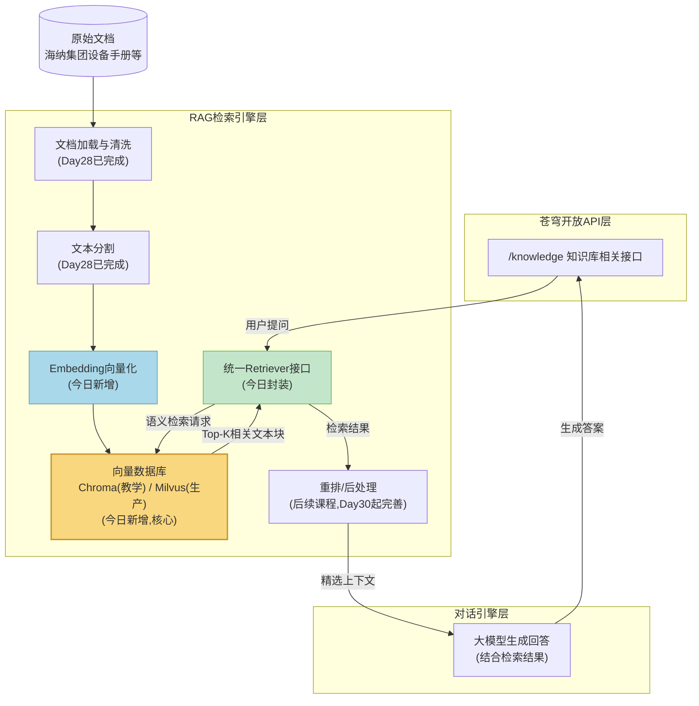
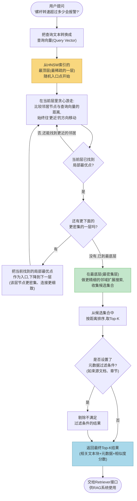

# 第29天 · 向量数据库 —— 给47个文本块,找一个真正能"按语义"找到它们的家

> **周次/Sprint**:Sprint 2 · RAG基础(Day25-31)—— 第五天,昨天(Day28)把海纳集团的样本文档切成了一堆孤立躺在JSON Lines文件里的文本块,今天要解决的问题是:这些块存在哪、怎么存、存了之后怎么按"意思"而不是按"关键词"把它们找回来
> **星期**:周一(入职第29天,第五周周一)
> **参与人**:陈铭(导师:王振宇;上午全程列席:王振宇;下午技术选型讨论列席:王振宇;晚间短暂列席答疑:苏梦)
> **飞书任务号**:CQ-110(向量数据库技术预研 · Chroma/Milvus/FAISS/Pinecone横向对比)、CQ-111(海纳集团样本知识库入库与检索测试)
> **今日关键词**:Embedding向量化 / 向量数据库 / ANN近似最近邻检索 / HNSW索引 / Chroma / Milvus / FAISS / Pinecone / 元数据过滤 / Retriever接口 / 相似度检索

---

## 【旁白】

如果把过去二十八天陈铭学到的东西按"看不见"和"看得见"分成两类,今天要学的东西,大概是"看不见"里最典型的一种。用户永远不会在苍穹平台的界面上看到一个叫"向量数据库"的按钮,不会有人在对话框里输入"请帮我查一下HNSW索引跑得怎么样",这一整层技术,从产品的角度看,近乎彻底隐身——它存在的唯一证据,是用户提问之后,系统给出的答案"恰好"引用了对的那句话,而不是"恰好"引用了一句风马牛不相及的话。这种隐身性,恰恰是它重要性的一个悖论式证明:一样东西做得好,用户完全感觉不到它的存在;一样东西做得差,用户会立刻感觉到"这个AI答非所问",却说不清楚问题到底出在哪一层。老王后来跟陈铭讲过一句话,陈铭当时只当是句玩笑,后来越想越觉得是句真话——"向量数据库这层技术,做好了是隐形的地基,做差了是显眼的坑,中间没有'差不多'这个选项。"

昨天陈铭把海纳集团那份XJ-500注塑机的操作维护手册,切成了47个文本块,存进了一份`XJ-500_chunks.jsonl`文件里。这47个块此刻的状态,用老王的话形容,叫"47张写满字的纸片,叠在一个纸箱子里,谁都不认识谁"。它们彼此之间没有任何结构性的关联,如果现在有人问系统"E-07报警是什么意思",系统要怎么从这47张纸片里,精确地翻出写着E-07报警说明的那一张?靠关键词全文搜索行不行?陈铭第一反应觉得应该行——毕竟"E-07"这个词要是真的出现在某张纸片里,搜索一下不就找到了。但老王只用了半句话就把这个想法戳破:"如果用户问的是'螺杆转速超过额定值百分之多少会报警',这句话里连'E-07'这几个字符都没提到,你怎么用关键词去搜?"陈铭愣住了——他意识到,自己脑子里对"检索"这件事的理解,还停留在"查字典"式的字面匹配上,而真实世界里用户提问的方式,五花八门,同一个意思可以用完全不重叠的字词表达出来。这就是今天要解决的核心矛盾:怎么让机器理解"意思相近",而不只是"字面相同"。

答案的第一步,是把每一段文字变成一组数字——这组数字有个专门的名字,叫"向量"(Embedding向量),它是一段文字在某个高维数学空间里的坐标。这一步听起来抽象,但陈铭后面会发现,一旦接受了"意思相近的句子,坐标也会相近"这个朴素的假设,后面所有的技术细节,包括为什么要用专门的数据库来存这些坐标、为什么普通数据库应付不了这个场景、什么是近似最近邻检索、什么是HNSW索引,都会变得顺理成章。今天这一天,老王会带陈铭把"意思相近的句子,坐标也会相近"这句朴素的直觉,一步一步落地成一整套可以真正跑起来的工程系统——先讲清楚原理,再上手搭建,最后还要横向对比几款主流的向量数据库,为苍穹平台正式的生产环境选型,交出一份靠谱的技术预研报告。这一天做完,陈铭手里会第一次握住一个真正意义上"能被检索"的知识库,而不再是一堆躺在JSON文件里互不相识的纸片。这份底气,会成为明天(Day30)老王口中"所有拼图到位,正式组装完整RAG系统"那一天最踏实的支撑。

---

## 晨会纪要 / 今日目标

**时间**:上午9:00,二层小会议室"望远"
**出席**:王振宇(老王)、陈铭

陈铭进会议室的时候,发现白板上已经画好了一张图——一堆散落的小圆点,分成了三五个疏密不同的小团。老王见他进来,直接指着这张图开场:"先不讲代码,先讲一个问题。假设这张图上的每个点,都是一段文字,点和点之间的距离,代表这两段文字'意思'上的远近。你看这几个团里,靠得近的点,大概会是些什么样的句子?"

陈铭盯着图想了想:"如果这几个点靠得很近,应该是……讲同一件事、用不同说法表达的句子?比如'螺杆转速过高会报警'和'转速超过额定值时系统触发警报',这两句话字面上一个字都不完全一样,但意思几乎一样,应该会挨得很近。"

"对,这就是向量检索这套技术,从头到尾唯一要赌的一件事——语义相近的文本,经过合适的Embedding模型转换之后,在向量空间里的距离也会相近。"老王在这几个点旁边写下"Embedding"几个字,"这件事听起来像个假设,但已经被工业界反复验证过,是靠得住的假设,不是空想。今天上午我们要搞清楚三件事:第一,这些'点'——也就是向量——是怎么来的;第二,给你几十万、几百万个这样的点,怎么在几十毫秒之内,从里面找出离某个查询点最近的那几个,这背后靠的是什么算法;第三,普通的关系型数据库,比如你熟悉的MySQL、PostgreSQL,能不能干这件事,如果不能,专门的向量数据库到底解决了什么问题。"

"昨天切出来的47个文本块,今天就要正式派上用场了?"陈铭问。

"对,今天上午讲完原理,下午就直接拿那47个块练手,把它们真正存进一个能检索的向量数据库里。"老王翻到下一页,"下午还有一件事,是今天真正的重头戏,跟原理和上手同等重要——技术选型。苍穹平台的正式生产环境,要用哪一款向量数据库,今天要拿出一份靠谱的技术预研报告。这不是我一个人拍板的事,得让你自己去对比、去测试、去权衡,写出来的东西,禁得住郭总和林悦在评审会上问三个'为什么'。"

**昨日进展回顾**

老王简单回顾了Day28的产出:"昨天你把海纳集团的PDF手册,走完了加载、清洗、分割这一整条流水线,产出了47个文本块,存成了JSON Lines格式。这47个块现在的状态是什么?"

陈铭答:"是一堆纯文本,每个块附带了一点元数据,比如来源文件名、页码、chunk序号,但块和块之间,没有任何'谁跟谁更像'这种关联信息。"

"说得准。"老王点头,"这就是今天要往前推的地方——把'一堆孤立的文本'变成'一个可以被语义检索的知识库'。这中间隔着两件事:第一件事是向量化,把每个文本块变成一组数字;第二件事是把这些数字组,连同对应的原文和元数据,存进一个专门的数据库里,并且这个数据库要支持'给我一个查询向量,帮我快速找出最接近的N个'这种检索能力。做完这两件事,你手里的47个块,才算真正具备了'被检索'的能力。"

**今日目标清单**

老王把今天的任务写在白板上,分成清晰的上下午两段:

1. 上午:通俗理解向量数据库的核心原理——什么是Embedding向量,什么是ANN(近似最近邻)检索,为什么工业界普遍选择牺牲一点点精确度来换取巨大的速度提升,以及HNSW这种主流索引结构的基本工作方式(不要求推导数学证明,要求能用自己的话讲清楚"它大致在干什么、为什么快")。
2. 下午前半段:用Chroma把昨天产出的47个文本块,真正做Embedding、存入向量库,并完成相似度检索、元数据过滤等基础操作的实操。
3. 下午后半段:横向对比Chroma、Milvus、FAISS、Pinecone四款方案在部署方式、扩展性、多租户支持、生态成熟度、成本等维度上的差异,产出一份技术预研报告,并封装一个统一的Retriever接口,为明天(Day30)组装完整RAG系统打好底座。

**风险点**

老王在风险点这一块,语气比平时更强调"别想当然":"我说三条,你今天最容易踩的坑,基本都在这三条里。第一,不要把'向量数据库'和'普通数据库加个向量字段'这两件事画等号,很多人一开始会觉得,不就是多存一列数字吗,MySQL也能存,但真正的差别不在'能不能存',在'存了几百万条之后,还能不能在几十毫秒内检索出来'——这背后是完全不同的索引算法和存储引擎设计,不是简单加一列就能解决的。第二,近似最近邻检索的'近似'这两个字要放在心上,它的检索结果不是数学意义上百分之百精确的最近邻,而是在可接受的误差范围内、用极大的速度提升换来的结果,这个权衡是故意的、是设计选择,不是bug,理解不了这一点,后面调参数的时候你会一直纠结'为什么结果不是最准确的那个'。第三,今天做的技术选型,不是选一个'听起来最厉害'的产品,是选一个'跟苍穹平台未来的多租户、大规模数据场景匹配'的产品——教学阶段我们会用Chroma,因为它轻量、好上手,便于反复实验,但生产环境最终会选Milvus,这个决策背后的具体原因,今天下午要让你自己想清楚、说清楚,不是我告诉你结论你背下来就完了。"

老王顿了顿,又补充了一句这三条之外的提醒:"还有一点,虽然不算严格意义上的'风险',但值得提前说——今天你会发现,向量检索这件事,没有一个能让你百分之百确信'这就是最好结果'的简单指标,不像写一个排序算法,你可以写个单元测试断言结果顺序完全正确。检索效果好不好,很多时候要靠人工去读、去判断'这几条结果,真的是跟问题相关的吗',这种主观判断的成分,会让你一开始有点不适应,总想找一个客观的数字来一锤定音。这个心态要提前调整过来——好的工程师不是不需要主观判断,是要学会把主观判断做得尽量系统、尽量可重复,比如今天下午我们会用同一组固定的测试查询,反复去检验不同参数下的检索效果,这就是把'凭感觉'尽量往'可对比、可复现'的方向去靠。"

陈铭把这三条记下来,又追问了一句:"那如果生产环境最终定了Milvus,今天学的Chroma是不是就白学了?"

老王摇头,笑了一下:"完全不会。这也是今天你会切身体会到的一件事——只要用的是LangChain这套框架,不同向量数据库对外暴露的接口,长得几乎一模一样,换一个底层实现,大部分代码几乎不用动。这就是为什么我们要今天先封装一个统一的Retriever接口——今天用Chroma把这个接口跑通了,以后哪天真要切到Milvus,大部分业务代码可以纹丝不动,只需要换掉最底层那一小块初始化代码。这是工程设计里很重要的一课,叫'依赖倒置'——你的业务逻辑,不应该依赖某一个具体的向量数据库产品,应该依赖一个抽象的'检索器'接口,具体用哪个产品去实现这个接口,是可以随时替换的实现细节。"

陈铭还有一个疑问没问完:"那既然Chroma和Milvus未来接口能对齐,为什么不干脆一开始就直接上Milvus,省得以后还要迁移一次?"

"这是个很实际的工程决策权衡,我把我的顾虑摆出来给你听。"老王坐下来,语气放缓了一些,"第一,Milvus的部署本身有一定门槛,依赖etcd做元数据管理、依赖MinIO或S3这类对象存储做数据持久化,还涉及若干独立组件的协同工作,如果我们现在整个团队都还没有真正跑通一条完整RAG链路,却先花大量时间去搭一套复杂的分布式基础设施,风险和收益不成正比——很可能基础设施还没搭稳,业务逻辑那边又冒出新的问题,两边一起返工,得不偿失。第二,教学和早期开发阶段,我们要的是'能快速试错、能反复推倒重来'的灵活性,Chroma几行代码能跑起来、能随时清空重建,这种轻量特性,恰好匹配这个阶段的真实需求;等到项目真正进入需要生产级稳定性和可扩展性的阶段,再投入时间精力去啃Milvus的部署运维,这时候团队对'向量数据库到底要解决什么问题'已经有了扎实的理解,学习效率反而更高,不容易在还没搞懂业务需求的情况下,一头扎进复杂的基础设施细节里出不来。第三,也是最实际的一点——今天封装的这层Retriever抽象接口,已经把未来的迁移成本降到了很低的水平,这个'延迟决策'带来的额外成本,基本上就是'重新实现一个MilvusRetriever类',这个成本远远小于'现在就死磕Milvus部署'的机会成本。这几条加起来,就是为什么我建议现阶段先用Chroma探路,而不是一步到位上Milvus的完整理由,这不是偷懒,是一个经过权衡的、有意识的技术决策。"

陈铭把这段话完整记在笔记本上,他发现老王讲技术决策的时候,很少直接给一个"应该怎么做"的结论,而是习惯把背后的权衡过程摊开来讲清楚——这种讲法一开始让他觉得"为什么不直接告诉我答案",但慢慢地他意识到,记住"该怎么做"只能应付眼前这一次决策,理解"为什么这么权衡"才能让他将来遇到类似但不完全相同的选型问题时,自己独立推导出合理的答案。

他又想起自己刚转行的时候,面试官问过他一个类似的问题——"你觉得做技术决策,最重要的是什么?"当时他答不上来,只能含糊地说"选一个好用的工具吧"。今天听完老王这一整套关于"延迟决策"的解释,他觉得自己心里第一次有了一个更扎实的答案:好的技术决策,往往不是在"哪个工具更强"这个维度上比较,而是在"当前这个阶段,我们最缺的是什么、最不能承受的风险是什么"这个维度上做取舍。教学阶段最缺的是"能快速验证想法的灵活性",所以Chroma是对的选择;生产阶段最不能承受的是"数据泄露和无法扩展的风险",所以Milvus是对的选择。同一个团队、同一套业务,在不同阶段,"对的答案"可以完全不同,这不是团队反复无常,是决策本身就该随着约束条件的变化而变化——这个道理听起来简单,但陈铭觉得,如果不是今天亲身经历了一次完整的选型讨论,他很可能还是会习惯性地去问"哪个更好",而不是去问"现在这个阶段,我们真正需要解决的问题是什么"。

---

## 需求文档:向量数据库选型技术预研报告需求

> 撰写人:林悦(产品经理) · 技术评审人:王振宇 · 文档编号:CQ-PRD-D29-01 · 版本:v0.1(技术预研阶段,非正式PRD)

### 背景

海纳制造集团企业知识库问答系统项目(苍穹0.5版核心交付物)正处于RAG检索引擎层的搭建阶段。Day28已完成文档加载与分割,产出可用的文本块数据。下一步需要为苍穹平台确定一款正式的向量数据库产品作为检索引擎层的底层存储与检索基础设施。该选型决策影响面较大,涉及后续所有客户项目(海纳制造集团、祺瑞集团、御风金融、寰宇集团)的知识库能力上限,因此需要在正式立项决策前,产出一份有充分技术依据的选型预研报告。

这份预研报告的重要性,不只是"选一个用起来顺手的工具"这么简单。林悦在整理这份需求文档之前,专门跟郭总做过一次简短的对齐,郭总的原话被记录在飞书任务的备注里:"这次选型,我不要一个'能跑就行'的答案,我要一个能对客户负责、能对团队自己的技术资产负责的答案。"这句话背后的现实考量是:苍穹平台目前只签下了海纳制造集团这一个正式客户,但按照产品规划,接下来还会陆续服务祺瑞集团、御风金融、寰宇集团等定位、规模、数据敏感度都完全不同的客户。如果向量数据库这一层基础设施选错了方向,轻则意味着未来某个时间点要投入额外的人力做一次代价不小的迁移,重则可能在某个客户项目已经上线运行之后,才发现底层存储的扩展性或者隔离能力撑不住业务需求的增长,这种"运行中被迫换底盘"的场景,是任何一个成熟的技术团队都想极力避免的。正因为如此,这份预研报告被要求覆盖足够全面的对比维度,而不能只停留在"哪个开源社区活跃度高"这种表面的比较上。

### 用户故事

- 作为苍穹平台的技术负责人(老王),我希望有一份覆盖主流向量数据库方案的横向对比报告,以便在架构评审会上向郭总汇报选型依据,而不是凭个人经验直接拍板。
- 作为苍穹平台的初级工程师(陈铭),我希望通过亲手搭建和测试至少一款向量数据库,建立对"向量检索到底是怎么工作的"的直观认识,而不是仅停留在阅读对比文章的理论层面。
- 作为未来负责运维苍穹平台生产环境的团队成员,我希望选型报告中明确说明各方案在多租户隔离、大规模数据扩展性、部署复杂度上的差异,以便提前规划基础设施资源。
- 作为产品经理(林悦),我希望这份报告能用相对通俗的语言说明选型结论对客户交付的影响(比如检索速度、成本、能否支持未来更大规模的客户),便于我在客户沟通时做合理的预期管理。

### 功能列表

1. 讲清楚向量数据库的核心工作原理(Embedding向量、ANN近似最近邻检索、HNSW索引的基本思路),形成可复用的内部培训材料。
2. 完成至少一款向量数据库(Chroma)的实操搭建,覆盖入库、相似度检索、元数据过滤三类基础操作。
3. 产出Chroma、Milvus、FAISS、Pinecone四款方案在部署方式、扩展性、多租户支持、生态成熟度、成本、易用性六个维度上的对比表格。
4. 给出教学阶段与生产环境两种场景下的明确选型建议,并说明理由。
5. 封装一个不依赖具体向量数据库实现的统一Retriever接口,供后续RAG系统组装时直接复用。
6. 用海纳集团Day28产出的47个真实文本块,完成一次端到端的"入库→检索"验证,并记录检索效果的主观评估结果。

### 非功能需求

- 报告内容需要对非技术背景的评审人(如郭总)友好,核心结论部分不应堆砌未加解释的专业术语。
- 选型对比表格的每一项结论,需要有可验证的依据(官方文档引用、实测数据或行业公开信息),不能是纯主观印象。
- 封装的Retriever接口需要预留"未来切换底层向量数据库实现"的扩展空间,不能与Chroma的具体API强耦合。
- 本次技术预研使用的数据规模较小(47个文本块),报告中需要明确说明"当前测试规模"与"未来生产规模"之间的差距,避免小规模测试的结论被过度推广。

### 验收标准

- [ ] 向量数据库原理讲解材料完成,陈铭能够用自己的话,向没有相关背景的同事讲清楚"为什么需要专门的向量数据库"以及"HNSW大致在做什么"。
- [ ] Chroma入库、检索、元数据过滤三类操作均有可运行的代码示例,并在47个真实文本块上验证通过。
- [ ] 四款方案对比表格完成,且每一项结论有据可查。
- [ ] Retriever统一接口封装完成,至少支持"传入查询文本,返回Top-K相关文本块及其元数据"的基本能力。
- [ ] 教学阶段与生产环境的选型建议均已明确给出,并有书面理由。

---

## 架构设计图:向量数据库在苍穹RAG流水线中的位置



这张图里,今天新增的两个模块用颜色标了出来——Embedding向量化和向量数据库,是今天上午和下午前半段的重点;而Retriever接口这一层浅绿色的模块,是今天下午后半段要封装的"承上启下"的关键抽象,它一边对接向量数据库拿检索结果,一边对上暴露一个不依赖具体产品的统一调用方式,为Day30组装完整RAG系统预留了干净的接口边界。老王特意强调,图里向量数据库这个模块画的是"Chroma(教学) / Milvus(生产)"并列,是因为今天要做的事情,本质上是在给这个格子选一个长期租户,而不是选一个用完就扔的临时工具。

---

## 流程图:HNSW近似最近邻检索简化流程



老王特意提醒,这张图是"简化版"——真实的HNSW算法里,每一层的贪心搜索会维护一个候选集合(而不是单点贪心),并且有一个叫`ef_search`的参数控制搜索的宽度(候选集合的大小),这个参数越大,搜索越接近"暴力精确搜索"的效果,但速度也会越慢。陈铭今天不需要能手写一遍完整的HNSW算法,但要能看懂并讲清楚这张简化流程图背后的核心思想——"多层图结构,从稀疏到密集,先粗定位再精搜索,用少量额外的不精确性,换来指数级的速度提升"。

---

## 示意图:向量空间中相似文档聚集的示意

```mermaid
flowchart LR
    subgraph 向量空间(简化为二维示意)
        direction TB
        A1(("螺杆转速报警<br/>说明1"))
        A2(("转速超限<br/>处理办法"))
        A3(("E-07报警<br/>代码含义"))
        B1(("液压系统<br/>压力检查"))
        B2(("液压油<br/>更换周期"))
        C1(("设备日常<br/>清洁保养"))
        C2(("外壳<br/>除尘规范"))
        Q(["查询:<br/>'螺杆转速过高<br/>怎么处理?'"])
    end

    Q -.距离很近.-> A1
    Q -.距离很近.-> A2
    Q -.距离较近.-> A3
    Q -.距离较远.-> B1
    Q -.距离更远.-> C1

    A1 === A2
    A2 === A3
    B1 === B2
    C1 === C2

    style Q fill:#f9d77e,stroke:#c9962f,stroke-width:2px
    style A1 fill:#c3e6cb,stroke:#5cb85c
    style A2 fill:#c3e6cb,stroke:#5cb85c
    style A3 fill:#c3e6cb,stroke:#5cb85c
    style B1 fill:#e8e8e8,stroke:#999
    style B2 fill:#e8e8e8,stroke:#999
    style C1 fill:#e8e8e8,stroke:#999
    style C2 fill:#e8e8e8,stroke:#999
```

这张图想传达的意思很朴素——"螺杆转速报警""转速超限处理办法""E-07报警代码含义"这三段文字,内容上高度相关,理想情况下,它们在向量空间里应该彼此靠得很近,聚成一小团;而"液压系统压力检查""液压油更换周期"讲的是另一个子系统(液压系统)的维护知识,应该聚成另一小团,和转速报警那一团保持适度的距离;"设备日常清洁保养""外壳除尘规范"这类通用保养知识,又是第三团。当用户提出一个查询——"螺杆转速过高怎么处理"——这个查询本身也会被转换成向量空间里的一个点,理想情况下,它应该正好落在或者非常靠近"转速报警"那一团的附近,检索系统要做的事情,就是在这个高维空间里,快速把离查询点最近的那几个点找出来。老王补充说,现实中的向量空间维度通常是几百到上千维(比如常见的Embedding模型输出1536维向量),不可能真的画出来给人看,这张图和刚才的HNSW流程图一样,都是为了建立直觉上的理解而做的降维示意,不是数学上精确的还原。

---

## 课堂笔记

### 上午:向量数据库原理通俗讲解

**1. 什么是Embedding向量,它到底是什么东西**

老王先没讲代码,而是拿手机上装的地图App做了个类比:"你在地图上看一个地方,会用经纬度这两个数字来描述它的位置,对吧?两个地方经纬度数字差得越小,现实中的距离就越近。Embedding向量,你可以粗暴地理解成,是给一段文字算出的'经纬度',只不过这个'经纬度'不是两个数字,是几百个甚至上千个数字组成的一长串坐标,这么多维度,才能装得下语言这么复杂的东西所包含的语义信息。"

具体来说,Embedding是通过一个专门训练过的模型(Embedding模型,比如OpenAI的`text-embedding-3-small`,或者国产的BGE系列开源模型),把一段文字转换成一个固定长度的浮点数数组。这个数组的长度,叫"向量维度",不同模型的维度不一样,常见的有384维、768维、1536维等。转换的核心特性只有一条,但极其关键:语义相近的文字,转换出来的向量,在向量空间里的"距离"也应该相近;语义不相关的文字,向量之间的距离应该相对较远。

陈铭这时候又问了一个更基础的问题:"我们之前处理过的通讯录数据、对话消息记录,存的时候都是明确的字段和类型,今天要存的这种向量,看起来就是一长串数字,这种东西在数据库层面,算是一种什么样的存在?"

"这个问题问得挺本质的。"老王想了几秒,"你可以把它理解成一种'高维坐标数据',跟你熟悉的经纬度、跟图像处理里描述一张图片颜色分布的像素矩阵,本质上是同一类东西——都是用一组数字,去描述某个抽象对象在某个空间里的位置或者特征。区别在于,经纬度是二维的,你脑子里能直接画出地图;向量通常是几百到上千维的,人脑没办法直观想象,只能靠数学和算法去处理。存储这种数据,普通关系型数据库的行列结构,技术上不是完全不能存——存成一个大字符串或者一个数组字段是可行的,但检索这种数据的方式,和检索普通字段完全不是一回事:普通字段查询靠的是'相等'或者'范围比较'这种精确的逻辑判断,向量数据靠的是'距离'这种连续的、模糊的相似度判断,这就是为什么专门的向量数据库,要在存储层和索引层,针对这种'按距离检索'的需求做专门的优化设计,而不是简单地在现有数据库上加一列字段就能了事的原因。"

陈铭追问:"这个'距离'具体怎么算?就是普通的几何距离吗?"

老王在白板上写下两个常见的距离/相似度度量方式:"最常用的两种,一种叫欧氏距离(Euclidean Distance),就是你中学学的两点之间的直线距离公式,推广到多维空间;另一种更常用,叫余弦相似度(Cosine Similarity),它算的不是两个点之间的直线距离,是两个向量的'方向'夹角有多接近——两个向量方向越一致,余弦相似度越接近1,方向完全相反,越接近-1。在文本Embedding这个场景里,业界更常用余弦相似度,因为向量的'方向'(代表语义的相对构成)通常比向量的'长度'(可能受文本长短等因素影响)更能反映语义相似性。"

**2. 为什么普通数据库存不好这些向量**

老王抛出一个问题:"假设我现在有100万个文本块,每个都转成了一个1536维的向量,存进一个普通的关系型数据库,比如MySQL里,一列存一个向量(或者拆成一个大字符串/JSON存)。现在有个新的查询向量,我想找出这100万个里,跟它最相似的10个,你会怎么做?"

陈铭想了想:"最直接的办法,是把这100万个向量,一个一个跟查询向量算一遍距离,然后排序取前10个?"

"对,这个思路完全正确,这种做法叫'暴力搜索'或者'精确最近邻搜索'(Exact Nearest Neighbor,简称ENN)。它的结果一定是数学上百分之百精确的——不会有任何误差。但问题出在哪?"

"如果有100万个向量,每次查询都要算100万次距离,查询会很慢?"

"对,而且这个慢是随着数据量线性增长的——100万条数据慢一分,如果变成1个亿条数据,慢的程度会跟着倍数往上翻。"老王在白板上画了个简单的时间复杂度示意,"精确搜索的时间复杂度是O(n),n是数据总量。当n很小的时候(比如几千条),这完全没问题,普通数据库配合一点简单的向量距离计算函数,完全够用,这也是为什么很多小项目、原型验证阶段,直接用SQLite加一个向量距离计算插件就能跑起来,没必要一上来就上专门的向量数据库。但是,苍穹平台面对的场景,是海纳集团一家企业几十年积累的全部设备手册、工艺文档、质量规范,加起来可能是几十万甚至上百万个文本块,而且苍穹是要服务多家客户的中台产品,以后还会有祺瑞集团、御风金融、寰宇集团各自的知识库,数据规模只会越滚越大。在这种规模下,O(n)的暴力搜索,查询延迟会变得完全不可接受——用户问一句话,等三五秒才出结果,这在企业级产品里是不合格的。"

**3. 近似最近邻检索(ANN):用一点点精度换极大的速度**

"所以工业界普遍采用的方案,叫近似最近邻检索,英文缩写ANN(Approximate Nearest Neighbor)。"老王在"精确"和"近似"这两个词中间画了一条分界线,"它的核心思路是——我不追求百分之百找到数学意义上最近的那几个点,我允许有一点点误差(比如实际最相似的第11名,可能被排到了返回结果的第9名,但基本不会有天翻地覆的差距),用这一点点可控的误差,换取查询速度的巨大提升,通常能把查询复杂度从O(n)降到接近O(log n)的水平,这个差距在数据量大的时候是决定性的。"

陈铭问:"这个'一点点误差'听起来有点让人不安,如果检索错了关键信息怎么办?"

"这是个很好的顾虑,但实际工程中,这个误差是可控、可调的。"老王解释,"几乎所有ANN算法都有一些可以调节的参数,你可以在'速度'和'精度'之间做权衡——调高精度相关的参数,检索会更准但更慢,调低则相反,你可以根据实际业务场景的容忍度去调。而且,对于绝大多数RAG场景,'检索到最相关的前几个文本块中的大部分',已经足够支撑大模型生成一个靠谱的回答了,不需要苛求数学意义上百分之百的完美排序。这也是为什么ANN在工业界被广泛接受,而不是被当作一种'凑合'的妥协方案。"

**4. HNSW索引:多层图结构的核心思想**

"目前最主流的ANN算法之一,叫HNSW,全称Hierarchical Navigable Small World(层次化可导航小世界图)。"老王在白板上画出了流程图里那种"多层"结构的简化版,"名字很拗口,但核心思想不复杂,我用一个类比讲。"

老王的类比是这样的:"假设你要在一座陌生的大城市里,找一家特定的小面馆。如果你手里只有一张画满这家城市每一条小巷子的详细地图,你要从地图的一个角落开始,一条条巷子摸过去,会非常慢。但如果你先有一张'高速公路网'的粗略地图,能先大致定位到面馆所在的那个大区域,再切换到一张'该区域内街道'的详细地图,进一步定位到大概是哪条街,最后再用最详细的小巷子地图,精确找到具体门店——这个过程会快得多。HNSW的多层图结构,做的就是类似的事:最顶层的图,节点数量少、连接稀疏,像'高速公路网',能让你快速跳到大致正确的区域;越往下层,节点越密集、连接越细致,像'小巷子地图',用于最后阶段的精确定位。查询的时候,从最顶层开始贪心地往'更近'的方向走,走到这一层走不动了(找到局部最优),就下降到下一层,继续贪心搜索,一层一层下降,直到走到最底层,做一次更精细的邻域扩展,把最终候选结果收集起来。"

"那这些'层'和'连接'是怎么建出来的?"陈铭问,"数据存进去的时候是怎么知道该怎么分层、怎么连线的?"

"这是索引构建阶段的工作,发生在数据插入的时候,不是查询的时候。"老王答,"简化来说,每插入一个新的向量,算法会以一定的概率决定这个点应该出现在哪几层(概率越往上层递减,所以顶层节点天然稀疏),然后在它所属的每一层里,找到几个现有的、距离它较近的邻居节点,建立连接。整个索引的质量,取决于这些连接建立得好不好——如果连接建得合理,查询时贪心搜索就能又快又准地导航到正确区域;如果连接质量差,查询效果就会打折扣。这也是为什么向量数据库通常会提供一些索引构建参数(比如每个节点的最大连接数,业内常用参数名叫`M`,以及构建时的搜索宽度参数`ef_construction`),这些参数你今天不需要死记硬背,但要知道,遇到检索效果不理想的时候,除了看数据和Embedding模型本身的问题,索引参数也是一个可以调整的维度。"

陈铭把这段话在笔记里画了一个简图,又追问:"HNSW是唯一的ANN算法吗?"

"不是,ANN领域有好几种主流算法思路,除了HNSW这种基于图的方法,还有基于'倒排文件+量化'的IVF系列算法(FAISS里很常用)、基于树结构的方法(比如KD树、球树,更适合低维数据)、基于局部敏感哈希的LSH方法等。"老王补充,"但HNSW目前是工业界应用最广泛、综合表现最均衡的一种,Chroma、Milvus、Pinecone,几乎所有你今天会接触到的主流向量数据库,底层都支持或默认使用HNSW索引(部分也支持IVF等其他索引类型供用户按场景选择)。你今天重点理解HNSW就够了,其他算法知道名字、知道大致分类即可,不需要展开。"

**5. 向量数据库和传统全文搜索的关系:是取代,还是互补**

陈铭这时候提了一个他心里憋了一会儿的问题:"我们之前做客服系统的时候,听说过Elasticsearch这种全文搜索引擎,好像也能做'关键词搜索',它跟向量数据库是同一类东西吗,是不是有了向量数据库,全文搜索就没用了?"

"这个问题问得特别好,而且是个很多刚接触RAG的人都会有的误解。"老王显然对这个问题有备而来,"先说结论——不是取代关系,是互补关系,而且在很多企业级项目里,最后落地的方案往往是'向量检索+关键词检索'两条腿一起走,叫混合检索(Hybrid Search)。"

他接着解释了两者各自的短板:"向量检索最大的优势,是能捕捉语义层面的相似性,哪怕字面完全不同,只要意思相近,也能被找到,这是关键词搜索天然做不到的。但向量检索也有它的软肋——遇到一些高度依赖精确匹配的场景,比如用户查询里包含一个具体的型号编号'XJ-500-A3'、一个具体的报警代码'E-07'、或者一个专有名词缩写,这些精确的、字面级别的匹配需求,向量检索未必总能保证命中,因为Embedding模型是在'理解语义'而不是'记住精确字符串'这件事上被训练出来的,遇到生僻的编号、代码这类'看起来像乱码'的字符串,语义理解反而可能失灵。相反,关键词搜索(比如经典的BM25算法,Elasticsearch、PostgreSQL的全文检索能力背后常用的排序算法)在这类精确匹配场景上,表现往往非常稳定可靠。"

"所以成熟的企业级RAG系统,通常不会用向量检索完全取代关键词检索,而是两者并行跑一遍,各自拿到一批候选结果,再通过某种融合策略(比如简单的分数加权融合,或者更精细的重排序模型)把两条路的结果合并成最终排序。"老王补充,"我们苍穹平台现阶段做的还是单纯的向量检索,这是因为项目还在RAG的基础搭建期,先把最核心的语义检索能力打牢,混合检索是一个明确的后续优化方向,你现在需要知道这个方向存在、知道为什么存在,不需要今天就把它实现出来。"

**6. 向量维度与"维度灾难"的直觉理解**

老王在收尾前,补充了一个容易被忽略但值得了解的概念:"你可能会好奇,为什么Embedding模型输出的向量维度,不是越高越好?维度越高,理论上能装下的语义信息不是越丰富吗?"

"这里有一个业内叫'维度灾难'(Curse of Dimensionality)的现象需要考虑。"老王说,"简单直觉地讲,当向量的维度非常高的时候,高维空间里的点会变得异常'稀疏'——任意两个点之间的距离,会趋向于变得差异不明显,原本在低维空间里'很近'和'很远'的直觉,在极高维度下会逐渐失效,这会给近似最近邻算法的效果带来负面影响,同时高维向量本身占用的存储空间和计算开销也会成倍增加。所以实际业界选择的Embedding维度,通常会在'语义表达能力'和'存储检索效率'之间找一个务实的平衡点,像OpenAI的`text-embedding-3-small`用的是1536维,一些更轻量的开源模型可能是384维或768维,并不存在'维度越高效果必然越好'这样简单的结论,这也是为什么选择Embedding模型的时候,除了看语义理解能力的评测分数,也要综合考虑维度大小带来的实际工程成本。"

**7. 一句话总结上午的内容**

老王最后用一句话给上午做了个收束:"向量数据库要解决的核心问题,是'在海量高维向量里,快速找出跟查询向量最相似的那一小撮',它靠的两个基础支柱,一个是Embedding模型把文字变成能算距离的向量,另一个是像HNSW这样的近似最近邻索引算法,把原本O(n)的暴力搜索,降到能在几十毫秒内响应的水平。这两个支柱,是你今天下午所有实操内容的地基,记不住具体的数学公式没关系,但一定要能用自己的话,把这两句话讲明白。"

### 下午:Chroma上手 + Milvus/FAISS/Pinecone对比选型 + Retriever接口

**1. 为什么下午先从Chroma开始**

老王解释了选择顺序的理由:"市面上向量数据库不少,我们选Chroma作为教学阶段的主力工具,原因很实际——它是纯Python实现,不需要额外部署任何独立的服务进程(可以直接嵌入到你的Python程序里跑,也可以用它的Client-Server模式连接一个独立进程),安装极其简单,一行`pip install chromadb`就能跑起来,特别适合我们现在这种反复实验、快速迭代的教学场景。它的API设计也很直观,跟LangChain的集成非常顺滑。但它有它的局限——单机运行为主,虽然近期版本增加了一些分布式能力,但在超大规模、多租户隔离、高并发生产场景下,成熟度和生态都还比不上真正的生产级分布式向量数据库。所以我们今天先用它建立直观认识和练手,但苍穹平台真正上生产,会换成专门为大规模场景设计的Milvus,这个道理下午对比选型的时候会讲清楚。"

**2. Chroma的核心概念**

老王把Chroma的几个核心概念画在白板上:

- **Collection(集合)**:相当于关系型数据库里的"表",一个Collection存放一批向量及其关联的原文和元数据。苍穹平台里,通常会给每个客户、甚至每个客户的每个知识库,划分独立的Collection,作为多租户隔离的一种简单实现方式(这也是后续正式迁移Milvus时要重点考虑的多租户能力)。
- **Document(文档)**:存入Collection里的一条原始文本内容,对应我们Day28切出来的一个文本块。
- **Embedding**:每条Document对应生成的向量,可以由Chroma内置的默认Embedding函数自动生成,也可以由我们自己接入的Embedding模型(比如OpenAI的Embedding接口)生成后手动传入,苍穹平台生产环境会统一用自己接入的Embedding模型,以保证跟检索、生成环节用的是同一套语义空间。
- **Metadata(元数据)**:附加在每条Document上的结构化信息,比如来源文件名、页码、章节标题、客户ID等,用于后续做条件过滤检索(比如"只在海纳集团的知识库里检索,并且只看XJ-500这台设备相关的文档")。
- **ID**:每条Document的唯一标识,方便后续的更新、删除操作。

**3. 元数据过滤为什么重要**

陈铭问:"如果向量检索已经能找到语义最相似的内容了,为什么还需要元数据过滤?"

老王答得很直接:"你想象一个场景——苍穹平台服务着海纳集团和另一家完全不相关的客户,这两家客户的知识库如果被放进了同一个Collection,一个海纳集团的员工提问,理论上向量检索有可能匹配到另一家客户知识库里语义相近的内容,这在企业级产品里是绝对不能接受的数据泄露风险。元数据过滤,可以在做向量相似度检索之前或者同时,先按照客户ID、知识库ID这类硬性条件做过滤,确保检索范围始终被限定在正确的数据边界内,这是企业级RAG系统里必须要有的一道安全阀,不是可选项。除了这种硬性的租户隔离场景,元数据过滤也常用于更细粒度的场景过滤,比如只在某个时间范围内的文档里检索,或者只在某个具体的设备型号相关文档里检索,提升检索的精准度。"

**4. Milvus / FAISS / Pinecone 对比选型**

下午的重头戏,是老王带着陈铭把四款方案系统对比了一遍,最终整理出下面这张表格,这张表格后续会作为技术预研报告的核心附件:

| 对比维度 | Chroma | Milvus | FAISS | Pinecone |
|---|---|---|---|---|
| 类型定位 | 轻量级嵌入式/客户端-服务端向量库 | 生产级分布式向量数据库 | 向量检索算法库(不是完整数据库) | 全托管云端向量数据库服务(SaaS) |
| 部署方式 | 极简,可嵌入进程内运行,也支持独立Server模式 | 需要独立部署(单机或分布式集群),依赖etcd、MinIO/S3等组件 | 只是一个库,需要自己搭建持久化、元数据管理等外围能力 | 无需部署,直接调用云端API,由Pinecone官方托管 |
| 扩展性(大规模数据) | 中等,单机场景表现良好,超大规模需评估 | 强,原生支持水平扩展、分布式集群、十亿级向量规模 | 强(算法层面),但需要自行解决分布式和持久化 | 强,由云端弹性伸缩,但强依赖厂商基础设施 |
| 多租户/数据隔离 | 支持Collection级隔离,较基础 | 支持,提供数据库/Collection/分区(Partition)多层级隔离机制,更适合多租户中台场景 | 不提供,需要自己在应用层完全实现 | 支持Namespace级隔离 |
| 索引算法支持 | HNSW为主 | HNSW、IVF、DiskANN等多种索引可选,可按场景调优 | IVF、HNSW、PQ量化等多种算法实现最全面 | 内部实现对用户透明,官方托管调优 |
| 元数据过滤能力 | 支持,API简单直接 | 支持,且在大规模场景下过滤性能有专门优化 | 无原生支持,需自行在应用层实现 | 支持 |
| 生态与LangChain集成 | 官方一等支持,示例最丰富 | 官方支持良好,社区活跃 | 需要额外封装才能接入LangChain标准接口 | 官方支持良好 |
| 成本 | 开源免费(自托管) | 开源免费(自托管需自行承担运维和硬件成本);也提供商业化Zilliz云服务 | 开源免费,但需自行承担全部工程化成本 | 按用量付费的商业SaaS服务,数据规模增长后成本会明显上升 |
| 数据私有化/合规性 | 完全私有化,数据不出本地环境 | 完全私有化,数据不出本地环境,适合对数据合规要求高的客户(如御风金融场景) | 完全私有化 | 数据存储在第三方云端,对数据合规要求高的客户(尤其金融类)可能存在顾虑 |
| 上手难度 | 很低,几行代码即可跑通 | 中等,需要理解分布式部署和运维基础 | 较高,偏底层,需要自己搭建配套设施 | 很低,但强依赖网络和第三方服务可用性 |
| 是否适合苍穹教学阶段 | 非常适合 | 偏重,不适合频繁实验的教学场景 | 偏底层,不适合作为教学起点 | 涉及数据出境/第三方托管,不适合企业客户敏感数据场景 |
| 是否适合苍穹生产环境 | 单一小客户场景可用,但多客户中台场景下扩展性和隔离能力有局限 | 非常适合,是苍穹平台的最终选型 | 可作为Milvus内部索引算法的补充理解,不直接作为苍穹的对外产品化方案 | 因数据合规顾虑(尤其面向御风金融这类客户),不适合作为苍穹统一方案 |

老王对着这张表,给出了最终的结论性总结:"你会发现,这四款方案没有一个是'全面碾压'的,每一款都是在某些场景下的最优选择。Chroma的优势是轻,拿来教学、拿来做原型验证、拿来做单机小规模项目,非常合适;FAISS本质上是个算法库,不是一个开箱即用的数据库,更适合作为理解底层算法或者被其他系统内部集成使用,不适合直接面向业务团队使用;Pinecone作为全托管云服务,省心是省心,但数据要经过第三方云端,这对我们服务的很多企业客户——尤其像御风金融这种对数据合规要求极高的金融客户——是个硬伤,苍穹平台本身也承担着帮客户做私有化部署的定位,选一个数据要出境到第三方云的方案,跟这个定位是矛盾的。所以最终留下来的,就是Milvus——它是一个可以完全私有化部署、原生支持分布式扩展、有成熟多租户隔离机制的生产级向量数据库,跟苍穹平台'服务多个企业客户、数据要留在客户可控范围内、知识库规模会持续增长'这几个核心诉求,匹配度最高。"

陈铭问:"那我们是不是应该现在就直接上手学Milvus,而不是先学Chroma?"

"这是个好问题,我解释一下这个先后顺序的考虑。"老王答,"Milvus的部署本身就是一件不轻松的工程活——它依赖etcd做元数据管理,依赖对象存储(比如MinIO或S3)做数据持久化,标准的生产部署通常还涉及多个组件的分布式协同,你如果一上来就啃这套东西,大量时间会花在'怎么把环境跑起来'上,而不是'怎么理解向量检索本身',这会拖慢你建立核心概念的速度。而Chroma几行代码就能跑通全流程,能让你把精力完全聚焦在'理解向量化、检索、过滤这些核心操作到底在干什么'上面。更重要的一点,也是我反复强调的——只要我们通过LangChain这套统一的抽象接口去使用向量数据库,今天写的检索逻辑代码,换到Milvus上,改动量非常小,大部分是把初始化那几行代码换掉,业务逻辑基本不用重写。所以现阶段用Chroma把原理和基础操作吃透,是性价比最高的路径,等到项目真正进入需要生产部署的阶段,再专门安排时间学习Milvus的部署和运维,那时候你对'为什么需要这些能力'已经有了扎实的理解,学起来反而会更快、更有针对性。"

**5. 苍穹平台向量数据库选型决策记录**

老王要求陈铭把今天下午讨论出的选型结论,正式落成一份书面的决策记录,格式上参照他们团队内部常用的"架构决策记录"(Architecture Decision Record,简称ADR)的写法——不是随口一句"我们决定用什么",而是完整记录背景、备选方案、决策、以及决策背后的理由和权衡取舍,方便未来任何人回顾这个决定的时候,能理解"当时为什么这么选",而不是只看到一个孤立的结论。陈铭当天整理出的版本大致如下:

> **决策编号**:CQ-ADR-011
> **决策标题**:苍穹企业级智能体中台向量数据库选型
> **状态**:已采纳(教学/开发阶段先用Chroma过渡,生产环境目标为Milvus)
> **背景**:苍穹平台0.5版本需要补齐RAG检索引擎层,核心依赖是一款向量数据库,用于存储文档Embedding并支持低延迟的语义相似度检索。该组件将被后续所有客户项目(海纳制造集团、祺瑞集团、御风金融、寰宇集团)复用,选型决策的影响范围覆盖整个产品生命周期,需要谨慎评估。
> **备选方案**:Chroma、Milvus、FAISS、Pinecone,四款方案的详细对比见课堂笔记中的对比表格。
> **决策内容**:教学与早期开发阶段使用Chroma作为默认实现,快速验证RAG流程的正确性;生产环境(海纳制造集团正式交付起)目标切换为Milvus,理由包括:(1)完全私有化部署能力,契合苍穹平台向客户交付时对数据不出客户可控范围的定位,尤其考虑到御风金融这类对数据合规要求极高的客户;(2)原生支持database-collection-partition三层结构,能够更好地支撑多客户中台场景下的数据隔离需求;(3)支持分布式水平扩展,能够应对未来知识库规模持续增长(尤其是寰宇集团这种大型多元化企业集团的旗舰级项目)带来的容量压力;(4)社区活跃、与LangChain生态集成成熟,团队学习和排查问题的资源相对充足。
> **权衡与代价**:Milvus的部署与运维复杂度明显高于Chroma,需要额外投入学习成本,且依赖etcd、对象存储等外围组件,团队需要在项目实际进入生产部署阶段前,提前规划相应的运维能力建设;短期内(教学阶段)仍会以Chroma为主,产生的技术债是"未来必然要做一次底层存储的迁移",但由于本次课程已经提前设计了统一的Retriever抽象接口,该迁移的预期改动范围被限制在适配器层,风险可控。
> **后续行动项**:待海纳制造集团项目进入正式交付准备阶段,安排专门的技术预研任务,完成Milvus的部署方案设计与MilvusRetriever的具体实现。

老王看完这份记录,只提了一个修改意见:"这份东西可以直接原样交给林悦,附在项目周报里。以后每一个类似的关键技术决策,都建议这么记,不是走形式,是真的能在项目做到第三十天、第五十天的时候,帮团队里任何一个人快速理解某个历史决定的来龙去脉,而不需要专门找到当时做决定的人当面问一遍。"

**6. 关于成本的现实讨论**

下午讨论的尾声,林悦短暂列席了几分钟(她正好路过会议室),顺口问了一句她更关心的问题:"这几个方案里,哪个更贵?我需要跟郭总提前透个底。"

老王给出的回答很实际:"分两头说。Chroma和Milvus都是开源的,自己部署的话,软件本身不花钱,真正的成本是硬件资源(服务器、存储)和运维人力投入,这部分成本相对可控、可预测,而且我们本来就有自己的服务器资源。Pinecone是完全不同的成本模型,它是按用量(通常按存储的向量数量和查询请求量)向厂商付费的云服务,前期数据量小的时候看起来很便宜,但一旦客户知识库规模上来了——比如海纳集团这种沉淀了几十年经验的制造企业,文档量可能远超我们现在测试用的这47个文本块,可能是几十万甚至上百万级别——按用量付费的账单会随着规模线性甚至更快地增长,长期来看,对于我们这种需要服务多个企业客户、知识库规模会持续扩张的中台产品,自建开源方案在总体拥有成本上通常更有优势,尽管前期需要多投入一些运维和学习成本。"

林悦听完点点头:"那我跟郭总汇报的时候,就说'长期看Milvus这条路线成本更可控,但需要提前规划运维资源投入',这个说法准确吗?"

"准确。"老王说,"你还可以补一句——这笔运维投入,不是一次性的沉没成本,团队掌握了Milvus的部署和调优能力之后,这套能力可以复用到后面所有客户项目上,是能摊薄的投资,不是每个项目都要重新交一遍学费。"

**7. Retriever接口:面向未来切换存储的抽象**

老王讲到今天下午最后一块内容——为什么要专门封装一个Retriever接口,而不是让业务代码直接调用Chroma的API。

"你现在写的每一行检索代码,如果直接调用`chromadb`这个库提供的具体方法,那这些代码就跟Chroma这个产品绑死了。"老王说,"等到某一天,苍穹平台的某个客户项目规模做大了,要迁移到Milvus,你要做的不该是把所有业务代码里调用Chroma的地方,一个个找出来重写一遍——这种大范围的返工,风险高、耗时长,而且极容易漏改地方。正确的做法,是今天就先定义一个抽象的'检索器'接口,这个接口只关心'输入是什么、输出是什么',不关心'内部具体用哪个向量数据库实现'。业务代码永远只跟这个抽象接口打交道,具体是Chroma实现还是Milvus实现,是这个接口背后可以随时替换的'零件'。这在软件工程里,是一个很经典的设计原则,叫'依赖倒置原则'——高层的业务逻辑,不应该依赖底层的具体实现细节,双方都应该依赖一个共同的抽象。"

LangChain框架本身已经提供了一个叫`BaseRetriever`的抽象基类,苍穹平台会在这个基础上,再封装一层符合自己业务需求的检索器,统一暴露"传入查询文本和可选的过滤条件,返回结构化的相关文本块列表"这样一个简单清晰的调用方式。今天下午会把这层封装的第一版写出来,今天先接入Chroma作为底层实现。

---

## 代码实战

今天的代码实战分为三大块:第一块是Chroma的入库、检索、元数据过滤基础操作;第二块是用Day28产出的47个真实文本块,构建完整知识库并做相似度检索测试的端到端脚本;第三块是统一Retriever接口的封装。三块代码放在苍穹项目仓库(`cangqiong-platform`)下相应的目录里,与之前几天的代码风格保持一致。

### 文件1:`app/services/vectorstore/config.py` —— 向量数据库模块配置项

```python
"""
向量数据库模块的统一配置项。

设计原则:所有跟"具体用哪个向量数据库产品"相关的参数,都集中在这一个文件里,
业务代码不应该在别处硬编码任何Chroma或者Milvus的专属配置项,
这样将来切换底层实现时,改动范围可以被限制在配置层和适配器层,不扩散到业务逻辑里。
"""

import os
from dataclasses import dataclass, field
from typing import Literal


VectorStoreBackend = Literal["chroma", "milvus"]


@dataclass
class ChromaSettings:
    """Chroma向量数据库的连接与运行参数。"""

    # persist_directory为空字符串时表示纯内存模式(进程结束数据即丢失),
    # 教学阶段做快速实验时常用;正式环境一定要指定磁盘持久化目录。
    persist_directory: str = os.getenv("CHROMA_PERSIST_DIR", "./data/chroma_store")

    # Chroma的Client-Server模式连接参数,若使用嵌入式模式(默认)则不需要这两项。
    server_host: str = os.getenv("CHROMA_SERVER_HOST", "")
    server_port: int = int(os.getenv("CHROMA_SERVER_PORT", "8000"))

    # 是否使用Client-Server模式(独立进程),False表示嵌入式模式(进程内运行)。
    use_server_mode: bool = os.getenv("CHROMA_USE_SERVER_MODE", "false").lower() == "true"


@dataclass
class MilvusSettings:
    """Milvus向量数据库的连接参数(生产环境使用,当前仅预留配置结构)。"""

    host: str = os.getenv("MILVUS_HOST", "localhost")
    port: int = int(os.getenv("MILVUS_PORT", "19530"))
    # Milvus支持多个逻辑数据库,配合Collection和Partition,
    # 组成三层的多租户隔离体系:database -> collection -> partition。
    database_name: str = os.getenv("MILVUS_DATABASE", "cangqiong")
    # 生产环境建议为每个客户单独分配Partition,兼顾隔离性与资源利用率。
    default_index_type: str = os.getenv("MILVUS_INDEX_TYPE", "HNSW")
    # HNSW索引的两个核心构建参数,数值越大,索引质量和检索精度通常越高,
    # 但构建耗时和内存占用也会相应增加,需要结合实际数据规模测试后确定。
    hnsw_m: int = int(os.getenv("MILVUS_HNSW_M", "16"))
    hnsw_ef_construction: int = int(os.getenv("MILVUS_HNSW_EF_CONSTRUCTION", "200"))


@dataclass
class EmbeddingSettings:
    """Embedding模型相关配置,向量数据库的入库和检索都要用同一个模型,
    否则不同来源生成的向量会处于不一致的语义空间,检索结果会失真。"""

    provider: str = os.getenv("EMBEDDING_PROVIDER", "openai")
    model_name: str = os.getenv("EMBEDDING_MODEL_NAME", "text-embedding-3-small")
    api_key: str = os.getenv("EMBEDDING_API_KEY", "")
    api_base: str = os.getenv("EMBEDDING_API_BASE", "")
    # 向量维度需要与所选模型实际输出的维度一致,用于校验和索引构建时的容量预估。
    dimension: int = int(os.getenv("EMBEDDING_DIMENSION", "1536"))
    # 单次批量Embedding请求包含的最大文本条数,避免一次性发送过多文本导致超时或超限。
    batch_size: int = int(os.getenv("EMBEDDING_BATCH_SIZE", "64"))


@dataclass
class VectorStoreSettings:
    """向量数据库模块的顶层配置聚合。"""

    backend: VectorStoreBackend = os.getenv("VECTOR_STORE_BACKEND", "chroma")  # type: ignore[assignment]
    default_collection_name: str = os.getenv("VECTOR_STORE_DEFAULT_COLLECTION", "cangqiong_default")
    # 每次检索默认返回的Top-K数量,业务代码可以在调用时覆盖这个默认值。
    default_top_k: int = int(os.getenv("VECTOR_STORE_DEFAULT_TOP_K", "5"))
    chroma: ChromaSettings = field(default_factory=ChromaSettings)
    milvus: MilvusSettings = field(default_factory=MilvusSettings)
    embedding: EmbeddingSettings = field(default_factory=EmbeddingSettings)


vector_store_settings = VectorStoreSettings()
```

### 文件2:`app/services/vectorstore/embedding_provider.py` —— Embedding模型统一封装

```python
"""
Embedding模型的统一封装层。

这一层存在的意义,跟向量数据库要做Retriever抽象是同一个道理——
业务代码不应该关心具体调用的是OpenAI的Embedding接口,还是某个开源模型的本地推理服务,
只需要拿到一个"输入文本列表,返回向量列表"的统一函数。
"""

from __future__ import annotations

import logging
import time
from typing import List

from langchain_openai import OpenAIEmbeddings

from app.services.vectorstore.config import vector_store_settings

logger = logging.getLogger(__name__)


class EmbeddingProviderError(Exception):
    """Embedding生成过程中出现的可预期业务异常。"""


class EmbeddingProvider:
    """对外统一暴露的Embedding能力封装,内部可以替换不同的具体实现。"""

    def __init__(self) -> None:
        settings = vector_store_settings.embedding
        if not settings.api_key:
            logger.warning(
                "未检测到EMBEDDING_API_KEY环境变量,若使用真实API会调用失败,"
                "教学/离线测试场景可切换到FakeEmbeddingProvider。"
            )
        # OpenAIEmbeddings是LangChain对OpenAI Embedding接口的标准封装,
        # 如果使用兼容OpenAI协议的国产模型服务(如通义千问的兼容模式),
        # 只需要调整api_base和model即可,不需要更换这一层的代码结构。
        self._client = OpenAIEmbeddings(
            model=settings.model_name,
            api_key=settings.api_key or "placeholder-key-for-offline-dev",
            base_url=settings.api_base or None,
        )
        self._batch_size = settings.batch_size
        self._dimension = settings.dimension

    @property
    def dimension(self) -> int:
        return self._dimension

    def embed_documents(self, texts: List[str]) -> List[List[float]]:
        """批量把文本转换成向量列表,内部做分批处理,避免单次请求文本过多。"""
        if not texts:
            return []

        all_vectors: List[List[float]] = []
        total_batches = (len(texts) + self._batch_size - 1) // self._batch_size

        for batch_index in range(total_batches):
            start = batch_index * self._batch_size
            end = start + self._batch_size
            batch_texts = texts[start:end]

            start_time = time.perf_counter()
            try:
                batch_vectors = self._client.embed_documents(batch_texts)
            except Exception as exc:  # noqa: BLE001
                raise EmbeddingProviderError(
                    f"第{batch_index + 1}/{total_batches}批Embedding生成失败:{exc}"
                ) from exc
            elapsed_ms = (time.perf_counter() - start_time) * 1000

            self._validate_vector_dimensions(batch_vectors)
            all_vectors.extend(batch_vectors)
            logger.info(
                "Embedding批次%d/%d完成,文本数=%d,耗时=%.1fms",
                batch_index + 1, total_batches, len(batch_texts), elapsed_ms,
            )

        return all_vectors

    def embed_query(self, text: str) -> List[float]:
        """把单条查询文本转换成向量,用于检索阶段。"""
        if not text or not text.strip():
            raise EmbeddingProviderError("查询文本不能为空")
        try:
            vector = self._client.embed_query(text)
        except Exception as exc:  # noqa: BLE001
            raise EmbeddingProviderError(f"查询Embedding生成失败:{exc}") from exc
        self._validate_vector_dimensions([vector])
        return vector

    def _validate_vector_dimensions(self, vectors: List[List[float]]) -> None:
        for vector in vectors:
            if len(vector) != self._dimension:
                raise EmbeddingProviderError(
                    f"检测到向量维度不一致:期望{self._dimension}维,实际得到{len(vector)}维,"
                    "请检查配置的EMBEDDING_DIMENSION是否与实际使用的模型输出一致。"
                )


class FakeEmbeddingProvider:
    """
    离线/教学演示专用的假Embedding实现,不依赖任何真实网络请求。

    实现思路:用一个确定性的哈希函数,把每段文本映射成一个固定维度的向量,
    保证同样的输入文本,每次生成的向量完全一致,便于本地反复调试和单元测试,
    但不具备任何真实的语义理解能力,不能用于生产环境或效果评估。
    """

    def __init__(self, dimension: int = 1536) -> None:
        self._dimension = dimension

    @property
    def dimension(self) -> int:
        return self._dimension

    def embed_documents(self, texts: List[str]) -> List[List[float]]:
        return [self._fake_embed(text) for text in texts]

    def embed_query(self, text: str) -> List[float]:
        return self._fake_embed(text)

    def _fake_embed(self, text: str) -> List[float]:
        import hashlib

        vector: List[float] = []
        seed_text = text if text else "empty"
        for i in range(self._dimension):
            digest = hashlib.sha256(f"{seed_text}-{i}".encode("utf-8")).hexdigest()
            # 把十六进制摘要的前8位转换成一个介于-1到1之间的浮点数,模拟真实向量的取值范围
            int_value = int(digest[:8], 16)
            normalized = (int_value / 0xFFFFFFFF) * 2 - 1
            vector.append(normalized)
        return vector


def build_embedding_provider(use_fake: bool = False):
    """根据环境决定返回真实的Embedding提供者,还是离线假实现。"""
    if use_fake:
        return FakeEmbeddingProvider(dimension=vector_store_settings.embedding.dimension)
    return EmbeddingProvider()
```

### 文件3:`app/services/vectorstore/chroma_store.py` —— Chroma向量库封装

```python
"""
Chroma向量数据库的具体接入封装。

这一层是"具体实现"层,只应该被vectorstore/retriever.py这一层调用,
业务代码(比如API接口层)不应该直接import这个文件里的类。
"""

from __future__ import annotations

import logging
from dataclasses import dataclass, field
from typing import Any, Dict, List, Optional

import chromadb
from chromadb.config import Settings as ChromaClientSettings

from app.services.vectorstore.config import vector_store_settings
from app.services.vectorstore.embedding_provider import build_embedding_provider

logger = logging.getLogger(__name__)


@dataclass
class RetrievedChunk:
    """检索结果的统一数据结构,不管底层用的是哪个向量数据库,
    对外返回的结果都应该长这个样子。"""

    content: str
    metadata: Dict[str, Any] = field(default_factory=dict)
    score: float = 0.0
    chunk_id: Optional[str] = None


class ChromaVectorStore:
    """封装Chroma的入库、检索、元数据过滤等基础能力。"""

    def __init__(self, collection_name: Optional[str] = None, use_fake_embedding: bool = False) -> None:
        settings = vector_store_settings.chroma
        self._embedding_provider = build_embedding_provider(use_fake=use_fake_embedding)
        self._collection_name = collection_name or vector_store_settings.default_collection_name

        if settings.use_server_mode:
            self._client = chromadb.HttpClient(
                host=settings.server_host,
                port=settings.server_port,
                settings=ChromaClientSettings(anonymized_telemetry=False),
            )
            logger.info("Chroma以Client-Server模式连接:%s:%s", settings.server_host, settings.server_port)
        else:
            self._client = chromadb.PersistentClient(
                path=settings.persist_directory,
                settings=ChromaClientSettings(anonymized_telemetry=False),
            )
            logger.info("Chroma以嵌入式持久化模式运行,数据目录:%s", settings.persist_directory)

        # Chroma要求cosine/l2/ip三种距离度量之一,我们统一使用cosine(余弦相似度),
        # 与Embedding模型的推荐用法保持一致。
        self._collection = self._client.get_or_create_collection(
            name=self._collection_name,
            metadata={"hnsw:space": "cosine"},
        )

    @property
    def collection_name(self) -> str:
        return self._collection_name

    def count(self) -> int:
        """返回当前Collection里已存入的文档总数。"""
        return self._collection.count()

    def add_documents(
        self,
        ids: List[str],
        texts: List[str],
        metadatas: Optional[List[Dict[str, Any]]] = None,
    ) -> None:
        """把一批文本块及其元数据向量化后存入Chroma。"""
        if not texts:
            logger.warning("add_documents收到空的texts列表,跳过本次入库")
            return
        if len(ids) != len(texts):
            raise ValueError(f"ids数量({len(ids)})与texts数量({len(texts)})不一致")
        if metadatas is not None and len(metadatas) != len(texts):
            raise ValueError(f"metadatas数量({len(metadatas)})与texts数量({len(texts)})不一致")

        vectors = self._embedding_provider.embed_documents(texts)
        self._collection.add(
            ids=ids,
            embeddings=vectors,
            documents=texts,
            metadatas=metadatas or [{} for _ in texts],
        )
        logger.info("已向Collection[%s]写入%d条文档,当前总量=%d", self._collection_name, len(texts), self.count())

    def similarity_search(
        self,
        query: str,
        top_k: int = 5,
        where: Optional[Dict[str, Any]] = None,
    ) -> List[RetrievedChunk]:
        """
        执行一次相似度检索。

        参数:
            query: 用户查询文本
            top_k: 返回结果的最大数量
            where: Chroma的元数据过滤条件,格式参考Chroma官方文档,
                   例如 {"source": "XJ-500_manual.pdf"} 表示只在该来源文档范围内检索,
                   例如 {"chapter": {"$in": ["第3章", "第4章"]}} 表示只在指定章节范围内检索。
        """
        query_vector = self._embedding_provider.embed_query(query)

        result = self._collection.query(
            query_embeddings=[query_vector],
            n_results=top_k,
            where=where,
            include=["documents", "metadatas", "distances"],
        )

        chunks: List[RetrievedChunk] = []
        documents = result.get("documents", [[]])[0]
        metadatas = result.get("metadatas", [[]])[0]
        distances = result.get("distances", [[]])[0]
        ids = result.get("ids", [[]])[0]

        for idx in range(len(documents)):
            # Chroma用cosine距离度量时,distance = 1 - cosine_similarity,
            # 我们统一转换成"相似度分数"对外暴露,分数越高代表越相似,更符合直觉。
            distance = distances[idx] if idx < len(distances) else 1.0
            similarity_score = 1.0 - distance
            chunks.append(
                RetrievedChunk(
                    content=documents[idx],
                    metadata=metadatas[idx] if idx < len(metadatas) else {},
                    score=round(similarity_score, 4),
                    chunk_id=ids[idx] if idx < len(ids) else None,
                )
            )

        logger.info("检索完成,query='%s',返回%d条结果", query[:30], len(chunks))
        return chunks

    def delete_by_ids(self, ids: List[str]) -> None:
        """按ID批量删除文档,用于知识库更新场景(如替换成新版设备手册)。"""
        if not ids:
            return
        self._collection.delete(ids=ids)
        logger.info("已从Collection[%s]删除%d条文档", self._collection_name, len(ids))

    def delete_by_metadata(self, where: Dict[str, Any]) -> None:
        """按元数据条件批量删除,例如删除某个来源文档的全部旧版本文本块。"""
        self._collection.delete(where=where)
        logger.info("已按条件%s从Collection[%s]删除文档", where, self._collection_name)

    def reset_collection(self) -> None:
        """清空并重建当前Collection,仅用于测试/开发场景,生产环境慎用。"""
        self._client.delete_collection(self._collection_name)
        self._collection = self._client.get_or_create_collection(
            name=self._collection_name,
            metadata={"hnsw:space": "cosine"},
        )
        logger.warning("Collection[%s]已被重置", self._collection_name)
```

### 文件4:`app/services/vectorstore/retriever.py` —— 统一Retriever接口封装

```python
"""
苍穹平台统一的Retriever抽象接口。

设计目标:业务代码(比如RAG问答链、知识库管理接口)只应该依赖本文件里定义的
CangqiongRetriever这个抽象接口,不应该直接依赖ChromaVectorStore或者未来的
MilvusVectorStore的具体实现细节。切换底层向量数据库时,只需要在
build_retriever工厂函数里替换具体的实现类,业务代码不需要任何改动。
"""

from __future__ import annotations

import logging
from abc import ABC, abstractmethod
from dataclasses import dataclass
from typing import Any, Dict, List, Optional

from app.services.vectorstore.chroma_store import ChromaVectorStore, RetrievedChunk
from app.services.vectorstore.config import vector_store_settings

logger = logging.getLogger(__name__)


@dataclass
class RetrievalRequest:
    """一次检索请求的标准化输入。"""

    query: str
    top_k: Optional[int] = None
    filters: Optional[Dict[str, Any]] = None
    # score_threshold用于过滤掉相似度过低的结果,避免把明显不相关的内容也塞给大模型,
    # 具体阈值需要结合实际Embedding模型和业务场景,通过实验确定,不存在放之四海皆准的数值。
    score_threshold: Optional[float] = None


class CangqiongRetriever(ABC):
    """苍穹平台检索器的抽象基类,所有具体实现(Chroma版、Milvus版)都要继承它。"""

    @abstractmethod
    def retrieve(self, request: RetrievalRequest) -> List[RetrievedChunk]:
        """执行一次检索,返回符合条件的相关文本块列表。"""
        raise NotImplementedError

    @abstractmethod
    def add_texts(
        self,
        ids: List[str],
        texts: List[str],
        metadatas: Optional[List[Dict[str, Any]]] = None,
    ) -> None:
        """把文本块写入知识库。"""
        raise NotImplementedError

    @abstractmethod
    def remove_by_ids(self, ids: List[str]) -> None:
        """按ID删除知识库中的文本块。"""
        raise NotImplementedError


class ChromaRetriever(CangqiongRetriever):
    """基于Chroma实现的Retriever,是当前教学与开发阶段的默认实现。"""

    def __init__(self, collection_name: Optional[str] = None, use_fake_embedding: bool = False) -> None:
        self._store = ChromaVectorStore(collection_name=collection_name, use_fake_embedding=use_fake_embedding)

    def retrieve(self, request: RetrievalRequest) -> List[RetrievedChunk]:
        top_k = request.top_k or vector_store_settings.default_top_k
        results = self._store.similarity_search(
            query=request.query,
            top_k=top_k,
            where=request.filters,
        )

        if request.score_threshold is not None:
            before_count = len(results)
            results = [item for item in results if item.score >= request.score_threshold]
            if len(results) < before_count:
                logger.info(
                    "score_threshold=%.2f过滤掉%d条低相关度结果",
                    request.score_threshold, before_count - len(results),
                )

        return results

    def add_texts(
        self,
        ids: List[str],
        texts: List[str],
        metadatas: Optional[List[Dict[str, Any]]] = None,
    ) -> None:
        self._store.add_documents(ids=ids, texts=texts, metadatas=metadatas)

    def remove_by_ids(self, ids: List[str]) -> None:
        self._store.remove_by_ids(ids) if hasattr(self._store, "remove_by_ids") else self._store.delete_by_ids(ids)

    @property
    def underlying_store(self) -> ChromaVectorStore:
        """极少数场景下需要访问底层实现的特殊能力时使用,业务代码原则上不应该调用这个属性。"""
        return self._store


class MilvusRetriever(CangqiongRetriever):
    """
    基于Milvus实现的Retriever,预留骨架,供苍穹平台生产环境迁移时实现。

    今天不要求实现完整逻辑,只需要理解这个类存在的意义——
    一旦真正接入Milvus SDK完成三个抽象方法的实现,
    上层所有依赖CangqiongRetriever接口的业务代码,不需要任何修改就能直接切换过去。
    """

    def __init__(self, collection_name: Optional[str] = None) -> None:
        self._collection_name = collection_name or vector_store_settings.default_collection_name
        raise NotImplementedError(
            "MilvusRetriever尚未实现,当前为生产环境迁移预留的接口骨架。"
            "实现时需要接入pymilvus SDK,完成连接建立、Collection/Partition管理、"
            "HNSW索引创建与检索逻辑,并保证输入输出格式与ChromaRetriever完全一致。"
        )

    def retrieve(self, request: RetrievalRequest) -> List[RetrievedChunk]:
        raise NotImplementedError

    def add_texts(
        self,
        ids: List[str],
        texts: List[str],
        metadatas: Optional[List[Dict[str, Any]]] = None,
    ) -> None:
        raise NotImplementedError

    def remove_by_ids(self, ids: List[str]) -> None:
        raise NotImplementedError


def build_retriever(
    backend: Optional[str] = None,
    collection_name: Optional[str] = None,
    use_fake_embedding: bool = False,
) -> CangqiongRetriever:
    """
    Retriever工厂函数,业务代码统一通过这个函数获取Retriever实例,
    不应该在业务代码里直接实例化ChromaRetriever或MilvusRetriever。
    """
    resolved_backend = backend or vector_store_settings.backend

    if resolved_backend == "chroma":
        return ChromaRetriever(collection_name=collection_name, use_fake_embedding=use_fake_embedding)
    elif resolved_backend == "milvus":
        return MilvusRetriever(collection_name=collection_name)
    else:
        raise ValueError(f"不支持的向量数据库backend配置:{resolved_backend}")
```

### 文件5:`app/services/vectorstore/chroma_store.py` 补充方法 —— `remove_by_ids`别名说明

上一个文件里`ChromaRetriever.remove_by_ids`调用了`self._store.remove_by_ids`作为兼容性尝试,实际`ChromaVectorStore`类里对应的方法名是`delete_by_ids`,这里做一次统一,避免接口层出现方法名不一致导致的隐性bug:

```python
# 在 app/services/vectorstore/chroma_store.py 的 ChromaVectorStore 类中,
# 补充一个别名方法,保证接口层调用命名的一致性,同时不破坏原有方法名的向后兼容性。

class ChromaVectorStore:
    # ... 省略前面已定义的方法 ...

    def remove_by_ids(self, ids: List[str]) -> None:
        """delete_by_ids的别名,保持与Retriever接口层调用命名一致。"""
        self.delete_by_ids(ids)
```

### 文件6:`scripts/build_knowledge_base_from_chunks.py` —— 用47个真实文本块构建知识库

```python
"""
读取Day28产出的XJ-500_chunks.jsonl文件,把47个真实文本块
向量化后存入Chroma,构建起海纳集团XJ-500设备手册的第一个可检索知识库。

使用方式:
    python scripts/build_knowledge_base_from_chunks.py --input data/processed/XJ-500_chunks.jsonl
"""

from __future__ import annotations

import argparse
import json
import logging
import sys
import time
from pathlib import Path
from typing import Any, Dict, List

sys.path.append(str(Path(__file__).resolve().parents[1]))

from app.services.vectorstore.chroma_store import ChromaVectorStore  # noqa: E402

logging.basicConfig(level=logging.INFO, format="%(asctime)s [%(levelname)s] %(message)s")
logger = logging.getLogger(__name__)


def load_chunks(input_path: Path) -> List[Dict[str, Any]]:
    """读取JSON Lines格式的文本块文件,每一行是一个独立的JSON对象。"""
    if not input_path.exists():
        raise FileNotFoundError(f"找不到输入文件:{input_path}")

    chunks: List[Dict[str, Any]] = []
    with input_path.open("r", encoding="utf-8") as f:
        for line_number, line in enumerate(f, start=1):
            line = line.strip()
            if not line:
                continue
            try:
                record = json.loads(line)
            except json.JSONDecodeError as exc:
                raise ValueError(f"第{line_number}行JSON解析失败:{exc}") from exc

            if "content" not in record:
                raise ValueError(f"第{line_number}行缺少必需字段'content'")
            chunks.append(record)

    logger.info("从%s成功读取%d个文本块", input_path, len(chunks))
    return chunks


def build_chunk_id(source: str, chunk_index: int) -> str:
    """构造稳定、可复现的文本块ID,方便后续更新/删除时精确定位。"""
    safe_source = source.replace("/", "_").replace(" ", "_")
    return f"{safe_source}__chunk_{chunk_index:04d}"


def prepare_documents(chunks: List[Dict[str, Any]]) -> Dict[str, List[Any]]:
    """把原始chunk记录,转换成向量入库所需的ids/texts/metadatas三组并行列表。"""
    ids: List[str] = []
    texts: List[str] = []
    metadatas: List[Dict[str, Any]] = []

    for chunk in chunks:
        source = chunk.get("source", "unknown_source")
        chunk_index = chunk.get("chunk_index", len(ids))
        chunk_id = build_chunk_id(source, chunk_index)

        metadata = {
            "source": source,
            "chunk_index": chunk_index,
            "page": chunk.get("page", -1),
            "chapter": chunk.get("chapter", ""),
            "customer": chunk.get("customer", "hainatuo_manufacturing"),
            "document_type": chunk.get("document_type", "manual"),
        }

        ids.append(chunk_id)
        texts.append(chunk["content"])
        metadatas.append(metadata)

    return {"ids": ids, "texts": texts, "metadatas": metadatas}


def main() -> None:
    parser = argparse.ArgumentParser(description="构建海纳集团XJ-500设备手册知识库")
    parser.add_argument("--input", type=str, required=True, help="Day28产出的JSON Lines文本块文件路径")
    parser.add_argument("--collection", type=str, default="hainatuo_xj500_manual", help="Chroma Collection名称")
    parser.add_argument(
        "--use-fake-embedding",
        action="store_true",
        help="使用离线假Embedding实现,无需真实API Key,仅用于流程验证,不代表真实检索效果",
    )
    args = parser.parse_args()

    input_path = Path(args.input)
    chunks = load_chunks(input_path)

    if len(chunks) == 0:
        logger.error("输入文件中没有解析到任何有效文本块,终止构建")
        sys.exit(1)

    logger.info("准备构建知识库,共%d个文本块,Collection名称=%s", len(chunks), args.collection)

    prepared = prepare_documents(chunks)

    store = ChromaVectorStore(collection_name=args.collection, use_fake_embedding=args.use_fake_embedding)

    if store.count() > 0:
        logger.warning(
            "Collection[%s]已存在%d条数据,本次追加写入,如需重新构建请先调用reset_collection",
            args.collection, store.count(),
        )

    start_time = time.perf_counter()
    store.add_documents(ids=prepared["ids"], texts=prepared["texts"], metadatas=prepared["metadatas"])
    elapsed = time.perf_counter() - start_time

    logger.info(
        "知识库构建完成,写入%d条文本块,耗时%.2f秒,Collection当前总量=%d",
        len(chunks), elapsed, store.count(),
    )

    print("\n===== 知识库构建完成摘要 =====")
    print(f"来源文件: {input_path}")
    print(f"Collection名称: {args.collection}")
    print(f"写入文本块数量: {len(chunks)}")
    print(f"构建耗时: {elapsed:.2f}秒")
    print(f"Collection当前总文档数: {store.count()}")


if __name__ == "__main__":
    main()
```

### 文件7:`scripts/test_similarity_search.py` —— 相似度检索测试完整脚本

```python
"""
针对已构建好的海纳集团XJ-500知识库,执行一组预设的测试查询,
人工评估检索结果的相关性,作为向量数据库选型技术预研报告的实测依据之一。

使用方式:
    python scripts/test_similarity_search.py --collection hainatuo_xj500_manual
"""

from __future__ import annotations

import argparse
import logging
import sys
import time
from pathlib import Path
from typing import List

sys.path.append(str(Path(__file__).resolve().parents[1]))

from app.services.vectorstore.chroma_store import ChromaVectorStore, RetrievedChunk  # noqa: E402

logging.basicConfig(level=logging.INFO, format="%(asctime)s [%(levelname)s] %(message)s")
logger = logging.getLogger(__name__)


# 预设的一组测试查询,覆盖不同的问法,包括"字面匹配型"和"纯语义改写型"两类,
# 用来验证向量检索在这两类问题上的表现差异。
TEST_QUERIES: List[str] = [
    "E-07报警代码是什么意思",
    "螺杆转速超过额定值的百分之多少会触发报警",  # 字面上没提E-07,考验纯语义理解能力
    "液压系统压力表读数异常应该怎么处理",
    "设备日常保养需要注意哪些事项",
    "螺杆转速过高怎么办",  # 与第2条语义高度重合但措辞完全不同,考验一致性
    "这台机器的操作员需要具备什么资质",  # 预期知识库中不包含相关内容,用于测试低相关场景
]


def print_result_block(query: str, results: List[RetrievedChunk], elapsed_ms: float) -> None:
    print("\n" + "=" * 70)
    print(f"查询: {query}")
    print(f"耗时: {elapsed_ms:.1f}ms,返回结果数: {len(results)}")
    print("-" * 70)
    if not results:
        print("(未检索到任何结果)")
        return
    for rank, item in enumerate(results, start=1):
        preview = item.content[:60].replace("\n", " ")
        print(f"[{rank}] 相似度分数={item.score:.4f} | 来源={item.metadata.get('source', '未知')} "
              f"| 章节={item.metadata.get('chapter', '未知')}")
        print(f"    内容预览: {preview}...")


def run_single_query_benchmark(store: ChromaVectorStore, query: str, top_k: int = 3) -> List[RetrievedChunk]:
    start_time = time.perf_counter()
    results = store.similarity_search(query=query, top_k=top_k)
    elapsed_ms = (time.perf_counter() - start_time) * 1000
    print_result_block(query, results, elapsed_ms)
    return results


def run_metadata_filter_demo(store: ChromaVectorStore) -> None:
    """演示元数据过滤检索:只在指定来源文档、指定章节范围内检索。"""
    print("\n" + "#" * 70)
    print("# 元数据过滤检索演示")
    print("#" * 70)

    query = "报警处理办法"

    print("\n[未加过滤条件的检索结果]")
    unfiltered = store.similarity_search(query=query, top_k=5)
    for item in unfiltered:
        print(f"  - 来源={item.metadata.get('source')} 章节={item.metadata.get('chapter')} 分数={item.score:.4f}")

    print("\n[加上 chapter 过滤条件,仅检索'第3章'相关内容]")
    filtered = store.similarity_search(query=query, top_k=5, where={"chapter": "第3章"})
    for item in filtered:
        print(f"  - 来源={item.metadata.get('source')} 章节={item.metadata.get('chapter')} 分数={item.score:.4f}")

    print(f"\n过滤前结果数={len(unfiltered)},过滤后结果数={len(filtered)}")


def run_full_test_suite(collection_name: str, use_fake_embedding: bool) -> None:
    store = ChromaVectorStore(collection_name=collection_name, use_fake_embedding=use_fake_embedding)

    total_docs = store.count()
    if total_docs == 0:
        logger.error(
            "Collection[%s]当前没有任何数据,请先运行build_knowledge_base_from_chunks.py完成入库",
            collection_name,
        )
        sys.exit(1)

    logger.info("知识库当前共有%d条文档,开始执行%d条测试查询", total_docs, len(TEST_QUERIES))

    all_elapsed_ms: List[float] = []
    for query in TEST_QUERIES:
        start_time = time.perf_counter()
        results = run_single_query_benchmark(store, query, top_k=3)
        elapsed_ms = (time.perf_counter() - start_time) * 1000
        all_elapsed_ms.append(elapsed_ms)

    run_metadata_filter_demo(store)

    avg_elapsed = sum(all_elapsed_ms) / len(all_elapsed_ms) if all_elapsed_ms else 0
    print("\n" + "=" * 70)
    print("测试汇总")
    print(f"共执行{len(TEST_QUERIES)}条测试查询,平均单次检索耗时={avg_elapsed:.1f}ms")
    print("=" * 70)


def main() -> None:
    parser = argparse.ArgumentParser(description="相似度检索测试脚本")
    parser.add_argument("--collection", type=str, default="hainatuo_xj500_manual", help="Chroma Collection名称")
    parser.add_argument("--use-fake-embedding", action="store_true", help="使用离线假Embedding进行流程验证")
    args = parser.parse_args()

    run_full_test_suite(collection_name=args.collection, use_fake_embedding=args.use_fake_embedding)


if __name__ == "__main__":
    main()
```

### 文件8:`app/api/v1/schemas_knowledge.py` —— 知识库检索接口数据模型

```python
"""知识库检索相关接口的请求/响应数据模型定义。"""

from __future__ import annotations

from typing import Any, Dict, List, Optional

from pydantic import BaseModel, Field


class KnowledgeSearchRequest(BaseModel):
    """知识库检索请求体。"""

    query: str = Field(..., min_length=1, max_length=2000, description="用户查询文本")
    top_k: Optional[int] = Field(default=None, ge=1, le=50, description="返回结果数量上限")
    filters: Optional[Dict[str, Any]] = Field(default=None, description="元数据过滤条件")
    score_threshold: Optional[float] = Field(
        default=None, ge=0.0, le=1.0, description="相似度分数下限,低于该分数的结果会被过滤"
    )
    collection_name: Optional[str] = Field(default=None, description="指定检索的知识库Collection名称")


class RetrievedChunkResponse(BaseModel):
    """单条检索结果的响应结构。"""

    content: str
    metadata: Dict[str, Any]
    score: float
    chunk_id: Optional[str] = None


class KnowledgeSearchResponse(BaseModel):
    """知识库检索接口的完整响应体。"""

    query: str
    total_results: int
    elapsed_ms: float
    results: List[RetrievedChunkResponse]


class KnowledgeIngestRequest(BaseModel):
    """知识库入库请求体,批量写入一组文本块。"""

    collection_name: str = Field(..., description="目标知识库Collection名称")
    texts: List[str] = Field(..., min_length=1, description="待入库的文本块内容列表")
    metadatas: Optional[List[Dict[str, Any]]] = Field(default=None, description="与texts一一对应的元数据列表")
    ids: Optional[List[str]] = Field(default=None, description="与texts一一对应的自定义ID列表,不传则自动生成")


class KnowledgeIngestResponse(BaseModel):
    """知识库入库接口的响应体。"""

    collection_name: str
    ingested_count: int
    current_total_count: int
    elapsed_ms: float
```

### 文件9:`app/api/v1/knowledge_search.py` —— 知识库检索相关接口

```python
"""知识库检索与入库相关的FastAPI接口。"""

from __future__ import annotations

import logging
import time
import uuid
from typing import List

from fastapi import APIRouter, HTTPException

from app.api.v1.schemas_knowledge import (
    KnowledgeIngestRequest,
    KnowledgeIngestResponse,
    KnowledgeSearchRequest,
    KnowledgeSearchResponse,
    RetrievedChunkResponse,
)
from app.services.vectorstore.retriever import RetrievalRequest, build_retriever

logger = logging.getLogger(__name__)

router = APIRouter(prefix="/knowledge", tags=["knowledge"])


@router.post("/search", response_model=KnowledgeSearchResponse)
def search_knowledge(payload: KnowledgeSearchRequest) -> KnowledgeSearchResponse:
    """执行一次知识库语义检索。"""
    retriever = build_retriever(collection_name=payload.collection_name)

    request = RetrievalRequest(
        query=payload.query,
        top_k=payload.top_k,
        filters=payload.filters,
        score_threshold=payload.score_threshold,
    )

    start_time = time.perf_counter()
    try:
        results = retriever.retrieve(request)
    except Exception as exc:  # noqa: BLE001
        logger.exception("知识库检索失败")
        raise HTTPException(status_code=500, detail=f"知识库检索失败:{exc}") from exc
    elapsed_ms = (time.perf_counter() - start_time) * 1000

    response_items: List[RetrievedChunkResponse] = [
        RetrievedChunkResponse(
            content=item.content,
            metadata=item.metadata,
            score=item.score,
            chunk_id=item.chunk_id,
        )
        for item in results
    ]

    return KnowledgeSearchResponse(
        query=payload.query,
        total_results=len(response_items),
        elapsed_ms=round(elapsed_ms, 2),
        results=response_items,
    )


@router.post("/ingest", response_model=KnowledgeIngestResponse)
def ingest_knowledge(payload: KnowledgeIngestRequest) -> KnowledgeIngestResponse:
    """把一批文本块写入指定的知识库Collection。"""
    if payload.metadatas is not None and len(payload.metadatas) != len(payload.texts):
        raise HTTPException(status_code=400, detail="metadatas数量与texts数量不一致")

    ids = payload.ids or [str(uuid.uuid4()) for _ in payload.texts]
    if len(ids) != len(payload.texts):
        raise HTTPException(status_code=400, detail="ids数量与texts数量不一致")

    retriever = build_retriever(collection_name=payload.collection_name)

    start_time = time.perf_counter()
    try:
        retriever.add_texts(ids=ids, texts=payload.texts, metadatas=payload.metadatas)
    except Exception as exc:  # noqa: BLE001
        logger.exception("知识库入库失败")
        raise HTTPException(status_code=500, detail=f"知识库入库失败:{exc}") from exc
    elapsed_ms = (time.perf_counter() - start_time) * 1000

    current_total = 0
    if hasattr(retriever, "underlying_store"):
        current_total = retriever.underlying_store.count()  # type: ignore[attr-defined]

    return KnowledgeIngestResponse(
        collection_name=payload.collection_name,
        ingested_count=len(payload.texts),
        current_total_count=current_total,
        elapsed_ms=round(elapsed_ms, 2),
    )
```

### 文件10:`backend/tests/test_vectorstore_chroma.py` —— Chroma向量库自测用例

```python
"""
Chroma向量库封装的自测用例,统一使用FakeEmbeddingProvider,
避免测试依赖真实的外部Embedding API,保证测试可以离线、快速、稳定地重复运行。
"""

import shutil
import tempfile
from pathlib import Path

import pytest

from app.services.vectorstore.chroma_store import ChromaVectorStore


@pytest.fixture()
def temp_chroma_store():
    """每个测试用例使用独立的临时目录,避免测试之间互相污染数据。"""
    temp_dir = tempfile.mkdtemp(prefix="chroma_test_")

    import app.services.vectorstore.config as config_module
    original_dir = config_module.vector_store_settings.chroma.persist_directory
    config_module.vector_store_settings.chroma.persist_directory = temp_dir

    store = ChromaVectorStore(collection_name="test_collection", use_fake_embedding=True)
    yield store

    config_module.vector_store_settings.chroma.persist_directory = original_dir
    shutil.rmtree(temp_dir, ignore_errors=True)


def test_add_and_count(temp_chroma_store):
    store = temp_chroma_store
    assert store.count() == 0

    store.add_documents(
        ids=["chunk_1", "chunk_2"],
        texts=["螺杆转速超过额定值会触发E-07报警", "液压系统压力表每周需要检查一次"],
        metadatas=[{"source": "manual.pdf", "chapter": "第3章"}, {"source": "manual.pdf", "chapter": "第4章"}],
    )

    assert store.count() == 2


def test_similarity_search_returns_expected_count(temp_chroma_store):
    store = temp_chroma_store
    store.add_documents(
        ids=[f"chunk_{i}" for i in range(5)],
        texts=[f"这是第{i}条测试文本内容" for i in range(5)],
        metadatas=[{"source": "test.pdf", "chapter": "第1章"} for _ in range(5)],
    )

    results = store.similarity_search(query="测试文本", top_k=3)
    assert len(results) == 3
    for item in results:
        assert item.content.startswith("这是第")
        assert -1.0 <= item.score <= 1.0


def test_metadata_filter_narrows_results(temp_chroma_store):
    store = temp_chroma_store
    store.add_documents(
        ids=["chunk_a", "chunk_b", "chunk_c"],
        texts=["报警处理办法A", "报警处理办法B", "报警处理办法C"],
        metadatas=[
            {"source": "manual.pdf", "chapter": "第3章"},
            {"source": "manual.pdf", "chapter": "第4章"},
            {"source": "manual.pdf", "chapter": "第3章"},
        ],
    )

    filtered = store.similarity_search(query="报警", top_k=10, where={"chapter": "第3章"})
    assert len(filtered) == 2
    for item in filtered:
        assert item.metadata["chapter"] == "第3章"


def test_delete_by_ids_removes_documents(temp_chroma_store):
    store = temp_chroma_store
    store.add_documents(
        ids=["chunk_x", "chunk_y"],
        texts=["待删除文本X", "待删除文本Y"],
        metadatas=[{"source": "temp.pdf"}, {"source": "temp.pdf"}],
    )
    assert store.count() == 2

    store.delete_by_ids(["chunk_x"])
    assert store.count() == 1


def test_add_documents_raises_on_mismatched_lengths(temp_chroma_store):
    store = temp_chroma_store
    with pytest.raises(ValueError):
        store.add_documents(
            ids=["only_one_id"],
            texts=["文本A", "文本B"],
            metadatas=None,
        )


def test_reset_collection_clears_all_data(temp_chroma_store):
    store = temp_chroma_store
    store.add_documents(ids=["c1"], texts=["临时数据"], metadatas=[{"source": "x.pdf"}])
    assert store.count() == 1

    store.reset_collection()
    assert store.count() == 0
```

### 文件11:`backend/tests/test_retriever_interface.py` —— Retriever统一接口自测用例

```python
"""验证CangqiongRetriever抽象接口的行为契约,重点验证依赖倒置设计是否真正生效——
业务代码通过build_retriever拿到的对象,不管底层是什么实现,调用方式都应该完全一致。"""

import shutil
import tempfile

import pytest

from app.services.vectorstore.retriever import (
    CangqiongRetriever,
    MilvusRetriever,
    RetrievalRequest,
    build_retriever,
)


@pytest.fixture()
def temp_persist_dir(monkeypatch):
    temp_dir = tempfile.mkdtemp(prefix="retriever_test_")
    import app.services.vectorstore.config as config_module
    monkeypatch.setattr(config_module.vector_store_settings.chroma, "persist_directory", temp_dir)
    yield temp_dir
    shutil.rmtree(temp_dir, ignore_errors=True)


def test_build_retriever_returns_chroma_by_default(temp_persist_dir):
    retriever = build_retriever(collection_name="default_test_collection", use_fake_embedding=True)
    assert isinstance(retriever, CangqiongRetriever)


def test_retriever_add_and_retrieve_roundtrip(temp_persist_dir):
    retriever = build_retriever(collection_name="roundtrip_test", use_fake_embedding=True)

    retriever.add_texts(
        ids=["r1", "r2", "r3"],
        texts=["设备保养第一条", "设备保养第二条", "设备保养第三条"],
        metadatas=[{"source": "s1"}, {"source": "s2"}, {"source": "s3"}],
    )

    results = retriever.retrieve(RetrievalRequest(query="设备保养", top_k=2))
    assert len(results) == 2


def test_retriever_score_threshold_filters_low_relevance(temp_persist_dir):
    retriever = build_retriever(collection_name="threshold_test", use_fake_embedding=True)
    retriever.add_texts(
        ids=["t1", "t2"],
        texts=["完全不相关的文本内容示例", "另一个完全不相关的示例"],
        metadatas=[{"source": "s1"}, {"source": "s2"}],
    )

    # 用一个极高的阈值,预期能把大部分(甚至全部)结果过滤掉
    results = retriever.retrieve(RetrievalRequest(query="设备保养", top_k=5, score_threshold=0.999))
    assert isinstance(results, list)


def test_milvus_retriever_raises_not_implemented():
    """当前阶段MilvusRetriever尚未实现,验证它的确按预期抛出异常,而不是静默失败。"""
    with pytest.raises(NotImplementedError):
        MilvusRetriever(collection_name="future_use")


def test_build_retriever_rejects_unknown_backend(temp_persist_dir):
    with pytest.raises(ValueError):
        build_retriever(backend="unknown_backend_name", collection_name="x")
```

### 文件12:`.env.example` 新增配置项(片段)

```bash
# ===== 向量数据库模块配置(Day29新增) =====
VECTOR_STORE_BACKEND=chroma
VECTOR_STORE_DEFAULT_COLLECTION=cangqiong_default
VECTOR_STORE_DEFAULT_TOP_K=5

# Chroma配置
CHROMA_PERSIST_DIR=./data/chroma_store
CHROMA_USE_SERVER_MODE=false
CHROMA_SERVER_HOST=
CHROMA_SERVER_PORT=8000

# Milvus配置(生产环境迁移预留,当前未启用)
MILVUS_HOST=localhost
MILVUS_PORT=19530
MILVUS_DATABASE=cangqiong
MILVUS_HNSW_M=16
MILVUS_HNSW_EF_CONSTRUCTION=200

# Embedding模型配置
EMBEDDING_PROVIDER=openai
EMBEDDING_MODEL_NAME=text-embedding-3-small
EMBEDDING_API_KEY=
EMBEDDING_API_BASE=
EMBEDDING_DIMENSION=1536
EMBEDDING_BATCH_SIZE=64
```

### 文件13:`scripts/update_knowledge_base_incrementally.py` —— 知识库增量更新与旧版本清理脚本

老王在下午收尾的时候,补了一段今天原本没排进计划、但他觉得"不讲清楚会留一个坑"的内容——知识库不是建好之后就一成不变的,海纳集团这类制造企业的设备手册,会随着设备型号迭代、工艺规范修订,时不时发布新版本。如果每次新版本文档到手,都用"删掉整个Collection重新建一遍"这种简单粗暴的方式处理,一是对已经在使用系统的其他用户造成短暂的知识库不可用(重建期间检索不到任何结果),二是没有区分"哪些内容是新增的、哪些是被替换的旧内容",不利于后续追溯知识库内容的变更历史。于是老王要求陈铭在今天的收尾阶段,再写一个专门处理"知识库增量更新"场景的脚本,思路是:先按来源文档标记删除旧版本对应的所有文本块,再把新版本文档产出的新文本块写入,整个过程尽量保证同一份来源文档在数据库里不会同时存在新旧两个版本互相干扰检索结果。

```python
"""
知识库增量更新脚本:处理"同一份来源文档发布了新版本,需要替换知识库中旧版本内容"
这一类真实业务场景。

典型触发场景:海纳集团发布了XJ-500设备手册的修订版(比如新增了一章故障排查内容,
或者修正了此前版本里的某个错误参数),需要把知识库里旧版本手册对应的全部文本块删除,
再把新版本手册重新走一遍加载→清洗→分割→向量化→入库的流程写入。

使用方式:
    python scripts/update_knowledge_base_incrementally.py \
        --collection hainatuo_xj500_manual \
        --new-chunks data/processed/XJ-500_chunks_v2.jsonl \
        --old-source XJ-500_manual_v1.pdf \
        --new-source XJ-500_manual_v2.pdf
"""

from __future__ import annotations

import argparse
import json
import logging
import sys
import time
from dataclasses import dataclass
from pathlib import Path
from typing import Any, Dict, List

sys.path.append(str(Path(__file__).resolve().parents[1]))

from app.services.vectorstore.chroma_store import ChromaVectorStore  # noqa: E402

logging.basicConfig(level=logging.INFO, format="%(asctime)s [%(levelname)s] %(message)s")
logger = logging.getLogger(__name__)


@dataclass
class UpdateSummary:
    """一次增量更新操作的执行结果摘要,用于写入操作日志,便于后续追溯。"""

    old_source: str
    new_source: str
    removed_count: int
    added_count: int
    elapsed_seconds: float
    collection_name: str
    collection_total_after: int


def load_new_chunks(input_path: Path) -> List[Dict[str, Any]]:
    if not input_path.exists():
        raise FileNotFoundError(f"找不到新版本文本块文件:{input_path}")

    records: List[Dict[str, Any]] = []
    with input_path.open("r", encoding="utf-8") as f:
        for line_number, line in enumerate(f, start=1):
            line = line.strip()
            if not line:
                continue
            try:
                record = json.loads(line)
            except json.JSONDecodeError as exc:
                raise ValueError(f"第{line_number}行JSON解析失败:{exc}") from exc
            records.append(record)
    return records


def build_chunk_id(source: str, chunk_index: int) -> str:
    safe_source = source.replace("/", "_").replace(" ", "_")
    return f"{safe_source}__chunk_{chunk_index:04d}"


def remove_old_version(store: ChromaVectorStore, old_source: str) -> int:
    """删除某个来源文档在向量数据库中对应的全部旧文本块,返回删除前的数量估计。"""
    before_count = store.count()
    store.delete_by_metadata({"source": old_source})
    after_count = store.count()
    removed = before_count - after_count
    logger.info("旧版本[%s]清理完成,共删除%d条文本块", old_source, removed)
    return removed


def add_new_version(
    store: ChromaVectorStore,
    new_source: str,
    records: List[Dict[str, Any]],
    extra_metadata: Dict[str, Any],
) -> int:
    """把新版本文档产出的文本块写入知识库,并统一打上新版本的来源标记。"""
    ids: List[str] = []
    texts: List[str] = []
    metadatas: List[Dict[str, Any]] = []

    for record in records:
        chunk_index = record.get("chunk_index", len(ids))
        chunk_id = build_chunk_id(new_source, chunk_index)

        metadata = {
            "source": new_source,
            "chunk_index": chunk_index,
            "page": record.get("page", -1),
            "chapter": record.get("chapter", ""),
            **extra_metadata,
        }

        ids.append(chunk_id)
        texts.append(record["content"])
        metadatas.append(metadata)

    store.add_documents(ids=ids, texts=texts, metadatas=metadatas)
    logger.info("新版本[%s]写入完成,共新增%d条文本块", new_source, len(ids))
    return len(ids)


def append_update_log(log_path: Path, summary: UpdateSummary) -> None:
    """把本次更新操作的摘要,追加写入一份独立的更新日志文件,供后续审计和问题追溯。"""
    log_path.parent.mkdir(parents=True, exist_ok=True)
    with log_path.open("a", encoding="utf-8") as f:
        f.write(json.dumps(summary.__dict__, ensure_ascii=False) + "\n")


def main() -> None:
    parser = argparse.ArgumentParser(description="知识库增量更新脚本")
    parser.add_argument("--collection", type=str, required=True, help="目标Collection名称")
    parser.add_argument("--new-chunks", type=str, required=True, help="新版本文档的文本块JSON Lines文件路径")
    parser.add_argument("--old-source", type=str, required=True, help="旧版本文档的source标记,用于定位待删除内容")
    parser.add_argument("--new-source", type=str, required=True, help="新版本文档的source标记,写入时统一使用")
    parser.add_argument("--customer", type=str, default="hainatuo_manufacturing", help="所属客户标识,用于元数据隔离")
    parser.add_argument(
        "--log-path", type=str, default="data/logs/knowledge_base_update_log.jsonl",
        help="更新操作日志文件路径",
    )
    parser.add_argument("--use-fake-embedding", action="store_true", help="使用离线假Embedding,仅用于流程验证")
    args = parser.parse_args()

    start_time = time.perf_counter()

    store = ChromaVectorStore(collection_name=args.collection, use_fake_embedding=args.use_fake_embedding)
    logger.info("开始增量更新,Collection=%s,更新前总量=%d", args.collection, store.count())

    removed_count = remove_old_version(store, args.old_source)

    new_records = load_new_chunks(Path(args.new_chunks))
    if not new_records:
        logger.error("新版本文本块文件为空,终止本次更新,旧版本已被删除,请检查新文件是否正确")
        sys.exit(1)

    added_count = add_new_version(
        store,
        new_source=args.new_source,
        records=new_records,
        extra_metadata={"customer": args.customer, "document_type": "manual"},
    )

    elapsed = time.perf_counter() - start_time
    total_after = store.count()

    summary = UpdateSummary(
        old_source=args.old_source,
        new_source=args.new_source,
        removed_count=removed_count,
        added_count=added_count,
        elapsed_seconds=round(elapsed, 2),
        collection_name=args.collection,
        collection_total_after=total_after,
    )
    append_update_log(Path(args.log_path), summary)

    print("\n===== 知识库增量更新完成摘要 =====")
    print(f"Collection: {args.collection}")
    print(f"旧版本[{args.old_source}]删除文本块数: {removed_count}")
    print(f"新版本[{args.new_source}]新增文本块数: {added_count}")
    print(f"更新耗时: {elapsed:.2f}秒")
    print(f"Collection当前总文档数: {total_after}")
    print(f"操作日志已写入: {args.log_path}")


if __name__ == "__main__":
    main()
```

老王看完这个脚本的执行日志设计,补了一句提醒:"这个脚本你注意一下执行顺序——先删旧的,再加新的,中间这段时间,知识库对于'旧内容'和'新内容'都是空的,如果这段时间恰好有用户在提问,检索会短暂地什么都找不到。真正的生产环境,这一步应该设计成近似'先加新的、验证通过、再删旧的'这种更安全的顺序,或者用一个额外的版本标记字段做软切换,而不是硬删硬加,今天先把最直观的逻辑写清楚,生产级的零停机更新方案,是你以后要持续打磨的方向,不是今天一次性能做到位的。"

---

## 今日复盘

晚上七点多,陈铭把今天的所有代码跑完一遍,坐在工位上写复盘笔记。他先回顾了一个让自己印象最深的瞬间——上午老王在白板上画那几个散落的小圆点时,陈铭一开始完全没意识到这跟"数据库"能有什么关系,直到老王把"点和点之间的距离代表语义远近"这句话讲完,他才第一次对"向量"这个词有了具体的画面感。过去二十八天,他接触的所有"数据",不管是通讯录里的联系人信息,还是对话记录里的一条条消息,本质上都是"结构化"或者"文本"的,靠的是精确匹配或者简单的字段查询就能找到需要的东西。今天第一次接触到一种全新的数据形态——一段文字,被转换成一组根本看不出字面含义的浮点数,而检索这些浮点数的方式,靠的不是"相等",是"距离"。这个转变,让陈铭对"数据"这个词的理解,又往前推进了一层。

第二个让他印象深刻的地方,是下午做技术选型对比的过程。他原本以为"选型"就是查几篇对比文章,抄一个表格出来,但老王要求他每一条对比结论,都要能说出依据——不是"听说Milvus性能更好",而是"Milvus支持database-collection-partition三层隔离机制,这一点在官方文档里有明确说明,适合苍穹平台服务多个客户的中台场景"。这种"每句话都要有出处"的要求,让原本觉得半小时就能搞完的选型对比,花了他将近两个小时才整理完。但他确实觉得,这样一份报告,拿去跟郭总汇报,才真正站得住脚,不会被随口一句"你这个结论是从哪来的"就问倒。

第三点,是关于Retriever接口的封装。陈铭一开始有点不理解,为什么要为一个"现在只会用到Chroma"的功能,专门多写一层抽象接口,感觉是"为了将来可能用不到的东西,多花今天的时间"。老王没有直接反驳这个想法,而是反问他:"你觉得,'苍穹平台未来一定会切换到Milvus'这件事,是我们今天凭空猜的,还是已经有明确共识的?"陈铭想了想说:"是已经定好的方向,教学用Chroma,生产用Milvus,这个是今天上午就讲清楚的。"老王说:"那既然这件事几乎一定会发生,而且发生的时间点你现在还说不准——可能是三周后,可能是两个月后——你今天花二十分钟,把这个'将来一定要做的适配'提前做好准备,和你到那天手忙脚乱地把散落在各处调用Chroma具体API的代码全部找出来重写一遍,哪个成本更低?"陈铭想清楚这个道理之后,对"提前做抽象"这件事,有了跟"过度设计"完全不同的理解——关键不在于"要不要做抽象",在于"这个抽象背后对应的变化,是不是大概率真的会发生"。

写复盘的最后,陈铭翻回笔记本第一页,看到自己入职第一天写的那句话——"慢慢来,比较快"。他觉得今天这一天,恰好是这句话的一个很好的注脚:如果他今天图省事,直接在业务代码里到处调用Chroma的具体API,今天确实能省下二十分钟,但站在整个项目的时间线上看,这二十分钟花在Retriever接口的封装上,大概率会在未来某一天,换回远超二十分钟的返工时间。技术上的"快"和"慢",有时候不是同一个时间刻度上的加减法,今天的"慢一点",换的是未来某个关键节点的"快很多"。

第四点,是下午临时加出来的那个知识库增量更新脚本,给陈铭带来的一点意外收获。他原本以为今天的任务清单里,"入库"和"检索"已经是完整的闭环,直到老王提出"文档会有新版本,旧版本要怎么处理"这个问题,他才意识到,自己一直以来对"知识库"这个词的理解,默认是一种静态的东西——建好了,就一直是那个样子。但真实的企业场景里,知识库从第一天建起来,就注定是一个需要持续维护、持续更新的"活"系统,设备手册会修订、质量规范会调整、新的故障案例会被不断补充进来。如果今天不把"增量更新"这件事的基本思路想清楚,等真到了海纳集团那边发来新版手册、要求"把这份换成最新版"的那一天,才发现自己完全没考虑过旧内容要怎么妥善清理,那种手忙脚乱的场面,大概会比今天纯粹是理论讨论时想象的要难看得多。老王那句"先删旧的再加新的,中间会有一段真空期"的提醒,也让陈铭第一次直观地感受到,一个看起来只是"删除再插入"这么简单的操作,背后其实藏着"服务不能中断"这种生产环境才会真正在意的约束,这类约束在教学阶段的练习题里几乎不会主动出现,只有真正贴近生产场景去想问题,才会自然地浮现出来。

他把今天新写的核心文件和测试文件,又完整过了一遍命名和注释,确认没有遗漏,才关上电脑。走出办公室的时候,他想起老王临走前说的最后一句话——"明天开始,你手里的这些拼图——文档处理、Embedding、向量检索、Retriever接口——要第一次全部拼到一起,组装出一个真正能被用户提问、能给出答案、能标注引用来源的完整RAG系统。这是Sprint2真正的收官之战,今天做的这些准备,明天全都要用上。"这句话让陈铭对明天,多了一份既紧张又踏实的期待——紧张,是因为他知道明天要面对的是一次真正意义上的"系统集成",任何一块拼图接口对不上,都可能让整条链路跑不通;踏实,是因为过去五天,每一块拼图,他都亲手搭过、测过、理解过它为什么要这样设计,不是照抄了一份自己看不懂的代码。

回家的地铁上,陈铭又想起了今天下午那份写成ADR格式的选型决策记录。他意识到,这是他入职以来第一次,亲手参与写出一份"会被未来的自己或者未来的同事重新翻出来读"的文档——过去写的大多是代码本身,代码写完、跑通、评审通过,这件事基本就算翻页了;但一份决策记录不一样,它的价值恰恰体现在"很久以后被重新翻出来的那一刻"。他想象了一个场景:也许两个月后,某个新加入团队的同事,负责把苍穹平台迁移到Milvus,那个人翻到这份CQ-ADR-011,不需要再去问老王"当时为什么定了Chroma过渡、Milvus做终局",答案已经清清楚楚写在那里,连"权衡与代价"这种容易被口头讨论遗漏、事后又说不清楚的细节,都留了痕迹。这种"把决策过程留痕"的习惯,让陈铭对"什么叫专业"这个词,又多了一层新的理解——专业不只是代码写得漂亮,也包括让别人在不需要打断你、不需要开会追问的情况下,就能看懂你做过的关键决定和背后的理由。

---

## 课后作业

1. 用你自己的话(不超过300字),向一位完全没有技术背景的同事解释:什么是Embedding向量,为什么需要它,以及为什么检索的时候要比较向量之间的"距离"。要求不使用任何未加解释的专业术语。

2. 请解释ANN(近似最近邻检索)相比于精确最近邻检索(暴力搜索),分别在什么样的数据规模下更合适,并说明这个"合适"背后的核心权衡是什么。

3. 简述HNSW索引的多层图结构,查询时是如何从顶层逐步下降到底层完成检索的。如果把HNSW索引里每个节点的最大连接数参数`M`调得非常小(比如`M=2`),你预期检索的准确率和速度会分别受到什么影响?请说明理由。

4. 在苍穹平台的多客户中台场景下,为什么元数据过滤不仅是一个"提升检索精度"的功能性需求,同时还是一个"数据安全"层面的硬性需求?请结合海纳集团和另一个假设客户共用同一套系统的场景举例说明。

5. 请写出一段代码(可以是伪代码,也可以是基于本文Chroma封装改造的真实代码),实现这样一个功能:给定一个客户ID和一段查询文本,只在该客户对应的知识库范围内检索,返回相似度分数最高的3条结果,并且要求过滤掉相似度分数低于0.5的结果。

6. 本文的技术选型对比表格中,Pinecone在"是否适合苍穹生产环境"这一行给出的结论是"不适合",原因是"数据合规顾虑"。请思考并回答:如果苍穹平台未来真的要拓展海外业务、面向一些对数据本地化没有强制要求的海外客户,Pinecone这类全托管云端向量数据库方案,是否可能重新变成一个合理的选型?请说明你的判断依据。

7. 请设计一个简单的实验方案(不需要真的跑,只需要写出实验步骤和预期观察点),用来验证"调大Embedding模型的文本块chunk_size,是否会导致向量检索的精度下降"这个假设。你的实验方案至少要包含:自变量、因变量、控制变量、以及你打算怎么客观判断"精度是否下降"。

---

## 作业参考答案

**第1题参考答案**:

Embedding向量,可以理解成给一段文字算出的一组"坐标"。就像我们在地图上用经纬度这两个数字描述一个地方的位置一样,Embedding是用几百甚至上千个数字,描述一段文字在"意思"这个维度上的位置。之所以需要它,是因为计算机没办法直接理解"意思相近"这种模糊的概念,但计算机非常擅长处理数字、计算数字之间的距离。所以我们借助一个专门训练过的模型,把每段文字转换成一组数字,并且保证一个重要的性质——意思相近的文字,转换出来的数字组,彼此之间的"距离"也会比较近;意思不相关的文字,距离会比较远。这样,原本"两句话意思像不像"这种模糊的语言学问题,就被转换成了一个"两组数字之间的距离有多远"这种数学问题,计算机就能高效地处理了。检索的时候比较"距离",本质上就是在问"哪些文字的意思,离用户提出的问题的意思最接近",而不是简单地看两段文字里有没有相同的字词。

**第2题参考答案**:

精确最近邻检索(暴力搜索),会对数据集里的每一条数据都计算一次与查询点的距离,再排序找出最近的几个,它的时间开销随数据总量线性增长(时间复杂度约为O(n))。当数据规模较小时,比如几千条以内,这种线性开销带来的实际耗时非常短,用户几乎感觉不到延迟,这种场景下用精确搜索完全没问题,还能保证结果绝对准确,没必要引入近似算法带来的额外复杂度。但当数据规模增长到几十万、上百万甚至更大时,线性开销会直接转化为不可接受的查询延迟(可能是几百毫秒甚至秒级),这时候就需要用近似最近邻检索,通过一些特殊的索引结构(比如HNSW的多层图、FAISS的IVF倒排索引等),把查询复杂度降到接近对数级别(O(log n)),用极大的速度提升,换取结果里一小部分可控的、通常不影响实际业务效果的精度损失。这个权衡的核心是:在数据规模足够大的场景下,"绝对精确但慢到无法忍受"和"接近精确但足够快"这两个选项之间,后者对绝大多数实际业务(包括我们的RAG问答场景)是更合理的选择,因为业务真正关心的是"用户体验到的响应速度和最终答案质量",而不是"检索算法本身在数学意义上是否绝对精确"。

**第3题参考答案**:

HNSW索引的结构可以理解成多张叠在一起的"地图",最顶层的地图节点数量最少、连接最稀疏,类似城市间的高速公路网,只能做粗略的方向导航;越往下层,节点越密集、连接越细致,类似城市内部的街道甚至小巷子地图,能做精确定位。查询时,从最顶层某个入口点开始,在当前层里贪心地朝"离查询向量更近"的方向移动,直到在这一层找不到比当前点更近的邻居(达到局部最优),就把这个点作为入口,下降到下一层(更密集的一层),重复贪心搜索的过程,一层一层下降,直到到达最底层,在最底层做一次更精细的邻域扩展搜索,收集最终的候选集合,再从候选集合里排序选出Top-K结果。

如果把每个节点的最大连接数`M`调得非常小(比如`M=2`),会导致每个节点在图里能连接到的邻居数量非常有限,贪心搜索时,当前节点可选的"下一步"方向会大幅减少,容易过早陷入一个并非全局最优的局部区域,却因为连接数太少、没有更多邻居可以探索,导致搜索提前"卡住"、无法继续逼近真正的最近邻,这会明显降低检索的准确率(召回率下降)。但相应的,由于每个节点需要存储和遍历的连接数变少了,索引占用的内存会显著减小,单次查询需要遍历的边数量也会减少,查询速度理论上会更快。所以`M`参数本质上也是"速度"与"精度"之间的一个权衡开关,`M`调小换取内存和速度,但要承受精度下降的代价,反之调大`M`能提升精度,但会增加内存占用和查询耗时,实际工程中需要结合具体数据规模和业务对精度、速度的容忍度,通过实验找到合适的取值,不存在一个通用的最佳数值。

**第4题参考答案**:

在苍穹平台的多客户中台场景下,元数据过滤首先是一个安全边界问题,其次才是一个精度优化问题。假设海纳制造集团和另一个客户(比如某零售企业)的知识库,出于成本或架构简化的考虑,被存放在了同一个Collection里,只是通过元数据里的一个`customer_id`字段做区分。如果检索的时候只依赖向量相似度排序,不做任何客户维度的强制过滤,理论上是存在一种极小概率但真实存在的风险的——海纳集团员工提出的某个问题,如果恰好在语义向量空间中,与那家零售企业知识库里的某段内容距离很近(比如两家企业都有涉及"仓储管理流程"的相似表述),向量检索有可能把不属于这个客户、原本应该被严格隔离的另一家客户的数据内容,当作相关结果检索出来,甚至传递给大模型用于生成回答。这在企业级、多租户的SaaS产品里,是绝对不能接受的数据泄露风险,可能直接违反客户之间的保密协议,造成严重的商业信任危机和法律责任。因此,元数据过滤(比如强制要求每次检索都必须携带且校验`customer_id`过滤条件)必须被设计成一道"硬性的、不可绕过的安全阀",而不是一个"锦上添花"的检索精度优化项——即便在实践中,不同客户数据向量距离很近导致误检索的概率可能很低,但只要这个风险存在且后果严重,就必须用工程手段(强制的元数据过滤,甚至从架构上直接给不同客户分配物理隔离的独立Collection或Partition)彻底杜绝,而不能寄希望于"概率很低所以应该没事"这种侥幸心理。

**第5题参考代码**:

```python
from app.services.vectorstore.retriever import RetrievalRequest, build_retriever


def search_customer_knowledge_base(customer_id: str, query: str, top_k: int = 3, score_threshold: float = 0.5):
    """
    在指定客户的知识库范围内检索,同时满足客户数据隔离与低相关度过滤两个要求。

    参数:
        customer_id: 客户唯一标识,用于元数据过滤,确保检索范围严格限定在该客户的数据内
        query: 用户查询文本
        top_k: 返回结果数量上限
        score_threshold: 相似度分数下限,低于该分数的结果将被过滤掉

    返回:
        符合条件的检索结果列表
    """
    retriever = build_retriever()

    request = RetrievalRequest(
        query=query,
        top_k=top_k,
        # 强制携带customer_id过滤条件,这是数据隔离的安全底线,不允许业务代码绕过这一步
        filters={"customer": customer_id},
        score_threshold=score_threshold,
    )

    results = retriever.retrieve(request)
    return results


if __name__ == "__main__":
    results = search_customer_knowledge_base(
        customer_id="hainatuo_manufacturing",
        query="螺杆转速过高怎么处理",
        top_k=3,
        score_threshold=0.5,
    )
    for rank, item in enumerate(results, start=1):
        print(f"[{rank}] 分数={item.score:.4f} 来源={item.metadata.get('source')} 内容={item.content[:50]}...")
```

**第6题参考答案**:

如果苍穹平台未来确实要拓展一些对数据本地化没有强制合规要求的海外客户业务,Pinecone这类全托管云端向量数据库方案,确实有可能重新成为一个合理的选型,但这个判断需要建立在几个具体条件之上,不能一概而论。首先要看目标客户所在行业和地区的具体数据合规要求——如果客户本身所在行业(比如零售、内容行业)并不涉及金融、医疗这类强监管数据,且客户所在地区的法律法规也没有强制要求数据必须留在本地,那么使用Pinecone这种海外成熟的全托管服务,能显著降低苍穹平台自身的运维负担(不需要自己搭建和维护Milvus集群),尤其是在拓展新地区业务初期,团队还没有能力在当地部署自有基础设施的情况下,这种"用现成云服务快速起步"的策略是合理的。但如果这类海外客户后续规模变大、数据量显著增长,按用量付费的成本模型可能会变得不再经济,需要重新评估是否要迁移到自建的Milvus方案。另外,即便某些海外客户本身没有强制的数据本地化要求,如果苍穹平台希望统一整个产品的技术栈、降低同时维护"国内客户走Milvus私有化方案、海外客户走Pinecone托管方案"这两套完全不同基础设施的复杂度成本,也可能出于工程简化的考虑,选择在海外业务规模还不大的阶段,依然坚持统一使用自建方案,把Pinecone作为一个"评估过、但暂不采用"的备选项保留在选型报告里,等业务规模和优先级发生变化时再重新评估。这也印证了老王强调的一个观点——技术选型不是一次性的、一成不变的决定,是需要随着业务场景变化持续被重新评估的过程。

**第7题参考答案**:

实验目的是验证"调大文本块的chunk_size,是否会导致向量检索精度下降"这一假设。实验设计如下:

- **自变量**:文本块分割时使用的`chunk_size`参数,建议设置几个有代表性的取值梯度进行对比,比如200字、500字、1000字、2000字这四组。
- **因变量**:向量检索的精度表现,可以用一个量化指标衡量,比如准确率@K(Precision@K,即Top-K检索结果中,人工判断为"确实相关"的结果占比),或者更严谨一点,提前准备好一批"标准问答对"(每个测试查询,人工标注出该查询理想情况下应该被检索到的正确文本块),用检索结果与标注结果的重合程度作为量化的精度分数。
- **控制变量**:除了`chunk_size`之外的其他所有变量都应该保持一致,包括:使用同一批原始文档、使用同一个Embedding模型、`chunk_overlap`按固定比例跟随`chunk_size`调整或者固定为某个统一策略、检索时使用相同的Top-K取值、使用同一组预先设计好的测试查询问题集(建议至少包含20条以上有代表性的测试问题,覆盖字面匹配型和语义改写型两类)。
- **实验步骤**:
  1. 准备好同一批原始文档(比如XJ-500设备手册全文)和一份固定的测试查询集(附带人工标注的"标准正确答案文本块")。
  2. 分别用四组不同的`chunk_size`,对同一份原始文档执行分割,生成四份不同粒度的文本块集合,分别构建四个独立的Chroma Collection并完成向量化入库。
  3. 针对每一个Collection,依次执行测试查询集里的全部查询,记录每次检索返回的Top-K结果。
  4. 对照人工标注的标准答案,计算每一组`chunk_size`对应的准确率@K指标。
  5. 把四组`chunk_size`对应的准确率@K结果绘制成对比图表或表格,观察精度指标随`chunk_size`增大的变化趋势。
- **预期观察点**:如果假设成立,应该能观察到随着`chunk_size`增大,准确率@K指标呈现下降趋势(理论依据是chunk越大,单个文本块里混杂的不同语义主题内容越多,导致该文本块的向量表示变得"模糊",与某个具体查询的匹配精度下降);同时也应该关注chunk_size过小时是否出现另一种问题——语义被切得过于碎片化,导致单个文本块信息不完整,同样可能影响检索效果甚至下游大模型的回答质量,理想的chunk_size往往是一个中间的平衡点,而不是"越小越好"。实验最终应该产出一条清晰的"chunk_size—检索精度"关系曲线,为后续实际项目里选择合适的chunk_size提供数据依据,而不是凭直觉猜一个数字。

---

## 明日预告

晚上收拾东西的时候,陈铭又把这五天(Day25到Day29)写过的代码目录,从头到尾扫了一遍——LCEL链、Memory记忆模块、文档加载与清洗、文本分割、Embedding向量化、Chroma向量库、Retriever接口。每一块,单独看都已经能跑、能测、能讲清楚原理,但它们现在还是五六个互相独立的模块,像是拼图盒子里已经拼好的五六块局部拼图,还没有被拼进那张完整的大图里。

老王在下班前,只留下一句话,没有过多展开:"明天,把这些拼图全部拼到一起。"

陈铭知道这句话意味着什么——明天(Day30)要做的,是把"文档加载与分割"、"向量化与检索"、"Memory对话记忆"、"LCEL链"这几天分别学的东西,第一次组装成一个真正意义上完整的RAG(检索增强生成)系统:用户提出一个问题,系统先用Retriever从知识库里检索出最相关的文本块,再把检索到的内容和用户的问题、对话历史一起组织成一个精心设计的Prompt,交给大模型生成最终回答,并且要求答案里明确标注出引用来源(是从哪份文档、哪一页、哪个章节里检索到的依据),这样企业客户才能对系统给出的每一个回答,建立起真正的信任——不是"AI凭感觉说了一句话",而是"AI依据某份具体的文档给出了一个可追溯、可核实的答案"。

老王还提到一句让陈铭记了很久的话:"Sprint2从Day25开始,一路铺垫了六天,每一天看起来都在解决一个局部的、不起眼的小问题,但明天是把这些小问题串成一条完整链路、真正验证'这条链路整体上能不能打'的一天,是这个Sprint当之无愧的核心日。"

陈铭把这句话记在笔记本上,又忍不住多问了一句他心里其实已经有个大致猜测,但还是想当面确认的问题:"明天要拼起来的这条链路,大概会是一个什么样的流程?"老王没有直接给出完整答案,只是画了一个极简的流程轮廓——"用户提问进来,先过Retriever检索出相关文本块,再把检索结果和用户问题、必要的对话历史一起组装成一个结构化的Prompt,交给大模型生成回答,回答里还要把引用来源标注清楚。这几步,拆开看你今天和过去几天都已经单独做过、单独测过,但明天要解决的,是把它们真正串成一条能被外部用户调用的服务,还要处理好检索不到相关内容时该怎么诚实地告诉用户'知识库里没有这方面的信息',而不是让大模型硬编一个听起来像真的答案出来。"这最后一句提醒,让陈铭立刻联想到自己过去用一些AI产品时,偶尔遇到过的"一本正经地编造答案"的经历,他隐约意识到,明天要解决的,可能不只是"把功能拼起来能跑"这么简单,还包括"让整个系统在不知道答案的时候,诚实地承认自己不知道"这样一个更细腻、也更考验设计功底的问题。

陈铭合上电脑之前,又打开了一次今天构建好的那个知识库,数了数——47个文本块,已经全部变成了向量,存进了Chroma。他知道明天,这47个安静地躺在数据库里的向量,会第一次真正被一个完整的问答系统调用起来,回答一个真实的问题。这件事让他对明天,有了这几天里最强烈的一种"终于要见真章了"的期待。走出办公室的时候,他特意在飞书里把CQ-110和CQ-111两个任务号标记为已完成,又顺手给明天要开的CQ-112任务号——他猜测这应该会是"完整RAG系统组装与端到端测试"——提前打了个星标,权当是给这几天连续的铺垫工作,画上一个带着期待的句点。
