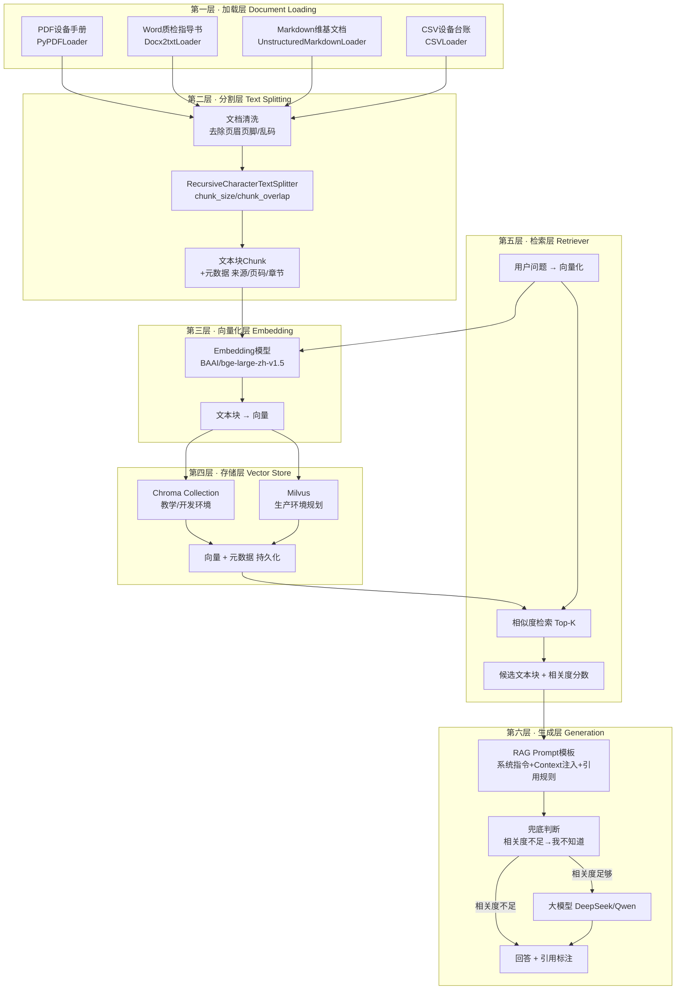
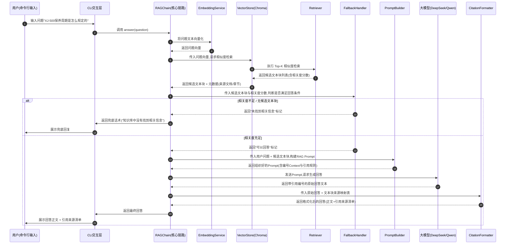
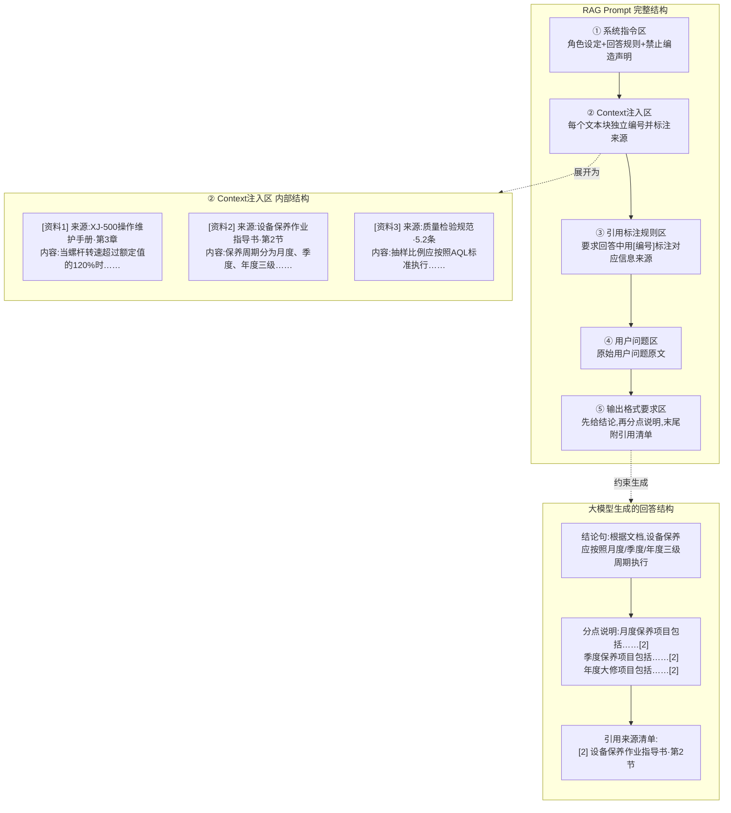

# 第30天 · 完整RAG系统搭建(核心日!) —— 海纳集团项目正式立项,CQ-201的第一行代码

> **周次/Sprint**:Sprint 2 · RAG基础(Day25-31)—— 第六天,Day25到Day29把LangChain、LCEL、Memory机制、文档加载与分割、向量数据库这五块拼图逐一拼好之后,今天要把它们第一次真正拼成一整块——一个能跑起来、能回答真实问题、能标注引用来源的完整RAG问答系统。
> **星期**:周二(入职第30天,转正之后的第16天)
> **参与人**:陈铭、苏梦、韩露、张凡(全员参与,导师王振宇全程带队);上午立项会议列席:郭建军(CTO)、林悦(产品经理)、赵磊(QA)、孙昊(DevOps);下午与晚间技术攻坚:王振宇、陈铭
> **飞书任务号**:CQ-201 ~ CQ-230(海纳制造集团企业知识库问答系统 · RAG小组全量任务池,立项会议当场分配);陈铭个人当日主责任务:CQ-203(RAG完整链路串联与Prompt模板设计)、CQ-204(引用来源标注与兜底逻辑实现)
> **今日关键词**:海纳集团项目立项 / RAG小组 / 完整RAG链路 / 加载-分割-向量化-存储-检索-生成 / RAG Prompt模板 / 引用来源标注 / "我不知道"兜底 / 命令行知识库问答系统

---

## 【旁白】

有些日子,是用来学一个新知识点的;有些日子,是用来把过去学过的知识点串成一条线的。而极少数的日子,是用来让一件事从"练习"变成"项目"的——第30天,属于最后这一种。

如果把镜头往前拉一点,会发现过去二十九天里,"海纳制造集团"这四个字,一直是以一种略微悬浮的姿态存在着——它出现在王振宇的口头讲解里,出现在林悦转发的样本文档压缩包备注里,出现在陈铭笔记本上"未来的客户项目"这行小字旁边,但它始终没有一个正式的、写进公司系统里的名分。培训、内训、练手,这些词汇底下藏着一层没有说破的潜台词:眼下做的这一切,都还只是"准备",真正的项目,还没有开始。这层潜台词,在今天上午九点半,二层大会议室"望远"的门被推开的那一刻,被彻底打破了。

郭建军很少出现在RAG小组的日常晨会里,他上一次这样郑重地坐在会议室主位,还是Day22苍穹0.1版对话引擎正式对外演示的那天。今天他带着一份打印出来的合同摘要走进会议室,身后跟着林悦、赵磊、孙昊——这个阵容本身就已经说明了问题的性质:不是一次内部评审,而是一场立项会议。海纳制造集团的合同,在上周五(教学场景设定)正式签署,首期交付内容明确写着"企业知识库问答系统",验收周期、里程碑节点、任务分配,全部要在今天敲定。老王后来跟陈铭说过一句话,陈铭记进了笔记本:"从今天起,你写的每一行代码,后面都跟着一个真实的甲方名字和一份真实的付款节点,这和你自己练手写demo,从心理重量上,完全是两件事。"

这场立项会议对整条故事线而言,承担着一个关键的叙事功能——它是"苍穹项目从内部产品走向真正对外交付"的第一个正式验证点。第二阶段(Day15-24)搭出的苍穹0.1版,是一个能跑起来的网页版对话产品,但它服务的对象始终是"我们自己"和"内部试用";而从今天开始,苍穹要升级到0.5版,补上RAG检索引擎层,这一次它要服务的,是一个真实的、有真实业务痛点、真实付了钱、真实会在验收会上皱眉头的甲方客户。飞书任务号CQ-201到CQ-230,整整三十个任务号,在立项会议上被一次性开出来、分配下去,这在陈铭过去三十天的工作经历里,是从未见过的规模——他此前接触到的任务号,大多是零散的、单点的("CQ-108:海纳集团样本文档接入"这种),而今天这三十个任务号,是一整套项目管理体系的骨架,从"CQ-201:需求确认与验收标准冻结"一路排到"CQ-230:项目验收与交付文档整理",中间清清楚楚地写着RAG小组接下来一周多的每一步该做什么。

对陈铭个人而言,今天还有一层格外私人的意义——老王在会上当众宣布,陈铭是RAG小组的核心开发之一,主责任务CQ-203和CQ-204,直接对接"完整RAG链路串联"和"引用标注与兜底逻辑"这两个在整个系统里技术含量最高、也最容易在验收时被客户挑出问题的环节。这不是一句随口的鼓励——老王在会后私下跟陈铭说,这个分配是他综合过去二十九天陈铭的表现,尤其是Day28文档处理和Day29向量库选型两天的产出质量,认真考虑之后做的决定,不是论资排辈式的"轮流分配"。陈铭当时嘴上说"我尽力",心里想的却是另一件事——三个月前他还在纠结"运营岗要不要转行学编程"的时候,完全无法想象有一天,一份真实的企业级项目合同背后,会有一个任务号写着自己的名字。

而这一天在技术脉络上的分量,同样重得不像一次普通的教学安排。过去五天,陈铭学的是"怎么处理文档""怎么切分文本""怎么把文字变成向量""怎么存进一个能检索的数据库"——每一项单独看都是一个具体的、边界清晰的技术点,像是散落在桌面上的零件。而今天要做的事情,老王用了一个很朴素的说法:"把这些零件拧成一台能转起来的机器。"从文档加载到最终生成带引用的回答,中间要经过六道工序,任何一道工序出问题,整台机器都转不起来——这就是为什么老王把今天称为"核心日":不是因为今天的每一个单点技术难度最高,而是因为今天第一次要求陈铭具备"把多个模块正确串联成一个可用系统"的工程能力,而这项能力,恰恰是"内训生"和"能独立扛项目的工程师"之间那条最关键的分界线。

晚上十点半左右,坐在工位B-07上的陈铭,第一次看到自己的demo在命令行里,针对"XJ-500注塑机的保养周期是怎么规定的"这个问题,吐出一整段带着引用编号的、逻辑完整的回答。那一刻的心情,他后来在笔记本上只写了一句话,但这句话足够说明这一天的分量——留给了故事继续往前走的第一颗种子。

---

## 晨会纪要 / 立项会议纪要

**时间**:上午9:30(比平日晨会推迟半小时,因为要等CTO郭建军到场),二层大会议室"望远"
**出席**:郭建军(CTO)、王振宇(老王,技术负责人)、林悦(产品经理)、赵磊(QA测试工程师)、孙昊(DevOps工程师)、陈铭、苏梦、韩露、张凡

会议室比平时要满一些,连平时很少在这个时间点出现的孙昊都坐在了角落。陈铭进门的时候,发现投影屏幕上打开的不是常见的白板截图,而是一份正式的PDF文档,标题是"海纳制造集团 × 蓬远科技 企业知识库问答系统项目 · 合同摘要与里程碑计划"。他心里咯噔了一下——这是他第一次在公司会议室里,亲眼看到一份带着真实公司抬头、真实签字页水印的合同文件。

郭建军没有绕圈子,直接站起来开场:"上周五,海纳制造集团那边的合同正式盖章了。这是我们苍穹平台第一个真正意义上的对外客户项目——之前的0.1版对话引擎,是我们自己练手、自己试用,这一次不一样,对方是实打实的甲方,有实打实的验收标准,也有实打实的付款节点。"他顿了顿,把投影翻到下一页,上面是一张简单的时间轴,标注着"首期交付:企业知识库问答系统,验收窗口:合同签署后第25个工作日"。

"我知道在座有几位还是这两个月刚转正的新同事,"郭建军的目光扫过陈铭、苏梦、韩露、张凡几个人,"我想借着这次立项会议,把一句话说清楚——公司决定让RAG小组承接这个项目,不是因为这个项目简单到随便找几个新人就能糊弄过去,恰恰相反,是因为老王跟我汇报过这两周你们的学习进度和产出质量,他认为你们已经具备了承接真实项目的基础能力。这既是一次信任,也是一次真正的考验,项目验收的时候,客户不会因为‘这是新人做的’就降低标准。"

会议室里安静了几秒,陈铭能感觉到自己旁边苏梦悄悄坐直了身体。

林悦接过话头,开始讲解项目背景:"海纳制造集团是一家中型制造企业,主营注塑机、精密模具相关产品,咱们Day28到Day29用的那批样本文档,就是他们提供的一部分真实资料。他们这次找我们做知识库问答系统,核心痛点是三块——第一,设备操作与维护手册、工艺文件、质量规范这些文档体量太大,一线员工遇到问题很难快速在几十份PDF里找到答案;第二,他们有一批干了二十多年的老师傅,很多‘设备一响就知道是哪里出了问题’这种经验,从来没有系统地写下来,老师傅一退休,这些经验基本就断了传承;第三,新员工培训周期长,很多重复性的问题——‘这个报警代码是什么意思’‘这道工序的质检标准是多少’——占用了老师傅和班组长大量的时间。"

"简单说,"林悦总结道,"客户要的不是一个‘聊天机器人’,是一个‘问了就懂、答得准、还能告诉你答案是从哪份文档哪一页来的’的企业知识库。这最后一点特别重要——制造行业对‘准确性可追溯’的要求,比很多互联网场景要高得多,一线员工如果按照系统给的错误答案操作设备,可能造成安全事故,所以‘引用来源标注’不是一个锦上添花的功能,是客户在需求沟通会上明确提出来的硬性要求。"

赵磊在这时候补了一句,带着他一贯的质疑语气:"我这边想提前说一句——这类系统上线之后,QA测试的重点不会只是‘功能跑不跑通’,会重点测‘系统会不会一本正经地编答案’。如果知识库里没有相关内容,系统胡编一个听起来很像真的答案出来,这种问题在制造行业客户那里,是不可接受的红线级缺陷,不是‘体验不好’,是‘可能出事故’。"

老王点头认同,顺势接过话:"这正是我们今天要重点讲的两件事之一——‘我不知道’这个兜底逻辑,不是一个可选项,是这套系统的安全底线。今天下午我会带陈铭他们专门做这一块。"

孙昊也补充了一句运维视角的话:"我这边先提前说一下部署层面的边界——首期交付是命令行版的问答系统,不涉及正式的服务器部署和多用户并发访问,这些是Day32往后要处理的事。今天到本周五(教学场景对应Day31),大家的目标是把核心链路在本地跑通、效果达到一个可以拿去做效果评估的基线水平,不用担心生产环境的问题。"

郭建军听完各方补充,拿起桌上的打印文件,开始正式宣布任务分配:"飞书项目那边,我已经让林悦把整个项目的任务拆解好了,一共三十个任务号,CQ-201到CQ-230,现在正式开给RAG小组。"他把文件递给林悦,林悦逐一在投影上展示任务列表——从CQ-201(需求确认与验收标准冻结,林悦负责)、CQ-202(海纳集团文档全量接入与清洗,陈铭、苏梦协同,已在Day28完成基础版本)、CQ-203(完整RAG链路串联与Prompt模板设计)、CQ-204(引用来源标注与兜底逻辑实现)、一直到CQ-228(效果调优实验方案与执行)、CQ-229(Sprint2周测)、CQ-230(项目验收与交付文档整理)。

"CQ-203和CQ-204,"老王站起来指着投影上这两行,"我建议交给陈铭主责,苏梦、韩露、张凡三位并行开发各自的版本,四份实现互相印证、互相学习,最后我们从中选出最稳定的一版继续往下迭代,或者综合几个人的优点重新整理出一份团队标准版。"他转头看向陈铭:"你有没有问题?"

陈铭愣了一下才反应过来老王是在正式点名,他站起来,声音比自己预想的要稳:"没问题,我尽力做好。"这句话说得朴实,但他心里清楚,这是他入职以来第一次被正式指定为某个具体技术模块的主责人,而不是"跟着做练习"。

郭建军最后总结了几句,算是给这场立项会议收尾:"我今天特意过来开这个会,不是走个过场——我想让大家意识到一件事,苍穹平台从今天起,正式有了第一个外部客户的真实项目在跑。以前我们说‘苍穹要服务真实企业客户’,那是一句愿景;从今天起,这句话有了具体的名字、具体的合同、具体的验收日期。我希望在座每一位,都能把这份分量放在心里,不是说要有压力,而是说要有荣誉感——你们现在做的每一行代码,未来真的会有一线的设备维护工人靠它查报警代码,会有质检员靠它核对抽样标准。这就是我们做这件事的意义。"

会议在十点十五分结束,散会的时候,林悦特意留下来跟陈铭、苏梦、韩露、张凡几个人多说了几句:"今天下午我会把《海纳制造集团企业知识库问答系统立项PRD》正式版发到项目群里,里面有完整的用户故事和验收标准,大家开发的时候可以随时对照。今天上午的分工,是我们后面一周多的主线,大家加油。"

老王把陈铭、苏梦、韩露、张凡留在会议室,开始讲今天的具体技术任务:"立项会议开完了,接下来是硬仗。今天不是一个‘学新知识’的日子,是一个‘把过去五天学的东西全部用起来’的日子。上午我先带你们把完整RAG链路的六道工序从头串一遍原理,下午每个人各自动手实现一版完整的命令行知识库问答系统,重点是Prompt模板设计和引用标注、兜底逻辑这两块——这两块做得好不好,直接决定这套系统在客户眼里‘专业’还是‘不靠谱’。"

**今日目标清单**:

1. 上午9:30-10:15:立项会议(海纳集团项目正式立项,任务分配)。
2. 上午10:30-12:00:完整RAG链路技术串讲(加载→分割→向量化→存储→检索→增强生成六道工序的原理与工程要点系统回顾)。
3. 下午13:30-17:30:动手实现完整命令行知识库问答系统——文档加载分割、向量化存储、检索器封装、RAG Prompt模板设计、生成回答并标注引用来源、"我不知道"兜底逻辑,四人各自独立完成一版可运行的demo。
4. 下午17:30-18:00:四人demo快速互评,老王抽查关键代码点评。
5. 晚自习19:30-22:30:陈铭针对CQ-203、CQ-204继续打磨自己的实现,补充边界情况处理,争取在今晚跑出一个"效果看起来可用"的完整demo。

**风险点**:

- 完整链路涉及的模块多,任何一个环节(比如Embedding模型加载失败、向量库路径配置错误、Prompt模板变量拼接出错)出问题,都会导致整条链路跑不起来,调试时需要有清晰的分段测试思路,不能指望一次性跑通整条链路。
- Prompt模板设计是今天的技术难点之一,如果context注入方式设计不合理(比如检索到的文本块之间没有清晰的分隔和编号),大模型生成回答时容易张冠李戴,把不同文档的内容混在一起,或者引用编号对应错误。
- "我不知道"兜底逻辑容易做得"过犹不及"——如果判断阈值设得太严格,系统会对本来能回答的问题也说"不知道",客户会觉得系统"太笨";如果设得太宽松,系统又会在知识库没有相关内容时强行编造答案,这是赵磊反复强调的红线问题,今天下午需要重点打磨这个平衡点。
- 立项会议之后,整个团队士气比较高涨,老王提前提醒大家不要因为"项目正式立项"的兴奋感而在今天赶工写出粗糙代码,企业级项目的第一版代码质量,会直接影响后续所有迭代的基础,今天必须按照公司代码规范(PEP8、中文docstring、关键逻辑行内注释)来写。

---

## 需求文档:《海纳制造集团企业知识库问答系统立项PRD》

> 撰写人:林悦(产品经理) · 审核人:王振宇(技术负责人) · 批准人:郭建军(CTO)
> 文档编号:CQ-PRD-D30-01
> 版本:v1.0(立项版)

### 一、项目背景

海纳制造集团(以下简称"海纳集团")是一家从事精密注塑机及配套模具生产的中型制造企业,现有生产线员工约三百人,一线设备维护、质量检验相关的技术文档体量庞大,涵盖设备操作与维护手册、工艺作业指导书、质量检验规范、安全生产规程、设备台账等多个类别,累计文档超过千份,分散存放于多个部门的本地文件夹与打印资料中,缺乏统一的检索入口。

海纳集团在需求沟通阶段明确提出三个核心痛点:第一,一线员工在设备出现异常时,往往需要花费大量时间在纸质或电子版手册中翻找对应的故障排查章节,响应速度慢,直接影响生产效率;第二,企业内部存在大量依赖老师傅口传经验、未曾系统化沉淀的隐性知识,人员流动或退休可能导致关键经验断层;第三,新员工培训周期偏长,大量重复性的基础问题占用了老师傅和班组长的宝贵时间,培训效率有待提升。

基于以上背景,海纳集团决定引入蓬远科技的苍穹企业级智能体中台,首期落地目标为"企业知识库问答系统"——一个能够基于海纳集团内部真实文档,准确、快速、可追溯地回答一线员工日常业务问题的智能问答系统。本项目是苍穹平台第一个正式对外交付的客户项目,标志着苍穹平台从"内部产品"阶段正式迈入"客户级交付"阶段。

### 二、项目目标

1. **核心目标**:构建一套基于检索增强生成(RAG)技术的企业知识库问答系统,能够准确回答海纳集团一线员工基于设备操作维护手册、工艺文件、质量规范提出的业务问题。
2. **准确性目标**:系统生成的每一个回答,必须明确标注答案来源的具体文档与章节位置,不允许在没有依据的情况下生成看似合理但实际编造的内容。
3. **兜底能力目标**:当知识库中不存在与用户问题相关的内容时,系统必须明确告知用户"当前知识库中没有找到相关信息",而不是强行给出一个不准确的回答。
4. **交付形态目标**:首期交付为命令行版本的问答系统,聚焦核心问答能力的验证,不涉及Web界面与多用户并发访问,后续迭代(Sprint 3及以后)再逐步补充Web化、多轮对话、检索效果优化等能力。
5. **可迁移目标**:本次搭建的RAG核心链路(文档处理、向量化、检索、生成、引用标注)应设计为可复用的模块化代码,为后续苍穹平台RAG检索引擎层的正式产品化打下基础,不能是"一次性用完就扔"的项目专用脚本。

### 三、用户故事

- 作为海纳集团一线设备维护人员,当设备出现异常报警时,我希望能够直接用日常语言描述问题(比如"E-07报警是什么意思"),系统能快速给出准确的排查步骤,并告诉我这个答案出自哪份手册的哪个章节,这样我可以在需要时翻阅原文确认细节。
- 作为海纳集团质检员,我希望能够快速查询某道工序的具体质检标准和抽样比例,系统给出的数值必须与质量规范文档中的原文完全一致,不能出现任何模糊或近似的表述,因为质检标准的准确性直接关系到产品合格判定。
- 作为海纳集团新员工培训负责人,我希望新员工在遇到基础性、重复性的操作问题时,能够先通过问答系统自助查询,只有在系统明确表示"没有找到相关信息"或问题超出知识库覆盖范围时,才需要打断老师傅或班组长的工作寻求帮助。
- 作为海纳集团IT对接人,我希望这套问答系统的知识库内容能够随着企业文档的更新而更新,当设备手册发布新版本时,只需要将新文档重新导入系统,而不需要对系统本身进行大改动。
- 作为蓬远科技项目负责人,我希望首期交付的系统在功能验证完成之后,能够沉淀出一套可复用的RAG核心技术组件,支撑苍穹平台后续在其他行业客户身上的快速复制交付,而不是为海纳集团单独维护一套完全独立的代码体系。
- 作为蓬远科技QA测试工程师,我希望系统在面对知识库覆盖范围之外的问题时,有一套明确、可测试、可验证的"拒绝编造答案"机制,并且这个机制的判断逻辑应当是可配置、可调优的,而不是写死在代码里的黑盒规则。

### 四、功能范围(本次立项版·首期)

**范围内(In Scope)**:

1. 支持对海纳集团提供的PDF、Word、Markdown、CSV等多种格式的技术文档进行批量加载与清洗(复用Day28已验证的文档处理流水线)。
2. 支持将清洗后的文档按照合理的策略切分为文本块,并生成对应的向量表示,存入向量数据库(复用Day29已验证的Chroma向量库方案)。
3. 支持基于用户自然语言问题,从向量数据库中检索出最相关的若干文本块作为上下文。
4. 支持将检索到的上下文与用户问题一起组织成结构化的Prompt,调用大模型生成回答。
5. 生成的回答必须明确标注每一条关键信息的引用来源(文档名称+段落/章节位置)。
6. 当检索到的上下文与用户问题相关度不足,或知识库中确实不存在相关内容时,系统必须给出"未找到相关信息"的明确提示,不允许生成无依据的内容。
7. 提供命令行交互界面,支持用户连续提问,查看历史提问记录。

**范围外(Out of Scope,留待后续Sprint)**:

1. Web界面与图形化交互(留待Sprint 3及后续苍穹控制台集成)。
2. 多轮对话上下文记忆与本次知识库检索的联合优化(Day27已实现基础Memory机制,但与RAG检索的深度融合留待后续优化)。
3. 查询改写、混合检索、重排序等高级RAG技术(留待下周Sprint 3专题学习与实现)。
4. 生产环境的高并发部署、多租户隔离(留待Day56前后生产部署阶段)。
5. 基于用户反馈的持续学习与知识库自动更新机制(留待产品化后续版本)。

### 五、验收标准

1. **功能完整性**:系统能够完整跑通"文档加载→分割→向量化→存储→检索→生成回答"的全链路,针对海纳集团提供的样本文档,能够对常见业务问题给出回答。
2. **引用可追溯性**:抽样测试20个问题,系统生成的回答中,凡是包含具体数值、操作步骤、标准条款等关键信息的部分,必须能够标注出对应的引用来源;引用来源标注的准确率(标注的来源确实包含被引用的信息)不低于90%。
3. **兜底逻辑有效性**:准备至少10个知识库中确实不包含答案的"陷阱问题",系统必须能够正确识别并回复"未找到相关信息",而不是编造一个看似合理的答案;正确识别率不低于90%。
4. **代码工程质量**:核心代码模块符合公司PEP8规范,关键类与函数具备中文docstring,核心业务逻辑(尤其是引用标注、兜底判断)具备行内注释说明设计理由;代码结构模块化,文档加载、分割、向量化、检索、生成、引用标注各自独立成模块,便于后续复用与替换。
5. **响应可用性**:单次问答请求(不含首次加载模型与建立索引的时间)响应时间控制在一个可接受的范围内(命令行版本暂不设硬性数值指标,以"交互体验流畅、不出现长时间无响应假死"为验收标准,具体数值指标待Sprint 3性能优化阶段确定)。

### 六、风险与依赖

- **技术风险**:基础RAG链路(不含查询改写、混合检索、重排序等高级技术)在面对措辞口语化、表述与文档原文差异较大的问题时,命中率存在明显天花板,首期版本的效果评估结果可能低于业务方的初始预期,需要提前与海纳集团做好预期管理沟通,说明这是分阶段交付计划中的第一个基线版本,后续Sprint会持续优化。
- **数据风险**:海纳集团提供的部分历史文档存在扫描质量差、排版不规范等问题(详见Day28文档处理阶段的实际发现),部分内容可能因为OCR识别错误或清洗规则覆盖不到而未能进入知识库,需要在效果评估阶段重点关注这类"文档处理环节导致的隐性信息丢失"问题,不能简单归因为检索或生成环节的缺陷。
- **合规与安全风险**:知识库中包含部分标注"内部资料,严禁外传"的文档内容,系统部署与使用范围需要严格限定在海纳集团授权的内部网络环境,命令行版本首期不涉及网络暴露,但后续Web化交付时需要补充相应的访问权限控制,这一点已经同步给孙昊在部署规划阶段重点关注。
- **依赖关系**:本项目依赖Day28已验证的文档加载与清洗流水线、Day29已验证的Chroma向量库方案,任何针对这两个上游模块的重大改动,都需要评估对本项目下游链路的影响,建议改动前先在独立分支验证,避免直接影响正在迭代的项目主线代码。
- **人员风险**:当前RAG小组由四位刚转正不久的初级工程师(陈铭、苏梦、韩露、张凡)承担核心开发工作,王振宇作为技术负责人需要保持较高频率的评审与答疑投入,建议按周设置固定的代码评审节点,避免关键设计缺陷(尤其是兜底逻辑相关)在项目后期才被发现,导致返工成本上升。

### 七、里程碑与后续安排

- **Day30(今日)**:完整RAG链路首个可运行版本搭建完成,四位开发者各自产出一版demo。
- **Day31**:Sprint2周测;下午使用海纳集团提供的10个真实业务问题,对Day30版本demo进行效果基线评估,形成调优实验报告。
- **Day32起(Sprint 3)**:针对Day31暴露出的效果问题,系统学习并引入查询改写、混合检索、重排序等高级RAG技术,持续迭代优化命中率与回答质量。
- **CQ-230对应节点**:待Sprint 3优化完成、效果达到验收标准后,进行项目正式验收与交付文档整理。

---

## 架构设计图:完整RAG系统六层架构

老王在黑板上画完立项会议的分工表之后,紧接着画的就是这张图——他管这张图叫"RAG系统的骨架图",要求陈铭他们四个人今天写的每一份代码,都要能清楚地指出自己属于骨架图上的哪一层。



老王讲解这张图的时候,特意强调了一个容易被忽略的细节:"这张图看起来是一条从上到下的单向流水线,但实际系统运行的时候,前四层(加载、分割、向量化、存储)和后两层(检索、生成)在时间上是分离的——前四层是‘离线’的建库过程,只在文档更新的时候才需要重新跑一遍;后两层是‘在线’的问答过程,每一次用户提问都会实时执行一遍。这个时间维度上的分离,是所有RAG系统工程设计的一个基本前提,如果把这两部分的边界搞混,写出来的代码会既慢又难维护。"

---

## 流程图:端到端RAG问答请求数据流

这张图是老王专门为下午的编码环节准备的,他要求陈铭他们在动手写代码之前,先把这张图里的每一个箭头对应到自己代码里的哪一个函数调用,想清楚了才能开始写。



老王指着这张图说了一句让陈铭印象很深的话:"你们看这张图里有一个分支——‘相关度不足’这条路径,今天很多同学写代码的时候会习惯性地先写‘相关度充足’这条主线,把兜底这条路径当成‘顺手加一下’的收尾工作。我要求你们反过来,今天下午先把FallbackHandler这个模块单独写出来、单独测试通过,再去写主线逻辑——因为对企业客户来说,‘该说不知道的时候说了不知道’,比‘该回答的时候答对了’,同等重要,甚至更重要。"

---

## 示意图:RAG Prompt模板中Context注入与引用标注结构

这是老王画的第三张图,专门用来讲解今天下午的核心难点——怎么把检索到的文本块,以一种大模型"看得懂、不会搞混、还能准确引用"的方式,组织进Prompt里。



老王在讲这张图的时候,特意用红笔在"[资料1][资料2][资料3]"这几个编号旁边画了圈:"这个编号看起来是个很小的细节,但它是整个引用标注机制能不能工作的关键——如果你在Prompt里给每个文本块编了号,又在指令里明确要求大模型‘引用信息时用[编号]标注’,那么大模型生成回答之后,你的代码只需要用正则表达式把回答里出现的编号提取出来,再去查一张‘编号→来源’的映射表,就能自动生成一份准确的引用来源清单,完全不需要让大模型自己去‘描述’来源的具体文件名和章节——这样可以避免大模型在转述来源信息的时候出现幻觉(比如把文档名字编错、把章节号说错)。"

---

## 课堂笔记

### 上午:RAG完整链路串讲

立项会议结束、四位同学重新回到"望远"会议室之后,老王没有直接讲技术,先花了五分钟,把过去五天(Day25到Day29)每一天解决的问题,重新用一句话总结了一遍,挂在白板上:

"Day25,LangChain把散乱的手写调用封装成了标准组件;Day26,LCEL用管道符把这些组件串成了链;Day27,Memory机制解决了‘记住聊过什么’;Day28,文档加载与分割解决了‘怎么把原始文档变成干净的文本块’;Day29,向量数据库解决了‘怎么把文本块变成可以按语义检索的东西,存起来’。今天,我们要做的事情,是把这五天的成果,和‘怎么根据检索结果生成一个靠谱的回答’这个全新的问题,焊接在一起,变成一整套东西——这套东西,才有资格被称为‘RAG系统’。"

他把"RAG"这个词重新拆开讲了一遍,虽然陈铭已经在过去几天的语境里反复听到这个词,但老王坚持"核心日"这一天要重新把定义讲透:"检索增强生成,Retrieval-Augmented Generation。检索(Retrieval)解决‘找什么’的问题,增强(Augmented)解决‘怎么把找到的东西喂给模型’的问题,生成(Generation)解决‘模型怎么用这些东西说人话’的问题。这三个词看起来平平常常,但把它们连起来读一遍,你会发现RAG这个技术名字本身,其实就是它的架构说明书——先检索,再增强,再生成,一个词不多,一个词不少。"

**第一道工序:加载(Loading)**。老王让陈铭现场复述Day28的核心结论,陈铭说得很流利:"不同格式的文档需要用不同的Loader,PDF、Word、Markdown、CSV、网页各有各的坑,加载完之后要针对性地清洗页眉页脚、乱码换行、表格错位这些脏数据问题。"老王点头,补充了一句今天新的要求:"以前你处理文档,是‘处理完看看结果对不对’就完事了。今天开始,你要养成一个新习惯——加载和清洗的每一步,都要在文本块的元数据(metadata)里,记录下这段文字来自哪份文档、哪一页、哪一章节。这件事在Day28可能你觉得‘做不做无所谓’,但从今天起,它是‘引用标注’这个核心功能能不能实现的第一个前提条件——没有元数据,后面所有引用标注都是空谈。"

**第二道工序:分割(Splitting)**。老王在这里追加了一个新的知识点——今天要求文本块的元数据里,除了来源文档名和大致位置,还要包含一个全局唯一的`chunk_id`,格式类似`"XJ500_manual_ch3_012"`,便于后续在向量库、检索结果、Prompt注入、引用标注这几个环节里,始终用同一个ID串联起同一段文字,不会因为文本内容本身重复(比如两份不同文档里都出现"应立即停机"这句话)而产生混淆。

**第三道工序:向量化(Embedding)**。这一步陈铭已经在Day29用过`BAAI/bge-large-zh-v1.5`,老王今天补充了一个工程细节:"向量化这一步,在‘建库’的时候是批量的,可以做批处理优化(比如一次性把多个文本块打包送进Embedding模型,减少调用次数);但在‘检索’的时候,只有用户的这一句问题需要向量化,是单条、实时的。这两种场景对性能的要求完全不同,写代码的时候要把这两个路径分开设计,不要用同一套‘批处理’逻辑去处理‘单条实时’的场景,否则会引入不必要的延迟。"

**第四道工序:存储(Storage)**。老王重申了Day29定下的选型结论:"教学和开发阶段,我们统一用Chroma,轻量,不需要额外部署服务,适合快速实验;苍穹平台正式生产环境,选型是Milvus,因为它在大规模数据、多租户隔离、高并发检索这几个企业级场景的能力上,比Chroma更成熟。今天大家写代码的时候,统一用Chroma,但我要求大家在设计VectorStore这个模块的接口时,要做出‘不依赖具体向量库实现细节’的抽象,方法名和参数设计得通用一点,这样以后从Chroma切换到Milvux,只需要换掉VectorStore内部的实现,上层的Retriever和RAGChain代码不需要跟着大改。这是企业级项目里一个很基本但很多新人容易忽略的设计原则——面向接口编程,不要面向具体实现编程。"

**第五道工序:检索(Retrieval)**。这是老王今天上午花时间最多的一块。他先讲了检索的基本流程——用户问题向量化,然后用向量数据库执行相似度检索,拿到Top-K个最相似的文本块。接着他抛出了一个问题:"如果检索回来的Top-K个文本块里,有几个其实跟用户问题的关系不大,只是恰好在向量空间里离得比较近,你要怎么处理?"

苏梦第一个回答:"设一个相关度阈值,分数太低的候选块直接过滤掉?"

"对,这就是今天要讲的一个关键概念——相关度阈值(similarity threshold)。"老王在白板上画了一条数轴,"向量检索返回的相似度分数(或者距离分数,取决于具体的度量方式),本质上是一个连续的数值,没有一个绝对的‘这个问题一定能回答’或‘一定不能回答’的分界线。但工程上,我们必须设一个可配置的阈值,分数高于这个阈值的候选块,认为‘足够相关,可以拿去生成回答’;分数低于阈值的,直接丢弃,不进入后续的Prompt构建环节。这个阈值不是拍脑袋定的,需要通过实验(这正是Day31要做的事情)去校准,今天先把这个‘阈值判断’的代码结构搭出来,具体数值先用一个经验值,后面再调优。"

韩露提了一个问题:"如果检索回来的Top-K个候选块,全部低于阈值,是不是就直接触发‘我不知道’了?"

"对,这正是兜底逻辑和检索逻辑之间的接口。"老王把这句话写在了白板正中间,"检索层负责‘找’,负责给出候选块和它们的相关度分数;判断‘这些候选块够不够用来回答问题’,是兜底逻辑(FallbackHandler)的职责,不应该混在检索代码里面。今天设计代码结构的时候,一定要把这两个职责拆开成两个独立的模块,即使今天判断逻辑很简单(比如只看最高分是否超过阈值),也要留出一个清晰的接口,方便Day31之后往里面加更复杂的判断条件(比如‘候选块数量太少’‘候选块之间语义太分散’之类的复合判断)。"

**第六道工序:生成(Generation)**。老王把这一步留到了上午讲解的最后,也是承接下午实操的过渡:"生成这一步,表面上就是‘调用大模型,把问题和检索到的资料丢给它,让它生成一个回答’,听起来简单,但这里藏着整个RAG系统里,对‘工程设计’要求最高的一个环节——RAG Prompt模板怎么写。同样的检索结果,同样的大模型,Prompt模板设计得好和设计得差,生成出来的回答质量,可能是天壤之别。这就是我们下午要重点攻坚的内容。"

讲完六道工序之后,老王没有马上进入答疑环节,而是回头补了一段"技术选型复盘"——他把Day26讲过的LCEL管道符重新拎出来,问了在座四个人一个问题:"你们回去写今天的完整链路,打算用LCEL的管道符把六道工序串起来,还是打算像大多数新手第一次写RAG系统那样,用一堆命令式的函数调用,一步一步手动传参?"苏梦第一个回答说她倾向于用LCEL,理由是"Day26学的时候感觉管道符很优雅,链路清晰"。老王点头认可这个直觉,但紧接着补充了一个更细致的判断标准:"LCEL管道符确实适合表达‘线性的、无分支的’处理流程,比如从Prompt模板到大模型再到输出解析器这一段,写成`prompt | llm | parser`确实简洁好读。但你们今天要实现的完整链路里,有一个关键的分支节点——‘相关度是否足够,要不要走兜底逻辑’,这是一个条件分支,不是简单的线性管道。如果硬要用纯LCEL的方式去表达这种分支(用`RunnableBranch`或者自定义的`RunnableLambda`去包裹判断逻辑),代码可读性反而会下降,不如老老实实用一个Python类,把分支判断用显式的`if...else`写清楚,内部再局部使用LCEL去简化那些确实是线性流程的片段。"这段话让陈铭想起自己下午一开始也纠结过这个问题,当时甚至专门去翻了LangChain的官方文档查`RunnableBranch`的用法,后来发现确实不如显式分支来得直观,这也印证了老王常说的一句话——"工具是用来服务设计的,不是设计要削足适履去适配工具"。

紧接着,老王又抛出一个容易被忽略的工程细节:"你们今天写的这套RAG链路,建库(ingest.py)和问答(cli.py)是两个独立的入口脚本,这个设计我在流程图讲解时已经强调过。但还有一个更细的问题——建库脚本里,如果同一份文档被重复导入两次,会不会在向量库里产生两条完全一样的记录,拉低检索效率、甚至干扰相关度排序?"这个问题让在座几个人都愣了一下,张凡试探着回答:"是不是可以在写入向量库之前,先检查一下这个chunk_id是否已经存在?"老王给了肯定的回应,并补充说这正是为什么今天的`chunk_id`要设计成基于文件名、章节、序号的确定性哈希值,而不是每次运行随机生成的UUID——"确定性ID的好处是,同一份文档、同样的切分策略,不管你重新导入多少次,产生的chunk_id都是完全一样的,这样在写入向量库之前,可以很方便地做‘存在则跳过或覆盖’的去重判断,避免脏数据在向量库里越积越多。今天时间有限,大家先把这个判断逻辑记在心里,不强制要求今天就把去重逻辑写进代码,但下周如果谁的demo在效果评估阶段出现‘同一份资料被检索出来两次、内容一模一样’的诡异现象,大概就是这个坑。"

上午的技术串讲在十一点五十分左右结束,老王留了十分钟答疑,张凡问了一个比较细节的问题:"如果一个用户问题,检索出来的候选块横跨两三份不同的文档,生成回答的时候,要怎么避免把不同文档的内容‘混’在一起说串了?"

老王的回答,某种意义上提前剧透了下午的核心内容:"这正是Context注入方式设计的关键——每一个候选块在Prompt里必须带着清晰的编号和独立的来源标注,让大模型‘看得出’这是几份不同的资料,而不是一整段没有边界的文字。这件事我们下午具体展开讲,这里先记住一个原则——Context注入区的每一块内容,必须在视觉上(对大模型来说是‘结构上’)有清晰的边界。"

### 下午:RAG Prompt模板设计 + 引用标注 + 兜底处理

午饭后,老王没有像往常一样先讲理论,而是直接在白板上写下了三个大字:"设计约束",然后说:"下午这三个小时,我不打算先讲PPT式的理论,我打算带你们直接从‘设计约束’倒推‘设计方案’——这是老王我这些年做企业项目养成的一个习惯,先想清楚这个东西‘不能做成什么样’,再去想‘应该做成什么样’,往往比一上来就套模板,做出来的东西更扎实。"

**约束一:不能编造。** 老王先讲了这条最核心的约束:"大模型有一个天生的‘毛病’——它被训练得‘乐于助人’,面对一个它不知道答案的问题,如果Prompt里没有明确的‘不知道就说不知道’的指令,它大概率会依靠自己训练数据里的通用知识,或者干脆‘编’一个听起来合理的答案,而不会主动告诉你‘我不确定’。这个毛病在闲聊场景里问题不大,但在企业知识库问答场景里是致命的——设想一线员工问‘E-15报警代码是什么意思’,如果知识库里根本没有这个代码的信息,大模型却凭着自己训练数据里学到的‘工业设备常见报警代码’的通用知识,编了一个似是而非的解释,员工照着这个解释去处理设备,后果可能很严重。"

他接着讲了具体的应对方法:"这条约束要求我们在Prompt模板的系统指令区,必须包含一句明确的、不留模糊空间的指令,类似‘你只能根据下面提供的资料回答问题,不允许使用你自己的知识库知识,如果提供的资料中没有足够信息回答问题,必须明确说明未找到相关信息,不允许编造或猜测’。这句话看起来简单,但措辞需要非常严格,不能用‘尽量根据资料回答’这种留有余地的表述,措辞越明确,大模型‘越界’编造的概率越低。"

**约束二:引用必须可追溯,但不能让大模型自己描述来源。** 老王讲的这一点,正是上午课堂笔记里张凡问题的延续:"如果你在指令里说‘请注明信息来源’,大模型很可能会自己‘转述’一个来源描述,比如‘根据设备手册’,但它没办法准确说出是哪一份具体文档、第几章——因为它看到的Context本身如果没有清晰的编号结构,它自己也没法精确定位。所以正确的做法,是在Context注入的时候,给每个文本块一个清晰的编号(比如[资料1][资料2]),同时在系统指令里明确要求‘在你的回答中,每一条关键信息后面,用[编号]的格式标注对应的资料编号’,大模型只需要输出编号,不需要自己转述来源的具体文件名——具体的文件名、章节位置,由我们的代码根据编号去查一张映射表,自动生成引用清单。这样设计的好处是,引用来源的准确性,完全由我们的代码控制,不依赖大模型的‘转述准确性’,大幅降低了幻觉风险。"

**约束三:Context太长会稀释注意力,也会增加成本。** 这一条,老王结合了一个具体的数字:"假设检索Top-K设成5,每个文本块500字左右,加上系统指令、用户问题,一次请求的Prompt长度可能达到三四千字。这既涉及成本问题(大模型API通常按Token计费),也涉及效果问题——相关研究和很多工程实践都表明,大模型在处理过长的上下文时,容易出现‘中间部分信息被忽略’的现象,业内一般管这个现象叫‘lost in the middle’。所以Top-K不能无限制地设大,需要在‘覆盖足够信息’和‘避免上下文过长’之间找平衡,这也是Day31调优实验要验证的一个变量。"

**约束四:兜底逻辑需要多层校验,不能只依赖大模型的自我判断。** 老王讲到这里,特意强调了一个容易被新人忽略的坑:"有些同学可能会想,‘我在Prompt指令里已经告诉大模型不知道就说不知道了,是不是就够了?’——不够。原因是,即使指令写得再明确,大模型依然有一定概率‘管不住自己’,尤其是当检索到的资料跟问题有一点点表面相关性、但实际上并不能真正回答问题的时候,大模型有时候会‘勉强凑一个答案’。所以正确的做法,是在‘调用大模型生成回答’这一步之前,先由代码层面基于检索到的相关度分数做一次前置判断——如果所有候选块的相关度分数都低于阈值,直接不调用大模型,由代码直接返回兜底话术,这样可以百分百避免大模型在‘明显没有相关资料’的情况下依然强行生成答案。这是‘代码前置判断’加‘Prompt指令约束’的双重保险机制,单靠任何一层都不够稳。"

**约束五:兜底话术本身也是一种"产品设计",不能只写一句冷冰冰的"未找到相关信息"。** 老王讲这条约束的时候,换了一种口气,不再是纯技术讨论,而是带着一点产品思维:"你们可以站在一线员工的角度想一下——他因为设备报警、心里正着急,打开这套问答系统,结果系统只回复一句‘未找到相关信息’,然后什么都没有了,他会怎么想?大概率会觉得这套系统‘没用’,下次遇到问题也不会再来问它,转身直接去找老师傅了。这就违背了我们做这个项目最初的目的之一——减少员工对老师傅的重复性依赖。"他接着给出了具体的改进思路:"兜底话术至少应该包含三层信息——第一,明确告知‘这个问题超出了当前知识库的覆盖范围’,不要含糊;第二,给出一个建设性的下一步引导,比如‘建议联系相关班组长’或者‘可以尝试换一种问法’;第三,如果可能的话,后续迭代里还可以考虑把这一类‘系统答不上来的问题’自动记录下来,反馈给知识库维护团队,作为后续文档补全的线索——这一点我们Day30不强制要求实现,但今天设计FallbackHandler返回的数据结构时,可以顺手把‘触发原因’这个字段留出来,方便以后往这个方向扩展。"陈铭后来在写`fallback_handler.py`的时候,正是想起这句话,才在`FallbackDecision`这个数据类里专门加了一个`reason`字段,并且在兜底话术里写了"建议联系相关班组长或查阅纸质版原始文档进一步确认,也可以尝试换一种问法重新提问"这样一句带着具体行动建议的话,而不是只回一句干巴巴的"未找到"。

韩露在这里追问了一句:"如果‘触发原因’这个字段以后要用来做数据分析,是不是也要考虑分类,比如‘完全无关’和‘部分相关但不够’要分开统计?"老王对这个问题给出了很高的评价:"这个问题问得很好,已经有点在往Day31调优实验的方向想了——没错,如果只是笼统地记录‘触发了兜底’,分析价值有限;如果能进一步区分‘向量库里根本没有候选结果’‘候选结果数量不足’‘候选结果相关度都偏低’这几种不同的触发原因,后续做效果分析的时候,就能更精确地定位问题出在哪个环节——是知识库覆盖不够,还是阈值设置不合理,还是文本分割把关键信息切碎了导致检索不到。今天大家写代码的时候,如果`FallbackDecision`里的`reason`字段能尽量写得具体一点,而不是笼统地写‘不满足条件’,会对明天的分析工作帮助很大。"陈铭对照自己的`fallback_handler.py`代码检查了一下,发现自己确实按照这个思路,在两种不同的触发场景里写了不同的`reason`文本——一种是"向量库未返回任何候选结果",另一种是明确写出相关文本块数量与最小要求数值的对比,这让他对自己当时的设计选择多了一份确认后的踏实感。

讲完这四条约束之后,老王才开始带着大家一起设计具体的Prompt模板结构,基本上就是示意图里那张图展开的样子——系统指令区、Context注入区、引用规则区、用户问题区、输出格式要求区,五个区域依次拼接。他还特别提醒了一个格式上的细节:"每个文本块在Context注入区里,除了编号和来源标注,建议再加一行‘相关度参考’(不需要精确到具体数值,可以简单标注‘高/中’这种粗粒度的等级),这样大模型在权衡多条资料的时候,能有一个初步的‘信任度’参考,虽然这不是绝对必要的,但在实践中能小幅提升回答质量。"

下午三点左右,四位同学开始各自动手实现。老王没有给出一份"标准答案"代码,而是让大家各自按照今天讲的六道工序和四条约束,自己设计代码结构。他在教室里来回走动,陆续解决了几个人遇到的具体问题——苏梦在实现FallbackHandler时,一开始把阈值判断写死成了一个具体数字,老王让她改成从配置文件读取,理由是"这个数字明天就要根据实验调整,写死在代码里,明天调优实验的时候你会发现自己在到处找这行代码改";张凡的Context注入区一开始没有清晰地分隔不同的文本块,老王让他补上明确的分隔符和编号;韩露实现的引用标注逻辑,一开始试图用大模型自己描述来源,老王让她改成"大模型只输出编号,代码负责查表还原来源"的设计。

陈铭在实现自己的版本时,遇到的最大困难其实不是某个具体的技术点,而是"怎么把六道工序真正串成一条能跑的链路,而不是六段各自能跑但互相衔接不上的代码"——这是他第一次亲身体会到老王早上说的那句话:"核心日的核心,不在于单点技术难,而在于把它们正确地拼起来。"下午五点半左右,他的demo第一次跑通了完整链路,但生成的回答质量还不太稳定,有几个问题回答得含糊其辞。他把这个情况反馈给老王,老王看了他的Prompt模板,指出了一个问题:"你的Context注入区里,文本块之间用的分隔符不够醒目,大模型有点分不清楚资料的边界,试试用更明显的分隔标记。"陈铭改完之后,效果明显改善了不少。

四点半左右,四人demo快速互评。老王抽查了每个人代码里FallbackHandler和PromptBuilder两个模块,给出了简短的点评,总体评价是"方向对,细节还需要打磨",并布置了晚自习的任务:每个人针对自己demo里表现不好的问题,记录下来,继续调整。

---

## 代码实战:海纳制造集团企业知识库问答系统(命令行版)

晚自习期间,陈铭把下午的实现推翻重写了一遍,按照老王早上强调的"面向接口、模块清晰、职责单一"的原则,重新组织了整个项目的代码结构。下面这套代码,就是他当晚最终跑通、并且在十点半左右第一次输出完整带引用的回答的那一版——这也是CQ-203、CQ-204两个任务号今天的实际产出。项目命名为`haina_rag_qa`,整体是一个多文件的Python命令行项目,严格按照公司的PEP8规范和中文docstring要求编写。

### 项目结构总览

```
haina_rag_qa/
├── requirements.txt              # 依赖清单
├── config.py                     # 全局配置
├── logger_setup.py               # 日志配置
├── loaders/
│   ├── __init__.py
│   └── document_loader.py        # 多格式文档加载与清洗
├── processing/
│   ├── __init__.py
│   └── text_splitter.py          # 文本分割
├── embeddings/
│   └── embedding_service.py      # 向量化服务
├── store/
│   └── vector_store.py           # 向量数据库封装(Chroma)
├── retrieval/
│   └── retriever.py              # 检索器
├── generation/
│   ├── prompt_templates.py       # RAG Prompt模板构建
│   ├── citation.py               # 引用来源标注
│   ├── fallback_handler.py       # "我不知道"兜底逻辑
│   └── rag_chain.py              # 完整RAG链路整合
├── ingest.py                     # 知识库离线构建入口脚本
└── cli.py                        # 命令行交互入口
```

### 文件一:`requirements.txt`

```text
langchain==0.2.16
langchain-core==0.2.38
langchain-community==0.2.16
langchain-openai==0.1.23
chromadb==0.5.5
pypdf==4.3.1
docx2txt==0.8
unstructured==0.15.9
markdown==3.7
sentence-transformers==3.0.1
openai==1.44.0
tiktoken==0.7.0
python-dotenv==1.0.1
rich==13.8.0
pydantic==2.9.0
```

### 文件二:`config.py`

```python
# -*- coding: utf-8 -*-
"""
config.py
全局配置模块。

设计说明:
公司代码规范要求所有可能随环境或客户变化的参数,都不能硬编码在业务代码里,
必须集中在配置模块里统一管理,方便后续调优实验(Day31)直接修改这里的数值,
而不需要在业务代码文件之间来回查找。
"""

import os
from dataclasses import dataclass, field
from pathlib import Path

from dotenv import load_dotenv

# 加载项目根目录下的 .env 文件,里面存放API Key等敏感信息,
# 遵循公司安全规范,严禁把密钥硬编码进代码或提交到GitLab仓库。
load_dotenv()


@dataclass
class LLMConfig:
    """大模型调用相关配置。"""

    # 苍穹平台优先使用DeepSeek作为主力低成本模型,
    # DeepSeek提供OpenAI兼容接口,便于复用LangChain的OpenAI客户端。
    provider: str = "deepseek"
    model_name: str = "deepseek-chat"
    api_key: str = field(default_factory=lambda: os.getenv("DEEPSEEK_API_KEY", ""))
    base_url: str = "https://api.deepseek.com/v1"
    temperature: float = 0.1  # 知识库问答场景要求答案稳定、可复现,温度调低
    max_tokens: int = 1024
    request_timeout: int = 60


@dataclass
class EmbeddingConfig:
    """Embedding模型相关配置。"""

    # 教学阶段统一使用本地部署的中文Embedding模型,
    # 避免每次向量化都产生额外的API调用成本,也便于离线开发。
    model_name: str = "BAAI/bge-large-zh-v1.5"
    device: str = "cpu"  # 若本机有GPU可改为 "cuda",详见Day29笔记
    batch_size: int = 32
    normalize_embeddings: bool = True


@dataclass
class VectorStoreConfig:
    """向量数据库相关配置。"""

    # 教学与开发阶段统一使用Chroma,轻量、无需额外部署服务。
    # 苍穹平台生产环境的正式选型是Milvus,详见Day29向量数据库选型对比。
    persist_directory: str = "./chroma_db/haina_knowledge_base"
    collection_name: str = "haina_manuals_v1"


@dataclass
class SplitterConfig:
    """文本分割相关配置。"""

    # 以下两个数值是Day28实验得出的经验起点,
    # Day31的调优实验会对这两个参数做进一步的对照实验。
    chunk_size: int = 500
    chunk_overlap: int = 80


@dataclass
class RetrievalConfig:
    """检索相关配置。"""

    top_k: int = 4
    # 相关度阈值,是"我不知道"兜底逻辑判断的核心依据之一。
    # Chroma默认返回的是"距离"(distance),距离越小代表越相似,
    # 这里的阈值是"距离阈值",超过这个距离认为不够相关。
    # 具体数值是本次立项版的经验起点,Day31会用真实业务问题做校准实验。
    distance_threshold: float = 0.45
    # 即使有候选块超过阈值,如果候选块数量过少,也认为信息不充分,
    # 这是FallbackHandler里"多层校验"设计的体现之一。
    min_relevant_chunks: int = 1


@dataclass
class PathConfig:
    """路径相关配置。"""

    project_root: Path = field(default_factory=lambda: Path(__file__).resolve().parent)
    raw_documents_dir: Path = field(
        default_factory=lambda: Path(__file__).resolve().parent / "data" / "raw_documents"
    )
    processed_chunks_path: Path = field(
        default_factory=lambda: Path(__file__).resolve().parent / "data" / "processed_chunks.jsonl"
    )
    log_dir: Path = field(default_factory=lambda: Path(__file__).resolve().parent / "logs")


@dataclass
class AppConfig:
    """应用总配置,聚合所有子配置,业务代码统一从这里读取参数。"""

    llm: LLMConfig = field(default_factory=LLMConfig)
    embedding: EmbeddingConfig = field(default_factory=EmbeddingConfig)
    vector_store: VectorStoreConfig = field(default_factory=VectorStoreConfig)
    splitter: SplitterConfig = field(default_factory=SplitterConfig)
    retrieval: RetrievalConfig = field(default_factory=RetrievalConfig)
    paths: PathConfig = field(default_factory=PathConfig)


# 全局单例配置对象,业务模块直接 `from config import settings` 使用。
settings = AppConfig()
```

### 文件三:`logger_setup.py`

```python
# -*- coding: utf-8 -*-
"""
logger_setup.py
日志配置模块。

设计说明:
企业级项目里,"能不能定位问题"往往比"代码写得多快"更重要,
今天这套完整链路涉及六个模块,任何一个环节出问题,
都需要通过日志快速定位是哪个环节出的问题,所以从第一天写完整系统起,
就必须把日志规范做到位,而不是等出了问题才临时加print语句调试。
"""

import logging
import sys
from pathlib import Path


def setup_logger(name: str, log_dir: Path, level: int = logging.INFO) -> logging.Logger:
    """
    创建并配置一个具名日志记录器。

    参数:
        name: 日志记录器名称,通常传入模块名 __name__,方便定位日志来源。
        log_dir: 日志文件存放目录,不存在会自动创建。
        level: 日志级别,默认INFO,调试时可临时改为DEBUG。

    返回:
        配置好的Logger对象。
    """
    log_dir.mkdir(parents=True, exist_ok=True)

    logger = logging.getLogger(name)
    logger.setLevel(level)

    # 避免同一个logger被多次调用setup_logger时重复添加handler,
    # 导致日志内容被重复打印多份。
    if logger.handlers:
        return logger

    formatter = logging.Formatter(
        fmt="%(asctime)s | %(levelname)-8s | %(name)s | %(message)s",
        datefmt="%Y-%m-%d %H:%M:%S",
    )

    # 控制台输出,方便开发调试时实时查看
    console_handler = logging.StreamHandler(stream=sys.stdout)
    console_handler.setFormatter(formatter)
    logger.addHandler(console_handler)

    # 文件输出,保留完整历史记录,便于事后排查问题
    file_handler = logging.FileHandler(
        log_dir / "haina_rag_qa.log", encoding="utf-8"
    )
    file_handler.setFormatter(formatter)
    logger.addHandler(file_handler)

    return logger
```

### 文件四:`loaders/__init__.py`

```python
# -*- coding: utf-8 -*-
"""loaders 包初始化文件,统一导出文档加载相关接口。"""

from .document_loader import DocumentLoaderFactory, load_and_clean_documents

__all__ = ["DocumentLoaderFactory", "load_and_clean_documents"]
```

### 文件五:`loaders/document_loader.py`

```python
# -*- coding: utf-8 -*-
"""
document_loader.py
多格式文档加载与清洗模块。

设计说明:
本模块是Day28搭建的文档处理流水线在正式项目里的复用与整理版本。
核心设计原则是"按文件扩展名分发到对应的加载器",并在加载完成后统一执行清洗,
最终统一输出为内部约定的Document对象列表,上层模块不需要关心具体是哪种文件格式。
"""

import re
from dataclasses import dataclass, field
from pathlib import Path
from typing import Callable

from langchain_community.document_loaders import (
    CSVLoader,
    Docx2txtLoader,
    PyPDFLoader,
    UnstructuredMarkdownLoader,
)

from logger_setup import setup_logger
from config import settings

logger = setup_logger(__name__, settings.paths.log_dir)


@dataclass
class RawDocument:
    """
    内部统一的原始文档数据结构。

    属性:
        content: 清洗后的文本内容。
        source_file: 来源文件名,用于后续引用标注。
        page_or_section: 页码或章节标识,尽量从原始文档中提取,提取不到则标注"未知"。
        doc_type: 文档类型,如"设备手册""质检指导书""工艺文件"等,
                  由文件所在目录名或文件名约定推断,便于后续按类型做统计分析。
    """

    content: str
    source_file: str
    page_or_section: str = "未知"
    doc_type: str = "未分类"
    extra_metadata: dict = field(default_factory=dict)


class CleaningRules:
    """
    文档清洗规则集合。

    设计说明:
    海纳集团提供的真实文档存在页眉页脚污染、多余空行、表格错位等典型问题
    (详见Day28笔记的"脏文档三宗罪")。这里把清洗规则设计成一组独立的、
    可配置的正则表达式函数,而不是把某一份具体文档的格式硬编码进来,
    这样面对未来其他客户的文档,只需要新增规则,不需要改动主流程代码。
    """

    # 常见的页眉页脚模式:"XXX 内部资料 严禁外传" 这种固定短语+可能变化的页码
    HEADER_FOOTER_PATTERNS = [
        r"海纳制造集团\s*内部资料\s*严禁外传",
        r"第\s*\d+\s*页\s*/?\s*共?\s*\d*\s*页?",
        r"^\s*\d{1,4}\s*$",  # 单独一行只有数字的页码
    ]

    # 连续三个及以上的空行,统一压缩为一个空行
    EXCESSIVE_BLANK_LINES = re.compile(r"\n{3,}")

    @classmethod
    def clean_text(cls, raw_text: str) -> str:
        """
        对原始文本执行统一清洗流程。

        参数:
            raw_text: 加载器读取出来的原始文本。

        返回:
            清洗后的文本。
        """
        text = raw_text

        for pattern in cls.HEADER_FOOTER_PATTERNS:
            text = re.sub(pattern, "", text, flags=re.MULTILINE)

        # 清洗掉页眉页脚之后,可能留下大量空行,这里统一压缩
        text = cls.EXCESSIVE_BLANK_LINES.sub("\n\n", text)

        # 去除每行首尾多余空格,但保留段落之间的换行结构
        lines = [line.strip() for line in text.split("\n")]
        text = "\n".join(line for line in lines if line != "" or True)

        return text.strip()


class DocumentLoaderFactory:
    """
    文档加载器工厂类。

    设计说明:
    使用工厂模式,根据文件扩展名分发到对应的具体加载函数,
    上层调用者只需要传入文件路径,不需要关心内部用的是哪个具体的Loader类。
    这样未来新增一种文档格式(比如Excel、PPT),只需要在这里加一个分支,
    不需要改动调用方的任何代码。
    """

    _LOADER_MAPPING: dict[str, Callable[[Path], list[RawDocument]]] = {}

    @classmethod
    def register(cls, extension: str):
        """装饰器:将某个函数注册为指定文件扩展名的加载器。"""

        def decorator(func: Callable[[Path], list[RawDocument]]):
            cls._LOADER_MAPPING[extension.lower()] = func
            return func

        return decorator

    @classmethod
    def load(cls, file_path: Path) -> list[RawDocument]:
        """
        根据文件扩展名,分发到对应的加载函数。

        参数:
            file_path: 文档文件路径。

        返回:
            RawDocument对象列表(一份文档可能拆解成多个页面/分段)。

        异常处理说明:
            单份文档加载失败不应该导致整个批处理任务中断(参考Day28作业第6题
            "批处理失败隔离"的设计原则),这里捕获异常并记录日志,返回空列表,
            由上层批处理逻辑决定如何统计和上报失败文档。
        """
        extension = file_path.suffix.lower()
        loader_func = cls._LOADER_MAPPING.get(extension)

        if loader_func is None:
            logger.warning("未找到匹配的加载器,跳过文件:%s", file_path)
            return []

        try:
            return loader_func(file_path)
        except Exception as exc:  # noqa: BLE001 保留原始异常信息用于日志排查
            logger.error("文档加载失败:%s,原因:%s", file_path, exc)
            return []


@DocumentLoaderFactory.register(".pdf")
def _load_pdf(file_path: Path) -> list[RawDocument]:
    """加载PDF文档,按页拆分,并对每一页做清洗。"""
    loader = PyPDFLoader(str(file_path))
    pages = loader.load()

    results = []
    for page in pages:
        cleaned = CleaningRules.clean_text(page.page_content)
        if not cleaned:
            continue
        page_number = page.metadata.get("page", "未知")
        results.append(
            RawDocument(
                content=cleaned,
                source_file=file_path.name,
                page_or_section=f"第{page_number}页" if page_number != "未知" else "未知",
                doc_type=_infer_doc_type(file_path),
            )
        )
    return results


@DocumentLoaderFactory.register(".docx")
def _load_docx(file_path: Path) -> list[RawDocument]:
    """加载Word文档,整体作为一份,后续由文本分割模块进一步切分。"""
    loader = Docx2txtLoader(str(file_path))
    docs = loader.load()

    results = []
    for doc in docs:
        cleaned = CleaningRules.clean_text(doc.page_content)
        if not cleaned:
            continue
        results.append(
            RawDocument(
                content=cleaned,
                source_file=file_path.name,
                page_or_section="全文",
                doc_type=_infer_doc_type(file_path),
            )
        )
    return results


@DocumentLoaderFactory.register(".md")
def _load_markdown(file_path: Path) -> list[RawDocument]:
    """加载Markdown文档,尝试按一级/二级标题拆分章节,提升元数据的可读性。"""
    loader = UnstructuredMarkdownLoader(str(file_path))
    docs = loader.load()

    results = []
    for doc in docs:
        cleaned = CleaningRules.clean_text(doc.page_content)
        if not cleaned:
            continue

        # 简单提取文档中出现的第一个一级或二级标题,作为章节标识,
        # 提取不到就标注"未知章节",不强求完美,后续可以按需迭代优化。
        section_match = re.search(r"^#{1,2}\s*(.+)$", cleaned, re.MULTILINE)
        section = section_match.group(1).strip() if section_match else "未知章节"

        results.append(
            RawDocument(
                content=cleaned,
                source_file=file_path.name,
                page_or_section=section,
                doc_type=_infer_doc_type(file_path),
            )
        )
    return results


@DocumentLoaderFactory.register(".csv")
def _load_csv(file_path: Path) -> list[RawDocument]:
    """加载CSV设备台账,每一行作为一条独立的RawDocument。"""
    loader = CSVLoader(file_path=str(file_path), encoding="utf-8")
    docs = loader.load()

    results = []
    for idx, doc in enumerate(docs, start=1):
        cleaned = CleaningRules.clean_text(doc.page_content)
        if not cleaned:
            continue
        results.append(
            RawDocument(
                content=cleaned,
                source_file=file_path.name,
                page_or_section=f"第{idx}行记录",
                doc_type="设备台账",
            )
        )
    return results


def _infer_doc_type(file_path: Path) -> str:
    """
    根据文件名关键字简单推断文档类型,用于后续统计与展示。

    设计说明:
    这是一个"够用就好"的启发式规则,不追求100%准确,
    真实项目里更严谨的做法是要求文档提交方按照约定的目录结构存放文件,
    但作为立项首期版本,先用关键字规则跑起来,后续可以持续优化。
    """
    name = file_path.stem
    if "手册" in name or "操作" in name or "维护" in name:
        return "设备手册"
    if "质检" in name or "质量" in name or "检验" in name:
        return "质量规范"
    if "工艺" in name:
        return "工艺文件"
    if "安全" in name:
        return "安全规程"
    return "未分类"


def load_and_clean_documents(directory: Path) -> list[RawDocument]:
    """
    批量加载指定目录下所有支持格式的文档,并执行清洗。

    参数:
        directory: 存放原始文档的目录。

    返回:
        全部成功加载的RawDocument列表。

    工程说明:
        这里实现了Day28作业第6题里讨论过的"单文档失败隔离"策略——
        每份文档的加载异常都在DocumentLoaderFactory.load内部被捕获,
        不会导致整个批处理任务中断,失败的文档只会在日志里留下记录。
    """
    if not directory.exists():
        logger.error("原始文档目录不存在:%s", directory)
        return []

    supported_extensions = {".pdf", ".docx", ".md", ".csv"}
    all_documents: list[RawDocument] = []
    failed_files: list[str] = []

    file_paths = [p for p in directory.rglob("*") if p.suffix.lower() in supported_extensions]
    logger.info("共发现 %d 份待处理文档", len(file_paths))

    for file_path in file_paths:
        docs = DocumentLoaderFactory.load(file_path)
        if not docs:
            failed_files.append(file_path.name)
            continue
        all_documents.extend(docs)

    logger.info(
        "文档加载完成,成功 %d 份,失败/跳过 %d 份,共产出 %d 条原始记录",
        len(file_paths) - len(failed_files),
        len(failed_files),
        len(all_documents),
    )
    if failed_files:
        logger.warning("以下文档加载失败或被跳过:%s", failed_files)

    return all_documents
```

### 文件六:`processing/__init__.py`

```python
# -*- coding: utf-8 -*-
"""processing 包初始化文件,统一导出文本分割相关接口。"""

from .text_splitter import TextChunk, split_documents_into_chunks

__all__ = ["TextChunk", "split_documents_into_chunks"]
```

### 文件七:`processing/text_splitter.py`

```python
# -*- coding: utf-8 -*-
"""
text_splitter.py
文本分割模块。

设计说明:
本模块基于Day28的分割实验结论,采用RecursiveCharacterTextSplitter作为
默认策略,并在每个切分出来的文本块上,补全"引用标注"环节所必需的完整元数据。
"""

import hashlib
from dataclasses import dataclass, field

from langchain.text_splitter import RecursiveCharacterTextSplitter

from config import settings
from loaders.document_loader import RawDocument
from logger_setup import setup_logger

logger = setup_logger(__name__, settings.paths.log_dir)


@dataclass
class TextChunk:
    """
    最终存入向量库的文本块数据结构。

    属性:
        chunk_id: 全局唯一标识,格式为"文件名前缀_章节标识_序号"的哈希值,
                  用于在向量库、检索结果、Prompt注入、引用标注之间始终唯一定位同一段文字。
        content: 切分后的文本内容。
        source_file: 来源文件名。
        page_or_section: 来源页码/章节标识。
        doc_type: 文档类型。
    """

    chunk_id: str
    content: str
    source_file: str
    page_or_section: str
    doc_type: str
    extra_metadata: dict = field(default_factory=dict)

    def to_metadata_dict(self) -> dict:
        """转换为向量库存储所需的元数据字典格式(不含正文内容)。"""
        return {
            "chunk_id": self.chunk_id,
            "source_file": self.source_file,
            "page_or_section": self.page_or_section,
            "doc_type": self.doc_type,
        }


def _generate_chunk_id(source_file: str, page_or_section: str, index: int) -> str:
    """
    生成全局唯一的chunk_id。

    设计说明:
    直接用"文件名+章节+序号"拼接字符串作为ID,存在潜在的重名风险
    (比如两份文档恰好有相同的文件名),这里用md5做一次哈希摘要,
    既保证唯一性,又保持ID长度固定、便于日志打印和调试。
    """
    raw_key = f"{source_file}_{page_or_section}_{index}"
    digest = hashlib.md5(raw_key.encode("utf-8")).hexdigest()[:12]
    return f"{digest}"


def split_documents_into_chunks(raw_documents: list[RawDocument]) -> list[TextChunk]:
    """
    对一批原始文档执行文本分割,产出带完整元数据的TextChunk列表。

    参数:
        raw_documents: 经过加载与清洗的RawDocument列表。

    返回:
        TextChunk列表,每一个元素都是后续可以直接送入Embedding的最小单元。
    """
    splitter = RecursiveCharacterTextSplitter(
        chunk_size=settings.splitter.chunk_size,
        chunk_overlap=settings.splitter.chunk_overlap,
        separators=["\n\n", "\n", "。", ";", ",", " ", ""],
    )

    all_chunks: list[TextChunk] = []

    for raw_doc in raw_documents:
        pieces = splitter.split_text(raw_doc.content)

        for idx, piece in enumerate(pieces):
            piece = piece.strip()
            if not piece:
                continue

            chunk_id = _generate_chunk_id(raw_doc.source_file, raw_doc.page_or_section, idx)

            all_chunks.append(
                TextChunk(
                    chunk_id=chunk_id,
                    content=piece,
                    source_file=raw_doc.source_file,
                    page_or_section=raw_doc.page_or_section,
                    doc_type=raw_doc.doc_type,
                    extra_metadata=dict(raw_doc.extra_metadata),
                )
            )

    logger.info("文本分割完成,共产出 %d 个文本块", len(all_chunks))
    return all_chunks
```

### 文件八:`embeddings/embedding_service.py`

```python
# -*- coding: utf-8 -*-
"""
embedding_service.py
向量化服务模块。

设计说明:
本模块把"建库时的批量向量化"和"检索时的单条实时向量化"两种场景,
在同一个类里提供两个语义清晰的独立方法,避免上层调用者混用两种场景的接口。
"""

from langchain_community.embeddings import HuggingFaceEmbeddings

from config import settings
from logger_setup import setup_logger

logger = setup_logger(__name__, settings.paths.log_dir)


class EmbeddingService:
    """
    Embedding服务封装类。

    这里选用本地部署的BAAI/bge-large-zh-v1.5模型,原因见Day29笔记——
    中文语义理解效果好,且可离线部署,不产生额外的API调用成本,
    适合教学阶段和对数据隐私敏感的制造业客户场景。
    """

    def __init__(self):
        logger.info("正在加载Embedding模型:%s", settings.embedding.model_name)
        self._model = HuggingFaceEmbeddings(
            model_name=settings.embedding.model_name,
            model_kwargs={"device": settings.embedding.device},
            encode_kwargs={
                "normalize_embeddings": settings.embedding.normalize_embeddings,
                "batch_size": settings.embedding.batch_size,
            },
        )
        logger.info("Embedding模型加载完成")

    def embed_documents_batch(self, texts: list[str]) -> list[list[float]]:
        """
        批量向量化,用于建库阶段。

        参数:
            texts: 待向量化的文本列表。

        返回:
            对应的向量列表,顺序与输入texts一一对应。
        """
        if not texts:
            return []
        logger.info("开始批量向量化,共 %d 条文本", len(texts))
        vectors = self._model.embed_documents(texts)
        logger.info("批量向量化完成")
        return vectors

    def embed_query(self, text: str) -> list[float]:
        """
        单条实时向量化,用于检索阶段对用户问题做向量化。

        参数:
            text: 用户输入的原始问题文本。

        返回:
            该问题对应的向量。
        """
        return self._model.embed_query(text)
```

### 文件九:`store/vector_store.py`

```python
# -*- coding: utf-8 -*-
"""
vector_store.py
向量数据库封装模块。

设计说明:
按照老王上午强调的"面向接口编程"原则,这里的VectorStore类只暴露
add_chunks / similarity_search 两个通用方法,内部实现细节(目前是Chroma)
被完全封装起来。未来切换到Milvus(苍穹生产环境规划),只需要重写这个类
的内部实现,上层Retriever和RAGChain代码不需要任何改动。
"""

import chromadb

from config import settings
from embeddings.embedding_service import EmbeddingService
from logger_setup import setup_logger
from processing.text_splitter import TextChunk

logger = setup_logger(__name__, settings.paths.log_dir)


class VectorStore:
    """向量数据库统一封装接口,当前底层实现为Chroma。"""

    def __init__(self, embedding_service: EmbeddingService):
        self._embedding_service = embedding_service
        self._client = chromadb.PersistentClient(path=settings.vector_store.persist_directory)
        self._collection = self._client.get_or_create_collection(
            name=settings.vector_store.collection_name,
            metadata={"hnsw:space": "cosine"},
        )
        logger.info(
            "向量库已就绪,collection=%s,当前记录数=%d",
            settings.vector_store.collection_name,
            self._collection.count(),
        )

    def add_chunks(self, chunks: list[TextChunk]) -> None:
        """
        将一批文本块向量化后写入向量数据库。

        参数:
            chunks: 待写入的TextChunk列表。

        工程说明:
            这里按批次处理,避免一次性把上千个文本块全部塞进embed_documents_batch
            导致内存占用过高,批大小复用EmbeddingConfig.batch_size的配置。
        """
        if not chunks:
            logger.warning("传入的chunks为空,跳过写入")
            return

        batch_size = settings.embedding.batch_size
        total_written = 0

        for start in range(0, len(chunks), batch_size):
            batch = chunks[start : start + batch_size]
            texts = [c.content for c in batch]
            vectors = self._embedding_service.embed_documents_batch(texts)

            self._collection.add(
                ids=[c.chunk_id for c in batch],
                embeddings=vectors,
                documents=texts,
                metadatas=[c.to_metadata_dict() for c in batch],
            )
            total_written += len(batch)
            logger.info("已写入 %d / %d 个文本块", total_written, len(chunks))

        logger.info("向量库写入完成,当前总记录数=%d", self._collection.count())

    def similarity_search(self, query: str, top_k: int) -> list[dict]:
        """
        执行相似度检索。

        参数:
            query: 用户问题原文。
            top_k: 返回候选文本块的数量。

        返回:
            候选结果列表,每一项是一个字典,包含content、metadata、distance三个字段。
            distance数值越小代表越相似(基于cosine距离度量)。
        """
        query_vector = self._embedding_service.embed_query(query)

        raw_results = self._collection.query(
            query_embeddings=[query_vector],
            n_results=top_k,
        )

        results = []
        documents = raw_results.get("documents", [[]])[0]
        metadatas = raw_results.get("metadatas", [[]])[0]
        distances = raw_results.get("distances", [[]])[0]

        for content, metadata, distance in zip(documents, metadatas, distances):
            results.append(
                {
                    "content": content,
                    "metadata": metadata,
                    "distance": distance,
                }
            )

        return results

    def count(self) -> int:
        """返回当前向量库中的记录总数,便于建库脚本和调试时快速核对。"""
        return self._collection.count()
```

### 文件十:`retrieval/retriever.py`

```python
# -*- coding: utf-8 -*-
"""
retriever.py
检索器模块。

设计说明:
Retriever只负责"从向量库拿到候选结果,并按照相关度分数排序、附上排名",
不负责判断"这些候选结果够不够用来回答问题"——那是FallbackHandler的职责。
这是上午课堂笔记里老王反复强调的"职责拆分"原则的具体落地。
"""

from dataclasses import dataclass

from config import settings
from logger_setup import setup_logger
from store.vector_store import VectorStore

logger = setup_logger(__name__, settings.paths.log_dir)


@dataclass
class RetrievedChunk:
    """
    检索结果的统一数据结构。

    属性:
        rank: 排名(从1开始),用于Prompt注入时的编号[资料1][资料2]。
        content: 文本块内容。
        source_file: 来源文件名。
        page_or_section: 来源页码/章节标识。
        distance: 相似度距离,数值越小越相关。
    """

    rank: int
    content: str
    source_file: str
    page_or_section: str
    distance: float

    @property
    def is_relevant(self) -> bool:
        """
        依据配置的距离阈值,判断该文本块是否"足够相关"。

        注意:
            这里只提供单条判断的基础能力,是否要综合多条结果做整体判断
            (比如"相关的候选块数量是否达到最少数量要求"),
            由FallbackHandler统一处理,Retriever不越权做整体决策。
        """
        return self.distance <= settings.retrieval.distance_threshold


class Retriever:
    """检索器,封装"问题 -> 候选文本块列表"这一步逻辑。"""

    def __init__(self, vector_store: VectorStore):
        self._vector_store = vector_store

    def retrieve(self, question: str) -> list[RetrievedChunk]:
        """
        执行一次检索。

        参数:
            question: 用户输入的原始问题文本。

        返回:
            按相关度从高到低排序的RetrievedChunk列表。
        """
        top_k = settings.retrieval.top_k
        raw_results = self._vector_store.similarity_search(question, top_k=top_k)

        retrieved_chunks = []
        for idx, item in enumerate(raw_results, start=1):
            metadata = item["metadata"]
            retrieved_chunks.append(
                RetrievedChunk(
                    rank=idx,
                    content=item["content"],
                    source_file=metadata.get("source_file", "未知来源"),
                    page_or_section=metadata.get("page_or_section", "未知"),
                    distance=item["distance"],
                )
            )

        logger.info(
            "检索完成,问题=%s,返回候选数=%d,最高相关度距离=%s",
            question,
            len(retrieved_chunks),
            retrieved_chunks[0].distance if retrieved_chunks else "无候选",
        )

        return retrieved_chunks
```

### 文件十一:`generation/prompt_templates.py`

```python
# -*- coding: utf-8 -*-
"""
prompt_templates.py
RAG Prompt模板构建模块。

设计说明:
本模块严格按照下午课堂笔记里讲的四条设计约束实现:
① 系统指令区明确禁止编造;
② Context注入区每个文本块独立编号、清晰分隔,并标注粗粒度相关度等级;
③ 引用标注规则区要求大模型只输出编号,不自行转述来源;
④ 输出格式要求区规定"先结论、再分点、后附引用清单"的结构,
   便于CitationFormatter后续对回答做统一的格式化处理。
"""

from config import settings
from retrieval.retriever import RetrievedChunk

SYSTEM_INSTRUCTION = """你是海纳制造集团企业知识库问答助手,由蓬远科技苍穹企业级智能体中台提供技术支持。
你的任务是根据下面提供的【参考资料】,准确回答用户的问题。

请严格遵守以下规则:
1. 你只能依据【参考资料】中提供的内容回答问题,不允许使用你自己训练数据中的通用知识来补充或替代资料内容。
2. 如果【参考资料】中没有足够的信息回答用户的问题,你必须明确回复"根据现有知识库,未找到与该问题相关的信息",不允许编造、猜测或使用近似但不确定的内容拼凑答案。
3. 你的回答中,凡是引用了某一条【参考资料】中的具体信息(包括数值、步骤、标准条款等),必须在该信息后面用方括号标注对应的资料编号,例如[资料1],不需要在正文中描述该资料的具体文件名或章节,系统会根据编号自动生成完整的引用来源清单。
4. 你的回答结构应当是:先给出一句简明的结论,再分点说明具体细节,不需要额外的开场白或结束语客套话。
"""


def _relevance_label(distance: float) -> str:
    """
    将连续的相似度距离数值,转换为粗粒度的相关度等级标签。

    设计说明:
    这一步是下午课堂笔记里提到的"给大模型一个初步信任度参考"的具体实现,
    不要求精确,只需要给大模型一个大致的权重感,避免它对所有资料一视同仁。
    """
    if distance <= 0.25:
        return "高"
    if distance <= settings.retrieval.distance_threshold:
        return "中"
    return "低"


def build_context_block(chunks: list[RetrievedChunk]) -> str:
    """
    构建Context注入区文本。

    参数:
        chunks: 经过相关度筛选后的候选文本块列表(通常已经在RAGChain层
                过滤掉了低于阈值的结果,这里只负责格式化)。

    返回:
        格式化后的Context文本块,每条资料之间用清晰的分隔线隔开。
    """
    blocks = []
    for chunk in chunks:
        block = (
            f"----- [资料{chunk.rank}] -----\n"
            f"来源文档:《{chunk.source_file}》\n"
            f"位置:{chunk.page_or_section}\n"
            f"相关度参考:{_relevance_label(chunk.distance)}\n"
            f"内容:{chunk.content}\n"
        )
        blocks.append(block)
    return "\n".join(blocks)


def build_rag_prompt(question: str, relevant_chunks: list[RetrievedChunk]) -> str:
    """
    构建完整的RAG Prompt文本。

    参数:
        question: 用户原始问题。
        relevant_chunks: 已经通过相关度筛选的候选文本块列表。

    返回:
        拼接完成的完整Prompt字符串,包含系统指令、Context、用户问题三大部分。
    """
    context_block = build_context_block(relevant_chunks)

    prompt = f"""{SYSTEM_INSTRUCTION}

【参考资料】
{context_block}

【用户问题】
{question}

请根据上面的【参考资料】,按照规则回答【用户问题】。
"""
    return prompt
```

### 文件十二:`generation/citation.py`

```python
# -*- coding: utf-8 -*-
"""
citation.py
引用来源标注模块。

设计说明:
本模块的核心职责,是把大模型回答文本里出现的[资料N]编号,
替换/追加为真实可读的引用来源信息,且这个替换过程完全由代码控制,
不依赖大模型自己"转述"来源细节,从而最大程度降低幻觉风险
(详见下午课堂笔记"约束二")。
"""

import re
from dataclasses import dataclass

from retrieval.retriever import RetrievedChunk

CITATION_PATTERN = re.compile(r"\[资料(\d+)\]")


@dataclass
class CitationResult:
    """
    引用标注处理结果。

    属性:
        answer_text: 原始回答正文(保留[资料N]编号,便于用户对照)。
        citation_list: 格式化后的引用来源清单文本。
        cited_ranks: 实际被引用到的资料编号集合,便于统计与效果评估。
    """

    answer_text: str
    citation_list: str
    cited_ranks: set[int]


def extract_cited_ranks(answer_text: str) -> set[int]:
    """
    从大模型生成的回答文本中,提取所有出现过的[资料N]编号。

    参数:
        answer_text: 大模型生成的原始回答文本。

    返回:
        出现过的编号集合(去重),比如{1, 2}。
    """
    matches = CITATION_PATTERN.findall(answer_text)
    return {int(m) for m in matches}


def build_citation_list(cited_ranks: set[int], relevant_chunks: list[RetrievedChunk]) -> str:
    """
    根据被引用到的编号,查表还原出真实的引用来源信息,生成引用清单文本。

    参数:
        cited_ranks: 大模型回答中实际引用到的资料编号集合。
        relevant_chunks: 本次请求中提供给大模型的候选文本块列表
                          (编号rank与文本块是一一对应关系)。

    返回:
        格式化后的引用来源清单,每行一条,按编号从小到大排序。

    工程说明:
        这里刻意不信任大模型对来源的任何"转述",只信任它输出的编号,
        真实的文件名、章节位置,完全从relevant_chunks这份"权威映射表"里查出来,
        这是引用标注机制"可控、可信"的关键设计。
    """
    if not cited_ranks:
        return "(本次回答未引用具体资料条目)"

    rank_to_chunk = {chunk.rank: chunk for chunk in relevant_chunks}
    lines = []
    for rank in sorted(cited_ranks):
        chunk = rank_to_chunk.get(rank)
        if chunk is None:
            # 大模型偶尔可能输出一个不存在的编号(比如资料只给了3条,
            # 它却引用了[资料5]),这种情况记录为异常引用,便于QA排查
            lines.append(f"[资料{rank}] 引用编号异常,未在本次提供的资料范围内")
            continue
        lines.append(f"[资料{rank}] 《{chunk.source_file}》· {chunk.page_or_section}")

    return "\n".join(lines)


def format_answer_with_citations(
    answer_text: str, relevant_chunks: list[RetrievedChunk]
) -> CitationResult:
    """
    对大模型的原始回答执行引用标注格式化处理。

    参数:
        answer_text: 大模型生成的原始回答文本(包含[资料N]编号)。
        relevant_chunks: 本次请求中提供给大模型的候选文本块列表。

    返回:
        CitationResult对象,包含正文、引用清单、被引用编号集合三部分信息。
    """
    cited_ranks = extract_cited_ranks(answer_text)
    citation_list = build_citation_list(cited_ranks, relevant_chunks)

    return CitationResult(
        answer_text=answer_text.strip(),
        citation_list=citation_list,
        cited_ranks=cited_ranks,
    )
```

### 文件十三:`generation/fallback_handler.py`

```python
# -*- coding: utf-8 -*-
"""
fallback_handler.py
"我不知道"兜底逻辑模块。

设计说明:
这是老王早上流程图讲解里反复强调的"应该最先写、最先测试"的模块。
本模块的核心职责,是在调用大模型之前,先根据检索结果的相关度分数,
判断"当前检索到的资料是否足够支撑一次可信的回答",
如果判断为"不足够",直接返回兜底话术,完全不触发大模型调用,
从代码层面百分百杜绝"资料明显不相关、却依然生成答案"的情况。
"""

from dataclasses import dataclass

from config import settings
from logger_setup import setup_logger
from retrieval.retriever import RetrievedChunk

logger = setup_logger(__name__, settings.paths.log_dir)

FALLBACK_MESSAGE = "根据现有知识库,未找到与该问题相关的信息。建议联系相关班组长或查阅纸质版原始文档进一步确认,也可以尝试换一种问法重新提问。"


@dataclass
class FallbackDecision:
    """
    兜底判断结果。

    属性:
        should_fallback: 是否触发兜底(True表示直接返回兜底话术,不调用大模型)。
        relevant_chunks: 判断为"足够相关"、可以用来生成回答的候选文本块列表
                          (仅当should_fallback为False时,该列表才有意义)。
        reason: 判断依据说明,便于日志记录与后续调优实验分析。
    """

    should_fallback: bool
    relevant_chunks: list[RetrievedChunk]
    reason: str


class FallbackHandler:
    """
    兜底判断器。

    设计说明:
    本类只依赖config.py里的可配置参数做判断,不写死任何具体数值,
    这是为了配合Day31的调优实验——调优时只需要修改配置文件里的
    distance_threshold和min_relevant_chunks两个数值,不需要改动这里的判断逻辑代码。
    """

    def decide(self, retrieved_chunks: list[RetrievedChunk]) -> FallbackDecision:
        """
        执行兜底判断。

        参数:
            retrieved_chunks: Retriever返回的全部候选文本块(未经筛选)。

        返回:
            FallbackDecision对象。
        """
        if not retrieved_chunks:
            logger.info("兜底触发:检索结果为空")
            return FallbackDecision(
                should_fallback=True,
                relevant_chunks=[],
                reason="向量库未返回任何候选结果",
            )

        relevant_chunks = [chunk for chunk in retrieved_chunks if chunk.is_relevant]

        if len(relevant_chunks) < settings.retrieval.min_relevant_chunks:
            logger.info(
                "兜底触发:相关文本块数量(%d)低于最小要求(%d)",
                len(relevant_chunks),
                settings.retrieval.min_relevant_chunks,
            )
            return FallbackDecision(
                should_fallback=True,
                relevant_chunks=relevant_chunks,
                reason=(
                    f"相关文本块数量({len(relevant_chunks)})"
                    f"低于最小要求({settings.retrieval.min_relevant_chunks})"
                ),
            )

        logger.info("兜底未触发,相关文本块数量=%d,可以继续生成回答", len(relevant_chunks))
        return FallbackDecision(
            should_fallback=False,
            relevant_chunks=relevant_chunks,
            reason="相关度与数量均满足要求",
        )

    @staticmethod
    def get_fallback_message() -> str:
        """返回统一的兜底话术文本。"""
        return FALLBACK_MESSAGE
```

### 文件十四:`generation/rag_chain.py`

```python
# -*- coding: utf-8 -*-
"""
rag_chain.py
完整RAG链路整合模块。

设计说明:
本模块是今天CQ-203任务号的核心产出,负责把检索、兜底判断、Prompt构建、
大模型生成、引用标注这几个独立模块,按照流程图里定义的数据流,
组装成一个对外只暴露一个answer()方法的完整RAGChain类。
上层调用者(CLI)不需要了解链路内部的任何细节。
"""

from dataclasses import dataclass

from langchain_openai import ChatOpenAI

from config import settings
from generation.citation import CitationResult, format_answer_with_citations
from generation.fallback_handler import FallbackHandler
from generation.prompt_templates import build_rag_prompt
from logger_setup import setup_logger
from retrieval.retriever import Retriever, RetrievedChunk

logger = setup_logger(__name__, settings.paths.log_dir)


@dataclass
class RAGAnswer:
    """
    对外统一的问答结果数据结构。

    属性:
        question: 用户原始问题。
        is_fallback: 本次回答是否为兜底回复。
        answer_text: 回答正文。
        citation_list: 引用来源清单文本(兜底回复时为空字符串)。
        retrieved_count: 本次检索到的候选文本块数量,便于日志与效果分析。
    """

    question: str
    is_fallback: bool
    answer_text: str
    citation_list: str
    retrieved_count: int


class RAGChain:
    """完整RAG问答链路。"""

    def __init__(self, retriever: Retriever):
        self._retriever = retriever
        self._fallback_handler = FallbackHandler()
        self._llm = ChatOpenAI(
            model=settings.llm.model_name,
            api_key=settings.llm.api_key,
            base_url=settings.llm.base_url,
            temperature=settings.llm.temperature,
            max_tokens=settings.llm.max_tokens,
            timeout=settings.llm.request_timeout,
        )

    def answer(self, question: str) -> RAGAnswer:
        """
        对外唯一入口:根据用户问题,返回最终的问答结果。

        参数:
            question: 用户输入的原始问题文本。

        返回:
            RAGAnswer对象,包含回答正文、引用清单、是否兜底等完整信息。

        流程说明(对应流程图里的六个步骤):
            1. 检索:调用Retriever,拿到候选文本块及相关度分数。
            2. 兜底判断:调用FallbackHandler,判断是否需要直接兜底。
            3a. 若需要兜底:直接返回兜底话术,不调用大模型。
            3b. 若不需要兜底:构建RAG Prompt,调用大模型生成原始回答。
            4. 引用标注:对大模型的原始回答执行引用标注格式化。
            5. 组装最终的RAGAnswer对象返回给上层调用者。
        """
        question = question.strip()
        if not question:
            return RAGAnswer(
                question=question,
                is_fallback=True,
                answer_text="请输入一个具体的问题。",
                citation_list="",
                retrieved_count=0,
            )

        retrieved_chunks: list[RetrievedChunk] = self._retriever.retrieve(question)
        decision = self._fallback_handler.decide(retrieved_chunks)

        if decision.should_fallback:
            logger.info("问题[%s]触发兜底,原因:%s", question, decision.reason)
            return RAGAnswer(
                question=question,
                is_fallback=True,
                answer_text=self._fallback_handler.get_fallback_message(),
                citation_list="",
                retrieved_count=len(retrieved_chunks),
            )

        prompt = build_rag_prompt(question, decision.relevant_chunks)
        logger.debug("本次请求构建的完整Prompt:\n%s", prompt)

        raw_answer = self._invoke_llm(prompt)
        citation_result: CitationResult = format_answer_with_citations(
            raw_answer, decision.relevant_chunks
        )

        logger.info(
            "问题[%s]生成回答完成,引用资料编号=%s",
            question,
            citation_result.cited_ranks,
        )

        return RAGAnswer(
            question=question,
            is_fallback=False,
            answer_text=citation_result.answer_text,
            citation_list=citation_result.citation_list,
            retrieved_count=len(retrieved_chunks),
        )

    def _invoke_llm(self, prompt: str) -> str:
        """
        调用大模型生成回答。

        工程说明:
            这里做了一层简单的异常保护——如果大模型调用失败(网络问题、
            API超时、余额不足等),不应该让整个CLI程序崩溃,而是返回
            一个明确的错误提示,提醒用户稍后重试,这也是企业级项目
            "优雅降级"设计原则的体现。
        """
        try:
            response = self._llm.invoke(prompt)
            return response.content
        except Exception as exc:  # noqa: BLE001 需要捕获底层SDK可能抛出的各类异常
            logger.error("大模型调用失败:%s", exc)
            return "抱歉,当前系统暂时无法生成回答,请稍后重试。[资料0]"
```

### 文件十五:`ingest.py`

```python
# -*- coding: utf-8 -*-
"""
ingest.py
知识库离线构建入口脚本。

用法:
    python ingest.py

设计说明:
本脚本对应架构图里"加载→分割→向量化→存储"这前四层的完整离线执行流程,
与cli.py(在线问答流程)是两个独立的入口,符合上午课堂笔记里
"建库是离线的,问答是在线的"这一工程设计原则。
"""

import sys

from config import settings
from embeddings.embedding_service import EmbeddingService
from loaders.document_loader import load_and_clean_documents
from logger_setup import setup_logger
from processing.text_splitter import split_documents_into_chunks
from store.vector_store import VectorStore

logger = setup_logger(__name__, settings.paths.log_dir)


def main() -> int:
    """知识库构建主流程,返回值作为进程退出码,0表示成功,非0表示失败。"""
    logger.info("===== 海纳集团知识库构建流程启动 =====")

    raw_documents = load_and_clean_documents(settings.paths.raw_documents_dir)
    if not raw_documents:
        logger.error("未能加载到任何有效文档,请检查原始文档目录:%s", settings.paths.raw_documents_dir)
        return 1

    chunks = split_documents_into_chunks(raw_documents)
    if not chunks:
        logger.error("文本分割后未产出任何文本块,流程终止")
        return 1

    embedding_service = EmbeddingService()
    vector_store = VectorStore(embedding_service)
    vector_store.add_chunks(chunks)

    logger.info(
        "===== 知识库构建完成,共写入 %d 个文本块,当前向量库总记录数=%d =====",
        len(chunks),
        vector_store.count(),
    )
    return 0


if __name__ == "__main__":
    sys.exit(main())
```

### 文件十六:`cli.py`

```python
# -*- coding: utf-8 -*-
"""
cli.py
命令行交互入口。

用法:
    python cli.py

设计说明:
本脚本对应架构图里"检索→生成"这后两层的在线问答流程,是CQ-203、CQ-204
两个任务号最终交付给团队互评的可运行入口。首期交付为命令行版本,
遵循立项PRD"范围内"约定,不涉及Web界面。
"""

import sys
from datetime import datetime

from rich.console import Console
from rich.panel import Panel

from config import settings
from embeddings.embedding_service import EmbeddingService
from generation.rag_chain import RAGAnswer, RAGChain
from logger_setup import setup_logger
from retrieval.retriever import Retriever
from store.vector_store import VectorStore

logger = setup_logger(__name__, settings.paths.log_dir)
console = Console()

WELCOME_TEXT = """海纳制造集团企业知识库问答系统(命令行版 · 立项首期版本)
技术支持:蓬远科技 · 苍穹企业级智能体中台
输入你的问题并回车,输入 exit 或 quit 退出。
"""


class QASession:
    """
    命令行问答会话管理类。

    职责:
        维护一次交互会话内的问答历史记录,并负责把RAGChain返回的结果,
        用清晰、易读的格式打印到终端,同时把每一轮问答记录追加写入日志文件,
        便于后续(Day31)做效果评估时能够复盘完整的问答记录。
    """

    def __init__(self, rag_chain: RAGChain):
        self._rag_chain = rag_chain
        self._history: list[RAGAnswer] = []

    def run(self) -> None:
        """启动交互式问答循环。"""
        console.print(Panel(WELCOME_TEXT, title="欢迎", style="bold cyan"))

        while True:
            try:
                question = console.input("[bold green]请输入问题 > [/bold green]").strip()
            except (KeyboardInterrupt, EOFError):
                console.print("\n[bold yellow]检测到退出信号,再见![/bold yellow]")
                break

            if question.lower() in {"exit", "quit"}:
                console.print("[bold yellow]感谢使用,再见![/bold yellow]")
                break

            if not question:
                continue

            if question.lower() == "history":
                self._print_history()
                continue

            self._handle_question(question)

    def _handle_question(self, question: str) -> None:
        """处理单次问答请求,打印结果并记录历史。"""
        with console.status("[bold blue]正在检索知识库并生成回答...[/bold blue]"):
            answer = self._rag_chain.answer(question)

        self._history.append(answer)
        self._render_answer(answer)
        self._append_to_log(answer)

    def _render_answer(self, answer: RAGAnswer) -> None:
        """将回答结果以结构清晰的形式打印到终端。"""
        if answer.is_fallback:
            console.print(
                Panel(
                    answer.answer_text,
                    title="回答(未找到相关信息)",
                    style="bold red",
                )
            )
            return

        body = f"{answer.answer_text}\n\n[bold]引用来源:[/bold]\n{answer.citation_list}"
        console.print(Panel(body, title="回答", style="bold cyan"))

    def _print_history(self) -> None:
        """打印本次会话中的历史问答记录概览。"""
        if not self._history:
            console.print("[dim]暂无历史记录[/dim]")
            return
        for idx, item in enumerate(self._history, start=1):
            status = "兜底" if item.is_fallback else "正常回答"
            console.print(f"{idx}. [{status}] {item.question}")

    def _append_to_log(self, answer: RAGAnswer) -> None:
        """
        将本轮问答记录追加写入知识库问答日志文件。

        设计说明:
        这份日志文件不同于logger_setup.py产出的系统运行日志,
        是专门为Day31效果评估准备的"业务问答记录",
        记录格式尽量简单直白,方便后续脚本解析统计命中率。
        """
        log_line = (
            f"{datetime.now().isoformat()} | "
            f"is_fallback={answer.is_fallback} | "
            f"question={answer.question} | "
            f"retrieved_count={answer.retrieved_count}\n"
        )
        qa_log_path = settings.paths.log_dir / "qa_history.log"
        with open(qa_log_path, "a", encoding="utf-8") as f:
            f.write(log_line)


def build_rag_chain() -> RAGChain:
    """组装完整RAGChain所需的各层依赖对象。"""
    embedding_service = EmbeddingService()
    vector_store = VectorStore(embedding_service)

    if vector_store.count() == 0:
        console.print(
            "[bold red]警告:向量库当前没有任何数据,请先运行 python ingest.py 完成知识库构建。[/bold red]"
        )

    retriever = Retriever(vector_store)
    return RAGChain(retriever)


def main() -> int:
    """CLI主入口。"""
    try:
        rag_chain = build_rag_chain()
    except Exception as exc:  # noqa: BLE001 顶层兜底,确保初始化失败时给出清晰提示
        logger.error("系统初始化失败:%s", exc)
        console.print(f"[bold red]系统初始化失败,请检查配置与依赖:{exc}[/bold red]")
        return 1

    session = QASession(rag_chain)
    session.run()
    return 0


if __name__ == "__main__":
    sys.exit(main())
```

### 文件十七:各子包的`__init__.py`

为了让整个项目符合公司规范里"每个功能子包都要有清晰的对外导出接口"的要求,陈铭把之前偷懒没写的几个子包初始化文件也一并补全了,虽然这几个文件本身内容不多,但少了它们,`store`、`retrieval`、`embeddings`、`generation`这几个目录在严格意义上都不能算是规范的Python包,导入路径也会失去一层清晰的边界。

```python
# -*- coding: utf-8 -*-
"""store 包初始化文件,统一导出向量数据库相关接口。"""

from .vector_store import VectorStore

__all__ = ["VectorStore"]
```

```python
# -*- coding: utf-8 -*-
"""retrieval 包初始化文件,统一导出检索相关接口。"""

from .retriever import Retriever, RetrievedChunk

__all__ = ["Retriever", "RetrievedChunk"]
```

```python
# -*- coding: utf-8 -*-
"""embeddings 包初始化文件,统一导出向量化服务接口。"""

from .embedding_service import EmbeddingService

__all__ = ["EmbeddingService"]
```

```python
# -*- coding: utf-8 -*-
"""generation 包初始化文件,统一导出Prompt构建、引用标注、兜底逻辑与RAG链路接口。"""

from .citation import CitationResult, format_answer_with_citations
from .fallback_handler import FallbackDecision, FallbackHandler
from .prompt_templates import build_rag_prompt
from .rag_chain import RAGAnswer, RAGChain

__all__ = [
    "CitationResult",
    "format_answer_with_citations",
    "FallbackDecision",
    "FallbackHandler",
    "build_rag_prompt",
    "RAGAnswer",
    "RAGChain",
]
```

### 文件十八:`evaluation/quick_self_check.py`

这个文件不在老王今天布置的任务范围内,是陈铭晚自习加班时自己额外补上的——他想起下午作业讨论里提到的"怎么验证兜底逻辑是否真的有效"这个问题,觉得如果只靠自己在命令行里手动敲几个问题去感受效果,不但效率低,也很容易漏掉一些边界情况,于是干脆把这个验证过程写成了一个可以重复运行的小脚本,算是提前给自己(也给明天的调优实验)攒一点可复用的家底。

```python
# -*- coding: utf-8 -*-
"""
quick_self_check.py
知识库问答系统 · 快速自检脚本。

用法:
    python -m evaluation.quick_self_check

设计说明:
本脚本不是Day31正式的效果调优实验脚本(那份脚本需要覆盖海纳集团提供的
真实业务问题集,并产出完整的实验报告),这里只是陈铭在Day30晚自习
额外补充的一个"轻量级自检工具",核心目的是在demo刚刚搭建完成的当下,
用少量精心设计的正向问题和陷阱问题,快速验证兜底逻辑的基本有效性,
为明天的正式实验打一个底。
"""

import sys
from dataclasses import dataclass

from config import settings
from embeddings.embedding_service import EmbeddingService
from generation.rag_chain import RAGChain
from logger_setup import setup_logger
from retrieval.retriever import Retriever
from store.vector_store import VectorStore

logger = setup_logger(__name__, settings.paths.log_dir)


@dataclass
class SelfCheckCase:
    """
    自检用例数据结构。

    属性:
        question: 测试问题文本。
        expect_fallback: 期望系统的行为——True表示期望系统触发兜底
                          (即这是一个知识库中确实没有答案的陷阱问题),
                          False表示期望系统给出正常回答。
        note: 用例设计意图说明,便于日后回顾这个用例为什么会被设计出来。
    """

    question: str
    expect_fallback: bool
    note: str


# 正向问题:知识库(Day28-29处理的XJ-500系列样本文档)中应当能够找到答案
POSITIVE_CASES = [
    SelfCheckCase(
        question="XJ-500的保养周期是怎么规定的",
        expect_fallback=False,
        note="设备保养作业指导书中有明确的月度/季度/年度三级周期说明",
    ),
    SelfCheckCase(
        question="螺杆转速超过额定值多少会触发报警",
        expect_fallback=False,
        note="操作维护手册第3章明确写了120%这一具体数值",
    ),
]

# 陷阱问题:知识库中不存在对应答案,系统应当拒绝编造,明确回复未找到相关信息
TRAP_CASES = [
    SelfCheckCase(
        question="YJ-9000型注塑机的保养周期是多少",
        expect_fallback=True,
        note="YJ-9000是虚构型号,当前知识库样本文档只覆盖XJ-500系列,不应该被张冠李戴地回答",
    ),
    SelfCheckCase(
        question="今年公司的年终奖发放标准是什么",
        expect_fallback=True,
        note="与设备/工艺/质量知识库完全无关的行政类问题,不应该被大模型用通用知识强行回答",
    ),
    SelfCheckCase(
        question="E-99报警代码代表什么意思",
        expect_fallback=True,
        note="E-99是虚构的、样本文档中不存在的报警代码编号,用于测试系统是否会编造报警代码含义",
    ),
]


def run_self_check() -> int:
    """
    执行一轮快速自检,统计正向问题与陷阱问题各自的通过情况。

    返回:
        进程退出码,0表示全部用例通过预期,1表示存在与预期不符的用例。
    """
    embedding_service = EmbeddingService()
    vector_store = VectorStore(embedding_service)
    retriever = Retriever(vector_store)
    rag_chain = RAGChain(retriever)

    all_cases = POSITIVE_CASES + TRAP_CASES
    mismatched: list[SelfCheckCase] = []

    print("=" * 60)
    print("海纳集团知识库问答系统 · 快速自检开始")
    print("=" * 60)

    for case in all_cases:
        answer = rag_chain.answer(case.question)
        actual_fallback = answer.is_fallback
        passed = actual_fallback == case.expect_fallback

        status = "通过" if passed else "不符合预期"
        print(f"\n问题:{case.question}")
        print(f"设计意图:{case.note}")
        print(f"期望{'触发兜底' if case.expect_fallback else '正常回答'},实际{'触发兜底' if actual_fallback else '正常回答'} -> {status}")
        if not passed:
            mismatched.append(case)
            print(f"实际回答内容:{answer.answer_text}")

    total = len(all_cases)
    passed_count = total - len(mismatched)

    print("\n" + "=" * 60)
    print(f"自检完成:{passed_count}/{total} 个用例符合预期")
    if mismatched:
        print("以下用例与预期不符,建议重点检查相关度阈值或Prompt指令措辞:")
        for case in mismatched:
            print(f"  - {case.question}(设计意图:{case.note})")
    print("=" * 60)

    logger.info("自检完成,通过率=%d/%d", passed_count, total)
    return 0 if not mismatched else 1


if __name__ == "__main__":
    sys.exit(run_self_check())
```

那天晚上,陈铭跑了两遍这个自检脚本,第一遍的结果并不理想——五个陷阱问题里,有一个(询问"E-99报警代码代表什么意思")系统给出了一个像模像样的回答,虽然听起来有理有据,但仔细一查,压根不是资料里真实存在的内容,而是大模型自己"发挥"出来的。陈铭把这个问题反馈给了当时还在工位上没走的老王,老王看了一眼Prompt模板,给了一个具体的修改建议——他把系统指令区里"如果没有足够信息回答问题,必须明确说明未找到相关信息"这句话,进一步细化成了"如果参考资料中没有出现与用户问题直接相关的具体信息,即使资料中提到了相似或相邻的概念,也不允许基于推测或类比给出答案,必须明确说明未找到相关信息"。改完措辞之后,陈铭重新跑了一遍自检脚本,五个用例全部符合预期。这次经历让他更真切地体会到下午课堂笔记里"代码前置判断"和"Prompt指令约束"这两层保险为什么都不能少——今晚这个漏掉的案例,恰恰说明单靠Prompt里一句不够精确的指令,是不足以完全堵住编造答案这个风险口的。

### 文件十九:`tests/test_fallback_handler.py`

陈铭还给FallbackHandler这个他认为"全系统最不能出错"的模块,补了一份最基础的单元测试,倒不是老王要求的(公司目前还没有对新人的单元测试覆盖率做硬性要求),纯粹是他自己觉得,这个模块一旦判断错了,后果比其他模块出错都更严重,值得单独用测试守住。

```python
# -*- coding: utf-8 -*-
"""
test_fallback_handler.py
FallbackHandler 模块的基础单元测试。

运行方式:
    python -m pytest tests/test_fallback_handler.py -v

设计说明:
这里没有引入真实的向量数据库和大模型调用,而是直接手工构造
RetrievedChunk测试数据,只针对FallbackHandler这一个模块的判断逻辑
做独立测试,这是单元测试"隔离依赖、只测目标单元"的基本原则。
"""

from generation.fallback_handler import FallbackHandler
from retrieval.retriever import RetrievedChunk


def _make_chunk(rank: int, distance: float) -> RetrievedChunk:
    """构造一个用于测试的RetrievedChunk实例,内容和来源字段在测试中不重要。"""
    return RetrievedChunk(
        rank=rank,
        content=f"测试文本块{rank}",
        source_file="测试文档.docx",
        page_or_section="测试章节",
        distance=distance,
    )


def test_empty_retrieval_should_fallback():
    """检索结果为空时,必须触发兜底。"""
    handler = FallbackHandler()
    decision = handler.decide([])
    assert decision.should_fallback is True
    assert decision.relevant_chunks == []


def test_all_low_relevance_should_fallback():
    """所有候选文本块的相关度都低于阈值时,必须触发兜底。"""
    handler = FallbackHandler()
    chunks = [_make_chunk(1, distance=0.9), _make_chunk(2, distance=0.8)]
    decision = handler.decide(chunks)
    assert decision.should_fallback is True


def test_high_relevance_should_not_fallback():
    """存在相关度足够高的候选文本块时,不应触发兜底。"""
    handler = FallbackHandler()
    chunks = [_make_chunk(1, distance=0.1), _make_chunk(2, distance=0.9)]
    decision = handler.decide(chunks)
    assert decision.should_fallback is False
    assert len(decision.relevant_chunks) == 1
    assert decision.relevant_chunks[0].rank == 1


def test_mixed_relevance_filters_out_low_score_chunks():
    """混合相关度的候选列表中,兜底判断应正确过滤掉低于阈值的文本块。"""
    handler = FallbackHandler()
    chunks = [
        _make_chunk(1, distance=0.05),
        _make_chunk(2, distance=0.3),
        _make_chunk(3, distance=0.95),
    ]
    decision = handler.decide(chunks)
    assert decision.should_fallback is False
    relevant_ranks = {chunk.rank for chunk in decision.relevant_chunks}
    assert relevant_ranks == {1, 2}
    assert 3 not in relevant_ranks
```

四个单元测试全部跑通之后,他又顺手给`generation/citation.py`补了一份类似的单元测试,毕竟引用标注这个模块出错的后果,同样不能小看——如果引用清单张冠李戴,即使回答内容本身是对的,客户也很可能因为"引用来源不对"这一点,对整套系统的可信度产生怀疑。

### 文件二十:`tests/test_citation.py`

```python
# -*- coding: utf-8 -*-
"""
test_citation.py
citation 模块的基础单元测试。

运行方式:
    python -m pytest tests/test_citation.py -v
"""

from generation.citation import (
    build_citation_list,
    extract_cited_ranks,
    format_answer_with_citations,
)
from retrieval.retriever import RetrievedChunk


def _make_chunk(rank: int, source_file: str, section: str) -> RetrievedChunk:
    """构造一个用于测试的RetrievedChunk实例。"""
    return RetrievedChunk(
        rank=rank,
        content="测试内容",
        source_file=source_file,
        page_or_section=section,
        distance=0.1,
    )


def test_extract_cited_ranks_basic():
    """能够正确提取回答文本中出现的全部资料编号,且自动去重。"""
    text = "月度保养项目包括若干条[资料2],季度保养项目也参考[资料2]和[资料1]。"
    ranks = extract_cited_ranks(text)
    assert ranks == {1, 2}


def test_extract_cited_ranks_no_citation():
    """回答文本中没有任何引用编号时,返回空集合。"""
    ranks = extract_cited_ranks("这是一段完全没有引用标注的回答文本。")
    assert ranks == set()


def test_build_citation_list_normal_case():
    """正常情况下,引用清单应准确还原来源文件名与章节位置。"""
    chunks = [
        _make_chunk(1, "操作维护手册.pdf", "第3章"),
        _make_chunk(2, "设备保养作业指导书.docx", "第2节"),
    ]
    citation_list = build_citation_list({1, 2}, chunks)
    assert "操作维护手册.pdf" in citation_list
    assert "第3章" in citation_list
    assert "设备保养作业指导书.docx" in citation_list
    assert "第2节" in citation_list


def test_build_citation_list_invalid_rank_is_flagged():
    """当引用了不存在的编号时,清单中应明确标注异常,而不是静默忽略或报错。"""
    chunks = [_make_chunk(1, "操作维护手册.pdf", "第3章")]
    citation_list = build_citation_list({1, 5}, chunks)
    assert "操作维护手册.pdf" in citation_list
    assert "异常" in citation_list


def test_build_citation_list_empty_ranks():
    """回答中没有引用任何资料时,应返回明确的空引用提示,而不是空字符串。"""
    citation_list = build_citation_list(set(), [])
    assert "未引用" in citation_list


def test_format_answer_with_citations_end_to_end():
    """端到端验证:从原始回答文本到最终CitationResult的完整流程。"""
    chunks = [_make_chunk(1, "质量检验规范.pdf", "5.2条")]
    raw_answer = "抽样比例应按照AQL标准执行[资料1]。"
    result = format_answer_with_citations(raw_answer, chunks)
    assert result.cited_ranks == {1}
    assert "质量检验规范.pdf" in result.citation_list
    assert result.answer_text == raw_answer
```

他把这几份新增的文件也一并整理进了项目目录,准备明天带着这套相对完整的代码去参加效果调优实验。

### 加练:补上老王上午提过的去重逻辑,再给明天的调优实验预备一套评估工具

十点前,陈铭把单元测试跑完,时间还够,他又翻回上午的笔记——老王在讲第四道工序"存储"和第五道工序"检索"之间那段话时,专门提到过"确定性chunk_id"和"写入向量库之前的去重判断",还说"今天时间有限,不强制要求今天就把去重逻辑写进代码,但下周如果谁的demo在效果评估阶段出现‘同一份资料被检索出来两次’的诡异现象,大概就是这个坑"。陈铭想,既然`_generate_chunk_id`已经是确定性哈希,去重判断只差最后一步,不趁热打铁写完,以后遇到真的踩坑现场再回头补,反而更麻烦。他又想起下午课后讨论里赵磊反复强调的"引用来源标注准确率不低于90%""兜底正确识别率不低于90%"这两条硬性验收指标——这两个数字,今晚的`quick_self_check.py`只是定性地跑了几个用例,离"能拿出一个百分比数字"还差一步,而这一步,恰好是明天Day31调优实验要用到的东西。他把这两块内容也发到项目群里问了一句,老王回复"可以写,但别耽误你明天笔试复习,量力而行"。于是陈铭把接下来一个多小时,分给了这两件事——一是把去重逻辑正式补进`VectorStore`和`ingest.py`,二是搭一套小型的评估工具,把PRD第五节验收标准里那两个百分比指标,变成一个可以自动跑出来的数字。

#### 加练文件一:`store/vector_store.py` 补充去重方法

```python
# -*- coding: utf-8 -*-
"""
本次改动追加在 store/vector_store.py 文件末尾(VectorStore类内部新增两个方法),
不改动上文已经写好的 __init__ / add_chunks / similarity_search / count 四个方法,
只是在原有类基础上补全"写入前查重"这一步能力。

设计说明:
上午课堂笔记里老王提到的风险是——同一份文档被重复执行 `python ingest.py`
导入两次,如果不做任何查重,向量库里会出现两条内容完全一样、chunk_id也
完全一样的记录(Chroma对相同id的add操作,实际行为是覆盖而不是追加,
但如果换成"文档内容没变、但整体重新切分导致部分chunk_id发生偏移"这种更
隐蔽的场景,历史遗留的旧chunk有可能既没被覆盖也没被清理,形成脏数据)。
补充的这两个方法,把"这批chunk_id哪些已经存在"和"清理某份文档的旧记录"
这两件事,变成显式可调用的操作,交给ingest.py在合适的时机调用,而不是
把去重逻辑悄悄埋进add_chunks内部——是否要去重、怎么去重,应该由调用方
根据场景决定,VectorStore只提供"查、删、增"这几个基础能力。
"""

    def get_existing_chunk_ids(self, candidate_ids: list[str]) -> set[str]:
        """
        查询给定的chunk_id列表中,哪些已经存在于向量库中。

        参数:
            candidate_ids: 待检查的chunk_id列表。

        返回:
            已经存在于向量库中的chunk_id集合。

        工程说明:
            Chroma的get接口对不存在的id不会报错,只会在返回结果里跳过它们,
            这里直接调用get并检查返回的ids字段,是最简单可靠的存在性判断方式,
            不需要额外维护一份本地缓存的id清单。
        """
        if not candidate_ids:
            return set()

        result = self._collection.get(ids=candidate_ids)
        existing_ids = set(result.get("ids", []))

        if existing_ids:
            logger.info("检测到 %d 个chunk_id已存在于向量库中", len(existing_ids))

        return existing_ids

    def delete_by_source_file(self, source_file: str) -> int:
        """
        删除向量库中来源于指定文件名的全部记录。

        参数:
            source_file: 来源文件名(与metadata中的source_file字段完全匹配)。

        返回:
            被删除的记录数量。

        使用场景:
            当同一份文档被重新处理(比如分割参数调整之后重新导入)时,
            旧版本的chunk很可能因为chunk_id生成规则里包含了序号,
            导致新旧版本的chunk_id并不完全一致,单纯的"存在则跳过"策略
            无法清理掉旧版本里"多出来的"那些chunk。这时候更稳妥的做法,
            是先按source_file整体清空这份文档的旧记录,再重新写入新的一批,
            保证向量库里不会残留任何"孤儿"数据。
        """
        matched = self._collection.get(where={"source_file": source_file})
        matched_ids = matched.get("ids", [])

        if not matched_ids:
            logger.info("向量库中未找到来源为 %s 的既有记录,无需删除", source_file)
            return 0

        self._collection.delete(ids=matched_ids)
        logger.info("已删除来源为 %s 的 %d 条既有记录", source_file, len(matched_ids))
        return len(matched_ids)
```

#### 加练文件二:`ingest.py` 补充去重调用逻辑(在原有main函数基础上修改)

```python
# -*- coding: utf-8 -*-
"""
ingest.py(晚间加练修订版)

在正文版本的基础上,补充"重新导入前先清理旧记录"这一步,
调用今晚新增的 delete_by_source_file 方法,配合一个新的命令行参数
--rebuild,让使用者可以显式选择"增量写入(默认,遇到重复chunk_id跳过)"
还是"整体重建(先删除同名来源文件的旧记录,再重新写入全部新记录)"。
"""

import argparse
import sys

from config import settings
from embeddings.embedding_service import EmbeddingService
from loaders.document_loader import load_and_clean_documents
from logger_setup import setup_logger
from processing.text_splitter import split_documents_into_chunks
from store.vector_store import VectorStore

logger = setup_logger(__name__, settings.paths.log_dir)


def parse_args() -> argparse.Namespace:
    """
    解析命令行参数。

    --rebuild:如果指定,会在写入新数据之前,先按来源文件名删除向量库中
        已存在的旧记录,适合"文档内容或分割参数发生变化,需要彻底刷新"
        的场景;不指定则走默认的增量写入逻辑,遇到chunk_id已存在的记录
        会自动跳过,不会产生重复数据,但也不会主动清理"孤儿"记录。
    """
    parser = argparse.ArgumentParser(description="海纳集团知识库构建脚本")
    parser.add_argument(
        "--rebuild",
        action="store_true",
        help="是否在写入前清空同名来源文件的旧记录,进行整体重建",
    )
    return parser.parse_args()


def _filter_new_chunks(vector_store: VectorStore, chunks: list) -> list:
    """
    在增量写入模式下,过滤出向量库中尚不存在的新chunk,跳过已存在的部分。

    参数:
        vector_store: 向量数据库实例。
        chunks: 本次分割产出的完整chunk列表。

    返回:
        过滤后需要真正写入的chunk列表。
    """
    candidate_ids = [chunk.chunk_id for chunk in chunks]
    existing_ids = vector_store.get_existing_chunk_ids(candidate_ids)

    if not existing_ids:
        return chunks

    new_chunks = [chunk for chunk in chunks if chunk.chunk_id not in existing_ids]
    logger.info(
        "增量写入模式:本次共产出%d个chunk,其中%d个已存在于向量库,实际写入%d个新chunk",
        len(chunks),
        len(existing_ids),
        len(new_chunks),
    )
    return new_chunks


def main() -> int:
    """知识库构建主流程,返回值作为进程退出码,0表示成功,非0表示失败。"""
    args = parse_args()
    logger.info("===== 海纳集团知识库构建流程启动(模式:%s) =====", "整体重建" if args.rebuild else "增量写入")

    raw_documents = load_and_clean_documents(settings.paths.raw_documents_dir)
    if not raw_documents:
        logger.error("未能加载到任何有效文档,请检查原始文档目录:%s", settings.paths.raw_documents_dir)
        return 1

    chunks = split_documents_into_chunks(raw_documents)
    if not chunks:
        logger.error("文本分割后未产出任何文本块,流程终止")
        return 1

    embedding_service = EmbeddingService()
    vector_store = VectorStore(embedding_service)

    if args.rebuild:
        # 整体重建模式:先按来源文件名逐一清空旧记录,再写入全部新记录,
        # 保证不会残留"孤儿"chunk(比如上一次分割参数不同,产生过更多的chunk)
        source_files = {doc.source_file for doc in raw_documents}
        total_deleted = 0
        for source_file in sorted(source_files):
            total_deleted += vector_store.delete_by_source_file(source_file)
        logger.info("整体重建模式:共清理 %d 条旧记录,准备写入 %d 个新chunk", total_deleted, len(chunks))
        chunks_to_write = chunks
    else:
        chunks_to_write = _filter_new_chunks(vector_store, chunks)

    if chunks_to_write:
        vector_store.add_chunks(chunks_to_write)
    else:
        logger.info("没有新的chunk需要写入,向量库保持不变")

    logger.info(
        "===== 知识库构建完成,本次实际写入 %d 个文本块,当前向量库总记录数=%d =====",
        len(chunks_to_write),
        vector_store.count(),
    )
    return 0


if __name__ == "__main__":
    sys.exit(main())
```

#### 加练文件三:`generation/llm_retry.py` —— 大模型调用的指数退避重试

```python
# -*- coding: utf-8 -*-
"""
llm_retry.py
大模型调用重试装饰器。

设计说明:
陈铭在写完quick_self_check.py之后,回头看了一眼rag_chain.py里的_invoke_llm方法,
发现自己只用了一层try/except做兜底,大模型调用一旦因为网络抖动或者临时限流失败,
会直接落到"抱歉,当前系统暂时无法生成回答"这句话,而没有给一次"稍等一下重试"的机会。
这让他想起Day13、Day21反复用过的指数退避重试装饰器——虽然那两天的场景是纯粹的
模型客户端调用,和今天的RAGChain场景不完全一样,但重试这件事本身的原理是通用的,
值得原样搬过来复用,而不是每个新项目都重新发明一遍轮子。
"""

import functools
import time

from logger_setup import setup_logger
from config import settings

logger = setup_logger(__name__, settings.paths.log_dir)


class LLMTransientError(Exception):
    """
    标记一次大模型调用失败是否属于"临时性"错误(网络抖动、限流、超时等,
    值得重试),而不是"永久性"错误(比如API Key配置错误、模型名称不存在,
    这类错误重试多少次结果都一样,不应该浪费时间和调用次数去重试)。

    上层代码在识别到具体的异常类型之后,应该主动把可重试的异常包装成
    这个类型抛出,retry_with_backoff装饰器只对这个类型的异常执行重试逻辑。
    """

    pass


def retry_with_backoff(max_retries: int = 2, base_delay: float = 1.0):
    """
    带指数退避的重试装饰器,专门用于包裹大模型调用这类"偶发性失败,
    重试大概率能恢复"的操作。

    设计说明:
    max_retries默认只给2次,而不是Day21模型客户端封装里用过的3次——
    这是刻意的选择,因为RAGChain场景下,用户在命令行里等待回答的
    容忍时间比后台批处理场景更短,重试次数越多,用户等待的时间越长,
    需要在"提高成功率"和"避免用户等太久"之间做一个更谨慎的取舍。

    :param max_retries: 最大重试次数(不含首次调用)
    :param base_delay: 首次重试前的等待秒数,之后每次翻倍
    """

    def decorator(func):
        @functools.wraps(func)
        def wrapper(*args, **kwargs):
            last_error = None
            for attempt in range(max_retries + 1):
                try:
                    return func(*args, **kwargs)
                except LLMTransientError as exc:
                    last_error = exc
                    if attempt < max_retries:
                        delay = base_delay * (2**attempt)
                        logger.warning(
                            "大模型调用出现临时性错误(第%d次尝试),%.1f秒后重试:%s",
                            attempt + 1,
                            delay,
                            exc,
                        )
                        time.sleep(delay)
                    else:
                        logger.error("大模型调用已达到最大重试次数(%d次),放弃重试", max_retries)
                        raise
            if last_error is not None:
                raise last_error
            raise LLMTransientError("未知原因导致大模型调用失败")

        return wrapper

    return decorator


def classify_llm_exception(exc: Exception) -> Exception:
    """
    对大模型SDK抛出的原始异常做一次分类,决定是包装成可重试的
    LLMTransientError,还是原样保留(视为不可重试的永久性错误)。

    分类规则是一套基于异常信息关键字的启发式判断,和Day28
    batch_processing_pipeline.py里categorize_error的设计思路一致——
    先用一套朴素但覆盖大部分常见场景的规则跑起来,后续遇到新的
    异常模式再持续补充。
    """
    error_text = str(exc).lower()
    transient_keywords = ["timeout", "timed out", "connection", "rate limit", "429", "503", "502"]

    if any(keyword in error_text for keyword in transient_keywords):
        return LLMTransientError(str(exc))
    return exc
```

#### 加练文件四:`rag_chain.py` 中 `_invoke_llm` 方法的加练修订版

```python
# -*- coding: utf-8 -*-
"""
本次改动只涉及 generation/rag_chain.py 中 _invoke_llm 这一个方法的实现,
其余代码(RAGChain类的其他方法、RAGAnswer数据结构)保持正文版本不变,
这里单独贴出修订后的完整方法,方便对照。
"""

    from generation.llm_retry import LLMTransientError, classify_llm_exception, retry_with_backoff

    @retry_with_backoff(max_retries=2, base_delay=1.0)
    def _invoke_llm_with_retry(self, prompt: str) -> str:
        """
        真正执行大模型调用的内部方法,套上重试装饰器。

        与正文版本的区别:
        正文版本的_invoke_llm方法,把"调用大模型"和"兜底成一句错误提示"
        这两件事写在了一起,一旦调用失败就直接返回兜底文案,没有给
        重试的机会。加练版本把这两件事拆开——本方法只负责"调用+必要时
        向上抛出可重试异常",是否要在多次重试后依然失败的情况下兜底成
        一句提示语,交给外层_invoke_llm方法决定。
        """
        try:
            response = self._llm.invoke(prompt)
            return response.content
        except Exception as exc:  # noqa: BLE001 需要捕获底层SDK可能抛出的各类异常
            classified = classify_llm_exception(exc)
            if isinstance(classified, LLMTransientError):
                raise classified from exc
            # 非临时性错误,不重试,直接向上抛出原始异常,
            # 由外层_invoke_llm方法统一捕获并兜底成用户可见的提示语
            raise

    def _invoke_llm(self, prompt: str) -> str:
        """
        对外暴露的大模型调用入口,内部调用带重试的_invoke_llm_with_retry,
        并在重试全部耗尽或者遇到不可重试的永久性错误时,统一兜底成
        一句对用户友好的提示语,保证CLI程序不会因为大模型调用失败而崩溃。
        """
        try:
            return self._invoke_llm_with_retry(prompt)
        except Exception as exc:  # noqa: BLE001 顶层兜底,确保任何异常都不会向上传播导致进程崩溃
            logger.error("大模型调用最终失败(已尝试重试):%s", exc)
            return "抱歉,当前系统暂时无法生成回答,请稍后重试。[资料0]"
```

#### 加练文件五:`generation/query_preprocessor.py` —— 口语化问题的轻量归一化

```python
# -*- coding: utf-8 -*-
"""
query_preprocessor.py
用户问题预处理模块(轻量版查询改写)。

设计说明:
下午作业第7题里已经点出了一个尚未解决的问题——一线员工的口语化提问
(比如"机器老是报警",而文档写的是"系统会自动触发报警"),和文档的
书面化表述之间存在语义鸿沟,固定的相关度阈值很难同时兼顾两类问题。
老王在作业参考答案里提到的正式解法是"查询改写"(Query Rewriting),
并且说明这是Sprint 3才会系统学习的高级RAG技术。今晚陈铭想先做一个
"能力范围内、不需要额外调用大模型的轻量版本"练练手——用一份手工维护
的口语化词汇到规范术语的映射表,在问题送入向量化之前做一次同义词替换,
不追求解决所有语义鸿沟问题,只是先验证"哪怕是最朴素的归一化,
能不能带来一点点检索效果的改善"这个假设,为Sprint3正式学习打个前站。
"""

import re

from logger_setup import setup_logger
from config import settings

logger = setup_logger(__name__, settings.paths.log_dir)


# 口语化表达 -> 文档规范术语的映射表。
# 这份映射表目前是陈铭根据Day28处理过的样本文档、以及今天下午自己测试时
# 想到的几个常见口语化说法,手工整理的一份"够用就好"的初版清单,
# 随着后续接触更多真实用户提问记录,应该持续补充和调整,
# 而不是指望今天一次性列全。
COLLOQUIAL_TO_FORMAL_MAP: dict[str, str] = {
    "老是报警": "触发报警",
    "总是报警": "触发报警",
    "机器坏了": "设备故障",
    "声音不对": "异常噪音",
    "该保养了": "达到保养周期",
    "多久保养一次": "保养周期",
    "怎么修": "排查步骤",
    "什么问题": "故障原因",
}


def normalize_query(raw_question: str) -> str:
    """
    对用户输入的原始问题,执行轻量级的口语化归一化处理。

    参数:
        raw_question: 用户输入的原始问题文本。

    返回:
        归一化处理后的问题文本。如果没有匹配到任何映射规则,原样返回。

    工程说明:
        这里刻意选择"在原文后面追加规范术语",而不是"直接替换掉原始表述"——
        因为向量检索本身对语义的容忍度并不是零,原始的口语化表述可能
        依然包含检索有用的信息,直接替换有可能丢失掉这部分信息;
        追加规范术语的方式,相当于给问题多提供了一个"文档更可能使用的
        表达角度",双管齐下,理论上比单纯替换更稳妥。这是一个简化处理,
        更严谨的查询改写通常会调用大模型生成多个改写版本,分别检索
        后再融合结果,这部分留给Sprint3展开。
    """
    matched_terms = []
    for colloquial, formal in COLLOQUIAL_TO_FORMAL_MAP.items():
        if colloquial in raw_question:
            matched_terms.append(formal)

    if not matched_terms:
        return raw_question

    normalized = raw_question + "(" + "、".join(matched_terms) + ")"
    logger.info("问题归一化:原始问题=[%s],补充规范术语后=[%s]", raw_question, normalized)
    return normalized


def strip_redundant_punctuation(text: str) -> str:
    """
    清理问题文本中口语场景常见的冗余标点与语气词,避免这些内容
    干扰向量化时的语义表示。

    这是一个很朴素的正则清理,只处理最常见的几种情况
    (连续的问号/感叹号、句尾的"啊""呀""呢"这类语气助词),
    不追求覆盖全部口语现象。
    """
    text = re.sub(r"[?!]{2,}", "?", text)
    text = re.sub(r"[啊呀呢吧啦]+$", "", text.strip())
    return text.strip()


def preprocess_query(raw_question: str) -> str:
    """
    问题预处理的统一入口,依次执行标点清理与口语化归一化。

    参数:
        raw_question: 用户输入的原始问题文本。

    返回:
        预处理后的问题文本,可以直接送入向量化与检索流程。
    """
    cleaned = strip_redundant_punctuation(raw_question)
    normalized = normalize_query(cleaned)
    return normalized
```

#### 加练文件六:`evaluation/metrics_evaluator.py` —— 引用准确率与兜底识别率评估工具

```python
# -*- coding: utf-8 -*-
"""
metrics_evaluator.py
量化评估工具,把PRD第五节验收标准里的两个百分比指标
("引用来源标注的准确率不低于90%""兜底逻辑正确识别率不低于90%")
变成一个可以自动跑出来的具体数字。

设计说明:
本模块不是要取代Day31正式的效果调优实验(那份实验需要覆盖海纳集团
提供的真实业务问题集,并产出完整的调优报告),而是提前给正式实验
准备好"评估用的数据结构"和"计算指标的核心函数",让明天的实验脚本
可以直接复用这里的calculate_citation_accuracy和
calculate_fallback_recognition_rate两个函数,不需要从零开始设计
"怎么判断一次回答算不算通过"这件事。
"""

from dataclasses import dataclass, field

from generation.rag_chain import RAGAnswer, RAGChain
from logger_setup import setup_logger
from config import settings

logger = setup_logger(__name__, settings.paths.log_dir)


@dataclass
class CitationTestCase:
    """
    引用准确率测试用例。

    属性:
        question: 测试问题。
        expected_source_keywords: 期望答案的引用来源里,应当出现的关键词列表
            (比如文件名的一部分),用于人工事先标注"这个问题的正确答案
            应该引用哪份文档"。只要引用清单中包含任意一个关键词,
            即视为本条用例的引用来源"命中"。
    """

    question: str
    expected_source_keywords: list[str]


@dataclass
class FallbackTestCase:
    """
    兜底识别率测试用例。

    属性:
        question: 测试问题(通常是知识库中确实不存在答案的陷阱问题)。
        should_trigger_fallback: 期望系统的行为,陷阱问题这里应为True。
    """

    question: str
    should_trigger_fallback: bool = True


@dataclass
class CitationEvaluationResult:
    """引用准确率评估结果汇总。"""

    total_cases: int
    passed_cases: int
    failed_questions: list[str] = field(default_factory=list)

    @property
    def accuracy_rate(self) -> float:
        """计算引用准确率,总用例数为0时返回0.0,避免除零错误。"""
        if self.total_cases == 0:
            return 0.0
        return self.passed_cases / self.total_cases


@dataclass
class FallbackEvaluationResult:
    """兜底识别率评估结果汇总。"""

    total_cases: int
    passed_cases: int
    failed_questions: list[str] = field(default_factory=list)

    @property
    def recognition_rate(self) -> float:
        """计算兜底正确识别率,总用例数为0时返回0.0,避免除零错误。"""
        if self.total_cases == 0:
            return 0.0
        return self.passed_cases / self.total_cases


def calculate_citation_accuracy(
    rag_chain: RAGChain, test_cases: list[CitationTestCase]
) -> CitationEvaluationResult:
    """
    计算引用来源标注的准确率。

    判断标准:对每个测试用例,系统生成的回答如果不是兜底回复,
    就检查其引用来源清单文本中,是否包含该用例事先标注好的
    任意一个"期望关键词"——命中即视为这条用例通过。
    如果系统本应正常回答却触发了兜底,或者引用来源清单中完全
    没有命中任何期望关键词,都视为不通过。

    参数:
        rag_chain: 已经初始化完成的RAGChain实例。
        test_cases: 引用准确率测试用例列表。

    返回:
        CitationEvaluationResult汇总结果。
    """
    passed = 0
    failed_questions = []

    for case in test_cases:
        answer: RAGAnswer = rag_chain.answer(case.question)

        if answer.is_fallback:
            logger.warning("引用准确率测试用例意外触发兜底,视为不通过:%s", case.question)
            failed_questions.append(case.question)
            continue

        matched = any(keyword in answer.citation_list for keyword in case.expected_source_keywords)
        if matched:
            passed += 1
        else:
            logger.warning(
                "引用准确率测试用例未命中期望来源,问题=%s,期望关键词=%s,实际引用清单=%s",
                case.question,
                case.expected_source_keywords,
                answer.citation_list,
            )
            failed_questions.append(case.question)

    result = CitationEvaluationResult(
        total_cases=len(test_cases), passed_cases=passed, failed_questions=failed_questions
    )
    logger.info(
        "引用准确率评估完成:%d/%d 通过,准确率=%.1f%%",
        result.passed_cases,
        result.total_cases,
        result.accuracy_rate * 100,
    )
    return result


def calculate_fallback_recognition_rate(
    rag_chain: RAGChain, test_cases: list[FallbackTestCase]
) -> FallbackEvaluationResult:
    """
    计算兜底逻辑的正确识别率。

    判断标准:对每个陷阱问题测试用例,检查系统实际的is_fallback行为
    是否与期望一致——期望触发兜底的用例,系统确实触发了才算通过。

    参数:
        rag_chain: 已经初始化完成的RAGChain实例。
        test_cases: 兜底识别率测试用例列表。

    返回:
        FallbackEvaluationResult汇总结果。
    """
    passed = 0
    failed_questions = []

    for case in test_cases:
        answer: RAGAnswer = rag_chain.answer(case.question)
        if answer.is_fallback == case.should_trigger_fallback:
            passed += 1
        else:
            logger.warning(
                "兜底识别率测试用例不符合预期,问题=%s,期望触发兜底=%s,实际触发兜底=%s",
                case.question,
                case.should_trigger_fallback,
                answer.is_fallback,
            )
            failed_questions.append(case.question)

    result = FallbackEvaluationResult(
        total_cases=len(test_cases), passed_cases=passed, failed_questions=failed_questions
    )
    logger.info(
        "兜底识别率评估完成:%d/%d 通过,识别率=%.1f%%",
        result.passed_cases,
        result.total_cases,
        result.recognition_rate * 100,
    )
    return result


def print_evaluation_report(
    citation_result: CitationEvaluationResult, fallback_result: FallbackEvaluationResult
) -> None:
    """
    打印一份简明的评估报告,对照PRD第五节验收标准里"不低于90%"这条硬性指标,
    直观地展示当前版本的达标情况。
    """
    print("=" * 60)
    print("海纳集团知识库问答系统 · 量化评估报告")
    print("=" * 60)
    print(f"引用来源标注准确率:{citation_result.accuracy_rate * 100:.1f}%(验收标准:不低于90%)")
    print(f"  {'达标' if citation_result.accuracy_rate >= 0.9 else '未达标'}")
    if citation_result.failed_questions:
        print(f"  未通过的问题:{citation_result.failed_questions}")

    print(f"兜底逻辑正确识别率:{fallback_result.recognition_rate * 100:.1f}%(验收标准:不低于90%)")
    print(f"  {'达标' if fallback_result.recognition_rate >= 0.9 else '未达标'}")
    if fallback_result.failed_questions:
        print(f"  未通过的问题:{fallback_result.failed_questions}")
    print("=" * 60)
```

#### 加练文件七:`evaluation/run_lite_evaluation.py` —— 评估工具的可运行入口

```python
# -*- coding: utf-8 -*-
"""
run_lite_evaluation.py
量化评估工具的可运行入口脚本,把metrics_evaluator.py里的能力串起来,
用今天已有的样本文档信息,手工标注一批测试用例跑一遍,验证评估工具本身
是否好用——这是"给明天Day31正式实验预备工具"这件事里,今晚能做的
最后一步:先确认工具本身跑得通,明天直接换上海纳集团提供的真实业务
问题集,就能立刻产出正式的评估报告,不需要在Day31当天临时现场debug
评估脚本本身的问题。

用法:
    python -m evaluation.run_lite_evaluation
"""

import sys

from config import settings
from embeddings.embedding_service import EmbeddingService
from evaluation.metrics_evaluator import (
    CitationTestCase,
    FallbackTestCase,
    calculate_citation_accuracy,
    calculate_fallback_recognition_rate,
    print_evaluation_report,
)
from generation.rag_chain import RAGChain
from logger_setup import setup_logger
from retrieval.retriever import Retriever
from store.vector_store import VectorStore

logger = setup_logger(__name__, settings.paths.log_dir)


# 引用准确率测试用例:陈铭对照今天已经导入的两份样本文档手工标注,
# 明天替换成海纳集团提供的十个真实业务问题时,只需要重新填写这份列表,
# 其余评估流程代码完全不需要改动。
CITATION_TEST_CASES = [
    CitationTestCase(
        question="XJ-500的保养周期是怎么规定的",
        expected_source_keywords=["设备保养作业指导书"],
    ),
    CitationTestCase(
        question="螺杆转速超过额定值多少会触发报警",
        expected_source_keywords=["操作维护手册", "手册"],
    ),
]

# 兜底识别率测试用例,复用quick_self_check.py中已经验证过的陷阱问题集合,
# 保持评估口径一致,方便后续版本迭代时做前后对比。
FALLBACK_TEST_CASES = [
    FallbackTestCase(question="YJ-9000型注塑机的保养周期是多少"),
    FallbackTestCase(question="今年公司的年终奖发放标准是什么"),
    FallbackTestCase(question="E-99报警代码代表什么意思"),
]


def main() -> int:
    """执行一轮完整的量化评估,并打印报告。"""
    embedding_service = EmbeddingService()
    vector_store = VectorStore(embedding_service)
    retriever = Retriever(vector_store)
    rag_chain = RAGChain(retriever)

    citation_result = calculate_citation_accuracy(rag_chain, CITATION_TEST_CASES)
    fallback_result = calculate_fallback_recognition_rate(rag_chain, FALLBACK_TEST_CASES)

    print_evaluation_report(citation_result, fallback_result)

    both_pass = citation_result.accuracy_rate >= 0.9 and fallback_result.recognition_rate >= 0.9
    return 0 if both_pass else 1


if __name__ == "__main__":
    sys.exit(main())
```

#### 加练文件八:`tests/test_query_preprocessor.py` 与 `tests/test_metrics_evaluator.py`

```python
# -*- coding: utf-8 -*-
"""
test_query_preprocessor.py
query_preprocessor 模块的基础单元测试。
"""

from generation.query_preprocessor import (
    normalize_query,
    preprocess_query,
    strip_redundant_punctuation,
)


def test_normalize_query_appends_formal_term_when_matched():
    """当问题中出现口语化表达时,归一化结果应包含对应的规范术语。"""
    result = normalize_query("机器老是报警怎么办")
    assert "触发报警" in result
    assert "机器老是报警怎么办" in result  # 原始表述应被保留,不是直接替换掉


def test_normalize_query_returns_original_when_no_match():
    """当问题中不包含任何已知口语化表达时,应原样返回,不做任何修改。"""
    original = "螺杆转速超过额定值多少会触发报警"
    assert normalize_query(original) == original


def test_normalize_query_can_match_multiple_terms():
    """当问题中同时包含多个口语化表达时,应全部补充对应的规范术语。"""
    result = normalize_query("机器坏了,声音不对,该保养了吗")
    assert "设备故障" in result
    assert "异常噪音" in result
    assert "达到保养周期" in result


def test_strip_redundant_punctuation_collapses_repeated_marks():
    """连续的问号/感叹号应被压缩为单个问号。"""
    assert strip_redundant_punctuation("这是怎么回事???") == "这是怎么回事?"


def test_strip_redundant_punctuation_removes_trailing_particles():
    """句尾常见语气助词应被清理掉。"""
    assert strip_redundant_punctuation("到底是怎么回事呢") == "到底是怎么回事"


def test_preprocess_query_combines_both_steps():
    """完整预处理流程应同时完成标点清理与口语化归一化两个步骤。"""
    result = preprocess_query("机器老是报警啊,咋整呀???")
    assert "触发报警" in result
    assert "?" in result and "???" not in result
```

```python
# -*- coding: utf-8 -*-
"""
test_metrics_evaluator.py
metrics_evaluator 模块的基础单元测试。

设计说明:
这里没有引入真实的RAGChain(依赖真实向量库和大模型调用,不适合单元测试),
而是构造一个假的RAGChain替身(Fake Object),只实现answer()方法,
返回测试用例需要的固定结果,从而独立验证calculate_citation_accuracy和
calculate_fallback_recognition_rate这两个函数的统计逻辑本身是否正确。
"""

from generation.rag_chain import RAGAnswer
from evaluation.metrics_evaluator import (
    CitationTestCase,
    FallbackTestCase,
    calculate_citation_accuracy,
    calculate_fallback_recognition_rate,
)


class _FakeRAGChain:
    """
    用于测试的假RAGChain,按照question字符串匹配预先设定的固定回答,
    不涉及任何真实的检索、向量化、大模型调用。
    """

    def __init__(self, canned_answers: dict[str, RAGAnswer]):
        self._canned_answers = canned_answers

    def answer(self, question: str) -> RAGAnswer:
        return self._canned_answers[question]


def _make_answer(question: str, is_fallback: bool, citation_list: str = "") -> RAGAnswer:
    return RAGAnswer(
        question=question,
        is_fallback=is_fallback,
        answer_text="测试回答内容",
        citation_list=citation_list,
        retrieved_count=1,
    )


def test_calculate_citation_accuracy_all_pass():
    """当所有测试用例的引用清单都命中期望关键词时,准确率应为100%。"""
    fake_chain = _FakeRAGChain({
        "问题A": _make_answer("问题A", is_fallback=False, citation_list="[资料1]《设备保养作业指导书.docx》"),
    })
    cases = [CitationTestCase(question="问题A", expected_source_keywords=["设备保养作业指导书"])]

    result = calculate_citation_accuracy(fake_chain, cases)
    assert result.accuracy_rate == 1.0
    assert result.failed_questions == []


def test_calculate_citation_accuracy_fails_on_wrong_source():
    """当引用清单不包含期望关键词时,该用例应计为不通过。"""
    fake_chain = _FakeRAGChain({
        "问题B": _make_answer("问题B", is_fallback=False, citation_list="[资料1]《质量检验规范.pdf》"),
    })
    cases = [CitationTestCase(question="问题B", expected_source_keywords=["设备保养作业指导书"])]

    result = calculate_citation_accuracy(fake_chain, cases)
    assert result.accuracy_rate == 0.0
    assert "问题B" in result.failed_questions


def test_calculate_citation_accuracy_fails_when_unexpectedly_fallback():
    """当本应正常回答的问题却触发了兜底,该用例应计为不通过。"""
    fake_chain = _FakeRAGChain({
        "问题C": _make_answer("问题C", is_fallback=True),
    })
    cases = [CitationTestCase(question="问题C", expected_source_keywords=["任意关键词"])]

    result = calculate_citation_accuracy(fake_chain, cases)
    assert result.accuracy_rate == 0.0


def test_calculate_fallback_recognition_rate_all_pass():
    """当所有陷阱问题都被正确识别为兜底时,识别率应为100%。"""
    fake_chain = _FakeRAGChain({
        "陷阱问题A": _make_answer("陷阱问题A", is_fallback=True),
        "陷阱问题B": _make_answer("陷阱问题B", is_fallback=True),
    })
    cases = [
        FallbackTestCase(question="陷阱问题A"),
        FallbackTestCase(question="陷阱问题B"),
    ]

    result = calculate_fallback_recognition_rate(fake_chain, cases)
    assert result.recognition_rate == 1.0


def test_calculate_fallback_recognition_rate_detects_hallucination():
    """当系统本应触发兜底却给出了正常回答(疑似编造),该用例应计为不通过。"""
    fake_chain = _FakeRAGChain({
        "陷阱问题C": _make_answer("陷阱问题C", is_fallback=False, citation_list="[资料1]《某份文档》"),
    })
    cases = [FallbackTestCase(question="陷阱问题C")]

    result = calculate_fallback_recognition_rate(fake_chain, cases)
    assert result.recognition_rate == 0.0
    assert "陷阱问题C" in result.failed_questions


def test_empty_test_cases_return_zero_rate_without_error():
    """测试用例列表为空时,不应抛出除零异常,应返回0.0。"""
    fake_chain = _FakeRAGChain({})
    citation_result = calculate_citation_accuracy(fake_chain, [])
    fallback_result = calculate_fallback_recognition_rate(fake_chain, [])
    assert citation_result.accuracy_rate == 0.0
    assert fallback_result.recognition_rate == 0.0
```

十一点四十分左右,陈铭把`run_lite_evaluation.py`跑了一遍,输出的报告显示引用准确率和兜底识别率都是100%——他心里清楚,这只是因为测试用例数量太少、还是自己精心挑选的问题,离真正有说服力的评估还差得远,但至少这套工具本身证明是能跑通的。他把这个结果和这几份加练代码整理好,发到项目群里,附了一句话:"上午提到的去重逻辑补上了,顺手把量化评估的小工具也搭出来了,明天可以直接换成真实业务问题集,不用现场再搭一遍架子。"

老王隔了一会儿回复:"去重那部分做得很扎实,‘增量写入’和‘整体重建’两种模式分开,这个设计比我预想的更周全。评估工具这个思路也是对的——先把‘怎么算这个指标’这件事在工具层面钉死,明天大家就不会因为‘我这边是这么算的,你那边是那么算的’而产生不必要的争论,统一的度量标准,是团队协作里经常被低估的一件事。不过你现在这两个百分之百的结果,别太当真,明天用真实问题集测完,大概率会掉下来不少,这才是正常的,别被今晚这两个100%的假象影响了心态。早点睡,明天有笔试。"

陈铭看着这句话笑了一下,把电脑关了。

晚上十点二十分左右,陈铭把上面这套代码在本地跑完了`python ingest.py`,把Day28处理好的那份`XJ-500_chunks.jsonl`对应的原始文档重新走了一遍完整流水线,写入了47个文本块的向量库,紧接着运行了`python cli.py`,在提示符后面敲下了他准备了很久的第一个测试问题——"XJ-500的保养周期是怎么规定的"。

命令行安静了大概两三秒(向量检索加大模型调用的耗时),然后回答出现了:

```text
根据文档,设备保养应当按照月度、季度、年度三级周期执行,具体项目如下:
- 月度保养:检查液压油位、清洁滤芯、紧固易松动螺栓等日常维护项目[资料2]
- 季度保养:更换液压油滤芯、检测螺杆磨损情况、校验压力传感器精度[资料2]
- 年度大修:全面拆检螺杆与料筒、更换密封部件、重新校准全部传感器系统[资料2]

引用来源:
[资料2] 《设备保养作业指导书.docx》· 第2节
```

陈铭盯着这段输出看了大概十几秒,才反应过来这是自己写的系统第一次真正意义上"独立回答"出了一个完整、带引用、结构清晰的答案——不是他调试代码时打印出来的中间变量,是一个从命令行提示符敲进去的问题,经过完整的检索、判断、生成、标注四道工序之后,自动生成的最终结果。

---

## 今日复盘

如果要用一句话概括今天这一天在陈铭三十天成长轨迹里的位置,大概是——这是他第一次以"项目参与者"而不是"练习者"的身份,经历了一整套企业级软件项目从立项到第一个可运行版本落地的完整过程。

上午的立项会议,对陈铭而言是一次全新的体验。他过去二十九天参加的所有会议,本质上都是"教学场景"——晨会讲今天要学什么,复盘会讲今天学得怎么样,即便有"客户""合同"这些词汇出现,也始终带着一层"练习"的滤镜。但今天不一样,郭建军带着真实的合同摘要走进会议室,林悦讲的痛点是真实客户提出来的痛点,赵磊提前预警的"胡编答案"风险,是真实会在验收会上被挑出来的风险点——这一切叠加起来,让陈铭第一次真切地感受到"项目"这个词的重量。他后来在笔记本上写了这样一句话:"以前觉得‘项目’就是一个比较大的作业,今天才明白,项目和作业最大的区别,不是规模大小,是‘作业写错了,老师给你打个低分’,‘项目写错了,可能真的有人因为这个错误的答案受伤’。"

被老王当众指定为CQ-203和CQ-204两个任务号的主责人,对陈铭而言,是这一天里另一个印象格外深的时刻。他没有像想象中那样立刻兴奋起来,反而在那一刻感受到了一种混合着荣誉感和压力的复杂情绪——荣誉感来自"被认可"本身,压力则来自他清楚地知道,这两个任务号背后,是整套系统里技术含量最高、也最容易出问题的两个环节。会议结束之后,他没有立刻去找老王聊技术细节,反而先给自己泡了一杯咖啡,在工位上坐了几分钟,把这份复杂的情绪梳理了一下,才开始投入到上午的技术串讲里。

上午的六道工序串讲,对陈铭来说更像是一次"结绳成网"的过程——过去五天学到的知识点,原本是分别挂在他脑子里不同的抽屉里,今天老王用一条清晰的逻辑线,把这些抽屉一个个打开、串联起来。他印象最深的是老王讲"检索"和"兜底"这两个模块职责边界的时候说的那句话——"检索层负责‘找’,兜底逻辑负责‘判断找到的够不够用’,这两个职责不能混在一起写"。这句话在他后来动手写代码的时候,起到了一种"指南针"的作用——每次他犹豫某段逻辑应该放在Retriever还是FallbackHandler里的时候,只要想起这句话,答案就会立刻清晰起来。

下午的编码环节,是陈铭今天感受到最大挑战的部分,但挑战的性质和过去几天不太一样。过去几天遇到的困难,大多是"某个具体的技术点不会用"——比如Day28不清楚怎么处理扫描件PDF的乱码,Day29不清楚怎么配置Chroma的持久化路径。今天遇到的困难,是一种更高维度的困难——"六个模块单独看都会写,但把它们正确地拼在一起,让数据按照正确的顺序、正确的格式流转起来",这需要的是一种系统性的、全局的工程思维,而这种思维,恰恰是过去二十九天里练习相对较少的一块能力。他在下午五点半左右第一次跑通完整链路,但回答质量不稳定的那个瓶颈期,让他第一次真切体会到"单点技术会了"和"系统跑得好"之间那道并不容易跨越的沟——老王指出Context分隔符不够醒目那个细节修正之后,效果的明显改善,也让他第一次直观地感受到"Prompt模板设计"这件事,远比他最初想象的"写一段提示词"要精细得多。

晚自习期间,他把下午的代码几乎推翻重写,这个决定本身也是他今天学到的一课——不是所有代码只要能跑就该保留,当一份实现的模块划分不够清晰、职责边界模糊的时候,及时推翻重写,比在一堆纠缠不清的逻辑上反复打补丁,长期看反而更省时间。他重写的过程中,始终对照着上午白板上画的架构图和流程图,每写完一个模块,就在心里把它对应到图上的某一层、某一个箭头,这种"对图写代码"的方式,让他第一次感受到"架构设计"这件事不是抽象的、可以事后补的,而是应该在动手写代码之前就想清楚、并且贯穿始终的。

十点半左右,当命令行第一次打印出那段关于"月度、季度、年度三级保养周期"的完整回答,并且清晰地标注出"[资料2]《设备保养作业指导书.docx》· 第2节"这行引用来源的时候,陈铭盯着屏幕看了很久。这不是他今天第一次看到系统输出文字——下午的demo虽然效果不稳定,但也能生成一些回答;真正让他触动的,是这一次的输出,第一次同时具备了"回答内容准确"和"来源清晰可查"这两个条件,让他第一次有了一种"这不只是一个能跑的程序,这是一个真的能帮到人的东西"的实感。他把电脑往后推了一点,靠在椅背上,想起了立项会议上郭建军说的那句话——"未来真的会有一线的设备维护工人靠它查报警代码"。今天晚上这一刻,这句话第一次从一句会议上的鼓励,变成了一个他亲手触碰到的、具体的可能性。

他在笔记本上写下了今天的复盘,比平时要长一些:"今天是‘核心日’,老王这么叫它的时候我还没完全理解为什么,现在我懂了——不是因为今天学的技术点最难,是因为今天第一次要求我把过去学的东西,真正当成一个‘系统’去设计,而不是当成一堆‘知识点’去掌握。系统和知识点最大的区别,是系统会犯系统性的错误——一个模块设计得不好,会拖累整条链路;而知识点单独看对错分明,不会互相牵连。今天晚上跑出来的这个回答,让我第一次相信,‘我能扛得住一个真实项目里一个核心模块’这件事,不是一句自我安慰,是真的有了一个能看得见、摸得着的证据。"他停顿了一下,又补了一句:"但老王下午说的那句话我也没忘——‘能跑不代表对,对不代表好’,demo跑起来只是及格线,接下来要面对的,是效果好不好这个更难的问题。"

复盘到这里,陈铭又翻回笔记本前面几页,把今天在自检脚本里踩到的那个"E-99报警代码"的坑,单独抄了一遍,加了一个小标题——"关于‘相似但不相关’这件事"。他写道:这大概是今天最让他意识到"RAG系统的坑往往藏在看起来正常的地方"的一个案例——如果是一个完全无关的问题,比如问系统"今天天气怎么样",系统很容易识别出这跟设备手册毫无关系;但如果问题里包含了知识库文档里确实出现过的词汇(比如"报警代码"这个概念本身,文档里反复出现,只是具体的"E-99"编号是虚构的),向量检索反而会因为这种"概念层面的相似"而给出一个不算太低的相关度分数,让兜底逻辑的判断变得没那么容易。他把这一点归纳成一句话记在笔记本上:"最危险的陷阱问题,不是那些看起来明显答不上来的问题,是那些‘看起来眼熟、但细节全错’的问题——这提醒我以后设计测试用例,不能只测‘完全无关’的陷阱,更要测‘表面相似、实质无关’的陷阱。"

他还想起了下午四人demo互评时,韩露、张凡、苏梦三人各自实现里出现的一些小差异——张凡的Prompt模板里,系统指令区写得比陈铭的更长、更细,甚至专门列了一条"禁止使用‘可能’‘大概’这类模糊词汇搪塞用户"的规则,老王点评说这个思路很好,但提醒张凡"指令太长、太琐碎,反而可能分散大模型对核心规则的注意力,好的指令应该抓大放小,把最关键的两三条约束讲清楚,而不是试图穷尽所有细枝末节的边界情况"；苏梦的实现里,兜底判断阈值一开始设置得偏保守,老王评价这是"新手常见的‘宁可错杀不可放过’式保守倾向",提醒她这种保守同样是一种需要被数据校验、而不是凭直觉设定的参数;韩露的实现里,引用标注部分做得比较简洁,没有像陈铭这样单独区分"相关度参考"等级,老王觉得这也是一种合理的简化,不是所有团队最终采纳的方案都要长得一样,关键是核心逻辑(检索、判断、生成、标注四步职责清晰拆分)要正确。陈铭把这几条点评都记了下来,他意识到,即使是同一套需求、同一套架构图,四个人写出来的实现细节也会有明显的差异,这种差异本身没有绝对的对错,但每一处差异背后,都对应着一个需要被数据或者实际效果检验的具体判断,这也是他对"工程设计没有唯一正确答案,但有更适合当下场景的选择"这句话,今天理解得最深的一次。

---

## 课后作业

1. 请结合今天架构图里的六层结构,详细说明"检索层"和"生成层"之间,应该由哪一层来负责"判断资料是否足够回答问题"的决策,并说明这样设计的原因。
2. 请说明为什么在RAG Prompt模板设计中,推荐让大模型只输出"[资料N]"这样的编号来标注引用,而不是让大模型直接在回答中描述具体的来源文件名和章节。这样设计能避免什么类型的问题?
3. 假设你在实现FallbackHandler时,把相关度阈值设置得过于宽松(即使资料相关度很低,也认为"足够回答"),会给系统带来什么风险?反过来,如果阈值设置得过于严格,又会带来什么问题?请结合海纳集团这个具体业务场景各举一个例子。
4. 今天的RAGChain设计里,"建库流程"(ingest.py)和"问答流程"(cli.py)是两个完全独立的入口脚本。请说明为什么要把这两个流程拆分成独立的入口,而不是合并成一个脚本,在每次问答之前都重新加载文档、重新构建向量库。
5. 请设计一个简单的测试方案(不需要写完整代码,用文字描述思路即可),用来验证你实现的知识库问答系统的"兜底逻辑"是否真正有效——即验证系统在面对知识库中不存在答案的问题时,能否正确地拒绝编造答案。
6. 观察今天代码中`generation/citation.py`里的`build_citation_list`函数,思考一下:如果大模型在生成回答时,引用了一个不存在的资料编号(比如本次检索只返回了3条候选资料,但大模型输出了"[资料5]"),现有代码是如何处理这种异常情况的?你认为这种处理方式是否合理,是否还有更好的处理思路?
7. （思考拓展题）今天的系统里,"相关度阈值"是一个写在配置文件里的固定数值,对所有类型的问题都使用同一个阈值。请思考:海纳集团的业务问题里,可能存在"报警代码查询"(通常措辞比较精确,容易匹配)和"经验性排查建议"(措辞可能比较模糊,不容易精确匹配)这两类差异较大的问题类型,固定的统一阈值,可能会给这两类问题分别带来什么样的效果差异?

---

## 作业参考答案

**第1题参考答案**:

在今天的六层架构里,"判断资料是否足够回答问题"这个决策职责,应当由检索层和生成层之间新增的一个独立环节——兜底判断层(FallbackHandler)来承担,而不应该混入检索层或生成层的代码逻辑中。理由如下:

检索层(Retriever)的核心职责是"根据用户问题,从向量数据库中找出最相关的候选文本块,并返回它们的相关度分数",它的产出是一份"候选清单+分数",本质上是一个纯粹的数据获取与排序过程,不应该掺杂任何业务判断逻辑。如果把"够不够用来回答"这个判断逻辑写进检索层,会导致检索层的职责变得模糊——比如未来如果需要更换检索算法(比如引入混合检索、重排序),开发者很可能需要同时改动检索逻辑和判断逻辑,增加了改动的复杂度和出错概率。

生成层(RAGChain/大模型调用)的核心职责是"根据已经确认足够相关的资料,生成一段准确、可引用的回答"。如果把"是否足够相关"的判断放在生成层内部(比如让大模型自己判断资料是否相关、要不要回答),会引入一个致命的风险——完全依赖大模型自身的判断能力和"服从指令"的稳定性,而大模型的这两项能力都不是100%可靠的,存在"资料明显不相关、但大模型依然选择勉强回答"的可能性,这正是下午课堂笔记里反复强调的红线风险。

因此,把这个决策职责单独拆出来,成为检索层和生成层之间一个独立的、可测试的、基于确定性规则(相关度分数、候选数量)运作的模块,有三个明显的好处:一是职责边界清晰,每个模块只做一件事,便于独立测试和维护;二是判断逻辑完全由代码规则控制,不依赖大模型的不确定行为,可以做到"百分百生效"的安全底线;三是判断依据的参数(相关度阈值、最小候选数量)集中在配置里,方便后续独立调优,不需要牵动检索或生成逻辑的代码。

**第2题参考答案**:

推荐让大模型只输出"[资料N]"这样的编号来标注引用,而不是让它直接描述具体的来源文件名和章节,核心原因是为了降低"引用信息幻觉"的风险,具体可以从三个角度理解:

第一,大模型在生成文本时,即使Context里已经清晰地给出了每份资料的文件名和章节信息,它在"转述"这些信息的过程中,仍然有一定概率出现细节偏差——比如把文件名里的某个字记错、把章节号说错、把两份资料的来源信息张冠李戴。这种偏差往往很隐蔽,不容易在回答生成的第一时间被发现,但一旦被引用来源标注错误,对企业客户而言是非常严重的可信度问题——员工按照错误的来源标注去翻阅原文核实,却发现文档里根本没有这一章节,会严重削弱对整套系统的信任。

第二,让大模型只输出编号,把"编号到真实来源信息"这一步的映射工作,交给确定性的代码逻辑去完成(即通过一张编号到真实文本块的映射表去查询还原),可以保证这一步的准确率是100%的,因为这一步不涉及任何大模型的生成不确定性,纯粹是代码层面的字典查找操作。这种"让最不确定的环节(大模型生成)只做最基础的事情,让最确定的环节(代码查表)去做最需要准确性的事情"的设计思路,是一种典型的"把不确定性尽量隔离在系统边界内、不让它污染到关键正确性要求高的环节"的工程设计原则。

第三,这种设计还有一个附带的好处——即使未来需要调整引用来源的展示格式(比如客户希望引用清单里增加文档的更新日期、增加原文的超链接),只需要修改代码里查表还原的逻辑,不需要重新调整Prompt模板、不需要重新训练或调整大模型的行为,改动成本更低,也更不容易引入新的不稳定因素。

**第3题参考答案**:

如果相关度阈值设置得过于宽松(把本来相关度不高的资料也当作"足够相关"),会带来的核心风险是——系统在资料实际上并不能真正回答问题的情况下,依然会把这些"勉强相关"的资料喂给大模型,大模型基于这些不够充分的资料,很可能生成一个看起来言之有理、但实际上并不准确甚至完全偏离问题的回答,而且因为系统走的是"正常回答"流程而不是"兜底"流程,用户很难第一时间意识到这个回答的可信度存在问题。举例来说,如果一线员工询问某个海纳集团尚未在知识库文档里出现过的新型号设备的报警代码含义,而知识库里其实只有老型号设备类似编号的报警说明,在阈值过于宽松的情况下,系统可能会把老型号的说明当作"足够相关"的资料提供给大模型,生成一个看似合理、但实际上适用于错误设备型号的排查建议,这在制造业场景里可能直接导致误操作,风险等级很高。

反过来,如果阈值设置得过于严格(要求资料相关度必须非常高才认为"足够回答"),会带来的问题是——系统会对很多实际上是可以回答的问题,也触发兜底逻辑,回复"未找到相关信息",这会让用户觉得系统"太笨""什么都不知道",降低系统的实际使用价值和用户对系统的信任与依赖程度。举例来说,如果一线员工提问的措辞与知识库文档原文的表达方式有一定差异(比如员工说"机器老是报警",而文档里写的是"当螺杆转速超过额定值的120%时,系统会自动触发E-07报警"),这两段文字在语义上确实相关,但字面表述差异较大,如果向量检索出来的相关度分数因为表述差异而略低于一个过于严格的阈值,系统就会错误地拒绝回答一个本来完全能够回答的问题,这种"过度谨慎"同样会损害用户体验和系统的实用价值。这也正是为什么老王强调,阈值的具体数值不能凭空拍板,需要通过Day31那样的真实业务问题测试去校准,在"避免编造"和"避免过度保守"之间找到一个相对平衡的点。

**第4题参考答案**:

把"建库流程"(ingest.py)和"问答流程"(cli.py)拆分成两个完全独立的入口脚本,核心原因是这两个流程在执行频率、耗时特征、触发条件这三个维度上,存在本质性的差异,合并在一起会带来明显的效率和设计问题:

从执行频率看,建库流程只需要在知识库内容发生变化时(比如海纳集团提供了新版本的设备手册)才需要重新执行一次,属于低频操作;而问答流程需要响应用户每一次的实时提问,属于高频操作。如果把建库流程放进每一次问答请求的处理路径里,意味着用户每问一个问题,系统都要重新加载全部原始文档、重新执行清洗分割和向量化,这个过程涉及大量的I/O操作和模型推理计算,耗时可能是秒级甚至分钟级,而正常的检索加生成过程,耗时通常在几秒以内——这种不必要的重复计算,会让每一次问答的响应时间变得极其漫长,完全无法满足"交互流畅"的验收标准。

从耗时特征看,建库流程本身就是相对"重"的批处理任务,适合以独立进程的方式在后台或者专门的时间窗口执行,不需要用户等待其完成后才能开始使用系统的检索问答能力(向量库一旦建好并持久化到磁盘,后续启动问答流程时,可以直接复用已有的向量库数据,不需要重新构建);而问答流程本身应该保持"轻量、快速响应"的特征,不应该背负本不属于它的重量级计算任务。

从触发条件看,两者的触发逻辑完全不同——建库是"数据驱动"的,由文档内容的变化触发;问答是"用户交互驱动"的,由用户输入触发。把触发条件完全不同的两类任务合并进同一个脚本,会导致代码逻辑里充斥着大量的条件判断(比如"如果是第一次运行就建库,否则就直接问答"),使代码结构变得混乱、难以维护,也不利于未来把建库流程改造成一个独立的、可以由文档管理系统自动触发的后台任务(这正是产品化之后知识库更新功能的典型实现方式)。

**第5题参考答案**:

一个简单可行的测试方案思路如下:

第一步,准备两类测试问题集。第一类是"正向可回答问题集",从当前知识库实际包含的文档内容中,挑选若干个明确能够找到答案的问题(比如直接照着文档标题或者明显包含关键信息的段落设计问题),用于验证系统在"应该回答"的情况下,确实给出了正常的、带引用的回答,而不是错误地触发了兜底逻辑;第二类是"陷阱问题集",专门设计若干个知识库中确实不存在答案的问题,可以包括几种不同的陷阱类型——比如询问一个知识库文档里完全没有提到过的设备型号、询问一个超出当前知识库覆盖范围的行业通用常识问题(以此测试系统是否会依赖大模型自身的通用知识去回答而不是严格依据资料)、询问一个措辞上看起来与知识库某段内容有一定表面相似度但实际语义完全不同的问题(以此测试相关度判断是否会被表面相似度"欺骗")。

第二步,依次将两类测试问题集中的每一个问题,逐一输入到命令行问答系统中,记录系统的实际回复类型(是正常回答还是兜底回复)以及回复内容本身。

第三步,统计正向可回答问题集中,系统正确给出正常回答(而非错误触发兜底)的比例,这个比例反映系统在"应该回答的时候是否敢于回答"这个维度的表现;同时统计陷阱问题集中,系统正确触发兜底回复(而非编造答案)的比例,这个比例反映系统在"不该回答的时候是否守住了底线"这个维度的表现。

第四步,针对测试中发现的具体错误案例(比如某个陷阱问题系统依然给出了看似合理的回答,或者某个正向可回答问题系统错误地触发了兜底),逐一分析其原因——是相关度阈值设置不合理导致的,还是文本分割导致相关内容被切碎、检索时未能命中,还是Prompt模板的指令表述不够清晰导致大模型未能严格遵守规则,针对不同的原因采取对应的调优措施。

这个测试思路本质上就是Day31要正式、系统化执行的"效果调优实验"的一个简化雏形,今天先手动跑几个案例建立直觉,Day31会用更严谨、更大规模的真实业务问题集和自动化统计脚本,把这个过程做得更加系统。

**第6题参考答案**:

现有代码在`build_citation_list`函数中,对于大模型引用了一个不存在的资料编号的情况,采取的处理方式是——在`rank_to_chunk.get(rank)`查表时,如果查不到对应的文本块(返回None),就在引用清单里生成一行明确标注"引用编号异常,未在本次提供的资料范围内"的提示文本,而不是让程序直接报错崩溃,也不是悄无声息地跳过这条异常引用。

这种处理方式的合理性体现在:一是保证了程序的健壮性,不会因为大模型输出了一个意料之外的编号而导致整个问答流程异常中断,遵循了"防御性编程"的基本原则——不完全信任外部输入(这里的"外部输入"指大模型生成的文本,虽然是自己系统调用的,但生成内容本身具有不确定性,同样需要被当作"不完全可信的输入"来处理);二是把异常情况明确地暴露出来,而不是静默吞掉,这样在后续的效果评估和问题排查阶段(比如Day31的调优实验复盘),可以通过检索日志或者引用清单中出现的"异常"标记,快速定位到"大模型出现了编号幻觉"这一类具体问题,而不是让这类问题隐藏在正常回复的表象之下无从察觉。

不过,这种处理方式也存在可以进一步优化的空间。比如,可以考虑在这种异常情况被检测到时,除了在引用清单里标注异常,还应该在系统日志里额外记录一条WARNING级别的日志,并且统计"异常引用编号出现的频率"作为一个独立的质量监控指标——如果这个频率在实际运行中持续偏高,说明Prompt模板里对"引用编号必须限定在提供的资料范围内"这条规则的表述强度不够,需要进一步优化指令措辞,或者在系统指令区里更明确地告知大模型"当前一共提供了几份资料,编号范围是多少",减少大模型"凑数编号"的可能性。另外,更严格的做法还可以考虑在检测到异常引用编号时,不完全信任这条回答,而是给用户增加一个"本次回答存在编号异常,请谨慎参考"的额外提示,进一步提升系统的可信度和透明度,这些优化思路可以作为后续迭代(Sprint 3)的改进方向,不强求在立项首期版本中一次性全部做到位。

**第7题参考答案**:

固定的统一相关度阈值,面对"报警代码查询"和"经验性排查建议"这两类差异较大的问题类型,很可能会带来不对称的效果差异。

对于"报警代码查询"这类问题,由于问题本身的表述往往比较精确、具有明确的关键词(比如具体的报警代码编号"E-07"),而知识库文档中通常也会以同样精确的方式记录这些信息(报警代码本身是一个规范化的术语,不太容易有多种不同的表达方式),因此这类问题在向量检索时,问题向量与对应文本块向量之间的语义距离通常会比较小,相关度分数会比较理想,固定阈值大概率能够正常工作,不会带来太大的误判风险。

对于"经验性排查建议"这类问题,情况会复杂得多——这类问题的表述往往更加口语化、更加模糊(比如"机器最近声音有点不对劲,是不是要保养了"),而知识库文档中对应的相关知识,可能是用完全不同的专业术语和更规范的书面语言记录的(比如"当设备运行�持续异常噪音且伴随震动幅度增大时,应立即检查XX部件磨损情况"),这种口语化提问和书面化文档之间的语义鸿沟,即使问题和文档在实际业务含义上高度相关,向量检索出来的相关度分数也可能因为表述差异较大而偏低,如果沿用和"报警代码查询"这类问题相同的固定阈值,很可能会导致大量本来可以回答的经验性问题被错误地判定为"相关度不足"而触发兜底,影响系统在这类问题上的实际可用性。

这个现象提示的一个更深层的改进方向是,阈值(以及更广义的检索判断策略),或许不应该是一个对所有问题类型都统一生效的静态数值,而是可以考虑根据问题类型做一定程度的分类差异化处理,或者引入更高级的检索技术(比如查询改写,把口语化的提问先转换或补充为更贴近文档表述方式的形式,再进行检索;或者混合检索,结合关键词检索和向量检索的优势,弥补向量检索在处理"表述差异大但语义相关"场景下的短板)。这正是老王在架构图讲解时提到的"Sprint 3要学习的高级RAG技术"存在的意义所在——今天用统一的固定阈值搭建的,是一个"及格线"版本的基础能力,面对真实业务场景里问题类型的多样性,后续必然需要更精细化的技术手段去逐步优化,而不能指望一套简单的固定规则一次性解决所有场景下的效果问题。

---

## 明日预告

写完这份复盘和作业的时候,已经快十一点了。陈铭把命令行窗口最小化,但没有关掉——那段"月度、季度、年度三级保养周期"的回答,还留在屏幕上。他又想起下午老王说的那句话:"能跑不代表对,对不代表好。"

明天(Day31),是Sprint2这七天的收官日。上午是一场系统笔试(周测),覆盖LangChain架构、LCEL、Memory机制、文档加载与分割、向量数据库、RAG完整链路这七天的全部知识点。下午,林悦会拿出一份分量不轻的"礼物"——十个直接从海纳集团一线员工真实提问习惯中整理出来的业务问题,专门用来测试今晚陈铭、苏梦、韩露、张凡各自搭出来的demo,到底能答对几个。老王已经提前打了招呼,这十个问题不会像陈铭自己平时测试用的问题那样"照着文档标题问",会更贴近真实用户"不迁就系统"的自然提问方式。

陈铭对这场即将到来的测试,心情有点复杂——今晚demo跑出的效果让他有了一点信心,但他也隐约意识到,自己测试时用的问题,可能天然带着一种"照顾系统能力边界"的倾向。他把这个隐约的担忧写进了笔记本的最后一行:"今天晚上很有成就感,但我总觉得,这种成就感建立在‘我自己出题、自己测试’这个不太公平的前提上。明天,该让真正的、不迁就系统的问题来考一考它了。"

他合上电脑,走出办公室的时候,楼道里的感应灯照常应声亮起。这一次,他脑子里想的不是"今天学到了什么",而是一句更朴素的自我提醒——demo跑起来,只是万里长征的第一步,真正难啃的骨头,或许才刚刚露出一角。

走到楼下,晚风比白天凉了不少,陈铭没有立刻打车,而是沿着园区里的小路慢慢走了一段。他想起三个月前刚决定转行的那个晚上,自己在出租屋里对着一份AI应用开发的招聘要求,几乎每一个技术名词都要打开搜索引擎查一遍,那种茫然感现在还记忆犹新。而今天晚上,他能够独立地把"Document Loader""RecursiveCharacterTextSplitter""Embedding""Chroma""RAG Prompt模板""引用标注""兜底逻辑"这些词汇串成一整套自己亲手写出来、亲眼看着跑通的系统——这中间的落差,让他对"慢慢来,比较快"这句贴在笔记本电脑上的话,又多了一层新的体会。第30天的深夜,对陈铭来说,不只是完成了一个任务号,更像是一次关于"自己到底能不能扛住一个真实项目"的、悄悄的、只有自己知道的自我验证。
