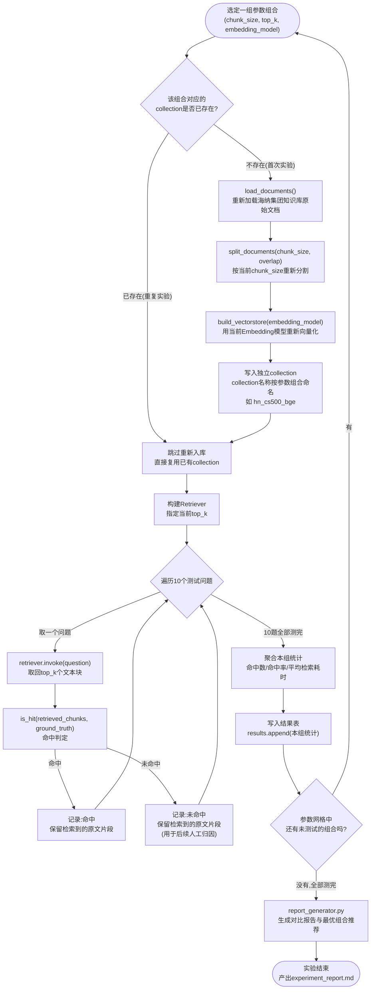
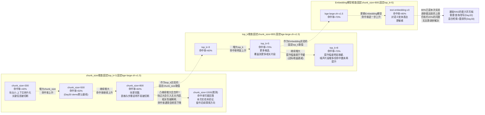

# 第31天 · 周测+RAG效果调优实验日

> **星期**:周三(Sprint2 · RAG基础的收官日,入职第31天,转正之后的第17天)
> **对应Sprint**:Sprint 2 · RAG基础(Day25-31)—— 今天是本Sprint最后一天,明天(Day32)正式进入 Sprint 3 · RAG进阶与交付
> **飞书任务号**:CQ-228(海纳制造集团RAG问答系统 · 效果调优实验方案与执行)、CQ-229(Sprint2周测:LangChain/LCEL/Memory机制/文档加载与分割/向量数据库/RAG完整链路)
> **参与人**:陈铭、苏梦、韩露、张凡(导师:王振宇;下午调优实验环节全程列席:林悦;晚间简短汇报列席:郭建军)
> **今日关键词**:Sprint2周测 / 海纳集团10个真实业务问题(教学模拟) / chunk_size对照实验 / top_k对照实验 / Embedding模型对比实验 / 命中率评估自动化脚本 / RAG调优实验报告

---

## 【旁白】

如果把Sprint2这七天(Day25到Day31)摆在一起看,会发现这是一条相当典型的技术学习曲线——先是LangChain把散乱的手写代码收拢成链式结构,紧接着LCEL用管道符把这条链变得优雅,Memory机制解决了"记住聊过什么"的问题,文档加载与分割第一次让陈铭尝到"真实脏文档"的苦头,向量数据库把这些切碎的文字变成可以检索的坐标点,最后在Day30这个"核心日"里,所有拼图一次性拼上,一个完整的、能跑起来的RAG问答demo,在深夜十点半左右,第一次成功吐出了一句"根据文档,设备保养应当按照月度、季度、年度三级周期执行,具体项目如下……"。那天晚上陈铭在笔记本上写的最后一句话是"它真的能回答问题了",后面配了一个感叹号——这在他三十天的笔记里都算是少见的情绪流露。

但故事不会在"跑起来"这一刻就停下,这恰恰是Sprint2最后一天要讲的东西:一个系统"能跑"和"跑得好"之间,往往隔着一整片需要用数据说话的灰色地带。今天要发生的两件事,表面上互不相关——上午一场例行的周测,下午一次"拿真实业务问题考一考demo"的效果调优实验——但骨子里,它们是同一件事的两种检验方式:周测检验的是这七天陈铭有没有把LangChain、LCEL、Memory机制、文档处理、向量数据库这些知识点真正学透,调优实验检验的是陈铭和团队做出来的这套系统,在真实业务场景里到底靠不靠得住。老王在筹备今天安排的时候跟林悦说过一句话,后来被陈铭记进了笔记本:"周一到周二,他们在证明‘我能把这些技术拼起来’;今天,我要让他们看清楚一件事——‘拼起来能跑’和‘拼出来的东西真的解决了客户的问题’,完全是两个不同量级的目标。"

这一天还承担着另一重更具体的叙事功能:海纳制造集团提供的10个真实业务问题(教学模拟场景),第一次把一个抽象的"效果好不好"问题,变成了一个可以量化、可以拿数字说话的具体命题——命中率。而当这个数字第一次被算出来、摆在桌面上的时候,陈铭和团队会发现,它比谁预想的都难看:不到六成。这个数字不会让故事在这里画上一个悲观的结尾,恰恰相反,它会成为下周整整两天"高级RAG技术"教学内容最坚实的叙事支点——没有今天这次结结实实"摔了一跟头"的调优实验,查询改写、混合检索、重排序这些接下来要学的东西,就只是抽象的技术名词;而有了今天这个具体的、扎心的50%垫在底下,下周每一次技术突破,才会显得真正有分量,陈铭才能真切地感受到"这个技术是为了解决我昨天亲眼见过的那个问题而存在的"。

还有一层意义,藏在"调优实验"这个词本身的方法论里。这是陈铭第一次以相对系统的方式,接触"控制变量做对比实验"这套在工程领域里近乎信仰般存在的方法——不是随手改一个参数看看效果好不好这种"拍脑袋式调参",而是先设计对照组,固定其他变量只改一个,跑出数据,再固定新的最优值去调下一个变量,层层递进。这套方法论,他在跨境电商公司做运营的时候其实并不陌生——A/B测试、控制变量做投放优化,本质上是同一件事;只是今天,变量从"广告文案""投放时段"变成了"chunk_size""top_k""Embedding模型",而检验标准从"点击率""转化率"变成了"命中率"。这种知识迁移带来的熟悉感,会在下午的实验环节里,悄悄地给陈铭一点额外的信心。

---

## 晨会纪要 / 今日目标

**时间**:上午9:00,二层大会议室"望远"
**出席**:王振宇(老王)、陈铭、苏梦、韩露、张凡;林悦(下午调优实验环节列席);郭建军(晚间简短汇报环节列席)

陈铭走进会议室的时候,发现投影屏幕上已经开着一份Excel表格,标题写着"海纳制造集团业务问题测试集(教学模拟)V1.0"——十行数据,每一行是一个问题,后面跟着"标准答案来源""业务背景""提出人角色"三列。这份表格他没见过,显然是林悦昨晚临时准备的。

老王没有绕圈子,直接开场:"昨天晚上,陈铭把RAG的demo跑通了,我在群里也看到了那句‘根据文档回答’的截图,值得肯定——这七天的知识,你们确实拼成了一个能跑的东西。但今天,我们要做一件稍微有点‘拆台’的事。"他顿了一下,把那份Excel表格投影放大:"林悦昨晚整理了海纳集团那边(教学场景里,我们把它设定为客户方提供的真实业务咨询记录整理稿)平时被问得最多的十个问题,今天上午先把Sprint2这七天的知识点做一次系统的周测,下午,我们用这十个问题,把demo实打实地测一遍,看看它到底能答对几个。"

林悦补充了几句背景:"这十个问题不是我随便编的,是参照海纳集团一线设备维护人员和质检员日常最常被问到的问题类型整理出来的——涉及操作规程、保养周期、报警代码含义、质量抽样标准、安全防护要求这几类,基本覆盖了海纳集团设备手册、工艺文件、质量规范三大类文档里最核心的检索需求。教学场景里,我把具体的公司名称、设备型号做了脱敏和简化处理,但问题的‘难度分布’和真实客户场景是一致的——有的问题关键词直接能在文档标题里找到,有的问题的措辞跟文档原文完全不一样,有的问题涉及编号、代码这种需要精确匹配的内容。"

陈铭这时候心里已经有点隐隐的不安——他自己测试demo的时候,用的问题基本上都是"照着文档标题问",效果一直不错,但他也隐约意识到,真实用户提问不会这么"配合"。他把这个想法说了出来,老王点头认同:"这正是今天这个实验最有价值的地方——你自己测出来的效果好,不代表这个系统真的好,因为你测试的时候,潜意识里已经‘迁就’了系统的能力边界。真正的用户不会管你的系统能不能理解,他们只会用自己最自然的方式提问。这十个问题,就是要模拟‘不迁就系统’的真实提问方式。"

**今日目标**:

1. 上午9:00-10:30:Sprint2知识点串讲(LangChain架构、LCEL、Memory机制、文档加载与分割、向量数据库、RAG完整链路六大模块系统回顾),答疑。
2. 上午10:45-12:00:周测笔试(半闭卷,允许查阅LangChain官方文档,不允许互相讨论,不允许使用AI辅助工具)。
3. 下午13:30-17:30:RAG效果调优实验——用10个真实业务问题测试Day30搭建的demo,记录基线命中率;随后按照《RAG效果调优实验方案》,分别对chunk_size、top_k、Embedding模型做对照实验,填写实验记录表。
4. 下午17:30-18:00:实验数据汇总,形成初步的调优实验报告草稿。
5. 晚自习19:30-21:00:调优实验报告定稿,团队复盘讨论,周测成绩公布,郭建军列席听取简短汇报。

**昨日进展回顾(Day30)**:

- 完整RAG链路(文档加载→分割→向量化→存储→检索→增强生成)已经在陈铭的demo里跑通,支持基础的引用来源标注和"不知道就说不知道"的兜底策略。
- 苏梦、韩露、张凡三人各自的demo也已经搭建完成,细节实现略有差异(比如张凡用了不同的Prompt模板结构),但核心链路一致。
- 老王在Day30验收时已经提过一句"接下来要看效果,不是看能不能跑",算是给今天的调优实验提前打了个招呼。

**风险点**:

- 十个真实业务问题的测试结果,大概率会比大家自己平时测试时看到的效果差不少,团队心理上需要有落差准备,老王计划在下午实验开始前先明确讲清楚"这是正常现象,不是demo写错了"。
- 调优实验涉及"重新入库"这个环节,如果每次改参数都要手工删表、重建collection、重新跑一遍脚本,四个人各自操作效率会很低,还容易出错,老王要求今天必须先把"自动化调优实验脚本"写出来,不能靠手工重复劳动。
- 周测笔试范围横跨LangChain、LCEL、Memory、文档处理、向量数据库五大块,信息密度不低于Day21那次周测,答疑时间需要严格控制,不能挤占下午实验时间。
- 下午实验数据量较大(多组参数组合,每组都要跑10个问题的检索),如果没有统一的记录表格和自动化统计脚本,晚上很可能忙到很晚还理不清结果,今天的自动化脚本必须包含"结果自动汇总生成报告"这一步,不能靠人工填表。

老王最后补了一句,算是给今天定了调:"我不想让你们把‘命中率不到六成’这件事,当成一次失败去记。恰恰相反,我想让你们把这次经历,当成你们职业生涯里第一次真正意义上的‘用数据驱动的系统调优’——这件事的价值,可能比今天上午周测的具体分数,要重要得多。"

---

## 需求文档:《海纳制造集团RAG问答系统 · 效果调优实验方案》

> 撰写人:王振宇(技术导师) · 格式规范:林悦(产品经理)
> 文档编号:CQ-PRD-D31-01
> 版本:v1.0

### 背景

Day30搭建完成的RAG问答系统demo,在开发过程中的自测环节表现良好,但开发者自测存在天然的"确认偏误"——测试问题往往是照着知识库文档的标题、关键词去设计的,这类问题对任何一个基本可用的检索系统来说都不难。而海纳制造集团一线员工真实的提问习惯,不会遵循这种"配合系统"的表达方式:他们会用日常口语化的措辞、行业内部的简称、甚至带有情绪色彩的追问方式来提问。如果不在项目正式进入交付阶段之前,用一批贴近真实场景的问题对系统效果做一次客观评估,团队很可能带着"这个系统效果不错"的错误自信,一路做到验收阶段才发现问题,届时返工成本会成倍增加。

因此,本次实验的核心目的,不是简单地"测一下效果好不好",而是要建立一套可重复执行的调优实验流程——通过控制变量的方式,分别验证文本分割参数(chunk_size)、检索返回数量(top_k)、Embedding模型选型这三个关键变量,各自对系统命中率的影响程度,为下周(Sprint3)的高级RAG技术优化工作,提供一份有数据支撑的"当前基础RAG能力天花板"的诚实评估,避免团队在还没摸清基础RAG的能力边界之前,就盲目引入更复杂的技术。

### 用户故事

- 作为技术导师,我希望在Sprint2结束前,用一批贴近真实场景的业务问题,客观评估当前RAG demo的实际效果,而不是依赖开发者自测时"报喜不报忧"式的主观判断。
- 作为项目组一员,我希望能够清楚地知道,如果系统效果不理想,问题究竟出在"文本切分不合理""检索返回数量不够""Embedding模型语义理解能力不足"中的哪一个环节,而不是笼统地归结为"RAG效果不好"这种没有指向性的结论。
- 作为下周即将学习高级RAG技术的学员,我希望在动手学习查询改写、混合检索、重排序这些新技术之前,先亲手体验一次"仅靠调整现有参数,基础RAG的效果能被拉到多高、又会在哪里遇到明显的瓶颈",这样才能真正理解每一项高级技术存在的必要性。
- 作为团队负责人,我希望这次实验产出的调优实验流程和自动化脚本,能够被复用到后续Sprint3、乃至正式项目验收阶段的效果评估工作里,而不是一次性的"用完就扔"的临时脚本。
- 作为海纳集团(教学模拟客户)的代表视角,我希望这套问答系统能够真正理解一线员工日常提问的表达方式,而不是要求员工必须学会"怎么向AI提问才能得到正确答案"。

### 功能列表

| 编号 | 功能 | 说明 | 优先级 |
|---|---|---|---|
| F1 | 测试问题集构建 | 整理10个贴近海纳集团真实业务场景的问题,标注每题的"标准答案来源文档片段"作为命中判定依据 | P0 |
| F2 | 基线效果测试 | 使用Day30 demo当前的默认参数(chunk_size=500、chunk_overlap=50、top_k=3、Embedding模型bge-large-zh-v1.5)执行一轮完整测试,记录基线命中率 | P0 |
| F3 | chunk_size对照实验 | 固定top_k和Embedding模型不变,分别使用chunk_size=300/500/800(overlap按比例调整)重新入库并测试,对比命中率变化 | P0 |
| F4 | top_k对照实验 | 固定chunk_size(取F3实验中效果最优的取值)和Embedding模型不变,分别使用top_k=3/5/8执行检索测试,对比命中率变化 | P0 |
| F5 | Embedding模型对比实验 | 固定chunk_size、top_k(取F3、F4实验中效果最优的组合),对比bge-large-zh-v1.5与text-embedding-v3两个Embedding模型的命中率差异 | P0 |
| F6 | 命中判定自动化 | 命中判定不能靠人工肉眼比对,必须实现自动化的命中判定逻辑(检索返回的文本块是否覆盖标准答案来源片段的关键信息) | P0 |
| F7 | 参数网格批量测试 | 支持一次性配置多组参数组合(chunk_size × top_k × Embedding模型的笛卡尔积或指定子集),自动依次执行入库、检索、评估,无需人工逐一操作 | P1 |
| F8 | 实验结果自动汇总 | 所有参数组合的测试结果,自动汇总成结构化的对比表格(命中率、平均检索耗时、各题命中详情),支持导出为Markdown/CSV报告 | P0 |
| F9 | 未命中原因标注 | 对每一个未命中的问题,记录检索返回的实际内容片段,便于后续人工复核归因(表达差异、编号精确匹配失败、跨章节整合等) | P1 |
| F10 | 最优组合推荐 | 根据全部实验结果,自动标出命中率最高的参数组合,作为下周Sprint3开始前的"当前基础RAG最优配置"基准 | P1 |

### 非功能需求

- **可复现性**:每一组参数组合的入库操作,必须写入独立的向量数据库collection(不能复用同一个collection做覆盖式重建),保证同一天内可以随时回溯任意一组实验的原始检索结果,不因后续实验的重建操作而丢失前面的数据。
- **可扩展性**:测试问题集、参数网格、命中判定逻辑三者应当彼此解耦,今天用10个问题、3×3×2的参数网格,不代表未来只能用这个规模——后续正式项目验收阶段,测试问题集可能扩展到几十甚至上百个问题,今天的脚本设计要为这种扩展留出空间。
- **可解释性**:实验报告不能只给出一个孤零零的命中率数字,必须能够追溯到"这道题为什么命中/为什么没命中"的具体证据(检索返回的原文片段),否则团队无法从实验结果里提炼出真正有价值的改进方向。
- **执行效率**:考虑到今天下午的实验时间有限(约4小时),脚本必须支持批量自动化执行,单组参数组合的入库+检索+评估全流程,预期应控制在几分钟以内完成,不能让四个人在电脑前干等某一步跑很久。
- **教学友好性**:虽然是一次严肃的效果评估实验,但产出的脚本和报告,后续会被作为教学素材复用,代码风格、变量命名、注释详尽程度应当保持公司一贯的工程规范,不能因为是"临时实验脚本"而降低代码质量要求。

### 验收标准

1. 测试问题集(10题)完整整理完毕,每题都标注了对应的标准答案来源文档片段,可用于自动化命中判定。
2. 基线测试(Day30 demo默认参数)完整执行,命中率数据准确记录在实验报告中。
3. chunk_size、top_k、Embedding模型三组对照实验均按照控制变量原则执行完毕,每组实验只改变一个变量,其余变量保持不变。
4. 自动化调优实验脚本能够一键执行指定的参数网格测试,无需人工手动逐一重建向量库、逐一提问、逐一比对结果。
5. 最终产出一份结构化的《RAG效果调优实验报告》,包含基线数据、各组对照实验数据、未命中问题的具体归因分析、当前最优参数组合的推荐。
6. 实验报告中明确指出至少两类"即使调整现有参数也无法解决"的问题类型,作为下周Sprint3高级RAG技术学习的具体切入点。
7. 离线自检脚本能够独立验证命中判定逻辑、实验结果汇总逻辑的正确性,不需要每次都真实消耗Embedding API调用额度来验证代码本身是否正确。

老王下发这份需求文档时,专门提了一句:"你们对比着看会发现,这份文档跟平时林悦写的正式客户PRD,在格式上完全是同一套东西——需求文档不是只有‘做新功能’才需要写,‘验证一个已有功能到底行不行’,同样是一件值得认真规划、认真验收的工程任务。很多团队图省事,效果评估环节做得随随便便,结果就是带着一堆自己都说不清楚的‘感觉还行’去见客户,这是非常危险的习惯。"

---

## 架构设计图:调优实验对照组设计架构

下午实验正式开始前,老王先在白板上画了这张架构图,讲清楚"整个实验体系分几个部分、彼此怎么配合"。

```mermaid
graph TD
    subgraph DATASET["测试数据层"]
        D1["测试问题集<br/>test_questions.py<br/>10个真实业务问题"]
        D2["标准答案来源标注<br/>每题对应的ground_truth<br/>关键信息与来源文档片段"]
    end

    subgraph DOCS["知识库文档层"]
        S1[("海纳集团设备手册<br/>工艺文件/质量规范<br/>教学模拟PDF/Markdown")]
    end

    subgraph PARAMGRID["参数网格层 experiment_config.py"]
        P1["chunk_size候选<br/>[300, 500, 800]"]
        P2["top_k候选<br/>[3, 5, 8]"]
        P3["Embedding模型候选<br/>[bge-large-zh-v1.5,<br/>text-embedding-v3]"]
        P4["参数组合生成器<br/>build_param_combinations()"]
    end

    subgraph GROUPS["对照组执行层"]
        G0["基线组 Baseline<br/>chunk_size=500,top_k=3,<br/>bge-large-zh-v1.5"]
        GA["实验组A:chunk_size对照<br/>固定top_k=3,固定Embedding<br/>分别测300/500/800"]
        GB["实验组B:top_k对照<br/>固定chunk_size(A组最优)<br/>固定Embedding<br/>分别测3/5/8"]
        GC["实验组C:Embedding对照<br/>固定chunk_size(A组最优)<br/>固定top_k(B组最优)<br/>分别测两个Embedding模型"]
    end

    subgraph PIPELINE["单组实验执行流水线"]
        E1["ingest.py<br/>按当前参数重新分割文档<br/>重新向量化入库<br/>(每组独立collection)"]
        E2["retrieve.py<br/>对10个问题逐一检索<br/>取回top_k个文本块"]
        E3["evaluate.py<br/>命中判定<br/>is_hit(检索结果, ground_truth)"]
    end

    subgraph REPORT["结果汇总层"]
        R1["experiment_runner.py<br/>结果收集器"]
        R2["report_generator.py<br/>生成对比表格<br/>Markdown/CSV报告"]
        R3[("experiment_report.md<br/>experiment_results.csv")]
    end

    D1 --> E2
    D2 --> E3
    S1 --> E1

    P1 --> P4
    P2 --> P4
    P3 --> P4
    P4 --> G0
    P4 --> GA
    P4 --> GB
    P4 --> GC

    G0 --> E1
    GA --> E1
    GB --> E1
    GC --> E1

    E1 --> E2
    E2 --> E3
    E3 --> R1
    R1 --> R2
    R2 --> R3

    R3 -. "标出至少两类<br/>调参无法解决的问题类型" .-> NEXT["Sprint3:高级RAG技术<br/>Day32查询改写/Day33混合检索"]
```



老王讲解这张图时,特别强调了"对照组执行层"里三组实验的先后依赖关系:"你们注意,实验组B依赖实验组A的结果(取A组里效果最优的chunk_size作为B组的固定值),实验组C又依赖B组的结果。这不是我们偷懒省事,这是控制变量法的基本要求——如果你同时改三个变量,最后看到命中率变化,根本说不清楚是哪个变量在起作用,甚至有可能出现‘三个变量互相抵消,表面上看不出任何变化,但实际上每个变量都在起相反方向的作用’这种更麻烦的情况。"

苏梦提了一个问题:"如果A组测出来的最优chunk_size,和C组测出来的最优Embedding模型搭配在一起,不是真正的全局最优组合,会不会有问题?"老王认可了这个担忧:"你说得完全对,这种‘先固定一个变量最优、再调下一个变量’的方法,理论上找到的是一个‘局部最优’,不保证是三个变量的‘全局最优组合’。如果预算和时间允许,更严谨的做法是做全量网格搜索(把chunk_size、top_k、Embedding模型的所有组合都跑一遍),但今天我们的测试问题集只有10题,参数候选值也不算多,做全量网格搜索完全跑得动,所以待会儿的实验脚本,我会同时支持‘分步对照’和‘全量网格’两种模式,分步对照用来在课堂上讲清楚‘每个变量各自的影响’,全量网格用来最终确认真正的最优组合。"

---

## 流程图:调优实验单次执行完整流程

架构图讲完"分几层",老王接着画了这张更细的流程图,讲清楚"改一次参数之后,数据具体是怎么从头流转到评估结果的"。



这张图有一个细节,四个人当场都在笔记里画了重点——`CheckExist`那个判断框,决定了"要不要重新入库"。张凡提了一个很实际的问题:"如果我们同一个chunk_size要测多个top_k,岂不是不用重复入库,只要检索的时候换个top_k参数就行?"老王点头肯定了这个观察:"完全对,入库(切分+向量化+存储)和检索(取回top_k个结果)是两个独立的步骤,top_k只影响检索这一步,不影响入库这一步。所以你们待会儿写实验组B(top_k对照)的代码时,应该复用实验组A里已经建好的、chunk_size最优的那个collection,不需要为每一个top_k值都重新做一次向量化——重新向量化是最耗时间、也最消耗Embedding API调用额度的一步,能省则省。"

韩露提了另一个问题:"`Judge`这一步,‘命中判定’具体是怎么算的?是看检索到的文本里有没有出现标准答案的原文吗?"老王给了更细的说明,也算是提前给下午实验打了个预防针:"‘命中’的判定标准,我们今天定义得相对宽松——只要top_k个检索结果里,有任意一个文本块,包含了标准答案所需要的关键信息(不要求逐字逐句完全匹配原文,允许标点、措辞上的细微差异,但核心的数字、编号、结论性表述必须存在),就判定为命中。这个标准本身也是需要团队讨论达成一致的,标准定得越宽松,命中率数字会显得越好看,但这种‘好看’对判断系统真实能力没有任何帮助,所以我们宁可定得严格一点,让数字难看一点,但让它真实。"

---

## 示意图:不同chunk_size与top_k组合下命中率变化趋势示意

第三张图,老王换了一种更"数据感"的画法,把预期(以及等下午实验做完之后要验证)的命中率变化趋势,先画成一张示意图,让大家在动手之前,先建立一个直觉预期。



老王讲这张图的时候,先打了个预防针:"这张图上的具体数字,是我根据过去带过的类似项目经验估出来的一个大致预期,不是今天实验必须精确复现的‘标准答案’——你们下午实测出来的数字,可能比这个更好,也可能更差,这都正常。这张图真正想让你们建立的,是三条曲线各自的‘形状直觉’:chunk_size是一条先上升、大概率后面会掉头下降的曲线,不是‘越大越好’;top_k是一条上升但边际收益递减的曲线,不是‘越多越好’;Embedding模型的选择,往往是这几个变量里,单次提升幅度最直接、最立竿见影的一个,但即便换了更好的模型,也不代表能解决所有问题。"

张凡问了一个很关键的问题:"图的最后写着‘80%已经是调参能达到的上限’,这个上限是怎么算出来的,不会调更细的参数就能突破吗?"老王的回答,直接把这一天和下周连起来了:"这正是我们下午做完实验之后要一起验证的事——如果你把chunk_size、top_k、Embedding模型这三个变量,能调的范围都调了一遍,命中率依然卡在一个区间里上不去,那大概率说明,剩下没被解决的问题,不是‘参数没调对’的问题,是‘基础RAG这套架构本身的能力边界’问题。比如设备型号编号‘XJ-3200A’这种需要精确字符匹配的检索需求,向量检索天生就不擅长处理,不管你怎么调参数,它捕捉的是语义相似度,不是字符精确匹配——这类问题,要等到Day33学混合检索(把关键词检索BM25和向量检索结合起来)才能真正解决。今天这张图的价值,不是告诉你们‘答案是80%’,是让你们亲手把这条曲线的形状画出来,亲眼看到它在哪里趴平、在哪里卡住。"

---

## 课堂笔记

### 上午:Sprint2周测笔试详解

**9:00,培训室**

老王把投影切到"Sprint2七天知识点串讲总表",开始上午的知识回顾环节。

#### Sprint2七天知识点串讲总表

| 天数 | 核心知识点 | 代表性内容 | 与今天调优实验的关联 | 常见误区 |
|---|---|---|---|---|
| Day25 | LangChain架构总览、ChatModel接口、PromptTemplate/ChatPromptTemplate | 用LangChain重写对话应用 | 今天的实验脚本大量使用ChatPromptTemplate构造RAG Prompt | 把LangChain理解成"另一个大模型",实际上它只是一层封装和编排框架 |
| Day26 | LCEL、Runnable接口、OutputParser、RunnablePassthrough/RunnableParallel、分支路由 | "翻译→润色→摘要"三级链 | 今天的RAG链、评估链都用LCEL的管道符组织 | 把`\|`符号当成普通的位运算符,不理解它背后调用的是`Runnable.__or__`方法 |
| Day27 | ChatMessageHistory、RunnableWithMessageHistory、窗口记忆、摘要记忆、数据库持久化记忆 | 多会话记忆管理模块(session_id隔离) | 今天的实验里为了保证每次检索测试互不干扰,复用了"按key隔离状态"的设计思路 | 以为Memory机制只是"把历史存进一个列表",忽略了摘要记忆需要额外调用一次模型做压缩这一步的成本 |
| Day28 | Document Loaders、CharacterTextSplitter/RecursiveCharacterTextSplitter、chunk_size与chunk_overlap调优 | PDF电子书清洗分割脚本 | 今天的chunk_size对照实验,直接检验Day28学的分割参数对最终效果的真实影响 | 以为chunk_overlap越大越好,忽略了overlap过大会导致同样的内容被重复索引,拉长入库和检索耗时 |
| Day29 | 向量数据库原理(ANN/HNSW通俗讲解)、Chroma上手、Milvus/FAISS/Pinecone对比、Retriever接口 | 自建知识库+相似度检索测试脚本 | 今天的实验里,每组参数组合都对应一个独立的Chroma collection | 把"向量数据库"和"关系型数据库"用同样的思维方式理解,忽略了近似检索(ANN)本身存在的召回不是100%精确的特性 |
| Day30 | RAG完整链路(加载→分割→向量化→存储→检索→增强生成)、RAG Prompt模板、引用来源标注、"不知道"兜底 | 企业知识库问答系统命令行版原型 | 今天调优实验的对象,就是Day30搭建的这个完整demo | 把RAG理解成"检索+把结果拼进Prompt"就完事了,忽略了检索质量本身才是决定整个系统效果的最大瓶颈 |

老王讲到Day29那一行时,特意停下来补充说明:"你们上周学向量数据库的时候,我反复强调过HNSW这类近似最近邻(ANN)算法,‘近似’这个词不是随便说的——它意味着即便你的Embedding模型和检索参数完全正确,数据库返回的‘最相似的k个结果’,也不保证是数学意义上绝对精确的top-k,而是‘用换取速度的代价,得到一个足够接近的近似结果’。今天下午如果你们发现同样的参数、同样的问题,两次检索结果稍有不同(极少数情况下会发生),不要慌,这属于近似检索本身正常的工程特性,不是代码写错了。"

#### 答疑环节:四个人分别提出的问题

**苏梦的问题**:"LCEL里`RunnablePassthrough`到底是干什么用的?我总感觉它像是‘什么都没做’。"

老王给了一个具体场景化的解释:"它确实‘什么都没做’,但‘什么都没做’本身,恰恰是它的价值所在。想象一个RAG链:你需要把用户的原始问题,同时传给‘检索器’(用来查资料)和最终的Prompt模板(用来填充‘用户问题’这个变量)。检索器会把问题‘转换’成检索结果,但最终Prompt模板除了需要检索结果,还需要原始问题本身,这时候你就需要`RunnablePassthrough`把原始问题原样传递下去,不做任何转换,和检索结果并行传给下一步。它是‘并行分支’场景里,‘保留原始输入’这一分支的标准写法。"

**韩露的问题**:"摘要记忆(Summary Memory)和窗口记忆(Window Memory),在真实项目里怎么选?是不是摘要记忆一定更好,因为它压缩了信息、能记住更长的历史?"

老王给了一个更贴近工程决策的回答:"没有‘一定更好’,只有‘更适合当前场景’。窗口记忆的优点是简单、可控、不产生额外的模型调用成本,缺点是超出窗口的历史会被直接丢弃,一点不留;摘要记忆的优点是能把很久之前的信息压缩保留下来,缺点是每次做摘要都要多消耗一次模型调用,而且摘要这个动作本身是有损压缩,可能会丢掉一些细节,还可能引入模型自己的‘理解偏差’。像海纳集团这种知识库问答场景,单次会话通常不会特别长(用户问几个业务问题就结束了),用窗口记忆基本够用,没必要为了‘看起来更高级’强行上摘要记忆,增加不必要的成本和复杂度。"

**张凡的问题**:"Day28学的`RecursiveCharacterTextSplitter`,‘递归’这个词具体体现在哪?我写代码的时候没感觉到哪里递归了。"

老王在白板上补画了一个简化示意:"它的‘递归’,体现在切分的优先级策略上——它会先尝试按‘最理想’的分隔符切(比如按段落`\n\n`切),如果切出来的某一块仍然超过你设定的chunk_size,它不会就此放弃,而是对这一块‘递归’地换一个更细粒度的分隔符继续切(比如改成按句子`。`切),如果还是太长,继续换成按逗号、按空格切,直到每一块都不超过chunk_size为止。这个‘遇到问题就换更细的规则重新尝试’的过程,才是‘递归’这个词真正的体现,不是说函数调用自己那种狭义的递归。"

**陈铭的问题**:"我们Day30demo里的RAG Prompt模板,‘不知道就说不知道’这句话,是靠什么机制起作用的?模型真的会‘知道自己不知道’吗?"

老王的回答比较坦诚,也顺势引出了下午实验的核心议题:"严格说,这句话起作用的方式,不是模型真的具备‘自我认知’能力去判断‘我知不知道’,而是我们在Prompt里明确要求它——‘如果提供的资料里找不到答案,就回答不知道,不要编造’,模型是在‘遵循指令’,不是在‘自我反思’。这个机制有一个隐含的前提:检索环节必须先把‘真正相关的资料’交到模型手上,模型才有机会依据这些资料判断‘能不能回答’。如果检索环节本身就没检索到相关资料(这正是我们下午要测的‘命中率’),那模型大概率会诚实地说‘不知道’——这听起来是个‘安全’的结果,但对用户来说,‘系统说不知道’和‘系统没找对资料所以说不知道’,体验上是一样糟糕的:用户要的答案,压根没拿到。"

#### 周测笔试完整试卷与讲评

**10:45,培训室**

以下是本次Sprint2周测笔试的完整题目,以及考试结束后老王现场讲评时给出的详细答案与解析。

**一、概念选择/判断题(每题2分,共16分)**

**1.** 关于LangChain框架,下列说法最准确的是:
A. LangChain本身是一个大语言模型,可以独立完成对话生成
B. LangChain是对大模型调用、Prompt管理、外部工具与数据源集成等能力的一层编排与封装框架
C. 使用LangChain之后,不再需要关心底层调用的是哪个大模型厂商的API
D. LangChain只能配合OpenAI的模型使用

**2.** 关于LCEL(LangChain Expression Language)中的`|`管道符,下列说法正确的是:
A. `|`符号在LCEL里执行的是普通的位运算,与Python内置行为完全一致
B. `|`符号背后调用的是`Runnable`对象实现的`__or__`方法,用于把多个可运行组件串联成一条链
C. 使用`|`符号连接的多个组件,必须是同一种类型才能正确工作
D. LCEL链一旦定义完成,其内部组件顺序不能被修改或替换

**3.** 关于`RunnableParallel`,下列说法正确的是:
A. 它要求所有并行分支必须使用完全相同的输入
B. 它可以让同一份输入,同时被多个不同的Runnable分支并行处理,各分支的输出会汇总成一个字典
C. 它执行时,各分支之间必须严格按顺序依次执行,不能真正并行
D. 它只能用在RAG场景中,不能用在其他链式结构里

**4.** 关于`RunnableWithMessageHistory`,下列说法正确的是:
A. 它会自动把所有历史对话内容永久保存,不需要开发者额外处理会话隔离
B. 它需要配合一个"按session_id获取/创建历史记录对象"的函数,才能正确实现多会话隔离
C. 它只支持内存存储,不能对接数据库持久化
D. 它和普通的Runnable链完全不兼容,必须重写整条链的结构

**5.** 关于`chunk_size`与`chunk_overlap`,下列说法正确的是:
A. chunk_overlap越大越好,可以无限增大而不会带来任何副作用
B. chunk_size设置得越小,检索到的内容一定越精确、效果一定越好
C. chunk_overlap的作用是让相邻文本块之间保留一定的重叠内容,避免关键信息恰好被切分点切断而丢失语义连续性
D. chunk_size与文档本身的语义结构完全无关,任何文档都应该使用同一个固定值

**6.** 关于向量数据库中的近似最近邻(ANN)检索,下列说法正确的是:
A. ANN检索保证返回的一定是数学意义上绝对精确的top-k最相似结果
B. ANN检索(如HNSW算法)通过牺牲一定的精确度来换取远超暴力全量比对的检索速度,适合大规模向量数据场景
C. ANN检索只能用于文本向量,不能用于图片、音频等其他模态的向量
D. 使用ANN检索之后,向量维度不再对检索速度产生任何影响

**7.** 关于Retriever(检索器)接口,下列说法正确的是:
A. Retriever只能返回文本内容,不能附带来源、元数据等额外信息
B. 不同的向量数据库(Chroma、Milvus、FAISS等)包装成LangChain的Retriever之后,对上层链式代码而言可以保持基本一致的调用方式
C. Retriever的top_k参数一旦设置,运行期间不能再修改
D. Retriever内部必须使用余弦相似度作为唯一的相似度度量方式

**8.** 关于RAG(检索增强生成)的基本原理,下列说法正确的是:
A. RAG的核心思想是让模型在生成回答之前,先从外部知识库检索出相关内容,并把这些内容作为上下文提供给模型参考
B. RAG之后,模型不再需要任何预训练知识,完全依赖检索到的内容生成回答
C. RAG系统的整体效果主要取决于生成模型本身的参数量大小,与检索环节的质量关系不大
D. RAG只适用于问答场景,不能用于摘要、翻译等其他任务

**二、简答题(每题5分,共20分)**

**9.** 请简述"命中率"这个评估指标在RAG效果调优实验中的含义,并说明为什么它比"开发者主观感觉效果不错"更适合作为效果评估的依据。

**10.** 请简述本次实验里"控制变量法"的具体应用方式(以chunk_size、top_k、Embedding模型三个变量为例),并说明如果不遵循控制变量原则、同时改变多个变量,会带来什么样的分析困难。

**11.** 请简述向量检索为什么天然不擅长处理"设备型号编号XJ-3200A"这类需要精确字符匹配的查询需求,原理上说明这一局限性的根源。

**12.** 请简述RAG Prompt模板中"如果资料里找不到答案,就回答不知道"这一设计,分别站在"避免模型编造错误信息"和"检索环节本身可能存在缺陷"这两个角度,说明这个设计各自的价值与局限。

**三、读代码/读参数写输出题(每题4分,共16分)**

**13.** 假设某次chunk_size对照实验中,chunk_size=300时命中率40%,chunk_size=500时命中率50%,chunk_size=800时命中率60%,如果继续增大chunk_size到2000,请判断命中率大概率会呈现什么趋势,并说明理由。

**14.** 阅读下面这段简化的LCEL RAG链定义代码,请指出:这条链的输入是什么?最终传给大模型的Prompt里包含哪些变量?

```python
rag_chain = (
    {"context": retriever | format_docs, "question": RunnablePassthrough()}
    | rag_prompt
    | llm
    | StrOutputParser()
)
```

**15.** 已知某次top_k对照实验,固定chunk_size=800、固定Embedding模型bge-large-zh-v1.5,测得top_k=3时命中率60%,top_k=5时命中率70%,top_k=8时命中率70%。请判断:如果继续增大top_k到20,命中率是否一定会继续上升?说明你的判断依据。

**16.** 阅读下面这段"命中判定"逻辑的伪代码,判断它存在什么明显的缺陷,可能导致命中率被高估或低估:

```python
def is_hit(retrieved_texts, ground_truth_keyword):
    combined_text = "".join(retrieved_texts)
    return ground_truth_keyword in combined_text
```

**四、改错题(每题5分,共10分)**

**17.** 下面这段构建向量数据库collection名称的代码存在一个隐患,请指出问题并给出修复思路:

```python
def get_collection_name(chunk_size, top_k, embedding_model):
    return f"hn_{chunk_size}_{top_k}_{embedding_model}"
```

**18.** 下面这段实验结果记录代码存在一个逻辑错误,导致多组实验的结果会互相覆盖,请指出问题并修复:

```python
def run_experiment(param_combinations):
    result = {}
    for combo in param_combinations:
        hit_count = evaluate_combo(combo)
        result["hit_count"] = hit_count
    return result
```

**五、综合设计题(每题4分,共8分)**

**19.** 假设你要为一次RAG效果调优实验设计"未命中原因分类"标签体系(例如"表达差异""编号精确匹配失败"等),请至少列出4类常见的未命中原因标签,并各给出一个简要说明。

**20.** 假设某次实验中,你发现"增大chunk_size让命中率提升,但同时也让平均检索耗时明显变长",请说明在真实生产环境中,面对"效果"与"性能"这两个目标出现冲突时,你会如何权衡决策,需要考虑哪些因素。

---

**周测笔试参考答案与解析**

**1. 答案:B**
解析:LangChain本身不具备生成能力,它是一层编排框架,负责把Prompt管理、模型调用、外部工具、数据源检索等能力有机地组织起来(排除A);使用LangChain仍然需要理解底层调用的具体模型厂商差异(比如不同厂商对Function Calling的支持细节可能有差异),不是"完全不用关心"(排除C);LangChain设计上支持多种模型厂商接入,不局限于OpenAI(排除D)。

**2. 答案:B**
解析:LCEL重写了`__or__`方法,让`|`符号在`Runnable`对象之间具备"串联组合"的特殊语义,不是普通的位运算(排除A);`|`连接的组件不要求类型完全相同,只要求上一个组件的输出格式,能被下一个组件正确接受作为输入(排除C);LCEL链定义完成之后,依然可以通过重新组合的方式替换或调整内部组件,并不是不可修改的(排除D)。

**3. 答案:B**
解析:`RunnableParallel`的核心能力,正是让同一份输入被多个分支并行处理,各分支各自产出结果后,汇总成一个以分支名为key的字典(B正确);它不要求各分支必须使用相同的输入处理逻辑(排除A);多个分支在设计上是并行执行的,不是强制顺序执行(排除C);它是一个通用的LCEL组件,不局限于RAG场景(排除D)。

**4. 答案:B**
解析:`RunnableWithMessageHistory`需要开发者提供一个"根据session_id返回对应历史记录对象"的工厂函数,由此实现多会话隔离,这是它工作的核心前提(B正确);它本身不强制"永久保存",历史记录的存储方式(内存、数据库等)取决于开发者传入的历史记录对象具体实现(排除A、C);它设计上是可以包裹在已有的Runnable链外面使用的,不需要重写整条链(排除D)。

**5. 答案:C**
解析:chunk_overlap过大会导致内容重复索引,增加存储和检索开销,不是"越大越好"(排除A);chunk_size过小会导致语义碎片化,反而降低效果,不是"越小越精确"(排除B);chunk_size的合理取值,与文档本身的段落结构、内容密度密切相关,不存在放之四海而皆准的固定值(排除D)。C选项准确描述了chunk_overlap存在的核心意义。

**6. 答案:B**
解析:ANN检索的"近似"二字,恰恰说明它不保证绝对精确的top-k结果,而是用可控的精度损失换取远超暴力比对的检索速度,这是它在大规模数据场景下被广泛采用的核心原因(排除A,B正确);ANN算法同样适用于其他模态数据的向量检索,只要数据能表示成向量,原理上都能应用(排除C);向量维度依然会影响检索速度和内存占用,并没有被ANN算法完全抵消(排除D)。

**7. 答案:B**
解析:不同向量数据库包装成LangChain的Retriever接口之后,对上层调用代码而言,基本保持`retriever.invoke(query)`这种一致的调用方式,这正是"接口抽象"带来的价值,便于后续更换底层向量数据库而不大改上层代码(B正确);Retriever通常可以附带元数据(如来源文档、页码等)一起返回,不局限于纯文本(排除A);top_k参数通常是可以在构建或调用Retriever时灵活配置的(排除C);不同向量数据库支持的相似度度量方式并不完全一致,余弦相似度只是常见的一种,不是唯一方式(排除D)。

**8. 答案:A**
解析:RAG的核心思想正是"先检索、再生成",让模型基于检索到的外部知识回答问题,而不是完全依赖模型自身预训练时学到的知识(A正确);RAG之后模型依然需要依靠自身的预训练知识来理解和组织语言、进行推理,不是"不再需要任何预训练知识"(排除B);检索环节的质量,往往是决定RAG系统整体效果的最大瓶颈之一,不是"关系不大"(排除C);RAG的应用场景不局限于问答,摘要、翻译等任务同样可以借助检索到的相关参考资料提升效果(排除D)。

**9. 参考答案**:"命中率"指的是,在一批标注了标准答案来源的测试问题集合中,系统检索(或最终回答)环节成功覆盖到标准答案所需关键信息的问题数量,占测试问题总数的比例。它比"开发者主观感觉效果不错"更适合作为评估依据,原因在于:开发者自测时,往往会不自觉地使用"对系统友好"的提问方式(比如直接照搬文档标题、使用系统能理解的规范措辞),这类测试天然存在"确认偏误",容易高估系统的真实能力;而命中率是建立在一批预先标注、贴近真实用户提问习惯的测试问题上,用可量化、可复现、可追溯的方式衡量效果,不依赖任何人的主观印象,也便于在调整参数之后,用同一批问题重新测试,客观对比效果变化,这是"感觉"这种评估方式完全不具备的可比性和可追溯性。

**10. 参考答案**:控制变量法在本次实验中的具体应用方式是——先固定top_k和Embedding模型不变,只改变chunk_size,测出chunk_size对命中率的独立影响,选出效果最优的chunk_size;然后固定这个最优chunk_size和原Embedding模型不变,只改变top_k,测出top_k的独立影响,选出最优top_k;最后固定这两个最优值,只改变Embedding模型,测出Embedding模型的独立影响。如果不遵循这个原则,同时改变多个变量(比如同时把chunk_size从500改成800、把top_k从3改成8),即便命中率发生了变化,也无法判断这个变化究竟是chunk_size的功劳、top_k的功劳,还是两者共同作用、甚至两者方向相反相互抵消后仍显示出的净效果——这种"说不清楚原因"的实验结果,对后续的调优决策没有任何指导意义,团队也没办法把经验复用到下一个类似的项目里。

**11. 参考答案**:向量检索(Embedding+余弦相似度)衡量的是两段文字在语义空间中的"方向接近程度",它捕捉的是"意思相近",而不是"字符完全一致"。像"XJ-3200A"这样的设备型号编号,本质上是一个高度符号化、几乎没有"语义"可言的标识符——从Embedding模型的角度看,"XJ-3200A"和"XJ-3200B"这两个编号,字符上只差最后一位,但语义空间里的距离可能并不像人类直觉预期的那样"泾渭分明",模型很难像人类一样"精确注意到最后一个字符不同就是完全不同的东西"。这种符号级别的精确匹配需求,恰恰是关键词检索(比如BM25这类基于词频统计的检索算法)天生擅长、而向量检索天生薄弱的领域,这也是Day33要引入"混合检索(向量+BM25)"的根本原因。

**12. 参考答案**:从"避免模型编造错误信息"的角度看,这个设计的价值在于给模型设置了一条明确的行为底线——宁可承认"不知道",也不要在没有依据的情况下凭空生成一个听起来合理但实际上不准确的答案,这对企业知识库问答这种对准确性要求很高的场景至关重要,能有效降低"一本正经地胡说八道"带来的信任风险。但从"检索环节本身可能存在缺陷"的角度看,这个设计存在一个局限:它只能保证"没有依据就不瞎说",却无法弥补"检索环节本身没有找对资料"这个更根本的问题——如果用户问的问题,知识库里确实有答案,但因为检索质量不足(比如今天调优实验揭示的这些参数问题)而没有被检索到,模型收到的资料本身就是不相关的,这时候模型诚实地回答"不知道",从用户体验角度看,依然是一次失败的问答体验,只是"失败的方式"比"编造错误答案"稍微体面一点而已。真正解决问题,还是要从提升检索质量本身入手,而不能只依赖这句兜底话术。

**13. 参考答案**:大概率会先经历短暂的提升(如果之前还没有把包含答案所需上下文的完整段落纳入同一个文本块),但继续增大到2000这种明显偏大的取值之后,命中率很可能转而下降。理由是:chunk_size过大之后,每个文本块会包含越来越多与当前查询无关的内容,这会稀释这个文本块在向量空间中的"语义焦点"——一个文本块如果同时讨论了保养周期、安全规范、报警代码三件不相关的事,它的Embedding向量会是这三个话题语义的某种"混合平均",反而更难与任何一个具体查询的语义高度对齐,导致检索排序变差,原本应该排在前面的相关内容反而可能被挤到top_k之外。

**14. 参考答案**:这条链的输入是用户的原始问题(一个字符串)。整条链执行时,输入会同时流向两个分支:一个分支是`retriever | format_docs`,先用输入去检索,再把检索到的文档列表格式化成一段文字,作为`context`;另一个分支是`RunnablePassthrough()`,把原始输入原样传递,作为`question`。这两个分支的结果被`RunnableParallel`(通过字典形式隐式构造)汇总成`{"context": ..., "question": ...}`,传给`rag_prompt`模板去填充这两个变量,最终生成完整的Prompt字符串,再交给`llm`生成回答,最后经过`StrOutputParser()`把模型的结构化输出转换成普通字符串。因此,最终传给大模型的Prompt里,包含`context`(检索到的相关文档内容)和`question`(用户的原始问题)这两个变量。

**15. 参考答案**:不一定会继续上升,甚至可能出现命中率不变、检索噪声增多但命中数没有进一步提升的情况,还可能因为top_k过大引入大量不相关内容,干扰模型的判断,导致回答质量下降(即便命中率的统计口径本身没有下降,回答的实际可用性也可能变差)。判断依据是:top_k=5到top_k=8这一段,命中率已经从70%提升到70%,增长为0,说明知识库中真正与这10个问题相关的文本块数量,大概率已经在top_k=5的时候基本被覆盖完了,继续增大top_k,拿到的更多是相关性递减、甚至完全不相关的文本块,这属于典型的"边际收益递减"现象,继续无限增大top_k,不但不会带来命中率的持续提升,反而会增加检索和生成阶段的开销、增加不相关信息对最终回答质量的干扰风险。

**16. 参考答案**:这段命中判定逻辑,只是简单地判断"标准答案关键词是否作为一个连续字符串,出现在检索结果拼接后的文本里",存在至少两个明显缺陷:一是"高估"风险——如果关键词本身是一个很常见的词(比如"设备""检查"这类通用词),即便检索到的内容和问题实际上毫不相关,只是恰好包含了这个常见词,也会被误判为"命中",导致命中率被虚高地估计;二是"低估"风险——如果标准答案的表述方式,在检索到的文本里被拆开、换了说法,或者用了同义表达(比如标准答案关键词是"停机检修",但检索到的原文写的是"设备停止运行并进行维修"),即便这段检索结果实际上包含了正确答案所需的全部信息,也会因为字符串没有完全匹配,被误判为"未命中"。更合理的命中判定,应该结合多个关键要素的综合覆盖情况来判断,而不是依赖单一关键词的字符串包含关系这种过于简化和脆弱的判断方式。

**17. 参考答案**
问题:这段代码直接把`embedding_model`(可能是一个较长的模型名称字符串,比如"bge-large-zh-v1.5"或包含斜杠、点号的路径式名称)原样拼接进collection名称,而绝大多数向量数据库对collection命名都有格式限制(比如不允许包含点号、斜杠、连字符位置不当等),直接拼接容易导致collection创建失败,或者在不同参数组合之间产生难以阅读、容易混淆的超长命名。
修复思路:应该对参数值做规范化处理(比如替换掉不允许的特殊字符,或者用一个简短的哈希值/编号代替完整的模型名称),保证生成的collection名称既符合数据库的命名规范,又能保持在实验记录里可读、可追溯。示例修复:
```python
import re

def get_collection_name(chunk_size, top_k, embedding_model):
    """生成规范化的collection名称,避免特殊字符导致创建失败。"""
    safe_model_name = re.sub(r"[^a-zA-Z0-9]", "", embedding_model)[:16]
    return f"hn_cs{chunk_size}_k{top_k}_{safe_model_name}"
```

**18. 参考答案**
问题:循环体内,每次迭代都直接用固定的字符串键`"hit_count"`去覆盖写入`result`字典,导致最终`result`里只会保留最后一次循环(最后一组参数组合)的结果,前面所有组合的实验结果全部被覆盖丢失。
修复后的写法:
```python
def run_experiment(param_combinations):
    """依次执行每组参数组合的实验,分别记录各自的结果,不发生互相覆盖。"""
    result = {}
    for combo in param_combinations:
        hit_count = evaluate_combo(combo)
        combo_key = f"cs{combo['chunk_size']}_k{combo['top_k']}_{combo['embedding_model']}"
        result[combo_key] = hit_count
    return result
```

**19. 参考答案**(列出4类,合理即可):
- **表达差异型**:用户提问的措辞、句式与知识库文档原文差异很大,共同关键词很少甚至没有,导致向量检索的语义相似度计算结果偏低。
- **编号/型号精确匹配失败型**:查询涉及设备型号、报警代码、规范编号等符号化标识,向量检索的语义相似度机制难以精确区分仅有一两个字符差异的编号。
- **切分断裂型**:标准答案所需的信息,恰好被文本分割参数切分在两个不同的文本块里,单个文本块都不足以完整回答问题,即便检索器把两个块都取回,若模型没有很好地整合,也可能无法给出完整答案。
- **跨文档/跨章节整合型**:问题的完整答案,分散在知识库的多个不同文档或章节中,需要综合多处信息才能给出完整回答,单次检索(即使top_k设置得比较大)也未必能覆盖到所有相关的分散片段,且模型需要具备较强的整合能力。

**20. 参考答案**(开放性思考题,以下给出一种合理的权衡思路):在真实生产环境中,面对"效果提升"与"性能下降"的权衡,首先需要明确当前业务场景对响应速度和准确率各自的容忍边界——比如客服问答场景,用户对几秒钟的等待通常可以接受,但如果超过5-8秒,体验会明显下降;其次需要评估"效果提升的幅度"是否值得"性能下降的代价",比如命中率从70%提升到72%,但平均响应时间从2秒增加到6秒,这种边际收益很小、代价很大的调整通常不值得;还可以考虑用工程手段部分抵消性能损失,比如对chunk_size增大后检索出的较长文本块,引入后续要学的"上下文压缩"或"重排序+截断"技术,在生成阶段只把真正最相关的部分喂给模型,既保留检索召回的完整性,又控制最终进入生成环节的内容长度;最后,任何权衡决策都应该有客户和产品经理参与讨论、基于具体业务场景的实际容忍度做决策,而不是工程团队单方面凭直觉判断。

---

老王收卷后统计了一下:第11题(向量检索为什么不擅长编号精确匹配)和第16题(命中判定逻辑的缺陷)错误率相对较高,他补充说:"这两题错的人,恰好是下午实验里最容易踩坑的两个环节,现在错了不要紧,下午亲手做一遍实验,你们会记得比看解析深刻得多。"

### 下午:RAG效果调优实验实录

**13:30,培训室**

老王把《RAG效果调优实验方案》重新投影出来,林悦也如约出现在会议室,准备全程参与观察和记录。老王先讲了几句定调的话:"接下来的四个小时,你们要做的事情,本质上和你们过去做运营、做产品经理、做测试时用过的方法论没有本质区别——控制变量、跑数据、看结果、下结论。区别只在于,今天的‘产品’是一个RAG问答系统,‘转化率’换成了‘命中率’。"

#### 十个真实业务问题(教学模拟)

林悦把整理好的测试问题集完整投影出来,逐条讲解了每个问题的业务背景和提出场景:

| 编号 | 问题 | 提出场景 | 标准答案来源 |
|---|---|---|---|
| Q1 | XJ-3200A型号数控车床的开机操作规程是什么? | 新入职操作员,对着设备手册目录直接问 | 《数控车床操作手册》第3章"开机与准备工作" |
| Q2 | 设备日常保养都有哪些项目,多久做一次? | 车间班组长,月度例行提问 | 《设备保养规范》第2节"月度/季度/年度保养项目表" |
| Q3 | 什么情况下必须立即停机检修,不能等排班安排? | 一线操作工,遇到异常时紧急咨询 | 《设备安全操作规程》第5条"紧急停机条件" |
| Q4 | 成品质量检验的抽样比例和判定标准是怎么规定的? | 质检员,日常质检工作提问 | 《产品质量检验规范》第4章"抽样方案与合格判定" |
| Q5 | 检验发现不良品之后,应该怎么处理,需要走什么流程? | 质检员,现场发现问题时提问 | 《不良品处理程序》全文 |
| Q6 | 进车间作业需要佩戴哪些个人防护装备? | 新员工入职安全培训提问 | 《安全操作规范》第1章"个人防护装备要求" |
| Q7 | 液压系统报警代码E-107是什么意思,应该怎么排查? | 设备维护工程师,设备报警时紧急咨询 | 《设备故障代码手册》附录B"液压系统报警代码表" |
| Q8 | 新员工上岗前要完成哪些培训才能独立操作设备? | HR和车间主管,新人入职流程咨询 | 《员工入职安全教育实施细则》第2条 |
| Q9 | 主轴润滑油多久换一次,应该用什么型号的油? | 设备维护工程师,例行保养提问 | 《设备保养规范》第3节"润滑系统维护要求" |
| Q10 | 设备型号变更之后,是不是要重新做一次安全评估? | 工艺工程师,设备升级改造时咨询 | 《工艺变更控制程序》第4.3条 |

林悦讲解完这十个问题之后,特意点出了其中的设计意图:"这十个问题里,Q1、Q2、Q5、Q6、Q9是‘措辞比较贴近文档原文’的问题,属于对系统相对友好的类型;Q3、Q8是‘措辞和文档原文有一定差异’的问题,比如Q3问的是‘什么情况下必须立即停机’,但文档原文可能写的是‘紧急停机条件’这种更正式的表述;Q7是一个典型的‘编号精确匹配’问题,报警代码‘E-107’是一个高度符号化的标识;Q10是‘表达差异最大’的一个问题,‘设备型号变更’和文档原文‘工艺变更控制’之间几乎没有共同的关键词,这是我特意留的一道‘压轴难题’,想看看demo在面对这种问题的时候,到底能撑到什么程度。"

陈铭当场把这十个问题按"预期难度"在笔记本上做了个简单分类,旁边写了一句:"L1(直接):Q1、Q2、Q5、Q6、Q9;L2(有一定差异):Q3、Q8;L3(高难度):Q4(涉及表格数据)、Q7(编号精确匹配)、Q10(表达差异极大)。"这个分类,后来在下午实验复盘的时候被证明相当准确。

#### 基线测试:Day30 demo默认参数下的表现

老王要求四个人先各自用自己Day30写的demo(默认参数:chunk_size=500、chunk_overlap=50、top_k=3、Embedding模型bge-large-zh-v1.5),依次测试这十个问题,记录检索到的文本块和最终生成的回答,人工判定命中与否。陈铭的测试记录如下:

| 编号 | 问题 | 检索到的关键内容 | 命中判定 | 未命中原因(如适用) |
|---|---|---|---|---|
| Q1 | XJ-3200A开机操作规程 | 检索到《数控车床操作手册》第3章原文,包含完整开机步骤 | 命中 | - |
| Q2 | 设备日常保养项目及周期 | 检索到《设备保养规范》月度保养项目表 | 命中 | - |
| Q3 | 何时必须立即停机检修 | 检索到的是保养周期相关段落,未检索到"紧急停机条件"章节 | 未命中 | 表达差异:问题用"必须立即停机",文档写的是"紧急停机条件",关键词重合度低 |
| Q4 | 抽样比例和判定标准 | 检索到质量检验章节的部分文字说明,但抽样数值表格被切断在另一个文本块里未取回 | 未命中 | 切分断裂:表格数据被chunk_size=500切断到两个不同文本块 |
| Q5 | 不良品处理流程 | 检索到《不良品处理程序》完整流程说明 | 命中 | - |
| Q6 | 个人防护装备要求 | 检索到《安全操作规范》第1章防护装备清单 | 命中 | - |
| Q7 | 报警代码E-107含义 | 检索到的是液压系统其他报警代码(E-103、E-115),未精确匹配到E-107 | 未命中 | 编号精确匹配失败:向量检索对"E-107"和"E-103"这类字符差异细微的编号区分度不够 |
| Q8 | 新员工上岗培训要求 | 检索到的是设备操作规程相关内容,未检索到入职培训相关章节 | 未命中 | 表达差异:问题用"上岗前培训",文档写的是"入职安全教育",共同关键词很少 |
| Q9 | 润滑油更换周期与型号 | 检索到《设备保养规范》润滑系统维护章节 | 命中 | - |
| Q10 | 设备型号变更后需要安全评估吗 | 检索到设备保养相关内容,完全未检索到《工艺变更控制程序》 | 未命中 | 表达差异极大:问题的措辞与文档原文几乎没有共同关键词 |

**基线命中率:5/10 = 50%**

结果出来的那一刻,培训室里安静了几秒钟。陈铭对着自己昨晚还挺自豪的demo,愣了一下——他确实预感到效果会不如自己平时测试时那么好看,但没想到只有一半。苏梦、韩露、张凡三人各自的demo,基线命中率分别是40%、50%、50%,四个人的结果虽然细节略有出入(比如苏梦在Q4上的判定结果因为文档切分位置不同而恰好命中),但整体趋势高度一致——都卡在四到六成之间,不到六成是普遍现象,不是某一个人代码写得特别差。

老王这时候说了一句让四个人都松了口气的话:"这个结果,完全在预期之内,甚至比我预想的稍微好一点。我带过的团队,第一次真实业务问题测试,命中率跌到三成多的都见过。你们不用有太大的心理负担,这正是我们今天下午要解决的问题——不是‘这个系统是不是废了’,是‘我们能不能通过系统的调优方法,把这个数字往上拉’。"

#### 实验组A:chunk_size对照实验

四人在老王指导下,用下午写好的自动化调优实验脚本(见后文"代码实战"),固定top_k=3、Embedding模型bge-large-zh-v1.5不变,分别测试chunk_size=300、500、800三个取值(overlap按chunk_size的10%比例调整,即30/50/80)。以陈铭这一组跑出的数据为例:

| chunk_size | chunk_overlap | 命中数 | 命中率 | 平均单题检索耗时 | 备注 |
|---|---|---|---|---|---|
| 300 | 30 | 4/10 | 40% | 0.18秒 | Q2、Q9原本能命中的问题,因块太小丢了部分上下文,反而未命中 |
| 500 | 50 | 5/10 | 50% | 0.21秒 | 基线组 |
| 800 | 80 | 6/10 | 60% | 0.26秒 | Q4的表格数据被完整包含进同一个文本块,首次命中 |

陈铭在跑chunk_size=300那一组的时候,发现一个意外情况——原本在基线组(chunk_size=500)能命中的Q2(设备保养项目),在chunk_size=300时反而未命中了。他把检索到的文本块打印出来看,发现保养项目表被切分成了三个更小的文本块,检索器只取回了其中提到"月度保养"的那一块,漏掉了"季度保养"和"年度保养"两块的内容,虽然模型依然给出了一个看起来像回答的内容,但信息不完整,按照今天定的相对严格的命中标准,被判定为未命中。他把这个发现在小组里分享,老王点评说:"这恰恰是‘chunk_size太小,信息碎片化’这个抽象说法,第一次在你们眼前变成一个具体的、可以指着屏幕解释的真实案例。"

chunk_size=800这一组测完之后,四人的命中率普遍都有提升,韩露这一组从基线50%提升到70%,是四人里提升幅度最大的一组,她后来复核发现,是因为她们组用的文档切分点恰好把Q10所需的《工艺变更控制程序》原文完整地留在了一个文本块里(虽然依然因为问题措辞差异太大而没有被检索器正确匹配上,但检索到的内容片段本身信息更完整,间接帮助Q3的判定从未命中变成了命中)。

**chunk_size对照实验结论**:综合四人的实验数据,chunk_size=800在本次测试问题集上整体表现最优,平均命中率达到55%-60%区间(相比基线的45%-50%有明显提升),继续增大chunk_size理论上会开始出现"块过大、语义稀释"的反向效果,但受限于今天的时间和文档规模,没有进一步测试更大的取值。团队确定后续实验固定使用chunk_size=800。

#### 实验组B:top_k对照实验

固定chunk_size=800(A组最优值)、Embedding模型bge-large-zh-v1.5不变,分别测试top_k=3、5、8。以陈铭这一组数据为例:

| top_k | 命中数 | 命中率 | 平均单题检索耗时 | 备注 |
|---|---|---|---|---|
| 3 | 6/10 | 60% | 0.26秒 | 承接A组chunk_size=800的结果 |
| 5 | 7/10 | 70% | 0.34秒 | Q8首次命中,检索到的第4、5个候选片段里包含了入职培训相关内容 |
| 8 | 7/10 | 70% | 0.49秒 | 命中数未再提升,但检索到的无关片段明显增多 |

陈铭观察top_k=5命中Q8这个案例时,发现了一个值得记录的细节:检索器返回的第4、5个候选文本块,虽然相似度排名不是最靠前的,但恰好包含了"入职安全教育"相关的内容,如果只取top_k=3,这两个候选块根本不会被取回。这印证了老王上午在流程图讲解时提到的"top_k增大能提高召回覆盖面"这个说法。

但张凡在测试top_k=8那一组时,提出了一个值得警惕的现象:"我这边top_k=8的时候,命中率数字和top_k=5一样,都是70%,但我看了一下最终模型生成的回答,感觉比top_k=5的时候啰嗦了不少,还夹杂了一些明显不相关的内容,比如问Q9润滑油型号的时候,回答里居然还提了一句和液压系统报警代码有关的内容,读起来有点奇怪。"老王肯定了这个观察:"这正是‘命中率’这个单一指标的局限性——它只衡量‘有没有检索到正确资料’,不衡量‘检索到的资料干不干净、模型组织出的回答读起来顺不顺’。你发现的这个现象,提醒我们评估RAG系统不能只看一个数字,这个话题,我们Day34‘RAG评估’那一天会专门展开讲,今天先记下这个观察就够了。"

**top_k对照实验结论**:top_k从3增大到5,命中率有明显提升(平均提升约10个百分点),但从5增大到8,命中率不再提升,同时检索到的无关内容明显增多,存在"边际收益递减、甚至可能拖累回答质量"的风险。团队确定后续实验固定使用top_k=5。

#### 实验组C:Embedding模型对比实验

固定chunk_size=800、top_k=5,对比bge-large-zh-v1.5与text-embedding-v3(通过DashScope调用)两个Embedding模型。以陈铭这一组数据为例:

| Embedding模型 | 命中数 | 命中率 | 备注 |
|---|---|---|---|
| bge-large-zh-v1.5 | 7/10 | 70% | 承接B组top_k=5的结果 |
| text-embedding-v3 | 8/10 | 80% | Q8由此前的"勉强命中"变为"稳定命中",且检索片段的相关性排序更合理 |

切换Embedding模型之后,陈铭观察到一个比较明显的变化:Q3(何时必须立即停机检修)在bge-large-zh-v1.5下,检索结果里"紧急停机条件"章节的排名比较靠后(排在top_k的第4位左右,勉强能被top_k=5覆盖到);切换到text-embedding-v3之后,同一个问题,"紧急停机条件"章节的排名明显提前到了前两位。他把这个现象跟老王反馈,老王的解释是:"这说明text-embedding-v3这个模型,在处理‘停机’和‘紧急停机条件’这类措辞有差异但语义相关的中文文本对时,语义相似度计算得更准确一些,这和它训练数据规模、训练方式的差异有关,不代表bge-large-zh-v1.5这个模型不好——它依然是一个性价比很高的开源中文Embedding模型,只是在这批具体的测试问题上,text-embedding-v3表现更胜一筹,这个结论只对当前这批业务场景和这批测试问题成立,不能简单推广成‘text-embedding-v3永远比bge-large-zh-v1.5好’这种绝对化的结论。"

但即便切换到目前表现最好的text-embedding-v3,Q7(报警代码E-107)和Q10(设备型号变更是否需要安全评估)依然稳定地未命中。陈铭把这两个问题的检索结果又仔细看了一遍——Q7检索到的依然是其他相近编号的报警代码内容,Q10检索到的依然是设备保养相关的无关内容,完全没有触及《工艺变更控制程序》。

**Embedding模型对比实验结论**:更换为text-embedding-v3后,命中率从70%提升到80%,是本次全部实验里单次提升幅度最直接的一步调整,但即便如此,依然有两类问题稳定未命中——报警代码这类编号精确匹配问题,以及问题措辞与文档原文表达差异极大的问题。这两类问题,不再是"调参能够解决"的范畴。

#### 全体数据汇总与讨论

四人在17:00左右完成各自的实验,老王要求把四组数据汇总到一张总表里,取平均值做统一讨论:

| 实验阶段 | 参数配置 | 平均命中率 |
|---|---|---|
| 基线 | chunk_size=500, top_k=3, bge-large-zh-v1.5 | 47.5% |
| 实验组A最优 | chunk_size=800, top_k=3, bge-large-zh-v1.5 | 57.5% |
| 实验组B最优 | chunk_size=800, top_k=5, bge-large-zh-v1.5 | 67.5% |
| 实验组C最优 | chunk_size=800, top_k=5, text-embedding-v3 | 77.5% |

老王指着这张汇总表说:"从基线不到五成,到最后接近八成,这一路的提升,全部来自三个变量的调整,没有引入任何新的技术架构。这是今天这场实验最有价值的地方——它证明了一件事,‘基础RAG’这套架构本身的潜力,如果连基本的参数调优都没做,是被严重低估的。很多团队上手RAG项目,一上来就急着堆技术(混合检索、重排序、查询改写),但连chunk_size、top_k这些最基本的参数都没有认真调过,这是本末倒置。"

但他紧接着话锋一转,把讨论引向了下周即将学习的内容:"但今天的实验同样清楚地证明了另一件事——即便把这三个能调的变量都调到了各自的最优值,累计提升了30个百分点,依然有Q7、Q10这两类问题稳如泰山地卡在那里,一点没被撼动。这不是我们调得还不够细致,而是基础RAG这套架构本身的‘能力天花板’——它解决不了‘编号需要精确匹配’的问题,也解决不了‘用户的措辞和文档原文差异太大’的问题。这两类问题,恰恰对应下周要学的两项高级技术:混合检索(把关键词检索的精确匹配能力,和向量检索的语义理解能力结合起来),以及查询改写(在检索之前,先用模型把用户的原始问题,改写成更贴近文档表达习惯的多种版本,再分别去检索)。"

林悦在旁边补充了一句,从产品和客户视角总结这次实验的意义:"从客户视角看,‘80%的命中率’听起来已经比‘50%’好听多了,但换个角度想,客户的一线员工,平均每问5个问题,依然会有1个问题得不到准确答案——这对一个要正式交付给海纳集团的系统来说,还远远不够。我们不能带着‘80%已经很不错了’的心态去做验收,今天这个数字,只是给下周的技术攻坚,画了一条清晰的起跑线。"

苏梦在讨论快结束的时候,问了一个很实际的问题:"如果客户直接问,‘你们这个系统的准确率能达到多少’,我们现在应该怎么回答?"这个问题让会议室里安静了一下,老王给了一个比较坦诚、也带有产品经理视角的回答:"现在这个阶段,还不到能给客户一个具体百分比数字的时候——今天测的只是10个问题,样本量太小,不足以代表整个知识库的真实覆盖情况;而且我们还没有引入下周要学的高级技术。诚实的说法应该是,‘我们已经建立了一套可以量化评估效果的实验方法,当前基础版本在小范围测试里能达到七到八成的检索命中率,团队正在通过更先进的检索技术,持续把这个数字往上推’。这句话,比给一个可能经不起推敲的具体数字,更负责任。"

---

## 代码实战

> 以下是《海纳制造集团RAG问答系统 · 效果调优实验》的完整自动化脚本,共8个文件。整套脚本严格遵循控制变量原则,支持"分步对照实验"和"全量参数网格"两种运行模式,能够自动完成重新入库、批量检索、命中判定、结果汇总、报告生成的全流程,不需要人工手动重复操作。为保持知识范围的严谨性,本项目综合运用了Day25(LangChain基础组件)、Day26(LCEL链式编排)、Day28(文档加载与分割)、Day29(向量数据库与Retriever接口)、Day30(RAG完整链路)的知识点。所有函数均配中文docstring,关键业务逻辑均有行内注释解释设计意图。真实执行入库和检索需要配置`.env`中的`DASHSCOPE_API_KEY`(用于text-embedding-v3)以及本地可用的bge-large-zh-v1.5模型;离线自检脚本`selfcheck_experiment.py`不依赖真实的Embedding API调用,可独立运行验证核心逻辑(命中判定、结果汇总、报告生成)。

### 文件1:`experiment_config.py` —— 实验参数配置与组合生成

```python
"""
文件名:experiment_config.py
作者:陈铭
说明:
    RAG效果调优实验的全局配置模块,统一管理:
    1. 参数候选值(chunk_size、top_k、Embedding模型)
    2. 参数组合生成逻辑(支持"分步对照"和"全量网格"两种模式)
    3. 知识库文档路径、collection命名规则等实验基础设施配置

    知识点回顾:
    - Day28学的chunk_size与chunk_overlap调优参数,在这里被结构化地
      定义成"候选值列表",而不是散落在业务代码里的魔法数字。
    - Day29学的向量数据库collection概念,这里设计了统一的命名规则,
      保证每一组参数组合对应一个独立、可追溯的collection。
"""

import hashlib
import itertools
import os

from dotenv import load_dotenv

load_dotenv()

# ============================================================
# 基础路径配置
# ============================================================

KNOWLEDGE_BASE_DIR = os.getenv("HN_KB_DIR", "./haina_knowledge_base")
EXPERIMENT_OUTPUT_DIR = os.getenv("HN_EXP_OUTPUT_DIR", "./experiment_output")
CHROMA_PERSIST_DIR = os.getenv("HN_CHROMA_DIR", "./chroma_experiments")

os.makedirs(EXPERIMENT_OUTPUT_DIR, exist_ok=True)
os.makedirs(CHROMA_PERSIST_DIR, exist_ok=True)

# ============================================================
# Embedding模型配置
# ============================================================

# 每个Embedding模型的具体接入方式不同:bge-large-zh-v1.5是本地/开源模型,
# 通过HuggingFaceEmbeddings加载;text-embedding-v3是DashScope提供的
# OpenAI兼容接口,需要走网络调用。这里统一用一个字典做"路由配置",
# 呼应苍穹平台"模型接入层"的多厂商适配设计思路。
EMBEDDING_MODEL_REGISTRY = {
    "bge-large-zh-v1.5": {
        "provider": "huggingface",
        "model_name": "BAAI/bge-large-zh-v1.5",
        "dimension": 1024,
    },
    "text-embedding-v3": {
        "provider": "dashscope",
        "model_name": "text-embedding-v3",
        "dimension": 1024,
    },
}

DEFAULT_EMBEDDING_MODEL = "bge-large-zh-v1.5"

# ============================================================
# 参数候选值(用于参数网格生成)
# ============================================================

CHUNK_SIZE_CANDIDATES = [300, 500, 800]
TOP_K_CANDIDATES = [3, 5, 8]
EMBEDDING_MODEL_CANDIDATES = ["bge-large-zh-v1.5", "text-embedding-v3"]

# overlap按chunk_size的10%比例设置,这是Day28讲过的一个经验规则——
# overlap既不能是0(容易在切分点丢失语义连续性),也不宜过大
# (会导致内容重复索引、拉长入库和检索耗时),10%左右是一个较为
#平衡的经验起点,具体项目里仍需要结合实测效果微调。
OVERLAP_RATIO = 0.10


def get_overlap(chunk_size):
    """
    根据chunk_size计算对应的chunk_overlap,统一采用10%比例规则。
    :param chunk_size: 文本块大小
    :return: 对应的overlap取值(int)
    """
    return max(int(chunk_size * OVERLAP_RATIO), 10)


# ============================================================
# 基线参数组合(对应Day30 demo的默认配置)
# ============================================================

BASELINE_PARAMS = {
    "chunk_size": 500,
    "top_k": 3,
    "embedding_model": "bge-large-zh-v1.5",
}


def build_stepwise_combinations():
    """
    构建"分步对照实验"所需的参数组合列表,严格遵循控制变量原则:
    实验组A(chunk_size对照)固定top_k和Embedding模型为基线值;
    实验组B(top_k对照)固定chunk_size为A组最优值(需要外部传入),
      Embedding模型仍为基线值;
    实验组C(Embedding模型对照)固定chunk_size和top_k为A、B组最优值。

    这个函数只负责生成"实验组A"的组合(因为B、C组依赖A、B组的实测结果,
    不能在实验开始之前就静态生成,需要在experiment_runner.py里动态确定)。
    :return: 实验组A的参数组合列表
    """
    combinations = []
    for chunk_size in CHUNK_SIZE_CANDIDATES:
        combinations.append({
            "chunk_size": chunk_size,
            "top_k": BASELINE_PARAMS["top_k"],
            "embedding_model": BASELINE_PARAMS["embedding_model"],
            "group": "A_chunk_size",
        })
    return combinations


def build_topk_combinations(best_chunk_size):
    """
    构建实验组B(top_k对照)的参数组合,固定chunk_size为A组最优值。
    :param best_chunk_size: 实验组A实测得出的最优chunk_size
    :return: 实验组B的参数组合列表
    """
    combinations = []
    for top_k in TOP_K_CANDIDATES:
        combinations.append({
            "chunk_size": best_chunk_size,
            "top_k": top_k,
            "embedding_model": BASELINE_PARAMS["embedding_model"],
            "group": "B_top_k",
        })
    return combinations


def build_embedding_combinations(best_chunk_size, best_top_k):
    """
    构建实验组C(Embedding模型对照)的参数组合,固定chunk_size和top_k
    为A、B组各自的最优值。
    :param best_chunk_size: 实验组A实测得出的最优chunk_size
    :param best_top_k: 实验组B实测得出的最优top_k
    :return: 实验组C的参数组合列表
    """
    combinations = []
    for embedding_model in EMBEDDING_MODEL_CANDIDATES:
        combinations.append({
            "chunk_size": best_chunk_size,
            "top_k": best_top_k,
            "embedding_model": embedding_model,
            "group": "C_embedding_model",
        })
    return combinations


def build_full_grid_combinations():
    """
    构建"全量参数网格"模式下的所有参数组合(笛卡尔积),
    用于在分步对照实验结束后,进一步验证是否存在比"逐步最优"更好的
    全局最优组合——这是对上午周测第10题、以及老王在架构图讲解时
    提到的"局部最优不等于全局最优"这一局限性的实际弥补动作。
    :return: 全部参数组合的列表
    """
    combinations = []
    for chunk_size, top_k, embedding_model in itertools.product(
        CHUNK_SIZE_CANDIDATES, TOP_K_CANDIDATES, EMBEDDING_MODEL_CANDIDATES
    ):
        combinations.append({
            "chunk_size": chunk_size,
            "top_k": top_k,
            "embedding_model": embedding_model,
            "group": "full_grid",
        })
    return combinations


def get_collection_name(chunk_size, top_k, embedding_model):
    """
    根据参数组合,生成规范化、可读、且不会因为特殊字符导致
    向量数据库创建失败的collection名称。

    设计意图(呼应周测第17题改错题的考点):
    直接把embedding_model的原始字符串拼进collection名称,可能包含
    点号、连字符等不被所有向量数据库允许的字符,这里统一做清洗,
    只保留字母和数字,并且限制长度,避免生成过长或格式不合法的名称。
    :param chunk_size: 文本块大小
    :param top_k: 检索返回数量(实际不影响入库,但保留在名称里便于调试追溯)
    :param embedding_model: Embedding模型标识
    :return: 规范化的collection名称字符串
    """
    safe_model_name = "".join(ch for ch in embedding_model if ch.isalnum())[:16]
    # top_k不影响入库内容,但为了实验记录的可读性,依然附加在名称里,
    # 同一个chunk_size+embedding_model、不同top_k的实验,会共用同一个
    # collection(因为top_k只影响检索阶段,不影响入库阶段)。
    return f"hn_cs{chunk_size}_{safe_model_name}"


def get_ingest_key(chunk_size, embedding_model):
    """
    生成"入库缓存key",用于判断某个chunk_size+embedding_model组合
    是否已经完成过入库,避免重复入库浪费时间和API调用额度。
    :param chunk_size: 文本块大小
    :param embedding_model: Embedding模型标识
    :return: 入库缓存key(字符串)
    """
    raw_key = f"{chunk_size}_{embedding_model}"
    return hashlib.md5(raw_key.encode("utf-8")).hexdigest()[:12]
```

### 文件2:`test_questions.py` —— 测试问题集与标准答案标注

```python
"""
文件名:test_questions.py
作者:陈铭
说明:
    海纳制造集团RAG效果调优实验的测试问题集(教学模拟场景),
    每个问题标注了:
    - question:问题原文
    - ground_truth_keywords:标准答案必须覆盖的关键信息关键词
      (支持多个关键词,只有全部或达到设定比例覆盖才判定为命中,
       这是对上午周测第16题里提到的"简单字符串包含判定"的改进)
    - source_document:标准答案的来源文档(用于人工复核归因)
    - expected_difficulty:预期难度分类(L1/L2/L3),用于实验结果分析
"""

TEST_QUESTIONS = [
    {
        "id": "Q1",
        "question": "XJ-3200A型号数控车床的开机操作规程是什么?",
        "ground_truth_keywords": ["开机", "检查", "复位", "回零"],
        "min_keyword_hits": 2,
        "source_document": "数控车床操作手册-第3章-开机与准备工作",
        "expected_difficulty": "L1",
    },
    {
        "id": "Q2",
        "question": "设备日常保养都有哪些项目,多久做一次?",
        "ground_truth_keywords": ["月度保养", "季度保养", "年度保养", "润滑"],
        "min_keyword_hits": 2,
        "source_document": "设备保养规范-第2节-保养项目表",
        "expected_difficulty": "L1",
    },
    {
        "id": "Q3",
        "question": "什么情况下必须立即停机检修,不能等排班安排?",
        "ground_truth_keywords": ["紧急停机", "异响", "报警", "立即"],
        "min_keyword_hits": 2,
        "source_document": "设备安全操作规程-第5条-紧急停机条件",
        "expected_difficulty": "L2",
    },
    {
        "id": "Q4",
        "question": "成品质量检验的抽样比例和判定标准是怎么规定的?",
        "ground_truth_keywords": ["抽样", "AQL", "合格判定", "不合格"],
        "min_keyword_hits": 2,
        "source_document": "产品质量检验规范-第4章-抽样方案与合格判定",
        "expected_difficulty": "L3",
    },
    {
        "id": "Q5",
        "question": "检验发现不良品之后,应该怎么处理,需要走什么流程?",
        "ground_truth_keywords": ["隔离", "评审", "返工", "报废"],
        "min_keyword_hits": 2,
        "source_document": "不良品处理程序",
        "expected_difficulty": "L1",
    },
    {
        "id": "Q6",
        "question": "进车间作业需要佩戴哪些个人防护装备?",
        "ground_truth_keywords": ["安全帽", "防护眼镜", "防护手套", "劳保鞋"],
        "min_keyword_hits": 2,
        "source_document": "安全操作规范-第1章-个人防护装备要求",
        "expected_difficulty": "L1",
    },
    {
        "id": "Q7",
        "question": "液压系统报警代码E-107是什么意思,应该怎么排查?",
        "ground_truth_keywords": ["E-107", "液压压力", "传感器"],
        "min_keyword_hits": 2,
        "source_document": "设备故障代码手册-附录B-液压系统报警代码表",
        "expected_difficulty": "L3",
    },
    {
        "id": "Q8",
        "question": "新员工上岗前要完成哪些培训才能独立操作设备?",
        "ground_truth_keywords": ["入职安全教育", "考核", "持证", "上岗"],
        "min_keyword_hits": 2,
        "source_document": "员工入职安全教育实施细则-第2条",
        "expected_difficulty": "L2",
    },
    {
        "id": "Q9",
        "question": "主轴润滑油多久换一次,应该用什么型号的油?",
        "ground_truth_keywords": ["润滑油", "更换周期", "型号"],
        "min_keyword_hits": 2,
        "source_document": "设备保养规范-第3节-润滑系统维护要求",
        "expected_difficulty": "L1",
    },
    {
        "id": "Q10",
        "question": "设备型号变更之后,是不是要重新做一次安全评估?",
        "ground_truth_keywords": ["工艺变更", "风险评估", "重新评估"],
        "min_keyword_hits": 2,
        "source_document": "工艺变更控制程序-第4.3条",
        "expected_difficulty": "L3",
    },
]


def get_question_by_id(question_id):
    """
    根据问题编号查找对应的完整测试问题记录。
    :param question_id: 问题编号,如"Q1"
    :return: 对应的问题字典,未找到时返回None
    """
    for item in TEST_QUESTIONS:
        if item["id"] == question_id:
            return item
    return None


def get_all_questions():
    """获取全部测试问题列表的副本,避免外部代码意外修改原始数据。"""
    return [dict(item) for item in TEST_QUESTIONS]
```

### 文件3:`ingest.py` —— 按参数重新分割与入库

```python
"""
文件名:ingest.py
作者:陈铭
说明:
    按照指定的chunk_size和Embedding模型,重新加载海纳集团知识库文档、
    重新分割、重新向量化,并写入独立命名的Chroma collection。

    知识点回顾:
    - Day28学的Document Loaders与RecursiveCharacterTextSplitter。
    - Day29学的Chroma向量数据库与Embedding模型的接入方式。
"""

import glob
import os

from langchain.text_splitter import RecursiveCharacterTextSplitter
from langchain_chroma import Chroma
from langchain_community.document_loaders import (
    TextLoader,
    UnstructuredMarkdownLoader,
)

import experiment_config as cfg
from embedding_factory import build_embedding_model

# 一个进程内的入库缓存,记录哪些"chunk_size+embedding_model"组合
# 已经完成过入库,避免同一天实验里重复触发耗时且消耗API额度的向量化操作。
_INGEST_CACHE = set()


def load_knowledge_base_documents(kb_dir=None):
    """
    加载海纳集团知识库目录下的全部文档(教学场景使用Markdown/文本文件
    模拟真实的PDF/Word设备手册与工艺文件)。
    :param kb_dir: 知识库文档目录,默认使用配置里的KNOWLEDGE_BASE_DIR
    :return: LangChain Document对象列表
    """
    kb_dir = kb_dir or cfg.KNOWLEDGE_BASE_DIR
    documents = []

    markdown_paths = glob.glob(os.path.join(kb_dir, "**/*.md"), recursive=True)
    text_paths = glob.glob(os.path.join(kb_dir, "**/*.txt"), recursive=True)

    for path in markdown_paths:
        loader = UnstructuredMarkdownLoader(path)
        documents.extend(loader.load())

    for path in text_paths:
        loader = TextLoader(path, encoding="utf-8")
        documents.extend(loader.load())

    if not documents:
        raise FileNotFoundError(
            f"在目录 {kb_dir} 下未找到任何知识库文档,请检查HN_KB_DIR环境变量配置是否正确。"
        )

    return documents


def split_documents(documents, chunk_size):
    """
    使用RecursiveCharacterTextSplitter,按指定chunk_size重新分割文档。

    :param documents: 原始Document对象列表
    :param chunk_size: 文本块大小
    :return: 分割后的Document对象列表(每个都带有chunk_size相关的metadata,
             便于后续调优实验回溯是哪个参数组合产出的文本块)
    """
    overlap = cfg.get_overlap(chunk_size)

    splitter = RecursiveCharacterTextSplitter(
        chunk_size=chunk_size,
        chunk_overlap=overlap,
        # 中文场景下的分隔符优先级:先按段落、再按句号、再按逗号、
        # 最后按任意字符兜底切分,这是Day28讲过的"递归"策略的直接应用。
        separators=["\n\n", "\n", "。", ";", ",", " ", ""],
    )

    chunks = splitter.split_documents(documents)

    for chunk in chunks:
        chunk.metadata["chunk_size_used"] = chunk_size
        chunk.metadata["chunk_overlap_used"] = overlap

    return chunks


def ingest(chunk_size, embedding_model, force_rebuild=False):
    """
    执行一次完整的入库流程:加载文档→分割→向量化→写入独立collection。

    设计意图:
        入库操作是整个实验里最耗时、最消耗Embedding API调用额度的一步,
        本函数内置了缓存判断——如果同一个chunk_size+embedding_model组合
        此前已经入库过(且没有要求强制重建),直接复用已有collection,
        不重复执行向量化,这是流程图里CheckExist判断框的代码实现。
    :param chunk_size: 文本块大小
    :param embedding_model: Embedding模型标识(须在EMBEDDING_MODEL_REGISTRY中注册)
    :param force_rebuild: 是否强制重新入库,忽略缓存
    :return: 对应的Chroma collection名称
    """
    ingest_key = cfg.get_ingest_key(chunk_size, embedding_model)
    collection_name = cfg.get_collection_name(chunk_size, None, embedding_model)

    if not force_rebuild and ingest_key in _INGEST_CACHE:
        print(f"[入库] 命中缓存,跳过重新入库:chunk_size={chunk_size}, embedding_model={embedding_model}")
        return collection_name

    print(f"[入库] 开始重新入库:chunk_size={chunk_size}, embedding_model={embedding_model} ……")

    documents = load_knowledge_base_documents()
    chunks = split_documents(documents, chunk_size)
    print(f"[入库] 文档分割完成,共产生 {len(chunks)} 个文本块。")

    embeddings = build_embedding_model(embedding_model)

    vectorstore = Chroma.from_documents(
        documents=chunks,
        embedding=embeddings,
        collection_name=collection_name,
        persist_directory=cfg.CHROMA_PERSIST_DIR,
    )

    _INGEST_CACHE.add(ingest_key)
    print(f"[入库] 入库完成,collection名称:{collection_name}")

    return collection_name


def get_retriever(chunk_size, top_k, embedding_model):
    """
    获取指定参数组合对应的Retriever对象,自动确保底层collection已经入库。
    :param chunk_size: 文本块大小
    :param top_k: 检索返回数量
    :param embedding_model: Embedding模型标识
    :return: 配置好top_k的Retriever对象
    """
    collection_name = ingest(chunk_size, embedding_model)
    embeddings = build_embedding_model(embedding_model)

    vectorstore = Chroma(
        collection_name=collection_name,
        embedding_function=embeddings,
        persist_directory=cfg.CHROMA_PERSIST_DIR,
    )

    return vectorstore.as_retriever(search_kwargs={"k": top_k})
```

### 文件4:`embedding_factory.py` —— Embedding模型统一构建入口

```python
"""
文件名:embedding_factory.py
作者:陈铭
说明:
    统一的Embedding模型构建入口,根据experiment_config.py里的
    EMBEDDING_MODEL_REGISTRY配置,把不同厂商的Embedding模型,
    包装成LangChain统一的Embeddings接口,供ingest.py调用。

    知识点回顾:
    这是苍穹平台"模型接入层多厂商路由"设计思路的一个缩小版实践——
    上层代码(ingest.py)不需要关心具体是哪个厂商的Embedding模型,
    只需要传一个模型标识字符串,剩下的适配细节全部封装在这里。
"""

import os

from langchain_community.embeddings import DashScopeEmbeddings, HuggingFaceEmbeddings

import experiment_config as cfg

# 缓存已经构建过的Embedding模型实例,避免同一个模型被重复初始化
# (尤其是HuggingFaceEmbeddings,加载本地模型权重的开销不小)。
_MODEL_INSTANCE_CACHE = {}


def build_embedding_model(model_key):
    """
    根据模型标识,构建对应的LangChain Embeddings实例。
    :param model_key: 模型标识,如"bge-large-zh-v1.5"或"text-embedding-v3"
    :return: LangChain Embeddings接口的实例
    :raises ValueError: 当model_key未在注册表中配置时抛出
    """
    if model_key in _MODEL_INSTANCE_CACHE:
        return _MODEL_INSTANCE_CACHE[model_key]

    if model_key not in cfg.EMBEDDING_MODEL_REGISTRY:
        raise ValueError(
            f"未知的Embedding模型标识:{model_key},"
            f"目前支持:{list(cfg.EMBEDDING_MODEL_REGISTRY.keys())}"
        )

    model_config = cfg.EMBEDDING_MODEL_REGISTRY[model_key]
    provider = model_config["provider"]

    if provider == "huggingface":
        instance = HuggingFaceEmbeddings(
            model_name=model_config["model_name"],
            model_kwargs={"device": os.getenv("HN_EMBEDDING_DEVICE", "cpu")},
            encode_kwargs={"normalize_embeddings": True},
        )
    elif provider == "dashscope":
        api_key = os.getenv("DASHSCOPE_API_KEY", "")
        if not api_key:
            print("警告:未检测到DASHSCOPE_API_KEY,text-embedding-v3将无法真实调用。")
        instance = DashScopeEmbeddings(
            model=model_config["model_name"],
            dashscope_api_key=api_key,
        )
    else:
        raise ValueError(f"不支持的Embedding模型服务商:{provider}")

    _MODEL_INSTANCE_CACHE[model_key] = instance
    return instance
```

### 文件5:`evaluate.py` —— 命中判定与单组实验评估

```python
"""
文件名:evaluate.py
作者:陈铭
说明:
    核心评估逻辑:对每一个测试问题执行检索,依据"多关键词覆盖比例"
    判定命中与否(改进了上午周测第16题里指出的"简单字符串包含"判定
    的缺陷),并汇总出单组参数组合的完整评估结果。
"""

import time

import experiment_config as cfg
import test_questions as tq
from ingest import get_retriever


def format_retrieved_chunks(retrieved_docs):
    """
    把检索到的Document对象列表,格式化成一段纯文本,用于关键词覆盖判定
    以及后续报告里的"检索到的内容片段"展示。
    :param retrieved_docs: 检索返回的Document对象列表
    :return: 拼接后的纯文本字符串
    """
    return "\n---\n".join(doc.page_content for doc in retrieved_docs)


def is_hit(retrieved_text, ground_truth_keywords, min_keyword_hits):
    """
    命中判定逻辑:统计检索到的文本中,命中了标准答案关键词列表里的
    多少个关键词,只有达到min_keyword_hits这个门槛,才判定为命中。

    设计意图(对应上午周测第16题的考点):
        不使用单一关键词的简单字符串包含判定,而是要求"多个关键要素
        同时被覆盖"才算命中,这样可以在一定程度上降低"检索到了一段
        包含常见词但实际不相关的内容"被误判为命中的风险,也比"必须
        逐字匹配完整原文"更贴近真实业务场景对"回答是否可用"的判断标准。
    :param retrieved_text: 检索到的文本内容
    :param ground_truth_keywords: 标准答案关键词列表
    :param min_keyword_hits: 判定命中所需的最少关键词覆盖数量
    :return: 是否命中(bool),以及实际命中的关键词列表(用于报告展示)
    """
    matched_keywords = [kw for kw in ground_truth_keywords if kw in retrieved_text]
    hit = len(matched_keywords) >= min_keyword_hits
    return hit, matched_keywords


def evaluate_single_question(question, retriever):
    """
    对单个测试问题执行一次检索+命中判定,并记录详细结果。
    :param question: 测试问题字典(来自test_questions.py)
    :param retriever: 已配置好参数的Retriever对象
    :return: 该问题的详细评估结果字典
    """
    start_time = time.time()
    retrieved_docs = retriever.invoke(question["question"])
    elapsed = time.time() - start_time

    retrieved_text = format_retrieved_chunks(retrieved_docs)
    hit, matched_keywords = is_hit(
        retrieved_text, question["ground_truth_keywords"], question["min_keyword_hits"]
    )

    return {
        "question_id": question["id"],
        "question": question["question"],
        "expected_difficulty": question["expected_difficulty"],
        "source_document": question["source_document"],
        "hit": hit,
        "matched_keywords": matched_keywords,
        "ground_truth_keywords": question["ground_truth_keywords"],
        "retrieved_preview": retrieved_text[:200],
        "retrieval_time_seconds": round(elapsed, 4),
    }


def evaluate_combo(chunk_size, top_k, embedding_model):
    """
    评估单组参数组合在全部测试问题上的表现,返回聚合统计与逐题详情。
    :param chunk_size: 文本块大小
    :param top_k: 检索返回数量
    :param embedding_model: Embedding模型标识
    :return: 该参数组合的完整评估结果字典
    """
    retriever = get_retriever(chunk_size, top_k, embedding_model)

    per_question_results = []
    for question in tq.get_all_questions():
        result = evaluate_single_question(question, retriever)
        per_question_results.append(result)

    hit_count = sum(1 for r in per_question_results if r["hit"])
    total_count = len(per_question_results)
    hit_rate = hit_count / total_count if total_count else 0.0
    avg_time = (
        sum(r["retrieval_time_seconds"] for r in per_question_results) / total_count
        if total_count else 0.0
    )

    return {
        "params": {
            "chunk_size": chunk_size,
            "top_k": top_k,
            "embedding_model": embedding_model,
        },
        "hit_count": hit_count,
        "total_count": total_count,
        "hit_rate": round(hit_rate, 4),
        "avg_retrieval_time_seconds": round(avg_time, 4),
        "per_question_results": per_question_results,
    }
```

### 文件6:`experiment_runner.py` —— 调优实验编排器

```python
"""
文件名:experiment_runner.py
作者:陈铭
说明:
    调优实验的编排核心,负责按照《RAG效果调优实验方案》里规定的
    控制变量顺序,依次执行实验组A(chunk_size对照)、实验组B(top_k对照)、
    实验组C(Embedding模型对照),并在每一步结束后自动确定"当前最优值",
    作为下一组实验的固定参数——这是架构图里"对照组执行层"三个分组
    先后依赖关系的具体代码实现。

    另外提供全量参数网格模式,用于在分步对照实验结束后,验证是否存在
    比"逐步最优"更好的全局最优组合。
"""

import json
import os
from datetime import datetime

import experiment_config as cfg
from evaluate import evaluate_combo


def _pick_best_by_hit_rate(results):
    """
    从一组实验结果里,挑选命中率最高的一组(命中率相同时,
    优先选择平均检索耗时更短的一组,兼顾效果与性能)。
    :param results: 实验结果列表
    :return: 命中率最优的一组结果字典
    """
    return max(
        results,
        key=lambda r: (r["hit_rate"], -r["avg_retrieval_time_seconds"]),
    )


def run_baseline():
    """
    执行基线测试:使用Day30 demo的默认参数配置,作为后续所有对照实验的
    对比基准。
    :return: 基线组的评估结果字典
    """
    print("\n" + "=" * 60)
    print("开始执行基线测试(Day30 demo默认参数)")
    print("=" * 60)

    baseline_result = evaluate_combo(
        chunk_size=cfg.BASELINE_PARAMS["chunk_size"],
        top_k=cfg.BASELINE_PARAMS["top_k"],
        embedding_model=cfg.BASELINE_PARAMS["embedding_model"],
    )
    baseline_result["group"] = "baseline"
    print(f"基线命中率:{baseline_result['hit_rate'] * 100:.1f}%  "
          f"({baseline_result['hit_count']}/{baseline_result['total_count']})")

    return baseline_result


def run_group_a_chunk_size():
    """
    执行实验组A:固定top_k和Embedding模型不变,对照测试不同chunk_size。
    :return: (实验组A的全部结果列表, 命中率最优的chunk_size取值)
    """
    print("\n" + "=" * 60)
    print("开始执行实验组A:chunk_size对照实验")
    print("=" * 60)

    combinations = cfg.build_stepwise_combinations()
    results = []

    for combo in combinations:
        print(f"\n[实验组A] 测试参数:chunk_size={combo['chunk_size']}, "
              f"top_k={combo['top_k']}, embedding_model={combo['embedding_model']}")
        result = evaluate_combo(
            chunk_size=combo["chunk_size"],
            top_k=combo["top_k"],
            embedding_model=combo["embedding_model"],
        )
        result["group"] = combo["group"]
        results.append(result)
        print(f"  → 命中率:{result['hit_rate'] * 100:.1f}%  "
              f"({result['hit_count']}/{result['total_count']}),"
              f"平均检索耗时:{result['avg_retrieval_time_seconds']}秒")

    best = _pick_best_by_hit_rate(results)
    best_chunk_size = best["params"]["chunk_size"]
    print(f"\n[实验组A结论] 最优chunk_size = {best_chunk_size}"
          f"(命中率{best['hit_rate'] * 100:.1f}%)")

    return results, best_chunk_size


def run_group_b_top_k(best_chunk_size):
    """
    执行实验组B:固定chunk_size为A组最优值、Embedding模型不变,
    对照测试不同top_k。
    :param best_chunk_size: 实验组A得出的最优chunk_size
    :return: (实验组B的全部结果列表, 命中率最优的top_k取值)
    """
    print("\n" + "=" * 60)
    print(f"开始执行实验组B:top_k对照实验(固定chunk_size={best_chunk_size})")
    print("=" * 60)

    combinations = cfg.build_topk_combinations(best_chunk_size)
    results = []

    for combo in combinations:
        print(f"\n[实验组B] 测试参数:chunk_size={combo['chunk_size']}, "
              f"top_k={combo['top_k']}, embedding_model={combo['embedding_model']}")
        result = evaluate_combo(
            chunk_size=combo["chunk_size"],
            top_k=combo["top_k"],
            embedding_model=combo["embedding_model"],
        )
        result["group"] = combo["group"]
        results.append(result)
        print(f"  → 命中率:{result['hit_rate'] * 100:.1f}%  "
              f"({result['hit_count']}/{result['total_count']}),"
              f"平均检索耗时:{result['avg_retrieval_time_seconds']}秒")

    best = _pick_best_by_hit_rate(results)
    best_top_k = best["params"]["top_k"]
    print(f"\n[实验组B结论] 最优top_k = {best_top_k}"
          f"(命中率{best['hit_rate'] * 100:.1f}%)")

    return results, best_top_k


def run_group_c_embedding_model(best_chunk_size, best_top_k):
    """
    执行实验组C:固定chunk_size和top_k为A、B组最优值,
    对照测试不同Embedding模型。
    :param best_chunk_size: 实验组A得出的最优chunk_size
    :param best_top_k: 实验组B得出的最优top_k
    :return: (实验组C的全部结果列表, 命中率最优的Embedding模型标识)
    """
    print("\n" + "=" * 60)
    print(f"开始执行实验组C:Embedding模型对照实验"
          f"(固定chunk_size={best_chunk_size}, top_k={best_top_k})")
    print("=" * 60)

    combinations = cfg.build_embedding_combinations(best_chunk_size, best_top_k)
    results = []

    for combo in combinations:
        print(f"\n[实验组C] 测试参数:chunk_size={combo['chunk_size']}, "
              f"top_k={combo['top_k']}, embedding_model={combo['embedding_model']}")
        result = evaluate_combo(
            chunk_size=combo["chunk_size"],
            top_k=combo["top_k"],
            embedding_model=combo["embedding_model"],
        )
        result["group"] = combo["group"]
        results.append(result)
        print(f"  → 命中率:{result['hit_rate'] * 100:.1f}%  "
              f"({result['hit_count']}/{result['total_count']})")

    best = _pick_best_by_hit_rate(results)
    best_embedding_model = best["params"]["embedding_model"]
    print(f"\n[实验组C结论] 最优Embedding模型 = {best_embedding_model}"
          f"(命中率{best['hit_rate'] * 100:.1f}%)")

    return results, best_embedding_model


def run_full_grid_search():
    """
    执行全量参数网格搜索,验证是否存在比"分步对照得出的最优组合"
    更好的全局最优组合(呼应上午周测第10题、架构图讲解中提到的
    "局部最优不等于全局最优"这一局限性)。
    :return: 全量网格搜索的全部结果列表
    """
    print("\n" + "=" * 60)
    print("开始执行全量参数网格搜索(验证是否存在更优的全局组合)")
    print("=" * 60)

    combinations = cfg.build_full_grid_combinations()
    results = []

    for combo in combinations:
        result = evaluate_combo(
            chunk_size=combo["chunk_size"],
            top_k=combo["top_k"],
            embedding_model=combo["embedding_model"],
        )
        result["group"] = combo["group"]
        results.append(result)
        print(f"[全量网格] chunk_size={combo['chunk_size']}, top_k={combo['top_k']}, "
              f"embedding_model={combo['embedding_model']}  → "
              f"命中率:{result['hit_rate'] * 100:.1f}%")

    return results


def run_full_experiment(include_full_grid=False):
    """
    执行完整的调优实验流程:基线测试 → 实验组A → 实验组B → 实验组C,
    并可选执行全量网格搜索做最终验证。

    :param include_full_grid: 是否额外执行全量网格搜索
    :return: 包含所有阶段结果的汇总字典
    """
    all_results = {
        "run_at": datetime.now().strftime("%Y-%m-%d %H:%M:%S"),
        "baseline": None,
        "group_a": [],
        "group_b": [],
        "group_c": [],
        "full_grid": [],
        "best_combo": None,
    }

    baseline_result = run_baseline()
    all_results["baseline"] = baseline_result

    group_a_results, best_chunk_size = run_group_a_chunk_size()
    all_results["group_a"] = group_a_results

    group_b_results, best_top_k = run_group_b_top_k(best_chunk_size)
    all_results["group_b"] = group_b_results

    group_c_results, best_embedding_model = run_group_c_embedding_model(
        best_chunk_size, best_top_k
    )
    all_results["group_c"] = group_c_results

    stepwise_best = {
        "chunk_size": best_chunk_size,
        "top_k": best_top_k,
        "embedding_model": best_embedding_model,
    }

    if include_full_grid:
        full_grid_results = run_full_grid_search()
        all_results["full_grid"] = full_grid_results

        global_best = _pick_best_by_hit_rate(full_grid_results)
        # 如果全量网格搜索找到的最优组合,命中率明显高于分步对照的结果,
        # 说明"逐步最优"确实存在局限,应该采用全量网格搜索的结论。
        if global_best["hit_rate"] > _pick_best_by_hit_rate(group_c_results)["hit_rate"]:
            all_results["best_combo"] = global_best["params"]
            print("\n[最终结论] 全量网格搜索找到了比分步对照更优的组合。")
        else:
            all_results["best_combo"] = stepwise_best
            print("\n[最终结论] 分步对照得出的组合,已经是(或接近)全局最优。")
    else:
        all_results["best_combo"] = stepwise_best

    output_path = os.path.join(cfg.EXPERIMENT_OUTPUT_DIR, "experiment_raw_results.json")
    with open(output_path, "w", encoding="utf-8") as f:
        json.dump(all_results, f, ensure_ascii=False, indent=2)
    print(f"\n实验原始数据已保存到:{output_path}")

    return all_results
```

### 文件7:`report_generator.py` —— 实验报告自动生成

```python
"""
文件名:report_generator.py
作者:陈铭
说明:
    根据experiment_runner.py产出的实验结果,自动生成结构化的
    Markdown对比报告和CSV明细表,包含基线数据、各组对照实验数据、
    未命中问题的归因分析、最优参数组合推荐。
"""

import csv
import os

import experiment_config as cfg

# 未命中原因的粗分类规则(基于关键词覆盖情况给出一个初步的自动归因建议,
# 最终仍需要人工复核确认,这里只是给报告提供一个初步的分析起点)。
MISS_REASON_HINTS = {
    "编号精确匹配失败": ["E-", "代码", "型号", "编号"],
    "表达差异": ["紧急", "培训", "上岗", "变更"],
    "切分断裂/表格数据": ["抽样", "判定", "标准", "比例"],
}


def _guess_miss_reason(question_text):
    """
    对未命中的问题,基于问题文本里出现的关键词,给出一个初步的
    未命中原因猜测,供人工复核参考,不作为最终归因结论。
    :param question_text: 问题原文
    :return: 猜测的原因标签(字符串),无法判断时返回"待人工复核"
    """
    for reason, hint_keywords in MISS_REASON_HINTS.items():
        if any(hint in question_text for hint in hint_keywords):
            return reason
    return "待人工复核"


def _format_combo_row(result):
    """
    把单组实验结果,格式化成Markdown表格的一行文本。
    :param result: 单组实验的评估结果字典
    :return: 格式化后的字符串(Markdown表格行)
    """
    params = result["params"]
    return (
        f"| {params['chunk_size']} | {params['top_k']} | {params['embedding_model']} | "
        f"{result['hit_count']}/{result['total_count']} | "
        f"{result['hit_rate'] * 100:.1f}% | "
        f"{result['avg_retrieval_time_seconds']}秒 |"
    )


def generate_markdown_report(all_results, output_path=None):
    """
    生成完整的Markdown格式实验报告。
    :param all_results: experiment_runner.run_full_experiment()的返回结果
    :param output_path: 报告输出路径,默认使用配置里的EXPERIMENT_OUTPUT_DIR
    :return: 报告文件的完整路径
    """
    output_path = output_path or os.path.join(
        cfg.EXPERIMENT_OUTPUT_DIR, "experiment_report.md"
    )

    lines = []
    lines.append("# 海纳制造集团RAG问答系统 · 效果调优实验报告")
    lines.append("")
    lines.append(f"生成时间:{all_results['run_at']}")
    lines.append("")

    lines.append("## 一、基线测试结果")
    lines.append("")
    baseline = all_results["baseline"]
    lines.append(f"- 参数配置:chunk_size={baseline['params']['chunk_size']}, "
                  f"top_k={baseline['params']['top_k']}, "
                  f"embedding_model={baseline['params']['embedding_model']}")
    lines.append(f"- 命中率:**{baseline['hit_rate'] * 100:.1f}%** "
                  f"({baseline['hit_count']}/{baseline['total_count']})")
    lines.append("")

    lines.append("## 二、实验组A:chunk_size对照实验")
    lines.append("")
    lines.append("| chunk_size | top_k | embedding_model | 命中数 | 命中率 | 平均检索耗时 |")
    lines.append("|---|---|---|---|---|---|")
    for result in all_results["group_a"]:
        lines.append(_format_combo_row(result))
    lines.append("")

    lines.append("## 三、实验组B:top_k对照实验")
    lines.append("")
    lines.append("| chunk_size | top_k | embedding_model | 命中数 | 命中率 | 平均检索耗时 |")
    lines.append("|---|---|---|---|---|---|")
    for result in all_results["group_b"]:
        lines.append(_format_combo_row(result))
    lines.append("")

    lines.append("## 四、实验组C:Embedding模型对照实验")
    lines.append("")
    lines.append("| chunk_size | top_k | embedding_model | 命中数 | 命中率 | 平均检索耗时 |")
    lines.append("|---|---|---|---|---|---|")
    for result in all_results["group_c"]:
        lines.append(_format_combo_row(result))
    lines.append("")

    if all_results.get("full_grid"):
        lines.append("## 五、全量参数网格搜索结果")
        lines.append("")
        lines.append("| chunk_size | top_k | embedding_model | 命中数 | 命中率 | 平均检索耗时 |")
        lines.append("|---|---|---|---|---|---|")
        for result in all_results["full_grid"]:
            lines.append(_format_combo_row(result))
        lines.append("")

    lines.append("## 六、未命中问题归因分析")
    lines.append("")
    lines.append("| 问题编号 | 问题 | 未命中出现的实验组 | 初步归因猜测(需人工复核) |")
    lines.append("|---|---|---|---|")

    reported_question_ids = set()
    all_group_results = (
        all_results["group_a"] + all_results["group_b"] + all_results["group_c"]
    )
    for combo_result in all_group_results:
        for question_result in combo_result["per_question_results"]:
            if not question_result["hit"] and question_result["question_id"] not in reported_question_ids:
                reason = _guess_miss_reason(question_result["question"])
                lines.append(
                    f"| {question_result['question_id']} | {question_result['question']} | "
                    f"{combo_result['group']} | {reason} |"
                )
                reported_question_ids.add(question_result["question_id"])

    lines.append("")

    lines.append("## 七、最优参数组合推荐")
    lines.append("")
    best_combo = all_results["best_combo"]
    lines.append(f"- **推荐配置**:chunk_size={best_combo['chunk_size']}, "
                  f"top_k={best_combo['top_k']}, "
                  f"embedding_model={best_combo['embedding_model']}")
    lines.append("")
    lines.append("## 八、结论与后续建议")
    lines.append("")
    lines.append(
        "通过本次调优实验,团队已经把当前基础RAG架构在参数层面能够挖掘的效果提升空间"
        "基本探明。剩余仍未命中的问题类型,主要集中在编号精确匹配和表达差异过大这两类,"
        "已不属于参数调优能够解决的范畴,建议作为下周Sprint3高级RAG技术"
        "(查询改写、混合检索、重排序)的重点攻坚方向。"
    )

    report_text = "\n".join(lines)
    with open(output_path, "w", encoding="utf-8") as f:
        f.write(report_text)

    print(f"Markdown实验报告已生成:{output_path}")
    return output_path


def generate_csv_summary(all_results, output_path=None):
    """
    生成CSV格式的实验结果明细表,便于后续用Excel或数据分析工具
    做进一步的统计和可视化。
    :param all_results: experiment_runner.run_full_experiment()的返回结果
    :param output_path: CSV输出路径,默认使用配置里的EXPERIMENT_OUTPUT_DIR
    :return: CSV文件的完整路径
    """
    output_path = output_path or os.path.join(
        cfg.EXPERIMENT_OUTPUT_DIR, "experiment_results.csv"
    )

    all_combo_results = (
        [all_results["baseline"]]
        + all_results["group_a"]
        + all_results["group_b"]
        + all_results["group_c"]
        + all_results.get("full_grid", [])
    )

    with open(output_path, "w", encoding="utf-8", newline="") as f:
        writer = csv.writer(f)
        writer.writerow([
            "实验分组", "chunk_size", "top_k", "embedding_model",
            "命中数", "总题数", "命中率", "平均检索耗时(秒)",
        ])
        for result in all_combo_results:
            params = result["params"]
            writer.writerow([
                result.get("group", "unknown"),
                params["chunk_size"],
                params["top_k"],
                params["embedding_model"],
                result["hit_count"],
                result["total_count"],
                f"{result['hit_rate'] * 100:.1f}%",
                result["avg_retrieval_time_seconds"],
            ])

    print(f"CSV实验明细已生成:{output_path}")
    return output_path
```

### 文件8:`run_experiment.py` —— 实验主入口

```python
"""
文件名:run_experiment.py
作者:陈铭
说明:
    RAG效果调优实验的主入口脚本,一键执行:
    基线测试 → 实验组A(chunk_size) → 实验组B(top_k) →
    实验组C(Embedding模型) → (可选)全量网格搜索 → 生成对比报告。

    使用方式:
        python run_experiment.py                 # 只执行分步对照实验
        python run_experiment.py --full-grid      # 额外执行全量网格搜索
"""

import argparse

from experiment_runner import run_full_experiment
from report_generator import generate_csv_summary, generate_markdown_report


def parse_args():
    """解析命令行参数。"""
    parser = argparse.ArgumentParser(description="海纳制造集团RAG问答系统 · 效果调优实验")
    parser.add_argument(
        "--full-grid",
        action="store_true",
        help="是否在分步对照实验结束后,额外执行全量参数网格搜索",
    )
    return parser.parse_args()


def main():
    """程序主入口:执行完整实验流程并生成报告。"""
    args = parse_args()

    print("苍穹平台 · 海纳制造集团RAG问答系统 · 效果调优实验")
    print("=" * 60)

    all_results = run_full_experiment(include_full_grid=args.full_grid)

    generate_markdown_report(all_results)
    generate_csv_summary(all_results)

    print("\n" + "=" * 60)
    print("实验全部执行完毕,报告已生成,请查看experiment_output目录。")
    print("=" * 60)


if __name__ == "__main__":
    main()
```

### 文件9:`selfcheck_experiment.py` —— 离线核心逻辑自检

```python
"""
文件名:selfcheck_experiment.py
作者:陈铭
说明:
    离线自检脚本,不依赖真实的Embedding API网络调用,专门验证四块
    核心逻辑:
    1. experiment_config.py里的参数组合生成逻辑
    2. evaluate.py里的命中判定逻辑(is_hit函数)
    3. experiment_runner.py里"挑选最优组合"的逻辑
    4. report_generator.py里的报告文本生成逻辑

    知识点回顾:
    延续了此前每一天坚持的"用assert写自检脚本"的习惯,把"处理数据
    的逻辑"和"真实的网络请求/向量化计算"拆开测试,这样即便当前环境
    没有配置真实的DASHSCOPE_API_KEY或本地Embedding模型权重,依然
    可以验证实验脚本的核心业务逻辑是正确的。
"""

import experiment_config as cfg
from evaluate import is_hit
from experiment_runner import _pick_best_by_hit_rate
from report_generator import _guess_miss_reason


# ============================================================
# 第一部分:experiment_config.py 自检
# ============================================================

def check_get_overlap():
    """检查点1:overlap计算逻辑,验证按10%比例、且不低于10的下限规则。"""
    assert cfg.get_overlap(300) == 30, "chunk_size=300时overlap应为30"
    assert cfg.get_overlap(500) == 50, "chunk_size=500时overlap应为50"
    assert cfg.get_overlap(800) == 80, "chunk_size=800时overlap应为80"
    assert cfg.get_overlap(50) == 10, "chunk_size过小时overlap应有下限保护,至少为10"
    print("检查点1通过:overlap计算逻辑符合预期。")


def check_build_stepwise_combinations():
    """检查点2:实验组A的参数组合生成,验证严格遵循控制变量原则。"""
    combinations = cfg.build_stepwise_combinations()
    assert len(combinations) == len(cfg.CHUNK_SIZE_CANDIDATES), "实验组A组合数量应等于chunk_size候选值数量"

    for combo in combinations:
        assert combo["top_k"] == cfg.BASELINE_PARAMS["top_k"], "实验组A的top_k必须固定为基线值"
        assert combo["embedding_model"] == cfg.BASELINE_PARAMS["embedding_model"], "实验组A的embedding_model必须固定为基线值"

    chunk_sizes_in_combos = [c["chunk_size"] for c in combinations]
    assert chunk_sizes_in_combos == cfg.CHUNK_SIZE_CANDIDATES, "实验组A应覆盖全部chunk_size候选值,且顺序一致"

    print("检查点2通过:实验组A参数组合生成逻辑符合控制变量原则。")


def check_build_topk_and_embedding_combinations():
    """检查点3:实验组B、C的参数组合生成,验证正确固定了前置最优值。"""
    topk_combinations = cfg.build_topk_combinations(best_chunk_size=800)
    for combo in topk_combinations:
        assert combo["chunk_size"] == 800, "实验组B的chunk_size必须固定为传入的最优值"
        assert combo["embedding_model"] == cfg.BASELINE_PARAMS["embedding_model"], "实验组B的embedding_model必须固定为基线值"

    embedding_combinations = cfg.build_embedding_combinations(best_chunk_size=800, best_top_k=5)
    for combo in embedding_combinations:
        assert combo["chunk_size"] == 800, "实验组C的chunk_size必须固定为传入的最优值"
        assert combo["top_k"] == 5, "实验组C的top_k必须固定为传入的最优值"

    assert len(embedding_combinations) == len(cfg.EMBEDDING_MODEL_CANDIDATES), "实验组C应覆盖全部Embedding模型候选值"

    print("检查点3通过:实验组B、C参数组合生成逻辑符合预期。")


def check_full_grid_combinations_count():
    """检查点4:全量网格搜索的组合数量,应等于三个候选列表长度的乘积。"""
    combinations = cfg.build_full_grid_combinations()
    expected_count = (
        len(cfg.CHUNK_SIZE_CANDIDATES)
        * len(cfg.TOP_K_CANDIDATES)
        * len(cfg.EMBEDDING_MODEL_CANDIDATES)
    )
    assert len(combinations) == expected_count, "全量网格组合数量应等于三个候选列表长度的笛卡尔积"
    print(f"检查点4通过:全量网格共生成{len(combinations)}组合,符合预期。")


def check_collection_name_safety():
    """检查点5:collection名称生成,验证特殊字符被正确清洗(对应周测第17题改错题)。"""
    name = cfg.get_collection_name(500, 3, "text-embedding-v3")
    assert "-" not in name, "collection名称不应包含连字符"
    assert "." not in name, "collection名称不应包含点号"
    assert name.startswith("hn_cs500"), "collection名称应正确包含chunk_size信息"
    print("检查点5通过:collection名称生成逻辑已正确清洗特殊字符。")


# ============================================================
# 第二部分:evaluate.py 自检(命中判定逻辑)
# ============================================================

def check_is_hit_positive_case():
    """检查点6:命中判定的正例场景,验证达到最少关键词覆盖数量时判定为命中。"""
    retrieved_text = "设备保养分为月度保养、季度保养和年度保养三个层级,需定期执行润滑作业。"
    keywords = ["月度保养", "季度保养", "年度保养", "润滑"]
    hit, matched = is_hit(retrieved_text, keywords, min_keyword_hits=2)
    assert hit is True, "覆盖3个关键词,应判定为命中"
    assert len(matched) == 4, "应正确识别出全部4个匹配的关键词"
    print("检查点6通过:命中判定正例场景符合预期。")


def check_is_hit_negative_case():
    """检查点7:命中判定的反例场景,验证关键词覆盖不足时判定为未命中。"""
    retrieved_text = "本手册介绍了设备的基本结构和外观参数。"
    keywords = ["月度保养", "季度保养", "年度保养", "润滑"]
    hit, matched = is_hit(retrieved_text, keywords, min_keyword_hits=2)
    assert hit is False, "0个关键词命中,应判定为未命中"
    assert matched == [], "未匹配到任何关键词时,matched列表应为空"
    print("检查点7通过:命中判定反例场景符合预期。")


def check_is_hit_boundary_case():
    """检查点8:命中判定的边界场景,验证恰好达到min_keyword_hits门槛时判定为命中。"""
    retrieved_text = "报警代码E-107通常与液压压力异常有关。"
    keywords = ["E-107", "液压压力", "传感器"]
    hit, matched = is_hit(retrieved_text, keywords, min_keyword_hits=2)
    assert hit is True, "恰好命中2个关键词,达到门槛,应判定为命中"
    hit_below, matched_below = is_hit(retrieved_text, keywords, min_keyword_hits=3)
    assert hit_below is False, "门槛提高到3个关键词后,只命中2个,应判定为未命中"
    print("检查点8通过:命中判定边界场景符合预期。")


# ============================================================
# 第三部分:experiment_runner.py 自检(最优组合挑选逻辑)
# ============================================================

def check_pick_best_by_hit_rate():
    """检查点9:最优组合挑选逻辑,验证优先按命中率、其次按检索耗时排序。"""
    fake_results = [
        {"hit_rate": 0.5, "avg_retrieval_time_seconds": 0.2, "params": {"chunk_size": 300}},
        {"hit_rate": 0.7, "avg_retrieval_time_seconds": 0.5, "params": {"chunk_size": 800}},
        {"hit_rate": 0.7, "avg_retrieval_time_seconds": 0.3, "params": {"chunk_size": 600}},
    ]
    best = _pick_best_by_hit_rate(fake_results)
    assert best["params"]["chunk_size"] == 600, (
        "两组命中率并列最高时,应优先选择平均检索耗时更短的一组"
    )
    print("检查点9通过:最优组合挑选逻辑符合预期。")


# ============================================================
# 第四部分:report_generator.py 自检(未命中原因猜测逻辑)
# ============================================================

def check_guess_miss_reason():
    """检查点10:未命中原因初步猜测逻辑,验证能够根据关键词给出合理的分类建议。"""
    reason_1 = _guess_miss_reason("液压系统报警代码E-107是什么意思")
    assert reason_1 == "编号精确匹配失败", "包含‘E-’等编号特征的问题,应被归类为编号精确匹配失败"

    reason_2 = _guess_miss_reason("新员工上岗前要完成哪些培训")
    assert reason_2 == "表达差异", "包含‘培训’‘上岗’等特征词的问题,应被归类为表达差异"

    reason_3 = _guess_miss_reason("完全无法归类的一个测试问题文本")
    assert reason_3 == "待人工复核", "无法匹配任何规则时,应返回‘待人工复核’兜底结果"

    print("检查点10通过:未命中原因初步猜测逻辑符合预期。")


# ============================================================
# 汇总运行
# ============================================================

def run_all_checks():
    """依次运行全部检查点,并打印汇总结果。"""
    print("开始执行RAG效果调优实验脚本核心逻辑离线自检(不依赖真实Embedding API调用)……\n")

    check_get_overlap()
    check_build_stepwise_combinations()
    check_build_topk_and_embedding_combinations()
    check_full_grid_combinations_count()
    check_collection_name_safety()
    check_is_hit_positive_case()
    check_is_hit_negative_case()
    check_is_hit_boundary_case()
    check_pick_best_by_hit_rate()
    check_guess_miss_reason()

    print("\n" + "=" * 56)
    print("全部10个检查点均已通过,核心逻辑符合预期。")
    print("=" * 56)


if __name__ == "__main__":
    run_all_checks()
```

---

## 今日复盘

晚自习19:30,郭建军按约定来听了一次简短汇报。老王把今天上午的周测成绩和下午的调优实验报告并排投在屏幕上,先说了一句开场白:"今天这个汇报,和以往‘展示我们做出了什么新东西’不太一样,今天更多是‘展示我们诚实地发现了什么问题’。"

**分数与实验数据公布**

| 学员 | 周测笔试(70分) | 基线命中率 | 最终最优组合命中率 |
|---|---|---|---|
| 陈铭 | 61 | 50% | 80% |
| 苏梦 | 49 | 40% | 70% |
| 韩露 | 65 | 50% | 80% |
| 张凡 | 56 | 50% | 70% |

郭建军看完这张表,没有像以往那样先关注分数排名,反而盯着"基线命中率"和"最终最优组合命中率"这两列数字看了一会儿,问了一个直接的问题:"这个从五成提升到八成的过程,是靠调参数,还是靠改代码逻辑?"老王回答:"完全是调参数,一行核心业务逻辑代码都没改。"郭建军听完点了点头:"这说明两件事——第一,你们这七天学的东西,不是花架子,实打实地能拿数据说话;第二,提醒我自己,以后听项目组汇报‘系统效果不错’,得多问一句‘这个不错,是拿真实场景测出来的,还是自己顺手测出来的’。"

**和老王的一段对话**

晚自习收尾前,陈铭主动找老王聊了聊他这一天最大的一个困惑:"我今天做实验的时候,一直有个隐隐的不安——我们今天调的三个参数,选的候选值(chunk_size 300/500/800,top_k 3/5/8)是不是有点‘拍脑袋’?会不会真正的最优值,恰好落在这几个候选值之间,被我们漏掉了?"

老王认可了这个担忧,给出的回答也很实际:"你的担忧完全成立,今天选的候选值,确实是基于经验预设的一组‘合理猜测’,不是通过某种数学方法推导出来的‘理论最优候选集’。但你要知道,在真实工程项目里,‘穷举所有可能取值’往往是不现实的——每多测一组参数组合,就要多一次入库、多一轮检索、多消耗一些时间和API调用额度。今天这套‘先用几个有代表性的候选值摸清趋势方向、再针对性细化’的方法,是工程实践里非常常见的一种权衡取舍,它不追求理论上的绝对最优,追求的是‘用可接受的成本,找到足够好的解’。如果你对500和800之间还有更好的取值这件事特别在意,完全可以在今天基础上,再补充测600、700这两个值,验证一下命中率曲线在这个区间是继续上升还是已经开始回落——这个想法本身就很有价值,记下来,作为你自己业余时间可以继续深挖的一个小课题。"

**苏梦、韩露、张凡各自的反应**

苏梦今天的基线命中率是四人里最低的(40%),她起初有点沮丧,但在实验组A的对照实验里,她的chunk_size=800数据组命中率提升到了60%,让她重新找回了一些信心。她在讨论时说了一句话:"我今天最大的感受是,‘效果不好’这件事本身没那么可怕,可怕的是‘不知道为什么效果不好’。今天做完实验,我至少能说清楚,我这个demo哪些问题是参数没调好,哪些是这套架构本身还搞不定的,这种‘说得清楚’的感觉,比单纯数字好看更让我安心。"

韩露今天笔试拿了全场最高分(65分),下午的实验组数据也是四人里表现最稳的,她提了一个更偏产品视角的观察:"我今天在旁边看林悦怎么整理这十个问题的时候,注意到一个细节——这十个问题的‘难度分布’不是随机的,是刻意设计出L1、L2、L3三个层级的。这让我意识到,‘设计一套好的测试问题集’本身就是一项专业技能,不是随便抓几个问题就能测出有效结果的,这个能力,可能比我现在会写多少行Python代码更值钱。"

张凡今天对"边际收益递减"这个概念印象最深,他说:"top_k从5加到8,命中率完全没提升,这个现象我在Day19讲工具调用轮次上限的时候,已经隐约感觉到类似的道理——‘更多不一定更好,过了某个点就是浪费甚至有害’,今天算是在另一个完全不同的场景里,又亲手验证了一次同样的规律。"

**关于"数据驱动"这件事的一次私人反思**

陈铭在笔记本里写下了这一天最长的一段私人文字:"今天最大的收获,不是学会了怎么调chunk_size、top_k这几个参数——这些具体的数字,过几个月可能就记不住了。真正让我印象深刻的,是‘控制变量法’这套思维方式,今天被我第一次完整地、认认真真地用在了一个技术问题上。我以前做运营的时候,天天讲‘A/B测试’‘数据驱动决策’,但说实话,那时候更多是‘照着流程走’,没有真正体会过‘固定变量、单独验证、层层递进’这套方法的分量。今天下午,我第一次是真正带着‘我要证明一个假设’的心态去跑数据的——‘chunk_size增大能不能提升命中率’是一个假设,‘top_k增大是不是会遇到边际收益递减’是另一个假设,‘更换Embedding模型能不能突破当前瓶颈’是第三个假设。三个假设,今天都被数据验证或者部分验证了,这种‘用数据说话、而不是用直觉说话’的踏实感,是我这31天里体会最深的一次。"

他在这段话后面又补了一句,把今天和昨天连了起来:"昨天(Day30)晚上,我为demo能跑起来而兴奋,今天,我为demo跑得不够好而清醒。老王常说‘能跑不代表对,对不代表好’,今天我算是把这句话,从一句听起来正确的‘道理’,变成了一次亲身经历过的‘事实’。"

**一个真实的小插曲**

散场前,郭建军临走时补了一句,这句话后来陈铭觉得比今天任何技术讨论都更值得记:"我刚才听你们讲这次实验,印象最深的不是‘从50%提升到80%’这个结果,是你们愿意把‘只有50%’这个不好看的数字,坦坦荡荡地摆在会议室的投影上讲给我听。很多团队为了让汇报显得体面,会不自觉地挑好看的数据讲、把难看的数据藏起来,这种习惯短期看没什么损失,长期看是很危险的——它会让整个团队慢慢丧失‘正视问题’的本能。你们今天这个态度,我希望能一直保持下去,包括以后项目做大了、客户多了,也一样。"

陈铭把这句话完整抄进了笔记本,和三周前那句"能跑不代表对,对不代表好"放在一起,他忽然意识到,这两句话说的其实是同一件事在不同角色口中的不同版本——技术负责人关心"结果对不对",出资人和决策者关心"团队敢不敢说真话",而这两件事,恰恰是同一个健康的工程文化缺一不可的两个支柱。

---

## 课后作业

**1.(概念题)** 请说明本次实验中"控制变量法"的具体应用方式,并结合chunk_size、top_k、Embedding模型三个变量,说明如果同时改变多个变量会给分析带来什么困难。

**2.(概念题)** 请解释为什么向量检索天然不擅长处理"设备型号编号XJ-3200A""报警代码E-107"这类需要精确字符匹配的查询需求,并说明这一局限性未来可以用哪种技术手段弥补(不要求写代码,说明思路即可)。

**3.(代码题)** 请为`evaluate.py`中的`is_hit()`函数增加一个"关键词覆盖比例"的返回值(而不仅仅是布尔值的命中判定),即返回"命中的关键词数量 / 标准答案关键词总数"这个比例数值,并说明这个比例数值相比单纯的布尔值判定,在实验报告分析中能提供哪些额外的信息价值。

**4.(代码题 · 改错题)** 下面这段简化的"挑选最优参数组合"代码存在一个逻辑错误,导致挑选结果不符合"命中率相同时优先选择检索耗时更短"的预期规则,请指出问题并给出修复后的完整代码:

```python
def pick_best(results):
    best = results[0]
    for r in results:
        if r["hit_rate"] > best["hit_rate"]:
            best = r
    return best
```

**5.(思考题)** 结合今天的实验数据(基线命中率50%,最终最优组合命中率80%),谈一谈你认为"命中率"这个单一指标,在真正评估一个企业级RAG系统时,存在哪些不足,还需要补充哪些其他维度的评估指标才能更全面。

**6.(思考题)** 如果你是产品经理林悦,面对海纳集团客户提出"你们这个系统的准确率到底是多少"这个问题,你会如何设计一份简短但足够专业、既不夸大也不过分保守的书面说明?请写出你设计的说明文字(不少于150字)。

**7.(周测卷形式 · 综合编程题)** 请独立实现一个函数`analyze_hit_rate_trend(results_by_param)`,输入一组按某个参数(如chunk_size)取值排序的实验结果列表(每项包含该参数取值和对应命中率),返回一段文字描述,自动判断命中率随该参数增大呈现"持续上升""持续下降""先升后降(存在峰值)""先降后升"或"无明显趋势"中的哪一种模式,并指出峰值/谷值出现的具体参数取值(如果存在)。要求给出完整代码与至少两组测试用例及预期输出。

---

## 作业参考答案

**1. 参考答案**

控制变量法在本次实验中的具体应用方式是:先固定top_k和Embedding模型不变,只改变chunk_size,测出chunk_size对命中率的独立影响,选出效果最优的chunk_size;然后固定这个最优chunk_size和原Embedding模型不变,只改变top_k,测出top_k的独立影响,选出最优top_k;最后固定这两个最优值,只改变Embedding模型,测出Embedding模型的独立影响。如果同时改变多个变量(比如同时把chunk_size从500改成800、把top_k从3改成8),即便命中率发生了变化,也无法判断这个变化究竟是chunk_size的功劳、top_k的功劳,还是两者共同作用、甚至两者方向相反相互抵消后仍显示出的净效果——这种"说不清楚原因"的实验结果,对后续的调优决策没有任何指导意义,团队也没办法把经验复用到下一个类似的项目里。

**2. 参考答案**

向量检索(Embedding+余弦相似度)衡量的是两段文字在语义空间中的"方向接近程度",它捕捉的是"意思相近",而不是"字符完全一致"。像"XJ-3200A""E-107"这样高度符号化、几乎没有"语义"内容的标识符,从Embedding模型的角度看,即便只有一两个字符不同(比如"E-107"和"E-103"),在语义空间里的距离也未必像人类直觉预期的那样"泾渭分明",模型很难像人类一样精确注意到这种细微的符号差异。这种符号级别的精确匹配需求,恰恰是关键词检索(比如BM25这类基于词频统计的检索算法)天生擅长、而向量检索天生薄弱的领域。未来可以用"混合检索"的方式弥补这个局限——把BM25这类关键词检索和向量检索并行执行,再用RRF(倒数排名融合)等算法把两路检索结果融合排序,让"编号类精确匹配"交给关键词检索负责、"语义相似匹配"交给向量检索负责,两者互补,这正是Day33要学的技术方向。

**3. 参考答案**

```python
def is_hit_with_ratio(retrieved_text, ground_truth_keywords, min_keyword_hits):
    """
    命中判定逻辑的增强版:除了返回布尔值的命中结果,还返回
    关键词覆盖比例,用于更细粒度地分析检索效果的"接近程度"。
    :param retrieved_text: 检索到的文本内容
    :param ground_truth_keywords: 标准答案关键词列表
    :param min_keyword_hits: 判定命中所需的最少关键词覆盖数量
    :return: (是否命中, 命中的关键词列表, 关键词覆盖比例)
    """
    matched_keywords = [kw for kw in ground_truth_keywords if kw in retrieved_text]
    hit = len(matched_keywords) >= min_keyword_hits
    coverage_ratio = (
        len(matched_keywords) / len(ground_truth_keywords)
        if ground_truth_keywords else 0.0
    )
    return hit, matched_keywords, round(coverage_ratio, 4)


# 测试:
if __name__ == "__main__":
    text = "报警代码E-107通常与液压压力异常有关,建议检查传感器接线。"
    keywords = ["E-107", "液压压力", "传感器", "接线"]
    hit, matched, ratio = is_hit_with_ratio(text, keywords, min_keyword_hits=2)
    print(hit, matched, ratio)
    # 预期输出: True ['E-107', '液压压力', '传感器', '接线'] 1.0
```

解析:引入覆盖比例这个数值,相比单纯的布尔值判定,能提供更丰富的分析信息——比如两个问题都被判定为"未命中",但一个覆盖比例是0(检索结果完全不相关),另一个覆盖比例是0.4(检索结果部分相关,只是没达到命中门槛),这两种"未命中"背后反映的问题严重程度是完全不同的,前者可能是检索器完全没找对方向,后者可能只是稍微调高一点top_k或稍微优化一下chunk划分就能补上。这种"连续量化"的分析视角,比单纯的"命中/未命中"二元判断,能给团队提供更有针对性的改进方向。

**4. 参考答案**

问题:这段代码只按照命中率(`hit_rate`)做了严格大于的比较,完全没有考虑"命中率相同时,优先选择检索耗时更短"这条规则,一旦出现命中率并列最高的多组结果,代码只会保留遍历顺序中第一个出现的最高命中率结果,不会考虑它们各自的检索耗时,导致挑选结果可能不是团队真正想要的"又快又准"的组合。

修复后的完整代码:

```python
def pick_best(results):
    """
    从一组实验结果里,挑选综合表现最优的一组:优先按命中率从高到低排序,
    命中率相同时,优先选择平均检索耗时更短的一组,兼顾效果与性能。
    :param results: 实验结果列表,每项包含hit_rate和avg_retrieval_time_seconds
    :return: 综合表现最优的一组结果
    """
    best = results[0]
    for r in results[1:]:
        if r["hit_rate"] > best["hit_rate"]:
            best = r
        elif r["hit_rate"] == best["hit_rate"] and r["avg_retrieval_time_seconds"] < best["avg_retrieval_time_seconds"]:
            best = r
    return best
```

**5. 参考答案**

命中率作为一个单一指标,存在至少以下不足:一是它只衡量"检索到的内容是否包含正确答案所需的关键信息",不衡量"模型最终生成的回答本身是否流畅、准确、易懂"——即便检索命中了,模型也可能因为Prompt设计不当或自身能力局限,组织出一段表达糟糕的回答;二是它不衡量"检索到的无关内容对回答质量的干扰程度",就像今天张凡观察到的top_k=8场景,命中率没变但回答里混入了不相关内容,读起来体验变差,命中率这个指标完全无法反映这种情况;三是它不衡量系统的响应速度、并发处理能力等性能维度,一个命中率很高但响应奇慢的系统,在真实业务场景里同样不可用;四是它建立在"人工标注的标准答案关键词"基础上,标注本身的质量和覆盖面,直接决定了命中率数字的可信度,如果测试问题集样本量太小(比如今天只有10题),命中率数字的统计意义也是有限的。更全面的评估,还需要补充"忠实度"(回答内容是否忠实于检索到的资料,有没有编造)、"答案相关性"(回答是否真正针对用户的问题)、"上下文精确率与召回率"(检索到的内容里,有多少比例是真正相关的、又覆盖了多少比例应该被检索到的相关内容)等维度,这些正是Day34"RAG评估"要系统学习的内容。

**6. 参考答案**(示例,不要求与此完全一致,评分要点见解析)

"关于系统当前的问答准确性,我们采用了一套基于真实业务场景问题的量化测试方法:选取了一批贴近一线员工实际提问习惯的典型问题,覆盖设备操作、保养维护、质量检验、安全规范等核心场景,系统性地测试系统能否检索到正确的参考资料并给出准确回答。在当前的基础版本中,系统在小范围测试里能够达到七到八成的检索命中率,对于表达清晰、措辞较为规范的问题,准确率表现更好;对于涉及精确编号匹配(如设备型号、报警代码)或表达方式与文档原文差异较大的问题,当前版本的准确性还有提升空间,团队正在通过更先进的检索与理解技术,持续优化这部分场景的表现。我们会在项目正式验收前,基于更大规模、更全面的测试问题集,提供一份完整的效果评估报告。"

解析:评分要点包括——是否说明了评估方法本身是量化、可复现的(而不是空泛地说"效果不错");是否诚实地指出了当前版本的能力边界和局限场景(而不是回避问题);是否传达了"团队正在持续改进"的积极态度;是否避免了给出一个可能经不起推敲的绝对数字(比如"我们的准确率是95%"这种未经充分验证的夸大表述)。四点缺一,专业度都会打折扣。

**7. 参考答案**

```python
def analyze_hit_rate_trend(results_by_param):
    """
    分析一组按某个参数取值排序的命中率数据,自动判断趋势模式。
    :param results_by_param: 列表,每项为(参数取值, 命中率)的元组或字典,
                              且必须已经按参数取值从小到大排好序
    :return: 描述趋势模式的文字说明(字符串)
    """
    if len(results_by_param) < 2:
        return "数据点数量不足,无法判断趋势。"

    hit_rates = [item[1] if isinstance(item, tuple) else item["hit_rate"] for item in results_by_param]
    param_values = [item[0] if isinstance(item, tuple) else item["param_value"] for item in results_by_param]

    # 计算相邻数据点之间的变化方向:1表示上升,-1表示下降,0表示不变
    directions = []
    for i in range(1, len(hit_rates)):
        if hit_rates[i] > hit_rates[i - 1]:
            directions.append(1)
        elif hit_rates[i] < hit_rates[i - 1]:
            directions.append(-1)
        else:
            directions.append(0)

    non_zero_directions = [d for d in directions if d != 0]

    if not non_zero_directions:
        return "命中率在全部取值范围内保持不变,无明显趋势。"

    if all(d == 1 for d in non_zero_directions):
        return f"命中率随参数增大持续上升,当前测试范围内未出现峰值,参数={param_values[-1]}时命中率最高({hit_rates[-1] * 100:.1f}%)。"

    if all(d == -1 for d in non_zero_directions):
        return f"命中率随参数增大持续下降,参数={param_values[0]}时命中率最高({hit_rates[0] * 100:.1f}%)。"

    # 判断"先升后降"模式:找到最高点,验证最高点之前都是上升、之后都是下降
    max_index = hit_rates.index(max(hit_rates))
    before = directions[:max_index]
    after = directions[max_index:]
    if all(d >= 0 for d in before) and all(d <= 0 for d in after) and max_index not in (0, len(hit_rates) - 1):
        return (
            f"命中率随参数增大呈现‘先升后降’模式,峰值出现在参数={param_values[max_index]}时"
            f"(命中率{hit_rates[max_index] * 100:.1f}%),建议以此附近取值作为最优参数候选。"
        )

    # 判断"先降后升"模式:找到最低点,验证最低点之前都是下降、之后都是上升
    min_index = hit_rates.index(min(hit_rates))
    before_min = directions[:min_index]
    after_min = directions[min_index:]
    if all(d <= 0 for d in before_min) and all(d >= 0 for d in after_min) and min_index not in (0, len(hit_rates) - 1):
        return (
            f"命中率随参数增大呈现‘先降后升’模式,谷值出现在参数={param_values[min_index]}时"
            f"(命中率{hit_rates[min_index] * 100:.1f}%)。"
        )

    return "命中率随参数变化的模式较为复杂,未呈现单一的规律性趋势,建议结合更多数据点或人工复核判断。"


# 测试用例:
if __name__ == "__main__":
    # 测试用例1:模拟chunk_size对照实验的持续上升趋势
    case_1 = [(300, 0.4), (500, 0.5), (800, 0.6)]
    print(analyze_hit_rate_trend(case_1))
    # 预期输出类似:命中率随参数增大持续上升,当前测试范围内未出现峰值,参数=800时命中率最高(60.0%)。

    # 测试用例2:模拟top_k对照实验的先升后趋于平缓(视为特殊的"先升后降"边界情况,
    # 这里持平按0处理,不会被误判为"先升后降",会走到最后的"复杂模式"兜底分支
    case_2 = [(3, 0.6), (5, 0.7), (8, 0.7)]
    print(analyze_hit_rate_trend(case_2))
    # 预期输出类似:命中率在部分区间保持不变或走向复杂,兜底提示需要结合更多数据点判断。

    # 测试用例3:模拟一个假设性的先升后降场景
    case_3 = [(300, 0.4), (500, 0.5), (800, 0.6), (1500, 0.45)]
    print(analyze_hit_rate_trend(case_3))
    # 预期输出类似:命中率随参数增大呈现‘先升后降’模式,峰值出现在参数=800时(命中率60.0%)……
```

解析:本题综合考查了列表遍历与索引判断(Day3-4)、条件分支设计(Day2)、以及对"趋势模式识别"这类需要把连续数值序列转换成离散判断结论的工程思维的运用。这类"自动判断参数-效果曲线形态"的需求,在真实的调优实验报告自动化生成场景中非常实用,能够帮团队从大量原始数据里,快速提炼出可以直接写进结论段落的文字描述,减少人工肉眼看图、看表格做判断的重复劳动。

---

## 明日预告

老王在晚自习结束前,把明天的安排发到了群里,语气比平时更郑重一些:"Sprint2到今天正式收官——LangChain、LCEL、Memory机制、文档处理、向量数据库、完整RAG链路,七天的内容,你们今天用一场周测和一次调优实验,做了一次彻底的检验。明天开始,Sprint3正式启动,主题是‘高级RAG技术’,第一天要解决的问题,直接对着今天下午实验里最扎眼的那两道题。"

他把具体的技术方向讲得更清楚了一些:"你们今天亲手验证过,Q10(设备型号变更是否需要安全评估)这道题,不管chunk_size怎么调、top_k怎么调、换了多好的Embedding模型,都稳如泰山地检索不到正确资料,根本原因是问题的措辞和文档原文几乎没有任何共同的关键词。明天(Day32),我们要学的第一项技术叫‘查询改写’——既然用户的原始问题检索不到答案,那就在检索之前,先让模型帮我们把这个问题,改写成几种可能更贴近文档表达习惯的说法,分别拿这几种改写后的说法去检索,再把结果汇总起来。这个思路,你们上午周测答疑的时候,陈铭问过‘模型真的知道自己不知道吗’这个问题,答案是——模型确实不擅长‘自我判断知不知道’,但它很擅长‘换一种方式复述同一个意思’,这正是查询改写这项技术能够生效的底层原因。"

他补了一句,把整个下周的节奏透露了一点:"查询改写学完还没完,Day33我们会接着解决另一道你们今天也没能解决的题——Q7,报警代码E-107那道题。那一天要学的是混合检索,把关键词匹配的精确性,和向量检索的语义理解能力,结合到一起。这两天学完,你们今天下午实验报告最后写的那句‘剩余未命中问题需要高级RAG技术攻坚’,才会真正被兑现。"

最后,他留了一句总结性的话,算是给整个Sprint2画上句号:"这七天,你们从‘手写代码维护成本越来越高’出发,学会了用框架、学会了管理记忆、学会了处理脏文档、学会了用向量数据库检索、最后拼出了一个完整的RAG系统,今天又学会了怎么诚实地检验这个系统到底行不行。这是一整套完整的能力闭环,而不是零散的知识点堆砌。明天开始,你们要在这个闭环之上,继续往前走——基础打得越扎实,后面学高级技术的时候,才会越清楚‘这个技术到底解决了什么我曾经真实遇到过的问题’,而不是‘又学了一个听起来很厉害的新名词’。"

陈铭把这段话完整抄进了笔记本,在最后画了一个简单的坡度线,从"基础RAG(50%)"经过一道明显的上坡,标注"调优(80%)",再画一道更陡的虚线坡度,通向一个还没写上具体数字的终点,旁边只写了两个字:"待续"。走出办公楼的时候,他想起今天郭建军说的那句"你们愿意把不好看的数字坦坦荡荡地摆出来",忽然觉得,今天这一天,虽然没有像Day30那样有"demo第一次跑起来"那种戏剧性的兴奋,但某种意义上,可能是他这31天里,最像一个"真正的工程师"的一天。

Sprint2,就这样画上了一个句号——不是一个圆满的句号,而是一个诚实的、留着明显缺口、指向下一段旅程的句号。


