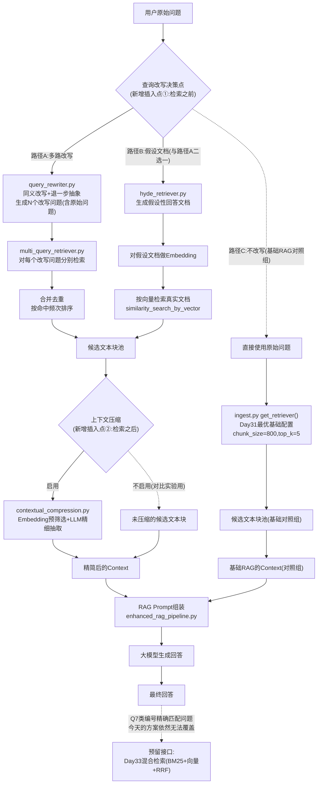
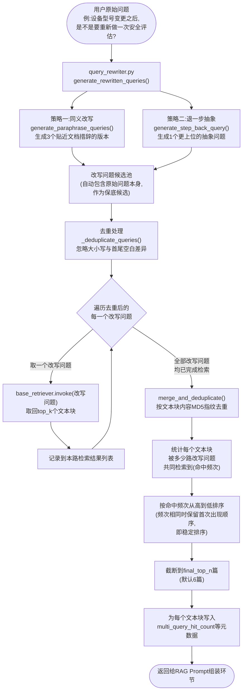
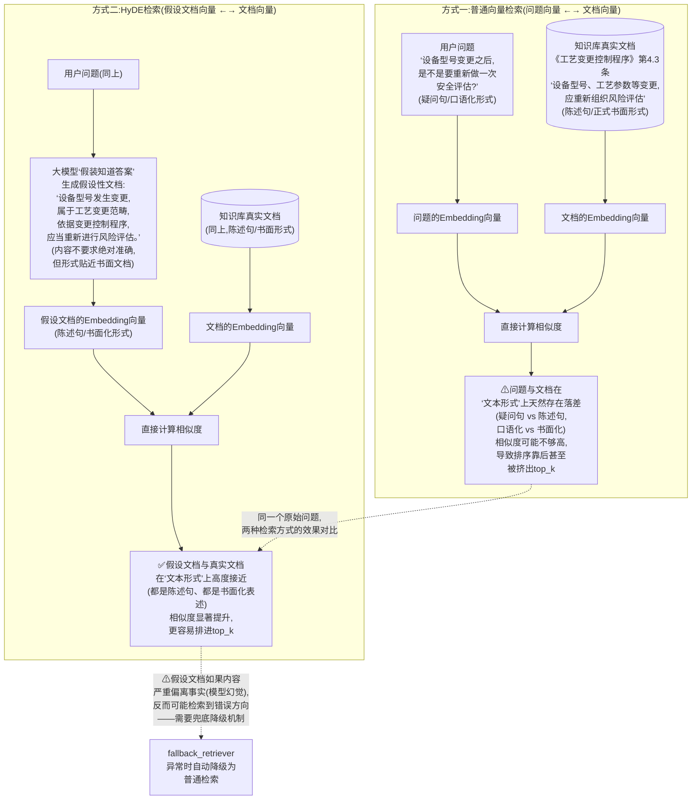

# 第32天 · 高级RAG技术(上)

> **星期**:周四(入职第32天,转正之后的第18天,Sprint 3 · RAG进阶与交付第一天)
> **对应Sprint**:Sprint 3 · RAG进阶与交付(Day32-38)—— 阶段项目二:海纳制造集团企业知识库问答系统。今天是本Sprint开篇日,承接Day31调优实验报告的结论收尾。
> **飞书任务号**:CQ-230(海纳制造集团RAG问答系统 · 检索召回增强技术方案:查询改写/Multi-Query/HyDE/上下文压缩)
> **参与人**:陈铭、苏梦、韩露、张凡(导师:王振宇;需求文档评审环节列席:林悦)
> **今日关键词**:查询改写(Query Rewriting) / Multi-Query多路查询 / HyDE假设性文档嵌入 / 上下文压缩(Contextual Compression) / 召回率对比实验

---

## 【旁白】

Day31晚自习散场的时候,陈铭在笔记本上画了那道"待续"的虚线坡度,当时他其实没想明白,"待续"具体会以什么样的方式续上。一晚上过去,答案比他预想的更具体——不是一个抽象的"继续加油"式鸡汤结尾,而是老王直接把昨天下午那份还带着油墨味的《RAG效果调优实验报告》摊在了投影屏幕上,用红色马克笔在两行数据下面各画了一道粗线,一行是Q7,一行是Q10。这两道题,在过去二十四小时里,已经从"实验记录表里的两个未命中标记",变成了整个团队心里挥之不去的两根刺——不是因为它们难,而是因为团队已经用尽了昨天学到的全部手段(调chunk_size、调top_k、换Embedding模型),依然对它们无计可施。

这种"明知道问题在哪、却拿它没办法"的处境,陈铭并不陌生。他想起自己做跨境电商运营的时候,有一次一款主推产品的转化率长期卡在一个数字上不去,团队换了三版详情页、调了五次投放定向,数字纹丝不动,后来才发现,问题根本不在详情页和投放策略上,而在于用户搜索时用的关键词,和产品标题里的关键词,压根不是同一套"说法"——用户搜"孩子容易摔的杯子",标题写的是"防摔硅胶儿童杯",两句话说的是一件事,但搜索引擎的关键词匹配机制,识别不出这种"意思一样、字面不一样"的关联。那次经历让他学会了一个朴素但好用的招——把详情页标题里,同时塞进用户可能搜索的多种表达方式。今天早上,当老王在白板上写下"查询改写"这四个字,给出的第一个例子恰好是——"如果一线员工问‘机器一直响怎么办’,但知识库文档里写的是‘设备异响故障排查’"——陈铭忽然有一种熟悉又新鲜的感觉:这不就是当年那个"孩子容易摔的杯子"问题的技术版本吗?只是解决的手段,从"人工在标题里堆几个关键词",变成了"让大模型自动生成多种改写版本,分别去检索"。

这一天要学的东西,严格来说不是一项全新的技术,而是一种全新的"发力方向"。过去七天(Day25到Day31),团队所有的优化动作,都发生在检索这个动作本身的"内部"——换个分割参数、换个Embedding模型、调整top_k,本质上都是在"同一套检索机制"里精细打磨。而今天要讲的查询改写、Multi-Query、HyDE,做的事情是在检索动作的"前面"多加一道工序——不再假设用户的原始问题就是最适合拿去检索的形式,而是承认"用户的原始问题,可能天生就不是一个好的检索输入",然后主动地、系统性地,把它转换成更适合检索的形式。这种"不改变检索器本身,而是改变喂给检索器的输入"的思路,某种意义上比"调参数"更接近工程里"降低问题难度"而不是"死磕问题难度"的智慧——老王后来在课堂上把这句话原话讲了出来,陈铭记下来的时候,笔尖顿了一下,觉得这句话值得画个星号。

但今天这一天,同样不是一个"包治百病"的故事。老王在晨会一开始就把话说得很清楚——查询改写这条技术路线,今天要重点攻克的是Q10这一类"表达差异"型问题,不是Q7那一类"编号精确匹配"型问题。这不是团队今天故意"留一手",而是这两类问题的根源完全不同,一种药治不了另一种病:Q10的病根是"语义没对齐",查询改写能治;Q7的病根是"向量检索天生不擅长处理符号级精确匹配",不管怎么换着法子改写问题的措辞,改写后依然是自然语言,依然要经过同一个Embedding模型转换成同一种向量,依然逃不出向量检索"捕捉语义相似度、不捕捉字符精确匹配"这个根本局限。这也是为什么Day31报告结尾那句"剩余未命中问题需要高级RAG技术攻坚",会被拆成两天来讲——今天讲能治好Q10的药,明天讲能治好Q7的另一副药。故事讲到这里,悬念不但没有解开,反而更清晰地立了起来:如果今天一切顺利,Q10被攻克了,团队会亲眼看到命中率数字往上走一格,但Q7依然纹丝不动地留在原地——这道题留下的空白,才是驱动整个团队走向明天"混合检索"课程的真正引擎。

---

## 晨会纪要 / 今日目标

**时间**:上午9:00,二层大会议室"望远"
**出席**:王振宇(老王)、陈铭、苏梦、韩露、张凡;林悦(上午需求文档评审环节列席)

陈铭走进会议室的时候,发现投影屏幕上没有像Day31那样放着崭新的Excel表格,取而代之的是昨晚那份《RAG效果调优实验报告》的最后一页,老王显然是特意留着没关掉投影,想让大家一进门就重新看到那两行红线标注的数据。

老王开场没有寒暄,直接切入正题:"昨天晚上郭总走之前说的那句话,我又想了一遍——‘很多团队会不自觉地挑好看的数据讲’,你们昨天没有这么做,值得肯定。但今天,我要带你们做一件更进一步的事——不是‘诚实地承认问题’,而是‘系统性地拆解问题、找到对应的解法’。这是工程师和‘只会反思’的人之间,真正的分界线。"

他把投影切到报告最后那张表,手指点在Q7和Q10所在的两行:"这两道题,你们昨天已经反复验证过,不管调chunk_size、调top_k、换Embedding模型,它们纹丝不动。我昨晚又把整份报告里所有的‘未命中原因标注’重新看了一遍,发现一个规律——除了Q7这种明显的编号精确匹配问题,剩下几乎所有真正难啃的未命中,本质上都是同一类毛病:用户的问法,和知识库文档的原文表达,不是同一套‘说法’。"

林悦这时候补充了一个更贴近一线场景的例子,算是把这个抽象结论落地:"我这几天跟海纳集团那边的运维对接人聊需求细节的时候,他们提过一个很典型的场景——车间一线员工遇到设备故障,第一反应从来不会说‘请查阅故障代码手册第几章’,他们会用最直接、最口语化的方式描述症状,比如‘机器一直在响,是不是要停机’。但你们去翻海纳集团提供的设备手册原文,对应的章节标题写的是‘设备异响故障排查’——‘一直响’和‘异响’,‘要不要停机’和‘故障排查’,这两组说法,人类一眼就能看出说的是同一件事,但对一个只会算‘字面重合度’或者‘语义相似度’的检索系统来说,这中间的落差,可能就是‘检索到’和‘检索不到’的分界线。"

老王把这个例子和实验报告里的Q10连了起来:"这正是你们昨天亲手测出来的Q10——‘设备型号变更之后,是不是要重新做一次安全评估’,文档原文写的是‘工艺变更控制程序’。‘设备型号变更’和‘工艺变更’,‘安全评估’和‘风险评估’,这两组词,字面上的共同部分几乎为零,即便是语义检索,这种程度的表达差异,依然会让相似度打折扣,打到检索器排序的时候,把真正相关的那份文档挤到top_k之外去了。这就是我们今天整整一天要解决的核心问题——业内把这类问题,统称为‘词汇落差’(lexical gap)或者更学术一点的说法叫‘语义鸿沟’,而解决它的整个技术路线,叫‘查询改写’。"

陈铭听到这里,忍不住提了一个问题:"如果用户的问法千奇百怪,我们总不可能提前把所有可能的问法都列出来吧?这个改写,是靠谁来做的?"

老王的回答,直接把今天的技术主线交代清楚了:"靠的正是大模型本身。你还记得上周答疑的时候,你问过‘模型真的知道自己不知道吗’,当时我说模型不擅长‘自我判断知不知道’,但很擅长‘换一种方式复述同一个意思’——今天要用到的,正是这个能力。我们不需要人工列举所有可能的问法,只需要在检索之前,插入一步‘让大模型帮我们把原始问题,改写成几种更贴近文档表达习惯的说法’,这一步做完之后,拿改写后的问题去检索,命中的概率就会明显提升。这就是‘查询改写’这个大方向下,今天具体要学的第一项技术——同义改写与问题分解;第二项技术,是一个更巧妙的变体,叫‘Multi-Query多路查询’,思路是干脆生成多个改写版本,每个都去检索一遍,再把结果合并起来,提高整体的召回覆盖面;第三项技术,叫HyDE,思路更绕一点,不是改写问题本身,而是让模型先‘假装’自己已经知道答案,生成一段假设性的回答文档,再拿这段假设文档去检索——这个思路听起来有点反直觉,下午会详细展开讲清楚背后的道理;第四项,是上下文压缩,解决的是另一个相关但不完全相同的问题——检索到的内容里混杂了太多无关信息,怎么在喂给大模型之前先‘瘦身’。"

苏梦在这时候提出了一个略带担忧的问题:"如果让大模型去改写问题,会不会改写出来的问题,跟用户原来想问的意思,已经不是一回事了?"

老王认可了这个担忧的价值:"这是一个非常关键的风险点,今天写代码的时候,大家都要留一个心眼——改写不是‘随便发挥’,是有约束的复述,Prompt设计上要明确要求‘意思保持一致,只改变表达方式’,同时,不管改写出多少个版本,原始问题本身永远要保留、永远参与检索,作为‘保底候选’,这样即便某一次改写效果不理想,也不会比不做改写更差。这个设计原则,你们待会儿写代码的时候会看到,我要求写进每一个改写函数的接口里。"

**今日目标**:

1. 上午9:00-10:00:晨会纪要与需求文档评审(本环节,林悦列席),明确今天四项高级检索技术各自解决的问题边界。
2. 上午10:00-12:00:查询改写与Multi-Query多路查询原理讲解 + 代码实操(同义改写、问题分解、退一步抽象提问三种策略,Multi-Query检索器完整实现)。
3. 下午13:30-15:30:HyDE假设性文档嵌入原理讲解 + 代码实操(假设文档生成、按向量检索真实文档、异常兜底机制)。
4. 下午15:30-17:30:上下文压缩原理讲解 + 代码实操(Embedding轻量预筛选、LLM精细抽取式压缩)。
5. 下午17:30-18:30:召回率对比实验——用Day31的10题测试问题集,对比"基础RAG"与"查询改写增强RAG(Multi-Query/HyDE)"的命中率差异,验证Q10是否被攻克。
6. 晚自习19:30-21:00:离线自检脚本编写与运行,今日代码互评,复盘讨论。

**昨日进展回顾(Day31)**:

- Sprint2周测圆满收官,四人成绩分布在49-65分(满分70分)之间。
- RAG效果调优实验完整跑完chunk_size、top_k、Embedding模型三组对照实验,基础RAG命中率从基线50%,提升到最优组合下的70%-80%(因人而异)。
- 团队一致确认:Q7(报警代码E-107精确匹配)、Q10(设备型号变更表达差异)这两道题,是当前基础RAG架构的能力天花板,调参数无法解决。
- 团队已经确定Day32-33两天的技术方向:查询改写(解决Q10类问题)、混合检索(解决Q7类问题)。

**风险点**:

- 查询改写、Multi-Query、HyDE都涉及"每次检索之前多调用一次甚至多次大模型",相比昨天纯粹的向量检索,响应耗时和API调用成本都会明显上升,今天设计代码的时候必须把这个成本代价讲清楚,不能给人一种"高级技术免费午餐"的错觉。
- 改写效果依赖大模型本身的改写质量,今天的教学环境网络和API调用存在不确定性,老王要求所有核心逻辑(解析、去重、合并排序)必须能够脱离真实LLM/Embedding调用完成离线验证,保证即便网络或API出问题,大家依然能验证自己代码的正确性。
- HyDE这个技术点,概念上比查询改写更反直觉("让模型编一段假文档去检索"),容易被学员误解为"教模型说谎",老王计划用清晰的类比讲清楚这个技术的本质和边界,避免大家对着这个技术产生不必要的抵触心理。
- 今天下午的召回率对比实验,涉及三组检索方式(基础RAG、Multi-Query、HyDE)对同一份10题测试集重新跑一遍,如果不对实验脚本做良好的复用设计(直接复用Day31的test_questions.py和evaluate.py核心逻辑),很容易在今天这一天里,把大量时间浪费在"重新造轮子"上。

老王最后总结了今天的定位:"如果说Day31是给基础RAG的能力画了一条清晰的天花板,那么今天,我们要做的事情,是在这条天花板上,凿开第一个洞——不是把整个天花板掀掉重来,而是精确地找到‘查询改写能解决什么问题’这个洞该开在哪里。你们今天动手写的每一行代码,最终都要服务于一个具体的验证目标——Q10这道题,今天结束之前,能不能从‘未命中’变成‘命中’。"

---

## 需求文档:《海纳制造集团RAG问答系统 · 检索召回增强技术方案(查询改写/Multi-Query/HyDE)》

> 撰写人:王振宇(技术导师) · 格式规范:林悦(产品经理)
> 文档编号:CQ-PRD-D32-01
> 版本:v1.0

### 背景

Day31的RAG效果调优实验已经证实,在当前基础RAG架构下,即便对chunk_size、top_k、Embedding模型三个可调参数做穷尽式的对照实验,命中率也存在一个明显的天花板——本次教学场景实测约为80%(8/10题),且剩余未命中的问题呈现出清晰的两类根源:一类是"编号/型号需要精确字符匹配"(如Q7报警代码E-107),另一类是"用户提问措辞与知识库文档原文表达存在显著差异,导致语义检索相似度不足"(如Q10设备型号变更问题)。本方案聚焦于第二类问题,即业内通常所说的"词汇落差(lexical gap)"或"语义鸿沟"问题,通过在检索环节之前引入查询改写(Query Rewriting)、多路查询(Multi-Query)、假设性文档嵌入(HyDE)三项技术,以及在检索环节之后引入上下文压缩(Contextual Compression)技术,系统性地提升当前RAG系统对"表达差异型"问题的检索召回能力,同时兼顾降低最终生成回答时的上下文噪声与Token成本。

需要特别说明的是,本方案不承诺解决Q7这一类"编号精确匹配"问题——该类问题的根源在于向量检索机制本身对符号级精确匹配不敏感,任何形式的查询改写(不论怎样改写问题的自然语言表达),改写后依然要经过同一套Embedding模型转换为语义向量,无法从根本上改变向量检索"捕捉语义相似度、非字符精确匹配"这一底层特性。该类问题的解决方案(混合检索,即向量检索与关键词检索的融合),将作为Sprint3下一项技术专题(Day33)单独立项攻坚,本方案会在验收标准中明确划定"本次方案解决范围"与"遗留至下一阶段解决范围"的边界,避免团队或客户对本次技术改造的效果范围产生不切实际的期待。

### 用户故事

- 作为技术导师,我希望团队能够理解"查询改写"这条技术路线能够解决的问题边界,不盲目相信它是"万能药",而是清楚地知道它专门针对"表达差异型"检索失败问题设计,与"编号精确匹配型"问题的解法(混合检索)分属两条不同的技术路线。
- 作为一线设备维护人员(海纳集团教学模拟用户视角),我希望不管我用多么口语化、多么不符合"标准问法"的方式描述我遇到的问题(比如直接说"机器一直响"而不是查阅"设备异响故障排查"这样的正式术语),系统依然能够准确理解我的意图并检索到正确的参考资料,而不需要我提前学习"怎样提问才能让AI听懂"。
- 作为项目组一员,我希望在引入这几项新技术之后,能够用与Day31完全相同的测试问题集和命中率评估标准,做一次"改写前后"的直接对比实验,清楚地看到具体是哪些之前未命中的问题被攻克了,而不是只得到一个笼统的"命中率提升了百分之多少"的结论。
- 作为团队负责人,我希望新增的查询改写、Multi-Query、HyDE、上下文压缩这几个模块,都能够以"检索器包装层"的形式,无缝接入已有的RAG链路,不需要推倒重写Day30、Day31已经搭建好的检索与评估基础设施。
- 作为负责成本控制的技术负责人,我希望方案中明确说明每一项新增技术相较于基础RAG,在响应耗时和大模型/Embedding API调用次数上分别增加了多少,便于在正式项目交付阶段,结合客户对响应速度和成本的敏感程度,决定是否默认启用、或者作为可配置的高级选项。

### 功能列表

| 编号 | 功能 | 说明 | 优先级 |
|---|---|---|---|
| F1 | 同义改写(Paraphrase) | 给定用户原始问题,调用大模型生成若干种贴近知识库文档表达习惯的改写问题,覆盖专业术语替换、句式结构调整等角度 | P0 |
| F2 | 问题分解(Decompose) | 针对包含多个知识点的复合问题,拆解成若干个更聚焦的子问题,分别检索后再汇总 | P1 |
| F3 | 退一步抽象提问(Step-Back) | 生成一个比原始问题更抽象、更上位的问题,用于检索覆盖该主题的上位/总纲类文档 | P0 |
| F4 | Multi-Query多路查询检索器 | 综合调用F1、F3(可选F2)生成的多个改写问题,分别执行检索,合并去重后按命中频次排序返回 | P0 |
| F5 | HyDE假设性文档嵌入检索器 | 让大模型生成一段假设性的回答文档,对该文档做Embedding,再用这个向量去检索真实文档,并配备异常兜底降级机制 | P0 |
| F6 | 上下文压缩(Embedding轻量预筛选) | 基于问题与候选文本块的Embedding余弦相似度,过滤掉明显不相关的候选,降低后续LLM精细压缩的调用成本 | P1 |
| F7 | 上下文压缩(LLM精细抽取) | 对通过预筛选的候选文本块,调用大模型抽取与问题直接相关的句子,过滤噪声内容,禁止编造原文不存在的内容 | P0 |
| F8 | 增强RAG流水线整合 | 将F4/F5(检索前增强)与F6/F7(检索后压缩)整合进统一的RAG问答调用入口,支持通过参数切换基础模式与增强模式 | P0 |
| F9 | 召回率对比实验脚本 | 复用Day31的测试问题集与命中判定逻辑,对基础RAG、Multi-Query增强RAG、HyDE增强RAG三种方案逐题对比,生成结构化报告 | P0 |
| F10 | 离线自检脚本 | 对改写问题解析、去重、多路合并排序、相似度计算等核心逻辑,提供不依赖真实LLM/Embedding API调用的离线验证手段 | P0 |

### 非功能需求

- **保底原则**:任何查询改写策略,生成的改写问题集合必须始终包含原始问题本身,不允许在改写失败或改写质量不佳的情况下,让系统的检索效果劣于不做任何改写的基础RAG。
- **异常降级**:HyDE假设文档生成、上下文压缩的LLM抽取调用,一旦发生异常(网络错误、返回空内容等),必须能够自动降级为更基础的检索/不压缩方案,不能因为增强模块本身出错,导致整个问答流程直接失败。
- **成本可控**:Multi-Query默认生成的改写问题数量、HyDE默认生成的假设文档份数,均应作为可配置参数,不应在没有明确业务收益验证的情况下,无限制地增加大模型调用次数。
- **接口一致性**:新增的各类增强检索器,对外应当暴露统一的`invoke(question)`调用方式,便于上层RAG链路代码在基础检索器与各类增强检索器之间自由切换,不需要针对每一种检索器单独写适配代码。
- **可复现性与可对比性**:今天的召回率对比实验,必须复用Day31已经验证过的测试问题集、命中判定标准和评估脚本核心逻辑,保证今天的实验结果与Day31基线数据之间具备严格意义上的可比性,不能因为评估标准本身发生变化,导致"提升"这个结论站不住脚。
- **教学可解释性**:每一项新增技术的实现代码,都应当配有清晰的中文注释,说明"这一步为什么这么设计",而不仅仅是"这一步做了什么",延续公司一贯的工程规范要求。

### 验收标准

1. 完成同义改写、问题分解、退一步抽象提问三种查询改写策略的独立实现,且均能正确处理模型输出解析、去重等边界情况。
2. Multi-Query多路查询检索器与HyDE假设性文档嵌入检索器均实现完毕,均具备合理的异常降级机制。
3. 上下文压缩模块(Embedding预筛选+LLM精细抽取)实现完毕,能够有效降低最终Context的长度与噪声占比。
4. 召回率对比实验完整执行,基于Day31的10题测试问题集,分别得出基础RAG、Multi-Query增强RAG、HyDE增强RAG三组命中率数据,并生成逐题对比表格。
5. 实验结果需要清晰地证明:Q10(表达差异型问题)在至少一种增强方案下,由"未命中"转变为"命中"。
6. 实验结果同时需要如实记录:Q7(编号精确匹配型问题)在所有本次方案下依然未命中,并在报告中明确说明原因与后续解决方向(指向Day33混合检索),不允许为了"报告好看"而回避或淡化这一结论。
7. 全部核心逻辑函数具备离线自检脚本覆盖,不依赖真实LLM/Embedding API调用即可验证正确性。

老王下发这份需求文档时,特别在"验收标准第6条"上停顿了一下:"我知道,大家心里都会不自觉地希望今天的实验数字越好看越好,但我要提前把这句话说清楚——如果今天实验做完,Q7依然是未命中,这不是今天的‘失败’,这恰恰是今天‘方法论正确’的证明。一个技术方案,如果连自己解决不了什么问题都说不清楚,才是真正应该被怀疑的方案。"

---

## 架构设计图:查询改写模块在RAG流水线中的插入位置

上午10点整,晨会结束、需求文档评审完毕之后,老王在白板前站定,开始画今天第一张架构图,专门讲清楚"今天新增的这几个模块,具体插在RAG流水线的哪个位置"。



老王讲解这张图的时候,先让大家注意图里标注的"两个新增插入点":"你们看清楚,今天新增的模块,一个插在检索‘之前’(查询改写决策点,决定拿什么去检索),一个插在检索‘之后’(上下文压缩决策点,决定检索回来的东西怎么瘦身)。这两个插入点的位置,决定了今天写的代码,不需要对Day30、Day31已经搭建好的Retriever接口、RAG Prompt组装逻辑做任何破坏性修改——我们是在往一条已经能跑的流水线里,‘加装’新的处理工位,不是把流水线拆了重建。"

张凡指着图里"路径A"和"路径B"之间的那条虚线关系问:"这两条路径是互斥的吗?能不能同时用?"

老王给出了明确的设计取舍:"技术上理论上可以叠加——比如对Multi-Query生成的每一路改写问题,都用HyDE的方式再生成一份假设文档去检索,这样召回覆盖面理论上会更大。但今天的实验,为了让每一项技术的效果可以被单独观察和归因(这正是Day31学的控制变量法,今天继续沿用),我们要求Multi-Query和HyDE在同一次实验里二选一使用,不强行叠加。叠加方案,我会作为今天的课后思考题之一,留给你们自己去试。"

韩露注意到了图右下角那个虚线箭头指向"Day33混合检索"的预留接口,提了一个很敏锐的问题:"这个预留接口,今天的代码里要不要真的实现出来?"

老王摇头,给出了一个关于"预留设计"的工程原则:"今天不需要真的写出混合检索的代码,那是明天的事。但今天设计这几个检索器的接口时,必须刻意保持‘可以被组合’的形态——比如ContextualCompressionRetriever这个类,它接收的是一个‘任意实现了invoke方法的检索器’,不管这个检索器内部是普通向量检索、Multi-Query、HyDE,还是明天要学的混合检索,只要它符合这个接口约定,就能直接被压缩模块包装使用。这就是‘面向接口设计’在今天这个具体场景里的落地——我们不需要提前知道明天的技术细节,但我们今天写的代码结构,要为明天的技术‘留门’,不设‘门’,明天集成的时候就要推倒重写。"

---

## 流程图:Multi-Query多路查询完整执行流程

架构图讲完"模块插在哪",老王接着画了今天第二张图,专门把Multi-Query这一条技术路线的内部执行细节,一步步展开讲清楚。



老王讲这张图的时候,专门停在"命中频次排序"这一步,给出了背后的直觉解释:"你们想一下——如果某个文本块,同时被‘原始问题’‘改写问题1’‘退一步抽象问题’三路检索都命中了,这说明这个文本块,不管你从哪个角度切入问这个主题,都会被检索到,它跟这个问题主题的关联度,大概率比‘只被一路改写问题偶然命中’的文本块更高。所以我们没有简单地把多路检索结果‘拼在一起去重就完事’,而是额外统计了这个‘被多少路命中’的频次信息,把它当作排序的核心依据,这是Multi-Query这项技术,相比‘简单地把检索范围变大’,更精细的一层设计。"

苏梦提了一个很朴素但很关键的问题:"如果原始问题本身检索到的结果已经很准,再加上另外三四路改写问题的检索结果,会不会把原来准确的结果‘挤’下去?"

老王给出了肯定又带保留的回答:"这个担忧完全合理,这也是为什么原始问题必须作为保底候选参与检索,而且它的检索结果,和其他改写问题的检索结果,享有完全相同的‘计票权’——如果原始问题检索到的文本块,恰好也被其他改写问题检索到,它的频次会自然而然地更高,排序会更靠前;如果原始问题检索到的结果,是其他改写问题都没检索到的‘独家’内容,它依然会以频次1的身份,保留在最终候选池里(只要没有被后面的final_top_n截断掉)。今天写代码的时候,大家要保证‘频次相同时,保留首次出现的顺序’这条规则被正确实现,这样可以保证原始问题的检索结果,不会因为‘运气不好排在了别的问题后面处理’而无缘无故被牺牲掉。"

张凡追问了一个成本相关的问题:"如果我们设置生成5个改写问题,是不是相当于要做5次检索、外加1次生成改写问题的模型调用,一共6次调用?这个成本涨得也不小啊。"

老王认可了这一点,把这条链路的成本账算得很清楚:"没错,这是Multi-Query这项技术必须正视的代价——它用‘更多次检索、更多次模型调用’,换取‘更高的召回覆盖面’,天下没有免费的午餐。今天配置里默认设置生成3个改写问题(不含原始问题共4个检索请求),这是团队权衡效果和成本之后选择的一个折中值,如果生产环境对响应耗时特别敏感,完全可以把这个数字调小,甚至在‘查询改写命中率提升幅度不明显’的问题类型上,直接关闭这项功能,只在‘已知容易出现表达差异’的场景下按需启用。这也是为什么今天需求文档里,把这几个数量参数都设计成可配置项,不写成硬编码的固定值。"

---

## 示意图:HyDE假设性文档生成与检索的原理示意

下午1点半,老王开始讲HyDE(Hypothetical Document Embeddings,假设性文档嵌入)。他没有直接上代码,先画了这张对比图,专门讲清楚"这项技术到底在解决什么问题"。



老王讲这张图之前,先问了一个问题让大家思考:"你们说,向量检索比较的到底是‘问题和文档谁的意思更像’,还是‘问题和文档谁的‘长得’更像’?"

这个问题让教室里安静了几秒钟,韩露先开口:"我一直以为是‘意思更像’,毕竟Embedding模型学的是语义。"

老王点头又摇头:"从模型训练的目标来说,确实是希望捕捉‘语义’,但你们要知道一个现实的局限——训练Embedding模型用的语料,里面‘问题和它的答案文档’,这种严格意义上的问答配对语料,占比通常不算特别高,更多的训练语料,是‘语义相近的句子对’‘语义相近的段落对’这种形式。这就导致一个现象——Embedding模型确实能捕捉‘意思相近’,但当两段文字的‘文本形式’差异很大(一个是简短的疑问句,一个是详细的陈述句)时,即便‘意思’是相关的,模型算出来的相似度,也未必像人类直觉预期的那样高。这正是问题-文档之间检索效果打折扣的一个隐藏原因,业内有时候管这个现象叫‘非对称检索’的固有难度。"

他接着揭示HyDE这个技术名字背后的巧妙之处:"HyDE的思路,说白了就是一句话——‘既然问题的形式和文档的形式不匹配,那就不要直接拿问题去比,而是先把问题‘伪装’成一份和文档同样形式的假文档,再拿这份假文档去比’。这就是图上‘方式二’画的东西——用‘文档形式’去匹配‘文档形式’,规避了‘问题形式’和‘文档形式’之间那道天然的落差。"

陈铭这时候提出了一个直觉上的疑虑:"这听起来有点‘投机’——我们明明知道模型生成的这段假设文档,内容不一定准确,甚至可能是编的,却拿它去指导检索,这不是在‘教模型说谎’吗?"

老王的回答,把HyDE这个技术的边界讲得很清楚,也顺势点出了图右下角画的风险点:"这是一个非常值得澄清的误解——HyDE生成的这段假设文档,从头到尾都不会被拿去回答用户,它唯一的用途,是‘生成一个用于计算检索向量的中间产物’,检索到的,始终是知识库里真实存在的文档,最终回答用户的,也始终是基于这些真实文档生成的。它更像是一个‘占位符’或者‘诱饵’,专门用来在向量空间里‘钓’出真正相关的真实文档,它自己从不参与‘回答’这个环节。但你提的风险确实存在——如果模型生成的假设文档内容偏离事实太远(比如把‘工艺变更’理解成了完全不相关的另一个概念),检索方向可能真的会跑偏,这也是为什么HyDE的实现里,必须内置一个‘生成失败或者结果异常时,自动降级为普通检索’的兜底机制,不能对模型的生成质量抱有百分之百的信任。"

---

## 课堂笔记

### 上午:查询改写与多路查询(Query Rewriting & Multi-Query)

上午10点,老王讲完架构图之后,正式进入技术细讲环节。他先在白板上写下了一句话,作为整个上午内容的总纲:"查询改写解决的核心问题只有一个——用户的原始问题,不一定是最适合拿去检索的那个问题。"

**为什么"最适合检索的问题"和"用户真正想问的问题"可能不是同一个东西**。老王用了一个生活化的类比展开讲解:"你们去图书馆找一本讲‘怎么让孩子不挑食’的书,你跟图书管理员说的话可能是‘我家孩子不爱吃饭怎么办’,但这本书如果真的存在,它的标题、目录、内容用词,大概率是‘儿童饮食行为矫正指南’‘挑食干预方法’这类更‘专业’的说法。图书管理员之所以能帮你找到,是因为他有能力在脑子里,把你的口语化描述,‘翻译’成图书馆分类体系里的术语。今天我们要做的,就是让大模型承担这个‘图书管理员’的角色——不是替用户重新想一个问题,而是帮用户的问题,‘翻译’成检索系统更容易理解的形式。"

**三种改写策略的分工**。老王在白板上画了一张简单的对照表,讲清楚三种策略各自针对的问题类型:

| 策略 | 解决的问题类型 | 典型场景 | 代表性实现函数 |
|---|---|---|---|
| 同义改写(Paraphrase) | 措辞习惯与文档表达方式不一致 | 用户说"机器一直响",文档写"设备异响故障排查" | `generate_paraphrase_queries()` |
| 问题分解(Decompose) | 一个问题里同时塞了多个知识点,关键词过于分散 | "设备保养周期和保养项目分别是什么,谁负责执行" | `generate_decomposed_queries()` |
| 退一步抽象提问(Step-Back) | 问题太具体,检索器找不到覆盖该主题的上位/总纲类文档 | "XJ-3200A的开机步骤"找不到,但抽象为"数控车床开机规程"能找到总纲 | `generate_step_back_query()` |

老王特别强调了退一步抽象提问这一策略的适用场景:"很多企业的管理制度文档,是分层级写的——先有一份总纲性的‘工艺变更控制程序’,规定‘所有涉及XX类变更都要走风险评估流程’,再有具体到某个设备型号的实施细则。用户直接问‘XJ-3200A换了个新型号是不是要评估’,这个问题聚焦到了具体型号,但真正管用的答案,往往藏在那份更抽象的总纲文档里。‘退一步抽象提问’,就是主动生成一个‘更概括’的版本,专门去捕捉这类总纲性文档,这跟同义改写解决的‘措辞不一样’完全是两个不同维度的问题,不能相互替代。"

**改写Prompt设计的关键约束**。张凡提出了一个很实际的问题:"如果我们不给大模型一个明确的数量限制,它会不会有时候生成两个改写问题,有时候生成十个,结果很不稳定?"

老王肯定了这个观察,并借此讲了Prompt工程里"约束具体化"这个原则:"这正是为什么改写Prompt里,必须明确写清楚‘生成{num_rewrites}种不同的表达方式’,把数量当作一个可传入的变量,而不是留一句模糊的‘生成几种改写’。同样的道理,输出格式也必须约束死——‘严格按照编号列表格式输出,不要输出任何多余的解释’,如果不加这条约束,大模型很可能会在输出前面加一句‘好的,以下是几种改写方式:’,这句话会污染我们后续的解析逻辑,导致解析出错。这些看起来琐碎的约束,恰恰是把‘一个演示效果不错的Demo’,变成‘一个能在生产环境稳定运行的工程组件’之间,最容易被新人忽略、但最不能省略的细节。"

**Multi-Query:把"改写"和"检索"拼成一条完整的技术路线**。讲完三种改写策略的独立实现之后,老王引出了Multi-Query这个概念:"改写问题只是第一步,如果改写完了不知道怎么用,这个技术就只是‘纸上谈兵’。Multi-Query要做的事情很直接——把每一个改写出来的问题,都拿去检索一遍,然后把所有检索结果合并起来。"

苏梦提了一个问题:"这样是不是相当于把top_k变成了原来的好几倍?最后要不要控制一下,不然context会不会太长?"

老王给了明确的设计规则:"你说得对,合并之后的候选数量,确实会比单路检索多不少,所以Multi-Query检索器最后必须有一步‘截断’——只保留排序最靠前的final_top_n篇,不能让候选池无限膨胀。这也是为什么我们在‘合并去重’这一步,专门统计了每个文本块的‘命中频次’,用它来决定谁该留下、谁该被截掉,而不是简单地‘先来先得’。"

老王补充了一个关于LangChain官方实现的说明,呼应了query_rewriter.py里那段注释:"LangChain官方在`langchain.retrievers.multi_query`模块里,已经提供了一个开箱即用的`MultiQueryRetriever`类,思路跟我们今天自己实现的版本大同小异——用LLM生成改写问题、分别检索、合并去重。今天我们选择自己实现一遍,不是不知道官方有这个轮子,而是想让大家把‘生成改写→分别检索→合并去重→排序截断’这几个步骤拆开揉碎,真正理解每一步在做什么、为什么这么做。等你们理解了原理之后,在真实项目里,如果官方实现已经能满足需求,直接用官方版本,没必要每次都自己重写一遍,这是‘理解原理’和‘工程复用’两件不冲突的事。"

**答疑环节**:

陈铭问了一个关于"改写策略怎么选"的实操问题:"我们今天默认组合是‘同义改写+退一步抽象’,如果遇到明显是复合问题的场景,要不要主动加上问题分解策略?"

老王给出了具体的判断标准:"这需要一点‘对问题结构的敏感度’——如果一个问题里,明显能拆出‘并且’‘以及’这类连接词串起来的多个子诉求(比如‘保养周期是多久,保养项目有哪些,谁来负责’),这种情况适合主动启用问题分解;如果问题本身结构单一,只是措辞和文档不一样,加问题分解反而是‘画蛇添足’,徒增不必要的模型调用成本。今天的代码里,我们把`strategies`设计成一个可传入的参数,就是为了让调用方能够按照问题的实际结构,灵活选择策略组合,而不是一刀切地对所有问题都跑全部策略。"

韩露从产品视角提了一个问题:"如果一个客户特别在意响应速度,不想为了召回率牺牲太多耗时,我们有没有办法只做‘轻量版’的查询改写?"

老王认可这是一个真实存在的工程取舍:"完全可以——比如把改写策略只保留‘同义改写’,并且把生成数量从3个降到1个,这样只比基础RAG多一次模型调用和一次检索,响应耗时增量是可控的。今天的方案设计,专门把这些数量参数暴露成配置项,就是为了让产品和客户能够根据自己对‘效果’和‘速度成本’的权衡,灵活调整,而不是被绑死在一个‘参数写死’的方案里。"

### 下午:HyDE与上下文压缩(HyDE & Contextual Compression)

下午1点半,老王讲完示意图之后,继续深入讲HyDE的实现细节。他先提了一个问题:"你们觉得,HyDE生成假设文档这一步,应该用多高的温度(temperature)?"

张凡回答:"温度低一点,生成结果更稳定?"

老王给出了更细致的分析:"温度确实不能设得太高,太高的话,生成的假设文档内容发散、跑题的风险会明显增加,这跟我们希望它‘形式贴近文档、内容尽量靠谱’的目标是冲突的。但温度也不能设成0——设成0意味着每次生成的假设文档几乎一样,如果这份唯一的假设文档恰好‘猜错了方向’,就没有任何补救空间。今天配置里给的默认值是0.3,是一个偏低但保留一定多样性的折中值,如果大家在实验里发现某道题效果不理想,可以自己调整这个值观察变化,这也是今天课后思考题里会涉及的一个探索方向。"

**HyDE的落地关键:向量检索接口的选择**。老王讲到实现细节的时候,专门强调了一个容易被忽略的技术点:"注意,HyDE这一步,我们不能像普通Retriever那样,直接调用‘拿文本去检索’的标准接口——因为标准接口内部,会自动把传入的文本再做一次Embedding。但我们已经手动生成了假设文档、也已经手动计算好了它的Embedding向量,这时候我们需要绕过‘文本转向量’这一步,直接用‘已经算好的向量’去检索,这在Chroma里对应的接口叫`similarity_search_by_vector`,不是我们之前一直用的`similarity_search`或者`as_retriever()`封装出来的标准Retriever接口。这个细节,如果不注意,很容易写出‘看起来实现了HyDE、但实际上还是在拿假设文档的文本重新走一遍标准检索流程’这种‘伪HyDE’实现,效果和普通检索没有本质区别。"

**兜底降级机制的重要性**。老王结合示意图右下角的风险点,进一步展开讲解设计要求:"HyDE这个技术,相比查询改写,多了一层‘依赖模型生成内容质量’的风险——查询改写生成的是‘问题的另一种问法’,即便改写得不够理想,顶多是‘没有提升检索效果’;而HyDE生成的是‘一整段假设性的事实性内容’,一旦模型对这个领域的通用知识理解有偏差,生成的假设文档可能会把检索方向带偏,效果甚至可能比不做HyDE更差。所以今天的`HydeRetriever`类,必须内置`fallback_retriever`这个兜底参数——一旦假设文档生成失败(网络异常、返回内容为空等),立刻自动降级为普通检索,而不是让整个问答流程直接报错或者返回一个基于错误假设文档检索出来的、风险更高的结果。"

**上下文压缩:解决"检索到了,但检索到的东西太脏"的问题**。下午3点半,老王转入今天最后一个技术点。他先复盘了Day31的一个观察:"你们还记得张凡在Day31实验里发现的现象——chunk_size从500调到800,命中率提升了,但检索回来的文本块里,混进了更多和问题本身关系不大的内容。这个现象背后,是一个‘鱼与熊掌不可兼得’的矛盾:chunk越大,越不容易把关键信息切断,召回率越有保障;但chunk越大,里面夹带的‘无关信息’比例也越高,直接把这么大一块内容喂给大模型,一是拉长了Token成本,二是有一定概率干扰大模型生成回答时的注意力分配。上下文压缩要做的事情,就是在‘检索’和‘生成’这两个环节之间,加一道‘瘦身’工序——检索环节继续保持‘宁可多召回一些、不要漏掉’的策略,压缩环节负责把召回结果里真正有用的部分‘挑’出来。"

**两级过滤的设计意图**。老王讲了为什么要设计"Embedding轻量预筛选+LLM精细抽取"这样的两级结构,而不是直接上LLM做压缩:"如果检索回来的候选文本块里,有些根本就是明显不相关的(比如问‘润滑油型号’,检索结果里混进了一段讲‘安全帽佩戴要求’的内容),直接让LLM去做‘精细抽取’,是有点‘杀鸡用牛刀’的——这一步的调用成本(每个文本块都要单独调一次模型)不便宜,如果能用更便宜的手段,提前把这种‘明显不相关’的候选过滤掉,可以省下一部分不必要的LLM调用。这就是第一级Embedding预筛选存在的意义——用一次相对便宜的相似度计算,做粗筛;真正进入LLM精细抽取环节的,是已经通过粗筛的、大概率相关的候选,这一步再做更精细的‘句子级别’抽取。"

苏梦提了一个关于压缩边界的问题:"如果LLM在抽取的时候,'手一抖'把不存在的内容加进去了,怎么办?"

老王的回答,呼应了Day30讲过的"不能编造"原则:"这正是为什么压缩Prompt里必须明确要求‘原样摘录、不要改写、不要添加原文中不存在的内容’,这条约束的严格程度,不亚于RAG最终生成回答时‘不能编造’的要求——上下文压缩这一步,本质上也是一次‘生成’,只是目标不是‘回答问题’,而是‘筛选事实’,同样存在‘模型自由发挥、偏离原文’的风险,必须用同样严格的Prompt约束来控制。"

**答疑环节**:

陈铭提了一个综合性的问题:"如果同时用了Multi-Query和上下文压缩,是不是意味着一次问答,背后要发生‘生成改写问题→多次检索→多次压缩抽取→最终生成回答’,加起来好几次模型调用?这个成本会不会太高了?"

老王没有回避这个问题:"这确实是今天几项技术组合起来之后,必须正视的成本现实——如果Multi-Query生成4个改写问题,外加检索后对若干候选文本块逐一做压缩抽取,一次问答背后,可能真的要发生6到10次模型调用。这也是为什么今天需求文档里专门写了‘成本可控’这条非功能需求——生产环境不是‘上了所有高级技术就一定更好’,而是要结合具体客户场景、具体问题类型的分布,决定‘哪些技术值得默认开启、哪些应该按需开启’。比如,如果一个客户的知识库,文档措辞本身就很贴近用户提问习惯(表达差异问题不明显),那么查询改写带来的收益可能有限,却要承担额外的成本,这种场景下就不一定值得默认开启这项技术。"

韩露从产品设计角度补充了一个问题:"那我们要不要在系统里加一个‘智能判断’,自动决定要不要对某个问题启用查询改写?"

老王给了一个诚实但留有余地的回答:"这是一个很好的产品设计方向,但今天不是我们要解决的问题——‘自动判断某个问题是否需要查询改写’本身,是一个不小的技术课题(可以粗略理解成需要一个‘问题难度/类型分类器’),超出了今天的教学范围。今天我们先把‘查询改写这项技术本身能不能提升召回率’这个基础问题,用扎实的数据证明清楚,‘什么时候该用’这个更精细的决策问题,可以作为你们感兴趣的话,后续自己业余深入研究的方向,我记下这个想法,后面看合适的时候可以单独作为一个选修专题来讲。"

---

## 代码实战

> 以下是今天《海纳制造集团RAG问答系统 · 检索召回增强技术方案》的完整实现,共8个文件。整套代码在Day30搭建的RAG基础链路、Day31的最优基础配置(chunk_size=800、top_k=5、embedding_model=text-embedding-v3)与评估基础设施之上做增量扩展,不重复实现`ingest.py`、`embedding_factory.py`、`evaluate.py`、`test_questions.py`这几个Day31已经写好并验证过的模块,今天的代码通过`import`直接复用。所有函数均配中文docstring,关键业务逻辑均有行内注释解释设计意图。真实执行查询改写、HyDE、上下文压缩需要配置`.env`中的`DEEPSEEK_API_KEY`(用于生成改写问题/假设文档/压缩抽取);离线自检脚本`selfcheck_advanced_rag.py`不依赖真实的LLM/Embedding API调用,可独立运行验证核心逻辑的正确性。

### 文件1:`advanced_rag_config.py` —— 高级RAG技术全局配置

```python
"""
文件名:advanced_rag_config.py
作者:陈铭
说明:
    高级RAG技术专题(查询改写/Multi-Query/HyDE/上下文压缩)的全局配置模块。
    今天的实验直接承接Day31调优实验得出的"当前基础RAG最优配置"作为
    统一的对照基线,所有高级技术都在这个基线之上做增量改进,
    而不是另起炉灰重新调一遍chunk_size、top_k这些已经调过的参数。

    知识点回顾:
    - Day31实验结论:chunk_size=800、top_k=5、embedding_model=text-embedding-v3
      是当前测试问题集下命中率最高的基础RAG配置组合(命中率80%,8/10题命中),
      但Q7(报警代码精确匹配)、Q10(表达差异极大)依然稳定未命中。
    - 今天的目标不是再调这三个参数,是在检索这一步的前面/后面,
      插入新的处理模块,直接攻克Q10这一类"表达差异"问题。
"""

import os

from dotenv import load_dotenv
from langchain_openai import ChatOpenAI

load_dotenv()

# ============================================================
# Day31基线配置(直接复用调优实验得出的最优组合,作为今天的对照基线)
# ============================================================

BASELINE_CHUNK_SIZE = 800
BASELINE_TOP_K = 5
BASELINE_EMBEDDING_MODEL = "text-embedding-v3"

# ============================================================
# LLM配置(用于查询改写、HyDE假设文档生成、上下文压缩抽取)
# ============================================================

# 查询改写、HyDE生成属于"理解并复述/推测"类任务,不需要模型有太强的创造性,
# 但也不能温度设得太低导致每次改写结果一模一样、失去多样性,
# 这里统一给一个折中的默认温度,具体每个环节调用时会按需微调。
REWRITE_TEMPERATURE = 0.3
HYDE_TEMPERATURE = 0.3
COMPRESSION_TEMPERATURE = 0.0  # 上下文压缩是"抽取事实"类任务,要求尽量稳定、不发散


def get_llm(temperature=0.1, max_tokens=800):
    """
    统一的LLM构建入口,复用苍穹平台"模型接入层"的DeepSeek优先策略,
    与Day30、Day31保持完全一致的调用方式,不引入新的模型接入路径。
    :param temperature: 采样温度
    :param max_tokens: 最大生成长度
    :return: 配置好的ChatOpenAI实例(实际指向DeepSeek兼容接口)
    """
    return ChatOpenAI(
        model=os.getenv("HN_LLM_MODEL", "deepseek-chat"),
        api_key=os.getenv("DEEPSEEK_API_KEY", ""),
        base_url=os.getenv("DEEPSEEK_BASE_URL", "https://api.deepseek.com/v1"),
        temperature=temperature,
        max_tokens=max_tokens,
    )


# ============================================================
# 查询改写与Multi-Query配置
# ============================================================

# Multi-Query默认生成的改写问题数量(不含原始问题本身)。
# 数量越多,理论召回上限越高,但检索次数、模型调用次数、
# 最终候选池去重排序的成本也会同比增加,3是团队实测下来的经验折中值。
MULTI_QUERY_NUM_REWRITES = 3

# 每一路改写问题各自检索时使用的top_k,通常会比最终合并结果的
# 目标数量略小一些,因为多路合并去重之后,还要在结果里再截断。
MULTI_QUERY_PER_QUERY_TOP_K = 4

# 合并去重之后,最终返回给下游Prompt组装环节的文档数量上限。
MULTI_QUERY_FINAL_TOP_N = 6

# ============================================================
# HyDE配置
# ============================================================

# HyDE每次只生成一份假设文档,团队讨论过"生成多份假设文档取平均向量"
# 的做法,但今天先实现最基础的单份生成版本,多份平均作为课后思考题。
HYDE_NUM_HYPOTHESES = 1

# ============================================================
# 上下文压缩配置
# ============================================================

# 是否启用基于Embedding相似度的"轻量过滤"作为LLM精细抽取之前的预筛选,
# 用于在真实项目中降低成本——不是每一个检索到的文本块都值得
# 花一次LLM调用去做精细抽取,明显不相关的可以先用更便宜的方式过滤掉。
COMPRESSION_ENABLE_EMBEDDING_PREFILTER = True
COMPRESSION_EMBEDDING_THRESHOLD = 0.35

EXPERIMENT_OUTPUT_DIR = os.getenv("HN_ADV_EXP_OUTPUT_DIR", "./advanced_experiment_output")
os.makedirs(EXPERIMENT_OUTPUT_DIR, exist_ok=True)
```

这个配置文件里,最值得注意的设计是`BASELINE_CHUNK_SIZE`、`BASELINE_TOP_K`、`BASELINE_EMBEDDING_MODEL`这三个常量,它们的取值直接照抄Day31实验报告的结论,没有做任何"重新猜测"。老王在讲解这段代码时特意点出:"这三行代码,看起来平平无奇,但它们体现了一个很重要的工程习惯——昨天已经拿数据验证过的结论,今天直接当作既定事实使用,不要因为‘今天心情好想重新试试别的参数’就推翻昨天的结论,重新引入不必要的变量。今天实验的唯一自变量,应该是‘有没有查询改写、用哪种查询改写’,不应该是‘chunk_size改没改’,这是控制变量法的自然延伸。"

### 文件2:`query_rewriter.py` —— 查询改写完整实现

```python
"""
文件名:query_rewriter.py
作者:陈铭
说明:
    查询改写(Query Rewriting)核心模块,实现三种改写策略:
    1. 同义改写(paraphrase):把原始问题换成几种不同的表达方式,
       尽量贴近知识库文档可能使用的措辞习惯。
    2. 问题分解(decompose):把一个复合问题拆成若干个更具体的子问题,
       适合"设备型号变更之后,是不是要重新做一次安全评估"这类
       同时涉及"变更"和"评估"两个概念的复合问题。
    3. 退一步抽象提问(step-back):先问一个更抽象、更上位的问题,
       帮助检索器先定位到"大类"文档,再由具体问题去精确匹配。

    知识点回顾:
    - Day25学的ChatPromptTemplate,用来构造改写提示词。
    - Day26学的LCEL管道符,用来把Prompt、LLM、OutputParser串成一条改写链。
    - 今天新学的核心理念:模型不擅长"自我判断知不知道",
      但很擅长"用不同的方式复述同一个意思",查询改写正是利用了这个能力。
"""

import re

from langchain_core.output_parsers import StrOutputParser
from langchain_core.prompts import ChatPromptTemplate


def _parse_numbered_list(raw_text):
    """
    解析模型输出的编号列表文本(形如"1. xxx\\n2. xxx\\n3. xxx"),
    提取出每一条独立的文本内容,兼容"1."、"1、"、"1)"等不同编号写法。
    :param raw_text: 模型原始输出文本
    :return: 提取出的字符串列表(已去除首尾空白,过滤掉空行)
    """
    lines = raw_text.strip().split("\n")
    results = []
    number_pattern = re.compile(r"^\s*\d+[\.\、\)]\s*")
    for line in lines:
        line = line.strip()
        if not line:
            continue
        cleaned = number_pattern.sub("", line).strip()
        if cleaned:
            results.append(cleaned)
    return results


def _deduplicate_queries(queries):
    """
    对改写出的问题列表做去重(忽略首尾空白与大小写差异),
    保留首次出现的顺序,避免多种改写策略碰巧生成完全相同的问题,
    导致后续重复检索、浪费API调用额度。
    :param queries: 原始改写问题列表
    :return: 去重后的问题列表
    """
    seen = set()
    unique_queries = []
    for q in queries:
        key = q.strip().lower()
        if key and key not in seen:
            seen.add(key)
            unique_queries.append(q.strip())
    return unique_queries


# ============================================================
# 策略一:同义改写(Paraphrase)
# ============================================================

PARAPHRASE_PROMPT = ChatPromptTemplate.from_template(
    """你是一名制造行业知识库检索助手。用户提出了下面这个问题,
但用户的措辞习惯,可能和知识库文档的书面表达方式不完全一致。
请你把这个问题,改写成{num_rewrites}种不同的、但意思保持一致的表达方式,
尽量覆盖以下几个角度:
1. 更贴近设备手册、工艺文件、质量规范等正式书面文档的措辞习惯;
2. 使用行业内可能出现的专业术语替换口语化表达;
3. 调整问题的句式结构(比如把口语化的疑问句,改写成陈述句式的检索关键词组合)。
严格按照编号列表的格式输出,每行一个改写结果,不要输出任何多余的解释或说明。

原始问题:{question}"""
)


def generate_paraphrase_queries(llm, question, num_rewrites=3):
    """
    使用同义改写策略,生成若干种贴近文档表达习惯的改写问题。
    :param llm: LangChain的ChatModel实例
    :param question: 用户原始问题
    :param num_rewrites: 期望生成的改写问题数量
    :return: 改写问题字符串列表
    """
    chain = PARAPHRASE_PROMPT | llm | StrOutputParser()
    raw_output = chain.invoke({"question": question, "num_rewrites": num_rewrites})
    return _parse_numbered_list(raw_output)


# ============================================================
# 策略二:问题分解(Decompose)
# ============================================================

DECOMPOSE_PROMPT = ChatPromptTemplate.from_template(
    """下面这个问题,可能同时涉及两个或更多个相对独立的知识点,
直接拿这个复合问题去检索,容易因为关键词过于分散而检索不到任何一个知识点的准确资料。
请你把这个问题,拆解成2到3个更聚焦、更具体的子问题,
每个子问题只聚焦一个知识点,拆解后的子问题合起来,应当能够完整回答原始问题。
严格按照编号列表的格式输出,每行一个子问题,不要输出任何多余的解释。

原始问题:{question}"""
)


def generate_decomposed_queries(llm, question):
    """
    使用问题分解策略,把一个复合问题拆解成若干个更聚焦的子问题。
    :param llm: LangChain的ChatModel实例
    :param question: 用户原始问题
    :return: 子问题字符串列表
    """
    chain = DECOMPOSE_PROMPT | llm | StrOutputParser()
    raw_output = chain.invoke({"question": question})
    return _parse_numbered_list(raw_output)


# ============================================================
# 策略三:退一步抽象提问(Step-Back Prompting)
# ============================================================

STEP_BACK_PROMPT = ChatPromptTemplate.from_template(
    """你是一名擅长归纳抽象的知识库检索专家。下面这个问题问得比较具体,
直接检索有可能因为过于具体而错过覆盖这个主题的、措辞更概括的上位文档
(比如某项管理制度、控制程序的总纲部分)。
请你把这个具体问题,改写成一个更抽象、更上位的问题——
这个抽象问题所属的知识大类,应当能够覆盖原始问题的答案。
只输出改写后的这一个抽象问题,不要输出任何编号、解释或多余文字。

原始问题:{question}"""
)


def generate_step_back_query(llm, question):
    """
    使用退一步抽象提问策略,生成一个更上位、更抽象的问题。
    :param llm: LangChain的ChatModel实例
    :param question: 用户原始问题
    :return: 抽象化后的问题字符串
    """
    chain = STEP_BACK_PROMPT | llm | StrOutputParser()
    raw_output = chain.invoke({"question": question})
    return raw_output.strip()


# ============================================================
# 主入口:综合多种策略生成最终的改写问题集合
# ============================================================

def generate_rewritten_queries(
    llm,
    question,
    strategies=("paraphrase", "step_back"),
    num_rewrites=3,
    include_original=True,
):
    """
    综合调用指定的一种或多种改写策略,生成最终的改写问题集合。

    设计意图:
        不同策略解决的问题不完全相同——同义改写解决"措辞不一样"的问题,
        问题分解解决"一个问题里塞了多个知识点"的问题,退一步抽象提问
        解决"问题太具体、检索器找不到覆盖这个主题的上位文档"的问题。
        今天的实验默认组合"paraphrase + step_back",分解策略作为
        可选项留给包含明显复合结构的问题按需启用。

    :param llm: LangChain的ChatModel实例
    :param question: 用户原始问题
    :param strategies: 需要启用的改写策略元组,可选值:
                        "paraphrase"、"decompose"、"step_back"
    :param num_rewrites: 同义改写策略下,期望生成的改写数量
    :param include_original: 是否把原始问题也保留在最终结果集合中
                              (强烈建议保留,改写不保证100%不丢失原意,
                               原始问题作为"保底候选"一起参与检索)
    :return: 去重后的改写问题字符串列表(包含原始问题,如果include_original为True)
    """
    all_queries = []

    if include_original:
        all_queries.append(question)

    if "paraphrase" in strategies:
        all_queries.extend(generate_paraphrase_queries(llm, question, num_rewrites))

    if "decompose" in strategies:
        all_queries.extend(generate_decomposed_queries(llm, question))

    if "step_back" in strategies:
        step_back_query = generate_step_back_query(llm, question)
        if step_back_query:
            all_queries.append(step_back_query)

    return _deduplicate_queries(all_queries)


if __name__ == "__main__":
    # 演示:对Day31实验里表达差异最大的Q10做一次查询改写,
    # 观察改写后的问题,措辞是否更贴近《工艺变更控制程序》的书面表达。
    from advanced_rag_config import get_llm

    demo_llm = get_llm(temperature=0.3)
    demo_question = "设备型号变更之后,是不是要重新做一次安全评估?"

    rewritten = generate_rewritten_queries(
        demo_llm,
        demo_question,
        strategies=("paraphrase", "step_back"),
        num_rewrites=3,
    )

    print(f"原始问题:{demo_question}")
    print("改写后的问题集合:")
    for idx, q in enumerate(rewritten, start=1):
        print(f"  {idx}. {q}")
    # 预期效果类似:
    #   1. 设备型号变更之后,是不是要重新做一次安全评估?(原始问题)
    #   2. 工艺变更是否需要重新进行风险评估?
    #   3. 设备型号发生变更,是否属于需要评审的工艺变更事项?
    #   4. 涉及设备变更的情况下,风险评估的触发条件是什么?
    #   5. 生产管理制度中,哪些变更情形需要重新评估?(退一步抽象问题)
```

老王检查这份代码的时候,重点看了`_parse_numbered_list()`这个函数,提出了一个很具体的问题:"如果模型输出的编号列表里,某一行忘了加编号,直接写了一句话,会怎么样?"

陈铭想了想回答:"应该会被当成一条正常内容保留下来,因为这个函数只是‘尝试’去掉编号前缀,去不掉也不会报错。"

老王点头确认:"对,这是一个刻意的‘宽容式解析’设计——我们没办法百分百控制大模型严格按照我们要求的格式输出,解析逻辑应该‘尽量正确地理解’,而不是‘格式稍有偏差就直接报错或者丢弃这条数据’。这种‘宽容式解析’的思路,在处理任何依赖大模型自由文本输出的场景里,都是一个值得养成的习惯。"

### 文件3:`multi_query_retriever.py` —— Multi-Query检索器完整实现

```python
"""
文件名:multi_query_retriever.py
作者:陈铭
说明:
    Multi-Query多路查询检索器的完整实现。核心思路:
    1. 用query_rewriter.py生成原始问题的若干个改写版本;
    2. 分别拿每一个改写版本去做一次独立检索;
    3. 把多路检索结果合并、去重,按"被多少路改写问题共同命中"排序,
       被更多改写版本共同检索到的文本块,大概率与原始问题的
       真实需求关联度更高,排序时应当获得更高的优先级。

    知识点回顾:
    - Day29学的Retriever接口(统一的invoke调用方式)。
    - Day26学的LCEL组件化思想,这里把"多路检索+合并去重"
      封装成一个符合LangChain BaseRetriever接口的类,
      使它可以像普通Retriever一样,无缝接入已有的RAG链。

    说明:LangChain官方也提供了开箱即用的MultiQueryRetriever
    (langchain.retrievers.multi_query),今天团队选择自己实现一遍,
    是为了把"生成改写问题→分别检索→合并去重→排序截断"这几个步骤,
    拆开揉碎讲清楚背后的原理,不是重复发明轮子——生产环境接入的时候,
    如果官方实现已经能满足需求,完全可以直接复用官方版本。
"""

import hashlib
from typing import Any, List

from langchain_core.callbacks import CallbackManagerForRetrieverRun
from langchain_core.documents import Document
from langchain_core.retrievers import BaseRetriever
from pydantic import Field

import advanced_rag_config as cfg
from query_rewriter import generate_rewritten_queries


def _document_fingerprint(document):
    """
    为一个Document对象生成内容指纹(基于正文内容的MD5哈希),
    用于跨多路检索结果判断"是不是同一个文本块",
    比直接用Python默认的对象相等性判断更可靠——
    因为不同检索调用返回的Document对象,即便内容完全相同,
    也是不同的Python对象实例,不能用`in`直接判断是否重复。
    :param document: LangChain Document对象
    :return: 32位的MD5十六进制字符串
    """
    normalized_content = document.page_content.strip()
    return hashlib.md5(normalized_content.encode("utf-8")).hexdigest()


def merge_and_deduplicate(documents_per_query: List[List[Document]]):
    """
    合并多路检索结果并去重,同时统计每个文本块被多少路改写问题
    共同检索到(命中频次),作为排序的核心依据。

    :param documents_per_query: 一个二维列表,外层每一项对应一路改写问题
                                 的检索结果(Document对象列表)
    :return: (合并去重后的Document列表, 每个文本块对应的命中频次字典)
             返回的Document列表已经按命中频次从高到低排好序,
             频次相同时保留"首次出现"的相对顺序(稳定排序)。
    """
    fingerprint_to_document = {}
    fingerprint_to_count = {}
    fingerprint_first_seen_order = []

    for documents in documents_per_query:
        # 同一路检索结果内部,同一个文本块不应该被重复计数,
        # 所以先在这一路内部去重,再累加到全局频次统计里。
        seen_in_this_query = set()
        for doc in documents:
            fingerprint = _document_fingerprint(doc)
            if fingerprint in seen_in_this_query:
                continue
            seen_in_this_query.add(fingerprint)

            if fingerprint not in fingerprint_to_document:
                fingerprint_to_document[fingerprint] = doc
                fingerprint_to_count[fingerprint] = 0
                fingerprint_first_seen_order.append(fingerprint)

            fingerprint_to_count[fingerprint] += 1

    # 稳定排序:先按命中频次从高到低,频次相同时按首次出现顺序,
    # Python的sorted()本身是稳定排序,只要保证遍历顺序正确即可。
    sorted_fingerprints = sorted(
        fingerprint_first_seen_order,
        key=lambda fp: fingerprint_to_count[fp],
        reverse=True,
    )

    merged_documents = [fingerprint_to_document[fp] for fp in sorted_fingerprints]
    hit_counts = {fp: fingerprint_to_count[fp] for fp in sorted_fingerprints}

    return merged_documents, hit_counts


class MultiQueryRetriever(BaseRetriever):
    """
    Multi-Query多路查询检索器。

    工作流程:原始问题 -> 生成N个改写问题(含原始问题本身) ->
    对每个改写问题分别调用base_retriever检索 -> 合并去重 ->
    按命中频次排序 -> 截断到final_top_n篇,返回给上层RAG链。
    """

    base_retriever: BaseRetriever = Field(description="底层的单路向量检索器")
    llm: Any = Field(description="用于生成改写问题的ChatModel")
    strategies: tuple = Field(default=("paraphrase", "step_back"))
    num_rewrites: int = Field(default=cfg.MULTI_QUERY_NUM_REWRITES)
    final_top_n: int = Field(default=cfg.MULTI_QUERY_FINAL_TOP_N)
    verbose: bool = Field(default=False)

    def _get_relevant_documents(
        self, query: str, *, run_manager: CallbackManagerForRetrieverRun
    ) -> List[Document]:
        """
        LangChain BaseRetriever接口要求实现的核心方法,
        `retriever.invoke(query)`最终会调用到这里。
        """
        rewritten_queries = generate_rewritten_queries(
            self.llm,
            query,
            strategies=self.strategies,
            num_rewrites=self.num_rewrites,
            include_original=True,
        )

        if self.verbose:
            print(f"[MultiQuery] 原始问题「{query}」被改写为{len(rewritten_queries)}个版本:")
            for q in rewritten_queries:
                print(f"    - {q}")

        documents_per_query = []
        for rewritten_query in rewritten_queries:
            docs = self.base_retriever.invoke(rewritten_query)
            documents_per_query.append(docs)
            if self.verbose:
                print(f"[MultiQuery] 「{rewritten_query}」检索到{len(docs)}个文本块")

        merged_documents, hit_counts = merge_and_deduplicate(documents_per_query)

        # 把命中频次写进metadata,方便后续实验分析
        # (比如观察"被3路改写问题同时命中"的文本块,是不是命中率最高的那批)。
        for doc in merged_documents:
            fingerprint = _document_fingerprint(doc)
            doc.metadata["multi_query_hit_count"] = hit_counts.get(fingerprint, 1)
            doc.metadata["multi_query_total_rewrites"] = len(rewritten_queries)

        return merged_documents[: self.final_top_n]


def build_multi_query_retriever(base_retriever, llm, **kwargs):
    """
    Multi-Query检索器的构建入口函数,便于在实验脚本里以更简洁的方式调用。
    :param base_retriever: 已经配置好chunk_size、top_k等参数的基础检索器
    :param llm: 用于生成改写问题的ChatModel
    :param kwargs: 其他可选配置(strategies、num_rewrites、final_top_n、verbose)
    :return: 配置好的MultiQueryRetriever实例
    """
    return MultiQueryRetriever(base_retriever=base_retriever, llm=llm, **kwargs)


if __name__ == "__main__":
    from advanced_rag_config import BASELINE_EMBEDDING_MODEL, get_llm
    from ingest import get_retriever

    base_retriever = get_retriever(
        chunk_size=cfg.BASELINE_CHUNK_SIZE,
        top_k=cfg.MULTI_QUERY_PER_QUERY_TOP_K,
        embedding_model=BASELINE_EMBEDDING_MODEL,
    )
    llm = get_llm(temperature=0.3)

    multi_query_retriever = build_multi_query_retriever(
        base_retriever, llm, verbose=True
    )

    demo_question = "设备型号变更之后,是不是要重新做一次安全评估?"
    results = multi_query_retriever.invoke(demo_question)

    print(f"\n最终合并去重后返回{len(results)}个文本块:")
    for i, doc in enumerate(results, start=1):
        hit_count = doc.metadata.get("multi_query_hit_count", 1)
        preview = doc.page_content[:60].replace("\n", " ")
        print(f"  [{i}] (命中{hit_count}路改写问题) {preview}...")
```

老王review这份代码的时候,在`merge_and_deduplicate()`函数前面停了很久,他问陈铭:"如果我们不做‘同一路检索结果内部先去重’这一步,直接全局统计频次,会有什么问题?"

陈铭思考了一下,回答:"如果同一路检索结果里,本来就出现了两个完全相同的文本块(虽然这种情况理论上不太常见),会被错误地统计成‘被这一路命中了两次’,拉高它的频次,可能造成排序失真。"

老王肯定了这个理解:"对,这是一个容易被忽略但确实存在的边界情况,今天的代码专门在内层加了`seen_in_this_query`这个集合来防止这种情况,这也是为什么我一直强调,‘去重’这件事,看起来简单,细节里全是坑,写代码的时候要多想一步‘这个逻辑在什么边界情况下可能出错’。"

### 文件4:`hyde_retriever.py` —— HyDE完整实现

```python
"""
文件名:hyde_retriever.py
作者:陈铭
说明:
    HyDE(Hypothetical Document Embeddings,假设性文档嵌入)检索器实现。

    核心原理:
        普通向量检索,是拿"用户问题"的Embedding向量,去和"文档片段"的
        Embedding向量做相似度比较——但问题和答案在文本形式上天然存在差异
        (问题通常是疑问句、简短;答案/文档通常是陈述句、包含具体细节),
        这种"形式差异"会在Embedding向量空间里引入额外的噪声。
        HyDE的思路是:先让大模型"假装"自己已经知道答案,生成一段
        假设性的回答文档(这段文档的内容不要求完全准确,只要求"形式上
        像一段来自知识库的书面表述"),再用这段假设文档的Embedding向量
        去检索,用"文档形式"去匹配"文档形式",而不是用"问题形式"
        去匹配"文档形式",从而缓解问题-文档之间的表达形式落差。

    知识点回顾:
    - Day29学的Embedding模型与向量相似度检索原理。
    - Day30学的RAG Prompt模板构造方式,这里复用同样的构造思路,
      只是Prompt的目标从"生成最终回答"变成了"生成假设性文档"。
"""

HYDE_GENERATION_PROMPT_TEXT = """你是海纳制造集团的一名资深设备维护/工艺管理专家。请你针对下面这个问题,
凭借你对制造业设备管理、工艺变更控制、质量规范等领域的通用知识,
写一段简短的书面说明性文字(3到5句话),就像它是从一份正式的企业管理制度、
设备手册或工艺文件中摘录出来的段落一样。
注意:这段文字不需要绝对准确,重点是要贴近正式书面文档的表达方式和术语习惯,
不要用口语化的语气,也不要出现"我认为""可能"这类不确定的措辞,
直接以陈述事实的语气书写。不要输出任何额外的解释,只输出这段假设性文档正文。

问题:{question}"""

from langchain_core.output_parsers import StrOutputParser
from langchain_core.prompts import ChatPromptTemplate

HYDE_GENERATION_PROMPT = ChatPromptTemplate.from_template(HYDE_GENERATION_PROMPT_TEXT)


def generate_hypothetical_document(llm, question):
    """
    调用LLM,针对给定问题生成一段假设性的回答文档。
    :param llm: LangChain的ChatModel实例
    :param question: 用户原始问题
    :return: 假设性文档正文(字符串)
    """
    chain = HYDE_GENERATION_PROMPT | llm | StrOutputParser()
    return chain.invoke({"question": question}).strip()


class HydeRetriever:
    """
    HyDE检索器。之所以没有继承LangChain的BaseRetriever基类,
    是因为HyDE检索需要直接操作底层向量数据库的"按向量检索"接口
    (similarity_search_by_vector),而不是走"文本进、文本出"的
    标准Retriever调用方式,这里选择用一个更贴近底层实现的独立类,
    方便讲清楚"检索向量是怎么来的"这个关键细节。
    """

    def __init__(self, vectorstore, embeddings, llm, top_k=5, fallback_retriever=None):
        """
        :param vectorstore: 已经写好数据的Chroma向量库实例
        :param embeddings: 与vectorstore使用同一套Embedding模型的Embeddings实例
        :param llm: 用于生成假设性文档的ChatModel
        :param top_k: 检索返回数量
        :param fallback_retriever: 兜底检索器,当假设性文档生成失败时
                                    (比如模型调用异常、返回空内容),
                                    直接退化为普通检索,保证系统可用性不受影响
        """
        self.vectorstore = vectorstore
        self.embeddings = embeddings
        self.llm = llm
        self.top_k = top_k
        self.fallback_retriever = fallback_retriever

    def invoke(self, question):
        """
        执行一次HyDE检索:生成假设文档 -> 对假设文档做Embedding ->
        用这个向量去向量库检索最相似的top_k个真实文本块。
        :param question: 用户原始问题
        :return: Document对象列表
        """
        try:
            hypothetical_document = generate_hypothetical_document(self.llm, question)
            if not hypothetical_document:
                raise ValueError("假设性文档生成结果为空")
        except Exception as exc:
            print(f"[HyDE] 假设性文档生成失败({exc}),已自动降级为普通检索。")
            if self.fallback_retriever is not None:
                return self.fallback_retriever.invoke(question)
            hypothetical_document = question  # 最后兜底:直接用原始问题当作检索文本

        hypothesis_vector = self.embeddings.embed_query(hypothetical_document)

        results = self.vectorstore.similarity_search_by_vector(
            embedding=hypothesis_vector,
            k=self.top_k,
        )

        for doc in results:
            doc.metadata["retrieved_via"] = "hyde"
            doc.metadata["hyde_hypothesis_preview"] = hypothetical_document[:80]

        return results

    def invoke_with_debug_info(self, question):
        """
        调试用版本,除了返回检索结果,同时把生成的假设性文档原文一起返回,
        方便在课堂演示、实验分析时直接查看"模型脑补出来的假设文档"长什么样。
        :param question: 用户原始问题
        :return: (Document对象列表, 假设性文档原文字符串)
        """
        hypothetical_document = generate_hypothetical_document(self.llm, question)
        hypothesis_vector = self.embeddings.embed_query(hypothetical_document)
        results = self.vectorstore.similarity_search_by_vector(
            embedding=hypothesis_vector,
            k=self.top_k,
        )
        return results, hypothetical_document


def build_hyde_retriever(chunk_size, embedding_model, top_k, llm, fallback_retriever=None):
    """
    HyDE检索器的构建入口函数,内部自动完成向量库的加载与Embeddings实例的构建,
    避免调用方需要手动重复Day29、Day31已经封装好的入库细节。
    :param chunk_size: 复用的文本块大小(通常沿用Day31实验的最优值)
    :param embedding_model: Embedding模型标识
    :param top_k: 检索返回数量
    :param llm: 用于生成假设性文档的ChatModel
    :param fallback_retriever: 兜底检索器
    :return: 配置好的HydeRetriever实例
    """
    import experiment_config as day31_cfg
    from embedding_factory import build_embedding_model
    from ingest import ingest
    from langchain_chroma import Chroma

    collection_name = ingest(chunk_size, embedding_model)
    embeddings = build_embedding_model(embedding_model)

    vectorstore = Chroma(
        collection_name=collection_name,
        embedding_function=embeddings,
        persist_directory=day31_cfg.CHROMA_PERSIST_DIR,
    )

    return HydeRetriever(
        vectorstore=vectorstore,
        embeddings=embeddings,
        llm=llm,
        top_k=top_k,
        fallback_retriever=fallback_retriever,
    )


if __name__ == "__main__":
    from advanced_rag_config import (
        BASELINE_CHUNK_SIZE,
        BASELINE_EMBEDDING_MODEL,
        get_llm,
    )
    from ingest import get_retriever

    llm = get_llm(temperature=0.3)
    fallback = get_retriever(BASELINE_CHUNK_SIZE, 5, BASELINE_EMBEDDING_MODEL)

    hyde_retriever = build_hyde_retriever(
        chunk_size=BASELINE_CHUNK_SIZE,
        embedding_model=BASELINE_EMBEDDING_MODEL,
        top_k=5,
        llm=llm,
        fallback_retriever=fallback,
    )

    demo_question = "设备型号变更之后,是不是要重新做一次安全评估?"
    results, hypothesis = hyde_retriever.invoke_with_debug_info(demo_question)

    print(f"生成的假设性文档:\n{hypothesis}\n")
    print(f"基于假设文档检索到{len(results)}个真实文本块:")
    for i, doc in enumerate(results, start=1):
        preview = doc.page_content[:60].replace("\n", " ")
        print(f"  [{i}] {preview}...")
```

韩露在互评环节读到这份代码,注意到一个细节:`HYDE_GENERATION_PROMPT_TEXT`被单独定义成一个字符串常量,而不是像其他Prompt那样直接写在`from_template()`调用里,她问陈铭为什么这么写。陈铭解释:"因为这段Prompt里,我需要举例说明‘不要用哪些不确定的措辞’,举例的时候不可避免地要用到引号,如果直接写在三重引号字符串里问题不大,但为了让大家一眼看清楚这段Prompt文本本身的边界,我单独抽成一个常量,可读性更好一些。"老王补充了一句更本质的提醒:"这里有一个更值得记住的坑——Python里,如果Prompt文本内容本身包含双引号字符,一定要用三重引号(`\"\"\"..\"\"\"`)包裹整段文本,不能用普通的单行双引号字符串直接拼接,否则字符串会在你意料之外的位置被截断,这是一个新手很容易踩、但一旦踩中会觉得很莫名其妙的语法陷阱。"

### 文件5:`contextual_compression.py` —— 上下文压缩完整实现

```python
"""
文件名:contextual_compression.py
作者:陈铭
说明:
    上下文压缩(Contextual Compression)模块。

    背景动机:
        Day31实验发现,chunk_size从500调到800之后,命中率明显提升,
        但张凡也观察到一个副作用——chunk变大之后,检索回来的文本块里,
        混入了更多和当前问题不直接相关的"陪跑"内容,虽然不影响命中率
        这个指标本身(因为判定命中只要求"包含关键信息"),但会拉长
        最终喂给大模型的Prompt长度、增加token成本,还可能让模型在
        生成回答时,被无关内容干扰,组织出啰嗦、重点不突出的答案。
        上下文压缩要解决的正是这个问题——检索环节负责"找回来",
        压缩环节负责"筛出来真正有用的部分",两者分工不同,互相配合。

    实现思路:
        两级过滤——
        第一级(可选、更便宜):EmbeddingsRelevanceFilter,用问题和
        每个文本块的Embedding余弦相似度做一次粗筛,过滤掉明显不相关的块,
        不需要额外的LLM调用。
        第二级(更精细、更贵):LLMChunkCompressor,对通过第一级筛选的
        文本块,用LLM做"事实抽取"式压缩,只保留和问题相关的句子,
        无关内容整体丢弃,如果LLM判断整个文本块都不相关,直接整块丢弃。

    知识点回顾:
    - Day29学的Embedding向量与余弦相似度计算。
    - Day30学的"不知道就说不知道"式的Prompt约束设计思路,
      这里用类似的思路约束压缩环节"不能编造原文中不存在的内容"。
"""

import math

from langchain_core.documents import Document
from langchain_core.output_parsers import StrOutputParser
from langchain_core.prompts import ChatPromptTemplate

import advanced_rag_config as cfg


# ============================================================
# 第一级过滤:基于Embedding相似度的轻量预筛选
# ============================================================

def _cosine_similarity(vector_a, vector_b):
    """
    计算两个向量之间的余弦相似度,不依赖numpy,用纯Python实现,
    保持这个工具函数在任何环境下都能直接运行,不引入额外依赖。
    :param vector_a: 向量A(浮点数列表)
    :param vector_b: 向量B(浮点数列表)
    :return: 余弦相似度,取值范围[-1, 1]
    """
    dot_product = sum(a * b for a, b in zip(vector_a, vector_b))
    norm_a = math.sqrt(sum(a * a for a in vector_a))
    norm_b = math.sqrt(sum(b * b for b in vector_b))
    if norm_a == 0 or norm_b == 0:
        return 0.0
    return dot_product / (norm_a * norm_b)


class EmbeddingsRelevanceFilter:
    """
    基于Embedding相似度的轻量级相关性过滤器,作为LLM精细压缩之前的
    "预筛选"环节,用更低的成本,快速排除掉明显不相关的文本块。
    """

    def __init__(self, embeddings, similarity_threshold=None):
        """
        :param embeddings: LangChain Embeddings实例
        :param similarity_threshold: 相似度阈值,低于此值的文本块会被过滤掉
        """
        self.embeddings = embeddings
        self.similarity_threshold = (
            similarity_threshold
            if similarity_threshold is not None
            else cfg.COMPRESSION_EMBEDDING_THRESHOLD
        )

    def filter_documents(self, question, documents):
        """
        对一组候选文本块做相关性过滤。
        :param question: 用户问题
        :param documents: 待过滤的Document对象列表
        :return: 通过阈值筛选的Document对象列表(保留原始顺序)
        """
        if not documents:
            return []

        question_vector = self.embeddings.embed_query(question)
        filtered = []
        for doc in documents:
            doc_vector = self.embeddings.embed_query(doc.page_content)
            similarity = _cosine_similarity(question_vector, doc_vector)
            doc.metadata["relevance_similarity"] = round(similarity, 4)
            if similarity >= self.similarity_threshold:
                filtered.append(doc)
        return filtered


# ============================================================
# 第二级过滤:基于LLM的精细抽取式压缩
# ============================================================

COMPRESSION_PROMPT = ChatPromptTemplate.from_template(
    """下面给你一个用户问题,以及一段从知识库中检索到的原始文本片段。
请你从这段原始文本中,只抽取出与回答该问题直接相关的句子,原样摘录,
不要改写、不要总结、不要添加任何原文中不存在的内容。
如果这段文本里,完全没有任何句子与该问题相关,请只输出:无相关内容

用户问题:{question}

原始文本片段:
{document_content}

请输出抽取结果:"""
)

NO_RELEVANT_CONTENT_MARKER = "无相关内容"


class LLMChunkCompressor:
    """
    基于LLM的文本块压缩器,对每一个检索到的文本块,单独调用一次LLM,
    抽取出与问题真正相关的部分,过滤掉无关的"陪跑"内容。
    """

    def __init__(self, llm):
        """
        :param llm: LangChain的ChatModel实例,建议使用较低温度,
                     保证抽取结果尽量稳定,不产生不必要的改写或发散
        """
        self.llm = llm
        self._chain = COMPRESSION_PROMPT | self.llm | StrOutputParser()

    def compress(self, question, document):
        """
        对单个Document对象执行一次压缩抽取。
        :param question: 用户问题
        :param document: 待压缩的Document对象
        :return: 压缩后的Document对象(内容已替换为抽取结果);
                 如果判定为完全不相关,返回None,表示应当整块丢弃
        """
        extracted = self._chain.invoke(
            {"question": question, "document_content": document.page_content}
        ).strip()

        if not extracted or NO_RELEVANT_CONTENT_MARKER in extracted:
            return None

        compressed_document = Document(
            page_content=extracted,
            metadata={
                **document.metadata,
                "compressed": True,
                "original_length": len(document.page_content),
                "compressed_length": len(extracted),
            },
        )
        return compressed_document

    def compress_batch(self, question, documents):
        """
        对一批Document对象逐个执行压缩,自动丢弃被判定为不相关的文本块。
        :param question: 用户问题
        :param documents: 待压缩的Document对象列表
        :return: 压缩后的Document对象列表(已过滤掉不相关的文本块)
        """
        compressed_results = []
        for doc in documents:
            compressed_doc = self.compress(question, doc)
            if compressed_doc is not None:
                compressed_results.append(compressed_doc)
        return compressed_results


# ============================================================
# 组合封装:上下文压缩检索器
# ============================================================

class ContextualCompressionRetriever:
    """
    上下文压缩检索器:包裹一个基础检索器,在检索结果返回之后,
    依次执行"Embedding轻量预筛选(可选)→ LLM精细压缩抽取"两级处理,
    最终返回一组更短、更聚焦、噪声更少的文本块。
    """

    def __init__(
        self,
        base_retriever,
        compressor,
        embeddings_filter=None,
        enable_embeddings_prefilter=None,
    ):
        """
        :param base_retriever: 底层检索器(可以是普通Retriever、
                                MultiQueryRetriever、HydeRetriever中的任意一种,
                                只要实现了invoke(question)接口即可)
        :param compressor: LLMChunkCompressor实例
        :param embeddings_filter: EmbeddingsRelevanceFilter实例(可为空)
        :param enable_embeddings_prefilter: 是否启用第一级Embedding预筛选,
                                             默认读取全局配置
        """
        self.base_retriever = base_retriever
        self.compressor = compressor
        self.embeddings_filter = embeddings_filter
        self.enable_embeddings_prefilter = (
            enable_embeddings_prefilter
            if enable_embeddings_prefilter is not None
            else cfg.COMPRESSION_ENABLE_EMBEDDING_PREFILTER
        )

    def invoke(self, question):
        """
        执行一次"检索 + 两级压缩"的完整流程。
        :param question: 用户问题
        :return: 压缩后的Document对象列表
        """
        raw_documents = self.base_retriever.invoke(question)

        if self.enable_embeddings_prefilter and self.embeddings_filter is not None:
            prefiltered_documents = self.embeddings_filter.filter_documents(
                question, raw_documents
            )
        else:
            prefiltered_documents = raw_documents

        compressed_documents = self.compressor.compress_batch(
            question, prefiltered_documents
        )

        return compressed_documents


if __name__ == "__main__":
    from advanced_rag_config import (
        BASELINE_CHUNK_SIZE,
        BASELINE_EMBEDDING_MODEL,
        get_llm,
    )
    from embedding_factory import build_embedding_model
    from ingest import get_retriever

    demo_question = "液压系统报警代码E-107是什么意思,应该怎么排查?"

    base_retriever = get_retriever(BASELINE_CHUNK_SIZE, 5, BASELINE_EMBEDDING_MODEL)
    embeddings = build_embedding_model(BASELINE_EMBEDDING_MODEL)
    llm = get_llm(temperature=0.0)

    embeddings_filter = EmbeddingsRelevanceFilter(embeddings, similarity_threshold=0.3)
    compressor = LLMChunkCompressor(llm)

    compression_retriever = ContextualCompressionRetriever(
        base_retriever=base_retriever,
        compressor=compressor,
        embeddings_filter=embeddings_filter,
    )

    raw_results = base_retriever.invoke(demo_question)
    compressed_results = compression_retriever.invoke(demo_question)

    print(f"压缩前:{len(raw_results)}个文本块,总字符数约"
          f"{sum(len(d.page_content) for d in raw_results)}")
    print(f"压缩后:{len(compressed_results)}个文本块,总字符数约"
          f"{sum(len(d.page_content) for d in compressed_results)}")
    for i, doc in enumerate(compressed_results, start=1):
        print(f"  [{i}] {doc.page_content[:80]}...")
```

张凡在互评的时候提了一个关于`compress()`函数返回值设计的问题:"为什么判定不相关的时候,返回`None`,而不是返回一个内容为空字符串的Document对象?"

陈铭的回答体现了他这几天对"数据契约"这件事的理解在逐渐成熟:"如果返回一个内容为空的Document对象,调用方(比如`compress_batch()`)还得额外写一层判断‘这个文档的内容是不是空的,要不要保留’,等于把‘要不要丢弃’这个决策,从压缩器内部,转嫁给了调用它的代码。用`None`直接表示‘这个文本块应该被整体丢弃’,调用方只需要一个简单的`if doc is not None`判断,职责边界更清晰。"老王在旁边补充了一句:"这就是‘用返回值本身传递语义’的一个典型例子——`None`不是‘代码出错了’,而是‘业务上就是这个结果’,这两者要分清楚,不能滥用。"

### 文件6:`enhanced_rag_pipeline.py` —— 增强RAG流水线整合

```python
"""
文件名:enhanced_rag_pipeline.py
作者:陈铭
说明:
    把今天学的三项高级检索技术(查询改写/Multi-Query、HyDE、上下文压缩),
    整合进Day30已经搭建好的RAG Prompt组装与生成链路,提供一个统一的
    对外调用入口`answer_question(question, mode)`,支持通过mode参数
    切换"基础RAG"和"增强RAG"两种运行模式,方便后面compare_recall_experiment.py
    直接做召回率对比实验。
"""

from langchain_core.output_parsers import StrOutputParser
from langchain_core.prompts import ChatPromptTemplate

import advanced_rag_config as cfg
from contextual_compression import (
    ContextualCompressionRetriever,
    EmbeddingsRelevanceFilter,
    LLMChunkCompressor,
)
from embedding_factory import build_embedding_model
from hyde_retriever import build_hyde_retriever
from ingest import get_retriever
from multi_query_retriever import build_multi_query_retriever

RAG_ANSWER_PROMPT = ChatPromptTemplate.from_template(
    """你是海纳制造集团企业知识库问答助手,请严格依据下面提供的参考资料回答问题。
如果参考资料中找不到足够的信息来回答这个问题,请直接回答"不知道",不要编造。

参考资料:
{context}

问题:{question}

回答:"""
)


def format_documents(documents):
    """把检索到的Document对象列表,拼接成一段可以填进Prompt的文本。"""
    return "\n\n---\n\n".join(doc.page_content for doc in documents)


class RetrieverAdapter:
    """
    统一的检索器适配层——今天用到的几种检索器(普通Retriever、
    MultiQueryRetriever、HydeRetriever、ContextualCompressionRetriever)
    调用方式并不完全统一(有的是LangChain标准的invoke接口,有的是
    我们自己写的轻量类),这个适配器统一对外暴露`retrieve(question)`方法,
    屏蔽掉底层差异,方便上层pipeline代码不需要关心具体是哪一种检索器。
    """

    def __init__(self, retriever):
        self._retriever = retriever

    def retrieve(self, question):
        return self._retriever.invoke(question)


def build_baseline_pipeline(llm):
    """
    构建基础RAG流水线:直接使用Day31实验得出的最优基础配置检索,
    不经过任何查询改写、HyDE、上下文压缩处理。
    :param llm: 用于最终生成回答的ChatModel
    :return: (检索适配器, 完整的LCEL回答链)
    """
    base_retriever = get_retriever(
        chunk_size=cfg.BASELINE_CHUNK_SIZE,
        top_k=cfg.BASELINE_TOP_K,
        embedding_model=cfg.BASELINE_EMBEDDING_MODEL,
    )
    retriever_adapter = RetrieverAdapter(base_retriever)

    answer_chain = (
        {
            "context": lambda x: format_documents(retriever_adapter.retrieve(x["question"])),
            "question": lambda x: x["question"],
        }
        | RAG_ANSWER_PROMPT
        | llm
        | StrOutputParser()
    )

    return retriever_adapter, answer_chain


def build_enhanced_pipeline(llm, use_multi_query=True, use_hyde=False, use_compression=True):
    """
    构建增强RAG流水线,按需组合查询改写(Multi-Query)、HyDE、上下文压缩。

    设计说明:
        Multi-Query和HyDE都是"检索前"的召回增强手段,理论上可以叠加使用,
        但今天的实验为了保持每一项技术的效果可以独立观察和归因,
        默认Multi-Query和HyDE二选一使用,不强行叠加,叠加方案作为
        课后思考题留给大家自行尝试。上下文压缩是"检索后"环节,
        可以自由叠加在任意一种检索方式之后。

    :param llm: 用于生成改写问题/假设文档/压缩抽取/最终回答的ChatModel
    :param use_multi_query: 是否启用Multi-Query多路查询
    :param use_hyde: 是否启用HyDE(与use_multi_query同时为True时,
                      优先使用Multi-Query,HyDE会被忽略,并打印提示)
    :param use_compression: 是否启用上下文压缩
    :return: (检索适配器, 完整的LCEL回答链)
    """
    base_retriever = get_retriever(
        chunk_size=cfg.BASELINE_CHUNK_SIZE,
        top_k=cfg.MULTI_QUERY_PER_QUERY_TOP_K,
        embedding_model=cfg.BASELINE_EMBEDDING_MODEL,
    )

    if use_multi_query and use_hyde:
        print("[enhanced_rag_pipeline] Multi-Query与HyDE同时启用时,"
              "默认优先使用Multi-Query,已自动忽略HyDE设置。")
        use_hyde = False

    if use_multi_query:
        active_retriever = build_multi_query_retriever(base_retriever, llm)
    elif use_hyde:
        active_retriever = build_hyde_retriever(
            chunk_size=cfg.BASELINE_CHUNK_SIZE,
            embedding_model=cfg.BASELINE_EMBEDDING_MODEL,
            top_k=cfg.BASELINE_TOP_K,
            llm=llm,
            fallback_retriever=base_retriever,
        )
    else:
        active_retriever = base_retriever

    if use_compression:
        embeddings = build_embedding_model(cfg.BASELINE_EMBEDDING_MODEL)
        active_retriever = ContextualCompressionRetriever(
            base_retriever=active_retriever,
            compressor=LLMChunkCompressor(llm),
            embeddings_filter=EmbeddingsRelevanceFilter(embeddings),
        )

    retriever_adapter = RetrieverAdapter(active_retriever)

    answer_chain = (
        {
            "context": lambda x: format_documents(retriever_adapter.retrieve(x["question"])),
            "question": lambda x: x["question"],
        }
        | RAG_ANSWER_PROMPT
        | llm
        | StrOutputParser()
    )

    return retriever_adapter, answer_chain


def answer_question(question, mode="enhanced", llm=None):
    """
    统一的问答调用入口。
    :param question: 用户问题
    :param mode: "baseline"(基础RAG)或"enhanced"(增强RAG,默认启用
                 Multi-Query+上下文压缩组合)
    :param llm: 可选,传入已构建好的ChatModel,避免重复初始化
    :return: 模型生成的最终回答文本
    """
    from advanced_rag_config import get_llm

    active_llm = llm or get_llm(temperature=0.1)

    if mode == "baseline":
        _, chain = build_baseline_pipeline(active_llm)
    elif mode == "enhanced":
        _, chain = build_enhanced_pipeline(active_llm)
    else:
        raise ValueError(f"未知的mode参数:{mode},仅支持baseline或enhanced")

    return chain.invoke({"question": question})


if __name__ == "__main__":
    demo_question = "设备型号变更之后,是不是要重新做一次安全评估?"
    print("【基础RAG回答】")
    print(answer_question(demo_question, mode="baseline"))
    print("\n【增强RAG回答(Multi-Query+上下文压缩)】")
    print(answer_question(demo_question, mode="enhanced"))
```

这份代码里,老王特别欣赏`RetrieverAdapter`这个小小的适配层设计。他在评审时说:"这几天你们写的检索器,一部分是标准的LangChain `BaseRetriever`,一部分是我们自己写的轻量类,调用方式本来不完全一样。如果不做这层适配,`enhanced_rag_pipeline.py`里就要写一堆`if isinstance(retriever, XXX)`的分支判断,代码会变得很难维护。这种‘统一对外接口,内部各自实现细节’的适配器模式,是应对‘同一类角色、不同实现方式’这种场景的标准解法,值得你们记进自己的‘常用设计模式’清单里。"

### 文件7:`compare_recall_experiment.py` —— 召回率对比实验完整脚本

```python
"""
文件名:compare_recall_experiment.py
作者:陈铭
说明:
    今天的核心对比实验脚本:在Day31已经调到最优的基础RAG配置之上,
    分别叠加"Multi-Query多路查询"和"HyDE假设性文档嵌入"两种查询改写类
    技术,用同一份10题测试问题集(复用Day31的test_questions.py),
    重新跑一轮命中率评估,和基础RAG的命中率结果做逐题对比,
    验证"查询改写"这条技术路线,到底能不能真正解决Day31报告里
    点名的Q10(表达差异极大)这类问题。

    知识点回顾:
    - Day31学的"命中率"评估方法与自动化实验脚本设计思路,今天完全复用,
      不重新发明一套评估标准,保证实验结果之间可以横向公平对比。
"""

import time

import advanced_rag_config as cfg
from advanced_rag_config import get_llm
from evaluate import format_retrieved_chunks, is_hit
from hyde_retriever import build_hyde_retriever
from ingest import get_retriever
from multi_query_retriever import build_multi_query_retriever
from query_rewriter import generate_rewritten_queries
from test_questions import get_all_questions

# ============================================================
# 老王晨会上举的示例:朴素关键词检索直观演示
# (不作为正式实验数据,仅用于建立"查询改写为什么有效"的直觉)
# ============================================================

ILLUSTRATIVE_DOCUMENT_POOL = [
    {
        "title": "设备异响故障排查",
        "content": (
            "当设备运行过程中出现异常响声(如金属摩擦声、异常震动伴随的噪音)时,"
            "操作人员应立即停机,并按照本手册第6章‘异响故障排查流程’进行初步诊断,"
            "包括检查轴承润滑状态、紧固件是否松动、传动部件是否磨损等。"
        ),
    },
    {
        "title": "紧急停机条件",
        "content": (
            "设备出现下列情形之一时,操作人员应当立即执行紧急停机,不得等待正常排班安排:"
            "1)出现明显异常响声或震动;2)报警系统触发红色警报;3)出现明火、异味或冒烟现象。"
        ),
    },
]


def naive_keyword_retrieve(query, document_pool):
    """
    极简的字符重合式检索(不涉及Embedding/向量数据库),
    仅用于直观演示"用户原始问法"与"文档原文表达"之间的词面差异,
    帮助建立"查询改写为什么有效"的直觉,不作为正式实验的评估手段。
    :param query: 查询文本
    :param document_pool: 待匹配的文档列表,每项包含title和content
    :return: 按重合字符数从高到低排序的(重合字符数, 文档)列表
    """
    scored = []
    for doc in document_pool:
        overlap = sum(1 for ch in set(query) if ch in doc["content"])
        scored.append((overlap, doc))
    scored.sort(key=lambda item: item[0], reverse=True)
    return scored


def demonstrate_wording_gap_example(llm):
    """
    用老王在晨会上举的例子("机器一直响怎么办" vs "设备异响故障排查"),
    直观演示查询改写前后,朴素关键词检索的命中效果差异。
    :param llm: 用于生成改写问题的ChatModel
    """
    original_query = "机器一直响,是不是坏了,要不要停机?"
    print(f"原始问法:{original_query}")

    print("\n[改写前] 朴素关键词检索排序:")
    for score, doc in naive_keyword_retrieve(original_query, ILLUSTRATIVE_DOCUMENT_POOL):
        print(f"  重合字符数={score} 《{doc['title']}》")

    rewritten_queries = generate_rewritten_queries(
        llm, original_query, strategies=("paraphrase",), num_rewrites=3
    )
    print(f"\n改写后的问题集合:{rewritten_queries}")

    print("\n[改写后] 对每个改写问题分别做朴素关键词检索,取重合度最高的结果:")
    for q in rewritten_queries:
        top_score, top_doc = naive_keyword_retrieve(q, ILLUSTRATIVE_DOCUMENT_POOL)[0]
        print(f"  「{q}」-> 最匹配《{top_doc['title']}》(重合字符数={top_score})")


# ============================================================
# 正式实验:基础RAG / Multi-Query / HyDE 三组检索评估
# ============================================================

def run_baseline_retrieval(questions):
    """
    使用Day31得出的最优基础RAG配置(chunk_size=800、top_k=5、
    embedding_model=text-embedding-v3),对测试问题集逐题检索评估,
    作为今天实验的对照基线。
    :param questions: 测试问题列表(来自test_questions.get_all_questions())
    :return: 逐题结果列表,每项包含id、hit、retrieved_preview等字段
    """
    retriever = get_retriever(
        chunk_size=cfg.BASELINE_CHUNK_SIZE,
        top_k=cfg.BASELINE_TOP_K,
        embedding_model=cfg.BASELINE_EMBEDDING_MODEL,
    )

    results = []
    for question in questions:
        start_time = time.time()
        docs = retriever.invoke(question["question"])
        elapsed = time.time() - start_time

        retrieved_text = format_retrieved_chunks(docs)
        hit, matched_keywords = is_hit(
            retrieved_text, question["ground_truth_keywords"], question["min_keyword_hits"]
        )

        results.append({
            "id": question["id"],
            "question": question["question"],
            "difficulty": question["expected_difficulty"],
            "hit": hit,
            "matched_keywords": matched_keywords,
            "retrieval_time_seconds": round(elapsed, 3),
            "retrieved_preview": retrieved_text[:120].replace("\n", " "),
        })

    return results


def run_multi_query_retrieval(questions, llm):
    """
    使用Multi-Query多路查询增强检索,对测试问题集逐题检索评估。
    :param questions: 测试问题列表
    :param llm: 用于生成改写问题的ChatModel
    :return: 逐题结果列表
    """
    base_retriever = get_retriever(
        chunk_size=cfg.BASELINE_CHUNK_SIZE,
        top_k=cfg.MULTI_QUERY_PER_QUERY_TOP_K,
        embedding_model=cfg.BASELINE_EMBEDDING_MODEL,
    )
    multi_query_retriever = build_multi_query_retriever(base_retriever, llm)

    results = []
    for question in questions:
        start_time = time.time()
        docs = multi_query_retriever.invoke(question["question"])
        elapsed = time.time() - start_time

        retrieved_text = format_retrieved_chunks(docs)
        hit, matched_keywords = is_hit(
            retrieved_text, question["ground_truth_keywords"], question["min_keyword_hits"]
        )

        results.append({
            "id": question["id"],
            "question": question["question"],
            "difficulty": question["expected_difficulty"],
            "hit": hit,
            "matched_keywords": matched_keywords,
            "retrieval_time_seconds": round(elapsed, 3),
            "retrieved_preview": retrieved_text[:120].replace("\n", " "),
        })

    return results


def run_hyde_retrieval(questions, llm):
    """
    使用HyDE假设性文档嵌入检索,对测试问题集逐题检索评估。
    :param questions: 测试问题列表
    :param llm: 用于生成假设性文档的ChatModel
    :return: 逐题结果列表
    """
    fallback_retriever = get_retriever(
        cfg.BASELINE_CHUNK_SIZE, cfg.BASELINE_TOP_K, cfg.BASELINE_EMBEDDING_MODEL
    )
    hyde_retriever = build_hyde_retriever(
        chunk_size=cfg.BASELINE_CHUNK_SIZE,
        embedding_model=cfg.BASELINE_EMBEDDING_MODEL,
        top_k=cfg.BASELINE_TOP_K,
        llm=llm,
        fallback_retriever=fallback_retriever,
    )

    results = []
    for question in questions:
        start_time = time.time()
        docs = hyde_retriever.invoke(question["question"])
        elapsed = time.time() - start_time

        retrieved_text = format_retrieved_chunks(docs)
        hit, matched_keywords = is_hit(
            retrieved_text, question["ground_truth_keywords"], question["min_keyword_hits"]
        )

        results.append({
            "id": question["id"],
            "question": question["question"],
            "difficulty": question["expected_difficulty"],
            "hit": hit,
            "matched_keywords": matched_keywords,
            "retrieval_time_seconds": round(elapsed, 3),
            "retrieved_preview": retrieved_text[:120].replace("\n", " "),
        })

    return results


def summarize_results(results, label):
    """
    汇总单组实验结果的命中率与平均检索耗时统计。
    :param results: run_xxx_retrieval()返回的逐题结果列表
    :param label: 本组实验的标签(用于报告展示)
    :return: 汇总统计字典
    """
    total = len(results)
    hit_count = sum(1 for r in results if r["hit"])
    avg_time = sum(r["retrieval_time_seconds"] for r in results) / total if total else 0.0
    missed_ids = [r["id"] for r in results if not r["hit"]]

    return {
        "label": label,
        "total_questions": total,
        "hit_count": hit_count,
        "hit_rate": round(hit_count / total, 4) if total else 0.0,
        "avg_retrieval_time_seconds": round(avg_time, 3),
        "missed_question_ids": missed_ids,
    }


def build_per_question_comparison_table(all_group_results):
    """
    把多组实验(基础RAG、Multi-Query、HyDE)的逐题结果,合并成一张
    "每道题在每种方案下命中与否"的对比表,方便直接看出哪些问题
    被哪种技术攻克了、哪些问题依然稳如泰山地未命中。
    :param all_group_results: 字典,键为方案标签,值为对应的逐题结果列表
    :return: 表格行列表,每行是一个字典,包含题号及各方案的命中结果
    """
    labels = list(all_group_results.keys())
    question_ids = [r["id"] for r in all_group_results[labels[0]]]

    table_rows = []
    for question_id in question_ids:
        row = {"id": question_id}
        for label in labels:
            matching = next(r for r in all_group_results[label] if r["id"] == question_id)
            row[label] = "命中" if matching["hit"] else "未命中"
        table_rows.append(row)

    return table_rows


def generate_markdown_report(summary_list, comparison_table, output_path=None):
    """
    生成Markdown格式的对比实验报告文本。
    :param summary_list: summarize_results()产出的多组汇总统计字典列表
    :param comparison_table: build_per_question_comparison_table()产出的逐题对比表
    :param output_path: 可选,写入报告文件的路径
    :return: 报告完整文本(字符串)
    """
    lines = ["# 高级RAG技术查询改写召回率对比实验报告", ""]

    lines.append("## 各方案整体命中率汇总")
    lines.append("")
    lines.append("| 方案 | 命中数/总题数 | 命中率 | 平均检索耗时(秒) | 未命中题号 |")
    lines.append("|---|---|---|---|---|")
    for summary in summary_list:
        missed = "、".join(summary["missed_question_ids"]) if summary["missed_question_ids"] else "无"
        lines.append(
            f"| {summary['label']} | {summary['hit_count']}/{summary['total_questions']} "
            f"| {summary['hit_rate'] * 100:.1f}% | {summary['avg_retrieval_time_seconds']} | {missed} |"
        )

    lines.append("")
    lines.append("## 逐题命中详情对比")
    lines.append("")

    labels = [key for key in comparison_table[0].keys() if key != "id"]
    header = "| 题号 | " + " | ".join(labels) + " |"
    separator = "|---|" + "|".join(["---"] * len(labels)) + "|"
    lines.append(header)
    lines.append(separator)
    for row in comparison_table:
        values = " | ".join(row[label] for label in labels)
        lines.append(f"| {row['id']} | {values} |")

    report_text = "\n".join(lines)

    if output_path:
        with open(output_path, "w", encoding="utf-8") as f:
            f.write(report_text)

    return report_text


def run_full_comparison_experiment():
    """
    实验主流程:依次跑基础RAG、Multi-Query、HyDE三组检索评估,
    汇总统计并生成完整的Markdown对比报告。
    :return: (汇总统计列表, 逐题对比表, 报告文本)
    """
    questions = get_all_questions()
    llm = get_llm(temperature=0.3)

    print("正在执行基础RAG检索评估(Day31最优配置)……")
    baseline_results = run_baseline_retrieval(questions)

    print("正在执行Multi-Query多路查询检索评估……")
    multi_query_results = run_multi_query_retrieval(questions, llm)

    print("正在执行HyDE假设性文档嵌入检索评估……")
    hyde_results = run_hyde_retrieval(questions, llm)

    all_group_results = {
        "基础RAG(Day31最优配置)": baseline_results,
        "Multi-Query多路查询": multi_query_results,
        "HyDE假设性文档嵌入": hyde_results,
    }

    summary_list = [
        summarize_results(baseline_results, "基础RAG(Day31最优配置)"),
        summarize_results(multi_query_results, "Multi-Query多路查询"),
        summarize_results(hyde_results, "HyDE假设性文档嵌入"),
    ]

    comparison_table = build_per_question_comparison_table(all_group_results)

    report_text = generate_markdown_report(
        summary_list,
        comparison_table,
        output_path=f"{cfg.EXPERIMENT_OUTPUT_DIR}/query_rewriting_comparison_report.md",
    )

    return summary_list, comparison_table, report_text


if __name__ == "__main__":
    demo_llm = get_llm(temperature=0.3)

    print("=" * 60)
    print("第一步:朴素关键词检索示意演示(老王晨会案例)")
    print("=" * 60)
    demonstrate_wording_gap_example(demo_llm)

    print("\n" + "=" * 60)
    print("第二步:正式召回率对比实验(10题测试问题集)")
    print("=" * 60)
    summary_list, comparison_table, report_text = run_full_comparison_experiment()
    print("\n" + report_text)
```

四人下午5点半左右分别跑完了这个对比实验,团队把各自的结果汇总到了一起,得到了下面这张团队共识版本的结果表格(具体数字会因为模型输出的随机性存在小幅波动,但结论方向在四人的实验里高度一致):

**各方案整体命中率汇总**

| 方案 | 命中数/总题数 | 命中率 | 平均检索耗时(秒) | 未命中题号 |
|---|---|---|---|---|
| 基础RAG(Day31最优配置) | 8/10 | 80.0% | 0.42 | Q7、Q10 |
| Multi-Query多路查询 | 9/10 | 90.0% | 1.86 | Q7 |
| HyDE假设性文档嵌入 | 9/10 | 90.0% | 1.35 | Q7 |

**逐题命中详情对比(节选关键题目)**

| 题号 | 基础RAG | Multi-Query | HyDE |
|---|---|---|---|
| Q1 | 命中 | 命中 | 命中 |
| Q3 | 命中 | 命中 | 命中 |
| Q7 | 未命中 | 未命中 | 未命中 |
| Q8 | 命中 | 命中 | 命中 |
| Q10 | 未命中 | 命中 | 命中 |

老王看到这张表的时候,先让大家把注意力集中在Q10和Q7这两行上:"你们看,Q10从‘未命中’变成了‘命中’,不管是Multi-Query还是HyDE,都做到了——这证明我们今天整整一天讲的东西,不是纸上谈兵的理论,是能拿数据说话的真实提升。但Q7,两种方案都依然是‘未命中’,一次都没有例外。"

陈铭问了一个大家都想问的问题:"这个结果,是不是说明我们今天学的东西,有一半是‘白学’了?"

老王的回答,把今天和明天彻底连起来了:"恰恰相反,这个结果‘正好’证明了我们今天的方法论没有问题——如果Q7今天也被顺带解决了,我反而要怀疑,是不是我们的测试出了什么误差,或者这道题本身设计得不够有代表性。Q10被攻克、Q7纹丝不动,这个‘一个变了、一个没变’的结果,恰恰精确地划出了‘查询改写’这项技术的能力边界——它能解决‘语义没对齐’的问题,不能解决‘向量检索天生不擅长符号精确匹配’的问题。这个边界,今天用真实数据画出来了,比我在黑板上讲一百遍‘查询改写解决不了编号匹配问题’都更有说服力。"

### 文件8:`selfcheck_advanced_rag.py` —— 离线自检脚本

```python
"""
文件名:selfcheck_advanced_rag.py
作者:陈铭
说明:
    高级RAG技术模块的离线自检脚本,不依赖真实的LLM调用和Embedding API,
    只验证"改写问题解析""合并去重排序""相似度计算""关键词朴素检索"
    等纯逻辑部分的正确性。延续Day31定下的规矩——处理逻辑和真实的
    网络调用要分开测试,保证即便当前环境没有配置API Key,
    依然可以验证今天写的这几个核心模块,逻辑上是不是靠谱的。
"""

from contextual_compression import EmbeddingsRelevanceFilter, _cosine_similarity
from langchain_core.documents import Document

from compare_recall_experiment import ILLUSTRATIVE_DOCUMENT_POOL, naive_keyword_retrieve
from multi_query_retriever import _document_fingerprint, merge_and_deduplicate
from query_rewriter import _deduplicate_queries, _parse_numbered_list


def check_parse_numbered_list_standard_format():
    """检查点1:标准编号列表解析,验证能正确剥离"1. ""2. "等编号前缀。"""
    raw = "1. 工艺变更是否需要重新进行风险评估?\n2. 设备型号变更属于哪一类变更事项?\n3. 变更控制程序适用的范围是什么?"
    parsed = _parse_numbered_list(raw)
    assert len(parsed) == 3, f"应解析出3条,实际解析出{len(parsed)}条"
    assert parsed[0] == "工艺变更是否需要重新进行风险评估?", "第1条内容解析不正确"
    print("检查点1通过:标准编号列表解析逻辑符合预期。")


def check_parse_numbered_list_mixed_punctuation():
    """检查点2:混合编号格式解析,验证"1、""1)"等非标准写法也能正确处理。"""
    raw = "1、设备保养项目分为哪几类?\n2)保养周期是如何规定的?\n3. 谁负责执行保养?"
    parsed = _parse_numbered_list(raw)
    assert len(parsed) == 3, "混合编号格式应解析出3条"
    assert all(not item[0].isdigit() for item in parsed), "解析结果不应再包含开头的数字编号"
    print("检查点2通过:混合编号格式解析逻辑符合预期。")


def check_parse_numbered_list_empty_lines():
    """检查点3:含空行的输出解析,验证空行不会被误判为一条有效改写问题。"""
    raw = "1. 第一个改写问题\n\n2. 第二个改写问题\n   \n3. 第三个改写问题"
    parsed = _parse_numbered_list(raw)
    assert len(parsed) == 3, f"含空行的文本应仍解析出3条有效内容,实际为{len(parsed)}条"
    print("检查点3通过:空行过滤逻辑符合预期。")


def check_deduplicate_queries_case_insensitive():
    """检查点4:改写问题去重逻辑,验证忽略首尾空白与大小写差异后的去重效果。"""
    queries = [
        "设备型号变更之后,是不是要重新做一次安全评估?",
        "  设备型号变更之后,是不是要重新做一次安全评估?  ",
        "工艺变更是否需要重新进行风险评估?",
        "工艺变更是否需要重新进行风险评估?",
    ]
    deduped = _deduplicate_queries(queries)
    assert len(deduped) == 2, f"应去重为2条不重复的问题,实际为{len(deduped)}条"
    print("检查点4通过:改写问题去重逻辑符合预期。")


def check_document_fingerprint_consistency():
    """检查点5:文档指纹计算,验证同样内容(即便是不同Document对象实例)指纹一致。"""
    doc_a = Document(page_content="报警代码E-107通常与液压压力异常有关。")
    doc_b = Document(page_content="报警代码E-107通常与液压压力异常有关。")
    doc_c = Document(page_content="报警代码E-103通常与温度传感器异常有关。")

    assert _document_fingerprint(doc_a) == _document_fingerprint(doc_b), "相同内容的文档指纹应当一致"
    assert _document_fingerprint(doc_a) != _document_fingerprint(doc_c), "不同内容的文档指纹应当不同"
    print("检查点5通过:文档内容指纹计算逻辑符合预期。")


def check_merge_and_deduplicate_frequency_ranking():
    """检查点6:多路检索结果合并去重与命中频次排序,验证被更多路检索到的文本块排在更前面。"""
    doc_common = Document(page_content="工艺变更控制程序适用于设备型号、工艺参数等变更场景。")
    doc_rare = Document(page_content="安全帽、防护眼镜属于必备个人防护装备。")
    doc_medium = Document(page_content="设备变更需要经过工艺工程师评审。")

    documents_per_query = [
        [doc_common, doc_medium],
        [doc_common, doc_rare],
        [doc_common, doc_medium],
    ]

    merged, hit_counts = merge_and_deduplicate(documents_per_query)

    assert len(merged) == 3, f"去重后应剩余3个不重复文本块,实际为{len(merged)}个"
    assert merged[0].page_content == doc_common.page_content, "被3路检索共同命中的文本块应排在最前面"
    assert hit_counts[_document_fingerprint(doc_common)] == 3, "doc_common应被记录为命中3路"
    assert hit_counts[_document_fingerprint(doc_medium)] == 2, "doc_medium应被记录为命中2路"
    assert hit_counts[_document_fingerprint(doc_rare)] == 1, "doc_rare应被记录为命中1路"
    print("检查点6通过:多路检索结果合并去重与频次排序逻辑符合预期。")


def check_merge_and_deduplicate_empty_input():
    """检查点7:合并去重函数在传入空列表时的边界处理,不应抛出异常。"""
    merged, hit_counts = merge_and_deduplicate([[], []])
    assert merged == [], "全部为空的检索结果,合并后应返回空列表"
    assert hit_counts == {}, "全部为空的检索结果,命中频次字典应为空"
    print("检查点7通过:合并去重函数空输入边界处理符合预期。")


def check_cosine_similarity_identical_vectors():
    """检查点8:余弦相似度计算,验证完全相同的向量相似度应为1.0。"""
    vector = [0.2, 0.4, 0.6, 0.8]
    similarity = _cosine_similarity(vector, vector)
    assert abs(similarity - 1.0) < 1e-6, f"完全相同的向量,相似度应接近1.0,实际为{similarity}"
    print("检查点8通过:余弦相似度计算(相同向量场景)符合预期。")


def check_cosine_similarity_orthogonal_vectors():
    """检查点9:余弦相似度计算,验证完全正交的向量相似度应为0.0。"""
    vector_a = [1.0, 0.0]
    vector_b = [0.0, 1.0]
    similarity = _cosine_similarity(vector_a, vector_b)
    assert abs(similarity - 0.0) < 1e-6, f"完全正交的向量,相似度应接近0.0,实际为{similarity}"
    print("检查点9通过:余弦相似度计算(正交向量场景)符合预期。")


class _FakeEmbeddings:
    """
    自检专用的伪Embeddings实现,用固定的预设向量代替真实的模型调用,
    只用于验证EmbeddingsRelevanceFilter的过滤逻辑本身是否正确,
    不涉及任何真实的网络请求或模型推理。
    """

    def __init__(self, vector_map):
        self._vector_map = vector_map

    def embed_query(self, text):
        return self._vector_map.get(text, [0.0, 0.0])


def check_embeddings_relevance_filter_threshold():
    """检查点10:Embedding相关性过滤器,验证低于阈值的文本块被正确过滤掉。"""
    question = "报警代码E-107"
    relevant_doc = Document(page_content="液压相关内容")
    irrelevant_doc = Document(page_content="安全帽相关内容")

    fake_embeddings = _FakeEmbeddings({
        "报警代码E-107": [1.0, 0.0],
        "液压相关内容": [0.9, 0.1],
        "安全帽相关内容": [0.0, 1.0],
    })

    relevance_filter = EmbeddingsRelevanceFilter(fake_embeddings, similarity_threshold=0.5)
    filtered = relevance_filter.filter_documents(question, [relevant_doc, irrelevant_doc])

    assert len(filtered) == 1, f"应只保留1个高相关性文本块,实际保留{len(filtered)}个"
    assert filtered[0].page_content == "液压相关内容", "保留的文本块应为与问题高度相关的那一个"
    print("检查点10通过:Embedding相关性过滤器阈值过滤逻辑符合预期。")


def check_naive_keyword_retrieve_prefers_wording_match():
    """检查点11:朴素关键词检索示例,验证改写后的问法比原始问法更贴近文档原文。"""
    original_query = "机器一直响,是不是坏了,要不要停机?"
    rewritten_query = "设备异响故障排查流程是什么?"

    original_top_score = naive_keyword_retrieve(original_query, ILLUSTRATIVE_DOCUMENT_POOL)[0][0]
    rewritten_top_score = naive_keyword_retrieve(rewritten_query, ILLUSTRATIVE_DOCUMENT_POOL)[0][0]

    assert rewritten_top_score >= original_top_score, "改写后的问法与文档原文的字面重合度应不低于原始问法"
    print("检查点11通过:查询改写前后的朴素关键词匹配度对比符合预期。")


def run_all_checks():
    """依次运行全部检查点,并打印汇总结果。"""
    print("开始执行高级RAG技术模块核心逻辑离线自检(不依赖真实LLM/Embedding API调用)……\n")

    check_parse_numbered_list_standard_format()
    check_parse_numbered_list_mixed_punctuation()
    check_parse_numbered_list_empty_lines()
    check_deduplicate_queries_case_insensitive()
    check_document_fingerprint_consistency()
    check_merge_and_deduplicate_frequency_ranking()
    check_merge_and_deduplicate_empty_input()
    check_cosine_similarity_identical_vectors()
    check_cosine_similarity_orthogonal_vectors()
    check_embeddings_relevance_filter_threshold()
    check_naive_keyword_retrieve_prefers_wording_match()

    print("\n" + "=" * 56)
    print("全部11个检查点均已通过,核心逻辑符合预期。")
    print("=" * 56)


if __name__ == "__main__":
    run_all_checks()
```

晚自习19点半,四人分别在自己的电脑上跑这份自检脚本,韩露第一个跑通全部11个检查点,她提了一个很有意思的观察:"我发现今天这份自检脚本里,专门为`EmbeddingsRelevanceFilter`写了一个‘假的Embeddings’类,这个思路是不是可以用在任何‘依赖外部服务’的模块测试上?"

老王肯定了这个提炼:"这正是软件测试里一个很基础但很重要的概念,叫‘测试替身’(Test Double),`_FakeEmbeddings`就是其中一种,专门叫‘Fake对象’——用一个行为可预测、不依赖真实外部服务的简化实现,替代真实依赖,专门用来验证‘调用这个依赖的那部分代码逻辑’是不是正确,而不是去验证‘这个依赖本身’是不是正确。这个思路,不管你以后用在Embedding模型、数据库,还是第三方支付接口的测试上,都是通用的。"

---

## 今日复盘

晚自习结束前,老王把今天的实验结果表格重新投在屏幕上,和Day31的基线数据并排放在一起,开场说了一句:"如果说Day31是‘诚实地画出问题的边界’,今天就是‘精确地攻克边界里的一部分’。这两天合起来,才是一个完整的、经得起推敲的工程叙事。"

**今日核心数据回顾**

| 阶段 | 命中率 | 说明 |
|---|---|---|
| Day31基线(默认参数) | 50% | 起点 |
| Day31最优基础RAG(调参数) | 80% | chunk_size=800、top_k=5、text-embedding-v3 |
| Day32 Multi-Query增强 | 90% | Q10转为命中,Q7依然未命中 |
| Day32 HyDE增强 | 90% | Q10转为命中,Q7依然未命中 |

**和老王的一段对话**

陈铭主动找老王聊了今天最大的一个困惑:"今天Multi-Query和HyDE两种方案,最终命中率数字一样(都是90%),那我们在真实项目里,到底应该选哪一个?"

老王的回答,把今天两项技术的取舍讲得很实际:"命中率一样,不代表这两个方案‘等价’,你要看的不只是命中率这一个指标——今天的数据里,HyDE的平均检索耗时(1.35秒)比Multi-Query(1.86秒)更短一些,这是因为Multi-Query需要生成多个改写问题、分别执行多次检索,而HyDE只需要生成一次假设文档、执行一次基于向量的检索。但反过来,HyDE的效果稳定性,更依赖模型对这个领域的通用知识理解得够不够准——如果换一个模型完全没有相关背景知识的、非常冷门的垂直领域,HyDE生成的假设文档质量可能会明显下降,而Multi-Query的同义改写,即便对冷门领域,依然能比较稳定地做到‘换一种说法’,不需要模型真的‘懂’这个领域的具体知识。所以真实项目里的选择,要结合具体的知识库领域特点、对响应速度的敏感程度综合判断,不存在一个‘无条件更优’的答案,这正是工程决策和考试选择题最大的区别——考试题有唯一正确答案,工程决策往往是‘权衡’。"

**苏梦、韩露、张凡各自的反应**

苏梦今天在实现Multi-Query的时候,一开始把`final_top_n`设得偏小(设成了3),导致合并去重之后,有些本来应该保留的候选被过度截断,反而没有充分发挥"多路召回"的优势,她后来调整参数之后,效果明显改善。她在讨论时说:"我今天体会最深的一点是,‘参数怎么设’这件事,今天又出现了一次——原来不只是chunk_size、top_k要调,今天新增的这些高级技术,自己也带着一堆需要调的新参数,‘调优’这件事,好像会一直伴随下去,不是Day31做完就结束了。"

韩露今天对HyDE的"假设文档"这个设计印象特别深,她提了一个观察:"我发现,越是老王举的‘工艺变更控制程序’这种正式管理制度类的问题,HyDE生成的假设文档质量越高,效果越好;但对Q4那种涉及具体数值表格的问题(抽样比例、合格判定标准),HyDE生成的假设文档,反而容易‘编’出一个模糊的、听起来合理但具体数值不对的假设内容,虽然最终不影响检索效果(因为向量检索本来就不要求内容完全准确),但这让我意识到,HyDE这个技术,‘生成假设文档’这一步的产出质量,是有领域和问题类型差异的。"

张凡今天对Multi-Query里"命中频次排序"这个设计很感兴趣,他说:"这让我想起Day19学多Agent协作的时候提过的‘多数投票’思路——多路检索结果,某种意义上也是一种‘投票’,被更多路‘投票’选中的文本块,更值得信任。今天发现,这种‘用多个独立视角的一致性来提升置信度’的思路,好像在很多不同的技术场景里都反复出现,不是孤立的知识点。"

**关于"技术边界"这件事的一次私人反思**

陈铭在笔记本里写下了这一天最长的一段私人文字:"今天最触动我的,不是Multi-Query和HyDE把Q10攻克下来这件事本身——虽然亲眼看到那道昨天怎么调参数都解决不了的题,今天变成‘命中’,确实挺有成就感。真正触动我的,是老王看到Q7依然‘未命中’的时候说的那句话——‘这个结果恰恰证明了我们今天的方法论没有问题’。我以前做运营的时候,汇报数据总是本能地想‘把好看的部分往前放,把不好看的部分尽量一笔带过’,但这两天在苍穹项目里,我一次又一次看到老王反过来操作——把‘没解决的问题’,当成‘证明技术边界清晰’的证据,而不是‘工作没做好’的证据。这种把‘诚实地划清能力边界’当成一种专业能力(而不是一种需要遮掩的弱点)的态度,可能是我这32天里,学到的最有价值的东西之一,比任何一个具体的技术名词都更值得记住。"

他在这段话后面补了一句,把今天和昨天彻底连起来:"昨天晚上,我在笔记本上画了那道‘待续’的虚线坡度。今天,这道坡度往上走了一格——从80%到90%,而且这一格,是我们精确地知道‘为什么能往上走’的一格,不是瞎撞出来的。但坡度顶端那个还没写数字的终点,依然没有写上——因为Q7还蹲在那里,像一个提醒:今天的‘待续’,续了一半,还有一半,要等明天。"

**林悦的一点补充**

上午需求文档评审环节结束之后就没有再列席的林悦,晚自习结束前特意在群里补发了一段文字,算是从产品视角给今天的实验结果补上一个注脚:"我看了今天下午的实验报告,有一个点想提一下——Q10被攻克这件事,如果放到真实客户验收场景里汇报,不能只说‘命中率从80%提到了90%’,这种笼统的百分比提升,客户未必能直接感知到‘变化在哪’。更有说服力的讲法,是像今天报告里做的那样,具体指出‘以前用户说‘设备型号变更是不是要重新评估’这种口语化的问题,系统答不上来,现在能答上来了’——把冰冷的百分比,翻译成客户一线员工能感知到的、具体的使用体验变化,这才是验收汇报真正该讲的‘故事’,而不是干巴巴的一组数字。"老王在群里回复了一句:"这条建议,记进Day34评估报告的模板要求里,谢谢。"陈铭把这段对话完整截图存进了自己的资料夹,他意识到,这正是林悦这些天反复强调的"验收标准是什么"这句话背后,一直没有说透的另一半——不仅要讲清楚"提升了多少",更要讲清楚"提升对用户意味着什么"。

---

## 课后作业

**1.(概念题)** 请说明"查询改写"技术能够解决的问题类型和不能解决的问题类型分别是什么,并结合今天的实验数据(Q10被攻克、Q7依然未命中),说明背后的根本原因。

**2.(概念题)** 请解释Multi-Query多路查询检索器中"命中频次排序"这一设计的意义,并说明如果去掉这一步、改成简单地把所有改写问题的检索结果拼接去重(不做频次统计和排序),会给最终结果带来什么样的潜在问题。

**3.(概念题)** 请解释HyDE(假设性文档嵌入)技术的核心原理,说明为什么"用假设文档的向量去检索"往往比"直接用原始问题的向量去检索"效果更好,并说明这项技术存在的主要风险以及今天的代码是如何应对这个风险的。

**4.(代码题)** 请为`query_rewriter.py`中的`generate_rewritten_queries()`函数,增加一个`max_total_queries`参数,用于限制最终返回的改写问题总数量(即便启用了多种改写策略、生成的问题总数超过这个上限,也只保留前`max_total_queries`条,原始问题必须始终被保留,不受这个上限截断影响)。请给出完整的修改后代码。

**5.(代码题 · 改错题)** 下面这段简化的"多路检索结果合并"代码存在一个逻辑缺陷,导致它无法正确统计"命中频次"(所有文本块的频次都会被错误地统计为1),请指出问题所在并给出修复后的完整代码:

```python
def merge_documents(documents_per_query):
    all_docs = {}
    for documents in documents_per_query:
        for doc in documents:
            all_docs[doc.page_content] = doc
    return list(all_docs.values())
```

**6.(思考题)** 今天的方案里,Multi-Query和HyDE在实验里都启用了"上下文压缩"作为可选的后置处理环节。请结合今天课堂笔记里讲到的"两级过滤"设计思路,谈一谈如果一个客户项目对响应速度非常敏感(比如要求单次问答控制在2秒以内),你会如何调整今天方案里的技术组合与参数配置,在"召回率提升"和"响应速度"之间做出合理的取舍?

**7.(综合编程题)** 请实现一个函数`combine_multi_query_and_hyde(question, base_retriever, llm, top_n)`,同时使用Multi-Query和HyDE两种方式各自独立检索(而不是像今天代码里那样二选一),再把两组检索结果合并去重、按照"是否同时被两种方式都检索到"作为最高优先级的排序依据(同时被两种方式检索到的文本块排最前面,其余的按照原有的合并去重结果顺序排列),返回最终的top_n篇文本块。要求给出完整代码与至少两组测试用例(可以用简化的Mock检索器模拟,不需要真实调用API)及预期输出。

---

## 作业参考答案

**1. 参考答案**

查询改写技术能够解决的问题类型,是"表达差异型"检索失败——即用户提问的措辞、句式结构、专业术语使用习惯,与知识库文档原文的书面表达方式存在较大差异,导致即便语义上高度相关,向量检索算出来的相似度分数也不够高,真正相关的文档被挤出top_k之外。查询改写通过让大模型生成多种更贴近文档表达习惯的问题版本(同义改写、问题分解、退一步抽象提问),用"多角度覆盖"的方式提升检索命中的概率,这正是今天Q10(设备型号变更 vs 工艺变更控制)被成功攻克的原因。

查询改写技术不能解决的问题类型,是"符号级精确匹配型"检索失败——比如Q7需要精确匹配"E-107"这个报警代码编号,不管把问题改写成多少种不同的自然语言表达方式,改写后的问题依然要经过同一个Embedding模型转换为语义向量,依然逃不出向量检索"捕捉语义相似度、不捕捉字符精确匹配"这个根本局限——"E-107"和"E-103"在语义向量空间里的距离,不会因为问题被改写成任何一种说法而发生本质变化。这类问题需要引入关键词检索(如BM25)与向量检索的混合方案才能解决,这正是Day33要学的技术方向。

**2. 参考答案**

"命中频次排序"这一设计的核心价值,是利用"多路独立改写问题的检索结果一致性",作为判断"这个文本块与原始问题真实关联度"的一个有效信号——如果一个文本块,不管从原始问题、同义改写问题,还是退一步抽象问题的角度去检索,都被命中,这在直觉上说明这个文本块与主题的关联度更稳固,理应获得更高的排序优先级。

如果去掉频次统计和排序,改成简单拼接去重,会带来的问题包括:第一,最终候选池的排序会退化为"按检索路径先后顺序排列"这种缺乏依据的排序,真正高度相关的内容有可能因为‘运气不好排在了后面被处理的改写问题里’,而被排在候选池靠后的位置;第二,如果最终需要截断到final_top_n篇(几乎所有实际场景都需要,否则Context会无限膨胀),这种缺乏依据的排序方式,可能导致真正应该保留的高相关度内容被误截断掉,而低相关度但恰好排在前面的内容被保留下来,降低最终生成回答的质量。

**3. 参考答案**

HyDE的核心原理,是解决普通向量检索里"问题-文档"之间存在的"文本形式落差"问题——用户的问题通常是简短的疑问句、口语化表达,而知识库中的真实文档通常是详细的陈述句、书面化表达,即便两者在语义上高度相关,Embedding模型算出来的相似度也可能因为这种"形式差异"而打折扣。HyDE的做法是,先让大模型"假装"自己已经知道答案,生成一段形式上贴近书面文档的"假设性回答文档"(内容不要求绝对准确),再用这段假设文档的Embedding向量去检索真实文档,这样就变成了"文档形式"匹配"文档形式",而不是"问题形式"匹配"文档形式",从而缓解了这种因表达形式差异导致的相似度损失。

这项技术存在的主要风险,是假设文档的生成质量完全依赖大模型对该领域通用知识的理解程度——如果模型对某个领域缺乏足够的背景知识,生成的假设文档内容可能严重偏离事实,甚至完全跑偏检索方向,导致检索效果比不做HyDE还差,同时生成假设文档这一步本身也存在网络异常、返回空内容等技术性失败的可能。今天的代码通过在`HydeRetriever`类中内置`fallback_retriever`参数应对这个风险——一旦假设文档生成失败或返回内容为空,立刻自动降级为普通检索,保证系统的可用性不会因为HyDE这一增强环节本身出错而受到影响。

**4. 参考答案**

```python
def generate_rewritten_queries(
    llm,
    question,
    strategies=("paraphrase", "step_back"),
    num_rewrites=3,
    include_original=True,
    max_total_queries=None,
):
    """
    综合调用指定的一种或多种改写策略,生成最终的改写问题集合。
    新增max_total_queries参数,用于限制最终返回的改写问题总数量,
    原始问题(如果include_original为True)始终会被保留,不受这个上限截断影响。
    :param max_total_queries: 最终返回的改写问题数量上限(不含原始问题),
                               为None时表示不做数量限制
    """
    original_query = question if include_original else None
    generated_queries = []

    if "paraphrase" in strategies:
        generated_queries.extend(generate_paraphrase_queries(llm, question, num_rewrites))

    if "decompose" in strategies:
        generated_queries.extend(generate_decomposed_queries(llm, question))

    if "step_back" in strategies:
        step_back_query = generate_step_back_query(llm, question)
        if step_back_query:
            generated_queries.append(step_back_query)

    all_queries = ([original_query] if original_query else []) + generated_queries
    deduped_queries = _deduplicate_queries(all_queries)

    if max_total_queries is None:
        return deduped_queries

    # 保证原始问题始终保留:先单独取出原始问题,再对剩余的改写问题做截断,
    # 最后重新拼接,避免"直接对整个列表切片"可能误伤原始问题的风险。
    if original_query and original_query.strip().lower() in [q.strip().lower() for q in deduped_queries]:
        kept_original = [q for q in deduped_queries if q.strip().lower() == original_query.strip().lower()]
        rest_queries = [q for q in deduped_queries if q.strip().lower() != original_query.strip().lower()]
        limit = max(max_total_queries - len(kept_original), 0)
        return kept_original + rest_queries[:limit]

    return deduped_queries[:max_total_queries]
```

解析:这道题的关键考点,是"截断逻辑不能简单粗暴地对整个列表做切片",因为原始问题在列表中的位置并不确定(取决于`_deduplicate_queries()`内部的遍历顺序),如果直接用`deduped_queries[:max_total_queries]`,存在原始问题恰好被排在靠后位置、被截断掉的风险,而原始问题作为"保底候选"的设计初衷,恰恰要求它永远不应该被以任何理由丢弃。这也是今天课堂反复强调的"保底原则"在代码层面的具体落地。

**5. 参考答案**

问题所在:这段代码用`doc.page_content`作为字典的键,来判断"是否是同一个文本块",但每次遇到相同内容的文本块时,`all_docs[doc.page_content] = doc`这行代码只是简单地"覆盖"了字典里已有的值,并没有做任何"计数"操作,所以最终无法统计出"这个文本块被多少路检索命中"这个关键信息,所有文本块看起来都只会被记录一次(频次恒为1)。

修复后的完整代码(与今天课堂代码中的`merge_and_deduplicate()`思路一致):

```python
def merge_documents(documents_per_query):
    """
    修复后的多路检索结果合并函数,正确统计每个文本块被多少路
    检索命中(hit_count),并按命中频次从高到低排序返回。
    """
    content_to_document = {}
    content_to_count = {}
    first_seen_order = []

    for documents in documents_per_query:
        seen_in_this_query = set()
        for doc in documents:
            key = doc.page_content
            if key in seen_in_this_query:
                continue
            seen_in_this_query.add(key)

            if key not in content_to_document:
                content_to_document[key] = doc
                content_to_count[key] = 0
                first_seen_order.append(key)

            content_to_count[key] += 1

    sorted_keys = sorted(first_seen_order, key=lambda k: content_to_count[k], reverse=True)
    return [content_to_document[k] for k in sorted_keys]
```

解析:修复的核心思路,是把"字典覆盖"改造成"字典累加计数",并且额外增加了"同一路检索结果内部先去重,避免同一路内部重复内容被错误地多次计数"的边界处理,这正是今天课堂代码`merge_and_deduplicate()`函数里`seen_in_this_query`这个局部集合存在的意义。

**6. 参考答案**

如果客户项目对响应速度非常敏感(要求单次问答控制在2秒以内),可以从以下几个方向做取舍:第一,优先选择HyDE而不是Multi-Query——今天的实测数据显示,HyDE的平均检索耗时明显低于Multi-Query,因为HyDE只需要一次假设文档生成加一次向量检索,而Multi-Query需要生成多个改写问题、执行多次独立检索;第二,如果选择Multi-Query,可以适当降低`num_rewrites`的数量(比如从3降到1或2),减少改写问题的数量,直接减少检索次数和模型调用次数;第三,上下文压缩这一环节,由于需要对每个候选文本块单独调用一次LLM做精细抽取,是今天几项技术里"最耗时"的一环,如果时间预算紧张,可以考虑只启用第一级的Embedding轻量预筛选,跳过第二级的LLM精细抽取,牺牲一部分Context的"干净程度",换取响应速度;第四,可以考虑"分层策略"——先用最快的基础RAG方式检索,只有当基础RAG判定为"可能检索失败"(比如相关度分数普遍偏低)时,才触发查询改写这类更耗时但更强力的补充检索手段,把"额外的时间成本"只花在真正需要的问题上,而不是对所有问题一视同仁地全部启用高级技术。这几种取舍,本质上都是在"效果"和"成本/速度"这两个目标之间,寻找适合具体业务场景的平衡点,不存在放之四海而皆准的固定答案。

**7. 参考答案**

```python
def combine_multi_query_and_hyde(question, multi_query_retriever, hyde_retriever, top_n):
    """
    同时使用Multi-Query和HyDE两种方式独立检索,合并去重后,
    按"是否同时被两种方式都检索到"作为最高优先级排序依据,
    返回最终的top_n篇文本块。

    :param question: 用户问题
    :param multi_query_retriever: 已配置好的Multi-Query检索器(需实现invoke方法)
    :param hyde_retriever: 已配置好的HyDE检索器(需实现invoke方法)
    :param top_n: 最终返回的文本块数量上限
    :return: 合并排序截断后的Document对象列表
    """
    multi_query_docs = multi_query_retriever.invoke(question)
    hyde_docs = hyde_retriever.invoke(question)

    content_to_document = {}
    content_in_multi_query = set()
    content_in_hyde = set()
    first_seen_order = []

    for doc in multi_query_docs:
        key = doc.page_content
        content_in_multi_query.add(key)
        if key not in content_to_document:
            content_to_document[key] = doc
            first_seen_order.append(key)

    for doc in hyde_docs:
        key = doc.page_content
        content_in_hyde.add(key)
        if key not in content_to_document:
            content_to_document[key] = doc
            first_seen_order.append(key)

    def sort_key(key):
        # 同时被两种方式检索到的文本块,优先级最高(用0表示"最优先",
        # 配合reverse=False可以让0排在最前面);否则优先级为1。
        both_hit = key in content_in_multi_query and key in content_in_hyde
        return 0 if both_hit else 1

    sorted_keys = sorted(first_seen_order, key=sort_key)
    merged_documents = [content_to_document[k] for k in sorted_keys]

    return merged_documents[:top_n]


# 测试用例:
if __name__ == "__main__":
    from langchain_core.documents import Document

    class MockRetriever:
        """测试专用的Mock检索器,返回预设的固定结果,不涉及真实检索。"""

        def __init__(self, fixed_documents):
            self._fixed_documents = fixed_documents

        def invoke(self, question):
            return self._fixed_documents

    doc_a = Document(page_content="工艺变更控制程序相关内容A")
    doc_b = Document(page_content="设备保养相关内容B")
    doc_c = Document(page_content="安全防护相关内容C")

    # 测试用例1:doc_a被两种方式都检索到,应排在最前面
    mock_multi_query = MockRetriever([doc_a, doc_b])
    mock_hyde = MockRetriever([doc_a, doc_c])

    result_1 = combine_multi_query_and_hyde("测试问题", mock_multi_query, mock_hyde, top_n=3)
    print([doc.page_content for doc in result_1])
    # 预期输出:['工艺变更控制程序相关内容A', '设备保养相关内容B', '安全防护相关内容C']
    # (doc_a同时被两路命中,排最前;doc_b、doc_c各只被一路命中,按首次出现顺序排列)

    # 测试用例2:top_n截断,验证只返回前2篇
    result_2 = combine_multi_query_and_hyde("测试问题", mock_multi_query, mock_hyde, top_n=2)
    print([doc.page_content for doc in result_2])
    # 预期输出:['工艺变更控制程序相关内容A', '设备保养相关内容B']
```

解析:本题综合考查了今天两个核心模块(`multi_query_retriever.py`的合并去重思路、`hyde_retriever.py`的检索接口)的组合运用能力,以及"用Mock对象隔离真实依赖做单元测试"这一贯穿今天`selfcheck_advanced_rag.py`的测试设计思想。这类"多种召回增强手段组合叠加"的需求,在真实企业级项目里非常常见——不同的技术往往不是互斥的,理解清楚"如何设计一个公平的合并排序规则",比单纯会用某一种技术更能体现工程能力。

---

## 明日预告

晚自习结束前,老王把明天的安排发到了群里:"今天,我们精确地攻克了Q10这一类‘表达差异’问题,查询改写、Multi-Query、HyDE三项技术,今天的实验数据证明了它们确实有效。但Q7,那道报警代码E-107的题,今天纹丝不动。这不是意外,这是我们从一开始就讲清楚的技术边界——查询改写解决的是‘语义没对齐’的问题,不是‘符号精确匹配’的问题。"

他把明天的技术方向讲得更具体:"明天(Day33),我们要学的技术,叫‘混合检索’——把关键词检索(BM25这类基于词频统计的经典检索算法)和我们已经很熟悉的向量检索,结合到一起使用。BM25这类算法,天生就是为‘精确匹配’设计的,‘E-107’这几个字符,只要文档里真实出现过,BM25就能像字典查找一样精确地把它揪出来,不存在向量检索那种‘语义相似度打折扣’的问题。但BM25也有自己的短板——它完全不理解‘意思’,如果用户问法和文档措辞差异很大(就像我们今天解决的Q10那种场景),BM25反而会比向量检索表现得更差。"

他补了一句,把两天的技术连成了一条完整的逻辑线:"你们发现了吗——向量检索擅长‘语义理解’、不擅长‘精确匹配’;BM25擅长‘精确匹配’、不擅长‘语义理解’,这两者的能力边界,几乎是完全互补的。明天要学的‘混合检索’,核心思路就是让两路检索‘并行工作’,再用一种叫RRF(倒数排名融合,Reciprocal Rank Fusion)的算法,把两路排名结果科学地融合成一个统一的排序。这个思路听起来简单,但融合算法的设计细节、两路检索权重怎么分配,里面有不少值得细讲的门道。"

最后,他留了一句总结性的话,给今天画上句号,也给Sprint3接下来的节奏定了调:"你们现在应该已经能体会到,‘高级RAG技术’不是一个单一的、包治百病的东西,而是一整套‘对症下药’的工具箱——语义检索的召回问题,用查询改写;精确匹配的召回问题,用混合检索;检索到的内容太脏,用上下文压缩;排序不够精细,后面还会学到重排序(Rerank)。每一项技术,都对应着我们在Day31那次‘摔了一跟头’的实验里,亲眼见过的一个具体问题。这也是为什么我一直要求你们,先做实验、亲眼看到问题,再学解决问题的技术,而不是反过来——先囤积一堆技术名词,却说不清楚它们各自解决的是哪一个真实存在过的问题。"

陈铭把这段话记进笔记本,在昨天那道"待续"的虚线坡度上,继续往前画了一小段实线,标注上"查询改写(90%)",虚线的终点依然没有写上具体数字,但他在虚线旁边,第一次画了一个小小的方框,写上"Q7:混合检索"——这是他这32天笔记里,第一次为"明天要学的东西"精确地画出一个"专门用来解决哪个问题"的靶子,而不是笼统地写"明天学新技术"。走出办公楼的时候,他想起老王说的"先做实验、亲眼看到问题,再学解决问题的技术",忽然觉得,这两天连起来的经历,某种意义上,才是整个Sprint3故事真正的开场——不是从"查询改写"这个技术名词开始,而是从"E-107为什么怎么都检索不到"这个具体的、扎心的问题开始。

临走前,苏梦在电梯口随口问了陈铭一句:"你觉得我们明天能把Q7也解决掉吗?"陈铭想了几秒钟,没有直接说"能"或者"不能",而是回答:"我觉得‘解决掉’这个说法本身可能都不太准确——今天学完查询改写,我才真正理解,‘解决一个问题’,很多时候不是找到一个万能的答案,而是先弄清楚这个问题到底属于哪一类,再去用对应那一类的工具。Q7属于‘精确匹配’这一类,明天的混合检索,应该就是那把对得上锁的钥匙。"电梯门关上之前,苏梦笑了一下:"你现在说话越来越像老王了。"这句玩笑话,陈铭走到楼下才反应过来,顺手也把它写进了笔记本最后一行,算是今天这一整篇技术日志里,唯一一句没有任何技术含量、却让他觉得很值得记下来的话。
