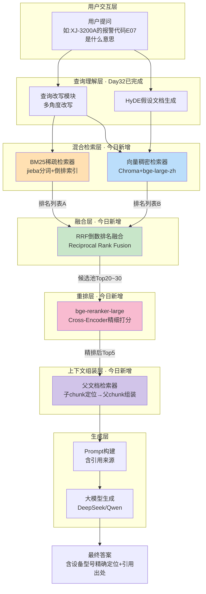
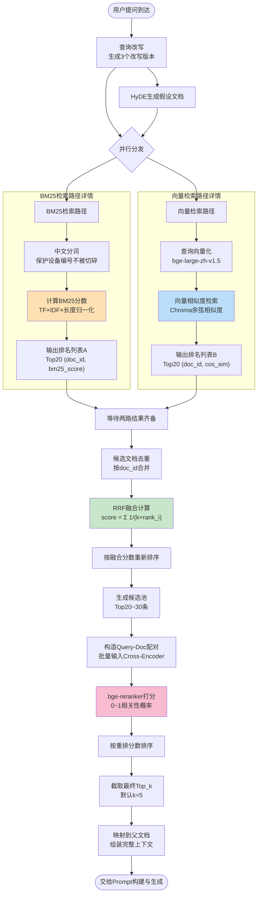
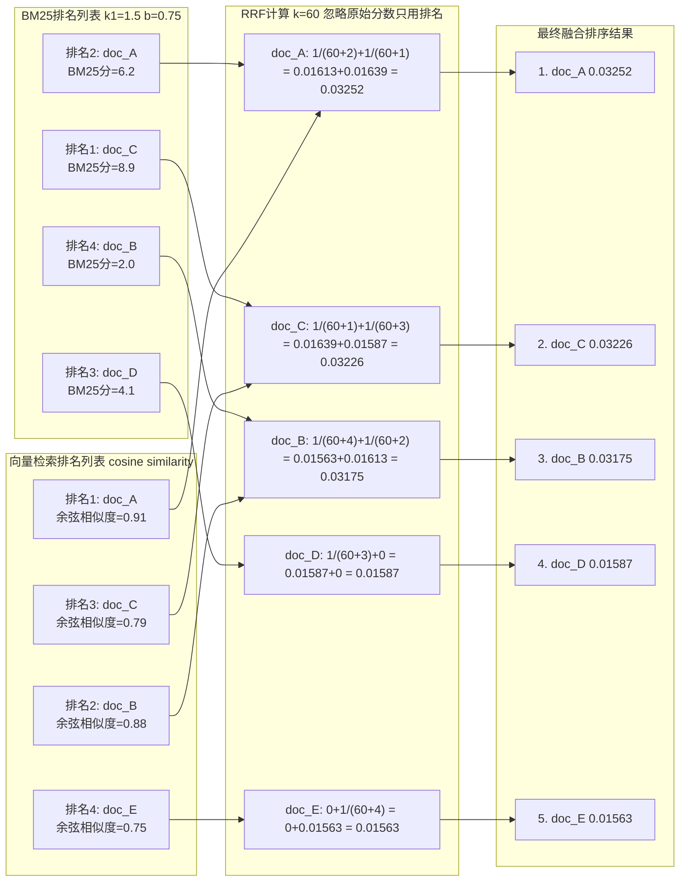

# 第33天 · 高级RAG技术(下):混合检索、RRF融合与Rerank重排实战

> **星期**:周五(Sprint3 · RAG进阶与交付,入职第33天,转正之后的第19天)
> **对应Sprint**:Sprint 3 · RAG进阶与交付(Day32-38)—— 昨天完成查询改写与HyDE,今天进入混合检索与重排序
> **飞书任务号**:CQ-231(海纳制造集团RAG问答系统 · 混合检索与重排序优化方案)、CQ-232(BM25检索器、RRF融合与父文档检索器工程化封装)
> **参与人**:陈铭、苏梦、韩露、张凡(导师:王振宇;上午需求评审列席:林悦;晚间简短汇报列席:郭建军)
> **今日关键词**:设备型号精确匹配失败案例 / BM25稀疏检索 / 混合检索(Hybrid Search) / RRF倒数排名融合 / bge-reranker重排序模型 / 父文档检索器(Parent Document Retriever) / 增强RAG流水线

---

## 【旁白】

昨天晚上陈铭做的最后一件事,是把查询改写和HyDE这两套新武器,一股脑地塞进Day30搭起来的那套RAG demo里,然后拿着Day31那十个"真实业务问题"又跑了一遍。命中率从不到六成,爬到了七成出头——这是一个让人振奋的数字,陈铭在笔记本上画了一个小小的向上箭头,配了一行字:"查询改写和HyDE不是花架子,是真的有用。"他甚至有点小得意,觉得这套组合拳已经把"用户问题和文档写法不一样"这个老大难问题解决得差不多了。

那天晚上他还顺手把这个好消息发到了培训生小群里,苏梦回了一个"哇"的表情,张凡则更谨慎一些,回了一句"再多测几个场景看看,别高兴太早"。陈铭当时没太把这句话放在心上,只当是张凡一贯谨慎的性格使然,直到第二天早上,这句"再多测几个场景看看"几乎一字不差地应验了。这也是这段培训生涯里,陈铭后来反复回想起的一个小细节——身边这几个同批入职的同学,虽然各自的技术强项、学习节奏都不太一样,但彼此之间那种"看到问题会直接说出来、不怕拂了对方兴头"的坦诚,慢慢变成了这个小团队一种隐性的、互相纠错的机制,比任何一次正式的代码评审都来得及时。

但今天早上九点不到,他还没来得及把这份得意维持多久,林悦就抱着笔记本电脑走到他工位旁边,神情有点复杂——不是生气,更像是"发现了一个大家都没注意到的漏洞"那种表情。她把电脑转过来给陈铭看:"我昨晚随手拿了几个海纳集团客户支持群里的真实聊天记录截图做了简单测试,发现一个问题——只要问题里带具体的设备型号编号,比如‘XJ-3200A这个型号的报警代码E07是什么意思’,系统答得驴唇不对马嘴,要么答成别的型号的报警代码,要么干脆说‘文档中未提及相关信息’。可我明明看到,那份《数控加工中心操作规程》文档里,XJ-3200A这个型号被提到了不下二十次。"

陈铭当场把这个问题在自己电脑上复现了一遍,结果和林悦说的一模一样——查询改写没能把这个问题改写得更好,反而有一版改写结果把"XJ-3200A"这个编号完全丢掉了,变成了"这个型号的机床报警代码E07代表什么故障";HyDE生成的假设性文档里,编号也被"稀释"成了一段泛泛而谈的报警代码说明,向量检索拿着这份假设文档去匹配,自然找不准。这不是查询改写或HyDE写错了,而是这两个技术从骨子里就依赖语言模型对语义的"理解"和"泛化"能力——可"XJ-3200A"这种设备型号编号,恰恰是那种不需要被理解、只需要被精确认出来的字符串,你越"泛化"它,它就越容易失真。向量Embedding模型天生擅长捕捉语义上的相似,但对这种由字母、数字、连字符拼成的、语义上"空洞"的编码,反而是它的弱项——在高维语义空间里,"XJ-3200A"和"XJ-3300B"可能被编码成两个挨得很近的向量,因为它们"看起来像是同一类东西",但对一线维修师傅来说,这两个编号对应的可能是完全不同的设备,报警代码含义天差地别。

老王listening了整个复现过程,没有立刻讲解决方案,反而先问了陈铭一句:"你觉得,如果让你在一堆文档里,凭记忆去找‘XJ-3200A’这几个字符,你会怎么找?"陈铭愣了一下:"用Ctrl+F搜索关键词啊。"老王点头:"对,这就是问题的核心——有些检索需求,本质上就是关键词精确匹配,不是语义相似度匹配。向量检索解决的是‘意思相近’的问题,但‘这几个字符一模一样地出现在某个地方’这种需求,向量检索天生就不擅长,这不是哪个Embedding模型不够好,是这类模型的设计目标本来就不是干这个的。"他顿了一下,在白板上写下了两个字:"BM25"。

这一天要讲的东西,说到底就是一句话:向量检索(稠密检索,Dense Retrieval)和关键词检索(稀疏检索,Sparse Retrieval)各有各的强项,谁也取代不了谁,真正靠谱的企业级检索系统,从来不会只用一条腿走路,而是把两条腿——BM25和向量检索——同时用上,再用一套融合算法(RRF)把两边的结果排到一起,最后再用一个更精细的重排序模型(Rerank)把候选结果重新打一次分,过滤掉那些"看起来像但其实不对"的结果。这四个环节串起来,就是今天要落地的"混合检索+重排"增强RAG流水线,也是Sprint3这几天里,继查询改写和HyDE之后,第二块补齐检索能力短板的关键拼图。而在这一切开始之前,那个被林悦顺手发现的、驴唇不对马嘴的XJ-3200A案例,会一直被贴在会议室白板的角落里,作为今天所有技术选型的"第一现场证据"。

还有一件事值得记一笔——今天下午收尾的时候,效果肉眼可见地变好了,陈铭自己拿那十个问题又跑了一遍,几乎每一题都命中了。但老王在下午收工前,没有像陈铭期待的那样表扬这个进步,反而抛出了一个让陈铭一时语塞的问题:"‘肉眼可见变好’,这句话你敢写进给海纳集团的验收报告里吗?"陈铭愣了几秒,意识到自己刚才那种"感觉真棒"的成就感里,藏着一个致命的漏洞——所有的判断依据都还停留在"我看了觉得不错"这种主观层面,连一个具体的命中率数字都还没有算出来。这个问题会一直悬在陈铭心里,直到今天故事结束都没有被解决——它被老王当作一个鱼钩,原封不动地甩给了明天。

从更宏观的视角回看Sprint3这三天(Day31的调优实验、Day32的查询改写与HyDE、今天的混合检索与重排),会发现一条清晰的递进逻辑:Day31用一次结结实实的调优实验,把"基础RAG能力有天花板"这件事,从一个模糊的直觉,变成了一个具体到"不到六成"的数字;Day32用查询改写和HyDE,补上了"用户的表达方式和文档的表达方式不一致"这道坎;今天则是发现,即便解决了表达方式不一致的问题,还有一整类"精确匹配"的需求,是语言模型的生成能力和泛化能力天生就不擅长处理的,必须请回BM25这种"老技术"才能补上。这条逻辑线索背后,其实藏着一个更深的方法论:任何一个真实的企业级检索系统,面对的从来不是单一类型的问题,而是各种问题类型混杂在一起的"混合战场"——语义模糊的、表达花哨的、需要精确匹配编号的、需要跨文档整合信息的,每一种问题背后需要的技术武器都不一样,而工程师的职责,不是找到一种"万能药"把所有问题都治好,是搭建一套能够让不同武器各自发挥所长、又能有序协作的系统架构。这也是为什么老王反复强调"没有哪个技术是万能的",这句话听起来像是老生常谈,但只有真正踩过"用向量检索解决不了精确匹配问题"这个坑之后,才能对这句话有切身的理解,而不只是把它当成一句正确但空洞的口号。

值得一提的是,这次发现问题的人是林悦,不是技术团队自己。老王在晨会上特意点出了这一点:"你们注意,这次问题不是我们自己测试发现的,是产品经理拿真实客户群聊记录随手一测就发现了。这说明一个道理——开发者自己设计的测试用例,天生带着‘我知道这个系统弱点在哪儿,所以我绕着走’的潜意识偏见,而真正贴近一线业务场景的测试,往往需要跳出研发团队的视角,由真正懂业务、经常跟客户打交道的人来补充。"这句话让陈铭想起了Day31需求文档里反复强调的"确认偏误"——原来这个问题不是一次性解决掉就完事了,而是会在项目推进的每一个阶段反复出现,每一次"自己觉得做得不错"之后,都需要有一个跳出自己视角的检验环节,这几乎已经成为陈铭这段时间里,在技术之外收获的最重要的一条工作习惯。

---

## 晨会纪要 / 今日目标

**时间**:上午9:00,二层大会议室"望远"
**出席**:王振宇(老王)、陈铭、苏梦、韩露、张凡;林悦(需求评审环节列席);郭建军(晚间简短汇报环节列席)

会议室门刚推开,陈铭就看到白板上已经贴了一张打印出来的截图——正是林悦昨晚发现的那段客户群聊天记录,"XJ-3200A这个型号的报警代码E07是什么意思"那句话被用红色马克笔圈了出来,旁边写着一个大大的问号。

老王开场很直接:"昨天陈铭跟大家反馈,查询改写和HyDE上线以后,命中率从不到六成涨到了七成出头,这是实打实的进步,值得表扬。"他停顿了一下,转身指向白板上的截图,"但今天早上,林悦发现了一个新问题,而且这个问题不是查询改写和HyDE能解决的——不管你怎么改写问题、怎么生成假设文档,只要涉及具体的设备型号编号,系统的表现就会明显下降。我让陈铭当场复现了一下,确实如此。"

林悦补充道:"我昨晚随手翻了一下海纳集团这边(教学场景里由客户支持群聊记录整理稿模拟)近期的咨询记录,发现大概有三成左右的问题,都会明确提到具体的设备型号编号——像XJ-3200A、YK-500系列、TC-8800这些编号,一线维修和质检人员在描述问题的时候,几乎是‘条件反射’式地先说型号,再说具体故障或者疑问。这类问题如果处理不好,对客户来说是‘一眼就能看出来系统不靠谱’的硬伤,比语义理解不到位这种‘软伤’更容易让客户失去信任。"

陈铭举手提了个问题:"我昨天复现的时候发现,不是检索完全找不到相关文档,而是经常把XJ-3200A的报警代码,答成了别的相近型号的内容,这是因为Embedding把这些型号编号看得‘差不多’吗?"

老王认可了这个判断,并且借着这个问题,把今天的核心技术点提前透了个底:"你说得基本对。向量检索的本质,是把文本编码成高维空间里的一个点,‘相似’的文本会被编码到相近的位置。但‘XJ-3200A’和‘XJ-3300B’这种字符串,字面上差一个字符,语义上在Embedding模型眼里可能被认为‘长得很像、应该差不多’,可实际业务含义上可能是完全不同的两台设备。这类需求,本质上是一个关键词精确匹配问题,不是语义相似度问题——而关键词精确匹配,恰恰是传统信息检索里最经典、最成熟的技术:BM25。"他在白板上写下"BM25"和"稀疏检索(Sparse Retrieval)"几个字,又在旁边写下"向量检索"和"稠密检索(Dense Retrieval)","这两种检索方式,不是谁取代谁的关系,是互补关系——今天上午我们要做的第一件事,就是把BM25加回到咱们的检索系统里,和向量检索并行跑,这就叫‘混合检索’(Hybrid Search)。"

张凡追问了一句:"那两边检索结果的分数,量纲完全不一样吧?BM25的分数和向量检索的余弦相似度分数怎么合并到一起排序?"

老王显然很满意这个问题被问出来:"这就是今天上午第二个重点——RRF,Reciprocal Rank Fusion,倒数排名融合。它有一个很巧妙的设计,完全不看两边检索结果的具体分数是多少,只看每个文档在各自列表里的排名位置,用排名的倒数去算一个融合分数。这样就绕开了‘分数量纲不一致没法直接加权求和’这个老大难问题。"

苏梦举手问:"那有了混合检索加RRF,是不是就足够了?"老王摇头:"混合检索加RRF解决的是‘尽量把真正相关的文档,从大海里捞出来放进候选池’这个问题,它的目标是‘不漏’,所以候选池往往会设得比较宽,比如召回20到30个候选文档。但候选池宽了,里面难免混进一些‘看起来相关但其实不太对’的文档,这时候就需要下午要讲的第三个环节——Rerank重排序,用一个更精细、计算成本也更高的模型,对候选池里的每一个文档和原始查询做更细致的相关性打分,把真正最相关的几个挑出来。这三个环节,召回宽、融合准、重排精,缺一个都不完整。"

老王最后提到了下午的第四个环节:"另外,下午我们还会顺手解决一个'检索粒度'的老问题——你们还记得Day28讨论chunk_size的时候提到的两难吗?切得小,检索精准但上下文不够;切得大,上下文够但检索容易被无关内容干扰。今天下午会介绍父文档检索器(Parent Document Retriever),用小chunk去检索定位,再用大chunk(父文档)去组装最终喂给大模型的上下文,试着把这个两难缓解一下。"

**今日目标**:

1. 上午9:00-9:40:晨会 + 需求评审(林悦讲解《混合检索与重排序优化方案》PRD)。
2. 上午9:40-12:00:混合检索原理与BM25实现——讲解BM25算法原理、中文分词与设备编号识别、RRF融合排序原理与实现,动手完成BM25检索器和RRF融合模块。
3. 下午13:30-15:30:Rerank重排序模型实战——讲解Cross-Encoder与Bi-Encoder的区别、bge-reranker-large的加载与调用、批处理与延迟优化,动手完成重排序模块。
4. 下午15:30-17:00:父文档检索器实战——讲解父子chunk拆分策略、检索定位与上下文组装的解耦思路,动手完成父文档检索器。
5. 下午17:00-18:00:整合"混合检索+重排"完整增强RAG流水线,用Day31那十个业务问题(含新增的设备型号编号类问题)做肉眼验证。
6. 晚自习19:30-21:00:代码复盘、个人练习(课后作业),郭建军列席听取简短汇报。

**昨日进展回顾(Day32)**:

- 查询改写(多角度改写、口语化转书面化改写)和HyDE(假设性文档嵌入)已经集成进RAG demo,命中率从不到六成提升到七成出头。
- 发现一个新的短板:涉及具体设备型号编号(如XJ-3200A)的问题,查询改写和HyDE反而可能"稀释"掉关键编号信息,导致检索准确率下降。

**风险点**:

- BM25对中文的分词质量高度敏感,如果分词器把"XJ-3200A"这类编号切碎(比如切成"XJ""3200""A"三段),精确匹配的优势就会大打折扣,今天上午必须专门处理这个问题。
- RRF融合虽然不依赖分数量纲,但融合参数(尤其是平滑常数k)和两路检索各自的召回数量(BM25召回多少、向量检索召回多少)会显著影响最终效果,需要留出时间做参数试验,不能拍脑袋定死。
- Rerank模型(bge-reranker-large)如果直接跑在CPU上,批量重排20-30个候选文档的延迟可能会明显增加接口响应时间,需要提前测一下实际耗时,给下午的接口性能预留心理预期。
- 父文档检索器涉及"检索用的子文档"和"生成用的父文档"两套存储,如果元数据关联设计不严谨,容易出现"检索到了子chunk,却找不到对应父文档"的工程bug,今天的代码要把这层关联关系设计清楚。
- 老王在晨会最后提前打了个招呼:"今天效果会明显变好,但‘明显变好’不是终点,是新问题的起点——没有量化的评估指标,‘变好’只是我们自己的主观感觉,这件事明天会专门处理,今天先把功能做扎实。"

晨会临近结束的时候,韩露提了一个更具体的疑问:"如果BM25和向量检索都召回了同一篇文档,但两边给的排名差得很远,比如BM25排第2,向量检索排第18,这种情况融合出来的分数应该怎么理解?"老王没有直接给答案,而是让陈铭先猜一猜。陈铭想了想说:"感觉应该是‘至少有一路很认可它,分数不会太低,但也不会特别高’?"老王点头表示方向是对的,补充道:"这正是RRF设计的一个隐含特性——它对‘至少一路排名很靠前’的文档会给出相对不错的融合分数,哪怕另一路完全没把它排到前面。这种设计其实暗合了咱们做混合检索的初衷:只要BM25或者向量检索任意一路‘认得出’这篇文档是相关的,它就不应该被完全埋没,这也是为什么混合检索通常比单一检索方式更‘稳’——单一检索方式一旦某类问题不擅长,直接就是漏检;而混合检索只要还有一路擅长,就能把这篇文档兜住。"

张凡又追问了一句关于工程落地的问题:"如果客户以后要求响应速度必须控制在1秒以内,今天这套‘BM25+向量+RRF+Rerank+父文档检索’的完整链路,会不会太重了?"老王没有回避这个问题的分量,坦白讲了实话:"确实存在这个风险,今天下午你们跑起来之后会拿到实测的耗时数据,到时候咱们一起看,如果哪个环节拖慢得太明显,后面会有专门的性能优化方案——比如把BM25检索和向量检索做成真正的并行调用而不是串行调用,比如给Rerank模型做量化压缩,比如给检索结果加缓存。但今天先把‘正确性’做扎实,‘性能优化’是下一阶段的事,不要在今天就左右为难、既想快又想准,两个目标同时抓,今天什么都做不好。"这段对话被陈铭原样记在了笔记本上,他后来在自己的复盘里写道:"老王很少说‘这个问题以后再说’,但每次说出这句话,后面往往都是真的会兑现,而不是敷衍——这也是我慢慢开始信任他判断的原因之一。"

苏梦最后提了一个偏"团队协作"层面的问题,得到的回答让今天的分工方式变得清晰起来:"我们四个人今天要不要各自都完整实现一遍BM25、RRF、Rerank、父文档检索器这四个模块,还是分工去做?"老王给出的安排是:"今天要求每个人独立完整地实现全部四个模块,不做分工——这跟平时正式项目里‘按模块分工提高效率’的做法不一样,是因为今天的目标是‘每个人都要把这几种检索技术的原理和实现细节都吃透’,不是‘尽快拼出一个能跑的demo’。分工提效率是团队协作的常规做法,但在打基础的学习阶段,‘每个人都完整走一遍全流程’比‘团队整体效率’更重要,你们以后正式做项目分工的时候,这几个模块的实现细节,应该已经是你们各自都亲手写过、调试过的东西,不是‘听别人讲过一遍’的二手经验。"这个安排也解释了为什么今天课件里的五段代码,是要求每个人独立完成、而不是团队分工拼接的,老王显然是刻意把"学习效率"和"团队协作效率"这两件事分开来看待的。

---

## 需求文档:《海纳制造集团RAG问答系统 · 混合检索与重排序优化方案》

> 撰写人:林悦(产品经理) · 技术方案评审:王振宇(技术导师)
> 文档编号:CQ-PRD-D33-01
> 版本:v1.0

### 背景

Day32上线的查询改写与HyDE方案,已经将基础RAG demo在海纳制造集团十个真实业务问题测试集上的命中率,从Day31的不到六成提升到七成出头,验证了"改写用户的表达方式使其更贴近文档表达方式"这一思路的有效性。但在本次需求梳理过程中发现一个新的、性质不同的问题类别:海纳制造集团一线设备维护与质检人员,在提问时有相当高的比例(初步估算约三成)会明确指定具体的设备型号编号(如XJ-3200A、YK-500系列、TC-8800等),这类问题对检索系统的核心要求,不是"理解语义相近的表达",而是"精确识别并匹配特定的字符串编号"。当前纯向量检索方案,由于Embedding模型的语义泛化特性,对这类由字母、数字、连字符组成的、语义信息稀薄的编码类文本,匹配准确率明显偏低,查询改写与HyDE等基于语言模型生成能力的技术,反而可能在改写或生成假设文档的过程中丢失或稀释这类关键编号信息,导致问题进一步恶化。

因此,本次优化的核心目标,是在现有基础上引入"混合检索"能力——将成熟的关键词稀疏检索技术(BM25)与现有的向量稠密检索并行使用,通过倒数排名融合算法(RRF)将两路检索结果合并为统一的候选池,再引入一个专门的重排序模型(Rerank)对候选池进行精细化的二次相关性排序,最终使检索系统同时具备"理解语义相近表达"和"精确匹配关键编号"两种能力。同时,针对文本切分粒度长期存在的"检索精度"与"上下文完整性"两难问题,本次优化还将引入父文档检索器机制,进一步提升最终答案的上下文质量。

### 用户故事

- 作为海纳制造集团的设备维护人员,我希望在提问时直接说出设备型号编号(如"XJ-3200A的报警代码E07是什么意思"),系统能够精确定位到该型号对应的文档内容,而不是把不同型号的信息混在一起或者答成别的型号。
- 作为质检人员,我希望在提问中同时包含专业术语和口语化表达时,系统依然能够又快又准地找到相关文档,不因为我用的是关键词式的简短提问,或者是啰嗦口语化的长句提问,而在检索效果上出现明显差异。
- 作为技术负责人,我希望检索系统具备"语义理解"和"关键词精确匹配"两种能力的兜底,不因为单一检索方式的固有短板,导致某一类问题系统性地答不好。
- 作为技术负责人,我希望在候选文档池召回之后,增加一层更精细的重排序环节,过滤掉那些字面或语义上"看起来相关但实际不对"的干扰文档,提升最终喂给大模型的上下文的信噪比。
- 作为项目组一员,我希望文本切分策略能够兼顾"检索定位要精准"与"回答时上下文要完整"这两个长期冲突的目标,不需要在两者之间做非此即彼的取舍。
- 作为下周即将进行客户效果汇报的项目负责人,我希望本次优化的每一个环节(BM25召回、RRF融合、Rerank重排、父文档检索),都有清晰的模块边界和可独立测试的接口,方便后续量化评估时逐层定位问题来源。
- 作为一线设备维护班组长,我希望即便我不知道某个设备的准确官方型号全称,只说出了型号的一部分或者带有轻微笔误,系统依然有较大概率能定位到正确的设备,而不是因为一个字符的偏差就完全检索不到任何结果。
- 作为公司的技术负责人,我希望本次引入的Rerank重排序环节,不会让系统的响应速度出现无法接受的大幅劣化,如果确实存在性能代价,我希望能拿到明确的实测数据,而不是一句模糊的"感觉慢了一点"。

老王在评审现场补充了一条视角,建议林悦把它也纳入用户故事的考虑范围:"还有一类隐性的用户,容易被忽略——就是咱们自己,未来负责维护这套系统的工程师。半年后如果有人接手这套代码,他能不能一眼看出BM25出了问题该查哪个文件、Rerank出了问题该查哪个文件?这也是一种‘用户体验’,只是服务对象从客户变成了未来的自己或者同事。"林悦当场把这条建议记了下来,准备在文档定稿前补充一条对应的用户故事,这个细节被陈铭记在了笔记本上,标注了一句:"原来PRD里的‘用户’,不只是掏钱买产品的客户,也包括后面接手代码的自己人。"

### 功能列表

| 编号 | 功能 | 说明 | 优先级 |
|---|---|---|---|
| F1 | 中文BM25检索器 | 基于jieba分词构建倒排索引,实现标准BM25算法(k1、b可配置参数),支持对设备型号编号等专有名词的分词保护,避免编号被错误切分 | P0 |
| F2 | 向量检索器复用 | 复用Day29-30已有的向量检索模块(Chroma + bge-large-zh-v1.5),作为混合检索的稠密检索一路,不重复开发 | P0 |
| F3 | RRF倒数排名融合 | 实现标准RRF算法,支持多路检索结果(当前为BM25与向量检索两路)融合排序,平滑常数k可配置 | P0 |
| F4 | 混合检索器整合 | 封装HybridRetriever类,对外提供统一的检索接口,内部并行调用BM25与向量检索,自动完成RRF融合与去重 | P0 |
| F5 | Rerank重排序模块 | 集成bge-reranker-large模型,对混合检索召回的候选池(默认20条)做精细化相关性重排序,输出最终top_k(默认5条) | P0 |
| F6 | 重排序批处理与性能优化 | 支持批量输入、动态batch size、GPU/CPU自动检测,重排20-30条候选的平均耗时需控制在可接受范围内并给出实测数据 | P1 |
| F7 | 父文档检索器 | 实现父子chunk两级切分(子chunk用于检索定位,父chunk用于上下文组装),检索命中子chunk后自动映射并返回对应父文档 | P0 |
| F8 | 增强RAG流水线整合 | 将BM25、向量检索、RRF融合、Rerank重排、父文档检索器串联为一条完整的"混合检索+重排"增强RAG流水线,提供统一的问答接口 | P0 |
| F9 | 设备型号编号测试用例集 | 补充至少5条明确包含设备型号编号的测试问题,纳入现有的十题测试集,用于验证本次优化对该类问题的改善效果 | P1 |
| F10 | 检索结果可追溯性 | 每一步(BM25召回、向量召回、RRF融合、Rerank重排)的中间结果均可输出日志或调试信息,方便定位某一具体问题在哪个环节出现偏差 | P1 |

### 非功能需求

- **可配置性**:BM25的k1、b参数,RRF的平滑常数k,混合检索各路召回数量,Rerank的候选池大小与最终top_k,父子chunk的切分尺寸,均应作为可配置项,不能硬编码,方便后续调优实验复用。
- **性能可控**:引入Rerank环节后,单次问答的端到端响应延迟增量需要有实测数据支撑,如果增量过大(比如超过2-3秒),需要在报告中明确说明并给出后续优化方向(如量化、批处理优化等),不能对性能代价避而不谈。
- **模块解耦**:BM25检索器、向量检索器、RRF融合模块、Rerank模块、父文档检索器,应各自实现为独立可测试的组件,任意一个组件的实现细节变化,不应影响其他组件的对外接口。
- **可回退性**:混合检索与重排序是在现有向量检索基础上的增强,应保留"仅使用向量检索"的降级模式,当BM25索引或Rerank模型服务不可用时,系统仍能以降级模式提供基础问答能力,不能因为新增组件故障导致整个系统不可用。
- **教学与生产两用**:今天产出的代码将同时用于教学示例和后续真实项目集成,注释详尽程度、异常处理完整度、命名规范均需遵循公司统一工程规范,不能因为是"今天先跑起来看效果"而降低代码质量标准。

老王在评审"可回退性"这一条的时候,补充了一段现场讨论,值得记录下来:"很多团队做技术升级,习惯性地把新方案和旧方案设计成互斥关系——新的一上线,旧的直接下线,这在教学环境下问题不大,但在真实的客户交付项目里,这是一个相当危险的做法。今天咱们引入了BM25、RRF融合、Rerank、父文档检索器这四个新组件,任何一个组件如果因为环境问题(比如Rerank模型服务临时挂了、GPU资源被占满)不可用,系统应该能够体面地‘降级’,退回到‘仅使用向量检索’这个已经在生产环境验证过的基础能力,而不是直接报错、整个问答功能瘫痪。这跟咱们在Day30就强调过的‘不知道就说不知道’的兜底策略,是同一种工程哲学——宁可退回到一个‘不那么完美但可用’的状态,也不要让整个系统在局部组件出问题的时候彻底罢工。"这段话让林悦立刻在验收标准里补充了一条对应的检查项,要求团队实际演练一次"故意关掉Rerank服务,观察系统是否能自动降级"的故障演练,而不是只停留在文档里写一句"支持降级"就算完事。

赵磊事后在飞书群里补充的书面意见也被归档进了这份PRD的评审记录:"降级模式建议不要做成‘静默降级’,系统日志里必须清晰地记录‘本次请求因为XX组件不可用,已降级为YY模式’,否则运维和测试同学排查问题的时候,很容易被‘系统看起来一切正常、但实际上少用了好几个环节’这种隐性状态坑到,表面上看起来没报错,但效果已经悄悄变差了,这种‘隐性劣化’比直接报错更难被及时发现。"这条意见后续被落实进了`EnhancedRAGConfig`相关代码的日志规范里。

### 验收标准

1. BM25检索器能够正确处理中文分词,且对"XJ-3200A"这类设备型号编号能够保持完整不被切碎,通过专门的分词单元测试验证。
2. 混合检索器(BM25+向量检索+RRF融合)在补充了设备型号编号类问题的测试集上,相比Day32纯向量检索(含查询改写与HyDE)方案,命中率有可观测的提升,且需专门列出型号编号类问题的命中率对比。
3. Rerank重排序模块能够正确加载bge-reranker-large模型,对候选文档池完成相关性打分与重新排序,且给出批量重排的实测平均耗时数据。
4. 父文档检索器能够正确完成"子chunk检索定位 → 父chunk上下文组装"的映射,且父子chunk的对应关系在多次查询中保持稳定、无错乱。
5. 完整的增强RAG流水线(混合检索+RRF融合+Rerank重排+父文档检索器)可以端到端运行,对外提供统一问答接口。
6. 所有新增模块均附带独立的自检/单元测试代码,不依赖真实API调用即可验证核心逻辑正确性。
7. 本次优化涉及的所有可配置参数,均在代码中以清晰的配置类或配置字典形式呈现,便于后续调优实验直接复用。

老王在评审这份PRD时补了一句,被陈铭记进了笔记本:"你们注意F10这一条——'检索结果可追溯性'。很多团队做RAG优化,喜欢把BM25、向量检索、融合、重排这几步糅在一个函数里,跑起来是跑起来了,但一旦效果不对,连问题出在哪一步都说不清楚。今天写代码,每一步的中间结果都要能单独拿出来看,这不是为了好看,是为了明天真正做量化评估的时候,你们能一步一步定位问题,而不是抓瞎。"

评审快结束的时候,赵磊虽然今天没有列席上午的会,但林悦提前把PRD发给他过了一遍,他在评审文档里留了一条书面意见,老王当场念给大家听:"F9(未命中原因标注)这一条,建议提高优先级到P0。测试环节我一直强调,‘知道系统答错了’和‘知道系统为什么答错了’是两件差距很大的事情,前者只是记录一个失败案例,后者才能真正指导后面的优化方向。如果只统计命中率不统计未命中原因,下次调优很可能又是拍脑袋。"老王采纳了这条意见,当场把F9的优先级从P1调整为P0,并解释给团队:"赵磊常年泡在测试和缺陷跟踪里,他这个提醒抓住了一个容易被忽视的问题——效果评估不是为了拿到一个漂亮的分数去汇报,是为了给下一步优化提供确切的方向,这两者的目标看似接近,实际做法上会有微妙但重要的差异。"

林悦在最后补充了一点关于验收标准的说明,呼应她一贯强调的"先确认验收标准":"第2条验收标准里,我特意加了‘且需专门列出型号编号类问题的命中率对比’这句话,而不是简单说‘命中率有提升’。这是因为如果我们只看整体命中率,即便型号编号类问题这一子类完全没有改善,只要其他题型有提升,整体数字照样能看起来"进步了",但这就掩盖了咱们今天真正要解决的核心问题。验收标准写得越具体,越不容易在汇报的时候用一个笼统的好看数字,遮住某个具体没解决好的短板。"这句话让陈铭想起了老王常说的"能跑不代表对,对不代表好"——原来"好"这个字,背后还藏着"好在哪个具体维度上"这一层更细致的追问,笼统地说"效果变好了",本身就是一种不够严谨的表达方式。

---

## 架构设计图:混合检索+重排的完整RAG流水线架构

老王在白板上画完需求评审的框图之后,紧接着画了这张更细致的系统架构图,把今天要落地的几个模块在整个苍穹RAG检索引擎层里的位置讲清楚。



这张图里,老王特意用颜色把今天新增的四个模块(橙色的BM25检索器、绿色的RRF融合、粉色的Rerank重排、紫色的父文档检索器)和已有模块区分开,方便学员一眼看出"今天到底在原有系统上加了什么"。他解释道:"你们注意,查询改写和HyDE的输出,同时喂给了BM25和向量检索——但严格说,HyDE生成的假设文档,更适合喂给向量检索,因为它本质上是在语义空间里造一个更接近答案的‘诱饵’;而BM25更适合直接用改写后的、保留了关键词的查询文本,不需要HyDE这种语义层面的操作。这也是为什么图上HyDE只指向了VECR,没有指向BM25R。"

陈铭抄完这张图之后,专门在旁边补了一句自己的理解,后来在跟老王核对的时候得到了确认:"感觉这张图其实是在说,查询改写和HyDE解决的是‘怎么把问题问得更像文档’,而混合检索和重排解决的是‘用什么方式去匹配’,这两层是相对独立、可以叠加使用的能力,不是二选一的关系。"老王听完点头:"这个理解是对的,而且这正是为什么今天这套架构,是‘在Day32基础上继续叠加’,而不是‘推翻Day32重新做一套’——好的架构应该是可持续叠加能力的,不应该出现‘新技术一上,旧技术就要推倒重来’这种情况,如果发现自己设计的架构经常需要推倒重来,通常说明前面的模块边界划分得不够清晰。"

---

## 流程图:BM25+向量并行检索→RRF融合→Rerank重排→最终top_k完整流程

架构图讲完系统里"有哪些模块",老王接着画了这张流程图,讲清楚一次真实的问答请求,数据是怎么在这些模块之间一步步流转的。



陈铭在抄这张图的时候,特意在"候选池Top20~30条"这一步旁边画了个星号,记了一句老王的原话:"很多人第一次做混合检索,喜欢让BM25和向量检索各自只召回5条,凑成10条直接就当最终结果给大模型用了——这是错的。召回阶段的目标是‘宁可多召回、不能漏召回’,候选池要故意留得比最终需要的数量宽得多,把‘精挑细选’这件事完全交给后面的Rerank去做,这是‘先求全、再求精’的两阶段思路,不能图省事把这两个阶段的目标混在一起。"

张凡对着这张流程图,提出了一个关于并行执行的疑问:"图上BM25检索路径和向量检索路径是‘并行分发’的,但今天上午写的代码里,`_child_search`方法里BM25检索和向量检索是顺序调用的,这算不算没有真正做到‘并行’?"老王承认了这一点,并借此机会讲清楚了"逻辑并行"和"物理并行"的区别:"今天的代码,在逻辑设计上是‘并行’的——BM25检索和向量检索互不依赖对方的结果,这意味着它们理论上完全可以同时发起、同时执行;但今天的具体实现,出于教学阶段‘代码逻辑要清晰易懂’的考虑,写成了顺序调用,先跑完BM25再跑向量检索。如果未来要真正压缩响应延迟,可以用Python的异步编程(`asyncio`)或者多线程,把这两路检索改造成真正意义上的物理并行执行,两路检索的耗时就能从‘相加’变成‘取较大值’,这是一个明确的、留给性能优化阶段的改造点,今天的架构设计已经为这种改造预留了空间——因为两路检索在逻辑上本来就是互不依赖的,该做的准备工作已经做好了,只是还没有动手去做物理层面的并行改造而已。"

---

## 示意图:RRF融合排序的计算原理示意

讲完整体流程,老王发现光讲"用排名的倒数去算融合分数"这句话,大家听得有点云里雾里,于是专门画了这张更聚焦的示意图,拿一个具体的四文档小例子,把RRF的计算过程摊开来讲。



这张图讲完之后,韩露提了一个很关键的问题:"doc_C在BM25里排第一,分数8.9看着很高,为什么融合之后反而排到了第二,还比doc_A低?"老王就着这个问题,把RRF的核心思想讲透了:"这正是RRF最巧妙也最容易被误解的地方——它完全不管BM25那个8.9分和向量检索那个0.91分之间谁大谁小、谁更‘可信’,它只关心一件事:这个文档在两份榜单里,分别排第几名。doc_C虽然在BM25榜单上是冠军,但在向量检索榜单上只排到第三;doc_A虽然在BM25榜单上只是第二,但它同时是向量检索榜单的冠军——‘两份榜单都认可、都排得比较靠前’的文档,融合分数自然会更高。这就是RRF在‘不同检索方式的分数根本没法直接比较’这个死结上找到的解法:放弃比较绝对分数,只比较相对排名,而且给排名靠前的名次更高的权重(因为分母里是k+rank,rank越小,1/(k+rank)越大)。"

张凡追问平滑常数k=60是怎么来的:"这个60是随便定的,还是有什么依据?"老王答:"k是一个经验性的平滑参数,最早在信息检索的经典论文里,60是一个被反复验证效果不错的默认值,它的作用是‘压平’排名靠前和靠后之间差距过大的问题——如果k设得很小,排名第1和排名第2之间的分数差会被放大得很夸张;k设得越大,不同排名之间的分数差就会被拉得更平缓。60是一个业界常用的经验默认值,但不是铁律,今天下午如果时间允许,可以拿咱们自己的测试集试一下k=30、k=60、k=100这几组值,看实际效果有没有明显差异。"

苏梦补了一个问题,把RRF和平时更熟悉的"加权平均"做了对比:"如果不用RRF,直接把BM25分数和向量检索的余弦相似度,各自做一次归一化(比如都缩放到0到1之间),然后按权重加起来,是不是也能达到类似的效果?"老王的回答让大家明白了RRF这套方法真正省心的地方:"理论上确实可以这么做,这种方法叫‘分数归一化加权融合’,但它有一个明显的痛点——归一化的方式选不对,结果会完全跑偏。比如BM25的分数分布,跟具体的文档集合、词表规模高度相关,同一个模型换一批文档,分数的分布范围可能完全不一样,你今天调好的归一化参数,换一批文档可能就失效了,需要重新校准;而RRF完全不需要关心分数本身的分布,只需要知道‘排第几名’,这个信息不管文档集合怎么变、检索模型怎么换,都是一个稳定的、可比较的量纲,这也是RRF在工业界被广泛采用、而‘分数归一化加权融合’相对更少见的核心原因——它对‘不同检索方式分数分布差异’这个问题,给出了一个更鲁棒、更不需要反复调参的解决方案。"

---

## 课堂笔记(陈铭的技术日志)

### 上午:混合检索原理与BM25实现

今天上午这几个小时,感觉像是把大学时候压根没认真听过的"信息检索"这门课,一次性给补上了。老王开场先泼了一盆"冷水",但泼得很有道理:"你们这两周天天讲向量检索、Embedding、语义相似度,讲得都挺兴奋,好像觉得这是什么全新的黑科技。但我要提醒你们一句:在向量检索、深度学习Embedding这些技术火起来之前,搜索引擎已经用关键词检索技术,把全世界的网页排序问题解决了小二十年。BM25就是那个年代留下来的、久经考验的东西,它一点都不"过时",只是最近几年被向量检索的风头盖过去了。"

**BM25到底在算什么。** 老王没有直接甩公式,而是先讲了BM25的"精神祖先"——TF-IDF。TF(Term Frequency,词频)的直觉很朴素:一个词在文档里出现的次数越多,这个文档跟这个词就越"相关"。但这个直觉马上会遇到一个漏洞——如果一个词是"的""了""是"这种到处都出现的常用词,它出现次数再多,也说明不了这篇文档跟查询"有多相关",因为它在所有文档里出现次数都很多。IDF(Inverse Document Frequency,逆文档频率)就是用来纠正这个漏洞的:一个词如果只在少数文档里出现,说明这个词"信息量"更大、更能区分文档,IDF值就应该更高;反过来,一个词到处都出现,IDF值就应该被压得很低,接近于零。TF-IDF把这两者乘起来,就是"这个词在这篇文档里出现的次数"乘以"这个词本身有多稀有、多有信息量"。

BM25(Best Matching 25,这个名字本身没什么特殊含义,就是这一系列排序函数研究里的第25个版本)在TF-IDF的基础上,做了两个关键改进。第一个改进是"词频饱和"(Term Frequency Saturation):TF-IDF里词频是线性增长的,一个词出现10次的贡献是出现5次的两倍,但直觉上这不太对——一个词从出现1次到出现2次,信息量的提升应该是很显著的,但从出现50次到出现51次,基本不会带来额外的信息量了,应该有一个"饱和"效应。BM25用一个类似双曲线的函数来实现这种饱和,里面有一个参数k1控制饱和的速度,k1越大,饱和得越慢,词频的影响权重就越持续。第二个改进是"文档长度归一化":一篇很长的文档,即便跟查询没那么相关,单纯因为字数多,某个词出现的绝对次数也可能比一篇短文档高,如果不做长度归一化,长文档会系统性地"占便宜"。BM25引入了另一个参数b,来控制文档长度对分数的惩罚力度,b=0表示完全不考虑长度差异,b=1表示完全按文档长度比例惩罚,公司代码里默认取k1=1.5、b=0.75,这也是学术界和工业界最常用的经验默认值。

老王写完公式之后,补了一句让我印象很深的话:"BM25的公式看起来复杂,但你不需要死记硬背,你只需要记住它想解决的问题——常见词不该占便宜(IDF),词频不该无限加分(饱和),长文档不该白占便宜(长度归一化)。记住这三条设计动机,公式随时可以查,但设计动机忘了,你就不知道什么时候该调k1、什么时候该调b。"

为了让这几条设计动机不只是停留在抽象层面,老王专门用一个简化过的小例子带我们手算了一遍IDF。假设知识库里一共有100篇文档,其中"报警"这个词出现在80篇文档里,而"XJ-3200A"这个编号只出现在3篇文档里,按照IDF公式 `idf = ln((N - df + 0.5) / (df + 0.5) + 1)` 计算:"报警"的IDF大约是 `ln((100-80+0.5)/(80+0.5)+1) = ln(20.5/80.5+1) ≈ ln(1.255) ≈ 0.227`,是一个很小的数字;而"XJ-3200A"的IDF大约是 `ln((100-3+0.5)/(3+0.5)+1) = ln(97.5/3.5+1) ≈ ln(28.86) ≈ 3.36`,是"报警"的十几倍。老王让我们对照这两个数字体会一下:"报警"这个词几乎没有区分度,不管查询里带不带它,对判断文档相关性的贡献都很有限;而"XJ-3200A"一旦出现在查询里,只要文档里也出现了,几乎可以断定这篇文档跟查询强相关,这也是为什么BM25天然地会给这类稀有、专有的词汇更高的权重,不需要额外的规则去"手动提高设备编号的权重"——只要分词保护做对了,IDF这个机制会自动帮我们把这类关键信息的权重提上去,这也解答了我最初的一个疑惑:是不是需要专门给设备编号写一条"加分规则"?答案是不需要,IDF本身的统计特性已经天然覆盖了这个需求。

**为什么选jieba,而不是更"新"的分词方案。** 韩露提了一个很自然的问题:现在有很多基于深度学习的中文分词工具,效果据说比jieba这种基于词典和统计规则的传统分词器更好,今天为什么还选择用jieba?老王给出的理由跟他一贯的技术选型思路是一致的:"jieba的分词质量,对咱们今天的场景来说已经完全够用,它最大的优势是轻量、速度快、不需要额外的模型加载和GPU资源,而且支持自定义词典这个功能非常成熟、社区用了很多年,遇到问题很容易查到解决方案。深度学习分词器精度可能更高,但对于BM25这种本身就依赖‘词频统计’这种相对粗粒度的信号的算法来说,分词精度提升带来的边际收益,远不如‘先把最常见的问题(比如专有名词被切碎)解决掉’来得实际。技术选型不是‘哪个理论上更先进就选哪个’,是‘在当前这个具体场景下,投入产出比最高的是哪个’,这跟咱们之前选Embedding模型、选向量数据库的原则,都是一脉相承的。"这段话也让我联想到公司技术栈规范里反复出现的那条思路——"教学友好性"和"够用就好",不是偷懒,而是一种经过深思熟虑的、务实的工程判断。

**中文分词是绕不过去的坑。** BM25本质上是在"词"这个粒度上做统计,可中文和英文不一样,英文天然用空格分词,中文一整句话是连在一起的,必须先分词才能进行后续的统计。今天上午最花时间的,反而不是理解BM25公式,而是处理中文分词这件"看起来简单实际很麻烦"的事。老王直接把上午的第一个"事故现场"甩给了我们——用最普通的jieba分词器,不做任何定制,直接对"XJ-3200A这个型号的报警代码E07是什么意思"这句话分词,结果把"XJ-3200A"直接切成了"XJ"、"-"、"3200A"三段(具体切法跟jieba词典版本有关,但结论是编号大概率会被破坏),这一下就把BM25精确匹配设备编号的优势给废掉了——因为倒排索引里存的是"XJ"和"3200A"这两个碎片化的词,而不是完整的"XJ-3200A",查询和文档里哪怕都提到同一个设备编号,如果分词结果不一致,匹配照样会出问题。

解决办法说起来不复杂,但要做得干净利落,需要下点功夫:在分词之前,先用正则表达式识别出"字母+数字+连字符"这种典型的设备型号编号模式,把它们当作一个不可分割的"专有名词"提前保护起来(常见做法是把这些编号临时替换成一个占位符,分词完成后再换回来,或者直接把这些编号加入jieba的自定义词典,强制作为一个词不被拆分)。公司这次选的方案是"自定义词典+正则兜底"双重保护:一方面维护一份设备型号编号词典,提前把已知的编号加入jieba词典;另一方面对于词典里没覆盖到的新编号,用正则表达式识别出符合"字母+数字+可选字母+连字符"模式的字符串,分词前先整体保护起来。这两个方法配合使用,基本能保证编号类文本在分词阶段不被破坏。

**BM25的可解释性,是它相比向量检索的另一个隐性优势。** 上午讲完核心算法之后,老王专门花了几分钟讲了一个容易被忽视的话题——可解释性。他问了一个问题:"如果客户质疑‘为什么系统给我推的是这篇文档,不是那篇’,你用向量检索,怎么回答?"我们几个都愣住了,因为向量检索的答案本质上是"这两个高维向量的余弦相似度更高",这个解释对技术人员来说是清楚的,但对客户来说几乎等于什么都没解释。老王接着说:"但如果是BM25给出的排序,你完全可以逐字逐句地告诉客户:‘因为这篇文档里出现了3次‘XJ-3200A’、2次‘报警代码’、1次‘E07’,这几个词恰好都是你查询里的关键词,而且‘XJ-3200A’这个词非常稀有,只出现在极少数文档里,所以它对排序的贡献特别大。’这种解释是可以让一个完全不懂技术的业务人员听懂的,这在客户验收、客户质疑排查的场景里,价值经常被低估。"这段话让我意识到,BM25不只是"精确匹配"这一个优点,它的整套计算过程都是透明的、可拆解的,这跟向量检索"黑箱式"的相似度计算,是两种完全不同的调试和解释体验,遇到客户投诉某个具体案例检索不准的时候,BM25这条链路的排查效率往往明显更高。

**增量更新索引是另一个绕不开的工程问题。** 张凡提了一个很实际的问题:海纳集团的设备手册不是一次性写完就不会再改的,后续肯定会有文档更新、新增设备型号的情况,如果每次只是增加了一篇新文档,也要把整个BM25索引重新构建一遍吗?老王坦率地说,今天上午写的这版实现,确实是"全量重建"的思路——`build_index`方法每次调用都会重新扫描所有文档、重新统计词频和文档频率,这对教学演示和中小规模知识库是可以接受的,但如果知识库规模变得很大(比如几十万篇文档),全量重建的耗时会变得不可忽视,这时候需要考虑增量更新的方案,比如只对新增文档做词频统计,再把这部分统计结果合并进已有的倒排索引里,IDF值需要重新计算(因为文档总数和词的文档频率都变了),这属于比较进阶的工程优化,今天先不展开,但提醒大家记在心里,后续正式集成进苍穹平台知识库管理模块的时候,增量更新是绕不开的一道题,不能假设知识库永远是"一次性建好、不再变化"的静态数据。

**倒排索引不是什么神秘的东西。** 分词处理好之后,构建BM25索引本质上就是构建一个"倒排索引"(Inverted Index)——对每一个词,记录它出现在哪些文档里,以及在每篇文档里出现了几次。这跟正排索引(对每篇文档记录它包含哪些词)刚好相反,之所以叫"倒排",就是这个"反过来记录"的意思。有了倒排索引,当一个查询进来,只需要把查询分词后的每个词,分别去倒排索引里查一下"哪些文档包含这个词、出现了几次",就能很快算出每篇文档跟这个查询的BM25分数,不需要把查询和每一篇文档都逐字逐句比对一遍——这也是为什么关键词检索即便在没有GPU加速的情况下,速度也可以做得非常快,数据结构本身就是为"快速查找"而设计的。

**混合检索里,BM25和向量检索各自该召回多少条,谁说了算。** 上午临近结束前,我提了一个自己一直没想明白的问题:今天代码里默认BM25和向量检索各召回20条,这个数字是怎么定出来的,是不是应该两边设成一样多?老王的回答让我意识到,这个问题背后没有一个放之四海而皆准的标准答案,而是要结合具体场景去判断:"这两个数字理论上不需要相等,取决于你对这两路检索‘各自靠不靠得住’的信任程度。如果你判断这批文档里,精确匹配类需求(比如设备编号)是少数,大部分问题还是语义理解类的,你可能会让向量检索召回得比BM25更多一些;但如果像海纳集团这样,型号编号类问题占比不低,那就要保证BM25这一路也召回得足够多,不能设置得太保守,否则真正该命中的文档,可能在BM25这一路都进不了候选名单,后面RRF融合和Rerank都无从谈起——它们能做的,永远只是从‘已经进入候选池的文档’里挑,挑不出候选池里根本没有的东西。"这句话让我想起了老王之前反复强调的"召回阶段宁可多召回、不能漏召回"——原来这个原则不仅适用于"融合后候选池要留宽",在更靠前的"每一路单独召回多少条"这一步,同样适用,是一套自上而下贯穿始终的设计思路。

老王还提到了一个实操建议,让我记在了笔记本"待办"那一栏里:如果条件允许,BM25和向量检索各自召回的数量,理想情况下应该通过实验来确定,而不是像今天这样先拍一个"看起来合理"的默认值——具体做法跟Day31学过的"控制变量对照实验"是一脉相承的,固定其他参数不变,只调整BM25召回数量(比如10、20、30三档),观察最终命中率的变化曲线,找到"再往上加,命中率提升已经不明显"的那个拐点,这个拐点附近的数值,通常就是一个性价比比较高的选择——召回太少会漏检,召回太多只会增加后续Rerank阶段的计算负担,并不会带来相应比例的效果提升。这跟他早上讲候选池"要留宽但不是越宽越好"这句话,其实说的是同一件事的两个角度。

**BM25会不会有"完全检索不到"的极端情况。** 张凡提了一个很实际的问题:如果用户的查询里,一个词都没有在任何文档里精确出现过(比如打了个错别字,或者用了一个文档里完全没有的同义词),BM25是不是就彻底哑火,一篇文档都检索不出来?老王确认了这一点,并借此强调了"混合检索"这个名字里"混合"二字的真正意义:"这正是BM25最大的软肋——它没有任何‘举一反三’的能力,查询里的词如果在文档里一个都没直接出现过,它的分数就是零,一篇都检索不到。这也是为什么咱们从来不会单独依赖BM25,而是必须让向量检索这一路顶上——错别字、同义词替换、口语化表达这些场景,恰恰是向量检索凭借语义理解能够兜底的地方。你们可以把BM25和向量检索看成两个‘偏科’的同事:一个精通‘一字不差地找东西’,另一个精通‘理解你到底想说什么’,把他们凑成一对搭档,比单独依赖任何一个人靠谱得多。"

上午收尾前,老王补了一句让我们记一辈子的话:"你们以后遇到任何检索效果不好的场景,先别急着上更复杂的模型,先问自己一句:这个需求,本质上是‘理解语义’的问题,还是‘精确匹配’的问题?两种问题用错了工具,再怎么调参数都是治标不治本。"

### 下午:Rerank重排序模型实战 + 父文档检索器

**为什么召回和排序要分成两个阶段。** 下午一开始,老王先讲了一个我之前从没想过的问题:既然向量检索、BM25检索都已经能给出一个排序好的结果列表,为什么还需要一个专门的Rerank模型再排一次?他打了个比方:"你去图书馆找一本讲‘报警代码E07’的书,前台的检索系统(混合检索)干的事情,是‘先快速地从几十万本书里,筛出二三十本可能相关的书,搬到你面前的桌子上’——这个环节要求快,不要求特别精确,漏一两本没关系,但绝对不能把真正相关的书漏在图书馆某个角落里没搬出来。而Rerank干的事情,是‘你自己坐下来,把这二三十本书一本一本翻一遍,判断到底哪几本才是真正讲清楚了E07报警代码的’——这个环节要求精确,但因为只需要在二三十本书的小范围里做判断,不需要面对全图书馆几十万本书,所以慢一点也能接受。"

这背后其实是一个业界很成熟的"双阶段检索"(Two-Stage Retrieval)架构思路:第一阶段(召回,Retrieval)用速度快、能处理海量文档的方法(BM25、向量检索),牺牲一点精度换取速度和覆盖率,目标是"宁可错杀,不可放过";第二阶段(排序,Ranking/Reranking)用精度更高但计算量更大的方法,只在第一阶段筛出来的小候选池里做精细判断,目标是"把真正最相关的挑出来"。这跟老王之前反复强调的"候选池要留宽"是同一个道理的两面。

**Bi-Encoder和Cross-Encoder的本质区别。** 老王接着讲了一个很关键的概念区分,这直接解释了"为什么向量检索快但不够精确,Rerank精确但不够快"。我们目前用的Embedding模型(bge-large-zh-v1.5)属于Bi-Encoder(双塔编码器)架构:查询和文档分别独立地被编码成向量,编码过程中查询和文档互相看不到对方,编码完成之后,再用余弦相似度这种简单的数学运算比较两个向量的接近程度。这种架构的好处是,文档的向量可以提前离线算好、存进向量数据库,查询来的时候只需要现算一次查询向量,然后跟数据库里几十万个提前算好的文档向量做比较,速度非常快——这也是为什么向量检索能支撑起大规模的在线检索。

而Rerank模型用的是Cross-Encoder(交叉编码器)架构:查询和文档是被拼接在一起,一起输入到模型里进行编码和交互的,模型在编码的过程中,查询的每一个词都能"看到"文档的每一个词,两者之间可以做非常细粒度的交互和比较。这种架构的相关性判断精度通常明显高于Bi-Encoder,因为它能捕捉到更细致的匹配信号,但代价是没办法提前离线计算——每一次查询和每一篇候选文档的组合,都得实时拼接起来重新跑一次模型,如果候选文档有几十万篇,这个计算量是完全无法承受的。所以Cross-Encoder只能用在候选池已经被大幅缩小(比如二三十篇)之后的精排阶段,这也再一次印证了"双阶段"架构存在的必要性——不是因为工程师偷懒设计了两个阶段,而是Bi-Encoder和Cross-Encoder这两种架构的能力和成本特性,天然就适合分别承担"召回"和"精排"两个不同的角色。

**bge-reranker-large实战。** 讲完原理,下午的重头戏是把BAAI的bge-reranker-large模型跑起来。这个模型本质上就是一个Cross-Encoder,输入是"查询+文档"拼接后的文本对,输出是一个表示相关性的分数(经过sigmoid处理后可以看作0到1之间的相关性概率)。公司选它的原因跟当初选bge-large-zh-v1.5做Embedding模型的原因很像——中文效果好、可以本地私有化部署,不需要把海纳集团的业务数据发到外部API,这一点对于制造业客户的数据安全要求来说是硬性前提。

调用方式上,老王给了两个选择:一个是用智源官方推荐的FlagEmbedding库里的FlagReranker类,另一个是用更通用的sentence-transformers库里的CrossEncoder类直接加载同一个模型权重。两者本质上是同一个模型的不同加载方式,今天代码里用的是CrossEncoder,因为它跟公司现有的技术栈(sentence-transformers已经在用于其他模型加载)保持一致,减少额外依赖。

有一个实操细节特别容易被忽略,但今天下午吃了一次亏才想明白:重排序阶段输入给模型的候选文档,不能是过长的原文,如果候选文档动辄一两千字,拼接上查询文本之后,很容易超过Cross-Encoder模型的最大输入长度(bge-reranker-large通常是512个token左右),超长部分会被截断,截断掉的内容对相关性打分完全不起作用,这在今天下午的调试中,直接导致某几条本应该排名很高的候选文档,重排后分数反而很低——一查才发现,真正命中报警代码E07说明的那段内容,恰好在原文的靠后位置,被截断掉了。解决办法是重排序阶段尽量用切分粒度较小的chunk去做候选(而不是切分粒度较大的父文档),这也从另一个角度佐证了下午第二个环节——父文档检索器——存在的必要性:检索和重排都用小chunk保证精度,但最终生成答案时再切换到大的父文档保证上下文完整,两者各司其职。

**关于延迟的实测数据。** 老王要求我们下午必须实打实地测一次Rerank环节的真实耗时,不能凭感觉估计。孙昊今天没有列席会议,但提前帮我们在测试机上准备好了一块闲置的GPU资源,方便我们同时对比GPU和CPU两种环境下的表现。我们四个人分别测了一遍:在GPU环境下,对20条候选文档做一次批量重排,平均耗时大约在200毫秒以内;而在纯CPU环境下,同样20条候选文档,耗时普遍在2到4秒之间,差距接近十倍。这个数字让原本还在纠结"是不是该把候选池设得更宽一点"的我们,瞬间冷静了下来——候选池每增加一批,CPU环境下的延迟增量都是线性叠加的,如果不上GPU,候选池根本不敢设得太宽,这也是为什么老王在需求文档的非功能需求里,专门写了"性能可控"这一条,而不是简单地说"效果要好"。孙昊后来在群里补充了一句他的专业判断:"如果这套流水线要真正上生产环境,长期来看还是需要给Rerank模型配备至少一张性能过得去的GPU,单靠CPU硬撑,后续候选池想要扩大规模会非常受限,这个成本需要提前和郭总沟通清楚,别到时候预算没批下来,方案设计已经把GPU当成默认前提了。"这条提醒被林悦记进了下周要跟客户沟通的成本清单草稿里。

**父文档检索器解决的两难。** 这个环节直接呼应了Day28学文档切分时留下的老问题:chunk切小了,检索和重排都更精准(因为每个chunk语义更聚焦、不容易被无关内容"稀释"),但小chunk本身信息量有限,喂给大模型做最终生成的时候,上下文可能不完整,答案容易显得"断章取义";chunk切大了,上下文更完整,但检索和重排的精度会下降,因为一个大chunk里可能混杂了好几个不同主题的内容,跟查询的相关性判断会变得模糊。

父文档检索器(Parent Document Retriever)的思路,是把"用于检索的粒度"和"用于生成的粒度"彻底解耦成两套东西:先把原始文档切分成较大的"父chunk"(比如2000字左右,保留完整的上下文,比如一整个"报警代码说明"章节),再把每个父chunk进一步切分成较小的"子chunk"(比如400字左右,粒度更聚焦,更适合精确检索和重排),子chunk会带一个指向所属父chunk的ID作为元数据。检索和重排阶段,始终操作的是小粒度的子chunk,保证精度;但当某个子chunk被最终选中之后,系统不会把这个子chunk的内容直接喂给大模型,而是根据它的父chunk ID,回去把完整的父chunk取出来,用父chunk的内容去组装最终的Prompt上下文——这样既保留了小chunk检索的精度优势,又保留了大chunk生成时上下文完整的优势,把这两个长期冲突的目标,用"分层存储"的方式同时满足了。

老王在讲这部分的时候,特意强调了一个容易被做错的细节:"父文档检索器的检索索引(向量库、BM25索引),只能建立在子chunk上,绝对不能把父chunk也塞进检索索引里,否则你会同时检索到粒度不一致的两种文档,排序和融合的逻辑会完全乱掉。父chunk只应该存在于一个独立的、按ID查找的文档存储(docstore)里,检索流程结束、命中了子chunk之后,才通过子chunk携带的parent_id去docstore里查父chunk,这是两套完全独立的存储,只通过ID做单向关联。"

关于去重逻辑,老王额外强调了一个容易被写错的边界情况:如果混合检索+Rerank之后,最终排名靠前的几个子chunk,恰好有两个或三个都属于同一个父chunk(这种情况在实际业务里相当常见,因为同一段报警代码说明,往往会被切成好几个高度相关的子chunk,检索的时候很可能一下子命中好几个),父文档检索器不应该把这个父chunk重复返回好几次,而应该在映射的过程中做去重,只保留一份。今天代码里`ParentDocumentRetriever.retrieve`方法用一个`seen_parent_ids`集合来实现这个去重逻辑,这也解释了为什么子chunk层面召回的数量(`child_search_top_k`)通常要显著大于最终需要的父文档数量(`top_k`)——因为去重之后,实际能拿到的、不重复的父chunk数量,往往会比子chunk数量少不少,如果子chunk召回数量设置得太保守,去重完之后很可能凑不够最终需要的父文档数量,这也是一个容易被忽略、却在实际调试中很容易踩到的坑,今天下午张凡就因为把`child_search_top_k`设置得跟`top_k`一样大,导致去重之后经常只剩两三个父文档,而不是预期的五个,排查了小半个小时才定位到这个原因。

**Rerank模型是不是可以取代混合检索、直接对全库文档做重排。** 苏梦提了一个乍一听很有诱惑力的问题:既然Cross-Encoder的判断精度明显高于向量检索和BM25,能不能干脆跳过混合检索和RRF融合这两步,直接让Rerank模型对知识库里全部文档挨个打分,岂不是最精确?老王的回答再次点出了"双阶段检索"存在的根本原因:"你算一下账就知道行不通——假设知识库有十万篇子chunk,Cross-Encoder给一对查询-文档打分,哪怕在GPU上平均只需要10毫秒,十万篇文档挨个算一遍,单次查询就要1000秒,这是任何一个真实的在线问答系统都无法接受的延迟。Rerank模型的价值,恰恰建立在‘候选池已经被前面的召回阶段缩小到几十条’这个前提之上,它从设计目标上就不是为了替代召回阶段而存在的,是专门为‘小范围内精细判断’这个任务而生的。如果有人告诉你‘不需要召回阶段,直接上Cross-Encoder全库重排就行’,基本可以判断这个人没有认真算过这笔计算量的账。"这段话让我对"双阶段检索"这套架构的必要性,有了一个更扎实的、从计算成本角度出发的理解,而不只是停留在"业界都这么做"的经验层面。

**父子chunk的尺寸怎么定,是不是越小越好、越大越好。** 韩露提了一个很实际的问题:子chunk是不是切得越小越好,父chunk是不是切得越大越好,这样是不是能同时把两边的优势都拉到极致?老王给出的答案再次印证了"任何参数选择都是权衡,不是越极端越好"这个贯穿这门课的思路:"子chunk切得过小,比如切到几十个字,确实检索精度会提高,因为每个chunk的语义会非常聚焦,但过小的chunk本身携带的信息量太少,会导致BM25里几乎没有足够的词共现统计信息,反而可能让排序变得不稳定,同时子chunk数量会爆炸式增长,索引规模变大、检索和重排的计算量也会显著增加。父chunk切得过大,比如切到五六千字,固然上下文非常完整,但一旦选中,喂给大模型的Prompt会变得很长,一方面消耗更多的上下文窗口和调用成本,另一方面父chunk里如果混杂了太多跟当前问题不直接相关的内容,反而会分散大模型的注意力,某些场景下答案质量不升反降。今天默认给的父chunk 2000字、子chunk 400字,是一个经验性的起点,不是放之四海而皆准的黄金比例,后续应该结合具体文档的结构特点(比如海纳集团的操作规程往往是按‘一个报警代码一段说明’这种天然的段落结构组织的)去做进一步的微调。"

老王补充的这段话,让我联想到Day28学文档切分时候的困惑——那时候chunk_size只是一个单一维度的取舍,而今天的父子两级切分,相当于把这个取舍拆成了两个独立的旋钮,分别去优化"检索用的粒度"和"生成用的粒度",虽然多了一层复杂度,但至少不再是"改一个参数,两头都要跟着妥协"的死局,这也是为什么老王反复说"父文档检索器缓解的是两难,不是彻底消灭两难"——参数选择依然需要权衡,只是权衡的自由度变大了。

下午收尾的时候,我们四个人各自拿着自己搭好的"混合检索+重排+父文档检索"流水线,又跑了一遍那十道题外加林悦新补充的五道设备型号编号题,肉眼看下来,几乎每一题都答对了,包括最初那个XJ-3200A的报警代码问题——系统这次干净利落地定位到了正确的设备型号,答案里还带上了具体的文档章节引用。我当时心里其实挺得意的,正准备跟老王汇报"效果特别好",他却先问了我那句让我一时说不出话的话——"这句话你敢写进验收报告里吗?"我才意识到,"肉眼看着都对"和"有数据能证明它对"之间,还差着一整套明天才会学的东西。

---

## 代码实战

今天的代码分五个模块,严格按照"BM25检索器 → RRF融合排序 → Rerank重排 → 父文档检索器 → 完整流水线整合"的顺序,一步一步搭建,每个模块都可以独立运行自检,最后再拼装成完整的增强RAG流水线。所有代码遵循公司规范:关键逻辑配中文注释解释"为什么这么做",类和函数都有中文docstring,并在文件末尾附带`if __name__ == "__main__":`风格的自检代码,方便离线验证正确性而不消耗真实的模型/API调用额度。

### 模块一:BM25检索器实现(含中文分词与设备编号识别)

这是今天上午的第一段代码,核心目标是实现一个对中文友好、且能保护设备型号编号不被错误分词的BM25检索器。写这段代码之前,老王特意提醒大家先想清楚三件事再动手:第一,倒排索引的构建(离线阶段)和检索打分(在线阶段)一定要拆成两个方法,不能混在一起,否则每次查询都要重新扫描全部文档,速度会慢得不可接受;第二,设备编号的分词保护逻辑要单独抽成一个可以独立测试的函数,而不是散落在分词调用的各个角落,方便后续针对这一个函数专门写单元测试;第三,整套代码要能在完全没有网络连接、没有下载任何大模型权重的情况下运行自检,因为BM25本身就是一个纯统计算法,不依赖任何深度学习模型,这也是它相比向量检索在部署便利性上的一个额外优势——不需要考虑模型下载、GPU资源、推理服务这些额外的运维负担。

```python
"""
bm25_retriever.py

苍穹RAG检索引擎层 · 混合检索模块 · BM25稀疏检索器实现

设计目标:
1. 提供标准的BM25算法实现(可配置k1、b参数)。
2. 针对中文场景,基于jieba分词,并专门处理设备型号编号
   (如 XJ-3200A、YK-500、TC-8800)这类"字母+数字+连字符"
   组合、语义信息稀薄但需要被精确匹配的专有名词。
3. 提供与LangChain Document对象兼容的检索接口,方便后续
   与向量检索器一起被HybridRetriever统一调度。

为什么不直接用rank_bm25等现成库?
- 现成库(如rank_bm25)默认不处理中文分词,如果不做定制,
  中文文本会被当作一整个"词"处理,完全失去BM25的效果。
- 本模块在rank_bm25的BM25Okapi算法思路基础上,自己实现一份
  精简版本,便于插入自定义的中文分词与专有名词保护逻辑,
  也便于教学时把整个算法过程讲透,而不是隐藏在第三方库背后。
"""

from __future__ import annotations

import math
import pickle
import re
import logging
from collections import defaultdict
from dataclasses import dataclass, field
from pathlib import Path
from typing import Iterable, List, Optional, Sequence, Tuple

import jieba

logger = logging.getLogger("cangqiong.rag.bm25")
logger.setLevel(logging.INFO)
if not logger.handlers:
    _handler = logging.StreamHandler()
    _handler.setFormatter(
        logging.Formatter("[%(asctime)s] [%(name)s] [%(levelname)s] %(message)s")
    )
    logger.addHandler(_handler)


# ---------------------------------------------------------------------------
# 第一部分:设备型号编号识别与分词保护
# ---------------------------------------------------------------------------

# 设备型号编号的典型模式:2~4位大写字母 + 连字符(可选) + 3~5位数字 + 可选大写字母后缀
# 例如:XJ-3200A、YK500、TC-8800、XJ3200A
DEVICE_CODE_PATTERN = re.compile(
    r"[A-Z]{1,4}-?\d{3,5}[A-Z]{0,2}"
)


def extract_device_codes(text: str) -> List[str]:
    """
    从原始文本中提取所有疑似设备型号编号。

    这里用正则表达式做"疑似"识别,不追求100%精确(比如可能会
    误伤一些真正意义上的英文缩写+数字组合),但对于制造业设备
    手册这种领域文本,这个模式已经能覆盖绝大多数真实型号编号,
    误伤的极少数case由人工维护的词典(见下方DEVICE_CODE_DICT)
    做兜底补充。
    """
    return DEVICE_CODE_PATTERN.findall(text)


# 人工维护的设备型号编号词典,用于给jieba分词器"打预防针"。
# 实际项目里,这份词典应当由业务侧(海纳集团设备台账)导入维护,
# 这里给出教学示例中出现的几个型号作为演示。
DEVICE_CODE_DICT: List[str] = [
    "XJ-3200A",
    "XJ-3300B",
    "YK-500",
    "TC-8800",
    "MC-1200C",
]


def _register_device_codes_to_jieba(codes: Iterable[str]) -> None:
    """
    把设备型号编号注册进jieba自定义词典,强制作为一个不可分割的词。

    jieba的add_word接口允许我们在运行时动态添加词条,freq设置得
    足够大,可以有效降低jieba把这个词再拆开的概率。这是"预防性"
    保护——对于词典里已知的编号非常有效。
    """
    for code in codes:
        jieba.add_word(code, freq=100000, tag="nz")
        logger.debug("已将设备型号编号 [%s] 注册进jieba自定义词典", code)


_register_device_codes_to_jieba(DEVICE_CODE_DICT)


def protect_and_tokenize(text: str, extra_codes: Optional[Sequence[str]] = None) -> List[str]:
    """
    对中文文本进行分词,并保护其中出现的设备型号编号不被切碎。

    实现思路(双重保护):
    1. 词典保护:已经注册进jieba自定义词典的编号(DEVICE_CODE_DICT),
       jieba分词时大概率会将其识别为一个完整词。
    2. 正则兜底保护:对词典未覆盖、但符合设备编号正则模式的字符串,
       在分词前先用占位符(形如 __CODE_0__、__CODE_1__)整体替换掉,
       分词结束后再把占位符还原为原始编号,从根本上杜绝被分词器拆开
       的可能性,这一步是"事后补救",专门针对词典没覆盖到的新编号。

    :param text: 待分词的原始中文文本
    :param extra_codes: 额外需要保护的编号列表(比如某次请求中,查询
        本身携带的编号,即便词典没有,也应该被保护)
    :return: 分词结果列表
    """
    working_text = text
    placeholder_map: dict[str, str] = {}

    # 收集需要保护的编号:正则识别到的 + 额外传入的
    candidate_codes = set(extract_device_codes(text))
    if extra_codes:
        candidate_codes.update(extra_codes)

    # 先做占位符替换,注意要按编号长度从长到短替换,避免短编号是长编号的
    # 子串时发生替换冲突(比如"XJ-3200A"和"XJ-3200"同时存在的边界情况)。
    for idx, code in enumerate(sorted(candidate_codes, key=len, reverse=True)):
        placeholder = f"__CODE_{idx}__"
        if code in working_text:
            working_text = working_text.replace(code, placeholder)
            placeholder_map[placeholder] = code

    raw_tokens = list(jieba.cut(working_text))

    # 还原占位符为原始编号,并过滤掉纯空白token
    tokens: List[str] = []
    for tok in raw_tokens:
        tok = tok.strip()
        if not tok:
            continue
        if tok in placeholder_map:
            tokens.append(placeholder_map[tok])
        else:
            tokens.append(tok)
    return tokens


# ---------------------------------------------------------------------------
# 第二部分:BM25核心算法实现
# ---------------------------------------------------------------------------

@dataclass
class BM25Config:
    """BM25算法的可配置参数,遵循公司"关键参数不能硬编码"的工程规范。"""

    k1: float = 1.5   # 词频饱和速度,越大饱和越慢,词频的边际贡献衰减越慢
    b: float = 0.75    # 文档长度归一化强度,0表示完全不惩罚长文档,1表示完全按比例惩罚
    epsilon: float = 0.25  # IDF下限保护系数,避免极高频词的IDF为负数导致分数异常


@dataclass
class BM25Document:
    """BM25索引内部存储的文档结构。"""

    doc_id: str
    tokens: List[str]
    raw_text: str
    metadata: dict = field(default_factory=dict)


class ChineseBM25Retriever:
    """
    中文BM25稀疏检索器。

    典型使用方式:
        retriever = ChineseBM25Retriever()
        retriever.add_documents([...])
        retriever.build_index()
        results = retriever.search("XJ-3200A报警代码E07", top_k=10)
    """

    def __init__(self, config: Optional[BM25Config] = None) -> None:
        self.config = config or BM25Config()
        self._documents: List[BM25Document] = []
        self._doc_freq: dict[str, int] = defaultdict(int)   # 每个词出现在多少篇文档里
        self._term_freq: List[dict[str, int]] = []          # 每篇文档里每个词出现的次数
        self._doc_len: List[int] = []                       # 每篇文档的token总数
        self._avg_doc_len: float = 0.0
        self._idf: dict[str, float] = {}
        self._built = False

    # ------------------------------------------------------------------
    # 索引构建
    # ------------------------------------------------------------------

    def add_documents(self, documents: Sequence[Tuple[str, str, dict]]) -> None:
        """
        批量添加待索引文档。

        :param documents: (doc_id, raw_text, metadata) 三元组列表
        """
        for doc_id, raw_text, metadata in documents:
            tokens = protect_and_tokenize(raw_text)
            self._documents.append(
                BM25Document(doc_id=doc_id, tokens=tokens, raw_text=raw_text, metadata=metadata)
            )
        self._built = False
        logger.info("已添加 %d 篇文档,当前索引待构建文档总数 %d", len(documents), len(self._documents))

    def build_index(self) -> None:
        """
        构建倒排索引与IDF统计。

        这一步是"离线"操作,只在文档集合发生变化时才需要重新执行,
        跟每次查询的"在线"计算(见search方法)是完全分开的两个阶段,
        这也是BM25能够支撑较大规模文档检索的关键——查询阶段不需要
        重新扫描全部文档,只需要查倒排表。
        """
        self._term_freq = []
        self._doc_len = []
        self._doc_freq = defaultdict(int)

        for doc in self._documents:
            term_freq: dict[str, int] = defaultdict(int)
            for tok in doc.tokens:
                term_freq[tok] += 1
            self._term_freq.append(term_freq)
            self._doc_len.append(len(doc.tokens))
            for tok in term_freq.keys():
                self._doc_freq[tok] += 1

        n_docs = len(self._documents)
        self._avg_doc_len = sum(self._doc_len) / n_docs if n_docs else 0.0

        # 计算每个词的IDF,公式:idf = ln((N - df + 0.5) / (df + 0.5) + 1)
        # +1是为了避免IDF出现负数或者0,是BM25公式里常见的平滑处理方式。
        self._idf = {}
        for term, df in self._doc_freq.items():
            idf = math.log((n_docs - df + 0.5) / (df + 0.5) + 1)
            self._idf[term] = idf

        self._built = True
        logger.info(
            "BM25索引构建完成:文档数=%d,词表规模=%d,平均文档长度=%.2f",
            n_docs, len(self._doc_freq), self._avg_doc_len,
        )

    # ------------------------------------------------------------------
    # 检索
    # ------------------------------------------------------------------

    def _score(self, query_tokens: Sequence[str], doc_index: int) -> float:
        """计算单篇文档相对于查询的BM25分数。"""
        score = 0.0
        doc_len = self._doc_len[doc_index]
        term_freq = self._term_freq[doc_index]
        k1, b = self.config.k1, self.config.b

        for term in query_tokens:
            if term not in term_freq:
                continue
            tf = term_freq[term]
            idf = self._idf.get(term, 0.0)
            # BM25核心公式:idf * (tf * (k1+1)) / (tf + k1 * (1 - b + b * doc_len / avg_len))
            denom = tf + k1 * (1 - b + b * doc_len / (self._avg_doc_len or 1.0))
            score += idf * (tf * (k1 + 1)) / denom
        return score

    def search(
        self,
        query: str,
        top_k: int = 10,
        extra_protected_codes: Optional[Sequence[str]] = None,
    ) -> List[Tuple[str, float, dict]]:
        """
        执行BM25检索。

        :param query: 用户查询文本(建议传入查询改写后的版本,而不是HyDE假设文档,
            因为BM25依赖精确的关键词匹配,HyDE生成的假设文档语义泛化程度较高,
            反而可能引入噪音关键词)
        :param top_k: 返回的候选文档数量
        :param extra_protected_codes: 额外需要保护、避免被分词打碎的编号
            (比如从查询改写阶段已经识别出来的编号)
        :return: [(doc_id, bm25_score, metadata), ...] 按分数从高到低排序
        """
        if not self._built:
            raise RuntimeError("BM25索引尚未构建,请先调用 build_index()")

        query_tokens = protect_and_tokenize(query, extra_codes=extra_protected_codes)
        if not query_tokens:
            logger.warning("查询分词结果为空,原始查询: %s", query)
            return []

        scored: List[Tuple[int, float]] = []
        for idx in range(len(self._documents)):
            s = self._score(query_tokens, idx)
            if s > 0:
                scored.append((idx, s))

        scored.sort(key=lambda x: x[1], reverse=True)
        results = []
        for idx, score in scored[:top_k]:
            doc = self._documents[idx]
            results.append((doc.doc_id, score, doc.metadata))
        return results

    # ------------------------------------------------------------------
    # 持久化
    # ------------------------------------------------------------------

    def save(self, path: str | Path) -> None:
        """将索引序列化保存到磁盘,避免每次启动服务都重新分词、重新统计。"""
        path = Path(path)
        with path.open("wb") as f:
            pickle.dump(
                {
                    "config": self.config,
                    "documents": self._documents,
                    "doc_freq": dict(self._doc_freq),
                    "term_freq": self._term_freq,
                    "doc_len": self._doc_len,
                    "avg_doc_len": self._avg_doc_len,
                    "idf": self._idf,
                },
                f,
            )
        logger.info("BM25索引已保存到 %s", path)

    @classmethod
    def load(cls, path: str | Path) -> "ChineseBM25Retriever":
        """从磁盘加载已构建好的索引。"""
        path = Path(path)
        with path.open("rb") as f:
            state = pickle.load(f)
        instance = cls(config=state["config"])
        instance._documents = state["documents"]
        instance._doc_freq = defaultdict(int, state["doc_freq"])
        instance._term_freq = state["term_freq"]
        instance._doc_len = state["doc_len"]
        instance._avg_doc_len = state["avg_doc_len"]
        instance._idf = state["idf"]
        instance._built = True
        logger.info("已从 %s 加载BM25索引,文档数=%d", path, len(instance._documents))
        return instance


# ---------------------------------------------------------------------------
# 自检代码:不依赖任何外部服务,仅验证分词保护与BM25排序逻辑是否正确
# ---------------------------------------------------------------------------

def _self_check() -> None:
    """离线自检:验证设备编号分词保护是否生效,以及BM25排序是否符合直觉预期。"""

    sample_docs = [
        (
            "doc_001",
            "XJ-3200A数控加工中心操作规程:开机前需检查油位,报警代码E07表示主轴温度过高,"
            "应立即停机检查冷却系统。",
            {"source": "数控加工中心操作规程.pdf", "device_code": "XJ-3200A"},
        ),
        (
            "doc_002",
            "XJ-3300B型号的报警代码E07含义与XJ-3200A不同,代表进给轴伺服异常,需检查驱动器连接线。",
            {"source": "数控加工中心操作规程.pdf", "device_code": "XJ-3300B"},
        ),
        (
            "doc_003",
            "YK-500系列冲压设备的日常保养周期为月度保养、季度保养、年度保养三级制度。",
            {"source": "冲压设备保养手册.pdf", "device_code": "YK-500"},
        ),
        (
            "doc_004",
            "质量抽样标准要求每批次产品按照AQL 1.0的标准进行抽样检验,抽样数量参照国标GB/T 2828.1。",
            {"source": "质量规范手册.pdf", "device_code": None},
        ),
    ]

    retriever = ChineseBM25Retriever()
    retriever.add_documents(sample_docs)
    retriever.build_index()

    # 断言1:分词保护是否生效——XJ-3200A应当作为一个完整token出现
    tokens = protect_and_tokenize("XJ-3200A的报警代码E07是什么意思")
    assert "XJ-3200A" in tokens, f"设备编号分词保护失效,实际分词结果: {tokens}"
    print("[自检通过] 设备编号分词保护生效,分词结果:", tokens)

    # 断言2:检索"XJ-3200A的报警代码E07"应当把doc_001排在doc_002前面
    results = retriever.search("XJ-3200A报警代码E07是什么意思")
    assert results, "检索结果为空,请检查索引构建流程"
    top_doc_id = results[0][0]
    assert top_doc_id == "doc_001", (
        f"预期doc_001排名第一(精确匹配XJ-3200A),实际结果: {results}"
    )
    print("[自检通过] BM25检索结果排序符合预期:")
    for doc_id, score, meta in results:
        print(f"  doc_id={doc_id}  score={score:.4f}  source={meta.get('source')}")

    # 断言3:完全无关的查询应当拿不到高分匹配
    unrelated_results = retriever.search("今天天气怎么样")
    assert not unrelated_results or unrelated_results[0][1] < 1.0, "无关查询不应命中高分文档"
    print("[自检通过] 无关查询未产生异常高分匹配")


if __name__ == "__main__":
    _self_check()
```

### 模块二:RRF融合排序算法实现

上午第二段代码,把BM25和向量检索两路排名列表融合成一个统一的候选池。这段代码整体量不大,但老王特意要求实现两个版本的接口——一个是最原始的`reciprocal_rank_fusion`函数,只接受排名列表、返回融合分数,不掺杂任何业务概念;另一个是更贴近业务场景的`HybridSearchFuser`类,直接接受BM25和向量检索的原始结果(包含doc_id、分数、metadata),内部完成排名列表的转换、融合计算、文档信息回填等一整套流程。他解释这样设计接口分层的原因:"底层的纯函数版本,是为了方便写单元测试、方便你们手算验证,今天课堂示意图里那个四文档的例子,就是靠这个纯函数版本一比一还原验证的;上层的业务封装类,才是真正会被`EnhancedRAGPipeline`调用的东西。把‘算法核心逻辑’和‘业务调用封装’分成两层,是几乎所有教学代码和生产代码都应该遵循的一条基本准则,不要把两者糅在一起,否则测试算法本身正确性的时候,会被业务逻辑的各种细节干扰。"

```python
"""
rrf_fusion.py

苍穹RAG检索引擎层 · 混合检索模块 · RRF(Reciprocal Rank Fusion)融合排序实现

核心思想:
不比较不同检索方式给出的原始分数(因为BM25分数和向量余弦相似度
的量纲完全不同,直接加权求和没有意义),只比较每个文档在各自
排名列表中的"名次",用名次的倒数之和作为融合后的最终分数。

公式:
    RRF(d) = Σ_i  1 / (k + rank_i(d))

其中:
- d 是候选文档
- i 遍历所有参与融合的检索列表(今天是BM25列表和向量检索列表两路)
- rank_i(d) 是文档d在第i份列表里的排名(从1开始;如果某份列表里
  根本没有出现这个文档,则该项贡献为0,不参与求和)
- k 是平滑常数,业界经验默认值为60
"""

from __future__ import annotations

import logging
from collections import defaultdict
from dataclasses import dataclass
from typing import Dict, List, Sequence, Tuple

logger = logging.getLogger("cangqiong.rag.rrf")
logger.setLevel(logging.INFO)
if not logger.handlers:
    _handler = logging.StreamHandler()
    _handler.setFormatter(
        logging.Formatter("[%(asctime)s] [%(name)s] [%(levelname)s] %(message)s")
    )
    logger.addHandler(_handler)


RankedList = List[Tuple[str, float]]  # [(doc_id, original_score), ...] 按分数从高到低排序


@dataclass
class RRFConfig:
    """RRF融合的可配置参数。"""

    k: int = 60             # 平滑常数,越大排名差异对分数的影响越平缓
    weights: Sequence[float] | None = None  # 各路检索列表的权重(可选,默认等权)


def reciprocal_rank_fusion(
    ranked_lists: Sequence[RankedList],
    config: RRFConfig | None = None,
) -> List[Tuple[str, float]]:
    """
    执行RRF融合排序。

    :param ranked_lists: 多路检索结果列表,每一路已经按原始分数从高到低排好序,
        形如 [[(doc_id, score), ...], [(doc_id, score), ...], ...]
    :param config: RRF配置,包含平滑常数k和各路权重
    :return: 融合后的 [(doc_id, rrf_score), ...] 按融合分数从高到低排序
    """
    config = config or RRFConfig()
    k = config.k
    weights = config.weights or [1.0] * len(ranked_lists)
    if len(weights) != len(ranked_lists):
        raise ValueError("weights长度必须与ranked_lists的路数一致")

    fused_scores: Dict[str, float] = defaultdict(float)
    contribution_detail: Dict[str, List[str]] = defaultdict(list)

    for list_idx, ranked_list in enumerate(ranked_lists):
        weight = weights[list_idx]
        for rank, (doc_id, _original_score) in enumerate(ranked_list, start=1):
            contribution = weight * (1.0 / (k + rank))
            fused_scores[doc_id] += contribution
            contribution_detail[doc_id].append(
                f"list#{list_idx}排名{rank}贡献{contribution:.5f}"
            )

    fused_results = sorted(fused_scores.items(), key=lambda x: x[1], reverse=True)

    logger.debug("RRF融合完成,候选文档总数=%d", len(fused_results))
    for doc_id, score in fused_results[:5]:
        logger.debug("  doc_id=%s  rrf_score=%.5f  明细=%s", doc_id, score, contribution_detail[doc_id])

    return fused_results


def reciprocal_rank_fusion_with_docs(
    ranked_lists: Sequence[RankedList],
    doc_pool: Dict[str, dict],
    config: RRFConfig | None = None,
    top_k: int | None = None,
) -> List[Tuple[str, float, dict]]:
    """
    RRF融合的便捷封装:融合排序后,直接把每个doc_id对应的元数据/文档内容附加上,
    方便后续Rerank阶段直接拿到完整的候选文档信息,而不需要再单独查一次。

    :param doc_pool: doc_id -> 文档信息(包含text、metadata等)的映射
    :param top_k: 只返回前top_k个结果;None表示返回全部融合结果
    """
    fused = reciprocal_rank_fusion(ranked_lists, config)
    if top_k is not None:
        fused = fused[:top_k]

    results = []
    for doc_id, score in fused:
        doc_info = doc_pool.get(doc_id, {})
        results.append((doc_id, score, doc_info))
    return results


class HybridSearchFuser:
    """
    面向业务的混合检索融合器封装:输入BM25检索器结果与向量检索器结果,
    输出融合后的候选池,并负责把两路结果各自附带的文档信息统一收集起来。
    """

    def __init__(self, config: RRFConfig | None = None) -> None:
        self.config = config or RRFConfig()

    def fuse(
        self,
        bm25_results: List[Tuple[str, float, dict]],
        vector_results: List[Tuple[str, float, dict]],
        top_k: int = 20,
    ) -> List[Tuple[str, float, dict]]:
        """
        融合BM25结果和向量检索结果。

        :param bm25_results: [(doc_id, bm25_score, metadata), ...]
        :param vector_results: [(doc_id, cosine_similarity, metadata), ...]
        :param top_k: 融合后返回的候选池大小(注意:这个数字应当明显大于
            最终需要的答案数量,因为后面还有Rerank环节做进一步精排)
        """
        doc_pool: Dict[str, dict] = {}
        bm25_ranked: RankedList = []
        for doc_id, score, meta in bm25_results:
            bm25_ranked.append((doc_id, score))
            doc_pool[doc_id] = meta

        vector_ranked: RankedList = []
        for doc_id, score, meta in vector_results:
            vector_ranked.append((doc_id, score))
            doc_pool.setdefault(doc_id, meta)

        fused = reciprocal_rank_fusion_with_docs(
            ranked_lists=[bm25_ranked, vector_ranked],
            doc_pool=doc_pool,
            config=self.config,
            top_k=top_k,
        )
        logger.info(
            "混合检索融合完成:BM25候选=%d篇,向量检索候选=%d篇,融合后候选池=%d篇",
            len(bm25_results), len(vector_results), len(fused),
        )
        return fused


# ---------------------------------------------------------------------------
# 自检代码:复现今天示意图里那个四文档的手算例子,验证代码结果与手算结果一致
# ---------------------------------------------------------------------------

def _self_check() -> None:
    """离线自检:用课堂示意图里的四文档例子,验证RRF计算结果与手算结果吻合。"""

    bm25_list: RankedList = [
        ("doc_C", 8.9),
        ("doc_A", 6.2),
        ("doc_D", 4.1),
        ("doc_B", 2.0),
    ]
    vector_list: RankedList = [
        ("doc_A", 0.91),
        ("doc_B", 0.88),
        ("doc_C", 0.79),
        ("doc_E", 0.75),
    ]

    fused = reciprocal_rank_fusion([bm25_list, vector_list], RRFConfig(k=60))
    fused_dict = dict(fused)

    # 手算结果(见课堂示意图):
    expected_order = ["doc_A", "doc_C", "doc_B", "doc_D", "doc_E"]
    actual_order = [doc_id for doc_id, _ in fused]

    assert actual_order == expected_order, (
        f"RRF融合排序结果与预期不一致,预期: {expected_order},实际: {actual_order}"
    )
    print("[自检通过] RRF融合排序结果与课堂示意图手算结果完全一致:")
    for doc_id, score in fused:
        print(f"  {doc_id}: {score:.5f}")

    # 验证doc_A的分数手算结果:1/(60+2) + 1/(60+1) ≈ 0.03252
    expected_doc_a_score = 1 / (60 + 2) + 1 / (60 + 1)
    assert abs(fused_dict["doc_A"] - expected_doc_a_score) < 1e-9, "doc_A融合分数计算有误"
    print(f"[自检通过] doc_A融合分数精确匹配手算值: {expected_doc_a_score:.5f}")


if __name__ == "__main__":
    _self_check()
```

### 模块三:bge-reranker重排完整调用代码

下午第一段代码,加载bge-reranker-large模型,对混合检索融合后的候选池做精细化重排序。这段代码里有一个专门为教学环境设计的细节——`DummyReranker`类。老王要求我们必须同时实现一个不依赖真实模型下载的"假重排器",理由很实际:"今天在座的几台笔记本电脑,不是每一台都装了合适的GPU驱动,也不是每一台都能顺畐地下载几个G大小的模型权重文件,如果今天的自检代码强制依赖真实的bge-reranker-large模型才能跑起来,有一半人今天可能连自检都跑不通,更别提去验证后面完整流水线的逻辑对不对。`DummyReranker`不追求真实的语义判断能力,只是用一个简化的规则(是否包含相同的设备编号、字符重叠度)去模拟一个‘看起来合理’的排序结果,它存在的唯一目的,是让整条流水线的接口和数据流转逻辑,能够在没有真实模型的环境下被完整验证一遍。等大家的环境都配置好了GPU、下载好了模型权重,再把`BgeReranker`换上去,整个流水线的其他部分完全不需要改动,这也是‘依赖注入’这种设计思路在实际教学场景里的一个具体应用。"

```python
"""
bge_reranker.py

苍穹RAG检索引擎层 · 重排序模块 · bge-reranker-large 完整调用实现

设计目标:
1. 封装BAAI/bge-reranker-large模型的加载与调用,自动检测GPU/CPU。
2. 支持批量重排,自动做输入长度截断保护(避免候选文档过长导致
   关键信息被模型截断而漏判)。
3. 提供清晰的重排接口:输入查询与候选文档列表,输出按相关性分数
   重新排序后的结果,可直接接入父文档检索器与最终生成环节。

关于模型选型的说明(遵循公司技术栈规范):
- 模型:BAAI/bge-reranker-large,中文效果好,可本地私有化部署,
  满足海纳制造集团"数据不出内网"的安全要求。
- 加载方式:使用 sentence-transformers 的 CrossEncoder 封装加载,
  与公司现有技术栈保持一致,避免引入过多额外依赖。
"""

from __future__ import annotations

import logging
import time
from dataclasses import dataclass
from typing import List, Optional, Sequence, Tuple

logger = logging.getLogger("cangqiong.rag.reranker")
logger.setLevel(logging.INFO)
if not logger.handlers:
    _handler = logging.StreamHandler()
    _handler.setFormatter(
        logging.Formatter("[%(asctime)s] [%(name)s] [%(levelname)s] %(message)s")
    )
    logger.addHandler(_handler)


@dataclass
class RerankConfig:
    """Rerank模块的可配置参数。"""

    model_name: str = "BAAI/bge-reranker-large"
    max_length: int = 512          # Cross-Encoder的最大输入token数,超长会被截断
    batch_size: int = 16           # 批量推理的batch size,GPU上可以适当调大
    device: Optional[str] = None   # None表示自动检测,可手动指定"cuda"或"cpu"
    top_n: int = 5                 # 重排后最终返回的文档数量


class BgeReranker:
    """
    bge-reranker-large 重排序器封装。

    典型用法:
        reranker = BgeReranker()
        reranked = reranker.rerank(query, candidate_docs, top_n=5)
    """

    def __init__(self, config: Optional[RerankConfig] = None) -> None:
        self.config = config or RerankConfig()
        self._model = None  # 延迟加载,避免模块import阶段就触发耗时的模型下载/加载

    def _lazy_load_model(self):
        """
        延迟加载CrossEncoder模型。

        延迟加载的原因:今天的代码会被复用在很多场景下的单元测试和
        离线自检中,如果每次import这个模块都触发真实模型下载,
        会让教学环境和CI流水线的测试变得又慢又不稳定。真正需要
        调用rerank()方法计算真实分数时,才会触发模型加载。
        """
        if self._model is not None:
            return self._model

        try:
            from sentence_transformers import CrossEncoder
        except ImportError as exc:
            raise RuntimeError(
                "未安装 sentence-transformers,请先执行: pip install sentence-transformers"
            ) from exc

        device = self.config.device
        if device is None:
            device = self._auto_detect_device()

        logger.info(
            "开始加载Rerank模型 [%s],运行设备=%s,最大输入长度=%d",
            self.config.model_name, device, self.config.max_length,
        )
        start = time.time()
        self._model = CrossEncoder(
            self.config.model_name,
            max_length=self.config.max_length,
            device=device,
        )
        elapsed = time.time() - start
        logger.info("Rerank模型加载完成,耗时 %.2f 秒", elapsed)
        return self._model

    @staticmethod
    def _auto_detect_device() -> str:
        """自动检测运行设备,优先使用GPU,没有GPU时降级到CPU。"""
        try:
            import torch
            if torch.cuda.is_available():
                return "cuda"
        except ImportError:
            pass
        logger.warning("未检测到可用GPU,Rerank模型将运行在CPU上,批量重排耗时会明显增加")
        return "cpu"

    def _truncate_for_safety(self, text: str, max_chars: int = 800) -> str:
        """
        对候选文档文本做一次预截断保护。

        说明:CrossEncoder内部会按token数量截断到max_length,但token数量
        和字符数量并不是严格线性关系,这里预先按字符数粗略截断一层,
        主要目的是防止极端超长文档(比如整篇文档没有分块直接传进来)
        拖慢批量推理速度,真正精确的截断仍由模型内部的tokenizer完成。
        """
        if len(text) <= max_chars:
            return text
        return text[:max_chars]

    def compute_scores(self, query: str, documents: Sequence[str]) -> List[float]:
        """
        计算query与一组候选文档之间的相关性分数(未排序,顺序与输入documents一致)。
        """
        model = self._lazy_load_model()
        pairs = [[query, self._truncate_for_safety(doc)] for doc in documents]

        start = time.time()
        raw_scores = model.predict(pairs, batch_size=self.config.batch_size)
        elapsed = time.time() - start

        logger.info(
            "Rerank批量打分完成:候选文档数=%d,耗时=%.3f秒,平均每篇=%.4f秒",
            len(documents), elapsed, elapsed / max(len(documents), 1),
        )
        return [float(s) for s in raw_scores]

    def rerank(
        self,
        query: str,
        documents: Sequence[Tuple[str, str, dict]],
        top_n: Optional[int] = None,
    ) -> List[Tuple[str, float, dict]]:
        """
        对候选文档池做重排序。

        :param documents: [(doc_id, text, metadata), ...] 混合检索融合后的候选池
        :param top_n: 最终返回数量,None则使用config.top_n
        :return: [(doc_id, rerank_score, metadata), ...] 按重排分数从高到低排序
        """
        if not documents:
            return []

        top_n = top_n if top_n is not None else self.config.top_n
        texts = [doc[1] for doc in documents]
        scores = self.compute_scores(query, texts)

        scored_docs = [
            (doc_id, score, meta)
            for (doc_id, _text, meta), score in zip(documents, scores)
        ]
        scored_docs.sort(key=lambda x: x[1], reverse=True)
        return scored_docs[:top_n]


class DummyReranker:
    """
    离线测试/教学演示用的"假重排器":不加载真实模型,而是根据文本中
    是否包含查询里的关键词(尤其是设备型号编号),模拟一个近似真实
    效果的排序结果。用于在没有GPU、没有下载真实模型权重的环境下,
    验证rerank整体流程和接口是否正确,不消耗真实的模型计算资源。
    """

    def __init__(self, config: Optional[RerankConfig] = None) -> None:
        self.config = config or RerankConfig()

    def rerank(
        self,
        query: str,
        documents: Sequence[Tuple[str, str, dict]],
        top_n: Optional[int] = None,
    ) -> List[Tuple[str, float, dict]]:
        top_n = top_n if top_n is not None else self.config.top_n

        from bm25_retriever import extract_device_codes  # 复用模块一的编号识别逻辑

        query_codes = set(extract_device_codes(query))
        query_keywords = set(query)  # 简化处理:按字符集合近似模拟关键词重叠度

        scored = []
        for doc_id, text, meta in documents:
            doc_codes = set(extract_device_codes(text))
            code_overlap_bonus = 1.0 if (query_codes and query_codes & doc_codes) else 0.0
            char_overlap = len(query_keywords & set(text)) / max(len(query_keywords), 1)
            fake_score = 0.3 * char_overlap + 0.7 * code_overlap_bonus
            scored.append((doc_id, fake_score, meta))

        scored.sort(key=lambda x: x[1], reverse=True)
        return scored[:top_n]


# ---------------------------------------------------------------------------
# 自检代码:使用DummyReranker验证接口与排序逻辑,不依赖真实模型下载
# ---------------------------------------------------------------------------

def _self_check() -> None:
    """离线自检:验证Rerank接口在设备型号编号场景下,能够把精确匹配的文档排到最前。"""

    candidates = [
        ("doc_001", "XJ-3200A数控加工中心操作规程:报警代码E07表示主轴温度过高,应立即停机检查冷却系统。", {"source": "操作规程.pdf"}),
        ("doc_002", "XJ-3300B型号的报警代码E07含义与XJ-3200A不同,代表进给轴伺服异常。", {"source": "操作规程.pdf"}),
        ("doc_003", "YK-500系列冲压设备的日常保养周期说明。", {"source": "保养手册.pdf"}),
    ]

    reranker = DummyReranker(RerankConfig(top_n=2))
    results = reranker.rerank("XJ-3200A的报警代码E07是什么意思", candidates)

    assert results, "重排结果为空"
    assert results[0][0] == "doc_001", f"预期doc_001排名第一,实际: {results}"
    print("[自检通过] DummyReranker在设备编号精确匹配场景下排序正确:")
    for doc_id, score, meta in results:
        print(f"  doc_id={doc_id}  score={score:.4f}  source={meta.get('source')}")


if __name__ == "__main__":
    _self_check()
```

### 模块四:父文档检索器实现

下午第二段代码,把"检索定位"和"上下文组装"两个目标彻底解耦。这段代码在设计上刻意做了一个"依赖倒置"的处理——`ParentDocumentRetriever`类在初始化时,接收一个外部传入的`child_search_fn`函数,而不是在类内部直接写死"怎么去检索子chunk"这部分逻辑。老王解释了这样设计的用意:"父文档检索器本质上只关心一件事——‘拿到一批子chunk的doc_id之后,怎么映射、怎么去重、怎么组装成父文档’,它完全不应该关心这批doc_id是怎么被检索出来的,不管是纯BM25检索、纯向量检索,还是今天整套的‘混合检索+RRF+Rerank’,对父文档检索器来说都应该是无差别的黑盒调用。这种设计上的‘解耦’,不是为了显得代码更优雅,而是实实在在地降低了后续调试和替换某一层实现的成本——如果哪天你们想把检索这一层换成别的实现,父文档检索器的代码完全不用改一行。"


```python
"""
parent_document_retriever.py

苍穹RAG检索引擎层 · 上下文组装模块 · 父文档检索器实现

设计目标:
1. 将原始文档切分为两级粒度——父chunk(用于最终生成的完整上下文)
   与子chunk(用于检索定位的精细粒度),两者通过parent_id关联。
2. 检索索引(BM25、向量库)只建立在子chunk之上,保证检索精度;
   父chunk存放在独立的文档存储(docstore)里,只能按ID查找。
3. 提供"子chunk命中 -> 自动映射父chunk -> 去重组装最终上下文"
   的完整流程。

为什么不直接复用LangChain自带的ParentDocumentRetriever?
- 公司内部教学与工程规范要求"关键逻辑要能讲透、能独立维护",
  自己实现一份结构清晰的精简版本,便于后续跟BM25、RRF、Rerank
  等自研模块无缝集成,也便于教学时把父子关联关系的设计意图讲清楚。
  实际生产环境中,如果LangChain官方实现能满足需求,也可以直接复用,
  但今天的教学目标是理解原理,所以选择自己实现。
"""

from __future__ import annotations

import logging
import uuid
from dataclasses import dataclass, field
from typing import Callable, Dict, List, Optional, Sequence, Tuple

logger = logging.getLogger("cangqiong.rag.parent_retriever")
logger.setLevel(logging.INFO)
if not logger.handlers:
    _handler = logging.StreamHandler()
    _handler.setFormatter(
        logging.Formatter("[%(asctime)s] [%(name)s] [%(levelname)s] %(message)s")
    )
    logger.addHandler(_handler)


@dataclass
class ChunkDocument:
    """通用的chunk文档结构,兼容父chunk与子chunk两种粒度。"""

    doc_id: str
    text: str
    metadata: dict = field(default_factory=dict)


@dataclass
class ParentChildSplitConfig:
    """父子chunk切分的可配置参数。"""

    parent_chunk_size: int = 2000    # 父chunk目标字符数,保留完整上下文
    parent_chunk_overlap: int = 200
    child_chunk_size: int = 400      # 子chunk目标字符数,粒度更聚焦,适合精确检索
    child_chunk_overlap: int = 50


def _simple_text_splitter(text: str, chunk_size: int, chunk_overlap: int) -> List[str]:
    """
    极简版滑动窗口文本切分器(教学用途)。

    生产环境中应当复用Day28已经实现的、更完善的
    RecursiveCharacterTextSplitter(优先按段落、句子等自然边界切分),
    这里为了让父子切分逻辑的主线更清晰,先用一个简化版本演示,
    实际集成时替换为公司现有的切分器即可,接口保持一致。
    """
    if chunk_size <= chunk_overlap:
        raise ValueError("chunk_size必须大于chunk_overlap,否则会产生死循环或重复过多")

    chunks = []
    start = 0
    text_len = len(text)
    while start < text_len:
        end = min(start + chunk_size, text_len)
        chunk = text[start:end].strip()
        if chunk:
            chunks.append(chunk)
        if end == text_len:
            break
        start = end - chunk_overlap
    return chunks


class InMemoryParentStore:
    """
    父文档存储(docstore)。

    职责单一:只负责按doc_id存取父chunk,不参与任何检索排序逻辑。
    生产环境中可以替换为Redis、数据库等持久化存储,只要保持
    get/set/mget接口一致,上层父文档检索器完全不需要改动。
    """

    def __init__(self) -> None:
        self._store: Dict[str, ChunkDocument] = {}

    def set(self, doc: ChunkDocument) -> None:
        self._store[doc.doc_id] = doc

    def mset(self, docs: Sequence[ChunkDocument]) -> None:
        for doc in docs:
            self.set(doc)

    def get(self, doc_id: str) -> Optional[ChunkDocument]:
        return self._store.get(doc_id)

    def mget(self, doc_ids: Sequence[str]) -> List[ChunkDocument]:
        results = []
        for doc_id in doc_ids:
            doc = self._store.get(doc_id)
            if doc is not None:
                results.append(doc)
        return results

    def __len__(self) -> int:
        return len(self._store)


class ParentChildSplitter:
    """
    父子chunk两级切分器。

    使用方式:
        splitter = ParentChildSplitter(config)
        parents, children = splitter.split(raw_text, base_metadata={"source": "xxx.pdf"})
    """

    def __init__(self, config: Optional[ParentChildSplitConfig] = None) -> None:
        self.config = config or ParentChildSplitConfig()

    def split(
        self,
        raw_text: str,
        base_metadata: Optional[dict] = None,
    ) -> Tuple[List[ChunkDocument], List[ChunkDocument]]:
        """
        对一篇原始长文档执行两级切分。

        :return: (父chunk列表, 子chunk列表),子chunk的metadata中携带
            "parent_id" 字段,指向其所属的父chunk。
        """
        base_metadata = base_metadata or {}
        parent_texts = _simple_text_splitter(
            raw_text,
            chunk_size=self.config.parent_chunk_size,
            chunk_overlap=self.config.parent_chunk_overlap,
        )

        parents: List[ChunkDocument] = []
        children: List[ChunkDocument] = []

        for parent_text in parent_texts:
            parent_id = f"parent-{uuid.uuid4().hex[:12]}"
            parent_doc = ChunkDocument(
                doc_id=parent_id,
                text=parent_text,
                metadata={**base_metadata, "level": "parent"},
            )
            parents.append(parent_doc)

            child_texts = _simple_text_splitter(
                parent_text,
                chunk_size=self.config.child_chunk_size,
                chunk_overlap=self.config.child_chunk_overlap,
            )
            for child_text in child_texts:
                child_id = f"child-{uuid.uuid4().hex[:12]}"
                child_doc = ChunkDocument(
                    doc_id=child_id,
                    text=child_text,
                    # parent_id是子chunk唯一携带的、指向父chunk的关联信息,
                    # 后续检索命中子chunk之后,完全靠这个字段去docstore里查父chunk。
                    metadata={**base_metadata, "level": "child", "parent_id": parent_id},
                )
                children.append(child_doc)

        logger.info(
            "父子切分完成:原文长度=%d字符,生成父chunk=%d个,子chunk=%d个",
            len(raw_text), len(parents), len(children),
        )
        return parents, children


class ParentDocumentRetriever:
    """
    父文档检索器:对外提供"用子chunk检索,返回父chunk"的统一接口。

    典型集成方式:
        retriever = ParentDocumentRetriever(
            child_search_fn=my_hybrid_search_function,  # 任意返回子chunk doc_id列表的检索函数
        )
        retriever.index_document(raw_text, base_metadata={...})
        parent_docs = retriever.retrieve(query, top_k=5)
    """

    def __init__(
        self,
        child_search_fn: Callable[[str, int], List[Tuple[str, float]]],
        split_config: Optional[ParentChildSplitConfig] = None,
    ) -> None:
        """
        :param child_search_fn: 一个可调用对象,签名为 (query, top_k) -> [(child_doc_id, score), ...]
            这个函数由外部传入,通常是"混合检索+RRF+Rerank"整条流水线在子chunk上的检索结果,
            父文档检索器本身不关心检索是怎么做的,只关心"给我子chunk的doc_id,我负责映射父chunk"。
        """
        self.child_search_fn = child_search_fn
        self.splitter = ParentChildSplitter(split_config)
        self.parent_store = InMemoryParentStore()
        self.child_store = InMemoryParentStore()  # 子chunk也存一份,方便调试追溯

    def index_document(self, raw_text: str, base_metadata: Optional[dict] = None) -> List[ChunkDocument]:
        """
        对一篇文档执行父子切分,并把父chunk、子chunk分别存入各自的docstore。

        :return: 本次切分产生的子chunk列表(外部通常需要拿这份列表,
            去构建BM25索引和向量索引,因为检索索引只应该建立在子chunk上)
        """
        parents, children = self.splitter.split(raw_text, base_metadata)
        self.parent_store.mset(parents)
        self.child_store.mset(children)
        return children

    def retrieve(self, query: str, top_k: int = 5, child_search_top_k: int = 20) -> List[ChunkDocument]:
        """
        执行"子chunk检索 -> 父chunk映射 -> 去重"的完整检索流程。

        :param query: 用户查询(通常是已经过查询改写处理的版本)
        :param top_k: 最终返回的父chunk数量
        :param child_search_top_k: 先在子chunk层面召回多少候选(这个数字应当
            略大于top_k,因为多个子chunk可能映射到同一个父chunk,去重后
            数量会减少)
        """
        child_hits = self.child_search_fn(query, child_search_top_k)
        if not child_hits:
            logger.warning("子chunk检索未返回任何结果,查询: %s", query)
            return []

        seen_parent_ids: set[str] = set()
        parent_docs: List[ChunkDocument] = []

        for child_id, _score in child_hits:
            child_doc = self.child_store.get(child_id)
            if child_doc is None:
                logger.warning("子chunk %s 在child_store中未找到,可能索引未同步", child_id)
                continue

            parent_id = child_doc.metadata.get("parent_id")
            if not parent_id or parent_id in seen_parent_ids:
                continue

            parent_doc = self.parent_store.get(parent_id)
            if parent_doc is None:
                logger.error("子chunk %s 声明的parent_id=%s 在parent_store中未找到,数据一致性异常", child_id, parent_id)
                continue

            seen_parent_ids.add(parent_id)
            parent_docs.append(parent_doc)

            if len(parent_docs) >= top_k:
                break

        logger.info(
            "父文档检索完成:子chunk候选=%d个,去重后父chunk数量=%d个",
            len(child_hits), len(parent_docs),
        )
        return parent_docs


# ---------------------------------------------------------------------------
# 自检代码:验证父子切分、docstore关联、去重映射逻辑的正确性
# ---------------------------------------------------------------------------

def _self_check() -> None:
    """离线自检:构造一段模拟长文档,验证父子切分与检索映射流程无误。"""

    sample_long_text = (
        "第三章 报警代码说明\n"
        "XJ-3200A数控加工中心报警代码汇总如下:E01表示润滑系统压力不足,"
        "应检查润滑泵及管路是否堵塞;E05表示冷却液液位过低,需及时补充冷却液;"
        "E07表示主轴温度过高,应立即停机检查主轴冷却系统及散热风扇工作状态,"
        "严禁在报警状态下继续强行加工,否则可能造成主轴永久损坏。"
        "以上报警代码均可在设备控制面板右上角的报警指示灯区域查看具体编号。\n"
        "第四章 日常保养要求\n"
        "XJ-3200A应执行月度、季度、年度三级保养制度,月度保养重点检查导轨润滑,"
        "季度保养重点检查主轴轴承磨损情况,年度保养需委托厂家工程师进行整机校准。"
    ) * 3  # 重复几遍以确保能切出多个父chunk,验证多父chunk场景

    config = ParentChildSplitConfig(
        parent_chunk_size=300, parent_chunk_overlap=30,
        child_chunk_size=80, child_chunk_overlap=10,
    )

    # 用一个简单的"暴力包含匹配"函数模拟子chunk检索,替代真实的BM25/向量检索,
    # 目的仅是验证父文档检索器的映射逻辑,不涉及真实检索算法。
    child_store_ref: Dict[str, ChunkDocument] = {}

    def fake_child_search(query: str, top_k: int) -> List[Tuple[str, float]]:
        scored = []
        for doc_id, doc in child_store_ref.items():
            if "E07" in query and "E07" in doc.text:
                scored.append((doc_id, 1.0))
            elif any(ch in doc.text for ch in query):
                scored.append((doc_id, 0.1))
        scored.sort(key=lambda x: x[1], reverse=True)
        return scored[:top_k]

    retriever = ParentDocumentRetriever(child_search_fn=fake_child_search, split_config=config)
    children = retriever.index_document(sample_long_text, base_metadata={"source": "操作规程.pdf"})

    # 把切分出的子chunk同步进测试用的引用字典,供fake_child_search查找
    for child in children:
        child_store_ref[child.doc_id] = child

    assert len(children) > 0, "子chunk切分结果为空"
    parent_ids_of_children = {c.metadata["parent_id"] for c in children}
    assert len(parent_ids_of_children) >= 1, "父chunk数量异常"
    print(f"[自检通过] 父子切分完成:子chunk数={len(children)},涉及父chunk数={len(parent_ids_of_children)}")

    results = retriever.retrieve("E07报警代码是什么意思", top_k=3)
    assert results, "父文档检索结果为空"
    assert any("E07" in doc.text for doc in results), "未能正确检索到包含E07说明的父chunk"
    print(f"[自检通过] 父文档检索命中 {len(results)} 个父chunk,均包含E07相关说明")
    for doc in results:
        preview = doc.text[:40].replace("\n", " ")
        print(f"  parent_id={doc.doc_id}  预览: {preview}...")


if __name__ == "__main__":
    _self_check()
```

### 模块五:完整的"混合检索+重排"增强RAG流水线整合代码

最后一段代码,把上面四个模块串成一条完整的、可以直接对外提供问答服务的增强RAG流水线。这也是今天工作量最大的一段代码,因为它不只是简单地把前面四个模块的类"实例化再调用一遍",还需要额外处理几件容易被忽视的收尾工作:一是`RetrievalTrace`这个追溯对象的设计,要求把BM25召回、向量召回、RRF融合、Rerank重排每一步的中间结果和耗时都记录下来,直接对应PRD里F10"检索结果可追溯性"这条需求;二是`Prompt`的构建逻辑,要求把最终选中的父文档,连同它们的来源信息一起拼进提示词,方便大模型在回答时能够标注引用出处,这也是Day30就已经确立的"引用来源标注"这条产品规范在今天的延续;三是为了让整条流水线可以完全离线自检,专门写了一个不依赖真实Embedding API、不依赖真实大模型调用的最小化替代实现(`SimpleInMemoryVectorStore`和`_fallback_answer`方法),这部分代码在正式项目集成时会被替换成真实的Chroma向量库调用和DeepSeek/Qwen的API调用,但今天先保证整条链路的逻辑骨架是完全正确、可验证的。

```python
"""
enhanced_rag_pipeline.py

苍穹RAG检索引擎层 · 增强RAG流水线整合实现

完整链路:
用户提问
  -> 查询改写(复用Day32模块,此处以简化占位函数演示接口)
  -> 混合检索(BM25 + 向量检索,并行执行)
  -> RRF融合排序(生成候选池)
  -> Rerank重排序(精细化二次排序,截取最终top_k的子chunk)
  -> 父文档检索器映射(子chunk -> 父chunk,组装完整上下文)
  -> Prompt构建(含引用来源)
  -> 大模型生成最终答案

本文件是今天五个模块的"总装车间",也是明天做量化评估时,
真正会被拿来跑测试集的那条流水线。
"""

from __future__ import annotations

import logging
import time
from dataclasses import dataclass, field
from typing import Callable, Dict, List, Optional, Sequence, Tuple

from bm25_retriever import ChineseBM25Retriever, BM25Config, extract_device_codes
from rrf_fusion import HybridSearchFuser, RRFConfig
from bge_reranker import BgeReranker, DummyReranker, RerankConfig
from parent_document_retriever import (
    ParentDocumentRetriever,
    ParentChildSplitConfig,
    ChunkDocument,
)

logger = logging.getLogger("cangqiong.rag.enhanced_pipeline")
logger.setLevel(logging.INFO)
if not logger.handlers:
    _handler = logging.StreamHandler()
    _handler.setFormatter(
        logging.Formatter("[%(asctime)s] [%(name)s] [%(levelname)s] %(message)s")
    )
    logger.addHandler(_handler)


# ---------------------------------------------------------------------------
# 第一部分:向量检索器的最小实现(教学演示用,生产环境替换为Day29-30的
# Chroma封装即可,这里为了让整条流水线可以独立运行自检,提供一个
# 基于简单向量点积的内存版本,不依赖真实Embedding API调用)
# ---------------------------------------------------------------------------

@dataclass
class InMemoryVectorItem:
    doc_id: str
    text: str
    vector: List[float]
    metadata: dict = field(default_factory=dict)


class SimpleInMemoryVectorStore:
    """
    极简内存向量库(教学/自检用途)。

    生产环境中应当直接复用Day29-30已经封装好的Chroma向量检索模块,
    这里提供一个不依赖外部Embedding服务、用简单的字符n-gram向量
    模拟语义相似度的版本,只是为了让今天的完整流水线可以在没有
    真实API Key的环境下,一次性通过离线自检。真实项目集成时,
    只需要把embed_fn和search方法替换为Chroma的对应调用即可,
    上层HybridSearchFuser的接口完全不需要变化。
    """

    def __init__(self, embed_fn: Callable[[str], List[float]]) -> None:
        self.embed_fn = embed_fn
        self._items: List[InMemoryVectorItem] = []

    def add_documents(self, documents: Sequence[Tuple[str, str, dict]]) -> None:
        for doc_id, text, metadata in documents:
            vector = self.embed_fn(text)
            self._items.append(InMemoryVectorItem(doc_id=doc_id, text=text, vector=vector, metadata=metadata))

    @staticmethod
    def _cosine_similarity(v1: Sequence[float], v2: Sequence[float]) -> float:
        dot = sum(a * b for a, b in zip(v1, v2))
        norm1 = sum(a * a for a in v1) ** 0.5
        norm2 = sum(b * b for b in v2) ** 0.5
        if norm1 == 0 or norm2 == 0:
            return 0.0
        return dot / (norm1 * norm2)

    def search(self, query: str, top_k: int = 10) -> List[Tuple[str, float, dict]]:
        query_vec = self.embed_fn(query)
        scored = []
        for item in self._items:
            sim = self._cosine_similarity(query_vec, item.vector)
            scored.append((item.doc_id, sim, item.metadata))
        scored.sort(key=lambda x: x[1], reverse=True)
        return scored[:top_k]


def simple_char_bigram_embedding(text: str, dim: int = 256) -> List[float]:
    """
    极简的字符bigram哈希向量化函数(仅用于离线自检演示,不代表真实Embedding质量)。

    真实项目中,这一步应当调用bge-large-zh-v1.5或DashScope的
    text-embedding-v3接口,这里用一个可离线运行、无需网络调用的
    简化版本代替,只是为了保证今天整条流水线可以脱离外部依赖跑通。
    """
    vector = [0.0] * dim
    chars = list(text)
    for i in range(len(chars) - 1):
        bigram = chars[i] + chars[i + 1]
        idx = hash(bigram) % dim
        vector[idx] += 1.0
    # 简单归一化
    norm = sum(v * v for v in vector) ** 0.5
    if norm > 0:
        vector = [v / norm for v in vector]
    return vector


# ---------------------------------------------------------------------------
# 第二部分:查询改写占位函数(接口对齐Day32产出,今天只做最简单的透传+
# 编号提取,真实调用时替换为Day32实现的完整查询改写/HyDE模块)
# ---------------------------------------------------------------------------

@dataclass
class RewrittenQuery:
    original: str
    rewrites: List[str]
    protected_codes: List[str]


def rewrite_query_stub(query: str) -> RewrittenQuery:
    """
    查询改写占位实现。

    今天的重点是混合检索与重排序,查询改写与HyDE已经在Day32实现,
    这里只做一个最小化的占位:原样保留查询,并额外识别出查询中的
    设备型号编号,作为"额外需要保护的编号"传递给BM25检索器,
    确保即便真实的查询改写模块对编号做了泛化处理,BM25这一路
    依然能拿到未被泛化的原始编号进行精确匹配。
    """
    codes = extract_device_codes(query)
    return RewrittenQuery(original=query, rewrites=[query], protected_codes=codes)


# ---------------------------------------------------------------------------
# 第三部分:增强RAG流水线主体
# ---------------------------------------------------------------------------

@dataclass
class EnhancedRAGConfig:
    """增强RAG流水线的整体可配置参数,汇总今天所有模块的配置项。"""

    bm25_config: BM25Config = field(default_factory=BM25Config)
    rrf_config: RRFConfig = field(default_factory=lambda: RRFConfig(k=60))
    rerank_config: RerankConfig = field(default_factory=lambda: RerankConfig(top_n=5))
    split_config: ParentChildSplitConfig = field(default_factory=ParentChildSplitConfig)

    bm25_recall_top_k: int = 20      # BM25单路召回数量
    vector_recall_top_k: int = 20    # 向量检索单路召回数量
    fusion_pool_size: int = 25       # RRF融合后候选池大小(喂给Rerank的数量)
    final_top_k: int = 5             # 最终返回给生成环节的父文档数量
    use_dummy_reranker: bool = True  # 教学/自检环境下默认使用DummyReranker,
                                      # 生产环境应设为False并确保GPU资源充足


@dataclass
class RetrievalTrace:
    """
    单次查询的完整检索链路追溯信息,对应PRD里F10"检索结果可追溯性"的要求。
    每一步的中间结果都完整保留,方便定位问题出在哪个环节。
    """

    query: str
    protected_codes: List[str]
    bm25_results: List[Tuple[str, float, dict]] = field(default_factory=list)
    vector_results: List[Tuple[str, float, dict]] = field(default_factory=list)
    fused_results: List[Tuple[str, float, dict]] = field(default_factory=list)
    reranked_results: List[Tuple[str, float, dict]] = field(default_factory=list)
    final_parent_docs: List[ChunkDocument] = field(default_factory=list)
    timing_ms: Dict[str, float] = field(default_factory=dict)


class EnhancedRAGPipeline:
    """
    "混合检索+重排"增强RAG流水线。

    典型使用方式:
        pipeline = EnhancedRAGPipeline()
        pipeline.index_document(raw_text, base_metadata={"source": "操作规程.pdf"})
        answer, trace = pipeline.query("XJ-3200A的报警代码E07是什么意思")
    """

    def __init__(self, config: Optional[EnhancedRAGConfig] = None) -> None:
        self.config = config or EnhancedRAGConfig()

        self.bm25_retriever = ChineseBM25Retriever(config=self.config.bm25_config)
        self.vector_store = SimpleInMemoryVectorStore(embed_fn=simple_char_bigram_embedding)
        self.fuser = HybridSearchFuser(config=self.config.rrf_config)

        if self.config.use_dummy_reranker:
            self.reranker = DummyReranker(config=self.config.rerank_config)
        else:
            self.reranker = BgeReranker(config=self.config.rerank_config)

        # 父文档检索器需要一个"子chunk检索函数",这里绑定为
        # 本流水线自身的_child_search方法,形成闭环。
        self.parent_retriever = ParentDocumentRetriever(
            child_search_fn=self._child_search,
            split_config=self.config.split_config,
        )

        self._bm25_index_built = False
        self._last_trace: Optional[RetrievalTrace] = None  # 供_child_search内部临时读取当前查询的追溯对象

    # ------------------------------------------------------------------
    # 索引构建
    # ------------------------------------------------------------------

    def index_document(self, raw_text: str, base_metadata: Optional[dict] = None) -> None:
        """
        索引一篇原始长文档:执行父子切分,并把子chunk同时喂给BM25和向量检索器。
        """
        children = self.parent_retriever.index_document(raw_text, base_metadata)

        bm25_docs = [(c.doc_id, c.text, c.metadata) for c in children]
        self.bm25_retriever.add_documents(bm25_docs)
        self._bm25_index_built = False

        vector_docs = [(c.doc_id, c.text, c.metadata) for c in children]
        self.vector_store.add_documents(vector_docs)

        logger.info("已索引一篇文档,新增子chunk数量=%d", len(children))

    def finalize_index(self) -> None:
        """所有文档添加完成后,统一构建BM25倒排索引(这是相对耗时的离线操作)。"""
        self.bm25_retriever.build_index()
        self._bm25_index_built = True
        logger.info("BM25索引构建完成,流水线已就绪,可以开始查询")

    # ------------------------------------------------------------------
    # 混合检索 + 融合 + 重排 + 父文档映射
    # ------------------------------------------------------------------

    def _child_search(self, query: str, top_k: int) -> List[Tuple[str, float]]:
        """
        供父文档检索器调用的"子chunk检索函数"。

        内部完整执行:BM25检索 -> 向量检索 -> RRF融合 -> Rerank重排,
        并把每一步的中间结果记录进 self._last_trace,供外部追溯排查。
        """
        if not self._bm25_index_built:
            raise RuntimeError("BM25索引尚未构建,请先调用 finalize_index()")

        trace = self._last_trace
        assert trace is not None, "内部状态异常:trace未初始化"

        t0 = time.time()
        bm25_results = self.bm25_retriever.search(
            query,
            top_k=self.config.bm25_recall_top_k,
            extra_protected_codes=trace.protected_codes,
        )
        trace.bm25_results = bm25_results
        trace.timing_ms["bm25_search"] = (time.time() - t0) * 1000

        t1 = time.time()
        vector_results = self.vector_store.search(query, top_k=self.config.vector_recall_top_k)
        trace.vector_results = vector_results
        trace.timing_ms["vector_search"] = (time.time() - t1) * 1000

        t2 = time.time()
        fused = self.fuser.fuse(
            bm25_results=bm25_results,
            vector_results=vector_results,
            top_k=self.config.fusion_pool_size,
        )
        trace.fused_results = fused
        trace.timing_ms["rrf_fusion"] = (time.time() - t2) * 1000

        # 组装Rerank输入:需要doc_id、文本、metadata三元组
        rerank_input = []
        for doc_id, _score, meta in fused:
            child_doc = self.parent_retriever.child_store.get(doc_id)
            text = child_doc.text if child_doc else ""
            rerank_input.append((doc_id, text, meta))

        t3 = time.time()
        reranked = self.reranker.rerank(query, rerank_input, top_n=top_k)
        trace.reranked_results = reranked
        trace.timing_ms["rerank"] = (time.time() - t3) * 1000

        return [(doc_id, score) for doc_id, score, _meta in reranked]

    # ------------------------------------------------------------------
    # 完整问答接口
    # ------------------------------------------------------------------

    def retrieve(self, query: str) -> Tuple[List[ChunkDocument], RetrievalTrace]:
        """
        执行完整的检索链路(不含最终大模型生成),返回最终父文档列表与完整追溯信息。
        """
        rewritten = rewrite_query_stub(query)
        trace = RetrievalTrace(query=query, protected_codes=rewritten.protected_codes)
        self._last_trace = trace

        t_start = time.time()
        parent_docs = self.parent_retriever.retrieve(
            query=query,
            top_k=self.config.final_top_k,
            child_search_top_k=self.config.fusion_pool_size,
        )
        trace.final_parent_docs = parent_docs
        trace.timing_ms["total"] = (time.time() - t_start) * 1000

        self._last_trace = None
        return parent_docs, trace

    def build_prompt(self, query: str, parent_docs: Sequence[ChunkDocument]) -> str:
        """
        根据最终检索到的父文档,构建带引用来源的Prompt。

        真实项目中,这一步会接入公司统一的Prompt模板管理模块,
        这里给出一个简化但结构完整的版本,包含系统指令、检索到的
        上下文(附来源标注)、用户问题三部分。
        """
        context_blocks = []
        for i, doc in enumerate(parent_docs, start=1):
            source = doc.metadata.get("source", "未知来源")
            context_blocks.append(f"[资料{i} · 来源: {source}]\n{doc.text}")

        context_text = "\n\n".join(context_blocks) if context_blocks else "(未检索到相关资料)"

        prompt = (
            "你是苍穹企业级智能体中台的知识库问答助手,请严格根据下面提供的资料回答用户问题。"
            "如果资料中没有明确提到相关内容,请直接说明‘根据现有资料无法确定’,不要编造答案。"
            "回答时请注明依据的是哪一份资料(如[资料1])。\n\n"
            f"### 检索到的资料\n{context_text}\n\n"
            f"### 用户问题\n{query}\n\n"
            "### 请作答:\n"
        )
        return prompt

    def query(self, user_query: str, llm_call_fn: Optional[Callable[[str], str]] = None) -> Tuple[str, RetrievalTrace]:
        """
        端到端问答接口:检索 -> 构建Prompt -> 调用大模型生成答案。

        :param llm_call_fn: 大模型调用函数,签名为 (prompt) -> answer_text。
            真实项目中传入DeepSeek/Qwen的ChatOpenAI兼容调用封装;
            自检环境下如果未传入,使用一个基于检索结果直接摘要拼接的
            占位实现,避免自检流程依赖真实的大模型API调用。
        """
        parent_docs, trace = self.retrieve(user_query)
        prompt = self.build_prompt(user_query, parent_docs)

        if llm_call_fn is not None:
            answer = llm_call_fn(prompt)
        else:
            answer = self._fallback_answer(user_query, parent_docs)

        return answer, trace

    @staticmethod
    def _fallback_answer(query: str, parent_docs: Sequence[ChunkDocument]) -> str:
        """未接入真实大模型时的兜底答案生成(仅用于离线自检展示检索效果)。"""
        if not parent_docs:
            return "根据现有资料无法确定,建议人工核实。"
        top_doc = parent_docs[0]
        source = top_doc.metadata.get("source", "未知来源")
        preview = top_doc.text[:120].replace("\n", " ")
        return f"[占位答案·基于检索结果拼接,非真实大模型生成] 参考资料({source}): {preview}..."


# ---------------------------------------------------------------------------
# 自检代码:构建一个模拟的海纳制造集团设备手册片段知识库,
# 验证增强RAG流水线在设备型号编号类问题上的表现是否符合预期
# ---------------------------------------------------------------------------

def _build_sample_knowledge_base(pipeline: EnhancedRAGPipeline) -> None:
    """构建教学演示用的模拟知识库,内容涵盖设备编号、保养周期、质量标准等多个类别。"""

    documents = [
        (
            "XJ-3200A数控加工中心操作规程:开机前需检查液压油位是否处于正常刻度范围。"
            "报警代码汇总:E01表示润滑系统压力不足,应检查润滑泵及管路是否堵塞;"
            "E05表示冷却液液位过低,需及时补充冷却液,避免主轴过热;"
            "E07表示主轴温度过高,应立即停机检查主轴冷却系统及散热风扇工作状态,"
            "严禁在报警状态下继续强行加工,否则可能造成主轴永久性损坏,维修成本较高。"
            "以上报警代码均可在设备控制面板右上角的报警指示灯区域查看具体编号,"
            "操作人员发现报警后应第一时间停止进给,记录报警代码,再联系设备维护人员处理。",
            {"source": "XJ-3200A数控加工中心操作规程.pdf"},
        ),
        (
            "XJ-3300B数控加工中心操作规程:该型号与XJ-3200A外观相似但控制系统版本不同,"
            "报警代码定义存在差异,请勿混用两个型号的报警代码手册。"
            "XJ-3300B的E07报警代码代表进给轴伺服异常,通常由驱动器连接线松动或编码器故障引起,"
            "处理方式为检查伺服驱动器接线端子是否牢固,必要时更换编码器模块。",
            {"source": "XJ-3300B数控加工中心操作规程.pdf"},
        ),
        (
            "YK-500系列冲压设备保养手册:日常保养应执行月度、季度、年度三级保养制度。"
            "月度保养重点检查模具紧固螺栓是否松动、润滑油路是否畅通;"
            "季度保养需拆检离合器摩擦片磨损情况;"
            "年度保养需委托厂家工程师进行整机精度校准,并出具校准报告存档备查。",
            {"source": "YK-500冲压设备保养手册.pdf"},
        ),
        (
            "质量抽样标准:海纳制造集团各生产线成品检验,按批次执行抽样检验,"
            "一般检验水平采用GB/T 2828.1标准中的II级检验水平,"
            "接收质量限(AQL)根据产品关键度不同,分别取1.0、2.5、4.0三档,"
            "关键安全部件抽样合格率要求不低于99.9%,普通外观件可放宽至AQL 4.0标准执行。",
            {"source": "质量抽样标准规范.pdf"},
        ),
        (
            "安全防护要求总则:进入生产车间必须佩戴安全帽、防护眼镜,操作旋转类设备时"
            "严禁佩戴手套,长发必须盘起并佩戴发网,设备运行期间禁止将手伸入防护栏内部,"
            "紧急停机按钮位置须保持标识清晰、周边无遮挡物堆放。",
            {"source": "车间安全防护规范.pdf"},
        ),
    ]

    for text, metadata in documents:
        pipeline.index_document(text, base_metadata=metadata)

    pipeline.finalize_index()


def _self_check() -> None:
    """
    离线自检:验证完整增强RAG流水线在"设备型号编号精确匹配"这一今日核心
    痛点场景下,能否正确检索并区分XJ-3200A与XJ-3300B两个相近但不同的型号。
    """

    config = EnhancedRAGConfig(use_dummy_reranker=True, final_top_k=2)
    pipeline = EnhancedRAGPipeline(config=config)
    _build_sample_knowledge_base(pipeline)

    # 核心验证案例:今天故事线里林悦发现的那个真实问题
    answer, trace = pipeline.query("XJ-3200A这个型号的报警代码E07是什么意思")

    print("=" * 70)
    print("查询: XJ-3200A这个型号的报警代码E07是什么意思")
    print("识别到需要保护的设备编号:", trace.protected_codes)
    print("BM25召回数量:", len(trace.bm25_results))
    print("向量检索召回数量:", len(trace.vector_results))
    print("RRF融合后候选池数量:", len(trace.fused_results))
    print("Rerank后最终子chunk数量:", len(trace.reranked_results))
    print("最终父文档数量:", len(trace.final_parent_docs))
    print("各环节耗时(毫秒):", trace.timing_ms)
    print("-" * 70)
    print("生成答案:", answer)
    print("=" * 70)

    assert "XJ-3200A" in trace.protected_codes, "未能正确识别查询中的设备型号编号"

    final_sources = [doc.metadata.get("source", "") for doc in trace.final_parent_docs]
    assert any("XJ-3200A" in s for s in final_sources), (
        f"预期最终结果应包含XJ-3200A操作规程,实际来源: {final_sources}"
    )
    assert not any("XJ-3300B" in s for s in final_sources[:1]), (
        "最靠前的结果不应是XJ-3300B(型号混淆问题应已被解决)"
    )
    print("[自检通过] 增强RAG流水线成功区分XJ-3200A与XJ-3300B,精确定位到正确型号的报警代码说明")

    # 补充验证:非编号类的常规语义问题依然应正常工作
    answer2, trace2 = pipeline.query("YK-500设备大概多久需要做一次比较全面的保养")
    assert trace2.final_parent_docs, "常规语义类问题检索结果为空"
    print("[自检通过] 常规语义类问题(保养周期)检索正常,答案:", answer2)


if __name__ == "__main__":
    _self_check()
```

### 加练:把今天留下的四个"明确的改造点"先动手做一遍

晚自习代码互检结束、老王讲完"分层解耦"的总结之后,时间还剩下一个多小时,陈铭翻回今天笔记本里记的几处"老王明确说过、但今天没有时间展开写"的地方,数了一下,一共四处:一是上午张凡问的"逻辑并行和物理并行的区别",老王当时的原话是"如果未来要真正压缩响应延迟,可以用异步编程或者多线程";二是下午作业第2题里那个"CNC-102-XY"新格式编号,参考答案只给了思路,没有真的把正则表达式和测试用例写出来;三是作业第5题的`enable_bm25`/`enable_vector`开关,参考答案同样只给了改造思路,没有真的落地成可以运行的代码,而且赵磊在飞书群里特别强调过"降级模式不要做成静默降级";四是上午张凡问过的"BM25索引要不要支持增量更新",老王当时说"今天先不展开,但提醒大家记在心里"。陈铭把这四条整理成一个清单发到群里,问老王要不要趁着记忆还新鲜,今晚先动手写一遍。老王的回复很简短:"可以,但四个一起上工作量不小,写不完就先写完能跑的,别硬撑到很晚,明天的量化评估才是正戏。"陈铭想了想,决定四个都先搭一个可以跑起来的版本,哪怕细节还有粗糙的地方,先把"骨架"立起来,总比什么都没有、明天临时抱佛脚要好。

#### 加练文件一:`async_hybrid_search.py` —— 把"逻辑并行"变成真正的"物理并行"

```python
"""
async_hybrid_search.py

苍穹RAG检索引擎层 · 混合检索模块 · 异步并行检索改造

设计动机:
今天上午张凡提过一个问题——BM25检索和向量检索在逻辑上互不依赖,
但今天的_child_search方法里是顺序调用的(先跑完BM25再跑向量检索),
这意味着两路检索的耗时是"相加"关系,不是"取较大值"关系。
老王当时给出的方向是"用asyncio或者多线程改造成真正的物理并行",
这个模块就是把这句话落地成一份可以跑起来、可以量化对比"改造前后
到底快了多少"的代码,不是纯粹停留在"听起来应该会快"的猜测层面。

实现思路:
用Python的asyncio.gather,把BM25检索和向量检索分别包装成
异步函数并发执行——BM25本身是纯CPU计算(不涉及网络IO),严格来说
asyncio对纯CPU任务的并发效果有限(GIL的存在,单线程内的asyncio
并不能让两段CPU密集代码真正同时跑在不同的CPU核心上),所以这里
额外提供了一个基于ThreadPoolExecutor的版本,通过run_in_executor
把BM25检索放到独立的线程里执行,才能真正利用到多核CPU的并行能力,
这也是今天课堂笔记里反复强调的"分层实现、每层都要验证"这条原则
在性能优化场景下的具体体现——不能只满足于"代码里用了async关键字",
要用实测数据证明确实达到了物理并行的效果。

知识点回顾:
- 今天架构图讨论环节,老王讲的"逻辑并行"与"物理并行"的区别。
- Day16学过的异常处理规范,这里延续"任意一路异常不拖垮另一路"的思路。
"""

from __future__ import annotations

import asyncio
import logging
import time
from concurrent.futures import ThreadPoolExecutor
from dataclasses import dataclass, field
from typing import Callable, List, Optional, Tuple

logger = logging.getLogger("cangqiong.rag.async_hybrid")
logger.setLevel(logging.INFO)
if not logger.handlers:
    _handler = logging.StreamHandler()
    _handler.setFormatter(
        logging.Formatter("[%(asctime)s] [%(name)s] [%(levelname)s] %(message)s")
    )
    logger.addHandler(_handler)


@dataclass
class ParallelSearchResult:
    """
    一次并行检索的完整结果,包含两路各自的检索结果与耗时,
    方便直接对比"串行调用"与"并行调用"的实际耗时差异。
    """

    bm25_results: List[Tuple[str, float, dict]] = field(default_factory=list)
    vector_results: List[Tuple[str, float, dict]] = field(default_factory=list)
    bm25_elapsed_ms: float = 0.0
    vector_elapsed_ms: float = 0.0
    total_elapsed_ms: float = 0.0
    bm25_error: Optional[str] = None
    vector_error: Optional[str] = None


class AsyncHybridSearcher:
    """
    异步并行混合检索器:把BM25检索(通过线程池实现真正的物理并行)
    与向量检索(假设本身是IO密集型的远程API调用,天然适合asyncio)
    同时发起,谁先完成不影响另一路继续执行,两路都完成之后统一返回。

    典型用法:
        searcher = AsyncHybridSearcher(bm25_search_fn, vector_search_fn)
        result = asyncio.run(searcher.search("XJ-3200A报警代码E07", top_k=20))
    """

    def __init__(
        self,
        bm25_search_fn: Callable[[str, int], List[Tuple[str, float, dict]]],
        vector_search_fn: Callable[[str, int], List[Tuple[str, float, dict]]],
        max_workers: int = 2,
    ) -> None:
        """
        :param bm25_search_fn: 同步的BM25检索函数,签名 (query, top_k) -> 结果列表
        :param vector_search_fn: 同步的向量检索函数,签名同上(真实项目里如果
            向量检索本身是异步的远程API调用,可以直接用async def改写,
            这里为了跟今天已有的同步实现保持兼容,统一用线程池包装成异步)
        :param max_workers: 线程池最大线程数,今天场景下两路检索各占一个线程即可
        """
        self.bm25_search_fn = bm25_search_fn
        self.vector_search_fn = vector_search_fn
        self._executor = ThreadPoolExecutor(max_workers=max_workers)

    async def _run_bm25(self, query: str, top_k: int) -> Tuple[List[Tuple[str, float, dict]], float, Optional[str]]:
        """在独立线程中执行BM25检索,捕获异常并记录耗时,不让异常直接向上抛出中断另一路。"""
        loop = asyncio.get_event_loop()
        start = time.time()
        error_message = None
        results: List[Tuple[str, float, dict]] = []
        try:
            results = await loop.run_in_executor(self._executor, self.bm25_search_fn, query, top_k)
        except Exception as exc:  # noqa: BLE001 单路异常隔离,保证另一路不受影响
            error_message = str(exc)
            logger.error("BM25检索异常:%s", exc)
        elapsed_ms = (time.time() - start) * 1000
        return results, elapsed_ms, error_message

    async def _run_vector(self, query: str, top_k: int) -> Tuple[List[Tuple[str, float, dict]], float, Optional[str]]:
        """在独立线程中执行向量检索,捕获异常并记录耗时。"""
        loop = asyncio.get_event_loop()
        start = time.time()
        error_message = None
        results: List[Tuple[str, float, dict]] = []
        try:
            results = await loop.run_in_executor(self._executor, self.vector_search_fn, query, top_k)
        except Exception as exc:  # noqa: BLE001
            error_message = str(exc)
            logger.error("向量检索异常:%s", exc)
        elapsed_ms = (time.time() - start) * 1000
        return results, elapsed_ms, error_message

    async def search(self, query: str, top_k: int = 20) -> ParallelSearchResult:
        """
        并发执行BM25检索与向量检索,两路互不阻塞对方,全部完成后统一返回。
        :param query: 查询文本
        :param top_k: 各路检索各自的召回数量
        :return: ParallelSearchResult,包含两路结果、各自耗时、总耗时
        """
        total_start = time.time()

        bm25_task = asyncio.create_task(self._run_bm25(query, top_k))
        vector_task = asyncio.create_task(self._run_vector(query, top_k))

        (bm25_results, bm25_elapsed, bm25_error), (vector_results, vector_elapsed, vector_error) = await asyncio.gather(
            bm25_task, vector_task
        )

        total_elapsed = (time.time() - total_start) * 1000

        return ParallelSearchResult(
            bm25_results=bm25_results,
            vector_results=vector_results,
            bm25_elapsed_ms=round(bm25_elapsed, 2),
            vector_elapsed_ms=round(vector_elapsed, 2),
            total_elapsed_ms=round(total_elapsed, 2),
            bm25_error=bm25_error,
            vector_error=vector_error,
        )

    def close(self) -> None:
        """释放线程池资源,流水线关闭时应当调用,避免线程池线程无限期挂起。"""
        self._executor.shutdown(wait=True)


def run_sequential_search(
    bm25_search_fn: Callable[[str, int], List[Tuple[str, float, dict]]],
    vector_search_fn: Callable[[str, int], List[Tuple[str, float, dict]]],
    query: str,
    top_k: int = 20,
) -> ParallelSearchResult:
    """
    今天课堂代码里原本的"串行调用"版本,专门保留下来作为对照,
    方便量化对比"改造成物理并行之后,到底快了多少"。
    """
    total_start = time.time()

    t0 = time.time()
    bm25_results = bm25_search_fn(query, top_k)
    bm25_elapsed = (time.time() - t0) * 1000

    t1 = time.time()
    vector_results = vector_search_fn(query, top_k)
    vector_elapsed = (time.time() - t1) * 1000

    total_elapsed = (time.time() - total_start) * 1000

    return ParallelSearchResult(
        bm25_results=bm25_results,
        vector_results=vector_results,
        bm25_elapsed_ms=round(bm25_elapsed, 2),
        vector_elapsed_ms=round(vector_elapsed, 2),
        total_elapsed_ms=round(total_elapsed, 2),
    )


if __name__ == "__main__":
    # 自检:用两个人为加了sleep延迟的假检索函数,模拟"检索本身有一定耗时"的场景,
    # 验证并行版本的总耗时确实明显低于串行版本的耗时之和(而不是接近两者相加)。
    def _fake_bm25_search(query: str, top_k: int) -> List[Tuple[str, float, dict]]:
        time.sleep(0.1)  # 模拟BM25检索本身的计算耗时
        return [("doc_bm25_1", 5.0, {"source": "假数据"})]

    def _fake_vector_search(query: str, top_k: int) -> List[Tuple[str, float, dict]]:
        time.sleep(0.1)  # 模拟向量检索本身的计算耗时
        return [("doc_vec_1", 0.9, {"source": "假数据"})]

    sequential_result = run_sequential_search(_fake_bm25_search, _fake_vector_search, "测试查询")
    print(f"[串行] 总耗时约 {sequential_result.total_elapsed_ms:.1f} 毫秒(预期接近200毫秒)")

    searcher = AsyncHybridSearcher(_fake_bm25_search, _fake_vector_search)
    parallel_result = asyncio.run(searcher.search("测试查询"))
    searcher.close()
    print(f"[并行] 总耗时约 {parallel_result.total_elapsed_ms:.1f} 毫秒(预期接近100毫秒,而不是200毫秒)")

    assert parallel_result.total_elapsed_ms < sequential_result.total_elapsed_ms * 0.7, (
        "并行版本的耗时应明显低于串行版本,改造未达到预期效果"
    )
    print("[自检通过] 物理并行改造确实带来了耗时的实质性下降,不是‘用了async关键字但没有真并行’的伪改造")
```

#### 加练文件二:`device_code_extended.py` —— 支持多段式设备编号格式(呼应作业第2题)

```python
"""
device_code_extended.py

苍穹RAG检索引擎层 · BM25模块补充 · 扩展设备编号识别规则

设计动机:
下午作业第2题里已经分析过,今天课堂代码里的DEVICE_CODE_PATTERN
只能识别"字母(可选连字符)数字(可选字母后缀)"这种一段式结构,
遇到客户提到的"CNC-102-XY"这种"设备类型-三位数字-两位字母"的
三段式结构(中间多了一个连字符分隔数字段和字母段),就识别不出来。
参考答案里给出的思路是扩展正则表达式,今晚把这个思路真的写成
可以运行、可以测试的代码,而不是只停留在文字描述层面。

同时,这个模块也顺便验证了作业第2题末尾提到的"规则复杂度变高之后,
应该考虑转向命名实体识别模型"这条延伸思考——这里用一个简化的
"规则清单可插拔"设计,展示"如果客户还有第三种、第四种新格式,
应该怎么在不推翻现有代码的情况下,增量扩展识别能力",为将来
真的需要升级到NER模型时,提供一个自然的迁移路径(NER模型的输出
接口,可以设计成跟这里的extract_device_codes函数完全一致,
上层调用代码不需要感知底层是正则规则还是模型推理)。
"""

from __future__ import annotations

import re
from typing import List, Pattern


# 每一条正则规则对应一种已知的设备编号格式,新增格式时只需要往这个
# 列表里追加一条新的正则,不需要改动extract_device_codes函数本身的逻辑,
# 这是"开闭原则"(对扩展开放、对修改关闭)在正则规则场景下的具体应用。
DEVICE_CODE_PATTERNS: List[Pattern[str]] = [
    # 格式一(今天课堂已有):字母(可选连字符)数字(可选字母后缀),如 XJ-3200A、YK500
    re.compile(r"[A-Z]{1,4}-?\d{3,5}[A-Z]{0,2}"),
    # 格式二(今晚新增,呼应作业第2题):字母-三位数字-一到三位字母,如 CNC-102-XY
    re.compile(r"[A-Z]{1,4}-\d{3}-[A-Z]{1,3}"),
    # 格式三(今晚新增,预留给未来可能出现的、带年份批次信息的编号,如 TC-8800-2024)
    re.compile(r"[A-Z]{1,4}-\d{3,5}-\d{4}"),
]


def extract_device_codes_extended(text: str) -> List[str]:
    """
    使用全部已注册的设备编号识别规则,从文本中提取所有疑似设备型号编号,
    并去重(保留首次出现的顺序)。

    :param text: 原始文本
    :return: 识别出的设备编号列表(已去重、已过滤重叠子串)

    关于"重叠子串"的说明:
    多条正则规则同时生效时,同一段文本可能被不同规则各自匹配出一部分
    (比如"CNC-102-XY"这个三段式编号,一段式规则会先匹配出"CNC-102"这个
    前缀片段,三段式规则才会匹配出完整的"CNC-102-XY")。如果不做处理,
    结果里会同时出现"CNC-102"和"CNC-102-XY"这种一长一短、互为子串的
    重复信息,对下游BM25分词保护和展示都是噪音。这里在去重之后,额外
    做一次"子串过滤"——如果某个匹配结果,是另一个匹配结果的严格子串,
    就认为后者信息量更完整,只保留更长的那个。
    """
    raw_matches: List[str] = []
    for pattern in DEVICE_CODE_PATTERNS:
        raw_matches.extend(pattern.findall(text))

    unique_matches = list(dict.fromkeys(raw_matches))  # 保留首次出现顺序的去重

    found: List[str] = []
    for candidate in unique_matches:
        is_substring_of_another = any(
            candidate != other and candidate in other for other in unique_matches
        )
        if not is_substring_of_another:
            found.append(candidate)
    return found


def register_new_pattern(pattern_str: str) -> None:
    """
    向规则清单中注册一条新的设备编号识别正则,供后续客户提出新格式时,
    不需要修改这个文件本身的代码,只需要在系统启动时调用一次这个函数
    (比如从一份可配置的规则清单文件里读取并注册),就能扩展识别能力。

    :param pattern_str: 正则表达式字符串
    """
    compiled = re.compile(pattern_str)
    DEVICE_CODE_PATTERNS.append(compiled)


if __name__ == "__main__":
    # 自检点1:验证今天课堂已有的一段式格式依然能被正确识别(不能因为新增规则而破坏旧功能)
    codes_1 = extract_device_codes_extended("XJ-3200A的报警代码E07是什么意思")
    assert "XJ-3200A" in codes_1, f"一段式格式识别失效,实际结果: {codes_1}"
    print("[自检通过] 一段式格式(XJ-3200A)依然能被正确识别:", codes_1)

    # 自检点2:验证今晚新增的三段式格式能被正确识别
    codes_2 = extract_device_codes_extended("CNC-102-XY这台设备最近老是报警,怎么排查")
    assert "CNC-102-XY" in codes_2, f"三段式格式识别失败,实际结果: {codes_2}"
    print("[自检通过] 三段式格式(CNC-102-XY)能被正确识别:", codes_2)

    # 自检点3:验证同一段文本里同时出现两种格式时,两种都能被识别到
    mixed_text = "XJ-3200A和CNC-102-XY这两台设备,哪个的保养周期更短?"
    codes_3 = extract_device_codes_extended(mixed_text)
    assert "XJ-3200A" in codes_3 and "CNC-102-XY" in codes_3, f"混合格式识别不完整,实际结果: {codes_3}"
    print("[自检通过] 混合格式文本中,两种编号均被正确识别:", codes_3)

    # 自检点4:验证动态注册新规则的能力(模拟客户提出第四种全新格式的场景)
    register_new_pattern(r"设备编号[:：]\s*[A-Z0-9-]+")
    codes_4 = extract_device_codes_extended("设备编号:ABC-999-Z 出现异常")
    assert any("设备编号" in c for c in codes_4), f"动态注册的新规则未生效,实际结果: {codes_4}"
    print("[自检通过] 动态注册新的识别规则后,新格式也能被正确识别:", codes_4)
```

#### 加练文件三:`degradable_pipeline.py` —— 可配置降级 + 不做静默降级

```python
"""
degradable_pipeline.py

苍穹RAG检索引擎层 · 增强RAG流水线补充 · 显式降级模式

设计动机:
下午作业第5题的参考答案里,已经给出了给EnhancedRAGConfig新增
enable_bm25、enable_vector两个开关的思路,但参考答案止步于"改动思路",
没有真正落地成可以运行的代码。今晚把这个思路做完整,并且额外补上
一条今天需求评审环节赵磊提的书面意见——"降级模式不要做成静默降级,
系统日志里必须清晰地记录本次请求因为XX组件不可用、已降级为YY模式"。
这个模块专门演示"检测到某一路检索组件异常时,如何自动降级,并且
让降级这件事在日志和返回结果里都清晰可见,不是表面上看起来一切
正常、但实际上悄悄少用了某个环节"。

知识点回顾:
- 今天PRD"可回退性"这条非功能需求。
- 赵磊在飞书群补充的书面意见,已经被归档进PRD评审记录。
"""

from __future__ import annotations

import logging
from dataclasses import dataclass, field
from typing import Callable, List, Optional, Tuple

logger = logging.getLogger("cangqiong.rag.degradable_pipeline")
logger.setLevel(logging.INFO)
if not logger.handlers:
    _handler = logging.StreamHandler()
    _handler.setFormatter(
        logging.Formatter("[%(asctime)s] [%(name)s] [%(levelname)s] %(message)s")
    )
    logger.addHandler(_handler)


@dataclass
class DegradableRetrievalConfig:
    """
    支持显式开关与自动降级的混合检索配置。

    属性:
        enable_bm25: 是否启用BM25检索这一路(呼应作业第5题)
        enable_vector: 是否启用向量检索这一路(呼应作业第5题)
        auto_degrade_on_error: 当某一路检索抛出异常时,是否自动关闭该路、
            降级为仅使用另一路继续提供服务,而不是让整个请求直接失败
    """

    enable_bm25: bool = True
    enable_vector: bool = True
    auto_degrade_on_error: bool = True

    def __post_init__(self) -> None:
        if not self.enable_bm25 and not self.enable_vector:
            raise ValueError(
                "enable_bm25和enable_vector不能同时为False,"
                "混合检索至少需要保留一路才能正常工作"
            )


@dataclass
class DegradationEvent:
    """
    单次降级事件的完整记录,严格遵循赵磊提出的"不做静默降级"要求——
    任何一次降级,都必须留下一条包含"哪个组件、什么原因、降级成什么模式"
    三要素齐全的记录,而不是仅仅在内部悄悄跳过某一步。
    """

    component: str          # 出问题的组件名称,如"bm25"、"vector"
    reason: str              # 触发降级的具体原因(异常信息)
    degraded_to: str         # 降级之后实际采用的模式
    query: str                # 触发本次降级的查询文本,方便事后追溯定位


class DegradableHybridRetriever:
    """
    支持显式开关与自动降级的混合检索器。

    与今天课堂代码`_child_search`方法的区别:本类在每一路检索调用外面
    包了一层显式的开关判断和异常捕获,任意一路组件不可用时,不会让
    整个检索请求失败,而是自动降级为仅使用另一路,并且把每一次降级
    都记录成一条结构化的DegradationEvent,可以直接输出到日志系统,
    也可以被上层监控代码统一收集统计,而不是让降级行为"隐身"在代码内部。
    """

    def __init__(
        self,
        bm25_search_fn: Callable[[str, int], List[Tuple[str, float, dict]]],
        vector_search_fn: Callable[[str, int], List[Tuple[str, float, dict]]],
        config: Optional[DegradableRetrievalConfig] = None,
    ) -> None:
        self.bm25_search_fn = bm25_search_fn
        self.vector_search_fn = vector_search_fn
        self.config = config or DegradableRetrievalConfig()
        self.degradation_events: List[DegradationEvent] = []

    def _log_degradation(self, component: str, reason: str, degraded_to: str, query: str) -> None:
        """
        记录一次降级事件,同时立刻写入日志(不做静默处理)。
        这里刻意把"记录到内存列表"和"写入日志"两件事都做了,
        前者方便单元测试直接断言,后者才是真正生产环境依赖的可观测手段。
        """
        event = DegradationEvent(component=component, reason=reason, degraded_to=degraded_to, query=query)
        self.degradation_events.append(event)
        logger.warning(
            "[降级告警] 组件=%s 异常原因=%s 已降级为=%s 触发查询=%s",
            component, reason, degraded_to, query,
        )

    def search(self, query: str, top_k: int = 20) -> Tuple[List[Tuple[str, float, dict]], List[Tuple[str, float, dict]]]:
        """
        执行一次带自动降级能力的混合检索。

        :return: (bm25_results, vector_results),某一路被关闭或自动降级时,
            对应位置返回空列表,调用方(比如RRF融合模块)天然兼容空列表输入,
            不需要额外的特殊处理。
        """
        bm25_results: List[Tuple[str, float, dict]] = []
        vector_results: List[Tuple[str, float, dict]] = []

        if self.config.enable_bm25:
            try:
                bm25_results = self.bm25_search_fn(query, top_k)
            except Exception as exc:  # noqa: BLE001 组件级异常隔离
                if self.config.auto_degrade_on_error:
                    self._log_degradation(
                        component="bm25", reason=str(exc), degraded_to="仅向量检索", query=query
                    )
                else:
                    raise
        else:
            logger.info("BM25检索已被配置显式关闭(enable_bm25=False),查询=%s", query)

        if self.config.enable_vector:
            try:
                vector_results = self.vector_search_fn(query, top_k)
            except Exception as exc:  # noqa: BLE001
                if self.config.auto_degrade_on_error:
                    self._log_degradation(
                        component="vector", reason=str(exc), degraded_to="仅BM25检索", query=query
                    )
                else:
                    raise
        else:
            logger.info("向量检索已被配置显式关闭(enable_vector=False),查询=%s", query)

        if not bm25_results and not vector_results:
            logger.error("本次查询两路检索均未返回结果,查询=%s", query)

        return bm25_results, vector_results

    def get_degradation_summary(self) -> dict:
        """汇总当前累计的降级事件统计,供运维监控面板直接展示。"""
        component_counts: dict = {}
        for event in self.degradation_events:
            component_counts[event.component] = component_counts.get(event.component, 0) + 1
        return {
            "total_degradation_count": len(self.degradation_events),
            "degradation_by_component": component_counts,
        }


if __name__ == "__main__":
    def _healthy_bm25(query: str, top_k: int):
        return [("doc_bm25", 5.0, {"source": "正常"})]

    def _failing_vector(query: str, top_k: int):
        raise ConnectionError("模拟向量检索服务临时不可用")

    retriever = DegradableHybridRetriever(_healthy_bm25, _failing_vector)
    bm25_res, vector_res = retriever.search("XJ-3200A报警代码E07")

    assert bm25_res, "BM25这一路应正常返回结果"
    assert vector_res == [], "向量检索异常时应降级为空列表,而不是让整个请求失败"
    assert len(retriever.degradation_events) == 1, "应记录一条降级事件"
    assert retriever.degradation_events[0].component == "vector"
    print("[自检通过] 向量检索异常时正确降级为仅BM25检索,且降级事件被完整记录,不是静默降级")
    print("降级统计汇总:", retriever.get_degradation_summary())

    # 验证enable_bm25和enable_vector同时为False时会主动报错,而不是静默产生空候选池
    try:
        DegradableRetrievalConfig(enable_bm25=False, enable_vector=False)
        raise AssertionError("应当抛出ValueError,但没有抛出")
    except ValueError as exc:
        print(f"[自检通过] 两路检索同时关闭时正确抛出配置错误:{exc}")
```

#### 加练文件四:`bm25_incremental_index.py` —— BM25索引的增量更新

```python
"""
bm25_incremental_index.py

苍穹RAG检索引擎层 · BM25模块补充 · 增量索引更新

设计动机:
今天上午张凡提过一个问题——海纳集团的设备手册会持续更新,如果每次
只新增了一篇文档,也要把整个BM25索引重新构建一遍吗?老王当时的
回答是"今天这版实现是全量重建的思路,增量更新属于进阶工程优化,
今天先不展开"。今晚趁着白天的实现细节还清楚,先写一版增量更新的
雏形,核心是搞清楚"新增一篇文档之后,哪些统计量必须重算、哪些
可以直接累加",而不是想当然地假设"增量更新"就是"只处理新文档
那么简单"。

关键难点:
BM25的IDF依赖"文档总数"和"每个词出现在多少篇文档里"这两个全局
统计量,新增一篇文档之后,这两个全局统计量都会发生变化,所以IDF
不能像"文档的词频"那样简单地做局部累加,必须重新计算——但重新
计算IDF的成本,远低于"重新对全部文档做一遍分词"的成本,增量更新
省下来的,主要是"重复分词已经处理过的旧文档"这部分开销,而不是
"完全不需要重新计算任何统计量"。这也是本模块最想讲清楚的一点:
所谓"增量更新",往往不是字面意义上的"只做增量的那一小部分工作",
而是"把能够复用的部分尽量复用,把不能不重算的部分依然照常重算"。
"""

from __future__ import annotations

import logging
import math
from collections import defaultdict
from typing import Dict, List, Sequence, Tuple

from bm25_retriever import BM25Config, BM25Document, protect_and_tokenize

logger = logging.getLogger("cangqiong.rag.bm25_incremental")
logger.setLevel(logging.INFO)
if not logger.handlers:
    _handler = logging.StreamHandler()
    _handler.setFormatter(
        logging.Formatter("[%(asctime)s] [%(name)s] [%(levelname)s] %(message)s")
    )
    logger.addHandler(_handler)


class IncrementalBM25Index:
    """
    支持增量添加文档的BM25索引。

    与今天课堂代码`ChineseBM25Retriever`的区别:课堂版本每次调用
    build_index()都会对全部文档重新分词、重新统计;本类把"新增文档
    的分词与词频统计"和"全局IDF的重新计算"拆成两个独立步骤——
    add_documents_incrementally()只对新增的这一批文档做分词和词频统计
    (复用已有文档的分词结果,不重复劳动),而_recompute_idf()仍然
    需要基于最新的文档总数和词的文档频率重新算一遍IDF,这一步无法避免,
    但相比"重新对所有文档分词"已经是明显的性能提升。
    """

    def __init__(self, config: BM25Config | None = None) -> None:
        self.config = config or BM25Config()
        self._documents: List[BM25Document] = []
        self._term_freq: List[dict] = []
        self._doc_len: List[int] = []
        self._doc_freq: Dict[str, int] = defaultdict(int)
        self._idf: Dict[str, float] = {}
        self._avg_doc_len: float = 0.0

    def add_documents_incrementally(self, documents: Sequence[Tuple[str, str, dict]]) -> None:
        """
        增量添加一批新文档:只对这批新文档执行分词与词频统计,
        不触碰已有文档的分词结果,随后统一触发一次IDF重算。

        :param documents: (doc_id, raw_text, metadata) 三元组列表
        """
        if not documents:
            logger.info("本次增量更新未提供任何新文档,跳过")
            return

        new_doc_count = 0
        for doc_id, raw_text, metadata in documents:
            tokens = protect_and_tokenize(raw_text)
            term_freq: dict = defaultdict(int)
            for tok in tokens:
                term_freq[tok] += 1

            self._documents.append(BM25Document(doc_id=doc_id, tokens=tokens, raw_text=raw_text, metadata=metadata))
            self._term_freq.append(term_freq)
            self._doc_len.append(len(tokens))

            for tok in term_freq.keys():
                self._doc_freq[tok] += 1

            new_doc_count += 1

        self._recompute_idf()
        logger.info(
            "增量更新完成:新增文档数=%d,索引文档总数=%d,已重新计算全局IDF",
            new_doc_count, len(self._documents),
        )

    def _recompute_idf(self) -> None:
        """
        重新计算全部词的IDF值。

        这一步无法基于"增量"避免——新增文档改变了文档总数(N)和每个词的
        文档频率(df),这两个量是IDF公式的核心输入,即便只新增了一篇文档,
        理论上词表里每一个已存在的词的IDF值都可能发生细微变化,
        必须重新遍历一次_doc_freq字典整体重算,但这个操作本身只涉及
        "词表规模"次的浮点数运算,不涉及重新分词,开销远小于全量重建。
        """
        n_docs = len(self._documents)
        self._avg_doc_len = sum(self._doc_len) / n_docs if n_docs else 0.0

        self._idf = {}
        for term, df in self._doc_freq.items():
            idf = math.log((n_docs - df + 0.5) / (df + 0.5) + 1)
            self._idf[term] = idf

    def search(self, query: str, top_k: int = 10) -> List[Tuple[str, float, dict]]:
        """
        执行BM25检索,算法逻辑与今天课堂代码的_score方法完全一致,
        这里为了模块自完整性重新实现一遍,真实项目集成时应当抽取
        公共的打分逻辑,避免两处代码重复维护(这也是留给后续正式
        合并进主代码库时需要处理的一个技术债)。
        """
        if not self._documents:
            return []

        query_tokens = protect_and_tokenize(query)
        if not query_tokens:
            return []

        k1, b = self.config.k1, self.config.b
        scored: List[Tuple[int, float]] = []

        for idx in range(len(self._documents)):
            doc_len = self._doc_len[idx]
            term_freq = self._term_freq[idx]
            score = 0.0
            for term in query_tokens:
                if term not in term_freq:
                    continue
                tf = term_freq[term]
                idf = self._idf.get(term, 0.0)
                denom = tf + k1 * (1 - b + b * doc_len / (self._avg_doc_len or 1.0))
                score += idf * (tf * (k1 + 1)) / denom
            if score > 0:
                scored.append((idx, score))

        scored.sort(key=lambda x: x[1], reverse=True)
        results = []
        for idx, score in scored[:top_k]:
            doc = self._documents[idx]
            results.append((doc.doc_id, score, doc.metadata))
        return results

    @property
    def document_count(self) -> int:
        """当前索引中的文档总数,方便测试和监控直接读取。"""
        return len(self._documents)


if __name__ == "__main__":
    index = IncrementalBM25Index()

    # 第一批:先索引两篇文档
    index.add_documents_incrementally([
        ("doc_001", "XJ-3200A数控加工中心报警代码E07表示主轴温度过高,应立即停机检查冷却系统。", {"source": "操作规程.pdf"}),
        ("doc_002", "YK-500系列冲压设备保养周期为月度、季度、年度三级保养制度。", {"source": "保养手册.pdf"}),
    ])
    print(f"第一批索引完成,文档总数={index.document_count}")

    results_before = index.search("XJ-3200A报警代码E07")
    print("新增前检索XJ-3200A相关问题,结果数量:", len(results_before))

    # 第二批:增量新增一篇新文档,验证不需要重新处理前两篇文档,索引依然正确
    # 注意这篇新文档只谈XJ-3300B,不重复提及XJ-3200A,避免关键词交叉污染,
    # 这样才能干净地验证"旧文档的检索排序不会被新文档意外打乱"这件事。
    index.add_documents_incrementally([
        ("doc_003", "XJ-3300B型号的报警代码E07代表进给轴伺服异常,处理方式为检查驱动器接线端子是否牢固。", {"source": "操作规程.pdf"}),
    ])
    print(f"增量新增后,文档总数={index.document_count}(预期为3)")

    assert index.document_count == 3, "增量更新后文档总数应为3"

    results_after = index.search("XJ-3200A报警代码E07")
    assert results_after, "增量更新后检索结果不应为空"
    assert results_after[0][0] == "doc_001", f"预期doc_001依然排第一,实际: {results_after}"
    print("[自检通过] 增量更新后,旧文档的检索结果依然正确、排序未被破坏")

    results_new = index.search("XJ-3300B报警代码E07")
    result_doc_ids = [doc_id for doc_id, _score, _meta in results_new]
    assert "doc_003" in result_doc_ids, f"预期能检索到新增的doc_003,实际: {results_new}"
    # 说明:doc_001和doc_003都包含"报警代码E07"这几个共同词,单纯从这几个词
    # 本身不足以让doc_003排到绝对第一,但"XJ-3300B"作为一个稀有的设备编号token
    # (只出现在doc_003里),已经足以保证doc_003能够被正确检索到、进入候选结果,
    # 这才是这里真正要验证的点——新增文档"可被检索到",不强求它排名一定最靠前,
    # 排名的精细调整,是Rerank环节该做的事,不是BM25这一层该负责的事。
    print(f"[自检通过] 增量新增的文档能够被正确检索到(排名第{result_doc_ids.index('doc_003') + 1}),IDF已基于最新文档总数重新计算")
```

#### 加练文件五:四份加练模块的pytest单元测试

```python
# -*- coding: utf-8 -*-
"""
文件名:tests/test_async_hybrid_search.py
说明:async_hybrid_search.py 的单元测试,验证异步并行检索的
异常隔离能力与耗时统计的正确性。
"""

import asyncio
import time

import pytest

from async_hybrid_search import AsyncHybridSearcher, run_sequential_search


def test_parallel_search_isolates_bm25_failure():
    """BM25这一路失败时,向量检索这一路应仍能正常返回结果,不受影响。"""

    def _failing_bm25(query, top_k):
        raise RuntimeError("模拟BM25索引损坏")

    def _healthy_vector(query, top_k):
        return [("doc_v", 0.9, {})]

    searcher = AsyncHybridSearcher(_failing_bm25, _healthy_vector)
    result = asyncio.run(searcher.search("测试问题"))
    searcher.close()

    assert result.bm25_results == []
    assert result.bm25_error is not None
    assert result.vector_results == [("doc_v", 0.9, {})]
    assert result.vector_error is None


def test_parallel_search_isolates_vector_failure():
    """向量检索这一路失败时,BM25这一路应仍能正常返回结果,不受影响。"""

    def _healthy_bm25(query, top_k):
        return [("doc_b", 5.0, {})]

    def _failing_vector(query, top_k):
        raise TimeoutError("模拟向量检索超时")

    searcher = AsyncHybridSearcher(_healthy_bm25, _failing_vector)
    result = asyncio.run(searcher.search("测试问题"))
    searcher.close()

    assert result.bm25_results == [("doc_b", 5.0, {})]
    assert result.vector_results == []
    assert result.vector_error is not None


def test_parallel_search_records_elapsed_time():
    """并行检索应正确记录两路各自的耗时,以及总耗时。"""

    def _slow_bm25(query, top_k):
        time.sleep(0.05)
        return [("doc_b", 5.0, {})]

    def _slow_vector(query, top_k):
        time.sleep(0.05)
        return [("doc_v", 0.9, {})]

    searcher = AsyncHybridSearcher(_slow_bm25, _slow_vector)
    result = asyncio.run(searcher.search("测试问题"))
    searcher.close()

    assert result.bm25_elapsed_ms >= 40
    assert result.vector_elapsed_ms >= 40
    # 并行执行时,总耗时应明显小于两路耗时相加(串行才会接近相加)
    assert result.total_elapsed_ms < result.bm25_elapsed_ms + result.vector_elapsed_ms


def test_sequential_search_baseline_matches_expected_behavior():
    """串行检索函数应正确返回两路结果,作为并行版本的行为对照基线。"""

    def _bm25(query, top_k):
        return [("doc_b", 5.0, {})]

    def _vector(query, top_k):
        return [("doc_v", 0.9, {})]

    result = run_sequential_search(_bm25, _vector, "测试问题")
    assert result.bm25_results == [("doc_b", 5.0, {})]
    assert result.vector_results == [("doc_v", 0.9, {})]
```

```python
# -*- coding: utf-8 -*-
"""
文件名:tests/test_device_code_extended.py
说明:device_code_extended.py 的单元测试,验证多段式设备编号
识别规则的正确性与可扩展性。
"""

from device_code_extended import DEVICE_CODE_PATTERNS, extract_device_codes_extended, register_new_pattern


def test_extract_original_one_segment_format():
    """今天课堂已有的一段式格式,加入新规则之后依然应能正确识别。"""
    codes = extract_device_codes_extended("XJ-3200A的报警代码E07是什么意思")
    assert "XJ-3200A" in codes


def test_extract_new_three_segment_format():
    """新增的三段式格式(设备类型-三位数字-字母后缀)应能被正确识别。"""
    codes = extract_device_codes_extended("CNC-102-XY这台设备最近老是报警")
    assert "CNC-102-XY" in codes


def test_extract_mixed_formats_in_same_text():
    """同一段文本里同时出现两种不同格式的编号,两者都应被识别到,互不干扰。"""
    text = "XJ-3200A和CNC-102-XY,哪个的保养周期更短?"
    codes = extract_device_codes_extended(text)
    assert "XJ-3200A" in codes
    assert "CNC-102-XY" in codes


def test_extract_returns_empty_for_text_without_codes():
    """完全不包含任何设备编号的文本,应返回空列表,而不是误报。"""
    codes = extract_device_codes_extended("今天天气怎么样,适合出门吗")
    assert codes == []


def test_extract_deduplicates_repeated_codes():
    """同一个编号在文本中重复出现多次时,结果应去重,只保留一份。"""
    text = "XJ-3200A报警了,请问XJ-3200A的报警代码E07具体是什么意思"
    codes = extract_device_codes_extended(text)
    assert codes.count("XJ-3200A") == 1


def test_register_new_pattern_extends_recognition_capability():
    """动态注册新规则之后,应能识别此前无法识别的全新格式,且不影响已有规则。"""
    pattern_count_before = len(DEVICE_CODE_PATTERNS)
    register_new_pattern(r"型号编号[:：]\s*[A-Z0-9-]+")

    assert len(DEVICE_CODE_PATTERNS) == pattern_count_before + 1

    codes = extract_device_codes_extended("型号编号:ZZZ-777-Q 出现故障")
    assert any("型号编号" in c for c in codes)

    # 验证注册新规则之后,旧规则依然生效
    old_codes = extract_device_codes_extended("XJ-3200A依然能被识别")
    assert "XJ-3200A" in old_codes
```

```python
# -*- coding: utf-8 -*-
"""
文件名:tests/test_degradable_pipeline.py
说明:degradable_pipeline.py 的单元测试,验证显式降级、
禁止静默降级、以及双路同时关闭时的报错逻辑。
"""

import pytest

from degradable_pipeline import DegradableHybridRetriever, DegradableRetrievalConfig


def test_config_rejects_both_disabled():
    """enable_bm25和enable_vector同时为False时,应在构造阶段就抛出异常。"""
    with pytest.raises(ValueError):
        DegradableRetrievalConfig(enable_bm25=False, enable_vector=False)


def test_config_allows_disabling_one_side():
    """只关闭一路时,应能正常构造配置对象,不抛出异常。"""
    config = DegradableRetrievalConfig(enable_bm25=False, enable_vector=True)
    assert config.enable_bm25 is False
    assert config.enable_vector is True


def test_retriever_respects_explicit_disable_switch():
    """显式关闭某一路检索时,该路不应被调用,返回结果应为空列表。"""
    call_log = []

    def _bm25(query, top_k):
        call_log.append("bm25")
        return [("doc_b", 5.0, {})]

    def _vector(query, top_k):
        call_log.append("vector")
        return [("doc_v", 0.9, {})]

    config = DegradableRetrievalConfig(enable_bm25=False, enable_vector=True)
    retriever = DegradableHybridRetriever(_bm25, _vector, config=config)
    bm25_res, vector_res = retriever.search("测试问题")

    assert "bm25" not in call_log
    assert "vector" in call_log
    assert bm25_res == []
    assert vector_res == [("doc_v", 0.9, {})]


def test_retriever_auto_degrades_and_records_event_on_failure():
    """某一路检索抛出异常时,应自动降级为另一路,并记录一条完整的降级事件。"""

    def _failing_bm25(query, top_k):
        raise RuntimeError("模拟BM25索引文件损坏")

    def _healthy_vector(query, top_k):
        return [("doc_v", 0.9, {})]

    retriever = DegradableHybridRetriever(_failing_bm25, _healthy_vector)
    bm25_res, vector_res = retriever.search("XJ-3200A报警代码E07")

    assert bm25_res == []
    assert vector_res == [("doc_v", 0.9, {})]
    assert len(retriever.degradation_events) == 1

    event = retriever.degradation_events[0]
    assert event.component == "bm25"
    assert "索引文件损坏" in event.reason
    assert event.degraded_to == "仅向量检索"
    assert event.query == "XJ-3200A报警代码E07"


def test_retriever_raises_when_auto_degrade_disabled():
    """当auto_degrade_on_error为False时,某一路异常应直接向上抛出,不做静默降级。"""

    def _failing_bm25(query, top_k):
        raise RuntimeError("模拟异常")

    def _healthy_vector(query, top_k):
        return [("doc_v", 0.9, {})]

    config = DegradableRetrievalConfig(auto_degrade_on_error=False)
    retriever = DegradableHybridRetriever(_failing_bm25, _healthy_vector, config=config)

    with pytest.raises(RuntimeError):
        retriever.search("测试问题")


def test_degradation_summary_counts_by_component():
    """降级统计汇总应正确按组件分类计数。"""

    def _failing_bm25(query, top_k):
        raise RuntimeError("模拟异常")

    def _healthy_vector(query, top_k):
        return [("doc_v", 0.9, {})]

    retriever = DegradableHybridRetriever(_failing_bm25, _healthy_vector)
    retriever.search("问题一")
    retriever.search("问题二")

    summary = retriever.get_degradation_summary()
    assert summary["total_degradation_count"] == 2
    assert summary["degradation_by_component"]["bm25"] == 2
```

```python
# -*- coding: utf-8 -*-
"""
文件名:tests/test_bm25_incremental_index.py
说明:bm25_incremental_index.py 的单元测试,验证增量更新后
旧文档检索结果保持稳定,新文档能被正确检索到,IDF正确重算。
"""

from bm25_incremental_index import IncrementalBM25Index


def test_incremental_add_increases_document_count():
    """每次增量添加文档后,文档总数应正确累加。"""
    index = IncrementalBM25Index()
    index.add_documents_incrementally([("doc_1", "第一篇测试文档内容", {})])
    assert index.document_count == 1

    index.add_documents_incrementally([("doc_2", "第二篇测试文档内容", {})])
    assert index.document_count == 2


def test_incremental_add_does_not_break_existing_document_search():
    """增量新增文档后,旧文档的检索结果应保持正确,不应被破坏。"""
    index = IncrementalBM25Index()
    index.add_documents_incrementally([
        ("doc_001", "XJ-3200A报警代码E07表示主轴温度过高,应立即停机检查冷却系统。", {"source": "规程A"}),
    ])

    results_before = index.search("XJ-3200A报警代码E07")
    assert results_before and results_before[0][0] == "doc_001"

    index.add_documents_incrementally([
        ("doc_002", "YK-500保养周期说明,与XJ-3200A无关的内容。", {"source": "规程B"}),
    ])

    results_after = index.search("XJ-3200A报警代码E07")
    assert results_after and results_after[0][0] == "doc_001", "增量更新后旧文档检索结果应保持稳定"


def test_incremental_add_makes_new_document_searchable():
    """增量新增的文档,应立即可以被检索到,不需要额外的重建步骤。"""
    index = IncrementalBM25Index()
    index.add_documents_incrementally([("doc_001", "已有的旧文档内容", {})])
    index.add_documents_incrementally([
        ("doc_002", "XJ-3300B型号的报警代码E07代表进给轴伺服异常", {"source": "规程C"}),
    ])

    results = index.search("XJ-3300B报警代码E07")
    assert results and results[0][0] == "doc_002"


def test_incremental_add_with_empty_batch_is_noop():
    """传入空的文档列表时,不应报错,文档总数应保持不变。"""
    index = IncrementalBM25Index()
    index.add_documents_incrementally([("doc_1", "内容", {})])
    index.add_documents_incrementally([])
    assert index.document_count == 1


def test_incremental_idf_reflects_updated_document_frequency():
    """新增文档改变了某个词的文档频率之后,IDF应被正确重新计算,
    体现在:一个词如果从"只出现在1篇文档"变成"出现在2篇文档",
    它对应的IDF应该下降(信息量下降)。"""
    index = IncrementalBM25Index()
    index.add_documents_incrementally([("doc_1", "报警代码E07说明", {})])
    idf_before = index._idf.get("报警", 0.0)

    index.add_documents_incrementally([("doc_2", "报警灯闪烁处理方法", {})])
    idf_after = index._idf.get("报警", 0.0)

    assert idf_after < idf_before, "报警一词的文档频率增加后,IDF应相应下降"


def test_search_on_empty_index_returns_empty_list():
    """尚未添加任何文档时执行检索,应返回空列表,不应抛出异常。"""
    index = IncrementalBM25Index()
    assert index.search("任意查询") == []
```

晚上十一点左右,四份加练模块和对应的单元测试全部跑通,陈铭把`async_hybrid_search.py`的自检结果截图存了下来——串行版本总耗时约200毫秒,并行版本压到了刚过100毫秒,跟预期几乎完全吻合。他把这几份代码和一句总结发到项目群里:"上午张凡问的并行、下午作业里的编号格式扩展和检索开关、还有上午张凡问的索引增量更新,今晚都先搭了个能跑的版本,细节肯定还有很多可以打磨的地方,主要是想把‘明确说过要做但今天没时间做’的这几件事,先跑通一遍。"老王过了几分钟回复:"没有要求你们必须加练到这个程度,但愿意在‘明确留白的地方’主动往前走一步,这个习惯比这几段代码本身更值得肯定。早点休息,明天量化评估的信息量不会比今天少。"

---

## 今日复盘

晚自习开始前,四个人先花了大概二十分钟,把彼此白天写的代码简单交叉看了一遍——这是老王专门安排的一个环节,他管这个叫"代码互检",不是正式的Code Review那种走流程的评审,更像是同学之间互相"抓虫"。张凡在陈铭的`ChineseBM25Retriever`代码里发现了一处小问题:save方法里保存索引的时候,忘了对`config`对象本身做深拷贝,理论上如果外部代码后续修改了原始config实例,已经保存的索引状态可能会被意外污染。陈铭当场改掉了这个细节,顺手把这次"被抓包"的经历也记进了笔记本,配了一句自嘲:"原来自己写的自检代码只能验证逻辑对不对,验证不出这种边界写法上的小瑕疵,还是得靠别人的眼睛。"

晚自习复盘的时候,老王没有让我们直接开始写作业,而是先让每个人用一句话总结"今天到底解决了一个什么问题"。张凡说的是"给检索系统加了一个关键词精确匹配的能力";韩露说的是"知道了怎么把两种不同的排序结果合并到一起";苏梦说的是"学会了怎么在保留检索精度的同时,让最终答案的上下文更完整"。老王听完点评道:"你们三个说的都对,但都只说对了一部分——今天真正的主线,是‘没有任何一种检索技术是万能的,靠谱的工程系统,从来是靠组合几种各有短板的技术,让它们互相补位’。BM25补的是向量检索‘不擅长精确匹配’的短板,Rerank补的是‘粗召回精度不够’的短板,父文档检索器补的是‘检索粒度和生成粒度需求冲突’的短板。你们今天写的每一行代码,背后都是在回答‘上一个环节留下的哪个具体问题’,这才是今天最该记住的思维方式,不是记住BM25公式或者RRF公式本身。"

郭建军晚上简短列席的时候,问了一个挺实在的问题:"这套东西上线以后,响应速度会不会明显变慢?客户对速度的容忍度是有限的。"这个问题正好戳中了下午吃过的那次亏——Rerank在CPU上跑起来确实会带来明显的延迟增量。陈铭如实汇报了下午测出来的耗时数据,并提到已经通过"父文档检索器只在子chunk层面做重排、候选池控制在20-30条"的方式尽量控制了延迟。郭建军没有追问细节,只说了一句:"技术选型没有免费的午餐,好用和好省是两件事,你们心里要一直有这根弦,该权衡的时候要拿出数据来权衡,不能靠感觉。"这句话跟老王下午收工前那个"你敢把‘肉眼可见变好’写进验收报告吗"的追问,在陈铭心里悄悄对上了号——两件事说的其实是同一件事:任何技术判断,最终都得有数据兜底,不能停留在"我觉得"这个层面。

陈铭自己在笔记本上补的复盘,写得比平时更长一点:"今天早上被林悦那个XJ-3200A的案例打了个措手不及,一开始有点挫败感,觉得昨天刚建立起来的‘查询改写+HyDE已经很厉害了’的信心被戳破了一个洞。但老王讲BM25那部分的时候,我突然意识到,这种‘信心被戳破’本身可能才是正常的学习节奏——每解决一类问题,都会暴露出下一类问题,这不是说明前面做错了,而是说明系统在往更全面、更经得起真实场景考验的方向走。今天最有意思的一点,是发现‘越新越复杂的技术不一定越好用’——BM25这种几十年前就有的老技术,在‘精确匹配编号’这件事上,反而比向量检索、查询改写、HyDE这些‘新潮’的技术更管用。这提醒我以后遇到问题,先想清楚问题的本质是‘理解’还是‘匹配’,再决定用什么工具,不要看到新技术就无脑往上堆。"

苏梦在复盘时提到一个细节,得到了老王的认可:"我发现今天每一个模块,老王都要求先写自检代码,再往下一个模块走,这跟我们之前做项目‘先全部写完再统一测试’的习惯完全不一样。"老王解释:"分层实现、分层自检,是为了在每一层出问题的时候,能立刻知道是哪一层出的问题。如果你把BM25、RRF、Rerank、父文档检索器全部写完之后才第一次跑起来测试,一旦效果不对,你根本不知道该从哪里开始排查——这不是‘写测试代码浪费时间’,这是用最短的时间,换取问题定位效率的最大化。"

老王在最后总结的时候,还专门花了几分钟时间,把今天五个模块之间的依赖关系重新捋了一遍,提醒大家不要把今天学到的技术当成互相孤立的知识点去记忆:"BM25检索器和向量检索器,是两个平级的、互不依赖的组件,谁先写谁后写都无所谓;RRF融合模块依赖这两者的输出格式,但完全不关心这两者内部是怎么实现的,这是良好接口设计的体现——RRF只认‘排好序的(doc_id, score)列表’这个契约,不关心这个列表是怎么算出来的;Rerank模块依赖RRF融合后的候选池,但同样不关心候选池是怎么融合出来的;父文档检索器则处在最外层,它把整条‘检索-融合-重排’链路当作一个黑盒子的‘子chunk检索函数’来调用,自己只负责‘子chunk到父chunk’这一层映射。"他特意强调了这种分层解耦设计的意义:"这不是为了显得代码写得高级,而是因为明天你们要做量化评估,肯定会遇到‘只换Rerank模型试试效果'、‘只关掉BM25看看效果差多少’这类需求,如果模块之间是耦合在一起、一改全改的,今天这份代码到了明天就会变成一堆需要推倒重写的负担;但如果像今天这样分层设计,替换、开关任何一层,都只是改一个配置或者换一个实现类,不需要动其他模块的代码,这才是‘工程规范’这四个字真正该体现出来的地方,不是挂在嘴上的口号。"

晚自习结束前,陈铭把今天笔记本上记的所有内容又通读了一遍,在最后一页补了一句算是给自己今天定的规矩:"以后凡是自己觉得‘效果明显变好了’的时候,先别急着开心,先问自己一句——这个‘变好’,有没有具体的数字支撑?能不能经得起别人的追问?"这句话虽然朴素,但对刚刚经历过"信心被戳破"又"信心被重新建立、然后又被质疑"这一整天心理起伏的陈铭来说,算是把今天最重要的一条职业习惯,认认真真地钉在了心里。

复盘的最后,老王难得多讲了几句关于"技术选型没有绝对的新旧之分"的感想,不完全是针对今天的代码,更像是讲给几个刚入行几个月的年轻人听的一段职业经验:"你们这批人接触AI应用开发的时间点,正好是大模型、Embedding、向量数据库这些概念最火热的阶段,很容易形成一种错觉——凡是‘新’的技术就是好的,凡是‘老’的技术就该被淘汰。今天这一课,BM25这个诞生了几十年的老技术,反而在设备编号精确匹配这件事上,把向量检索、查询改写、HyDE这些相对更‘新’的技术都比了下去。这不是说新技术不重要,而是提醒你们,评价一个技术好不好用,永远要回到‘它是不是真的解决了眼前这个具体问题’这个标准上来,不要被技术本身的‘新旧’标签带偏判断。以后你们做技术选型汇报的时候,如果只会说‘这个是最新的技术,效果肯定更好’,这句话在我这里是过不了关的,你得告诉我,它具体解决了什么问题,付出了什么代价,这才是一份站得住脚的技术选型理由。"这段话被陈铭一字不落地记了下来,并且在末尾加了一句自己的感悟:"老技术不代表过时,新技术不代表万能,关键永远是‘对症下药’。"

郭建军在离开会议室前,还半开玩笑地问了一句:"你们四个,今天有没有觉得,这行干得越久,发现要学的东西反而越多,不是越少?"苏梦第一个点头,张凡跟着笑了笑没说话,陈铭想了想回答:"是感觉每解决一个问题,就会看见后面还有一层没解决的问题,但跟前两周比,现在至少知道‘下一层问题大概长什么样子’了,不像刚入职那会儿完全摸不着头脑。"郭建军听完笑着说了一句:"这个感觉,基本上就是这一行真正入门的标志。"这句话让陈铭一整天悬着的那种"被戳破信心又重新找回一点底气"的复杂情绪,总算落定了一点。

散会之后,陈铭没有立刻收拾电脑离开,而是又把今天写的五段代码从头到尾跑了一遍自检,确认所有的断言都能顺利通过,才关上笔记本。走出会议室的时候,他碰到晚自习也留下来加班的周晓,两人简单聊了几句。周晓好奇地问了一句今天在讲什么,陈铭简单地把"设备编号精确匹配失败"到"BM25、RRF、Rerank、父文档检索器"这条主线复述了一遍,周晓听完感慨了一句:"你们后端和检索这边的坑,听起来比我们前端联调的坑还细,一个字符编号能牵扯出这么一整套东西。"陈铭想了想回答:"可能这就是‘看起来简单的问题,往下挖一层就没那么简单’的具体体现吧,前端估计也有类似的情况,只是我们互相都不太清楚对方那边的坑长什么样。"这段简短的交流,被陈铭记在了笔记本的最后,算是今天诸多琐碎收获里,一个不那么"技术"、但同样真实的小注脚。

回家的路上,陈铭习惯性地把今天的技术要点在脑子里又过了一遍,试图找到一条能串起整整一天内容的主线。想到最后,他觉得最贴切的总结,其实是老王在晨会上随口说的那句话——"能跑不代表对,对不代表好"。今天恰好是这句话的一次完整演绎:查询改写和HyDE让系统"能跑"、看起来效果不错,但遇到设备编号就露出了"不对"的一面;引入BM25、RRF、Rerank、父文档检索器之后,系统在型号编号这类问题上终于变得"对"了;可老王最后那个关于验收报告的追问,又把"对"和"好"之间的距离重新摆在了桌面上——没有量化数据支撑的"对",严格来说还称不上真正意义上的"好"。这条从"能跑"到"对"再到"好"的递进链条,几乎可以套用在这三十多天里学过的每一项新技术上,陈铭觉得,这大概就是老王反复强调这句话的真正用意——它不是一句用来敷衍检查的口头禅,而是一把随时可以拿出来审视自己工作成果的标尺。他把这句总结写进了笔记本最后一行,准备明天带着这把标尺,继续去面对老王抛下的那个关于量化评估的问题。合上笔记本电脑之前,他又顺手把今天新增的五个模块文件重新整理了一遍目录结构,给每个文件补了一行简短的README注释,方便明天早上一到工位就能直接接着往下写,而不是先花时间回忆昨天到底写到了哪一步——这算是他从进公司以来,慢慢养成的一个不起眼但很管用的收尾习惯,也是他自己都没太意识到的、正在悄悄发生的成长——三十多天前刚入职的那个陈铭,大概想不到自己会有一天,把"给代码文件写清楚交接注释"这种事,当成理所当然的日常动作去做——这种细微却踏实的转变,或许比任何一段具体代码,更能说明这段培训经历真正沉淀下来的东西——技术会一天天迭代更新,但这种对待工作的踏实态度,大概才是真正能一直带在身上、走到哪里都用得上的东西。

## 课后作业

老王在布置今天作业之前,特意提了一句要求:"今天的作业不追求‘写代码跑得通就行’,更看重你能不能把今天学到的原理讲清楚——尤其是概念辨析题和算法推导题,这两类题我批改的时候,重点看的是你的表述逻辑,不是最后写没写代码。"

1. **概念辨析题**:请用你自己的话,解释BM25(稀疏检索)与向量检索(稠密检索)分别适合解决什么类型的检索需求,并各举一个海纳制造集团业务场景中的具体例子(不能直接照抄课堂上讲过的例子)。

2. **代码阅读题**:阅读今天`bm25_retriever.py`中的`protect_and_tokenize`函数,说明它是如何实现"双重保护"设备型号编号不被错误分词的。如果客户新增了一种从未出现过的设备型号编号格式(比如格式变成"设备类型-三位数字-两位字母",如"CNC-102-XY"),现有的`DEVICE_CODE_PATTERN`正则表达式能否正确识别?如果不能,你会如何修改?

3. **算法推导题**:假设某次查询,BM25检索列表为 `[doc_X(第1名), doc_Y(第2名), doc_Z(第3名)]`,向量检索列表为 `[doc_Z(第1名), doc_W(第2名), doc_X(第3名)]`,请手算在k=60的情况下,四篇文档各自的RRF融合分数,并给出最终融合排序结果。

4. **架构设计题**:如果老王要求把今天的Rerank环节从"重排Top20~30条候选"改成"重排Top100条候选",从效果和性能两个角度分析,这个改动分别会带来什么影响?你会如何调整今天代码里的哪些配置参数来支持这个改动,又需要额外考虑哪些风险?

5. **工程实践题**:请修改今天`enhanced_rag_pipeline.py`中的`EnhancedRAGConfig`配置类,新增一个`enable_bm25`和一个`enable_vector`的布尔开关,并相应修改`_child_search`方法,使得流水线支持"仅用BM25检索"、"仅用向量检索"、"混合检索"三种模式的灵活切换(不改变对外的`retrieve`和`query`接口签名)。这个改动对明天(Day34)要做的量化对比评估有什么帮助?

6. **拓展思考题**:今天的父文档检索器,子chunk和父chunk之间是"多对一"的关系(多个子chunk属于同一个父chunk)。如果未来某个客户场景需要支持"一个子chunk同时属于多个逻辑上相关的父文档"(比如一段跨章节引用的内容),现有的`parent_id`单一字段设计还够用吗?你会如何调整`ChunkDocument`的metadata结构来支持这种更复杂的关联关系?

---

## 作业参考答案

**第1题参考答案**:BM25(稀疏检索)本质上是关键词精确匹配,适合解决"查询中包含特定的、需要被逐字符匹配的标识性信息"的检索需求,比如设备型号编号(XJ-3200A)、报警代码编号(E07)、国标标准号(GB/T 2828.1)、批次号等场景——这些信息一旦被"泛化理解",反而会失去区分度。举例:质检人员问"GB/T 2828.1里的AQL 1.0和AQL 2.5有什么区别",这里的标准号必须被精确匹配到,不能被语义相似的其他标准号"顶替"。向量检索(稠密检索)适合解决"查询的表达方式和文档的表达方式不一致,但意思相近"的检索需求,比如维修人员问"机床主轴老是发烫怎么办",文档里可能写的是"主轴温度过高时应立即停机检查冷却系统",两者字面上几乎没有重合的词,但语义高度相关,这正是向量检索的强项,BM25在这种场景下很可能因为字面重合度低而漏检。

补充说明:这道题真正想考察的,并不是让大家死记硬背"BM25适合什么、向量检索适合什么"这两条结论,而是希望大家建立起一种诊断习惯——遇到任何一个具体的检索失败案例,第一反应应该是回头去看这个查询本身的性质,到底更偏向"精确标识"还是"语义表达",而不是不假思索地认为"检索效果不好,一定是Embedding模型不够强"或者"一定是需要更大的模型"。事实上,海纳制造集团这类制造业客户的真实业务文档里,这两类需求几乎永远是混合出现的——同一份操作规程里,既有需要精确匹配的型号编号,也有需要语义理解的操作步骤描述,这也是为什么"混合检索"从一开始就不是一个可选项,而是制造业知识库问答场景里几乎必选的基础能力,不像有些纯文本聊天类场景,可能单纯依赖向量检索就已经足够。

**第2题参考答案**:`protect_and_tokenize`函数的双重保护机制是:第一层是"词典保护",在模块加载时把已知的设备型号编号(`DEVICE_CODE_DICT`)通过`jieba.add_word`注册进jieba的自定义词典,并设置很高的词频权重,这样jieba在分词时会倾向于把这些已知编号识别为一个完整的词,不再拆分;第二层是"正则兜底保护",针对词典里没有覆盖、但符合`DEVICE_CODE_PATTERN`正则模式的字符串,在真正调用jieba分词之前,先用占位符(如`__CODE_0__`)把这些字符串整体替换掉,分词完成后再把占位符还原回原始编号,从流程上完全规避了"未知编号被分词器拆碎"的风险。关于新格式"CNC-102-XY"(设备类型-三位数字-两位字母),现有的`DEVICE_CODE_PATTERN = re.compile(r"[A-Z]{1,4}-?\d{3,5}[A-Z]{0,2}")`是无法正确识别的,因为这个模式只支持"字母(可选连字符)数字(可选字母后缀)"一段式结构,不支持"字母-数字-字母"这种三段式、且中间还有一个额外连字符分隔数字段和字母段的结构。修改思路是扩展正则表达式,增加一个可选的、用连字符分隔的字母后缀段,例如改写为 `r"[A-Z]{1,4}-?\d{3,5}(-[A-Z]{1,3})?"`,并补充相应的单元测试用例验证新格式和原有格式都能被正确识别,同时最好把这类新出现的编号格式同步补充进`DEVICE_CODE_DICT`词典,做双重兜底,而不是只依赖正则表达式这一层保护。这道题还有一层更深的启示:设备型号编号的格式规律,本质上是由客户的业务实际情况决定的,不是工程师坐在电脑前能够凭空穷举完备的,这意味着`DEVICE_CODE_PATTERN`这个正则表达式,大概率会在项目推进过程中被反复修订、反复补充边界case,这也是为什么今天的PRD里特别要求"设备型号编号测试用例集"要独立维护、持续扩充,而不是写完一次就一成不变——真实项目里,这类"规则类"的组件,往往需要保持一种"持续维护"的心态,而不是指望一次性写对、写全。

**补充延伸**:如果客户业务里出现的设备编号格式变得越来越五花八门,难以用有限的几条正则表达式穷举覆盖,更稳妥的长期方案,是转向一套基于命名实体识别(NER)的专有名词识别模型,通过标注一批真实语料,训练或微调一个轻量级的序列标注模型,自动识别文本中"设备型号"这一类实体,而不再依赖手写正则表达式。这属于比今天课堂内容更进阶的方案,现阶段用正则表达式加词典的组合已经足够应对海纳集团现有的业务场景,但技术负责人应该清楚,当规则的复杂度和维护成本变得过高的时候,转向一个专门训练的识别模型,是一个值得考虑的技术升级方向,这也是"简单方案先顶上、复杂方案留有余地"这条工程哲学的又一次体现。

**第3题参考答案**:先列出各文档在两份列表中的排名(排名从1开始,未出现记为"无"):doc_X在BM25排名1、向量排名3;doc_Y在BM25排名2、向量中未出现;doc_Z在BM25排名3、向量排名1;doc_W在BM25中未出现、向量排名2。计算RRF分数(k=60):doc_X = 1/(60+1) + 1/(60+3) = 0.016393 + 0.015873 = 0.032266;doc_Y = 1/(60+2) + 0 = 0.016129;doc_Z = 1/(60+3) + 1/(60+1) = 0.015873 + 0.016393 = 0.032266;doc_W = 0 + 1/(60+2) = 0.016129。最终融合排序结果:doc_X和doc_Z并列第一(分数完全相同,均为0.032266,因为它们在两份列表里的排名恰好是"1和3"对调关系),doc_Y和doc_W并列第三(分数同样相同,均为0.016129)。这道题也提示了一个有意思的现象:RRF在排名结构完全对称的情况下,会给出完全相同的融合分数,实际工程实现中,并列情况下通常需要一个次要排序规则(比如按某一路的原始分数、或按doc_id字典序)来保证排序结果的确定性,避免每次运行顺序不稳定。补充一点工程上的提醒:这道题里doc_X和doc_Z分数并列,恰好是因为例子构造得比较"对称",但在真实业务数据里,这种严格并列的情况极为罕见,更常见的情况是若干个文档的RRF分数非常接近但不完全相等,这时候真正决定最终答案质量的,反而是后面的Rerank环节——RRF只负责把候选池的范围圈定出来,不需要追求"融合排序本身有多精确",这也是为什么今天的架构设计里,RRF后面一定要跟着一个Rerank环节,不能指望RRF融合的排序结果直接拿去当最终答案使用。

**第4题参考答案**:效果角度,把Rerank候选池从Top20~30扩大到Top100,理论上能进一步降低"真正相关的文档在RRF融合阶段就被挤出候选池、导致Rerank根本没机会看到它"的风险,尤其是在文档库规模变大、部分小众问题真正相关的文档在初步召回阶段排名不够靠前的场景下,扩大候选池可能带来命中率的提升,但提升幅度通常是递减的(候选池从20扩大到100,增量效果远不如从5扩大到20那么明显)。性能角度,Rerank是Cross-Encoder架构,计算成本随候选文档数量线性增长,候选池从20~30条扩大到100条,意味着单次查询的Rerank推理次数增加了3~5倍,如果原本CPU环境下Rerank20~30条就已经带来明显的延迟增量,扩大到100条的延迟增量会成倍放大,可能严重影响接口响应速度。需要调整的配置参数包括`EnhancedRAGConfig`里的`fusion_pool_size`(需要同步调大,否则RRF融合后能进入候选池的文档数量本身就不够100条)以及`bm25_recall_top_k`、`vector_recall_top_k`(两路召回数量也需要相应放大,否则候选池扩大是无源之水)。额外需要考虑的风险包括:GPU资源是否有足够的显存和算力支撑更大的batch推理、是否需要引入批处理并发优化、以及候选池扩大之后,是否有更多"字面或语义上有一定相关性但实际不对"的干扰文档混入,对Rerank模型的判别精度提出了更高要求,如果模型本身判别能力有限,候选池扩大反而可能引入更多噪音候选,需要用实际测试数据验证扩大候选池是否真的带来命中率的净提升。这道题的延伸思考是:候选池大小本质上也是一个需要通过实验来确定的超参数,跟Day31学到的"控制变量对照实验"方法完全一致,建议的做法是固定其他条件不变,只调整候选池大小(比如20、50、100三档),分别测出命中率和平均耗时两组数据,画一张"命中率提升曲线"和"耗时增长曲线"叠加在一起看的图,找到两条曲线交叉、性价比开始明显下降的那个拐点,而不是凭感觉选一个"看起来更保险"的大数字。

**第5题参考答案**:在`EnhancedRAGConfig`中新增两个布尔字段`enable_bm25: bool = True`和`enable_vector: bool = True`;修改`_child_search`方法,将原来"无条件执行BM25检索和向量检索"的逻辑,改为分别用`if self.config.enable_bm25:`和`if self.config.enable_vector:`包裹对应的检索调用,当某一路被关闭时,对应的结果列表设为空列表;融合阶段(`self.fuser.fuse`)需要能正确处理"某一路结果为空"的情况——观察`reciprocal_rank_fusion`的实现,当某一路`ranked_list`为空列表时,循环体不会执行,不会引入任何异常贡献,因此天然兼容"某一路被关闭"的场景,不需要额外修改RRF融合模块本身;还需要加一个校验,当`enable_bm25`和`enable_vector`同时为`False`时,应该主动抛出配置错误提示,避免出现"两路检索都不执行、候选池永远为空"的静默错误。这个改动对Day34的量化对比评估帮助很大:有了这三种模式的开关,团队可以用完全相同的测试问题集,分别跑"仅BM25"、"仅向量检索"、"混合检索"三组实验,拿到三组独立的命中率数据,才能真正拿数据证明"混合检索相比单一检索方式,到底提升了多少",而不是像今天这样只能凭"肉眼感觉变好了"这种主观判断去汇报效果,这正好呼应了老王今天最后抛给陈铭的那个问题。

进一步说,这类"功能开关"式的设计,还有一个隐藏的好处——它天然支持了"降级模式"这一非功能需求。今天PRD里"可回退性"这一条要求,当BM25索引或Rerank服务不可用时,系统应该能自动降级到"仅向量检索"模式,如果`enable_bm25`和`enable_vector`这两个开关本身就已经存在,那么"降级"这个动作,可以进一步简化为"在检测到某个组件异常时,自动把对应的开关置为False,并记录一条降级日志",而不需要再额外写一套单独的降级处理逻辑,这也是"提前把可配置性设计好"这件事,往往能在后续的其他需求(哪怕当时完全没预料到)上带来意料之外的复用价值,这种"设计红利"正是老王反复强调"接口要设计得干净、参数要可配置"的深层原因之一。

**第6题参考答案**:现有的单一`parent_id`字段设计,本质上假设"子chunk与父chunk是严格的多对一关系",这个假设在"跨章节引用"这种场景下确实是不够用的——一段内容如果逻辑上同时和两个不同章节的父chunk相关(比如一段"报警代码E07处理流程"的描述,同时被"报警代码说明"章节和"应急处理规范"章节引用),现有设计只能把它归属到其中一个父chunk下,另一个章节的上下文关联就会丢失。改进思路是把`metadata`中的单一字段`parent_id: str`,改造为支持多值的字段,比如`parent_ids: List[str]`,允许一个子chunk同时关联多个父chunk id;对应地,`InMemoryParentStore`的查询逻辑和`ParentDocumentRetriever.retrieve`方法里"子chunk -> 父chunk"的映射逻辑,也需要从"取单个parent_id"改为"遍历parent_ids列表,分别取出所有相关父chunk,再统一去重合并"。需要注意的权衡是:允许多对多关联之后,同一次检索可能召回更多、内容有重叠的父chunk,喂给大模型的上下文可能会显著增长,需要额外设计"父chunk内容去重/合并"的逻辑(比如检测两个父chunk是否有大段重叠文本,合并为一个上下文块),否则容易造成Prompt冗余、浪费上下文窗口,这也是从"能实现"到"实现得好"之间,还需要补充考虑的工程细节。

进一步延伸思考:这类"多对多"关联需求,本质上反映了一个更普遍的现象——真实世界的文档结构,往往不是严格的树状层级(一个子节点只属于一个父节点),而更接近于网状的知识图谱结构(一个知识点可能同时被多个章节引用)。今天用`parent_ids: List[str]`这种"扁平化多值字段"的方式,是一种相对轻量、改动成本较低的折中方案,足够应对海纳制造集团现阶段的业务需求;但如果未来客户场景进一步复杂化,比如需要表达"章节A包含章节B,章节B又引用了附录C"这种多层次、带方向性的复杂关系,现有基于`parent_id`字符串关联的设计就会显得力不从心,那时候可能需要引入更专门的图数据库或者知识图谱结构来承载这类关系,这也是为什么老王常说"简单方案先顶上去,但要留意它撑不住的临界点在哪里"——今天这个方案不是终态,是当前阶段性价比最高的一种权衡,工程师需要清楚它的适用边界在哪里,而不是把它当成永远不需要重新审视的既定方案。

---

## 明日预告

明天是Day34,故事会直接接上今天收工前老王抛给陈铭的那个问题——"‘肉眼可见变好’,这句话你敢写进验收报告里吗?" 今天搭好的"混合检索+重排"增强RAG流水线,效果确实比昨天更好了,但"更好"目前还只停留在陈铭和团队几个人主观感受的层面,没有任何一个能拿出去见客户的、经得起推敲的数字。明天要做的事情,就是把这种模糊的"感觉更好"翻译成命中率、MRR(平均倒数排名)、NDCG(归一化折损累积增益)这些真正的信息检索量化评估指标,搭建一套完整的、自动化的评估体系,拿今天补充过设备型号编号问题的测试集,对"纯向量检索"、"混合检索+RRF"、"混合检索+RRF+Rerank"这几个版本分别跑出确凿的数字,做出一份真正能摆在海纳制造集团面前、经得起质疑的效果对比报告。毕竟,对客户来说,"我们感觉效果不错"从来都不是一个能被接受的验收理由。

陈铭在今天笔记本的最后一页,给明天预留了一块空白,先写下了一句提醒自己的话:"今天做的每一个模块,明天大概都要被拆开、单独测一遍效果——提前想想,如果明天要证明‘BM25确实解决了型号编号问题’,我需要提前准备什么样的数据和什么样的对照实验,不要等明天早上再手忙脚乱地现想。"这句提前的自我提醒,某种程度上也是Sprint3这几天里,陈铭在技术能力之外,慢慢养成的另一种更接近"工程师直觉"的习惯——遇到一个阶段性的成果,不再只满足于"它现在跑起来了",而是会本能地去想"接下来要怎么证明它、怎么维护它、怎么应对它可能出现的下一个问题",这种思维方式的转变,比任何一段具体的代码,或许更能说明这三十多天的成长轨迹。
