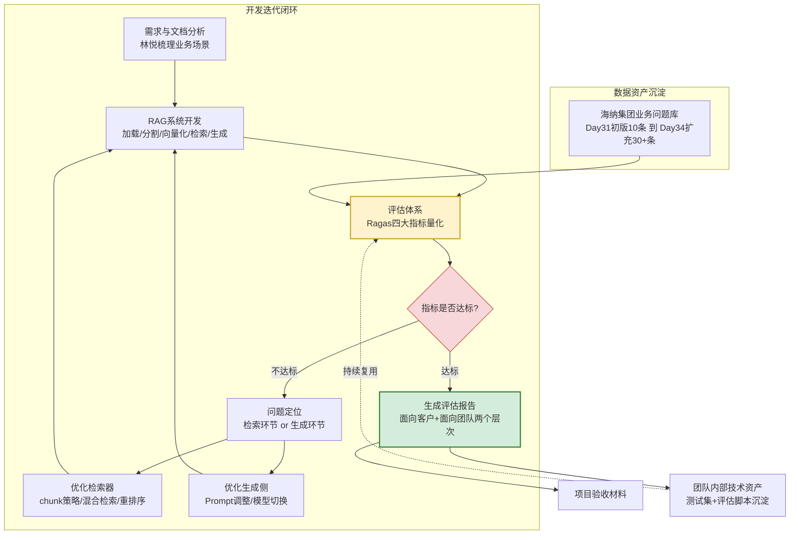
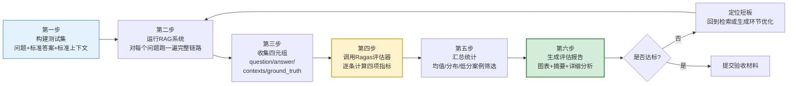
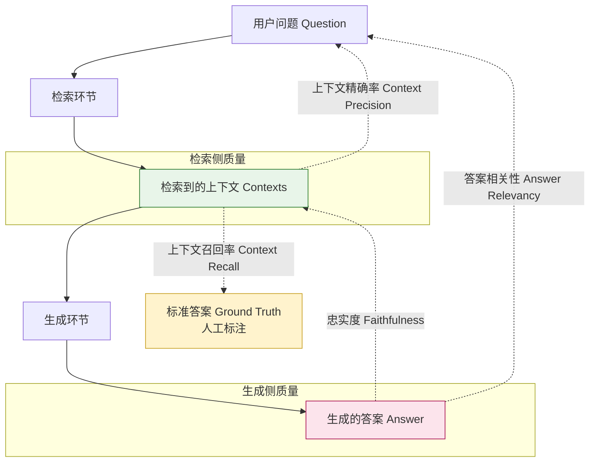

# 第34天 · RAG评估

> **星期**:周四(Sprint3 · RAG进阶与交付,入职第34天,转正之后的第20天)
> **对应Sprint**:Sprint 3 · RAG进阶与交付(Day32-38)—— 海纳制造集团企业知识库问答系统技术攻坚期,第三天
> **飞书任务号**:CQ-241(海纳制造集团RAG问答系统 · 效果评估体系搭建)、CQ-242(Ragas评估框架落地与测试集构建)、CQ-243(RAG系统评估报告 v1.0 撰写与交付客户预审)
> **参与人**:陈铭、苏梦、韩露、张凡(导师:王振宇;需求评审与报告验收环节全程列席:林悦;下午晚些时候简短列席:郭建军)
> **今日关键词**:忠实度(Faithfulness) / 答案相关性(Answer Relevancy) / 上下文精确率(Context Precision) / 上下文召回率(Context Recall) / Ragas评估框架 / 测试集构建 / 评估报告自动生成

---

## 【旁白】

如果说Day31那次"命中率不到六成"的调优实验,是陈铭第一次亲手把"效果好不好"这件事从一种模糊的直觉,变成一个可以摆在桌面上讨论的数字,那么接下来的Day32、Day33,他和团队做的事情,某种意义上更像是"治病"——查询改写解决了"话说得不一样,意思其实一样"的问题,混合检索加上重排序解决了"型号编号这种精确匹配,向量检索天生不擅长"的问题。两天下来,demo在陈铭自己手里测试,肉眼可见地"聪明"了不少:同样的十个问题,原来漏检、答错的那几个,现在大多能给出靠谱的回答。团队群里那两天的氛围也松快了不少,苏梦在群里发了一句"感觉这玩意儿真的开始像个产品了",张凡回了一个鼓掌的表情包。

但今天上午的晨会,气氛却比陈铭预想的要更"紧"一点。倒不是因为技术出了什么问题,而是因为林悦在会上说的一句话,把所有人从"我们做得越来越好了"这种感性判断里,一下子拉回到了一个更现实、更逼人的问题上——"下周项目验收前,必须有一份能拿给客户看的评估报告。"这句话听起来平平无奇,但陈铭很快意识到它背后藏着一个他之前从没认真想过的落差:这两天他和团队"感觉"系统变好了,靠的是"跑几个问题,看答案顺不顺眼"这种非常主观的验证方式,而客户验收要看的,不会是"我们觉得挺好"这种表述,客户要看的是数字、是指标、是能经得起追问的评估方法论。老王后来在白板上写了一句话,后来被陈铭原样记进了笔记本:"‘效果变好了’和‘效果好到什么程度、好在哪里、还差在哪里’,是两种完全不同段位的答案,前者是感觉,后者是工程。"

这就是今天要解决的核心矛盾——陈铭这两天积累的"直觉自信",需要被一套严谨的、可复现的评估体系,重新翻译成客户能看懂、也经得住质疑的语言。而这套语言的核心,就是老王今天要讲的四个指标:忠实度、答案相关性、上下文精确率、上下文召回率。这四个词第一次被写在白板上的时候,陈铭心里冒出的第一反应是"这不就是把‘答得好不好’拆成四个小问题吗",老王听到这句话之后没有直接否定,反而说这个理解方向是对的,但补了一句更关键的话——"拆开的意义,不在于拆本身,而在于拆开之后,你才能定位问题出在检索环节还是生成环节,才能知道下一步该调的是检索器还是Prompt,而不是像Day31那样,只能笼统地说‘命中率不到六成’,却说不清六成之外的那四成到底败在哪一步。"

还有一层意味,藏在"Ragas"这个工具名字第一次出现在今天课表上的方式里。老王没有一上来就讲这个框架怎么用,而是先花了大半个上午,带着团队一步一步手推这四个指标各自的计算逻辑——忠实度怎么靠"拆句子、逐句核对"算出来,答案相关性怎么靠"反向生成问题、比相似度"算出来,上下文精确率和召回率又是怎么从传统信息检索的Precision/Recall里"借"过来的。这种"先讲原理再讲工具"的顺序,贯穿了陈铭这70天里几乎每一次新技术的学习,但今天格外突出的一点是,老王明确讲了原因:"Ragas这个库,底层调用的还是大模型去做判断,如果你不知道它内部到底在问大模型什么问题、怎么打分,你拿到一个数字,连它靠不靠谱都判断不了,更别说出了问题去调优。"这句话,陈铭后来在给海纳集团项目做评估报告优化的时候,深有体会——报告里有一个指标数字明显偏低,如果不懂背后的计算逻辑,他大概只会写"这个指标不达标",但因为上午手推过原理,他能一路顺着逻辑链条,精确定位到问题出在检索环节的"上下文里混入了太多无关内容",而不是生成环节的"模型编造了内容"。

这种"先手推原理、再上手工具"的教学节奏,其实也是老王在陈铭转正之后,越来越频繁使用的一种带教方式。陈铭后来在笔记本边角写过一句反思——培训生阶段的时候,老王讲东西更多是"这是什么、怎么用",直接给出结论和用法;转正之后,老王越来越倾向于先抛出一个具体的疑问,逼着团队自己往前推一步,推不动了才补一刀关键的提示。这种变化陈铭一开始没太在意,直到今天上午讨论到答案相关性的计算逻辑时,他才后知后觉地意识到——如果老王一开场就直接讲"用反向生成问题、算余弦相似度"这套方法,他大概听完就过去了,记忆留存不会太深;但因为老王先问了一句"你们觉得,怎么才能不靠人工去判断一个答案是不是切题",逼着他和苏梦、张凡在白板前讨论了快十分钟、试了几个不靠谱的思路之后,再听到"反向生成问题"这个答案时,那种"原来是这么个巧妙的办法"的感觉,比单纯被告知答案要深刻得多。他把这个感悟也记进了笔记本,旁边画了一个小小的箭头,写着"以后自己带新人,也要试试这个节奏"——这大概是他第一次,以一种"未来自己也可能要教别人"的视角,去审视老王的带教方式,而不只是被动地接受知识。

这一天的另一重悬念,藏在林悦下午提出的那个视角切换问题里——"如果你是海纳集团的信息化负责人,拿到这份报告,你觉得哪里会让你放心,哪里会让你心里打鼓?"这句话看似只是报告写作技巧上的一个小提醒,但陈铭事后回想,觉得它触及了一个更根本的东西:技术人员做评估,天然容易陷入"数字本身"的自洽逻辑里——只要指标算得对、方法论站得住,就觉得任务完成了。但客户要的从来不只是"数字算得对",客户要的是"看完这份报告,我敢不敢把这套系统交给车间里的老师傅们用"。这种从"技术自证"到"客户信任"的跨越,不是靠把数字算得更精确就能自动达成的,需要有意识地站到对方的位置上重新审视一遍——这也是林悦这个角色在整个团队里一直扮演的功能,她很少直接参与技术细节的讨论,但每次在关键节点提出的这类"换位提问",往往能让陈铭对着屏幕上一堆已经很熟悉的数字,突然看出一层新的意思。

今天还有一件事,虽然篇幅不多,但对陈铭是个不小的心理转折——下午三点半左右,林悦拿着一份评估报告草稿走到陈铭工位旁边,没有直接说"改这里改那里",而是先问了一句:"如果你是海纳集团的信息化负责人,拿到这份报告,你觉得哪里会让你放心,哪里会让你心里打鼓?"这个问题让陈铭愣了几秒——他这一路做技术评估,潜意识里默认的"读者"一直是老王和自己,现在突然要切换到一个完全不懂技术细节、只关心"这套系统靠不靠谱、能不能真正在车间里用起来"的客户视角。这种视角切换带来的收获,某种程度上不亚于上午学到的四个评估指标本身——一份技术上无可指摘的评估报告,如果不能让客户看得懂、看得放心,价值也会大打折扣。这也是为什么今天课件的"今日复盘"环节,不只是罗列一堆指标数字,还要附带一份能拿去给客户看的报告示例。

---

## 晨会纪要 / 今日目标

**时间**:上午9:00,二层大会议室"望远"
**出席**:王振宇(老王)、陈铭、苏梦、韩露、张凡;林悦(全程列席);郭建军(下午16:00左右简短列席)

陈铭走进会议室的时候,白板上已经写了四个词,分别用红、蓝、绿、黄四种颜色的马克笔圈了出来:忠实度、答案相关性、上下文精确率、上下文召回率。旁边还画了一个简单的示意箭头,从"用户问题"指向"检索到的上下文",再指向"生成的答案",箭头旁边标注着这四个指标各自在这条链路上"管的是哪一段"。

老王开场没有绕弯子:"这两天Day32、Day33,你们分别加了查询改写、混合检索、重排序,系统确实变强了,这一点我看过你们各自demo跑的对比案例,是真的进步。但今天要解决一个新问题——‘变强了’这句话,谁说的都可以说,但如果客户问你‘强了多少、体现在哪里、有没有可能只是我们挑了几个凑巧答得好的例子来演示’,你们现在有没有办法拿出一份站得住脚的回答?"

会议室里一时没人接话,苏梦小声说了一句:"感觉……好像没有很系统的办法,就是靠人工挑几个问题跑一下看效果。"

老王点头:"这就是问题所在。前面Day31的调优实验,我们用的是‘命中率’这一个粗粒度的指标,能不能命中相关文档,是,不是,二元判断。这个指标在‘基础RAG能不能用’这个阶段是够用的,但现在我们已经做了查询改写、混合检索、重排序这些相对精细的优化,如果继续只看‘命中率’这一个指标,你会发现它不够敏感,也说不清楚问题到底出在检索这一侧,还是生成这一侧——你的答案答错了,可能是因为检索到的文档本身就是不相关的,也可能是检索到的文档是对的,但模型没有老老实实根据文档回答,自己编了一段。这两种问题的解决办法完全不同,前者要去调检索器,后者要去调Prompt或者换模型,如果评估指标不能把这两种问题区分开,你的调优就是‘蒙着眼睛试’。"

林悦这时候补充了项目背景:"上周我和海纳集团那边的信息化负责人过了一次电话(教学场景设定),对方明确提到,验收阶段会有他们内部的质量部门参与评审,不是只看‘demo演示效果好不好’,还会要求我们提供‘这套系统在多大范围的问题上,准确率能达到什么水平’这种量化说明。我理解这也是合理的——毕竟这套系统上线之后,是要给车间一线的老师傅、质检员用的,如果验收的时候只是‘看起来还行’,后面出了问题,谁都说不清楚责任。所以今天这份评估报告,不是我们内部自己安心用的东西,是要真的拿出去、经得起对方专业部门审视的正式交付物。"

老王接着把今天的技术主线摆了出来:"今天要学的,是RAG评估领域现在业界公认比较成熟的一套方法——四个核心指标:忠实度(Faithfulness)、答案相关性(Answer Relevancy)、上下文精确率(Context Precision)、上下文召回率(Context Recall)。上午我们先手推这四个指标各自的计算逻辑,搞懂‘它到底在算什么、为什么这么算是合理的’,下午上手一个专门做这件事的开源框架,叫Ragas——这不是我们随便选的一个工具,它现在是RAG评估领域用得最多的开源框架之一,而且它的评估逻辑,基本上就是把学术界这几年关于RAG评估的几篇重要论文里的方法,工程化地实现了出来。今天的目标很明确:先手推原理,再用Ragas跑通评估流程,再针对我们自己的海纳项目demo,构建一份真实的测试集,跑出一份评估报告,最后还要根据报告结果,做一轮有针对性的优化。"

**今日目标**:

1. 上午9:00-10:00:晨会+需求澄清,明确评估报告的验收要求(林悦讲解PRD)。
2. 上午10:00-12:00:四大评估指标详解——忠实度、答案相关性、上下文精确率、上下文召回率,逐一手推计算逻辑,配合白板示意图。
3. 下午13:30-15:00:Ragas框架实战——环境搭建、核心API讲解、跑通一个最小可用的评估示例。
4. 下午15:00-16:30:测试集构建——针对海纳集团(教学模拟)业务场景,设计并构建一份覆盖度较全的评估测试集。
5. 下午16:30-17:30(郭建军16:00左右列席后半段):对Day33的混合检索+重排demo跑一轮完整评估,生成第一版评估报告,团队复盘讨论。
6. 晚自习19:30-21:00:评估报告优化(针对报告中发现的短板做一轮定向调整),报告定稿,撰写今日学习笔记。

**昨日进展回顾(Day33)**:

- BM25关键词检索与向量检索的混合检索链路已经搭通,RRF融合排序上线,针对设备型号、编号类的精确匹配问题,漏检情况明显减少。
- bge-reranker-large重排序模型接入完成,对Top-N候选文档做二次排序,肉眼观察下,排在最前面的检索结果相关性有明显提升。
- 陈铭、苏梦、韩露、张凡四人各自的demo,在混合检索权重(向量与BM25的融合比例)和重排序候选数量(先检索多少条再重排)这两个参数上,做法略有差异,但核心链路一致。

**风险点**:

- 评估报告要"能拿给客户看",意味着不能只是一堆技术指标的堆砌,需要有面向非技术读者的解读和结论,团队目前还没有这方面的写作经验,林悦会在报告结构上把关。
- Ragas框架内部很多指标计算依赖调用大模型做判断,如果测试集样本量不够大,或者调用的模型本身能力有限,算出来的指标数值可能会有一定波动,今天需要在报告里明确写清楚"评估方法与局限性",不能把一次评估结果包装成绝对客观的真理。
- 测试集构建质量直接决定评估结果的可信度,如果测试问题设计得不够贴近真实场景,评估出来的高分可能只是"自我感觉良好"的又一次重演(参考Day31的教训),今天测试集构建环节需要格外谨慎,尽量沿用林悦此前整理的真实业务问题集并做扩充。
- 时间比较紧,下周就要进入验收环节,今天如果评估结果暴露出比较严重的问题(比如某个指标明显不达标),需要留出晚自习时间做针对性优化,不能拖到明天。

老王最后说了一句,算是把今天的调子定下来:"我不希望你们把今天的评估,做成‘算出几个数字、糊弄过去’这种形式主义的东西。评估这件事的价值,一半在于对外证明,另一半、也是更重要的一半,在于对内——它应该能帮你们自己更清楚地看见,这套系统现在的真实水平在哪里,短板在哪里,下一步该往哪个方向努力。数字是给别人看的,逻辑是留给自己用的。"

晨会散场之后,陈铭在走回工位的路上,跟苏梦、张凡随口聊了几句。张凡这个理工科出身的同学,数学基础一直是团队里最扎实的,他提了一个陈铭没想到的角度:"上下文精确率那个计算方式,加权处理排序位置,其实和搜索引擎排序质量评估里的NDCG、MAP这些指标思路很像,本科的时候信息检索课学过一点,没想到今天在这儿又碰上了。"这句话让陈铭第一次意识到,今天要学的这套评估体系,并不是"RAG专属发明"的全新东西,而是把信息检索、自然语言生成这两个各自已经发展了很多年的领域里,原本就存在的一些成熟评估思路,结合到了一起、做了针对性的改造。这种"老树发新芽"式的技术演进逻辑,后来在老王上午讲上下文精确率的计算细节时,也得到了印证。

---

## 需求文档:《海纳制造集团RAG问答系统 · 评估报告》验收要求

> 撰写人:林悦(产品经理) · 技术评审:王振宇
> 文档编号:CQ-PRD-D34-01
> 版本:v1.0

### 背景

海纳制造集团企业知识库问答系统项目,预计将于下周(Sprint3收官阶段)进入正式验收环节,客户方质量管理部门将参与评审。此前团队完成的效果调优实验报告(Day31)采用的评估方式相对粗糙(仅统计命中率),且样本量有限(10个问题),不足以支撑正式验收场景下客户方对系统整体质量的核验需求。Day32、Day33完成的查询改写、混合检索、重排序等一系列技术升级,虽然团队内部通过人工抽样测试观察到明显效果提升,但尚未形成量化的、可复现的评估证据。

基于以上背景,产品侧提出明确要求:必须在项目验收前,产出一份结构完整、指标科学、结论清晰、且面向非技术读者友好的《RAG系统评估报告》,作为验收材料的核心组成部分之一。

需要额外说明的一点是,这份评估报告的定位,不应该被误解为"证明系统完美无缺"的宣传材料,恰恰相反,产品侧和技术侧在需求评审环节达成的共识是:一份真正有说服力的评估报告,应当同时呈现系统的优势和短板,并且对已发现的短板给出令人信服的改进计划,这种"不回避问题、正面拆解问题"的呈现方式,反而更符合企业级客户对技术交付物的专业期待——尤其是海纳集团这类制造业客户,其内部质量管理体系本身就强调"用数据说话、正视偏差、闭环改进"这一整套方法论,如果我们提交的报告刻意回避短板、只呈现漂亮的数字,反而可能引发对方专业质量部门的不信任,甚至让对方怀疑我们的评估方法本身是否经得起推敲。因此,本次需求评审明确要求报告结构中必须包含"问题定位与改进建议"这一独立章节,而不是把所有篇幅都用来罗列达标的指标。

### 用户故事

- 作为海纳集团项目的产品负责人,我希望在验收会议上,能够用一份具备说服力的量化报告,证明系统当前的整体质量水平,而不是依赖"演示几个问题看效果"这种容易被质疑为"精心挑选案例"的方式。
- 作为客户方质量管理部门的评审人员,我希望这份报告能用我能理解的语言,说明系统在"回答是否忠实于原始文档""回答是否切题""检索是否精准""检索是否全面"这几个维度上的表现,而不是堆砌一堆看不懂的技术术语。
- 作为技术团队负责人,我希望这份评估报告不仅是"对外交付物",更能成为团队内部定位问题、指导下一步优化的工作依据,评估过程和指标计算逻辑必须是可复现、可审查的,不能是"黑箱打分"。
- 作为下周即将参与验收的团队成员,我希望能提前通过这份报告,识别出系统当前明显偏弱的环节,并在验收前完成至少一轮针对性优化,而不是带着已知的短板"裸奔"进验收会议。
- 作为教学设计者(郭建军视角),我希望这次评估工作能沉淀出一套可复用的评估方法论和自动化工具链,后续Sprint4、Sprint5的项目评估,都能复用今天搭建的这套体系,而不是每个项目都从零重新摸索。

### 验收标准(Acceptance Criteria)

1. **指标覆盖完整性**:评估报告必须至少包含忠实度、答案相关性、上下文精确率、上下文召回率四项核心指标的量化结果,每项指标需给出明确的数值范围说明(0-1区间,越接近1越好)以及口语化的通俗解释。
2. **测试集规模与代表性**:评估测试集样本量不少于30条(教学场景下可适当降低门槛,但不少于20条),问题类型需覆盖操作规程类、保养周期类、报警代码类、质量抽样标准类、安全防护要求类等海纳集团一线员工真实咨询场景的主要类型,且必须包含一定比例"口语化表达""关键词与文档原文不完全一致"的高难度问题,不能全部是"照着文档标题问"的简单问题。
3. **结果可复现性**:评估脚本必须能够一键运行、自动生成报告,报告中需明确标注评估所用的测试集版本、评估所用的大模型、评估执行时间,确保后续复审时结果可复现。
4. **报告可读性**:报告需分为"面向客户的摘要部分"和"面向技术团队的详细部分"两个层次——摘要部分用通俗语言和图表说明整体质量水平与核心结论,不超过一页,不出现"Faithfulness""Context Recall"这类未加中文解释的英文术语;详细部分给出各项指标的具体数值、典型问题案例分析、以及后续优化方向建议,允许保留英文术语原名以便技术团队查阅对照Ragas官方文档。
5. **短板可定位**:对于评估中发现的明显短板(如某项指标显著偏低的情况),报告中必须给出问题定位分析(是检索环节问题还是生成环节问题)和具体的改进建议,不能只报数字不分析原因。
6. **可视化呈现**:报告中需包含至少一种图表化的数据呈现方式(如雷达图、柱状图等),便于非技术背景的评审人员快速理解各维度表现,且图表配色、标题、坐标轴说明须为中文,避免评审人员因为英文术语而产生理解障碍。
7. **时间节点**:第一版评估报告需在今天(Day34)日终前产出,团队根据报告结果在晚自习时段完成一轮针对性优化,最终定稿版本作为验收材料提交时间不晚于下周一,期间如有新的短板发现,须同步更新报告版本号并记录变更说明,不得覆盖历史版本、抹去问题曾经存在过的痕迹。

### 优先级与范围说明

本次评估报告聚焦于Day33完成的"混合检索+重排序"版本RAG系统,不额外要求横向对比Day30基础版、Day32查询改写版等历史版本的详细指标(团队内部技术笔记中可以保留对比数据作为参考,但不作为报告强制要求)。评估范围限定在海纳集团知识库问答场景下,不涉及后续Agent能力、多轮对话能力的评估(这部分将在Sprint4阶段单独设计评估方案)。

### 补充说明:关于评估工具选型

需求评审会上,赵磊作为QA测试工程师列席提出了一个问题:"我们测试团队日常也会做一些人工层面的问答准确性抽检,今天要上的Ragas评估体系,跟我们现有的测试用例管理流程,是不是要合并到一起?"林悦回应,两者暂时保持独立运作但会做数据层面的打通——赵磊团队现有的人工抽检更偏向"上线前的最终把关",覆盖面相对有限但判断更贴近真实业务标准;而Ragas自动化评估体系更适合"开发迭代过程中的高频次自检",覆盖面更广、执行成本更低,但判断力依赖大模型本身的能力边界。两套机制未来会共用同一份不断扩充的业务问题库作为底层数据资产,但报告呈现形式和触发时机保持各自的独立性,避免生硬地把两种性质不同的质量保障手段捏合成一个不清不楚的"大杂烩"流程。这个补充说明也被写入了PRD的备注栏,作为后续跨团队协作的口径依据。会后赵磊单独找陈铭聊了几句,提到测试团队自己维护的问答准确性抽检用例,历史上已经积累了不少,如果时间允许,后续可以考虑把这部分历史用例里质量较高的那批,反向筛选、补充进今天构建的这份35条测试集里,进一步扩大样本规模和场景覆盖度,这个想法被陈铭记进了笔记本,作为下周测试集迭代的一个候补思路。

---

## 架构设计图:评估体系在RAG开发流程中的位置

老王在白板上画完四个指标之后,又补了一张更大的图,他说这张图的目的是让团队想清楚一件事:"评估不是最后补一道工序,它应该贯穿在整个RAG系统的开发和迭代周期里,是一个闭环里的关键节点,不是一次性的‘验收前突击任务’。"



这张图上,老王特别强调了两个细节。第一个是"评估体系"这个节点被画成黄色高亮,他解释说:"这个节点不是流水线上一个普普通通的工序,它是整个闭环里的‘裁判’,前面开发做得好不好,都要经过它来验证,所以它的位置很关键——如果评估本身做得不严谨,这个闭环就是假的闭环,你以为在迭代优化,实际上可能是在‘自我感觉良好’的循环里空转。"第二个细节是右下角那个"数据资产沉淀"的模块,老王指着它说:"这份测试问题库,不是今天用完就扔的东西,它会随着项目推进不断扩充,从Day31的10条,到今天至少扩充到30条以上,以后海纳项目每一次迭代,都可以拿这份不断增长的测试集去验证,这是团队真正的技术资产,比任何一次性的评估报告都更有长期价值。"

陈铭在看这张图的时候,还注意到一个容易被忽略的箭头方向——从"问题定位"出发,分成了两条支路,一条指向"优化检索器",一条指向"优化生成侧",而这两条支路又都重新汇入了"RAG系统开发"这个节点,形成一个真正意义上的闭环,而不是一条线性的、"评估完就结束"的流程。他把这个观察跟老王确认了一下,老王点头认可,并补充说这正是他今天上午反复强调"评估不是补一道工序"的图形化体现:"如果你把评估画在流程的最末端,画成一个‘终点’,团队心里很容易形成一种‘做完评估这件事就翻篇了’的错觉。但实际上,评估结果永远应该反过来指导下一轮开发该往哪个方向发力,这个反馈的动作,才是评估这件事真正的价值所在,不然它就只是一份‘验收材料’,跟系统本身的持续改进脱节了。"这个细节,让陈铭想起了自己以前做电商运营的经历——数据报表如果只是每周例行汇报一次、汇报完就存档,跟真正把数据结论落到下一周的选品和投放策略调整里,是完全不同的两种价值密度,今天这张图,某种程度上是把这个道理用工程语言重新讲了一遍。

---

## 流程图:Ragas评估完整执行流程

上午手推完四个指标的原理之后,老王在下午Ragas框架实战开始前,又画了这张流程图,用来说明"从0到拿到一份评估报告",中间要经过哪几道工序。



老王在讲这张图的时候,重点强调了第一步和第三步。他说:"很多人第一次接触RAG评估,会以为最难的部分是调Ragas这个库怎么用,其实真正决定评估质量的,是第一步——测试集构建得好不好。如果测试集里的问题都是‘凑数’凑出来的,后面算出来的指标再精确,也是‘精确地算错了方向’。"关于第三步,他补充说:"这四个字段——question、answer、contexts、ground_truth,你们要记清楚每一个字段各自代表什么、从哪里来。question是测试集里预先设计好的问题;answer是RAG系统针对这个问题、实际生成出来的答案,这是运行时产出的;contexts是RAG系统检索环节实际召回的那些文档片段,同样是运行时产出的;ground_truth是测试集里预先人工标注好的‘标准答案’,用来做参照。前两者反映系统的‘实际表现’,后两者(question和ground_truth)是评估的‘标尺’,四个指标之所以能算出来,本质上就是在拿系统的实际表现,去和这根标尺反复比对。"

关于第二步"运行RAG系统",老王额外提了一个容易被忽视的工程细节:"这一步,你们必须用测试集里的原始question,原样喂给RAG系统的完整链路——包括查询改写、混合检索、重排序这些环节都要真实跑一遍,不能为了图方便,直接拿你们自己手头已经跑过的、缓存下来的旧结果去拼评估数据。这个坑我见过其他团队踩过,图省事复用了旧的运行结果,结果评估出来的指标,反映的是‘几天前那个版本的系统’的水平,跟你现在正在验收的这个版本已经不是一回事了,这种‘时间错位’的评估结果,拿出去是要被人戳穿的。"这个提醒后来直接体现在了下午实战代码里——`collect_evaluation_samples`函数被设计成每次都要重新调用一次完整的RAG系统查询接口,而不是允许传入历史缓存结果,这是老王要求代码实现层面必须坚持的一条硬性原则。

第五步"汇总统计"这一环,老王也补充了一句容易被低估的话:"算平均分很简单,但平均分会掩盖很多问题,一个35条数据里30条都是0.95、5条是0.2的分布,和35条数据全部都是0.7的分布,平均值可能是差不多的,但这两种情况背后的问题性质完全不同——前者说明系统在某些特定场景下彻头彻尾地失败了,后者说明系统整体上都有轻微的欠缺。所以‘汇总统计’这一步,不能只看均值,标准差、最小值、以及按不同维度(业务类型、难度)切片之后的分布,同样重要,甚至更重要。"这也是为什么下午的报告生成脚本里,除了均值统计之外,还专门实现了`find_low_score_cases`这个函数,用来揪出每项指标里得分最低的具体案例,而不是只满足于一个笼统的平均分。

---

## 示意图:四大指标计算逻辑

这是老王上午手推原理时,画在白板上最重要的一张图,陈铭原样把它抄进了自己的笔记本,还专门用不同颜色的笔标注了每个指标"看的是哪两个东西之间的关系"。



老王指着这张图,用一句话总结了四个指标的分工:"忠实度和答案相关性,考核的是‘生成’这一侧做得好不好;上下文精确率和召回率,考核的是‘检索’这一侧做得好不好。忠实度看答案是不是‘有没有编造’,拿答案去跟检索到的上下文比对;答案相关性看答案是不是‘答到点上了’,拿答案去跟原始问题比对;上下文精确率看检索回来的这些内容,有多大比例是真正有用的,拿上下文去跟问题比对相关性;上下文召回率看应该被检索到的内容,有多大比例真的被检索到了,这个只能拿上下文去跟标准答案对照才能判断,因为标准答案里往往包含了‘应该被引用到的关键信息点’。"

苏梦提了一个问题:"忠实度和答案相关性听起来有点像,是不是可以合并成一个指标?"老王给了一个陈铭后来在笔记里反复引用的例子来说明区别:"假设问题是‘XJ-3200A设备的月度保养周期是多久’,系统检索到的文档里正确写着‘30天’,但模型生成的答案却说‘根据文档,建议每45天保养一次’——这个答案跟问题是相关的,答的是保养周期这件事,答案相关性会打一个不低的分,但它跟检索到的上下文不符,是模型自己编出来的数字,忠实度就会打一个很低的分。反过来,如果模型老老实实地说‘文档中提到该设备使用的是某种特殊润滑油,建议定期更换’,这段内容完全来自检索到的上下文,忠实度会很高,但它压根没回答‘保养周期是多久’这个问题,答案相关性就会很低。这两种失败模式,原因完全不同,一个是模型在‘瞎编’,一个是模型在‘跑题’,如果合并成一个指标,你就分不清系统到底犯的是哪种错误。"

张凡接着追问了一句,他的问题更进一步:"那上下文精确率和忠实度之间呢,是不是精确率高了,忠实度自然就会高?"这个问题把讨论推向了一个更细的层面,老王想了几秒钟才回答:"直觉上确实会有正相关性——检索到的内容越干净、越相关,模型编造内容的‘诱因’确实会减少,这也是为什么Day33做完混合检索和重排序之后,今天忠实度的均值能到0.86,比检索质量差的版本理论上应该会高。但这不是必然的因果关系,即便检索到的上下文百分百精确、全部相关,模型依然有可能在生成的时候‘自由发挥’,尤其是遇到上下文信息不够完整、模型自己又有很强的‘补全冲动’的时候。所以这两个指标之间存在关联,但不能互相替代,精确率高只是‘降低了模型编造的风险’,并不能‘保证模型不编造’,这也是为什么即便上下文两项指标都表现不错,依然需要单独检查忠实度这个指标,不能想着‘检索做好了,生成侧就自动没问题了’。"这段追问和回答,让在场的几个人都对"四个指标各自独立又相互关联"这件事,有了更立体的认识,不再只是停留在"四个互不相干的分数"这种平面的理解上。

---

## 课堂笔记

> 以下内容为陈铭本人的技术日志与学习笔记整理,穿插老王讲解原话与团队讨论片段。

### 上午笔记:四大评估指标详解

今天上午的信息量,说实话不比Day30那种"从0搭完整链路"的密度小,只是换了一种密度形式——不是代码量大,而是每一句话背后都是一套推理逻辑,需要一边听一边在脑子里过一遍,不然很容易听懂了字面意思,过后又说不清楚。我尽量把老王讲的东西按照四个指标分别整理,每个指标下面记了"是什么—为什么这么算—怎么算—一个例子",这个结构是老王自己建议的记笔记方式,他说"任何一个指标,如果你不能用这四步讲清楚,说明你只是记住了名字,没真正理解"。

**1. 忠实度(Faithfulness)**

是什么:衡量RAG系统生成的答案,内容上有多大程度"忠实于"检索到的上下文,说白了就是"这个答案里的每一句话,是不是都能从检索到的文档里找到依据,而不是模型自己瞎编的"。这是四个指标里,专门用来检测"幻觉"(Hallucination)问题的那个指标——RAG技术本身的一大卖点就是"用真实文档约束模型,减少幻觉",忠实度就是用来验证这个卖点到底兑现了多少。

为什么这么算:大模型即便拿到了正确的参考资料,依然有可能因为自身的生成倾向,添油加醋、过度自信地补充一些资料里根本没有的细节,这种情况在企业知识库场景里是相当危险的——如果一个质检员照着系统编出来的"标准",去执行一次质量抽检,后果可能很严重。所以必须要有一个指标,专门盯住"答案有没有超出资料范围乱说话"这件事。

怎么算:核心思路是"拆句子、逐句核对"。第一步,把生成的答案拆解成若干个独立的陈述句(claim),比如答案是"设备保养分为月度、季度、年度三级周期,月度保养由现场操作工负责",可以拆成两句话:"设备保养分为月度、季度、年度三级周期"、"月度保养由现场操作工负责"。第二步,针对每一个陈述句,去检索到的上下文里核实,这句话是否能被上下文所支持(entailment判断,通常也是靠大模型来做这个判断)。第三步,统计"能被上下文支持的陈述句数量" 除以 "陈述句总数",得到的比例就是忠实度得分,范围是0到1,越接近1说明答案里胡编的成分越少。

老王在这里补充了一个我之前没想到的点:"忠实度考核的是‘答案和上下文之间’的关系,完全不涉及标准答案,也不涉及原始问题——哪怕检索到的上下文本身是错的、或者跟问题完全不相关,只要模型是‘老老实实照着这些错误资料说话’,没有超出资料范围自己编,忠实度依然会打高分。"这句话让我意识到,忠实度高不代表答案是对的,它只能证明"模型没有在瞎编",资料本身对不对、有没有找对资料,是另外两个指标要管的事,这也是为什么四个指标必须组合起来看,单看任何一个都会得出片面的结论。

**2. 答案相关性(Answer Relevancy)**

是什么:衡量生成的答案,跟用户提出的原始问题之间,切题程度有多高。这个指标不关心答案对不对(内容准确性由忠实度和其他指标管),只关心"这个答案,是不是在正面回应这个问题",也就是有没有"跑题""答非所问""废话一堆但没说到点上"的问题。

为什么这么算:一个答案完全可能是"忠实的"——每句话都能在文档里找到依据——但同时又是"跑题的",比如问"报警代码E-07代表什么故障",系统检索到了一大段设备维护手册的通用说明,答案里逐字引用了这段说明,内容上句句有出处,忠实度可能很高,但压根没提到E-07这个具体代码对应什么,答案相关性就应该被打低分。这种问题在检索不够精准的时候特别容易出现——检索到的上下文本身是"泛泛相关"而非"精确相关"。

怎么算:Ragas框架里这个指标用了一个挺巧妙的反向验证思路——让模型根据"生成的答案"反过来生成若干个可能对应的问题(这一步用的是"给定答案,反推提问"的生成任务),然后计算这些反推出来的问题,跟用户原始问题之间的语义相似度(通常用embedding计算余弦相似度),取平均值作为答案相关性得分。这个思路背后的逻辑是:如果一个答案确实是在正面回答原始问题,那么"看到这个答案会联想到的问题",应该和原始问题高度相似;如果答案跑题了,反推出来的问题跟原始问题的相似度自然会偏低。

老王在这里提醒了一句容易踩的坑:"这个指标依赖embedding模型的语义相似度计算,如果embedding模型本身对中文、对你们这个行业的专业术语理解能力有限,算出来的相似度可能会失真,所以选embedding模型的时候,尽量还是用我们已经验证过的bge-large-zh这一类中文效果好的模型,不要随便换成一个没验证过的。"

**3. 上下文精确率(Context Precision)**

是什么:衡量检索回来的这些上下文片段里,有多大比例是真正跟问题相关、有用的,而不是掺杂了一堆不相关的"噪音"内容。这个指标关心的是检索结果的"纯度"。

为什么这么算:如果检索回来10个文档片段,只有2个是真正相关的,剩下8个都是无关内容,即便最终生成环节靠着模型自己的判断力,从这2个相关片段里提炼出了正确答案,这个检索器本身依然是"不精确"的——一方面,混入太多无关内容,会增加大模型"被无关信息带偏、编造内容"的风险(这跟忠实度是有联动关系的);另一方面,在企业级系统里,检索环节的计算和存储成本,跟返回的文档数量直接相关,精确率低意味着资源浪费。

怎么算:这个指标借用了传统信息检索领域里"Precision"这个经典概念,并做了排序位置的加权处理(排在越前面的相关文档,对得分贡献越大,这符合直觉——用户和后续的生成模型,天然会更重视排在前面的检索结果)。具体做法是,针对检索返回的每一个文档片段,先判断它是否与问题相关(这一步依然依赖大模型做判断,或者对照人工标注的相关性标签),然后按照"文档片段在结果列表中的位置"计算一个加权精确率,数学上和信息检索里的Average Precision概念是相通的。简单理解就是:排在前面的位置,如果命中的是相关文档,得分贡献大;如果排在前面的位置命中的是不相关文档,会拖累整体得分,这个设计恰好呼应了Day33我们刚做完的重排序技术的价值——重排序做得好,相关文档排位更靠前,上下文精确率自然会更高。

**4. 上下文召回率(Context Recall)**

是什么:衡量所有"应该被检索到的相关信息",有多大比例真的被检索到了。这个指标关心的是检索结果的"全面性",跟上下文精确率恰好是一对互补的概念——精确率问"你捞回来的东西,有多少是有用的",召回率问"真正有用的东西,你捞回来了多少"。

为什么这么算:精确率再高,如果关键信息压根没被检索到,生成环节就是"巧妇难为无米之炊",不管模型多聪明,答案也不可能完整、准确。这种"漏检"问题,在Day31那次调优实验里我们已经吃过亏——很多问题答不对,根本原因不是模型生成能力不行,而是压根没检索到关键的那句话。

怎么算:这个指标需要依赖"标准答案"(ground truth)——因为要判断"哪些信息是应该被检索到的",没有一个参照标准是没法判断的。具体做法是,把标准答案拆解成若干个信息点(类似忠实度里"拆句子"的做法),然后逐一核对,每个信息点是否能在检索到的上下文里找到支撑,统计"能找到支撑的信息点数量"除以"标准答案里信息点总数",得到召回率。这也是为什么测试集构建的时候,标准答案不能随便写一句笼统的话,而应该尽量完整地覆盖这个问题"应该被回答到"的所有关键信息点,否则召回率的计算基准本身就是不准的。

老王在这里画了一个很直观的类比,我印象很深:"你可以把上下文精确率和召回率的关系,想象成图书馆管理员帮你找资料——精确率问的是‘他给你的这一堆书,有多少本真的跟你要查的主题有关’,召回率问的是‘馆里所有跟你主题相关的书,他找出来了几本、还有几本落下了没找到’。一个好的检索系统,应该同时具备‘找得准’和‘找得全’这两种能力,只有一种是不够的。"

上午临近12点的时候,韩露提了一个我事后想起来觉得挺有价值的问题——她说自己之前做产品经理,接触过一些"人工评审打分"式的效果评估方式(比如让业务人员看着输出打1-5分),她想知道Ragas这种"用大模型当裁判"的方式,跟传统的人工评审比,到底是更可靠还是更不可靠。老王的回答让我印象很深:"这两种方式不是互相替代的关系,而是互补的。人工评审的优势是‘更贴近真实业务判断标准’,一个有经验的质检员看一眼答案,可能比任何自动化指标都更能判断这个答案在车间里能不能用;但人工评审的致命短板是‘贵、慢、不可持续’——你不可能每次代码改动之后,都拉着海纳集团的质检员来给你评估一遍。用大模型当裁判的自动化评估,胜在‘便宜、快、可以频繁重复执行’,让你在迭代开发的每一个节点,都能低成本地拿到一个方向性的判断,但它的判断质量,天然受限于用来做裁判的这个大模型本身的能力和偏好。所以工程实践里比较合理的做法是,用自动化评估做高频次的‘日常体检’,定期(比如每完成一个阶段性版本)再拉真实业务人员做一次‘深度体检’,两者结合,既保证效率,又保证结果不会跟真实业务需求脱节太远。"这段回答后来被我原样写进了笔记本,因为它其实回答了一个更本质的问题——自动化评估的意义从来不是"取代人的判断",而是"让人的判断力,能够更高效地覆盖更多的迭代次数"。

**上午笔记的一个小结**:四个指标里,忠实度和答案相关性归"生成侧",上下文精确率和召回率归"检索侧"。今天之前,我对"RAG效果不好"这件事的理解一直停留在一个笼统的印象上,今天上午之后,我大概能想清楚一个基本的排查思路了——如果答案本身内容跑偏(答案相关性低),但忠实度、上下文两项指标都不低,问题大概率出在Prompt设计或者模型本身的理解能力上;如果上下文精确率、召回率都不高,问题基本可以确定在检索环节,需要回头去调chunk策略、检索参数、混合检索权重这些;如果上下文指标不低,但忠实度低,说明检索找对了资料,但模型没有老老实实照着资料说话,这时候需要在Prompt里加强"必须严格依据提供的资料回答,不要引入资料之外的信息"这类约束,或者考虑换一个"听话程度"更高的模型。这个排查思路,后来在下午实际跑评估报告发现问题的时候,确实帮了大忙。

中午吃饭的时候,我又把这四个指标在脑子里过了一遍,发现一个挺有意思的规律——它们两两之间其实存在一种微妙的制约关系,而不是完全独立的四个维度。比如说,如果为了提升上下文召回率,简单粗暴地把检索返回的文档数量(top_k)调得很大,试图"宁可多检索一些,也不要漏检",召回率大概率会提升,但上下文精确率几乎必然会跟着下降,因为返回的文档里混入无关内容的比例会增加;而上下文精确率一旦下降,又有可能间接拖累忠实度——检索到的无关内容变多,模型在生成答案时被"带偏"、编造内容的风险也会上升。这种指标之间此消彼长的关系,让我意识到"调优"这件事,本质上不是简单地"哪个指标低就使劲拉哪个",而是要在几个相互牵制的目标之间找一个相对均衡的点,这跟我之前在跨境电商公司做投放优化时,"点击率"和"转化率"之间也存在类似取舍关系的经验,某种程度上是相通的道理。

### 下午笔记:Ragas框架实战+测试集构建

下午一开始,老王先讲了为什么选Ragas这个框架,而不是自己从头写四个指标的计算逻辑。他说:"上午我们手推的这套逻辑,自己动手实现当然也不是不可以,但今天不建议你们重新发明轮子——Ragas这个框架背后是有对应的学术论文支撑的,评估逻辑经过了社区大量项目的验证,而且它把‘调用大模型去做各种子判断(拆句子、判断相关性、反推问题等)’这些繁琐的工程细节都封装好了,你们只需要按照它规定的数据格式,把question、answer、contexts、ground_truth这四个字段准备好,调一个函数就能拿到结果。工程实践里,‘用业界验证过的成熟工具’和‘自己造轮子’之间,要看场景权衡,评估这种非核心业务逻辑、又存在明确开源标准方案的场景,直接用现成的更划算。"

**Ragas核心API的几个关键概念(老王强调必须搞清楚,不能囫囵用)**:

- `Dataset` / 评估数据结构:Ragas要求把测试数据组织成一种结构化的格式,每一条数据包含 `user_input`(即question)、`response`(即answer,运行时生成)、`retrieved_contexts`(即contexts,运行时生成)、`reference`(即ground_truth,测试集预先标注)这几个字段,新版本的Ragas对字段命名做过调整,今天代码里我会用当前版本(0.2.x系列)的字段命名规范,大家自己看官方文档的时候注意版本对应,不同版本字段名可能有出入,这也是老王反复提醒的一个坑——"开源工具迭代很快,遇到跑不通的情况,先查一下版本号对不对,很多时候不是你代码写错了,是版本文档不匹配"。
- `metrics` 评估器列表:Ragas把每一个评估指标都实现成一个可以单独调用的评估器对象,今天我们要用到 `Faithfulness`、`AnswerRelevancy`、`ContextPrecision`、`ContextRecall` 这四个,调用的时候把它们放进一个列表,一次性传给评估函数,评估函数会对测试集里每一条数据,依次计算这四项指标。
- `evaluate()` 主函数:这是Ragas的核心入口,接收测试数据集和metrics列表,返回一个结果对象,可以直接转换成pandas DataFrame,方便后续做统计和可视化。
- LLM与Embedding的绑定:Ragas内部很多指标计算依赖调用大模型(比如拆句子、判断相关性、反推问题这些子任务)和embedding模型(比如计算语义相似度),需要在初始化的时候显式指定用哪个大模型、哪个embedding模型来做这些"评估用途"的调用,这个"评估用的模型"可以跟RAG系统本身"生成答案用的模型"是同一个,也可以不是同一个——今天我们统一用DeepSeek的`deepseek-chat`模型做评估用途的大模型调用(而不是用GPT-4,主要是出于成本和国内网络访问稳定性的考虑),embedding统一用`bge-large-zh-v1.5`,跟我们RAG系统本身用的embedding模型保持一致。

老王在讲完这些概念之后,又强调了一个容易被忽略的成本问题:"你们要注意,Ragas跑一次完整评估,内部会对每一条测试数据、每一个指标,都发起若干次大模型调用——比如忠实度要拆句子再逐句核对,一条数据背后可能就是三五次大模型调用,四个指标乘起来,一条测试数据可能对应十几次调用。如果测试集有30条,一次完整评估可能就是几百次大模型调用。这不是免费的,虽然DeepSeek的调用成本相对友好,但你们做实验的时候也要有意识地控制测试集规模和调用频率,不要动不动就跑全量评估,可以先用一个小规模子集验证脚本没问题,再跑全量。"这个提醒让我想起Day31调优实验的时候类似的教训——技术选型和实验设计,永远绕不开"成本"这个现实约束,不是技术上能做就无限制地做。

**测试集构建环节**,林悦下午特意过来跟我们一起做这件事,她说:"Day31那10条问题,是我按照‘业务问题类型’整理的,今天我们要在那10条的基础上扩充,目标是不少于30条,而且要覆盖之前提到的操作规程、保养周期、报警代码、质量抽样标准、安全防护要求这五大类,每一类至少要有难度分层——包括‘关键词直接匹配’的简单问题、‘表达方式和文档原文不一致’的中等难度问题、以及‘需要综合多处文档内容才能回答完整’的高难度问题。"

这个"综合多处文档内容才能回答完整"的问题类型,是林悦今天特别强调的一个新增维度,她解释说:"我们之前的测试问题,大多是‘答案就在文档某一句话里’的类型,但海纳集团那边的信息化负责人提过一个真实场景——有质检员反馈,有些问题的完整答案,其实分散在设备手册和质量规范两份不同的文档里,比如‘某设备出现XX异常时,该怎么处理’,可能操作步骤在设备手册里,而对应的质量判定标准在质量规范里,一个真正好用的问答系统,应该能把这两部分内容都检索到、都体现在答案里。这类问题,恰好是最能检验上下文召回率的场景,因为标准答案里包含的信息点,天然分布在多个不同的文档来源里。"

我们下午花了大概一个半小时,一起把测试集从10条扩充到了35条,每条数据都严格按照"问题、标准答案(ground_truth)、涉及的文档来源、难度分级、业务类型标签"这五个字段整理,存成了一份结构化的JSON文件,方便后续脚本直接读取使用。这个过程比我预想的要费时间,尤其是"标准答案"这一栏,林悦要求必须写得足够完整、覆盖所有应该被提到的信息点,不能像平时随口回答那样简略,她说"标准答案写得越马虎,后面上下文召回率算出来的可信度就越低,这一步是整套评估体系的地基,偷不了懒"。

写这35条标准答案的过程中,我自己也踩了一个小坑,后来被林悦当场指出来——我写"报警代码E-12"那条问题的标准答案时,一开始图省事,只写了"E-12表示伺服位置偏差过大报警,需要立即停机处理",林悦看完之后反问我:"如果车间的师傅问的是‘要不要立刻停机’,你这个标准答案里确实提到了‘需要立即停机处理’,但你有没有说清楚‘为什么’——继续运行会有什么后果?如果你的标准答案里没写这一层,后面即便系统检索到了‘为什么需要停机’这部分内容,按照你现在这份标准答案,压根不会被判定为‘应该被找到的关键信息’,因为你的标准答案里根本没提到这个信息点,这不是系统的问题,是咱们标准答案本身就漏了。"我按照这个提醒回去重新补充了后果说明("继续运行可能导致坐标丢失或撞机风险"),这件小事让我更真切地体会到,测试集构建这个环节,看似是"体力活",实际上对撰写者本身的业务理解深度,要求并不低——如果你自己都没有真正吃透这个问题"完整的答案应该包含哪几层意思",写出来的标准答案就是有缺口的,后续所有基于这份标准答案算出来的召回率数字,都会带着这个缺口的影子。

下午构建测试集的过程中,团队还专门讨论了一个问题:35条测试用例,是不是应该由陈铭一个人来写标准答案,还是应该让苏梦、韩露、张凡也分别参与,交叉检查。老王的意见是"必须交叉检查,不能一个人闷头写完就算了"——他解释说,一个人独立构建测试集,容易不自觉地带入自己平时测试demo时的思维定式,倾向于设计"自己知道系统大概能答得上来"的问题,这跟Day31晨会上讨论过的"开发者自测的确认偏误"问题,本质上是同一类风险,只是从"测试问题的设计"这个更早的环节就已经开始起作用了。为了避免这一点,团队最后采用的做法是:先由林悦按照业务类型分配任务,四个人分别负责其中一部分问题的标准答案撰写,再互相交换检查一遍对方写的内容是否有遗漏,最后由林悦做一次统一的通读校对,确保口径一致、格式规范统一。

---

## 代码实战

> 以下代码基于Day33完成的"混合检索+重排序"版本RAG系统展开,新增评估相关的七个核心模块:测试集构建脚本、Ragas评估调用脚本、评估报告自动生成脚本(含图表化展示),以及晚自习补充的CI集成评估门禁脚本、历史评估结果追踪与版本对比、进阶可视化(箱线图/热力图)、评估工具链单元测试。代码风格延续团队既有规范:PEP8、中文docstring、关键逻辑配中文行内注释。

### 环境准备

```bash
# 在已有的cangqiong-platform虚拟环境基础上,新增评估相关依赖
pip install ragas==0.2.9
pip install datasets==3.1.0
pip install matplotlib==3.9.2
pip install pandas==2.2.3
pip install langchain-deepseek==0.1.2
```

### 模块一:测试集构建脚本

```python
"""
backend/app/rag/evaluation/build_testset.py

海纳制造集团RAG问答系统 · 评估测试集构建脚本

功能说明:
1. 维护一份结构化的测试集数据(问题、标准答案、业务类型、难度分级、涉及文档来源)。
2. 支持从JSON文件加载/保存测试集,方便团队协作维护和版本管理。
3. 提供测试集质量校验函数,检查字段完整性、难度分布、业务类型覆盖度是否满足PRD验收标准。

设计说明:
本脚本不直接调用大模型,只负责测试集本身的构建与管理,
保持"测试集构建"与"评估执行"两个环节的解耦,方便测试集独立迭代、版本对比。
"""

import json
import os
from dataclasses import dataclass, asdict, field
from datetime import datetime
from enum import Enum
from typing import List, Dict, Optional
from collections import Counter


class BusinessType(str, Enum):
    """业务问题类型枚举,对应海纳集团知识库文档的五大核心场景。"""

    OPERATION = "操作规程"
    MAINTENANCE = "保养周期"
    ALARM_CODE = "报警代码"
    QUALITY_STANDARD = "质量抽样标准"
    SAFETY = "安全防护要求"


class DifficultyLevel(str, Enum):
    """问题难度分级,难度越高越能检验系统的真实能力边界。"""

    EASY = "简单-关键词直接匹配"
    MEDIUM = "中等-表达方式与文档原文不一致"
    HARD = "困难-需综合多处文档内容"


@dataclass
class TestCase:
    """单条测试用例的数据结构。

    字段说明:
        case_id: 测试用例唯一编号,便于报告中定位问题案例。
        question: 用户提问(尽量贴近真实业务场景的自然表达)。
        ground_truth: 人工标注的标准答案,要求覆盖该问题"应当被回答到"的所有关键信息点。
        business_type: 业务问题类型,用于统计各类型下的指标表现。
        difficulty: 难度分级,用于分析系统在不同难度问题上的表现差异。
        source_documents: 标准答案所依据的原始文档来源列表(文档名或文档片段编号)。
        note: 补充说明,例如这条问题是否模拟了真实客户反馈的场景。
    """

    case_id: str
    question: str
    ground_truth: str
    business_type: BusinessType
    difficulty: DifficultyLevel
    source_documents: List[str] = field(default_factory=list)
    note: str = ""


def build_hainer_testset() -> List[TestCase]:
    """构建海纳制造集团RAG问答系统评估测试集(v2.0,35条)。

    该测试集在Day31版本(10条)的基础上扩充而来,新增了:
    1. 更多业务类型的覆盖(报警代码、安全防护要求在Day31版本中样本不足)。
    2. 更细致的难度分级标注。
    3. "困难-需综合多处文档内容"这一类此前完全没有覆盖的高难度问题。

    Returns:
        List[TestCase]: 完整的测试用例列表。
    """

    testset: List[TestCase] = []

    # ------------------------------------------------------------------
    # 第一类:操作规程(共7条,难度分布:3简单/3中等/1困难)
    # ------------------------------------------------------------------
    testset.extend([
        TestCase(
            case_id="OP-001",
            question="XJ-3200A型号数控机床的开机操作步骤是什么?",
            ground_truth=(
                "XJ-3200A数控机床开机操作步骤为:1.检查设备周边无异物、防护罩已闭合;"
                "2.确认气源、液压油压力在正常范围(气压0.5-0.7MPa,液压油压力4-6MPa);"
                "3.按下总电源开关,等待系统自检完成(约90秒);"
                "4.系统自检通过后,按下伺服使能按钮;5.执行回参考点操作;"
                "6.确认各轴回零完成后,方可进行后续加工操作。"
            ),
            business_type=BusinessType.OPERATION,
            difficulty=DifficultyLevel.EASY,
            source_documents=["XJ-3200A操作手册-第2章"],
        ),
        TestCase(
            case_id="OP-002",
            question="这台机床开机之前要先检查啥,漏了会不会出问题?",
            ground_truth=(
                "开机前需检查:设备周边是否有异物、防护罩是否闭合、气源压力(0.5-0.7MPa)"
                "与液压油压力(4-6MPa)是否在正常范围。若漏检气压或液压油压力,"
                "可能导致伺服系统上电后出现异常报警,严重时可能造成执行机构损坏;"
                "若漏检防护罩闭合状态,存在人身安全风险。"
            ),
            business_type=BusinessType.OPERATION,
            difficulty=DifficultyLevel.MEDIUM,
            source_documents=["XJ-3200A操作手册-第2章", "XJ-3200A操作手册-安全须知"],
            note="口语化表达,模拟一线员工真实提问习惯",
        ),
        TestCase(
            case_id="OP-003",
            question="换刀的时候主轴转速要降到多少才安全?",
            ground_truth=(
                "执行换刀操作前,主轴转速必须降至0(完全停止),不能仅降低转速,"
                "换刀机构在主轴未完全停止的状态下动作,存在刀具飞出、机械臂损坏的风险。"
            ),
            business_type=BusinessType.OPERATION,
            difficulty=DifficultyLevel.EASY,
            source_documents=["XJ-3200A操作手册-第5章换刀操作"],
        ),
        TestCase(
            case_id="OP-004",
            question="设备连续运行多久需要强制休机降温?",
            ground_truth=(
                "XJ-3200A设备连续运行满8小时后,需强制停机进行主轴与液压系统降温,"
                "降温时间不少于30分钟,方可继续投入生产使用。"
            ),
            business_type=BusinessType.OPERATION,
            difficulty=DifficultyLevel.MEDIUM,
            source_documents=["XJ-3200A操作手册-第6章设备维护须知"],
        ),
        TestCase(
            case_id="OP-005",
            question="操作工能不能自己调整机床的加工参数?",
            ground_truth=(
                "一线操作工仅可在授权范围内调整进给速度、主轴转速等运行参数,"
                "不得自行修改坐标系设定、刀具补偿参数、伺服增益等核心加工参数,"
                "以上核心参数调整须由工艺工程师或设备主管审批后,由授权人员执行。"
            ),
            business_type=BusinessType.OPERATION,
            difficulty=DifficultyLevel.MEDIUM,
            source_documents=["XJ-3200A操作手册-权限管理章节"],
        ),
        TestCase(
            case_id="OP-006",
            question="紧急停止按钮按下后,恢复生产需要走哪些步骤?",
            ground_truth=(
                "紧急停止后恢复生产步骤:1.确认触发急停的原因已排除;2.将急停按钮顺时针"
                "旋转复位;3.按下伺服使能按钮重新上电;4.执行回参考点操作;"
                "5.在无工件状态下试运行一个空circuit确认设备状态正常;6.确认无误后方可恢复正常生产。"
            ),
            business_type=BusinessType.OPERATION,
            difficulty=DifficultyLevel.EASY,
            source_documents=["XJ-3200A操作手册-应急处理章节"],
        ),
        TestCase(
            case_id="OP-007",
            question="如果加工过程中发现工件尺寸超差,应该按操作规程还是质量规范来处理,具体怎么处理?",
            ground_truth=(
                "工件尺寸超差属于操作规程与质量规范交叉场景:操作规程要求操作工发现超差"
                "后立即停机、隔离该批次工件、上报班组长;质量规范要求对该批次工件启动"
                "全检(而非抽检),并追溯同批次前后各5件产品,同时填写《质量异常报告单》,"
                "由质量部门判定是否需要追溯设备参数或刀具磨损原因。"
            ),
            business_type=BusinessType.OPERATION,
            difficulty=DifficultyLevel.HARD,
            source_documents=["XJ-3200A操作手册-异常处理章节", "质量抽样标准-第4章异常处置"],
            note="需综合操作手册与质量规范两份文档才能完整回答",
        ),
    ])

    # ------------------------------------------------------------------
    # 第二类:保养周期(共7条,难度分布:2简单/3中等/2困难)
    # ------------------------------------------------------------------
    testset.extend([
        TestCase(
            case_id="MT-001",
            question="XJ-3200A设备的月度保养项目包含哪些内容?",
            ground_truth=(
                "月度保养项目包含:1.清理导轨及丝杠上的切削液残留与铁屑;2.检查润滑油位"
                "并按需补充;3.检查气动系统各接头是否漏气;4.检查冷却液浓度并调整;"
                "5.紧固易松动的外部螺栓;6.清洁电气柜散热风扇滤网。"
            ),
            business_type=BusinessType.MAINTENANCE,
            difficulty=DifficultyLevel.EASY,
            source_documents=["设备维护手册-月度保养清单"],
        ),
        TestCase(
            case_id="MT-002",
            question="设备保养一般多久做一次,是不是所有设备都一样?",
            ground_truth=(
                "设备保养按照月度、季度、年度三级周期执行,不同设备型号的具体保养周期"
                "和项目会有差异,例如XJ-3200A数控机床按月度/季度/年度三级执行,"
                "而部分辅助设备(如空压机)可能采用更短的周保养周期,"
                "具体以各设备维护手册中的保养计划表为准,不能一概而论。"
            ),
            business_type=BusinessType.MAINTENANCE,
            difficulty=DifficultyLevel.MEDIUM,
            source_documents=["设备维护手册-保养制度总则"],
            note="口语化提问,答案需要说明‘因设备而异’这一关键点",
        ),
        TestCase(
            case_id="MT-003",
            question="季度保养要不要停机,大概要花多长时间?",
            ground_truth=(
                "季度保养需要停机进行,预计耗时4-6小时,包含月度保养全部项目,"
                "以及主轴轴承润滑脂补充、导轨精度校验、伺服电机编码器清洁等"
                "月度保养不涉及的深度项目。"
            ),
            business_type=BusinessType.MAINTENANCE,
            difficulty=DifficultyLevel.MEDIUM,
            source_documents=["设备维护手册-季度保养清单"],
        ),
        TestCase(
            case_id="MT-004",
            question="年度大保养需要更换哪些易损件?",
            ground_truth=(
                "年度大保养需更换的易损件包括:主轴轴承润滑脂(全量更换而非补充)、"
                "液压系统滤芯、冷却系统滤网、部分老化的密封圈、"
                "以及使用超过一年的皮带传动部件(如已达到磨损限度)。"
            ),
            business_type=BusinessType.MAINTENANCE,
            difficulty=DifficultyLevel.EASY,
            source_documents=["设备维护手册-年度保养清单"],
        ),
        TestCase(
            case_id="MT-005",
            question="保养记录要保存多久,谁负责签字确认?",
            ground_truth=(
                "保养记录须保存不少于3年,由执行保养的技术人员填写,"
                "设备责任人(通常为班组长或设备主管)签字确认,"
                "月度、季度保养记录存档于车间设备档案,年度保养记录须同步上报设备管理部门。"
            ),
            business_type=BusinessType.MAINTENANCE,
            difficulty=DifficultyLevel.MEDIUM,
            source_documents=["设备维护手册-保养记录管理规定"],
        ),
        TestCase(
            case_id="MT-006",
            question="设备保养和质量抽样这两件事,时间安排上有没有冲突要注意的地方?",
            ground_truth=(
                "设备维护手册规定季度、年度保养需要停机数小时,而质量抽样标准要求"
                "同一设备在保养前后48小时内各完成一次首件全检,以确认保养操作"
                "未对加工精度产生负面影响。因此排班时需要将保养计划与质量抽样计划"
                "联动安排,避免保养后未及时进行首件确认就直接投入批量生产。"
            ),
            business_type=BusinessType.MAINTENANCE,
            difficulty=DifficultyLevel.HARD,
            source_documents=["设备维护手册-保养计划章节", "质量抽样标准-首件检验规定"],
            note="需综合保养制度与质量抽样标准两份文档才能完整回答",
        ),
        TestCase(
            case_id="MT-007",
            question="保养的时候发现设备有轻微异响但还能正常运转,是继续保养还是先停下来处理?",
            ground_truth=(
                "发现异响时,应立即停止保养作业,先排查异响来源(常见于轴承磨损、"
                "皮带松动、齿轮啮合异常),确认异响不影响安全的前提下,可继续完成"
                "当次保养项目,但须在保养记录中特别注明异响情况并上报设备主管,"
                "由主管判断是否需要提前安排额外的专项检修,不能因为设备仍能运转就忽略异响。"
            ),
            business_type=BusinessType.MAINTENANCE,
            difficulty=DifficultyLevel.HARD,
            source_documents=["设备维护手册-异常处理原则"],
        ),
    ])

    # ------------------------------------------------------------------
    # 第三类:报警代码(共7条,难度分布:3简单/2中等/2困难)
    # ------------------------------------------------------------------
    testset.extend([
        TestCase(
            case_id="AL-001",
            question="报警代码E-07代表什么故障?",
            ground_truth=(
                "报警代码E-07表示“主轴过载报警”,通常由加工参数设置不当"
                "(进给速度过快或切削深度过大)或主轴轴承磨损引起。"
            ),
            business_type=BusinessType.ALARM_CODE,
            difficulty=DifficultyLevel.EASY,
            source_documents=["报警代码对照表-E系列"],
        ),
        TestCase(
            case_id="AL-002",
            question="机床突然报E-12,啥意思,要不要立刻停机?",
            ground_truth=(
                "E-12表示“伺服位置偏差过大报警”,属于需要立即停机处理的严重报警,"
                "继续运行可能导致坐标丢失或撞机风险,应立即按下急停,"
                "检查伺服电机连接线路和编码器信号,不得强行复位继续加工。"
            ),
            business_type=BusinessType.ALARM_CODE,
            difficulty=DifficultyLevel.MEDIUM,
            source_documents=["报警代码对照表-E系列", "报警代码对照表-严重报警处理原则"],
            note="口语化表达,涉及紧急处理判断",
        ),
        TestCase(
            case_id="AL-003",
            question="W-03这个警告需要马上处理吗?",
            ground_truth=(
                "W-03表示“冷却液液位偏低警告”,属于提示级警告,不要求立即停机,"
                "但应在当前工件加工完成后及时补充冷却液,避免长时间液位不足"
                "导致冷却效果下降、影响加工精度和刀具寿命。"
            ),
            business_type=BusinessType.ALARM_CODE,
            difficulty=DifficultyLevel.MEDIUM,
            source_documents=["报警代码对照表-W系列"],
        ),
        TestCase(
            case_id="AL-004",
            question="报警代码里E开头和W开头分别代表什么级别?",
            ground_truth=(
                "E开头代表Error(错误级报警),通常需要停机处理才能消除;"
                "W开头代表Warning(警告级提示),一般不影响当前加工继续进行,"
                "但需要在合适时机处理,避免累积成更严重的故障。"
            ),
            business_type=BusinessType.ALARM_CODE,
            difficulty=DifficultyLevel.EASY,
            source_documents=["报警代码对照表-代码级别说明"],
        ),
        TestCase(
            case_id="AL-005",
            question="A-21这个报警是什么故障,处理完之后怎么复位?",
            ground_truth=(
                "A-21表示“气压异常报警”,常见原因是气源压力不足或气路漏气。"
                "处理方式为检查气源压力表读数(应在0.5-0.7MPa),排查气路接头漏气点并修复,"
                "确认气压恢复正常后,在报警界面按“报警复位”键,若复位后再次触发,"
                "需联系设备维护人员进一步排查气泵本身是否存在问题。"
            ),
            business_type=BusinessType.ALARM_CODE,
            difficulty=DifficultyLevel.EASY,
            source_documents=["报警代码对照表-A系列", "报警代码对照表-复位操作说明"],
        ),
        TestCase(
            case_id="AL-006",
            question="如果同一个报警代码一天内反复出现好几次,这算不算质量问题,要不要走质量异常流程?",
            ground_truth=(
                "报警代码对照表规定,同一报警代码在24小时内出现3次以上,"
                "应视为设备潜在故障而非偶发问题,需要联系设备维护人员进行专项排查。"
                "质量抽样标准同时规定,若该报警发生在加工过程中且可能影响工件精度"
                "(如伺服位置偏差类报警),对应时段生产的工件须追溯并纳入质量异常评估流程,"
                "不能仅按“报警已复位、设备已恢复”简单处理了事。"
            ),
            business_type=BusinessType.ALARM_CODE,
            difficulty=DifficultyLevel.HARD,
            source_documents=["报警代码对照表-复发报警处理原则", "质量抽样标准-第4章异常处置"],
            note="需综合报警代码手册与质量规范两份文档才能完整回答",
        ),
        TestCase(
            case_id="AL-007",
            question="报警历史记录能查到多久以前的?",
            ground_truth=(
                "设备控制系统本地可查询最近90天的报警历史记录,超过90天的记录"
                "会自动归档至设备管理系统数据库,可联系设备管理部门申请调取历史归档数据。"
            ),
            business_type=BusinessType.ALARM_CODE,
            difficulty=DifficultyLevel.EASY,
            source_documents=["报警代码对照表-数据存档说明"],
        ),
    ])

    # ------------------------------------------------------------------
    # 第四类:质量抽样标准(共7条,难度分布:2简单/3中等/2困难)
    # ------------------------------------------------------------------
    testset.extend([
        TestCase(
            case_id="QS-001",
            question="批量生产时质量抽检的抽样比例是多少?",
            ground_truth=(
                "常规批量生产(批量数≥100件)按照AQL 1.0标准执行抽样检验,"
                "具体抽样数量根据批量大小分级确定,批量100-500件抽样32件,"
                "500-1200件抽样50件,超过1200件抽样80件,具体对照《抽样方案表》执行。"
            ),
            business_type=BusinessType.QUALITY_STANDARD,
            difficulty=DifficultyLevel.EASY,
            source_documents=["质量抽样标准-第2章抽样方案"],
        ),
        TestCase(
            case_id="QS-002",
            question="新产品第一次批量生产,抽检要不要和平时一样?",
            ground_truth=(
                "新产品首次批量生产,不适用常规AQL 1.0抽样方案,须执行首批全检"
                "(100%检验),全检合格且连续三批稳定达标后,方可转为常规抽样检验方案。"
            ),
            business_type=BusinessType.QUALITY_STANDARD,
            difficulty=DifficultyLevel.MEDIUM,
            source_documents=["质量抽样标准-第3章新产品导入检验规定"],
        ),
        TestCase(
            case_id="QS-003",
            question="抽检发现不合格品超过多少比例,整批要判定为不合格?",
            ground_truth=(
                "根据AQL 1.0标准,抽样检验中若不合格品数量超过对应批量等级的"
                "“拒收数(Re)”,则整批判定为不合格,须整批返工或全检筛选,"
                "例如批量100-500件抽样32件时,拒收数为2件,即抽样中发现2件及以上"
                "不合格品,整批判定不合格。"
            ),
            business_type=BusinessType.QUALITY_STANDARD,
            difficulty=DifficultyLevel.MEDIUM,
            source_documents=["质量抽样标准-第2章抽样方案-判定规则"],
        ),
        TestCase(
            case_id="QS-004",
            question="质量抽样的时候用的量具需要定期校准吗,多久校一次?",
            ground_truth=(
                "抽样检验所用量具(卡尺、千分尺、专用检具等)须按季度进行校准,"
                "校准记录须留存备查,超过校准周期未校准的量具不得用于正式质量抽样,"
                "临时借用的外部量具须核实校准证书有效期后方可使用。"
            ),
            business_type=BusinessType.QUALITY_STANDARD,
            difficulty=DifficultyLevel.MEDIUM,
            source_documents=["质量抽样标准-第5章量具管理"],
        ),
        TestCase(
            case_id="QS-005",
            question="哪些尺寸项目属于关键尺寸,抽检的时候要重点看?",
            ground_truth=(
                "关键尺寸指直接影响产品装配、功能或安全性能的尺寸项目,"
                "在图纸上通常用特殊符号标注(如方框框注),质量抽样标准要求"
                "关键尺寸100%检测,不能仅按常规AQL抽样比例执行,"
                "非关键尺寸方可按常规抽样方案检测。"
            ),
            business_type=BusinessType.QUALITY_STANDARD,
            difficulty=DifficultyLevel.EASY,
            source_documents=["质量抽样标准-第2章抽样方案-关键尺寸定义"],
        ),
        TestCase(
            case_id="QS-006",
            question="抽检不合格之后,除了整批处理,后续还要不要追溯设备和报警记录?",
            ground_truth=(
                "抽检判定整批不合格后,质量抽样标准要求同步启动追溯流程:"
                "查阅该批次生产期间的设备报警历史记录,判断是否存在伺服位置偏差、"
                "主轴过载等可能影响加工精度的报警;若存在相关报警且发生时间与"
                "不合格批次生产时段重合,须将该报警记录作为质量异常报告的附件证据,"
                "并联动设备维护部门排查设备本身是否存在问题,不能仅将不合格原因"
                "简单归结为“操作失误”。"
            ),
            business_type=BusinessType.QUALITY_STANDARD,
            difficulty=DifficultyLevel.HARD,
            source_documents=["质量抽样标准-第4章异常处置", "报警代码对照表-复发报警处理原则"],
            note="需综合质量规范与报警代码手册两份文档才能完整回答",
        ),
        TestCase(
            case_id="QS-007",
            question="质量抽样记录要保留多久,客户审核的时候能不能查?",
            ground_truth=(
                "质量抽样检验记录须保留不少于3年,客户方质量审核人员在审核期间"
                "有权查阅对应期限内的抽样检验记录,记录须包含抽样时间、抽样数量、"
                "检验人员、检验结果及判定结论,不得事后补录或篡改。"
            ),
            business_type=BusinessType.QUALITY_STANDARD,
            difficulty=DifficultyLevel.EASY,
            source_documents=["质量抽样标准-第6章记录管理"],
        ),
    ])

    # ------------------------------------------------------------------
    # 第五类:安全防护要求(共7条,难度分布:3简单/2中等/2困难)
    # ------------------------------------------------------------------
    testset.extend([
        TestCase(
            case_id="SF-001",
            question="操作数控机床必须穿戴哪些劳动防护用品?",
            ground_truth=(
                "操作数控机床必须穿戴:防护眼镜、防砸安全鞋、贴身工作服(不得穿宽松衣物"
                "或佩戴悬垂饰品,避免卷入旋转部件)、必要时佩戴防噪耳塞"
                "(设备运行噪音超过85分贝的工位)。"
            ),
            business_type=BusinessType.SAFETY,
            difficulty=DifficultyLevel.EASY,
            source_documents=["安全防护要求-劳动防护用品配备标准"],
        ),
        TestCase(
            case_id="SF-002",
            question="机床防护罩坏了还能不能先凑合用几天?",
            ground_truth=(
                "防护罩属于强制性安全防护装置,不允许在损坏状态下继续使用设备,"
                "须立即停机报修,防护罩修复或更换完成前,该设备须挂牌“禁止使用”标识,"
                "任何情况下不得以“先凑合用”为由跳过防护装置继续生产。"
            ),
            business_type=BusinessType.SAFETY,
            difficulty=DifficultyLevel.MEDIUM,
            source_documents=["安全防护要求-防护装置管理规定"],
            note="口语化提问,测试系统对‘绝对禁止类’安全规定的准确传达",
        ),
        TestCase(
            case_id="SF-003",
            question="车间里哪些区域是需要特别注意安全的高风险区域?",
            ground_truth=(
                "车间高风险区域包括:数控机床加工区(旋转部件伤害风险)、"
                "行车吊装作业区(高空坠物风险)、气动/液压管路密集区(高压泄漏风险)、"
                "化学品(切削液、清洗剂)存放区(化学品接触风险),"
                "以上区域均须设置明显的安全警示标识。"
            ),
            business_type=BusinessType.SAFETY,
            difficulty=DifficultyLevel.EASY,
            source_documents=["安全防护要求-车间风险区域划分"],
        ),
        TestCase(
            case_id="SF-004",
            question="设备检修的时候,除了操作工自己,还需不需要别人在旁边看着?",
            ground_truth=(
                "涉及进入设备内部的检修作业(如更换轴承、清理内部机构),须执行"
                "“挂锁挂牌”断电确认制度,并要求至少两人协同作业(一人操作、一人监护),"
                "不允许单人独自进入设备防护区域内部进行检修,监护人须持续在场"
                "直至检修作业完全结束。"
            ),
            business_type=BusinessType.SAFETY,
            difficulty=DifficultyLevel.MEDIUM,
            source_documents=["安全防护要求-检修作业安全规定"],
        ),
        TestCase(
            case_id="SF-005",
            question="车间发生火情,离得最近的灭火器能不能直接用来灭电气火灾?",
            ground_truth=(
                "车间常规配备的干粉灭火器和二氧化碳灭火器均可用于电气火灾,"
                "但须注意先切断该区域电源(如条件允许),使用二氧化碳灭火器时"
                "需保持一定安全距离防止冻伤,严禁使用水基灭火器或泡沫灭火器"
                "扑救带电设备火灾,以免触电风险扩大。"
            ),
            business_type=BusinessType.SAFETY,
            difficulty=DifficultyLevel.MEDIUM,
            source_documents=["安全防护要求-消防应急处理章节"],
        ),
        TestCase(
            case_id="SF-006",
            question="安全防护要求里提到的‘禁止使用’挂牌,和设备保养的停机安排是怎么配合的?",
            ground_truth=(
                "安全防护要求规定,设备存在安全隐患(如防护罩损坏)时须挂“禁止使用”牌,"
                "禁止任何人员操作;设备维护手册规定,季度、年度保养也需要停机,"
                "两者在执行时需要协同——如果设备保养计划本身安排在近期(如一周内),"
                "且当前隐患不影响保养作业安全,可以选择将隐患处理与保养计划合并执行,"
                "减少重复停机对生产排期的影响,但若隐患存在人身安全风险,"
                "无论保养计划是否临近,都必须立即挂牌停用,不得等待保养计划统一处理。"
            ),
            business_type=BusinessType.SAFETY,
            difficulty=DifficultyLevel.HARD,
            source_documents=["安全防护要求-防护装置管理规定", "设备维护手册-保养计划章节"],
            note="需综合安全防护要求与设备维护手册两份文档才能完整回答",
        ),
        TestCase(
            case_id="SF-007",
            question="新员工上岗前的安全培训,考核不通过能不能先上岗边干边学?",
            ground_truth=(
                "新员工安全培训考核不通过,不允许独立上岗操作设备,须重新参加培训"
                "并再次考核,考核通过前只能在有经验员工全程监督下进行观察学习,"
                "不得单独操作任何生产设备,这是强制性规定,不因生产排期紧张而例外。"
            ),
            business_type=BusinessType.SAFETY,
            difficulty=DifficultyLevel.HARD,
            source_documents=["安全防护要求-新员工上岗管理规定"],
        ),
    ])

    return testset


def validate_testset(testset: List[TestCase]) -> Dict[str, object]:
    """校验测试集是否满足PRD验收标准中关于测试集规模与代表性的要求。

    Args:
        testset: 待校验的测试用例列表。

    Returns:
        Dict[str, object]: 校验结果,包含总量、各业务类型分布、各难度分布、
        以及是否满足最低样本量要求的判断。
    """

    total_count = len(testset)
    business_type_distribution = Counter(case.business_type.value for case in testset)
    difficulty_distribution = Counter(case.difficulty.value for case in testset)

    # PRD要求教学场景下不少于20条,正式版本不少于30条,这里按照正式版本标准校验
    min_required = 30
    meets_minimum = total_count >= min_required

    # 检查五大业务类型是否均有覆盖,避免出现"某一类型完全缺失"的偏差
    required_types = {t.value for t in BusinessType}
    covered_types = set(business_type_distribution.keys())
    missing_types = required_types - covered_types

    return {
        "总样本量": total_count,
        "是否满足最低样本量要求": meets_minimum,
        "业务类型分布": dict(business_type_distribution),
        "难度分布": dict(difficulty_distribution),
        "缺失的业务类型": list(missing_types),
    }


def save_testset_to_json(testset: List[TestCase], filepath: str) -> None:
    """将测试集保存为结构化JSON文件,便于版本管理和后续脚本读取。

    Args:
        testset: 测试用例列表。
        filepath: 保存路径。
    """

    payload = {
        "version": "v2.0",
        "created_at": datetime.now().strftime("%Y-%m-%d %H:%M:%S"),
        "total_count": len(testset),
        "cases": [asdict(case) for case in testset],
    }

    os.makedirs(os.path.dirname(filepath), exist_ok=True)
    with open(filepath, "w", encoding="utf-8") as f:
        json.dump(payload, f, ensure_ascii=False, indent=2)

    print(f"测试集已保存至 {filepath},共 {len(testset)} 条数据")


def load_testset_from_json(filepath: str) -> List[TestCase]:
    """从JSON文件加载测试集,用于评估脚本读取。

    Args:
        filepath: 测试集JSON文件路径。

    Returns:
        List[TestCase]: 加载后的测试用例列表。
    """

    with open(filepath, "r", encoding="utf-8") as f:
        payload = json.load(f)

    cases = []
    for raw_case in payload["cases"]:
        # 枚举字段需要单独转换,dataclass的asdict/from_dict不会自动处理枚举类型
        raw_case["business_type"] = BusinessType(raw_case["business_type"])
        raw_case["difficulty"] = DifficultyLevel(raw_case["difficulty"])
        cases.append(TestCase(**raw_case))

    return cases


if __name__ == "__main__":
    testset = build_hainer_testset()

    validation_result = validate_testset(testset)
    print("=== 测试集质量校验结果 ===")
    for key, value in validation_result.items():
        print(f"{key}: {value}")

    output_path = "backend/app/rag/evaluation/data/hainer_testset_v2.json"
    save_testset_to_json(testset, output_path)
```

### 模块二:Ragas评估完整调用代码

```python
"""
backend/app/rag/evaluation/run_ragas_evaluation.py

海纳制造集团RAG问答系统 · Ragas评估执行脚本

功能说明:
1. 加载测试集(依赖build_testset.py构建产出的JSON文件)。
2. 对测试集中每一个问题,调用Day33完成的"混合检索+重排序"RAG系统,
   收集运行时产出的answer(生成答案)和retrieved_contexts(检索到的上下文)。
3. 组装成Ragas要求的数据结构,调用四项核心指标进行评估。
4. 将评估结果(逐条明细+汇总统计)保存为结构化文件,供报告生成脚本使用。

设计说明:
本脚本刻意把"运行RAG系统收集数据"和"调用Ragas计算指标"分成两个独立函数,
即便未来RAG系统迭代(比如换成LlamaIndex实现),评估逻辑本身也不需要改动,
只需要替换数据收集环节的实现,这是老王反复强调的"关注点分离"原则的具体体现。
"""

import json
import os
import time
from dataclasses import dataclass
from typing import List, Dict, Any
from datetime import datetime

import pandas as pd
from datasets import Dataset

from ragas import evaluate
from ragas.metrics import (
    Faithfulness,
    AnswerRelevancy,
    ContextPrecision,
    ContextRecall,
)
from ragas.llms import LangchainLLMWrapper
from ragas.embeddings import LangchainEmbeddingsWrapper
from langchain_deepseek import ChatDeepSeek
from langchain_community.embeddings import HuggingFaceEmbeddings

from build_testset import TestCase, load_testset_from_json

# 引入Day33完成的混合检索+重排序RAG系统核心调用入口
# (假设该模块已经封装好一个统一的query接口,返回答案与检索上下文)
from backend.app.rag.pipeline.hybrid_rerank_pipeline import HybridRerankRAGPipeline


@dataclass
class EvaluationSample:
    """单条评估样本的运行时数据结构,对应Ragas所需的四元组。

    字段说明:
        question: 原始问题,来自测试集。
        answer: RAG系统运行时生成的答案。
        contexts: RAG系统运行时检索到的上下文片段列表。
        ground_truth: 测试集中人工标注的标准答案。
        case_id: 测试用例编号,便于后续报告中定位问题案例。
        business_type: 业务类型,便于后续按类型统计指标。
        difficulty: 难度分级,便于后续按难度统计指标。
    """

    question: str
    answer: str
    contexts: List[str]
    ground_truth: str
    case_id: str
    business_type: str
    difficulty: str


def build_evaluation_llm() -> LangchainLLMWrapper:
    """构建Ragas评估专用的大模型包装器。

    评估用途的大模型调用(拆句子、判断相关性、反推问题等子任务),
    统一使用DeepSeek的deepseek-chat模型,主要出于成本和国内访问稳定性的考虑。
    注意:评估用的模型可以跟RAG系统生成答案用的模型不是同一个,
    但建议至少具备同等级别的中文理解能力,否则评估结果本身会失真。
    """

    chat_model = ChatDeepSeek(
        model="deepseek-chat",
        temperature=0,  # 评估任务需要稳定、可复现的判断,不需要创造性,温度设为0
        api_key=os.environ["DEEPSEEK_API_KEY"],
    )
    return LangchainLLMWrapper(chat_model)


def build_evaluation_embeddings() -> LangchainEmbeddingsWrapper:
    """构建Ragas评估专用的embedding包装器,用于答案相关性指标计算相似度。

    与RAG系统本身检索用的embedding模型保持一致(bge-large-zh-v1.5),
    避免因为评估用的embedding模型和检索用的不一致,导致评估结果与实际检索表现脱节。
    """

    embeddings = HuggingFaceEmbeddings(
        model_name="BAAI/bge-large-zh-v1.5",
        model_kwargs={"device": "cuda"},
        encode_kwargs={"normalize_embeddings": True},
    )
    return LangchainEmbeddingsWrapper(embeddings)


def collect_evaluation_samples(
    testset: List[TestCase],
    rag_pipeline: HybridRerankRAGPipeline,
    sleep_between_calls: float = 0.5,
) -> List[EvaluationSample]:
    """针对测试集中每一个问题,运行RAG系统,收集评估所需的四元组数据。

    Args:
        testset: 测试用例列表。
        rag_pipeline: Day33完成的混合检索+重排序RAG系统实例。
        sleep_between_calls: 每次调用之间的等待时间(秒),避免触发API限流。

    Returns:
        List[EvaluationSample]: 收集完成的评估样本列表。
    """

    samples: List[EvaluationSample] = []
    total = len(testset)

    for idx, case in enumerate(testset, start=1):
        print(f"[{idx}/{total}] 正在处理测试用例 {case.case_id}: {case.question[:30]}...")

        # 调用RAG系统的统一查询接口,返回结构化结果
        # rag_result包含: answer(生成答案), retrieved_docs(检索到的文档片段列表)
        rag_result = rag_pipeline.query(question=case.question)

        # Ragas要求contexts是纯文本字符串的列表,这里从检索结果中提取文本内容
        contexts = [doc.page_content for doc in rag_result.retrieved_docs]

        samples.append(
            EvaluationSample(
                question=case.question,
                answer=rag_result.answer,
                contexts=contexts,
                ground_truth=case.ground_truth,
                case_id=case.case_id,
                business_type=case.business_type.value,
                difficulty=case.difficulty.value,
            )
        )

        # 控制调用频率,避免短时间内大量请求触发API限流
        # 这个小细节是孙昊在Day30联调阶段就提醒过的经验,今天评估环节调用量更大,更要注意
        time.sleep(sleep_between_calls)

    return samples


def build_ragas_dataset(samples: List[EvaluationSample]) -> Dataset:
    """将评估样本列表转换为Ragas评估所需的Dataset格式。

    Ragas 0.2.x版本要求的字段命名为:
        user_input: 原始问题
        response: 生成答案
        retrieved_contexts: 检索到的上下文列表
        reference: 标准答案

    Args:
        samples: 评估样本列表。

    Returns:
        Dataset: 符合Ragas要求的数据集对象。
    """

    data_dict = {
        "user_input": [s.question for s in samples],
        "response": [s.answer for s in samples],
        "retrieved_contexts": [s.contexts for s in samples],
        "reference": [s.ground_truth for s in samples],
    }
    return Dataset.from_dict(data_dict)


def run_evaluation(
    samples: List[EvaluationSample],
    evaluation_llm: LangchainLLMWrapper,
    evaluation_embeddings: LangchainEmbeddingsWrapper,
) -> pd.DataFrame:
    """执行Ragas评估,计算四项核心指标。

    Args:
        samples: 已收集好运行时数据的评估样本列表。
        evaluation_llm: 评估用大模型包装器。
        evaluation_embeddings: 评估用embedding包装器。

    Returns:
        pd.DataFrame: 逐条评估结果明细,每一行对应一个测试用例,
        每一列对应一项指标的得分,外加原始的question/answer/contexts/ground_truth字段。
    """

    dataset = build_ragas_dataset(samples)

    # 四项核心指标,分别覆盖生成侧(忠实度、答案相关性)和检索侧(上下文精确率、召回率)
    metrics = [
        Faithfulness(),
        AnswerRelevancy(),
        ContextPrecision(),
        ContextRecall(),
    ]

    print(f"开始执行Ragas评估,样本量: {len(samples)},指标数: {len(metrics)}")
    print("注意:评估过程会发起较多次大模型调用,请耐心等待,不要重复启动脚本...")

    result = evaluate(
        dataset=dataset,
        metrics=metrics,
        llm=evaluation_llm,
        embeddings=evaluation_embeddings,
    )

    result_df = result.to_pandas()

    # 补充案例编号、业务类型、难度分级这几个元信息字段,方便后续报告按维度切片统计
    result_df["case_id"] = [s.case_id for s in samples]
    result_df["business_type"] = [s.business_type for s in samples]
    result_df["difficulty"] = [s.difficulty for s in samples]

    return result_df


def save_evaluation_result(result_df: pd.DataFrame, output_dir: str) -> str:
    """保存评估结果明细,并附带评估元信息(评估时间、测试集版本等)。

    Args:
        result_df: 评估结果明细DataFrame。
        output_dir: 输出目录。

    Returns:
        str: 保存的CSV文件路径。
    """

    os.makedirs(output_dir, exist_ok=True)
    timestamp = datetime.now().strftime("%Y%m%d_%H%M%S")
    csv_path = os.path.join(output_dir, f"evaluation_result_{timestamp}.csv")
    result_df.to_csv(csv_path, index=False, encoding="utf-8-sig")

    metadata = {
        "评估执行时间": datetime.now().strftime("%Y-%m-%d %H:%M:%S"),
        "测试集版本": "v2.0(35条)",
        "评估所用大模型": "deepseek-chat",
        "评估所用embedding模型": "BAAI/bge-large-zh-v1.5",
        "被评估的RAG系统版本": "Day33混合检索+重排序版本",
        "样本量": len(result_df),
    }
    metadata_path = os.path.join(output_dir, f"evaluation_metadata_{timestamp}.json")
    with open(metadata_path, "w", encoding="utf-8") as f:
        json.dump(metadata, f, ensure_ascii=False, indent=2)

    print(f"评估结果已保存至: {csv_path}")
    print(f"评估元信息已保存至: {metadata_path}")
    return csv_path


def main() -> None:
    """评估脚本主流程。"""

    # 第一步:加载测试集
    testset_path = "backend/app/rag/evaluation/data/hainer_testset_v2.json"
    testset = load_testset_from_json(testset_path)
    print(f"已加载测试集,共 {len(testset)} 条数据")

    # 第二步:初始化Day33完成的混合检索+重排序RAG系统
    rag_pipeline = HybridRerankRAGPipeline(
        collection_name="hainer_manufacturing_kb",
        vector_weight=0.6,   # 沿用Day33调优后确定的向量检索权重
        bm25_weight=0.4,     # 沿用Day33调优后确定的BM25检索权重
        rerank_top_n=5,      # 重排序后最终保留的文档片段数量
    )

    # 第三步:运行RAG系统,收集评估所需的运行时数据
    samples = collect_evaluation_samples(testset, rag_pipeline)

    # 第四步:构建评估用的模型与embedding
    evaluation_llm = build_evaluation_llm()
    evaluation_embeddings = build_evaluation_embeddings()

    # 第五步:执行Ragas评估
    result_df = run_evaluation(samples, evaluation_llm, evaluation_embeddings)

    # 第六步:保存评估结果
    output_dir = "backend/app/rag/evaluation/results"
    save_evaluation_result(result_df, output_dir)

    # 打印简要汇总,方便命令行下快速查看
    print("\n=== 评估结果简要汇总(均值) ===")
    metric_columns = ["faithfulness", "answer_relevancy", "context_precision", "context_recall"]
    for col in metric_columns:
        if col in result_df.columns:
            print(f"{col}: {result_df[col].mean():.3f}")


if __name__ == "__main__":
    main()
```

### 模块三:评估报告自动生成脚本(含图表化展示)

```python
"""
backend/app/rag/evaluation/generate_report.py

海纳制造集团RAG问答系统 · 评估报告自动生成脚本

功能说明:
1. 读取run_ragas_evaluation.py产出的评估结果明细文件。
2. 计算整体统计指标(均值、分布、低分案例)。
3. 按业务类型、难度分级两个维度做交叉统计,定位系统短板集中在哪个场景。
4. 生成雷达图与柱状图两种可视化图表,直观呈现四项指标的整体表现。
5. 生成结构化的Markdown格式评估报告,分为"面向客户的摘要部分"和"面向团队的详细部分"。

设计说明:
报告生成与评估执行两个环节解耦,报告脚本只依赖评估结果的CSV文件,
这样即便未来评估执行环节的实现方式发生变化(比如换一个评估框架),
报告生成逻辑也不需要跟着大改,只需要保证输出的CSV字段结构一致。
"""

import json
import os
from datetime import datetime
from typing import Dict, List, Tuple

import numpy as np
import pandas as pd
import matplotlib.pyplot as plt
import matplotlib

# 中文字体配置,避免生成的图表里中文显示为方框乱码
matplotlib.rcParams["font.sans-serif"] = ["SimHei", "Microsoft YaHei", "Arial Unicode MS"]
matplotlib.rcParams["axes.unicode_minus"] = False


# 指标英文字段名到中文展示名的映射,贯穿报告生成的各个环节使用
METRIC_NAME_MAP: Dict[str, str] = {
    "faithfulness": "忠实度",
    "answer_relevancy": "答案相关性",
    "context_precision": "上下文精确率",
    "context_recall": "上下文召回率",
}

# 评估达标的及格线,PRD验收标准里虽未强制规定具体数值,
# 但团队内部参考行业惯例,统一约定0.75作为"基本达标"的参考线,用于报告中标注颜色和结论
PASS_THRESHOLD = 0.75
# 低于此值视为需要重点关注的短板,同样是团队内部约定的参考经验值
WARNING_THRESHOLD = 0.60


def load_evaluation_result(csv_path: str) -> pd.DataFrame:
    """加载评估结果明细文件。

    Args:
        csv_path: 评估结果CSV文件路径。

    Returns:
        pd.DataFrame: 评估结果明细。
    """

    return pd.read_csv(csv_path, encoding="utf-8-sig")


def compute_overall_stats(result_df: pd.DataFrame) -> Dict[str, Dict[str, float]]:
    """计算四项指标的整体统计信息(均值、中位数、最小值、标准差)。

    Args:
        result_df: 评估结果明细DataFrame。

    Returns:
        Dict[str, Dict[str, float]]: 以指标英文名为key,统计信息为value的嵌套字典。
    """

    stats: Dict[str, Dict[str, float]] = {}
    for metric_key in METRIC_NAME_MAP.keys():
        if metric_key not in result_df.columns:
            continue
        series = result_df[metric_key].dropna()
        stats[metric_key] = {
            "均值": round(float(series.mean()), 3),
            "中位数": round(float(series.median()), 3),
            "最小值": round(float(series.min()), 3),
            "标准差": round(float(series.std()), 3),
        }
    return stats


def compute_dimension_breakdown(
    result_df: pd.DataFrame, dimension_column: str
) -> pd.DataFrame:
    """按指定维度(业务类型或难度分级)计算四项指标的均值,用于定位短板集中区域。

    Args:
        result_df: 评估结果明细DataFrame。
        dimension_column: 维度列名,取值为"business_type"或"difficulty"。

    Returns:
        pd.DataFrame: 以维度取值为行、指标为列的均值统计表。
    """

    metric_columns = [c for c in METRIC_NAME_MAP.keys() if c in result_df.columns]
    breakdown = result_df.groupby(dimension_column)[metric_columns].mean().round(3)
    return breakdown


def find_low_score_cases(
    result_df: pd.DataFrame, top_n: int = 5
) -> Dict[str, pd.DataFrame]:
    """针对每一项指标,找出得分最低的若干个案例,用于报告中的问题案例分析。

    Args:
        result_df: 评估结果明细DataFrame。
        top_n: 每项指标展示的低分案例数量。

    Returns:
        Dict[str, pd.DataFrame]: 以指标英文名为key,对应的低分案例明细为value。
    """

    low_score_cases: Dict[str, pd.DataFrame] = {}
    display_columns = ["case_id", "business_type", "difficulty", "user_input"]

    for metric_key in METRIC_NAME_MAP.keys():
        if metric_key not in result_df.columns:
            continue
        sorted_df = result_df.sort_values(by=metric_key, ascending=True)
        columns_to_show = [c for c in display_columns if c in sorted_df.columns] + [metric_key]
        low_score_cases[metric_key] = sorted_df[columns_to_show].head(top_n)

    return low_score_cases


def diagnose_bottleneck(overall_stats: Dict[str, Dict[str, float]]) -> List[str]:
    """根据四项指标的整体均值,给出自动化的问题定位建议。

    这个函数把上午课堂笔记里整理的排查思路,转化成了可执行的规则判断逻辑:
    - 生成侧问题(忠实度低/答案相关性低) vs 检索侧问题(精确率低/召回率低)
    - 具体到"编造内容""跑题""检索噪音多""检索有漏检"四种典型问题模式

    Args:
        overall_stats: compute_overall_stats的输出结果。

    Returns:
        List[str]: 问题定位与改进建议列表。
    """

    diagnoses: List[str] = []

    faithfulness = overall_stats.get("faithfulness", {}).get("均值", 1.0)
    answer_relevancy = overall_stats.get("answer_relevancy", {}).get("均值", 1.0)
    context_precision = overall_stats.get("context_precision", {}).get("均值", 1.0)
    context_recall = overall_stats.get("context_recall", {}).get("均值", 1.0)

    if faithfulness < WARNING_THRESHOLD:
        diagnoses.append(
            "忠实度明显偏低,说明生成环节存在较严重的‘幻觉’问题,模型倾向于"
            "超出检索到的资料范围自行补充内容。建议优先在Prompt中强化"
            "‘严格依据提供资料回答,不要引入资料之外信息’的约束,若调整Prompt后"
            "仍未见明显改善,需考虑更换‘指令遵循能力’更强的模型。"
        )
    elif faithfulness < PASS_THRESHOLD:
        diagnoses.append(
            "忠实度处于中等水平,存在轻微的幻觉倾向,建议在Prompt模板中"
            "增加‘如果资料中没有相关信息,请直接说明未找到,不要猜测’这类兜底话术。"
        )

    if answer_relevancy < WARNING_THRESHOLD:
        diagnoses.append(
            "答案相关性明显偏低,说明生成的答案存在较严重的‘跑题’问题。"
            "需要结合上下文精确率一并判断:如果上下文精确率也偏低,问题根源"
            "更可能在检索环节(检索到的内容本身就不够精准,导致模型无从答到点上);"
            "如果上下文精确率正常,则问题更可能出在Prompt设计或模型对问题的理解能力上。"
        )

    if context_precision < WARNING_THRESHOLD:
        diagnoses.append(
            "上下文精确率明显偏低,检索结果中混入了较多无关内容。建议检查"
            "chunk_size是否过大导致单个片段包含过多无关信息、重排序候选数量"
            "(rerank_top_n)是否设置过大、以及BM25与向量检索的融合权重是否合理。"
        )
    elif context_precision < PASS_THRESHOLD:
        diagnoses.append(
            "上下文精确率处于中等水平,可以尝试进一步收紧rerank_top_n参数,"
            "或提高重排序模型的过滤阈值,减少低相关性内容进入最终上下文。"
        )

    if context_recall < WARNING_THRESHOLD:
        diagnoses.append(
            "上下文召回率明显偏低,说明存在较严重的‘漏检’问题,很多应该被检索到的"
            "关键信息没有出现在最终上下文里。建议检查chunk_size是否过小导致语义"
            "被切碎、检索返回数量(top_k)是否过小、以及是否存在文档加载环节的遗漏"
            "(比如部分文档格式解析失败,内容根本没有入库)。"
        )
    elif context_recall < PASS_THRESHOLD:
        diagnoses.append(
            "上下文召回率处于中等水平,尤其需要关注‘需综合多处文档内容’这类"
            "高难度问题的召回表现,可以考虑引入父文档检索器等技术,"
            "在保持检索精度的同时提升信息覆盖的完整性。"
        )

    if not diagnoses:
        diagnoses.append(
            "四项指标整体表现良好,均达到或超过团队内部约定的基本达标线(0.75),"
            "当前版本系统已具备提交客户验收的基本质量水平,后续可将精力更多"
            "转向覆盖更多边界场景的测试集扩充,持续监控指标稳定性。"
        )

    return diagnoses


def plot_radar_chart(overall_stats: Dict[str, Dict[str, float]], output_path: str) -> None:
    """绘制四项指标的雷达图,用于报告摘要部分的直观呈现。

    Args:
        overall_stats: compute_overall_stats的输出结果。
        output_path: 图片保存路径。
    """

    metric_keys = list(METRIC_NAME_MAP.keys())
    metric_labels = [METRIC_NAME_MAP[k] for k in metric_keys]
    values = [overall_stats.get(k, {}).get("均值", 0.0) for k in metric_keys]

    # 雷达图需要首尾闭合,把第一个值再追加到末尾
    values_closed = values + values[:1]
    angles = np.linspace(0, 2 * np.pi, len(metric_keys), endpoint=False).tolist()
    angles_closed = angles + angles[:1]

    fig, ax = plt.subplots(figsize=(6, 6), subplot_kw=dict(polar=True))
    ax.plot(angles_closed, values_closed, color="#1565c0", linewidth=2, marker="o")
    ax.fill(angles_closed, values_closed, color="#1565c0", alpha=0.25)

    # 绘制及格线参考圈,方便直观判断哪些指标未达标
    pass_line = [PASS_THRESHOLD] * (len(metric_keys) + 1)
    ax.plot(angles_closed, pass_line, color="#c0392b", linewidth=1, linestyle="--", label="基本达标线 0.75")

    ax.set_xticks(angles)
    ax.set_xticklabels(metric_labels, fontsize=12)
    ax.set_ylim(0, 1)
    ax.set_title("RAG系统评估四大指标雷达图", fontsize=14, pad=20)
    ax.legend(loc="upper right", bbox_to_anchor=(1.3, 1.1))

    plt.tight_layout()
    plt.savefig(output_path, dpi=150)
    plt.close(fig)
    print(f"雷达图已保存至: {output_path}")


def plot_business_type_bar_chart(
    breakdown_df: pd.DataFrame, output_path: str
) -> None:
    """绘制按业务类型分组的四项指标柱状图,用于详细部分定位短板场景。

    Args:
        breakdown_df: compute_dimension_breakdown的输出结果(按业务类型维度)。
        output_path: 图片保存路径。
    """

    metric_keys = [k for k in METRIC_NAME_MAP.keys() if k in breakdown_df.columns]
    labels = [METRIC_NAME_MAP[k] for k in metric_keys]

    business_types = breakdown_df.index.tolist()
    x = np.arange(len(business_types))
    bar_width = 0.2
    colors = ["#1565c0", "#ad1457", "#2e7d32", "#c9a227"]

    fig, ax = plt.subplots(figsize=(11, 6))
    for i, (metric_key, label, color) in enumerate(zip(metric_keys, labels, colors)):
        offset = (i - len(metric_keys) / 2) * bar_width + bar_width / 2
        ax.bar(x + offset, breakdown_df[metric_key], width=bar_width, label=label, color=color)

    ax.axhline(y=PASS_THRESHOLD, color="#c0392b", linewidth=1, linestyle="--", label="基本达标线 0.75")
    ax.set_xticks(x)
    ax.set_xticklabels(business_types, fontsize=11)
    ax.set_ylim(0, 1)
    ax.set_ylabel("指标得分")
    ax.set_title("各业务类型下四项指标表现对比", fontsize=14)
    ax.legend(loc="lower right", ncol=3, fontsize=9)

    plt.tight_layout()
    plt.savefig(output_path, dpi=150)
    plt.close(fig)
    print(f"业务类型对比柱状图已保存至: {output_path}")


def generate_markdown_report(
    overall_stats: Dict[str, Dict[str, float]],
    business_breakdown: pd.DataFrame,
    difficulty_breakdown: pd.DataFrame,
    low_score_cases: Dict[str, pd.DataFrame],
    diagnoses: List[str],
    metadata: Dict[str, str],
    radar_chart_path: str,
    bar_chart_path: str,
    output_path: str,
) -> None:
    """生成结构化的Markdown格式评估报告,分为客户摘要部分和团队详细部分。

    Args:
        overall_stats: 整体统计结果。
        business_breakdown: 按业务类型的分维度统计。
        difficulty_breakdown: 按难度分级的分维度统计。
        low_score_cases: 各指标的低分案例明细。
        diagnoses: 问题定位与改进建议列表。
        metadata: 评估元信息(执行时间、模型、测试集版本等)。
        radar_chart_path: 雷达图文件路径。
        bar_chart_path: 柱状图文件路径。
        output_path: 报告输出路径。
    """

    overall_avg = np.mean([v["均值"] for v in overall_stats.values()])
    overall_conclusion = (
        "系统整体表现达到基本可交付验收标准" if overall_avg >= PASS_THRESHOLD
        else "系统整体表现存在明显短板,建议优化后再提交验收"
    )

    lines: List[str] = []

    # ------------------------ 第一部分:面向客户的摘要 ------------------------
    lines.append("# 海纳制造集团RAG问答系统 · 评估报告")
    lines.append("")
    lines.append("## 一、摘要(面向客户)")
    lines.append("")
    lines.append(f"**评估结论**:{overall_conclusion}。")
    lines.append("")
    lines.append(
        "本次评估采用业界主流的RAG(检索增强生成)系统评估方法,从"
        "“回答是否忠实于原始资料”“回答是否切题”“检索内容是否精准”"
        "“检索内容是否全面”四个维度,对系统进行量化评估,评估结果如下:"
    )
    lines.append("")
    lines.append("| 评估维度 | 得分(0-1,越高越好) | 通俗解释 |")
    lines.append("|---|---|---|")

    plain_explanations = {
        "faithfulness": "答案内容是否完全基于真实文档,有没有‘编造’的成分",
        "answer_relevancy": "答案是否切实回应了用户提出的问题",
        "context_precision": "系统查找到的参考资料,有多少是真正有用的",
        "context_recall": "应该被查找到的关键信息,系统找全了多少",
    }
    for metric_key, name in METRIC_NAME_MAP.items():
        score = overall_stats.get(metric_key, {}).get("均值", None)
        if score is None:
            continue
        lines.append(f"| {name} | {score:.2f} | {plain_explanations[metric_key]} |")

    lines.append("")
    lines.append(f"})")
    lines.append("")
    lines.append(
        f"本次评估基于 {metadata['样本量']} 条覆盖操作规程、保养周期、报警代码、"
        "质量抽样标准、安全防护要求五大类真实业务场景的测试问题,"
        "问题设计充分考虑了实际提问中口语化表达、以及需要综合多份文档才能"
        "完整回答的复杂场景,评估结果具备较高的场景代表性。"
    )
    lines.append("")

    # ------------------------ 第二部分:面向团队的详细分析 ------------------------
    lines.append("---")
    lines.append("")
    lines.append("## 二、详细分析(面向技术团队)")
    lines.append("")
    lines.append("### 2.1 评估基本信息")
    lines.append("")
    for key, value in metadata.items():
        lines.append(f"- **{key}**:{value}")
    lines.append("")

    lines.append("### 2.2 各项指标详细统计")
    lines.append("")
    lines.append("| 指标 | 均值 | 中位数 | 最小值 | 标准差 |")
    lines.append("|---|---|---|---|---|")
    for metric_key, name in METRIC_NAME_MAP.items():
        if metric_key not in overall_stats:
            continue
        s = overall_stats[metric_key]
        lines.append(
            f"| {name} | {s['均值']} | {s['中位数']} | {s['最小值']} | {s['标准差']} |"
        )
    lines.append("")

    lines.append("### 2.3 按业务类型分维度表现")
    lines.append("")
    lines.append(f"})")
    lines.append("")
    lines.append("| 业务类型 | " + " | ".join(METRIC_NAME_MAP.values()) + " |")
    lines.append("|---|" + "---|" * len(METRIC_NAME_MAP))
    for business_type, row in business_breakdown.iterrows():
        row_values = " | ".join(f"{row[k]:.3f}" for k in METRIC_NAME_MAP.keys() if k in row.index)
        lines.append(f"| {business_type} | {row_values} |")
    lines.append("")

    lines.append("### 2.4 按难度分级表现")
    lines.append("")
    lines.append("| 难度分级 | " + " | ".join(METRIC_NAME_MAP.values()) + " |")
    lines.append("|---|" + "---|" * len(METRIC_NAME_MAP))
    for difficulty, row in difficulty_breakdown.iterrows():
        row_values = " | ".join(f"{row[k]:.3f}" for k in METRIC_NAME_MAP.keys() if k in row.index)
        lines.append(f"| {difficulty} | {row_values} |")
    lines.append("")

    lines.append("### 2.5 低分案例分析")
    lines.append("")
    for metric_key, name in METRIC_NAME_MAP.items():
        if metric_key not in low_score_cases:
            continue
        lines.append(f"**{name}得分最低的案例:**")
        lines.append("")
        case_df = low_score_cases[metric_key]
        lines.append("| 案例编号 | 业务类型 | 难度 | 问题 | 得分 |")
        lines.append("|---|---|---|---|---|")
        for _, row in case_df.iterrows():
            question_preview = str(row.get("user_input", ""))[:40]
            lines.append(
                f"| {row.get('case_id', '')} | {row.get('business_type', '')} | "
                f"{row.get('difficulty', '')} | {question_preview}... | {row[metric_key]:.3f} |"
            )
        lines.append("")

    lines.append("### 2.6 问题定位与改进建议")
    lines.append("")
    for i, diagnosis in enumerate(diagnoses, start=1):
        lines.append(f"{i}. {diagnosis}")
    lines.append("")

    lines.append("### 2.7 评估方法与局限性说明")
    lines.append("")
    lines.append(
        "本次评估基于Ragas开源框架实现,四项指标的计算均依赖大模型进行子任务判断"
        "(如陈述句拆解、相关性判断、反向问题生成等),因此评估结果存在一定的"
        "主观性和随机波动,同一批数据在不同时间重新评估,单项指标可能有"
        "±0.03左右的浮动,属于正常范围。测试集样本量为35条,已覆盖五大核心"
        "业务类型和三级难度分层,但相对于海纳集团实际业务场景的复杂度,"
        "仍属于抽样评估,不能保证覆盖所有可能的边界场景,建议后续在实际"
        "上线运行阶段持续收集真实用户提问,滚动扩充测试集,定期复评。"
    )
    lines.append("")

    os.makedirs(os.path.dirname(output_path), exist_ok=True)
    with open(output_path, "w", encoding="utf-8") as f:
        f.write("\n".join(lines))

    print(f"评估报告已生成: {output_path}")


def main() -> None:
    """报告生成脚本主流程。"""

    # 这里假设已经运行过run_ragas_evaluation.py,产出了评估结果CSV文件
    result_csv_path = "backend/app/rag/evaluation/results/evaluation_result_latest.csv"
    result_df = load_evaluation_result(result_csv_path)

    overall_stats = compute_overall_stats(result_df)
    business_breakdown = compute_dimension_breakdown(result_df, "business_type")
    difficulty_breakdown = compute_dimension_breakdown(result_df, "difficulty")
    low_score_cases = find_low_score_cases(result_df, top_n=5)
    diagnoses = diagnose_bottleneck(overall_stats)

    metadata = {
        "评估执行时间": datetime.now().strftime("%Y-%m-%d %H:%M:%S"),
        "测试集版本": "v2.0(35条)",
        "评估所用大模型": "deepseek-chat",
        "评估所用embedding模型": "BAAI/bge-large-zh-v1.5",
        "被评估的RAG系统版本": "Day33混合检索+重排序版本",
        "样本量": str(len(result_df)),
    }

    output_dir = "backend/app/rag/evaluation/report"
    radar_chart_path = os.path.join(output_dir, "radar_chart.png")
    bar_chart_path = os.path.join(output_dir, "business_type_bar_chart.png")
    report_path = os.path.join(output_dir, "evaluation_report.md")

    plot_radar_chart(overall_stats, radar_chart_path)
    plot_business_type_bar_chart(business_breakdown, bar_chart_path)

    generate_markdown_report(
        overall_stats=overall_stats,
        business_breakdown=business_breakdown,
        difficulty_breakdown=difficulty_breakdown,
        low_score_cases=low_score_cases,
        diagnoses=diagnoses,
        metadata=metadata,
        radar_chart_path=radar_chart_path,
        bar_chart_path=bar_chart_path,
        output_path=report_path,
    )

    print("\n=== 报告生成完成,整体均值汇总 ===")
    for metric_key, name in METRIC_NAME_MAP.items():
        if metric_key in overall_stats:
            print(f"{name}: {overall_stats[metric_key]['均值']:.3f}")


if __name__ == "__main__":
    main()
```

晚自习环节,老王又追加了一个要求:"今天上午和下午的三个模块,已经能完整跑通‘构建测试集→执行评估→生成报告’这条链路,但这套东西目前还只能‘人工触发、人工看结果’,离真正的工程化交付,还差‘持续集成’这一步——如果哪天有同事不小心改坏了Prompt模板,或者不小心调错了chunk_size,评估指标掉下去了,不能靠‘正好今天有人手动跑了一次评估’才被发现,应该做成CI流水线里的一道自动门禁,指标不达标就直接拦住,不让代码合并。"陈铭当天晚上又补充了四个文件,分别是"CI评估门禁脚本"、"历史评估结果追踪与对比"、"进阶可视化(箱线图、热力图)"、"框架级单元测试",作为今天评估体系的收尾。

### 模块四:`ci_evaluation_gate.py` —— CI集成的评估门禁脚本

```python
"""
backend/app/rag/evaluation/ci_evaluation_gate.py

海纳制造集团RAG问答系统 · CI集成评估门禁脚本

功能说明:
1. 读取run_ragas_evaluation.py产出的最新评估结果。
2. 依据团队约定的阈值规则(基本达标线、警戒线),判断本次评估是否"通过门禁"。
3. 以标准的进程退出码(exit code)形式,把判断结果传递给CI流水线
   (如GitHub Actions、GitLab CI),0表示通过,非0表示拦截。
4. 生成一份简明的门禁判定报告,写入CI的构建日志,方便合并请求评审时快速查看。

设计说明:
    这个脚本刻意不依赖任何具体CI平台的专有API,只使用标准的
    sys.exit()和标准输出,这样它可以无缝接入GitHub Actions、GitLab CI、
    Jenkins等任意主流CI系统,只需要在流水线配置文件里加一行
    "python ci_evaluation_gate.py"即可,不需要额外的平台适配代码。
"""

import json
import os
import sys
from dataclasses import dataclass, field
from datetime import datetime
from typing import Dict, List, Optional

import pandas as pd

# 复用report_generator.py里已经定义好的指标名称映射与阈值常量,
# 避免在两个文件里各维护一份容易走样的重复配置。
from generate_report import (
    METRIC_NAME_MAP,
    PASS_THRESHOLD,
    WARNING_THRESHOLD,
    compute_overall_stats,
    compute_dimension_breakdown,
    load_evaluation_result,
)


@dataclass
class GateRule:
    """单条门禁规则的数据结构。

    字段说明:
        metric_key: 指标英文字段名,如"faithfulness"。
        min_value: 该指标允许的最低均值,低于此值视为门禁不通过。
        severity: 规则严重级别,"blocking"表示不达标直接拦截CI,
                  "warning"表示不达标只发出警告、不拦截CI(用于逐步收紧标准的过渡期)。
    """

    metric_key: str
    min_value: float
    severity: str = "blocking"


@dataclass
class GateResult:
    """门禁判定的完整结果。"""

    passed: bool
    blocking_violations: List[str] = field(default_factory=list)
    warnings: List[str] = field(default_factory=list)
    checked_at: str = field(default_factory=lambda: datetime.now().strftime("%Y-%m-%d %H:%M:%S"))
    detail_lines: List[str] = field(default_factory=list)


# 团队约定的默认门禁规则集:四项核心指标均要求不低于PASS_THRESHOLD才算真正达标,
# 但考虑到上下文召回率目前是已知的短板(今天评估出来是0.68),暂定为"warning"级别,
# 不阻塞CI流水线,给团队留出渐进式改进的空间,其余三项已经达标的指标,
# 一旦出现明显回退,则应该严格拦截,防止"改一个地方,坏了另一个地方"这种回归问题被合并进主干。
DEFAULT_GATE_RULES: List[GateRule] = [
    GateRule(metric_key="faithfulness", min_value=PASS_THRESHOLD, severity="blocking"),
    GateRule(metric_key="answer_relevancy", min_value=PASS_THRESHOLD, severity="blocking"),
    GateRule(metric_key="context_precision", min_value=WARNING_THRESHOLD, severity="blocking"),
    GateRule(metric_key="context_recall", min_value=WARNING_THRESHOLD, severity="warning"),
]


def evaluate_gate(
    overall_stats: Dict[str, Dict[str, float]],
    rules: Optional[List[GateRule]] = None,
) -> GateResult:
    """根据门禁规则集,对最新一次评估结果的整体统计做门禁判定。

    :param overall_stats: compute_overall_stats()的输出结果
    :param rules: 门禁规则列表,默认使用DEFAULT_GATE_RULES
    :return: GateResult门禁判定结果
    """
    rules = rules if rules is not None else DEFAULT_GATE_RULES
    result = GateResult(passed=True)

    for rule in rules:
        metric_stats = overall_stats.get(rule.metric_key)
        metric_name = METRIC_NAME_MAP.get(rule.metric_key, rule.metric_key)

        if metric_stats is None:
            result.detail_lines.append(
                f"[跳过] 指标 {metric_name} 在本次评估结果中未找到对应数据,无法判定该规则。"
            )
            continue

        actual_value = metric_stats["均值"]
        line = (
            f"[{rule.severity}] {metric_name}: 实际均值={actual_value:.3f}, "
            f"门禁要求最低值={rule.min_value:.3f}"
        )

        if actual_value < rule.min_value:
            line += "  → 未达标"
            if rule.severity == "blocking":
                result.passed = False
                result.blocking_violations.append(
                    f"{metric_name}实际得分{actual_value:.3f}低于门禁要求的{rule.min_value:.3f}"
                )
            else:
                result.warnings.append(
                    f"{metric_name}实际得分{actual_value:.3f}低于建议阈值{rule.min_value:.3f}(非阻塞级警告)"
                )
        else:
            line += "  → 达标"

        result.detail_lines.append(line)

    return result


def check_regression_against_baseline(
    current_stats: Dict[str, Dict[str, float]],
    baseline_stats: Dict[str, Dict[str, float]],
    max_allowed_drop: float = 0.05,
) -> List[str]:
    """检查本次评估结果相较历史基线,是否存在明显的指标回退。

    设计意图:
        门禁规则只能保证"不低于绝对阈值",但如果某项指标此前一直
        稳定在0.95左右,这次意外掉到0.80,虽然依然高于0.75的门禁线、
        不会被evaluate_gate()拦截,但这种"相对大幅下滑"本身就是一个
        危险信号,值得单独检测出来提醒团队关注,即便还没有跌破硬性红线。
    :param current_stats: 本次评估的整体统计结果
    :param baseline_stats: 历史基线(如上一个已知稳定版本)的整体统计结果
    :param max_allowed_drop: 允许的最大下滑幅度,超过此值视为回归
    :return: 检测到的回归问题描述列表
    """
    regressions: List[str] = []

    for metric_key, metric_name in METRIC_NAME_MAP.items():
        current_value = current_stats.get(metric_key, {}).get("均值")
        baseline_value = baseline_stats.get(metric_key, {}).get("均值")

        if current_value is None or baseline_value is None:
            continue

        drop = baseline_value - current_value
        if drop > max_allowed_drop:
            regressions.append(
                f"{metric_name}相较基线版本下滑{drop:.3f}"
                f"(基线{baseline_value:.3f} → 本次{current_value:.3f}),"
                f"超过允许的最大下滑幅度{max_allowed_drop:.3f},疑似发生回归,建议人工复核。"
            )

    return regressions


def render_gate_report_markdown(gate_result: GateResult, regressions: List[str]) -> str:
    """把门禁判定结果渲染成一份适合直接粘贴进CI日志或PR评论区的Markdown文本。

    :param gate_result: evaluate_gate()的判定结果
    :param regressions: check_regression_against_baseline()检测到的回归问题列表
    :return: 渲染好的Markdown文本
    """
    lines: List[str] = []
    status_emoji = "✅" if gate_result.passed else "❌"
    lines.append(f"## {status_emoji} RAG评估门禁检查结果")
    lines.append("")
    lines.append(f"检查时间:{gate_result.checked_at}")
    lines.append("")
    lines.append("### 指标详情")
    lines.append("")
    for line in gate_result.detail_lines:
        lines.append(f"- {line}")
    lines.append("")

    if gate_result.blocking_violations:
        lines.append("### 阻塞性问题(必须修复才能合并)")
        lines.append("")
        for violation in gate_result.blocking_violations:
            lines.append(f"- ❌ {violation}")
        lines.append("")

    if gate_result.warnings:
        lines.append("### 非阻塞警告(建议关注,不影响本次合并)")
        lines.append("")
        for warning in gate_result.warnings:
            lines.append(f"- ⚠️ {warning}")
        lines.append("")

    if regressions:
        lines.append("### 相对历史基线的回归检测")
        lines.append("")
        for regression in regressions:
            lines.append(f"- ⚠️ {regression}")
        lines.append("")

    lines.append("---")
    lines.append(
        "结论:" + ("本次变更未触发任何阻塞性门禁规则,可以继续合并流程。"
                   if gate_result.passed else
                   "本次变更触发了阻塞性门禁规则,请先修复相关问题后再重新提交评估。")
    )

    return "\n".join(lines)


def load_baseline_stats(baseline_path: str) -> Optional[Dict[str, Dict[str, float]]]:
    """加载历史基线的整体统计结果,用于回归检测。

    :param baseline_path: 基线统计结果JSON文件路径
    :return: 基线统计字典,文件不存在时返回None(表示尚无历史基线,跳过回归检测)
    """
    if not os.path.exists(baseline_path):
        return None
    with open(baseline_path, "r", encoding="utf-8") as f:
        return json.load(f)


def save_current_stats_as_baseline(overall_stats: Dict[str, Dict[str, float]], baseline_path: str) -> None:
    """将本次评估结果保存为新的基线,供下一次CI运行做回归对比。

    设计意图:
        只有在门禁判定为"通过"的情况下才应该调用这个函数更新基线,
        避免一个本身就不达标的评估结果被错误地固化为新的参照标准,
        这个调用时机的约束在ci_evaluation_gate的main()流程中体现。
    :param overall_stats: 本次评估的整体统计结果
    :param baseline_path: 基线保存路径
    """
    os.makedirs(os.path.dirname(baseline_path), exist_ok=True)
    with open(baseline_path, "w", encoding="utf-8") as f:
        json.dump(overall_stats, f, ensure_ascii=False, indent=2)
    print(f"已将本次评估结果保存为新的基线:{baseline_path}")


def main() -> None:
    """CI门禁脚本主流程,供CI流水线直接调用。

    退出码约定:
        0  —— 门禁通过,CI流水线可以继续后续步骤(如合并、部署)
        1  —— 门禁未通过,CI流水线应当终止,阻止代码合并
    """
    result_csv_path = os.environ.get(
        "RAG_EVAL_RESULT_CSV",
        "backend/app/rag/evaluation/results/evaluation_result_latest.csv",
    )
    baseline_path = os.environ.get(
        "RAG_EVAL_BASELINE_JSON",
        "backend/app/rag/evaluation/results/baseline_stats.json",
    )

    if not os.path.exists(result_csv_path):
        print(f"错误:未找到评估结果文件 {result_csv_path},门禁检查无法执行。")
        sys.exit(1)

    result_df = load_evaluation_result(result_csv_path)
    overall_stats = compute_overall_stats(result_df)

    gate_result = evaluate_gate(overall_stats)

    baseline_stats = load_baseline_stats(baseline_path)
    regressions = (
        check_regression_against_baseline(overall_stats, baseline_stats)
        if baseline_stats is not None
        else []
    )
    if regressions:
        # 回归问题即便不属于绝对阈值意义上的"未达标",也应该体现在
        # 是否放行的决策里——团队约定,任何指标的显著回归,同样应当拦截CI,
        # 避免"温水煮青蛘"式的渐进式质量劣化在多次小幅下滑中被忽视。
        gate_result.passed = False
        gate_result.blocking_violations.extend(regressions)

    report_text = render_gate_report_markdown(gate_result, regressions)
    print(report_text)

    report_output_path = os.environ.get(
        "RAG_EVAL_GATE_REPORT_PATH",
        "backend/app/rag/evaluation/report/gate_report.md",
    )
    os.makedirs(os.path.dirname(report_output_path), exist_ok=True)
    with open(report_output_path, "w", encoding="utf-8") as f:
        f.write(report_text)

    if gate_result.passed:
        save_current_stats_as_baseline(overall_stats, baseline_path)
        sys.exit(0)
    else:
        sys.exit(1)


if __name__ == "__main__":
    main()
```

上面这份脚本对应的GitHub Actions配置片段大致如下(仅作教学参考,实际接入海纳项目CI流水线时,由张凡负责最终落地调整):

```yaml
# .github/workflows/rag_evaluation_gate.yml
name: RAG评估门禁检查

on:
  pull_request:
    paths:
      - "backend/app/rag/**"

jobs:
  evaluation-gate:
    runs-on: ubuntu-latest
    steps:
      - uses: actions/checkout@v4
      - name: 安装依赖
        run: pip install -r backend/requirements.txt
      - name: 运行Ragas评估
        run: python backend/app/rag/evaluation/run_ragas_evaluation.py
        env:
          DEEPSEEK_API_KEY: ${{ secrets.DEEPSEEK_API_KEY }}
      - name: 执行评估门禁检查
        run: python backend/app/rag/evaluation/ci_evaluation_gate.py
```

### 模块五:`evaluation_history_tracker.py` —— 历史评估结果追踪与版本对比

```python
"""
backend/app/rag/evaluation/evaluation_history_tracker.py

海纳制造集团RAG问答系统 · 历史评估结果追踪与版本对比脚本

功能说明:
1. 把每一次评估的关键统计结果,追加记录到一份持久化的历史追踪文件里,
   形成一条随时间推移的指标变化时间线。
2. 支持任意两次历史评估结果之间的对比,生成"哪些指标提升了、哪些下降了"
   的差异分析,用于团队复盘"这次代码改动到底带来了什么真实影响"。
3. 提供简单的趋势图绘制能力,把某项指标随时间的变化画成折线图。

设计意图:
    评估这件事最容易犯的错误,是"只看这一次的结果,不看历史的变化趋势"。
    今天上午architecture图里强调的"评估应该是持续迭代的闭环",
    如果没有一份长期积累的历史记录,这句话就只是一句口号,
    团队没有任何数据支撑去回答"我们是不是真的在变好"这个问题。
"""

import json
import os
from dataclasses import dataclass, asdict
from datetime import datetime
from typing import Dict, List, Optional

import matplotlib
import matplotlib.pyplot as plt

matplotlib.rcParams["font.sans-serif"] = ["SimHei", "Microsoft YaHei", "Arial Unicode MS"]
matplotlib.rcParams["axes.unicode_minus"] = False


@dataclass
class EvaluationHistoryEntry:
    """单次评估结果在历史追踪文件中的记录条目。

    字段说明:
        run_id: 本次评估的唯一标识,通常用时间戳生成。
        run_at: 评估执行时间。
        rag_system_version: 被评估的RAG系统版本标识(如"Day33混合检索+重排序版本")。
        testset_version: 使用的测试集版本。
        metric_scores: 四项核心指标的均值,以字典形式保存。
        note: 补充说明,例如本次评估对应的代码改动摘要。
    """

    run_id: str
    run_at: str
    rag_system_version: str
    testset_version: str
    metric_scores: Dict[str, float]
    note: str = ""


class EvaluationHistoryTracker:
    """历史评估结果追踪器,负责把评估记录持久化到JSON文件,并支持查询与对比。"""

    def __init__(self, history_path: str):
        """
        :param history_path: 历史追踪文件路径
        """
        self.history_path = history_path
        self._entries: List[EvaluationHistoryEntry] = self._load()

    def _load(self) -> List[EvaluationHistoryEntry]:
        """从磁盘加载已有的历史记录,文件不存在时返回空列表。"""
        if not os.path.exists(self.history_path):
            return []
        with open(self.history_path, "r", encoding="utf-8") as f:
            raw_entries = json.load(f)
        return [EvaluationHistoryEntry(**entry) for entry in raw_entries]

    def _persist(self) -> None:
        """把当前内存中的全部历史记录,完整写回磁盘文件。"""
        os.makedirs(os.path.dirname(self.history_path), exist_ok=True)
        with open(self.history_path, "w", encoding="utf-8") as f:
            json.dump([asdict(entry) for entry in self._entries], f, ensure_ascii=False, indent=2)

    def record(
        self,
        overall_stats: Dict[str, Dict[str, float]],
        rag_system_version: str,
        testset_version: str,
        note: str = "",
    ) -> EvaluationHistoryEntry:
        """记录一次新的评估结果到历史追踪文件。

        :param overall_stats: compute_overall_stats()的输出结果
        :param rag_system_version: 被评估的RAG系统版本标识
        :param testset_version: 使用的测试集版本
        :param note: 补充说明
        :return: 新创建的历史记录条目
        """
        run_id = datetime.now().strftime("run_%Y%m%d_%H%M%S")
        metric_scores = {
            metric_key: stats["均值"] for metric_key, stats in overall_stats.items()
        }

        entry = EvaluationHistoryEntry(
            run_id=run_id,
            run_at=datetime.now().strftime("%Y-%m-%d %H:%M:%S"),
            rag_system_version=rag_system_version,
            testset_version=testset_version,
            metric_scores=metric_scores,
            note=note,
        )
        self._entries.append(entry)
        self._persist()
        return entry

    def get_all_entries(self) -> List[EvaluationHistoryEntry]:
        """返回全部历史记录条目(按记录时间顺序)。"""
        return list(self._entries)

    def get_latest_entry(self) -> Optional[EvaluationHistoryEntry]:
        """返回最近一次的历史记录条目,历史为空时返回None。"""
        return self._entries[-1] if self._entries else None

    def compare(self, run_id_a: str, run_id_b: str) -> Dict[str, Dict[str, float]]:
        """对比两次历史评估结果的差异。

        :param run_id_a: 第一次评估的run_id(视为"较早"的一次,用作对比基准)
        :param run_id_b: 第二次评估的run_id(视为"较晚"的一次)
        :return: 每项指标的{"较早": x, "较晚": y, "变化量": y-x}对比字典
        :raises ValueError: 当任意一个run_id在历史记录中找不到时抛出
        """
        entry_a = next((e for e in self._entries if e.run_id == run_id_a), None)
        entry_b = next((e for e in self._entries if e.run_id == run_id_b), None)

        if entry_a is None:
            raise ValueError(f"未找到run_id为{run_id_a}的历史记录")
        if entry_b is None:
            raise ValueError(f"未找到run_id为{run_id_b}的历史记录")

        comparison: Dict[str, Dict[str, float]] = {}
        all_metric_keys = set(entry_a.metric_scores.keys()) | set(entry_b.metric_scores.keys())

        for metric_key in all_metric_keys:
            before = entry_a.metric_scores.get(metric_key, 0.0)
            after = entry_b.metric_scores.get(metric_key, 0.0)
            comparison[metric_key] = {
                "较早": round(before, 4),
                "较晚": round(after, 4),
                "变化量": round(after - before, 4),
            }

        return comparison

    def plot_metric_trend(self, metric_key: str, output_path: str) -> None:
        """绘制某一项指标随历史评估时间推移的变化折线图。

        :param metric_key: 要绘制的指标英文字段名
        :param output_path: 图片输出路径
        """
        run_labels = [entry.run_id.replace("run_", "") for entry in self._entries]
        values = [entry.metric_scores.get(metric_key, None) for entry in self._entries]

        # 过滤掉某些历史版本可能没有记录该指标的情况(比如早期版本还没引入这项指标)
        filtered = [(label, value) for label, value in zip(run_labels, values) if value is not None]
        if not filtered:
            print(f"警告:历史记录中没有任何一次评估记录了指标{metric_key},无法绘制趋势图。")
            return

        filtered_labels, filtered_values = zip(*filtered)

        fig, ax = plt.subplots(figsize=(9, 4))
        ax.plot(filtered_labels, filtered_values, marker="o", linewidth=2, color="#2E86AB")
        ax.set_title(f"{metric_key} 指标历史趋势")
        ax.set_ylabel("指标得分")
        ax.set_ylim(0, 1)
        ax.tick_params(axis="x", rotation=45)
        ax.grid(True, linestyle="--", alpha=0.4)

        fig.tight_layout()
        fig.savefig(output_path, dpi=150)
        plt.close(fig)
        print(f"指标历史趋势图已保存至:{output_path}")


def render_comparison_markdown(comparison: Dict[str, Dict[str, float]], metric_name_map: Dict[str, str]) -> str:
    """把compare()的对比结果,渲染成一段Markdown表格文本,便于写入报告或PR评论。

    :param comparison: EvaluationHistoryTracker.compare()的输出结果
    :param metric_name_map: 指标英文字段名到中文名称的映射
    :return: 渲染好的Markdown文本
    """
    lines = ["| 指标 | 较早得分 | 较晚得分 | 变化量 | 变化方向 |", "|---|---|---|---|---|"]
    for metric_key, values in comparison.items():
        name = metric_name_map.get(metric_key, metric_key)
        change = values["变化量"]
        direction = "📈 提升" if change > 0 else ("📉 下降" if change < 0 else "➡️ 持平")
        lines.append(
            f"| {name} | {values['较早']:.3f} | {values['较晚']:.3f} | "
            f"{change:+.3f} | {direction} |"
        )
    return "\n".join(lines)
```

### 模块六:`advanced_visualization.py` —— 进阶可视化(箱线图与热力图)

```python
"""
backend/app/rag/evaluation/advanced_visualization.py

海纳制造集团RAG问答系统 · 评估结果进阶可视化脚本

功能说明:
    在generate_report.py已有的雷达图、柱状图基础上,补充两种更能揭示
    数据分布细节的图表类型:
    1. 箱线图(Box Plot):展示每项指标的得分分布情况(中位数、四分位、异常值),
       弥补"只看均值和标准差,看不出具体分布形态"的局限。
    2. 热力图(Heatmap):展示"业务类型 × 难度分级"这个二维交叉视角下,
       某项指标(默认为上下文召回率,因为它是今天暴露出的最大短板)的
       表现分布,直观定位"哪个业务类型的哪个难度档,是短板最集中的区域"。
"""

import os
from typing import Dict, List

import numpy as np
import pandas as pd
import matplotlib
import matplotlib.pyplot as plt

matplotlib.rcParams["font.sans-serif"] = ["SimHei", "Microsoft YaHei", "Arial Unicode MS"]
matplotlib.rcParams["axes.unicode_minus"] = False

from generate_report import METRIC_NAME_MAP, PASS_THRESHOLD


def plot_metric_boxplot(result_df: pd.DataFrame, output_path: str) -> None:
    """绘制四项核心指标的箱线图,展示得分分布细节。

    :param result_df: 评估结果明细DataFrame(即run_ragas_evaluation.py产出的结果)
    :param output_path: 图片保存路径
    """
    metric_keys = [k for k in METRIC_NAME_MAP.keys() if k in result_df.columns]
    labels = [METRIC_NAME_MAP[k] for k in metric_keys]
    data = [result_df[k].dropna().tolist() for k in metric_keys]

    fig, ax = plt.subplots(figsize=(8, 5))
    box = ax.boxplot(
        data,
        labels=labels,
        patch_artist=True,
        showmeans=True,
        meanline=True,
    )

    colors = ["#1565c0", "#ad1457", "#2e7d32", "#c9a227"]
    for patch, color in zip(box["boxes"], colors):
        patch.set_facecolor(color)
        patch.set_alpha(0.35)

    ax.axhline(y=PASS_THRESHOLD, color="#c0392b", linewidth=1, linestyle="--", label="基本达标线 0.75")
    ax.set_ylim(0, 1.05)
    ax.set_ylabel("指标得分")
    ax.set_title("四项核心指标得分分布箱线图")
    ax.legend(loc="lower left")

    fig.tight_layout()
    fig.savefig(output_path, dpi=150)
    plt.close(fig)
    print(f"箱线图已保存至:{output_path}")


def plot_cross_dimension_heatmap(
    result_df: pd.DataFrame,
    metric_key: str,
    output_path: str,
) -> None:
    """绘制"业务类型 × 难度分级"二维交叉视角下,某项指标的表现热力图。

    :param result_df: 评估结果明细DataFrame
    :param metric_key: 要展示的指标英文字段名,默认建议传入"context_recall"
    :param output_path: 图片保存路径
    """
    metric_name = METRIC_NAME_MAP.get(metric_key, metric_key)

    pivot_table = result_df.pivot_table(
        index="business_type",
        columns="difficulty",
        values=metric_key,
        aggfunc="mean",
    )

    fig, ax = plt.subplots(figsize=(8, 6))
    im = ax.imshow(pivot_table.values, cmap="RdYlGn", vmin=0, vmax=1, aspect="auto")

    ax.set_xticks(np.arange(len(pivot_table.columns)))
    ax.set_xticklabels(pivot_table.columns, rotation=20, ha="right")
    ax.set_yticks(np.arange(len(pivot_table.index)))
    ax.set_yticklabels(pivot_table.index)

    # 在每个格子里标注具体数值,方便直接读数,不需要额外对照颜色刻度条估算
    for i in range(len(pivot_table.index)):
        for j in range(len(pivot_table.columns)):
            value = pivot_table.values[i, j]
            if not np.isnan(value):
                text_color = "white" if value < 0.5 else "black"
                ax.text(j, i, f"{value:.2f}", ha="center", va="center", color=text_color, fontsize=10)

    ax.set_title(f"{metric_name} · 业务类型×难度分级 交叉热力图")
    fig.colorbar(im, ax=ax, label=f"{metric_name}得分")
    fig.tight_layout()
    fig.savefig(output_path, dpi=150)
    plt.close(fig)
    print(f"交叉热力图已保存至:{output_path}")


def find_worst_cross_dimension_cell(
    result_df: pd.DataFrame, metric_key: str
) -> Dict[str, object]:
    """从"业务类型×难度分级"交叉统计表里,找出表现最差的那个格子,
    用于报告中直接点名"短板最集中的具体场景"。

    :param result_df: 评估结果明细DataFrame
    :param metric_key: 要分析的指标英文字段名
    :return: 包含最差格子的业务类型、难度分级、得分的字典
    """
    pivot_table = result_df.pivot_table(
        index="business_type",
        columns="difficulty",
        values=metric_key,
        aggfunc="mean",
    )

    # stack()把二维交叉表展平成一维,方便用idxmin()直接定位最小值所在的(行, 列)组合
    stacked = pivot_table.stack()
    worst_business_type, worst_difficulty = stacked.idxmin()
    worst_score = stacked.min()

    return {
        "业务类型": worst_business_type,
        "难度分级": worst_difficulty,
        "得分": round(float(worst_score), 4),
    }


def generate_advanced_visualization_bundle(result_df: pd.DataFrame, output_dir: str) -> List[str]:
    """一次性生成本模块提供的全部进阶可视化图表,返回生成的文件路径列表。

    :param result_df: 评估结果明细DataFrame
    :param output_dir: 图片输出目录
    :return: 已生成的图片文件路径列表
    """
    os.makedirs(output_dir, exist_ok=True)
    generated_paths = []

    boxplot_path = os.path.join(output_dir, "metric_boxplot.png")
    plot_metric_boxplot(result_df, boxplot_path)
    generated_paths.append(boxplot_path)

    heatmap_path = os.path.join(output_dir, "context_recall_heatmap.png")
    plot_cross_dimension_heatmap(result_df, "context_recall", heatmap_path)
    generated_paths.append(heatmap_path)

    worst_cell = find_worst_cross_dimension_cell(result_df, "context_recall")
    print(
        f"上下文召回率表现最差的交叉场景:业务类型={worst_cell['业务类型']}, "
        f"难度分级={worst_cell['难度分级']}, 得分={worst_cell['得分']}"
    )

    return generated_paths
```

### 模块七:`test_evaluation_toolkit.py` —— 评估工具链单元测试(pytest风格)

```python
"""
backend/app/rag/evaluation/test_evaluation_toolkit.py

海纳制造集团RAG问答系统 · 评估工具链单元测试

功能说明:
    覆盖今天新补充的三个模块(ci_evaluation_gate.py、
    evaluation_history_tracker.py、advanced_visualization.py)的核心逻辑,
    以及对build_testset.py测试集校验逻辑的补充测试。全部测试均使用
    构造好的模拟数据,不依赖真实的Ragas评估调用或大模型API,
    可以在任何环境下快速独立运行。

运行方式:
    pytest backend/app/rag/evaluation/test_evaluation_toolkit.py -v
"""

import os
import tempfile

import pandas as pd
import pytest

from build_testset import (
    BusinessType,
    DifficultyLevel,
    TestCase,
    validate_testset,
)
from ci_evaluation_gate import (
    GateRule,
    evaluate_gate,
    check_regression_against_baseline,
)
from evaluation_history_tracker import EvaluationHistoryTracker
from advanced_visualization import find_worst_cross_dimension_cell


# ============================================================
# build_testset.py 补充测试
# ============================================================

class TestValidateTestset:
    """针对测试集质量校验逻辑的测试类。"""

    def _make_case(self, case_id, business_type, difficulty):
        """构造一条简化的测试用例,仅用于校验逻辑测试,不关注具体业务内容。"""
        return TestCase(
            case_id=case_id,
            question="测试问题",
            ground_truth="测试标准答案",
            business_type=business_type,
            difficulty=difficulty,
        )

    def test_validate_testset_detects_insufficient_sample_size(self):
        """样本量不足30条时,应该被正确识别为不满足最低样本量要求。"""
        small_testset = [
            self._make_case(f"T-{i}", BusinessType.OPERATION, DifficultyLevel.EASY)
            for i in range(10)
        ]
        result = validate_testset(small_testset)
        assert result["是否满足最低样本量要求"] is False
        assert result["总样本量"] == 10

    def test_validate_testset_detects_missing_business_type(self):
        """当某个业务类型完全没有样本覆盖时,应该被正确列在"缺失的业务类型"里。"""
        testset = [
            self._make_case(f"T-{i}", BusinessType.OPERATION, DifficultyLevel.EASY)
            for i in range(35)
        ]
        result = validate_testset(testset)
        missing = set(result["缺失的业务类型"])
        assert BusinessType.SAFETY.value in missing
        assert BusinessType.ALARM_CODE.value in missing

    def test_validate_testset_passes_with_full_coverage(self):
        """当样本量充足且五大业务类型均有覆盖时,应正确判定为满足要求。"""
        business_types = list(BusinessType)
        testset = []
        for i in range(35):
            business_type = business_types[i % len(business_types)]
            testset.append(self._make_case(f"T-{i}", business_type, DifficultyLevel.EASY))

        result = validate_testset(testset)
        assert result["是否满足最低样本量要求"] is True
        assert result["缺失的业务类型"] == []


# ============================================================
# ci_evaluation_gate.py 测试
# ============================================================

class TestEvaluationGate:
    """针对CI评估门禁判定逻辑的测试类。"""

    def test_evaluate_gate_passes_when_all_metrics_meet_threshold(self):
        """所有指标均达标时,门禁应判定为通过,且没有任何阻塞性问题。"""
        overall_stats = {
            "faithfulness": {"均值": 0.86},
            "answer_relevancy": {"均值": 0.81},
            "context_precision": {"均值": 0.79},
            "context_recall": {"均值": 0.68},
        }
        result = evaluate_gate(overall_stats)
        assert result.passed is True
        assert result.blocking_violations == []

    def test_evaluate_gate_blocks_when_blocking_metric_fails(self):
        """当"blocking"级别的规则不达标时,门禁应判定为不通过。"""
        overall_stats = {
            "faithfulness": {"均值": 0.50},  # 明显低于0.75的门禁要求
            "answer_relevancy": {"均值": 0.81},
            "context_precision": {"均值": 0.79},
            "context_recall": {"均值": 0.68},
        }
        result = evaluate_gate(overall_stats)
        assert result.passed is False
        assert len(result.blocking_violations) == 1
        assert "忠实度" in result.blocking_violations[0]

    def test_evaluate_gate_warning_metric_does_not_block(self):
        """当只有"warning"级别的规则不达标时,门禁依然应该判定为通过。"""
        overall_stats = {
            "faithfulness": {"均值": 0.86},
            "answer_relevancy": {"均值": 0.81},
            "context_precision": {"均值": 0.79},
            "context_recall": {"均值": 0.10},  # 明显偏低,但context_recall是warning级别规则
        }
        result = evaluate_gate(overall_stats)
        assert result.passed is True
        assert len(result.warnings) == 1

    def test_evaluate_gate_custom_rules(self):
        """验证门禁函数支持传入自定义规则集,不局限于默认规则。"""
        custom_rules = [
            GateRule(metric_key="faithfulness", min_value=0.95, severity="blocking"),
        ]
        overall_stats = {"faithfulness": {"均值": 0.86}}
        result = evaluate_gate(overall_stats, rules=custom_rules)
        assert result.passed is False

    def test_evaluate_gate_handles_missing_metric_gracefully(self):
        """当整体统计结果中缺失某项规则要求的指标时,不应该抛出异常,
        应该跳过该规则并在详情中说明情况。"""
        overall_stats = {"faithfulness": {"均值": 0.86}}
        result = evaluate_gate(overall_stats)
        assert result.passed is True
        assert any("跳过" in line for line in result.detail_lines)


class TestRegressionCheck:
    """针对历史基线回归检测逻辑的测试类。"""

    def test_detects_regression_beyond_allowed_drop(self):
        """当某项指标相较基线下滑幅度超过允许范围时,应正确检测出回归问题。"""
        current_stats = {"faithfulness": {"均值": 0.70}}
        baseline_stats = {"faithfulness": {"均值": 0.86}}
        regressions = check_regression_against_baseline(
            current_stats, baseline_stats, max_allowed_drop=0.05
        )
        assert len(regressions) == 1
        assert "忠实度" in regressions[0]

    def test_no_regression_within_allowed_drop(self):
        """当指标下滑幅度在允许范围内时(轻微波动),不应该被判定为回归。"""
        current_stats = {"faithfulness": {"均值": 0.84}}
        baseline_stats = {"faithfulness": {"均值": 0.86}}
        regressions = check_regression_against_baseline(
            current_stats, baseline_stats, max_allowed_drop=0.05
        )
        assert regressions == []

    def test_no_regression_when_metric_improves(self):
        """当指标相较基线反而提升时,自然不应该被判定为回归。"""
        current_stats = {"faithfulness": {"均值": 0.90}}
        baseline_stats = {"faithfulness": {"均值": 0.86}}
        regressions = check_regression_against_baseline(current_stats, baseline_stats)
        assert regressions == []


# ============================================================
# evaluation_history_tracker.py 测试
# ============================================================

class TestEvaluationHistoryTracker:
    """针对历史评估结果追踪器的测试类。"""

    def test_record_and_reload_persists_correctly(self):
        """记录一次评估结果并持久化后,重新创建追踪器实例读取同一个文件,
        应该能正确恢复历史记录(模拟"进程重启后继续追踪"的场景)。"""
        with tempfile.TemporaryDirectory() as tmp_dir:
            history_path = os.path.join(tmp_dir, "history.json")
            overall_stats = {"faithfulness": {"均值": 0.86}}

            tracker_1 = EvaluationHistoryTracker(history_path)
            entry = tracker_1.record(
                overall_stats, rag_system_version="v1", testset_version="v2.0"
            )

            tracker_2 = EvaluationHistoryTracker(history_path)
            latest = tracker_2.get_latest_entry()
            assert latest is not None
            assert latest.run_id == entry.run_id
            assert latest.metric_scores["faithfulness"] == 0.86

    def test_get_latest_entry_returns_none_when_empty(self):
        """历史记录为空时,get_latest_entry()应该返回None,而不是抛出异常。"""
        with tempfile.TemporaryDirectory() as tmp_dir:
            history_path = os.path.join(tmp_dir, "history.json")
            tracker = EvaluationHistoryTracker(history_path)
            assert tracker.get_latest_entry() is None

    def test_compare_two_runs_computes_correct_delta(self):
        """对比两次历史记录时,变化量的计算应该正确(较晚减较早)。"""
        with tempfile.TemporaryDirectory() as tmp_dir:
            history_path = os.path.join(tmp_dir, "history.json")
            tracker = EvaluationHistoryTracker(history_path)

            entry_a = tracker.record(
                {"faithfulness": {"均值": 0.70}}, rag_system_version="v1", testset_version="v1.0"
            )
            entry_b = tracker.record(
                {"faithfulness": {"均值": 0.86}}, rag_system_version="v2", testset_version="v2.0"
            )

            comparison = tracker.compare(entry_a.run_id, entry_b.run_id)
            assert comparison["faithfulness"]["较早"] == 0.70
            assert comparison["faithfulness"]["较晚"] == 0.86
            assert abs(comparison["faithfulness"]["变化量"] - 0.16) < 1e-6

    def test_compare_raises_when_run_id_not_found(self):
        """当传入的run_id在历史记录中找不到时,应该抛出ValueError,
        提前暴露调用方传参错误,而不是静默返回一个错误的空结果。"""
        with tempfile.TemporaryDirectory() as tmp_dir:
            history_path = os.path.join(tmp_dir, "history.json")
            tracker = EvaluationHistoryTracker(history_path)
            tracker.record({"faithfulness": {"均值": 0.70}}, "v1", "v1.0")

            with pytest.raises(ValueError):
                tracker.compare("run_not_exist", "run_also_not_exist")


# ============================================================
# advanced_visualization.py 测试
# ============================================================

class TestAdvancedVisualization:
    """针对进阶可视化模块中不依赖真实图形渲染的纯数据分析逻辑的测试类。"""

    def _make_sample_dataframe(self):
        """构造一个用于测试的简化评估结果DataFrame,覆盖两个业务类型、两个难度分级。"""
        return pd.DataFrame({
            "business_type": ["操作规程", "操作规程", "报警代码", "报警代码"],
            "difficulty": ["简单-关键词直接匹配", "困难-需综合多处文档内容"] * 2,
            "context_recall": [0.90, 0.30, 0.85, 0.20],
        })

    def test_find_worst_cross_dimension_cell_identifies_correct_cell(self):
        """应该正确定位到得分最低的"业务类型×难度分级"组合。"""
        df = self._make_sample_dataframe()
        worst = find_worst_cross_dimension_cell(df, "context_recall")
        assert worst["业务类型"] == "报警代码"
        assert worst["难度分级"] == "困难-需综合多处文档内容"
        assert worst["得分"] == 0.20


if __name__ == "__main__":
    pytest.main([__file__, "-v"])
```

---

## 今日复盘

下午16:30左右,团队跑完了针对Day33"混合检索+重排序"版本demo的第一轮完整评估,郭建军也在这个时间点前后过来会议室,听了一段团队讨论结果的过程。评估用的测试集是今天新扩充的35条数据,跑出来的整体结果,写进了第一版评估报告里,以下是当时的示例数据(教学场景模拟):

| 评估维度 | 均值得分 | 中位数 | 最小值 | 标准差 |
|---|---|---|---|---|
| 忠实度(Faithfulness) | 0.86 | 0.90 | 0.52 | 0.14 |
| 答案相关性(Answer Relevancy) | 0.81 | 0.85 | 0.38 | 0.16 |
| 上下文精确率(Context Precision) | 0.79 | 0.83 | 0.41 | 0.15 |
| 上下文召回率(Context Recall) | 0.68 | 0.72 | 0.20 | 0.19 |

四个数字放在一起看,团队当时的第一反应跟Day31那次不太一样——没有出现"命中率不到六成"那种整体性的挫败感,忠实度、答案相关性、上下文精确率三项都在0.75的团队内部约定及格线之上,说明Day32的查询改写、Day33的混合检索和重排序,确实带来了实打实的效果提升。但上下文召回率这一项,0.68,明显是四项里最弱的一环,而且标准差高达0.19,说明这项指标在不同问题上的表现很不稳定,有些问题召回率能到0.9以上,有些问题只有0.2左右,拖了整体后腿。

老王带着团队按照业务类型和难度分级两个维度,进一步拆解了这个0.68背后的构成,拆解结果印证了他上午讲的排查思路:

**按难度分级拆解**:

| 难度分级 | 忠实度 | 答案相关性 | 上下文精确率 | 上下文召回率 |
|---|---|---|---|---|
| 简单-关键词直接匹配 | 0.91 | 0.88 | 0.87 | 0.89 |
| 中等-表达方式与文档原文不一致 | 0.85 | 0.80 | 0.78 | 0.71 |
| 困难-需综合多处文档内容 | 0.79 | 0.72 | 0.63 | 0.38 |

这张表一摆出来,问题的轮廓就非常清楚了——"困难"这一档问题(也就是林悦今天特别新增的"需综合多处文档内容才能回答完整"这一类问题),上下文召回率只有0.38,是四个指标里所有维度交叉下来最差的一个数字。陈铭当时提出了一个观察:"这批困难问题的标准答案,通常涉及两份不同的文档,比如设备维护手册和质量抽样标准,但我们现在的检索,每次query改写之后,还是走的‘一次检索、返回一批Top-N结果’的逻辑,如果两份文档在向量空间里语义关联度不算特别高,检索器很容易只召回其中一份文档相关的内容,另一份就被漏掉了。"

老王认可了这个判断,并补充了一个更深层的原因:"这类问题背后,其实是一个检索策略层面的局限——不管你是纯向量检索还是混合检索,本质上都是‘拿一个query去检索一批相关文档’,但‘需要综合两份文档才能回答完整’这种问题,理想的检索策略应该是先把问题拆解成‘这个问题实际上包含哪几个子问题’,分别检索,再把结果合并。这已经超出了我们Day32查询改写、Day33混合检索能解决的范畴,更接近查询分解(Query Decomposition)或者更复杂的多跳检索(Multi-hop Retrieval)的范畴,是我们下周需要考虑纳入优化计划的方向。"

**按业务类型拆解**,则揭示了另一个更具体的现象——报警代码类问题的上下文精确率(0.72)略低于其他类型平均水平,进一步查看低分案例,发现主要原因是报警代码对照表这份文档,不同代码段落之间格式高度相似(都是"代码-含义-处理方式"三段式结构),导致向量检索环节容易把相邻的、格式相似但内容不同的代码段落一起检索进来,构成了"精确率"意义上的噪音。这个发现指向了一个比较具体的优化方向:针对报警代码对照表这类结构化程度高、条目边界清晰的文档,可以考虑改进分割策略,严格按照"代码"作为边界切分chunk,而不是简单按照字符长度切分,这样能有效减少"相邻但不相关"内容混入检索结果的情况。

苏梦在旁边补充了一个类似的观察,她负责的是质量抽样标准这一类问题的评估分析,她发现质量抽样标准这份文档里,"抽样数量对照表"和"判定规则"这两部分内容,虽然在文档原文里是紧密相邻的两个小节,但业务含义上是两个不同层次的信息——前者是"怎么抽",后者是"抽出来怎么判",而现有的分割策略把这两部分内容有时候会切分到同一个chunk里,有时候又会切割开分到两个chunk,取决于具体的字符边界落在哪里,这种"切分位置带有随机性"的现象,导致同一类问题在不同的具体提问方式下,检索表现会有不小的波动,这也部分解释了为什么质量抽样标准这一类问题的指标标准差,在按业务类型拆解的表格里显得偏高。这个观察后来被记录进了团队的技术笔记里,作为中期优化里"结构化文档分割规则库"这个方向下的一条具体案例支撑。

**针对性优化方向(团队晚自习环节确定,今天日终前完成第一轮调整)**:

1. **短期(今天晚自习内完成)**:针对报警代码对照表,调整文档分割策略,改为按照代码条目边界进行切分,而不是固定字符长度切分,预期能提升该类型问题的上下文精确率。
2. **短期(今天晚自习内完成)**:在Prompt中针对"困难"类问题增加提示逻辑——引导模型在生成答案前,先判断问题是否可能涉及多个文档来源,如果检索到的上下文明显只覆盖了问题的一部分,应在答案中明确说明"以下信息可能不完整,建议同时参考XX相关规定",这是一个成本较低、见效快的临时缓解措施,不能根本解决召回率问题,但能避免用户被"看起来很完整但实际上有遗漏"的答案误导。
3. **中期(纳入下周Sprint3收尾阶段或后续Sprint4规划)**:调研并试点查询分解(Query Decomposition)技术,针对识别出的"复合型问题",先拆解成子问题分别检索、再合并结果,从根本上提升这类问题的召回表现。
4. **中期**:针对格式高度相似的结构化文档(报警代码表、参数对照表等),建立一套专门的"结构化文档分割规则库",区别于普通说明性文档的分割策略,避免"一套分割参数打天下"带来的场景适配问题。
5. **长期**:考虑引入父文档检索器(Parent Document Retriever)机制——检索时用较小的chunk做精确匹配,命中后返回其所属的更大范围的父文档片段,在保证检索精度的同时,提升上下文的信息完整度,这个方向可以结合Day35横向调研LlamaIndex的机会,看看LlamaIndex在这方面有没有更成熟的现成实现可以参考借用。

晚自习结束前,团队完成了第一项和第二项短期优化,重新跑了一次针对"困难"档问题的小范围复评(仅针对困难难度的10条数据),上下文召回率从0.38提升到了0.47,提升幅度不算特别惊艳,但也验证了优化方向是对的,报告里如实记录了这个"部分改善、尚未根本解决"的真实情况,林悦对此评价说:"这种‘诚实报告改善程度,不夸大也不回避问题’的写法,反而更容易获得客户的信任,如果报告里把这个数字写成‘已完全解决’,反而会显得不真实。"

郭建军在听完团队汇报后,说了一段话,陈铭后来记在了笔记本上:"我特别想强调一点,你们今天做的这件事,价值不只是‘搞出了一份能交给客户的报告’——更重要的是,你们现在有了一套可以量化、可以复现、可以持续追踪的评估体系。这套东西,不是海纳这一个项目用完就扔的,后面祺瑞、御风金融、寰宇这些项目,都需要类似的评估能力,你们今天踩的坑、总结的经验,都是在给公司积累真正的技术资产。"

赵磊在旁边听完汇报,追问了一句他一贯风格的"边界条件"问题:"如果之后海纳集团那边真的反馈了一个我们评估报告里没覆盖到的边界场景,比如某个特别刁钻的提问方式,系统答错了,我们要怎么处理,是算作‘评估体系的漏洞’,还是算作‘正常的技术局限’?"这个问题一时让会议室安静了几秒,老王给出的回答后来被写进了团队的项目规范文档里:"任何评估体系都不可能穷尽所有真实场景,这是我们在报告‘评估方法与局限性说明’这一节里已经如实写明的事情。真正专业的做法,不是事后争论‘这算不算漏洞’,而是把每一个客户反馈的真实失败案例,当作测试集的‘新鲜血液’,补充进现有的测试集里,让评估体系跟随真实使用场景不断生长——这也是为什么我们坚持把测试问题库当作长期资产而不是一次性交付物来维护,今天的35条,半年后可能会变成上百条,这个成长过程本身,就是团队应对‘评估不可能完美覆盖所有场景’这个客观局限的正确姿态。"

晚自习快结束的时候,陈铭把今天一整天的数据变化重新梳理了一遍,画了一张简单的对比表格记在自己的技术笔记本里,不是为了交给谁看,只是想给自己留一个更完整的时间线记录:Day31那次调优实验,基础RAG版本的命中率不到六成;Day32查询改写上线之后,团队内部估算(基于人工抽样,尚未有严格量化)语义类问题的召回情况有明显改善;Day33混合检索+重排序上线之后,型号编号类精确匹配问题的漏检情况大幅减少;到了今天,用35条更严格、更贴近真实场景的测试集,跑出来的量化结果是忠实度0.86、答案相关性0.81、上下文精确率0.79、上下文召回率0.68(优化后0.68整体、困难难度档从0.38提升到0.47)。他在这张表格最后写了一句话:"这条曲线画出来,不是一路平滑向上的,中间有反复、有波动、有‘发现问题比解决问题更让人有成就感’的瞬间,但整体方向是清楚的——每一次‘发现问题’,都对应着下一步一个具体的、可执行的改进动作,这大概就是老王说的‘用数据驱动的系统调优’,真正落地到自己手上是什么样子。"

这次评估还带来一个陈铭没有提前预料到的收获——因为今天下午构建测试集的过程中,他和苏梦、韩露、张凡分别负责了不同业务类型的问题撰写,团队第一次以这种方式,近距离接触到了海纳集团知识库里五大类文档各自的"脾气"。陈铭负责的是保养周期和报警代码这两类,他发现报警代码对照表这份文档的结构高度规整、几乎是"表格化"的知识,而保养周期相关的内容却散落在设备维护手册的好几个不同章节里,同样一个"季度保养要不要停机"的问题,答案可能需要跨越"保养项目清单"和"停机作业安全规定"两个看似不相关的小节才能拼凑完整。这种对文档内部结构的"手感",是老王在Day28文档加载与分割那一天就反复强调过的东西,但陈铭当时更多是从技术角度理解"分割策略要匹配文档结构",今天因为要亲手撰写标准答案,反而是从"业务信息本身长什么样"的角度,对这句话有了更具体、更扎实的体会。这种体会不太容易靠单纯看代码或者听讲课获得,更像是"手上沾了泥"之后才会有的那种踏实感。

---

## 课后作业

1. **概念辨析题**:请用自己的语言,分别解释忠实度(Faithfulness)、答案相关性(Answer Relevancy)、上下文精确率(Context Precision)、上下文召回率(Context Recall)这四个指标各自衡量的是什么,并说明它们分别对应RAG系统的"生成侧"还是"检索侧"。

2. **案例分析题**:假设某个RAG系统针对问题"设备保养周期是多久"给出的答案是"设备应当每天进行保养,保养内容包括清洁、润滑、紧固",而检索到的实际上下文中写的是"设备保养分为月度、季度、年度三级周期"。请判断:这个案例中,忠实度大概会是高还是低?答案相关性大概会是高还是低?并说明理由。

3. **实践理解题**:请解释为什么上下文召回率(Context Recall)的计算,必须依赖人工标注的标准答案(ground_truth),而忠实度(Faithfulness)的计算却不需要。这个差异对测试集构建工作提出了什么具体要求?

4. **代码改造题**:今天代码实战中的`diagnose_bottleneck`函数,目前只针对四项指标各自的整体均值给出诊断建议,请你改造这个函数,增加一个逻辑——当某项指标在"困难"难度分级下的均值,比该指标在"简单"难度分级下的均值低出0.3以上时,额外输出一条"该指标存在显著的难度敏感性,系统能力随问题复杂度上升明显下降"的诊断结论。

5. **测试集设计题**:请你参照今天课堂上林悦提出的测试集构建原则(业务类型覆盖、难度分层、口语化表达、需综合多文档的复合型问题),针对"安全防护要求"这一业务类型,再设计2条新的测试用例(包含问题、标准答案、难度分级),并说明你设计这两条问题时,分别是想重点检验系统的哪个能力短板。

6. **开放讨论题(选做)**:今天的评估报告里,团队约定了0.75作为"基本达标线"、0.60作为"需重点关注"的警戒线,这两个数值目前是团队内部经验性约定,并非来自权威的行业标准。请思考并简要论述:在实际项目中,这类阈值应该由谁来确定(技术团队?产品经理?客户?),确定的依据应该是什么?如果没有历史数据参考,一个新项目该如何合理设定这类阈值?

---

## 作业参考答案

**1. 概念辨析题参考答案**:

忠实度衡量的是"生成的答案,内容上有没有超出检索到的上下文范围,是否存在模型自行编造的成分",它的判断依据是"答案"和"上下文"之间的对应关系,完全不涉及答案是否真的回答了用户的问题,属于生成侧指标,专门用于检测幻觉问题。

答案相关性衡量的是"生成的答案,是否切实回应了用户提出的原始问题",它的判断依据是"答案"和"原始问题"之间的语义相关程度,不关心答案内容本身是否准确(准确性由忠实度和检索侧指标共同保障),同样属于生成侧指标。

上下文精确率衡量的是"检索返回的内容里,有多大比例是真正与问题相关、有用的",判断依据是"上下文"和"原始问题"之间的相关性,并考虑了排序位置的加权,属于检索侧指标,反映检索结果的"纯度"。

上下文召回率衡量的是"所有应该被检索到的关键信息,有多大比例真的被检索到了",判断依据是"上下文"和"标准答案(ground_truth)"之间的覆盖关系,属于检索侧指标,反映检索结果的"全面性"。四个指标两两一组,分别对应生成侧的"有没有编、有没有跑题"和检索侧的"找得准不准、找得全不全"。

**2. 案例分析题参考答案**:

忠实度大概会很低。因为生成的答案"每天保养、清洁润滑紧固"这一整套说法,在检索到的上下文里找不到任何依据——上下文说的是"月度、季度、年度三级周期",答案里的信息完全没有出现在这段上下文中,属于典型的模型自行编造内容,忠实度评估会判定这些陈述句大部分或全部无法被上下文支持,得分会很低。

答案相关性可能不会特别低,甚至可能是中等或偏高的水平。因为答案的话题方向是对的——原始问题问的就是"保养周期是多久",而答案里也在讲保养这件事(尽管内容是编造的),反向生成的问题很可能仍然会落在"保养相关"的范畴内,跟原始问题存在一定的语义相似性。这个案例恰好完整体现了上午课堂笔记里提到的一个典型场景:答案"看起来切题",但实际上是"编造出来的切题",这正说明了为什么忠实度和答案相关性必须分开评估、缺一不可,只看答案相关性会完全漏掉这种幻觉问题。

**3. 实践理解题参考答案**:

上下文召回率要衡量的是"应该被检索到的信息,实际检索到了多少",这个"应该被检索到的信息"本身,如果不依靠一个外部的、独立于系统运行过程的参照标准,是无法定义的——系统自己检索到的内容,不能同时充当"检索是否全面"的评判标准,这在逻辑上是循环论证。因此必须依赖人工预先标注好的标准答案,把标准答案拆解出的信息点,当作"理应被找到"的基准,再去核对实际检索到的上下文覆盖了其中多少。

忠实度不需要标准答案,因为它评估的是"答案"和"上下文"两者内部的一致性关系——答案说的话,有没有依据(上下文)支持,这个判断完全可以在系统运行产生的两个输出(答案、检索到的上下文)之间独立完成,不需要外部参照。

这个差异对测试集构建提出的具体要求是:标准答案(ground_truth)这一栏,不能写得过于简略或笼统,必须尽量完整地列出这个问题"理应包含的所有关键信息点",因为它直接决定了上下文召回率计算的基准是否准确——如果标准答案本身缺失了某些关键信息点,即便系统检索到了这些信息,由于标准答案里没有提及,也不会被计入召回率的正确判断中,导致计算结果失真。

**4. 代码改造题参考答案**:

```python
def diagnose_bottleneck_with_difficulty_sensitivity(
    overall_stats: Dict[str, Dict[str, float]],
    difficulty_breakdown: pd.DataFrame,
) -> List[str]:
    """在原有diagnose_bottleneck基础上,增加难度敏感性的诊断逻辑。

    Args:
        overall_stats: compute_overall_stats的输出结果。
        difficulty_breakdown: compute_dimension_breakdown按难度维度的输出结果。

    Returns:
        List[str]: 包含原有诊断逻辑结果,以及新增的难度敏感性诊断结论。
    """

    diagnoses = diagnose_bottleneck(overall_stats)

    easy_label = "简单-关键词直接匹配"
    hard_label = "困难-需综合多处文档内容"

    if easy_label in difficulty_breakdown.index and hard_label in difficulty_breakdown.index:
        for metric_key, name in METRIC_NAME_MAP.items():
            if metric_key not in difficulty_breakdown.columns:
                continue
            easy_score = difficulty_breakdown.loc[easy_label, metric_key]
            hard_score = difficulty_breakdown.loc[hard_label, metric_key]
            gap = easy_score - hard_score

            # 简单难度和困难难度之间差值超过0.3,视为存在显著的难度敏感性
            if gap > 0.3:
                diagnoses.append(
                    f"{name}指标存在显著的难度敏感性(简单难度均值{easy_score:.2f},"
                    f"困难难度均值{hard_score:.2f},差值{gap:.2f}),系统能力随问题"
                    "复杂度上升明显下降,建议在验收报告中如实说明该局限性,"
                    "并优先针对复合型问题设计专项优化方案,而非笼统地调整整体参数。"
                )

    return diagnoses
```

这段代码延续了原函数的诊断风格,复用了已有的`diagnose_bottleneck`函数结果,增量式地在其基础上补充难度敏感性的判断逻辑,符合"关注点分离、不重复造轮子"的既有工程习惯。

**5. 测试集设计题参考答案**(示例,不唯一):

新增测试用例一:

- 问题:"车间里的安全帽是不是随便找一个戴上就行,有没有具体要求?"
- 标准答案:"安全帽须符合国家安全生产标准,佩戴前须检查帽壳有无裂纹、帽衬是否完好,不得使用超过有效使用期限(通常为2.5-3年,以帽壳标注的生产日期为准)的安全帽,且每人须固定使用本人配发的安全帽,不得随意混用共用。"
- 难度分级:中等(表达方式与文档原文不一致)
- 设计意图:这条问题用口语化、略带随意语气的方式提问("随便找一个戴上就行"),用来检验系统在面对不严谨表达时,能否依然准确检索到"安全帽佩戴须符合规范"这类严肃的安全规定内容,重点检验查询改写和检索环节对口语化提问的鲁棒性。

新增测试用例二:

- 问题:"如果安全帽检查发现有裂纹,是先报修还是先停止使用,这个和设备本身的‘禁止使用’挂牌规定是一回事吗?"
- 标准答案:"安全防护要求规定,发现安全帽存在裂纹等损坏情形,须立即停止使用并更换,这是针对个人劳动防护用品的规定;设备的‘禁止使用’挂牌制度则是针对设备本身存在安全隐患时的处理规定,两者适用对象不同(个人防护用品 vs 生产设备),但处理原则是一致的,都遵循‘发现隐患立即停止使用,不允许凑合使用’的核心原则。"
- 难度分级:困难(需综合多处文档内容)
- 设计意图:这条问题故意把"个人防护用品损坏"和"设备禁止使用挂牌"两个原本分属不同章节、甚至可能分属不同文档段落的规定放在一起提问,重点检验系统在面对"需要辨析概念边界、同时说明共性原则"这类复合型问题时,上下文召回率和答案的综合组织能力,这类问题预计会是当前系统召回率较弱的场景,能够有效检验团队后续优化的实际效果。

**6. 开放讨论题参考答案**(开放性问题,以下为参考思路,不作为唯一标准答案):

这类阈值的确定,合理的做法应该是技术团队、产品经理、客户三方协同确定,而不是任何单一角色单方面拍板。技术团队最了解"当前技术水平能做到什么程度"以及"某个阈值背后需要付出多大的优化成本",能够提供"合理区间"的技术判断;产品经理最了解客户的真实业务容忍度,能够把"客户能接受什么程度的错误率"这种业务语言,转化为具体的指标要求;而最终客户(或客户方的质量管理部门)则应该对"多大的错误率是可以接受的"这件事拥有最终话语权,因为系统上线之后,真正承担错误后果的是客户方的实际业务场景。

如果没有历史数据参考(比如这是团队第一次做类似项目的评估),比较务实的做法是:第一步,参考行业公开的类似产品评估基准(如果能找到);第二步,用一个相对宽松的初始阈值(比如今天团队采用的0.75/0.60)作为起点,并在报告中明确说明"这是初始参考线,非行业强制标准";第三步,随着项目积累更多真实运行数据和客户反馈,动态调整这个阈值,让它逐渐从"团队经验性约定"演变为"基于实际业务影响校准过的科学阈值"。这也呼应了今天架构设计图里强调的"评估应该是持续迭代的闭环,不是一次性的静态动作"这个核心理念。

还可以再补充一层更细的思考:不同指标的阈值,或许也不应该"一刀切"用同一个数值。比如对于忠实度这个指标,由于它直接关系到"系统会不会给出编造出来的、可能误导一线操作人员的错误信息",在制造业这种对安全性、准确性要求较高的场景里,阈值理应设得更严格一些(比如0.85甚至更高),因为忠实度上的失误,后果可能比"答案不够全面"要严重得多;而上下文召回率这类指标,如果短期内难以快速拉到很高水平,在客户能够接受"系统给出部分信息、同时提示用户可能存在信息不完整"这种兜底策略的前提下,阈值可以适当放宽,靠产品设计上的"诚实标注"来弥补技术能力暂时的不足。这种"分指标差异化设定阈值"的思路,比"所有指标统一用一条线衡量"更贴近真实的业务风险分布,也更能体现评估体系本身应该服务于业务判断,而不是反过来让业务判断被一刀切的技术数字绑架。这个思考角度,某种程度上也解释了为什么今天团队内部约定的0.75、0.60这两条线,在报告里被明确标注为"参考线"而非"硬性合格线"——它们的作用是帮助团队和客户快速定位需要关注的区域,而不是充当一种"低于这个数字就判定系统不合格"的机械裁决标准,最终的合格与否,仍然需要结合具体的业务场景、失败案例的严重程度,由人来综合判断。

---

## 明日预告

评估报告拿到手,团队心里多少踏实了一些——四项指标里有三项已经站在了0.75的及格线之上,剩下的上下文召回率也定位清楚了问题所在、明确了优化方向,这份报告经过晚自习的第一轮针对性优化调整之后,基本具备了拿去给海纳集团项目验收的底气。但老王在今天日终前的简短总结里,留了一个新的话头:"评估这件事解决了‘怎么证明我们做得好’的问题,但还有一个问题我们一直没有认真面对过——我们从Day25到今天,一直用的是LangChain这一套框架,这个选择当初是怎么定下来的,你们还记得吗?"

没人能给出一个特别有底气的回答——大家想了想,好像更多是"公司一直在用,大家跟着学"这种默认路径,而不是经过认真比较之后的主动选择。老王点了点头,像是印证了他早就预料到的答案:"这不是说LangChain选错了,而是说,如果我们从来没有认真了解过其他选择,‘选对了’这件事,某种程度上也是靠运气。技术选型这件事,不能只靠‘用惯了’这一个理由。"

他接着透露了一点明天的安排:"明天(Day35),我们要做一次横向调研,对象是LlamaIndex——这是另一个在RAG领域同样很有分量的开源框架,跟LangChain的设计理念、优势场景都不太一样。我不是要你们明天就把项目从LangChain迁移过去,海纳集团这个项目还是会稳稳地用LangChain交付,但我希望你们心里对‘除了LangChain,还有什么别的选择、各自的优劣是什么’这件事有一个清楚的认识——郭总常说‘不要把所有鸡蛋放在一个篮子里’,技术选型上,这句话同样适用。今天你们评估出来的‘父文档检索器可以提升召回率’这个优化方向,明天调研LlamaIndex的时候,可以顺便看看它在这方面有没有更成熟的现成实现,说不定能帮我们省掉不少自己造轮子的功夫。"

这句话像是给今天忙碌了一整天的团队,又留了一个新的悬念——技术学习这件事,好像永远没有"学完了"这一天,刚刚为一个技术栈建立起扎实的信心,新的选择又摆在了面前。

散会前,林悦补充了一句听起来像是"打预防针"的话:"明天调研LlamaIndex,不代表咱们要重新做一遍评估——今天搭好的这套Ragas评估体系,测试集、评估脚本、报告生成流程,这些都是跟具体用哪个开发框架无关的,不管你底层是LangChain实现还是LlamaIndex实现,只要它能给我提供question、answer、contexts这几个字段,今天这套评估体系就能原样套用。这也是我们今天在做需求评审的时候,特意要求报告和评估脚本要跟具体技术实现‘解耦’的原因之一——不只是为了应对未来换模型、换向量数据库这些变化,也是为了应对‘框架选型本身可能会调整’这种更上层的变化。"这句话让陈铭对下午代码实战时,老王反复强调的"关注点分离"这个设计原则,又多了一层新的理解——原来今天写代码时看起来有点"绕"的模块拆分方式(测试集构建、数据收集、指标计算、报告生成分别独立成模块),背后不仅是软件工程意义上的"代码整洁",更是提前给"明天可能出现的技术选型变化"留出的余地,这种未雨绸缪的设计习惯,是陈铭这几天越来越体会到的、老王身上那种"资深"味道的具体体现之一。

陈铭在笔记本最后写下了今天的最后一句话:"评估让我们知道自己站在哪里,但站在哪里之后,还得知道这条路是不是唯一的路。"写完这句话,他合上笔记本电脑,顺手看了一眼贴在电脑边缘那句用了三十多天的贴纸——"慢慢来,比较快",今天似乎又给这句话添了一层新的注脚:评估这件事本身,某种程度上就是"慢下来、认真核对一遍"的具体实践,而正是这种看似拖慢了脚步的核对,才让接下来每一步优化,都走得更准、更有底气。
