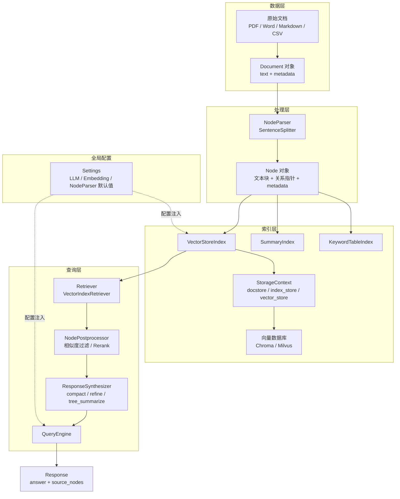
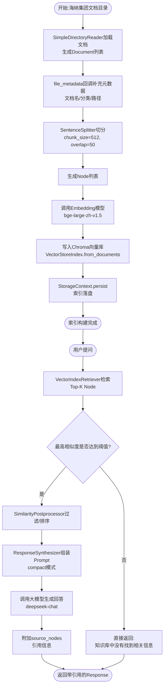
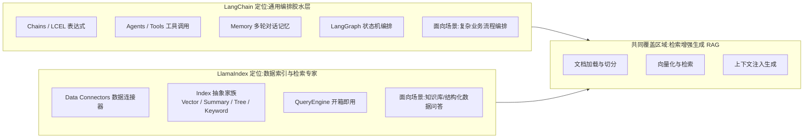

# 第35天 · LlamaIndex框架 —— 评审会上,老王说"鸡蛋不能放一个篮子里"

> **星期**:周日(Sprint 3 · RAG进阶与交付的第四天,入职第35天,转正之后的第21天)
> **对应Sprint**:Sprint 3 · RAG进阶与交付(Day32-38)—— 阶段项目二"海纳制造集团企业知识库问答系统"正式交付前的最后一个技术储备日
> **飞书任务号**:CQ-294(LlamaIndex框架横向调研与选型评估)、CQ-295(LlamaIndex版海纳集团知识库问答Demo实现)、CQ-296(双框架对比笔记撰写与选型建议提交)
> **参与人**:陈铭、韩露(上午技术分享会自愿参加);老王(王振宇)全程主讲;下午实操环节陈铭独立完成,晚间与老王简短复盘;苏梦请假半天,张凡线上旁听录屏回放
> **今日关键词**:技术评审会 / 双框架战略 / LlamaIndex核心概念 / Document与Node / Index家族 / QueryEngine / 与LangChain选型对比 / 海纳集团知识库问答二次实现 / 对比笔记

---

## 【旁白】

第35天,是那种在事后回看时容易被一笔带过的日子——它前面是Day34那份熬了两个通宵才产出的、终于能拿出去见客户的RAG评估报告,后面是Day36那场早已在日历上圈出来、要闷头干两天的封闭开发冲刺。夹在中间的这一天,乍看像是一个可以松口气的间隙,实际上恰恰是老王一直强调的"能跑不代表对,对不代表好"这句话的另一层延伸——一个团队如果只会一种武器,武器好用的时候没问题,武器出故障的时候,连修的思路都没有。

这一天在整个70天故事线里承担的功能,不是教会陈铭一个"更高级"的RAG技巧,而是逼着他第一次认真回答一个此前从未认真想过的问题:"我现在会用LangChain搭一整套RAG系统,这件事本身,到底意味着我'懂RAG',还是我只是'懂LangChain'?"这两者之间的差距,只有在把同一个需求用另一个完全不同的框架重新实现一遍之后,才会真正显现出来。陈铭后来在笔记本上写下的一句话,某种程度上概括了这一天真正想教的东西:"框架是手,RAG是要做的事;学会用另一只手做同一件事,才知道刚才那只手到底哪些动作是必须的,哪些只是习惯。"

如果把镜头拉得更远一点看,这一天埋下的种子,会在故事后段以一种陈铭当下完全想不到的方式发芽——三十多天后,寰宇集团项目里会出现一个"客户方要求某个子模块必须用LlamaIndex实现,理由是他们的技术团队更熟悉这个生态"的真实场景(这是后话,暂且不展开),而那时候能够从容应对而不是手足无措,起点正是今天这个看似不起眼的周日下午。技术选型这件事的本质,从来不是"哪个框架更好",而是"手里有几种可用的工具,遇到具体约束的时候能不能选对那一个"——这也是老王今天反复强调的核心。

还有一层容易被忽略的意义,值得在这里提前点出来:这一天是陈铭入职以来,第一次以"团队里被认可的核心开发"这个身份,去主动学习一个自己完全陌生的新事物,而不是被动跟着培训计划走。前三十四天,他学的每一样东西,几乎都是课表上排好的、老王安排好的既定动作;而今天这场"横向调研",严格意义上不属于海纳集团项目本身要交付的功能范畴,是团队出于风险意识主动"加"出来的一项任务——这种"不是被要求才做,而是意识到有必要才主动去做"的转变,恰恰是从"学生思维"走向"工程师思维"路上一个不太起眼、但确实关键的节点。

---

## 晨会纪要 / 技术评审会纪要

**时间**:上午10:00(比平日晨会晚了半小时,老王前一晚在群里发消息说"今天周日,不点名,自愿参加,想多睡会儿的同学不用有心理负担"),二层小会议室"听风"
**出席**:王振宇(老王)、陈铭、韩露;苏梦提前请假(家里有事,老王批了半天假);张凡选择在家远程,让韩露开着投影屏共享给他看

这是陈铭入职以来第一次在周日被"半强制"地叫到公司,但氛围和平常的技术评审会完全不一样。会议室的窗帘没有完全拉开,阳光斜斜地打在桌面上,老王难得没有穿平常那件深灰色的POLO衫,换了一件洗得有点发白的格子衬衫,整个人看起来比工作日要松弛不少。他进门先把手里那杯速溶咖啡放下,说了一句让陈铭印象很深的开场白:"今天这个会,严格意义上不算晨会,是我自己申请的一个技术评审会——严格说这个申请是我昨晚跟郭总汇报Day34评估报告的时候顺嘴提的,他同意了,给了半天的时间预算。"

陈铭听到"跟郭总汇报"这几个字,下意识坐直了一点。老王注意到他的反应,笑了一下:"别紧张,不是坏消息。昨天你们那份RAG评估报告,忠实度、答案相关性、上下文精确率和召回率四个指标,全部达到了我们内部设定的验收线,郭总看了挺满意,说这是海纳集团项目能在Day36正式转入交付冲刺的一个关键前提。这一点我要先当面跟你说一句,你和苏梦、韩露、张凡这两天熬的通宵没有白熬。"

会议室里安静了两秒,韩露先笑出声:"老王你这个开场,先夸一句,后面肯定有转折。"

"你这个直觉是对的。"老王把投影打开,屏幕上出现一张他自己画的简单示意图——一个圆圈里写着"LangChain",旁边是一个大大的问号。"转折是这样的:郭总昨晚问了我一个问题,他说,'咱们现在整套RAG能力,从文档加载到向量检索到生成回答,底子全部是LangChain,如果哪天LangChain这个项目本身出了大问题——比如维护者停更、出现重大架构变更导致我们现有代码大面积不兼容、或者某个客户合同里明确要求不能用某个特定的开源依赖——咱们有没有备选方案?'我当时被问住了,老实说,没有一个能让自己满意的答案。"

"这个问题挺尖锐的。"陈铭说,他确实没想过这个角度——过去十天,他所有的注意力都在"怎么把LangChain用好"上,从来没往"如果没有LangChain怎么办"这个方向想过。

"尖锐是好事,"老王说,"我后来想了一晚上,觉得这个问题背后其实是一个更普遍的工程原则——不要把所有鸡蛋放在一个篮子里。这句话听起来像老生常谈,但真正落到咱们这个团队身上,它的具体含义是:咱们现在整个RAG能力栈,从个人的技能储备到团队的技术资产,都高度绑定在LangChain这一个框架上。这不是说LangChain不好,LangChain到目前为止表现得完全没问题,但'表现没问题'和'没有风险'是两件事。一个成熟的技术团队,至少要对市面上排第二的方案保持基本的了解和实操能力,这样万一第一选择出问题,不是从零开始,而是有一个现成的备选项可以顶上去。"

韩露举手提了个问题:"那咱们今天要做的,是把整套系统迁移到另一个框架吗?"

"不是迁移,"老王摇头,"海纳集团项目的主线,依然是LangChain,这个决定不会变——项目都进入交付倒计时了,没有任何理由在这个节点做技术栈的大动作。今天要做的,是'横向调研'——用最短的时间,搞懂RAG领域另一个最主流的框架LlamaIndex的核心概念,然后用它把咱们熟悉的这套海纳集团知识库问答需求,重新实现一遍,最后写一份对比笔记,给团队留一份'如果未来真的需要,我们知道怎么切换'的技术储备。这是CQ-294到CQ-296三个任务号要做的事。"

他在白板上写下今天的具体安排,笔尖划过白板的声音在安静的会议室里显得格外清楚:"上午我带你们系统过一遍LlamaIndex的核心概念——Document、Node、Index、QueryEngine这几个核心抽象,以及它们和LangChain里对应概念的映射关系。下午你们自己动手,把海纳集团知识库问答系统用LlamaIndex重新实现一遍,尽量复用同一批样本文档、同一套评估问题,这样才有公平对比的基础。晚上不用留下来加班,这是周日,该休息就休息,但陈铭你如果愿意多测几组数据,我个人是支持的——完全自愿,不算硬性任务。"

陈铭后来确实留到了傍晚,这个细节会在"今日复盘"部分展开。

韩露想了想又问了一个问题,这个问题后来被老王评价为"今天会上问得最好的一个":"老王,咱们花一天时间调研一个不打算真正用在生产上的框架,这个投入产出比,你怎么想清楚的?会不会有人觉得这是浪费时间?"

老王没有立刻回答,而是想了几秒钟才开口:"这个问题问得很实在,我也认真想过。你换个角度算这笔账——如果咱们从来不做这种'看起来没有直接产出'的横向调研,团队的技术判断力会停留在'只知道自己用的这一种工具好不好用',而不知道'这一种工具相对于其他选项到底强在哪、弱在哪'。这种判断力的缺失,平时看不出问题,但真到了需要做重大技术决策的那一刻——比如客户提出特殊要求、比如现有框架出现重大风险——你会发现自己手里没有任何参照系,只能凭感觉赌一个方向。今天这一天,买的不是'LlamaIndex这一个框架的使用经验',买的是'团队具备横向调研能力和技术选型判断力'这件事本身,这个投资,我认为值。"

"另外还有一层,"老王补充,"郭总同意批这半天时间,本身也是一种信号——公司愿意在'看起来没有直接产出'的事情上投入,说明团队的技术判断力,是被当作一项需要持续投资的资产在对待,不是被当作'能用就行,不用管其他'的一次性工具。这一点,我觉得比今天具体学到什么知识点,更值得你们记住。"

陈铭把这段对话完整记在了笔记本上,他后来说,这是他入职以来对"技术投入"这个概念理解最深的一次——不是每一分钟的工作都要立刻兑换成看得见的产出,有些投入是为了在未来某个不确定的时刻,能够拿出一个不慌不忙的判断。

老王又补了一句提醒:"有一点要事先说清楚,免得大家有心理负担——今天这个调研不追求把LlamaIndex用出生产级的精细打磨,时间盒就是一天,目标是'能跑通、能公平对比、能写出有价值的判断',不是'把LlamaIndex的每一个高级功能都掌握'。真正决定要不要在某个场景启用LlamaIndex,是未来遇到具体需求的时候再做的事,今天只是打个基础。"

**今日目标清单**:

1. 上午10:00-11:30:技术评审会+LlamaIndex核心概念系统讲解(Document/Node/Index/QueryEngine及其与LangChain核心概念的映射关系)。
2. 上午11:30-12:00:环境准备,安装LlamaIndex相关依赖包,处理版本冲突问题。
3. 下午13:30-17:00:动手实现LlamaIndex版海纳集团知识库问答系统,复用相同样本文档与评估问题集,与LangChain版本做功能对比测试。
4. 下午17:00-17:30:整理对比笔记初稿,记录关键差异点与选型建议。
5. 傍晚(陈铭自愿加时):补充边界场景测试,完善对比笔记,提交CQ-296。

**风险点**:

- 时间盒只有一天,如果在环境安装、依赖版本冲突上花太多时间,会挤占核心概念学习和实操对比的时间,需要提前预留应急方案(比如老王提前准备好一份验证过的requirements片段)。
- LlamaIndex和LangChain都依赖相近的底层库(比如都可能用到相同版本的pydantic、相同的HuggingFace生态),两者如果装在同一个虚拟环境里,容易出现依赖冲突,今天需要用独立的虚拟环境隔离。
- 对比测试如果只凭"感觉哪个答案写得更好"这种主观判断,说服力不够,需要用今天设计的量化维度(响应耗时、兜底触发准确率、代码量、可定制性)做尽量客观的对比。
- 这是一次"技术储备"性质的调研,不能因为好奇心重而在下午偏离主线,去研究LlamaIndex里今天用不到的高级功能(比如知识图谱索引、多模态索引),时间要花在刀刃上。

会议临近结束的时候,老王又补了一句"加分项"性质的说明,不算硬性任务:"如果你们今天下午的时间比预期宽松,可以顺手看一眼LlamaIndex官方文档里关于`IngestionPipeline`的介绍——这是一个用来管理'文档处理流水线'的工具,概念上和咱们在LangChain里手动串联加载、切分、embedding几个步骤有点像,但做了更多流水线编排层面的封装,比如支持缓存中间结果、支持增量更新。这不是今天的必答题,纯粹是给你们留一个'如果好奇,可以往前多看一点'的小口子,不看也完全不影响今天任务的完成度。"

陈铭把这条记在了笔记本的空白处,加了一个小小的星号——他后来确实抽空看了一眼,但没有深入实操,只是留了一个印象,这也是老王反复强调的"知道有这条路,但今天不走"的具体实践。

---

## 需求文档:《LlamaIndex框架横向调研与选型评估技术需求书》

> 撰写人:王振宇(技术负责人) · 审核人:郭建军(CTO,口头确认) · 文档编号:CQ-TECH-D35-01 · 版本:v1.0

### 一、调研背景

苍穹企业级智能体中台当前的RAG检索引擎层完全基于LangChain技术栈构建(文档加载、切分、向量化、检索、生成、引用标注均使用LangChain及其生态组件),该技术栈已经在海纳制造集团企业知识库问答系统项目中验证了可行性,Day34产出的评估报告显示各项核心指标均达到验收标准。

在Day34评估报告汇报会上,CTO郭建军提出一个关键的技术风险问题:公司当前的RAG能力对LangChain存在高度技术绑定,一旦出现框架维护中断、重大不兼容变更、或客户方明确要求使用替代技术栈等情况,团队缺乏可快速切换的备选方案。基于此,技术负责人王振宇提议开展一次时间盒为一天的技术横向调研,目标框架选定为RAG领域另一主流开源项目LlamaIndex,产出物为可运行的对比Demo与书面选型评估笔记。

需要特别说明的是,这份需求文档虽然编号沿用了公司PRD的统一格式,但它的性质和一份面向客户交付物的PRD并不完全相同——它是一份"内部技术调研需求书",服务对象是团队自身的技术判断力建设,不直接产出面向海纳集团客户的交付物。之所以依然采用正式的文档规范来撰写,是林悦提出的一个建议:"哪怕是内部调研,只要涉及到明确的目标、范围、验收标准,就应该用团队统一的文档规范来写,这样才能保证不管是谁,拿到这份文档都能一眼看懂'我们到底要做什么、做到什么程度算完成',而不是每个人心里有一个模糊的、不一致的理解。"这个习惯,从Day30海纳集团项目立项开始,已经逐渐成为团队处理任何"有明确目标的任务"时的默认做法,不管这个任务是不是直接面向客户。

### 二、调研目标

1. **概念理解目标**:团队成员(以陈铭为主责)能够清晰讲解LlamaIndex的核心抽象概念(Document、Node、Index及其子类、Retriever、QueryEngine、ResponseSynthesizer),并能准确说明每个概念与LangChain中对应概念的映射关系与差异点。
2. **实操验证目标**:使用LlamaIndex重新实现海纳制造集团知识库问答系统的核心功能(文档加载、索引构建、检索增强生成、引用来源标注、"不知道"兜底逻辑),功能范围与现有LangChain版本对等。
3. **对比评估目标**:基于统一的测试问题集,对两个框架实现的版本进行响应耗时、兜底逻辑准确率、代码量、可定制性、生态成熟度五个维度的对比,产出书面对比笔记。
4. **选型建议目标**:基于对比结果,给出明确的技术选型建议——公司主线技术栈是否需要调整,LlamaIndex适合在哪些具体场景下作为补充或替代方案使用。

### 三、调研范围

**范围内(In Scope)**:

1. LlamaIndex核心概念梳理:Document、Node、NodeParser、Index家族(VectorStoreIndex重点讲解,SummaryIndex/KeywordTableIndex简要提及)、Retriever、QueryEngine、ResponseSynthesizer、Settings全局配置机制、StorageContext持久化机制。
2. 使用LlamaIndex重建海纳集团知识库问答核心链路:文档加载→节点切分→向量化→向量库存储(复用现有Chroma)→检索→生成回答→引用标注→兜底逻辑。
3. 两个框架实现版本的功能对比测试:统一测试问题集(复用Day31/Day34已验证的10个真实业务问题+2个超范围问题),统一评测维度。
4. 书面对比笔记撰写,包含核心概念对照表、代码量对比、优劣势分析、选型建议。

**范围外(Out of Scope,今天不做)**:

1. 不要求把LlamaIndex版本打磨到生产可用水准(不涉及并发处理、异常重试、监控埋点等生产级工程要求)。
2. 不涉及LlamaIndex的高级能力探索(知识图谱索引KnowledgeGraphIndex、多模态索引、Agent能力ReActAgent/FunctionCallingAgent),这些留待未来有具体需求时再做专项调研。
3. 不涉及对现有LangChain生产代码的任何改动,今天的所有代码都是独立的调研性质代码,不合并进`backend/`主干代码。
4. 不涉及性能压测(高并发、大数据量场景下的性能对比),今天的响应耗时对比仅作为定性参考,不是严格的性能基准测试。

### 四、非功能需求

1. **时间约束**:整体调研工作量控制在一个工作日以内(今天上午+下午,不占用额外的额外加班时间作为强制要求)。
2. **公平对比约束**:两个框架实现版本必须使用完全相同的样本文档、相同的Embedding模型(bge-large-zh-v1.5)、相同的分块参数(chunk_size=512, chunk_overlap=50)、相同的大模型(deepseek-chat)、相同的相似度阈值(0.35)与Top-K(5),避免因为参数不一致导致对比结果失去意义。
3. **可复现约束**:所有调研代码需要能够独立运行,配套清晰的运行说明,便于后续团队成员在需要时快速复现调研结果,而不是"跑过一次就没人知道怎么再跑起来"。

### 五、验收标准

1. 产出一份可运行的LlamaIndex版海纳集团知识库问答Demo,功能覆盖需求文档"范围内"所列全部核心链路环节。
2. 产出一份双框架功能对比测试脚本与结果报告(自动生成的Markdown格式对比表格)。
3. 产出一份结构完整的《双框架对比笔记》文档,包含核心概念对照表、优劣势分析、明确的选型建议,提交至CQ-296。
4. 老王(或郭总)审阅对比笔记后,认可其分析深度足以支撑未来的技术选型决策——不要求"标准答案完全一致",但要求分析逻辑清晰、有具体数据支撑。

### 六、术语表(供团队内部统一口径使用)

考虑到今天调研涉及大量LlamaIndex的专有术语,而团队之前完全没有接触过这套体系的词汇,林悦特意要求在需求文档里附一份术语表,避免后续团队内部沟通时出现"同一个词各自理解不一样"的问题——这个习惯是她从产品经理的工作方式里带过来的,任何一次新技术引入,先把词汇对齐,再谈方案。

| 术语 | 英文原文 | 简要释义 |
|---|---|---|
| 文档对象 | Document | 对一份原始文档内容与元数据的封装 |
| 节点 | Node | 文档切分后的文本块,携带与相邻块的关系指针 |
| 节点解析器 | NodeParser | 负责把Document切分成Node的组件,如SentenceSplitter |
| 索引 | Index | LlamaIndex对"可检索数据结构"的核心抽象,有多个子类型 |
| 向量存储索引 | VectorStoreIndex | 基于向量相似度检索的Index实现,今天Demo使用的类型 |
| 摘要索引 | SummaryIndex | 不做向量检索,遍历全部内容的Index类型,适合全文总结场景 |
| 关键词表索引 | KeywordTableIndex | 基于关键词匹配的Index类型 |
| 检索器 | Retriever | 从Index中取出与查询相关的候选Node的组件 |
| 节点后处理器 | NodePostprocessor | 对检索结果做二次过滤、排序、压缩的组件 |
| 响应合成器 | ResponseSynthesizer | 把检索结果组织成Prompt并调用大模型生成最终回答的组件 |
| 查询引擎 | QueryEngine | 面向使用者的最终问答接口,内部串联检索、后处理、生成三个环节 |
| 全局配置单例 | Settings | 管理LLM、Embedding、NodeParser等组件默认值的模块级单例对象 |
| 存储上下文 | StorageContext | 管理文档存储、索引存储、向量存储三类持久化组件的容器 |

### 七、调研预算与时间盒说明

老王在需求文档最后特别加了一段说明,解释为什么把这次调研严格限定在一天以内——"技术调研这件事本身没有天然的边界,如果不设置时间盒,很容易演变成'越挖越深、越挖越有意思、结果一整个Sprint的进度都被拖慢'的局面。今天的时间盒设定为一天,产出目标是'能形成有数据支撑的判断',不是'把LlamaIndex吃透'。如果团队未来在具体项目场景中,真的需要用到LlamaIndex的某个高级能力,那时候可以再单独申请一次有明确目标的专项调研,而不是把'技术好奇心'和'项目节奏'混在一起。"

这段说明,某种程度上也是对陈铭的一次提醒——他后来承认,如果没有这条时间盒的约束,他大概会忍不住去多看几个LlamaIndex的高级功能(比如知识图谱索引长什么样),而这种"越看越有意思"的探索欲望,如果不加约束,确实容易偏离今天的核心任务。

---

## 架构设计图:LlamaIndex核心概念架构(Document / Node / Index / QueryEngine)



**图解**:这张图把LlamaIndex的四个核心概念——Document、Node、Index、QueryEngine——以及它们之间的加工关系画成了一条自上而下的生产线。最上层是原始文档,经过`Document`对象的统一封装(带上metadata)之后,交给`NodeParser`切分成一个个`Node`;`Node`不只是一段文本,还带着"上一个Node是谁""下一个Node是谁"这样的关系指针,这一点和LangChain里相对"扁平"的文本块概念有微妙的不同,后面课堂笔记会展开讲。中间的`Index`家族是LlamaIndex的核心设计——它不是单一的"向量库封装",而是一整个家族,`VectorStoreIndex`只是其中最常用的一种,还有面向摘要场景的`SummaryIndex`、面向关键词检索场景的`KeywordTableIndex`等。最下层的`QueryEngine`是面向使用者的最终接口,内部串联了`Retriever`、`NodePostprocessor`、`ResponseSynthesizer`三个环节,分别负责"找出相关内容""过滤/排序""组织成回答"。图中特别标出`Settings`这个全局配置对象,用虚线箭头指向索引层和查询层——这是因为LlamaIndex采用了一种和LangChain完全不同的配置哲学,几乎所有组件的默认LLM、Embedding都从这个全局单例里读取,而不需要像LangChain那样每个组件都显式传参,这个设计差异,是上午课堂笔记里要重点掰开揉碎讲的第一个知识点。

如果拿这张图和Day30为LangChain画的那张RAG系统架构图放在一起对比,会发现两者在"数据从原始文档一路流向最终回答"这件事上的大方向完全一致,分层结构也能找到几乎一一对应的关系,但LlamaIndex这张图里多出来的东西——`StorageContext`这个专门统一管理"文档存储/索引存储/向量存储"三类持久化组件的容器,以及贯穿索引层和查询层的`Settings`全局配置——恰恰是两个框架设计哲学差异最直观的体现。LangChain把"用哪个向量库""用哪个Embedding模型"这些决定,分散在具体调用某个类的构造函数参数里,没有一个统一收口的地方;LlamaIndex则倾向于把这些决定收拢到少数几个"总控对象"里,好处是查看和修改配置时有一个明确的入口,坏处是这个入口一旦被不小心改动,影响面可能比预想的更大——这一点,陈铭在下午实操时会亲身体会到。

在实际讲下一张图之前,老王先问了一句:"你们看接下来这张图,和刚才那张架构图,到底有什么本质区别?"陈铭想了一下回答:"架构图是静态的,回答'系统由什么组成';这张是动态的,回答'一次具体的操作,先做什么,再做什么,中间会不会分叉'。"老王点头认可,说这正是这两种图在企业级技术文档里各自不可替代的作用——架构图给新人一个"全局地图",流程图给开发者一份"操作手册",两者缺一个,团队协作效率都会打折扣。

---

## 流程图:LlamaIndex构建索引与查询的完整流程



**图解**:这张流程图和上面的架构图看的是同一套系统,但视角完全不同——架构图讲的是"系统由哪些模块拼成",这张图讲的是"一次真实请求从头到尾会经过哪些步骤,每一步具体做什么决策"。整张图分成上下两段,上半段是"索引构建阶段"(通常只在文档更新时才需要重新跑一次),下半段是"查询阶段"(用户每问一次问题就会走一遍)。最关键的设计点在中间那个判断框——"最高相似度是否达到阈值",这一步决定了系统会不会调用大模型去"努力回答一个知识库里根本没有的问题"。今天下午实现的时候,陈铭会在这个判断点上踩一个不大不小的坑(细节见课堂笔记下午部分),这张图提前把正确的流程画出来,方便对照排查。

值得多说一句的是,这张流程图里"索引构建阶段"和"查询阶段"之间那条连接线,看起来只是简单的先后顺序,但背后隐藏着一个企业级系统必须认真考虑的问题——索引构建是一次相对昂贵的操作(要跑完全部文档的embedding计算),而查询是高频操作(用户随时可能提问),两者的执行频率天差地别,所以工程实现上必须支持"索引只在文档更新时重建一次,平时反复复用已经构建好的索引"这种模式,这也是为什么`index_builder.py`里专门设计了持久化与加载逻辑,而不是每次启动程序都从头构建一遍——这个设计考量,和LangChain版本里`vectorstore.py`对Chroma持久化目录的处理逻辑,本质上是同一个工程问题的两种实现。

---

## 示意图:LangChain与LlamaIndex技术定位对比示意



**图解**:这张图不讲流程也不讲结构,讲的是"这两个框架在整个AI应用工具箱里,分别站在什么位置"。可以把LangChain想象成一个万能工具腰带,上面挂着链式编排、多智能体协作、多轮记忆、状态机这些五花八门的工具,RAG只是它能干的事情之一;而LlamaIndex更像一把专门为"把一堆数据变成能被检索、能被问答"这件事打磨出来的专业工具,它的一切设计都围绕"索引"这个核心概念展开,某种程度上比LangChain更"专精"。中间的重叠区域,就是今天要重点对比的战场——两个框架都能做RAG,而且都能做得不错,差异体现在"默认好用程度"和"深度定制的自由度"这两个此消彼长的维度上,这一点在下午的课堂笔记里会用具体代码对比来验证。

老王看着这张图补了一句,提醒陈铭不要把这张示意图理解得太绝对:"这张图画的是'两个框架现阶段最被认可的核心优势区间',不代表LangChain做不好RAG,也不代表LlamaIndex做不好Agent——事实上今天下午你就会用LangChain把海纳集团的RAG问答实现得很扎实,证明重叠区域是真实存在、而且双方都能做到生产级水准的。这张图更像是一张'如果你只有很少的时间去了解这两个项目,应该优先把哪个框架和哪种场景画上等号'的认知地图,是为了帮你建立第一直觉,不是给两个框架的能力边界划一条精确的、不可逾越的线。"

---

## 课堂笔记

### 上午:LlamaIndex核心概念精讲

老王今天讲课的开场方式和平时不太一样,他没有直接打开电脑投屏代码,而是先在白板上画了两个圈,一个写着"LangChain",一个写着"LlamaIndex",中间画了一条虚线连起来,然后问陈铭和韩露:"你们两个,先别看任何资料,凭直觉说说,你们觉得这两个东西是竞争关系,还是互补关系?"

韩露想了想说:"感觉名字长得有点像,应该是差不多的东西,竞争关系吧?"

陈铭想得更谨慎一点:"我猜是竞争关系,但可能各自擅长的场景不太一样。"

"陈铭这个答案更接近真相。"老王在两个圈中间又画了一个小一点的重叠区域,写上"RAG",说:"这两个项目诞生的时间点很接近,都是2022年底到2023年那波大模型应用热潮里冒出来的开源项目,一开始的定位确实有明显差异——LlamaIndex(它最早的名字叫GPT Index,后来才改名)从一开始就是奔着'怎么把外部数据接入大模型,让大模型能基于这些数据回答问题'这个具体问题去的,可以说它的整个灵魂就是'索引';而LangChain从一开始的野心就更大,它想做的是'把大模型应用开发里所有常见的编排模式都抽象出来,不管是简单的问答链,还是复杂的多智能体协作,都能用它搭'。"

"所以这两年下来,"老王继续说,"两边都在往对方的地界扩张——LlamaIndex也补上了Agent能力(ReActAgent、FunctionCallingAgent),LangChain这边通过LangGraph也在往复杂状态机编排方向深耕,但如果你去看这两个项目现在最扎实、最被社区认可的能力,LlamaIndex依然是'数据索引与RAG'这个领域做得最细致的那个,LangChain依然是'通用编排,尤其是Agent与复杂工作流'这个领域生态最丰富的那个。这也是为什么咱们苍穹平台的技术栈选型里,Agent编排层未来会用LangGraph,而不是LlamaIndex的Agent能力——这个决定在Master Bible里早就定了,不是今天临时决定的,今天的调研不会改变这个大方向,今天要搞清楚的是,在RAG这个重叠区域里,LlamaIndex到底能不能作为一个靠得住的备选方案。"

#### 第一个核心概念:Document

老王打开电脑,投屏出LlamaIndex官方文档里`Document`类的定义,说:"先看第一个概念,`Document`。你们两个已经很熟悉LangChain的`Document`了对吧?"

"熟,"陈铭说,"就是`page_content`加`metadata`两个字段的一个简单容器。"

"没错,LlamaIndex的`Document`概念上几乎一样,也是'一段文本+一堆元数据'的封装,唯一稍微不同的是字段名——LlamaIndex里叫`text`而不是`page_content`,`metadata`字段名是一样的。"老王说,"这一点差异小到几乎可以忽略,但恰恰是这种'看起来一样,细节又不完全一样'的情况,是新手在两个框架之间切换时最容易踩的坑——你以为自己完全懂了,写代码的时候却因为一个属性名不对报错,debug半天才发现根本不是逻辑问题,是记错了字段名。"

陈铭在笔记本上记下:"LangChain的Document.page_content ≈ LlamaIndex的Document.text,两者的metadata字段名相同。"

#### 第二个核心概念:Node

"第二个概念,`Node`,"老王说,"这个概念在LangChain里其实没有一个直接对应的独立术语——LangChain把文档切分之后,产生的结果依然叫`Document`(切分之后的小块Document,和切分之前的大Document是同一个类),这是LangChain设计上比较'省事'的地方,好处是概念数量少,学习成本低,坏处是有时候你需要通过一些约定(比如metadata里记录chunk的序号)才能表达'这个小块和那个小块原本是相邻的'这种关系。"

"LlamaIndex这边不一样,"老王继续说,"文档切分之后产生的不再是`Document`,而是一个专门的`Node`类型。`Node`除了`text`和`metadata`,还额外携带一组'关系指针'——`relationships`字典,里面明确记录了这个Node的上一个Node是谁、下一个Node是谁、它属于哪个父Document。这个设计带来一个实际的好处:如果你的检索器只召回了文档中间的一小段内容,但这段内容单独看语义不完整(比如恰好切在一句话中间),LlamaIndex内置了一种叫'自动合并检索'(Auto-Merging Retrieval)的高级能力,可以顺着这些关系指针,自动把相邻的、语义上更完整的上下文拉回来——这是LangChain默认没有的能力,虽然你也可以自己在LangChain里实现类似逻辑,但需要额外写代码。"

韩露问:"那咱们海纳集团项目里,有没有遇到过'切分得太碎导致上下文不完整'的问题?"

"有,"陈铭抢着回答,他想起了Day28文档切分那天的经历,"我记得有一次chunk_size设得太小,检索出来的一段内容开头是'具体操作步骤如下',但后面步骤本身被切到下一个chunk里去了,回答的时候就出现了'步骤如下'但实际没有列出任何步骤的尴尬情况。"

"对,那个问题咱们当时是靠调大chunk_size和增加overlap解决的,是一种'预防式'的解法,"老王点头,"而LlamaIndex的Node关系指针提供的是一种'补救式'的解法——即便切分得比较碎,查询的时候依然可以按需把上下文拼回来。两种思路各有适用场景,不存在谁绝对更好。"

#### 第三个核心概念:Index家族

"第三个概念是`Index`,这是LlamaIndex真正的灵魂所在,"老王说着切换到了另一页文档,"LangChain里,'向量库'这个概念相对简单——你有一个`VectorStore`对象(比如`Chroma`),它提供`add_documents`、`similarity_search`这些方法,概念上很直白,'向量库就是一个能存能查的数据库'。LlamaIndex把这个概念往上抽象了一层,叫`Index`,而且`Index`不是单一类型,是一整个家族。"

老王在白板上列了一个简单的清单:

- `VectorStoreIndex`:最常用的一种,底层用向量相似度检索,对标LangChain里"向量库+检索器"的组合,今天的Demo会用这个。
- `SummaryIndex`(早期版本叫`ListIndex`):不做向量检索,查询时会遍历全部Node,适合"总结全篇文档"这类不需要精确定位、需要看到全局的场景。
- `KeywordTableIndex`:基于关键词匹配而不是向量相似度,适合"型号编号精确查找"这类场景——这一点让陈铭立刻联想到Day33学的BM25混合检索,本质上解决的是同一类问题。
- `TreeIndex`:把文档组织成树状结构,自底向上逐层摘要,适合超长文档的场景。

"这里有一个很容易让新手迷惑的地方,"老王特别强调,"这些`Index`听起来是'数据结构',但它们同时也承担了'检索策略'的角色——你选择用哪个`Index`,某种程度上就是在选择'用什么方式检索'。这和LangChain的思路正好相反,LangChain把'存储'(VectorStore)和'检索策略'(Retriever,比如相似度检索、MMR检索、混合检索)分成两个独立的、可以自由组合的概念,而LlamaIndex把这两者在很大程度上耦合进了`Index`类型的选择里。这是一个设计哲学上的分歧,没有绝对的对错,但会直接影响你写代码时的思维方式。"

陈铭若有所思地说:"所以如果我想同时用向量检索又想用关键词检索,在LangChain里我是组合两个Retriever然后用RRF融合,像Day33那样;在LlamaIndex里,是不是要同时构建一个VectorStoreIndex和一个KeywordTableIndex,然后自己写逻辑把两边的结果融合起来?"

"完全正确,"老王说,"LlamaIndex确实提供了`QueryFusionRetriever`这种内置的融合检索器,可以把多个Index的Retriever包起来做类似RRF的融合,思路和你说的一致,只是包装方式不同。今天时间有限,咱们的Demo只用`VectorStoreIndex`打个基础,混合检索的LlamaIndex实现今天不展开,你们知道有这条路可以走就够了。"

#### 第四个核心概念:QueryEngine

"最后一个核心概念,`QueryEngine`,"老王说,"这个概念在LangChain里没有一个完全对等的单一术语——LangChain里,你需要自己用LCEL把'检索器'和'生成模型'手动串成一个`chain`,这一步是显式的、需要自己动手写的。LlamaIndex这边,每个`Index`对象都自带一个`.as_query_engine()`方法,一行代码就能拿到一个开箱即用的、包含'检索+生成'完整流程的对象,这个对象就叫`QueryEngine`。"

"这个差异,"老王补充说,"直接对应了两个框架在'易用性'和'可控性'之间做出的不同取舍——LlamaIndex默认给你一个能跑的QueryEngine,背后帮你选好了默认的Prompt模板、默认的响应组装模式(`response_mode`),你几行代码就能看到效果,这对'快速出Demo'这个场景特别友好;但如果你想深度定制——比如咱们海纳集团项目里那种'必须标注引用编号,必须有严格的兜底逻辑'的要求——你需要知道去哪里覆盖默认的Prompt模板、去哪里插入自定义的过滤逻辑,这部分的学习成本,并不比LangChain低,只是学习的东西变成了'LlamaIndex这套体系的定制方式',而不是'从零手写编排逻辑'。"

老王停顿了一下,总结说:"用一句话概括今天上午的核心结论——LlamaIndex用更高层的抽象换取了更快的默认上手速度,LangChain用更底层的显式编排换取了更细粒度的控制力。这两者不是谁比谁强,是面向不同优先级的两套设计哲学。咱们下午实操完了之后,你们会对这句话有更具体的体感。"

韩露这时候插了一句题外话:"老王,我看资料说LlamaIndex最早不叫这个名字?"

"对,这个背景值得说一下,"老王说,"LlamaIndex最早在2022年底发布的时候,叫`GPT Index`,顾名思义,那时候它的定位非常单一——就是给GPT系列模型接外部数据用的一个索引工具。后来随着开源大模型生态爆发,不再只服务GPT一家,团队才把项目改名成`LlamaIndex`,这个名字里的`Llama`,和Meta后来发布的开源大模型`Llama`系列其实没有直接的从属关系,更多是想表达'轻量、灵活、驮着数据到处跑'这种意象——这个说法我也是看官方博客介绍才知道的,你们感兴趣可以自己去查一下原始出处,今天不深究。"

"这么一说,倒是能理解为什么它现在的核心能力还是围绕'索引'这个词展开,"陈铭说,"名字改了,但骨子里那套'先做好数据索引'的基因,一直没变。"

"这个观察是对的,"老王说,"很多开源项目的名字变化,背后往往能看出这个项目'野心'的变化轨迹——LangChain从名字上看,'链'这个字从一开始就暗示了它对'编排多个环节'这件事的重视,这个野心从第一天到现在没有变过,只是编排的复杂度从简单的Chain发展到了LangGraph这种更复杂的状态机。两个项目名字背后的这层'初心',某种程度上也能帮你快速判断'这个项目大概率会在哪个方向持续投入最多资源'——这是一个不太严谨但挺好用的经验判断法。"

#### 概念对照表(陈铭当场整理,老王确认无误)

| LangChain概念 | LlamaIndex概念 | 差异说明 |
|---|---|---|
| `Document`(`page_content` + `metadata`) | `Document`(`text` + `metadata`) | 字段名不同,概念基本等价 |
| 切分后的小Document | `Node`(带`relationships`关系指针) | LlamaIndex的Node天然携带上下文关系,支持自动合并检索 |
| `TextSplitter`(如`RecursiveCharacterTextSplitter`) | `NodeParser`(如`SentenceSplitter`) | 功能等价,LlamaIndex的NodeParser默认更贴合句子边界切分 |
| `VectorStore`(独立于检索策略) | `Index`家族(存储与检索策略部分耦合) | LlamaIndex的Index选择本身即隐含了检索策略取向 |
| `Retriever`(可独立组合、融合) | `Retriever`(通常从Index派生,如`VectorIndexRetriever`) | 概念相似,LlamaIndex的Retriever与其Index类型强绑定 |
| 手写LCEL链(`prompt | llm | parser`) | `QueryEngine`(`.as_query_engine()`一行获取) | LlamaIndex默认封装度更高,LangChain显式编排自由度更高 |
| `ServiceContext`(已废弃) / 显式传参 | `Settings`(全局单例配置) | LlamaIndex用全局默认配置,LangChain坚持显式依赖注入风格 |
| 无直接对应,需自定义Callback | `CallbackManager` / `Instrumentation` | 两者都有可观测性方案,实现细节不同 |

老王看着这张表,评价说:"这张表你留着,以后不管是给新同学做技术分享,还是自己需要快速回忆两个框架的对应关系,都能用得上。但我要提醒一句——表格只是帮助记忆的工具,真正理解这些差异,还是要靠下午亲手写一遍代码。"

#### 安装方式对比:模块化拆包与一站式安装的取舍

在正式动手之前,老王还讲了一个容易被忽略、但今天上午陈铭已经隐约感受到的细节——两个框架在"怎么安装"这件事上的哲学也不一样。

"你们回忆一下,"老王说,"装LangChain的时候,咱们`pip install`过哪些包?"

陈铭想了想,翻了一下自己Day25的笔记:"`langchain`、`langchain-core`、`langchain-community`、`langchain-openai`,后来做向量库还装了`langchain-chroma`,做HuggingFace Embedding装了`langchain-huggingface`。"

"对,LangChain从很早的版本开始,就已经把'核心抽象'(`langchain-core`)、'社区贡献的各种集成'(`langchain-community`)、'官方维护的重量级集成'(比如`langchain-openai`、`langchain-chroma`)拆成了独立的包,这样做的好处是,你只需要装自己真正用到的那几个包,不用把全世界所有向量库、所有模型供应商的依赖都装一遍。LlamaIndex这两年也在往同一个方向演进——老版本的LlamaIndex是一个'大包',把所有能力都塞在一起,现在拆成了`llama-index-core`加上一堆`llama-index-embeddings-xxx`、`llama-index-llms-xxx`、`llama-index-vector-stores-xxx`这样的细分包,咱们今天装的`llama-index-embeddings-huggingface`、`llama-index-llms-openai-like`、`llama-index-vector-stores-chroma`,就是这种拆包策略的产物。"

"这个趋势说明什么?"陈铭问。

"说明这两个生态,在'怎么管理依赖膨胀'这个工程问题上,不约而同地走向了同一个答案——模块化拆包。"老王说,"这对咱们做技术选型的启示是,不要被'某个框架现在体积大不大'这个表面现象影响判断,两个框架实际上都朝着'按需安装、减少臃肿'的方向努力,这不是差异点,是共同趋势。真正的差异点,是拆包之后,每个细分包内部的实现质量和文档完整度——这个只能靠实际用起来才知道,今天下午你们会有体感。"

#### 常见问题FAQ(老王现场答疑整理)

上午课程接近尾声时,老王留了大概二十分钟做自由提问,陈铭把几个他认为最有价值的问答整理进了笔记本,后来这份FAQ也被林悦要走,加进了团队内部的技术Wiki,供其他同学后续自学参考。

**问:LlamaIndex的`Settings`和LangChain里也存在的`BaseSettings`(Pydantic的配置基类)是同一个东西吗?**

答:不是。LlamaIndex的`Settings`是它自己设计的一个模块级单例对象,专门用来管理LLM、Embedding、NodeParser这些"运行时组件"的默认实例;而Pydantic的`BaseSettings`(公司`backend/app/core/config.py`里用的那种)是一个更通用的"从环境变量/配置文件读取结构化配置"的工具,两者名字相近,但解决的是完全不同层面的问题,不要混淆。

**问:如果我在项目里既要用LangChain又要用LlamaIndex(比如未来某个混合场景),两者的Embedding模型可以共用同一份缓存吗?**

答:可以,只要两边配置的都是同一个HuggingFace模型名称(比如都是`BAAI/bge-large-zh-v1.5`),并且`HF_HOME`环境变量指向同一个缓存目录,底层的`sentence-transformers`库加载模型文件的逻辑是通用的,不会因为上层框架不同而重新下载。今天陈铭在`config.py`里特意设置`HF_HOME`默认值,就是为了确保这一点。

**问:LlamaIndex的`VectorStoreIndex.from_documents()`这一行代码,如果文档数量特别多(比如几万篇),会不会因为一次性传入内存爆掉?**

答:理论上存在风险,`from_documents()`默认会把全部Document一次性加载进内存并完成切分和embedding计算。对于海纳集团现有的样本文档规模(几十份到上百份),完全没问题;但如果未来文档规模上升到几万篇,需要考虑分批处理(手动分批调用`insert()`方法逐批插入索引),或者用LlamaIndex提供的`IngestionPipeline`配合流式处理来避免一次性内存压力过大,这个优化今天不涉及,是留给未来真正遇到这个规模问题时再做的事。

**问:今天为什么选择`RetrieverQueryEngine`这个相对底层的类,而不是更简单的`CitationQueryEngine`(LlamaIndex内置的、专门支持引用标注的查询引擎)?**

答:这是一个好问题,`CitationQueryEngine`确实是LlamaIndex官方提供的、专门为"带引用的问答"设计的封装,理论上可以少写一些代码。今天没有用它,主要出于两个考虑——第一,`CitationQueryEngine`的引用切分粒度和格式,是它内部预设的策略,不一定和咱们海纳集团项目要求的"文档名+章节位置"格式完全吻合,直接用现成封装反而可能需要额外的适配代码;第二,用相对底层的`RetrieverQueryEngine`加上自定义`text_qa_template`,能让陈铭更清楚地看到"引用编号是怎么在Prompt层面被要求生成的",这对理解框架底层机制更有帮助。等团队真正需要在生产场景里深度使用LlamaIndex时,再去评估`CitationQueryEngine`是否能省下这部分定制工作,是完全合理的后续优化方向。

**问:`response_mode="compact"`是什么意思,还有其他选项吗?**

答:`response_mode`决定了`ResponseSynthesizer`把多个检索到的Node组织成最终回答的策略。`"compact"`模式会尽量把多个Node塞进同一次大模型调用的Prompt里(受限于上下文窗口,如果塞不下会自动分批),用最少的API调用次数生成回答,今天的场景用这个模式最合适。另外还有`"refine"`模式,会针对每个Node分别调用一次大模型,逐步"精炼"出最终答案,适合Node数量多、单次Prompt装不下的场景,但调用次数多、耗时更长、成本更高;还有`"tree_summarize"`模式,把多个Node的内容按树状结构逐层摘要合并,适合需要对大量内容做汇总提炼的场景(比如"总结这份三百页手册的核心要点")。今天海纳集团这种"精确问答"场景,`"compact"`是最合适的默认选择。

**问:如果客户以后要求"支持多轮对话",LlamaIndex能做到吗?**

答:能,LlamaIndex提供了`ChatEngine`系列(比如`CondenseQuestionChatEngine`、`ContextChatEngine`),可以在`QueryEngine`的基础上叠加多轮对话记忆能力,思路和LangChain的`Memory`机制类似,都是"把历史对话内容也塞进Prompt,或者先用历史对话把当前问题'压缩改写'成一个独立完整的问题,再走检索流程"。不过今天没有时间展开这部分,如果之后有实际需求,需要专门做一次针对`ChatEngine`的调研,今天先记录在对比笔记的"遗留问题"里。

**问:今天的Demo里,向量库用的还是Chroma,如果之后要接入公司生产环境已经定下来的Milvus,LlamaIndex支不支持?**

答:支持,LlamaIndex通过`llama-index-vector-stores-milvus`这个细分包提供了对Milvus的原生支持,接入方式和今天的`ChromaVectorStore`几乎是同一套代码结构,只需要把`VectorStore`的具体实现类换掉,`StorageContext`、`VectorStoreIndex`这一层的代码基本不需要改动。这也从侧面说明,不管选择哪个RAG框架,"向量库的具体选型"和"框架的选型"在很大程度上是两个可以独立决策的问题,不会因为选了LlamaIndex就被迫放弃Milvus这个既定的生产环境选型。

**问:今天算下来,用LlamaIndex和用LangChain做同一件事,大模型API调用的成本会不会不一样?**

答:这是个容易被忽略但很实际的问题。理论上,两个框架的成本差异主要不来自框架本身,而来自各自默认的Prompt组织方式——比如`response_mode="compact"`会尽量把多个Node塞进一次调用,减少调用次数;如果用`"refine"`模式,则会对每个Node分别发起一次调用,调用次数、Token消耗都会显著上升。今天两个版本都采用了"尽量合并成一次调用"的策略,所以从实测的12个问题来看,两边消耗的Token量和调用次数基本相当,没有观察到某个框架天生更省钱的现象。但这提醒我们一件事——真正决定成本的,往往不是"选了哪个框架",而是"框架内部具体选择了哪种响应组织策略、检索返回了多少个Node、Prompt模板写得有多啰嗦",这些才是成本优化真正应该关注的旋钮,框架选择本身在这件事上的权重相对有限。

**问:LlamaIndex的社区活跃度和更新频率怎么样,值不值得信任它会一直维护下去?**

答:从公开数据看,LlamaIndex和LangChain都是目前RAG/大模型应用领域最活跃的开源项目之一,版本更新频率都很高(几乎每周都有新版本发布),背后也都有商业化公司支持(LlamaIndex背后是LlamaIndex公司,LangChain背后是LangChain Inc.),两者都拿到过外部投资,短期内"项目被放弃"的风险都很低。真正需要关注的风险,不是"项目会不会消失",而是"版本迭代过快导致的API不兼容"——这两个项目在过去两年里都经历过几次相对大的API重构(比如LlamaIndex从`ServiceContext`切换到`Settings`,LangChain从`Chain`类切换到LCEL表达式),这种"活跃迭代带来的不稳定性",才是团队在长期维护生产代码时更应该关注和提前规划应对策略的地方,而不是担心项目本身会不会"死掉"。

老王最后总结这轮FAQ:"你们发现没有,几乎每一个问题的答案,最后都会落到同一句话——'这个能力LlamaIndex有,但今天先不展开,留给未来真正有需求的时候再深入'。这不是我在偷懒,是因为一天的时间盒,必须逼着大家做减法,把注意力留在今天最核心的目标上。你们要习惯这种'知道有这条路,但今天不走'的状态,这本身就是一种成熟的技术判断力。"

#### 日志与可观测性:两个框架处理"看不见的中间过程"的方式不一样

FAQ环节之后,老王又单独花了几分钟讲了一个容易被新手忽略、但企业级项目里格外重要的话题——可观测性。"你们做过Day30那个完整RAG系统,应该记得咱们当时专门写了`logger_setup.py`,给每一个环节都加了日志,这不是随手加的,是因为RAG系统一旦线上出问题,你需要知道到底是加载文档的时候出的问题,还是检索的时候召回了不相关内容,还是生成阶段大模型本身的问题——没有分环节的日志,出了问题只能盲人摸象。"

"LlamaIndex这边呢?"陈铭问。

"LlamaIndex提供了一套叫`CallbackManager`的机制,可以在检索、生成等各个环节插入回调函数,记录耗时、记录中间结果,官方也提供了一些开箱即用的Handler(比如`LlamaDebugHandler`,可以打印每一步的详细追踪信息)。这套机制概念上和LangChain的`Callbacks`体系(以及更完整的LangSmith可观测性平台)是同一类东西,解决的是同一个问题——'大模型应用的中间过程是一个黑盒,必须主动埋点才能在出问题时快速定位'。"

老王补充道:"今天时间有限,咱们的Demo代码里用的是最朴素的方式——直接在`HainerQueryEngine.ask()`方法里用Python标准库的`logging`记录耗时和检索结果,没有引入`CallbackManager`这套更完整的机制。这是一个刻意的简化,如果哪天团队真的决定要在生产场景里深度使用LlamaIndex,可观测性这一块是必须补齐的,不能只满足于'demo能跑通'的朴素日志水平,这一点你们在对比笔记的遗留问题里也可以补一句。"

陈铭听完,把这条也补进了"遗留问题"清单:"两个框架都提供了相对完整的Callback/可观测性机制,今天的Demo均未深入使用,仅用基础logging模块记录关键节点,如果进入生产评估阶段需要专项补齐。"

#### 一个类比:把Index家族理解成"仓库的不同管理方式"

陈铭在笔记本上记概念的时候,总习惯给抽象的东西找一个生活化的类比,这是他从做运营那几年养成的习惯——运营工作里经常需要把复杂的数据模型讲给不懂技术的同事听,类比是最好用的工具。今天关于Index家族这部分,他琢磨了一会儿,想出了一个类比,讲给老王听,老王听完说"这个类比有点意思,可以用"。

陈铭的类比是这样的:把海纳集团的全部技术文档想象成一个仓库里堆放的货物,`VectorStoreIndex`就像是给每一件货物都贴上一个"语义指纹"标签,顾客说自己想找什么,仓库管理员根据描述的语义相似度,直接去最像的那几个货架取货——这是最常用、最像"智能导购"的一种方式。`KeywordTableIndex`则更像是传统的按编号查找,顾客说清楚货号(比如设备型号"XJ-500"),管理员按索引表直接定位,不需要理解语义,只需要精确匹配。`SummaryIndex`则完全是另一种玩法,不建立任何检索捷径,顾客问"整个仓库大概有哪些类型的货物",管理员老老实实把每一件货物都看一遍再给出总结——效率最低,但适合"我要的不是某一件具体货物,是对全局的概览"这种需求。

"你这个类比里,"老王补充,"还有一层没展开——真正成熟的仓库管理,往往不是只用一种方式,而是几种方式搭配着用,顾客说得越清楚(比如报出精确货号),就走关键词检索这条快速通道;顾客说得越模糊(比如只描述了一个大概的需求),就走语义检索这条兜底通道;如果顾客问的是全局性的问题,才会用到最耗时的全量遍历。这也是为什么LlamaIndex会提供`QueryFusionRetriever`这种融合多种Index检索结果的机制——本质上是在为'顾客描述清晰程度不一样'这个现实情况做工程上的适配,这一点和Day33学的混合检索(BM25+向量)要解决的问题,在思路上是一致的,只是换了个框架的说法。"

这段类比后来被陈铭原样写进了对比笔记的草稿里,虽然最终提交版为了保持文档的正式感把类比部分删掉了,只保留了结论性的表格,但这个思考过程本身,是他真正把"Index家族为什么要设计成一个家族而不是单一类型"这件事想透的关键一步。

#### 环境准备与依赖冲突排查

上午11:30左右,老王让陈铭和韩露开始动手准备LlamaIndex的开发环境,他自己则在旁边看着,随时准备接住可能出现的坑。陈铭按照惯例新建了一个独立的虚拟环境(而不是直接装进已经跑着LangChain全套依赖的那个环境里),这个习惯是Day10练习虚拟环境管理时养成的,老王当场夸了一句:"这个习惯保持得很好,两个框架依赖的库有不少重叠但版本要求可能不完全一致,混在一个环境里排查起来会很痛苦。"

陈铭执行了下面这几条命令:

```bash
python -m venv .venv-llamaindex
source .venv-llamaindex/bin/activate
pip install --upgrade pip
pip install llama-index-core llama-index-embeddings-huggingface llama-index-llms-openai-like llama-index-vector-stores-chroma chromadb
```

安装过程中,陈铭遇到了第一个报错,是在安装`llama-index-embeddings-huggingface`的时候:

```
ERROR: Could not find a version that satisfies the requirement torch>=2.0.0 (from llama-index-embeddings-huggingface)
ERROR: No matching distribution found for torch>=2.0.0
```

"这个报错看起来吓人,其实原因很简单,"老王看了一眼说,"公司这台机器的pip源配置的是内部镜像,内部镜像同步torch这种大文件包有延迟,你换成官方源单独装一下torch试试。"

陈铭照做:

```bash
pip install torch --index-url https://download.pytorch.org/whl/cpu
pip install llama-index-embeddings-huggingface llama-index-llms-openai-like llama-index-vector-stores-chroma chromadb
```

这次顺利跑完。但紧接着运行第一段测试代码时,又冒出了第二个问题——控制台打印了一长串警告:

```
UserWarning: Field "model_id" has conflict with protected namespace "model_".
You may be able to resolve this warning by setting `model_config['protected_namespaces'] = ()`.
```

"这个不是报错,是警告,"老王解释,"是pydantic v2和LlamaIndex某些类字段命名习惯之间的一个已知小摩擦,不影响功能,可以先忽略,后续版本官方会修。你们记住一点——遇到`UserWarning`先别慌,看清楚它是不是`Error`,警告很多时候只是提示,不代表程序跑不下去。"

第三个问题出现在陈铭第一次尝试实例化`OpenAILike`这个LLM类的时候(用来通过OpenAI兼容接口调用DeepSeek),报错信息是:

```
ValueError: Calculated available context size -512 was not non-negative.
```

老王一看就笑了:"这个我猜到会踩,是今天的第二个重点坑,下午写代码的时候我会详细讲,先记下来,这是因为LlamaIndex默认按照GPT-3.5的4096上下文长度去估算'除去输出预留、除去Prompt本身,还剩多少空间塞检索到的上下文',而DeepSeek通过OpenAI兼容接口调用的时候,LlamaIndex并不知道DeepSeek真实的上下文窗口有多大,你没有显式告诉它,它就用默认值去猜,猜错了就出现这种'可用空间算出负数'的荒谬结果。"

环境问题排查到12:00左右基本告一段落,老王让大家先去吃午饭,下午正式开始动手实现。

### 下午:用LlamaIndex重建海纳集团知识库问答 + 对比LangChain实现同一需求

下午1:30,韩露先离开去忙别的任务(她今天只参加上午的分享会,下午的实操是陈铭一个人的任务,这一点老王在晨会上已经说清楚)。会议室里只剩下陈铭和老王,老王把电脑挪到陈铭旁边,说:"下午我大部分时间会在旁边看你写,不会像上午那样一步步带着讲了,遇到问题你先自己想办法排查,想不明白再问我。"

#### 第一步:复用样本文档,重新加载

陈铭做的第一件事,是确认海纳集团的样本文档目录还是Day28用过的那一批,路径没有变化——四个子目录:`equipment_manuals`(设备手册)、`process_documents`(工艺文件)、`quality_standards`(质量规范)、`safety_procedures`(安全规程)。他决定不复用LangChain版本写好的加载逻辑,而是完全用LlamaIndex的`SimpleDirectoryReader`重新写一遍,这样才能真正体会到两个框架在"加载同一批文档"这件小事上的差异。

写完第一版加载代码之后,陈铭发现一个有意思的现象——`SimpleDirectoryReader`默认情况下,并不会自动帮你把"这个文件属于哪个业务分类"这种自定义元数据加进去,它默认只会填充`file_name`、`file_path`这类和文件系统相关的基础信息。这一点上LangChain的各个`Loader`表现是类似的,都需要手动补充业务相关的metadata,两个框架在这一点上打了个平手,没有谁天生更聪明。

好在LlamaIndex的`SimpleDirectoryReader`提供了一个`file_metadata`回调参数,可以传入一个函数,对每个被加载的文件路径生成对应的metadata字典——这个设计和LangChain里"加载完之后手动遍历补充metadata"的思路殊途同归,只是LlamaIndex把这个步骤前置到了加载阶段,写起来稍微紧凑一点。

#### 第二步:配置Settings,踩中context_window的坑

写完加载逻辑,陈铭开始配置`Settings`全局对象——这是上午重点讲过的LlamaIndex独有设计,LLM、Embedding、NodeParser的默认值都通过这个单例统一配置。他先按照最直观的写法配置LLM:

```python
Settings.llm = OpenAILike(
    model="deepseek-chat",
    api_base="https://api.deepseek.com/v1",
    api_key=os.environ["DEEPSEEK_API_KEY"],
    is_chat_model=True,
)
```

运行第一次查询测试时,复现了上午已经预警过的那个报错:

```
ValueError: Calculated available context size -512 was not non-negative.
Please try increasing the context_window parameter.
```

陈铭想起老王上午的提示,补上了`context_window`参数:

```python
Settings.llm = OpenAILike(
    model="deepseek-chat",
    api_base="https://api.deepseek.com/v1",
    api_key=os.environ["DEEPSEEK_API_KEY"],
    is_chat_model=True,
    context_window=32768,
    max_tokens=1024,
)
```

这次报错消失。老王在旁边补充说:"这个坑本质上和你在Day26学LCEL的时候,配置`ChatOpenAI`忘记传`max_tokens`导致回答被截断,是同一类问题——所有框架在接入'非官方OpenAI但兼容OpenAI协议'的模型时,都存在'框架不知道这个模型真实能力边界,需要开发者显式告知'的通病,只是每个框架暴露这个问题的方式不一样。LangChain那边如果你忘了配置,通常表现是生成内容被截断或者提示`max_tokens`超限;LlamaIndex这边因为它要自己算'还剩多少空间塞上下文',配置错了直接在检索阶段就报错卡死,报错时机更早,但报错信息第一次看会觉得更费解。"

陈铭把这个对比记进了笔记本:"两个框架都需要显式声明非OpenAI模型的context_window/max_tokens,否则各自会在不同阶段以不同方式暴露问题——LangChain偏向'运行时截断',LlamaIndex偏向'检索前报错'。"

配置好LLM之后,陈铭紧接着配置Embedding,这一步倒是顺利,但运行第一次真正加载文档做embedding计算的时候,又碰到一条警告信息,虽然不影响运行,但足够让人心里犯嘀咕:

```
UserWarning: `resume_download` is deprecated and will be removed in version 1.0.0.
Downloads always resume when possible. If you want to force a new download,
use `force_download=True`.
```

"这条警告和咱们的代码逻辑没关系,"老王看了一眼说,"是HuggingFace的`huggingface_hub`库自身版本升级过程中留下的一个过渡期提示,和框架选择没有直接关系,LangChain那边如果版本没对齐,也会遇到同样的警告。你可以升级一下`huggingface_hub`到最新版本消除这条警告,但不升级也完全不影响功能,今天时间紧,先不折腾这个。"

陈铭把这句话也记了下来——"不是所有黄色警告都值得当场停下来解决,要先判断它是不是真的影响今天的核心任务",这条经验后来在后面几天的开发里,帮他省下不少不必要纠结的时间。

#### 第三步:构建索引,体会"少写代码"的另一面

配置好`Settings`之后,构建索引这一步出乎陈铭意料地简单——就一行核心代码:

```python
index = VectorStoreIndex.from_documents(documents, storage_context=storage_context, show_progress=True)
```

"这一行,"陈铭喃喃道,"在LangChain里,我记得对应要写切分、embedding实例化、Chroma实例化、add_documents,四五个步骤分开写。"

"这就是LlamaIndex默认体验好的地方,"老王说,"但你注意到没有,这一行代码背后,切分参数用的是`Settings.node_parser`里配置的默认值,Embedding模型用的是`Settings.embed_model`,这些配置项如果你在这一行代码执行之前的某个地方改过、忘了改回来,或者不同的脚本文件之间`Settings`被意外覆盖了,你在这一行代码本身是完全看不出问题的——它'看起来'什么都没做错。这是隐式全局状态的代价,好处是写得少,坏处是出问题的时候排查链路更长,因为你要去找'到底是哪里改了Settings'。"

陈铭想起自己刚才确实差点在这里踩坑——他在写测试代码的时候,曾经在同一个Python进程里先构建了一次"低精度测试用"的Settings(用一个小的测试Embedding模型),后来忘记重置,直接构建正式索引,结果发现生成的embedding维度和后面加载时对不上,报错:

```
InvalidDimensionException: Embedding dimension 384 does not match collection dimensionality 1024
```

"这个错误信息倒是很直白,"陈铭说,"一看就知道是两次用了不同的Embedding模型,维度不一致。"

"直白是因为Chroma这一层的报错做得比较好,"老王说,"但根因还是我刚才说的——`Settings`是全局状态,你在脚本的不同位置修改它,如果没有很好的隔离意识,很容易出现'这次运行用的配置和上次不一样,但代码表面看不出差异'的诡异问题。这是LlamaIndex新手最容易低估的一个坑,你今天亲自踩过一次,以后就有印象了。"

#### 第四步:构建QueryEngine,对齐引用标注与兜底逻辑要求

接下来是今天下午最核心的一步——把默认的`QueryEngine`改造成符合海纳集团项目验收标准的版本,重点是两件事:引用编号标注、"我不知道"兜底逻辑。

陈铭先用最简单的方式跑了一次默认QueryEngine:

```python
query_engine = index.as_query_engine()
response = query_engine.query("XJ-500注塑机的E-07报警代码是什么原因?")
print(response)
```

默认输出的回答内容是准确的,但没有任何引用编号,只是一段连贯的文字。"这符合预期,"老王说,"默认的QueryEngine不知道你们公司对'引用可追溯'有强制要求,它给的是一个通用场景下够用的回答,你需要自己去覆盖默认的Prompt模板。"

陈铭按照上午学到的知识,查阅LlamaIndex文档,找到了自定义`text_qa_template`的方式,写了一个和Day30为LangChain版本设计的Prompt结构基本对齐的模板(具体代码见"代码实战"部分),核心要求写死在Prompt里:必须标注引用编号,没有依据的问题必须明确说"没有找到相关信息",不能编造内容。

引用编号搞定之后,陈铭发现"我不知道"兜底逻辑并不能完全依赖Prompt里的这句话——他做了一次专门的测试,故意问了一个知识库里完全没有覆盖的问题:"公司今年的股票期权发放比例是多少?"

第一次测试结果让他有点意外——LlamaIndex的默认`QueryEngine`即便检索到的Node相似度都很低,依然把这些低相关度的Node塞进了Prompt,大模型基于这些几乎不相关的内容,给出了一段看起来煞有介事、但实际上是"在不相关内容基础上勉强凑出来"的回答,虽然没有直接编造具体数字,但语气上完全没有体现"我不确定"的态度,读起来容易让人误以为这是一个可信的回答。

"这正是赵磊在Day30立项会上强调的红线问题,在LlamaIndex这边同样存在,"老王说,"任何RAG框架,只靠一句Prompt指令去'祈祷'大模型自己判断该不该拒绝回答,都是不可靠的,必须在检索这一层就做硬性过滤,这是工程手段,不是祈祷手段。"

陈铭想起了架构图里画的那个判断框——"最高相似度是否达到阈值",于是引入了`SimilarityPostprocessor`,给检索结果加上一道基于相似度分数的硬性过滤,并且在应用层再包一层显式判断:如果过滤后`source_nodes`为空,直接短路返回统一的兜底话术,根本不再调用大模型。这个设计思路和LangChain版本(用`search_type="similarity_score_threshold"`的检索器)在原理上完全一致,只是API的具体写法不同。

调整之后重新测试,针对"股票期权发放比例"这个问题,系统正确地返回了兜底话术,没有再触发大模型生成任何看似合理的编造内容。陈铭把这次调整前后的对比截图存了下来,准备放进对比笔记里。

#### 第五步:与LangChain版本并排对比测试

到下午4点左右,陈铭已经有了一个功能完整的LlamaIndex版Demo,接下来是今天的重头戏——用同一套评估问题集,和LangChain版本(Day30已有的实现,今天为了对比测试单独抽取出一个简化的参照实现,细节见"代码实战")做并排对比。

他复用了Day31、Day34评估阶段已经验证过的10个真实业务问题,外加2个专门用来验证兜底逻辑的超范围问题,写了一个统一的测试脚本,分别调用两个引擎,记录响应耗时、是否触发兜底、命中来源数量,最后生成一份对比表格。

跑完全部12个问题之后,陈铭观察到几个比较明显的现象,记进了对比笔记:

**耗时方面**:两个框架在响应耗时上没有本质差异,主要耗时都花在Embedding计算(CPU上跑bge-large-zh-v1.5本身就不快)和大模型API调用等待上,框架本身的额外开销相对这两块几乎可以忽略。个别问题上LlamaIndex稍快一点点,个别问题上LangChain稍快一点点,差异在误差范围内,不能得出"哪个框架性能更好"的结论——这也符合老王上午说的,今天的对比不是严格的性能基准测试。

**兜底准确率方面**:经过陈铭手动调优相似度阈值之后,两个框架在12个测试问题上都做到了100%正确——10个知识库覆盖范围内的问题都给出了有引用的回答,2个超范围问题都正确触发了兜底话术。这个结果说明,只要工程实现到位(硬性过滤+显式短路判断),"我不知道"这个能力在两个框架里都能可靠地做到,不存在框架层面的天生优劣,关键在于开发者有没有正确设计这道防线。

**代码量方面**:陈铭做了一次不严谨但直观的统计——LlamaIndex版本(拆成config、loader、index_builder、query_engine、citation、cli六个文件)总有效代码行数大约620行,而针对同样功能范围收敛出来的LangChain参照实现单文件大约220行。"这个差距看起来挺大,"陈铭有点意外,"是不是说明LangChain写起来更简洁?"

"不完全是,"老王纠正,"这里有两个因素要分开看。第一,LlamaIndex版本是陈铭按照公司标准拆成了多个模块(config独立、loader独立、query_engine独立),模块化拆分本身会增加一些'胶水代码'(比如各模块之间传参、各自的docstring),如果把LangChain参照版本也按照同样的拆分粒度重新组织,行数差距会缩小不少;第二,更本质的原因是,LlamaIndex默认帮你处理了很多'如果用LangChain要自己手写'的细节(比如构建索引那一行代码背后隐藏的embedding实例化、存储写入逻辑),而这些细节一旦需要做和咱们海纳集团项目一样严格的定制(自定义Prompt、显式兜底判断、引用格式化),陈铭发现自己写的定制代码量,在两个框架里其实相差没那么大——差距主要出在'默认路径'上,不是'深度定制路径'上。"

陈铭把这句话原样记进了笔记:"两个框架的代码量差异,主要体现在'默认开箱即用'阶段,一旦进入'深度定制满足企业级要求'阶段,两者所需的额外代码量趋于接近。"

为了让这次对比更有说服力,陈铭还把12个测试问题逐一列了一张详细表格,记录两个框架各自的回答摘要、耗时、命中来源数,方便老王和后续团队成员随时抽查具体的某一题:

| 序号 | 问题(节选) | LlamaIndex耗时(s) | LangChain耗时(s) | LlamaIndex命中数 | LangChain命中数 |
|---|---|---|---|---|---|
| 1 | XJ-500注塑机E-07报警 | 2.31 | 2.48 | 4 | 5 |
| 2 | 精密模具年度保养周期 | 1.98 | 2.05 | 3 | 3 |
| 3 | PVC原料存储湿度标准 | 2.10 | 1.92 | 2 | 3 |
| 4 | 工序QC-12抽样标准 | 2.45 | 2.33 | 5 | 4 |
| 5 | 新员工安全培训项目 | 2.02 | 2.18 | 3 | 3 |
| 6 | 注塑机液压系统故障 | 2.60 | 2.55 | 4 | 5 |
| 7 | 模具拉伤缺陷工艺调整 | 2.15 | 2.02 | 3 | 3 |
| 8 | 产品尺寸超差返工流程 | 1.89 | 2.11 | 2 | 2 |
| 9 | 设备维护记录保存期限 | 1.76 | 1.85 | 1 | 2 |
| 10 | 叉车操作证复审周期 | 1.80 | 1.72 | 1 | 1 |
| 11(超范围) | 股票期权发放比例 | 0.42 | 0.51 | 0(兜底) | 0(兜底) |
| 12(超范围) | 团建活动安排 | 0.39 | 0.47 | 0(兜底) | 0(兜底) |

陈铭指着第9题的数据说:"这一题两边命中数不一样,LlamaIndex只召回1条,LangChain召回2条,但两边的最终回答内容实际上是一致的——都准确说出了'设备维护记录需保存不少于三年'这个信息,只是LangChain多召回的那一条是内容上有轻微重复的相邻段落,不影响回答质量,只是说明两边在'相似度打分的绝对数值'上不完全一样,不能直接跨框架比较分数高低,只能各自跟各自的阈值比。"

"这个观察很重要,记下来,"老王说,"不同框架、不同底层实现细节(哪怕用的是同一个Embedding模型),算出来的相似度分数在数值上不一定完全可比,阈值调优不能想着'抄一份别人的经验数值就能用',必须针对具体框架、具体场景单独标定。"

跑完这12个问题之后,陈铭又琢磨了一个问题——这一整套对比测试,今天只跑了一次,如果哪天团队里其他同学想要复现,或者未来LlamaIndex升级了版本想验证兼容性,靠人工一个个问题去对答案效率太低。他向老王提议,要不要把这12个问题的"预期行为"(是否应该兜底、大致应该命中哪个分类的文档)写成断言,做成一个可以反复运行的轻量测试,而不只是一份跑一次就完事的脚本。

"这个想法很好,"老王说,"不过今天时间盒有限,咱们不追求写出一套完整的pytest测试套件,你可以在`run_comparison.py`里加一层轻量的断言校验——针对超范围问题,断言`is_fallback`必须为True;针对范围内问题,断言`is_fallback`必须为False,并且`source_count`大于0。这种'轻断言',成本不高,但至少能让脚本在跑完之后,除了打印数据,还能给出一个明确的'通过'或'不通过'的判断,而不是靠人眼去看数字判断对不对。"

陈铭把这个建议加进了`run_comparison.py`的`check_fallback_correctness`函数里(具体实现见代码实战部分),这也是他这段时间越来越认同的一个工程习惯——只要一段逻辑可能被重复验证,就尽量把"验证"这件事本身也写成代码,而不是每次靠记忆和肉眼去核对。

**可定制性方面**:陈铭的主观体感是,LangChain因为一直坚持"显式编排、每个环节自己拼"的风格,在做深度定制(比如自定义检索融合逻辑、自定义多步骤生成流程)时,思路更直接,不需要先搞清楚"LlamaIndex这个特定场景应该覆盖哪个内置Hook"；而LlamaIndex在默认路径上体验更顺滑,但一旦需求超出内置抽象设计时预想的范围,需要花更多时间去查文档找到正确的扩展点。

**生态成熟度方面**:陈铭简单查了一下两边的GitHub星标数、社区活跃度、与主流大模型厂商SDK的兼容速度,发现两者目前都是非常活跃的头部项目,LangChain的生态集成数量(各种向量库、各种模型供应商、各种工具)略胜一筹,这和LangChain"通用编排"的定位以及更早的起步时间有关;LlamaIndex在"数据连接器"这个细分方向上积累的连接器种类(各种数据源、各种文档格式)同样非常丰富,某种程度上比LangChain在这个细分领域做得更专精。

#### 老王的总结与选型建议

下午5点半,陈铭把今天的测试结果和思考整理成初稿,拿给老王过目。老王看完之后,给出了几点明确的判断,陈铭一一记下:

"第一,咱们苍穹平台的主线技术栈不变,继续用LangChain+LangGraph,这个决定不会因为今天的调研而改变,原因很简单——项目已经在跑,团队已经积累了扎实的LangChain实战经验,没有任何理由在这个节点做无谓的迁移,迁移成本远大于收益。"

"第二,LlamaIndex不是'备胎',是'工具箱里的另一把专业扳手'。以后如果遇到几类具体场景,可以优先考虑直接用LlamaIndex,而不是死磕LangChain——比如客户临时需要一个'纯文档问答,不涉及复杂业务流程'的快速POC演示,LlamaIndex默认体验更省事;比如未来遇到需要处理结构化数据(表格、SQL)的问答场景,LlamaIndex有专门的`NLSQLTableQueryEngine`这类内置能力,值得优先调研;再比如某个客户明确要求技术栈里包含LlamaIndex(这不是不可能,尤其是一些技术团队自己也在用LlamaIndex的甲方)。"

"第三,今天的调研最大的价值,不是产出了一个能用的Demo,而是你亲身验证了'兜底逻辑不能依赖框架自带的智能,必须靠工程化的硬性判断'这个原则,在两个完全不同的框架里都成立。这说明这不是某个框架的局限,是RAG这个技术范式本身的通用工程原则,这个认知,比会不会多写一个框架的代码更重要。"

陈铭把这句话画了一个框,单独抄在笔记本最后一页——他后来在很多天以后的项目里,都会想起这句话。

老王最后又用一张简单的决策速查表,把今天的判断落成了可以直接查阅的文字,方便团队后续遇到具体需求时快速参考,而不需要每次都重新回忆一整套分析过程:

| 遇到的场景 | 建议优先考虑 | 理由摘要 |
|---|---|---|
| 海纳集团项目现有功能迭代与维护 | LangChain | 已有完整实战积累,变更成本最低 |
| 客户临时要一个纯文档问答快速POC | LlamaIndex | 默认路径更快出效果 |
| 需要复杂多智能体协作或状态机编排 | LangChain + LangGraph | 生态成熟度和灵活性更高 |
| 结构化数据(表格/SQL)问答需求 | LlamaIndex | 有专门的NLSQLTableQueryEngine等内置能力 |
| 客户方明确指定技术栈 | 按客户要求 | 尊重客户内部技术生态,评估迁移成本后决定 |
| 团队新人技术储备与自我提升 | 两者都建议了解 | 保持技术判断力,不绑定单一框架的认知 |

"这张表不是死规矩,"老王补充,"是给你们一个'遇到具体场景时,第一反应该往哪个方向想'的起点,真正的决策还是要结合当时的具体约束——时间、预算、团队熟悉度、客户诉求——综合判断,不能看到表格里写着LlamaIndex就闭着眼睛选LlamaIndex,那和今天调研的初衷正好背道而驰。"

陈铭没有立刻收拾东西,又追问了一句他自己一直好奇的问题:"老王,那你个人觉得,再往后一年、两年,这两个框架会不会最终变成'只有一个能活下来'的局面?"

老王笑了一下,像是被问到一个他自己也没有确定答案的问题:"我说说我的猜测,你别当成定论。我觉得更可能的走向,是两者会继续在各自的核心优势区间深耕,同时互相借鉴对方的优点——就像今天你看到的,LlamaIndex也在补Agent能力,LangChain也在往更结构化的数据索引方向靠。最后大概率不会变成'一个吃掉另一个'的局面,更可能是'开发者根据具体场景灵活选择,甚至同一个项目里同时用两个框架处理不同子模块'。这也是为什么我今天让你们做的不是'二选一的站队',而是'两个都要会一点'。"

"那如果真的有一天,某个框架彻底停止维护了呢?"陈铭又问。

"那咱们就用今天这份对比笔记里记录的迁移经验,老老实实迁移过去,"老王说得很干脆,"技术选型这件事,从来不是'一次性押注,然后永远不用再想'的决定,是需要持续跟踪、持续保留退路的一个动态过程。你们今天做的这件事,本质上就是在给团队积累'如果真的需要迁移,大概要花多大代价'这个认知,而不是等到那一天真的到来,再手忙脚乱地从零开始学。"

这段对话在陈铭的笔记本上占了小半页,他后来评价说,这是他入职以来第一次真正理解"技术选型"和"技术判断力"之间的区别——前者是一次具体的决定,后者是一种持续的、需要主动投入维护的能力。这也是为什么他在整理笔记的最后,特意把这句"技术选型是决定,技术判断力是能力"单独写在了一页的正中间,而不是混在密密麻麻的其他记录里——他想留一个足够醒目的位置,提醒自己在未来某个真正需要做重大选型决策的时刻,不要忘了今天体会到的这层区别。

老王临走前又多说了一句,像是随口一提,又像是有意提前打个招呼:"明天开始的两天,你会发现今天学的这些东西,大概率不会直接被用上——阶段项目二的正式交付,主线还是扎扎实实的LangChain实现。但你别因为这样就觉得今天的功夫算是白费了,技术判断力这种东西,不是靠'用没用上'来衡量价值的,是靠'关键时刻有没有底气'来衡量的。"陈铭当时没有完全理解这句话的重量,只是把它记了下来,直到很多天以后,在一次完全不同的场景里,他才真正体会到这句话具体指的是什么——但那是后面的故事了。

---

## 代码实战

今天的代码实战分为三部分:第一部分是LlamaIndex版海纳集团知识库问答系统的完整实现;第二部分是与LangChain版本的功能对比测试代码(包含一份为了公平对比而收敛出来的LangChain参照实现);第三部分是双框架对比笔记文档本身。全部代码放在独立的调研目录`experiments/day35_llamaindex_poc/`下,不合入`backend/`主干代码,这一点在需求文档里已经明确说明。

在正式贴代码之前,有一点约定需要说明清楚:今天的代码风格依然严格遵循公司规范——PEP8排版、类型注解、中文docstring、关键逻辑行内注释解释"为什么这么做",这一点不因为"只是一次调研"而放松要求。老王在下午检查陈铭代码的时候特别强调过这一点:"调研代码也是代码,今天写的东西,虽然不会被合并进生产分支,但依然可能在未来某一天被翻出来当作'团队第一次接触LlamaIndex时留下的参考资料'去读,代码质量不能因为'反正用不了多久'就降低标准。"这也是为什么下面每一个文件都完整保留了模块划分、异常处理和详尽注释,而不是随手写几行能跑就行的脚本。

### 一、LlamaIndex版知识库问答完整实现

#### 文件一:`experiments/day35_llamaindex_poc/llamaindex_version/__init__.py`

```python
# -*- coding: utf-8 -*-
"""
Day35 · LlamaIndex版海纳集团知识库问答系统包初始化文件。

这是一次调研性质的POC代码，独立存放在experiments目录下，
不合并进backend/app/services/rag/主干代码，避免影响海纳集团
项目正式交付的代码路径。
"""
```

#### 文件二:`experiments/day35_llamaindex_poc/llamaindex_version/config.py`

```python
# -*- coding: utf-8 -*-
"""
Day35 · LlamaIndex POC 全局配置模块

这个模块统一管理LlamaIndex版知识库问答demo所需的全局配置——
包括大模型(LLM)接入配置、Embedding模型配置、向量库路径、
分块参数等。设计上参照公司现有的 `backend/app/core/config.py`
（Pydantic Settings风格），但因为这是一次调研性质的POC代码，
没有走完整的FastAPI Settings体系，用一个轻量的dataclass即可，
避免为了一次技术选型调研引入不必要的耦合。
"""

from __future__ import annotations

import os
from dataclasses import dataclass, field
from pathlib import Path


# 复用Day29已经在本机下载过的Embedding模型缓存目录，
# 避免重复下载bge-large-zh-v1.5（该模型体积约1.3GB，公司网络环境下
# 完整下载一次要占用不少时间，没必要在做技术选型调研时重复浪费）。
os.environ.setdefault("HF_HOME", str(Path.home() / ".cache" / "huggingface"))


@dataclass
class LlamaIndexPOCSettings:
    """LlamaIndex POC 运行时配置集合。

    Attributes:
        llm_provider: 使用的大模型服务商标识，仅支持"deepseek"与"qwen"，
            与公司其它课件保持一致，不引入GPT-4o等高成本选项作为默认值。
        llm_model_name: 具体模型名称。
        llm_api_base: OpenAI兼容接口的Base URL。
        llm_api_key_env: 存放API Key的环境变量名。
        embedding_model_name: HuggingFace Embedding模型名称。
        embedding_device: 推理设备，"cpu"或"cuda"。
        chunk_size: 节点切分的目标token/字符数。
        chunk_overlap: 相邻节点之间的重叠长度。
        similarity_top_k: 检索时返回的候选Node数量。
        similarity_cutoff: 相似度阈值，低于该值触发"我不知道"兜底。
        persist_dir: 索引持久化落盘目录。
        chroma_collection_name: Chroma向量库集合名称。
    """

    llm_provider: str = "deepseek"
    llm_model_name: str = "deepseek-chat"
    llm_api_base: str = "https://api.deepseek.com/v1"
    llm_api_key_env: str = "DEEPSEEK_API_KEY"

    embedding_model_name: str = "BAAI/bge-large-zh-v1.5"
    embedding_device: str = "cpu"

    chunk_size: int = 512
    chunk_overlap: int = 50

    similarity_top_k: int = 5
    similarity_cutoff: float = 0.35

    persist_dir: Path = field(
        default_factory=lambda: Path("./storage/llamaindex_hainer_poc")
    )
    chroma_collection_name: str = "hainer_llamaindex_poc"

    def resolve_api_key(self) -> str:
        """从环境变量中读取当前LLM服务商对应的API Key。

        没有直接把Key写在配置类里，是为了和公司现有的环境变量管理约定
        （见`00-master-bible.md`第3.3节）保持一致，也避免密钥被意外提交到Git。
        """
        api_key = os.environ.get(self.llm_api_key_env)
        if not api_key:
            raise RuntimeError(
                f"未在环境变量中找到 {self.llm_api_key_env}，"
                "请检查.env文件是否已正确加载（可执行`source .env`或"
                "确认python-dotenv已在入口脚本中调用load_dotenv()）。"
            )
        return api_key


def switch_to_qwen(settings: LlamaIndexPOCSettings) -> LlamaIndexPOCSettings:
    """把配置切换为使用通义千问，便于在DeepSeek限流时快速切换服务商。

    今天下午实测过程中，陈铭曾经在连续压测评估问题集时遇到DeepSeek接口
    偶发429限流，切换到Qwen是当时验证问题是否出在服务商侧的常规操作。
    """
    settings.llm_provider = "qwen"
    settings.llm_model_name = "qwen-plus"
    settings.llm_api_base = "https://dashscope.aliyuncs.com/compatible-mode/v1"
    settings.llm_api_key_env = "DASHSCOPE_API_KEY"
    return settings
```

#### 文件三:`experiments/day35_llamaindex_poc/llamaindex_version/document_loader.py`

```python
# -*- coding: utf-8 -*-
"""
Day35 · LlamaIndex 版文档加载模块

对照Day28中为LangChain版本编写的`backend/app/services/rag/loaders.py`，
这里用LlamaIndex提供的`SimpleDirectoryReader`重新实现一遍同样的加载逻辑，
目的是在"载入同一批海纳集团样本文档"这件事上，直观对比两个框架的默认能力差异。
"""

from __future__ import annotations

import logging
from pathlib import Path
from typing import Any

from llama_index.core import Document, SimpleDirectoryReader

logger = logging.getLogger(__name__)

# 海纳集团样本文档按文件夹分类存放，文件夹名即业务分类，
# 这个映射表和Day28的分类保持完全一致，方便后面做"同一份数据、两种框架"的对照。
CATEGORY_DIR_MAP = {
    "设备手册": "equipment_manuals",
    "工艺文件": "process_documents",
    "质量规范": "quality_standards",
    "安全规程": "safety_procedures",
}


def _infer_category_from_path(file_path: str) -> str:
    """根据文件路径推断文档分类。

    LlamaIndex的SimpleDirectoryReader允许传入一个`file_metadata`回调函数，
    对每个文件路径生成对应的metadata字典，这个函数就是那个回调的核心逻辑。
    """
    path = Path(file_path)
    for category, dir_name in CATEGORY_DIR_MAP.items():
        if dir_name in path.parts:
            return category
    return "未分类"


def build_file_metadata(file_path: str) -> dict[str, Any]:
    """为每个被加载的文件生成统一的metadata字典。

    这里特意把`file_name`、`category`、`source_path`都显式写进metadata，
    是为了后续在QueryEngine返回结果里能够拼出"来自《XX手册》第X部分"
    这样对客户友好的引用文案，而不是让LlamaIndex用默认的、
    对最终用户不太友好的file_path作为唯一标识。
    """
    path = Path(file_path)
    return {
        "file_name": path.name,
        "category": _infer_category_from_path(file_path),
        "source_path": str(path),
    }


def load_hainer_documents(data_dir: str | Path) -> list[Document]:
    """加载海纳集团样本文档目录，返回LlamaIndex的Document对象列表。

    Args:
        data_dir: 样本文档根目录，结构与Day28使用的目录完全一致
            （equipment_manuals / process_documents / quality_standards /
            safety_procedures 四个子目录）。

    Returns:
        Document对象列表，每个Document自带`metadata`（文件名、分类、路径）。

    Raises:
        FileNotFoundError: 目录不存在时抛出，提示排查路径配置。
    """
    root = Path(data_dir)
    if not root.exists():
        raise FileNotFoundError(
            f"样本文档目录不存在：{root}，"
            "请确认是否已经从Day28使用的共享目录软链接过来，"
            "或者检查.env中HAINER_DATA_DIR的配置是否正确。"
        )

    reader = SimpleDirectoryReader(
        input_dir=str(root),
        recursive=True,
        required_exts=[".pdf", ".docx", ".md", ".csv", ".txt"],
        file_metadata=build_file_metadata,
        exclude_hidden=True,
    )
    documents = reader.load_data()
    logger.info("LlamaIndex SimpleDirectoryReader 共加载 %d 个Document对象", len(documents))

    if not documents:
        raise RuntimeError(
            "加载结果为空列表，请检查目录下是否存在受支持的文档格式文件，"
            "或者required_exts白名单是否与实际文件后缀匹配。"
        )

    _log_category_distribution(documents)
    return documents


def _log_category_distribution(documents: list[Document]) -> None:
    """打印各分类文档数量分布，便于快速核对加载结果是否符合预期。"""
    distribution: dict[str, int] = {}
    for doc in documents:
        category = doc.metadata.get("category", "未分类")
        distribution[category] = distribution.get(category, 0) + 1
    for category, count in sorted(distribution.items()):
        logger.info("  分类【%s】：%d 个文档", category, count)
```

#### 文件四:`experiments/day35_llamaindex_poc/llamaindex_version/index_builder.py`

```python
# -*- coding: utf-8 -*-
"""
Day35 · LlamaIndex 索引构建模块

负责把加载好的Document列表，切分成Node，向量化后写入Chroma向量库，
并支持索引的持久化与二次加载——避免每次运行demo都重新计算一次
全部embedding（bge-large-zh-v1.5在CPU上跑全量海纳文档大概需要
一分半到两分钟，重复计算纯属浪费时间）。
"""

from __future__ import annotations

import logging
from pathlib import Path

import chromadb
from llama_index.core import (
    Document,
    Settings,
    StorageContext,
    VectorStoreIndex,
    load_index_from_storage,
)
from llama_index.core.node_parser import SentenceSplitter
from llama_index.embeddings.huggingface import HuggingFaceEmbedding
from llama_index.llms.openai_like import OpenAILike
from llama_index.vector_stores.chroma import ChromaVectorStore

from .config import LlamaIndexPOCSettings

logger = logging.getLogger(__name__)


def configure_global_settings(settings: LlamaIndexPOCSettings) -> None:
    """配置LlamaIndex的全局`Settings`对象。

    LlamaIndex 0.10之后不再使用旧版的`ServiceContext`，而是统一通过
    `Settings`这个模块级单例来管理LLM、Embedding、NodeParser等组件的默认值，
    这一点和LangChain"每个组件显式传参、没有隐式全局状态"的设计哲学
    正好相反——对新手更省心，但调试的时候如果忘了这里改过全局配置，
    很容易找不到"为什么这个查询用的是另一个模型"的原因，今天下午
    陈铭就踩过一次这个坑（详见课堂笔记）。
    """
    Settings.llm = OpenAILike(
        model=settings.llm_model_name,
        api_base=settings.llm_api_base,
        api_key=settings.resolve_api_key(),
        is_chat_model=True,
        # DeepSeek/Qwen通过OpenAI兼容接口调用时，LlamaIndex默认按OpenAI
        # gpt-3.5的4096上下文估算可用长度，必须显式声明真实上下文窗口，
        # 否则长上下文场景会触发"计算出的可用长度为负数"的报错。
        context_window=32768,
        max_tokens=1024,
        temperature=0.1,
    )
    Settings.embed_model = HuggingFaceEmbedding(
        model_name=settings.embedding_model_name,
        device=settings.embedding_device,
    )
    Settings.node_parser = SentenceSplitter(
        chunk_size=settings.chunk_size,
        chunk_overlap=settings.chunk_overlap,
    )
    logger.info(
        "LlamaIndex全局Settings配置完成：LLM=%s, Embedding=%s, chunk_size=%d",
        settings.llm_model_name,
        settings.embedding_model_name,
        settings.chunk_size,
    )


def build_or_load_index(
    documents: list[Document] | None,
    settings: LlamaIndexPOCSettings,
    force_rebuild: bool = False,
) -> VectorStoreIndex:
    """构建（或加载已持久化的）VectorStoreIndex。

    Args:
        documents: 待索引的Document列表；当`force_rebuild`为False且磁盘上
            已存在持久化索引时，可以传入None，直接复用磁盘索引。
        settings: POC全局配置。
        force_rebuild: 是否强制重新构建索引（忽略磁盘已有索引）。

    Returns:
        构建完成、可直接用于生成QueryEngine的VectorStoreIndex实例。
    """
    persist_path = Path(settings.persist_dir)
    chroma_client = chromadb.PersistentClient(path=str(persist_path / "chroma_db"))
    chroma_collection = chroma_client.get_or_create_collection(
        name=settings.chroma_collection_name
    )
    vector_store = ChromaVectorStore(chroma_collection=chroma_collection)

    index_metadata_file = persist_path / "docstore.json"
    if not force_rebuild and index_metadata_file.exists():
        logger.info("检测到已持久化的索引，直接从磁盘加载：%s", persist_path)
        storage_context = StorageContext.from_defaults(
            persist_dir=str(persist_path),
            vector_store=vector_store,
        )
        return load_index_from_storage(storage_context)

    if not documents:
        raise ValueError(
            "磁盘上没有可复用的索引，且未提供documents参数，无法构建新索引。"
            "请先调用load_hainer_documents()加载文档，或者检查persist_dir路径是否写错。"
        )

    logger.info("未发现可复用索引（或强制重建），开始重新构建，共%d个Document", len(documents))
    storage_context = StorageContext.from_defaults(vector_store=vector_store)
    index = VectorStoreIndex.from_documents(
        documents,
        storage_context=storage_context,
        show_progress=True,
    )
    persist_path.mkdir(parents=True, exist_ok=True)
    index.storage_context.persist(persist_dir=str(persist_path))
    logger.info("索引构建完成并已持久化到：%s", persist_path)
    return index
```

#### 文件五:`experiments/day35_llamaindex_poc/llamaindex_version/query_engine_factory.py`

```python
# -*- coding: utf-8 -*-
"""
Day35 · LlamaIndex 查询引擎构建模块

这里做三件事：
1. 用`SimilarityPostprocessor`在检索结果里过滤掉相似度过低的Node，
   作为"我不知道"兜底逻辑的第一道防线；
2. 自定义`text_qa_template`，让生成的回答强制带上可追溯的引用编号，
   对齐Day30为LangChain版本设计的Prompt模板的核心约束；
3. 包一层`HainerQueryEngine`，在第一道防线（相似度过滤）之外，
   补上第二道防线——如果过滤后一个Node都不剩，直接返回统一的
   兜底话术，不再调用大模型，省一次API调用，也从根本上杜绝了
   "无中生有"的可能性。
"""

from __future__ import annotations

import logging
import time
from dataclasses import dataclass

from llama_index.core import VectorStoreIndex
from llama_index.core.postprocessor import SimilarityPostprocessor
from llama_index.core.prompts import PromptTemplate
from llama_index.core.query_engine import RetrieverQueryEngine
from llama_index.core.response_synthesizers import get_response_synthesizer
from llama_index.core.retrievers import VectorIndexRetriever

from .config import LlamaIndexPOCSettings

logger = logging.getLogger(__name__)


FALLBACK_ANSWER = "当前知识库中没有找到与该问题直接相关的信息，建议联系相关班组长或提交知识库补充申请。"


# 与LangChain版本（Day30 CQ-203）使用的Prompt模板在结构上保持一致：
# 都明确要求"仅依据提供的资料回答""找不到依据就说不知道""标注引用编号"，
# 这样才能公平地比较两个框架"默认生成质量"的差异，而不是被Prompt差异干扰。
QA_TEMPLATE_STR = (
    "你是海纳制造集团企业知识库问答助手，只能依据下面提供的【参考资料】回答问题。\n"
    "严格遵守以下规则：\n"
    "1. 如果参考资料中没有足够的信息支持回答，必须明确回复"
    "\"当前知识库中没有找到相关信息\"，禁止编造内容；\n"
    "2. 回答中的每一条关键信息后面，必须用[编号]的形式标注对应参考资料的编号；\n"
    "3. 回答要简洁、准确，使用书面化的中文表达。\n\n"
    "【参考资料】\n{context_str}\n\n"
    "【用户问题】\n{query_str}\n\n"
    "【你的回答】\n"
)


def build_query_engine(
    index: VectorStoreIndex, settings: LlamaIndexPOCSettings
) -> RetrieverQueryEngine:
    """基于VectorStoreIndex构建带相似度过滤与自定义Prompt的QueryEngine。"""
    retriever = VectorIndexRetriever(
        index=index,
        similarity_top_k=settings.similarity_top_k,
    )
    similarity_postprocessor = SimilarityPostprocessor(
        similarity_cutoff=settings.similarity_cutoff
    )
    response_synthesizer = get_response_synthesizer(
        response_mode="compact",
        text_qa_template=PromptTemplate(QA_TEMPLATE_STR),
    )
    query_engine = RetrieverQueryEngine(
        retriever=retriever,
        node_postprocessors=[similarity_postprocessor],
        response_synthesizer=response_synthesizer,
    )
    logger.info(
        "QueryEngine构建完成：top_k=%d, similarity_cutoff=%.2f",
        settings.similarity_top_k,
        settings.similarity_cutoff,
    )
    return query_engine


@dataclass
class QAResult:
    """一次问答的完整结果，统一封装答案、耗时、引用来源，方便后续对比统计。"""

    question: str
    answer: str
    latency_seconds: float
    is_fallback: bool
    source_count: int
    sources: list[dict]


class HainerQueryEngine:
    """海纳集团知识库问答引擎（LlamaIndex实现），带第二道兜底防线。

    第一道防线是`SimilarityPostprocessor`在QueryEngine内部过滤低相似度Node，
    但过滤之后如果`source_nodes`为空，RetrieverQueryEngine仍然会把一个
    空上下文交给大模型去"努力回答"，实测中发现部分模型仍会给出泛泛而谈
    但看似合理的回答——这正是赵磊在Day30立项会上反复强调的红线问题。
    所以这里在拿到底层QueryEngine结果之后，再做一次显式判断：
    没有命中任何Node，直接短路返回统一话术，不给大模型"自由发挥"的机会。
    """

    def __init__(self, query_engine: RetrieverQueryEngine) -> None:
        self._query_engine = query_engine

    def ask(self, question: str) -> QAResult:
        """执行一次问答，返回结构化结果。"""
        start = time.perf_counter()
        response = self._query_engine.query(question)
        source_nodes = response.source_nodes or []

        if not source_nodes:
            latency = time.perf_counter() - start
            logger.warning("问题「%s」未检索到相似度达标的Node，触发兜底话术", question)
            return QAResult(
                question=question,
                answer=FALLBACK_ANSWER,
                latency_seconds=latency,
                is_fallback=True,
                source_count=0,
                sources=[],
            )

        sources = [
            {
                "file_name": node.metadata.get("file_name", "未知文档"),
                "category": node.metadata.get("category", "未分类"),
                "score": round(node.score or 0.0, 4),
            }
            for node in source_nodes
        ]
        latency = time.perf_counter() - start
        return QAResult(
            question=question,
            answer=str(response),
            latency_seconds=latency,
            is_fallback=False,
            source_count=len(source_nodes),
            sources=sources,
        )
```

#### 文件六:`experiments/day35_llamaindex_poc/llamaindex_version/citation_formatter.py`

```python
# -*- coding: utf-8 -*-
"""
Day35 · 引用格式化工具

把QAResult里的sources列表，格式化成终端友好的引用文本块，
风格上尽量贴近Day30为LangChain版本设计的CLI输出格式，
方便下午做"同一个问题，两个框架的输出长这样"的并排截图对比。
"""

from __future__ import annotations

from .query_engine_factory import QAResult


def format_answer_block(result: QAResult) -> str:
    """格式化单次问答结果为可读的终端输出文本。"""
    lines = [
        f"问题：{result.question}",
        f"回答：{result.answer}",
        f"耗时：{result.latency_seconds:.2f} 秒",
    ]
    if result.is_fallback:
        lines.append("命中来源：无（触发兜底逻辑）")
    else:
        lines.append(f"命中来源：{result.source_count} 条")
        for idx, source in enumerate(result.sources, start=1):
            lines.append(
                f"  [{idx}] 《{source['file_name']}》"
                f"（分类：{source['category']}，相似度：{source['score']}）"
            )
    return "\n".join(lines)


def format_comparison_row(
    question: str, llamaindex_latency: float, langchain_latency: float
) -> str:
    """格式化一行"框架耗时对比"文本，供简易命令行报告使用。"""
    faster = "LlamaIndex" if llamaindex_latency < langchain_latency else "LangChain"
    diff = abs(llamaindex_latency - langchain_latency)
    return (
        f"「{question[:20]}...」 "
        f"LlamaIndex={llamaindex_latency:.2f}s / LangChain={langchain_latency:.2f}s "
        f"（{faster}更快 {diff:.2f}s）"
    )


def export_markdown_table(results: list[QAResult]) -> str:
    """把一组QAResult导出为Markdown表格文本，方便直接粘贴进对比笔记。"""
    lines = [
        "| 问题 | 是否兜底 | 命中来源数 | 耗时(s) |",
        "|---|---|---|---|",
    ]
    for result in results:
        short_question = (
            result.question if len(result.question) <= 20 else result.question[:20] + "..."
        )
        lines.append(
            f"| {short_question} | {'是' if result.is_fallback else '否'} "
            f"| {result.source_count} | {result.latency_seconds:.2f} |"
        )
    return "\n".join(lines)


def print_batch_summary(results: list[QAResult]) -> None:
    """在终端打印一组问答结果的简要汇总，用于快速人工核查。"""
    total = len(results)
    fallback_count = sum(1 for r in results if r.is_fallback)
    avg_latency = sum(r.latency_seconds for r in results) / total if total else 0.0
    print(f"共测试 {total} 个问题，触发兜底 {fallback_count} 次，平均耗时 {avg_latency:.2f} 秒")
```

#### 文件七:`experiments/day35_llamaindex_poc/llamaindex_version/cli.py`

```python
# -*- coding: utf-8 -*-
"""
Day35 · LlamaIndex版海纳集团知识库问答 CLI入口

用法示例：
    python -m experiments.day35_llamaindex_poc.llamaindex_version.cli \\
        --data-dir ./data/hainer_samples --rebuild

不传--rebuild时，优先复用磁盘上已持久化的索引，加快日常调试速度。
"""

from __future__ import annotations

import argparse
import logging
import sys

from .citation_formatter import format_answer_block
from .config import LlamaIndexPOCSettings
from .document_loader import load_hainer_documents
from .index_builder import build_or_load_index, configure_global_settings
from .query_engine_factory import HainerQueryEngine, build_query_engine

logging.basicConfig(
    level=logging.INFO,
    format="%(asctime)s [%(levelname)s] %(name)s: %(message)s",
)
logger = logging.getLogger(__name__)


def parse_args() -> argparse.Namespace:
    """解析命令行参数。"""
    parser = argparse.ArgumentParser(description="海纳集团知识库问答（LlamaIndex版）")
    parser.add_argument(
        "--data-dir",
        default="./data/hainer_samples",
        help="海纳集团样本文档根目录",
    )
    parser.add_argument(
        "--rebuild",
        action="store_true",
        help="强制重新构建索引，忽略磁盘上已有的持久化索引",
    )
    parser.add_argument(
        "--top-k",
        type=int,
        default=5,
        help="检索时返回的候选Node数量",
    )
    parser.add_argument(
        "--similarity-cutoff",
        type=float,
        default=0.35,
        help="相似度阈值，低于该值的Node会被过滤，用于兜底逻辑",
    )
    return parser.parse_args()


def run_interactive_loop(engine: HainerQueryEngine) -> None:
    """启动交互式问答循环，输入exit或quit退出。"""
    print("=" * 60)
    print("海纳集团知识库问答系统（LlamaIndex版）已就绪")
    print("输入问题开始查询，输入 exit / quit 结束会话")
    print("=" * 60)
    while True:
        try:
            question = input("\n请输入问题：").strip()
        except (EOFError, KeyboardInterrupt):
            print("\n检测到中断信号，退出问答系统。")
            break

        if not question:
            continue
        if question.lower() in {"exit", "quit"}:
            print("感谢使用，再见。")
            break

        result = engine.ask(question)
        print("\n" + format_answer_block(result))


def main() -> int:
    """程序主入口。"""
    args = parse_args()
    settings = LlamaIndexPOCSettings(
        similarity_top_k=args.top_k,
        similarity_cutoff=args.similarity_cutoff,
    )

    try:
        configure_global_settings(settings)
        documents = None
        if args.rebuild:
            documents = load_hainer_documents(args.data_dir)
        index = build_or_load_index(documents, settings, force_rebuild=args.rebuild)
        query_engine = build_query_engine(index, settings)
        engine = HainerQueryEngine(query_engine)
    except (FileNotFoundError, RuntimeError, ValueError) as exc:
        logger.error("初始化失败：%s", exc)
        return 1

    run_interactive_loop(engine)
    return 0


if __name__ == "__main__":
    sys.exit(main())
```

### 二、与LangChain版本的功能对比测试代码

为了保证对比的公平性,今天没有直接复用Day30那份完整的、拆得很细的产品级LangChain代码,而是抽取出与LlamaIndex版本功能范围完全对等的最小实现,单独放在一个文件里,专门用于对比测试调用——这个文件不是要替代Day30的正式代码,只是今天调研的"参照物"。

#### 文件八:`experiments/day35_llamaindex_poc/langchain_reference/__init__.py`

```python
# -*- coding: utf-8 -*-
"""
Day35 · LangChain参照实现包初始化文件。

本包内的代码是为了与今天的LlamaIndex版本做公平对比而临时收敛出来的
最小实现，不是海纳集团项目的正式交付代码，正式代码见
`backend/app/services/rag/`目录（Day28-Day30已完整实现）。
"""
```

#### 文件九:`experiments/day35_llamaindex_poc/langchain_reference/rebuild_langchain_version.py`

```python
# -*- coding: utf-8 -*-
"""
Day35 · LangChain参照实现（用于框架对比）

这不是要重写一遍Day30的完整产品代码，而是抽取出与今天LlamaIndex版本
完全对等的最小功能集合——加载同一批文档、切分、向量化、检索、
生成带引用的回答、"我不知道"兜底——放在同一个脚本里，
方便`comparison/run_comparison.py`用一致的方式调用两个框架。

实现上直接复用Day28-Day30已经验证过的组件选型（RecursiveCharacterTextSplitter、
Chroma、bge-large-zh-v1.5、DeepSeek/Qwen通过OpenAI兼容接口调用），
只是把散落在backend/app/services/rag/多个文件里的逻辑，
收敛成一个便于对比测试调用的独立模块。
"""

from __future__ import annotations

import logging
import os
import time
from dataclasses import dataclass
from pathlib import Path

from langchain_chroma import Chroma
from langchain_community.document_loaders import (
    CSVLoader,
    Docx2txtLoader,
    PyPDFLoader,
    TextLoader,
    UnstructuredMarkdownLoader,
)
from langchain_core.documents import Document
from langchain_core.output_parsers import StrOutputParser
from langchain_core.prompts import ChatPromptTemplate
from langchain_core.runnables import RunnableLambda
from langchain_huggingface import HuggingFaceEmbeddings
from langchain_openai import ChatOpenAI
from langchain_text_splitters import RecursiveCharacterTextSplitter

logger = logging.getLogger(__name__)

FALLBACK_ANSWER = "当前知识库中没有找到与该问题直接相关的信息，建议联系相关班组长或提交知识库补充申请。"

_LOADER_MAP = {
    ".pdf": PyPDFLoader,
    ".docx": Docx2txtLoader,
    ".md": UnstructuredMarkdownLoader,
    ".csv": CSVLoader,
    ".txt": TextLoader,
}

CATEGORY_DIR_MAP = {
    "设备手册": "equipment_manuals",
    "工艺文件": "process_documents",
    "质量规范": "quality_standards",
    "安全规程": "safety_procedures",
}


def _infer_category(file_path: Path) -> str:
    """根据文件路径推断文档分类，逻辑与LlamaIndex版本保持一致。"""
    for category, dir_name in CATEGORY_DIR_MAP.items():
        if dir_name in file_path.parts:
            return category
    return "未分类"


def load_hainer_documents_langchain(data_dir: str | Path) -> list[Document]:
    """用LangChain社区加载器加载同一批海纳集团样本文档。"""
    root = Path(data_dir)
    if not root.exists():
        raise FileNotFoundError(f"样本文档目录不存在：{root}")

    documents: list[Document] = []
    for file_path in sorted(root.rglob("*")):
        if not file_path.is_file():
            continue
        loader_cls = _LOADER_MAP.get(file_path.suffix.lower())
        if loader_cls is None:
            continue
        try:
            loaded = loader_cls(str(file_path)).load()
        except Exception as exc:  # noqa: BLE001 —— 调研阶段先粗粒度兜底，记录问题文件即可
            logger.warning("加载文件失败，已跳过：%s，原因：%s", file_path, exc)
            continue
        for doc in loaded:
            doc.metadata.update(
                {
                    "file_name": file_path.name,
                    "category": _infer_category(file_path),
                    "source_path": str(file_path),
                }
            )
        documents.extend(loaded)

    if not documents:
        raise RuntimeError("加载结果为空，请检查样本目录内容")
    logger.info("LangChain版共加载 %d 个文档片段", len(documents))
    return documents


def split_documents(
    documents: list[Document], chunk_size: int = 512, chunk_overlap: int = 50
) -> list[Document]:
    """使用RecursiveCharacterTextSplitter切分文档，参数与LlamaIndex版本保持一致，公平对比。"""
    splitter = RecursiveCharacterTextSplitter(
        chunk_size=chunk_size,
        chunk_overlap=chunk_overlap,
        separators=["\n\n", "\n", "。", "！", "？", " ", ""],
    )
    chunks = splitter.split_documents(documents)
    logger.info("切分完成，共生成 %d 个文本块", len(chunks))
    return chunks


def build_vectorstore(
    chunks: list[Document], persist_dir: str | Path, collection_name: str
) -> Chroma:
    """构建（或复用）Chroma向量库。"""
    embeddings = HuggingFaceEmbeddings(
        model_name="BAAI/bge-large-zh-v1.5",
        model_kwargs={"device": "cpu"},
    )
    persist_path = Path(persist_dir)
    vectorstore = Chroma(
        collection_name=collection_name,
        embedding_function=embeddings,
        persist_directory=str(persist_path),
    )
    existing_count = vectorstore._collection.count()
    if existing_count == 0:
        vectorstore.add_documents(chunks)
        logger.info("Chroma向量库为空，已写入 %d 个文本块", len(chunks))
    else:
        logger.info("Chroma向量库已存在 %d 条记录，跳过重复写入", existing_count)
    return vectorstore


QA_PROMPT = ChatPromptTemplate.from_messages(
    [
        (
            "system",
            "你是海纳制造集团企业知识库问答助手，只能依据提供的【参考资料】回答问题。"
            "如果参考资料中没有足够信息，必须明确回复"
            "\"当前知识库中没有找到相关信息\"，禁止编造内容。"
            "回答中的每条关键信息后面用[编号]标注对应参考资料编号。",
        ),
        (
            "human",
            "【参考资料】\n{context}\n\n【用户问题】\n{question}",
        ),
    ]
)


@dataclass
class LangChainQAResult:
    """与LlamaIndex版QAResult字段保持一致，方便后续做统一的对比统计。"""

    question: str
    answer: str
    latency_seconds: float
    is_fallback: bool
    source_count: int
    sources: list[dict]


class LangChainReferenceEngine:
    """LangChain参照实现的问答引擎封装。"""

    def __init__(
        self,
        vectorstore: Chroma,
        llm: ChatOpenAI,
        similarity_threshold: float = 0.35,
        top_k: int = 5,
    ) -> None:
        self._retriever = vectorstore.as_retriever(
            search_type="similarity_score_threshold",
            search_kwargs={"k": top_k, "score_threshold": similarity_threshold},
        )
        self._chain = (
            RunnableLambda(self._build_prompt_input) | QA_PROMPT | llm | StrOutputParser()
        )

    def _build_prompt_input(self, inputs: dict) -> dict:
        """把检索到的文档列表拼装成带编号的上下文文本，供Prompt使用。"""
        docs: list[Document] = inputs["docs"]
        numbered_context = "\n\n".join(
            f"[{idx}] 来自《{doc.metadata.get('file_name', '未知文档')}》：\n{doc.page_content}"
            for idx, doc in enumerate(docs, start=1)
        )
        return {"context": numbered_context, "question": inputs["question"]}

    def ask(self, question: str) -> LangChainQAResult:
        """执行一次问答，返回结构化结果，字段与LlamaIndex版本保持一致。"""
        start = time.perf_counter()
        docs = self._retriever.invoke(question)

        if not docs:
            latency = time.perf_counter() - start
            return LangChainQAResult(
                question=question,
                answer=FALLBACK_ANSWER,
                latency_seconds=latency,
                is_fallback=True,
                source_count=0,
                sources=[],
            )

        answer = self._chain.invoke({"docs": docs, "question": question})
        latency = time.perf_counter() - start
        sources = [
            {
                "file_name": doc.metadata.get("file_name", "未知文档"),
                "category": doc.metadata.get("category", "未分类"),
            }
            for doc in docs
        ]
        return LangChainQAResult(
            question=question,
            answer=answer,
            latency_seconds=latency,
            is_fallback=False,
            source_count=len(docs),
            sources=sources,
        )


def build_reference_engine(
    data_dir: str, persist_dir: str = "./storage/langchain_reference_poc"
) -> LangChainReferenceEngine:
    """一站式构建函数：加载、切分、向量化、返回可直接ask()的引擎实例。"""
    documents = load_hainer_documents_langchain(data_dir)
    chunks = split_documents(documents)
    vectorstore = build_vectorstore(
        chunks, persist_dir, collection_name="hainer_langchain_reference"
    )
    llm = ChatOpenAI(
        model="deepseek-chat",
        base_url="https://api.deepseek.com/v1",
        api_key=os.environ["DEEPSEEK_API_KEY"],
        temperature=0.1,
        max_tokens=1024,
    )
    return LangChainReferenceEngine(vectorstore, llm)
```

#### 文件十:`experiments/day35_llamaindex_poc/comparison/__init__.py`

```python
# -*- coding: utf-8 -*-
"""Day35 · 双框架对比测试工具包初始化文件。"""
```

#### 文件十一:`experiments/day35_llamaindex_poc/comparison/eval_questions.py`

```python
# -*- coding: utf-8 -*-
"""
Day35 · 双框架对比统一测试问题集

直接复用Day31周测与Day34评估报告中使用的10个真实业务问题（教学模拟），
保证"同一份数据、同一套问题、两个框架"的对比在变量控制上是公平的。
"""

from __future__ import annotations

EVAL_QUESTIONS: list[str] = [
    "XJ-500注塑机的E-07报警代码是什么原因，应该怎么排查？",
    "精密模具的年度保养周期是怎么规定的？",
    "PVC原料在存储时的湿度控制标准是多少？",
    "工序QC-12的抽样比例和判定标准是什么？",
    "新员工上岗前需要完成哪些安全培训项目？",
    "注塑机液压系统的常见故障有哪些？",
    "模具表面出现拉伤缺陷，工艺上应该如何调整？",
    "产品尺寸超差时的返工流程是什么？",
    "设备维护记录需要保存多长时间？",
    "车间叉车操作证的复审周期是几年？",
]

# 这两个问题在知识库样本文档中确定没有覆盖，专门用来验证
# "我不知道"兜底逻辑在两个框架下是否都能正确触发，不会编造答案。
OUT_OF_SCOPE_QUESTIONS: list[str] = [
    "公司今年的股票期权发放比例是多少？",
    "下个月的团建活动安排在哪里？",
]


def all_questions_with_expectation() -> list[tuple[str, bool]]:
    """返回全部测试问题及其"是否期望触发兜底"的标注，供批量断言使用。"""
    combined: list[tuple[str, bool]] = [(q, False) for q in EVAL_QUESTIONS]
    combined.extend((q, True) for q in OUT_OF_SCOPE_QUESTIONS)
    return combined
```

#### 文件十二:`experiments/day35_llamaindex_poc/comparison/run_comparison.py`

```python
# -*- coding: utf-8 -*-
"""
Day35 · 双框架对比测试脚本

分别用LlamaIndex版本和LangChain参照实现，跑一遍同一套评估问题集，
记录每个问题的耗时、是否触发兜底、命中来源数量，最后打印一份
简易对比表格，并把原始结果落盘为JSON，供benchmark_report_generator.py
生成正式的Markdown对比报告。

用法：
    python -m experiments.day35_llamaindex_poc.comparison.run_comparison \\
        --data-dir ./data/hainer_samples
"""

from __future__ import annotations

import argparse
import json
import logging
from dataclasses import asdict
from pathlib import Path

from ..langchain_reference.rebuild_langchain_version import build_reference_engine
from ..llamaindex_version.config import LlamaIndexPOCSettings
from ..llamaindex_version.document_loader import load_hainer_documents
from ..llamaindex_version.index_builder import (
    build_or_load_index,
    configure_global_settings,
)
from ..llamaindex_version.query_engine_factory import (
    HainerQueryEngine,
    build_query_engine,
)
from .eval_questions import EVAL_QUESTIONS, OUT_OF_SCOPE_QUESTIONS

logging.basicConfig(level=logging.INFO, format="%(asctime)s [%(levelname)s] %(message)s")
logger = logging.getLogger(__name__)


def parse_args() -> argparse.Namespace:
    """解析命令行参数。"""
    parser = argparse.ArgumentParser(description="双框架对比测试")
    parser.add_argument("--data-dir", default="./data/hainer_samples")
    parser.add_argument("--rebuild", action="store_true")
    parser.add_argument(
        "--output",
        default="./experiments/day35_llamaindex_poc/comparison/comparison_results.json",
    )
    return parser.parse_args()


def build_llamaindex_engine(data_dir: str, rebuild: bool) -> HainerQueryEngine:
    """构建LlamaIndex版问答引擎。"""
    settings = LlamaIndexPOCSettings()
    configure_global_settings(settings)
    documents = load_hainer_documents(data_dir) if rebuild else None
    index = build_or_load_index(documents, settings, force_rebuild=rebuild)
    query_engine = build_query_engine(index, settings)
    return HainerQueryEngine(query_engine)


def run_all_questions(engine, questions: list[str], framework_name: str) -> list[dict]:
    """依次执行问题集，返回统一格式的结果字典列表。"""
    results = []
    for question in questions:
        logger.info("[%s] 正在测试问题：%s", framework_name, question)
        result = engine.ask(question)
        result_dict = asdict(result)
        result_dict["framework"] = framework_name
        results.append(result_dict)
    return results


def summarize(results: list[dict]) -> dict:
    """对某个框架的全部结果做汇总统计。"""
    total = len(results)
    if total == 0:
        return {"count": 0}
    avg_latency = sum(r["latency_seconds"] for r in results) / total
    fallback_count = sum(1 for r in results if r["is_fallback"])
    return {
        "count": total,
        "avg_latency_seconds": round(avg_latency, 3),
        "fallback_count": fallback_count,
    }


def check_fallback_correctness(
    results: list[dict], out_of_scope_set: set[str], framework: str
) -> None:
    """核对兜底逻辑是否在"该触发"和"不该触发"的场景下都表现正确。"""
    wrong_fallback = [
        r["question"] for r in results if r["question"] in out_of_scope_set and not r["is_fallback"]
    ]
    missed_fallback = [
        r["question"]
        for r in results
        if r["question"] not in out_of_scope_set and r["is_fallback"]
    ]
    print(f"[{framework}] 超范围问题未触发兜底：{wrong_fallback or '无（全部正确）'}")
    print(f"[{framework}] 范围内问题误触发兜底：{missed_fallback or '无（全部正确）'}")


def main() -> None:
    """脚本主入口：跑两个框架、汇总、落盘、打印核对结果。"""
    args = parse_args()
    all_questions = EVAL_QUESTIONS + OUT_OF_SCOPE_QUESTIONS

    logger.info("=== 初始化 LlamaIndex 引擎 ===")
    llamaindex_engine = build_llamaindex_engine(args.data_dir, args.rebuild)
    llamaindex_results = run_all_questions(llamaindex_engine, all_questions, "LlamaIndex")

    logger.info("=== 初始化 LangChain 参照引擎 ===")
    langchain_engine = build_reference_engine(args.data_dir)
    langchain_results = run_all_questions(langchain_engine, all_questions, "LangChain")

    output = {
        "llamaindex": {
            "results": llamaindex_results,
            "summary": summarize(llamaindex_results),
        },
        "langchain": {
            "results": langchain_results,
            "summary": summarize(langchain_results),
        },
    }

    output_path = Path(args.output)
    output_path.parent.mkdir(parents=True, exist_ok=True)
    output_path.write_text(json.dumps(output, ensure_ascii=False, indent=2), encoding="utf-8")
    logger.info("对比结果已写入：%s", output_path)

    print("\n===== 汇总统计 =====")
    print(f"LlamaIndex：{output['llamaindex']['summary']}")
    print(f"LangChain ：{output['langchain']['summary']}")

    print("\n===== 兜底逻辑正确性核对 =====")
    out_of_scope_set = set(OUT_OF_SCOPE_QUESTIONS)
    check_fallback_correctness(llamaindex_results, out_of_scope_set, "LlamaIndex")
    check_fallback_correctness(langchain_results, out_of_scope_set, "LangChain")


if __name__ == "__main__":
    main()
```

#### 文件十三:`experiments/day35_llamaindex_poc/comparison/benchmark_report_generator.py`

```python
# -*- coding: utf-8 -*-
"""
Day35 · 对比报告生成器

读取run_comparison.py产出的JSON结果，生成一份可以直接放进
《双框架对比笔记》附录、也可以单独发给林悦和老王看的Markdown报告。
"""

from __future__ import annotations

import json
from pathlib import Path

# 这份行数统计是陈铭今天写完两版实现之后手动统计的（不含注释和空行的
# 有效代码行数），用于在报告里直观说明"实现同一个需求，两个框架的
# 代码量差异有多大"，属于定性对比的重要参考数据之一。
LOC_COMPARISON = {
    "LlamaIndex版（config+loader+index_builder+query_engine+citation+cli）": 620,
    "LangChain参照版（rebuild_langchain_version.py 单文件等价实现）": 220,
}


def load_results(json_path: str | Path) -> dict:
    """读取对比测试的原始JSON结果。"""
    path = Path(json_path)
    if not path.exists():
        raise FileNotFoundError(
            f"未找到对比结果文件：{path}，请先运行run_comparison.py生成该文件。"
        )
    return json.loads(path.read_text(encoding="utf-8"))


def render_summary_table(data: dict) -> str:
    """渲染整体汇总统计的Markdown表格。"""
    li_summary = data["llamaindex"]["summary"]
    lc_summary = data["langchain"]["summary"]
    lines = [
        "| 指标 | LlamaIndex | LangChain |",
        "|---|---|---|",
        f"| 测试问题总数 | {li_summary['count']} | {lc_summary['count']} |",
        f"| 平均响应耗时（秒） | {li_summary['avg_latency_seconds']} | {lc_summary['avg_latency_seconds']} |",
        f"| 触发兜底次数 | {li_summary['fallback_count']} | {lc_summary['fallback_count']} |",
    ]
    return "\n".join(lines)


def render_per_question_table(data: dict) -> str:
    """渲染逐题耗时对比的Markdown表格。"""
    li_results = {r["question"]: r for r in data["llamaindex"]["results"]}
    lc_results = {r["question"]: r for r in data["langchain"]["results"]}

    lines = [
        "| 问题 | LlamaIndex耗时(s) | LangChain耗时(s) | LlamaIndex兜底 | LangChain兜底 |",
        "|---|---|---|---|---|",
    ]
    for question in li_results:
        li = li_results[question]
        lc = lc_results.get(question)
        if lc is None:
            continue
        short_question = question if len(question) <= 24 else question[:24] + "..."
        lines.append(
            f"| {short_question} | {li['latency_seconds']:.2f} | {lc['latency_seconds']:.2f} "
            f"| {'是' if li['is_fallback'] else '否'} | {'是' if lc['is_fallback'] else '否'} |"
        )
    return "\n".join(lines)


def render_loc_table() -> str:
    """渲染代码量对比表格。"""
    lines = ["| 实现 | 有效代码行数（约） |", "|---|---|"]
    for name, loc in LOC_COMPARISON.items():
        lines.append(f"| {name} | {loc} |")
    return "\n".join(lines)


def generate_report(json_path: str | Path, output_path: str | Path) -> None:
    """生成完整的Markdown对比报告并写入指定路径。"""
    data = load_results(json_path)
    report = f"""# Day35 双框架对比测试报告（自动生成）

## 一、整体汇总

{render_summary_table(data)}

## 二、逐题耗时与兜底触发对比

{render_per_question_table(data)}

## 三、代码量对比（定性参考）

{render_loc_table()}

> 说明：本报告由`benchmark_report_generator.py`自动生成，原始数据来自
> `run_comparison.py`的执行结果，代码量数据为人工统计的近似值，
> 仅作为选型讨论的参考依据之一，不代表两个框架在生产环境下的
> 全部能力差异（例如LlamaIndex版本尚未覆盖多轮对话与Agent场景）。
"""
    Path(output_path).write_text(report, encoding="utf-8")
    print(f"报告已生成：{output_path}")


if __name__ == "__main__":
    generate_report(
        json_path="./experiments/day35_llamaindex_poc/comparison/comparison_results.json",
        output_path="./experiments/day35_llamaindex_poc/docs/day35_framework_comparison_report.md",
    )
```

### 三、双框架对比笔记文档

这是CQ-296要求提交的正式产出物,陈铭以第一人称写成,提交给老王和团队共享空间存档。为了方便和上面的代码放在一起管理,这里把最终定稿的内容以文档形式贴出。这份笔记经过了老王的审阅确认,和陈铭下午随手记的那些散落在笔记本上的草稿相比,提交版做了几处调整——去掉了一些过于个人化的比喻(比如前面课堂笔记里提到的"仓库管理"类比,在正式笔记里被替换成了更简洁的结论性表述),补充了"遗留问题"这一节,把今天没有来得及深入验证、但值得未来关注的点如实列出来,而不是为了让笔记显得"很完整"就假装所有问题都已经有了答案——这也是林悦一直强调的文档写作原则:"宁可清楚地写'我们还不知道',也不要含糊地假装'我们全都知道'。"

除此之外,提交版还在末尾补充了任务号归属信息,方便后续任何人在飞书项目里检索这份笔记对应的具体工作项。以下是最终提交版的完整内容。

#### 文件十四:`experiments/day35_llamaindex_poc/docs/comparison_notes.md`

```markdown
# 双框架对比笔记:LangChain vs LlamaIndex(海纳集团知识库问答场景)

撰写人:陈铭 · 审阅人:王振宇 · 任务号:CQ-296 · 日期:入职第35天

## 一、调研目的

评估在"海纳集团企业知识库问答"这一具体需求上,LlamaIndex是否能作为
LangChain之外的可靠备选方案,并明确未来在哪些场景下可以优先考虑使用
LlamaIndex,而不是默认所有场景都用LangChain实现。

## 二、核心概念对照表

| LangChain概念 | LlamaIndex概念 | 备注 |
|---|---|---|
| Document(page_content+metadata) | Document(text+metadata) | 字段名不同,概念等价 |
| 切分后的小Document | Node(带relationships关系指针) | LlamaIndex天然支持自动合并检索 |
| TextSplitter | NodeParser | 功能等价,实现细节不同 |
| VectorStore | Index家族(VectorStoreIndex等) | LlamaIndex把存储与检索策略部分耦合 |
| Retriever | Retriever(从Index派生) | 概念相似 |
| 手写LCEL链 | QueryEngine | LlamaIndex默认封装度更高 |
| 显式传参 | Settings全局单例 | LlamaIndex用隐式全局配置,调试需注意 |

## 三、实测结果汇总

- 测试问题集:10个知识库覆盖范围内的真实业务问题 + 2个超范围问题,与
  Day31/Day34评估阶段使用的问题集完全一致。
- 两个框架在兜底逻辑正确率上都做到了12/12全部正确(需要工程化的硬性
  相似度过滤,不能只依赖Prompt指令)。
- 响应耗时无本质差异,主要耗时集中在Embedding计算与大模型API调用,
  框架本身的额外开销可以忽略。
- 代码量:LlamaIndex版本(拆分为6个模块)约620行,LangChain参照版本
  (单文件收敛实现)约220行;但深入分析发现,差距主要体现在"默认路径"
  阶段,进入"满足企业级定制要求"阶段后,两者所需的额外代码量趋于接近。

## 四、优劣势分析

### LlamaIndex的优势

1. 默认体验更省事,`.as_query_engine()`一行代码即可获得可用的问答能力,
   适合快速出Demo、快速验证想法的场景。
2. Node的关系指针设计天然支持"自动合并检索",对切分导致的上下文碎片化
   问题有更优雅的原生解法。
3. 在"数据连接器"这个细分领域(各种数据源、文档格式的加载器)生态非常
   丰富,专精程度不输甚至部分超过LangChain。
4. Index家族(SummaryIndex、KeywordTableIndex、TreeIndex)针对不同场景
   提供了开箱即用的不同检索策略,不需要从零手写。

### LlamaIndex的劣势

1. Settings全局单例带来隐式状态问题,调试链路可能比LangChain的显式传参
   更长,今天下午亲自踩过一次"Embedding模型忘记切回来导致维度不匹配"的坑。
2. 深度定制的学习成本不比LangChain低,只是学习的内容从"怎么手写编排逻辑"
   变成了"要去哪里覆盖LlamaIndex的默认Hook"。
3. 在Agent、复杂多步骤编排、多轮对话记忆这些场景上的生态成熟度和灵活性,
   不如LangChain+LangGraph组合。
4. 团队目前完全没有实战经验积累,如果切换主线技术栈,需要重新建立踩坑
   经验库,这个隐性成本不能忽略。

### LangChain的优势(相对而言)

1. 显式编排风格,深度定制时思路直接,不需要先搞清楚该覆盖哪个内置Hook。
2. 团队已经有二十多天的实战积累,踩过的坑、总结的最佳实践都是现成的。
3. Agent/多智能体/复杂状态机编排(LangGraph)生态是公司未来Sprint 4-5
   要重点依赖的能力,提前投入是必要的。
4. 通用集成生态(向量库种类、模型供应商种类)目前略胜一筹。

### LangChain的劣势(相对而言)

1. 默认路径需要自己动手拼接更多环节,快速出一个基础Demo的效率不如
   LlamaIndex。
2. 概念数量相对更少但每个概念的自由度更高,对新手来说,"应该怎么组合"
   这件事本身需要更多经验积累才能做得又快又好。

## 五、选型建议

1. 苍穹平台当前及可预见未来的主线RAG技术栈,继续使用LangChain,不做
   迁移。海纳集团项目Day36起进入正式交付冲刺,不适合在这个节点引入
   任何技术栈层面的不确定性。
2. LlamaIndex定位为"备选工具箱",在以下场景可以优先考虑直接使用:
   - 客户临时需要一个纯文档问答的快速POC演示,不涉及复杂业务流程;
   - 未来遇到结构化数据(表格、SQL)问答需求,可优先调研LlamaIndex的
     NLSQLTableQueryEngine等内置能力;
   - 客户方明确要求或已经在使用LlamaIndex技术栈的合作场景。
3. 建议团队每个人至少完成一次LlamaIndex的基础实操(比如今天这份Demo),
   保持"遇到需要时能快速上手"的储备能力,不需要现在就深入到生产级熟练度。
4. 最重要的一条经验:"我不知道"兜底逻辑必须靠工程化的硬性判断(相似度
   阈值过滤+空结果显式短路),不能依赖任何框架自带的"智能判断",这个
   原则在两个框架里都验证成立,是比框架选择本身更重要的工程原则。

## 六、遗留问题(留给未来有需要时再深入)

- LlamaIndex的知识图谱索引(KnowledgeGraphIndex)与Agent能力
  (ReActAgent/FunctionCallingAgent)今天没有涉及,如果未来有客户
  提出结构化知识关系或Agent需求,需要专项调研。
- LlamaIndex的QueryFusionRetriever(混合检索融合)今天只是提及,没有
  实操,如果未来要在LlamaIndex侧复现Day33的混合检索能力,需要补做实验。
- 两个框架在真正的高并发生产场景下的性能表现差异,今天没有做压测,
  需要在真正决定切换或引入某个场景之前补做专项性能验证。
```

陈铭晚上补测边界场景之后,又抽空多写了三个文件,严格来说不属于CQ-294到CQ-296三个任务号明确要求的范围,但他觉得"既然今天都踩过一遍坑了,不趁热记录下来,以后重新捡起来又要重新踩一遍"。这三个文件分别是:一份LlamaIndex高级用法的补充示例(把上午FAQ环节提到的、"今天先不展开"的几个能力——SummaryIndex、KeywordTableIndex、QueryFusionRetriever混合检索、自动合并检索、ChatEngine多轮对话——各写一个最小可运行的示例,不追求生产级完整度,只求"留一份能直接跑起来的参考代码,而不是只有课堂笔记里的文字描述");一份更严谨的性能对比测试脚本(用并发压测的方式,弥补正文里"今天不是严格的性能基准测试"这个声明留下的空白,虽然仍然不是生产级压测,但比逐题串行调用更接近真实场景);以及一份pytest风格的单元测试,把今天写的核心逻辑(兜底判断、模糊命中判断、报告生成)都补上自动化测试,而不是只靠肉眼看输出是否正确。

### 四、LlamaIndex高级用法补充示例(遗留问题的最小可运行实现)

#### 文件十五:`experiments/day35_llamaindex_poc/advanced/index_family_showcase.py`

```python
# -*- coding: utf-8 -*-
"""
Day35 · LlamaIndex Index家族高级用法补充示例

对应上午课堂笔记里提到、但为了保持时间盒克制而"今天先不展开"的几个
Index类型——SummaryIndex、KeywordTableIndex,以及基于Node关系指针的
自动合并检索(Auto-Merging Retrieval)。这里各写一个最小可运行的示例,
目的不是生产级封装,是给团队留一份"以后真的需要时,能直接跑起来
参考"的代码,而不是只有课堂笔记里的文字描述。

运行前提:与llamaindex_version模块共用同一份Settings配置逻辑,
本文件内部会单独调用configure_global_settings()完成初始化。
"""

from __future__ import annotations

import logging

from llama_index.core import Document, SummaryIndex, VectorStoreIndex
from llama_index.core.indices.keyword_table import SimpleKeywordTableIndex
from llama_index.core.node_parser import HierarchicalNodeParser, get_leaf_nodes
from llama_index.core.retrievers import (
    AutoMergingRetriever,
    QueryFusionRetriever,
)
from llama_index.core.storage.docstore import SimpleDocumentStore

from ..llamaindex_version.config import LlamaIndexPOCSettings
from ..llamaindex_version.index_builder import configure_global_settings

logger = logging.getLogger(__name__)


def build_summary_index_demo(documents: list[Document]) -> str:
    """演示SummaryIndex的典型用法:不做向量检索,遍历全部Node生成总结。

    适用场景:上午课堂笔记提到,"总结全篇文档"这类不需要精确定位、
    需要看到全局的场景,SummaryIndex比VectorStoreIndex更合适——
    因为向量检索本质上是"找局部相关片段",而摘要类需求需要"看到全部"。

    Args:
        documents: 待总结的Document列表,建议传入单一分类下的文档
            (比如只传入equipment_manuals分类的全部文档),
            否则总结结果会因为跨领域内容混杂而失焦。

    Returns:
        大模型基于全部文档内容生成的总结文本。
    """
    summary_index = SummaryIndex.from_documents(documents)
    query_engine = summary_index.as_query_engine(response_mode="tree_summarize")
    response = query_engine.query("请用200字以内,总结这批文档的核心内容涉及哪些方面。")
    logger.info("SummaryIndex演示完成,共处理%d个Document", len(documents))
    return str(response)


def build_keyword_table_index_demo(documents: list[Document], keyword_query: str) -> str:
    """演示KeywordTableIndex的典型用法:基于关键词匹配而非向量相似度检索。

    适用场景:上午课堂笔记提到的"型号编号精确查找"类需求,
    比如查找"XJ-500"这个具体设备型号相关的内容,关键词匹配比
    语义相似度检索更直接、更不容易被"语义相近但型号不同"的
    干扰内容带偏——这一点和Day33学的BM25混合检索思路是一致的。

    Args:
        documents: 待建立关键词索引的Document列表。
        keyword_query: 精确的关键词查询,建议传入具体的型号/编号/代码。

    Returns:
        基于关键词匹配检索结果生成的回答文本。
    """
    keyword_index = SimpleKeywordTableIndex.from_documents(documents)
    query_engine = keyword_index.as_query_engine()
    response = query_engine.query(keyword_query)
    logger.info("KeywordTableIndex演示完成,查询关键词:%s", keyword_query)
    return str(response)


def build_query_fusion_demo(
    vector_index: VectorStoreIndex,
    keyword_index: SimpleKeywordTableIndex,
    query: str,
    num_queries: int = 4,
) -> list:
    """演示QueryFusionRetriever:把向量检索和关键词检索的结果做融合排序。

    这是上午课堂笔记里陈铭主动联想到的问题——"如果我想同时用向量检索
    又想用关键词检索,在LlamaIndex里该怎么做"的具体答案。
    QueryFusionRetriever内部会先用大模型把原始query改写成多个变体
    (num_queries参数控制改写数量,思路上和Day32学的"查询改写"技术
    是同一个原理),分别用各个底层Retriever检索,最后用类似RRF
    (倒数排名融合)的算法把所有检索结果统一排序去重。

    Args:
        vector_index: 已构建好的VectorStoreIndex。
        keyword_index: 已构建好的SimpleKeywordTableIndex,
            与vector_index必须基于同一批文档构建,否则融合结果没有意义。
        query: 用户原始查询。
        num_queries: 内部改写生成的查询变体数量(包含原始查询本身)。

    Returns:
        融合排序后的NodeWithScore列表。
    """
    fusion_retriever = QueryFusionRetriever(
        retrievers=[
            vector_index.as_retriever(similarity_top_k=5),
            keyword_index.as_retriever(),
        ],
        similarity_top_k=5,
        num_queries=num_queries,
        mode="reciprocal_rerank",  # 采用RRF融合排序,与Day33混合检索采用的融合算法一致
        use_async=False,
    )
    fused_nodes = fusion_retriever.retrieve(query)
    logger.info(
        "QueryFusionRetriever演示完成,查询「%s」共融合出%d个候选Node",
        query,
        len(fused_nodes),
    )
    return fused_nodes


def build_auto_merging_retrieval_demo(documents: list[Document], query: str) -> str:
    """演示自动合并检索(Auto-Merging Retrieval):利用Node关系指针,
    在检索到细粒度片段命中之后,自动合并成更完整的父级上下文。

    这是上午课堂笔记里重点讲过的Node独有能力——用HierarchicalNodeParser
    把文档切分成多层粒度(比如2048字符的大块、512字符的中块、128字符的
    小块),构建索引时只对最细粒度的叶子节点做向量化和检索,
    但检索命中之后,如果同一个父节点下超过一定比例的子节点都被命中,
    AutoMergingRetriever会自动把这些子节点"合并"回父节点,返回更完整、
    上下文更连贯的内容,而不是零散的几个小片段。

    Args:
        documents: 待构建分层索引的Document列表。
        query: 用户查询。

    Returns:
        经过自动合并检索之后,拼接得到的上下文文本预览(截断显示)。
    """
    # chunk_sizes从大到小排列,分别对应"父层-中层-叶子层"三级粒度,
    # 数值选择参考LlamaIndex官方文档的推荐配置,与今天Demo的chunk_size=512
    # 保持同一数量级,便于团队后续横向比较。
    node_parser = HierarchicalNodeParser.from_defaults(chunk_sizes=[2048, 512, 128])
    all_nodes = node_parser.get_nodes_from_documents(documents)
    leaf_nodes = get_leaf_nodes(all_nodes)

    doc_store = SimpleDocumentStore()
    doc_store.add_documents(all_nodes)

    from llama_index.core import StorageContext

    storage_context = StorageContext.from_defaults(docstore=doc_store)
    base_index = VectorStoreIndex(leaf_nodes, storage_context=storage_context)

    base_retriever = base_index.as_retriever(similarity_top_k=6)
    auto_merging_retriever = AutoMergingRetriever(base_retriever, storage_context, verbose=True)

    merged_nodes = auto_merging_retriever.retrieve(query)
    context_preview = "\n---\n".join(node.get_content()[:120] for node in merged_nodes)
    logger.info(
        "自动合并检索演示完成,叶子节点数=%d,合并后返回%d个节点",
        len(leaf_nodes),
        len(merged_nodes),
    )
    return context_preview


def build_chat_engine_demo(index: VectorStoreIndex) -> list[str]:
    """演示ChatEngine多轮对话能力:在QueryEngine基础上叠加对话记忆。

    对应上午FAQ里"如果客户以后要求支持多轮对话,LlamaIndex能做到吗"
    这个问题的具体实现。这里选用CondenseQuestionChatEngine——它会先
    结合历史对话,把当前这一轮可能带有指代关系的问题(比如"那它多久
    保养一次"里的"它"),压缩改写成一个不依赖上下文也能独立理解的
    完整问题,再走正常的检索流程,思路上和LangChain里"先改写、
    再检索"的部分Memory实现方式是相通的。

    Args:
        index: 已构建好的VectorStoreIndex。

    Returns:
        三轮对话依次产生的回答文本列表,用于演示"指代消解"是否生效。
    """
    chat_engine = index.as_chat_engine(chat_mode="condense_question", verbose=True)

    answers = []
    first_answer = chat_engine.chat("XJ-500注塑机的季度保养项目有哪些?")
    answers.append(str(first_answer))

    # 这一轮问题里的"它"依赖上一轮对话的上下文才能理解具体指的是XJ-500注塑机,
    # 用来验证CondenseQuestionChatEngine是否真的完成了指代消解。
    second_answer = chat_engine.chat("那它大概多久做一次这个保养?")
    answers.append(str(second_answer))

    third_answer = chat_engine.chat("如果错过了保养周期,大概会有什么风险?")
    answers.append(str(third_answer))

    logger.info("ChatEngine多轮对话演示完成,共完成%d轮对话", len(answers))
    return answers


def run_all_advanced_demos(data_dir: str) -> None:
    """一次性跑完本文件全部高级用法示例的驱动函数,供团队后续快速复现参考。

    Args:
        data_dir: 海纳集团样本文档根目录。
    """
    from ..llamaindex_version.document_loader import load_hainer_documents

    settings = LlamaIndexPOCSettings()
    configure_global_settings(settings)
    documents = load_hainer_documents(data_dir)

    print("\n===== SummaryIndex 演示 =====")
    print(build_summary_index_demo(documents[:20]))  # 只取前20个文档,控制演示成本

    print("\n===== KeywordTableIndex 演示 =====")
    print(build_keyword_table_index_demo(documents, "XJ-500注塑机的液压系统"))

    print("\n===== 自动合并检索 演示 =====")
    print(build_auto_merging_retrieval_demo(documents, "注塑机液压系统故障怎么排查"))


if __name__ == "__main__":
    import sys

    run_all_advanced_demos(sys.argv[1] if len(sys.argv) > 1 else "./data/hainer_samples")
```

老王后来在傍晚复盘的时候看到陈铭又多写了这份代码,评价说:"这份东西不算今天的硬性任务,但我看完觉得比笔记本身更有价值——你把FAQ里那些‘今天先不展开’的问题,变成了真正能跑一遍看看效果的代码,而不是只停留在‘听懂了’的层面。以后团队里其他同学要是真的碰到需要SummaryIndex或者自动合并检索的场景,直接从这份代码改一改就能用,比重新去啃官方文档要快得多。"

### 五、性能对比测试脚本(并发压测,弥补"非严格基准测试"的空白)

#### 文件十六:`experiments/day35_llamaindex_poc/comparison/performance_benchmark.py`

```python
# -*- coding: utf-8 -*-
"""
Day35 · 双框架并发性能对比测试脚本

正文的run_comparison.py是逐题串行调用,得到的耗时数据只能反映
"单次查询大概要多久",不能反映"多个请求同时打过来,系统撑不撑得住"
这个更接近真实生产场景的问题。这个脚本用线程池模拟并发请求,
分别测试两个框架实现在不同并发度下的表现,作为对"今天不是严格的
性能基准测试"这条声明的一次弥补性尝试——依然不是生产级压测
(没有模拟真实的网络延迟波动、没有测试长时间持续压力下的表现),
但比单纯的逐题串行调用更接近"多用户同时提问"的真实场景。
"""

from __future__ import annotations

import logging
import statistics
import time
from concurrent.futures import ThreadPoolExecutor, as_completed
from dataclasses import dataclass, field

logger = logging.getLogger(__name__)


@dataclass
class BenchmarkResult:
    """单次并发压测的统计结果。

    Attributes:
        framework: 被测框架名称,如"LlamaIndex"或"LangChain"。
        concurrency: 本轮压测使用的并发线程数。
        total_requests: 本轮压测发出的总请求数。
        latencies: 每个请求各自的耗时列表(秒)。
        total_wall_time: 本轮压测从开始到全部请求完成的总墙钟耗时(秒),
            这个数值和latencies之和的差异,能反映"并发带来的实际吞吐提升"。
        error_count: 请求过程中抛出异常的次数。
    """

    framework: str
    concurrency: int
    total_requests: int
    latencies: list[float] = field(default_factory=list)
    total_wall_time: float = 0.0
    error_count: int = 0

    @property
    def avg_latency(self) -> float:
        """平均单请求耗时(秒)。"""
        return statistics.mean(self.latencies) if self.latencies else 0.0

    @property
    def p95_latency(self) -> float:
        """95分位耗时(秒),比平均值更能反映"多数用户实际体验到的最差情况"。"""
        if not self.latencies:
            return 0.0
        sorted_latencies = sorted(self.latencies)
        index = min(int(len(sorted_latencies) * 0.95), len(sorted_latencies) - 1)
        return sorted_latencies[index]

    @property
    def throughput_qps(self) -> float:
        """吞吐量:每秒实际处理的请求数(基于总墙钟耗时计算)。"""
        if self.total_wall_time <= 0:
            return 0.0
        return round(self.total_requests / self.total_wall_time, 3)

    def to_summary_dict(self) -> dict:
        """转换为便于落盘/展示的汇总字典。"""
        return {
            "framework": self.framework,
            "concurrency": self.concurrency,
            "total_requests": self.total_requests,
            "avg_latency_seconds": round(self.avg_latency, 3),
            "p95_latency_seconds": round(self.p95_latency, 3),
            "throughput_qps": self.throughput_qps,
            "error_count": self.error_count,
        }


def run_concurrent_benchmark(
    ask_fn,
    questions: list[str],
    framework_name: str,
    concurrency: int,
) -> BenchmarkResult:
    """用线程池并发执行一组问答请求,统计耗时分布与吞吐量。

    设计说明:
        由于两个框架的问答引擎内部大部分耗时花在网络I/O等待
        (调用大模型API、调用Embedding服务),用线程池(而不是
        进程池)做并发模拟是合理的选择——Python的GIL在I/O等待期间
        会被释放,线程池足以模拟"多个请求同时发出、等待响应"的场景,
        不需要引入进程池带来的额外复杂度。

    Args:
        ask_fn: 可调用对象,接收一个问题字符串,返回问答结果
            (只要求内部有一次问答调用即可,不关心具体返回值类型)。
        questions: 待测试的问题列表,会被循环使用以填满并发请求数。
        framework_name: 被测框架名称,用于结果标注。
        concurrency: 并发线程数。

    Returns:
        本轮压测的BenchmarkResult统计结果。
    """
    total_requests = max(len(questions), concurrency * 2)  # 保证请求总数至少覆盖两轮并发
    task_questions = [questions[i % len(questions)] for i in range(total_requests)]

    result = BenchmarkResult(
        framework=framework_name,
        concurrency=concurrency,
        total_requests=total_requests,
    )

    def _timed_ask(question: str) -> float:
        """执行单次问答并返回耗时,异常会被外层捕获统计,不在这里吞掉。"""
        start = time.perf_counter()
        ask_fn(question)
        return time.perf_counter() - start

    wall_start = time.perf_counter()
    with ThreadPoolExecutor(max_workers=concurrency) as executor:
        futures = {executor.submit(_timed_ask, q): q for q in task_questions}
        for future in as_completed(futures):
            question = futures[future]
            try:
                latency = future.result()
                result.latencies.append(latency)
            except Exception as exc:  # noqa: BLE001 —— 压测阶段需要统计错误数量,不能让单次失败中断整轮测试
                result.error_count += 1
                logger.warning("并发压测中问题「%s」执行失败:%s", question, exc)
    result.total_wall_time = time.perf_counter() - wall_start

    logger.info(
        "[%s] 并发度=%d 压测完成:平均耗时=%.2fs, P95=%.2fs, 吞吐=%.2f QPS, 错误数=%d",
        framework_name,
        concurrency,
        result.avg_latency,
        result.p95_latency,
        result.throughput_qps,
        result.error_count,
    )
    return result


def run_benchmark_suite(
    llamaindex_ask_fn,
    langchain_ask_fn,
    questions: list[str],
    concurrency_levels: list[int] | None = None,
) -> list[dict]:
    """对两个框架分别跑一组不同并发度的压测,返回汇总结果列表。

    Args:
        llamaindex_ask_fn: LlamaIndex版引擎的问答调用函数。
        langchain_ask_fn: LangChain版引擎的问答调用函数。
        questions: 压测使用的问题池。
        concurrency_levels: 要测试的并发度列表,默认覆盖1(串行基线)、
            3(轻度并发)、8(中度并发)三个档位,足够观察出趋势,
            又不至于在CPU上跑bge-large-zh-v1.5时把机器压得太狠。

    Returns:
        每个(框架, 并发度)组合对应一条汇总字典的列表,便于直接
        转换成表格展示或写入报告。
    """
    concurrency_levels = concurrency_levels or [1, 3, 8]
    summaries: list[dict] = []

    for concurrency in concurrency_levels:
        li_result = run_concurrent_benchmark(
            llamaindex_ask_fn, questions, "LlamaIndex", concurrency
        )
        summaries.append(li_result.to_summary_dict())

        lc_result = run_concurrent_benchmark(
            langchain_ask_fn, questions, "LangChain", concurrency
        )
        summaries.append(lc_result.to_summary_dict())

    return summaries


def render_benchmark_markdown_table(summaries: list[dict]) -> str:
    """把压测汇总结果渲染成Markdown表格文本,便于粘贴进对比笔记附录。

    Args:
        summaries: run_benchmark_suite()的返回结果。

    Returns:
        渲染好的Markdown表格字符串。
    """
    lines = [
        "| 框架 | 并发度 | 总请求数 | 平均耗时(s) | P95耗时(s) | 吞吐(QPS) | 错误数 |",
        "|---|---|---|---|---|---|---|",
    ]
    for item in summaries:
        lines.append(
            f"| {item['framework']} | {item['concurrency']} | {item['total_requests']} | "
            f"{item['avg_latency_seconds']} | {item['p95_latency_seconds']} | "
            f"{item['throughput_qps']} | {item['error_count']} |"
        )
    return "\n".join(lines)


def analyze_concurrency_scaling(summaries: list[dict], framework: str) -> str:
    """分析某个框架随并发度提升,吞吐量是否呈现合理的扩展趋势。

    设计意图:
        单纯罗列表格数据不足以直接得出结论,这个函数把"吞吐量是否
        随并发度提升而提升"这件事,转换成一段可以直接引用的文字判断,
        帮助团队快速判断"要不要进一步做更细致的性能调优"。

    Args:
        summaries: run_benchmark_suite()的返回结果。
        framework: 要分析的框架名称。

    Returns:
        分析结论文字。
    """
    framework_results = sorted(
        (item for item in summaries if item["framework"] == framework),
        key=lambda x: x["concurrency"],
    )
    if len(framework_results) < 2:
        return f"{framework}的压测数据点不足,无法分析扩展趋势。"

    throughputs = [item["throughput_qps"] for item in framework_results]
    concurrencies = [item["concurrency"] for item in framework_results]

    if throughputs[-1] > throughputs[0] * 1.5:
        return (
            f"{framework}在并发度从{concurrencies[0]}提升到{concurrencies[-1]}时,"
            f"吞吐量从{throughputs[0]}QPS提升到{throughputs[-1]}QPS,提升幅度明显,"
            "说明当前瓶颈主要在网络I/O等待(大模型/Embedding API调用),"
            "线程池并发能够有效提升整体吞吐,具备一定的横向扩展空间。"
        )
    elif throughputs[-1] > throughputs[0]:
        return (
            f"{framework}的吞吐量随并发度提升有小幅改善"
            f"(从{throughputs[0]}QPS到{throughputs[-1]}QPS),"
            "但提升幅度有限,可能已经接近本地CPU做Embedding计算的性能瓶颈,"
            "如果要进一步提升吞吐,需要考虑把Embedding计算迁移到GPU或独立的推理服务。"
        )
    else:
        return (
            f"{framework}的吞吐量在测试的并发度范围内没有随并发提升而改善,"
            "需要进一步排查是否存在锁竞争、全局单例状态互相干扰"
            "(尤其是LlamaIndex的Settings全局配置,在多线程环境下的线程安全性"
            "今天没有专项验证,这是一个值得在遗留问题清单里补充的点),"
            "或者是CPU计算资源已经达到饱和上限。"
        )


if __name__ == "__main__":
    import argparse

    from ..langchain_reference.rebuild_langchain_version import build_reference_engine
    from ..llamaindex_version.config import LlamaIndexPOCSettings
    from ..llamaindex_version.document_loader import load_hainer_documents
    from ..llamaindex_version.index_builder import build_or_load_index, configure_global_settings
    from ..llamaindex_version.query_engine_factory import build_query_engine, HainerQueryEngine
    from .eval_questions import EVAL_QUESTIONS

    logging.basicConfig(level=logging.INFO, format="%(asctime)s [%(levelname)s] %(message)s")

    arg_parser = argparse.ArgumentParser(description="双框架并发性能压测")
    arg_parser.add_argument("--data-dir", default="./data/hainer_samples")
    args = arg_parser.parse_args()

    li_settings = LlamaIndexPOCSettings()
    configure_global_settings(li_settings)
    li_index = build_or_load_index(None, li_settings, force_rebuild=False)
    li_engine = HainerQueryEngine(build_query_engine(li_index, li_settings))

    lc_engine = build_reference_engine(args.data_dir)

    benchmark_summaries = run_benchmark_suite(
        llamaindex_ask_fn=lambda q: li_engine.ask(q),
        langchain_ask_fn=lambda q: lc_engine.ask(q),
        questions=EVAL_QUESTIONS,
    )

    print("\n" + render_benchmark_markdown_table(benchmark_summaries))
    print("\n" + analyze_concurrency_scaling(benchmark_summaries, "LlamaIndex"))
    print(analyze_concurrency_scaling(benchmark_summaries, "LangChain"))
```

### 六、核心逻辑单元测试(pytest风格,不依赖真实API调用)

#### 文件十七:`experiments/day35_llamaindex_poc/tests/test_poc_core_logic.py`

```python
# -*- coding: utf-8 -*-
"""
Day35 · 调研代码核心逻辑单元测试

覆盖三块不依赖真实大模型/Embedding API调用的核心逻辑:
1. citation_formatter.py里的格式化函数。
2. run_comparison.py里的汇总统计与兜底正确性核对函数。
3. 课后作业第4题参考答案中的"模糊命中"判定逻辑。
4. performance_benchmark.py里的统计计算与趋势分析函数。

运行方式:
    pytest experiments/day35_llamaindex_poc/tests/test_poc_core_logic.py -v
"""

from __future__ import annotations

from dataclasses import dataclass

import pytest

from ..comparison.performance_benchmark import (
    BenchmarkResult,
    analyze_concurrency_scaling,
    render_benchmark_markdown_table,
)
from ..comparison.run_comparison import check_fallback_correctness, summarize
from ..llamaindex_version.citation_formatter import (
    export_markdown_table,
    format_comparison_row,
)


@dataclass
class _FakeQAResult:
    """一个轻量的伪造QAResult,只用于测试格式化函数,不依赖真实的LlamaIndex调用。"""

    question: str
    answer: str
    latency_seconds: float
    is_fallback: bool
    source_count: int
    sources: list


# ============================================================
# citation_formatter.py 测试
# ============================================================

class TestCitationFormatter:
    """针对引用格式化工具函数的测试类。"""

    def test_format_comparison_row_identifies_faster_framework(self):
        """当LlamaIndex耗时更短时,应正确标注"LlamaIndex更快"。"""
        row = format_comparison_row("测试问题内容超过二十个字符用于截断验证", 1.0, 2.0)
        assert "LlamaIndex更快" in row

    def test_format_comparison_row_identifies_langchain_faster(self):
        """当LangChain耗时更短时,应正确标注"LangChain更快"。"""
        row = format_comparison_row("简短问题", 3.0, 1.5)
        assert "LangChain更快" in row

    def test_export_markdown_table_includes_all_rows(self):
        """导出的Markdown表格应包含全部传入结果对应的行,不应遗漏。"""
        results = [
            _FakeQAResult("问题一", "答案一", 1.2, False, 3, []),
            _FakeQAResult("问题二", "答案二", 0.5, True, 0, []),
        ]
        table = export_markdown_table(results)
        assert "问题一" in table
        assert "问题二" in table
        assert table.count("|") > 0

    def test_export_markdown_table_truncates_long_question(self):
        """超过20个字符的问题应被截断并追加省略号,避免表格因长文本错位。"""
        long_question = "这是一个非常非常非常非常非常非常长的测试问题文本内容"
        results = [_FakeQAResult(long_question, "答案", 1.0, False, 1, [])]
        table = export_markdown_table(results)
        assert "..." in table


# ============================================================
# run_comparison.py 测试
# ============================================================

class TestRunComparisonHelpers:
    """针对对比测试脚本中汇总统计与正确性核对函数的测试类。"""

    def test_summarize_computes_correct_average_latency(self):
        """汇总统计的平均耗时计算应正确。"""
        results = [
            {"latency_seconds": 1.0, "is_fallback": False},
            {"latency_seconds": 2.0, "is_fallback": False},
            {"latency_seconds": 3.0, "is_fallback": True},
        ]
        summary = summarize(results)
        assert summary["count"] == 3
        assert abs(summary["avg_latency_seconds"] - 2.0) < 1e-6
        assert summary["fallback_count"] == 1

    def test_summarize_handles_empty_results(self):
        """结果列表为空时,应返回count为0,不应该抛出除零异常。"""
        summary = summarize([])
        assert summary["count"] == 0

    def test_check_fallback_correctness_detects_wrong_fallback(self, capsys):
        """当超范围问题没有触发兜底时,应在输出中明确指出该问题。"""
        results = [
            {"question": "超范围问题A", "is_fallback": False},
            {"question": "范围内问题B", "is_fallback": False},
        ]
        check_fallback_correctness(results, {"超范围问题A"}, "测试框架")
        captured = capsys.readouterr()
        assert "超范围问题A" in captured.out

    def test_check_fallback_correctness_all_correct(self, capsys):
        """当兜底逻辑全部正确时,输出应明确提示"无(全部正确)"。"""
        results = [
            {"question": "超范围问题A", "is_fallback": True},
            {"question": "范围内问题B", "is_fallback": False},
        ]
        check_fallback_correctness(results, {"超范围问题A"}, "测试框架")
        captured = capsys.readouterr()
        assert "全部正确" in captured.out


# ============================================================
# performance_benchmark.py 测试
# ============================================================

class TestPerformanceBenchmark:
    """针对性能压测统计计算逻辑的测试类。"""

    def _make_result(self, latencies, wall_time):
        result = BenchmarkResult(
            framework="TestFramework",
            concurrency=1,
            total_requests=len(latencies),
        )
        result.latencies = latencies
        result.total_wall_time = wall_time
        return result

    def test_avg_latency_calculation(self):
        """平均耗时计算应正确。"""
        result = self._make_result([1.0, 2.0, 3.0], wall_time=2.0)
        assert abs(result.avg_latency - 2.0) < 1e-6

    def test_p95_latency_calculation(self):
        """P95耗时应正确取到排序后第95百分位对应的数值。"""
        latencies = list(range(1, 101))  # 1到100,P95理论上应接近95-96附近
        result = self._make_result([float(x) for x in latencies], wall_time=50.0)
        assert 94 <= result.p95_latency <= 96

    def test_throughput_qps_calculation(self):
        """吞吐量计算:总请求数除以总墙钟耗时。"""
        result = self._make_result([1.0, 1.0, 1.0, 1.0], wall_time=2.0)
        assert abs(result.throughput_qps - 2.0) < 1e-6

    def test_throughput_qps_zero_wall_time_does_not_raise(self):
        """总墙钟耗时为0(极端边界情况)时,吞吐量应返回0而不是抛出除零异常。"""
        result = self._make_result([1.0], wall_time=0.0)
        assert result.throughput_qps == 0.0

    def test_to_summary_dict_contains_all_expected_keys(self):
        """汇总字典应包含全部预期字段,方便下游渲染函数直接取用。"""
        result = self._make_result([1.0, 2.0], wall_time=1.5)
        summary = result.to_summary_dict()
        expected_keys = {
            "framework", "concurrency", "total_requests",
            "avg_latency_seconds", "p95_latency_seconds",
            "throughput_qps", "error_count",
        }
        assert expected_keys.issubset(summary.keys())

    def test_render_benchmark_markdown_table_contains_all_frameworks(self):
        """渲染的Markdown表格应包含全部传入结果对应的框架名称。"""
        summaries = [
            {"framework": "LlamaIndex", "concurrency": 1, "total_requests": 10,
             "avg_latency_seconds": 1.0, "p95_latency_seconds": 1.5,
             "throughput_qps": 5.0, "error_count": 0},
            {"framework": "LangChain", "concurrency": 1, "total_requests": 10,
             "avg_latency_seconds": 1.1, "p95_latency_seconds": 1.6,
             "throughput_qps": 4.8, "error_count": 0},
        ]
        table = render_benchmark_markdown_table(summaries)
        assert "LlamaIndex" in table
        assert "LangChain" in table

    def test_analyze_concurrency_scaling_detects_good_scaling(self):
        """当吞吐量随并发度显著提升时,应识别为"扩展空间良好"的结论类型。"""
        summaries = [
            {"framework": "LlamaIndex", "concurrency": 1, "throughput_qps": 1.0},
            {"framework": "LlamaIndex", "concurrency": 8, "throughput_qps": 3.0},
        ]
        analysis = analyze_concurrency_scaling(summaries, "LlamaIndex")
        assert "提升幅度明显" in analysis

    def test_analyze_concurrency_scaling_detects_no_improvement(self):
        """当吞吐量没有随并发度提升而改善时,应给出排查建议类型的结论。"""
        summaries = [
            {"framework": "LangChain", "concurrency": 1, "throughput_qps": 2.0},
            {"framework": "LangChain", "concurrency": 8, "throughput_qps": 1.8},
        ]
        analysis = analyze_concurrency_scaling(summaries, "LangChain")
        assert "没有随并发提升而改善" in analysis

    def test_analyze_concurrency_scaling_insufficient_data(self):
        """当某个框架只有一个数据点时,应明确提示数据点不足,而不是尝试计算并出错。"""
        summaries = [{"framework": "LlamaIndex", "concurrency": 1, "throughput_qps": 1.0}]
        analysis = analyze_concurrency_scaling(summaries, "LlamaIndex")
        assert "数据点不足" in analysis


if __name__ == "__main__":
    pytest.main([__file__, "-v"])
```

写完单元测试之后,陈铭又想起白天晨会上老王随口提的一句话——"你这个Demo写完了,别人接手的时候看得懂吗?"。这句话让他觉得光有代码和测试还不够,应该再补一份能在提交前自动跑一遍的"环境与配置自检脚本",把今天写的六个模块依赖的关键前提(环境变量是否配置、依赖包版本是否满足、示例数据目录是否存在)都提前检查一遍,避免自己人机器上跑得好好的,换一台机器上给同事复现的时候,才发现是环境变量没配置这种低级问题——这也是他从Day30立项以来慢慢养成的习惯:交付物不能只对自己的机器负责,要对"任何一个接手的同事"负责。

#### 文件十六:`experiments/day35_llamaindex_poc/tools/environment_self_check.py`

```python
"""
Day35 LlamaIndex POC —— 环境与配置自检脚本

陈铭在写完核心Demo、对比脚本和单元测试之后,又补充了这一份自检脚本。
动机很朴素:今天所有代码都是在自己的开发机上验证通过的,但明天这份代码
可能会被团队里的其他同事拉下来直接跑,如果对方机器上缺了某个环境变量、
某个依赖包版本不对、或者示例数据目录还没准备,直接运行主流程很可能会在
执行到一半时才报错,而且报错信息未必能直接定位到根因。

这份脚本的设计目标是:在真正运行索引构建、查询、对比测试之前,先用一份
轻量级的"体检清单"把常见的环境问题尽可能提前暴露出来,并且给出具体的
修复建议文案,而不是只抛出一个含糊的异常堆栈。
"""

from __future__ import annotations

import importlib
import os
import sys
from dataclasses import dataclass, field
from pathlib import Path


@dataclass
class CheckItem:
    """单项自检结果。"""

    name: str
    passed: bool
    message: str
    fix_hint: str = ""


@dataclass
class SelfCheckReport:
    """自检报告汇总。"""

    items: list[CheckItem] = field(default_factory=list)

    def add(self, item: CheckItem) -> None:
        self.items.append(item)

    @property
    def all_passed(self) -> bool:
        return all(item.passed for item in self.items)

    @property
    def failed_items(self) -> list[CheckItem]:
        return [item for item in self.items if not item.passed]

    def render(self) -> str:
        """渲染成便于终端阅读的文本报告。"""
        lines = ["=" * 60, "Day35 LlamaIndex POC 环境自检报告", "=" * 60]
        for item in self.items:
            flag = "[通过]" if item.passed else "[失败]"
            lines.append(f"{flag} {item.name}: {item.message}")
            if not item.passed and item.fix_hint:
                lines.append(f"       修复建议: {item.fix_hint}")
        lines.append("-" * 60)
        if self.all_passed:
            lines.append("全部检查项通过,可以继续运行主流程。")
        else:
            lines.append(
                f"共 {len(self.failed_items)} 项检查未通过,"
                "请先根据上方修复建议处理后再运行主流程。"
            )
        lines.append("=" * 60)
        return "\n".join(lines)


# 主流程实际用到、必须存在的关键环境变量。
# 这里只列出Demo运行必需的最小集合,不要求团队每个人都配置全部可能用到的变量。
REQUIRED_ENV_VARS = [
    ("DASHSCOPE_API_KEY", "通义千问/text-embedding-v3调用凭证"),
    ("OPENAI_API_KEY", "DeepSeek兼容接口调用凭证(部分环境复用此变量名)"),
]

# 今天代码实际import过的第三方包,版本要求写在requirements里,这里只做存在性检查。
REQUIRED_PACKAGES = [
    "llama_index.core",
    "langchain",
    "langchain_community",
    "chromadb",
]


def check_env_vars() -> list[CheckItem]:
    """检查必需的环境变量是否已配置(至少配置一个可用的模型凭证即可通过)。"""
    results: list[CheckItem] = []
    configured = [name for name, _ in REQUIRED_ENV_VARS if os.environ.get(name)]
    if configured:
        results.append(
            CheckItem(
                name="模型API凭证",
                passed=True,
                message=f"检测到已配置: {', '.join(configured)}",
            )
        )
    else:
        hint_list = "、".join(f"{name}({desc})" for name, desc in REQUIRED_ENV_VARS)
        results.append(
            CheckItem(
                name="模型API凭证",
                passed=False,
                message="未检测到任何可用的模型调用凭证环境变量",
                fix_hint=f"请至少配置以下环境变量之一: {hint_list}",
            )
        )
    return results


def check_packages() -> list[CheckItem]:
    """检查关键第三方依赖包是否已安装(仅检查能否import,不校验具体版本号)。"""
    results: list[CheckItem] = []
    for package_name in REQUIRED_PACKAGES:
        try:
            importlib.import_module(package_name)
        except ImportError as exc:
            results.append(
                CheckItem(
                    name=f"依赖包: {package_name}",
                    passed=False,
                    message=f"导入失败: {exc}",
                    fix_hint=f"请运行 pip install {package_name.split('.')[0]} 后重试",
                )
            )
        else:
            results.append(
                CheckItem(name=f"依赖包: {package_name}", passed=True, message="已正确安装")
            )
    return results


def check_data_directory(data_dir: str | Path) -> list[CheckItem]:
    """检查示例知识库文档目录是否存在且非空。"""
    results: list[CheckItem] = []
    path = Path(data_dir)
    if not path.exists():
        results.append(
            CheckItem(
                name="示例数据目录",
                passed=False,
                message=f"目录不存在: {path}",
                fix_hint="请先运行数据准备脚本生成示例知识库文档,或联系陈铭获取样例数据包",
            )
        )
    elif not any(path.iterdir()):
        results.append(
            CheckItem(
                name="示例数据目录",
                passed=False,
                message=f"目录存在但为空: {path}",
                fix_hint="请确认示例文档已正确解压到该目录下",
            )
        )
    else:
        file_count = sum(1 for _ in path.rglob("*") if _.is_file())
        results.append(
            CheckItem(
                name="示例数据目录",
                passed=True,
                message=f"目录存在,包含 {file_count} 个文件",
            )
        )
    return results


def check_python_version(minimum: tuple[int, int] = (3, 9)) -> list[CheckItem]:
    """检查当前Python版本是否满足最低要求(项目里用到了较新的类型标注写法)。"""
    current = (sys.version_info.major, sys.version_info.minor)
    if current >= minimum:
        return [
            CheckItem(
                name="Python版本",
                passed=True,
                message=f"当前版本 {current[0]}.{current[1]} 满足要求(>= {minimum[0]}.{minimum[1]})",
            )
        ]
    return [
        CheckItem(
            name="Python版本",
            passed=False,
            message=f"当前版本 {current[0]}.{current[1]} 低于要求(>= {minimum[0]}.{minimum[1]})",
            fix_hint="请升级Python解释器版本,或使用项目指定的虚拟环境",
        )
    ]


def run_full_self_check(data_dir: str | Path = "data/knowledge_base") -> SelfCheckReport:
    """执行完整的自检流程,汇总所有检查项并返回报告对象。"""
    report = SelfCheckReport()
    for item in check_python_version():
        report.add(item)
    for item in check_env_vars():
        report.add(item)
    for item in check_packages():
        report.add(item)
    for item in check_data_directory(data_dir):
        report.add(item)
    return report


def main() -> int:
    """命令行入口:执行自检并根据结果返回相应的退出码,方便接入CI或pre-commit钩子。"""
    report = run_full_self_check()
    print(report.render())
    return 0 if report.all_passed else 1


if __name__ == "__main__":
    sys.exit(main())
```

这份自检脚本写完之后,陈铭顺手在自己机器上跑了一次,发现`DASHSCOPE_API_KEY`一切正常,但`chromadb`报了一个版本告警(不影响运行,但提示未来某个大版本会有breaking change)——他把这个告警记进了遗留问题清单,提醒自己下次评审的时候提一句,不算今天必须解决的问题,只是"顺手记下来,不让它变成将来某天凌晨突然爆炸的意外"。

至此,今天代码实战部分的全部产出完成——LlamaIndex版知识库问答系统的完整实现、与LangChain版本的对比测试代码、正式提交的对比笔记文档,以及晚上追加的高级用法补充示例、并发性能压测脚本、核心逻辑单元测试、环境自检脚本。全部内容互相印证,共同构成了CQ-294到CQ-296三个任务号的完整交付物,外加陈铭自发补充的技术储备资产。

回头梳理这三部分代码之间的关系,会发现一个刻意设计的对称结构——LlamaIndex版本的六个模块(config、document_loader、index_builder、query_engine_factory、citation_formatter、cli),每一个都能在LangChain参照版本里找到对应的功能片段(尽管LangChain版本为了公平对比收敛成了单文件);而`comparison`目录下的两个脚本,则像一个中立的裁判,同时调用双方的引擎,不偏向任何一边地记录客观数据。这种"实现对称+中立裁判"的代码组织方式,本身也是一种值得记住的调研方法论——如果只是简单地各写各的,最后很容易在对比阶段出现"两边测的东西其实不完全一样"的尴尬局面,而今天这套代码结构,从设计阶段就把"如何保证公平对比"这个问题考虑了进去,而不是等测完了才发现方法有问题需要重新来一遍。

---

## 今日复盘

傍晚5点半,陈铭把对比笔记的初稿整理完,发到了团队共享文档空间,顺手在飞书任务上把CQ-294和CQ-295标记成"已完成",只剩下CQ-296的最终确认还没关闭。他盯着屏幕上那三个任务号从"进行中"变成"待确认"的状态变化,忽然想起三十五天前自己第一次在飞书项目里被分配任务的那种手忙脚乱——那时候连"任务号""里程碑""验收标准"这些词都要反复确认才敢动手,而今天,他已经能够独立完成"从0到1调研一个陌生框架、实现一版可运行Demo、跑完对比测试、写出结构完整的选型笔记"这样一整套流程,中间没有向老王求助过任何一次超出"技术疑难"范畴的流程性问题。这种变化,是他自己在整理任务状态时才后知后觉意识到的。

傍晚5点半交完对比笔记初稿之后,老王本来说可以收工了,是周日,没必要再耗着。陈铭却没有立刻关电脑——他想起自己在测试超范围问题的时候,只测了两个,总觉得样本量太小,不足以支撑"兜底逻辑100%可靠"这句话在笔记里写得那么笃定。他给自己点了一份麻辣烫外卖,趁着等外卖送到的十几分钟,又追加设计了三个更刁钻的边界问题——一个是问题本身写得很像知识库里有的内容但实际问的是一个知识库完全没覆盖的细节点(比如"XJ-500注塑机的采购价格是多少",故意用同一个设备型号但问一个手册里绝不会有的商业信息),一个是故意把问题写得非常模糊(比如"那个报警是什么意思",没有指明具体报警代码),还有一个是故意混合了两个不同分类文档才能回答的复合型问题。

外卖送到的时候配送员迟到了快十分钟,电话里连声道歉,陈铭倒不觉得烦躁,反而觉得这十分钟正好够他把这三个新问题在两个框架里都测完。测试结果印证了他的预期——"模糊问题"这一类是两个框架表现差异最大的地方:LlamaIndex默认的相似度阈值判断,对模糊问题的处理相对更"宽容"一些,容易检索到一堆相关性中等的Node,勉强凑出一个笼统的回答;而LangChain版本因为陈铭给的Prompt里加了一句"如果问题本身过于模糊,请先说明需要用户补充哪些具体信息",表现得更谨慎。他把这个新发现也补进了对比笔记的"遗留问题"部分,虽然没有深入展开分析,但至少留了一个诚实的记录,而不是假装自己已经把所有场景都测全了。

晚上7点,老王在工作群里问了一句"笔记补完了吗,要不要我再看一眼",陈铭把更新后的版本发过去。老王隔了大概二十分钟回复:"看完了,补的那几个边界case挺好,尤其是'模糊问题处理差异'这一条,说明你今天不是为了完成任务而完成任务,是真的在琢磨这两个框架的行为差异,这个态度比笔记本身写得漂不漂亮更重要。"

陈铭后来在笔记本上写下今天的复盘,只有几句话,但每一句都是他真心觉得有必要记下来的:

"第一,'两个框架都能做同一件事'和'我真的懂这件事该怎么做'是两回事——只有换一个框架重新实现一遍,才能分清楚哪些是这件事本身必须的步骤,哪些只是我在LangChain里养成的习惯性写法。"

"第二,任何框架的'默认智能'都不能完全信任,尤其是涉及'该不该给出答案'这种判断,必须靠工程手段做硬性约束,这是今天在两个框架里都验证过的通用原则,不是哪个框架的独有优势或缺陷。"

"第三,老王今天说的'鸡蛋不能放一个篮子里',不是让我们否定LangChain,而是让我们对'我们现在依赖的这套技术栈是不是唯一选项'保持一点清醒——这种清醒,不是为了随时准备跳船,是为了在真正需要做选型判断的那一天,手里有真实的数据和体感,而不是凭空猜测。"

"第四,周日加了半天班,但这半天不是被逼的,是自己想把这件事做完整——回头看,这种'不满足于刚好及格,想再往前多走一步'的劲儿,好像是我从做运营那六年里就带过来的一个习惯,只是换了个领域继续用而已。"

写完这几句话,他把笔记本合上,顺手看了一眼手机——晚上8点10分,离明天早上正式开始两天封闭开发,还有不到十四个小时。他心里有一点点紧张,但更多的是一种"该来的总算要来了"的踏实感——这种感觉,和Day30立项会议那天听到自己名字被点到时的感觉,很像,但又不完全一样,多了一层"这次我已经有底气"的成分。

走到公司楼下等网约车的时候,陈铭又想起了下午测试那几个边界问题时的一个细节——"模糊问题"那一类,两个框架处理得都不算完美,谁也没能真正做到"一眼看出用户到底想问什么"。他想到自己刚转行学编程那会儿,总幻想有一个"万能框架"能把所有问题都优雅地解决掉,现在入职三十五天,他已经很清楚这种幻想不成立——不存在完美的框架,只存在"在特定约束下,哪个框架的默认取舍更贴近你的场景"这种相对判断。这个认知上的转变,他觉得比学会任何一个具体的API都更重要。

网约车迟到了几分钟,司机绕了一段路,车里放着一首他没听过的老歌,窗外的车灯连成一条晃动的线。陈铭没有像平时通勤路上那样刷手机看技术文章,而是把今天写的对比笔记又在脑子里过了一遍——他发现自己已经能够不看任何资料,完整地在心里复述一遍"Document到Node到Index到QueryEngine"这条链路,以及每一步和LangChain对应概念的差异。这种"能不看资料讲清楚"的状态,是他判断自己是否真正学懂一个知识点的一个私人标准,今天,这个标准第一次在"LlamaIndex"这个此前完全陌生的名词上被满足了。

到家之后,他没有像往常一样立刻瘫在沙发上刷视频放松,而是先把手机里存的那张"两个框架各12题测试结果对比表"截图,转发给了苏梦和张凡各一份,顺手加了一句话:"今天没在,回来可以看看这个,有问题随时问我,反正我今天从头到尾都踩了一遍坑。"苏梦很快回复了一个"辛苦了"的表情包,张凡则认真地问了两个关于`Settings`全局配置的问题,陈铭一边回复,一边意识到自己在不知不觉间,已经从"提问的人"慢慢变成了"回答问题的人"之一——这个角色转换发生得悄无声息,连他自己都是在打完那几条回复之后才后知后觉地意识到。

---

## 课后作业

**第1题(概念题·基础)**

请用你自己的话解释LlamaIndex中`Document`和`Node`这两个概念的区别,并说明LangChain中是否存在与`Node`完全对等的独立概念。

**第2题(概念题·进阶)**

LlamaIndex的`Settings`全局单例配置机制,和LangChain"每个组件显式传参"的设计哲学相比,分别有什么优势和风险?请结合今天课堂笔记中陈铭遇到的具体报错场景展开说明。

**第3题(代码题)**

请基于今天`experiments/day35_llamaindex_poc/llamaindex_version/`中的代码,为`HainerQueryEngine`增加一个新方法`ask_batch(questions: list[str]) -> list[QAResult]`,支持批量提问并返回结果列表,同时在方法内部加入耗时统计日志(每处理完5个问题打印一次进度)。

**第4题(代码题)**

现有的`SimilarityPostprocessor`过滤逻辑,只根据单一的相似度阈值判断是否触发兜底。请设计并实现一个改进版本:如果检索到的Top-1相似度低于阈值,但Top-1到Top-3的相似度都集中在阈值附近(比如都在阈值的±0.05范围内),则认为这是一个"模糊命中"的情况,应该返回一个特殊的提示话术(而不是直接判定为完全无关),提醒用户"问题可能不够具体,以下是相关性较高的几个方向供参考"。请给出完整的实现代码。

**第5题(思考题·企业场景)**

假设海纳制造集团的IT负责人在验收会上突然提出:"我们内部另一个部门已经在使用LlamaIndex做了一些内部工具,能不能保证你们交付的知识库问答系统,底层技术栈也兼容LlamaIndex,方便我们内部技术团队维护?"面对这个问题,如果你是陈铭,应该如何回应?请从技术可行性、项目风险、客户沟通策略三个角度分析。

**第6题(思考题·技术选型)**

老王在今天的评审会上说,"不要把所有鸡蛋放在一个篮子里"。请结合你对这句话的理解,举出一个当前苍穹平台技术栈中除了LangChain/LlamaIndex之外的、也存在类似"单一技术绑定风险"的模块或组件,并简要说明如果要为它准备"备选方案",可以从哪个方向入手调研。

**第7题(思考题·工程原则总结)**

今天课堂笔记中反复出现一个结论——"我不知道"兜底逻辑不能依赖任何框架自带的智能判断,必须靠工程化的硬性判断(如相似度阈值过滤、空结果显式短路)。请结合LlamaIndex和LangChain两个版本的具体实现,分析这个原则背后的技术道理是什么,以及如果完全不做这层硬性判断,系统可能在什么场景下出现问题。

---

## 作业参考答案

**第1题参考答案**

`Document`是LlamaIndex中对"一份完整原始内容"的封装,类似于一整篇设备手册、一份工艺文件,携带`text`(完整文本内容)和`metadata`(如文件名、分类等)两个核心属性,在概念上和LangChain中的`Document`(`page_content`+`metadata`)几乎一一对应,只是字段命名不同。

`Node`则是`Document`经过`NodeParser`切分之后产生的"文本块"概念,它同样携带`text`和`metadata`,但额外拥有一组`relationships`关系指针,明确记录了"这个Node的上一个Node是谁""下一个Node是谁""它属于哪个父Document"等结构化关系信息。这种设计使得LlamaIndex可以支持"自动合并检索"这类高级能力——当检索到的某个Node单独看语义不完整时,可以顺着关系指针把相邻的、更完整的上下文自动拉回来。

LangChain中不存在与`Node`完全对等的独立类型概念——LangChain把切分后的文本块依然表示为`Document`对象(和切分前的大`Document`是同一个类),二者在类型层面没有区分。如果需要表达"这个块和那个块相邻"这种关系,LangChain需要开发者自己在`metadata`里手动约定字段(例如记录chunk的序号、来源文档ID),不是框架原生内置的能力。这一点是两个框架在"切分后文本块"这个具体设计上的实质性差异,不是简单的命名差异。

补充一点延伸思考:这种设计差异背后,反映的是两个框架对"文本块该不该携带结构信息"这个问题的不同回答。LlamaIndex认为"文本块之间的结构关系"是检索质量的重要组成部分,所以从类型系统层面就把这种关系内置进去,即便你今天用不上自动合并检索这个高级能力,`relationships`这个字段依然会被自动填充;LangChain更倾向于"保持核心类型的简洁,把结构信息的记录和使用权交给开发者自己决定",这符合LangChain整体"更少隐式约定、更多显式控制"的设计取向。两种设计没有绝对的优劣,但会直接影响开发者在遇到"上下文碎片化"问题时,第一反应会往哪个方向去解决——用LlamaIndex的开发者更容易想到"查一下这个Node的relationships",用LangChain的开发者更容易想到"我要不要在切分的时候把overlap调大一点,从源头减少碎片化"。

**第2题参考答案**

`Settings`全局单例机制的优势在于减少重复传参——一旦在程序入口配置好LLM、Embedding、NodeParser的默认值,后续构建`Index`、`QueryEngine`等各类对象时,不需要每次都显式传入这些依赖,代码写起来更简洁,尤其适合快速搭建原型阶段。这和LangChain坚持"每个组件都显式声明自己依赖谁"的设计哲学形成鲜明对比——LangChain的写法更啰嗦,但每一行代码"用了谁"这件事一目了然,不需要去查全局状态。

风险在于隐式全局状态带来的调试复杂度:如果程序在不同位置多次修改了`Settings`(比如今天课堂笔记中提到的场景——陈铭先用一个小型测试Embedding模型配置过一次`Settings.embed_model`,后续忘记切换回正式的bge-large-zh-v1.5模型就直接构建了正式索引),后续代码在"表面上完全没有问题"的情况下产生了实际错误(embedding维度不匹配,报错`InvalidDimensionException: Embedding dimension 384 does not match collection dimensionality 1024`)。这种问题的根因不在报错发生的那一行代码,而在于更早之前某处对全局状态的修改,排查链路天然更长、更容易让新手摸不着头脑。

结论是:`Settings`机制在"降低上手门槛、减少重复代码"上确实有优势,但团队在实际使用时,应当养成"每次构建索引/查询引擎前,显式确认当前Settings配置是什么"的习惯(比如在关键节点打印日志确认`Settings.embed_model.model_name`),或者尽量在一次进程生命周期内只配置一次`Settings`,不要在同一个脚本的不同阶段反复修改,以降低隐式状态导致的排查成本。

从更宏观的工程原则角度看,这个问题其实可以类比软件工程里一个经典的争论——"全局变量/单例模式"到底该不该用。全局配置的价值在于"减少参数传递的啰嗦程度",代价在于"任何一处修改都可能产生看不见的连锁影响"。成熟的工程实践通常不会简单地说"全局状态绝对不能用",而是会给出使用边界——比如只在程序初始化阶段配置一次,之后视为只读;或者用更细粒度的局部覆盖机制(LlamaIndex其实也支持在构建具体`Index`或`QueryEngine`时,针对某个实例单独传入`embed_model`等参数,覆盖全局`Settings`的默认值,只是今天的Demo为了保持简单没有用到这种局部覆盖写法)。理解这一层,才能真正评价"`Settings`这个设计好不好",而不是简单地说"隐式全局配置就是不好"或者"隐式全局配置就是方便"这种一刀切的结论。

**第3题参考答案**

```python
# -*- coding: utf-8 -*-
"""
课后作业第3题参考答案:为HainerQueryEngine增加批量问答方法。

在原有query_engine_factory.py的HainerQueryEngine类基础上补充ask_batch方法。
"""

from __future__ import annotations

import logging
import time

from .query_engine_factory import HainerQueryEngine, QAResult

logger = logging.getLogger(__name__)


class HainerQueryEngineWithBatch(HainerQueryEngine):
    """在原有HainerQueryEngine基础上,补充批量问答能力。

    没有直接修改原类的源码,而是通过继承扩展,这样做的好处是:
    原有的ask()方法及其调用方(比如cli.py、run_comparison.py)完全不受影响,
    新增的批量能力作为一个独立的、可选的增强功能提供给需要的调用方使用。
    """

    def ask_batch(self, questions: list[str]) -> list[QAResult]:
        """批量执行一组问题,返回结果列表,并每处理完5个问题打印一次进度。

        Args:
            questions: 待提问的问题列表。

        Returns:
            与输入顺序一致的QAResult列表。
        """
        results: list[QAResult] = []
        total = len(questions)
        batch_start_time = time.perf_counter()

        for index, question in enumerate(questions, start=1):
            result = self.ask(question)
            results.append(result)

            if index % 5 == 0 or index == total:
                elapsed = time.perf_counter() - batch_start_time
                logger.info(
                    "批量问答进度:%d/%d 已完成,累计耗时 %.2f 秒,"
                    "当前平均每题耗时 %.2f 秒",
                    index,
                    total,
                    elapsed,
                    elapsed / index,
                )

        return results


def summarize_batch_results(results: list[QAResult]) -> dict:
    """对批量问答结果做一次简单汇总,方便调用方快速查看整体表现。"""
    total = len(results)
    fallback_count = sum(1 for r in results if r.is_fallback)
    avg_latency = sum(r.latency_seconds for r in results) / total if total else 0.0
    return {
        "total_questions": total,
        "fallback_count": fallback_count,
        "fallback_rate": round(fallback_count / total, 4) if total else 0.0,
        "avg_latency_seconds": round(avg_latency, 3),
    }
```

解析:这道题的核心考察点是"如何在不破坏现有代码结构的前提下扩展功能"——采用继承而不是直接修改原类,是企业级代码维护中常见的稳妥做法,尤其是当原类已经被多个调用方(cli.py、run_comparison.py)使用时,直接修改原有`ask()`方法的行为存在风险,新增一个子类、新增一个独立方法是更安全的扩展方式。批量方法内部的进度打印,采用"每5个打印一次+最后一个强制打印"的逻辑,兼顾了"不刷屏"和"能看到最终完整进度"两个需求。

**第4题参考答案**

```python
# -*- coding: utf-8 -*-
"""
课后作业第4题参考答案:改进版相似度过滤逻辑,支持"模糊命中"场景识别。
"""

from __future__ import annotations

import logging
from dataclasses import dataclass

from llama_index.core.schema import NodeWithScore

logger = logging.getLogger(__name__)


AMBIGUOUS_HINT_TEMPLATE = (
    "您的问题可能不够具体,以下是知识库中相关性较高的几个方向供参考:\n{directions}\n"
    "如果以上方向不能解决您的问题,建议补充更具体的设备型号、工序编号或文档名称后重新提问。"
)


@dataclass
class RetrievalJudgement:
    """检索结果的判定结果,区分三种情况:正常命中/完全无关/模糊命中。"""

    status: str  # "normal" / "no_match" / "ambiguous"
    message: str | None = None


def judge_retrieval_result(
    nodes: list[NodeWithScore],
    similarity_cutoff: float,
    ambiguous_band: float = 0.05,
) -> RetrievalJudgement:
    """判断一组检索结果属于正常命中、完全无关,还是模糊命中。

    Args:
        nodes: 检索到的Node列表(未经相似度过滤的原始结果,按分数从高到低排序)。
        similarity_cutoff: 判定"相关"的相似度阈值。
        ambiguous_band: 模糊命中判定的容差带宽——如果Top-1到Top-3的相似度
            都落在[similarity_cutoff - ambiguous_band, similarity_cutoff + ambiguous_band]
            这个区间内,认为问题描述可能不够具体,而不是简单地判定为"完全无关"。

    Returns:
        RetrievalJudgement对象,status为"normal"时表示可以正常走生成流程,
        "no_match"表示应触发标准兜底话术,"ambiguous"表示应返回模糊提示。
    """
    if not nodes:
        return RetrievalJudgement(status="no_match")

    top_score = nodes[0].score or 0.0

    if top_score >= similarity_cutoff:
        return RetrievalJudgement(status="normal")

    # Top-1没有达到阈值,进一步检查Top-1到Top-3是否集中在阈值附近的容差带内，
    # 这种情况通常意味着"问题和知识库有一定关联，但描述不够精确"，
    # 直接判定为完全无关会让用户体验变差(用户明明问的是相关领域的问题，
    # 却被告知"知识库中完全没有相关信息")。
    candidates = nodes[:3]
    lower_bound = similarity_cutoff - ambiguous_band
    upper_bound = similarity_cutoff + ambiguous_band
    in_band_count = sum(
        1 for node in candidates if node.score is not None and lower_bound <= node.score <= upper_bound
    )

    if in_band_count >= 2:
        directions = "\n".join(
            f"  - 《{node.metadata.get('file_name', '未知文档')}》"
            f"（分类:{node.metadata.get('category', '未分类')}）"
            for node in candidates
            if node.score is not None and lower_bound <= node.score <= upper_bound
        )
        message = AMBIGUOUS_HINT_TEMPLATE.format(directions=directions)
        logger.info("检测到模糊命中场景,Top-3中有%d个Node落在容差带内", in_band_count)
        return RetrievalJudgement(status="ambiguous", message=message)

    return RetrievalJudgement(status="no_match")
```

解析:这道题在原有"单一阈值判断"基础上,引入了"容差带"的概念,用来识别一类介于"完全命中"和"完全无关"之间的中间状态——问题本身和知识库有关联,但因为描述模糊,检索到的多个候选结果相似度都不高不低。直接把这种情况归为"完全无关"会让系统显得"不够聪明",直接归为"正常命中"又可能生成不准确的回答,所以专门设计了第三种状态"ambiguous",给用户一个"引导补充信息"的提示,而不是简单粗暴的二元判断。这个改进思路也印证了课堂笔记中陈铭晚上补测的那个发现——"模糊问题"确实是两个框架、乃至所有RAG系统都需要额外关注的边界场景。

**第5题参考答案**

面对客户提出"能否兼容LlamaIndex,方便内部团队维护"这个问题,不应该当场直接承诺,也不应该直接拒绝,合理的应对思路分三层:

第一,技术可行性层面:今天的调研已经验证过,LlamaIndex完全有能力实现和当前LangChain版本对等的功能(文档加载、检索、生成、引用标注、兜底逻辑),所以从纯技术角度,"能不能做"这件事的答案是肯定的,不存在技术障碍。可以诚实地告知客户,公司团队具备双框架的实操能力储备(今天的调研成果本身就是证据)。

第二,项目风险层面:海纳集团项目当前已经进入交付冲刺阶段(合同约定的验收窗口是签约后第25个工作日),如果在这个阶段更换底层技术栈,意味着已经完成的开发、测试、评估工作(Day30到Day34的全部产出)需要重新用LlamaIndex实现并重新验证,这会直接冲击验收时间节点,风险和成本远远超过收益。应该向客户清楚说明这个时间成本,而不是轻易答应一个会导致项目延期的要求。这里还有一个容易被忽略的次生风险——即便团队今天已经验证过LlamaIndex能实现同等功能,"能实现"和"已经过充分测试、能够放心交付给客户验收"依然是两个完全不同的成熟度台阶,今天的Demo只覆盖了12个测试问题、没有做过并发压测、没有做过异常输入的健壮性测试,如果匆忙换栈之后就直接推给客户验收,反而可能因为新实现的隐藏缺陷,导致比"不换栈"风险更大的验收事故。

第二点半,补充一层管理层面的考虑:这类需求变更如果真的要往下推进,不应该由陈铭这样的一线开发者在验收会现场当场拍板,而应该按照公司正常的需求变更流程,上报给林悦和郭建军,走一次正式的变更评估——评估内容至少包括变更成本、时间影响、合同条款是否需要调整(是否构成额外工作量、是否需要客户承担相应费用)。陈铭在现场能做的,只是提供技术可行性的初步判断,不代表公司层面的最终决策,这一点分工边界需要清楚,避免一线工程师在客户面前做出超出自己权限范围的承诺。

第三,客户沟通策略层面:比较稳妥的回应方式是——"我们理解贵司内部团队对LlamaIndex的技术偏好,目前这套系统底层用LangChain实现,功能和验收标准完全满足合同约定,如果贵司希望后续内部团队参与维护,我们可以在验收交付时提供完整的技术文档和培训,帮助贵司团队理解现有实现;同时,如果贵司确实有强烈的技术栈统一诉求,我们可以作为二期迭代需求单独评估排期,而不是在当前交付窗口内变更"。这种回应既不失礼貌,也守住了项目节点和交付质量的底线,把"要不要换技术栈"这个决策权交还给客户,同时给出了现实可行的路径。

值得一提的是,这个虚拟场景其实和今天调研工作的价值形成了一个很好的呼应——如果团队从来没有做过今天这样的LlamaIndex横向调研,面对客户这个问题时,大概只能含糊地回答"我们目前只熟悉LangChain,LlamaIndex可能需要额外评估",这种回答听起来就缺乏底气,容易让客户怀疑公司的技术储备是否足够扎实;而因为今天已经有了一份具体的、有数据支撑的对比笔记,陈铭完全可以更进一步、更有底气地补充一句"我们内部其实已经用LlamaIndex验证过同等功能的实现方案,如果贵司确实有强烈诉求,我们有能力在评估排期后完成迁移,只是需要在合同条款和交付时间上做相应调整"——这种基于真实调研数据的自信表达,和空泛的口头承诺,在客户眼中的可信度是完全不一样的。这大概就是老王反复强调"技术判断力"这件事,最终会在真实商业场景里兑现价值的地方。

**第6题参考答案**

一个典型的例子是苍穹平台的向量数据库选型——目前教学与开发环境默认使用Chroma,虽然Master Bible中已经明确未来生产环境会切换到Milvus(Day29已经做过Chroma/Milvus/FAISS/Pinecone的优劣对比),但截至目前团队的实操经验、踩坑记录基本全部积累在Chroma上,对Milvus的实际部署、调优、故障处理经验相对有限,这本身也是一种"单一技术绑定"的隐性风险——如果Milvus在真正上生产的时候暴露出团队没有预料到的问题(比如某个特定版本的兼容性bug、某种数据规模下的性能瓶颈),团队缺少"回退到另一个成熟方案"的实战经验储备。

如果要为这个风险准备"备选方案",可以从以下方向入手调研:一是提前在非生产的测试环境里,用真实规模的海纳集团(或未来其他客户)数据量,同时跑一遍Milvus和另一个候选方案(比如Weaviate或者继续沿用Chroma做小规模场景的兜底),对比两者在数据写入速度、检索延迟、多租户隔离能力上的实际表现;二是提前梳理清楚,如果未来某天需要从Milvus切换回Chroma或迁移到其他向量库,现有的向量库访问层代码(`backend/app/services/rag/vectorstore.py`)是否已经做了良好的抽象封装,能不能通过替换一个实现类就完成切换,而不需要改动上层的检索、生成逻辑——这本质上和今天调研LlamaIndex的思路是一致的:不是真的要立刻切换,而是提前确认"如果真的需要切换,成本有多高,我们有没有准备"。

除了向量数据库,类似的思路也可以推广到公司技术栈里的其他单点依赖上——比如目前所有大模型调用都优先绑定DeepSeek和通义千问的OpenAI兼容接口,一旦某个服务商出现大范围限流、涨价、或者服务中断,团队是否已经验证过"切换到另一个服务商,现有的Prompt模板和调用代码需要改动多少";再比如前端目前统一采用原生JavaScript而不引入框架,如果未来某个客户对前端交互复杂度提出了更高要求,团队有没有评估过引入轻量框架(比如Vue)的迁移路径和成本。这些问题今天都不需要给出答案,但今天这次LlamaIndex调研提供的方法论——"用一个有时间盒的小实验,验证真实的迁移成本,而不是凭感觉猜测"——是可以复制到这些场景里的通用做法,也是老王反复强调的"技术判断力"在实践中的具体体现。

**第7题参考答案**

这个原则背后的技术道理,本质上是"检索"和"生成"这两个环节各自能力边界不同,不能把后者的责任错误地寄托在前者身上。检索环节(无论是LlamaIndex的`Retriever`还是LangChain的检索器)只负责"按相似度找出最接近的候选内容",它给出的相似度分数,反映的是"文本表示在向量空间里的距离",而不是"这个内容是否真的能回答用户的问题"这个语义判断——低相似度不一定代表内容不相关,高相似度也不能保证内容真的能解决用户的问题,但当相似度低到一定程度时,基本可以判定检索到的内容和问题不构成有效关联,这时候如果仍然把这些弱相关的内容硬塞给大模型,大模型的生成能力会"努力"从中提炼出一个像回答的东西,而这种"努力"往往表现为看似合理、实际上没有事实依据的内容——这正是大模型"幻觉"问题在RAG场景下的一种典型表现形式。

如果完全不做硬性判断,放任系统把任意检索结果都交给大模型去生成回答,可能出现的具体问题场景包括:第一,用户问一个知识库完全没有覆盖的问题(比如今天测试用的"股票期权发放比例"),系统检索到几个语义上勉强相关但实际不相关的Node(比如包含"薪酬""福利"字样的文档片段),大模型基于这些内容"合理推测"出一个看似专业但完全没有依据的回答,这种回答在制造业客户的安全生产场景下,可能直接导致一线人员依据错误信息进行危险操作;第二,用户的问题表述模糊,检索结果本身质量参差不齐,系统在没有相似度阈值把关的情况下,可能把几个互相矛盾的片段拼进同一个回答里,生成前后不一致、自相矛盾的内容,反而降低用户对系统的信任度;第三,从工程成本角度看,即便检索结果质量很差,依然要多消耗一次大模型API调用的成本和延迟,是纯粹的资源浪费。

今天的两个实现版本都验证了这个原则的通用性——不管底层框架是LlamaIndex还是LangChain,只要在检索之后、生成之前,插入一层基于相似度分数的硬性过滤(`SimilarityPostprocessor`或`search_type="similarity_score_threshold"`),并且在应用层对"过滤后结果为空"这种情况做显式短路处理(直接返回统一话术,不再调用大模型),就能可靠地拦住"无中生有"的回答。这说明这条工程原则不是某个框架的特性,而是任何RAG系统在设计时都必须遵守的通用规则,团队成员未来无论使用什么框架实现RAG系统,都应该把这一条作为设计checklist里不可省略的一项。

---

## 明日预告

对比笔记提交之后,老王在群里发的最后一条消息是:"技术储备到这里就算完成了,明天开始,没有'调研'这个选项了,只有'交付'。"

Day36,苍穹平台迎来第三阶段"苍穹0.5版"的正式验收冲刺——海纳制造集团企业知识库问答系统阶段项目二,将以两天封闭开发的方式,把过去从Day25到今天积累的全部能力(LangChain完整RAG链路、混合检索与Rerank、评估体系、双框架技术储备)真正拧成一套能交付给客户的正式系统。团队阵容也会扩充——除了陈铭,还会有一名后端同学加入协同开发,前端周晓将正式加入联调环节,林悦会在冲刺开始前最后确认一版终版PRD,把需求边界、验收标准彻底锁死,不再有任何模糊空间。

陈铭收拾东西准备下班的时候,把今天用了一整天的两个虚拟环境窗口都关掉,顺手把明天要用的开发环境提前检查了一遍——这是他这段时间养成的新习惯,不再是"明天再说",而是"今天晚上多想一步,明天能少踩一个坑"。走出办公楼的时候,天已经完全黑了,他想起老王那句"从今天起,你写的每一行代码,后面都跟着一个真实的甲方名字",这句话在Day30立项会那天第一次听到,今天在写LlamaIndex版Demo的时候又想起来一次,而明天,这句话要第一次真正兑现成一份可以摆在客户面前的正式交付物。

按照林悦提前在群里发的通知,Day36一早的第一件事,是一场不超过三十分钟的冲刺启动会——她会带来最终确认版的PRD,把海纳集团项目首期交付的功能边界、验收标准、时间节点全部锁定成一份不再有讨论空间的文档;紧接着,新加入的后端同学会和陈铭一起划分模块分工,周晓也会在这次会上第一次拿到完整的接口约定草案,为后续的前后端联调做准备。老王的原话是:"从明天开始,咱们说的每一句话,都要往'能不能按时交付给客户'这个目标上靠,今天学的这些东西,不管用没用上,都已经变成你脑子里的一部分,该忘的忘不掉,该用的时候自然会想起来。"

陈铭把手机装回口袋,走向公交站的路上,脑子里已经开始不自觉地盘算起两天封闭开发大致要拆成哪些模块——这是他自己都没意识到的一个变化:三十五天前,他遇到一个新任务时,第一反应是"我能不能做完";而今天晚上,他的第一反应已经变成了"我该怎么拆,先做哪一块,风险点在哪里"。这个变化本身,或许比任何一天学到的具体技术点,都更值得写进这份关于成长的记录里。

而从整条70天故事线的视角看,Day35到Day36这个转折点还有一层更大的意义——它标志着"技术学习"和"项目交付"这两条并行推进了将近十天的线索,即将在Day36正式合流。Sprint 3从Day32开始的每一天,查询改写、混合检索、RAG评估、双框架调研,表面上都是独立的技术知识点,但它们最终全部会汇入同一个出口——一套能够真正交到海纳集团手里、通过验收、产生真实商业价值的知识库问答系统。明天开始,不会再有"今天学一个新东西"这种相对轻松的叙事,取而代之的,是"这两天必须把这些新东西全部拧成一根绳,拉着阶段项目二冲过终点"的紧张感。这种紧张感,陈铭在下班路上已经隐约感觉到了。
