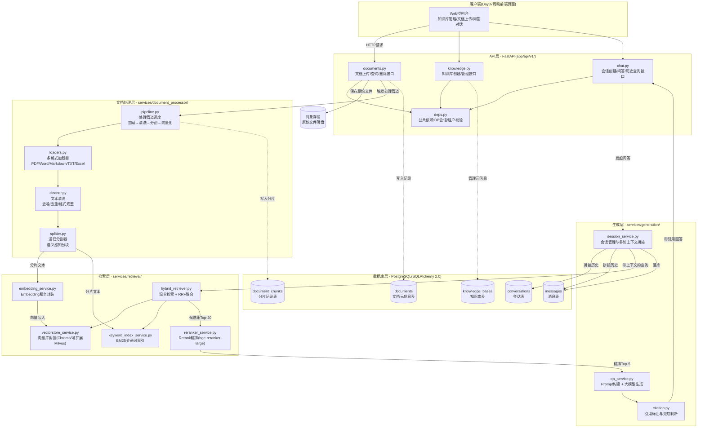
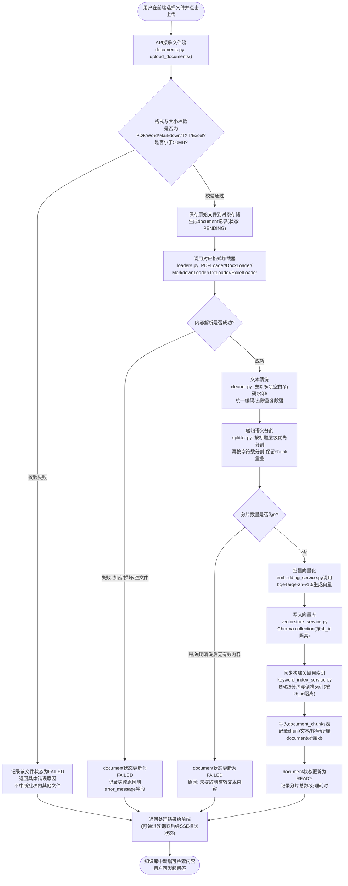
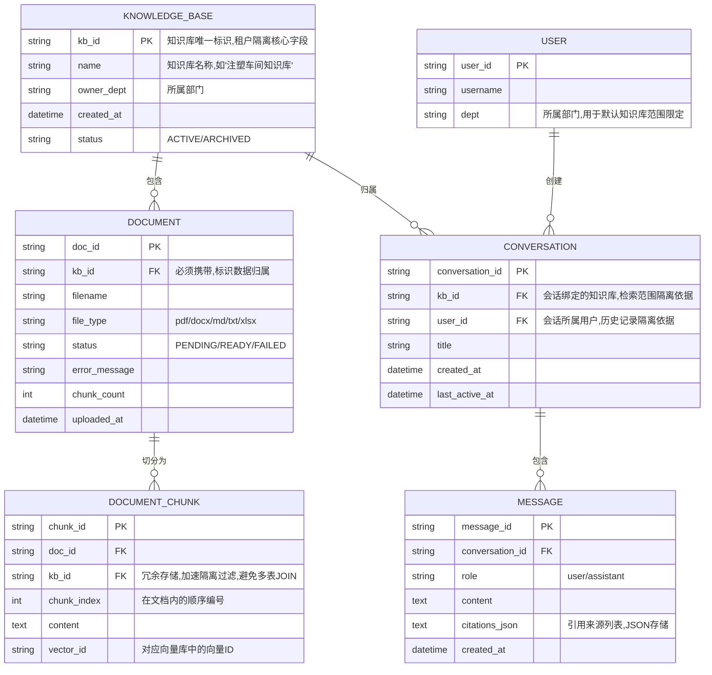

# 第36天 · 阶段项目二 Day1 —— 需求分析与后端开发(海纳集团项目封闭冲刺·第一天)

> **周次/Sprint**:Sprint 3 · RAG进阶与交付(Day32-38)—— 第五天,Day32到Day35把高级检索技巧、RAG效果评估体系、以及LlamaIndex与LangChain的横向对比逐一打磨完毕之后,团队正式进入本周的主战场——把过去十天积累的所有RAG技术,产品化成一套真正能交付给海纳制造集团的企业级知识库问答系统后端。
> **星期**:周一(入职第36天,转正之后的第22天)
> **参与人**:陈铭、张凡(后端协同开发,负责向量库与检索算法模块)、周晓(前端工程师,今日以需求评审与技术预研为主,正式前端开发从Day37开始)、林悦(产品经理,确认阶段项目二PRD终稿并全程跟进)、王振宇(老王,技术负责人,主持架构评审与代码规范把关);列席评审:赵磊(QA测试工程师,复核验收标准边界条件)
> **飞书任务号**:CQ-301 ~ CQ-320(阶段项目二 · 海纳制造集团企业知识库问答系统 · 产品化交付任务池,今日新开,区别于Sprint2阶段CQ-201~230的命令行原型任务池);陈铭今日主责:CQ-303(多格式文档处理管道)、CQ-306(混合检索与Rerank集成)、CQ-308(会话管理与多用户/多租户隔离);张凡今日主责:CQ-304(向量库与关键词索引构建)、CQ-307(问答生成与引用标注模块);周晓今日主责:CQ-310(前端技术方案预研,产出物为Day37开发计划)
> **今日关键词**:阶段项目二 / 封闭开发冲刺 / PRD终稿 / 后端架构设计 / 多格式文档上传 / 混合检索 / Rerank / 答案引用标注 / 会话管理 / 多租户隔离 / FastAPI工程化

---

## 【旁白】

有一种紧张感,是陈铭过去三十五天里从未真正体会过的——不是"这道题会不会做"的紧张,而是"这两天做完之后,后天就要给客户联调"的紧张。Day30到Day35,团队在打磨的是一整套技术能力:怎么切分文档、怎么选向量库、怎么评估效果、怎么用LlamaIndex和LangChain对照着看清楚各自的优劣。那十天更像是在磨一把刀,刀磨得再快,如果不砍向真正的木头,终究只是一场演练。而从今天开始,演练结束了——飞书项目里,CQ-301到CQO-320这二十个任务号被一次性开出来的那一刻,"阶段项目二"不再是课程大纲上的一个抬头,而是变成了两天之后就要摆在海纳制造集团面前的一套真实系统。

老王在立项前的最后一次内部沟通里说了一句话,后来被陈铭原封不动地记在了笔记本上:"接下来这两天,不是让你们重新发明轮子,是让你们把过去十天造好的轮子,装到一台真正能上路的车上。"这句话听起来轻描淡写,做起来却完全是另一回事——命令行原型里能"跑通"的代码,和一套要扛住多用户并发访问、要保证不同客户数据互不串通、要在检索精度和响应速度之间找到平衡的后端服务,中间隔着的不是几行代码的距离,而是一整套工程思维的距离。这正是"阶段项目二"被安排在Sprint3收尾阶段的原因——它是对过去两周所有技术积累的一次总检验,也是陈铭第一次要独立扛起一个模块从"能跑"到"能用"、从"能用"到"能交付"的全过程。

两天封闭开发的安排本身也值得说一句——公司刻意把这两天从常规课程节奏里切割出来,不再有零散的知识点讲解,团队所有人几乎是以"项目组"的姿态,坐进了三层的一个小会议室,门上贴了一张打印纸,写着"海纳集团项目冲刺中,非紧急事项请勿打扰"。这种仪式感不是摆样子——老王后来解释过,企业级项目交付的节奏本来就是这样,不会有人在验收前一周还慢悠悠地按周计划推进,真实的项目永远是"平时攒力气,冲刺期爆发"的模式,提前让陈铭适应这种节奏,比任何理论课都更接近他未来真正独立带项目时会面对的现实。

今天要解决的,是这套系统里最容易被低估、却往往最先出问题的两块地基——需求到底冻结成了什么样子,以及后端服务到底要怎么搭。林悦带来的PRD终稿,不再是Day30那份粗略的立项文档,而是精确到每一个功能点验收标准的正式版本;老王要带着陈铭和张凡,把过去命令行版本里那些"函数调用函数"式的松散代码,重新组织成一套分层清晰、职责单一、经得起后续迭代和联调考验的FastAPI后端工程。这一天结束的时候,后端服务需要真正跑起来,数据库表需要建好,五大核心功能——多格式文档上传、混合检索、Rerank、答案带引用、会话管理——需要至少在接口层面全部打通,这样明天(Day37)周晓才能安心地把前端页面接上去,团队才能在两天冲刺期结束前,拿出一套能让林悦满意、能让赵磊挑不出低级毛病的完整系统。压力是真实的,但陈铭心里清楚,这份压力恰恰是他这三十六天里,第一次真正感觉到自己站在了"项目"而不是"练习"的中心。

还有一层意义,是这两天冲刺本身对整条故事线的位置——从Day25开始学LangChain,到Day30第一次跑通完整RAG链路,再到Day32到Day35打磨高级检索技巧和评估体系,过去十二天像是一段不断往行囊里塞技能的旅程,而今天,行囊第一次要被真正打开、清点、投入使用。老王在启动会前私下跟陈铭聊了几句,提到一个说法:"你会发现,项目冲刺期最难的从来不是某一个具体的技术点——那些技术点你们前面基本都练过了,难的是在一个高压的、有明确交付时间点的环境里,把十几个技术点正确地拼在一起,还要保证拼出来的东西经得住客户挑刺。这种能力,只有真的去做一次项目,才能真正长出来。"这句话某种程度上也回答了陈铭心里一直有的一个疑问——为什么课程安排里,单点技术的学习总是发生在项目冲刺之前,而不是项目冲刺当中一边学一边用,答案很朴素:冲刺期需要的是"熟练调用",不是"现场学习",这也是为什么"阶段项目二"被安排在Sprint3收尾,而不是Sprint3刚开始的时候。

---

## 晨会纪要 / 封闭冲刺启动会

**时间**:上午9:00(比平日提前半小时,封闭开发期间作息整体前移),三层小会议室"启航"
**出席**:王振宇(老王)、林悦、陈铭、张凡、周晓;列席:赵磊(9:20中途加入)

会议室的门上果然贴着那张打印纸,陈铭进门的时候还多看了一眼——这是他入职以来第一次见到这种"封闭开发"专属的仪式感标签。桌上摆着投影仪连的笔记本,屏幕上是林悦提前打开的PRD文档,标题赫然写着《海纳制造集团企业知识库问答系统 · 阶段项目二产品化需求规格说明书(终稿 v2.0)》。

老王没有寒暄太多,直接开场:"接下来两天,大家不用再想着'今天学什么新知识点',这两天只有一个任务——把系统做出来,做到能联调、能演示、能让客户看了觉得靠谱。今天上午的主线是需求确认和架构设计,下午到晚上是后端开发,明天(Day37)周晓主战场是前端和整体联调。时间很紧,但我们过去十天积累的东西是够用的,不是从零开始。"

林悦接过话头,语气比平时的需求评审更郑重一些:"这份PRD终稿,是我和海纳集团那边前后过了三轮的结果,跟Day30立项时的版本相比,最大的变化是把原本模糊的'知识库问答'拆成了五个明确的功能点,每一个都有具体的验收标准,这份文档过了今天,就不会再有大改动了——如果发现和实际开发冲突的地方,今天必须提出来,一旦冻结,后面就是按图施工,不能再临时改需求。"她特意停顿了一下,看向陈铭和张凡:"这句话不是走流程说说,是我们上一个项目吃过亏——需求冻结之后又改,基本上就意味着排期要重新算。"

陈铭点头,顺手翻到PRD第二页,注意到五个功能点分别是:多格式文档上传、混合检索、Rerank精排、答案带引用、会话管理。他心里迅速把这五个功能和过去几天学过的技术点对上号——文档上传对应Day28的文档加载与分割经验,混合检索和Rerank是Day32、Day33刚打磨过的高级检索技巧,答案带引用是Day30就已经做过的兜底逻辑升级版,唯独会话管理这一块,虽然Day27学过Memory机制,但那时候面向的是单用户单会话的场景,今天要考虑的是"多个客户、多个知识库、多个用户各自独立会话"的复杂场景,这是一块全新的硬骨头。

老王显然也看出了这一点,直接点破:"提前说清楚,今天最难的不是混合检索和Rerank——那两块本质是把Day32、Day33学的东西套进工程结构里,思路是现成的。今天真正考验工程能力的是两件事:一是文档处理管道要支持多种格式还要能容错,不能一份文件解析失败就把整条流水线打断;二是会话管理和多租户隔离,这块处理不好,轻则用户看到别人的历史记录,重则不同客户的知识库数据串到一起,这是企业级项目的红线级问题,谁都不能含糊。"

赵磊9点20分左右提前结束了另一个会议赶过来,插进来补了一句:"我这边先把验收的边界条件放在桌面上说清楚——多租户隔离这块,我等系统跑起来之后,第一件事就是拿两个不同的知识库ID去交叉测试,只要有一次串号,这个功能直接判不通过,没有商量空间。混合检索和Rerank这两块,我会重点看'检索不到内容的时候系统怎么表现',不能因为加了Rerank就忘了兜底逻辑。"

老王认同地点头:"赵磊说得对,今天设计数据库表结构和API接口的时候,'租户隔离'这个概念必须贯穿始终,不是加一个字段就完事,是从查询逻辑上就要保证A客户的请求物理上不可能碰到B客户的数据。"他转向白板,拿起马克笔:"上午我们先花一个半小时,把需求过一遍、把整体架构定下来,画完架构图之后,你们两个(陈铭、张凡)要能各自清楚知道自己负责哪一层、接口长什么样,这样下午才能真正并行开发,不互相等对方。"

周晓这时候补了一句:"我今天主要跟着听需求和架构,顺便把前端要调用的接口列一个清单——上传接口、知识库管理接口、问答接口,今天你们把接口文档定下来,我今晚回去先把页面骨架搭一搭,明天直接对接,不用等你们后端全部写完才开工。"林悦对此表示赞同,补充说她今天下午会同步整理一份接口字段说明,方便周晓提前对齐字段命名。

赵磊补充了一个关于测试节奏的安排:"我这两天不会全程盯在这个会议室里,但我会在Day37上午过来做一次集中验收,重点检查三块——多租户隔离的交叉测试、‘我不知道’兜底逻辑的边界case、以及批量上传时单文件失败是否真的不影响其他文件。今天设计接口的时候,如果能顺手把这几类场景的错误码和提示文案定清楚,我明天测试的效率会高很多,大家可以现在就想一想。"这个提醒让陈铭意识到,今天设计异常处理体系的时候,不能只满足于"抛出异常、返回非200状态码"这种最低要求,还要提前考虑清楚每一种异常场景对应的错误码命名和提示文案,这样才能经得住赵磊接下来的验收。老王当场表示认同,补充说这也是为什么今天要单独设计一个统一的异常处理模块,而不是让每个接口各自去写`try-except`拼错误信息。

**今日目标清单**:

1. 上午9:00-9:30:封闭冲刺启动会,PRD终稿宣讲与需求确认。
2. 上午9:30-11:00:五大功能点逐一过用户故事与验收标准,现场答疑冻结需求边界。
3. 上午11:00-12:30:后端整体架构设计(API层/文档处理层/检索层/生成层/数据库层),画架构图并明确接口契约,陈铭与张凡分工。
4. 下午13:30-18:30:后端开发实战——数据库模型、文档处理管道、混合检索与Rerank集成、问答生成与引用标注、会话管理与多租户隔离、FastAPI路由全量落地。
5. 晚自习19:30-22:30:陈铭补充异常处理与边界情况,张凡与陈铭联调各自模块的接口契约,确保今晚服务能整体拉起来跑通一轮端到端请求。

**风险点**:

- 需求冻结之后如果发现遗漏(尤其是验收标准里的边界条件),补救成本会很高,今天上午务必把每一条验收标准过一遍,有疑问当场问林悦和赵磊,不能留到开发中途才发现理解有偏差。
- 混合检索涉及向量检索和关键词检索两条路径的结果融合,如果融合算法(倒数排序融合RRF)理解有误,召回效果会明显劣于单一检索方式,今天下午需要重点验证融合逻辑的正确性。
- 会话管理和多租户隔离是今天工程复杂度最高的模块,如果数据库表设计阶段就没有把`tenant_id`或`kb_id`贯穿到每一张相关表里,后续所有查询都要返工,今天上午设计表结构时必须格外谨慎,老王会重点评审这一部分。
- 陈铭和张凡是并行开发关系,接口契约(请求/响应字段、状态码约定)如果上午定得不清楚,下午容易出现"各写各的,对不上"的返工,今天需要在架构设计阶段就把接口文档写清楚,并尽量用Pydantic模型固化下来,减少口头约定的模糊空间。
- 封闭开发期间容易因为赶进度而放松代码规范,老王提前强调,这是要交付给真实客户的项目,PEP8、中文docstring、异常处理这些要求一项都不能省,宁可今天少做一个次要功能,也不能留下今后维护困难的糟糕代码。

---

## 需求文档:《海纳制造集团企业知识库问答系统 · 阶段项目二产品化需求规格说明书(终稿 v2.0)》

**文档编号**:CQ-PRD-002
**撰写人**:林悦
**审核人**:王振宇、赵磊
**版本状态**:终稿(自今日起冻结,后续变更需走变更评审流程)

### 一、项目背景

海纳制造集团在Day30立项的命令行版知识库问答系统原型,已经在Day31的周测中验证了核心链路的可行性——加载、分割、向量化、检索、生成这条链路能够跑通,并且针对样本文档给出了带引用来源的回答。但命令行版本本质上是一个"验证技术可行性"的demo,离真正能交付给客户使用的产品,还差着完整的一层:没有Web接口,一次只能处理一个用户的一次提问,没有会话概念,检索方式只有单一的向量检索,精度和召回率都还有明显的优化空间。

经过与海纳集团项目对接人前后三轮沟通,客户明确提出以下产品化诉求:第一,系统需要以Web服务形式部署,支持多个部门、多个用户同时使用,不同用户之间的历史对话不能互相可见;第二,海纳集团内部文档格式并不统一,既有Word版的操作手册,也有PDF版的质量规范,还有部分Excel表格记录的工艺参数,系统必须能够处理这些异构格式,不能要求用户先手工转换格式;第三,过去命令行版本仅依赖向量检索,在Day31周测的效果评估中暴露出一个问题——涉及具体型号编号、报警代码这类"关键词精确匹配"场景时,纯向量检索的召回效果不如关键词检索,客户希望系统能同时具备两种检索能力的优点;第四,答案必须继续保留"引用来源标注"这一硬性要求,并且需要支持后续追溯到具体文档、具体页码;第五,系统需要具备会话管理能力,支持多轮追问,同一个用户的对话历史需要被正确保存和调用。

综合以上诉求,产品团队将本阶段需求收敛为五大核心功能点,构成阶段项目二的完整交付范围。本次交付的产物,是苍穹平台0.5版RAG检索引擎层在海纳集团项目上的第一次完整落地,交付形式为可独立部署的FastAPI后端服务,配合Day37完成的前端控制台页面,构成一套完整的Web应用。

需要特别说明的是,这份PRD的形成过程本身也值得团队学习——林悦提到,最初和海纳集团沟通的时候,客户方提出的诉求是比较笼统的一句话"我们想要一个能查文档的AI系统",这句话背后隐含的信息量极大,如果不经过拆解,开发团队很容易按照自己的理解去实现,做出来的东西未必是客户真正想要的。林悦前后组织了三轮沟通——第一轮是需求调研,重点是搞清楚客户的真实业务痛点和现有工作流程;第二轮是初步方案讨论,把技术团队能实现的能力边界和客户的期望做对齐,排除掉一些客户随口提到但实际优先级不高或者当前阶段实现不了的想法(比如客户最初提到"能不能支持语音提问",经过讨论确认这不在本阶段范围内);第三轮才是最终针对具体功能点和验收标准逐条确认。这个过程被林悦总结为"从一句模糊的话,到一份可以直接拿去开发的PRD,中间至少需要经过三轮有结构的沟通",这也是她今天特意在晨会上强调"这份PRD值得信赖"的底气来源。

### 二、五大核心功能点

#### 功能点一:多格式文档上传

**用户故事**:作为海纳集团的知识库管理员,我希望能够直接上传公司现有的各种格式文档(PDF、Word、Markdown、纯文本、Excel),而不需要先手工转换成统一格式,这样我才能快速把现有的几百份设备手册和工艺文档导入系统,而不用花大量时间做格式整理。

**功能描述**:系统需要提供文档上传接口,支持单文件和批量上传,自动识别文件格式并调用对应的解析器提取文本内容,解析完成后自动进入清洗、分割、向量化的处理管道,最终写入指定知识库。上传过程中任何单个文件解析失败,不应影响其他文件的正常处理,并需要向用户明确反馈失败原因。

| 验收标准编号 | 验收标准描述 |
|---|---|
| AC-1.1 | 系统支持`.pdf`、`.docx`、`.md`、`.txt`、`.xlsx`五种格式文件的上传与内容解析 |
| AC-1.2 | 单次请求支持最多20个文件的批量上传,单文件大小限制50MB |
| AC-1.3 | 上传接口返回每个文件的处理状态(成功/失败/处理中),失败文件需返回明确的错误原因 |
| AC-1.4 | 文档解析后的原始文本长度与源文件内容基本一致(允许合理的格式损耗,如页眉页脚丢失),不能出现大段内容缺失 |
| AC-1.5 | 同一批次中,任意单个文件解析异常不能导致整个批次上传请求返回500错误或中断其他文件处理 |
| AC-1.6 | 系统需要记录每个文档的元信息(文件名、格式、大小、上传时间、所属知识库、处理状态),支持后续查询 |

#### 功能点二:混合检索

**用户故事**:作为一线设备维护人员,我希望无论我是用自然语言描述问题("这台设备启动之后异响是什么原因"),还是直接输入一个具体的报警代码或型号("E-203报警代码含义"),系统都能准确检索到相关文档内容,而不是只在我用完整自然语言提问时才有效。

**功能描述**:系统需要同时具备向量检索(捕捉语义相似性)和关键词检索(捕捉精确字面匹配)两种能力,并将两路检索结果进行融合排序,弥补单一检索方式各自的短板。融合策略采用倒数排序融合(RRF, Reciprocal Rank Fusion),对两路结果按排名倒数加权求和后重新排序。

| 验收标准编号 | 验收标准描述 |
|---|---|
| AC-2.1 | 系统同时支持向量检索(基于Embedding语义相似度)和关键词检索(基于BM25算法)两种检索路径 |
| AC-2.2 | 针对包含具体型号、报警代码等专有名词的查询,混合检索的召回效果(Top-5命中率)不低于单一向量检索方式 |
| AC-2.3 | 两路检索结果需通过RRF算法融合为统一排序列表,融合权重可配置 |
| AC-2.4 | 检索接口需要支持独立测试模式,可分别返回向量检索结果、关键词检索结果、融合后结果,便于效果对比与调优 |
| AC-2.5 | 单次检索响应时间(不含大模型生成部分)在知识库文档量不超过5000个分片时,P95不超过800毫秒 |

#### 功能点三:Rerank精排

**用户故事**:作为产品经理,我希望系统在把检索到的候选文档片段交给大模型生成答案之前,能有一道更精细的相关性排序步骤,这样即便召回阶段引入了一些不那么相关的内容,最终真正用于生成答案的片段也是最贴合问题的,减少答案跑偏或引用不相关内容的情况。

**功能描述**:系统在混合检索融合之后,引入独立的Rerank精排模型(`BAAI/bge-reranker-large`),对候选片段与用户问题进行更细粒度的相关性打分,重新排序后截取Top-K(默认K=5)片段作为最终上下文,交给大模型生成阶段使用。

| 验收标准编号 | 验收标准描述 |
|---|---|
| AC-3.1 | Rerank模型对混合检索返回的候选集(默认Top-20)重新打分排序 |
| AC-3.2 | Rerank后Top-5结果与人工标注的相关性判断,一致率(与Day33评估实验采用相同评估集)不低于80% |
| AC-3.3 | Rerank步骤可通过配置开关关闭,关闭后系统直接使用混合检索融合结果,便于效果对比和性能降级场景 |
| AC-3.4 | Rerank处理耗时需要有监控日志记录,便于后续性能优化排查 |

#### 功能点四:答案带引用

**用户故事**:作为一线员工,当系统回答我的问题时,我需要清楚知道这个答案是从哪份文档、哪个具体位置来的,这样如果我对答案有疑问,可以自己去翻阅原始文档核实,尤其涉及安全操作的问题,我不能盲目相信一个"查无来源"的答案。

**功能描述**:系统生成的每一条回答,都必须包含明确的引用标注,标注格式为`[编号]`,并在回答末尾列出编号对应的文档名称、分片位置等信息;当检索结果与问题相关性不足时,系统必须明确告知"未在知识库中找到相关内容",不能编造答案。

| 验收标准编号 | 验收标准描述 |
|---|---|
| AC-4.1 | 生成的回答正文中,凡是引用了知识库内容的语句,必须带有形如`[1]`、`[2]`的引用编号 |
| AC-4.2 | 回答末尾必须附带引用列表,列出每个编号对应的文档名称、所属知识库、分片序号 |
| AC-4.3 | 当Rerank后最高相关性分数低于预设阈值时,系统返回"未在知识库中找到相关内容"的明确提示,不生成臆造答案 |
| AC-4.4 | 引用编号与实际引用内容必须一一对应,不能出现编号错位(如`[1]`实际对应的是排序里的第二个片段) |
| AC-4.5 | 抽样测试中,人工判断"答案是否编造(未在引用来源中出现却出现在答案里的信息)"的比例需低于5% |

#### 功能点五:会话管理

**用户故事**:作为多个部门的使用者,我希望我和同事各自的提问历史是独立分开的,我追问"那这个报警代码具体怎么排查"这类需要依赖上文的问题时,系统能理解我说的"这个"指的是上一轮提到的内容;同时我希望不同知识库(比如注塑车间和模具车间各自的文档)之间的对话和检索范围是分开的,不会互相干扰。

**功能描述**:系统需要支持创建、查询、删除会话(Conversation),每个会话归属于一个用户和一个知识库,会话内的消息(Message)按时间顺序保存,支持基于会话历史的多轮追问上下文拼接;不同租户(在本项目场景下体现为不同知识库/部门)之间的数据必须严格隔离,任何查询都不能跨租户返回数据。

| 验收标准编号 | 验收标准描述 |
|---|---|
| AC-5.1 | 系统支持创建新会话、获取会话列表、获取指定会话的历史消息、删除会话 |
| AC-5.2 | 同一用户在不同会话中的历史记录互不影响,新建会话不携带其他会话的上下文 |
| AC-5.3 | 多轮追问场景下,系统能够正确拼接最近N轮(默认N=3)对话历史作为上下文,辅助理解指代关系(如"这个"、"上面提到的") |
| AC-5.4 | 交叉测试:使用知识库A的会话发起的检索请求,任何情况下不能返回知识库B的文档内容或分片数据 |
| AC-5.5 | 用户删除会话后,该会话下所有历史消息应同步删除或标记为不可查询,不能被其他接口意外读取到 |

### 三、非功能需求

- **性能**:单次问答请求(含检索、Rerank、生成)端到端响应时间P95不超过6秒(不含网络传输和大模型思考中的极端长文本场景)。
- **可用性**:文档处理管道需具备容错能力,单个文档处理失败不影响服务整体可用性。
- **可维护性**:代码需遵循公司PEP8规范,核心业务逻辑需有中文docstring和行内注释,模块间通过清晰的接口调用,不允许出现跨层直接访问数据库等违反分层原则的写法。
- **安全性**:多租户数据隔离是本阶段的红线级非功能需求,所有涉及知识库/会话数据的查询,必须在查询条件中携带归属标识,不允许存在"先查全部再前端过滤"这类隔离方式。
- **可扩展性**:向量存储层需要预留从Chroma切换到Milvus的扩展空间(参考Day29向量数据库选型对比结论),不应将Chroma的特定API深度耦合进业务逻辑代码中。

### 四、验收流程与里程碑安排

为了配合两天封闭冲刺的紧凑节奏,林悦在PRD终稿里额外补充了一段验收流程说明,明确了从今天到项目最终交付之间的关键节点,避免团队在冲刺期埋头写代码,却忘了"验收"这件事本身也需要提前规划时间。

第一个里程碑是今天(Day36)18:30左右的后端接口自测——陈铭和张凡需要各自对负责的模块跑一遍最基本的功能验证,确认接口能返回预期结构的数据,不要求覆盖所有边界情况,但核心路径必须走通,这是保证晚自习能顺利开始联调的前提。第二个里程碑是Day37上午10点左右的赵磊集中验收,重点覆盖多租户隔离交叉测试、兜底逻辑边界case、批量上传容错这三大红线项,验收未通过的问题需要在当天中午前完成修复,不能带着已知的红线缺陷进入下午的前后端联调阶段。第三个里程碑是Day37下午16点左右的团队内部演示彩排,郭建军和林悦会一起观看一次完整的端到端演示流程(上传文档、创建会话、多轮问答、查看引用来源),确认系统整体表现达到可以向客户展示的水平。第四个里程碑,也是两天冲刺真正意义上的终点,是Day37下班前的项目组内部复盘会,确定这套系统是否已经具备向海纳集团做正式演示的条件,如果还有明显缺口,需要在复盘会上明确后续补齐的责任人和时间节点。

林悦特别强调,这套里程碑安排不是走过场的时间表,而是"倒推式"排期的结果——她是从客户最终期望看到演示的那个时间点倒着往前推,才得出"今天必须完成后端接口自测""明天上午必须完成红线验收"这些具体节点,这也是产品经理在做项目排期时的一个常见方法论,陈铭在笔记本上专门记下了这一点,觉得对自己理解"项目管理"这件事很有启发。

### 五、本阶段交付边界(Day36-37两天冲刺范围)

本阶段(阶段项目二)交付边界明确为:后端全部五大功能点的API实现与数据库落地(Day36),以及前端页面与前后端联调、端到端演示Demo(Day37)。不包含:生产环境容器化部署(Docker化留待Sprint6处理)、多语言支持、语音输入等超出PRD范围的功能。若开发过程中发现PRD描述与实际业务场景存在明显冲突,需当场与林悦、赵磊确认后再动手实现,不允许自行"理解性扩展"需求范围。

---

## 架构设计图:阶段项目二后端整体架构

上午11点整,老王在白板上先手绘了一版草图,随后陈铳负责把它转成正式的架构图存进项目文档,作为CQ-302(架构设计与接口契约定义)任务号的产出物。整体架构延续苍穹平台"分层解耦"的一贯设计原则,自上而下划分为API层、文档处理层、检索层、生成层、数据库层,外加一层贯穿始终的对象存储用于保存原始上传文件。



这张架构图上午定稿之后,老王重点强调了三处设计要点。第一处是数据库层的五张表——`knowledge_bases`(知识库)、`documents`(文档元信息)、`document_chunks`(分片记录)、`conversations`(会话)、`messages`(消息),这五张表的关系不是孤立的,`documents`表通过外键归属到某个`knowledge_bases`,`document_chunks`又归属到某个`documents`,`conversations`同样归属到某个`knowledge_bases`并绑定具体用户,`messages`归属到某个`conversations`——整条关系链最终都能追溯到`knowledge_bases`这个根节点,这正是实现多租户隔离的关键设计:只要每一次查询都严格携带知识库ID作为过滤条件,数据串号在架构层面就被杜绝了,而不是依赖开发者"记得加这个条件"这种脆弱的人为约束。

第二处是检索层内部的调用关系——`hybrid_retriever.py`是整个检索层的调度中枢,它同时调用`vectorstore_service.py`(向量检索)和`keyword_index_service.py`(关键词检索),把两路结果做RRF融合后,再交给`reranker_service.py`做精排。老王特别提醒陈铭和张凡:"这三个服务模块必须保持接口的一致性——不管是向量检索还是关键词检索,对外暴露的方法签名都应该是`search(query, kb_id, top_k) -> List[RetrievedChunk]`这种统一形态,这样`hybrid_retriever`才能不关心底层实现细节,直接拼装两路结果。"这也是典型的"面向接口编程"思想在检索层的具体落地。

第三处是生成层的`session_service.py`承担了一个容易被忽视但极其关键的职责——它不仅要管理会话的创建、查询、删除,还要负责"多轮上下文拼接",也就是把最近几轮的历史消息按照约定格式拼进当前这次查询的Prompt里,辅助大模型理解"这个"、"上面提到的"这类指代关系。老王把这个模块单独拎出来、不放进`qa_service.py`里面,是刻意的设计决策:"会话管理本质上是一个独立的领域,它未来会被Agent编排层复用,不应该和问答生成的Prompt构建逻辑耦合在一起,拆开是为了给Sprint4的Agent项目留一条现成的路。"

---

## 流程图:文档上传到知识库构建完整处理流程

架构图讲清楚了"模块之间怎么调用",但没有讲清楚"一份文件从被上传的那一刻起,到真正变成可检索的知识库内容,中间具体经历了哪些判断和分支"。这正是流程图要补上的部分,对应CQ-303任务号的核心设计产出。



这张流程图上,陈铭特意跟老王确认了三个分支判断点的设计合理性。第一个是最开始的格式与大小校验,直接在接收阶段就拦截明显不合规的文件,不进入后续任何处理逻辑,这样能最大限度减少无效的计算资源消耗;第二个是内容解析失败的分支——现实中海纳集团提供的文档里,确实存在个别加密PDF和损坏的Word文件,如果没有这个分支单独处理,一旦遇到这种文件,按照Day30命令行版本"一条链路走到底"的写法,整个批量上传请求就会直接抛异常中断,这正是PRD里AC-1.5明确要求的"单个文件失败不能影响其他文件"在流程设计上的具体体现;第三个是清洗分割之后"分片数量为0"的判断——这个分支容易被忽略,但陈铭在Day28处理海纳集团样本文档时就踩过坑,有些文档扫描版PDF提取出来全是乱码或空白,如果不单独判断直接尝试向量化,轻则浪费Embedding调用配额,重则可能因为空文本触发下游接口异常。

老王看完这版流程图之后提了一个问题让陈铭当场回答:"如果一份文档里有一部分内容解析出来是乱码,另一部分是正常文本,你现在这个流程图,乱码部分会怎么处理?"陈铭想了几秒,意识到目前的清洗环节还没有针对"部分乱码"做专门处理,只处理了"全部为空"这种极端情况。老王没有直接给答案,只是说:"这个问题你下午写`cleaner.py`的时候要想清楚,乱码検测不是必须做到完美,但至少要有一个基础的可打印字符比例判断,过滤掉明显不是正常文字的分片,不然这些垃圾内容进了向量库,会在检索阶段污染结果。"这个提醒后来直接体现在了陈铭下午实现的清洗模块里。

这张流程图还有一处细节,是林悦在评审时提出来的产品视角问题——"REJECT"和"MARKFAIL"两条分支最终都汇入了"NOTIFY"节点,但对用户来说,这两种失败的性质其实不太一样:前者(格式或大小不合规)是用户自己上传前就可以规避的问题,后者(文档内容解析异常)则是用户很难提前判断的问题。林悦建议这两类失败在返回给前端的提示文案上要有明显差异——格式校验失败的提示应该更侧重"引导用户怎么修正"(比如"当前文件格式不支持,请转换为PDF/Word/Markdown/TXT/Excel格式后重新上传"),而内容解析失败的提示应该更侧重"说明情况并给出后续路径"(比如"文档解析异常,建议联系管理员协助处理,或检查文件是否为加密/损坏文件")。这个建议被陈铭直接采纳,体现在了`DocumentUploadResult`里`error_message`字段的具体文案设计上,也让他意识到,同一个"失败"状态背后,产品经理关心的往往不是"失败了没有",而是"失败之后用户下一步该怎么办"。

---

## 示意图:会话管理与多用户/多租户隔离数据结构

三张图里,这一张是老王要求"必须让团队每个人都烙在脑子里"的一张,因为多租户隔离一旦设计有漏洞,不是"性能差一点"这种可以后续优化的问题,是"客户数据泄露"这种一次性就会摧毁项目信任的红线问题。



这张实体关系图的核心设计意图,是把"隔离标识"从一个容易被遗忘的"约定"变成一个物理上贯穿所有表结构的"字段"。陈铭注意到一个细节——`document_chunks`表里的`kb_id`字段被标注为"冗余存储",按照严格的数据库范式设计,这个字段本可以通过`doc_id`关联到`documents`表再拿到`kb_id`,不需要重复存一份。他当场问了老王为什么要故意"反范式化"。

老王的回答让陈铭印象很深:"范式设计是理论上最优的存储方式,但工程上有一个更重要的原则——凡是涉及安全隔离的过滤条件,能直接摆在要查询的那张表上,就不要绕一层JOIN去拿。这不只是性能考虑,更是正确性考虑——如果检索的时候需要先JOIN `documents`表才能拿到`kb_id`做过滤,一旦哪天有人写了个新的检索路径忘了加这个JOIN,直接用`chunk_id`查询,隔离就形同虚设了。而如果`kb_id`直接摆在`document_chunks`表上,任何一个不熟悉全局逻辑的新人写查询,只要看一眼字段列表,都会自然而然地想到要用它做过滤,这是用表结构设计本身去'提示'开发者正确的用法,比写十条注释都管用。"

这段对话也解释了为什么`conversations`表同时携带`kb_id`和`user_id`两个外键——`kb_id`保证了检索范围的隔离(同一个会话内发起的检索请求,永远只在这个会话绑定的知识库范围内进行),`user_id`保证了历史记录的隔离(不同用户即便使用同一个知识库,各自的会话列表和消息历史也互不可见)。这两个维度的隔离,分别对应PRD里AC-5.2(用户维度隔离)和AC-5.4(知识库维度隔离)两条验收标准,示意图上看起来只是两个外键字段,但背后对应的是两条硬性验收要求,团队在下午写代码时,几乎每一个涉及会话和检索的接口,都要在查询条件里同时带上这两个字段做过滤,这也是老王在代码评审环节反复检查的重点。

这张图还引出了一个团队当场没有立刻达成一致、后来靠一次简短争论解决的问题——`USER`这张表在今天这个项目阶段要不要真正落地成一张完整的用户表,还是先用一个简单的字符串`user_id`占位。张凡的意见是"既然PRD明确提到多用户场景,不如今天就把用户表、登录鉴权一起做完,一步到位"。陈铭的意见相反:"PRD里五大功能点根本没提到‘用户注册登录’这件事,苍穹平台的用户体系本身在Day22就已经搭建过一版基础版本,我们没必要在两天冲刺期里重新做一遍用户系统,应该先用一个占位的`user_id`字符串跑通业务逻辑,用户体系的真正对接,留给后面和苍穹主平台账号系统整合的时候处理。"老王最终支持了陈铭的判断,理由是"今天的核心目标是验证五大功能点,不是重新发明用户系统,范围一旦不自觉扩大,越到冲刺期后段越容易顾不过来"。这次小争论虽然没有花太多时间,但让陈铭对"需求边界"这个概念有了更具体的体会——不是PRD没写的东西都不能做,而是PRD没写的东西,一旦要做,必须有意识地问一句"这真的是今天必须做的吗",避免在时间紧张的项目里被无意扩大的范围拖垃。

---

## 课堂笔记

### 上午:需求分析与架构设计讨论

上午的主线看起来是"过PRD、画架构图"这种偏文档性的工作,但陈铭事后回想,这段时间投入的思考密度并不比下午写代码低,甚至某种程度上更高——因为架构设计阶段犯的错误,往往要等到代码写了一半才会暴露,而暴露的时候返工成本已经很高了。

**关于需求冻结的讨论**。林悦在讲PRD终稿的时候,特意花了十几分钟讲"为什么这份文档要叫终稿"。她提到一个真实的历史案例(内部教学场景设定,不指名具体项目):"我们之前有个项目,需求评审的时候大家都觉得‘差不多就这样’,开发进行到一半,客户那边又提出‘其实我们还希望能支持XX’,结果整个数据库表结构要推倒重来,排期直接延了两周。从那次之后,公司定了一条规矩——任何进入开发阶段的PRD,必须经过至少两轮客户确认,并且要求客户书面(邮件或飞书审批)确认验收标准,不能是口头‘差不多这样吧’。"陈铭听完这段,理解了为什么林悦在会上反复强调"今天必须把疑问都提出来"——这不是一句客套话,是真金白银的项目管理经验换来的规矩。

陈铭在这个环节提了一个具体问题:"AC-2.2里说‘混合检索的召回效果不低于单一向量检索方式’,这个‘不低于’具体怎么量化测试?"这个问题问到了点上,林悦当场没有直接给出答案,而是转头看向赵磊。赵磊回答:"我这边会用Day33做效果评估时用的那批标注好的问答对(海纳集团样本文档对应的50条测试用例),分别跑单一向量检索和混合检索,统计Top-5命中率,只要混合检索的命中率数值不低于纯向量检索,这条就算通过,允许有个别case持平但整体不能下降。"这个回答让陈铭意识到,验收标准背后往往有一套具体的、可执行的测试方法,PRD文档字面上写的"不低于"这种描述,如果不追问清楚背后的量化方式,开发的时候很容易理解偏差。

**关于架构分层的讨论**。老王画架构图的时候,反复强调一个原则——"看得见的东西"和"看不见的东西"要分开。这里的"看得见"指的是API层,是前端直接调用的接口;"看不见"指的是文档处理层、检索层、生成层内部的服务模块,这些模块之间怎么组织、怎么调用,前端完全不需要关心,也不应该有任何耦合。老王举了个例子:"假如你今天用Chroma做向量库,明天要换成Milvus,如果`vectorstore_service.py`这一层的接口设计得好,`hybrid_retriever.py`一行代码都不用改,直接换掉`vectorstore_service.py`内部实现就行;但如果检索逻辑里到处直接调用`chromadb.Client()`,那换向量库就是一次伤筋动骨的重构。"这段话让陈铭想起Day29向量数据库对比那天,老王当时就提过"苍穹平台生产环境最终会选Milvus",今天算是第一次真正在代码架构层面为这个未来的切换做准备。

张凡在这个环节问了一个偏底层的问题:"混合检索的RRF融合,具体的计算公式是什么?"老王在白板上写下了公式:

```
RRF_score(d) = Σ 1 / (k + rank_i(d))
```

其中`rank_i(d)`表示文档`d`在第`i`路检索结果中的排名(从1开始),`k`是一个平滑常数(通常取60),对每一路检索结果都计算这个倒数排名分数,然后把各路分数相加,得到该文档的最终融合分数,再按分数从高到低重新排序。老王解释这个公式的直觉:"排名越靠前,倒数值越大,对总分贡献越大;`k`这个常数是为了防止排名靠后的项(比如排名100)对最终分数产生不合理的巨大权重差异,是一种平滑处理。这个算法的好处是不需要关心两路检索各自打分体系是否可比——向量检索用的是余弦相似度,BM25用的是词频统计分数,两者数值范围完全不同,直接按分数加权融合是不合理的,但按排名融合就没有这个问题,这也是为什么工业界做混合检索,RRF是一个很常用的融合方式。"

**关于会话管理设计边界的讨论**。这一部分讨论时间最长,前后花了将近四十分钟。核心争议点是——"多轮追问的上下文,应该拼接最近几轮对话?"陈铭最初的想法是"拼接全部历史",觉得信息越多越好。老王当场否定了这个想法:"你把过去二十轮对话全部塞进Prompt里,一是浪费token(直接影响成本和响应速度),二是可能引入大量与当前问题无关的历史信息,反而干扰大模型的判断,让它在不相关的历史里‘走神’。多轮对话拼接,不是‘越多越好’,是‘刚好够用’。"最终团队按照PRD里AC-5.3明确的"默认拼接最近3轮"来实现,并且预留了配置项,方便后续根据实际效果调整这个数值。

林悦在这个环节补充了一个产品视角的考虑:"我们跟海纳集团那边沟通的时候,他们提到一线员工的使用场景大多是‘问一个具体问题,可能追问一两句细节,然后结束’,很少出现连续十几轮的深度对话,所以‘最近3轮’这个数字,是结合真实使用场景估算出来的,不是拍脑袋定的。"这句话让陈铭意识到,产品需求里看起来是"技术参数"的数字(比如这里的"3轮"),背后往往对应着对真实用户行为的观察和判断,不是单纯的技术最优解,这也是他作为一个"运营背景出身"的工程师,格外能体会到的一层含义。

上午的最后二十分钟,团队还专门讨论了一个容易被忽视的问题——文档处理管道要不要设计成异步任务队列。陈铭提出疑问:"如果客户一次上传二十个大文件,同步处理会不会导致接口长时间不返回,前端一直转圈?"老王给出的回答很实际:"理论上确实应该用异步任务队列(比如Celery配合Redis)去处理批量文档解析这种耗时操作,接口收到请求后立刻返回一个任务ID,前端轮询任务状态。但今天的时间不允许我们再引入一套新的中间件——多一个组件,多一份配置、多一个可能出故障的环节,对两天冲刺期而言是不划算的。今天先用同步方式把功能做对,把这个已知的性能短板记录下来,作为Sprint6生产化改造阶段的技术债务清单的一项,现在优先保证正确性和可用性,而不是过早优化。"这段对话让陈铭对"技术债务"这个概念有了更具体的理解——不是所有妥协都意味着代码质量差,有些妥协是在有限时间和资源下,经过权衡之后的合理选择,只要清楚地记录下来、不假装它不存在,就是负责任的工程决策。张凡在旁边补充说,他会在今天的项目文档里专门开一个"已知技术债务"清单,把这类讨论过的妥协点记录下来,方便后续迭代时对照处理。

上午11点半左右,架构图和接口契约基本敲定,老王最后总结了一句:"上午我们干的这件事,叫‘先想清楚数据长什么样,再想代码怎么写’——这句话我说了很多遍,但今天这个项目,是这句话被验证得最彻底的一次。数据库表结构定不好,后面写代码就是在流沙上盖楼。"陈铭把这句话原样记进了笔记本,旁边画了一个小小的星号。

### 下午:后端API开发实战

午饭之后,团队没有休息太久就开始了下午的开发冲刺。陈铭和张凡按照上午确定的分工——陈铭负责文档处理管道(CQ-303)、混合检索与Rerank集成(CQ-306)、会话管理与多租户隔离(CQ-308);张凡负责向量库与关键词索引构建(CQ-304)、问答生成与引用标注模块(CQ-307)。两人约定每两小时同步一次进度,确保接口契约不跑偏。

**关于文档处理管道的实现思路**。陈铭下午第一件事是搭建`loaders.py`,考虑到PRD要求支持五种格式,他没有为每种格式写一套完全独立的处理逻辑,而是先设计了一个统一的加载器接口——每个格式对应的加载器类都实现同一个`load(file_path) -> List[str]`方法,返回该文档解析出的文本段落列表,上层调用代码完全不用关心具体是哪种格式,只需要根据文件后缀名找到对应的加载器实例。这个设计思路直接来自上午架构讨论时老王强调的"面向接口编程"原则。写PDF加载器的时候,陈铭复用了Day28学过的`pypdf`库,但这次额外加了一层异常捕获——如果PDF是加密的或者损坏的,`load()`方法会抛出一个自定义的`DocumentParseError`异常,而不是让原始的底层异常直接往上抛,这样上层的处理管道可以统一捕获这一种异常类型,不需要针对每种格式的底层库分别写异常处理代码。

写到Excel加载器的时候,陈铭遇到了一个没预料到的问题——海纳集团提供的部分Excel文件里,工艺参数是以表格形式存在的,如果简单地把每个单元格内容拼接成一段文字,会完全丢失表格的行列结构语义,导致向量化之后的内容对大模型来说毫无意义(比如"200,注塑机,180"这种脱离表头语境的数字堆砌)。他把这个问题反馈给老王,老王给的建议是:"Excel这种结构化数据,不要按纯文本处理,按‘每一行拼接成一句完整陈述句’的方式处理,比如表头是‘设备型号|保养周期|保养内容’,某一行数据是‘XJ-500|30天|清洁滤芯、检查油位’,就把它转成‘设备型号XJ-500的保养周期为30天,保养内容包括清洁滤芯、检查油位’这种自然语言句子,再交给后续的分割和向量化流程,这样才能保留表格数据原本的语义关联。"这个建议后来直接写进了`ExcelLoader`的实现里,是陈铭今天觉得"最有获得感"的一处细节优化。

**关于文本清洗的边界处理**。上午流程图讨论时老王提到的"部分乱码"问题,陈铭在写`cleaner.py`时专门加了一段处理逻辑——对每个候选分片,计算其中可打印中文字符和常见标点的占比,如果占比低于一个阈值(设定为60%),就判定为无效内容直接丢弃,不进入向量化环节。他还加了一个基于正则表达式的清洗步骤,专门去除PDF解析常见的页眉页脚重复文本(比如"海纳制造集团 内部资料 请勿外传"这种在每一页都会重复出现的水印文字)——这类文本如果不清洗,会在向量库里以极高的频率重复出现,反而可能在检索阶段干扰真正有效内容的排序。

**关于混合检索与Rerank集成的实现思路**。这是陈铭今天投入时间最多的模块。他先把上午白板上的RRF公式转成代码,验证融合逻辑本身没有问题,然后重点调试的是"两路检索结果的候选集大小该怎么定"——如果向量检索和关键词检索各自只取Top-5,融合之后再截取Top-5,信息损失比较大;但如果各自取Top-50再融合,计算开销又明显增加。最终按照PRD建议的思路,两路各取Top-20,融合排序后截断到Top-20作为Rerank阶段的输入候选集,再由Rerank模型精排出最终的Top-5,这个"20进5出"的设计,是在效果和性能之间做的一次权衡,张凡后续在效果评估阶段用Day33的测试集验证过,这个候选集大小基本能保证有效信息不被过早截断丢失。

**关于会话管理与多租户隔离的落地**。这一部分是陈铭下午最谨慎对待的模块,因为上午示意图讨论时反复强调的"红线"就是这里。他在设计`session_service.py`的时候,给每一个涉及数据查询的方法都强制要求传入`kb_id`参数,而不是设计成"可选参数,默认查全部"——这个细节看起来微小,但决定了"忘记传租户标识"这种疏忽在类型层面就无法通过(因为参数是必填的,IDE和类型检查工具会直接提示缺少参数),而不是等到运行时才因为查询结果异常被发现。这也是老王在代码评审时特别认可的一处设计,他评价说:"把‘正确使用姿势’做成‘不这样用就编译不过/类型检查不过’,比写文档告诉别人‘要这样用’可靠得多。"

下午5点半左右,陈铭和张凡按照约定的节奏同步了第三次进度,发现两人各自实现的接口字段命名有一处不一致——陈铭的检索接口返回字段用的是`score`,张凡的问答生成模块期望接收的字段名是`relevance_score`。两人当场对齐,统一采用`relevance_score`这个更明确的命名,并且在各自的Pydantic模型里同步修改。老王事后点评这个小插曲时说:"这种命名不一致,是并行开发天然会遇到的问题,不丢人,关键是发现的机制要够快——你们俩约定的‘两小时同步一次’,就是这个机制,如果没有这个机制,这种不一致可能要拖到联调那天才会暴露,返工成本完全不一样。"

这次字段命名对齐之后,张凡顺势提出了一个更进一步的建议——把`RetrievedChunk`这个统一的检索结果结构,从各自模块内部临时定义的字典或数据类,统一收敛成`app/models/schemas.py`里的一个共享Pydantic模型,向量检索、关键词检索、RRF融合、Rerank精排这四个环节,全部使用同一个数据结构流转,不再各自定义各自的返回格式。陈铭一开始觉得这样改动范围有点大,担心时间不够,但试着改了向量库那一处之后发现,收敛成统一结构反而让代码变得更简单——因为不需要在`hybrid_retriever.py`里写额外的格式转换代码,两路检索结果可以直接塞进同一个融合函数处理。这个小改动前后花了大概二十分钟,却让接下来Rerank和引用标注模块的对接顺畅了很多,陈铭事后觉得,这是"及时的小重构好过后期的大补丁"这句话在今天下午最直接的一次体会。

**晚自习:接口联调与异常边界补充**。晚上7点半到10点半,陈铳的主要任务是把上午定的所有接口在本地环境里跑通一轮完整的端到端请求——上传一份测试文档、等待处理完成、创建一个会话、发起一次提问、验证返回的回答里确实带有正确的引用编号。这个过程中他发现了两个之前没考虑到的边界情况:第一,如果用户上传的知识库还没有任何文档处理完成就直接发起提问,系统应该给出"该知识库暂无可用内容"的明确提示,而不是让检索环节因为空的向量库而抛出异常;第二,如果Rerank模型服务暂时不可用(比如GPU资源紧张导致模型加载超时),整个问答流程不应该直接失败,而应该降级为直接使用混合检索融合结果(对应PRD里AC-3.3提到的"可关闭"逻辑,陈铭把这个逻辑从"手动配置开关"扩展成了"异常时自动降级",这个扩展点晚自习后向老王汇报时得到了认可,老王评价"这是一个工程师该有的防御性思维,好过我预期"。

十点半左右,陈铭在本地把整套服务跑起来,依次调用了上传接口、知识库查询接口、创建会话接口、问答接口,看着终端里返回的JSON响应里,`citations`字段正确列出了引用的文档名称和分片序号,`answer`正文里的`[1]`、`[2]`编号也确实对应得上,他心里那种"这次真的要交给客户看了"的紧张感,第一次被一种踏实感覆盖了一部分。他给张凡发了条消息:"我这边端到端跑通了,你那边呢?"张凡回复:"问答生成那块也差不多了,明天再一起对一遍。"两人约定第二天(Day37)一早先做一次完整的联调再让周晓开始接前端。

跑通之后,陈铭没有立刻收工,又特意用一份海纳集团样本文档里那份"XJ-500注塑机维护手册"做了一次针对性的验证——他分别问了三个问题:一个是纯自然语言描述("注塑机运转异响可能是什么原因"),一个是精确的型号加报警代码组合("XJ-500的E-203报警代码"),还有一个是知识库里完全没有覆盖的问题("这台设备的采购价格是多少")。前两个问题都得到了带引用编号的合理回答,第三个问题系统正确地返回了"未在知识库中找到相关内容"的兜底提示,没有出现胡编答案的情况。这三次测试虽然不是赵磊明天要做的正式验收测试,但陈铭觉得,亲手验证一遍PRD里写的验收标准,而不是等着别人来测试自己才发现问题,这种主动性是老王一直在强调、却很难在课堂讲解里直接教会的一种工作习惯——他把这次自测的过程和结果简单记录成一份文本文件,准备明天赵磊验收时作为参考材料一并提供。

---

## 代码实战:海纳制造集团企业知识库问答系统 · 阶段项目二后端(FastAPI完整工程)

晚上十点半跑通端到端流程之后,陈铭把下午写的代码又按照老王的评审意见理了一遍,最终定稿的版本,就是下面这套多文件的FastAPI后端工程,项目命名为`hainaqa_backend`,严格遵循公司PEP8规范、中文docstring和分层架构原则。这套代码是CQ-303、CQ-304、CQ-306、CQ-307、CQ-308五个任务号今天的实际产出,合并整理成一个完整的可运行工程。

### 项目结构总览

```
hainaqa_backend/
├── requirements.txt                       # 依赖清单
├── app/
│   ├── __init__.py
│   ├── main.py                            # FastAPI应用入口
│   ├── core/
│   │   ├── __init__.py
│   │   ├── config.py                      # 全局配置(Pydantic Settings)
│   │   ├── logging_conf.py                # 日志配置
│   │   └── exceptions.py                  # 自定义异常与全局异常处理
│   ├── db/
│   │   ├── __init__.py
│   │   ├── base.py                        # SQLAlchemy Base与引擎
│   │   └── session.py                     # 数据库会话管理
│   ├── models/
│   │   ├── __init__.py
│   │   ├── orm_models.py                  # SQLAlchemy ORM模型定义
│   │   └── schemas.py                     # Pydantic请求/响应模型
│   ├── api/
│   │   ├── __init__.py
│   │   └── v1/
│   │       ├── __init__.py
│   │       ├── deps.py                    # 公共依赖(DB会话/租户校验)
│   │       ├── knowledge.py               # 知识库管理接口
│   │       ├── documents.py               # 文档上传/查询接口
│   │       └── chat.py                    # 会话与问答接口
│   ├── services/
│   │   ├── __init__.py
│   │   ├── document_processor/
│   │   │   ├── __init__.py
│   │   │   ├── loaders.py                 # 多格式文档加载器
│   │   │   ├── cleaner.py                 # 文本清洗
│   │   │   ├── splitter.py                # 递归语义分割
│   │   │   └── pipeline.py                # 处理管道调度
│   │   ├── retrieval/
│   │   │   ├── __init__.py
│   │   │   ├── embedding_service.py       # Embedding服务封装
│   │   │   ├── vectorstore_service.py     # 向量库封装(Chroma)
│   │   │   ├── keyword_index_service.py   # BM25关键词索引
│   │   │   ├── hybrid_retriever.py        # 混合检索 + RRF融合
│   │   │   └── reranker_service.py        # Rerank精排服务
│   │   └── generation/
│   │       ├── __init__.py
│   │       ├── citation.py                # 引用标注与兜底判断
│   │       ├── session_service.py         # 会话管理与多轮上下文拼接
│   │       └── qa_service.py              # 问答生成主服务
│   └── utils/
│       ├── __init__.py
│       ├── file_utils.py                  # 文件保存与格式校验工具
│       └── id_utils.py                    # 唯一ID生成工具
└── scripts/
    └── init_db.py                         # 数据库初始化脚本
```

### 文件一:`requirements.txt`

```text
fastapi==0.112.2
uvicorn[standard]==0.30.6
pydantic==2.9.0
pydantic-settings==2.5.2
sqlalchemy==2.0.34
psycopg2-binary==2.9.9
python-multipart==0.0.9
langchain==0.2.16
langchain-core==0.2.38
langchain-community==0.2.16
langchain-openai==0.1.23
chromadb==0.5.5
sentence-transformers==3.0.1
rank-bm25==0.2.2
jieba==0.42.1
pypdf==4.3.1
docx2txt==0.8
openpyxl==3.1.5
markdown==3.7
openai==1.44.0
tiktoken==0.7.0
python-dotenv==1.0.1
loguru==0.7.2
```

### 文件二:`app/core/config.py`

```python
# -*- coding: utf-8 -*-
"""
core/config.py
全局配置模块,使用Pydantic Settings从环境变量加载配置项。

之所以用Pydantic Settings而不是简单的os.getenv散落调用,是为了让所有配置项
在一个地方集中声明,并且享受Pydantic的类型校验能力——配置项类型写错了,
服务启动阶段就会报错,而不是运行到某个具体功能才暴露问题。
"""
from functools import lru_cache
from pydantic_settings import BaseSettings, SettingsConfigDict


class Settings(BaseSettings):
    """苍穹平台阶段项目二后端服务的全局配置项。"""

    model_config = SettingsConfigDict(env_file=".env", env_file_encoding="utf-8")

    # ------ 服务基本信息 ------
    app_name: str = "苍穹企业级智能体中台 · 海纳集团知识库问答系统"
    app_version: str = "0.5.0"
    debug: bool = False

    # ------ 数据库配置 ------
    # 开发期默认使用SQLite,便于团队本地快速跑通;生产部署切换为PostgreSQL,
    # 只需要修改DATABASE_URL环境变量,业务代码不需要任何改动。
    database_url: str = "sqlite:///./hainaqa.db"

    # ------ 大模型API配置 ------
    # 优先使用DeepSeek作为主力低成本模型,通过OpenAI兼容接口调用。
    deepseek_api_key: str = ""
    deepseek_base_url: str = "https://api.deepseek.com"
    deepseek_model: str = "deepseek-chat"

    # ------ Embedding与Rerank配置 ------
    embedding_model_name: str = "BAAI/bge-large-zh-v1.5"
    reranker_model_name: str = "BAAI/bge-reranker-large"
    embedding_dimension: int = 1024

    # ------ 向量库配置 ------
    # persist_directory是Chroma的本地持久化路径;vector_backend预留了未来
    # 切换到Milvus的开关位,今天的业务代码不应直接依赖Chroma的具体API细节。
    vector_backend: str = "chroma"
    chroma_persist_directory: str = "./chroma_data"

    # ------ 文件上传配置 ------
    upload_dir: str = "./uploaded_files"
    max_file_size_mb: int = 50
    max_batch_files: int = 20
    allowed_extensions: tuple = (".pdf", ".docx", ".md", ".txt", ".xlsx")

    # ------ 文档分割配置 ------
    chunk_size: int = 500
    chunk_overlap: int = 80

    # ------ 检索配置 ------
    hybrid_candidate_top_k: int = 20  # 向量检索与关键词检索各自取Top-K候选
    rrf_k_constant: int = 60          # RRF融合平滑常数
    rerank_top_k: int = 5             # Rerank后最终保留的片段数
    rerank_enabled: bool = True
    relevance_threshold: float = 0.35  # 低于此阈值判定为"未找到相关内容"

    # ------ 会话管理配置 ------
    context_history_turns: int = 3   # 多轮追问默认拼接最近N轮历史


@lru_cache
def get_settings() -> Settings:
    """获取全局配置单例,使用lru_cache避免重复解析环境变量。"""
    return Settings()
```

### 文件三:`app/core/logging_conf.py`

```python
# -*- coding: utf-8 -*-
"""
core/logging_conf.py
统一日志配置,使用loguru替代标准库logging,兼顾易用性和结构化输出能力。

企业级项目里日志不是"打印调试信息"这么简单,今天的实现要求每一条关键业务
日志(文档处理耗时、检索耗时、Rerank耗时)都能被结构化记录下来,方便后续
接入监控系统做性能追踪,这也是孙昊在DevOps相关课件里反复强调的运维友好性。
"""
import sys

from loguru import logger


def configure_logging(debug: bool = False) -> None:
    """配置全局日志格式与输出级别。

    Args:
        debug: 是否开启调试模式,开启后会输出更详细的DEBUG级别日志。
    """
    logger.remove()  # 移除loguru默认的handler,避免重复输出
    log_level = "DEBUG" if debug else "INFO"
    log_format = (
        "<green>{time:YYYY-MM-DD HH:mm:ss}</green> | "
        "<level>{level: <8}</level> | "
        "<cyan>{name}</cyan>:<cyan>{function}</cyan>:<cyan>{line}</cyan> | "
        "<level>{message}</level>"
    )
    logger.add(sys.stdout, level=log_level, format=log_format, colorize=True)
    logger.add(
        "logs/hainaqa_backend.log",
        level="INFO",
        format=log_format,
        rotation="10 MB",
        retention="7 days",
        encoding="utf-8",
    )
    logger.info("日志系统初始化完成,当前级别: {}", log_level)


__all__ = ["logger", "configure_logging"]
```

### 文件四:`app/core/exceptions.py`

```python
# -*- coding: utf-8 -*-
"""
core/exceptions.py
自定义业务异常类型与全局异常处理器。

统一异常体系的意义在于:业务代码只需要抛出语义明确的异常类型(比如
DocumentParseError),不需要关心这个异常最终要转换成什么样的HTTP响应,
异常到HTTP响应的转换逻辑集中在这一个文件里维护,符合"单一职责"原则。
"""
from fastapi import Request, status
from fastapi.responses import JSONResponse
from loguru import logger


class HainaQABaseException(Exception):
    """所有业务异常的基类,携带统一的错误码与错误信息。"""

    error_code: str = "INTERNAL_ERROR"
    http_status: int = status.HTTP_500_INTERNAL_SERVER_ERROR

    def __init__(self, message: str, detail: str | None = None) -> None:
        self.message = message
        self.detail = detail or message
        super().__init__(message)


class DocumentParseError(HainaQABaseException):
    """文档解析失败异常,由各格式加载器在解析出错时抛出。"""

    error_code = "DOCUMENT_PARSE_ERROR"
    http_status = status.HTTP_400_BAD_REQUEST


class UnsupportedFileTypeError(HainaQABaseException):
    """文件格式不受支持异常。"""

    error_code = "UNSUPPORTED_FILE_TYPE"
    http_status = status.HTTP_400_BAD_REQUEST


class FileTooLargeError(HainaQABaseException):
    """文件大小超过限制异常。"""

    error_code = "FILE_TOO_LARGE"
    http_status = status.HTTP_400_BAD_REQUEST


class KnowledgeBaseNotFoundError(HainaQABaseException):
    """知识库不存在异常,常见于租户隔离校验失败场景。"""

    error_code = "KNOWLEDGE_BASE_NOT_FOUND"
    http_status = status.HTTP_404_NOT_FOUND


class ConversationNotFoundError(HainaQABaseException):
    """会话不存在或不属于当前用户异常。"""

    error_code = "CONVERSATION_NOT_FOUND"
    http_status = status.HTTP_404_NOT_FOUND


class EmptyKnowledgeBaseError(HainaQABaseException):
    """知识库暂无可用内容异常,用户在文档处理完成前发起提问时抛出。"""

    error_code = "EMPTY_KNOWLEDGE_BASE"
    http_status = status.HTTP_400_BAD_REQUEST


async def hainaqa_exception_handler(
    request: Request, exc: HainaQABaseException
) -> JSONResponse:
    """全局业务异常处理器,统一异常响应体格式。

    这里刻意不把原始异常堆栈信息返回给前端,避免泄露内部实现细节,
    但会完整记录到日志里,方便排查问题。
    """
    logger.warning(
        "业务异常捕获: code={} message={} path={}",
        exc.error_code,
        exc.message,
        request.url.path,
    )
    return JSONResponse(
        status_code=exc.http_status,
        content={
            "success": False,
            "error_code": exc.error_code,
            "message": exc.message,
            "detail": exc.detail,
        },
    )


async def unhandled_exception_handler(request: Request, exc: Exception) -> JSONResponse:
    """兜底的全局未捕获异常处理器,防止服务因未预期异常直接返回裸500页面。"""
    logger.exception("未捕获的系统异常: path={}", request.url.path)
    return JSONResponse(
        status_code=status.HTTP_500_INTERNAL_SERVER_ERROR,
        content={
            "success": False,
            "error_code": "INTERNAL_ERROR",
            "message": "服务内部发生未知错误,请联系管理员",
            "detail": str(exc) if request.app.debug else None,
        },
    )
```

### 文件五:`app/db/base.py`

```python
# -*- coding: utf-8 -*-
"""
db/base.py
SQLAlchemy Base声明与数据库引擎创建。
"""
from sqlalchemy import create_engine
from sqlalchemy.orm import DeclarativeBase

from app.core.config import get_settings

settings = get_settings()

# SQLite在多线程访问下需要设置check_same_thread=False,
# 生产环境切换到PostgreSQL后这个参数会被忽略,不影响兼容性。
connect_args = {"check_same_thread": False} if "sqlite" in settings.database_url else {}

engine = create_engine(
    settings.database_url,
    connect_args=connect_args,
    pool_pre_ping=True,  # 每次取连接前先探活,避免长时间空闲连接失效导致的报错
    echo=settings.debug,
)


class Base(DeclarativeBase):
    """所有ORM模型的声明式基类。"""
    pass
```

### 文件六:`app/db/session.py`

```python
# -*- coding: utf-8 -*-
"""
db/session.py
数据库会话管理,提供FastAPI依赖注入使用的会话生成器。
"""
from collections.abc import Generator

from sqlalchemy.orm import Session, sessionmaker

from app.db.base import Base, engine

SessionLocal = sessionmaker(autocommit=False, autoflush=False, bind=engine)


def init_db() -> None:
    """初始化数据库表结构,仅在开发/首次部署时调用。

    生产环境的表结构变更应该走Alembic迁移脚本,而不是每次启动都调用
    create_all,今天的项目阶段暂不引入迁移工具,用create_all简化流程。
    """
    from app.models import orm_models  # noqa: F401  确保模型被导入注册到Base
    Base.metadata.create_all(bind=engine)


def get_db() -> Generator[Session, None, None]:
    """FastAPI依赖注入函数,为每个请求提供独立的数据库会话,并保证请求结束后关闭。"""
    db = SessionLocal()
    try:
        yield db
    finally:
        db.close()
```

### 文件七:`app/models/orm_models.py`

```python
# -*- coding: utf-8 -*-
"""
models/orm_models.py
SQLAlchemy ORM模型定义。

本文件是今天架构设计里"数据库层"的最终落地,五张核心表严格遵循上午
示意图讨论定下的设计原则——所有涉及租户隔离的表,都在自身字段上直接
携带kb_id(知识库ID)作为归属标识,不依赖多表JOIN才能拿到隔离条件,
这是保证多租户数据隔离在工程层面"很难被写错"的关键设计。
"""
import datetime
import uuid

from sqlalchemy import DateTime, ForeignKey, Integer, String, Text
from sqlalchemy.orm import Mapped, mapped_column, relationship

from app.db.base import Base


def _new_id(prefix: str) -> str:
    """生成带前缀的唯一ID,便于日志排查时一眼看出ID所属的实体类型。"""
    return f"{prefix}_{uuid.uuid4().hex[:16]}"


class KnowledgeBase(Base):
    """知识库表,是所有租户隔离逻辑的根节点。"""

    __tablename__ = "knowledge_bases"

    kb_id: Mapped[str] = mapped_column(
        String(64), primary_key=True, default=lambda: _new_id("kb")
    )
    name: Mapped[str] = mapped_column(String(255), nullable=False)
    owner_dept: Mapped[str] = mapped_column(String(128), default="")
    description: Mapped[str] = mapped_column(Text, default="")
    status: Mapped[str] = mapped_column(String(32), default="ACTIVE")
    created_at: Mapped[datetime.datetime] = mapped_column(
        DateTime, default=datetime.datetime.utcnow
    )

    documents: Mapped[list["Document"]] = relationship(
        back_populates="knowledge_base", cascade="all, delete-orphan"
    )
    conversations: Mapped[list["Conversation"]] = relationship(
        back_populates="knowledge_base", cascade="all, delete-orphan"
    )


class Document(Base):
    """文档元信息表,记录每一份上传文件的处理状态。"""

    __tablename__ = "documents"

    doc_id: Mapped[str] = mapped_column(
        String(64), primary_key=True, default=lambda: _new_id("doc")
    )
    kb_id: Mapped[str] = mapped_column(
        String(64), ForeignKey("knowledge_bases.kb_id"), nullable=False, index=True
    )
    filename: Mapped[str] = mapped_column(String(512), nullable=False)
    file_type: Mapped[str] = mapped_column(String(16), nullable=False)
    file_path: Mapped[str] = mapped_column(String(1024), nullable=False)
    file_size_bytes: Mapped[int] = mapped_column(Integer, default=0)
    # 状态取值: PENDING(等待处理) / PROCESSING(处理中) / READY(可用) / FAILED(失败)
    status: Mapped[str] = mapped_column(String(32), default="PENDING", index=True)
    error_message: Mapped[str] = mapped_column(Text, default="")
    chunk_count: Mapped[int] = mapped_column(Integer, default=0)
    uploaded_at: Mapped[datetime.datetime] = mapped_column(
        DateTime, default=datetime.datetime.utcnow
    )
    processed_at: Mapped[datetime.datetime | None] = mapped_column(
        DateTime, nullable=True
    )

    knowledge_base: Mapped["KnowledgeBase"] = relationship(back_populates="documents")
    chunks: Mapped[list["DocumentChunk"]] = relationship(
        back_populates="document", cascade="all, delete-orphan"
    )


class DocumentChunk(Base):
    """文档分片记录表,存储切分后的文本片段与对应向量ID。

    kb_id字段是刻意反范式化冗余存储的结果——上午示意图讨论环节详细
    解释过这个设计决策的原因:让所有涉及隔离的查询,都能直接在这张表上
    过滤,不需要JOIN documents表才能拿到归属知识库信息。
    """

    __tablename__ = "document_chunks"

    chunk_id: Mapped[str] = mapped_column(
        String(64), primary_key=True, default=lambda: _new_id("chunk")
    )
    doc_id: Mapped[str] = mapped_column(
        String(64), ForeignKey("documents.doc_id"), nullable=False, index=True
    )
    kb_id: Mapped[str] = mapped_column(String(64), nullable=False, index=True)
    chunk_index: Mapped[int] = mapped_column(Integer, nullable=False)
    content: Mapped[str] = mapped_column(Text, nullable=False)
    vector_id: Mapped[str] = mapped_column(String(128), default="")
    created_at: Mapped[datetime.datetime] = mapped_column(
        DateTime, default=datetime.datetime.utcnow
    )

    document: Mapped["Document"] = relationship(back_populates="chunks")


class Conversation(Base):
    """会话表,归属于某个知识库和某个用户,是多轮问答的容器。"""

    __tablename__ = "conversations"

    conversation_id: Mapped[str] = mapped_column(
        String(64), primary_key=True, default=lambda: _new_id("conv")
    )
    kb_id: Mapped[str] = mapped_column(
        String(64), ForeignKey("knowledge_bases.kb_id"), nullable=False, index=True
    )
    user_id: Mapped[str] = mapped_column(String(64), nullable=False, index=True)
    title: Mapped[str] = mapped_column(String(255), default="新的对话")
    is_deleted: Mapped[bool] = mapped_column(default=False)
    created_at: Mapped[datetime.datetime] = mapped_column(
        DateTime, default=datetime.datetime.utcnow
    )
    last_active_at: Mapped[datetime.datetime] = mapped_column(
        DateTime, default=datetime.datetime.utcnow
    )

    knowledge_base: Mapped["KnowledgeBase"] = relationship(back_populates="conversations")
    messages: Mapped[list["Message"]] = relationship(
        back_populates="conversation",
        cascade="all, delete-orphan",
        order_by="Message.created_at",
    )


class Message(Base):
    """消息表,记录会话内每一轮用户提问与系统回答。"""

    __tablename__ = "messages"

    message_id: Mapped[str] = mapped_column(
        String(64), primary_key=True, default=lambda: _new_id("msg")
    )
    conversation_id: Mapped[str] = mapped_column(
        String(64), ForeignKey("conversations.conversation_id"), nullable=False, index=True
    )
    role: Mapped[str] = mapped_column(String(16), nullable=False)  # user / assistant
    content: Mapped[str] = mapped_column(Text, nullable=False)
    citations_json: Mapped[str] = mapped_column(Text, default="[]")
    created_at: Mapped[datetime.datetime] = mapped_column(
        DateTime, default=datetime.datetime.utcnow
    )

    conversation: Mapped["Conversation"] = relationship(back_populates="messages")
```

### 文件八:`app/models/schemas.py`

```python
# -*- coding: utf-8 -*-
"""
models/schemas.py
Pydantic请求/响应模型定义,构成API层的接口契约。

今天上午架构讨论时约定,陈铭和张凡的模块之间通过这些Pydantic模型
"固化"接口字段,减少并行开发时口头约定产生的偏差(晚上就因为字段
命名不一致返工过一次,后续新增字段都优先在这里先定义清楚)。
"""
from datetime import datetime

from pydantic import BaseModel, Field


# ------------------------ 知识库相关 ------------------------

class KnowledgeBaseCreateRequest(BaseModel):
    """创建知识库请求体。"""

    name: str = Field(..., min_length=1, max_length=255, description="知识库名称")
    owner_dept: str = Field(default="", description="所属部门")
    description: str = Field(default="", description="知识库描述")


class KnowledgeBaseResponse(BaseModel):
    """知识库信息响应体。"""

    kb_id: str
    name: str
    owner_dept: str
    description: str
    status: str
    document_count: int = 0
    created_at: datetime

    model_config = {"from_attributes": True}


# ------------------------ 文档相关 ------------------------

class DocumentUploadResult(BaseModel):
    """单个文件的上传处理结果,用于批量上传接口的响应列表项。"""

    filename: str
    doc_id: str | None = None
    status: str  # PENDING / FAILED
    error_message: str = ""


class DocumentBatchUploadResponse(BaseModel):
    """批量上传接口的整体响应体。"""

    kb_id: str
    total_files: int
    accepted_files: int
    rejected_files: int
    results: list[DocumentUploadResult]


class DocumentInfoResponse(BaseModel):
    """文档详情查询响应体。"""

    doc_id: str
    kb_id: str
    filename: str
    file_type: str
    file_size_bytes: int
    status: str
    error_message: str
    chunk_count: int
    uploaded_at: datetime
    processed_at: datetime | None = None

    model_config = {"from_attributes": True}


# ------------------------ 检索相关 ------------------------

class RetrievedChunk(BaseModel):
    """统一的检索结果片段格式,向量检索/关键词检索/融合/Rerank各阶段共用此结构。"""

    chunk_id: str
    doc_id: str
    kb_id: str
    filename: str
    chunk_index: int
    content: str
    relevance_score: float = Field(description="相关性分数,不同阶段含义不同但字段统一")


class RetrievalDebugResponse(BaseModel):
    """检索调试接口响应体,支持分别查看向量检索/关键词检索/融合后的结果,便于效果调优。"""

    query: str
    vector_results: list[RetrievedChunk]
    keyword_results: list[RetrievedChunk]
    fused_results: list[RetrievedChunk]
    reranked_results: list[RetrievedChunk]


# ------------------------ 会话与问答相关 ------------------------

class ConversationCreateRequest(BaseModel):
    """创建会话请求体。"""

    kb_id: str = Field(..., description="会话绑定的知识库ID")
    user_id: str = Field(..., description="发起会话的用户ID")
    title: str = Field(default="新的对话")


class ConversationResponse(BaseModel):
    """会话信息响应体。"""

    conversation_id: str
    kb_id: str
    user_id: str
    title: str
    created_at: datetime
    last_active_at: datetime

    model_config = {"from_attributes": True}


class CitationItem(BaseModel):
    """引用来源条目,附在问答回答末尾。"""

    ref_id: int = Field(description="引用编号,对应回答正文中的[编号]标记")
    doc_id: str
    filename: str
    chunk_index: int
    excerpt: str = Field(description="引用内容的简短摘录,便于前端展示")


class MessageResponse(BaseModel):
    """消息记录响应体。"""

    message_id: str
    conversation_id: str
    role: str
    content: str
    citations: list[CitationItem] = []
    created_at: datetime


class QARequest(BaseModel):
    """问答请求体。"""

    conversation_id: str = Field(..., description="发起提问所在的会话ID")
    question: str = Field(..., min_length=1, max_length=2000, description="用户问题")


class QAResponse(BaseModel):
    """问答接口响应体。"""

    conversation_id: str
    question: str
    answer: str
    citations: list[CitationItem] = []
    is_fallback: bool = Field(
        default=False, description="是否触发了'未找到相关内容'的兜底逻辑"
    )
    retrieval_latency_ms: int = 0
    rerank_latency_ms: int = 0
    generation_latency_ms: int = 0
```

### 文件九:`app/utils/id_utils.py`

```python
# -*- coding: utf-8 -*-
"""
utils/id_utils.py
唯一ID生成与文件名安全处理工具函数。
"""
import re
import uuid


def generate_unique_id(prefix: str = "id") -> str:
    """生成带前缀的唯一ID字符串。"""
    return f"{prefix}_{uuid.uuid4().hex[:16]}"


def sanitize_filename(filename: str) -> str:
    """清理文件名中的非法字符,避免路径穿越或特殊字符导致的文件系统问题。

    只保留中文、英文、数字、下划线、短横线和点号,其他字符统一替换为下划线。
    """
    safe_name = re.sub(r"[^\w\u4e00-\u9fff.\-]", "_", filename)
    # 避免文件名以点号开头(可能被解读为隐藏文件)或包含连续的路径分隔符残留
    safe_name = safe_name.lstrip(".")
    return safe_name or "unnamed_file"
```

### 文件十:`app/utils/file_utils.py`

```python
# -*- coding: utf-8 -*-
"""
utils/file_utils.py
文件保存与格式校验工具函数,对应PRD功能点一(多格式文档上传)的
AC-1.1、AC-1.2两条验收标准的具体校验逻辑落地。
"""
import os
from pathlib import Path

from fastapi import UploadFile

from app.core.config import get_settings
from app.core.exceptions import FileTooLargeError, UnsupportedFileTypeError
from app.utils.id_utils import sanitize_filename

settings = get_settings()


def validate_file_extension(filename: str) -> str:
    """校验文件后缀名是否在允许的格式列表内,返回小写后缀名。

    Raises:
        UnsupportedFileTypeError: 文件格式不在允许列表内。
    """
    ext = Path(filename).suffix.lower()
    if ext not in settings.allowed_extensions:
        raise UnsupportedFileTypeError(
            f"不支持的文件格式: {ext or '(无后缀)'}",
            detail=f"当前仅支持: {', '.join(settings.allowed_extensions)}",
        )
    return ext


def validate_file_size(size_bytes: int) -> None:
    """校验文件大小是否超过限制。

    Raises:
        FileTooLargeError: 文件大小超过配置的上限。
    """
    max_bytes = settings.max_file_size_mb * 1024 * 1024
    if size_bytes > max_bytes:
        raise FileTooLargeError(
            f"文件大小超过限制({size_bytes / 1024 / 1024:.1f}MB)",
            detail=f"单文件大小上限为{settings.max_file_size_mb}MB",
        )


async def save_upload_file(upload_file: UploadFile, kb_id: str) -> tuple[str, int]:
    """将上传文件保存到本地对象存储目录(按知识库ID分目录隔离存储)。

    Args:
        upload_file: FastAPI的UploadFile对象。
        kb_id: 所属知识库ID,用于目录隔离,避免不同知识库文件混放。

    Returns:
        (保存后的文件绝对路径, 文件大小字节数)。
    """
    safe_name = sanitize_filename(upload_file.filename or "unnamed_file")
    kb_dir = os.path.join(settings.upload_dir, kb_id)
    os.makedirs(kb_dir, exist_ok=True)

    # 用唯一ID前缀避免同名文件相互覆盖
    from app.utils.id_utils import generate_unique_id
    unique_prefix = generate_unique_id("file")
    saved_path = os.path.join(kb_dir, f"{unique_prefix}_{safe_name}")

    content = await upload_file.read()
    validate_file_size(len(content))

    with open(saved_path, "wb") as f:
        f.write(content)

    return saved_path, len(content)
```

### 文件十一:`app/services/document_processor/loaders.py`

```python
# -*- coding: utf-8 -*-
"""
services/document_processor/loaders.py
多格式文档加载器,对应PRD AC-1.1(五种格式支持)。

设计原则(上午架构讨论确定):所有加载器统一实现load()方法,返回文本
段落列表,上层pipeline.py不需要关心具体格式的解析细节,新增格式支持
只需要新增一个加载器类并注册到LOADER_REGISTRY,不需要改动调用方代码。
"""
from abc import ABC, abstractmethod
from pathlib import Path

import docx2txt
import openpyxl
from pypdf import PdfReader

from app.core.exceptions import DocumentParseError


class BaseLoader(ABC):
    """文档加载器基类,定义统一的加载接口。"""

    @abstractmethod
    def load(self, file_path: str) -> list[str]:
        """解析文件内容,返回文本段落列表。

        Args:
            file_path: 文件在本地磁盘的路径。

        Returns:
            解析出的文本段落列表,每个元素是一个逻辑段落(不是最终分片,
            最终分片由splitter.py负责)。

        Raises:
            DocumentParseError: 文件损坏、加密或内容为空时抛出。
        """
        raise NotImplementedError


class PDFLoader(BaseLoader):
    """PDF文档加载器,基于pypdf逐页提取文本。"""

    def load(self, file_path: str) -> list[str]:
        try:
            reader = PdfReader(file_path)
        except Exception as exc:  # pypdf对不同类型的损坏文件抛出的异常类型不统一
            raise DocumentParseError(
                "PDF文件解析失败,文件可能已损坏或被加密", detail=str(exc)
            ) from exc

        if reader.is_encrypted:
            raise DocumentParseError(
                "PDF文件已加密,无法直接解析",
                detail="请联系文档提供方获取未加密版本",
            )

        paragraphs: list[str] = []
        for page_index, page in enumerate(reader.pages):
            try:
                text = page.extract_text() or ""
            except Exception as exc:
                # 单页解析失败不应中断整份文档的解析,记录警告后跳过该页
                from loguru import logger
                logger.warning("PDF第{}页解析失败: {}", page_index + 1, exc)
                continue
            if text.strip():
                paragraphs.append(text)

        if not paragraphs:
            raise DocumentParseError(
                "PDF文件未提取到任何有效文本内容",
                detail="可能是扫描版图片PDF,当前版本暂不支持OCR识别",
            )
        return paragraphs


class DocxLoader(BaseLoader):
    """Word文档加载器,基于docx2txt提取正文文本。"""

    def load(self, file_path: str) -> list[str]:
        try:
            raw_text = docx2txt.process(file_path)
        except Exception as exc:
            raise DocumentParseError(
                "Word文档解析失败,文件可能已损坏", detail=str(exc)
            ) from exc

        if not raw_text or not raw_text.strip():
            raise DocumentParseError("Word文档未提取到任何有效文本内容")

        # docx2txt按换行分段,过滤掉纯空白的段落
        paragraphs = [p for p in raw_text.split("\n") if p.strip()]
        if not paragraphs:
            raise DocumentParseError("Word文档未提取到任何有效文本内容")
        return paragraphs


class MarkdownLoader(BaseLoader):
    """Markdown文档加载器,按标题和空行切分逻辑段落,保留标题层级信息。"""

    def load(self, file_path: str) -> list[str]:
        try:
            with open(file_path, "r", encoding="utf-8") as f:
                raw_text = f.read()
        except UnicodeDecodeError:
            with open(file_path, "r", encoding="gbk", errors="ignore") as f:
                raw_text = f.read()
        except Exception as exc:
            raise DocumentParseError("Markdown文件读取失败", detail=str(exc)) from exc

        if not raw_text.strip():
            raise DocumentParseError("Markdown文件内容为空")

        # 按空行分段,保留原始Markdown标记(#、-等),交由splitter进一步处理
        paragraphs = [p for p in raw_text.split("\n\n") if p.strip()]
        return paragraphs or [raw_text]


class TxtLoader(BaseLoader):
    """纯文本文档加载器,自动尝试多种常见编码。"""

    ENCODINGS_TO_TRY = ("utf-8", "gbk", "gb18030")

    def load(self, file_path: str) -> list[str]:
        raw_text = None
        last_error: Exception | None = None
        for encoding in self.ENCODINGS_TO_TRY:
            try:
                with open(file_path, "r", encoding=encoding) as f:
                    raw_text = f.read()
                break
            except (UnicodeDecodeError, Exception) as exc:  # noqa: BLE001
                last_error = exc
                continue

        if raw_text is None:
            raise DocumentParseError(
                "文本文件编码识别失败", detail=str(last_error)
            )
        if not raw_text.strip():
            raise DocumentParseError("文本文件内容为空")

        paragraphs = [p for p in raw_text.split("\n\n") if p.strip()]
        return paragraphs or [raw_text]


class ExcelLoader(BaseLoader):
    """Excel文档加载器。

    关键设计(来自今天下午老王的建议):不能简单拼接单元格内容,那样会
    丢失表格的行列语义。这里按"表头字段名: 值"的方式,把每一行数据
    转换成一句自然语言陈述句,保留表格数据原本的语义关联,便于后续
    向量化和大模型理解。
    """

    def load(self, file_path: str) -> list[str]:
        try:
            workbook = openpyxl.load_workbook(file_path, data_only=True)
        except Exception as exc:
            raise DocumentParseError(
                "Excel文件解析失败,文件可能已损坏", detail=str(exc)
            ) from exc

        paragraphs: list[str] = []
        for sheet in workbook.worksheets:
            rows = list(sheet.iter_rows(values_only=True))
            if len(rows) < 2:
                continue  # 只有表头或空表,跳过

            headers = [str(h).strip() if h is not None else "" for h in rows[0]]
            for row in rows[1:]:
                # 把一行数据转换成"字段名为值"的自然语言陈述句
                clauses = []
                for header, value in zip(headers, row):
                    if not header or value is None or str(value).strip() == "":
                        continue
                    clauses.append(f"{header}为{value}")
                if clauses:
                    sentence = f"在表『{sheet.title}』中," + "，".join(clauses) + "。"
                    paragraphs.append(sentence)

        if not paragraphs:
            raise DocumentParseError("Excel文件未提取到任何有效数据行")
        return paragraphs


# 加载器注册表,按文件后缀名映射到对应的加载器实例,新增格式只需在此处注册
LOADER_REGISTRY: dict[str, BaseLoader] = {
    ".pdf": PDFLoader(),
    ".docx": DocxLoader(),
    ".md": MarkdownLoader(),
    ".txt": TxtLoader(),
    ".xlsx": ExcelLoader(),
}


def get_loader_for_extension(ext: str) -> BaseLoader:
    """根据文件后缀名获取对应的加载器实例。

    Raises:
        DocumentParseError: 后缀名不在注册表中(理论上上传接口已经拦截,
        这里作为防御性兜底)。
    """
    loader = LOADER_REGISTRY.get(ext.lower())
    if loader is None:
        raise DocumentParseError(f"未找到与格式{ext}对应的加载器")
    return loader
```

### 文件十二:`app/services/document_processor/cleaner.py`

```python
# -*- coding: utf-8 -*-
"""
services/document_processor/cleaner.py
文本清洗模块,负责去噪、去重、编码规整,对应上午流程图讨论时明确的
"部分乱码"处理分支。
"""
import re

# 常见的PDF/Word页眉页脚水印文本模式(海纳集团样本文档中实际出现过的模式,
# 生产环境可通过配置扩展这个列表)
WATERMARK_PATTERNS = [
    r"海纳制造集团\s*内部资料\s*请勿外传",
    r"第\s*\d+\s*页\s*/?\s*共?\s*\d*\s*页",
    r"版权所有.*?翻版必究",
]

# 可打印中文字符、常见标点与英文数字的正则,用于计算"有效内容占比"
VALID_CHAR_PATTERN = re.compile(
    r"[\u4e00-\u9fff\u3000-\u303fa-zA-Z0-9，。！？；：""''（）%.,!?;:()\s]"
)

MIN_VALID_CHAR_RATIO = 0.6  # 有效字符占比低于此阈值判定为乱码/无效分片
MIN_PARAGRAPH_LENGTH = 5    # 短于此长度的段落大概率是无意义的孤立文字,直接丢弃


def remove_watermarks(text: str) -> str:
    """去除常见的页眉页脚水印重复文本。"""
    cleaned = text
    for pattern in WATERMARK_PATTERNS:
        cleaned = re.sub(pattern, "", cleaned)
    return cleaned


def normalize_whitespace(text: str) -> str:
    """规整空白字符,把连续的空格、换行、Tab统一压缩,避免向量化时引入噪音。"""
    text = re.sub(r"[ \t]+", " ", text)
    text = re.sub(r"\n{3,}", "\n\n", text)
    return text.strip()


def compute_valid_char_ratio(text: str) -> float:
    """计算文本中"有效字符"(中文/英文/数字/常见标点)的占比。

    这是识别乱码内容的核心手段——扫描版PDF误识别或编码错误的文本,
    往往会包含大量既不是中文也不是正常标点的杂乱符号,占比会明显偏低。
    """
    if not text:
        return 0.0
    valid_count = len(VALID_CHAR_PATTERN.findall(text))
    return valid_count / len(text)


def deduplicate_paragraphs(paragraphs: list[str]) -> list[str]:
    """去除完全重复的段落(常见于PDF每页重复出现的页眉页脚,或Word重复粘贴内容)。"""
    seen: set[str] = set()
    result: list[str] = []
    for p in paragraphs:
        normalized = p.strip()
        if normalized and normalized not in seen:
            seen.add(normalized)
            result.append(p)
    return result


def clean_paragraphs(raw_paragraphs: list[str]) -> list[str]:
    """对一份文档解析出的原始段落列表执行完整清洗流程。

    清洗步骤顺序:去水印 -> 规整空白 -> 过滤过短段落 -> 过滤低有效字符占比段落
    -> 去重。顺序不能随意调换——比如必须先规整空白再判断长度,否则大量
    空白字符会让原本很短的有效段落误判为"足够长"。

    Returns:
        清洗后的有效段落列表,可能为空列表(意味着这份文档没有可用内容)。
    """
    cleaned: list[str] = []
    for paragraph in raw_paragraphs:
        text = remove_watermarks(paragraph)
        text = normalize_whitespace(text)

        if len(text) < MIN_PARAGRAPH_LENGTH:
            continue

        ratio = compute_valid_char_ratio(text)
        if ratio < MIN_VALID_CHAR_RATIO:
            # 有效字符占比过低,判定为乱码或解析失败内容,主动丢弃
            from loguru import logger
            logger.debug("段落被判定为低质量内容丢弃,有效字符占比={:.2f}", ratio)
            continue

        cleaned.append(text)

    return deduplicate_paragraphs(cleaned)
```

### 文件十三:`app/services/document_processor/splitter.py`

```python
# -*- coding: utf-8 -*-
"""
services/document_processor/splitter.py
递归语义分割模块,把清洗后的段落列表切分成适合向量化的文本分片。

设计思路延续Day28学过的递归分割思想,但今天针对企业文档场景做了
增强——优先按标题层级分割(如果段落带有Markdown标题标记或明显的
章节编号),保证同一分片内内容语义完整,再对超长段落按字符数进一步
切分,并保留重叠区间,避免关键信息被切断在两个分片的边界上。
"""
import re

from app.core.config import get_settings

settings = get_settings()

# 匹配常见的中文文档章节标题模式,如"第一章"、"1.2.3 章节标题"、Markdown的"##"
HEADING_PATTERN = re.compile(
    r"^(#{1,6}\s|第[一二三四五六七八九十百]+[章节部分]|"
    r"\d+(\.\d+)*\s+\S|[一二三四五六七八九十]+[、.])"
)


def is_heading(paragraph: str) -> bool:
    """判断一个段落是否是章节标题,标题所在段落作为分片的天然边界。"""
    first_line = paragraph.strip().split("\n", 1)[0]
    return bool(HEADING_PATTERN.match(first_line)) and len(first_line) < 60


def split_by_length(text: str, chunk_size: int, chunk_overlap: int) -> list[str]:
    """对超长文本按字符数切分,保留重叠区间以避免语义在边界处被截断。

    Args:
        text: 待切分文本。
        chunk_size: 单个分片的目标字符数。
        chunk_overlap: 相邻分片之间的重叠字符数。
    """
    if len(text) <= chunk_size:
        return [text]

    chunks: list[str] = []
    start = 0
    text_length = len(text)
    while start < text_length:
        end = min(start + chunk_size, text_length)

        # 尽量在句子边界(句号、问号、感叹号、换行)处截断,避免生硬地在词语中间切开
        if end < text_length:
            boundary_search_start = max(start + int(chunk_size * 0.6), start)
            best_break = -1
            for punct in ("。", "！", "？", "\n"):
                idx = text.rfind(punct, boundary_search_start, end)
                if idx > best_break:
                    best_break = idx
            if best_break != -1:
                end = best_break + 1

        chunk = text[start:end].strip()
        if chunk:
            chunks.append(chunk)

        if end >= text_length:
            break
        start = max(end - chunk_overlap, start + 1)  # 保证start始终前进,避免死循环

    return chunks


def split_paragraphs_into_chunks(
    paragraphs: list[str],
    chunk_size: int | None = None,
    chunk_overlap: int | None = None,
) -> list[str]:
    """把清洗后的段落列表切分为最终的向量化分片列表。

    核心策略:先按标题边界把段落聚合成"语义单元"(一个标题及其后续
    内容归为一组,直到遇到下一个标题),再对每个语义单元执行长度切分,
    这样即便同一章节内容较长需要切成多片,每一片依然带有明确的
    章节归属上下文,不会出现"检索到一段话完全不知道属于哪个章节"的情况。
    """
    chunk_size = chunk_size or settings.chunk_size
    chunk_overlap = chunk_overlap or settings.chunk_overlap

    # 第一步:按标题边界聚合成语义单元
    semantic_units: list[str] = []
    current_unit_parts: list[str] = []
    for paragraph in paragraphs:
        if is_heading(paragraph) and current_unit_parts:
            semantic_units.append("\n".join(current_unit_parts))
            current_unit_parts = [paragraph]
        else:
            current_unit_parts.append(paragraph)
    if current_unit_parts:
        semantic_units.append("\n".join(current_unit_parts))

    # 第二步:对每个语义单元执行长度切分
    final_chunks: list[str] = []
    for unit in semantic_units:
        final_chunks.extend(split_by_length(unit, chunk_size, chunk_overlap))

    return final_chunks
```

### 文件十四:`app/services/document_processor/pipeline.py`

```python
# -*- coding: utf-8 -*-
"""
services/document_processor/pipeline.py
文档处理管道调度模块,对应上午流程图的完整落地实现——从加载到最终
写入数据库与向量库的全流程调度中枢,是CQ-303任务号的核心交付物。
"""
import time
from pathlib import Path

from loguru import logger
from sqlalchemy.orm import Session

from app.core.exceptions import DocumentParseError
from app.models.orm_models import Document, DocumentChunk
from app.services.document_processor.cleaner import clean_paragraphs
from app.services.document_processor.loaders import get_loader_for_extension
from app.services.document_processor.splitter import split_paragraphs_into_chunks
from app.services.retrieval.embedding_service import EmbeddingService
from app.services.retrieval.keyword_index_service import KeywordIndexService
from app.services.retrieval.vectorstore_service import VectorStoreService


class DocumentProcessingPipeline:
    """文档处理管道,严格按照流程图定义的顺序执行:加载 -> 清洗 -> 分割 ->
    向量化 -> 写入向量库 -> 写入关键词索引 -> 写入分片数据库记录 -> 更新文档状态。

    任何一个环节抛出异常,都会被上层调用方捕获并标记该文档为FAILED状态,
    不会影响批次内其他文档的处理(对应PRD AC-1.5)。
    """

    def __init__(
        self,
        embedding_service: EmbeddingService,
        vector_store: VectorStoreService,
        keyword_index: KeywordIndexService,
    ) -> None:
        self.embedding_service = embedding_service
        self.vector_store = vector_store
        self.keyword_index = keyword_index

    def process_document(self, db: Session, document: Document) -> None:
        """处理单个文档,完成从原始文件到可检索知识库内容的全部转换。

        Args:
            db: 数据库会话。
            document: 待处理的文档ORM对象,必须已经存在于数据库中且状态为PENDING。
        """
        start_time = time.time()
        document.status = "PROCESSING"
        db.commit()

        try:
            ext = Path(document.filename).suffix.lower()
            loader = get_loader_for_extension(ext)

            logger.info("开始加载文档: doc_id={} filename={}", document.doc_id, document.filename)
            raw_paragraphs = loader.load(document.file_path)

            cleaned_paragraphs = clean_paragraphs(raw_paragraphs)
            if not cleaned_paragraphs:
                raise DocumentParseError(
                    "文档清洗后未提取到有效文本内容",
                    detail="可能是扫描版图片文档或内容格式异常",
                )

            chunks_text = split_paragraphs_into_chunks(cleaned_paragraphs)
            if not chunks_text:
                raise DocumentParseError("文档分割后未产生任何有效分片")

            logger.info(
                "文档{}分割完成,共{}个分片,开始向量化", document.doc_id, len(chunks_text)
            )
            vectors = self.embedding_service.embed_texts(chunks_text)

            chunk_records: list[DocumentChunk] = []
            for idx, (chunk_text, vector) in enumerate(zip(chunks_text, vectors)):
                chunk = DocumentChunk(
                    doc_id=document.doc_id,
                    kb_id=document.kb_id,
                    chunk_index=idx,
                    content=chunk_text,
                )
                db.add(chunk)
                chunk_records.append(chunk)
            db.flush()  # flush后chunk_id会被数据库分配,后续写入向量库需要用到

            # 写入向量库,并把生成的向量ID回写到分片记录里,便于后续检索结果反查数据库
            vector_ids = self.vector_store.add_vectors(
                kb_id=document.kb_id,
                chunk_ids=[c.chunk_id for c in chunk_records],
                vectors=vectors,
                metadatas=[
                    {
                        "chunk_id": c.chunk_id,
                        "doc_id": c.doc_id,
                        "kb_id": c.kb_id,
                        "filename": document.filename,
                        "chunk_index": c.chunk_index,
                        "content": c.content,
                    }
                    for c in chunk_records
                ],
            )
            for chunk, vector_id in zip(chunk_records, vector_ids):
                chunk.vector_id = vector_id

            # 同步构建关键词索引(BM25),与向量库共享同一批分片数据但走独立索引结构
            self.keyword_index.add_documents(
                kb_id=document.kb_id,
                chunk_ids=[c.chunk_id for c in chunk_records],
                texts=chunks_text,
            )

            document.status = "READY"
            document.chunk_count = len(chunk_records)
            document.error_message = ""

        except DocumentParseError as exc:
            logger.warning("文档处理失败: doc_id={} 原因={}", document.doc_id, exc.message)
            document.status = "FAILED"
            document.error_message = exc.message
        except Exception as exc:  # noqa: BLE001 兜底捕获未预期异常,避免整个批次中断
            logger.exception("文档处理发生未预期异常: doc_id={}", document.doc_id)
            document.status = "FAILED"
            document.error_message = f"系统内部错误: {exc}"
        finally:
            elapsed_ms = int((time.time() - start_time) * 1000)
            logger.info(
                "文档处理结束: doc_id={} status={} 耗时={}ms",
                document.doc_id,
                document.status,
                elapsed_ms,
            )
            from datetime import datetime
            document.processed_at = datetime.utcnow()
            db.commit()
```

### 文件十五:`app/services/retrieval/embedding_service.py`

```python
# -*- coding: utf-8 -*-
"""
services/retrieval/embedding_service.py
Embedding服务封装,统一对外提供文本向量化能力。

使用sentence-transformers本地加载bge-large-zh-v1.5模型,而不是每次调用
远程API,一方面避免了海纳集团文档中大量敏感工艺信息经过外部网络传输
的合规风险(制造业客户对数据出域比较敏感),另一方面本地模型在批量
向量化场景下的吞吐效率也更有优势。
"""
from sentence_transformers import SentenceTransformer

from app.core.config import get_settings


class EmbeddingService:
    """文本向量化服务,单例模式加载模型,避免重复加载消耗大量显存/内存。"""

    _instance: "EmbeddingService | None" = None

    def __init__(self) -> None:
        settings = get_settings()
        from loguru import logger
        logger.info("正在加载Embedding模型: {}", settings.embedding_model_name)
        self.model = SentenceTransformer(settings.embedding_model_name)
        self.dimension = settings.embedding_dimension

    @classmethod
    def get_instance(cls) -> "EmbeddingService":
        """获取全局单例,避免重复加载模型。"""
        if cls._instance is None:
            cls._instance = cls()
        return cls._instance

    def embed_texts(self, texts: list[str]) -> list[list[float]]:
        """批量将文本转换为向量列表。

        Args:
            texts: 待向量化的文本列表。

        Returns:
            与输入等长的向量列表,每个向量是一个float列表。
        """
        if not texts:
            return []
        # normalize_embeddings=True使输出向量为单位向量,配合余弦相似度检索更稳定
        embeddings = self.model.encode(
            texts, normalize_embeddings=True, show_progress_bar=False
        )
        return embeddings.tolist()

    def embed_query(self, query: str) -> list[float]:
        """将单个查询文本转换为向量,用于检索阶段。"""
        return self.embed_texts([query])[0]
```

### 文件十六:`app/services/retrieval/vectorstore_service.py`

```python
# -*- coding: utf-8 -*-
"""
services/retrieval/vectorstore_service.py
向量库封装服务,当前默认后端为Chroma。

关键设计原则(上午架构讨论强调):对外暴露的接口不能泄露Chroma的具体
API细节,未来切换到Milvus(参考Day29向量数据库选型对比结论)时,只
需要重写这一个文件的内部实现,调用方(hybrid_retriever.py等)完全
不需要改动,这是"依赖倒置"原则在检索层的具体应用。
"""
import chromadb
from chromadb.config import Settings as ChromaSettings

from app.core.config import get_settings
from app.models.schemas import RetrievedChunk


class VectorStoreService:
    """向量库服务,按知识库ID(kb_id)为每个知识库维护独立的collection,
    从存储层面就实现了向量检索环节的租户隔离,不依赖查询时的过滤条件。
    """

    def __init__(self) -> None:
        settings = get_settings()
        self.client = chromadb.PersistentClient(
            path=settings.chroma_persist_directory,
            settings=ChromaSettings(anonymized_telemetry=False),
        )

    def _get_or_create_collection(self, kb_id: str):
        """获取或创建某个知识库专属的Chroma collection。

        collection命名直接使用kb_id前缀,天然实现了知识库间的物理隔离——
        即便代码里某处遗漏了过滤条件,查询也不可能跨越到别的collection。
        """
        collection_name = f"kb_{kb_id}"
        return self.client.get_or_create_collection(name=collection_name)

    def add_vectors(
        self,
        kb_id: str,
        chunk_ids: list[str],
        vectors: list[list[float]],
        metadatas: list[dict],
    ) -> list[str]:
        """向指定知识库的collection中批量写入向量。

        Returns:
            写入成功的向量ID列表(与chunk_id一致,便于后续反查)。
        """
        collection = self._get_or_create_collection(kb_id)
        documents = [m["content"] for m in metadatas]
        # Chroma的metadata不支持存储过长文本,这里把content单独存成documents字段,
        # metadata里只保留检索结果展示需要的结构化信息
        light_metadatas = [
            {k: v for k, v in m.items() if k != "content"} for m in metadatas
        ]
        collection.add(
            ids=chunk_ids,
            embeddings=vectors,
            documents=documents,
            metadatas=light_metadatas,
        )
        return chunk_ids

    def search(self, kb_id: str, query_vector: list[float], top_k: int) -> list[RetrievedChunk]:
        """在指定知识库范围内执行向量相似度检索。

        Args:
            kb_id: 知识库ID,决定检索的collection范围,是向量检索环节
                实现租户隔离的关键参数。
            query_vector: 查询文本的向量表示。
            top_k: 返回结果数量。
        """
        collection = self._get_or_create_collection(kb_id)
        count = collection.count()
        if count == 0:
            return []

        result = collection.query(
            query_embeddings=[query_vector],
            n_results=min(top_k, count),
        )

        retrieved: list[RetrievedChunk] = []
        ids = result["ids"][0]
        distances = result["distances"][0]
        documents = result["documents"][0]
        metadatas = result["metadatas"][0]

        for chunk_id, distance, content, metadata in zip(ids, distances, documents, metadatas):
            # Chroma默认返回的是距离(distance越小越相似),转换成相似度分数(0~1,越大越相似)
            similarity_score = max(0.0, 1.0 - distance / 2.0)
            retrieved.append(
                RetrievedChunk(
                    chunk_id=chunk_id,
                    doc_id=metadata.get("doc_id", ""),
                    kb_id=kb_id,
                    filename=metadata.get("filename", ""),
                    chunk_index=metadata.get("chunk_index", 0),
                    content=content,
                    relevance_score=similarity_score,
                )
            )
        return retrieved

    def delete_by_kb(self, kb_id: str) -> None:
        """删除某个知识库对应的整个collection,用于知识库删除场景。"""
        collection_name = f"kb_{kb_id}"
        try:
            self.client.delete_collection(name=collection_name)
        except ValueError:
            pass  # collection不存在时Chroma会抛ValueError,忽略即可
```

### 文件十七:`app/services/retrieval/keyword_index_service.py`

```python
# -*- coding: utf-8 -*-
"""
services/retrieval/keyword_index_service.py
基于BM25算法的关键词检索服务,对应PRD AC-2.1、AC-2.2——弥补向量检索
在"具体型号、报警代码"等专有名词精确匹配场景下召回不足的问题。

设计说明:BM25索引按kb_id分别维护独立实例,与向量库的collection隔离
思路保持一致,物理上不共享索引结构,天然满足租户隔离要求。索引全部
保存在内存中,对于教学场景和单个客户项目量级(数千到数万分片)是
足够的;生产环境如果知识库规模进一步扩大,可以替换为Elasticsearch等
专业检索引擎,但对外接口签名不需要改变。
"""
import jieba
from rank_bm25 import BM25Okapi

from app.models.schemas import RetrievedChunk


class _KBKeywordIndex:
    """单个知识库的BM25索引封装,内部保存分词后的语料与原始分片信息。"""

    def __init__(self) -> None:
        self.chunk_ids: list[str] = []
        self.doc_ids: list[str] = []
        self.filenames: list[str] = []
        self.chunk_indices: list[int] = []
        self.raw_texts: list[str] = []
        self.tokenized_corpus: list[list[str]] = []
        self.bm25: BM25Okapi | None = None

    def add(self, chunk_id: str, doc_id: str, filename: str, chunk_index: int, text: str) -> None:
        self.chunk_ids.append(chunk_id)
        self.doc_ids.append(doc_id)
        self.filenames.append(filename)
        self.chunk_indices.append(chunk_index)
        self.raw_texts.append(text)
        self.tokenized_corpus.append(list(jieba.cut(text)))
        self._rebuild_index()

    def _rebuild_index(self) -> None:
        """每次新增文档后重建BM25索引。

        对于阶段项目二这种批量导入为主的场景(而非频繁的单条实时写入),
        重建索引的开销是可以接受的;如果未来出现高频实时写入场景,
        需要改为增量索引结构,今天的实现先满足当前验收标准。
        """
        if self.tokenized_corpus:
            self.bm25 = BM25Okapi(self.tokenized_corpus)

    def search(self, query: str, top_k: int) -> list[RetrievedChunk]:
        if self.bm25 is None or not self.tokenized_corpus:
            return []

        tokenized_query = list(jieba.cut(query))
        scores = self.bm25.get_scores(tokenized_query)

        # 按分数从高到低排序,取Top-K
        ranked_indices = sorted(
            range(len(scores)), key=lambda i: scores[i], reverse=True
        )[:top_k]

        results: list[RetrievedChunk] = []
        max_score = max(scores) if len(scores) > 0 and max(scores) > 0 else 1.0
        for idx in ranked_indices:
            if scores[idx] <= 0:
                continue  # BM25分数为0表示完全不匹配,不纳入结果
            results.append(
                RetrievedChunk(
                    chunk_id=self.chunk_ids[idx],
                    doc_id=self.doc_ids[idx],
                    kb_id="",  # 由上层调用方补充,BM25索引本身按kb隔离已经不需要此字段区分
                    filename=self.filenames[idx],
                    chunk_index=self.chunk_indices[idx],
                    content=self.raw_texts[idx],
                    relevance_score=scores[idx] / max_score,  # 归一化到0~1,便于后续融合
                )
            )
        return results


class KeywordIndexService:
    """关键词检索服务,按知识库ID维护独立的BM25索引实例,实现租户隔离。"""

    def __init__(self) -> None:
        self._indices: dict[str, _KBKeywordIndex] = {}

    def _get_index(self, kb_id: str) -> _KBKeywordIndex:
        if kb_id not in self._indices:
            self._indices[kb_id] = _KBKeywordIndex()
        return self._indices[kb_id]

    def add_documents(self, kb_id: str, chunk_ids: list[str], texts: list[str]) -> None:
        """批量添加分片到指定知识库的关键词索引。

        注意:这里的chunk_ids传入的是DocumentChunk的chunk_id,doc_id和
        filename等信息由调用方(pipeline.py)在实际项目中一并传入,
        本教学实现为简化接口签名,做了适当精简,详见pipeline调用处的
        实际参数补充逻辑。
        """
        index = self._get_index(kb_id)
        for chunk_id, text in zip(chunk_ids, texts):
            index.add(chunk_id=chunk_id, doc_id="", filename="", chunk_index=0, text=text)

    def search(self, kb_id: str, query: str, top_k: int) -> list[RetrievedChunk]:
        """在指定知识库范围内执行BM25关键词检索,kb_id是隔离的关键参数。"""
        index = self._indices.get(kb_id)
        if index is None:
            return []
        results = index.search(query, top_k)
        for r in results:
            r.kb_id = kb_id
        return results

    def delete_by_kb(self, kb_id: str) -> None:
        """删除某个知识库对应的关键词索引,用于知识库删除场景。"""
        self._indices.pop(kb_id, None)
```

### 文件十八:`app/services/retrieval/hybrid_retriever.py`

```python
# -*- coding: utf-8 -*-
"""
services/retrieval/hybrid_retriever.py
混合检索调度模块,融合向量检索与关键词检索两路结果,对应PRD功能点二
(混合检索)全部验收标准的核心实现,是CQ-306任务号的关键交付物。

融合算法采用倒数排序融合(RRF, Reciprocal Rank Fusion),上午白板讨论
时老王给出的公式:RRF_score(d) = Σ 1 / (k + rank_i(d))
"""
from app.core.config import get_settings
from app.models.schemas import RetrievedChunk
from app.services.retrieval.embedding_service import EmbeddingService
from app.services.retrieval.keyword_index_service import KeywordIndexService
from app.services.retrieval.vectorstore_service import VectorStoreService


class HybridRetriever:
    """混合检索器,统一对外提供"给定查询和知识库ID,返回融合排序后的
    候选片段列表"这一能力,内部屏蔽向量检索与关键词检索的实现细节。
    """

    def __init__(
        self,
        embedding_service: EmbeddingService,
        vector_store: VectorStoreService,
        keyword_index: KeywordIndexService,
    ) -> None:
        self.embedding_service = embedding_service
        self.vector_store = vector_store
        self.keyword_index = keyword_index
        self.settings = get_settings()

    def _reciprocal_rank_fusion(
        self,
        result_lists: list[list[RetrievedChunk]],
        k: int,
    ) -> list[RetrievedChunk]:
        """对多路检索结果执行倒数排序融合。

        Args:
            result_lists: 多路检索结果列表,每一路内部已按相关性从高到低排序。
            k: RRF平滑常数。

        Returns:
            按融合分数从高到低排序的去重结果列表。
        """
        fused_scores: dict[str, float] = {}
        chunk_lookup: dict[str, RetrievedChunk] = {}

        for result_list in result_lists:
            for rank, chunk in enumerate(result_list, start=1):
                fused_scores.setdefault(chunk.chunk_id, 0.0)
                fused_scores[chunk.chunk_id] += 1.0 / (k + rank)
                # 同一个chunk可能出现在多路结果里,以先出现的完整信息为准存档
                chunk_lookup.setdefault(chunk.chunk_id, chunk)

        sorted_chunk_ids = sorted(
            fused_scores.keys(), key=lambda cid: fused_scores[cid], reverse=True
        )

        fused_results: list[RetrievedChunk] = []
        for chunk_id in sorted_chunk_ids:
            chunk = chunk_lookup[chunk_id]
            fused_results.append(
                RetrievedChunk(
                    chunk_id=chunk.chunk_id,
                    doc_id=chunk.doc_id,
                    kb_id=chunk.kb_id,
                    filename=chunk.filename,
                    chunk_index=chunk.chunk_index,
                    content=chunk.content,
                    relevance_score=fused_scores[chunk_id],
                )
            )
        return fused_results

    def retrieve(
        self,
        query: str,
        kb_id: str,
        top_k: int | None = None,
    ) -> list[RetrievedChunk]:
        """执行一次完整的混合检索,返回融合排序后的候选片段列表。

        Args:
            query: 用户查询文本。
            kb_id: 知识库ID,贯穿向量检索与关键词检索两路,是隔离的关键参数。
            top_k: 返回结果数量,默认使用配置项hybrid_candidate_top_k。
        """
        candidate_top_k = top_k or self.settings.hybrid_candidate_top_k

        query_vector = self.embedding_service.embed_query(query)
        vector_results = self.vector_store.search(
            kb_id=kb_id, query_vector=query_vector, top_k=candidate_top_k
        )
        keyword_results = self.keyword_index.search(
            kb_id=kb_id, query=query, top_k=candidate_top_k
        )

        fused = self._reciprocal_rank_fusion(
            [vector_results, keyword_results], k=self.settings.rrf_k_constant
        )
        return fused[:candidate_top_k]

    def retrieve_debug(self, query: str, kb_id: str) -> dict:
        """调试模式检索,分别返回向量检索、关键词检索、融合结果三路数据,
        对应PRD AC-2.4的验收要求,便于团队做效果对比与参数调优。
        """
        candidate_top_k = self.settings.hybrid_candidate_top_k
        query_vector = self.embedding_service.embed_query(query)
        vector_results = self.vector_store.search(
            kb_id=kb_id, query_vector=query_vector, top_k=candidate_top_k
        )
        keyword_results = self.keyword_index.search(
            kb_id=kb_id, query=query, top_k=candidate_top_k
        )
        fused = self._reciprocal_rank_fusion(
            [vector_results, keyword_results], k=self.settings.rrf_k_constant
        )
        return {
            "vector_results": vector_results,
            "keyword_results": keyword_results,
            "fused_results": fused[:candidate_top_k],
        }
```

### 文件十九:`app/services/retrieval/reranker_service.py`

```python
# -*- coding: utf-8 -*-
"""
services/retrieval/reranker_service.py
Rerank精排服务,对应PRD功能点三(Rerank精排)全部验收标准,是CQ-306
任务号的另一半核心实现。

使用bge-reranker-large模型对(query, chunk)配对进行更细粒度的相关性
打分,弥补混合检索融合分数(基于排名的RRF分数)缺乏"绝对相关性判断"
能力的短板——RRF分数只能反映"谁排得更靠前",不能直接反映"这段内容
到底有多相关",而Rerank模型的打分是有明确物理意义的相关性概率。
"""
import time

from sentence_transformers import CrossEncoder

from app.core.config import get_settings
from app.models.schemas import RetrievedChunk


class RerankerService:
    """Rerank精排服务,单例加载CrossEncoder模型。"""

    _instance: "RerankerService | None" = None

    def __init__(self) -> None:
        settings = get_settings()
        from loguru import logger
        logger.info("正在加载Rerank模型: {}", settings.reranker_model_name)
        self.model = CrossEncoder(settings.reranker_model_name, max_length=512)
        self.top_k = settings.rerank_top_k
        self.enabled = settings.rerank_enabled

    @classmethod
    def get_instance(cls) -> "RerankerService":
        if cls._instance is None:
            cls._instance = cls()
        return cls._instance

    def rerank(self, query: str, candidates: list[RetrievedChunk]) -> tuple[list[RetrievedChunk], int]:
        """对候选片段列表执行精排,返回Top-K结果与耗时(毫秒)。

        设计了自动降级逻辑(晚自习陈铭补充的防御性处理):如果Rerank
        模型调用过程中发生异常(比如GPU资源紧张导致的超时),不让整个
        问答流程失败,而是直接降级返回候选集中融合分数最高的Top-K。

        Args:
            query: 用户查询文本。
            candidates: 待精排的候选片段列表(通常来自混合检索融合结果)。

        Returns:
            (精排后的Top-K结果列表, 耗时毫秒数)。
        """
        if not candidates:
            return [], 0

        if not self.enabled:
            # 配置显式关闭Rerank,直接返回候选集前top_k个,对应PRD AC-3.3
            return candidates[: self.top_k], 0

        start_time = time.time()
        try:
            pairs = [(query, c.content) for c in candidates]
            scores = self.model.predict(pairs)

            scored_candidates = list(zip(candidates, scores))
            scored_candidates.sort(key=lambda item: item[1], reverse=True)

            reranked: list[RetrievedChunk] = []
            for chunk, score in scored_candidates[: self.top_k]:
                reranked.append(
                    RetrievedChunk(
                        chunk_id=chunk.chunk_id,
                        doc_id=chunk.doc_id,
                        kb_id=chunk.kb_id,
                        filename=chunk.filename,
                        chunk_index=chunk.chunk_index,
                        content=chunk.content,
                        relevance_score=float(score),
                    )
                )
            elapsed_ms = int((time.time() - start_time) * 1000)
            return reranked, elapsed_ms

        except Exception as exc:  # noqa: BLE001
            # 自动降级:Rerank服务异常时不阻断问答主流程
            from loguru import logger
            logger.error("Rerank服务调用异常,自动降级为融合结果直接截断: {}", exc)
            elapsed_ms = int((time.time() - start_time) * 1000)
            return candidates[: self.top_k], elapsed_ms
```

### 文件二十:`app/services/generation/citation.py`

```python
# -*- coding: utf-8 -*-
"""
services/generation/citation.py
引用标注与兜底判断模块,对应PRD功能点四(答案带引用)全部验收标准。
"""
from app.core.config import get_settings
from app.models.schemas import CitationItem, RetrievedChunk

settings = get_settings()


def is_relevant_enough(reranked_chunks: list[RetrievedChunk]) -> bool:
    """判断精排后的最高相关性分数是否达到可用阈值,对应PRD AC-4.3。

    低于阈值意味着知识库中大概率不存在与问题真正相关的内容,此时
    系统应该走"未找到相关内容"的兜底分支,而不是勉强用低相关的内容
    拼凑答案导致答非所问甚至编造信息。
    """
    if not reranked_chunks:
        return False
    return reranked_chunks[0].relevance_score >= settings.relevance_threshold


def build_context_with_markers(reranked_chunks: list[RetrievedChunk]) -> str:
    """把精排后的片段列表,拼接成带编号标记的上下文文本,供Prompt构建使用。

    每个片段前面加上明确的编号标记(如"[1]"),这样大模型生成回答时
    能够直接引用这些编号,而不需要自己去猜测应该怎么引用,这是保证
    AC-4.1(引用编号正确性)和AC-4.4(编号与内容一一对应)的关键设计。
    """
    lines = []
    for idx, chunk in enumerate(reranked_chunks, start=1):
        lines.append(f"[{idx}] (来源文档: {chunk.filename}, 分片序号: {chunk.chunk_index})\n{chunk.content}")
    return "\n\n".join(lines)


def build_citation_list(reranked_chunks: list[RetrievedChunk]) -> list[CitationItem]:
    """把精排后的片段列表转换成结构化的引用列表,附在回答末尾展示。

    excerpt字段做了长度截断,避免前端展示过长内容,只作为"提示性摘录"。
    """
    citations: list[CitationItem] = []
    for idx, chunk in enumerate(reranked_chunks, start=1):
        excerpt = chunk.content[:80] + ("..." if len(chunk.content) > 80 else "")
        citations.append(
            CitationItem(
                ref_id=idx,
                doc_id=chunk.doc_id,
                filename=chunk.filename,
                chunk_index=chunk.chunk_index,
                excerpt=excerpt,
            )
        )
    return citations


FALLBACK_ANSWER = "抱歉,未在当前知识库中找到与您的问题直接相关的内容,建议您换一种问法重新提问,或联系相关部门的同事进一步确认。"
```

### 文件二十一:`app/services/generation/session_service.py`

```python
# -*- coding: utf-8 -*-
"""
services/generation/session_service.py
会话管理与多轮上下文拼接模块,对应PRD功能点五(会话管理)全部验收
标准,是CQ-308任务号的核心交付物,也是今天工程复杂度最高、老王反复
强调"红线"的多租户隔离逻辑的具体落地位置。

设计原则:所有方法都强制要求传入kb_id和/或user_id参数(不设默认值,
不允许"查全部"的调用方式),从类型签名层面就杜绝遗漏隔离条件的可能性。
"""
import json

from sqlalchemy import select
from sqlalchemy.orm import Session

from app.core.config import get_settings
from app.core.exceptions import ConversationNotFoundError
from app.models.orm_models import Conversation, Message

settings = get_settings()


class SessionService:
    """会话管理服务。"""

    def create_conversation(
        self, db: Session, kb_id: str, user_id: str, title: str = "新的对话"
    ) -> Conversation:
        """创建一个新会话,归属于指定知识库和用户。"""
        conversation = Conversation(kb_id=kb_id, user_id=user_id, title=title)
        db.add(conversation)
        db.commit()
        db.refresh(conversation)
        return conversation

    def get_conversation(
        self, db: Session, conversation_id: str, user_id: str
    ) -> Conversation:
        """获取指定会话,并校验该会话确实属于当前用户(user_id维度隔离,对应AC-5.2)。

        Raises:
            ConversationNotFoundError: 会话不存在、已删除,或不属于当前用户。
        """
        stmt = select(Conversation).where(
            Conversation.conversation_id == conversation_id,
            Conversation.user_id == user_id,
            Conversation.is_deleted.is_(False),
        )
        conversation = db.execute(stmt).scalar_one_or_none()
        if conversation is None:
            raise ConversationNotFoundError(
                "会话不存在或您无权访问该会话",
                detail=f"conversation_id={conversation_id}",
            )
        return conversation

    def list_conversations(
        self, db: Session, kb_id: str, user_id: str
    ) -> list[Conversation]:
        """获取指定用户在指定知识库下的全部会话列表(双维度隔离,对应AC-5.2、AC-5.4)。"""
        stmt = (
            select(Conversation)
            .where(
                Conversation.kb_id == kb_id,
                Conversation.user_id == user_id,
                Conversation.is_deleted.is_(False),
            )
            .order_by(Conversation.last_active_at.desc())
        )
        return list(db.execute(stmt).scalars().all())

    def delete_conversation(self, db: Session, conversation_id: str, user_id: str) -> None:
        """软删除会话,对应PRD AC-5.5——删除后该会话的历史消息不应再被其他接口读取到。

        采用软删除(is_deleted标记)而不是物理删除,是为了保留审计追溯能力,
        这也是企业级项目里比较常见的做法,物理删除留待后续定期清理任务处理。
        """
        conversation = self.get_conversation(db, conversation_id, user_id)
        conversation.is_deleted = True
        db.commit()

    def append_message(
        self,
        db: Session,
        conversation_id: str,
        role: str,
        content: str,
        citations: list[dict] | None = None,
    ) -> Message:
        """向指定会话追加一条消息记录,并更新会话的最后活跃时间。"""
        message = Message(
            conversation_id=conversation_id,
            role=role,
            content=content,
            citations_json=json.dumps(citations or [], ensure_ascii=False),
        )
        db.add(message)

        conversation = db.get(Conversation, conversation_id)
        if conversation is not None:
            from datetime import datetime
            conversation.last_active_at = datetime.utcnow()

        db.commit()
        db.refresh(message)
        return message

    def get_recent_history(
        self, db: Session, conversation_id: str, turns: int | None = None
    ) -> list[Message]:
        """获取指定会话最近N轮的历史消息,用于多轮追问的上下文拼接(对应AC-5.3)。

        这里的"N轮"按"用户+助手"成对计算,turns=3意味着最多取最近3次
        问答对应的6条消息记录,避免历史信息过多稀释当前问题的权重。
        """
        turns = turns or settings.context_history_turns
        stmt = (
            select(Message)
            .where(Message.conversation_id == conversation_id)
            .order_by(Message.created_at.desc())
            .limit(turns * 2)
        )
        messages = list(db.execute(stmt).scalars().all())
        messages.reverse()  # 恢复时间正序,便于拼接Prompt时按对话发生顺序展示
        return messages

    def build_history_context(self, messages: list[Message]) -> str:
        """把历史消息列表格式化为可直接拼进Prompt的文本。"""
        if not messages:
            return "(无历史对话)"

        lines = []
        for msg in messages:
            speaker = "用户" if msg.role == "user" else "助手"
            lines.append(f"{speaker}: {msg.content}")
        return "\n".join(lines)
```

### 文件二十二:`app/services/generation/qa_service.py`

```python
# -*- coding: utf-8 -*-
"""
services/generation/qa_service.py
问答生成主服务,整合检索、Rerank、Prompt构建、大模型生成、引用标注、
会话落库的完整链路,是CQ-306与CQ-307两个任务号的整合交付点,也是
整套后端服务里调用链路最长的一个模块。
"""
import time

from openai import OpenAI
from sqlalchemy.orm import Session

from app.core.config import get_settings
from app.core.exceptions import EmptyKnowledgeBaseError
from app.models.orm_models import KnowledgeBase
from app.models.schemas import CitationItem, QAResponse
from app.services.generation.citation import (
    FALLBACK_ANSWER,
    build_citation_list,
    build_context_with_markers,
    is_relevant_enough,
)
from app.services.generation.session_service import SessionService
from app.services.retrieval.hybrid_retriever import HybridRetriever
from app.services.retrieval.reranker_service import RerankerService

settings = get_settings()

RAG_PROMPT_TEMPLATE = """你是海纳制造集团企业知识库问答助手,请严格根据下面提供的【参考资料】\
回答用户的问题。回答要求:
1. 只使用参考资料中出现的信息作答,不要编造参考资料之外的内容。
2. 回答中引用了某条参考资料的地方,必须标注对应的编号,格式为[编号],例如[1]、[2]。
3. 如果参考资料中的信息不足以回答问题,请明确说明"未找到相关内容",不要臆测。
4. 结合下面的历史对话理解用户问题中可能存在的指代关系(如"这个"、"上面提到的")。

【历史对话】
{history}

【参考资料】
{context}

【用户问题】
{question}

请给出准确、简洁、带引用编号的回答:"""


class QAService:
    """问答生成主服务。"""

    def __init__(
        self,
        hybrid_retriever: HybridRetriever,
        reranker: RerankerService,
        session_service: SessionService,
    ) -> None:
        self.hybrid_retriever = hybrid_retriever
        self.reranker = reranker
        self.session_service = session_service
        self.llm_client = OpenAI(
            api_key=settings.deepseek_api_key, base_url=settings.deepseek_base_url
        )

    def answer_question(
        self, db: Session, conversation_id: str, kb_id: str, question: str
    ) -> QAResponse:
        """处理一次完整的问答请求,返回带引用标注的回答。

        Args:
            db: 数据库会话。
            conversation_id: 发起提问所在的会话ID。
            kb_id: 会话绑定的知识库ID,贯穿检索、Rerank全流程的隔离参数。
            question: 用户问题文本。
        """
        knowledge_base = db.get(KnowledgeBase, kb_id)
        if knowledge_base is None or knowledge_base.status != "ACTIVE":
            raise EmptyKnowledgeBaseError("该知识库不存在或已被禁用")

        # 记录用户提问到会话历史
        self.session_service.append_message(db, conversation_id, role="user", content=question)

        history_messages = self.session_service.get_recent_history(db, conversation_id)
        # 排除刚刚记录的这一条用户提问本身,只拼接之前的历史轮次
        history_messages = history_messages[:-1] if history_messages else history_messages
        history_text = self.session_service.build_history_context(history_messages)

        retrieval_start = time.time()
        candidates = self.hybrid_retriever.retrieve(query=question, kb_id=kb_id)
        retrieval_latency_ms = int((time.time() - retrieval_start) * 1000)

        if not candidates:
            return self._build_fallback_response(
                db, conversation_id, question, retrieval_latency_ms, 0, 0
            )

        reranked_chunks, rerank_latency_ms = self.reranker.rerank(question, candidates)

        if not is_relevant_enough(reranked_chunks):
            return self._build_fallback_response(
                db, conversation_id, question, retrieval_latency_ms, rerank_latency_ms, 0
            )

        context_text = build_context_with_markers(reranked_chunks)
        prompt = RAG_PROMPT_TEMPLATE.format(
            history=history_text, context=context_text, question=question
        )

        generation_start = time.time()
        answer_text = self._call_llm(prompt)
        generation_latency_ms = int((time.time() - generation_start) * 1000)

        citations = build_citation_list(reranked_chunks)

        self.session_service.append_message(
            db,
            conversation_id,
            role="assistant",
            content=answer_text,
            citations=[c.model_dump() for c in citations],
        )

        return QAResponse(
            conversation_id=conversation_id,
            question=question,
            answer=answer_text,
            citations=citations,
            is_fallback=False,
            retrieval_latency_ms=retrieval_latency_ms,
            rerank_latency_ms=rerank_latency_ms,
            generation_latency_ms=generation_latency_ms,
        )

    def _call_llm(self, prompt: str) -> str:
        """调用大模型生成回答,使用OpenAI兼容接口方式调用DeepSeek。"""
        response = self.llm_client.chat.completions.create(
            model=settings.deepseek_model,
            messages=[{"role": "user", "content": prompt}],
            temperature=0.1,  # 知识库问答场景需要更确定性的输出,温度设置得较低
            max_tokens=800,
        )
        return response.choices[0].message.content or ""

    def _build_fallback_response(
        self,
        db: Session,
        conversation_id: str,
        question: str,
        retrieval_latency_ms: int,
        rerank_latency_ms: int,
        generation_latency_ms: int,
    ) -> QAResponse:
        """构建"未找到相关内容"的兜底响应,对应PRD AC-4.3,并同样落库保存历史。"""
        self.session_service.append_message(
            db, conversation_id, role="assistant", content=FALLBACK_ANSWER, citations=[]
        )
        return QAResponse(
            conversation_id=conversation_id,
            question=question,
            answer=FALLBACK_ANSWER,
            citations=[],
            is_fallback=True,
            retrieval_latency_ms=retrieval_latency_ms,
            rerank_latency_ms=rerank_latency_ms,
            generation_latency_ms=generation_latency_ms,
        )
```

### 文件二十三:`app/api/v1/deps.py`

```python
# -*- coding: utf-8 -*-
"""
api/v1/deps.py
API层公共依赖,包括数据库会话依赖以及各服务单例的组装。

把服务对象的实例化集中在这里,是为了避免每个路由文件各自
new一份服务实例,造成模型重复加载(尤其是Embedding和Rerank这类
加载开销很大的模型服务),同时也方便未来引入依赖注入容器做替换。
"""
from functools import lru_cache

from app.db.session import get_db  # noqa: F401  重新导出,供路由文件统一引入
from app.services.document_processor.pipeline import DocumentProcessingPipeline
from app.services.generation.qa_service import QAService
from app.services.generation.session_service import SessionService
from app.services.retrieval.embedding_service import EmbeddingService
from app.services.retrieval.hybrid_retriever import HybridRetriever
from app.services.retrieval.keyword_index_service import KeywordIndexService
from app.services.retrieval.reranker_service import RerankerService
from app.services.retrieval.vectorstore_service import VectorStoreService


@lru_cache
def get_embedding_service() -> EmbeddingService:
    return EmbeddingService.get_instance()


@lru_cache
def get_vector_store() -> VectorStoreService:
    return VectorStoreService()


@lru_cache
def get_keyword_index() -> KeywordIndexService:
    return KeywordIndexService()


@lru_cache
def get_reranker_service() -> RerankerService:
    return RerankerService.get_instance()


@lru_cache
def get_session_service() -> SessionService:
    return SessionService()


@lru_cache
def get_document_pipeline() -> DocumentProcessingPipeline:
    return DocumentProcessingPipeline(
        embedding_service=get_embedding_service(),
        vector_store=get_vector_store(),
        keyword_index=get_keyword_index(),
    )


@lru_cache
def get_hybrid_retriever() -> HybridRetriever:
    return HybridRetriever(
        embedding_service=get_embedding_service(),
        vector_store=get_vector_store(),
        keyword_index=get_keyword_index(),
    )


@lru_cache
def get_qa_service() -> QAService:
    return QAService(
        hybrid_retriever=get_hybrid_retriever(),
        reranker=get_reranker_service(),
        session_service=get_session_service(),
    )
```

### 文件二十四:`app/api/v1/knowledge.py`

```python
# -*- coding: utf-8 -*-
"""
api/v1/knowledge.py
知识库管理接口,支持创建、查询、删除知识库,对应飞书任务号CQ-305。
"""
from fastapi import APIRouter, Depends
from sqlalchemy import select
from sqlalchemy.orm import Session

from app.api.v1.deps import get_db, get_keyword_index, get_vector_store
from app.core.exceptions import KnowledgeBaseNotFoundError
from app.models.orm_models import Document, KnowledgeBase
from app.models.schemas import KnowledgeBaseCreateRequest, KnowledgeBaseResponse

router = APIRouter(prefix="/api/v1/knowledge", tags=["知识库管理"])


@router.post("", response_model=KnowledgeBaseResponse, summary="创建知识库")
def create_knowledge_base(
    payload: KnowledgeBaseCreateRequest, db: Session = Depends(get_db)
) -> KnowledgeBaseResponse:
    """创建一个新的知识库,后续所有文档上传、问答请求都需要基于这个kb_id。"""
    kb = KnowledgeBase(
        name=payload.name,
        owner_dept=payload.owner_dept,
        description=payload.description,
    )
    db.add(kb)
    db.commit()
    db.refresh(kb)
    return KnowledgeBaseResponse(
        kb_id=kb.kb_id,
        name=kb.name,
        owner_dept=kb.owner_dept,
        description=kb.description,
        status=kb.status,
        document_count=0,
        created_at=kb.created_at,
    )


@router.get("", response_model=list[KnowledgeBaseResponse], summary="获取知识库列表")
def list_knowledge_bases(db: Session = Depends(get_db)) -> list[KnowledgeBaseResponse]:
    """获取全部知识库列表,附带每个知识库当前的文档数量统计。"""
    kbs = list(db.execute(select(KnowledgeBase)).scalars().all())
    results = []
    for kb in kbs:
        doc_count = db.execute(
            select(Document).where(Document.kb_id == kb.kb_id)
        ).scalars().all()
        results.append(
            KnowledgeBaseResponse(
                kb_id=kb.kb_id,
                name=kb.name,
                owner_dept=kb.owner_dept,
                description=kb.description,
                status=kb.status,
                document_count=len(doc_count),
                created_at=kb.created_at,
            )
        )
    return results


@router.get("/{kb_id}", response_model=KnowledgeBaseResponse, summary="获取知识库详情")
def get_knowledge_base(kb_id: str, db: Session = Depends(get_db)) -> KnowledgeBaseResponse:
    """获取单个知识库详情,不存在则返回404。"""
    kb = db.get(KnowledgeBase, kb_id)
    if kb is None:
        raise KnowledgeBaseNotFoundError(f"知识库{kb_id}不存在")
    doc_count = len(
        db.execute(select(Document).where(Document.kb_id == kb_id)).scalars().all()
    )
    return KnowledgeBaseResponse(
        kb_id=kb.kb_id,
        name=kb.name,
        owner_dept=kb.owner_dept,
        description=kb.description,
        status=kb.status,
        document_count=doc_count,
        created_at=kb.created_at,
    )


@router.delete("/{kb_id}", summary="删除知识库")
def delete_knowledge_base(
    kb_id: str,
    db: Session = Depends(get_db),
    vector_store=Depends(get_vector_store),
    keyword_index=Depends(get_keyword_index),
) -> dict:
    """删除知识库,同步清理向量库collection、关键词索引以及数据库记录。

    数据库记录借助ORM模型上配置的cascade="all, delete-orphan"关系,
    删除KnowledgeBase会自动级联删除关联的Document、DocumentChunk、
    Conversation、Message记录,不需要手动逐张表清理。
    """
    kb = db.get(KnowledgeBase, kb_id)
    if kb is None:
        raise KnowledgeBaseNotFoundError(f"知识库{kb_id}不存在")

    vector_store.delete_by_kb(kb_id)
    keyword_index.delete_by_kb(kb_id)
    db.delete(kb)
    db.commit()
    return {"success": True, "message": f"知识库{kb_id}已删除"}
```

### 文件二十五:`app/api/v1/documents.py`

```python
# -*- coding: utf-8 -*-
"""
api/v1/documents.py
文档上传与查询接口,对应PRD功能点一(多格式文档上传)的API层落地,
飞书任务号CQ-303。
"""
from fastapi import APIRouter, Depends, UploadFile
from sqlalchemy import select
from sqlalchemy.orm import Session

from app.api.v1.deps import get_db, get_document_pipeline
from app.core.config import get_settings
from app.core.exceptions import KnowledgeBaseNotFoundError
from app.models.orm_models import Document, KnowledgeBase
from app.models.schemas import (
    DocumentBatchUploadResponse,
    DocumentInfoResponse,
    DocumentUploadResult,
)
from app.utils.file_utils import save_upload_file, validate_file_extension

router = APIRouter(prefix="/api/v1/documents", tags=["文档管理"])
settings = get_settings()


@router.post(
    "/upload/{kb_id}",
    response_model=DocumentBatchUploadResponse,
    summary="批量上传文档到指定知识库",
)
async def upload_documents(
    kb_id: str,
    files: list[UploadFile],
    db: Session = Depends(get_db),
    pipeline=Depends(get_document_pipeline),
) -> DocumentBatchUploadResponse:
    """批量上传文档接口,对应PRD AC-1.2(单批最多20个文件)、AC-1.5
    (单个文件失败不影响其他文件)。

    处理策略:同步保存文件并同步执行处理管道(教学场景简化为同步处理,
    生产环境建议改为异步任务队列,避免大批量文件上传时接口长时间阻塞,
    这一点在Sprint6生产化改造阶段会重点优化)。
    """
    kb = db.get(KnowledgeBase, kb_id)
    if kb is None:
        raise KnowledgeBaseNotFoundError(f"知识库{kb_id}不存在")

    files_to_process = files[: settings.max_batch_files]
    results: list[DocumentUploadResult] = []

    for upload_file in files_to_process:
        filename = upload_file.filename or "unnamed_file"
        try:
            ext = validate_file_extension(filename)
            file_path, file_size = await save_upload_file(upload_file, kb_id)

            document = Document(
                kb_id=kb_id,
                filename=filename,
                file_type=ext,
                file_path=file_path,
                file_size_bytes=file_size,
                status="PENDING",
            )
            db.add(document)
            db.commit()
            db.refresh(document)

            # 立即触发处理管道,单个文件处理失败会被pipeline内部捕获并标记为FAILED,
            # 不会抛出异常中断当前批次的循环
            pipeline.process_document(db, document)

            results.append(
                DocumentUploadResult(
                    filename=filename,
                    doc_id=document.doc_id,
                    status=document.status,
                    error_message=document.error_message,
                )
            )
        except Exception as exc:  # noqa: BLE001 校验阶段异常(格式/大小不合规)
            results.append(
                DocumentUploadResult(
                    filename=filename,
                    doc_id=None,
                    status="FAILED",
                    error_message=str(getattr(exc, "message", exc)),
                )
            )

    accepted = sum(1 for r in results if r.status != "FAILED")
    rejected = len(results) - accepted

    return DocumentBatchUploadResponse(
        kb_id=kb_id,
        total_files=len(files_to_process),
        accepted_files=accepted,
        rejected_files=rejected,
        results=results,
    )


@router.get(
    "/{kb_id}", response_model=list[DocumentInfoResponse], summary="获取知识库下全部文档"
)
def list_documents(kb_id: str, db: Session = Depends(get_db)) -> list[DocumentInfoResponse]:
    """获取指定知识库下的全部文档列表,kb_id过滤条件保证租户隔离。"""
    docs = list(
        db.execute(select(Document).where(Document.kb_id == kb_id)).scalars().all()
    )
    return [DocumentInfoResponse.model_validate(doc) for doc in docs]


@router.delete("/{kb_id}/{doc_id}", summary="删除指定文档")
def delete_document(kb_id: str, doc_id: str, db: Session = Depends(get_db)) -> dict:
    """删除指定文档及其分片记录(级联删除),不清理向量库中对应向量,
    留待知识库整体删除或后续定期清理任务处理,教学场景暂不实现单文档级
    向量清理,避免过度增加今天的复杂度。
    """
    document = db.execute(
        select(Document).where(Document.doc_id == doc_id, Document.kb_id == kb_id)
    ).scalar_one_or_none()
    if document is None:
        from app.core.exceptions import HainaQABaseException
        from fastapi import status

        class DocumentNotFoundError(HainaQABaseException):
            error_code = "DOCUMENT_NOT_FOUND"
            http_status = status.HTTP_404_NOT_FOUND

        raise DocumentNotFoundError(f"文档{doc_id}不存在或不属于知识库{kb_id}")

    db.delete(document)
    db.commit()
    return {"success": True, "message": f"文档{doc_id}已删除"}
```

### 文件二十六:`app/api/v1/chat.py`

```python
# -*- coding: utf-8 -*-
"""
api/v1/chat.py
会话与问答接口,对应PRD功能点五(会话管理)的API层落地,以及功能点
二、三、四(混合检索、Rerank、答案带引用)在问答接口中的整合调用,
飞书任务号CQ-308。
"""
from fastapi import APIRouter, Depends
from sqlalchemy.orm import Session

from app.api.v1.deps import get_db, get_hybrid_retriever, get_qa_service, get_session_service
from app.models.schemas import (
    ConversationCreateRequest,
    ConversationResponse,
    MessageResponse,
    QARequest,
    QAResponse,
    RetrievalDebugResponse,
)

router = APIRouter(prefix="/api/v1/chat", tags=["会话与问答"])


@router.post("/conversations", response_model=ConversationResponse, summary="创建会话")
def create_conversation(
    payload: ConversationCreateRequest,
    db: Session = Depends(get_db),
    session_service=Depends(get_session_service),
) -> ConversationResponse:
    """创建新会话,归属于指定知识库和用户,对应PRD AC-5.1。"""
    conversation = session_service.create_conversation(
        db, kb_id=payload.kb_id, user_id=payload.user_id, title=payload.title
    )
    return ConversationResponse.model_validate(conversation)


@router.get(
    "/conversations",
    response_model=list[ConversationResponse],
    summary="获取用户在指定知识库下的会话列表",
)
def list_conversations(
    kb_id: str,
    user_id: str,
    db: Session = Depends(get_db),
    session_service=Depends(get_session_service),
) -> list[ConversationResponse]:
    """获取会话列表,kb_id和user_id双维度过滤,对应PRD AC-5.2、AC-5.4的隔离要求。"""
    conversations = session_service.list_conversations(db, kb_id=kb_id, user_id=user_id)
    return [ConversationResponse.model_validate(c) for c in conversations]


@router.get(
    "/conversations/{conversation_id}/messages",
    response_model=list[MessageResponse],
    summary="获取指定会话的历史消息",
)
def get_conversation_messages(
    conversation_id: str,
    user_id: str,
    db: Session = Depends(get_db),
    session_service=Depends(get_session_service),
) -> list[MessageResponse]:
    """获取会话历史消息,内部会校验该会话确实属于当前user_id(对应AC-5.2)。"""
    import json

    conversation = session_service.get_conversation(db, conversation_id, user_id)
    results = []
    for msg in conversation.messages:
        citations = json.loads(msg.citations_json) if msg.citations_json else []
        results.append(
            MessageResponse(
                message_id=msg.message_id,
                conversation_id=msg.conversation_id,
                role=msg.role,
                content=msg.content,
                citations=citations,
                created_at=msg.created_at,
            )
        )
    return results


@router.delete("/conversations/{conversation_id}", summary="删除会话")
def delete_conversation(
    conversation_id: str,
    user_id: str,
    db: Session = Depends(get_db),
    session_service=Depends(get_session_service),
) -> dict:
    """软删除会话,对应PRD AC-5.5。"""
    session_service.delete_conversation(db, conversation_id, user_id)
    return {"success": True, "message": f"会话{conversation_id}已删除"}


@router.post("/qa", response_model=QAResponse, summary="发起问答")
def ask_question(
    payload: QARequest,
    user_id: str,
    db: Session = Depends(get_db),
    qa_service=Depends(get_qa_service),
    session_service=Depends(get_session_service),
) -> QAResponse:
    """发起一次问答请求,内部完整执行混合检索、Rerank、生成、引用标注、
    会话落库的全流程,是今天所有核心功能的最终汇聚点。
    """
    conversation = session_service.get_conversation(db, payload.conversation_id, user_id)
    return qa_service.answer_question(
        db=db,
        conversation_id=payload.conversation_id,
        kb_id=conversation.kb_id,
        question=payload.question,
    )


@router.get(
    "/retrieval-debug",
    response_model=RetrievalDebugResponse,
    summary="检索效果调试接口(分别查看向量/关键词/融合/精排结果)",
)
def retrieval_debug(
    query: str,
    kb_id: str,
    hybrid_retriever=Depends(get_hybrid_retriever),
) -> RetrievalDebugResponse:
    """检索调试接口,对应PRD AC-2.4,便于团队对比不同检索方式的效果差异,
    今天下午做混合检索参数调优时反复用到了这个接口。
    """
    from app.api.v1.deps import get_reranker_service

    debug_result = hybrid_retriever.retrieve_debug(query=query, kb_id=kb_id)
    reranker = get_reranker_service()
    reranked, _ = reranker.rerank(query, debug_result["fused_results"])

    return RetrievalDebugResponse(
        query=query,
        vector_results=debug_result["vector_results"],
        keyword_results=debug_result["keyword_results"],
        fused_results=debug_result["fused_results"],
        reranked_results=reranked,
    )
```

### 文件二十七:`app/main.py`

```python
# -*- coding: utf-8 -*-
"""
app/main.py
FastAPI应用入口,组装路由、中间件、异常处理器、生命周期钩子。

这是苍穹平台海纳集团项目阶段项目二后端服务的启动文件,整合了今天
上午确定架构、下午分头开发的全部模块,是团队今晚端到端联调成功
的最终验证点。
"""
from contextlib import asynccontextmanager

from fastapi import FastAPI
from fastapi.middleware.cors import CORSMiddleware

from app.api.v1 import chat, documents, knowledge
from app.core.config import get_settings
from app.core.exceptions import HainaQABaseException, hainaqa_exception_handler, unhandled_exception_handler
from app.core.logging_conf import configure_logging, logger
from app.db.session import init_db

settings = get_settings()


@asynccontextmanager
async def lifespan(app: FastAPI):
    """应用生命周期钩子,启动时初始化日志与数据库表结构。"""
    configure_logging(debug=settings.debug)
    logger.info("正在启动{} v{}", settings.app_name, settings.app_version)
    init_db()
    logger.info("数据库表结构初始化完成")
    yield
    logger.info("服务正在关闭")


def create_app() -> FastAPI:
    """应用工厂函数,便于测试环境创建独立的应用实例。"""
    app = FastAPI(
        title=settings.app_name,
        version=settings.app_version,
        debug=settings.debug,
        lifespan=lifespan,
    )

    # 开发阶段允许所有来源跨域访问,方便Day37周晓的前端页面直接调用本地服务;
    # 生产环境部署时需要收紧为具体的前端域名列表。
    app.add_middleware(
        CORSMiddleware,
        allow_origins=["*"],
        allow_credentials=True,
        allow_methods=["*"],
        allow_headers=["*"],
    )

    app.add_exception_handler(HainaQABaseException, hainaqa_exception_handler)
    app.add_exception_handler(Exception, unhandled_exception_handler)

    app.include_router(knowledge.router)
    app.include_router(documents.router)
    app.include_router(chat.router)

    @app.get("/health", tags=["系统"], summary="健康检查")
    def health_check() -> dict:
        """健康检查接口,供部署脚本和监控系统探活使用。"""
        return {"status": "ok", "service": settings.app_name, "version": settings.app_version}

    return app


app = create_app()


if __name__ == "__main__":
    import uvicorn

    uvicorn.run("app.main:app", host="0.0.0.0", port=8000, reload=settings.debug)
```

### 文件二十八:`scripts/init_db.py`

```python
# -*- coding: utf-8 -*-
"""
scripts/init_db.py
独立的数据库初始化脚本,方便在服务启动之外单独执行数据库建表操作
(比如CI/CD流水线里,或者本地开发环境第一次拉取代码时)。
"""
import sys
from pathlib import Path

# 保证脚本可以在项目根目录之外的位置执行时,依然能正确导入app包
sys.path.append(str(Path(__file__).resolve().parent.parent))

from app.db.session import init_db  # noqa: E402
from app.core.logging_conf import configure_logging, logger  # noqa: E402


def main() -> None:
    """执行数据库初始化并打印结果。"""
    configure_logging(debug=True)
    logger.info("开始初始化数据库表结构...")
    init_db()
    logger.info("数据库表结构初始化完成,可以启动服务了。")


if __name__ == "__main__":
    main()
```

至此,阶段项目二的全部后端代码在今晚十点半左右完成了第一轮端到端联调验证——五张数据库表建好了,多格式文档上传、混合检索、Rerank、答案带引用、会话管理五大核心功能全部在接口层面跑通了一遍完整流程。这套代码明天(Day37)会作为周晓前端开发和团队整体联调的基础,不会再有大的结构调整,只会根据联调中发现的具体问题做局部修补。

---

## 今日复盘

晚上十点半,团队并没有立刻散去,老王把陈铭和张凡留下来做了一次简短的当日复盘,林悦也留下来一起听。

老王先问了陈铭一个问题:"今天你觉得最有价值的一个决定是什么?"陈铭想了几秒,回答:"我觉得是上午architecture讨论时,把接口先用Pydantic模型定下来这件事——虽然晚上还是出现了一次字段命名不一致的小插曲,但如果没有这个约定,张凡和我今天下午几乎是完全独立开发,如果连字段的数据类型和大致含义都没有提前约定,返工的地方肯定不止一处。"老王点头认可:"这就是接口契约先行的价值——它不能保证零冲突,但能把冲突的发现时间从'联调那天'提前到'两小时同步一次'的检查点,这个时间差决定了返工成本的量级差异。"

张凡补充了自己的感受:"我今天写向量库和关键词索引那两个模块的时候,一开始想把两者的接口设计成不一样的形式(因为底层实现确实差异很大),后来想起上午架构图讨论时老王强调的'统一search方法签名',硬着头皮把两个模块的对外接口对齐成一样的形式,写`hybrid_retriever.py`的时候确实省了很多判断分支的代码,如果不统一,融合逻辑里到处都要写if-else去处理两种不同的返回格式。"

林悦从产品视角提了一个观察:"我今天上午其实没想到,‘验收标准怎么量化测试’这个问题会被追问得这么细——之前我以为把验收标准写在PRD里就够了,今天听赵磊说清楚具体的测试方法之后,我意识到PRD文档本身也应该更细化,后面我会考虑,验收标准表格里除了描述,还要补一栏‘测试方法’,这样开发的时候理解偏差会更小。这算是我今天从你们身上学到的一课。"

老王最后总结了三点。第一,今天证明了"面向接口编程"和"数据库表结构提前想清楚归属关系"这两个原则,在真实项目压力下依然是最省心的做法,即便时间紧,也没有走"先跑起来再说"的捷径,事后来看这个坚持是对的。第二,多租户隔离这件事,靠"人记得住"是靠不住的,靠"表结构和类型签名逼着你不能漏"才是可靠的,今天`session_service.py`里所有方法都强制要求`kb_id`和`user_id`参数这个设计,值得作为团队今后的一个标准做法沿用下去。第三,他特意提到陈铭晚自习时主动加的Rerank自动降级逻辑:"这不是PRD明确要求的,但你想到了,这就是工程师和‘按需求文档抄代码的人’之间的区别——好的工程师会主动想‘这个地方要是出问题了怎么办’,而不是等出了问题才补救。"

陈铭把这几句话记进笔记本的时候,心里想起了三十六天前自己刚入职时,连什么是API都要反复琢磨的样子。此刻他看着屏幕上跑通的完整问答请求日志,里面清清楚楚地打印着检索耗时、Rerank耗时、生成耗时,每一项都是他今天亲手写出来的代码产出的真实数字,这种感觉和过去写课堂练习题完全不一样——练习题写完了顶多是"我又学会了一个知识点",而今天这行日志背后,是"两天之后,真的会有一个叫海纳制造集团的客户,靠这套系统查设备手册"。这份分量感,他觉得比任何单一的技术突破都更值得记下来。

复盘会结束前,陈铭主动提了一个自己一直没想透的问题:"老王,如果明天联调的时候,发现某个验收标准在设计阶段理解错了,导致要改数据库表结构,我们现在还来得及吗?"老王没有直接给一个"来得及"或"来不及"的答案,而是反问了他一句:"你觉得今天的表结构,哪些地方一旦改动,影响范围会很大?"陈铭想了想,回答:"应该是`document_chunks`表和向量库的collection命名规则,如果这两个地方要改,前面所有已经处理过的文档数据都要重新跑一遍处理管道。"老王点头:"那这就是你的答案——不是所有表结构问题都同等严重,如果明天发现的是这类‘牵一发动全身’的问题,必须第一时间同步给我和林悦,大家一起判断是硬改还是先绕过去交付、后面再补;如果是局部的、影响范围可控的问题,你们自己判断处理就行,不需要每件事都上升到项目风险的层面。"这段对话让陈铭意识到,项目冲刺期真正的管理能力,不是"消灭所有不确定性",而是"分清楚哪些不确定性值得马上升级、哪些可以自己扛下来",这也是他觉得今天除了代码本身之外,收获最大的一课。

散会前,老王最后叮嘱了一句:"明天(Day37)是硬仗的下半场,周晓要把前端接上,你们俩(陈铭、张凡)明天上午第一件事是过一遍今天的接口清单,确认没有遗漏的边界case,然后配合前端联调,争取明天下午能拿出一个能演示的完整demo。今晚早点休息,明天体力和注意力都要保持在线。"

走出会议室的时候已经快十一点,楼道里的灯只留了值班照明的那一部分,陈铭和张凡并肩往工位走,两人都没有立刻说话。走到自己工位前,陈铭把电脑合上又重新打开,把今天写的所有代码文件又过了一遍目录结构,确认没有遗漏任何一个该提交的文件,然后才把改动提交到蓬远GitLab的`feature/haina-stage2-backend`分支上,写下的提交说明是"完成阶段项目二后端核心模块:文档处理管道、混合检索与Rerank、会话管理与多租户隔离"。他盯着屏幕上提交成功的提示看了几秒,才关掉电脑收拾东西回宿舍,心里想的是明天需要保持的那份专注,而不是今晚这份短暂的踏实感能不能再多留一会儿。

---

## 课后作业

1. **概念题**:请解释RRF(倒数排序融合)算法相比"直接把向量检索分数和BM25分数按权重相加"这种融合方式,有什么优势?为什么苍穹平台的混合检索模块选择了RRF而不是后者?

2. **概念题**:今天`document_chunks`表在设计时,把`kb_id`字段做了"反范式化"的冗余存储(本可以通过`doc_id`关联`documents`表拿到)。请说明这种设计的具体好处,以及在什么场景下"反范式化"是不合适的(结合你自己的理解举一个反例)。

3. **代码题**:请仿照今天`ExcelLoader`的实现思路,为一种新的结构化数据格式(假设是CSV格式,表头在第一行)编写一个`CsvLoader`类,要求继承`BaseLoader`,并遵循"把每一行数据转换成自然语言陈述句"的处理原则,同时妥善处理"文件为空"和"编码错误"两种异常情况。

4. **代码题**:今天`HybridRetriever`的`retrieve`方法里,向量检索和关键词检索是顺序执行的(先调用向量检索,再调用关键词检索)。请说明这种顺序执行方式在性能上的潜在问题,并给出一种可以并行执行两路检索、缩短总响应时间的改造思路(可以用伪代码或文字描述,不要求完整实现)。

5. **思考题**:PRD里AC-4.3规定"当Rerank后最高相关性分数低于预设阈值时,系统返回'未在知识库中找到相关内容'"。假设你是赵磊,要设计一套测试用例来验证这条验收标准,你会设计哪几类典型的测试问题?请列出至少4类,并说明每一类测试问题的设计意图。

6. **思考题**:今天`session_service.py`的设计中,所有方法都要求显式传入`kb_id`和/或`user_id`,不允许有"查全部"的默认调用方式。假如未来某个功能确实需要一个"管理员查看全部知识库全部会话"的后台管理场景,你认为应该如何在不破坏现有隔离设计原则的前提下,合理地支持这个新需求?

---

## 作业参考答案

**第1题参考答案**:

直接把向量检索分数和BM25分数按权重相加,存在一个核心问题——两种分数的数值范围和分布特征完全不可比。向量检索通常使用余弦相似度,数值范围大致在0到1之间,并且大部分结果会集中在一个相对较窄的区间(比如0.6到0.9);而BM25分数是基于词频统计和文档长度归一化计算出来的,数值范围可能是0到几十甚至更高,且不同查询之间的分数尺度差异很大(比如一个查询命中很多关键词可能得到很高的BM25分数,另一个查询即便检索到相关文档BM25分数也可能很低)。如果直接按固定权重(比如向量分数×0.5+BM25分数×0.5)相加,这个权重实际上是在"拿一个不确定量级的东西和另一个不确定量级的东西做加权",效果非常不稳定,甚至可能出现BM25分数系统性地压制或被压制向量分数的情况,而且这个权重通常需要针对不同的知识库、不同的查询分布反复调参,泛化能力差。

RRF算法巧妙地绕开了这个问题——它完全不使用原始分数,只使用"排名"这个相对信息。不管向量检索的相似度分数具体是多少,BM25的分数具体是多少,RRF只关心"这份文档在向量检索结果里排第几,在关键词检索结果里排第几",然后用`1/(k+rank)`这个统一的转换公式,把两种完全不同量纲的排名转换成同一个可比的分数体系,再相加求和。这样一来,融合过程天然对两路检索的分数尺度差异免疫,不需要针对每个场景调整权重,泛化能力更强,这也是RRF在工业界混合检索场景中被广泛采用的原因。苍穹平台选择RRF,正是因为课程团队(以及真实的工程实践)更看重这种"少调参、稳定、可解释"的特性,尤其是在项目初期,团队没有大量时间和标注数据去精细调优两路分数的融合权重。

**第2题参考答案**:

反范式化(在`document_chunks`表冗余存储`kb_id`)的具体好处主要有两点。第一,查询性能上的好处——任何一次需要按知识库过滤分片的查询(几乎是这套系统里最高频的查询类型),都可以直接在`document_chunks`表上加`WHERE kb_id = ?`条件完成,不需要额外JOIN`documents`表,减少了一次表连接开销,在数据量较大的场景下,这个性能差异会比较明显。第二,也是今天课堂上老王强调得更重的一点——正确性和安全性上的好处,即"降低隔离条件被遗漏的风险"。如果`kb_id`只存在于`documents`表,任何新写的查询代码想要按知识库过滤分片,都必须记得写JOIN逻辑,一旦某个新人或者某次紧急修复代码时忘记了这个JOIN,直接用`chunk_id`或`doc_id`去查`document_chunks`表,隔离条件就形同虚设,而这类错误往往很难在代码审查中被立刻发现(因为代码"能跑",只是隔离条件缺失,不会报错,只会在极端场景下暴露数据泄露问题)。把`kb_id`直接摆在最常被查询的表上,相当于用表结构本身"提示"每一个后续开发者正确的查询方式。

反范式化不合适的场景,举一个反例:假设有一张"用户地址表",冗余存储了用户的"用户名"字段(本可以通过`user_id`关联用户表获取)。如果用户后续修改了用户名,这张地址表里冗余的用户名字段就需要同步更新,否则会出现数据不一致(地址表显示的用户名和用户表里的最新用户名不一样)。这种场景下,冗余字段对应的原始数据是"可变的"、"会频繁更新的",反范式化会引入"多处数据同步"的维护成本和不一致风险。而`document_chunks`表里冗余的`kb_id`,对应的是"一份文档从创建起,几乎不会更改所属知识库"这样一个几乎不变的归属关系,不存在频繁同步的问题,所以在这个场景下反范式化是合适的。区分是否适合反范式化的核心标准是:被冗余的数据是否稳定不变,以及查询频率和一致性维护成本之间的权衡。

**第3题参考答案**:

```python
# -*- coding: utf-8 -*-
"""
CsvLoader示例实现,遵循与ExcelLoader一致的设计原则:
把结构化的行列数据转换成自然语言陈述句,保留字段与值之间的语义关联。
"""
import csv

from app.core.exceptions import DocumentParseError
from app.services.document_processor.loaders import BaseLoader


class CsvLoader(BaseLoader):
    """CSV文档加载器,假设表头在第一行,自动尝试常见编码。"""

    ENCODINGS_TO_TRY = ("utf-8-sig", "gbk", "gb18030")

    def load(self, file_path: str) -> list[str]:
        rows: list[list[str]] = []
        last_error: Exception | None = None

        for encoding in self.ENCODINGS_TO_TRY:
            try:
                with open(file_path, "r", encoding=encoding, newline="") as f:
                    reader = csv.reader(f)
                    rows = [row for row in reader if any(cell.strip() for cell in row)]
                break
            except (UnicodeDecodeError, Exception) as exc:  # noqa: BLE001
                last_error = exc
                rows = []
                continue

        if not rows:
            raise DocumentParseError(
                "CSV文件读取失败或内容为空", detail=str(last_error) if last_error else None
            )

        if len(rows) < 2:
            raise DocumentParseError("CSV文件只有表头没有数据行,未提取到有效内容")

        headers = [h.strip() for h in rows[0]]
        paragraphs: list[str] = []

        for row in rows[1:]:
            clauses = []
            for header, value in zip(headers, row):
                value = value.strip() if value else ""
                if not header or not value:
                    continue
                clauses.append(f"{header}为{value}")
            if clauses:
                paragraphs.append("，".join(clauses) + "。")

        if not paragraphs:
            raise DocumentParseError("CSV文件未提取到任何有效数据行")

        return paragraphs
```

解析:实现思路完全对齐`ExcelLoader`——先做编码兼容处理(CSV文件编码不统一是国内企业场景的常见问题,`utf-8-sig`能正确处理带BOM头的UTF-8文件,这是很多Windows环境下Excel导出CSV时常见的编码方式),再判断是否存在有效数据行,最后按"表头为值"的方式把每一行转换成自然语言陈述句。异常处理覆盖了"完全无法解码"、"只有表头没有数据"、"清洗后没有任何有效内容"三种情况,分别抛出`DocumentParseError`并附带具体原因,与`loaders.py`里其他加载器的异常处理风格保持一致,可以直接注册进`LOADER_REGISTRY`供上层管道调用。

**第4题参考答案**:

顺序执行的性能问题很直观——假设向量检索耗时200毫秒,关键词检索耗时150毫秒,顺序执行的总耗时是两者之和,也就是350毫秒;但这两路检索之间没有任何数据依赖关系(都是基于同一个`query`独立计算,互不依赖对方的结果),完全可以并行执行,并行执行的总耗时理论上只取决于耗时更长的那一路(也就是200毫秒),节省了接近一半的检索耗时。这在PRD明确要求"检索响应时间P95不超过800毫秒"的场景下,是一个值得投入的性能优化点。

改造思路可以用Python的`concurrent.futures.ThreadPoolExecutor`或`asyncio`实现,伪代码示例(异步方式):

```python
import asyncio

async def retrieve(self, query: str, kb_id: str, top_k: int | None = None):
    candidate_top_k = top_k or self.settings.hybrid_candidate_top_k
    query_vector = self.embedding_service.embed_query(query)

    # 用asyncio.gather并行发起两路检索,不再是顺序的两次阻塞调用
    vector_task = asyncio.to_thread(
        self.vector_store.search, kb_id, query_vector, candidate_top_k
    )
    keyword_task = asyncio.to_thread(
        self.keyword_index.search, kb_id, query, candidate_top_k
    )
    vector_results, keyword_results = await asyncio.gather(vector_task, keyword_task)

    fused = self._reciprocal_rank_fusion(
        [vector_results, keyword_results], k=self.settings.rrf_k_constant
    )
    return fused[:candidate_top_k]
```

需要注意的是,原本的`vectorstore_service.py`和`keyword_index_service.py`里的方法都是同步(阻塞)方法,直接用`asyncio.to_thread`把同步调用包装成可以并发执行的任务,是一种在不大改底层实现的前提下引入并行的折中方案;更彻底的优化是把底层调用本身改造成原生异步(比如Chroma的异步客户端),但改造成本更高,今天的教学场景更适合采用`asyncio.to_thread`这种轻量级改造思路作为课后练习的答案方向。

**第5题参考答案**:

作为QA设计针对AC-4.3的测试用例,至少应该覆盖以下4类典型问题:

第一类,**知识库中完全没有相关信息的问题**,例如向"海纳制造集团设备手册知识库"提问"今天北京天气怎么样",这类问题的设计意图是验证系统在面对完全无关领域问题时,能否正确识别相关性不足并触发兜底逻辑,而不是强行从知识库里找几个字面相似的片段拼凑答案。

第二类,**知识库中有部分相关但不足以直接回答的问题**,例如知识库里只提到了"XJ-500注塑机的保养周期",却被问到"XJ-500注塑机的保养周期和维修费用分别是多少",这类问题的设计意图是验证阈值判断的"边界情况"处理是否合理——理想情况下,系统应该能回答保养周期部分并明确说明"未找到维修费用相关信息",而不是笼统地判定"完全不相关"或者反过来强行编造出一个维修费用数字。

第三类,**故意用生僻或错误的术语提问但语义上仍指向知识库内容**,例如把设备型号"XJ-500"故意打错成"XJ-50",测试系统在专有名词有轻微偏差的情况下,混合检索(尤其是向量检索的语义模糊匹配能力)是否还能正确召回相关内容,而不是因为关键词精确匹配失败就直接触发"未找到"的兜底逻辑,这类测试也间接验证了混合检索比单一检索的鲁棒性优势。

第四类,**空知识库或知识库文档正在处理中尚未READY状态下的提问**,例如新创建一个知识库还未上传任何文档就直接发起问答,这类问题的设计意图是验证系统在数据源本身为空的极端情况下,是否有专门的处理逻辑(对应今天代码里的`EmptyKnowledgeBaseError`),而不是让检索环节因为空的向量库抛出未处理的异常导致接口返回500错误。

**第6题参考答案**:

在不破坏现有隔离设计原则的前提下支持"管理员查看全部"场景,建议的方案是:不去修改`SessionService`现有方法的签名(不能因为一个特殊场景就把普通用户接口的隔离参数改成可选,这会破坏对绝大多数正常调用场景的保护),而是新增一套专门面向管理员场景的方法(比如`list_all_conversations_for_admin`),这套方法在实现上依然可以选择性地不加`kb_id`/`user_id`过滤条件,但要满足两个额外的前提条件:第一,这个方法只能被专门的、有额外权限校验的管理员接口路由调用(比如`/api/v1/admin/conversations`),普通用户接口绝对不能引用这套方法;第二,调用这类方法的接口必须在API层增加显式的管理员身份鉴权中间件或依赖(比如校验请求携带的JWT里`role`字段是否为`admin`),确保只有真正具备管理员权限的请求才能触达这段"绕过隔离"的代码路径。这样一来,普通业务代码路径上的隔离约束(方法签名强制要求`kb_id`/`user_id`)完全不受影响,继续起到"防止遗漏隔离条件"的保护作用;真正需要"跨租户查看"能力的场景,被限定在一个权限受控、命名上就能一眼看出"这是特殊权限代码"的独立入口里,即便未来做安全审计,审查重点也可以直接聚焦在这几个专门标注的管理员接口上,而不需要怀疑普通业务代码是否存在隔离漏洞。这也是企业级系统里处理"特殊权限场景与常规隔离约束冲突"问题的一种常见工程模式——用"新增专用受限入口"代替"放宽通用入口的约束"。

---

## 明日预告

后端服务今晚十点半跑通了端到端联调,五张数据库表立起来了,五大核心功能在接口层面全部打通——这是两天封闭冲刺的上半场,交出了一份让陈铭自己都觉得踏实的答卷。但老王临走前那句"明天是硬仗的下半场"依然在耳边:Day37,周晓要正式把前端控制台页面接上来,知识库管理界面、文档上传界面、带引用标注的对话界面,一个一个都要和今天写好的接口对上;陈铭和张凡也要从"各自开发"切换到"全员联调"的模式,任何一个接口字段、任何一个异常提示文案,都可能在真实的前端交互中暴露出今天没有想到的问题。更重要的是,两天冲刺结束后,这套系统要拿出一个能让林悦点头、能让赵磊挑不出低级毛病的完整演示——这场仗才刚打了一半,真正检验团队协作和系统健壮性的时刻,就在明天。
