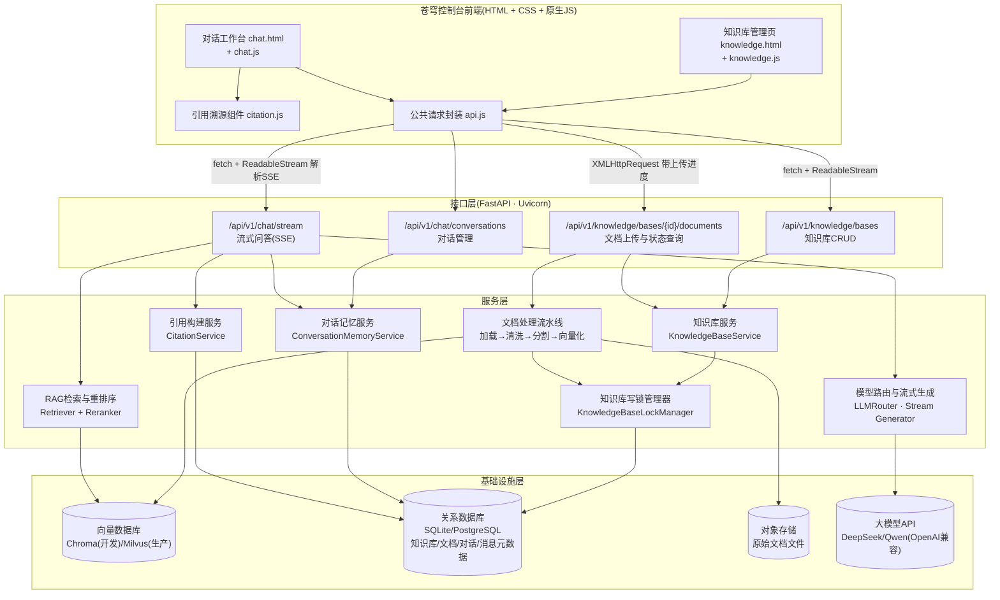
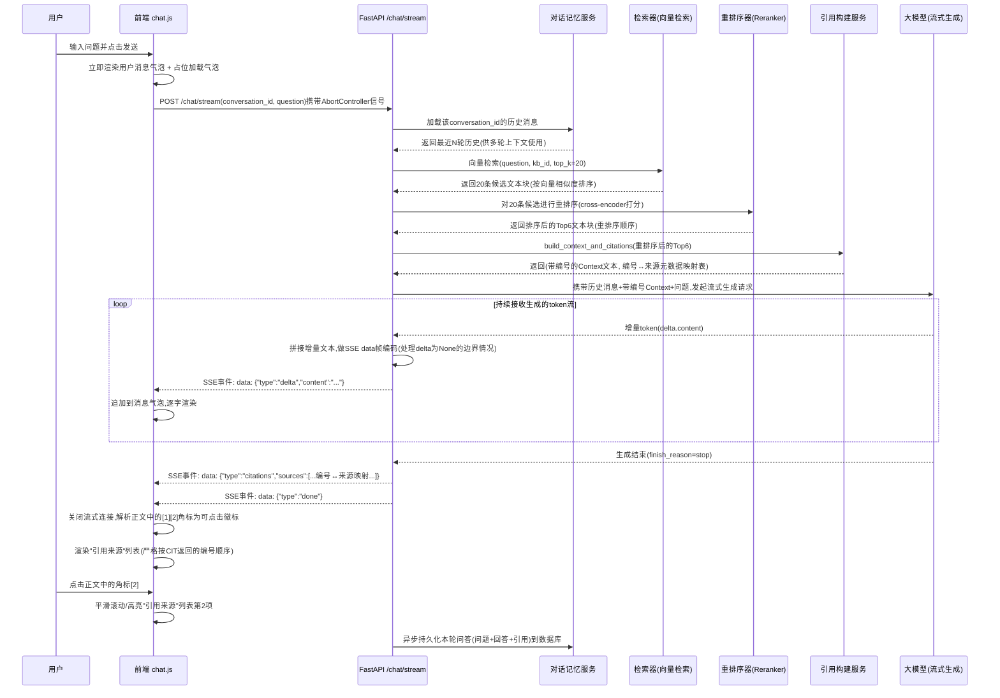
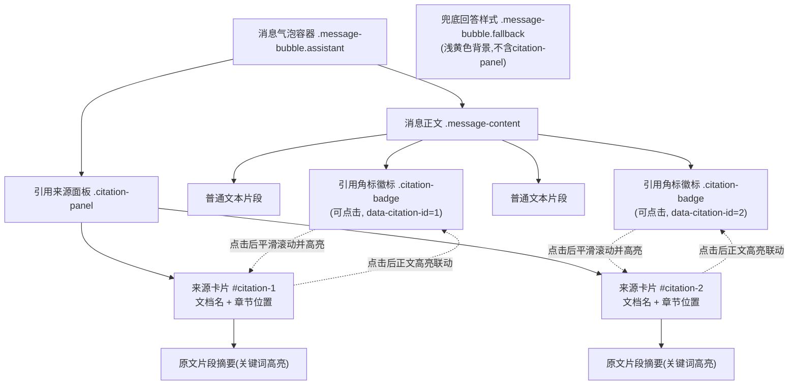

# 第37天:阶段项目二 Day2 —— 前端与联调

> **周次/Sprint**:Sprint 3 · RAG进阶与交付(Day32-38)—— "阶段项目二:苍穹0.5版·海纳集团知识库问答系统Web化交付"冲刺的第二天(Day36后端接口开发完成 → **Day37前端开发与前后端联调** → Day38项目验收答辩)
> **星期**:周四(入职第37天,转正之后的第23天)
> **参与人**:陈铭(后端接口负责人,联调阶段兼前端接口对接与缺陷修复)、周晓(前端工程师,知识库管理页与对话页UI开发主责)、赵磊(QA测试工程师,联调阶段全程测试与缺陷提报);王振宇(老王)上午技术方案把关、傍晚与深夜关键节点两次到场复盘;林悦(产品经理)上午需求澄清、晚间联调验收清单确认列席
> **飞书任务号**:CQ-262(知识库管理前端页面开发)、CQ-263(多轮对话前端页面与流式渲染)、CQ-264(引用溯源展示组件开发)、CQ-265(前后端联调与缺陷修复)、CQ-266(联调验收清单执行与回归测试)
> **今日关键词**:知识库管理页面 / 对话工作台 / SSE流式输出 / 引用溯源展示 / 前后端联调 / 流式输出中断 / 引用编号错位 / 并发上传冲突 / `database is locked` / 深夜跑通全流程

---

## 【旁白】

"联调"这两个字,陈铭第一次听老王提起,是在三十多天前一次很随意的闲聊里——那时候它还只是一个抽象的技术名词,排在"前端""后端""接口"这些词后面,听起来像是流程表上一个不起眼的环节,写完代码,对一对接口,应该花不了太久。今天,他才真正理解这两个字背后藏着的分量:联调不是"对一对接口",联调是把两个人分别在脑子里画出来的"这个系统应该怎么运行"的图纸,叠在一起,然后残酷地发现,这两张图纸在无数个细节上,长得根本不一样。

昨天(Day36)是后端开发日,陈铭一个人埋头在接口世界里,把知识库上传、文档处理、多轮对话、流式生成、引用标注这一整套后端能力,一个接口一个接口地写完、自测通过,晚上十点收工的时候,他心里其实是有点得意的——单元测试全绿,接口文档也写好了,他甚至觉得"明天联调应该挺快"。而周晓那边,知识库管理页和对话页的静态原型,也在昨天基本敲定了交互稿,两个人各自在自己的世界里,都觉得"我这边基本没问题了"。今天的故事,就是从这种"各自都觉得没问题"的错觉开始,一步一步走向"果然全是问题"的真相,再一步一步,在深夜的工位灯光下,走向"居然真的跑通了"的释然。

上午的画面还算平静——周晓在写前端页面,陈铭在旁边看接口文档、补一些联调需要的Mock数据,林悦过来又确认了几个交互细节。真正的转折点发生在下午一点半,当周晓第一次把知识库管理页面接上陈铭昨天写好的真实后端接口、点击"上传"按钮的那一刻。屏幕上没有出现预想中的进度条平滑地爬到100%,取而代之的,是浏览器控制台里一行刺眼的红色报错,和林悦、赵磊几乎同时围过来的探究目光。从那一刻起,今天剩下的十个小时,进入了一种陈铭后来在笔记本上形容为"打地鼠"的节奏——一个bug刚按下去,另一个立刻从旁边的洞里冒出来。

赵磊今天格外活跃,不是那种挑刺式的活跃,而是一种近乎较真的专业主义——他没有等联调"稳定"了才开始测,而是从第一次接口能跑通的那一刻起,就已经在旁边同步开着三个浏览器标签,一边看陈铭改代码,一边不停地点各种他自己设计的边界场景:同时上传两个文件会怎样、文档很长的时候流式输出会不会中断、连续问十个问题引用编号还对不对。他提的每一个bug,都带着一句几乎成了口头禅的开场白:"我这边又发现一个问题,你要不要先看一下这个报错。"到了后半夜,这句话陈铭听到耳朵都快免疫了,但每一次听到,他还是会立刻从椅子上探过身去看屏幕。

这一天的联调,某种意义上也是陈铭第一次真正意义上,同时和一个前端工程师、一个测试工程师,以近乎"同一个战壕"的强度并肩工作了整整一天。此前的三十六天,他更多是在"独立完成一个模块"这种相对孤立的工作模式里成长,而今天,他第一次真切地体会到,一个能真正交付给客户的系统,从来不是某一个人单打独斗的产物——周晓对交互细节的敏感、赵磊对边界条件近乎本能的怀疑、林悦对"验收标准到底是什么"的反复追问,这些角色的存在,恰恰弥补了他一个人埋头写代码时天然会有的思维盲区。他后来跟苏梦聊起这一天的时候,说了一句评价:"以前觉得‘团队协作’是句挂在墙上的口号,今天算是真正体会了一次这四个字具体是什么意思。"

老王在傍晚六点多过来看了一次进度,没有说太多话,只是看着屏幕上那条越来越长的bug列表,说了一句:"这才是联调该有的样子——如果你们俩接完接口什么问题都没有,那说明你们俩之前的设计沟通得太少,根本没有覆盖到边界情况。"这句话像是一句安慰,但陈铭后来想明白,这其实是老王在用他一贯的方式,把"痛苦"重新定义成"正常且必要"——联调阶段暴露的每一个bug,都是提前把客户验收时可能踩的坑,先自己踩了一遍。老王临走前又补了一句,语气比之前更认真一些:"我带过不少项目,见过的最危险的信号,不是‘联调阶段问题很多’,而是‘联调阶段异常顺利’——顺利到没有一个bug,往往说明测试的覆盖面根本没铺开,真正的问题全部被藏到了客户验收甚至上线之后才爆出来,那时候修复成本会是今天的十倍甚至更高。"

这中间还有一段插曲值得单独提一句——晚上九点多,团队士气正处在一个微妙的低谷,三个bug连续暴露之后,大家难免有点疲惫,林悦特意从楼下便利店买了几盒关东煮和一箱功能饮料上来,放在陈铭工位旁边,只说了一句"先垫垫,别硬撑",没有多问进度。这个细节陈铭后来在笔记本上专门写了一段——他说做运营那几年,常见的团队氛围是"出了问题先追责任",而在蓬远科技这几个月,他反复感受到的却是另一种氛围:出了问题,第一反应永远是"先一起看清楚问题是什么",追责任这件事几乎没有出现过。他不确定这算不算"企业文化"这种听起来有点虚的词,但他确实觉得,如果换一种氛围,今天晚上这种高强度的连续排障,团队心态可能会完全不一样。

这一天最终定格在深夜十一点四十分左右的画面里:陈铭盯着屏幕上一次完整的、从上传文档、切分向量化、到多轮提问、流式回答、点击引用角标跳转到原文片段的全流程演示,一个错误都没有跳出来。周晓靠在椅子上长长地舒了一口气,赵磊往前凑近屏幕又反复点了几次刁钻的操作,确认真的挑不出毛病之后,才慢悠悠地说了一句:"行,今天先到这吧。"这句话听起来平淡,但陈铭知道,这是赵磊这个人能给出的最高评价。而明天,Day38,就是这套系统真正走上项目验收答辩台的日子——今晚跑通的每一个流程,都将在明天的会议室里,被郭建军、被(教学场景设定的)海纳集团客户代表,重新审视一遍。

---

## 晨会纪要

**时间**:上午9:00,二层大会议室"望远"
**出席**:王振宇(老王)、陈铭、周晓、赵磊;林悦(需求澄清环节列席)

陈铭走进会议室的时候,发现投影屏幕上已经打开了周晓昨天整理的一份前端交互原型截图集——一共十几张,涵盖知识库管理页的几种状态(空知识库、有文档正在处理、有文档已完成)和对话页的几种状态(空对话、正在流式生成、生成完成带引用角标)。周晓比平时早到了二十分钟,显然是想在正式开会前再检查一遍。

老王开场先定了今天的性质:"昨天是后端日,陈铭把接口都写完了,自测也过了。但我要提前说清楚一件事——自测过,不代表联调不会出问题,恰恰相反,我这十年经验告诉我,自测过的接口,联调阶段照样能炸出一堆问题,原因很简单,自测的时候你测的是‘我以为前端会怎么传参数’,联调测的是‘前端真的怎么传参数’,这两者之间的差距,往往就是bug的来源。"他转头看向周晓:"你那边页面基本搭好了吗?"

周晓点头:"HTML和CSS基本定型了,知识库管理页和对话页两个静态原型都能看,但目前挂的都是假数据,一次真实接口都没调过。"

"那今天上午,"老王说,"你们两个先不要着急连真实接口,先花一个小时,把接口文档从头到尾对一遍——特别是流式接口的返回格式、引用来源字段的结构、错误码的定义,这些东西口头讲一遍,比直接上手调试效率高得多,能提前避免至少一半的‘联调初期低级错误’。上午十点半之后,再开始真正接入。"

林悦这时候补充了一句:"我这边也想借上午这一个小时,再跟你们确认几个交互细节,PRD里有些描述我自己看着都觉得不够具体,趁现在讨论清楚,免得下午写着写着又要临时改。"

赵磊在角落里翻着自己的笔记本,没有立刻说话,等大家讨论得差不多了,他才抬头说了一句:"我今天不打算等你们联调‘稳定’了才开始测,我打算从第一个接口能跑起来那一刻,就跟着测。今天我准备的测试场景比平时多一些,尤其是并发场景和长文本场景,提前说一声,别到时候觉得我故意找茬。"

老王笑了一下:"这才是对的态度。今天联调阶段,赵磊的角色不是‘等你们做完再验收’,是‘全程贴着你们跑’,发现问题立刻提,越早发现,修复成本越低。"

**今日目标清单**:

1. 上午9:00-9:30:晨会,接口文档对齐,交互细节确认。
2. 上午9:30-12:00:周晓开发知识库管理页面(上传、列表、状态展示、删除)与对话页面骨架(布局、消息气泡样式、输入框);陈铭配合梳理接口字段、准备联调用的测试知识库和测试文档;三人共同确认引用溯源展示的最终UI方案。
3. 下午13:30起:前后端真实接口联调正式开始,知识库管理页优先联调,对话页流式接口随后联调;赵磊全程同步测试,发现问题即时提报,陈铭现场排查修复。
4. 晚间:视联调进度决定是否加班,目标是当天完成一次端到端(上传文档→处理完成→多轮提问→流式回答→引用溯源可点击查看)的完整演示,为明天的项目验收答辩做准备。
5. 晚间(如联调顺利):赵磊按照《联调验收清单》执行一轮完整回归测试,产出《联调测试报告》。

**风险点**(老王在会上特别提出的三条):

- 流式接口是本次联调中技术复杂度最高的环节,涉及前端流式读取、后端异步生成器、多轮对话上下文管理三者的协同,任何一环处理不当都可能导致联调时"看起来能跑但偶尔卡死"这种最难排查的间歇性问题,提醒陈铭和周晓提前约定好SSE数据格式的每一个字段。
- 引用溯源展示涉及"检索结果的顺序""重排序后的顺序""大模型生成文本中引用的顺序""前端展示的顺序"四种可能不一致的排序,这是老王反复强调的高风险点,要求陈铭在联调前先自己手动过一遍这四种顺序是否严格对应。
- 昨天(Day36)后端开发阶段主要是陈铭一个人自测,没有真正意义上的并发场景测试,今天联调阶段第一次会有前端、测试同时操作系统,并发写入(尤其是知识库文档上传)出问题的概率不低,提醒陈铭留意。

老王讲完这三条风险点之后,补了一句让陈铭印象很深的话:"我不是在预测你们今天一定会踩中这三个坑,我是在告诉你们,如果踩中了,不要慌,这是联调阶段该发生的事,不是你们能力不行。"这句话在当天下午被反复验证——三个风险点,一个不落地全部命中了,甚至还额外多命中了一个老王没有明确提到、但同样属于"多轮对话上下文管理"范畴的问题(详见下方课堂笔记Bug4)。

晨会快结束的时候,林悦又补充了几条她昨晚重新读PRD时发现的、描述不够清楚的交互细节,趁着大家都在,当场逐一确认:第一,关于"停止生成"按钮点击之后,已经生成的部分内容要不要保留在对话记录里——她原本的想法是"直接清空,当作这轮对话没发生过",但老王和陈铭都认为,从用户体验角度,已经吐出来的文字对用户是有价值的信息,直接清空反而显得系统"很奇怪",三人现场达成一致:保留已生成的部分内容,只是不再继续生成,并且需要有一个视觉标记提示"该回答被手动中断,可能不完整"。第二,关于知识库删除文档的二次确认弹窗,如果文档正在处理中被删除,后端具体应该怎么处理"已经写入了一部分向量数据"这种半成品状态——林悦要求这一点必须明确写进联调验收清单,而不是"能跑就行",这也直接导致V-04这一验收项被特别强调。第三,关于错误提示文案,林悦要求所有面向客户可见的文案,哪怕是临时联调阶段的占位文案,也不能出现任何英文报错原文或者技术术语,理由是"这套系统首期就是要给一线员工用的,他们不需要知道什么是TypeError"。这几条虽然都是细节,但周晓当场就在自己的开发计划里做了相应调整,避免了下午开发过程中的临时返工。

---

## 需求文档:《海纳集团知识库问答系统 · 前端交互细则 & 联调验收清单》

> 撰写人:林悦(产品经理) · 审核人:王振宇(技术负责人) · 版本:v1.2(Web化交付阶段)
> 文档编号:CQ-PRD-D37-01

### 一、页面清单

本次Web化交付阶段共需完成两个核心页面,均属于苍穹控制台前端的一部分,遵循`frontend/`目录下HTML+CSS+原生JavaScript的既定技术方案(不引入前端框架):

1. **知识库管理页(`knowledge.html`)**:面向海纳集团IT对接人和知识库管理员,承担知识库的创建、文档上传、处理状态查看、文档删除等管理职能。
2. **对话工作台(`chat.html`)**:面向海纳集团一线员工,承担实际问答交互职能,是本项目对客户价值最直接的体现页面,重点是流式输出体验与引用溯源展示。

### 二、知识库管理页交互细则

1. **知识库列表**:左侧固定侧边栏展示当前用户可访问的知识库列表,每一项显示知识库名称、文档数量、最近更新时间;点击某一项切换右侧主区域展示对应知识库的文档列表。
2. **创建知识库**:侧边栏底部提供"新建知识库"按钮,点击弹出简单表单(名称、描述),提交后调用`POST /api/v1/knowledge/bases`接口,创建成功后立即刷新侧边栏列表并自动选中新建的知识库。
3. **上传文档**:
   - 支持点击选择文件和拖拽上传两种方式,单次可多选文件批量上传。
   - 支持格式:PDF、Word(.docx)、Markdown(.md)、纯文本(.txt)、CSV,单文件大小限制50MB,前端在发起请求前先校验格式与大小,不满足条件的文件直接在列表里标红提示,不发起网络请求。
   - 每个文件上传时展示独立的进度条(基于`XMLHttpRequest`的`upload.onprogress`事件,`fetch`目前对上传进度支持不完善,联调确认使用`XMLHttpRequest`实现上传部分)。
   - 上传完成后,文档进入"处理中"状态(后端异步执行文档解析、切分、向量化),前端需要通过轮询(每3秌一次)`GET /api/v1/knowledge/bases/{kb_id}/documents/{doc_id}`获取处理状态,直到状态变为"已完成"或"处理失败"。
   - **多文件并发上传要求**:用户可以同时选择多个文件,或者在一个文件上传中途再追加上传新文件,前端需要支持"排队+并行"的上传策略(同一知识库最多允许3个文件同时处于上传中状态,超出则在本地队列中等待),后端必须保证同一知识库下并发写入的数据一致性,这一点是本次联调的重点验证项。
4. **文档列表**:表格形式展示文档名、文件大小、上传时间、状态(等待中/处理中/已完成/失败)、切片数量(处理完成后显示)、操作(查看详情/删除)。
5. **删除文档**:点击删除需要弹出二次确认框,确认后调用删除接口,同时需要处理"用户删除了正在处理中的文档"这一边界情况——后端应能正确中断处理流程并清理已生成的部分向量数据,不能留下"幽灵数据"。
6. **错误提示规范**:所有接口调用失败均需要在页面上以统一样式的Toast提示展示,提示文案需要"人话化"(例如不能直接把后端异常堆栈信息展示给用户,应转换为"文档上传失败,请检查文件格式或稍后重试"这类可理解的提示),但同时需要在浏览器控制台保留完整的原始错误信息,方便排查。

### 三、对话工作台交互细则

1. **对话列表**:左侧侧边栏展示历史对话列表(按最近更新时间排序),支持新建对话、切换对话、重命名对话、删除对话。
2. **知识库选择**:每个对话绑定一个知识库(创建对话时选择,创建后不可更改),对话页顶部需要清晰展示当前对话绑定的知识库名称。
3. **消息发送**:
   - 输入框支持多行输入(Shift+Enter换行,Enter发送),发送按钮在输入为空时禁用。
   - 消息发送后,立即在对话区域展示用户消息气泡,紧接着展示一个"正在思考中"的加载态占位气泡。
   - 后端返回开始后,加载态占位气泡逐字替换为流式返回的实际内容,要求视觉上是"逐字/逐词吐出"的效果,不能是"等全部生成完再一次性显示"。
   - 生成过程中,发送按钮变为"停止生成"按钮,点击后前端主动断开流式连接(调用`AbortController.abort()`),后端需要能正确处理客户端主动断开的情况,不能因此导致后端资源泄漏或异常报错影响后续请求。
4. **多轮对话上下文**:同一对话内的历史消息需要作为上下文传递给后端(由后端结合数据库中存储的历史消息与当前问题一起组织Prompt),前端只需要传递`conversation_id`,不需要自己在前端拼接历史消息全文。
5. **引用溯源展示(本次联调重点,详见下方专门章节)**。
6. **异常兜底展示**:当模型明确表示知识库中未找到相关信息时,回答气泡需要用不同于普通回答的视觉样式(比如浅黄色背景)展示,提示用户"这是一个未命中知识库的兜底回答",而不是让用户误以为是正常回答里恰好没有引用。

### 四、引用溯源展示规范

这是本次联调中技术难度和产品价值都最高的一块功能,细则如下:

1. 大模型生成的回答文本中,关键信息处会带有形如`[1]`、`[2]`的角标引用编号,前端需要将这些角标渲染为可点击的上标样式徽标(视觉上区别于正文文字,比如蓝色圆形背景白色数字)。
2. 每条回答消息在生成完成后,下方(或右侧独立面板,视觉方案由三方现场确认)展示一个"引用来源"列表,列表中每一项对应一个编号,展示文档名称、所在章节/段落位置、匹配的原文片段摘要(高亮显示与问题相关的关键词)。
3. 点击正文中的引用角标,页面需要平滑滚动/高亮定位到"引用来源"列表中对应编号的那一项;反过来,点击"引用来源"列表中的某一项,也应该在正文中高亮对应角标位置——这是一个双向联动的交互,联调时需要重点验证编号是否严格对应,不能出现"点击[2]跳转到的却是来源列表里第3项"这种错位问题。
4. 如果一条回答完全没有使用任何知识库内容(比如纯粹的兜底"未找到相关信息"回答),则不展示"引用来源"列表区域,而不是展示一个空列表。

### 五、联调验收清单

本清单是今天(Day37)联调工作的最终验收依据,由赵磊在联调结束后逐项勾选,任何一项不通过都不能视为"联调完成":

| 编号 | 验收项 | 验收标准 |
|---|---|---|
| V-01 | 知识库创建 | 创建成功,侧边栏正确刷新并自动选中 |
| V-02 | 单文件上传 | 各支持格式均能成功上传并正确显示处理进度 |
| V-03 | 多文件并发上传 | 同一知识库同时上传3个及以上文件,全部成功处理,文档数量统计准确,无遗漏无重复 |
| V-04 | 文档删除 | 包含删除处理中文档的边界场景,删除后无遗留向量数据 |
| V-05 | 格式/大小校验 | 不支持格式与超限文件均被前端拦截,不发起无效请求 |
| V-06 | 新建对话 | 能正确绑定知识库,首条消息前上下文为空 |
| V-07 | 流式输出 | 长回答(1000字以上)能持续、稳定、逐字流式展示,不中断、不卡死 |
| V-08 | 停止生成 | 点击停止后前端立即停止渲染,后端无异常报错,连接正确关闭 |
| V-09 | 多轮上下文 | 连续追问(如"那它的保养周期呢")能正确理解上一轮的指代对象 |
| V-10 | 引用编号一致性 | 连续提问至少10个真实业务问题,正文引用编号与来源列表编号100%严格对应 |
| V-11 | 引用双向联动 | 点击角标与点击来源列表项均能正确联动定位 |
| V-12 | 兜底回答样式 | 未命中知识库的回答有明确的差异化视觉样式,且不展示引用来源列表 |
| V-13 | 异常提示文案 | 所有已知异常场景均有对用户友好的提示文案,控制台保留原始报错 |
| V-14 | 并发场景稳定性 | 多用户/多标签同时操作(上传+对话)不出现数据错乱或后端崩溃 |
| V-15 | 页面基础响应性能 | 常规操作(切换知识库、切换对话)响应时间在可接受范围内,无明显卡顿 |

### 六、非功能性要求补充

1. **鉴权与会话**:前端所有接口请求统一携带`Authorization: Bearer <token>`,token存储在浏览器`localStorage`中,考虑到本次交付客户内部网络环境相对可控,首期暂不做token自动刷新机制,token过期后前端捕获401状态码,统一跳转到登录提示页,不做静默重试(避免掩盖真实的鉴权问题)。
2. **埋点需求**:关键操作(知识库创建、文档上传、发送消息、点击引用角标、点击停止生成)需要在前端埋点记录操作时间与结果,用于后续项目验收答辩和产品迭代时分析真实使用情况,埋点数据本期先打印到浏览器控制台并同步一份到后端日志,不接入专门的埋点平台(留待后续Sprint)。
3. **错误提示文案的分级**:区分"用户可自行解决"(如文件格式不支持,提示明确的解决方式)和"用户无法自行解决,需要联系管理员"(如服务器内部错误)两类提示,后一类提示文案中应包含一个简单的错误参考编号(便于用户反馈问题时,技术人员能够根据编号在日志中快速定位),但不能包含任何原始异常堆栈或技术术语。
4. **浏览器兼容性**:本次交付仅需保证在Chrome、Edge最新版本下正常工作(海纳集团内部统一使用Chrome办公),不要求兼容IE或其他小众浏览器,这一点已经与客户方IT对接人确认过,写入验收范围说明,避免联调阶段浪费精力在不必要的兼容性适配上。

### 七、遗留与暂缓事项

产品经理林悦在需求澄清环节明确提出,以下事项本次联调可暂缓处理,记入后续迭代backlog,不作为今天(Day37)的验收硬性要求,但需要在《联调测试报告》中明确记录,避免遗漏:

- 移动端/窄屏适配(本次交付客户场景以PC端浏览器为主,移动端适配放入Sprint4规划)。
- 对话历史的全文搜索功能。
- 知识库文档的批量删除与批量重新处理。
- 引用来源片段的"跳转到原文档并高亮"深度联动(本次只做到"展示原文片段摘要",完整原文档在线预览留待后续)。

---

## 架构设计图

下图展示本次前后端完整联调涉及的架构范围,涵盖知识库管理界面与对话界面两条主线,以及它们分别依赖的后端能力:



这张图和Day30、Day33-35的架构图相比,新增的关键节点是`KnowledgeBaseLockManager`(知识库写锁管理器)——这是今天下午联调过程中,为了修复"并发上传冲突"问题临时新增的一个服务组件,原本的架构设计里并没有它,这也从图上直接反映出联调阶段"架构设计会随着真实问题暴露而被迫补充"的现实。

---

## 流程图

下图展示一次带引用溯源的流式问答,从用户在前端点击发送、到最终在页面上看到带角标引用且可点击跳转的完整回答,中间经过的所有关键步骤:



联调过程中反复出问题的环节,恰恰集中在这张图里的三处:检索器与重排序器之间的顺序交接(引用编号错位的根源)、流式生成循环中`delta.content`的边界处理(流式中断的根源)、以及图上没有直接画出来但同样关键的——多个用户/多个标签同时触发文档处理流水线写入向量数据库时的并发控制(并发上传冲突的根源)。

---

## 示意图

下图是引用溯源展示部分的UI结构示意,展示一条带引用的AI回答消息内部的组成层次:



这张示意图在下午的联调会上被反复拿出来对照——赵磊测试时发现的"引用编号错位"问题,本质上就是`B2`这个角标节点绑定的`data-citation-id`,和`C1`这个来源卡片的真实内容,没有对应上同一份数据,而是分别来自两份排序不一致的数据源。

三张图放在一起看,恰好对应着今天联调工作的三个不同层次:架构设计图划定了"谁负责什么"的边界,任何一个联调问题,第一步都是先在这张图上定位"这个bug大概率出在哪个方块里";流程图铺开了一次请求从发起到完成的时间轴,今天发现的四个bug,分别精确对应流程图里的四个具体箭头(SSE数据帧编码那一步、检索器到重排序器的顺序交接、历史消息加载的排序、以及图上没有画出来的并发写入场景);示意图则把"引用溯源"这个相对抽象的产品功能,拆解成了具体的DOM节点和数据绑定关系,让"编号错位"这种原本很抽象的描述,变成了一句可以直接对照代码去验证的话——"B2的data-citation-id和C1的真实内容是不是同一份数据"。老王在评审这三张图的时候说过一句话,陈铭记了下来:"图不是画给客户看的装饰品,是画给自己看的‘排查地图’,画得越准确,排查问题的时候越不容易迷路。"

---

## 课堂笔记

### 上午:前端界面开发

上午九点半晨会结束之后,陈铭和周晓先花了将近一个小时,把接口文档从头对了一遍——这一步事后被证明是今天效率最高的一个小时,很多问题在这个阶段就被提前暴露,而不是留到下午真正联调的时候才发现。

第一个被揪出来的分歧是关于知识库列表接口的返回字段。陈铭的接口文档里,文档数量字段叫`doc_count`,而周晓的原型代码里已经按照自己对PRD的理解写成了`document_count`。两个人核对的时候,陈铭一开始还想解释"我这边字段名是有历史原因的",但周晓直接反问:"历史原因归历史原因,咱俩现在要对齐的是‘今天用哪个’,不是‘哪个更合理’。"陈铭想了想,同意把后端字段统一改成`document_count`,理由很简单——这是他昨天刚写的新接口,没有任何存量数据和存量调用方依赖这个字段名,改起来成本几乎为零,而周晓的前端代码已经在好几处引用了这个命名,改动面更大。这件小事让陈铭现场体会到老王常说的一句话的另一层含义——"先想清楚数据长什么样",有时候不只是想清楚结构,也要想清楚"谁先定的名字,谁改起来成本更低",这也是协作里很实际的一部分。

第二个分歧更实质一些,是关于流式接口SSE数据帧的格式。陈铭昨天写后端的时候,图省事,直接把每个SSE事件的`data`字段写成了纯文本片段,比如`data: 根据文档`,下一帧`data: ,注塑机的保养`,前端拿到之后直接拼接就行。但周晓提出一个问题:"如果流式过程中我需要区分‘这是普通文本增量’还是‘这是最后的引用列表’还是‘这是错误信息’,纯文本没法区分类型,我怎么知道该往消息气泡里追加文字,还是该去渲染引用面板?"陈铭愣了一下,意识到这确实是自己没考虑周全的地方——他做后端自测的时候,写的测试脚本是"死等所有数据收完再统一处理",根本没有模拟前端"边收边判断类型边渲染"的真实场景。两人当场商定,把SSE的`data`字段统一改成JSON字符串,包含`type`字段(取值`delta`/`citations`/`done`/`error`)和对应的`content`或`sources`字段,这样前端可以根据`type`做不同处理。这个改动看起来只是格式上的调整,但陈铭后来意识到,如果没有上午这一小时的对齐,这个问题很可能要等到下午真正联调、周晓的页面收到一堆纯文本却不知道怎么处理的时候才会暴露,那时候排查成本会高得多。

第三个分歧是关于引用来源字段的结构。陈铭原本的设计里,引用来源是直接拼接在回答文本末尾的一段Markdown("参考来源:1. XXX文档 第3章"),周晓提出这种方式没法支持"点击角标跳转联动"这个交互需求,必须是结构化的独立字段(一个数组,每一项包含编号、文档名、位置、原文片段),而不是拼在正文里的纯文本。这一点上,林悦也补充了她的意见:"PRD里其实写得比较清楚,引用来源要支持双向联动,拼在正文里肯定没法做到。"陈铭有点不好意思地承认,自己昨天写接口的时候,对"双向联动"这四个字的实现代价,理解得不够到位,以为只是"展示一下来源"这么简单。这一处的返工,直接影响了他上午接下来大半个小时的时间——重新设计`sources`字段的JSON结构,补充了`chunk_id`、`document_name`、`section`、`snippet`四个子字段,并且和周晓确认了snippet里关键词高亮用什么标记方式(约定用`<mark>`标签包裹,前端直接渲染,不需要额外的高亮位置计算)。

对齐完接口之后,周晓开始正式动手写知识库管理页,陈铭在旁边配合准备联调需要的测试数据——他找出Day28、Day29用过的那批海纳集团样本文档,又额外让林悦补充了两份"故意做得比较刁钻"的测试文档(一份是扫描质量很差的PDF,一份是文件名带有特殊字符的Word文档),为下午的联调测试提前铺垫弹药。

十点半左右,周晓的知识库管理页静态骨架基本成型——左侧知识库列表、右侧文档表格、顶部上传按钮,视觉效果和昨天的原型截图基本一致。她开始接入第一个真实接口:知识库列表查询。这一步异常顺利,几乎没有出任何问题,列表数据正确地从后端返回并渲染出来。这个"顺利"的开局,某种程度上让在场的三个人都稍微放松了一点警惕——而这份放松,在下午一点半迎来了一次不算温和的纠正。

上午最后半小时,三人专门坐下来讨论引用溯源展示的最终UI方案。老王也过来简单参与了讨论。方案上有过一次小小的分歧:周晓最初倾向做成"悬浮提示"的形式——鼠标悬停在角标上,弹出一个小气泡展示来源信息,理由是"不占用额外的页面空间,交互路径最短"。但林悦提出反对意见:"客户那边一线员工很多是用鼠标操作不熟练的中年师傅,悬浮这种交互对他们不友好,而且引用来源本身是这套系统很重要的‘卖点’——‘答案可追溯’,如果藏在悬浮提示里,客户在演示的时候不容易一眼看到系统‘有理有据’这个特点。"老王最后拍板:"采用侧边栏/底部固定的引用来源列表,角标点击时高亮联动,这样视觉上更‘实在’,也更符合企业客户对‘专业、可信’的心理预期,悬浮提示可以作为辅助,鼠标悬停时也能看到简短摘要,但主要展示形式一定是常驻可见的列表,不是隐藏起来的悬浮层。"这个决策直接决定了下午周晓写`citation.js`时的组件结构——常驻列表为主,悬浮提示为辅。

上午最后这十几分钟,三个人还顺手把两个容易被忽略、但一旦联调阶段才发现会很麻烦的技术细节提前敲定了。第一个是鉴权token的存储与传递方式——周晓提出一个问题:"如果用户打开两个标签页,一个在对话页,一个在知识库管理页,token要不要保持同步?"陈铭想了想回答:"token统一存在`localStorage`里,浏览器的多个标签页本身就共享同一份`localStorage`,不需要额外做同步机制,`api.js`里统一从`localStorage`读取,两个页面自然是一致的。"这个决定后来被写进了公共请求封装`api.js`里,成为`getAuthToken()`这个函数存在的直接原因——把"从哪里读取token"这件事收敛到一个函数里,而不是让`knowledge.js`和`chat.js`各自分别写一遍读取逻辑,这样即便未来token的存储方式发生变化(比如换成更安全的httpOnly Cookie方案),也只需要改一个函数,不需要满项目搜索所有引用token的地方。

第二个细节是错误提示文案的"分级"问题。林悦提出,不同类型的错误,提示的语气和详细程度应该不一样——用户操作层面能自行解决的问题(比如文件格式不对),提示应该直接给出解决方式;而系统内部才能解决的问题(比如服务器暂时不可用),提示应该道歉并给出一个简单的编号,方便用户反馈问题时,技术支持能够快速定位,但绝不能把原始的技术报错信息直接甩给用户。这个讨论直接反映在后来`api.js`里`ApiError`这个类的设计上——它保留了原始的`detail`字段供开发者在控制台调试使用,但对外展示给用户的`message`字段,统一经过了一层"人话化"处理。周晓当时开玩笑说了一句:"这算不算是给报错也做一次‘用户体验设计’?"林悦很认真地回答:"对,错误提示也是产品体验的一部分,很多产品在这个细节上偷懒,直接把技术报错甩给用户,客户体验会因为这种小细节大打折扣。"

这两个看似不起眼的决定,在下午联调正式开始之后,确实发挥了作用——尤其是错误提示的分级设计,让团队在后续处理四个bug的过程中,即便后端还没修复完成,前端展示给"假装成真实用户"的赵磊的提示,始终是友好且不暴露技术细节的,这也让赵磊能够更专注于测试功能本身,而不是被一堆报错堆栈干扰视线。

### 下午到晚上:联调测试

#### 第一个坎:知识库上传接口刚接上就报错

下午一点半,午休回来,周晓开始接入知识库管理页最核心的功能——文档上传。她选了一份陈铭准备的PDF测试文档,点击上传按钮。屏幕上的进度条走了不到十分之一,浏览器控制台就跳出一行红色错误:

`Uncaught (in promise) TypeError: Cannot read properties of undefined (reading 'document_id')`

三个人围过去看。陈铭先反应过来:"你这边是不是按照我接口文档里写的字段在解析返回值?"周晓点头,把代码贴出来给陈铭看——她读取的是`response.data.document_id`,而陈铭实际返回的JSON结构里,`data`是一个数组(因为接口设计成"支持批量上传,一次返回多个文档的处理结果"),周晓的代码却按照"单个对象"在处理。这本质上是昨天写接口文档时,陈铭对"批量上传返回结构"这一点描述得不够清楚,只写了一句"返回上传结果",没有明确说明是数组还是对象。陈铭现场补充了接口文档,周晓相应调整了前端解析逻辑,改成遍历数组处理每一个上传结果。这个问题解决得很快,前后不到十分钟,但它像是一个信号——真正的联调,从这一刻才算开始。

#### Bug 1:流式输出中断(先在本机复现"半路卡死",后在测试环境复现"卡顿式吞吐")

下午三点左右,知识库管理页的基础功能(上传、列表、状态轮询、删除)已经联调通过,团队转向对话工作台的流式接口。第一轮简单测试——问一个短问题,比如"XJ-500的额定注塑量是多少",系统流畅地流式吐出了一句简短的回答,看起来一切正常。

赵磊立刻提了一个更刁钻的测试场景:"你们先别急着说通过,我问一个需要长回答的问题试试。"他在输入框里打了一个问题:"请详细说明XJ-500注塑机从开机到正常生产的完整操作流程,包括每一步的安全注意事项。"这是一个海纳集团样本文档里内容比较丰富的问题,预期回答会比较长。

发送之后,回答开始正常地一个字一个字往外吐,吐到大约第三段、五百多字的时候,画面突然停住了——加载态的光标还在闪,但再也没有新的文字出现。等了将近半分钟,浏览器控制台打出一行错误:

`Uncaught (in promise) TypeError: network error`

赵磊几乎是立刻说了那句熟悉的开场白:"我这边又发现一个问题,你要不要先看一下这个报错。"

陈铭第一反应是怀疑网络或者本地环境不稳定,让赵磊重试了两次。第一次重试,同样的问题,在四百多字的位置卡死;第二次重试,反而顺利跑完了。这种"有时候能跑,有时候不能跑"的间歇性表现,是陈铭觉得最难受的一类bug——他后来在笔记本上写道:"稳定复现的bug是敌人,但至少是看得见的敌人;偶发的bug是敌人在暗处放暗箭。"

他打开后端服务的日志窗口(直接运行在终端里的uvicorn进程日志),重新触发一次同样的长问题,盯着日志滚动。这一次很幸运,又复现了——他在日志里看到了这样一段堆栈:

```
Traceback (most recent call last):
  File "/cangqiong-platform/backend/app/services/llm/openai_compatible.py", line 88, in stream_chat_completion
    full_text += chunk.choices[0].delta.content
TypeError: can only concatenate str (not "NoneType") to str
```

看到这段堆栈,陈铭心里咯噔一下——他想起来了,这个大模型API在流式返回的最后阶段,会额外发送一个`finish_reason`不为空但`delta.content`为`None`的收尾chunk(用于告知客户端"生成即将结束,后面可能还有一两个不带内容的收尾包"),这在他昨天自测的时候,因为测试问题都比较短,恰好没有触发这种收尾chunk携带`None`内容的情况(短回答的收尾chunk有时候恰好和最后一个有内容的chunk合并在一起返回),但只要回答足够长、模型分了足够多次返回,这种"内容为空的收尾chunk"出现的概率就会显著上升,这也解释了为什么问题是"偶发"而不是"必现"——它和回答长度、模型返回的chunk切分方式(这本身也有一定的不确定性)都有关系。

更麻烦的是,这个异常发生在一个`async`生成器函数内部,而这个函数是直接喂给FastAPI的`StreamingResponse`用的,异常一旦在生成器内部抛出且没有被捕获,FastAPI的处理方式是直接中断这个流(连接被服务端关闭),但由于HTTP分块传输编码(chunked transfer encoding)没有正常发送终止标记,前端的`fetch`流式读取会认为连接异常断开,抛出`network error`,而且更糟糕的是,后端连日志里除了这条堆栈之外,没有任何其他信息返回给前端,前端完全不知道到底发生了什么。

陈铭把修复分成了两步。第一步是最直接的:给`delta.content`加上None判断,`None`的时候跳过拼接,不再执行`full_text += None`这种非法操作。这个改动很快就写好了,重新测试,长问题连续问了五六次,原来"必现偶发中断"的问题确实消失了。

但赵磊没有轻易放过这个修复。他换了一个思路继续测试:"我现在故意在生成回答的过程中把网络断开试试。"他直接拔掉了自己电脑的网线(测试机是有线连接),看看会发生什么。断网之后,浏览器很快显示了`network error`,这本身是预期行为(网络确实断了),但陈铭注意到后端日志里同时也打出了一堆异常堆栈,涉及一个`asyncio.CancelledError`没有被妥善处理,导致后端在客户端已经断开连接之后,似乎还在尝试往一个已经关闭的连接写数据,产生了一连串刺耳的报错日志(虽然不影响功能,但日志被刷屏)。这算是赵磊主动发现的一个"次生bug"——不是必须今天修的阻塞问题,但陈铭还是花了大概二十分钟,给流式生成的异常处理加了一层`try/except`,专门捕获`asyncio.CancelledError`,在客户端主动断开(包括正常点击"停止生成"按钮和异常断网)时,优雅地终止生成器,不再往下游写任何数据,同时清理已经打开的与大模型API的连接资源,避免出现日志刷屏和潜在的资源泄漏。

第二个层面的问题,发生在下午四点多,团队开始在"内网测试环境"(一台部署了Nginx反向代理的测试服务器,域名走内部DNS解析,教学场景里统一称为`test.pengyuan-tech.internal`)上验证,而不只是在本机联调。同样的长问题,在测试环境上表现出了一种新的、更奇怪的症状——不是中断,而是"卡顿式吞吐":页面在最开始的十几秒里毫无动静,加载态光标一直闪烁,然后突然"哗"一下,一大段文字瞬间全部出现,完全没有逐字流式的效果,看起来更像是"等生成完了再一次性发过来",这和产品要求的"流畅逐字输出"体验完全不符。

这一次陈铭的第一反应就没有那么懵了——他想起老王之前提过一句类似场景的经验分享,直接去检查了测试环境的Nginx配置,果然发现问题:Nginx默认对反向代理的响应做缓冲(buffering),它会先把后端的响应攒够一定大小或者等待一定时间,再统一转发给客户端,这对普通的HTTP接口是提升性能的好事,但对流式SSE接口是致命的,因为流式响应的每一个小chunk都需要"即时"转发,不能被攒起来批量发送。陈铭在孙昊(DevOps)的协助下(下午四点半左右打了个电话简单确认配置权限),给这个测试环境的Nginx配置针对`/api/v1/chat/stream`这个具体路径增加了`proxy_buffering off;`,同时在FastAPI后端的响应头里也加上了`X-Accel-Buffering: no`(这个头是Nginx专门识别的,用来告诉Nginx"这个响应不要缓冲"),双重保险。改完重启服务重新测试,测试环境上的流式输出终于也和本机一样,变成了流畅的逐字吐出效果。

在动手改Nginx配置之前,陈铭其实先排查了一段弯路——他一开始怀疑是不是测试环境的后端服务本身版本比本机旧(测试环境的部署脚本是孙昊前几天配置的,理论上应该和本机代码一致,但陈铭没有百分百的信心),于是先花了十分钟登录测试服务器,用`git log -1`核对了当前部署的代码版本,确认和本机分支完全一致,排除了"代码版本不一致"这个可能性。接着他怀疑是不是测试环境的大模型API调用本身网络延迟更高、返回节奏不一样导致的"看起来像缓冲",于是直接在测试服务器上用`curl -N`(`-N`参数禁用curl自身的输出缓冲)手动请求了一次流式接口,观察到后端本身吐数据的节奏其实是流畅的、逐块返回的——这一步操作让他确认问题不在后端生成逻辑本身,而是在"后端到浏览器"之间的某个环节,范围一下子缩小到了Nginx这一层。这也是他后来跟周晓复盘时特别强调的一点:"遇到‘只在某个环境出问题’的场景,不要一上来就怀疑最复杂的那个环节,先用最简单的工具(比如curl)一层一层地往下剥,确认‘问题出现在哪两个节点之间’,再去查具体节点的配置,效率会高很多。"

这个bug给陈铭留下的印象特别深,他在笔记本上写了一段总结:"同一个功能,在本机和测试环境表现完全不一样,这种‘环境差异型bug’比单纯的代码逻辑bug更容易让人抓狂,因为你会本能地怀疑‘我的代码在本机明明是好的’,但恰恰是这种‘明明是好的’的错觉,最容易让人在排查方向上走偏。以后遇到‘只在某个环境出问题’的报告,第一件事应该是先怀疑环境配置(反向代理、超时设置、缓冲策略),而不是先怀疑自己的业务代码。"

#### Bug 2:引用编号错位

流式输出的两处问题解决之后,已经是下午五点多。团队稍微松了口气,开始测试引用溯源展示这个重头功能。赵磊设计了一组连续提问的场景,准备了十个海纳集团样本文档能覆盖的真实业务问题,逐一在对话页面里问。

前三个问题看起来都对——回答里带着`[1]`、`[2]`这样的角标,点击角标能正确滚动定位到下方引用来源列表里对应的卡片,卡片内容和问题也确实相关。但问到第四个问题("XJ-500发生E-07报警时,操作人员应该按什么顺序处理")的时候,赵磊仔细核对了一下回答正文和引用列表,皱起眉头:"这个不对,正文里写的是‘根据维护手册[2]的规定,应先切断电源’,但我点这个[2]跳到的来源列表第2项,展示的却是质量检验规范的一段内容,跟‘切断电源’完全不搭边。"

陈铭一开始还怀疑是不是大模型自己编错了引用编号(这在纯prompt层面也是有可能出现的现象),但仔细看了后端日志里记录的原始生成文本和`sources`字段之后,发现问题出在后端自己身上,不是模型的锅。

他把代码翻出来仔细看,发现了问题所在:检索模块从向量数据库里检索出候选文本块之后,是按照向量相似度排序的(称为`retrieved_chunks`),接下来有一个重排序步骤(这是Sprint3前几天刚学的Reranker技术),用`bge-reranker-large`对这些候选块重新打分排序,得到`reranked_chunks`,这个顺序才是最终真正决定"哪几段内容进入Prompt、以及以什么顺序编号"的顺序。构建喂给大模型的Prompt Context文本时,代码确实是用`reranked_chunks`按顺序编号、拼接成`[1]xxx [2]xxx [3]xxx...`这样的结构,这一部分是对的。

但问题出在构建返回给前端的`sources`字段这段代码上——陈铭在写这部分逻辑的时候,是"复用"了Sprint2阶段(Day30左右,那时候还没有引入Reranker)写的一段老代码,那段老代码里,`sources`字段是直接从`retrieved_chunks`(检索后、重排序前的原始顺序)构建的。Day33引入Reranker的时候,只改了Prompt Context拼接那部分逻辑去用`reranked_chunks`,却没有同步把`sources`字段构建的逻辑也换成`reranked_chunks`——这是一处典型的"改了一半"的历史遗留代码问题,平时接口自测的时候,因为检索器返回的候选数量不多、且样本问题恰好排序变化不大,这个不一致没有被察觉,而这次赵磊测试的第四个问题,恰好是一个重排序前后顺序发生了明显变化的案例(向量相似度最高的一段其实相关性一般,重排序后被排到了后面),错位才被完全暴露出来。

陈铭找到问题之后,没有简单地"头痛医头"式地把`sources`字段里的数据来源换成`reranked_chunks`就草草了事——他想起老王常说的"要想清楚数据长什么样",于是干脆把"构建Prompt Context"和"构建sources引用列表"这两件事,合并成同一个函数`build_context_and_citations`,统一入参只接受`reranked_chunks`,统一输出既包含Context文本又包含sources列表,保证两者永远来自同一份数据、同一个顺序,从代码结构上直接消除了未来再次出现"两处各用各的排序"这类问题的可能性。这个重构花了大概四十分钟(涵盖修改代码、补充单元测试、重新联调验证),验证的方式是重新问了赵磊那十个问题外加另外补充的五个问题,逐一核对正文角标和来源列表编号的一一对应关系,确认全部正确之后才算修复完成。

赵磊后来在他的测试报告里,给这个bug标注的严重等级是"高危"——他解释说:"这个问题如果没在联调阶段发现,直接被客户在验收会上点出来,性质会很不一样——客户会直接质疑‘这套系统连自己标的引用都能标错,我怎么敢信它给我的答案本身是不是也有问题’,这种对‘可信度’的伤害,比一个纯粹的功能性bug要严重得多。"

#### Bug 3:并发上传冲突

晚上七点多,吃完外卖,团队回到工位继续联调剩下的场景。赵磊这次测试的是知识库管理页的并发上传能力——他开了两个浏览器标签,同时登录同一个账号,进入同一个知识库,几乎同时点击了两个标签里的上传按钮,分别上传两份不同的测试文档。

结果不太乐观:其中一个文档的处理状态一直卡在"处理中",过了将近一分钟都没有变化,而另一个文档倒是正常处理完成了。陈铭去看后端日志,发现了一段报错:

```
sqlite3.OperationalError: database is locked
  File "/cangqiong-platform/backend/app/db/session.py", line 34, in commit
    session.commit()
  File ".../sqlalchemy/engine/base.py", line 1451, in _execute_context
```

这是他之前在教程和练习里见过的经典报错,但这是第一次在自己写的项目里亲眼撞见。他当场跟周晓、赵磊解释了原因:"我们开发环境用的是SQLite,SQLite对并发写入的支持本来就比较弱,默认情况下一次只允许一个写事务,如果两个请求几乎同时都要往数据库里写数据(比如都要更新知识库的文档数量、插入文档记录),后面那个请求会因为数据库文件被锁住而报错。"

他一开始想到的最简单的修复方式,是给SQLite数据库连接加上`PRAGMA journal_mode=WAL;`,把日志模式从默认的Rollback Journal切换成Write-Ahead Log,这个模式对并发读写的支持要好得多,理论上能大幅缓解这类锁冲突问题。加上这一行配置之后重新测试,确实好了很多,连续测试了五六次并发上传,报错的概率明显降低,但没有完全消失——高强度连续测试(赵磊连开四个标签几乎同时点上传)偶尔还是能复现同样的报错。

老王晚上八点多过来看进度的时候,陈铭正在纠结这个问题。老王听完陈铭的描述,没有直接给答案,而是反问了一句:"你觉得WAL模式解决的是‘并发’这个问题本身,还是‘缓解了并发冲突发生的频率’?"陈铭想了想,老实回答:"是后者,本质上还是有并发写入同一份数据的风险,只是概率降低了。"老王点头:"那你有没有想过,与其在数据库层面死磕‘怎么让SQLite扛住更高并发’,不如直接在业务逻辑层面,把‘同一个知识库’的写操作,从设计上就规定成‘串行执行’?不同知识库之间互不影响,可以并行,但同一个知识库内部的写操作,本来就没有必要真正并发——用户体感上‘同时上传了两个文件’,不代表后端处理这两个文件的‘写数据库’这个动作也一定要严格同时发生,稍微错开几百毫秒,用户完全感觉不到差异,但可以从根本上避免锁冲突。"

这句话点醒了陈铭。他设计了一个`KnowledgeBaseLockManager`——一个维护着"知识库ID → 异步锁"映射关系的单例服务,每次处理某个知识库的文档上传(涉及切分、向量化、写入向量库、写入元数据库这一整段"critical section"),先获取这个知识库对应的锁,处理完成后释放。不同知识库因为锁的key不同,可以完全并行处理,互不阻塞;同一个知识库的多个并发上传请求,则会在锁这里排队,依次串行执行写操作,从设计上直接杜绝了同一份数据被并发写入的可能性,而不是靠"降低冲突概率"这种治标的方式。同时他也把之前"读取当前文档数量、加一、写回"这种存在"更新丢失"风险的写法,改成了数据库层面的原子自增语句,双重加固。

改完之后重新压测——赵磊这次直接写了个简单的测试脚本(用Python的`concurrent.futures.ThreadPoolExecutor`),模拟5个线程同时对同一个知识库发起上传请求,连续跑了十轮,一次报错都没有再出现,文档数量统计也精确无误。赵磊看完测试结果,难得地夸了一句:"这个修复我觉得比第一版靠谱,不是‘概率降低’,是‘从设计上不可能再冲突’,这两种修复思路的可信度不一样。"

#### Bug 4:多轮对话上下文顺序颠倒,追问变成"自说自话"

修完并发上传问题,已经快晚上九点半。赵磊没有停,他开始按照《联调验收清单》里V-09那一项,专门测试多轮对话的上下文理解能力。他先问了"XJ-500注塑机的液压系统,正常工作压力范围是多少",系统正确回答了一个具体数值区间,并带上了引用。接着他追问了一句非常口语化、依赖上一轮上下文才能理解的问题:"那它的检修周期是多久?"——这里的"它"指代的是上一轮提到的"液压系统"。

回答出来之后,赵磊皱起眉头:"这个答案感觉不对,它好像没听懂‘它’指的是液压系统,回答的内容看起来是某个完全不相关的部件的检修周期。"陈铭让他把浏览器网络请求的响应内容截图发过来,自己去后端日志里核对这一轮请求实际携带的历史消息内容,想看看到底是"检索环节找错了内容"还是"大模型没有正确理解指代关系"。

翻日志的过程比想象中费了一些时间,因为初看之下,历史消息确实是被正确加载出来的——数据库里存的两条历史记录都在,条数也对,但陈铭盯着日志里打印出来的`messages`列表顺序,忽然意识到不对:排在最前面(也就是大模型会最先读到)的,居然是刚才那一轮"液压系统压力范围"的问题,而不是更早之前(其实这个对话里没有更早的记录,这一轮才是第一轮)——等等,他重新theo数了一下顺序,发现真正的问题是:当对话轮次增加到三轮以上时(赵磊测试到第三轮追问的时候才真正暴露),历史消息在`messages`列表里的先后顺序,和真实发生的时间顺序是反的,也就是说,大模型看到的对话历史,是"从最近的一轮往前倒着排"而不是"从最早的一轮往后正着排"。这就好比一个人复述别人说过的话,却把顺序倒过来讲,越往后的追问,越容易和真正想指代的对象"对不上号"。

他去看`ConversationMemoryService.load_recent_history`这个函数的实现,很快找到了原因——这个函数在SQL查询里写的是`ORDER BY created_at DESC LIMIT :max_turns`,这个排序方向本身没有问题,"倒序取最近N轮"是完全正确的思路(避免历史太长的对话把所有消息都塞进Prompt),但问题出在取出这批"倒序"的记录之后,代码直接把这个倒序的列表拿去拼接进`messages`,忘记了在使用之前需要把顺序"倒转回来",变成正序(从最早的一轮到最近的一轮),才符合大模型理解对话历史的自然顺序。这是一处非常典型的"两段逻辑各自局部正确、组合起来却是错的"问题——"倒序取最近N条"这个SQL写法本身没错,"倒序列表需要reverse回正序才能给大模型用"这个后续处理也不复杂,但两者之间少了一步,恰好就是这一步导致了整个功能出问题。

陈铭在`load_recent_history`函数返回结果之前,补了一行`history.reverse()`,把从数据库里倒序取出来的记录,重新按时间正序排列再返回。改完立刻重新测试,赵磊照着刚才的三轮追问场景又问了一遍,这一次"它的检修周期"被正确理解成"液压系统的检修周期",回答的内容也确实是液压系统相关的检修条款。

这个bug让陈铭对"排序方向"这类看起来最不起眼的细节,多了一层新的警觉——他后来在笔记本上写道:"以后写任何涉及‘顺序’的代码,不能只满足于‘取数据的SQL语句排序对不对’,还要往下多问一句‘这批数据取出来之后,后续每一个使用它的地方,期望的顺序是不是同一个方向’,这两者中间,恰恰是bug最喜欢躲藏的缝隙。"

#### 几个顺手修掉的小问题

联调过程中,赵磊还顺手揪出了几个不算严重但同样值得记录的小问题:

- 他上传了一个文件名里带有`<script>alert(1)</script>`字样的测试文档(故意构造的XSS测试),发现文档列表渲染文件名的时候,前端代码用的是`innerHTML`直接拼接,存在被执行恶意脚本的风险。周晓很快把渲染方式改成了`textContent`赋值,彻底杜绝了这个风险,这个问题被列为"高优先级安全问题"当场修复,没有拖延。
- 上传超过50MB的大文件时,浏览器会有明显的卡顿(虽然最终校验会拦截,但校验发生在文件读取之后,大文件本身的读取过程就已经造成了卡顿),周晓把校验逻辑调整为先看文件的`size`属性(浏览器File对象自带,不需要读取文件内容就能拿到)再决定是否继续处理,避免不必要的大文件读取。
- 切换历史对话的时候,新对话的消息列表滚动条位置偶尔会停留在上一个对话滚动的位置上,而不是重置到底部,周晓补充了一行"切换对话后强制滚动到底部"的逻辑,修复了这个体验小问题。

这几个问题都在联调过程中被随手解决,没有单独占用太多篇幅,但赵磊坚持把它们全部记录进了《联调测试报告》,他的理由是:"客户验收的时候不会区分‘这是大问题’还是‘这是小问题’,他们只会觉得‘这个系统是不是测得不够仔细’,记录的颗粒度,本身也是团队专业度的一部分体现。"

除了这几个技术层面的小问题,赵磊还提出了两条纯粹交互体验层面的意见,虽然不涉及功能对错,但同样被记录了下来,作为后续迭代的参考:一是"停止生成"按钮点击之后,按钮切回"发送"状态的时机稍微有一点延迟(大概两三百毫秒),他建议这个状态切换应该做到"点击即时响应",不要等到`AbortController`的`abort()`调用真正生效、`fetch`的`catch`分支执行完才切换,而是应该在用户点击的那一刻就立刻切换按钮状态,把实际的中断操作放在后台异步完成,视觉反馈和实际执行可以适当解耦,让用户觉得"系统反应很快";二是知识库管理页在文档数量特别多(他手动插了几十条测试数据模拟)的时候,表格没有分页,一次性渲染全部行,滚动起来稍微有点卡顿,建议后续加上分页或者虚拟滚动。这两条,林悦当场判断都不属于今天必须解决的"阻塞项",记入了backlog,但同样写进了报告里,没有因为"不阻塞今天的联调"就被随意略过。

---

## 代码实战

以下是今天联调过程中完整落地的前端代码、以及联调中修复的关键后端代码片段(均为完整可运行的函数/文件,而非片段摘录),按照实际的项目目录结构组织。

### 一、知识库管理页面(`frontend/knowledge.html`)

```html
<!DOCTYPE html>
<html lang="zh-CN">
<head>
    <meta charset="UTF-8">
    <meta name="viewport" content="width=device-width, initial-scale=1.0">
    <title>知识库管理 · 苍穹企业级智能体中台</title>
    <link rel="stylesheet" href="css/style.css">
</head>
<body>
    <!-- 顶部导航栏:与对话工作台共用同一套导航,保持产品视觉一致性 -->
    <header class="topnav">
        <div class="topnav-brand">
            <span class="brand-logo">苍穹</span>
            <span class="brand-sub">企业级智能体中台</span>
        </div>
        <nav class="topnav-links">
            <a href="knowledge.html" class="nav-link active">知识库管理</a>
            <a href="chat.html" class="nav-link">对话工作台</a>
        </nav>
        <div class="topnav-user">
            <span id="currentUserName">海纳集团 · 知识库管理员</span>
        </div>
    </header>

    <div class="page-layout">
        <!-- 左侧知识库列表侧边栏 -->
        <aside class="sidebar" id="kbSidebar">
            <div class="sidebar-header">
                <span class="sidebar-title">知识库列表</span>
                <button class="btn btn-primary btn-sm" id="btnCreateKb">+ 新建</button>
            </div>
            <ul class="kb-list" id="kbList">
                <!-- 知识库列表由 knowledge.js 动态渲染 -->
            </ul>
        </aside>

        <!-- 右侧主内容区域 -->
        <main class="main-content">
            <div class="content-header">
                <h2 id="currentKbName">请选择一个知识库</h2>
                <p id="currentKbMeta" class="content-meta"></p>
            </div>

            <!-- 上传区域:支持点击选择和拖拽两种方式 -->
            <div class="upload-zone" id="uploadZone">
                <input type="file" id="fileInput" multiple
                       accept=".pdf,.docx,.md,.txt,.csv" hidden>
                <div class="upload-zone-inner">
                    <p class="upload-hint">
                        将文件拖拽到此处上传,或
                        <span class="upload-link" id="btnChooseFile">点击选择文件</span>
                    </p>
                    <p class="upload-sub-hint">
                        支持 PDF / Word(.docx) / Markdown / TXT / CSV,单文件不超过 50MB
                    </p>
                </div>
            </div>

            <!-- 上传队列展示区(排队中/上传中的文件) -->
            <div class="upload-queue" id="uploadQueue"></div>

            <!-- 文档列表表格 -->
            <table class="doc-table">
                <thead>
                    <tr>
                        <th>文件名</th>
                        <th>大小</th>
                        <th>上传时间</th>
                        <th>状态</th>
                        <th>切片数</th>
                        <th>操作</th>
                    </tr>
                </thead>
                <tbody id="docTableBody">
                    <!-- 文档列表由 knowledge.js 动态渲染 -->
                </tbody>
            </table>
            <p class="empty-hint" id="emptyHint" hidden>当前知识库暂无文档,请先上传文件。</p>
        </main>
    </div>

    <!-- 新建知识库弹窗 -->
    <div class="modal" id="createKbModal" hidden>
        <div class="modal-mask"></div>
        <div class="modal-body">
            <h3>新建知识库</h3>
            <label class="form-label">知识库名称</label>
            <input type="text" id="kbNameInput" class="form-input" placeholder="例如:海纳集团设备维护知识库" maxlength="50">
            <label class="form-label">描述(选填)</label>
            <textarea id="kbDescInput" class="form-input" rows="3" placeholder="简要描述这个知识库的用途"></textarea>
            <div class="modal-actions">
                <button class="btn btn-ghost" id="btnCancelCreateKb">取消</button>
                <button class="btn btn-primary" id="btnConfirmCreateKb">创建</button>
            </div>
        </div>
    </div>

    <!-- 删除确认弹窗 -->
    <div class="modal" id="confirmDeleteModal" hidden>
        <div class="modal-mask"></div>
        <div class="modal-body modal-body-sm">
            <h3>确认删除</h3>
            <p id="confirmDeleteText">确定要删除该文档吗?此操作不可撤销。</p>
            <div class="modal-actions">
                <button class="btn btn-ghost" id="btnCancelDelete">取消</button>
                <button class="btn btn-danger" id="btnConfirmDelete">删除</button>
            </div>
        </div>
    </div>

    <!-- 全局Toast提示容器 -->
    <div class="toast-container" id="toastContainer"></div>

    <script src="js/api.js"></script>
    <script src="js/knowledge.js"></script>
</body>
</html>
```

### 二、知识库管理页交互脚本(`frontend/js/knowledge.js`)

```javascript
/**
 * 知识库管理页交互逻辑
 * 负责:知识库列表加载与切换、创建知识库、多文件排队并行上传、
 *       上传进度展示、文档状态轮询、文档删除。
 *
 * 联调修复记录(Day37):
 * 1. 上传返回结构由"单对象"修正为"数组",批量上传时需要逐一遍历处理。
 * 2. 文件大小校验提前到"读取File.size属性"阶段,避免大文件读取卡顿。
 * 3. 文件名渲染统一使用 textContent,禁止使用 innerHTML 拼接,防止XSS。
 */

// ------------------------- 全局状态 -------------------------

const state = {
    knowledgeBases: [],      // 当前用户可访问的知识库列表
    currentKbId: null,       // 当前选中的知识库ID
    documents: [],           // 当前知识库下的文档列表
    uploadQueue: [],         // 上传队列,元素结构: { file, status, progress, xhr }
    MAX_CONCURRENT_UPLOADS: 3,  // 同一知识库最多允许同时上传的文件数
    activeUploadCount: 0,
    pollingTimers: {},       // 文档处理状态轮询定时器,key为documentId
};

const MAX_FILE_SIZE = 50 * 1024 * 1024; // 50MB
const ALLOWED_EXTENSIONS = ['.pdf', '.docx', '.md', '.txt', '.csv'];

// ------------------------- 初始化 -------------------------

document.addEventListener('DOMContentLoaded', () => {
    bindGlobalEvents();
    loadKnowledgeBases();
});

/**
 * 绑定页面上所有静态存在的事件监听(不含动态渲染出来的元素,那些在渲染函数里单独绑定)
 */
function bindGlobalEvents() {
    document.getElementById('btnCreateKb').addEventListener('click', openCreateKbModal);
    document.getElementById('btnCancelCreateKb').addEventListener('click', closeCreateKbModal);
    document.getElementById('btnConfirmCreateKb').addEventListener('click', submitCreateKb);

    document.getElementById('btnChooseFile').addEventListener('click', () => {
        document.getElementById('fileInput').click();
    });
    document.getElementById('fileInput').addEventListener('change', (e) => {
        handleFilesSelected(Array.from(e.target.files));
        e.target.value = ''; // 允许连续选择同一文件重新上传
    });

    const uploadZone = document.getElementById('uploadZone');
    uploadZone.addEventListener('dragover', (e) => {
        e.preventDefault();
        uploadZone.classList.add('drag-over');
    });
    uploadZone.addEventListener('dragleave', () => {
        uploadZone.classList.remove('drag-over');
    });
    uploadZone.addEventListener('drop', (e) => {
        e.preventDefault();
        uploadZone.classList.remove('drag-over');
        handleFilesSelected(Array.from(e.dataTransfer.files));
    });

    document.getElementById('btnCancelDelete').addEventListener('click', closeDeleteModal);
}

// ------------------------- 知识库列表 -------------------------

/**
 * 加载当前用户可访问的知识库列表,并渲染到侧边栏
 */
async function loadKnowledgeBases() {
    try {
        const res = await apiGet('/api/v1/knowledge/bases');
        state.knowledgeBases = res.items || [];
        renderKbList();
        // 默认选中第一个知识库(如果之前没有选中任何知识库)
        if (!state.currentKbId && state.knowledgeBases.length > 0) {
            selectKnowledgeBase(state.knowledgeBases[0].kb_id);
        }
    } catch (err) {
        showToast('知识库列表加载失败,请刷新页面重试', 'error');
        console.error('[knowledge.js] loadKnowledgeBases failed:', err);
    }
}

function renderKbList() {
    const listEl = document.getElementById('kbList');
    listEl.innerHTML = '';
    state.knowledgeBases.forEach((kb) => {
        const li = document.createElement('li');
        li.className = 'kb-item' + (kb.kb_id === state.currentKbId ? ' active' : '');
        li.dataset.kbId = kb.kb_id;

        // 文件名/知识库名统一使用 textContent 赋值,避免XSS风险(Day37联调修复项)
        const nameSpan = document.createElement('span');
        nameSpan.className = 'kb-item-name';
        nameSpan.textContent = kb.name;

        const metaSpan = document.createElement('span');
        metaSpan.className = 'kb-item-meta';
        metaSpan.textContent = `${kb.document_count} 篇文档`;

        li.appendChild(nameSpan);
        li.appendChild(metaSpan);
        li.addEventListener('click', () => selectKnowledgeBase(kb.kb_id));
        listEl.appendChild(li);
    });
}

/**
 * 切换当前选中的知识库,重新加载对应的文档列表
 */
async function selectKnowledgeBase(kbId) {
    state.currentKbId = kbId;
    const kb = state.knowledgeBases.find((item) => item.kb_id === kbId);
    document.getElementById('currentKbName').textContent = kb ? kb.name : '未知知识库';
    document.getElementById('currentKbMeta').textContent = kb
        ? `${kb.document_count} 篇文档 · 最近更新 ${formatDateTime(kb.updated_at)}`
        : '';
    renderKbList();
    await loadDocuments();
}

// ------------------------- 创建知识库 -------------------------

function openCreateKbModal() {
    document.getElementById('createKbModal').hidden = false;
}

function closeCreateKbModal() {
    document.getElementById('createKbModal').hidden = true;
    document.getElementById('kbNameInput').value = '';
    document.getElementById('kbDescInput').value = '';
}

async function submitCreateKb() {
    const name = document.getElementById('kbNameInput').value.trim();
    if (!name) {
        showToast('知识库名称不能为空', 'warn');
        return;
    }
    const description = document.getElementById('kbDescInput').value.trim();
    try {
        const created = await apiPost('/api/v1/knowledge/bases', { name, description });
        showToast(`知识库「${created.name}」创建成功`, 'success');
        closeCreateKbModal();
        await loadKnowledgeBases();
        selectKnowledgeBase(created.kb_id);
    } catch (err) {
        showToast('知识库创建失败,请稍后重试', 'error');
        console.error('[knowledge.js] submitCreateKb failed:', err);
    }
}

// ------------------------- 文档列表 -------------------------

async function loadDocuments() {
    if (!state.currentKbId) return;
    try {
        const res = await apiGet(`/api/v1/knowledge/bases/${state.currentKbId}/documents`);
        state.documents = res.items || [];
        renderDocTable();
    } catch (err) {
        showToast('文档列表加载失败', 'error');
        console.error('[knowledge.js] loadDocuments failed:', err);
    }
}

function renderDocTable() {
    const tbody = document.getElementById('docTableBody');
    const emptyHint = document.getElementById('emptyHint');
    tbody.innerHTML = '';

    if (state.documents.length === 0) {
        emptyHint.hidden = false;
        return;
    }
    emptyHint.hidden = true;

    state.documents.forEach((doc) => {
        const tr = document.createElement('tr');

        const tdName = document.createElement('td');
        tdName.textContent = doc.file_name; // 使用 textContent,防止文件名中的恶意脚本被执行
        tr.appendChild(tdName);

        const tdSize = document.createElement('td');
        tdSize.textContent = formatFileSize(doc.file_size);
        tr.appendChild(tdSize);

        const tdTime = document.createElement('td');
        tdTime.textContent = formatDateTime(doc.created_at);
        tr.appendChild(tdTime);

        const tdStatus = document.createElement('td');
        tdStatus.innerHTML = `<span class="status-badge status-${doc.status}">${statusText(doc.status)}</span>`;
        tr.appendChild(tdStatus);

        const tdChunks = document.createElement('td');
        tdChunks.textContent = doc.status === 'completed' ? doc.chunk_count : '-';
        tr.appendChild(tdChunks);

        const tdActions = document.createElement('td');
        const delBtn = document.createElement('button');
        delBtn.className = 'btn btn-ghost btn-sm btn-danger-text';
        delBtn.textContent = '删除';
        delBtn.addEventListener('click', () => openDeleteModal(doc));
        tdActions.appendChild(delBtn);
        tr.appendChild(tdActions);

        tbody.appendChild(tr);

        // 处理中的文档需要启动轮询,持续获取最新状态
        if (doc.status === 'processing' || doc.status === 'pending') {
            startPollingDocumentStatus(doc.document_id);
        }
    });
}

function statusText(status) {
    const map = {
        pending: '等待中',
        processing: '处理中',
        completed: '已完成',
        failed: '处理失败',
    };
    return map[status] || status;
}

// ------------------------- 文档处理状态轮询 -------------------------

/**
 * 每3秒轮询一次指定文档的处理状态,直到状态变为 completed 或 failed 才停止轮询
 */
function startPollingDocumentStatus(documentId) {
    if (state.pollingTimers[documentId]) return; // 避免重复启动轮询

    state.pollingTimers[documentId] = setInterval(async () => {
        try {
            const doc = await apiGet(
                `/api/v1/knowledge/bases/${state.currentKbId}/documents/${documentId}`
            );
            const idx = state.documents.findIndex((d) => d.document_id === documentId);
            if (idx !== -1) {
                state.documents[idx] = doc;
            }
            if (doc.status === 'completed' || doc.status === 'failed') {
                clearInterval(state.pollingTimers[documentId]);
                delete state.pollingTimers[documentId];
                if (doc.status === 'failed') {
                    showToast(`文档「${doc.file_name}」处理失败:${doc.error_message || '未知错误'}`, 'error');
                }
            }
            renderDocTable();
        } catch (err) {
            // 轮询失败不做致命处理,静默重试,避免因为一次网络抖动就打断整个轮询流程
            console.warn('[knowledge.js] pollDocumentStatus warn:', err);
        }
    }, 3000);
}

// ------------------------- 多文件上传(排队 + 并行) -------------------------

/**
 * 处理用户选择/拖拽的文件列表:先做格式与大小校验,通过校验的文件进入上传队列
 */
function handleFilesSelected(files) {
    files.forEach((file) => {
        const ext = '.' + file.name.split('.').pop().toLowerCase();

        // 大小校验优先于格式校验:只读取 File.size 属性,不涉及文件内容读取,速度极快,
        // 避免大文件在被判定"格式合法"之后还要经历一次内容读取才发现超限(Day37联调修复项)
        if (file.size > MAX_FILE_SIZE) {
            showToast(`文件「${file.name}」超过50MB限制,已跳过`, 'warn');
            return;
        }
        if (!ALLOWED_EXTENSIONS.includes(ext)) {
            showToast(`文件「${file.name}」格式不支持,已跳过`, 'warn');
            return;
        }

        const queueItem = {
            id: `${Date.now()}-${Math.random().toString(36).slice(2, 8)}`,
            file,
            status: 'queued', // queued | uploading | done | failed
            progress: 0,
            xhr: null,
        };
        state.uploadQueue.push(queueItem);
    });
    renderUploadQueue();
    tryStartNextUploads();
}

/**
 * 从队列中取出未开始上传、且当前并发数未超限的任务,发起上传
 */
function tryStartNextUploads() {
    while (
        state.activeUploadCount < state.MAX_CONCURRENT_UPLOADS
    ) {
        const next = state.uploadQueue.find((item) => item.status === 'queued');
        if (!next) break;
        startUpload(next);
    }
}

/**
 * 使用 XMLHttpRequest 发起单个文件上传,以获得原生的上传进度事件支持
 * (fetch 目前对"上传进度"缺乏成熟的跨浏览器支持,联调时确认统一使用 XHR 实现上传部分)
 */
function startUpload(queueItem) {
    state.activeUploadCount += 1;
    queueItem.status = 'uploading';
    renderUploadQueue();

    const formData = new FormData();
    formData.append('file', queueItem.file);

    const xhr = new XMLHttpRequest();
    queueItem.xhr = xhr;

    xhr.open('POST', `${API_BASE_URL}/api/v1/knowledge/bases/${state.currentKbId}/documents`, true);
    xhr.setRequestHeader('Authorization', `Bearer ${getAuthToken()}`);

    xhr.upload.onprogress = (event) => {
        if (event.lengthComputable) {
            queueItem.progress = Math.round((event.loaded / event.total) * 100);
            renderUploadQueue();
        }
    };

    xhr.onload = () => {
        state.activeUploadCount -= 1;
        if (xhr.status >= 200 && xhr.status < 300) {
            let result;
            try {
                result = JSON.parse(xhr.responseText);
            } catch (e) {
                result = null;
            }
            // 后端上传接口支持批量,返回结构统一为 { items: [ {document_id, file_name, status}, ... ] }
            // Day37联调修复:早期前端曾按"单对象"解析,导致 document_id 读取报错,现按数组处理
            const items = (result && result.items) || [];
            queueItem.status = 'done';
            queueItem.progress = 100;
            renderUploadQueue();
            showToast(`文件「${queueItem.file.name}」上传成功,正在处理中`, 'success');
            items.forEach((item) => {
                state.documents.push(item);
            });
            renderDocTable();
            items.forEach((item) => startPollingDocumentStatus(item.document_id));
        } else {
            queueItem.status = 'failed';
            renderUploadQueue();
            showToast(`文件「${queueItem.file.name}」上传失败,请检查文件格式或稍后重试`, 'error');
            console.error('[knowledge.js] upload failed, status:', xhr.status, xhr.responseText);
        }
        tryStartNextUploads();
    };

    xhr.onerror = () => {
        state.activeUploadCount -= 1;
        queueItem.status = 'failed';
        renderUploadQueue();
        showToast(`文件「${queueItem.file.name}」上传失败,网络异常`, 'error');
        tryStartNextUploads();
    };

    xhr.send(formData);
}

function renderUploadQueue() {
    const queueEl = document.getElementById('uploadQueue');
    queueEl.innerHTML = '';
    state.uploadQueue
        .filter((item) => item.status !== 'done')
        .forEach((item) => {
            const row = document.createElement('div');
            row.className = 'upload-queue-item';

            const nameSpan = document.createElement('span');
            nameSpan.className = 'upload-queue-name';
            nameSpan.textContent = item.file.name;

            const progressWrap = document.createElement('div');
            progressWrap.className = 'progress-bar-wrap';
            const progressBar = document.createElement('div');
            progressBar.className = 'progress-bar';
            progressBar.style.width = `${item.progress}%`;
            progressWrap.appendChild(progressBar);

            const statusSpan = document.createElement('span');
            statusSpan.className = 'upload-queue-status';
            statusSpan.textContent =
                item.status === 'queued' ? '排队中' :
                item.status === 'uploading' ? `${item.progress}%` :
                item.status === 'failed' ? '上传失败' : '';

            row.appendChild(nameSpan);
            row.appendChild(progressWrap);
            row.appendChild(statusSpan);
            queueEl.appendChild(row);
        });

    // 上传全部完成后,一段时间后清空队列展示区(不影响文档列表本身)
    if (state.uploadQueue.every((item) => item.status === 'done')) {
        setTimeout(() => {
            state.uploadQueue = [];
            renderUploadQueue();
        }, 1500);
    }
}

// ------------------------- 删除文档 -------------------------

let pendingDeleteDoc = null;

function openDeleteModal(doc) {
    pendingDeleteDoc = doc;
    document.getElementById('confirmDeleteText').textContent =
        `确定要删除文档「${doc.file_name}」吗?${doc.status === 'processing' ? '该文档正在处理中,删除将中断处理流程。' : ''}此操作不可撤销。`;
    document.getElementById('confirmDeleteModal').hidden = false;
    document.getElementById('btnConfirmDelete').onclick = confirmDeleteDocument;
}

function closeDeleteModal() {
    document.getElementById('confirmDeleteModal').hidden = true;
    pendingDeleteDoc = null;
}

async function confirmDeleteDocument() {
    if (!pendingDeleteDoc) return;
    try {
        await apiDelete(
            `/api/v1/knowledge/bases/${state.currentKbId}/documents/${pendingDeleteDoc.document_id}`
        );
        showToast(`文档「${pendingDeleteDoc.file_name}」已删除`, 'success');
        if (state.pollingTimers[pendingDeleteDoc.document_id]) {
            clearInterval(state.pollingTimers[pendingDeleteDoc.document_id]);
            delete state.pollingTimers[pendingDeleteDoc.document_id];
        }
        closeDeleteModal();
        await loadDocuments();
    } catch (err) {
        showToast('删除失败,请稍后重试', 'error');
        console.error('[knowledge.js] confirmDeleteDocument failed:', err);
    }
}

// ------------------------- 工具函数 -------------------------

function formatFileSize(bytes) {
    if (bytes < 1024) return `${bytes} B`;
    if (bytes < 1024 * 1024) return `${(bytes / 1024).toFixed(1)} KB`;
    return `${(bytes / 1024 / 1024).toFixed(1)} MB`;
}

function formatDateTime(isoString) {
    if (!isoString) return '-';
    const d = new Date(isoString);
    return `${d.getFullYear()}-${String(d.getMonth() + 1).padStart(2, '0')}-${String(d.getDate()).padStart(2, '0')} ${String(d.getHours()).padStart(2, '0')}:${String(d.getMinutes()).padStart(2, '0')}`;
}
```

### 三、对话工作台页面(`frontend/chat.html`)

```html
<!DOCTYPE html>
<html lang="zh-CN">
<head>
    <meta charset="UTF-8">
    <meta name="viewport" content="width=device-width, initial-scale=1.0">
    <title>对话工作台 · 苍穹企业级智能体中台</title>
    <link rel="stylesheet" href="css/style.css">
</head>
<body>
    <header class="topnav">
        <div class="topnav-brand">
            <span class="brand-logo">苍穹</span>
            <span class="brand-sub">企业级智能体中台</span>
        </div>
        <nav class="topnav-links">
            <a href="knowledge.html" class="nav-link">知识库管理</a>
            <a href="chat.html" class="nav-link active">对话工作台</a>
        </nav>
        <div class="topnav-user">
            <span id="currentUserName">海纳集团 · 一线员工</span>
        </div>
    </header>

    <div class="page-layout chat-layout">
        <!-- 左侧对话列表 -->
        <aside class="sidebar" id="convSidebar">
            <div class="sidebar-header">
                <span class="sidebar-title">对话记录</span>
                <button class="btn btn-primary btn-sm" id="btnNewConv">+ 新对话</button>
            </div>
            <ul class="conv-list" id="convList"></ul>
        </aside>

        <!-- 中间对话主区域 -->
        <main class="chat-main">
            <div class="chat-header">
                <h2 id="currentConvTitle">请选择或新建一个对话</h2>
                <span class="chat-kb-tag" id="currentConvKb"></span>
            </div>

            <div class="chat-messages" id="chatMessages"></div>

            <div class="chat-input-area">
                <textarea
                    id="chatInput"
                    class="chat-input"
                    rows="2"
                    placeholder="输入你的问题,例如:XJ-500注塑机E-07报警是什么原因?(Enter发送,Shift+Enter换行)"
                ></textarea>
                <button class="btn btn-primary chat-send-btn" id="btnSend">发送</button>
            </div>
        </main>
    </div>

    <!-- 新建对话弹窗:需要先选择绑定的知识库 -->
    <div class="modal" id="newConvModal" hidden>
        <div class="modal-mask"></div>
        <div class="modal-body">
            <h3>新建对话</h3>
            <label class="form-label">选择知识库</label>
            <select id="newConvKbSelect" class="form-input"></select>
            <div class="modal-actions">
                <button class="btn btn-ghost" id="btnCancelNewConv">取消</button>
                <button class="btn btn-primary" id="btnConfirmNewConv">创建</button>
            </div>
        </div>
    </div>

    <div class="toast-container" id="toastContainer"></div>

    <script src="js/api.js"></script>
    <script src="js/citation.js"></script>
    <script src="js/chat.js"></script>
</body>
</html>
```

### 四、公共请求封装(`frontend/js/api.js`)

```javascript
/**
 * 公共请求封装模块
 * 统一处理:接口基础地址、鉴权Header注入、JSON请求封装、统一错误处理与Toast提示
 */

const API_BASE_URL = window.location.origin.includes('localhost')
    ? 'http://localhost:8000'
    : ''; // 生产/测试环境走同域反向代理,不需要额外拼接域名

function getAuthToken() {
    return localStorage.getItem('cangqiong_token') || '';
}

/**
 * 统一的JSON请求封装,自动附加鉴权Header,自动处理非2xx状态码
 */
async function apiRequest(method, path, body) {
    const options = {
        method,
        headers: {
            'Authorization': `Bearer ${getAuthToken()}`,
        },
    };
    if (body !== undefined) {
        options.headers['Content-Type'] = 'application/json';
        options.body = JSON.stringify(body);
    }

    let response;
    try {
        response = await fetch(`${API_BASE_URL}${path}`, options);
    } catch (err) {
        // 网络层面的失败(断网、DNS失败等),直接包装成统一格式的错误抛出
        throw new ApiError('网络连接失败,请检查网络后重试', 0, null);
    }

    if (!response.ok) {
        let detail = null;
        try {
            detail = await response.json();
        } catch (e) {
            // 响应体不是合法JSON,忽略,detail保持为null
        }
        throw new ApiError(
            (detail && detail.message) || `请求失败(状态码 ${response.status})`,
            response.status,
            detail
        );
    }

    if (response.status === 204) return null; // 无内容响应(如删除成功)直接返回null
    return response.json();
}

class ApiError extends Error {
    constructor(message, status, detail) {
        super(message);
        this.name = 'ApiError';
        this.status = status;
        this.detail = detail;
    }
}

function apiGet(path) {
    return apiRequest('GET', path);
}
function apiPost(path, body) {
    return apiRequest('POST', path, body);
}
function apiDelete(path) {
    return apiRequest('DELETE', path);
}

/**
 * 全局Toast提示,统一样式,3秒后自动消失
 */
function showToast(message, type = 'info') {
    const container = document.getElementById('toastContainer');
    if (!container) return;
    const toast = document.createElement('div');
    toast.className = `toast toast-${type}`;
    toast.textContent = message;
    container.appendChild(toast);
    setTimeout(() => {
        toast.classList.add('toast-hide');
        setTimeout(() => toast.remove(), 300);
    }, 3000);
}
```

### 五、对话工作台流式渲染与引用展示逻辑(`frontend/js/chat.js`)

```javascript
/**
 * 对话工作台交互逻辑
 * 负责:对话列表管理、消息发送、SSE流式响应的手动解析与逐字渲染、
 *       停止生成、多轮上下文(依赖后端conversation_id)、引用溯源展示联动。
 *
 * 联调修复记录(Day37):
 * 1. SSE数据帧格式统一为 JSON 字符串(带type字段),不再使用纯文本增量。
 * 2. 流式读取增加了对"服务端异常中断"的识别与用户友好提示。
 * 3. 切换对话后强制滚动到底部,修复滚动条位置残留问题。
 */

const chatState = {
    conversations: [],
    currentConvId: null,
    messages: [],
    currentAbortController: null,
    isGenerating: false,
};

document.addEventListener('DOMContentLoaded', () => {
    bindChatEvents();
    loadConversations();
});

function bindChatEvents() {
    document.getElementById('btnNewConv').addEventListener('click', openNewConvModal);
    document.getElementById('btnCancelNewConv').addEventListener('click', closeNewConvModal);
    document.getElementById('btnConfirmNewConv').addEventListener('click', submitNewConv);

    const input = document.getElementById('chatInput');
    input.addEventListener('keydown', (e) => {
        if (e.key === 'Enter' && !e.shiftKey) {
            e.preventDefault();
            handleSendOrStop();
        }
    });

    document.getElementById('btnSend').addEventListener('click', handleSendOrStop);
}

// ------------------------- 对话列表 -------------------------

async function loadConversations() {
    try {
        const res = await apiGet('/api/v1/chat/conversations');
        chatState.conversations = res.items || [];
        renderConvList();
        if (!chatState.currentConvId && chatState.conversations.length > 0) {
            selectConversation(chatState.conversations[0].conversation_id);
        }
    } catch (err) {
        showToast('对话列表加载失败', 'error');
        console.error('[chat.js] loadConversations failed:', err);
    }
}

function renderConvList() {
    const listEl = document.getElementById('convList');
    listEl.innerHTML = '';
    chatState.conversations.forEach((conv) => {
        const li = document.createElement('li');
        li.className = 'conv-item' + (conv.conversation_id === chatState.currentConvId ? ' active' : '');
        const titleSpan = document.createElement('span');
        titleSpan.className = 'conv-item-title';
        titleSpan.textContent = conv.title || '未命名对话';
        li.appendChild(titleSpan);
        li.addEventListener('click', () => selectConversation(conv.conversation_id));
        listEl.appendChild(li);
    });
}

async function selectConversation(convId) {
    chatState.currentConvId = convId;
    const conv = chatState.conversations.find((c) => c.conversation_id === convId);
    document.getElementById('currentConvTitle').textContent = conv ? conv.title : '';
    document.getElementById('currentConvKb').textContent = conv ? `知识库:${conv.kb_name}` : '';
    renderConvList();
    await loadHistoryMessages(convId);
    // Day37联调修复:切换对话后强制滚动到底部,避免残留上一个对话的滚动位置
    scrollMessagesToBottom(true);
}

async function loadHistoryMessages(convId) {
    try {
        const res = await apiGet(`/api/v1/chat/conversations/${convId}/messages`);
        chatState.messages = res.items || [];
        renderAllMessages();
    } catch (err) {
        showToast('历史消息加载失败', 'error');
        console.error('[chat.js] loadHistoryMessages failed:', err);
    }
}

// ------------------------- 新建对话 -------------------------

async function openNewConvModal() {
    const select = document.getElementById('newConvKbSelect');
    select.innerHTML = '';
    try {
        const res = await apiGet('/api/v1/knowledge/bases');
        (res.items || []).forEach((kb) => {
            const opt = document.createElement('option');
            opt.value = kb.kb_id;
            opt.textContent = kb.name;
            select.appendChild(opt);
        });
        document.getElementById('newConvModal').hidden = false;
    } catch (err) {
        showToast('知识库列表加载失败,无法新建对话', 'error');
    }
}

function closeNewConvModal() {
    document.getElementById('newConvModal').hidden = true;
}

async function submitNewConv() {
    const kbId = document.getElementById('newConvKbSelect').value;
    if (!kbId) {
        showToast('请先选择一个知识库', 'warn');
        return;
    }
    try {
        const created = await apiPost('/api/v1/chat/conversations', { kb_id: kbId });
        closeNewConvModal();
        await loadConversations();
        selectConversation(created.conversation_id);
    } catch (err) {
        showToast('对话创建失败', 'error');
        console.error('[chat.js] submitNewConv failed:', err);
    }
}

// ------------------------- 消息渲染 -------------------------

function renderAllMessages() {
    const container = document.getElementById('chatMessages');
    container.innerHTML = '';
    chatState.messages.forEach((msg) => {
        container.appendChild(buildMessageElement(msg));
    });
}

/**
 * 构建单条消息的DOM结构。
 * assistant角色的消息如果带有sources字段,会渲染引用来源面板;
 * 如果 fallback 标记为true(兜底回答),使用差异化的视觉样式,且不渲染引用面板。
 */
function buildMessageElement(msg) {
    const wrap = document.createElement('div');
    wrap.className = `message-bubble ${msg.role}` + (msg.fallback ? ' fallback' : '');

    const content = document.createElement('div');
    content.className = 'message-content';
    content.innerHTML = renderContentWithCitations(msg.content, msg.sources);
    wrap.appendChild(content);

    if (!msg.fallback && msg.sources && msg.sources.length > 0) {
        wrap.appendChild(buildCitationPanel(msg.sources));
    }
    return wrap;
}

// ------------------------- 发送消息 / 停止生成 -------------------------

function handleSendOrStop() {
    if (chatState.isGenerating) {
        stopGenerating();
    } else {
        sendMessage();
    }
}

async function sendMessage() {
    const input = document.getElementById('chatInput');
    const question = input.value.trim();
    if (!question || !chatState.currentConvId) return;
    input.value = '';

    // 立即渲染用户消息 + 占位加载态消息
    const userMsg = { role: 'user', content: question };
    chatState.messages.push(userMsg);
    const container = document.getElementById('chatMessages');
    container.appendChild(buildMessageElement(userMsg));

    const placeholder = document.createElement('div');
    placeholder.className = 'message-bubble assistant generating';
    placeholder.innerHTML = '<div class="message-content"><span class="typing-cursor">正在思考中…</span></div>';
    container.appendChild(placeholder);
    scrollMessagesToBottom();

    chatState.isGenerating = true;
    setSendButtonState(true);

    const controller = new AbortController();
    chatState.currentAbortController = controller;

    let fullText = '';
    let sources = null;
    let isFallback = false;

    try {
        const response = await fetch(`${API_BASE_URL}/api/v1/chat/stream`, {
            method: 'POST',
            headers: {
                'Content-Type': 'application/json',
                'Authorization': `Bearer ${getAuthToken()}`,
            },
            body: JSON.stringify({
                conversation_id: chatState.currentConvId,
                question,
            }),
            signal: controller.signal,
        });

        if (!response.ok || !response.body) {
            throw new Error(`流式请求失败,状态码 ${response.status}`);
        }

        const reader = response.body.getReader();
        const decoder = new TextDecoder('utf-8');
        let buffer = '';

        while (true) {
            const { done, value } = await reader.read();
            if (done) break;

            // SSE协议以"\n\n"分隔事件,一次read()可能包含多个或不完整的事件,需要用buffer拼接处理
            buffer += decoder.decode(value, { stream: true });
            const events = buffer.split('\n\n');
            buffer = events.pop(); // 最后一段可能是不完整的事件,留在buffer里等下一次读取补全

            for (const rawEvent of events) {
                const line = rawEvent.trim();
                if (!line.startsWith('data:')) continue;
                const jsonStr = line.slice('data:'.length).trim();
                let payload;
                try {
                    payload = JSON.parse(jsonStr);
                } catch (e) {
                    console.warn('[chat.js] SSE payload解析失败,跳过该帧:', jsonStr);
                    continue;
                }

                if (payload.type === 'delta') {
                    fullText += payload.content;
                    placeholder.querySelector('.message-content').innerHTML =
                        escapeHtml(fullText) + '<span class="typing-cursor">▍</span>';
                    scrollMessagesToBottom();
                } else if (payload.type === 'citations') {
                    sources = payload.sources;
                } else if (payload.type === 'fallback') {
                    isFallback = true;
                } else if (payload.type === 'error') {
                    throw new Error(payload.message || '生成过程中发生未知错误');
                } else if (payload.type === 'done') {
                    // 正常结束标记,退出循环由外层while(true)的done判断收尾
                }
            }
        }

        // 流式结束,用最终渲染(含引用角标)替换掉逐字拼接时使用的纯文本渲染
        const finalMsg = { role: 'assistant', content: fullText, sources, fallback: isFallback };
        chatState.messages.push(finalMsg);
        placeholder.replaceWith(buildMessageElement(finalMsg));
        scrollMessagesToBottom();
    } catch (err) {
        if (err.name === 'AbortError') {
            // 用户主动点击了"停止生成",不视为错误,把目前已经生成的部分文字保留下来
            const partialMsg = { role: 'assistant', content: fullText || '(已停止生成)', sources, fallback: isFallback };
            chatState.messages.push(partialMsg);
            placeholder.replaceWith(buildMessageElement(partialMsg));
        } else {
            // Day37联调修复:区分"网络层错误"和"服务端主动返回的error事件",
            // 无论哪种情况,都不能让加载态占位气泡永远停留在"正在思考中"
            showToast('回答生成失败,请稍后重试', 'error');
            console.error('[chat.js] sendMessage stream failed:', err);
            placeholder.querySelector('.message-content').innerHTML =
                '<span class="error-text">抱歉,回答生成失败,请重试。</span>';
        }
    } finally {
        chatState.isGenerating = false;
        chatState.currentAbortController = null;
        setSendButtonState(false);
    }
}

function stopGenerating() {
    if (chatState.currentAbortController) {
        chatState.currentAbortController.abort();
    }
}

function setSendButtonState(isGenerating) {
    const btn = document.getElementById('btnSend');
    btn.textContent = isGenerating ? '停止生成' : '发送';
    btn.classList.toggle('btn-danger', isGenerating);
}

function scrollMessagesToBottom(force) {
    const container = document.getElementById('chatMessages');
    // 只有当用户本来就在底部附近,或者强制指定(如切换对话时)才自动滚动,
    // 避免用户正在往上翻看历史记录时被强行拉回底部
    const nearBottom = container.scrollHeight - container.scrollTop - container.clientHeight < 120;
    if (force || nearBottom) {
        container.scrollTop = container.scrollHeight;
    }
}

function escapeHtml(text) {
    const div = document.createElement('div');
    div.textContent = text;
    return div.innerHTML;
}
```

### 六、引用溯源展示组件(`frontend/js/citation.js`)

```javascript
/**
 * 引用溯源展示组件
 * 负责:将回答正文中的 [数字] 角标解析为可点击徽标、构建引用来源面板、
 *       实现"角标 ↔ 来源卡片"的双向联动定位。
 *
 * 联调修复记录(Day37):
 * 引用编号错位问题的根源在后端(见 citation_service.py 的 build_context_and_citations),
 * 前端本身逻辑无需改动,但补充了"无sources时不渲染面板"的边界处理。
 */

/**
 * 将大模型生成的原始文本中的 [1][2] 等角标,替换为带data-citation-id属性的可点击span,
 * 用于配合下方引用来源面板做联动定位。若没有提供sources(比如兜底回答),则不做替换。
 */
function renderContentWithCitations(rawText, sources) {
    const escaped = escapeHtml(rawText);
    if (!sources || sources.length === 0) {
        return escaped;
    }
    // 正则匹配形如 [1] [12] 的角标,替换为可点击徽标
    return escaped.replace(/\[(\d+)\]/g, (match, num) => {
        const citationId = parseInt(num, 10);
        const exists = sources.some((s) => s.citation_id === citationId);
        if (!exists) {
            // 模型偶尔会生成一个不存在于sources里的编号(比如引用了知识库外的常识),
            // 这种情况直接原样展示文字,不做可点击处理,避免点击后无内容可跳转
            return match;
        }
        return `<span class="citation-badge" data-citation-id="${citationId}" onclick="focusCitation(${citationId})">${num}</span>`;
    });
}

/**
 * 构建引用来源面板的DOM结构
 */
function buildCitationPanel(sources) {
    const panel = document.createElement('div');
    panel.className = 'citation-panel';

    const title = document.createElement('div');
    title.className = 'citation-panel-title';
    title.textContent = `引用来源(${sources.length})`;
    panel.appendChild(title);

    sources.forEach((source) => {
        const card = document.createElement('div');
        card.className = 'citation-card';
        card.id = `citation-${source.citation_id}`;
        card.dataset.citationId = source.citation_id;

        const header = document.createElement('div');
        header.className = 'citation-card-header';

        const badge = document.createElement('span');
        badge.className = 'citation-card-badge';
        badge.textContent = source.citation_id;

        const docName = document.createElement('span');
        docName.className = 'citation-card-doc';
        docName.textContent = `${source.document_name} · ${source.section || '未知章节'}`;

        header.appendChild(badge);
        header.appendChild(docName);
        card.appendChild(header);

        const snippet = document.createElement('div');
        snippet.className = 'citation-card-snippet';
        // snippet中的<mark>高亮标记由后端约定生成,前端直接渲染,不做额外的高亮位置计算
        snippet.innerHTML = source.snippet;
        card.appendChild(snippet);

        card.addEventListener('click', () => focusCitation(source.citation_id, true));
        panel.appendChild(card);
    });

    return panel;
}

/**
 * 双向联动核心函数:根据citationId,同时高亮正文角标和来源卡片,并将来源卡片滚动到可视区域内。
 * @param {number} citationId 被点击的引用编号
 * @param {boolean} fromCard 是否是从来源卡片发起的点击(用于决定是否需要额外高亮正文角标)
 */
function focusCitation(citationId, fromCard) {
    document.querySelectorAll('.citation-card.highlighted, .citation-badge.highlighted')
        .forEach((el) => el.classList.remove('highlighted'));

    const card = document.getElementById(`citation-${citationId}`);
    if (card) {
        card.classList.add('highlighted');
        card.scrollIntoView({ behavior: 'smooth', block: 'center' });
    }

    const badge = document.querySelector(`.citation-badge[data-citation-id="${citationId}"]`);
    if (badge) {
        badge.classList.add('highlighted');
        if (fromCard) {
            badge.scrollIntoView({ behavior: 'smooth', block: 'center' });
        }
    }
}
```

### 七、共用样式表(`frontend/css/style.css`)

```css
/* ==================== 基础与布局 ==================== */

* {
    box-sizing: border-box;
    margin: 0;
    padding: 0;
}

body {
    font-family: -apple-system, "PingFang SC", "Microsoft YaHei", sans-serif;
    background: #f5f6f8;
    color: #1f2329;
}

.topnav {
    display: flex;
    align-items: center;
    justify-content: space-between;
    height: 56px;
    padding: 0 24px;
    background: #14213d;
    color: #fff;
}

.topnav-brand {
    display: flex;
    align-items: baseline;
    gap: 8px;
}

.brand-logo {
    font-size: 20px;
    font-weight: 700;
    color: #4da3ff;
}

.brand-sub {
    font-size: 13px;
    color: #a9b4c4;
}

.topnav-links {
    display: flex;
    gap: 24px;
}

.nav-link {
    color: #cfd6e4;
    text-decoration: none;
    font-size: 14px;
    padding-bottom: 4px;
    border-bottom: 2px solid transparent;
}

.nav-link.active {
    color: #fff;
    border-bottom-color: #4da3ff;
}

.page-layout {
    display: flex;
    height: calc(100vh - 56px);
}

.sidebar {
    width: 260px;
    background: #fff;
    border-right: 1px solid #e5e8ed;
    display: flex;
    flex-direction: column;
}

.sidebar-header {
    display: flex;
    justify-content: space-between;
    align-items: center;
    padding: 16px;
    border-bottom: 1px solid #eee;
}

.sidebar-title {
    font-size: 15px;
    font-weight: 600;
}

.kb-list, .conv-list {
    list-style: none;
    overflow-y: auto;
    flex: 1;
}

.kb-item, .conv-item {
    padding: 12px 16px;
    cursor: pointer;
    display: flex;
    flex-direction: column;
    gap: 4px;
    border-bottom: 1px solid #f2f2f2;
}

.kb-item.active, .conv-item.active {
    background: #eef4ff;
    border-left: 3px solid #4da3ff;
}

.kb-item-name, .conv-item-title {
    font-size: 14px;
    font-weight: 500;
}

.kb-item-meta {
    font-size: 12px;
    color: #8a94a6;
}

.main-content {
    flex: 1;
    padding: 24px;
    overflow-y: auto;
}

.content-header h2 {
    font-size: 18px;
    margin-bottom: 4px;
}

.content-meta {
    font-size: 13px;
    color: #8a94a6;
    margin-bottom: 20px;
}

/* ==================== 按钮 ==================== */

.btn {
    border: none;
    border-radius: 6px;
    padding: 8px 16px;
    font-size: 14px;
    cursor: pointer;
    transition: opacity 0.15s;
}

.btn:hover {
    opacity: 0.85;
}

.btn-primary {
    background: #4da3ff;
    color: #fff;
}

.btn-ghost {
    background: #f0f2f5;
    color: #333;
}

.btn-danger {
    background: #ff4d4f;
    color: #fff;
}

.btn-danger-text {
    color: #ff4d4f;
}

.btn-sm {
    padding: 4px 10px;
    font-size: 12px;
}

/* ==================== 上传区域 ==================== */

.upload-zone {
    border: 2px dashed #c9d2e0;
    border-radius: 8px;
    padding: 32px;
    text-align: center;
    background: #fff;
    margin-bottom: 16px;
    transition: border-color 0.2s, background 0.2s;
}

.upload-zone.drag-over {
    border-color: #4da3ff;
    background: #f2f8ff;
}

.upload-link {
    color: #4da3ff;
    cursor: pointer;
    text-decoration: underline;
}

.upload-sub-hint {
    font-size: 12px;
    color: #a0a8b6;
    margin-top: 6px;
}

.upload-queue {
    margin-bottom: 16px;
}

.upload-queue-item {
    display: grid;
    grid-template-columns: 200px 1fr 80px;
    align-items: center;
    gap: 12px;
    padding: 8px 0;
    font-size: 13px;
}

.progress-bar-wrap {
    height: 6px;
    background: #eee;
    border-radius: 3px;
    overflow: hidden;
}

.progress-bar {
    height: 100%;
    background: #4da3ff;
    transition: width 0.2s;
}

/* ==================== 文档表格 ==================== */

.doc-table {
    width: 100%;
    background: #fff;
    border-radius: 8px;
    border-collapse: collapse;
    overflow: hidden;
}

.doc-table th, .doc-table td {
    text-align: left;
    padding: 12px 16px;
    font-size: 13px;
    border-bottom: 1px solid #f2f2f2;
}

.status-badge {
    padding: 2px 8px;
    border-radius: 10px;
    font-size: 12px;
}

.status-pending { background: #f0f0f0; color: #888; }
.status-processing { background: #fff4e0; color: #d48806; }
.status-completed { background: #e6f7ee; color: #237c4a; }
.status-failed { background: #fff1f0; color: #cf1322; }

.empty-hint {
    text-align: center;
    color: #a0a8b6;
    padding: 40px 0;
}

/* ==================== 对话页面 ==================== */

.chat-layout .chat-main {
    flex: 1;
    display: flex;
    flex-direction: column;
    padding: 16px 24px;
}

.chat-header {
    display: flex;
    align-items: center;
    gap: 12px;
    margin-bottom: 12px;
}

.chat-kb-tag {
    font-size: 12px;
    color: #8a94a6;
    background: #f0f2f5;
    padding: 2px 10px;
    border-radius: 10px;
}

.chat-messages {
    flex: 1;
    overflow-y: auto;
    padding: 8px;
    display: flex;
    flex-direction: column;
    gap: 16px;
}

.message-bubble {
    max-width: 720px;
    padding: 12px 16px;
    border-radius: 10px;
    font-size: 14px;
    line-height: 1.7;
}

.message-bubble.user {
    align-self: flex-end;
    background: #4da3ff;
    color: #fff;
}

.message-bubble.assistant {
    align-self: flex-start;
    background: #fff;
    border: 1px solid #e5e8ed;
}

.message-bubble.assistant.fallback {
    background: #fffbe6;
    border-color: #ffe58f;
}

.typing-cursor {
    color: #4da3ff;
    animation: blink 1s infinite;
}

@keyframes blink {
    50% { opacity: 0; }
}

.citation-badge {
    display: inline-flex;
    align-items: center;
    justify-content: center;
    width: 18px;
    height: 18px;
    border-radius: 50%;
    background: #4da3ff;
    color: #fff;
    font-size: 11px;
    margin: 0 2px;
    cursor: pointer;
    vertical-align: super;
}

.citation-badge.highlighted {
    background: #ff7a45;
}

.citation-panel {
    margin-top: 12px;
    border-top: 1px dashed #e5e8ed;
    padding-top: 8px;
}

.citation-panel-title {
    font-size: 12px;
    color: #8a94a6;
    margin-bottom: 6px;
}

.citation-card {
    background: #f7f9fc;
    border-radius: 6px;
    padding: 8px 10px;
    margin-bottom: 6px;
    font-size: 12px;
    cursor: pointer;
    border: 1px solid transparent;
}

.citation-card.highlighted {
    border-color: #ff7a45;
    background: #fff3ea;
}

.citation-card-header {
    display: flex;
    align-items: center;
    gap: 8px;
    margin-bottom: 4px;
}

.citation-card-badge {
    width: 16px;
    height: 16px;
    border-radius: 50%;
    background: #4da3ff;
    color: #fff;
    font-size: 10px;
    display: inline-flex;
    align-items: center;
    justify-content: center;
}

.citation-card-doc {
    color: #555;
    font-weight: 500;
}

.citation-card-snippet mark {
    background: #ffe58f;
    padding: 0 2px;
}

.chat-input-area {
    display: flex;
    gap: 12px;
    margin-top: 12px;
}

.chat-input {
    flex: 1;
    resize: none;
    border: 1px solid #d9dee6;
    border-radius: 8px;
    padding: 10px 12px;
    font-size: 14px;
}

.chat-send-btn {
    align-self: flex-end;
}

/* ==================== 弹窗与Toast ==================== */

.modal {
    position: fixed;
    inset: 0;
    display: flex;
    align-items: center;
    justify-content: center;
    z-index: 100;
}

.modal-mask {
    position: absolute;
    inset: 0;
    background: rgba(0, 0, 0, 0.4);
}

.modal-body {
    position: relative;
    background: #fff;
    border-radius: 10px;
    padding: 24px;
    width: 420px;
}

.modal-body-sm {
    width: 360px;
}

.form-label {
    display: block;
    font-size: 13px;
    color: #555;
    margin: 12px 0 6px;
}

.form-input {
    width: 100%;
    border: 1px solid #d9dee6;
    border-radius: 6px;
    padding: 8px 10px;
    font-size: 14px;
}

.modal-actions {
    display: flex;
    justify-content: flex-end;
    gap: 10px;
    margin-top: 20px;
}

.toast-container {
    position: fixed;
    top: 70px;
    right: 24px;
    display: flex;
    flex-direction: column;
    gap: 8px;
    z-index: 200;
}

.toast {
    padding: 10px 16px;
    border-radius: 6px;
    color: #fff;
    font-size: 13px;
    opacity: 1;
    transition: opacity 0.3s;
    box-shadow: 0 2px 8px rgba(0,0,0,0.15);
}

.toast-hide { opacity: 0; }

.toast-info { background: #4da3ff; }
.toast-success { background: #52c41a; }
.toast-warn { background: #faad14; }
.toast-error { background: #ff4d4f; }
```

### 八、联调修复:流式生成SSE接口(`backend/app/api/v1/chat.py`)

```python
"""
对话相关接口:多轮对话管理与流式问答生成。

Day37联调修复重点:
1. 修复 delta.content 为 None 时拼接报错导致流被静默中断的问题。
2. 补充 asyncio.CancelledError 的优雅处理,避免客户端主动断开(停止生成/断网)
   时后端产生刷屏级异常日志。
3. 统一SSE数据帧为JSON字符串格式,补充 X-Accel-Buffering 响应头,
   避免反向代理缓冲导致的"卡顿式吞吐"问题。
"""

import asyncio
import json
import logging
from typing import AsyncGenerator, Optional

from fastapi import APIRouter, Depends, HTTPException
from fastapi.responses import StreamingResponse
from pydantic import BaseModel

from app.services.memory.conversation_memory import ConversationMemoryService
from app.services.rag.retriever import RAGRetriever
from app.services.rag.reranker import RAGReranker
from app.services.rag.citation_service import build_context_and_citations
from app.services.llm.router import LLMRouter
from app.core.security import get_current_user

logger = logging.getLogger("cangqiong.chat")

router = APIRouter(prefix="/api/v1/chat", tags=["chat"])


class ChatStreamRequest(BaseModel):
    """流式问答请求体"""
    conversation_id: str
    question: str


def _sse_pack(payload: dict) -> bytes:
    """
    将一个Python字典打包成标准SSE数据帧格式。
    统一走这一个函数出口,避免各处手写data拼接导致格式不统一。
    """
    return f"data: {json.dumps(payload, ensure_ascii=False)}\n\n".encode("utf-8")


async def _generate_stream(
    conversation_id: str,
    question: str,
    memory_service: ConversationMemoryService,
    retriever: RAGRetriever,
    reranker: RAGReranker,
    llm_router: LLMRouter,
) -> AsyncGenerator[bytes, None]:
    """
    核心流式生成器。

    联调修复说明:
    - 原实现中 `full_text += chunk.choices[0].delta.content` 在收到
      finish_reason收尾包(delta.content为None)时会抛出
      `TypeError: can only concatenate str (not "NoneType") to str`,
      异常发生在生成器内部且未被捕获,导致StreamingResponse连接被
      静默中断,前端表现为"流式输出中断"。现改为显式判空跳过。
    - 增加对 asyncio.CancelledError 的捕获,当客户端主动断开连接
      (点击"停止生成"或网络中断)时,优雅结束生成流程并清理资源,
      不再向下游写入任何数据,避免刷屏级异常日志和潜在的连接泄漏。
    """
    kb_id = await memory_service.get_kb_id_for_conversation(conversation_id)
    history = await memory_service.load_recent_history(conversation_id, max_turns=6)

    # 第一步:向量检索,拿到候选文本块(按向量相似度排序)
    retrieved_chunks = await retriever.search(query=question, kb_id=kb_id, top_k=20)

    if not retrieved_chunks:
        # 知识库中完全没有相关候选,直接走兜底逻辑,不调用大模型生成可能编造的内容
        fallback_text = "抱歉,当前知识库中没有找到与您的问题相关的信息,建议您换一种表述方式重新提问,或联系相关业务负责人确认。"
        yield _sse_pack({"type": "fallback"})
        yield _sse_pack({"type": "delta", "content": fallback_text})
        yield _sse_pack({"type": "done"})
        await memory_service.save_turn(conversation_id, question, fallback_text, sources=None, fallback=True)
        return

    # 第二步:重排序,得到真正决定"编号顺序"的最终排序(联调Bug2的关键环节)
    reranked_chunks = await reranker.rerank(query=question, chunks=retrieved_chunks, top_k=6)

    if not reranked_chunks or reranked_chunks[0].score < reranker.min_relevance_threshold:
        fallback_text = "抱歉,当前知识库中没有找到与您的问题足够相关的信息,为避免误导,暂不生成回答,建议您补充更具体的描述。"
        yield _sse_pack({"type": "fallback"})
        yield _sse_pack({"type": "delta", "content": fallback_text})
        yield _sse_pack({"type": "done"})
        await memory_service.save_turn(conversation_id, question, fallback_text, sources=None, fallback=True)
        return

    # 第三步:用同一份重排序后的数据,统一构建Prompt Context和引用来源列表,
    # 确保正文引用编号与来源列表编号永远一一对应(Day37修复核心)
    context_text, citation_sources = build_context_and_citations(reranked_chunks)

    system_prompt = (
        "你是海纳制造集团企业知识库问答助手。请严格根据下面提供的参考资料回答用户问题,"
        "在回答中用[数字]的形式标注引用了哪一条参考资料,不要编造参考资料之外的内容。"
        f"\n\n参考资料:\n{context_text}"
    )

    messages = [{"role": "system", "content": system_prompt}]
    for turn in history:
        messages.append({"role": "user", "content": turn.question})
        messages.append({"role": "assistant", "content": turn.answer})
    messages.append({"role": "user", "content": question})

    full_text = ""
    try:
        async for chunk in llm_router.stream_chat_completion(messages=messages):
            delta_content = chunk.choices[0].delta.content
            # 关键修复点:大模型流式返回的收尾chunk(finish_reason不为空)
            # 往往 delta.content 为 None,此前未判空直接拼接导致TypeError,
            # 该异常在生成器内部抛出且未被捕获,会导致整条SSE连接被静默中断。
            if delta_content is None:
                continue
            full_text += delta_content
            yield _sse_pack({"type": "delta", "content": delta_content})

        yield _sse_pack({"type": "citations", "sources": citation_sources})
        yield _sse_pack({"type": "done"})

        await memory_service.save_turn(
            conversation_id, question, full_text, sources=citation_sources, fallback=False
        )

    except asyncio.CancelledError:
        # 客户端主动断开(点击"停止生成"或网络异常),这不是系统错误,
        # 只需要记录已经生成的部分内容,不再向已关闭的连接写入任何数据
        logger.info(
            "chat stream cancelled by client, conversation_id=%s, partial_len=%d",
            conversation_id, len(full_text),
        )
        if full_text:
            await memory_service.save_turn(
                conversation_id, question, full_text, sources=citation_sources, fallback=False
            )
        raise  # 必须重新抛出,让上层StreamingResponse正确感知连接已终止,不能吞掉

    except Exception as exc:  # noqa: BLE001 —— 这里需要兜底捕获所有生成阶段的未知异常
        logger.exception("chat stream failed unexpectedly, conversation_id=%s", conversation_id)
        yield _sse_pack({"type": "error", "message": "生成回答时发生错误,请稍后重试"})


@router.post("/stream")
async def stream_chat_response(
    payload: ChatStreamRequest,
    current_user=Depends(get_current_user),
    memory_service: ConversationMemoryService = Depends(ConversationMemoryService),
    retriever: RAGRetriever = Depends(RAGRetriever),
    reranker: RAGReranker = Depends(RAGReranker),
    llm_router: LLMRouter = Depends(LLMRouter),
):
    """
    流式问答接口:接收对话ID与问题,以SSE(Server-Sent Events)方式持续返回生成内容。

    联调修复:响应头补充 `X-Accel-Buffering: no`,用于告知Nginx等反向代理
    不要对该响应做缓冲。若不加这个头,在经过反向代理的测试/生产环境中,
    流式输出会表现为"卡顿式吞吐"——前端长时间无响应后突然一次性收到全部内容,
    而不是预期的逐字输出效果,与本机直连开发环境的表现不一致。
    """
    conversation_exists = await memory_service.conversation_exists(
        payload.conversation_id, user_id=current_user.user_id
    )
    if not conversation_exists:
        raise HTTPException(status_code=404, detail="对话不存在或无访问权限")

    generator = _generate_stream(
        conversation_id=payload.conversation_id,
        question=payload.question,
        memory_service=memory_service,
        retriever=retriever,
        reranker=reranker,
        llm_router=llm_router,
    )

    return StreamingResponse(
        generator,
        media_type="text/event-stream",
        headers={
            "Cache-Control": "no-cache",
            "Connection": "keep-alive",
            "X-Accel-Buffering": "no",
        },
    )
```

### 九、联调修复:引用构建服务(`backend/app/services/rag/citation_service.py`)

```python
"""
引用构建服务。

Day37联调修复重点(Bug2:引用编号错位):
此前"构建Prompt Context文本"和"构建返回给前端的sources引用列表"分别由
两段代码独立完成,前者使用重排序后的chunks,后者是Sprint2阶段遗留的老代码,
仍然使用重排序前的原始检索结果,导致两者顺序不一致,正文角标编号与前端
展示的来源列表编号错位。现将两者合并为同一个函数,统一输入来源,
从代码结构上保证两者永远基于同一份数据、同一个顺序。
"""

from dataclasses import dataclass
from typing import List, Tuple


@dataclass
class RetrievedChunk:
    """表示一条经过检索(及可能的重排序)之后的候选文本块"""
    chunk_id: str
    document_id: str
    document_name: str
    section: str
    text: str
    score: float


def _build_snippet(chunk_text: str, max_len: int = 120) -> str:
    """
    从文本块中截取一段适合前端展示的摘要片段。
    这里做了简化处理:实际生产代码中应结合具体检索到的关键词位置做居中截取,
    并用<mark>标签包裹关键词,当前版本先保证长度受控,不超过max_len字符。
    """
    text = chunk_text.strip().replace("\n", " ")
    if len(text) <= max_len:
        return text
    return text[:max_len].rstrip() + "…"


def build_context_and_citations(
    reranked_chunks: List[RetrievedChunk],
) -> Tuple[str, List[dict]]:
    """
    根据重排序后的候选文本块列表,统一构建:
    1. 喂给大模型的、带编号的Prompt Context文本;
    2. 返回给前端的、编号严格对应的引用来源列表。

    Args:
        reranked_chunks: 经过重排序之后的候选文本块,顺序即最终的引用编号顺序。

    Returns:
        (context_text, citation_sources):
            context_text 形如 "[1] xxx\\n[2] xxx\\n..." 的字符串,直接注入Prompt;
            citation_sources 是与context_text编号严格一一对应的字典列表,
            每一项包含 citation_id、document_name、section、snippet 字段,
            直接作为SSE的 citations 事件负载返回给前端。
    """
    context_lines = []
    citation_sources = []

    for index, chunk in enumerate(reranked_chunks, start=1):
        # 编号index同时用于Prompt Context和sources列表,这是本次修复的核心——
        # 不允许任何一方脱离这个统一的index单独构建自己的顺序
        context_lines.append(f"[{index}] {chunk.text.strip()}")
        citation_sources.append({
            "citation_id": index,
            "document_id": chunk.document_id,
            "document_name": chunk.document_name,
            "section": chunk.section,
            "snippet": _build_snippet(chunk.text),
            "relevance_score": round(chunk.score, 4),
        })

    context_text = "\n\n".join(context_lines)
    return context_text, citation_sources
```

### 十、联调修复:知识库写锁管理器与上传接口(`backend/app/services/knowledge/lock_manager.py` 与 `backend/app/api/v1/knowledge.py`)

```python
"""
知识库写锁管理器。

Day37联调修复重点(Bug3:并发上传冲突):
开发环境使用SQLite,对并发写入的支持较弱,当同一知识库同时收到多个
文档上传请求时,处理流水线(切分、向量化、写向量库、写元数据库)并发执行,
偶发 `sqlite3.OperationalError: database is locked`。

单纯切换SQLite的journal_mode为WAL能缓解冲突概率,但无法从根本上消除风险。
这里从业务逻辑设计上,规定"同一知识库内部的写操作必须串行执行,不同知识库
之间互不影响、可以并行",通过一个按知识库ID分别持有的asyncio.Lock来实现。
"""

import asyncio
from typing import Dict


class KnowledgeBaseLockManager:
    """
    知识库级别的异步写锁管理器(进程内单例)。

    设计要点:
    - 锁的粒度是"知识库ID",不是全局锁,不同知识库的写操作可以完全并行,
      不会因为一个知识库在写数据而拖慢另一个毫不相关的知识库。
    - 使用 asyncio.Lock 而非线程锁,因为整个后端服务基于FastAPI的
      异步事件循环运行,业务代码里没有真正意义上的多线程并发,
      并发的来源是多个协程交替执行,asyncio.Lock即可满足串行化要求。
    - 懒加载创建锁对象:第一次访问某个知识库ID时才创建对应的Lock,
      避免为所有可能存在的知识库预先创建大量闲置的锁对象。
    """

    _instance: "KnowledgeBaseLockManager" = None

    def __new__(cls):
        # 单例模式,保证全进程内所有请求处理协程访问的是同一份锁字典,
        # 否则每次注入一个新实例,锁形同虚设
        if cls._instance is None:
            cls._instance = super().__new__(cls)
            cls._instance._locks: Dict[str, asyncio.Lock] = {}
            cls._instance._locks_guard = asyncio.Lock()
        return cls._instance

    async def get_lock(self, kb_id: str) -> asyncio.Lock:
        """获取(或懒加载创建)指定知识库ID对应的写锁"""
        # 创建锁字典本身的读写也存在并发风险(两个协程同时发现某个kb_id
        # 还没有对应的锁,都去创建一个新的,导致锁失效),因此用一个
        # 轻量的guard锁保护"创建锁对象"这个操作本身
        async with self._locks_guard:
            if kb_id not in self._locks:
                self._locks[kb_id] = asyncio.Lock()
            return self._locks[kb_id]


# 进程内共享的单例实例,通过依赖注入的方式提供给各个接口使用
_lock_manager = KnowledgeBaseLockManager()


def get_knowledge_base_lock_manager() -> KnowledgeBaseLockManager:
    """FastAPI依赖注入入口"""
    return _lock_manager
```

```python
"""
知识库文档相关接口(节选:上传接口的完整修复版本)。
"""

import logging
import uuid
from typing import List

from fastapi import APIRouter, Depends, HTTPException, UploadFile, File
from sqlalchemy import text
from sqlalchemy.ext.asyncio import AsyncSession

from app.db.session import get_db_session
from app.services.knowledge.lock_manager import (
    KnowledgeBaseLockManager,
    get_knowledge_base_lock_manager,
)
from app.services.knowledge.pipeline import process_document_pipeline
from app.core.security import get_current_user

logger = logging.getLogger("cangqiong.knowledge")

router = APIRouter(prefix="/api/v1/knowledge", tags=["knowledge"])

MAX_FILE_SIZE = 50 * 1024 * 1024  # 与前端约定的单文件大小上限保持一致
ALLOWED_EXTENSIONS = {".pdf", ".docx", ".md", ".txt", ".csv"}


@router.post("/bases/{kb_id}/documents")
async def upload_documents(
    kb_id: str,
    files: List[UploadFile] = File(...),
    db: AsyncSession = Depends(get_db_session),
    lock_manager: KnowledgeBaseLockManager = Depends(get_knowledge_base_lock_manager),
    current_user=Depends(get_current_user),
):
    """
    知识库文档批量上传接口。

    Day37联调修复说明:
    整个"写入元数据库记录 + 异步启动处理流水线"的关键区间,统一通过
    `lock_manager.get_lock(kb_id)` 获取的知识库级别写锁保护,确保同一
    知识库下的并发上传请求串行执行写操作,不同知识库之间不受影响。
    另外,知识库文档计数改为数据库原子自增语句,不再采用
    "先读取再加一再写回"的方式,双重避免更新丢失问题。
    """
    kb = await _get_knowledge_base_or_404(db, kb_id, current_user.user_id)

    accepted_items = []
    for upload_file in files:
        ext = "." + upload_file.filename.rsplit(".", 1)[-1].lower()
        if ext not in ALLOWED_EXTENSIONS:
            logger.warning("文件格式不支持,已跳过: %s", upload_file.filename)
            continue

        raw_bytes = await upload_file.read()
        if len(raw_bytes) > MAX_FILE_SIZE:
            logger.warning("文件超出大小限制,已跳过: %s", upload_file.filename)
            continue

        document_id = str(uuid.uuid4())

        # 核心修复点:整段"写入文档记录 + 原子自增知识库文档计数"必须在
        # 该知识库对应的锁保护下执行,避免与另一个并发上传请求的写操作交叉,
        # 从而杜绝 sqlite3.OperationalError: database is locked。
        kb_lock = await lock_manager.get_lock(kb_id)
        async with kb_lock:
            await db.execute(
                text(
                    """
                    INSERT INTO documents (document_id, kb_id, file_name, file_size, status, created_at)
                    VALUES (:document_id, :kb_id, :file_name, :file_size, 'pending', CURRENT_TIMESTAMP)
                    """
                ),
                {
                    "document_id": document_id,
                    "kb_id": kb_id,
                    "file_name": upload_file.filename,
                    "file_size": len(raw_bytes),
                },
            )
            # 原子自增,而非"SELECT document_count -> Python里+1 -> UPDATE回去",
            # 后者在并发场景下存在"读取到旧值、覆盖另一个并发请求的写入"的更新丢失风险
            await db.execute(
                text(
                    "UPDATE knowledge_bases SET document_count = document_count + 1 WHERE kb_id = :kb_id"
                ),
                {"kb_id": kb_id},
            )
            await db.commit()

        accepted_items.append({
            "document_id": document_id,
            "file_name": upload_file.filename,
            "file_size": len(raw_bytes),
            "status": "pending",
        })

        # 文档处理流水线(解析、切分、向量化、写向量库)异步启动,
        # 内部同样需要拿同一把知识库锁再执行"写向量库"这一段关键区间,
        # 与上面写元数据库这段逻辑保持同样的串行化保护策略
        process_document_pipeline.delay_or_create_task(
            document_id=document_id,
            kb_id=kb_id,
            raw_bytes=raw_bytes,
            file_name=upload_file.filename,
            lock_manager=lock_manager,
        )

    if not accepted_items:
        raise HTTPException(status_code=400, detail="没有符合要求的文件被接受,请检查文件格式与大小")

    return {"items": accepted_items}


async def _get_knowledge_base_or_404(db: AsyncSession, kb_id: str, user_id: str):
    result = await db.execute(
        text("SELECT * FROM knowledge_bases WHERE kb_id = :kb_id AND owner_id = :user_id"),
        {"kb_id": kb_id, "user_id": user_id},
    )
    kb = result.mappings().first()
    if kb is None:
        raise HTTPException(status_code=404, detail="知识库不存在或无访问权限")
    return kb
```

### 十一、联调测试用例(`backend/tests/test_integration_day37.py`)

```python
"""
Day37联调阶段核心缺陷的回归测试用例。

覆盖:
1. 流式生成中delta.content为None时不应中断流(对应Bug1)。
2. 引用编号与sources列表严格一一对应(对应Bug2)。
3. 同一知识库并发上传不产生数据库锁冲突、文档计数准确(对应Bug3)。
"""

import asyncio
import threading
import time
from concurrent.futures import ThreadPoolExecutor
from unittest.mock import AsyncMock, MagicMock

import pytest

from app.services.rag.citation_service import build_context_and_citations, RetrievedChunk
from app.services.knowledge.lock_manager import KnowledgeBaseLockManager


# ---------------------------------------------------------------
# Bug1回归测试:流式生成中 delta.content 为 None 不应导致异常
# ---------------------------------------------------------------

class _FakeDelta:
    """模拟大模型SDK返回的delta对象,content可能为None(收尾chunk的典型特征)"""

    def __init__(self, content):
        self.content = content


class _FakeChoice:
    def __init__(self, content):
        self.delta = _FakeDelta(content)


class _FakeChunk:
    def __init__(self, content):
        self.choices = [_FakeChoice(content)]


async def _fake_stream_chat_completion(messages):
    """模拟一个包含None收尾chunk的流式返回序列"""
    contents = ["根据", "文档", "，", "保养", "周期", "为", "三级", None]  # 最后一个None模拟收尾chunk
    for c in contents:
        await asyncio.sleep(0)  # 让出事件循环,模拟真实异步流
        yield _FakeChunk(c)


@pytest.mark.asyncio
async def test_stream_with_none_delta_content_does_not_raise():
    """
    回归Bug1:确保拼接逻辑对None做了判空处理,不会因为收尾chunk
    携带None内容而抛出 TypeError,导致整条流被中断。
    """
    full_text = ""
    async for chunk in _fake_stream_chat_completion(messages=[]):
        delta_content = chunk.choices[0].delta.content
        if delta_content is None:
            continue
        full_text += delta_content  # 修复后的写法,不会再抛TypeError

    assert full_text == "根据文档，保养周期为三级"


@pytest.mark.asyncio
async def test_stream_raises_before_fix_to_demonstrate_the_original_bug():
    """
    还原修复之前的错误写法,证明确实会抛出TypeError,
    用于在回归测试报告中直观说明"这个bug到底长什么样"。
    """
    full_text = ""
    with pytest.raises(TypeError):
        async for chunk in _fake_stream_chat_completion(messages=[]):
            full_text += chunk.choices[0].delta.content  # 未做判空的原始(有问题)写法


# ---------------------------------------------------------------
# Bug2回归测试:引用编号与来源列表严格一一对应
# ---------------------------------------------------------------

def _build_fake_reranked_chunks():
    """
    构造一组"重排序后顺序与原始检索顺序不同"的测试数据,
    专门用于复现赵磊当天发现的错位场景:
    向量检索阶段相似度最高的是"质量检验规范",
    但重排序之后真正最相关的是"设备维护手册"。
    """
    return [
        RetrievedChunk(
            chunk_id="c-维护-07",
            document_id="doc-维护手册",
            document_name="XJ-500设备维护手册",
            section="第4章 报警处理",
            text="发生E-07报警时，应先切断电源，检查液压系统压力表读数是否异常。",
            score=0.91,  # 重排序后分数最高
        ),
        RetrievedChunk(
            chunk_id="c-质检-12",
            document_id="doc-质检规范",
            document_name="精密模具质量检验规范",
            section="第2章 抽样标准",
            text="模具尺寸公差抽样比例应不低于5%，每批次至少抽检3件。",
            score=0.42,  # 重排序后分数较低,但在原始向量检索阶段排序更靠前
        ),
    ]


def test_citation_numbering_matches_context_order():
    """
    回归Bug2:build_context_and_citations 必须保证返回的 context_text
    里的编号顺序,与 citation_sources 列表的顺序严格一致,
    且两者都必须直接来自"重排序后"的数据,不能有任何一方
    脱离这份统一输入单独构建自己的顺序。
    """
    reranked_chunks = _build_fake_reranked_chunks()
    context_text, citation_sources = build_context_and_citations(reranked_chunks)

    assert context_text.startswith("[1] 发生E-07报警时")
    assert "[2] 模具尺寸公差抽样比例" in context_text

    assert citation_sources[0]["citation_id"] == 1
    assert citation_sources[0]["document_name"] == "XJ-500设备维护手册"
    assert citation_sources[1]["citation_id"] == 2
    assert citation_sources[1]["document_name"] == "精密模具质量检验规范"

    # 关键断言:citation_sources的顺序必须与reranked_chunks(重排序后)的顺序完全一致,
    # 不允许出现"citation_id=1却对应质检规范"这种赵磊发现的错位情况
    for idx, chunk in enumerate(reranked_chunks, start=1):
        matched = next(s for s in citation_sources if s["citation_id"] == idx)
        assert matched["document_name"] == chunk.document_name


# ---------------------------------------------------------------
# Bug3回归测试:同一知识库并发写操作不产生冲突,文档计数准确
# ---------------------------------------------------------------

@pytest.mark.asyncio
async def test_lock_manager_serializes_same_kb_writes():
    """
    回归Bug3(锁机制本身的正确性):模拟5个并发协程对同一个知识库ID
    申请写锁,断言在任意时刻只有一个协程真正持有锁、执行"写操作"。
    """
    lock_manager = KnowledgeBaseLockManager()
    kb_id = "kb-integration-test-001"
    concurrent_holders = []
    max_concurrent_holders = 0
    guard = asyncio.Lock()

    async def simulated_write():
        nonlocal max_concurrent_holders
        kb_lock = await lock_manager.get_lock(kb_id)
        async with kb_lock:
            async with guard:
                concurrent_holders.append(1)
                max_concurrent_holders = max(max_concurrent_holders, len(concurrent_holders))
            await asyncio.sleep(0.05)  # 模拟写数据库耗时
            async with guard:
                concurrent_holders.pop()

    await asyncio.gather(*(simulated_write() for _ in range(5)))

    # 断言:任意时刻同一知识库的"写持有者"数量不超过1,证明锁生效,
    # 不同请求之间是串行执行,而不是并发抢占同一份数据
    assert max_concurrent_holders == 1


def test_document_count_atomic_increment_under_concurrency():
    """
    回归Bug3(计数准确性):用线程池模拟并发写请求场景下,
    "先读后写"式的计数方式会产生更新丢失,而模拟的原子自增语句
    则始终保持正确,用于对比说明为什么Day37选择了原子SQL自增。
    """

    class _NaiveCounter:
        """模拟修复前的"读取-加一-写回"计数方式,不做任何并发保护"""

        def __init__(self):
            self.value = 0

        def increment(self):
            current = self.value  # 读取
            time.sleep(0.001)     # 模拟数据库往返延迟,放大并发窗口
            self.value = current + 1  # 写回,如果期间有其他线程也读取了旧值,会发生更新丢失

    class _AtomicCounter:
        """模拟修复后的数据库原子自增语句效果,用一把真正的互斥锁模拟数据库层面的原子性"""

        def __init__(self):
            self.value = 0
            self._lock = threading.Lock()

        def increment(self):
            with self._lock:
                self.value += 1

    naive = _NaiveCounter()
    atomic = _AtomicCounter()

    with ThreadPoolExecutor(max_workers=10) as executor:
        list(executor.map(lambda _: naive.increment(), range(50)))
    with ThreadPoolExecutor(max_workers=10) as executor:
        list(executor.map(lambda _: atomic.increment(), range(50)))

    # 修复前的"先读后写"方式在高并发下几乎必然出现更新丢失,计数小于50;
    # 修复后的原子自增方式始终精确等于50
    assert naive.value < 50
    assert atomic.value == 50
```

### 十二、联调修复:对话记忆服务(多轮上下文顺序问题)(`backend/app/services/memory/conversation_memory.py`)

```python
"""
对话记忆服务:负责多轮对话历史的持久化存储与加载。

Day37联调修复重点(Bug4:多轮对话上下文顺序颠倒):
`load_recent_history` 此前直接把"按创建时间倒序取最近N轮"的SQL查询结果,
未经调整地拼接进喂给大模型的messages列表,导致大模型看到的对话历史
顺序与真实发生顺序相反,连续追问三轮以上时,指代关系(比如"它"指的是
哪个部件)会被理解错误。现修复为:数据库查询保持"倒序取最近N轮"以
保证查询效率(利用created_at索引倒序扫描,只取需要的N条,避免全表扫描),
但取出结果后必须reverse()还原为正序,再返回给调用方使用。
"""

import logging
import uuid
from dataclasses import dataclass
from datetime import datetime
from typing import List, Optional

from sqlalchemy import text
from sqlalchemy.ext.asyncio import AsyncSession

from app.db.session import get_db_session_dependency

logger = logging.getLogger("cangqiong.memory")


@dataclass
class ConversationTurn:
    """表示对话历史中的一轮问答"""
    question: str
    answer: str
    created_at: datetime


class ConversationMemoryService:
    """
    对话记忆服务,封装对话与消息记录的读写逻辑。

    设计说明:短期记忆(单次会话内的多轮上下文)统一由数据库持久化,
    而不是像Day27学习Memory机制时那样保存在进程内存里——因为Web化
    之后,同一个对话可能跨越多次HTTP请求、甚至可能被负载均衡到不同的
    后端进程处理,进程内存无法保证一致性,必须以数据库为唯一真相来源。
    """

    def __init__(self, db: AsyncSession = None):
        self.db = db

    async def conversation_exists(self, conversation_id: str, user_id: str) -> bool:
        """校验对话是否存在且属于当前用户,避免越权访问他人对话"""
        result = await self.db.execute(
            text("SELECT 1 FROM conversations WHERE conversation_id = :cid AND owner_id = :uid"),
            {"cid": conversation_id, "uid": user_id},
        )
        return result.first() is not None

    async def get_kb_id_for_conversation(self, conversation_id: str) -> str:
        """获取对话绑定的知识库ID,用于后续检索限定范围"""
        result = await self.db.execute(
            text("SELECT kb_id FROM conversations WHERE conversation_id = :cid"),
            {"cid": conversation_id},
        )
        row = result.first()
        if row is None:
            raise ValueError(f"对话不存在: {conversation_id}")
        return row[0]

    async def load_recent_history(
        self, conversation_id: str, max_turns: int = 6
    ) -> List[ConversationTurn]:
        """
        加载指定对话最近N轮的历史问答,按真实发生的时间正序返回。

        关键修复点:SQL层面用 ORDER BY created_at DESC 配合 LIMIT,
        是为了高效地"只取最近N条",避免历史很长的对话每次都要扫描
        全部记录;但这批取出来的数据本身是"倒序"的(最新的排在最前面),
        如果直接把这个倒序列表拼进大模型的messages,大模型读到的对话
        历史顺序就和真实时间顺序相反,导致指代关系理解错误。
        因此这里必须在返回之前显式 reverse(),把顺序还原为"从最早到最近"。
        """
        result = await self.db.execute(
            text(
                """
                SELECT question, answer, created_at
                FROM conversation_messages
                WHERE conversation_id = :cid
                ORDER BY created_at DESC
                LIMIT :max_turns
                """
            ),
            {"cid": conversation_id, "max_turns": max_turns},
        )
        rows = result.fetchall()

        history = [
            ConversationTurn(question=row[0], answer=row[1], created_at=row[2])
            for row in rows
        ]
        # 核心修复:数据库返回的是"倒序"(最新的在前),必须reverse还原为
        # "从最早到最近"的正序,才符合大模型理解对话历史的自然顺序
        history.reverse()
        return history

    async def save_turn(
        self,
        conversation_id: str,
        question: str,
        answer: str,
        sources: Optional[List[dict]],
        fallback: bool,
    ) -> None:
        """将一轮问答持久化到数据库,供后续多轮对话与历史消息展示使用"""
        message_id = str(uuid.uuid4())
        await self.db.execute(
            text(
                """
                INSERT INTO conversation_messages
                    (message_id, conversation_id, question, answer, sources_json, is_fallback, created_at)
                VALUES
                    (:message_id, :conversation_id, :question, :answer, :sources_json, :is_fallback, CURRENT_TIMESTAMP)
                """
            ),
            {
                "message_id": message_id,
                "conversation_id": conversation_id,
                "question": question,
                "answer": answer,
                "sources_json": _serialize_sources(sources),
                "is_fallback": fallback,
            },
        )
        await self.db.execute(
            text("UPDATE conversations SET updated_at = CURRENT_TIMESTAMP WHERE conversation_id = :cid"),
            {"cid": conversation_id},
        )
        await self.db.commit()
        logger.info(
            "saved conversation turn: conversation_id=%s, message_id=%s, fallback=%s",
            conversation_id, message_id, fallback,
        )


def _serialize_sources(sources: Optional[List[dict]]) -> Optional[str]:
    """将引用来源列表序列化为JSON字符串存入数据库,None时原样返回None"""
    import json
    if sources is None:
        return None
    return json.dumps(sources, ensure_ascii=False)


def get_conversation_memory_service(
    db: AsyncSession = None,
) -> ConversationMemoryService:
    """FastAPI依赖注入入口,实际使用时db参数由get_db_session_dependency提供"""
    return ConversationMemoryService(db=db)
```

### 十三、联调修复:多轮上下文顺序回归测试(`backend/tests/test_conversation_memory_order.py`)

```python
"""
Day37联调阶段Bug4(多轮对话上下文顺序颠倒)的回归测试。

覆盖:
1. load_recent_history 返回的历史记录必须按真实发生时间正序排列。
2. 还原修复前的错误写法(不做reverse),证明确实会产生顺序颠倒。
3. 端到端场景:验证连续三轮追问场景下,messages列表拼接顺序符合预期。
"""

from dataclasses import dataclass
from datetime import datetime, timedelta
from typing import List
from unittest.mock import AsyncMock, MagicMock

import pytest


@dataclass
class _FakeTurn:
    question: str
    answer: str
    created_at: datetime


def _build_fake_db_rows_in_descending_order() -> List[tuple]:
    """
    模拟数据库执行 `ORDER BY created_at DESC LIMIT 3` 之后返回的原始行数据,
    真实的发生顺序是: 第1轮(压力范围) -> 第2轮(检修周期) -> 第3轮(备件型号),
    但数据库倒序返回的顺序是: 第3轮 -> 第2轮 -> 第1轮
    """
    base_time = datetime(2026, 7, 13, 20, 0, 0)
    turns = [
        ("XJ-500液压系统正常工作压力范围是多少？", "正常工作压力范围为12-16MPa。", base_time),
        ("那它的检修周期是多久？", "液压系统建议每季度检修一次。", base_time + timedelta(minutes=2)),
        ("检修需要更换哪些备件？", "主要更换密封圈与滤芯，型号见附表。", base_time + timedelta(minutes=4)),
    ]
    # 数据库按 created_at DESC 排序返回,因此需要把上面正序构造的turns反转一次,
    # 模拟"数据库真实返回的倒序结果"
    return list(reversed(turns))


async def _load_recent_history_fixed(rows: List[tuple]) -> List[_FakeTurn]:
    """模拟修复后的实现:取到倒序结果后执行reverse还原为正序"""
    history = [_FakeTurn(question=r[0], answer=r[1], created_at=r[2]) for r in rows]
    history.reverse()
    return history


async def _load_recent_history_buggy(rows: List[tuple]) -> List[_FakeTurn]:
    """模拟修复前的实现:直接使用数据库返回的倒序结果,不做reverse"""
    return [_FakeTurn(question=r[0], answer=r[1], created_at=r[2]) for r in rows]


@pytest.mark.asyncio
async def test_load_recent_history_returns_chronological_order_after_fix():
    """
    回归Bug4:修复后返回的历史记录,顺序必须与真实发生时间一致(从最早到最近),
    第一条应该是"压力范围"问题,最后一条应该是"备件型号"问题。
    """
    rows = _build_fake_db_rows_in_descending_order()
    history = await _load_recent_history_fixed(rows)

    assert history[0].question == "XJ-500液压系统正常工作压力范围是多少？"
    assert history[1].question == "那它的检修周期是多久？"
    assert history[2].question == "检修需要更换哪些备件？"
    # 逐一断言时间戳严格递增,确保确实是正序而非碰巧看起来正确
    assert history[0].created_at < history[1].created_at < history[2].created_at


@pytest.mark.asyncio
async def test_load_recent_history_buggy_version_returns_reversed_order():
    """
    还原Bug4修复前的错误行为:不做reverse时,返回的顺序与真实发生顺序相反,
    用于在回归测试报告里直观说明这个bug到底会造成什么样的顺序错乱。
    """
    rows = _build_fake_db_rows_in_descending_order()
    history = await _load_recent_history_buggy(rows)

    assert history[0].question == "检修需要更换哪些备件？"  # 本应是最后一条,却排在最前
    assert history[2].question == "XJ-500液压系统正常工作压力范围是多少？"  # 本应是最早一条,却排在最后
    assert history[0].created_at > history[1].created_at > history[2].created_at


@pytest.mark.asyncio
async def test_messages_built_from_history_preserve_pronoun_reference_context():
    """
    端到端场景校验:将修复后的历史记录拼接进大模型的messages列表时,
    "那它的检修周期是多久"这一轮问题,必须紧跟在"液压系统压力范围"这一轮之后,
    这样大模型才能正确将"它"解析为"液压系统",而不是解析成其他不相关的部件。
    """
    rows = _build_fake_db_rows_in_descending_order()
    history = await _load_recent_history_fixed(rows)

    messages = [{"role": "system", "content": "你是海纳制造集团企业知识库问答助手。"}]
    for turn in history:
        messages.append({"role": "user", "content": turn.question})
        messages.append({"role": "assistant", "content": turn.answer})

    # "那它的检修周期是多久"对应的user消息,前一条assistant消息必须是关于"液压系统压力范围"的回答,
    # 这样模型才有机会通过上下文正确解析代词"它"
    pronoun_question_index = next(
        i for i, m in enumerate(messages) if m["content"] == "那它的检修周期是多久？"
    )
    preceding_answer = messages[pronoun_question_index - 1]["content"]
    assert "压力范围" in preceding_answer
```

---

## 今日复盘

深夜十一点四十分,陈铭把笔记本电脑往后推了几厘米,靠在椅背上,盯着屏幕上那个已经跑了不知道第几遍的完整流程——重新打开对话工作台,新建一个绑定"海纳集团设备维护知识库"的对话,连续问了三个问题("XJ-500的额定注塑量是多少""E-07报警的处理顺序是什么""刚才提到的液压系统压力表,正常读数范围是多少"——最后这一个是故意设计的多轮追问,考验系统是否记得"刚才提到的"指的是哪个部件),三个问题,系统都流畅地流式吐出了带引用角标的回答,点击角标,右下方的引用来源面板准确高亮跳转到对应的文档片段,没有一处卡顿,没有一处编号错位。他又切换到知识库管理页,同时上传了三份不同的测试文档,进度条平滑推进,处理完成后文档数量准确变成了原来的数字加三,一次锁冲突的报错都没有出现。

周晓在旁边趴在桌上,眼睛还盯着自己的那半块屏幕,小声说了一句:"我从来没想过,一个‘上传文件’这么朴素的功能,背后能藏这么多问题。"陈铭笑着回她:"我也没想过,我昨天自测的时候,一个问题都没测出来。"

赵磊把《联调测试报告》最后一项打上勾,合上笔记本电脑,说了一句让陈铭印象很深的话:"你们知道今天这几个bug,如果不是在这里被我们仨自己找出来,而是留到明天客户验收会上被现场发现,会是什么后果吗?流式卡死,客户会觉得系统不稳定;引用编号错位,客户会怀疑整套系统的答案可信度;并发上传报错,客户的IT对接人当场就能给你贴上‘工程质量不过关’的标签。今天晚上这几个小时,值。"

老王十点半左右过来看过一次,那时候引用编号错位的问题刚刚修完,他听陈铭讲完整个排查过程,没有夸奖太多,只是说了一句:"你注意到了吗,你今天修的这三个问题,没有一个是‘写错了一行代码’这种低级失误,每一个背后都是‘设计的时候没想清楚数据的顺序、没想清楚并发的边界、没想清楚异常的传播路径’——这才是工程能力真正的分界线,不是会不会写代码,是会不会想清楚代码运行时,现实世界会有多少种意料之外的情况。"这句话,陈铭原样记在了笔记本上,还在后面画了一个不常见的双下划线。

十一点五十分,四个人(老王临走前又绕回来看了一眼)陆续离开公司。走出办公楼的时候,外面已经没什么车了,陈铭抬头看了一眼夜空,忽然想起三个月前自己还在纠结"要不要转行学编程"的那个晚上,和今天这个凌晨,中间隔着的不只是时间,是一种他自己也说不清楚、但确实能感觉到的东西——大概就是老王常说的那种"工程师的踏实感"吧。

回去的地铁上(末班车快到点,他几乎是小跑进站的),陈铭把今天的四个bug在笔记本App里重新整理了一遍时间线——从下午一点半那个最基础的"字段名对不上"开始,到流式中断的两层根因,到引用编号错位的历史遗留代码,到并发上传的锁设计,再到深夜的多轮上下文顺序颠倒,整整十个小时,几乎没有一小时是空闲的。他写下一句总结,后来这句话也被他截图发进了自己那批同学(苏梦、韩露、张凡)的小群里:"今天最大的收获不是修好了四个bug,是我第一次真正体会到,‘联调’不是‘调接口’,是‘把两个人脑子里不完全一致的系统模型,通过一次次报错,校准成同一个’。"

明天,Day38,这套系统要第一次真正走上项目验收答辩的台面,他知道,今晚跑通的每一步,都会在明天被重新过一遍。

---

## 课后作业

1. 今天联调过程中发现的"流式输出中断"问题,实际上包含两个不同层面的根因(一个是后端代码对`delta.content`为`None`的处理缺失,另一个是反向代理的缓冲配置问题)。请分别说明这两个根因导致的现象有什么区别,并说明为什么"环境差异型bug"往往比纯逻辑bug更难排查。

2. 请解释为什么"构建Prompt Context文本"和"构建返回给前端的引用来源列表"必须使用同一份、同一顺序的数据源。如果你是代码评审人,看到这两段逻辑分别独立实现、各自持有一份候选文本块列表,你会在评审意见里写什么?

3. 老王在讨论并发上传冲突问题时,提出"与其死磕数据库层面的并发支持,不如从业务逻辑上把同一知识库的写操作设计成串行执行"。请说明这种"锁粒度设计"的思路,并思考如果知识库数量非常多(比如上万个),`KnowledgeBaseLockManager`目前"懒加载创建、永不释放"的锁字典会带来什么潜在问题,你会如何改进?

4. 请说明为什么本次前端上传进度展示选择使用`XMLHttpRequest`而不是`fetch`。如果不需要展示上传进度,只是简单地把文件上传到服务器,`fetch`是否可以满足需求?

5. 请分析`test_document_count_atomic_increment_under_concurrency`这个测试用例的设计思路——它并没有真正连接一个SQLite数据库去复现锁冲突,而是用普通的Python对象和线程锁做了模拟。这种"用简化模型模拟真实并发问题"的测试写法,有什么优点,又有什么局限性?

6.(选做,综合题)结合今天的《联调验收清单》,请你设计并至少写出3条清单里没有覆盖到、但你认为对海纳集团这个客户场景很重要的额外验收项,并说明理由。

7. Bug4(多轮对话上下文顺序颠倒)的根因是"SQL倒序取最近N轮"和"大模型需要正序历史"这两个方向不一致,却在中间少了一步顺序转换。请思考:除了在`load_recent_history`函数内部补一行`reverse()`,是否还有其他同样能修复这个问题的设计方式(比如调整SQL查询本身的排序方式)?这几种方式相比,你会推荐哪一种,为什么?

## 作业参考答案

**第1题参考答案**:两个根因导致的现象有明显区别。`delta.content`为`None`导致的中断,表现为流式生成进行到某个不确定的位置(通常与回答长度、模型内部chunk切分方式有关)突然彻底停止,不再有任何新内容,浏览器一段时间后因为没有收到任何后续数据而报`network error`,这个问题在本机开发环境和任何部署环境下都会出现,只是触发概率随回答长度增加而升高,本质是一个纯粹的代码逻辑缺陷,一旦复现,后端日志里能清楚看到`TypeError`堆栈。而反向代理缓冲导致的问题,表现完全不同——不是"中断",而是"迟到式集中到达":前端长时间没有任何数据,然后一次性收到一大段文字,这个问题只在经过Nginx等反向代理转发的环境(比如测试环境、生产环境)出现,本机直连开发环境不会触发,因为本机开发时前端直接请求本地的uvicorn进程,没有中间的反向代理层参与。"环境差异型bug"难排查的核心原因是,它会让开发者本能地信任"我本机测过是好的"这个既有经验,把排查方向锁定在业务代码上,而忽略了运行环境本身(网络中间层、超时配置、缓冲策略)也是系统的一部分,越熟练的开发者反而越容易在这里吃亏,因为"我的代码是对的"这种自信,恰恰会让人跳过对环境配置的怀疑。

**第2题参考答案**:两者必须使用同一份、同一顺序的数据源,原因是"引用编号"本质上是一种跨越两个独立输出通道(喂给大模型生成的Prompt文本,和返回给前端展示的结构化数据)、但语义上必须严格一致的"隐性契约"——大模型在正文里写下的每一个`[数字]`,其含义完全由"这个数字在Prompt Context里对应第几条参考资料"决定,如果返回给前端的sources列表用了另一份不同顺序的数据构建同样的编号,这个隐性契约就被破坏了,而且这种破坏在代码层面完全不会报错、不会被单元测试自然发现(除非专门设计像本文里那样"重排序后顺序发生明显变化"的测试数据),只有在真实数据恰好排序变化明显的场景下才会暴露,这也是为什么它在自测阶段被漏掉、却在联调阶段被赵磊测出来。作为代码评审人,看到这两段逻辑分别独立实现、各自持有一份候选列表,应该在评审意见里明确指出:"这两处逻辑存在隐性的顺序耦合关系,建议合并为一个函数、统一输入来源,否则任何一方未来被单独修改(比如上游重排序逻辑调整了返回的候选数量),都可能在不知不觉中破坏这个隐性契约,而且这类bug很难通过常规测试发现。"

**第3题参考答案**:锁粒度设计的核心思路是"在保证正确性的前提下,尽可能缩小锁的作用范围,让互不相关的操作可以并行"。如果用一把全局锁保护所有知识库的写操作,虽然同样能避免冲突,但会导致知识库A的上传请求无谓地等待知识库B的上传请求完成,严重损害并发处理能力;而按知识库ID分别持有锁,恰好在"消除冲突"和"保留并行能力"之间找到了平衡点——冲突只会发生在真正共享同一份数据(同一个知识库)的操作之间,不相关的操作完全不受影响。目前`KnowledgeBaseLockManager`懒加载创建、永不释放的设计,在知识库数量很大的场景下会带来内存泄漏式的问题——锁字典会随着知识库数量的增长无限膨胀,即使某个知识库早已不再有任何写操作,它对应的锁对象依然会一直留在内存里。改进思路可以考虑:一是引入LRU式的淘汰策略,定期清理一段时间内没有被访问过的锁对象(需要注意清理时机要避开正在被持有的锁);二是如果业务上知识库数量确实可能达到很大规模,可以考虑用更成熟的分布式锁方案(比如基于Redis的锁),既能解决内存膨胀问题,也能为未来多实例部署(多个后端进程共享同一批知识库)做准备,因为进程内的`asyncio.Lock`只能保护单个进程内的并发,一旦服务水平扩容到多个进程/多台机器,这把锁就会失效。

**第4题参考答案**:选择`XMLHttpRequest`而不是`fetch`的原因是上传进度展示的需求——`XMLHttpRequest`原生提供了`upload.onprogress`事件,可以精确获取"已上传字节数/总字节数",从而实时更新进度条,这是一个成熟且被广泛支持的能力;而`fetch`标准本身长期以来对"上传进度"缺乏原生支持(`fetch`的`body`如果是一个可读流,理论上可以配合`ReadableStream`实现类似效果,但兼容性和实现复杂度都不如`XMLHttpRequest`直接使用`upload.onprogress`来得可靠和简单),因此在需要展示上传进度的场景下,`XMLHttpRequest`仍然是更实用的选择。如果不需要展示上传进度,只是把文件上传到服务器,`fetch`配合`FormData`完全可以满足需求,代码也会比`XMLHttpRequest`简洁很多,这也是为什么本次项目里,"知识库文档上传"这个需要进度条的场景用了`XMLHttpRequest`,而其他普通的JSON接口请求(知识库列表、创建知识库等)全部统一走了基于`fetch`的`api.js`封装,两者按需选用,而不是全项目统一成一种方式。

**第5题参考答案**:这种"用简化模型模拟真实并发问题"的测试写法,优点是运行速度快、不依赖真实数据库环境、不会因为SQLite文件锁的具体实现细节(比如锁等待超时时间、不同操作系统文件系统行为差异)导致测试结果不稳定,而且能够非常清晰地、确定性地复现"更新丢失"这个抽象的并发问题本质,便于团队理解问题原理、也便于在CI流水线里稳定运行,不会出现偶尔通过偶尔失败的"flaky test"。局限性也很明显——这个测试验证的是"更新丢失"这个通用并发问题的存在与解决思路,并不能验证真实的SQLite数据库在真实并发场景下具体的报错行为、`journal_mode=WAL`配置是否真的生效、`KnowledgeBaseLockManager`与真实数据库操作结合之后是否还存在其他没有被模拟覆盖的边界情况(比如数据库连接池本身的并发限制)。因此更完整的测试体系应该同时包含这种"简化模型"的单元测试(验证设计思路本身的正确性)和真正连接测试数据库、模拟多个真实并发请求的集成测试(验证具体实现与真实环境结合后的行为),两者互为补充,不能只依赖其中一种。

**第6题参考答案(示例,言之有理即可)**:①"知识库内容更新后的检索一致性"验收项——当同一份设备手册被替换为新版本后,系统应该只依据最新版本的内容回答问题,不应该出现新旧版本内容混杂在同一次检索结果里的情况,这对制造行业客户尤其重要,因为设备手册的版本更新往往伴随着安全操作规程的变化,回答里混入旧版本内容可能直接导致安全隐患;②"引用来源在文档被删除后的一致性"验收项——如果某篇文档在对话进行到一半时被管理员删除,系统应该能够优雅处理后续基于该文档内容的追问(比如明确说明"该引用来源的原文档已被移除,无法继续提供该部分详情"),而不是报错或者展示一个已经不存在的空引用;③"长对话下的多轮上下文窗口截断"验收项——当一个对话积累了非常多轮消息之后,后端携带历史消息给大模型的Prompt长度会持续增长,最终可能超过模型的上下文窗口限制,需要验证系统在这种场景下是否有合理的历史消息截断/摘要策略,而不是直接报错或者截断后丢失关键的早期上下文信息(比如用户在很早的一轮里说明的设备型号)。

**第7题参考答案**:除了在函数内部对已经取出的结果执行`reverse()`,至少还有两种可以达到同样效果的设计方式。第一种是直接调整SQL查询本身,改成一个子查询/嵌套查询的写法——先用`ORDER BY created_at DESC LIMIT :max_turns`取出最近N轮(这一步排序方向不变,依然是为了利用索引高效地"只取最近的N条",避免全表扫描),再把这个子查询的结果作为外层查询的输入,外层再执行一次`ORDER BY created_at ASC`,让数据库自己完成"先倒序取N条、再正序排列"这两步操作,好处是应用层代码不需要关心排序细节,坏处是SQL会稍微复杂一点,而且这种嵌套排序在某些数据库/ORM框架下需要额外注意执行计划是否真的用到了索引,否则可能引入不必要的性能损耗。第二种方式是在应用层完全不做"倒序取最近N条"这种优化,而是直接按正序把该对话的全部历史都查出来,再在Python层面用切片`history[-max_turns:]`取最后N条——这种方式代码最直观、最不容易出现方向搞反的问题,但如果对话本身消息量非常大,每次都要先把全部历史从数据库读到应用层再切片,存在读取了大量不需要的数据的性能浪费。综合比较,更推荐当前采用的"数据库倒序取N条+应用层显式reverse"这种方式,因为它同时兼顾了数据库层面的查询效率(只读取真正需要的N条数据)和应用层代码的可读性(reverse这一行代码清晰地表达了"这里在做顺序转换"这个意图,后续的维护者一眼就能看懂,而不需要去猜测嵌套SQL查询里两层ORDER BY分别是什么用意),这也是本次修复最终选择的方案。

---

## 明日预告

Day38,项目验收答辩——阶段项目二的收官日。郭建军会带着(教学场景设定的)海纳集团客户代表,坐在会议室里,把今天晚上跑通的每一个流程,重新过一遍:上传一份他们真正关心的设备手册,看处理进度是否流畅;问几个他们一线员工真正会问的问题,看回答是否准确、引用是否可信;甚至可能会像赵磊一样,故意同时开几个标签测试并发场景,看这套系统是不是真的"扛得住"。陈铭知道,今晚在深夜十一点四十分跑通的那份自信,明天要在客户面前重新接受一次检验——而这一次,坐在对面的,不再是熟悉的同事,是真正要为这套系统的价值买单的人。答辩的PPT怎么讲、演示的顺序怎么排、万一现场出现今晚没测到的意外场景该怎么临场应对,这些都是陈铭今晚回家路上一直在盘算的事情——尤其是那三个改到深夜才修完的bug,他知道自己明天必须能讲清楚"为什么会出问题、怎么发现的、怎么修的",而不只是展示一个表面上跑得通的demo,这才是项目验收答辩真正要考验的东西——一个系统能跑起来只是及格线,能讲清楚它是怎么被一步步打磨到能跑起来的,才是这次答辩真正的加分项,而这份"讲清楚"的底气,恰恰来自今天深夜逐个排查、逐个修复留下的那些具体细节,不是靠临场编几句漂亮话就能补上的。
