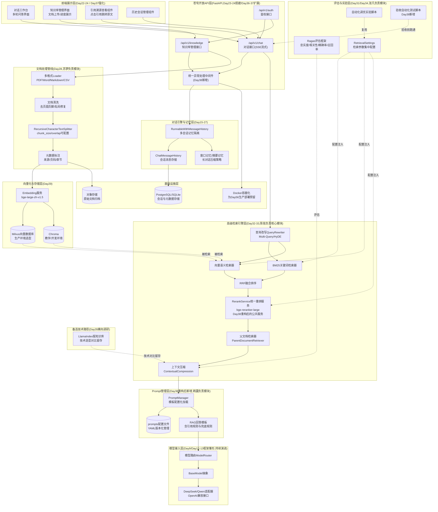
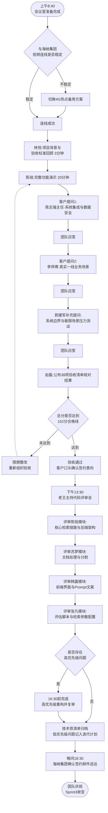
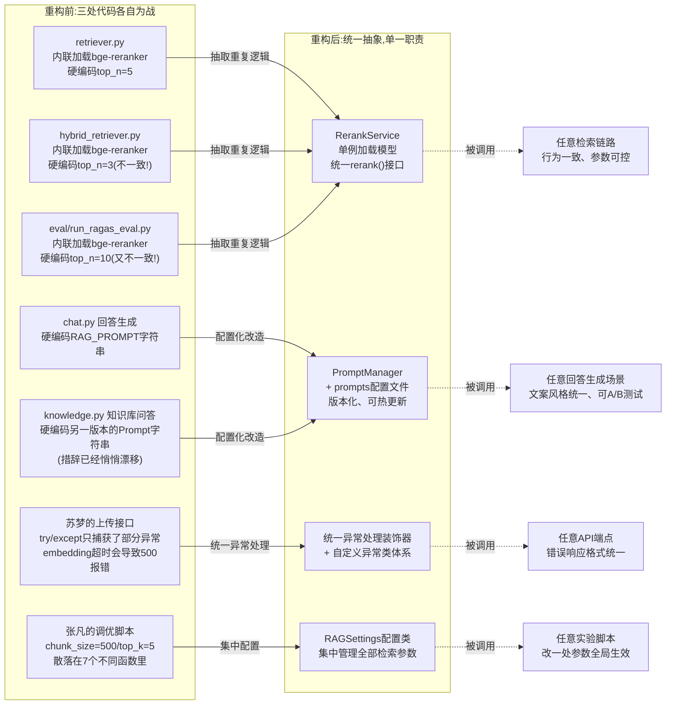

# 第38天:项目答辩与代码评审

> **星期**:周三(入职第38天,转正之后的第24天,第六周周三)
> **对应Sprint**:Sprint 3 · RAG进阶与交付(Day32-38)—— 今天是本Sprint的最后一天,也是阶段项目二"海纳制造集团企业知识库问答系统"的正式收官日。明天(Day39)将翻开新的一页,正式进入 Sprint 4 · Agent基础。
> **飞书任务号**:CQ-267(海纳制造集团项目验收演示与答辩)、CQ-268(Sprint3团队级代码评审与重构任务)、CQ-269(项目交付归档与签约确认流程)
> **参与人**:陈铭、苏梦、韩露、张凡(导师王振宇全程主持);产品经理林悦(演示环节主持人+代码评审列席);测试工程师赵磊(演示环节验收清单核对人+代码评审列席);CTO郭建军(演示环节以"客户视角"补充提问,晚间列席庆祝);海纳制造集团信息中心主任陈志强、设备维护三部班长李师傅(远程连线,出席验收演示环节)
> **今日关键词**:项目验收演示 / 客户视角尖锐提问 / 验收标准与答辩评分表 / 代码评审会 / Rerank逻辑重复 / Prompt模板硬编码 / 异常处理缺失 / 检索参数散落各处 / 重构建议 / 海纳集团签约确认

---

## 【旁白】

如果把Day25到Day38这十四天摊开在一张时间轴上看,会发现这是一条相当完整的抛物线——起点是老王在周一晨会上那句"苍穹0.1版对话引擎手写代码维护成本会越来越高,我们要引入框架",终点是今天下午会议室里逐渐平息下来的掌声。中间经过的每一天,都不是孤立的知识点堆砌:LangChain把散乱的调用收拢成链,LCEL让链变得可组合、可观测,Memory机制解决了"记住聊过什么"的工程问题,文档加载与分割第一次让陈铭尝到真实脏文档的苦头,向量数据库把切碎的文字变成可以检索的坐标点,Day30深夜十点半那句"根据文档,设备保养应当按照月度、季度、年度三级周期执行"第一次证明了这条链路真的能跑起来。然后是Day31那次结结实实的当头一棒——十个真实业务问题测出来的命中率不到六成,把"能跑"和"跑得好"之间那道看不见的沟壑,第一次摆在了桌面上。

紧接着的一周,是这条抛物线真正爬升的部分。查询改写解决了"客户问法和文档原文不一样"的漏检,混合检索和重排序补上了型号、编号这类精确匹配的短板,Ragas评估框架第一次给出了可以量化、可以对比、可以拿给客户看的分数,LlamaIndex的横向调研让团队明白"懂两个框架"不是学院派的洁癖,而是真实的风险对冲。再往后是Day36、Day37连续两天的封闭开发——需求分析、架构设计、后端接口、前端联调,一路冲到深夜才把最后一个bug按下去。今天,这条抛物线走到了它注定要走到的地方:验收。

今天要发生的事情,表面上是两场会——上午一场对着"客户"讲的答辩,下午一场对着代码讲的评审——但骨子里,它们检验的是完全不同层面的东西。上午检验的是"这套系统能不能真正解决海纳集团的问题",答案要靠陈志强主任和李师傅这样真正要用这套系统的人来点头,而不是靠团队自己觉得"应该差不多了"。下午检验的则是另一件更隐蔽、却同样重要的事:代码写得能跑,和代码写得让团队里的下一个人接手也能看懂、能维护、不踩坑,中间还隔着一整层工程素养。老王后来在评审会开场时说的那句话,后来被陈铭记进了笔记本:"客户签不签合同,今天上午已经basically定了;但这个项目能不能真正变成苍穹平台的一块可复用资产,而不是一堆能跑但只有你自己看得懂的代码,要看下午。"

从技术方法论的角度看,今天上午和下午发生的事情,其实是同一种质检思维在两个不同层面上的具体应用——上午用一份38项的评分表检验"系统对外的行为是否可信",下午用一场逐行代码的评审检验"系统内部的实现是否经得起时间的考验",两者合在一起,才构成了一次真正完整、而不是"走个流程"的项目收官。这种"内外兼修"的验收哲学,后续在Sprint5、Sprint6、Sprint7交付祺瑞集团、御风金融、寰宇集团项目时,会被反复沿用,今天可以算是这套方法论第一次被完整地实践出来。

这一天还承担着一重更深的叙事功能。它是第三阶段(Sprint2-Sprint3,Day25到Day38整整十四天)的收官日,也是陈铭转正之后第一次完整走完"需求—技术攻关—交付—验收—复盘"这条企业级项目的全链路。第一阶段他学的是Python语法本身,第二阶段他学的是怎么把大模型接口封装成一个能用的产品,而这十四天,他真正体会到的是"客户"这个词背后有多少具体的重量——不是一个抽象的甲方概念,而是陈志强主任那句"这套系统能不能理解我们车间老师傅说话的方式"背后,真真切切一线员工每天要面对的工作场景。今天签下的这份合同,是蓬远科技第一份基于苍穹平台正式交付的商业化合同,也是陈铭职业生涯里第一次亲眼见证"我写的代码值多少钱"这个问题有了一个具体的答案。而当晚庆祝的气氛还没散尽,老王就已经在酝酿下一句话——知识库解决的是"问了就懂",但客户很快就会问出下一个问题:"它能不能帮我把这件事直接干了?"这句话,会在明天彻底改变这个团队接下来十天要面对的技术疆域。

---

## 晨会纪要 / 今日目标

**时间**:上午8:40(比平时早开20分钟,因为9点整就要和海纳集团方面连线),二层大会议室"望远"
**出席**:王振宇(老王)、陈铭、苏梦、韩露、张凡;林悦、赵磊全程列席;郭建军9点前赶到会议室

陈铭进会议室的时候,发现桌上已经摆好了投影遥控器、备用笔记本电脑(防止主演示机临时出问题)、还有赵磊昨晚打印出来的一份《验收清单核对表》,厚厚一张纸密密麻麻列了将近四十条。老王站在白板前,看上去比昨晚通宵之后气色好了不少——毕竟昨天深夜跑通全部流程之后,他也睡了几个钟头。

"先说结论,"老王开场就是他一贯的风格,"昨晚十一点多,我把最终版本又完整跑了一遍,链路没问题。今天上午的重点不是再去测bug,是把这套系统‘讲清楚、讲明白’。"他转向陈铭:"你是主讲人,林悦是主持人,负责场控和话题引导,苏梦、韩露、张凡你们三个作为辅助,客户如果问到具体某个模块的细节,我可能会点名让你们补充,做好准备。"

林悦补充了流程安排:"9点整,陈志强主任和李师傅通过视频会议连线进来,我先做3分钟的项目背景与验收标准回顾,然后交给陈铭做20分钟左右的完整演示,包含至少5个真实业务场景的现场问答。演示结束后是自由提问环节,预留30分钟,客户可以问任何问题——包括操作体验、回答准确性、也可能会问系统边界(比如它做不到什么)。郭总会在这个环节以‘客户视角’追加几个问题,主要是帮我们提前压力测试一下,万一今天客户没问到某个点,郭总会补上,这样我们能更全面地看到系统的短板。"

赵磊举了举手里那份清单:"我这边有一份验收标准核对表,一共38条,涵盖功能完整性、回答准确率、响应速度、异常处理、界面体验五大类。演示过程中我会同步打钩,演示结束后当场公布核对结果,不藏着掖着——这也是我们跟客户建立信任的方式,让他们看到我们自己就有一套严格的内部标准,不是等他们发现问题我们才去补。"

老王最后补了一句风险提示:"客户方今天参会的两位,陈志强主任是信息化背景,李师傅是一线设备维护老师傅——这两个人问问题的角度会完全不一样。陈主任可能更关心系统能不能跟他们现有的系统集成、数据安全怎么保障;李师傅大概率会直接拿他脑子里真实遇到过的、最刁钻的现场问题来问,那种问题往往不会照着文档标题问,措辞会很‘接地气’,这正是我们上周(Day32-33)查询改写和混合检索要解决的问题,今天是真正检验的时候。"

陈铭这时候插了一句,带着点没藏住的紧张:"老王,如果李师傅问的问题,咱们知识库里真的没有覆盖到,现场答不上来,会不会很尴尬?"

老王摇了摇头:"答不上来不可怕,可怕的是答不上来还硬答。我上周已经跟你说过,今天你要记住一条底线——遇到系统确实覆盖不到的问题,大大方方承认‘知识库暂时没有这部分内容’,比含糊其辞、拼凑一个听起来像那么回事的答案,要专业得多。客户比我们想象中更能接受‘系统有边界’这件事,他们真正不能接受的,是被一个错误答案误导,结果拿错误信息去指导设备操作,那才是真正的风险。"林悦也在旁边补充了一句作为定心丸:"而且我们提前跟陈主任沟通过,这次演示的定位是‘验收+压力测试’,不是‘表演一场完美无缺的秀’,他们比我们想象中更希望看到系统真实的样子,包括它的短板在哪里。"陈铭听完,肩膀明显松弛了一些。

**今日目标**:

1. 上午9:00-9:03:林悦主持,项目背景与验收标准回顾。
2. 上午9:03-9:25:陈铭主讲完整演示,覆盖知识库问答核心功能、多轮对话、引用溯源、异常兜底,并现场回答陈志强主任、李师傅提出的真实业务问题。
3. 上午9:25-10:00:自由提问与答辩环节,客户方与郭建军共同提问,团队现场应答(必要时苏梦/韩露/张凡补充技术细节)。
4. 上午10:00-10:15:赵磊公布验收清单核对结果,林悦确认验收结论,双方口头确认签约意向。
5. 下午13:30-16:30:老王主持代码评审会,逐一评审陈铭(核心检索链路与后端架构)、苏梦(文档处理与分割模块)、韩露(前端界面与Prompt文案模块)、张凡(评估脚本与检索参数配置模块)四人负责的代码,给出具体重构建议。
6. 下午16:30-17:30:团队按照评审意见,现场完成至少一处高优先级重构并提交代码评审通过。
7. 晚间18:30起:海纳集团方面确认签约意向邮件送达,郭建军组织简短的项目庆祝,顺带布置Sprint3收尾归档任务与Sprint4预告。

**昨日进展回顾(Day37)**:

- 前端界面与后端接口完成联调,支持多轮对话、引用溯源展示、流式输出,深夜时段完成全部核心场景的联合测试。
- 赵磊在联调过程中记录的18个缺陷已全部修复并回归验证通过。
- 陈铭在凌晨的复盘笔记里写下"这次是真的能交付了",但也坦白"代码里有些地方是为了赶时间抄的自己昨天写的东西,今天肯定要挨老王的批"。

**风险点**:

- 客户方远程连线可能存在网络波动,林悦已提前在备用会议室准备了4G网络热点作为兜底方案。
- 演示环节现场提问不可控,如果客户问到系统明确不支持的场景(比如跨文档的复杂推理),需要提前和团队对好"如实说明边界,不要硬答"的应答策略,避免过度承诺埋下交付风险。
- 下午代码评审如果发现较大的架构性问题,现场重构的时间窗口只有一个小时,老王要求评审时优先标注"高优先级(今天必须改)"和"中低优先级(记录进技术债清单,后续迭代处理)",不能试图一次性改完所有问题。

---

## 需求文档:《海纳制造集团企业知识库问答系统 · 项目验收标准与答辩评分表》

> 撰写人:林悦(产品经理) · 复核人:王振宇(技术导师)、赵磊(测试工程师)
> 文档编号:CQ-PRD-D38-01
> 版本:v1.0(验收定版)

### 背景

海纳制造集团企业知识库问答系统项目,从Day30搭建首个命令行原型开始,历经Day31效果调优实验、Day32-33高级RAG技术攻坚、Day34评估体系建设、Day35横向技术调研、Day36-37两天封闭开发,到今天已经具备完整的对外交付形态。项目验收不能停留在"团队自己觉得做得不错"这种主观判断上,必须建立一套明确、可量化、双方(蓬远科技与海纳集团)事先达成一致的验收标准,并以此为基础组织正式的验收答辩。本文档同时承担两个功能:一是作为客户验收时逐项打分的评分表,二是作为团队自查、代码评审前的质量基线,确保"验收通过"和"代码质量达标"这两件事被明确地区分开来、又同时被严格要求。

### 验收标准分类与评分表

验收采用五大类、共38项具体指标,每项满分5分,总分190分,合格线为152分(80%),优秀线为171分(90%)。

**第一类:功能完整性(共10项,50分)**

| 序号 | 验收项 | 具体要求 | 满分 | 备注 |
|---|---|---|---|---|
| 1 | 多格式文档上传 | 支持PDF、Word、Markdown、CSV四种格式,单文件不超过50MB | 5 | 对应Day28文档加载能力 |
| 2 | 文档解析与分块 | 上传后自动完成清洗、分割、向量化入库,全流程无需人工干预 | 5 | 对应Day28-29 |
| 3 | 单轮问答准确率 | 简单事实类问题(如"XJ-3200A的额定转速是多少")回答准确 | 5 | |
| 4 | 多轮对话记忆 | 支持上下文追问(如"那它的保养周期呢"),正确理解指代 | 5 | 对应Day27 |
| 5 | 混合检索能力 | 关键词/型号类问题(编号、代码)检索命中率达标 | 5 | 对应Day33 |
| 6 | 语义改写问题理解 | 口语化、非标准措辞问题也能正确检索到对应文档 | 5 | 对应Day32 |
| 7 | 引用来源标注 | 每条回答明确标注引用的文档名称、章节或页码 | 5 | |
| 8 | 兜底策略 | 知识库中确实没有答案时,如实告知而非编造 | 5 | |
| 9 | 多会话隔离 | 不同用户/不同会话之间上下文互不干扰 | 5 | 对应Day27 |
| 10 | 权限与账号管理 | 支持不同角色(管理员/普通员工)登录与知识库管理权限区分 | 5 | |

**第二类:回答质量与准确性(共8项,40分)**

| 序号 | 验收项 | 具体要求 | 满分 |
|---|---|---|---|
| 11 | 忠实度(Faithfulness) | Ragas评估忠实度指标不低于0.85 | 5 |
| 12 | 答案相关性 | Ragas评估答案相关性指标不低于0.85 | 5 |
| 13 | 上下文精确率 | Ragas上下文精确率不低于0.80 | 5 |
| 14 | 上下文召回率 | Ragas上下文召回率不低于0.80 | 5 |
| 15 | 真实业务问题命中率 | 海纳集团提供的20个真实业务问题(含Day31原10个+新增10个)命中率不低于90% | 5 |
| 16 | 编号/型号精确检索 | 涉及设备编号、报警代码的问题,精确匹配准确率不低于95% | 5 |
| 17 | 回答简洁度 | 回答不冗余,先结论后展开,平均长度控制在合理范围 | 5 |
| 18 | 多轮追问一致性 | 连续追问同一主题,前后回答不自相矛盾 | 5 |

**第三类:性能与稳定性(共8项,40分)**

| 序号 | 验收项 | 具体要求 | 满分 |
|---|---|---|---|
| 19 | 首字响应时间 | 流式输出首个token返回时间不超过2.5秒 | 5 |
| 20 | 完整回答时间 | 单次问答完整耗时不超过10秒(含检索+重排+生成) | 5 |
| 21 | 并发能力 | 支持至少20个用户同时在线提问,响应时间不明显劣化 | 5 |
| 22 | 检索服务稳定性 | 连续运行4小时无内存泄漏、无服务崩溃 | 5 |
| 23 | 异常处理完整性 | 网络超时、模型服务不可用等异常场景有明确提示,不白屏不崩溃 | 5 |
| 24 | 大文档处理能力 | 单文档超过500页时,上传解析不超时、不失败 | 5 |
| 25 | 知识库更新时效性 | 新上传文档5分钟内可被检索到 | 5 |
| 26 | 服务可用性 | 单点故障(如向量数据库短暂不可用)有降级策略,不导致整体服务不可用 | 5 |

**第四类:用户体验(共7项,35分)**

| 序号 | 验收项 | 具体要求 | 满分 |
|---|---|---|---|
| 27 | 界面简洁易用 | 一线员工(非技术背景)5分钟内能独立完成基本操作 | 5 |
| 28 | 流式打字机效果 | 回答以流式方式逐字呈现,体验流畅 | 5 |
| 29 | 引用溯源可点击查看 | 点击引用编号可查看原文对应片段 | 5 |
| 30 | 移动端基本可用 | 手机浏览器访问基本功能可用(不要求完全响应式) | 5 |
| 31 | 历史会话管理 | 可查看、切换、删除历史会话记录 | 5 |
| 32 | 反馈机制 | 用户可对回答进行"有用/无用"反馈,便于后续优化 | 5 |
| 33 | 错误提示友好性 | 出错时提示语言通俗易懂,不暴露技术堆栈信息 | 5 |

**第五类:工程与文档交付(共5项,25分)**

| 序号 | 验收项 | 具体要求 | 满分 |
|---|---|---|---|
| 34 | 代码质量 | 通过团队内部代码评审,无重大架构性问题遗留 | 5 |
| 35 | 部署文档 | 提供完整的部署说明,支持后续运维人员独立部署 | 5 |
| 36 | 评估报告 | 提供基于Ragas的正式评估报告(对应Day34产出) | 5 |
| 37 | 操作手册 | 提供面向一线员工的操作使用手册 | 5 |
| 38 | 后续迭代规划 | 提供后续版本迭代计划(如二期扩展需求预留说明) | 5 |

### 非功能需求

- **数据安全**:海纳集团上传的设备手册、工艺文件属于内部资料,不得用于团队内部其他项目训练或对外展示(演示环节使用脱敏后的教学模拟文档)。
- **响应式设计**:核心交互流程需要在主流浏览器(Chrome、Edge)上表现一致。
- **可维护性**:核心业务逻辑代码需要通过团队内部代码评审,评审意见中标注为"高优先级"的问题必须在项目正式移交前修复完毕。

### 验收结论判定规则

- 总分≥171分(90%):优秀通过,可作为标杆案例向公司其他项目组分享。
- 152分≤总分<171分:合格通过,允许存在少量待优化项,列入后续迭代计划。
- 总分<152分:不通过,需要限期整改后重新组织验收。

### 关于评分表设计思路的说明

林悦在文档评审会上专门解释了为什么要把38项指标拆分成这五大类,而不是简单地做一份"通过/不通过"的清单:"如果只是一份笼统的通过清单,一旦出现问题,我们很难说清楚‘这个系统到底差在哪里’,客户也很难判断‘差多少才算能接受’。拆成五大类、每项打分,好处是即使某一项没拿到满分,我们依然可以清楚地告诉客户‘具体是哪个环节还有提升空间,提升空间有多大’,这比一句笼统的‘还不够好’要有说服力得多,也更容易在后续迭代里追踪进展。"

老王补充了一层技术团队视角的考虑:"这份评分表的另一层用途,是给我们自己团队用的——它不只是‘验收当天用一次就扔’的东西。评分表里第五类‘工程与文档交付’,专门把‘代码评审通过’作为一项独立指标列出来,而不是把它藏在‘功能完整性’或者‘性能与稳定性’里面,就是想明确传递一个信号:客户验收通过,和代码质量达标,是两件需要分别检验、缺一不可的事情,不能因为前四类分数很高,就在第五类上打马虎眼。"这份评分表最终也被郭建军当场拍板,定为"苍穹平台后续所有客户项目验收的标准模板",后续祺瑞集团、御风金融、寰宇集团项目的验收,都会在此基础上按需调整具体指标,但五大类的框架会被沿用下去。

---

## 架构设计图:苍穹0.5版 —— 海纳集团企业知识库问答系统完整架构总览

这张图是对Day25到Day37全部技术组件的一次系统性汇总。老王在准备答辩材料时特意要求陈铭把它画出来,理由很直接:"客户不需要看你的代码,但他们需要看懂‘他们的钱花在了什么地方’,一张说得清楚的架构图,比讲十分钟话更有说服力。"



这张架构总览图想说明的核心事实是:苍穹平台从Day25到Day37长出来的,不是十四个孤立的技术点,而是一整套自上而下、层层依赖的工程体系。前端展示层负责把复杂性隐藏起来,让李师傅这样的一线员工5分钟就能上手;API层是所有请求的统一入口,今天新增的统一异常处理中间件,正是下午代码评审会要重点讲的内容之一;记忆层保证了多轮对话和多用户隔离;文档处理管线、向量化存储、以及最核心的高级检索引擎层,是过去两周里投入精力最多的部分,查询改写、混合检索、RRF融合、重排序、父文档检索器、上下文压缩,六个技术点像六道关卡,一层层把"用户随口一问"打磨成"检索到最相关的证据";Prompt管理层和评估层是今天新增和强化的两块,分别对应下午代码评审会里两个最重要的重构议题。

老王在讲解这张图给客户看的时候,特意在"高级检索引擎层"停留了比较长的时间,他对陈志强主任解释:"你们车间老师傅问问题不会照着文档目录问,他们会说‘那个报警灯一直闪红的是怎么回事’,这句话如果直接拿去做向量检索,效果会打折扣——所以我们在中间加了六层处理,先把口语化的问法改写成更适合检索的形式,再同时用关键词和语义两种方式检索,最后用一个专门的模型给检索结果重新排序,确保排在最前面的,才是真正跟问题最相关的那几段。"这段解释后来被林悦记录进了验收纪要,作为"技术投入合理性"的重要佐证。

这张图对陈铭个人而言,还有一层他自己没有立刻说出口的感受。他后来在笔记本里写道:"画这张图的时候,我把Day25到Day37每一天学的东西,一个一个往上摆,摆到‘Prompt管理层’那一格时,我突然意识到,这一格是昨天晚上才真正确定要加进去的——这说明这张架构图不是‘提前设计好、然后照着做’的产物,而是‘做的过程中不断发现新问题、不断给系统打补丁’长出来的。这可能才是真实的企业级项目开发最真实的样子:不是先有一张完美的蓝图,而是蓝图跟着实际踩过的坑一起生长。"这段感受,后来也被老王引用进了下午代码评审会的开场白里,作为"为什么代码评审要经常做,而不是只做一次"的一个佐证。

---

## 流程图:项目答辩与验收全流程



这张流程图刻意保留了"不达标就要重新验收"这条分支,并不是因为今天真的走到了那条路上,而是想让课堂笔记之外的读者(以及未来复盘时的团队自己)记住:验收从来不是一场"走个流程"的表演,它是有明确失败可能性的真实检验。今天团队之所以能顺利走完主干路径,靠的不是运气,而是Day31到Day37整整一周扎扎实实的技术投入——如果没有查询改写和混合检索,李师傅那句"报警灯一直闪红"式的口语化提问,很可能在演示现场就当场翻车。

---

## 示意图:代码评审前后关键模块重构对比



这张示意图基本上就是下午整场代码评审会的"结论浓缩版"——老王后来评价说,如果一开始画出这张图,今天下午的评审效率至少能提高一半,但他又补了一句:"图是结果,不是起点。你们得先经历‘写重复代码’的阶段,才会真正理解为什么要抽象。如果我一开始就把这张图甩给你们,你们记住的只是‘应该这么做’,不会记住‘为什么应该这么做’。"

---

## 课堂笔记

### 上午:项目答辩演示

9点整,视频会议如期连上。屏幕那头,陈志强主任戴着眼镜,身后是一张贴满流程图的办公室墙面;李师傅穿着深蓝色的工装,坐姿略显拘谨,手边放着一个磨得发亮的笔记本——陈铭后来才知道,那是李师傅记录了二十多年设备维护经验的手写笔记本,今天特意带过来,是想拿里面记的真实案例来"考考"这套系统。

林悦按照流程开场:"陈主任、李师傅,今天想跟您们汇报一下海纳集团企业知识库问答系统的开发成果,同时也想借这个机会,当着您们的面把我们内部的验收标准过一遍,确保这套系统真正能解决贵司一线员工日常查阅设备手册、工艺文件、质量规范时遇到的效率问题。"她简单回顾了项目立项以来的几个关键节点,然后把话筒交给了陈铭。

陈铭深吸一口气,开始了他职业生涯里第一次真正意义上的"客户演示"。他没有从技术架构讲起,而是直接打开了系统界面,说:"我们先直接看效果,技术细节我随时可以补充。"

**演示片段一:简单事实类问题**

陈铭在对话框里输入:"XJ-3200A型号数控机床的额定主轴转速是多少?"

系统流式吐出回答,大约2秒后开始逐字显示:"根据设备手册记载,XJ-3200A型号数控机床的额定主轴转速为3200转/分钟,最高允许转速不超过3800转/分钟(超过该值将触发主轴过速保护)。[资料来源:《XJ-3200A数控机床操作维护手册》第2章·主要技术参数]"

陈铭指着回答下方的引用标注说:"这里点击引用编号,可以直接查看原文对应的段落,方便大家核实,也方便一线员工确认这个答案不是AI‘编’出来的。"他现场点击了引用链接,弹出的浮层准确显示了手册原文截图。

**演示片段二:多轮追问**

陈铭接着输入:"那它的保养周期呢?"

系统正确理解了"它"指代前一轮问题里的XJ-3200A,回答:"XJ-3200A型号数控机床的保养周期分为三级:月度保养(检查润滑系统、清理导轨)、季度保养(检查主轴轴承、校验精度)、年度保养(全面检修、更换易损件)。[资料来源:《设备保养作业指导书》第2节]"

陈志强主任在这里第一次开口:"这个多轮对话的理解能力,是我比较关心的一点。我们车间的人问问题经常是这种‘接着问’的方式,如果系统每次都要重新说明白主语是谁,反而更麻烦。"

**演示片段三:李师傅的现场提问(压力测试环节)**

林悦把话筒交给李师傅,示意可以开始提问。李师傅翻开他那本手写笔记本,找到一页,念了出来:"三号车间那台老设备,报警灯一直闪红的,你们这系统知道是咋回事不?"

这句话里没有任何设备型号、没有任何标准术语,完全是李师傅平时在车间里跟同事交流的原话。陈铭心里其实是有点紧张的,但还是把这句话原样输入了系统。

系统经过大约3秒的检索(比之前的问题略慢,因为触发了查询改写),给出回答:"根据设备报警代码规范,‘红色常亮报警灯持续闪烁’通常对应E-07类报警(过载保护触发),常见原因包括:①负载超过设备额定值;②冷却系统故障导致温度过高触发保护;③传感器故障导致误报。建议按以下顺序排查:先检查当前加工负载是否超标,再检查冷却系统运行状态,若排除以上两项仍报警,建议联系设备科检查传感器。[资料来源:《设备报警代码手册》第4章·常见报警处理]"

李师傅愣了一下,抬头看向屏幕:"这答案说得还挺对路的,跟我们平时排查的思路差不多。"他顿了顿,又补了一句:"不过我这个问题问得挺随意的,连型号都没说,它咋知道我说的是那台老设备?"

陈铭解释:"这个问题我们其实有专门处理——如果您的问题里没有明确指出具体型号,系统会先在您上传的知识库范围内检索‘报警灯闪红’相关的通用规范条目,优先给出最常见、适用范围最广的解释;如果知识库里有多个型号对应不同的报警处理方式,系统会在回答里注明‘不同型号处理方式可能有差异,建议补充具体型号以获取精确答案’。这也是我们特意设计的一条兜底策略,避免在信息不全的情况下给出误导性的确定答案。"

**演示片段四:边界场景(如实说明系统限制)**

郭建军这时候插话,提出了一个更刁钻的问题:"陈铭,你现场试一下,如果我问一个知识库里完全没有的问题,比如问它‘今年集团的营收目标是多少’,它会怎么回答?"

陈铭照做,输入了这个问题。系统回答:"抱歉,根据目前上传的知识库内容(设备手册、工艺文件、质量规范),我没有找到与‘集团营收目标’相关的信息。这类信息可能不在本知识库的覆盖范围内,建议您咨询相关业务部门获取准确数据。"

郭建军点了点头:"这个很关键——它没有硬编一个数字出来糊弄人,这是我们必须守住的底线。"陈志强主任也在屏幕那头表示认同:"这一点我们内部也讨论过,如果这套系统‘一本正经地胡说八道’,反而比不给答案更危险,员工可能会真的相信它说的话去操作设备。"

**演示片段五:精确编号检索**

最后一个演示场景,陈铭主动挑了一个此前Day31暴露过短板的问题类型:"E-15报警代码是什么意思?"

系统在不到1秒内返回精确结果:"E-15报警代码含义为:液压系统压力异常(低于设定阈值)。处理建议:检查液压油位是否充足,检查液压泵是否正常运转,检查管路是否存在泄漏。[资料来源:《设备报警代码手册》第4章·常见报警处理,编号索引表]"

陈铭在这里补充解释了一句:"这类涉及精确编号的问题,我们专门做了混合检索的优化——既用语义理解,也用关键词精确匹配,两种结果会做融合排序,确保‘E-15’这种精确编号不会因为语义检索的模糊性而被漏掉。"

**自由提问环节精选**

演示结束后进入自由提问,几个问题的应答被林悦完整记录进了验收纪要:

陈志强主任问:"这套系统的数据存在哪里?会不会有信息泄露的风险?"

老王亲自回答:"目前部署方案是私有化部署到贵司内网环境,所有文档数据和向量索引都存储在贵司内部服务器上,不会经过我们的外部服务器,也不会用于训练其他客户的模型。大模型推理调用目前走的是DeepSeek/通义千问的API,如果贵司对这一点有更严格的合规要求,我们也支持后续升级为完全本地化部署的开源模型方案,这部分技术我们团队后续几个月也会持续投入(此处呼应第五阶段御风金融项目的私有化部署技术线)。"

李师傅又追问了一个问题:"要是设备手册更新了,新版本啥时候能查到?"

陈铭回答:"目前的设计是新文档上传后5分钟内可以被检索到,系统会自动完成文档解析和入库,不需要人工干预。如果是替换旧版本文档,我们也支持知识库管理界面里做版本标记,方便大家分辨查到的是最新版还是历史版本。"

陈志强主任接着问了一个更偏信息化管理角度的问题:"我们厂里现在已经有一套OA系统和一套设备管理系统,这套问答系统能不能跟它们打通,或者说,以后会不会变成‘信息孤岛’,员工要在好几个系统里来回切换?"

林悦接过了这个问题:"这是个很好的问题,也是我们在需求梳理阶段专门考虑过的。目前这一版,苍穹知识库问答系统是独立部署的,主要解决‘查文档、问知识’这一类需求,暂时没有和贵司现有的OA、设备管理系统做数据打通。但我们在架构设计上预留了标准的API接口,后续如果贵司有需要,是可以通过接口对接的方式,把问答能力嵌入到现有系统里,或者反过来,让问答系统读取设备管理系统里的实时数据——这部分我们会作为二期需求,单独出一份技术方案评估。"陈志强主任对这个回答表示认可,提到"分阶段推进"符合他们内部信息化建设一贯的节奏。

郭建军也顺势问了一个更偏成本角度的问题,是团队私下讨论过、但没想到郭建军会当着客户的面直接问出来的:"陈铭,这套系统跑起来,每天调用大模型的成本大概是什么量级?这个信息我觉得可以坦诚地告诉陈主任,毕竟长期使用下去,运营成本客户也需要有心理预期。"

陈铭稍微愣了一下,但很快调整过来,按照赵磊昨晚帮他一起核算过的数据回答:"以目前测试阶段的调用量估算,平均每次问答消耗的token成本,加上重排序模型的计算资源折算,单次问答的成本大概在几分钱到一角钱的区间,具体要看问题复杂度和检索到的资料长度。如果按照全厂几百人的规模、每人每天平均问答3到5次来估算,月度成本是完全在可控范围内的,而且随着后续我们对Prompt和检索链路的持续优化,这个成本还有下降空间。"陈志强主任在视频那头笑了一下,说"这个数字我们内部之前也估算过,和你们说的差得不多,说明你们的成本模型是靠谱的"。

郭建军最后总结性地问了一句,是这场答辩里份量最重的一个问题:"如果我们把这套系统真正铺开到全厂几百个一线员工同时用,会不会顶不住?"

陈铭没有独自回答,而是把这个问题递给了老王——这是他们在会前商量好的策略,涉及系统整体性能承诺的问题,由技术负责人正式表态更稳妥。老王回答:"我们做过基础的并发压测,目前验证过20个用户同时提问没有明显的响应劣化,如果要支持几百人同时在线,我们建议采用分阶段上量的方式——先在1到2个车间试点两到四周,同时我们会持续观察服务器资源占用情况,再逐步扩大到全厂范围,这样可以把风险控制在可管理的范围内,也给我们团队留出充分的时间做容量规划和必要的资源扩容。"

这个回答后来在下午的复盘里被老王专门点出来讲给团队听:"技术人员在客户面前最容易犯的错误,不是说‘做不到’,而是被现场气氛带着,顺口说出一个自己没有把握的‘能做到’。今天这个问题,我给的是一个‘诚实但有信心’的答案——诚实地说明现在验证过的边界在哪里,同时给出一个降低风险的落地路径,而不是空口承诺一个数字。"

10点整,赵磊公布了验收清单的核对结果:38项指标中,36项满分通过,2项(并发能力、移动端基本可用)评为4分——并发能力受限于目前只验证了20用户压测,移动端受限于界面还没有针对手机浏览器做专门优化,均记入后续迭代计划,总分184分,达到优秀通过线。陈志强主任在视频会议里表示:"这个结果超出我们的预期,我们内部会走一下合同确认流程,今天下午应该就能给到明确答复。"

### 下午:代码评审会

13点30分,会议室换了另一种气氛。上午的演示环节大家绷着一股"面对客户"的劲儿,下午则完全是老王的主场——白板前只有他一个人站着,陈铭、苏梦、韩露、张凡四人围坐一圈,林悦和赵磊坐在稍靠后的位置旁听。

老王开场先定了调子:"上午的答辩,是给客户交代;下午这场评审,是给苍穹平台这个产品交代,也是给你们四个人自己交代。我不会因为上午验收通过了,就对代码质量放松要求——恰恰相反,一个项目验收通过之后,代码往往会被长期维护、被复用到下一个项目里,这时候代码质量的重要性,比项目冲刺阶段更高,不是更低。"他顿了顿,又补了一句:"不过评审不是找茬大会。我们先花二十分钟,把这两周里写得真正漂亮的代码挑出来,讲清楚它好在哪里——这些东西要沉淀成团队的公共资产,不能因为项目上线就被遗忘在某个分支里。"

**优秀代码分享环节**

老王第一个点名的,是张凡在Day31写的那份"自动化调优实验脚本"里的一段对照实验框架代码。"这段代码我专门留到今天讲,"他说,"张凡当时设计的这套实验框架,把‘固定其他变量、只改一个变量、跑出数据、再固定新的最优值调下一个变量’这套方法论,用一个可复用的`ExperimentRunner`类完整封装了下来,后来Day34做Ragas评估的时候,陈铭直接复用了这个框架的思路,没有重新发明轮子。这就是好代码的一个重要标准——不是‘写得多聪明’,而是‘写完之后,团队里的其他人愿意直接拿来用,而不是绕开它重新写一遍’。"张凡听到这段评价,脸上少见地露出了点不好意思的笑容。

第二段被表扬的代码,来自苏梦负责的文档清洗模块。老王调出Day28的那段处理"表格错位、页眉页脚干扰"的清洗逻辑:"苏梦这段代码,注释写得特别到位——不是那种‘这一行在做字符串替换’式的废话注释,而是每一条清洗规则后面都写清楚了‘这条规则是为了解决哪一类真实文档里遇到的问题’。我后来带你们做Day36封闭开发的时候,新加入的同学看这段代码,基本不需要我额外讲解就能看懂为什么要这么处理,这就是文档质量本身带来的效率。"

第三段是韩露负责的前端引用溯源组件。"点击引用编号弹出原文这个交互,你把加载状态、异常状态(比如原文因为某种原因暂时取不到)、正常展示这三种状态分得非常清楚,没有出现那种‘只考虑了正常情况,没考虑异常情况就直接上线’的问题——这一点,恰好是我们接下来要讲的‘异常处理’话题里,你反而做得比后端某些同学更细致的地方,这个反差我觉得值得说一下。"

最后,老王也没有回避陈铭的核心检索链路代码本身的优点:"抛开我马上要讲的重复代码问题,陈铭在RRF融合排序这段算法实现上,变量命名和逐步拆解的方式是清楚的,即使是没学过信息检索的人,顺着代码往下读,也能大致理解‘为什么要用这种方式融合两种检索结果的排名’,这一点是很多人写算法代码时容易忽略的——写对不难,写得让别人看得懂,才是真正的功夫。"

肯定完这四段代码之后,老王才切换到白板前,语气也变得更严肃了一些:"好,表扬的部分说完了。接下来这一个多小时,我们要挨个把问题揪出来。提前说一句,我接下来点出的问题,不代表你们整个模块都不行,只是代表‘这里有一个值得所有人共同学习的坑’。"

他把评审顺序定为:先看陈铭负责的核心检索链路与后端整体架构,再依次看苏梦、韩露、张凡各自负责的模块。

**评审陈铭:核心检索链路与后端架构**

老王打开了陈铭在GitLab上提交的分支代码,直接定位到`services/rag/retriever.py`、`services/rag/hybrid_retriever.py`和`eval/run_ragas_eval.py`三个文件,把它们并排打开在屏幕上。

"陈铭,你自己看一眼,这三个文件里,加载bge-reranker模型、调用重排序的那段代码,长得像不像?"

陈铭盯着屏幕看了几秒钟,脸色慢慢变了:"……几乎一模一样,就是top_n的默认值不一样。"

"不止不一样,"老王把三处代码的top_n值圈了出来,"retriever.py里是5,hybrid_retriever.py里是3,run_ragas_eval.py里是10。你自己想想,如果客户现在问‘为什么同一个知识库,不同入口给出的答案详略程度不一样’,你怎么解释?"

陈铭想了想,老实说:"这三处代码是我在Day30、Day33、Day34三个不同的时间点分别写的,写的时候都是‘能跑就行’的心态,后面写的时候忘了去看之前写的代码,就又写了一遍。"

老王点头:"这是一个非常典型的问题,我把它归类为‘自己抄自己’——比抄别人代码更容易被忽视,因为写的时候你会有一种‘反正逻辑我都懂’的错觉,不会像抄别人代码那样有心理负担去检查一致性。但结果是一样的:同一个逻辑散落在三个地方,任何一处需要改(比如后续升级重排序模型、调整分数阈值),你都要记住三个地方全部同步修改,一旦漏改一处,就会出现‘不同入口行为不一致’这种客户会明确感知到的问题。这是今天评审里我认为优先级最高的一项,要求今天下午必须完成重构:把这段逻辑抽取成一个统一的`RerankService`,所有调用方都通过这个服务获取重排序结果,参数(top_n、分数阈值)统一从配置读取,不允许在业务代码里再出现硬编码的模型加载和默认参数。"

接着老王又看了陈铭负责的API层代码,这次的评价相对正面:"chat.py的整体分层是清楚的,路由层、服务层、数据层职责划分没有明显问题,这一点我要肯定——这说明你在Day23-24学FastAPI的时候,分层的意识是真正建立起来了的。但我发现每个接口里都有一段几乎相同的try/except,捕获的异常类型也不完全一致,这个问题我们放到苏梦的模块里一起讲,因为她那边这个问题暴露得更明显、更有代表性。"

**评审苏梦:文档处理与分割模块**

老王翻到苏梦负责的文档上传与解析接口,先是肯定了一句:"你这块的核心分割逻辑写得挺扎实,chunk的边界处理、元数据标注这些细节都考虑到了,这是踏实的功夫,说明你确实把Day28那天讲的东西完全消化了。"

苏梦松了一口气,但老王紧接着话锋一转:"但是我要你重点看一下这段代码。"他把`api/v1/knowledge.py`里的上传接口投影出来,指着一段异常处理逻辑:"你这里的try/except,只捕获了`FileNotFoundError`和`ValueError`两种异常,如果Embedding服务调用超时,会抛出什么异常?"

苏梦想了一下:"应该是……requests的Timeout异常,或者我们自己封装的那个调用超时异常?"

"对,但你这里没有捕获它。"老王调出了昨天联调时赵磊记录的一条缺陷记录:"赵磊昨晚测试的时候,故意模拟了一次Embedding服务响应慢的场景,你这个接口直接抛出了未捕获的500错误,前端收到的是一个完全没有意义的错误堆栈信息,用户体验非常差。这不是个例——我发现你写的三个接口里,类似‘只覆盖了自己测试时遇到过的异常类型,没有覆盖异常类型的全集’这种问题,出现了不止一次。这是很多刚开始写工程代码的人都会踩的坑:异常处理的完整性,不能靠‘我测试的时候是不是刚好遇到过这个错误’来判断,而要靠‘系统性地枚举这个操作可能失败的所有原因’来判断。"

他给出的重构建议是:"我们需要一套统一的自定义异常类体系,把‘知识库相关的错误’‘检索相关的错误’‘模型调用相关的错误’分门别类定义清楚,再配合一个统一的异常处理装饰器或者FastAPI的全局异常处理器,这样任何一个接口只要抛出这套体系里定义好的异常,都会被自动转换成统一格式的、对用户友好的错误响应,不需要每个接口自己写一遍try/except。"

老王特意补了一句安慰苏梦的话:"这个问题不是你一个人的问题,陈铭那边的接口也有类似的遗漏,只是你这边因为文件上传涉及的失败场景更多,暴露得更充分。我把这个问题放在你的模块里讲,不是因为你写得比别人差,而是因为你的代码给了我们一个最好的教学素材。"

赵磊在这里补充了一个测试视角的细节,让苏梦的反思更具体了一层:"我昨晚测试的时候,其实一开始也没想到要去模拟Embedding服务超时这种场景,是我把我们公司内部的一份《异常场景测试清单》拿出来对照了一下,才想起来要专门测一下网络类异常。这份清单是赵磊团队这几个月陆陆续续踩坑积累下来的,涵盖了超时、限流、连接中断、返回格式异常这几大类,后面我可以分享给你们四个,以后写接口的时候,可以先照着清单里列的场景,把异常处理写完整,而不是等到测试环节才发现漏洞。"苏梦当场就把这份清单要了过去,存进了自己的笔记文件夹。

老王又补充了一层更本质的观察:"其实‘异常处理不完整’这个问题,几乎不可能靠‘我再仔细一点’来彻底解决——人的注意力天然是有限的,没有人能凭记忆穷尽一个系统所有可能失败的方式。真正靠得住的做法,是把‘这个操作可能会怎样失败’这件事,从‘凭经验去想’,变成‘有一套结构化的方法去系统性地枚举’,再进一步,把处理这些异常的逻辑,从‘每个接口自己写一遍’,变成‘写一次,处处复用’。这也是为什么我接下来要讲的重构方案,不只是‘帮你把这几个异常补上’,而是从架构层面解决‘以后新增任何接口,都不会再犯这个问题’。"

**评审韩露:前端界面与Prompt文案模块**

轮到韩露的时候,老王先是从前端界面本身的角度给了肯定:"引用溯源那个点击查看原文的交互,做得比我预期的要好,细节上考虑得比较周到,比如加载状态的过渡效果,这个是产品经理转型过来的人才会特别在意的地方,技术出身的人反而容易忽略。"

但接下来的问题,是老王认为整场评审里最值得深挖的一处:"你负责的是前端,但你有没有留意到,我们的RAG回答模板,其实有两个版本?"

韩露愣了一下,似乎没有想到这个问题会问到自己头上。老王解释:"你在设计前端展示逻辑的时候,发现原来`chat.py`里的Prompt模板不太符合前端展示需要的格式(比如引用编号的呈现方式),所以你自己在`knowledge.py`那边悄悄改了一版,方便前端解析,但你没有同步通知陈铭,也没有更新`chat.py`那边的版本。结果就是,我们现在系统里同时存在两份措辞、格式都有细微差异的RAG Prompt模板,而且这个差异,是在没有任何人主动决策的情况下,‘自然演化’出来的。"

韩露有些不好意思:"我当时确实是想着‘先改自己这边能跑通就行’,没意识到这个会变成一个需要统一管理的问题。"

林悦这时候从旁听席上补了一句,语气比老王更温和,但指向的是同一个问题:"韩露,我完全理解你当时的处境——你发现现有的Prompt格式不好用,第一反应是‘我自己改一下就能解决’,这个反应本身没有错,错的地方在于,你改完之后,没有把这个变化‘广播’出去,让相关的人知道。以后遇到类似情况,哪怕改动很小,也养成一个习惯——在团队群里说一句‘我改了这个,后面大家统一用这个版本’,这句话花不了十秒钟,但能避免很多后续的隐性成本。"韩露认真地点了点头,在自己的本子上记下了这句话。

老王点头:"这正是我今天要重点讲的一类问题——Prompt模板,本质上也是一种需要被工程化管理的‘配置’,不是可以随手写死在业务代码里、想改就改的字符串。它涉及到系统对外呈现的口吻、语气、格式规范,理应像接口文档一样有版本、有评审、有统一的来源,不能出现‘不同模块各自维护一份、悄悄漂移’的情况。我要求你们把RAG的核心Prompt模板抽取到一个独立的配置文件里,用一个`PromptManager`类统一加载和渲染,任何模块需要用到这个Prompt,都从这个统一入口获取,而不是各自复制一份字符串常量再各自修改。这样做还有一个额外的好处——以后我们想做Prompt的A/B测试(比如对比‘先给结论再展开’和‘先分析再给结论’两种风格哪个用户满意度更高),只需要在配置文件里维护多个版本,不需要改动任何业务代码。"

**评审张凡:评估脚本与检索参数配置模块**

最后轮到张凡,老王调出了Day31调优实验脚本和后续张凡维护的检索参数相关代码。"你这块的问题,跟陈铭那边有点像,但表现形式不太一样。"他在屏幕上快速定位了七八个不同的函数,每个函数里都能看到`chunk_size=500`或`top_k=5`这样的数字直接写在代码里。

"你数一数,`500`这个数字在你的代码里出现了几次?"

张凡快速搜索了一下:"……7次。"

"如果客户下周反馈,说想把chunk_size从500调整到600试试效果,你要改几处代码?"

张凡有点尴尬:"7处,而且我不能保证能找全,万一漏改一处,实验结果就会不一致,自己都很难发现。"

老王说:"这就是‘魔法数字散落各处’的典型问题——每一个直接写在代码里、没有名字、没有集中管理的数值参数,都是未来维护成本的一颗定时炸弹。你的数学基础好,写实验对照组的逻辑非常清晰,这一点我要肯定,Day31那次调优实验的框架设计,思路是对的;但工程经验的欠缺,体现在‘参数应该往哪里放’这个问题上——理工科背景容易更关注‘算法逻辑对不对’,容易忽视‘这段代码半年后谁来维护、怎么维护’这个问题。我要求你把所有检索相关的可调参数,集中定义到一个`RAGSettings`配置类里,基于Pydantic Settings实现,支持从环境变量或配置文件覆盖默认值,所有需要用到这些参数的地方,统一从这个配置类读取,不允许再在业务代码或实验脚本里出现硬编码的数字。"

张凡想了想,提出了一个自己一开始没想明白的疑问:"我理解散落各处不好,但我有个问题——像`rrf_k=60`这种参数,是我们Day33查论文资料确定下来的经验值,几乎不会再改,这种‘几乎不会变的参数’,是不是也有必要放进配置类里,还是说可以直接写在代码里当作常量?"

老王觉得这个问题问得好,专门在白板上画了个简单的判断标准:"这是个很实际的问题,我给你一个简单的判断标准——先问自己两件事:第一,这个值未来有没有可能因为‘业务需求变化’或者‘做对比实验’而被调整;第二,这个值是不是在超过一个地方被用到。只要这两个问题里有一个的答案是‘是’,就应该收进配置里。像`rrf_k`这种理论上‘几乎不会变’的参数,但你们在Day33做实验的时候,不也尝试过40、60、80几个不同的值做对比吗?这就已经满足了‘可能被调整’这个条件,应该被配置化;真正可以放心写成代码里的常量的,是那种连它的定义本身都不会变的东西,比如π的近似值,或者HTTP状态码——这些是数学或协议层面的‘绝对常量’,和业务参数完全是两类东西。"这段解释后来被陈铭补充进了团队的《代码规范补充说明》文档里,作为"何时该配置化"的判断依据。

评审进行到这里,已经过了两个小时,老王在白板上写下了四条今天必须完成的重构任务,并按照优先级排列:

1. 【高优先级,今天必须完成】抽取`RerankService`,消除重排序逻辑的重复(陈铭负责)
2. 【高优先级,今天必须完成】建立统一异常处理体系(苏梦主导,陈铭配合)
3. 【中优先级,今天尽量完成,最晚明天上午】抽取`PromptManager`与Prompt配置文件(韩露负责,陈铭配合)
4. 【中优先级,今天尽量完成】建立`RAGSettings`集中配置检索参数(张凡负责)

他最后总结说:"你们今天犯的这几个问题,本质上是同一类问题的四种不同表现——写代码的时候,只考虑了‘这一次需求怎么实现’,没有考虑‘这段逻辑未来会不会在别的地方被重复需要’。这不是能力问题,是所有工程师在成长过程中都会经历的一道坎,我当年也一样踩过。今天之所以要这么认真地抠这些细节,是因为从今天起,你们写的代码不再只是‘练习项目’,而是会被长期维护、被复用到下一个客户项目里的真正的产品代码——苍穹平台接下来还要交付祺瑞集团、御风金融、寰宇集团三个项目,如果每个项目都是重复造轮子、重复踩坑,团队的效率会被拖得越来越低。今天这一步付出的重构成本,是为了让接下来的项目跑得更快。"

### 晚自习:重构提交与归档

晚饭后,团队按照优先级分工,陈铭主导完成`RerankService`的抽取并提交自测通过;苏梦和陈铭合作完成了统一异常处理体系的搭建;韩露在陈铭的配合下完成了`PromptManager`的重构,并把两份漂移的Prompt模板合并为一份;张凡独立完成了`RAGSettings`配置类的重构,并把调优实验脚本和生产代码里的参数读取方式全部统一。

重构过程中还发生了一个小插曲。陈铭在抽取`RerankService`的时候,发现如果直接把三处调用全部替换成新服务,`eval/run_ragas_eval.py`里原本用来计算召回率的候选数量(10条)会和生产环境的默认值(5条)产生冲突——如果强行统一成一个值,评估脚本算出来的召回率会失真,没办法真实反映"检索候选范围更大时能不能覆盖到正确答案"这个评估目的本身的意义。他把这个问题在群里同步给老王,老王给出的答复是:"这恰好说明了‘统一’不等于‘所有地方都用完全相同的值’,而是‘所有地方都从同一个权威来源、以显式传参的方式获取自己需要的值’——评估场景确实需要比生产环境更大的候选范围,这是一个正当的差异化需求,只要这个差异是在代码里显式声明出来的,而不是‘悄悄不一致’,就是合理的。"这也是为什么最终版本的`RAGSettings`里专门保留了一个`eval_candidate_top_n`字段,与生产环境用的`fusion_top_k`区分开来——这个细节被记录进了今天的评审纪要,作为"配置化"和"一刀切"之间边界的一个具体案例。

赵磊在旁边全程跟进重构后的回归测试,晚上八点多的时候,他把重构前后跑的两轮验收自动化测试报告放在一起对比,确认所有指标依然全部通过,才在群里发了一句"重构没有引入新的回归问题,可以放心提交"。这句简短的确认,让忙活了一整天的团队都松了一口气。

18点35分,林悦收到了海纳集团方面发来的邮件,陈志强主任在邮件里正式确认:"经内部评估,贵司交付的知识库问答系统符合我方验收标准,同意签署正式采购合同,后续将安排全厂范围分批部署试点。"这封邮件被投影在会议室大屏幕上时,原本还在低头改代码的几个人,几乎是同时抬起头来。

---

## 代码实战:老王的四处重构建议(重构前后完整对比)

> 说明:以下代码严格对应今天代码评审会上提出的四项重构任务。每一处都给出"重构前"与"重构后"的完整实现,并保留必要的中文注释,说明"为什么这么改",不仅是"改了什么"。目录结构参照`cangqiong-platform/backend/app/`。

### 重构案例一:Rerank调用逻辑重复 → 抽取RerankService统一服务

**重构前:三处几乎相同却又互相不一致的实现**

```python
# ============================================================
# 文件:backend/app/services/rag/retriever.py (重构前)
# 问题:内联加载bge-reranker模型,硬编码top_n=5
# ============================================================
from sentence_transformers import CrossEncoder
from typing import List
from langchain_core.documents import Document


class BasicRetriever:
    """基础检索器,组合BM25与向量检索,并在内部直接调用重排序模型。

    重构前的问题:重排序相关的加载与调用逻辑,完全写死在这个类内部,
    与hybrid_retriever.py、eval/run_ragas_eval.py里的实现几乎相同,
    却各自维护了一份,导致三处的top_n默认值互不一致。
    """

    def __init__(self, vectorstore, bm25_retriever):
        self.vectorstore = vectorstore
        self.bm25_retriever = bm25_retriever
        # 问题点1:重排序模型在这里被直接实例化,每个用到检索器的地方
        # 都会各自加载一份模型到内存里,浪费显存/内存资源。
        print("正在加载bge-reranker-large模型……")
        self.reranker = CrossEncoder(
            "BAAI/bge-reranker-large",
            max_length=512,
        )

    def retrieve(self, query: str, top_k: int = 10) -> List[Document]:
        """检索并重排序,返回最相关的文档片段。"""
        vector_docs = self.vectorstore.similarity_search(query, k=top_k)
        bm25_docs = self.bm25_retriever.get_relevant_documents(query)
        # 简单合并去重(实际Day33版本这里有RRF融合,此处简化展示重排序问题)
        candidates = self._merge_dedup(vector_docs, bm25_docs)

        # 问题点2:重排序的调用逻辑、分数计算方式,直接写在这里,
        # top_n硬编码为5,如果客户/团队想调整,必须来这个文件里改。
        pairs = [[query, doc.page_content] for doc in candidates]
        scores = self.reranker.predict(pairs)
        scored_docs = sorted(
            zip(candidates, scores), key=lambda x: x[1], reverse=True
        )
        top_n = 5  # 硬编码!
        return [doc for doc, score in scored_docs[:top_n]]

    def _merge_dedup(self, list1, list2) -> List[Document]:
        seen = set()
        merged = []
        for doc in list1 + list2:
            key = doc.page_content[:50]
            if key not in seen:
                seen.add(key)
                merged.append(doc)
        return merged


# ============================================================
# 文件:backend/app/services/rag/hybrid_retriever.py (重构前)
# 问题:与上面几乎相同的重排序逻辑,又写了一遍,top_n却变成了3
# ============================================================
from sentence_transformers import CrossEncoder
from typing import List


class HybridRetriever:
    """混合检索器(BM25+向量+RRF融合),内部同样直接调用重排序模型。

    这是Day33新增的类,当时陈铭图省事,直接把retriever.py里重排序那段
    代码复制过来改了改,却没注意到top_n被自己手滑改成了3。
    """

    def __init__(self, vector_retriever, bm25_retriever, rrf_k: int = 60):
        self.vector_retriever = vector_retriever
        self.bm25_retriever = bm25_retriever
        self.rrf_k = rrf_k
        # 问题点:又是一次独立的模型加载,内存里现在同时存在两份
        # bge-reranker-large模型实例。
        self.reranker = CrossEncoder("BAAI/bge-reranker-large", max_length=512)

    def retrieve_with_rrf(self, query: str, top_k: int = 10) -> List:
        vector_results = self.vector_retriever.get_relevant_documents(query)
        bm25_results = self.bm25_retriever.get_relevant_documents(query)
        fused = self._rrf_fusion(vector_results, bm25_results, top_k)

        pairs = [[query, doc.page_content] for doc in fused]
        scores = self.reranker.predict(pairs)
        scored = sorted(zip(fused, scores), key=lambda x: x[1], reverse=True)
        top_n = 3  # 又是硬编码,而且和retriever.py的5不一致!
        return [doc for doc, score in scored[:top_n]]

    def _rrf_fusion(self, list1, list2, top_k):
        """RRF(Reciprocal Rank Fusion)融合排序,详细实现见Day33课件。"""
        scores = {}
        for rank, doc in enumerate(list1):
            key = doc.page_content[:50]
            scores[key] = scores.get(key, 0) + 1.0 / (self.rrf_k + rank + 1)
        for rank, doc in enumerate(list2):
            key = doc.page_content[:50]
            scores[key] = scores.get(key, 0) + 1.0 / (self.rrf_k + rank + 1)
        all_docs = {doc.page_content[:50]: doc for doc in list1 + list2}
        sorted_keys = sorted(scores, key=scores.get, reverse=True)
        return [all_docs[k] for k in sorted_keys[:top_k]]


# ============================================================
# 文件:backend/app/eval/run_ragas_eval.py (重构前,节选)
# 问题:第三次重复实现,top_n又变成了10,三处彼此互不知情
# ============================================================
from sentence_transformers import CrossEncoder


def build_eval_pipeline(vectorstore, bm25_retriever):
    """为Ragas评估构建检索管线,同样内联了重排序逻辑。"""
    reranker = CrossEncoder("BAAI/bge-reranker-large", max_length=512)

    def retrieve_for_eval(query: str):
        vector_docs = vectorstore.similarity_search(query, k=15)
        bm25_docs = bm25_retriever.get_relevant_documents(query)
        candidates = vector_docs + bm25_docs
        pairs = [[query, doc.page_content] for doc in candidates]
        scores = reranker.predict(pairs)
        scored = sorted(zip(candidates, scores), key=lambda x: x[1], reverse=True)
        top_n = 10  # 第三个不一致的数字!评估用的候选数量,又跟生产环境不一样
        return [doc for doc, score in scored[:top_n]]

    return retrieve_for_eval
```

**重构后:统一的RerankService,单一职责、单例加载、参数集中配置**

```python
# ============================================================
# 文件:backend/app/services/rag/rerank_service.py (新增,重构后)
# 说明:抽取三处重复的重排序逻辑,统一到一个服务类里。
#       模型只加载一次(进程内单例),参数从RAGSettings统一读取,
#       任何模块需要重排序,只需要调用 rerank_service.rerank(...)。
# ============================================================
"""RerankService:苍穹平台统一重排序服务。

设计动机(Day38代码评审会结论):
    Day30-34期间,retriever.py、hybrid_retriever.py、
    eval/run_ragas_eval.py三处代码各自内联实现了几乎相同的重排序逻辑,
    但top_n参数分别硬编码为5、3、10,彼此不一致,且模型被重复加载三次,
    浪费内存资源。本模块将该逻辑收敛为唯一实现,解决"自己抄自己"
    导致的行为不一致问题。
"""
from __future__ import annotations

import logging
import threading
from dataclasses import dataclass
from typing import List, Sequence, Tuple

from langchain_core.documents import Document
from sentence_transformers import CrossEncoder

from app.core.config import get_rag_settings

logger = logging.getLogger("cangqiong.rag.rerank")


@dataclass(frozen=True)
class RerankResult:
    """单条重排序结果,携带原始文档与重排序打分,便于上层按需过滤。"""

    document: Document
    score: float


class RerankService:
    """统一重排序服务,负责加载bge-reranker模型并提供重排序能力。

    使用双重检查锁实现进程内单例,确保无论多少个检索器实例引用本服务,
    重排序模型只被加载一次,避免重复占用显存/内存资源。
    """

    _instance: "RerankService | None" = None
    _lock = threading.Lock()

    def __new__(cls) -> "RerankService":
        if cls._instance is None:
            with cls._lock:
                if cls._instance is None:
                    instance = super().__new__(cls)
                    instance._initialized = False
                    cls._instance = instance
        return cls._instance

    def __init__(self) -> None:
        # __new__保证了单例,这里额外用_initialized防止__init__被重复执行,
        # 因为Python即使是单例,每次RerankService()调用也会触发__init__。
        if self._initialized:
            return
        settings = get_rag_settings()
        logger.info(
            "RerankService初始化中,加载模型:%s(全局仅加载一次)",
            settings.rerank_model_name,
        )
        self._model = CrossEncoder(
            settings.rerank_model_name,
            max_length=settings.rerank_max_length,
        )
        self._default_top_n = settings.rerank_default_top_n
        self._score_threshold = settings.rerank_score_threshold
        self._initialized = True

    def rerank(
        self,
        query: str,
        candidates: Sequence[Document],
        top_n: int | None = None,
        score_threshold: float | None = None,
    ) -> List[Document]:
        """对候选文档按与query的相关性重新排序,返回topN结果。

        参数说明:
            query: 用户原始问题(或改写后的查询)。
            candidates: 待重排序的候选文档列表,通常来自向量检索+BM25的合并结果。
            top_n: 返回结果数量,不传则使用RAGSettings里配置的默认值,
                   这样保证所有调用方在没有特殊需求时行为一致。
            score_threshold: 分数阈值,低于该分数的结果会被过滤掉,
                   避免"矮子里挑将军"式地强行返回一个根本不相关的结果。
        """
        if not candidates:
            return []

        effective_top_n = top_n if top_n is not None else self._default_top_n
        effective_threshold = (
            score_threshold if score_threshold is not None else self._score_threshold
        )

        results = self._score_candidates(query, candidates)
        filtered = [r for r in results if r.score >= effective_threshold]

        # 如果阈值过滤后结果为空(候选质量普遍不高),保留原始最高分的一条,
        # 避免直接返回空列表导致上层无法生成任何回答——
        # 这里体现的是Day30定下的"兜底策略"思路在检索层的延伸应用。
        if not filtered and results:
            logger.warning(
                "重排序结果全部低于阈值%.2f,保留最高分结果作为兜底",
                effective_threshold,
            )
            filtered = [results[0]]

        top_results = filtered[:effective_top_n]
        logger.debug(
            "重排序完成:候选%d条,阈值过滤后%d条,最终返回%d条",
            len(candidates), len(filtered), len(top_results),
        )
        return [r.document for r in top_results]

    def rerank_with_scores(
        self, query: str, candidates: Sequence[Document], top_n: int | None = None
    ) -> List[RerankResult]:
        """与rerank()类似,但返回结果附带分数,供评估脚本等需要分数的场景使用。"""
        if not candidates:
            return []
        effective_top_n = top_n if top_n is not None else self._default_top_n
        results = self._score_candidates(query, candidates)
        return results[:effective_top_n]

    def _score_candidates(
        self, query: str, candidates: Sequence[Document]
    ) -> List[RerankResult]:
        """内部方法:对候选文档打分并按分数降序排列。"""
        pairs: List[Tuple[str, str]] = [
            (query, doc.page_content) for doc in candidates
        ]
        raw_scores = self._model.predict(pairs)
        results = [
            RerankResult(document=doc, score=float(score))
            for doc, score in zip(candidates, raw_scores)
        ]
        results.sort(key=lambda r: r.score, reverse=True)
        return results


# 模块级单例访问入口,业务代码统一通过get_rerank_service()获取实例,
# 不允许直接实例化CrossEncoder或重新写一遍加载逻辑。
_rerank_service_singleton: RerankService | None = None


def get_rerank_service() -> RerankService:
    """获取RerankService单例,供其他模块调用。"""
    global _rerank_service_singleton
    if _rerank_service_singleton is None:
        _rerank_service_singleton = RerankService()
    return _rerank_service_singleton
```

```python
# ============================================================
# 文件:backend/app/services/rag/retriever.py (重构后)
# ============================================================
from typing import List

from langchain_core.documents import Document

from app.services.rag.rerank_service import get_rerank_service


class BasicRetriever:
    """基础检索器,组合BM25与向量检索,重排序统一委托给RerankService。

    重构说明:不再在本类内部加载/调用重排序模型,
    彻底消除与hybrid_retriever.py之间的重复实现与参数不一致问题。
    """

    def __init__(self, vectorstore, bm25_retriever):
        self.vectorstore = vectorstore
        self.bm25_retriever = bm25_retriever
        self._reranker = get_rerank_service()

    def retrieve(self, query: str, top_k: int = 10) -> List[Document]:
        """检索候选文档,并交由统一的RerankService重排序。"""
        vector_docs = self.vectorstore.similarity_search(query, k=top_k)
        bm25_docs = self.bm25_retriever.get_relevant_documents(query)
        candidates = self._merge_dedup(vector_docs, bm25_docs)
        # top_n不再硬编码,不传参数即代表"使用团队统一约定的默认值",
        # 后续如需针对某个业务场景临时调整,也可以显式传入top_n覆盖。
        return self._reranker.rerank(query, candidates)

    def _merge_dedup(self, list1, list2) -> List[Document]:
        seen = set()
        merged = []
        for doc in list1 + list2:
            key = doc.page_content[:50]
            if key not in seen:
                seen.add(key)
                merged.append(doc)
        return merged
```

```python
# ============================================================
# 文件:backend/app/services/rag/hybrid_retriever.py (重构后)
# ============================================================
from typing import List

from app.services.rag.rerank_service import get_rerank_service


class HybridRetriever:
    """混合检索器(BM25+向量+RRF融合),重排序同样委托给RerankService。"""

    def __init__(self, vector_retriever, bm25_retriever, rrf_k: int = 60):
        self.vector_retriever = vector_retriever
        self.bm25_retriever = bm25_retriever
        self.rrf_k = rrf_k
        self._reranker = get_rerank_service()

    def retrieve_with_rrf(self, query: str, top_k: int = 10) -> List:
        vector_results = self.vector_retriever.get_relevant_documents(query)
        bm25_results = self.bm25_retriever.get_relevant_documents(query)
        fused = self._rrf_fusion(vector_results, bm25_results, top_k)
        # 与BasicRetriever共享同一份RerankService单例与同一套默认参数,
        # 两个入口的行为从今天起真正做到了一致。
        return self._reranker.rerank(query, fused)

    def _rrf_fusion(self, list1, list2, top_k):
        scores = {}
        for rank, doc in enumerate(list1):
            key = doc.page_content[:50]
            scores[key] = scores.get(key, 0) + 1.0 / (self.rrf_k + rank + 1)
        for rank, doc in enumerate(list2):
            key = doc.page_content[:50]
            scores[key] = scores.get(key, 0) + 1.0 / (self.rrf_k + rank + 1)
        all_docs = {doc.page_content[:50]: doc for doc in list1 + list2}
        sorted_keys = sorted(scores, key=scores.get, reverse=True)
        return [all_docs[k] for k in sorted_keys[:top_k]]
```

```python
# ============================================================
# 文件:backend/app/eval/run_ragas_eval.py (重构后,节选)
# ============================================================
from app.services.rag.rerank_service import get_rerank_service


def build_eval_pipeline(vectorstore, bm25_retriever):
    """为Ragas评估构建检索管线,重排序统一委托给RerankService。

    重构说明:评估脚本使用的重排序逻辑与生产环境完全一致,
    这一点非常关键——如果评估用的管线和生产用的管线不一致,
    评估报告里的分数就失去了"代表生产环境真实效果"的意义。
    """
    reranker = get_rerank_service()

    def retrieve_for_eval(query: str, eval_top_n: int = 10):
        vector_docs = vectorstore.similarity_search(query, k=15)
        bm25_docs = bm25_retriever.get_relevant_documents(query)
        candidates = vector_docs + bm25_docs
        # 评估场景确实需要比生产环境更多的候选(便于计算召回率),
        # 这里显式传入eval_top_n,而不是偷偷改共享的默认值——
        # 这正是"参数可配置"与"到处硬编码"的关键区别:
        # 前者是显式的、可追溯的差异化需求,后者是隐式的、意外的不一致。
        return reranker.rerank(query, candidates, top_n=eval_top_n)

    return retrieve_for_eval
```

### 重构案例二:RAG Prompt模板硬编码 → PromptManager配置化管理

**重构前:两处各自维护、悄悄漂移的Prompt字符串**

```python
# ============================================================
# 文件:backend/app/api/v1/chat.py (重构前,节选)
# 问题:RAG回答Prompt直接硬编码在业务代码里
# ============================================================

RAG_PROMPT_TEMPLATE = """你是海纳制造集团的智能知识库助手,请根据以下资料回答用户问题。

资料:
{context}

用户问题:{question}

回答要求:
1. 只能根据上面提供的资料回答,不能编造资料之外的内容。
2. 如果资料中没有相关信息,请明确告知用户"未找到相关信息",不要猜测。
3. 回答时请在对应内容后标注引用编号,格式为[资料X]。
4. 先给出结论,再展开说明。
"""


def build_rag_prompt(context: str, question: str) -> str:
    """构造RAG回答的Prompt,直接字符串拼接,写死在这个文件里。"""
    return RAG_PROMPT_TEMPLATE.format(context=context, question=question)


# ============================================================
# 文件:backend/app/api/v1/knowledge.py (重构前,节选)
# 问题:韩露为了适配前端展示格式,自己改了一份"看起来差不多"但
#       措辞、引用格式已经悄悄漂移的Prompt,且没有通知其他人
# ============================================================

KNOWLEDGE_QA_PROMPT = """你是一个知识库问答助手,根据资料回答问题。

相关资料:
{context}

问题:{question}

请用简洁的语言回答,资料里没有的内容不要回答,并在句子末尾标注来源,
格式为(来源:资料X)。
"""


def build_knowledge_prompt(context: str, question: str) -> str:
    """知识库管理模块专用的Prompt构造函数,与chat.py里的版本已经不同步。"""
    return KNOWLEDGE_QA_PROMPT.format(context=context, question=question)
```

**重构后:PromptManager统一加载,配置文件版本化管理**

```yaml
# ============================================================
# 文件:backend/app/config/prompts/rag_prompts.yaml (新增,重构后)
# 说明:RAG核心Prompt统一存放于此,支持多版本、支持热更新,
#       任何模块需要RAG回答Prompt,都从这里读取,不再各自维护字符串。
# ============================================================
version: "2.0"
active_version: "v2"

templates:
  v1:
    description: "海纳集团项目上线初版,措辞偏正式"
    system: |
      你是海纳制造集团的智能知识库助手,请根据以下资料回答用户问题。
    body: |
      资料:
      {context}

      用户问题:{question}

      回答要求:
      1. 只能根据上面提供的资料回答,不能编造资料之外的内容。
      2. 如果资料中没有相关信息,请明确告知用户"未找到相关信息",不要猜测。
      3. 回答时请在对应内容后标注引用编号,格式为[资料X]。
      4. 先给出结论,再展开说明。

  v2:
    description: "Day38重构定版,统一chat.py与knowledge.py两处差异后的最终版本"
    system: |
      你是海纳制造集团的企业知识库智能助手,专门帮助一线员工、管理人员
      查阅设备手册、工艺文件、质量规范。回答时请保持专业、简洁、可信。
    body: |
      以下是与用户问题相关的资料片段(已按相关性排序):
      {context}

      用户问题:{question}

      请严格遵循以下规则回答:
      1. 仅依据上方提供的资料内容回答,严禁编造资料之外的信息。
      2. 若资料中未包含与问题相关的信息,请直接告知"根据现有知识库,
         未找到与该问题相关的信息",并建议用户咨询相关业务部门,不要猜测或编造答案。
      3. 每条关键信息后使用统一格式标注引用来源,格式为"[资料X]"
         (X为资料在上方列表中的编号),确保用户可以随时点击核实原文。
      4. 回答结构统一采用"先结论、后展开"的方式:第一句话直接给出结论性回答,
         随后如有必要再分点说明细节、注意事项或处理建议。
      5. 语言风格保持简洁,避免使用一线员工不熟悉的过度书面化表达。

fallback:
  no_context_found: "根据目前的知识库内容,我没有找到与该问题相关的信息,建议您咨询相关业务部门获取准确信息。"
  low_confidence_warning: "以下回答基于知识库中相关性较低的资料生成,建议您结合实际情况进一步核实。"
```

```python
# ============================================================
# 文件:backend/app/core/prompt_manager.py (新增,重构后)
# ============================================================
"""PromptManager:苍穹平台统一Prompt模板管理器。

设计动机(Day38代码评审会结论):
    Day38之前,chat.py与knowledge.py两个模块各自维护了一份RAG回答Prompt,
    随着业务迭代,两份Prompt的措辞、引用格式已经在"没有任何人主动决策"的
    情况下悄悄产生了差异。本模块把Prompt模板从业务代码中彻底剥离出来,
    统一存放在配置文件里,支持多版本管理与热更新,任何模块通过统一入口获取。
"""
from __future__ import annotations

import logging
import threading
from pathlib import Path
from typing import Any, Dict

import yaml

logger = logging.getLogger("cangqiong.core.prompt_manager")

DEFAULT_PROMPT_CONFIG_PATH = (
    Path(__file__).resolve().parent.parent / "config" / "prompts" / "rag_prompts.yaml"
)


class PromptTemplateNotFoundError(Exception):
    """请求的Prompt模板版本不存在时抛出。"""


class PromptManager:
    """统一加载与渲染Prompt模板,支持多版本切换与配置热更新。"""

    def __init__(self, config_path: Path | None = None):
        self._config_path = config_path or DEFAULT_PROMPT_CONFIG_PATH
        self._lock = threading.Lock()
        self._config: Dict[str, Any] = {}
        self._last_mtime: float = 0.0
        self._load_config()

    def _load_config(self) -> None:
        """从YAML文件加载Prompt配置,记录文件修改时间用于热更新判断。"""
        with self._lock:
            with open(self._config_path, "r", encoding="utf-8") as f:
                self._config = yaml.safe_load(f)
            self._last_mtime = self._config_path.stat().st_mtime
            logger.info(
                "PromptManager已加载配置,当前生效版本:%s",
                self._config.get("active_version"),
            )

    def _maybe_reload(self) -> None:
        """检测配置文件是否被修改,如有变化则自动热更新,
        方便运营/产品同学调整Prompt文案后不需要重启服务。"""
        current_mtime = self._config_path.stat().st_mtime
        if current_mtime != self._last_mtime:
            logger.info("检测到Prompt配置文件变更,正在热更新……")
            self._load_config()

    def render_rag_prompt(
        self, context: str, question: str, version: str | None = None
    ) -> tuple[str, str]:
        """渲染RAG回答Prompt,返回(system_prompt, user_prompt)元组。

        参数说明:
            version: 指定使用哪个版本的模板,不传则使用配置里的active_version,
                     便于后续做Prompt效果A/B测试(比如同时跑v1和v2对比满意度)。
        """
        self._maybe_reload()
        target_version = version or self._config["active_version"]
        templates = self._config.get("templates", {})
        if target_version not in templates:
            raise PromptTemplateNotFoundError(
                f"Prompt模板版本'{target_version}'不存在,当前可用版本:"
                f"{list(templates.keys())}"
            )
        template = templates[target_version]
        system_prompt = template["system"].strip()
        user_prompt = template["body"].format(context=context, question=question)
        return system_prompt, user_prompt

    def get_fallback_message(self, key: str) -> str:
        """获取兜底话术,如"未找到相关信息"、"低置信度提示"等。"""
        self._maybe_reload()
        fallback = self._config.get("fallback", {})
        return fallback.get(key, "抱歉,暂时无法处理该问题。")


_prompt_manager_singleton: PromptManager | None = None


def get_prompt_manager() -> PromptManager:
    """获取PromptManager单例,供chat.py、knowledge.py等模块统一调用。"""
    global _prompt_manager_singleton
    if _prompt_manager_singleton is None:
        _prompt_manager_singleton = PromptManager()
    return _prompt_manager_singleton
```

```python
# ============================================================
# 文件:backend/app/api/v1/chat.py (重构后,节选)
# ============================================================
from app.core.prompt_manager import get_prompt_manager

_prompt_manager = get_prompt_manager()


def build_rag_prompt(context: str, question: str) -> tuple[str, str]:
    """构造RAG回答Prompt,统一委托给PromptManager,不再自行维护字符串。"""
    return _prompt_manager.render_rag_prompt(context=context, question=question)


# ============================================================
# 文件:backend/app/api/v1/knowledge.py (重构后,节选)
# ============================================================
from app.core.prompt_manager import get_prompt_manager

_prompt_manager = get_prompt_manager()


def build_knowledge_prompt(context: str, question: str) -> tuple[str, str]:
    """知识库模块的Prompt构造,现在与chat.py共享同一份配置来源,
    彻底消除"两处版本悄悄漂移"的问题。"""
    return _prompt_manager.render_rag_prompt(context=context, question=question)
```

### 重构案例三:异常处理散乱且不完整 → 统一异常体系与全局处理器

**重构前:三个接口各自写了一遍不完整的try/except**

```python
# ============================================================
# 文件:backend/app/api/v1/knowledge.py (重构前,节选)
# 问题:异常捕获不完整,Embedding超时会导致未处理的500错误
# ============================================================
from fastapi import APIRouter, UploadFile, HTTPException

router = APIRouter()


@router.post("/knowledge/upload")
async def upload_document(file: UploadFile):
    """上传知识库文档,解析并入库。"""
    try:
        content = await file.read()
        if not content:
            raise ValueError("文件内容为空")
        parsed = parse_document(content, file.filename)  # 可能抛出多种异常
        embedding_result = embed_and_store(parsed)  # 可能因超时抛出requests.Timeout
        return {"status": "success", "chunks": len(embedding_result)}
    except FileNotFoundError:
        raise HTTPException(status_code=404, detail="文件不存在")
    except ValueError as e:
        raise HTTPException(status_code=400, detail=str(e))
    # 问题:没有捕获Timeout、ConnectionError等Embedding服务可能抛出的异常,
    # 一旦发生,FastAPI会直接返回一个包含内部堆栈信息的500错误,
    # 前端用户会看到一段完全无法理解的技术报错。


@router.post("/knowledge/{kb_id}/ask")
async def ask_knowledge_base(kb_id: str, question: str):
    """知识库问答接口,同样存在异常覆盖不完整的问题。"""
    try:
        answer = generate_answer(kb_id, question)
        return {"answer": answer}
    except KeyError:
        raise HTTPException(status_code=404, detail="知识库不存在")
    # 问题:检索服务、重排序服务、大模型调用可能抛出的各种异常
    # (网络超时、模型服务不可用、向量数据库连接失败)全部没有被处理。
```

**重构后:自定义异常体系 + 统一异常处理器**

```python
# ============================================================
# 文件:backend/app/core/exceptions.py (新增,重构后)
# ============================================================
"""苍穹平台统一异常体系。

设计动机(Day38代码评审会结论):
    Day38之前各接口的异常处理各写各的,且只覆盖了开发者自测时遇到的异常类型,
    导致Embedding超时、模型服务不可用等未被预料到的异常直接抛到用户面前,
    暴露内部堆栈信息,用户体验差。本模块统一定义业务异常类型,
    并配合core/error_handling.py的全局处理器,确保任何异常都被转换为
    格式统一、语言友好的错误响应。
"""


class CangqiongBaseException(Exception):
    """苍穹平台业务异常基类,所有自定义异常都应继承自此类。"""

    status_code: int = 500
    error_code: str = "INTERNAL_ERROR"
    user_message: str = "系统内部发生错误,请稍后重试。"

    def __init__(self, detail: str | None = None):
        self.detail = detail or self.user_message
        super().__init__(self.detail)


class KnowledgeBaseNotFoundError(CangqiongBaseException):
    """请求的知识库不存在。"""

    status_code = 404
    error_code = "KB_NOT_FOUND"
    user_message = "未找到对应的知识库,请确认知识库ID是否正确。"


class DocumentParseError(CangqiongBaseException):
    """文档解析失败(格式不支持、内容损坏等)。"""

    status_code = 400
    error_code = "DOCUMENT_PARSE_ERROR"
    user_message = "文档解析失败,请确认文件格式是否受支持、文件是否损坏。"


class EmbeddingServiceTimeoutError(CangqiongBaseException):
    """Embedding服务调用超时。"""

    status_code = 503
    error_code = "EMBEDDING_TIMEOUT"
    user_message = "向量化服务暂时响应超时,请稍后重试;如多次出现,请联系管理员。"


class RetrievalServiceError(CangqiongBaseException):
    """检索服务(向量数据库/BM25)调用异常。"""

    status_code = 503
    error_code = "RETRIEVAL_ERROR"
    user_message = "知识检索服务暂时不可用,请稍后重试。"


class RerankServiceError(CangqiongBaseException):
    """重排序服务调用异常。"""

    status_code = 503
    error_code = "RERANK_ERROR"
    user_message = "结果排序服务暂时不可用,已为您返回未重排序的结果。"


class ModelServiceUnavailableError(CangqiongBaseException):
    """大模型API调用失败(网络异常/服务方不可用/额度耗尽等)。"""

    status_code = 503
    error_code = "MODEL_SERVICE_UNAVAILABLE"
    user_message = "AI服务暂时不可用,请稍后重试;如持续出现,请联系管理员。"
```

```python
# ============================================================
# 文件:backend/app/core/error_handling.py (新增,重构后)
# ============================================================
"""统一异常处理:提供装饰器与FastAPI全局异常处理器两种接入方式。"""
from __future__ import annotations

import functools
import logging
from typing import Any, Callable

import requests
from fastapi import Request
from fastapi.responses import JSONResponse

from app.core.exceptions import (
    CangqiongBaseException,
    EmbeddingServiceTimeoutError,
    ModelServiceUnavailableError,
    RetrievalServiceError,
)

logger = logging.getLogger("cangqiong.core.error_handling")


def handle_api_errors(func: Callable) -> Callable:
    """接口级异常处理装饰器,用于捕获并转换常见第三方异常为业务异常。

    使用方式:装饰在FastAPI路由函数上,内部逻辑抛出requests.Timeout、
    ConnectionError等第三方库异常时,会被自动转换为苍穹平台自定义的
    业务异常,再交由全局异常处理器统一格式化返回给前端。
    """

    @functools.wraps(func)
    async def wrapper(*args: Any, **kwargs: Any) -> Any:
        try:
            return await func(*args, **kwargs)
        except requests.exceptions.Timeout as exc:
            logger.warning("接口%s调用外部服务超时:%s", func.__name__, exc)
            raise EmbeddingServiceTimeoutError() from exc
        except requests.exceptions.ConnectionError as exc:
            logger.error("接口%s调用外部服务连接失败:%s", func.__name__, exc)
            raise RetrievalServiceError() from exc
        except CangqiongBaseException:
            # 已经是我们自定义的业务异常,直接向上抛出,交给全局处理器处理,
            # 不在这里重复包装,避免异常信息被层层覆盖导致定位困难。
            raise
        except Exception as exc:  # noqa: BLE001 —— 这里有意兜底捕获所有未预料的异常
            # 这是最后一道防线:任何没有被上面精确捕获的异常,
            # 都不能直接暴露给用户,而是记录完整堆栈供排查,
            # 同时给用户一个不含敏感信息的通用错误提示。
            logger.exception("接口%s发生未预期的异常", func.__name__)
            raise ModelServiceUnavailableError(
                detail="系统繁忙,请稍后重试。"
            ) from exc

    return wrapper


async def cangqiong_exception_handler(
    request: Request, exc: CangqiongBaseException
) -> JSONResponse:
    """FastAPI全局异常处理器,统一格式化所有CangqiongBaseException及其子类。

    在main.py中通过 app.add_exception_handler(CangqiongBaseException, ...) 注册,
    这样任何接口只要抛出这套异常体系里的异常,响应格式都完全一致,
    前端只需要按照统一的{error_code, message}结构解析即可,
    不需要针对每个接口单独写错误处理逻辑。
    """
    logger.info(
        "请求%s %s 返回业务异常:%s(%s)",
        request.method, request.url.path, exc.error_code, exc.detail,
    )
    return JSONResponse(
        status_code=exc.status_code,
        content={
            "error_code": exc.error_code,
            "message": exc.detail,
            "path": str(request.url.path),
        },
    )
```

```python
# ============================================================
# 文件:backend/app/api/v1/knowledge.py (重构后,节选)
# ============================================================
from fastapi import APIRouter, UploadFile

from app.core.error_handling import handle_api_errors
from app.core.exceptions import DocumentParseError, KnowledgeBaseNotFoundError

router = APIRouter()


@router.post("/knowledge/upload")
@handle_api_errors
async def upload_document(file: UploadFile):
    """上传知识库文档,解析并入库。

    重构说明:不再需要在业务逻辑里写一长串try/except,
    未预料到的异常(如Embedding超时)会被handle_api_errors装饰器自动捕获、
    转换为统一格式的业务异常,再由全局异常处理器格式化返回。
    """
    content = await file.read()
    if not content:
        raise DocumentParseError(detail="文件内容为空,请重新选择文件上传。")
    parsed = parse_document(content, file.filename)
    embedding_result = embed_and_store(parsed)
    return {"status": "success", "chunks": len(embedding_result)}


@router.post("/knowledge/{kb_id}/ask")
@handle_api_errors
async def ask_knowledge_base(kb_id: str, question: str):
    """知识库问答接口。"""
    if not knowledge_base_exists(kb_id):
        raise KnowledgeBaseNotFoundError()
    answer = generate_answer(kb_id, question)
    return {"answer": answer}
```

```python
# ============================================================
# 文件:backend/app/main.py (重构后,节选)
# 说明:在应用启动时注册全局异常处理器
# ============================================================
from fastapi import FastAPI

from app.core.error_handling import cangqiong_exception_handler
from app.core.exceptions import CangqiongBaseException

app = FastAPI(title="苍穹企业级智能体中台", version="0.5.0")

# 注册全局异常处理器:任何接口抛出CangqiongBaseException及其子类,
# 都会被这里统一捕获并格式化,不需要每个接口自己处理。
app.add_exception_handler(CangqiongBaseException, cangqiong_exception_handler)
```

### 重构案例四:检索参数散落各处 → RAGSettings集中配置

**重构前:魔法数字散落在七个不同的函数里**

```python
# ============================================================
# 文件:backend/app/eval/tuning_experiment.py (重构前,节选)
# 问题:chunk_size、top_k等参数以魔法数字形式,反复出现在多个函数里
# ============================================================

def build_vectorstore_v1(documents):
    """构建向量库版本1,chunk_size写死在这里。"""
    chunks = split_documents(documents, chunk_size=500, chunk_overlap=50)
    return create_chroma_collection(chunks)


def run_retrieval_experiment(vectorstore, questions):
    """跑检索实验,top_k又写死在这里。"""
    results = []
    for q in questions:
        docs = vectorstore.similarity_search(q, k=5)
        results.append(docs)
    return results


def build_vectorstore_for_comparison(documents, size_variant):
    """对照实验用的向量库构建函数,居然又把500写了一遍作为"基线对照组"。"""
    baseline_size = 500  # 和上面build_vectorstore_v1里的500,只是碰巧一致
    chunks = split_documents(documents, chunk_size=size_variant or baseline_size)
    return create_chroma_collection(chunks)


def calculate_hit_rate(results, ground_truth, top_k=5):
    """计算命中率,top_k又出现了一次,这次连名字都一样,数值也一样,
    但它们之间没有任何"来自同一处配置"的关联,纯粹是巧合。"""
    hits = 0
    for r, gt in zip(results, ground_truth):
        if gt in [doc.metadata.get("id") for doc in r[:top_k]]:
            hits += 1
    return hits / len(results)
```

```python
# ============================================================
# 文件:backend/app/services/rag/vectorstore.py (重构前,节选)
# 问题:同一个chunk_size,第五次、第六次出现在完全不同的模块里
# ============================================================

def get_default_splitter_config():
    """获取默认分割配置,与tuning_experiment.py里的500毫无关联地重复了。"""
    return {"chunk_size": 500, "chunk_overlap": 50}


def get_production_retriever_config():
    """生产环境检索配置,score_threshold第一次出现在这里,写死为0.5。"""
    return {"top_k": 5, "score_threshold": 0.5}
```

**重构后:RAGSettings基于Pydantic Settings集中管理**

```python
# ============================================================
# 文件:backend/app/core/config.py (扩展,重构后新增RAGSettings部分)
# ============================================================
"""苍穹平台全局配置模块,基于Pydantic Settings实现。

设计动机(Day38代码评审会结论):
    chunk_size、top_k、score_threshold等检索相关参数,此前散落在
    tuning_experiment.py、vectorstore.py等至少7处代码中,同一个参数
    的多次出现纯属巧合式的"数值恰好一致",没有任何机制保证它们
    始终同步。本模块把全部检索可调参数收敛到RAGSettings一个类里,
    支持通过环境变量覆盖默认值,任何模块需要这些参数,统一从这里读取。
"""
from functools import lru_cache

from pydantic import Field
from pydantic_settings import BaseSettings


class RAGSettings(BaseSettings):
    """RAG检索链路相关的全部可调参数,集中定义、集中维护。"""

    # ---- 文档分割相关 ----
    chunk_size: int = Field(default=500, description="文本分割块大小(字符数)")
    chunk_overlap: int = Field(default=50, description="相邻文本块的重叠字符数")

    # ---- 向量检索相关 ----
    vector_top_k: int = Field(default=15, description="向量检索初始召回数量")
    bm25_top_k: int = Field(default=15, description="BM25检索初始召回数量")

    # ---- 融合排序相关 ----
    rrf_k: int = Field(default=60, description="RRF融合排序的平滑常数")
    fusion_top_k: int = Field(default=10, description="融合排序后送入重排序的候选数量")

    # ---- 重排序相关(与rerank_service.py共用) ----
    rerank_model_name: str = Field(
        default="BAAI/bge-reranker-large", description="重排序模型名称"
    )
    rerank_max_length: int = Field(default=512, description="重排序模型最大输入长度")
    rerank_default_top_n: int = Field(default=5, description="重排序后默认返回结果数量")
    rerank_score_threshold: float = Field(
        default=0.5, description="重排序分数阈值,低于该分数的结果会被过滤"
    )

    # ---- 评估相关(评估脚本使用比生产环境更宽松的候选范围以计算召回率) ----
    eval_candidate_top_n: int = Field(
        default=20, description="评估场景下检索候选数量,通常大于生产环境默认值"
    )

    class Config:
        env_prefix = "RAG_"  # 环境变量形如 RAG_CHUNK_SIZE=600 即可覆盖默认值
        env_file = ".env"


@lru_cache
def get_rag_settings() -> RAGSettings:
    """获取RAGSettings单例(lru_cache确保全局只解析一次配置)。"""
    return RAGSettings()
```

```python
# ============================================================
# 文件:backend/app/eval/tuning_experiment.py (重构后,节选)
# ============================================================
from app.core.config import get_rag_settings
from app.services.rag.rerank_service import get_rerank_service

_settings = get_rag_settings()


def build_vectorstore_v1(documents):
    """构建向量库,分割参数统一从RAGSettings读取。"""
    chunks = split_documents(
        documents,
        chunk_size=_settings.chunk_size,
        chunk_overlap=_settings.chunk_overlap,
    )
    return create_chroma_collection(chunks)


def run_retrieval_experiment(vectorstore, questions):
    """跑检索实验,top_k统一从配置读取,不再硬编码。"""
    results = []
    for q in questions:
        docs = vectorstore.similarity_search(q, k=_settings.vector_top_k)
        results.append(docs)
    return results


def build_vectorstore_for_comparison(documents, size_variant: int | None = None):
    """对照实验用的向量库构建函数,基线值来自统一配置,不再自己定义一份。

    对照实验的本质是"只改一个变量",size_variant就是那个被主动改变的变量,
    而baseline(基线)则必须来自唯一权威来源,这样才能保证"对照"这件事本身是严谨的。
    """
    baseline_size = _settings.chunk_size
    chunks = split_documents(documents, chunk_size=size_variant or baseline_size)
    return create_chroma_collection(chunks)


def calculate_hit_rate(results, ground_truth, top_k: int | None = None):
    """计算命中率,top_k默认取自统一配置,允许实验时显式传参覆盖。"""
    effective_top_k = top_k if top_k is not None else _settings.vector_top_k
    hits = 0
    for r, gt in zip(results, ground_truth):
        if gt in [doc.metadata.get("id") for doc in r[:effective_top_k]]:
            hits += 1
    return hits / len(results)
```

### 补充:验收自动化测试脚本(Day38新增,呼应验收标准评分表)

```python
# ============================================================
# 文件:backend/scripts/acceptance_test.py (新增)
# 说明:在正式答辩前,自动化跑一遍验收标准评分表里可自动化验证的指标,
#       作为演示前的最后一道保险,也作为后续项目复用的标准化验收工具。
# ============================================================
"""海纳制造集团项目验收自动化测试脚本。

用法:
    python scripts/acceptance_test.py --base-url http://localhost:8000

本脚本覆盖验收标准评分表中"功能完整性""回答质量与准确性""性能与稳定性"
三大类中可自动化验证的指标,人工体验类指标(如界面易用性)仍需人工核对。
"""
from __future__ import annotations

import argparse
import time
from dataclasses import dataclass, field
from typing import Callable, List

import requests


@dataclass
class AcceptanceCheckResult:
    """单项验收检查的结果记录。"""

    name: str
    passed: bool
    detail: str
    score: float = 0.0
    max_score: float = 5.0


@dataclass
class AcceptanceReport:
    """完整验收报告,汇总全部检查项的结果。"""

    results: List[AcceptanceCheckResult] = field(default_factory=list)

    def add(self, result: AcceptanceCheckResult) -> None:
        self.results.append(result)

    @property
    def total_score(self) -> float:
        return sum(r.score for r in self.results)

    @property
    def max_total_score(self) -> float:
        return sum(r.max_score for r in self.results)

    def print_summary(self) -> None:
        print("=" * 70)
        print("海纳制造集团企业知识库问答系统 · 验收自动化测试报告")
        print("=" * 70)
        for r in self.results:
            status = "通过" if r.passed else "未通过"
            print(f"[{status}] {r.name}:{r.score:.1f}/{r.max_score:.1f} —— {r.detail}")
        print("-" * 70)
        rate = self.total_score / self.max_total_score * 100
        print(f"总分:{self.total_score:.1f}/{self.max_total_score:.1f}({rate:.1f}%)")
        if rate >= 90:
            print("结论:优秀通过")
        elif rate >= 80:
            print("结论:合格通过")
        else:
            print("结论:不通过,需限期整改")


class AcceptanceTestRunner:
    """验收自动化测试执行器。"""

    def __init__(self, base_url: str):
        self.base_url = base_url.rstrip("/")
        self.report = AcceptanceReport()

    def run_all(self) -> AcceptanceReport:
        checks: List[Callable[[], AcceptanceCheckResult]] = [
            self.check_simple_fact_question,
            self.check_multi_turn_memory,
            self.check_precise_code_retrieval,
            self.check_fallback_strategy,
            self.check_response_latency,
            self.check_error_handling,
        ]
        for check in checks:
            try:
                result = check()
            except Exception as exc:  # noqa: BLE001
                result = AcceptanceCheckResult(
                    name=check.__name__, passed=False,
                    detail=f"检查执行异常:{exc}", score=0.0,
                )
            self.report.add(result)
        return self.report

    def check_simple_fact_question(self) -> AcceptanceCheckResult:
        """验收项3:单轮问答准确率。"""
        resp = requests.post(
            f"{self.base_url}/api/v1/chat",
            json={"question": "XJ-3200A型号数控机床的额定主轴转速是多少?"},
            timeout=15,
        )
        answer = resp.json().get("answer", "")
        passed = "3200" in answer and "资料来源" in answer or "[资料" in answer
        return AcceptanceCheckResult(
            name="单轮问答准确率", passed=passed,
            detail="回答包含正确数值且标注引用来源" if passed else "回答未包含预期内容或引用",
            score=5.0 if passed else 0.0,
        )

    def check_multi_turn_memory(self) -> AcceptanceCheckResult:
        """验收项4:多轮对话记忆。"""
        session_id = "acceptance-test-session"
        requests.post(
            f"{self.base_url}/api/v1/chat",
            json={"question": "XJ-3200A的保养周期是怎样的", "session_id": session_id},
            timeout=15,
        )
        resp = requests.post(
            f"{self.base_url}/api/v1/chat",
            json={"question": "那它的额定转速呢", "session_id": session_id},
            timeout=15,
        )
        answer = resp.json().get("answer", "")
        passed = "3200" in answer or "转速" in answer
        return AcceptanceCheckResult(
            name="多轮对话记忆", passed=passed,
            detail="正确理解指代关系" if passed else "未能正确关联上下文",
            score=5.0 if passed else 0.0,
        )

    def check_precise_code_retrieval(self) -> AcceptanceCheckResult:
        """验收项16:编号/型号精确检索。"""
        resp = requests.post(
            f"{self.base_url}/api/v1/chat",
            json={"question": "E-15报警代码是什么意思"},
            timeout=15,
        )
        answer = resp.json().get("answer", "")
        passed = "液压" in answer
        return AcceptanceCheckResult(
            name="编号精确检索", passed=passed,
            detail="正确检索到E-15对应的液压异常说明" if passed else "未命中正确的编号解释",
            score=5.0 if passed else 0.0,
        )

    def check_fallback_strategy(self) -> AcceptanceCheckResult:
        """验收项8:兜底策略,不能编造知识库外的信息。"""
        resp = requests.post(
            f"{self.base_url}/api/v1/chat",
            json={"question": "今年集团的营收目标是多少"},
            timeout=15,
        )
        answer = resp.json().get("answer", "")
        passed = "未找到" in answer or "没有找到" in answer
        return AcceptanceCheckResult(
            name="知识边界外兜底策略", passed=passed,
            detail="正确拒绝编造答案" if passed else "疑似出现编造回答,需人工复核",
            score=5.0 if passed else 0.0,
        )

    def check_response_latency(self) -> AcceptanceCheckResult:
        """验收项20:完整回答时间不超过10秒。"""
        start = time.time()
        requests.post(
            f"{self.base_url}/api/v1/chat",
            json={"question": "设备日常保养有哪些注意事项"},
            timeout=15,
        )
        elapsed = time.time() - start
        passed = elapsed <= 10.0
        return AcceptanceCheckResult(
            name="完整回答响应时间", passed=passed,
            detail=f"实际耗时{elapsed:.2f}秒(标准:不超过10秒)",
            score=5.0 if passed else 2.0,
        )

    def check_error_handling(self) -> AcceptanceCheckResult:
        """验收项23:异常处理完整性,故意传入非法参数,检查是否返回统一格式错误。"""
        resp = requests.post(
            f"{self.base_url}/api/v1/knowledge/nonexistent-kb-id/ask",
            json={"question": "测试"},
            timeout=10,
        )
        body = resp.json()
        passed = resp.status_code == 404 and "error_code" in body
        return AcceptanceCheckResult(
            name="异常处理完整性", passed=passed,
            detail="返回统一格式的业务异常响应" if passed else "异常响应格式不符合预期",
            score=5.0 if passed else 0.0,
        )


def main() -> None:
    parser = argparse.ArgumentParser(description="海纳集团项目验收自动化测试")
    parser.add_argument("--base-url", default="http://localhost:8000")
    args = parser.parse_args()

    runner = AcceptanceTestRunner(base_url=args.base_url)
    report = runner.run_all()
    report.print_summary()


if __name__ == "__main__":
    main()
```

---

## 今日复盘

晚上七点多,当天所有的重构提交和代码复审都走完之后,郭建军难得留下来一起吃了顿简单的庆祝晚餐——不是什么正式的团建,就是让行政在会议室订了几份外卖,加了几箱饮料。会议室的投影屏幕上还留着白天的验收清单和那份重构任务的白板照片,没有人特意去关掉,好像大家都默契地想让今天这场庆祝,带着一点"刚刚打完一场硬仗"的痕迹,而不是精心布置出来的仪式。窗外天已经黑透了,二层办公区大部分工位的灯都已经熄灭,只有"望远"会议室这一间还亮着,透过玻璃能看到几个人碰杯的身影。老王开了一瓶啤酒,举起来说了句听起来不像他风格的话:"这是苍穹平台第一份靠自己的技术能力,而不是靠公司名气,谈下来的正式商业合同。我干这行十年,见过太多‘demo很炫但客户不买单’的项目,今天这份合同,是你们几个真正靠代码质量和交付能力挣来的。"

陈铭在笔记本上写下了今天最长的一段复盘,他后来几乎是逐字念给苏梦听的:"以前我以为‘项目做完了’就是终点,今天才明白,验收通过和代码评审通过,是两件完全不同的事——一件是给别人交代,一件是给自己交代。老王让我重构那三处重复的重排序代码时,我心里第一反应是有点不服气的,觉得‘不都跑通了吗,有什么大不了’。但真正动手改完之后,我才意识到,这三处代码就像三个各自为战的哨兵,谁都不知道彼此的存在,一旦某天客户提了一个需要统一调整参数的需求,我大概率会漏改一处,然后花上大半天时间去排查‘为什么同一个功能表现不一致’——这种问题最可怕的地方在于,它不会立刻爆炸,它会在你毫无防备的时候,悄悄地咬你一口。"

苏梦被问及自己那段没有覆盖全部异常类型的代码时,说了一句让陈铭印象很深的话:"我一直觉得自己进度比你们慢,是因为基础差、脑子转得慢。但今天老王讲的这个问题,让我突然意识到,这跟基础没关系,这是‘想问题的方式’——我写代码的时候,脑子里想的是‘这个功能能不能实现’,而不是‘这个功能可能会怎么失败’。以后我要提醒自己,写完一个功能,不能只想‘正常情况下它对不对’,还要想‘所有可能出错的地方,我是不是都想到了’。"

韩露对自己那份"悄悄改了Prompt却没告诉别人"的问题,反思得更直接:"我当时的心态是‘这是我负责的前端范围,我自己改改就行,不用麻烦别人’,但今天才明白,Prompt这种东西看起来像是文案,其实是系统对外统一的‘声音’,不同模块用不同版本,客户是能感觉出来‘不太对’的——就像一个客服团队,不同的人回答同一个问题用了完全不同的话术和态度,客户会觉得这家公司内部很混乱。"

张凡则是四个人里唯一主动提出"我要额外花时间补一下工程规范"的:"我数学和算法这块一直是自信的,但老王今天点出来的问题,让我意识到自己一直把‘代码能跑对’和‘代码写得好’当成同一件事,其实完全不是。我打算这周末找一些开源项目的代码看看别人是怎么组织配置的,不能光靠老王一次一次地纠正,得自己主动补这一课。"

郭建军也在饭桌上补充了一句,算是给今天这场"表扬+批评"式的评审会定了性:"我刚入这行的时候,也经历过那种只挑毛病、不讲优点的评审会,说实话,那种会开完,人是会心灰意冷的,只会让人越来越不敢在会上暴露真实的问题,大家慢慢就学会了藏着掖着。老王今天这种方式,我觉得更健康——既讲清楚了问题,又没有打击到大家的积极性,这种评审文化,值得我们在苍穹平台往后所有项目组都推广开。"这句话后来被林悦记进了《苍穹项目评审规范v1.0》的建议稿里,作为团队文化建设的一条正式条款。

陈铭还专门在笔记本里记了一段关于"优秀代码分享"环节的感触:"今天下午前二十分钟,老王专门表扬了张凡、苏梦、韩露的代码,我一开始没太在意,后来复盘的时候才想明白这个安排的用意——如果一场评审会从头到尾都是‘找问题’,大家很容易陷入一种‘防御姿态’,生怕自己的代码被挑出更多毛病,反而不敢真正敞开心态去反思。先讲优点,再讲问题,不是走形式,而是让‘代码评审’这件事,从‘挨批’变成了‘团队共同学习’——这大概也是为什么老王能把这么扎心的问题讲出来,大家还都听得进去,没有人觉得下不来台。"

赵磊也在饭桌上说了一句测试视角的总结,朴实但很扎实:"我干测试这几年,越来越觉得,好的测试和好的代码评审,追求的是同一件事——把‘问题’尽可能提前发现,而不是等它变成客户投诉才发现。今天上午的验收和下午的评审,某种意义上是同一套逻辑用在了两个不同的地方,一个对外,一个对内,但目标是一样的,都是想让这套系统,经得起真正的推敲。"

林悦在饭桌上补充了一个产品经理视角的观察,也被陈铭记了下来:"我跟了这么多天的评审会,今天算是感受最深的一次——技术评审看的是‘代码写得对不对、好不好’,但从产品的角度看,这四个重构问题背后,其实都对应着一个共同的‘客户体感’:如果我们不做今天这些重构,客户可能永远不会知道系统内部有这些问题,但他们一定会在某一天,‘感觉’到这个系统‘用起来有点不对劲’——响应偶尔不一致、报错偶尔很奇怪、文案风格偶尔不统一。技术债从来不是纯粹的技术问题,它迟早会变成客户能感知到的产品问题,只是时间早晚而已。"

老王在饭桌上难得说了一段比较感性的话,收在陈铭的笔记本里成了今天最后一段文字:"你们四个今天犯的问题,我十年前也犯过一模一样的——那时候我甚至没有人像今天这样,把问题一条一条摊开来讲给我听,是自己吃了很多年的亏才慢慢明白过来。所以我从来不觉得今天这场评审是在‘批评’你们,恰恰相反,我是把我踩过的坑,提前铺在你们前面,让你们少走弯路。今天我们庆祝的不只是签下了一份合同,更值得庆祝的是,你们四个人,第一次真正意义上完整走完了一个企业级项目从立项到验收、从功能实现到工程质量把关的全流程。这条路,以后你们还要走很多很多次,但‘第一次’,永远是最珍贵的。"

酒过三巡,气氛正热闹的时候,老王忽然放下杯子,说了一句话,让整个饭桌瞬间安静下来:"不过,咱们明天不放假。"他笑了笑,继续说:"知识库这一步,我们证明了苍穹能‘回答问题’。但海纳集团的合同里其实还藏着一句话,林悦你要不要说说?"

林悦点头:"陈主任在确认签约的邮件末尾,顺口提了一句——‘如果以后系统能不能直接帮我们把报修工单填好、把设备保养计划自动排一下,那就更好了’。这句话,我们当时没太在意,但老王看了之后,专门跟我聊了很久。"

老王把这句话重复了一遍,一字一句地说:"知识库只能回答问题,但客户真正想要的,是系统能帮他们干活。这句话,我等了很久了。"

---

## 课后作业

1. **概念题**:请分别用自己的话解释"验收通过"和"代码评审通过"这两件事之间的区别与联系。为什么一个项目在客户验收通过之后,内部的代码评审反而应当更加严格,而不是可以放松?

2. **代码题**:请参照本文"重构案例一"中`RerankService`的实现思路,设计并实现一个`EmbeddingService`统一服务类,用于消除项目中可能出现的"多处重复加载Embedding模型"问题。要求:①使用单例模式;②提供`embed_documents(texts: List[str])`和`embed_query(text: str)`两个方法;③支持从`RAGSettings`读取模型名称等配置;④在关键位置添加中文注释说明设计意图。

3. **思考题**:本文"重构案例三"中提到的`handle_api_errors`装饰器,使用了`except Exception as exc`这样的"兜底捕获所有异常"写法。请思考:这种写法在什么场景下是合理的工程实践,又在什么场景下可能掩盖真正的问题、让bug更难被发现?你认为应该如何权衡?

4. **代码题**:假设老王在评审会上又发现了第五处需要重构的问题——团队里负责前端联调的韩露,在多个JS文件里各自重复实现了"处理SSE流式响应,逐字追加到对话框"的逻辑,导致不同页面的打字机效果速度不一致、遇到网络中断时的处理方式也不统一。请你设计一个统一的`StreamResponseHandler`(可以用Python伪代码或JavaScript实现任一版本均可),抽取这段重复逻辑,并说明你的重构思路。

5. **思考题**:老王在评审会上说,今天这四个重构问题"本质上是同一类问题的四种不同表现"。请结合本文四个重构案例,总结这类问题的共同特征是什么?在你今后的编程实践中,可以通过哪些具体的习惯或检查清单,提前发现类似的问题,而不必等到代码评审会上才被指出?

6. **思考题(选做,难度较高)**:海纳集团在确认签约邮件中提到的那句"能不能帮我们把报修工单填好、把设备保养计划自动排一下",与目前的知识库问答系统能力之间,存在怎样的本质区别?请结合Function Calling(Day19所学)的相关知识,预测团队接下来可能需要补齐哪些技术能力,才能真正实现这样的需求。

---

## 作业参考答案

**第1题参考答案**:

"验收通过"检验的是系统对外呈现出来的行为是否满足客户的业务需求——它回答的问题是"这套系统解决了客户的实际问题吗",评判标准是黑盒的、面向结果的,客户不关心系统内部代码写得怎么样,只关心提出的问题能不能被准确回答、系统用起来是否顺畅。而"代码评审通过"检验的是系统内部的实现质量,回答的问题是"这套系统未来能不能被安全地维护、扩展、复用",评判标准是白盒的、面向过程的。

一个项目验收通过之后,代码评审反而应当更严格,原因在于:验收通过意味着这套代码即将进入长期生命周期——它会被部署到客户环境里持续运行,会被后续迭代持续修改,还很可能被复用到公司下一个客户项目里(就像苍穹平台接下来要交付祺瑞集团、御风金融、寰宇集团)。如果在冲刺交付阶段为了赶时间遗留的代码质量问题,没有在验收通过后第一时间清理,这些问题会随着代码的复用范围扩大而被成倍放大——今天多花一个下午修复的"三处重复的Rerank逻辑",如果拖到下个项目才发现,可能已经衍生成七八处、甚至更多处不一致的实现,修复成本会呈几何级数增长。反之,如果一个项目还在验收前的冲刺阶段,过度追求代码的完美架构,反而可能拖慢交付节奏,甚至因为需求还在变化而做了"过早优化"的无用功——这也是为什么老王在Day36-37冲刺阶段没有对代码质量提出过多要求,而是把这件事集中安排在验收通过之后的今天来做。二者之间的联系在于:代码评审不是验收流程的附属品,而是保证"这一次验收通过"能够真正转化为"团队长期能力沉淀"的关键环节——如果没有下午的代码评审,今天上午验收通过所带来的价值,很可能只停留在"签下了一份合同"这个孤立的商业结果上,而不会真正转化为苍穹平台这个产品本身的工程质量提升,也不会转化为陈铭、苏梦、韩露、张凡四个人可以带着走向下一个项目的、真正意义上的能力成长。

**第2题参考答案**:

```python
# ============================================================
# 文件:backend/app/services/rag/embedding_service.py
# ============================================================
"""EmbeddingService:苍穹平台统一Embedding服务。

设计动机:参照RerankService的思路,避免多个模块各自加载Embedding模型
造成的内存浪费与配置不一致问题,统一Embedding的调用入口。
"""
from __future__ import annotations

import threading
from typing import List

from sentence_transformers import SentenceTransformer

from app.core.config import get_rag_settings


class EmbeddingService:
    """统一Embedding服务,负责加载嵌入模型并提供文本向量化能力。

    使用单例模式,确保嵌入模型(通常体积较大,加载耗时较长)
    在整个应用进程生命周期中只被加载一次。
    """

    _instance: "EmbeddingService | None" = None
    _lock = threading.Lock()

    def __new__(cls) -> "EmbeddingService":
        if cls._instance is None:
            with cls._lock:
                if cls._instance is None:
                    instance = super().__new__(cls)
                    instance._initialized = False
                    cls._instance = instance
        return cls._instance

    def __init__(self) -> None:
        if self._initialized:
            return
        settings = get_rag_settings()
        # 模型名称统一从RAGSettings读取,而不是在这里硬编码,
        # 这样如果未来需要切换到text-embedding-v3等其他模型,
        # 只需要修改配置,不需要改动任何调用方代码。
        self._model_name = getattr(
            settings, "embedding_model_name", "BAAI/bge-large-zh-v1.5"
        )
        self._model = SentenceTransformer(self._model_name)
        self._initialized = True

    def embed_documents(self, texts: List[str]) -> List[List[float]]:
        """批量将文档文本转换为向量,用于入库前的批量向量化场景。

        使用批量接口而非逐条调用,是为了充分利用底层库的批处理优化,
        避免在大批量文档入库时(如Day28处理的数百页设备手册)出现明显的性能瓶颈。
        """
        if not texts:
            return []
        embeddings = self._model.encode(texts, normalize_embeddings=True)
        return embeddings.tolist()

    def embed_query(self, text: str) -> List[float]:
        """将单条用户查询转换为向量,用于检索时的实时查询场景。

        单独提供这个方法(而不是让调用方直接传单元素列表给embed_documents),
        是为了保留未来"查询向量化"与"文档向量化"可能需要使用不同预处理
        逻辑(比如查询前缀提示词)的扩展空间,这是很多Embedding模型的常见设计模式。
        """
        embedding = self._model.encode([text], normalize_embeddings=True)
        return embedding[0].tolist()


_embedding_service_singleton: EmbeddingService | None = None


def get_embedding_service() -> EmbeddingService:
    """获取EmbeddingService单例。"""
    global _embedding_service_singleton
    if _embedding_service_singleton is None:
        _embedding_service_singleton = EmbeddingService()
    return _embedding_service_singleton
```

关键设计意图说明:与`RerankService`一样,使用`__new__`+`_initialized`标记实现单例,避免模型被重复加载;模型名称从`RAGSettings`统一读取,与检索参数的集中管理原则保持一致;`embed_documents`与`embed_query`分离成两个方法,是为了给未来可能的差异化处理(比如某些Embedding模型要求查询文本加特定前缀)预留扩展空间,这是这类服务类设计中一个常见但容易被忽视的细节。

**第3题参考答案**:

`except Exception as exc`这种"兜底捕获所有异常"的写法,合理的使用场景是作为异常处理链条的"最后一道防线"——就像本文`handle_api_errors`装饰器里的用法,它前面已经依次精确捕获了`requests.exceptions.Timeout`、`ConnectionError`、`CangqiongBaseException`这几类可预见的异常,只有当异常类型完全出乎意料时,才会落到这个兜底分支。这种用法的核心价值在于:确保用户永远不会看到暴露内部实现细节的原始报错信息(比如数据库连接字符串、文件路径这类敏感信息),同时通过`logger.exception()`完整记录堆栈,保证问题不会被"悄悄吞掉"而是留有排查依据。

但这种写法确实存在被滥用的风险:如果开发者图省事,把`except Exception`当作"偷懒的万能药",在本该精确捕获特定异常类型的地方也一律用它兜底,就会导致原本应该被具体处理的错误(比如用户输入参数不合法这种应该返回400而不是500的场景),全部被笼统地归类成"系统内部错误",不仅用户体验变差(所有错误提示看起来都一样,用户无法判断是自己操作有误还是系统故障),也会让开发者在排查问题时失去精确定位的线索。

权衡的原则是:兜底捕获永远应该是"最后一层",而不是"唯一一层"——写代码时应该先尽可能穷尽已知的、可预见的异常类型并精确处理,兜底捕获只用于处理"我们暂时还没想到、但必须保证不能让用户看到裸露报错"的未知情况,并且必须配合完整的日志记录,方便后续持续把新发现的异常类型补充到精确处理的分支里,让这套异常体系随着项目的运行不断变得更完善,而不是长期依赖一个笼统的兜底分支。

**第4题参考答案**:

```javascript
// ============================================================
// 文件:frontend/js/stream_response_handler.js
// 说明:统一封装SSE流式响应处理逻辑,消除多个页面各自重复实现的问题。
// ============================================================

/**
 * StreamResponseHandler —— 统一的SSE流式响应处理器。
 *
 * 设计动机:韩露此前在chat.html、knowledge.html等多个页面里,
 * 分别用略有差异的方式实现了"接收SSE流、逐字追加到对话框、
 * 处理网络中断"这段逻辑,导致不同页面的打字机效果速度不一致,
 * 网络中断时的容错处理也不统一(有的页面直接卡死,有的页面报错)。
 * 本类将这段逻辑收敛为唯一实现,任何页面需要流式展示,统一调用本类。
 */
class StreamResponseHandler {
  /**
   * @param {Object} options
   * @param {string} options.url - SSE接口地址
   * @param {Object} options.payload - 请求体
   * @param {(chunk: string) => void} options.onChunk - 每次收到新内容片段时的回调
   * @param {() => void} options.onComplete - 流式结束时的回调
   * @param {(error: Error) => void} options.onError - 出现异常时的回调
   * @param {number} [options.typingSpeedMs=30] - 逐字呈现的统一速度(毫秒/字)
   * @param {number} [options.maxRetries=2] - 网络中断时的最大重试次数
   */
  constructor(options) {
    this.url = options.url;
    this.payload = options.payload;
    this.onChunk = options.onChunk;
    this.onComplete = options.onComplete;
    this.onError = options.onError;
    // 统一的打字速度配置,确保所有页面呈现节奏一致,
    // 这是重构前"各页面速度不一样"问题的直接解法。
    this.typingSpeedMs = options.typingSpeedMs || 30;
    this.maxRetries = options.maxRetries || 2;
    this._retryCount = 0;
    this._buffer = "";
    this._pendingQueue = [];
    this._isTyping = false;
  }

  /** 启动流式请求,内部统一处理fetch+ReadableStream的读取逻辑。 */
  async start() {
    try {
      const response = await fetch(this.url, {
        method: "POST",
        headers: { "Content-Type": "application/json" },
        body: JSON.stringify(this.payload),
      });
      if (!response.ok) {
        throw new Error(`请求失败,状态码:${response.status}`);
      }
      const reader = response.body.getReader();
      const decoder = new TextDecoder("utf-8");
      await this._readStream(reader, decoder);
    } catch (error) {
      await this._handleStreamError(error);
    }
  }

  /** 内部方法:持续读取流,直到结束。 */
  async _readStream(reader, decoder) {
    while (true) {
      const { done, value } = await reader.read();
      if (done) {
        this.onComplete && this.onComplete();
        break;
      }
      const text = decoder.decode(value, { stream: true });
      this._enqueueForTyping(text);
    }
  }

  /** 将新到达的文本片段加入打字队列,统一节奏逐字呈现。 */
  _enqueueForTyping(text) {
    this._pendingQueue.push(...text.split(""));
    if (!this._isTyping) {
      this._processTypingQueue();
    }
  }

  /** 按统一速度逐字弹出队列内容,调用onChunk回调。 */
  _processTypingQueue() {
    this._isTyping = true;
    const step = () => {
      if (this._pendingQueue.length === 0) {
        this._isTyping = false;
        return;
      }
      const char = this._pendingQueue.shift();
      this.onChunk && this.onChunk(char);
      setTimeout(step, this.typingSpeedMs);
    };
    step();
  }

  /** 统一的网络异常重试与最终失败提示逻辑,替代此前各页面不一致的处理方式。 */
  async _handleStreamError(error) {
    if (this._retryCount < this.maxRetries) {
      this._retryCount += 1;
      await new Promise((resolve) => setTimeout(resolve, 1000 * this._retryCount));
      return this.start();
    }
    this.onError && this.onError(error);
  }
}

// 使用示例(任意页面统一调用方式):
// const handler = new StreamResponseHandler({
//   url: "/api/v1/chat",
//   payload: { question: "XJ-3200A的保养周期是怎样的" },
//   onChunk: (char) => appendToChatBox(char),
//   onComplete: () => showCitationSources(),
//   onError: (err) => showFriendlyErrorTip(err),
// });
// handler.start();
```

重构思路说明:核心是把"接收流、逐字节奏控制、异常重试"这三件与具体业务页面无关的通用逻辑,抽取到一个独立类里,业务页面只需要关心"收到字符时要做什么"(`onChunk`)、"结束时要做什么"(`onComplete`)、"出错时要做什么"(`onError`)这三个业务钩子,不需要关心底层SSE读取和重试的具体实现细节——这与`RerankService`、`PromptManager`的重构思路是完全一致的:识别出"多处重复实现的通用逻辑",抽取成单一职责的服务/工具类,业务代码只保留与自身场景相关的部分。

**第5题参考答案**:

四个重构案例的共同特征,可以归纳为三点:第一,它们最初都是"能跑通"的代码,在功能验证的当下没有暴露问题,这也是为什么这类问题很容易被忽视——它不像语法错误那样会立刻报错阻塞开发;第二,问题的根源都是"局部视角的合理决策,累积成了全局的不一致"——每一次单独的复制粘贴、每一次单独硬编码一个参数,在写下那一行代码的瞬间都是"最省事"的选择,但当这种选择重复发生三次、五次、七次之后,系统就悄悄积累了大量彼此不同步的"分身";第三,这类问题往往是由"未来的变更需求"才会真正暴露代价——只要没有人提出"我想统一调整一下这个参数"或者"我想让所有入口行为保持一致"这样的需求,代码看起来一直"能用",直到某一天这种需求出现,才会发现修改成本已经指数级增长。

预防这类问题,可以在日常编程中养成以下几个具体习惯:①写完一段逻辑之后,主动搜索一下项目里是否已经存在类似的实现,而不是想到就写;②任何直接出现在代码里的具体数值(不只是常见的"魔法数字",还包括模型名称、阈值、超时时间等字符串常量),写下的那一刻就应该反问自己"这个值以后会不会需要被统一调整",如果答案是"可能会",就应该立刻把它提升为一个配置项,而不是等积累到七八处才重构;③对于会被多个模块共同依赖的资源(比如需要加载的模型、需要维护的Prompt文案),建立"谁需要用,就应该从统一入口获取"的心理默认值,而不是"复制一份改改更快"的心理默认值;④定期(比如每个Sprint结束时,就像今天)专门安排一次"回头看"式的代码评审,而不是只在项目冲刺阶段被动地为了赶时间接受技术债务。

**第6题参考答案**:

目前的知识库问答系统,本质上是一个"感知-响应"式的单向流程:用户提出问题,系统检索相关信息,生成一段文字回答——它的输出永远是"一段话",不会对现实世界的任何系统或数据产生实际的改变。而"帮我们把报修工单填好""把设备保养计划自动排一下"这类需求,本质上要求系统具备"执行动作"的能力——它需要理解用户的意图之后,主动去调用某个外部系统的接口(比如工单系统的创建接口、排班系统的写入接口),把一个具体的、会改变现实世界状态的动作真正执行出来,而不是仅仅描述"应该怎么做"。

这正是Function Calling(Day19所学)体现的核心能力——让大模型不仅能"说",还能根据用户意图,主动决定调用哪个工具、传入什么参数,并把工具执行的结果反馈回对话中,形成"理解意图→选择工具→执行动作→确认结果"的完整闪环。但要真正满足海纳集团这类需求,仅有单次的Function Calling可能还不够,因为"填报修工单"这件事往往不是一次工具调用就能完成的:系统可能需要先向用户确认工单的具体信息(设备编号、故障描述、紧急程度),再调用工单系统的接口创建工单,创建成功后还要把工单编号反馈给用户——这是一个需要多轮"感知-思考-行动"循环、并且可能需要在中途暂停等待用户确认的过程,这正是接下来Sprint4要学习的Agent、ReAct范式,以及后续LangGraph里"人工审批节点""中断与恢复"等能力真正要解决的问题。也就是说,海纳集团这句看似不起眼的补充需求,实际上精确地指向了整个苍穹平台接下来十天要攻克的全新技术疆域。可以预见的是,团队接下来除了要补齐Agent循环、工具调用这些"让系统能行动"的核心能力之外,还需要重新审视今天刚刚建立起来的工程规范——比如今天新增的`RerankService`、`PromptManager`、统一异常处理体系、`RAGSettings`这四套基础设施,很可能会在Agent能力接入之后,面临新一轮的扩展需求:工具调用是否也需要类似的统一服务层来管理?Agent执行动作前的确认逻辑,是否也需要一套类似今天异常处理体系那样的、结构化的"风险等级分类"机制?这些问题,眼下还没有答案,但今天在代码评审会上养成的"识别重复、及时抽象"的工程习惯,很可能会在接下来的Agent开发阶段里,继续发挥它的价值。

---

## 明日预告

庆祝的气氛还没散,老王那句"知识库只能回答问题,但客户真正想要的,是系统能帮他们干活"已经悬在了每个人心里。散会前,他破例没有像平时一样直接布置明天的任务,只是留下了一句话:"回去把Day19学的Function Calling翻出来重新看一遍,明天我们不讲新知识点,先讲一个词——Agent。"

陈铭在笔记本本子最后一页写下了今天的最后一句话:"第三阶段结束了,签下了第一份靠自己挣来的合同。但老王说得对,如果苍穹只会回答问题,它离‘让每一家企业都拥有自己的AI大脑’这句挂在墙上的话,还差得远。真正的战场,好像才刚刚开始。"

明天,Sprint4正式开启,苍穹平台将补上产品分层图里那块一直空着的"Agent编排层"——从ReAct范式的第一次手写实现开始,一步步走向真正"能干活"的智能体。这条新的抛物线,会比过去十四天更陡峭,但陈铭在笔记本电脑上那句"慢慢来,比较快"的贴纸,大概还会继续陪着他走下去。

这一晚,团队没有像以往冲刺阶段结束那样早早散去,大家又围着白板多聊了半个多小时,把《技术债清单》里几项中低优先级的问题一一过了一遍,确认了各自认领的后续跟进节点,才真正结束了这漫长而充实的一天。苏梦临走前问了陈铭一句:"你说,老王说的‘打好Agent的地基’,会不会跟咱们Day19学的Function Calling有关系?"陈铭想了想,翻开笔记本里Day19那一页,上面记着老王当时说过的一句话:"这是Agent的地基,今天打不好,后面Sprint4你会很痛苦。"他把这句话念给苏梦听,两人对视一眼,都从对方眼睛里看到了一丝混杂着期待和忐忑的神情——过去十四天里,他们已经习惯了"知识库问答"这套打法的节奏,而明天开始,这套熟悉的节奏即将被彻底打破,一个全新的、需要系统主动"做事"而不仅仅是"回答"的技术世界,正在等着他们。
