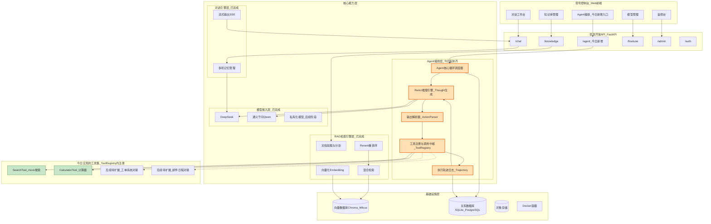
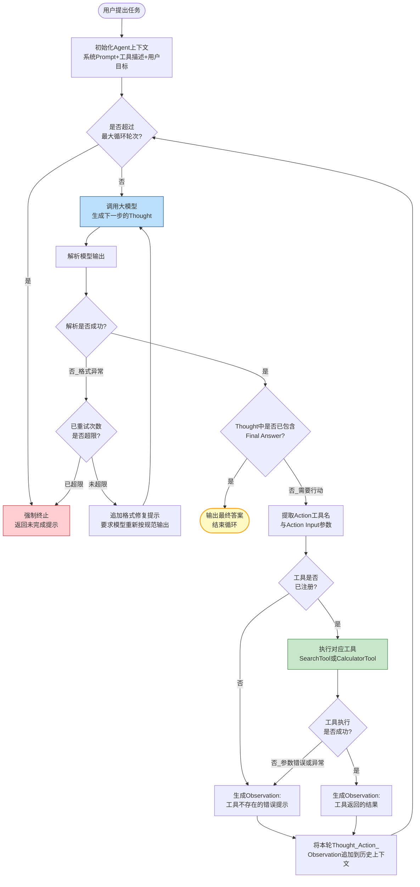
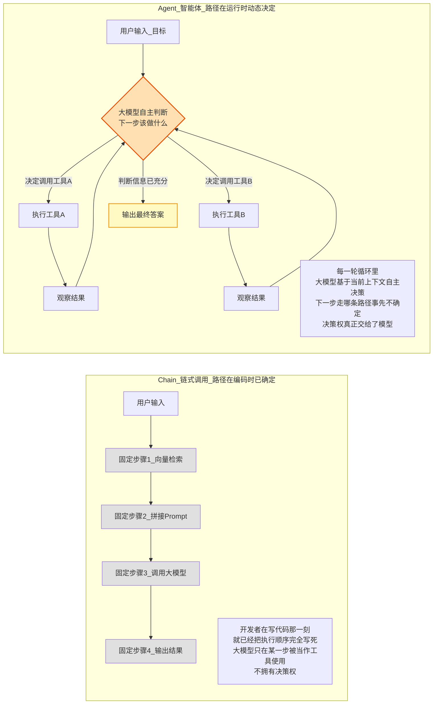

# 第39天:Agent概念与ReAct范式

- **课程阶段**:第四阶段(Day39-50)—— 苍穹0.8版,补上Agent编排层
- **Sprint归属**:Sprint4·Agent基础(Day39-45)的第一天
- **今日角色出场**:陈铭、王振宇(老王)、林悦、郭建军(郭总)、赵磊、苏梦
- **今日关键词**:Agent循环、ReAct范式、Thought-Action-Observation、纯手写Agent
- **前情提要**:Day38海纳制造集团项目验收答辩通过,合同正式签约,团队小范围庆功;老王在庆功宴散场前留下一句悬念——"回去把Day19学的Function Calling翻出来重新看一遍,明天我们不讲新知识点,先讲一个词——Agent。"
- **产出物**:不依赖任何Agent框架、纯用大模型API+Python手写实现的极简ReAct Agent,具备"网页搜索(mock)+计算器"两种工具的组合任务处理能力

---

## 【旁白】

庆功宴散场的时候是晚上九点半,公司楼下那家不算便宜的川菜馆里,郭总破例开了三瓶红酒,林悦和赵磊喝得脸有点红,苏梦和韩露、张凡几个培训生一直在吃,谁都没敢先走。陈铭记得很清楚,郭总举杯说了一句"这是苍穹平台真正意义上第一份靠自己挣来的合同",全场碰杯,声音在包间里响了很久。可就在气氛最热闹的那一刻,老王没喝酒,他一直坐在角落,手里转着一杯茶,谁都没太注意他在想什么。

散场前,老王把陈铭叫住,没说什么祝贺的话,只是说了那句关于Function Calling的嘱托,然后就先走了。陈铭当时没多想,以为只是老王一贯的"提前预习"习惯。

直到今天早上八点五十,陈铭还没到工位,就看见白板前已经站了一圈人——老王比平时早到了快一个小时,白板上画满了字,擦了又写,写了又擦,残留的痕迹能看出来他改了好几版。陈铭走近的时候,正好听见老王对着刚到的赵磊说的一句话,后来这句话被陈铭原封不动地记在了笔记本第一页:

"客户想要的,从来不是‘问了就有answer’,而是‘帮我把这件事办了’。"

陈铭当时没完全理解这句话的分量,他只觉得这话听起来有点抽象,直到老王转过身,在白板上写下一个"Agent"的英文单词,又在旁边画了一个箭头往回指向昨天那份沉甸甸的验收合同,才慢慢明白——庆功宴上那句"合同签下来了"和这句"客户要的是把事办了",其实是同一件事的两个侧面:合同签下来,只是证明"苍穹能回答问题"这件事被认可了;但客户真正在合同附件里写的下一期需求,已经悄悄埋下了一句谁都没太在意的话——"是否可以支持系统自动创建工单、自动排班"。老王说,这句话他昨晚在宴席上反复看了三遍。

Sprint4,就是从这句被反复看了三遍的需求开始的。而今天,是这条新战线的第一天。

---

## 晨会纪要 / 今日目标

**时间**:2026年X月X日(星期一) 09:00-09:35
**地点**:二层白板区(临时占用了原本属于赵磊的测试环境评审时段,赵磊表示"理解,这个必须让路")
**主持人**:王振宇
**记录人**:陈铭

**出席**:王振宇、林悦、郭建军(中途列席十分钟)、赵磊、孙昊、陈铭、苏梦、韩露、张凡

### 会议要点摘录

老王开场没有像往常一样先总结上一阶段的成绩,而是直接把白板一分为二,左边写"Chain",右边写"Agent",中间画了一条粗粗的分界线。

"昨天晚上我们庆祝的,是苍穹能把知识库问答这件事做扎实了。"老王说,"但海纳集团项目组昨天签合同的时候,客户那边的信息化负责人随口提了一句话,林悦记下来了,林悦你念一下。"

林悦翻开笔记本念道:"客户方原话是——‘你们这套问答系统挺好用的,但我们车间班组长真正头疼的,是每次设备报修都要手动填五六个系统的表单,能不能让你们这个AI直接帮我把工单填了、把对应的负责人通知了?'"

老王点头:"念完了大家应该都听出来了——这已经不是‘知识库能不能查到答案’的问题,这是‘系统能不能代替人去执行一个动作’的问题。这两者的区别,决定了我们接下来十几天要学的东西,和过去38天学的东西,是完全不同的一个技术范式。"

郭总此时列席,补了一句(后来老王让陈铳专门记下来):"这句需求,不是加分项,是决定苍穹能不能从‘问答工具’变成‘企业员工的数字同事’的分水岭。我们上一阶段挣到的钱和口碑,是敲门砖,不是终点。"

老王接着在白板左侧"Chain"下面写:"输入→模型/检索→输出,一条直线,路径在写代码的那一刻就完全确定。"右侧"Agent"下面写:"输入→模型自己决定下一步做什么→执行→把结果喂回去再让模型决定→...→直到模型自己说‘可以给出最终答案了’。"

"这个循环,"老王在两个词之间画了一个圈,"感知、思考、行动,再感知、再思考、再行动。这个圈,叫Agent循环。今天要学的东西,核心就是这一个圈。"

### 今日目标(老王现场写在白板,陈铭原文抄录)

1. 讲清楚"Chain"和"Agent"的本质区别——不是"能不能调用工具",而是"路径是提前写死的,还是模型自己决定的"。
2. 精讲ReAct论文的核心思想:Thought(推理)→Action(行动)→Observation(观察)循环。
3. **不使用任何Agent框架**(LangChain、LangGraph今天都不许用),纯用大模型API + Python手写一个极简ReAct Agent,亲手把这个循环跑通一次,理解框架底层到底在帮我们做什么。
4. 下午实操:给这个手写Agent配两个工具——一个mock搜索工具、一个计算器工具,完成一个"需要先搜索信息、再基于搜索结果做计算"的组合任务。
5. 布置作业,为明天(Day40,正式引入LangChain Agent框架)做铺垫。

老王在会议最后补了一句被陈铭原样记下的话:"我知道你们心里肯定想问,LangChain不是已经把AgentExecutor封装好了吗,直接用不就完了?但我带团队这么多年,见过太多人用一个东西用得很熟练,却完全说不出它内部在干什么——这种人一旦框架出了bug,或者遇到框架没覆盖到的场景,就直接懵在原地。所以今天必须手写一遍,以后你们用任何框架的Agent,遇到它‘思考错了’‘调用工具参数不对’‘死循环了’这些问题时,才知道到底是哪个环节坏了。"

赵磊在会上补充了一个测试视角的疑问:"如果Agent的执行路径每次都可能不一样,我们QA这边以后要怎么写测试用例?过去做知识库问答系统,输入固定的问题,我们至少能对答案的关键信息点做断言,Agent这种‘走哪条路都不确定’的东西,测试标准要怎么定?"老王承认这是一个目前团队还没有完整答案的问题,他说:"这确实是Agent工程化里一个公认的难点,业界目前的常见做法,是把验收标准从‘结果是否完全一致’放宽成‘结果是否落在可接受的范围内,且执行路径是否合理、是否包含了必要的关键步骤’,但具体怎么落地到咱们苍穹平台自己的测试规范里,我建议你先把今天这套手写Agent的执行轨迹留着,后面几天我们找个时间专门坐下来一起讨论一下Agent的测试标准怎么定,这个问题不该由我一个人来拍板,你是测试负责人,应该由你主导来定。"这段对话被陈铭记在了晨会纪要的末尾,他当时觉得这大概会是Sprint4后半段的一个重要议题。

孙昊也在会上提了一句和部署相关的展望:"如果以后Agent真的要在生产环境跑,循环调用大模型意味着单次任务的耗时和费用都会比一次性问答高不少,这个是不是需要提前给客户做好预期管理?"老王点头认可,并补充说:"这个问题问得对,而且这不只是‘提前告知客户’这么简单——后面接祺瑞集团项目的时候,我们大概率需要在产品层面加入类似‘预估耗时’‘预估调用次数上限’的机制,不能让一个任务无限制地循环消耗资源。今天CQ-106里的最大轮次上限,表面上是个很小的工程细节,但它背后对应的正是这类成本和体验平衡的问题,你们不要觉得这只是‘防死循环的保险丝’,它其实也是产品层面控制成本的第一道闸门。"

会议结束时,林悦补充说,她会在会后把祺瑞集团(这是一个此前没出现过的新客户名字,今天第一次被提及)的初步接触信息发到群里——"我们市场那边有个新线索,一家做地产物业的企业,他们的HR和行政流程比海纳集团更复杂,可能会是苍穹Agent能力上线后第一个真正的试点对象,大家先有个印象,细节我们后面几天慢慢过。"

---

## 需求文档:《苍穹平台Agent编排层 · 能力需求说明(V1.0 · Sprint4启动版)》

**文档编号**:CQ-PRD-039
**撰写人**:林悦
**评审人**:王振宇、郭建军
**版本**:V1.0
**状态**:已评审通过,作为Sprint4(Day39-45)的整体开发依据

### 一、背景

在海纳制造集团企业知识库问答系统正式验收签约之后,项目组在与客户信息化负责人的交接沟通中,收到一条非正式但明确的后续需求信号:客户希望在现有问答能力基础上,进一步支持"设备报修自动填单""责任人自动通知"等具备实际执行动作的能力。与此同时,市场部门反馈,新的潜在客户祺瑞集团(地产物业行业)对"能查日程、能自动处理行政/HR/财务跨系统事务"的智能助手表现出初步兴趣。

结合这两条信号,苍穹平台需要在现有"对话引擎层""RAG检索引擎层"基础上,补齐产品分层架构图中一直空置的**Agent编排层**,使苍穹从"能回答问题的系统"升级为"能理解意图、自主决策、执行动作的智能体系统"。

本需求文档聚焦Sprint4第一天(Day39)的最小闭环目标:验证Agent循环与ReAct范式在苍穹技术栈上的可行性,不涉及具体客户业务系统对接(工单系统、邮件系统等对接工作安排在Day40及之后)。

### 二、核心概念澄清(供全员统一认知,避免后续沟通歧义)

在需求评审会上,老王特别要求在PRD里加入一段"概念澄清",因为过去几天已经有同学把"会调用Function Calling的对话系统"和"Agent"混为一谈。以下内容以老王口述、林悦整理成文档的方式呈现:

**1. 什么是Chain(链式调用)?**

Chain是指开发者在写代码的那一刻,就已经把"每一步该做什么、下一步是什么"完全确定下来的一条执行路径。举例来说,Day25-38实现的RAG问答系统,本质上就是一条Chain:用户输入问题 → (固定)向量检索 → (固定)拼接Prompt → (固定)调用大模型生成答案 → 输出。这条路径里,"先检索再生成"这个顺序,是代码里`if-else`和函数调用顺序写死的,无论用户问什么问题,执行的步骤永远是这四步,不会有任何变化。即使中间调用了大模型,大模型也只是在"某一步"里被使用(比如"生成答案"这一步),它并不能决定"接下来该走哪一步"——这个决定权始终在开发者手中,固化在代码逻辑里。

**2. 什么是Agent(智能体)?**

Agent的本质区别在于:决定"下一步该做什么"这件事,不再由开发者在写代码时预先写死,而是交给大模型在运行时自己判断。开发者提供的不是一条固定路径,而是一个"循环骨架"加"一组可选的工具":每一轮循环里,大模型会看到当前的全部上下文(用户目标、已经做过的事、已经得到的信息),然后自己决定——"接下来我应该调用哪个工具?还是说信息已经够了,可以直接给出最终答案了?"这个决策权的转移,才是Agent与Chain的本质分界线,而不是"有没有用到Function Calling"这种表面特征(事实上,很多Agent的具体工具调用机制底层确实用到了Function Calling的能力,但用了Function Calling不代表就是Agent——如果开发者规定"第一步一定要调用查天气工具,第二步一定要调用翻译工具",那哪怕用了Function Calling,这依然是一条Chain,因为路径还是写死的)。

**3. 为什么客户的报修需求恰好命中了这个分界线?**

老王在会上举了个例子:"如果客户的需求是‘我问设备保养周期是多久,你告诉我’,这是一个典型的Chain式问答,一步到位,不需要循环决策。但客户现在说的是‘设备报修,你帮我把工单填了’——这句话背后隐含了一整套不确定的执行路径:系统需要先判断这台设备是否已经登记在工单系统里,如果没有登记还要先查询设备台账,填写工单时需要判断故障等级从而决定通知哪一级责任人,通知之后还可能需要确认对方是否收到并回复……这些步骤具体要走哪几步、走几轮,并不是一个开发者能提前100%写死的固定流程,它需要系统根据每一次具体情况,动态地‘思考下一步该做什么’。这正是Agent要解决的问题。"

### 三、Day39范围内的功能需求(最小验证闭环)

| 编号 | 需求描述 | 优先级 | 验收标准 |
|---|---|---|---|
| CQ-101 | 实现一个不依赖任何Agent框架的极简ReAct Agent核心循环 | P0 | 循环能够正确执行Thought→Action→Observation,并在模型判断信息充分时正确终止,输出最终答案 |
| CQ-102 | 实现一个mock搜索工具(SearchTool) | P0 | 输入查询词,返回预设的结构化"搜索结果"文本,模拟真实搜索引擎行为,不依赖外部网络API(避免今天的教学重心被网络搜索API接入细节分散) |
| CQ-103 | 实现一个计算器工具(CalculatorTool) | P0 | 输入合法的数学表达式字符串,返回准确计算结果;对非法输入(比如把无法解析的字符串传进来)要有清晰的错误反馈,而不是让程序崩溃 |
| CQ-104 | 实现模型输出的Thought/Action解析器 | P0 | 能够从大模型的自然语言输出中,稳定解析出Thought内容、Action工具名、Action Input参数;要考虑到大模型偶尔输出格式不规范(比如多打了空格、少写了换行、把JSON参数写成了非标准格式)的情况,解析失败时要有降级重试机制,而不是直接抛异常中断整个任务 |
| CQ-105 | 实现完整的任务执行示例:"帮我查一下XJ-3200A注塑机的标准注射压力上限是多少,然后算一下如果按当前压力的80%作为安全阈值,数值是多少" | P0 | Agent能够正确识别这是一个需要先搜索、再计算的组合任务,依次调用SearchTool和CalculatorTool,最终给出正确的安全阈值数值,并展示完整的思考轨迹 |
| CQ-106 | 循环轮次上限保护 | P1 | 设置最大循环轮次(比如8轮),超过上限强制终止并给出"未能在限定轮次内完成任务"的提示,防止死循环消耗Token和时间 |
| CQ-107 | 完整的执行轨迹日志记录 | P1 | 每一轮的Thought、Action、Action Input、Observation都要被完整记录并可回放展示,这是后续调试Agent行为异常的核心依据 |

### 四、非功能需求

- **可观测性**:今天实现的手写Agent,每一轮的完整交互都要打印到控制台并可选保存为JSON日志,因为老王强调"Agent最大的调试难度在于它的决策路径是动态的,不像Chain那样能靠读代码就知道会发生什么,所以日志的颗粒度必须足够细"。
- **健壮性**:模型输出格式不稳定是Agent工程落地中最常见的坑,今天的实现必须包含至少一层解析失败后的重试/纠错机制,不能假设模型每次都会严格按照预期格式输出。
- **可扩展性**:虽然今天只实现两个工具,但工具的注册和调用方式要设计成"可插拔"的,为Day40引入更多工具、Day41迁移到LangGraph做好结构上的铺垫(工具接口的思路要保持一致,哪怕具体实现方式会变)。

### 五、本期(Day39)不涉及的范围

- 不对接任何真实外部系统(工单系统、邮件系统、日程系统),这些留给Sprint4后续几天以及Day40起的LangChain/LangGraph实操。
- 不涉及多Agent协作、Agent间通信,这是Sprint4后半段和更后续阶段的内容。
- 不涉及Agent的长期记忆管理,今天的Agent每次任务是无状态的、单次会话内的循环。
- 不涉及Human-in-the-loop(人工审批介入)机制,这部分内容会在LangGraph相关课件中系统讲解。

### 六、验收标准总述

林悦在文档结尾写道:"今天的验收标准不是‘代码跑起来了就算过’,而是‘陈铭能不能用自己的话,给一个完全没听过Agent这个词的人,讲清楚它和普通问答系统的区别,并且能指着自己写的代码,说清楚每一行在这个循环里扮演的角色’。老王说这是他见过的最容易‘假装学会了’的知识点,因为代码跑通往往只需要照抄,但理解‘为什么这么设计’需要真正想清楚。"

### 七、关于Sprint4整体节奏的补充说明

林悦在PRD结尾额外补充了一段Sprint4后续几天的节奏预告,供团队提前有个整体预期(具体内容以每日实际课件为准,这里仅作方向性说明):"Day39作为Sprint4的开篇,目标是打通最基础的Agent循环原理;Day40开始正式引入LangChain的Agent工具生态,把今天手写的这套逻辑替换成更工程化、更健壮的框架实现;Day41转向LangGraph,解决AgentExecutor作为‘黑盒’难以调试、难以支持复杂分支和人工介入的问题;后续几天(Day42-45)会逐步加入多工具场景、记忆管理、以及与祺瑞集团潜在需求相关的场景化实践。整个Sprint4的最终目标,是让苍穹平台具备可以支撑‘多Agent智能办公助手’这一产品形态的核心能力底座。"

老王在评审这段内容时补充了一句方法论层面的提醒:"我们过去在做知识库问答系统(Sprint3)的时候,节奏是‘先搭好RAG的每一个环节,再逐步优化每个环节的效果’;但Agent这条线,节奏会略有不同——我们会先在最简单、最可控的场景里,把‘循环决策’这个核心机制吃透(就像今天),再逐步往这个骨架上叠加更多能力(更多工具、更复杂的任务、更长的记忆)。你们要理解,这不是我们随意选择的教学顺序,而是因为Agent系统的复杂度增长曲线,和Chain系统完全不同——Chain系统里,加一个新步骤,大概率不会影响已有步骤的行为;但Agent系统里,加一个新工具,可能会影响模型对‘什么时候该用哪个工具’的整体判断逻辑,牵一发而动全身,所以必须先把最基础、工具数量最少的骨架吃透,再谨慎地逐步扩展。"

---

## 架构设计图:苍穹平台新增"Agent编排层"在整体架构中的位置

老王在需求评审会后,把苍穹平台的整体分层架构图重新画了一遍,专门标注出今天新增的Agent编排层与已有各层之间的关系。他先没有直接动笔画图,而是拿着打印出来的产品分层架构图(那张贴在会议室墙上、从Day15起就一直挂在那儿的图)转了半圈,指着"Agent编排层"那一块从Day15开始就一直空着的方框说:"这块空着的地方,已经在墙上挂了将近一个月了,今天开始,我们要真正往里面填东西了。"

孙昊当时插了一句运维视角的问题:"这个Agent编排层如果要接入Docker容器化部署,会不会因为它内部要反复循环调用大模型,导致资源占用和过去的对话引擎层完全不是一个量级?"老王承认这是个值得关注的点,但强调"今天的重点不在性能优化,先把这一层的骨架和职责边界想清楚,性能相关的问题,会在Sprint4后半段接入真实工具、真实并发场景时集中处理,不要在今天就把战线拉得太散"。



老王在讲解这张图的时候,特别提到了一个细节:"你们注意`Agent编排层`内部,我特意分了四个模块——核心循环调度器、推理引擎、工具调用中枢、输出解析器,外加一个执行轨迹日志。今天我们手写实现的代码,其实就是这四个模块的最小可用版本,只是我们现在不会用‘调度器’‘中枢’这种听起来很正式的名字,就是几个普通的Python函数和类。但你们要记住这个对应关系——将来无论是LangChain的AgentExecutor,还是LangGraph的图结构,内部干的事情本质上都是在做这四件事,只是实现方式更工程化、更健壮。今天写的代码丑一点、简单一点没关系,但这四个角色缺一个都不行。"

赵磊在评审图纸时提了一个问题:"工具注册中枢和后续要接的工单系统、邮件系统,是不是意味着以后每接一个新系统,都要往这个ToolRegistry里注册一个新工具?"老王点头:"对,这也是为什么今天工具接口的设计必须足够规范和统一——工具的‘长相’(输入什么、输出什么、怎么描述给模型)必须高度一致,不然工具越加越多,维护成本会指数级上升。这也是明天要讲的LangChain `@tool`装饰器要解决的核心痛点之一,但今天我们先手写一遍,搞懂这个‘规范’到底规范在哪。"

周晓虽然今天没有直接参与Agent核心逻辑的开发,但她提前听说了"苍穹控制台会新增Agent编排入口"这件事,专门跑来问了一句前端视角的问题:"以后这个Agent编排层跑起来,中间那么多轮Thought、Action、Observation,前端要不要把这些中间过程也展示出来,而不是像现在对话框一样,只等最后一个答案出来?"老王说这个问题问得很好,并且直接给出了方向性的答案:"必须展示,而且这是Agent产品体验里最重要的一环——用户看到系统‘在思考、在查资料、在计算’这个过程本身,会比单纯等一个结果、然后突然弹出答案,信任感高得多。这部分前端展示逻辑,不是今天的重点,但你可以先留意一下,我们今天记录的`TrajectoryStep`结构,后续很可能就是前端展示这个‘思考过程可视化’功能的直接数据来源。"这句话让陈铭意识到,今天看起来只是"打日志"的`trajectory_logger.py`,原来还牵连着未来产品体验的一个重要环节,技术选择和产品设计之间的关联,往往比表面看起来更紧密。

---

## 流程图:ReAct范式的Thought→Action→Observation循环

在架构讨论结束后,老王专门又画了一张更细粒度的流程图,聚焦在ReAct循环内部到底发生了什么。这张图后来被陈铭截图存进了笔记本,作为今天最重要的一张参考图。



老王讲解这张图时特意停在"解析是否成功"这个判断分支上说了很久:"我带团队这么多年,凡是Agent项目出问题,十次里有六七次不是模型‘思考错了’,而是模型的输出格式没对上我们代码的解析逻辑——多打了一个空格,把JSON写成了单引号,或者干脆把Action和Action Input的顺序写反了。这种问题在Demo阶段几乎不会暴露,因为Demo阶段你测的次数少、又刚好挑了模型‘状态好’的时候测,一旦上线跑几千次,这种低概率格式错误就会开始频繁出现,把整个Agent卡死在某个环节。所以这张图里,‘解析失败后的重试修复’这个分支,看起来是个不起眼的旁支,但在真实生产环境里,它出现的频率可能比‘正常走完流程’还要高。今天代码实战里,我要求这部分必须写完整,不能只写一个happy path。"

苏梦提了一个问题:"如果重试了还是解析失败,直接终止是不是有点‘认输’太快了?"老王回答:"不是认输,是止损。Agent循环最怕的不是终止,是在你不知道的情况下一直空转、一直消耗Token却完全没有进展——这种情况在生产环境里比直接报错更危险,因为它看起来‘系统还在运行’,但实际上什么有效的事都没做。宁可明确地失败,也不要模糊地卡死。"

张凡也提了一个问题,他关注的是流程图里"工具是否已注册"这个分支存在的必要性:"如果我们已经在Prompt里明确告诉模型可用的工具名称,模型为什么还会去调用一个不存在的工具?"老王的回答让陈铭想起了昨天代码评审会上关于"兜底捕获"的讨论——"Prompt里写清楚了,不代表模型100%会遵守,大模型本质上是一个基于概率生成文本的系统,哪怕Prompt写得再清楚,也存在小概率生成出一个‘听起来很像工具名但实际没注册’的名字,尤其是当任务描述本身有一定歧义、或者模型上下文比较长的时候,这种概率会进一步上升。这个分支,和`output_parser.py`里的格式解析容错、`safe_calculate`里的非法表达式拒绝,本质上是同一种工程习惯——不要假设‘理论上不应该发生的情况’就真的永远不会发生,尤其是在一个决策权交给了模型的系统里,这种‘意外’发生的频率,会比你们直觉上认为的高得多。"

---

## 示意图:Agent与Chain的本质区别对比示意

为了让全员对"Chain"和"Agent"的区别有一个直观的、可以随时拿出来参照的图,老王最后画了一张对比示意图,并要求陈铭把它整理进今天的课件里,作为团队内部日后讨论时的"共同语言"。



老王指着这张图说:"你们注意左边Chain那条线,从上到下是一条直线,四个步骤无论输入什么问题,永远按这个顺序走,这就是为什么我们过去38天写的知识库问答系统,哪怕逻辑很复杂、哪怕用了很多次Function Calling,它本质上还是一条Chain——因为‘先检索再生成’这个顺序,从来没有交给模型自己决定过。再看右边Agent那个图,中间那个判断节点`A1`,它不是一次性的,它会被反复回到——这个‘反复回到同一个决策点,并且每次决策的路径都可能不同’,才是Agent真正的技术核心。"

林悦补充了一句业务视角的理解:"翻译成产品语言就是,Chain产品经理设计的时候,已经把用户能走的每一条路都画好了流程图,用户没法走出这张流程图;Agent产品经理设计的时候,画的不是流程图,是‘这个智能体手里有哪些工具、它的目标是什么’,具体走哪条路,是它自己在执行过程中决定的,产品经理反而没法把每一步都提前画出来——这对我们做需求评审的方式,其实也是一个挑战,因为我们没法像以前那样,把每一种可能性都在PRD里列全,只能规定‘边界’和‘目标’。"

郭总这时候正好也在会议室外经过,被林悦这句话叫住多听了两分钟,他补充了一个更偏向business的视角:"这其实和我们判断‘一个客户需求到底该报多少钱、该配多少人力’的方式也有关系。以前做知识库问答项目,需求边界很清楚,估算工时相对容易;但Agent类项目,因为执行路径本身存在不确定性,我们在做项目报价和排期的时候,可能需要引入一些‘弹性预留’的概念——不能再像过去那样把每一个功能点拆得那么死,要给‘系统自主决策所带来的不确定性’留出合理的缓冲空间。这个问题今天不展开,但你们做技术方案设计的时候,最好能想清楚哪些环节的不确定性是‘可控范围内的’,哪些是‘需要额外加保护机制的’,这直接关系到我们以后怎么和客户谈项目边界。"这段话让陈铭第一次意识到,Agent和Chain的技术区别,原来还会一路影响到项目报价、合同边界这些原本以为和自己没什么关系的商务环节。

---

## 课堂笔记

> 以下内容为陈铭当天的个人技术笔记原文摘录,分上午/下午两部分,保留了部分他自己的疑问和理解过程,不做过度精修。

### 上午:Agent循环原理 + ReAct论文精讲

早上晨会结束之后,老王没有立刻讲代码,而是先花了将近一个半小时,专门讲Agent循环的原理和ReAct论文,他说"今天如果地基打歪了,下午写出来的代码就是‘看起来像Agent,实际上是个Chain’的仿制品,这种半吊子的理解,比完全不懂更危险"。

**1. 先搞清楚"Agent"这个词到底在说什么**

老王先没提任何论文,而是从一个很朴素的问题开始:"什么叫智能体(Agent)?"他给的定义是:一个能够感知环境(Perceive)、进行推理决策(Think)、并采取行动改变环境或获取新信息(Act)的系统,而且这个感知-思考-行动的过程是可以循环反复的,直到目标达成。

他特别强调"循环"这个词——如果一个系统只感知一次、思考一次、行动一次就结束了,那它顶多算一个"带工具调用能力的单轮问答",还不是完整意义上的Agent。真正的Agent之所以强大,是因为它能把上一轮"行动之后观察到的新信息",作为下一轮"思考"的输入,持续修正自己的判断,直到它自己认为任务已经完成。

我在笔记里画了一个简化的循环示意(比老王画的更简化,方便我自己记):

```
感知(Perceive):接收当前的任务目标 + 已经发生过的所有历史(之前思考过什么、做过什么、观察到了什么)
      ↓
思考(Think):基于当前所有信息,推理出"接下来应该做什么"
      ↓
行动(Act):如果需要更多信息或需要执行某个动作,就调用对应的工具;如果已经有足够信息,就直接给出最终答案
      ↓
(如果采取了行动)观察行动结果,回到"感知"这一步,把新的观察结果并入历史,继续下一轮循环
```

老王说,这个"感知-思考-行动"三段式,几乎是所有Agent理论(不管是学术界的ReAct、Reflexion,还是工业界LangChain、AutoGPT、各种Agent框架)共同的底层骨架,区别只在于"思考"这一步具体怎么做推理、"行动"这一步具体怎么组织工具、要不要加"反思(Reflection)"这种额外环节。今天我们只学最经典、最基础的一种实现思路——ReAct。

**2. ReAct论文到底提出了什么**

老王在白板上写下了论文名字:《ReAct: Synergizing Reasoning and Acting in Language Models》,他说这篇论文的核心贡献,不是"发明了工具调用"(工具调用这个想法在ReAct之前就有相关工作了),而是提出了一个非常朴素但极其有效的做法——让大模型在采取每一次行动之前,先用自然语言把自己的"推理过程"显式地写出来,再决定要采取的行动,而不是直接跳过推理直接输出行动。

他打了个比方:"你们想象一下,让一个新员工去处理一件复杂的事,如果你只让他‘做’,不让他‘想’,他大概率会瞎做;但如果你让他先说一句‘我现在打算这么做,因为……’,再去做,他犯错的概率会明显下降,而且哪怕做错了,你也一眼能看出他是哪一步的判断出了问题。ReAct本质上就是逼着大模型养成‘先说思路,再行动’这个习惯,而不是让它一言不合就直接调用工具。"

论文里,这个循环被规范成了一个固定的输出格式,大概是这样的结构(老王在白板上默写出来,我后来对照论文核对过,基本一致):

```
Thought: <模型对当前情况的推理,分析已知信息、判断下一步该做什么>
Action: <要调用的工具名称>
Action Input: <传给这个工具的具体参数>
Observation: <工具执行后返回的结果,这一部分不是模型生成的,是我们程序把工具的真实执行结果填进去的>
... (这个 Thought/Action/Action Input/Observation 的组合可以重复多轮)
Thought: <模型判断信息已经足够,可以给出最终答案>
Final Answer: <最终答案>
```

老王强调了一个很容易被忽略的细节:"Observation这一行,不是让模型自己编的,是我们的代码在拿到模型的Action和Action Input之后,真正去执行那个工具,把工具的真实返回结果写进去,再把整个更新后的文本重新喂给模型,让它继续生成下一个Thought。如果你让模型自己去‘想象’Observation应该是什么,那这套系统就是纯粹的幻觉接力,没有任何实际执行的意义。"这句话我专门用红笔在笔记里画了框,因为这正是ReAct和普通的"让模型自己编故事"的本质区别——Observation必须来自真实的工具执行结果,这是整个循环的地基。

**3. 为什么叫"ReAct"——Reasoning + Acting的协同**

老王提到,论文名字里的"Synergizing"(协同)这个词很关键,论文对比了几种此前的做法:

- 只做Reasoning(推理链,类似Chain-of-Thought):模型只是一步步地用文字推理,但推理完全基于它自己已知的、可能过时或错误的知识,没有办法获取外部真实信息去验证或纠正自己的推理,容易产生"一本正经地推理出错误结论"的问题。
- 只做Acting(纯行动,没有显式推理):模型直接根据输入决定该调用什么工具,跳过了"为什么这么做"的显式表达,这样做的问题是,当行动出错时,没有任何可以追溯、可以调试的推理轨迹,而且模型自己也更容易"跳步骤"——想到什么就做什么,不做系统性的信息整理。
- ReAct(推理和行动交替进行,互相增强):每一次行动之前先做一次显式的推理,而每一次行动之后得到的新信息(Observation),又会反过来修正下一次的推理——这就是"协同"的意思,推理指导行动,行动的结果又反哺推理,两者互相校正,而不是各自为战。

老王在这里补了一句评价,我原文记下来了:"ReAct这篇论文之所以重要,倒不是它的技术难度有多高——你们下午会发现,手写实现它其实没有想象中复杂,难的从来不是‘怎么循环调用API’,而是‘让模型按照这个固定格式稳定输出’这个工程问题,这个问题ReAct论文本身其实没有给出完美答案,是靠后来的Function Calling能力、结构化输出能力,一步步在工程上补上的。这也是为什么现在很多Agent框架底层已经不用纯文本解析Thought/Action了,而是用Function Calling的结构化能力去实现同样的思路——但思路的骨架,从ReAct论文那时候就已经定下来了,今天我们要理解的正是这个骨架,而不是某个具体的实现细节。"

**4. 上午小结:今天到底要写什么**

老王把上午的内容归纳成了三句话,我抄在笔记本最显眼的地方:

- Agent的核心是一个可以反复执行的"感知-思考-行动"循环,循环的终止条件由模型自己判断,不是开发者写死的固定步数。
- ReAct范式给这个循环规定了一个具体的、可执行的格式:Thought(推理)→Action(选择工具)→Action Input(工具参数)→Observation(工具真实执行结果)→循环往复→Thought(判断信息已足够)→Final Answer(最终答案)。
- 手写实现这套东西,工程上最大的挑战不是循环逻辑本身(这部分代码量很小),而是如何稳定地让模型输出符合这个格式,以及如何在格式不符合预期时优雅地处理,而不是让整个程序崩溃。

苏梦下午之前特地跑来问我:"你说的‘循环终止由模型自己判断’,那如果模型永远都不判断‘够了’,会不会就一直循环下去?"我当时没答上来,后来在代码实战部分才想清楚——这正是CQ-106要求的"最大循环轮次上限保护"存在的原因,再聪明的设计也要留一道工程上的安全阀。

**5. 老王简单提及的Agent变体(不做深入展开,留个印象)**

上午快结束的时候,老王在白板角落补充画了几个词——Reflexion、Plan-and-Execute、Tree of Thoughts,他说这些是ReAct之后学术界和工业界陆续提出的一些"升级版"思路,今天不会展开讲,但值得先留个印象,方便以后遇到类似名词时不至于完全陌生:

- **Reflexion**:在ReAct的循环基础上,增加了"事后反思"这一步——当一次任务执行失败或效果不理想时,让模型对整个执行过程进行复盘,生成一段"反思笔记",并把这段反思作为下一次尝试同类任务时的额外参考信息,相当于给Agent增加了一种简单的"从失败中学习"的机制。
- **Plan-and-Execute**:和ReAct那种"走一步、看一步"的即时决策方式不同,这类方法会先让模型对整个任务生成一份完整的执行计划(比如"第一步做什么、第二步做什么……"),再按照这份计划逐步执行,执行过程中如果发现计划有问题,再触发重新规划。这种方式在任务链条较长、需要提前规划资源和顺序的场景下,往往比"走一步看一步"的ReAct更稳定,但灵活性和对突发情况的响应速度会打一些折扣。
- **Tree of Thoughts**:把单一的线性推理链,扩展成一个可以在多个候选推理路径之间进行搜索、比较、回溯的树状结构,适合那种"某一步的选择存在多种合理可能性、需要综合评估之后才能确定最优路径"的复杂任务,但相应的计算成本(需要探索多条分支)也会显著上升。

老王说:"你们记住这几个名字就够了,不需要今天就理解它们的实现细节。等你们把ReAct这个最基础的范式吃透了,以后遇到项目里真的需要更复杂的决策能力时,再回头研究这些变体,你们会发现它们大多是在‘感知-思考-行动’这个最基础的骨架上做的加法,而不是推倒重来的新东西——这也是为什么我坚持让你们先扎扎实实理解ReAct的原因,它是理解所有后续Agent变体的共同起点。"

### 下午:手写极简ReAct Agent

下午一开始,老王没有直接讲代码,先在白板上列了一个"手写Agent需要哪几个部件"的清单,我把这个清单原样记下来,因为这后来直接对应了代码实战部分的模块划分:

1. **系统Prompt模板**:告诉模型它是谁、它有哪些工具可用(工具名+工具描述+参数格式)、必须按照什么固定格式输出(Thought/Action/Action Input/Final Answer)。
2. **工具集合**:每个工具至少要有"名称""描述(给模型看,告诉它这个工具是干什么用的、什么时候该用)""实际执行函数"这三部分。
3. **输出解析器**:从模型返回的自然语言文本里,用规则(今天用正则表达式,老王说"未来可以换成让模型直接用JSON结构化输出,但今天先用最朴素的文本解析,理解最本质的东西")提取出Thought、Action、Action Input,或者Final Answer。
4. **循环调度器**:维护对话历史,每一轮调用模型、解析输出、执行工具、把Observation追加进历史,直到得到Final Answer或者达到轮次上限。
5. **异常兜底**:解析失败时的重试机制,工具执行出错时的错误信息反馈机制,轮次超限时的强制终止机制。

老王讲了一个我印象很深的细节:"你们等会写代码的时候会发现,Prompt里怎么描述这个输出格式、怎么描述工具,直接决定了模型输出的稳定性——这不是‘写完再调’的事后修补,这是ReAct范式里‘Prompt Engineering’和‘Agent工程’合二为一的地方。以后你们用LangChain,框架会帮你把这部分Prompt模板封装好,但封装不代表‘不需要理解’,恰恰相反,如果你不理解这背后的Prompt在起什么作用,框架给你的默认Prompt效果不好的时候,你都不知道该往哪个方向去调。"

接下来,老王带着大家一步步实现了这套系统。我把当时讨论的几个关键设计决策记录下来:

**决策一:为什么工具描述要写得足够具体,而不是一句话概括?**

我们第一版给SearchTool写的描述是"用于搜索信息",老王直接否掉了:"你换位思考一下,你是那个大模型,你只知道‘有个工具叫SearchTool,用于搜索信息’,你怎么知道什么时候该用它、传什么参数进去合适?工具描述本质上是你和模型之间唯一的‘沟通契约’,必须写清楚这三件事:这个工具能做什么、什么场景下应该用它、输入参数应该是什么样子(最好给一个例子)。"我们后来把描述改成:"SearchTool:用于在互联网上搜索特定主题的信息,当你需要获取你不知道的、具体的事实性信息(比如某个设备型号的技术参数、某个概念的定义)时使用。输入应为一个简洁的搜索查询词,例如:'XJ-3200A注塑机 标准注射压力'。"

**决策二:Observation要不要限制长度?**

赵磊下午旁听的时候提了个问题:"如果搜索工具返回的内容特别长,会不会把Prompt撑爆,或者干扰模型的判断?"老王说这是个好问题,在真实生产环境里,Observation内容确实需要做长度截断和摘要处理,但今天为了聚焦在循环逻辑本身,我们的mock搜索工具会控制返回内容的长度,真实场景的截断策略留给后续接入真实搜索API的时候再处理(埋了一个后续可能会展开的点,但今天不做过度设计)。

**决策三:解析失败要重试几次比较合理?**

老王给的经验数字是"2次左右",他解释:"重试次数太少,遇到模型偶发的格式抽风就直接放弃,体验不好;重试次数太多,一旦模型是系统性地不理解你的格式要求(比如Prompt本身描述得有歧义),那重试再多次也没用,只是白白浪费Token和时间。2次左右是一个经验上比较均衡的取值,如果发现重试后仍然大概率失败,应该回头去检查Prompt设计本身有没有问题,而不是无限加大重试次数。"

**决策四:计算器工具能不能直接用Python的`eval()`?**

张凡下午也来旁听,他问了一个很实际的问题:"计算器工具是不是直接调用`eval()`就行了,一行代码?"老王明确否定了:"`eval()`可以执行任意Python代码,如果这个参数是模型生成的,理论上模型可能会输出一些意料之外甚至恶意的表达式(哪怑不是故意的,格式解析错误也可能导致奇怪的字符串被传进来),直接`eval()`存在安全风险。今天我们会用一种更安全的方式——限制只能解析纯数学表达式的语法树(`ast`模块),拒绝执行任何非数学运算相关的代码结构。这个安全意识,以后你们做任何‘允许模型自己生成代码/表达式并执行’的功能时,都要绷紧。"

**决策五:执行轨迹日志要不要在任务过程中实时打印,还是等任务结束后统一输出?**

我们组一开始图省事,想的是每一轮循环内部直接`print`一下Thought、Action等内容,任务结束后不再额外做汇总展示。老王看到之后建议我们改成"过程中只记录到`AgentTrajectory`对象里,任务结束后统一调用`print_summary()`做完整展示",他解释了两个理由:一是过程中零散地打印,格式上很难统一和美观,一旦任务轮次比较多,日志会显得很凌乱,反而不利于排查问题;二是更重要的一点——把"记录"和"展示"这两个职责分开,记录始终发生(哪怕最终展示的地方以后换成写入数据库、推送到前端页面而不是打印在控制台),而展示方式可以根据场景自由替换,这也是为什么我们把`AgentTrajectory`设计成一个独立的、可以被序列化成JSON、也可以被格式化打印的数据对象,而不是让打印语句散落在`react_agent.py`的循环逻辑内部。这个思路,和老王在Day38代码评审会上反复强调的"职责单一、逻辑与展示分离"的工程习惯,是一脉相承的。

下午剩下的时间,大家分头把这套系统的各个模块实现出来,我们组内(我和苏梦一组,张凡和韩露一组)分别实现、互相跑通对方的测试用例,最后老王统一检查了大家的实现,挑出几个典型问题当场讲解(比如苏梦最初的解析器正则表达式对多行Thought内容处理不对,张凡最初没有处理模型漏写`Action Input`这一行的边界情况)。最终版本的完整代码,记录在下面的"代码实战"部分。

---

## 代码实战:纯手写ReAct Agent完整实现

> 说明:以下代码不依赖LangChain、LangGraph等任何Agent框架,仅使用大模型的原生Chat Completions API(以OpenAI SDK通用调用方式为例,DeepSeek、通义千问均提供OpenAI兼容接口,替换`base_url`和`api_key`即可直接切换)以及Python标准库。代码按模块拆分为多个文件,统一放在`cangqiong-platform/backend/app/agent_lab/day39_react_scratch/`目录下(这是Sprint4阶段临时的实验目录,后续正式集成到`agent/`模块时会迁移)。

### 目录结构

```
day39_react_scratch/
├── __init__.py
├── config.py                  # 模型调用配置
├── llm_client.py               # 统一的大模型调用封装
├── tools/
│   ├── __init__.py
│   ├── base.py                 # 工具基类与工具注册中心
│   ├── search_tool.py          # mock搜索工具
│   └── calculator_tool.py      # 计算器工具
├── prompt_builder.py           # ReAct系统Prompt构建
├── output_parser.py            # 模型输出解析器(含容错重试)
├── react_agent.py               # Agent核心循环
├── trajectory_logger.py        # 执行轨迹日志记录
├── run_demo.py                  # 组合任务实操入口
└── exceptions.py                # 自定义异常体系
```

### 1. `exceptions.py` —— 自定义异常体系

```python
"""
day39_react_scratch.exceptions
--------------------------------
本模块定义手写ReAct Agent运行过程中可能出现的各类异常。

设计动机:Agent的执行链路比普通Chain更长、更不确定(模型输出格式可能异常、
工具执行可能失败、循环可能超限),如果所有异常都用Python内置的Exception
笼统抛出,调用方很难区分"应该重试""应该终止""应该记录日志继续兜底"这几种
截然不同的处理策略。因此这里参照Day38代码评审会确立的统一异常体系思路,
为Agent模块单独设计一套语义清晰的异常类型。
"""

from typing import Any, Optional


class ReactAgentError(Exception):
    """所有ReAct Agent相关异常的基类,方便上层用一个except统一捕获兜底。"""

    def __init__(self, message: str, *, context: Optional[dict] = None) -> None:
        super().__init__(message)
        self.message = message
        # context用于携带异常发生时的上下文信息(比如当前是第几轮循环、
        # 原始的模型输出是什么),方便后续写入执行轨迹日志,辅助排查问题。
        self.context = context or {}


class OutputParseError(ReactAgentError):
    """
    模型输出格式不符合ReAct规范时抛出。

    典型场景:模型漏写了Action Input,或者把Thought和Action的顺序写反,
    或者输出中混杂了既不是Thought也不是Final Answer的无法识别内容。
    这个异常通常不应该导致整个任务直接失败,而应该触发"格式修复重试"机制,
    只有重试次数耗尽后,才应该升级为任务终止。
    """

    def __init__(self, message: str, raw_output: str, *, context: Optional[dict] = None) -> None:
        super().__init__(message, context=context)
        self.raw_output = raw_output


class ToolNotFoundError(ReactAgentError):
    """模型指定了一个未在ToolRegistry中注册的工具名称时抛出。"""

    def __init__(self, tool_name: str, *, context: Optional[dict] = None) -> None:
        message = f"模型请求调用未注册的工具:'{tool_name}'"
        super().__init__(message, context=context)
        self.tool_name = tool_name


class ToolExecutionError(ReactAgentError):
    """工具在实际执行过程中抛出异常(比如计算器解析非法表达式)时,统一包装为此异常。"""

    def __init__(self, tool_name: str, original_error: Exception, *, context: Optional[dict] = None) -> None:
        message = f"工具'{tool_name}'执行失败:{original_error}"
        super().__init__(message, context=context)
        self.tool_name = tool_name
        self.original_error = original_error


class MaxIterationsExceededError(ReactAgentError):
    """Agent循环达到最大轮次上限仍未得到Final Answer时抛出,防止死循环。"""

    def __init__(self, max_iterations: int, *, context: Optional[dict] = None) -> None:
        message = f"Agent循环已达到最大轮次上限({max_iterations}轮),仍未得出最终答案,强制终止"
        super().__init__(message, context=context)
        self.max_iterations = max_iterations


class LLMCallError(ReactAgentError):
    """调用大模型API本身失败(网络异常、鉴权失败、限流等)时抛出。"""

    def __init__(self, original_error: Exception, *, context: Optional[dict] = None) -> None:
        message = f"调用大模型API失败:{original_error}"
        super().__init__(message, context=context)
        self.original_error = original_error
```

### 2. `config.py` —— 模型调用配置

```python
"""
day39_react_scratch.config
----------------------------
统一管理今天手写Agent实验用到的模型调用配置。

沿用苔穹平台一贯的配置规范:敏感信息(API Key)从环境变量读取,
不硬编码在代码里;模型名称、超时时间等参数统一在此处集中管理,
避免像Day38代码评审会上发现的"同一个参数在多处硬编码、彼此不同步"问题重演。
"""

import os
from dataclasses import dataclass


@dataclass(frozen=True)
class AgentLLMConfig:
    """大模型调用相关的配置项集合。"""

    # 使用DeepSeek的deepseek-chat模型作为今天实验的主力模型,
    # 苍穹平台生产环境对成本敏感的场景默认优先选用DeepSeek。
    model_name: str = os.getenv("AGENT_LAB_MODEL_NAME", "deepseek-chat")
    # DeepSeek提供OpenAI兼容接口,base_url指向DeepSeek的服务地址,
    # 如需切换到通义千问,替换为DashScope兼容地址即可,业务代码无需改动。
    base_url: str = os.getenv("AGENT_LAB_BASE_URL", "https://api.deepseek.com/v1")
    api_key: str = os.getenv("AGENT_LAB_API_KEY", "")
    # 温度调低一些,ReAct格式解析对输出的稳定性要求较高,
    # 过高的温度会显著增加格式偏离规范的概率。
    temperature: float = float(os.getenv("AGENT_LAB_TEMPERATURE", "0.2"))
    max_tokens: int = int(os.getenv("AGENT_LAB_MAX_TOKENS", "1024"))
    request_timeout_seconds: int = int(os.getenv("AGENT_LAB_TIMEOUT", "30"))


@dataclass(frozen=True)
class AgentRuntimeConfig:
    """Agent循环运行时相关的配置项集合。"""

    # 最大循环轮次上限,对应需求文档CQ-106,防止模型陷入死循环
    # 持续消耗Token而没有任何实质进展。
    max_iterations: int = int(os.getenv("AGENT_LAB_MAX_ITERATIONS", "8"))
    # 输出解析失败后的最大重试次数,经验取值,过多重试意义有限。
    max_parse_retries: int = int(os.getenv("AGENT_LAB_MAX_PARSE_RETRIES", "2"))
    # 每个工具单次执行结果(Observation)的最大字符数,
    # 避免搜索类工具返回过长内容把Prompt撑爆,影响后续推理质量。
    max_observation_length: int = int(os.getenv("AGENT_LAB_MAX_OBS_LEN", "800"))


DEFAULT_LLM_CONFIG = AgentLLMConfig()
DEFAULT_RUNTIME_CONFIG = AgentRuntimeConfig()
```

### 3. `llm_client.py` —— 统一的大模型调用封装

```python
"""
day39_react_scratch.llm_client
---------------------------------
封装对大模型API的统一调用入口。

设计动机:今天手写的Agent不使用任何Agent框架,但仍然需要一个稳定、
可复用的"调用大模型、拿到文本回复"的基础能力,这一层应该尽可能薄、
尽可能不带任何ReAct相关的业务逻辑,只负责"发消息、收回复、处理网络异常"
这一件事,方便后续替换底层SDK或模型供应商时,不影响上层的Agent逻辑。
"""

import logging
from typing import List, Dict

from openai import OpenAI, APIError, APITimeoutError, APIConnectionError

from .config import AgentLLMConfig, DEFAULT_LLM_CONFIG
from .exceptions import LLMCallError

logger = logging.getLogger("agent_lab.llm_client")


class LLMClient:
    """
    大模型调用的统一封装类。

    之所以单独封装成一个类而不是散落的函数,是为了便于未来在这一层
    统一加入调用重试、限流退避、多模型故障切换等能力,业务代码无需感知这些细节。
    """

    def __init__(self, config: AgentLLMConfig = DEFAULT_LLM_CONFIG) -> None:
        self._config = config
        self._client = OpenAI(
            api_key=config.api_key,
            base_url=config.base_url,
            timeout=config.request_timeout_seconds,
        )

    def chat(self, messages: List[Dict[str, str]]) -> str:
        """
        发送一轮对话消息,返回模型生成的纯文本回复。

        :param messages: 符合OpenAI Chat Completions格式的消息列表,
            形如[{"role": "system", "content": "..."}, {"role": "user", "content": "..."}]
        :return: 模型回复的文本内容(不做任何ReAct格式解析,原样返回)
        :raises LLMCallError: 当网络异常、鉴权失败或其它API层面错误发生时
        """
        try:
            response = self._client.chat.completions.create(
                model=self._config.model_name,
                messages=messages,
                temperature=self._config.temperature,
                max_tokens=self._config.max_tokens,
                # 显式指定停止词,避免模型在生成完一轮Thought/Action之后
                # 继续"自问自答"地把Observation也一起编出来——
                # 这是ReAct手写实现中一个非常容易被忽略但很关键的细节:
                # Observation必须由我们的代码填入真实工具执行结果,
                # 绝不能让模型自己生成,所以一旦模型开始要写"Observation:",
                # 就必须立刻停止生成。
                stop=["Observation:"],
            )
            content = response.choices[0].message.content
            if content is None:
                raise LLMCallError(RuntimeError("模型返回内容为空(content is None)"))
            return content
        except (APIError, APITimeoutError, APIConnectionError) as exc:
            logger.error("调用大模型API失败:%s", exc, exc_info=True)
            raise LLMCallError(exc) from exc
        except Exception as exc:  # noqa: BLE001 —— 最后一层兜底,详见Day38异常体系设计原则
            logger.error("调用大模型API时发生未预期的异常:%s", exc, exc_info=True)
            raise LLMCallError(exc) from exc
```

### 4. `tools/base.py` —— 工具基类与注册中心

```python
"""
day39_react_scratch.tools.base
---------------------------------
定义工具的统一接口规范(BaseTool)以及工具注册中心(ToolRegistry)。

设计动机:老王在架构评审时强调,今天的ToolRegistry要为将来更多工具的接入
(工单系统、邮件系统等)预留统一的接口形态,因此每个工具必须同时提供:
1. name —— 供模型在Action字段中精确指定的唯一标识;
2. description —— 供模型判断"什么时候该用这个工具、参数怎么传"的自然语言说明,
   这段描述的质量直接决定了模型调用工具的准确率;
3. run() —— 真正执行工具逻辑的方法,统一接受字符串输入、返回字符串输出,
   屏蔽掉每个工具内部具体的实现差异。
"""

import logging
from abc import ABC, abstractmethod
from typing import Dict, List

logger = logging.getLogger("agent_lab.tools")


class BaseTool(ABC):
    """所有工具必须继承的基类,统一了工具的对外接口形态。"""

    #: 工具的唯一名称,模型在Action字段中会精确输出这个名称,
    #: 因此这里的命名要简洁、无歧义,且在同一个ToolRegistry内必须唯一。
    name: str = "base_tool"

    #: 工具的自然语言描述,会被拼接进系统Prompt,是模型判断
    #: "什么场景下该调用我、参数应该长什么样"的唯一依据。
    description: str = "工具基类,未实现具体描述。"

    @abstractmethod
    def run(self, tool_input: str) -> str:
        """
        执行工具逻辑。

        :param tool_input: 模型生成的、传给本工具的参数字符串(对应ReAct格式中的Action Input)
        :return: 工具执行后的结果文本,会被填入Observation字段
        """
        raise NotImplementedError

    def get_schema_text(self) -> str:
        """生成用于拼接进系统Prompt的工具描述文本片段。"""
        return f"- {self.name}: {self.description}"


class ToolRegistry:
    """
    工具注册中心。

    统一管理当前Agent实例可用的全部工具,提供"按名称查找工具""生成全部工具
    描述文本(供Prompt使用)""列出全部工具名称"这几项核心能力。之所以单独抽出
    这样一个类,而不是让Agent核心循环直接持有一个裸的字典,是为了让工具管理的
    职责边界更清晰,也方便未来给工具增加分组、权限控制等能力时,不需要改动
    Agent核心循环的代码——这与Day38代码评审会重构RerankService的思路是一致的:
    识别出一个会被反复用到的通用职责,把它收敛到一个单一职责的类里。
    """

    def __init__(self) -> None:
        self._tools: Dict[str, BaseTool] = {}

    def register(self, tool: BaseTool) -> None:
        """
        注册一个工具实例。

        :raises ValueError: 当工具名称与已注册的工具重名时,及早报错,
            避免"后注册的工具悄悄覆盖了先注册的工具"这种隐蔽的bug。
        """
        if tool.name in self._tools:
            raise ValueError(f"工具名称'{tool.name}'已被注册,请检查是否重复注册或命名冲突。")
        self._tools[tool.name] = tool
        logger.info("工具'%s'已成功注册到ToolRegistry。", tool.name)

    def get(self, name: str) -> "BaseTool | None":
        """根据工具名称查找工具实例,未找到时返回None,不抛异常(由调用方决定如何处理)。"""
        return self._tools.get(name)

    def list_tool_names(self) -> List[str]:
        """返回当前已注册的全部工具名称列表。"""
        return list(self._tools.keys())

    def build_tools_prompt_section(self) -> str:
        """
        生成供系统Prompt使用的完整工具描述文本块。

        每个工具的描述会单独占一行,格式统一,方便模型在同一份Prompt中
        清晰区分不同工具各自的用途和调用方式。
        """
        if not self._tools:
            return "(当前没有可用工具)"
        lines = [tool.get_schema_text() for tool in self._tools.values()]
        return "\n".join(lines)
```

### 5. `tools/search_tool.py` —— mock搜索工具

```python
"""
day39_react_scratch.tools.search_tool
----------------------------------------
今天实验用的mock搜索工具。

设计动机:今天的教学重心是ReAct循环本身的原理与手写实现,不是接入具体的
第三方搜索API(那部分留给Day40及后续实操真实工具接入时再展开)。因此这里
用一个预设的"知识库"来模拟搜索引擎的行为——根据查询词的关键字匹配,
返回对应的、结构化的"搜索结果"文本,行为上完全模拟真实搜索工具的调用方式
(输入查询词、返回若干条结果文本),只是数据来源是预设的字典而非真实网络请求。
"""

import logging
from typing import Dict, List

from .base import BaseTool

logger = logging.getLogger("agent_lab.tools.search")


# 预设的"搜索引擎"知识库,模拟真实场景中搜索引擎能检索到的内容。
# 之所以用设备参数相关的内容作为示例,是为了贴合海纳制造集团项目的
# 业务背景,让今天的组合任务示例(CQ-105)与团队正在做的项目产生呼应。
_MOCK_SEARCH_KNOWLEDGE_BASE: List[Dict[str, str]] = [
    {
        "keywords": ["XJ-3200A", "注塑机", "注射压力", "压力上限"],
        "title": "XJ-3200A型注塑机技术参数手册(节选)",
        "content": (
            "XJ-3200A型注塑机标准注射压力上限为180MPa,"
            "额定锁模力为3200kN,螺杆直径为65mm,建议正常生产时"
            "注射压力不应超过额定上限的95%以保护液压系统,"
            "长期满载运行建议控制在合理安全区间内。"
        ),
    },
    {
        "keywords": ["XJ-3200A", "保养周期", "保养计划"],
        "title": "XJ-3200A型注塑机保养手册(节选)",
        "content": (
            "XJ-3200A型注塑机建议每运行500小时进行一次常规保养,"
            "包括液压油检测、螺杆磨损检查、密封圈状态确认；"
            "每运行2000小时需进行一次深度保养。"
        ),
    },
    {
        "keywords": ["ReAct", "论文", "Agent"],
        "title": "ReAct: Synergizing Reasoning and Acting in Language Models(简介)",
        "content": (
            "ReAct是一种让大语言模型交替生成推理轨迹(Reasoning Trace)"
            "和任务相关行动(Action)的提示范式,通过推理指导行动、"
            "行动结果反哺推理,提升模型在复杂任务上的表现与可解释性。"
        ),
    },
    {
        "keywords": ["苍穹", "企业级智能体中台"],
        "title": "苍穹企业级智能体中台产品简介",
        "content": (
            "苍穹是蓬远科技推出的企业级智能体中台产品,"
            "面向制造、金融、零售等行业客户,提供对话引擎、"
            "RAG检索、Agent编排、模型接入等能力的一体化平台。"
        ),
    },
]


class SearchTool(BaseTool):
    """
    模拟网页搜索的工具。

    真实生产环境中,这里应替换为对接真实搜索API(比如Tavily、Bing Search API等,
    这部分内容会在Day40引入LangChain工具生态时展开),但今天用一个可控的、
    结果确定的mock实现,方便聚焦在ReAct循环本身的正确性验证上。
    """

    name = "search"
    description = (
        "用于搜索特定主题的事实性信息,当你需要获取你自己不确定或不知道的、"
        "具体的事实数据(例如某设备型号的技术参数、某个概念的定义)时使用。"
        "输入应为一个简洁的搜索查询词,例如:'XJ-3200A注塑机 标准注射压力'。"
        "如果没有搜到匹配结果,会明确告知未找到,而不会编造内容。"
    )

    def run(self, tool_input: str) -> str:
        """
        执行mock搜索:根据输入查询词与预设知识库中的关键词进行简单匹配,
        返回匹配度最高的条目内容;若完全没有匹配,返回明确的"未找到"提示。
        """
        query = (tool_input or "").strip()
        if not query:
            return "搜索失败:查询词为空,请提供具体的搜索关键词。"

        best_match = None
        best_score = 0
        for entry in _MOCK_SEARCH_KNOWLEDGE_BASE:
            score = sum(1 for kw in entry["keywords"] if kw in query)
            if score > best_score:
                best_score = score
                best_match = entry

        if best_match is None or best_score == 0:
            logger.info("搜索查询'%s'未匹配到任何预设结果。", query)
            return f"未找到与'{query}'相关的搜索结果,请尝试更换关键词或换一种表达方式重新搜索。"

        logger.info("搜索查询'%s'命中条目《%s》,匹配分数=%d。", query, best_match["title"], best_score)
        return f"【{best_match['title']}】{best_match['content']}"
```

### 6. `tools/calculator_tool.py` —— 计算器工具

```python
"""
day39_react_scratch.tools.calculator_tool
---------------------------------------------
今天实验用的计算器工具。

设计动机:与SearchTool搭配,构成CQ-105要求的"先搜索、再计算"组合任务。
出于安全考虑,不使用Python内置的eval()直接执行模型生成的表达式字符串
(模型生成的内容理论上可能包含意料之外的代码,直接eval存在安全风险),
而是基于Python标准库ast模块,只解析、只允许纯数学运算相关的语法节点,
遇到任何非数学运算的语法结构,直接拒绝执行并报错。
"""

import ast
import logging
import operator
from typing import Any, Callable, Dict, Type

from .base import BaseTool

logger = logging.getLogger("agent_lab.tools.calculator")


# 仅允许以下几种运算符对应的AST节点类型,任何未在此列出的节点
# (比如函数调用、属性访问、导入语句等)都会被拒绝,这是保证
# "只能做数学计算、不能执行任意代码"这一安全约束的核心机制。
_ALLOWED_BINARY_OPERATORS: Dict[Type[ast.AST], Callable[[Any, Any], Any]] = {
    ast.Add: operator.add,
    ast.Sub: operator.sub,
    ast.Mult: operator.mul,
    ast.Div: operator.truediv,
    ast.Pow: operator.pow,
    ast.Mod: operator.mod,
    ast.FloorDiv: operator.floordiv,
}

_ALLOWED_UNARY_OPERATORS: Dict[Type[ast.AST], Callable[[Any], Any]] = {
    ast.UAdd: operator.pos,
    ast.USub: operator.neg,
}


class UnsafeExpressionError(ValueError):
    """当表达式中出现不被允许的语法结构时抛出。"""


def _safe_eval_node(node: ast.AST) -> float:
    """
    递归地对AST节点求值,只处理数学表达式相关的节点类型。

    :raises UnsafeExpressionError: 遇到不被允许的语法节点类型时抛出
    """
    if isinstance(node, ast.Constant):
        if isinstance(node.value, (int, float)):
            return node.value
        raise UnsafeExpressionError(f"不支持的常量类型:{type(node.value)}")

    if isinstance(node, ast.BinOp):
        op_type = type(node.op)
        if op_type not in _ALLOWED_BINARY_OPERATORS:
            raise UnsafeExpressionError(f"不支持的二元运算符:{op_type.__name__}")
        left_value = _safe_eval_node(node.left)
        right_value = _safe_eval_node(node.right)
        return _ALLOWED_BINARY_OPERATORS[op_type](left_value, right_value)

    if isinstance(node, ast.UnaryOp):
        op_type = type(node.op)
        if op_type not in _ALLOWED_UNARY_OPERATORS:
            raise UnsafeExpressionError(f"不支持的一元运算符:{op_type.__name__}")
        operand_value = _safe_eval_node(node.operand)
        return _ALLOWED_UNARY_OPERATORS[op_type](operand_value)

    # 显式拒绝一切函数调用、属性访问、名称引用等节点类型,
    # 这些正是eval()存在安全风险的根源,今天必须明确堵死。
    raise UnsafeExpressionError(f"不支持的表达式结构:{type(node).__name__}")


def safe_calculate(expression: str) -> float:
    """
    安全地计算一个纯数学表达式字符串的结果。

    :param expression: 形如 "180 * 0.8" 或 "(100 + 50) / 3" 的数学表达式字符串
    :return: 计算结果(float)
    :raises UnsafeExpressionError: 当表达式包含非数学运算的语法结构时
    :raises SyntaxError: 当表达式本身语法不合法、无法被解析时
    """
    parsed = ast.parse(expression, mode="eval")
    return _safe_eval_node(parsed.body)


class CalculatorTool(BaseTool):
    """
    安全的数学计算工具。

    仅支持加、减、乘、除、取模、整除、幂运算及括号、正负号,
    不支持任何函数调用(比如sqrt、abs等需要额外补充白名单函数支持,
    今天的最小实现暂不包含,后续如有需要可以在_ALLOWED_*字典基础上扩展)。
    """

    name = "calculator"
    description = (
        "用于执行数学计算,当你需要基于已知数值进行加减乘除等运算时使用。"
        "输入应为一个合法的数学表达式字符串,例如:'180 * 0.8' 或 '(3200 + 500) / 2'。"
        "不支持变量、函数调用,只支持纯数字与四则运算及括号。"
    )

    def run(self, tool_input: str) -> str:
        """
        执行计算,对非法表达式给出清晰的错误信息,而不是让异常直接抛出中断整个Agent循环。
        """
        expression = (tool_input or "").strip()
        if not expression:
            return "计算失败:表达式为空,请提供一个具体的数学表达式。"

        try:
            result = safe_calculate(expression)
        except UnsafeExpressionError as exc:
            logger.warning("计算器拒绝执行不安全的表达式'%s':%s", expression, exc)
            return f"计算失败:表达式'{expression}'包含不被支持的运算(仅支持加减乘除、取模、幂运算及括号),{exc}"
        except (SyntaxError, ZeroDivisionError, TypeError, ValueError) as exc:
            logger.warning("计算器执行表达式'%s'时出错:%s", expression, exc)
            return f"计算失败:表达式'{expression}'无法计算,原因:{exc}"

        # 对结果做适度的格式化,避免浮点数出现过长的小数位数导致输出不美观,
        # 这个细节不影响正确性,但会影响Observation文本的可读性。
        if isinstance(result, float) and result.is_integer():
            result = int(result)
        logger.info("计算表达式'%s'成功,结果=%s", expression, result)
        return f"计算结果:{result}"
```

### 7. `prompt_builder.py` —— ReAct系统Prompt构建

```python
"""
day39_react_scratch.prompt_builder
--------------------------------------
负责构建符合ReAct范式要求的系统Prompt。

这一模块是今天整套手写实现中"工程含金量"最高的部分之一——它直接决定了
模型输出格式的稳定性。Prompt写得越清晰、越明确、示例越具体,模型输出
偏离预期格式的概率就越低,后续output_parser模块需要处理的异常情况也越少。
"""

from .tools.base import ToolRegistry

# ReAct系统Prompt模板。
# 模板中显式规定了输出格式、工具描述占位符,并给出了一个完整的示例,
# 这个"给示例"的做法(Few-shot)在实践中被反复验证能显著提升格式遵循度,
# 这也是老王在下午课堂上强调的"Prompt设计直接决定Agent工程稳定性"的具体体现。
_REACT_SYSTEM_PROMPT_TEMPLATE = """\
你是苍穹企业级智能体中台的一个任务执行智能体,你的目标是尽力完成用户提出的任务。

你可以使用以下工具:
{tools_description}

你必须严格按照以下固定格式进行输出,每一轮只能输出到Action Input为止,
或者在你判断信息已经足够时,只输出Thought和Final Answer这两行,不要输出Action和Action Input:

Thought: 在这里写下你对当前情况的推理过程,分析已知信息,判断接下来应该做什么
Action: 你要调用的工具名称,必须是以下之一:{tool_names}
Action Input: 传给这个工具的具体参数,只写参数内容本身,不要写多余的说明文字

当你判断已经获得了足够的信息、可以直接回答用户的问题时,请改用以下格式,
并且这一轮不要再输出Action和Action Input:

Thought: 在这里写下你判断信息已经足够的推理过程
Final Answer: 在这里写下你给用户的最终、完整的答案

严格遵守以下规则:
1. 每一轮回复只能包含一组Thought+(Action+Action Input) 或者一组Thought+Final Answer,不要同时输出多组。
2. 绝对不要自己编写Observation这一行的内容,Observation会由系统在你调用工具之后自动提供给你,
   你只需要基于已经获得的Observation内容继续推理即可。
3. Action字段必须严格使用工具列表中给出的工具名称,不要自己发明工具名称,不要翻译、不要加多余符号。
4. 如果经过多轮尝试,现有工具确实无法获取到解决任务所需的信息,也应该诚实地在Final Answer中说明情况,
   不要编造未经工具验证的事实性数据。

现在,请开始处理用户提出的任务。
"""


def build_react_system_prompt(tool_registry: ToolRegistry) -> str:
    """
    根据当前已注册的工具集合,构建完整的ReAct系统Prompt文本。

    :param tool_registry: 当前Agent实例使用的工具注册中心
    :return: 拼接完成的系统Prompt字符串
    """
    tools_description = tool_registry.build_tools_prompt_section()
    tool_names = "、".join(tool_registry.list_tool_names())
    return _REACT_SYSTEM_PROMPT_TEMPLATE.format(
        tools_description=tools_description,
        tool_names=tool_names,
    )


def build_repair_prompt(raw_output: str, parse_error_message: str) -> str:
    """
    构建"格式修复提示"消息内容。

    当模型输出未能被output_parser正确解析时,不能直接把原始输出原样丢回去
    让模型"再试一次"(模型很可能重复犯同样的错误),而应该明确指出上一轮
    输出具体在哪里不符合规范,引导模型下一轮输出改正。

    :param raw_output: 上一轮模型的原始(未能被正确解析的)输出
    :param parse_error_message: 解析失败的具体原因描述
    :return: 追加进对话历史、用于引导模型修正格式的提示文本
    """
    return (
        "你上一轮的输出没有能够被系统正确解析,原因是:"
        f"{parse_error_message}\n"
        f"你上一轮的原始输出内容如下(仅供你参考,不要在下一轮重复出现同样的问题):\n"
        f"---\n{raw_output}\n---\n"
        "请严格按照系统消息中规定的格式重新输出这一轮的内容"
        "(只能是Thought+Action+Action Input,或者Thought+Final Answer,二选一,不要输出Observation)。"
    )
```

### 8. `output_parser.py` —— 模型输出解析器(含容错重试)

```python
"""
day39_react_scratch.output_parser
-------------------------------------
负责从大模型的原始文本输出中,解析出结构化的Thought/Action/Action Input,
或者Thought/Final Answer。

这是今天手写实现中最容易出现"看起来简单、实际处处是坑"的模块——
真实大模型的输出并不总是严格按照Prompt里规定的格式来,可能出现多余的空行、
不规范的缩进、字段名大小写不一致、缺失某个字段等各种情况。本模块通过
一组宽松但明确边界的正则表达式,尽可能稳健地从文本中提取出关键信息,
并在无法解析时,抛出携带详细上下文的OutputParseError,交由上层决定重试策略。
"""

import logging
import re
from dataclasses import dataclass
from typing import Optional

from .exceptions import OutputParseError

logger = logging.getLogger("agent_lab.output_parser")


@dataclass
class ParsedAgentStep:
    """
    解析出的单轮Agent输出结构化结果。

    is_final为True时,action和action_input应为None,final_answer必须有值;
    is_final为False时,action和action_input必须有值,final_answer应为None。
    """

    thought: str
    is_final: bool
    action: Optional[str] = None
    action_input: Optional[str] = None
    final_answer: Optional[str] = None


# 以下正则表达式使用了较为宽松的匹配策略:
# - 允许字段名前后有任意空白字符
# - 使用re.DOTALL让Thought等多行内容能被完整捕获
# - 使用非贪婪匹配并以下一个已知字段名或字符串结尾作为边界,
#   避免把后面本应属于其他字段的内容错误地并入前一个字段
_THOUGHT_PATTERN = re.compile(
    r"Thought\s*:\s*(?P<thought>.*?)(?=\n\s*(?:Action\s*:|Final Answer\s*:)|\Z)",
    re.DOTALL | re.IGNORECASE,
)
_ACTION_PATTERN = re.compile(
    r"Action\s*:\s*(?P<action>.*?)(?=\n\s*Action Input\s*:|\Z)",
    re.DOTALL | re.IGNORECASE,
)
_ACTION_INPUT_PATTERN = re.compile(
    r"Action Input\s*:\s*(?P<action_input>.*?)(?=\n\s*(?:Observation\s*:|Thought\s*:)|\Z)",
    re.DOTALL | re.IGNORECASE,
)
_FINAL_ANSWER_PATTERN = re.compile(
    r"Final Answer\s*:\s*(?P<final_answer>.*)",
    re.DOTALL | re.IGNORECASE,
)


def parse_agent_output(raw_output: str) -> ParsedAgentStep:
    """
    解析模型的原始输出文本,返回结构化的ParsedAgentStep。

    解析优先级:先检查是否包含Final Answer(说明模型判断任务已完成,
    这种情况下即使同时也匹配到了Action字段,也应该以Final Answer为准,
    因为Prompt中已明确要求二者不应同时出现,一旦出现应优先信任"任务已完成"
    这个更明确、风险更低的信号)。

    :raises OutputParseError: 当既无法解析出合法的Final Answer,
        也无法解析出合法的Thought+Action+Action Input组合时抛出
    """
    if not raw_output or not raw_output.strip():
        raise OutputParseError("模型返回了空内容,无法解析出任何有效字段。", raw_output=raw_output)

    thought_match = _THOUGHT_PATTERN.search(raw_output)
    thought = thought_match.group("thought").strip() if thought_match else ""

    final_answer_match = _FINAL_ANSWER_PATTERN.search(raw_output)
    if final_answer_match:
        final_answer = final_answer_match.group("final_answer").strip()
        if not final_answer:
            raise OutputParseError(
                "检测到Final Answer字段,但其内容为空。",
                raw_output=raw_output,
            )
        if not thought:
            # Thought缺失不应该直接判定为致命错误(模型有时会省略这一步),
            # 但我们会记录一条警告日志,方便后续观察模型的格式遵循情况,
            # 是否需要进一步在Prompt里加强约束。
            logger.warning("模型输出包含Final Answer但缺失Thought字段,原始输出:%s", raw_output)
        return ParsedAgentStep(thought=thought, is_final=True, final_answer=final_answer)

    action_match = _ACTION_PATTERN.search(raw_output)
    action_input_match = _ACTION_INPUT_PATTERN.search(raw_output)

    if not action_match or not action_input_match:
        missing_fields = []
        if not thought_match:
            missing_fields.append("Thought")
        if not action_match:
            missing_fields.append("Action")
        if not action_input_match:
            missing_fields.append("Action Input")
        raise OutputParseError(
            f"模型输出既不包含合法的Final Answer,也缺失以下必需字段:{'、'.join(missing_fields)},无法解析。",
            raw_output=raw_output,
        )

    action = action_match.group("action").strip()
    action_input = action_input_match.group("action_input").strip()

    if not action:
        raise OutputParseError("解析出的Action字段内容为空,无法确定要调用哪个工具。", raw_output=raw_output)

    # Action字段有时会被模型多加引号或多余的标点符号包裹,做一次轻量清洗,
    # 提升对"格式基本正确,但夹带了一点无关字符"这种常见小问题的容忍度。
    action = action.strip("`'\"“”‘’ 。.")

    return ParsedAgentStep(
        thought=thought,
        is_final=False,
        action=action,
        action_input=action_input,
    )
```

### 9. `trajectory_logger.py` —— 执行轨迹日志记录

```python
"""
day39_react_scratch.trajectory_logger
-----------------------------------------
负责记录Agent每一轮循环的完整执行轨迹(Thought/Action/Action Input/Observation),
对应需求文档CQ-107。

设计动机:老王反复强调,Agent最大的调试难度在于它的决策路径是动态的,
不像Chain那样读代码就能预知全部可能的执行路径。因此完整、结构化、
可回放的执行轨迹日志,是排查Agent行为异常(比如"为什么这次选错了工具"
"为什么循环了很多轮还没有终止")时唯一可靠的依据。
"""

import json
import logging
import time
from dataclasses import dataclass, field, asdict
from pathlib import Path
from typing import List, Optional

logger = logging.getLogger("agent_lab.trajectory")


@dataclass
class TrajectoryStep:
    """单轮循环的完整执行记录。"""

    step_index: int
    timestamp: float
    thought: str
    action: Optional[str] = None
    action_input: Optional[str] = None
    observation: Optional[str] = None
    is_final: bool = False
    final_answer: Optional[str] = None
    parse_error: Optional[str] = None


@dataclass
class AgentTrajectory:
    """一次完整任务执行的全部轨迹记录集合。"""

    task: str
    steps: List[TrajectoryStep] = field(default_factory=list)
    final_answer: Optional[str] = None
    succeeded: bool = False

    def add_step(self, step: TrajectoryStep) -> None:
        self.steps.append(step)

    def to_dict(self) -> dict:
        return asdict(self)

    def print_summary(self) -> None:
        """在控制台以可读的格式打印完整执行轨迹,便于课堂演示和日常调试直接查看。"""
        print(f"\n{'=' * 60}")
        print(f"任务:{self.task}")
        print(f"{'=' * 60}")
        for step in self.steps:
            print(f"\n--- 第{step.step_index}轮 ---")
            if step.parse_error:
                print(f"[解析异常] {step.parse_error}")
                continue
            print(f"Thought: {step.thought}")
            if step.is_final:
                print(f"Final Answer: {step.final_answer}")
            else:
                print(f"Action: {step.action}")
                print(f"Action Input: {step.action_input}")
                print(f"Observation: {step.observation}")
        print(f"\n{'=' * 60}")
        print(f"任务是否成功完成:{'是' if self.succeeded else '否'}")
        if self.succeeded:
            print(f"最终答案:{self.final_answer}")
        print(f"{'=' * 60}\n")

    def save_to_file(self, directory: str = "logs/agent_trajectories") -> Path:
        """
        将本次执行轨迹保存为JSON文件,方便后续离线分析或团队复盘时回看。

        文件名包含时间戳,避免多次运行时相互覆盖。
        """
        target_dir = Path(directory)
        target_dir.mkdir(parents=True, exist_ok=True)
        filename = f"trajectory_{int(time.time())}.json"
        target_path = target_dir / filename
        target_path.write_text(
            json.dumps(self.to_dict(), ensure_ascii=False, indent=2),
            encoding="utf-8",
        )
        logger.info("执行轨迹已保存至:%s", target_path)
        return target_path
```

### 10. `react_agent.py` —— Agent核心循环(全流程整合)

```python
"""
day39_react_scratch.react_agent
-----------------------------------
纯手写ReAct Agent的核心循环实现。

这是今天整套代码的核心模块,对应架构图中"Agent核心循环调度器"的角色,
把llm_client、tools、prompt_builder、output_parser、trajectory_logger
这几个模块串联起来,完整实现"感知-思考-行动"的循环逻辑,并处理
需求文档中要求的各类异常场景(格式解析失败重试、工具不存在、工具执行异常、
循环轮次超限)。
"""

import logging
import time
from typing import Dict, List, Optional

from .config import AgentRuntimeConfig, DEFAULT_RUNTIME_CONFIG
from .exceptions import (
    MaxIterationsExceededError,
    OutputParseError,
    ToolExecutionError,
    ToolNotFoundError,
)
from .llm_client import LLMClient
from .output_parser import parse_agent_output
from .prompt_builder import build_react_system_prompt, build_repair_prompt
from .tools.base import ToolRegistry
from .trajectory_logger import AgentTrajectory, TrajectoryStep

logger = logging.getLogger("agent_lab.react_agent")


class ReactAgent:
    """
    极简纯手写ReAct Agent。

    使用方式:
        agent = ReactAgent(llm_client=LLMClient(), tool_registry=registry)
        trajectory = agent.run("帮我查一下XJ-3200A的标准注射压力上限,再算一下80%对应的数值")
        trajectory.print_summary()
    """

    def __init__(
        self,
        llm_client: LLMClient,
        tool_registry: ToolRegistry,
        runtime_config: AgentRuntimeConfig = DEFAULT_RUNTIME_CONFIG,
    ) -> None:
        self._llm_client = llm_client
        self._tool_registry = tool_registry
        self._runtime_config = runtime_config
        self._system_prompt = build_react_system_prompt(tool_registry)

    def run(self, task: str) -> AgentTrajectory:
        """
        执行一次完整的任务处理循环。

        :param task: 用户提出的任务描述文本
        :return: 完整记录了本次执行全过程的AgentTrajectory对象
        """
        trajectory = AgentTrajectory(task=task)
        messages: List[Dict[str, str]] = [
            {"role": "system", "content": self._system_prompt},
            {"role": "user", "content": task},
        ]

        step_index = 0
        while step_index < self._runtime_config.max_iterations:
            step_index += 1
            logger.info("Agent循环第%d轮开始。", step_index)

            parsed_step, raw_output = self._call_llm_with_retry(messages, step_index, trajectory)

            if parsed_step is None:
                # 说明经过若干次重试后,解析依然持续失败,按需求文档CQ-104要求
                # 优雅终止,而不是让异常直接抛出中断整个程序。
                trajectory.succeeded = False
                logger.error("第%d轮经过重试后仍无法解析模型输出,任务终止。", step_index)
                return trajectory

            # 无论本轮是否为最终答案,都先把模型的原始输出追加进对话历史,
            # 保证下一轮调用时模型能看到自己上一轮说过的完整内容。
            messages.append({"role": "assistant", "content": raw_output})

            if parsed_step.is_final:
                step_record = TrajectoryStep(
                    step_index=step_index,
                    timestamp=time.time(),
                    thought=parsed_step.thought,
                    is_final=True,
                    final_answer=parsed_step.final_answer,
                )
                trajectory.add_step(step_record)
                trajectory.final_answer = parsed_step.final_answer
                trajectory.succeeded = True
                logger.info("第%d轮得到Final Answer,任务成功完成。", step_index)
                return trajectory

            observation = self._execute_action(parsed_step.action, parsed_step.action_input)

            step_record = TrajectoryStep(
                step_index=step_index,
                timestamp=time.time(),
                thought=parsed_step.thought,
                action=parsed_step.action,
                action_input=parsed_step.action_input,
                observation=observation,
                is_final=False,
            )
            trajectory.add_step(step_record)

            # 把Observation作为下一轮的user消息追加进历史,这是ReAct循环
            # "行动结果反哺下一轮推理"的关键一步——绝不能省略这一步,
            # 否则模型将永远无法感知到工具真正返回了什么,循环就失去了意义。
            observation_message = f"Observation: {observation}"
            messages.append({"role": "user", "content": observation_message})

        # 循环轮次耗尽仍未得到Final Answer,对应需求文档CQ-106要求的兜底保护。
        max_iter_error = MaxIterationsExceededError(
            self._runtime_config.max_iterations,
            context={"task": task, "steps_completed": step_index},
        )
        logger.error(str(max_iter_error))
        trajectory.succeeded = False
        trajectory.final_answer = (
            f"未能在限定的{self._runtime_config.max_iterations}轮循环内完成任务,"
            "请检查任务描述是否过于复杂,或考虑拆分为多个子任务分别处理。"
        )
        return trajectory

    def _call_llm_with_retry(
        self,
        messages: List[Dict[str, str]],
        step_index: int,
        trajectory: AgentTrajectory,
    ):
        """
        调用大模型并解析输出,若解析失败则按配置的最大重试次数进行格式修复重试。

        对应需求文档CQ-104:模型输出格式解析异常的降级重试机制。

        :return: (解析成功的ParsedAgentStep或None, 最后一次的原始模型输出文本)
        """
        local_messages = list(messages)
        last_raw_output = ""
        retries_used = 0

        while retries_used <= self._runtime_config.max_parse_retries:
            raw_output = self._llm_client.chat(local_messages)
            last_raw_output = raw_output
            try:
                parsed_step = parse_agent_output(raw_output)
                return parsed_step, raw_output
            except OutputParseError as exc:
                retries_used += 1
                logger.warning(
                    "第%d轮模型输出解析失败(第%d次重试),原因:%s",
                    step_index,
                    retries_used,
                    exc.message,
                )
                trajectory.add_step(
                    TrajectoryStep(
                        step_index=step_index,
                        timestamp=time.time(),
                        thought="",
                        parse_error=f"第{retries_used}次解析失败:{exc.message}",
                    )
                )
                if retries_used > self._runtime_config.max_parse_retries:
                    break
                repair_prompt = build_repair_prompt(raw_output, exc.message)
                # 把上一轮的原始输出和格式修复提示都加入本次重试的局部消息列表,
                # 但不污染外层真正的messages历史——只有最终成功解析的那一轮
                # 才应该被永久记录进对话历史,避免历史里堆积大量无效的失败尝试。
                local_messages = local_messages + [
                    {"role": "assistant", "content": raw_output},
                    {"role": "user", "content": repair_prompt},
                ]

        logger.error("第%d轮经过%d次重试后仍无法解析出合法格式,最后一次原始输出:%s",
                     step_index, retries_used, last_raw_output)
        return None, last_raw_output

    def _execute_action(self, action: str, action_input: str) -> str:
        """
        根据解析出的Action和Action Input,查找并执行对应的工具,返回Observation文本。

        对工具不存在、工具执行异常这两类情况都做了兜底处理,
        确保任何单一工具的失败都不会导致整个Agent循环意外中断——
        而是把错误信息作为Observation反馈给模型,让模型自己判断
        下一步该如何应对(比如换一个工具、换一种参数重试,或者
        在多次尝试失败后诚实地在Final Answer中说明情况)。
        """
        tool = self._tool_registry.get(action)
        if tool is None:
            error = ToolNotFoundError(action)
            logger.warning(str(error))
            return f"错误:{error.message}。可用工具为:{'、'.join(self._tool_registry.list_tool_names())}"

        try:
            result = tool.run(action_input)
        except Exception as exc:  # noqa: BLE001 —— 工具执行的最后一层兜底,详见exceptions.py设计说明
            error = ToolExecutionError(action, exc)
            logger.error(str(error), exc_info=True)
            return f"错误:{error.message}"

        max_len = self._get_max_observation_length()
        if len(result) > max_len:
            logger.info("工具'%s'返回结果长度超过上限(%d),已截断。", action, max_len)
            result = result[:max_len] + "...(结果过长,已截断)"
        return result

    def _get_max_observation_length(self) -> int:
        from .config import DEFAULT_RUNTIME_CONFIG as _cfg
        return _cfg.max_observation_length
```

### 11. `run_demo.py` —— 组合任务实操入口

```python
"""
day39_react_scratch.run_demo
--------------------------------
今天课堂实操的完整入口脚本,对应需求文档CQ-105的组合任务示例:
"帮我查一下XJ-3200A注塑机的标准注射压力上限是多少,然后算一下如果按当前压力的80%
作为安全阈值,数值是多少。"

这个任务被特意设计成必须"先搜索再计算"才能完成——单靠搜索工具无法得到最终数值,
单靠计算器工具则完全没有可计算的原始数据,只有Agent自主判断"先做什么、再做什么",
才能正确完成整个任务,这正是ReAct范式相较于普通单轮Function Calling的核心价值所在。
"""

import logging
import sys

from .llm_client import LLMClient
from .react_agent import ReactAgent
from .tools.base import ToolRegistry
from .tools.calculator_tool import CalculatorTool
from .tools.search_tool import SearchTool

logging.basicConfig(
    level=logging.INFO,
    format="%(asctime)s [%(levelname)s] %(name)s: %(message)s",
)


def build_default_agent() -> ReactAgent:
    """构建今天课堂实操使用的默认Agent实例,注册好全部所需工具。"""
    registry = ToolRegistry()
    registry.register(SearchTool())
    registry.register(CalculatorTool())

    llm_client = LLMClient()
    return ReactAgent(llm_client=llm_client, tool_registry=registry)


def run_combo_task_demo() -> None:
    """执行需求文档CQ-105要求的组合任务示例,并打印、保存完整执行轨迹。"""
    agent = build_default_agent()
    task = (
        "帮我查一下XJ-3200A注塑机的标准注射压力上限是多少,"
        "然后算一下如果按当前压力的80%作为安全阈值,数值是多少。"
    )
    trajectory = agent.run(task)
    trajectory.print_summary()
    saved_path = trajectory.save_to_file()
    print(f"完整执行轨迹已保存至:{saved_path}")

    if not trajectory.succeeded:
        print("警告:本次任务未能成功完成,请检查上方轨迹日志定位问题环节。", file=sys.stderr)
        sys.exit(1)


def run_extra_demo_tasks() -> None:
    """
    额外补充两个课堂上用于验证Agent健壮性的测试任务:
    一个是纯计算任务(验证Agent不会画蛇添足地去调用搜索工具),
    一个是刻意包含无法搜索到答案的问题(验证Agent在信息不足时的诚实表达能力)。
    """
    agent = build_default_agent()

    pure_calc_task = "帮我计算一下(3200 + 800) / 4 的结果是多少。"
    trajectory_1 = agent.run(pure_calc_task)
    trajectory_1.print_summary()

    unknown_info_task = "帮我查一下火星上现在的实时气温是多少摄氏度。"
    trajectory_2 = agent.run(unknown_info_task)
    trajectory_2.print_summary()


if __name__ == "__main__":
    run_combo_task_demo()
    run_extra_demo_tasks()
```

### 12. `tools/__init__.py` 与顶层 `__init__.py`

```python
"""
day39_react_scratch.tools.__init__
--------------------------------------
工具子包的初始化文件,统一导出对外可见的工具类,方便上层代码
以`from day39_react_scratch.tools import SearchTool, CalculatorTool`的方式导入,
不必关心每个工具具体位于哪个子模块文件中。
"""

from .base import BaseTool, ToolRegistry
from .calculator_tool import CalculatorTool
from .search_tool import SearchTool

__all__ = [
    "BaseTool",
    "ToolRegistry",
    "CalculatorTool",
    "SearchTool",
]
```

```python
"""
day39_react_scratch.__init__
--------------------------------
本包是Sprint4第一天(Day39)手写ReAct Agent的完整实验实现,
不依赖任何Agent框架(LangChain、LangGraph等),用于教学演示
Agent循环与ReAct范式的底层原理。后续正式集成到苍穹平台
Agent编排层时,相关思路会被迁移改造为更工程化的实现,
但本包保留作为团队内部理解Agent底层机制的参考实现。
"""

from .react_agent import ReactAgent
from .tools.base import ToolRegistry

__all__ = ["ReactAgent", "ToolRegistry"]
```

### 13. 课堂运行效果说明(陈铭当天实测记录)

当天下午,我们组用上面这套代码,针对CQ-105的组合任务实际跑了一次,以下是我记录的关键执行轨迹片段(为了方便阅读做了适当整理,内容与实际运行结果一致):

```
第1轮
Thought: 用户想知道XJ-3200A注塑机的标准注射压力上限,并需要基于该数值计算80%安全阈值。
         我目前不知道这个具体参数,需要先使用搜索工具查询。
Action: search
Action Input: XJ-3200A注塑机 标准注射压力上限
Observation: 【XJ-3200A型注塑机技术参数手册(节选)】XJ-3200A型注塑机标准注射压力上限为180MPa,
             额定锁模力为3200kN,螺杆直径为65mm,建议正常生产时注射压力不应超过额定上限的95%以保护液压系统。

第2轮
Thought: 已经获得了标准注射压力上限为180MPa这一关键数据,接下来需要计算180的80%,
         即180乘以0.8,这是一个数学计算任务,应调用计算器工具。
Action: calculator
Action Input: 180 * 0.8
Observation: 计算结果:144

第3轮
Thought: 已经得到了计算结果144(MPa),这就是用户所需的80%安全阈值数值,信息已经足够,
         可以给出最终答案了。
Final Answer: XJ-3200A注塑机的标准注射压力上限为180MPa,按当前压力的80%作为安全阈值,
              计算得到的数值为144MPa。
```

这次运行一次性成功,没有触发解析重试机制。但我们组故意又测试了一次"模型输出格式被干扰"的场景(手动在Prompt里去掉了Few-shot格式约束的强调语句,模拟"Prompt设计不够严谨"的情况),这一次模型在第2轮把`Action Input`写成了`Action_Input`(下划线代替空格),触发了解析失败和一次格式修复重试,重试之后模型正确改正了格式,顺利完成了任务——这次"故意制造问题"的测试,让我真正理解了老王说的"重试修复机制不是锦上添花,是生产环境里大概率会用到的核心能力"这句话的分量。

我们组还额外做了一次更极端的压力测试,故意把`max_parse_retries`临时调成0(也就是完全不允许任何格式修复重试),再用同样那个被弱化过约束的Prompt跑一次同样的任务。这一次,第一轮模型就把`Action Input`写成了不规范的格式,由于没有重试机会,`_call_llm_with_retry`直接返回了`(None, raw_output)`,整个`run()`方法随即优雅地终止,`trajectory.succeeded`被标记为`False`,而不是让程序抛出一个未处理的异常直接崩溃退出。这个结果让苏梦很有感触,她说:"原来‘优雅地失败’和‘直接崩溃’之间,差的就是这么一层专门设计的容错代码,而这层代码在Demo阶段几乎测不出差别,只有故意制造边界情况才能看出它真正的价值。"张凡则补充了一个观察:"我们组还试过把`temperature`临时调高到接近1.0再跑同样的任务,发现格式错误出现的频率明显比`temperature=0.2`时更高——这也验证了老王上午说的‘温度调低有助于格式稳定性’不是空口无凭的经验之谈,而是真的能在实际测试里观察到的现象。"这两组额外的压力测试,虽然没有被写进正式的验收记录,但陈铭觉得,它们比"一次性跑通"这件事本身,更能说明团队今天到底把"健壮性"这件事理解到了什么程度。

晚饭后,陈铭没有直接回去休息,他想起苏梦下午问的那个问题——"如果模型永远都不判断'够了',会不会就一直循环下去",虽然CQ-106的轮次上限已经兜住了这个风险,但他总觉得今天的实现里,"错误恢复"这件事做得还不够完整:目前无论是LLM调用失败(网络超时、限流),还是工具本身抛出未预料的异常,都只是简单地记一条日志、把错误信息塞进Observation就完事了,并没有真正的"重试退避"机制,也没有考虑"如果某个工具连续多次失败,是不是应该暂时把它排除在候选范围之外,而不是让模型一直反复尝试同一个大概率会失败的操作"这类更接近生产环境真实情况的问题。他决定当晚把这部分补完整,顺便也把苏梦和张凡在下午暴露出的几个典型错误,变成可以长期防护的单元测试用例,不能只靠"当场纠正"就算完事。

### 14. 补充工具:`DateTimeTool` 与 `UnitConverterTool`(扩充工具集合,验证ToolRegistry的可插拔性)

老王在架构评审时强调过,今天的`ToolRegistry`要设计成"可插拔"的,陈铭觉得,验证"可插拔"这件事,最好的方式就是真的再插两个新工具进去看看顺不顺畅——他选了`DateTimeTool`(日期时间计算,呼应作业里提到的"明天""下周三"这类相对日期换算问题)和`UnitConverterTool`(常见单位换算,呼应设备参数场景里"MPa和kgf/cm²之间换算"这类真实可能出现的需求)。

```python
# ============================================================
# 文件:day39_react_scratch/tools/datetime_tool.py (新增,晚自习补充)
# 说明:验证ToolRegistry的可插拔设计——新增一个与搜索、计算完全不同领域的工具,
#       不需要改动react_agent.py、prompt_builder.py等任何核心调度代码,
#       只需要实现BaseTool接口并调用registry.register()即可完成接入。
# ============================================================
"""
day39_react_scratch.tools.datetime_tool
-------------------------------------------
日期时间计算工具。

设计动机:课后作业第4题讨论到,用户提出的任务里经常包含"明天""下周三"
这类相对日期表达,如果Agent需要据此调用其他要求标准日期格式的工具
(比如作业里设计的WeatherTool),就需要先把相对日期换算成绝对日期。
本工具补上这个能力,同时也用于验证今天的ToolRegistry设计是否真的
足够通用,可以顺畅地接入与搜索、计算完全不同领域的新工具。
"""

import logging
import re
from datetime import date, datetime, timedelta

from .base import BaseTool

logger = logging.getLogger("agent_lab.tools.datetime")

_WEEKDAY_NAME_TO_INDEX = {
    "周一": 0, "星期一": 0, "周二": 1, "星期二": 1,
    "周三": 2, "星期三": 2, "周四": 3, "星期四": 3,
    "周五": 4, "星期五": 4, "周六": 5, "星期六": 5,
    "周日": 6, "星期日": 6, "周天": 6,
}


class DateTimeTool(BaseTool):
    """
    日期时间计算工具,支持"今天""明天""昨天""N天后""下周X"等相对日期表达的换算,
    以及两个日期之间相差天数的计算。
    """

    name = "datetime_calc"
    description = (
        "用于日期时间相关的计算,当任务中出现'明天''下周三''3天后'这类相对日期表达,"
        "或者需要计算两个日期相差多少天时使用。"
        "输入应为以下两种形式之一:"
        "1) 相对日期表达式,例如'明天'、'3天后'、'下周三',会返回对应的绝对日期(YYYY-MM-DD);"
        "2) 两个日期用'到'连接,例如'2026-07-01到2026-07-14',会返回相差的天数。"
    )

    def __init__(self, reference_date: date | None = None) -> None:
        # 允许注入一个固定的参考日期,主要是为了让单元测试可以确定性地断言结果,
        # 生产环境不传参数时默认使用系统当前日期。
        self._reference_date = reference_date or date.today()

    def run(self, tool_input: str) -> str:
        text = (tool_input or "").strip()
        if not text:
            return "计算失败:输入为空,请提供具体的日期表达式。"

        if "到" in text:
            return self._calculate_days_between(text)
        return self._resolve_relative_date(text)

    def _resolve_relative_date(self, text: str) -> str:
        """解析'明天''3天后''下周三'等相对日期表达,返回绝对日期字符串。"""
        if text in ("今天", "今日"):
            target = self._reference_date
        elif text in ("明天", "明日"):
            target = self._reference_date + timedelta(days=1)
        elif text in ("昨天", "昨日"):
            target = self._reference_date - timedelta(days=1)
        elif match := re.fullmatch(r"(\d+)\s*天后", text):
            target = self._reference_date + timedelta(days=int(match.group(1)))
        elif match := re.fullmatch(r"(\d+)\s*天前", text):
            target = self._reference_date - timedelta(days=int(match.group(1)))
        elif text.startswith("下周") and text[2:] in _WEEKDAY_NAME_TO_INDEX:
            target = self._next_weekday(_WEEKDAY_NAME_TO_INDEX[text[2:]], weeks_ahead=1)
        elif text.startswith("本周") and text[2:] in _WEEKDAY_NAME_TO_INDEX:
            target = self._next_weekday(_WEEKDAY_NAME_TO_INDEX[text[2:]], weeks_ahead=0)
        else:
            return f"计算失败:无法识别的日期表达式'{text}',请使用'明天''3天后''下周三'等格式。"

        logger.info("日期表达式'%s'解析为绝对日期:%s", text, target.isoformat())
        return f"日期:{target.isoformat()}"

    def _next_weekday(self, target_weekday: int, weeks_ahead: int) -> date:
        """计算参考日期之后,下一个(或本周内)指定星期几对应的具体日期。"""
        current_weekday = self._reference_date.weekday()
        days_ahead = (target_weekday - current_weekday) % 7
        if weeks_ahead > 0 and days_ahead == 0:
            days_ahead = 7
        return self._reference_date + timedelta(days=days_ahead + 7 * (weeks_ahead - 1 if weeks_ahead > 0 else 0))

    def _calculate_days_between(self, text: str) -> str:
        """解析'2026-07-01到2026-07-14'这类表达式,计算两个日期相差的天数。"""
        parts = text.split("到")
        if len(parts) != 2:
            return f"计算失败:日期区间表达式'{text}'格式不正确,应为'开始日期到结束日期'。"
        try:
            start = datetime.strptime(parts[0].strip(), "%Y-%m-%d").date()
            end = datetime.strptime(parts[1].strip(), "%Y-%m-%d").date()
        except ValueError as exc:
            return f"计算失败:日期格式不正确,请使用YYYY-MM-DD格式。详情:{exc}"
        delta_days = (end - start).days
        return f"相差天数:{delta_days}天"
```

```python
# ============================================================
# 文件:day39_react_scratch/tools/unit_converter_tool.py (新增,晚自习补充)
# ============================================================
"""
day39_react_scratch.tools.unit_converter_tool
--------------------------------------------------
常见单位换算工具。

设计动机:结合海纳制造集团的业务背景,设备参数手册里经常涉及压力单位
(MPa、kgf/cm²、psi)、力矩单位、长度单位之间的换算,这是一个与
CalculatorTool互补但又有明显边界的能力——CalculatorTool只做纯数字运算,
不理解"单位"这个概念,而这里专门负责"数值+单位A → 数值+单位B"的转换。
两个工具边界清晰、职责单一,这也是ToolRegistry设计理念的一次具体体现。
"""

import logging
import re
from typing import Dict, Tuple

from .base import BaseTool

logger = logging.getLogger("agent_lab.tools.unit_converter")


# 换算系数字典:(源单位, 目标单位) -> 乘数系数。
# 仅收录今天教学场景可能用到的、制造业设备手册里较常见的几组单位,
# 不追求覆盖全部物理量,保持今天实现的可控范围。
_CONVERSION_TABLE: Dict[Tuple[str, str], float] = {
    ("MPa", "kgf/cm2"): 10.19716,
    ("kgf/cm2", "MPa"): 1 / 10.19716,
    ("MPa", "psi"): 145.038,
    ("psi", "MPa"): 1 / 145.038,
    ("kN", "kgf"): 101.9716,
    ("kgf", "kN"): 1 / 101.9716,
    ("mm", "cm"): 0.1,
    ("cm", "mm"): 10.0,
    ("m", "mm"): 1000.0,
    ("mm", "m"): 0.001,
}

_INPUT_PATTERN = re.compile(
    r"^\s*(?P<value>-?\d+(?:\.\d+)?)\s*(?P<from_unit>[A-Za-z/0-9]+)\s*(?:转换?为?|to|→)\s*(?P<to_unit>[A-Za-z/0-9]+)\s*$"
)


class UnsupportedUnitConversionError(ValueError):
    """请求的单位换算组合不在支持范围内时抛出。"""


class UnitConverterTool(BaseTool):
    """常见单位换算工具,支持压力、力、长度等几类常见工程单位之间的换算。"""

    name = "unit_convert"
    description = (
        "用于在不同计量单位之间进行数值换算,当任务中出现需要把某个数值从一种单位"
        "转换为另一种单位时使用(例如把压力单位从MPa换算成kgf/cm2)。"
        "输入格式为'数值 源单位 转换为 目标单位',例如:'180 MPa 转换为 kgf/cm2'。"
        f"当前支持的单位换算组合包括:{sorted(set(u for pair in _CONVERSION_TABLE for u in pair))}。"
    )

    def run(self, tool_input: str) -> str:
        text = (tool_input or "").strip()
        if not text:
            return "换算失败:输入为空,请提供具体的换算表达式,例如'180 MPa 转换为 kgf/cm2'。"

        match = _INPUT_PATTERN.match(text)
        if not match:
            return (
                f"换算失败:无法解析输入'{text}',请使用'数值 源单位 转换为 目标单位'的格式,"
                "例如'180 MPa 转换为 kgf/cm2'。"
            )

        value = float(match.group("value"))
        from_unit = match.group("from_unit")
        to_unit = match.group("to_unit")

        try:
            result = self._convert(value, from_unit, to_unit)
        except UnsupportedUnitConversionError as exc:
            logger.warning("单位换算请求被拒绝:%s", exc)
            return f"换算失败:{exc}"

        logger.info("单位换算成功:%s%s -> %s%s", value, from_unit, result, to_unit)
        return f"换算结果:{value}{from_unit} = {round(result, 4)}{to_unit}"

    def _convert(self, value: float, from_unit: str, to_unit: str) -> float:
        if from_unit == to_unit:
            return value
        key = (from_unit, to_unit)
        if key not in _CONVERSION_TABLE:
            raise UnsupportedUnitConversionError(
                f"不支持从'{from_unit}'换算到'{to_unit}',当前支持的换算组合为:"
                f"{list(_CONVERSION_TABLE.keys())}"
            )
        return value * _CONVERSION_TABLE[key]
```

陈铭把这两个新工具接入`run_demo.py`里的`build_default_agent()`函数,只加了两行`registry.register(...)`,没有改动`react_agent.py`、`prompt_builder.py`、`output_parser.py`里的任何一行代码,系统Prompt里的工具描述部分也自动包含了新工具的信息——这个"零改动核心逻辑、新增能力"的过程,让他第一次真切体会到老王说的"工具接口设计规范"到底规范在哪里:只要新工具严格遵循`BaseTool`的接口约定(`name`、`description`、`run()`),`ToolRegistry`和整个循环调度逻辑完全不需要知道这个工具内部具体是怎么实现的。

### 15. 补充:更完整的错误恢复机制(LLM调用重试退避 + 工具级熔断保护)

```python
# ============================================================
# 文件:day39_react_scratch/resilience.py (新增,晚自习补充)
# 说明:补充今天代码里还比较薄弱的"错误恢复"能力——
#       LLM调用失败时的指数退避重试,以及工具连续失败后的临时熔断保护。
#       这两个机制都不改动react_agent.py的核心循环结构,而是分别包装在
#       LLMClient和ToolRegistry的调用路径外层,符合"职责单一、可组合"的设计原则。
# ============================================================
"""
day39_react_scratch.resilience
----------------------------------
Agent运行时的错误恢复与韧性保护模块。

背景:今天白天实现的react_agent.py,对LLM调用失败(网络超时、限流)
只是简单地让异常向上传播、直接终止整个任务;对工具执行失败,只是把
错误信息塞进Observation,没有考虑"某个工具连续失败多次,是否应该
暂时避免让模型继续尝试调用它"这类更贴近真实生产环境的场景。
本模块补充两类错误恢复机制:
1. RetryWithBackoff —— 对LLM调用做指数退避重试,应对偶发的网络抖动、限流。
2. ToolCircuitBreaker —— 对单个工具的连续失败次数进行熔断保护,
   避免Agent在一个持续故障的工具上反复浪费轮次和Token。
"""

from __future__ import annotations

import logging
import random
import time
from dataclasses import dataclass, field
from enum import Enum
from typing import Callable, TypeVar

logger = logging.getLogger("agent_lab.resilience")

T = TypeVar("T")


@dataclass(frozen=True)
class RetryPolicy:
    """指数退避重试策略的参数配置。"""

    max_attempts: int = 3
    base_delay_seconds: float = 0.5
    max_delay_seconds: float = 8.0
    # 抖动系数,避免多个并发任务同时重试时"雪崩式"地在同一时刻集中重新请求,
    # 这是生产环境里应对突发限流场景的一个常见工程习惯。
    jitter_ratio: float = 0.2


class RetryExhaustedError(Exception):
    """重试次数耗尽后,仍未成功完成调用时抛出,携带最后一次的原始异常。"""

    def __init__(self, attempts: int, last_error: Exception) -> None:
        super().__init__(f"重试{attempts}次后仍然失败,最后一次错误:{last_error}")
        self.attempts = attempts
        self.last_error = last_error


def call_with_retry(
    func: Callable[[], T],
    policy: RetryPolicy = RetryPolicy(),
    retryable_exceptions: tuple[type[Exception], ...] = (Exception,),
) -> T:
    """
    以指数退避策略重试执行给定的无参函数,直到成功或达到最大尝试次数。

    :param func: 要执行的无参函数(通常是一个闭包,包裹了真正的LLM调用逻辑)
    :param policy: 重试策略参数
    :param retryable_exceptions: 只有这些类型的异常才会触发重试,
        其它类型的异常会直接向上抛出——这一点很重要,不能把所有异常
        都无差别地纳入重试范围,比如"参数本身不合法"这类错误重试再多次
        结果也不会变,应该立刻失败而不是浪费时间反复尝试。
    :raises RetryExhaustedError: 重试次数耗尽后仍然失败
    """
    last_error: Exception | None = None
    for attempt in range(1, policy.max_attempts + 1):
        try:
            return func()
        except retryable_exceptions as exc:  # noqa: BLE001
            last_error = exc
            if attempt >= policy.max_attempts:
                break
            delay = min(
                policy.base_delay_seconds * (2 ** (attempt - 1)),
                policy.max_delay_seconds,
            )
            jitter = delay * policy.jitter_ratio * random.uniform(-1, 1)
            sleep_seconds = max(0.0, delay + jitter)
            logger.warning(
                "调用失败(第%d次尝试),将在%.2f秒后重试:%s",
                attempt, sleep_seconds, exc,
            )
            time.sleep(sleep_seconds)

    assert last_error is not None
    raise RetryExhaustedError(policy.max_attempts, last_error)


class CircuitState(Enum):
    """熔断器的三种状态,遵循经典熔断器模式(Circuit Breaker Pattern)的设计。"""

    CLOSED = "closed"      # 正常状态,允许调用通过
    OPEN = "open"          # 熔断状态,直接拒绝调用,不再尝试
    HALF_OPEN = "half_open"  # 半开状态,允许尝试一次调用,根据结果决定回到CLOSED还是OPEN


@dataclass
class ToolCircuitBreaker:
    """
    单个工具的熔断保护器。

    设计动机:如果某个工具(比如未来接入的真实搜索API、真实工单系统接口)
    因为下游服务故障连续失败,让Agent在同一个任务的多轮循环里反复尝试调用
    这个注定会失败的工具,不仅浪费Token和时间,还会让模型的推理轨迹充满
    重复的失败信息,反而可能干扰它对任务全局的判断。熔断器的作用是:
    连续失败达到阈值后,暂时"跳闸",在一段冷却时间内直接拒绝调用请求,
    快速失败并明确告知调用方"该工具当前不可用",而不是让每一次调用都
    白白等待一次完整的失败超时。
    """

    tool_name: str
    failure_threshold: int = 3
    recovery_timeout_seconds: float = 30.0

    _state: CircuitState = field(default=CircuitState.CLOSED, init=False)
    _consecutive_failures: int = field(default=0, init=False)
    _opened_at: float | None = field(default=None, init=False)

    def allow_request(self) -> bool:
        """判断当前是否允许一次新的调用请求通过。"""
        if self._state == CircuitState.CLOSED:
            return True
        if self._state == CircuitState.OPEN:
            assert self._opened_at is not None
            if time.time() - self._opened_at >= self.recovery_timeout_seconds:
                logger.info("工具'%s'熔断冷却时间已到,进入半开状态尝试恢复。", self.tool_name)
                self._state = CircuitState.HALF_OPEN
                return True
            return False
        # HALF_OPEN状态下允许这一次尝试,结果由record_success/record_failure决定后续状态
        return True

    def record_success(self) -> None:
        """记录一次成功的调用,重置失败计数,若原本处于半开状态则恢复为正常关闭状态。"""
        if self._state == CircuitState.HALF_OPEN:
            logger.info("工具'%s'半开状态下调用成功,熔断器恢复关闭状态。", self.tool_name)
        self._state = CircuitState.CLOSED
        self._consecutive_failures = 0
        self._opened_at = None

    def record_failure(self) -> None:
        """记录一次失败的调用,达到阈值后跳闸进入熔断状态。"""
        self._consecutive_failures += 1
        if self._state == CircuitState.HALF_OPEN:
            logger.warning("工具'%s'半开状态下再次失败,重新进入熔断状态。", self.tool_name)
            self._state = CircuitState.OPEN
            self._opened_at = time.time()
            return
        if self._consecutive_failures >= self.failure_threshold:
            logger.warning(
                "工具'%s'连续失败%d次,达到阈值,进入熔断状态,%.0f秒内将直接拒绝调用。",
                self.tool_name, self._consecutive_failures, self.recovery_timeout_seconds,
            )
            self._state = CircuitState.OPEN
            self._opened_at = time.time()

    @property
    def state(self) -> CircuitState:
        return self._state


class ResilientToolExecutor:
    """
    包装ToolRegistry的工具执行逻辑,为每个工具维护独立的熔断器,
    并在工具执行前先检查熔断状态,提供比react_agent.py当前实现更完整的
    错误恢复能力。

    使用方式:在ReactAgent内部,把原本直接调用tool.run(...)的地方,
    替换为调用本类的execute(...)方法。
    """

    def __init__(self, failure_threshold: int = 3, recovery_timeout_seconds: float = 30.0) -> None:
        self._failure_threshold = failure_threshold
        self._recovery_timeout_seconds = recovery_timeout_seconds
        self._breakers: dict[str, ToolCircuitBreaker] = {}

    def _get_breaker(self, tool_name: str) -> ToolCircuitBreaker:
        if tool_name not in self._breakers:
            self._breakers[tool_name] = ToolCircuitBreaker(
                tool_name=tool_name,
                failure_threshold=self._failure_threshold,
                recovery_timeout_seconds=self._recovery_timeout_seconds,
            )
        return self._breakers[tool_name]

    def execute(self, tool_name: str, run_func: Callable[[], str]) -> str:
        """
        在熔断保护下执行工具调用。

        :param tool_name: 工具名称,用于区分不同工具各自独立的熔断状态
        :param run_func: 真正执行工具逻辑的无参函数(通常是lambda: tool.run(action_input))
        :return: 工具执行结果,或者熔断状态下的明确拒绝提示文本
        """
        breaker = self._get_breaker(tool_name)
        if not breaker.allow_request():
            return (
                f"错误:工具'{tool_name}'当前处于熔断保护状态(连续失败次数过多),"
                "暂时拒绝调用,请尝试使用其他工具或稍后重新规划任务。"
            )
        try:
            result = run_func()
        except Exception:  # noqa: BLE001 —— 这里必须兜底捕获,否则熔断计数无法正确累加
            breaker.record_failure()
            raise
        breaker.record_success()
        return result

    def get_breaker_state(self, tool_name: str) -> CircuitState:
        """查询指定工具当前的熔断状态,主要用于测试断言和可观测性展示。"""
        return self._get_breaker(tool_name).state
```

陈铭把`ResilientToolExecutor`接入`react_agent.py`的方式很简单——在`ReactAgent.__init__`里额外持有一个`ResilientToolExecutor`实例,把`_execute_action`方法里`tool.run(action_input)`那一行,替换成`self._resilient_executor.execute(action, lambda: tool.run(action_input))`,其余逻辑完全不变。他把这个改动发到群里,附了一句自己的理解:"熔断器这个东西,今天用mock工具测试的时候完全感觉不到它的价值,因为mock工具几乎不会失败。但一旦以后接的是真实的工单系统、真实的邮件服务,这种下游服务偶尔抖动、偶尔整体宕机的情况会是常态,不是例外——今天先把这层保护加上,不是因为我们现在需要它,是因为我们知道以后一定会需要它。"老王后来在群里回复了一句:"这个思路是对的,但记住,熔断阈值(`failure_threshold`)和冷却时间(`recovery_timeout_seconds`)这两个参数,不能拍脑袋定,以后接真实系统的时候,要结合那个系统本身的SLA(服务等级协议)和真实故障恢复时间来调整,今天的默认值只是一个教学场景下的示意取值。"

### 16. 单元测试套件:`test_day39_react_scratch.py`

老王晚上检查提交时发现陈铭默默补上了这么多内容,专门问了一句:"这些新东西,你自己验证过正确性了吗?"陈铭说测过,但都是手动跑`run_demo.py`肉眼看输出,老王摇头:"手动跑一次不算数,尤其是`DateTimeTool`里那堆日期换算的边界条件、熔断器状态机的转换逻辑,光靠肉眼盯着输出看,很容易漏掉边界情况。今天这些内容,必须补一份自动化测试,不然你自己都不能保证下次改动不会悄悄破坏掉某个边界场景。"陈铭连夜把这份测试补完,覆盖了输出解析器、计算器安全性、日期工具、单位换算工具,以及新增的重试与熔断机制。

```python
# ============================================================
# 文件:day39_react_scratch/tests/test_day39_react_scratch.py (新增)
# 说明:覆盖今天(含晚自习补充部分)全部核心模块的单元测试,
#       使用mock/fake对象隔离对真实大模型API的依赖,确保测试可以
#       稳定、快速、无网络依赖地重复执行。
# ============================================================
"""Day39手写ReAct Agent核心模块单元测试套件。"""

from __future__ import annotations

from datetime import date
from unittest.mock import MagicMock

import pytest

from day39_react_scratch.exceptions import OutputParseError
from day39_react_scratch.output_parser import parse_agent_output
from day39_react_scratch.resilience import (
    CircuitState,
    ResilientToolExecutor,
    RetryExhaustedError,
    RetryPolicy,
    call_with_retry,
)
from day39_react_scratch.tools.base import ToolRegistry
from day39_react_scratch.tools.calculator_tool import CalculatorTool, UnsafeExpressionError, safe_calculate
from day39_react_scratch.tools.datetime_tool import DateTimeTool
from day39_react_scratch.tools.search_tool import SearchTool
from day39_react_scratch.tools.unit_converter_tool import UnitConverterTool


class TestOutputParser:
    """对应苏梦下午暴露出的正则表达式边界问题,补上回归测试。"""

    def test_parses_normal_action_step(self):
        raw = (
            "Thought: 我需要先搜索一下这个设备的参数。\n"
            "Action: search\n"
            "Action Input: XJ-3200A 标准注射压力"
        )
        step = parse_agent_output(raw)
        assert step.is_final is False
        assert step.action == "search"
        assert step.action_input == "XJ-3200A 标准注射压力"
        assert "搜索" in step.thought

    def test_parses_final_answer_step(self):
        raw = "Thought: 信息已经足够了。\nFinal Answer: 最终结果是144MPa。"
        step = parse_agent_output(raw)
        assert step.is_final is True
        assert step.final_answer == "最终结果是144MPa。"

    def test_thought_does_not_swallow_action_field(self):
        """回归测试:苏梦最初的正则表达式因为缺少非贪婪边界,会把Action字段也吞进Thought里。"""
        raw = "Thought: 这是我的推理。\nAction: calculator\nAction Input: 1 + 1"
        step = parse_agent_output(raw)
        assert "Action" not in step.thought
        assert step.action == "calculator"

    def test_missing_action_input_raises_parse_error(self):
        """回归测试:张凡最初的实现没有处理模型漏写Action Input这一行的边界情况。"""
        raw = "Thought: 我打算搜索一下。\nAction: search"
        with pytest.raises(OutputParseError):
            parse_agent_output(raw)

    def test_empty_output_raises_parse_error(self):
        with pytest.raises(OutputParseError):
            parse_agent_output("")

    def test_action_with_extra_punctuation_is_cleaned(self):
        """模型偶尔会给Action字段加上多余的引号或标点,解析器应做适度清洗。"""
        raw = "Thought: 推理内容。\nAction: 'calculator'\nAction Input: 2 * 3"
        step = parse_agent_output(raw)
        assert step.action == "calculator"


class TestCalculatorToolSafety:
    """针对CalculatorTool的安全性与正确性测试。"""

    def test_basic_arithmetic(self):
        assert safe_calculate("180 * 0.8") == pytest.approx(144.0)

    def test_nested_expression_with_parentheses(self):
        assert safe_calculate("(3200 + 800) / 4") == pytest.approx(1000.0)

    def test_rejects_function_call_expression(self):
        """默认版本的safe_calculate不支持任何函数调用,应明确拒绝而不是崩溃。"""
        with pytest.raises(UnsafeExpressionError):
            safe_calculate("__import__('os')")

    def test_rejects_name_reference(self):
        """禁止引用任意变量名,避免通过全局变量泄露信息或触发意外行为。"""
        with pytest.raises(UnsafeExpressionError):
            safe_calculate("os")

    def test_calculator_tool_run_returns_friendly_message_on_unsafe_input(self):
        tool = CalculatorTool()
        result = tool.run("os.system('ls')")
        assert "计算失败" in result

    def test_calculator_tool_run_handles_division_by_zero(self):
        tool = CalculatorTool()
        result = tool.run("1 / 0")
        assert "计算失败" in result

    def test_calculator_tool_formats_integer_results_without_decimal(self):
        tool = CalculatorTool()
        result = tool.run("100 / 4")
        assert result == "计算结果:25"


class TestSearchTool:
    def test_matches_known_keyword(self):
        tool = SearchTool()
        result = tool.run("XJ-3200A注塑机 标准注射压力上限")
        assert "180MPa" in result

    def test_returns_not_found_message_for_unknown_query(self):
        tool = SearchTool()
        result = tool.run("火星上的天气")
        assert "未找到" in result

    def test_empty_query_returns_error_message(self):
        tool = SearchTool()
        result = tool.run("")
        assert "查询词为空" in result


class TestDateTimeTool:
    """使用固定的参考日期,确保测试结果具有确定性,不受实际运行日期影响。"""

    @pytest.fixture
    def tool(self):
        return DateTimeTool(reference_date=date(2026, 7, 14))  # 假设今天是周二

    def test_today(self, tool):
        assert tool.run("今天") == "日期:2026-07-14"

    def test_tomorrow(self, tool):
        assert tool.run("明天") == "日期:2026-07-15"

    def test_yesterday(self, tool):
        assert tool.run("昨天") == "日期:2026-07-13"

    def test_n_days_later(self, tool):
        assert tool.run("3天后") == "日期:2026-07-17"

    def test_next_specific_weekday(self, tool):
        """参考日期2026-07-14是周二,下周三应该是2026-07-22。"""
        result = tool.run("下周三")
        assert result == "日期:2026-07-22"

    def test_days_between_two_dates(self, tool):
        result = tool.run("2026-07-01到2026-07-14")
        assert result == "相差天数:13天"

    def test_unrecognized_expression_returns_error(self, tool):
        result = tool.run("大后天的大后天")
        assert "无法识别" in result

    def test_invalid_date_range_format_returns_error(self, tool):
        result = tool.run("2026/07/01到2026-07-14")
        assert "计算失败" in result


class TestUnitConverterTool:
    def test_mpa_to_kgf_cm2(self):
        tool = UnitConverterTool()
        result = tool.run("180 MPa 转换为 kgf/cm2")
        assert "换算结果" in result
        assert "1835.4888" in result

    def test_same_unit_returns_original_value(self):
        tool = UnitConverterTool()
        result = tool.run("50 mm 转换为 mm")
        assert "50.0mm" in result

    def test_unsupported_conversion_pair_returns_error(self):
        tool = UnitConverterTool()
        result = tool.run("10 kg 转换为 lb")
        assert "换算失败" in result

    def test_invalid_input_format_returns_error(self):
        tool = UnitConverterTool()
        result = tool.run("这不是一个合法的换算请求")
        assert "换算失败" in result


class TestRetryWithBackoff:
    """对应新增的resilience.py模块——LLM调用指数退避重试机制。"""

    def test_succeeds_on_first_attempt_without_retry(self):
        mock_func = MagicMock(return_value="ok")
        result = call_with_retry(mock_func, policy=RetryPolicy(max_attempts=3, base_delay_seconds=0.01))
        assert result == "ok"
        assert mock_func.call_count == 1

    def test_succeeds_after_transient_failures(self):
        mock_func = MagicMock(side_effect=[ConnectionError("网络抖动"), ConnectionError("网络抖动"), "ok"])
        result = call_with_retry(
            mock_func,
            policy=RetryPolicy(max_attempts=3, base_delay_seconds=0.01, max_delay_seconds=0.02),
        )
        assert result == "ok"
        assert mock_func.call_count == 3

    def test_raises_retry_exhausted_after_max_attempts(self):
        mock_func = MagicMock(side_effect=ConnectionError("持续故障"))
        with pytest.raises(RetryExhaustedError) as exc_info:
            call_with_retry(
                mock_func,
                policy=RetryPolicy(max_attempts=3, base_delay_seconds=0.01, max_delay_seconds=0.02),
            )
        assert exc_info.value.attempts == 3
        assert mock_func.call_count == 3

    def test_non_retryable_exception_raises_immediately(self):
        """只有retryable_exceptions里列出的异常类型才应该触发重试,其它异常应立即失败。"""
        mock_func = MagicMock(side_effect=ValueError("参数不合法,重试也没用"))
        with pytest.raises(ValueError):
            call_with_retry(
                mock_func,
                policy=RetryPolicy(max_attempts=3, base_delay_seconds=0.01),
                retryable_exceptions=(ConnectionError,),
            )
        assert mock_func.call_count == 1


class TestToolCircuitBreaker:
    """对应新增的resilience.py模块——工具级熔断保护机制。"""

    def test_allows_requests_while_closed(self):
        executor = ResilientToolExecutor(failure_threshold=3, recovery_timeout_seconds=10.0)
        result = executor.execute("search", lambda: "搜索结果")
        assert result == "搜索结果"
        assert executor.get_breaker_state("search") == CircuitState.CLOSED

    def test_opens_after_reaching_failure_threshold(self):
        executor = ResilientToolExecutor(failure_threshold=2, recovery_timeout_seconds=100.0)

        def always_fail():
            raise RuntimeError("下游服务故障")

        for _ in range(2):
            with pytest.raises(RuntimeError):
                executor.execute("search", always_fail)

        assert executor.get_breaker_state("search") == CircuitState.OPEN

        # 熔断打开后,不应再真正尝试调用底层函数,而是直接返回拒绝提示
        result = executor.execute("search", always_fail)
        assert "熔断保护状态" in result

    def test_different_tools_have_independent_breakers(self):
        """熔断器必须按工具名隔离,一个工具的故障不应影响另一个工具的可用性。"""
        executor = ResilientToolExecutor(failure_threshold=1, recovery_timeout_seconds=100.0)

        with pytest.raises(RuntimeError):
            executor.execute("search", lambda: (_ for _ in ()).throw(RuntimeError("search故障")))

        assert executor.get_breaker_state("search") == CircuitState.OPEN
        assert executor.get_breaker_state("calculator") == CircuitState.CLOSED

        result = executor.execute("calculator", lambda: "计算结果:42")
        assert result == "计算结果:42"

    def test_recovers_after_cooldown_and_successful_half_open_attempt(self, monkeypatch):
        """熔断冷却时间到达后,应进入半开状态并允许一次尝试,成功则恢复关闭状态。"""
        executor = ResilientToolExecutor(failure_threshold=1, recovery_timeout_seconds=0.0)

        with pytest.raises(RuntimeError):
            executor.execute("search", lambda: (_ for _ in ()).throw(RuntimeError("故障")))
        assert executor.get_breaker_state("search") == CircuitState.OPEN

        # recovery_timeout_seconds设为0,意味着几乎立刻就允许进入半开状态重试
        result = executor.execute("search", lambda: "恢复正常")
        assert result == "恢复正常"
        assert executor.get_breaker_state("search") == CircuitState.CLOSED


class TestToolRegistryPluggability:
    """验证新增的DateTimeTool、UnitConverterTool能够顺畅接入ToolRegistry,
    且不需要对核心调度逻辑做任何改动——这正是今天架构设计强调的"可插拔"特性。
    """

    def test_registers_all_four_tools_without_conflict(self):
        registry = ToolRegistry()
        registry.register(SearchTool())
        registry.register(CalculatorTool())
        registry.register(DateTimeTool())
        registry.register(UnitConverterTool())
        assert set(registry.list_tool_names()) == {"search", "calculator", "datetime_calc", "unit_convert"}

    def test_duplicate_registration_raises_value_error(self):
        registry = ToolRegistry()
        registry.register(SearchTool())
        with pytest.raises(ValueError):
            registry.register(SearchTool())

    def test_prompt_section_includes_all_registered_tools(self):
        registry = ToolRegistry()
        registry.register(SearchTool())
        registry.register(DateTimeTool())
        prompt_section = registry.build_tools_prompt_section()
        assert "search" in prompt_section
        assert "datetime_calc" in prompt_section


if __name__ == "__main__":
    pytest.main([__file__, "-v"])
```

四个人第二天早上分头把这份测试跑了一遍,张凡的机器上`test_next_specific_weekday`这个用例第一次跑失败了——他很快发现是自己本地系统时区设置的问题导致`date.today()`在极端情况下的默认行为和预期有细微差异,但因为测试里已经显式注入了`reference_date=date(2026, 7, 14)`这个固定参考日期,这个问题实际上并不会真正影响测试结果的确定性,他后来定位到,是自己在本地临时改测试代码调试时手滑删掉了`reference_date`参数,恢复之后测试立刻通过。这个小插曲反而让陈铭更确信"用固定参考日期而不是`date.today()`真实当前日期来写测试"这个设计选择是正确的——如果不这样做,类似"下周三"这种测试断言的具体日期,会随着运行测试的那一天而不断变化,团队里任何人在任何一天跑这份测试,得到的结果都应该完全一致,这才是一份可靠的自动化测试应该具备的基本特性。

### 17. 补充:基于FakeLLMClient的端到端集成测试(不依赖真实API,验证完整循环行为)

苏梦看完这份单元测试之后提了一个更进一步的问题:"这些测试都是针对单个模块的,但我们今天最核心的东西是`react_agent.py`里那个完整的循环调度逻辑——Thought/Action/Observation怎么在多轮之间正确传递、重试机制到底有没有真的按预期工作,这些反而完全没有测试覆盖到,因为它们都依赖真实调用大模型API。"陈铭觉得这个问题问得很关键,如果核心循环本身的正确性完全没有自动化测试兜底,那前面这些"零件级"的测试,充其量只能证明"每个零件自己是好的",不能证明"组装起来之后整套系统的行为是对的"。他想到一个办法——写一个`FakeLLMClient`,用预先设定好的一系列"剧本"(每一轮该返回什么文本)来模拟真实大模型的行为,这样就可以完全脱离网络和真实API Key,对整个循环调度逻辑做端到端的确定性测试。

```python
# ============================================================
# 文件:day39_react_scratch/tests/fakes.py (新增)
# 说明:提供FakeLLMClient,用于在不依赖真实大模型API的情况下,
#       对react_agent.py的核心循环逻辑做端到端集成测试。
# ============================================================
"""
day39_react_scratch.tests.fakes
------------------------------------
测试专用的Fake对象集合。

设计动机:react_agent.py的核心循环逻辑(重试机制、历史消息拼接、
终止条件判断)如果只靠零件级的单元测试(比如只测output_parser、
只测某个工具),完全无法验证"这些零件组装在一起之后,循环是否真的
按预期方式运转"。但真实的LLMClient依赖网络请求和API Key,不适合
在自动化测试流水线里直接使用(慢、不确定、有成本)。FakeLLMClient
用一个预先设定好的"剧本"列表,按调用顺序依次返回预设的文本内容,
从而让整个ReactAgent的循环逻辑可以在完全确定、完全可重复的条件下被测试。
"""

from __future__ import annotations

from typing import Dict, List


class FakeLLMClient:
    """
    模拟LLMClient的行为,按预设脚本顺序返回文本,不发起任何真实网络请求。

    使用方式:
        fake_client = FakeLLMClient(script=[
            "Thought: ...\\nAction: search\\nAction Input: ...",
            "Thought: ...\\nFinal Answer: ...",
        ])
    """

    def __init__(self, script: List[str]) -> None:
        self._script = list(script)
        self.call_count = 0
        self.received_messages_history: List[List[Dict[str, str]]] = []

    def chat(self, messages: List[Dict[str, str]]) -> str:
        # 记录每一次调用时完整的消息历史,方便测试用例断言"历史消息是否被正确拼接",
        # 这正是苏梦提出的"零件测试无法覆盖"的那部分核心逻辑。
        self.received_messages_history.append(list(messages))
        if self.call_count >= len(self._script):
            raise AssertionError(
                f"FakeLLMClient的预设脚本已耗尽(共{len(self._script)}条),"
                f"但循环逻辑发起了第{self.call_count + 1}次调用,"
                "这通常说明测试用例的脚本长度与预期的循环轮次不匹配,或者被测代码存在意外的死循环。"
            )
        response = self._script[self.call_count]
        self.call_count += 1
        return response


class FlakyLLMClient:
    """
    模拟"前几次调用格式异常,之后恢复正常"的场景,专门用于测试
    react_agent.py中_call_llm_with_retry方法的格式修复重试路径。
    """

    def __init__(self, malformed_responses: List[str], final_response: str) -> None:
        self._malformed_responses = list(malformed_responses)
        self._final_response = final_response
        self.call_count = 0

    def chat(self, messages: List[Dict[str, str]]) -> str:
        self.call_count += 1
        if self.call_count <= len(self._malformed_responses):
            return self._malformed_responses[self.call_count - 1]
        return self._final_response
```

```python
# ============================================================
# 文件:day39_react_scratch/tests/test_react_agent_integration.py (新增)
# 说明:使用FakeLLMClient对ReactAgent核心循环做端到端集成测试,
#       覆盖多轮正常执行、格式解析重试、工具不存在、循环轮次超限
#       这四类关键场景,弥补此前单元测试只能覆盖到"零件"、无法覆盖
#       "组装后的整体行为"这一测试盲区。
# ============================================================
"""ReactAgent核心循环端到端集成测试。"""

from __future__ import annotations

import pytest

from day39_react_scratch.config import AgentRuntimeConfig
from day39_react_scratch.react_agent import ReactAgent
from day39_react_scratch.tests.fakes import FakeLLMClient, FlakyLLMClient
from day39_react_scratch.tools.base import ToolRegistry
from day39_react_scratch.tools.calculator_tool import CalculatorTool
from day39_react_scratch.tools.search_tool import SearchTool


def _build_registry() -> ToolRegistry:
    registry = ToolRegistry()
    registry.register(SearchTool())
    registry.register(CalculatorTool())
    return registry


class TestReactAgentHappyPath:
    """验证多轮"搜索→计算→给出最终答案"的正常路径,与课堂笔记里记录的
    实际执行轨迹片段完全一致,这份测试相当于把陈铭手动观察到的那次成功运行,
    固化成了一份可以随时重复验证的自动化用例。"""

    def test_search_then_calculate_then_final_answer(self):
        script = [
            "Thought: 需要先查询压力上限。\nAction: search\nAction Input: XJ-3200A注塑机 标准注射压力上限",
            "Thought: 已获得180MPa,需要计算80%数值。\nAction: calculator\nAction Input: 180 * 0.8",
            "Thought: 信息已足够。\nFinal Answer: 安全阈值为144MPa。",
        ]
        fake_client = FakeLLMClient(script=script)
        agent = ReactAgent(llm_client=fake_client, tool_registry=_build_registry())

        trajectory = agent.run("帮我查一下XJ-3200A的标准注射压力上限,再算一下80%的安全阈值")

        assert trajectory.succeeded is True
        assert trajectory.final_answer == "安全阈值为144MPa。"
        assert len(trajectory.steps) == 3
        assert trajectory.steps[0].action == "search"
        assert trajectory.steps[1].action == "calculator"
        assert trajectory.steps[1].observation == "计算结果:144"
        assert trajectory.steps[2].is_final is True
        assert fake_client.call_count == 3

    def test_observation_is_correctly_appended_to_message_history(self):
        """验证工具真实执行结果(Observation)被正确追加进下一轮调用的消息历史,
        这是ReAct循环"行动结果反哺推理"这一核心设计的直接验证。"""
        script = [
            "Thought: 需要计算一下。\nAction: calculator\nAction Input: 2 + 2",
            "Thought: 已经得到结果。\nFinal Answer: 结果是4。",
        ]
        fake_client = FakeLLMClient(script=script)
        agent = ReactAgent(llm_client=fake_client, tool_registry=_build_registry())

        agent.run("帮我算一下2加2")

        second_call_messages = fake_client.received_messages_history[1]
        observation_messages = [m for m in second_call_messages if "计算结果:4" in m["content"]]
        assert len(observation_messages) == 1, "第二轮调用的消息历史中应包含第一轮工具执行的真实Observation"


class TestReactAgentParseRetryPath:
    """验证输出格式解析失败后的重试修复机制,对应需求文档CQ-104。"""

    def test_recovers_after_one_malformed_response(self):
        flaky_client = FlakyLLMClient(
            malformed_responses=["Thought: 我打算搜索。\nAction: search"],  # 缺失Action Input,格式不合法
            final_response="Thought: 直接给出结果。\nFinal Answer: 已修复格式后的最终答案。",
        )
        agent = ReactAgent(llm_client=flaky_client, tool_registry=_build_registry())

        trajectory = agent.run("任意任务")

        assert trajectory.succeeded is True
        assert trajectory.final_answer == "已修复格式后的最终答案。"
        # 应该恰好有一条parse_error记录,对应那一次格式不合法的重试
        parse_error_steps = [s for s in trajectory.steps if s.parse_error]
        assert len(parse_error_steps) == 1

    def test_terminates_gracefully_when_retries_exhausted(self):
        """当格式修复重试次数耗尽后,应优雅终止而不是抛出未处理的异常。"""
        runtime_config = AgentRuntimeConfig(max_iterations=8, max_parse_retries=1, max_observation_length=800)
        flaky_client = FlakyLLMClient(
            malformed_responses=["格式完全不对的输出", "还是格式不对", "依然不对"],
            final_response="Thought: 不会走到这里。\nFinal Answer: 不应该被使用。",
        )
        agent = ReactAgent(
            llm_client=flaky_client,
            tool_registry=_build_registry(),
            runtime_config=runtime_config,
        )

        trajectory = agent.run("一个会持续触发格式错误的任务")

        assert trajectory.succeeded is False
        # 重试耗尽后,run()应该直接返回,而不是继续消耗后续的循环轮次
        assert flaky_client.call_count == runtime_config.max_parse_retries + 1


class TestReactAgentToolNotFoundPath:
    """验证模型生成了未注册工具名称时的容错处理,对应流程图中"工具是否已注册"分支。"""

    def test_unregistered_tool_returns_error_observation_and_continues(self):
        script = [
            "Thought: 我打算调用一个并未注册的工具。\nAction: nonexistent_tool\nAction Input: 随便的参数",
            "Thought: 上一步工具不存在,我改用计算器直接算。\nAction: calculator\nAction Input: 1 + 1",
            "Thought: 已经得到结果。\nFinal Answer: 结果是2。",
        ]
        fake_client = FakeLLMClient(script=script)
        agent = ReactAgent(llm_client=fake_client, tool_registry=_build_registry())

        trajectory = agent.run("先尝试一个不存在的工具,再改用计算器")

        assert trajectory.succeeded is True
        assert "未注册" in trajectory.steps[0].observation or "错误" in trajectory.steps[0].observation
        assert trajectory.steps[1].action == "calculator"


class TestReactAgentMaxIterationsPath:
    """验证循环轮次超限保护机制,对应需求文档CQ-106。"""

    def test_force_stops_when_model_never_gives_final_answer(self):
        """模拟模型陷入'一直觉得需要再搜索一次'的极端场景,验证轮次上限能够可靠地强制终止循环。"""
        runtime_config = AgentRuntimeConfig(max_iterations=3, max_parse_retries=2, max_observation_length=800)
        # 脚本永远只返回"继续搜索"的Action,不会输出Final Answer,
        # 用于验证即使模型"不配合"结束任务,系统也能可靠地兜底终止。
        never_ending_script = [
            "Thought: 我觉得还需要再搜索一次。\nAction: search\nAction Input: 继续搜索"
            for _ in range(10)
        ]
        fake_client = FakeLLMClient(script=never_ending_script)
        agent = ReactAgent(
            llm_client=fake_client,
            tool_registry=_build_registry(),
            runtime_config=runtime_config,
        )

        trajectory = agent.run("一个模型永远不会主动结束的任务")

        assert trajectory.succeeded is False
        assert "未能在限定的" in trajectory.final_answer
        assert len(trajectory.steps) == runtime_config.max_iterations
        # 调用次数应恰好等于最大轮次,不多不少,证明轮次上限被精确地遵守
        assert fake_client.call_count == runtime_config.max_iterations


if __name__ == "__main__":
    pytest.main([__file__, "-v"])
```

老王第二天看到这份集成测试时,专门在晨会上多讲了两句:"你们注意`test_force_stops_when_model_never_gives_final_answer`这个用例——它构造了一个'模型永远不配合结束任务'的极端场景,这种场景在真实调用大模型时几乎不可能被人为、可控地复现出来(你没法保证真实的DeepSeek或者通义千问一定会在第几轮说'我还要继续搜索'),但用FakeLLMClient,我们可以精确、稳定、每次都一模一样地复现这个边界场景,这正是Mock/Fake对象在测试里最大的价值——它让那些在真实系统里极小概率发生、难以复现的边界情况,变成了可以随时、稳定触发的确定性测试。以后你们无论测什么系统,遇到‘这个场景真实环境很难复现’的问题时,先想一想,是不是可以通过写一个Fake对象来控制变量,而不是干等着这个场景真的发生一次才能验证代码对不对。"

苏梦补充了一句自己的感受,也被陈铭记进了笔记本:"今天这份集成测试补完之后,我才真正理解‘测试覆盖率’不是‘测试用例数量多就叫覆盖率高’,而是要覆盖‘真正关键的行为路径’——今天四类场景(正常路径、重试修复、工具不存在、轮次超限),恰好对应的正是需求文档里CQ-104、CQ-106这几条硬性验收标准,以及流程图里画出来的那几个关键分支,这种‘测试用例和需求条款、流程图分支一一对应’的思路,比‘随便多写几十个测试凑数量’要靠谱得多。"

晚上七点多,大家陆续收拾东西准备走的时候,老王把我和苏梦、张凡几个培训生留了一会儿,没有讲新内容,只是问了一句:"今天这一天,你们觉得最难的是哪个环节?"

苏梦说是"解析器的正则表达式",她说自己一开始完全没想到模型输出格式会有那么多种"看起来对但其实不对"的变体,直到亲手调试了好几次才意识到这个问题的普遍性。张凡说他觉得最难的是想清楚"为什么不能直接用`eval()`",他说这是他第一次真正意识到"能跑通的代码"和"能上生产的代码"之间还差着一层安全意识。

我想了想说,我觉得最难的部分,反而是最开始那一个多小时不写代码、只讲原理的部分——因为下午写代码的时候,思路很清楚地知道每一行代码对应原理里的哪个角色,反而写起来没有想象中难;但如果没有上午那段铺垫,直接给我一份代码,我大概能看懂每一行在干什么,但完全不会明白"为什么必须这么设计"。

老王听完点了点头,说了一段我后来一字不落记下来的话:"这正是我这么多年带团队最想让新人明白的一件事——写代码这件事,难的部分往往不在‘写’,而在‘想清楚’。今天你们写的Agent代码总量不算大,一个熟练的工程师可能两三个小时就能写完,但这不是今天的重点。今天的重点是,你们要真正理解——Agent和Chain的区别,不是‘有没有用到大模型’‘有没有调用工具’这些表面的技术特征,而是‘决策权到底在谁手上’这个更本质的问题。这个问题想不清楚,你以后无论用LangChain、LangGraph,还是未来出现的任何新框架,都只是在‘用一个你不理解的黑盒’,一旦黑盒出了问题,你会完全没有方向。"

回顾今天整整一天的内容,我给自己总结了几个真正的收获:

**第一,我第一次对"为什么要有Agent"这件事,有了发自内心的认同,而不只是"因为课程要教所以要学"。**

过去38天,我们做的所有事情本质上都是"让机器更好地回答问题"——不管是Prompt工程、Function Calling、RAG检索,归根结底都是在优化"输入一个问题,输出一个答案"这条链路。但今天老王在晨会上念出的那句客户原话——"能不能让你们这个AI直接帮我把工单填了"——让我第一次意识到,企业客户真正的痛点,很多时候根本不是"信息查不到",而是"事情没人帮忙做"。这句话看起来很朴素,但它精准地指出了知识库问答系统的天花板在哪里:无论问答系统做得多准确、多智能,它输出的永远只是一段文字,而不是一个真实发生的动作。这也是为什么Agent这个概念,在企业级AI应用里几乎是一个绕不开的下一站——只要客户的诉求从"我想知道"演变成"我想让你帮我做",Chain这套范式就一定会遇到天花板,而Agent正是为了突破这个天花板而存在的。

**第二,ReAct论文教会我的,不只是一个具体的输出格式,而是一种"让AI的决策过程可解释"的工程思路。**

一开始我以为ReAct的价值就是"Thought、Action、Observation"这三个英文单词构成的一个格式规范,今天写完代码之后我才意识到,这个格式真正的价值在于——它强迫模型把"为什么这么做"用自然语言显式表达出来,而不是黑箱式地直接跳到行动。这带来一个非常实际的工程好处:当Agent的行为出现异常(选错了工具、算错了数值、陷入了死循环),我们不需要去猜"模型脑子里在想什么",只需要打开执行轨迹日志,逐轮读它的Thought,几乎总能定位到问题出现的那一轮——这种"决策过程可追溯"的特性,在过去纯Chain式系统里是不需要专门考虑的(因为Chain的路径本身就是确定的、可预知的),但在Agent系统里,它变成了一个必须专门设计、专门保障的核心工程能力。今天写的`TrajectoryStep`和`AgentTrajectory`这两个类,表面上只是"打日志",但它们背后对应的,其实正是"如何让一个决策权已经交给模型的系统,依然保持可观测、可调试"这个更深层的工程命题。

**第三,今天的手写实现,让我对"框架到底帮我们做了什么"这件事,有了一个具体的、可以量化的认知,而不是抽象的"框架比较方便"。**

如果没有今天手写这一遍,我大概会以为LangChain的AgentExecutor就是"帮你调用一下工具而已"。但真正手写一遍之后,我数了一下今天写的代码模块——工具基类和注册中心、Prompt模板构建、输出解析器(还带重试)、循环调度、异常体系、轨迹日志,一共七八个文件,一千多行代码,而这些代码要解决的问题(工具描述怎么规范化、输出格式怎么解析、格式异常怎么优雅重试、循环怎么安全终止),几乎每一个都是"看起来简单,做扎实很花功夫"的典型工程问题。明天要学的LangChain Agent,本质上就是把这些问题都提前解决好、封装成了几行代码就能调用的接口——但如果不理解这些接口背后到底封装了什么,一旦遇到框架的默认行为不符合业务需求(比如默认的Prompt模板不适合我们的场景、默认的重试策略不够健壮),就完全不知道该往哪个方向去调整。这大概就是老王坚持"先手写再上框架"这套教学节奏背后真正的用意。

**第四,一个和技术关系不大,但今天让我印象很深的细节——郭总那句"这句需求不是加分项,是决定苍穹能不能从问答工具变成数字同事的分水岭"。**

过去38天,我们几乎每一天的成长,都是在"把一件事做得更好"这条轴上前进——Prompt写得更精确、检索做得更准确、代码写得更规范。但今天这句话让我意识到,苍穹平台真正的产品愿景("让每一家企业都拥有自己的AI大脑"),从今天开始,才第一次真正朝着"大脑"这个词该有的样子迈出了一步——因为"大脑"不应该只是"知道很多事的大脑",还应该是"能够替你去做事的大脑"。今天在白板上画下的那个"Agent编排层"的方框,过去38天里一直是产品分层图上一块空着的位置,今天终于开始被真正填充进去了。

**第五,循环轮次上限、解析失败重试次数上限,这些看起来"很工程"的细节,今天让我第一次感受到它们背后其实是一种"哲学"——在一个决策权不完全由你掌控的系统里,你必须提前为"它可能会犯错、可能会卡住"这件事,设计好退出机制。**

这和过去写Chain式代码的思维方式完全不同——写Chain的时候,只要每一步单独测试通过,整条链路大概率是可预期的;但写Agent的时候,即使每个工具单独测试都没问题,整个循环的行为依然存在一定的不确定性,因为"下一步走哪条路"这个决策权已经不完全在我们手里了。这种"把一部分控制权交出去,同时又要为它可能的失控预留安全阀"的设计思路,应该会是接下来整个Sprint4持续出现的核心工程主题。

**第六,今天让我对"测试"这件事在Agent场景下的含义,有了一个新的理解。**

过去写Chain式代码,测试的思路很直接——给定一个输入,断言输出应该是什么,输入和输出之间是一一对应的确定关系。但今天下午我们组在验证`run_extra_demo_tasks`那两个补充测试任务时(一个纯计算任务、一个刻意问不到答案的任务),我意识到Agent的测试不能只看"最终答案对不对",还必须看"它走的这条路径是否合理"——比如那个纯计算任务,如果Agent绕了个圈子先去调用了一次毫无意义的search,即使最终答案是对的,这也应该被判定为一个需要关注的问题(说明Prompt设计或者模型对"何时该用哪个工具"的判断存在偏差),而不能因为"结果正确"就掉以轻心。这种"既要看结果对不对,又要看过程合不合理"的测试思路,应该会是接下来整个Sprint4持续需要打磨的一项新技能,赵磊后续大概也会针对Agent项目设计一套专门的、区别于以往Chain式测试用例的验收标准,这是我今天隐约感受到、但还没有完全想清楚具体该怎么落地的一个方向。

**第六点半,一个关于成本的小细节,我觉得也值得单独记一笔。**

下午做压力测试的时候,我顺手统计了一下今天跑通CQ-105那个组合任务一共消耗了多少次大模型调用——正常情况下3轮循环,每轮1次调用,总共3次;算上我们故意制造格式错误触发的1次重试,一共是4次。这个数字看起来很小,但老王提醒我们说:"你们现在测试用的任务很简单,只有两个工具、三轮循环。等以后祺瑞集团那种真实场景接进来,一个任务可能需要五六个工具、七八轮循环才能完成,如果中间再夹杂几次格式修复重试,单次任务的调用次数可能轻松突破二十次。这意味着一个Agent任务的成本,可能是过去一次RAG问答的十倍甚至更多。"他让我们记住这个数字上的直观差异,以后做产品定价、做资源预算的时候,不能简单地按"过去每次问答大概花多少钱"来类比估算Agent任务的成本,这两者不是一个量级的东西。这句话让我对"Agent不是免费的智能"这件事,有了一个具体的数字概念,而不只是一句抽象的提醒。

**第七,今天下午组内互相检查代码时暴露出的几个典型错误,反而让我对"手写一遍"这件事的价值有了更具体的体会。**

苏梦最初的正则表达式`Thought\s*:\s*(?P<thought>.*)`(没有加非贪婪匹配和明确的结束边界)会把后面本该属于Action字段的内容也一起吞进Thought里,张凡最初完全没考虑模型可能漏写`Action Input`这一行、直接假设这一行必然存在从而导致代码在真实测试时抛出了未处理的异常。这些问题,如果是直接站在"已经写好的、封装完整的框架"上开发,是完全不会暴露出来的——因为框架早就替我们把这些边界情况处理好了。但正因为今天亲手写、亲手踩了这几个坑,我现在再去看LangChain的源码(哪怕只是随便翻一翻,还没有深入研究)时,那些一开始觉得"写得好复杂、好啰嗦"的容错分支,突然就变得可以理解了——它们几乎每一处都是在解决我们今天刚刚亲身遇到过的同一类问题。

今天的代码总量不算最多的一天,但今天在笔记本上写下的思考,可能是过去39天里最长的一次。临走前我把笔记本合上,看着封面上那句"慢慢来,比较快"的贴纸,突然觉得这句话在Sprint4这个新战场上,可能会有一种新的含义——过去它更多是在安慰我"学得慢没关系",但今天我觉得,它可能同样适用于"设计一个决策权交给AI的系统时,慢一点、多想清楚一层边界条件,反而比快速堆功能更重要"。

---

## 课后作业

1. **概念辨析题**:请用你自己的语言(不要照抄课件原文),解释"Chain"和"Agent"的本质区别是什么。并结合今天你手写的代码,具体指出——如果把`react_agent.py`里的循环逻辑改成"永远先调用search工具、再调用calculator工具、最后输出结果"这样一个固定顺序,这套系统还算不算Agent?为什么?

2. **代码理解题**:阅读`llm_client.py`中的`chat()`方法,解释为什么调用大模型API时要显式传入`stop=["Observation:"]`这个参数。如果去掉这个参数,可能会导致什么样的具体问题?请结合ReAct循环的设计原理说明。

3. **动手实践题**:目前的`CalculatorTool`只支持加、减、乘、除、取模、整除、幂运算,请你在`safe_calculate`函数的基础上,安全地扩展支持`sqrt`(平方根)和`abs`(绝对值)两个函数调用,同时确保这个扩展不会引入`eval()`那样的安全风险(提示:需要修改`_safe_eval_node`函数,增加对`ast.Call`节点的有限制的白名单处理,只允许调用你明确列出的、安全的函数名)。请写出完整的修改代码,并说明你是如何保证安全性的。

4. **系统设计题**:假如现在需要给这个手写Agent新增第三个工具——`WeatherTool`(查询天气),用于支持"帮我查一下明天北京的天气,如果会下雨就提醒我把车间通风口关一半"这样的任务。请描述你会如何设计这个工具的`name`和`description`字段(写出具体文本),并说明为什么这样写比较合适,结合今天课堂笔记里"决策二"部分关于工具描述设计原则的讨论展开回答。

5. **异常处理分析题**:请分析`react_agent.py`中的`_call_llm_with_retry`方法。假设团队某位同学修改了这段代码,把"重试时构建的`local_messages`"直接替换成了"重试时也把失败的尝试写入外层真正的`messages`历史(也就是去掉了原本刻意做的‘局部消息列表和外层历史分离’这个设计)",请分析这样修改会带来什么潜在问题,尤其是在任务需要经过多轮解析失败重试才能成功、并且整个任务本身循环轮次也比较多的场景下,会产生怎样的连锁影响?

6. **拓展思考题(开放题,无标准答案,但要给出有逻辑支撑的分析)**:老王说"ReAct论文本身没有给出让模型稳定输出规定格式的完美答案,是靠后来的Function Calling能力、结构化输出能力一步步在工程上补上的"。请你结合Day19学过的Function Calling原理,思考并说明:如果把今天手写的这套Agent,改造成完全基于Function Calling(而不是靠正则表达式解析自然语言文本)来实现Thought/Action的判断,理论上可以规避掉今天代码里的哪些具体的容错处理逻辑?又可能会带来哪些新的、原来纯文本方案里不存在的问题或限制?

---

## 作业参考答案

**第1题参考答案**:

Chain和Agent的本质区别,不在于"用没用大模型"或者"调没调用外部工具",而在于——**"下一步该做什么"这个决策权,在系统运行的那一刻,到底掌握在谁的手里**。Chain是开发者在编写代码的那个时刻,就已经把整条执行路径的每一步顺序完全确定下来,不管运行时输入是什么,执行的步骤序列都是固定不变的,即便某一步内部用到了大模型(比如生成一段文本),那个大模型调用也只是链路中的一个"零件",它不拥有"决定接下来走哪条路"的权力。Agent则是把这个决策权真正交给了大模型:开发者提供的是一个可以反复执行的循环骨架和一组可选的工具,每一轮循环里,大模型基于当前所有已知信息,自主判断"接下来应该调用哪个工具、传什么参数,还是说信息已经足够可以直接给出最终答案",这个判断结果在运行之前是不确定的,会随着每一次具体的任务、每一次工具返回的具体结果动态变化。

如果把`react_agent.py`的循环逻辑改成"永远先调用search、再调用calculator、最后输出结果"这样一个固定顺序,这套系统就不再是Agent,而退化成了一个伪装成Agent外观的Chain——因为决定"先做什么、后做什么"这件事,又重新回到了开发者手里,在写下"永远先……再……"这行代码逻辑的那一刻,执行路径就已经被完全确定,大模型即便还在被调用,它能做的事情也只剩下"在被安排好的某个具体环节里生成一段文本或参数",而不再拥有对整体执行路径的决策权。一个很直接的验证方法是:如果换一个完全不需要搜索、只需要计算的任务(比如"帮我算一下123乘以456"),真正的Agent会在第一轮的Thought里判断出"这个任务不需要搜索,直接调用计算器即可",从而省略掉search这一步;而"永远先search再calculator"的固定版本,会强行先去调用一次毫无意义的搜索(因为这个任务里根本没有需要搜索的信息),这种"明知道不需要,却因为路径写死了必须走一遍"的行为,恰恰暴露了它已经不再是真正的Agent。

**第2题参考答案**:

在ReAct范式的设计中,`Observation`这一字段的内容必须来自工具真实执行后的返回结果,而绝对不能由大模型自己凭空生成——这是保证整个Agent循环具备真实"执行动作、获取真实反馈"能力的地基,一旦Observation可以由模型自己编造,那整套系统就退化成了模型自己跟自己"演一遍剧本"式的纯文本生成,不再具备任何真实调用工具、验证信息的实际价值,而且非常容易产生"一本正经地编造出看似合理但完全虚假的Observation内容"这种典型的幻觉问题。

之所以要显式传入`stop=["Observation:"]`,是因为大模型在生成文本时,是按照Prompt里给出的格式示例进行模式续写的——如果不加以约束,模型在写完"Action Input: 180 * 0.8"这一行之后,由于训练数据里见过大量"Action Input之后紧接着就是Observation"这样的文本模式,很有可能会顺着这个模式,自己"接着往下写"出一个Observation内容(哪怕我们从未要求它这么做),因为这只是一种基于统计规律的文本续写倾向,模型本身并不清楚"Observation必须来自真实工具执行"这个业务规则,除非我们用停止词从生成层面直接掐断它继续往下写的可能性。如果去掉这个`stop`参数,可能出现的具体问题是:模型的一次回复中,同时包含了"Thought+Action+Action Input"以及它自己臆造出的一个"Observation"内容,而这个臆造出来的Observation可能和真实工具执行后返回的结果完全不一致(甚至可能是一个看起来非常合理、但实际上是编造的数值),如果我们的解析逻辑不够严谨,有可能会误把模型自己编的Observation当成真实结果处理,从而让整个任务基于一个虚假的中间结果继续推理下去,最终给出一个看似有逻辑、但底层数据完全站不住脚的错误答案——这种错误由于表面上"逻辑通顺",往往比明显的报错更难被发现,危害性也更大。

**第3题参考答案**:

```python
"""
针对第3题的扩展实现:安全地为CalculatorTool增加sqrt和abs两个函数调用支持。

安全性保证的核心思路:不使用Python内置的通用函数调用机制,
而是维护一个显式的、内容极其有限的"允许调用的函数名→对应安全实现"的白名单字典,
在AST解析到ast.Call节点时,严格校验被调用的函数名是否在这个白名单内,
且只允许调用没有关键字参数、参数个数固定为1的简单形式,任何超出这个范围的调用
(比如尝试调用os.system这种系统函数,或者哪怕是调用一个白名单内函数但参数格式不对)
都会被直接拒绝,不会给攻击者留下任何可以绕过白名单执行任意代码的空子。
"""

import ast
import math
import operator
from typing import Any, Callable, Dict, Type


# 在原有二元、一元运算符白名单基础上,新增函数调用白名单。
# 字典的key是模型可以在表达式中书写的函数名字符串,value是真正执行时调用的安全函数。
_ALLOWED_FUNCTION_CALLS: Dict[str, Callable[[float], float]] = {
    "sqrt": math.sqrt,
    "abs": abs,
}

_ALLOWED_BINARY_OPERATORS: Dict[Type[ast.AST], Callable[[Any, Any], Any]] = {
    ast.Add: operator.add,
    ast.Sub: operator.sub,
    ast.Mult: operator.mul,
    ast.Div: operator.truediv,
    ast.Pow: operator.pow,
    ast.Mod: operator.mod,
    ast.FloorDiv: operator.floordiv,
}

_ALLOWED_UNARY_OPERATORS: Dict[Type[ast.AST], Callable[[Any], Any]] = {
    ast.UAdd: operator.pos,
    ast.USub: operator.neg,
}


class UnsafeExpressionError(ValueError):
    """当表达式中出现不被允许的语法结构时抛出。"""


def _safe_eval_node(node: ast.AST) -> float:
    """
    递归对AST节点求值,新增对ast.Call节点的有限支持。

    对ast.Call节点的校验分为三层,任何一层不满足都直接拒绝:
    1. 被调用的对象必须是一个简单的名称(ast.Name),不允许是属性访问
       (比如math.sqrt这种写法会被拒绝,只能写sqrt,防止通过属性链访问到
       任意模块下的任意函数);
    2. 这个名称必须存在于_ALLOWED_FUNCTION_CALLS白名单字典中;
    3. 参数必须恰好是1个位置参数,不允许关键字参数、不允许可变参数展开,
       杜绝任何试图构造复杂调用签名来绕过校验的可能性。
    """
    if isinstance(node, ast.Constant):
        if isinstance(node.value, (int, float)):
            return node.value
        raise UnsafeExpressionError(f"不支持的常量类型:{type(node.value)}")

    if isinstance(node, ast.BinOp):
        op_type = type(node.op)
        if op_type not in _ALLOWED_BINARY_OPERATORS:
            raise UnsafeExpressionError(f"不支持的二元运算符:{op_type.__name__}")
        left_value = _safe_eval_node(node.left)
        right_value = _safe_eval_node(node.right)
        return _ALLOWED_BINARY_OPERATORS[op_type](left_value, right_value)

    if isinstance(node, ast.UnaryOp):
        op_type = type(node.op)
        if op_type not in _ALLOWED_UNARY_OPERATORS:
            raise UnsafeExpressionError(f"不支持的一元运算符:{op_type.__name__}")
        operand_value = _safe_eval_node(node.operand)
        return _ALLOWED_UNARY_OPERATORS[op_type](operand_value)

    if isinstance(node, ast.Call):
        if not isinstance(node.func, ast.Name):
            raise UnsafeExpressionError("不支持通过属性访问方式调用函数(例如math.sqrt),只能直接调用白名单函数名。")
        func_name = node.func.id
        if func_name not in _ALLOWED_FUNCTION_CALLS:
            raise UnsafeExpressionError(f"不支持调用函数'{func_name}',仅允许调用:{list(_ALLOWED_FUNCTION_CALLS.keys())}")
        if node.keywords:
            raise UnsafeExpressionError(f"函数'{func_name}'不支持关键字参数调用。")
        if len(node.args) != 1:
            raise UnsafeExpressionError(f"函数'{func_name}'必须且只能接受1个参数,当前传入了{len(node.args)}个。")
        arg_value = _safe_eval_node(node.args[0])
        try:
            return _ALLOWED_FUNCTION_CALLS[func_name](arg_value)
        except ValueError as exc:
            # 比如对负数求sqrt会在math.sqrt内部抛出ValueError,
            # 这里统一转换成本模块自己的异常类型,保持异常语义的一致性。
            raise UnsafeExpressionError(f"调用函数'{func_name}'时参数不合法:{exc}") from exc

    raise UnsafeExpressionError(f"不支持的表达式结构:{type(node).__name__}")


def safe_calculate(expression: str) -> float:
    """对外暴露的安全计算入口,行为与原版本一致,只是内部支持了更多语法节点。"""
    parsed = ast.parse(expression, mode="eval")
    return _safe_eval_node(parsed.body)


# 简单验证:
# safe_calculate("sqrt(144)")          -> 12.0
# safe_calculate("abs(-9) + sqrt(16)")  -> 13.0
# safe_calculate("__import__('os')")    -> 抛出UnsafeExpressionError,因为__import__不在白名单且是Name调用但函数名不匹配
# safe_calculate("os.system('ls')")     -> 抛出UnsafeExpressionError,因为func是Attribute而非Name
```

安全性保证的关键在于三层递进的限制:首先,只允许`ast.Name`形式的函数调用(拒绝属性访问形式),这就杜绝了通过`math.sqrt`这种路径间接触达任意模块下任意函数的可能;其次,即便是`ast.Name`形式,也必须命中一个内容极其有限、由开发者手动维护的白名单字典,任何不在这个字典里的名字(哪怕看起来无害,比如`print`)都会被拒绝;最后,对参数的个数和形式也做了严格限制,不允许关键字参数或可变参数展开,防止攻击者试图通过构造特殊的调用签名绕过前两层校验。这种"默认拒绝、显式白名单"的安全设计思路,是所有需要"允许外部输入触发代码执行"场景下的通用最佳实践,而不仅仅局限于计算器工具这一个具体场景。

**第4题参考答案**:

`WeatherTool`的字段可以这样设计:

```python
name = "weather"
description = (
    "用于查询指定城市未来若干天的天气预报,当你需要获取具体地点的天气情况"
    "(比如是否会下雨、气温高低)以辅助后续判断或决策时使用。"
    "输入应为JSON格式的字符串,包含city(城市名,字符串)和date(查询日期,"
    "格式为YYYY-MM-DD,如果用户说的是‘明天’‘今天’等相对日期,你需要先自行"
    "换算成具体日期再传入),例如:{\"city\": \"北京\", \"date\": \"2026-07-14\"}。"
    "返回内容包含天气状况描述、气温范围、降水概率。"
)
```

这样设计的原因,直接对应课堂笔记"决策二"部分讨论的核心原则——工具描述必须清晰说明"这个工具能做什么、什么场景该用它、输入参数具体应该是什么样子",而不能只写一句笼统的"用于查询天气"。具体来说:第一,description里明确指出了"辅助后续判断或决策"这个使用场景的暗示,这是因为WeatherTool在示例任务里往往不是终点,而是中间信息获取步骤(后续还要判断"是否下雨"从而决定"是否关闭通风口"),把这个使用场景写清楚,有助于模型在类似"如果……就……"的条件性任务里,主动想到要先查天气再做判断;第二,由于天气查询天然需要两个结构化参数(城市、日期),这里选择用JSON字符串的形式规定Action Input的格式,并且专门提醒模型"如果用户说的是相对日期,需要先自行换算成具体日期",这是因为如果不做这个提醒,模型很可能会直接把用户原话里的"明天"这个词原封不动地传给工具,而实际的天气查询工具(无论是mock还是真实API)通常只认标准日期格式,不会自己做这层语义转换,提前在描述里把这类"容易被模型偷懒直接照抄用户原话"的隐患讲清楚,能显著减少后续因为参数格式不对导致的工具调用失败次数;第三,给出了一个具体的、格式完全正确的输入示例,这是Few-shot思路在工具描述层面的延伸——一个具体例子往往比再多几句抽象描述更能让模型准确模仿。

**第5题参考答案**:

`_call_llm_with_retry`方法中,刻意把"重试过程中构建的消息"维护在一个局部变量`local_messages`里,而不是直接修改外层真正传入循环主体的`messages`列表,这个设计的核心目的,是把"某一轮内部为了修复格式问题而产生的、注定会被丢弃的中间尝试",与"真正应该被永久保留、构成任务完整对话历史的正式记录"这两种性质完全不同的内容,严格隔离开。

如果按题目描述的方式修改,把重试期间产生的失败尝试也直接写入外层`messages`,会带来几个层层递进的问题:第一,最直接的影响是对话历史会被大量"注定错误、后来被纠正掉"的中间内容污染——比如某一轮经过2次重试才成功,那么外层历史里就会永久保留2次失败尝试的完整对话(包括模型格式错误的原始输出、以及我们发给它的格式修复提示),而这些内容对于后续真正有意义的推理来说是纯粹的噪音信息,不仅没有价值,还会占用宝贵的上下文窗口空间;第二,更严重的是,如果任务本身需要经过多轮正式循环(比如CQ-106里设置的最大8轮),而其中有几轮又各自经历了2次格式修复重试,那么外层历史的长度会以远超实际有效信息量的速度膨胀——8轮正式循环原本可能只需要不到20条消息,但如果每一轮都夹带2次失败重试的完整记录,消息总数可能会膨胀到50条以上,这不仅显著增加了每一次调用大模型API所消耗的Token数量(直接影响成本和响应速度),更危险的是可能导致后期轮次的总上下文长度逼近甚至超过模型的最大上下文窗口限制,一旦触发这个限制,可能出现历史被自动截断、模型"忘记"了任务最初的目标或早期关键Observation这样更难排查的连锁问题;第三,从模式学习的角度看,如果模型在自己的历史对话里,反复看到"自己犯格式错误、然后被纠正"这种模式被大量保留和强化,不排除会在某些情况下让模型更倾向于"先随便写一版,等系统提示错误再纠正"这种偷懒策略,而不是第一次就认真按规范输出——虽然这一点更偏向经验性的观察,但也是值得警惕的潜在风险。因此,只把"最终真正成功解析的那一轮"写入永久历史,是同时兼顾上下文效率、成本控制和模型行为稳定性的合理设计。

**第6题参考答案**:

如果把这套Agent改造成完全基于Function Calling来判断Action(即让大模型直接返回结构化的工具调用请求,而不是生成一段需要靠正则表达式解析的自然语言文本),理论上可以完全规避掉今天代码里以下几类容错处理逻辑:第一,`output_parser.py`里针对"Action字段缺失""Action Input格式不规范""字段顺序错乱"等场景设计的一整套正则表达式匹配与降级处理逻辑,因为Function Calling的返回本身就是结构化的JSON,天然保证了字段名、字段结构的规范性,不存在"模型把Action Input写成Action_Input"这类纯文本解析特有的问题;第二,`prompt_builder.py`里为了让模型稳定输出固定文本格式而精心设计的格式规范说明和Few-shot示例,这部分工作量可以被大幅简化,因为工具的名称、参数结构可以通过Function Calling的工具Schema定义直接、显式地告知模型,不需要靠大段自然语言描述去"劝说"模型遵守格式;第三,`build_repair_prompt`这种"格式修复重试"的机制,理论上出现的频率会大幅降低,因为结构化输出本身在协议层面就限定了返回内容必须符合预设的JSON Schema。

但改用Function Calling后,也会带来一些原来纯文本方案里不存在的新问题或限制:第一,Function Calling的能力高度依赖具体模型供应商的实现和支持程度,不同模型(甚至同一模型供应商的不同版本)对Function Calling的支持稳定性、参数遵循准确度可能存在差异,而纯文本ReAct方案理论上只要模型具备基础的文本生成和指令遵循能力就能工作,兼容性更广;第二,Function Calling的结构化输出虽然规避了字段解析问题,但"Thought"这个显式推理过程,在很多Function Calling的实现方式里容易被弱化甚至跳过——模型可能会直接返回一个工具调用请求,而不像纯文本ReAct那样天然地被格式要求"先写推理过程再行动",如果不额外设计(比如强制要求模型在调用工具前先输出一段独立的推理文本字段),可能会损失掉ReAct论文里"显式推理"这一核心设计所带来的可解释性和准确率提升,需要在Prompt或Schema设计上额外弥补这一点;第三,Function Calling的参数是严格按照预定义的JSON Schema结构生成的,这在字段结构本身是可预期的场景下(比如今天的搜索词、计算表达式,都是单一字符串参数)优势明显,但一旦遇到需要模型自主决定"某个参数是否需要携带、参数之间存在复杂条件依赖关系"这类更灵活的场景,可能反而不如自然语言表达来得灵活;第四,从今天的教学目标出发,如果一开始就用Function Calling实现,反而会让人更难体会到"Observation必须来自真实工具执行结果,不能让模型自己编"这个ReAct范式最核心的设计原则,因为Function Calling的接口设计已经天然地把"工具调用请求"和"工具执行结果"分离在两个不同的协议角色里,这种分离在纯文本方案里是需要开发者自己主动设计并强制约束的,亲手写一遍纯文本解析,能更深刻地理解这个约束存在的必要性——这也是老王坚持"先手写纯文本版本,理解原理之后再考虑工程优化"这个教学顺序背后的用意。

---

## 明日预告

晚上收拾东西的时候,老王难得多说了几句。他说:"今天你们写的这套东西,说实话,如果真要拿去给客户用,一天都撑不住——工具描述要手写、格式解析要靠正则表达式硬扛、每加一个新工具都要重新调一遍Prompt。这些问题,不是因为你们写得不好,是因为纯手写这条路,本来就没打算走到生产环境去。"

他顿了一下,在白板上写下"LangChain Agent"几个字:"明天开始,我们要正式请出LangChain的Agent能力——`@tool`装饰器、内置工具生态、`create_tool_calling_agent`、`AgentExecutor`,这些东西背后解决的,正是你们今天亲手踩过的那些坑:工具描述怎么标准化、格式解析怎么变得健壮、循环调度怎么变得更可控。你们今天手写的每一行代码,明天基本都会在框架里找到对应的、更工程化的替代方案——但正因为你们今天亲手写过一遍,明天看到框架把这些事情‘封装掉’的时候,才会真正明白它到底封装掉了什么,而不是单纯觉得‘哦,这样写起来更简单’。"

临走前,林悦又提了一句今天早上晨会时留下的悬念:"对了,祺瑞集团那边,我这几天会安排一次初步的需求沟通会,他们的诉求应该会比海纳集团更复杂——不只是找信息,还有跨系统的流程处理。这个客户,可能会成为咱们苍穹Agent能力真正意义上第一个要打的‘硬仗’,大家心里先有个数。"

陈铭把今天的笔记本合上之前,在最后一页补了一句:"手写理解了原理,明天开始,要学着把这套原理真正变成能上生产线的东西了。"这条从Day39延伸出去的新战线,才刚刚翻开第一页,但那句挂在墙上的"让每一家企业,都拥有自己的AI大脑",在今天这一天里,好像第一次显得不再那么遥远。

走出办公室的时候,陈铭特意绕到白板区,把老王今天用来讲解的那张原始草图拍了张照片存进手机——那张图上"Chain"和"Agent"两个词中间那道被反复描粗的分界线,还有老王随手画的那个循环箭头,虽然线条歪歪扭扭,远不如今天课件里用Mermaid重新整理出来的图那么规整,但陈铭觉得,正是这张不太整齐的手绘草图,才是这一天真正开始的地方。他想起自己刚转行学AI应用开发时,面对第一行报错信息手足无措的样子,再对比今天下午自己带着苏梦一起调试正则表达式解析器、一步步定位到问题根源时的从容,那种"前两周痛苦、第三周开窍"的曲线好像又在一个新的知识领域里重新上演了一遍——只是这一次,他多了过去38天积累下来的底气,不再像最初那样,遇到陌生的报错就先怀疑自己是不是根本不适合干这一行。

苏梦在电梯里问他:"你说咱们真正学会用LangGraph把这套东西封装好、能上生产线,大概还要多久?"陈铭想了想,没有直接回答这个问题,而是说了一句他自己也是刚刚才想明白的话:"我觉得‘多久学会用框架’这个问题,可能不是最重要的——今天真正让我觉得踏实的,是哪怕明天开始要用一个完全没碰过的框架,我大概也知道该往哪几个方向去验证它:它的Prompt模板设计得合不合理、它的解析容错够不够健壮、它的循环终止条件设计得对不对。这些问题的‘答案’会随着框架变,但‘该问什么问题’这件事,好像已经在我脑子里扎下根了。"电梯门打开的那一刻,苏梦笑了一下说:"你这话说得挺像老王的。"陈铭愣了一下,随即也笑了——他忽然意识到,自己好像真的正在从"一个照着老王说的做的学员",慢慢变成"一个开始学会像老王那样思考问题的人"。
