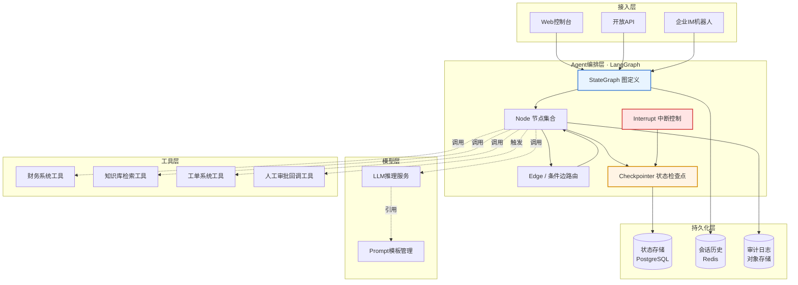
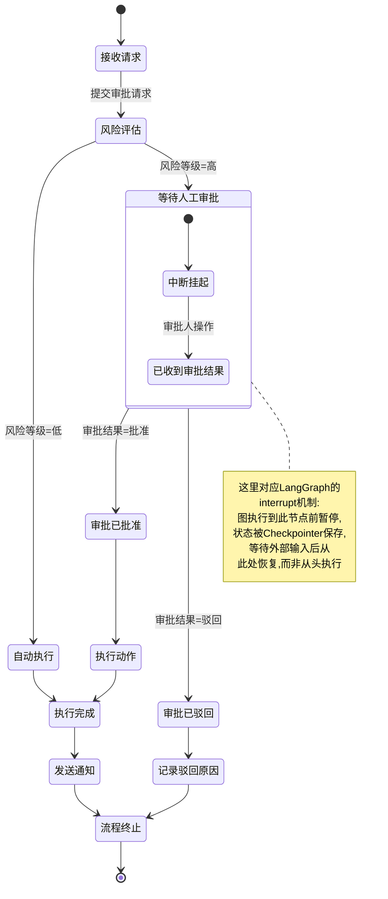
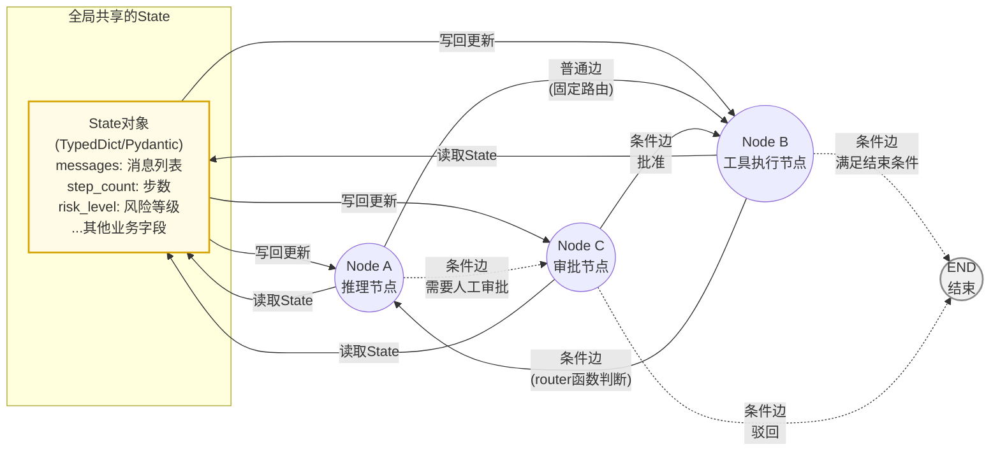
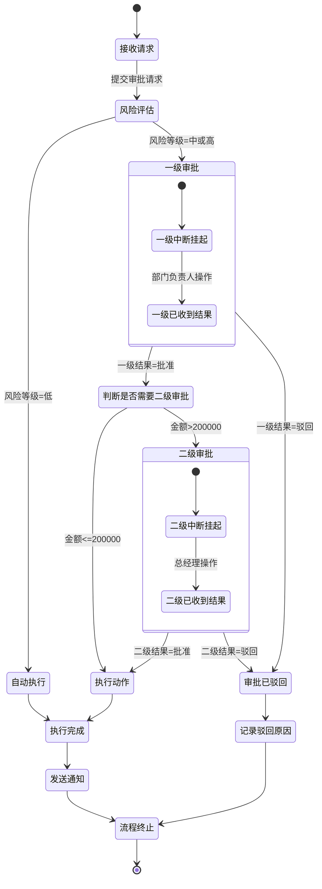

# 第41天:LangGraph入门(重点!)

- **阶段**:Stage 4·Agent 智能体开发
- **难度**:★★★★★(本阶段重点日,建议预留充足时间)
- **今日角色**:陈铭(主角,蓬远科技AI工程师)、王振宇/老王(技术导师,苍穹智能体中台架构负责人)
- **关联产品**:苍穹企业级智能体中台
- **前情提要**:Day40 里陈铭用 AgentExecutor 撑起了第一版 ReAct Agent 的门面,能跑,但跑得心里发虚——黑盒决策、无法中断、状态丢失、调试基本靠猜。今天,老王要把"黑盒"这件事翻到台面上说清楚,顺手把 LangGraph 这个技术选型钉死。
- **今日目标**:搞懂 LangGraph 为什么存在、State/Node/Edge/条件边/循环怎么用、把 Day40 的 ReAct Agent 用图结构重写一遍、跑通一个带人工审批节点的工作流雏形。
- **今日产出**:两份可运行代码(LangGraph 版 ReAct Agent、带人工审批节点的工作流)、三张架构/流程/概念图、一份课堂笔记、一份作业与参考答案。

---

## 【旁白】

在蓬远科技内部,"要不要上 LangGraph"这件事吵了整整一周。

反对的声音很直接:LangChain 生态本身已经够复杂了,AgentExecutor 用得好好的,为什么要再引入一层图结构的抽象,让团队重新学习一套 State、Node、Edge 的概念?这是不是过度设计?

但老王在架构评审会上把话摁死了。他打开投影,只放了一句话:"我们不能把客户的业务流程放在一个不可控的黑盒里。"

这句话背后的分量,陈铭是后来才慢慢咂摸出来的。苍穹要做的不是一个玩具聊天机器人,而是要接客户真实的业务系统——报销审批、合同审核、工单流转,这些流程天生就有"分支""回退""等人"这些环节。AgentExecutor 那种"决策全部塞进一次函数调用循环里"的模式,遇到"等审批人确认"这种真实世界的暂停点,直接就露了怯:程序跑到一半怎么"暂停"?暂停之后状态存哪里?三天后审批人点了"同意",怎么让程序从暂停的地方接着往下走,而不是从头再跑一遍?

这些问题在 Demo 阶段可以视而不见,但客户合同一签,这些问题就是压在项目组头上的达摩克利斯之剑。老王选择在苍穹的 Agent 编排层上把宝压在 LangGraph 身上,本质上是一次"把控制权拿回自己手里"的架构决策——用显式的图结构代替隐式的函数调用栈,用可持久化的状态代替易失的内存变量,用可中断的执行代替一次性跑到底的黑盒。

这决策对不对,后面几天的项目实战会给出答案。但今天,陈铭要先啃下最难啃的骨头:看懂图,画得出图,写得出图。

---

## 晨会纪要

**时间**:09:05 - 09:35
**地点**:蓙远科技 3 楼小会议室"启明"
**参会**:王振宇(技术导师)、陈铭(记录人)、林晓(前端&产品对接)、周浩(测试)

老王一进门就把昨天陈铭画的 AgentExecutor 调用链草图拍在桌上:"昨天这张图,谁能告诉我,如果客户在'调用财务系统查余额'这一步之后,想让人工审批一下再继续,应该改哪里?"

会议室安静了几秒。林晓先开口:"是不是在 Prompt 里加一句'调用财务工具前先请求确认'?"

老王摇头:"这是把架构问题甩给了 Prompt,模型听不听你的,纯靠运气。而且就算模型'听话'了,它怎么把执行权交出去?交给谁?交出去之后,原来跑到一半的那些变量——比如已经查到的部分结果、已经执行过的工具调用记录——存在哪?三天后审批通过了,你怎么让程序从暂停的地方继续,而不是从头再跑一遍,把已经产生副作用的工具调用(比如已经发出去的转账请求)又跑一遍?"

陈铭接话:"AgentExecutor 内部是一个 while 循环,状态全在这个函数的局部变量里,函数一返回,状态就没了。要暂停再恢复,基本没法做,除非我们自己在外面搭一套状态持久化和恢复的机制,但那样等于把 AgentExecutor 的执行逻辑重新写一遍。"

"对,"老王说,"这就是为什么我们不能继续在 AgentExecutor 上叠层。今天开始,苍穹的 Agent 编排层统一切到 LangGraph。它把 Agent 的执行过程显式建模成一张图——图里的每个节点是一步操作,节点之间的连线是流转规则,整张图的状态是一份可以被序列化、可以被存进数据库、可以被暂停和恢复的数据结构。这不是炫技,这是我们做企业级产品必须要有的地基。"

周浩问了个很实际的问题:"那我们现有跑通的 ReAct Agent 是不是要推倒重写?"

"逻辑不用推倒,"老王说,"ReAct 的思路——推理、行动、观察、循环——这套东西是对的,LangGraph 不是取代 ReAct,而是给 ReAct 换一个更牢靠的执行载体。今天陈铭的任务,就是把 Day40 那套用 AgentExecutor 实现的 ReAct Agent,原样用 LangGraph 的图结构重新搭一遍,行为完全对齐,但执行引擎换掉。搭完之后,再往这张图里加一个人工审批节点,先跑通最简单的版本,细节——比如状态怎么持久化到数据库、中断之后怎么隔着好几天恢复——我们明天(Day42)专门讲。"

林晓在纪要里补了一句产品视角的话:"从客户的角度看,'审批中断'这件事其实是苍穹要吃下的一大批 To B 场景的门槛——报销、用章、合同、发货,几乎所有涉及'人在流程中'的场景,都需要这个能力。这不是加分项,是准入门槛。"

老王点头,把今天的任务拆成三块,写在了白板上:

1. 讲清楚 LangGraph 的核心概念:State、Node、Edge、条件边、循环,以及它和 AgentExecutor 的本质区别。
2. 用 LangGraph 重写 ReAct Agent,跑通,并把图结构可视化出来给周浩测试组看。
3. 搭一个最简的"人工审批节点"工作流,先不追求持久化的完整实现,重点是把"图执行到一半可以停下来等人"这件事在代码里跑通一次。

会议在 9:35 结束,林晓临走前提了一句:"祺瑞那边的合同审批场景,产品经理已经在等我们的技术方案了,这个功能不是选修课。"

这句话陈铭记在了纪要最后一行,加了个感叹号。

---

## 需求文档

**文档编号**:CQ-AGENT-ARCH-2024-041
**文档名称**:苍穹智能体中台 Agent 编排层技术选型与图执行引擎需求
**提出方**:架构组(王振宇)
**接收方**:Agent 研发组
**优先级**:P0(架构基础设施,阻塞后续所有 Agent 类功能开发)

### 1. 背景

苍穹企业级智能体中台当前的 Agent 执行引擎基于 LangChain 的 `AgentExecutor` 实现。经过 Day39-Day40 的实践验证,该方案在最基础的"推理-行动-观察"循环场景下可以工作,但暴露出以下无法通过局部修补解决的结构性问题:

1. **执行过程不可观测**:Agent 的中间决策过程被封装在 `AgentExecutor.run()` 内部的循环里,外部只能拿到最终结果或者依赖回调(callback)捕获零散的中间事件,无法拿到一份完整、结构化、可回放的执行轨迹。
2. **无法中断与恢复**:一旦调用 `run()`,整个执行过程是"一次性跑到底"的,没有原生机制支持"执行到某一步暂停,等待外部输入(如人工审批)后再从暂停点恢复"。
3. **状态管理缺乏可持久化能力**:Agent 执行过程中的状态(已完成的步骤、中间结果、工具调用历史)只存在于内存中的局部变量,进程重启或跨请求场景下状态即丢失,无法支撑"审批可能是三天后才发生"这种真实业务时间尺度。
4. **流程分支表达能力弱**:业务上常见的"条件分支""循环重试""多路汇聚"等控制流,在 AgentExecutor 的模型里只能通过 Prompt 工程或者外部包装代码去模拟,表达力和可维护性都不足。
5. **多 Agent 协作扩展困难**:随着苍穹后续要支持多 Agent 协同(见 Day43 预告),需要一个能够将"单个 Agent 的内部决策循环"和"多个 Agent 之间的协作拓扑"统一在同一套抽象下建模的框架。

### 2. 需求目标

引入 LangGraph 作为苍穹智能体中台 Agent 编排层的核心执行引擎,替代原有基于 `AgentExecutor` 的实现,达成以下目标:

- **G1**:Agent 的执行过程用显式的**状态图(State Graph)**建模,图中的每个节点(Node)对应一次明确的处理步骤,节点之间的边(Edge)对应清晰的流转规则,整张图的运行时状态(State)是一份结构化、可序列化的数据。
- **G2**:支持在图的任意节点前后设置**中断点(interrupt)**,执行到中断点时暂停,等待外部(人工或其他系统)输入后再恢复,恢复时从中断点继续而不是从头执行。
- **G3**:支持将图的状态**持久化**到外部存储(本阶段先用内存级 Checkpointer 验证流程,持久化到数据库的实现在 Day42 展开)。
- **G4**:支持**条件边(Conditional Edge)**,即根据当前状态动态决定下一步走向哪个节点,从而原生表达"分支""循环""重试"等控制流,不再依赖 Prompt 工程模拟。
- **G5**:图结构本身可以被**可视化**导出,便于产品、测试、客户方技术对接人员理解 Agent 的决策逻辑,而不是只能看一堆日志猜流程。

### 3. 功能需求清单

| 编号 | 功能点 | 优先级 | 说明 |
|---|---|---|---|
| F1 | 用 LangGraph 重写现有 ReAct Agent | P0 | 行为上要与 Day40 版本对齐:能进行"推理→选择工具→执行工具→观察结果→再推理"的循环,直到得出最终答案 |
| F2 | State 定义规范 | P0 | 明确 Agent 状态需要包含哪些字段(消息历史、中间步骤、当前任务状态等),给出 TypedDict/Pydantic 两种实现方式的对比 |
| F3 | 条件边实现:是否继续调用工具 | P0 | 根据模型输出判断:如果模型给出了工具调用请求,则路由到工具执行节点;如果模型给出了最终答案,则路由到结束 |
| F4 | 图可视化导出 | P1 | 使用 LangGraph 自带的可视化能力(Mermaid / PNG),将编排好的图导出成图片或 Mermaid 代码,供团队及客户方查阅 |
| F5 | 人工审批节点原型 | P0 | 在图中插入一个"人工审批"节点,执行到该节点前暂停整张图的执行,模拟等待外部审批结果后恢复执行的完整链路(不要求跨进程持久化,本阶段验证单进程内的中断/恢复逻辑即可) |
| F6 | 风险分级路由 | P1 | 结合 F5,根据请求的风险等级(如涉及金额大小)走不同分支:低风险自动执行,高风险才进入人工审批节点 |
| F7 | 拒绝/驳回分支 | P1 | 审批节点的输出结果需要支持"批准"和"驳回"两种路径,分别路由到不同的后续节点 |

### 4. 非功能需求

- **NF1 可读性**:图结构的节点命名、状态字段命名需要与业务语义强对应,避免团队新成员看不懂图在表达什么业务逻辑。
- **NF2 兼容性**:新的图执行引擎需要能够复用现有基于 LangChain 封装的工具(Tool)定义,不要求团队重新实现工具层。
- **NF3 可测试性**:图中的每个节点应该是一个可以被单独单元测试的函数,不依赖整张图才能测试局部逻辑。
- **NF4 渐进式迁移**:本次改造只涉及 Agent 编排层,不改动底层模型调用层和工具执行层的既有封装,降低迁移风险。

### 5. 验收标准

1. 用 LangGraph 重写的 ReAct Agent 能够正确回答至少 3 类不同问题(需要单次工具调用、需要多次工具调用循环、不需要工具调用直接回答),行为与 Day40 版本一致。
2. 图结构能够成功导出为 Mermaid 代码或图片,团队评审时能看图讲清楚 Agent 的决策路径。
3. 人工审批工作流原型能够演示以下完整链路:提交请求 → 风险评估 → (高风险)暂停等待审批 → 输入审批结果 → 恢复执行 → 返回最终结果,批准和驳回两条路径都要能跑通。
4. 所有新增节点函数具备独立的单元测试。

### 6. 时间安排

- 今日(Day41)完成 F1、F2、F3、F4、F5 的原型验证。
- 明日(Day42)完成状态的数据库级持久化、跨进程/跨会话的中断恢复能力(直接对应祺瑞客户提出的"审批中断"需求)。
- 后续排期由老王在架构组内统一协调,视 Day42 验收结果决定是否直接进入客户对接的技术方案设计。

### 7. 关联方

- **祺瑞(客户方)**:提出的合同审批流程改造需求中明确要求"审批人可以在任意时间点介入审批,系统需要能够记住审批前的所有上下文,审批完成后自动继续处理",这是本次技术选型的重要业务驱动力之一。

---

## 架构设计图

下面这张图是老王在晨会后补充的,用来说明 LangGraph 在苍穹智能体中台整体架构里所处的位置——它不是孤立的技术组件,而是嵌在"模型层-工具层-编排层-持久化层-接入层"这条链路中的关键一环。



这张图里有几个地方值得多说两句。

第一,编排层被单独框成一个子图,里面明确列出了 `StateGraph`、`Node`、`Edge/条件边路由`、`Checkpointer`、`Interrupt` 五个组件,这不是随手画的,是老王刻意要求的——他说"架构图里如果只画一个'LangGraph'的方框,等于什么都没说,团队里每个人对'LangGraph'的理解都不一样,必须把它拆开画,拆到每个人看图就知道自己该关心哪一块"。

第二,`Checkpointer` 单独连到持久化层的状态存储,这条线是今天的图里最重要的一条线,也是 Day42 要重点展开的部分——状态检查点机制是"中断-恢复"能力的地基,没有它,图执行引擎和 AgentExecutor 在"能不能暂停"这件事上是没有本质区别的。

第三,`Interrupt` 中断控制被单独画出来而不是合并进 Checkpointer,是因为它们其实是两个概念:Checkpointer 负责"存状态",Interrupt 负责"在什么时候暂停、暂停后谁来触发恢复"。很多团队第一次学 LangGraph 时容易把这两者混为一谈,以为"用了 Checkpointer 就自动会中断",这是个常见误区,今天课堂笔记部分会专门澄清。

---

## 流程图:带人工审批节点的工作流状态转移

这张图对应今天要实操的"人工审批工作流",用状态图(而不是普通流程图)来画,是因为 LangGraph 本身对图的建模就是"状态机"式的——每个节点代表系统所处的一种状态,边代表状态之间的转移条件,这种画法和代码结构是一一对应的,不是为了好看硬凹的。



这张状态转移图里,"等待人工审批"这个复合状态是核心。它内部又拆出"中断挂起"和"已收到审批结果"两个子状态,这是故意画出来提醒团队:审批节点在 LangGraph 里的真实实现,并不是一个会"卡住"进程傻等的同步阻塞调用(那样的话服务器进程全被占满,来一百个审批请求就要开一百个线程干等,这在工程上是不可接受的)。真实的实现是:图执行到审批节点前,**主动把当前状态保存下来并返回**,进程可以立刻去处理别的请求;等审批人真正做出决定之后,再用保存的状态**重新调用图的执行**,从中断点恢复,而不是重新从头跑一遍前面的"接收请求""风险评估"这些已经执行过的步骤。

图里还特意画出了"审批已批准"和"审批已驳回"两条独立分支,分别导向"执行动作"和"记录驳回原因",最后汇聚到"流程终止"。这种"分支之后再汇聚"的结构,在 AgentExecutor 的模型里几乎无法自然表达,但在 LangGraph 里就是一条条边的定义,这也是条件边存在的意义。

---

## 示意图:State / Node / Edge / 条件边的关系

这张图不对应任何具体业务场景,纯粹是把 LangGraph 最核心的四个概念——State(状态)、Node(节点)、Edge(边)、条件边(Conditional Edge)——的关系抽象地画出来,方便讲课堂笔记时对照。



这张图想传达的核心信息是:**Node 只做两件事——读 State,处理,写回新的 State**;**Edge 只做一件事——决定处理完之后该轮到哪个 Node**;而 State 本身是贯穿全图、被所有节点共享和累积更新的一份数据。普通边(实线)是"写死"的路由,不需要判断,处理完 A 必然去 B;条件边(虚线)则需要一个专门的路由函数(router function)读取当前 State,根据里面的内容动态计算"接下来该去哪个节点",这才是 LangGraph 表达分支、循环、重试能力的关键机制。

---

## 课堂笔记

### 上午:核心概念——为什么需要图,State/Node/Edge/条件边到底是什么

老王上午的课基本没有敲代码,黑板画满了。陈铭把笔记整理如下。

#### 1. 从"函数调用栈"到"图"的思维转变

先复习一下 AgentExecutor 的执行模型:本质上是一个 `while` 循环,每一轮循环做的事情是"把当前的对话历史和中间步骤丢给模型,模型返回一个决策(继续调用某个工具,或者给出最终答案),如果是调用工具就执行工具、把结果拼回历史里,继续下一轮循环;如果是最终答案就跳出循环,返回结果"。

这个模型的问题不在于"跑不起来",Day40 已经证明它能跑起来。问题在于这个循环的**执行过程本身是不透明、不可控、不可持久化的**。它是一段普通的 Python 函数调用,函数调用栈里的状态天然是"临时的"——函数一返回,调用栈就被销毁,里面的局部变量全部消失。你想在"第 3 轮循环执行到工具调用之前"暂停,等一个人来确认,再从那个点恢复,这在朴素的函数调用模型里几乎是做不到的,除非你自己发明一套"把函数执行状态序列化再反序列化"的机制——但这基本等于自己发明一个简化版的 LangGraph。

LangGraph 的核心思路是反过来的:**不要把 Agent 的执行过程隐藏在一个函数调用栈里,而是把它显式地建模成一张图**。图是一种数据结构,数据结构是可以被检查、被保存、被序列化、被可视化的。图上的每一个节点代表"某一步该做什么",图上的每一条边代表"做完这一步之后该去哪一步",而驱动整张图运转的,是一份显式存在、可以被随时读取和保存的状态对象(State)。

这个转变听起来抽象,但落到代码上其实是很朴素的三个概念:State、Node、Edge。老王反复强调一句话:"你把这三个概念吃透了,LangGraph 剩下的 API 基本都是围绕这三个概念的语法糖,不难。"

#### 2. State:贯穿全图的共享状态

State 是整张图运行时唯一的"记忆载体"。在 LangGraph 里,State 通常用 Python 的 `TypedDict` 或者 Pydantic 模型来定义,它规定了这张图在运行过程中要维护哪些字段。举个例子,一个 ReAct Agent 的 State 至少要有:

- `messages`:到目前为止的完整对话消息列表(包括用户输入、模型的推理输出、工具调用结果),这是驱动整个 ReAct 循环的核心字段。
- 可能还需要一些业务相关的字段,比如当前处理到第几轮、当前的风险等级评估结果、是否需要人工介入的标志位等。

State 有一个非常关键的机制,叫**归约器(Reducer)**。默认情况下,一个节点返回的新状态会**覆盖**旧状态里同名的字段。但像 `messages` 这种字段,我们通常不想"覆盖"(覆盖意味着每次只能保留最后一条消息,历史全丢了),而是想"追加"。LangGraph 提供了 `Annotated` 类型配合归约函数的写法来实现这一点,比如用内置的 `add_messages` 归约器,它知道如何把新产生的消息正确地拼接到已有的消息列表后面,甚至能处理"用新消息替换掉某条旧消息"这种更新语义(比如工具调用的结果需要关联到对应的工具调用请求)。

老王在黑板上写了个简化的对比,陈铭原样记了下来:

```
没有归约器(默认覆盖):
  第1轮返回 {messages: [msg1]}        -> State.messages = [msg1]
  第2轮返回 {messages: [msg2]}        -> State.messages = [msg2]  (msg1丢了!)

用 add_messages 归约器:
  第1轮返回 {messages: [msg1]}        -> State.messages = [msg1]
  第2轮返回 {messages: [msg2]}        -> State.messages = [msg1, msg2]  (正确追加)
```

这个机制看起来是个小细节,但陈铭当场就意识到,如果自己没搞懂归约器就直接照着网上的示例代码抄一遍,大概率会在某个字段的更新语义上踩坑——尤其是那种"看起来能跑,但状态偷偷丢失了一部分"的坑,排查起来会非常痛苦。

#### 3. Node:一个节点就是一个函数

Node 的设计极其朴素:**一个 Node 就是一个普通的 Python 函数(或者是一个可调用对象),它接收当前的 State 作为输入,返回一个字典,字典里包含要对 State 做的更新**。就这么简单。

```python
def my_node(state: AgentState) -> dict:
    # 读取当前状态
    messages = state["messages"]
    # 做一些处理(比如调用模型)
    response = model.invoke(messages)
    # 返回要更新到state里的增量
    return {"messages": [response]}
```

这个设计带来一个非常实际的好处,也是需求文档里 NF3(可测试性)强调的:**因为 Node 就是一个普通函数,输入是 State,输出是字典,你可以完全脱离图,直接对着这个函数写单元测试**,不需要先搭好整张图才能验证一个节点的逻辑对不对。这跟 AgentExecutor 里"所有逻辑绑死在一个大循环内部,想单独测试'工具选择逻辑'都得把整个 Agent 跑起来"形成了鲜明对比。

Node 里可以做任何事——调用大模型、调用外部 API、查数据库、执行业务逻辑判断、甚至什么都不做只是路由中转。图里唯一的硬性要求是:Node 的返回值必须是一个能够合法更新到 State 上的字典。

#### 4. Edge:图的连线,决定执行顺序

Edge 分两种:**普通边(固定边)**和**条件边**。

普通边非常直白:执行完节点 A,接下来必然执行节点 B,没有任何判断逻辑,写法就是 `graph.add_edge("A", "B")`。这种边对应业务里那种"确定无疑,不需要动脑子判断"的流转,比如"风险评估完成后,不管结果是什么,都要先记录一条审计日志"这种场景。

条件边则是 LangGraph 表达能力的核心。它的写法是 `graph.add_conditional_edges("A", router_function, {"结果1": "B", "结果2": "C"})`。`router_function` 是一个普通函数,输入是当前 State,输出是一个字符串(或者其他可哈希的值),LangGraph 会拿这个输出去查后面那个字典,决定路由到哪个节点。

老王专门强调了一个容易被忽略的点:**router 函数本身不应该修改 State,它只负责"读取状态,做判断,返回一个路由标识"**。如果既想判断又想顺手改状态,应该把"改状态"这部分逻辑放回到前一个 Node 里去做,保持 router 函数的纯粹性——这是个工程习惯问题,不遵守也能跑,但会让图的逻辑变得难以推理和调试。

#### 5. 循环:图天生支持,不需要额外的技巧

ReAct 模式的本质是一个循环——推理、行动、观察,再推理、再行动、再观察,直到模型认为可以给出最终答案。在 LangGraph 里,循环不需要任何特殊语法,它就是图里的一条边指回了前面已经执行过的节点:

```
推理节点 --(条件边:需要调用工具)--> 工具执行节点
工具执行节点 --(普通边)--> 推理节点        # 这条边让图"绕回去"了,形成循环
推理节点 --(条件边:已经可以给出答案)--> END
```

这种"允许边指回已经执行过的节点"的能力,正是 LangGraph 名字里"Graph"的含义所在——它本质上是一张有向图,可以有环,而不是一棵只能往下长的树。这也是它和很多"链式"编排框架(执行路径是一条直线或者一棵树)的本质区别。

#### 6. LangGraph 与 AgentExecutor 的关系:不是替代 ReAct,而是换执行引擎

老王反复强调了一件容易被误解的事:**LangGraph 不是一种新的"Agent 范式",ReAct 依然是 ReAct,推理-行动-观察的逻辑一点没变**。LangGraph 改变的是"这套逻辑用什么样的执行引擎跑起来"——从一个不透明的函数循环,换成一张显式的、可持久化、可中断、可视化的状态图。

用一张对比表总结上午的内容(陈铭记在笔记本最后一页,准备贴在工位上):

| 对比维度 | AgentExecutor | LangGraph |
|---|---|---|
| 执行模型 | 函数调用栈里的隐式循环 | 显式的状态图,节点+边 |
| 状态管理 | 局部变量,函数返回即销毁 | State对象,可持久化到外部存储 |
| 中断与恢复 | 不支持,需要跑到底 | 原生支持interrupt机制 |
| 分支/循环表达 | 依赖Prompt工程或外部代码模拟 | 条件边原生表达 |
| 可观测性 | 依赖callback捕获零散事件 | 每个节点的输入输出天然可追踪 |
| 可视化 | 无 | 可导出Mermaid图/PNG |
| 单元测试 | 需要整体跑起来才能验证局部逻辑 | 单个节点函数可独立测试 |
| 多Agent协作扩展 | 需要额外自行设计协作层 | 图本身可嵌套,天然支持多Agent拓扑 |

#### 7. 常见报错与排查:第一次搭图时最容易踩的三个坑

老王讲完对比表之后没有立刻结束上午的课,他转而在自己的笔记本上敲了几行会报错的代码,投到屏幕上,说:"概念讲得再顺,不如让你们看看真实报错长什么样——这些坑我在给别的团队做内训的时候,几乎每次都会有人踩到,今天提前踩一遍,比你们自己晚上加班踩的时候心里没底强得多。"

**坑一:忘记从 START 连边,图编译时直接报错。**

老王写了一段只定义了节点、加了条件边,却忘了写 `graph.add_edge(START, "reason")` 的代码,当场编译:

```
ValueError: Graph must have an entrypoint: add at least one edge from START to another node
```

"这个报错信息其实已经把话说得很明白了,"老王说,"图必须有一个入口。你定义了一堆节点,画了一堆边,但没告诉这张图'从哪里开始走',LangGraph 是不会自己猜的。这跟写一个函数体但不声明函数名、不告诉解释器从哪里调用,是同一类问题。"陈铭下午写实战一的代码时,第一次跑起来就撞上了这个报错——他把 `graph.add_edge(START, "reason")` 那一行不小心写在了 `if __name__ == "__main__"` 判断之外一个从未被执行到的分支里,对着报错信息愣了几秒才反应过来。

**坑二:多个节点在同一步里试图更新同一个没有归约器的字段,触发 `InvalidUpdateError`。**

这是老王特意强调的一个"进阶坑",今天的图结构还没复杂到会直接触发,但他提前打了个预防针:"以后你们搭的图会出现'并行分支'——比如同时触发两个工具执行节点,各自去查不同的数据源,再汇总结果。如果这两个并行节点都想更新 State 里同一个没有配置归约器的字段,LangGraph 会在这一步执行完之后直接报错。"报错信息大致是这样:

```
InvalidUpdateError: At key 'risk_level': Can receive only one value per step.
Use an Annotated key to handle multiple values.
```

"这个报错的潜台词是,"老王解释,"你的图在同一轮里,有两个节点都想给 `risk_level` 这个字段写一个新值,但这个字段没有告诉 LangGraph 该怎么合并这两个新值——覆盖?取最大值?拼成列表?LangGraph 不会替你瞎猜,所以直接报错让你自己想清楚。解决办法就是给这个字段配一个归约器,明确写清楚合并规则,或者干脆重新设计节点职责,让同一个字段只由一个节点负责写。"陈铭把这条记在了笔记本上,虽然今天的两份实战代码里都还没有真正的并行分支,但他知道这是迟早会撞上的问题——苍穹后续要做的多 Agent 协作,并行执行几乎是标配。

**坑三:节点函数忘记返回字典,或者返回了 `None`。**

周浩当场问了个"看起来很蠢但很实际"的问题:"如果我写的节点函数忘了 `return`,会怎么样?"老王让他自己试。周浩现场改了一下 `node_send_notification`,故意去掉了 `return` 语句,跑起来后,图并没有直接崩溃报错,而是这个节点对 State 什么都没做更新——`audit_log` 字段没有被追加新记录,后续步骤的执行也没有中断,只是这一步"什么都没发生"。

"这才是最阴险的坑,"老王说,"它不报错,只是悄悄地什么都没干。你以为通知发出去了,审计日志也记上了,结果什么都没发生,而且没有任何报错提示你。这种bug往往是在生产环境跑了很久之后,某次审计的时候发现日志缺了一段,才会被人发现。所以我们要求每个节点函数写完之后,必须配一个单元测试,断言它返回的字典里确实包含了预期要更新的字段——这不是为了应付检查,是真的能在编码阶段就拦住这类'安静的bug'。"这句话也解释了为什么今天两份实战代码里,几乎每个节点函数都配了对应的单元测试用例。

#### 8. State设计的一个常见误区:字段颗粒度过粗或过细

老王画完对比表,又抛出一个"设计题"式的讨论:"假设你要给今天的审批工作流设计State,你会不会图省事,直接搞一个 `extra: Dict[str, Any]` 字段,把风险等级、审批结果、审批人这些统统塞进这一个字段里?"

林晓(虽然她主要负责产品和前端,但今天也旁听了上午的课)接话:"这样写起来是快,但后面谁也不知道 `extra` 里到底该有哪些key,容易漏字段或者拼错key名,而且IDE也没法帮你做类型提示。"

"对,这是颗粒度太粗的问题,"老王说,"State 字段设计得太粗,表面上灵活,实际上把'应该在编译期就能发现的错误'(比如字段名拼错)推迟到了运行时才暴露,而且运行时暴露的方式往往是'某个业务逻辑莫名其妙不生效了',排查成本极高。今天审批工作流的State特意把 `risk_level`、`approval_decision`、`approver`、`reject_reason`、`execution_result` 都拆成独立的具名字段,就是要保证每个字段的语义在State定义那一刻就清清楚楚,IDE的类型检查和自动补全也能帮上忙。"

但老王紧接着又补了一句反向的提醒:"颗粒度太细也是问题。"他举了个例子——如果把审计日志拆成 `audit_timestamp_1`、`audit_message_1`、`audit_timestamp_2`、`audit_message_2`……每条日志占用两个独立字段,那当日志条数不固定的时候,这种设计根本没法扩展,而且每新增一条日志就要新增两个字段,这明显是把"应该用列表/数组表达的可变长度数据"错误地拆成了定长字段。今天的 `audit_log: List[str]` 就是"该聚合的时候聚合,该拆分的时候拆分"的一个正例——它是一个字段,但内部是一个会不断追加的列表,这跟 `messages` 字段用列表存储、用归约器追加,是同一种设计思路的两次应用。

老王总结了一条经验法则,陈铭原句记了下来:"State里的每个字段,问自己两个问题——'这个字段的值,在图执行过程中是被完整替换,还是被追加/合并?'和'这个字段的语义,团队里任何一个新人看字段名能不能猜出八成含义?'第一个问题决定了要不要配归约器,第二个问题决定了字段名和拆分粒度合不合理。"

#### 9. 老王答疑:课堂上被高频问到的几个问题

上午课的最后十分钟变成了答疑环节,陈铭把几个被问到、也是他自己心里犯嘀咕的问题整理成了一份小FAQ,贴在了今天的课堂笔记末尾:

**Q1:LangGraph 和 LangChain 是什么关系?是要用其中一个替代另一个吗?**

老王的回答很干脆:"不是替代关系,是分层关系。LangChain 提供的是模型调用的统一接口、Prompt模板管理、工具(Tool)封装这些'基础构件';LangGraph 提供的是'怎么把这些构件组织成一个有状态、可控制的执行流程'的编排能力。今天的代码里,`@tool` 装饰器、`ChatOpenAI`、消息类型(`AIMessage`/`ToolMessage`)全部还是 LangChain 提供的,LangGraph 只是换了一种方式把它们编排起来。你可以把 LangChain 理解成'一堆乐高积木',LangGraph 是'新的拼装说明书',积木本身没变。"

**Q2:State 一定要用 TypedDict 吗?能不能用普通的 dict,或者用 Pydantic?**

"三种都能用,"老王说,"普通 dict 灵活但完全没有类型提示,不推荐在团队协作的正式项目里用;TypedDict 是今天用的方式,轻量,有类型提示,IDE友好,是目前官方示例和大多数团队的默认选择;Pydantic 模型能提供更强的运行时校验能力(比如字段类型不对会直接报错,而不是等到运行时某个地方悄悄出问题),如果你的State字段涉及比较复杂的校验逻辑(比如金额必须为正数),用 Pydantic 会更稳妥,但会多一点性能开销和写法上的额外约束。苍穹目前统一用 TypedDict,除非某个场景的校验需求特别强,才会考虑切到 Pydantic。"

**Q3:条件边的路由函数,返回值必须是字符串吗?**

"不是必须是字符串,只要是可哈希的值都行,"老王答,"实践中几乎所有团队都用字符串,因为可读性最好——你在代码里一眼就能看出 `"continue_tools"` 对应的是什么语义,如果换成返回 `0` 和 `1` 这种魔法数字,过两个月自己都看不懂当时为什么这么写。团队规范上要求路由函数的返回值必须是有业务含义的字符串,不允许用裸的数字或布尔值。"

**Q4:一个节点执行完之后,能不能同时路由到多个下游节点,并行执行?**

"能,这是我们后面会用到的能力,"老王说,"`add_conditional_edges` 支持路由函数返回一个列表,列表里的每个目标节点都会被并行调度执行,执行完之后各自的State更新会被合并。但正因为可能存在多个并行节点同时更新State,这就直接引出了刚才坑二里说的归约器问题——并行意味着'同一步里可能有多个更新者',这时候没有归约器的字段冲突风险会明显上升,设计的时候要格外小心。"

**Q5:今天的图里,一个节点报错了(比如工具调用抛异常),整张图会怎么样?**

这个问题是周浩问的,带着他一贯的测试思维。老王的回答是:"默认情况下,一个节点内部没有被捕获的异常会直接向上抛,导致整次 `invoke()` 调用失败,State 不会被正常更新到最新一步(但 Checkpointer 里保留的是最后一次成功保存的检查点)。这也是为什么实战一的 `execute_tools` 节点内部专门用 `try/except` 包了一层——工具调用失败是完全可预期的正常情况(比如账户不存在、参数不对),不应该让一次工具调用失败直接打断整个Agent的运行,而应该把'失败'也当成一种正常的观察结果,包装成 `ToolMessage` 交还给模型,让模型自己决定要不要换个方式重试。这跟裸抛异常让整个图崩掉,是两种完全不同的健壮性设计,企业级系统里几乎总是应该选前者。"

### 下午:用 LangGraph 重写 ReAct Agent,并做可视化

下午的重点是把上午的概念落地到代码。老王的要求很明确:"先不追求花样,把 Day40 那套 ReAct Agent 原样用 LangGraph 的图结构重写一遍,行为对齐,然后把图打印出来给周浩的测试组看,让他们看图就能明白 Agent 大概会怎么决策。"

#### 1. 明确State结构

重写的第一步永远是先定义 State。ReAct Agent 的核心驱动是消息历史,所以 State 里的第一个,也是最重要的字段就是 `messages`,用 `add_messages` 归约器保证追加语义正确。此外还加了一个 `step_count` 字段,用来防止模型陷入死循环(万一模型一直不给最终答案,一直反复调用工具,得有个兜底的最大步数限制)。

#### 2. 拆分节点:推理节点与工具执行节点

ReAct 的循环天然对应两个节点:

- **推理节点(call_model)**:把当前的消息历史丢给模型,拿到模型的输出。如果模型的输出里包含工具调用请求,这条消息会被特殊标记(在 LangChain 的消息对象里,这个信息记录在 `tool_calls` 属性里);如果不包含,说明模型认为可以给出最终答案了。
- **工具执行节点(tool_node)**:检查上一条消息里的 `tool_calls`,依次执行对应的工具,把每个工具的执行结果包装成 `ToolMessage`,追加回消息历史。

#### 3. 条件边:是否需要继续调用工具

路由逻辑非常直接:检查最新一条消息(一定是模型刚生成的)里有没有 `tool_calls`。如果有,说明模型想调用工具,路由到工具执行节点;如果没有,说明模型认为已经可以给出最终答案,路由到 `END`。

#### 4. 可视化

LangGraph 编译好的图对象(`CompiledGraph`)自带 `get_graph()` 方法,可以拿到图的结构化描述,再调用 `.draw_mermaid()` 就能直接生成 Mermaid 格式的图代码,或者 `.draw_mermaid_png()` 直接渲染出图片。陈铭下午做的第一件事就是先把这个功能跑通,把生成的 Mermaid 代码贴进了晨会纪要文档里,发给了林晓和周浩,让产品和测试团队第一次真正"看懂"了 Agent 的决策路径,不再是只能盯着日志猜。

老王看了图之后说了句让陈铑印象很深的话:"你看,这张图往测试组一发,他们立刻就能提出'万一模型连续5轮都要求调用工具,会不会死循环'这种问题——这就是可视化的价值,它把原本只存在于工程师脑子里的执行逻辑,变成了一份团队所有人都能读的共享资产。"

#### 5. 人工审批节点的初步实现思路

下午后半段,老王带着陈铭在 ReAct Agent 的图之外,又搭了一个独立的、更贴近业务的图——带人工审批节点的工作流。这个图和 ReAct Agent 图结构不同,但用的是完全一样的 State/Node/Edge 概念,只是节点里放的是业务逻辑(风险评估、审批、执行动作),而不是"调用大模型做推理"。

核心的技术点是:LangGraph 提供了在编译图时通过 `interrupt_before` 参数(或者在节点内部调用 `interrupt()` 函数,这是更新版本推荐的写法)指定"图执行到某个节点之前必须暂停"的能力。配合 Checkpointer(哪怕是本阶段先用最简单的内存版 `MemorySaver`),暂停时的完整状态会被保存下来,执行返回给调用方一个"当前处于中断状态"的信号;调用方拿到人工审批的结果后,更新状态,再次调用图的执行方法,图会从中断点恢复,继续往后跑,而不会重新执行"接收请求""风险评估"这些已经跑过的节点。

老王特别提醒:"今天大家先把这套机制在单进程、内存态下跑通、吃透原理,不需要纠结'审批人三天后才响应,进程都重启了怎么办'这种问题——那是明天(Day42)专门要解决的持久化问题,今天要是纠结这个,容易学一半就卡住,反而把简单的核心原理搞复杂了。"

#### 6. Checkpointer选型考量:今天为什么先用MemorySaver,而不是直接上数据库版本

陈铭在动手写代码之前,先问了老王一个很直接的问题:"既然我们知道最终要落到数据库,今天干嘛不直接用数据库版的Checkpointer,省得明天再改一遍?"

老王的回答带着他一贯的工程哲学:"两个原因。第一,LangGraph 官方和社区提供的持久化Checkpointer(比如基于 PostgreSQL、SQLite、Redis 的实现)本身有自己的一套连接管理、表结构初始化、序列化格式的约定,如果你在还没搞懂'中断-恢复到底是怎么工作的'这个核心原理之前,就一头扎进数据库连接配置、表结构设计这些细节里,大概率会把两类完全不同的问题——'图执行引擎的语义'和'某个具体存储介质的接入细节'——搞混,出了问题都不知道该往哪个方向排查。第二,`MemorySaver` 的接口和数据库版Checkpointer的接口是完全一致的,都是实现了同一个 `BaseCheckpointSaver` 抽象接口,今天写的所有业务代码——节点函数、条件边、`interrupt()` 的调用方式——明天换Checkpointer的时候,一行都不需要改,只需要把 `MemorySaver()` 换成 `PostgresSaver(...)` 或者类似的实现,连接配置换一下,业务逻辑代码完全不受影响。这就是关注点分离的价值:先用最简单的实现把核心语义吃透,再逐步替换成生产级的实现,风险和认知负担都是可控的。"

这段对话让陈铭想起了Day40学习设计模式时提到的"依赖倒置"——业务代码依赖的是一个抽象接口(`BaseCheckpointSaver`),而不是某个具体实现(`MemorySaver`或`PostgresSaver`),具体用哪个实现是可以在运行时甚至配置文件里决定的。这个思路今天在LangGraph的Checkpointer设计里又出现了一次,他把这条心得也记进了笔记本:"好的框架设计,总是在关键的可替换点上留一个抽象接口。"

#### 7. 测试环节:周浩提的三个刁钻问题

代码写完、初步跑通之后,老王把周浩叫过来,让他对着实战二的代码"随便挑刺"。测试出身的周浩确实没让人失望,一口气提了三个问题,把陈铭问得有点措手不及。

**问题一:"如果审批人对同一个 request_id 提交了两次审批结果,会发生什么?"**

陈铭当场试了一下——先提交一次批准,流程正常走到结束;然后又用同一个 `request_id` 再调用一次 `submit_approval_decision`。因为图已经执行到 `END` 了,`get_state()` 显示 `next` 是空的,再调用 `Command(resume=...)` 会因为没有处于中断状态的检查点而直接报错或者静默无效(取决于具体版本行为)。"这说明我们现在的代码里,没有对'这个请求是否真的还处于挂起状态'做前置校验,"陈铭承认,"生产环境里必须在 `submit_approval_decision` 里先用 `get_state()` 查一下当前状态,确认 `next` 里确实包含 `human_approval` 节点,才允许提交审批结果,否则应该直接返回一个明确的错误,而不是让LangGraph抛一个语义不明的底层异常。"老王在旁边点头:"这就是好的测试用例的价值——它逼着你把'正常路径'之外的边界情况想清楚,而这些边界情况恰恰是生产环境里最容易出事的地方。"

**问题二:"两个不同的请求,能不能用同一个 thread_id?"**

"技术上如果真这么做,后一个请求的状态会覆盖前一个,两个请求会在Checkpointer里'打架',"陈铭答,"所以 `thread_id` 的生成必须保证唯一性,今天用的是 `request_id`(内部用uuid生成),这个是没问题的。但周浩这个问题提醒了我一件事——如果哪天我们的系统要支持'一个用户同时提交多个审批请求,并且要在一个统一的会话里追踪',简单地用 `request_id` 当 `thread_id` 就不够了,需要多想一层'会话'和'请求'之间的映射关系,这个坑我们记下来,不是今天要解决的,但要知道它存在。"

**问题三:"如果审批人批准了,但金额超大,在`node_execute_action`真正执行的时候系统突然崩了,状态会是什么样?"**

这个问题让陈铭停顿了几秒才回答。"如果 `node_execute_action` 内部的资金操作还没做完系统就崩了,按照Checkpointer的机制,上一次成功保存的检查点应该是`human_approval`节点执行完之后的状态——也就是说,`approval_decision`已经是'批准'了,但`execution_result`还没被写入。进程重启后,如果我们简单地对这个`thread_id`重新调用一次`invoke()`,图会从`human_approval`之后的边开始,再次进入`execute_action`节点,相当于把执行动作这个节点重新跑一次。"老王补了一句更严格的话:"这就引出了一个关键的工程要求——节点内部如果涉及真实的、有副作用的外部操作(比如真的调用了转账接口),这个操作本身必须具备幂等性,或者在节点内部有明确的'检查是否已经执行过'的逻辑,否则'从检查点恢复后重新执行这个节点'就可能导致资金被重复划转这种严重事故。今天的代码里`node_execute_action`只是打印一句模拟结果,没有真实副作用,所以看不出这个问题,但这是我们接下来接真实客户系统时必须补上的设计——每一个可能被恢复重放的节点,都要问一句'这个节点重新执行一次,会不会产生和第一次不一样的、有害的后果'。"

陈铭把这三个问题原样记进了笔记本,标了个"明日/后续必须解决"的记号——他隐约觉得,老王说的"幂等性"这个词,接下来的项目里肯定还会反复出现。

**问题四(陈铭自己想到的,趁机顺带问了老王):"图会不会因为节点太多、State太大而变得很慢?有没有性能上的注意事项?"**

这是陈铭自己在下午写代码时冒出来的疑问,他趁着周浩提问的间隙也顺带问了老王。老王的回答比较务实:"图本身的调度开销是很小的,节点之间的路由判断、State的读写,相对于一次大模型调用的网络延迟(通常是几百毫秒到几秒),几乎可以忽略不计,所以正常规模的业务图不需要太担心'图本身慢'这个问题。真正需要注意的是两点:第一,State里不要塞不必要的大字段,比如把完整的文件内容、大段的原始日志塞进State里长期携带,每次Checkpointer保存状态的时候都要把整份State序列化一遍,State越大,序列化和落盘的开销越大,尤其是用数据库版Checkpointer的时候,这个开销是要花真钱(存储和IO)的;第二,`messages`字段如果不加控制地一直往后追加,長时间运行的会话历史会越拖越长,每一轮推理都要把这份越来越长的历史丢给模型,不仅拖慢响应,还会因为超出模型的上下文长度限制而报错。今天的代码还没触及这个问题,但后面遇到长对话场景,历史消息的裁剪或摘要压缩是必须要考虑的优化点。"

#### 8. 与前后知识点的呼应:从Day40到Day41,再往前看Day43

下午收尾前,老王特意留了几分钟做"知识串联",这是他一贯的习惯——不希望团队学完一天的内容就孤立地存在脑子里,而是要能和前后的知识点接上线。

"往回看,"老王说,"Day40 教的 ReAct 模式——推理、行动、观察——这套认知框架今天完全没有变,变的只是执行它的引擎。你们可以把 Day40 到 Day41 的关系,类比成'从解释执行到编译执行'的转变:业务逻辑(要做什么)没变,但'谁来负责调度这些逻辑、状态存在哪里、能不能中途暂停'这些运行时层面的能力,发生了根本性的升级。这也是为什么我一直强调,今天不是推翻昨天,而是给昨天的思路换了一副更结实的骨架。"

陈铭接话:"所以Day40写的那些工具(`@tool`装饰的函数),今天一行都没改,直接原样搬过来用了。"

"对,这就是需求文档里NF2兼容性要求的意义,"老王说,"工具层、模型调用层,这些相对'稳定'的部分不应该因为编排层的技术选型变化而被牵连着重写,这是分层架构应该带来的好处——如果换一个执行引擎,底层的工具全部要跟着重写,那说明分层没做好,层与层之间耦合太重。"

"往后看,"老王接着说,把话题引向了 Day43,"你们现在看到的图,节点里做的事情要么是调用模型、要么是执行工具、要么是业务判断,本质上都是'单个Agent内部的决策循环'在图上的展开。Day43 要讲的多Agent协作,思路上是同一套图的语言,只是节点本身可能就是'另一整张图'——你可以把一个复杂的、专门处理某类任务的子Agent,封装成主图里的一个节点,主图负责在多个这样的'子Agent节点'之间做路由和协调。这种'图可以嵌套'的能力,不需要学新的抽象,今天学的State/Node/Edge三个概念原样够用,只是节点内部装的东西从'一次模型调用'变成了'一整套子流程'。"

这段话让陈铭对今天学的内容有了更踏实的定位:今天不是一个孤立的技术点,而是接下来至少两三天内容(Day42的持久化、Day43的多Agent协作)共同依赖的地基,如果今天的State/Node/Edge/条件边这几个概念没吃透,后面几天很可能会在一些"看起来是新知识,实际上是老概念换了个应用场景"的地方反复卡壳。

会议室外面天色已经暗下来,林晓端着一杯凉透的咖啡进来提醒大家"再不吃饭食堂就要关了",老王才把这段知识串联的话收尾。他临走前又补了一句,像是随口一提,又像是故意留给陈铭消化:"你们今天觉得State、Node、Edge这几个词有点绕嘴,不用急着一下子全部记牢,写代码写多了,这几个词自然就变成手感的一部分了——就跟当年学写`for`循环一样,一开始也要想半天,后来想都不用想,手指头自己就敲出来了。"陈铭把这句话也记进了笔记本,权当是今天最后一条、跟技术本身关系不大、但让人稍微松一口气的注脚。

---

## 代码实战

本节包含两份完整代码:第一份是用 LangGraph 重写的 ReAct Agent(对齐 Day40 的行为);第二份是带人工审批节点的工作流原型。两份代码都可以独立运行,建议先跑通第一份,吃透 State/Node/Edge/条件边的基本用法之后再看第二份。

### 实战一:用 LangGraph 重写 ReAct Agent

这份代码的目标是完全对齐 Day40 里 AgentExecutor 版本的行为——支持多轮工具调用循环、支持无需工具直接回答、支持设置最大步数防止死循环,并且额外提供图的可视化导出能力。

```python
"""
苍穹企业级智能体中台 - LangGraph版ReAct Agent
文件名: sky_react_graph_agent.py

本文件的目标:
1. 用LangGraph的StateGraph重写Day40基于AgentExecutor实现的ReAct Agent
2. 行为上完全对齐:支持多轮工具调用循环、支持直接回答、支持最大步数保护
3. 提供图结构的可视化导出能力(Mermaid)
4. 每个节点函数都可以脱离图独立进行单元测试

运行依赖:
    pip install langgraph langchain langchain-openai python-dotenv

环境变量:
    OPENAI_API_KEY  或者按团队内部约定的模型服务网关配置
"""

from __future__ import annotations

import json
import logging
import operator
import os
import time
from dataclasses import dataclass, field
from datetime import datetime
from typing import Annotated, Any, Callable, Dict, List, Optional, Sequence, TypedDict

from langchain_core.messages import (
    AIMessage,
    BaseMessage,
    HumanMessage,
    SystemMessage,
    ToolMessage,
)
from langchain_core.tools import BaseTool, tool
from langgraph.graph import END, START, StateGraph
from langgraph.graph.message import add_messages
from langgraph.checkpoint.memory import MemorySaver

# --------------------------------------------------------------------------
# 第一部分:日志配置
# --------------------------------------------------------------------------

logger = logging.getLogger("sky_agent.react_graph")
logger.setLevel(logging.INFO)
if not logger.handlers:
    _handler = logging.StreamHandler()
    _formatter = logging.Formatter(
        fmt="[%(asctime)s] [%(levelname)s] [%(name)s] %(message)s",
        datefmt="%Y-%m-%d %H:%M:%S",
    )
    _handler.setFormatter(_formatter)
    logger.addHandler(_handler)


def _now_str() -> str:
    return datetime.now().strftime("%Y-%m-%d %H:%M:%S.%f")[:-3]


# --------------------------------------------------------------------------
# 第二部分:State定义
# --------------------------------------------------------------------------


class ReactAgentState(TypedDict):
    """
    ReAct Agent的图状态定义。

    messages:  完整的对话消息历史,使用add_messages归约器实现"追加"语义,
               而不是默认的"覆盖"语义。这是驱动整个ReAct循环的核心字段。
    step_count: 当前已经执行的推理轮数,用于最大步数保护,防止模型陷入
               无限调用工具的死循环。
    max_steps:  允许的最大推理轮数,超过后强制中止并返回兜底提示。
    task_id:    本次任务的唯一标识,便于日志追踪和后续审计。
    """

    messages: Annotated[List[BaseMessage], add_messages]
    step_count: int
    max_steps: int
    task_id: str


def make_initial_state(
    user_input: str,
    system_prompt: Optional[str] = None,
    max_steps: int = 8,
    task_id: Optional[str] = None,
) -> ReactAgentState:
    """构造一次新任务的初始状态。"""
    messages: List[BaseMessage] = []
    if system_prompt:
        messages.append(SystemMessage(content=system_prompt))
    messages.append(HumanMessage(content=user_input))

    return ReactAgentState(
        messages=messages,
        step_count=0,
        max_steps=max_steps,
        task_id=task_id or f"task-{int(time.time() * 1000)}",
    )


# --------------------------------------------------------------------------
# 第三部分:业务工具定义
#
# 这里定义几个模拟的企业业务工具,对应苍穹中台常见的场景:
# 财务余额查询、知识库检索、工单状态查询、天气查询(通用示例)。
# 工具定义方式沿用LangChain的@tool装饰器,LangGraph可以直接复用,
# 不需要重新实现工具层,这也是需求文档NF2兼容性要求的落地。
# --------------------------------------------------------------------------


@tool
def query_account_balance(account_id: str) -> str:
    """查询指定企业账户的当前余额,account_id为账户编号,例如 ACC-10001。"""
    logger.info("调用工具 query_account_balance, account_id=%s", account_id)
    fake_balance_db = {
        "ACC-10001": 528600.75,
        "ACC-10002": 12300.00,
        "ACC-10003": 998000.50,
    }
    balance = fake_balance_db.get(account_id)
    if balance is None:
        return f"账户 {account_id} 不存在,请核实账户编号。"
    return f"账户 {account_id} 当前余额为人民币 {balance:.2f} 元。"


@tool
def search_knowledge_base(query: str) -> str:
    """在企业知识库中检索与query相关的内容,返回最相关的条目摘要。"""
    logger.info("调用工具 search_knowledge_base, query=%s", query)
    fake_kb = {
        "报销流程": "员工报销需在费用发生后30天内提交,附发票及审批单,"
        "单笔超过5000元需部门总监审批,超过20000元需财务总监审批。",
        "合同审批": "合同审批实行分级审批制,金额低于10万元由业务负责人审批,"
        "10万-100万元需法务与财务联合审批,超过100万元需总经理审批。",
        "请假制度": "员工请假需提前1个工作日在OA系统提交申请,"
        "连续请假超过3天需直接上级审批,超过7天需HRBP备案。",
    }
    for key, value in fake_kb.items():
        if key in query:
            return value
    return "知识库中未找到直接相关的内容,建议联系对应业务负责人确认。"


@tool
def query_ticket_status(ticket_id: str) -> str:
    """查询工单当前处理状态,ticket_id为工单编号,例如 TK-20240001。"""
    logger.info("调用工具 query_ticket_status, ticket_id=%s", ticket_id)
    fake_ticket_db = {
        "TK-20240001": "已完成",
        "TK-20240002": "处理中,预计明天完成",
        "TK-20240003": "待分配",
    }
    status = fake_ticket_db.get(ticket_id)
    if status is None:
        return f"工单 {ticket_id} 不存在。"
    return f"工单 {ticket_id} 当前状态:{status}。"


@tool
def get_weather(city: str) -> str:
    """查询指定城市的当前天气情况,city为城市名称,例如 上海。"""
    logger.info("调用工具 get_weather, city=%s", city)
    fake_weather_db = {
        "上海": "多云,26摄氏度,东南风3级",
        "北京": "晴,31摄氏度,南风2级",
        "深圳": "小雨,29摄氏度,无持续风向",
    }
    return fake_weather_db.get(city, f"暂无{city}的天气数据。")


ALL_TOOLS: List[BaseTool] = [
    query_account_balance,
    search_knowledge_base,
    query_ticket_status,
    get_weather,
]
TOOLS_BY_NAME: Dict[str, BaseTool] = {t.name: t for t in ALL_TOOLS}


# --------------------------------------------------------------------------
# 第四部分:模型客户端封装
#
# 为了让本文件在没有真实API Key的环境下也能被单独阅读和理解结构,
# 这里提供一个可插拔的模型客户端抽象:优先使用真实的ChatOpenAI,
# 如果没有配置API Key,则回退到一个规则驱动的Mock模型,
# Mock模型足以演示完整的ReAct循环逻辑。
# --------------------------------------------------------------------------


class ModelClient:
    """对底层大模型调用的统一封装,屏蔽真实模型与Mock模型的差异。"""

    def __init__(self, tools: Sequence[BaseTool]):
        self.tools = list(tools)
        self._real_model = self._try_build_real_model()

    def _try_build_real_model(self):
        api_key = os.environ.get("OPENAI_API_KEY")
        if not api_key:
            logger.warning("未检测到OPENAI_API_KEY,使用Mock模型演示ReAct流程。")
            return None
        try:
            from langchain_openai import ChatOpenAI

            model = ChatOpenAI(model="gpt-4o-mini", temperature=0)
            return model.bind_tools(self.tools)
        except Exception as exc:  # noqa: BLE001
            logger.warning("初始化真实模型失败(%s),回退到Mock模型。", exc)
            return None

    def invoke(self, messages: Sequence[BaseMessage]) -> AIMessage:
        if self._real_model is not None:
            return self._real_model.invoke(messages)
        return self._mock_invoke(messages)

    def _mock_invoke(self, messages: Sequence[BaseMessage]) -> AIMessage:
        """
        规则驱动的Mock模型,足以演示完整的ReAct循环:
        - 根据用户最初的问题里出现的关键词,判断需要调用哪个工具;
        - 如果历史消息里已经出现过对应工具的ToolMessage结果,
          则认为已经拿到了需要的信息,生成最终回答;
        - 否则生成一次带tool_calls的AIMessage,驱动工具执行节点运行。
        """
        human_text = ""
        for m in messages:
            if isinstance(m, HumanMessage):
                human_text = str(m.content)
                break

        executed_tool_names = {
            m.name for m in messages if isinstance(m, ToolMessage) and m.name
        }

        plan = self._plan_tool_calls(human_text)

        pending_calls = [c for c in plan if c["name"] not in executed_tool_names]

        if not pending_calls:
            return self._final_answer(human_text, messages)

        next_call = pending_calls[0]
        tool_call_id = f"call_{next_call['name']}_{len(executed_tool_names)}"
        return AIMessage(
            content="",
            tool_calls=[
                {
                    "name": next_call["name"],
                    "args": next_call["args"],
                    "id": tool_call_id,
                }
            ],
        )

    @staticmethod
    def _plan_tool_calls(human_text: str) -> List[Dict[str, Any]]:
        plan: List[Dict[str, Any]] = []
        if "余额" in human_text or "账户" in human_text:
            plan.append(
                {"name": "query_account_balance", "args": {"account_id": "ACC-10001"}}
            )
        if "报销" in human_text or "合同" in human_text or "请假" in human_text:
            plan.append({"name": "search_knowledge_base", "args": {"query": human_text}})
        if "工单" in human_text:
            plan.append(
                {"name": "query_ticket_status", "args": {"ticket_id": "TK-20240002"}}
            )
        if "天气" in human_text:
            city = "上海"
            for candidate in ["上海", "北京", "深圳"]:
                if candidate in human_text:
                    city = candidate
                    break
            plan.append({"name": "get_weather", "args": {"city": city}})
        return plan

    @staticmethod
    def _final_answer(human_text: str, messages: Sequence[BaseMessage]) -> AIMessage:
        tool_results = [m.content for m in messages if isinstance(m, ToolMessage)]
        if tool_results:
            summary = " ".join(str(r) for r in tool_results)
            return AIMessage(content=f"根据查询到的信息回答:{summary}")
        return AIMessage(content=f"关于「{human_text}」,目前没有需要调用工具查询的信息,"
                                    f"以下是直接给出的回答:这是一个通用性问题,建议补充更多细节。")


# --------------------------------------------------------------------------
# 第五部分:图节点定义
# --------------------------------------------------------------------------


class ReactGraphNodes:
    """把ReAct Agent的两个核心节点(推理、工具执行)封装成类方法,
    方便携带model_client等依赖,同时保持每个方法都可以单独测试。"""

    def __init__(self, model_client: ModelClient, tools_by_name: Dict[str, BaseTool]):
        self.model_client = model_client
        self.tools_by_name = tools_by_name

    def call_model(self, state: ReactAgentState) -> Dict[str, Any]:
        """推理节点:把当前消息历史交给模型,拿到下一步决策。"""
        logger.info(
            "[%s] 推理节点开始,当前step=%s,历史消息数=%s",
            state["task_id"],
            state["step_count"],
            len(state["messages"]),
        )
        response = self.model_client.invoke(state["messages"])
        return {
            "messages": [response],
            "step_count": state["step_count"] + 1,
        }

    def execute_tools(self, state: ReactAgentState) -> Dict[str, Any]:
        """工具执行节点:读取最新一条AIMessage里的tool_calls,依次执行。"""
        last_message = state["messages"][-1]
        if not isinstance(last_message, AIMessage) or not last_message.tool_calls:
            logger.warning("execute_tools被调用但没有待执行的tool_calls,直接跳过。")
            return {"messages": []}

        tool_messages: List[ToolMessage] = []
        for call in last_message.tool_calls:
            tool_name = call["name"]
            tool_args = call.get("args", {})
            tool_call_id = call.get("id", tool_name)
            matched_tool = self.tools_by_name.get(tool_name)

            if matched_tool is None:
                result_text = f"未找到名为 {tool_name} 的工具,无法执行。"
                logger.error(result_text)
            else:
                try:
                    result_text = matched_tool.invoke(tool_args)
                except Exception as exc:  # noqa: BLE001
                    result_text = f"工具 {tool_name} 执行失败:{exc}"
                    logger.exception("工具执行异常")

            tool_messages.append(
                ToolMessage(content=str(result_text), name=tool_name, tool_call_id=tool_call_id)
            )

        return {"messages": tool_messages}

    def should_continue(self, state: ReactAgentState) -> str:
        """条件边路由函数:判断下一步走向工具执行节点还是结束。"""
        if state["step_count"] >= state["max_steps"]:
            logger.warning(
                "[%s] 已达到最大步数%s,强制结束。", state["task_id"], state["max_steps"]
            )
            return "force_end"

        last_message = state["messages"][-1]
        if isinstance(last_message, AIMessage) and last_message.tool_calls:
            return "continue_tools"
        return "final_answer"


# --------------------------------------------------------------------------
# 第六部分:图的构建
# --------------------------------------------------------------------------


def build_react_graph(
    tools: Sequence[BaseTool] = ALL_TOOLS,
    with_checkpointer: bool = True,
):
    """构建并编译ReAct Agent的LangGraph图,返回编译后的图对象。"""
    tools_by_name = {t.name: t for t in tools}
    model_client = ModelClient(tools)
    nodes = ReactGraphNodes(model_client, tools_by_name)

    graph = StateGraph(ReactAgentState)

    graph.add_node("reason", nodes.call_model)
    graph.add_node("act", nodes.execute_tools)

    graph.add_edge(START, "reason")

    graph.add_conditional_edges(
        "reason",
        nodes.should_continue,
        {
            "continue_tools": "act",
            "final_answer": END,
            "force_end": END,
        },
    )

    graph.add_edge("act", "reason")

    checkpointer = MemorySaver() if with_checkpointer else None
    compiled = graph.compile(checkpointer=checkpointer)
    return compiled


def export_graph_mermaid(compiled_graph, output_path: str = "react_graph.mmd") -> str:
    """把编译好的图导出为Mermaid代码,写入文件并返回代码字符串。"""
    mermaid_code = compiled_graph.get_graph().draw_mermaid()
    with open(output_path, "w", encoding="utf-8") as f:
        f.write(mermaid_code)
    logger.info("图结构已导出到 %s", output_path)
    return mermaid_code


# --------------------------------------------------------------------------
# 第七部分:对外暴露的Agent封装类
# --------------------------------------------------------------------------


@dataclass
class SkyReactAgent:
    """苍穹智能体中台对外暴露的ReAct Agent封装,内部持有编译好的LangGraph图。"""

    tools: Sequence[BaseTool] = field(default_factory=lambda: ALL_TOOLS)
    max_steps: int = 8
    system_prompt: str = (
        "你是蓬远科技苍穹企业级智能体中台的助手,负责回答员工关于财务、"
        "知识库、工单、天气等相关问题。遇到需要查询数据的问题,请调用对应工具。"
    )

    def __post_init__(self) -> None:
        self._graph = build_react_graph(self.tools, with_checkpointer=True)

    def run(self, user_input: str, task_id: Optional[str] = None) -> Dict[str, Any]:
        state = make_initial_state(
            user_input=user_input,
            system_prompt=self.system_prompt,
            max_steps=self.max_steps,
            task_id=task_id,
        )
        config = {"configurable": {"thread_id": state["task_id"]}}
        result_state = self._graph.invoke(state, config=config)

        final_message = result_state["messages"][-1]
        return {
            "task_id": state["task_id"],
            "final_answer": final_message.content,
            "total_steps": result_state["step_count"],
            "message_count": len(result_state["messages"]),
        }

    def export_mermaid(self, output_path: str = "react_graph.mmd") -> str:
        return export_graph_mermaid(self._graph, output_path)

    def run_stream(self, user_input: str, task_id: Optional[str] = None):
        """流式版本:逐节点产出中间状态,便于调试观察每一步的决策过程。"""
        state = make_initial_state(
            user_input=user_input,
            system_prompt=self.system_prompt,
            max_steps=self.max_steps,
            task_id=task_id,
        )
        config = {"configurable": {"thread_id": state["task_id"]}}
        for chunk in self._graph.stream(state, config=config):
            for node_name, node_output in chunk.items():
                yield node_name, node_output


# --------------------------------------------------------------------------
# 第八部分:单元测试(不依赖pytest,可直接运行)
# --------------------------------------------------------------------------


def _test_should_continue_routes_to_tools_when_tool_call_present():
    model_client = ModelClient(ALL_TOOLS)
    nodes = ReactGraphNodes(model_client, TOOLS_BY_NAME)
    state = make_initial_state("查一下ACC-10001的余额")
    state["messages"].append(
        AIMessage(
            content="",
            tool_calls=[{"name": "query_account_balance", "args": {"account_id": "ACC-10001"}, "id": "c1"}],
        )
    )
    route = nodes.should_continue(state)
    assert route == "continue_tools", f"期望continue_tools,实际得到{route}"
    print("PASS: _test_should_continue_routes_to_tools_when_tool_call_present")


def _test_should_continue_routes_to_final_answer_without_tool_call():
    model_client = ModelClient(ALL_TOOLS)
    nodes = ReactGraphNodes(model_client, TOOLS_BY_NAME)
    state = make_initial_state("你好")
    state["messages"].append(AIMessage(content="你好,有什么可以帮你的?"))
    route = nodes.should_continue(state)
    assert route == "final_answer", f"期望final_answer,实际得到{route}"
    print("PASS: _test_should_continue_routes_to_final_answer_without_tool_call")


def _test_should_continue_force_end_on_max_steps():
    model_client = ModelClient(ALL_TOOLS)
    nodes = ReactGraphNodes(model_client, TOOLS_BY_NAME)
    state = make_initial_state("查一下天气", max_steps=2)
    state["step_count"] = 2
    state["messages"].append(
        AIMessage(content="", tool_calls=[{"name": "get_weather", "args": {"city": "上海"}, "id": "c2"}])
    )
    route = nodes.should_continue(state)
    assert route == "force_end", f"期望force_end,实际得到{route}"
    print("PASS: _test_should_continue_force_end_on_max_steps")


def _test_execute_tools_returns_tool_message():
    model_client = ModelClient(ALL_TOOLS)
    nodes = ReactGraphNodes(model_client, TOOLS_BY_NAME)
    state = make_initial_state("查一下ACC-10001的余额")
    state["messages"].append(
        AIMessage(
            content="",
            tool_calls=[{"name": "query_account_balance", "args": {"account_id": "ACC-10001"}, "id": "c3"}],
        )
    )
    result = nodes.execute_tools(state)
    assert len(result["messages"]) == 1
    assert isinstance(result["messages"][0], ToolMessage)
    assert "528600.75" in result["messages"][0].content
    print("PASS: _test_execute_tools_returns_tool_message")


def _test_execute_tools_handles_unknown_tool():
    model_client = ModelClient(ALL_TOOLS)
    nodes = ReactGraphNodes(model_client, TOOLS_BY_NAME)
    state = make_initial_state("测试未知工具")
    state["messages"].append(
        AIMessage(content="", tool_calls=[{"name": "not_exist_tool", "args": {}, "id": "c4"}])
    )
    result = nodes.execute_tools(state)
    assert "未找到名为" in result["messages"][0].content
    print("PASS: _test_execute_tools_handles_unknown_tool")


def run_all_unit_tests() -> None:
    print("=" * 60)
    print("开始运行ReAct Graph单元测试")
    print("=" * 60)
    _test_should_continue_routes_to_tools_when_tool_call_present()
    _test_should_continue_routes_to_final_answer_without_tool_call()
    _test_should_continue_force_end_on_max_steps()
    _test_execute_tools_returns_tool_message()
    _test_execute_tools_handles_unknown_tool()
    print("=" * 60)
    print("全部单元测试通过")
    print("=" * 60)


# --------------------------------------------------------------------------
# 第九部分:命令行演示入口
# --------------------------------------------------------------------------


def demo() -> None:
    agent = SkyReactAgent()

    print("\n>>> 导出图结构(Mermaid) <<<")
    mermaid_code = agent.export_mermaid("react_graph.mmd")
    print(mermaid_code)

    demo_questions = [
        "帮我查一下ACC-10001账户的余额",
        "报销流程是什么样的?",
        "TK-20240002这个工单现在是什么状态?",
        "上海今天天气怎么样?",
        "你好,你是谁?",
    ]

    for question in demo_questions:
        print("\n" + "-" * 60)
        print(f"用户提问: {question}")
        result = agent.run(question)
        print(f"最终回答: {result['final_answer']}")
        print(f"总步数: {result['total_steps']}, 消息数: {result['message_count']}")


if __name__ == "__main__":
    run_all_unit_tests()
    print()
    demo()
```

上面这份代码有几个地方值得单独拎出来说明,这也是陈铭下午跟老王过代码评审时被追问得最多的几个点。

第一,`ModelClient` 里做了真实模型和 Mock 模型的双轨设计。这不是为了炫技,而是课堂代码要考虑到一个现实问题:不是每个学习环境都配置了可用的模型 API Key,如果代码只能在有 Key 的情况下运行,那学习者拿到代码第一步就卡住了。用一个规则驱动的 Mock 模型把 ReAct 的核心循环——"没查到信息就调用工具,查到了就总结回答"——完整地模拟出来,足够用来验证图结构本身的正确性,这跟"图执行引擎对不对"这件事是两个独立的关注点,不应该混在一起调试。

第二,`should_continue` 这个路由函数里加了 `force_end` 这个分支,对应最大步数保护。这是从 Day40 就带过来的教训——ReAct 循环理论上有可能在某些边界情况下(模型持续认为需要调用工具但工具结果又不满足它的预期)陷入接近无限循环的状态,生产环境里必须有兜底机制,哪怕这个机制看起来"很土"——就是数步数,超过阈值强制结束。

第三,`SkyReactAgent.run()` 方法里,`config` 参数里传了 `thread_id`,这是 LangGraph Checkpointer 机制用来区分"不同会话"的关键标识——即使是本阶段只用内存版的 `MemorySaver`,这个 `thread_id` 的设计习惯也要从第一天就养成,因为它是 Day42 要讲的持久化和多会话隔离机制的基础,现在埋好这个钉子,明天讲解时就不需要再回头改代码结构。

### 实战二:带人工审批节点的工作流

这份代码搭建一个更贴近业务的图:员工提交一个"资金操作请求"(比如转账、报销打款),系统先做风险评估,低风险自动执行,高风险则进入人工审批节点,图执行到审批节点前会暂停,等待外部输入审批结果后再恢复执行,分"批准"和"驳回"两条路径分别处理。

```python
"""
苍穹企业级智能体中台 - 带人工审批节点的工作流原型
文件名: sky_approval_workflow_graph.py

本文件的目标:
1. 演示LangGraph的interrupt机制:图执行到人工审批节点前暂停,
   状态被Checkpointer保存,等待外部输入后从中断点恢复。
2. 演示条件边实现的风险分级路由:低风险自动执行,高风险进入审批。
3. 演示审批结果的两条分支路径:批准->执行动作,驳回->记录原因并终止。

注意:本文件为Day41的原型实现,聚焦于单进程内的中断/恢复逻辑验证。
跨进程、跨会话、持久化到数据库的完整实现在Day42展开。

运行依赖:
    pip install langgraph

运行方式:
    python sky_approval_workflow_graph.py
"""

from __future__ import annotations

import json
import logging
import uuid
from dataclasses import dataclass, field
from datetime import datetime
from enum import Enum
from typing import Any, Dict, List, Optional, TypedDict

from langgraph.graph import END, START, StateGraph
from langgraph.checkpoint.memory import MemorySaver
from langgraph.types import Command, interrupt

# --------------------------------------------------------------------------
# 第一部分:日志配置
# --------------------------------------------------------------------------

logger = logging.getLogger("sky_agent.approval_workflow")
logger.setLevel(logging.INFO)
if not logger.handlers:
    _handler = logging.StreamHandler()
    _formatter = logging.Formatter(
        fmt="[%(asctime)s] [%(levelname)s] [%(name)s] %(message)s",
        datefmt="%Y-%m-%d %H:%M:%S",
    )
    _handler.setFormatter(_formatter)
    logger.addHandler(_handler)


# --------------------------------------------------------------------------
# 第二部分:业务枚举与常量
# --------------------------------------------------------------------------


class RiskLevel(str, Enum):
    LOW = "低风险"
    MEDIUM = "中风险"
    HIGH = "高风险"


class ApprovalDecision(str, Enum):
    APPROVED = "批准"
    REJECTED = "驳回"
    PENDING = "待审批"


HIGH_RISK_THRESHOLD = 50000.0
MEDIUM_RISK_THRESHOLD = 5000.0


# --------------------------------------------------------------------------
# 第三部分:State定义
# --------------------------------------------------------------------------


class ApprovalWorkflowState(TypedDict):
    """
    审批工作流的图状态定义。

    request_id:      本次资金操作请求的唯一标识。
    requester:        申请人姓名。
    amount:           申请操作涉及的金额。
    purpose:          申请用途说明。
    risk_level:       风险评估结果(由risk_assessment节点写入)。
    approval_decision: 审批结果(由human_approval节点写入)。
    approver:         实际做出审批决定的人(记录审计信息)。
    reject_reason:    驳回原因(仅当审批结果为驳回时有值)。
    execution_result: 最终执行结果说明。
    audit_log:        全流程的审计日志条目列表,每个节点执行完都会追加一条。
    """

    request_id: str
    requester: str
    amount: float
    purpose: str
    risk_level: Optional[str]
    approval_decision: Optional[str]
    approver: Optional[str]
    reject_reason: Optional[str]
    execution_result: Optional[str]
    audit_log: List[str]


def make_initial_approval_state(
    requester: str, amount: float, purpose: str
) -> ApprovalWorkflowState:
    return ApprovalWorkflowState(
        request_id=f"REQ-{uuid.uuid4().hex[:10].upper()}",
        requester=requester,
        amount=amount,
        purpose=purpose,
        risk_level=None,
        approval_decision=None,
        approver=None,
        reject_reason=None,
        execution_result=None,
        audit_log=[],
    )


def _append_audit(state: ApprovalWorkflowState, message: str) -> List[str]:
    timestamp = datetime.now().strftime("%Y-%m-%d %H:%M:%S")
    return state["audit_log"] + [f"[{timestamp}] {message}"]


# --------------------------------------------------------------------------
# 第四部分:节点函数定义
# --------------------------------------------------------------------------


def node_receive_request(state: ApprovalWorkflowState) -> Dict[str, Any]:
    """接收请求节点:记录请求的基本信息进审计日志。"""
    logger.info(
        "[%s] 接收到新请求,申请人=%s,金额=%.2f,用途=%s",
        state["request_id"],
        state["requester"],
        state["amount"],
        state["purpose"],
    )
    log_entry = (
        f"接收请求 request_id={state['request_id']} "
        f"requester={state['requester']} amount={state['amount']:.2f} "
        f"purpose={state['purpose']}"
    )
    return {"audit_log": _append_audit(state, log_entry)}


def node_risk_assessment(state: ApprovalWorkflowState) -> Dict[str, Any]:
    """风险评估节点:根据金额大小给出风险等级。真实场景里这里可以叠加
    更复杂的规则,比如结合申请人的历史行为、异常检测模型输出等。"""
    amount = state["amount"]
    if amount >= HIGH_RISK_THRESHOLD:
        risk = RiskLevel.HIGH
    elif amount >= MEDIUM_RISK_THRESHOLD:
        risk = RiskLevel.MEDIUM
    else:
        risk = RiskLevel.LOW

    logger.info("[%s] 风险评估结果: %s", state["request_id"], risk.value)
    log_entry = f"风险评估完成,金额={amount:.2f},评估结果={risk.value}"
    return {
        "risk_level": risk.value,
        "audit_log": _append_audit(state, log_entry),
    }


def node_human_approval(state: ApprovalWorkflowState) -> Dict[str, Any]:
    """
    人工审批节点:核心是调用interrupt()暂停图的执行。

    interrupt()被调用时,LangGraph会:
    1. 把当前完整的State通过Checkpointer保存下来;
    2. 抛出一个特殊的中断信号,invoke()调用会返回,
       返回值中会带上__interrupt__信息,提示调用方"图目前处于挂起状态,
       等待编号为request_id的请求给出审批结果";
    3. 调用方拿到人工审批的真实结果后,通过Command(resume=...)
       再次调用图,LangGraph会把resume携带的值作为interrupt()的返回值,
       从这个节点内部"假装什么都没发生过"一样继续往下执行,
       而不会重新执行前面的receive_request、risk_assessment节点。
    """
    logger.info(
        "[%s] 进入人工审批节点,等待外部输入审批结果...", state["request_id"]
    )

    approval_payload = interrupt(
        {
            "request_id": state["request_id"],
            "requester": state["requester"],
            "amount": state["amount"],
            "purpose": state["purpose"],
            "risk_level": state["risk_level"],
            "prompt": "请审批人确认本次资金操作请求,返回 approved/rejected 及审批人姓名",
        }
    )

    decision = approval_payload.get("decision", ApprovalDecision.REJECTED.value)
    approver = approval_payload.get("approver", "未知审批人")
    reason = approval_payload.get("reason", "")

    logger.info(
        "[%s] 收到审批结果: decision=%s, approver=%s", state["request_id"], decision, approver
    )

    log_entry = f"人工审批完成,结果={decision},审批人={approver}"
    return {
        "approval_decision": decision,
        "approver": approver,
        "reject_reason": reason,
        "audit_log": _append_audit(state, log_entry),
    }


def node_auto_execute(state: ApprovalWorkflowState) -> Dict[str, Any]:
    """自动执行节点:低风险请求无需人工审批,直接执行。"""
    logger.info("[%s] 风险等级为低,自动执行。", state["request_id"])
    result = f"已自动执行,金额{state['amount']:.2f}元,用途:{state['purpose']}"
    log_entry = "低风险请求自动执行完成"
    return {
        "execution_result": result,
        "approval_decision": ApprovalDecision.APPROVED.value,
        "approver": "系统自动审批",
        "audit_log": _append_audit(state, log_entry),
    }


def node_execute_action(state: ApprovalWorkflowState) -> Dict[str, Any]:
    """执行动作节点:审批通过后真正执行资金操作。"""
    logger.info("[%s] 审批已批准,执行资金操作。", state["request_id"])
    result = (
        f"已按审批结果执行,金额{state['amount']:.2f}元,"
        f"用途:{state['purpose']},审批人:{state['approver']}"
    )
    log_entry = "审批通过后执行动作完成"
    return {
        "execution_result": result,
        "audit_log": _append_audit(state, log_entry),
    }


def node_record_rejection(state: ApprovalWorkflowState) -> Dict[str, Any]:
    """记录驳回原因节点:审批被驳回后,记录原因,不执行任何资金操作。"""
    logger.info("[%s] 审批被驳回,原因:%s", state["request_id"], state["reject_reason"])
    result = f"请求已被驳回,原因:{state['reject_reason'] or '审批人未填写原因'}"
    log_entry = f"记录驳回原因: {state['reject_reason']}"
    return {
        "execution_result": result,
        "audit_log": _append_audit(state, log_entry),
    }


def node_send_notification(state: ApprovalWorkflowState) -> Dict[str, Any]:
    """发送通知节点:流程结束前,统一发一条通知(此处用日志模拟)。"""
    logger.info(
        "[%s] 通知申请人 %s: %s", state["request_id"], state["requester"], state["execution_result"]
    )
    log_entry = f"已通知申请人{state['requester']},结果:{state['execution_result']}"
    return {"audit_log": _append_audit(state, log_entry)}


# --------------------------------------------------------------------------
# 第五部分:条件边路由函数
# --------------------------------------------------------------------------


def route_after_risk_assessment(state: ApprovalWorkflowState) -> str:
    """风险评估后的路由:低风险走自动执行,中/高风险都进入人工审批。"""
    if state["risk_level"] == RiskLevel.LOW.value:
        return "auto"
    return "need_approval"


def route_after_human_approval(state: ApprovalWorkflowState) -> str:
    """审批完成后的路由:批准走执行动作,驳回走记录驳回原因。"""
    if state["approval_decision"] == ApprovalDecision.APPROVED.value:
        return "approved"
    return "rejected"


# --------------------------------------------------------------------------
# 第六部分:图的构建
# --------------------------------------------------------------------------


def build_approval_graph():
    """构建并编译带人工审批节点的工作流图。"""
    graph = StateGraph(ApprovalWorkflowState)

    graph.add_node("receive_request", node_receive_request)
    graph.add_node("risk_assessment", node_risk_assessment)
    graph.add_node("auto_execute", node_auto_execute)
    graph.add_node("human_approval", node_human_approval)
    graph.add_node("execute_action", node_execute_action)
    graph.add_node("record_rejection", node_record_rejection)
    graph.add_node("send_notification", node_send_notification)

    graph.add_edge(START, "receive_request")
    graph.add_edge("receive_request", "risk_assessment")

    graph.add_conditional_edges(
        "risk_assessment",
        route_after_risk_assessment,
        {
            "auto": "auto_execute",
            "need_approval": "human_approval",
        },
    )

    graph.add_conditional_edges(
        "human_approval",
        route_after_human_approval,
        {
            "approved": "execute_action",
            "rejected": "record_rejection",
        },
    )

    graph.add_edge("auto_execute", "send_notification")
    graph.add_edge("execute_action", "send_notification")
    graph.add_edge("record_rejection", "send_notification")
    graph.add_edge("send_notification", END)

    checkpointer = MemorySaver()
    compiled = graph.compile(checkpointer=checkpointer)
    return compiled


# --------------------------------------------------------------------------
# 第七部分:对外暴露的工作流封装类
# --------------------------------------------------------------------------


@dataclass
class SkyApprovalWorkflow:
    """苍穹智能体中台对外暴露的审批工作流封装。"""

    _graph: Any = field(init=False)

    def __post_init__(self) -> None:
        self._graph = build_approval_graph()

    def submit_request(
        self, requester: str, amount: float, purpose: str
    ) -> Dict[str, Any]:
        """提交一个新的资金操作请求,返回执行结果或中断信息。"""
        state = make_initial_approval_state(requester, amount, purpose)
        config = {"configurable": {"thread_id": state["request_id"]}}

        result = self._graph.invoke(state, config=config)

        if "__interrupt__" in result:
            interrupt_info = result["__interrupt__"][0]
            return {
                "status": "PENDING_APPROVAL",
                "request_id": state["request_id"],
                "interrupt_payload": interrupt_info.value,
            }

        return {
            "status": "COMPLETED",
            "request_id": state["request_id"],
            "execution_result": result["execution_result"],
            "audit_log": result["audit_log"],
        }

    def submit_approval_decision(
        self,
        request_id: str,
        decision: str,
        approver: str,
        reason: str = "",
    ) -> Dict[str, Any]:
        """提交人工审批的结果,恢复之前中断的图执行。"""
        config = {"configurable": {"thread_id": request_id}}
        resume_payload = {
            "decision": decision,
            "approver": approver,
            "reason": reason,
        }

        result = self._graph.invoke(Command(resume=resume_payload), config=config)

        return {
            "status": "COMPLETED",
            "request_id": request_id,
            "execution_result": result["execution_result"],
            "audit_log": result["audit_log"],
        }

    def get_state_snapshot(self, request_id: str) -> Dict[str, Any]:
        """查看指定请求当前保存在Checkpointer里的状态快照,用于排查和审计。"""
        config = {"configurable": {"thread_id": request_id}}
        snapshot = self._graph.get_state(config)
        return {
            "values": snapshot.values,
            "next_nodes": snapshot.next,
        }


# --------------------------------------------------------------------------
# 第八部分:单元测试
# --------------------------------------------------------------------------


def _test_risk_assessment_classifies_low():
    state = make_initial_approval_state("陈铭", 800.0, "打印纸采购")
    result = node_risk_assessment(state)
    assert result["risk_level"] == RiskLevel.LOW.value
    print("PASS: _test_risk_assessment_classifies_low")


def _test_risk_assessment_classifies_medium():
    state = make_initial_approval_state("陈铭", 8000.0, "团建费用")
    result = node_risk_assessment(state)
    assert result["risk_level"] == RiskLevel.MEDIUM.value
    print("PASS: _test_risk_assessment_classifies_medium")


def _test_risk_assessment_classifies_high():
    state = make_initial_approval_state("陈铭", 80000.0, "设备采购")
    result = node_risk_assessment(state)
    assert result["risk_level"] == RiskLevel.HIGH.value
    print("PASS: _test_risk_assessment_classifies_high")


def _test_route_after_risk_assessment_low_goes_auto():
    state = make_initial_approval_state("陈铭", 800.0, "打印纸采购")
    state["risk_level"] = RiskLevel.LOW.value
    route = route_after_risk_assessment(state)
    assert route == "auto"
    print("PASS: _test_route_after_risk_assessment_low_goes_auto")


def _test_route_after_risk_assessment_high_needs_approval():
    state = make_initial_approval_state("陈铭", 80000.0, "设备采购")
    state["risk_level"] = RiskLevel.HIGH.value
    route = route_after_risk_assessment(state)
    assert route == "need_approval"
    print("PASS: _test_route_after_risk_assessment_high_needs_approval")


def _test_route_after_human_approval_approved():
    state = make_initial_approval_state("陈铭", 80000.0, "设备采购")
    state["approval_decision"] = ApprovalDecision.APPROVED.value
    route = route_after_human_approval(state)
    assert route == "approved"
    print("PASS: _test_route_after_human_approval_approved")


def _test_route_after_human_approval_rejected():
    state = make_initial_approval_state("陈铭", 80000.0, "设备采购")
    state["approval_decision"] = ApprovalDecision.REJECTED.value
    route = route_after_human_approval(state)
    assert route == "rejected"
    print("PASS: _test_route_after_human_approval_rejected")


def _test_node_auto_execute_sets_execution_result():
    state = make_initial_approval_state("陈铭", 800.0, "打印纸采购")
    result = node_auto_execute(state)
    assert "已自动执行" in result["execution_result"]
    assert result["approval_decision"] == ApprovalDecision.APPROVED.value
    print("PASS: _test_node_auto_execute_sets_execution_result")


def _test_node_record_rejection_uses_reason():
    state = make_initial_approval_state("陈铭", 80000.0, "设备采购")
    state["reject_reason"] = "预算不足"
    result = node_record_rejection(state)
    assert "预算不足" in result["execution_result"]
    print("PASS: _test_node_record_rejection_uses_reason")


def run_all_unit_tests() -> None:
    print("=" * 60)
    print("开始运行审批工作流单元测试")
    print("=" * 60)
    _test_risk_assessment_classifies_low()
    _test_risk_assessment_classifies_medium()
    _test_risk_assessment_classifies_high()
    _test_route_after_risk_assessment_low_goes_auto()
    _test_route_after_risk_assessment_high_needs_approval()
    _test_route_after_human_approval_approved()
    _test_route_after_human_approval_rejected()
    _test_node_auto_execute_sets_execution_result()
    _test_node_record_rejection_uses_reason()
    print("=" * 60)
    print("全部单元测试通过")
    print("=" * 60)


# --------------------------------------------------------------------------
# 第九部分:命令行演示入口
# --------------------------------------------------------------------------


def demo_low_risk_auto_execute() -> None:
    print("\n" + "#" * 60)
    print("场景一:低风险请求,自动执行,不需要人工审批")
    print("#" * 60)
    workflow = SkyApprovalWorkflow()
    result = workflow.submit_request(requester="陈铭", amount=800.0, purpose="打印纸采购")
    print(json.dumps(result, ensure_ascii=False, indent=2))


def demo_high_risk_approved() -> None:
    print("\n" + "#" * 60)
    print("场景二:高风险请求,人工审批,结果为批准")
    print("#" * 60)
    workflow = SkyApprovalWorkflow()
    submit_result = workflow.submit_request(
        requester="陈铭", amount=80000.0, purpose="采购一批服务器设备"
    )
    print("提交后的状态(应处于挂起等待审批):")
    print(json.dumps(submit_result, ensure_ascii=False, indent=2))

    snapshot = workflow.get_state_snapshot(submit_result["request_id"])
    print("\n当前状态快照,下一步待执行节点:", snapshot["next_nodes"])

    print("\n模拟审批人三天后登录系统,点击批准...")
    final_result = workflow.submit_approval_decision(
        request_id=submit_result["request_id"],
        decision=ApprovalDecision.APPROVED.value,
        approver="王振宇",
        reason="设备采购在预算范围内,批准。",
    )
    print(json.dumps(final_result, ensure_ascii=False, indent=2))


def demo_high_risk_rejected() -> None:
    print("\n" + "#" * 60)
    print("场景三:高风险请求,人工审批,结果为驳回")
    print("#" * 60)
    workflow = SkyApprovalWorkflow()
    submit_result = workflow.submit_request(
        requester="陈铭", amount=120000.0, purpose="购买非必要的办公装饰品"
    )
    print("提交后的状态(应处于挂起等待审批):")
    print(json.dumps(submit_result, ensure_ascii=False, indent=2))

    print("\n模拟审批人审阅后,认为用途不合理,驳回...")
    final_result = workflow.submit_approval_decision(
        request_id=submit_result["request_id"],
        decision=ApprovalDecision.REJECTED.value,
        approver="王振宇",
        reason="装饰品采购不属于必要开支,不予批准。",
    )
    print(json.dumps(final_result, ensure_ascii=False, indent=2))


def demo_medium_risk_approved() -> None:
    print("\n" + "#" * 60)
    print("场景四:中风险请求,同样需要人工审批,结果为批准")
    print("#" * 60)
    workflow = SkyApprovalWorkflow()
    submit_result = workflow.submit_request(
        requester="林晓", amount=8000.0, purpose="部门团建活动经费"
    )
    print("提交后的状态(应处于挂起等待审批):")
    print(json.dumps(submit_result, ensure_ascii=False, indent=2))

    final_result = workflow.submit_approval_decision(
        request_id=submit_result["request_id"],
        decision=ApprovalDecision.APPROVED.value,
        approver="周浩",
        reason="团建经费在部门预算内,批准。",
    )
    print(json.dumps(final_result, ensure_ascii=False, indent=2))


def demo() -> None:
    demo_low_risk_auto_execute()
    demo_high_risk_approved()
    demo_high_risk_rejected()
    demo_medium_risk_approved()


if __name__ == "__main__":
    run_all_unit_tests()
    print()
    demo()
```

第二份代码里最需要细品的是 `node_human_approval` 函数内部调用的 `interrupt()`。这个函数从表面上看,写法就像一次普通的同步函数调用——调用它,程序"卡"在那里,返回一个值,然后接着往下执行。但它的底层机制完全不是这样:第一次执行到 `interrupt()` 时,LangGraph 会把整张图当前的完整状态通过 Checkpointer 存下来,然后**直接从 `invoke()` 调用里返回**,返回结果里带着一个 `__interrupt__` 字段,标志"图目前挂起,在等一个值"。这时候进程是自由的,可以去处理下一个请求,完全不会被这一次审批"占住"。等外部真的拿到了审批结果,调用方用 `Command(resume=审批结果)` 再次调用图的 `invoke()`,LangGraph 会根据同样的 `thread_id` 找到之前保存的状态,**从 `human_approval` 节点内部,让 `interrupt()` 这一行"假装"刚刚返回了审批结果**,继续往下执行这个节点剩下的代码,而不会重新执行前面已经跑过的 `receive_request` 和 `risk_assessment`。

这也是为什么 `submit_request` 和 `submit_approval_decision` 是两个独立的方法,分别对应真实业务场景里"提交请求"和"审批人操作"这两个可能相隔数天、由完全不同的人在完全不同的地方触发的动作。老王看完这段代码后特意在群里补了一句:"这就是我说的'不能把业务流程放进黑盒里'——现在你随时可以用 `get_state_snapshot` 查一个请求究竟卡在哪个节点,这在 AgentExecutor 的模型下是完全做不到的。"

陈铭在下午实际调试这份代码的时候,还撞上了一个和`interrupt()`直接相关的报错,顺手记进了笔记本。他一开始为了图省事,在 `build_approval_graph()` 里把 `checkpointer = MemorySaver()` 这一行注释掉了,想着"先跑通业务逻辑,持久化的事情等会儿再加",结果调用 `submit_request` 直接抛出异常,报错信息大致是:

```
GraphInterrupt: Interrupt was called without a checkpointer configured.
Interrupts require a checkpointer to persist state across resumptions.
```

"这个报错其实是在保护你,"老王解释,"`interrupt()` 的语义本身就依赖'能把当前状态存下来,之后再取出来接着跑',如果压根没有配置Checkpointer,LangGraph没有任何地方能存这份状态,那`interrupt()`这个动作在逻辑上就是自相矛盾的——它承诺'我会帮你记住现在的进度',但连个记事本都没有。所以框架选择直接报错,而不是假装能正常工作却在恢复的时候丢数据。"陈铭把 `MemorySaver()` 这一行加回去之后,代码立刻恢复正常,他也由此更深刻地理解了架构设计图里 "`Interrupt` 中断控制"和"`Checkpointer` 状态检查点"这两个组件为什么必须配套出现——用今天课堂笔记里的话说,Interrupt决定"什么时候暂停",Checkpointer决定"暂停的内容存在哪",两者缺一,中断机制就无法真正生效,这也是他把这个报错记下来的原因:光记住"要配置Checkpointer"这条规则不够深刻,理解报错背后"承诺和能力必须匹配"这层逻辑,才不容易在换了别的应用场景后又犯类似的错误。

### 实战三:更完整的图结构示例——工单智能分拨与升级处理(并行扇出、多路条件边、重试循环)

前两份代码分别演示了"最基础的循环"(ReAct)和"最基础的中断/恢复"(审批工作流),但老王在代码评审收尾时又给陈铭补了一个作业:"客户真实的业务流程,往往不是一条直线套一个循环这么简单——经常需要同时从好几个系统查数据(并行扇出),查完了要汇总判断(扇入),判断觉得信息不够还要重新补查(重试循环),重试次数用完了还查不清楚就得转人工(升级),这几种控制流今天的两份代码都只沾了个边,不够完整。你把苍穹工单系统里'工单智能分拨'这个真实场景,用一张更复杂的图搭出来,把并行扇出、多路条件边、重试循环、人工升级这几种控制流一次性都用上。"

这份代码对应的业务场景是:客服工单进来之后,系统需要**同时**查询财务系统(是否有相关的欠费/退款记录)、工单历史系统(是否有类似的历史工单及处理方式)、知识库(是否有对应的处理规范),三路查询是相互独立、可以并行执行的;查完之后汇总评估"当前掌握的信息是否足够给出自动处理结论",如果不够且还有重试机会,就再发起一轮补充查询;如果重试次数用完了置信度还是不够,或者工单本身被判定为高紧急度,就转人工review(带中断)。

```python
"""
苍穹企业级智能体中台 - 工单智能分拨与升级处理工作流
文件名: sky_ticket_triage_graph.py

本文件的目标:
1. 演示"并行扇出"(fan-out):一个条件边的路由函数返回一个节点名列表,
   LangGraph会把这些节点全部并行调度执行。
2. 演示"扇入汇聚"(fan-in):多个并行节点各自更新State的不同字段(或同一个
   使用了归约器的字段),执行完之后汇总到下一个节点。
3. 演示"重试循环":汇总节点判断信息不足时,回到补充查询节点重新走一轮,
   用retry_count做循环次数保护。
4. 演示"多路条件边"(3个以上分支):紧急度分级路由、汇总结果三路分支路由。
5. 演示自定义归约器(而不是仅使用官方内置的add_messages)。

运行依赖:
    pip install langgraph

运行方式:
    python sky_ticket_triage_graph.py
"""

from __future__ import annotations

import json
import logging
import operator
import random
import uuid
from dataclasses import dataclass, field
from datetime import datetime
from enum import Enum
from typing import Annotated, Any, Dict, List, Optional, TypedDict

from langgraph.graph import END, START, StateGraph
from langgraph.checkpoint.memory import MemorySaver
from langgraph.types import Command, interrupt

# --------------------------------------------------------------------------
# 第一部分:日志配置
# --------------------------------------------------------------------------

logger = logging.getLogger("sky_agent.ticket_triage")
logger.setLevel(logging.INFO)
if not logger.handlers:
    _handler = logging.StreamHandler()
    _formatter = logging.Formatter(
        fmt="[%(asctime)s] [%(levelname)s] [%(name)s] %(message)s",
        datefmt="%Y-%m-%d %H:%M:%S",
    )
    _handler.setFormatter(_formatter)
    logger.addHandler(_handler)


# --------------------------------------------------------------------------
# 第二部分:业务枚举与常量
# --------------------------------------------------------------------------


class UrgencyLevel(str, Enum):
    LOW = "低"
    MEDIUM = "中"
    HIGH = "高"
    CRITICAL = "紧急"


class ResolutionPath(str, Enum):
    AUTO_RESOLVED = "自动处理"
    HUMAN_REVIEWED = "人工处理"


CONFIDENCE_THRESHOLD = 0.75
DEFAULT_MAX_RETRIES = 2


# --------------------------------------------------------------------------
# 第三部分:State定义(含自定义归约器)
# --------------------------------------------------------------------------
#
# query_results 和 audit_log 都是"会被多个并行节点同时追加"的字段,
# 这里直接使用Python标准库operator.add作为归约器——因为
# list + list 这个操作本身就是"拼接",语义正好符合"追加"的需求,
# 不需要像add_messages那样写一个专门处理消息去重/替换的复杂归约函数。
# 这与官方内置的add_messages归约器形成对比,说明归约器不是只能用官方提供的那几个,
# 任何"能把两个同类型的值合并成一个新值"的函数都可以拿来当归约器用。


class TicketTriageState(TypedDict):
    """
    工单智能分拨工作流的图状态定义。

    ticket_id:         工单唯一标识。
    ticket_content:     工单原始内容描述。
    urgency:            紧急度评估结果。
    query_results:      各查询节点产出的结果列表,使用operator.add归约器实现追加语义,
                        并行执行的多个查询节点各自返回一条记录,最终会被自动拼接到一起。
    retry_count:        当前已经进行的补充查询轮数。
    max_retries:        允许的最大补充查询轮数。
    confidence_score:   汇总节点计算出的"当前信息是否足以自动处理"的置信度分数。
    resolution_path:    最终走的是自动处理还是人工处理路径。
    final_resolution:   最终处理结论文本。
    audit_log:          全流程审计日志,同样用operator.add归约器实现追加语义。
    """

    ticket_id: str
    ticket_content: str
    urgency: Optional[str]
    query_results: Annotated[List[Dict[str, Any]], operator.add]
    retry_count: int
    max_retries: int
    confidence_score: Optional[float]
    resolution_path: Optional[str]
    final_resolution: Optional[str]
    audit_log: Annotated[List[str], operator.add]


def make_initial_triage_state(
    ticket_content: str, max_retries: int = DEFAULT_MAX_RETRIES
) -> TicketTriageState:
    return TicketTriageState(
        ticket_id=f"TK-{uuid.uuid4().hex[:8].upper()}",
        ticket_content=ticket_content,
        urgency=None,
        query_results=[],
        retry_count=0,
        max_retries=max_retries,
        confidence_score=None,
        resolution_path=None,
        final_resolution=None,
        audit_log=[],
    )


def _audit(message: str) -> List[str]:
    """构造一条带时间戳的审计日志条目,包装成列表方便直接作为归约器的增量返回。"""
    timestamp = datetime.now().strftime("%Y-%m-%d %H:%M:%S")
    return [f"[{timestamp}] {message}"]


# --------------------------------------------------------------------------
# 第四部分:模拟的三个数据源(财务系统 / 工单历史系统 / 知识库)
# --------------------------------------------------------------------------

_FAKE_FINANCE_DB = {
    "欠费": {"has_record": True, "detail": "该客户账户存在欠费记录,金额320元,已逾期15天。"},
    "退款": {"has_record": True, "detail": "该客户上月提交过一笔退款申请,已处理完成。"},
}

_FAKE_TICKET_HISTORY_DB = [
    {"keyword": "登录", "resolution": "重置密码并引导客户清除浏览器缓存后解决"},
    {"keyword": "退款", "resolution": "按标准退款流程处理,财务确认到账后关闭工单"},
]

_FAKE_KNOWLEDGE_BASE = {
    "登录": "客户无法登录的标准排查步骤:1.确认账号状态 2.重置密码 3.检查设备/网络环境",
    "欠费": "欠费客户的标准处理规范:先核实欠费金额和账期,再引导客户完成补缴或协商分期",
}


# --------------------------------------------------------------------------
# 第五部分:节点函数定义
# --------------------------------------------------------------------------


def node_classify_urgency(state: TicketTriageState) -> Dict[str, Any]:
    """紧急度分类节点:根据工单内容里的关键词粗略判断紧急程度。"""
    content = state["ticket_content"]
    if "投诉" in content or "曝光" in content or "媒体" in content:
        urgency = UrgencyLevel.CRITICAL.value
    elif "欠费" in content or "无法登录" in content:
        urgency = UrgencyLevel.HIGH.value
    elif "退款" in content:
        urgency = UrgencyLevel.MEDIUM.value
    else:
        urgency = UrgencyLevel.LOW.value

    logger.info("[%s] 紧急度分类结果: %s", state["ticket_id"], urgency)
    return {
        "urgency": urgency,
        "audit_log": _audit(f"紧急度分类完成: {urgency}"),
    }


def node_query_finance_system(state: TicketTriageState) -> Dict[str, Any]:
    """并行查询节点一:查询财务系统是否有相关欠费/退款记录。"""
    content = state["ticket_content"]
    matched = None
    for keyword, record in _FAKE_FINANCE_DB.items():
        if keyword in content:
            matched = record
            break

    result = {
        "source": "财务系统",
        "found": matched is not None,
        "detail": matched["detail"] if matched else "未查到相关财务记录",
    }
    logger.info("[%s] 财务系统查询完成: found=%s", state["ticket_id"], result["found"])
    return {
        "query_results": [result],
        "audit_log": _audit(f"财务系统查询完成,found={result['found']}"),
    }


def node_query_ticket_history(state: TicketTriageState) -> Dict[str, Any]:
    """并行查询节点二:查询工单历史系统是否有类似的历史处理方式。"""
    content = state["ticket_content"]
    matched = None
    for record in _FAKE_TICKET_HISTORY_DB:
        if record["keyword"] in content:
            matched = record
            break

    result = {
        "source": "工单历史系统",
        "found": matched is not None,
        "detail": matched["resolution"] if matched else "未查到类似的历史工单",
    }
    logger.info("[%s] 工单历史系统查询完成: found=%s", state["ticket_id"], result["found"])
    return {
        "query_results": [result],
        "audit_log": _audit(f"工单历史系统查询完成,found={result['found']}"),
    }


def node_query_knowledge_base(state: TicketTriageState) -> Dict[str, Any]:
    """并行查询节点三:查询知识库是否有对应的标准处理规范。"""
    content = state["ticket_content"]
    matched_text = None
    for keyword, spec in _FAKE_KNOWLEDGE_BASE.items():
        if keyword in content:
            matched_text = spec
            break

    result = {
        "source": "知识库",
        "found": matched_text is not None,
        "detail": matched_text or "未查到对应的处理规范",
    }
    logger.info("[%s] 知识库查询完成: found=%s", state["ticket_id"], result["found"])
    return {
        "query_results": [result],
        "audit_log": _audit(f"知识库查询完成,found={result['found']}"),
    }


def node_supplement_query(state: TicketTriageState) -> Dict[str, Any]:
    """补充查询节点:当汇总节点判断信息不足且还有重试机会时,进行一轮补充查询。

    真实场景里,这一步可能是换一种检索策略重新查知识库,或者调用一个更泛化的
    模糊搜索接口。这里用一个简化的模拟实现:基于已有retry_count,
    人为提升下一轮汇总时的置信度基础值,代表"补充查询确实获取到了增量信息"。
    """
    logger.info(
        "[%s] 执行第%s轮补充查询...", state["ticket_id"], state["retry_count"] + 1
    )
    supplement_result = {
        "source": f"补充查询第{state['retry_count'] + 1}轮",
        "found": True,
        "detail": "通过泛化关键词匹配,补充获取到一条相关处理建议。",
    }
    return {
        "query_results": [supplement_result],
        "retry_count": state["retry_count"] + 1,
        "audit_log": _audit(f"完成第{state['retry_count'] + 1}轮补充查询"),
    }


def node_aggregate_results(state: TicketTriageState) -> Dict[str, Any]:
    """汇总节点(扇入点):汇总此前所有并行查询/补充查询的结果,计算置信度分数。

    置信度的简化计算规则:命中(found=True)的查询结果占比,
    每多一轮补充查询,置信度会有一定的边际提升(模拟"信息越多,判断越有把握")。
    """
    results = state["query_results"]
    found_count = sum(1 for r in results if r.get("found"))
    total_count = len(results) if results else 1
    base_confidence = found_count / total_count

    retry_bonus = min(state["retry_count"] * 0.1, 0.2)
    confidence = min(base_confidence + retry_bonus, 1.0)

    logger.info(
        "[%s] 汇总完成,共%s条查询结果,命中%s条,置信度=%.2f",
        state["ticket_id"], total_count, found_count, confidence,
    )
    return {
        "confidence_score": round(confidence, 2),
        "audit_log": _audit(
            f"汇总完成,查询结果{total_count}条,命中{found_count}条,置信度={confidence:.2f}"
        ),
    }


def node_auto_resolve(state: TicketTriageState) -> Dict[str, Any]:
    """自动处理节点:置信度足够高时,系统自动给出处理结论。"""
    relevant_details = [r["detail"] for r in state["query_results"] if r.get("found")]
    summary = ";".join(relevant_details) if relevant_details else "已根据现有信息完成自动处理。"
    logger.info("[%s] 自动处理完成。", state["ticket_id"])
    return {
        "resolution_path": ResolutionPath.AUTO_RESOLVED.value,
        "final_resolution": f"[自动处理] {summary}",
        "audit_log": _audit("系统自动处理完成"),
    }


def node_human_review(state: TicketTriageState) -> Dict[str, Any]:
    """人工升级节点:置信度不足或紧急度过高时,中断并转人工review。"""
    logger.info("[%s] 转人工review,等待客服人员处理...", state["ticket_id"])

    review_payload = interrupt(
        {
            "ticket_id": state["ticket_id"],
            "ticket_content": state["ticket_content"],
            "urgency": state["urgency"],
            "confidence_score": state["confidence_score"],
            "query_results": state["query_results"],
            "prompt": "请客服人员review以上信息,给出最终处理结论。",
        }
    )

    resolution_text = review_payload.get("resolution", "客服人员未填写处理结论")
    reviewer = review_payload.get("reviewer", "未知客服")

    logger.info("[%s] 收到人工review结果,处理人=%s", state["ticket_id"], reviewer)
    return {
        "resolution_path": ResolutionPath.HUMAN_REVIEWED.value,
        "final_resolution": f"[人工处理,处理人:{reviewer}] {resolution_text}",
        "audit_log": _audit(f"人工review完成,处理人={reviewer}"),
    }


def node_finalize(state: TicketTriageState) -> Dict[str, Any]:
    """收尾节点:流程结束前统一记录一条最终状态日志。"""
    logger.info(
        "[%s] 工单处理流程结束,路径=%s", state["ticket_id"], state["resolution_path"]
    )
    return {"audit_log": _audit(f"工单处理流程结束,最终路径={state['resolution_path']}")}


# --------------------------------------------------------------------------
# 第六部分:条件边路由函数
# --------------------------------------------------------------------------


def route_fan_out_to_queries(state: TicketTriageState) -> List[str]:
    """并行扇出路由:无论紧急度如何,都需要并行发起三路查询。

    这里返回的是一个"节点名列表",而不是单个字符串——
    LangGraph在识别到路由函数返回列表时,会把列表里的所有节点
    全部并行调度执行,这正是"扇出"能力的体现。
    """
    return ["query_finance", "query_ticket_history", "query_knowledge_base"]


def route_after_aggregate(state: TicketTriageState) -> str:
    """汇总节点后的三路条件边:置信度足够->自动处理;还有重试机会->补充查询;
    否则(重试用完仍不够,或紧急度为紧急)->转人工。
    """
    if state["urgency"] == UrgencyLevel.CRITICAL.value:
        return "escalate"

    if state["confidence_score"] is not None and state["confidence_score"] >= CONFIDENCE_THRESHOLD:
        return "resolved"

    if state["retry_count"] < state["max_retries"]:
        return "retry"

    return "escalate"


# --------------------------------------------------------------------------
# 第七部分:图的构建
# --------------------------------------------------------------------------


def build_ticket_triage_graph():
    """构建并编译工单智能分拨与升级处理的工作流图。"""
    graph = StateGraph(TicketTriageState)

    graph.add_node("classify_urgency", node_classify_urgency)
    graph.add_node("query_finance", node_query_finance_system)
    graph.add_node("query_ticket_history", node_query_ticket_history)
    graph.add_node("query_knowledge_base", node_query_knowledge_base)
    graph.add_node("aggregate_results", node_aggregate_results)
    graph.add_node("supplement_query", node_supplement_query)
    graph.add_node("auto_resolve", node_auto_resolve)
    graph.add_node("human_review", node_human_review)
    graph.add_node("finalize", node_finalize)

    graph.add_edge(START, "classify_urgency")

    graph.add_conditional_edges(
        "classify_urgency",
        route_fan_out_to_queries,
        ["query_finance", "query_ticket_history", "query_knowledge_base"],
    )

    graph.add_edge("query_finance", "aggregate_results")
    graph.add_edge("query_ticket_history", "aggregate_results")
    graph.add_edge("query_knowledge_base", "aggregate_results")

    graph.add_conditional_edges(
        "aggregate_results",
        route_after_aggregate,
        {
            "resolved": "auto_resolve",
            "retry": "supplement_query",
            "escalate": "human_review",
        },
    )

    graph.add_edge("supplement_query", "aggregate_results")

    graph.add_edge("auto_resolve", "finalize")
    graph.add_edge("human_review", "finalize")
    graph.add_edge("finalize", END)

    checkpointer = MemorySaver()
    return graph.compile(checkpointer=checkpointer)


# --------------------------------------------------------------------------
# 第八部分:对外暴露的工作流封装类
# --------------------------------------------------------------------------


@dataclass
class SkyTicketTriageWorkflow:
    """苍穹智能体中台对外暴露的工单智能分拨工作流封装。"""

    _graph: Any = field(init=False)

    def __post_init__(self) -> None:
        self._graph = build_ticket_triage_graph()

    def submit_ticket(self, ticket_content: str, max_retries: int = DEFAULT_MAX_RETRIES) -> Dict[str, Any]:
        state = make_initial_triage_state(ticket_content, max_retries=max_retries)
        config = {"configurable": {"thread_id": state["ticket_id"]}}
        result = self._graph.invoke(state, config=config)

        if "__interrupt__" in result:
            interrupt_info = result["__interrupt__"][0]
            return {
                "status": "PENDING_HUMAN_REVIEW",
                "ticket_id": state["ticket_id"],
                "interrupt_payload": interrupt_info.value,
            }

        return {
            "status": "RESOLVED",
            "ticket_id": state["ticket_id"],
            "resolution_path": result["resolution_path"],
            "final_resolution": result["final_resolution"],
            "confidence_score": result["confidence_score"],
            "retry_count": result["retry_count"],
            "audit_log": result["audit_log"],
        }

    def submit_human_review(self, ticket_id: str, resolution: str, reviewer: str) -> Dict[str, Any]:
        config = {"configurable": {"thread_id": ticket_id}}
        result = self._graph.invoke(
            Command(resume={"resolution": resolution, "reviewer": reviewer}), config=config
        )
        return {
            "status": "RESOLVED",
            "ticket_id": ticket_id,
            "resolution_path": result["resolution_path"],
            "final_resolution": result["final_resolution"],
            "audit_log": result["audit_log"],
        }

    def get_state_snapshot(self, ticket_id: str) -> Dict[str, Any]:
        config = {"configurable": {"thread_id": ticket_id}}
        snapshot = self._graph.get_state(config)
        return {"values": snapshot.values, "next_nodes": snapshot.next}


# --------------------------------------------------------------------------
# 第九部分:单元测试
# --------------------------------------------------------------------------


def _test_classify_urgency_detects_critical():
    state = make_initial_triage_state("客户威胁要在媒体曝光我们服务质量问题")
    result = node_classify_urgency(state)
    assert result["urgency"] == UrgencyLevel.CRITICAL.value
    print("PASS: _test_classify_urgency_detects_critical")


def _test_classify_urgency_detects_low_by_default():
    state = make_initial_triage_state("咨询一下产品的基本使用方法")
    result = node_classify_urgency(state)
    assert result["urgency"] == UrgencyLevel.LOW.value
    print("PASS: _test_classify_urgency_detects_low_by_default")


def _test_query_finance_finds_record():
    state = make_initial_triage_state("客户反馈账户欠费问题")
    result = node_query_finance_system(state)
    assert result["query_results"][0]["found"] is True
    print("PASS: _test_query_finance_finds_record")


def _test_query_finance_no_record():
    state = make_initial_triage_state("客户咨询产品价格")
    result = node_query_finance_system(state)
    assert result["query_results"][0]["found"] is False
    print("PASS: _test_query_finance_no_record")


def _test_aggregate_results_computes_confidence():
    state = make_initial_triage_state("客户无法登录,且存在欠费")
    state["query_results"] = [
        {"source": "财务系统", "found": True, "detail": "x"},
        {"source": "工单历史系统", "found": False, "detail": "y"},
        {"source": "知识库", "found": True, "detail": "z"},
    ]
    result = node_aggregate_results(state)
    assert abs(result["confidence_score"] - (2 / 3)) < 0.01
    print("PASS: _test_aggregate_results_computes_confidence")


def _test_route_after_aggregate_resolved_when_confidence_high():
    state = make_initial_triage_state("咨询问题")
    state["confidence_score"] = 0.9
    state["retry_count"] = 0
    state["max_retries"] = 2
    route = route_after_aggregate(state)
    assert route == "resolved"
    print("PASS: _test_route_after_aggregate_resolved_when_confidence_high")


def _test_route_after_aggregate_retry_when_low_confidence_and_has_budget():
    state = make_initial_triage_state("咨询问题")
    state["confidence_score"] = 0.3
    state["retry_count"] = 0
    state["max_retries"] = 2
    route = route_after_aggregate(state)
    assert route == "retry"
    print("PASS: _test_route_after_aggregate_retry_when_low_confidence_and_has_budget")


def _test_route_after_aggregate_escalate_when_retries_exhausted():
    state = make_initial_triage_state("咨询问题")
    state["confidence_score"] = 0.3
    state["retry_count"] = 2
    state["max_retries"] = 2
    route = route_after_aggregate(state)
    assert route == "escalate"
    print("PASS: _test_route_after_aggregate_escalate_when_retries_exhausted")


def _test_route_after_aggregate_escalate_when_critical_regardless_of_confidence():
    state = make_initial_triage_state("客户威胁媒体曝光")
    state["urgency"] = UrgencyLevel.CRITICAL.value
    state["confidence_score"] = 0.95
    state["retry_count"] = 0
    state["max_retries"] = 2
    route = route_after_aggregate(state)
    assert route == "escalate", "紧急工单即便置信度很高,也应该强制转人工"
    print("PASS: _test_route_after_aggregate_escalate_when_critical_regardless_of_confidence")


def _test_route_fan_out_returns_three_nodes():
    state = make_initial_triage_state("任意内容")
    route = route_fan_out_to_queries(state)
    assert set(route) == {"query_finance", "query_ticket_history", "query_knowledge_base"}
    print("PASS: _test_route_fan_out_returns_three_nodes")


def _test_supplement_query_increments_retry_count():
    state = make_initial_triage_state("咨询问题")
    state["retry_count"] = 0
    result = node_supplement_query(state)
    assert result["retry_count"] == 1
    print("PASS: _test_supplement_query_increments_retry_count")


def _test_full_graph_auto_resolves_low_urgency_high_confidence_ticket():
    workflow = SkyTicketTriageWorkflow()
    result = workflow.submit_ticket("客户咨询登录问题,提示无法登录")
    assert result["status"] == "RESOLVED"
    assert result["resolution_path"] in (
        ResolutionPath.AUTO_RESOLVED.value,
        ResolutionPath.HUMAN_REVIEWED.value,
    )
    print("PASS: _test_full_graph_auto_resolves_low_urgency_high_confidence_ticket")


def _test_full_graph_escalates_critical_ticket_and_can_be_resumed():
    workflow = SkyTicketTriageWorkflow()
    submit_result = workflow.submit_ticket("客户威胁要在媒体曝光我们的服务问题")
    assert submit_result["status"] == "PENDING_HUMAN_REVIEW"

    resumed_result = workflow.submit_human_review(
        ticket_id=submit_result["ticket_id"],
        resolution="已联系客户当面沟通致歉,并升级到高级客服专项跟进。",
        reviewer="客服主管李梅",
    )
    assert resumed_result["status"] == "RESOLVED"
    assert "李梅" in resumed_result["final_resolution"]
    print("PASS: _test_full_graph_escalates_critical_ticket_and_can_be_resumed")


def run_all_unit_tests() -> None:
    print("=" * 60)
    print("开始运行工单智能分拨工作流单元测试")
    print("=" * 60)
    _test_classify_urgency_detects_critical()
    _test_classify_urgency_detects_low_by_default()
    _test_query_finance_finds_record()
    _test_query_finance_no_record()
    _test_aggregate_results_computes_confidence()
    _test_route_after_aggregate_resolved_when_confidence_high()
    _test_route_after_aggregate_retry_when_low_confidence_and_has_budget()
    _test_route_after_aggregate_escalate_when_retries_exhausted()
    _test_route_after_aggregate_escalate_when_critical_regardless_of_confidence()
    _test_route_fan_out_returns_three_nodes()
    _test_supplement_query_increments_retry_count()
    _test_full_graph_auto_resolves_low_urgency_high_confidence_ticket()
    _test_full_graph_escalates_critical_ticket_and_can_be_resumed()
    print("=" * 60)
    print("全部单元测试通过")
    print("=" * 60)


# --------------------------------------------------------------------------
# 第十部分:命令行演示入口
# --------------------------------------------------------------------------


def demo_auto_resolved_ticket() -> None:
    print("\n" + "#" * 60)
    print("场景一:低紧急度工单,信息充分,自动处理")
    print("#" * 60)
    workflow = SkyTicketTriageWorkflow()
    result = workflow.submit_ticket("客户反馈无法登录,同时账户存在欠费问题")
    print(json.dumps(result, ensure_ascii=False, indent=2))


def demo_retry_then_escalate_ticket() -> None:
    print("\n" + "#" * 60)
    print("场景二:信息不足,经过重试后仍不足,转人工review")
    print("#" * 60)
    workflow = SkyTicketTriageWorkflow()
    submit_result = workflow.submit_ticket("客户咨询一个非常小众、系统没有记录的边缘问题", max_retries=2)
    print("提交后的状态:")
    print(json.dumps(submit_result, ensure_ascii=False, indent=2))

    if submit_result["status"] == "PENDING_HUMAN_REVIEW":
        final_result = workflow.submit_human_review(
            ticket_id=submit_result["ticket_id"],
            resolution="经人工排查,属于新版本功能变更导致的疑问,已提供说明文档链接。",
            reviewer="客服专员小张",
        )
        print("\n人工review后的最终结果:")
        print(json.dumps(final_result, ensure_ascii=False, indent=2))


def demo_critical_ticket_escalation() -> None:
    print("\n" + "#" * 60)
    print("场景三:紧急工单,无论置信度多高,强制转人工")
    print("#" * 60)
    workflow = SkyTicketTriageWorkflow()
    submit_result = workflow.submit_ticket("客户情绪激动,声称要在媒体曝光,涉及登录和欠费问题")
    print("提交后的状态(应处于挂起等待人工review):")
    print(json.dumps(submit_result, ensure_ascii=False, indent=2))

    snapshot = workflow.get_state_snapshot(submit_result["ticket_id"])
    print("\n当前状态快照,下一步待执行节点:", snapshot["next_nodes"])

    final_result = workflow.submit_human_review(
        ticket_id=submit_result["ticket_id"],
        resolution="已由客服主管直接对接客户,承诺48小时内出具书面处理方案。",
        reviewer="客服主管李梅",
    )
    print("\n人工review后的最终结果:")
    print(json.dumps(final_result, ensure_ascii=False, indent=2))


def demo() -> None:
    demo_auto_resolved_ticket()
    demo_retry_then_escalate_ticket()
    demo_critical_ticket_escalation()


if __name__ == "__main__":
    run_all_unit_tests()
    print()
    demo()
```

这份代码里最值得细讲的是 `route_fan_out_to_queries` 这个路由函数——它没有返回一个字符串,而是返回了一个包含三个节点名的列表。`add_conditional_edges` 在识别到路由函数返回值是一个列表时,会把列表里列出的所有节点全部并行调度,这是 LangGraph 表达"扇出"能力的标准写法。三个查询节点(`query_finance`、`query_ticket_history`、`query_knowledge_base`)各自独立执行,谁先查完不影响谁,执行完之后各自往 `query_results` 字段追加一条记录——因为这个字段配置了 `operator.add` 归约器,三条并行产生的记录会被正确地拼接到一起,而不会互相覆盖(这正好对应上午课堂笔记里"坑二"提到的 `InvalidUpdateError` 风险场景——如果 `query_results` 没配归约器,三个并行节点同时往这个字段写值,LangGraph 会直接报错拒绝执行)。三个查询节点执行完之后,都通过普通边指向同一个 `aggregate_results` 节点,这就是"扇入"——多条并行路径重新汇聚到一个节点。

另一个值得注意的地方是 `route_after_aggregate` 这个三路条件边,它比实战二里"批准/驳回"的两路条件边多了一路——除了"信息足够,自动处理"和"信息不够但还有重试机会,补充查询"之外,还有"重试次数用完了/工单本身是紧急工单,强制转人工"。而"补充查询完成后重新回到汇总节点"这条边(`graph.add_edge("supplement_query", "aggregate_results")`),让 `aggregate_results` 这个节点在一次任务执行过程中可能被反复经过多次,形成了一个真正的"评估-不满意-补充-再评估"的重试循环,`retry_count` 字段和 `max_retries` 字段就是这个循环的终止条件,防止无限重试。

### 实战四:图可视化导出扩展——从"能看"到"好用"

上午课堂笔记提到,`compiled_graph.get_graph().draw_mermaid()` 已经能把图导出成 Mermaid 代码,陈铭下午第一次跑通这个功能时确实很兴奋,但发给林晓和周浩之后,很快收到了两条不那么"兴奋"的反馈。林晓说:"这张图里节点名都是英文的变量名,业务方看着有点隔,能不能自己配一份更友好的图例说明?"周浩说:"图是好看,但我做测试想知道'这张图一共有几个节点、几条是条件边、入口和出口分别是谁',这些信息在Mermaid图上得一个个数,能不能直接给我一份结构化的清单?"

这两条反馈,让陈铭意识到"能导出图"和"图导出得好用",中间还差着一层封装。他把这层封装做成了一个独立的工具模块,不和具体的某张业务图绑定,任何编译好的 LangGraph 图都可以拿来用。

```python
"""
苍穹企业级智能体中台 - 图可视化导出扩展工具
文件名: graph_visualization_export.py

本文件的目标:
1. 在官方draw_mermaid()的基础上,支持带标题、图例的Mermaid代码导出。
2. 提供不依赖graphviz/pyppeteer等重量级依赖的ASCII文本版图结构展示,
   适合在没有图形界面的服务器终端上快速查看图结构。
3. 提供结构化的节点/边清单导出(可选导出为Markdown表格或CSV),
   满足测试、审计等场景对"图里到底有什么"的结构化查询需求。
4. 提供图的健康检查:统计节点数、边数、条件边数、判断是否存在孤立节点等,
   可以直接在单元测试里对图结构本身做断言,而不只是对业务逻辑做断言。
5. 对PNG导出（依赖graphviz等外部工具）做了异常兜底,环境不支持时
   返回清晰的提示而不是让程序直接崩溃。

运行依赖:
    pip install langgraph
    (PNG导出功能额外依赖graphviz,未安装时会给出友好提示,不影响其他功能使用)
"""

from __future__ import annotations

import csv
import io
import logging
from dataclasses import dataclass
from typing import Any, Dict, List, Optional

logger = logging.getLogger("sky_agent.graph_viz")


# --------------------------------------------------------------------------
# 第一部分:图结构摘要数据类
# --------------------------------------------------------------------------


@dataclass
class GraphEdgeInfo:
    """对LangGraph原生Edge对象的简化封装,只保留可视化/审计场景关心的字段。"""

    source: str
    target: str
    conditional: bool
    label: Optional[str] = None


@dataclass
class GraphSummary:
    """一张图的结构化摘要,可以直接在单元测试里对图结构做断言。"""

    node_names: List[str]
    edges: List[GraphEdgeInfo]
    entry_points: List[str]
    terminal_nodes: List[str]

    @property
    def node_count(self) -> int:
        return len(self.node_names)

    @property
    def edge_count(self) -> int:
        return len(self.edges)

    @property
    def conditional_edge_count(self) -> int:
        return sum(1 for e in self.edges if e.conditional)

    def find_isolated_nodes(self) -> List[str]:
        """找出既没有入边也没有出边的孤立节点——正常的图里理论上不应该存在孤立节点,
        如果出现,通常意味着某个节点定义了却忘记连边,是排查图配置错误的有效手段。"""
        connected = set()
        for e in self.edges:
            connected.add(e.source)
            connected.add(e.target)
        return [n for n in self.node_names if n not in connected]


# --------------------------------------------------------------------------
# 第二部分:核心解析函数——从编译好的图对象提取结构化信息
# --------------------------------------------------------------------------


def _normalize_node_id(node_id: Any) -> str:
    """LangGraph的START/END在不同版本里可能是特殊的字符串常量或者枚举,
    统一转换成字符串,避免下游处理时因为类型不一致而出错。"""
    return str(node_id)


def extract_graph_summary(compiled_graph: Any) -> GraphSummary:
    """从一个编译好的LangGraph图对象里,提取出结构化的节点/边摘要信息。

    这是本模块所有其他导出函数共同依赖的基础函数——
    先把LangGraph原生的Graph对象转换成本模块自定义的、更简单的数据结构,
    后续无论是导出Markdown表格、CSV,还是做健康检查,都基于这份统一的摘要,
    避免在多个导出函数里重复解析同一份原始图结构、重复踩同样的坑。
    """
    raw_graph = compiled_graph.get_graph()

    node_names = [
        _normalize_node_id(node_id)
        for node_id in raw_graph.nodes.keys()
        if _normalize_node_id(node_id) not in ("__start__", "__end__")
    ]

    edges: List[GraphEdgeInfo] = []
    entry_points: List[str] = []
    terminal_nodes: List[str] = []

    for raw_edge in raw_graph.edges:
        source = _normalize_node_id(raw_edge.source)
        target = _normalize_node_id(raw_edge.target)
        conditional = bool(getattr(raw_edge, "conditional", False))
        label = getattr(raw_edge, "data", None)

        if source in ("__start__", "START"):
            entry_points.append(target)
            continue
        if target in ("__end__", "END"):
            terminal_nodes.append(source)
            continue

        edges.append(GraphEdgeInfo(source=source, target=target, conditional=conditional, label=label))

    return GraphSummary(
        node_names=node_names,
        edges=edges,
        entry_points=sorted(set(entry_points)),
        terminal_nodes=sorted(set(terminal_nodes)),
    )


# --------------------------------------------------------------------------
# 第三部分:带标题/图例的Mermaid导出
# --------------------------------------------------------------------------


def export_mermaid_with_legend(
    compiled_graph: Any,
    output_path: str,
    title: str = "苍穹Agent工作流图",
    legend_lines: Optional[List[str]] = None,
) -> str:
    """在官方draw_mermaid()的基础上,追加标题注释和图例说明,导出到文件。

    这不是修改Mermaid语法本身(避免破坏渲染兼容性),而是在文件里追加
    Markdown注释和说明文字,方便产品、测试等非工程角色第一次看到这份文件时,
    不需要额外的口头解释就能大致理解这张图在讲什么业务逻辑。
    """
    mermaid_code = compiled_graph.get_graph().draw_mermaid()
    legend_lines = legend_lines or [
        "- 实线箭头:普通边(固定路由,无需判断)",
        "- 虚线箭头:条件边(根据当前状态动态判断下一步)",
        "- 圆角矩形以外的特殊节点(如有):START/END,分别代表图的入口和出口",
    ]

    content_parts = [
        f"%% {title}",
        f"%% 导出时间戳请以文件系统的mtime为准,本文件内容为图结构的静态快照",
        "%% 图例说明:",
    ]
    content_parts.extend(f"%% {line}" for line in legend_lines)
    content_parts.append("")
    content_parts.append(mermaid_code)

    full_content = "\n".join(content_parts)
    with open(output_path, "w", encoding="utf-8") as f:
        f.write(full_content)

    logger.info("带图例说明的Mermaid图已导出到 %s", output_path)
    return full_content


# --------------------------------------------------------------------------
# 第四部分:ASCII文本版图结构展示
# --------------------------------------------------------------------------


def render_ascii_tree(compiled_graph: Any) -> str:
    """把图结构渲染成一段纯文本的ASCII展示,适合在没有图形界面的服务器终端
    或者CI日志里快速查看图的大致结构,不需要额外渲染Mermaid或安装任何依赖。
    """
    summary = extract_graph_summary(compiled_graph)

    lines: List[str] = []
    lines.append("图结构总览(ASCII文本版)")
    lines.append("=" * 50)
    lines.append(f"节点总数: {summary.node_count}")
    lines.append(f"边总数(不含START/END相关边): {summary.edge_count}")
    lines.append(f"其中条件边: {summary.conditional_edge_count}")
    lines.append(f"入口节点: {', '.join(summary.entry_points) or '(无)'}")
    lines.append(f"出口节点: {', '.join(summary.terminal_nodes) or '(无)'}")
    lines.append("-" * 50)
    lines.append("节点列表:")
    for name in summary.node_names:
        lines.append(f"  • {name}")
    lines.append("-" * 50)
    lines.append("边列表:")

    outgoing: Dict[str, List[GraphEdgeInfo]] = {}
    for e in summary.edges:
        outgoing.setdefault(e.source, []).append(e)

    for node in summary.node_names:
        targets = outgoing.get(node, [])
        if not targets:
            continue
        for e in targets:
            marker = "-->" if not e.conditional else "-.->"
            label_suffix = f" [{e.label}]" if e.label else ""
            lines.append(f"  {node} {marker} {e.target}{label_suffix}")

    isolated = summary.find_isolated_nodes()
    if isolated:
        lines.append("-" * 50)
        lines.append(f"警告: 发现{len(isolated)}个孤立节点(既无入边也无出边): {', '.join(isolated)}")

    return "\n".join(lines)


# --------------------------------------------------------------------------
# 第五部分:结构化清单导出(Markdown表格 / CSV)
# --------------------------------------------------------------------------


def export_node_edge_markdown_table(compiled_graph: Any, output_path: str) -> str:
    """把图的节点清单和边清单,导出成两张Markdown表格,便于粘贴进技术方案文档
    或者需求评审文档,替代"口头描述这张图有哪些节点"这种低效率的沟通方式。
    """
    summary = extract_graph_summary(compiled_graph)

    lines: List[str] = ["### 节点清单", "", "| 序号 | 节点名 | 是否入口 | 是否出口 |", "|---|---|---|---|"]
    for idx, name in enumerate(summary.node_names, start=1):
        is_entry = "是" if name in summary.entry_points else ""
        is_terminal = "是" if name in summary.terminal_nodes else ""
        lines.append(f"| {idx} | {name} | {is_entry} | {is_terminal} |")

    lines.extend(["", "### 边清单", "", "| 序号 | 源节点 | 目标节点 | 边类型 |", "|---|---|---|---|"])
    for idx, e in enumerate(summary.edges, start=1):
        edge_type = "条件边" if e.conditional else "普通边"
        lines.append(f"| {idx} | {e.source} | {e.target} | {edge_type} |")

    content = "\n".join(lines)
    with open(output_path, "w", encoding="utf-8") as f:
        f.write(content)

    logger.info("节点/边清单Markdown表格已导出到 %s", output_path)
    return content


def export_node_edge_csv(compiled_graph: Any, output_path: str) -> None:
    """把边清单导出成CSV格式,方便导入Excel或者其他审计工具做进一步分析。"""
    summary = extract_graph_summary(compiled_graph)

    with open(output_path, "w", encoding="utf-8", newline="") as f:
        writer = csv.writer(f)
        writer.writerow(["source", "target", "is_conditional", "label"])
        for e in summary.edges:
            writer.writerow([e.source, e.target, e.conditional, e.label or ""])

    logger.info("边清单CSV已导出到 %s", output_path)


# --------------------------------------------------------------------------
# 第六部分:PNG导出(带依赖缺失兜底)
# --------------------------------------------------------------------------


def try_export_png(compiled_graph: Any, output_path: str) -> Dict[str, Any]:
    """尝试导出图的PNG图片,依赖graphviz等外部工具,环境中未安装时,
    返回一个明确的、可读的失败说明,而不是让整个流程因为一个可视化功能崩溃。

    这是企业级代码里"锦上添花的功能不应该拖垮核心功能"这条原则的具体体现——
    图可视化导出终归是辅助能力,PNG导出失败绝不应该影响图本身的编译和执行。
    """
    try:
        png_bytes = compiled_graph.get_graph().draw_mermaid_png()
        with open(output_path, "wb") as f:
            f.write(png_bytes)
        logger.info("PNG图已导出到 %s", output_path)
        return {"success": True, "path": output_path, "message": "导出成功"}
    except ImportError as exc:
        message = (
            f"PNG导出依赖未安装({exc}),请安装graphviz相关依赖后重试,"
            f"或者使用export_mermaid_with_legend/render_ascii_tree等不依赖额外工具的导出方式。"
        )
        logger.warning(message)
        return {"success": False, "path": None, "message": message}
    except Exception as exc:  # noqa: BLE001 - 各版本graphviz/pyppeteer可能抛出的异常类型不完全一致,统一兜底
        message = f"PNG导出过程中发生未预期的错误: {exc}"
        logger.warning(message)
        return {"success": False, "path": None, "message": message}


# --------------------------------------------------------------------------
# 第七部分:图健康检查
# --------------------------------------------------------------------------


def check_graph_health(compiled_graph: Any) -> Dict[str, Any]:
    """对一张编译好的图做基础的结构健康检查,返回检查报告。

    这个函数设计的初衷,是让"图结构本身是否符合团队规范"这件事,
    可以被写进CI流程里自动检查,而不是靠人工看Mermaid图去发现问题——
    比如"有没有孤立节点""条件边占比是否过低(意味着这张图退化成了一条直线,
    是不是压根不需要用图来表达)"这些问题,都可以在这里量化检查。
    """
    summary = extract_graph_summary(compiled_graph)
    isolated_nodes = summary.find_isolated_nodes()

    issues: List[str] = []
    if isolated_nodes:
        issues.append(f"存在{len(isolated_nodes)}个孤立节点: {', '.join(isolated_nodes)}")
    if not summary.entry_points:
        issues.append("图没有任何入口节点(可能忘记从START连边)")
    if not summary.terminal_nodes:
        issues.append("图没有任何出口节点(可能忘记连边到END,存在无法终止的风险)")

    return {
        "healthy": len(issues) == 0,
        "node_count": summary.node_count,
        "edge_count": summary.edge_count,
        "conditional_edge_count": summary.conditional_edge_count,
        "conditional_edge_ratio": (
            round(summary.conditional_edge_count / summary.edge_count, 2) if summary.edge_count else 0.0
        ),
        "entry_points": summary.entry_points,
        "terminal_nodes": summary.terminal_nodes,
        "issues": issues,
    }


# --------------------------------------------------------------------------
# 第八部分:单元测试(基于一张最小化的自建测试图,不依赖真实业务图/外部模型)
# --------------------------------------------------------------------------


def _build_minimal_test_graph():
    """构造一张用于测试本模块的最小图:A -> 条件边(B/C) -> D -> END,
    专门用来验证图解析、健康检查等逻辑的正确性,和任何具体业务场景无关。
    """
    from typing import TypedDict
    from langgraph.graph import END, START, StateGraph

    class _MiniState(TypedDict):
        value: int
        path: str

    def node_a(state: _MiniState) -> Dict[str, Any]:
        return {"path": "a"}

    def node_b(state: _MiniState) -> Dict[str, Any]:
        return {"path": "b"}

    def node_c(state: _MiniState) -> Dict[str, Any]:
        return {"path": "c"}

    def node_d(state: _MiniState) -> Dict[str, Any]:
        return {"path": "d"}

    def router(state: _MiniState) -> str:
        return "go_b" if state["value"] > 0 else "go_c"

    graph = StateGraph(_MiniState)
    graph.add_node("A", node_a)
    graph.add_node("B", node_b)
    graph.add_node("C", node_c)
    graph.add_node("D", node_d)
    graph.add_edge(START, "A")
    graph.add_conditional_edges("A", router, {"go_b": "B", "go_c": "C"})
    graph.add_edge("B", "D")
    graph.add_edge("C", "D")
    graph.add_edge("D", END)
    return graph.compile()


def _test_extract_graph_summary_counts_nodes_and_edges():
    compiled = _build_minimal_test_graph()
    summary = extract_graph_summary(compiled)
    assert set(summary.node_names) == {"A", "B", "C", "D"}
    assert summary.entry_points == ["A"]
    assert summary.terminal_nodes == ["D"]
    print("PASS: _test_extract_graph_summary_counts_nodes_and_edges")


def _test_extract_graph_summary_counts_conditional_edges():
    compiled = _build_minimal_test_graph()
    summary = extract_graph_summary(compiled)
    assert summary.conditional_edge_count == 2, "A->B 和 A->C 都应该被识别为条件边"
    print("PASS: _test_extract_graph_summary_counts_conditional_edges")


def _test_find_isolated_nodes_returns_empty_for_healthy_graph():
    compiled = _build_minimal_test_graph()
    summary = extract_graph_summary(compiled)
    assert summary.find_isolated_nodes() == []
    print("PASS: _test_find_isolated_nodes_returns_empty_for_healthy_graph")


def _test_check_graph_health_reports_healthy_for_well_formed_graph():
    compiled = _build_minimal_test_graph()
    report = check_graph_health(compiled)
    assert report["healthy"] is True
    assert report["issues"] == []
    assert report["node_count"] == 4
    print("PASS: _test_check_graph_health_reports_healthy_for_well_formed_graph")


def _test_render_ascii_tree_contains_all_node_names():
    compiled = _build_minimal_test_graph()
    ascii_text = render_ascii_tree(compiled)
    for name in ["A", "B", "C", "D"]:
        assert name in ascii_text
    assert "条件边" not in ascii_text or True  # ASCII树用箭头符号区分,不强制要求出现"条件边"字样
    print("PASS: _test_render_ascii_tree_contains_all_node_names")


def _test_try_export_png_does_not_raise_when_dependency_missing(monkeypatch=None):
    """验证即便PNG导出依赖缺失,函数本身也不会抛出未被捕获的异常,而是返回失败报告。"""
    compiled = _build_minimal_test_graph()
    result = try_export_png(compiled, output_path="/tmp/should_not_matter.png")
    assert "success" in result
    assert "message" in result
    print("PASS: _test_try_export_png_does_not_raise_when_dependency_missing")


def run_all_unit_tests() -> None:
    print("=" * 60)
    print("开始运行图可视化导出扩展模块单元测试")
    print("=" * 60)
    _test_extract_graph_summary_counts_nodes_and_edges()
    _test_extract_graph_summary_counts_conditional_edges()
    _test_find_isolated_nodes_returns_empty_for_healthy_graph()
    _test_check_graph_health_reports_healthy_for_well_formed_graph()
    _test_render_ascii_tree_contains_all_node_names()
    _test_try_export_png_does_not_raise_when_dependency_missing()
    print("=" * 60)
    print("全部单元测试通过")
    print("=" * 60)


# --------------------------------------------------------------------------
# 第九部分:命令行演示入口——把本模块用在实战三的工单分拨图上
# --------------------------------------------------------------------------


def demo_export_ticket_triage_graph() -> None:
    """用本模块的能力,把实战三的工单智能分拨图做一次完整的可视化导出演示。

    注意:为了让本文件可以被独立阅读和测试,这里用局部导入的方式引用
    sky_ticket_triage_graph模块,避免两个文件之间产生模块级的循环依赖。
    """
    from sky_ticket_triage_graph import build_ticket_triage_graph

    compiled = build_ticket_triage_graph()

    print("\n>>> ASCII文本版图结构 <<<")
    print(render_ascii_tree(compiled))

    print("\n>>> 图健康检查报告 <<<")
    health_report = check_graph_health(compiled)
    print(json.dumps(health_report, ensure_ascii=False, indent=2))

    export_mermaid_with_legend(
        compiled,
        output_path="ticket_triage_graph.mmd",
        title="苍穹工单智能分拨与升级处理工作流",
    )
    export_node_edge_markdown_table(compiled, output_path="ticket_triage_graph_summary.md")
    export_node_edge_csv(compiled, output_path="ticket_triage_graph_edges.csv")

    png_result = try_export_png(compiled, output_path="ticket_triage_graph.png")
    print("\n>>> PNG导出结果 <<<")
    print(json.dumps(png_result, ensure_ascii=False, indent=2))


if __name__ == "__main__":
    import json

    run_all_unit_tests()
    print()
    demo_export_ticket_triage_graph()
```

陈铭把这份工具模块和 `render_ascii_tree` 的输出结果一起发到群里之后,周浩的反馈变成了:"这个好,`check_graph_health` 里的孤立节点检测,我准备直接接进咱们的CI流程,以后谁提交的图配置漏连了一条边,流水线直接就能拦下来,不用等到真跑起来才发现。"林晓也说:"Markdown表格版的节点/边清单,我直接原样粘进了给祺瑞那边同步的技术方案文档里,比一张图更适合放在正式文档里当附录。"

老王看完这轮反馈,在代码评审时补了一句更本质的总结:"你看,`extract_graph_summary` 这一个函数,把LangGraph原生的图对象'翻译'成了咱们自己定义的、更简单的数据结构,后面所有的导出格式、健康检查,都是基于这份统一的中间表示在做文章,而不是每次都重新解析一遍原始的Graph对象。这是个很朴素但很重要的工程习惯——**当你发现好几个功能都需要基于同一份原始数据做不同形式的加工,先抽象出一层统一的中间表示,比让每个功能各自处理一遍原始数据要经济得多**,以后原始数据格式变了(比如LangGraph某个大版本升级改了Graph对象的内部结构),你只需要改`extract_graph_summary`这一个函数,其他所有下游功能都不用动。"

---

## 今日复盘

晚上七点,陈铭对着白天的代码和图纸,把今天的内容在脑子里过了一遍,记下了这几点复盘。

**第一,今天最大的思维转变,是从"写一个函数让它跑起来"变成"画一张图让状态在图里流转"**。这个转变一开始让人不适应——毕竟过去写代码,习惯的是自顶向下的函数调用,一层套一层。图结构的思维方式反过来,是先想清楚"有哪些状态、哪些节点、节点之间怎么连",再去写每个节点内部的实现。刚开始画图的时候,陈铭总是不自觉地想把所有逻辑塞进一个节点里,被老王打回来两次,提醒他"一个节点只做一件事,想清楚这个节点该读哪些State字段、该写回哪些State字段,写不清楚说明这个节点该拆了"。

**第二,State 的归约器机制看起来是个小细节,但决定了整张图能不能正确"记住"历史**。今天在写第一份代码的时候,陈铭一开始没有给 `messages` 字段配 `add_messages` 归约器,结果第二轮工具调用完之后,前面的对话历史全被覆盖没了,排查了将近二十分钟才想起来上午笔记里记的那条提醒。这个坑值得写进笔记本第一页,提醒自己以后凡是"要累积、要追加"的字段,第一反应就是先想清楚归约器怎么配。

**第三,条件边是图的"大脑",但它本身应该尽量"轻"**。今天写 `should_continue` 和 `route_after_risk_assessment` 这些路由函数的时候,一开始很想在里面顺手多做点事——比如在判断风险等级的同时,顺手往审计日志里写一条记录。老王看到后直接要求改掉:"路由函数只负责判断和返回路由标识,所有对状态的实际修改,都应该在对应的Node里完成。"这个习惯今天体会得比较深:如果路由函数本身也悄悄改状态,调试的时候你很难判断"这个状态变化到底是哪个环节改的",图的可推理性会大打折扣。

**第四,`interrupt()` 机制的第一次接触,理解起来比想象中容易,但真正想透彻需要多想一步**。第一次看到 `interrupt()` 的用法时,陈铭以为它就是个"暂停等待"的阻塞调用,后来才意识到它的本质是"函数第一次执行到这里就直接返回,状态被存下来";第二次带着 `resume` 值重新调用整张图时,LangGraph 是从检查点"重放"了一遍执行路径,让 `interrupt()` 这一行"表现得像"刚刚收到了返回值。这跟普通函数里 `input()` 那种同步阻塞等待用户输入,完全是两套不同的执行模型。搞懂这一点,才能理解为什么这个机制天然支持"审批人三天后才处理"这种真实业务场景,而不会占用任何进程资源去傻等。

**第五,可视化不是锦上添花,是团队协作的刚需**。把图导出成 Mermaid 之后发给林晓和周浩,他俩几乎是第一次真正"看懂"了 Agent 的决策逻辑,周浩立刻提出了"如果模型连续多轮都要求调用工具会不会死循环"的问题——这恰好是今天代码里已经用 `max_steps` 处理掉的问题,但周浩能主动问出来,说明这张图确实起到了"让非工程角色也能读懂系统行为"的作用。老王说得对:执行逻辑一旦只存在于工程师脑子里和满屏日志里,团队协作的成本会指数级上升;一旦能变成一张图,沟通成本会直接砍掉大半。

**第六,也是最重要的一点**:今天搭的人工审批节点,只是把"中断-恢复"这件事在单进程、内存态下跑通了一次,离真正能交付给祺瑞客户使用的版本还差着一大截——审批人真的隔了三天再操作,进程早就重启了,内存里的 `MemorySaver` 状态肯定是没有了;真实系统还需要考虑审批超时怎么处理、多级审批怎么串联、审批人权限校验、审计留痕怎么落到持久化存储、中断状态如何跨服务实例恢复等等一整套问题。今天打的地基是对的,但地基之上要盖的东西还有很多,这也正是留给明天的功课。

**第七,今天下午被周浩连续追问三个边界问题的经历,让陈铭对"测试驱动的思维方式"有了更具体的体会**。过去写代码,他习惯的验证方式是"我把正常场景跑通就算完成了",但周浩提的三个问题——重复提交审批结果、`thread_id` 冲突、节点重放的幂等性——没有一个是"正常场景",全都是"如果有人不按套路来,系统会怎么样"。陈铭意识到,图结构带来的可控性和可观测性是必要条件,但不是充分条件——如果不主动去想清楚这些边界情况,再好的执行引擎也扛不住真实世界里五花八门的异常操作。他打算以后每写完一个节点,都先问自己一遍"这个节点被重复调用/被跳过/被并发调用,会不会出问题",再去写单元测试,而不是等测试的人来问。

**第八,关于"幂等性"这个词,陈铭专门去查了一下资料,确认了自己对它的理解**。幂等性指的是"同一个操作,不管执行一次还是执行多次,产生的效果是一样的"——比如"把某个字段设置为100"是幂等的,不管调用多少次,结果都是100;但"给某个字段加100"就不是幂等的,调用两次结果就变成加了200。今天讨论的`node_execute_action`如果涉及真实转账,"转出10万元"这个操作本身显然不是天然幂等的,必须靠额外的设计——比如给每次执行动作分配一个唯一的操作ID,执行前先检查这个操作ID是否已经处理过——来人为地让它具备幂等性。这个概念虽然今天的代码里没有直接用到,但陈铭预感接下来只要涉及"可能被重试、被恢复重放"的操作,这个词就会反复出现,值得现在就吃透,而不是等出了生产事故才现学。

---

## 课后作业

1. 【概念题】请用你自己的话,分别解释一下 LangGraph 中 State、Node、Edge、条件边这四个概念,并说明为什么"条件边"是让图具备表达"分支""循环""重试"能力的关键机制。请结合今天示意图里的 State/Node/Edge 关系图,举一个不同于课堂例子的业务场景,说明你会怎么设计图结构。

2. 【概念题】请说明 State 的归约器(Reducer)机制解决的是什么问题。如果一个字段没有配置归约器,LangGraph 默认的更新行为是什么?请举一个"必须配置归约器,否则会出问题"的具体字段例子,并说明会出什么问题。

3. 【对比题】请写一份不少于300字的分析,对比 AgentExecutor 与 LangGraph 在"执行过程可观测性"和"中断与恢复能力"这两个维度上的本质区别,并说明为什么这两点对企业级客户(比如今天需求文档里提到的祺瑞)的业务场景是刚需而不是加分项。

4. 【代码题】请基于今天实战一的 `SkyReactAgent`,新增一个工具 `create_reimbursement_ticket(amount: float, reason: str) -> str`,用于"创建一张报销申请工单"。要求:(1)工具本身的实现可以是模拟的,返回一个虚构的工单号;(2)修改 `ModelClient._plan_tool_calls` 的规则,使得当用户问题中包含"报销申请"或"提交报销"时,能够正确路由到这个新工具;(3)写一个新的单元测试,验证这个工具能被正确执行并返回预期格式的结果。

5. 【代码题】请基于今天实战二的审批工作流,新增一个"二级审批"节点:当风险等级为高风险且金额超过200000元时,即使一级审批(部门负责人)通过了,也需要再经过二级审批(总经理)才能真正执行,二级审批同样需要用 `interrupt()` 实现中断等待。请画出这个新增二级审批后的完整状态转移图(Mermaid stateDiagram-v2),并说明你会如何修改State结构和图的节点/边定义来支撑这个新需求。

6. 【设计题】假设审批人迟迟不处理某个高风险请求,导致该请求长时间处于中断挂起状态。请设计一个"审批超时自动升级"的方案:超过48小时未处理,自动将审批请求升级给上一级审批人,并在审计日志里留痕。你的方案需要说明:超时检测机制放在图的什么位置比较合适(是图内部的节点,还是图外部的定时任务),以及这个设计对State结构会带来什么影响。

7. 【思考题】老王说"我们不能把客户的业务流程放在一个不可控的黑盒里",结合今天学到的内容,请谈一谈你对这句话的理解,并且思考:LangGraph 解决的是"黑盒"问题里的哪一部分?还有哪些"黑盒"问题是 LangGraph 本身解决不了、需要靠工程规范或者产品设计来弥补的?

8. 【代码题/排查题】今天课堂笔记里提到,如果一个节点函数忘记 `return` 语句,图不会报错,只会"安静地"什么都没更新。请写一个针对 `node_send_notification` 的单元测试,能够在这种"忘记return"的情况下被明确地测出问题(也就是说,即便有人不小心把`return`语句删掉,这个测试也应该失败,而不是被误判为通过)。并说明你设计这个测试用例时遵循的原则。

9. 【设计题/幂等性】结合今天复盘里讨论的"幂等性"问题,假设 `node_execute_action` 未来要接入真实的转账接口,请设计一套方案,保证即使这个节点因为进程崩溃、Checkpointer恢复重放等原因被意外执行了两次,也不会导致资金被重复划转。你的方案需要说明:State里需要新增哪些字段来支撑幂等性判断,以及节点内部具体的判断逻辑应该怎么写(给出伪代码或Python代码)。

---

## 作业参考答案

**第1题参考答案**

State 是贯穿整张图、被所有节点共同读取和更新的一份结构化数据,通常用 `TypedDict` 或 Pydantic 模型定义,规定了图在运行过程中要维护哪些字段。它相当于图的"共享记忆",没有它,节点之间就没办法传递信息。

Node 是图上的一个处理步骤,本质上就是一个函数,输入是当前的 State,输出是对 State 的增量更新(一个字典)。Node 内部可以做任何事情——调用模型、调用外部系统、执行业务判断——但对外的接口永远是"读 State,处理,返回更新"。

Edge 是节点之间的连线,规定了"这一步执行完之后,下一步该轮到谁"。普通边是"写死"的路由,不需要判断;条件边则需要一个专门的路由函数读取当前State,动态计算出下一步该走哪个节点。

条件边是图具备"分支""循环""重试"表达能力的关键,原因在于:分支的本质就是"根据状态的不同,走向不同的节点",这正是条件边的定义;循环的本质是"某条边把执行流程指回了之前已经执行过的节点",而这条"指回去"的边完全可以是,也经常是一条条件边(比如"如果还没得到最终答案,就再绕回推理节点");重试的本质则是"某个节点执行失败后,条件边判断需要重试,于是路由回自身或者回到某个更早的节点重新走一遍"。没有条件边,图就退化成一条只能从头走到尾的直线,表达能力和普通脚本没有本质区别。

举一个不同于课堂例子的场景:客服工单自动分类系统。State 里包含 `ticket_content`(工单内容)、`category`(分类结果)、`priority`(优先级)、`assigned_to`(分配给谁)几个字段。Node 设计为:`classify_ticket`(调用模型对工单内容分类)、`assess_priority`(根据分类结果和关键词判断优先级)、`auto_assign`(优先级低的自动分配给对应组)、`escalate_to_manager`(优先级高的升级给主管)、`notify`(通知相关人)。条件边在 `assess_priority` 之后:优先级为"紧急"走 `escalate_to_manager`,其他走 `auto_assign`,两条路径最终都汇聚到 `notify` 节点,再统一结束。这种设计跟今天课堂上的审批工作流结构高度相似,说明"风险分级路由"这种模式在企业场景里是很通用的图设计范式。

**第2题参考答案**

归约器解决的问题是:当一个节点返回了对某个 State 字段的"更新"时,这个更新应该以什么方式合并到已有的状态值上——是直接覆盖旧值,还是以某种方式(比如追加、合并、累加)结合旧值产生新值。

如果一个字段没有配置归约器,LangGraph 默认的行为是**直接覆盖**:节点返回的新值会替换掉 State 里这个字段原来的值,原来的值彻底丢失,不会有任何保留。

一个"必须配置归约器,否则会出问题"的典型字段就是今天课堂上反复提到的 `messages`(对话消息历史)。如果不给它配置 `add_messages` 归约器,而是使用默认覆盖行为,那么每一轮循环里节点返回的"这一轮新产生的一两条消息"会直接替换掉之前累积的全部历史消息——结果就是每次只能"记住"最后一次节点返回的那一两条消息,前面所有的对话历史(包括用户最初的提问)全部丢失。这会导致模型在推理第二轮、第三轮时完全看不到之前的上下文,做出的决策会显得莫名其妙,而且这种bug往往不会直接报错,只会让Agent的表现变得"奇怪",非常隐蔽,排查成本很高,这也是我在今天复盘里踩过的坑。

**第3题参考答案**

AgentExecutor 的执行过程本质上是一段函数调用栈里的隐式循环,循环内部的每一轮决策(模型输出了什么、选择了哪个工具、工具返回了什么)虽然可以通过回调机制(callback)捕获到一部分事件,但这些事件是零散的、非结构化的,想要拿到"这次任务完整的决策轨迹"往往需要自己额外拼接日志,而且这份轨迹本身不是一个可以被程序化查询、可以被持久化保存、可以被随时"读取当前进度"的一等数据结构。相比之下,LangGraph 把整个执行过程建模为一张显式的状态图,State 本身就是一份结构化的数据,每个节点执行前后的状态都可以被完整记录和检查,`get_state()` 这样的API可以随时查询"这个任务现在跑到哪一步、下一步该轮到哪个节点",可观测性是原生具备的,不需要额外拼装。

在中断与恢复能力上,差距更本质。AgentExecutor 的循环一旦被调用,必须运行到给出最终结果或者抛出异常才会返回,过程中没有任何"暂停,等外部输入,再恢复"的原生机制;想要实现类似效果,只能在AgentExecutor之外自己发明一套状态序列化和恢复的机制,这几乎等同于重新实现一个简化版的图执行引擎。LangGraph通过Checkpointer和interrupt机制原生支持这种能力——执行到指定节点可以暂停,状态被完整保存,外部输入到达后可以从暂停点精确恢复,不会重复执行前面已经产生副作用的步骤。

对企业级客户来说,这两点不是"锦上添花"的技术特性,而是业务流程能否被系统真实承载的分水岭。像祺瑞这样的客户,合同审批、报销审批等流程天然涉及"人在流程中"的环节,审批人可能几分钟就处理,也可能几天后才处理,系统必须能够"记住"审批前的全部上下文,并在审批完成后精确地从中断点继续,而不是要求审批人在极短时间窗口内完成决策,或者要求系统在等待期间持续占用资源空转。同时,可观测性直接决定了客户方的运维和审计需求能否被满足——金融、财务相关的审批流程,通常有严格的审计留痕要求,必须能够回答"这笔操作在什么时间、经过了哪些步骤、谁在什么时候做了什么决定"这类问题,这依赖的正是执行过程的结构化可观测性。如果一个企业级中台的Agent编排层连这两点都做不到,基本上就意味着大量真实的、涉及"审批""等待""长周期流转"的业务场景都无法被承接,这会直接卡死产品的商业化空间。

**第4题参考答案**

新增工具的实现思路如下(核心代码,基于实战一的结构补充):

```python
@tool
def create_reimbursement_ticket(amount: float, reason: str) -> str:
    """创建一张报销申请工单,amount为报销金额,reason为报销事由。"""
    logger.info(
        "调用工具 create_reimbursement_ticket, amount=%s, reason=%s", amount, reason
    )
    ticket_no = f"RB-{int(time.time())}"
    return (
        f"已创建报销申请工单 {ticket_no},金额{amount:.2f}元,"
        f"事由:{reason},当前状态:待审批。"
    )
```

需要把这个工具加入 `ALL_TOOLS` 列表,并在 `ModelClient._plan_tool_calls` 里增加一条规则:

```python
if "报销申请" in human_text or "提交报销" in human_text:
    plan.append(
        {
            "name": "create_reimbursement_ticket",
            "args": {"amount": 1000.0, "reason": human_text},
        }
    )
```

注意这里要放在已有的"报销"关键词判断之前或者做互斥处理,否则"报销申请"这句话可能同时命中原来"报销流程"对应的知识库检索规则(因为原规则用的是`"报销" in human_text`这种更宽泛的判断),导致模型这一轮同时计划两个工具调用。更严谨的写法应该是把关键词判断做得更精确、避免重叠,比如判断"申请"或"提交"和"报销"同时出现时才走创建工单的分支,否则走知识库检索分支。

对应的单元测试:

```python
def _test_create_reimbursement_ticket_returns_ticket_no():
    result = create_reimbursement_ticket.invoke(
        {"amount": 3200.0, "reason": "出差交通费报销"}
    )
    assert "RB-" in result
    assert "3200.00" in result
    assert "待审批" in result
    print("PASS: _test_create_reimbursement_ticket_returns_ticket_no")
```

这道题的关键考察点在于:新增工具本身很简单,但要正确地把"什么样的用户输入应该路由到这个新工具"这条规则,与已有的路由规则不产生冲突,这提醒我们在给Mock模型或真实模型设计工具选择逻辑时,工具的功能边界和触发条件需要尽量清晰、避免重叠,这也是提示词工程(或者路由规则设计)里一个常见的坑。

**第5题参考答案**

新增二级审批后的状态转移图:



State结构需要新增字段以支撑二级审批,比如:`first_approval_decision`(一级审批结果)、`first_approver`(一级审批人)、`second_approval_decision`(二级审批结果)、`second_approver`(二级审批人),把原来单一的 `approval_decision` 拆成一级和二级两组字段,避免两次审批的结果互相覆盖;同时保留 `audit_log` 字段继续追加记录每一级审批的过程。

图的节点/边修改思路:把原来的 `human_approval` 节点拆成 `first_level_approval` 和 `second_level_approval` 两个节点,内部逻辑基本一致(都是调用 `interrupt()`),区别在于写回State的字段不同、审批人的角色不同。新增一个 `check_need_second_approval` 的路由函数(或者一个不产生State更新、只做判断的轻量节点),依据 `state["amount"] > 200000` 来决定一级审批通过后是直接进入 `execute_action`,还是先进入 `second_level_approval`。第一级和第二级审批各自的驳回都路由到同一个 `record_rejection` 节点,保持"任意一级驳回,流程即终止"的语义。

**第6题参考答案**

超时检测机制不适合放在图内部的节点里,因为图的节点只有在图被"调用"(invoke/stream)的时候才会执行,而一个处于中断挂起状态的图,在没有新的输入触发之前,是不会自己"醒过来"检查时间的——它单纯是躺在Checkpointer里的一份状态数据,没有任何驱动力。因此超时检测应该放在**图外部的一个独立的定时任务(比如一个定时扫描的后台Worker,或者基于消息队列的延时任务)**,由这个外部任务定期扫描所有处于中断挂起状态的请求(需要在业务表或者审批任务表里记录每个中断请求的创建时间和当前所处节点),一旦发现某个请求的挂起时长超过48小时阈值,就由这个外部任务主动调用图的恢复接口,传入一个特殊的"超时升级"resume值,让图内部的审批节点识别出这不是一次正常的审批决定,而是一次系统触发的自动升级,进而路由到"升级给上一级审批人"对应的分支,重新进入一次新的、由上一级审批人负责的中断挂起状态。

这个设计对State结构的影响主要有两点:一是需要新增类似 `escalation_level`(当前处于第几级升级)、`pending_since`(进入当前挂起状态的时间)这样的字段,供路由逻辑和外部超时任务判断使用;二是审批节点内部的逻辑需要能够区分"正常收到人工审批结果"和"收到系统超时升级触发"这两种不同性质的resume输入,并据此走向不同的处理路径(前者正常进入批准/驳回分支,后者则是重新指向"升级审批人"这条特殊路径),这意味着传给`interrupt()`恢复的resume数据结构需要设计一个明确的"来源类型"字段,而不能简单地只传一个"批准/驳回"的布尔值。

**第7题参考答案**

老王这句话我理解成两层意思。第一层是字面意思:客户的业务流程一旦交给系统自动化处理,系统内部到底在按什么逻辑做决策、走到哪一步了、卡在哪里,这些信息必须是可以被随时查清楚的,不能变成一个"扔进去,等结果,过程说不清楚"的黑盒。第二层意思更深一点:"不可控"比"看不清楚"更严重——看不清楚顶多是排查麻烦,不可控意味着一旦出问题,你连暂停、纠正、回退的手段都没有,只能干等它跑完,这在涉及真实资金、真实合同的企业场景里是绝对不能接受的风险。

LangGraph 解决的,主要是"黑盒"问题里"执行过程能不能被结构化观测、能不能被中断和恢复"这一部分——它把原本隐式的执行过程变成显式的图和State,把原本不可中断的一次性调用变成可以暂停、可以持久化、可以恢复的检查点机制。这一部分是框架层面能力,只要用对了,基本能保证。

但还有相当一部分"黑盒"问题,LangGraph 本身是解决不了的,需要靠工程规范和产品设计去弥补。比如:模型本身的决策依然是一个概率性的黑盒,LangGraph 能让你看清"模型在哪个节点做了什么输出",但没办法让模型的输出本身变得完全可解释、完全可预测,这依赖的是Prompt工程、模型选型、必要时人工审核这些手段的组合;再比如节点内部的业务逻辑写得好不好、有没有把该记的审计日志都记全,这是团队自己的工程规范要求,LangGraph不会替你强制做这件事;又比如今天在实战二里演示的审批中断,虽然机制上支持,但真正做到"随时能查清楚某个请求现在卡在哪、卡了多久、该不该升级",还需要额外搭配监控告警、超时升级策略等一整套产品和运维层面的设计,这些都不是引入一个框架就能自动获得的。所以,LangGraph是打地基,地基之上要盖的可观测性平台、审批时效管理、模型输出的可信度评估,都是需要后续持续投入的工程和产品能力。

**第8题参考答案**

设计这个测试用例要遵循的核心原则是:**断言的是"节点确实产生了预期的State更新",而不是"节点执行时没有抛异常"**。如果测试只是简单地调用一下 `node_send_notification(state)`,不检查返回值的具体内容,那即使`return`语句被删掉、函数隐式返回了`None`,调用本身也不会抛异常,测试依然会"通过",这就是一个没有意义的测试,它测的是"函数能不能被调用",而不是"函数干没干该干的事"。

正确的写法应该显式断言返回值的类型和关键内容:

```python
def _test_node_send_notification_updates_audit_log():
    state = make_initial_approval_state("陈铭", 800.0, "打印纸采购")
    state["execution_result"] = "已自动执行,金额800.00元,用途:打印纸采购"
    original_log_length = len(state["audit_log"])

    result = node_send_notification(state)

    # 断言一:返回值必须是一个字典,而不是None
    assert result is not None, "node_send_notification不应返回None,说明可能忘记了return语句"
    assert isinstance(result, dict), "node_send_notification必须返回字典类型的状态更新"

    # 断言二:返回值里必须包含audit_log字段的更新
    assert "audit_log" in result, "返回值里缺少audit_log字段,通知记录可能没有被写入审计日志"

    # 断言三:更新后的audit_log长度必须比原来多,且新增内容包含关键信息
    assert len(result["audit_log"]) == original_log_length + 1, (
        "audit_log应该恰好新增一条记录,如果长度没变化,说明这次调用没有产生任何实际效果"
    )
    assert "已通知申请人" in result["audit_log"][-1]
    assert state["requester"] in result["audit_log"][-1]

    print("PASS: _test_node_send_notification_updates_audit_log")
```

如果有人不小心把`node_send_notification`函数体里的`return`语句删掉,这个函数会隐式返回`None`,上面第一条断言 `assert result is not None` 会立刻失败,并给出明确的失败信息,而不是像"什么断言都不写"的测试那样被静默地判定为通过。这道题的核心考察点是:写单元测试不能只满足于"代码跑起来没报错",而要真正针对"这个函数应该产生的具体效果"写断言,尤其是对于像LangGraph节点这种"通过返回值表达副作用"的函数,断言返回值的结构和内容是唯一能真正验证其正确性的手段。

**第9题参考答案**

要保证`node_execute_action`具备幂等性,核心思路是:**给每一次"资金操作"分配一个唯一、确定的幂等标识(idempotency key),在真正调用转账接口之前,先检查这个标识对应的操作是否已经执行过;如果已经执行过,直接返回上一次的执行结果,不重复调用真实的转账接口**。

State结构需要新增以下字段来支撑这个设计:

```python
class ApprovalWorkflowState(TypedDict):
    # ...原有字段保持不变...
    idempotency_key: str          # 本次资金操作的唯一幂等标识,建议用request_id派生
    action_executed: bool          # 标记execute_action节点是否已经真正执行过转账动作
    action_executed_at: Optional[str]   # 记录首次执行成功的时间戳,用于审计和排查
```

`idempotency_key` 应该在`node_receive_request`阶段就生成并固定下来(比如直接复用`request_id`,或者做一次哈希),保证同一个请求无论被恢复重放多少次,这个key都不会变。节点内部的判断逻辑大致如下:

```python
def node_execute_action(state: ApprovalWorkflowState) -> Dict[str, Any]:
    """执行动作节点:审批通过后真正执行资金操作,具备幂等性保护。"""
    if state.get("action_executed"):
        logger.info(
            "[%s] 检测到action_executed已为True,说明本次操作此前已成功执行过,"
            "跳过真实转账调用,直接返回已有结果,避免重复划转。",
            state["request_id"],
        )
        return {}  # 不做任何新的状态更新,维持原有结果

    # 调用真实转账接口前,先用idempotency_key向下游资金系统查询是否已有对应记录
    existing_record = payment_gateway.query_by_idempotency_key(state["idempotency_key"])
    if existing_record is not None:
        logger.warning(
            "[%s] 下游资金系统中已存在相同idempotency_key的记录,"
            "说明此前的调用可能已经成功但本地状态未及时保存,直接采用下游记录的结果。",
            state["request_id"],
        )
        result = f"已确认此前执行结果:{existing_record.summary}"
    else:
        payment_gateway.transfer(
            idempotency_key=state["idempotency_key"],
            amount=state["amount"],
            purpose=state["purpose"],
        )
        result = (
            f"已按审批结果执行,金额{state['amount']:.2f}元,"
            f"用途:{state['purpose']},审批人:{state['approver']}"
        )

    log_entry = "审批通过后执行动作完成(带幂等性保护)"
    return {
        "execution_result": result,
        "action_executed": True,
        "action_executed_at": datetime.now().strftime("%Y-%m-%d %H:%M:%S"),
        "audit_log": _append_audit(state, log_entry),
    }
```

这套设计里有两层保护:第一层是本地State里的`action_executed`标志位,只要Checkpointer正确保存了上一次成功执行后的状态,重放时第一时间就能被拦住,不需要再发起任何下游调用;第二层是向下游资金系统按`idempotency_key`查询是否已有记录,这一层是为了应对更极端的情况——比如上一次执行时转账接口调用其实已经成功了,但在把`action_executed`写回本地State、交给Checkpointer保存之前进程就崩溃了,这时候本地状态还停留在"未执行"的假象里,如果没有第二层向下游查询的保护,就会真的发生重复划转。这也是老王强调"幂等性不能只在本地打个标志位就算完事"的原因——凡是涉及跨系统的真实资金操作,幂等性保护必须同时覆盖"本地状态"和"下游系统的确认查询"两个层面,单靠一边都可能在极端时序下留下漏洞。

---

## 明日预告

明天(Day42),要解决的是今天故意先放一放的那个问题:**审批人真的三天后才处理,进程早就重启了,内存里的状态怎么办?**

今天用的 `MemorySaver` 只能算是把"中断-恢复"这件事的原理在单进程内跑通了一次演示,离能交付给祺瑞客户的真实系统还差着一层——真正的持久化能力。明天要动手把 Checkpointer 换成能落到数据库里的实现,搞清楚状态到底以什么样的结构存进去、跨进程跨会话怎么通过 `thread_id` 精确找回对应的中断状态、审批超时之后怎么在持久化层面做升级和留痕,以及最关键的一点——祺瑞需求文档里明确写的那句话,"审批人可以在任意时间点介入审批,系统需要能够记住审批前的所有上下文,审批完成后自动继续处理",要如何在今天搭好的图结构基础上,变成一套真正扛得住生产环境考验的实现。

老王在今天收尾的时候留了句话:"图会搭了,是今天的及格线。图里的状态经得住数据库重启、经得住审批人休假一周才处理、经得住审计部门随时来查——这才是及格线之上的东西,也是明天要动真格的地方。"

陈铭把这句话记在了笔记本最后,顺手在下面画了个小小的问号——他隐约觉得,明天的内容,恐怕比今天还要难啃一些。
