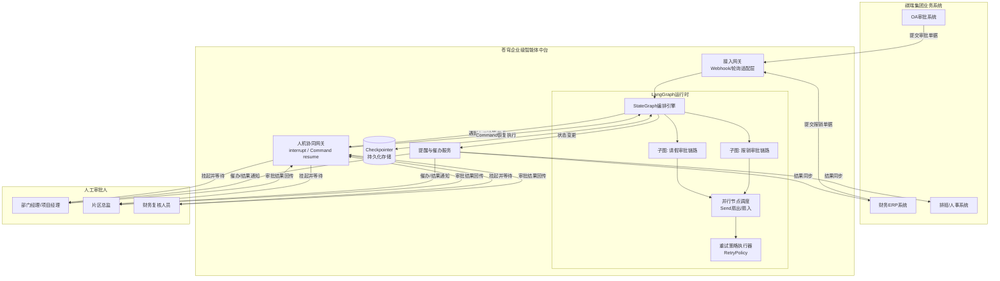
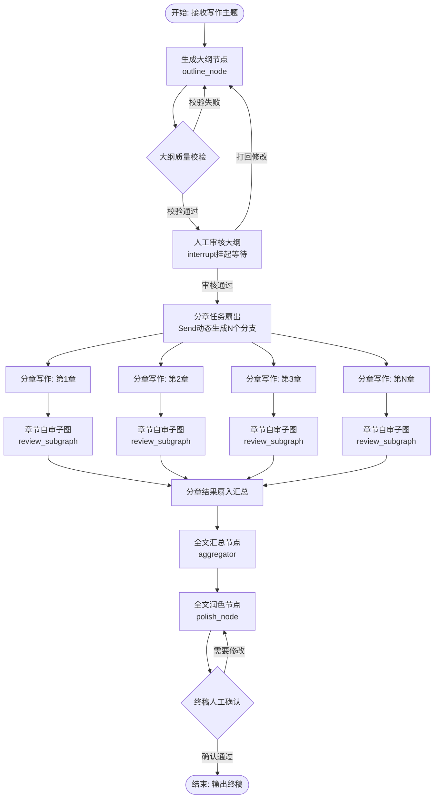
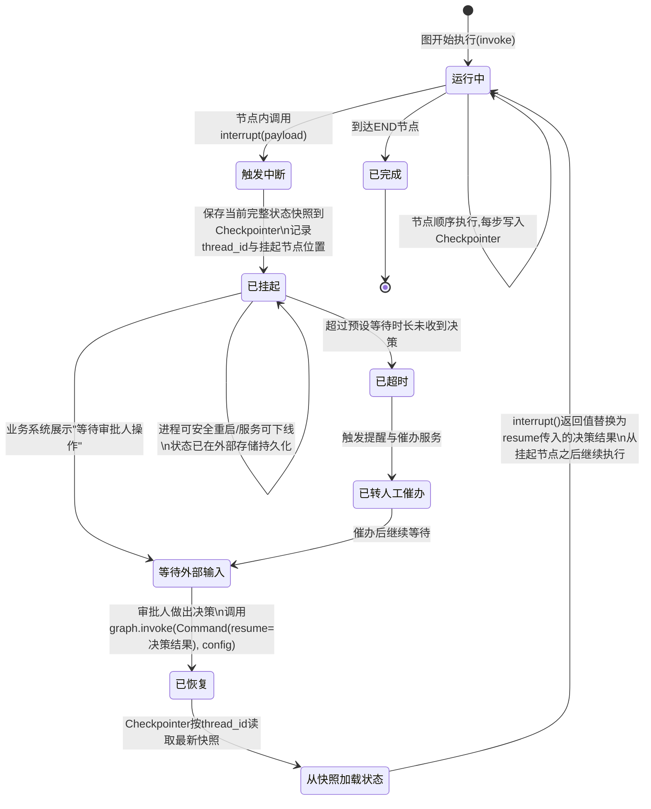

# 第42天:LangGraph进阶

## 【旁白】

陈铭后来常常回忆起这一天的下午三点四十分——不是因为技术有多难,而是因为那一刻他第一次真正理解了"中断"这个词在企业系统里的重量。之前他写的中断恢复,都是自己在本地敲命令,掐着秒表看流程停在哪一步、又怎么续上。可当王振宇把祺瑞集团那份《审批时效分析报告》甩到桌上,他才意识到,所谓的中断,在客户那边不是一个技术名词,是一个天天让人骂娘的现实问题:请假单卡在部门经理手里三天没批,报销单在财务和业务负责人之间来回踢皮球,员工在群里问"我这个流程是不是系统坏了",而系统本身什么都没坏,它只是在"等人"。技术要解决的,从来不是让机器变聪明,是让机器学会体面地等待,并在人回来的那一刻,准确地接上刚才的话。这篇课件,记的就是陈铭从"能跑通"到"敢上生产"这一步的全过程。

## 晨会纪要

**时间**:9:05—9:40
**地点**:蓬远科技三楼小会议室
**参会人**:王振宇、陈铭、林悦(远程接入,人在祺瑞集团现场)
**记录人**:陈铭

林悦昨天下午在祺瑞集团待了一整天,今天早会一开始就先甩了一组数字:祺瑞集团过去三个月的流程审批平均耗时是2.3天,其中请假审批的中位数是1.8天,报销审批的中位数是3.1天,而这两类流程加起来占了他们OA系统里将近六成的流转量。更麻烦的是,祺瑞的物业板块和地产板块用的是两套不同的审批链路,物业板块的一线员工请假需要经过班长、项目经理、片区总监三级审批,地产板块的报销单则要走财务初审、部门负责人、财务总监三道关卡,任何一环卡住,整个流程就悬在那里,直到有人想起来去催。

林悦说,客户的诉求很直接:他们不是想要一个"更聪明"的机器人来自动批,而是想要一个能"陪着流程走"的助手——帮忙提醒该批的人,帮忙在等待的时候不占用系统资源、不丢状态,等人一批,立刻能接上后续动作,比如自动通知财务打款、自动更新排班表。王振宇听完只说了一句:"这就是我们上周说的人机协同,不是自动化取代审批,是自动化托管等待。"

陈铭在会上提了一个问题:第41天做的人工审批节点工作流,是不是已经能覆盖这个场景了?王振宇摇头,说41天做的那套东西本质上是一次性的内存态图,进程一重启,所有正在等待审批的实例全部归零,这在本地演示没问题,但祺瑞的审批周期动辄一两天甚至一周,中间服务器要发版、要重启、要做灰度,内存状态是扛不住的。今天要解决的第一件事,就是把状态从内存里"挪出来",挪到一个可以持久化的地方,让中断不再是"进程活着才算数",而是"哪怕进程死了,状态也还在"。

林悦补充了一句现场原话,说是片区总监提的:"我出差没网的时候批不了,你们系统别把单子给我搞丢了。"这句话被王振宇写在了白板上,作为今天技术方案的第一验收标准。

会议最后定了三件事:

第一,陈铭上午研究LangGraph的Checkpointer持久化机制和Human-in-the-loop中断恢复的组合使用,目标是做出一个"进程重启后依然能恢复审批状态"的最小示例。

第二,下午在持久化的基础上,补齐子图、并行节点和错误重试策略这三块,因为林悦提到祺瑞的报销审批经常涉及多个附件同时校验(发票、行程单、审批依据),现在的做法是一条一条串行校验,客户抱怨速度慢,王振宇判断这正好是并行节点可以发挥作用的地方。

第三,晚上做一个完整的实战项目——"写作Agent",用大纲生成、并行分章写作、汇总润色这条链路,把当天学的持久化、中断恢复、并行编排全部串起来,作为今天知识的综合演练,顺带也给苍穹中台后续做"智能文档生成"功能预留一个可复用的骨架。

散会前王振宇留了一句话给陈铭:"你今天学的这几个词——checkpointer、interrupt、resume——听起来是LangGraph的API,但它们对应的是企业系统里最朴素的诉求:别丢数据,别逼人等着,能接着干活。记住这个对应关系,比记住函数签名重要。"

## 需求文档

**文档名称**:苍穹企业级智能体中台——流程持久化与人机协同能力需求说明(V0.3草案)
**提出方**:祺瑞集团信息化部门(通过林悦转达)
**责任人**:王振宇(技术方案)、陈铭(实现验证)
**文档状态**:内部评审中,尚未正式提交客户

### 一、背景

祺瑞集团现有OA系统的审批流程基于传统工作流引擎实现,能够满足基本的多级审批需求,但缺乏"智能介入"的能力——例如自动初审材料完整性、自动生成审批摘要、自动判断异常单据并提示风险点。集团希望在苍穹中台上构建一层Agent能力,叠加在现有OA系统之上,承担"智能助理"的角色,而不是替换现有审批链路。

由于审批流程天然存在人工等待环节(等待某位审批人操作),叠加的Agent能力必须支持长时间的中断与恢复,不能假设一次流程实例的生命周期在秒级或分钟级内结束。

### 二、核心痛点清单

1. 请假审批平均耗时1.8天,期间催单靠人工电话或微信,没有系统化的智能提醒。
2. 报销审批平均耗时3.1天,主要瓶颈在于附件校验环节(发票真伪、行程匹配、额度核对)全部串行处理,单据量大时排队严重。
3. 系统重启或版本升级时,正在流转的审批实例状态存在丢失风险,曾发生过一次运维事故导致47条在途审批单据状态异常,需要人工排查恢复,耗时半天。
4. 物业板块和地产板块的审批链路结构不同(三级审批 vs 财务+业务双线审批),现有系统对两套链路各自维护一套代码,可维护性差,期望新的Agent层能用统一的编排方式描述不同结构的审批链路。
5. 部分审批异常(例如审批人离职、审批系统临时故障)会导致流程僵死,需要具备可重试、可人工介入干预的机制,而不是简单报错终止。

### 三、功能性需求

**FR-1 持久化能力**
系统必须能够将每一个审批流程实例的执行状态持久化到外部存储(数据库),保证进程重启、服务器迁移、版本升级等场景下,在途流程状态不丢失,并可以从最近一次持久化的检查点继续执行。

**FR-2 人机协同中断与恢复**
系统在遇到需要人工决策的节点(如审批人操作、财务复核)时,应主动挂起执行,释放计算资源,等待外部事件(人工操作结果)触发后再恢复执行,恢复时应准确衔接挂起前的上下文,不能要求人工重新提供已提交过的信息。

**FR-3 并行处理能力**
针对报销审批中的多项独立校验任务(发票校验、行程匹配、额度核对),系统应支持并行执行,并在全部校验完成后统一汇总结果,以缩短整体处理耗时。

**FR-4 错误重试与容错**
针对因网络抖动、第三方接口超时等瞬时性故障导致的节点执行失败,系统应具备可配置的自动重试策略(重试次数、退避策略、可重试异常类型),对于不可重试的业务性错误(如审批人不存在),应能够区分并转入人工处理流程,而非无限重试。

**FR-5 可复用的流程编排结构**
针对物业板块和地产板块两套不同的审批链路结构,系统的编排方式应支持将公共的审批环节抽象为可复用的子流程(子图),不同板块通过组合子流程构建各自的完整链路,减少重复开发和维护成本。

**FR-6 流程状态可观测**
在流程挂起等待人工操作期间,业务人员应能够查询该流程实例当前所处的节点、已完成的历史步骤,以及等待中的具体事项,便于催办和排查。

### 四、非功能性需求

- 持久化存储的读写性能不应显著拖慢正常流程节点的执行速度,单次状态写入耗时应控制在可接受范围内(内部评审目标为不超过200毫秒,具体数值待压测确认)。
- 系统应能同时维护数千级别的在途流程实例而不发生状态混淆或串号,每个实例必须有唯一且稳定的标识。
- 中断恢复机制不应要求业务系统做侵入式改造,尽量以配置和轻量集成的方式接入现有OA系统。

### 五、验收标准(草案,待客户确认)

1. 模拟服务器重启场景,验证一个处于"等待审批人操作"状态的流程实例,重启后能够被正确加载并继续等待,不出现状态丢失或重复触达审批人。
2. 模拟报销审批场景,验证发票校验、行程匹配、额度核对三项任务并行执行后,总耗时较串行执行有明显缩短(内部目标:缩短50%以上)。
3. 模拟第三方接口超时场景,验证系统按预设策略自动重试,并在达到最大重试次数后正确转入人工处理,而不是无限重试或直接崩溃。
4. 针对物业和地产两套审批链路,验证公共子流程(如"财务复核"环节)可以被两条链路复用,且各自的差异化环节不受影响。

### 六、待明确事项

- 持久化存储的选型(是否使用祺瑞集团现有的数据库基础设施,还是苍穹中台自建独立存储)尚未最终确定,需要和客户的IT基础设施团队进一步沟通。
- 人工审批操作的触发方式(是通过现有OA系统的Webhook回调,还是苍穹中台提供轮询接口)待技术选型评审后确定。
- 本需求文档聚焦于技术能力验证,尚未涉及具体的UI交互设计,UI部分将在能力验证通过后由产品团队单独输出方案。

## 架构设计图

下面这张图是王振宇在白板上画的初版,后来陈铭把它整理成了Mermaid,作为团队内部评审用的架构草图,重点表达"持久化层"和"人机协同网关"是怎么插入到原有审批流转路径里的。



这张图王振宇特别叫陈铭注意两个箭头:一个是`SG <--> CKPT`,双向箭头意味着每一次状态变更都会往持久化存储里写一份快照,同时图重启后也会从这里把最新快照读回来;另一个是`HITL -- 挂起并等待`,王振宇特意用"挂起并等待"而不是"发送请求",他说这是为了强调HITL网关在这一刻不是在"发起一个同步调用等结果",而是真正地把执行权交出去,进程可以退出,资源可以释放,直到外部事件把它唤醒。

## 流程图

这是当天晚上实战环节要实现的"写作Agent"整体流程,陈铭画完之后拿给王振宇看,王振宇说这张图基本上把"大纲生成—人工审核—并行分章写作—汇总润色"这条主线的关键节点和分支都表达清楚了,可以直接作为代码实现的蓝图。



王振宇看完补了一句:"你这个图里,`APPROVE`和`FINALCHECK`两处都接了人工环节,一个是中途审核,一个是终稿确认,这正好对应祺瑞那边请假审批和报销审批里'部门经理初审'和'财务总监终审'的结构,你等于是拿写作场景把他们的业务模式重新演了一遍,这个类比讲给客户听,他们会更容易理解。"

## 示意图

这张图是陈铭专门为了给自己理清"中断到底发生了什么"画的,后来发现也很适合放进课件,用状态图的形式表达一次中断—持久化—恢复的完整生命周期。



陈铭在图下面手写了一行注释,后来一并保留在了课件里:"中断这件事,技术上看是一次函数调用被打断,但从数据的角度看,它其实是一次完整的'保存进度存档'的动作——就像玩游戏中途存档退出,下次读档接着打,唯一的区别是,这个存档是自动的,而且必须准确无误,不能读错关卡。"

## 课堂笔记

### 上午:Checkpointer持久化 + Human-in-the-loop

上午的课,王振宇没有一上来就讲API,他先在白板上写了一句话:"没有持久化的中断,只是一个假的中断。"陈铭当时没太理解这句话,直到王振宇举了个例子才明白——如果一个流程"中断"之后,状态只存在内存里,那么这个中断能撑住的前提是进程必须一直活着,一旦进程重启,所谓的"等待审批"就变成了"这个流程从来没存在过"。这不是中断,这是脆弱的假象。真正能用在生产环境的中断,必须搭配持久化,否则不管代码写得多花哪,都只是一个演示玩具。

**1. 为什么需要Checkpointer**

LangGraph里的一次图执行,本质上是一系列"超步"(super-step)的顺序推进,每个超步对应一个或一组节点的执行完成。Checkpointer要做的事情很单纯:在每一个超步结束之后,把当前完整的状态(State)连同一些元数据(比如下一步要执行哪些节点、当前的中断信息)序列化,写入一个外部存储介质里,并且和一个"线程标识"(thread_id)绑定在一起。

这个thread_id特别关键,王振宇反复强调了三次:它不是一个技术上的随便的字符串,而是业务意义上"这一个流程实例"的身份证。在祺瑞的场景里,一张请假单、一张报销单,都应该对应一个独立且稳定的thread_id,比如可以用单据编号本身,或者单据编号加上一个版本号。有了这个身份证,不管这个流程走到哪一步、中断了多少次、隔了多久再恢复,系统都能通过thread_id准确找到它上一次停在哪里、状态是什么。

Checkpointer的实现有很多种,课上重点讲了三种典型的:

第一种是`MemorySaver`,状态存在内存的一个字典结构里,进程一重启就清空。这种只适合本地开发调试用,绝对不能用在生产上,王振宇特意举了祺瑞的例子——如果拿MemorySaver去接祺瑞的审批系统,那第41天遇到的所有问题会原样重现,一次运维重启,所有在途审批全部清零,客户直接把系统退货。

第二种是`SqliteSaver`,把状态写到本地的SQLite文件里,重启进程之后依然能读到之前的数据,适合中小规模场景或者单机部署的场景,也适合课堂演示——它既能体现"真实持久化"的效果,又不需要额外搭建数据库服务,非常适合今天的实战项目用。

第三种是`PostgresSaver`(以及配套的异步版本),把状态写到PostgreSQL里,这是真正面向生产环境的选择,支持多实例部署下的并发读写、支持更大规模的数据量,也支持团队现有的数据库运维体系(备份、监控、权限管理这些都能沿用现成的一套)。王振宇说,苍穹中台未来接祺瑞的正式环境,大概率会用PostgresSaver,配合祺瑞现有的数据库基础设施,这样运维团队不需要额外学习一套新的存储系统。

**2. Checkpointer怎么接入图**

接入的方式很直接,在编译图的时候把checkpointer实例传进去:

```python
graph = builder.compile(checkpointer=my_checkpointer)
```

编译之后,每一次调用`graph.invoke(...)`或者`graph.stream(...)`,都必须在`config`参数里带上`configurable.thread_id`,类似:

```python
config = {"configurable": {"thread_id": "leave-request-20260713-0091"}}
result = graph.invoke(initial_state, config=config)
```

王振宇特别提醒,这里`thread_id`不是可选项,而是"没有它整个持久化机制就无从谈起"的必填项——如果不传,LangGraph在有些版本里会用一个默认值,或者直接报错,取决于具体版本,但无论哪种情况,都意味着你没有真正在"区分不同的流程实例",这在生产上是绝对不能接受的疏忽。

拿到`thread_id`之后,还有几个配套的方法值得单独说一下:

`graph.get_state(config)`可以拿到某个thread当前的状态快照,包括当前的值、下一步要执行的节点列表(`next`字段)、以及如果处于中断状态时的中断详情。这个方法在祺瑞的场景里非常有用——业务人员想知道"我这张单子现在卡在哪一步、还差谁没批",后台系统就是靠这个方法去查的,不需要去猜,状态是明明白白记在Checkpointer里的。

`graph.get_state_history(config)`可以拿到某个thread从头到尾所有的历史快照,这个能力对应到王振宇口中的"时间旅行"——如果发现某一步审批出了问题(比如审批人误操作批错了),理论上可以回退到某一个历史检查点,重新往后推进,这在纠错场景里价值很大,虽然今天课上不会深入展开这部分实现,但王振宇让陈铭记下来,后面阶段会专门讲。

`graph.update_state(config, values)`可以在流程挂起期间,主动修改状态里的某些字段,而不需要经过一个完整的节点执行。这个很适合"人工介入修正数据"的场景,比如财务复核发现报销金额录入错误,可以直接调用这个方法把金额字段改正,再继续走后续流程。

**3. Human-in-the-loop:interrupt与Command resume**

如果说Checkpointer解决的是"状态不丢",那Human-in-the-loop解决的就是"该等人的时候,让它体面地等"。

LangGraph里做人机协同中断,课上讲了两条路径,一条是静态中断,一条是动态中断,王振宇建议陈铭两条都要会用,因为不同的业务场景适合不同的方式。

**静态中断**是在编译图的时候声明:

```python
graph = builder.compile(
    checkpointer=my_checkpointer,
    interrupt_before=["approval_node"],
)
```

这样声明之后,图执行到`approval_node`节点之前会自动停下来,状态被持久化,`get_state`里能看到`next`字段显示下一步就是`approval_node`。想要继续执行,只需要再调用一次`graph.invoke(None, config=config)`——传入`None`表示"不追加新的输入,只是继续往下走"。如果想在继续之前先修改状态(比如把审批人的意见写进去),可以先调用`update_state`,再调用`invoke(None, config)`。

静态中断的好处是简单直观,写在compile这一行就够了,不需要在节点内部写额外的逻辑。但王振宇也提到它的局限:它只能卡在"某个节点执行之前或之后"这种固定位置,没办法根据节点内部的运行时判断,动态决定"这次要不要中断"。

**动态中断**用的是`interrupt()`函数,这是在节点函数内部主动调用的:

```python
from langgraph.types import interrupt

def approval_node(state):
    decision = interrupt({
        "question": "请对以下请假单做出审批决定",
        "applicant": state["applicant"],
        "leave_days": state["leave_days"],
        "reason": state["reason"],
    })
    return {"approval_result": decision}
```

当代码执行到`interrupt(...)`这一行时,整个图的执行会立刻暂停,`interrupt`传进去的那个字典会作为中断信息的一部分被记录下来,并通过`get_state(config).tasks`或者`stream`的中断事件暴露出去,业务系统可以拿这个信息去渲染一个"待审批"的界面,把`applicant`、`leave_days`、`reason`这些字段展示给审批人看。

等审批人在界面上点了"同意"或者"拒绝",业务系统要做的事情,就是拿着同一个`thread_id`,构造一个`Command`对象去恢复执行:

```python
from langgraph.types import Command

result = graph.invoke(
    Command(resume={"approved": True, "comment": "同意,注意补假条"}),
    config=config,
)
```

这里`Command(resume=...)`传进去的值,会成为`interrupt(...)`这一行调用的"返回值"——也就是说,节点函数会从`interrupt(...)`这一行"假装什么都没发生过"一样继续往下执行,`decision`变量拿到的就是`{"approved": True, "comment": "同意,注意补假条"}`。王振宇形容这个机制像"时间胶囊":节点函数在中断的那一刻,把自己"冻住",连同还没执行完的局部逻辑一起被打包保存,恢复的时候再原样"解冻",从冻住的那一行继续往下走,而不是从函数开头重新跑一遍。

这里有个容易踩的坑,陈铭当时就踩了一次:如果一个节点函数里,`interrupt()`调用之前还有别的逻辑,而这些逻辑里包含了副作用(比如发了一条消息、调用了一个外部API下了单),那么当图恢复执行、节点函数重新从头跑的时候(注意,这里的实现机制其实是"重新执行整个节点函数,但`interrupt()`调用会立刻拿到之前存好的resume值,不会真正再次阻塞"),`interrupt()`之前的那些副作用代码也会被重新执行一次!这在写请假审批节点的时候是个隐患——如果节点里在中断之前先给审批人发了一条微信提醒,那么图每次恢复(哪怕是因为别的原因导致图重新触发这一节点),都可能重复发消息。王振宇给的建议是:**把有副作用的逻辑,尽量放在`interrupt()`调用之后,或者拆到独立的、幂等的节点里去**,`interrupt()`调用本身之前的代码要尽量保持"无副作用、可重复执行"的状态。这条经验教训被陈铭记在了笔记本第一页,他说这是"今天最值钱的一条坑位提醒"。

**4. 中断信息的多路复用**

课上还提到一个实用技巧:一次节点执行里可以调用多次`interrupt()`,分别对应不同的人工决策点。比如报销审批节点,可以先中断一次让财务初审填意见,拿到结果后再中断第二次让部门负责人确认,两次`interrupt()`调用会分别产生独立的中断事件,`Command(resume=...)`每次只解决"当前正在等待的那一次"中断,前一次已经解决的中断不会被重复触发。这种写法能让一个节点承载"多轮人工交互"的复杂场景,而不需要把每一轮交互都拆成一个独立的图节点,写起来更接近自然语言描述业务流程的方式。

**5. 与祺瑞场景的对照**

王振宇在黑板上画了一个对照表(陈铭后来整理成了文字):

请假审批的三级链路(班长→项目经理→片区总监),可以设计成一个节点内部连续调用三次`interrupt()`,每次的payload里带上不同的审批人角色信息,业务系统根据当前中断事件里标注的角色,把待办推给对应的人;或者也可以设计成三个独立的节点,每个节点各自调用一次`interrupt()`,中间用条件边串起来,如果某一级被拒绝,直接走向"审批终止"的分支。王振宇让陈铭课后自己评估两种设计的取舍——前者节点数量少、图结构简单,但节点内部逻辑复杂;后者图结构更清晰、每一级审批的状态在`get_state`里更容易单独观察,但节点数量会随审批级数增加。王振宇的倾向是:如果审批级数是固定的、业务含义上每一级差异明显(比如权限范围不同、需要展示的信息不同),用独立节点更清晰;如果审批级数是动态的、结构高度相似,用单节点内部循环或多次interrupt会更省事。这条判断标准,陈铭记下来准备后面用到报销审批的设计里。

### 下午:子图、并行节点与错误重试策略

下午一开始,王振宇先抛了个问题:"如果祺瑞的物业和地产两条审批链路,财务复核这一步的逻辑几乎一样,你打算怎么处理这个'几乎一样'?复制粘贴一遍代码,还是想办法复用?"陈铭说他的第一反应是写一个公共函数两边调用,王振宇说这个思路没错,但在LangGraph里,还有一个更贴合"图"这种结构本身的复用方式——子图。

**1. 子图(Subgraph)**

子图的核心思想很朴素:一个编译好的`StateGraph`,本身可以作为另一个图的一个节点使用。也就是说,"财务复核"这一整套逻辑(可能内部包含好几个节点、甚至自己的条件分支),可以单独构建成一个完整的图,编译出来之后,直接`add_node("finance_review", finance_review_subgraph)`挂到父图上,父图调用这个节点的时候,实际上是完整地跑了一遍子图从入口到出口的所有逻辑。

子图的状态schema不一定要和父图完全一致,LangGraph允许通过状态转换的方式对接,只要保证父图传给子图的字段、子图返回给父图的字段能够对应上即可。王振宇提醒,这里有个常见的设计误区——不要为了"复用"而生硬地把不相关的字段也塞进共享状态里,子图应该有自己清晰的输入输出边界,就像写函数一样,参数和返回值要精简、职责要单一。

子图带来的好处,除了减少重复代码,还有一个容易被忽略的价值:**独立测试**。因为子图本身就是一个完整可编译、可执行的图,可以脱离父图单独写测试用例,验证"财务复核"这一套逻辑本身是不是正确的,再拿到父图里组装,这比把所有逻辑都堆在一个巨大的图里、要测试哪一段功能都得跑全流程,效率高很多。今天晚上的写作Agent实战里,"章节自审"这一步会专门用子图来实现,一会儿代码部分会具体展开。

**2. 并行节点:扇出与扇入**

祺瑞报销审批里"发票校验、行程匹配、额度核对"三项独立任务,王振宇说这是"教科书式的并行场景"——三项任务互不依赖,谁也不用等谁的结果,理论上应该同时开始、同时结束,而不是排队等着一个一个来。

LangGraph里实现这种"一个节点产生多个并行分支,分支执行完了再汇总"的模式,核心工具是`Send`。`Send`是从`langgraph.types`导入的一个对象,它的用法是:某个节点函数,不再返回一个普通的状态更新字典,而是返回一个`Send`对象的列表,每个`Send`对象指定"要调用哪个节点"以及"传给这个节点的输入是什么"。图的运行时看到返回的是`Send`列表,就会把这些指定的节点全部并行调度执行,等它们都执行完了,再统一把结果汇入到状态里,继续往下走。

```python
from langgraph.types import Send

def dispatch_checks(state):
    return [
        Send("check_invoice", {"document": state["invoice_doc"]}),
        Send("check_itinerary", {"document": state["itinerary_doc"]}),
        Send("check_quota", {"applicant": state["applicant"], "amount": state["amount"]}),
    ]
```

要让这种"扇出之后再扇回来"的模式正确工作,状态设计上有个关键点:接收并行结果的那个字段,必须用一个支持"合并"而不是"覆盖"语义的reducer。最常见的做法是用`Annotated[list, operator.add]`,这样三个并行分支各自往这个字段追加一条结果,最终父状态里这个字段会是三条结果拼在一起的列表,而不是相互覆盖只剩最后一条。王振宇特意强调,这个reducer的设计是并行节点能不能正确工作的"命门",如果状态字段没有配对正确的reducer,三个并行分支跑完了,拿到手的结果可能莫名其妙地只剩一条,新手很容易在这里卡很久都不知道问题出在哪。

并行执行完之后,通常需要一个"汇总"节点,把所有并行结果收拢、做统一的判断(比如三项校验里只要有一项不通过,整单就要打回)。这个汇总节点在图结构上,会自然成为所有并行分支的"汇入点"——LangGraph的调度器会保证,只有当所有并行分支都执行完毕,才会触发汇总节点执行,这个等待逻辑不需要手写,是引擎内置的保证。

**3. 并行与人机协同的组合**

课上讨论了一个有意思的问题:如果并行分支里,某一个分支本身也需要人工介入(比如额度核对超过一定金额需要人工特批),那这个中断会怎么表现?王振宇的答案是:中断依然是按`thread_id`维度记录的,某个并行分支触发了`interrupt()`,会导致整个图在这一轮超步的推进上暂停,已经跑完的其他并行分支的结果会被保留在状态里(因为它们已经通过reducer合并写入了),等中断被恢复之后,图会继续等待还没跑完的分支,直到所有分支都完成,才会进入汇总节点。这意味着并行和中断可以自然嵌套使用,不需要额外的特殊处理,但王振宇提醒,业务上要想清楚:如果三项并行校验里有一项要卡住等人工特批,另外两项校验的结果就应该已经算完了,不要因为设计疏忽让不需要等待的分支也白白等着。

**4. 错误重试策略(RetryPolicy)**

下午最后一块内容是错误重试。王振宇先讲了个真实的运维场景:某天夜里,祺瑞OA系统对接的第三方发票查验接口出现了大概十分钟的短暂抖动,如果系统没有重试机制,那十分钟内提交的所有报销单,发票校验这一步全部直接失败,变成一堆需要人工排查的"僵尸单据",第二天上班光是清理这些单据就要花掉半天时间。如果有合理的重试策略,这种短暂抖动完全可以被自动吸收掉,业务人员根本不会察觉到发生过问题。

LangGraph里给节点配置重试策略,用的是`RetryPolicy`:

```python
from langgraph.types import RetryPolicy

builder.add_node(
    "check_invoice",
    check_invoice_node,
    retry=RetryPolicy(
        max_attempts=4,
        initial_interval=0.5,
        backoff_factor=2.0,
        max_interval=30.0,
        retry_on=is_retryable_error,
    ),
)
```

几个参数王振宇逐个解释了含义:`max_attempts`是最大尝试次数(包含第一次执行,所以设为4意味着"最多失败重试3次");`initial_interval`是第一次重试前等待的秒数;`backoff_factor`是退避倍数,每次重试等待时间在上一次基础上乘以这个倍数,直到达到`max_interval`封顶;`retry_on`是一个函数(或者异常类型元组),用来判断"这个异常是不是值得重试的"。

`retry_on`这个参数是王振宇特别强调要认真设计的一环。他说很多人写重试策略的时候图省事,直接写成"捕获所有异常就重试",这在生产上是个隐患——比如"审批人账号不存在"这种业务性错误,重试一百次结果都是一样的失败,白白浪费时间和资源,还会让用户以为系统卡死了。正确的做法是区分"瞬时性故障"(网络超时、接口限流、数据库连接抖动)和"确定性错误"(参数不合法、业务规则不满足、资源不存在),只对前者重试,后者应该直接抛出,转入人工处理或者返回明确的错误信息。

```python
def is_retryable_error(exc: Exception) -> bool:
    transient_types = (TimeoutError, ConnectionError, RateLimitError)
    if isinstance(exc, transient_types):
        return True
    if isinstance(exc, ThirdPartyAPIError) and exc.status_code in (429, 502, 503, 504):
        return True
    return False
```

课上还提到一个进阶技巧:重试策略可以和`interrupt`配合,用于"重试耗尽之后转人工"的场景——节点内部先按`RetryPolicy`自动重试若干次,如果全部失败,再在异常处理逻辑里调用`interrupt()`,把失败信息展示给人工,由人工决定是继续重试、跳过这一步、还是终止整个流程。这种设计能让系统在大多数时候保持全自动,只在真正棘手的场景才升级给人处理,王振宇管这种模式叫"能扛的自己扛,扛不住的才叫人"。

**5. 下午小结**

王振宇总结下午内容的时候说了一句话,陈铭觉得特别值得记下来:"子图管的是复杂度的复用,并行节点管的是独立任务的效率,重试策略管的是对不确定性的容忍度。这三样东西单独看都不难,难的是在同一个图里,把它们和持久化、中断恢复放在一起,还能保证整体逻辑不乱——这就是为什么今天要单独留出晚上的时间,让你把这些东西全部揉到一个实战项目里跑一遍,不然知识点记在脑子里,和真的会用,是两件事。"

## 代码实战:写作Agent——大纲生成 · 并行分章写作 · 汇总润色

晚上的实战项目,王振宇给的题目是"写作Agent":输入一个写作主题,系统先生成大纲,经过人工审核确认后,把大纲拆分成若干章节任务,并行调用LLM分别撰写每一章的初稿,每一章写完后经过一个"自审子图"做质量把关和自动改进,所有章节完成后汇总成全文,再经过一次全文润色,润色结果经过终稿确认后才算完成。整个流程接入Checkpointer持久化,支持在人工审核环节安全中断,即使进程重启也能从中断点恢复。

陈铭说这个项目乍一看和祺瑞的审批系统没什么关系,但王振宇说结构是一模一样的:大纲审核对应初审,终稿确认对应终审,分章并行写作对应报销单的多项并行校验,自审子图对应可复用的公共校验环节——"你把这套代码跑通了,祺瑞那边的活儿,骨架已经有了。"

以下代码按模块拆分,每个模块对应一个独立文件,整体可以放在同一个`writing_agent`包下运行。

### 模块一:`writing_agent/state.py` —— 状态与数据结构定义

```python
"""
写作Agent的状态定义模块。

这里定义了贯穿整个图执行过程的核心数据结构,包括:
- 大纲结构(Outline / ChapterOutline)
- 单章写作结果(ChapterDraft)
- 主图状态(WritingState)
- 子图(章节自审)使用的独立状态(ChapterReviewState)

设计上遵循一个原则:并行分支需要合并回主状态的字段,
必须显式声明支持"追加合并"的reducer,否则并行写作的结果会互相覆盖。
"""

from __future__ import annotations

import operator
from dataclasses import dataclass, field
from typing import Annotated, Any, Literal, TypedDict


@dataclass
class ChapterOutline:
    """单个章节在大纲阶段的描述信息。"""

    index: int
    title: str
    summary: str
    key_points: list[str] = field(default_factory=list)
    target_word_count: int = 800

    def to_dict(self) -> dict[str, Any]:
        return {
            "index": self.index,
            "title": self.title,
            "summary": self.summary,
            "key_points": list(self.key_points),
            "target_word_count": self.target_word_count,
        }

    @classmethod
    def from_dict(cls, data: dict[str, Any]) -> "ChapterOutline":
        return cls(
            index=data["index"],
            title=data["title"],
            summary=data.get("summary", ""),
            key_points=list(data.get("key_points", [])),
            target_word_count=data.get("target_word_count", 800),
        )


@dataclass
class Outline:
    """整篇文章的大纲。"""

    topic: str
    working_title: str
    chapters: list[ChapterOutline] = field(default_factory=list)
    revision: int = 0

    def to_dict(self) -> dict[str, Any]:
        return {
            "topic": self.topic,
            "working_title": self.working_title,
            "chapters": [c.to_dict() for c in self.chapters],
            "revision": self.revision,
        }

    @classmethod
    def from_dict(cls, data: dict[str, Any]) -> "Outline":
        return cls(
            topic=data["topic"],
            working_title=data.get("working_title", data.get("topic", "")),
            chapters=[ChapterOutline.from_dict(c) for c in data.get("chapters", [])],
            revision=data.get("revision", 0),
        )


@dataclass
class ChapterDraft:
    """单章写作完成后的结果。"""

    index: int
    title: str
    content: str
    word_count: int
    review_notes: list[str] = field(default_factory=list)
    revised: bool = False

    def to_dict(self) -> dict[str, Any]:
        return {
            "index": self.index,
            "title": self.title,
            "content": self.content,
            "word_count": self.word_count,
            "review_notes": list(self.review_notes),
            "revised": self.revised,
        }


def merge_chapter_drafts(
    left: list[dict[str, Any]] | None,
    right: list[dict[str, Any]] | None,
) -> list[dict[str, Any]]:
    """
    并行分章写作结果的合并函数。

    并行执行的每一个分支各自会产出一条ChapterDraft的字典表示,
    这个reducer负责把所有分支的结果按index去重合并,
    避免因为图在某些场景下重复调度同一分支而导致结果重复累积。
    """

    left = left or []
    right = right or []
    merged: dict[int, dict[str, Any]] = {item["index"]: item for item in left}
    for item in right:
        merged[item["index"]] = item
    return sorted(merged.values(), key=lambda item: item["index"])


class WritingState(TypedDict, total=False):
    """写作Agent主图的状态。"""

    topic: str
    outline: dict[str, Any]
    outline_revision_count: int
    outline_feedback: str

    chapter_drafts: Annotated[list[dict[str, Any]], merge_chapter_drafts]

    final_draft: str
    polished_draft: str
    final_review_feedback: str
    status: Literal[
        "drafting_outline",
        "awaiting_outline_approval",
        "writing_chapters",
        "aggregating",
        "polishing",
        "awaiting_final_approval",
        "completed",
        "failed",
    ]
    error_log: Annotated[list[str], operator.add]
    retry_count: dict[str, int]


class ChapterReviewState(TypedDict, total=False):
    """章节自审子图使用的独立状态,输入输出边界与主图分开维护。"""

    chapter_index: int
    chapter_title: str
    draft_content: str
    target_word_count: int
    review_round: int
    review_notes: list[str]
    approved: bool
    final_content: str
```

### 模块二:`writing_agent/llm_client.py` —— 统一的LLM调用封装

```python
"""
LLM调用的统一封装层。

课堂演示环境不直接依赖某一家具体的大模型服务商SDK,
而是抽象出一个LLMClient接口,内部用可插拔的方式接入真实模型,
同时提供一个DemoLLMClient用于本地演示与自动化测试,
方便在没有外部API密钥的情况下依然能跑通整套流程。

DemoLLMClient里故意加入了可控的随机失败率,
用来配合下午课上讲的错误重试策略进行验证。
"""

from __future__ import annotations

import random
import time
from abc import ABC, abstractmethod
from dataclasses import dataclass


class TransientLLMError(Exception):
    """代表可重试的瞬时性错误,例如接口超时、限流。"""


class FatalLLMError(Exception):
    """代表不可重试的确定性错误,例如提示词违规、参数不合法。"""


@dataclass
class LLMResponse:
    text: str
    prompt_tokens: int
    completion_tokens: int
    latency_ms: int


class LLMClient(ABC):
    @abstractmethod
    def complete(self, system_prompt: str, user_prompt: str, *, max_tokens: int = 1024) -> LLMResponse:
        raise NotImplementedError


class DemoLLMClient(LLMClient):
    """
    面向课堂演示的LLM客户端实现。

    通过固定种子的伪随机数控制失败率,
    使得同一份代码在反复运行时,失败的分布是可复现、可解释的,
    方便讲解重试策略的实际效果,而不是每次运行结果都完全随机不可控。
    """

    def __init__(
        self,
        transient_failure_rate: float = 0.15,
        fatal_failure_rate: float = 0.0,
        base_latency_ms: int = 320,
        seed: int | None = None,
    ) -> None:
        self._transient_failure_rate = transient_failure_rate
        self._fatal_failure_rate = fatal_failure_rate
        self._base_latency_ms = base_latency_ms
        self._rng = random.Random(seed)

    def complete(self, system_prompt: str, user_prompt: str, *, max_tokens: int = 1024) -> LLMResponse:
        roll = self._rng.random()
        simulated_latency = self._base_latency_ms + self._rng.randint(0, 200)
        time.sleep(simulated_latency / 5000)

        if roll < self._fatal_failure_rate:
            raise FatalLLMError("提示词被内容安全策略拦截,不建议自动重试")

        if roll < self._fatal_failure_rate + self._transient_failure_rate:
            raise TransientLLMError("模型服务瞬时超时,可以安全重试")

        generated_text = self._fake_generate(system_prompt, user_prompt, max_tokens)
        return LLMResponse(
            text=generated_text,
            prompt_tokens=len(system_prompt) + len(user_prompt),
            completion_tokens=len(generated_text),
            latency_ms=simulated_latency,
        )

    def _fake_generate(self, system_prompt: str, user_prompt: str, max_tokens: int) -> str:
        """
        用简单的规则拼接生成一段"看起来像模型输出"的文本,
        目的是让整套流程在没有真实模型密钥的环境下也能端到端跑通,
        不代表真实生产环境中模型的输出质量。
        """

        keyword = user_prompt.strip().splitlines()[0][:40] if user_prompt.strip() else "写作任务"
        filler_sentences = [
            f"围绕『{keyword}』展开的内容需要兼顾专业性与可读性。",
            "在实际业务场景中,这一部分内容应结合具体案例展开说明。",
            "本节内容将从背景、现状、挑战与应对思路四个层面逐步展开。",
            "建议在正式发布前补充更多量化数据,增强内容的说服力。",
        ]
        body = " ".join(filler_sentences[: max(1, min(len(filler_sentences), max_tokens // 200 + 1))])
        return f"{body}"


def build_llm_client(mode: str = "demo") -> LLMClient:
    """
    工厂函数,根据运行模式返回对应的LLM客户端。

    生产环境应替换为真实的模型SDK封装,
    例如OpenAI兼容接口、企业内部私有化部署的模型服务等,
    这里只保留接口形态,具体接入方式留给不同项目按需实现。
    """

    if mode == "demo":
        return DemoLLMClient(seed=2026)
    raise NotImplementedError(f"生产环境模型客户端接入方式尚未在课堂示例中实现: mode={mode}")
```

### 模块三:`writing_agent/retry_policies.py` —— 重试策略与异常分类

```python
"""
错误重试策略配置模块。

按照下午课堂内容,把"瞬时性错误"和"确定性错误"明确区分开,
只对前者启用自动重试,后者应当立即向上抛出,
转入人工处理或终止流程,避免无意义的重复尝试浪费资源。
"""

from __future__ import annotations

from langgraph.types import RetryPolicy

from writing_agent.llm_client import FatalLLMError, TransientLLMError


def is_retryable_llm_error(exc: Exception) -> bool:
    """
    判断一个异常是否值得自动重试。

    这里只把明确标记为瞬时性的异常纳入重试范围,
    对于FatalLLMError这类确定性错误,直接返回False,
    让引擎立刻放弃重试,把异常原样抛出给上层处理。
    """

    if isinstance(exc, FatalLLMError):
        return False
    if isinstance(exc, TransientLLMError):
        return True
    if isinstance(exc, (TimeoutError, ConnectionError)):
        return True
    return False


def default_llm_retry_policy() -> RetryPolicy:
    """默认的LLM调用重试策略,适用于章节写作、大纲生成等节点。"""

    return RetryPolicy(
        max_attempts=4,
        initial_interval=0.5,
        backoff_factor=2.0,
        max_interval=8.0,
        jitter=True,
        retry_on=is_retryable_llm_error,
    )


def strict_retry_policy() -> RetryPolicy:
    """
    更严格的重试策略,适用于对延迟敏感的节点,
    例如全文润色这种通常在流程末尾、用户明确在等待结果的环节,
    重试次数更少,避免把用户等待时间拖得过长。
    """

    return RetryPolicy(
        max_attempts=2,
        initial_interval=0.3,
        backoff_factor=1.5,
        max_interval=3.0,
        jitter=True,
        retry_on=is_retryable_llm_error,
    )


def network_dependent_retry_policy() -> RetryPolicy:
    """
    适用于依赖外部网络服务(例如查重接口、术语库校验接口)的节点,
    这类依赖的瞬时故障率通常更高,给予更宽松的重试次数与更长的最大等待间隔。
    """

    return RetryPolicy(
        max_attempts=6,
        initial_interval=1.0,
        backoff_factor=2.0,
        max_interval=30.0,
        jitter=True,
        retry_on=is_retryable_llm_error,
    )
```

### 模块四:`writing_agent/outline_node.py` —— 大纲生成与人工审核

```python
"""
大纲生成与人工审核相关节点。

流程设计:
1. outline_node 调用LLM生成结构化大纲,并做基本的完整性校验。
2. outline_quality_gate 对大纲做程序化质量检查(章节数量、字数目标是否合理)。
3. outline_human_review 通过interrupt()挂起,等待人工审核意见,
   审核结果可能是"通过"、"打回修改并给出反馈"两种情况。
"""

from __future__ import annotations

import json
import re
from typing import Any

from langgraph.types import interrupt

from writing_agent.llm_client import LLMClient
from writing_agent.state import ChapterOutline, Outline, WritingState

MIN_CHAPTERS = 3
MAX_CHAPTERS = 8
MIN_TARGET_WORDS_PER_CHAPTER = 300

OUTLINE_SYSTEM_PROMPT = (
    "你是一名资深的技术写作策划,负责为给定主题设计文章大纲。"
    "输出必须是JSON格式,包含working_title字段和chapters数组,"
    "chapters数组中每一项包含title、summary、key_points、target_word_count字段。"
)


def _build_outline_prompt(topic: str, feedback: str | None) -> str:
    base = f"写作主题:{topic}\n请设计一份包含{MIN_CHAPTERS}到{MAX_CHAPTERS}章的详细大纲。"
    if feedback:
        base += f"\n\n上一轮人工审核反馈,请在本次大纲中针对性修改:\n{feedback}"
    return base


def _parse_outline_response(topic: str, raw_text: str) -> Outline:
    """
    解析LLM返回的大纲文本。

    生产环境中应当使用更严谨的结构化输出约束(例如函数调用/JSON Schema),
    这里为了课堂演示的通用性,采用宽松的JSON提取与兜底解析逻辑,
    保证即便模型输出格式略有偏差,也能尽量提取出可用的大纲结构。
    """

    match = re.search(r"\{.*\}", raw_text, flags=re.DOTALL)
    if not match:
        return _fallback_outline(topic)

    try:
        payload = json.loads(match.group(0))
    except json.JSONDecodeError:
        return _fallback_outline(topic)

    chapters_raw = payload.get("chapters", [])
    chapters: list[ChapterOutline] = []
    for i, chapter_raw in enumerate(chapters_raw, start=1):
        chapters.append(
            ChapterOutline(
                index=i,
                title=chapter_raw.get("title", f"第{i}章"),
                summary=chapter_raw.get("summary", ""),
                key_points=list(chapter_raw.get("key_points", [])),
                target_word_count=int(chapter_raw.get("target_word_count", 800) or 800),
            )
        )

    if not chapters:
        return _fallback_outline(topic)

    return Outline(
        topic=topic,
        working_title=payload.get("working_title", topic),
        chapters=chapters,
    )


def _fallback_outline(topic: str) -> Outline:
    """当解析失败时使用的保底大纲,保证流程不会因为解析异常而中断。"""

    default_titles = ["背景与现状", "核心挑战", "解决思路", "落地实践", "总结与展望"]
    chapters = [
        ChapterOutline(
            index=i,
            title=title,
            summary=f"围绕『{topic}』展开{title}相关内容",
            key_points=[f"{title}要点一", f"{title}要点二"],
            target_word_count=800,
        )
        for i, title in enumerate(default_titles, start=1)
    ]
    return Outline(topic=topic, working_title=topic, chapters=chapters)


def make_outline_node(llm_client: LLMClient):
    def outline_node(state: WritingState) -> dict[str, Any]:
        topic = state["topic"]
        feedback = state.get("outline_feedback")
        prompt = _build_outline_prompt(topic, feedback)

        response = llm_client.complete(OUTLINE_SYSTEM_PROMPT, prompt, max_tokens=1500)
        outline = _parse_outline_response(topic, response.text)

        revision_count = state.get("outline_revision_count", 0) + 1

        return {
            "outline": outline.to_dict(),
            "outline_revision_count": revision_count,
            "outline_feedback": "",
            "status": "drafting_outline",
        }

    return outline_node


def outline_quality_gate(state: WritingState) -> dict[str, Any]:
    """
    程序化的大纲质量校验,不涉及人工介入,
    只检查结构性问题:章节数量是否在合理范围、每章目标字数是否达到最低要求。
    """

    outline = Outline.from_dict(state["outline"])
    problems: list[str] = []

    if not (MIN_CHAPTERS <= len(outline.chapters) <= MAX_CHAPTERS):
        problems.append(
            f"章节数量为{len(outline.chapters)},不在建议范围[{MIN_CHAPTERS}, {MAX_CHAPTERS}]内"
        )

    for chapter in outline.chapters:
        if chapter.target_word_count < MIN_TARGET_WORDS_PER_CHAPTER:
            problems.append(
                f"第{chapter.index}章《{chapter.title}》目标字数过低: {chapter.target_word_count}"
            )
        if not chapter.summary.strip():
            problems.append(f"第{chapter.index}章《{chapter.title}》缺少章节摘要")

    if problems:
        return {
            "status": "drafting_outline",
            "outline_feedback": "程序自动校验发现以下问题,请重新生成大纲:\n" + "\n".join(problems),
        }

    return {"status": "awaiting_outline_approval"}


def outline_human_review(state: WritingState) -> dict[str, Any]:
    """
    人工审核大纲节点,通过interrupt()挂起等待审核人操作。

    这里遵循上午课上强调的原则:interrupt()调用之前不做任何有副作用的操作,
    只做纯粹的数据组装,保证节点被重复触发时不会产生重复的外部动作。
    """

    outline = Outline.from_dict(state["outline"])
    review_payload = {
        "type": "outline_review",
        "topic": outline.topic,
        "working_title": outline.working_title,
        "chapters": [c.to_dict() for c in outline.chapters],
        "revision": state.get("outline_revision_count", 1),
        "instruction": "请审核大纲结构与章节安排,approved=True表示通过,否则请在feedback中给出修改意见",
    }

    decision = interrupt(review_payload)

    if decision.get("approved"):
        return {"status": "writing_chapters"}

    return {
        "status": "drafting_outline",
        "outline_feedback": decision.get("feedback", "审核未通过,但未提供具体反馈,请重新审视大纲整体质量"),
    }


def route_after_quality_gate(state: WritingState) -> str:
    return "outline_human_review" if state["status"] == "awaiting_outline_approval" else "outline_node"


def route_after_human_review(state: WritingState) -> str:
    return "fanout_chapters" if state["status"] == "writing_chapters" else "outline_node"
```

### 模块五:`writing_agent/chapter_writer.py` —— 并行分章写作(扇出/扇入)

```python
"""
并行分章写作模块。

fanout_chapters 节点根据审核通过的大纲,动态生成N个Send任务,
每个任务对应一个章节的独立写作分支,由LangGraph调度器并行执行。

write_single_chapter 是每个并行分支实际执行的节点函数,
写作失败时依赖RetryPolicy进行自动重试。
"""

from __future__ import annotations

from typing import Any

from langgraph.types import Send

from writing_agent.llm_client import LLMClient
from writing_agent.state import ChapterDraft, ChapterOutline, Outline, WritingState

CHAPTER_SYSTEM_PROMPT = (
    "你是一名专业的技术文章撰稿人,请根据给定的章节大纲撰写正文内容,"
    "要求语言流畅、逻辑清晰,并尽量贴合目标字数。"
)


class ChapterTaskInput(dict):
    """
    并行分支的输入结构。

    继承dict是为了兼容LangGraph对Send传入状态的处理方式,
    同时补充类型标注,方便在写作节点内部按字段读取。
    """


def fanout_chapters(state: WritingState) -> list[Send]:
    """
    扇出节点:不返回普通的状态更新,而是返回Send列表,
    由引擎负责把每一个Send分发给指定节点并行执行。
    """

    outline = Outline.from_dict(state["outline"])
    tasks: list[Send] = []
    for chapter in outline.chapters:
        tasks.append(
            Send(
                "write_single_chapter",
                {
                    "chapter": chapter.to_dict(),
                    "topic": outline.topic,
                    "working_title": outline.working_title,
                },
            )
        )
    return tasks


def make_chapter_writer_node(llm_client: LLMClient):
    def write_single_chapter(payload: dict[str, Any]) -> dict[str, Any]:
        """
        单章写作节点,作为并行分支的执行体。

        注意这里的入参是Send中指定的独立输入,不是整个WritingState,
        这是并行分支节点区别于普通节点的关键点之一:
        它只能看到Send显式传递的数据,无法直接访问主状态的其他字段,
        这种隔离恰好保证了并行分支之间互不干扰。
        """

        chapter = ChapterOutline.from_dict(payload["chapter"])
        prompt = (
            f"文章主题:{payload['topic']}\n"
            f"文章标题:{payload['working_title']}\n"
            f"当前章节:第{chapter.index}章《{chapter.title}》\n"
            f"章节摘要:{chapter.summary}\n"
            f"要点:{'; '.join(chapter.key_points)}\n"
            f"目标字数:约{chapter.target_word_count}字\n"
            "请撰写本章正文内容。"
        )

        response = llm_client.complete(CHAPTER_SYSTEM_PROMPT, prompt, max_tokens=chapter.target_word_count * 2)

        draft = ChapterDraft(
            index=chapter.index,
            title=chapter.title,
            content=response.text,
            word_count=len(response.text),
        )

        return {"chapter_drafts": [draft.to_dict()]}

    return write_single_chapter


def all_chapters_ready(state: WritingState) -> str:
    """
    判断所有并行分支是否都已完成写作。

    由于扇入是由引擎调度保证的(所有Send分支执行完毕才会推进到下一步),
    这个函数主要用于在图的条件边中做一次防御性的数量校验,
    确保chapter_drafts的数量与大纲章节数量一致,避免因reducer实现问题导致漏项。
    """

    outline = Outline.from_dict(state["outline"])
    drafts = state.get("chapter_drafts", [])
    if len(drafts) >= len(outline.chapters):
        return "join_chapters"
    return "fanout_chapters"
```

### 模块六:`writing_agent/review_subgraph.py` —— 章节自审子图

```python
"""
章节自审子图。

这是下午课上"子图"知识点在实战项目里的落地:
每个章节写完之后,都会经过同一套独立的"自我审查—修订"逻辑,
这套逻辑被封装成一个单独的StateGraph,编译后作为父图的一个节点使用。

自审逻辑本身包含一个小的循环:
critique_node 给出修改意见 -> decide_revision 判断是否需要修订 -> revise_node 执行修订,
如此反复,直到审查通过或者达到最大轮次上限。
"""

from __future__ import annotations

from typing import Any

from langgraph.graph import END, START, StateGraph

from writing_agent.llm_client import LLMClient
from writing_agent.retry_policies import default_llm_retry_policy
from writing_agent.state import ChapterReviewState

MAX_REVIEW_ROUNDS = 2

CRITIQUE_SYSTEM_PROMPT = (
    "你是一名严格的编辑,请审阅以下章节内容,"
    "指出结构、逻辑、字数是否存在明显问题,如果内容已经足够好,请直接回复'通过'。"
)

REVISE_SYSTEM_PROMPT = (
    "你是一名专业的技术文章撰稿人,请根据编辑给出的修改意见,对原文进行修订。"
)


def make_critique_node(llm_client: LLMClient):
    def critique_node(state: ChapterReviewState) -> dict[str, Any]:
        prompt = (
            f"章节标题:{state['chapter_title']}\n"
            f"目标字数:{state['target_word_count']}\n"
            f"当前正文:\n{state['draft_content']}"
        )
        response = llm_client.complete(CRITIQUE_SYSTEM_PROMPT, prompt, max_tokens=400)
        notes = state.get("review_notes", [])

        approved = "通过" in response.text[:20]

        return {
            "review_notes": notes + [response.text],
            "approved": approved,
            "review_round": state.get("review_round", 0) + 1,
        }

    return critique_node


def decide_revision(state: ChapterReviewState) -> str:
    if state.get("approved"):
        return "finalize"
    if state.get("review_round", 0) >= MAX_REVIEW_ROUNDS:
        return "finalize"
    return "revise"


def make_revise_node(llm_client: LLMClient):
    def revise_node(state: ChapterReviewState) -> dict[str, Any]:
        latest_note = state["review_notes"][-1] if state.get("review_notes") else ""
        prompt = (
            f"原文:\n{state['draft_content']}\n\n"
            f"编辑修改意见:\n{latest_note}\n\n"
            "请输出修订后的完整正文。"
        )
        response = llm_client.complete(REVISE_SYSTEM_PROMPT, prompt, max_tokens=state["target_word_count"] * 2)

        return {"draft_content": response.text}

    return revise_node


def finalize_node(state: ChapterReviewState) -> dict[str, Any]:
    return {"final_content": state["draft_content"]}


def build_review_subgraph(llm_client: LLMClient):
    """
    构建并编译章节自审子图。

    这个子图不接入独立的Checkpointer——它作为父图节点被调用时,
    生命周期完全依附于父图的一次超步执行,
    真正需要跨进程保留状态的,是父图整体的执行,而不是子图内部的临时循环过程。
    """

    builder = StateGraph(ChapterReviewState)

    builder.add_node("critique", make_critique_node(llm_client), retry=default_llm_retry_policy())
    builder.add_node("revise", make_revise_node(llm_client), retry=default_llm_retry_policy())
    builder.add_node("finalize", finalize_node)

    builder.add_edge(START, "critique")
    builder.add_conditional_edges(
        "critique",
        decide_revision,
        {"revise": "revise", "finalize": "finalize"},
    )
    builder.add_edge("revise", "critique")
    builder.add_edge("finalize", END)

    return builder.compile()


def make_chapter_review_node(llm_client: LLMClient):
    """
    包装函数:把章节自审子图适配成父图里"每个并行分支执行完写作后紧接着做自审"的节点。

    输入输出仍然遵循父图并行分支的数据契约:
    接收Send传入的单章数据,返回可以被merge_chapter_drafts合并的chapter_drafts片段。
    """

    review_subgraph = build_review_subgraph(llm_client)

    def chapter_review_node(payload: dict[str, Any]) -> dict[str, Any]:
        chapter_draft = payload["chapter_drafts"][0]

        sub_input: ChapterReviewState = {
            "chapter_index": chapter_draft["index"],
            "chapter_title": chapter_draft["title"],
            "draft_content": chapter_draft["content"],
            "target_word_count": max(300, chapter_draft["word_count"]),
            "review_round": 0,
            "review_notes": [],
            "approved": False,
        }

        sub_result = review_subgraph.invoke(sub_input)

        finalized_draft = dict(chapter_draft)
        finalized_draft["content"] = sub_result["final_content"]
        finalized_draft["review_notes"] = sub_result.get("review_notes", [])
        finalized_draft["revised"] = sub_result.get("review_round", 0) > 1

        return {"chapter_drafts": [finalized_draft]}

    return chapter_review_node
```

### 模块七:`writing_agent/aggregator.py` —— 全文汇总与润色

```python
"""
全文汇总与润色模块。

join_chapters 负责把并行写作(经过自审子图处理后)的所有章节结果,
按章节顺序拼接成一篇完整初稿。

polish_node 对全文做统一润色,统一风格、消除章节之间的生硬过渡。

final_human_review 是终稿确认环节,通过interrupt()挂起,
等待人工确认是否可以正式发布,若不通过则退回润色环节重新处理。
"""

from __future__ import annotations

from typing import Any

from langgraph.types import interrupt

from writing_agent.llm_client import LLMClient
from writing_agent.state import Outline, WritingState

POLISH_SYSTEM_PROMPT = (
    "你是一名资深主编,请对以下由多位作者分别撰写的章节合集进行统一润色,"
    "重点处理风格统一、章节过渡自然、避免重复表达,不要改变原文的核心信息。"
)


def join_chapters(state: WritingState) -> dict[str, Any]:
    outline = Outline.from_dict(state["outline"])
    drafts_by_index = {draft["index"]: draft for draft in state.get("chapter_drafts", [])}

    sections: list[str] = [f"# {outline.working_title}\n"]
    for chapter in outline.chapters:
        draft = drafts_by_index.get(chapter.index)
        if draft is None:
            sections.append(f"\n## 第{chapter.index}章 {chapter.title}\n\n(本章内容缺失,需要人工补充)\n")
            continue
        sections.append(f"\n## 第{chapter.index}章 {draft['title']}\n\n{draft['content']}\n")

    return {
        "final_draft": "".join(sections),
        "status": "aggregating",
    }


def make_polish_node(llm_client: LLMClient):
    def polish_node(state: WritingState) -> dict[str, Any]:
        feedback = state.get("final_review_feedback", "")
        base_prompt = f"以下是待润色的全文内容:\n\n{state['final_draft']}"
        if feedback:
            base_prompt += f"\n\n上一轮人工反馈,请针对性调整:\n{feedback}"

        response = llm_client.complete(POLISH_SYSTEM_PROMPT, base_prompt, max_tokens=4000)

        return {
            "polished_draft": response.text,
            "status": "polishing",
            "final_review_feedback": "",
        }

    return polish_node


def final_human_review(state: WritingState) -> dict[str, Any]:
    review_payload = {
        "type": "final_review",
        "working_title": Outline.from_dict(state["outline"]).working_title,
        "preview": state["polished_draft"][:600],
        "full_length": len(state["polished_draft"]),
        "instruction": "请确认终稿是否可以发布,approved=True表示通过,否则请给出修改意见",
    }

    decision = interrupt(review_payload)

    if decision.get("approved"):
        return {"status": "completed"}

    return {
        "status": "polishing",
        "final_review_feedback": decision.get("feedback", "终稿未通过,但未提供具体反馈,请重新审视整体质量"),
    }


def route_after_final_review(state: WritingState) -> str:
    return "END" if state["status"] == "completed" else "polish_node"
```

### 模块八:`writing_agent/graph_builder.py` —— 组装完整图

```python
"""
写作Agent主图组装模块。

把前面各个模块产出的节点函数和子图,按照流程图里描述的结构组装成完整的StateGraph,
并配置Checkpointer实现持久化,同时在大纲审核与终稿确认两处配置人机协同中断。
"""

from __future__ import annotations

from langgraph.checkpoint.sqlite import SqliteSaver
from langgraph.graph import END, START, StateGraph

from writing_agent.aggregator import (
    final_human_review,
    join_chapters,
    make_polish_node,
    route_after_final_review,
)
from writing_agent.chapter_writer import (
    all_chapters_ready,
    fanout_chapters,
    make_chapter_writer_node,
)
from writing_agent.llm_client import LLMClient, build_llm_client
from writing_agent.outline_node import (
    make_outline_node,
    outline_human_review,
    outline_quality_gate,
    route_after_human_review,
    route_after_quality_gate,
)
from writing_agent.retry_policies import (
    default_llm_retry_policy,
    strict_retry_policy,
)
from writing_agent.review_subgraph import make_chapter_review_node
from writing_agent.state import WritingState


def build_writing_agent_graph(llm_client: LLMClient | None = None, sqlite_path: str = "writing_agent_checkpoints.db"):
    """
    构建并编译写作Agent的完整图。

    llm_client参数允许在测试场景下注入自定义实现,
    默认使用课堂演示用的DemoLLMClient,不依赖任何外部API密钥即可完整运行。
    """

    llm_client = llm_client or build_llm_client(mode="demo")

    builder = StateGraph(WritingState)

    builder.add_node("outline_node", make_outline_node(llm_client), retry=default_llm_retry_policy())
    builder.add_node("outline_quality_gate", outline_quality_gate)
    builder.add_node("outline_human_review", outline_human_review)

    builder.add_node("fanout_chapters", fanout_chapters)
    builder.add_node(
        "write_single_chapter",
        make_chapter_writer_node(llm_client),
        retry=default_llm_retry_policy(),
    )
    builder.add_node(
        "chapter_self_review",
        make_chapter_review_node(llm_client),
        retry=default_llm_retry_policy(),
    )
    builder.add_node("join_chapters", join_chapters)

    builder.add_node("polish_node", make_polish_node(llm_client), retry=strict_retry_policy())
    builder.add_node("final_human_review", final_human_review)

    builder.add_edge(START, "outline_node")
    builder.add_edge("outline_node", "outline_quality_gate")
    builder.add_conditional_edges(
        "outline_quality_gate",
        route_after_quality_gate,
        {"outline_human_review": "outline_human_review", "outline_node": "outline_node"},
    )
    builder.add_conditional_edges(
        "outline_human_review",
        route_after_human_review,
        {"fanout_chapters": "fanout_chapters", "outline_node": "outline_node"},
    )

    builder.add_conditional_edges(
        "fanout_chapters",
        fanout_chapters,
        ["write_single_chapter"],
    )
    builder.add_edge("write_single_chapter", "chapter_self_review")
    builder.add_conditional_edges(
        "chapter_self_review",
        all_chapters_ready,
        {"join_chapters": "join_chapters", "fanout_chapters": "fanout_chapters"},
    )

    builder.add_edge("join_chapters", "polish_node")
    builder.add_edge("polish_node", "final_human_review")
    builder.add_conditional_edges(
        "final_human_review",
        route_after_final_review,
        {"END": END, "polish_node": "polish_node"},
    )

    checkpointer = SqliteSaver.from_conn_string(sqlite_path)
    return builder.compile(checkpointer=checkpointer)


def new_thread_config(thread_id: str) -> dict:
    """构造用于graph.invoke的配置字典,统一thread_id的传递方式。"""

    return {"configurable": {"thread_id": thread_id}}
```

王振宇看到这里`fanout_chapters`同时作为节点又作为`add_conditional_edges`的路由函数使用,专门跟陈铭确认了一下写法的合理性——在LangGraph里,扇出型节点的常见写法确实是把返回Send列表的函数,直接作为条件边的路由函数挂在图上(而不是作为一个独立的`add_node`节点),这样引擎在从上一个节点流转过来的时候,会直接调用这个函数拿到Send列表并分发。陈铭在这里保留了`add_node("fanout_chapters", fanout_chapters)`这一行,是为了在`get_state`里能看到明确的节点名称,方便调试和演示时观察流程走到了哪一步,王振宇认可这种"稍微多写一行,换取更好可观测性"的取舍,尤其是在课堂演示和给客户展示的场景下,清晰可读比精简几行代码更重要。

### 模块九:`writing_agent/checkpointer_store.py` —— 持久化存储的运维辅助

```python
"""
Checkpointer相关的运维辅助函数。

这个模块不是LangGraph核心API的一部分,是陈铭为了方便课堂演示和后续接祺瑞项目,
自己封装的一层小工具,主要解决两个实际问题:

1. 演示环境下需要反复重置数据库,方便重复测试中断恢复场景。
2. 需要一个简单的方式列出当前所有"在途"(尚未完成)的流程实例,
   对应到业务场景里就是"所有等待审批中的单据列表"。
"""

from __future__ import annotations

import os
import sqlite3
from dataclasses import dataclass


@dataclass
class ThreadSummary:
    thread_id: str
    status: str
    updated_at: str


def reset_checkpoint_db(sqlite_path: str) -> None:
    """
    删除已有的持久化数据库文件,用于课堂演示环境的重置。

    生产环境绝不应该调用这个函数——这里特意加上强调性的注释,
    避免未来有人在维护代码的时候误把它当成常规运维工具使用。
    """

    if os.path.exists(sqlite_path):
        os.remove(sqlite_path)


def list_in_progress_threads(sqlite_path: str) -> list[ThreadSummary]:
    """
    列出所有尚未完成的流程实例。

    实现上直接查询SqliteSaver底层建的checkpoints表,
    这里的表结构依赖具体的LangGraph版本实现细节,
    生产环境更推荐通过官方提供的管理接口或者在业务层自己维护一份状态索引表,
    这里的直接查库方式仅用于课堂演示,帮助直观理解底层到底存了什么。
    """

    if not os.path.exists(sqlite_path):
        return []

    conn = sqlite3.connect(sqlite_path)
    try:
        cursor = conn.execute(
            "SELECT DISTINCT thread_id FROM checkpoints ORDER BY thread_id"
        )
        thread_ids = [row[0] for row in cursor.fetchall()]
    except sqlite3.OperationalError:
        return []
    finally:
        conn.close()

    summaries: list[ThreadSummary] = []
    for thread_id in thread_ids:
        summaries.append(ThreadSummary(thread_id=thread_id, status="unknown", updated_at="unknown"))
    return summaries


def describe_checkpoint_count(sqlite_path: str, thread_id: str) -> int:
    """统计某个thread_id对应的checkpoint数量,用于验证持久化写入是否生效。"""

    if not os.path.exists(sqlite_path):
        return 0

    conn = sqlite3.connect(sqlite_path)
    try:
        cursor = conn.execute(
            "SELECT COUNT(*) FROM checkpoints WHERE thread_id = ?",
            (thread_id,),
        )
        row = cursor.fetchone()
        return int(row[0]) if row else 0
    except sqlite3.OperationalError:
        return 0
    finally:
        conn.close()
```

### 模块十:`writing_agent/cli_runner.py` —— 演示脚本:中断、重启、恢复的完整闭环

```python
"""
命令行演示脚本。

模拟一次完整的写作Agent运行过程,重点演示:
1. 首次运行,流程在"大纲人工审核"处自动中断挂起。
2. 模拟进程"重启"——重新构建一个全新的图实例(不复用内存中的任何对象),
   验证依然能够通过thread_id和Checkpointer恢复出正确的状态。
3. 提交人工审核意见,恢复执行,一直推进到"终稿人工确认"再次中断。
4. 提交终稿确认意见,恢复执行直到流程完成,打印最终结果。

这个脚本对应的正是晨会上林悦转达的那句客户诉求的技术验证:
"我出差没网的时候批不了,你们系统别把单子给我搞丢了。"
"""

from __future__ import annotations

import sys
import uuid

from langgraph.types import Command

from writing_agent.checkpointer_store import (
    describe_checkpoint_count,
    reset_checkpoint_db,
)
from writing_agent.graph_builder import build_writing_agent_graph, new_thread_config

SQLITE_PATH = "writing_agent_checkpoints.db"


def print_section(title: str) -> None:
    print("\n" + "=" * 60)
    print(title)
    print("=" * 60)


def run_until_interrupt(graph, config: dict, initial_input=None):
    """
    执行图直到遇到中断或者正常结束,返回中断时携带的payload(如果有)。

    LangGraph在遇到interrupt()时,invoke的返回结果里会包含__interrupt__字段,
    这里做了一层简化封装,统一取出中断信息,方便演示脚本里统一处理展示逻辑。
    """

    result = graph.invoke(initial_input, config=config)
    state_snapshot = graph.get_state(config)

    if state_snapshot.next:
        pending_interrupts = state_snapshot.tasks
        for task in pending_interrupts:
            if task.interrupts:
                return task.interrupts[0].value
        return None

    return None


def demo_first_run() -> str:
    print_section("第一步:全新提交一篇写作任务,预期在大纲审核处中断")

    reset_checkpoint_db(SQLITE_PATH)

    graph = build_writing_agent_graph(sqlite_path=SQLITE_PATH)
    thread_id = f"writing-task-{uuid.uuid4().hex[:8]}"
    config = new_thread_config(thread_id)

    initial_state = {
        "topic": "企业级Agent中台在地产物业行业的落地路径",
        "outline_revision_count": 0,
        "outline_feedback": "",
        "chapter_drafts": [],
        "status": "drafting_outline",
        "error_log": [],
        "retry_count": {},
    }

    interrupt_payload = run_until_interrupt(graph, config, initial_state)

    print(f"线程标识: {thread_id}")
    print(f"已持久化的检查点数量: {describe_checkpoint_count(SQLITE_PATH, thread_id)}")

    if interrupt_payload:
        print("图执行已挂起,等待人工审核,中断信息如下:")
        print(f"  待审核标题: {interrupt_payload.get('working_title')}")
        print(f"  章节数量: {len(interrupt_payload.get('chapters', []))}")
        for chapter in interrupt_payload.get("chapters", []):
            print(f"    - 第{chapter['index']}章 {chapter['title']}")
    else:
        print("警告: 未捕获到预期的中断,请检查图结构是否正确编排")

    return thread_id


def demo_simulated_restart_and_resume_outline(thread_id: str) -> None:
    print_section("第二步:模拟进程重启,构建全新图实例,恢复大纲审核")

    fresh_graph = build_writing_agent_graph(sqlite_path=SQLITE_PATH)
    config = new_thread_config(thread_id)

    state_snapshot = fresh_graph.get_state(config)
    print(f"重启后读取到的下一步节点: {state_snapshot.next}")

    approval_decision = {
        "approved": True,
        "feedback": "",
    }

    print("提交人工审核意见: 通过")
    interrupt_payload = run_until_interrupt(
        fresh_graph, config, Command(resume=approval_decision)
    )

    if interrupt_payload and interrupt_payload.get("type") == "final_review":
        print("图执行推进到终稿确认环节,已再次挂起,预览内容如下:")
        print(interrupt_payload.get("preview", "")[:200] + "...")
    else:
        print("未能推进到终稿确认环节,请检查并行写作与汇总逻辑")


def demo_final_review_and_completion(thread_id: str) -> None:
    print_section("第三步:提交终稿确认意见,推进流程至完成状态")

    graph = build_writing_agent_graph(sqlite_path=SQLITE_PATH)
    config = new_thread_config(thread_id)

    final_decision = {
        "approved": True,
        "feedback": "",
    }

    final_result = graph.invoke(Command(resume=final_decision), config=config)

    print(f"最终状态: {final_result.get('status')}")
    print(f"终稿字数: {len(final_result.get('polished_draft', ''))}")
    print(f"总检查点数量: {describe_checkpoint_count(SQLITE_PATH, thread_id)}")


def demo_history_inspection(thread_id: str) -> None:
    print_section("附加演示:查看该流程实例的完整历史检查点(时间旅行能力预览)")

    graph = build_writing_agent_graph(sqlite_path=SQLITE_PATH)
    config = new_thread_config(thread_id)

    history = list(graph.get_state_history(config))
    print(f"共记录到 {len(history)} 个历史检查点")
    for i, snapshot in enumerate(reversed(history)):
        next_nodes = snapshot.next or ("(已完成)",)
        print(f"  检查点[{i}] -> 下一步: {next_nodes}")


def main() -> int:
    thread_id = demo_first_run()
    demo_simulated_restart_and_resume_outline(thread_id)
    demo_final_review_and_completion(thread_id)
    demo_history_inspection(thread_id)
    return 0


if __name__ == "__main__":
    sys.exit(main())
```

### 模块十一:`writing_agent/leave_approval_demo.py` —— 附加练习:审批场景的同构映射

陈铭写完写作Agent之后,王振宇让他顺手把祺瑞的请假审批场景也用同一套骨架实现一遍,证明这套模式确实是通用的,不是只适合"写文章"这一个场景。这段代码没有要求在课上讲完,是留给陈铭自己巩固用的,但王振宇说值得放进课件里,给后面复习的同学一个对照参考。

```python
"""
附加练习:请假审批流程的LangGraph实现。

目的是验证写作Agent里用到的持久化、中断恢复、子图这几项技术,
同样适用于真实的企业审批场景,帮助建立"技术模式可迁移"的直观认识。

流程结构:
提交申请 -> 班长审批(interrupt) -> 项目经理审批(interrupt) ->
  片区总监审批(interrupt,仅当请假天数超过阈值时才需要) -> 归档

这里没有使用并行节点,因为三级审批本身是严格顺序依赖的,
但复用了子图的思路,把"审批意见记录"抽成独立子图,
方便同一套记录逻辑被多级审批节点复用。
"""

from __future__ import annotations

from typing import Any, TypedDict

from langgraph.checkpoint.sqlite import SqliteSaver
from langgraph.graph import END, START, StateGraph
from langgraph.types import Command, interrupt

LONG_LEAVE_THRESHOLD_DAYS = 3


class LeaveApprovalState(TypedDict, total=False):
    applicant: str
    department: str
    leave_days: int
    reason: str
    approvals: list[dict[str, Any]]
    status: str
    rejected_by: str


class ApprovalRecordState(TypedDict, total=False):
    approver_role: str
    decision: dict[str, Any]
    formatted_record: dict[str, Any]


def build_approval_record_subgraph():
    """
    子图:统一格式化每一级审批的记录结构,
    保证无论是班长、项目经理还是片区总监,
    最终写入approvals列表的记录字段结构完全一致,便于后续统计和审计。
    """

    def format_record(state: ApprovalRecordState) -> dict[str, Any]:
        decision = state["decision"]
        record = {
            "role": state["approver_role"],
            "approved": bool(decision.get("approved")),
            "comment": decision.get("comment", ""),
        }
        return {"formatted_record": record}

    builder = StateGraph(ApprovalRecordState)
    builder.add_node("format_record", format_record)
    builder.add_edge(START, "format_record")
    builder.add_edge("format_record", END)
    return builder.compile()


_record_subgraph = build_approval_record_subgraph()


def _run_approval_step(state: LeaveApprovalState, role: str, question: str) -> dict[str, Any]:
    decision = interrupt(
        {
            "type": "leave_approval",
            "role": role,
            "applicant": state["applicant"],
            "department": state["department"],
            "leave_days": state["leave_days"],
            "reason": state["reason"],
            "question": question,
        }
    )

    sub_result = _record_subgraph.invoke({"approver_role": role, "decision": decision})
    record = sub_result["formatted_record"]

    approvals = state.get("approvals", []) + [record]

    if not record["approved"]:
        return {
            "approvals": approvals,
            "status": "rejected",
            "rejected_by": role,
        }

    return {"approvals": approvals, "status": f"approved_by_{role}"}


def team_leader_approval(state: LeaveApprovalState) -> dict[str, Any]:
    return _run_approval_step(state, "班长", "是否同意该请假申请进入项目经理审批环节?")


def project_manager_approval(state: LeaveApprovalState) -> dict[str, Any]:
    return _run_approval_step(state, "项目经理", "是否同意该请假申请?")


def zone_director_approval(state: LeaveApprovalState) -> dict[str, Any]:
    return _run_approval_step(state, "片区总监", "该请假天数较长,是否同意?")


def archive_node(state: LeaveApprovalState) -> dict[str, Any]:
    return {"status": "archived"}


def route_after_team_leader(state: LeaveApprovalState) -> str:
    return "project_manager_approval" if state["status"] != "rejected" else "archive_node"


def route_after_project_manager(state: LeaveApprovalState) -> str:
    if state["status"] == "rejected":
        return "archive_node"
    if state["leave_days"] >= LONG_LEAVE_THRESHOLD_DAYS:
        return "zone_director_approval"
    return "archive_node"


def route_after_zone_director(state: LeaveApprovalState) -> str:
    return "archive_node"


def build_leave_approval_graph(sqlite_path: str = "leave_approval_checkpoints.db"):
    builder = StateGraph(LeaveApprovalState)

    builder.add_node("team_leader_approval", team_leader_approval)
    builder.add_node("project_manager_approval", project_manager_approval)
    builder.add_node("zone_director_approval", zone_director_approval)
    builder.add_node("archive_node", archive_node)

    builder.add_edge(START, "team_leader_approval")
    builder.add_conditional_edges(
        "team_leader_approval",
        route_after_team_leader,
        {"project_manager_approval": "project_manager_approval", "archive_node": "archive_node"},
    )
    builder.add_conditional_edges(
        "project_manager_approval",
        route_after_project_manager,
        {"zone_director_approval": "zone_director_approval", "archive_node": "archive_node"},
    )
    builder.add_conditional_edges(
        "zone_director_approval",
        route_after_zone_director,
        {"archive_node": "archive_node"},
    )
    builder.add_edge("archive_node", END)

    checkpointer = SqliteSaver.from_conn_string(sqlite_path)
    return builder.compile(checkpointer=checkpointer)


def demo_leave_approval_flow() -> None:
    graph = build_leave_approval_graph()
    config = {"configurable": {"thread_id": "leave-demo-0001"}}

    initial_state: LeaveApprovalState = {
        "applicant": "赵晓峰",
        "department": "物业三部",
        "leave_days": 4,
        "reason": "家中有事,需要处理房产过户手续",
        "approvals": [],
        "status": "submitted",
    }

    graph.invoke(initial_state, config=config)
    graph.invoke(Command(resume={"approved": True, "comment": "同意,注意补交假条"}), config=config)
    graph.invoke(Command(resume={"approved": True, "comment": "同意"}), config=config)
    final_state = graph.invoke(Command(resume={"approved": True, "comment": "同意,记得销假"}), config=config)

    print("请假审批流程最终状态:", final_state.get("status"))
    print("审批记录:")
    for record in final_state.get("approvals", []):
        print(f"  {record['role']}: {'同意' if record['approved'] else '拒绝'} - {record['comment']}")


if __name__ == "__main__":
    demo_leave_approval_flow()
```

代码写到这里,陈铭把整个`writing_agent`包和这个附加练习都在本地跑了一遍(用的是`DemoLLMClient`,不需要真实的模型密钥),中断、模拟重启、恢复、终稿确认,整条链路全部走通,输出结果里能清楚看到大纲从生成到审核通过、章节从并行写作到自审子图处理、全文汇总润色到终稿确认的完整轨迹,持久化数据库里的检查点数量也随着流程推进稳步增加。

## 今日复盘

晚上八点四十,陈铭把代码提交完,王振宇没有像往常一样直接走,反而拉了个椅子坐下来,说想听听陈铭自己怎么总结这一天。

陈铭想了想,说今天最大的转变,是他对"中断"这个词的理解从"一个功能"变成了"一种承诺"。之前写41天的审批节点,他觉得中断就是让代码在某一行停下来,等一个外部信号再往下走,技术上没什么难度。但今天做完持久化和恢复之后,他意识到中断真正难的地方不是"怎么停下来",而是"怎么保证停下来之后,不管过多久、不管中间发生了什么(进程重启、服务器迁移、甚至运维手动重建了容器),流程都能准确无误地接上"。这是一份对业务方的承诺——"你的单子不会丢",而技术实现只是兑现这份承诺的手段。

王振宇听完点了点头,补充说这正是企业级系统和玩具项目的分界线之一。玩具项目可以假设一切都在理想状态下运行,进程永远不重启,网络永远不抖动;企业级系统必须假设一切都会出问题,持久化、重试、中断恢复,本质上都是在为"世界不完美"这个事实买保险。今天讲的Checkpointer、interrupt/resume、RetryPolicy,单独拆开看都是几十行代码就能理解的API,但组合在一起构成的,是一整套"容错设计哲学"。

陈铭又提到并行节点这块,说他一开始没太在意reducer的设计,写完第一版代码跑起来,发现三个章节的写作结果只剩下最后一个,排查了将近二十分钟才想起来上午笔记里记的那句话——"没有配对正确的reducer,并行结果会互相覆盖"。他说这个坑踩得值,以后看到状态里有"来自多个并行分支汇总"的字段,第一反应就会去检查reducer有没有配对好。

王振宇说,今天讲的子图、并行、重试这几个能力,单看每一个都不算复杂,但组合起来构建出的写作Agent,已经具备了一个"可以真正在生产环境跑起来的Agent"的基本骨架——它知道怎么应对不确定性(重试),知道怎么和人配合(中断恢复),知道怎么高效处理独立任务(并行),也知道怎么管理复杂度(子图)。他说这套骨架,拿去套祺瑞的报销审批,几乎不需要改变结构,只需要把"大纲生成"换成"单据初审",把"并行分章写作"换成"并行附件校验",把"全文润色"换成"最终结果汇总通知",逻辑框架是完全一致的——这也是为什么他坚持要用写作Agent这个看似"跑题"的项目来讲今天的内容,他要陈铭亲身体会到,好的架构模式是可以跨业务场景迁移的,不需要为每一个具体场景重新发明一套结构。

不过王振宇也留了一个"扎心"的问题给陈铭:今天所有的例子,不管是写作Agent还是请假审批,本质上都还是"一个Agent在处理一整套复杂流程",只是流程内部有并行和中断。但祺瑞真正复杂的场景,往往不是"一个流程走复杂",而是"多个独立的智能角色需要协同工作"——比如一份报销审批,可能同时需要"财务合规检查Agent"、"预算余额检查Agent"、"审批路由推荐Agent"三个各有专精的智能角色协作给出综合意见,而不是一个无所不能的Agent自己把所有事情都干了。他说,这就触及到一个单Agent能力的天花板问题——不管一个Agent的图设计得多精巧、节点多丰富,它终究是"一个大脑在处理所有事情",这条路径的扩展性和可维护性,到某个复杂度之后会遇到明显的瓶颈。他让陈铭今天回去想一想,如果要让"多个独立的智能角色"协同工作,而不是"一个复杂的图自己搞定一切",应该往哪个方向去设计——这个问题,明天会有答案。

## 课后作业

**作业一**
请解释LangGraph中Checkpointer的核心作用,并说明为什么`MemorySaver`不能用于祺瑞集团这类客户的生产环境。结合今天需求文档里的验收标准第一条,说明如果使用了合适的持久化方案,系统应该表现出怎样的行为。

**作业二**
今天的课堂笔记提到,在节点函数内部调用`interrupt()`时,`interrupt()`调用之前的代码在图恢复执行时会被重新执行一次。请举一个具体的业务例子(可以是请假审批、报销审批,也可以是你自己设计的场景),说明如果不注意这一点会产生什么问题,并给出你的规避方案。

**作业三**
请简述`Send`在并行节点(扇出/扇入)模式中的作用,并说明为什么接收并行结果的状态字段必须配置合适的reducer(例如`Annotated[list, operator.add]`或自定义合并函数)。如果不这样做,可能会出现什么现象?

**作业四**
假设你要为祺瑞集团设计报销审批中的三项并行校验(发票校验、行程匹配、额度核对),请写出对应的状态字段设计(至少包含存放三项校验结果的字段及其reducer),并说明当其中一项校验需要人工介入(interrupt)时,其余两项已完成的校验结果会如何处理。

**作业五**
请说明`RetryPolicy`中`retry_on`参数的设计原则,并结合今天课上"瞬时性错误"与"确定性错误"的区分,分别举出两个属于瞬时性错误、两个属于确定性错误的具体例子(可以来自LLM调用场景,也可以来自你熟悉的其他系统调用场景)。

**作业六(选做,提升题)**
今天的写作Agent实现中,章节自审子图内部存在一个"审查—修订"的循环,并设置了`MAX_REVIEW_ROUNDS`作为循环上限。请思考:如果把这个子图的循环上限去掉(允许无限循环直到审查通过),会给系统带来什么风险?请从资源消耗、用户体验、系统稳定性三个角度分别分析,并给出你认为更合理的改进方案。

**作业七(选做,思考题)**
王振宇在今日复盘里提到,祺瑞真正复杂的场景往往需要"多个独立的智能角色协同工作",而不是"一个复杂的图自己搞定一切"。请结合你对今天所学内容(子图、并行节点)的理解,思考子图和"多智能体协作"之间有什么本质区别——子图能不能替代多智能体架构?为什么?(这道题不要求给出标准答案,主要是为明天的内容做一次预热思考)

## 作业参考答案

**作业一参考答案**

Checkpointer的核心作用,是在图执行的每一个超步(节点执行完成)之后,把当前完整的状态快照以及必要的执行元数据(如下一步待执行的节点、当前的中断详情)持久化写入外部存储介质,并与一个唯一的`thread_id`绑定。这样一来,即便发生进程重启、服务迁移、版本升级,只要外部存储介质本身没有丢失数据,系统就可以通过`thread_id`重新加载出该流程实例最新的状态,从上一次的执行位置继续推进,而不需要重新从头执行整个流程,也不会丢失之前已经产生的中间结果。

`MemorySaver`把状态存储在进程内存的数据结构里,这意味着它的生命周期与进程生命周期完全绑定——进程一旦重启(无论是因为主动发布新版本、被动的运维故障重启,还是容器调度层面的迁移),内存中的所有状态都会瞬间清零。对于祺瑞集团这类客户而言,一个请假审批或报销审批的流程实例,在等待人工审批的阶段可能持续数小时甚至数天,而生产环境的服务在这个时间跨度内几乎必然会经历至少一次重启或发布,如果使用`MemorySaver`,几乎可以肯定会出现"审批中途状态丢失"的事故,这与需求文档里提到的历史事故(47条在途审批单据状态异常)本质上是同一类问题。

如果使用合适的持久化方案(如`SqliteSaver`用于验证、`PostgresSaver`用于生产),系统应表现出的行为对应需求文档验收标准第一条:模拟服务器重启,一个处于"等待审批人操作"状态的流程实例,重启后系统重新构建图实例并通过`thread_id`查询该实例状态时,能够正确读取到"当前正在等待审批"这一状态,且等待的具体节点、已经积累的历史数据(如之前几级审批的记录)都完整无缺;当审批人在重启后的系统上提交审批意见时,系统能够正确恢复执行,不需要审批人重新提交任何此前已经提交过的信息,也不会因为重启导致审批人被重复推送通知或者审批记录出现重复项。

**作业二参考答案**

以请假审批为例,假设节点内部实现是这样的:先给审批人发一条微信提醒"你有一条新的请假单待审批",然后调用`interrupt()`挂起等待审批结果。如果`interrupt()`之前的"发微信提醒"这段代码没有做任何防护,那么每次这个节点函数被重新执行(不仅是恢复执行的那一次,还包括任何触发该节点重新调度的场景,比如系统在排查问题时对该thread做了额外的状态操作导致节点被重新触发),都会重新执行一遍"发微信提醒"的逻辑,导致审批人收到多条重复的提醒消息。轻则造成骚扰,重则会让审批人误以为有多条不同的单据需要处理,造成困惑甚至误操作。

规避方案有几种思路:一种是把有副作用的操作从`interrupt()`之前移动到`interrupt()`之后——比如设计成"先中断等待,在中断的payload里带上需要展示的信息,由前端/业务系统负责触发通知(比如业务系统在检测到某个thread进入中断状态时,由业务系统的逻辑负责发送通知,而不是让图节点自己发)",这样图节点本身只负责状态流转和数据组装,不承担有副作用的外部通知职责,职责更清晰,也自然规避了重复执行的问题。另一种思路是在有副作用的操作前增加幂等性保护,比如在状态里记录"是否已经发送过本轮提醒"的标志位,发送前先检查这个标志位,如果已经发送过就跳过,发送后更新标志位,这种方式适合确实需要把通知逻辑放在节点内部的场景。两种方案里,第一种(职责分离)通常更简洁彻底,是更推荐的做法。

**作业三参考答案**

`Send`在并行节点模式中的作用,是让一个节点函数能够"动态地"生成若干个并行执行任务,每个任务显式指定"调用哪个目标节点"以及"传给这个目标节点的独立输入数据是什么"。图的调度引擎在接收到一组`Send`对象后,会把它们视为需要并行调度执行的多个分支,分别调用对应的节点函数,待所有分支都执行完毕后,再统一把各分支的输出合并进主状态,继续推进后续节点。这种"动态扇出"的能力,使得并行任务的数量可以根据运行时的数据(比如大纲里有多少个章节、报销单里有多少个附件)动态决定,而不需要在图结构里提前写死并行分支的数量。

接收并行结果的状态字段必须配置合适的reducer,原因在于:多个并行分支各自返回的状态更新,默认情况下如果没有指定合并逻辑,后写入的更新会覆盖先写入的更新(或者行为在不同版本实现中可能不一致,但核心风险是"覆盖"而不是"合并")。如果三个并行分支都往同一个字段写入各自的结果,而这个字段没有配置类似`Annotated[list, operator.add]`这样支持"追加合并"语义的reducer,那么最终这个字段里保留的可能只是某一个分支(通常是最后完成的那个)的结果,其他分支的结果会在合并过程中丢失。这在实际调试中会表现为:程序没有报任何错误,流程正常走完,但最终产出的结果里明显缺少一部分内容(比如写作Agent里只剩最后一章的内容,其他章节全部消失),这种"静默丢数据"的问题往往比直接报错更难排查,因为没有异常堆栈可以定位,只能通过仔细检查状态字段的reducer配置来发现问题根源。

**作业四参考答案**

状态字段设计示例:

```python
class ReimbursementCheckState(TypedDict, total=False):
    invoice_check_results: Annotated[list[dict], operator.add]
    itinerary_check_results: Annotated[list[dict], operator.add]
    quota_check_results: Annotated[list[dict], operator.add]
```

也可以采用更统一的设计,把三项校验的结果都汇入同一个字段,通过结果里的`check_type`字段区分来源:

```python
class ReimbursementCheckState(TypedDict, total=False):
    check_results: Annotated[list[dict], operator.add]
```

其中每条结果形如`{"check_type": "invoice", "passed": True, "detail": "..."}`,汇总节点根据`check_type`分类统计。

关于当额度核对这一项需要人工介入(触发`interrupt()`)时,发票校验和行程匹配这两项已经完成的校验结果会如何处理:由于这两项结果已经通过对应的reducer合并写入了主状态(状态的持久化发生在每个超步完成之后,而不是等所有并行分支全部完成才一次性写入),所以即便额度核对这一分支触发中断导致整个图在这一轮超步暂停,发票校验和行程匹配的结果依然会被稳定保留在已持久化的状态里,不会因为额度核对分支的中断而丢失或需要重新计算。等额度核对的人工介入完成、恢复执行后,图会继续等待(如果还有其他未完成的并行分支)或直接进入汇总节点,汇总节点能够看到全部三项(包括已经完成很久的那两项和刚刚由人工介入完成的这一项)的完整结果,不需要重复执行已经完成的校验。

**作业五参考答案**

`retry_on`参数的设计原则,核心是准确区分"重试是否有意义"——只有当一个错误具备"下一次尝试可能会成功"的性质时,重试才是有价值的,这类错误通常源于外部依赖的短暂不稳定,而不是代码逻辑或业务规则本身的问题;反之,如果一个错误是由确定性的原因导致的(不管重试多少次,只要触发条件不变,结果必然还是失败),那么重试不但没有价值,还会浪费系统资源、拉长用户等待时间,甚至在某些场景下(比如触发了限流保护机制)让问题变得更严重。因此`retry_on`应当被设计成一个能够准确识别"错误性质"的判断逻辑,而不是简单地对所有异常一视同仁。

瞬时性错误(建议重试)的例子:第一,调用外部LLM服务时遇到网络超时(`TimeoutError`),这通常是网络链路或者服务端短暂负载过高导致,稍后重试很可能成功;第二,调用第三方发票查验接口时收到HTTP 503(服务不可用)或429(触发限流)状态码,这类状态码本身就是服务端在明确提示"当前暂时无法处理,请稍后再试",非常适合配合退避策略重试。

确定性错误(不建议重试)的例子:第一,调用LLM服务时提示词被内容安全策略拦截(对应课堂代码里的`FatalLLMError`),这种错误是由请求内容本身触发的,不管重试多少次,只要输入内容不变,结果必然还是被拦截,重试没有意义,应该转为人工处理或修改输入内容;第二,调用审批人信息查询接口时返回"审批人账号不存在"或"该员工已离职"这类业务性错误,这是数据层面的确定性问题,重试不会改变查询结果,正确的处理方式是转入人工处理流程,由人工判断应该指定新的审批人还是终止流程。

**作业六参考答案**

如果去掉章节自审子图的循环上限(`MAX_REVIEW_ROUNDS`),允许无限循环直到审查通过,会带来以下风险:

从资源消耗角度看,每一轮"审查—修订"循环都意味着至少两次LLM调用(一次审查、一次修订),如果编辑模型对内容的要求过于严格,或者修订模型始终无法命中审查模型的期望,循环可能会持续很多轮甚至理论上永不停止,带来不可控的调用成本和计算资源消耗,在有多个章节并行处理的场景下,这种失控的循环可能被并行放大成非常严重的资源问题。

从用户体验角度看,用户提交写作任务后,期望在合理的时间范围内看到结果;如果某个章节陷入了循环修订而迟迟无法结束,会导致整篇文章的汇总环节被这一个章节"拖住"(因为需要等待所有并行分支都完成才能进入汇总节点),用户会感觉系统卡死或响应异常缓慢,却无法获得任何有效的进度反馈。

从系统稳定性角度看,无限循环的节点会长时间占用调度资源和数据库连接等系统资源,如果多个流程实例同时出现类似情况,可能对整体系统的吞吐量和稳定性造成连锁影响,严重时甚至可能耗尽某些有限资源(比如连接池)导致其他正常流程也受到牵连。

更合理的改进方案:保留循环上限作为兜底,但可以让上限更智能一些,比如根据审查意见的严重程度动态调整(轻微问题只给一次修订机会,严重的结构性问题可以给更多次机会,但依然设置一个绝对上限);达到上限仍未通过审查时,不应该简单地"强行认为通过",而是应该把这一情况标记出来(比如在最终结果里附加"本章节经过多轮修订仍存在编辑提出的问题,建议人工复核"的说明),必要时可以触发一次`interrupt()`,让人工决定是接受当前版本、继续给予额外修订机会,还是完全重写这一章节,这样既避免了无限循环的风险,又不会用"未经用户知情的降级处理"掩盖内容质量问题。

**作业七参考答案(开放性讨论,非标准答案)**

子图和多智能体协作看起来有一些相似之处——都是把一部分逻辑封装成独立的、可复用的单元,但本质区别至少体现在以下几个方面:

第一,子图本质上仍然是"同一个决策主体"内部的模块化组织方式。不管一个图里嵌套了多少层子图,从状态管理和执行调度的角度看,它们共享同一套状态定义的设计理念(即便字段不完全相同,也需要显式的输入输出映射)、同一个Checkpointer(至少在今天课上的实现里,子图依附于父图的执行生命周期),本质上是"一个大脑"通过分层组织来处理复杂度,而不是"多个各自独立、各有主张的决策主体"在协商或协作。

第二,多智能体架构强调的是"多个具备独立视角、独立职责、甚至可能存在观点冲突的智能角色"之间的协作与协商,比如"财务合规检查Agent"和"预算余额检查Agent"可能对同一份报销单给出不同倾向的意见,系统需要有一套机制去综合、仲裁这些不同角色的意见,这种"多个独立视角需要被协调"的问题,不是简单的模块化封装能解决的,它涉及到智能体之间如何通信、如何共享或隔离各自的上下文、由谁来做最终决策等一系列子图模式没有直接覆盖的问题。

第三,从可扩展性上看,子图的复用逻辑通常还是"提前设计好的、静态的"调用关系(哪个节点在什么时候调用哪个子图,基本上是在构建图结构时就确定好的),而真正的多智能体协作,往往需要支持更动态的协作模式,比如某个智能体在运行过程中动态决定"这个问题我处理不了,应该请示另一个专精的智能体",这种动态的、运行时决定的协作关系,是子图这种偏静态的组合方式难以自然表达的。

因此,子图不能替代多智能体架构——子图解决的是"单一决策主体内部如何管理复杂度、如何复用逻辑"的问题,而多智能体架构解决的是"多个独立决策主体之间如何协作、如何分工、如何达成一致意见"的问题,两者面对的复杂度类型本质上不同,子图是多智能体系统内部也完全可能继续使用的实现细节,但它本身不构成多智能体协作能力。

## 明日预告

明天是第43天,标题是《单Agent到多Agent协作的分水岭》。王振宇给陈铭的预告只有一句话:"今天你把一个Agent武装到了牙齿,子图、并行、重试、持久化、人机协同,能想到的招都用上了——明天我要让你亲眼看到,就算这样,一个Agent还是有干不了的事。"

林悦那边也传来消息,祺瑞集团的信息化负责人在看完今天这套写作Agent的演示视频后,主动问了一个问题:"如果报销审批里,发票校验、预算校验、风险评估这几件事,分别应该由不同专业背景的人来把关,你们的系统能不能也照着这个思路,让不同的'专家角色'各自负责一块,最后再汇总意见?"这个问题被王振宇原话转述给了陈铭,他说这就是明天要讲的核心问题的最好开场——祺瑞的客户自己已经在用业务语言,提出了"多智能体协作"的需求,只是他们还不知道这背后对应的是一套全新的技术范式。

明天的内容会涉及:多Agent系统的几种典型协作模式(监督者模式、群聊模式、层级模式)、Agent之间如何传递上下文而不互相污染、如何设计一个"仲裁者"来综合多个Agent的意见、以及如何用LangGraph的图结构去表达"多个相对独立的智能角色"而不是"一个复杂的单一流程"。陈铭在笔记本最后写了一句话留给自己:"今天学的是怎么让一个人把事情办得更周全,明天要学的,是怎么让几个人一起把事情办明白——这中间的差距,可能比我以为的要大。"
