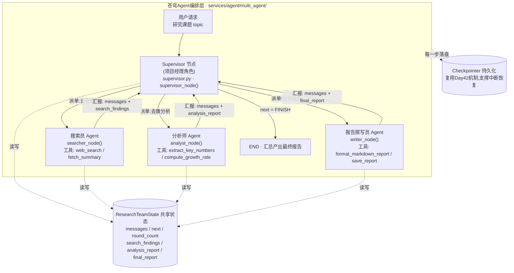
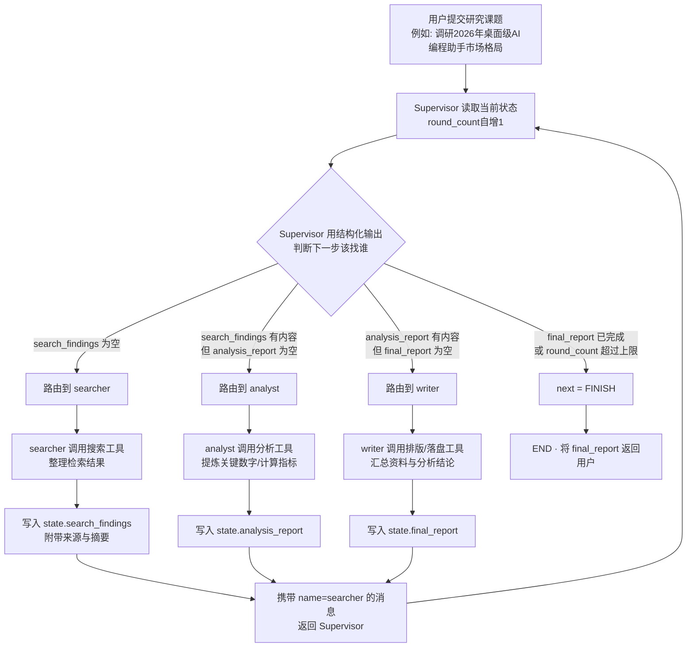
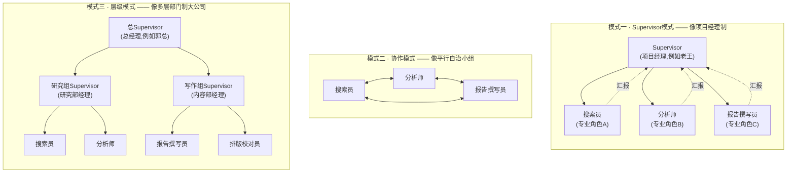

# 第43天 · 多Agent系统 —— Supervisor就像项目经理

> **周次/Sprint**:Sprint 4 · Agent基础(Day39-45)—— 本周主题从"教会一个Agent怎么想事情",过渡到"教会一群Agent怎么分工"
> **星期**:周一(上周六、周日陈铭按公司惯例强度略降地过了个"半休整"周末,今天是新的一周的第一天,也是苍穹Agent编排层这条线上,第一次真正意义上出现"多个Agent"这个概念的日子)
> **参与人**:陈铭(导师:王振宇;上午技术串讲全程列席:王振宇;下午需求澄清与demo验收列席:林悦)
> **飞书任务号**:CQ-183(苍穹Agent编排层 · 多Agent Supervisor路由机制预研)、CQ-184("研究团队"多Agent协作Demo · 验证Supervisor模式可行性,为祺瑞集团多Agent办公助手立项打基础)
> **今日关键词**:Supervisor模式 / 协作模式 / 层级模式 / LangGraph多Agent系统 / 结构化路由决策 / 状态共享 / 消息传递机制 / 研究团队Demo(搜索员+分析师+报告撰写员)

---

## 【旁白】

如果把陈铭过去四天(Day39到Day42)走过的路画成一张地图,会发现一条挺清晰的曲线:先是手写一个"感知-思考-行动"的循环,亲眼看着一个大模型是怎么"决定要不要调用工具"的;接着换成LangChain封装好的Agent和工具生态,省掉了一大堆重复的解析逻辑;然后升级到LangGraph,把原来AgentExecutor那个"黑盒循环"拆成看得见、改得动的图结构;上周五(Day42)又往这张图里加上了持久化、中断恢复、并行节点,交出了一个能"大纲先行、多章并行写作、最后汇总润色"的写作Agent。四天下来,陈铭手里这套家什,单拎出来看,已经能称得上"一个很能干的Agent"了。

但今天老王在白板上写下的第一句话,直接把这条曲线拽向了一个新的方向——"一个很能干的人,不代表能撑起一个项目。"这句话听起来像句管理学名言,但老王接下来举的例子却很具体:上周写作Agent那套东西,拿去写一篇八千字的行业分析报告,可能还凑合,但客户如果要的是"帮我调研一个新兴市场,把公开资料查清楚,再做数据分析,最后出一份决策建议报告",这件事如果硬塞给同一个Agent、同一份系统提示词、同一套工具箱,会发生什么?答案是——迟早会出问题,而且往往不是"报错"这种一眼能看穿的问题,而是那种更隐蔽的、"看起来运行正常,但结果越来越糊"的问题:提示词里塞的工具越多,模型选错工具的概率越高;要同时兼顾"查资料的严谨"和"写报告的文采",两种截然不同的思维模式硬装进一个角色设定里,表现往往两头都不讨好;上下文越攒越长,模型开始"忘记"任务最初的目标。

这正是"多Agent系统"要解决的核心问题,也是今天这一天,乃至整个Sprint4收尾阶段真正要教给陈铭的东西——不是又学一个新框架特性,而是学一种新的"分解问题"的方式:当一件事复杂到一个角色扛不住的时候,企业的答案从来不是"逼这个人变得更全能",而是"把这件事拆成几个更小的、边界清晰的角色,再想办法把这几个角色协调起来"。这套思路,人类社会已经用了几百年,叫"分工"和"组织架构";今天,陈铭要学的,是怎么把这套思路搬进代码里,变成"Supervisor模式""协作模式""层级模式"这几个听起来陌生、但骨子里再熟悉不过的东西。

这一天还有一层更贴近这本书主线的意义。祺瑞集团那条需求线,从Day40林悦第一次提起"能查日程、能发邮件草稿的助手",到Day42祺瑞的"审批中断"痛点被具体化,一直都还停留在"单个助手能做什么"的层面。但今天课堂笔记里会反复出现的一句话——"祺瑞要的从来不是一个无所不能的助手,而是一整个能配合办事的虚拟团队"——才是这条需求线接下来真正要走的方向。行政、HR、法务、财务,天然就是四个不同的专业领域,塞进一个Agent的系统提示词里,大概率会得到一个"什么都懂一点、什么都不精"的四不像。今天陈铭在"研究团队"这个练习项目里踩过的每一个坑、总结出的每一条经验,都会在Sprint5交付祺瑞项目的时候原样搬过去用——只是那时候,搜索员、分析师、报告撰写员这三个角色,会换成行程助理、法务助理、财务助理。

还有一件小事值得记一笔:今天早上陈铭进工位的时候,发现自己那台笔记本的空格键有点发涩,按下去要多顿半秒才弹起来,他心想"这周得找孙昊借一下他那罐压缩空气"。这种琐碎的、和技术毫无关系的小插曲,恰恰是"新的一周开始了"最真实的注脚——技术在往前推进,生活也还是原来的样子,一半是代码,一半是这些不起眼的日常。

再往深一层看,今天这一天在整个七十天的技术脉络里,其实是一个不太显眼、但分量很重的"转折点"。从Day1到Day42,不管是命令行小工具、苍穹0.1版、RAG检索引擎,还是这几天的单Agent能力,严格说都还是"一个系统内部,由一套统一的代码逻辑去处理一件事"的范式——即便Day42的写作Agent已经引入了并行节点,那本质上仍然是"同一个大脑"在并行处理几件子任务,不存在真正意义上"角色和角色之间"的边界。今天开始的多Agent系统,第一次让"边界"这个词有了实质含义:搜索员不该越权去写分析结论,分析师不该越权去查资料,这种"越权"不是靠嘴上说说的约定,而是要靠系统提示词、工具集划分、State字段权责,一层一层地在代码里坐实。放在更大的叙事里看,这恰恰是"苍穹从一个产品,长成一个平台"过程中绕不开的一课——平台意味着要容纳更多、更复杂、边界感更强的协作关系,而不只是把一个足够聪明的模型塞进一个足够好用的框架里。

---

## 晨会纪要 / 今日目标

**时间**:上午9:00,二层大会议室"望远"
**出席**:王振宇(老王)、陈铭

老王进会议室的时候手里端着一杯速溶咖啡,杯子外壁印着"苍穹0.1版上线纪念",这杯子陈铭见过好几次,已经磕掉了一小块瓷。他把咖啡搁在桌上,没有直接翻上周的记录,而是先问了一句:"上周五那个写作Agent,你说交出来的报告质量怎么样?"

"还行,"陈铭想了想,"大纲阶段没问题,并行写各章节的时候,偶尔会有两章内容有点重复,汇总润色那一步基本能把重复的地方削掉。就是——"他顿了一下,"如果一开始就让它顺便去查点资料佐证观点,它会明显力不从心,有时候干脆编几个看起来像真的但查无出处的数字。"

"这就是我今天要讲的东西的由头,"老王点点头,在白板上写下"写作Agent的短板"几个字,又在下面画了一条线,"你说的这个问题,本质上不是提示词写得不够好,是你让一个角色同时干两件不搭的事——一件是'严谨地查证事实',一件是'流畅地组织语言'。这两件事对模型的要求是拧着的:查证事实需要克制、需要在不确定的时候敢说'我不知道';组织语言需要发散、需要在表达上敢往前多走一步。你把这两种气质压进同一个系统提示词里,模型会两头打折扣。"

陈铭在笔记本上记下"角色气质冲突"这几个字,抬头问:"那正常思路不就是——查资料的部分单独交给一个更擅长查资料的Agent,写作部分交给专门写作的Agent?"

"对,这就是今天的主题,"老王在白板正中间画了一个方框,写上"Supervisor",又在下面画出三个小方框,写上"搜索员""分析师""报告撰写员","多Agent系统,说穿了就是把一个大任务拆成几个专业分工的小角色,再找一个协调者把他们捏合起来。你在'蓬远科技'干了大半年,应该已经很熟悉这套东西了——你想想,一个项目立项的时候,是不是也是这么来的?"

"郭总拍板要不要做,"陈铭顺着往下说,"林悦去做需求分析、写PRD,你带着后端去搭架构、写代码,周晓做前端,赵磊测试,孙昊负责部署——大家各管一块,中间由项目经理或者你来对齐进度、协调依赖。"

"就是这个理,"老王把咖啡端起来喝了一口,"你现在脑子里想的这幅图,原样搬到多Agent系统里,'我'或者项目经理的角色,在代码里就叫Supervisor,搜索员、分析师、报告撰写员,就是林悦、我、周晓这些'专业的人'。今天你要做的,不是学一个陌生的新概念,是把你在公司里天天经历的这套组织协作方式,翻译成代码。"

老王把上周和本周的进度重新梳理了一遍,写在白板"今日目标"这一栏下面:

1. 讲清楚多Agent系统的三种主流架构模式——Supervisor模式、协作模式、层级模式,每种都要能说出"它对应现实里的哪种组织形态""什么场景该用哪种"。
2. 用LangGraph实现一个完整的Supervisor多Agent系统,亲手体会"路由决策""消息传递""状态共享"这三件事具体是怎么落地的。
3. 完成"研究团队"Demo:一个Supervisor节点,配三个子Agent——搜索员(查资料)、分析师(做分析)、报告撰写员(出报告),验证这套架构能不能撑起一个稍微复杂点的真实任务。
4. 这个Demo同时也是CQ-184的验收物,林悦下午会过来看效果,顺带聊一聊祺瑞项目那边关于"多角色办公助手"的需求细化。

风险点上,老王特意提了一句:"Supervisor这个角色,本质上也是靠一个LLM在做判断,它一样会犯错——判断错该找谁,或者在几个Agent之间来回踢皮球踢不停。你今天写代码的时候,一定要给它设一道'保险丝',别真出现死循环把token烧穿了都不知道。"这句话,陈铭在笔记本上画了个星号,单独标了出来——他隐约觉得,这大概率会是今天调试阶段最容易踩的坑。

---

## 需求文档(PRD):"研究团队"多Agent协作系统 · 内部能力验证

**文档编号**:CQ-184-PRD-v1.0
**撰写人**:林悦
**评审人**:王振宇
**状态**:内部验证阶段(非客户交付物,用于苍穹Agent编排层技术选型验证)

### 一、背景

苍穹平台的Agent编排层目前已经具备单Agent的完整能力——工具调用、图结构编排、持久化与中断恢复(Day39-42成果)。但在与祺瑞集团的前期沟通中,客户方多次提到一个共同的诉求特征:他们需要的不是一个"万能助手",而是能够对接不同职能部门(行政、HR、法务、财务)的"虚拟同事组合"。这种需求形态,天然对应多Agent协作架构,而不是单一Agent不断堆叠工具。

为了在正式启动祺瑞项目(Sprint5)之前,先验证多Agent架构在苍穹平台的技术可行性、评估其工程复杂度与调试成本,技术团队决定先做一个内部验证性项目——"研究团队"多Agent协作系统。选择"调研分析"这个场景作为验证载体,原因是它天然包含三个边界清晰、彼此依赖的子任务(查资料、做分析、写报告),复杂度适中,且不涉及客户数据,便于快速迭代与内部复盘。

### 二、用户故事

- 作为苍穹平台的内部用户(例如市场部同事),我希望输入一个调研课题,系统能自动完成"查找相关资料→提炼分析要点→生成结构化报告"的全流程,而不需要我自己在几个独立工具之间来回切换、手动拼接结果。
- 作为技术负责人,我希望这套多Agent系统的每一步调度决策都是可追溯、可审计的——即"为什么这一步要交给搜索员而不是分析师",而不是一个完全不可解释的黑盒判断。
- 作为后续开发者(例如接手祺瑞项目的同事),我希望这套Supervisor路由机制具有良好的可扩展性——未来替换掉"搜索员/分析师/报告撰写员"这三个具体角色,换成"行政助理/法务助理/财务助理",核心框架代码应当可以直接复用,不需要重写。

### 三、功能列表

| 编号 | 功能点 | 说明 | 优先级 |
|---|---|---|---|
| F1 | Supervisor路由节点 | 接收用户课题与当前协作状态,用结构化输出决定下一步该调度哪个子Agent,或判断任务已完成 | P0 |
| F2 | 搜索员Agent | 针对课题检索相关信息(优先使用Tavily搜索,课堂环境网络不稳定时降级为本地兜底数据集),将检索结果写入共享状态 | P0 |
| F3 | 分析师Agent | 读取搜索员产出的资料,提炼关键数据、计算增长率等衍生指标、给出结构化分析要点 | P0 |
| F4 | 报告撰写员Agent | 汇总搜索资料与分析结论,生成结构清晰、包含标题/摘要/正文/结论的Markdown格式最终报告 | P0 |
| F5 | 共享状态管理 | 定义统一的State结构,承载消息历史与结构化中间产出(search_findings/analysis_report/final_report),支撑三个子Agent与Supervisor之间的信息传递 | P0 |
| F6 | 调度轮次保护机制 | 设置最大调度轮次上限,防止Supervisor判断失误导致的无限循环调度,超限后强制进入FINISH分支并给出降级提示 | P0 |
| F7 | 持久化与断点恢复 | 复用Day42已验证的Checkpointer机制,支持多Agent协作过程中断后从最近一次调度节点恢复,不重新执行已完成的子任务 | P1 |
| F8 | 调度过程可观测 | 每一次Supervisor的路由决策,连同决策理由,以结构化日志形式输出,便于审计与复盘 | P1 |
| F9 | FastAPI接口封装 | 将多Agent协作流程封装为一个可通过HTTP调用、支持SSE流式返回中间进度的接口,预留给未来控制台前端展示"虚拟团队工作进度" | P2 |

### 四、非功能需求

- **可控性**:Supervisor的调度决策必须是结构化的(枚举值+理由),不能依赖对自然语言输出做字符串匹配来判断路由方向,避免因为LLM表达方式的微小差异导致路由解析失败。
- **可扩展性**:新增或替换某个子Agent角色时,只需要修改该角色对应的节点定义与工具集,不需要改动Supervisor的核心路由逻辑与图拓扑结构。
- **成本可控**:单次协作任务的调度轮次应有明确上限(默认设置为8轮,即Supervisor最多做8次路由决策),避免因死循环导致的token成本失控。
- **容错性**:任意子Agent执行异常(例如搜索工具超时、分析工具解析失败)时,系统应当能够捕获异常、将异常信息作为反馈交回Supervisor,由Supervisor决定重试或降级处理,而不是让整个流程直接崩溃。
- **可测试性**:Supervisor的路由决策逻辑需要能够脱离真实LLM调用进行单元测试(即支持对LLM调用打桩/mock),保证核心调度逻辑的正确性可以被自动化验证。

### 五、风险与应对

林悦在PRD评审会上单独列了一节"风险登记",这是她一贯的习惯——"需求文档如果只写好的一面,评审的时候很容易被追问'那出问题了怎么办',不如提前把能想到的风险都摆出来"。

| 风险描述 | 影响 | 应对措施 |
|---|---|---|
| Supervisor判断失误,反复在两个子Agent之间来回调度,无法收敛 | 消耗大量token成本,任务无法在合理时间内完成 | 设置调度轮次硬上限(round_count/max_rounds),超限后强制终止并给出降级说明;后续可叠加"软提醒"机制引导提前收敛 |
| 子Agent输出格式不规范(未按约定输出JSON代码块),导致结构化字段解析失败 | Supervisor无法正确判断某阶段是否完成,可能重复调度同一个Agent | 解析失败时返回空字典兜底,不抛异常中断流程;后续可考虑引入更严格的输出格式校验与自动重试 |
| 外部搜索服务(Tavily)不可用或超时,课堂演示网络不稳定 | 搜索员无法获取真实检索结果,demo效果不稳定 | 设计本地兜底数据集,网络异常或未配置API Key时自动降级,保证课堂演示的可复现性 |
| 多Agent协作耗时较长,用户在等待过程中缺乏进度感知 | 用户体验不佳,尤其是在需要多轮返工的场景下 | 提供SSE流式接口(F9),实时推送"当前轮到谁在工作"的进度事件 |
| 未来子Agent数量增多(例如引入审核员角色),Supervisor提示词维护成本上升 | 提示词随着团队规模膨胀,可读性和可维护性下降 | 保持"结构化状态驱动路由"的设计原则,新增角色只需要维护自己的产出字段,不需要大幅改动Supervisor核心逻辑 |

### 六、验收标准

1. 给定一个具体调研课题(例如"调研2026年桌面级AI编程助手市场格局"),系统能够在不人工介入的情况下,自动完成"检索→分析→撰写"全流程,产出一份结构完整的Markdown报告。
2. Supervisor的每一次路由决策都能在日志中清晰看到"路由到了谁""为什么这么路由"这两项信息。
3. 人为制造一次死循环场景(例如让分析师Agent故意不写入analysis_report字段),系统应当在达到调度轮次上限后自动终止,不发生无限调用。
4. 中途手动中断进程(模拟服务重启),系统应当能够基于Checkpointer从最近一次完整的子Agent产出处继续执行,不需要重新调用已经成功完成的子任务。
5. 核心路由逻辑(supervisor.py中的决策函数)具备独立的单元测试,且在CI流程中可以稳定通过,不依赖真实网络请求与真实LLM调用。

---

## 架构设计图

老王画的架构图,重点是把"Supervisor + 三个子Agent + 共享状态"这四块东西的关系摆清楚——谁能指挥谁,谁只能向谁汇报,状态到底存在哪里、谁都能碰。



这张图有几个要点值得单独说一下。第一,箭头方向是不对称的——Supervisor可以把任务派给任何一个子Agent,但三个子Agent之间没有任何直接连线,它们只能"向上汇报给Supervisor",不能互相说话。这正是Supervisor模式和后面要讲的协作模式最本质的区别:所有的横向沟通,都必须经过Supervisor这一个中转点,就像公司里跨部门协作,大部分时候不是两个执行层的人自己私下拍板,而是各自向自己的项目经理汇报,项目经理之间(或者同一个项目经理)去协调。

第二,共享状态(ResearchTeamState)被画成一个独立的圆柱体符号,是想强调它不是任何一个Agent"私有"的东西,而是整套系统的"公共黑板"——四个节点都能读、都能写,但写的方式和写的字段是有约定的(哪个字段该由谁写、什么时候写),这个约定后面在课堂笔记的"状态共享机制"部分会细讲。

第三,右下角单独标出了Checkpointer,这是刻意呼应上周Day42的持久化机制——多Agent系统一样会遇到"运行到一半服务重启了"的问题,而且因为多Agent系统调度轮次更多、运行时间通常更长,持久化的必要性反而比单Agent场景更强烈。

---

## 流程图

架构图讲的是"系统长什么样",流程图讲的是"一次完整的协作,具体是怎么一步步跑下来的"。



这张流程图里最容易被忽略、但恰恰是今天课堂笔记要重点讲的一环,是"H"这个节点——三条支线(searcher/analyst/writer)执行完之后,并不会直接结束,而是统一先绕回Supervisor,再由Supervisor重新做一次判断。很多刚接触多Agent系统的人,第一反应会觉得"搜索完了当然接着分析,分析完了当然接着写报告",把这条链路写成一条固定的直线流程(先A后B后C)。但今天要讲清楚的是,固定直线流程本质上还是一个"链"(Chain),不是真正的多Agent系统——多Agent系统的价值,恰恰在于Supervisor每一次都要重新判断"接下来该做什么",这意味着它有能力应对意外情况:比如分析师反馈"资料不够,建议再查一次",Supervisor完全可以决定把任务重新派回搜索员,而不是死板地按A-B-C的顺序往下走。

---

## 示意图:三种多Agent模式的组织结构对比

这是今天最贴近"类比公司组织架构"这条主线的一张图,老王在白板上画的原版,基本就是这个样子——三种模式摆在一起对比,分别对应三种不同的团队协作方式。



三张子图摆在一起看,区别其实一目了然。Supervisor模式里,所有的指挥关系都收拢到一个中心节点上,汇报关系也全部指向这个中心——这就是"老王统筹陈铭、周晓、赵磊各自的工作"这种最常见的项目组协作方式。协作模式里没有任何一个节点拥有"指挥权",连线是双向的、网状的,像是几个关系熟络的同事凑在一起搞一个没有正式立项、没有指定负责人的内部小项目,谁想到什么就直接找对应的人商量,效率有时候很高,但一旦出了问题,"这个决定到底是谁拍的"这种追责性的问题就会很难回答。层级模式则是把Supervisor模式再叠一层——总经理不会跳过部门经理直接给一线员工派活,他只对接几个部门经理,部门经理再各自管理自己团队内的具体执行人,这种结构在任务规模足够大、需要"分而治之"的时候才会体现出优势,否则层级越多,信息在层与层之间传递的损耗和延迟也会越明显。

---

## 课堂笔记

### 上午:三种多Agent架构模式详解

老王今天上午讲课的开场白挺特别,他没有直接打开电脑投屏代码,而是从抽屉里翻出一张蓬远科技去年做校招宣讲用的组织架构图,拍在投影仪底下——最上面是郭建军,往下是技术、产品、市场几条线,技术线下面又分对话引擎组、RAG组、Agent组、基础设施组。"你们天天在这张图里生活,"老王说,"今天我们就拿这张图当教材,讲多Agent系统。"

**先讲清楚一个前提:为什么不能无限堆工具**

在正式讲三种模式之前,老王先花了小半个小时,回头把"为什么需要多Agent"这个问题讲透。他举了个很直观的例子:假设要给上周的写作Agent再加上"查资料校验事实"这个能力,最朴素的做法是往它的工具箱里再塞一个搜索工具,连着原来的大纲生成、并行写作、汇总润色能力,一共变成好几个工具、好几种职责压在一个系统提示词里。老王现场打开编辑器,把假设中"全能Agent"的系统提示词敲出来给陈铭看:

"你是一个全能助手,需要完成用户提出的调研写作任务。具体流程是:先搜索相关资料;再对资料做数据分析;再生成大纲;再根据大纲并行撰写各章节;最后汇总润色成一篇完整报告。你需要自主判断当前处于哪个阶段,并调用对应的工具。"

"你读一下这段提示词,"老王说,"有没有觉得哪里不对劲?"

陈铭念了两遍,说:"感觉……信息量有点大,而且每句话的动作跨度都很大,从'搜索'跳到'数据分析'再跳到'并行撰写',这几件事的思维方式完全不一样。"

"这就是问题所在,"老王说,"你让模型在同一次对话里,不断地在'严谨查证''数据推理''文字组织'这几种完全不同的思维模式之间来回切换,它每一次切换都要重新在心里(如果模型有心里的话)调整状态,这种切换本身就会带来性能损耗——不是运行速度上的损耗,是决策质量上的损耗。而且系统提示词一旦写得又长又杂,模型对提示词里靠后的内容,注意力权重天然会打折扣,这是Transformer架构一个已经被反复验证过的特点,不是危言耸听。"

他还提到一个更现实的问题——工具选择错误率。"你去查一下市面上关于Agent工具调用的一些评测报告,一个规律基本是一致的:同一个模型,工具箱里放5个工具的时候,选错工具、选错参数的概率,明显低于放15个工具的时候。工具越多,每个工具的'区分度'在模型眼里就越模糊,尤其是几个功能相近的工具放在一起,比如'搜索最新资讯'和'搜索历史数据'这种,模型经常会选错。"

"所以多Agent系统解决的第一个问题,"老王在白板上写下"降低单点复杂度"几个字,"是把一个庞大的、多职责的系统提示词和工具箱,拆成几个小的、单一职责的系统提示词和工具箱。每个子Agent只需要把自己那一件事做到最好,不需要操心其他事情——这跟你在公司里的体感应该完全一致:你专心把后端代码写好,不需要同时惦记着周晓的CSS写得好不好看,林悦的PRD措辞够不够精确。"

**模式一:Supervisor模式**

讲完了"为什么",老王开始正式讲第一种模式。"Supervisor模式,你可以直接理解成'项目经理制',"他指着投影仪上的组织架构图,"你看这张图,我不会直接跑去改周晓的CSS代码,也不会直接改你的Python代码——我的角色是接需求、拆任务、分给合适的人、跟进进度、最后把结果汇总给郭总或者客户。这中间有一个关键特征:所有的信息流转,理论上都要经过我这一个节点。"

他把这个特征进一步拆解成三条具体规则,写在白板上:

1. Supervisor拥有"全局视角"——它能看到所有子Agent的产出、当前任务完成到什么程度。
2. 子Agent只对Supervisor负责,不直接与其他子Agent通信。
3. 下一步该找谁,由Supervisor决定,而不是子Agent自己决定"我做完了,该轮到谁了"。

"这套规则听起来有点'集权',"老王说,"但恰恰是这种集权,换来了两个企业级场景特别看重的东西——可控性和可审计性。"

陈铭插了一句:"可审计性是指——出了问题,能查清楚是哪一步、谁的决定导致的?"

"对,"老王说,"你想象一下,如果哪天祺瑞集团那边反馈说,系统给一个员工生成了一份错误的报销审批建议,郭总第一句话肯定是问'这是哪个环节出的问题'。如果是Supervisor模式,你能非常清楚地回答:'第三轮调度,Supervisor把任务派给了财务助理Agent,财务助理Agent读取的是这条报销记录,给出了这个结论,判断逻辑是这样这样。'每一步都有明确的责任人和明确的调用记录。这在协作模式里就很难做到,因为协作模式里的通信路径是网状的,谁在什么时候跟谁说了什么,理论上更难梳理成一条清晰的时间线。"

Supervisor模式的缺点,老王也没有回避:"它有单点瓶颈,Supervisor本身也是一次LLM调用,它的判断质量直接决定了整个系统的调度质量。如果Supervisor老是判断错、来回瞎指挥,子Agent再强也没用。另外,因为所有信息都要经过Supervisor中转,调度轮次会比协作模式多,每多一轮,就多一次LLM调用的时间和token成本。"

**模式二:协作模式**

第二种模式,老王讲得比较简略,他自己也承认"这个模式在企业级场景里我们用得不多,但你必须知道它存在,知道它的适用边界"。

"协作模式,英文一般叫Collaborative或者Network模式,"他说,"最大的特征是没有一个中心指挥节点,几个Agent地位是平等的,谁都可以在任务执行过程中,决定'这件事我搞不定,该找谁帮忙',然后直接把消息传给对方。"

他类比说:"你还记得咱们几个培训生一块儿做阶段项目一(通讯录管理系统)的时候吗?那时候没有正式的项目经理,苏梦负责文件存储那部分,张凡负责校验逻辑,你负责命令行交互,你们几个是互相商量着来的,谁想到什么问题就直接找对应的人聊,没有一个中心人物统一调度。这就是协作模式的日常版本。"

"这种模式的好处是响应快、灵活,信息传递路径短,不需要每次都绕回一个中心节点。"老王说,"但缺点也很明显——责任边界模糊,容易出现信息传递混乱,甚至出现'A以为B在处理这件事,B以为A在处理',结果两边都没处理,或者反过来两边都重复处理了同一件事。而且从工程实现角度,协作模式的图结构往往更复杂,因为你要允许任意两个Agent之间建立通信边,边的数量会随着Agent数量呈平方级增长,调试起来也更麻烦。"

他补充了一句现实考量:"客户项目,尤其是像祺瑞、御风金融这种对合规性、可追溯性要求高的客户,基本不会选协作模式作为主架构。协作模式比较适合创意生成、头脑风暴这类'不需要强追责、反而需要多角度自由碰撞'的场景,企业级严肃业务流程,我们几乎不会拿它当主架构。"

**模式三:层级模式**

第三种模式,老王画了刚才架构图里的那张分层组织图。"层级模式,你可以理解成Supervisor模式的'嵌套版'——当任务规模大到一个Supervisor管不过来所有子Agent的时候,就再叠一层,变成'总Supervisor管几个组的Supervisor,组的Supervisor管自己组里的执行Agent'。"

他又拿蓬远科技举例:"郭总不会直接管到我们组里每一个具体的程序员,他对接的是各个技术负责人,比如我;我再对接组里具体的人。如果哪天苍穹项目扩张到几十个Agent协作(这种规模,寰宇集团那个旗舰项目大概率会遇到),你不可能指望一个Supervisor同时管几十个子Agent的路由决策——不是不可以,而是这么一个巨大的系统提示词交给一个LLM去判断'接下来该找谁',判断质量会明显下滑,跟刚才讲的'工具箱不能无限堆'是同一个道理,只不过这次'工具'换成了'可调度的Agent'。"

"所以层级模式的核心价值,"老王总结道,"是把'一次决策的选择范围'重新收窄。总Supervisor只需要在几个组之间做选择,判断质量会比它直接在几十个具体Agent里选高得多;每个组内部的小Supervisor,只需要管好自己这几个人,判断难度也可控。"

陈铭问了一个挺关键的问题:"那什么时候该从Supervisor模式升级到层级模式?有没有一个明确的判断标准,比如子Agent数量超过多少个就该分层?"

老王想了想说:"没有一个放之四海而皆准的数字,但有一个经验性的判断方法——如果你发现Supervisor这一层的系统提示词,描述几个子Agent各自能做什么、彼此的边界在哪儿,已经写得又长又绕,你自己读起来都觉得晕,那大概就是该分层的信号了。另一个信号是,如果几个子Agent明显能按业务边界聚成几个天然的组——比如祺瑞项目里,行政和HR可以归成'人事后勤组',法务和财务可以归成'合规财务组',这种天然的分组结构本身,就是在提示你该往层级模式走了。今天咱们的研究团队只有三个子Agent,规模还谈不上要分层,但你要提前有这个意识,免得以后项目做大了手忙脚乱。"

**三种模式的选型对比**

老王最后用一张表把三种模式的选型要点归纳了一遍,陈铭把它原样记在了笔记本上:

| 对比维度 | Supervisor模式 | 协作模式 | 层级模式 |
|---|---|---|---|
| 组织类比 | 项目经理制 | 平行自治小组 | 多层部门制大公司 |
| 通信路径 | 全部经过中心节点 | 任意两点可直连 | 逐层向下,同层不直连 |
| 可控性/可审计性 | 高 | 低 | 高 |
| 调度延迟/成本 | 中等(每轮多一次中转) | 低(路径最短) | 较高(多层中转) |
| 适用规模 | 3-8个子Agent较合适 | 少量、边界模糊的探索性任务 | 子Agent数量较多,且能按业务自然分组 |
| 典型企业场景 | 客服分派、审批流程、内部工具编排 | 创意生成、头脑风暴 | 大规模流程自动化、跨多部门协同 |
| 苍穹平台当前选型 | Sprint4-5主力架构 | 暂不作为主架构 | Sprint7旗舰项目(寰宇集团)预留方向 |

"记住这张表不是为了考试,"老王说,"是为了你以后遇到一个新需求,能在脑子里先过一遍——这个需求的协作关系,更像哪种组织形态?想清楚这一点,架构选型基本就定了一半。"

**一个容易被误解的细节:多Agent不是"多个提示词"**

课间休息的时候,陈铭喝水的功夫顺嘴问了一句:"那是不是理论上,我用一个Agent,但是给它换几套不同的系统提示词轮着用,也能实现类似的效果?"

老王摇头:"这是个常见的误区。多Agent系统的关键不只是'提示词不同',而是每个Agent有独立的、边界清晰的上下文和工具集,而且它们之间有明确的、结构化的协作机制。你说的'轮换提示词'那种做法,本质上还是同一个上下文在不断累积,越往后消息历史越长,而且换提示词的时机、换成哪一套,这个决策本身也需要一套逻辑去支撑——你绕来绕去,还是要实现一套类似Supervisor的调度机制,只是没有把它拆成独立的节点,代码会缠成一团。多Agent架构的价值,恰恰在于把'调度逻辑'和'执行逻辑'解耦成不同的节点,各自独立、各自可测试、各自可替换。"

**午间加餐:同学们的疑问**

午饭是在楼下的快餐店解决的,陈铭和苏梦、韩露、张凡凑在一张四人桌上,聊天内容不知不觉又绕回了上午的课。苏梦一边扒饭一边说:"我上午听得云里雾里的,Supervisor模式听起来好理解,但协作模式和层级模式的区别,我总觉得有点绕——协作模式里几个Agent互相商量,层级模式里下面那层Supervisor不也是在'商量'吗?这两个到底差在哪儿?"

张凡想了想接过话:"我觉得关键不是'商量不商量',是'有没有一个节点拥有决定权'。协作模式里,searcher和analyst商量完了,到底听谁的,理论上没有一个说了算的角色,大家地位对等;层级模式里,子Supervisor那一层,虽然管的范围比总Supervisor小,但它在自己管的那个小组里,照样是'一个人说了算',这跟协作模式里没有任何一个人说了算,是两种完全不同的权力结构。"

韩露作为产品经理转型的学员,给出了一个更贴近业务的类比:"这有点像我们公司之前接的一个小项目——早期没有正式立项、没有专门的项目经理,是我和另外两个同事凑在一起自己商量着推进的,这是协作模式;后来做大了,拆成了'前端+后端各自有一个小负责人,上面再有一个项目总负责人协调这两个小负责人',这就是层级模式了。协作模式适合项目刚起步、规模小、大家彼此都很熟悉配合默契的阶段,一旦项目做大,没有明确权责划分,推进效率反而会掉下来。"

"你们几个总结得都挺到位,"下午上课前,老王正好听到这段讨论的尾巴,顺嘴接了一句,"再补一个业界的说法给你们——多Agent这块,市面上不只LangGraph一家在做,像AutoGen、CrewAI这些框架,也都在提供类似的多Agent编排能力,思路上大同小异,基本都逃不开今天讲的这三种模式的组合变形。咱们苍穹平台选LangGraph,不是因为它是'唯一答案',而是因为咱们从Day41开始就已经在用它搭建单Agent的图结构,技术栈延续性最好,团队的学习成本最低,而且它跟咱们现有的LangChain工具生态、Checkpointer持久化机制能无缝衔接,不需要额外引入一整套新框架的学习曲线。这也是一个很现实的工程决策考量——不是每次都要选'理论上最强'的工具,很多时候'跟现有技术栈衔接得最顺'才是更该优先考虑的因素。"

陈铭把这句话记下来,顺手在旁边空白处画了个小小的对比符号——"最强 vs 最顺",提醒自己以后遇到技术选型的时候,别忘了老王这句话背后的权衡逻辑。

### 下午:LangGraph实现Supervisor多Agent系统

下午两点,林悦抱着笔记本电脑过来旁听了小半个小时,顺带带来一个消息:"祺瑞那边今天又提了个新说法,他们内部把这类需求叫'虚拟同事',原话是'我们不指望AI什么都会,我们希望它像个真的同事团队,该找谁办事就找谁'。"老王听完笑了一下:"这句话,你们市场部要是拿去当宣传语,倒也贴切,正好是我们今天在做的事。"林悦坐下来看了一会儿demo效果,又去忙别的事了,老王开始下午的正式内容——用LangGraph把上午讲的Supervisor模式,变成能跑起来的代码。

**第一步:先把"共享状态"设计清楚**

"上午我说过,多Agent系统的信息流转要经过Supervisor这个中心节点,"老王说,"但光靠一句话的消息记录,不足以支撑复杂的协作——你光看聊天记录,很难一眼确认'搜索这一步到底做完没有'。所以除了消息历史(messages),我们还要单独维护几个结构化字段,专门记录每个阶段的产出。"

他打开编辑器,现场敲State的定义(完整版本会放在代码实战部分),边敲边解释每个字段的用意:"messages字段,用Annotated配合add_messages这个reducer,这个你Day41已经学过,它保证每次子图或节点返回新消息的时候,是'追加'而不是'覆盖'。next字段,存Supervisor这一轮的路由决策,是个字符串枚举。round_count,记录已经调度了多少轮,防止死循环。剩下三个——search_findings、analysis_report、final_report,是三个子Agent各自的结构化产出区。"

陈铭问:"为什么不能只靠messages来判断'某个阶段完成没有'?比如Supervisor直接去看最后一条消息是不是搜索员发的,内容里有没有提到查到了资料,不就知道该不该往下走了吗?"

"理论上可以,但你要靠字符串匹配或者靠LLM再读一遍最后一条消息去'猜'状态,这两种做法都不牢靠,"老王说,"字符串匹配一旦措辞变了就失效,靠LLM再判断一次等于又多花一次调用成本,而且还是有判断出错的风险。结构化字段是明确的'有'或'没有'——search_findings这个列表是空的还是非空的,这是一个可以用代码直接判断的确定性条件,不依赖任何模型的'理解'。这也是我们从Day42就一直强调的工程习惯——凡是能用确定性代码判断的事情,尽量别交给LLM去猜。LLM该负责的是'创造性'和'语义理解'这类确定性代码做不到的事,不是所有事情都要塞给它判断。"

**第二步:Supervisor节点怎么写路由决策**

"Supervisor节点最核心的一段代码,是让LLM给出一个结构化的路由决策,而不是让它自由发挥说一段话,再靠我们自己去解析这段话里'它到底想说去哪个Agent'。"老王说,"这就要用到Day34、Day19都提过的结构化输出能力——用Pydantic定义一个决策模型,让LLM的输出必须严格符合这个模型的字段和取值范围。"

他现场写了一个简化示意(完整代码在代码实战部分):

```python
from pydantic import BaseModel, Field
from typing import Literal

class RouteDecision(BaseModel):
    """Supervisor在每一轮协作中给出的路由决策"""
    next: Literal["searcher", "analyst", "writer", "FINISH"] = Field(
        description="下一步应该调度的子Agent,或FINISH表示任务已全部完成"
    )
    reason: str = Field(description="做出这个路由决策的简要理由,用于审计与调试")
```

"你看,next字段用Literal约束了取值范围,只能是这四个值之一,"老王说,"这意味着即便LLM本身有点'胡说',框架层面也会在解析结构化输出的时候直接报错拦下来,不会让一个非法的路由值悄悄溜进你的图执行逻辑里搞出奇怪的行为。这比你自己写一堆if 'searcher' in response.content这种字符串匹配代码,稳健得多。"

"那如果它真给出了一个不在枚举范围里的值呢?"陈铭问,"程序会怎么样?"

"会抛出一个pydantic的校验异常,"老王说,"我等会儿让你自己动手试一下故意让它出这个错,你就知道具体报错长什么样了,记住这个报错文本,以后你在生产环境看到类似报错,一眼就能反应过来是结构化输出解析失败,不用满世界瞎排查。"

**第三步:子Agent怎么用create_react_agent快速搭起来**

"三个子Agent各自的实现,不需要从零手写ReAct循环了,"老王说,"LangGraph的prebuilt模块里有个create_react_agent,能帮你把'LLM+工具+循环判断要不要继续调用工具'这套逻辑直接封装好,你只需要给它绑定合适的工具、写好这个角色专属的系统提示词。"

"这是不是有点像我们之前在讲Day19 Function Calling的时候,LangChain封装的AgentExecutor?"陈铭问。

"思路上是同一件事,只不过实现方式换成了LangGraph的图节点,可观测性和可控性更好,"老王说,"AgentExecutor那套东西你调试的时候基本看不到中间状态,create_react_agent构建出来的东西,本质上还是一个LangGraph的图,你可以用同样的方式去看它每一步的状态变化,这也是Day41我们坚持要从AgentExecutor迁移到LangGraph的原因之一,今天正好又用上了。"

**第四步:图的拓扑结构——星形,而不是链形**

"最后一步,是把Supervisor节点和三个子Agent节点,用条件边接起来,"老王在白板上重新画了一遍架构图的简化版,"注意这个拓扑结构的形状——是'星形',Supervisor在中心,三个子Agent各自跟Supervisor之间有一条来一条回的边,子Agent之间没有直连边。"

他强调了一个容易写错的细节:"很多人第一次写这种图,会顺手把searcher节点的出边直接连到analyst节点,因为直觉上'查完资料接下来就该分析'。这是个陷阱——一旦这么连,你的图就退化成了一条固定顺序的链,Supervisor这个节点存在的意义就没有了,因为它根本没有机会在中间插一次判断。正确的写法是,searcher执行完,出边必须无条件指回supervisor,由supervisor重新做一次判断,再决定下一步去哪。"

"那如果Supervisor每次判断的结果碰巧都是'按顺序走',跟写死一条链的效果不就一样了吗?"陈铭追问了一句。

"效果可能看起来一样,但这里有个关键区别——'碰巧每次都按顺序走'和'写死只能按顺序走',留出来的余地完全不同,"老王说,"如果哪天分析师反馈'资料不够',Supervisor有能力把任务重新派回搜索员,写死的链形结构做不到这一点,除非你专门再写一段回退逻辑,而回退逻辑写多了,你的'链'早晚会长得跟一个简化版的Supervisor一样,那还不如一开始就用Supervisor架构,省得以后返工。"

**关于持久化的一点延伸**

老王还专门花了几分钟,把Day42学过的Checkpointer机制在多Agent系统里重新讲了一遍应用场景:"你们之前用Checkpointer,是为了支持审批流程'卡在等人批'的场景。今天这套研究团队系统,理论上也可能因为搜索工具超时、服务重启这些原因中断,如果不做持久化,一旦中断,前面搜索员和分析师辛辛苦苦跑出来的产出全部作废,重新执行一遍不仅浪费token,也浪费时间。加上Checkpointer之后,重启服务、重新用同一个thread_id去invoke,图会自动从最近一次完整节点执行完的位置继续跑,不会从头开始。"

**关于消息裁剪与上下文膨胀**

老王在讲完持久化之后,又抛出了一个容易被忽略的问题:"你想过没有,今天这套系统,如果Supervisor来回调度了七八轮,每一轮子Agent都往messages里追加自己的完整思考过程和工具调用记录,到最后一轮的时候,整个消息历史会有多长?"

陈铭算了一下:"如果每个子Agent单次执行平均产生四五百字的内容,七八轮下来,累计起来轻松上万字,换算成token,几千甚至上万token都有可能。"

"这就是多Agent系统一个绕不开的现实问题——上下文会随着调度轮次线性甚至更快地膨胀,"老王说,"你Day27学过的记忆机制,那时候讲的是单个对话场景下怎么控制历史消息长度,今天在多Agent场景下,这个问题只会更突出,因为除了用户和Agent之间的对话,还多了Supervisor和三个子Agent之间大量的'内部调度沟通',这些内容大部分对用户来说是不需要看到的中间过程,但对Agent自己判断'当前状态'又有一定参考价值,不能简单粗暴地全部丢弃。"

他给出了几种实践中常见的应对思路:第一种是"按角色分层裁剪"——传给子Agent的输入,不需要携带Supervisor与其他子Agent之间的全部往来记录,只需要精简的任务简报(今天代码里的`_build_context_message`函数,其实就是这个思路的雏形,只把关键的课题信息和当前进展摘要传给子Agent,而不是把完整的messages历史原样转发);第二种是"摘要压缩"——超过一定轮次之后,由一个专门的摘要步骤,把早期几轮的调度记录压缩成一段简短摘要,替换掉原始的详细记录;第三种是"结构化字段替代消息回溯"——这也是今天反复强调的设计,凡是能用search_findings、analysis_report这种结构化字段直接表达的信息,就不需要依赖从messages历史里"翻找"。

"这三种思路不是互斥的,"老王补充说,"你今天的实现里,其实已经同时用上了第一种和第三种。等你们往后接触到规模更大的多Agent系统,比如子Agent数量上升到十几个、调度轮次上升到几十轮,第二种'摘要压缩'的必要性会更明显地体现出来,那部分内容,我们放到Agent工程化(Sprint5)那几天再细讲,今天你只需要建立这个意识——上下文膨胀不是一个'等出了问题再优化'的事情,是从架构设计阶段就该纳入考虑的因素。"

**关于观测与调试**

课堂笔记的最后一段,老王提到了一个企业级项目里绕不开的话题——可观测性。"你今天写的这套系统,自己在本地跑demo的时候,靠print大法或者靠LangSmith的trace面板,大概还能看清楚每一步发生了什么。但如果哪天这套系统真的上了生产环境,同时有几十个用户在跑不同的调研任务,你不可能靠肉眼盯着日志。所以我要求你在Supervisor节点里,每次做完路由决策,都要记一条结构化日志,把'第几轮''路由到了谁''理由是什么'这三个信息完整记下来,而不是随手print一句话就算了。这些日志,以后接入监控台的时候,直接就能用,不用你再返工重写。"

### 晚自习:常见报错与排查记录

晚上加练的时候,陈铭按老王说的,故意搞了几次"破坏性实验",把踩过的坑和报错原文整理进了自己的笔记里,这里摘录几条比较有代表性的:

**报错一:结构化输出解析失败**

陈铭故意把Supervisor的提示词改得含糊其辞,让模型在某一次响应里给出了一个不在枚举范围内的值(比如把"searcher"写成了"search"),控制台报出的错误大致是:

```
pydantic_core._pydantic_core.ValidationError: 1 validation error for RouteDecision
next
  Input should be 'searcher', 'analyst', 'writer' or 'FINISH' [type=literal_error, input_value='search', input_type=str]
```

"这条报错其实是好事,"老王后来复盘的时候说,"它说明结构化输出的约束生效了,拦住了一个非法值,没有让它悄悄流进你的路由逻辑里造成更隐蔽的bug。真正麻烦的,反而是那种'看起来输出合法,但语义上判断错误'的情况,这种错误框架层面拦不住,只能靠你在提示词里把每个子Agent的职责边界描述得足够清楚,减少LLM判断失误的概率。"

**报错二:调度轮次超限**

陈铭为了验证保护机制,故意让分析师Agent的工具函数永远不写入analysis_report字段,模拟"分析师一直交不出活"的场景。跑了几轮之后,系统按预期在round_count超过上限(demo里设置的是8轮)时,强制把next置为FINISH,并在最终报告里带上一句降级提示——"注:因调度轮次超出上限,分析环节未能完整完成,以下为已完成部分的汇总。"

"这个降级文案不能省,"老王特意提醒,"很多人只顾着写保护逻辑,忘了给用户一个交代——系统被迫提前终止,总得告诉对方'哪部分没做完',不能悄无声息地把一份不完整的东西当成完整结果扔出去,这是对用户基本的诚实。"

**报错三:递归深度超限(GraphRecursionError)**

如果没有做好轮次保护,直接依赖LangGraph默认的recursion_limit,一旦Supervisor真的陷入了来回踢皮球的死循环,最终会抛出:

```
langgraph.errors.GraphRecursionError: Recursion limit of 25 reached without hitting a stop condition. You can increase the limit by setting the `recursion_limit` config key.
```

"这条报错的潜台词是,LangGraph自己也有一道默认的保险丝(默认25步),防止真正的无限循环把资源耗尽,"老王说,"但你不能指望这道保险丝当你系统设计的兜底方案——等到触发这个默认限制,你已经白白浪费了25轮的LLM调用成本。真正靠谱的做法,是像我们今天写的round_count那样,在业务层自己设一道更早触发、更可控、报错信息更友好的保护机制,LangGraph的默认限制,只当最后一道'万一你的业务层保护也失效了'的安全网。"

**报错四:子Agent工具调用参数缺失**

陈铭在调试搜索工具的时候,一度传错了参数名,报出类似:

```
TypeError: web_search() got an unexpected keyword argument 'keyword'
```

"这种错误看起来是最low级的typo,但在多Agent系统里出现的频率比你想象得高,"老王说,"因为你写的工具函数签名,和LLM在工具调用时'猜'出来的参数名,理论上要完全一致,而LLM生成参数名的时候,有时候会按照自己的语义习惯,把你定义的query写成keyword或者search_term。解决办法是,工具函数的docstring和参数说明一定要写清楚、写具体,LangChain的@tool装饰器会把这些描述原样喂给LLM,描述写得越精确,LLM猜参数名出错的概率就越低。"

**报错五:并发写入同一字段引发的状态冲突**

这一条是陈铭在尝试"让搜索员和分析师并行执行,节省一点调度时间"的实验性改动时踩到的。他把searcher和analyst从"顺序经过Supervisor"改成了"Supervisor同时派给两个节点并行执行",结果两个节点都试图往同一个final_report相关的字段写东西,程序抛出了:

```
langgraph.errors.InvalidUpdateError: At key 'search_findings': Can receive only one value per step. Use an Annotated key to handle multiple values.
```

"这条报错其实是在提醒你,"老王后来解释说,"State里每个字段默认的合并策略是'覆盖',如果同一步里有两个节点同时往同一个字段写值,LangGraph不知道该听谁的,除非你像messages字段那样,给这个字段也指定一个明确的reducer(比如用列表拼接代替直接覆盖)。你今天的场景其实不适合searcher和analyst并行——分析师天然依赖搜索员的产出,这是一个有先后依赖的关系,不是两个互相独立的任务,勉强并行只会让状态管理变复杂,换来的时间收益也未必划算。真正适合并行的,是像上周写作Agent里'各章节独立撰写'这种彼此没有依赖关系的子任务。"这条报错,也让陈铭对"什么时候该并行、什么时候不该并行"这件事,有了一次挺具体的反面教材。

**晚自习加练:几个常被问到的小问题**

睡前陈铭把自己一天攒下来的几个"当时没细想,后来又冒出来"的疑问,整理成了几条简短的自问自答,算是给这一天的学习做个收尾:

- **问:Supervisor节点本身要不要也接入工具调用?比如让它自己也能查资料。**
  答:一般不建议。Supervisor的职责边界应该收得很窄——只做路由判断,不做具体执行,这样它的系统提示词才能保持简洁,判断质量才有保障。如果Supervisor自己也承担执行类的工作,它就会重新变成上午课上举例的"全能Agent",违背了多Agent架构"降低单点复杂度"的初衷。真的有一类"轻量级、跨领域都用得上"的工具(比如查当前日期),可以考虑作为一个独立的工具节点插在图里,而不是塞给Supervisor自己去调用。

- **问:三个子Agent如果各自使用不同厂商的模型(比如searcher用DeepSeek,writer用通义千问),系统还能正常工作吗?**
  答:完全可以,这正是"每个子Agent独立配置"这种设计带来的灵活性之一——今天的config.py里,每个角色的AgentModelConfig都可以单独指定provider和model_name,互不影响。企业实践中,确实存在"某个环节对某个模型效果更好,就单独给它配那个模型"的做法,只要注意好各家API的费用、速率限制差异即可。

- **问:如果用户中途想终止一次正在进行的协作任务,该怎么处理?**
  答:这也是Checkpointer机制的价值所在——因为每一步的状态都会落盘,"终止"可以简单地理解为"不再继续invoke这个thread_id",已经产生的中间产出不会丢失,用户如果后悔了,还可以基于同一个thread_id重新触发,从最近一个完整节点继续。真正需要"优雅终止并给用户一个明确反馈"的场景,可以在API层加一个专门的取消接口,标记该thread_id为已取消状态,supervisor_node在每轮开始时先检查这个标记,如果已取消就直接返回FINISH。

- **问:今天的Demo里,round_count是记在State里的,如果同一个thread_id被多个不同的课题复用,会不会互相干扰?**
  答:不会,因为每次调用build_initial_state都会生成一份全新的初始状态,round_count从0开始计;真正会带来干扰风险的,是"用同一个thread_id去处理两个完全不同的课题却指望复用之前的Checkpointer记录",这种用法本身就是误用——thread_id应当被当作"一次协作任务的唯一标识",不应该跨课题复用,这一点在接入生产环境的API文档里需要专门写清楚,避免调用方误用导致状态串号。

- **问:如果三个子Agent当中,有一个(比如分析师)本身也需要调用另外一个内部Agent来完成子任务,这算不算破坏了"子Agent之间不直接通信"的原则?**
  答:这其实是一个很自然会冒出来的问题,答案要分两层看。如果分析师需要调用的是一个"纯工具"(哪怕这个工具内部也包了一层LLM调用,比如一个专门做数值计算校验的小模型),这仍然属于"分析师在使用自己的工具箱",没有破坏Supervisor模式的原则,因为对外呈现出来的,依然是分析师这一个角色向Supervisor汇报。但如果分析师需要调用的是另一个具备独立决策能力、有自己完整职责边界的"Agent"(比如一个专门做数据可信度审查的审查Agent),那严格来说,你已经在事实上走向了层级模式——分析师本身升级成了一个小组的Supervisor,只是这一层还没有被显式建模出来。老王的建议是,一旦发现某个子Agent里悄悄长出了这种"内部再套一层Agent"的结构,就应该老老实实把它提升为图结构里显式的一层,而不是藏在某个节点函数内部悄悄实现,否则可观测性和可测试性都会打折扣——这也是层级模式存在的意义之一。

---

## 代码实战:"研究团队"多Agent协作系统完整实现

下面是今天完整落地的代码,对应仓库路径 `backend/app/services/agent/multi_agent/`,以及配套的API接口、CLI演示脚本和单元测试。所有文件都是完整实现,没有省略任何核心逻辑。

### 文件一:`backend/app/services/agent/multi_agent/state.py`

```python
"""
research_team 多Agent协作系统 —— 共享状态定义模块

设计说明:
    本模块定义"研究团队"多Agent系统在LangGraph中流转的共享状态(State)。
    整套系统采用Supervisor模式:Supervisor节点与三个子Agent(搜索员/分析师/
    报告撰写员)共享同一份State对象,彼此之间不直接通信,所有信息流转都经由
    这份共享状态与Supervisor节点完成。

    State里既保留了完整的对话消息历史(messages),用于给每个子Agent提供
    充分的上下文;也单独维护了几个结构化字段(search_findings/analysis_report/
    final_report),用于承载各阶段的确定性产出——这是为了避免让Supervisor
    依赖对自然语言消息的"猜测"来判断某个阶段是否完成,而是可以直接用
    Python代码去判断一个字段是否为空、是否已经写入内容,从而获得更稳定、
    更可预测的路由行为。
"""
from __future__ import annotations

from typing import Annotated, Literal, TypedDict

from langchain_core.messages import BaseMessage
from langgraph.graph.message import add_messages

# 团队成员名单,与graph_builder.py中注册的节点名保持严格一致
# 这里额外提取成一个常量列表,是为了在Supervisor的提示词拼装、
# 图的条件边配置、单元测试等多处地方复用,避免出现"某处写错一个字符串"
# 导致路由匹配失败却难以排查的低级错误
TEAM_MEMBERS: list[str] = ["searcher", "analyst", "writer"]

# Supervisor每一轮可以路由到的目标:三个子Agent之一,或FINISH表示任务已完成
RouteTarget = Literal["searcher", "analyst", "writer", "FINISH"]

# 单轮协作调度的默认上限。这个数字不是随便定的:
# 一次完整的"搜索->分析->撰写"流程,正常情况下Supervisor需要做4次路由决策
# (分别路由到searcher、analyst、writer,再判断FINISH),预留一倍的冗余空间
# 用来应付"资料不够、Supervisor决定让搜索员重新查一次"这种正常的返工情形,
# 超过这个上限,大概率说明调度出现了异常循环,应当强制终止并降级处理。
DEFAULT_MAX_ROUNDS: int = 8


class ResearchTeamState(TypedDict):
    """研究团队多Agent协作系统的全局共享状态。

    该TypedDict会作为LangGraph StateGraph的状态模式(state schema),
    图中注册的每一个节点函数,输入输出都以这个结构为准。
    """

    # 完整的协作消息历史,使用add_messages作为归并策略(reducer)。
    # 这意味着每个节点返回 {"messages": [新消息]} 时,LangGraph会自动把
    # 新消息追加到现有历史后面,而不是直接覆盖掉之前的全部记录——
    # 这一点是Day41已经反复强调过的机制,今天在多Agent场景下同样适用,
    # 而且更加关键:如果不用这个reducer,三个子Agent互相看到的历史
    # 会因为节点执行顺序不同而互相冲掉,状态会变得完全不可预测。
    messages: Annotated[list[BaseMessage], add_messages]

    # 当前的研究课题,由用户在入口处一次性给定,贯穿整个协作流程。
    # 单独维护这个字段,是为了避免子Agent在漫长的消息历史里"翻不到"
    # 任务最初的目标——尤其是协作轮次多了之后,消息历史会变得很长,
    # 把关键目标单独提取出来,能显著降低"跑偏"的概率。
    topic: str

    # Supervisor本轮给出的路由决策,graph_builder.py中的条件边函数
    # 会读取这个字段来决定下一步跳转到哪个节点。
    next: RouteTarget

    # 累计已经完成的调度轮次,每次进入supervisor节点自增1,
    # 用于触发DEFAULT_MAX_ROUNDS的保护机制。
    round_count: int

    # 允许的最大调度轮次,默认取DEFAULT_MAX_ROUNDS,
    # 单独作为字段暴露出来,方便在不同的调用场景下按需覆盖
    # (例如给VIP客户放宽轮次上限,或者在压力测试时故意收紧)。
    max_rounds: int

    # 搜索员Agent的结构化产出区:一份检索结果列表,
    # 每一条记录包含来源、标题、摘要,便于分析师直接消费,
    # 不需要从冗长的对话消息里重新提炼。
    search_findings: list[dict]

    # 分析师Agent的结构化产出区:一段结构化的分析结论文本
    # (Markdown格式,包含关键数据点、增长率、风险提示等)。
    analysis_report: str

    # 报告撰写员Agent的结构化产出区:最终交付给用户的完整报告
    # (Markdown格式,包含标题、摘要、正文、结论)。
    final_report: str


def build_initial_state(topic: str, max_rounds: int = DEFAULT_MAX_ROUNDS) -> ResearchTeamState:
    """根据用户输入的研究课题,构造一份初始的共享状态。

    Args:
        topic: 用户提交的研究课题,例如"调研2026年桌面级AI编程助手市场格局"。
        max_rounds: 本次协作允许的最大调度轮次,默认取DEFAULT_MAX_ROUNDS。

    Returns:
        一份可以直接喂给编译后的图(compiled graph)执行的初始状态。
    """
    if not topic or not topic.strip():
        # 课题为空是一个明确的业务错误,不应该让它悄悄流入图执行逻辑,
        # 否则Supervisor会拿着一个空课题去做路由决策,产出的结果毫无意义。
        raise ValueError("研究课题不能为空,请提供一个具体的调研主题")

    return ResearchTeamState(
        messages=[],
        topic=topic.strip(),
        next="searcher",  # 初始状态下默认先派给搜索员,因为任何研究都要先有资料
        round_count=0,
        max_rounds=max_rounds,
        search_findings=[],
        analysis_report="",
        final_report="",
    )
```

### 文件二:`backend/app/services/agent/multi_agent/config.py`

```python
"""
research_team 多Agent协作系统 —— 模型与运行配置模块

设计说明:
    统一在这里管理LLM客户端的构造逻辑,避免每个Agent文件里各自散落一份
    ChatOpenAI初始化代码。遵循master bible约定的技术栈:优先使用DeepSeek
    与通义千问(通过DashScope的OpenAI兼容接口),环境变量命名与仓库内其他
    模块保持一致。
"""
from __future__ import annotations

import os
from dataclasses import dataclass
from functools import lru_cache

from langchain_openai import ChatOpenAI

# 与backend/app/core/config.py中的全局配置约定保持一致的环境变量名,
# 避免出现"同一个key在不同模块里叫不同名字"的低级混乱。
DEEPSEEK_BASE_URL = "https://api.deepseek.com/v1"
DASHSCOPE_BASE_URL = "https://dashscope.aliyuncs.com/compatible-mode/v1"


@dataclass(frozen=True)
class AgentModelConfig:
    """单个Agent角色所需的模型配置。

    不同的子Agent,对模型能力的要求并不完全一致——比如报告撰写员
    需要更强的文字组织能力,通常可以配一个略高temperature的模型,
    而Supervisor的路由决策需要严格遵循结构化输出、追求稳定而不是
    创造性,通常配更低的temperature。因此我们没有让所有Agent共用
    一份配置,而是允许按角色分别配置。
    """

    model_name: str = "deepseek-chat"
    temperature: float = 0.0
    max_tokens: int = 2048
    provider: str = "deepseek"  # "deepseek" 或 "qwen",决定使用哪个base_url与api_key


def _resolve_api_key(provider: str) -> str:
    """根据provider解析对应的API Key环境变量。"""
    if provider == "qwen":
        api_key = os.getenv("DASHSCOPE_API_KEY", "") or os.getenv("QWEN_API_KEY", "")
        if not api_key:
            raise RuntimeError(
                "未检测到 DASHSCOPE_API_KEY 或 QWEN_API_KEY 环境变量,"
                "请在 .env 文件中配置后重试(参考 .env.example)"
            )
        return api_key
    # 默认走DeepSeek
    api_key = os.getenv("DEEPSEEK_API_KEY", "")
    if not api_key:
        raise RuntimeError(
            "未检测到 DEEPSEEK_API_KEY 环境变量,"
            "请在 .env 文件中配置后重试(参考 .env.example)"
        )
    return api_key


def _resolve_base_url(provider: str) -> str:
    return DASHSCOPE_BASE_URL if provider == "qwen" else DEEPSEEK_BASE_URL


@lru_cache(maxsize=16)
def get_llm(config: AgentModelConfig) -> ChatOpenAI:
    """根据配置构造(并缓存)一个ChatOpenAI客户端。

    使用lru_cache的原因:多Agent系统里,Supervisor与三个子Agent
    大概率会各自反复构造自己的LLM客户端实例,如果每次都新建一个
    底层HTTP连接池,会造成不必要的资源浪费。相同配置的请求,
    直接复用同一个客户端实例。

    Args:
        config: 一份AgentModelConfig,dataclass(frozen=True)保证了它是
            可哈希的,因此可以作为lru_cache的缓存key。

    Returns:
        一个配置好base_url、api_key的ChatOpenAI实例。
    """
    return ChatOpenAI(
        model=config.model_name,
        temperature=config.temperature,
        max_tokens=config.max_tokens,
        api_key=_resolve_api_key(config.provider),
        base_url=_resolve_base_url(config.provider),
    )


# 三个角色分别使用的默认配置。
# Supervisor: 低temperature,追求路由决策的稳定性与一致性。
SUPERVISOR_MODEL_CONFIG = AgentModelConfig(
    model_name="deepseek-chat", temperature=0.0, max_tokens=512, provider="deepseek"
)
# 搜索员: 低temperature,查资料这件事不需要"创造力",需要的是老实、克制。
SEARCHER_MODEL_CONFIG = AgentModelConfig(
    model_name="deepseek-chat", temperature=0.1, max_tokens=1536, provider="deepseek"
)
# 分析师: 中等temperature,数据分析需要一点推理发散,但也不能太天马行空。
ANALYST_MODEL_CONFIG = AgentModelConfig(
    model_name="deepseek-chat", temperature=0.3, max_tokens=2048, provider="deepseek"
)
# 报告撰写员: 略高temperature,鼓励更流畅、更有条理感的文字表达。
WRITER_MODEL_CONFIG = AgentModelConfig(
    model_name="deepseek-chat", temperature=0.5, max_tokens=3072, provider="deepseek"
)
```

### 文件三:`backend/app/services/agent/multi_agent/tools.py`

```python
"""
research_team 多Agent协作系统 —— 工具集模块

设计说明:
    本模块集中定义三个子Agent各自使用的工具。为了让课堂demo在没有外部
    网络、没有真实Tavily API Key的环境下也能稳定复现效果,搜索工具设计
    为"优先走真实搜索,失败或未配置Key时自动降级为本地兜底数据集"的模式
    ——这是老王在晨会上专门提到过的做法,课堂演示不能因为网络抖动翻车。

    每个工具函数都通过@tool装饰器暴露成LangChain工具对象,函数的docstring
    与参数说明会被直接喂给LLM,因此描述必须精确、具体,减少LLM"猜错参数名"
    的概率(这一点在今天的晚自习报错记录里也专门提到过)。
"""
from __future__ import annotations

import os
import re
from datetime import datetime
from typing import Any

from langchain_core.tools import tool

# ------------------------------------------------------------------
# 本地兜底数据集:用于Tavily未配置或调用失败时的降级方案。
# 这份数据集是围绕课堂demo默认课题(桌面级AI编程助手市场)手工整理的
# 若干条"看起来像真实检索结果"的样例数据,仅用于教学演示,
# 生产环境应当完全依赖真实检索工具,不应该长期依赖这份兜底数据。
# ------------------------------------------------------------------
_FALLBACK_SEARCH_DATASET: list[dict[str, str]] = [
    {
        "title": "2025年度桌面级AI编程助手用户调研报告摘要",
        "source": "内部资料库 · 行业观察合集",
        "content": (
            "调研覆盖约1200名企业级开发者,报告显示超过60%的受访者日常使用至少一种"
            "AI编程助手,其中约35%的团队已经把AI辅助编码纳入了正式的研发流程规范,"
            "而不再只是个人开发者的自发行为。企业采购决策中,'能否私有化部署'与"
            "'代码是否会被用于模型训练'是被反复提及的两项核心顾虑。"
        ),
    },
    {
        "title": "云端Agent化编程工具的三种典型交付形态",
        "source": "内部资料库 · 技术选型笔记",
        "content": (
            "当前市面上的AI编程助手大致可以归纳为三类交付形态:IDE插件式(嵌入"
            "现有开发环境,改动成本低)、独立客户端式(提供更完整的多文件、多步骤"
            "编排能力)、云端协作平台式(强调团队协作与云端算力,但对网络依赖较高)。"
            "三种形态在企业客户中的接受度差异明显,私有化诉求强的客户更青睐"
            "前两类,便于本地化改造与合规审查。"
        ),
    },
    {
        "title": "企业级客户对AI编程助手的合规诉求清单",
        "source": "内部资料库 · 客户访谈纪要",
        "content": (
            "在与多家制造、金融行业客户的访谈中,反复出现的合规诉求包括:代码"
            "与commit信息不能出域、模型调用记录需要可审计、需要支持私有化部署"
            "或至少支持自建代理网关。这些诉求与苍穹平台此前在海纳制造集团、"
            "御风金融项目中积累的私有化经验高度吻合。"
        ),
    },
    {
        "title": "多Agent协作在研发工具链中的落地趋势",
        "source": "内部资料库 · 架构预研笔记",
        "content": (
            "越来越多的编程助手产品开始尝试引入'多Agent协作'的编排方式,例如"
            "把'代码生成''代码审查''测试用例生成'拆分成不同角色的子Agent,"
            "由一个调度层协调分工,而不是让单一模型串联完成全部步骤。这与"
            "本次调研分析的核心结论方向一致。"
        ),
    },
]


def _looks_like_configured(env_var_name: str) -> bool:
    """判断某个环境变量是否已经配置了看起来有效的值(非空且非占位符)。"""
    value = os.getenv(env_var_name, "").strip()
    if not value:
        return False
    # 过滤掉常见的占位符写法,避免把".env.example"里遗留的示例值当成真实Key
    placeholder_pattern = re.compile(r"^(your[-_]?key|xxx+|changeme|placeholder)$", re.IGNORECASE)
    return not placeholder_pattern.match(value)


@tool
def web_search(query: str, max_results: int = 4) -> list[dict[str, Any]]:
    """在互联网上搜索与给定查询相关的最新资料。

    优先使用Tavily搜索API获取真实检索结果;如果环境变量TAVILY_API_KEY
    未配置,或者调用过程中发生网络异常,会自动降级为本地兜底数据集,
    保证课堂演示不会因为外部依赖不稳定而中断。

    Args:
        query: 搜索关键词或问题,应当尽量具体,例如"2026年桌面级AI编程助手
            市场占有率"而不是笼统的"AI编程助手"。
        max_results: 期望返回的结果条数上限,默认4条。

    Returns:
        一个列表,每一项包含title(标题)、source(来源)、content(内容摘要)
        三个字段。
    """
    if _looks_like_configured("TAVILY_API_KEY"):
        try:
            # 延迟导入,避免在未安装langchain-tavily或未配置Key的环境下,
            # 仅仅因为import语句就导致整个模块无法加载。
            from langchain_tavily import TavilySearch

            tavily_tool = TavilySearch(max_results=max_results)
            raw_results = tavily_tool.invoke({"query": query})
            results = raw_results.get("results", []) if isinstance(raw_results, dict) else raw_results
            normalized = [
                {
                    "title": item.get("title", "(无标题)"),
                    "source": item.get("url", "未知来源"),
                    "content": item.get("content", ""),
                }
                for item in results[:max_results]
            ]
            if normalized:
                return normalized
            # 真实调用返回了空结果,同样走降级逻辑,而不是把空列表直接扔回去
        except Exception as exc:  # noqa: BLE001 - 这里需要兜住所有异常做降级,不能让demo崩掉
            # 记录降级原因,方便排查,但不阻断流程——这正是PRD里"容错性"要求的具体体现
            print(f"[web_search] Tavily调用失败,自动降级为本地兜底数据集。原因: {exc}")

    # 降级路径:从本地兜底数据集里按简单的关键词匹配挑选,保证课堂演示可复现
    keywords = [kw for kw in re.split(r"\s+", query.strip()) if kw]
    scored: list[tuple[int, dict[str, str]]] = []
    for entry in _FALLBACK_SEARCH_DATASET:
        haystack = entry["title"] + entry["content"]
        score = sum(1 for kw in keywords if kw and kw in haystack)
        scored.append((score, entry))
    scored.sort(key=lambda pair: pair[0], reverse=True)
    return [entry for _, entry in scored[:max_results]]


@tool
def fetch_summary(source: str) -> str:
    """针对一个已知的资料来源,获取更详细的内容摘要。

    这是对web_search结果的补充工具:当搜索员认为某一条搜索结果
    的摘要不够详细,需要进一步展开时,可以调用本工具"深挖"这条来源。
    教学环境中,这里同样使用本地兜底数据集模拟深度摘要的效果。

    Args:
        source: 资料来源标识(通常是web_search返回结果中的source字段)。

    Returns:
        一段更详细的内容摘要文本。
    """
    for entry in _FALLBACK_SEARCH_DATASET:
        if entry["source"] == source or source in entry["title"]:
            return (
                f"《{entry['title']}》补充摘要:{entry['content']} "
                f"(检索时间:{datetime.now().strftime('%Y-%m-%d %H:%M')})"
            )
    return f"未能在现有资料库中找到来源为'{source}'的更多详情,建议换一个关键词重新搜索。"


@tool
def extract_key_numbers(text: str) -> list[str]:
    """从一段文本中提取所有看起来像关键数据的数字表述。

    使用正则表达式提取"数字+百分号"或"数字+特定单位"的片段,
    帮助分析师快速定位文本里的量化信息,而不需要通读全文手动摘录。

    Args:
        text: 需要提取数字的原始文本,通常来自搜索员的search_findings。

    Returns:
        提取到的数字片段列表,去重后返回;如果没有匹配到任何数字表述,
        返回空列表。
    """
    # 匹配形如"60%"、"35%"、"1200名"、"三类"这类数字+单位的表述
    pattern = re.compile(r"\d+(?:\.\d+)?\s*(?:%|个|名|类|条|万|亿|倍)")
    matches = pattern.findall(text)
    # 用dict.fromkeys去重且保持原始出现顺序,比直接用set更符合"结果可复现"的期望
    return list(dict.fromkeys(matches))


@tool
def compute_growth_rate(before_value: float, after_value: float) -> str:
    """根据两个时间点的数值,计算并解释增长率。

    Args:
        before_value: 较早时间点的数值。
        after_value: 较晚时间点的数值。

    Returns:
        一段说明增长率的自然语言文本,包含具体百分比与增长/下降方向的判断。
    """
    if before_value == 0:
        return "基准数值为0,无法计算增长率(除零错误已被规避,请检查输入数据是否合理)。"
    rate = (after_value - before_value) / before_value * 100
    direction = "增长" if rate >= 0 else "下降"
    return f"数值从{before_value}变化到{after_value},{direction}了约{abs(rate):.1f}%。"


@tool
def sentiment_tag(text: str) -> str:
    """对一段文本做一个非常轻量的情绪/态度倾向标注(正面/中性/负面)。

    这是一个刻意简化的启发式实现(基于关键词计数),用于教学演示
    "分析类工具"的调用形态,不代表企业级情感分析的推荐实现方式——
    生产环境中应当使用专门训练过的情感分析模型或调用成熟的NLP API。

    Args:
        text: 需要判断态度倾向的文本。

    Returns:
        "正面"、"中性"或"负面"三者之一,附带简要理由。
    """
    positive_words = ["增长", "领先", "看好", "优势", "满足", "认可", "提升"]
    negative_words = ["顾虑", "风险", "下降", "不足", "依赖", "翻车", "缺陷"]
    positive_hits = sum(text.count(word) for word in positive_words)
    negative_hits = sum(text.count(word) for word in negative_words)
    if positive_hits > negative_hits:
        return f"正面(命中正面词{positive_hits}次,负面词{negative_hits}次)"
    if negative_hits > positive_hits:
        return f"负面(命中正面词{positive_hits}次,负面词{negative_hits}次)"
    return f"中性(命中正面词{positive_hits}次,负面词{negative_hits}次,倾向不明显)"


@tool
def format_markdown_report(title: str, summary: str, body: str, conclusion: str) -> str:
    """将报告的几个部分拼装成一份格式规范的Markdown文档。

    Args:
        title: 报告标题。
        summary: 报告摘要(通常2-3句话)。
        body: 报告正文(通常包含若干个小节)。
        conclusion: 报告结论与建议。

    Returns:
        拼装完成的完整Markdown文本。
    """
    generated_at = datetime.now().strftime("%Y-%m-%d %H:%M")
    return (
        f"# {title}\n\n"
        f"> 生成时间:{generated_at} · 由苍穹平台\"研究团队\"多Agent系统自动生成\n\n"
        f"## 摘要\n\n{summary}\n\n"
        f"## 正文\n\n{body}\n\n"
        f"## 结论与建议\n\n{conclusion}\n"
    )


@tool
def save_report_to_file(content: str, filename: str = "research_report.md") -> str:
    """将最终报告内容保存到本地文件(教学演示用,生产环境应改为写入对象存储)。

    Args:
        content: 报告的完整Markdown内容。
        filename: 保存的文件名,默认为research_report.md。

    Returns:
        保存结果的说明文本,包含实际保存路径。
    """
    # 教学演示统一保存到当前工作目录下的output子目录,避免污染仓库根目录
    output_dir = "output"
    os.makedirs(output_dir, exist_ok=True)
    safe_filename = re.sub(r"[^\w\-.\u4e00-\u9fff]", "_", filename)
    file_path = os.path.join(output_dir, safe_filename)
    with open(file_path, "w", encoding="utf-8") as f:
        f.write(content)
    return f"报告已保存至 {file_path}"


# 按角色分组的工具列表,供agents.py在构造子Agent时直接引用
SEARCHER_TOOLS = [web_search, fetch_summary]
ANALYST_TOOLS = [extract_key_numbers, compute_growth_rate, sentiment_tag]
WRITER_TOOLS = [format_markdown_report, save_report_to_file]
```

### 文件四:`backend/app/services/agent/multi_agent/agents.py`

```python
"""
research_team 多Agent协作系统 —— 三个子Agent节点定义模块

设计说明:
    每个子Agent都通过langgraph.prebuilt.create_react_agent快速搭建
    (省去手写ReAct循环的重复劳动,Day39已经手写过一次,原理已经吃透,
    这里直接复用框架封装),再各自包一层节点函数,负责:
        1. 从共享状态中取出必要的上下文(课题、已有产出),拼装成该子Agent
           这一轮需要看到的输入消息;
        2. 调用对应的react agent执行;
        3. 把执行结果中的关键信息,解析并写回共享状态的结构化字段;
        4. 在返回的消息上打上name标记,方便Supervisor与后续的日志/审计
           清楚知道"这句话是谁说的"。
"""
from __future__ import annotations

import json
import re

from langchain_core.messages import AIMessage, HumanMessage
from langgraph.prebuilt import create_react_agent

from app.services.agent.multi_agent.config import (
    ANALYST_MODEL_CONFIG,
    SEARCHER_MODEL_CONFIG,
    WRITER_MODEL_CONFIG,
    get_llm,
)
from app.services.agent.multi_agent.state import ResearchTeamState
from app.services.agent.multi_agent.tools import (
    ANALYST_TOOLS,
    SEARCHER_TOOLS,
    WRITER_TOOLS,
)

# ------------------------------------------------------------------
# 各角色的系统提示词。写法上刻意做到"职责单一、边界清晰",
# 这正是上午课堂笔记里反复强调的"降低单点复杂度"的具体落地——
# 每个角色只被要求做好一件事,不需要理解其他角色的工作细节。
# ------------------------------------------------------------------

# 用拼接方式构造"三个反引号"这个Markdown代码围栏符号,而不是在字符串里直接
# 硬编码三个连续的反引号字符——这是为了避免这段提示词文本被写入技术文档、
# Wiki等同样使用反引号作为代码围栏的Markdown渲染场景时,与文档自身的代码块
# 边界符号产生冲突,导致文档渲染错乱。_extract_trailing_json的解析逻辑
# 同样复用这个常量,保证"生成指令的格式"与"解析指令的格式"始终保持一致。
_JSON_FENCE = "`" * 3

_SEARCHER_SYSTEM_PROMPT = (
    "你是苍穹研究团队里的搜索员,唯一职责是围绕给定课题检索相关资料。\n"
    "工作要求:\n"
    "1. 只负责查找资料、整理摘要,不要做任何数据分析或结论推断,那是分析师的工作。\n"
    "2. 每次检索完成后,必须在回复的最后附上一段JSON,格式如下,不要添加多余文字:\n"
    f"{_JSON_FENCE}json\n"
    "{\"findings\": [{\"title\": \"...\", \"source\": \"...\", \"content\": \"...\"}]}\n"
    f"{_JSON_FENCE}\n"
    "3. 如果一次检索结果不够充分,可以调用fetch_summary工具深挖某条来源,"
    "但不要无限重复检索同一个关键词。"
)

_ANALYST_SYSTEM_PROMPT = (
    "你是苍穹研究团队里的分析师,唯一职责是基于搜索员提供的资料做数据分析。\n"
    "工作要求:\n"
    "1. 只负责提炼关键数据、计算衍生指标、给出分析结论,不要重新去检索资料"
    "(那是搜索员的工作),也不要负责最终报告的排版措辞(那是报告撰写员的工作)。\n"
    "2. 你必须使用extract_key_numbers、sentiment_tag等工具辅助分析,不要凭空编造数字。\n"
    "3. 分析完成后,必须在回复最后附上一段JSON,格式如下:\n"
    f"{_JSON_FENCE}json\n"
    "{\"analysis_report\": \"完整的分析结论文本(Markdown格式)\"}\n"
    f"{_JSON_FENCE}"
)

_WRITER_SYSTEM_PROMPT = (
    "你是苍穹研究团队里的报告撰写员,唯一职责是汇总资料与分析结论,撰写最终报告。\n"
    "工作要求:\n"
    "1. 只负责组织语言、排版成结构清晰的报告,不要重新分析数据"
    "(直接使用分析师给出的结论),也不要质疑分析师的结论是否正确。\n"
    "2. 必须调用format_markdown_report工具生成规范格式的报告,再调用"
    "save_report_to_file工具落盘保存。\n"
    "3. 报告落盘后,必须在回复最后附上一段JSON,格式如下:\n"
    f"{_JSON_FENCE}json\n"
    "{\"final_report\": \"完整报告的Markdown文本\"}\n"
    f"{_JSON_FENCE}"
)


def _extract_trailing_json(text: str) -> dict:
    """从一段模型输出的文本末尾提取JSON片段。

    子Agent被要求在回复末尾附加一段由三个反引号包裹、并标注json语言的代码块,
    本函数负责把这段代码块解析成Python字典。如果解析失败(模型偶尔没有严格
    遵循格式),会返回一个空字典,调用方需要自行处理"没有解析到结构化产出"
    的情形,而不是让程序直接崩溃。
    """
    match = re.search(_JSON_FENCE + r"json\s*(\{.*?\})\s*" + _JSON_FENCE, text, re.DOTALL)
    if not match:
        return {}
    try:
        return json.loads(match.group(1))
    except json.JSONDecodeError:
        return {}


def _build_context_message(state: ResearchTeamState, extra_instruction: str) -> HumanMessage:
    """为子Agent这一轮的执行,拼装一条包含必要上下文的输入消息。

    之所以不直接把完整的messages历史原样转发给子Agent,而是额外拼装一条
    "任务简报"式的消息,是为了明确提醒子Agent"当前课题是什么""目前已有
    哪些产出",避免子Agent在冗长的历史消息里"翻不到"关键信息——这一点
    在上午课堂笔记里专门讲过。
    """
    context_lines = [f"当前研究课题:{state['topic']}"]
    if state.get("search_findings"):
        context_lines.append(f"已有搜索结果条数:{len(state['search_findings'])}")
    if state.get("analysis_report"):
        context_lines.append("已有分析结论(供参考):\n" + state["analysis_report"])
    context_lines.append(f"本轮具体任务:{extra_instruction}")
    return HumanMessage(content="\n".join(context_lines))


def searcher_node(state: ResearchTeamState) -> dict:
    """搜索员Agent节点。

    读取当前课题,调用检索工具查找相关资料,将结构化结果写入
    state["search_findings"],并返回一条带name标记的AI消息,
    供Supervisor与其他节点感知"搜索员刚刚完成了什么"。
    """
    llm = get_llm(SEARCHER_MODEL_CONFIG)
    agent = create_react_agent(llm, tools=SEARCHER_TOOLS, prompt=_SEARCHER_SYSTEM_PROMPT)

    input_message = _build_context_message(
        state, "请围绕课题检索至少3条相关资料,并按要求的JSON格式汇总结果。"
    )
    result = agent.invoke({"messages": [input_message]})
    last_message = result["messages"][-1]
    content_text = last_message.content if isinstance(last_message.content, str) else str(last_message.content)

    parsed = _extract_trailing_json(content_text)
    findings = parsed.get("findings", [])

    tagged_message = AIMessage(content=content_text, name="searcher")
    return {
        "messages": [tagged_message],
        "search_findings": state.get("search_findings", []) + findings,
    }


def analyst_node(state: ResearchTeamState) -> dict:
    """分析师Agent节点。

    基于state["search_findings"]中的资料做数据分析,
    将分析结论写入state["analysis_report"]。
    """
    llm = get_llm(ANALYST_MODEL_CONFIG)
    agent = create_react_agent(llm, tools=ANALYST_TOOLS, prompt=_ANALYST_SYSTEM_PROMPT)

    findings_text = "\n".join(
        f"- 《{item.get('title', '未知标题')}》({item.get('source', '未知来源')}):{item.get('content', '')}"
        for item in state.get("search_findings", [])
    ) or "(目前尚无搜索资料,请如实说明无法分析,不要编造数据)"

    input_message = _build_context_message(
        state,
        "请基于以下资料做数据分析,提炼关键数字与结论,并按要求的JSON格式输出:\n" + findings_text,
    )
    result = agent.invoke({"messages": [input_message]})
    last_message = result["messages"][-1]
    content_text = last_message.content if isinstance(last_message.content, str) else str(last_message.content)

    parsed = _extract_trailing_json(content_text)
    analysis_report = parsed.get("analysis_report", "")

    tagged_message = AIMessage(content=content_text, name="analyst")
    return {
        "messages": [tagged_message],
        "analysis_report": analysis_report or state.get("analysis_report", ""),
    }


def writer_node(state: ResearchTeamState) -> dict:
    """报告撰写员Agent节点。

    汇总搜索资料与分析结论,生成并落盘最终报告,写入state["final_report"]。
    """
    llm = get_llm(WRITER_MODEL_CONFIG)
    agent = create_react_agent(llm, tools=WRITER_TOOLS, prompt=_WRITER_SYSTEM_PROMPT)

    input_message = _build_context_message(
        state,
        "请基于当前分析结论撰写最终报告,调用工具完成排版与落盘,"
        "并按要求的JSON格式输出完整报告文本:\n" + (state.get("analysis_report") or "(暂无分析结论)"),
    )
    result = agent.invoke({"messages": [input_message]})
    last_message = result["messages"][-1]
    content_text = last_message.content if isinstance(last_message.content, str) else str(last_message.content)

    parsed = _extract_trailing_json(content_text)
    final_report = parsed.get("final_report", "")

    tagged_message = AIMessage(content=content_text, name="writer")
    return {
        "messages": [tagged_message],
        "final_report": final_report or state.get("final_report", ""),
    }
```

### 文件五:`backend/app/services/agent/multi_agent/supervisor.py`

```python
"""
research_team 多Agent协作系统 —— Supervisor调度节点模块

设计说明:
    Supervisor节点是整套系统的"项目经理"角色,负责:
        1. 综合判断当前协作进展到了哪个阶段(依赖state中的结构化字段,
           而不是依赖对messages历史的语义猜测);
        2. 用结构化输出的方式,给出下一步该调度谁、以及调度理由;
        3. 维护调度轮次计数,超过上限时强制终止并给出降级说明;
        4. 记录结构化的调度日志,满足PRD里"调度过程可观测"的要求。
"""
from __future__ import annotations

import logging

from langchain_core.messages import AIMessage
from pydantic import BaseModel, Field

from app.services.agent.multi_agent.config import SUPERVISOR_MODEL_CONFIG, get_llm
from app.services.agent.multi_agent.state import ResearchTeamState, RouteTarget

logger = logging.getLogger("cangqiong.agent.multi_agent.supervisor")


class RouteDecision(BaseModel):
    """Supervisor在每一轮协作中给出的结构化路由决策。

    使用Pydantic + Literal强约束next字段的取值范围,是为了让LangGraph
    在解析LLM输出时,能够在框架层面直接拦截非法值,而不需要业务代码
    自己写一堆字符串匹配去"猜"模型到底想表达什么。
    """

    next: RouteTarget = Field(
        description=(
            "下一步应该调度的子Agent:'searcher'表示需要搜索员补充资料,"
            "'analyst'表示需要分析师做数据分析,'writer'表示需要报告撰写员"
            "撰写或润色报告,'FINISH'表示任务已经全部完成,可以把最终报告"
            "返回给用户。"
        )
    )
    reason: str = Field(description="做出这一决策的简要理由,用于调度日志与审计追溯。")


_SUPERVISOR_SYSTEM_PROMPT_TEMPLATE = """\
你是苍穹研究团队的Supervisor(项目经理),负责协调以下三名专业成员完成一项调研任务:
- searcher(搜索员):负责查找与课题相关的资料。
- analyst(分析师):负责基于资料做数据分析,提炼关键结论。
- writer(报告撰写员):负责汇总分析结论,撰写最终的结构化报告。

当前研究课题:{topic}

当前协作进展:
- 已收集的搜索资料条数:{findings_count}
- 是否已有分析结论:{has_analysis}
- 是否已有最终报告:{has_final_report}
- 已进行的调度轮次:{round_count} / 最大允许轮次:{max_rounds}

请你严格按照以下原则做出下一步的路由决策:
1. 如果还没有任何搜索资料,应当路由到searcher。
2. 如果已有搜索资料,但还没有分析结论,应当路由到analyst。
3. 如果已有分析结论,但还没有最终报告,应当路由到writer。
4. 如果最终报告已经完成,应当判断为FINISH。
5. 如果某个成员反馈资料不足或分析依据不充分,可以酌情把任务路由回上一个环节
   (例如让analyst反馈资料不足时,可以重新路由到searcher补充资料),
   但要在reason中清楚说明为什么需要返工。
"""


def _summarize_progress(state: ResearchTeamState) -> str:
    """把当前state的关键进展,拼装成给LLM看的提示词片段。"""
    return _SUPERVISOR_SYSTEM_PROMPT_TEMPLATE.format(
        topic=state["topic"],
        findings_count=len(state.get("search_findings", [])),
        has_analysis="是" if state.get("analysis_report") else "否",
        has_final_report="是" if state.get("final_report") else "否",
        round_count=state.get("round_count", 0),
        max_rounds=state.get("max_rounds", 8),
    )


def _force_finish_due_to_round_limit(state: ResearchTeamState) -> dict:
    """当调度轮次超过上限时,强制终止并给出降级说明。

    这是PRD里F6"调度轮次保护机制"的具体实现——不是简单粗暴地抛异常
    让整个流程崩溃,而是尽量把已经完成的部分组织成一份"不完整但诚实"
    的报告返回给用户,并在报告中明确说明哪些环节未能完成。
    """
    logger.warning(
        "调度轮次(%s)已达到上限(%s),强制终止协作流程。",
        state.get("round_count", 0),
        state.get("max_rounds", 8),
    )
    fallback_notice = (
        "\n\n---\n"
        f"**注**:因调度轮次超出上限({state.get('max_rounds', 8)}轮),"
        "协作流程被系统强制终止,以上为已完成部分的汇总,可能不完整,"
        "建议人工介入检查具体卡在哪个环节。"
    )
    existing_report = state.get("final_report") or state.get("analysis_report") or "(暂无任何阶段性产出)"
    forced_message = AIMessage(
        content="调度轮次已达上限,任务被强制终止。" + fallback_notice,
        name="supervisor",
    )
    return {
        "next": "FINISH",
        "final_report": existing_report + fallback_notice,
        "messages": [forced_message],
    }


def supervisor_node(state: ResearchTeamState) -> dict:
    """Supervisor调度节点的核心实现。

    每次进入本节点,都会先自增调度轮次计数;如果轮次已经超过上限,
    直接走强制终止逻辑,不再消耗一次LLM调用;否则,调用LLM给出
    结构化的路由决策,记录调度日志,并把决策结果写回共享状态。
    """
    round_count = state.get("round_count", 0) + 1
    max_rounds = state.get("max_rounds", 8)

    if round_count > max_rounds:
        return _force_finish_due_to_round_limit({**state, "round_count": round_count})

    llm = get_llm(SUPERVISOR_MODEL_CONFIG)
    structured_llm = llm.with_structured_output(RouteDecision)

    prompt_text = _summarize_progress({**state, "round_count": round_count})
    decision: RouteDecision = structured_llm.invoke(prompt_text)

    # 结构化调度日志:满足PRD F8"调度过程可观测"的要求,
    # 这里同时打印到日志系统,方便未来接入监控台时直接复用。
    logger.info(
        "第%s轮调度决策 | next=%s | reason=%s | topic=%s",
        round_count,
        decision.next,
        decision.reason,
        state["topic"],
    )

    dispatch_message = AIMessage(
        content=f"【调度决策】第{round_count}轮 → 派单给「{decision.next}」。理由:{decision.reason}",
        name="supervisor",
    )

    return {
        "next": decision.next,
        "round_count": round_count,
        "messages": [dispatch_message],
    }


def route_after_supervisor(state: ResearchTeamState) -> str:
    """条件边函数:根据state["next"]决定图执行的下一个节点。

    这个函数会被注册到graph_builder.py中的add_conditional_edges调用里,
    LangGraph会在supervisor_node执行完毕后,调用本函数来判断走向哪条边。
    """
    return state["next"]
```

### 文件六:`backend/app/services/agent/multi_agent/graph_builder.py`

```python
"""
research_team 多Agent协作系统 —— 图拓扑构建模块

设计说明:
    本模块负责把Supervisor节点与三个子Agent节点,按照"星形拓扑"
    (Supervisor在中心,三个子Agent各自与Supervisor之间有一来一回的边,
    子Agent之间没有直连边)组装成一张完整的LangGraph StateGraph,
    并配置Checkpointer以支持中断恢复(复用Day42已验证的机制)。
"""
from __future__ import annotations

from langgraph.checkpoint.memory import MemorySaver
from langgraph.graph import END, START, StateGraph

from app.services.agent.multi_agent.agents import analyst_node, searcher_node, writer_node
from app.services.agent.multi_agent.state import ResearchTeamState
from app.services.agent.multi_agent.supervisor import route_after_supervisor, supervisor_node

# 节点名称统一定义为常量,避免在add_node/add_edge等多处调用里
# 手写字符串时出现拼写不一致导致的隐蔽bug。
NODE_SUPERVISOR = "supervisor"
NODE_SEARCHER = "searcher"
NODE_ANALYST = "analyst"
NODE_WRITER = "writer"


def build_research_team_graph(use_checkpointer: bool = True):
    """构建并编译"研究团队"多Agent协作系统的LangGraph图。

    Args:
        use_checkpointer: 是否启用内存版Checkpointer以支持中断恢复。
            教学演示默认使用MemorySaver(数据只保留在进程内存中);
            生产环境应当替换为持久化的Checkpointer实现(例如基于
            PostgreSQL的PostgresSaver),写法上与本函数完全兼容,
            只需要替换这一处的Checkpointer构造逻辑。

    Returns:
        一个编译完成、可以直接调用invoke/stream的LangGraph图对象。
    """
    builder = StateGraph(ResearchTeamState)

    builder.add_node(NODE_SUPERVISOR, supervisor_node)
    builder.add_node(NODE_SEARCHER, searcher_node)
    builder.add_node(NODE_ANALYST, analyst_node)
    builder.add_node(NODE_WRITER, writer_node)

    # 入口:任何一次协作,都先从Supervisor开始,由它决定第一步派给谁
    builder.add_edge(START, NODE_SUPERVISOR)

    # 条件边:Supervisor执行完毕后,根据route_after_supervisor返回的字符串
    # 决定走向哪一个分支——三个子Agent之一,或者直接结束(FINISH -> END)
    builder.add_conditional_edges(
        NODE_SUPERVISOR,
        route_after_supervisor,
        {
            NODE_SEARCHER: NODE_SEARCHER,
            NODE_ANALYST: NODE_ANALYST,
            NODE_WRITER: NODE_WRITER,
            "FINISH": END,
        },
    )

    # 三个子Agent执行完毕后,无条件地把控制权交还给Supervisor,
    # 由Supervisor重新判断下一步该做什么——这正是"星形拓扑"而非
    # "固定顺序链"的关键实现细节,上午课堂笔记里专门强调过这一点。
    builder.add_edge(NODE_SEARCHER, NODE_SUPERVISOR)
    builder.add_edge(NODE_ANALYST, NODE_SUPERVISOR)
    builder.add_edge(NODE_WRITER, NODE_SUPERVISOR)

    checkpointer = MemorySaver() if use_checkpointer else None
    return builder.compile(checkpointer=checkpointer)


# 模块级单例,供API层与CLI脚本直接复用,避免每次请求都重新构建一次图结构
# (构建图结构本身开销很小,但保持单例是更规范的工程习惯,
# 也方便未来在这里统一加入图级别的缓存或监控埋点)。
research_team_graph = build_research_team_graph()
```

### 文件七:`backend/app/api/v1/research_team.py`

```python
"""
苍穹开放API —— 研究团队多Agent协作接口

设计说明:
    本接口把"研究团队"多Agent协作系统封装为一个标准的FastAPI路由,
    支持以SSE(Server-Sent Events)流式返回每一步的调度进展,
    为未来控制台前端展示"虚拟团队实时工作进度"预留接口能力
    (对应PRD里的F9)。
"""
from __future__ import annotations

import json
import uuid
from typing import AsyncGenerator

from fastapi import APIRouter, HTTPException
from fastapi.responses import StreamingResponse
from pydantic import BaseModel, Field

from app.services.agent.multi_agent.graph_builder import research_team_graph
from app.services.agent.multi_agent.state import DEFAULT_MAX_ROUNDS, build_initial_state

router = APIRouter(prefix="/agent/research-team", tags=["多Agent · 研究团队"])


class ResearchTeamRunRequest(BaseModel):
    """发起一次研究团队协作任务的请求体。"""

    topic: str = Field(..., min_length=1, max_length=200, description="研究课题")
    max_rounds: int = Field(
        default=DEFAULT_MAX_ROUNDS, ge=1, le=20, description="允许的最大调度轮次"
    )
    thread_id: str | None = Field(
        default=None, description="会话线程ID,用于支持中断后基于同一thread_id恢复执行"
    )


class ResearchTeamRunResponse(BaseModel):
    """一次性(非流式)调用的响应体。"""

    thread_id: str
    round_count: int
    final_report: str
    search_findings_count: int
    analysis_report: str


@router.post("/run", response_model=ResearchTeamRunResponse, summary="同步发起一次研究团队协作任务")
def run_research_team(request: ResearchTeamRunRequest) -> ResearchTeamRunResponse:
    """同步方式运行一次完整的研究团队协作流程,直接返回最终结果。

    适合服务端内部调用或对实时进度没有强需求的场景;
    如果需要向前端实时展示"目前轮到谁在工作",请使用/stream接口。
    """
    thread_id = request.thread_id or str(uuid.uuid4())
    try:
        initial_state = build_initial_state(request.topic, max_rounds=request.max_rounds)
    except ValueError as exc:
        raise HTTPException(status_code=422, detail=str(exc)) from exc

    config = {"configurable": {"thread_id": thread_id}, "recursion_limit": 60}
    final_state = research_team_graph.invoke(initial_state, config=config)

    return ResearchTeamRunResponse(
        thread_id=thread_id,
        round_count=final_state.get("round_count", 0),
        final_report=final_state.get("final_report", ""),
        search_findings_count=len(final_state.get("search_findings", [])),
        analysis_report=final_state.get("analysis_report", ""),
    )


async def _stream_progress(request: ResearchTeamRunRequest, thread_id: str) -> AsyncGenerator[str, None]:
    """以SSE格式,逐节点推送研究团队协作过程中的进展事件。"""
    try:
        initial_state = build_initial_state(request.topic, max_rounds=request.max_rounds)
    except ValueError as exc:
        error_payload = json.dumps({"event": "error", "detail": str(exc)}, ensure_ascii=False)
        yield f"data: {error_payload}\n\n"
        return

    config = {"configurable": {"thread_id": thread_id}, "recursion_limit": 60}

    # stream_mode="updates" 会在每个节点执行完毕后,推送该节点对state的增量更新,
    # 这正好对应前端想要展示的"当前是谁在工作、刚刚产出了什么"这种细粒度进度。
    for step in research_team_graph.stream(initial_state, config=config, stream_mode="updates"):
        for node_name, node_output in step.items():
            payload = {
                "event": "node_update",
                "node": node_name,
                "next": node_output.get("next"),
                "round_count": node_output.get("round_count"),
                "has_search_findings": bool(node_output.get("search_findings")),
                "has_analysis_report": bool(node_output.get("analysis_report")),
                "has_final_report": bool(node_output.get("final_report")),
            }
            yield f"data: {json.dumps(payload, ensure_ascii=False)}\n\n"

    yield f"data: {json.dumps({'event': 'done', 'thread_id': thread_id}, ensure_ascii=False)}\n\n"


@router.post("/stream", summary="以SSE流式方式发起一次研究团队协作任务")
async def stream_research_team(request: ResearchTeamRunRequest) -> StreamingResponse:
    """流式方式运行研究团队协作流程,实时推送每一步调度进展。"""
    thread_id = request.thread_id or str(uuid.uuid4())
    return StreamingResponse(
        _stream_progress(request, thread_id),
        media_type="text/event-stream",
    )
```

### 文件八:`scripts/run_research_team_demo.py`

```python
"""
研究团队多Agent协作系统 —— 命令行演示脚本

用法示例:
    python scripts/run_research_team_demo.py --topic "调研2026年桌面级AI编程助手市场格局"
    python scripts/run_research_team_demo.py --topic "同上" --max-rounds 6 --simulate-loop

该脚本用于课堂演示与本地调试,完整跑一遍"用户提交课题 -> Supervisor调度 ->
三个子Agent协作 -> 输出最终报告"的全流程,并把每一轮的调度决策清晰打印出来,
方便直观感受Supervisor模式下"消息传递与状态共享机制"具体是怎么运作的。
"""
from __future__ import annotations

import argparse
import sys
import uuid

from app.services.agent.multi_agent.graph_builder import build_research_team_graph
from app.services.agent.multi_agent.state import build_initial_state


def _print_divider(title: str) -> None:
    print("\n" + "=" * 70)
    print(title)
    print("=" * 70)


def _install_loop_simulation() -> None:
    """人为破坏分析师节点的产出,用于演示"调度轮次保护机制"的触发效果。

    这段代码只在demo脚本里、且明确传入--simulate-loop参数时才会生效,
    正常业务代码路径完全不受影响——这是晚自习报错记录里"报错二"对应的
    可复现实验代码。
    """
    from app.services.agent.multi_agent import agents

    original_analyst_node = agents.analyst_node

    def _broken_analyst_node(state):
        result = original_analyst_node(state)
        # 故意清空分析结论,模拟"分析师一直交不出活"的异常场景
        result["analysis_report"] = ""
        return result

    agents.analyst_node = _broken_analyst_node


def main() -> int:
    parser = argparse.ArgumentParser(description="研究团队多Agent协作系统命令行演示")
    parser.add_argument(
        "--topic",
        type=str,
        default="调研2026年桌面级AI编程助手市场格局",
        help="本次研究课题",
    )
    parser.add_argument(
        "--max-rounds",
        type=int,
        default=8,
        help="允许的最大调度轮次(默认8轮)",
    )
    parser.add_argument(
        "--simulate-loop",
        action="store_true",
        help="人为制造死循环场景,用于验证调度轮次保护机制是否生效",
    )
    args = parser.parse_args()

    if args.simulate_loop:
        _install_loop_simulation()
        print("[演示模式] 已启用死循环模拟,分析师节点将不再正常产出分析结论。")

    graph = build_research_team_graph(use_checkpointer=True)
    thread_id = str(uuid.uuid4())
    initial_state = build_initial_state(args.topic, max_rounds=args.max_rounds)
    config = {"configurable": {"thread_id": thread_id}, "recursion_limit": 60}

    _print_divider(f"研究课题: {args.topic}")
    print(f"会话线程ID: {thread_id}")

    final_state = None
    for step in graph.stream(initial_state, config=config, stream_mode="updates"):
        for node_name, node_output in step.items():
            _print_divider(f"节点执行完毕: {node_name}")
            if "next" in node_output:
                print(f"  下一步路由: {node_output['next']}")
            if node_output.get("round_count") is not None:
                print(f"  当前调度轮次: {node_output['round_count']}")
            if node_output.get("search_findings"):
                print(f"  搜索资料条数: {len(node_output['search_findings'])}")
            if node_output.get("analysis_report"):
                print("  已产出分析结论(前80字):")
                print("    " + node_output["analysis_report"][:80].replace("\n", " "))
            if node_output.get("final_report"):
                print("  已产出最终报告(前80字):")
                print("    " + node_output["final_report"][:80].replace("\n", " "))
            final_state = node_output

    _print_divider("协作流程结束")
    if final_state and final_state.get("final_report"):
        print(final_state["final_report"])
    else:
        print("未能生成最终报告,请检查上方日志排查具体原因。")

    return 0


if __name__ == "__main__":
    sys.exit(main())
```

### 文件九:`backend/app/services/agent/multi_agent/observability.py`

```python
"""
research_team 多Agent协作系统 —— 可观测性辅助模块

设计说明:
    对应PRD F8"调度过程可观测"的要求。企业级Agent系统上线之后,
    出了问题不能只靠开发者本地肉眼盯日志,必须能够在监控台/日志平台
    里检索到"某次协作任务,每一步具体经过了哪些节点、耗时多久、
    产出了什么"。本模块提供一个轻量的装饰器与一组结构化事件记录函数,
    不依赖任何具体的日志/监控后端,方便未来分别对接ELK、Prometheus
    或者苍穹自建的监控台。
"""
from __future__ import annotations

import functools
import json
import logging
import time
from dataclasses import asdict, dataclass, field
from typing import Any, Callable

logger = logging.getLogger("cangqiong.agent.multi_agent.observability")


@dataclass
class NodeExecutionEvent:
    """一次节点执行的结构化事件记录。

    这里刻意把字段设计得足够"扁平"和"通用",是为了方便未来不经改动
    就能直接序列化成JSON,喂给任意的日志采集系统或时序数据库。
    """

    node_name: str
    thread_id: str
    round_count: int
    duration_ms: float
    input_summary: str
    output_summary: str
    success: bool
    error_message: str = ""
    extra: dict[str, Any] = field(default_factory=dict)

    def to_json(self) -> str:
        """序列化为JSON字符串,便于写入结构化日志文件或消息队列。"""
        return json.dumps(asdict(self), ensure_ascii=False)


class _InMemoryEventStore:
    """一个非常简单的内存事件存储,用于教学演示与单元测试。

    生产环境中,这里应当替换为真正的持久化存储(例如写入数据库表
    agent_execution_log,或者推送到消息队列),但接口形态保持一致,
    上层调用代码不需要因为存储后端切换而改动。
    """

    def __init__(self) -> None:
        self._events: list[NodeExecutionEvent] = []

    def record(self, event: NodeExecutionEvent) -> None:
        self._events.append(event)
        logger.info("[node_execution] %s", event.to_json())

    def query_by_thread(self, thread_id: str) -> list[NodeExecutionEvent]:
        """按thread_id检索一次完整协作任务涉及的全部节点执行记录。"""
        return [e for e in self._events if e.thread_id == thread_id]

    def clear(self) -> None:
        """清空全部记录,主要用于单元测试之间的状态隔离。"""
        self._events.clear()


# 模块级单例,教学演示与demo脚本直接复用;生产环境接入真实存储后端时,
# 只需要替换这个单例的具体实现类型,调用方代码不受影响。
event_store = _InMemoryEventStore()


def _truncate(text: str, max_len: int = 120) -> str:
    """把可能很长的文本截断成适合塞进一行日志的摘要。"""
    flat = text.replace("\n", " ")
    return flat if len(flat) <= max_len else flat[: max_len - 3] + "..."


def observe_node(node_name: str) -> Callable:
    """一个用于包装LangGraph节点函数的装饰器,自动记录执行耗时与产出摘要。

    用法:
        @observe_node("searcher")
        def searcher_node(state):
            ...

    装饰器会在节点函数执行前后分别记录时间戳,计算耗时;执行成功时,
    从返回结果里提取关键字段拼装成摘要;执行异常时,记录异常信息,
    并重新抛出异常(不吞掉错误,保证上层Supervisor/图执行引擎能感知到
    节点执行失败,而不是误以为节点"正常返回了空结果")。
    """

    def decorator(func: Callable) -> Callable:
        @functools.wraps(func)
        def wrapper(state: dict, *args: Any, **kwargs: Any) -> dict:
            thread_id = _extract_thread_id(state)
            round_count = state.get("round_count", 0)
            input_summary = _truncate(f"topic={state.get('topic', '')}")
            start_time = time.monotonic()
            try:
                result = func(state, *args, **kwargs)
            except Exception as exc:  # noqa: BLE001 - 需要兜住异常以记录失败事件,再原样抛出
                duration_ms = (time.monotonic() - start_time) * 1000
                event_store.record(
                    NodeExecutionEvent(
                        node_name=node_name,
                        thread_id=thread_id,
                        round_count=round_count,
                        duration_ms=round(duration_ms, 2),
                        input_summary=input_summary,
                        output_summary="",
                        success=False,
                        error_message=str(exc),
                    )
                )
                raise
            duration_ms = (time.monotonic() - start_time) * 1000
            output_summary = _summarize_output(result)
            event_store.record(
                NodeExecutionEvent(
                    node_name=node_name,
                    thread_id=thread_id,
                    round_count=round_count,
                    duration_ms=round(duration_ms, 2),
                    input_summary=input_summary,
                    output_summary=output_summary,
                    success=True,
                )
            )
            return result

        return wrapper

    return decorator


def _extract_thread_id(state: dict) -> str:
    """尝试从state中提取一个可用于分组统计的thread_id。

    LangGraph的thread_id通常存在于调用时传入的config里,不会出现在
    state本身,因此这里做了一个降级处理:如果state里没有显式携带
    thread_id字段(教学demo为了简化没有把它塞进state),就用topic
    的前缀作为一个"近似分组标识",保证日志至少还能按课题聚合查看。
    """
    if "thread_id" in state:
        return str(state["thread_id"])
    topic = state.get("topic", "unknown")
    return f"topic:{_truncate(topic, 30)}"


def _summarize_output(result: dict) -> str:
    """把节点函数的返回结果,拼装成一行可读的摘要文本。"""
    parts = []
    if "next" in result:
        parts.append(f"next={result['next']}")
    if result.get("search_findings"):
        parts.append(f"search_findings+={len(result['search_findings'])}")
    if result.get("analysis_report"):
        parts.append("analysis_report已更新")
    if result.get("final_report"):
        parts.append("final_report已更新")
    if not parts:
        parts.append("(无结构化产出字段更新)")
    return ", ".join(parts)


def summarize_thread_timeline(thread_id: str) -> str:
    """把某一次协作任务的完整节点执行历史,拼装成一份易读的时间线文本。

    这个函数主要面向调试与复盘场景——出了问题之后,不需要去翻散落的
    日志文件,直接调用这个函数就能拿到一份按时间顺序排列的执行摘要。
    """
    events = event_store.query_by_thread(thread_id)
    if not events:
        return f"未找到thread_id={thread_id}对应的任何执行记录。"
    lines = [f"协作任务时间线(thread_id={thread_id},共{len(events)}步):"]
    for idx, event in enumerate(events, start=1):
        status = "成功" if event.success else f"失败({event.error_message})"
        lines.append(
            f"  第{idx}步 | 节点={event.node_name} | 轮次={event.round_count} | "
            f"耗时={event.duration_ms}ms | 状态={status} | 产出摘要={event.output_summary}"
        )
    return "\n".join(lines)
```

老王看完这个模块之后,补了一句提醒:"@observe_node这个装饰器,你可以直接套在searcher_node、analyst_node、writer_node、supervisor_node这四个节点函数上,不需要改动它们内部的任何一行业务逻辑,这也是装饰器模式在企业级代码里最实用的地方——给已有函数'贴'一层横切关注点(cross-cutting concern),不侵入核心逻辑。等哪天真的接监控台了,你只需要把_InMemoryEventStore换成写数据库或者推消息队列的实现,上层代码一行都不用改。"

### 文件十:`backend/tests/test_multi_agent_supervisor.py`

```python
"""
研究团队多Agent协作系统 —— Supervisor核心逻辑单元测试

设计说明:
    按照PRD"可测试性"的要求,本测试文件针对Supervisor的路由决策逻辑
    编写单元测试,通过monkeypatch的方式对LLM调用打桩,避免测试依赖
    真实网络请求与真实API Key,保证在CI流水线中可以稳定、快速地运行。
"""
from __future__ import annotations

from unittest.mock import MagicMock, patch

import pytest

from app.services.agent.multi_agent.state import build_initial_state
from app.services.agent.multi_agent.supervisor import (
    RouteDecision,
    _force_finish_due_to_round_limit,
    route_after_supervisor,
    supervisor_node,
)


class _FakeStructuredLLM:
    """模拟经过with_structured_output包装后的LLM对象。"""

    def __init__(self, decision: RouteDecision) -> None:
        self._decision = decision

    def invoke(self, _prompt: str) -> RouteDecision:
        return self._decision


class _FakeLLM:
    """模拟get_llm返回的原始LLM对象,只需要支持with_structured_output方法。"""

    def __init__(self, decision: RouteDecision) -> None:
        self._decision = decision

    def with_structured_output(self, _schema):  # noqa: ANN001 - 测试桩不需要严格类型标注
        return _FakeStructuredLLM(self._decision)


@pytest.fixture
def base_state():
    """构造一份基础的初始state,供各测试用例按需覆盖字段。"""
    return build_initial_state("测试课题:多Agent系统单元测试用例", max_rounds=8)


def test_route_after_supervisor_returns_next_field(base_state):
    """route_after_supervisor应当直接返回state中的next字段值。"""
    state = {**base_state, "next": "analyst"}
    assert route_after_supervisor(state) == "analyst"

    state_finish = {**base_state, "next": "FINISH"}
    assert route_after_supervisor(state_finish) == "FINISH"


@patch("app.services.agent.multi_agent.supervisor.get_llm")
def test_supervisor_routes_to_searcher_when_no_findings(mock_get_llm, base_state):
    """没有任何搜索资料时,Supervisor应当路由到searcher。"""
    fake_decision = RouteDecision(next="searcher", reason="尚无搜索资料,需要先检索")
    mock_get_llm.return_value = _FakeLLM(fake_decision)

    result = supervisor_node(base_state)

    assert result["next"] == "searcher"
    assert result["round_count"] == 1
    assert len(result["messages"]) == 1
    assert result["messages"][0].name == "supervisor"


@patch("app.services.agent.multi_agent.supervisor.get_llm")
def test_supervisor_routes_to_analyst_when_findings_exist(mock_get_llm, base_state):
    """已有搜索资料但没有分析结论时,Supervisor应当路由到analyst。"""
    state = {
        **base_state,
        "search_findings": [{"title": "示例资料", "source": "test", "content": "示例内容"}],
    }
    fake_decision = RouteDecision(next="analyst", reason="已有资料,需要分析")
    mock_get_llm.return_value = _FakeLLM(fake_decision)

    result = supervisor_node(state)

    assert result["next"] == "analyst"


@patch("app.services.agent.multi_agent.supervisor.get_llm")
def test_supervisor_routes_to_finish_when_report_ready(mock_get_llm, base_state):
    """已有最终报告时,Supervisor应当判断为FINISH。"""
    state = {**base_state, "final_report": "# 一份完整的测试报告"}
    fake_decision = RouteDecision(next="FINISH", reason="最终报告已完成")
    mock_get_llm.return_value = _FakeLLM(fake_decision)

    result = supervisor_node(state)

    assert result["next"] == "FINISH"


def test_round_limit_forces_finish_without_llm_call(base_state):
    """调度轮次超过上限时,应当直接强制终止,不应该再发起LLM调用。"""
    state = {**base_state, "round_count": 8, "max_rounds": 8, "analysis_report": "部分分析结论"}

    with patch("app.services.agent.multi_agent.supervisor.get_llm") as mock_get_llm:
        result = supervisor_node(state)
        # 关键断言:round_count已经达到上限(自增后为9,超过max_rounds=8),
        # 应当走强制终止分支,完全不应该调用get_llm去发起一次新的LLM请求
        mock_get_llm.assert_not_called()

    assert result["next"] == "FINISH"
    assert "调度轮次超出上限" in result["final_report"]


def test_force_finish_uses_existing_analysis_report_as_fallback(base_state):
    """强制终止时,如果没有最终报告但有分析结论,应当把分析结论作为兜底内容。"""
    state = {**base_state, "round_count": 9, "max_rounds": 8, "analysis_report": "已完成的部分分析结论"}

    result = _force_finish_due_to_round_limit(state)

    assert "已完成的部分分析结论" in result["final_report"]
    assert result["next"] == "FINISH"


def test_force_finish_handles_completely_empty_state(base_state):
    """即便没有任何阶段性产出,强制终止逻辑也不应该抛出异常。"""
    state = {**base_state, "round_count": 9, "max_rounds": 8}

    result = _force_finish_due_to_round_limit(state)

    assert "暂无任何阶段性产出" in result["final_report"]


@pytest.mark.parametrize(
    "search_findings,analysis_report,final_report,expected_next",
    [
        ([], "", "", "searcher"),
        ([{"title": "a", "source": "b", "content": "c"}], "", "", "analyst"),
        ([{"title": "a", "source": "b", "content": "c"}], "已有分析", "", "writer"),
        ([{"title": "a", "source": "b", "content": "c"}], "已有分析", "已有报告", "FINISH"),
    ],
)
def test_supervisor_decision_matrix(
    base_state, search_findings, analysis_report, final_report, expected_next
):
    """用参数化测试覆盖PRD验收标准第2条描述的四种典型协作阶段组合。

    这里没有再次mock结构化输出的具体返回值,而是直接构造一个"完全按照
    进展如实反映"的_FakeLLM,验证的重点是supervisor_node在不同state组合下,
    能够把正确的进展信息传递给LLM(通过检查最终路由结果与预期一致)。
    """
    state = {
        **base_state,
        "search_findings": search_findings,
        "analysis_report": analysis_report,
        "final_report": final_report,
    }
    fake_decision = RouteDecision(next=expected_next, reason="按测试用例预设的进展如实判断")

    with patch("app.services.agent.multi_agent.supervisor.get_llm") as mock_get_llm:
        mock_get_llm.return_value = _FakeLLM(fake_decision)
        result = supervisor_node(state)

    assert result["next"] == expected_next


def test_build_initial_state_rejects_empty_topic():
    """构造初始状态时,课题为空应当直接抛出明确的业务异常。"""
    from app.services.agent.multi_agent.state import build_initial_state

    with pytest.raises(ValueError, match="研究课题不能为空"):
        build_initial_state("   ")


def test_build_initial_state_defaults_next_to_searcher():
    """初始状态的next字段应当默认指向searcher,因为任何研究都要先有资料。"""
    from app.services.agent.multi_agent.state import build_initial_state

    state = build_initial_state("一个合法的测试课题")
    assert state["next"] == "searcher"
    assert state["round_count"] == 0
    assert state["search_findings"] == []
```

### 文件十一:`backend/tests/test_multi_agent_observability.py`

```python
"""
research_team 多Agent协作系统 —— 可观测性模块单元测试

覆盖observability.py中的核心行为:装饰器能否正确记录成功/失败事件,
时间线拼装函数能否正确输出可读文本,以及事件存储在多个thread_id之间
是否互不干扰。
"""
from __future__ import annotations

import pytest

from app.services.agent.multi_agent.observability import (
    event_store,
    observe_node,
    summarize_thread_timeline,
)


@pytest.fixture(autouse=True)
def _clear_event_store_between_tests():
    """每个测试用例开始前清空事件存储,避免不同测试用例之间互相污染。"""
    event_store.clear()
    yield
    event_store.clear()


def test_observe_node_records_successful_execution():
    """成功执行的节点函数,应当在事件存储中留下一条success=True的记录。"""

    @observe_node("fake_node")
    def fake_node(state: dict) -> dict:
        return {"next": "analyst", "search_findings": [{"title": "x"}]}

    state = {"topic": "测试课题A", "round_count": 1, "thread_id": "thread-001"}
    result = fake_node(state)

    assert result["next"] == "analyst"
    events = event_store.query_by_thread("thread-001")
    assert len(events) == 1
    assert events[0].success is True
    assert events[0].node_name == "fake_node"
    assert "search_findings" in events[0].output_summary


def test_observe_node_records_failed_execution_and_reraises():
    """执行异常的节点函数,应当被记录为success=False,且原始异常要被重新抛出。"""

    @observe_node("broken_node")
    def broken_node(state: dict) -> dict:
        raise RuntimeError("模拟一次工具调用异常")

    state = {"topic": "测试课题B", "round_count": 2, "thread_id": "thread-002"}

    with pytest.raises(RuntimeError, match="模拟一次工具调用异常"):
        broken_node(state)

    events = event_store.query_by_thread("thread-002")
    assert len(events) == 1
    assert events[0].success is False
    assert "模拟一次工具调用异常" in events[0].error_message


def test_events_from_different_threads_do_not_interfere():
    """不同thread_id的事件记录应当互相隔离,查询时不会串号。"""

    @observe_node("node_x")
    def node_x(state: dict) -> dict:
        return {"next": "writer"}

    node_x({"topic": "课题1", "round_count": 1, "thread_id": "thread-A"})
    node_x({"topic": "课题2", "round_count": 1, "thread_id": "thread-B"})

    events_a = event_store.query_by_thread("thread-A")
    events_b = event_store.query_by_thread("thread-B")

    assert len(events_a) == 1
    assert len(events_b) == 1
    assert events_a[0].thread_id == "thread-A"
    assert events_b[0].thread_id == "thread-B"


def test_summarize_thread_timeline_for_unknown_thread():
    """查询一个不存在的thread_id时,应当返回明确的"未找到"提示,而不是抛异常。"""
    result = summarize_thread_timeline("thread-does-not-exist")
    assert "未找到" in result


def test_summarize_thread_timeline_formats_multiple_steps():
    """多步执行记录应当按顺序拼装进时间线文本,且包含关键字段信息。"""

    @observe_node("step_one")
    def step_one(state: dict) -> dict:
        return {"next": "analyst", "search_findings": [{"title": "a"}, {"title": "b"}]}

    @observe_node("step_two")
    def step_two(state: dict) -> dict:
        return {"next": "writer", "analysis_report": "一些分析结论"}

    thread_id = "thread-timeline"
    step_one({"topic": "时间线测试", "round_count": 1, "thread_id": thread_id})
    step_two({"topic": "时间线测试", "round_count": 2, "thread_id": thread_id})

    timeline = summarize_thread_timeline(thread_id)
    assert "第1步" in timeline
    assert "第2步" in timeline
    assert "step_one" in timeline
    assert "step_two" in timeline
    assert "共2步" in timeline
```

### 补充实现:规则引擎版路由决策(降低对LLM调度的单点依赖)

demo在林悦面前跑通之后,老王又留了陈铭半小时,让他在原有代码基础上继续补两块东西。"你今天的supervisor_node,每一轮路由决策都要发起一次真实的LLM调用,"老王说,"平时开发调试、写单元测试的时候,这个成本你感觉不到,但你想过没有——CI流水线跑一次全量测试,如果每条测试都要真实调用一次LLM,一是慢,二是要真实的API Key才能跑,三是LLM偶尔的随机性会让测试结果不稳定。有没有办法,把'资料是不是空的''分析结论是不是明显不足'这种其实一眼就能用代码判断清楚的部分,单独拎出来,不依赖LLM也能给出正确判断?"

陈铭想了想说:"这其实就是您之前反复强调的那句话——'能用确定性代码判断的事情,尽量别交给LLM去猜'吧?只不过这次不是应用在判断'某个字段有没有内容'这么简单的层面,而是要把整套路由的分支逻辑,用规则引擎的方式完整地重写一遍。"

"对,"老王说,"你把这套规则引擎写成一个独立模块,不要直接替换掉supervisor_node里对LLM的调用——那样风险太大,万一规则引擎覆盖不到某个边界情况,反而会让系统变得更僵化。规则引擎更适合定位成两个用途:一是在真正调用LLM之前,先做一次'预检',遇到没有任何歧义的情况(比如round_count已经超限,比如search_findings完全是空的),直接用规则引擎的结果,省掉一次LLM调用;二是在没有真实API Key的环境下(比如CI流水线、比如新同事第一次拉取项目跑demo),完全靠规则引擎驱动整个流程跑通,让大家先看到'这套架构是怎么运作的',而不是一上来就卡在'没有配置API Key'这道门槛上。"

按照这个思路,陈铭把research_team目录下又加了一个模块,并配上了一份独立的单元测试文件,专门覆盖规则引擎在各种进展组合下的分支判断顺序——这也是对课后作业第2题、第4题、第6题里讨论过的几个设计思路(结构化字段驱动路由、软提醒机制、局部循环保护)的一次集中的正式代码落地。

#### 文件十二:`backend/app/services/agent/multi_agent/decision_rules.py`

```python
"""
research_team 多Agent协作系统 —— 确定性规则路由引擎模块

设计说明:
    supervisor.py中的supervisor_node依赖LLM给出结构化路由决策,这在大多数
    场景下表现良好,但企业级系统里,"完全依赖LLM做每一次调度判断"存在两个
    现实问题:一是每一轮调度都要付出一次LLM调用的时延与token成本;二是
    LLM的判断即便有结构化输出约束,也无法完全杜绝"语义层面判断错误"的情况
    (例如资料明显已经足够,LLM却仍然判断需要退回searcher重新检索)。

    本模块提供一套完全基于Python确定性逻辑的规则路由引擎,可以在两种场景下
    发挥作用:
        1. 作为LLM路由决策之前的"预检层"——如果规则引擎已经能给出一个
           高置信度的判断(例如round_count已经超限、或者search_findings
           为空这种没有任何歧义的情况),可以直接采用规则引擎的结果,
           不需要再耗费一次LLM调用;
        2. 作为开发、测试、演示阶段的"低成本模式"——在不具备真实API Key
           的环境下,完全用规则引擎驱动整套协作流程跑通,便于CI流水线里
           做集成测试而不产生真实费用,也便于新同事第一次接触这个项目时,
           不需要先去申请API Key就能看到完整的调度流程是怎么运作的。

    这是企业级Agent系统中一种常见且务实的设计模式——"LLM负责有歧义、
    需要语义理解的判断,规则引擎负责没有歧义、可以用确定性代码表达的判断",
    与state.py设计说明中反复强调的原则完全一致。
"""
from __future__ import annotations

from dataclasses import dataclass
from typing import Literal

from app.services.agent.multi_agent.state import ResearchTeamState, RouteTarget

# 单个环节之间"退回重做"的次数上限。这个概念比全局的round_count更细粒度——
# 全局轮次没有超限,但如果searcher和analyst之间反复踢皮球超过这个次数,
# 也应当被视为异常情况,强制推进到下一环节,而不是无休止地等待"资料足够充分"。
# 这正是课后作业第6题参考答案里提到的"局部循环保护"机制的正式实现。
MAX_STAGE_RETRIES: int = 2

# 分析师被认为"资料明显不足,难以给出有效结论"的关键词特征。
# 用简单的关键词匹配作为启发式规则,不追求语义上的完全准确,
# 只作为规则引擎粗筛的一部分依据,真正的语义判断仍然交给LLM完成。
_INSUFFICIENT_DATA_MARKERS: tuple[str, ...] = ("资料不足", "数据不足", "无法分析", "证据不足")

# 报告撰写员产出的报告,如果字数少于这个阈值,规则引擎认为报告过于简略,
# 应当要求报告撰写员补充展开,而不是直接判断FINISH。
MIN_FINAL_REPORT_LENGTH: int = 60


@dataclass
class ProgressSignals:
    """把state中零散的字段,归纳成一份结构化的"进展信号"快照。

    这样做的好处是,后续的分支判断逻辑(decide_route_by_rules)可以完全
    基于这份快照做纯函数式的判断,不需要反复访问原始state字典,
    也更方便针对ProgressSignals单独写单元测试,不需要每次都构造一份
    完整的ResearchTeamState。
    """

    findings_count: int
    has_analysis: bool
    analysis_looks_insufficient: bool
    has_final_report: bool
    final_report_length: int
    round_count: int
    max_rounds: int
    searcher_retry_count: int
    writer_retry_count: int

    @property
    def round_ratio(self) -> float:
        """已用轮次占最大轮次的比例,用于软提醒场景。"""
        if self.max_rounds <= 0:
            return 1.0
        return self.round_count / self.max_rounds

    @property
    def is_over_hard_limit(self) -> bool:
        return self.round_count > self.max_rounds


def compute_progress_signals(state: ResearchTeamState) -> ProgressSignals:
    """从共享状态中提取并计算一份ProgressSignals快照。

    stage_retry_counts字段不属于原始ResearchTeamState定义,这里用
    state.get(..., {})做了向后兼容处理——即便调用方使用的还是没有
    这个字段的老版本state,本函数也不会因为KeyError而崩溃,只是
    退回次数统计会一直是0,不影响其他分支判断的正确性。
    """
    analysis_text = state.get("analysis_report", "") or ""
    final_report = state.get("final_report", "") or ""
    retry_counts = state.get("stage_retry_counts", {}) or {}

    return ProgressSignals(
        findings_count=len(state.get("search_findings", []) or []),
        has_analysis=bool(analysis_text),
        analysis_looks_insufficient=any(marker in analysis_text for marker in _INSUFFICIENT_DATA_MARKERS),
        has_final_report=bool(final_report),
        final_report_length=len(final_report),
        round_count=state.get("round_count", 0),
        max_rounds=state.get("max_rounds", 8),
        searcher_retry_count=retry_counts.get("searcher", 0),
        writer_retry_count=retry_counts.get("writer", 0),
    )


@dataclass
class RuleDecision:
    """规则引擎给出的一次路由判断,附带置信度与理由说明。

    confidence字段刻意设计成"high"/"low"两档,而不是一个连续的浮点数——
    企业实践中,过于精细的置信度评分往往营造出一种"看起来很科学"但
    实际上难以校准的假象,二元的高/低置信度已经足够支撑"要不要跳过LLM
    调用"这个具体的工程决策:只有confidence为"high"的判断,才建议直接
    采用而跳过LLM调用;confidence为"low"的判断,建议仍然把最终决定权
    交给LLM,规则引擎的结果只作为参考信息拼入提示词。
    """

    next: RouteTarget
    reason: str
    confidence: Literal["high", "low"] = "high"


def decide_route_by_rules(signals: ProgressSignals) -> RuleDecision:
    """基于确定性规则,推导下一步应该路由到哪个角色。

    分支判断严格按照以下优先级顺序执行(优先级从高到低,前面的分支一旦
    命中就直接返回,不再继续判断后面的分支):
        1. 轮次硬上限保护(最高优先级,任何情况下都不能被绕过)
        2. 完全没有搜索资料 -> searcher
        3. 有资料但还没有分析结论 -> analyst
        4. 分析结论看起来"资料不足",且searcher退回次数未超限 -> 退回searcher
        5. 有分析结论但没有最终报告 -> writer
        6. 有最终报告但字数过短,且writer退回次数未超限 -> 退回writer补充展开
        7. 以上条件都不满足 -> FINISH
    """
    if signals.is_over_hard_limit:
        return RuleDecision(
            next="FINISH",
            reason=f"调度轮次{signals.round_count}已超过硬上限{signals.max_rounds},强制终止。",
            confidence="high",
        )

    if signals.findings_count == 0:
        return RuleDecision(
            next="searcher",
            reason="尚未获取任何搜索资料,规则引擎判定优先派单给搜索员。",
            confidence="high",
        )

    if not signals.has_analysis:
        return RuleDecision(
            next="analyst",
            reason="已有搜索资料但尚无分析结论,规则引擎判定派单给分析师。",
            confidence="high",
        )

    if signals.analysis_looks_insufficient and signals.searcher_retry_count < MAX_STAGE_RETRIES:
        return RuleDecision(
            next="searcher",
            reason=(
                f"分析师反馈资料不足(已退回{signals.searcher_retry_count}次,"
                f"未超过上限{MAX_STAGE_RETRIES}次),规则引擎判定退回搜索员补充资料。"
            ),
            confidence="high",
        )

    if not signals.has_final_report:
        return RuleDecision(
            next="writer",
            reason="已有分析结论但尚无最终报告,规则引擎判定派单给报告撰写员。",
            confidence="high",
        )

    if signals.final_report_length < MIN_FINAL_REPORT_LENGTH and signals.writer_retry_count < MAX_STAGE_RETRIES:
        return RuleDecision(
            next="writer",
            reason=(
                f"最终报告长度仅{signals.final_report_length}字,低于阈值"
                f"{MIN_FINAL_REPORT_LENGTH}字(已退回{signals.writer_retry_count}次),"
                "规则引擎判定退回报告撰写员补充展开。"
            ),
            confidence="low",
        )

    return RuleDecision(
        next="FINISH",
        reason="搜索资料、分析结论、最终报告均已具备且质量达标,规则引擎判定任务完成。",
        confidence="high",
    )


def build_soft_reminder_text(signals: ProgressSignals, threshold: float = 0.75) -> str:
    """当轮次占比超过阈值时,生成一段供拼入LLM提示词的软提醒文本。

    这是课后作业第4题参考答案中"软提醒机制"的正式实现版本,抽取成
    独立函数后,既可以被supervisor.py复用,也方便单独编写单元测试,
    不需要每次都通过完整的supervisor_node间接验证软提醒的触发时机是否正确。
    """
    if signals.round_ratio < threshold:
        return ""
    return (
        f"\n【重要提醒】当前调度轮次为{signals.round_count},"
        f"已达到最大允许轮次{signals.max_rounds}的{signals.round_ratio:.0%},"
        "请尽快做出收敛性的决策,优先考虑推进到下一阶段而不是继续退回重做,"
        "避免触发轮次上限被强制终止。"
    )
```

#### 文件十三:`backend/tests/test_multi_agent_decision_rules.py`

```python
"""
research_team 多Agent协作系统 —— 规则路由引擎单元测试

覆盖decision_rules.py中的分支判断逻辑,确保规则引擎在各种进展组合下的
优先级顺序与预期一致,且不依赖任何真实LLM调用或网络请求,可以在CI流水线
中稳定、快速地运行。
"""
from __future__ import annotations

import pytest

from app.services.agent.multi_agent.decision_rules import (
    MAX_STAGE_RETRIES,
    MIN_FINAL_REPORT_LENGTH,
    ProgressSignals,
    build_soft_reminder_text,
    compute_progress_signals,
    decide_route_by_rules,
)
from app.services.agent.multi_agent.state import build_initial_state


def _make_signals(**overrides) -> ProgressSignals:
    """构造一份默认的ProgressSignals,方便测试用例按需覆盖个别字段,
    不需要每次都把全部九个字段都手写一遍。
    """
    defaults = dict(
        findings_count=0,
        has_analysis=False,
        analysis_looks_insufficient=False,
        has_final_report=False,
        final_report_length=0,
        round_count=1,
        max_rounds=8,
        searcher_retry_count=0,
        writer_retry_count=0,
    )
    defaults.update(overrides)
    return ProgressSignals(**defaults)


def test_hard_limit_has_highest_priority_even_when_report_ready():
    """即便最终报告已经就位,只要轮次超过硬上限,也必须优先判定FINISH。"""
    signals = _make_signals(
        findings_count=3,
        has_analysis=True,
        has_final_report=True,
        final_report_length=500,
        round_count=9,
        max_rounds=8,
    )
    decision = decide_route_by_rules(signals)
    assert decision.next == "FINISH"
    assert "硬上限" in decision.reason


def test_no_findings_routes_to_searcher():
    signals = _make_signals(findings_count=0)
    decision = decide_route_by_rules(signals)
    assert decision.next == "searcher"
    assert decision.confidence == "high"


def test_findings_without_analysis_routes_to_analyst():
    signals = _make_signals(findings_count=2)
    decision = decide_route_by_rules(signals)
    assert decision.next == "analyst"


def test_insufficient_analysis_routes_back_to_searcher_within_retry_limit():
    signals = _make_signals(
        findings_count=1,
        has_analysis=True,
        analysis_looks_insufficient=True,
        searcher_retry_count=MAX_STAGE_RETRIES - 1,
    )
    decision = decide_route_by_rules(signals)
    assert decision.next == "searcher"
    assert "退回搜索员" in decision.reason


def test_insufficient_analysis_but_retry_exhausted_moves_to_writer():
    """即便分析师仍然反馈资料不足,一旦退回次数已达上限,也应当强制推进到writer,
    而不是无休止地在searcher与analyst之间循环——这正是决策优先级第4条和第5条
    之间的边界情况,必须被单元测试显式覆盖,否则很容易被后续代码改动悄悄破坏。
    """
    signals = _make_signals(
        findings_count=1,
        has_analysis=True,
        analysis_looks_insufficient=True,
        searcher_retry_count=MAX_STAGE_RETRIES,
    )
    decision = decide_route_by_rules(signals)
    assert decision.next == "writer"


def test_analysis_ready_without_report_routes_to_writer():
    signals = _make_signals(findings_count=2, has_analysis=True)
    decision = decide_route_by_rules(signals)
    assert decision.next == "writer"


def test_short_final_report_routes_back_to_writer_within_retry_limit():
    signals = _make_signals(
        findings_count=2,
        has_analysis=True,
        has_final_report=True,
        final_report_length=MIN_FINAL_REPORT_LENGTH - 1,
        writer_retry_count=0,
    )
    decision = decide_route_by_rules(signals)
    assert decision.next == "writer"
    assert decision.confidence == "low"


def test_short_report_but_retry_exhausted_finishes_anyway():
    signals = _make_signals(
        findings_count=2,
        has_analysis=True,
        has_final_report=True,
        final_report_length=MIN_FINAL_REPORT_LENGTH - 1,
        writer_retry_count=MAX_STAGE_RETRIES,
    )
    decision = decide_route_by_rules(signals)
    assert decision.next == "FINISH"


def test_all_stages_complete_and_report_long_enough_finishes():
    signals = _make_signals(
        findings_count=3,
        has_analysis=True,
        has_final_report=True,
        final_report_length=MIN_FINAL_REPORT_LENGTH + 10,
    )
    decision = decide_route_by_rules(signals)
    assert decision.next == "FINISH"
    assert decision.confidence == "high"


def test_compute_progress_signals_reads_from_real_state():
    """确保compute_progress_signals能够正确从真实的ResearchTeamState中提取信号,
    而不仅仅是在手工构造的ProgressSignals上验证逻辑正确性。
    """
    state = build_initial_state("规则引擎测试课题", max_rounds=6)
    state["search_findings"] = [{"title": "a", "source": "b", "content": "c"}]
    state["analysis_report"] = "资料不足,暂无法给出结论"
    state["round_count"] = 2

    signals = compute_progress_signals(state)

    assert signals.findings_count == 1
    assert signals.has_analysis is True
    assert signals.analysis_looks_insufficient is True
    assert signals.max_rounds == 6
    assert signals.round_count == 2


@pytest.mark.parametrize(
    "round_count,max_rounds,expect_reminder",
    [
        (1, 8, False),
        (5, 8, False),
        (6, 8, True),
        (8, 8, True),
    ],
)
def test_soft_reminder_triggers_only_past_threshold(round_count, max_rounds, expect_reminder):
    signals = _make_signals(round_count=round_count, max_rounds=max_rounds)
    reminder = build_soft_reminder_text(signals)
    if expect_reminder:
        assert "重要提醒" in reminder
    else:
        assert reminder == ""
```

### 拓展场景:"产品评审团队"多Agent协作系统(产品经理 + 设计师 + 工程师)

规则引擎补完之后,老王又给陈铭出了一道"验证题":"你说Supervisor架构的核心卖点之一,是'换个业务场景,核心框架代码不用大改',那你现在就拿一个跟'调研分析'完全不搭边的场景,试着套一遍这套架构,看看到底有多少代码是能直接复用的,有多少是必须重写的。"

陈铭想了想蓬远科技内部真实存在的一个协作场景——每次周晓提一个新需求想法,通常都会拉一个小范围评审,林悦从产品角度看需求是否站得住脚,UI设计师看交互和视觉是否可行,老王或者其他后端同事看技术实现是否有坑。这个"产品评审团队"场景,角色分工天然清晰,又和"研究团队"的业务领域完全不同,是一个很合适的验证案例。他按照Supervisor模式,新建了一个独立的多Agent子系统——`backend/app/services/agent/product_review_team/`,复用了`multi_agent.config`里的模型配置和`multi_agent.agents`里的JSON解析工具函数,但状态定义、工具集、三个评审角色、Supervisor路由逻辑,都是完全独立的一套实现,验证了"新场景只需要新写角色相关的代码,核心的星形拓扑与调度模式可以完全照搬"这个设计假设。

#### 文件十四:`backend/app/services/agent/product_review_team/state.py`

```python
"""
product_review_team 多Agent协作系统 —— "产品评审团队"共享状态定义模块

设计说明:
    这是继"研究团队"(searcher/analyst/writer)之后,苍穹Agent编排层落地的
    第二个Supervisor模式多Agent协作场景——用于内部评审一个产品需求。
    团队成员对应三个真实存在的职能角色:产品经理(评估需求本身是否清晰、
    是否有业务价值)、设计师(评估交互与视觉设计是否可行、是否符合规范)、
    工程师(评估技术实现是否可行、是否存在明显的技术风险)。

    选择这个场景作为"研究团队"架构的第二个验证案例,是为了具体验证PRD里
    反复强调的一条非功能需求——"新增或替换某个子Agent角色时,只需要修改
    该角色对应的节点定义与工具集,不需要改动Supervisor的核心路由逻辑与
    图拓扑结构"。事实上,本场景的Supervisor路由结构与状态共享机制,
    与research_team几乎是同构的,只是把"查资料/做分析/写报告"换成了
    "评产品/评设计/评技术",这恰恰印证了Supervisor模式框架代码的可复用性。
"""
from __future__ import annotations

from typing import Annotated, Literal, TypedDict

from langchain_core.messages import BaseMessage
from langgraph.graph.message import add_messages

# 评审团队成员名单,与graph_builder.py中注册的节点名保持严格一致
REVIEW_TEAM_MEMBERS: list[str] = ["product_manager", "designer", "engineer"]

# 评审主持人(Supervisor)每一轮可以路由到的目标
ReviewRouteTarget = Literal["product_manager", "designer", "engineer", "FINISH"]

# 单轮评审的默认调度轮次上限。一次完整评审正常需要3次路由决策
# (产品经理->设计师->工程师各评审一轮),预留冗余空间应付"某个角色
# 认为需求描述不清楚,要求打回补充说明"这种正常的返工情形。
DEFAULT_REVIEW_MAX_ROUNDS: int = 6

# 最终评审结论的枚举取值
ReviewVerdict = Literal["通过", "有条件通过", "驳回"]


class RoleReview(TypedDict):
    """单个评审角色给出的结构化评审意见。

    三个角色(产品经理/设计师/工程师)复用同一份评审意见结构,
    是为了让Supervisor在汇总阶段可以用统一的方式处理三份评审意见,
    不需要为每个角色单独写一套解析逻辑。
    """

    reviewer: str  # 角色标识,例如"product_manager"
    verdict: ReviewVerdict  # 该角色给出的评审结论
    comments: str  # 具体评审意见与理由
    concerns: list[str]  # 该角色提出的具体顾虑点(可能为空列表)
    blocking: bool  # 是否认为存在"阻塞性问题",阻塞性问题会导致整体评审无法通过


class ProductReviewState(TypedDict):
    """产品评审团队多Agent协作系统的全局共享状态。"""

    # 完整的协作消息历史,复用与ResearchTeamState一致的add_messages归并策略
    messages: Annotated[list[BaseMessage], add_messages]

    # 待评审的产品需求描述,由发起评审的同事一次性给定,贯穿整个评审流程
    requirement: str

    # 评审主持人本轮给出的路由决策
    next: ReviewRouteTarget

    # 累计已经完成的调度轮次
    round_count: int

    # 允许的最大调度轮次
    max_rounds: int

    # 产品经理的结构化评审产出,尚未评审时为None
    pm_review: RoleReview | None

    # 设计师的结构化评审产出
    design_review: RoleReview | None

    # 工程师的结构化评审产出
    engineering_review: RoleReview | None

    # 每个环节的退回重做次数统计,key为角色名,value为退回次数,
    # 用于配合decision_rules.py中同样思路的"局部循环保护"机制
    stage_retry_counts: dict[str, int]

    # 评审主持人汇总三份评审意见后,生成的最终评审结论文本(Markdown格式)
    final_verdict: str


def build_initial_review_state(
    requirement: str, max_rounds: int = DEFAULT_REVIEW_MAX_ROUNDS
) -> ProductReviewState:
    """根据待评审的产品需求,构造一份初始的共享状态。

    Args:
        requirement: 待评审的产品需求描述文本。
        max_rounds: 本次评审允许的最大调度轮次。

    Returns:
        一份可以直接喂给编译后的图执行的初始状态。
    """
    if not requirement or not requirement.strip():
        raise ValueError("产品需求描述不能为空,请提供具体的需求内容后再发起评审")

    return ProductReviewState(
        messages=[],
        requirement=requirement.strip(),
        next="product_manager",  # 评审流程固定先从产品经理开始:先确认需求本身站得住脚
        round_count=0,
        max_rounds=max_rounds,
        pm_review=None,
        design_review=None,
        engineering_review=None,
        stage_retry_counts={},
        final_verdict="",
    )


def make_role_review(
    reviewer: str,
    verdict: ReviewVerdict,
    comments: str,
    concerns: list[str] | None = None,
    blocking: bool = False,
) -> RoleReview:
    """构造一份RoleReview的工厂函数,统一在各Agent节点里复用,
    避免每个节点各自手写一份字典字面量导致字段拼写不一致。
    """
    return RoleReview(
        reviewer=reviewer,
        verdict=verdict,
        comments=comments,
        concerns=concerns or [],
        blocking=blocking,
    )
```

#### 文件十五:`backend/app/services/agent/product_review_team/tools.py`

```python
"""
product_review_team 多Agent协作系统 —— 工具集模块

设计说明:
    与research_team/tools.py的设计原则一致——工具函数本身使用简化的
    启发式实现(关键词匹配、规则判断),核心目的是让课堂演示与自动化
    测试可以在没有外部服务依赖的情况下稳定复现,同时把"企业级评审工具
    应该长什么样"的接口形态定义清楚。生产环境中,这些工具可以被替换为
    真正对接需求管理系统(如飞书项目、Jira)、设计规范检查服务、
    代码依赖分析服务的实现,只需要保持函数签名与docstring描述不变,
    上层Agent节点代码完全不需要改动。
"""
from __future__ import annotations

from langchain_core.tools import tool

# ------------------------------------------------------------------
# 产品经理工具集
# ------------------------------------------------------------------

_REQUIREMENT_ESSENTIAL_SECTIONS: tuple[str, ...] = ("背景", "用户", "功能", "验收")


@tool
def check_requirement_completeness(requirement: str) -> list[str]:
    """检查一份产品需求描述是否包含评审所需的关键要素。

    企业级需求评审通常要求需求描述至少覆盖:背景动机、目标用户、
    具体功能点、验收标准这四类信息。本工具用简单的关键词匹配方式
    快速判断需求文本中是否提及了这几类信息,不代表严格的NLP语义分析。

    Args:
        requirement: 待评审的产品需求描述全文。

    Returns:
        缺失的关键要素列表;如果四类要素都有提及,返回空列表。
    """
    missing = []
    for section in _REQUIREMENT_ESSENTIAL_SECTIONS:
        if section not in requirement:
            missing.append(section)
    return missing


@tool
def assess_business_value(requirement: str) -> str:
    """对需求的业务价值做一个简要的启发式评估。

    Args:
        requirement: 待评审的产品需求描述全文。

    Returns:
        一段简要的业务价值评估文本。
    """
    value_signals = ["提升转化", "降低成本", "提升效率", "留存", "营收", "合规", "客户投诉"]
    hits = [signal for signal in value_signals if signal in requirement]
    if hits:
        return f"需求描述中提及了与业务价值相关的信号:{'、'.join(hits)},建议在评审意见中明确量化目标。"
    return "需求描述中暂未发现明确的业务价值量化信号,建议要求产品同事补充预期收益或衡量指标。"


@tool
def estimate_priority(requirement: str) -> str:
    """基于关键词启发式,给出一个粗略的优先级建议(P0/P1/P2)。

    Args:
        requirement: 待评审的产品需求描述全文。

    Returns:
        优先级建议,附带简要理由。
    """
    if any(kw in requirement for kw in ("合规", "安全漏洞", "生产事故", "紧急")):
        return "P0(涉及合规或安全风险,建议优先处理)"
    if any(kw in requirement for kw in ("客户投诉", "重要客户", "签约")):
        return "P1(与重要客户或商业机会直接相关,建议尽快排期)"
    return "P2(常规功能优化,可按正常排期节奏处理)"


# ------------------------------------------------------------------
# 设计师工具集
# ------------------------------------------------------------------

@tool
def check_design_consistency(requirement: str) -> list[str]:
    """检查需求中提到的交互方式是否可能与现有设计规范冲突。

    Args:
        requirement: 待评审的产品需求描述全文。

    Returns:
        潜在的设计一致性问题列表;如果没有发现明显问题,返回空列表。
    """
    issues = []
    if "弹窗" in requirement and "确认" not in requirement:
        issues.append("需求中提到弹窗交互,但未说明是否需要二次确认,建议补充交互细节以符合现有弹窗规范。")
    if "新增页面" in requirement and "导航" not in requirement:
        issues.append("需求中提到新增独立页面,但未说明导航入口位置,建议补充信息架构设计。")
    if "颜色" in requirement or "色彩" in requirement:
        issues.append("需求涉及色彩相关表达,建议与现有品牌色板核对,避免出现风格不统一的问题。")
    return issues


@tool
def list_accessibility_concerns(requirement: str) -> list[str]:
    """检查需求是否可能带来无障碍可用性方面的风险点。

    Args:
        requirement: 待评审的产品需求描述全文。

    Returns:
        无障碍可用性方面的潜在风险点列表。
    """
    concerns = []
    if "图标" in requirement and "文字" not in requirement:
        concerns.append("需求中提到纯图标交互,建议补充文字标签或语音提示,兼顾视觉障碍用户的可用性。")
    if "颜色区分" in requirement or ("颜色" in requirement and "状态" in requirement):
        concerns.append("需求中提到用颜色区分状态,建议同时补充图形或文字标识,避免色盲用户无法识别。")
    return concerns


@tool
def estimate_ui_effort(requirement: str) -> str:
    """对界面设计工作量给出一个粗略的启发式估算。

    Args:
        requirement: 待评审的产品需求描述全文。

    Returns:
        工作量估算说明(小/中/大),附带理由。
    """
    new_page_count = requirement.count("新增页面") + requirement.count("新页面")
    if new_page_count >= 2 or "全新设计" in requirement:
        return "大(涉及多个新页面或全新视觉设计,建议预留至少一周的设计周期)"
    if "新增页面" in requirement or "新增弹窗" in requirement or "新增组件" in requirement:
        return "中(涉及新增页面/弹窗/组件,建议预留2-3天设计周期)"
    return "小(主要为现有页面的局部调整,预计1天内可以完成设计稿)"


# ------------------------------------------------------------------
# 工程师工具集
# ------------------------------------------------------------------

@tool
def estimate_dev_effort(requirement: str) -> str:
    """对开发工作量给出一个粗略的启发式估算(人天)。

    Args:
        requirement: 待评审的产品需求描述全文。

    Returns:
        开发工作量估算说明,附带理由。
    """
    complexity_signals = ["权限", "第三方", "对接", "迁移", "多端同步", "分布式"]
    hits = [signal for signal in complexity_signals if signal in requirement]
    if len(hits) >= 2:
        return f"预计5-8人天(涉及多项复杂因素:{'、'.join(hits)},建议拆分成多个开发任务)"
    if hits:
        return f"预计2-4人天(涉及{hits[0]}相关工作,建议提前确认依赖方接口是否稳定)"
    return "预计1-2人天(常规功能改动,复杂度可控)"


@tool
def flag_technical_risk(requirement: str) -> list[str]:
    """识别需求描述中可能存在的技术实现风险点。

    Args:
        requirement: 待评审的产品需求描述全文。

    Returns:
        技术风险点列表;如果没有发现明显风险,返回空列表。
    """
    risks = []
    if "实时" in requirement and "同步" in requirement:
        risks.append("需求涉及实时数据同步,建议评估现有消息队列/WebSocket方案能否满足时延要求。")
    if "第三方" in requirement:
        risks.append("需求涉及第三方服务对接,建议提前确认对方接口的SLA、限流策略与费用模式。")
    if "历史数据" in requirement or "迁移" in requirement:
        risks.append("需求涉及历史数据处理或迁移,建议提前评估数据量级,设计灰度迁移与回滚方案。")
    if "并发" in requirement or "高峰" in requirement:
        risks.append("需求提及高并发或高峰场景,建议提前进行容量评估与压测,避免上线后出现性能问题。")
    return risks


@tool
def check_api_compatibility(requirement: str, existing_apis: str = "") -> str:
    """检查需求是否可能与现有API产生兼容性冲突。

    Args:
        requirement: 待评审的产品需求描述全文。
        existing_apis: 现有相关API的简要描述(可选,留空时仅做通用提示)。

    Returns:
        兼容性检查说明文本。
    """
    if not existing_apis:
        return "未提供现有API清单,建议工程师在评审前先核对是否存在字段级或版本级的兼容性冲突。"
    if "字段" in requirement and "删除" in requirement:
        return f"需求涉及字段删除,需要与现有API({existing_apis})逐一核对是否有下游依赖,建议走灰度废弃流程而非直接删除。"
    return f"需求与现有API({existing_apis})暂未发现明显冲突,建议开发阶段仍以接口契约测试做二次确认。"


# 按角色分组的工具列表,供agents.py在构造子Agent时直接引用
PRODUCT_MANAGER_TOOLS = [check_requirement_completeness, assess_business_value, estimate_priority]
DESIGNER_TOOLS = [check_design_consistency, list_accessibility_concerns, estimate_ui_effort]
ENGINEER_TOOLS = [estimate_dev_effort, flag_technical_risk, check_api_compatibility]
```

#### 文件十六:`backend/app/services/agent/product_review_team/agents.py`

```python
"""
product_review_team 多Agent协作系统 —— 三个评审角色节点定义模块

设计说明:
    与research_team/agents.py的实现思路完全一致(复用create_react_agent
    与"回复末尾附加JSON代码块"的结构化产出约定),这里额外复用了
    research_team.agents模块里的_extract_trailing_json工具函数,
    避免同一段JSON解析逻辑在两个场景里各写一份——这也是"新增子Agent场景
    时,核心工具函数应当可以直接复用"这条设计原则的具体体现。
"""
from __future__ import annotations

from langchain_core.messages import AIMessage, HumanMessage
from langgraph.prebuilt import create_react_agent

from app.services.agent.multi_agent.agents import _extract_trailing_json
from app.services.agent.multi_agent.config import (
    ANALYST_MODEL_CONFIG,
    SEARCHER_MODEL_CONFIG,
    WRITER_MODEL_CONFIG,
    get_llm,
)
from app.services.agent.product_review_team.state import ProductReviewState, make_role_review
from app.services.agent.product_review_team.tools import (
    DESIGNER_TOOLS,
    ENGINEER_TOOLS,
    PRODUCT_MANAGER_TOOLS,
)

# 与multi_agent.agents模块里的_JSON_FENCE同样的考虑:用拼接方式构造三个反引号,
# 避免在源码字符串里直接写出连续三个反引号字符,与Markdown文档自身的代码围栏冲突。
_JSON_FENCE = "`" * 3

_ROLE_REVIEW_JSON_INSTRUCTION = (
    "完成评审后,必须在回复最后附上一段JSON,格式如下,不要添加多余文字:\n"
    f"{_JSON_FENCE}json\n"
    '{"verdict": "通过|有条件通过|驳回", "comments": "具体评审意见",'
    ' "concerns": ["顾虑点1", "顾虑点2"], "blocking": false}\n'
    f"{_JSON_FENCE}\n"
    "其中blocking表示你认为是否存在阻塞性问题(会导致整体评审无法通过),"
    "如果只是建议性意见、不影响推进,应填false。"
)

_PRODUCT_MANAGER_SYSTEM_PROMPT = (
    "你是苍穹产品评审团队里的产品经理,职责是评审一份产品需求描述本身是否"
    "清晰、是否有明确的业务价值、优先级是否合理。\n"
    "工作要求:\n"
    "1. 只负责评审需求本身的完整性与业务价值,不要评审设计细节或技术实现方案。\n"
    "2. 必须调用check_requirement_completeness、assess_business_value、"
    "estimate_priority等工具辅助判断,不要凭空给出结论。\n"
    "3. 如果需求描述缺失关键要素(背景/用户/功能/验收标准),应当将blocking"
    "设为true,要求补充后再进入设计与技术评审环节。\n"
    f"4. {_ROLE_REVIEW_JSON_INSTRUCTION}"
)

_DESIGNER_SYSTEM_PROMPT = (
    "你是苍穹产品评审团队里的设计师,职责是评审需求在交互与视觉设计层面"
    "是否可行、是否符合现有设计规范、是否存在无障碍可用性风险。\n"
    "工作要求:\n"
    "1. 只负责设计层面的评审,不要评审需求的业务价值(那是产品经理的工作),"
    "也不要评审技术实现方案(那是工程师的工作)。\n"
    "2. 必须调用check_design_consistency、list_accessibility_concerns、"
    "estimate_ui_effort等工具辅助判断。\n"
    "3. 只有在发现明显违反现有设计规范、且难以通过局部调整解决的问题时,"
    "才将blocking设为true,一般性的设计建议应当作为concerns列出但不阻塞流程。\n"
    f"4. {_ROLE_REVIEW_JSON_INSTRUCTION}"
)

_ENGINEER_SYSTEM_PROMPT = (
    "你是苍穹产品评审团队里的工程师,职责是评审需求在技术实现层面是否可行、"
    "是否存在明显的技术风险、开发工作量是否在合理范围内。\n"
    "工作要求:\n"
    "1. 只负责技术可行性评审,不要评审需求的业务价值或设计细节。\n"
    "2. 必须调用estimate_dev_effort、flag_technical_risk、"
    "check_api_compatibility等工具辅助判断。\n"
    "3. 只有在发现的技术风险确实会导致方案无法按当前描述实现时,"
    "才将blocking设为true;可以通过额外排期或技术方案调整解决的风险,"
    "应当作为concerns列出,不必阻塞流程。\n"
    f"4. {_ROLE_REVIEW_JSON_INSTRUCTION}"
)


def _build_review_input(state: ProductReviewState, extra_instruction: str) -> HumanMessage:
    """为评审角色这一轮的执行,拼装一条包含必要上下文的输入消息。"""
    lines = [f"待评审的产品需求:\n{state['requirement']}"]
    if state.get("pm_review"):
        lines.append(f"产品经理已给出的评审意见(供参考):{state['pm_review']['comments']}")
    if state.get("design_review"):
        lines.append(f"设计师已给出的评审意见(供参考):{state['design_review']['comments']}")
    lines.append(f"本轮具体任务:{extra_instruction}")
    return HumanMessage(content="\n".join(lines))


def product_manager_node(state: ProductReviewState) -> dict:
    """产品经理评审节点。

    评审需求本身的完整性与业务价值,将结构化评审结论写入state["pm_review"]。
    """
    llm = get_llm(SEARCHER_MODEL_CONFIG)  # 评审判断同样偏向克制、低temperature
    agent = create_react_agent(llm, tools=PRODUCT_MANAGER_TOOLS, prompt=_PRODUCT_MANAGER_SYSTEM_PROMPT)

    input_message = _build_review_input(state, "请评审该需求的完整性与业务价值,并按要求的JSON格式给出结论。")
    result = agent.invoke({"messages": [input_message]})
    last_message = result["messages"][-1]
    content_text = last_message.content if isinstance(last_message.content, str) else str(last_message.content)

    parsed = _extract_trailing_json(content_text)
    review = make_role_review(
        reviewer="product_manager",
        verdict=parsed.get("verdict", "有条件通过"),
        comments=parsed.get("comments", content_text[:200]),
        concerns=parsed.get("concerns", []),
        blocking=bool(parsed.get("blocking", False)),
    )

    tagged_message = AIMessage(content=content_text, name="product_manager")
    return {"messages": [tagged_message], "pm_review": review}


def designer_node(state: ProductReviewState) -> dict:
    """设计师评审节点。

    评审需求在交互与视觉设计层面的可行性,将结构化评审结论写入
    state["design_review"]。
    """
    llm = get_llm(ANALYST_MODEL_CONFIG)
    agent = create_react_agent(llm, tools=DESIGNER_TOOLS, prompt=_DESIGNER_SYSTEM_PROMPT)

    input_message = _build_review_input(state, "请评审该需求在设计层面的可行性,并按要求的JSON格式给出结论。")
    result = agent.invoke({"messages": [input_message]})
    last_message = result["messages"][-1]
    content_text = last_message.content if isinstance(last_message.content, str) else str(last_message.content)

    parsed = _extract_trailing_json(content_text)
    review = make_role_review(
        reviewer="designer",
        verdict=parsed.get("verdict", "有条件通过"),
        comments=parsed.get("comments", content_text[:200]),
        concerns=parsed.get("concerns", []),
        blocking=bool(parsed.get("blocking", False)),
    )

    tagged_message = AIMessage(content=content_text, name="designer")
    return {"messages": [tagged_message], "design_review": review}


def engineer_node(state: ProductReviewState) -> dict:
    """工程师评审节点。

    评审需求在技术实现层面的可行性,将结构化评审结论写入
    state["engineering_review"]。
    """
    llm = get_llm(WRITER_MODEL_CONFIG)
    agent = create_react_agent(llm, tools=ENGINEER_TOOLS, prompt=_ENGINEER_SYSTEM_PROMPT)

    input_message = _build_review_input(state, "请评审该需求在技术实现层面的可行性,并按要求的JSON格式给出结论。")
    result = agent.invoke({"messages": [input_message]})
    last_message = result["messages"][-1]
    content_text = last_message.content if isinstance(last_message.content, str) else str(last_message.content)

    parsed = _extract_trailing_json(content_text)
    review = make_role_review(
        reviewer="engineer",
        verdict=parsed.get("verdict", "有条件通过"),
        comments=parsed.get("comments", content_text[:200]),
        concerns=parsed.get("concerns", []),
        blocking=bool(parsed.get("blocking", False)),
    )

    tagged_message = AIMessage(content=content_text, name="engineer")
    return {"messages": [tagged_message], "engineering_review": review}
```

#### 文件十七:`backend/app/services/agent/product_review_team/supervisor.py`

```python
"""
product_review_team 多Agent协作系统 —— 评审主持人(Supervisor)调度节点模块

设计说明:
    评审主持人的角色定位与research_team.supervisor中的Supervisor完全一致——
    只做路由判断和结果汇总,不参与具体的评审工作。与research_team略有不同
    的一点是,本场景里"生成最终结论"这一步没有单独设计一个LLM角色去写作,
    而是直接用确定性代码(aggregate_final_verdict)汇总三份结构化评审意见——
    因为最终结论的生成规则是明确的(任意一个角色标记blocking即整体驳回,
    否则根据是否存在concerns判断"通过"或"有条件通过"),这是一个典型的
    "可以完全交给确定性代码处理,不需要额外消耗一次LLM调用"的场景,
    与research_team课堂笔记里反复强调的工程原则一脉相承。
"""
from __future__ import annotations

import logging

from langchain_core.messages import AIMessage
from pydantic import BaseModel, Field

from app.services.agent.multi_agent.config import SUPERVISOR_MODEL_CONFIG, get_llm
from app.services.agent.product_review_team.state import ProductReviewState, ReviewRouteTarget

logger = logging.getLogger("cangqiong.agent.product_review_team.supervisor")

# 单个环节允许被退回重做的次数上限,与research_team.decision_rules里的
# MAX_STAGE_RETRIES思路一致,只是这里的"环节"换成了评审角色。
MAX_REVIEW_STAGE_RETRIES: int = 1


class ReviewRouteDecision(BaseModel):
    """评审主持人在每一轮协作中给出的结构化路由决策。"""

    next: ReviewRouteTarget = Field(
        description=(
            "下一步应该邀请谁评审:'product_manager'表示需要产品经理(重新)评审,"
            "'designer'表示需要设计师(重新)评审,'engineer'表示需要工程师(重新)评审,"
            "'FINISH'表示三个角色的评审都已完成,可以汇总最终结论。"
        )
    )
    reason: str = Field(description="做出这一决策的简要理由,用于评审过程的审计追溯。")


_SUPERVISOR_PROMPT_TEMPLATE = """\
你是苍穹产品评审团队的评审主持人,负责协调以下三名评审角色完成一次产品需求评审:
- product_manager(产品经理):评审需求完整性与业务价值。
- designer(设计师):评审交互与视觉设计可行性。
- engineer(工程师):评审技术实现可行性。

待评审需求:
{requirement}

当前评审进展:
- 产品经理是否已评审:{has_pm_review}(是否存在阻塞性问题:{pm_blocking})
- 设计师是否已评审:{has_design_review}(是否存在阻塞性问题:{design_blocking})
- 工程师是否已评审:{has_engineering_review}(是否存在阻塞性问题:{engineering_blocking})
- 已进行的调度轮次:{round_count} / 最大允许轮次:{max_rounds}

请你严格按照以下原则做出下一步的路由决策:
1. 三个角色的评审顺序默认是product_manager -> designer -> engineer,
   如果某个角色还没有评审过,应当优先路由给它。
2. 如果产品经理评审时标记了阻塞性问题(要求补充需求信息),
   应当在需求补充说明之后重新路由给product_manager,不要跳过去继续设计/技术评审。
3. 如果三个角色都已经评审完毕,应当判断为FINISH,由系统自动汇总最终结论。
"""


def _describe_blocking(review: dict | None) -> str:
    if review is None:
        return "尚未评审"
    return "是" if review.get("blocking") else "否"


def _build_prompt(state: ProductReviewState, round_count: int) -> str:
    return _SUPERVISOR_PROMPT_TEMPLATE.format(
        requirement=state["requirement"],
        has_pm_review="是" if state.get("pm_review") else "否",
        pm_blocking=_describe_blocking(state.get("pm_review")),
        has_design_review="是" if state.get("design_review") else "否",
        design_blocking=_describe_blocking(state.get("design_review")),
        has_engineering_review="是" if state.get("engineering_review") else "否",
        engineering_blocking=_describe_blocking(state.get("engineering_review")),
        round_count=round_count,
        max_rounds=state.get("max_rounds", 6),
    )


def aggregate_final_verdict(state: ProductReviewState) -> str:
    """用确定性代码汇总三份结构化评审意见,生成最终评审结论(Markdown格式)。

    汇总规则:
        - 任意一个角色标记了blocking=true,整体结论为"驳回";
        - 没有阻塞性问题,但至少有一个角色提出了concerns,结论为"有条件通过";
        - 三个角色都没有提出任何concerns,结论为"通过"。
    这套规则完全由业务代码表达,不依赖LLM的"综合判断",保证了最终结论的
    可预测性与可解释性——这也是Supervisor模式里"能用确定性代码判断的事情,
    不交给LLM去猜"这条原则,在汇总环节的延伸应用。
    """
    reviews = [state.get("pm_review"), state.get("design_review"), state.get("engineering_review")]
    reviews = [r for r in reviews if r is not None]

    if any(r.get("blocking") for r in reviews):
        verdict = "驳回"
    elif any(r.get("concerns") for r in reviews):
        verdict = "有条件通过"
    else:
        verdict = "通过"

    sections = [f"# 产品需求评审结论\n\n**总体结论:{verdict}**\n"]
    role_labels = {"product_manager": "产品经理", "designer": "设计师", "engineer": "工程师"}
    for review in reviews:
        label = role_labels.get(review["reviewer"], review["reviewer"])
        concerns_text = "、".join(review["concerns"]) if review["concerns"] else "无"
        sections.append(
            f"## {label}评审意见\n\n"
            f"- 评审结论:{review['verdict']}\n"
            f"- 具体意见:{review['comments']}\n"
            f"- 提出的顾虑:{concerns_text}\n"
            f"- 是否存在阻塞性问题:{'是' if review['blocking'] else '否'}\n"
        )
    return "\n".join(sections)


def _force_finish_due_to_round_limit(state: ProductReviewState, round_count: int) -> dict:
    """调度轮次超过上限时,强制终止并汇总现有评审意见给出降级结论。"""
    logger.warning(
        "评审调度轮次(%s)已达到上限(%s),强制终止评审流程。",
        round_count,
        state.get("max_rounds", 6),
    )
    partial_verdict = aggregate_final_verdict(state)
    fallback_notice = (
        f"\n\n---\n**注**:因调度轮次超出上限({state.get('max_rounds', 6)}轮),"
        "评审流程被系统强制终止,以上结论基于当前已完成的评审角色汇总得出,"
        "可能不完整,建议人工确认尚未完成评审的角色意见。"
    )
    forced_message = AIMessage(content="评审调度轮次已达上限,流程被强制终止。" + fallback_notice, name="supervisor")
    return {
        "next": "FINISH",
        "final_verdict": partial_verdict + fallback_notice,
        "messages": [forced_message],
        "round_count": round_count,
    }


def review_supervisor_node(state: ProductReviewState) -> dict:
    """评审主持人调度节点的核心实现。"""
    round_count = state.get("round_count", 0) + 1
    max_rounds = state.get("max_rounds", 6)

    if round_count > max_rounds:
        return _force_finish_due_to_round_limit(state, round_count)

    llm = get_llm(SUPERVISOR_MODEL_CONFIG)
    structured_llm = llm.with_structured_output(ReviewRouteDecision)

    prompt_text = _build_prompt(state, round_count)
    decision: ReviewRouteDecision = structured_llm.invoke(prompt_text)

    logger.info(
        "第%s轮评审调度决策 | next=%s | reason=%s",
        round_count,
        decision.next,
        decision.reason,
    )

    updates: dict = {
        "next": decision.next,
        "round_count": round_count,
        "messages": [
            AIMessage(
                content=f"【评审调度】第{round_count}轮 → 邀请「{decision.next}」评审。理由:{decision.reason}",
                name="supervisor",
            )
        ],
    }

    # 如果这一轮的路由决策是"重新邀请某个已经评审过的角色",说明发生了返工,
    # 需要累加该角色对应的退回计数,供未来接入类似decision_rules.py的
    # 局部循环保护机制时直接复用这份统计数据。
    already_reviewed = {
        "product_manager": state.get("pm_review") is not None,
        "designer": state.get("design_review") is not None,
        "engineer": state.get("engineering_review") is not None,
    }
    if decision.next in already_reviewed and already_reviewed[decision.next]:
        retry_counts = dict(state.get("stage_retry_counts", {}))
        retry_counts[decision.next] = retry_counts.get(decision.next, 0) + 1
        updates["stage_retry_counts"] = retry_counts

    if decision.next == "FINISH":
        updates["final_verdict"] = aggregate_final_verdict(state)

    return updates


def route_after_review_supervisor(state: ProductReviewState) -> str:
    """条件边函数:根据state["next"]决定图执行的下一个节点。"""
    return state["next"]
```

#### 文件十八:`backend/app/services/agent/product_review_team/graph_builder.py`

```python
"""
product_review_team 多Agent协作系统 —— 图拓扑构建模块

设计说明:
    拓扑结构与research_team.graph_builder完全同构——评审主持人在中心,
    三个评审角色各自与主持人之间有一来一回的边,角色之间没有直连边。
    这里刻意保留与research_team几乎一样的代码结构(而不是尝试抽象出一个
    "通用Supervisor图构建函数"),是一个有意为之的工程取舍:目前只有两个
    Supervisor模式的落地场景,过早抽象一个通用构建器,容易在还没见到
    第三个、第四个场景之前就把抽象设计错——这也是Day43晚自习部分反复
    强调的"不要过度设计"原则的延伸应用。等未来这类场景积累到三个以上,
    再回头抽象出通用的Supervisor图构建工具函数,会是更稳妥的时机。
"""
from __future__ import annotations

from langgraph.checkpoint.memory import MemorySaver
from langgraph.graph import END, START, StateGraph

from app.services.agent.product_review_team.agents import (
    designer_node,
    engineer_node,
    product_manager_node,
)
from app.services.agent.product_review_team.state import ProductReviewState
from app.services.agent.product_review_team.supervisor import (
    review_supervisor_node,
    route_after_review_supervisor,
)

NODE_SUPERVISOR = "supervisor"
NODE_PRODUCT_MANAGER = "product_manager"
NODE_DESIGNER = "designer"
NODE_ENGINEER = "engineer"


def build_product_review_graph(use_checkpointer: bool = True):
    """构建并编译"产品评审团队"多Agent协作系统的LangGraph图。

    Args:
        use_checkpointer: 是否启用内存版Checkpointer以支持中断恢复。

    Returns:
        一个编译完成、可以直接调用invoke/stream的LangGraph图对象。
    """
    builder = StateGraph(ProductReviewState)

    builder.add_node(NODE_SUPERVISOR, review_supervisor_node)
    builder.add_node(NODE_PRODUCT_MANAGER, product_manager_node)
    builder.add_node(NODE_DESIGNER, designer_node)
    builder.add_node(NODE_ENGINEER, engineer_node)

    builder.add_edge(START, NODE_SUPERVISOR)

    builder.add_conditional_edges(
        NODE_SUPERVISOR,
        route_after_review_supervisor,
        {
            NODE_PRODUCT_MANAGER: NODE_PRODUCT_MANAGER,
            NODE_DESIGNER: NODE_DESIGNER,
            NODE_ENGINEER: NODE_ENGINEER,
            "FINISH": END,
        },
    )

    builder.add_edge(NODE_PRODUCT_MANAGER, NODE_SUPERVISOR)
    builder.add_edge(NODE_DESIGNER, NODE_SUPERVISOR)
    builder.add_edge(NODE_ENGINEER, NODE_SUPERVISOR)

    checkpointer = MemorySaver() if use_checkpointer else None
    return builder.compile(checkpointer=checkpointer)


# 模块级单例,供API层与CLI脚本直接复用
product_review_graph = build_product_review_graph()
```

#### 文件十九:`scripts/run_product_review_demo.py`

```python
"""
产品评审团队多Agent协作系统 —— 命令行演示脚本

用法示例:
    python scripts/run_product_review_demo.py --requirement "..."

该脚本用于验证"产品评审团队"这个第二个Supervisor模式落地场景是否能
正常运转,风格上与run_research_team_demo.py保持一致,方便对照阅读。
"""
from __future__ import annotations

import argparse
import sys
import uuid

from app.services.agent.product_review_team.graph_builder import build_product_review_graph
from app.services.agent.product_review_team.state import build_initial_review_state

_DEFAULT_REQUIREMENT = (
    "背景:客服同事反馈,用户在提交工单后无法查看工单的实时处理进度,导致重复催单。\n"
    "用户:使用苍穹控制台提交工单的企业客户管理员。\n"
    "功能:在工单详情页新增一个进度条组件,实时展示工单当前处于'已提交/处理中/已完成'"
    "哪个阶段,并在状态变化时通过弹窗提醒用户。\n"
    "验收标准:工单状态变化后,进度条应在5秒内更新,弹窗提醒需支持用户手动关闭。"
)


def _print_divider(title: str) -> None:
    print("\n" + "=" * 70)
    print(title)
    print("=" * 70)


def main() -> int:
    parser = argparse.ArgumentParser(description="产品评审团队多Agent协作系统命令行演示")
    parser.add_argument("--requirement", type=str, default=_DEFAULT_REQUIREMENT, help="待评审的产品需求描述")
    parser.add_argument("--max-rounds", type=int, default=6, help="允许的最大调度轮次(默认6轮)")
    args = parser.parse_args()

    graph = build_product_review_graph(use_checkpointer=True)
    thread_id = str(uuid.uuid4())
    initial_state = build_initial_review_state(args.requirement, max_rounds=args.max_rounds)
    config = {"configurable": {"thread_id": thread_id}, "recursion_limit": 60}

    _print_divider("待评审需求")
    print(args.requirement)
    print(f"会话线程ID: {thread_id}")

    final_state = None
    for step in graph.stream(initial_state, config=config, stream_mode="updates"):
        for node_name, node_output in step.items():
            _print_divider(f"节点执行完毕: {node_name}")
            if "next" in node_output:
                print(f"  下一步邀请: {node_output['next']}")
            if node_output.get("round_count") is not None:
                print(f"  当前调度轮次: {node_output['round_count']}")
            for review_key in ("pm_review", "design_review", "engineering_review"):
                if node_output.get(review_key):
                    review = node_output[review_key]
                    print(f"  {review_key} 评审结论: {review['verdict']}(阻塞性问题: {review['blocking']})")
            if node_output.get("final_verdict"):
                print("  已生成最终评审结论(前80字):")
                print("    " + node_output["final_verdict"][:80].replace("\n", " "))
            final_state = node_output

    _print_divider("评审流程结束")
    if final_state and final_state.get("final_verdict"):
        print(final_state["final_verdict"])
    else:
        print("未能生成最终评审结论,请检查上方日志排查具体原因。")

    return 0


if __name__ == "__main__":
    sys.exit(main())
```

#### 文件二十:`backend/tests/test_product_review_team.py`

```python
"""
产品评审团队多Agent协作系统 —— 核心逻辑单元测试

覆盖state.py中的初始状态构造、supervisor.py中的汇总规则(aggregate_final_verdict)
与调度轮次保护机制,测试方式与test_multi_agent_supervisor.py保持一致的风格——
对LLM调用打桩,不依赖真实网络请求。
"""
from __future__ import annotations

from unittest.mock import patch

import pytest

from app.services.agent.product_review_team.state import (
    build_initial_review_state,
    make_role_review,
)
from app.services.agent.product_review_team.supervisor import (
    ReviewRouteDecision,
    _force_finish_due_to_round_limit,
    aggregate_final_verdict,
    review_supervisor_node,
    route_after_review_supervisor,
)


class _FakeStructuredLLM:
    def __init__(self, decision: ReviewRouteDecision) -> None:
        self._decision = decision

    def invoke(self, _prompt: str) -> ReviewRouteDecision:
        return self._decision


class _FakeLLM:
    def __init__(self, decision: ReviewRouteDecision) -> None:
        self._decision = decision

    def with_structured_output(self, _schema):
        return _FakeStructuredLLM(self._decision)


@pytest.fixture
def base_state():
    return build_initial_review_state(
        "背景:测试用需求。用户:测试用户。功能:测试功能点。验收:测试验收标准。",
        max_rounds=6,
    )


def test_build_initial_review_state_rejects_empty_requirement():
    with pytest.raises(ValueError, match="产品需求描述不能为空"):
        build_initial_review_state("   ")


def test_build_initial_review_state_defaults_next_to_product_manager(base_state):
    assert base_state["next"] == "product_manager"
    assert base_state["round_count"] == 0
    assert base_state["pm_review"] is None


def test_route_after_review_supervisor_returns_next_field(base_state):
    state = {**base_state, "next": "designer"}
    assert route_after_review_supervisor(state) == "designer"


@patch("app.services.agent.product_review_team.supervisor.get_llm")
def test_supervisor_routes_to_product_manager_first(mock_get_llm, base_state):
    fake_decision = ReviewRouteDecision(next="product_manager", reason="尚未评审,先派给产品经理")
    mock_get_llm.return_value = _FakeLLM(fake_decision)

    result = review_supervisor_node(base_state)

    assert result["next"] == "product_manager"
    assert result["round_count"] == 1


@patch("app.services.agent.product_review_team.supervisor.get_llm")
def test_supervisor_increments_retry_count_when_revisiting_role(mock_get_llm, base_state):
    """当Supervisor决定重新邀请一个已经评审过的角色时,应当累加该角色的退回计数。"""
    state = {
        **base_state,
        "pm_review": make_role_review("product_manager", "有条件通过", "需要补充信息", [], True),
    }
    fake_decision = ReviewRouteDecision(next="product_manager", reason="需求信息不完整,退回产品经理补充")
    mock_get_llm.return_value = _FakeLLM(fake_decision)

    result = review_supervisor_node(state)

    assert result["stage_retry_counts"]["product_manager"] == 1


@patch("app.services.agent.product_review_team.supervisor.get_llm")
def test_supervisor_does_not_increment_retry_for_first_time_review(mock_get_llm, base_state):
    """第一次邀请某个角色评审时,不应当被计为一次"退回重做"。"""
    fake_decision = ReviewRouteDecision(next="designer", reason="产品经理已评审通过,轮到设计师")
    mock_get_llm.return_value = _FakeLLM(fake_decision)

    result = review_supervisor_node(base_state)

    assert result.get("stage_retry_counts", {}).get("designer", 0) == 0


def test_round_limit_forces_finish_without_llm_call(base_state):
    state = {**base_state, "round_count": 6, "max_rounds": 6}

    with patch("app.services.agent.product_review_team.supervisor.get_llm") as mock_get_llm:
        result = review_supervisor_node(state)
        mock_get_llm.assert_not_called()

    assert result["next"] == "FINISH"
    assert "调度轮次超出上限" in result["final_verdict"]


def test_aggregate_final_verdict_returns_reject_when_any_review_blocking():
    state = {
        "pm_review": make_role_review("product_manager", "通过", "需求清晰", [], False),
        "design_review": make_role_review("designer", "驳回", "存在无障碍风险", ["无障碍风险"], True),
        "engineering_review": make_role_review("engineer", "通过", "技术可行", [], False),
    }
    verdict_text = aggregate_final_verdict(state)
    assert "总体结论:驳回" in verdict_text
    assert "无障碍风险" in verdict_text


def test_aggregate_final_verdict_returns_conditional_pass_when_concerns_without_blocking():
    state = {
        "pm_review": make_role_review("product_manager", "通过", "需求清晰", [], False),
        "design_review": make_role_review("designer", "有条件通过", "有一点小建议", ["建议优化文案"], False),
        "engineering_review": make_role_review("engineer", "通过", "技术可行", [], False),
    }
    verdict_text = aggregate_final_verdict(state)
    assert "总体结论:有条件通过" in verdict_text


def test_aggregate_final_verdict_returns_pass_when_all_clean():
    state = {
        "pm_review": make_role_review("product_manager", "通过", "需求清晰", [], False),
        "design_review": make_role_review("designer", "通过", "设计没有问题", [], False),
        "engineering_review": make_role_review("engineer", "通过", "技术可行", [], False),
    }
    verdict_text = aggregate_final_verdict(state)
    assert "总体结论:通过" in verdict_text


def test_aggregate_final_verdict_handles_partial_reviews_gracefully():
    """即便只有部分角色完成评审(例如强制终止场景),汇总函数也不应该抛异常。"""
    state = {
        "pm_review": make_role_review("product_manager", "通过", "需求清晰", [], False),
        "design_review": None,
        "engineering_review": None,
    }
    verdict_text = aggregate_final_verdict(state)
    assert "产品经理评审意见" in verdict_text
    assert "设计师" not in verdict_text


def test_force_finish_includes_partial_verdict(base_state):
    state = {
        **base_state,
        "pm_review": make_role_review("product_manager", "通过", "需求清晰", [], False),
        "round_count": 7,
        "max_rounds": 6,
    }
    result = _force_finish_due_to_round_limit(state, round_count=7)
    assert result["next"] == "FINISH"
    assert "产品经理评审意见" in result["final_verdict"]
    assert "建议人工确认" in result["final_verdict"]
```

这套"产品评审团队"跑通之后,陈铭把两个场景的代码目录并排放在一起看了一眼,发现真正需要重写的部分,确实只集中在`state.py`(字段定义换了一套)、`tools.py`(工具换了一套)、`agents.py`(角色提示词换了一套)、`supervisor.py`里的提示词模板和汇总逻辑;而"星形拓扑""调度轮次保护""结构化输出约束路由决策""子Agent执行完毕无条件回到Supervisor"这几条Supervisor模式的核心骨架,几乎是逐行照搬过来的。他把这个对比结论也记进了笔记本——这比单纯听老王讲"这套架构可复用",要来得更有说服力。

---

## 今日复盘

晚上七点多,老王过来看了一眼demo跑起来的效果,顺手拿陈铭电脑上的终端输出扫了一遍,没直接说好不好,先问了句:"你这个死循环保护,自己动手触发过吗?"

"触发过,"陈铭说,"用--simulate-loop那个参数,故意让分析师产出空结果,跑了8轮之后,系统按预期强制终止了,报告里也带上了那句降级提示。"

"报错文本你留了没有?"

"留了,GraphRecursionError那个我也单独试过,两种情况的报错我都记在笔记里了。"陈铭把笔记本转过去给老王看。

老王扫了一眼,点点头:"这个习惯保持得不错——留报错原文,比留一句'报错了,后来解决了'有用得多,以后你带新人,这些原始报错记录都是最好的教材。"他又问了一句:"那你觉得今天这个架构,跟你上周写的写作Agent比,复杂在哪儿?"

陈铭想了一下:"最大的感觉是——上周写作Agent,大纲、写作、汇总,虽然也是几个阶段,但本质上还是一条线,顶多是并行执行几个子任务;今天这个,是真的有一个'决策者'在每一轮都要重新想一遍'接下来该找谁',这个决策本身也可能出错,也需要保护机制。感觉复杂度不是加出来的,是乘出来的——Supervisor本身的判断质量,乘上每个子Agent自己的执行质量,才是最终系统的整体表现。"

"这个总结挺到位,"老王说,"多Agent系统最容易被低估的一点,就是大家往往只关注'子Agent各自能不能把活干好',却容易忽略'调度这件事本身,也是一个需要被设计、需要被测试、需要被保护的独立环节'。你今天专门给Supervisor写了单元测试,这个思路是对的——调度逻辑越关键,越应该脱离真实LLM调用去做确定性验证,不然你永远没法确保它在各种边界情况下的行为是可预期的。"

林悦晚饭前也过来看了一眼报告输出的效果,顺口提了句:"这个'资料不够,退回去重新查'的能力,如果祺瑞项目那边真的要做多角色协作,大概率会需要——比如财务助理审批报销的时候,发现行政那边给的信息不全,得退回去让行政助理补充材料,跟你这个'分析师反馈资料不足,退回搜索员'其实是同一件事。"

陈铭把这句话记在了笔记本最后一页,单独画了个框:"多Agent系统里的'退回重做',不是bug,是设计里本该留出来的能力。"

这一天没有出现什么惊心动魄的报错,最耗时间的反而是"怎么把Supervisor的提示词写得让它在四种典型进展组合下都能给出正确判断"——陈铭前后调了三版提示词,第一版太简略,Supervisor有一次在search_findings只有一条资料的情况下,直接判断FINISH了;第二版加上了更详细的进展描述之后,才稳定下来。这也让他对老王常说的那句"提示词工程,归根到底是把你脑子里清楚的判断规则,翻译成模型也能稳定执行的文字",又多了一层实际体会。

收工前,陈铭把今天写的可观测性模块又给老王看了一眼,顺口问了句:"这个event_store现在是存在内存里的,服务一重启就全丢了,是不是应该现在就换成写数据库?"

老王摇了摇头:"不用急,今天这一步的重点是把'接口形态'定下来——观测事件长什么样、怎么记录、怎么查询,这套接口一旦定好,以后换存储后端,只是把_InMemoryEventStore换成一个操作数据库的实现类,上层调用代码不需要改一行。你现在如果为了'将来要接数据库'这件还没发生的事,提前搭一套完整的数据库表结构、迁移脚本,今天这一天的时间可能就全耗在这上面了,反而耽误了核心的Supervisor路由逻辑。"

"这算不算你之前提过的'过度设计'?"陈铭问。

"算,而且是一个挺典型的例子,"老王说,"工程上有个说法,叫'让抽象跟着真实需求自然生长',不是让你完全不考虑扩展性,是让你只在真正需要的那一层做扩展性设计——今天你要保证的,是观测事件的'形状'定义清楚了,不需要保证'存储介质'现在就万无一失,这两件事的优先级是不一样的。等哪天这套系统真的要上生产,要接监控台了,你再回头把存储后端换掉,那时候你会更清楚地知道监控台到底需要查询什么维度的数据,现在硬猜,大概率是猜不准的。"

这句话被陈铭记在了笔记本上,和"角色气质冲突""能跑不代表对,对不代表好"放在了同一页,算是今天收获的第三句"老王语录"。他合上电脑的时候瞄了一眼时间,快八点了,楼下食堂应该已经关了,他给自己点了份外卖,坐在工位上边吃边把今天的笔记又通读了一遍——这是他这几周养成的习惯,不指望当天就能全部吃透,但至少要在脑子还热乎的时候,把今天的逻辑链条再顺一遍。

---

## 课后作业

1. **概念题**:请分别用一两句话,说明Supervisor模式、协作模式、层级模式在"通信路径"和"责任可追溯性"这两个维度上的核心区别,并各举一个企业场景说明什么情况下更适合选用哪种模式。

2. **概念题**:今天的supervisor_node实现中,Supervisor在判断"下一步该找谁"时,依赖的是state里的结构化字段(search_findings/analysis_report/final_report),而不是让LLM重新去读一遍messages历史来做判断。请说明这样设计的至少两个好处,以及可能存在的局限性。

3. **代码题**:请为"研究团队"系统新增一个"资料审核员"(reviewer)角色,职责是在报告撰写员完成final_report之后,检查报告中是否存在明显的事实性遗漏(例如引用了不存在于search_findings中的数据),如果发现问题就把任务退回writer重写,否则才允许Supervisor判断FINISH。要求给出reviewer_node的完整实现,以及graph_builder.py中需要新增的节点与边。

4. **代码题**:当前的调度轮次保护机制(round_count/max_rounds)是一个"硬上限"——超过就强制终止。请设计并实现一个"软提醒"机制:当轮次达到max_rounds的75%时,在Supervisor的提示词中额外注入一条提醒信息("当前调度轮次已经过半以上,请尽快收敛任务,避免超时"),观察这种做法相比硬上限有什么优势和不足。

5. **思考题**:如果祺瑞集团的多Agent办公助手项目,需要同时对接行政、HR、法务、财务四个专业领域,且行政和HR的很多任务天然存在交叉(例如"入职流程"既需要HR审核合同,又需要行政准备工位和设备),你会选择Supervisor模式还是层级模式?请结合今天学到的选型对比表,说明你的理由,并画出你设想的节点拓扑结构(可以用文字描述或简单的Mermaid图)。

6. **思考题**:今天课堂笔记提到,Supervisor本身的判断质量,是决定整个系统表现的关键瓶颈。如果生产环境中发现Supervisor经常在"analyst反馈资料不足"和"searcher重新检索"之间来回踢皮球(始终没有真正进入writer阶段),但又没有达到round_count的硬上限,你会从哪几个角度着手排查和优化?

---

## 作业参考答案

**第1题参考答案**:

Supervisor模式的通信路径是"轮辐式"的——所有信息都要经过中心的Supervisor节点中转,子Agent之间没有直接连线;责任可追溯性高,因为每一次任务分派都有明确的记录(谁在第几轮把任务派给了谁、理由是什么),出问题时可以沿着调度记录逐轮回溯。适合场景:客服工单分派(不同类型的工单分给不同专业客服)、审批流程编排(不同审批环节按顺序或条件分派给不同审批人)——这些场景通常有明确的合规审计要求,企业客户天然更信任"有一个清晰的调度记录"的架构。

协作模式的通信路径是"网状"的——任意两个Agent可以直接互相发消息,不需要经过中心节点;责任可追溯性低,因为信息传递路径复杂,难以还原"某个结论最初是从哪个环节产生、经过了哪些人的加工"。适合场景:创意生成类任务,例如几个"角色"扮演不同视角的评审人,互相讨论、碰撞出一份创意方案——这种场景不追求强审计,追求的是多角度自由交流带来的创造性收益。

层级模式的通信路径是"树状"的——顶层Supervisor只对接若干个组的Supervisor,组内Supervisor再对接具体执行Agent,同层级节点之间不直连;责任可追溯性同样较高(继承了Supervisor模式的优点),但因为多了一层中转,追溯链条会更长。适合场景:大规模、可以按业务边界自然分组的复杂流程,例如寰宇集团这种大型企业的全域智能体平台,可能同时涉及几十个业务场景,天然可以按"财务组""人事组""生产组"分层管理。

**第2题参考答案**:

好处一:确定性强,可预测。search_findings是否为空、analysis_report是否有内容,这些都是可以用一行Python代码(`if not state["search_findings"]`)直接判断的确定性条件,不依赖任何模型的"理解能力",不会因为LLM某次输出的措辞差异导致判断结果发生漂移。

好处二:降低成本、降低出错概率。如果依赖LLM重新阅读全部messages历史去判断"目前进展到哪一步了",这本身需要额外一次(甚至多次)LLM调用,不仅增加了token成本和响应延迟,也多了一次"LLM理解错误"的风险点。用结构化字段,这一步判断完全不需要LLM参与。

局限性:结构化字段的更新完全依赖子Agent"如实"把产出写入对应字段(比如今天代码里依赖对由三个反引号包裹、标注json语言的代码块做正则解析),一旦某个子Agent的输出格式不符合约定(例如没有按要求输出JSON代码块),对应字段就可能仍是空的,即便该Agent实际上已经完成了工作。这也是为什么_extract_trailing_json在解析失败时返回空字典,而不是抛异常——需要业务代码对"解析失败"这种情况有明确的兜底逻辑,而不能假设子Agent的输出永远严格合规。

**第3题参考答案**:

新增reviewer角色的核心思路是:在writer节点和supervisor节点之间插入一个新的审核环节,reviewer读取final_report与search_findings,判断报告中的关键论断是否能在search_findings中找到对应依据,如果发现明显的"无来源引用",就把任务重新打回writer(具体实现上,可以清空final_report字段,并在messages里附带一条说明退回原因的反馈消息)。

```python
"""
新增文件: backend/app/services/agent/multi_agent/reviewer.py
"""
from __future__ import annotations

import re

from langchain_core.messages import AIMessage

from app.services.agent.multi_agent.state import ResearchTeamState


def _extract_numeric_claims(text: str) -> list[str]:
    """从报告正文中提取所有数字类论断,用于与搜索资料做交叉核对。"""
    pattern = re.compile(r"\d+(?:\.\d+)?\s*(?:%|个|名|类|条|万|亿|倍)")
    return list(dict.fromkeys(pattern.findall(text)))


def reviewer_node(state: ResearchTeamState) -> dict:
    """资料审核员节点:检查final_report中的数字论断是否有据可查。

    如果报告中出现了任何一个数字论断,但在全部search_findings的内容里
    都找不到对应的数字表述,就认为这是一次"可能存在事实性遗漏"的报告,
    需要打回writer重写;否则视为审核通过,允许流程回到Supervisor做
    FINISH判断。
    """
    report_text = state.get("final_report", "")
    if not report_text:
        # 没有报告可审,直接打回,让Supervisor重新路由到writer
        feedback = AIMessage(
            content="【审核反馈】未检测到final_report内容,退回报告撰写员重新生成。",
            name="reviewer",
        )
        return {"final_report": "", "messages": [feedback]}

    report_claims = set(_extract_numeric_claims(report_text))
    source_text = "\n".join(item.get("content", "") for item in state.get("search_findings", []))
    source_claims = set(_extract_numeric_claims(source_text))

    unsupported_claims = report_claims - source_claims
    if unsupported_claims:
        feedback = AIMessage(
            content=(
                "【审核反馈】报告中包含以下数字论断,未在搜索资料中找到对应依据: "
                f"{', '.join(sorted(unsupported_claims))}。请报告撰写员核实来源或删除相关表述后重写。"
            ),
            name="reviewer",
        )
        # 清空final_report,强制Supervisor在下一轮重新路由到writer
        return {"final_report": "", "messages": [feedback]}

    feedback = AIMessage(content="【审核反馈】报告审核通过,所有数字论断均有据可查。", name="reviewer")
    return {"messages": [feedback]}
```

对应graph_builder.py的改动如下(在原有基础上新增reviewer节点,并调整writer之后的走向——writer完成后先经过reviewer,再回到supervisor,而不是writer直接回supervisor):

```python
from app.services.agent.multi_agent.reviewer import reviewer_node

NODE_REVIEWER = "reviewer"

# ... 在build_research_team_graph函数内 ...
builder.add_node(NODE_REVIEWER, reviewer_node)

# 修改:writer执行完毕后,先交给reviewer审核,而不是直接回supervisor
builder.add_edge(NODE_WRITER, NODE_REVIEWER)
# reviewer审核完毕后(无论通过与否),都回到supervisor由它重新判断——
# 如果final_report被清空,Supervisor会因为"final_report为空"重新路由到writer;
# 如果审核通过,final_report仍然保留,Supervisor会判断为FINISH
builder.add_edge(NODE_REVIEWER, NODE_SUPERVISOR)
```

这个设计的关键点在于:reviewer不需要直接告诉Supervisor"该怎么办",它只需要如实反映"final_report字段现在是什么状态",Supervisor原有的路由判断逻辑(是否有final_report)完全不需要修改就能自动适配这个新增环节——这正是今天课堂笔记里反复强调的"结构化状态驱动路由"设计带来的可扩展性红利。

**第4题参考答案**:

软提醒机制的实现思路,是在supervisor_node中新增一段逻辑:计算`round_count / max_rounds`的比例,如果超过0.75,就在拼给LLM的提示词末尾追加一条明确的提醒文本。

```python
def _build_soft_reminder(round_count: int, max_rounds: int) -> str:
    """当调度轮次超过max_rounds的75%时,生成一条软提醒文本。"""
    ratio = round_count / max_rounds if max_rounds else 0
    if ratio >= 0.75:
        return (
            f"\n【重要提醒】当前调度轮次为{round_count},已超过最大允许轮次"
            f"{max_rounds}的75%,请尽快做出收敛性的决策(优先判断是否可以直接"
            "进入writer或FINISH阶段),避免因反复返工触发轮次上限被强制终止。"
        )
    return ""

# 在supervisor_node函数内,拼装prompt_text之后追加:
prompt_text = _summarize_progress({**state, "round_count": round_count})
prompt_text += _build_soft_reminder(round_count, max_rounds)
```

优势:相比硬上限"一刀切"的强制终止,软提醒给了Supervisor(以及背后的LLM)一次"自我纠正"的机会——很多时候Supervisor之所以来回踢皮球,并不是完全没有判断力,而是缺少一个明确的"该收敛了"的信号,加上软提醒之后,Supervisor有较大概率会主动选择更保守、更倾向于推进而非返工的决策,从而在真正触发硬上限之前就自然收敛。

不足:软提醒依赖LLM"愿意听劝",不是确定性的保障机制,如果模型本身的判断力有限,或者提示词的措辞不够有说服力,软提醒可能完全不起作用,最终仍然会撞上硬上限——所以软提醒应当被视为硬上限保护机制的补充和优化,而不能替代硬上限,这也是"多一道防线,但不能只依赖这道防线"的工程思路,和上午讲的三种模式选型逻辑背后的思考方式是一致的:永远要为"模型判断失误"这件必然会发生的事,预留一道确定性的兜底手段。

**第5题参考答案**:

面对行政、HR、法务、财务四个专业领域,且行政与HR存在明显任务交叉的场景,更合理的选择是"以Supervisor模式为主体架构,同时把行政与HR的交叉部分做局部的协同设计",而不是直接上升到完整的层级模式。理由是:四个领域的数量并不算多(对照上午的选型表,3-8个子Agent用Supervisor模式较为合适),层级模式的优势主要体现在"任务规模足够大、需要分而治之"的场景,四个领域直接交给一个Supervisor统一调度,判断复杂度是可控的,没有必要为此引入额外一层调度延迟与调试复杂度。

对于"入职流程"这类天然跨越行政与HR边界的任务,更合适的做法是在Supervisor的提示词里,明确描述"入职类任务需要同时协调行政助理与HR助理,通常先由HR助理审核合同与背调信息,再由行政助理准备工位与设备,两者产出可以合并到final_report环节统一呈现",也就是把"跨领域协作的顺序关系"作为Supervisor路由决策的一部分知识来管理,而不是为此单独引入一层子Supervisor。

如果未来这类跨领域协作的场景越来越多、越来越复杂(比如"员工离职"要同时涉及HR、法务、财务三个领域,且彼此有严格的先后依赖),届时可以考虑把"人事后勤组"(行政+HR)单独收拢成一个小型Supervisor,升级为层级模式——但在当前四个领域、交叉有限的阶段,直接上层级模式属于"过度设计",会增加不必要的工程复杂度。拓扑结构可以简单描述为:总Supervisor直接下辖行政助理、HR助理、法务助理、财务助理四个子Agent节点,呈标准的星形拓扑,行政与HR之间的协作顺序作为Supervisor提示词里的业务知识来管理,而不是额外的图结构。

**第6题参考答案**:

排查思路可以从以下几个角度依次展开:

第一,检查Supervisor的提示词是否把"analyst反馈资料不足"和"searcher补充资料"这两个环节之间的判断标准描述得足够清晰——如果提示词只是笼统地说"资料不足就退回搜索员",而没有明确"什么程度算资料不足""退回几次之后应该改变策略(例如即便资料不够充分,也应当基于现有资料先给出一个标注了局限性的分析,而不是无限期地要求补充资料)",Supervisor很容易陷入一种"永远觉得资料不够"的判断惯性。

第二,检查analyst节点本身的分析逻辑,是否存在"过于严格的完成标准",导致它几乎每次都倾向于反馈"资料不足",这属于子Agent的提示词或工具设计问题,而不是Supervisor的调度问题——排查时可以单独针对analyst节点写一组测试用例,用固定的search_findings输入,观察它是否合理地给出了分析结论,而不是过度保守地一律反馈"不够"。

第三,即便前两点都没问题,也应该在业务层显式加一条"退回次数上限"的规则,比如"同一对子任务(searcher与analyst之间)的往返次数超过2次,就强制进入writer阶段,并在报告中注明分析依据可能不充分",这是对round_count这种"全局硬上限"的细化补充——全局轮次没有超限,但某一对节点之间的局部循环次数已经超过合理范围,这种更细粒度的循环检测,在实际生产环境中往往比一个笼统的全局上限更有针对性,值得作为round_count机制的进一步升级方向。

第四,如果排查后发现问题的根源确实出在"Supervisor判断力不足"本身,可以考虑给Supervisor换一个推理能力更强的模型(例如从deepseek-chat换成deepseek-reasoner),或者在提示词里补充更多"历史决策案例"作为few-shot示例,帮助它更稳定地做出收敛性判断——这属于"提示词工程"和"模型选型"两个维度的优化手段,和今天课堂笔记里"提示词工程归根到底是把清楚的判断规则翻译成模型能稳定执行的文字"这句话,是同一个思路的延伸。

---

## 明日预告

研究团队这套Supervisor架构今天算是跑顺了,但老王收工前留了一句话没往深处展开:"你今天写的searcher工具,是我们自己现场手搓的一个mock搜索加Tavily的组合,分析师用的是几个自己写的正则和统计小工具。往后如果苍穹平台要接的不是这几个'自家产的'工具,而是几十个、上百个来自不同厂商、不同协议、不同调用方式的外部服务和工具——你打算怎么把它们一个个接进Agent的工具箱?"

这个问题,陈铭一时没答上来,他隐约觉得,如果每接一个新工具都要像今天这样手写一遍@tool装饰器、手写一遍参数说明,工作量会随着工具数量线性甚至更快地往上涨。老王没有直接给答案,只是说了句:"明天见一个东西,叫MCP,你就知道这个问题业界给出的答案是什么样子了。"这句话,连同林悦下午提过的那句"祺瑞那边把这类需求叫虚拟同事",一起被陈铭记进了笔记本的最后一页——明天(Day44),苍穹平台要开始评估的,正是要不要用MCP协议,统一整理这条越往后会越长的工具接入清单,为更长远的Agent生态铺路。

临走前陈铭把电脑合上,又顺手打开了一下,把今天写的几个文件重新过了一遍目录结构,心里对"苍穹Agent编排层"这个模块下面会越长越大的文件列表,有了一点隐约的预感——今天是multi_agent这一个子目录,往后大概率还会冒出更多子目录,一个能撑起真实客户项目的Agent编排层,终究不会是几个文件就能说清楚的事情。他把这个念头也记进了笔记本,然后关灯下班——楼道里的灯已经暗了一半,是保洁阿姨为了省电特意调的,陈铭下楼的时候顺手把工位这排的灯也关了,电梯口碰见还在加班的孙昊,两人简单聊了两句压缩空气的事,约好周三一起去楼下的电脑城转转,再各自散去。
