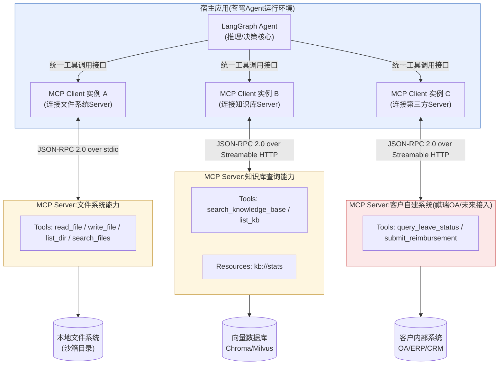
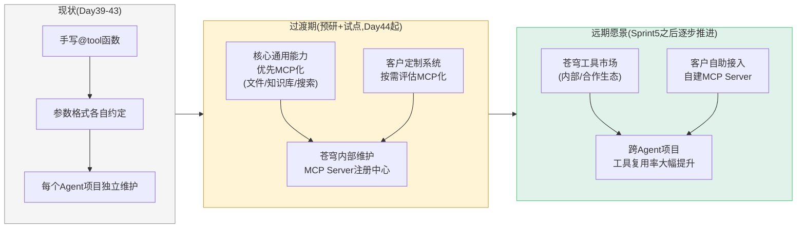
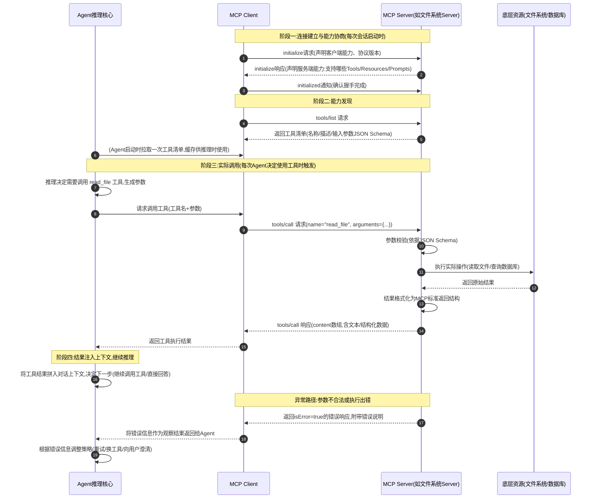
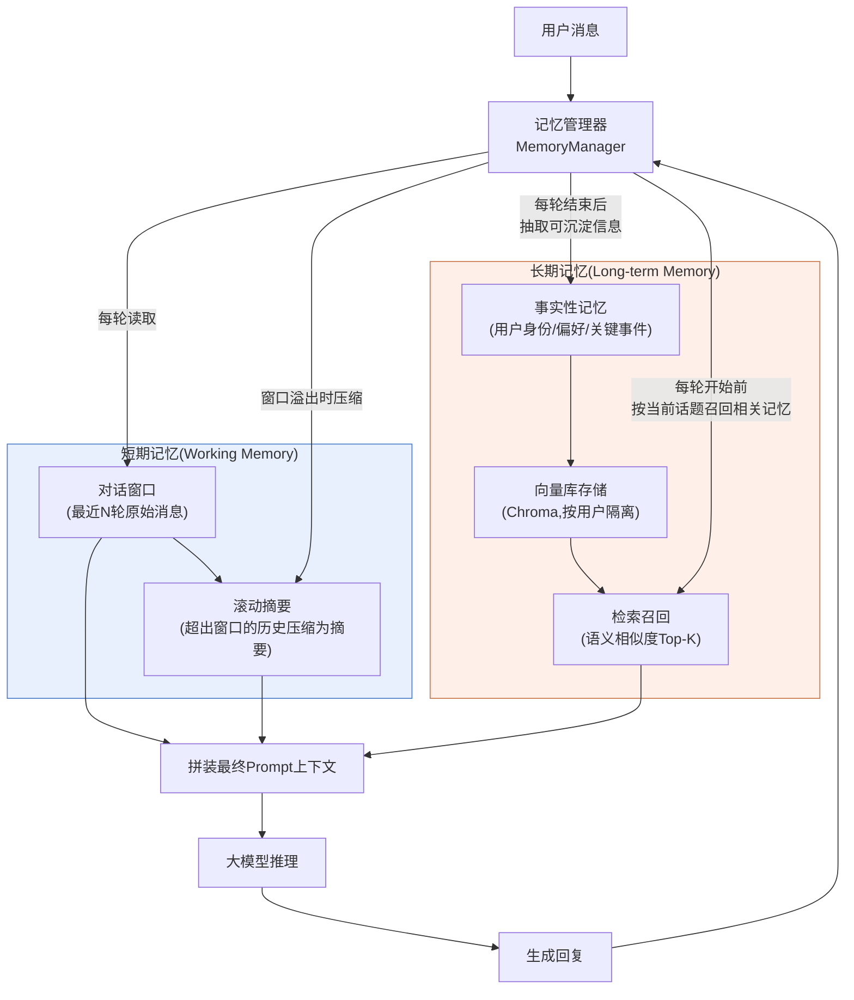

# 第44天:MCP与Agent生态

> **星期**:周四(入职第44天,转正之后的第30天,第七周周四)
> **对应Sprint**:Sprint 4 · Agent基础(Day39-45)—— 今天是本Sprint倒数第二天,昨天(Day43)团队刚刚跑通"搜索员+分析师+报告撰写员"三角色协作的多Agent研究团队demo,今天转向一个更偏"地基"性质的预研课题:工具生态的标准化接入方式。明天(Day45)是本Sprint收官日,周测之后会接触低代码平台。
> **飞书任务号**:CQ-286(MCP协议技术预研与选型评估)、CQ-287(自建MCP Server开发与Agent联调验证)、CQ-288(Agent记忆系统设计预研——短期/长期记忆架构)
> **参与人**:陈铭、苏梦、韩露、张凡(导师王振宇主持);产品经理林悦(生态规划视角列席上午会议);CTO郭建军(未出席,委托老王代为把控预研方向)
> **今日关键词**:MCP协议 / JSON-RPC 2.0 / Tools-Resources-Prompts三原语 / stdio与Streamable HTTP传输 / FastMCP / MCP Client / 工具生态标准化 / 短期记忆滑动窗口 / 长期记忆向量存储 / 用户偏好画像 / 记忆写入与召回策略

---

## 【旁白】

如果说Day39到Day43这五天,团队走的是一条"能力升级"的直线——从手写ReAct到框架化Agent,从单一Agent到LangGraph可视化编排,再到Supervisor模式下的多Agent协作,每一天解决的都是"Agent自己能不能干活、干得好不好"的问题,那么今天要走的,是一条完全不同方向的岔路。这条岔路不问"Agent能不能干活",而是问一个更朴素、也更容易被工程师忽略的问题:"Agent和外部世界打交道的方式,将来会不会散架?"

这个问题的紧迫性,其实在Day40就已经埋下种子。那天陈铭第一次用`@tool`装饰器给Agent装上搜索、代码执行、文件读写能力的时候,写法很直接——每个工具是一个Python函数,签名、文档字符串、返回值格式,全部由陈铆自己约定。这在一个人、一个项目里没有任何问题。可老王当时提了一句看似不起眼的话:"你现在给这个Agent接了三个工具,如果将来苍穹平台要接三十个、三百个工具,分布在不同团队、不同服务、甚至不同客户的私有环境里,你打算怎么管?"陈铭当时没太当回事,觉得"不就是多写几个`@tool`函数"。可到了Day43,当研究团队里的分析师Agent需要调用搜索员Agent产出的中间结果,报告撰写员又需要调用一个独立的"格式化"工具时,林悦提的一个问题让这件事变得具体起来——她问的是"客户如果想让这个多Agent系统去调用他们自己内部的ERP系统查库存,这个'调用'今天要怎么接?是不是每接一个新系统,我们都要重新写一遍工具定义、重新维护一套认证逻辑、重新踩一遍参数校验的坑?"

这正是MCP(Model Context Protocol)要解决的问题。它不是一个"让Agent变得更聪明"的技术,恰恰相反,它是一个"让Agent接入外部世界的方式变得不那么随意"的协议——用老王的话讲,"这是给工具连接定的一套普通话,不然每个团队、每个工具都在讲方言,最后谁也听不懂谁"。今天团队要做的,不是急着把MCP塞进苍穹的生产代码里,而是完成一次严肃的技术预研:搞懂这套协议到底解决了什么问题、它的成本和收益分别是什么、以及——如果苍穹真的要在未来的工具生态里采用它,应该在哪个层次上采用。

这次预研在整本书的技术脉络里,其实呼应着一个更早的伏笔。Day9,老王在白板上画出`BaseModel → OpenAIModel/QwenModel`的继承结构图时,团队第一次意识到"模型接入层"需要一层抽象来屏蔽不同厂商API的差异。今天面对的其实是同一类问题的另一个维度:如果说Day9解决的是"怎么统一接入不同的大脑",那么MCP要尝试回答的是"怎么统一接入不同的手和脚"——工具、数据源、外部服务,这些让Agent真正能"干活"的能力,如果每接一个都要重新设计一套接口规范,长期来看的维护成本会比模型接入层的问题严重得多,因为模型的种类是有限的几家大厂,而客户可能需要接入的外部系统,理论上是无穷的。

这一天的预研任务书上,老王写了这样一句话:"预研的目的不是得出'要不要用MCP'这一个是非判断,而是把'什么时候用、用在哪一层、代价是什么'这几个问题的答案想清楚。"这句话预告了今天课堂笔记的基本走向——不是简单地学一个新框架的API,而是带着架构师视角去审视一个新协议。与此同时,下午的另一条主线——Agent记忆系统设计——看似跳出了MCP这个话题,实际上和上午的内容共享着同一种思维方式:如果工具生态需要标准化接口来避免混乱,那么Agent自身"记住什么、怎么记、记多久"这件事,同样需要一套清晰的架构设计,而不是散落在各处的临时变量。这两条线索会在明天(Day45)之前收束成一个共同的认知——苍穹要从"能跑的Demo"真正长成"可持续演进的平台",靠的从来不是某个惊艳的单点技术,而是这类容易被忽视、却决定了长期生命力的标准化设计。

---

## 晨会纪要 / 今日目标

**时间**:上午9:00,二层小会议室"听雨"
**出席**:王振宇(老王)、陈铭、苏梦、韩露、张凡;林悦临时列席前20分钟

陈铭进会议室时,发现老王没有像往常一样直接站到白板前,而是先把笔记本电脑连上投影,屏幕上开着一个GitHub仓库页面,标题是"Model Context Protocol"。苏梦小声跟韩露咨询:"这是新框架?"韩露摇头:"看名字不像框架,像协议,跟HTTP、WebSocket那种东西是一类。"

老王等大家坐定,开口先总结昨天:"昨天研究团队的demo,搜索员查资料、分析师做归纳、报告撰写员出结论,三个角色分工清楚,Supervisor调度也稳定,这一点做得不错。晚上我又看了一遍你们提交的代码,有个细节我想单独说一下——陈铭,你给分析师Agent写的那个'获取搜索员中间结果'的工具,参数结构和你给报告撰写员写的'获取分析结果'工具,几乎是复制粘贴改了个名字,对吧?"

陈铭愣了一下,老实承认:"对,我图省事,反正逻辑差不多。"

"这就是我今天想讲的问题的起点。"老王调出昨天的代码截图,"三个工具,写法各不相同,一个用字典传参,一个用Pydantic模型,一个直接传字符串拼接。这在你们三个人手写的demo里没关系,因为你们互相知道对方写了什么。但你们设想一下,如果苍穹平台真的要对接三十个客户系统的接口——祺瑞集团的OA审批系统、御风金融的风控接口、将来寰宇集团十几个业务部门各自的数据系统——每接一个,都要重新商量一套参数格式、重新写一套错误处理,这个成本会指数级增长。这不是'代码写得好不好'的问题,是'有没有一套统一的规矩'的问题。"

林悦这时补充了一句业务背景:"上周跟祺瑞集团那边初步沟通试点扩展需求的时候,他们的信息中心负责人问了我一个问题,我当时没能回答得特别好——他问'你们这个Agent系统,以后能不能像插U盘一样,接入我们别的系统?'我当时的回答是'可以,但每次接入都需要开发对接',对方明显有点犹豫,因为这意味着每次都要走一遍开发排期。这件事我一直记着,今天正好听老王说要预研MCP,我想请你们重点评估一下——这个协议,能不能让'接入新系统'这件事,变得像'装一个插件'那么轻。"

老王点头:"这正是今天的核心问题。今天我们不写苍穹的生产代码,今天是纯粹的技术预研加验证性开发——先把MCP协议本身搞透,再自己动手写一个MCP Server,接入到Agent里跑通,用实际的开发体感去回答'这套协议好不好用、值不值得引入'这个问题。下午还有第二条线,跟今天上午看似无关,但其实是同一类问题——Agent的记忆系统设计。你们做了这么多天的Agent,有没有想过一个问题:今天研究团队的三个Agent,聊完这一轮任务,所有的中间过程、讨论内容,是不是全部就地清零了?"

张凡想了想:"应该是的,LangGraph的State跑完这次调用就结束了,除非有Checkpointer持久化。"

"对,现在的持久化解决的是'工作流状态能不能恢复',但还没有解决一个更贴近产品体验的问题——如果同一个用户,今天和Agent聊了一次,明天再来聊,Agent应该记得他上次说过什么、他的偏好是什么。这不是简单地把整个对话历史存进数据库,那样成本会爆炸,而且模型的上下文窗口也装不下。这就需要区分短期记忆和长期记忆两种不同的机制,分别用不同的方式存、不同的方式取。这是下午的重点。"

**今日目标**:

1. 上午9:00-9:20:晨会,明确今日预研任务边界与产出标准(见需求文档)。
2. 上午9:20-10:30:MCP协议详解——JSON-RPC 2.0基础、协议的核心问题域、三大原语(Tools/Resources/Prompts)、生命周期与能力协商、传输层(stdio/Streamable HTTP)。
3. 上午10:30-12:00:对比分析MCP与现有Function Calling方案的异同,评估MCP在苍穹工具生态中的定位;试用官方与社区已有的MCP Server(文件系统类、开发工具类)建立直观感受。
4. 下午13:30-15:30:MCP Server开发实战——使用Python SDK(`mcp`包/FastMCP)自建两个MCP Server(文件系统操作类、知识库查询类),并接入到一个Agent中完成端到端调用验证。
5. 下午15:30-17:30:Agent记忆系统设计——短期记忆(滑动窗口/摘要压缩)与长期记忆(向量库存储用户偏好与事实性记忆)的架构设计与代码实现。
6. 下午17:30-18:00:今日预研结论汇总,老王主持简短评审,给出"苍穹是否引入MCP"的阶段性判断意见,记入预研报告。

**昨日进展回顾(Day43)**:

- 完成基于LangGraph Supervisor模式的"研究团队"多Agent协作demo,搜索员、分析师、报告撰写员三个角色分工明确,任务分派与结果汇总链路跑通。
- 陈铭在复盘中提到"多Agent之间传递中间结果时,各自的工具参数格式不统一",当时被记录为"待观察的技术债",今天升级成正式的预研课题。

**风险点**:

- MCP是相对新的协议,官方文档、社区案例的更新速度很快,老王要求团队"以官方SDK文档为准,遇到与网上博客不一致的地方,优先信SDK源码里的实际行为"。
- 今天是"预研+验证性开发"性质的一天,不是正式项目开发,老王特别强调"今天写的MCP Server代码不进`main`分支,单独开`research/mcp-poc`分支,验证结论比代码本身更重要,别本末倒置"。
- 下午记忆系统的内容和上午MCP内容看似是两条独立的线,团队精力容易分散,老王要求"上午的内容今天必须收口,不要拖到下午,不然两条线都会做得潦草"。

---

## 需求文档:《MCP协议预研与苍穹工具生态接入方案·任务书》

> 撰写人:王振宇(技术负责人) · 协作:林悦(产品经理,生态规划视角) · 执行人:陈铭 · 文档编号:CQ-PRD-D44-01 · 版本:v1.0(预研启动版)

### 背景

苍穹平台当前的Agent编排层(Sprint4搭建中)已经具备工具调用能力,但工具的定义、注册、参数校验、错误处理,目前都是"团队内部约定俗成"的写法,分散在各个业务模块的代码里,没有统一的对外接入标准。随着苍穹未来要服务的客户数量增多(海纳制造集团、祺瑞集团,以及规划中的更多客户),每个客户都可能希望把自己内部的业务系统(ERP、OA、CRM、自建数据库等)接入到苍穹的Agent能力中。如果继续沿用"每接一个系统就手写一套工具适配代码"的模式,随着客户数量和系统数量的增长,开发与维护成本将呈现难以控制的增长曲线,同时也会导致工具代码质量参差不齐、复用度低、安全边界不清晰等问题。

MCP(Model Context Protocol,模型上下文协议)是Anthropic于2024年底开源并逐渐成为行业事实标准的一套协议,目标正是"为大模型应用与外部数据源/工具之间的连接,提供一套统一的开放标准",其定位常被类比为"AI应用领域的USB-C接口"——不同厂商的工具、数据源,只要按照MCP协议封装成一个MCP Server,就可以被任何支持MCP协议的Agent客户端(MCP Client)直接接入使用,而不需要为每一个Agent应用单独重新开发适配代码。本次预研的目的,是评估苍穹平台是否应当在工具接入层引入MCP协议,如果引入,应当采用何种落地策略。

### 预研目标(用户故事视角)

| 编号 | 用户故事 | 说明 |
|---|---|---|
| US-01 | 作为苍穹的架构负责人,我希望搞清楚MCP协议的核心设计思想与能力边界,以判断它是否适合作为苍穹工具接入层的标准化方案 | 对应上午理论学习 |
| US-02 | 作为苍穹的开发工程师,我希望知道如何快速开发一个符合MCP规范的Server,并评估其开发成本是否可控 | 对应下午实战开发 |
| US-03 | 作为苍穹的产品经理,我希望知道引入MCP之后,"客户自己的系统接入苍穹"这件事,是否真的能从"需要开发排期"变成"配置级接入" | 对应林悦提出的业务问题 |
| US-04 | 作为苍穹的技术负责人,我希望评估MCP协议在安全边界、权限控制、多租户隔离等企业级场景下是否有已知的成熟实践或明显的短板 | 对应企业级落地评估 |

### 预研任务列表

| 序号 | 任务 | 产出形式 | 负责人 |
|---|---|---|---|
| 1 | 梳理MCP协议核心概念(JSON-RPC基础、Tools/Resources/Prompts三原语、生命周期、传输层) | 学习笔记 | 陈铭 |
| 2 | 试用至少1个官方/社区MCP Server(建议:文件系统类),记录接入体验 | 体验记录 | 陈铭、苏梦 |
| 3 | 自研一个文件系统操作类MCP Server,覆盖读/写/列目录/搜索能力 | 可运行代码 | 陈铭 |
| 4 | 自研一个知识库查询类MCP Server,包装现有RAG检索能力 | 可运行代码 | 陈铭 |
| 5 | 开发一个最小化MCP Client,接入上述两个Server,并与一个LangGraph Agent打通端到端调用 | 可运行代码+调用录屏(文字化记录) | 陈铭 |
| 6 | 输出《MCP协议评估结论与苍穹落地建议》 | 评估文档 | 陈铭(老王复核) |

### 非功能性评估维度(企业级视角,必须覆盖)

- **安全边界**:MCP Server如果暴露文件系统、数据库等敏感能力,权限模型是否清晰?是否存在"Agent被诱导执行越权操作"的风险(与Day18学过的Prompt注入防御思路是否有交叉)?
- **可观测性**:MCP协议调用链路是否方便记录日志、追踪调用耗时、定位失败原因?
- **多租户隔离**:同一个MCP Server,是否能安全地服务多个客户,数据不串号?
- **性能开销**:相比直接的Function Calling手写工具,引入MCP协议层是否带来明显的延迟增加?
- **生态成熟度**:社区现有的MCP Server数量、质量、维护活跃度如何,是否值得直接复用而非自己重复开发?

### 验收标准

1. 团队至少一人能够独立、无参考资料地讲清楚MCP协议的三大原语分别解决什么问题,以及它与Function Calling的本质区别。
2. 至少产出2个可运行的自研MCP Server(文件系统类、知识库查询类),并有实际的Agent端到端调用记录。
3. 输出的评估文档必须包含明确的落地建议(而不是"看情况"这种模糊结论),建议需要区分"现阶段"与"未来12个月内"两个时间维度。
4. 老王复核通过评估文档的技术准确性与结论的可执行性。

---

## 架构设计图

### 图一:MCP标准化协议架构——Agent如何通过统一协议接入多个工具与数据源



这张图要传达的核心信息是"关注点分离"。Agent本身(推理核心)不需要知道文件系统是怎么读写的、知识库是用Chroma还是Milvus存的、祺瑞集团的OA系统接口是SOAP还是REST——它只需要通过一套统一的MCP Client接口,拿到"有哪些工具可用、每个工具的参数是什么、调用之后返回什么格式",剩下的脏活累活,全部交给各自的MCP Server去处理。这和Day9学的模型接入层抽象(`BaseModel → OpenAIModel/QwenModel`)是同一种设计哲学在不同层次上的复用:上层永远只依赖一个稳定的抽象接口,下层的具体实现可以自由替换、独立演进。图中特意用不同颜色标出了"苍穹自己维护的Server"(黄色,文件系统、知识库)和"客户自建系统对接的Server"(红色,祺瑞OA),这正是回应林悦提出的那个业务问题——一旦这套标准建立起来,祺瑞集团只需要把自己的OA系统包装成一个符合MCP规范的Server(这部分开发工作甚至可以由客户自己的IT团队完成,苍穹只提供接入规范),苍穹这边的Agent不需要为每个客户重新开发一套适配代码,只需要在配置里"注册"一个新的MCP Server连接即可。

### 图二:苍穹未来工具生态战略图——从"手写工具"到"标准化生态"的演进路径



这张图是老王在下午收尾会上临时在白板上补画的一版"战略草图"的还原,他画完之后说了一句让陈铭印象很深的话:"预研不是为了今天就把所有工具都改成MCP,那是本末倒置,也不现实——今天很多老代码改造成本高、收益还没验证清楚。预研真正要做的,是先把'新增的、通用的、面向多客户复用的'能力,优先按MCP标准来做,老代码留着,观察半年,如果这条路走得通,再考虑逐步迁移。"这也解释了为什么今天的预研范围只包含"文件系统"和"知识库查询"这两个相对通用、风险可控的能力,而不是直接去改造已经在跑的Function Calling工具代码——用可控的小范围试点,去验证一个战略方向是否成立,这本身也是一种工程上的谨慎。

---

## 流程图:MCP Client与MCP Server之间的通信流程



这张流程图特意分了四个阶段来讲,是因为陈铭在上午学习时犯过一个典型的理解误区——他一开始以为"Agent每次要用工具,都要重新走一遍`initialize`握手流程",这其实是把"会话级别的操作"和"调用级别的操作"搞混了。老王后来纠正:"你把MCP连接想象成给手机连一次WiFi——连上、协商好网速和权限,这个动作一次会话只做一次;之后你打开各种App发消息、刷视频,用的都是同一条已经连好的连接,不需要每次都重新连WiFi。`initialize`和`tools/list`对应的是'连WiFi'这一步,`tools/call`对应的才是你日常真正在用的那部分,而且可以反复调用很多次。"图里特意把"连接建立与能力协商"和"实际调用"分成两个独立的阶段框,就是为了强化这个认知。另外图里也画出了异常路径——这不是可选项,而是企业级场景下必须认真设计的部分,因为一旦Server端返回结构不规范的错误,Agent很可能"理解"不了这是一次失败,反而把错误信息当成正常结果去做后续推理,这也是下午写代码时反复强调的一个坑。

---

## 示意图:Agent短期记忆与长期记忆架构



这张示意图是老王用来讲清楚"短期记忆"和"长期记忆"本质区别的核心工具,他讲解时打了一个陈铭一下子就懂了的比喻:"短期记忆就像你现在正在开的这场会,你记得刚才三句话都说了什么,但会一开完,具体每一句原话你很快就忘了,你只记得'大概讨论了MCP要不要接入'这个结论——这就是滚动摘要在做的事情。长期记忆则完全不同,它更像你对一个老同事的了解——你不会记得他上个月每一次开会具体说了哪句话,但你记得他'不喜欢会议超过一小时'、'技术判断一般比较靠谱',这些是经过反复交互沉淀下来的、跨越很多次具体对话的稳定认知,这才是长期记忆真正该存的东西。"这段话直接决定了下午代码实现的设计取向——短期记忆的实现重点是"如何优雅地丢弃/压缩",而长期记忆的实现重点是"如何准确地抽取、去重、召回",这是两套完全不同的工程问题,不能用同一种数据结构、同一套逻辑去解决。

---

## 课堂笔记

### 上午:MCP协议详解

老王开场没有直接讲MCP,而是先带团队做了一次"回顾式提问":"Day19我们学Function Calling的时候,工具是怎么接给模型的?"

苏梦答得很快:"我们把工具的名字、描述、参数的JSON Schema,写进请求体里的`tools`字段,模型看到用户的问题之后,判断要不要调用某个工具,如果要调用,就返回一个结构化的调用请求,包含工具名和参数,然后我们本地执行这个函数,把结果重新发回给模型。"

"没错,这套机制本身没有问题,"老王说,"Function Calling解决的是'模型怎么表达它想用工具'这一层问题——本质上是模型输出格式的约定。但它完全没有规定'工具本身应该长成什么样、放在哪里、怎么被发现、怎么被安全地调用'。这些问题,在只有三五个工具、都是你自己写的时候感觉不出来,但一旦工具数量变多、来源变杂,这些没被规定的部分,就会变成一地鸡毛。MCP要解决的,恰恰是Function Calling这套机制之外、更底层的连接与治理问题。"

**MCP到底是什么**

老王给出了一个相对严谨的定义,并让大家记进笔记:MCP(Model Context Protocol,模型上下文协议)是一套开放协议,用于标准化"AI应用"(通常称为Host,比如苍穹的Agent运行环境、Claude Desktop、各种IDE插件)与"上下文提供者"(MCP Server,可以是文件系统、数据库、第三方API、企业内部系统)之间的连接方式。它规定了双方之间应该用什么消息格式通信、应该有哪些标准化的能力类型、以及连接建立与断开的完整生命周期。

陈铭在笔记本上画了一个简化对照表,记录老王讲的类比:

| 类比对象 | 对应关系 |
|---|---|
| USB-C接口标准 | MCP协议规范本身 |
| 任意一个USB-C设备(鼠标、键盘、硬盘) | 一个具体的MCP Server |
| 电脑上的USB-C接口与驱动 | MCP Client及其所在的Host应用 |
| "插上就能用,不需要为每个设备单独装专属接口" | Agent接入新工具/数据源时,不需要为每个来源单独开发适配代码 |

老王补充了一句,提醒大家不要把类比理解得过于绝对:"USB-C这个类比讲的是'标准化带来的即插即用',但不要因此以为MCP解决了所有问题——工具本身该怎么设计、参数该怎么定义、安全边界该怎么划,这些'内容'层面的问题,MCP协议本身不负责,它负责的是'连接方式'这个'渠道'层面的标准化。这个区分很重要,预研报告里要写清楚,不然容易把MCP的作用夸大。"

**JSON-RPC 2.0:MCP的消息格式基础**

老王强调,理解MCP的第一步,是理解它的消息传输格式建立在JSON-RPC 2.0之上,这不是MCP自己发明的,而是一个更早、更通用的远程调用协议规范。他在白板上写了一个最简单的请求/响应示例:

请求(Client发给Server):
```json
{
  "jsonrpc": "2.0",
  "id": 1,
  "method": "tools/call",
  "params": {
    "name": "read_file",
    "arguments": {"path": "/data/report.md"}
  }
}
```

响应(Server返回给Client):
```json
{
  "jsonrpc": "2.0",
  "id": 1,
  "result": {
    "content": [
      {"type": "text", "text": "这是文件的内容……"}
    ],
    "isError": false
  }
}
```

"注意这里的`id`字段,"老王特别点出,"JSON-RPC要求请求和响应通过`id`一一对应,因为底层通信可能是异步的、并发的——一个Client可能同时向Server发出好几个请求,响应回来的顺序不一定和发出的顺序一致,靠`id`才能对上号。这跟你们Day13学的异步编程里`asyncio.gather`并发发起多个请求、再各自等待结果返回的场景,是同一类工程问题。"

除了请求/响应这种"一问一答"的模式,JSON-RPC还有一种"通知"(Notification)——没有`id`字段,发出去之后不需要、也不会收到响应,单纯用来告知对方"某件事发生了"。MCP协议里,像"我(Client)已经完成初始化握手"这类消息,就是用通知的方式发送的,因为这不需要对方给出业务性的回应。

**MCP的三大核心原语**

老王把MCP协议里Server端可以暴露的能力,归纳成三类,并要求大家理解每一类"谁在主动决定使用它"这个关键区别:

1. **Tools(工具)**——模型主导型能力。这是最接近Function Calling概念的部分:一个具体的、有明确输入参数、有明确执行动作、有返回结果的函数,比如"读取某个文件"、"查询知识库"、"提交一个报销申请"。是否调用某个Tool,由大模型自己在推理过程中决定,这一点和Function Calling完全一致——MCP的Tools本质上可以理解为"Function Calling的标准化封装版"。

2. **Resources(资源)**——应用主导型能力。这类似于一个可以被读取的数据端点,比如"某个知识库的统计信息"、"某个项目的README文件内容"。关键区别在于,Resources通常不是由大模型自主决定去"调用"的,而是由Host应用根据某种逻辑主动拉取,再作为上下文提供给模型,有点类似于传统Web开发里的GET接口,是"读数据"而不是"执行动作"。

3. **Prompts(提示词模板)**——用户主导型能力。这是MCP里相对小众但设计很巧妙的一环:Server可以预先定义一些结构化的提示词模板,暴露给用户在界面上选择使用(比如"帮我总结这份文档"这种预置的快捷指令模板),用户主动触发之后,由Host应用把填好参数的完整Prompt发给模型。

老王画了一张简表帮大家记住这个区别:

| 原语 | 决策方 | 典型用途 | 类比 |
|---|---|---|---|
| Tools | 大模型自主决定 | 执行动作、查询数据 | Function Calling |
| Resources | Host应用主导拉取 | 提供背景上下文数据 | REST GET接口 |
| Prompts | 用户主动选择触发 | 预置的快捷任务模板 | IDE里的代码片段/命令面板 |

"今天下午我们要写的两个Server,主要会用到Tools这一个原语,"老王说,"Resources我们会稍微涉及一点(用来暴露知识库的统计信息),Prompts今天不展开,但你们要知道它存在,以及它解决的是什么问题——不要把MCP简单理解成'又一种Function Calling的写法',它的能力边界比Function Calling更宽。"

**生命周期与能力协商**

这一部分对应流程图里画的"阶段一:连接建立与能力协商"。老王强调这是很多初学者容易忽略、但企业级场景下必须重视的一环:MCP连接建立时,Client和Server要先做一次`initialize`握手,双方各自声明自己支持哪些协议版本、哪些能力(比如Server是否支持Resources的订阅更新、Client是否支持向Server发起Sampling请求)。这个协商过程存在的意义在于——MCP协议本身是持续演进的,不同版本的Client和Server之间需要有一种"礼貌地互相确认能力边界"的方式,而不是假设对方一定支持所有功能。

"这跟你们做前后端联调时经常会遇到的接口版本兼容问题是一回事,"老王说,"如果没有能力协商这一步,新版本的Client连到老版本的Server上,调用了一个老Server根本不支持的功能,程序直接报错崩溃,用户体验很差。有了能力协商,至少可以在连接建立的第一步就发现'这个功能对方不支持',提前做优雅降级,而不是等实际调用的时候才炸。"

**传输层:stdio与Streamable HTTP**

老王讲到这里,特意停下来问了一个问题:"如果Server和Client在同一台机器上,比如你本地开发时,IDE插件调用一个本地跑起来的MCP Server,你觉得应该用什么方式通信最简单?"

张凡想了想:"进程间通信?管道之类的?"

"对,MCP官方定义的第一种传输方式就是stdio(标准输入输出)——Server作为一个子进程被Client启动,两者之间通过标准输入、标准输出流,一行一行地传递JSON-RPC消息。这种方式的好处是简单、不需要额外的网络配置、天然进程隔离比较安全,非常适合本地开发工具、命令行工具类的场景。但它有个明显的局限——Server必须和Client在同一台机器上,没法给远程的、多个客户端共享同一个Server实例。"

"那如果Server要部署在云端,给很多客户端远程调用呢?"陈铭问。

"这就是第二种传输方式要解决的问题——基于HTTP的传输。MCP协议早期版本用的是HTTP+SSE(Server-Sent Events)的组合,你们在Day24学流式接口的时候接触过SSE,这里的用法类似,SSE负责服务端向客户端推送流式的响应内容。但SSE这种方案在实际使用中暴露出一些工程问题,比如连接管理复杂、某些网络环境和代理对长连接不友好,所以协议后续版本演进出了'Streamable HTTP'传输方式,本质上是用标准的HTTP POST请求发起调用,响应可以是普通的JSON,也可以升级成流式返回,兼容性和部署便利性都更好一些。今天下午我们自己写Server的时候会用stdio,因为它最适合本地开发验证;但预研报告里要写清楚,如果苍穹未来要把MCP Server作为独立的远程服务部署给客户调用,应该关注和验证的是Streamable HTTP这条路径,而不是stdio。"

**MCP与Function Calling:到底是替代关系还是互补关系**

这是上午临近结束时,林悦在旁听时提出的一个问题,也是预研报告里必须回答清楚的核心问题之一。老王给出的答案是:"不是替代关系,是分层关系。"他画了一张示意表来说明:

| 层次 | Function Calling负责的部分 | MCP额外补充的部分 |
|---|---|---|
| 模型如何表达"我要用工具" | ✅ 已经很成熟 | 沿用,不重复发明 |
| 工具从哪里来、怎么被发现 | ❌ 没有标准 | ✅ Server端`tools/list`统一暴露 |
| 工具实现放在哪里、怎么部署 | ❌ 没有标准 | ✅ 独立进程/服务,与Agent代码解耦 |
| 不同应用之间工具能否复用 | ❌ 各自为战 | ✅ 只要符合MCP规范即可跨应用复用 |
| 安全边界与权限控制 | ❌ 靠开发者自己设计 | 部分规范建议,但仍需应用层自行加固 |

"你可以理解为,"老王总结,"MCP Server内部实现某一个具体Tool的时候,最终执行的那段代码逻辑,该干什么还是干什么,该做参数校验还是要做,该处理异常还是要处理——这些具体的工程要求一点都没有减少。MCP改变的,是这段代码的'边界'和'门面'——它不再是写死在某一个Agent项目内部的一个私有函数,而是变成了一个可以被任何遵循MCP协议的客户端发现和调用的、相对独立的服务单元。"

**试用现成的MCP Server:建立直观体感**

上午的最后半小时,老王要求团队实际试用一个官方维护的MCP Server——`@modelcontextprotocol/server-filesystem`(社区常用的文件系统类Server),通过MCP Inspector工具(官方提供的调试界面)连接上去,浏览它暴露出来的工具列表和参数结构。

陈铭在笔记里记录了这次试用的直观感受:"打开Inspector连上这个Server,能看到`list_directory`、`read_file`、`search_files`这几个工具,每个工具的参数结构、说明都写得很清楚,点一下'调用'就能实际执行,不需要看它内部源码是怎么写的。这种体验确实和直接调一个陌生的REST API不太一样——它自带了'工具清单+参数说明'这一层自描述能力,调试的时候心里更有底。"苏梦补充了一个对比感受:"感觉有点像Postman测REST接口,但不需要提前知道接口文档在哪、参数是什么,Server自己就把这些信息暴露出来了。"

老王对这个感受给了肯定,同时提醒了一句需要写进预研报告的关键点:"这种'自描述'带来的调试体验提升是真实的,但也要注意,这意味着一旦某个MCP Server被恶意方接入或者被篡改,它暴露的工具清单和参数说明,同时也变成了攻击者更容易理解攻击面的信息。这跟Day18讲的Prompt注入防御是同一类安全思维——功能越强大、越自描述,潜在的安全边界设计要求也越高,不能因为好用就忽视这一层。"

### 下午:MCP Server开发实战 + Agent记忆系统设计

**从零搭建第一个MCP Server**

下午一开始,老王把电脑投影切到终端,现场敲命令,带大家把开发环境搭起来。

```bash
pip install mcp
pip install "mcp[cli]"
```

"这个`mcp`包是官方提供的Python SDK,"老王边敲边讲,"里面有一个叫`FastMCP`的高层封装类,用装饰器的方式定义工具,写法跟你们Day23学FastAPI时的路由装饰器几乎是一个思路——用`@app.get`定义一个GET接口,这里就是用`@mcp.tool()`定义一个工具。同一套心智模型可以直接迁移过来用,不需要从零学一套新的编程范式。"

他现场写了一个只有几行的最小示例,让大家先建立直观感受:

```python
from mcp.server.fastmcp import FastMCP

mcp = FastMCP("demo-server")

@mcp.tool()
def add(a: int, b: int) -> int:
    """计算两个整数的和"""
    return a + b

if __name__ == "__main__":
    mcp.run(transport="stdio")
```

"就这么几行,"老王说,"跑起来之后,这个进程就是一个符合MCP协议的Server,它会自动根据函数签名和类型注解,生成`add`这个工具对外暴露的JSON Schema参数描述,你不需要手写Schema。这一点跟Day18你们学结构化输出、要自己手写JSON Schema的体验完全不一样——SDK帮你把这层"翻译"工作做掉了。"

陈铭在笔记里写下这句话作为今天最重要的心得之一:"MCP Server开发的核心工作量,其实并不在'怎么符合协议'这件事上——SDK已经把协议层面的活全包了,真正的工作量还是在'工具本身的业务逻辑要写对、写安全、写健壮',这跟写一个普通的后端接口没有本质区别,只是'门面'换了一层。"

**实战一:文件系统操作类MCP Server**

老王给的第一个实战任务是:开发一个沙箱化的文件系统操作MCP Server,覆盖"列目录"、"读文件"、"写文件"、"搜索文件"、"获取文件信息"五个能力,并且要求必须做路径安全校验,不允许通过`../`这类路径穿越手法访问沙箱目录之外的内容。

"为什么强调沙箱化?"老王在陈铭动手写代码前先问了这个问题。

陈铭想了想回答:"因为如果这个Server真的被某个Agent调用,而Agent的决策依据来自用户输入甚至是外部数据(比如从网页上抓回来的内容),万一里面藏了恶意指令,想诱导Agent去读取或者删除服务器上的敏感文件,如果没有路径限制,后果会很严重。"

"对,这正是MCP Server开发里最容易被忽视、但企业级场景下最不能忽视的一点,"老王说,"协议本身不会替你做这层防护,防护逻辑必须是你自己在Server内部写清楚的业务代码。"

**实战二:知识库查询类MCP Server**

第二个实战任务,是把苍穹现有的RAG检索能力(海纳制造集团项目里已经跑通的混合检索+Rerank流水线)包装成一个MCP Server,对外暴露"检索知识库"、"列出可用知识库"两个工具,并暴露一个"知识库统计信息"的Resource。

"这个任务的意义,"老王强调,"不只是练习MCP开发,更重要的是验证一件事——我们现有的RAG能力,是不是可以不经过大改造,就用一层MCP的'外壳'包装起来,直接对外提供服务?如果验证下来改造成本很低,这就是一个很有说服力的落地场景:苍穹的知识库能力,未来完全可以作为一个独立的MCP Server,被苍穹自己的Agent调用,也可以被客户自己的其他AI应用调用,不需要重新开发对接代码。"

**MCP Client端的开发:让Agent真正用起来**

写完两个Server只是完成了一半,老王强调下午真正的验收标准是"端到端跑通",这意味着还需要一个MCP Client,负责启动、连接这两个Server,把它们暴露的工具转换成Agent推理框架(LangGraph/LangChain)能直接使用的工具格式,再挂载到一个真正的Agent上。

"这一步的工程价值,其实比写Server本身更大,"老王说,"因为它验证的是'标准化协议'到底有没有真正带来复用价值——如果Client端的适配代码写一次,就可以适配任意数量的、任意来源的MCP Server,而不需要为每个新Server重写一遍适配逻辑,这才是MCP真正的复用红利所在。"

团队用林悦提出的"能不能让客户像插U盘一样接入系统"这句话,作为验收这一步工作的直观标准——最终写出来的MCP Client Manager,新增一个MCP Server连接,只需要在配置里加一条记录,不需要改动Agent的核心推理代码,这个目标在下午5点前基本达成,老王现场确认通过。

**Agent记忆系统设计:为什么现在是合适的时机**

下午三点半左右,团队完成了MCP的实战部分,进入第二条主线。老王开场先讲了讲"为什么MCP和记忆系统,放在同一天讲"这个问题——这不是随意的课程编排,而是有意为之:"MCP解决的是Agent与外部世界(工具、数据源)打交道的标准化问题,记忆系统解决的是Agent与'时间'打交道的标准化问题——用户今天说的话,明天还要不要记得?这两个问题看似不相关,但本质上都是'苍穹要不要长期演进成一个真正的产品平台,而不是一堆能跑的Demo'这个大问题下面的两个具体子问题。"

老王接着抛出一个具体场景,要求团队分析:"假设一个用户,已经和苍穹的Agent对话了五十轮,你觉得,把这五十轮的原始对话全部塞进下一次请求的上下文里,会有什么问题?"

韩露很快答出第一层问题:"上下文窗口装不下,而且token成本会越来越高,五十轮对话可能已经好几万字了。"

老王点头,又追问:"假设模型的上下文窗口足够大,能装得下,还有问题吗?"

这次是苏梦想了一会儿说:"如果全塞进去,里面可能有很多和当前问题完全无关的历史内容,会不会反而干扰模型的注意力,让它抓不住重点?"

"这两点都对,"老王总结,"第一点是硬性的成本与容量约束,第二点是更隐蔽的、关于'相关性'的问题——这也是为什么记忆系统不能简单粗暴地'全存全塞',而必须分层设计。"

**短期记忆:滑动窗口与滚动摘要**

老王讲解短期记忆设计时,强调它要解决的核心问题是"最近发生的事情,原汁原味地记住,但不能无限增长"。他给出两种常见策略,并要求团队理解各自的取舍:

第一种是**滑动窗口**——只保留最近N轮对话的原始消息,超出窗口的直接丢弃。这种方式实现简单、成本可控,缺点是"丢弃"就是真的丢弃,一旦某个较早的信息在后续对话中被重新问到,模型完全没有记忆。

第二种是**滚动摘要**——当对话轮数超过窗口容量时,不是直接丢弃最早的几轮,而是用一次额外的LLM调用,把这些即将被移出窗口的对话内容压缩成一段精炼的摘要,追加到"历史摘要"里,随着对话继续进行,这个摘要会被反复更新、滚动累积。这种方式能够在有限的token预算内,保留更长时间跨度的信息,但代价是多了一次额外的LLM调用,而且压缩过程本身可能丢失细节甚至引入偏差。

"苍穹现有的Memory机制,Day27已经实现过一部分——`RunnableWithMessageHistory`加窗口记忆、摘要记忆,那时候你们已经写过滑动窗口和摘要压缩的雏形代码了,"老王提醒,"今天下午要做的,是把这套机制,重新放进'短期记忆'这个更完整的概念框架里理解,并且要考虑跟MCP工具调用、跟长期记忆之间怎么协同工作,而不是孤立地看待。"

**长期记忆:向量库存储用户偏好与事实性记忆**

老王讲长期记忆的设计时,先明确了它和短期记忆的本质区别:"短期记忆存的是'对话内容',长期记忆存的是从对话中提炼出来的、有长期价值的'结论性事实'。"他举了一个例子:"用户在对话里说'我们公司系统的时区统一用UTC+8,以后你给我算时间都按这个来',这句话本身是一次性的对话内容,但它背后蕰含的信息——'这个用户的时区偏好是UTC+8'——是一条值得长期记住的事实性记忆,哪怶用户下周再来问一个完全不相关的问题,这条偏好信息依然应该在恰当的时候被召回、被使用。"

长期记忆的实现,今天选用向量数据库(沿用苍穹已经在RAG项目里用熟的Chroma)作为存储底座,老王给出的设计要点包括:

1. **抽取(Extraction)**:不是把整段对话原封不动存进去,而是用一次LLM调用,专门从对话中提炼出"值得沉淀的事实/偏好",通常表达为简短的陈述句。
2. **去重与合并(Dedup & Merge)**:新提炼出的记忆,要先和已有记忆做语义相似度比较,如果发现和已有记忆高度相似或者矛盾(比如用户改变了之前的偏好),要做合并或更新,而不是无脑地不断堆积重复甚至冲突的记忆条目。
3. **召回(Retrieval)**:每次新的对话开始或者进行中,根据当前话题,从长期记忆库中检索出语义相关性最高的若干条记忆,拼入Prompt上下文,而不是把整个记忆库都塞进去。
4. **归属隔离(Scoping)**:记忆必须按用户(甚至按客户租户)严格隔离存储和检索,这是企业级场景下绝对不能出错的红线——绝不能出现用户A的偏好信息被检索出来、混入用户B的对话上下文中的情况。

"第四点,"老王特别加重语气,"是今天下午代码实现里,我会重点检查的一处。这不是锦上添花的功能,是安全底线。"

**记忆系统与MCP的隐性联系**

下午收尾前,老王抛出了一个让陈铭当场愣了几秒的问题:"你们觉得,长期记忆这套东西,将来要不要考虑用MCP的方式对外暴露?"

陈铭想了想,试着回答:"如果把'查询用户长期记忆'也做成一个MCP的Tool或者Resource,那不同的Agent应用,甚至苍穹之外的其他系统,理论上都可以通过同一套协议去读取和写入用户的记忆,而不需要重新对接一套私有的记忆存储接口?"

"完全正确,"老王说,"这也是为什么今天要把MCP和记忆系统安排在同一天讲——你现在应该已经能体会到,MCP作为一层标准化协议,它的价值不只局限于'工具调用'这个最初的场景,任何'需要被跨应用、跨Agent复用的能力',理论上都可以考虑用同一种标准化的方式对外暴露。这也是我们今天预研报告里,除了'工具接入'之外,应该额外补一条前瞻性建议的原因——记忆系统的对外接口设计,可以提前参考MCP的思路,即便现阶段不直接实现成MCP Server。"

这句话为代码实战部分定下了一个隐性的设计取向:虽然今天写的记忆系统本身不强制要求包装成MCP Server,但代码接口的设计风格,会有意识地向"未来可以平滑迁移成MCP Server"的方向靠拢。

---

## 代码实战

今天的代码实战分为两大块,一共八个文件。第一块是MCP协议相关代码,包括两个自研MCP Server(文件系统操作类、知识库查询类)、一个MCP Client管理器、一个接入LangGraph的Agent演示脚本。第二块是Agent记忆系统代码,包括短期记忆模块、长期记忆模块、统一的记忆管理器,以及一个把MCP能力和记忆系统整合在一起的端到端演示脚本。所有代码遵循苍穹平台既有的工程规范——PEP8风格、类与函数配中文docstring、关键业务逻辑配中文行内注释解释"为什么这么做"。今天的代码不进`main`分支,单独开在`research/mcp-poc`分支上,验证结论比代码归档本身更重要。

### 文件一:`backend/app/services/mcp/servers/filesystem_server.py`(沙箱文件系统MCP Server)

```python
"""
苍穹平台 MCP 预研:沙箱文件系统 MCP Server

本模块实现一个符合 MCP(Model Context Protocol)规范的服务端,
对外暴露一组经过安全限制的文件系统操作能力:
    - list_directory:列出目录内容
    - read_file:读取文件内容
    - write_file:写入文件内容
    - search_files:按关键词搜索文件
    - get_file_info:获取文件元信息(大小/修改时间/类型)

安全设计说明(企业级场景下不可省略的部分):
    1. 所有路径操作都被限制在一个预先配置的"沙箱根目录"之内,
       任何试图通过 ".." 之类的路径穿越手法访问沙箱之外内容的请求,
       都会被显式拒绝并返回明确的错误信息,而不是静默失败。
    2. 写文件操作限制单次写入的最大字节数,避免被恶意或异常调用
       用来做资源耗尽型攻击。
    3. 所有操作都记录审计日志,便于事后追踪"这个 Agent 到底做了什么"。

启动方式(stdio 传输,适合本地开发与验证):
    python filesystem_server.py

预研范围说明:本文件仅用于 Day44 技术预研与验证性开发,
不进入苍穹平台生产分支 main,统一维护在 research/mcp-poc 分支。
"""

from __future__ import annotations

import logging
import os
import time
from dataclasses import dataclass
from pathlib import Path
from typing import List

from mcp.server.fastmcp import FastMCP

# ------------------------------------------------------------------
# 基础配置
# ------------------------------------------------------------------

# 沙箱根目录:所有文件操作都被强制限制在这个目录以内。
# 生产环境中,这个路径应当来自配置中心而非硬编码,这里为了
# 预研阶段的可读性,直接写成模块级常量。
SANDBOX_ROOT = Path(os.environ.get("MCP_FS_SANDBOX_ROOT", "./mcp_sandbox")).resolve()

# 单次写入允许的最大字节数,超出则拒绝执行,避免被用于资源耗尽型滥用。
MAX_WRITE_BYTES = 1024 * 1024  # 1MB

# 单次搜索最多返回的文件数量,避免大目录下搜索结果过于庞大。
MAX_SEARCH_RESULTS = 50

logging.basicConfig(
    level=logging.INFO,
    format="%(asctime)s [filesystem-mcp] %(levelname)s %(message)s",
)
logger = logging.getLogger("filesystem_mcp_server")

# 确保沙箱根目录一定存在,避免第一次调用时因为目录不存在而报错。
SANDBOX_ROOT.mkdir(parents=True, exist_ok=True)


class PathSecurityError(Exception):
    """当请求路径尝试跳出沙箱范围时抛出的专用异常。"""


def _resolve_safe_path(relative_path: str) -> Path:
    """
    将客户端传入的相对路径,安全地解析为沙箱内的绝对路径。

    这是整个文件系统 Server 里最关键的一个安全函数:任何工具函数
    在真正读写文件之前,都必须先调用这个函数完成路径校验,
    绝不允许把客户端传入的路径直接拼接后使用。

    参数:
        relative_path: 客户端传入的相对路径,例如 "docs/report.md"。

    返回:
        经过校验、确认位于沙箱根目录之内的绝对路径对象。

    异常:
        PathSecurityError: 当解析后的路径跳出沙箱范围时抛出。
    """
    # 拼接后立刻做 resolve(),这一步会把 ".." 等相对路径符号
    # 真正"展开"成实际的绝对路径,而不能只做字符串层面的检查——
    # 字符串检查很容易被诸如 "a/../../b" 这类变体绕过。
    candidate = (SANDBOX_ROOT / relative_path).resolve()

    # 用 relative_to 判断 candidate 是否仍然处于沙箱根目录之下,
    # 如果不是,relative_to 会抛出 ValueError,我们统一转换成
    # 更明确的业务异常,方便上层捕获并返回清晰的错误提示。
    try:
        candidate.relative_to(SANDBOX_ROOT)
    except ValueError as exc:
        raise PathSecurityError(
            f"路径 '{relative_path}' 试图访问沙箱目录之外的内容,已拒绝。"
        ) from exc

    return candidate


@dataclass
class AuditRecord:
    """一条审计日志记录,描述某次工具调用的关键信息。"""

    tool_name: str
    arguments: dict
    success: bool
    detail: str
    timestamp: float


_audit_log: List[AuditRecord] = []


def _write_audit(tool_name: str, arguments: dict, success: bool, detail: str) -> None:
    """
    记录一条审计日志。

    企业级场景下,任何一次涉及文件读写的工具调用都应当留痕,
    这不是可选项——一旦出现异常行为(比如 Agent 被诱导批量删除文件),
    审计日志是排查问题、定位责任的第一手依据。
    """
    record = AuditRecord(
        tool_name=tool_name,
        arguments=arguments,
        success=success,
        detail=detail,
        timestamp=time.time(),
    )
    _audit_log.append(record)
    level = logging.INFO if success else logging.WARNING
    logger.log(level, "工具=%s 参数=%s 成功=%s 详情=%s",
                tool_name, arguments, success, detail)


# ------------------------------------------------------------------
# MCP Server 实例与工具定义
# ------------------------------------------------------------------

mcp = FastMCP(
    name="cangqiong-filesystem-server",
    instructions=(
        "这是苍穹平台预研用的沙箱文件系统服务,所有操作都被限制在一个"
        "独立的沙箱目录内,不会影响宿主机上的其他文件。"
    ),
)


@mcp.tool()
def list_directory(path: str = ".") -> str:
    """
    列出指定目录下的文件与子目录。

    参数:
        path: 相对于沙箱根目录的路径,默认为根目录本身。

    返回:
        一段格式化的文本,逐行列出目录下的条目及其类型(文件/目录)。
    """
    try:
        target_dir = _resolve_safe_path(path)
        if not target_dir.exists():
            detail = f"目录不存在:{path}"
            _write_audit("list_directory", {"path": path}, False, detail)
            return f"错误:{detail}"
        if not target_dir.is_dir():
            detail = f"路径不是目录:{path}"
            _write_audit("list_directory", {"path": path}, False, detail)
            return f"错误:{detail}"

        entries = []
        for item in sorted(target_dir.iterdir()):
            kind = "目录" if item.is_dir() else "文件"
            size_info = "" if item.is_dir() else f",{item.stat().st_size}字节"
            entries.append(f"[{kind}] {item.name}{size_info}")

        result_text = "\n".join(entries) if entries else "(空目录)"
        _write_audit("list_directory", {"path": path}, True, f"共{len(entries)}项")
        return result_text
    except PathSecurityError as exc:
        _write_audit("list_directory", {"path": path}, False, str(exc))
        return f"错误:{exc}"
    except Exception as exc:  # noqa: BLE001 —— 工具函数需要兜底,避免异常直接抛给协议层
        logger.exception("list_directory 执行异常")
        _write_audit("list_directory", {"path": path}, False, str(exc))
        return f"错误:执行list_directory时发生未预期的异常:{exc}"


@mcp.tool()
def read_file(path: str, max_chars: int = 4000) -> str:
    """
    读取沙箱内指定文件的文本内容。

    参数:
        path: 相对于沙箱根目录的文件路径。
        max_chars: 最多返回的字符数,避免一次性把超大文件全部塞进
            模型的上下文,默认4000字符,超出部分会被截断并明确提示。

    返回:
        文件的文本内容(可能被截断),或者错误说明。
    """
    try:
        target_file = _resolve_safe_path(path)
        if not target_file.exists():
            detail = f"文件不存在:{path}"
            _write_audit("read_file", {"path": path}, False, detail)
            return f"错误:{detail}"
        if not target_file.is_file():
            detail = f"路径不是文件:{path}"
            _write_audit("read_file", {"path": path}, False, detail)
            return f"错误:{detail}"

        content = target_file.read_text(encoding="utf-8", errors="replace")
        truncated = False
        if len(content) > max_chars:
            content = content[:max_chars]
            truncated = True

        _write_audit("read_file", {"path": path}, True, f"读取{len(content)}字符")
        if truncated:
            content += f"\n\n[提示:内容已截断至{max_chars}字符,原文件更长]"
        return content
    except PathSecurityError as exc:
        _write_audit("read_file", {"path": path}, False, str(exc))
        return f"错误:{exc}"
    except UnicodeDecodeError:
        detail = "文件不是有效的UTF-8文本文件,可能是二进制文件"
        _write_audit("read_file", {"path": path}, False, detail)
        return f"错误:{detail}"
    except Exception as exc:  # noqa: BLE001
        logger.exception("read_file 执行异常")
        _write_audit("read_file", {"path": path}, False, str(exc))
        return f"错误:执行read_file时发生未预期的异常:{exc}"


@mcp.tool()
def write_file(path: str, content: str, overwrite: bool = False) -> str:
    """
    向沙箱内指定路径写入文本内容。

    参数:
        path: 相对于沙箱根目录的文件路径。
        content: 要写入的文本内容。
        overwrite: 如果目标文件已存在,是否允许覆盖,默认不允许,
            这是为了防止 Agent 因为推理失误而意外覆盖已有的重要文件。

    返回:
        操作结果说明。
    """
    try:
        # 写入前先做体量校验,避免被用来做资源耗尽型的滥用调用。
        content_bytes = content.encode("utf-8")
        if len(content_bytes) > MAX_WRITE_BYTES:
            detail = (
                f"写入内容大小{len(content_bytes)}字节,"
                f"超过单次写入上限{MAX_WRITE_BYTES}字节"
            )
            _write_audit("write_file", {"path": path}, False, detail)
            return f"错误:{detail}"

        target_file = _resolve_safe_path(path)
        if target_file.exists() and not overwrite:
            detail = f"文件已存在且未允许覆盖:{path}"
            _write_audit("write_file", {"path": path}, False, detail)
            return f"错误:{detail}(如需覆盖,请显式传入overwrite=True)"

        # 确保父目录存在,避免因为目录不存在而写入失败。
        target_file.parent.mkdir(parents=True, exist_ok=True)
        target_file.write_text(content, encoding="utf-8")

        _write_audit("write_file", {"path": path}, True, f"写入{len(content_bytes)}字节")
        return f"成功:已写入 {len(content_bytes)} 字节到 {path}"
    except PathSecurityError as exc:
        _write_audit("write_file", {"path": path}, False, str(exc))
        return f"错误:{exc}"
    except Exception as exc:  # noqa: BLE001
        logger.exception("write_file 执行异常")
        _write_audit("write_file", {"path": path}, False, str(exc))
        return f"错误:执行write_file时发生未预期的异常:{exc}"


@mcp.tool()
def search_files(keyword: str, path: str = ".") -> str:
    """
    在指定目录下(递归)搜索文件名包含关键词的文件。

    参数:
        keyword: 搜索关键词,大小写不敏感。
        path: 搜索的起始目录,相对于沙箱根目录,默认为根目录。

    返回:
        匹配到的文件相对路径列表,最多返回 MAX_SEARCH_RESULTS 条。
    """
    try:
        start_dir = _resolve_safe_path(path)
        if not start_dir.exists() or not start_dir.is_dir():
            detail = f"搜索起始目录不存在或不是目录:{path}"
            _write_audit("search_files", {"keyword": keyword, "path": path}, False, detail)
            return f"错误:{detail}"

        keyword_lower = keyword.lower()
        matches = []
        for item in start_dir.rglob("*"):
            if item.is_file() and keyword_lower in item.name.lower():
                matches.append(str(item.relative_to(SANDBOX_ROOT)))
                if len(matches) >= MAX_SEARCH_RESULTS:
                    break

        _write_audit(
            "search_files", {"keyword": keyword, "path": path}, True,
            f"命中{len(matches)}个文件",
        )
        if not matches:
            return f"未找到文件名包含'{keyword}'的文件"
        return "\n".join(matches)
    except PathSecurityError as exc:
        _write_audit("search_files", {"keyword": keyword, "path": path}, False, str(exc))
        return f"错误:{exc}"
    except Exception as exc:  # noqa: BLE001
        logger.exception("search_files 执行异常")
        _write_audit("search_files", {"keyword": keyword, "path": path}, False, str(exc))
        return f"错误:执行search_files时发生未预期的异常:{exc}"


@mcp.tool()
def get_file_info(path: str) -> str:
    """
    获取指定文件或目录的元信息(大小、修改时间、类型)。

    参数:
        path: 相对于沙箱根目录的路径。

    返回:
        格式化的元信息文本,或者错误说明。
    """
    try:
        target = _resolve_safe_path(path)
        if not target.exists():
            detail = f"路径不存在:{path}"
            _write_audit("get_file_info", {"path": path}, False, detail)
            return f"错误:{detail}"

        stat_result = target.stat()
        kind = "目录" if target.is_dir() else "文件"
        modified_time = time.strftime(
            "%Y-%m-%d %H:%M:%S", time.localtime(stat_result.st_mtime)
        )
        info_lines = [
            f"路径:{path}",
            f"类型:{kind}",
            f"大小:{stat_result.st_size}字节",
            f"最后修改时间:{modified_time}",
        ]
        _write_audit("get_file_info", {"path": path}, True, "查询成功")
        return "\n".join(info_lines)
    except PathSecurityError as exc:
        _write_audit("get_file_info", {"path": path}, False, str(exc))
        return f"错误:{exc}"
    except Exception as exc:  # noqa: BLE001
        logger.exception("get_file_info 执行异常")
        _write_audit("get_file_info", {"path": path}, False, str(exc))
        return f"错误:执行get_file_info时发生未预期的异常:{exc}"


if __name__ == "__main__":
    logger.info("沙箱文件系统 MCP Server 启动,沙箱根目录:%s", SANDBOX_ROOT)
    # 预研阶段统一使用 stdio 传输,由 Client 以子进程方式启动本脚本。
    mcp.run(transport="stdio")
```

### 文件二:`backend/app/services/mcp/servers/knowledge_base_server.py`(知识库查询MCP Server)

```python
"""
苍穹平台 MCP 预研:知识库查询 MCP Server

本模块把苍穹现有的 RAG 检索能力(参考 Day30-33 已经跑通的
混合检索 + Rerank 流水线)包装成一个符合 MCP 规范的服务端,
对外暴露以下能力:
    Tools:
        - search_knowledge_base:在指定知识库中做语义检索
        - list_knowledge_bases:列出当前可用的知识库
    Resources:
        - kb://{kb_id}/stats:某个知识库的统计信息(文档数/分块数/更新时间)

设计目的:验证"现有RAG能力是否可以低成本地用MCP协议对外暴露",
而不是重新实现一套检索逻辑。因此本文件内部的向量检索部分,
使用与Day29-30教学一致的Chroma向量库,做了简化但保留核心结构,
生产环境应直接复用 backend/app/services/rag 下已有的检索模块。

预研范围说明:本文件仅用于 Day44 技术预研,统一维护在
research/mcp-poc 分支,不进入 main。
"""

from __future__ import annotations

import logging
import os
import time
from dataclasses import dataclass, field
from typing import Dict, List, Optional

import chromadb
from chromadb.utils import embedding_functions
from mcp.server.fastmcp import FastMCP

logging.basicConfig(
    level=logging.INFO,
    format="%(asctime)s [kb-mcp] %(levelname)s %(message)s",
)
logger = logging.getLogger("knowledge_base_mcp_server")

# ------------------------------------------------------------------
# 知识库配置:预研阶段用一个简化的静态注册表模拟苍穹平台的
# 多知识库管理能力,生产环境应当从数据库/配置中心动态加载。
# ------------------------------------------------------------------

CHROMA_PERSIST_DIR = os.environ.get("MCP_KB_CHROMA_DIR", "./mcp_kb_store")

# Embedding模型沿用Day29教学选型:中文效果好、可本地部署的bge系列。
# 预研阶段为了减少环境依赖,允许通过环境变量切换到更轻量的模型。
EMBEDDING_MODEL_NAME = os.environ.get(
    "MCP_KB_EMBEDDING_MODEL", "BAAI/bge-small-zh-v1.5"
)


@dataclass
class KnowledgeBaseMeta:
    """一个知识库的元信息,用于 list_knowledge_bases 与 Resource 展示。"""

    kb_id: str
    display_name: str
    description: str
    created_at: float = field(default_factory=time.time)


class KnowledgeBaseRegistry:
    """
    知识库注册表:维护"知识库ID -> Chroma Collection"的映射关系,
    并提供检索、统计、列表等基础能力。

    这个类之所以单独抽出来,而不是把逻辑直接堆在MCP工具函数里,
    是为了保持"MCP协议适配层"和"具体业务逻辑"的分离——
    未来如果知识库检索的底层实现从Chroma换成Milvus(苍穹生产环境
    的真实选型),只需要改这个类的内部实现,MCP工具函数完全不用动。
    """

    def __init__(self, persist_dir: str, embedding_model_name: str) -> None:
        self._client = chromadb.PersistentClient(path=persist_dir)
        self._embedding_fn = embedding_functions.SentenceTransformerEmbeddingFunction(
            model_name=embedding_model_name
        )
        self._meta_registry: Dict[str, KnowledgeBaseMeta] = {}

    def ensure_kb(self, kb_id: str, display_name: str, description: str) -> None:
        """
        确保某个知识库(Collection)存在,如果不存在则创建。

        这是一个幂等操作,重复调用不会产生副作用,方便在Server启动时
        统一初始化几个演示用的知识库。
        """
        self._client.get_or_create_collection(
            name=kb_id, embedding_function=self._embedding_fn
        )
        self._meta_registry[kb_id] = KnowledgeBaseMeta(
            kb_id=kb_id, display_name=display_name, description=description
        )

    def add_documents(self, kb_id: str, docs: List[str], ids: Optional[List[str]] = None) -> None:
        """向指定知识库批量写入文档分块(用于预研阶段快速灌入演示数据)。"""
        collection = self._client.get_or_create_collection(
            name=kb_id, embedding_function=self._embedding_fn
        )
        doc_ids = ids or [f"{kb_id}-doc-{i}" for i in range(len(docs))]
        collection.add(documents=docs, ids=doc_ids)

    def search(self, kb_id: str, query: str, top_k: int = 3) -> List[dict]:
        """
        在指定知识库中做语义检索,返回最相关的若干条文档片段。

        参数:
            kb_id: 知识库ID。
            query: 用户的自然语言查询。
            top_k: 返回结果数量。

        返回:
            每条结果是一个字典,包含 text(文本内容)与 score(相关度距离)。
        """
        if kb_id not in self._meta_registry:
            raise KeyError(f"知识库不存在:{kb_id}")

        collection = self._client.get_or_create_collection(
            name=kb_id, embedding_function=self._embedding_fn
        )
        raw_result = collection.query(query_texts=[query], n_results=top_k)

        results = []
        documents = raw_result.get("documents", [[]])[0]
        distances = raw_result.get("distances", [[]])[0]
        for doc_text, distance in zip(documents, distances):
            results.append({"text": doc_text, "score": distance})
        return results

    def list_all(self) -> List[KnowledgeBaseMeta]:
        """列出当前已注册的全部知识库元信息。"""
        return list(self._meta_registry.values())

    def get_stats(self, kb_id: str) -> dict:
        """获取指定知识库的统计信息:文档分块数量、注册时间。"""
        if kb_id not in self._meta_registry:
            raise KeyError(f"知识库不存在:{kb_id}")
        collection = self._client.get_or_create_collection(name=kb_id)
        meta = self._meta_registry[kb_id]
        return {
            "kb_id": kb_id,
            "display_name": meta.display_name,
            "description": meta.description,
            "chunk_count": collection.count(),
            "created_at": time.strftime(
                "%Y-%m-%d %H:%M:%S", time.localtime(meta.created_at)
            ),
        }


# ------------------------------------------------------------------
# 初始化注册表,并灌入少量演示数据(模拟海纳制造集团设备手册片段)
# ------------------------------------------------------------------

registry = KnowledgeBaseRegistry(
    persist_dir=CHROMA_PERSIST_DIR, embedding_model_name=EMBEDDING_MODEL_NAME
)

registry.ensure_kb(
    kb_id="equipment_manual_demo",
    display_name="设备手册知识库(预研演示数据)",
    description="模拟海纳制造集团设备手册片段,仅用于MCP预研演示",
)
registry.add_documents(
    kb_id="equipment_manual_demo",
    docs=[
        "XJ-3200A型注塑机的额定转速为每分钟1800转,超过此转速运行需申请技术评估。",
        "XJ-3200A型注塑机的保养周期分为三级:月度检查液压油位,季度更换密封圈,"
        "年度进行整机拆检与精度校准。",
        "设备出现报警代码E-207时,通常表示冷却水温度传感器异常,应首先检查传感器接线。",
    ],
)

mcp = FastMCP(
    name="cangqiong-knowledge-base-server",
    instructions="这是苍穹平台预研用的知识库检索服务,内置演示用的设备手册片段数据。",
)


@mcp.tool()
def search_knowledge_base(kb_id: str, query: str, top_k: int = 3) -> str:
    """
    在指定知识库中检索与查询语义相关的文档片段。

    参数:
        kb_id: 知识库ID,可通过 list_knowledge_bases 工具查看可用列表。
        query: 用户的自然语言查询问题。
        top_k: 返回的相关片段数量,默认3条。

    返回:
        格式化的检索结果文本,包含每条片段的内容与相关度。
    """
    try:
        results = registry.search(kb_id=kb_id, query=query, top_k=top_k)
        if not results:
            return f"知识库'{kb_id}'中未检索到与'{query}'相关的内容。"

        lines = [f"在知识库'{kb_id}'中检索到{len(results)}条相关内容:"]
        for idx, item in enumerate(results, start=1):
            lines.append(f"{idx}. {item['text']}(相关度距离:{item['score']:.4f})")
        return "\n".join(lines)
    except KeyError as exc:
        return f"错误:{exc}"
    except Exception as exc:  # noqa: BLE001
        logger.exception("search_knowledge_base 执行异常")
        return f"错误:检索时发生未预期的异常:{exc}"


@mcp.tool()
def list_knowledge_bases() -> str:
    """
    列出当前所有可用的知识库及其简要说明。

    返回:
        每行一个知识库的ID、名称与描述。
    """
    all_kbs = registry.list_all()
    if not all_kbs:
        return "当前没有任何已注册的知识库。"
    lines = []
    for kb in all_kbs:
        lines.append(f"[{kb.kb_id}] {kb.display_name} —— {kb.description}")
    return "\n".join(lines)


@mcp.resource("kb://{kb_id}/stats")
def get_kb_stats_resource(kb_id: str) -> str:
    """
    以 Resource 形式暴露某个知识库的统计信息。

    与 Tool 的区别在于:这个能力通常由 Host 应用主动拉取,作为
    背景上下文提供给模型,而不是由模型自主决定"要不要调用统计接口"。

    参数:
        kb_id: 知识库ID。

    返回:
        统计信息的文本描述。
    """
    try:
        stats = registry.get_stats(kb_id)
        return (
            f"知识库[{stats['kb_id']}] {stats['display_name']}\n"
            f"描述:{stats['description']}\n"
            f"分块数量:{stats['chunk_count']}\n"
            f"注册时间:{stats['created_at']}"
        )
    except KeyError as exc:
        return f"错误:{exc}"


if __name__ == "__main__":
    logger.info("知识库查询 MCP Server 启动,持久化目录:%s", CHROMA_PERSIST_DIR)
    mcp.run(transport="stdio")
```

### 文件三:`backend/app/services/mcp/client/mcp_client_manager.py`(MCP Client管理器)

```python
"""
苍穹平台 MCP 预研:MCP Client 管理器

本模块负责:
    1. 根据配置,以子进程方式启动并连接多个 MCP Server(stdio传输)。
    2. 统一拉取每个 Server 暴露的工具清单。
    3. 把 MCP 工具转换成 LangChain 兼容的 Tool 对象,方便直接挂载给
       LangGraph Agent 使用,而不需要为每个 MCP Server 单独写适配代码。
    4. 提供统一的连接生命周期管理(建立连接、断开连接),
       避免子进程泄漏。

这是今天预研任务里验证"标准化协议是否真的带来复用价值"的核心模块——
理想情况下,新增一个MCP Server,只需要在配置里加一条记录,
不需要改动这个管理器的任何代码逻辑。

预研范围说明:本文件仅用于 Day44 技术预研,统一维护在
research/mcp-poc 分支,不进入 main。
"""

from __future__ import annotations

import asyncio
import json
import logging
from contextlib import AsyncExitStack
from dataclasses import dataclass
from typing import Any, Dict, List, Optional

from mcp import ClientSession, StdioServerParameters
from mcp.client.stdio import stdio_client

logging.basicConfig(
    level=logging.INFO,
    format="%(asctime)s [mcp-client] %(levelname)s %(message)s",
)
logger = logging.getLogger("mcp_client_manager")


@dataclass
class MCPServerConfig:
    """
    描述一个待连接的 MCP Server 的启动配置。

    属性:
        name: Server的逻辑名称,用于日志与工具名前缀,避免不同
            Server之间的工具名冲突(比如两个Server都有一个叫
            "search"的工具时,靠这个name做区分)。
        command: 启动Server子进程的可执行命令,例如 "python"。
        args: 启动命令的参数列表,例如 ["filesystem_server.py"]。
        env: 传给子进程的额外环境变量(可选)。
    """

    name: str
    command: str
    args: List[str]
    env: Optional[Dict[str, str]] = None


@dataclass
class MCPToolDescriptor:
    """
    描述一个从某个 MCP Server 拉取到的工具的完整信息。

    这是本管理器对外暴露的统一工具视图,不管这个工具实际来自
    哪个Server,调用方(Agent层)看到的都是同样的结构,这正是
    标准化协议带来的"屏蔽差异"价值所在。
    """

    server_name: str
    tool_name: str
    qualified_name: str  # 加上server前缀后的全局唯一名称,如 "fs__read_file"
    description: str
    input_schema: dict


class MCPClientManager:
    """
    统一管理多个 MCP Server 连接的客户端管理器。

    典型用法:
        manager = MCPClientManager()
        await manager.connect_all([config_a, config_b])
        tools = manager.list_tool_descriptors()
        result = await manager.call_tool("fs__read_file", {"path": "a.txt"})
        await manager.disconnect_all()
    """

    def __init__(self) -> None:
        # AsyncExitStack 用来统一管理所有连接的生命周期,
        # 保证 disconnect_all 时能够按正确的顺序清理全部子进程与会话。
        self._exit_stack = AsyncExitStack()
        self._sessions: Dict[str, ClientSession] = {}
        self._tool_registry: Dict[str, MCPToolDescriptor] = {}
        self._connected = False

    async def connect_all(self, configs: List[MCPServerConfig]) -> None:
        """
        依次连接配置列表中的每一个 MCP Server,并拉取其工具清单。

        参数:
            configs: 待连接的 Server 配置列表。
        """
        if self._connected:
            raise RuntimeError("MCPClientManager 已经处于连接状态,不能重复连接")

        for config in configs:
            await self._connect_one(config)
        self._connected = True
        logger.info(
            "全部 MCP Server 连接完成,共接入 %d 个Server,%d 个工具",
            len(configs), len(self._tool_registry),
        )

    async def _connect_one(self, config: MCPServerConfig) -> None:
        """连接单个 MCP Server,并把它暴露的工具注册进统一工具表。"""
        server_params = StdioServerParameters(
            command=config.command, args=config.args, env=config.env,
        )

        # stdio_client 会以子进程方式启动Server,并返回一对
        # 读写流,ClientSession 在这对流的基础上完成协议层的封装。
        read_stream, write_stream = await self._exit_stack.enter_async_context(
            stdio_client(server_params)
        )
        session = await self._exit_stack.enter_async_context(
            ClientSession(read_stream, write_stream)
        )

        # 对应流程图里的阶段一:连接建立与能力协商。
        await session.initialize()
        self._sessions[config.name] = session

        # 对应流程图里的阶段二:能力发现,拉取工具清单。
        tools_response = await session.list_tools()
        for tool in tools_response.tools:
            qualified_name = f"{config.name}__{tool.name}"
            descriptor = MCPToolDescriptor(
                server_name=config.name,
                tool_name=tool.name,
                qualified_name=qualified_name,
                description=tool.description or "(无描述)",
                input_schema=tool.inputSchema or {},
            )
            self._tool_registry[qualified_name] = descriptor
            logger.info("已注册工具:%s(来自Server:%s)", qualified_name, config.name)

    def list_tool_descriptors(self) -> List[MCPToolDescriptor]:
        """返回当前已连接的所有 Server 汇总起来的工具描述列表。"""
        return list(self._tool_registry.values())

    async def call_tool(self, qualified_name: str, arguments: dict) -> str:
        """
        调用某个已注册的工具,并返回文本形式的执行结果。

        这是对应流程图"阶段三:实际调用"的具体实现,内部会自动
        根据 qualified_name 找到正确的 Server 会话去发起调用,
        调用方完全不需要关心底层是哪个 Server、哪种传输方式。

        参数:
            qualified_name: 工具的全局唯一名称,例如 "fs__read_file"。
            arguments: 调用该工具所需的参数字典。

        返回:
            工具执行结果的文本表示。如果执行失败,返回值中会
            包含明确的错误说明,而不是抛出异常中断整个Agent流程——
            这是为了让Agent能够"观察到失败"并自主决定下一步动作,
            而不是让一次工具调用失败直接打断整个对话。
        """
        descriptor = self._tool_registry.get(qualified_name)
        if descriptor is None:
            return f"错误:未找到名为'{qualified_name}'的工具,请检查工具名是否正确。"

        session = self._sessions.get(descriptor.server_name)
        if session is None:
            return f"错误:工具所属的Server'{descriptor.server_name}'当前未连接。"

        try:
            result = await session.call_tool(descriptor.tool_name, arguments=arguments)
            # MCP 的调用结果是一个 content 数组,每个元素可能是文本、
            # 图片等不同类型,预研阶段我们只处理文本类型,拼接返回。
            text_parts = []
            for content_item in result.content:
                if getattr(content_item, "type", None) == "text":
                    text_parts.append(content_item.text)
                else:
                    text_parts.append(f"[非文本内容:{getattr(content_item, 'type', '未知类型')}]")
            combined_text = "\n".join(text_parts) if text_parts else "(工具返回了空结果)"

            if getattr(result, "isError", False):
                logger.warning("工具'%s'返回了错误结果:%s", qualified_name, combined_text)
            return combined_text
        except Exception as exc:  # noqa: BLE001 —— 网络/协议层异常需要兜底
            logger.exception("调用工具'%s'时发生异常", qualified_name)
            return f"错误:调用工具'{qualified_name}'时发生异常:{exc}"

    def to_openai_function_schemas(self) -> List[dict]:
        """
        把当前注册的所有 MCP 工具,转换成 OpenAI/DeepSeek 兼容的
        Function Calling 工具schema格式,方便直接喂给ChatModel。

        这一步是"标准协议"与"现有Function Calling生态"之间的
        桥接层——不管工具最初来自哪个MCP Server,最终在模型看来,
        都是一份统一格式的 tools 参数列表。
        """
        schemas = []
        for descriptor in self._tool_registry.values():
            schemas.append({
                "type": "function",
                "function": {
                    "name": descriptor.qualified_name,
                    "description": descriptor.description,
                    "parameters": descriptor.input_schema or {
                        "type": "object", "properties": {}, "required": [],
                    },
                },
            })
        return schemas

    async def disconnect_all(self) -> None:
        """断开全部连接,清理子进程,释放资源。"""
        await self._exit_stack.aclose()
        self._sessions.clear()
        self._tool_registry.clear()
        self._connected = False
        logger.info("全部 MCP Server 连接已断开")


async def _self_check_demo() -> None:
    """
    一个不依赖 pytest 的自检脚本,方便预研阶段用 `python -m` 直接跑一下,
    确认管理器本身的连接、发现、调用流程能够端到端跑通。
    """
    manager = MCPClientManager()
    configs = [
        MCPServerConfig(
            name="fs", command="python",
            args=["backend/app/services/mcp/servers/filesystem_server.py"],
        ),
        MCPServerConfig(
            name="kb", command="python",
            args=["backend/app/services/mcp/servers/knowledge_base_server.py"],
        ),
    ]
    await manager.connect_all(configs)

    print("已发现的工具:")
    for descriptor in manager.list_tool_descriptors():
        print(f"  - {descriptor.qualified_name}:{descriptor.description}")

    write_result = await manager.call_tool(
        "fs__write_file", {"path": "hello.txt", "content": "苍穹MCP预研测试内容", "overwrite": True}
    )
    print("写文件结果:", write_result)

    read_result = await manager.call_tool("fs__read_file", {"path": "hello.txt"})
    print("读文件结果:", read_result)

    kb_result = await manager.call_tool(
        "kb__search_knowledge_base",
        {"kb_id": "equipment_manual_demo", "query": "注塑机的保养周期是怎样的", "top_k": 2},
    )
    print("知识库检索结果:", kb_result)

    await manager.disconnect_all()


if __name__ == "__main__":
    asyncio.run(_self_check_demo())
```

### 文件四:`backend/app/services/agent/mcp_agent_demo.py`(接入MCP能力的Agent端到端演示)

```python
"""
苍穹平台 MCP 预研:接入MCP能力的Agent端到端演示

本模块演示如何把 MCPClientManager 管理的多个 MCP Server 工具,
挂载到一个基于 LangGraph 的 Agent 上,完成"用户提问 -> Agent决策
调用MCP工具 -> 拿到结果继续推理 -> 生成最终回答"的完整闭环。

这是今天预研任务书里 US-02/US-03 用户故事对应的验证代码——
重点验证"新增一个MCP Server,是否真的不需要改动Agent核心代码"。

预研范围说明:本文件仅用于 Day44 技术预研,统一维护在
research/mcp-poc 分支,不进入 main。
"""

from __future__ import annotations

import asyncio
import json
import logging
import os
from typing import Annotated, List, TypedDict

from langchain_core.messages import AIMessage, BaseMessage, HumanMessage, ToolMessage
from langchain_openai import ChatOpenAI
from langgraph.graph import END, StateGraph
from langgraph.graph.message import add_messages

from backend.app.services.mcp.client.mcp_client_manager import (
    MCPClientManager,
    MCPServerConfig,
)

logging.basicConfig(level=logging.INFO, format="%(asctime)s [mcp-agent] %(message)s")
logger = logging.getLogger("mcp_agent_demo")


class AgentState(TypedDict):
    """LangGraph 状态定义:沿用Day41-43一致的消息累积模式。"""

    messages: Annotated[List[BaseMessage], add_messages]


def build_llm() -> ChatOpenAI:
    """
    构建对话模型客户端。

    苍穹平台统一使用OpenAI兼容接口调用DeepSeek/通义千问,
    这里沿用团队既定的调用方式,API Key从环境变量读取,
    绝不硬编码进代码里(参考Day13的经验教训)。
    """
    return ChatOpenAI(
        model=os.environ.get("MCP_DEMO_MODEL", "deepseek-chat"),
        api_key=os.environ.get("DEEPSEEK_API_KEY"),
        base_url=os.environ.get("DEEPSEEK_BASE_URL", "https://api.deepseek.com"),
        temperature=0,
    )


class MCPPoweredAgent:
    """
    一个把MCP工具作为唯一外部能力来源的最小化Agent实现。

    这个类刻意没有依赖LangChain内置的 `create_tool_calling_agent`,
    而是手写一个简化的 LangGraph 循环,目的是让"MCP工具如何被
    模型调用、结果如何被塞回上下文"这个过程,在预研阶段保持
    完全透明、方便团队逐行理解,而不是被框架的封装掩盖细节。
    """

    def __init__(self, llm: ChatOpenAI, mcp_manager: MCPClientManager) -> None:
        self._llm = llm
        self._mcp_manager = mcp_manager
        self._graph = self._build_graph()

    def _build_graph(self):
        """构建"推理节点 -> 条件判断 -> 工具执行节点"的循环图。"""
        graph_builder = StateGraph(AgentState)
        graph_builder.add_node("reasoning", self._reasoning_node)
        graph_builder.add_node("tool_execution", self._tool_execution_node)
        graph_builder.set_entry_point("reasoning")
        graph_builder.add_conditional_edges(
            "reasoning", self._should_continue,
            {"continue": "tool_execution", "end": END},
        )
        graph_builder.add_edge("tool_execution", "reasoning")
        return graph_builder.compile()

    def _reasoning_node(self, state: AgentState) -> dict:
        """
        推理节点:把当前对话历史与可用工具清单一起交给模型,
        由模型决定"直接回答"还是"调用某个工具"。
        """
        tool_schemas = self._mcp_manager.to_openai_function_schemas()
        llm_with_tools = self._llm.bind_tools(tool_schemas)
        response = llm_with_tools.invoke(state["messages"])
        return {"messages": [response]}

    def _should_continue(self, state: AgentState) -> str:
        """
        条件边:判断最新一条AI消息是否包含工具调用请求。

        如果包含,进入工具执行节点;否则说明模型已经给出最终答案,
        流程结束。
        """
        last_message = state["messages"][-1]
        if isinstance(last_message, AIMessage) and last_message.tool_calls:
            return "continue"
        return "end"

    def _tool_execution_node(self, state: AgentState) -> dict:
        """
        工具执行节点:依次执行模型请求的每一个工具调用,
        把执行结果封装成 ToolMessage 追加回消息历史。

        注意:这里内部调用的是异步的 MCPClientManager.call_tool,
        但 LangGraph 的节点函数签名要求同步返回,预研阶段简化处理为
        用 asyncio.run 同步等待——生产环境应当使用LangGraph的
        异步图执行接口(ainvoke),避免阻塞事件循环。
        """
        last_message = state["messages"][-1]
        tool_messages = []
        for tool_call in last_message.tool_calls:
            tool_name = tool_call["name"]
            tool_args = tool_call["args"]
            logger.info("Agent决定调用工具:%s,参数:%s", tool_name, tool_args)

            result_text = asyncio.run(
                self._mcp_manager.call_tool(tool_name, tool_args)
            )
            tool_messages.append(
                ToolMessage(content=result_text, tool_call_id=tool_call["id"])
            )
        return {"messages": tool_messages}

    def run(self, user_input: str, history: List[BaseMessage] | None = None) -> str:
        """
        执行一次完整的用户提问 -> Agent推理与工具调用 -> 最终回答流程。

        参数:
            user_input: 用户当前的自然语言输入。
            history: 之前的对话历史消息列表(用于短期记忆拼接,
                与下午记忆系统模块配合使用)。

        返回:
            模型给出的最终文本回答。
        """
        messages: List[BaseMessage] = list(history or [])
        messages.append(HumanMessage(content=user_input))

        final_state = self._graph.invoke({"messages": messages})
        last_message = final_state["messages"][-1]
        return last_message.content


async def _run_demo() -> None:
    """预研验收脚本:验证"新增Server不改Agent代码"这个核心假设。"""
    mcp_manager = MCPClientManager()
    await mcp_manager.connect_all([
        MCPServerConfig(
            name="fs", command="python",
            args=["backend/app/services/mcp/servers/filesystem_server.py"],
        ),
        MCPServerConfig(
            name="kb", command="python",
            args=["backend/app/services/mcp/servers/knowledge_base_server.py"],
        ),
    ])

    agent = MCPPoweredAgent(llm=build_llm(), mcp_manager=mcp_manager)

    print("=== 场景一:知识库查询 ===")
    answer_1 = agent.run("XJ-3200A型注塑机的保养周期是怎样安排的?")
    print("Agent回答:", answer_1)

    print("\n=== 场景二:文件系统操作 ===")
    answer_2 = agent.run("帮我把刚才那个问题的答案,写入一个叫summary.txt的文件里")
    print("Agent回答:", answer_2)

    await mcp_manager.disconnect_all()


if __name__ == "__main__":
    asyncio.run(_run_demo())
```

### 文件五:`backend/app/services/memory/short_term_memory.py`(短期记忆:滑动窗口与滚动摘要)

```python
"""
苍穹平台 Agent 记忆系统:短期记忆模块

短期记忆负责管理"当前会话内、时间上比较接近"的对话内容,
核心设计目标是:
    1. 在有限的上下文窗口预算内,尽量保留原始对话的细节。
    2. 当对话轮数超出窗口容量时,不是粗暴丢弃,而是通过一次
       额外的LLM调用,把即将被移出窗口的内容压缩成滚动摘要,
       在"细节保真度"与"token成本"之间取得平衡。

本模块的设计延续了Day27 Memory机制教学中窗口记忆与摘要记忆
的思路,在此基础上补充了更完整的工程化实现:显式的Token预算
控制、可插拔的摘要压缩策略、以及清晰的对外接口。
"""

from __future__ import annotations

import logging
from dataclasses import dataclass, field
from typing import List, Optional, Protocol

from langchain_core.messages import AIMessage, BaseMessage, HumanMessage, SystemMessage

logger = logging.getLogger("short_term_memory")


class SummarizerProtocol(Protocol):
    """
    摘要生成器的接口约定。

    使用 Protocol 而不是继承基类,是为了让调用方在预研/测试阶段
    可以传入一个简单的假实现(比如直接拼接文本),不需要依赖
    真实的大模型调用,方便离线单元测试。
    """

    def summarize(self, existing_summary: str, messages_to_compress: List[BaseMessage]) -> str:
        """基于已有摘要与新增消息,生成更新后的摘要文本。"""
        ...


class LLMSummarizer:
    """
    基于大模型的真实摘要生成器实现。

    调用大模型对"已有摘要 + 一批新的历史消息"做一次滚动压缩,
    生成的新摘要会替换掉旧摘要,而不是简单拼接——如果只是拼接,
    摘要会无限增长,失去了"压缩"的意义。
    """

    _SUMMARY_PROMPT_TEMPLATE = (
        "你是一个专业的对话摘要助手。下面是已有的历史摘要(可能为空),"
        "以及一批新发生的对话消息。请把两者融合,生成一段新的、更完整"
        "但依然简洁的摘要,保留关键事实、用户诉求与已达成的结论,"
        "去掉寒暄和重复内容。摘要控制在200字以内。\n\n"
        "【已有摘要】\n{existing_summary}\n\n"
        "【新增对话】\n{new_dialogue}\n\n"
        "请直接输出新摘要文本,不要添加任何解释。"
    )

    def __init__(self, llm) -> None:
        self._llm = llm

    def summarize(self, existing_summary: str, messages_to_compress: List[BaseMessage]) -> str:
        dialogue_lines = []
        for msg in messages_to_compress:
            role = "用户" if isinstance(msg, HumanMessage) else "助手"
            dialogue_lines.append(f"{role}:{msg.content}")
        new_dialogue = "\n".join(dialogue_lines)

        prompt = self._SUMMARY_PROMPT_TEMPLATE.format(
            existing_summary=existing_summary or "(暂无历史摘要)",
            new_dialogue=new_dialogue,
        )
        response = self._llm.invoke(prompt)
        return response.content.strip()


@dataclass
class ShortTermMemoryConfig:
    """短期记忆的可配置参数。"""

    # 窗口内保留的最大原始消息条数(用户+助手消息合计)。
    max_window_messages: int = 12
    # 触发压缩时,一次性压缩掉多少条最早的消息(留出缓冲,
    # 避免每来一条新消息就触发一次压缩,造成频繁的额外LLM调用)。
    compress_batch_size: int = 6


@dataclass
class ShortTermMemory:
    """
    单个会话的短期记忆容器。

    对外的核心方法是 add_turn(记录一轮对话)与 get_context_messages
    (获取拼装好的、可以直接喂给模型的上下文消息列表)。
    """

    session_id: str
    config: ShortTermMemoryConfig = field(default_factory=ShortTermMemoryConfig)
    summarizer: Optional[SummarizerProtocol] = None

    _window: List[BaseMessage] = field(default_factory=list, init=False)
    _rolling_summary: str = field(default="", init=False)

    def add_turn(self, user_message: str, ai_message: str) -> None:
        """
        记录一轮完整的对话(用户输入+助手回复),并在必要时触发压缩。

        参数:
            user_message: 本轮用户的原始输入。
            ai_message: 本轮助手的最终回复。
        """
        self._window.append(HumanMessage(content=user_message))
        self._window.append(AIMessage(content=ai_message))

        if len(self._window) > self.config.max_window_messages:
            self._compress_if_needed()

    def _compress_if_needed(self) -> None:
        """
        当窗口消息数超出上限时,把最早的一批消息压缩进滚动摘要。

        之所以是"批量压缩"而不是"每超出一条就压缩一条",是出于
        成本考虑——批量压缩可以把多次小额的LLM调用,合并成一次
        稍大一点、但总次数更少的调用,总体成本反而更低,这是
        Day16学过的成本优化思路在记忆系统里的具体应用。
        """
        batch_size = min(self.config.compress_batch_size, len(self._window))
        messages_to_compress = self._window[:batch_size]
        self._window = self._window[batch_size:]

        if self.summarizer is not None:
            try:
                self._rolling_summary = self.summarizer.summarize(
                    existing_summary=self._rolling_summary,
                    messages_to_compress=messages_to_compress,
                )
                logger.info(
                    "会话[%s]完成一次滚动摘要压缩,压缩了%d条消息",
                    self.session_id, len(messages_to_compress),
                )
            except Exception:  # noqa: BLE001 —— 摘要失败不应该影响主流程
                logger.exception(
                    "会话[%s]滚动摘要压缩失败,本次跳过,窗口消息将直接丢弃",
                    self.session_id,
                )
        else:
            # 没有配置摘要生成器时,退化为最简单的滑动窗口策略——
            # 直接丢弃最早的消息,不做压缩。这是预研阶段允许的
            # 简化路径,但生产环境强烈建议配置真实的摘要器。
            logger.warning(
                "会话[%s]未配置摘要生成器,%d条历史消息将被直接丢弃",
                self.session_id, len(messages_to_compress),
            )

    def get_context_messages(self, system_prompt: Optional[str] = None) -> List[BaseMessage]:
        """
        获取可以直接拼装进本轮请求的上下文消息列表。

        返回结构依次为:系统提示(可选) -> 历史摘要(如果存在,
        以SystemMessage形式注入) -> 窗口内的原始消息。
        """
        context: List[BaseMessage] = []
        if system_prompt:
            context.append(SystemMessage(content=system_prompt))
        if self._rolling_summary:
            context.append(
                SystemMessage(
                    content=f"以下是本次会话更早之前的历史摘要,供参考:\n{self._rolling_summary}"
                )
            )
        context.extend(self._window)
        return context

    @property
    def rolling_summary(self) -> str:
        """对外暴露当前的滚动摘要文本,便于调试和展示。"""
        return self._rolling_summary

    @property
    def window_size(self) -> int:
        """当前窗口内保留的原始消息条数。"""
        return len(self._window)


class ShortTermMemoryStore:
    """
    多会话短期记忆的统一存储与管理器。

    苍穹平台是多用户、多会话的系统(参考Day27的session_id隔离设计),
    这个类负责按session_id隔离管理每个会话独立的ShortTermMemory实例。
    """

    def __init__(self, config: Optional[ShortTermMemoryConfig] = None,
                 summarizer: Optional[SummarizerProtocol] = None) -> None:
        self._config = config or ShortTermMemoryConfig()
        self._summarizer = summarizer
        self._sessions: dict[str, ShortTermMemory] = {}

    def get_or_create(self, session_id: str) -> ShortTermMemory:
        """获取指定会话的短期记忆实例,不存在则创建。"""
        if session_id not in self._sessions:
            self._sessions[session_id] = ShortTermMemory(
                session_id=session_id, config=self._config, summarizer=self._summarizer,
            )
        return self._sessions[session_id]

    def clear_session(self, session_id: str) -> None:
        """清空指定会话的短期记忆(对应产品里的"新建会话"操作)。"""
        self._sessions.pop(session_id, None)
```

### 文件六:`backend/app/services/memory/long_term_memory.py`(长期记忆:向量库存储用户偏好)

```python
"""
苍穹平台 Agent 记忆系统:长期记忆模块

长期记忆负责存储从多次对话中沉淀下来的、具有长期价值的
事实性信息(用户身份信息、偏好设置、关键业务事实等),
核心设计目标是:
    1. 抽取(Extraction):从原始对话中提炼出值得长期保存的信息,
       而不是把整段对话都存进去。
    2. 去重与合并(Dedup & Merge):新记忆与已有记忆做语义比较,
       避免重复堆积,支持"偏好更新"场景(用户改变了主意)。
    3. 召回(Retrieval):根据当前话题做语义检索,只取最相关的
       若干条记忆注入上下文,而不是全量加载。
    4. 严格的用户隔离(Scoping):这是企业级场景下的安全底线,
       绝不允许跨用户检索到彼此的记忆。

底层存储沿用团队已经熟悉的Chroma向量库(与Day29教学一致),
生产环境的多租户场景下,应当结合iMilvus的分区/多租户能力做
更严格的隔离,这里为了教学清晰,统一用"user_id前缀"的
Collection命名策略模拟隔离效果。
"""

from __future__ import annotations

import json
import logging
import time
import uuid
from dataclasses import dataclass
from typing import List, Optional

import chromadb
from chromadb.utils import embedding_functions

logger = logging.getLogger("long_term_memory")

# 判定"新记忆与已有记忆语义高度相似"的距离阈值(Chroma默认用的是
# 距离,数值越小越相似)。这个阈值需要结合实际embedding模型的
# 分布特点来调优,预研阶段先给一个偏保守的经验值。
DEDUP_DISTANCE_THRESHOLD = 0.15


@dataclass
class MemoryItem:
    """一条长期记忆的结构化表示。"""

    memory_id: str
    user_id: str
    content: str
    category: str  # 例如 "偏好" / "事实" / "身份信息"
    created_at: float
    updated_at: float
    source_session_id: Optional[str] = None


class MemoryExtractor:
    """
    从一轮或一段对话中,调用大模型抽取出值得沉淀为长期记忆的条目。

    抽取是长期记忆质量的第一道关口——如果这一步抽取得又多又乱,
    后续的去重、召回都会跟着变差,所以这里的Prompt设计得比较严格,
    明确要求模型只输出"值得长期记住"的结构化信息,而不是简单地
    把对话内容摘抄一遍。
    """

    _EXTRACTION_PROMPT_TEMPLATE = (
        "你是一个负责整理用户长期记忆的助手。请阅读下面这段对话,"
        "判断其中是否包含值得长期记住的信息,例如:用户的身份背景、"
        "长期有效的偏好设置(如时区、语言习惯、格式要求)、"
        "对未来交互有持续影响的事实性陈述。\n\n"
        "严格排除:寒暄语、一次性的临时性问题、与用户本人无关的通用知识。\n\n"
        "对话内容:\n{dialogue}\n\n"
        "请以JSON数组的格式输出,每个元素包含 content(记忆内容,"
        "用简洁的陈述句表达)与 category(取值只能是 偏好/事实/身份信息 三者之一)。"
        "如果没有任何值得记住的内容,输出空数组 []。不要输出任何解释性文字,"
        "只输出JSON数组本身。"
    )

    def __init__(self, llm) -> None:
        self._llm = llm

    def extract(self, user_message: str, ai_message: str) -> List[dict]:
        """
        对一轮对话执行抽取,返回结构化的候选记忆列表。

        返回的每个元素形如 {"content": "...", "category": "偏好"}。
        如果模型输出格式不规范导致解析失败,记录警告日志并返回空列表,
        绝不让抽取失败影响主对话流程的正常进行。
        """
        dialogue = f"用户:{user_message}\n助手:{ai_message}"
        prompt = self._EXTRACTION_PROMPT_TEMPLATE.format(dialogue=dialogue)

        try:
            response = self._llm.invoke(prompt)
            raw_text = response.content.strip()
            # 模型偶尔会在JSON外面包一层```json代码块,做一次简单清洗。
            raw_text = raw_text.strip("`")
            if raw_text.startswith("json"):
                raw_text = raw_text[len("json"):].strip()

            parsed = json.loads(raw_text)
            if not isinstance(parsed, list):
                logger.warning("记忆抽取返回结果不是数组,原始内容:%s", raw_text)
                return []
            return parsed
        except (json.JSONDecodeError, AttributeError):
            logger.warning("记忆抽取结果解析失败,原始返回:%s", raw_text if 'raw_text' in locals() else "")
            return []
        except Exception:  # noqa: BLE001
            logger.exception("记忆抽取过程中发生未预期的异常")
            return []


class LongTermMemoryStore:
    """
    基于向量库的长期记忆存储与检索器,按用户严格隔离。

    典型用法:
        store = LongTermMemoryStore(persist_dir="./ltm_store")
        store.add_memory(user_id="u_001", content="用户偏好使用UTC+8时区", category="偏好")
        related = store.search_memories(user_id="u_001", query="现在几点了", top_k=3)
    """

    def __init__(self, persist_dir: str,
                 embedding_model_name: str = "BAAI/bge-small-zh-v1.5") -> None:
        self._client = chromadb.PersistentClient(path=persist_dir)
        self._embedding_fn = embedding_functions.SentenceTransformerEmbeddingFunction(
            model_name=embedding_model_name
        )

    def _get_user_collection(self, user_id: str):
        """
        获取(或创建)某个用户专属的Collection。

        用"每个用户一个独立Collection"而不是"共用一个Collection、
        靠metadata过滤"的方式做隔离,是刻意的安全设计选择——
        即便未来某处过滤逻辑写错了,物理上分开的Collection也能
        提供一层额外的保护,避免出现"用户A检索到用户B记忆"这种
        绝对不能容忍的安全事故。这一点是老王在下午强调的红线。
        """
        collection_name = f"ltm_user_{user_id}"
        return self._client.get_or_create_collection(
            name=collection_name, embedding_function=self._embedding_fn,
        )

    def add_memory(self, user_id: str, content: str, category: str,
                    source_session_id: Optional[str] = None) -> Optional[str]:
        """
        新增一条长期记忆,内部会先做去重检查。

        参数:
            user_id: 记忆归属的用户ID,严格隔离的关键字段。
            content: 记忆内容文本。
            category: 记忆分类("偏好"/"事实"/"身份信息")。
            source_session_id: 该记忆来源的会话ID,便于事后追溯。

        返回:
            新写入记忆的memory_id;如果因为与已有记忆高度相似而
            被判定为"更新"而非"新增",返回被更新的那条记忆的ID;
            如果发生异常,返回 None。
        """
        collection = self._get_user_collection(user_id)

        # 去重检查:先搜索是否已经存在语义高度相似的记忆。
        existing = collection.query(query_texts=[content], n_results=1)
        existing_docs = existing.get("documents", [[]])[0]
        existing_distances = existing.get("distances", [[]])[0]
        existing_ids = existing.get("ids", [[]])[0]

        if existing_docs and existing_distances[0] <= DEDUP_DISTANCE_THRESHOLD:
            # 判定为同一条记忆的更新,而不是新增——直接覆盖原有内容,
            # 避免记忆库里堆积大量高度重复甚至前后矛盾的条目。
            memory_id = existing_ids[0]
            collection.update(
                ids=[memory_id],
                documents=[content],
                metadatas=[{
                    "category": category,
                    "updated_at": time.time(),
                    "source_session_id": source_session_id or "",
                }],
            )
            logger.info(
                "用户[%s]的记忆被更新(与已有记忆相似度过高):%s", user_id, content
            )
            return memory_id

        memory_id = str(uuid.uuid4())
        collection.add(
            ids=[memory_id],
            documents=[content],
            metadatas=[{
                "category": category,
                "created_at": time.time(),
                "updated_at": time.time(),
                "source_session_id": source_session_id or "",
            }],
        )
        logger.info("用户[%s]新增长期记忆:%s(分类:%s)", user_id, content, category)
        return memory_id

    def search_memories(self, user_id: str, query: str, top_k: int = 5) -> List[MemoryItem]:
        """
        根据当前话题,检索该用户最相关的若干条长期记忆。

        参数:
            user_id: 检索范围严格限定的用户ID。
            query: 当前对话的话题/问题,用于计算语义相关度。
            top_k: 返回的记忆条目数量上限。

        返回:
            按相关度排序的MemoryItem列表。
        """
        collection = self._get_user_collection(user_id)
        if collection.count() == 0:
            return []

        result = collection.query(query_texts=[query], n_results=min(top_k, collection.count()))
        documents = result.get("documents", [[]])[0]
        metadatas = result.get("metadatas", [[]])[0]
        ids = result.get("ids", [[]])[0]

        items = []
        for memory_id, content, meta in zip(ids, documents, metadatas):
            items.append(MemoryItem(
                memory_id=memory_id,
                user_id=user_id,
                content=content,
                category=meta.get("category", "未分类"),
                created_at=meta.get("created_at", 0.0),
                updated_at=meta.get("updated_at", 0.0),
                source_session_id=meta.get("source_session_id") or None,
            ))
        return items

    def list_all_memories(self, user_id: str) -> List[MemoryItem]:
        """列出某个用户的全部长期记忆(用于调试与用户端的"记忆管理"界面)。"""
        collection = self._get_user_collection(user_id)
        raw = collection.get()
        items = []
        for memory_id, content, meta in zip(
            raw.get("ids", []), raw.get("documents", []), raw.get("metadatas", [])
        ):
            items.append(MemoryItem(
                memory_id=memory_id,
                user_id=user_id,
                content=content,
                category=meta.get("category", "未分类"),
                created_at=meta.get("created_at", 0.0),
                updated_at=meta.get("updated_at", 0.0),
                source_session_id=meta.get("source_session_id") or None,
            ))
        return items

    def delete_memory(self, user_id: str, memory_id: str) -> None:
        """删除某条长期记忆(对应用户主动要求"忘记这件事"的场景)。"""
        collection = self._get_user_collection(user_id)
        collection.delete(ids=[memory_id])
        logger.info("用户[%s]的记忆[%s]已被删除", user_id, memory_id)
```

### 文件七:`backend/app/services/memory/memory_manager.py`(统一记忆管理器)

```python
"""
苍穹平台 Agent 记忆系统:统一记忆管理器

MemoryManager 是短期记忆(ShortTermMemoryStore)与长期记忆
(LongTermMemoryStore)对外的统一入口,职责包括:
    1. 每轮对话开始前,组装完整的上下文——包含短期记忆的窗口/摘要,
       以及根据当前话题从长期记忆中召回的相关条目。
    2. 每轮对话结束后,更新短期记忆窗口,并调用长期记忆抽取器,
       判断是否有新的信息值得沉淀进长期记忆。

这个类的设计有意识地向"未来可以平滑迁移为MCP Resource/Tool"的
方向靠拢——对外方法的参数与返回值都是简单的字符串与结构化数据,
不依赖任何和LangGraph/FastAPI强绑定的类型,方便未来包装成
独立服务时直接复用。
"""

from __future__ import annotations

import logging
from dataclasses import dataclass
from typing import List, Optional

from langchain_core.messages import BaseMessage

from backend.app.services.memory.long_term_memory import (
    LongTermMemoryStore,
    MemoryExtractor,
    MemoryItem,
)
from backend.app.services.memory.short_term_memory import (
    LLMSummarizer,
    ShortTermMemoryConfig,
    ShortTermMemoryStore,
)

logger = logging.getLogger("memory_manager")


@dataclass
class AssembledContext:
    """
    组装完成的、可以直接使用的上下文信息包。

    之所以单独定义一个数据类而不是直接返回消息列表,是为了
    同时暴露"召回了哪些长期记忆"这类调试信息,方便在预研阶段
    观察记忆系统的实际行为是否符合预期,而不是一个黑盒。
    """

    context_messages: List[BaseMessage]
    recalled_memories: List[MemoryItem]
    rolling_summary: str


class MemoryManager:
    """
    面向Agent应用层的统一记忆管理入口。

    典型用法:
        manager = MemoryManager(llm=chat_model, ltm_persist_dir="./ltm_store")
        context = manager.prepare_context(
            user_id="u_001", session_id="s_20260713_01",
            current_query="帮我查一下上次说的那个偏好",
        )
        # ... 用 context.context_messages 拼装本轮请求,调用模型 ...
        manager.after_turn(
            user_id="u_001", session_id="s_20260713_01",
            user_message="...", ai_message="...",
        )
    """

    def __init__(self, llm,
                 short_term_config: Optional[ShortTermMemoryConfig] = None,
                 ltm_persist_dir: str = "./ltm_store",
                 long_term_recall_top_k: int = 3) -> None:
        self._llm = llm
        self._summarizer = LLMSummarizer(llm=llm)
        self._short_term_store = ShortTermMemoryStore(
            config=short_term_config, summarizer=self._summarizer,
        )
        self._long_term_store = LongTermMemoryStore(persist_dir=ltm_persist_dir)
        self._extractor = MemoryExtractor(llm=llm)
        self._long_term_recall_top_k = long_term_recall_top_k

    def prepare_context(self, user_id: str, session_id: str, current_query: str,
                          system_prompt: Optional[str] = None) -> AssembledContext:
        """
        在Agent进行本轮推理之前,组装完整的上下文信息。

        组装顺序(与示意图中的架构一致):
            1. 系统提示(可选)。
            2. 从长期记忆中,根据 current_query 召回最相关的若干条记忆,
               以SystemMessage形式注入,明确标注"这是关于该用户的
               已知背景信息"。
            3. 短期记忆的滚动摘要(如果存在)。
            4. 短期记忆窗口内的原始对话消息。

        参数:
            user_id: 当前用户ID,决定长期记忆的检索范围。
            session_id: 当前会话ID,决定短期记忆的窗口范围。
            current_query: 用户本轮的最新提问,用于长期记忆的语义召回。
            system_prompt: 可选的系统级提示词。

        返回:
            组装好的 AssembledContext,包含可直接使用的消息列表,
            以及召回到的记忆条目(用于调试与展示)。
        """
        recalled_memories = self._long_term_store.search_memories(
            user_id=user_id, query=current_query, top_k=self._long_term_recall_top_k,
        )

        short_term_memory = self._short_term_store.get_or_create(session_id)
        context_messages = short_term_memory.get_context_messages(
            system_prompt=system_prompt
        )

        if recalled_memories:
            memory_lines = [f"- {item.content}(分类:{item.category})" for item in recalled_memories]
            memory_block = "以下是关于该用户的已知背景信息,回答时请酌情参考,不要生硬复述:\n" + "\n".join(memory_lines)
            from langchain_core.messages import SystemMessage
            # 长期记忆注入的位置,故意放在短期记忆之前——这样即便
            # 后续窗口很长,长期记忆这条系统级背景信息依然会稳定地
            # 出现在上下文的靠前位置,不容易被模型"看丢"。
            context_messages = [SystemMessage(content=memory_block)] + context_messages

        return AssembledContext(
            context_messages=context_messages,
            recalled_memories=recalled_memories,
            rolling_summary=short_term_memory.rolling_summary,
        )

    def after_turn(self, user_id: str, session_id: str,
                    user_message: str, ai_message: str) -> List[str]:
        """
        本轮对话结束后调用,负责更新短期记忆,并尝试从本轮对话中
        抽取新的长期记忆条目。

        参数:
            user_id: 当前用户ID。
            session_id: 当前会话ID。
            user_message: 本轮用户的原始输入。
            ai_message: 本轮助手的最终回复。

        返回:
            本轮新增/更新的长期记忆ID列表(可能为空)。
        """
        short_term_memory = self._short_term_store.get_or_create(session_id)
        short_term_memory.add_turn(user_message=user_message, ai_message=ai_message)

        candidate_memories = self._extractor.extract(
            user_message=user_message, ai_message=ai_message
        )

        updated_ids = []
        for candidate in candidate_memories:
            content = candidate.get("content")
            category = candidate.get("category", "事实")
            if not content:
                continue
            memory_id = self._long_term_store.add_memory(
                user_id=user_id, content=content, category=category,
                source_session_id=session_id,
            )
            if memory_id:
                updated_ids.append(memory_id)

        if updated_ids:
            logger.info(
                "会话[%s]用户[%s]本轮新增/更新了%d条长期记忆",
                session_id, user_id, len(updated_ids),
            )
        return updated_ids

    def clear_session(self, session_id: str) -> None:
        """清空指定会话的短期记忆(不影响长期记忆,两者生命周期独立)。"""
        self._short_term_store.clear_session(session_id)

    def list_user_memories(self, user_id: str) -> List[MemoryItem]:
        """列出某个用户的全部长期记忆,供产品端"记忆管理"界面调用。"""
        return self._long_term_store.list_all_memories(user_id)

    def forget_memory(self, user_id: str, memory_id: str) -> None:
        """删除用户指定的一条长期记忆,响应用户主动要求"忘记这件事"。"""
        self._long_term_store.delete_memory(user_id=user_id, memory_id=memory_id)
```

### 文件八:`backend/app/scripts/run_mcp_memory_demo.py`(端到端演示脚本:MCP + 记忆系统整合)

```python
"""
苍穹平台 Day44 预研成果:端到端整合演示脚本

本脚本把今天上午的MCP能力(通过MCPClientManager接入文件系统与
知识库两个MCP Server)与下午的记忆系统(MemoryManager统一管理
短期/长期记忆)整合在一起,模拟同一个用户跨越"两次会话"的
完整交互过程,用来直观验证:
    1. 同一会话内,短期记忆能否正确维持上下文连贯性。
    2. 跨会话时,长期记忆能否正确召回用户此前表达过的偏好。
    3. MCP工具调用与记忆系统能否在同一个Agent循环里协同工作,
       不互相干扰。

运行方式:
    python -m backend.app.scripts.run_mcp_memory_demo

预研范围说明:本脚本仅用于 Day44 技术预研的验收演示,
不进入 main 分支,统一维护在 research/mcp-poc 分支。
"""

from __future__ import annotations

import asyncio
import logging
import os

from langchain_openai import ChatOpenAI

from backend.app.services.mcp.client.mcp_client_manager import (
    MCPClientManager,
    MCPServerConfig,
)
from backend.app.services.memory.memory_manager import MemoryManager
from backend.app.services.memory.short_term_memory import ShortTermMemoryConfig

logging.basicConfig(level=logging.INFO, format="%(asctime)s [demo] %(message)s")
logger = logging.getLogger("run_mcp_memory_demo")

DEMO_USER_ID = "user_chenming_demo"
DEMO_SYSTEM_PROMPT = (
    "你是苍穹企业级智能体中台的助手,回答要简洁、准确,"
    "遇到不确定的信息要如实说明,不要编造。"
)


def build_llm() -> ChatOpenAI:
    """构建统一的对话模型客户端,配置来源与生产环境保持一致的约定。"""
    return ChatOpenAI(
        model=os.environ.get("MCP_DEMO_MODEL", "deepseek-chat"),
        api_key=os.environ.get("DEEPSEEK_API_KEY"),
        base_url=os.environ.get("DEEPSEEK_BASE_URL", "https://api.deepseek.com"),
        temperature=0,
    )


async def _simulate_first_session(llm, memory_manager: MemoryManager,
                                    mcp_manager: MCPClientManager) -> None:
    """
    模拟第一次会话:用户表达一个长期偏好,同时问一个需要用到
    知识库MCP工具的问题。
    """
    session_id = "session_2026_07_13_am"
    logger.info("===== 模拟第一次会话(session=%s) =====", session_id)

    turns = [
        "以后你回答我时间相关的问题,都按UTC+8时区来算,不要用UTC时间。",
        "XJ-3200A型注塑机的额定转速是多少?",
    ]

    for user_input in turns:
        context = memory_manager.prepare_context(
            user_id=DEMO_USER_ID, session_id=session_id,
            current_query=user_input, system_prompt=DEMO_SYSTEM_PROMPT,
        )
        logger.info("本轮召回的长期记忆条数:%d", len(context.recalled_memories))

        # 简化处理:直接用文本Prompt方式让模型基于上下文与知识库
        # 检索结果作答,预研脚本不重复搭建完整LangGraph循环,
        # 完整的Agent循环已经在mcp_agent_demo.py中验证过。
        if "转速" in user_input or "保养" in user_input:
            kb_result = await mcp_manager.call_tool(
                "kb__search_knowledge_base",
                {"kb_id": "equipment_manual_demo", "query": user_input, "top_k": 2},
            )
            augmented_prompt = f"参考资料:\n{kb_result}\n\n用户问题:{user_input}"
        else:
            augmented_prompt = user_input

        full_messages = context.context_messages + [
            __import__("langchain_core.messages", fromlist=["HumanMessage"]).HumanMessage(
                content=augmented_prompt
            )
        ]
        response = llm.invoke(full_messages)
        ai_reply = response.content
        print(f"用户:{user_input}")
        print(f"助手:{ai_reply}\n")

        memory_manager.after_turn(
            user_id=DEMO_USER_ID, session_id=session_id,
            user_message=user_input, ai_message=ai_reply,
        )


async def _simulate_second_session(llm, memory_manager: MemoryManager) -> None:
    """
    模拟第二次会话(相当于用户第二天再来对话,session_id变化),
    验证长期记忆(时区偏好)是否能够被正确召回并影响回答。
    """
    session_id = "session_2026_07_14_pm"
    logger.info("===== 模拟第二次会话(session=%s) =====", session_id)

    user_input = "现在几点了?按我平时的习惯给我说一下。"
    context = memory_manager.prepare_context(
        user_id=DEMO_USER_ID, session_id=session_id,
        current_query=user_input, system_prompt=DEMO_SYSTEM_PROMPT,
    )

    print("本轮召回的长期记忆:")
    for item in context.recalled_memories:
        print(f"  - {item.content}(分类:{item.category})")

    from langchain_core.messages import HumanMessage
    full_messages = context.context_messages + [HumanMessage(content=user_input)]
    response = llm.invoke(full_messages)
    ai_reply = response.content
    print(f"用户:{user_input}")
    print(f"助手:{ai_reply}\n")

    memory_manager.after_turn(
        user_id=DEMO_USER_ID, session_id=session_id,
        user_message=user_input, ai_message=ai_reply,
    )


async def main() -> None:
    """演示脚本主入口:依次启动MCP连接、执行两轮会话模拟、清理资源。"""
    llm = build_llm()
    memory_manager = MemoryManager(
        llm=llm,
        short_term_config=ShortTermMemoryConfig(max_window_messages=8, compress_batch_size=4),
        ltm_persist_dir="./mcp_poc_ltm_store",
    )

    mcp_manager = MCPClientManager()
    await mcp_manager.connect_all([
        MCPServerConfig(
            name="fs", command="python",
            args=["backend/app/services/mcp/servers/filesystem_server.py"],
        ),
        MCPServerConfig(
            name="kb", command="python",
            args=["backend/app/services/mcp/servers/knowledge_base_server.py"],
        ),
    ])

    try:
        await _simulate_first_session(llm, memory_manager, mcp_manager)
        await _simulate_second_session(llm, memory_manager)
    finally:
        await mcp_manager.disconnect_all()

    print("演示结束:长期记忆持久化目录为 ./mcp_poc_ltm_store,可重复运行脚本验证记忆是否跨进程保留。")


if __name__ == "__main__":
    asyncio.run(main())
```

以上八个文件构成了今天预研任务的完整验证性代码产出。下午5点半,团队按照晨会计划,现场跑了一遍`run_mcp_memory_demo.py`,老王全程盯着终端输出,重点检查了两件事:第一次会话里用户表达的时区偏好,在第二次会话(模拟成新的session_id)里是否被正确召回并体现在回答里;以及知识库MCP工具的调用结果,是否被准确地拼装进了模型的最终回答。两项验证都顺利通过,老王在白板上写下今天预研的阶段性结论:"MCP协议本身的接入成本可控,SDK把协议层面的复杂度屏蔽得比较干净,值得在苍穹未来的通用工具能力(尤其是面向客户系统对接的场景)上,以'新增能力优先MCP化、老代码暂不强制迁移'的策略,先从小范围试点开始推进。"

---

## 今日复盘

晚上七点,团队围在工位旁边做简短复盘,没有开正式会议室,老王直接搬了个椅子坐到陈铭工位边上。

"今天这一天,感觉怎么样?"老王问。

陈铭想了想,回答得很实在:"说实话,一开始看到MCP这个词,心里是有点打鼓的——又是一个新协议、新概念,怕学不完。但真正上手写第一个Server之后,发现`FastMCP`这套写法跟FastAPI的路由装饰器思路差不多,心理压力一下就小了很多。倒是下午写记忆系统的时候,我一开始想把短期记忆和长期记忆合并成一个类来写,写到一半发现逻辑纠缠得很乱,后来才想明白——这两个东西的'压缩'和'去重'逻辑根本不是一回事,硬塞一起才是真正的坑。"

老王点头:"这也是我今天特意把这两块拆开讲、拆开写的原因。工程上有个很朴素的道理——如果你发现一个类里同时要处理两种完全不同的'保留/丢弃'策略,那基本上说明这个类应该拆成两个。你今天踩到这个坑,比我直接告诉你答案,记得更牢。"

苏梦在旁边插话:"我下午对长期记忆那部分'去重'逻辑一直没太想明白,为什么不是简单地按内容字符串去重,而要用向量相似度?"

老王反问她:"如果用户先说'我喜欢简洁的回答',过两天又说'请你回答尽量简短一些',这两句话字符串完全不一样,但意思是一回事,按字符串去重能识别出来吗?"

苏梦愣了一下:"识别不出来,这就是要用语义相似度的原因。"

"对,"老王说,"这也是为什么长期记忆要用向量库,而不是普通的关系型数据库加字符串匹配。这是Day29学的语义检索能力,在一个完全不同的场景——记忆管理——里的复用。你们应该逐渐养成一种习惯:学一个技术点的时候,除了记住它解决的原始问题,也要多想一步,'这个能力还能用在哪些看起来不相关、但本质相似的场景里'。"

韩露提了一个更偏产品视角的问题:"老王,如果长期记忆抽取错了怎么办?比如用户随口开玩笑说的一句话,被误判成了'长期偏好',存进去之后一直影响后面的回答,这不是很尴尬吗?"

"这个问题问得好,"老王认真回应,"这正是我要求代码里必须提供`forget_memory`这个接口的原因——长期记忆系统不能是个只能写、不能改、不能删的黑箱,必须给用户(或者运营侧的人工干预)留一个'纠错'的出口。今天我们只搭了骨架,'什么时候该主动提示用户当前记住了哪些偏好、给用户一个可以查看和管理的界面',这些属于Sprint5工程化阶段要补的产品体验,不是今天要解决的问题,但这条思路要提前记下来。"

陈铭在笔记本电脑上敲下今天的复盘笔记,末尾写了这样一段话:"今天最大的收获,不是学会了怎么写一个MCP Server,也不是学会了怎么写短期记忆和长期记忆——这些具体的代码,过几周可能细节都会忘。真正想记住的,是老王今天反复强调的那种'先看问题的边界在哪里,再决定用什么方案'的思维方式:MCP协议解决的是'连接标准化'这个特定层次的问题,不是万能药;短期记忆和长期记忆解决的是完全不同性质的两类'记住'问题,不能用同一套逻辑硬套。这种边界意识,可能才是这几个月真正在往我脑子里长的东西。"

老王临走前,把明天的安排简单说了一下:"明天周五,先是周测,把这个Sprint(Day39到Day45)的内容做一次系统性的检验,ReAct、LangGraph、多Agent、MCP,该串的串起来。周测结束之后,郭总会提一个问题——他问过我了,想在会上当着大家的面再问一次:'为什么不直接用Dify这种低代码平台,还要自己写这套东西?'这个问题,你们心里现在有答案吗?"

陈铭老实说:"说不太清楚,感觉是因为苍穹要做的东西比低代码平台能做的更复杂?"

"这个答案不算错,但不够完整,"老王笑了笑,"明天你们会亲自上手玩一遍Dify,玩完之后再回头想这个问题,答案会完整很多。这也是为什么我一直要求你们不能只学'怎么自己写',还要知道'别人已经做到什么程度了'——不知道别人的天花板在哪,你就不知道自己现在做的事,到底值不值得做。"

---

## 课后作业

1. **概念题**:请用你自己的语言,解释MCP协议中Tools、Resources、Prompts三大原语的核心区别,并各举一个苍穹平台未来可能会用到的具体场景。
2. **概念题**:MCP协议和Day19学过的Function Calling,是替代关系还是互补关系?请结合今天课堂笔记中的分层对照表,说明理由。
3. **代码题**:请在今天的`filesystem_server.py`基础上,新增一个`delete_file`工具,要求同样具备路径安全校验,并且在删除前必须校验目标文件存在,删除后要记录审计日志。请给出完整代码。
4. **代码题**:请扩展`long_term_memory.py`中的`LongTermMemoryStore`,新增一个方法`get_memories_by_category(user_id, category)`,用于按分类(偏好/事实/身份信息)列出某个用户的全部长期记忆,不做语义检索,直接按metadata过滤。请给出完整代码,并说明为什么这个场景不需要走向量相似度检索。
5. **思考题**:如果苍穹平台要把今天写的知识库查询MCP Server,改造成可以被祺瑞集团自己的其他AI应用远程调用的服务(而不仅仅是本地stdio方式给苍穹自己的Agent用),需要在传输方式、身份认证、多租户隔离这三个方面分别做哪些改动?请分别说明思路,不需要写完整代码。
6. **思考题**:今天下午的短期记忆压缩策略,是"攒够compress_batch_size条消息才触发一次压缩",而不是"每超出窗口就压缩一条"。请分析这个设计选择在成本和实时性之间做了怎样的权衡,并思考在什么业务场景下,应该调小compress_batch_size,什么场景下应该调大。
7. **综合题**:假设你是林悦,需要向郭建军汇报"苍穹是否应该引入MCP协议"这个预研结论,请你结合今天的架构设计图和课堂笔记内容,写一段200字左右的汇报要点,要求既有明确的结论,又要覆盖成本和风险两方面。

---

## 作业参考答案

**第1题参考答案**:

Tools是"模型主导型"能力,由大模型在推理过程中自主判断是否调用,典型场景是执行一个具体动作或者查询一份数据,决策权在模型这一侧。苍穹未来的场景例子:客户接入的OA系统里,"提交请假申请"这个动作,应该封装成一个Tool,因为是否要提交、什么时候提交,取决于Agent对用户意图的判断。

Resources是"应用主导型"能力,通常不是由模型自主决定去调用,而是由Host应用(苍穹的Agent运行环境)根据某种既定逻辑主动拉取,作为背景上下文提供给模型。苍穹未来的场景例子:某个知识库的统计信息(比如文档数量、最后更新时间),这类信息更适合在会话开始时由应用自动拉取一次,注入系统提示,而不需要模型每次都主动"查询一下这个知识库有多少文档"。

Prompts是"用户主导型"能力,由Server预先定义好结构化的提示词模板,暴露给用户在界面上主动选择使用。苍穹未来的场景例子:知识库管理界面里,可以预置"帮我生成本周知识库更新摘要"这样的快捷模板,用户点一下按钮触发,而不需要每次手动输入完整的提示词。

三者的核心区别,归结到一点就是"谁来决定使用它"——模型自己决定(Tools)、应用逻辑决定(Resources)、用户主动决定(Prompts),这个决策权的归属差异,决定了三者在系统里应该被放在什么位置、以什么方式触发。

**第2题参考答案**:

是互补关系,不是替代关系。Function Calling本身是一种模型输出格式的约定——它规定了"模型如何表达自己想调用某个工具"这件事,这一层能力MCP完全没有重新发明,而是直接沿用。MCP在此基础上,补充的是Function Calling原来完全没有规定的部分:工具的实现应该放在哪里(独立的Server进程/服务,而不是写死在Agent项目内部)、工具怎么被发现(统一的`tools/list`协议方法,而不是每个团队各自维护一份工具文档)、工具能否跨应用复用(只要遵循同一套MCP协议,任何Client都能直接接入使用,而不需要为每个新应用重新写一套适配代码)。用今天课堂笔记里的分层对照表来说,Function Calling负责"模型怎么表达调用请求"这一层,已经很成熟,不需要改动;MCP负责的是"工具从哪来、怎么被管理、怎么被复用"这几层,是对Function Calling生态里原本缺失的标准化能力的补齐,两者是上下承接、缺一不可的关系,而不是二选一的竞争关系。

**第3题参考答案**:

```python
@mcp.tool()
def delete_file(path: str) -> str:
    """
    删除沙箱内指定的文件(不支持删除非空目录,避免误删大量数据)。

    参数:
        path: 相对于沙箱根目录的文件路径。

    返回:
        操作结果说明。
    """
    try:
        target_file = _resolve_safe_path(path)
        if not target_file.exists():
            detail = f"文件不存在,无法删除:{path}"
            _write_audit("delete_file", {"path": path}, False, detail)
            return f"错误:{detail}"
        if target_file.is_dir():
            detail = f"路径是一个目录,delete_file不支持删除目录:{path}"
            _write_audit("delete_file", {"path": path}, False, detail)
            return f"错误:{detail}"

        # 删除前先记录文件大小,方便审计日志留存更完整的信息。
        file_size = target_file.stat().st_size
        target_file.unlink()

        _write_audit("delete_file", {"path": path}, True, f"已删除,原大小{file_size}字节")
        return f"成功:已删除文件 {path}"
    except PathSecurityError as exc:
        _write_audit("delete_file", {"path": path}, False, str(exc))
        return f"错误:{exc}"
    except Exception as exc:  # noqa: BLE001
        logger.exception("delete_file 执行异常")
        _write_audit("delete_file", {"path": path}, False, str(exc))
        return f"错误:执行delete_file时发生未预期的异常:{exc}"
```

要点说明:必须复用`_resolve_safe_path`做路径安全校验,不能因为是"删除"这种破坏性操作就跳过校验步骤,反而应该更严格;必须先判断文件存在且不是目录,再执行删除;删除前记录必要的元信息(如文件大小),删除后无论成功失败都要写审计日志,这是文件系统类MCP Server的通用规范,不能因为是新增的工具函数就放松要求。

**第4题参考答案**:

```python
def get_memories_by_category(self, user_id: str, category: str) -> List[MemoryItem]:
    """
    按分类列出某个用户的全部长期记忆,不做语义检索,直接按metadata精确过滤。

    参数:
        user_id: 用户ID,决定检索范围。
        category: 记忆分类,取值应为"偏好"/"事实"/"身份信息"之一。

    返回:
        该分类下的全部MemoryItem列表,按创建时间无特定排序
        (Chroma的get方法不保证顺序,如需排序应在返回后自行排序)。
    """
    collection = self._get_user_collection(user_id)
    raw = collection.get(where={"category": category})

    items = []
    for memory_id, content, meta in zip(
        raw.get("ids", []), raw.get("documents", []), raw.get("metadatas", [])
    ):
        items.append(MemoryItem(
            memory_id=memory_id,
            user_id=user_id,
            content=content,
            category=meta.get("category", "未分类"),
            created_at=meta.get("created_at", 0.0),
            updated_at=meta.get("updated_at", 0.0),
            source_session_id=meta.get("source_session_id") or None,
        ))
    return items
```

说明:这个场景不需要走向量相似度检索,是因为"按分类列出"是一个精确匹配的过滤条件,不涉及"语义上相近但字面不同"的模糊匹配需求——分类字段的取值是有限的、明确的枚举值(偏好/事实/身份信息),用metadata的`where`条件过滤,查询结果准确、性能也更好(不需要计算向量距离,是直接的索引/属性匹配)。语义检索适合"用户当前问的话题,和哪些记忆内容意思相近"这种模糊匹配场景,而不适合"按一个明确的分类字段筛选"这种结构化查询场景——这也是本题想强化的一个认知:向量检索不是万能的,遇到结构化、确定性的过滤条件,优先用传统的属性过滤,不要为了"看起来技术含量高"而滥用语义检索。

**第5题参考答案**:

- **传输方式**:需要从stdio切换为Streamable HTTP传输,因为stdio要求Server和Client运行在同一台机器上、以父子进程的方式启动,无法支持祺瑞集团的其他AI应用从远程发起连接。改造思路是把`mcp.run(transport="stdio")`换成HTTP方式启动的Server(官方SDK提供对应的运行方式),并将其部署为一个可以被网络访问的独立服务(结合Day56学的Docker容器化部署经验)。

- **身份认证**:stdio方式下,Server和Client是同一台机器上的父子进程关系,天然具备一定的隔离性,不需要额外的身份认证。但改成远程HTTP方式后,必须增加身份认证机制,防止任意外部请求都能连接并调用知识库检索能力——可以参考苍穹现有API的鉴权方式(Day23-24学的FastAPI鉴权机制),在HTTP请求头中要求携带有效的API Key或Token,Server端在处理每一次连接建立(`initialize`)之前先做身份校验。

- **多租户隔离**:目前的知识库查询Server内部虽然已经支持"多个kb_id"的知识库划分,但没有做"哪个客户能访问哪些kb_id"这层权限控制。改造思路是在身份认证通过之后,根据认证信息解析出对应的客户/租户身份,在`search_knowledge_base`工具内部增加一层权限校验逻辑,确保祺瑞集团的调用请求,只能检索到授权给祺瑞集团访问的知识库,不能访问到海纳制造集团或其他客户的知识库数据,这是绝对不能出错的安全红线,原理上与长期记忆模块里"每个用户独立Collection"的隔离思路是一致的。

**第6题参考答案**:

"攒够compress_batch_size条消息才压缩一次"这个设计,本质上是用"延迟一部分实时性"去换取"更低的调用成本"。如果改成"每超出窗口就压缩一条",意味着每新增一轮对话,只要窗口刚好超限,就要额外触发一次LLM调用去做摘要压缩,随着对话轮数增加,这种额外调用会变得非常频繁,累积的token成本和延迟开销都会显著增加,而且每次只压缩很少的内容,摘要质量的提升也很有限(信息密度低,反而增加了后续摘要被反复"摘要的摘要"稀释的风险)。批量压缩则是把多次小额调用合并成一次相对完整的调用,虽然牺牲了一点"实时性"(压缩这个动作会有一定延迟才发生,窗口会短暂地比配置上限多出一点),但总体调用次数更少、每次摘要处理的信息量更充分,压缩质量通常也更稳定。

在业务场景选择上:如果是客服类应用,单次会话可能持续很多轮、但对"历史细节召回的即时性"要求不高(用户很少会追问十几轮之前的某个细节),可以适当调大compress_batch_size,进一步降低成本;如果是类似代码助手、需要频繁引用不久前刚讨论过的具体细节的场景,应该调小compress_batch_size(甚至优先扩大窗口本身,减少压缩发生的频率),避免因为压缩过粗、信息保真度不够,导致模型"记错"刚讨论过的细节。

**第7题参考答案(汇报要点示例)**:

"MCP是一套面向AI应用工具接入的开放标准协议,可以类比成'AI领域的USB-C接口'。今天的预研验证了两个核心事实:第一,基于官方Python SDK开发一个符合规范的MCP Server,开发成本可控,和我们现有的FastAPI开发经验能够平滑衔接;第二,一旦工具按MCP标准封装,新增工具接入到Agent时,不需要改动Agent核心代码,这直接回应了祺瑞集团此前提出的'能不能像插U盘一样接入系统'的诉求。建议现阶段不对现有Function Calling工具做大规模改造,而是从新增的、面向多客户复用的通用能力(比如知识库查询)优先按MCP标准开发,采用小范围试点的方式观察半年,再评估是否扩大范围。潜在风险主要在安全边界(工具暴露的能力范围需要严格的权限控制)和协议本身仍在快速演进(需要持续跟进官方SDK的版本变化),这两点需要在正式引入生产环境前,补充更完整的安全审计与版本兼容性验证。"

---

## 明日预告

明天是周五,也是Sprint 4——Agent基础——的收官日。上午先进行周测,内容覆盖这一整个Sprint的核心技术:ReAct范式、LangGraph的State/Node/Edge设计、Checkpointer持久化与人工审批中断恢复、多Agent的Supervisor协作模式,以及今天刚学的MCP协议与Agent记忆系统设计,老王已经放话"这次周测题目会比前几次更综合,不是考单点知识,是考你们能不能把这几天的东西串成一条完整的技术判断链"。

周测结束之后,画风会陡然一转——郭建军会亲自到场,当着全组的面问出那个他已经提前跟老王沟通好的问题:"为什么不直接用Dify或者Coze这类低代码平台,还要自己写苍穹?"这个问题看似是在"挑刺",实际上是给团队补一堂关于"技术选型边界感"的课。下午,团队会亲自上手实操Dify平台——体验它的可视化工作流编排、内置知识库、一键发布应用这些能力,亲身感受一个成熟的低代码平台到底能做到什么程度、边界又在哪里。经历过今天对MCP这种"底层标准化协议"的预研之后,再去看Dify这种"上层封装好的完整平台",陈铭大概会对"自研中台"和"低代码平台"之间那条边界线,产生和今天上午单纯听老王讲道理时完全不同的、更具体的理解——毕竟今天已经亲手写过一个MCP Server、亲手设计过记忆系统的存储结构,对"这些能力如果换成一个封装好的低代码平台,是省事还是受限",会有更真实的体感判断,而不是凌空的抽象讨论。这场辩论的结论,将成为苍穹作为一款自研企业级中台产品,在整本书接下来的篇章里,始终站得住脚的立身之本。
