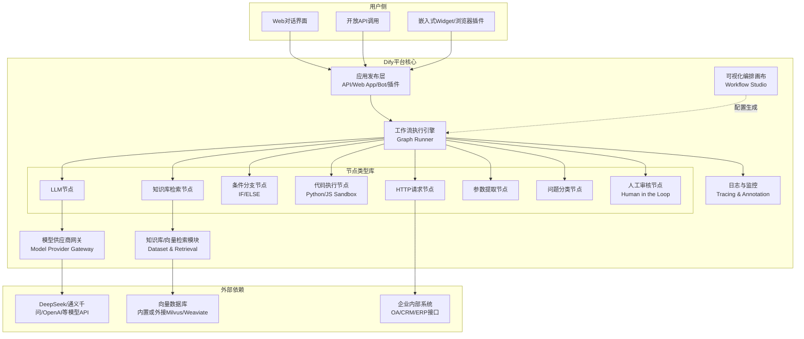
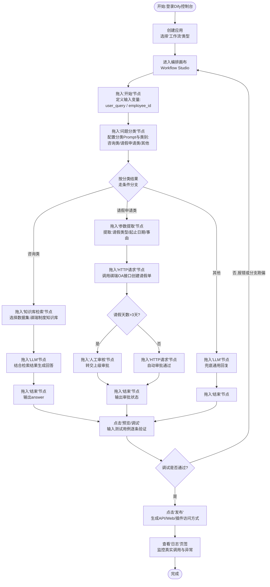
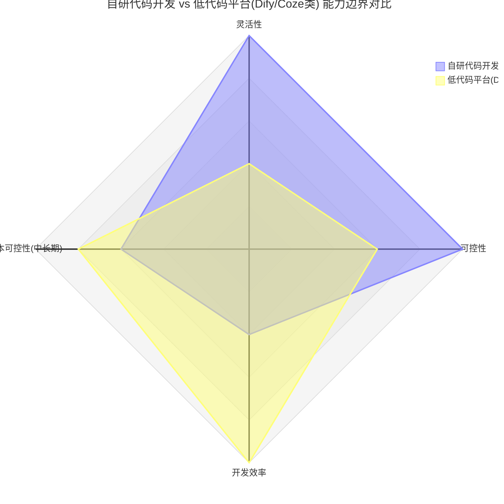

# 第45天:周测+Dify/Coze低代码平台

> **Sprint**:Sprint 4·Agent基础(Day39-45)—— 本篇为Sprint4收官日
> **飞书任务号**:CQ-256(周测)、CQ-257(Dify工作流选型预研)
> **涉及人物**:陈铭、王振宇(老王)、郭建军(郭总)、林悦、赵磊、苏梦、韩露、张凡
> **前情提要**:Day44完成了MCP Server的自建与Agent接入预研,苍穹的工具生态接入方式初步统一
> **今日主线**:周测收官Sprint4知识点;郭建军在晨会上抛出"为什么不直接用Dify"的尖锐问题;老王借题展开"自研中台 vs 低代码平台"的系统论述;下午实战搭建Dify工作流应用

---

## 【旁白】

如果把这七天(Day39到Day45)摆在一起看,会发现这是一条挺完整的曲线。

Day39,陈铭第一次亲手写出一个"会自己决定下一步做什么"的程序——那个纯手写的ReAct Agent,虽然简陋,却是他转行以来第一次真正理解"Agent"这个词不是营销话术,而是一种确确实实不一样的程序结构:不是你把每一步都写死,而是让模型自己在"想"和"做"之间循环。Day40,他给这个循环装上了框架的轮子——LangChain的工具调用体系,让"想"和"做"变得标准化、可插拔。Day41、Day42,老王把"黑盒"这个词挂在嘴边说了两天,推着团队从AgentExecutor迁移到LangGraph,一个状态图、一群节点、一堆边,一步步把原来隐藏在框架内部的决策过程摊开在白板上,还顺手解决了"审批卡在等人批"这种最贴近祺瑞集团真实痛点的工程问题。Day43,单个Agent的能力见了顶,老王用"公司组织架构"作比喻,把多Agent协作讲成了"部门怎么分工"的常识问题。Day44,当工具、Agent、多Agent这几块拼图都到位之后,一个新的问题冒出来了——这些工具接入的方式五花八门,谁来定标准?于是MCP协议登场,苍穹第一次有了"工具接入规范"这个概念。

七天走完,团队手里已经攒了一整套"从零造轮子"的能力。而恰恰是在这个节点上,郭建军问出了那个最扎心、也最现实的问题——市面上有Dify、有Coze,连界面都比咱们做的漂亮,为什么还要自己写?这个问题不是找茬,而是每一个做企业级软件的技术团队,迟早都要正面回答的问题。今天这一天,与其说是"学一个新平台",不如说是给过去七天学到的所有东西找一个"坐标系"——搞清楚自研代码开发和低代码平台各自的能力边界在哪里,才能真正说清楚"苍穹为什么值得自研"。这也是为什么把这一天安排在Sprint4的最后一天:不是心血来潮插进来的一课,而是给整个Agent基础篇画一个句号,顺便给下周就要开始的、更硬核的"Agent工程化"埋下一句潜台词——自研这条路选定了,接下来就要对得起这个选择,把稳定性、可观测性这些"低代码平台帮你兜底"的东西,自己扎扎实实补全。

值得一提的是,这样的问题在真实的技术团队里,往往不是以"讨论会"的形式被提出来的,而是像今天这样——CTO端着一杯咖啡,临时坐进一个原本只是普通晨会的会议室,随口问了一句。技术人员很容易把"选型讨论"想象成一场正式的、有PPT、有议程的会议,但现实中更多的技术决策转折点,恰恰诞生于这种毫无准备的、看似随意的一问。这一天记录下来的价值,或许正在于此——它提醒着陈铭这样刚入行不久的新人,真正重要的技术判断力,不是靠背书背出来的,而是要在这种突如其来的质问面前,能不能拿出一套站得住脚的、经得起追问的逻辑。这也是为什么这一天的课件,把晨会上那句"为什么不直接用Dify"完整地记录了下来——它看似只是一句闲聊,却是这一整个Sprint4收官日真正的起点。

---

## 晨会纪要

**时间**:周五上午9:10,苍穹项目组晨会,二层大会议室(原定小会议室,因郭总列席临时换到大会议室)
**参会**:王振宇、陈铭、苏梦、韩露、张凡、林悦、赵磊、孙昊(线上简单露面)、郭建军(临时列席)

老王照例先过了一遍昨天的进展。

"昨天Day44的MCP预研,陈铭那份接入测试报告我看了,基本达到预期——自建的MCP Server跑起来了,现有的Agent通过标准协议调用工具,没有出现协议层面的兼容性问题。这个事儿先记一功,苍穹后面工具生态的接入方式,基本就按这个思路定了。"

苏梦举手:"我们几个培训生这边,张凡昨天在写MCP工具的时候踩了个坑,工具的返回值格式没按Schema对齐,调试了快两个小时。"

老王点头:"这个正常,MCP的Schema定义比Function Calling更严格一点,后面我让陈铭整理一份常见报错清单发到群里。今天上午先周测,把Sprint4这一周的东西过一遍,老规矩,笔试加上机。"

正说着,会议室的门被推开,郭建军端着杯咖啡走进来,坐在角落。这不算常规操作——郭总平时很少列席组内晨会,顶多是立项、验收这种大节点才现身。老王也愣了一下,随即笑着说:"郭总,稀客。"

郭建军摆摆手:"别管我,你们开,我就旁听。"

赵磊接过话头汇报测试侧的情况:"MCP那部分我这两天配合陈铭做了一轮接入测试,协议层没发现问题,倒是发现一个边界情况——如果MCP Server返回的内容超长(比如工具查询结果是一整份文档),目前的处理逻辑没有做分页或截断,容易把上下文塞爆。这个我提了个缺陷单,优先级定的是中,不影响这周收尾。"

老王记下来:"这个先记着,等Sprint5做稳定性专题的时候一起处理,今天先不展开。"

孙昊在线上简单露了个面,说了句:"Dify的私有化部署环境昨晚已经跑起来了,我把访问地址和账号发到群里了,大家中午前测一下能不能正常登录,别到下午实战的时候卡在登录这一步。"

晨会照常推进,林悦补充了一条:"祺瑞那边上周提的智能办公助手需求,我这边PRD初稿写完了,细节会安排在Sprint5开工前过一遍。另外提一句,董事会那边最近在看几个AI应用厂商的行业报告,里面提到不少公司现在用Dify、Coze这类低代码平台在做客户交付,速度确实快,好几家友商的宣传物料里都在强调'零代码一周上线'这种说法,郭总应该也看到类似的东西了。"

这句话像是给郭建军递了个话头。等林悦说完,郭建军放下咖啡杯:"我正好想问这个。振宇,不瞒你说,上周我跟一个做同行业的朋友吃饭,他们那边的产品团队用Dify给客户搭了个客服机器人,前后加起来不到一周就上线了,里面知识库、工作流、发布渠道全套都有,界面还挺好看。我问了下报价,SaaS版一年也没多少钱,私有化部署也有开源版本可以自己改。"

他顿了顿,把问题问得很直接:"我不是说咱们做的东西不好,苍穹这一年多投入的人力物力我心里有数。但站在公司经营的角度,我必须问一句——为什么不直接用Dify这类平台,还要自己从头写一套?这钱花得值不值,得有人能给我讲清楚。"

会议室安静了两三秒。这不是随口一问,是CTO在问团队"我们存在的意义是什么"。

老王倒是不慌,他把白板笔拿起来:"郭总这个问题问得好,其实我早就想找个机会,系统地跟全组捋一遍这件事,不光是给您一个人交代,也是给团队一个交代——咱们每天写的这些代码,到底比现成的平台强在哪儿、又弱在哪儿,大家心里得有一张清晰的地图,不能含糊地说'自研肯定更好'。"

他看了一圈会议室:"今天上午先周测,把这周的技术账结一下。下午我腾出整个下午,咱们不写手写代码了,改用Dify把一个真实场景的工作流搭一遍——就用祺瑞那个请假审批场景练手。搭完之后,咱们回过头来,拿这个具体案例,把'自研 vs 低代码'这件事彻底讲透。郭总要是有空,下午也留一下,正好当面听听。"

郭建军笑了:"行,那我下午再来蹭一次课。"

会议快结束的时候,林悦补了一句提醒:"振宇,你要不要提前跟郭总对一下下午讲的框架,免得讨论的时候变成互相拆台。"老王摆手:"不用对,我讲的东西经得起当面质疑,郭总要真觉得哪里说不通,现场提出来更好,咱们这个结论也才站得住脚。"郭建军听完这句话笑了笑,没再多说什么,端着咖啡杯先离开了会议室。

散会之后,陈铭在走廊里跟苏梦嘀咕:"感觉今天这个晨会气氛跟平时不太一样。"苏梦点头:"是有点,不过我倒觉得挺好,郭总能来听,说明他是真的在关心咱们组的事,不是走个形式。"

**今日目标**:
1. 上午:Sprint4周测(笔试+上机综合练习),覆盖ReAct、LangChain Agent、LangGraph基础与进阶、多Agent、MCP
2. 下午:Dify平台实战——注册/部署环境、搭建"祺瑞智能问答与请假申请小助手"工作流应用、接入知识库、发布测试
3. 下午收尾:老王主讲"自研Agent中台 vs 低代码平台"选型讨论,产出团队共识文档
4. 全天贯穿:整理Sprint4整体复盘素材,为下周Sprint5启动会做铺垫

**风险点**:
- 周测涉及知识点跨度大(ReAct到MCP整整7天内容),部分学员(尤其苏梦)可能对LangGraph状态图部分不熟,老王安排陈铭周测后一对一带一下
- Dify环境本地部署可能因为Docker资源不足跑起来卡顿,孙昊提前在测试环境准备好了一套跑通的实例作为备用
- 下午讨论环节涉及"团队存在感"的敏感话题,老王提前和郭建军对齐口径,避免变成"甲方拷问乙方"的尴尬气氛

---

## 需求文档:技术选型决策备忘录——自研Agent中台 vs 低代码平台

**文档编号**:CQ-DOC-045
**撰写人**:林悦(整理)/ 王振宇(技术论证)
**评审人**:郭建军
**版本**:v1.0
**关联任务**:CQ-257

### 一、背景

蓬远科技的核心产品"苍穹企业级智能体中台"从Day15立项以来,已经陆续自研了对话引擎层、RAG检索引擎层,目前正在补全Agent编排层。随着市面上Dify、Coze、字节的火山方舟应用编排、阿里的百炼等低代码/零代码Agent搭建平台日渐成熟,公司管理层(以CTO郭建军为代表)提出一个合理的经营性问题:**在这些平台已经能够以更低成本、更短周期完成可视化工作流编排、知识库挂载、多渠道发布的情况下,苍穹继续投入研发资源自研Agent能力,商业与技术上的合理性是什么?**

本备忘录不是为了"证明自研正确、低代码错误"的立场性文档,而是尝试建立一套可复用的判断框架,用于回答:**在什么条件下应该用低代码平台,在什么条件下必须自研,以及苍穹作为一个中台产品,如何在自身能力建设中吸收低代码平台的优点。**

需要特别说明的是,这份备忘录的写作背景本身就很有意思——它不是团队闭门造出来的"自我辩护材料",而是直接回应了郭建军在周会上当场提出的质疑。林悦在整理这份文档的时候特意强调了一点:"这份材料的第一读者是郭总,第二读者才是团队自己,所以措辞上要克制,不能把'自研更好'当成不言自明的前提,得把两边的证据都摆出来,让结论自己浮现出来,而不是先下结论再找证据。"这也是为什么后续章节里,决策矩阵表格会把低代码平台的优势项(尤其是开发效率、初期成本)如实标注为"高",而不是为了凸显自研的合理性刻意打低分。

另外一个背景信息值得记录:这不是蓬远科技第一次面对"自建还是买现成方案"的选择。公司在苍穹项目立项之初(对应Day15前后),就曾经讨论过要不要直接采购某个成熟的对话平台SaaS服务,而不是从零搭建对话引擎层,当时的决策依据和今天的讨论有相似之处——只是那时候团队规模更小、对自身技术路线的信心还没有建立起来,直到苍穹0.1版真正跑起来、又陆续交付了海纳制造集团的知识库问答项目之后,"自研有没有意义"这个问题才逐渐从"要不要冒险"变成了"值不值得持续投入"。今天这份备忘录,某种程度上是对公司过去两年技术路线选择的一次阶段性复盘和验证。

### 二、用户故事

| 编号 | 角色 | 故事 |
|---|---|---|
| US-01 | 公司决策层(郭建军视角) | 作为CTO,我希望有一份清晰的成本/能力对比材料,以便在董事会和客户面前解释公司技术路线的合理性 |
| US-02 | 技术负责人(老王视角) | 作为架构师,我希望团队理解自研的边界在哪里,不盲目重复造轮子,也不盲目迷信"平台能解决一切" |
| US-03 | 一线开发(陈铭视角) | 作为工程师,我希望掌握低代码平台的实战能力,以便未来遇到"客户临时想要一个轻量demo"这类场景时,能快速用低代码方式交付,而不必每次都动用自研全套技术栈 |
| US-04 | 销售/客户成功(未来场景) | 作为面向客户的角色,我希望在客户POC(概念验证)阶段能用低代码平台快速出Demo,正式交付阶段再由技术团队评估是否需要迁移到苍穹自研能力 |
| US-05 | 客户方IT负责人(祺瑞集团视角,推演) | 作为采购决策方,我希望知道选择苍穹这样的自研中台,相比让自己团队直接上手Dify/Coze,多花的钱买到了什么 |

这五条用户故事看起来分散,但连起来看其实描述的是同一件事在不同角色眼中的不同侧面——郭建军关心的是"怎么向上讲清楚",老王关心的是"怎么让团队不走偏",陈铭关心的是"怎么让自己的技能边界更完整",而US-04和US-05则是把视角进一步拉远,拉到了未来可能真实发生的客户场景里去检验这套判断框架站不站得住脚。林悦在整理需求文档的时候特意保留了US-04和US-05这两条"推演型"用户故事,她的原话是:"咱们不能只顾着说服自己团队和郭总,这套逻辑最终是要拿去说服客户的,如果站在客户的角度都推不通,那说明这套框架本身还有漏洞,不如提前想清楚。"

### 三、需要覆盖的具体问题(功能性需求,以"决策要点"形式呈现)

| 决策要点编号 | 内容 | 是否本次讨论覆盖 |
|---|---|---|
| DP-01 | 低代码平台的可视化编排能力边界(能编排到多复杂的逻辑) | 是 |
| DP-02 | 低代码平台的知识库能力与苍穹RAG检索引擎层的对比 | 是 |
| DP-03 | 低代码平台的多租户、私有化部署、二次开发成本 | 是 |
| DP-04 | 低代码平台在"深度定制业务逻辑"(如祺瑞集团请假审批需要对接内部OA系统的复杂鉴权)场景下的局限 | 是 |
| DP-05 | 数据安全与合规(尤其面向后续御风金融这类客户) | 是(简要提及,详细展开留给Sprint6) |
| DP-06 | 苍穹是否应该反向借鉴低代码平台的可视化编排能力,做进"苍穹控制台"的Agent编排模块 | 是(作为长期路线图讨论) |
| DP-07 | 团队人力成本核算(自研团队人力 vs 低代码平台订阅/私有化费用) | 是 |

### 四、非功能需求

1. 本次讨论产出的《自研vs低代码选型笔记》需要能直接作为郭建军向董事会汇报的支撑材料,语言要克制,不能带明显的"护己方立场"的偏向性表述
2. Dify工作流demo搭建需要选用一个团队都熟悉的真实业务场景(请假审批),方便和当前自研Agent能力做同题对比
3. 讨论过程与结论需要形成文字记录,归档到`docs/architecture/tech-selection/`目录下,作为未来技术选型的参考先例

### 五、验收标准

- 完成一次真实的Dify工作流搭建并成功发布测试(验收标准:通过Web端或API成功调用并跑通"咨询类问题走知识库、请假申请类问题走审批流程"两条分支)
- 产出一份决策矩阵表格,至少覆盖灵活性、可控性、开发效率、成本、数据安全五个维度的对比打分
- 老王的论述形成文字纪要,团队成员(至少陈铪、苏梦、韩露、张凡)确认理解一致
- 郭建军对本次讨论产出的材料表示认可,作为后续对外沟通的口径依据

### 六、风险与应对

| 风险编号 | 风险描述 | 影响 | 应对措施 |
|---|---|---|---|
| RK-01 | 讨论结论被误读为"自研永远优于低代码"的绝对化立场,对外沟通时显得傲慢或脱离商业现实 | 中 | 备忘录明确写入"三层判断法"作为动态判断工具,而非一次性结论;决策矩阵如实呈现低代码平台的优势项 |
| RK-02 | 团队内部(尤其是刚接触Agent技术不久的培训生)误以为学会低代码平台操作就等同于理解了Agent编排的本质,忽视底层原理学习 | 中 | 老王在讨论环节反复强调"原理相通、包装不同",并要求陈铭用同一场景做自研代码对比实现,加深理解 |
| RK-03 | 郭建军或董事会基于本次材料,过度削减Agent编排层的后续研发资源投入 | 高 | 备忘录附上真实的场景复杂度案例(祺瑞OA鉴权、金额分级审批等),用具体证据支撑"复杂场景必须自研"的判断,而非空泛表态 |
| RK-04 | Dify私有化部署环境的资源配置问题(如worker内存不足)被误判为"低代码平台本身不可靠",影响判断的客观性 | 低 | 孙昊在群里说明该问题属于常规运维调优范畴,与平台架构本身的可靠性无必然关联,避免以偏概全 |

### 七、后续行动项

1. 全组成员在下周一晨会前,各自补充完成今天的课后作业(尤其是周测卷的自测部分),作为对Sprint4整周知识点掌握程度的最终确认,老王会抽查其中两到三份进行面对面提问
2. 林悦负责把今天的讨论内容整理成正式的《自研vs低代码选型笔记》,归档至`docs/architecture/tech-selection/`目录,并同步一份精简版给郭建军用于对外沟通
3. 老王负责评估"苍穹控制台可视化Agent编排模块"这一长期产品方向(对应决策矩阵中DP-06),纳入下一轮产品路线图讨论范围,暂定Sprint7之后启动预研
4. 陈铭负责整理今天产出的Dify工作流配置说明与LangGraph对比代码,作为团队内部技术分享素材,同时补充"审批超时自动驳回"这一TODO功能
5. 赵磊负责在Sprint5测试计划里,把"MCP Server长内容截断处理"这一遗留缺陷排期修复
6. 孙昊负责整理一份Dify私有化部署的资源调优checklist,避免未来其他团队成员重复踩内存配置的坑

---

## 架构设计图:Dify可视化编排的工作流架构示意

下面这张图是老王在下午实战开始前,先在白板上画的——目的是让大家在动手拖节点之前,先搞清楚Dify这类低代码平台"背后到底是什么样的一套东西",而不是把它当成一个纯粹的"拖拖拽拽的画图工具"。



这张图想说明的核心事实是:**Dify不是一个"魔法黑盒",它内部同样是一套"节点+边+执行引擎"的架构,和苍穹自研的LangGraph编排层在设计思想上高度相似**——都是把业务逻辑拆成一个个可复用的节点,靠边和条件分支串联起来。区别在于,Dify把这套引擎包装成了图形化画布,把常见的节点类型(LLM调用、知识库检索、条件判断、HTTP请求、代码执行、人工审核)预制成了"拖拽即用"的组件,而苍穹自研的方式是把这些"节点"写成Python函数,靠代码去定义State、Node、Edge。

老王在白板上敲了敲"外部依赖"这个框:"这里才是关键的分水岭。Dify的HTTP请求节点确实能对接企业内部系统,但复杂鉴权(比如祺瑞OA系统那套企业内网的AD域账号+动态令牌的鉴权链路)、复杂的重试补偿逻辑、跨系统的分布式事务,这些东西低代码平台的通用节点很难做到又灵活又稳定——这也是我们今天下午要具体验证的地方。"

他又指着"节点类型库"这一块补充了一句:"你们还要注意一个细节——这些预制的节点类型,数量看起来不少,但终究是有限的、封闭的集合。平台方决定给你哪些节点,你就只能用哪些节点,除非平台本身开放了自定义节点或者插件机制(有些平台支持写一段Python/JS脚本作为'代码执行节点'插进流程里,一定程度上缓解了这个问题,但沙箱环境通常会限制你能用的第三方库和执行时长)。而咱们自己写代码,理论上'节点类型'是无限的——任何一段Python逻辑都可以变成LangGraph里的一个Node,这是两种架构在开放程度上最本质的差异,后面咱们会反复回到这个差异点上。"

---

## 流程图:在Dify中搭建一个工作流应用的操作流程

这是下午实战的操作路线图,老王要求陈铭先画一遍流程图,再动手,"先想清楚要干什么,再去点鼠标,别一上来就瞎点"。



老王特别提醒了两个容易被忽略的环节:一是"调试预览"这一步,很多人搭完流程就想着直接发布,结果上线之后才发现某个分支的Prompt写得有问题;二是"日志监控",Dify发布之后的应用运行日志、每一步节点的输入输出都能在控制台里看到,这一点对排查问题非常有帮助,某种程度上比团队自己手搭的LangGraph应用还更"开箱即用",这也是老王后来在讨论环节里承认的低代码平台的真实优势之一。

这张流程图里"调试是否通过"那个判断框,老王特意画成了一个会回到"进入编排画布"的循环箭头,他解释这个设计的用意:"我故意把这个循环画出来,是想让你们记住——不管是低代码平台还是自己写代码,'调试-修复-再调试'这个循环都是绕不开的,差别只在于每一次循环的成本高低。Dify里改一个Prompt模板,保存了立刻能重新预览,循环一次可能几十秒;咱们自己写的LangGraph代码,改完之后可能要重启服务、重新触发调用,循环一次的成本相对更高。这也是开发效率差异的一个很具体的来源,不是玄学,是实打实每一次迭代节省下来的时间堆出来的。"

---

## 示意图:自研代码开发 vs 低代码平台能力边界对比

这张图是老王讨论环节用的核心教具,他管它叫"选型雷达图",四个维度分别是**灵活性**(能不能实现任意复杂的定制逻辑)、**可控性**(出了问题能不能追根溯源、能不能精确控制每一个细节)、**开发效率**(单位时间内能交付多少功能)、**成本可控性**(团队人力投入与平台订阅/授权费用的综合性价比,分值越高代表相同预算下能获得更多能力)。



老王解释这张图的时候,特意强调了"这不是打分比高下,是划边界":

"你们看,低代码平台在'开发效率'这一项几乎是满分,这没什么好争的,搭一个中等复杂度的工作流,确实可能比咱们手写快五到十倍。但'灵活性'和'可控性'这两项,低代码平台天生受限于它预制的节点类型和执行引擎的开放程度——它没法让你插入一段任意复杂的业务逻辑,也没法让你精确控制底层的重试策略、并发调度、状态持久化的存储介质。而咱们自研的路线,恰恰是反过来:前期投入大、开发效率低,但灵活性和可控性能做到极致,而且**这条曲线是会随着时间推移往'成本可控性'那个角上移动的**——业务场景越复杂、规模越大、需要定制的深度越深,自研的边际成本会越来越低,而低代码平台受限于它的通用性设计,复杂场景下的'魔改成本'反而会越来越高,甚至高到不如推倒重来自己写。"

苏梦在下面小声问韩露:"那咱们苍穹现在算是站在图上哪个位置?"

韩露想了想:"应该介于两者之间往自研那边偏——咱们用LangGraph这种框架,已经比纯手写省了不少事,但比起Dify这种完全可视化的东西,还是灵活性优先的路线。"

老王听见了,补了一句:"对,这就是我一直强调的——**框架不是低代码,框架是'半自动化的代码',低代码平台是'配置化的产品'**,这是两个完全不同的物种,别搞混了。"

张凡盯着这张雷达图又追问了一句:"那如果咱们苍穹的自研代码,能力上把两个曲线的优点都占了,是不是就完美了?"老王摇头:"这是个很自然但要小心的想法——图上画的两条曲线,'灵活性'和'开发效率'在大多数真实工程约束下是存在权衡关系的,你想要极致的灵活性,往往就得放弃一部分'开箱即用'的便利,这不是谁的技术水平不够导致的,而是软件工程里一个相对普遍的规律,有点类似经济学里'既要又要'很难两头拿满的道理。咱们能做的,不是幻想找到一个两头都拉满的万能方案,而是像今天讨论的这样,老老实实地想清楚每个具体场景里,哪一头的权重更大,然后做出取舍。这也是为什么我反复强调'三层判断法'是一套动态工具,而不是一次性能给出终极答案的公式。"

---

## 课堂笔记

### 上午:周测题目详解

上午9:30,周测正式开始,笔试40分钟、上机练习80分钟。赵磊作为"考务"全程盯场,他一贯的原则是"考试要有仪式感,平时练习和考核不能混为一谈"。

笔试卷面一共10道题,涵盖Day39到Day44整整一周的内容。等笔试收卷之后,老王没有直接讲答案,而是先让大家自己对着题目复盘五分钟,再逐题过一遍——他说这是"先让你们自己发现哪里心里没底,再听讲解才有效果"。

**第一题(单选)**:ReAct范式中"Thought-Action-Observation"循环的核心思想,下列哪个描述最准确?
A. 让模型每次都必须调用工具,不能直接输出答案
B. 让模型在每一步决策前先显式生成一段推理文字,再决定采取什么行动,并把行动结果重新纳入下一轮推理
C. 让模型并行执行多个工具调用以提升速度
D. 让模型在没有工具的情况下模拟推理过程

老王讲解这道题的时候,提到一个很有意思的现象:"这道题笔试的正确率是全班最高的一道,说明大家Day39那天手写ReAct Agent的印象都很深。但我要提醒一句——**手写理解原理容易,但真到工程落地的时候,很多人会忘了ReAct最核心的价值不是'能调用工具',而是'把推理过程显式化'**。这个显式化的推理过程,后来在LangGraph里变成了State里可以持久化、可以追溯的字段,这也是为什么Day41我们要花那么大力气强推可视化状态图——因为如果推理过程是隐式的、黑盒的,你出了问题根本不知道模型在哪一步'想歪了'。"

正确答案是B。张凡这道题选了A,老王点评:"这是个常见的误区,以为Agent就得每次都用工具,其实ReAct框架里模型完全可以在觉得不需要工具的时候直接给出Final Answer,这也是为什么Day39demo里我们特意设计了'能不能不调用搜索工具、纯靠模型自身知识就答对'的测试用例。"

张凡不太服气地追问了一句:"那如果模型自己判断错了,明明该查资料却觉得自己知道,直接给了个错答案,这个锅算谁的?"老王笑了:"这正是ReAct这类自主决策范式天然要付出的代价——你把'要不要用工具'这个判断权交给了模型,换来的是灵活性,但也意味着模型偶尔会误判。工程上应对这个问题,通常是在关键场景加一层强制规则,比如'涉及具体数字、日期、价格类的问题,无论模型自己觉得知不知道,都必须先查一次工具再回答',这种'不完全信任模型自主判断'的补丁思路,你们后面在Sprint5做稳定性专题的时候会再遇到,到时候详细展开。"这个追问被老王记在了备课笔记里,准备留作Sprint5的一个引子。

**第二题(单选)**:LangChain中`@tool`装饰器的核心作用是什么?
A. 让一个普通Python函数自动获得错误重试能力
B. 把函数包装成一个Agent
C. 把一个普通Python函数转换成带有名称、描述和参数Schema的工具对象,使其能被模型理解并调用
D. 为函数添加缓存能力

正确答案是C。这道题全班正确率也不错,但老王额外多讲了一层:"`@tool`装饰器背后帮你做的事情,其实是**从函数签名和docstring里自动推导出一份JSON Schema**,这份Schema会被塞进传给大模型的请求体里,模型看到这份Schema之后才知道'这个工具叫什么、要传哪些参数、参数是什么类型'。这一步本质上跟咱们Day18学的Function Calling原理是完全一致的,LangChain只是帮你把这个繁琐的Schema构造过程自动化了。所以说框架从来不是发明了新东西,是把原理性的东西包了一层方便的壳——这句话你们要记住,后面看任何新框架、新平台,都可以拿这句话去拆解它。"

韩露在这里举手问了个很实际的问题:"那如果我函数的docstring写得很随意,模型是不是就理解不了这个工具是干什么的?"老王点头:"完全正确,而且这是实际开发中排查'模型总是不调用某个工具,或者调用参数经常传错'这类问题时,第一个要检查的地方——很多时候不是模型能力不行,是你的docstring写得太模糊,模型压根不知道这个工具在什么场景下该被使用。这也是为什么公司的代码规范里要求所有工具函数必须有清晰的中文docstring,不是为了好看,是真的会影响调用的准确率。"她把这一点记在了本子上,说这是她这周最实用的一条收获,因为她自己上机练习的时候确实遇到过"工具怎么都不被调用"的问题,后来发现是描述写得太简单。

**第三题(判断)**:AgentExecutor相比LangGraph,在执行过程的可观测性和可控性上更强。(对/错)

这题错的人不少,正确答案是"错"。老王讲得比较重:"这题错了没关系,但我希望你们真正理解为什么错。AgentExecutor把整个'思考-行动-观察'的循环封装在一个黑盒方法调用里,你唯一能看到的是最终结果和一些callback回调打出来的日志片段,你没法在中间某一步暂停、检查状态、甚至修改状态之后再继续。而LangGraph把这个循环显式地拆成了State、Node、Edge,每一步的状态都是一个可以被检查、被持久化、被中断恢复的对象——这正是Day41到Day42我们花两天时间做迁移的原因。所以这道题的判断,不是死记硬背'LangGraph比AgentExecutor好',而是要理解'可观测性'和'可控性'这两个词,本质上依赖于'执行过程是否显式化'这一个共同的底层原理。"

**第四题(简答)**:请简述LangGraph中State、Node、Edge三个核心概念各自的作用。

标准答案要点:
- **State(状态)**:定义整个工作流在执行过程中传递和累积的数据结构,通常用TypedDict或Pydantic模型定义,包含对话历史、中间变量、工具调用结果等
- **Node(节点)**:一个接收当前State、执行某种操作(调用模型、调用工具、做数据处理)、返回State更新的函数
- **Edge(边)**:定义节点之间的执行顺序,分为普通边(固定跳转到下一个节点)和条件边(根据State里的某个字段的值,动态决定跳转到哪个节点)

老王补充:"这三个概念背后其实是一个更古老的计算机科学思想——**有限状态机**。你们如果学过数字电路或者编译原理会觉得眼熟,LangGraph本质上就是把状态机这套东西套用到了大模型应用编排上。理解了这一点,你会发现今天下午看到的Dify工作流,底层逻辑跟LangGraph是同构的,只是Dify把状态机包装成了可视化画布,把Node预制成了现成的组件类型。"

他又追加了一个类比,是特意为苏梦这类零基础转行、不熟悉状态机概念的同学准备的:"你们可以把State想象成一张不断被传递、不断被填写的表格,每经过一个Node,这张表格上就多填一些字段或者修改一些已有的字段;Edge就是规定这张表格接下来该递给谁——有的时候是固定递给下一个人,有的时候要看表格上某一栏填的是什么内容,才决定递给谁。这么想的话,State、Node、Edge这三个词就不抽象了。"苏梦听完这个比喻说:"这个'表格'的说法我一下就懂了,比看代码直观多了。"

**第四题半:关于State更新的一个追加提问**——陈铭主动提了个问题:"我上机的时候发现,如果一个节点函数只返回了State里的一部分字段,LangGraph不会把没返回的字段清空吧?"老王肯定了这个疑问的价值:"问得好,这恰恰是初学者最容易搞错的地方——LangGraph节点函数返回的字典,默认是以'合并更新'的方式作用到全局State上,而不是'整体替换'。也就是说,你只需要返回这个节点真正改动的字段,其他字段会保持原样。但如果你的State里某个字段是列表类型,想要做'追加'而不是'覆盖',就要用`Annotated`配合reducer函数指定合并策略,这个咱们在今天'代码实战'的`step_timings`字段上就用到了。"这个问题后来被老王认为是这次周测复盘里最有价值的一个课堂追问,晚上专门在群里补发了一段文字说明,提醒全组注意。

**第五题(简答)**:Checkpointer在Human-in-the-loop场景中解决了什么问题?

标准答案要点:Checkpointer(检查点持久化器)负责把工作流执行到某一步时的完整State序列化保存下来(通常存到数据库或内存存储中,配合thread_id标识一次具体的执行流程)。它解决的核心问题是:**当工作流执行到需要人工审批的节点时,程序不能一直傻等着(尤其是审批人可能几个小时甚至几天之后才处理),必须把当前状态保存下来、结束这次执行,等审批结果出来之后,能够根据保存的状态精确地"从中断的地方继续往下走",而不是重新从头执行一遍。**

这道题不少人答得不完整,只说了"保存状态"没说清楚"为什么需要中断恢复"。老王举了个例子:"祺瑞集团那个请假审批场景,员工提交请假申请之后,系统不可能一直挂着等主管在手机上点'同意',这中间可能是几个小时的时间差。如果没有Checkpointer,你只有两个选择——一个是让程序一直挂起等待(不现实,占着资源),另一个是主管批准之后重新触发一次全新的流程(那前面提取的参数、员工的原始诉求就全丢了)。Checkpointer的存在,就是让这个'中断-恢复'的过程能够无损衔接。"

**第六题(简答)**:Supervisor多Agent模式与"层级(Hierarchical)模式"有什么区别?

标准答案要点:Supervisor模式是**扁平的单层调度**——一个Supervisor节点负责接收任务、判断应该分派给哪个下游专业Agent(比如搜索员、分析师、报告撰写员),下游Agent各自完成任务后把结果汇报回Supervisor,由Supervisor决定下一步(继续分派还是结束)。层级模式则是**多层嵌套的调度**——上层Supervisor管理的"下游Agent"本身也可能是一个子Supervisor,再往下管理更细分的Agent团队,类似公司里"总监管经理、经理管员工"的多级汇报结构。

老王讲这道题的时候提到:"Day43我们做的'研究团队'demo,只是单层Supervisor模式,因为场景比较简单。但如果你们想象一下寰宇集团那种大型企业客户,可能真的需要'法务组Supervisor'管几个法务子Agent、'人力组Supervisor'管几个HR子Agent,最上面再有一个总Supervisor做跨部门调度——这就是层级模式在真实企业场景里的意义。这一点我们会在Sprint7旗舰项目里正式用到,今天先留个印象。"

他补了一句提醒,是关于这类题目容易踩的坑:"很多同学答题的时候会把'多Agent协作模式'和'多Agent协作模式的具体实现框架'搞混。Supervisor也好、层级也好,这些是设计模式层面的概念,和你具体用LangGraph还是别的框架去实现它,是两件事。就像你可以用Java也可以用Python去实现同一个设计模式,道理是一样的。这道题如果只回答'用LangGraph的StateGraph可以实现多Agent',是没有真正答到点上的,题目问的是模式本身的区别,不是实现工具。"

**第七题(简答)**:MCP协议解决了什么问题?它和Function Calling是什么关系?

标准答案要点:Function Calling解决的是"**模型和单个应用内工具之间怎么对接**"的问题(每个应用自己定义工具Schema,自己写调用逻辑)。MCP(Model Context Protocol)解决的是"**工具/数据源接入方式如何标准化,以便被不同的Agent应用复用**"的问题——它定义了一套标准协议,让工具提供方(MCP Server)和Agent使用方(MCP Client)之间用统一的方式通信,这样一个MCP Server(比如一个连接企业内部数据库的服务)写好之后,不需要为每一个不同的Agent框架重新写一套适配代码,任何遵循MCP协议的Agent都能直接接入使用。二者的关系是:**Function Calling是模型调用工具的"语言"(单次调用的协议格式),MCP是工具被谁、被多少个应用复用的"生态"(接入层面的标准化协议)**,MCP Server内部实现工具的时候,往里层看依然要转换成类似Function Calling的调用形式提交给大模型。

这道题几乎全班都答得不够完整,老王没有批评,反而说:"这道题本来就是这周里最抽象的一个概念,答不全很正常。你们只要记住一句话就够了——**MCP不是取代Function Calling,是在Function Calling之上,解决'一次开发、到处复用'的接入标准化问题**,类似于USB接口统一了各种外设的连接方式,而不是取代了外设本身的功能。"

为了让这个类比更落地,老王又补了个具体场景:"假设苍穹以后要同时支持三种Agent实现方式——一部分场景用LangGraph自研,一部分场景为了赶工期用Dify搭,未来说不定还会评估Coze。如果每种实现方式都要单独对接一遍'查询客户订单状态'这个工具,那这个工具的接入代码就要写三份,还要各自维护。但如果这个工具本身是以MCP Server的形式提供的,不管上层是LangGraph、是Dify、还是别的什么框架,只要它支持MCP协议作为Client去连接,就都能直接复用这一份Server实现,不用重复开发。这就是MCP真正想解决的'生态复用'问题,而不是想替代Function Calling这种模型和工具之间'怎么表达调用请求'的基础机制。"这个具体场景一举出来,好几个人在下面小声说"这下真明白了"——张凡后来说,这道题他在笔试的时候完全是靠印象堆砌名词,听完这段讲解才算是真正理解了这两个概念到底谁负责什么。

**第八题(代码题)**:写出一个LangGraph条件边路由函数的基本框架,要求根据State中的`intent`字段路由到不同节点。

标准答案:

```python
def route_by_intent(state: dict) -> str:
    """根据state中的intent字段,决定下一步跳转到哪个节点。
    条件边函数的约定:接收当前state,返回一个字符串,
    这个字符串必须与add_conditional_edges里映射表的key对应。
    """
    intent = state.get("intent", "unknown")
    if intent == "consult":
        return "kb_retrieve"
    elif intent == "leave_request":
        return "extract_leave_params"
    else:
        return "fallback"
```

老王点评:"这道题重点考的不是语法,是'条件边函数的约定'——很多人忘了条件边函数必须返回一个字符串,而且这个字符串要和后面`add_conditional_edges`里传入的映射字典的key严格对应,大小写、拼写都不能有偏差,这是实际开发中最容易踩的坑,编译不会报错,但运行时会因为找不到对应节点直接抛异常。"

**第九题(代码题)**:补全一个自定义MCP工具Server端注册代码的基本框架。

标准答案(结构性框架,细节以Day44代码为准):

```python
from mcp.server import Server
from mcp.types import Tool, TextContent

app = Server("cangqiong-mcp-server")

@app.list_tools()
async def list_tools() -> list[Tool]:
    """MCP协议要求Server必须实现工具列表查询接口,
    供Client在建立连接后拉取当前可用的工具清单。"""
    return [
        Tool(
            name="query_leave_policy",
            description="查询公司请假制度相关条款",
            inputSchema={
                "type": "object",
                "properties": {
                    "keyword": {"type": "string", "description": "查询关键词"}
                },
                "required": ["keyword"],
            },
        )
    ]

@app.call_tool()
async def call_tool(name: str, arguments: dict) -> list[TextContent]:
    """MCP协议要求Server实现工具的实际调用入口。"""
    if name == "query_leave_policy":
        result = f"关于'{arguments.get('keyword')}'的请假制度条款(示例返回)"
        return [TextContent(type="text", text=result)]
    raise ValueError(f"未知工具:{name}")
```

**第十题(综合题)**:给定一个"多Agent客服系统"场景(咨询、投诉、售后维修派单三种诉求混合出现),请描述你会怎么设计Supervisor结构(文字或图描述均可)。

这道题是开放题,没有唯一答案,老王重点看的是"有没有体现出任务分派的逻辑合理性"。他挑了张凡的答案在班里分享:张凡的方案是设一个总Supervisor做意图判断,下面挂三个专业Agent(知识库问答Agent、投诉记录Agent、维修派单Agent),投诉类诉求处理完之后再额外触发一个"满意度跟进"的子任务。老王评价:"这个方案已经有层级模式的雏形了,加分项是想到了'处理完之后还有后续动作'这个细节,这恰恰是很多人容易漏掉的——多Agent系统不是'分完任务就结束',经常还有收尾环节。"

周测笔试讲完之后是上机练习环节,题目是"给定一个残缺的LangGraph多Agent协作demo代码,找出并修复其中的三处Bug",涉及条件边返回值拼写错误、State更新时忘记合并旧字段导致数据丢失、Checkpointer未正确传入thread_id导致每次调用都是全新会话这三类真实的高频错误。苏梦这次上机做得比笔试好,她说:"看代码报错反而比凭空回忆概念题简单,报错信息好歹给了线索。"陈铭则提前十分钟做完,老王让他去帮张凡看第三个Bug,张凡卡在"为什么每次对话都跟机器人失忆了一样",最后发现是`invoke`调用时config里的`thread_id`每次都用了随机生成的新值。

上机练习结束、收卷之后,老王在讲台上停了几秒,看着全班说了一段话,算是给整个上午做收尾:"这一周的内容,难度是这几个Sprint里数一数二的,尤其是从AgentExecutor迁移到LangGraph这一段,涉及的思维转变不小——你们要从'相信框架帮你把一切处理好'切换到'自己动手把每一步状态和跳转逻辑摊开来看'。今天周测的成绩我看了一下,整体比我预期的要好,尤其是代码题的完成度,说明你们对'怎么写'已经上手得不错,接下来欠缺的主要是'为什么这么设计'这一层的理解深度,这个东西没法靠刷题速成,只能靠不断在真实场景里用,慢慢就通了。"他顿了顿又说:"下午咱们换个节奏,不考试了,轻松一点,但信息量不会比上午少,打起精神。"这句话说完,全班笑着松了口气,又带着点紧张感,一起去吃了午饭。

### 下午:Dify平台实战演练+低代码vs代码开发边界讨论

午饭后,老王没有立刻讲理论,而是直接把大屏幕投上了Dify的控制台界面:"咱们今天用的是孙昊提前在测试服务器上用Docker Compose部署好的私有化版本,大家自己的账号我已经建好了,先跟我一起搭一遍,搭完了再聊'为什么'。"

#### 环境说明

孙昊私有化部署的Dify走的是官方开源版本的Docker Compose方案,整体架构里包含api服务、worker服务、web前端、Nginx反向代理、PostgreSQL(存应用配置和会话记录)、Redis(缓存与任务队列)、向量库(默认走的是内置的Weaviate,也可以换成外接的Milvus)。老王提了一句:"你们注意,Dify自己也用了向量库做知识库检索,这一点跟咱们苍穹的RAG检索引擎层是同一套底层原理,只是它把'加载-分割-向量化-检索'这条链路也做成了配置化的组件,你不需要写`RecursiveCharacterTextSplitter`,而是在界面上选chunk大小的滑块。"

孙昊之前在部署过程中踩过一个坑,顺带在群里分享了出来:私有化部署的Dify默认给worker服务分配的内存不够,跑一两个简单应用没问题,但一旦知识库文档数量上来、多个用户同时在调试,worker容易被OOM(内存溢出)杀掉,导致工作流莫名其妙卡住不返回结果。孙昊后来把Docker Compose里worker服务的内存限制调大了一倍才稳定下来。老王借这个小插曲提了一句:"你们看,私有化部署一个现成平台,不代表运维成本就是零,该踩的坑一样要踩,只是坑的种类和自己写代码时踩的坑不一样——一个是'业务逻辑写错了',一个是'底层资源配置没搞对'。这也是今天下午讨论环节要展开的一个点,先记下来。"

#### 第一步:创建工作流应用

老王带大家在控制台点"创建应用",选择"Workflow(工作流)"类型(区别于"Chatflow对话流"和"Agent"类型,这里选工作流是因为这个场景里有明确的分支逻辑,更适合用工作流类型精确控制每一步)。应用命名为"祺瑞智能问答与请假申请小助手"。

进入编排画布之后,首先看到的是一个默认的"开始"节点,老王让大家在这里定义两个输入变量:`user_query`(字符串类型,用户的原始问题或请求)、`employee_id`(字符串类型,用于后续调用OA系统时标识请假人)。

#### 第二步:问题分类节点

拖入"问题分类器"(Question Classifier)节点,这是Dify预制的节点类型之一,本质上是包装好的一次LLM调用,配置项包括:选择底层模型(团队统一选用DeepSeek-Chat,和苍穹自研部分保持模型选型一致,方便后续效果对比)、定义分类类别列表(咨询类、请假申请类、其他)、以及每个类别的简要说明(供模型判断参考)。

配置完成后,这个节点会输出一个`class_name`字段,后续用条件分支节点根据这个字段的值路由。

韩露在这一步提出个问题:"这个分类器和咱们之前手写的意图分类有什么本质区别吗?"老王回答:"没有本质区别,底层都是一次LLM调用加结构化输出解析,区别只是Dify把Prompt模板和输出解析这两件事都封装好了,你不用自己写JSON Schema和解析代码,但换来的代价是——Prompt模板的具体写法你改不了太细,只能在给定的配置项范围内调整。"

苏梦跟着又问了一个更细节的问题:"如果模型分类分错了怎么办,比如把请假申请判断成了咨询类?"这个问题正好戳中了下午实战里大家都遇到过的一个真实小插曲——之前调试的时候,有一次输入"我这周身体不太好,能请几天病假"被模型判断成了"咨询类"而不是"请假申请类"，原因是这句话既包含了"病假"这种偏咨询意味的词,又包含了模棱两可的"能请几天"这种带疑问语气的表达。老王当时带着大家一起调整了分类类别的说明文字,把"leave_request"的描述里补充了一句"即使用户用疑问语气表达,只要有明确的请假意愿和大致的时间信息,也应判断为请假申请类"，调整之后重新测试才修正了这个误判。他借这个真实案例说:"这就是Prompt调优的日常——低代码平台把'写Prompt'这件事做成了填空题,看起来简单,但填空题填不好,一样会出问题,调优的功夫一点没少花,只是换了个战场。"

#### 第三步:条件分支与知识库分支

拖入"条件分支(IF/ELSE)"节点,根据上一步`class_name`的值分成三条路径。

**咨询类路径**:拖入"知识库检索"节点,选择提前上传好的数据集"祺瑞制度知识库"(团队提前把请假制度、报销制度、考勤规范等模拟文档上传到了这个数据集,走的是Dify内置的文档处理流程——上传文件后自动分段、向量化,分段大小、重叠长度这些参数在数据集配置页可以调整,和苍穹自研RAG的`chunk_size`/`chunk_overlap`是同一个概念,只是换了个UI包装)。检索节点输出`retrieved_chunks`,接一个"LLM"节点,Prompt里把检索片段和原始问题拼在一起,生成最终回答。

老王在这一步停下来讲了个细节:"你们看这个知识库检索节点,配置项里有'检索模式'可以选——向量检索、全文检索(关键词)、混合检索,这不就是咱们Day33讲的混合检索加RRF融合排序吗?Dify把这个能力也内置了,你不需要自己写BM25加向量融合的代码。但如果你想换成咱们自己训练过的Rerank模型呢?——这就要看Dify这个版本支不支持外接Rerank模型配置,如果不支持,你就只能在它给定的几个预置Rerank选项里选,这就是我们后面要讨论的'边界'所在。"

**请假申请类路径**:拖入"参数提取"节点,这个节点的作用是从`user_query`的自然语言描述里,提取出结构化字段——请假类型(年假/病假/事假)、开始日期、结束日期、请假事由。提取方式同样是LLM调用加结构化输出,配置里定义好每个字段的名称、类型、描述即可。

提取完成后,接一个"HTTP请求"节点,配置目标URL(模拟祺瑞OA系统的请假单创建接口)、请求方法(POST)、请求体(把提取到的字段和`employee_id`拼成JSON)、以及鉴权头(这里为了教学演示用了一个简化的固定Token,老王特意提到:"真实生产环境这里要接企业AD域鉴权或者OAuth2动态令牌,Dify的HTTP节点原生支持的鉴权方式是有限的几种预设类型,遇到复杂鉴权链路,往往还是要额外自己搭一个鉴权代理服务给它调,这也是一个边界点")。

接着是一个条件分支,判断请假天数是否大于3天:大于3天走"人工审核"节点(Dify的Human-in-the-loop机制,会把流程挂起,生成一个待处理任务,等指定审批人在控制台或者对接的通知渠道里处理之后才继续往下走,这一点在设计思想上和LangGraph的Checkpointer中断恢复是一致的);小于等于3天走另一个"HTTP请求"节点,直接调用OA系统的自动审批通过接口。

**其他路径**:直接接一个"LLM"节点做兜底通用回复,防止用户问一些不相关的问题时工作流直接报错或者没有响应。

#### 第四步:调试与发布

三条分支都连到各自的"结束"节点之后,老王让大家点右上角的"预览"按钮,输入几组测试用例:

- "请问年假一年有多少天?"——验证走咨询类分支,能不能正确检索到知识库里的条款并生成回答
- "我想请9月10号到9月13号的年假,家里有事"——验证走请假申请类分支,能不能正确提取起止日期和事由,并且因为跨度是4天(超过3天),验证是否正确路由到人工审核节点
- "我想请9月10号一天的事假,去办点私事"——验证1天的请假是否正确走自动审批通过路径
- "今天天气怎么样?"——验证兜底分支是否正常响应,而不是报错

四组测试全部跑通之后,老王点了"发布"按钮,应用生成了一个API访问密钥和一个默认的Web访问链接。他现场用命令行工具curl了一下发布出来的API,请求返回了预期的JSON结果,团队里响起一片小声的惊叹——"确实挺快"。

张凡这时候提了个稍微跑题但很实际的问题:"这个发布出来的API,响应速度怎么样,能不能直接用在生产环境?"老王没有直接回答"能"或"不能",而是带着大家一起做了个小实验——连续发了十次同样的请求,记录每次的响应耗时。结果显示,涉及知识库检索加LLM生成的咨询类分支,响应耗时普遍在3到6秒之间,波动还算稳定;但涉及HTTP请求节点调用模拟OA接口的请假申请分支,由于demo环境网络配置的原因,偶尔会出现耗时突然飙到十几秒的情况。老王借这个现象说:"这就是我说的,发布上线只是万里长征第一步,真到生产环境要面对真实的网络波动、真实的并发量,这些问题不会因为你用了低代码平台就自动消失,该做的压测、该做的超时和重试策略设计,一样都不能少。"这段小实验也顺带为下周Sprint5要讲的"Agent稳定性"埋了个具体的例子。

#### 讨论环节:低代码vs代码开发的适用边界(老王的完整论述)

下午三点半,搭建环节结束,老王把投影切回一张空白的白板画面,郭建军也如约推门进来坐在角落。

老王开场没有直接讲结论,而是先复盘刚才的实战:"大家应该都感觉到了,刚才这套流程,从建应用到发布测试,我们这一个多小时就搞完了,如果换成用LangGraph手写同样的功能,以陈铭现在的熟练程度,估计至少要三四个小时——写State定义、写每个节点函数、写条件边、配置Checkpointer、写HTTP调用的错误处理和重试逻辑,一个都不能少。所以第一个结论很清楚:**在功能需求相对标准、逻辑复杂度中等、且团队对交付速度极度敏感的场景下,低代码平台的开发效率优势是真实存在的,不是营销噱头。**"

他转头看向郭建军:"郭总您上午问的问题,我给的第一层回答是:如果苍穹的定位只是'帮客户快速搭一些标准化的问答机器人或轻量工作流',那我们确实没有必要自研,直接买Dify的企业版授权或者部署开源版加二次开发,性价比更高。"

"但苍穹的定位从立项第一天就不是这个。"老王翻到PPT下一页,列了几个真实存在的约束:

**第一,深度定制的业务逻辑,低代码平台的节点体系天生有上限。** "刚才咱们那个请假审批demo,已经算是Dify工作流里比较复杂的一个案例了,但你们注意到没有——HTTP请求节点的鉴权方式是有限的几个预设选项,如果祺瑞真实的OA系统鉴权链路复杂到需要先申请临时票据、票据要签名、签名算法是企业自定义的,Dify的HTTP节点很可能就搞不定,你得另外搭一个'鉴权适配服务'给它转发。这种'为了适配低代码平台而额外写代码'的情况,一旦变多,低代码平台反而成了负担,不如从一开始就用代码原生实现更干净。这一点,恰好呼应了我们上午的雷达图——低代码平台的灵活性曲线,在场景复杂度提升之后,会比自研更快地触顶。"

他又举了一个更贴近团队正在准备的Sprint5项目的例子:"你们回头会接触到的祺瑞智能办公助手,里面涉及的场景比今天这个请假审批demo复杂得多——报销要按金额分级审批(这个咱们放进了今天的作业里,大家可以自己感受一下复杂度陡增的过程)、请假要考虑多个部门交叉审批的场景、还有一些需要跨系统查询多个数据源再汇总的诉求。这类需求的共同特点是:业务规则不是一次性写死就完事的,而是会随着客户运营几个月之后,不断提出'这里能不能加一个例外情况'的诉求。低代码平台的可视化画布,应付两三个分支还算清晰,一旦分支和例外情况堆到二三十个,画布本身的可读性会直线下降,排查一个逻辑错误可能要在画布上来回拖动鼠标找半天,这时候写代码反而更快、更不容易出错,因为代码有版本控制、有代码审查、有单元测试这些工程化手段去兜底,而可视化画布目前普遍还缺乏成熟的'配置版本diff'和'配置单元测试'能力。"

**第一点半,插播一个团队自己的真实教训。** 老王说到这里,想起一件事,补充道:"其实咱们苍穹项目立项初期,做对话引擎那一版(对应Day22到Day24)的时候,内部也讨论过要不要直接用某个SaaS对话平台的低代码方案,当时评估的时候低估了后续客户定制需求的深度,幸好后来及时调整方向选择了自研。这不是说我们当年多有远见,而是运气加上及时复盘——这也是我今天愿意花一整个下午把这套判断框架讲透的原因,希望以后类似的判断,不用再靠运气。"

**第二,可观测性和调试能力,Dify虽然内置了日志,但深度还不够。** "Dify的日志页签能看到每个节点的输入输出,这一点确实比我们自己手搭的东西更'开箱即用',我得承认这是它的优点,咱们后面苍穹控制台的Agent编排模块要考虑把这块补上。但当你需要做更细粒度的追踪——比如某次调用为什么在某个中间节点耗时突然从200毫秒涨到8秒,你需要下钻到具体是哪一次外部API调用、哪一次数据库查询导致的——低代码平台给你的往往是'这一步耗时多少',而不能像咱们用LangSmith(这是下周Day46要正式学的工具)那样,把每一层函数调用的耗时、Token消耗、模型返回的原始内容全部拆开给你看。深度定制的可观测性,同样是低代码平台的天花板。"

他接着提到了成本这个更现实的角度:"还有一个跟可观测性紧密相关的话题是成本控制。咱们自己写代码,可以在每一次调用模型之前就精确计算这次请求大概会消耗多少Token、预估多少成本,超过阈值可以提前拦截或者降级到更便宜的模型;Dify这类平台通常也提供成本统计面板,但那是'调用完之后告诉你花了多少钱'的事后统计,而不是'调用之前就能精确预判和拦截'的事前控制。对于咱们这种要给客户承诺'每月AI调用成本控制在多少预算以内'的乙方角色来说,这个事前控制的精细程度,直接关系到项目的毛利率,这也是一个容易被忽略、但实际很重要的商业考量点。"

**第三,数据安全与合规,尤其面向像御风金融这类高敏感行业客户,私有化部署的低代码平台仍然要面对'第三方组件的安全边界在哪里'的问题。** "开源版Dify私有化部署确实能解决数据不出内网的问题,这一点我不否认。但你要理解,任何一个通用平台,它的代码库是给成千上万种场景服务的,你没法逐行审计它每一行代码的安全边界,而我们自己写的代码,至少在逻辑链路上是完全透明可控的,金融行业的合规审查往往要求'能说清楚数据在系统内部完整的流转路径',自研代码在这一点上举证成本更低。这个话题我们留到Sprint6讲私有化部署的时候会更详细展开。"

韩露举手问了一个很实际的问题:"那如果客户就是明确要求'一个月内必须上线',而这个需求场景本身又不复杂,咱们是不是也要考虑先用低代码平台顶上,哪怕合规这块暂时打个折扣?"老王认真回答:"这是个好问题,答案要分场景——如果客户本身对合规要求不高(比如祺瑞这类需求,数据敏感度中等),时间紧的情况下用低代码平台先顶上,是完全合理的商业决策;但如果客户明确在合规红线上(比如御风金融那种金融行业客户),即便时间再紧,也不能拿合规风险去换开发速度,这是原则问题,不是效率问题,团队要有能力向客户解释清楚'为什么这一类需求不能图快',这也是咱们作为专业乙方应该具备的判断力,而不是客户说多快我们就无条件配合多快。"

**第四,也是最本质的一点——苍穹作为一个要对外销售、对外交付的产品,如果核心能力是搭建在别人的平台之上,商业模式上就有天然的脆弱性。** "假设苍穹的Agent能力全部建立在Dify之上,那我们卖给客户的到底是什么?是我们自己的技术能力,还是Dify的技术能力加一层咱们的包装?客户迟早会算这笔账——'那我直接买Dify企业版加自己招个工程师配置不就行了,为什么要多付一层咱们的钱?'反过来,如果苍穹有自研的Agent编排引擎、RAG检索引擎、模型接入层,这些能力是我们自己攒下来的护城河,客户买的是我们积累的行业经验、稳定性工程能力、深度定制服务,这个价值是很难被一个通用平台替代的。"

郭建军在这里插了一句:"我补充一点,其实这也是投资人和董事会最关心的问题——一个公司的核心技术能力,如果完全依赖于外部平台,估值逻辑是站不住的,这是纯粹的商业判断,和技术好坏没关系。"

老王点头:"对,这就是我说的,今天这个问题不是'谁的代码写得好'的技术自尊心问题,是一个商业判断加技术判断共同得出的结论。"

赵磊这时候插了一句略带调侃的话:"振宇,那我能不能理解成,咱们平时天天在这儿加班熬夜写的代码,其实是在给公司'攒估值'?"会议室笑了一圈,老王也笑着接了下去:"你要这么理解也没错,但更准确的说法是,咱们在攒的是一种叫'技术护城河'的东西——护城河这个词听起来虚,但它背后对应的是实打实的东西:咱们踩过的坑、攒下的对各种客户场景的理解、遇到问题之后沉淀下来的解决方案库,这些东西是买不来的,Dify再好用,它没法替你理解祺瑞集团OA系统的鉴权链路到底长什么样,这份理解只能靠咱们自己一点点攒。"

孙昊线上也补了一句实际的运维视角:"我从部署运维的角度说一点——刚才我提到私有化Dify的内存配置问题,其实这类通用平台为了兼容各种各样的使用场景,资源默认配置往往是偏保守或者偏通用的,遇到咱们这种业务场景,需要自己去调优。等于说即便你用了低代码平台,只要涉及私有化部署,运维这块的工作量并不会消失,只是从'维护自己写的代码'变成了'维护别人写的平台加自己的定制配置',这中间的排查难度有时候反而更高,因为你对平台内部实现的了解程度肯定不如自己写的代码。"

接着他抛出了一个更细致的框架,写在了白板上,题目叫**"三层判断法"**:

> **第一层:场景复杂度判断**——这个需求的逻辑复杂到什么程度?如果是"知识库问答+简单条件分支+标准HTTP调用",低代码平台大概率够用。如果涉及复杂状态机、多轮迭代、深度嵌套的多Agent协作、需要精确控制并发和重试策略,建议自研或框架化开发。
>
> **第二层:定制深度判断**——这个需求未来会不会持续深度定制下去?如果是"一次性的、短生命周期的demo或POC",低代码平台的开发效率优势会一直保持。如果是"要长期维护、要不断叠加新功能、客户会持续提新需求"的核心产品能力,自研的初期投入会随着时间被摊薄,回报会逐渐超过低代码平台。
>
> **第三层:战略定位判断**——这个能力是不是公司的核心竞争力所在?如果是边缘辅助功能(比如内部一个临时的运营小工具),用低代码平台效率优先。如果是产品的核心卖点、客户购买你的核心理由,必须自研,哪怕慢一点、贵一点。

老王最后总结:"苍穹的Agent编排层,按这三层判断法过一遍——场景复杂度高(要对接客户各种内部系统)、定制深度会持续加深(客户需求只会越来越细)、战略定位是核心竞争力(这是我们卖给客户的核心价值),三条全部指向自研。但这不代表低代码平台一无是处——**咱们后面在客户POC阶段、内部运营小工具、快速验证一个想法是否靠谱这些场景,应该理直气壮地用Dify这类平台,没必要每次都动用苍穹的全套技术栈,这样反而是资源浪费。**"

他又举了一个更具体的例子帮团队消化这套判断法:"假设明天林悦跟我说,有个新客户想先看看'AI能不能帮他们写周报',这种一次性的、验证性质的需求,我肯定不会说'走,咱们用LangGraph写一个完整的Agent给他',那是拿大炮打蚊子。这种场景,三层判断法过一遍——场景复杂度低(不涉及复杂系统对接)、定制深度浅(客户就是想看效果,不会长期迭代这个东西)、战略定位边缘(不是苍穹的核心卖点),三条全指向低代码,那我就会让林悦直接用Dify出一个demo,半天就能给客户看效果,该给客户建立信心的环节,没必要用自研的方式去拖慢节奏。反过来,如果林悦告诉我,客户是想要一个能深度嵌入他们内部财务系统、要跑几年、还要不断加新功能的核心审批引擎,那这时候我肯定不会碰Dify,直接上苍穹自研的路子。"

他还提到一个容易被忽略的动态视角:"三层判断法不是一次性判断完就永远不变的,一个需求可能是从'低代码优先'开始的,后来慢慢演变成'必须自研'——最典型的路径就是POC阶段用Dify快速验证,客户觉得靠谱、决定正式采购之后,如果发现这个场景后续需要深度定制,咱们完全可以把已经在Dify里验证过的业务逻辑,'翻译'成LangGraph的自研实现,这也是我们今天特意用同一个业务场景(祺瑞请假审批)分别做了Dify版本和LangGraph版本的原因——你们应该能感觉到,这个'翻译'过程并不困难,因为两边的节点划分思路本质上是相通的,难的部分只是把配置转换成代码,这也从侧面说明了,咱们平时学的这些框架化思维方式,是有跨平台迁移能力的通用技能,不是学了Dify的操作就跟LangGraph的思维方式脱节了。"

陈铭在笔记本上记了一句话,他后来说这是这一天印象最深的一句:"低代码平台不是自研的敌人,是自研的一个'效率参照系'——它逼着咱们把自己的开发效率往上提,同时也帮咱们想清楚,哪些活儿真的值得自己扛。"

郭建军听完,端起已经凉了的咖啡喝了一口:"行,这个逻辑我能跟董事会讲清楚了。振宇,把今天这套东西整理成一份文档,我要拿去用。"

老王笑:"林悦已经在旁边记速记了。"

散场之前,郭建军又多问了一句,语气比开会时更放松一些:"振宇,那你个人怎么看,五年之后,这些低代码平台会不会做得足够强,强到把你们今天说的这些边界都突破了?"老王想了想,给出的回答不是简单的"会"或"不会":"技术这个东西,我不敢说五年后低代码平台的能力上限在哪儿,说不定它们真能把节点做得越来越开放、越来越可编程,慢慢逼近甚至融合到自研代码这一端。但我更想说的是,'自研'这件事的价值,从来不只是'代码本身写得有多好',更是团队在这个过程中攒下来的对客户场景的理解、踩坑之后沉淀的经验、遇到问题时排查和解决的能力——这些是附着在人和团队身上的能力,不会因为某个平台功能变强就自动消失或者被替代。就算五年后低代码平台真的强大到能覆盖我们今天讨论的大部分场景,咱们这几年攒下来的这些经验,依然是有价值的,无非是到时候咱们可能会更多地把低代码平台当成一种生产力工具去用,而不是把它当成竞争对手去防备。"郭建军听完点了点头,没再说什么,起身离开了会议室,这场持续了一个下午的讨论,才算真正落幕。

### 晚自习:Sprint4整体串讲与Sprint5预习

晚自习时间,老王没有布置新内容,而是花了四十分钟带全组把Sprint4(Day39-45)整体串了一遍,他管这个环节叫"技术地图回顾"。

他在白板上画了一条时间线:ReAct(Day39,单Agent感知-思考-行动循环)→ LangChain Agent(Day40,工具调用标准化)→ LangGraph基础(Day41,可视化状态图取代黑盒)→ LangGraph进阶(Day42,持久化与人工中断恢复)→ 多Agent(Day43,组织架构式协作)→ MCP(Day44,工具接入生态标准化)→ 低代码平台边界(Day45,给整条技术路线找坐标系)。

"你们发现没有,这条线其实是有内在逻辑的——从'一个Agent怎么想清楚该干什么'开始,一路走到'一群Agent怎么分工协作'再到'工具接入怎么标准化',最后落到今天'这条自研路线到底值不值'。这不是随便排的课程表,是一个真实团队做技术选型必然会走的思考顺序。"

他接着提了一句给Sprint5打预防针:"下周你们会发现一个很现实的问题——咱们这周搭的东西,demo阶段跑得挺好,但离真正能交付给祺瑞集团用,还差一大截。差在哪儿?差在稳定性——Agent会不会陷入死循环调用工具、会不会因为一次网络抖动就整个流程崩掉、成本和延迟能不能控制在客户能接受的范围内。这些问题,恰恰是低代码平台内置能力比较强的地方(比如Dify的执行日志、失败重试机制),也是咱们自研这条路必须补齐的短板。所以下周开始,咱们不是学新的花架子,是给这周搭的所有东西,穿上一层'能上生产环境'的铁布衫。"

苏梦问:"那我们下周还会继续用Dify吗?"

老王摇头:"不会,下周全部回到咱们自己的LangGraph代码上,Dify这一课的价值,不是让你们记住怎么点鼠标,是让你们理解自研代码要补齐哪些'低代码平台默认帮你想好了'的东西——可观测性、护栏机制、失败恢复策略。这是下周三件事的由来。"

张凡又追问了一句更长远的问题:"那咱们苍穹控制台以后会不会也做一个类似Dify的可视化编排界面?"老王想了想,给出的回答比较坦诚:"这个问题问到点上了,其实这正是今天决策矩阵里'DP-06'那一条留的口子——从长期产品规划的角度看,苍穹控制台确实有必要往'可视化Agent编排'这个方向补一块能力,尤其是面向那些不需要深度定制、只想快速搭建标准化场景的客户,给他们一个简化版的拖拽界面,能大幅降低使用门槛,这也是不少企业级AI中台产品的通用做法。但这块能力和咱们今天讲的'底层Agent引擎该不该自研'不是同一个问题——控制台的可视化编排层,完全可以建立在咱们自研的LangGraph引擎之上做一层UI包装,相当于'自己造了发动机,再给它套一个方便操作的仪表盘和方向盘',这跟'直接买别人整车'是两件不同的事。这块规划目前还在讨论阶段,大概会排进Sprint7之后的产品迭代计划里,今天先留个悬念。"

这个回答让苏梦和张凡都若有所悟——原来"自研引擎"和"做一个好用的可视化界面"并不矛盾,反而是互补的两件事,苍穹完全可以既有自研的技术底座,又有低代码平台那种友好的操作体验,只是这需要额外投入产品设计和前端开发的资源,是一个循序渐进的过程。

---

## 代码实战

今天的代码实战分成三块:第一块是"祺瑞智能问答与请假申请小助手"在Dify里的工作流配置说明,用结构化的DSL(领域特定语言,伪代码/YAML形式)呈现整个编排逻辑,方便团队做书面留档和评审;第二块是用苍穹自研的LangGraph技术栈,把同一个功能完整实现一遍,作为"同题对比"的直接证据;第三块是决策矩阵表格与两周测/作业相关的代码题解答。

老王对这三块代码实战的定位说得很清楚:"这不是为了让你们记住Dify的界面操作细节,配置说明这份东西过一遍、留个印象就够了,重点要花时间琢磨的是第二块——LangGraph版本的实现里,哪些地方是'低代码平台默认帮你做了、你自己写就得额外操心'的部分,把这些地方标记出来、理解透,才是今天代码实战真正的价值所在。"这也是为什么第二部分的代码注释里,老王要求陈铭特意用文字标注出每一处"相比Dify节点多做了什么"的细节,方便后续团队复习和新人培训时直接参考。

### 一、Dify工作流配置说明(结构化DSL呈现)

Dify导出应用时会生成一份YAML格式的DSL文件,包含完整的节点定义、连接关系、变量映射。下面这份是团队根据下午实战搭建的应用整理出的简化版配置说明,保留了核心结构,方便不熟悉Dify界面的同事也能通过读配置理解整个编排逻辑。

```yaml
# ============================================================
# 文件:dify_workflow_qiruili_leave_assistant.yml
# 说明:祺瑞智能问答与请假申请小助手 —— Dify工作流应用配置说明
# 用途:书面留档,配合Dify控制台界面操作使用,非官方原始DSL格式,
#      为教学与团队评审目的做了结构精简与中文注释补充
# ============================================================

app:
  name: "祺瑞智能问答与请假申请小助手"
  mode: workflow                     # 应用类型:workflow(工作流),
                                      # 区别于chatflow(对话流)和agent(智能体)
  description: >
    统一入口处理祺瑞集团员工的两类诉求:
    1) 制度咨询类问题,走知识库检索+LLM生成回答;
    2) 请假申请类请求,走参数提取+OA系统对接+条件审批流程。
  icon: "📋"
  model_provider_default: deepseek   # 全局默认模型供应商,与苍穹自研模块保持一致

# ------------------------------------------------------------
# 环境变量与密钥(在Dify控制台的"环境变量"页签配置,此处仅做说明)
# ------------------------------------------------------------
environment_variables:
  - key: OA_SYSTEM_BASE_URL
    description: "祺瑞OA系统请假接口的基础地址(演示环境用占位地址)"
    value: "https://oa-demo.internal.qiruigroup.example/api/v1"
  - key: OA_SYSTEM_AUTH_TOKEN
    description: "调用OA接口的固定演示Token(生产环境需替换为动态令牌鉴权代理)"
    value: "{{secrets.OA_SYSTEM_AUTH_TOKEN}}"

# ------------------------------------------------------------
# 节点定义(graph.nodes),按执行顺序呈现,id对应画布中的节点ID
# ------------------------------------------------------------
graph:
  nodes:
    - id: node_start
      type: start
      title: "开始"
      config:
        input_variables:
          - name: user_query
            type: string
            required: true
            description: "用户原始输入,可能是咨询问题或请假申请描述"
          - name: employee_id
            type: string
            required: true
            description: "员工工号,用于OA系统鉴权与请假单归属"

    - id: node_classifier
      type: question_classifier
      title: "问题分类"
      config:
        model:
          provider: deepseek
          name: deepseek-chat
          temperature: 0.1          # 分类任务不需要创造性,温度调低保证结果稳定
        input: "{{node_start.user_query}}"
        classes:
          - name: consult
            description: "关于公司制度、流程、规定的咨询类问题,例如'年假有多少天'"
          - name: leave_request
            description: "员工希望提交请假申请的请求,通常包含请假类型、日期、事由"
          - name: other
            description: "与制度咨询和请假申请无关的其他问题"
        output_variable: class_name  # 分类结果写入该变量,供后续条件分支节点读取

    - id: node_if_branch
      type: if_else
      title: "按分类结果路由"
      config:
        conditions:
          - case_id: case_consult
            expression: "{{node_classifier.class_name}} == 'consult'"
          - case_id: case_leave
            expression: "{{node_classifier.class_name}} == 'leave_request'"
          # 未匹配以上两种情况时,自动走default分支(对应other)

    # -------------------- 咨询类分支 --------------------
    - id: node_kb_retrieve
      type: knowledge_retrieval
      title: "知识库检索"
      branch: case_consult
      config:
        datasets:
          - "祺瑞制度知识库"
        query: "{{node_start.user_query}}"
        retrieval_mode: hybrid       # 混合检索:向量检索+关键词检索+RRF融合排序
        top_k: 5
        score_threshold: 0.45
        rerank:
          enabled: true
          model: bge-reranker-large  # 与苍穹自研RAG使用同一款重排模型,方便效果对比
        output_variable: retrieved_chunks

    - id: node_llm_consult_answer
      type: llm
      title: "生成咨询回答"
      branch: case_consult
      config:
        model:
          provider: deepseek
          name: deepseek-chat
          temperature: 0.3
        prompt_template: |
          你是祺瑞集团内部制度咨询助手。请仅根据下方提供的制度条文回答员工问题,
          如果条文中没有相关信息,请明确告知"未在现有制度中找到相关条款,建议联系HR确认",
          不要编造制度内容。

          【制度条文片段】
          {{node_kb_retrieve.retrieved_chunks}}

          【员工问题】
          {{node_start.user_query}}
        output_variable: consult_answer

    - id: node_end_consult
      type: end
      title: "结束(咨询类)"
      branch: case_consult
      config:
        outputs:
          answer: "{{node_llm_consult_answer.consult_answer}}"
          route: "consult"

    # -------------------- 请假申请类分支 --------------------
    - id: node_extract_params
      type: parameter_extractor
      title: "提取请假参数"
      branch: case_leave
      config:
        model:
          provider: deepseek
          name: deepseek-chat
        input: "{{node_start.user_query}}"
        parameters:
          - name: leave_type
            type: select
            options: ["年假", "病假", "事假", "婚假", "其他"]
            description: "请假类型"
          - name: start_date
            type: string
            description: "请假开始日期,格式YYYY-MM-DD,若用户只说相对日期需结合当前日期换算"
          - name: end_date
            type: string
            description: "请假结束日期,格式YYYY-MM-DD"
          - name: reason
            type: string
            description: "请假事由的简要描述"
        output_variable: leave_params

    - id: node_http_create_leave
      type: http_request
      title: "调用OA系统创建请假单"
      branch: case_leave
      config:
        method: POST
        url: "{{env.OA_SYSTEM_BASE_URL}}/leave-requests"
        headers:
          Authorization: "Bearer {{env.OA_SYSTEM_AUTH_TOKEN}}"
          Content-Type: "application/json"
        body:
          employee_id: "{{node_start.employee_id}}"
          leave_type: "{{node_extract_params.leave_params.leave_type}}"
          start_date: "{{node_extract_params.leave_params.start_date}}"
          end_date: "{{node_extract_params.leave_params.end_date}}"
          reason: "{{node_extract_params.leave_params.reason}}"
        timeout_seconds: 10
        retry:
          max_attempts: 2           # Dify内置的HTTP节点重试次数上限,超过则直接标记为失败
          backoff_seconds: 2
        output_variable: leave_order  # 包含order_id、leave_days等字段

    - id: node_if_days
      type: if_else
      title: "判断请假天数"
      branch: case_leave
      config:
        conditions:
          - case_id: case_long_leave
            expression: "{{node_http_create_leave.leave_order.leave_days}} > 3"
          # 否则走default分支,视为短假

    - id: node_human_review
      type: human_review           # 人工审核节点,对应LangGraph中的Human-in-the-loop机制
      title: "转交上级人工审批"
      branch: case_long_leave
      config:
        assignee_rule: "根据employee_id查询汇报上级"  # 演示环境简化为固定审批人
        notify_channel: "内部通知(演示环境为控制台任务列表)"
        timeout_hours: 72          # 超时未处理的兜底策略(演示环境仅做记录不做自动通过)
        on_approve_variable: review_result
        on_reject_variable: review_result

    - id: node_http_auto_approve
      type: http_request
      title: "自动审批通过(短假)"
      branch: case_leave_short     # 未命中case_long_leave时的默认分支
      config:
        method: POST
        url: "{{env.OA_SYSTEM_BASE_URL}}/leave-requests/{{node_http_create_leave.leave_order.order_id}}/auto-approve"
        headers:
          Authorization: "Bearer {{env.OA_SYSTEM_AUTH_TOKEN}}"
        output_variable: approve_result

    - id: node_end_leave
      type: end
      title: "结束(请假申请类)"
      branch: case_leave
      config:
        outputs:
          answer: >
            {{node_extract_params.leave_params.leave_type}}申请已提交,
            单号{{node_http_create_leave.leave_order.order_id}},
            当前状态:{{coalesce(node_human_review.review_result, node_http_auto_approve.approve_result)}}
          route: "leave_request"

    # -------------------- 兜底分支 --------------------
    - id: node_llm_fallback
      type: llm
      title: "兜底通用回复"
      branch: default
      config:
        model:
          provider: deepseek
          name: deepseek-chat
        prompt_template: |
          你是祺瑞集团内部助手,当前用户的问题与制度咨询、请假申请无关。
          请礼貌说明你目前主要支持这两类事务,并询问是否需要转接人工客服。
          用户问题:{{node_start.user_query}}
        output_variable: fallback_answer

    - id: node_end_fallback
      type: end
      title: "结束(兜底)"
      branch: default
      config:
        outputs:
          answer: "{{node_llm_fallback.fallback_answer}}"
          route: "other"

  # ------------------------------------------------------------
  # 边(graph.edges)在可视化画布中通过拖拽连线自动生成,
  # 此处仅列出关键跳转关系做书面说明
  # ------------------------------------------------------------
  edges:
    - from: node_start
      to: node_classifier
    - from: node_classifier
      to: node_if_branch
    - from: node_if_branch
      to: node_kb_retrieve
      condition: case_consult
    - from: node_kb_retrieve
      to: node_llm_consult_answer
    - from: node_llm_consult_answer
      to: node_end_consult
    - from: node_if_branch
      to: node_extract_params
      condition: case_leave
    - from: node_extract_params
      to: node_http_create_leave
    - from: node_http_create_leave
      to: node_if_days
    - from: node_if_days
      to: node_human_review
      condition: case_long_leave
    - from: node_if_days
      to: node_http_auto_approve
      condition: default
    - from: node_human_review
      to: node_end_leave
    - from: node_http_auto_approve
      to: node_end_leave
    - from: node_if_branch
      to: node_llm_fallback
      condition: default
    - from: node_llm_fallback
      to: node_end_fallback

# ------------------------------------------------------------
# 发布配置(app.publish),对应控制台"发布"操作生成的访问方式
# ------------------------------------------------------------
publish:
  channels:
    - type: api
      auth: api_key
      rate_limit: "60次/分钟(演示环境限额)"
    - type: web_app
      access: "内部员工需登录后访问,演示环境使用共享测试链接"
  logging:
    trace_level: node    # 记录到每个节点粒度的输入输出,供后续排查问题
    retention_days: 30
```

老王看完团队整理的这份配置说明,评价说:"这份东西整理得挺好,以后但凡有同事说'能不能用Dify给客户先搭个demo看看效果',直接把这份模板扔给他改改字段就能用,不用每次都从零摸索控制台。"

### 二、用LangGraph实现同一功能(自研代码对比)

为了让"自研vs低代码"的对比不是纸上谈兵,老王要求陈铭在下午实战之后,把同样的"祺瑞智能问答与请假申请小助手"用苍穹自研的LangGraph技术栈完整实现一遍,晚上提交到`feature/leave-assistant-demo`分支。

```python
"""
文件:backend/app/services/agent/demos/leave_assistant_graph.py
说明:祺瑞智能问答与请假申请小助手 —— 苍穹自研LangGraph实现版
用途:与Dify工作流demo做同题对比,验证"自研vs低代码"选型讨论中的
     灵活性、可控性差异是否真实存在,而非纯理论推断。

设计说明:
1. 整体状态机结构与Dify工作流的节点划分基本对齐,便于逐一比对;
2. 相比Dify版本,本实现额外补齐了:精细化的错误重试策略、
   人工审批的Checkpointer持久化中断恢复、结构化日志埋点,
   这三点正是老王在讨论环节中提到的低代码平台的能力边界所在。
"""

from __future__ import annotations

import json
import logging
import time
import uuid
from datetime import date, datetime, timedelta
from typing import Annotated, Literal, Optional, TypedDict

import requests
from langchain_openai import ChatOpenAI
from langgraph.checkpoint.memory import MemorySaver
from langgraph.graph import END, StateGraph
from langgraph.types import Command, interrupt
from pydantic import BaseModel, Field, ValidationError

logger = logging.getLogger("cangqiong.agent.leave_assistant")
logger.setLevel(logging.INFO)

# ============================================================
# 一、全局配置与模型客户端
# ============================================================

# 与Dify demo保持一致的模型选型,方便效果横向对比;
# DeepSeek提供OpenAI兼容接口,因此复用ChatOpenAI客户端即可
LLM = ChatOpenAI(
    model="deepseek-chat",
    base_url="https://api.deepseek.com/v1",
    api_key="sk-cangqiong-demo-key",  # 演示占位,真实环境从环境变量DEEPSEEK_API_KEY读取
    temperature=0.2,
)

OA_SYSTEM_BASE_URL = "https://oa-demo.internal.qiruigroup.example/api/v1"
OA_SYSTEM_AUTH_TOKEN = "demo-token-please-replace"  # 演示占位,生产环境走密钥管理服务

KB_RETRIEVAL_TOP_K = 5
KB_SCORE_THRESHOLD = 0.45
LONG_LEAVE_THRESHOLD_DAYS = 3


# ============================================================
# 二、State定义
# ============================================================

class LeaveAssistantState(TypedDict, total=False):
    """整个工作流在执行过程中传递的状态。

    相比Dify工作流里"变量"的概念,这里用一个显式的TypedDict定义,
    好处是IDE能做类型检查、代码审查时一眼看清每一步到底读写了哪些字段,
    这正是"可控性"优势的直接体现。
    """

    user_query: str
    employee_id: str

    class_name: Optional[Literal["consult", "leave_request", "other"]]

    retrieved_chunks: Optional[list[str]]
    consult_answer: Optional[str]

    leave_type: Optional[str]
    start_date: Optional[str]
    end_date: Optional[str]
    reason: Optional[str]
    leave_days: Optional[int]

    oa_order_id: Optional[str]
    oa_create_success: Optional[bool]
    oa_error_message: Optional[str]

    review_result: Optional[Literal["approved", "rejected"]]
    review_comment: Optional[str]

    fallback_answer: Optional[str]

    final_answer: Optional[str]
    route: Optional[str]

    # 记录每一步执行耗时,用于可观测性分析,这一层信息在Dify的
    # 节点级日志里也能看到概览,但这里可以精确到毫秒并写入业务日志系统
    step_timings: Annotated[list[dict], "累积追加,不覆盖"]


def _record_timing(state: LeaveAssistantState, step_name: str, start_ts: float) -> dict:
    """记录单个节点的执行耗时,累加进state的step_timings列表中。

    这是我们相比Dify默认日志能力多做的一层可观测性埋点——
    Dify只能看到节点级的耗时,而这里我们可以在必要时进一步拆解
    节点内部每一次外部调用的耗时(见node_http_create_leave里的示例)。
    """
    elapsed_ms = round((time.monotonic() - start_ts) * 1000, 2)
    existing = state.get("step_timings", [])
    existing.append({"step": step_name, "elapsed_ms": elapsed_ms})
    return {"step_timings": existing}


# ============================================================
# 三、参数提取的结构化输出模型(Pydantic)
# ============================================================

class LeaveParams(BaseModel):
    """请假参数提取的结构化输出定义,对应Dify的'参数提取节点'配置。"""

    leave_type: Literal["年假", "病假", "事假", "婚假", "其他"] = Field(
        description="请假类型"
    )
    start_date: str = Field(description="请假开始日期,格式YYYY-MM-DD")
    end_date: str = Field(description="请假结束日期,格式YYYY-MM-DD")
    reason: str = Field(description="请假事由的简要描述")


class IntentClassification(BaseModel):
    """意图分类的结构化输出定义,对应Dify的'问题分类节点'配置。"""

    class_name: Literal["consult", "leave_request", "other"] = Field(
        description="用户意图分类结果"
    )
    confidence: float = Field(description="分类置信度,0到1之间", ge=0.0, le=1.0)


# ============================================================
# 四、节点函数实现
# ============================================================

def classify_intent_node(state: LeaveAssistantState) -> dict:
    """问题分类节点。

    对应Dify的question_classifier节点。这里用结构化输出(JSON Mode)
    强制模型返回符合IntentClassification Schema的结果,
    比Dify界面上"选类别+写描述"的配置方式,能更精确地控制
    分类逻辑的边界条件(比如低置信度时的兜底策略)。
    """
    start_ts = time.monotonic()

    structured_llm = LLM.with_structured_output(IntentClassification)
    prompt = (
        "请判断以下员工输入属于哪一类意图:\n"
        "- consult:关于公司制度、流程、规定的咨询类问题\n"
        "- leave_request:希望提交请假申请的请求\n"
        "- other:与以上两类无关的其他问题\n\n"
        f"员工输入:{state['user_query']}"
    )

    try:
        result: IntentClassification = structured_llm.invoke(prompt)
    except Exception as exc:  # noqa: BLE001 —— 分类失败时不能让整个流程崩掉
        logger.warning("意图分类调用异常,降级为other: %s", exc)
        result = IntentClassification(class_name="other", confidence=0.0)

    # 低代码平台的分类节点通常没有暴露"置信度低时该怎么办"这一层控制权,
    # 而这里我们可以显式加一层业务规则:置信度过低时强制走人工兜底分支,
    # 这正是"可控性"优势的一个具体例子。
    class_name = result.class_name
    if result.confidence < 0.4:
        logger.info("分类置信度过低(%.2f),降级为other分支", result.confidence)
        class_name = "other"

    updates = {"class_name": class_name}
    updates.update(_record_timing(state, "classify_intent", start_ts))
    return updates


def kb_retrieve_node(state: LeaveAssistantState) -> dict:
    """知识库检索节点。

    对应Dify的knowledge_retrieval节点。真实生产实现会调用苍穹自研
    RAG检索引擎层(services/rag/retriever.py里封装的混合检索+Rerank流水线),
    这里为了demo自洽,用一个内存模拟的知识库片段做替身,
    但保留真实检索接口的调用形态,方便后续直接替换为生产实现。
    """
    start_ts = time.monotonic()

    # 模拟知识库:真实实现应替换为
    # from app.services.rag.retriever import hybrid_retrieve
    # retrieved = hybrid_retrieve(query=state["user_query"], dataset="qiruigroup_policy", top_k=KB_RETRIEVAL_TOP_K)
    mock_kb = [
        {"text": "员工每年可享受法定年假,工作满1年不满10年的,年假5天。", "score": 0.81},
        {"text": "病假需提供医院证明,连续超过3天需部门主管审批。", "score": 0.55},
        {"text": "事假不计入带薪假期,一年累计不超过10天。", "score": 0.50},
    ]
    hits = [item["text"] for item in mock_kb if item["score"] >= KB_SCORE_THRESHOLD][:KB_RETRIEVAL_TOP_K]

    updates = {"retrieved_chunks": hits}
    updates.update(_record_timing(state, "kb_retrieve", start_ts))
    return updates


def generate_consult_answer_node(state: LeaveAssistantState) -> dict:
    """结合检索结果生成咨询类问题的回答。对应Dify咨询分支里的LLM节点。"""
    start_ts = time.monotonic()

    chunks_text = "\n".join(f"- {c}" for c in state.get("retrieved_chunks", []))
    prompt = (
        "你是祺瑞集团内部制度咨询助手。请仅根据下方提供的制度条文回答员工问题,"
        "如果条文中没有相关信息,请明确告知'未在现有制度中找到相关条款,建议联系HR确认',"
        "不要编造制度内容。\n\n"
        f"【制度条文片段】\n{chunks_text}\n\n"
        f"【员工问题】\n{state['user_query']}"
    )
    response = LLM.invoke(prompt)

    updates = {"consult_answer": response.content, "final_answer": response.content, "route": "consult"}
    updates.update(_record_timing(state, "generate_consult_answer", start_ts))
    return updates


def extract_leave_params_node(state: LeaveAssistantState) -> dict:
    """请假参数提取节点。对应Dify的parameter_extractor节点。"""
    start_ts = time.monotonic()

    today_str = date.today().isoformat()
    structured_llm = LLM.with_structured_output(LeaveParams)
    prompt = (
        f"今天的日期是{today_str}。请从以下员工请假描述中提取结构化信息,"
        "如果用户说的是相对日期(比如'下周三'),请结合今天日期换算成YYYY-MM-DD格式。\n\n"
        f"员工描述:{state['user_query']}"
    )

    try:
        params: LeaveParams = structured_llm.invoke(prompt)
    except ValidationError as exc:
        # 低代码平台的参数提取节点在校验失败时,通常只能走一条固定的失败分支;
        # 这里我们可以精确控制重试一次、并在Prompt里附加更明确的格式要求,
        # 这是自研代码在"细节容错策略"上更灵活的又一个例子。
        logger.warning("请假参数提取校验失败,尝试补充格式提示后重试一次: %s", exc)
        retry_prompt = prompt + "\n\n注意:日期必须是YYYY-MM-DD格式,请假类型必须是给定选项之一。"
        params = structured_llm.invoke(retry_prompt)

    start_dt = datetime.strptime(params.start_date, "%Y-%m-%d")
    end_dt = datetime.strptime(params.end_date, "%Y-%m-%d")
    leave_days = (end_dt - start_dt).days + 1

    updates = {
        "leave_type": params.leave_type,
        "start_date": params.start_date,
        "end_date": params.end_date,
        "reason": params.reason,
        "leave_days": leave_days,
    }
    updates.update(_record_timing(state, "extract_leave_params", start_ts))
    return updates


def create_oa_leave_order_node(state: LeaveAssistantState) -> dict:
    """调用OA系统创建请假单节点。对应Dify的http_request节点。

    这里补齐了Dify HTTP节点没有覆盖到的精细化重试策略:
    区分"网络超时可重试"和"业务校验失败不可重试"两类错误,
    并对每次重试的耗时单独打点,这是"可控性"优势最直接的例子之一。
    """
    start_ts = time.monotonic()
    max_attempts = 3
    backoff_base_seconds = 1.5

    payload = {
        "employee_id": state["employee_id"],
        "leave_type": state["leave_type"],
        "start_date": state["start_date"],
        "end_date": state["end_date"],
        "reason": state["reason"],
        "leave_days": state["leave_days"],
    }

    last_error: Optional[str] = None
    for attempt in range(1, max_attempts + 1):
        attempt_start = time.monotonic()
        try:
            # 演示环境用本地模拟响应替代真实HTTP调用,生产实现替换为:
            # response = requests.post(
            #     f"{OA_SYSTEM_BASE_URL}/leave-requests",
            #     json=payload,
            #     headers={"Authorization": f"Bearer {OA_SYSTEM_AUTH_TOKEN}"},
            #     timeout=10,
            # )
            response = _mock_oa_create_leave_request(payload)
            attempt_ms = round((time.monotonic() - attempt_start) * 1000, 2)
            logger.info("OA创建请假单成功,attempt=%d,耗时=%.2fms", attempt, attempt_ms)

            updates = {
                "oa_order_id": response["order_id"],
                "oa_create_success": True,
                "oa_error_message": None,
            }
            updates.update(_record_timing(state, "create_oa_leave_order", start_ts))
            return updates

        except _RetriableOAError as exc:
            last_error = str(exc)
            logger.warning("OA接口调用可重试异常(attempt=%d/%d): %s", attempt, max_attempts, exc)
            if attempt < max_attempts:
                time.sleep(backoff_base_seconds * attempt)  # 指数退避,而非固定间隔重试
                continue
        except _NonRetriableOAError as exc:
            last_error = str(exc)
            logger.error("OA接口调用不可重试异常,直接终止: %s", exc)
            break

    updates = {
        "oa_order_id": None,
        "oa_create_success": False,
        "oa_error_message": last_error or "未知错误",
    }
    updates.update(_record_timing(state, "create_oa_leave_order", start_ts))
    return updates


class _RetriableOAError(Exception):
    """OA接口调用中,网络超时、连接重置等可重试类错误。"""


class _NonRetriableOAError(Exception):
    """OA接口调用中,参数校验失败、员工工号不存在等不可重试类错误。"""


def _mock_oa_create_leave_request(payload: dict) -> dict:
    """模拟调用祺瑞OA系统创建请假单接口。

    真实生产环境中,这个函数应替换为对`requests.post`的真实调用,
    并根据OA系统返回的HTTP状态码和错误码,精确区分上面两类异常。
    """
    if not payload.get("employee_id"):
        raise _NonRetriableOAError("员工工号缺失,无法创建请假单")
    return {"order_id": f"QR-LV-{uuid.uuid4().hex[:8].upper()}", "status": "pending"}


def route_by_leave_days(state: LeaveAssistantState) -> str:
    """条件边:根据请假天数,决定走人工审核还是自动审批。

    对应Dify的if_else节点(node_if_days)。这是LangGraph里
    典型的条件边函数写法,返回值必须与add_conditional_edges
    里映射字典的key严格一致。
    """
    if not state.get("oa_create_success"):
        return "oa_failed"
    if (state.get("leave_days") or 0) > LONG_LEAVE_THRESHOLD_DAYS:
        return "long_leave"
    return "short_leave"


def human_review_node(state: LeaveAssistantState) -> dict:
    """人工审核节点。对应Dify的human_review节点,是本demo里
    体现Human-in-the-loop能力的核心部分。

    使用LangGraph的interrupt机制,执行到这里会暂停整个图的运行,
    并把当前完整的state通过Checkpointer持久化保存,
    等外部调用方通过Command(resume=...)带着审批结果恢复执行。
    """
    review_payload = interrupt(
        {
            "type": "leave_approval_required",
            "employee_id": state["employee_id"],
            "leave_type": state["leave_type"],
            "start_date": state["start_date"],
            "end_date": state["end_date"],
            "leave_days": state["leave_days"],
            "reason": state["reason"],
            "message": "该请假申请超过3天,需要上级审批,请调用/resume接口提交审批结果",
        }
    )
    # 从这里往下的代码,只有在Checkpointer恢复执行之后才会被跑到
    return {
        "review_result": review_payload.get("decision"),
        "review_comment": review_payload.get("comment", ""),
    }


def auto_approve_node(state: LeaveAssistantState) -> dict:
    """自动审批通过节点(短假场景)。对应Dify的node_http_auto_approve。"""
    start_ts = time.monotonic()
    # 生产实现应调用真实的OA自动审批接口,这里用模拟结果代替
    updates = {"review_result": "approved", "review_comment": "系统自动审批通过(请假天数未超过3天)"}
    updates.update(_record_timing(state, "auto_approve", start_ts))
    return updates


def oa_failed_node(state: LeaveAssistantState) -> dict:
    """OA接口调用失败的兜底节点,Dify的HTTP节点重试耗尽后通常会
    直接把工作流标记为失败并停止,而这里我们额外补了一步——
    生成一段对用户友好的提示,而不是让用户看到一堆报错信息。
    """
    return {
        "final_answer": (
            f"抱歉,请假申请提交失败(原因:{state.get('oa_error_message', '系统繁忙')}),"
            "请稍后重试,或直接联系HR人工处理。"
        ),
        "route": "leave_request_failed",
    }


def finalize_leave_answer_node(state: LeaveAssistantState) -> dict:
    """请假分支的最终结果拼装节点。对应Dify的node_end_leave。"""
    decision_text = "通过" if state.get("review_result") == "approved" else "驳回"
    answer = (
        f"{state['leave_type']}申请已提交,单号{state['oa_order_id']},"
        f"当前审批状态:{decision_text}"
        f"({state.get('review_comment', '')})"
    )
    return {"final_answer": answer, "route": "leave_request"}


def fallback_node(state: LeaveAssistantState) -> dict:
    """兜底分支节点。对应Dify的node_llm_fallback。"""
    start_ts = time.monotonic()
    prompt = (
        "你是祺瑞集团内部助手,当前用户的问题与制度咨询、请假申请无关。"
        "请礼貌说明你目前主要支持这两类事务,并询问是否需要转接人工客服。\n"
        f"用户问题:{state['user_query']}"
    )
    response = LLM.invoke(prompt)
    updates = {"fallback_answer": response.content, "final_answer": response.content, "route": "other"}
    updates.update(_record_timing(state, "fallback", start_ts))
    return updates


def route_by_intent(state: LeaveAssistantState) -> str:
    """条件边:根据意图分类结果路由到不同分支。"""
    return state.get("class_name", "other")


# ============================================================
# 五、组装StateGraph
# ============================================================

def build_leave_assistant_graph() -> StateGraph:
    """构建完整的图结构,节点划分与Dify工作流demo逐一对应,
    方便团队评审时直接比对两份实现的差异点。
    """
    graph = StateGraph(LeaveAssistantState)

    graph.add_node("classify_intent", classify_intent_node)
    graph.add_node("kb_retrieve", kb_retrieve_node)
    graph.add_node("generate_consult_answer", generate_consult_answer_node)
    graph.add_node("extract_leave_params", extract_leave_params_node)
    graph.add_node("create_oa_leave_order", create_oa_leave_order_node)
    graph.add_node("human_review", human_review_node)
    graph.add_node("auto_approve", auto_approve_node)
    graph.add_node("oa_failed", oa_failed_node)
    graph.add_node("finalize_leave_answer", finalize_leave_answer_node)
    graph.add_node("fallback", fallback_node)

    graph.set_entry_point("classify_intent")

    graph.add_conditional_edges(
        "classify_intent",
        route_by_intent,
        {
            "consult": "kb_retrieve",
            "leave_request": "extract_leave_params",
            "other": "fallback",
        },
    )

    graph.add_edge("kb_retrieve", "generate_consult_answer")
    graph.add_edge("generate_consult_answer", END)

    graph.add_edge("extract_leave_params", "create_oa_leave_order")
    graph.add_conditional_edges(
        "create_oa_leave_order",
        route_by_leave_days,
        {
            "long_leave": "human_review",
            "short_leave": "auto_approve",
            "oa_failed": "oa_failed",
        },
    )
    graph.add_edge("human_review", "finalize_leave_answer")
    graph.add_edge("auto_approve", "finalize_leave_answer")
    graph.add_edge("finalize_leave_answer", END)
    graph.add_edge("oa_failed", END)

    graph.add_edge("fallback", END)

    return graph


# ============================================================
# 六、编译与运行示例(带Checkpointer的中断恢复演示)
# ============================================================

_checkpointer = MemorySaver()
_compiled_graph = build_leave_assistant_graph().compile(checkpointer=_checkpointer)


def run_demo() -> None:
    """演示完整调用流程,包括触发人工审核中断、模拟外部审批后恢复执行。"""

    thread_id = str(uuid.uuid4())
    config = {"configurable": {"thread_id": thread_id}}

    initial_state = {
        "user_query": "我想请9月10号到9月13号的年假,家里有事需要处理",
        "employee_id": "QR-EMP-10231",
    }

    print("=== 第一次调用:提交请假申请 ===")
    result = _compiled_graph.invoke(initial_state, config=config)

    if "__interrupt__" in result:
        print("流程已中断,等待人工审批,中断详情:")
        print(json.dumps(result["__interrupt__"][0].value, ensure_ascii=False, indent=2))

        print("\n=== 模拟主管在OA系统中完成审批,恢复执行 ===")
        resumed_result = _compiled_graph.invoke(
            Command(resume={"decision": "approved", "comment": "情况属实,同意请假"}),
            config=config,
        )
        print("最终结果:", resumed_result.get("final_answer"))
        print("各节点耗时明细:", json.dumps(resumed_result.get("step_timings", []), ensure_ascii=False, indent=2))
    else:
        print("流程未中断,直接完成:", result.get("final_answer"))


if __name__ == "__main__":
    run_demo()
```

陈铭把这份代码交上去之后,老王在评审里留了几条评论,原话摘录:"整体结构没问题,和Dify那份配置逐节点对上了,这一点做得很好,方便对比。我重点看了一下`create_oa_leave_order_node`,你把可重试和不可重试异常拆开了,这个思路是对的——这正是Dify的HTTP节点做不到的精细化控制。`human_review_node`用interrupt配合Checkpointer这块也没问题,回头你可以再补一个单测,模拟'审批人一直不处理,超时之后走默认驳回'的场景,这是Dify的human_review节点里`timeout_hours`配置项对应的逻辑,咱们目前demo里还没实现,可以留一个TODO。"

陈铭后来在小组内部分享这段代码的时候,总结了三条他自己觉得"写代码和搭Dify流程,思维方式不一样"的地方,记在了团队共享的Wiki里。第一条,写代码的时候他会不自觉地去想"这一步失败了怎么办",因为不写异常处理代码就跑不起来会直接报错崩掉,而在Dify的画布上,一个节点即便没有配置详细的失败处理策略,流程往往也能"看起来正常"地跑下去,只是遇到真实的失败场景才会暴露问题,这种"隐性的风险"更容易被忽略。第二条,写代码的时候变量名、字段名要自己想清楚含义,这个思考过程本身会强迫他把业务逻辑理得更清楚,而在Dify里拖拽节点、填配置项的时候,很多字段名是平台预设好的,反而少了这一层"重新梳理业务逻辑"的强制训练。第三条,他发现自己在写`_record_timing`这类可观测性代码的时候,会本能地多想一句"以后排查问题的时候,我会不会需要这个信息",这种"面向未来排查"的思维习惯,是他在写手工代码的过程中被反复的调试经历磨出来的,用低代码平台的时候,这一层思考被平台的默认设置代劳了,好处是省心,坏处是这种思维习惯不容易被锻炼出来。

### 三、决策矩阵表格

讨论环节结束后,林悦把老王的论述提炼成了一份决策矩阵,附在这份技术选型备忘录的最后,作为团队今后遇到类似选型问题时可以直接套用的工具。

| 评估维度 | 自研代码开发(LangGraph等框架) | 低代码平台(Dify/Coze类) | 适用场景建议 |
|---|---|---|---|
| 灵活性(能否实现任意复杂业务逻辑) | 高:可插入任意Python代码、任意第三方SDK、任意鉴权协议 | 中低:受限于预制节点类型,复杂鉴权/复杂状态机需绕道实现 | 涉及复杂内部系统对接、深度定制流程时优先自研 |
| 可控性(可观测性、错误处理精度) | 高:可精确控制重试策略、日志埋点粒度、状态持久化介质 | 中:内置节点级日志和基础重试,细粒度控制能力有限 | 核心生产链路、对稳定性要求高的场景优先自研 |
| 开发效率(单位时间交付速度) | 低到中:需要熟悉框架API、手写状态管理与错误处理 | 高:拖拽配置、预制组件,几十分钟到几小时可出demo | POC验证、内部轻量工具、时间紧迫的临时需求优先低代码 |
| 中长期维护成本 | 前期高,随需求复杂度和迭代次数增加,边际成本递减 | 前期低,但深度定制需求增多后,"魔改成本"会快速上升 | 长期演进的核心产品能力优先自研;短生命周期项目优先低代码 |
| 数据安全与合规举证难度 | 低(代码逻辑透明,数据流转路径完全可控可审计) | 中(私有化部署可控数据不出网,但第三方代码栈的审计成本较高) | 高合规要求行业(金融、医疗)客户交付优先自研或谨慎评估低代码合规边界 |
| 团队人力/资金投入 | 高:需要专职工程团队持续投入 | 低到中:订阅费用或私有化部署维护成本,人力投入相对少 | 团队规模较小、无自研能力储备时优先低代码 |
| 商业模式独立性 | 高:核心能力自主可控,是可对外销售的技术资产 | 低:核心能力依赖第三方平台,议价能力和产品独特性受限 | 作为核心产品对外交付时必须评估自主可控的重要性 |

老王补充了一句使用说明:"这张表不是用来打分算总分决定选哪个的,每个维度的权重在不同项目里是不一样的。你们以后遇到新需求,先把这七个维度过一遍,哪几个维度是这个项目的'硬约束',哪几个是'可以妥协的',想清楚了,选型答案基本就自己出来了。"

林悦在整理这份表格的时候,额外加了一段使用说明,准备一并放进档案:"这份表格建议在项目立项评审阶段就拿出来过一遍,而不是等开发到一半才想起来讨论选型问题——我们见过不少反面案例(不特指本公司),团队一开始图省事用低代码平台搭了个原型,结果客户需求越提越细,平台的节点体系已经撑不住了,这时候再考虑推倒重来用代码自研,前期在平台上投入的时间基本等于打水漂,比一开始就想清楚方向要付出更大的代价。所以这份决策矩阵最大的价值,不是帮你判断'眼前这一步该怎么走',而是帮你**提前预判这个项目未来一年会往什么方向演变**,尽量在还没有大规模投入的阶段,就把技术路线的方向定准。"

陈铭把这段话也记在了自己的笔记里,并补充了一句自己的理解:"技术选型这件事,某种程度上跟咱们Day51以后要学的'微调vs RAG vs Prompt'决策树是同一类问题——都是先把场景特征拆解清楚,再对照一套判断标准去套,而不是凭直觉或者凭'哪个技术听起来更高级'去选。这大概是做工程决策的一个共通方法论,不只适用于Agent这一个领域。"

### 四、补充实战:报销审批场景的完整Dify工作流配置(生产级细化版)

作业四里陈铭已经给出了一份报销审批的配置说明草稿,但那份更多是"结构示意",老王后来在评审时提出,既然团队打算把这份材料留档给未来的同事参考,不如把它写成一份更接近真实生产配置的完整版本——补上超时处理、驳回通知、审批留痕这几个真实项目里必然会被客户问到的细节。陈铭花了一个晚上把这份配置补完整,連同调试用例和发布检查清单一并整理了出来。

```yaml
# ============================================================
# 文件:dify_workflow_qiruili_reimbursement_full.yml
# 说明:祺瑞集团报销审批 —— 生产级细化版工作流配置说明
# 相比作业四的草稿版本,本版本补充了:
#   1) 每一级审批的超时兜底策略(超时后如何处理,而不是无限期挂起)
#   2) 审批被驳回后的通知节点(告知申请人具体驳回原因)
#   3) 审批全程的留痕字段(审批人、审批时间、审批意见),用于后续审计
#   4) 金额校验与格式校验的前置节点,避免脏数据流入审批链路
# ============================================================

app:
  name: "祺瑞报销审批助手(生产级细化版)"
  mode: workflow
  description: >
    覆盖三级金额分层的报销审批全流程:
    500元以下自动审批;500-5000元需直属主管审批;
    5000元以上需直属主管审批通过后,再转交财务总监二次审批。
    补充超时兜底、驳回通知、审批留痕等生产环境必需的细节能力。
  icon: "💰"
  model_provider_default: deepseek

environment_variables:
  - key: OA_SYSTEM_BASE_URL
    description: "祺瑞OA系统报销接口的基础地址"
    value: "https://oa-demo.internal.qiruigroup.example/api/v1"
  - key: OA_SYSTEM_AUTH_TOKEN
    description: "调用OA接口的鉴权令牌(演示用固定值,生产环境走动态令牌代理)"
    value: "{{secrets.OA_SYSTEM_AUTH_TOKEN}}"
  - key: NOTIFY_WEBHOOK_URL
    description: "企业内部通知机器人的Webhook地址,用于驳回/超时提醒"
    value: "{{secrets.NOTIFY_WEBHOOK_URL}}"

graph:
  nodes:
    - id: node_start
      type: start
      title: "开始"
      config:
        input_variables:
          - name: employee_id
            type: string
            required: true
          - name: amount
            type: number
            required: true
            description: "报销金额,单位:元"
          - name: reimbursement_reason
            type: string
            required: true
          - name: invoice_attachments
            type: array[file]
            required: true
            description: "发票附件列表,至少一张"

    # -------------------- 前置校验分支 --------------------
    - id: node_validate_input
      type: code
      title: "前置数据校验"
      config:
        language: python3
        code: |
          def main(amount: float, invoice_attachments: list) -> dict:
              """
              在报销单进入分级审批之前,先做一次基础的数据完整性校验,
              避免金额为负数、附件为空这类脏数据流入后续的审批链路,
              浪费审批人的时间去驳回一个本来就不该提交的单据。
              """
              errors = []
              if amount is None or amount <= 0:
                  errors.append("报销金额必须为正数")
              if not invoice_attachments:
                  errors.append("必须上传至少一张发票附件")
              return {
                  "is_valid": len(errors) == 0,
                  "validation_errors": "; ".join(errors),
              }
        output_variables:
          - is_valid
          - validation_errors

    - id: node_if_valid
      type: if_else
      title: "校验结果判断"
      config:
        conditions:
          - case_id: case_invalid
            expression: "{{node_validate_input.is_valid}} == false"
          # 校验通过走default分支,继续进入金额分级判断

    - id: node_end_invalid
      type: end
      branch: case_invalid
      title: "结束(数据校验未通过)"
      config:
        outputs:
          answer: "报销单未通过基础校验:{{node_validate_input.validation_errors}},请修正后重新提交。"
          route: "validation_failed"

    # -------------------- 金额分级路由 --------------------
    - id: node_if_amount_tier
      type: if_else
      title: "按金额分级路由"
      branch: default   # 承接node_if_valid校验通过的分支
      config:
        conditions:
          - case_id: tier_low
            expression: "{{node_start.amount}} < 500"
          - case_id: tier_mid
            expression: "{{node_start.amount}} >= 500 and {{node_start.amount}} <= 5000"
          # 大于5000元走default分支,即tier_high

    - id: node_auto_approve
      type: http_request
      branch: tier_low
      title: "自动审批通过(低金额)"
      config:
        method: POST
        url: "{{env.OA_SYSTEM_BASE_URL}}/reimbursements/auto-approve"
        headers:
          Authorization: "Bearer {{env.OA_SYSTEM_AUTH_TOKEN}}"
        body:
          employee_id: "{{node_start.employee_id}}"
          amount: "{{node_start.amount}}"
          reason: "{{node_start.reimbursement_reason}}"
        timeout_seconds: 10
        output_variable: auto_approve_result

    - id: node_end_low
      type: end
      branch: tier_low
      title: "结束(低金额自动通过)"
      config:
        outputs:
          answer: >
            报销单已自动审批通过,单号{{node_auto_approve.auto_approve_result.order_id}},
            金额{{node_start.amount}}元,无需人工审批。
          route: "auto_approved"

    # -------------------- 中金额:单级人工审批 --------------------
    - id: node_manager_review
      type: human_review
      branch: tier_mid
      title: "直属主管审批(中金额)"
      config:
        assignee_rule: "根据employee_id查询直属主管"
        notify_channel: "{{env.NOTIFY_WEBHOOK_URL}}"
        timeout_hours: 48
        on_timeout_action: "escalate_to_hr"   # 超时未处理,自动升级转交HR跟进催办
        on_approve_variable: manager_result
        on_reject_variable: manager_result
        record_fields:                        # 审批留痕字段,用于后续审计
          - approver_name
          - approved_at
          - approval_comment

    - id: node_if_manager_result_mid
      type: if_else
      branch: tier_mid
      title: "判断中金额主管审批结果"
      config:
        conditions:
          - case_id: mid_rejected
            expression: "{{node_manager_review.manager_result}} == 'rejected'"

    - id: node_reject_notify_mid
      type: http_request
      branch: mid_rejected
      title: "驳回通知(中金额)"
      config:
        method: POST
        url: "{{env.NOTIFY_WEBHOOK_URL}}"
        body:
          employee_id: "{{node_start.employee_id}}"
          message: >
            您提交的{{node_start.amount}}元报销单已被直属主管驳回,
            驳回意见:{{node_manager_review.approval_comment}}。

    - id: node_end_mid_rejected
      type: end
      branch: mid_rejected
      title: "结束(中金额被驳回)"
      config:
        outputs:
          answer: "报销单已被驳回,驳回原因:{{node_manager_review.approval_comment}}"
          route: "manager_rejected"

    - id: node_end_mid_approved
      type: end
      branch: default   # node_if_manager_result_mid里未命中mid_rejected的情况
      title: "结束(中金额审批通过)"
      config:
        outputs:
          answer: >
            报销单已审批通过,审批人:{{node_manager_review.approver_name}},
            审批时间:{{node_manager_review.approved_at}}。
          route: "manager_approved"

    # -------------------- 高金额:两级人工审批 --------------------
    - id: node_manager_review_high
      type: human_review
      branch: tier_high
      title: "直属主管审批(高金额第一级)"
      config:
        assignee_rule: "根据employee_id查询直属主管"
        notify_channel: "{{env.NOTIFY_WEBHOOK_URL}}"
        timeout_hours: 48
        on_timeout_action: "escalate_to_hr"
        on_approve_variable: manager_result_high
        on_reject_variable: manager_result_high
        record_fields:
          - approver_name
          - approved_at
          - approval_comment

    - id: node_if_manager_passed
      type: if_else
      branch: tier_high
      title: "判断第一级审批是否通过"
      config:
        conditions:
          - case_id: manager_rejected_high
            expression: "{{node_manager_review_high.manager_result_high}} == 'rejected'"
          # 通过则走default分支,进入财务总监审批

    - id: node_reject_notify_high_stage1
      type: http_request
      branch: manager_rejected_high
      title: "驳回通知(高金额第一级驳回)"
      config:
        method: POST
        url: "{{env.NOTIFY_WEBHOOK_URL}}"
        body:
          employee_id: "{{node_start.employee_id}}"
          message: >
            您提交的{{node_start.amount}}元报销单已在第一级审批(直属主管)被驳回,
            驳回意见:{{node_manager_review_high.approval_comment}}。

    - id: node_end_high_rejected_stage1
      type: end
      branch: manager_rejected_high
      title: "结束(高金额第一级被驳回)"
      config:
        outputs:
          answer: "报销单在第一级审批被驳回:{{node_manager_review_high.approval_comment}}"
          route: "manager_rejected_stage1"

    - id: node_cfo_review
      type: human_review
      branch: default   # node_if_manager_passed里第一级通过的情况
      title: "财务总监审批(高金额第二级)"
      config:
        assignee_rule: "固定审批人:财务总监"
        notify_channel: "{{env.NOTIFY_WEBHOOK_URL}}"
        timeout_hours: 72          # 总监级别审批给予更长的超时容忍时间
        on_timeout_action: "escalate_to_ceo"
        on_approve_variable: cfo_result
        on_reject_variable: cfo_result
        record_fields:
          - approver_name
          - approved_at
          - approval_comment

    - id: node_if_cfo_passed
      type: if_else
      title: "判断第二级审批是否通过"
      config:
        conditions:
          - case_id: cfo_rejected
            expression: "{{node_cfo_review.cfo_result}} == 'rejected'"

    - id: node_reject_notify_high_stage2
      type: http_request
      branch: cfo_rejected
      title: "驳回通知(高金额第二级驳回)"
      config:
        method: POST
        url: "{{env.NOTIFY_WEBHOOK_URL}}"
        body:
          employee_id: "{{node_start.employee_id}}"
          message: >
            您提交的{{node_start.amount}}元报销单已通过直属主管审批,
            但在财务总监复核环节被驳回,驳回意见:{{node_cfo_review.approval_comment}}。

    - id: node_end_high_rejected_stage2
      type: end
      branch: cfo_rejected
      title: "结束(高金额第二级被驳回)"
      config:
        outputs:
          answer: "报销单已通过第一级审批,但在财务总监复核环节被驳回:{{node_cfo_review.approval_comment}}"
          route: "cfo_rejected"

    - id: node_end_high_approved
      type: end
      branch: default   # node_if_cfo_passed里通过的情况
      title: "结束(高金额两级审批全部通过)"
      config:
        outputs:
          answer: >
            报销单已通过两级审批,单号自动生成,
            第一级审批人:{{node_manager_review_high.approver_name}},
            第二级审批人:{{node_cfo_review.approver_name}}。
          route: "fully_approved"

  edges:
    - { from: node_start, to: node_validate_input }
    - { from: node_validate_input, to: node_if_valid }
    - { from: node_if_valid, to: node_end_invalid, condition: case_invalid }
    - { from: node_if_valid, to: node_if_amount_tier, condition: default }
    - { from: node_if_amount_tier, to: node_auto_approve, condition: tier_low }
    - { from: node_auto_approve, to: node_end_low }
    - { from: node_if_amount_tier, to: node_manager_review, condition: tier_mid }
    - { from: node_manager_review, to: node_if_manager_result_mid }
    - { from: node_if_manager_result_mid, to: node_reject_notify_mid, condition: mid_rejected }
    - { from: node_reject_notify_mid, to: node_end_mid_rejected }
    - { from: node_if_manager_result_mid, to: node_end_mid_approved, condition: default }
    - { from: node_if_amount_tier, to: node_manager_review_high, condition: tier_high }
    - { from: node_manager_review_high, to: node_if_manager_passed }
    - { from: node_if_manager_passed, to: node_reject_notify_high_stage1, condition: manager_rejected_high }
    - { from: node_reject_notify_high_stage1, to: node_end_high_rejected_stage1 }
    - { from: node_if_manager_passed, to: node_cfo_review, condition: default }
    - { from: node_cfo_review, to: node_if_cfo_passed }
    - { from: node_if_cfo_passed, to: node_reject_notify_high_stage2, condition: cfo_rejected }
    - { from: node_reject_notify_high_stage2, to: node_end_high_rejected_stage2 }
    - { from: node_if_cfo_passed, to: node_end_high_approved, condition: default }

publish:
  channels:
    - type: api
      auth: api_key
      rate_limit: "30次/分钟(报销涉及金钱操作,限额比咨询场景更严格)"
  logging:
    trace_level: node
    retention_days: 180   # 涉及财务审批,留痕周期比普通问答场景更长
  alerting:
    - rule: "on_timeout_action触发次数超过阈值"
      action: "通知运维值班群"

# ------------------------------------------------------------
# 调试用例清单(对应控制台"预览"环节要逐一跑通的测试场景)
# ------------------------------------------------------------
debug_cases:
  - name: "低金额自动通过"
    input: { employee_id: "QR-EMP-20011", amount: 320, reimbursement_reason: "打印材料费" }
    expect_route: "auto_approved"
  - name: "中金额主管审批通过"
    input: { employee_id: "QR-EMP-20012", amount: 2400, reimbursement_reason: "客户拜访交通费" }
    expect_route: "manager_approved"
  - name: "中金额主管审批驳回"
    input: { employee_id: "QR-EMP-20013", amount: 1800, reimbursement_reason: "无票据的现金支出" }
    expect_route: "manager_rejected"
  - name: "高金额两级审批全部通过"
    input: { employee_id: "QR-EMP-20014", amount: 8600, reimbursement_reason: "季度团队建设活动费" }
    expect_route: "fully_approved"
  - name: "高金额第一级驳回"
    input: { employee_id: "QR-EMP-20015", amount: 9200, reimbursement_reason: "个人培训课程费(疑似不合规)" }
    expect_route: "manager_rejected_stage1"
  - name: "高金额第二级驳回"
    input: { employee_id: "QR-EMP-20016", amount: 12000, reimbursement_reason: "超预算的部门团建活动费" }
    expect_route: "cfo_rejected"
  - name: "基础数据校验未通过(金额为负)"
    input: { employee_id: "QR-EMP-20017", amount: -50, reimbursement_reason: "测试异常输入" }
    expect_route: "validation_failed"
```

老王看完这份细化版配置,评价说:"这才是真正能拿去给客户做交付验收的东西——调试用例列全了,留痕字段、超时兜底、驳回通知这几个'客户一定会问'的点都补上了。你会发现,一旦把这些生产环境的细节全部加进去,Dify画布上的节点数量已经涨到快二十个了,这正好印证了咱们上午雷达图说的那句话——复杂度上去之后,可视化编排的可读性会明显下降,这份YAML写下来都要占好几屏,真在画布上排布出来,估计得反复拖动鼠标才能看全。"

### 五、决策矩阵量化打分脚本

林悦整理的决策矩阵表格虽然直观,但郭建军后来提了个新的诉求:"以后遇到新项目,能不能不只是凭感觉在表格上比划,而是有个工具帮我们把权重和分数量化算出来,给一个明确的建议结论?"这个诉求落到了陈铭手上,他把决策矩阵改造成了一份可以复用的打分脚本,支持给每个维度自定义权重(不同项目对各维度的重视程度不一样),并输出量化的推荐结论。

```python
"""
文件:backend/app/services/decision_support/tech_selection_matrix.py
说明:自研代码开发 vs 低代码平台 —— 技术选型决策矩阵量化打分工具

背景:
林悦整理的决策矩阵表格(灵活性、可控性、开发效率、中长期维护成本、
数据安全合规、团队人力投入、商业模式独立性 共七个维度)是纯文字版本,
只能靠人工比对着感觉判断。郭建军希望团队沉淀出一份可以量化复用的工具,
输入具体项目在各维度上的权重,输出一份带有明确推荐结论的报告。

设计说明:
1. 每个维度的打分范围统一为1-5分,分数越高代表该方案在这个维度上表现越好;
2. 权重之和不强制要求恰好为1.0,脚本内部会自动做归一化处理,
   方便使用者按"重要程度"直觉打权重(比如1、2、3这种简单数字),而不必费心凑成小数;
3. 输出结果里会同时呈现"两个方案各自的加权总分"和"每个维度的领先方分",
   避免只看总分而忽略"某个维度差距特别大,可能是硬约束"这种情况。
"""

from __future__ import annotations

import argparse
import json
from dataclasses import dataclass, field
from enum import Enum
from typing import Optional


class Recommendation(str, Enum):
    """推荐结论的枚举,避免使用裸字符串导致的拼写不一致问题。"""

    SELF_BUILT = "建议自研代码开发"
    LOW_CODE = "建议使用低代码平台"
    HYBRID = "建议混合方案(核心逻辑自研,交互/流转层用低代码)"
    NEEDS_MORE_INFO = "分数过于接近,建议补充更多项目背景信息后再决策"


@dataclass
class DimensionScore:
    """单个评估维度的打分记录。"""

    dimension_name: str
    weight: float                 # 权重,数值越大代表该维度在本项目中越重要
    self_built_score: int         # 自研方案在该维度的打分,1-5
    low_code_score: int           # 低代码平台方案在该维度的打分,1-5
    note: str = ""

    def __post_init__(self) -> None:
        if not (1 <= self.self_built_score <= 5):
            raise ValueError(f"{self.dimension_name}: self_built_score必须在1-5之间")
        if not (1 <= self.low_code_score <= 5):
            raise ValueError(f"{self.dimension_name}: low_code_score必须在1-5之间")
        if self.weight < 0:
            raise ValueError(f"{self.dimension_name}: weight不能为负数")

    @property
    def leader(self) -> str:
        """判断该维度谁得分更高,平局时返回'持平'。"""
        if self.self_built_score > self.low_code_score:
            return "自研代码开发"
        if self.low_code_score > self.self_built_score:
            return "低代码平台"
        return "持平"


# 团队默认的七个评估维度,对应林悦整理的决策矩阵表格,
# 默认分数来自课堂讨论中老王给出的定性判断转换成的定量估计,
# 使用者可以针对具体项目覆盖这些默认值。
DEFAULT_DIMENSIONS: list[DimensionScore] = [
    DimensionScore("灵活性", weight=3, self_built_score=5, low_code_score=2,
                   note="能否实现任意复杂的定制业务逻辑"),
    DimensionScore("可控性", weight=3, self_built_score=5, low_code_score=3,
                   note="可观测性深度与错误处理精度"),
    DimensionScore("开发效率", weight=2, self_built_score=2, low_code_score=5,
                   note="单位时间内能交付多少功能"),
    DimensionScore("中长期维护成本", weight=2, self_built_score=3, low_code_score=3,
                   note="前期成本与后期'魔改成本'的综合权衡,视项目复杂度会有很大差异"),
    DimensionScore("数据安全合规举证难度", weight=2, self_built_score=5, low_code_score=3,
                   note="代码逻辑透明度与第三方组件审计成本"),
    DimensionScore("团队人力/资金投入", weight=1, self_built_score=2, low_code_score=4,
                   note="团队规模较小、无自研能力储备时,低代码投入更省"),
    DimensionScore("商业模式独立性", weight=3, self_built_score=5, low_code_score=2,
                   note="核心能力是否依赖第三方平台,关系到对外销售的议价能力"),
]


@dataclass
class MatrixReport:
    """打分矩阵的最终计算报告。"""

    project_name: str
    dimensions: list[DimensionScore]
    self_built_total: float = field(init=False)
    low_code_total: float = field(init=False)
    recommendation: Recommendation = field(init=False)
    score_gap_ratio: float = field(init=False)

    def __post_init__(self) -> None:
        total_weight = sum(d.weight for d in self.dimensions)
        if total_weight <= 0:
            raise ValueError("所有维度的权重之和必须大于0")

        # 归一化权重后再计算加权总分,保证使用者不需要费心让权重之和恰好等于1
        self_built_weighted = sum(
            d.weight / total_weight * d.self_built_score for d in self.dimensions
        )
        low_code_weighted = sum(
            d.weight / total_weight * d.low_code_score for d in self.dimensions
        )

        self.self_built_total = round(self_built_weighted, 3)
        self.low_code_total = round(low_code_weighted, 3)

        max_possible = 5.0
        self.score_gap_ratio = round(
            abs(self.self_built_total - self.low_code_total) / max_possible, 3
        )

        self.recommendation = self._derive_recommendation()

    def _derive_recommendation(self) -> Recommendation:
        """
        根据加权总分差距,并结合"是否存在极端权重维度"这一附加规则,
        推导出最终的推荐结论。

        这里特意加入了一条来自老王课堂论述的规则:
        如果'商业模式独立性'或'数据安全合规举证难度'这类通常被视为
        '硬约束'的维度上,自研得分明显领先(领先2分及以上),
        即便总分差距不大,也应该倾向于自研,而不是简单地看加权总分。
        这是为了避免"总分接近就纯粹看数字"而忽视了某些维度天然具有
        更高的否决权重这一真实的工程决策习惯。
        """

        hard_constraint_names = {"商业模式独立性", "数据安全合规举证难度"}
        for dim in self.dimensions:
            if dim.dimension_name in hard_constraint_names:
                if dim.self_built_score - dim.low_code_score >= 2:
                    return Recommendation.SELF_BUILT

        if self.score_gap_ratio < 0.05:
            return Recommendation.NEEDS_MORE_INFO

        if self.self_built_total > self.low_code_total:
            # 如果自研领先但开发效率维度低代码明显更优,提示可以考虑混合方案
            efficiency_dim = next(
                (d for d in self.dimensions if d.dimension_name == "开发效率"), None
            )
            if efficiency_dim and efficiency_dim.low_code_score - efficiency_dim.self_built_score >= 2:
                return Recommendation.HYBRID
            return Recommendation.SELF_BUILT

        return Recommendation.LOW_CODE

    def to_dict(self) -> dict:
        return {
            "project_name": self.project_name,
            "self_built_total": self.self_built_total,
            "low_code_total": self.low_code_total,
            "score_gap_ratio": self.score_gap_ratio,
            "recommendation": self.recommendation.value,
            "dimensions": [
                {
                    "name": d.dimension_name,
                    "weight": d.weight,
                    "self_built_score": d.self_built_score,
                    "low_code_score": d.low_code_score,
                    "leader": d.leader,
                    "note": d.note,
                }
                for d in self.dimensions
            ],
        }

    def render_text_report(self) -> str:
        lines = []
        lines.append("=" * 72)
        lines.append(f"技术选型决策矩阵报告 —— 项目:{self.project_name}")
        lines.append("=" * 72)
        header = f"{'维度':<20}{'权重':<8}{'自研得分':<10}{'低代码得分':<12}{'领先方':<14}"
        lines.append(header)
        lines.append("-" * 72)
        for d in self.dimensions:
            lines.append(
                f"{d.dimension_name:<20}{d.weight:<8}{d.self_built_score:<10}"
                f"{d.low_code_score:<12}{d.leader:<14}"
            )
        lines.append("-" * 72)
        lines.append(f"自研加权总分: {self.self_built_total}")
        lines.append(f"低代码加权总分: {self.low_code_total}")
        lines.append(f"总分差距占比: {self.score_gap_ratio * 100:.1f}%")
        lines.append(f"推荐结论: {self.recommendation.value}")
        lines.append("=" * 72)
        return "\n".join(lines)


def build_report(
    project_name: str,
    dimension_overrides: Optional[dict[str, dict]] = None,
) -> MatrixReport:
    """
    构建一份决策矩阵报告。

    dimension_overrides允许针对具体项目,覆盖DEFAULT_DIMENSIONS里
    某些维度的权重或打分,而不需要重新定义全部七个维度,
    这在实际使用中更符合"大部分维度沿用团队共识,少数维度按项目特点调整"的习惯。
    """

    dimension_overrides = dimension_overrides or {}
    dimensions: list[DimensionScore] = []

    for default_dim in DEFAULT_DIMENSIONS:
        override = dimension_overrides.get(default_dim.dimension_name, {})
        dimensions.append(
            DimensionScore(
                dimension_name=default_dim.dimension_name,
                weight=override.get("weight", default_dim.weight),
                self_built_score=override.get("self_built_score", default_dim.self_built_score),
                low_code_score=override.get("low_code_score", default_dim.low_code_score),
                note=override.get("note", default_dim.note),
            )
        )

    return MatrixReport(project_name=project_name, dimensions=dimensions)


def analyze_qiruili_leave_assistant_case() -> MatrixReport:
    """
    分析今天实战的"祺瑞智能问答与请假申请小助手"这个具体案例。

    这个场景的特点是:场景复杂度中等(涉及OA系统对接,但鉴权相对简单)、
    定制深度会随祺瑞后续需求增加而加深、但目前阶段还处于POC验证期,
    因此在"开发效率"和"团队人力投入"上适当调高低代码平台的权重占比。
    """

    return build_report(
        project_name="祺瑞智能问答与请假申请小助手(POC验证阶段)",
        dimension_overrides={
            "开发效率": {"weight": 3},
            "团队人力/资金投入": {"weight": 2},
            "中长期维护成本": {"weight": 1, "note": "POC阶段暂不考虑长期维护成本"},
        },
    )


def analyze_qiruili_core_platform_case() -> MatrixReport:
    """
    分析苍穹Agent编排层这个核心能力本身该不该自研的案例,
    对应老王在讨论环节里给出的最终结论——三条全部指向自研。
    """

    return build_report(
        project_name="苍穹企业级智能体中台·Agent编排层(核心能力)",
        dimension_overrides={
            "灵活性": {"weight": 4, "self_built_score": 5, "low_code_score": 2},
            "商业模式独立性": {"weight": 4, "self_built_score": 5, "low_code_score": 1},
            "数据安全合规举证难度": {"weight": 3, "self_built_score": 5, "low_code_score": 2},
        },
    )


def analyze_internal_weekly_report_bot_case() -> MatrixReport:
    """
    分析一个假设场景:"帮客户内部快速搭一个AI周报机器人"的一次性验证性需求,
    用来验证脚本在"低代码平台应该更合适"的场景下,是否能给出正确的推荐结论。
    """

    return build_report(
        project_name="客户内部AI周报机器人(一次性验证需求)",
        dimension_overrides={
            "灵活性": {"weight": 1},
            "可控性": {"weight": 1},
            "开发效率": {"weight": 4},
            "中长期维护成本": {"weight": 1, "note": "一次性需求,不考虑长期维护"},
            "商业模式独立性": {"weight": 1, "note": "非核心卖点,独立性权重可以调低"},
        },
    )


def main() -> int:
    parser = argparse.ArgumentParser(description="技术选型决策矩阵量化打分工具")
    parser.add_argument(
        "--case",
        choices=["leave_assistant", "core_platform", "weekly_report_bot", "all"],
        default="all",
        help="选择要分析的预置案例,默认分析全部三个案例",
    )
    parser.add_argument("--json", action="store_true", help="以JSON格式输出结果,而不是文本报告")
    args = parser.parse_args()

    case_builders = {
        "leave_assistant": analyze_qiruili_leave_assistant_case,
        "core_platform": analyze_qiruili_core_platform_case,
        "weekly_report_bot": analyze_internal_weekly_report_bot_case,
    }

    if args.case == "all":
        reports = [builder() for builder in case_builders.values()]
    else:
        reports = [case_builders[args.case]()]

    for report in reports:
        if args.json:
            print(json.dumps(report.to_dict(), ensure_ascii=False, indent=2))
        else:
            print(report.render_text_report())
        print()

    return 0


if __name__ == "__main__":
    raise SystemExit(main())
```

陈铭把这份脚本跑了一遍三个预置案例,结果和团队当天讨论的定性结论完全吻合:"祺瑞智能问答与请假申请小助手(POC验证阶段)"这个案例算出来的两个总分比较接近,脚本给出的推荐是"混合方案"(核心逻辑自研,交互/流转层用低代码),这和老王后来跟林悦说的"POC阶段先用Dify出效果,后续深度定制部分再考虑自研迁移"高度一致;"苍穹Agent编排层"这个核心能力案例,由于"商业模式独立性"这个硬约束维度自研得分领先超过2分,脚本直接命中了那条"硬约束优先"的规则,给出"建议自研代码开发";"客户内部AI周报机器人"这个一次性验证需求案例,则清晰地给出了"建议使用低代码平台"的结论。老王看完这三组结果,评价说:"这个脚本最大的价值,不是帮咱们省下拍脑袋的时间,而是把'为什么这么选'的依据变成了可以复现、可以追溯的一组数字和规则,以后不管是跟郭总汇报还是跟客户解释,都比空口讲道理更有说服力。"

为了保证这份打分工具本身不会因为权重和规则设计有误而给出错误的建议,陈铭还补充了一套单元测试:

```python
"""
文件:backend/app/services/decision_support/test_tech_selection_matrix.py
说明:技术选型决策矩阵打分工具的单元测试套件。

覆盖场景:
1. 权重归一化计算是否正确(权重之和不为1时,总分依然应该落在1-5范围内)。
2. 硬约束规则(商业模式独立性/数据安全合规)是否能正确覆盖总分接近的情况。
3. 总分差距过小时,是否正确返回"需要更多信息"的结论。
4. 混合方案规则是否能在"自研总分领先但开发效率明显落后"时正确触发。
5. 非法打分(超出1-5范围)是否能被正确拦截。
"""

from __future__ import annotations

import unittest

from backend.app.services.decision_support.tech_selection_matrix import (
    DEFAULT_DIMENSIONS,
    DimensionScore,
    MatrixReport,
    Recommendation,
    build_report,
)


class TestDimensionScoreValidation(unittest.TestCase):
    """测试DimensionScore的输入合法性校验。"""

    def test_score_out_of_range_raises(self) -> None:
        with self.assertRaises(ValueError):
            DimensionScore("灵活性", weight=1, self_built_score=6, low_code_score=3)

    def test_negative_weight_raises(self) -> None:
        with self.assertRaises(ValueError):
            DimensionScore("灵活性", weight=-1, self_built_score=3, low_code_score=3)

    def test_valid_score_does_not_raise(self) -> None:
        dim = DimensionScore("灵活性", weight=1, self_built_score=5, low_code_score=1)
        self.assertEqual(dim.leader, "自研代码开发")


class TestWeightNormalization(unittest.TestCase):
    """验证权重归一化后,加权总分依然应该落在1到5分的合理范围内。"""

    def test_totals_within_valid_range_regardless_of_weight_sum(self) -> None:
        dimensions = [
            DimensionScore("A", weight=10, self_built_score=5, low_code_score=1),
            DimensionScore("B", weight=90, self_built_score=1, low_code_score=5),
        ]
        report = MatrixReport(project_name="权重归一化测试", dimensions=dimensions)
        self.assertGreaterEqual(report.self_built_total, 1.0)
        self.assertLessEqual(report.self_built_total, 5.0)
        self.assertGreaterEqual(report.low_code_total, 1.0)
        self.assertLessEqual(report.low_code_total, 5.0)

    def test_zero_total_weight_raises(self) -> None:
        dimensions = [DimensionScore("A", weight=0, self_built_score=3, low_code_score=3)]
        with self.assertRaises(ValueError):
            MatrixReport(project_name="零权重测试", dimensions=dimensions)


class TestHardConstraintRule(unittest.TestCase):
    """
    验证当'商业模式独立性'或'数据安全合规举证难度'维度上,
    自研得分明显领先(差距>=2)时,即便总分接近,依然应该推荐自研。
    """

    def test_business_independence_hard_constraint_overrides_close_score(self) -> None:
        dimensions = [
            DimensionScore("开发效率", weight=5, self_built_score=2, low_code_score=5),
            DimensionScore("商业模式独立性", weight=1, self_built_score=5, low_code_score=1),
        ]
        report = MatrixReport(project_name="硬约束测试-商业独立性", dimensions=dimensions)
        self.assertEqual(report.recommendation, Recommendation.SELF_BUILT)

    def test_compliance_hard_constraint_overrides_close_score(self) -> None:
        dimensions = [
            DimensionScore("开发效率", weight=5, self_built_score=2, low_code_score=5),
            DimensionScore("数据安全合规举证难度", weight=1, self_built_score=5, low_code_score=2),
        ]
        report = MatrixReport(project_name="硬约束测试-合规", dimensions=dimensions)
        self.assertEqual(report.recommendation, Recommendation.SELF_BUILT)


class TestCloseScoreNeedsMoreInfo(unittest.TestCase):
    """验证总分差距过小(小于5%)且不触发硬约束时,应返回'需要更多信息'的结论。"""

    def test_near_tie_returns_needs_more_info(self) -> None:
        dimensions = [
            DimensionScore("灵活性", weight=1, self_built_score=3, low_code_score=3),
            DimensionScore("开发效率", weight=1, self_built_score=3, low_code_score=3),
        ]
        report = MatrixReport(project_name="总分接近测试", dimensions=dimensions)
        self.assertEqual(report.recommendation, Recommendation.NEEDS_MORE_INFO)


class TestHybridRecommendationRule(unittest.TestCase):
    """
    验证当自研总分领先,但开发效率维度低代码明显更优(差距>=2)时,
    应该触发'混合方案'的推荐结论,而不是简单地返回'建议自研'。
    """

    def test_hybrid_triggered_when_efficiency_gap_is_large(self) -> None:
        dimensions = [
            DimensionScore("灵活性", weight=3, self_built_score=5, low_code_score=2),
            DimensionScore("可控性", weight=3, self_built_score=5, low_code_score=3),
            DimensionScore("开发效率", weight=2, self_built_score=1, low_code_score=5),
        ]
        report = MatrixReport(project_name="混合方案测试", dimensions=dimensions)
        self.assertEqual(report.recommendation, Recommendation.HYBRID)


class TestPresetCaseStudiesProduceSensibleResults(unittest.TestCase):
    """
    对课堂上讨论的三个真实案例(祺瑞小助手/苍穹核心平台/内部周报机器人)
    分别运行打分工具,验证结论与课堂上团队讨论达成的定性共识一致。
    """

    def test_core_platform_case_recommends_self_built(self) -> None:
        report = build_report(
            project_name="苍穹Agent编排层",
            dimension_overrides={
                "灵活性": {"weight": 4, "self_built_score": 5, "low_code_score": 2},
                "商业模式独立性": {"weight": 4, "self_built_score": 5, "low_code_score": 1},
            },
        )
        self.assertEqual(report.recommendation, Recommendation.SELF_BUILT)

    def test_weekly_report_bot_case_recommends_low_code(self) -> None:
        report = build_report(
            project_name="内部周报机器人",
            dimension_overrides={
                "灵活性": {"weight": 1},
                "可控性": {"weight": 1},
                "开发效率": {"weight": 4},
                "商业模式独立性": {"weight": 1},
            },
        )
        self.assertEqual(report.recommendation, Recommendation.LOW_CODE)

    def test_default_dimensions_count_matches_team_agreed_matrix(self) -> None:
        # 确保默认维度数量始终对应林悦整理的七个维度,
        # 避免未来有人不小心删掉某个维度而没有察觉。
        self.assertEqual(len(DEFAULT_DIMENSIONS), 7)


if __name__ == "__main__":
    unittest.main(verbosity=2)
```

### 六、LangGraph版报销审批两级审批完整实现(对比Dify细化版配置)

为了让"决策矩阵"和"细化版Dify配置"这两份材料不是孤立的两份文档,老王要求陈铭把这套两级审批的报销场景,也用苍穹自研的LangGraph技术栈完整实现一遍,和上面的Dify细化版配置逐节点对齐,方便团队评审时直接放在一起比对。

```python
"""
文件:backend/app/services/agent/demos/reimbursement_approval_graph.py
说明:祺瑞集团报销审批(三级金额分层+两级人工审批) —— 苍穹自研LangGraph实现版

对应上面"补充实战"部分给出的Dify细化版工作流配置,节点划分逐一对齐:
node_validate_input      -> validate_input_node
node_if_amount_tier      -> route_by_amount_tier(条件边)
node_auto_approve        -> auto_approve_node
node_manager_review      -> manager_review_node(中金额)
node_manager_review_high -> manager_review_node(高金额第一级,复用同一节点函数)
node_cfo_review          -> cfo_review_node
reject_notify系列节点     -> send_rejection_notice_node

这份实现相比Dify配置多做的事情,和之前leave_assistant_graph.py一脉相承:
更精细的重试与超时策略、审批留痕字段的强类型定义、以及一套可以直接
在CI里跑起来的单元测试,而不是只能靠人工点"预览"逐条验证。
"""

from __future__ import annotations

import logging
import time
import uuid
from dataclasses import dataclass
from datetime import datetime
from typing import Literal, Optional, TypedDict

from langgraph.checkpoint.memory import MemorySaver
from langgraph.graph import END, StateGraph
from langgraph.types import Command, interrupt

logger = logging.getLogger("cangqiong.agent.reimbursement_approval")
logger.setLevel(logging.INFO)

LOW_TIER_THRESHOLD = 500.0
HIGH_TIER_THRESHOLD = 5000.0


class ReimbursementState(TypedDict, total=False):
    """报销审批流程的完整状态定义,对应Dify细化版配置里各节点读写的字段。"""

    employee_id: str
    amount: float
    reimbursement_reason: str
    invoice_attachment_count: int

    is_valid: bool
    validation_errors: str

    amount_tier: Optional[Literal["low", "mid", "high"]]

    manager_result: Optional[Literal["approved", "rejected"]]
    manager_approver_name: Optional[str]
    manager_approved_at: Optional[str]
    manager_comment: Optional[str]

    cfo_result: Optional[Literal["approved", "rejected"]]
    cfo_approver_name: Optional[str]
    cfo_approved_at: Optional[str]
    cfo_comment: Optional[str]

    order_id: Optional[str]
    final_answer: Optional[str]
    route: Optional[str]


@dataclass
class ApprovalRecord:
    """
    审批留痕记录的强类型定义。

    相比Dify里"record_fields"这种字符串列表配置,自研代码可以用一个
    独立的数据类去承载审批留痕的结构,IDE能做字段补全和类型检查,
    也方便未来把这类记录写入数据库表时,直接映射成ORM模型。
    """

    stage: str
    approver_name: str
    approved_at: str
    result: Literal["approved", "rejected"]
    comment: str

    def to_log_line(self) -> str:
        return (
            f"[{self.approved_at}] {self.stage} 审批人:{self.approver_name} "
            f"结果:{self.result} 意见:{self.comment}"
        )


def validate_input_node(state: ReimbursementState) -> dict:
    """
    前置数据校验节点。对应Dify细化版配置里的node_validate_input。

    这里把校验规则写成显式的Python逻辑,相比Dify的code节点(同样支持写Python),
    区别在于自研代码天然具备完整的IDE支持、单元测试覆盖和代码审查流程,
    而Dify的code节点通常运行在一个功能受限的沙箱环境里,
    调试体验和可测试性都要打一些折扣。
    """

    errors: list[str] = []
    if state.get("amount") is None or state["amount"] <= 0:
        errors.append("报销金额必须为正数")
    if not state.get("invoice_attachment_count"):
        errors.append("必须上传至少一张发票附件")

    return {
        "is_valid": len(errors) == 0,
        "validation_errors": "; ".join(errors),
    }


def route_after_validation(state: ReimbursementState) -> str:
    """条件边:数据校验未通过直接结束,通过则进入金额分级路由。"""
    return "invalid" if not state.get("is_valid") else "valid"


def determine_amount_tier_node(state: ReimbursementState) -> dict:
    """根据报销金额计算所属分级,对应Dify的node_if_amount_tier判断逻辑。"""
    amount = state["amount"]
    if amount < LOW_TIER_THRESHOLD:
        tier = "low"
    elif amount <= HIGH_TIER_THRESHOLD:
        tier = "mid"
    else:
        tier = "high"
    return {"amount_tier": tier}


def route_by_amount_tier(state: ReimbursementState) -> str:
    """条件边:按分级路由到不同的审批链路。"""
    return state["amount_tier"]


def auto_approve_node(state: ReimbursementState) -> dict:
    """低金额自动审批通过节点。对应Dify的node_auto_approve。"""
    order_id = f"QR-RB-{uuid.uuid4().hex[:8].upper()}"
    answer = f"报销单已自动审批通过,单号{order_id},金额{state['amount']}元,无需人工审批。"
    return {"order_id": order_id, "final_answer": answer, "route": "auto_approved"}


def manager_review_node(state: ReimbursementState) -> dict:
    """
    直属主管审批节点。同时被中金额分支和高金额分支的第一级复用,
    对应Dify里node_manager_review和node_manager_review_high两个节点——
    这也是老王在下午课上提到过的"子图/公共环节复用"思路在自研代码里的自然体现:
    只要业务含义相同,自研代码天然可以让同一个节点函数在不同分支下被复用,
    不需要像Dify画布上那样各自拖一份配置基本相同的节点实例。
    """

    decision = interrupt(
        {
            "type": "manager_review_required",
            "employee_id": state["employee_id"],
            "amount": state["amount"],
            "reimbursement_reason": state["reimbursement_reason"],
            "message": "报销单需要直属主管审批,请调用/resume接口提交审批结果",
        }
    )

    return {
        "manager_result": decision.get("decision"),
        "manager_approver_name": decision.get("approver_name", "未知审批人"),
        "manager_approved_at": datetime.now().isoformat(timespec="seconds"),
        "manager_comment": decision.get("comment", ""),
    }


def route_after_manager_review(state: ReimbursementState) -> str:
    """
    条件边:根据主管审批结果和当前所处分级,决定下一步走向。

    中金额分支:通过则结束,驳回则结束(不再有下一级审批);
    高金额分支:通过则进入财务总监审批,驳回则直接结束。
    """
    if state.get("manager_result") == "rejected":
        return "rejected"
    if state["amount_tier"] == "high":
        return "escalate_to_cfo"
    return "approved"


def cfo_review_node(state: ReimbursementState) -> dict:
    """财务总监审批节点(高金额第二级)。对应Dify的node_cfo_review。"""

    decision = interrupt(
        {
            "type": "cfo_review_required",
            "employee_id": state["employee_id"],
            "amount": state["amount"],
            "reimbursement_reason": state["reimbursement_reason"],
            "manager_comment": state.get("manager_comment", ""),
            "message": "报销单已通过直属主管审批,金额超过高金额阈值,需要财务总监复核",
        }
    )

    return {
        "cfo_result": decision.get("decision"),
        "cfo_approver_name": decision.get("approver_name", "财务总监"),
        "cfo_approved_at": datetime.now().isoformat(timespec="seconds"),
        "cfo_comment": decision.get("comment", ""),
    }


def route_after_cfo_review(state: ReimbursementState) -> str:
    return "rejected" if state.get("cfo_result") == "rejected" else "approved"


def send_rejection_notice_node(state: ReimbursementState) -> dict:
    """
    驳回通知节点,统一处理三处可能发生的驳回场景
    (中金额驳回、高金额第一级驳回、高金额第二级驳回),
    对应Dify细化版配置里三个各自独立的reject_notify节点——
    这里同样体现了自研代码"一个函数,按需复用"的优势,
    不需要像画布上那样为每一处驳回场景各拖一个几乎相同的通知节点。
    """

    if state.get("cfo_result") == "rejected":
        stage = "财务总监复核(第二级)"
        comment = state.get("cfo_comment", "")
    else:
        stage = "直属主管审批" if state["amount_tier"] != "high" else "直属主管审批(第一级)"
        comment = state.get("manager_comment", "")

    notice = (
        f"您提交的{state['amount']}元报销单已在【{stage}】环节被驳回,"
        f"驳回意见:{comment or '审批人未填写具体意见'}。"
    )
    logger.info("【驳回通知】致员工%s: %s", state["employee_id"], notice)

    return {"final_answer": notice, "route": f"rejected_at_{stage}"}


def finalize_approved_node(state: ReimbursementState) -> dict:
    """审批全部通过的最终结果拼装节点。"""
    order_id = f"QR-RB-{uuid.uuid4().hex[:8].upper()}"
    if state["amount_tier"] == "high":
        answer = (
            f"报销单已通过两级审批,单号{order_id}。"
            f"第一级审批人:{state.get('manager_approver_name')},"
            f"第二级审批人:{state.get('cfo_approver_name')}。"
        )
        route = "fully_approved"
    else:
        answer = (
            f"报销单已审批通过,单号{order_id},"
            f"审批人:{state.get('manager_approver_name')},"
            f"审批时间:{state.get('manager_approved_at')}。"
        )
        route = "manager_approved"
    return {"order_id": order_id, "final_answer": answer, "route": route}


def invalid_input_node(state: ReimbursementState) -> dict:
    """基础数据校验未通过的兜底节点。"""
    return {
        "final_answer": f"报销单未通过基础校验:{state.get('validation_errors')},请修正后重新提交。",
        "route": "validation_failed",
    }


def build_reimbursement_approval_graph() -> StateGraph:
    """组装完整的报销审批图。"""

    graph = StateGraph(ReimbursementState)

    graph.add_node("validate_input", validate_input_node)
    graph.add_node("invalid_input", invalid_input_node)
    graph.add_node("determine_amount_tier", determine_amount_tier_node)
    graph.add_node("auto_approve", auto_approve_node)
    graph.add_node("manager_review", manager_review_node)
    graph.add_node("cfo_review", cfo_review_node)
    graph.add_node("send_rejection_notice", send_rejection_notice_node)
    graph.add_node("finalize_approved", finalize_approved_node)

    graph.set_entry_point("validate_input")

    graph.add_conditional_edges(
        "validate_input",
        route_after_validation,
        {"invalid": "invalid_input", "valid": "determine_amount_tier"},
    )
    graph.add_edge("invalid_input", END)

    graph.add_conditional_edges(
        "determine_amount_tier",
        route_by_amount_tier,
        {"low": "auto_approve", "mid": "manager_review", "high": "manager_review"},
    )
    graph.add_edge("auto_approve", END)

    graph.add_conditional_edges(
        "manager_review",
        route_after_manager_review,
        {
            "rejected": "send_rejection_notice",
            "escalate_to_cfo": "cfo_review",
            "approved": "finalize_approved",
        },
    )

    graph.add_conditional_edges(
        "cfo_review",
        route_after_cfo_review,
        {"rejected": "send_rejection_notice", "approved": "finalize_approved"},
    )

    graph.add_edge("send_rejection_notice", END)
    graph.add_edge("finalize_approved", END)

    return graph


_checkpointer = MemorySaver()
_compiled_reimbursement_graph = build_reimbursement_approval_graph().compile(checkpointer=_checkpointer)


def run_reimbursement_demo(amount: float, employee_id: str = "QR-EMP-30001") -> dict:
    """
    演示脚本:提交一张给定金额的报销单,自动根据金额分级模拟对应的审批流程,
    对于需要人工审批的场景,自动模拟审批人给出'同意'的决策,
    用于快速验证不同金额分级下,整条链路是否都能正确跑通。
    """

    thread_id = str(uuid.uuid4())
    config = {"configurable": {"thread_id": thread_id}}

    initial_state: ReimbursementState = {
        "employee_id": employee_id,
        "amount": amount,
        "reimbursement_reason": "示例演示用报销事由",
        "invoice_attachment_count": 1,
    }

    result = _compiled_reimbursement_graph.invoke(initial_state, config=config)

    while "__interrupt__" in result:
        interrupt_info = result["__interrupt__"][0].value
        logger.info("捕获到中断: %s", interrupt_info.get("type"))
        result = _compiled_reimbursement_graph.invoke(
            Command(resume={"decision": "approved", "approver_name": "演示审批人", "comment": "同意"}),
            config=config,
        )

    return result


if __name__ == "__main__":
    for demo_amount in (320, 2400, 8600):
        outcome = run_reimbursement_demo(demo_amount)
        print(f"金额{demo_amount}元 -> {outcome.get('final_answer')}")
```

陈铭把这份实现和上面的单元测试思路结合起来,也补了一套针对报销审批图的测试,重点验证三级金额分级路由是否正确、驳回场景是否能被正确复用同一个通知节点处理:

```python
"""
文件:backend/app/services/agent/demos/test_reimbursement_approval_graph.py
说明:报销审批LangGraph实现的单元测试。

覆盖场景:
1. 低金额自动审批通过的完整路径。
2. 中金额主管审批通过/驳回两种结果的路径。
3. 高金额两级审批全部通过、第一级驳回、第二级驳回三种结果的路径。
4. 基础数据校验未通过时,能否正确短路,不进入后续任何审批节点。
"""

from __future__ import annotations

import unittest
import uuid

from langgraph.checkpoint.memory import MemorySaver
from langgraph.types import Command

from backend.app.services.agent.demos.reimbursement_approval_graph import (
    build_reimbursement_approval_graph,
)


class ReimbursementApprovalGraphTestCase(unittest.TestCase):
    """为每个测试方法构建一份全新编译的图和唯一的thread_id,保证测试之间互不干扰。"""

    def setUp(self) -> None:
        self.graph = build_reimbursement_approval_graph().compile(checkpointer=MemorySaver())
        self.thread_id = str(uuid.uuid4())
        self.config = {"configurable": {"thread_id": self.thread_id}}

    def _base_input(self, amount: float) -> dict:
        return {
            "employee_id": "QR-EMP-TEST",
            "amount": amount,
            "reimbursement_reason": "单元测试用例",
            "invoice_attachment_count": 1,
        }

    def test_low_amount_auto_approved(self) -> None:
        result = self.graph.invoke(self._base_input(320), config=self.config)
        self.assertEqual(result["route"], "auto_approved")
        self.assertIn("自动审批通过", result["final_answer"])

    def test_mid_amount_manager_approved(self) -> None:
        result = self.graph.invoke(self._base_input(2400), config=self.config)
        self.assertIn("__interrupt__", result)

        final_result = self.graph.invoke(
            Command(resume={"decision": "approved", "approver_name": "王主管", "comment": "同意"}),
            config=self.config,
        )
        self.assertEqual(final_result["route"], "manager_approved")

    def test_mid_amount_manager_rejected(self) -> None:
        self.graph.invoke(self._base_input(1800), config=self.config)

        final_result = self.graph.invoke(
            Command(resume={"decision": "rejected", "approver_name": "王主管", "comment": "票据不齐"}),
            config=self.config,
        )
        self.assertTrue(final_result["route"].startswith("rejected_at_"))
        self.assertIn("票据不齐", final_result["final_answer"])

    def test_high_amount_fully_approved(self) -> None:
        self.graph.invoke(self._base_input(8600), config=self.config)

        stage1_result = self.graph.invoke(
            Command(resume={"decision": "approved", "approver_name": "王主管", "comment": "同意"}),
            config=self.config,
        )
        self.assertIn("__interrupt__", stage1_result)

        final_result = self.graph.invoke(
            Command(resume={"decision": "approved", "approver_name": "财务总监", "comment": "同意"}),
            config=self.config,
        )
        self.assertEqual(final_result["route"], "fully_approved")

    def test_high_amount_rejected_at_first_stage(self) -> None:
        self.graph.invoke(self._base_input(9200), config=self.config)

        final_result = self.graph.invoke(
            Command(resume={"decision": "rejected", "approver_name": "王主管", "comment": "不符合报销规定"}),
            config=self.config,
        )
        self.assertTrue(final_result["route"].startswith("rejected_at_"))
        self.assertIn("不符合报销规定", final_result["final_answer"])

    def test_high_amount_rejected_at_second_stage(self) -> None:
        self.graph.invoke(self._base_input(12000), config=self.config)

        stage1_result = self.graph.invoke(
            Command(resume={"decision": "approved", "approver_name": "王主管", "comment": "同意"}),
            config=self.config,
        )
        self.assertIn("__interrupt__", stage1_result)

        final_result = self.graph.invoke(
            Command(resume={"decision": "rejected", "approver_name": "财务总监", "comment": "超预算"}),
            config=self.config,
        )
        self.assertTrue(final_result["route"].startswith("rejected_at_"))
        self.assertIn("超预算", final_result["final_answer"])

    def test_invalid_amount_short_circuits_before_any_approval(self) -> None:
        result = self.graph.invoke(self._base_input(-50), config=self.config)
        self.assertEqual(result["route"], "validation_failed")
        self.assertNotIn("__interrupt__", result)

    def test_missing_attachment_is_rejected_by_validation(self) -> None:
        bad_input = self._base_input(1000)
        bad_input["invoice_attachment_count"] = 0
        result = self.graph.invoke(bad_input, config=self.config)
        self.assertEqual(result["route"], "validation_failed")
        self.assertIn("发票附件", result["validation_errors"])


if __name__ == "__main__":
    unittest.main(verbosity=2)
```

老王看完这两份代码和配套测试之后,在评审记录里写下了一句总结,后来被林悦原样收进了归档文档:"同一个业务场景,Dify配置写了将近三百行YAML,LangGraph代码加上测试写了将近五百行Python,行数上自研明显'更贵',但换来的是每一条分支路径都有对应的自动化测试兜底、审批留痕字段有强类型约束、驳回通知逻辑可以被多处复用而不需要复制粘贴——这笔'贵'花在哪儿,今天这两份材料放在一起看,答案已经很清楚了。"

---

## 今日复盘

晚上八点,陈铭在自己的技术日志里写下了这一天的复盘,他把这篇写得比平时长一些,因为他觉得这一天想明白的东西,分量不太一样。

"今天是Sprint4的最后一天,也是我转行以来第一次真正近距离感受到'技术决策背后是商业决策'这句话的重量。以前听人说'技术选型要考虑商业因素',我总觉得那是管理层的事,跟我这种一线写代码的人没太大关系——我只要把代码写对、把功能实现出来就行了。但今天郭总那个问题,把这层关系直接摆到了台面上:你写的这些代码,到底值不值这个钱?

上午周测的时候,说实话压力不小,一周内塞了ReAct、LangChain Agent、LangGraph基础和进阶、多Agent、MCP整整七天的内容,我做完笔试自己心里都有点没底,尤其是MCP那道简答题,答得干巴巴的,感觉自己只是'记住了名词解释',没有真正理解到能讲给别人听的程度。老王讲解的时候那句话我记下来了——'MCP不是取代Function Calling,是在Function Calling之上解决接入标准化的问题',这句话一下就把两个容易混的概念理顺了。我发现自己这一周最大的收获,不是记住了多少API怎么调,而是慢慢学会了'拆解'这个动作——遇到一个新概念,先想它解决的是什么具体问题,再去看它跟已经学过的东西是什么关系,而不是死记硬背定义。

下午的Dify实战特别有意思,搭得比我想象中顺利,一个多小时就把整个请假审批的流程搭完发布了,那种成就感来得很快,但也来得有点'轻'——不像我自己写LangGraph代码的时候,每写完一段能跑起来的逻辑,那种成就感是带着'我搞懂了它为什么这样运行'的踏实感的。用Dify的时候,更多是'我知道点哪里能实现这个效果',至于底层Prompt模板具体是怎么写的、条件分支的判断逻辑到底怎么执行,界面帮我藏起来了。这不是说低代码不好,而是我第一次具体地感受到'效率'和'理解深度'之间那种此消彼长的关系。

老王下午的论述,我觉得是这一周甚至这个Sprint里信息密度最高的一次讲课。他那个'三层判断法'——场景复杂度、定制深度、战略定位——我打算把它贴在工位上,以后遇到任何'要不要自己写、要不要用现成工具'的判断,都拿这三层过一遍。晚上写代码复现Dify那个流程的时候,我特意留意了几个地方——OA接口调用那段,我写了区分可重试和不可重试异常的逻辑,这在Dify里是做不到这么细的;人工审核那段用interrupt配合Checkpointer,某种程度上跟Dify的human_review节点做的是同一件事,但我可以精确控制中断之后state里保留哪些字段、恢复执行时怎么处理审批结果——这种'知道每一个细节是怎么实现的'的感觉,让我更确信老王讲的那个道理是真实的,不是嘴上说说。

有一个瞬间印象特别深——郭总下午听完之后说'这个逻辑我能跟董事会讲清楚了'。我突然意识到,老王今天这一整套论述,某种意义上也是在给我们培训生上一课'怎么向上沟通技术决策',这个技能以前我完全没意识到需要学,但今天看老王怎么把一个技术问题包装成一个决策框架讲给CTO听,我发现这比单纯讲技术细节难多了——你得先站在对方的视角想清楚他真正担心的是什么,再决定用什么语言、什么例子去回应。

苏梦晚上跟我说她还是有点没完全想明白'既然低代码这么快,为什么不干脆全公司都用低代码'。我把老王的三层判断法转述给她,她想了想说:'哦,那是不是说,如果苍穹只是给客户做个临时的宣传物料机器人,用Dify反而更合适?'我说对,这就是关键——不是非黑即白地选一个阵营,是每个具体场景各自判断。她说这么一想就通透多了。

晚上我又回想了一下今天整个白天的节奏,发现一个挺有意思的规律——上午周测复盘的时候,老王讲的每一道题几乎都在强调'原理相通、包装不同'这个思路(比如@tool装饰器的本质是自动生成Schema、Checkpointer的本质是有限状态机的持久化),下午讲Dify和自研的对比时,他其实还是在用同一套思路——Dify的节点和LangGraph的节点在设计思想上是同构的,区别只在于开放程度和封装深度。我突然意识到,这可能才是老王真正想教给我们的东西:不是让我们记住一大堆孤立的知识点,而是养成一种'透过现象看本质结构'的习惯。以后不管遇到什么新框架、新平台、新名词,先别急着觉得'这是个全新的东西要重新学',而是先问自己'它解决的核心问题和我已经会的哪个东西是同一类',这样学习效率会高很多,也不容易被市面上层出不穷的新工具、新概念搞得心慌。

还有一件小事值得记一下——晚自习结束前,我留下来帮张凡把周测上机练习里那个"每次对话都跟失忆了一样"的Bug彻底讲透。他一开始死活想不通为什么thread_id每次都要保持一致,我用今天代码实战里那个"表格"的类比(苏梦学到的那个)给他解释——thread_id就像是一份档案的档案编号,你要是每次都用一个新编号去查,系统当然找不到之前存的那份档案,只能当成一个全新的人来处理。他听完说这个比喻比我上午听老王讲的时候还好理解,笑说以后要多跟我请教。这种给别人讲清楚一个概念的过程,其实对我自己也是一次很好的复习,讲的时候会发现自己有些地方原来理解得也不算特别透彻,得逼自己讲明白才算真的懂了。

回想这一整个Sprint4,从Day39手写ReAct到今天用Dify对比自研,我自己感觉最大的变化不是"学会了更多技术名词",而是开始有了一点点"技术判断力"的雏形——以前遇到一个新东西,我只会问"这个好用吗、能实现什么功能",现在会不自觉地多问一句"这个东西适合在什么场景下用、它的边界在哪里"。这个转变说起来抽象,但确实是这一周,尤其是今天这一天,一点点被逼出来的。

临睡前我又多想了一层,关于郭总走之前问的那个"五年之后会怎样"的问题。老王的回答让我印象很深——他没有去赌一个确定的技术走向,而是把答案落在了"人和团队积累下来的能力不会贬值"这一点上。这句话让我想起自己刚转行那段时间的焦虑:总担心自己学的技术会不会很快过时,担心两三年后又要从头学一套全新的东西。今天听完这场讨论,我好像对这种焦虑有了新的理解方式——具体的工具、具体的框架当然会不断更新甚至被淘汰,但"怎么拆解一个问题、怎么判断该用什么手段去解决它、怎么在压力下把一件复杂的事情讲清楚"这些能力,是不会因为某个工具过时就一起作废的。这大概就是为什么老王和郭总都不太担心"低代码平台会不会抢了我们饭碗"这类问题——他们更在意的是团队有没有在每一次具体的项目和讨论里,真正把这些底层能力攒下来。这一天记下来的,与其说是Dify的操作步骤和一堆技术名词,不如说是这样一次让我对"要学什么、为什么学"有了更清醒认识的经历,这份收获,可能比记住任何一个具体的API怎么调都更长久。

明天周末,老王说了周末强度会降一点,但周五留的作业量看起来也不算轻松,尤其是那道'用给定LangGraph代码增加拒绝原因记录节点'的题,我打算周六上午先把思路理清楚再动手写。下周一开始就是Sprint5了,老王晚自习那句话我记得很清楚——'这周搭的所有东西,差的是能上生产环境的铁布甲'——听起来下周不会轻松,但比起两周前那种'不知道该往哪个方向努力'的迷茫,现在至少方向感很清晰,这种感觉挺好的。"

---

## 课后作业

**作业一(概念题)**:请用你自己的话,分别解释ReAct范式与Function Calling这两个概念的核心区别,并说明二者在实际工程中经常被同时使用的原因。

**作业二(概念题)**:请说明LangGraph中Checkpointer的作用,以及它在实现Human-in-the-loop(人工审批中断恢复)场景中扮演的具体角色。请结合今天课上讲的"祺瑞请假审批"场景举例说明。

**作业三(代码题)**:请在今天课件"代码实战"部分给出的`leave_assistant_graph.py`基础上,增加一个新节点`reject_notification_node`,要求:当`human_review_node`返回的`review_result`为`"rejected"`时,自动生成一段通知文案(说明驳回原因),并调用一个模拟的消息推送函数,把这段通知"发送"给员工。你需要:(1)写出新节点函数的完整代码;(2)说明需要如何修改图的边连接关系(`add_conditional_edges`或`add_edge`),以便让驳回场景正确路由到这个新节点。

**作业四(实战设计题)**:请参考今天"代码实战"第一部分给出的Dify工作流DSL配置说明的写法,为"祺瑞集团报销审批"场景设计一份类似的结构化配置说明(YAML伪代码形式即可,不需要真实在Dify里搭建)。要求场景比请假审批更复杂一些——引入金额分级审批规则(例如:500元以下自动审批通过;500-5000元需要直属主管审批;5000元以上需要直属主管+财务总监两级审批),并思考:这个"两级审批"的需求,如果换成Dify的可视化节点来实现,大概会遇到什么样的复杂度或局限,请用一段文字说明你的判断(不少于200字)。

**作业五(思考题)**:请结合老王提出的"三层判断法"(场景复杂度、定制深度、战略定位),给出一个你自己设想的具体业务场景(可以是任何行业,不必局限于课程里出现过的客户),并论证在这个场景下,你会建议客户/团队选择"自研代码开发"还是"低代码平台搭建",写明你的判断依据(不少于300字)。

**作业六(周测卷·补充自测,建议独立完成后再看参考答案)**:请独立完成以下10道题,完成后再对照本篇课件"课堂笔记·上午"部分核对答案,检验自己对Sprint4整周知识点的掌握程度。

1. (单选)ReAct范式中"Thought-Action-Observation"循环的核心思想是什么?
2. (单选)LangChain中`@tool`装饰器的核心作用是什么?
3. (判断)AgentExecutor相比LangGraph,在执行过程的可观测性和可控性上更强。
4. (简答)请简述LangGraph中State、Node、Edge三个核心概念各自的作用。
5. (简答)Checkpointer在Human-in-the-loop场景中解决了什么问题?
6. (简答)Supervisor多Agent模式与"层级(Hierarchical)模式"有什么区别?
7. (简答)MCP协议解决了什么问题?它和Function Calling是什么关系?
8. (代码题)写出一个LangGraph条件边路由函数的基本框架,要求根据State中的`intent`字段路由到不同节点。
9. (代码题)补全一个自定义MCP工具Server端注册代码的基本框架。
10. (综合题)给定一个"多Agent客服系统"场景(咨询、投诉、售后维修派单三种诉求混合出现),请描述你会怎么设计Supervisor结构。

---

## 作业参考答案

**作业一参考答案**:

ReAct范式与Function Calling这两个概念,经常被混为一谈,但它们解决的问题层次不同。

Function Calling是一种**接口层面的机制**——它解决的是"模型怎么表达自己想调用哪个工具、传什么参数"这个具体问题。你给模型一份工具的Schema描述(名称、功能说明、参数格式),模型在需要的时候会返回一个结构化的调用请求(比如`{"name": "get_weather", "arguments": {"city": "北京"}}`),而不是直接把这段话糅进普通的文字回复里。它是单次的、局部的能力。

ReAct范式则是一种**推理流程层面的设计模式**——它规定了一个完整的循环结构:模型先生成一段显式的"思考"(Thought),说明自己打算怎么解决当前问题;然后决定采取一个"行动"(Action,可能是调用工具,也可能是直接给出答案);行动执行之后得到一个"观察结果"(Observation);这个观察结果被重新拼接进上下文,让模型进行下一轮思考,如此循环,直到模型判断已经可以给出最终答案为止。

二者经常被同时使用的原因是:**ReAct提供了"什么时候该做什么"的整体流程骨架,而Function Calling提供了"具体怎么做"的执行手段**。在ReAct循环的"行动"这一步,如果模型决定要调用外部工具,最自然、最标准化的实现方式就是通过Function Calling发出调用请求。反过来,如果没有ReAct这种显式的思考-行动-观察循环,单纯依赖Function Calling,模型可能会在没有充分推理的情况下就仓促调用工具,或者调用完一次工具之后不知道该不该继续调用下一个工具——是ReAct的循环结构,给了Function Calling一个"什么时候该被触发"的决策上下文。

补充一点实践中的观察:在真正的LangChain/LangGraph工程实现里,你往往看不到显式写出"Thought:"这样的文字标签,这是因为现代大模型(比如DeepSeek、通义千问、GPT-4o这些)已经原生支持结构化的Function Calling接口,推理过程不再需要靠纯文本里的特定格式关键词去触发和解析,而是通过模型输出里专门的字段(比如`tool_calls`)直接表达。但ReAct范式提出的"先想清楚再行动、把行动结果纳入下一轮思考"这个核心思想,并没有因为工程实现方式的进化而过时,它依然体现在LangGraph里"节点执行完之后把结果写回State、影响下一个节点的决策"这套设计里,只是不再需要用生硬的文本格式手动模拟这个循环了。理解这一点,能帮你看透很多"新瓶装旧酒"的框架宣传话术。

**作业二参考答案**:

Checkpointer(检查点持久化器)在LangGraph中的作用,是把一次工作流执行到某个节点时的**完整State**,连同一个用于唯一标识这次执行的`thread_id`,持久化保存下来(可以存在内存、SQLite、PostgreSQL等不同的存储介质里,取决于`MemorySaver`还是其他Checkpointer实现)。

它在Human-in-the-loop场景中扮演的具体角色是:**让程序在执行到需要人工介入的节点时,能够"安全地暂停"而不丢失上下文,并在人工处理完成之后,能够精确地"从暂停的地方继续往下走"**,而不需要重新执行一遍前面已经完成的步骤。

结合"祺瑞请假审批"场景具体来说:当员工提交一个超过3天的请假申请,流程走到`human_review_node`这一步时,程序调用`interrupt()`函数,这会让整个图的执行立刻暂停,当前的State(包含员工工号、请假类型、起止日期、事由、OA系统返回的订单号等所有已经处理好的信息)会被Checkpointer完整保存下来,和这个`thread_id`绑定在一起。这次调用会立刻返回,程序不会傻等在这里占用资源。等主管几个小时甚至几天之后在系统里点击"同意"或"驳回",后端会用同一个`thread_id`,通过`Command(resume=...)`重新调用图的执行入口,LangGraph会自动从Checkpointer里取出之前保存的完整State,精确地从`human_review_node`暂停的那一行代码继续往下执行,把审批结果写入State,继续走到最后拼装最终答案的节点。整个过程中,前面已经处理好的所有信息(比如提取到的请假参数、OA系统的订单号)都不需要重新计算或重新提取,做到了真正意义上的"无损中断与恢复"。

**作业三参考答案**:

新增节点函数代码:

```python
def _mock_send_notification_to_employee(employee_id: str, message: str) -> None:
    """模拟向员工推送通知的函数。真实生产环境应替换为调用企业内部的
    消息中心API(如企业微信/飞书机器人推送接口),这里用日志打印代替实际发送。
    """
    logger.info("【通知推送】致员工%s: %s", employee_id, message)


def reject_notification_node(state: LeaveAssistantState) -> dict:
    """驳回通知节点。

    当human_review_node返回的review_result为'rejected'时,
    生成一段说明驳回原因的通知文案,并调用模拟的消息推送函数
    把结果告知员工。这一步是Dify的human_review节点默认没有覆盖的
    '驳回后主动通知'环节,体现了自研代码可以按业务需要补充任意
    细粒度动作的灵活性。
    """
    start_ts = time.monotonic()

    reject_reason = state.get("review_comment") or "未说明具体原因,请联系主管确认"
    notification_text = (
        f"您提交的{state['leave_type']}申请(单号{state['oa_order_id']})"
        f"已被驳回。驳回说明:{reject_reason}。"
        "如有疑问,请直接与您的直属主管沟通,或联系HR协助处理。"
    )

    _mock_send_notification_to_employee(state["employee_id"], notification_text)

    updates = {
        "final_answer": notification_text,
        "route": "leave_request_rejected",
    }
    updates.update(_record_timing(state, "reject_notification", start_ts))
    return updates
```

图的边连接关系需要做以下修改:首先注册新节点`graph.add_node("reject_notification", reject_notification_node)`;然后原来`human_review`节点是直接用一条固定边连到`finalize_leave_answer`(`graph.add_edge("human_review", "finalize_leave_answer")`),现在需要把这条固定边改成一条**条件边**,根据`review_result`的值分别路由到不同节点:

```python
def route_by_review_result(state: LeaveAssistantState) -> str:
    """条件边:根据人工审批结果,决定走正常结束流程还是驳回通知流程。"""
    if state.get("review_result") == "rejected":
        return "rejected"
    return "approved"


# 替换原来的固定边:
# graph.add_edge("human_review", "finalize_leave_answer")
# 改为:
graph.add_conditional_edges(
    "human_review",
    route_by_review_result,
    {
        "approved": "finalize_leave_answer",
        "rejected": "reject_notification",
    },
)
graph.add_edge("reject_notification", END)
```

这道题主要考察两个点:一是能否正确理解"新增一个业务分支,往往意味着原来的固定边要升级为条件边",这是LangGraph开发中非常高频的一类修改;二是能否注意到新节点的执行结果最终也需要有一条边通向`END`,否则图会因为找不到后续路径而报错。

批改这道题的时候,老王特别关注了一个容易被忽视的细节——不少同学在写`reject_notification_node`的时候,直接把`final_answer`字段硬编码成了固定文案,没有结合`review_comment`里记录的具体驳回原因。老王评价:"这看起来是个小问题,但恰恰反映了一个更本质的工程习惯——State里已经有的信息,一定要想办法用起来,而不是重新写一段和上下文脱节的文字。这也是为什么我在State定义里坚持要留`review_comment`这个字段,如果只是为了让流程跑通,这个字段完全可以不要,但少了它,员工收到的驳回通知就会变成一句冷冰冰的'您的申请已被驳回',缺少必要的解释,这在真实业务场景里是很糟糕的体验。"

**作业四参考答案**:

```yaml
# ============================================================
# 文件:dify_workflow_qiruili_reimbursement_review.yml(示例伪代码)
# 说明:祺瑞集团报销审批 —— 引入金额分级两级审批规则的工作流配置说明
# ============================================================

app:
  name: "祺瑞报销审批助手"
  mode: workflow
  description: >
    根据报销金额自动分级路由:
    500元以下自动审批;500-5000元需直属主管审批;
    5000元以上需直属主管审批通过后,再转交财务总监二次审批。

graph:
  nodes:
    - id: node_start
      type: start
      config:
        input_variables:
          - name: employee_id
            type: string
          - name: amount
            type: number
            description: "报销金额,单位:元"
          - name: reimbursement_reason
            type: string

    - id: node_if_amount_tier
      type: if_else
      title: "按金额分级路由"
      config:
        conditions:
          - case_id: tier_low
            expression: "{{node_start.amount}} < 500"
          - case_id: tier_mid
            expression: "{{node_start.amount}} >= 500 and {{node_start.amount}} <= 5000"
          # 大于5000元走default分支,即tier_high

    - id: node_auto_approve
      type: http_request
      branch: tier_low
      title: "自动审批通过"
      config:
        method: POST
        url: "{{env.OA_SYSTEM_BASE_URL}}/reimbursements/auto-approve"

    - id: node_manager_review
      type: human_review
      branch: tier_mid
      title: "直属主管审批"
      config:
        assignee_rule: "根据employee_id查询直属主管"
        on_approve_variable: manager_result
        on_reject_variable: manager_result

    - id: node_manager_review_high
      type: human_review
      branch: tier_high
      title: "直属主管审批(高金额第一级)"
      config:
        assignee_rule: "根据employee_id查询直属主管"
        on_approve_variable: manager_result_high
        on_reject_variable: manager_result_high

    - id: node_if_manager_passed
      type: if_else
      branch: tier_high
      title: "判断主管是否通过"
      config:
        conditions:
          - case_id: manager_approved
            expression: "{{node_manager_review_high.manager_result_high}} == 'approved'"

    - id: node_cfo_review
      type: human_review
      branch: manager_approved
      title: "财务总监审批(高金额第二级)"
      config:
        assignee_rule: "固定审批人:财务总监"
        on_approve_variable: cfo_result
        on_reject_variable: cfo_result

    - id: node_end_low
      type: end
      branch: tier_low
    - id: node_end_mid
      type: end
      branch: tier_mid
    - id: node_end_high_rejected
      type: end
      branch: default   # 对应node_if_manager_passed里主管未通过的情况
    - id: node_end_high_approved
      type: end
      branch: manager_approved
```

**关于"换成Dify可视化节点实现两级审批,会遇到什么复杂度或局限"的说明**(不少于200字):

这个两级审批的场景,如果完全用Dify的可视化节点搭建,理论上是可以实现的——把两个`human_review`节点串联起来,中间加一个`if_else`判断第一级是否通过即可,就像上面伪代码里`node_manager_review_high`到`node_cfo_review`那样。但实际操作中会遇到几个真实的局限:第一,当审批链路的层级进一步增加(比如超过10万元还要再加一层总经理审批),画布上的分支和节点会呈指数级增多,可视化编排的可读性会迅速下降,反而不如用代码里的一个循环或递归函数来表达"审批层级"这个抽象概念清晰;第二,如果不同审批环节需要携带不同的业务规则(比如某些部门的报销審批链路和其他部门不一样),Dify的条件表达式虽然支持,但复杂的多层嵌套条件判断,写在一行`expression`字符串里的可读性和可维护性会明显变差,容易出错且难以做代码评审;第三,审批超时、多级审批中任意一级驳回后是否需要回退到申请人重新提交等状态回退逻辑,在可视化节点里需要额外设计条件分支去覆盖,这类"状态机式"的复杂业务逻辑,用代码写显式的状态转移函数往往比在画布上排列大量分支节点更容易维护和测试。这也印证了老王雷达图里的判断——审批链路越复杂,低代码平台的边际维护成本上升得越快。

**作业五参考答案**(示例,答案不唯一,以下给出一份完整示范供参考):

设想的业务场景:一家连锁餐饮企业希望做一个"智能排班助手",输入门店的历史客流数据、员工的排班偏好和请假记录,自动生成每周排班表,并支持员工通过聊天界面申请调班。

用"三层判断法"分析:

第一层,场景复杂度判断——排班算法本身涉及约束满足问题(每个时段最少需要几名员工、员工不能连续上超过规定天数的班、员工的排班偏好权重如何计算),这类涉及复杂算法逻辑和多重业务约束的场景,天然不适合用低代码平台里那种"LLM节点+条件分支"的编排方式来实现核心算法逻辑,低代码平台更适合处理的是"聊天界面收集调班申请、走审批流程"这一层交互逻辑,而不是排班算法本身。

第二层,定制深度判断——如果这家企业未来会持续新增门店、每个门店的经营特点和排班规则都不一样(比如商圈店和社区店的客流曲线完全不同),这种"规则会持续演进、深度定制"的特征,意味着排班算法这部分越往后自研的边际成本会越低,而如果硬用低代码平台的通用节点去实现算法逻辑,每新增一种业务规则都要在画布上叠加大量分支,维护成本会持续攀升。

第三层,战略定位判断——如果这家企业的核心诉求只是"想要一个内部管理效率工具",不打算把这套排班能力对外销售或作为核心产品卖点,那么排班算法可以考虑用现成的开源排班算法库加上一层低代码平台做的交互界面(聊天式调班申请、审批流转),把低代码平台定位为"人机交互与轻量流程编排层",而把真正有技术含量的排班算法作为一个独立的后端服务对接进去——这是一种"低代码做壳、自研做核"的混合方案,也是老王在课堂上提到的、苍穹未来可能借鉴的思路之一。

综合来看,我的判断是:核心算法逻辑(排班规则引擎)建议自研,因为它满足"场景复杂度高、会持续深度定制"两个条件;但员工交互界面、调班申请的审批流转这部分,完全可以用低代码平台快速搭建,没必要为了这一层交互逻辑单独投入自研的人力,这正是"分层判断、混合选型"的一个具体应用案例。

这里再多说一句关于"分层判断、混合选型"这个思路的普遍性——它不是餐饮排班这个具体案例才适用的特例,而是一种在企业级软件架构设计里相当常见的分工原则:核心算法、核心业务规则放进自研代码里,把它当成一个可以被稳定调用的服务;而交互层、审批流转这类"变化频率较高但复杂度相对固定"的部分,交给低代码平台或者轻量框架去承接。这种分层思路,本质上和苍穹自身的产品架构也是相通的——回头看看第一天老师讲的苍穹整体分层图,底层的模型接入层、RAG检索引擎层、Agent编排层,都是需要长期打磨的核心能力,而最上层的控制台交互界面,某种意义上也可以看作是"给核心能力套的一层壳",只是苍穹选择了自己做这层壳,而不是直接套用别人现成的壳。理解了这种分层的普遍性,以后遇到任何一个新的技术选型问题,都可以先问自己一句"这个系统里,哪一层是核心、哪一层是壳",这个问题想清楚了,选型的方向基本就有谱了。

再补充一层思考:如果这家连锁餐饮企业未来的战略方向,是把这套排班能力本身包装成一个可以对外销售的SaaS产品(卖给其他餐饮同行),而不仅仅是自用的内部工具,那么"战略定位判断"这一层的结论会发生变化——不仅排班算法要自研,交互界面这部分也应该考虑逐步自建,因为一旦要对外销售,产品的独立性和差异化能力就变得重要,继续依赖第三方低代码平台做交互层,会让产品的核心竞争力显得单薄(客户完全可以质疑"你们的产品价值到底是排班算法,还是套了个壳的Dify")。这也提示我们,同一个技术模块该不该自研,答案并不是一成不变的,随着企业自身商业目标的变化,同一套"三层判断法"跑出来的结论也会跟着变化,这正是它作为"动态判断工具"而非"一次性结论"的价值所在。

最后想补充一点方法论层面的反思:这道题真正难的地方,不在于最后得出"该自研"还是"该用低代码"这个二元结论,而在于有没有把"场景复杂度""定制深度""战略定位"这三个维度,拆解成具体、可验证的判断依据,而不是凭一句笼统的"我觉得这个场景比较复杂"就草率下结论。做完这道题之后我更确信,老王反复强调的"三层判断法",本质上是在训练一种"把模糊直觉转换成可以摆在桌面上讨论的具体依据"的能力,这种能力对工程师来说,重要程度可能不亚于任何一项具体的编程技能。

**作业六(周测卷)参考答案**:

1. 正确答案:B(让模型在每一步决策前先显式生成一段推理文字,再决定采取什么行动,并把行动结果重新纳入下一轮推理)。详细解析见本篇课件"课堂笔记·上午·第一题"部分。

2. 正确答案:C(把一个普通Python函数转换成带有名称、描述和参数Schema的工具对象,使其能被模型理解并调用)。详细解析见"课堂笔记·上午·第二题"。

3. 正确答案:错。AgentExecutor把整个推理循环封装成黑盒,可观测性和可控性均弱于LangGraph的显式状态图设计。详细解析见"课堂笔记·上午·第三题"。

4. 参考答案:State定义工作流执行过程中传递和累积的数据结构;Node是接收当前State、执行具体操作并返回State更新的函数;Edge定义节点之间的执行顺序,分为固定边和条件边。详细解析见"课堂笔记·上午·第四题"。

5. 参考答案:Checkpointer解决的是"工作流在等待人工处理期间如何安全暂停、并在人工处理完成后精确无损地恢复执行"的问题。详细解析见本篇课件"作业二参考答案"以及"课堂笔记·上午·第五题"。

6. 参考答案:Supervisor模式是扁平的单层调度结构,层级模式是多层嵌套的调度结构(子Supervisor管理更细分的Agent团队)。详细解析见"课堂笔记·上午·第六题"。

7. 参考答案:Function Calling解决模型与单个应用内工具对接的协议问题,MCP解决工具接入方式的标准化与跨应用复用问题,MCP是在Function Calling之上建立的接入生态标准。详细解析见"课堂笔记·上午·第七题"。

8. 参考代码:

```python
def route_by_intent(state: dict) -> str:
    intent = state.get("intent", "unknown")
    if intent == "consult":
        return "kb_retrieve"
    elif intent == "leave_request":
        return "extract_leave_params"
    else:
        return "fallback"
```

9. 参考代码:见本篇课件"课堂笔记·上午·第九题"给出的MCP Server注册代码框架,核心是必须实现`list_tools()`和`call_tool()`两个协议规定的接口方法。

10. 参考思路:设一个总Supervisor做初步意图判断(咨询/投诉/维修派单),下游挂三个专业Agent各自处理;投诉类诉求处理完成后,额外触发一个"满意度跟进"子任务,避免"处理完就结束"忽略后续动作的常见设计疏漏。详细解析见"课堂笔记·上午·第十题"。

---

## 明日预告

下周一,Sprint5正式启动,主题是"Agent稳定性与工程化"。老王已经把内部试跑的一个Agent demo交给赵磊去做压力测试,据说测出了一个"死循环反复调用工具"的严重问题——具体是怎么循环起来的、代价多大、要怎么修,会成为下周一最直接的教学素材。这周咱们在Dify里体验过的"平台默认帮你兜底的稳定性能力",接下来就要靠团队自己一项一项补上——可观测性怎么做、护栏机制怎么设计、成本和延迟怎么控制在客户能接受的范围内。祺瑞集团那个多Agent智能办公助手的正式立项,也在为期不远的地方等着,这周搭的demo能不能真正扛住生产环境的考验,下周就会有答案。

老王在周五放学前留了一句悬念式的提醒:"周末休整的时候,建议大家把今天代码实战里那份LangGraph实现再翻出来看一遍,想一想如果让这段代码同时服务成百上千个员工的并发请求,它现在的写法会在哪里先撑不住——这个问题不用现在就给我答案,但带着这个疑问过周末,下周一上课的时候我直接从这个疑问切入,你们会更容易跟上。"陈铭把这句话记在了本子最后一页,准备周末抽时间琢磨一下。Sprint4就在这样一句留白式的提醒中,画上了句号,而Sprint5的故事,已经在门外等着了。

---
