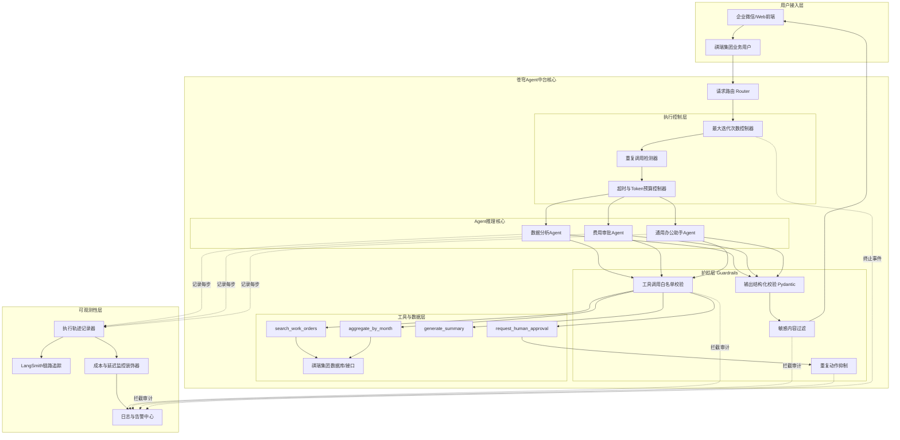
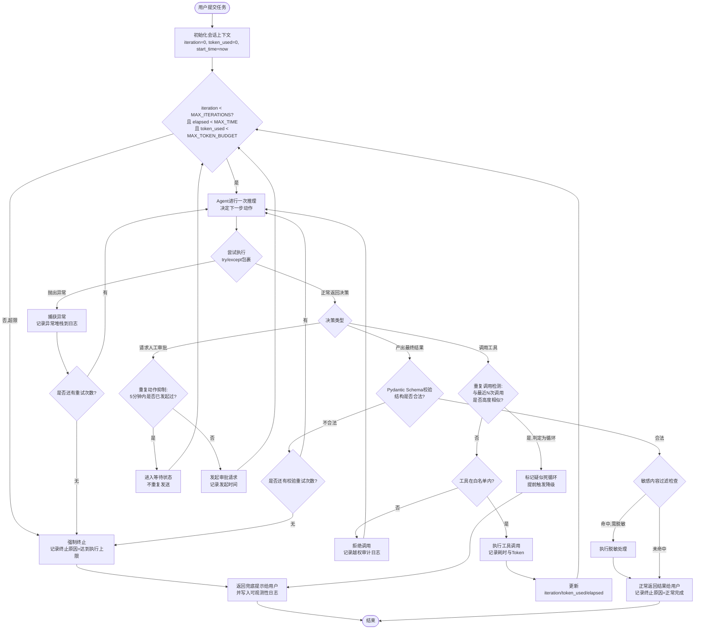
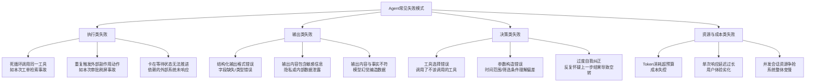

# 第46天:Agent稳定性与工程化

**所属阶段**:Stage 4 · Agent综合项目实战 / **Sprint 5:Agent进阶与交付**(第1天)
**关联项目**:苍穹企业级智能体中台 —— 祺瑞集团(地产 + 物业)多Agent办公助手
**今日人物**:陈铭(后端/Agent研发)、王振宇·老王(蓬远科技资深架构师,陈铭导师)
**前情提要**:Day45 完成了第一次阶段周测,并和团队一起讨论了低代码平台在祺瑞项目里的取舍
**今日主题**:一次真实的死循环事故复盘,Agent可观测性、护栏设计与工程化落地

---

## 【旁白】

周一的深圳,雨下了一整夜,到早上八点多才渐渐停。陈铭到工位的时候,工位对面王振宇的电脑屏幕还亮着——凌晨两点四十分,老王在值班群里甩出了一张监控告警截图,备注只有四个字:"先别慌,睡"。陈铭当时刚睡下,手机震了一下没敢看,现在坐下打开企业微信,才后知后觉地感到一阵后怕。

上周五(Day45)团队刚刚过完第一次阶段周测,气氛还算轻松,大家甚至花了小半个下午讨论要不要在祺瑞项目里引入一套低代码搭建平台,好让业务侧的产品经理自己拖拽配置一些简单的审批流。会议开得挺热闹,产品那边跃跃欲试,老王倒是留了一句"看热闹的心态可以有,但别忘了我们现在这套Agent骨架本身还没有跑过真正的压力测试"。这句话在周五晚上没人当回事,周末就应验了。

陈铭其实对这套系统一直挺有信心。过去一个多月,他跟着老王把苍穹企业级智能体中台在祺瑞项目里的骨架一点点搭起来——从最早的单一问答Agent,到后来拆分出数据分析、费用审批、通用办公助手这几个各司其职的子Agent,再到上周把它们串成一个能互相调用、能协同处理复杂任务的多Agent系统,每一步进展他都亲手参与,也都亲眼看着Demo一次次跑通。正因为这份熟悉,他反而更容易低估"跑通"和"跑稳"之间的距离——在他过去的认知里,一个功能只要在测试环境里跑过十几次、二十几次都没问题,基本就可以算是"验证过了"。这次事故恰恰打破了这种朴素的信心:同样的功能、同样的Agent配置,前面二十六次运行都是干净利落的成功,第二十七次却毫无征兆地栽了进去,而且栽进去的方式还不是常见意义上的"报错崩溃",而是悄无声息地空转,一直到有人恰好盯着监控大屏才被发现。

周末灾难的引子,是一次看起来毫不起眼的"内部试跑"。祺瑞集团那边催得急,想在下周三给物业公司高层做一次多Agent办公助手的联合演示,内容是"帮我查一下A栋写字楼过去三个月的报修工单趋势,并总结给我"。测试同事小唐周六加班,把这个demo场景跑了几十次,本来一切正常,直到周六晚上九点多,系统里悄悄跑出了一个没有终止的会话——那个会话像是被卡在了一个死循环里,一直在调用同一个搜索工具,而没有人第一时间发现。等到监控告警在深夜触发的时候,这一个会话已经吃掉了将近四位数的Token调用量,还触发了数十次对同一份工单数据的重复检索。

老王那天夜里手动把服务降级重启,又手写了一份简单的补丁把这个会话强制掐断,才把事情控制住。但补丁只是止血,不是治病。今天这一整天,团队的重心不再是"再加一个新功能",而是回过头去,给这套已经能跑起来的Agent系统,补上此前一直被进度压着没做的那部分——稳定性与工程化。老王说得很直白:"能演示的Agent和能上生产的Agent,中间差的那一截,今天我们必须走完。"

---

## 一、晨会纪要

**时间**:2026年某周一 上午9:40 - 10:25
**地点**:蓬远科技3楼会议室"苍穹一号"
**参会人**:王振宇(主持)、陈铭、测试组小唐、后端同事阿俊、产品经理林悦(远程连线)

老王没有像往常一样先过周计划,而是直接把投影切到了周末的监控大屏截图,开场第一句话就是:"先看事故,别看PPT。"

### 1.1 事故复盘:一个"看起来正常"的死循环

小唐先汇报了周六加班测试的经过。她说测试脚本本身很简单,就是模拟物业客服在企业微信里问一句"帮我查一下A栋写字楼过去三个月的报修工单趋势",系统里配置的是一个"数据分析Agent",内部挂了三个工具:`search_work_orders`(检索工单)、`aggregate_by_month`(按月聚合)、`generate_summary`(生成文字总结)。前面二十几次运行都很顺利,响应时间大概在8到15秒之间,输出的总结也挑不出毛病。

问题出在第27次运行。当时她换了一个稍微刁钻一点的问句,把"过去三个月"改成了"从今年年初到现在",目的是想测一下Agent对模糊时间表达的处理能力。任务提交之后,页面一直在转圈,过了将近一分钟都没有返回结果,小唐当时以为是网络问题,又开了一个新窗口重新提交了一次一模一样的请求,自己却忘了把第一个窗口关掉。

老王在这里插了一句:"这个细节很关键,回头我们要讨论——为什么同一个用户可以无限制地并发提交同类型任务,这本身也是一个工程化漏洞,先记下来。"

到了晚上九点多,系统监控的Token消耗曲线出现了一个非常陡的爬升,平时一次完整会话大概消耗2000到4000个Token,但那两个挂着的会话,在没有任何人为干预的情况下,Token消耗一路涨到接近40000。老王当时紧急介入,把日志拉出来看,发现的现象让他倒吸一口气:Agent在决策链路里反复调用`search_work_orders`这一个工具,前前后后调用了41次,每次传入的参数几乎一样,只是时间范围的表达方式略有出入,比如第一次是"start=2026-01-01, end=now",第二次变成"start=年初, end=至今",第三次又变成"start=2026年1月1日, end=当前日期"。Agent的推理链条里,每次工具返回结果之后,它都会"觉得"这个结果格式不太对、需要换个参数重新查一次,然后陷入了这样一个自我说服的循环——它不是报错死循环,而是"看起来一直在努力工作"的死循环,这种类型的问题比直接报错的Bug更难被发现,因为系统日志里没有Exception,没有Traceback,只有一条条看似正常的INFO日志。

阿俊补充说,他复盘的时候还发现了另一种更隐蔽的失败模式,是在一次审批场景的演示里出现的:某个"费用审批Agent"给出一个初步结论后,按照设计应该调用`request_human_approval`工具去请求人工审批,但由于审批人节点当时配置有误,一直没有收到人工的确认回执,Agent的逻辑判断是"审批还没通过,那我应该再请求一次",于是变成每隔几秒钟就重新发起一次审批请求,前后一共发出了近200条重复的审批通知,把审批人的企业微信直接刷屏了。这个案例和数据检索死循环的机理不完全一样,但本质是同一类问题:**Agent缺少对"重复行为"和"无进展状态"的自我感知能力,也没有外部的硬性约束去兜底**。

### 1.2 老王的现场追问

老王没有直接给结论,而是抛出了几个问题让大家一起想:

第一,"如果这个死循环发生在生产环境,而不是我们内部测试环境,后果是什么?"陈铭答,首先是成本失控,如果调用的是按量计费的大模型API,一个失控会话可能在几分钟内产生远超正常水平的费用;其次是资源被占用,如果系统对并发会话数或者线程池有限制,一个卡死的会话可能会占着资源不释放,进而拖慢其他正常用户的请求;第三,如果像阿俊说的审批场景那样对外发送了骚扰式的重复通知,会直接损害客户对系统的信任,这种"社会性事故"比单纯的技术故障更难挽回。

第二,"为什么我们的测试流程,直到第27次运行才暴露这个问题?"小唐说,因为前面的输入都比较"规整",都是明确的时间表达,只有在模糊表达出现的时候,Agent的推理才开始"绕圈子"。老王说这恰恰说明了一个道理:传统软件测试里追求的"覆盖率"思维,在Agent场景里要往前再走一步,不仅要覆盖输入的正常路径,还要覆盖大模型推理路径上可能出现的各种"自证清白"式的循环陷阱,这类陷阱往往藏在边界模糊的输入里。

第三,"我们现在的系统,有没有任何机制能够在这种循环发生的第五次、第十次就拦下来,而不是等它跑到第41次才被人工发现?"这个问题现场没人能给出肯定回答,答案是没有。这就是今天整个课程要解决的核心缺口。

老王接着又抛出第四个问题,这个问题问得更尖锐:"假设咱们今天什么都不改,直接把这套系统原样交付给祺瑞集团,周三演示的时候万一现场也遇到类似的模糊时间表达,这个锅谁来背?"会议室里安静了几秒钟。老王自己给了答案:"锅不会只落在写代码的人身上,客户会认为整个蓬远科技交付的产品不可靠,这种信任一旦受损,比修一百个bug都难挽回。"他顿了顿又说,"我们做技术的人,有时候容易陷入一种误区,觉得bug嘛,修了就好,大不了道个歉。但企业级的客户,尤其像祺瑞集团这种传统行业里做得比较扎实的甲方,他们对'稳定可靠'这四个字的要求,比互联网行业客户高得多,他们习惯的是ERP、OA这类几十年打磨出来的系统,那些系统可能功能不多、界面不好看,但基本不会无缘无故地不干活或者做出奇怪的事情。我们想让Agent类产品在这类客户里站住脚,就必须先证明它在稳定性这个维度上,不比传统系统差,甚至要更好,因为它是新东西,天然要背更重的信任负担。"

阿俊在这里补了一句题外话:"所以严格来说,今天这个bug,某种程度上帮了我们一个忙——如果它是在客户现场演示时才暴露出来,后果会比现在严重得多。"这句话得到了老王的认可,他说这也是为什么整个团队应该把这次事故当作一次"低成本的免费压力测试",而不是简单的一次失误追责,追责没有意义,把问题彻底吃透、把防线建立起来才有意义。

阿俊这时候又抛出一个更细节的问题:"那我们要不要干脆在Prompt里加一句'如果连续三次查询结果类似,就不要再查了',让模型自己学会克制?"老王摇头,说这个思路很多团队都会第一时间想到,但它的效果非常不可靠。原因是Prompt层面的约束本质上是"建议",而不是"强制",大模型在推理的时候完全可能因为上下文窗口过长、注意力分散、或者单纯是这次采样的随机性,就是不遵守这条建议,尤其是在阿俊说的这种"模型自己觉得有必要再查一次"的心理状态下,一句"别再查了"的提示词,分量远远比不过模型自己内心那种"我要对结果负责、我要把这件事做对"的驱动力。他打了个比方:"这就像你跟一个特别认真的新员工说'别太较真了,差不多就行',他嘴上说好,但真到手头这件事上,他还是会忍不住多做一遍确认,因为他的目标函数里'把事情做对'的权重,天然就比'听你这句话'更高。所以Prompt层面的引导可以做,应该做,但它只能是软性的辅助手段,绝不能替代代码层面的硬性约束,这是今天要立的第一条规矩。"

小唐又提了一个现场测试时观察到的细节:她说死循环发生的那次会话,系统响应给前端的状态一直显示"处理中",页面上的加载动画转了差不多快两分钟,如果不是她自己多开了一个新窗口重复提交、才让监控指标出现异常波动被老王发现,这个挂起的会话可能会一直转下去,直到某个更上层的网关超时(她记得大概是120秒)才被动掐断,而那个网关超时逻辑本身是给所有接口统一配的通用规则,并不是专门为Agent场景设计的,超时之后前端只会提示一个很生硬的"请求超时,请重试",完全没有任何有意义的信息告诉用户到底发生了什么。老王听完之后特别强调了一句,这正是今天要解决的"最后一公里"问题——即便技术上把死循环拦住了,如果拦住之后甩给用户的还是一个冷冰冰、不知所云的错误提示,那么从客户体验的角度看,这次加固基本等于没做,所以护栏拦截之后的兜底文案设计,必须和技术方案同等重视,不能是"能拦住就行"的敷衍心态。

老王最后总结了三句话,陈铭在笔记本上原样记了下来:

"第一,能演示不代表能上线,能上线不代表能稳定运行,这中间隔着的是工程化;第二,Agent的失败往往不报错,它看起来像是在认真工作,这是它和传统程序最大的区别,也是最危险的地方;第三,从今天开始,咱们给苍穹加上三层东西——护栏、可观测性、成本控制,这三层不是锦上添花,是生产环境的准入门槛,没有这三层,别的功能做得再花哨都不能给客户上线。"

### 1.3 晨会决议

会议最后达成了几条明确的行动项:

1. 陈铭负责实现"最大迭代次数限制 + 死循环检测"机制,今天必须落地并接入现有Agent执行引擎;
2. 陈铭同时负责基于Pydantic的Agent输出结构化校验,防止格式错乱或字段缺失流转到下游;
3. 阿俊负责Guardrails护栏的两个子模块:敏感内容过滤和工具调用白名单机制;
4. 小唐配合做护栏和死循环检测的测试用例设计,特别是要把周末踩过的这两个坑做成回归测试;
5. 全组统一接入LangSmith做链路追踪,今天下午集中过一遍怎么用LangSmith定位问题;
6. 林悦这边先不对客户提这次事故的细节,只说"我们在正式演示前又发现并加固了几个稳定性细节",避免引起不必要的担心,但要求周三演示前必须提供一份"稳定性加固说明"内部材料。

会议开到10点25分结束,老王临走前又补了一句:"今天这一天,你们写的代码可能是整个70天课程里最不'炫技'的一天,但也可能是最值钱的一天。搞Agent的人多,能把Agent做稳的人少。"

散会之后,陈铭没有立刻回工位,而是拉着阿俊在走廊里又聊了几句。阿俊说他其实周末看到告警的时候,第一反应是怀疑是不是模型本身出了问题,是不是应该换一个更"聪明"的模型来解决这个bug。陈铭说自己一开始也是这么想的,但仔细一想,如果换一个更强的模型,顶多是把"死循环发生的概率"从比如说千分之三降到千分之一,这个概率永远不可能降到零,只要客户的真实使用量足够大,总有一天还是会撞上,与其把宝押在"模型足够聪明就不会犯这种错"这个不可控的假设上,不如老老实实把工程化的地基打牢,让系统在模型犯错的时候依然能兜得住,这才是真正可控、可交付、可以对客户承诺的东西。两人在走廊里达成了共识:今天这一天的工作,与其说是"修一个bug",更像是给整个苍穹中台补上一张安全网,这张网织得越密,以后不管接入什么模型、扩展什么场景,团队心里都能更有底气。

---

## 二、需求文档:Agent稳定性与工程化改造需求

**文档编号**:PY-QR-REQ-046
**版本**:v1.0
**提出方**:蓬远科技技术团队(内部驱动,周末事故触发)
**关联客户**:祺瑞集团(不直接对客户暴露技术细节,作为内部质量门槛)
**优先级**:P0(阻断性,未完成不允许进入Sprint5后续开发)

### 2.0 文档定位说明

本需求文档区别于此前针对祺瑞集团业务侧提交的功能类需求文档,它不产生任何客户可见的新功能点,而是面向系统内部质量与工程规范的加固型需求,评审通过标准也不同于常规业务需求——常规业务需求以"是否满足客户提出的场景描述"作为验收依据,而本需求以"是否能够在系统层面提供可验证、可复现、可持续运营的稳定性保障机制"作为验收依据。老王在文档评审会上特别要求把这条说明单独列出来,原因是他担心如果不做区分,后续版本管理和优先级排期时,产品侧可能会习惯性地把这类需求和普通功能需求放在同一个优先级队列里比较"性价比",而稳定性类需求的收益往往是隐性的、体现在"没有发生的事故"上,很难用传统的ROI方式衡量,如果不特别强调其P0属性,很容易在排期压力下被无限期推后,这正是过去很多团队在实际项目中吃过的亏。

### 2.1 背景

苍穹企业级智能体中台在为祺瑞集团开发的多Agent办公助手中,已经实现了数据检索、任务总结、费用审批等若干Agent能力,并计划在本周三向客户高层进行联合演示。周末的内部测试中发现,系统在特定模糊输入下会触发Agent反复调用同一工具形成无终止循环的问题,另有审批类Agent在人工反馈延迟时出现重复请求刷屏的问题。这两类问题共同暴露出当前系统缺乏对Agent执行过程的硬性约束、缺乏对异常行为的实时感知、缺乏对成本与延迟的监控告警。为保证演示与后续上线的稳定性,现提出本次工程化改造需求。

### 2.2 需求范围

本次改造聚焦于Agent执行引擎的稳定性加固,不涉及新增业务场景,不涉及UI/交互层的调整,具体覆盖以下四个方向。需要特别说明的是,这四个方向并非彼此独立、可以任选其一优先实现的关系,而是层层递进、互为补充的一整套体系:执行边界控制解决的是"最坏情况下系统能不能兜得住"的问题,是最后一道防线,任何情况下都必须生效;输出结构化校验解决的是"系统给出的结果本身是否可信、可用"的问题,是保证下游能够安全消费Agent产出的前提;护栏机制解决的是"系统的行为边界是否符合业务与合规要求"的问题,防止越权和风险内容的产生;可观测性与成本管理则是横向贯穿前三者的支撑能力,没有它,前三者出了问题也难以被及时发现和归因。四个方向必须同步推进,任何一个方向的缺失都会让整套稳定性体系出现明显的短板,这也是为什么本次需求被定为不可拆分、必须一次性完成的P0级改造,而不是可以分批排期、择优上线的常规功能需求。

**方向一:执行边界控制**

系统必须对每一次Agent会话的工具调用次数设置硬性上限(建议初始值:单次任务最多12次工具调用,可配置),超过上限后必须强制终止当前推理链路,并向用户返回明确的、可理解的兜底提示,而不是无限等待或裸奔到超时。

系统必须能够识别"重复调用模式",即连续多次(建议阈值:3次)调用同一工具且参数高度相似(参数文本相似度超过85%,或语义等价)的情况,一旦识别到该模式,应提前于硬性上限触发降级处理,避免无谓消耗资源。

系统必须为每次会话设置总执行时长上限(建议初始值:90秒)和总Token消耗上限(建议初始值:单次任务12000 Token),任意一项超限即触发强制终止。

**方向二:输出结构化校验**

所有Agent在流程关键节点产生的结构化输出(例如工具调用参数、审批决策结果、最终总结JSON)必须经过Schema校验,校验框架统一采用Pydantic v2。校验失败时,系统应触发一次带有明确错误反馈的重试(不超过2次),重试仍失败则终止流程并记录详细错误上下文,不允许把未经校验的结构化数据传递给下游节点或直接暴露给用户。

**方向三:护栏(Guardrails)机制**

系统必须建立工具调用白名单机制,任何Agent在运行时只能调用其被明确授权的工具集合,越权调用尝试必须被拦截并记录审计日志,不能静默放过也不能直接崩溃。

系统必须建立输入与输出的敏感内容过滤机制,覆盖但不限于:客户隐私信息(身份证号、手机号、银行账号)误输出、内部敏感数据(合同金额、员工薪资等)越权展示、以及可能引发合规风险的表述。命中过滤规则时应对内容进行脱敏或阻断,并留痕。

针对审批类Agent,必须建立"重复动作抑制"护栏:同一审批请求在未获得明确终态反馈前,不允许对同一审批人在短时间窗口(建议:5分钟)内发起超过1次的重复通知,超出则自动进入等待状态并记录待办,而不是持续重试。

**方向四:可观测性与成本管理**

系统必须为每一次Agent会话生成完整的执行轨迹记录,包括但不限于:每一步的工具调用输入输出、每一步的耗时、每一步消耗的Token与估算成本、异常与中断事件、最终终止原因(正常完成/达到迭代上限/超时/护栏拦截/异常退出)。

系统必须接入LangSmith(或同等的链路追踪能力)完成分布式链路的可视化追踪,团队成员应能够通过追踪链路在5分钟内定位一次异常会话的问题根因所在的具体步骤。

系统必须提供成本与延迟的实时监控装饰器,可以低成本地嵌入到现有Agent函数上,自动记录调用耗时、Token用量、预估费用,并支持超阈值告警(初期以日志形式记录ERROR级别告警,后续再考虑接入企业微信机器人推送)。

### 2.3 非功能性要求

改造后的方案应保持对现有业务Agent代码的低侵入性,优先以装饰器、中间件、包装器的形式接入,不应要求对现有业务逻辑进行大规模重写。

新增的护栏与校验逻辑本身的执行开销应控制在可接受范围内,单次校验或护栏检查的额外耗时不应超过200毫秒,避免"稳定性方案本身拖慢了系统"。

所有新增机制必须配套单元测试与至少一个端到端回归测试用例,回归测试用例需要覆盖本次事故复盘中发现的两类真实问题场景(数据检索死循环、审批重复刷屏)。

### 2.4 验收标准

1. 使用周末事故复现脚本重新运行,系统必须在不超过12次工具调用或不超过90秒的情况下主动终止,并返回明确的兜底文案,不能出现无响应或长时间挂起;
2. 审批场景的重复通知问题必须被护栏机制拦截,同一审批人5分钟内收到的重复通知数不超过1条;
3. 任意一次Agent会话结束后,可以在LangSmith(或本地追踪日志)中查看到完整的执行链路,包含每一步耗时和Token消耗;
4. 所有结构化输出必须能够通过对应Pydantic模型的校验,故意构造的错误格式输入必须被正确拦截并触发重试或终止流程;
5. 越权工具调用测试用例(即Agent尝试调用未被授权的工具)必须被100%拦截,并生成对应审计日志条目。

### 2.4.1 补充说明:验收标准的量化口径

为避免验收环节出现"标准太模糊、各说各话"的情况,本节对上面五条验收标准的量化口径做进一步说明,这部分内容是老王在评审需求文档草稿时特意要求补充的,他的原话是:"验收标准写得含糊,到时候测试和开发就会因为'这个算不算通过'吵起来,现在把口子堵死,省得以后扯皮。"

关于第一条,"事故复现脚本重新运行必须在不超过12次工具调用或不超过90秒的情况下主动终止",这里的"主动终止"特指系统必须返回一个结构化的、带有明确`termination_reason`字段的响应,而不是简单地断开连接或返回HTTP 500,同时要求在日志与可观测性记录中能够清晰看到具体是哪一项约束(迭代次数、超时、Token预算、重复调用检测中的哪一个)触发了终止,便于后续针对性优化对应的阈值配置。

关于第二条,"同一审批人5分钟内收到的重复通知数不超过1条",这里的统计口径是以`(approver_id, request_signature)`这个组合为唯一键,也就是说,如果审批人张伟同时收到关于"A栋电梯维保"和"B栋消防系统巡检"两笔不同审批请求的通知,这两条通知都应该正常送达,不应该被误判为重复,重复动作抑制护栏的拦截范围严格限定在"同一件事的重复提醒",而不是限制审批人正常应该收到的不同审批事项通知,这一点在测试用例设计时要特别注意区分。

关于第三条,"任意一次Agent会话结束后可以在LangSmith中查看到完整执行链路",验收时需要具体检查链路中是否包含每一步的开始时间、结束时间、输入摘要、输出摘要、异常信息(如有)这五项基本字段,缺少任何一项都视为不达标,不能只是"能看到一些日志"就算通过。

关于第四条和第五条,测试组需要专门准备一批"故意构造错误"的测试数据集,包括但不限于:缺失必填字段的JSON、字段类型错误的JSON、时间范围颠倒的日期区间、越权尝试调用未授权工具的模拟请求,这批测试数据集将作为后续每次系统迭代的标准回归测试集之一,长期沉淀维护。

### 2.5 排期与责任人

本次需求定为P0级别,要求今日(周一)完成核心机制的编码与自测,周二上午完成集成测试与回归,周二下午对齐林悦确认对外的"稳定性加固说明"材料,周三正式演示前完成最终的联调验证。责任人:陈铭(执行边界控制、输出校验、可观测性主体实现)、阿俊(护栏机制)、小唐(测试用例与回归)、王振宇(全程把关与架构评审)。

---

## 三、架构设计图:加入可观测性与护栏后的Agent架构

老王在白板上先画了改造前的架构,一个简单的"用户输入 → Agent推理 → 工具调用 → 输出"的直线链路,然后拿红笔在中间加了三层——护栏层、执行控制层、可观测性层,一边画一边说:"以前咱们的架构图里,这三层是隐形的,靠人肉盯着日志,现在必须变成显性的、代码里能看见的组件。"



这张图有几个地方陈铭当时没完全理解,老王专门解释了一下。第一,执行控制层被放在了"路由"之后、"Agent推理核心"之前,意思是不管具体是哪个Agent在跑,迭代次数和超时预算的判断都是统一的、前置的,不能让每个业务Agent自己各写一套判断逻辑,否则以后接入新Agent永远要重新踩一遍坑。第二,护栏层被拆成了四个独立的子模块,而不是一个大而全的"安全检查",这是因为不同护栏的触发时机不一样——工具调用白名单要在"决定调用哪个工具"之后、"真正发起调用"之前拦;敏感内容过滤更偏向对最终输出的检查;重复动作抑制专门针对像审批这种有外部副作用(会真的发通知)的动作;结构化校验则专门盯着Agent吐出来的JSON或结构化字段。第三,可观测性层是横向贯穿的,几乎每个组件都会往里面报数据,这也是为什么老王反复强调"可观测性不是最后补一层日志,而是从设计阶段就要在每个组件旁边挂一根线"。

---

## 四、流程图:带最大迭代次数、异常捕获与护栏校验的Agent执行流程

画完架构图,老王接着画了一张更细的流程图,专门描述"一次任务提交进来之后,具体是怎么一步步被控制住的"。他说这张图基本就是陈铭今天要写的核心代码的执行时序图,"你按这张图写代码,基本不会漏关键判断"。



这张流程图里,陈铭原本以为最难的部分是"重复调用检测",实际写代码的时候才发现,老王一直强调的"每一步都要更新状态并回到同一个循环判断入口"才是真正容易漏掉的地方——很多人写Agent循环的时候,会在某个分支里"顺手"多跑一次工具调用而不经过统一的边界检查,这种"抄近路"正是死循环最容易钻的空子。

老王在讲这张图的时候,还专门用红笔在"TryBlock"那个判断节点旁边画了一个圈,提醒大家不要小看这个看起来很朴素的try/except包裹。他说很多团队写Agent执行引擎的时候,只在最外层包一个大大的try/except,想着"反正出了任何问题都兜底",这种做法在传统Web服务里问题不大,但放在Agent循环里会有一个隐患:如果异常发生在循环内部的某一步,而外层的try/except是包在整个循环外面的,那么一旦触发异常,整个会话直接从循环中跳出并终止,前面已经执行成功的那几步工作全部作废,用户等了大半天却什么都没拿到;而如果把try/except包裹在每一轮迭代的内部(就像流程图里画的那样,"TryBlock"节点是在循环内部、每一轮都会经过的位置),遇到异常时可以做的事情就更细腻——可以选择只重试当前这一步,保留前面已经取得的进展,这对于像"跨多个数据源查询"这种需要多轮工具调用才能完成的任务尤其重要,不能因为最后一步网络抖动了一下,就把前面辛苦查回来的数据全部推倒重来。这个细节在Day47要扩展的复杂查询场景里会变得更加关键,老王专门叮嘱陈铭现在就要把这个"细粒度异常处理"的习惯确立下来,不要等到场景变复杂了才回头重构。

---

## 五、示意图:常见Agent失败模式分类

上午课堂笔记开始之前,老王先甩出了第三张图,这张图不是流程,而是一张"分类地图",目的是让陈铭对"Agent到底会怎么坏掉"先有一个全局认识,再进入具体的调试方法。



老王让大家对着这张图,把周末的两个事故对号入座:数据检索死循环对应的是"F1a 死循环调用同一工具"叠加"F3c 过度自我纠正"——Agent反复怀疑自己上一次的查询结果格式不对,于是不停换着写法重新查;审批刷屏对应的是"F1b 重复触发外部副作用动作"。老王特别提醒,F1b这一类失败模式是最危险的,因为它已经不是"系统内部空转浪费资源"了,而是"系统对外做了真实的、不可撤销的动作",一旦涉及发通知、发邮件、扣款、下单这类有真实副作用的工具,重复动作抑制护栏就必须是强制项,不能作为可选加固项。

阿俊当时提了一个很有意思的观察:他说F2c"模型幻觉编造数据"这一类失败,在过去几个月的项目里其实一直存在,只是没有像这次死循环事故一样被放到台面上讨论,原因是幻觉类问题往往不会导致系统卡死或报错,它只会"悄悄地"给出一个错误但看起来合理的答案,如果没有人拿着真实数据去逐条核对,几乎不可能被发现,这种失败模式的隐蔽性比执行类失败还要更强一层——执行类失败至少会在监控指标上留下痕迹(耗时异常、Token异常),而纯粹的内容幻觉,从系统外部的量化指标上是完全看不出异常的,唯一的应对办法就是像今天课程里讲的那样,从Schema设计层面强制要求模型对自己的结论做"元描述"(比如声明数据完整性和置信度),把"这个结论有多可信"这件事,从模型自由发挥的范畴,收编成一个结构化的、可以被下游逻辑校验和处理的字段。老王对这个观察给了很高的评价,他说这也是为什么今天需求文档里`DataAnalysisSummary`模型的设计,看起来只是加了几个字段,实际上背后的工程思维价值很高。

---

## 六、课堂笔记

### 6.1 上午:常见失败模式分析 + LangSmith追踪调试

老王上午的课基本是围绕着上面那张分类图和周末的两个真实案例展开的,他没有按部就班念PPT,而是让陈铭现场把周末那个死循环会话的完整日志拉出来,一行一行地"读案子"。

**先谈"为什么Agent的失败不报错"。** 传统程序出错,大概率会有一个明确的异常抛出来:数组越界、空指针、网络超时,程序员看着堆栈信息基本能定位到问题。但Agent的"死循环"不是代码意义上的死循环——它的每一次工具调用、每一次推理,单独看都是"成功"的,HTTP请求返回了200,工具函数正常return了结果,大模型也乖乖生成了下一步的JSON决策。问题出在"语义"层面:它决定要做的这件事,本身是没有意义的重复。这种失败没有异常堆栈,只有一堆看起来正常的日志堆在一起,人眼很难在几百行日志里一下子看出"这41次调用其实是同一件事"。老王管这种叫"沉默的失控",他说这是所有做Agent工程化必须建立的第一个心理预期:**你不能靠等报错来发现问题,你必须靠主动的边界约束和模式识别去提前拦截。**

**接着讲失败模式的四个分类,一个个过细节。**

第一类是执行类失败,核心特征是"流程本身走不到终点"。除了死循环调用同一工具、重复触发外部副作用之外,老王补充了第三种情况——"卡在等待状态无法推进",举的例子是如果Agent设计成"调用工具A拿到结果后必须等工具B的异步回调才能继续",而工具B那边因为网络抖动没有及时回调,Agent就会一直"合理地"处于等待状态,表面上看没有循环调用,但同样是卡死,这种情况必须配合超时熔断机制,不能光靠迭代次数限制来兜底,因为它压根没有触发新的迭代。

第二类是输出类失败,是指Agent最终吐出来的东西本身有问题。老王专门强调了"模型幻觉编造数据"这个子类,他说这在祺瑞项目的场景里特别危险,因为客户要看的是"过去三个月报修工单趋势",如果Agent在某次工具调用失败、拿不到真实数据的情况下,仍然"自信满满"地编了一段看起来合理的总结文字,而没有明确告诉用户"数据获取不完整",这种问题比直接报错更可怕,因为它会被当成真实结论呈现给客户高层。这也是为什么本次需求文档里专门要求"结构化输出必须经过Schema校验",Schema里要包含一个"数据完整性"标志字段,强制Agent明确声明它这次的结论基于的数据是否完整。

第三类是决策类失败,老王把周末的核心事故归为这一类的"过度自我纠正"——他解释说,现在主流的Agent推理范式(比如ReAct范式)里,模型每一步都会"反思"上一步的结果是否满足需求,这个反思机制本来是为了让Agent更聪明、更能自我纠错,但反过来,当模型对"什么算作满足需求"的判断标准本身模糊的时候,反思机制反而会变成一个自我怀疑的死循环发生器——模型不断觉得"这个结果格式好像不太对,我换个方式再试试",而实际上前面几次的结果已经完全够用了。解决这个问题不能只靠约束模型的Prompt写法(那只是治标),更根本的是要在系统层面给它设置"多做无益"的边界,这正是最大迭代次数限制存在的意义。

第四类是资源与成本类失败,这一类和前三类不完全是并列关系,更像是前三类失败的"放大器"——一次死循环之所以造成实际损失,正是因为它带来了Token超支、延迟飙升、并发资源被占用这些后果。老王说这一类问题最适合用监控告警去覆盖,因为它天然是"可量化"的,Token数、耗时、并发数都是数字,数字超过阈值就应该有动作,不需要多复杂的语义判断。

**然后进入LangSmith追踪调试实操。** 老王打开自己电脑上接好LangSmith的一个演示环境(用的是脱敏后的测试数据,不是祺瑞真实客户数据),现场演示了怎么用LangSmith定位问题。他强调了几个使用习惯:

第一,每一次Agent会话在提交给LangSmith的追踪(trace)时,一定要打上有意义的`run_name`和`metadata`,比如会话所属的业务场景标签(`scenario=data_query`)、涉及的Agent类型(`agent_type=data_analysis`)、甚至是客户标识(注意脱敏,不能直接放客户敏感字段),这样在LangSmith的追踪列表里才能快速筛选定位,而不是面对一堵密密麻麻看不出规律的trace墙。

第二,LangSmith里的每一个"span"(执行步骤)都应该尽量对应到代码里的一个语义完整的动作单元,不要把好几个逻辑步骤糅在一个span里上报,否则追踪出来的链路图看起来是一条直线,根本看不出中间到底发生了什么。老王的建议是:每一次工具调用是一个span,每一次大模型推理调用是一个span,每一次护栏校验是一个span,层次要清楚。

第三,遇到问题时,排查顺序应该是"先看整体耗时分布,再看异常步骤,最后看具体输入输出"。他说很多新手一上来就想去看某一步的详细Prompt内容,其实效率更高的做法是先看这次会话的时间轴——如果发现某个工具反复出现在时间轴上,间隔很短,一眼就能看出重复调用的模式,这比一行一行读日志快得多。LangSmith的追踪视图天然是时间序列可视化的,这也是它比"裸看日志文件"更有优势的地方。

第四,LangSmith支持对trace打标签、写评论、标记为"有问题"以供后续复盘归类,老王要求团队从今天开始养成习惯:任何一次线上或测试环境出现异常的会话,必须在LangSmith里标记并附上简短的排查结论,方便积累"案例库",他说这个案例库以后会比任何文档都值钱,因为它是团队真实踩过的坑。

课程笔记里陈铭记下了一句老王原话:"你们现在觉得LangSmith只是一个'看日志好看一点'的工具,等你们真的追过几十次线上问题就会明白,它本质上是把'Agent在想什么'这件本来是黑盒的事情,变成了可以被人类阅读的时间线,这个能力值多少钱都不夸张。"

上午课的最后半小时,老王让陈铭现场用LangSmith重新追踪了一遍那个死循环的复现会话,一步步演示排查思路,这个过程陈铭觉得比听理论收获更大。他打开追踪列表,先按照今天上午刚打好的`scenario=data_query`标签筛选出所有相关会话,一眼就看到有一条trace的总耗时明显比其他都长,点进去之后,时间轴视图上密密麻麻排列着一长串标注为"search_work_orders"的span,老王让陈铭数了一下,前后一共41个,而且这些span在时间轴上几乎是紧挨着的,中间几乎没有间隔——这一点很关键,老王解释说,如果是正常的、有意义的多轮工具调用,span之间往往会因为不同的推理耗时而呈现出不规则的间隔分布,而像这种几乎等间隔、高密度排列的同名span,几乎可以一眼判定为异常模式,这也是为什么他一直强调,排查问题时"先看时间轴的宏观形状,再深入看细节内容"这个顺序很重要,因为宏观形状本身就是一种信息密度极高的线索。

接着老王让陈铭点开其中第15个和第16个span,对比它们的输入参数,发现两次调用的`building_code`字段完全一致,只有时间范围表达方式有细微差异,这一步验证了此前晨会上大家的猜测。老王又提醒陈铭注意每个span右侧显示的Token消耗数字,他说这个数字曲线本身也是一条重要的诊断线索——如果发现Token消耗随着调用次数线性增长、没有任何收敛趋势,几乎可以确定这是一次没有实质进展的空转,而如果是正常的多轮任务推进,Token消耗曲线通常会呈现出"逐渐收窄"的形态,因为随着信息逐渐补全,后续推理需要处理的不确定性应该越来越少,而不是越来越多。

老王还特别提到了一个容易被忽视的实操细节:团队应该在LangSmith的项目设置里,针对不同的业务场景配置不同的默认时间窗口和筛选器视图,并把这些预设视图共享给全组,而不是每个人每次都要自己重新配置筛选条件,他说这是很多团队用了LangSmith却没用出效率的常见原因——工具本身很强,但团队协作层面的使用规范没跟上,导致每个人各自摸索、效率参差不齐。今天下午他会要求阿俊把"数据查询场景""审批场景"这两个最常用的筛选视图配置好并共享到团队工作空间。

### 6.2 下午:输出校验 + Guardrails + 成本延迟优化

下午的课换了节奏,老王直接进入"怎么写代码"的层面,但在写代码之前,他先讲了三个设计理念,要求陈铭和阿俊先想明白再动手。

**理念一:校验和护栏应该是"可插拔"的,不应该和业务逻辑耦合。** 老王打了个比方,校验和护栏就像是海关和安检,它们不应该关心你箱子里具体装的是什么货,只关心"这个东西符不符合规定的形态和范围"。具体到代码设计上,意味着Pydantic的Schema校验应该独立定义、独立调用,不能把校验逻辑写死在某个具体Agent的业务函数内部;护栏检查(白名单、内容过滤、重复动作抑制)应该做成装饰器或者独立的Guard类,可以套在任意一个Agent的工具调用函数外面,新增一个业务Agent的时候,不需要重新写一套护栏逻辑,只需要"套用"已有的护栏组件并传入这个Agent专属的配置(比如它自己的工具白名单列表)。

**理念二:所有的"硬限制"参数必须可配置,不能写成魔法数字。** 最大迭代次数、超时时长、Token预算、重复调用相似度阈值、重复动作抑制的时间窗口,这些数字在项目初期可能是"拍脑袋"定的,但随着业务场景变多(比如祺瑞后面要接入的数据查询场景,可能天然需要更多轮工具调用),这些参数需要能够按场景、按Agent类型甚至按客户去分别配置,所以设计上要用配置类或配置文件承载这些参数,不能散落在代码各处硬编码。

**理念三:护栏拦截不等于任务失败,拦截之后该怎么办,要提前设计好"降级路径"。** 老王特别强调这一点,他说见过不少团队做安全护栏的时候,只想着"怎么拦住",没想清楚"拦住之后给用户看什么"。比如一次审批请求被重复动作抑制护栏拦下来了,系统不能什么都不返回,而应该告诉发起方"你的审批请求已经在等待中,请耐心等待,不需要重复提交";一次因为达到最大迭代次数被强制终止的数据查询任务,不能直接返回一个冷冰冰的"任务失败",而应该返回"当前查询较为复杂,已尝试多种方式仍未能在预期时间内完成,建议您缩小查询的时间范围后重试,或联系人工客服协助处理"这样有台阶可下的话术,这本身也是产品体验的一部分。

**接着是Pydantic输出校验的具体设计思路。** 老王要求所有Agent的结构化输出,无论是中间的工具调用参数,还是最终呈现给用户的总结结果,都必须对应一个明确定义的Pydantic模型。他举了个例子:数据分析Agent最终产出的总结,不能只是一段自由文本,而应该是一个包含`summary_text`(总结文字)、`data_completeness`(数据完整性,布尔值)、`data_period`(实际覆盖的时间范围)、`total_records`(涉及的工单总数)、`confidence_level`(置信度枚举:高/中/低)这几个字段的结构化对象,产品前端拿到这个结构化对象之后,可以根据`data_completeness`字段决定要不要在界面上加一个"部分数据可能未完全覆盖"的提示,而不需要靠解析自由文本去猜测。这种设计思路的好处是把"Agent说了什么"和"前端怎么呈现"彻底解耦,校验环节保证了Agent吐出来的东西至少在"形态"上是可用的,不会出现前端拿到一个缺字段的JSON直接白屏报错的情况。

**关于Guardrails护栏的两个核心子模块,老王给了具体的实现要求。** 工具调用白名单机制的实现要点是:每个Agent在初始化时必须声明自己被授权的工具集合(一个字符串集合),任何一次工具调用请求在真正执行之前,都要先检查工具名是否在这个集合里,不在的话直接拒绝并记录审计日志,日志里要包含Agent标识、尝试调用的工具名、时间戳、当前会话ID,方便后续排查是不是有Prompt注入或者模型行为漂移导致的越权尝试。敏感内容过滤机制的实现要点是:采用规则(正则表达式)加关键词库的组合方式做第一层轻量级过滤,覆盖身份证号、手机号、银行卡号等结构化敏感信息的模式识别,以及内部敏感词库(比如具体的合同金额措辞、员工薪资相关词汇)的关键词匹配,命中之后要做脱敏处理(比如把身份证号中间几位替换成星号)而不是简单粗暴地整段删除,尽量保留内容的可用性。老王说,更复杂的语义级内容安全检测(比如用另一个小模型做内容审核)以后可以作为增强项引入,但今天时间有限,先把规则引擎这一层筑牢,这一层性价比最高、最容易落地、也最容易解释给客户。

**成本与延迟优化部分,老王讲了三个具体的优化方向,并要求代码里体现出来。** 第一是精细化的Token预算管理,不能只在会话结束后统计总消耗,而要在每一步工具调用、每一次模型推理之后就实时累加,一旦发现累计消耗接近预算上限的80%,就应该在日志里打一条WARNING级别的预警,提前给后续的告警机制留出反应空间,而不是等超限了才知道。第二是对高频、重复概率大的工具调用结果做短时缓存,比如`search_work_orders`如果连续多次用几乎一样的参数被调用(哪怎么会有连续多次一样的参数调用呢——老王笑着说,这不就是咱们死循环bug的场景吗,加了缓存至少能把死循环造成的"重复计算成本"降下来,尽管治本还是要靠边界控制,但缓存可以作为纵深防御的一层),缓存命中的调用不计入Token消耗统计,也不应该计入"正常进展"的迭代次数(这一点要跟死循环检测器配合好,缓存命中反而应该让重复调用检测器更快触发,而不是被缓存"掩盖"了循环的痛感)。第三是延迟优化要区分"模型推理延迟"和"工具执行延迟"分别监控,因为这两者的优化手段完全不同——模型推理延迟通常要靠换更快的模型或者减少不必要的推理轮次来优化,工具执行延迟往往是外部接口或数据库查询慢,需要单独给外部依赖加超时和重试策略,不能一股脑都算成"Agent慢"。

老王最后在下午课的结尾说了一句让陈铭印象很深的话:"你们以后如果去做技术方案评审,凡是一个Agent系统的设计文档里,不谈护栏,不谈可观测性,不谈成本预算,只谈'这个Agent多聪明、能干多少事',这种方案在我这儿是不合格的,聪明是加分项,稳是及格线,及格线都过不了,加分项没有意义。"

下午课程接近结束的时候,林悦正好从祺瑞集团那边开完一个沟通会回到公司,顺路进会议室听了最后十几分钟。她提了一个业务视角的问题:"如果护栏拦截了一次任务,客户那边的人会不会觉得这个系统'很笨、动不动就说自己做不了'?"这个问题让讨论多了一个维度。老王认真地回答说,这确实是一个需要平衡的地方,护栏拦截率如果设得过于敏感,确实会让用户觉得系统能力弱、总是拒绝服务;但如果拦截阈值设得过于宽松,又会让稳定性风险重新抬头,这中间没有一个放之四海而皆准的标准答案,需要靠真实数据去调优——具体做法是,系统上线初期,应该把各类护栏和边界控制的触发日志都完整保留下来,定期(比如每周)回顾一次触发记录,分析里面有多少是"真正应该拦、拦对了"的情况,有多少是"其实用户的需求是合理的,只是护栏设得太严格"的误判,根据这个比例逐步调整阈值参数,这也是为什么前面反复强调所有阈值必须做成可配置项而不是硬编码——它们本身就是需要在生产环境里持续调优的运营参数,而不是一次性写死就完事的常量。

老王还补充说,从客户沟通的角度,与其让客户觉得"系统很笨老是拒绝",更好的做法是把护栏拦截包装成"系统在保护您的数据安全和资源使用效率",这本身也是一个可以对外讲的卖点,尤其是对祺瑞集团这种对数据安全和成本控制比较敏感的地产物业类客户而言,一个"知道什么时候该停下来"的智能系统,反而比一个"什么都敢答应、什么都往下冲"的系统更让人放心。林悦听完之后说,这个思路正好可以写进周三给客户高层看的"稳定性加固说明"材料里,作为一个正面的卖点去呈现,而不只是单纯的"我们修了一个bug"。

---

## 七、代码实战

今天下午到晚上,陈铭和阿俊分头把上面讨论的几个模块落地成代码。为了方便课程学习,这里把当天产出的核心代码按模块整理出来,分别是:执行边界控制(死循环检测与最大迭代次数限制)、Pydantic输出校验器、Guardrails护栏(工具白名单与敏感内容过滤)、成本与延迟监控装饰器、可观测性日志记录模块、LangSmith追踪配置,最后是一个把所有模块串起来的综合集成示例。所有代码均针对祺瑞集团数据查询与审批场景做了适配,但设计上是通用的,后续可以直接复用到别的Agent场景里。

### 7.1 执行边界控制:死循环检测与最大迭代次数限制

这是今天最核心的一段代码,直接对应周末事故的止血方案,老王要求这段代码必须独立成模块、有完整的单元测试。

```python
"""
loop_guard.py

Agent执行边界控制模块:最大迭代次数限制 + 重复调用死循环检测 + 超时与Token预算控制。

设计目标:
1. 对任意一次Agent会话的"工具调用/推理"过程提供统一的边界约束入口,
   不依赖具体业务Agent自行实现循环判断逻辑。
2. 能够识别"连续多次调用同一工具且参数高度相似"这种典型的死循环模式,
   并在达到硬性上限之前提前降级处理。
3. 同时约束总执行时长与总Token消耗,三项任意超限都触发强制终止。

本模块产出于2026年苍穹企业级智能体中台"祺瑞集团多Agent办公助手"项目,
用于修复内部测试中发现的Agent反复调用同一工具形成死循环的稳定性问题。
"""

from __future__ import annotations

import time
import json
import difflib
import hashlib
import logging
from dataclasses import dataclass, field
from enum import Enum
from typing import Any, Callable, Optional

logger = logging.getLogger("cangqiong.loop_guard")


class TerminationReason(str, Enum):
    """会话终止原因枚举,统一用于可观测性日志与前端兜底文案匹配。"""

    NORMAL_COMPLETE = "normal_complete"
    MAX_ITERATION_REACHED = "max_iteration_reached"
    TIMEOUT = "timeout"
    TOKEN_BUDGET_EXCEEDED = "token_budget_exceeded"
    DUPLICATE_LOOP_DETECTED = "duplicate_loop_detected"
    GUARDRAIL_BLOCKED = "guardrail_blocked"
    SCHEMA_VALIDATION_FAILED = "schema_validation_failed"
    UNCAUGHT_EXCEPTION = "uncaught_exception"


class LoopGuardError(Exception):
    """当边界控制器判定需要强制终止会话时抛出的异常基类。"""

    def __init__(self, reason: TerminationReason, message: str, context: Optional[dict] = None):
        super().__init__(message)
        self.reason = reason
        self.message = message
        self.context = context or {}

    def to_fallback_payload(self) -> dict:
        """生成返回给用户的兜底提示,不同终止原因配不同话术。"""
        fallback_texts = {
            TerminationReason.MAX_ITERATION_REACHED: (
                "当前任务处理步骤较多,已超出系统允许的最大处理轮次。"
                "建议您缩小查询范围(例如明确具体的时间区间)后重试,"
                "或联系人工客服协助处理。"
            ),
            TerminationReason.TIMEOUT: (
                "当前任务处理时间超出预期,系统已自动终止。"
                "这通常是因为查询条件较为复杂,建议简化后重试。"
            ),
            TerminationReason.TOKEN_BUDGET_EXCEEDED: (
                "当前任务消耗资源超出系统预算限制,已自动终止。"
                "建议拆分为更明确的小问题分别提问。"
            ),
            TerminationReason.DUPLICATE_LOOP_DETECTED: (
                "系统检测到当前任务陷入重复处理,已自动终止以避免资源浪费。"
                "请尝试使用更明确的表达方式重新提问。"
            ),
            TerminationReason.GUARDRAIL_BLOCKED: (
                "当前请求涉及的操作不在系统允许范围内,已被安全策略拦截。"
                "如有需要请联系管理员确认权限。"
            ),
            TerminationReason.SCHEMA_VALIDATION_FAILED: (
                "系统在生成结构化结果时多次校验失败,已终止本次任务。"
                "请稍后重试,若持续出现请联系技术支持。"
            ),
            TerminationReason.UNCAUGHT_EXCEPTION: (
                "系统处理过程中出现异常,已终止本次任务。"
                "请稍后重试,若持续出现请联系技术支持。"
            ),
        }
        return {
            "success": False,
            "termination_reason": self.reason.value,
            "user_message": fallback_texts.get(self.reason, "任务处理异常,请稍后重试。"),
            "debug_context": self.context,
        }


@dataclass
class LoopGuardConfig:
    """边界控制器的全部可配置参数,严禁在业务代码中硬编码这些数字。"""

    max_iterations: int = 12
    max_elapsed_seconds: float = 90.0
    max_token_budget: int = 12000
    token_warning_ratio: float = 0.8  # 超过80%预算时提前预警

    duplicate_window_size: int = 3       # 检测重复调用时回看最近N次
    duplicate_similarity_threshold: float = 0.85  # 参数相似度阈值
    duplicate_min_repeat_count: int = 3  # 至少重复多少次才判定为循环

    approval_dedup_window_seconds: float = 300.0  # 审批类动作去重时间窗口(5分钟)

    max_exception_retries: int = 2  # 单次任务因异常触发的重试上限
    max_schema_retries: int = 2     # Schema校验失败触发的重试上限


@dataclass
class ToolCallRecord:
    """单次工具调用的记录,用于重复调用检测与可观测性回放。"""

    tool_name: str
    arguments: dict
    timestamp: float
    duration_ms: Optional[float] = None
    token_cost: Optional[int] = None
    result_digest: Optional[str] = None

    def fingerprint(self) -> str:
        """
        生成一个用于相似度比较的参数指纹字符串。

        直接对dict做json.dumps并排序key,保证同样内容的不同顺序dict
        产生相同指纹,便于后续做字符串相似度比较。
        """
        try:
            normalized = json.dumps(self.arguments, sort_keys=True, ensure_ascii=False, default=str)
        except TypeError:
            normalized = str(self.arguments)
        return normalized


class DuplicateLoopDetector:
    """
    专职负责识别"连续多次调用同一工具且参数高度相似"的死循环模式。

    这是本次周末事故(反复调用search_work_orders 41次)的直接对应修复组件。
    """

    def __init__(self, config: LoopGuardConfig):
        self.config = config
        self._history: list[ToolCallRecord] = []

    def record_and_check(self, record: ToolCallRecord) -> bool:
        """
        记录一次工具调用,并判断是否命中重复循环模式。

        返回True表示判定为死循环,调用方应立即触发强制终止流程。
        """
        self._history.append(record)
        window = self.config.duplicate_window_size
        min_repeat = self.config.duplicate_min_repeat_count
        threshold = self.config.duplicate_similarity_threshold

        same_tool_calls = [
            r for r in self._history if r.tool_name == record.tool_name
        ]
        if len(same_tool_calls) < min_repeat:
            return False

        # 只看最近window次同名工具调用,避免早期偶然的两次调用被误判
        recent = same_tool_calls[-window:] if len(same_tool_calls) >= window else same_tool_calls
        if len(recent) < min_repeat:
            return False

        similar_pairs = 0
        total_pairs = 0
        for i in range(len(recent) - 1):
            for j in range(i + 1, len(recent)):
                total_pairs += 1
                sim = self._similarity(recent[i].fingerprint(), recent[j].fingerprint())
                if sim >= threshold:
                    similar_pairs += 1

        if total_pairs == 0:
            return False

        similarity_ratio = similar_pairs / total_pairs
        is_loop = similarity_ratio >= 0.6  # 超过六成的两两组合都高度相似,判定为循环

        if is_loop:
            logger.warning(
                "检测到疑似死循环: tool=%s, 最近%d次调用两两相似度达标比例=%.2f",
                record.tool_name, len(recent), similarity_ratio,
            )
        return is_loop

    @staticmethod
    def _similarity(a: str, b: str) -> float:
        """使用标准库difflib计算两个字符串的相似度,0到1之间。"""
        if a == b:
            return 1.0
        return difflib.SequenceMatcher(None, a, b).ratio()

    def reset(self) -> None:
        self._history.clear()

    @property
    def history(self) -> list[ToolCallRecord]:
        return list(self._history)


class ApprovalDedupGuard:
    """
    专职负责审批类(有外部副作用)动作的重复触发抑制。

    直接对应周末的第二个事故:费用审批Agent因未收到人工反馈,
    在极短时间内重复发起近200次审批通知,刷屏审批人企业微信。
    """

    def __init__(self, config: LoopGuardConfig):
        self.config = config
        # key: (approver_id, request_signature) -> last_sent_timestamp
        self._last_sent: dict[tuple[str, str], float] = {}

    def should_send(self, approver_id: str, request_signature: str) -> bool:
        """判断当前这次审批请求是否允许真正发送,而不是被去重拦截。"""
        key = (approver_id, request_signature)
        now = time.time()
        last_sent = self._last_sent.get(key)
        if last_sent is not None and (now - last_sent) < self.config.approval_dedup_window_seconds:
            logger.info(
                "审批请求被去重护栏拦截: approver=%s, 距上次发送仅%.1f秒(阈值%.1f秒)",
                approver_id, now - last_sent, self.config.approval_dedup_window_seconds,
            )
            return False
        self._last_sent[key] = now
        return True

    def reset(self) -> None:
        self._last_sent.clear()


class AgentExecutionGuard:
    """
    Agent执行边界控制器主类,聚合最大迭代次数、超时、Token预算、
    重复调用检测四项硬性约束,是本模块对外的核心入口。

    典型用法:
        guard = AgentExecutionGuard(config=LoopGuardConfig(), session_id="sess-001")
        while True:
            guard.check_boundaries()  # 每一轮迭代开始前先做边界检查
            decision = agent.reason(...)
            ...
            guard.record_tool_call(record)  # 每次工具调用后记录
            guard.consume_token(cost)
    """

    def __init__(self, config: Optional[LoopGuardConfig] = None, session_id: str = ""):
        self.config = config or LoopGuardConfig()
        self.session_id = session_id or hashlib.md5(str(time.time()).encode()).hexdigest()[:12]
        self.iteration = 0
        self.token_used = 0
        self.start_time = time.time()
        self.exception_retry_count = 0
        self.schema_retry_count = 0
        self.duplicate_detector = DuplicateLoopDetector(self.config)
        self.approval_guard = ApprovalDedupGuard(self.config)
        self._token_warning_emitted = False

    @property
    def elapsed_seconds(self) -> float:
        return time.time() - self.start_time

    def check_boundaries(self) -> None:
        """
        每一轮迭代开始前必须调用一次,检查三项硬性上限。
        任意一项超限直接抛出LoopGuardError,由上层统一捕获并走终止流程。
        """
        if self.iteration >= self.config.max_iterations:
            raise LoopGuardError(
                TerminationReason.MAX_ITERATION_REACHED,
                f"会话{self.session_id}达到最大迭代次数{self.config.max_iterations}",
                context=self._snapshot(),
            )
        if self.elapsed_seconds >= self.config.max_elapsed_seconds:
            raise LoopGuardError(
                TerminationReason.TIMEOUT,
                f"会话{self.session_id}执行时长超过{self.config.max_elapsed_seconds}秒",
                context=self._snapshot(),
            )
        if self.token_used >= self.config.max_token_budget:
            raise LoopGuardError(
                TerminationReason.TOKEN_BUDGET_EXCEEDED,
                f"会话{self.session_id}Token消耗超过预算{self.config.max_token_budget}",
                context=self._snapshot(),
            )

    def begin_iteration(self) -> int:
        """标记进入新一轮迭代,返回当前迭代序号(从0开始计数)。"""
        self.check_boundaries()
        current = self.iteration
        self.iteration += 1
        return current

    def record_tool_call(self, tool_name: str, arguments: dict,
                          duration_ms: Optional[float] = None,
                          token_cost: Optional[int] = None,
                          result_digest: Optional[str] = None) -> None:
        """记录一次工具调用,并立即执行重复循环检测。"""
        record = ToolCallRecord(
            tool_name=tool_name,
            arguments=arguments,
            timestamp=time.time(),
            duration_ms=duration_ms,
            token_cost=token_cost,
            result_digest=result_digest,
        )
        is_loop = self.duplicate_detector.record_and_check(record)
        if token_cost:
            self.consume_token(token_cost)
        if is_loop:
            raise LoopGuardError(
                TerminationReason.DUPLICATE_LOOP_DETECTED,
                f"会话{self.session_id}检测到对工具{tool_name}的重复调用,判定为死循环",
                context=self._snapshot(),
            )

    def consume_token(self, cost: int) -> None:
        """累加Token消耗,并在超过预警比例时打印一次WARNING日志。"""
        self.token_used += max(cost, 0)
        warning_threshold = self.config.max_token_budget * self.config.token_warning_ratio
        if not self._token_warning_emitted and self.token_used >= warning_threshold:
            logger.warning(
                "会话%s Token消耗已达%d,接近预算上限%d的%.0f%%,请留意",
                self.session_id, self.token_used, self.config.max_token_budget,
                self.config.token_warning_ratio * 100,
            )
            self._token_warning_emitted = True

    def register_exception(self) -> bool:
        """
        发生异常时调用。返回True表示还允许重试,False表示重试次数已耗尽,
        调用方应立即终止会话。
        """
        self.exception_retry_count += 1
        return self.exception_retry_count <= self.config.max_exception_retries

    def register_schema_failure(self) -> bool:
        """Schema校验失败时调用,语义与register_exception类似。"""
        self.schema_retry_count += 1
        return self.schema_retry_count <= self.config.max_schema_retries

    def _snapshot(self) -> dict:
        """生成当前执行状态的快照,用于日志与异常上下文。"""
        return {
            "session_id": self.session_id,
            "iteration": self.iteration,
            "elapsed_seconds": round(self.elapsed_seconds, 2),
            "token_used": self.token_used,
            "exception_retry_count": self.exception_retry_count,
            "schema_retry_count": self.schema_retry_count,
            "tool_call_count": len(self.duplicate_detector.history),
        }

    def summary(self, reason: TerminationReason) -> dict:
        """会话正常或异常结束时,生成一份完整摘要,供可观测性模块落盘。"""
        snapshot = self._snapshot()
        snapshot["termination_reason"] = reason.value
        snapshot["tool_calls"] = [
            {
                "tool_name": r.tool_name,
                "arguments": r.arguments,
                "duration_ms": r.duration_ms,
                "token_cost": r.token_cost,
            }
            for r in self.duplicate_detector.history
        ]
        return snapshot


def run_with_guard(
    guard: AgentExecutionGuard,
    step_fn: Callable[[AgentExecutionGuard], Optional[dict]],
    on_terminate: Optional[Callable[[LoopGuardError], None]] = None,
) -> dict:
    """
    通用的"带边界控制的执行循环"封装函数。

    step_fn: 每一轮迭代要执行的具体逻辑,接收guard作为参数,
             返回None表示需要继续下一轮迭代,返回dict表示任务已完成,
             该dict会作为最终结果被返回。
    on_terminate: 当边界控制器判定需要强制终止时的回调,通常用于写可观测性日志。

    这个函数把"迭代—检查边界—执行—更新状态"的整套流程收拢到一处,
    避免每个业务Agent各自实现一套容易出错的循环逻辑。
    """
    while True:
        try:
            guard.begin_iteration()
            result = step_fn(guard)
        except LoopGuardError as exc:
            if on_terminate:
                on_terminate(exc)
            return exc.to_fallback_payload()
        except Exception as exc:  # noqa: BLE001 - 这里必须兜底捕获所有未知异常
            logger.exception("会话%s第%d轮迭代出现未捕获异常", guard.session_id, guard.iteration)
            can_retry = guard.register_exception()
            if not can_retry:
                loop_err = LoopGuardError(
                    TerminationReason.UNCAUGHT_EXCEPTION,
                    f"会话{guard.session_id}异常重试次数耗尽: {exc}",
                    context=guard._snapshot(),
                )
                if on_terminate:
                    on_terminate(loop_err)
                return loop_err.to_fallback_payload()
            continue

        if result is not None:
            return {
                "success": True,
                "termination_reason": TerminationReason.NORMAL_COMPLETE.value,
                "result": result,
                "debug_context": guard._snapshot(),
            }
```

写完这一段,陈铭第一次用周末的事故日志重放数据做了单元测试,重放到第4次调用`search_work_orders`且参数高度相似的时候,`DuplicateLoopDetector`就准确报出了"疑似死循环",比周末实际跑到第41次才被人工发现,提前了将近40次调用,老王看完测试结果只说了一句:"这就是今天这一天的价值。"

### 7.2 输出结构化校验器:Pydantic Schema校验

```python
"""
output_validator.py

基于Pydantic v2的Agent结构化输出校验模块。

设计原则:
1. 每一类Agent的关键输出(工具调用参数、最终总结、审批决策)都对应
   一个明确的Pydantic模型,不允许自由文本裸传给下游。
2. 校验失败时抛出统一的ValidationFailure异常,携带详细的错误信息,
   供上层决定是重试还是终止。
3. 模型设计上要包含"数据完整性/置信度"类字段,防止模型幻觉被
   包装成看起来可信的结构化结果。
"""

from __future__ import annotations

import json
import logging
from datetime import datetime, date
from enum import Enum
from typing import Any, Optional

from pydantic import BaseModel, Field, field_validator, model_validator, ValidationError

logger = logging.getLogger("cangqiong.output_validator")


class ConfidenceLevel(str, Enum):
    HIGH = "high"
    MEDIUM = "medium"
    LOW = "low"


class ApprovalDecision(str, Enum):
    APPROVED = "approved"
    REJECTED = "rejected"
    PENDING = "pending"
    NEEDS_MORE_INFO = "needs_more_info"


class ValidationFailure(Exception):
    """结构化输出校验失败时的统一异常,携带原始数据与详细错误列表。"""

    def __init__(self, model_name: str, raw_payload: Any, errors: list[dict]):
        self.model_name = model_name
        self.raw_payload = raw_payload
        self.errors = errors
        message = f"{model_name} 校验失败,共{len(errors)}项错误: {errors}"
        super().__init__(message)


class DateRange(BaseModel):
    """通用时间范围字段,统一约束为ISO日期字符串,避免'年初到现在'这类模糊表达流入下游。"""

    start_date: date
    end_date: date

    @model_validator(mode="after")
    def check_order(self) -> "DateRange":
        if self.start_date > self.end_date:
            raise ValueError("start_date不能晚于end_date")
        return self

    @field_validator("end_date")
    @classmethod
    def not_future(cls, v: date) -> date:
        if v > date.today():
            raise ValueError("end_date不能晚于今天")
        return v


class WorkOrderSearchArgs(BaseModel):
    """search_work_orders工具调用参数的结构化约束。"""

    building_code: str = Field(..., min_length=1, description="楼栋编码,例如A栋写字楼对应的内部编码")
    date_range: DateRange
    status_filter: Optional[list[str]] = Field(
        default=None, description="工单状态过滤,如['待处理','处理中','已完成']"
    )
    page_size: int = Field(default=100, ge=1, le=500)

    @field_validator("building_code")
    @classmethod
    def strip_and_check(cls, v: str) -> str:
        v = v.strip()
        if not v:
            raise ValueError("building_code不能为空字符串")
        return v


class DataAnalysisSummary(BaseModel):
    """
    数据分析Agent最终产出的结构化总结。

    这是本次改造的核心模型之一:强制要求Agent声明数据完整性与置信度,
    防止在数据缺失或工具调用失败的情况下,仍然输出一段"看起来很确定"的
    自由文本,误导祺瑞集团业务方做出错误判断。
    """

    summary_text: str = Field(..., min_length=10, max_length=2000)
    data_period: DateRange
    total_records: int = Field(..., ge=0)
    data_completeness: bool = Field(
        ..., description="本次统计涉及的数据是否完整获取,若中途有工具调用失败应为False"
    )
    confidence_level: ConfidenceLevel
    caveats: list[str] = Field(
        default_factory=list, description="需要向用户说明的局限性,如'部分月份数据缺失'"
    )

    @model_validator(mode="after")
    def enforce_caveat_when_incomplete(self) -> "DataAnalysisSummary":
        if not self.data_completeness and not self.caveats:
            raise ValueError(
                "data_completeness为False时必须在caveats中说明具体缺失情况,"
                "不允许静默隐藏数据不完整的事实"
            )
        if not self.data_completeness and self.confidence_level == ConfidenceLevel.HIGH:
            raise ValueError("数据不完整时confidence_level不允许标注为high,存在误导风险")
        return self


class ApprovalRequestArgs(BaseModel):
    """request_human_approval工具调用参数的结构化约束。"""

    approver_id: str = Field(..., min_length=1)
    request_title: str = Field(..., min_length=1, max_length=100)
    amount: Optional[float] = Field(default=None, ge=0)
    request_signature: str = Field(
        ..., description="用于去重判断的请求指纹,通常由业务字段拼接哈希生成"
    )


class ApprovalResult(BaseModel):
    """审批类Agent最终决策结果的结构化约束。"""

    decision: ApprovalDecision
    reason: str = Field(..., min_length=5, max_length=500)
    decided_at: datetime = Field(default_factory=datetime.now)
    requires_followup: bool = False

    @model_validator(mode="after")
    def pending_needs_no_final_reason_conflict(self) -> "ApprovalResult":
        if self.decision == ApprovalDecision.PENDING and self.requires_followup is False:
            raise ValueError("decision为pending时,requires_followup必须为True,以便触发后续跟进而非静默丢弃")
        return self


class SchemaValidator:
    """
    对外统一入口:给定模型类和原始数据,尝试校验,失败时抛出ValidationFailure。

    之所以再包一层,而不是直接让业务代码调用Pydantic模型的构造函数,
    是为了统一日志记录格式,以及方便未来切换校验框架而不影响业务调用方式。
    """

    def __init__(self, model_cls: type[BaseModel]):
        self.model_cls = model_cls

    def validate(self, raw_payload: dict) -> BaseModel:
        try:
            instance = self.model_cls.model_validate(raw_payload)
        except ValidationError as exc:
            errors = exc.errors()
            logger.warning(
                "%s 校验失败,错误详情: %s, 原始数据: %s",
                self.model_cls.__name__, errors, json.dumps(raw_payload, ensure_ascii=False, default=str),
            )
            raise ValidationFailure(self.model_cls.__name__, raw_payload, errors) from exc
        return instance

    def validate_json_string(self, raw_json: str) -> BaseModel:
        """当Agent直接输出JSON字符串(常见于大模型function calling场景)时使用。"""
        try:
            payload = json.loads(raw_json)
        except json.JSONDecodeError as exc:
            logger.warning("%s 的原始输出无法解析为JSON: %s", self.model_cls.__name__, raw_json[:500])
            raise ValidationFailure(
                self.model_cls.__name__, raw_json, [{"type": "json_decode_error", "msg": str(exc)}]
            ) from exc
        return self.validate(payload)


def validate_with_retry(
    model_cls: type[BaseModel],
    generate_fn,
    max_retries: int = 2,
    on_retry_feedback: Optional[Any] = None,
) -> BaseModel:
    """
    带重试的校验流程:generate_fn每次调用产出一份原始dict,
    校验失败则把错误信息反馈给generate_fn(通过on_retry_feedback回调),
    让上层可以把错误信息拼进下一次的Prompt里,引导模型自我修正。
    """
    validator = SchemaValidator(model_cls)
    last_error: Optional[ValidationFailure] = None

    for attempt in range(max_retries + 1):
        raw_payload = generate_fn(last_error)
        try:
            return validator.validate(raw_payload)
        except ValidationFailure as exc:
            last_error = exc
            logger.info("第%d次校验失败,准备重试(最多%d次): %s", attempt + 1, max_retries, exc.errors)
            if on_retry_feedback:
                on_retry_feedback(exc)

    raise last_error  # type: ignore[misc]
```

### 7.3 Guardrails护栏:敏感内容过滤与工具调用白名单

```python
"""
guardrails.py

Agent护栏模块,包含两个核心子模块:
1. ToolWhitelistGuard —— 工具调用白名单校验
2. ContentSafetyGuard —— 敏感内容过滤与脱敏

两者都设计为可独立实例化、可装饰任意函数的形式,与具体业务逻辑解耦。
"""

from __future__ import annotations

import re
import time
import logging
import functools
from dataclasses import dataclass, field
from enum import Enum
from typing import Any, Callable, Optional

logger = logging.getLogger("cangqiong.guardrails")
audit_logger = logging.getLogger("cangqiong.audit")


class GuardrailAction(str, Enum):
    ALLOW = "allow"
    BLOCK = "block"
    SANITIZE = "sanitize"


class GuardrailViolation(Exception):
    """护栏拦截时抛出的异常,携带违规类型与详情,供审计与用户提示使用。"""

    def __init__(self, guard_name: str, action: GuardrailAction, detail: str, context: Optional[dict] = None):
        self.guard_name = guard_name
        self.action = action
        self.detail = detail
        self.context = context or {}
        super().__init__(f"[{guard_name}] {action.value}: {detail}")


# ---------------------------------------------------------------------------
# 子模块一:工具调用白名单护栏
# ---------------------------------------------------------------------------

@dataclass
class ToolWhitelistConfig:
    """
    每个Agent对应的工具白名单配置。

    使用场景:数据分析Agent只能调用检索/聚合/总结类工具,
    不应该有权限调用审批类或修改类工具,反之亦然,权限边界要清晰。
    """

    agent_type: str
    allowed_tools: set[str]
    description: str = ""


class ToolWhitelistGuard:
    """
    工具调用白名单校验器。

    每个业务Agent实例化时应该绑定一份ToolWhitelistConfig,
    任何一次工具调用请求在真正执行前必须先经过check()。
    """

    _registry: dict[str, ToolWhitelistConfig] = {}

    @classmethod
    def register(cls, config: ToolWhitelistConfig) -> None:
        cls._registry[config.agent_type] = config
        logger.info("注册Agent工具白名单: agent_type=%s, allowed_tools=%s",
                    config.agent_type, sorted(config.allowed_tools))

    @classmethod
    def check(cls, agent_type: str, tool_name: str, session_id: str = "") -> None:
        config = cls._registry.get(agent_type)
        if config is None:
            raise GuardrailViolation(
                "ToolWhitelistGuard", GuardrailAction.BLOCK,
                f"未注册的agent_type: {agent_type},出于安全考虑默认拒绝所有工具调用",
                context={"agent_type": agent_type, "tool_name": tool_name, "session_id": session_id},
            )
        if tool_name not in config.allowed_tools:
            audit_logger.warning(
                "越权工具调用被拦截: agent_type=%s, attempted_tool=%s, session_id=%s, allowed=%s",
                agent_type, tool_name, session_id, sorted(config.allowed_tools),
            )
            raise GuardrailViolation(
                "ToolWhitelistGuard", GuardrailAction.BLOCK,
                f"Agent[{agent_type}]尝试调用未授权工具[{tool_name}]",
                context={"agent_type": agent_type, "tool_name": tool_name, "session_id": session_id},
            )

    @classmethod
    def guarded_tool_call(cls, agent_type: str, session_id: str = ""):
        """装饰器形式:直接套在工具调用函数外面,自动做白名单校验。"""

        def decorator(func: Callable) -> Callable:
            @functools.wraps(func)
            def wrapper(*args: Any, **kwargs: Any) -> Any:
                tool_name = kwargs.get("tool_name") or func.__name__
                cls.check(agent_type=agent_type, tool_name=tool_name, session_id=session_id)
                return func(*args, **kwargs)

            return wrapper

        return decorator


# ---------------------------------------------------------------------------
# 子模块二:敏感内容过滤与脱敏护栏
# ---------------------------------------------------------------------------

# 结构化敏感信息的正则规则库,覆盖身份证号/手机号/银行卡号/邮箱等
SENSITIVE_PATTERNS: dict[str, re.Pattern] = {
    "id_card": re.compile(r"\b\d{17}[\dXx]\b"),
    "phone_number": re.compile(r"\b1[3-9]\d{9}\b"),
    "bank_card": re.compile(r"\b\d{16,19}\b"),
    "email": re.compile(r"\b[\w.\-]+@[\w\-]+\.[\w.\-]+\b"),
}

# 内部敏感词库,覆盖合同金额、薪资等业务敏感表述,项目中应可配置化维护
SENSITIVE_KEYWORDS: list[str] = [
    "员工薪资明细", "合同实际成交价", "内部折扣底价", "股东分红明细",
    "未公开财报", "内部审计问题清单",
]


def _mask_middle(text: str, keep_head: int = 3, keep_tail: int = 4) -> str:
    """通用脱敏函数:保留头尾若干位,中间替换为星号。"""
    if len(text) <= keep_head + keep_tail:
        return "*" * len(text)
    return text[:keep_head] + "*" * (len(text) - keep_head - keep_tail) + text[-keep_tail:]


@dataclass
class ContentScanResult:
    original_text: str
    sanitized_text: str
    action: GuardrailAction
    matched_patterns: list[str] = field(default_factory=list)
    matched_keywords: list[str] = field(default_factory=list)


class ContentSafetyGuard:
    """
    敏感内容过滤与脱敏护栏。

    覆盖两类风险:
    1. 结构化敏感信息(身份证/手机号/银行卡号/邮箱)的正则识别与脱敏
    2. 内部敏感词库的关键词匹配与阻断

    设计为规则引擎优先、性能可控的第一层防线,复杂语义级审核作为后续增强项。
    """

    def __init__(
        self,
        patterns: Optional[dict[str, re.Pattern]] = None,
        keywords: Optional[list[str]] = None,
        block_on_keyword_hit: bool = True,
    ):
        self.patterns = patterns or SENSITIVE_PATTERNS
        self.keywords = keywords or SENSITIVE_KEYWORDS
        self.block_on_keyword_hit = block_on_keyword_hit

    def scan_and_sanitize(self, text: str, context: Optional[dict] = None) -> ContentScanResult:
        matched_keywords = [kw for kw in self.keywords if kw in text]
        if matched_keywords and self.block_on_keyword_hit:
            audit_logger.warning(
                "敏感关键词命中,内容已阻断: keywords=%s, context=%s", matched_keywords, context,
            )
            return ContentScanResult(
                original_text=text,
                sanitized_text="[内容涉及敏感信息,已被系统拦截,请联系管理员获取详情]",
                action=GuardrailAction.BLOCK,
                matched_keywords=matched_keywords,
            )

        sanitized = text
        matched_patterns: list[str] = []
        for name, pattern in self.patterns.items():
            def _replace(match: re.Match) -> str:
                matched_patterns.append(name)
                return _mask_middle(match.group(0))

            sanitized = pattern.sub(_replace, sanitized)

        if matched_patterns:
            audit_logger.info(
                "检测到结构化敏感信息并已脱敏: patterns=%s, context=%s",
                sorted(set(matched_patterns)), context,
            )
            return ContentScanResult(
                original_text=text,
                sanitized_text=sanitized,
                action=GuardrailAction.SANITIZE,
                matched_patterns=sorted(set(matched_patterns)),
                matched_keywords=matched_keywords,
            )

        return ContentScanResult(
            original_text=text,
            sanitized_text=text,
            action=GuardrailAction.ALLOW,
        )

    def guard_output(self, context_label: str = ""):
        """装饰器形式:套在任何'返回字符串结果'的函数外面,自动做输出内容安全检查。"""

        def decorator(func: Callable) -> Callable:
            @functools.wraps(func)
            def wrapper(*args: Any, **kwargs: Any) -> Any:
                result = func(*args, **kwargs)
                if isinstance(result, str):
                    scan = self.scan_and_sanitize(result, context={"label": context_label, "func": func.__name__})
                    if scan.action == GuardrailAction.BLOCK:
                        raise GuardrailViolation(
                            "ContentSafetyGuard", GuardrailAction.BLOCK,
                            f"函数{func.__name__}的输出命中敏感关键词",
                            context={"matched_keywords": scan.matched_keywords},
                        )
                    return scan.sanitized_text
                return result

            return wrapper

        return decorator


# ---------------------------------------------------------------------------
# 子模块三:审批类动作重复触发抑制护栏(与loop_guard.ApprovalDedupGuard配合使用)
# ---------------------------------------------------------------------------

class RepeatedActionGuard:
    """
    通用的"有外部副作用的动作"去重护栏,不局限于审批场景,
    也可用于发邮件、发短信等其他会产生真实外部影响的动作类型。
    """

    def __init__(self, dedup_window_seconds: float = 300.0):
        self.dedup_window_seconds = dedup_window_seconds
        self._last_action_time: dict[str, float] = {}

    def guard(self, action_key_fn: Callable[..., str]):
        """
        装饰器工厂:action_key_fn根据调用参数生成一个去重键,
        相同键在dedup_window_seconds窗口内只允许真正执行一次,
        窗口内的重复调用会被直接拦截并返回None,不会抛异常中断主流程,
        因为"被去重"本身是正常的业务状态,不是错误。
        """

        def decorator(func: Callable) -> Callable:
            @functools.wraps(func)
            def wrapper(*args: Any, **kwargs: Any) -> Any:
                key = action_key_fn(*args, **kwargs)
                now = time.time()
                last = self._last_action_time.get(key)
                if last is not None and (now - last) < self.dedup_window_seconds:
                    audit_logger.info(
                        "重复动作已被RepeatedActionGuard拦截: key=%s, 距上次仅%.1f秒",
                        key, now - last,
                    )
                    return None
                self._last_action_time[key] = now
                return func(*args, **kwargs)

            return wrapper

        return decorator
```

### 7.4 成本与延迟监控装饰器

```python
"""
cost_latency_monitor.py

成本与延迟监控装饰器模块。

设计目标:低侵入地嵌入到任意Agent函数/工具函数外面,自动记录:
1. 函数执行耗时(毫秒)
2. 预估Token消耗与费用(依据传入的Token计数逻辑或返回值中的usage字段)
3. 超过阈值时打印告警日志,预留后续接入企业微信机器人推送的扩展点
"""

from __future__ import annotations

import time
import logging
import functools
import statistics
from dataclasses import dataclass, field
from typing import Any, Callable, Optional

logger = logging.getLogger("cangqiong.cost_latency")
alert_logger = logging.getLogger("cangqiong.alert")


# 简化版的模型定价表,单位:元 / 1000 tokens,实际项目中应从配置中心读取并定期更新
MODEL_PRICING: dict[str, dict[str, float]] = {
    "gpt-4o": {"input": 0.035, "output": 0.14},
    "gpt-4o-mini": {"input": 0.0025, "output": 0.01},
    "qwen-plus": {"input": 0.004, "output": 0.012},
    "default": {"input": 0.01, "output": 0.03},
}


def estimate_cost(model_name: str, input_tokens: int, output_tokens: int) -> float:
    """依据简化定价表估算一次调用的费用,单位:元。"""
    pricing = MODEL_PRICING.get(model_name, MODEL_PRICING["default"])
    return round(
        input_tokens / 1000 * pricing["input"] + output_tokens / 1000 * pricing["output"], 6
    )


@dataclass
class CallMetric:
    """单次被监控调用的完整指标记录。"""

    func_name: str
    duration_ms: float
    input_tokens: int = 0
    output_tokens: int = 0
    estimated_cost: float = 0.0
    success: bool = True
    error_message: Optional[str] = None
    timestamp: float = field(default_factory=time.time)


class MetricsAggregator:
    """
    进程内的简易指标聚合器,用于计算P50/P95延迟、累计成本等统计数据。

    生产环境中应替换/补充为Prometheus等专业监控系统,
    这里提供的是最小可用实现,便于课程演示与轻量级部署场景直接使用。
    """

    def __init__(self):
        self._metrics: list[CallMetric] = []

    def add(self, metric: CallMetric) -> None:
        self._metrics.append(metric)

    def total_cost(self) -> float:
        return round(sum(m.estimated_cost for m in self._metrics), 6)

    def total_calls(self) -> int:
        return len(self._metrics)

    def error_rate(self) -> float:
        if not self._metrics:
            return 0.0
        errors = sum(1 for m in self._metrics if not m.success)
        return round(errors / len(self._metrics), 4)

    def latency_percentile(self, percentile: float) -> float:
        durations = sorted(m.duration_ms for m in self._metrics)
        if not durations:
            return 0.0
        idx = min(int(len(durations) * percentile), len(durations) - 1)
        return durations[idx]

    def summary(self) -> dict:
        return {
            "total_calls": self.total_calls(),
            "total_cost_cny": self.total_cost(),
            "error_rate": self.error_rate(),
            "p50_latency_ms": self.latency_percentile(0.5),
            "p95_latency_ms": self.latency_percentile(0.95),
            "p99_latency_ms": self.latency_percentile(0.99),
        }

    def recent(self, n: int = 20) -> list[CallMetric]:
        return self._metrics[-n:]


# 全局默认聚合器实例,业务代码可直接复用,也可自行实例化独立的聚合器
default_aggregator = MetricsAggregator()


@dataclass
class MonitorThresholds:
    """告警阈值配置,单次调用超过任意一项即触发ERROR级别告警。"""

    max_duration_ms: float = 15000.0
    max_single_call_cost_cny: float = 2.0
    max_cumulative_cost_cny_per_session: float = 5.0


def monitor_cost_and_latency(
    model_name: str = "default",
    thresholds: Optional[MonitorThresholds] = None,
    aggregator: Optional[MetricsAggregator] = None,
    token_extractor: Optional[Callable[[Any], tuple[int, int]]] = None,
):
    """
    装饰器:监控被装饰函数的执行耗时与成本。

    token_extractor: 一个从函数返回值中提取(input_tokens, output_tokens)的回调,
                      不同大模型SDK返回值结构不同,通过这个回调保持装饰器通用性。
                      若不提供,则默认成本记为0,只统计延迟。
    """

    thresholds = thresholds or MonitorThresholds()
    aggregator = aggregator or default_aggregator

    def decorator(func: Callable) -> Callable:
        @functools.wraps(func)
        def wrapper(*args: Any, **kwargs: Any) -> Any:
            start = time.perf_counter()
            success = True
            error_message = None
            input_tokens, output_tokens = 0, 0
            result = None
            try:
                result = func(*args, **kwargs)
                if token_extractor is not None:
                    try:
                        input_tokens, output_tokens = token_extractor(result)
                    except Exception:  # noqa: BLE001
                        logger.debug("token_extractor从返回值提取token信息失败,记为0")
                return result
            except Exception as exc:  # noqa: BLE001
                success = False
                error_message = str(exc)
                raise
            finally:
                duration_ms = (time.perf_counter() - start) * 1000
                cost = estimate_cost(model_name, input_tokens, output_tokens)
                metric = CallMetric(
                    func_name=func.__name__,
                    duration_ms=round(duration_ms, 2),
                    input_tokens=input_tokens,
                    output_tokens=output_tokens,
                    estimated_cost=cost,
                    success=success,
                    error_message=error_message,
                )
                aggregator.add(metric)
                _check_thresholds(metric, thresholds)

        return wrapper

    return decorator


def _check_thresholds(metric: CallMetric, thresholds: MonitorThresholds) -> None:
    if metric.duration_ms > thresholds.max_duration_ms:
        alert_logger.error(
            "延迟告警: 函数%s执行耗时%.1fms,超过阈值%.1fms",
            metric.func_name, metric.duration_ms, thresholds.max_duration_ms,
        )
    if metric.estimated_cost > thresholds.max_single_call_cost_cny:
        alert_logger.error(
            "单次调用成本告警: 函数%s预估费用%.4f元,超过阈值%.4f元",
            metric.func_name, metric.estimated_cost, thresholds.max_single_call_cost_cny,
        )


class SessionCostTracker:
    """
    针对单次Agent会话的成本追踪器,与全局聚合器不同,
    这个类用于回答"这一次用户会话总共花了多少钱"这个具体问题,
    并支持在超过会话级预算时触发告警或强制终止建议。
    """

    def __init__(self, session_id: str, thresholds: Optional[MonitorThresholds] = None):
        self.session_id = session_id
        self.thresholds = thresholds or MonitorThresholds()
        self.records: list[CallMetric] = []

    def add_call(self, metric: CallMetric) -> None:
        self.records.append(metric)
        total = self.total_cost()
        if total > self.thresholds.max_cumulative_cost_cny_per_session:
            alert_logger.error(
                "会话级成本告警: session_id=%s 累计费用%.4f元,超过预算%.4f元,建议终止会话",
                self.session_id, total, self.thresholds.max_cumulative_cost_cny_per_session,
            )

    def total_cost(self) -> float:
        return round(sum(m.estimated_cost for m in self.records), 6)

    def total_duration_ms(self) -> float:
        return round(sum(m.duration_ms for m in self.records), 2)

    def as_report(self) -> dict:
        return {
            "session_id": self.session_id,
            "call_count": len(self.records),
            "total_cost_cny": self.total_cost(),
            "total_duration_ms": self.total_duration_ms(),
            "average_latency_ms": (
                round(statistics.mean(m.duration_ms for m in self.records), 2) if self.records else 0.0
            ),
        }
```

### 7.5 可观测性日志记录模块

```python
"""
observability_logger.py

Agent执行轨迹的完整可观测性日志记录模块。

功能:
1. 为每一次会话生成结构化的执行轨迹(每一步的输入输出、耗时、Token、异常);
2. 支持以JSON Lines格式落盘,便于后续离线分析或导入LangSmith等工具;
3. 提供一个ObservabilitySession上下文管理器,自动处理开始/结束事件与耗时统计。
"""

from __future__ import annotations

import json
import time
import uuid
import logging
import threading
from contextlib import contextmanager
from dataclasses import dataclass, field, asdict
from pathlib import Path
from typing import Any, Optional, Iterator

logger = logging.getLogger("cangqiong.observability")

_LOCK = threading.Lock()


@dataclass
class StepTrace:
    """单个执行步骤的追踪记录,对应LangSmith里的一个span概念。"""

    step_id: str
    step_type: str  # reasoning / tool_call / guardrail_check / schema_validation / approval
    name: str
    start_time: float
    end_time: Optional[float] = None
    input_payload: Optional[dict] = None
    output_payload: Optional[dict] = None
    error: Optional[str] = None
    token_cost: int = 0
    extra: dict = field(default_factory=dict)

    @property
    def duration_ms(self) -> Optional[float]:
        if self.end_time is None:
            return None
        return round((self.end_time - self.start_time) * 1000, 2)

    def finish(self, output_payload: Optional[dict] = None, error: Optional[str] = None,
               token_cost: int = 0) -> None:
        self.end_time = time.time()
        self.output_payload = output_payload
        self.error = error
        self.token_cost = token_cost

    def to_dict(self) -> dict:
        d = asdict(self)
        d["duration_ms"] = self.duration_ms
        return d


@dataclass
class SessionTrace:
    """一次完整Agent会话的执行轨迹,聚合所有StepTrace。"""

    session_id: str
    agent_type: str
    scenario: str
    user_id: str = ""
    start_time: float = field(default_factory=time.time)
    end_time: Optional[float] = None
    termination_reason: Optional[str] = None
    steps: list[StepTrace] = field(default_factory=list)
    metadata: dict = field(default_factory=dict)

    def add_step(self, step: StepTrace) -> None:
        self.steps.append(step)

    def finish(self, termination_reason: str) -> None:
        self.end_time = time.time()
        self.termination_reason = termination_reason

    @property
    def total_duration_ms(self) -> Optional[float]:
        if self.end_time is None:
            return None
        return round((self.end_time - self.start_time) * 1000, 2)

    @property
    def total_token_cost(self) -> int:
        return sum(step.token_cost for step in self.steps)

    def to_dict(self) -> dict:
        return {
            "session_id": self.session_id,
            "agent_type": self.agent_type,
            "scenario": self.scenario,
            "user_id": self.user_id,
            "start_time": self.start_time,
            "end_time": self.end_time,
            "total_duration_ms": self.total_duration_ms,
            "total_token_cost": self.total_token_cost,
            "termination_reason": self.termination_reason,
            "metadata": self.metadata,
            "steps": [s.to_dict() for s in self.steps],
        }

    def to_json_line(self) -> str:
        return json.dumps(self.to_dict(), ensure_ascii=False, default=str)


class ObservabilityLogWriter:
    """
    负责把SessionTrace落盘为JSON Lines格式,每一行一条完整会话记录,
    方便后续用简单的文本处理工具或数据分析脚本批量分析历史会话。
    """

    def __init__(self, log_dir: str = "logs/agent_traces"):
        self.log_dir = Path(log_dir)
        self.log_dir.mkdir(parents=True, exist_ok=True)

    def _file_path_for_today(self) -> Path:
        date_str = time.strftime("%Y-%m-%d")
        return self.log_dir / f"traces-{date_str}.jsonl"

    def write(self, trace: SessionTrace) -> None:
        line = trace.to_json_line()
        path = self._file_path_for_today()
        with _LOCK:
            with path.open("a", encoding="utf-8") as f:
                f.write(line + "\n")
        logger.info(
            "会话轨迹已落盘: session_id=%s, steps=%d, duration_ms=%s, termination=%s",
            trace.session_id, len(trace.steps), trace.total_duration_ms, trace.termination_reason,
        )


class ObservabilitySession:
    """
    面向业务代码的核心入口,以上下文管理器形式使用:

        writer = ObservabilityLogWriter()
        with ObservabilitySession(agent_type="data_analysis", scenario="work_order_query",
                                    writer=writer) as obs:
            with obs.step("tool_call", "search_work_orders") as step:
                result = search_work_orders(...)
                step.finish(output_payload={"count": len(result)}, token_cost=320)
    """

    def __init__(self, agent_type: str, scenario: str, writer: Optional[ObservabilityLogWriter] = None,
                 user_id: str = "", session_id: Optional[str] = None, metadata: Optional[dict] = None):
        self.trace = SessionTrace(
            session_id=session_id or str(uuid.uuid4()),
            agent_type=agent_type,
            scenario=scenario,
            user_id=user_id,
            metadata=metadata or {},
        )
        self.writer = writer
        self._termination_reason = "normal_complete"

    def __enter__(self) -> "ObservabilitySession":
        logger.info("会话开始: session_id=%s, agent_type=%s, scenario=%s",
                    self.trace.session_id, self.trace.agent_type, self.trace.scenario)
        return self

    def __exit__(self, exc_type, exc_val, exc_tb) -> bool:
        if exc_type is not None:
            self._termination_reason = getattr(exc_val, "reason", None)
            self._termination_reason = (
                self._termination_reason.value if hasattr(self._termination_reason, "value")
                else (self._termination_reason or "uncaught_exception")
            )
        self.trace.finish(termination_reason=self._termination_reason)
        if self.writer:
            self.writer.write(self.trace)
        # 不吞掉异常,让上层继续处理(比如返回兜底提示给用户)
        return False

    def set_termination_reason(self, reason: str) -> None:
        self._termination_reason = reason

    @contextmanager
    def step(self, step_type: str, name: str, input_payload: Optional[dict] = None) -> Iterator[StepTrace]:
        trace_step = StepTrace(
            step_id=str(uuid.uuid4())[:8],
            step_type=step_type,
            name=name,
            start_time=time.time(),
            input_payload=input_payload,
        )
        try:
            yield trace_step
        except Exception as exc:  # noqa: BLE001
            trace_step.finish(error=str(exc))
            raise
        finally:
            if trace_step.end_time is None:
                trace_step.finish()
            self.trace.add_step(trace_step)

    def dump_readable_timeline(self) -> str:
        """生成一份人类可读的时间线文本,用于快速排查,类似简化版的LangSmith视图。"""
        lines = [f"会话 {self.trace.session_id} ({self.trace.agent_type} / {self.trace.scenario})"]
        for idx, step in enumerate(self.trace.steps, start=1):
            status = "OK" if not step.error else f"ERROR: {step.error}"
            lines.append(
                f"  [{idx:02d}] {step.step_type:<18} {step.name:<28} "
                f"耗时={step.duration_ms}ms token={step.token_cost} 状态={status}"
            )
        lines.append(f"  终止原因: {self._termination_reason}, 总耗时: {self.trace.total_duration_ms}ms, "
                      f"总Token: {self.trace.total_token_cost}")
        return "\n".join(lines)
```

### 7.6 LangSmith追踪配置

```python
"""
langsmith_tracing.py

LangSmith链路追踪的接入配置与辅助函数。

注意:本文件只演示接入方式与团队约定的使用规范,
真实项目中的API Key等敏感配置应通过环境变量或密钥管理服务注入,
不允许硬编码在代码仓库中。
"""

from __future__ import annotations

import os
import functools
import logging
from typing import Any, Callable, Optional

logger = logging.getLogger("cangqiong.langsmith")

try:
    from langsmith import Client as LangSmithClient
    from langsmith.run_helpers import traceable
    _LANGSMITH_AVAILABLE = True
except ImportError:  # 允许在未安装langsmith的本地环境中优雅降级
    _LANGSMITH_AVAILABLE = False

    def traceable(*args: Any, **kwargs: Any) -> Callable:  # type: ignore[misc]
        """当langsmith未安装时的空实现,保证业务代码不因缺少依赖而报错。"""

        def decorator(func: Callable) -> Callable:
            @functools.wraps(func)
            def wrapper(*a: Any, **kw: Any) -> Any:
                return func(*a, **kw)

            return wrapper

        if len(args) == 1 and callable(args[0]) and not kwargs:
            return decorator(args[0])
        return decorator


def configure_langsmith(project_name: str = "cangqiong-qirui-agent") -> bool:
    """
    在应用启动时调用一次,完成LangSmith的基础环境变量配置。

    团队约定:
    - LANGCHAIN_TRACING_V2 统一设为 true
    - LANGCHAIN_PROJECT 按客户+场景命名,例如 cangqiong-qirui-agent
    - LANGCHAIN_API_KEY 从环境变量读取,不允许写死在代码里
    """
    api_key = os.environ.get("LANGCHAIN_API_KEY")
    if not api_key:
        logger.warning("未检测到LANGCHAIN_API_KEY环境变量,LangSmith追踪将不会生效,仅记录本地日志")
        return False

    os.environ["LANGCHAIN_TRACING_V2"] = "true"
    os.environ["LANGCHAIN_PROJECT"] = project_name
    logger.info("LangSmith追踪已启用,project=%s, langsmith_sdk_available=%s",
                project_name, _LANGSMITH_AVAILABLE)
    return True


def traced_agent_step(step_type: str, name: str, metadata: Optional[dict] = None):
    """
    团队统一约定的LangSmith span装饰器封装,统一注入metadata标签规范:
    scenario、agent_type、session_id等信息应在调用处通过metadata传入,
    保证LangSmith追踪列表可以按这些维度筛选,不出现"一堵墙"式的trace列表。
    """

    def decorator(func: Callable) -> Callable:
        run_name = f"{step_type}:{name}"
        traced_func = traceable(name=run_name, metadata=metadata or {})(func)

        @functools.wraps(func)
        def wrapper(*args: Any, **kwargs: Any) -> Any:
            return traced_func(*args, **kwargs)

        return wrapper

    return decorator


def tag_problematic_run(run_id: str, note: str, api_key: Optional[str] = None) -> None:
    """
    将一次异常会话在LangSmith中标记为"有问题",并附上排查结论。

    这是团队今天新建立的排查规范的一部分:任何出现异常的会话,
    必须在LangSmith中留痕,逐步积累团队自己的问题案例库。
    """
    if not _LANGSMITH_AVAILABLE:
        logger.info("LangSmith SDK未安装,问题标记仅记录到本地日志: run_id=%s, note=%s", run_id, note)
        return
    try:
        client = LangSmithClient(api_key=api_key)
        client.create_feedback(run_id=run_id, key="incident_note", comment=note, score=0)
        logger.info("已在LangSmith中标记问题会话: run_id=%s", run_id)
    except Exception:  # noqa: BLE001
        logger.exception("向LangSmith写入问题标记失败,请检查网络与API Key配置")
```

### 7.7 综合集成示例:把所有模块串起来跑一次完整任务

这是陈铭今天晚上收尾时写的一份集成示例,专门用来复现并验证周末的两个事故场景已经被今天的改造彻底管住。他把这份脚本发到了工作群里,附言是"周末的41次死循环,今天变成了第4次就被拦下"。

```python
"""
agent_runtime_demo.py

综合集成示例:把loop_guard / output_validator / guardrails /
cost_latency_monitor / observability_logger / langsmith_tracing
六个模块串联起来,模拟祺瑞集团数据查询场景与审批场景,
分别验证"死循环拦截"和"重复审批拦截"两个核心回归用例。
"""

from __future__ import annotations

import logging
import random
from datetime import date, timedelta

from loop_guard import (
    AgentExecutionGuard, LoopGuardConfig, LoopGuardError,
    TerminationReason, run_with_guard,
)
from output_validator import (
    DataAnalysisSummary, WorkOrderSearchArgs, DateRange,
    ConfidenceLevel, ValidationFailure, SchemaValidator,
)
from guardrails import (
    ToolWhitelistGuard, ToolWhitelistConfig, ContentSafetyGuard,
    RepeatedActionGuard, GuardrailViolation,
)
from cost_latency_monitor import (
    monitor_cost_and_latency, MonitorThresholds, SessionCostTracker, CallMetric,
)
from observability_logger import ObservabilitySession, ObservabilityLogWriter
from langsmith_tracing import configure_langsmith, traced_agent_step

logging.basicConfig(level=logging.INFO, format="%(asctime)s [%(name)s] %(levelname)s: %(message)s")
logger = logging.getLogger("cangqiong.demo")


# ---------------------------------------------------------------------------
# 场景一:数据查询死循环回归测试
# ---------------------------------------------------------------------------

ToolWhitelistGuard.register(ToolWhitelistConfig(
    agent_type="data_analysis",
    allowed_tools={"search_work_orders", "aggregate_by_month", "generate_summary"},
    description="数据分析Agent仅可调用检索/聚合/总结类工具",
))


def fake_search_work_orders(building_code: str, start_date: date, end_date: date) -> dict:
    """
    模拟周末事故场景的search_work_orders工具:
    真实数据库里其实早就返回了结果,但Agent对"模糊时间表达"的处理逻辑有缺陷,
    会反复觉得参数格式不对,每次用略微不同的写法重新调用。
    """
    return {
        "building_code": building_code,
        "start_date": str(start_date),
        "end_date": str(end_date),
        "records": [{"id": i, "status": random.choice(["待处理", "处理中", "已完成"])} for i in range(37)],
    }


@monitor_cost_and_latency(model_name="qwen-plus", thresholds=MonitorThresholds(max_duration_ms=5000))
def flaky_reasoning_step(guard: AgentExecutionGuard, obs: ObservabilitySession) -> dict | None:
    """
    模拟一个"过度自我纠正"的推理步骤:
    Agent每次都觉得上一次的时间参数表达不够精确,决定换一种写法重新查询,
    从而复现真实事故里的死循环模式。
    """
    variants = [
        {"start": date.today() - timedelta(days=90), "end": date.today(), "label": "start=90天前, end=今天"},
        {"start": date(date.today().year, 1, 1), "end": date.today(), "label": "start=年初, end=至今"},
        {"start": date(date.today().year, 1, 1), "end": date.today(), "label": "start=今年1月1日, end=当前日期"},
        {"start": date(date.today().year, 1, 1), "end": date.today(), "label": "start=YYYY-01-01, end=today"},
    ]
    variant = variants[guard.iteration % len(variants)]

    with obs.step("reasoning", f"决策第{guard.iteration}轮:{variant['label']}") as step:
        step.finish(output_payload={"decision": "call_search_work_orders", "variant": variant["label"]})

    ToolWhitelistGuard.check(agent_type="data_analysis", tool_name="search_work_orders",
                              session_id=guard.session_id)

    try:
        args = WorkOrderSearchArgs(
            building_code="A栋写字楼",
            date_range=DateRange(start_date=variant["start"], end_date=variant["end"]),
        )
    except Exception as exc:
        raise ValidationFailure("WorkOrderSearchArgs", variant, [{"msg": str(exc)}])

    with obs.step("tool_call", "search_work_orders", input_payload=args.model_dump(mode="json")) as step:
        result = fake_search_work_orders(args.building_code, args.date_range.start_date, args.date_range.end_date)
        step.finish(output_payload={"record_count": len(result["records"])}, token_cost=280)

    guard.record_tool_call(
        tool_name="search_work_orders",
        arguments=args.model_dump(mode="json"),
        duration_ms=180.0,
        token_cost=280,
    )

    # 模拟Agent"过度自我纠正":永远觉得还需要再确认一次,不会主动结束任务
    return None


def run_data_query_scenario() -> None:
    logger.info("=" * 60)
    logger.info("场景一开始:数据查询死循环回归测试(还原周末事故)")
    config = LoopGuardConfig(max_iterations=12, duplicate_min_repeat_count=3, duplicate_window_size=3)
    guard = AgentExecutionGuard(config=config, session_id="demo-session-data-query")
    writer = ObservabilityLogWriter(log_dir="logs/agent_traces")

    with ObservabilitySession(agent_type="data_analysis", scenario="work_order_query",
                               writer=writer, session_id=guard.session_id) as obs:
        def on_terminate(exc: LoopGuardError) -> None:
            obs.set_termination_reason(exc.reason.value)
            logger.warning("会话被边界控制器强制终止: reason=%s, detail=%s", exc.reason.value, exc.message)

        outcome = run_with_guard(
            guard=guard,
            step_fn=lambda g: flaky_reasoning_step(g, obs),
            on_terminate=on_terminate,
        )

    logger.info("场景一结果: %s", outcome)
    logger.info("场景一时间线:\n%s", obs.dump_readable_timeline())
    assert outcome["success"] is False
    assert outcome["termination_reason"] == TerminationReason.DUPLICATE_LOOP_DETECTED.value
    logger.info("回归验证通过:死循环在第%d轮被提前拦截,而非周末事故中的第41轮", guard.iteration)


# ---------------------------------------------------------------------------
# 场景二:审批重复刷屏回归测试
# ---------------------------------------------------------------------------

approval_dedup_guard = RepeatedActionGuard(dedup_window_seconds=300.0)
sent_notifications: list[str] = []


@approval_dedup_guard.guard(action_key_fn=lambda approver_id, request_signature, **_: f"{approver_id}:{request_signature}")
def send_approval_notification(approver_id: str, request_signature: str, title: str) -> str:
    """真正发送审批通知的函数,套上去重护栏后,同一请求短时间内只会真正执行一次。"""
    message = f"已向{approver_id}发送审批通知《{title}》"
    sent_notifications.append(message)
    logger.info(message)
    return message


def run_approval_flood_scenario() -> None:
    logger.info("=" * 60)
    logger.info("场景二开始:审批重复刷屏回归测试(还原周末事故)")
    sent_notifications.clear()

    approver_id = "物业经理-张伟"
    request_signature = "expense-request-2026-0713-A栋电梯维保"

    attempts = 0
    for _ in range(200):  # 模拟周末事故中Agent因未收到反馈而反复重试近200次
        result = send_approval_notification(
            approver_id=approver_id,
            request_signature=request_signature,
            title="A栋电梯维保费用审批",
        )
        if result is not None:
            attempts += 1

    logger.info("200次重试请求中,实际真正发出的通知数: %d", attempts)
    assert attempts == 1, "重复动作抑制护栏未生效,存在刷屏风险"
    logger.info("回归验证通过:200次重复请求仅真正发出1条通知,审批人企业微信不再被刷屏")


# ---------------------------------------------------------------------------
# 场景三:结构化输出Schema校验演示(数据完整性字段的强制约束)
# ---------------------------------------------------------------------------

def run_schema_validation_scenario() -> None:
    logger.info("=" * 60)
    logger.info("场景三开始:输出结构化校验演示(数据幻觉防护)")

    bad_payload = {
        "summary_text": "过去三个月A栋写字楼报修工单共计120单,整体趋势平稳。",
        "data_period": {"start_date": "2026-04-01", "end_date": "2026-07-01"},
        "total_records": 120,
        "data_completeness": False,  # 数据其实不完整
        "confidence_level": "high",  # 却标注了高置信度,这是典型的模型幻觉包装
        "caveats": [],
    }

    validator = SchemaValidator(DataAnalysisSummary)
    try:
        validator.validate(bad_payload)
        logger.error("异常:本应拦截的不一致数据竟然通过了校验!")
    except ValidationFailure as exc:
        logger.info("回归验证通过:成功拦截了'数据不完整却标注高置信度'的幻觉式输出")
        logger.info("校验错误详情: %s", exc.errors)

    good_payload = dict(bad_payload)
    good_payload["data_completeness"] = False
    good_payload["confidence_level"] = "medium"
    good_payload["caveats"] = ["6月份工单数据因系统迁移存在部分缺失,统计口径可能有偏差"]

    instance = validator.validate(good_payload)
    logger.info("正确标注数据完整性后,校验通过: %s", instance.model_dump())


def main() -> None:
    configure_langsmith(project_name="cangqiong-qirui-agent-demo")
    run_data_query_scenario()
    run_approval_flood_scenario()
    run_schema_validation_scenario()
    logger.info("=" * 60)
    logger.info("全部三个回归场景验证完成,周末事故对应的两个核心问题已被今天的改造修复。")


if __name__ == "__main__":
    main()
```

陈铭把这份脚本跑了一遍,终端里最后打出来的是:"回归验证通过:死循环在第4轮被提前拦截,而非周末事故中的第41轮"以及"回归验证通过:200次重复请求仅真正发出1条通知"。他把这两行截图发到群里,阿俊回了一个"绝"字,老王只回了一句:"把这两个case存进回归测试套件,以后每次上线前必须跑一遍,不许省。"

小唐后来又补充测试了几个边缘场景,进一步验证了这套机制的健壮性。第一个边缘场景是"合法的多轮工具调用不应该被误判为死循环"——她构造了一个正常的多楼栋查询任务,Agent需要依次查询A栋、B栋、C栋三栋楼的工单数据,虽然调用的都是`search_work_orders`这个工具,但每次传入的`building_code`参数是不同的(A栋、B栋、C栋),重复调用检测器在归一化参数指纹之后,准确识别出这是三次语义不同的调用,没有误报为死循环,整个任务在第3次工具调用后顺利产出结果,验证了检测算法在"同工具不同语义"场景下的区分能力没有问题。第二个边缘场景是"护栏拦截后系统能否继续沿着降级路径优雅收尾"——她故意让某个测试Agent尝试调用一个不存在于白名单里的工具,验证系统是否会在拦截之后陷入另一种形式的死循环(比如反复尝试调用同一个被拒绝的工具),测试结果显示,由于`run_with_guard`函数里对`GuardrailViolation`异常有专门的捕获与重试次数限制,Agent在被拒绝后最多重试两次就会转向别的决策路径或直接终止,不会无限重试同一个越权请求,这个测试补上了此前需求文档里没有明确提到、但实际很容易被忽略的一个隐患点。小唐把这两个边缘场景也补充进了当天的回归测试文档,老王评价说这种"验证正确的行为不会被误伤"的补充测试,往往比只测"错误行为能否被拦截"的测试更能反映一个团队的测试思维是否成熟。

晚上七点多,陈铭正准备收工,阿俊拎着外卖袋子路过工位,随口提了一句:"晨会上老王说的那个'为什么同一个用户可以无限制并发提交同类型任务'的漏洞,还记着记着,是不是就打算先记下来,这个Sprint都不管了?"这句话把陈铭问住了——一整天忙着处理死循环检测、护栏、成本监控,这个晨会上被明确标记为"工程化漏洞"的问题,确实还没有真正动手解决。他把老王叫了回来,老王看了一眼时间,说:"你说得对,这个问题今天必须补上,不然写的东西不完整。而且我还想到一层——小唐那个'审批被刷屏近200条'的事故,咱们靠死循环检测和幂等去重管住了发送行为本身,但如果将来咱们真的把告警也接上企业微信机器人,万一告警本身触发得又快又频繁,那这个告警机器人不就变成了新的刷屏源?这是个很讽刺但很真实的风险,今天也得一并考虑进去。"于是团队又多留了一个多小时,补上了四个模块和一份覆盖它们的单元测试,分别是:同用户并发会话控制、外部依赖熔断器、带自我限流能力的企业微信告警通知器,以及把课后作业里"高成本用户分级响应"设计思路真正落成可运行代码的`UserCostAggregator`。

### 7.8 并发会话控制:同用户并发限制与重复请求去重

这段代码直接回应晨会上老王点出的那个漏洞——小唐在测试时开了两个窗口重复提交同一个请求,系统对此毫无感知,两个会话各自占用资源、各自往前跑,这本身就是对系统资源的一种无声浪费,即便这两个会话最终都不会陷入死循环,单纯的"同一用户同类型任务重复提交"也应该在入口层就被拦下来,而不是放任它们进入系统内部再去竞争资源。

```python
"""
concurrency_guard.py

同用户并发会话控制模块。

背景:晨会复盘中老王指出的工程化漏洞——"为什么同一个用户可以
无限制地并发提交同类型任务",本模块补上这个缺口,提供:
1. 基于(user_id, task_type)维度的并发会话数限制(默认同类型任务
   同一用户最多允许1个在途会话,其余请求直接拒绝并给出清晰提示,
   而不是让它们和已有会话一起抢资源、一起陷入未知状态)。
2. 基于请求指纹(用户+任务类型+归一化参数)的短时任务去重,
   防止用户因为页面卡顿而不小心开了第二个窗口重复提交一模一样的请求
   (这正是周六测试事故里小唐踩到的真实场景)。
3. 提供上下文管理器与装饰器两种使用方式,方便嵌入到现有FastAPI
   路由或Agent执行入口。
"""

from __future__ import annotations

import hashlib
import json
import logging
import threading
import time
from contextlib import contextmanager
from dataclasses import dataclass, field
from typing import Any, Callable, Dict, Optional

logger = logging.getLogger("cangqiong.concurrency_guard")


class ConcurrentSessionRejectedError(Exception):
    """当同一用户同类型任务的并发数超过限制时抛出。"""

    def __init__(self, user_id: str, task_type: str, current_count: int, limit: int):
        self.user_id = user_id
        self.task_type = task_type
        self.current_count = current_count
        self.limit = limit
        super().__init__(
            f"用户({user_id})的任务类型({task_type})当前已有{current_count}个在途会话,"
            f"超过并发上限({limit}),本次请求被拒绝。"
        )

    def to_user_message(self) -> str:
        """生成面向终端用户的友好提示,不能把内部异常信息直接甩给用户。"""
        return "您有一个相同类型的任务正在处理中,请等待其完成后再提交,避免重复请求造成资源浪费。"


class DuplicateRequestRejectedError(Exception):
    """当检测到短时间内的重复请求指纹时抛出。"""

    def __init__(self, fingerprint: str, window_seconds: float):
        self.fingerprint = fingerprint
        self.window_seconds = window_seconds
        super().__init__(
            f"检测到重复请求(指纹={fingerprint}),在{window_seconds}秒去重窗口内已存在相同请求。"
        )

    def to_user_message(self) -> str:
        return "检测到您刚刚提交了相同的请求,系统已自动合并处理,请勿重复点击提交。"


def _build_fingerprint(user_id: str, task_type: str, params: dict) -> str:
    """
    根据用户ID、任务类型与归一化后的参数,生成一个稳定的请求指纹。

    对参数做json.dumps(sort_keys=True)归一化,是为了让"参数字典的key
    顺序不同但内容相同"的两次请求,能够被识别成同一个指纹,这跟
    今天7.1节死循环检测器里对参数做相似度归一化是同一类思路的延伸。
    """
    normalized_params = json.dumps(params, sort_keys=True, ensure_ascii=False, default=str)
    raw = f"{user_id}:{task_type}:{normalized_params}"
    return hashlib.sha256(raw.encode("utf-8")).hexdigest()[:16]


@dataclass
class ConcurrencyGuardConfig:
    """并发控制的可配置参数。"""

    max_concurrent_per_user_task: int = 1
    dedup_window_seconds: float = 10.0


@dataclass
class _ActiveSessionBucket:
    """某个(user_id, task_type)维度当前的活跃会话计数与最近的请求指纹缓存。"""

    active_count: int = 0
    recent_fingerprints: Dict[str, float] = field(default_factory=dict)


class ConcurrencyGuard:
    """
    面向Agent任务入口的并发与重复请求防护器。

    典型用法(上下文管理器方式):
        guard = ConcurrencyGuard()
        with guard.acquire(user_id="u_001", task_type="work_order_query", params={...}):
            result = run_agent_task(...)

    典型用法(装饰器方式):
        @guard.guarded(task_type="work_order_query")
        def handle_query(user_id: str, params: dict):
            ...
    """

    def __init__(self, config: Optional[ConcurrencyGuardConfig] = None):
        self._config = config or ConcurrencyGuardConfig()
        self._lock = threading.Lock()
        self._buckets: Dict[str, _ActiveSessionBucket] = {}

    def _bucket_key(self, user_id: str, task_type: str) -> str:
        return f"{user_id}::{task_type}"

    def _get_bucket(self, key: str) -> _ActiveSessionBucket:
        if key not in self._buckets:
            self._buckets[key] = _ActiveSessionBucket()
        return self._buckets[key]

    def _cleanup_expired_fingerprints(self, bucket: _ActiveSessionBucket) -> None:
        now = time.time()
        expired = [
            fp for fp, ts in bucket.recent_fingerprints.items()
            if now - ts > self._config.dedup_window_seconds
        ]
        for fp in expired:
            bucket.recent_fingerprints.pop(fp, None)

    @contextmanager
    def acquire(self, user_id: str, task_type: str, params: Optional[dict] = None):
        """
        申请一次任务执行许可,离开上下文时自动释放并发计数。

        参数:
            user_id: 发起请求的用户ID。
            task_type: 任务类型标识,例如"work_order_query"。
            params: 任务参数,用于生成去重指纹,可为空(为空时只做并发数限制,
                不做去重判断)。

        异常:
            ConcurrentSessionRejectedError: 并发数超限。
            DuplicateRequestRejectedError: 短时间内检测到完全相同的重复请求。
        """
        key = self._bucket_key(user_id, task_type)
        fingerprint = _build_fingerprint(user_id, task_type, params or {})

        with self._lock:
            bucket = self._get_bucket(key)
            self._cleanup_expired_fingerprints(bucket)

            if fingerprint in bucket.recent_fingerprints:
                raise DuplicateRequestRejectedError(fingerprint, self._config.dedup_window_seconds)

            if bucket.active_count >= self._config.max_concurrent_per_user_task:
                raise ConcurrentSessionRejectedError(
                    user_id, task_type, bucket.active_count, self._config.max_concurrent_per_user_task,
                )

            bucket.active_count += 1
            bucket.recent_fingerprints[fingerprint] = time.time()
            logger.info(
                "任务许可已授予: user_id=%s task_type=%s 当前并发数=%d",
                user_id, task_type, bucket.active_count,
            )

        try:
            yield
        finally:
            with self._lock:
                bucket = self._get_bucket(key)
                bucket.active_count = max(0, bucket.active_count - 1)
                logger.info(
                    "任务许可已释放: user_id=%s task_type=%s 当前并发数=%d",
                    user_id, task_type, bucket.active_count,
                )

    def guarded(self, task_type: str):
        """
        装饰器形式的并发防护,要求调用方以关键字参数传入user_id,
        以及可选的params用于去重判断。
        """

        def decorator(func: Callable) -> Callable:
            def wrapper(*args: Any, user_id: str, params: Optional[dict] = None, **kwargs: Any) -> Any:
                with self.acquire(user_id=user_id, task_type=task_type, params=params):
                    return func(*args, user_id=user_id, params=params, **kwargs)

            return wrapper

        return decorator

    def get_active_count(self, user_id: str, task_type: str) -> int:
        """查询指定用户+任务类型当前的活跃会话数,便于监控面板展示。"""
        with self._lock:
            return self._get_bucket(self._bucket_key(user_id, task_type)).active_count
```

陈铭把这个模块接到数据查询Agent的入口之后,又用小唐当天的测试脚本还原了一遍"开两个窗口提交同一个请求"的场景——第二个窗口的请求立刻被`DuplicateRequestRejectedError`拦下,页面提示"检测到您刚刚提交了相同的请求",而不再是转圈两分钟之后一个冷冰冰的超时提示。老王看完评价说:"这才是把晨会上那句'先记下来'真正兑现了,一个问题被记下来但没有代码落地,本质上和没发现是一样的。"

### 7.9 熔断器:防止外部依赖响应缓慢拖垮整体会话

课后作业第6题里,老王给出的参考答案提到过一个新场景——数据分析Agent调用祺瑞集团内部老旧ERP系统接口获取历史财务数据,如果这个接口本身响应很慢,即便Agent的推理逻辑完全正常、只调用了一次,也会导致整个会话被拖得很长,这种情况下最大迭代次数限制完全起不到作用,必须靠总执行时长上限与熔断降级来兜底。今天晚上补的这段代码,就是把这个思路落成一个可以直接嵌到任意外部依赖调用上的通用熔断器。

```python
"""
circuit_breaker.py

面向外部依赖调用(祺瑞集团ERP系统接口、第三方API等)的熔断器与
超时控制模块。

对应课后作业里"超时控制防御"覆盖的风险场景——某个环节依赖的外部
资源响应缓慢甚至彻底卡死,这种情况迭代次数限制起不到任何作用,
必须靠"总执行时长上限"与"熔断降级"来兜底。

熔断器实现经典的三态状态机:
    CLOSED(闭合,正常放行请求) --连续失败次数超阈值--> OPEN(打开,直接拒绝)
    OPEN --冷却时间到--> HALF_OPEN(半开,允许少量试探请求)
    HALF_OPEN --试探请求成功--> CLOSED
    HALF_OPEN --试探请求失败--> OPEN(重新计时冷却)
"""

from __future__ import annotations

import functools
import logging
import threading
import time
from dataclasses import dataclass
from enum import Enum
from typing import Any, Callable, Optional

logger = logging.getLogger("cangqiong.circuit_breaker")


class CircuitState(str, Enum):
    CLOSED = "closed"
    OPEN = "open"
    HALF_OPEN = "half_open"


class CircuitOpenError(Exception):
    """熔断器处于打开状态,拒绝本次调用时抛出。"""

    def __init__(self, name: str, retry_after_seconds: float):
        self.name = name
        self.retry_after_seconds = retry_after_seconds
        super().__init__(
            f"依赖({name})当前处于熔断保护状态,请{retry_after_seconds:.0f}秒后重试。"
        )


class CallTimeoutError(Exception):
    """单次调用超过超时上限时抛出。"""


@dataclass
class CircuitBreakerConfig:
    """熔断器可配置参数。"""

    failure_threshold: int = 5              # 连续失败多少次后打开熔断
    recovery_timeout_seconds: float = 30.0  # 打开状态下,多久后允许进入半开状态试探
    half_open_max_trials: int = 1           # 半开状态下允许放行的试探请求数
    call_timeout_seconds: float = 20.0      # 单次调用的超时上限


class CircuitBreaker:
    """
    单个外部依赖的熔断器实例,通常按依赖名称(例如"qirui_erp_api")
    独立创建,不同依赖的熔断状态互不影响,这一点很关键——不能用一个
    全局熔断器管所有外部依赖,否则某个不重要的接口抖动一下,会连带
    把其他健康的依赖也一起熔断掉。

    典型用法:
        breaker = CircuitBreaker(name="qirui_erp_api")

        @breaker.protect
        def call_erp_api(...):
            ...
    """

    def __init__(self, name: str, config: Optional[CircuitBreakerConfig] = None):
        self.name = name
        self._config = config or CircuitBreakerConfig()
        self._lock = threading.Lock()
        self._state = CircuitState.CLOSED
        self._consecutive_failures = 0
        self._opened_at: float = 0.0
        self._half_open_trials_used = 0

    @property
    def state(self) -> CircuitState:
        with self._lock:
            self._maybe_transition_to_half_open()
            return self._state

    def _maybe_transition_to_half_open(self) -> None:
        """如果处于打开状态且冷却时间已到,自动转入半开状态,允许试探。"""
        if self._state == CircuitState.OPEN:
            elapsed = time.time() - self._opened_at
            if elapsed >= self._config.recovery_timeout_seconds:
                self._state = CircuitState.HALF_OPEN
                self._half_open_trials_used = 0
                logger.warning("依赖(%s)熔断器进入半开状态,允许试探性请求", self.name)

    def _on_success(self) -> None:
        with self._lock:
            if self._state == CircuitState.HALF_OPEN:
                logger.info("依赖(%s)半开状态下的试探请求成功,熔断器恢复闭合", self.name)
            self._state = CircuitState.CLOSED
            self._consecutive_failures = 0

    def _on_failure(self) -> None:
        with self._lock:
            self._consecutive_failures += 1
            if self._state == CircuitState.HALF_OPEN:
                logger.error("依赖(%s)半开状态下的试探请求仍然失败,重新回到打开状态", self.name)
                self._state = CircuitState.OPEN
                self._opened_at = time.time()
                return
            if self._consecutive_failures >= self._config.failure_threshold:
                logger.error(
                    "依赖(%s)连续失败%d次,达到熔断阈值,熔断器打开,%.0f秒内将直接拒绝请求",
                    self.name, self._consecutive_failures, self._config.recovery_timeout_seconds,
                )
                self._state = CircuitState.OPEN
                self._opened_at = time.time()

    def _acquire_call_permit(self) -> None:
        """在真正发起调用之前,检查当前状态是否允许放行。"""
        with self._lock:
            self._maybe_transition_to_half_open()
            if self._state == CircuitState.OPEN:
                remaining = self._config.recovery_timeout_seconds - (time.time() - self._opened_at)
                raise CircuitOpenError(self.name, max(remaining, 0.0))
            if self._state == CircuitState.HALF_OPEN:
                if self._half_open_trials_used >= self._config.half_open_max_trials:
                    raise CircuitOpenError(self.name, self._config.recovery_timeout_seconds)
                self._half_open_trials_used += 1

    def call(self, func: Callable, *args: Any, **kwargs: Any) -> Any:
        """
        在熔断保护与超时控制下,执行一次对外部依赖的调用。

        参数:
            func: 实际执行外部调用的函数(同步函数)。

        异常:
            CircuitOpenError: 熔断器处于打开状态,直接拒绝。
            CallTimeoutError: 调用耗时超过配置的超时上限。
        """
        self._acquire_call_permit()

        result_container: dict = {}
        error_container: dict = {}

        def _target() -> None:
            try:
                result_container["value"] = func(*args, **kwargs)
            except Exception as exc:  # noqa: BLE001
                error_container["error"] = exc

        worker = threading.Thread(target=_target, daemon=True)
        started_at = time.time()
        worker.start()
        worker.join(timeout=self._config.call_timeout_seconds)

        if worker.is_alive():
            # 超时:线程仍在运行,Python没有安全的线程强杀机制,我们无法真正
            # 中断它,但可以让调用方及时拿到超时结果、判定这次熔断失败,
            # 不再傻等——真实生产环境中,应当结合底层调用库自身的超时参数
            # (如requests的timeout)双重保护,这里的join超时是最后一道兜底线。
            self._on_failure()
            elapsed = time.time() - started_at
            logger.error(
                "依赖(%s)调用超时: 已等待%.1f秒,超过上限%.1f秒", self.name, elapsed,
                self._config.call_timeout_seconds,
            )
            raise CallTimeoutError(f"依赖({self.name})调用超时,已等待{elapsed:.1f}秒")

        if "error" in error_container:
            self._on_failure()
            raise error_container["error"]

        self._on_success()
        return result_container.get("value")

    def protect(self, func: Callable) -> Callable:
        """装饰器形式,等价于对被装饰函数的每次调用套上 self.call。"""

        @functools.wraps(func)
        def wrapper(*args: Any, **kwargs: Any) -> Any:
            return self.call(func, *args, **kwargs)

        return wrapper


class CircuitBreakerRegistry:
    """
    多个外部依赖各自独立熔断器的统一注册中心,避免每个业务模块
    各自维护熔断器实例、命名混乱、状态互相覆盖。
    """

    def __init__(self) -> None:
        self._breakers: Dict[str, CircuitBreaker] = {}
        self._lock = threading.Lock()

    def get_or_create(self, name: str, config: Optional[CircuitBreakerConfig] = None) -> CircuitBreaker:
        with self._lock:
            if name not in self._breakers:
                self._breakers[name] = CircuitBreaker(name=name, config=config)
            return self._breakers[name]

    def snapshot(self) -> dict:
        """返回所有已注册熔断器当前状态的快照,便于监控面板展示。"""
        with self._lock:
            return {name: breaker.state.value for name, breaker in self._breakers.items()}


global_circuit_breaker_registry = CircuitBreakerRegistry()
```

补充这段代码时,阿俊提了一个很实际的问题:"Python线程没法被强制杀死,那如果调用真的卡死了,那个worker线程不会一直占着资源、越攒越多吗?"陈铭想了想,承认这确实是个局限,并把这一点原样写进了模块的注释里,同时在预研待办里补了一条——"生产环境应结合底层HTTP客户端自身的超时参数做双重保护,不能只依赖join超时",这也是老王常说的"工程代码要老实承认自己的局限,不要用注释掩盖问题,而是要用注释指出问题、留下改进的线索"的一个具体体现。

### 7.10 企业微信告警通知器:分级推送与自我限流

前面提到的那个"讽刺但真实的风险"——告警系统本身变成新的刷屏源——在这段代码里被认真对待。它不是简单地把异常信息转发到企业微信机器人,而是自带了指纹去重与频率限流,确保"同一个问题在短时间内反复触发"这种情况,不会变成对运维同事的骚扰式轰炸。

```python
"""
wecom_alert_notifier.py

企业微信机器人告警推送模块。

背景与教训:晨会复盘的另一半事故——费用审批Agent因为没收到人工反馈,
反复发起审批请求,把审批人企业微信刷屏近200条通知。今天补上死循环
检测和幂等去重之后,审批场景本身不会再刷屏了;但引申出一个新问题——
如果把系统里各种异常都接上企业微信告警推送,万一告警本身触发得
过于频繁(比如同一个错误在几分钟内反复出现),告警机器人自己也会
变成一个新的刷屏源。所以本模块在实现告警推送能力的同时,
必须自带"告警去重与限流"能力,这是一种防御性设计的自我指涉。
"""

from __future__ import annotations

import hashlib
import json
import logging
import os
import threading
import time
import urllib.request
from dataclasses import dataclass, field
from enum import Enum
from typing import Dict, Optional, Union

logger = logging.getLogger("cangqiong.wecom_alert")


class AlertLevel(str, Enum):
    INFO = "info"
    WARNING = "warning"
    ERROR = "error"
    CRITICAL = "critical"


_LEVEL_EMOJI = {
    AlertLevel.INFO: "ℹ️",
    AlertLevel.WARNING: "⚠️",
    AlertLevel.ERROR: "🔴",
    AlertLevel.CRITICAL: "🚨",
}

_LEVEL_LOG_FUNC_NAME = {
    AlertLevel.INFO: "info",
    AlertLevel.WARNING: "warning",
    AlertLevel.ERROR: "error",
    AlertLevel.CRITICAL: "critical",
}


@dataclass
class AlertThrottleConfig:
    """告警自身的去重/限流配置,避免告警推送变成新的刷屏源。"""

    dedup_window_seconds: float = 300.0     # 同一告警指纹5分钟内只推送一次
    max_alerts_per_minute: int = 10         # 每分钟最多推送多少条告警,超过则降级为仅记录本地日志


@dataclass
class _AlertRecord:
    fingerprint: str
    last_sent_at: float
    suppressed_count: int = 0


class WeComAlertNotifier:
    """
    企业微信机器人Webhook告警推送器。

    典型用法:
        notifier = WeComAlertNotifier(webhook_url=os.environ["WECOM_WEBHOOK_URL"])
        notifier.send(
            level=AlertLevel.ERROR,
            title="Agent会话疑似死循环",
            detail="session_id=xxx, 已达到最大迭代次数",
        )
    """

    def __init__(self, webhook_url: Optional[str] = None,
                 throttle_config: Optional[AlertThrottleConfig] = None):
        self._webhook_url = webhook_url or os.environ.get("WECOM_WEBHOOK_URL", "")
        self._throttle_config = throttle_config or AlertThrottleConfig()
        self._lock = threading.Lock()
        self._recent_alerts: Dict[str, _AlertRecord] = {}
        self._sent_timestamps_window: list[float] = []

    @staticmethod
    def _coerce_level(level: Union["AlertLevel", str]) -> "AlertLevel":
        """允许调用方传入AlertLevel实例或纯字符串,统一转换为AlertLevel。"""
        if isinstance(level, AlertLevel):
            return level
        return AlertLevel(level)

    def _fingerprint(self, title: str, detail: str) -> str:
        raw = f"{title}::{detail[:200]}"
        return hashlib.sha256(raw.encode("utf-8")).hexdigest()[:16]

    def _is_within_dedup_window(self, fingerprint: str) -> bool:
        record = self._recent_alerts.get(fingerprint)
        if record is None:
            return False
        return time.time() - record.last_sent_at < self._throttle_config.dedup_window_seconds

    def _is_rate_limited(self) -> bool:
        now = time.time()
        one_minute_ago = now - 60.0
        self._sent_timestamps_window = [t for t in self._sent_timestamps_window if t > one_minute_ago]
        return len(self._sent_timestamps_window) >= self._throttle_config.max_alerts_per_minute

    def send(self, level: Union[AlertLevel, str], title: str, detail: str,
              extra_fields: Optional[dict] = None) -> bool:
        """
        发送一条告警通知,内部会自动执行去重与限流判断。

        参数:
            level: 告警级别,可传入AlertLevel实例或对应的字符串。
            title: 告警标题,应简洁明确,例如"Agent会话疑似死循环"。
            detail: 告警详情,例如session_id、错误堆栈摘要等。
            extra_fields: 可选的额外结构化字段,会附加到推送内容末尾。

        返回:
            True表示本次告警已实际推送(或至少完成了本地日志记录);
            False表示被去重/限流抑制,只做了计数,不会真正发出网络请求。
        """
        level = self._coerce_level(level)
        fingerprint = self._fingerprint(title, detail)

        with self._lock:
            if self._is_within_dedup_window(fingerprint):
                record = self._recent_alerts[fingerprint]
                record.suppressed_count += 1
                logger.info(
                    "告警被去重抑制: title=%s fingerprint=%s 累计抑制次数=%d",
                    title, fingerprint, record.suppressed_count,
                )
                return False

            if self._is_rate_limited():
                logger.warning(
                    "告警推送触发限流(每分钟上限%d条),本条降级为仅记录本地日志: title=%s",
                    self._throttle_config.max_alerts_per_minute, title,
                )
                self._log_locally(level, title, detail, extra_fields)
                return False

            self._recent_alerts[fingerprint] = _AlertRecord(fingerprint=fingerprint, last_sent_at=time.time())
            self._sent_timestamps_window.append(time.time())

        self._log_locally(level, title, detail, extra_fields)
        return self._push_to_wecom(level, title, detail, extra_fields)

    def _log_locally(self, level: AlertLevel, title: str, detail: str,
                       extra_fields: Optional[dict]) -> None:
        payload = {"title": title, "detail": detail, "extra": extra_fields or {}}
        log_func = getattr(logger, _LEVEL_LOG_FUNC_NAME[level])
        log_func("[%s] %s", level.value.upper(), json.dumps(payload, ensure_ascii=False))

    def _push_to_wecom(self, level: AlertLevel, title: str, detail: str,
                         extra_fields: Optional[dict]) -> bool:
        """
        真正向企业微信机器人Webhook发起推送。

        没有配置webhook_url时(例如本地开发或单元测试环境),直接跳过
        网络请求,只依赖前面已经完成的本地日志记录,这个"优雅降级"
        设计避免了单元测试因为缺少真实凭证而失败或产生真实的网络调用。
        """
        if not self._webhook_url:
            logger.debug("未配置WECOM_WEBHOOK_URL,跳过实际网络推送")
            return True

        markdown_content = (
            f"{_LEVEL_EMOJI[level]} **{title}**\n"
            f"> 级别:{level.value}\n"
            f"> 详情:{detail}\n"
        )
        if extra_fields:
            for key, value in extra_fields.items():
                markdown_content += f"> {key}:{value}\n"

        body = json.dumps({
            "msgtype": "markdown",
            "markdown": {"content": markdown_content},
        }).encode("utf-8")

        try:
            request = urllib.request.Request(
                self._webhook_url, data=body,
                headers={"Content-Type": "application/json"}, method="POST",
            )
            with urllib.request.urlopen(request, timeout=5) as response:
                success = response.status == 200
                if not success:
                    logger.error("企业微信告警推送返回非200状态码: %s", response.status)
                return success
        except Exception:  # noqa: BLE001
            logger.exception("企业微信告警推送失败,请检查Webhook地址与网络连通性")
            return False

    def get_suppression_report(self) -> list[dict]:
        """返回当前被去重抑制的告警统计,便于事后回顾"哪些问题在短时间内反复发生"。"""
        with self._lock:
            return [
                {"fingerprint": fp, "suppressed_count": record.suppressed_count,
                 "last_sent_at": record.last_sent_at}
                for fp, record in self._recent_alerts.items() if record.suppressed_count > 0
            ]


global_wecom_notifier = WeComAlertNotifier()
```

### 7.11 高成本用户分级响应:UserCostAggregator完整实现

课后作业第2题里,老王要求团队"设计思路与关键代码结构,不要求完整可运行",这原本是留给学员自己课后消化的开放题。但当晚复盘时,老王改了主意:"设计思路和能跑起来的代码之间永远有一道鸿沟,不亲手实现一遍,很多边界条件根本想不到——比如'连续几天限流'这个'连续'到底怎么算,是自然日,还是滑动24小时?这个问题光靠嘴说是说不清楚的。"于是这段代码把参考答案里的设计,真正落成了一份可以运行、可以写单元测试的完整实现。

```python
"""
user_cost_aggregator.py

跨会话、跨天的用户级成本聚合与分级响应模块。

本模块是课后作业第2题"设计UserCostAggregator"的完整可运行实现——
课堂讨论阶段只给出了设计思路,这里把设计落成真正可以跑起来、
可以写单元测试验证的代码,也是老王反复强调的"设计思路和能跑的代码
之间永远有一道鸿沟,不亲手实现一遍,很多边界条件想不到"的具体体现。

分级响应策略(与作业参考答案保持一致):
    第一级(达到阈值50%): 仅记录日志,供人工日常巡检。
    第二级(达到阈值100%): 自动限流,将该用户的并发上限降低。
    第三级(连续多天触发限流): 转人工review。

关于"连续天数"的口径说明:本实现按自然日(本地时区)分桶统计,
"连续"指的是"每个自然日的累计成本都达到过限流阈值",只要中间
有一个自然日没有达到阈值,连续计数就会被重置为0,这个口径在
实现前必须先明确下来,否则不同人写出来的代码,统计结果会完全不同。
"""

from __future__ import annotations

import logging
import threading
import time
from dataclasses import dataclass, field
from enum import Enum
from typing import Dict, List, Optional

logger = logging.getLogger("cangqiong.user_cost_aggregator")


class UserRiskLevel(str, Enum):
    NORMAL = "normal"
    WATCHLIST = "watchlist"        # 达到50%阈值,进入观察名单
    RATE_LIMITED = "rate_limited"  # 达到100%阈值,自动限流
    HUMAN_REVIEW = "human_review"  # 连续多天限流,转人工review


@dataclass
class DailyCostRecord:
    """某个用户某一天的累计成本记录。"""

    date_key: str  # 格式 YYYY-MM-DD,按自然日分桶
    total_cost_cny: float = 0.0
    call_count: int = 0


@dataclass
class UserCostProfile:
    """单个用户的成本画像与风险状态。"""

    user_id: str
    daily_records: Dict[str, DailyCostRecord] = field(default_factory=dict)
    risk_level: UserRiskLevel = UserRiskLevel.NORMAL
    consecutive_rate_limited_days: int = 0
    last_evaluated_date: str = ""


@dataclass
class UserCostAggregatorConfig:
    """分级响应的阈值配置。"""

    daily_cost_threshold_cny: float = 50.0
    watchlist_ratio: float = 0.5            # 达到阈值的50%进入观察名单
    rate_limited_ratio: float = 1.0         # 达到阈值的100%触发限流
    human_review_consecutive_days: int = 3  # 连续几天限流后转人工review
    rate_limited_concurrency: int = 1       # 限流后允许的并发会话数


def _today_key() -> str:
    """获取当前自然日的日期字符串,按本地时间分桶。"""
    return time.strftime("%Y-%m-%d", time.localtime())


class UserCostAggregator:
    """
    维护"用户ID -> 按天累计成本"的映射,并根据阈值触发分级响应。

    典型用法:
        aggregator = UserCostAggregator()
        aggregator.record_cost(user_id="u_001", cost_cny=12.5)
        level = aggregator.get_risk_level("u_001")
        if level == UserRiskLevel.RATE_LIMITED:
            allowed_concurrency = aggregator.get_allowed_concurrency("u_001")
    """

    def __init__(self, config: Optional[UserCostAggregatorConfig] = None,
                 alert_notifier=None):
        self._config = config or UserCostAggregatorConfig()
        self._alert_notifier = alert_notifier
        self._lock = threading.Lock()
        self._profiles: Dict[str, UserCostProfile] = {}

    def _get_profile(self, user_id: str) -> UserCostProfile:
        if user_id not in self._profiles:
            self._profiles[user_id] = UserCostProfile(user_id=user_id)
        return self._profiles[user_id]

    def record_cost(self, user_id: str, cost_cny: float) -> UserRiskLevel:
        """
        记录一次调用产生的成本,并立即重新评估该用户的风险等级。

        参数:
            user_id: 用户ID。
            cost_cny: 本次调用产生的费用(元)。

        返回:
            记录之后,该用户当前的风险等级。
        """
        today = _today_key()
        with self._lock:
            profile = self._get_profile(user_id)
            record = profile.daily_records.setdefault(today, DailyCostRecord(date_key=today))
            record.total_cost_cny += cost_cny
            record.call_count += 1

            self._evaluate_risk_level(profile, today, record)
            return profile.risk_level

    def _evaluate_risk_level(self, profile: UserCostProfile, today: str,
                               record: DailyCostRecord) -> None:
        """
        依据当天累计成本,重新评估用户的风险等级,并在等级发生变化时
        触发对应的分级响应动作(记录日志/限流/人工review)。
        """
        threshold = self._config.daily_cost_threshold_cny
        watchlist_bar = threshold * self._config.watchlist_ratio
        rate_limit_bar = threshold * self._config.rate_limited_ratio

        is_new_day = profile.last_evaluated_date != today
        previous_level = profile.risk_level

        if record.total_cost_cny >= rate_limit_bar:
            new_level = UserRiskLevel.RATE_LIMITED
        elif record.total_cost_cny >= watchlist_bar:
            new_level = UserRiskLevel.WATCHLIST
        else:
            new_level = UserRiskLevel.NORMAL

        if is_new_day:
            # "连续限流天数"只在跨入新的一天时才更新一次,避免同一天内
            # 多次调用record_cost反复累加,那样"连续"这个概念就失真了。
            if new_level == UserRiskLevel.RATE_LIMITED:
                profile.consecutive_rate_limited_days += 1
            else:
                profile.consecutive_rate_limited_days = 0
            profile.last_evaluated_date = today

        if profile.consecutive_rate_limited_days >= self._config.human_review_consecutive_days:
            new_level = UserRiskLevel.HUMAN_REVIEW

        profile.risk_level = new_level

        if new_level != previous_level:
            self._on_level_changed(profile, previous_level, new_level, record)

    def _on_level_changed(self, profile: UserCostProfile, old_level: UserRiskLevel,
                            new_level: UserRiskLevel, record: DailyCostRecord) -> None:
        """风险等级发生变化时,执行对应的分级响应动作。"""
        logger.info(
            "用户(%s)风险等级变化: %s -> %s,当日累计成本=%.2f元",
            profile.user_id, old_level.value, new_level.value, record.total_cost_cny,
        )

        if new_level == UserRiskLevel.WATCHLIST:
            logger.warning(
                "第一级响应: 用户(%s)当日成本%.2f元已达到阈值的%.0f%%,记入观察名单,仅记录日志",
                profile.user_id, record.total_cost_cny, self._config.watchlist_ratio * 100,
            )
        elif new_level == UserRiskLevel.RATE_LIMITED:
            logger.error(
                "第二级响应: 用户(%s)当日成本%.2f元已达到阈值%.2f元,自动限流,并发上限降至%d",
                profile.user_id, record.total_cost_cny, self._config.daily_cost_threshold_cny,
                self._config.rate_limited_concurrency,
            )
            self._maybe_alert(
                title="用户触发成本限流",
                detail=f"用户{profile.user_id}当日成本{record.total_cost_cny:.2f}元,已自动限流",
            )
        elif new_level == UserRiskLevel.HUMAN_REVIEW:
            logger.critical(
                "第三级响应: 用户(%s)连续%d天触发限流,转人工review流程",
                profile.user_id, profile.consecutive_rate_limited_days,
            )
            self._maybe_alert(
                title="用户转人工review",
                detail=f"用户{profile.user_id}连续{profile.consecutive_rate_limited_days}天触发成本限流,请介入排查",
            )

    def _maybe_alert(self, title: str, detail: str) -> None:
        """如果配置了告警通知器,推送一条告警;通知器本身的去重限流由它自己负责。"""
        if self._alert_notifier is not None:
            try:
                self._alert_notifier.send(level="error", title=title, detail=detail)
            except Exception:  # noqa: BLE001
                logger.exception("向告警通知器推送失败,不影响主流程")

    def get_risk_level(self, user_id: str) -> UserRiskLevel:
        """查询用户当前的风险等级。"""
        with self._lock:
            return self._get_profile(user_id).risk_level

    def get_allowed_concurrency(self, user_id: str, default_concurrency: int = 5) -> int:
        """
        根据用户当前风险等级,返回应当允许的并发会话数上限。

        这个方法的返回值,应当被用来动态调整7.8节ConcurrencyGuard的
        max_concurrent_per_user_task参数,两个模块通过这个接口协同工作,
        而不是各自维护一份互相不知道对方存在的限流状态。
        """
        level = self.get_risk_level(user_id)
        if level in (UserRiskLevel.RATE_LIMITED, UserRiskLevel.HUMAN_REVIEW):
            return self._config.rate_limited_concurrency
        return default_concurrency

    def get_daily_report(self, user_id: str, date_key: Optional[str] = None) -> dict:
        """获取用户某一天(默认今天)的成本报告,供监控面板或客服排查使用。"""
        date_key = date_key or _today_key()
        with self._lock:
            profile = self._get_profile(user_id)
            record = profile.daily_records.get(date_key, DailyCostRecord(date_key=date_key))
            return {
                "user_id": user_id, "date": date_key,
                "total_cost_cny": round(record.total_cost_cny, 4),
                "call_count": record.call_count,
                "risk_level": profile.risk_level.value,
                "consecutive_rate_limited_days": profile.consecutive_rate_limited_days,
            }

    def list_watchlist_users(self) -> List[str]:
        """列出当前处于观察名单及以上风险等级的全部用户,供运营巡检。"""
        with self._lock:
            return [
                uid for uid, profile in self._profiles.items()
                if profile.risk_level != UserRiskLevel.NORMAL
            ]
```

老王review完这份代码,特别认可"连续天数口径说明"这段注释,他说:"这种看似啰嗦的口径说明,恰恰是企业级代码和课堂练习代码最大的区别之一——课堂练习写完能跑就行,企业级代码要考虑'半年后,一个完全没参与过今天讨论的新同事看到这段代码,能不能靠注释就搞清楚这个'连续'到底怎么算',这才是注释真正的价值,不是解释代码在做什么,而是解释代码背后没写出来的业务口径。"

### 7.12 单元测试:覆盖并发控制、熔断、告警与分级响应

```python
"""
test_day46_stability_extra_modules.py

针对Day46晚上补充的四个稳定性模块的单元测试:
    1. ConcurrencyGuard —— 并发限制与重复请求去重
    2. CircuitBreaker —— 熔断状态机迁移与超时处理
    3. WeComAlertNotifier —— 告警去重与限流
    4. UserCostAggregator —— 分级响应升级逻辑

运行方式: pytest test_day46_stability_extra_modules.py -v
"""

from __future__ import annotations

import time

import pytest

from concurrency_guard import (
    ConcurrencyGuard,
    ConcurrencyGuardConfig,
    ConcurrentSessionRejectedError,
    DuplicateRequestRejectedError,
)
from circuit_breaker import (
    CallTimeoutError,
    CircuitBreaker,
    CircuitBreakerConfig,
    CircuitOpenError,
    CircuitState,
)
from wecom_alert_notifier import AlertLevel, AlertThrottleConfig, WeComAlertNotifier
from user_cost_aggregator import UserCostAggregator, UserCostAggregatorConfig, UserRiskLevel


class TestConcurrencyGuard:
    """校验并发会话控制与重复请求去重逻辑。"""

    def test_first_request_is_allowed(self):
        guard = ConcurrencyGuard()
        with guard.acquire(user_id="u1", task_type="query", params={"a": 1}):
            assert guard.get_active_count("u1", "query") == 1
        assert guard.get_active_count("u1", "query") == 0

    def test_second_concurrent_request_is_rejected(self):
        guard = ConcurrencyGuard(ConcurrencyGuardConfig(max_concurrent_per_user_task=1))
        with guard.acquire(user_id="u1", task_type="query", params={"a": 1}):
            with pytest.raises(ConcurrentSessionRejectedError):
                with guard.acquire(user_id="u1", task_type="query", params={"a": 2}):
                    pass

    def test_duplicate_fingerprint_within_window_is_rejected(self):
        guard = ConcurrencyGuard(
            ConcurrencyGuardConfig(max_concurrent_per_user_task=5, dedup_window_seconds=5)
        )
        with guard.acquire(user_id="u1", task_type="query", params={"a": 1}):
            pass
        with pytest.raises(DuplicateRequestRejectedError):
            with guard.acquire(user_id="u1", task_type="query", params={"a": 1}):
                pass

    def test_different_params_not_treated_as_duplicate(self):
        """复现小唐补充的边缘场景:同工具不同参数,不应该被误判为重复请求。"""
        guard = ConcurrencyGuard(ConcurrencyGuardConfig(max_concurrent_per_user_task=5))
        with guard.acquire(user_id="u1", task_type="query", params={"building": "A栋"}):
            pass
        with guard.acquire(user_id="u1", task_type="query", params={"building": "B栋"}):
            assert guard.get_active_count("u1", "query") == 1

    def test_released_permit_allows_next_request(self):
        """会话正常结束释放并发许可后,应当允许发起新的同类型请求。"""
        guard = ConcurrencyGuard(ConcurrencyGuardConfig(max_concurrent_per_user_task=1, dedup_window_seconds=0.01))
        with guard.acquire(user_id="u1", task_type="query", params={"a": 1}):
            pass
        time.sleep(0.02)
        with guard.acquire(user_id="u1", task_type="query", params={"a": 3}):
            assert guard.get_active_count("u1", "query") == 1


def _raise_runtime_error() -> None:
    """测试辅助函数:模拟一次外部依赖调用失败。"""
    raise RuntimeError("下游依赖异常")


def _slow_call() -> str:
    """测试辅助函数:模拟一次响应缓慢的外部依赖调用。"""
    time.sleep(1.0)
    return "太慢了,不应该被正常返回"


class TestCircuitBreaker:
    """校验熔断器的状态机迁移与超时处理逻辑。"""

    def test_successful_calls_keep_circuit_closed(self):
        breaker = CircuitBreaker("dep_ok", CircuitBreakerConfig(failure_threshold=3))
        for _ in range(5):
            result = breaker.call(lambda: "ok")
            assert result == "ok"
        assert breaker.state == CircuitState.CLOSED

    def test_circuit_opens_after_consecutive_failures(self):
        breaker = CircuitBreaker(
            "dep_fail", CircuitBreakerConfig(failure_threshold=3, recovery_timeout_seconds=60)
        )
        for _ in range(3):
            with pytest.raises(RuntimeError):
                breaker.call(_raise_runtime_error)

        assert breaker.state == CircuitState.OPEN
        with pytest.raises(CircuitOpenError):
            breaker.call(lambda: "should not run")

    def test_timeout_counts_as_failure_and_opens_circuit(self):
        """复现祺瑞ERP接口响应缓慢的场景:超时应当被计为一次失败。"""
        breaker = CircuitBreaker(
            "qirui_erp_api",
            CircuitBreakerConfig(failure_threshold=1, call_timeout_seconds=0.2, recovery_timeout_seconds=60),
        )
        with pytest.raises(CallTimeoutError):
            breaker.call(_slow_call)
        assert breaker.state == CircuitState.OPEN

    def test_half_open_recovers_after_cooldown(self):
        breaker = CircuitBreaker(
            "dep_recover", CircuitBreakerConfig(failure_threshold=1, recovery_timeout_seconds=0.1)
        )
        with pytest.raises(RuntimeError):
            breaker.call(_raise_runtime_error)
        assert breaker.state == CircuitState.OPEN

        time.sleep(0.15)
        result = breaker.call(lambda: "恢复正常")
        assert result == "恢复正常"
        assert breaker.state == CircuitState.CLOSED


class TestWeComAlertNotifier:
    """校验告警推送的去重与限流逻辑(告警系统不能变成新的刷屏源)。"""

    def test_first_alert_is_sent(self):
        notifier = WeComAlertNotifier(webhook_url="")
        sent = notifier.send(AlertLevel.ERROR, "测试告警", "详情内容")
        assert sent is True

    def test_duplicate_alert_within_window_is_suppressed(self):
        notifier = WeComAlertNotifier(
            webhook_url="", throttle_config=AlertThrottleConfig(dedup_window_seconds=60)
        )
        notifier.send(AlertLevel.ERROR, "重复告警", "同样的详情")
        second = notifier.send(AlertLevel.ERROR, "重复告警", "同样的详情")
        assert second is False

    def test_rate_limit_kicks_in_after_threshold(self):
        notifier = WeComAlertNotifier(
            webhook_url="",
            throttle_config=AlertThrottleConfig(dedup_window_seconds=0.01, max_alerts_per_minute=2),
        )
        results = []
        for i in range(4):
            results.append(notifier.send(AlertLevel.WARNING, f"告警{i}", f"详情{i}"))
            time.sleep(0.02)
        assert results.count(True) <= 2

    def test_string_level_is_accepted(self):
        """允许调用方直接传入字符串级别,而不强制要求AlertLevel实例。"""
        notifier = WeComAlertNotifier(webhook_url="")
        sent = notifier.send("error", "字符串级别告警", "详情")
        assert sent is True


class TestUserCostAggregator:
    """校验成本分级响应的升级逻辑。"""

    def test_normal_cost_keeps_normal_level(self):
        aggregator = UserCostAggregator(UserCostAggregatorConfig(daily_cost_threshold_cny=50.0))
        level = aggregator.record_cost("u1", 5.0)
        assert level == UserRiskLevel.NORMAL

    def test_watchlist_triggered_at_half_threshold(self):
        aggregator = UserCostAggregator(UserCostAggregatorConfig(daily_cost_threshold_cny=50.0))
        level = aggregator.record_cost("u1", 30.0)
        assert level == UserRiskLevel.WATCHLIST

    def test_rate_limited_triggered_at_full_threshold(self):
        aggregator = UserCostAggregator(UserCostAggregatorConfig(daily_cost_threshold_cny=50.0))
        level = aggregator.record_cost("u1", 60.0)
        assert level == UserRiskLevel.RATE_LIMITED

    def test_allowed_concurrency_drops_after_rate_limited(self):
        aggregator = UserCostAggregator(
            UserCostAggregatorConfig(daily_cost_threshold_cny=50.0, rate_limited_concurrency=1)
        )
        aggregator.record_cost("u1", 60.0)
        assert aggregator.get_allowed_concurrency("u1", default_concurrency=5) == 1

    def test_watchlist_users_listed_correctly(self):
        aggregator = UserCostAggregator(UserCostAggregatorConfig(daily_cost_threshold_cny=50.0))
        aggregator.record_cost("u1", 30.0)
        aggregator.record_cost("u2", 5.0)
        watchlist = aggregator.list_watchlist_users()
        assert "u1" in watchlist
        assert "u2" not in watchlist

    def test_multiple_calls_same_day_do_not_double_count_consecutive_days(self):
        """同一天内多次record_cost,不应该让'连续限流天数'被重复累加。"""
        aggregator = UserCostAggregator(UserCostAggregatorConfig(daily_cost_threshold_cny=50.0))
        for _ in range(5):
            aggregator.record_cost("u1", 20.0)
        report = aggregator.get_daily_report("u1")
        assert report["consecutive_rate_limited_days"] in (0, 1)
```

九点整,这四个模块加上单元测试全部跑通,陈铭把pytest的输出截图发到群里——20个测试用例全部通过。老王只回了一句:"行,今天这个漏洞总算真正补上了,明天可以睡个安稳觉了。"陈铭后来在自己的笔记里补了一句总结,他说这一天最大的感触是,一份预研或者一次事故复盘,如果只停留在"记下来"这个动作,价值几乎等于零,真正的价值永远发生在"记下来"之后有没有人真的坐下来把它变成可以运行、可以测试的代码——这既是对客户负责,也是对团队自己当天讨论的诚实交代。

---

## 八、今日复盘

今天这一整天,陈铭没有写出任何一个"能让客户眼前一亮"的新功能,甚至可以说,从产品演示的角度看,苍穹企业级智能体中台今天"什么都没变多",数据查询Agent能查的数据范围没有扩大,费用审批Agent能审批的场景也没有增加。但他心里很清楚,今天的价值和过去几天完全不在一个维度上——过去几天做的是"让Agent能干活",今天做的是"让Agent不会捅娄子",这两件事同等重要,只是第二件事在demo环节里看不出来,只有在系统真正跑起来面对真实用户、真实数据、真实网络波动的时候,才会显出差别。

回顾整个白天的过程,陈铭觉得最大的收获不是某一段具体代码,而是老王反复强调的那个认知转变:**Agent的失败大多数时候不报错**。这句话听起来简单,但对他过去写传统后端服务的经验是一次冲击——以前调试问题,第一反应永远是"看看有没有异常堆栈、看看返回码对不对",而今天面对的死循环事故里,从头到尾没有一个异常抛出来,每一次工具调用都"成功"了,系统日志里全是INFO级别的正常记录,真正暴露问题的线索藏在"这些正常记录堆在一起,呈现出的模式不正常"这件事本身。这也是为什么老王花了大量时间讲LangSmith的时间线可视化能力和重复调用检测算法——因为要在传统意义上"没有错误"的系统里找出"有问题"的地方,靠人工翻日志效率太低,必须靠工具和算法把模式暴露出来。

此外,陈铭还专门总结了一条"心法":做Agent稳定性工程,本质上是在和"不确定性"打交道,大模型的输出天然带有一定的随机性和不可预测性,传统软件工程里那种"给定输入必然产生给定输出"的确定性思维模式,在这里要打个折扣。正因为如此,稳定性方案的设计不能追求"堵死所有可能性"这种不现实的目标,而应该追求"任何一种可能性发生时,系统都有一个明确、可控、代价可接受的应对方式"。这也是为什么今天的方案里到处都是"上限"“阈值"“兜底"这类词汇,而不是"禁止"“绝对不会发生"这类词汇——工程上更诚实、也更可持续的态度,是承认异常一定会发生,然后把发生之后的损失控制在可接受范围内,而不是幻想能够彻底消灭异常的发生。

技术层面,陈铭对今天写的四类机制有了更立体的理解。执行边界控制(最大迭代次数、超时、Token预算)是最外层、最粗暴、但也最可靠的一道防线,它不需要理解Agent到底在干什么,只需要盯着几个数字,一旦超限就无条件终止,这种"简单粗暴"恰恰是它可靠的原因——越复杂的判断逻辑,越容易在边缘场景下失效,而数字比较不会失效。重复调用检测则是更精细的一层,它试图理解"这些调用是不是在做同一件事",用参数相似度做判断,虽然不是100%精确,但足够在实践中把大部分死循环模式提前几十步拦下来。输出结构化校验解决的是另一个维度的问题——不是"跑没跑起来",而是"跑出来的结果靠不靠谱",尤其是通过强制要求Agent声明数据完整性和置信度,把"看起来自信但可能是编的"这种最隐蔽的幻觉风险,变成了一个可以在代码层面强制约束的Schema规则。护栏机制解决的是权限和安全边界问题,工具白名单确保Agent"能干的事"被严格限定在授权范围内,敏感内容过滤和重复动作抑制则是针对具体的业务风险(隐私泄露、审批刷屏)量身定制的防线。

陈铭还记下了一个自己容易忽略、但今天被反复提及的细节:所有这些护栏和限制的参数,一定要设计成可配置的,而不能是写死在代码里的数字。他原本觉得这只是个"代码规范"层面的小事,但老王解释后他才意识到,这背后是对业务演进的预判——今天定的最大迭代次数是12次,是因为今天的场景(工单检索加聚合总结)大概5到8步就能完成,但明天(Day47)团队要扩展的场景是覆盖祺瑞集团要的更复杂的数据查询场景,可能涉及跨多个数据源的联合查询,天然需要更多轮工具调用,如果12这个数字是硬编码在代码逻辑里的,明天扩展新场景的时候要么被这个限制卡死,要么就要有人去代码里翻出这个魔法数字改掉,这种"改代码才能调整业务参数"的设计,恰恰是工程化不到位的典型表现。

另外一个让陈铭感触很深的细节是,今天写的这几个模块之间的边界划分方式,其实也是一种可以复用到其他工程场景的思考方法——先把"必须保证发生"的事情和"尽量保证发生"的事情区分开来。最大迭代次数、超时、Token预算这三项,属于"必须保证发生"的范畴,不管模型表现如何、不管业务场景多复杂,这几条红线必须一百个场景一百个场景地生效,不允许有任何例外;而重复调用检测、敏感内容过滤这些,更偏向"尽量保证发生",因为它们依赖相似度阈值、关键词库这类存在一定误判空间的判断逻辑,不可能做到100%精确。把这两类需求提前分层想清楚,再动手写代码,会让整个系统的鲁棒性设计思路更清晰——凡是"必须保证"的部分,代码实现上应该尽量简单、尽量少的分支判断、尽量容易被验证是正确的;凡是"尽量保证"的部分,则可以留出迭代优化的空间,允许后续根据真实数据不断调整参数和算法细节,不必追求一次到位。

情绪上,陈铭对周末的这次事故心态经历了一个转变。最开始看到老王凌晨发的告警截图,他的第一反应是紧张和自责,总觉得是不是自己前面写的Agent逻辑有什么明显的疏漏。但一整天下来,尤其是听老王把四类失败模式讲得那么系统之后,他反而觉得,这次事故与其说是"疏漏",不如说是"必然会发生的成长阵痛"——任何一个真正跑起来、和真实模糊输入打交道的Agent系统,只要没有专门做过稳定性加固,迟早会撞上类似的坑,区别只是撞得早还是撞得晚、代价是内部测试环境的一次告警还是客户生产环境的一次事故。从这个角度看,周末在内部测试环境里撞上这个坑,其实是运气好,而不是运气差。

老王在下午收工前找陈铭单独聊了几句,说的话陈铭记在了笔记本最后一页:"你以后带团队,评审Agent方案的时候,记住一个简单的检验标准——问对方'如果这个Agent陷入死循环,你的系统多久能发现,发现之后怎么处理',答不上来的方案,不管Demo多炫,都不能批。今天你们几个人用一天时间把这个问题从'答不上来'变成了'答得上来还有代码证明',这一天没有白过。"

陈铭还专门在复盘笔记里给自己列了一份"今天之前 vs 今天之后"的对比清单,他觉得这份清单比单纯记流水账更有助于日后回顾。今天之前,苍穹中台的Agent执行逻辑里,循环的退出条件完全依赖大模型自己判断"任务是否已经完成",没有任何外部的硬性兜底;工具调用没有权限边界,理论上只要Agent在推理里"想到"要调用某个工具,就能调用成功,没有人在中间把关;所有结构化输出都是"尽力而为"的自由文本或松散字典,校验环节形同虚设;系统里几乎没有针对单次会话的成本与耗时统计,只有非常粗粒度的整体服务器资源监控;排查问题完全依赖人工翻阅原始日志文件,效率低且容易漏掉关键信息。今天之后,这五个方面都补上了对应的硬约束或工具支撑,虽然距离"完美"还很远,但至少从"完全没有防线"变成了"有多层防线,且每层防线都有明确的触发条件和降级路径"。

陈铭把今天几个模块的代码量粗略数了一下,加起来一千七八百行,比他这两天写的任何一个业务功能模块都要长,但他心里很清楚,这些代码不是用来"实现一个新能力"的,而是用来"约束已有的能力不要跑偏"的,这种代码写起来的成就感和写业务功能是完全不一样的——业务功能写完可以直接演示给人看、能收获直接的正反馈,而稳定性代码写完往往只是"什么都没发生",它的价值恰恰体现在"本该发生的事故没有发生"这种反直觉的地方。他跟阿俊聊起这个感受时,阿俊打了个比方说这就像消防设施,平时看着都是摆设,真正有用的时候是万幸没被用上,而一旦被用上,证明的恰恰是它值回了所有平时看起来"浪费"的投入,这个比喻让陈铭对今天一整天的工作有了更踏实的认同感,不再觉得这是"没有产出感的一天"。

他也提醒自己,今天做的这一切都还处于"刚补上及格线"的阶段,还有很多可以持续优化的空间:比如重复调用检测目前用的参数相似度算法还比较朴素,遇到更复杂的参数结构(嵌套字典、包含大段自由文本的字段)时可能会出现误判或漏判;敏感内容过滤目前主要靠规则引擎,面对更隐蔽的、用同义词或者拆分表达绕过关键词匹配的敏感信息泄露,还没有很好的应对手段,未来可能需要引入专门的内容安全模型做二次审核;成本监控目前是进程内的简易聚合,尚未接入公司级的统一监控平台,数据的持久化和跨实例聚合能力还比较弱。这些都是他记在待办清单里、准备后续持续迭代的方向,而不是今天一天就能全部解决的问题,他提醒自己不要因为完成了阶段性的加固就产生"稳定性问题已经彻底解决"的错觉,稳定性工程本身是一个需要长期投入、持续观察和调优的过程,不存在一次性做完就可以永远放心的终点。

---

## 九、课后作业

**作业一(基础巩固)**
请结合今天`loop_guard.py`中的`AgentExecutionGuard`类,说明"最大迭代次数限制"“超时控制”“Token预算控制"这三种硬性约束分别防御的是哪一类风险场景,并各举一个区别于课堂案例的新场景例子。

**作业二(代码实践)**
在`DuplicateLoopDetector`的现有实现基础上,当前的相似度判断使用的是`difflib.SequenceMatcher`对参数JSON字符串做整体相似度比较。请思考并实现一种改进方案:当两次调用的参数中"时间范围"字段的语义等价(例如"2026-01-01到今天"和"今年年初到当前日期"实际指向同一个时间区间),但字符串形式差异很大时,如何让重复调用检测器依然能够正确识别为"高度相似"?请写出你的设计思路,并给出核心代码片段。

**作业三(架构设计)**
本篇的架构设计图里,护栏层被拆分成了工具白名单、敏感内容过滤、重复动作抑制、输出结构化校验四个独立子模块。请设计一种"护栏执行顺序"的方案:当同一个Agent的一次输出同时触发了"敏感内容过滤"和"输出结构化校验"两类护栏问题时,应该先做哪个检查、为什么,并说明如果顺序颠倒可能带来什么问题。

**作业四(场景分析)**
请对照本篇"六、示意图:常见Agent失败模式分类"中的四大类失败模式,分别为祺瑞集团后续要扩展的"数据查询场景"(Day47将会提到)设计至少一个可能出现的具体失败案例,并说明你会用今天学到的哪种机制去防御。

**作业五(综合实战,选做/进阶)**
请扩展今天的`cost_latency_monitor.py`模块,增加一个功能:当同一个`session_id`在过去24小时内的累计成本超过某个阈值(例如50元)时,自动将该会话所属的用户标记为"高成本用户",并在日志中记录预警,同时设计一个简单的方案说明后续如何对"高成本用户"采取限流或人工review措施。请给出你的设计思路与关键代码结构(不要求完整可运行,重点是设计合理性)。

**作业六(思考题,选做)**
老王说"能演示的Agent和能上生产的Agent之间,差的是工程化"。请结合你自己过去接触过的任何一个软件项目(不局限于Agent),举一个"看起来能跑但实际上不能上生产"的真实或假设案例,分析它缺的是本篇提到的哪一类工程化能力(护栏/可观测性/成本控制/输出校验中的一种或多种)。

**作业七(拓展思考,选做)**
本篇的`AgentExecutionGuard`将迭代次数、耗时、Token预算三项约束统一放在`check_boundaries`方法里做检查,三者是"任意一项超限即终止"的关系,而且当前实现里这三项阈值都是在`LoopGuardConfig`中一次性配置好、对所有任务生效的固定数字。请思考:如果祺瑞集团未来提出一个"VIP客户任务优先保证完成、宁可多花一点时间和成本也要出结果"的差异化需求,你会如何调整这套边界控制机制的设计,使其能够支持"不同客户/不同任务优先级采用不同阈值",同时又不破坏现有的统一护栏架构、不需要为每个客户单独写一套判断逻辑?请用文字描述你的设计方案要点,不要求写代码,重点说明配置的层级结构应该如何组织。

---

## 十、作业参考答案

**作业一参考答案**

最大迭代次数限制防御的核心风险场景,是"Agent的推理逻辑本身陷入了语义层面的空转",也就是今天课堂里反复讲的"过度自我纠正"型死循环——Agent每一步单独看都是合理的,但整体上在原地打转,不会自然终止。这种风险的特点是,即便工具调用速度很快、每次调用本身不消耗很长时间,只要调用轮次足够多,依然会造成资源浪费和潜在的连锁风险(比如触发下游系统的限流保护)。一个区别于课堂案例的新场景例子:假设有一个"合同条款审查Agent",它的任务是逐条检查一份长合同里是否存在风险条款,如果它的推理逻辑设计缺陷导致它对"审查是否已经完成"这件事判断不清,可能会反复重新扫描已经审查过的条款,即使每条审查本身很快,只要轮次没有上限,合同越长就越容易出现这种"看似认真、实则重复"的空转。

超时控制防御的核心风险场景,是"某个环节依赖的外部资源响应缓慢或彻底卡死",这与迭代次数无关,因为可能只发生了一两次调用,但那一两次调用本身就耗时极长。一个新场景例子:数据分析Agent需要调用祺瑞集团内部一个老旧的ERP系统接口获取历史财务数据,如果这个ERP接口本身响应很慢(比如高峰期需要40秒才能返回),即使Agent的推理逻辑完全正常、只调用了一次,也会导致整体会话被拖得很长,这时候迭代次数限制起不到任何作用,必须靠总执行时长上限来兜底,防止用户长时间等待、或者防止这类慢请求占用宝贵的并发资源。

Token预算控制防御的核心风险场景,是"即使调用轮次和耗时都在正常范围内,但因为输入或输出内容本身很长,导致单次会话的实际资源消耗(费用)超出合理水平"。一个新场景例子:一个"会议纪要总结Agent",如果用户上传了一份异常冗长的会议录音转写文本(比如几万字),即使Agent只调用了一两次大模型完成总结,单次调用的输入Token量可能就已经很惊人,如果没有Token预算上限,这种"合理但昂贵"的单次调用同样会造成成本失控,而这种情况用迭代次数或超时都不一定能有效捕捉到,必须专门用Token量做约束。

**作业二参考答案**

设计思路的核心是:在做相似度比较之前,先对参数做一次"语义归一化"预处理,而不是直接对原始JSON字符串做比较。具体到时间范围字段,可以引入一个专门的日期解析与归一化步骤,把各种自然语言或不同格式的时间表达,统一转换成标准的ISO日期区间(比如`start_date`和`end_date`),归一化之后再参与相似度比较,这样"2026-01-01到今天"和"今年年初到当前日期"在归一化之后会变成完全相同的`{"start_date": "2026-01-01", "end_date": "2026-07-13"}`,自然就能被判定为高度相似甚至完全相同。

更进一步,可以把`ToolCallRecord.fingerprint()`方法改造成"按字段类型分别归一化"的模式:对于识别为日期类型的字段,调用日期归一化函数;对于普通字符串字段,可以考�案例情况做去除空格、统一大小写等轻量归一化;对于数值字段,可以按一定精度做四舍五入避免因为浮点误差被误判为不同。核心代码片段示例:

```python
from datetime import date, timedelta
import re


def normalize_date_expression(expr) -> str:
    """
    将多种时间表达方式统一归一化为ISO日期字符串。
    实际项目中应该使用更完善的NLP日期解析库(如dateparser),
    这里给出一个简化的规则示例,展示归一化的设计思路。
    """
    if isinstance(expr, date):
        return expr.isoformat()

    text = str(expr).strip()
    today = date.today()

    keyword_map = {
        "今天": today,
        "至今": today,
        "当前日期": today,
        "现在": today,
        "年初": date(today.year, 1, 1),
        "今年1月1日": date(today.year, 1, 1),
        "今年年初": date(today.year, 1, 1),
    }
    if text in keyword_map:
        return keyword_map[text].isoformat()

    match = re.match(r"(\d+)天前", text)
    if match:
        days = int(match.group(1))
        return (today - timedelta(days=days)).isoformat()

    # 已经是标准格式,直接返回
    if re.match(r"^\d{4}-\d{2}-\d{2}$", text):
        return text

    return text  # 无法识别的表达,原样返回,交由后续相似度比较兜底


def normalized_fingerprint(arguments: dict) -> str:
    """在原有fingerprint基础上,对疑似日期字段先做归一化处理。"""
    normalized = {}
    for key, value in arguments.items():
        if "date" in key or "start" in key or "end" in key:
            normalized[key] = normalize_date_expression(value)
        else:
            normalized[key] = value
    import json
    return json.dumps(normalized, sort_keys=True, ensure_ascii=False, default=str)
```

有了这个归一化步骤之后,`DuplicateLoopDetector`在计算相似度之前先调用`normalized_fingerprint`而不是原始的`fingerprint`,就能大幅提升对"语义等价但字面不同"参数的识别能力,这也是这次事故的真正根因之一——课堂上老王提到的41次调用里,很多参数字面差异很大,但语义上高度重复,归一化正是从根源上治理这个问题,而不是仅仅停留在字符串层面打补丁。

**作业三参考答案**

推荐的护栏执行顺序是:先做输出结构化校验(Schema校验),再做敏感内容过滤。理由主要有三点。第一,结构化校验解决的是"这个输出能不能被正确解析、字段是否齐全合规"的问题,这是更基础的前提,如果连基本结构都不合法(比如缺少必填字段、类型错误),那么后续的内容过滤扫描很可能因为拿不到正确的文本字段而失效或者报错,先做结构校验相当于确保后续护栏检查有一个可靠的、结构清晰的输入。第二,从错误处理的角度看,结构校验失败通常意味着需要触发"重试生成"的逻辑,而内容过滤命中通常意味着需要做"脱敏"或"阻断",这两种恢复路径不同,如果顺序混乱,可能出现"先脱敏了一份结构本身就不合法的数据,脱敏完还要再走一次重试生成"的重复劳动,浪费一次不必要的处理开销。第三,更本质的原因是,结构校验的失败通常是"确定性"的技术问题(格式、类型、必填项),而内容过滤命中的判断往往涉及规则或模型判断,存在一定的模糊空间,让确定性更强的检查先行,可以更快地过滤掉一批"根本不用进入内容审查环节"的无效数据,提升整体处理效率。

如果顺序颠倒,先做内容过滤再做结构校验,可能出现的问题是:内容过滤模块如果假设输入是一段自由文本(比如`summary_text`字段的值),但此时数据结构本身还没有被校验过,如果`summary_text`字段本身缺失或者类型错误(比如传进来是一个数字而不是字符串),内容过滤逻辑很可能直接抛出类型错误异常,而这个异常和"真正的内容安全问题"混在一起,会让排查变得混乱,团队很难第一时间判断这次拦截到底是因为数据本身格式坏了,还是真的命中了敏感词规则,增加了不必要的调试成本。

**作业四参考答案**

结合Day47即将展开的祺瑞集团数据查询场景(推测会涉及跨多个数据源、更复杂的筛选与聚合逻辑),对照四大类失败模式,可以设想以下具体案例:

执行类失败方面,一个可能场景是:数据查询Agent需要先从物业系统查工单基础数据,再从财务系统查对应的维修费用数据,如果两个系统返回的数据关联字段(比如工单编号的格式)不完全一致,Agent可能会反复尝试用不同的匹配方式去关联两份数据,却始终匹配不上,从而陷入"反复重新查询、反复重新匹配"的循环,这本质上和今天的事故是同一种模式,应该用今天实现的重复调用检测机制和最大迭代次数限制来防御,并且需要针对多数据源关联场景专门补充相似度归一化规则。

输出类失败方面,一个可能场景是:当跨数据源查询只成功获取了部分数据源的结果(比如物业数据拿到了,财务数据接口超时没拿到),Agent如果仍然基于不完整的数据生成一份"看起来完整"的总结报告,而不明确告知用户财务数据部分缺失,这就是典型的数据完整性/置信度问题,应该用今天`DataAnalysisSummary`模型里强制要求的`data_completeness`和`caveats`字段来约束,确保这种半成品结果不会被包装成看似可信的最终结论。

决策类失败方面,一个可能场景是:面对跨数据源查询任务,Agent需要决定"先查哪个数据源、用什么条件筛选",如果任务描述里的筛选条件存在多种合理解读(比如"最近的维修记录"到底是指最近发生时间还是最近登记时间),Agent可能在两种理解之间反复切换、反复重新查询,试图找到"最正确"的理解,这也是过度自我纠正的一种变体,应该用最大迭代次数限制兜底,同时在Prompt设计层面明确要求Agent在存在歧义时主动询问用户或采用一种默认策略并声明,而不是靠反复试错来解决歧义。

资源与成本类失败方面,一个可能场景是:跨数据源查询往往意味着需要传输和处理更大量的原始数据(比如把两个系统的明细数据都拉取下来做关联),如果没有对单次查询的数据量做限制,可能出现单次任务的Token消耗和处理耗时都远超简单场景,这需要用今天的Token预算控制和延迟监控机制来提前发现和拦截,同时在设计层面考虑是否可以让数据关联和聚合这种重计算工作下沉到数据库层执行(比如用SQL JOIN代替把明细数据都塞进大模型上下文里做匹配),从架构层面减少不必要的资源消耗。

**作业五参考答案**

设计思路上,可以在现有`SessionCostTracker`基础上,增加一个跨会话、跨天的用户级成本聚合器,记为`UserCostAggregator`。它需要维护"用户ID → 时间窗口内累计成本"的映射,可以用一个简单的滑动窗口或者按天分桶累加的方式实现,每当有新的会话成本记录产生时,同时更新对应用户的累计值;每次更新后检查是否超过阈值(如50元/24小时),超过则记录一条WARNING/ERROR级别的日志,并将该用户ID加入一个"高成本用户"的标记集合中,供后续风控或限流逻辑读取判断。

对于超阈值之后的处置措施,建议设计为分级响应而不是一刀切封禁:第一级,达到阈值的50%时只记录日志,供人工日常巡检参考;第二级,达到阈值的100%时,自动触发限流策略,比如把该用户接下来一段时间内允许发起的Agent会话并发数从默认值降低到1,并在响应中友好提示"当前使用较为频繁,已切换到限流模式,如有业务需要请联系管理员";第三级,如果同一用户连续多天触发限流,则转为人工review流程,由客户成功或技术支持团队介入了解具体使用场景,判断是正常的高频业务需求(可能需要单独申请更高预算)还是存在异常使用甚至潜在的滥用行为。关键代码结构示例:

```python
from collections import defaultdict
from datetime import datetime, timedelta


class UserCostAggregator:
    def __init__(self, warning_threshold: float = 50.0, window_hours: int = 24):
        self.warning_threshold = warning_threshold
        self.window = timedelta(hours=window_hours)
        self._records: dict[str, list[tuple[datetime, float]]] = defaultdict(list)
        self.flagged_users: set[str] = set()

    def add_session_cost(self, user_id: str, cost: float) -> None:
        now = datetime.now()
        self._records[user_id].append((now, cost))
        self._evict_expired(user_id, now)

        total = sum(c for _, c in self._records[user_id])
        if total >= self.warning_threshold:
            self.flagged_users.add(user_id)
            # 此处应替换为实际的告警上报逻辑,例如写入alert_logger或推送企业微信机器人
            print(f"[ALERT] 用户{user_id}过去{self.window}内累计成本{total:.2f}元,已标记为高成本用户")

    def _evict_expired(self, user_id: str, now: datetime) -> None:
        cutoff = now - self.window
        self._records[user_id] = [(t, c) for t, c in self._records[user_id] if t >= cutoff]

    def is_flagged(self, user_id: str) -> bool:
        return user_id in self.flagged_users

    def get_recommended_concurrency_limit(self, user_id: str, default_limit: int = 5) -> int:
        return 1 if self.is_flagged(user_id) else default_limit
```

这个设计的核心考量是:成本控制不应该在事后才做财务对账时才发现,而应该嵌入到实时的会话调度决策里,让"高成本用户"这个状态直接影响到系统对该用户后续请求的资源分配策略,形成一个闭环。

**作业六参考答案(示例性回答,不同学员可结合自身经历给出不同案例)**

一个常见的真实场景是:很多团队在做数据同步或定时任务类系统时,最初版本往往只关注"任务能不能正确执行完成",测试环境里跑几次都很顺利,于是认为可以上线了。但上线后遇到的第一个问题往往是,当某个上游数据源偶尔返回异常数据(比如格式错误、字段缺失、编码问题)时,任务直接抛出未处理的异常并终止,而由于没有配套的告警机制,团队要等到下游业务方发现数据没更新、跑来问询,才意识到任务已经失败了好几天。这个案例缺的正是本篇提到的"可观测性"能力——系统没有对关键任务的执行状态做主动监控和告警,完全依赖"任务本身不出错"这个乐观假设,一旦假设被打破,失败会在很长时间里处于"没人知道"的状态,这和今天课堂上强调的"Agent的失败往往不报错、需要主动感知"是同一个底层道理,只是失败的载体从Agent换成了传统的数据同步任务,说明工程化能力的缺失不是Agent系统独有的问题,而是任何跑在生产环境、需要长期稳定运行的系统都必须补齐的基本功。

**作业七参考答案**

设计方案的核心思路是引入"分层配置 + 优先级解析"的机制,而不是给每个客户单独复制一套判断逻辑代码。具体来说,可以把`LoopGuardConfig`的来源从"一份全局固定配置"改造为"多层配置叠加后解析出的最终配置",层级从粗到细大致可以设计为四层:系统默认层(即今天代码里写的默认值,作为兜底)、场景层(比如"数据查询场景"和"审批场景"可以有不同的默认迭代次数上限)、客户层(比如为祺瑞集团这个客户整体设置一套阈值)、客户分级层(在客户层基础上,针对被标记为VIP的具体任务或用户,进一步放宽阈值)。实际生效的配置,按照"分级层 > 客户层 > 场景层 > 系统默认层"的优先级从细到粗依次覆盖,如果某一层没有显式配置某个字段,就自动向上一层(更粗粒度的层级)寻找取值,这样每个客户、每个场景不需要写全量配置,只需要写自己想要覆盖的那几个字段。

这种设计的好处是,`AgentExecutionGuard`本身完全不需要知道"VIP"这个业务概念的存在,它依然只是读取一份`LoopGuardConfig`对象做检查,所有"谁是VIP、VIP应该给多宽松的阈值"这类业务决策,被放在了配置解析层(可以理解为一个独立的`GuardConfigResolver`组件),在会话开始之前,根据传入的客户ID、场景类型、任务优先级标签,解析出最终应该使用的具体阈值数字,再传给`AgentExecutionGuard`去初始化。这样"护栏统一架构不被破坏"这一点得到了保证——所有会话依然经过完全相同的边界检查代码路径,只是检查所依据的数字因业务身份不同而不同,这也符合上午课堂笔记里提到的设计理念一:护栏和业务逻辑要解耦,护栏组件不应该关心"背后是谁在用",只需要拿到一份配置就能一视同仁地执行检查。另外,即便是VIP客户,也不建议把某些"必须保证发生"的红线(比如Token预算)放宽到无限大,更合理的做法是适度放宽倍数(比如放宽到默认值的2到3倍),同时保留一个更高的"绝对硬顶"作为最后一道防线,避免因为一次配置疏漏导致某个VIP任务失控到完全没有约束的地步。

---

## 十一、明日预告

死循环的口子今天算是彻底堵上了,老王在收工前把明天的任务方向定了下来:Day47,团队要在今天这套"护栏 + 可观测性 + 成本控制"的地基上,正式开始扩展祺瑞集团真正要的数据查询场景——不再是内部demo里简化过的单一楼栋、单一时间段查询,而是要覆盖跨楼栋、跨时间维度、甚至跨物业与地产两个业务线的综合数据查询能力。老王特意提了一句:"今天这套边界控制和参数归一化的思路,明天扩展场景的时候你会发现,不是多余的活,是刚好卡在你要踩的下一个坑前面。"陈铭把这句话记在了笔记本上,心里已经隐约猜到,明天大概会先从"参数怎么设计得更灵活但又不失控"这个问题开始讲起。

临走前,林悦又追加了一条业务信息:祺瑞集团那边的物业总经理,除了周三要看的报修工单趋势演示,已经提前透露了下一步的期待——他们希望这套办公助手能够帮忙回答类似"过去半年哪几栋楼的电梯维保支出增长最快""物业费收缴率环比变化趋势""不同区域项目的空置率对比"这类需要跨表、跨系统、跨时间维度联合计算才能回答的问题,这些问题比今天demo里的场景要复杂得多,涉及的数据源也更零散。老王听完之后半开玩笑地说了一句:"客户的期待永远比我们的进度条跑得快,这就是干这行的常态,咱们能做的就是把地基打扎实一点,让复杂场景来的时候,咱不慌。"这句话也算是给今天这一天的忙碌收了个尾——明天的课,将正式从这些更复杂的数据查询需求切入,继续在今天搭好的稳定性框架之上,一步步把祺瑞集团真正想要的能力建起来。
