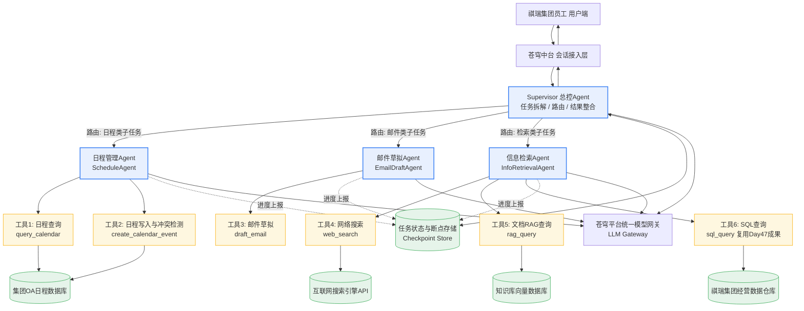
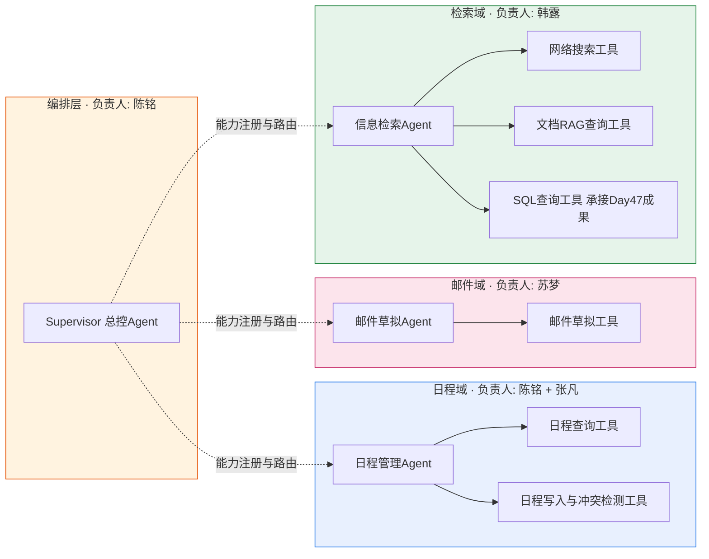

# 第48天:阶段项目三 Day1 —— 架构设计与工具开发

**阶段**:Stage 4 · Agent 与多智能体系统
**日期定位**:企业级 AI 课程 · 第 48 天
**主题**:阶段项目三启动 —— 多 Agent 智能办公助手,架构设计与工具开发
**客户背景**:祺瑞集团(苍穹企业级智能体中台标杆客户,阶段项目三定点交付对象)
**涉及角色**:陈铭(模块负责人,首次带人)、王振宇 / 老王(技术负责人)、林悦(产品经理)、苏梦 / 韩露 / 张凡(项目组成员,陈铭同批培训生,现同事)
**核心产出**:《祺瑞集团多 Agent 智能办公助手 PRD》、系统架构图(Mermaid)、任务流转图(Mermaid)、Agent 角色与工具归属示意图(Mermaid)、五个可复用工具的完整实现、三个协作 Agent 的角色定义代码
**承接关系**:承接第 47 天 Text-to-SQL 预研成果,埋钩子给第 49 天(工具就位,编排与联调)

---

## 【旁白】

陈铭在工位前坐了快五分钟,鼠标停在飞书群的输入框里,一个字都没敲出去。

群名叫"祺瑞多Agent办公助手·核心攻坚",是他半小时前建的。群里现在只有四个人:他自己、张凡、还有两个刚从别的项目组调过来的新同事。作为群主,他需要在群里发出第一条任务分配消息——这是他入职以来第一次以"模块负责人"的身份,给别人安排活儿。

这在三个月前是不可想象的事。三个月前,他还是那个被老王骂"连报错堆栈都不会从下往上看"的新人,是那个把邮件发送接口的鉴权字段拼错了在生产环境卡了两个小时的陈铭。而现在,项目组因为阶段项目三的启动扩编了,王振宇要带更大的团队去啃更难的项目,林悦从客户那边带回来一份比以往任何一次都复杂的需求,团队里需要有人能分出精力去"管人"而不只是"写代码"——于是老王把陈铭叫到工位旁边,说了一句让他愣了两秒的话:"这次日程管理那块,你带着张凡一起搞,你是负责人。"

负责人。这两个字听起来轻飘飘的,落到手里却沉得很。陈铭很快发现,"分配任务"和"完成任务"是两种完全不同的能力——完成任务需要的是把一个明确的问题啃透,分配任务需要的是先把一个模糊的问题拆解清楚,再用别人能听懂、能执行、还愿意执行的方式讲出来。他打了一版消息,写得像技术文档,句句都是"需要实现""接口应为""返回格式为",发出去之前又删了,觉得太生硬,像在对着空气念标书。他又打了一版,尽量口语化,结果又觉得信息量不够,张凡看了大概会一头雾水,回一句"具体咋弄啊"。

他想起去年冬天,老王第一次给他派活时说的话:"我不指望你一次就懂,但我指望你敢问。你要是不敢问,那我俩都得背锅。"

于是他删掉了草稿,换了一种写法——先说清楚这块要解决什么问题,再说清楚为什么这么设计,最后才落到"你具体要做什么"。写完读了一遍,觉得像那么回事了,发了出去。

几秒钟后,张凡回了一个"收到",后面跟着一句:"陈老师,我看看架构图先,有问题群里问哈。"

陈老师。陈铭对着屏幕笑了一下,又觉得有点不好意思——他俩是同一批入职的培训生,一起被老王骂过,一起在深夜的会议室里改过同一份代码。可是从这一刻起,他们的角色确实不一样了。他忽然理解了老王之前说的另一句话的分量:"带团队最难的不是技术,是你得为别人的产出负责,同时又不能替他把活儿都干了。"

这一天,不只是阶段项目三的架构设计日,也是陈铭第一次真正体会"协调者"这个身份的重量的一天。

---

## 一、晨会纪要

**会议主题**:阶段项目三启动晨会 —— 多 Agent 智能办公助手需求宣讲与任务分工
**时间**:周一 09:30—10:20
**地点**:蓬远科技 6 楼"极目"会议室
**主持人**:王振宇
**记录人**:陈铭
**参会人员**:王振宇、林悦、陈铭、苏梦、韩露、张凡,以及两名从其他项目组临时调入的工程师(在本纪要中统称"新增工程师",负责联调与测试支持,不参与今日核心架构讨论)

### 1.1 会议背景

上周五(第 47 天),陈铭完成了 Text-to-SQL 预研,验证了在祺瑞集团销售数据仓库上跑通自然语言转 SQL 查询的可行性,准确率和安全性都达到了老王定的及格线。周末,林悦带着这份预研结果,和祺瑞集团的信息化部门又开了一轮需求会,把原本"能不能查数据"的诉求,扩展成了一个更大的项目:祺瑞集团希望有一个能够帮员工处理日常办公事务的智能助手,不只是查数据,还要能查日程、写邮件、搜资料——本质上是一个"多 Agent 协同工作"的系统。这就是阶段项目三:多 Agent 智能办公助手。

由于项目复杂度上升,团队规模也相应扩大。今天的晨会,一是宣讲需求,二是把整个项目拆成模块,分配到人。

### 1.2 会议记录(节选实录)

**老王**:大家坐好,今天事儿不少,咱们直接开始。上周五陈铭那个 Text-to-SQL 的预研,大家应该都在群里看过结果了,准确率过了 85%,而且做了防注入和只读校验,这个东西不会白做,它会变成咱们这个新项目里的一块砖。今天要讲的,是这块砖要往哪儿垒。

**林悦**:我先说一下背景。祺瑞集团那边,上周我们去汇报 Text-to-SQL 的时候,他们信息化部的负责人老龚提了个事儿——他们内部员工现在处理日常事务效率很低,举个例子,一个区域销售经理,每周一要做的事情是:查一下上周的销售数据,对比一下目标完成情况,然后给大区总监写一封周报邮件,同时还要看看下周有没有客户拜访的日程安排冲突,如果有客户资料要提前查一下相关的产品文档。这一套流程下来,人工做要一两个小时,還经常出错——比如日程冲突没发现,或者邮件里的数据引用错了。

**林悦**:老龚的原话是,"你们上次那个查数据的東西挺好使,能不能把这个也给我们整一个,不光查数据,把日程、邮件、资料查询这些也串起来,变成一个真正能帮我们干活的助手。"这就是这次项目的由来。我这两天把需求梳理成了一份 PRD,待会儿我详细讲。

**老王**:这个项目跟前两个阶段项目不一样,前两个基本是单一场景、单一 Agent 就能搞定的事儿。这次不行,这是个多 Agent 协同的系统,而且客户明确提了一个要求——任务不能因为网络抖动、用户中途离开或者系统重启就丢了,得能中断了再接着干,这个我们后面细讲设计。

**苏梦**:老王,那这次项目组是怎么分工的?

**老王**:我先说个大原则。整个系统我们规划成一个"总控 + 三个专业 Agent"的架构。总控 Agent 我们叫 Supervisor,负责接收用户的原始请求,拆解任务,分配给具体的专业 Agent,再把结果汇总返回。三个专业 Agent 分别是:日程管理 Agent,负责查日程、建日程、查冲突;邮件草拟 Agent,负责根据素材生成邮件草稿;信息检索 Agent,负责网络搜索、内部文档 RAG 检索、还有咱们那个 Text-to-SQL,统一打包成"信息检索"能力对外提供。

**老王**:分工上,陈铭你之前做了 Text-to-SQL 的预研,对信息检索这块理解最深,但是这次我想让你换个方向——你去带日程管理 Agent 这个模块,顺便带一下 Supervisor 总控层的设计,因为这两块耦合最紧。信息检索 Agent 这块,交给韩露,你直接承接陈铭上周的预研成果,把 Text-to-SQL 工具正式产品化,再补上网络搜索和文档 RAG 两个工具。邮件草拟 Agent,苏梦你来负责。张凡,你跟陈铭搭班子,协助日程管理 Agent 和 Supervisor 的开发。

**张凡**:老王,我配合陈铭没问题,不过我想问一下,这次是陈铭直接分配我具体任务,还是我们俩商量着来?

**老王**:这次陈铭是这块的负责人,他要对这块的交付质量负责,任务怎么拆、谁干哪部分,由他来定。这也是我特意这么安排的原因——你俩水平差不多,陈铭现在得学会怎么把一个大问题拆给别人做,这个能力比多写两百行代码更重要。张凡,你也借这个机会,学学怎么在别人的统筹下高效配合,这也是本事,以后你带人的时候一样受用。

*(会议室有短暂的安静,张凡看了陈铭一眼,陈铭也愣了半秒才反应过来点了点头。)*

**陈铭**:啊,好,那我们俩今天先把架构图过一遍,回头我把任务拆一下,发到群里。

**老王**:行,林悦先把 PRD 讲一遍,大家统一一下认识,然后各模块负责人回去先出个设计草案,下午我们再开一次架构评审会。

### 1.3 需求宣讲要点(林悦口述整理)

林悦在会上重点强调了几个点,陈铭在会议纪要里做了详细记录,后续写 PRD 也是照这个思路展开的:

第一,这个系统不是"客服机器人",而是"办公助手",服务对象是祺瑞集团内部员工,不是外部客户,所以对话风格、权限控制、数据边界都要按内部系统的标准来做,不能照搬客服场景的经验。

第二,客户最看重的是"协同"——不是"我有一个查日程的功能、一个写邮件的功能",而是"我说一句话,系统能自己判断需要用几个能力、按什么顺序用",这也是为什么要做成多 Agent 架构而不是单体 Agent 挂多个工具。

第三,客户特别提到了"任务可能被打断"的场景。举的例子是:员工问助手"帮我查一下下周的销售数据并起草一封汇报邮件",这个任务里,查数据可能涉及跑一个比较重的 SQL,如果查询耗时较长,员工可能中途去开会了,过一会儿回来想接着看结果,系统不能说"你走了我就把这事儿忘了",必须能够恢复到中断前的状态继续处理。这是一个明确写进验收标准的硬性要求。

第四,数据安全和权限。日程涉及个人隐私,邮件涉及商业机密,SQL 查询涉及经营数据,这些都要做权限校验,不能因为是"智能助手"就绕过原有的权限体系。

第五,客户希望这个系统上线后能逐步扩展更多的专业 Agent,比如后续可能加"报销审批 Agent""会议纪要 Agent",所以架构设计上要为后续扩展留好接口,不能做成一个"打死不能改"的封闭系统。

### 1.4 陈铭的任务分配(会后群消息整理)

会议结束后,陈铭回到工位,花了大概二十分钟整理思路,在项目群里发出了当天的任务分配消息。他没有直接甩一句"你去把日程工具写了",而是按照架构设计的思路,先解释了模块边界,再具体到任务:

> "张凡,晨会里老王说的分工,咱俩负责日程管理 Agent 和 Supervisor 总控层这两块。我这边先说一下我的想法,你看看有没有问题。
>
> 日程管理 Agent 这块,拆成两个工具:一个是日程查询工具(query_calendar),负责查某个时间段有什么安排;一个是日程写入/冲突检测工具(create_calendar_event),负责新建日程并且检查有没有冲突。这两个工具的接口我先定一版,你看看合理不合理。
>
> Supervisor 这块是总控,涉及任务拆解、路由到具体 Agent、结果汇总、还有断点恢复的状态管理,这个逻辑比较绕,我打算我来搭主体框架,你先把日程那两个工具的核心逻辑实现出来,咱俩下午对一下接口,我把你的工具接进 Supervisor 里跑一下。
>
> 今天下午三点我们对一次,如果你那边卡住了随时喊我,别自己憋着卡两三个小时才说,我们现在人不多,卡住了就是耽误整体进度。"

张凡回复:"收到,我先看一下日程数据表结构,写查询工具。"

陈铭盯着这条消息看了一会儿,心里有种说不出的感觉——既有点紧张(怕分配得不合理,回头对不上接口),又有点踏实(至少这次他没有含糊其辞)。他把这段对话截图存了一份,发给了老王,只写了一句:"老王,这样分工可以吗?" 老王回了一个"可以,继续",隔了几秒又补了一句:"记住,今天下午三点你说的话,你自己得说到做到,按时对接口,这也是给张凡做示范。"

---

## 二、需求文档(PRD):祺瑞集团多 Agent 智能办公助手

### 2.1 文档信息

| 项目 | 内容 |
| --- | --- |
| 产品名称 | 祺瑞集团多 Agent 智能办公助手 |
| 承载平台 | 苍穹企业级智能体中台 |
| 客户 | 祺瑞集团(信息化部对接人:老龚) |
| 版本 | V1.0(阶段项目三启动版) |
| 撰写人 | 林悦 |
| 技术评审 | 王振宇 |
| 模块负责人 | 陈铭(日程管理 Agent / Supervisor)、苏梦(邮件草拟 Agent)、韩露(信息检索 Agent) |
| 关联前置成果 | 第 47 天 Text-to-SQL 预研(将产品化为信息检索 Agent 的 SQL 查询工具) |

### 2.2 项目背景与目标

祺瑞集团是一家跨区域经营的大型企业集团,业务覆盖生产、销售、渠道管理等多个板块。集团信息化部在过去一年陆续引入了苍穹企业级智能体中台的部分能力(包括此前落地的智能客服模块与本次预研的数据查询能力),在使用过程中发现员工日常办公场景中存在大量重复性、跨系统的事务处理需求,具体表现为:

一是信息分散。销售数据在数据仓库里,日程安排在集团 OA 系统里,产品资料和历史文档在知识库系统里,员工完成一项综合性任务往往需要在三四个系统之间来回切换,单纯的"查询"动作占据了大量工作时间。

二是重复劳动多。以周报邮件为例,大区经理每周都要重复"查数据、对比目标、写邮件"的流程,内容结构高度相似,但目前完全依赖人工从零撰写,效率低且容易出现数据引用错误。

三是任务经常被打断又难以恢复。集团员工日常工作中会议频繁,一项任务(比如查询一份耗时较长的经营分析报表)常常被电话、会议打断,现有系统没有任务状态保存机制,任务被打断后往往要从头再来。

基于以上痛点,本项目的目标是构建一个"多 Agent 协同"的智能办公助手,让员工用自然语言描述一个综合性任务(如"帮我查一下下周的销售数据并起草一封汇报邮件"),系统能够自动理解意图、拆解子任务、调度合适的专业 Agent 和工具完成处理,并将结果整合返回给用户;同时,系统需要具备任务中断后可恢复的能力,保证长耗时或跨会话的任务不会因为外部打断而丢失进度。

### 2.3 用户画像与典型场景

本系统的目标用户是祺瑞集团内部员工,涵盖销售、市场、行政等多个岗位,核心用户画像可以归纳为三类:

**区域销售经理**:高频使用场景是"数据查询 + 邮件汇报"的组合,比如每周固定的销售周报、月度经营分析邮件。这类用户对数据准确性要求极高,不能容忍任何数据引用错误,同时对邮件的语气和格式也有一定的规范要求(需要符合集团内部邮件礼仪)。

**行政 / 助理岗位**:高频使用场景是"日程安排 + 冲突检测",比如为领导安排一周的会议行程,需要系统自动识别时间冲突并给出调整建议。这类用户对交互的流畅度要求较高,倾向于用口语化的方式描述需求(如"帮我把周三下午的会往后挪一挪")。

**产品 / 市场岗位**:高频使用场景是"资料检索",需要从内部知识库里快速找到历史的产品方案、竞品分析文档,同时也需要联网搜索一些外部的行业信息作为补充。这类用户对检索结果的相关性和信息来源的可追溯性要求较高。

典型的综合性任务示例(将作为本文档流程设计的主线案例):"帮我查一下下周的销售数据并起草一封汇报邮件"。这句话背后实际上包含了两个子任务:一是通过信息检索 Agent 查询"下周"对应的销售目标与截至当前的完成数据(涉及 SQL 查询工具);二是基于查询结果,通过邮件草拟 Agent 生成一封结构清晰、语气得体的汇报邮件草稿。这两个子任务之间存在明确的先后依赖关系(必须先拿到数据才能写邮件),需要 Supervisor 进行任务编排。

### 2.4 系统总体设计原则

在正式定义各个 Agent 角色之前,项目组内部先明确了几条设计原则,这些原则来自老王在架构评审会上的强调,也写入了本 PRD:

第一,单一职责。每个专业 Agent 只负责一个业务域,不允许一个 Agent 里塞进多个不相关的能力,这样便于独立开发、独立测试、独立升级,也便于后续扩展新的专业 Agent 而不影响已有模块。

第二,工具与 Agent 解耦。工具(Tool)是纯粹的能力单元,只负责执行具体动作并返回结构化结果,不负责理解用户意图、不负责决策下一步做什么;Agent 是决策单元,负责判断该调用哪个工具、如何解读工具返回的结果、是否需要多轮调用。这样设计的好处是,工具可以被多个 Agent 复用(比如 SQL 查询工具理论上未来也可能被其他业务 Agent 使用),而不需要重复实现。

第三,状态外置。任务执行过程中的所有状态(当前进度、已完成的子任务、中间结果、待执行的子任务)都不能只存在于内存里,必须持久化到外部的状态存储中,这是实现"任务中断恢复"的基础。

第四,可观测、可追溯。每一次 Agent 的决策、每一次工具的调用,都要记录下输入、输出、耗时、是否成功,方便后续排查问题,也方便向客户解释系统是如何得出结论的(这在企业场景中尤其重要,涉及数据类的结论必须能够溯源)。

第五,渐进式扩展。当前设计只有三个专业 Agent,但整体架构必须支持后续新增 Agent 而不需要推翻重做,Supervisor 的路由逻辑需要基于"能力描述"进行动态匹配,而不是硬编码 if-else 判断具体的 Agent 名称。

### 2.5 Agent 角色定义

本系统采用"Supervisor(总控)+ 专业 Agent"的分层架构,共定义四个角色,其中 Supervisor 属于编排层,三个专业 Agent 属于执行层。

#### 2.5.1 Supervisor(总控 Agent)

**职责定位**:系统的唯一入口,负责接收用户的原始自然语言请求,完成意图理解与任务拆解,生成一个有向的子任务序列(部分子任务之间可能存在依赖关系),按序或并行地将子任务路由给对应的专业 Agent 执行,收集各 Agent 的执行结果,在必要时进行结果整合与二次加工,最终生成面向用户的统一回复。

**核心能力要求**:
- 意图识别与任务拆解:能够将一句复合型的用户请求(如案例中的"查数据+写邮件")拆解为若干个具备明确边界的子任务,并识别子任务之间的依赖关系(哪个必须先完成)。
- Agent 路由:基于每个专业 Agent 注册时声明的"能力描述"(capability description),为每个子任务匹配最合适的执行者,而不是靠硬编码规则。
- 状态管理:维护一个任务级的状态机(细节见 2.7 节),记录任务整体进度与各子任务状态,并支持将状态持久化与恢复。
- 异常处理与降级:当某个专业 Agent 执行失败或超时,Supervisor 需要能够重试、切换降级方案(如工具调用失败时改为提示用户手动处理),或将异常清晰地反馈给用户,而不是让整个任务无声无息地卡死。
- 结果整合:当多个子任务的结果需要合并呈现给用户时(如既要展示查到的数据摘要,也要展示邮件草稿),Supervisor 负责对齐格式、去除冗余信息,生成结构清晰的最终回复。

**不负责的事情**:Supervisor 本身不直接调用任何业务工具(不直接查日程、不直接生成邮件正文、不直接跑 SQL),它只做编排和调度,这是为了保证职责边界清晰,也避免 Supervisor 的 Prompt 因为塞满各种工具细节而变得臃肿难维护。

#### 2.5.2 日程管理 Agent(ScheduleAgent)

**职责定位**:处理一切与日程安排相关的子任务,包括查询指定时间范围内的日程安排、创建新的日程并检测时间冲突、在检测到冲突时给出调整建议。

**归属工具**:日程查询工具(query_calendar)、日程写入与冲突检测工具(create_calendar_event)。

**典型输入**:"帮我查一下下周的日程安排""周三下午三点安排一个跟客户的会""看看周三下午有没有空"。

**输出规范**:统一返回结构化的日程信息(时间、标题、参与人、地点/会议方式),如果检测到冲突,必须明确指出冲突的具体日程项,并给出至少一个可选的调整时间建议,而不能只是简单地报错。

**权限校验**:日程数据涉及员工隐私和领导行程等敏感信息,该 Agent 在调用工具前必须校验当前会话用户是否有权限查看/修改目标日程(比如助理岗位可以代为安排领导日程,但普通员工不能查看非本人日程),权限校验逻辑由工具层实现,Agent 层负责将权限上下文正确传递。

#### 2.5.3 邮件草拟 Agent(EmailDraftAgent)

**职责定位**:根据用户提供的意图和素材(可能来自用户直接描述,也可能来自信息检索 Agent 提供的查询结果),生成一封结构完整、语气得体的邮件草稿,包括主题、收件人建议、正文、必要时的附件说明,并支持根据用户反馈进行语气或内容的二次调整。

**归属工具**:邮件草拟工具(draft_email)。

**典型输入**:"根据这份销售数据,给大区总监写一封汇报邮件""帮我回复一下这封邮件,语气客气一点""这封邮件太啰嗦了,精简一下"。

**输出规范**:邮件草稿必须包含明确的主题(subject)、正文(body,支持分段落),如果邮件是基于查询结果生成的,正文中的关键数据必须能够标注来源(如"数据来源:2026年第28周销售看板"),不允许模型编造未在输入素材中出现的数字。这一条是林悦在需求会上特别强调、客户方也明确验收的红线要求。

**安全边界**:邮件草拟 Agent 生成的内容只是"草稿",系统默认不具备自动发送邮件的能力,所有草稿必须经过用户确认后才能进入实际的发送流程(发送动作在本阶段暂不实现,留待后续迭代对接集团邮件系统的发信接口)。

#### 2.5.4 信息检索 Agent(InformationRetrievalAgent)

**职责定位**:统一对外提供"信息检索"能力,内部整合三类检索来源——结构化的经营数据库(通过 SQL 查询工具)、内部知识库文档(通过文档 RAG 查询工具)、外部互联网信息(通过网络搜索工具),根据用户问题的性质自动判断应该从哪个来源检索,必要时可以组合多个来源的结果。

**归属工具**:SQL 查询工具(sql_query,直接产品化自第 47 天的 Text-to-SQL 预研成果)、文档 RAG 查询工具(rag_query)、网络搜索工具(web_search)。

**典型输入**:"下周的销售目标完成情况怎么样""帮我找一下去年跟这个客户签的合同里关于付款周期的条款""市面上最近有没有类似的产品在做促销"。

**路由逻辑**:该 Agent 内部维护一个简单的分类判断——涉及"具体数字、经营指标、报表"类问题优先走 SQL 查询;涉及"内部历史文档、合同、产品方案"类问题优先走文档 RAG;涉及"外部行业动态、竞品信息、公开资讯"类问题优先走网络搜索;当问题类型不明确或者需要交叉验证时,允许同时调用多个工具并对结果进行归并。

**结果溯源要求**:无论走哪个检索来源,返回结果都必须携带明确的来源标注(SQL 结果标注查询所用的表和统计口径,RAG 结果标注命中的文档名称和片段,网络搜索结果标注来源网址),这也是企业级场景与消费级问答场景的关键差异之一——企业用户需要为结论负责,必须能够溯源。

### 2.6 工具清单

本阶段共设计并实现六个工具,归属关系见下表,其中"日程查询"与"日程写入与冲突检测"共同支撑日程管理 Agent,"邮件草拟"支撑邮件草拟 Agent,"网络搜索""文档RAG查询""SQL查询"共同支撑信息检索 Agent,满足需求文档中"五个以上工具"的硬性要求。

| 序号 | 工具名称 | 英文标识 | 所属 Agent | 核心输入 | 核心输出 | 幂等性 | 是否支持中断恢复 |
| --- | --- | --- | --- | --- | --- | --- | --- |
| 1 | 日程查询工具 | query_calendar | 日程管理 Agent | 用户ID、查询时间范围 | 日程列表(时间/标题/参与人/地点) | 是(只读) | 否(执行时间短,无需断点) |
| 2 | 日程写入与冲突检测工具 | create_calendar_event | 日程管理 Agent | 用户ID、新日程信息 | 创建结果 / 冲突详情与调整建议 | 否(会产生副作用) | 否(单步操作,失败直接报错重试) |
| 3 | 邮件草拟工具 | draft_email | 邮件草拟 Agent | 收件对象、写作意图、素材/数据 | 邮件主题、正文、来源标注 | 是(只生成草稿,不产生副作用) | 是(生成过程可保存中间版本) |
| 4 | 网络搜索工具 | web_search | 信息检索 Agent | 搜索关键词、结果数量限制 | 搜索结果列表(标题/摘要/链接) | 是(只读) | 是(可保存已抓取的部分结果) |
| 5 | 文档RAG查询工具 | rag_query | 信息检索 Agent | 查询语句、检索范围(知识库) | 命中的文档片段与相似度 | 是(只读) | 是(检索与生成可分阶段保存) |
| 6 | SQL查询工具 | sql_query | 信息检索 Agent | 自然语言问题、数据范围限定 | SQL语句、查询结果、统计口径说明 | 是(只允许只读查询) | 是(长查询可保存执行进度与部分结果) |

在架构评审会上,老王特别强调了工具设计的两条硬性规范:一是所有工具的输入输出都必须走结构化的 Schema 定义(用 Pydantic 或等价方式),不允许用裸字符串在 Agent 和工具之间传递关键信息,这是为了避免"Agent 生成的自然语言参数解析出错"这种低级问题;二是所有工具在设计时都要考虑"失败该怎么办",不能假设工具永远成功,必须定义清晰的错误码和错误信息,供 Agent 层做进一步的决策(比如重试、降级、提示用户)。

### 2.7 任务中断恢复机制设计

这是本次项目区别于此前两次阶段项目最核心的技术难点,PRD 中单独用一节说明设计思路。

**触发场景**:用户在等待长耗时任务(如复杂 SQL 查询、多文档RAG检索)执行过程中主动离开会话,或因网络波动导致连接中断,或系统自身发生重启;用户在稍后(可能是几分钟后,也可能是第二天)重新回到会话,期望系统能够"记得"之前的任务进展,而不是要求用户重新描述一遍需求。

**状态机设计**:任务在其生命周期内会经历以下状态迁移:`PENDING`(任务已创建,尚未开始拆解)→ `RUNNING`(Supervisor 正在拆解或某个子任务正在执行)→ `INTERRUPTED`(检测到会话中断或显式的挂起请求)→ `RESUMED`(用户回来后重新激活)→ 最终进入 `COMPLETED`(全部子任务完成并已生成回复)或 `FAILED`(不可恢复的失败,如权限校验不通过)。

**持久化内容**:每当任务状态发生迁移,或者某个子任务完成、失败、进入等待状态时,系统都需要将以下信息写入持久化的 Checkpoint 存储:任务ID与所属用户ID、任务的原始自然语言请求、Supervisor 拆解出的完整子任务列表及其依赖关系、每个子任务当前的执行状态与已产生的中间结果、当前正在执行或等待的子任务指针、最近一次状态更新的时间戳。

**恢复流程**:当用户携带任务ID(或系统根据会话上下文自动识别出用户有未完成的任务)重新进入时,Supervisor 首先从 Checkpoint 存储中加载任务状态,判断距离上次更新的时间间隔——如果间隔较短且任务仍在合理的有效期内,直接从中断点继续执行未完成的子任务;如果任务已经过期(比如涉及"下周"这种相对时间表达,恢复时如果已经跨过了"下周"这个时间窗口,继续执行就会得到过时甚至错误的结果),系统需要主动向用户确认是否需要重新计算时间范围,而不能盲目地拿旧的中间结果往下走。这一条是林悦在跟客户对需求时特别提出来的边界情况,也是韩露在信息检索 Agent 设计里需要特别处理的细节。

**幂等性要求**:由于恢复后的子任务可能会被重新触发执行,所有工具在设计时都必须考虑重复调用的安全性——只读类工具(日程查询、网络搜索、RAG查询、SQL查询)天然幂等,重复执行不会产生副作用;有副作用的工具(日程写入)在恢复前必须先检查该副作用是否已经生效(比如检查日程是否已经创建成功),避免恢复流程导致重复创建。

### 2.8 非功能性需求

**性能要求**:单次简单查询类子任务(日程查询、RAG检索)平均响应时间不超过 3 秒;涉及大数据量的 SQL 查询,系统需要给出预估耗时提示,超过 10 秒的查询默认转为异步执行并支持中断恢复。

**安全与权限**:所有工具调用都必须携带调用上下文(用户身份、所属部门、数据权限范围),工具内部完成权限校验,校验不通过时返回明确的拒绝原因而不是模糊报错。

**可观测性**:每一次 Agent 决策与工具调用都需要记录完整的调用链日志,包括输入参数、输出结果、耗时、状态,支持按任务ID完整回放整个执行过程。

**可扩展性**:Supervisor 的 Agent 路由机制必须基于能力描述的动态匹配,新增专业 Agent 时只需要注册其能力描述,不需要修改 Supervisor 的核心路由代码。

**数据合规**:邮件草拟 Agent 生成内容中引用的所有数据必须可追溯来源,不允许出现无来源支撑的数字或结论,这是企业级场景的合规红线,也是本项目验收的强制项。

### 2.9 验收标准

本次架构设计与工具开发阶段(第48天—第49天)的验收标准包括:六个工具均完成独立单元测试且通过率达标;三个专业 Agent 均能够独立响应本领域的典型问题并给出结构化输出;针对主线案例"帮我查一下下周的销售数据并起草一封汇报邮件",Supervisor 能够正确拆解出"先查数据、再写邮件"的依赖关系(即便当前阶段各模块尚未完全打通,也需要在设计文档和演示脚本层面验证该拆解逻辑的正确性);任务中断恢复机制通过至少一个模拟场景的验证(如模拟长查询执行过程中主动中断,再触发恢复,验证能够从中断点继续)。

---

## 三、系统架构图

下图展示了祺瑞集团多 Agent 智能办公助手的完整系统架构,包含 Supervisor 总控层、三个专业 Agent、六个工具,以及各工具对接的数据存储与外部服务,同时标出了用于支撑任务中断恢复的 Checkpoint 存储组件。



这张图在架构评审会上过了两轮修改。第一版陈铭画的时候,把 Checkpoint Store 只连在了 Supervisor 上,老王评审时指出了一个问题:如果只有 Supervisor 知道整体状态,而具体的子任务执行进度(比如 SQL 查询跑到第几步、RAG 检索已经召回了哪些片段)全靠 Supervisor 去猜,恢复的时候颗粒度就太粗——万一是 SQL 查询本身在执行过程中被打断,Supervisor 层面的状态显示"检索类子任务:进行中",但具体这条 SQL 语句是否已经生成、是否已经执行、执行到哪一步,Supervisor 并不知道。所以第二版加上了三个专业 Agent 直接向 Checkpoint Store 上报进度的旁路,这样即便某个子任务内部有多个执行阶段,也能做到精确恢复而不是"整个子任务推倒重来"。

---

## 四、任务流转图

以主线案例"帮我查一下下周的销售数据并起草一封汇报邮件"为例,下图展示了该任务在多 Agent 系统中从接收到完成的完整流转过程,同时标出了任务中断与恢复的分支路径。

```mermaid
flowchart TD
    Start(["用户输入:<br/>帮我查一下下周的销售数据并起草一封汇报邮件"]) --> Recv["Supervisor接收请求<br/>创建任务记录 状态=PENDING"]
    Recv --> Decompose["Supervisor调用LLM进行任务拆解"]
    Decompose --> Plan["生成子任务计划:<br/>子任务A 查询下周销售数据 依赖=无<br/>子任务B 起草汇报邮件 依赖=A完成"]
    Plan --> SaveCkpt1["写入Checkpoint<br/>状态=RUNNING"]

    SaveCkpt1 --> RouteA["路由子任务A至<br/>信息检索Agent"]
    RouteA --> ChooseTool["信息检索Agent判断:<br/>涉及经营数据指标 选择SQL查询工具"]
    ChooseTool --> GenSQL["调用sql_query工具<br/>自然语言转SQL"]
    GenSQL --> Interrupt{"执行过程中<br/>是否发生中断?"}

    Interrupt -->|"是: 用户离开/网络波动"| MarkInt["标记子任务A状态=INTERRUPTED<br/>保存已生成的SQL与执行进度"]
    MarkInt --> WaitUser["等待用户返回会话"]
    WaitUser --> Return{"用户是否携带<br/>任务ID返回?"}
    Return -->|"否 长时间未返回"| Timeout["超过有效期<br/>任务标记为FAILED并归档"]
    Return -->|"是"| CheckFresh["检查时间窗口是否仍然有效<br/>下周是否已经过去"]
    CheckFresh -->|"已过期"| Reconfirm["向用户确认是否<br/>重新计算时间范围"]
    Reconfirm --> ResumeExec
    CheckFresh -->|"仍有效"| ResumeExec["从Checkpoint恢复<br/>状态=RESUMED 继续执行"]
    ResumeExec --> ExecSQL

    Interrupt -->|"否 正常执行"| ExecSQL["执行SQL 只读校验通过后查询数据仓库"]
    ExecSQL --> ResultA["得到销售数据结果<br/>含统计口径与来源标注"]
    ResultA --> SaveCkpt2["写入Checkpoint<br/>子任务A状态=COMPLETED"]

    SaveCkpt2 --> RouteB["路由子任务B至<br/>邮件草拟Agent"]
    RouteB --> DraftCall["调用draft_email工具<br/>输入=子任务A的结果数据"]
    DraftCall --> DraftResult["生成邮件草稿<br/>主题 正文 数据来源标注"]
    DraftResult --> SaveCkpt3["写入Checkpoint<br/>子任务B状态=COMPLETED"]

    SaveCkpt3 --> Aggregate["Supervisor整合结果:<br/>数据摘要 + 邮件草稿"]
    Aggregate --> Confirm["返回给用户 请求确认邮件内容"]
    Confirm --> UserFeedback{"用户是否<br/>要求修改?"}
    UserFeedback -->|"是"| DraftCall
    UserFeedback -->|"否 确认满意"| Done["任务状态=COMPLETED<br/>流程结束"]

    Timeout --> End(["流程终止"])
    Done --> End
```



这张流程图里,苏梦提了一个很关键的意见——她说,不能只画"正常路径",客户明确要求了中断恢复,这个图如果只画一条主干线,评审的时候会显得设计思路没有覆盖到硬性需求。所以陈铭在第二版里补上了"中断-等待-恢复"的完整分支,还专门加了"时间窗口是否仍然有效"的判断节点,这一点后来在架构评审会上被老王当场表扬,说这才是"真的想清楚了边界情况,不是画个好看的图糊弄过去"。

---

## 五、Agent 角色职责划分与工具归属关系示意图

为了让团队每个人都清楚自己负责的边界在哪里,陈铭还画了一张更聚焦"责任田"的示意图,用来在晨会和后续的对接中反复确认——谁负责哪个 Agent,每个 Agent 具体归属哪些工具,以及各模块负责人是谁。



这张图画完之后,陈铭特意在群里 @ 了苏梦和韩露,让她们确认一下自己模块的工具边界有没有问题。韩露回复得很快,说她这边没问题,而且提到一个细节——她打算把 SQL 查询工具从"预研代码"整理成"产品化代码"的时候,顺便把陈铭上周写的那版做一次重构,补上错误处理和结果缓存,免得后面联调的时候又暴露一堆预研阶段图快没处理的边界情况。陈铭对此没有异议,还补了一句"辛苦了,那块本来就是糙代码,验证思路用的",韩露回了个"没事,基础打得挺扎实的"。这算是同批培训生之间一次很实在的"交棒"。

---

## 六、课堂笔记

### 6.1 上午:架构设计讨论会 + Agent 角色划分

晨会结束后,老王把陈铭、苏梦、韩露、张凡留了下来,单独开了一场大约一个半小时的架构设计讨论会,林悦全程参与,负责在设计出现偏离需求的时候及时纠正。以下是这场讨论会的核心笔记。

**关于"要不要用 Supervisor 模式"的讨论。** 一开始张凡提了个问题:为什么不能让三个 Agent 之间直接互相调用,非要多一层 Supervisor?老王的回答是:多 Agent 系统里,如果让专业 Agent 之间互相调用,很快就会出现"谁调用谁"逻辑混乱的问题——比如日程管理 Agent 在处理"安排会议"的时候,发现需要给参会人发一封邀请邮件,它是应该自己直接调邮件工具,还是应该"求助"邮件草拟 Agent?如果每个 Agent 都可能直接调用其他 Agent,系统里会形成一张很复杂的调用网,出了问题很难排查是谁触发的谁。用 Supervisor 做统一编排之后,所有的跨领域协作都必须经过 Supervisor 拆解和路由,调用关系变成一张清晰的星型结构,Supervisor 是唯一的"决策中心",这样排查问题的时候只需要看 Supervisor 的任务拆解日志就能知道整个任务的执行轨迹。这也是目前工业界主流多 Agent 框架(比如 LangGraph 里的 Supervisor 模式)采用的思路,不是蓬远科技自己发明的,是站在成熟经验上的选择。

**关于"任务拆解要拆到多细"的讨论。** 苏梦提出一个很实际的问题:如果 Supervisor 把任务拆得太细,比如"查数据"这个子任务还要再拆成"确定时间范围""生成SQL""执行SQL""解读结果"四个更小的子任务,那 Supervisor 的复杂度会爆炸;但如果拆得太粗,比如把"查数据+写邮件"直接当成一个子任务扔给某个 Agent,又违背了单一职责的原则。老王给出的判断标准是:拆解的颗粒度应该以"专业 Agent 的能力边界"为界限,而不是以"具体执行步骤"为界限——Supervisor 只需要知道"这是一个检索类的活儿,丢给信息检索 Agent",至于信息检索 Agent 内部是先确定时间范围、再生成 SQL、再执行,这些细节完全由信息检索 Agent 自己去处理,Supervisor 不需要、也不应该知道这么细。这就是为什么 PRD 里 Supervisor 的职责定义特别强调"不直接调用任何业务工具",它的拆解颗粒度天然就被这条边界卡住了。

**关于"能力注册与动态路由"的讨论。** 韩露提出一个问题:如果 Supervisor 路由子任务给 Agent 是靠 LLM 去理解每个 Agent 的能力描述做判断,那这个能力描述该怎么写才靠谱,万一 LLM 判断错了怎么办?老王的建议是,能力描述要写得具体、要包含典型的例句,而不是写得特别抽象。他现场举了个例子——如果信息检索 Agent 的能力描述只写"负责信息查询",这个描述太宽泛了,几乎什么问题都能往上靠;但如果写成"负责回答涉及销售数据、经营指标等结构化数据类问题(通过SQL查询实现),负责检索内部合同、产品方案等历史文档类问题(通过RAG检索实现),负责获取行业动态、竞品信息等外部公开信息类问题(通过网络搜索实现)",这个描述就具体到了三种典型场景,LLM 做路由判断的时候准确率会明显提升。这一条后来被写进了每个 Agent 的注册配置里,成为团队内部的一条硬性规范——凡是新增 Agent,能力描述必须给出至少三个典型例句。

**关于"检索类子任务内部要不要再细分成多个专业 Agent"的讨论。** 这是讨论会上争论最激烈的一个点。张凡提出,SQL 查询、RAG 检索、网络搜索这三个能力差异其实挺大的,为什么要塞进一个"信息检索 Agent"里,而不是拆成三个独立的 Agent?韩露(作为这块的负责人)给出了自己的判断:这三个能力虽然实现方式不同,但从"用户诉求"的视角看,本质上都是"我要找一个信息"这一类需求,用户很难在提问的时候就明确说"这是一个SQL类问题"还是"这是一个RAG类问题"——用户只会说"帮我查一下xxx",这个判断本身就应该是一个专业能力,而不应该让 Supervisor 去猜。如果拆成三个独立 Agent,那 Supervisor 就要承担"判断这个查询到底该用SQL还是RAG还是网络搜索"的职责,这违反了之前定的"Supervisor不碰业务细节"的原则。所以更合理的做法,是把"判断该用哪种检索方式"这个决策下沉到信息检索 Agent 内部,由它去做二次路由,Supervisor 只需要知道"这是检索类需求"就够了。老王最终采纳了这个方案,并补充说这也是为什么要专门设计"Agent 内部工具路由"和"Agent 之间任务路由"两层不同粒度的路由逻辑——这是这次项目相比前两个阶段项目复杂度明显提升的地方。

**关于人员分工方式的讨论。** 这场讨论会接近结束时,老王专门花了几分钟讲了讲这次为什么要让陈铭带张凡。他说,阶段项目三之所以要扩编团队,一个重要原因是蓬远科技接下来要同时跟进好几个客户的多 Agent项目,团队里必须要有一批人能够独立带小模块,而不是永远靠一两个骨干扛所有的技术难点。陈铭这次带日程管理 Agent 这个相对独立、复杂度适中的模块,是一个刻意的安排——既不会因为模块太简单练不到东西,也不会因为模块太复杂而在"带人"这件新手任务上直接翻车。老王还提了一个具体的建议给陈铭:分配任务的时候,一定要先讲清楚"为什么这么设计",再讲"要做什么",不能反过来,否则对方只是机械地执行,遇到设计之外的情况就不知道怎么应变。这条建议陈铭记在了笔记本上,后来在下午实际协作的时候确实用上了。

### 6.2 下午:工具开发实战

架构讨论会结束后,各模块负责人回去分头开始工具开发。陈铭和张凡的协作过程,是这一天笔记里最有实感的部分。

下午 1 点半,陈铭先把日程查询工具和日程写入/冲突检测工具的接口定义(输入输出的字段、异常情况的约定)整理成了一份简短的说明发给张凡,并且约定张凡先写查询工具,自己去搭 Supervisor 的主体框架,约定三点碰头对接口。

下午 2 点多,张凡在群里问了第一个问题:日程冲突检测应该按什么规则判定"冲突"——是只要时间有重叠就算冲突,还是要考虑会议室占用、参会人重叠这些更细的维度?陈铭想了一下,回复说第一版先按"时间段有重叠"这个最基本的规则来判定,把接口设计得留有扩展空间(比如冲突检测结果里带上"冲突类型"字段,当前先只有"时间冲突"这一种类型),后续如果客户明确提出需要更细的冲突判定,再往里加类型,不要在第一版里就把逻辑写得太重,容易返工。张凡认可了这个思路,继续往下写。

下午 2 点 40 分左右,张凡遇到一个具体的技术问题:日程数据里的时间字段,客户方给的数据仓库里存的是没有时区信息的本地时间字符串,而系统内部约定统一用带时区的 ISO 格式处理时间,这中间需要做一次转换,但张凡不确定这个转换应该放在工具内部做,还是应该假设上游传进来的时间已经是标准格式。这是一个很典型的"接口边界"问题,陈铭在这个问题上给出了一个明确的判断:工具作为最底层的能力单元,应该对输入做尽可能宽松的容错处理,不能假设上游一定传对了格式,所以转换逻辑应该放在工具内部,并且要在文档里写清楚"接受哪些格式的时间字符串"。这个决定后来被写进了工具代码的实现里(可见后文代码实战部分)。

下午 3 点,两人如约进行了接口对接。陈铭先把自己搭的 Supervisor 框架骨架讲了一遍——目前只是一个空壳,能接收任务、能调用 LLM 做拆解、能把子任务路由到指定的 Agent,但还没有接入真正的专业 Agent 实现。张凡则展示了日程查询工具的初版代码,两人对着实际跑了几个测试用例,发现了一个小问题:张凡写的查询工具返回结果里,日程标题字段用的是 `title`,而陈铭在 Supervisor 里想要展示结果时约定用的字段名是 `event_title`,两边对不上。这种"命名不一致"的问题在团队协作里很常见,以前陈铭自己一个人写代码从来不会遇到,这次算是他第一次真切体会到"多人协作需要提前约定统一的数据契约"这件事的重要性。两人当场把字段名统一改成了 `title`(遵循"谁先定义谁的命名优先"的现场决定,毕竟工具层的输出结构不应该因为调用方的偏好而随意变动),陈铭回头把 Supervisor 里引用的字段名也改了。

下午 4 点多,苏梦在群里分享了她邮件草拟工具的一个设计难点——她发现如果直接把销售数据的原始查询结果扔给 LLM 生成邮件正文,经常会出现 LLM"自由发挥"编了一些查询结果里没有的数字或结论,这在企业场景里是绝对不能接受的。她的解决方案是,在 Prompt 里明确要求 LLM 只能引用输入数据中出现的具体数值,并且要求每一个数字后面都标注来源字段,生成完之后再做一次简单的规则校验——检查正文里出现的数字是否都能在输入素材里找到对应值,如果校验不通过就要求 LLM 重新生成。这个思路陈铭和韩露都觉得很有必要,后来韩露在设计 SQL 查询工具和 RAG 查询工具的时候,也采用了类似的"结果强制溯源+事后校验"的设计。

下午快 6 点的时候,韩露在群里同步了一个重要进展:她把陈铭 Text-to-SQL 预研阶段的代码进行了重构,补上了更完整的错误处理、超时控制,还加了一个查询结果的简单缓存机制(避免同一个问题短时间内重复查库),并且开始设计"长查询中断恢复"的具体实现方式——她提出用一个简单的分阶段 Checkpoint 方案:SQL 生成阶段完成后存一次进度,SQL 执行开始后每隔几秒存一次"仍在执行中"的心跳状态,执行完成后存最终结果,这样即便查询本身耗时很长,中途发生中断,恢复的时候也能准确判断是"SQL还没生成"还是"SQL已生成但还没跑完"还是"已经跑完了"。这个设计后来被陈铭直接借鉴,用在了 Supervisor 层面更上层的任务状态管理里。

这一天结束前,项目组在群里做了简单的进度同步,四个人(苏梦因为要接孩子提前走了,但也留了文字同步)基本都完成了各自工具的核心逻辑初版,虽然还没有真正打通端到端的联调(这是明天,也就是第49天的主线任务),但架构方向在今天的讨论会上得到了老王的确认,没有出现"推翻重做"的情况,这在团队看来已经是一个不错的开局。

---

## 七、代码实战

本节给出六个工具与三个专业 Agent 角色定义的完整实现。整体代码遵循以下约定:所有工具与 Agent 的输入输出均使用 Pydantic 定义结构化 Schema;所有工具继承统一的 `BaseTool` 基类,所有 Agent 继承统一的 `BaseAgent` 基类;任务与子任务的状态持久化统一通过 `TaskStateStore`(本节实现为基于内存字典模拟的存储,生产环境对接 Redis 或数据库,接口保持一致);涉及大模型调用的地方统一通过 `LLMGateway` 封装,当前用规则化的模拟实现代替真实的模型调用,便于教学演示和离线跑通,生产环境只需替换 `LLMGateway` 内部实现即可无缝切换到苍穹平台真实的模型网关。

### 7.1 核心基础设施:`core/base.py`

这个文件定义了整个多 Agent 系统的公共基础设施,包括工具基类、Agent 基类、统一的调用结果结构,以及模型网关的封装。这是陈铭在搭 Supervisor 框架之前,先跟老王对齐过的一份"地基"代码,团队所有人的工具和 Agent 实现都要基于这几个基类展开,避免各自为战导致后期集成困难。

```python
"""
core/base.py
苍穹企业级智能体中台 - 多Agent办公助手 核心基础设施
定义: BaseTool / BaseAgent / ToolResult / AgentContext / LLMGateway
维护: 陈铭(架构骨架) + 全组评审
"""
from __future__ import annotations

import abc
import time
import uuid
import logging
from dataclasses import dataclass, field
from enum import Enum
from typing import Any, Dict, List, Optional, Callable

logger = logging.getLogger("cangqiong.agent.core")
logging.basicConfig(level=logging.INFO)


class ToolStatus(str, Enum):
    """工具执行结果的统一状态码"""
    SUCCESS = "success"
    FAILED = "failed"
    PARTIAL = "partial"          # 部分成功,常见于批量检索类工具
    PERMISSION_DENIED = "permission_denied"
    TIMEOUT = "timeout"
    NEEDS_CONFIRMATION = "needs_confirmation"  # 需要用户二次确认(如日程冲突)


@dataclass
class ToolResult:
    """所有工具统一返回的结构化结果,禁止工具直接返回裸字符串或裸dict"""
    status: ToolStatus
    data: Optional[Dict[str, Any]] = None
    error_message: Optional[str] = None
    error_code: Optional[str] = None
    source_trace: Optional[List[str]] = field(default_factory=list)  # 结果溯源信息
    elapsed_ms: Optional[int] = None
    raw_meta: Dict[str, Any] = field(default_factory=dict)

    def is_ok(self) -> bool:
        return self.status in (ToolStatus.SUCCESS, ToolStatus.PARTIAL)

    def to_dict(self) -> Dict[str, Any]:
        return {
            "status": self.status.value,
            "data": self.data,
            "error_message": self.error_message,
            "error_code": self.error_code,
            "source_trace": self.source_trace,
            "elapsed_ms": self.elapsed_ms,
        }


@dataclass
class CallerContext:
    """
    每一次工具/Agent调用都必须携带的调用上下文
    用于权限校验、审计日志、多用户隔离
    """
    user_id: str
    user_name: str
    department: str
    role: str = "employee"
    session_id: str = field(default_factory=lambda: str(uuid.uuid4()))
    request_id: str = field(default_factory=lambda: str(uuid.uuid4()))
    extra: Dict[str, Any] = field(default_factory=dict)


class BaseTool(abc.ABC):
    """
    所有工具的统一基类。
    设计原则(架构评审会确认):
    1. 工具只做“执行”,不做“决策”——不判断要不要调用自己,只负责被调用后正确执行。
    2. 输入输出必须结构化,禁止用裸字符串传递关键参数。
    3. 必须显式处理失败情况,返回明确的 ToolResult,不允许裸抛异常扩散到Agent层。
    """

    name: str = "base_tool"
    description: str = "工具基类,未实现具体描述"
    # 供 Supervisor / Agent 做能力匹配时参考的典型调用例句
    example_queries: List[str] = field(default_factory=list) if False else []

    def __init__(self):
        self._call_count = 0

    @abc.abstractmethod
    def _run(self, params: Dict[str, Any], ctx: CallerContext) -> ToolResult:
        """具体工具需要实现的核心逻辑,禁止在此方法之外直接暴露给外部调用"""
        raise NotImplementedError

    def run(self, params: Dict[str, Any], ctx: CallerContext) -> ToolResult:
        """统一入口:计时、异常兜底、调用审计日志"""
        self._call_count += 1
        start = time.time()
        try:
            result = self._run(params, ctx)
        except Exception as exc:  # noqa: BLE001 - 工具层必须兜底,不能让异常裸传播
            logger.exception("工具[%s]执行异常, request_id=%s", self.name, ctx.request_id)
            result = ToolResult(
                status=ToolStatus.FAILED,
                error_message=f"工具内部异常: {exc}",
                error_code="TOOL_INTERNAL_ERROR",
            )
        elapsed = int((time.time() - start) * 1000)
        result.elapsed_ms = elapsed
        logger.info(
            "工具调用审计 | tool=%s | user=%s | status=%s | elapsed_ms=%d | request_id=%s",
            self.name, ctx.user_id, result.status.value, elapsed, ctx.request_id,
        )
        return result

    def capability_description(self) -> str:
        """供 Agent/Supervisor 做路由决策时参考的能力说明"""
        examples = "; ".join(self.example_queries) if self.example_queries else "暂无示例"
        return f"[{self.name}] {self.description} 典型问题示例: {examples}"


class SubTaskStatus(str, Enum):
    PENDING = "pending"
    RUNNING = "running"
    INTERRUPTED = "interrupted"
    RESUMED = "resumed"
    COMPLETED = "completed"
    FAILED = "failed"
    NEEDS_USER_INPUT = "needs_user_input"


@dataclass
class SubTask:
    """Supervisor 拆解出的最小任务单元,由某个专业Agent独立负责完成"""
    sub_task_id: str
    description: str
    assigned_agent: str
    depends_on: List[str] = field(default_factory=list)
    status: SubTaskStatus = SubTaskStatus.PENDING
    input_payload: Dict[str, Any] = field(default_factory=dict)
    result_payload: Optional[Dict[str, Any]] = None
    checkpoint_meta: Dict[str, Any] = field(default_factory=dict)
    updated_at: float = field(default_factory=time.time)

    def touch(self):
        self.updated_at = time.time()


class BaseAgent(abc.ABC):
    """
    所有专业Agent与Supervisor的统一基类。
    Agent 与 Tool 的区别:
    - Tool: 纯执行单元,无状态、无决策。
    - Agent: 决策单元,负责判断调用哪个工具、如何解读结果、是否需要多轮处理。
    """

    name: str = "base_agent"
    description: str = "Agent基类,未实现具体描述"
    example_queries: List[str] = []

    def __init__(self, llm_gateway: "LLMGateway", tools: Optional[List[BaseTool]] = None):
        self.llm = llm_gateway
        self.tools: Dict[str, BaseTool] = {t.name: t for t in (tools or [])}

    def register_tool(self, tool: BaseTool):
        self.tools[tool.name] = tool

    def capability_description(self) -> str:
        examples = "; ".join(self.example_queries) if self.example_queries else "暂无示例"
        return f"[{self.name}] {self.description} 典型问题示例: {examples}"

    @abc.abstractmethod
    def handle(self, sub_task: SubTask, ctx: CallerContext) -> ToolResult:
        """处理一个子任务,返回统一的ToolResult(即便Agent内部调用了多个工具,也要在这里汇总)"""
        raise NotImplementedError


class LLMGateway:
    """
    苍穹平台统一模型网关的教学封装。
    生产环境: 内部通过HTTP调用蓬远科技自建的模型网关服务,支持多模型路由、限流、审计。
    教学环境: 使用规则化的模拟实现,保证代码可离线运行、行为确定可预测,便于演示与测试。
    真实切换只需要替换 `_call_impl` 方法,上层Agent/Supervisor代码无需改动。
    """

    def __init__(self, model_name: str = "cangqiong-chat-pro", mock: bool = True):
        self.model_name = model_name
        self.mock = mock
        self._call_count = 0

    def chat(self, system_prompt: str, user_prompt: str,
             handler: Optional[Callable[[str, str], str]] = None) -> str:
        """
        统一的对话接口。
        handler: 教学场景下用于注入确定性的模拟逻辑,生产环境不传该参数,
                 直接走 `_call_impl` 真实调用模型网关。
        """
        self._call_count += 1
        if self.mock and handler is not None:
            return handler(system_prompt, user_prompt)
        return self._call_impl(system_prompt, user_prompt)

    def _call_impl(self, system_prompt: str, user_prompt: str) -> str:
        """生产环境下调用真实模型网关的占位实现"""
        raise NotImplementedError(
            "生产环境需接入苍穹平台LLM Gateway,当前教学环境请使用mock=True并传入handler"
        )


def new_request_id() -> str:
    return str(uuid.uuid4())
```

这份基础代码定稿之前,团队内部有一次小的分歧:韩露建议 `ToolResult` 里不要加 `source_trace` 字段,理由是不是所有工具都需要溯源,加进公共结构显得冗余。陈铭的意见是保留,理由是即便日程类工具暂时用不上溯源信息,但检索类工具和邮件草拟工具都强依赖这个字段,放进公共结构可以保证接口一致性,用不上的工具留空列表就行,成本很低。最后老王拍板保留,理由跟陈铭一致,顺带提醒了一句"公共结构的设计要照顾大多数场景,不要因为个别场景不需要就砍掉"。

### 7.2 任务状态与断点恢复:`core/task_state.py`

这是支撑"任务中断恢复"这一硬性需求的核心模块,由陈铭在搭建 Supervisor 框架时同步实现,后续被韩露在 SQL 查询工具的长查询场景中复用。

```python
"""
core/task_state.py
任务状态管理与断点恢复机制实现
维护: 陈铭
"""
from __future__ import annotations

import time
import json
import logging
from dataclasses import dataclass, field, asdict
from enum import Enum
from typing import Any, Dict, List, Optional

from core.base import SubTask, SubTaskStatus, new_request_id

logger = logging.getLogger("cangqiong.agent.task_state")


class TaskStatus(str, Enum):
    PENDING = "pending"
    RUNNING = "running"
    INTERRUPTED = "interrupted"
    RESUMED = "resumed"
    COMPLETED = "completed"
    FAILED = "failed"


# 任务在多久没有更新之后,恢复时需要重新确认相对时间窗口(如“下周”“本周”)
TIME_SENSITIVE_TTL_SECONDS = 6 * 60 * 60  # 6小时,超过则认为“下周”等相对表达可能已失效
# 任务超过这个时长仍未被恢复,直接归档为失败,避免Checkpoint无限堆积
TASK_HARD_EXPIRE_SECONDS = 7 * 24 * 60 * 60  # 7天


@dataclass
class TaskRecord:
    """一个用户请求对应的完整任务记录,是Checkpoint持久化的最小单元"""
    task_id: str
    user_id: str
    raw_query: str
    status: TaskStatus = TaskStatus.PENDING
    sub_tasks: List[SubTask] = field(default_factory=list)
    created_at: float = field(default_factory=time.time)
    updated_at: float = field(default_factory=time.time)
    interrupted_at: Optional[float] = None
    resumed_at: Optional[float] = None
    time_sensitive: bool = False  # 是否涉及“下周”“本月”等相对时间表达
    final_reply: Optional[str] = None

    def touch(self):
        self.updated_at = time.time()

    def next_pending_sub_task(self) -> Optional[SubTask]:
        """找到下一个可以执行的子任务:状态为pending/resumed,且依赖的子任务均已完成"""
        completed_ids = {
            st.sub_task_id for st in self.sub_tasks if st.status == SubTaskStatus.COMPLETED
        }
        for st in self.sub_tasks:
            if st.status not in (SubTaskStatus.PENDING, SubTaskStatus.RESUMED):
                continue
            if all(dep in completed_ids for dep in st.depends_on):
                return st
        return None

    def is_all_completed(self) -> bool:
        return all(st.status == SubTaskStatus.COMPLETED for st in self.sub_tasks)

    def has_failed(self) -> bool:
        return any(st.status == SubTaskStatus.FAILED for st in self.sub_tasks)


class TaskStateStore:
    """
    任务状态持久化存储的教学实现。
    教学环境: 基于内存字典模拟,进程重启数据会丢失,仅用于演示状态机流转逻辑。
    生产环境: 应替换为Redis(存热数据,支持TTL自动过期)+ 数据库(存历史归档),
             接口签名保持一致,上层Supervisor代码无需改动。
    """

    def __init__(self):
        self._store: Dict[str, TaskRecord] = {}

    def create_task(self, task_id: str, user_id: str, raw_query: str,
                     time_sensitive: bool = False) -> TaskRecord:
        record = TaskRecord(
            task_id=task_id,
            user_id=user_id,
            raw_query=raw_query,
            status=TaskStatus.PENDING,
            time_sensitive=time_sensitive,
        )
        self._store[task_id] = record
        logger.info("创建任务 task_id=%s user=%s", task_id, user_id)
        return record

    def get_task(self, task_id: str) -> Optional[TaskRecord]:
        return self._store.get(task_id)

    def save_sub_tasks(self, task_id: str, sub_tasks: List[SubTask]):
        record = self._require_task(task_id)
        record.sub_tasks = sub_tasks
        record.status = TaskStatus.RUNNING
        record.touch()

    def update_sub_task(self, task_id: str, sub_task_id: str, **fields):
        record = self._require_task(task_id)
        for st in record.sub_tasks:
            if st.sub_task_id == sub_task_id:
                for k, v in fields.items():
                    setattr(st, k, v)
                st.touch()
                break
        else:
            raise KeyError(f"子任务不存在: {sub_task_id}")
        record.touch()
        self._refresh_task_status(record)

    def mark_interrupted(self, task_id: str, sub_task_id: Optional[str] = None):
        record = self._require_task(task_id)
        record.status = TaskStatus.INTERRUPTED
        record.interrupted_at = time.time()
        if sub_task_id:
            self.update_sub_task(task_id, sub_task_id, status=SubTaskStatus.INTERRUPTED)
        logger.warning("任务被标记为中断 task_id=%s", task_id)

    def resume_task(self, task_id: str) -> Dict[str, Any]:
        """
        恢复任务前的检查逻辑:
        1. 是否已经硬过期(超过TASK_HARD_EXPIRE_SECONDS),过期直接归档失败。
        2. 是否涉及相对时间表达且超过TIME_SENSITIVE_TTL_SECONDS,需要提示用户重新确认。
        返回: {"can_resume": bool, "need_reconfirm": bool, "reason": str}
        """
        record = self._require_task(task_id)
        now = time.time()
        idle = now - record.updated_at

        if idle > TASK_HARD_EXPIRE_SECONDS:
            record.status = TaskStatus.FAILED
            record.touch()
            return {"can_resume": False, "need_reconfirm": False,
                     "reason": "任务已超过7天未活跃,已自动归档为失败,请重新发起请求"}

        need_reconfirm = record.time_sensitive and idle > TIME_SENSITIVE_TTL_SECONDS
        record.status = TaskStatus.RESUMED
        record.resumed_at = now
        record.touch()
        for st in record.sub_tasks:
            if st.status == SubTaskStatus.INTERRUPTED:
                st.status = SubTaskStatus.RESUMED
                st.touch()

        reason = "" if not need_reconfirm else (
            "该任务涉及“下周”等相对时间表达,距离上次操作已超过6小时,"
            "为避免使用过期的时间范围,建议与用户确认是否需要重新计算时间窗口"
        )
        logger.info("任务恢复 task_id=%s need_reconfirm=%s", task_id, need_reconfirm)
        return {"can_resume": True, "need_reconfirm": need_reconfirm, "reason": reason}

    def finalize_task(self, task_id: str, final_reply: str):
        record = self._require_task(task_id)
        record.status = TaskStatus.COMPLETED
        record.final_reply = final_reply
        record.touch()
        logger.info("任务完成 task_id=%s", task_id)

    def snapshot(self, task_id: str) -> Dict[str, Any]:
        """导出任务当前的完整快照,用于日志/调试/审计,不用于恢复逻辑本身"""
        record = self._require_task(task_id)
        return {
            "task_id": record.task_id,
            "status": record.status.value,
            "sub_tasks": [
                {
                    "sub_task_id": st.sub_task_id,
                    "assigned_agent": st.assigned_agent,
                    "status": st.status.value,
                    "depends_on": st.depends_on,
                }
                for st in record.sub_tasks
            ],
            "updated_at": record.updated_at,
        }

    def _refresh_task_status(self, record: TaskRecord):
        if record.has_failed():
            record.status = TaskStatus.FAILED
        elif record.is_all_completed():
            record.status = TaskStatus.COMPLETED

    def _require_task(self, task_id: str) -> TaskRecord:
        record = self._store.get(task_id)
        if record is None:
            raise KeyError(f"任务不存在: {task_id}")
        return record
```

韩露在复用这个模块的时候提了一个建议,被陈铭采纳并记录在了代码评审记录里:她建议 `resume_task` 的返回值里明确区分"可以恢复但要提醒用户"和"不能恢复"两种情况,而不是简单地返回一个布尔值,这样上层 Supervisor 才能针对不同情况给出不同的用户提示,而不是一刀切地说"任务已恢复"。这条建议在上面的代码里已经落地,体现在 `need_reconfirm` 字段的设计上。

### 7.3 日程查询工具:`tools/calendar_tool.py`

这是张凡下午实现的第一个工具,后来跟陈铭对接口时统一了字段命名。这里给出的是当天对接完成后的最终版本,包含日程查询与日程写入/冲突检测两个工具类。

```python
"""
tools/calendar_tool.py
日程查询工具 (query_calendar) + 日程写入与冲突检测工具 (create_calendar_event)
维护: 张凡(初版) / 陈铭(接口统一与联调)
"""
from __future__ import annotations

import re
import uuid
import logging
from dataclasses import dataclass
from datetime import datetime, timedelta, timezone
from typing import Any, Dict, List, Optional

from core.base import BaseTool, ToolResult, ToolStatus, CallerContext

logger = logging.getLogger("cangqiong.agent.tools.calendar")

CN_TZ = timezone(timedelta(hours=8))


def _parse_flexible_datetime(raw: str) -> datetime:
    """
    容错解析时间字符串。
    背景: 集团OA系统给的历史日程数据里,时间字段格式不统一,
    有的是 "2026-07-20 09:00:00" 不带时区,有的是标准ISO带时区。
    工具层必须对输入做尽可能宽松的容错,不能假设上游一定传对了格式(下午对接时的现场决定)。
    """
    raw = raw.strip()
    iso_patterns = [
        "%Y-%m-%dT%H:%M:%S%z",
        "%Y-%m-%dT%H:%M:%S",
        "%Y-%m-%d %H:%M:%S",
        "%Y-%m-%d %H:%M",
        "%Y-%m-%d",
    ]
    for pattern in iso_patterns:
        try:
            dt = datetime.strptime(raw, pattern)
            if dt.tzinfo is None:
                dt = dt.replace(tzinfo=CN_TZ)
            return dt
        except ValueError:
            continue
    raise ValueError(f"无法解析的时间格式: {raw}")


@dataclass
class CalendarEvent:
    event_id: str
    title: str
    start_time: datetime
    end_time: datetime
    owner_id: str
    participants: List[str]
    location: str = ""
    is_confidential: bool = False  # 涉及领导行程等敏感日程

    def overlaps(self, other_start: datetime, other_end: datetime) -> bool:
        return self.start_time < other_end and other_start < self.end_time

    def to_dict(self) -> Dict[str, Any]:
        return {
            "event_id": self.event_id,
            "title": self.title,
            "start_time": self.start_time.isoformat(),
            "end_time": self.end_time.isoformat(),
            "owner_id": self.owner_id,
            "participants": self.participants,
            "location": self.location,
        }


class MockCalendarBackend:
    """
    模拟集团OA日程数据库。
    生产环境替换为真实的OA系统日程接口调用,当前接口签名与返回结构保持一致,
    便于后续联调阶段(第49天)无缝切换真实数据源。
    """

    def __init__(self):
        self._events: Dict[str, List[CalendarEvent]] = {}
        self._seed_demo_data()

    def _seed_demo_data(self):
        base = datetime(2026, 7, 20, tzinfo=CN_TZ)  # 假设“今天”所在周的周一
        self._events["u_chenming"] = [
            CalendarEvent(
                event_id=str(uuid.uuid4()),
                title="祺瑞集团项目周会",
                start_time=base + timedelta(hours=9),
                end_time=base + timedelta(hours=10),
                owner_id="u_chenming",
                participants=["u_chenming", "u_wangzy", "u_linyue"],
                location="极目会议室",
            ),
            CalendarEvent(
                event_id=str(uuid.uuid4()),
                title="架构评审会",
                start_time=base + timedelta(days=1, hours=14),
                end_time=base + timedelta(days=1, hours=15, minutes=30),
                owner_id="u_chenming",
                participants=["u_chenming", "u_wangzy"],
                location="极目会议室",
            ),
        ]

    def query(self, owner_id: str, start: datetime, end: datetime) -> List[CalendarEvent]:
        events = self._events.get(owner_id, [])
        return [e for e in events if e.overlaps(start, end)]

    def find_conflicts(self, owner_id: str, start: datetime, end: datetime) -> List[CalendarEvent]:
        return self.query(owner_id, start, end)

    def insert(self, event: CalendarEvent):
        self._events.setdefault(event.owner_id, []).append(event)


_BACKEND = MockCalendarBackend()  # 教学环境单例,生产环境应为连接池/客户端


class QueryCalendarTool(BaseTool):
    """工具1: 日程查询工具"""

    name = "query_calendar"
    description = "查询指定用户在指定时间范围内的日程安排"
    example_queries = [
        "帮我查一下下周的日程安排",
        "看看周三下午有没有安排",
        "这个月我有几场客户拜访",
    ]

    def _run(self, params: Dict[str, Any], ctx: CallerContext) -> ToolResult:
        target_user = params.get("target_user_id", ctx.user_id)
        start_raw = params.get("start_time")
        end_raw = params.get("end_time")

        if not start_raw or not end_raw:
            return ToolResult(
                status=ToolStatus.FAILED,
                error_code="MISSING_TIME_RANGE",
                error_message="查询日程必须提供开始时间和结束时间",
            )

        # 权限校验: 非本人日程,只有助理/管理员角色可查看
        if target_user != ctx.user_id and ctx.role not in ("assistant", "admin"):
            return ToolResult(
                status=ToolStatus.PERMISSION_DENIED,
                error_code="CALENDAR_PERMISSION_DENIED",
                error_message=f"当前用户角色[{ctx.role}]无权限查看用户[{target_user}]的日程",
            )

        try:
            start = _parse_flexible_datetime(start_raw)
            end = _parse_flexible_datetime(end_raw)
        except ValueError as exc:
            return ToolResult(status=ToolStatus.FAILED, error_code="INVALID_TIME_FORMAT",
                               error_message=str(exc))

        if start >= end:
            return ToolResult(status=ToolStatus.FAILED, error_code="INVALID_TIME_RANGE",
                               error_message="开始时间必须早于结束时间")

        events = _BACKEND.query(target_user, start, end)
        return ToolResult(
            status=ToolStatus.SUCCESS,
            data={
                "target_user_id": target_user,
                "range": {"start": start.isoformat(), "end": end.isoformat()},
                "events": [e.to_dict() for e in events],
                "count": len(events),
            },
            source_trace=[f"集团OA日程数据库 · 用户{target_user}"],
        )


class CreateCalendarEventTool(BaseTool):
    """工具2: 日程写入与冲突检测工具"""

    name = "create_calendar_event"
    description = "创建一条新的日程安排,创建前自动检测时间冲突并给出调整建议"
    example_queries = [
        "周三下午三点安排一个跟客户的会",
        "帮我在下周一上午加一个部门例会",
    ]

    REQUIRED_FIELDS = ("title", "start_time", "end_time")

    def _run(self, params: Dict[str, Any], ctx: CallerContext) -> ToolResult:
        missing = [f for f in self.REQUIRED_FIELDS if not params.get(f)]
        if missing:
            return ToolResult(
                status=ToolStatus.FAILED,
                error_code="MISSING_REQUIRED_FIELDS",
                error_message=f"创建日程缺少必填字段: {', '.join(missing)}",
            )

        owner_id = params.get("owner_id", ctx.user_id)
        if owner_id != ctx.user_id and ctx.role not in ("assistant", "admin"):
            return ToolResult(
                status=ToolStatus.PERMISSION_DENIED,
                error_code="CALENDAR_PERMISSION_DENIED",
                error_message=f"当前用户角色[{ctx.role}]无权限为用户[{owner_id}]创建日程",
            )

        try:
            start = _parse_flexible_datetime(params["start_time"])
            end = _parse_flexible_datetime(params["end_time"])
        except ValueError as exc:
            return ToolResult(status=ToolStatus.FAILED, error_code="INVALID_TIME_FORMAT",
                               error_message=str(exc))

        if start >= end:
            return ToolResult(status=ToolStatus.FAILED, error_code="INVALID_TIME_RANGE",
                               error_message="开始时间必须早于结束时间")

        conflicts = _BACKEND.find_conflicts(owner_id, start, end)
        if conflicts:
            suggestions = self._suggest_alternative_slots(owner_id, start, end, conflicts)
            return ToolResult(
                status=ToolStatus.NEEDS_CONFIRMATION,
                error_code="TIME_CONFLICT",
                error_message="检测到时间冲突,请确认是否仍要创建或选择建议的调整时间",
                data={
                    "conflict_type": "time_overlap",
                    "conflicting_events": [c.to_dict() for c in conflicts],
                    "suggested_slots": suggestions,
                },
            )

        new_event = CalendarEvent(
            event_id=str(uuid.uuid4()),
            title=params["title"],
            start_time=start,
            end_time=end,
            owner_id=owner_id,
            participants=params.get("participants", [owner_id]),
            location=params.get("location", ""),
            is_confidential=params.get("is_confidential", False),
        )
        _BACKEND.insert(new_event)
        return ToolResult(
            status=ToolStatus.SUCCESS,
            data={"created_event": new_event.to_dict()},
            source_trace=[f"集团OA日程数据库 · 用户{owner_id}"],
        )

    @staticmethod
    def _suggest_alternative_slots(owner_id: str, start: datetime, end: datetime,
                                     conflicts: List[CalendarEvent]) -> List[Dict[str, str]]:
        """
        简单的调整建议算法(第一版,只做时间平移):
        在冲突事件结束之后,顺延一个相同时长的空档作为建议。
        后续如果客户明确提出需要更细的冲突判定(会议室/参会人维度),再迭代此算法。
        """
        duration = end - start
        latest_conflict_end = max(c.end_time for c in conflicts)
        suggested_start = latest_conflict_end + timedelta(minutes=15)
        suggested_end = suggested_start + duration
        return [{
            "start_time": suggested_start.isoformat(),
            "end_time": suggested_end.isoformat(),
            "reason": "紧接最后一个冲突日程结束后,预留15分钟缓冲",
        }]
```

值得记录的一个细节:陈铭一开始设计冲突检测建议算法的时候,想得比较复杂,想同时考虑参会人的空闲时间。张凡按照下午 2 点的约定,先按最简单的规则实现,并在代码注释里写清楚了"后续如果客户明确提出需要更细的冲突判定"这句话——这其实是把下午讨论的口头约定,变成了代码里的书面记录,避免过几个月大家都忘了当初为什么这么简化实现。

### 7.4 邮件草拟工具:`tools/email_draft_tool.py`

这是苏梦负责的工具,重点解决"如何避免 LLM 编造数据"的问题,核心是"素材强制引用+生成后校验"的两段式设计。

```python
"""
tools/email_draft_tool.py
邮件草拟工具 (draft_email)
维护: 苏梦
核心设计: 禁止模型编造未在输入素材中出现的数字,生成后强制做数据溯源校验
"""
from __future__ import annotations

import re
import logging
from dataclasses import dataclass, field
from typing import Any, Dict, List, Optional

from core.base import BaseTool, ToolResult, ToolStatus, CallerContext, LLMGateway

logger = logging.getLogger("cangqiong.agent.tools.email")


TONE_PRESETS = {
    "formal": "正式、规范,适用于向上级或客户汇报",
    "friendly": "友好、亲和,适用于同事间日常沟通",
    "concise": "简洁、直接,适用于时间紧迫的场景",
}


@dataclass
class EmailDraft:
    subject: str
    body: str
    recipients_suggestion: List[str] = field(default_factory=list)
    tone: str = "formal"
    cited_sources: List[str] = field(default_factory=list)
    revision: int = 1

    def to_dict(self) -> Dict[str, Any]:
        return {
            "subject": self.subject,
            "body": self.body,
            "recipients_suggestion": self.recipients_suggestion,
            "tone": self.tone,
            "cited_sources": self.cited_sources,
            "revision": self.revision,
        }


def _extract_numbers(text: str) -> List[str]:
    """提取文本中出现的数字(含百分比、金额等常见格式),用于生成后的溯源校验"""
    pattern = r"-?\d+(?:\.\d+)?%?"
    return re.findall(pattern, text)


class DraftEmailTool(BaseTool):
    """工具3: 邮件草拟工具"""

    name = "draft_email"
    description = "根据写作意图与素材数据生成邮件草稿,支持语气调整与二次修订"
    example_queries = [
        "根据这份销售数据给大区总监写一封汇报邮件",
        "帮我回复这封邮件,语气客气一点",
        "这封邮件太啰嗦了,精简一下",
    ]

    def __init__(self, llm: LLMGateway):
        super().__init__()
        self.llm = llm

    def _run(self, params: Dict[str, Any], ctx: CallerContext) -> ToolResult:
        intent = params.get("intent")
        if not intent:
            return ToolResult(status=ToolStatus.FAILED, error_code="MISSING_INTENT",
                               error_message="缺少写作意图描述(intent)")

        source_data = params.get("source_data", {})  # 来自信息检索Agent的查询结果,可为空
        tone = params.get("tone", "formal")
        if tone not in TONE_PRESETS:
            tone = "formal"
        revision_of = params.get("revision_of")  # 若为修订请求,携带上一版草稿

        if revision_of:
            draft = self._revise(intent, revision_of, tone)
        else:
            draft = self._generate(intent, source_data, tone, ctx)

        violations = self._check_number_grounding(draft.body, source_data)
        if violations:
            logger.warning("邮件草稿存在未溯源数字,触发重新生成: %s", violations)
            draft = self._generate(intent, source_data, tone, ctx, strict_retry=True)
            violations = self._check_number_grounding(draft.body, source_data)
            if violations:
                return ToolResult(
                    status=ToolStatus.PARTIAL,
                    data=draft.to_dict(),
                    error_code="UNGROUNDED_NUMBERS_WARNING",
                    error_message=f"以下数字未能在素材中找到来源,请人工复核: {violations}",
                    source_trace=draft.cited_sources,
                )

        return ToolResult(status=ToolStatus.SUCCESS, data=draft.to_dict(),
                           source_trace=draft.cited_sources)

    def _generate(self, intent: str, source_data: Dict[str, Any], tone: str,
                   ctx: CallerContext, strict_retry: bool = False) -> EmailDraft:
        system_prompt = (
            "你是企业办公邮件写作助手。你必须严格遵守: "
            "1) 邮件正文中出现的任何具体数字,必须来自下方提供的素材数据,不允许编造或推测; "
            "2) 每一处引用数据的地方,需要在括号中标注数据来源字段; "
            f"3) 语气要求: {TONE_PRESETS[tone]}。"
            + ("4) 上一次生成出现了未溯源的数字,本次必须逐句核对素材后再落笔。" if strict_retry else "")
        )
        user_prompt = f"写作意图: {intent}\n可用素材数据: {source_data if source_data else '无,请勿引用具体数字'}"

        def _mock_handler(_sp: str, _up: str) -> str:
            return self._mock_email_body(intent, source_data, tone)

        body = self.llm.chat(system_prompt, user_prompt, handler=_mock_handler)
        subject = self._derive_subject(intent, source_data)
        cited = [f"素材字段:{k}" for k in source_data.keys()] if source_data else []
        return EmailDraft(subject=subject, body=body, tone=tone, cited_sources=cited)

    def _revise(self, intent: str, previous: Dict[str, Any], tone: str) -> EmailDraft:
        prev_body = previous.get("body", "")
        system_prompt = f"请根据用户的修订意见调整已有邮件草稿,语气要求: {TONE_PRESETS[tone]}"
        user_prompt = f"修订意见: {intent}\n原草稿:\n{prev_body}"

        def _mock_handler(_sp: str, _up: str) -> str:
            if "精简" in intent or "简短" in intent:
                lines = [l for l in prev_body.split("\n") if l.strip()]
                return "\n".join(lines[:max(1, len(lines) // 2)])
            if "客气" in intent or "礼貌" in intent:
                return "您好,\n\n" + prev_body + "\n\n如有不便之处,还请多多包涵,感谢您的时间。"
            return prev_body

        new_body = self.llm.chat(system_prompt, user_prompt, handler=_mock_handler)
        return EmailDraft(
            subject=previous.get("subject", ""),
            body=new_body,
            tone=tone,
            cited_sources=previous.get("cited_sources", []),
            revision=previous.get("revision", 1) + 1,
        )

    @staticmethod
    def _mock_email_body(intent: str, source_data: Dict[str, Any], tone: str) -> str:
        greeting = "尊敬的领导:" if tone == "formal" else "你好:"
        if source_data:
            lines = [greeting, ""]
            lines.append("现将本周经营数据汇报如下:")
            for k, v in source_data.items():
                lines.append(f"- {k}: {v}(数据来源: {k})")
            lines.append("")
            lines.append("以上数据如有疑问,可随时与我沟通核对。")
            lines.append("")
            lines.append("此致")
            return "\n".join(lines)
        return f"{greeting}\n\n{intent}\n\n此致"

    @staticmethod
    def _derive_subject(intent: str, source_data: Dict[str, Any]) -> str:
        if source_data:
            return "关于近期经营数据的汇报"
        return intent[:20] if len(intent) > 20 else intent

    @staticmethod
    def _check_number_grounding(body: str, source_data: Dict[str, Any]) -> List[str]:
        """校验正文中出现的数字是否都能在素材数据的值中找到对应,找不到的记为违规"""
        if not source_data:
            body_numbers = _extract_numbers(body)
            return body_numbers  # 没有素材却出现数字,全部视为违规
        allowed_numbers = set()
        for v in source_data.values():
            allowed_numbers.update(_extract_numbers(str(v)))
        body_numbers = _extract_numbers(body)
        return [n for n in body_numbers if n not in allowed_numbers]
```

苏梦在写这个工具的时候,专门在群里同步了一句话:"这个数字校验的逻辑看起来简单,但特别重要,如果我们的邮件助手给客户的领导编了一个假数字,那这个项目基本就废了,宁可校验严格一点、多重新生成一次,也不能让编造的数字漏出去。" 这条消息被陈铭截图放进了当天的复盘素材里。

### 7.5 网络搜索工具:`tools/web_search_tool.py`

这是韩露负责的信息检索 Agent 下的第一个工具,用于获取外部公开信息。

```python
"""
tools/web_search_tool.py
网络搜索工具 (web_search)
维护: 韩露
"""
from __future__ import annotations

import time
import logging
import hashlib
from dataclasses import dataclass, field
from typing import Any, Dict, List, Optional

from core.base import BaseTool, ToolResult, ToolStatus, CallerContext

logger = logging.getLogger("cangqiong.agent.tools.web_search")


@dataclass
class SearchHit:
    title: str
    url: str
    snippet: str
    published_at: Optional[str] = None

    def to_dict(self) -> Dict[str, Any]:
        return {
            "title": self.title,
            "url": self.url,
            "snippet": self.snippet,
            "published_at": self.published_at,
        }


class _SimpleTTLCache:
    """简单的内存TTL缓存,避免短时间内重复搜索同一个关键词消耗外部API配额"""

    def __init__(self, ttl_seconds: int = 300):
        self.ttl = ttl_seconds
        self._store: Dict[str, Any] = {}

    def get(self, key: str) -> Optional[Any]:
        entry = self._store.get(key)
        if not entry:
            return None
        value, expire_at = entry
        if time.time() > expire_at:
            del self._store[key]
            return None
        return value

    def set(self, key: str, value: Any):
        self._store[key] = (value, time.time() + self.ttl)


class MockSearchProvider:
    """
    模拟搜索引擎API返回。
    生产环境替换为真实的搜索API(如企业内网可用的搜索服务),接口签名保持一致。
    """

    _FAKE_INDEX = {
        "促销": [
            SearchHit(
                title="2026年上半年行业促销趋势观察",
                url="https://example-news.com/2026/promo-trend",
                snippet="多家同行企业在第二季度加大了区域性促销力度,主要集中在渠道返利与阶梯折扣...",
                published_at="2026-06-15",
            ),
            SearchHit(
                title="竞品A公司公开的Q2市场活动方案摘要",
                url="https://example-news.com/2026/competitor-a-q2",
                snippet="竞品A在多个重点城市推出满额赠礼活动,活动周期为6周...",
                published_at="2026-06-20",
            ),
        ],
        "行业动态": [
            SearchHit(
                title="制造业渠道数字化转型年度报告摘要",
                url="https://example-report.com/2026/manufacturing-digital",
                snippet="报告指出,超过六成企业在渠道管理环节引入了智能化工具...",
                published_at="2026-05-30",
            ),
        ],
    }

    def search(self, query: str, top_k: int) -> List[SearchHit]:
        for keyword, hits in self._FAKE_INDEX.items():
            if keyword in query:
                return hits[:top_k]
        return [
            SearchHit(
                title=f"未找到与“{query}”高度相关的公开资讯",
                url="",
                snippet="建议尝试更换关键词,或改用内部文档检索工具查找相关历史资料。",
            )
        ]


class WebSearchTool(BaseTool):
    """工具4: 网络搜索工具"""

    name = "web_search"
    description = "检索外部互联网公开信息,适用于行业动态、竞品信息等场景"
    example_queries = [
        "市面上最近有没有类似的产品在做促销",
        "帮我查一下这个行业最新的政策动向",
    ]

    def __init__(self, provider: Optional[MockSearchProvider] = None, cache_ttl: int = 300):
        super().__init__()
        self.provider = provider or MockSearchProvider()
        self.cache = _SimpleTTLCache(ttl_seconds=cache_ttl)

    def _run(self, params: Dict[str, Any], ctx: CallerContext) -> ToolResult:
        query = params.get("query", "").strip()
        if not query:
            return ToolResult(status=ToolStatus.FAILED, error_code="EMPTY_QUERY",
                               error_message="搜索关键词不能为空")

        top_k = int(params.get("top_k", 5))
        top_k = max(1, min(top_k, 10))  # 防止外部请求参数被滥用,限制在合理范围

        cache_key = self._cache_key(query, top_k)
        cached = self.cache.get(cache_key)
        if cached is not None:
            logger.info("网络搜索命中缓存 query=%s", query)
            return ToolResult(
                status=ToolStatus.SUCCESS,
                data={"query": query, "hits": cached, "from_cache": True},
                source_trace=[hit["url"] for hit in cached if hit.get("url")],
            )

        try:
            hits = self.provider.search(query, top_k)
        except Exception as exc:  # noqa: BLE001
            return ToolResult(status=ToolStatus.FAILED, error_code="SEARCH_PROVIDER_ERROR",
                               error_message=f"外部搜索服务调用失败: {exc}")

        hit_dicts = [h.to_dict() for h in hits]
        self.cache.set(cache_key, hit_dicts)

        return ToolResult(
            status=ToolStatus.SUCCESS,
            data={"query": query, "hits": hit_dicts, "from_cache": False},
            source_trace=[h["url"] for h in hit_dicts if h.get("url")],
        )

    @staticmethod
    def _cache_key(query: str, top_k: int) -> str:
        raw = f"{query}::{top_k}"
        return hashlib.md5(raw.encode("utf-8")).hexdigest()
```

### 7.6 文档 RAG 查询工具:`tools/rag_query_tool.py`

这是信息检索 Agent 的第二个工具,负责从内部知识库中检索历史文档,同时支持中断恢复(分阶段保存"已召回片段"与"最终生成结果")。

```python
"""
tools/rag_query_tool.py
文档RAG查询工具 (rag_query)
维护: 韩露
支持: 分阶段Checkpoint,便于长检索流程的中断恢复
"""
from __future__ import annotations

import logging
from dataclasses import dataclass, field
from typing import Any, Dict, List, Optional

from core.base import BaseTool, ToolResult, ToolStatus, CallerContext, LLMGateway

logger = logging.getLogger("cangqiong.agent.tools.rag")


@dataclass
class DocChunk:
    doc_name: str
    chunk_id: str
    content: str
    similarity: float

    def to_dict(self) -> Dict[str, Any]:
        return {
            "doc_name": self.doc_name,
            "chunk_id": self.chunk_id,
            "content": self.content,
            "similarity": round(self.similarity, 4),
        }


class MockVectorStore:
    """
    模拟知识库向量数据库检索。
    生产环境替换为真实的向量数据库(如Milvus/Elasticsearch向量检索),
    接口签名保持一致。
    """

    _FAKE_CORPUS = [
        DocChunk(
            doc_name="祺瑞集团-华南大区经销商合同(2025版).pdf",
            chunk_id="c-001",
            content="第七条 付款周期:经销商应在收到货物后30个自然日内完成货款结算,逾期按日万分之五计收违约金。",
            similarity=0.0,
        ),
        DocChunk(
            doc_name="祺瑞集团-华南大区经销商合同(2025版).pdf",
            chunk_id="c-002",
            content="第九条 退换货条款:非质量问题导致的退换货,经销商需承担相应的物流成本。",
            similarity=0.0,
        ),
        DocChunk(
            doc_name="2025年度产品市场推广方案.docx",
            chunk_id="c-101",
            content="针对华东区域,建议采用阶梯式渠道返利政策,首季度返利比例为3%,后续季度视达成情况上浮。",
            similarity=0.0,
        ),
    ]

    def search(self, query: str, top_k: int) -> List[DocChunk]:
        scored: List[DocChunk] = []
        keywords = [kw for kw in ["付款周期", "退换货", "返利", "合同", "推广方案"] if kw in query]
        for chunk in self._FAKE_CORPUS:
            score = 0.0
            for kw in keywords:
                if kw in chunk.content:
                    score += 0.4
            if score == 0.0 and not keywords:
                score = 0.1  # 兜底给一个很低的基础分,保证至少有召回
            if score > 0:
                scored.append(DocChunk(chunk.doc_name, chunk.chunk_id, chunk.content, score))
        scored.sort(key=lambda c: c.similarity, reverse=True)
        return scored[:top_k]


class RagQueryTool(BaseTool):
    """工具5: 文档RAG查询工具"""

    name = "rag_query"
    description = "从内部知识库中检索历史文档片段,适用于合同条款、产品方案等历史资料查询"
    example_queries = [
        "帮我找一下去年跟这个客户签的合同里关于付款周期的条款",
        "查一下我们之前做过的产品推广方案",
    ]

    SIMILARITY_THRESHOLD = 0.15  # 低于该相似度的召回结果不予采纳,避免答非所问

    def __init__(self, llm: LLMGateway, vector_store: Optional[MockVectorStore] = None):
        super().__init__()
        self.llm = llm
        self.vector_store = vector_store or MockVectorStore()

    def _run(self, params: Dict[str, Any], ctx: CallerContext) -> ToolResult:
        query = params.get("query", "").strip()
        if not query:
            return ToolResult(status=ToolStatus.FAILED, error_code="EMPTY_QUERY",
                               error_message="检索语句不能为空")

        top_k = int(params.get("top_k", 3))
        checkpoint_stage = params.get("checkpoint_stage", "full")  # full / retrieve_only / generate_only
        prior_chunks = params.get("prior_chunks")  # 恢复场景下,可能已经有召回结果,无需重新检索

        if prior_chunks:
            chunks = [DocChunk(**c) for c in prior_chunks]
            logger.info("RAG检索复用已保存的召回结果,跳过检索阶段")
        else:
            chunks = self.vector_store.search(query, top_k)
            chunks = [c for c in chunks if c.similarity >= self.SIMILARITY_THRESHOLD]

        if checkpoint_stage == "retrieve_only":
            # 仅返回召回结果,供上层保存Checkpoint,不做生成,用于长流程的分阶段恢复演示
            return ToolResult(
                status=ToolStatus.PARTIAL,
                data={"stage": "retrieved", "chunks": [c.to_dict() for c in chunks]},
                source_trace=[c.doc_name for c in chunks],
            )

        if not chunks:
            return ToolResult(
                status=ToolStatus.FAILED,
                error_code="NO_RELEVANT_DOCS",
                error_message="未在知识库中检索到相关度足够高的文档片段",
            )

        answer = self._synthesize_answer(query, chunks)
        return ToolResult(
            status=ToolStatus.SUCCESS,
            data={
                "query": query,
                "answer": answer,
                "chunks": [c.to_dict() for c in chunks],
            },
            source_trace=[f"{c.doc_name} · 片段{c.chunk_id}" for c in chunks],
        )

    def _synthesize_answer(self, query: str, chunks: List[DocChunk]) -> str:
        system_prompt = (
            "你是企业内部文档检索助手,只能基于提供的文档片段回答问题,"
            "不允许引入片段之外的信息,回答中需要标注引用了哪个文档。"
        )
        context = "\n".join(f"[{c.doc_name}] {c.content}" for c in chunks)
        user_prompt = f"问题: {query}\n相关文档片段:\n{context}"

        def _mock_handler(_sp: str, _up: str) -> str:
            top = chunks[0]
            return f"根据《{top.doc_name}》的记录:{top.content}"

        return self.llm.chat(system_prompt, user_prompt, handler=_mock_handler)
```

### 7.7 SQL 查询工具:`tools/sql_query_tool.py`(承接 Day47 成果)

这是韩露对第 47 天陈铭的 Text-to-SQL 预研代码进行产品化重构后的版本,新增了完整的错误处理、只读安全校验、结果缓存,以及支持长查询分阶段 Checkpoint 的中断恢复能力。

```python
"""
tools/sql_query_tool.py
SQL查询工具 (sql_query)
承接第47天 陈铭 的 Text-to-SQL 预研成果,本次由 韩露 完成产品化重构
新增: 完整错误处理 / 只读安全校验 / 结果缓存 / 长查询分阶段Checkpoint
"""
from __future__ import annotations

import re
import time
import logging
from dataclasses import dataclass, field
from typing import Any, Dict, List, Optional

from core.base import BaseTool, ToolResult, ToolStatus, CallerContext, LLMGateway

logger = logging.getLogger("cangqiong.agent.tools.sql")


# 安全校验: 只允许只读查询,禁止一切可能造成数据变更的语句
FORBIDDEN_KEYWORDS = (
    "DROP", "DELETE", "UPDATE", "INSERT", "ALTER", "TRUNCATE",
    "CREATE", "GRANT", "REVOKE", "EXEC", "MERGE",
)

# 简化的数据仓库表结构定义,供LLM生成SQL时参考(生产环境从元数据服务动态拉取)
SCHEMA_DOC = """
表: sales_fact (销售事实表)
  - order_date DATE            下单日期
  - region VARCHAR             大区(华东/华南/华北/华中/西南)
  - product_line VARCHAR       产品线
  - amount DECIMAL             销售金额(元)
  - target_amount DECIMAL      当期目标金额(元)
  - sales_rep_id VARCHAR       销售负责人ID

表: sales_rep_dim (销售人员维表)
  - sales_rep_id VARCHAR       销售负责人ID
  - sales_rep_name VARCHAR     姓名
  - region VARCHAR             所属大区
"""


class SQLSafetyError(Exception):
    pass


def validate_readonly_sql(sql: str) -> None:
    """只读安全校验:必须是SELECT语句,且不包含任何危险关键字"""
    normalized = sql.strip().upper()
    if not normalized.startswith("SELECT"):
        raise SQLSafetyError("仅允许执行SELECT查询语句")
    for kw in FORBIDDEN_KEYWORDS:
        if re.search(rf"\b{kw}\b", normalized):
            raise SQLSafetyError(f"检测到禁止使用的关键字: {kw}")
    if ";" in sql.strip().rstrip(";"):
        raise SQLSafetyError("不允许多语句拼接执行")


@dataclass
class SQLQueryPlan:
    natural_query: str
    generated_sql: str
    explanation: str
    stage: str = "planned"  # planned -> executed -> summarized

    def to_dict(self) -> Dict[str, Any]:
        return {
            "natural_query": self.natural_query,
            "generated_sql": self.generated_sql,
            "explanation": self.explanation,
            "stage": self.stage,
        }


class MockDataWarehouse:
    """
    模拟祺瑞集团经营数据仓库。
    生产环境替换为真实的数据仓库只读连接(建议使用独立的只读账号,并设置查询超时)。
    """

    _FAKE_ROWS = [
        {"region": "华南", "product_line": "标准型", "amount": 1820000, "target_amount": 2000000},
        {"region": "华东", "product_line": "标准型", "amount": 2650000, "target_amount": 2500000},
        {"region": "华北", "product_line": "高端型", "amount": 980000, "target_amount": 1200000},
    ]

    def execute(self, sql: str) -> List[Dict[str, Any]]:
        time.sleep(0.05)  # 模拟真实查询的网络与计算耗时
        if "华南" in sql:
            return [r for r in self._FAKE_ROWS if r["region"] == "华南"]
        return self._FAKE_ROWS


class _ResultCache:
    """极简的结果缓存,避免短时间内重复相同问题反复查库(下午讨论会上韩露提出的优化点)"""

    def __init__(self, ttl_seconds: int = 120):
        self.ttl = ttl_seconds
        self._store: Dict[str, Any] = {}

    def get(self, key: str):
        entry = self._store.get(key)
        if not entry:
            return None
        value, expire_at = entry
        if time.time() > expire_at:
            del self._store[key]
            return None
        return value

    def set(self, key: str, value: Any):
        self._store[key] = (value, time.time() + self.ttl)


class SQLQueryTool(BaseTool):
    """工具6: SQL查询工具(自然语言转SQL,承接Day47预研成果)"""

    name = "sql_query"
    description = "将自然语言问题转换为只读SQL并查询经营数据仓库,返回结果与统计口径说明"
    example_queries = [
        "下周的销售目标完成情况怎么样",
        "华南大区上个月的销售额是多少",
    ]

    def __init__(self, llm: LLMGateway, warehouse: Optional[MockDataWarehouse] = None):
        super().__init__()
        self.llm = llm
        self.warehouse = warehouse or MockDataWarehouse()
        self.cache = _ResultCache()

    def _run(self, params: Dict[str, Any], ctx: CallerContext) -> ToolResult:
        natural_query = params.get("query", "").strip()
        if not natural_query:
            return ToolResult(status=ToolStatus.FAILED, error_code="EMPTY_QUERY",
                               error_message="查询问题不能为空")

        checkpoint_stage = params.get("checkpoint_stage", "full")  # full / plan_only / execute_only
        prior_plan = params.get("prior_plan")

        cache_key = natural_query
        if checkpoint_stage == "full":
            cached = self.cache.get(cache_key)
            if cached is not None:
                logger.info("SQL查询命中缓存: %s", natural_query)
                return ToolResult(status=ToolStatus.SUCCESS, data=cached,
                                   source_trace=cached.get("source_trace", []))

        if prior_plan:
            plan = SQLQueryPlan(**prior_plan)
            logger.info("恢复已保存的SQL生成计划,跳过重新生成阶段")
        else:
            plan = self._generate_plan(natural_query)

        if checkpoint_stage == "plan_only":
            plan.stage = "planned"
            return ToolResult(status=ToolStatus.PARTIAL, data={"plan": plan.to_dict()})

        try:
            validate_readonly_sql(plan.generated_sql)
        except SQLSafetyError as exc:
            logger.error("SQL安全校验未通过: %s | sql=%s", exc, plan.generated_sql)
            return ToolResult(status=ToolStatus.FAILED, error_code="SQL_SAFETY_REJECTED",
                               error_message=str(exc))

        try:
            rows = self.warehouse.execute(plan.generated_sql)
        except Exception as exc:  # noqa: BLE001
            return ToolResult(status=ToolStatus.FAILED, error_code="SQL_EXECUTION_ERROR",
                               error_message=f"查询执行失败: {exc}")

        plan.stage = "executed"
        if checkpoint_stage == "execute_only":
            return ToolResult(status=ToolStatus.PARTIAL,
                               data={"plan": plan.to_dict(), "rows": rows})

        summary = self._summarize(natural_query, rows)
        result_data = {
            "plan": plan.to_dict(),
            "rows": rows,
            "summary": summary,
            "source_trace": ["祺瑞集团经营数据仓库 · sales_fact表", f"统计口径: {plan.explanation}"],
        }
        self.cache.set(cache_key, result_data)
        return ToolResult(status=ToolStatus.SUCCESS, data=result_data,
                           source_trace=result_data["source_trace"])

    def _generate_plan(self, natural_query: str) -> SQLQueryPlan:
        system_prompt = (
            "你是企业数据查询助手,需要根据用户的自然语言问题和给定的表结构生成只读SQL语句。"
            "严格要求: 只能生成SELECT语句,不允许任何数据变更操作,必须说明统计口径。\n"
            f"表结构:\n{SCHEMA_DOC}"
        )
        user_prompt = f"用户问题: {natural_query}"

        def _mock_handler(_sp: str, _up: str) -> str:
            if "华南" in natural_query:
                return (
                    "SELECT region, product_line, SUM(amount) AS amount, "
                    "SUM(target_amount) AS target_amount FROM sales_fact "
                    "WHERE region = '华南' GROUP BY region, product_line"
                )
            return (
                "SELECT region, product_line, SUM(amount) AS amount, "
                "SUM(target_amount) AS target_amount FROM sales_fact "
                "GROUP BY region, product_line"
            )

        sql = self.llm.chat(system_prompt, user_prompt, handler=_mock_handler)
        explanation = "按大区与产品线汇总当期销售金额与目标金额,数据来源sales_fact事实表"
        return SQLQueryPlan(natural_query=natural_query, generated_sql=sql, explanation=explanation)

    @staticmethod
    def _summarize(natural_query: str, rows: List[Dict[str, Any]]) -> str:
        if not rows:
            return "未查询到相关数据"
        total_amount = sum(r.get("amount", 0) for r in rows)
        total_target = sum(r.get("target_amount", 0) for r in rows)
        completion_rate = (total_amount / total_target * 100) if total_target else 0.0
        lines = [f"共查询到{len(rows)}条汇总记录,合计销售金额{total_amount:,}元,",
                 f"目标金额{total_target:,}元,完成率约{completion_rate:.1f}%。"]
        return "".join(lines)
```

韩露把重构完的代码发到群里的时候,特意说明了她做的几个改动跟陈铭上周预研版本的差异:一是把"生成SQL"和"执行SQL"拆成了两个可以独立保存Checkpoint的阶段,这是为了支撑中断恢复;二是加了`validate_readonly_sql`更严格的正则校验,原来的预研版本只做了简单的关键字黑名单,韩露在评审的时候发现如果关键字前后没有做单词边界匹配,类似"UPDATED_AT"这种字段名也会被误伤或者被绕过检测,所以改成了`\b`单词边界的正则;三是加了极简的结果缓存。陈铭看完之后回复"学到了,边界匹配这个点我没考虑到",这条对话被记录进了当天的复盘素材里。

### 7.8 三个专业 Agent 的角色定义代码

有了六个工具之后,接下来是三个专业 Agent 的定义。每个 Agent 的核心逻辑是:判断当前子任务应该调用哪个/哪些工具,以及如何解读工具结果、是否需要多轮调用。

#### 7.8.1 日程管理 Agent:`agents/schedule_agent.py`

```python
"""
agents/schedule_agent.py
日程管理Agent (ScheduleAgent)
维护: 陈铭 / 张凡
"""
from __future__ import annotations

import logging
from typing import Any, Dict

from core.base import BaseAgent, SubTask, ToolResult, ToolStatus, CallerContext, LLMGateway
from tools.calendar_tool import QueryCalendarTool, CreateCalendarEventTool

logger = logging.getLogger("cangqiong.agent.schedule")


class ScheduleAgent(BaseAgent):
    name = "schedule_agent"
    description = "负责一切与日程安排相关的事务:查询日程、创建日程并检测时间冲突"
    example_queries = [
        "帮我查一下下周的日程安排",
        "周三下午三点安排一个跟客户的会",
        "看看这周有没有空档能安排培训",
    ]

    def __init__(self, llm_gateway: LLMGateway):
        super().__init__(llm_gateway, tools=[
            QueryCalendarTool(),
            CreateCalendarEventTool(),
        ])

    def handle(self, sub_task: SubTask, ctx: CallerContext) -> ToolResult:
        intent_type = self._classify_intent(sub_task.description, sub_task.input_payload)
        logger.info("日程Agent处理子任务 sub_task_id=%s intent=%s", sub_task.sub_task_id, intent_type)

        if intent_type == "query":
            tool = self.tools["query_calendar"]
            return tool.run(sub_task.input_payload, ctx)

        if intent_type == "create":
            tool = self.tools["create_calendar_event"]
            result = tool.run(sub_task.input_payload, ctx)
            if result.status == ToolStatus.NEEDS_CONFIRMATION:
                logger.info("日程创建检测到冲突,需要用户确认: %s", result.error_message)
            return result

        return ToolResult(
            status=ToolStatus.FAILED,
            error_code="UNRECOGNIZED_SCHEDULE_INTENT",
            error_message=f"无法识别的日程类意图: {sub_task.description}",
        )

    @staticmethod
    def _classify_intent(description: str, payload: Dict[str, Any]) -> str:
        """
        判断当前子任务是“查询类”还是“创建类”。
        当前版本采用关键字规则判断,后续如果误判率较高,可以升级为调用LLM做意图分类。
        """
        create_keywords = ("安排", "创建", "新建", "预定", "加一个", "定一个")
        if payload.get("action") == "create":
            return "create"
        if payload.get("action") == "query":
            return "query"
        if any(kw in description for kw in create_keywords):
            return "create"
        return "query"
```

#### 7.8.2 邮件草拟 Agent:`agents/email_draft_agent.py`

```python
"""
agents/email_draft_agent.py
邮件草拟Agent (EmailDraftAgent)
维护: 苏梦
"""
from __future__ import annotations

import logging
from typing import Any, Dict, Optional

from core.base import BaseAgent, SubTask, ToolResult, ToolStatus, CallerContext, LLMGateway
from tools.email_draft_tool import DraftEmailTool

logger = logging.getLogger("cangqiong.agent.email_draft")


class EmailDraftAgent(BaseAgent):
    name = "email_draft_agent"
    description = "负责根据写作意图与素材数据生成邮件草稿,并支持根据用户反馈进行修订"
    example_queries = [
        "根据这份销售数据给大区总监写一封汇报邮件",
        "帮我回复这封邮件,语气客气一点",
    ]

    def __init__(self, llm_gateway: LLMGateway):
        super().__init__(llm_gateway, tools=[DraftEmailTool(llm_gateway)])
        self._last_draft_by_session: Dict[str, Dict[str, Any]] = {}

    def handle(self, sub_task: SubTask, ctx: CallerContext) -> ToolResult:
        tool = self.tools["draft_email"]
        params = dict(sub_task.input_payload)

        is_revision = bool(params.get("is_revision"))
        if is_revision:
            previous = self._last_draft_by_session.get(ctx.session_id)
            if previous is None:
                return ToolResult(
                    status=ToolStatus.FAILED,
                    error_code="NO_PREVIOUS_DRAFT",
                    error_message="未找到可供修订的历史草稿,请先生成一版初稿",
                )
            params["revision_of"] = previous

        result = tool.run(params, ctx)
        if result.is_ok() and result.data:
            self._last_draft_by_session[ctx.session_id] = result.data
        return result

    def get_last_draft(self, session_id: str) -> Optional[Dict[str, Any]]:
        return self._last_draft_by_session.get(session_id)
```

#### 7.8.3 信息检索 Agent:`agents/info_retrieval_agent.py`

这是三个 Agent 里内部路由逻辑最复杂的一个,因为它要在 SQL 查询、RAG 检索、网络搜索三个工具之间做二次判断,韩露在实现时特别注重"路由规则要有可解释性",方便后续排查误判问题。

```python
"""
agents/info_retrieval_agent.py
信息检索Agent (InfoRetrievalAgent)
维护: 韩露
核心职责: 统一对外提供检索能力,内部在SQL/RAG/网络搜索三个工具间做二次路由
"""
from __future__ import annotations

import logging
from dataclasses import dataclass
from typing import Any, Dict, List, Optional

from core.base import BaseAgent, SubTask, ToolResult, ToolStatus, CallerContext, LLMGateway
from tools.sql_query_tool import SQLQueryTool
from tools.rag_query_tool import RagQueryTool
from tools.web_search_tool import WebSearchTool

logger = logging.getLogger("cangqiong.agent.info_retrieval")


# 二次路由规则:关键字命中优先级从高到低排列,命中即返回对应的检索来源
ROUTING_RULES: List[Dict[str, Any]] = [
    {
        "source": "sql",
        "keywords": ["销售数据", "销售额", "目标完成", "经营指标", "报表", "同比", "环比", "完成率"],
    },
    {
        "source": "rag",
        "keywords": ["合同", "条款", "产品方案", "历史文档", "推广方案", "付款周期", "退换货"],
    },
    {
        "source": "web",
        "keywords": ["行业动态", "竞品", "市场活动", "政策", "促销", "公开资讯"],
    },
]


@dataclass
class RoutingDecision:
    sources: List[str]
    reason: str


class InfoRetrievalAgent(BaseAgent):
    name = "info_retrieval_agent"
    description = (
        "统一提供信息检索能力: "
        "1) 销售数据、经营指标等结构化数据问题通过SQL查询实现; "
        "2) 合同、产品方案等历史文档问题通过RAG检索实现; "
        "3) 行业动态、竞品信息等外部公开信息通过网络搜索实现。"
    )
    example_queries = [
        "下周的销售目标完成情况怎么样",
        "帮我找一下去年跟这个客户签的合同里关于付款周期的条款",
        "市面上最近有没有类似的产品在做促销",
    ]

    def __init__(self, llm_gateway: LLMGateway):
        super().__init__(llm_gateway, tools=[
            SQLQueryTool(llm_gateway),
            RagQueryTool(llm_gateway),
            WebSearchTool(),
        ])

    def handle(self, sub_task: SubTask, ctx: CallerContext) -> ToolResult:
        decision = self._route(sub_task.description)
        logger.info(
            "信息检索Agent路由决策 sub_task_id=%s sources=%s reason=%s",
            sub_task.sub_task_id, decision.sources, decision.reason,
        )

        if not decision.sources:
            return ToolResult(
                status=ToolStatus.FAILED,
                error_code="ROUTING_AMBIGUOUS",
                error_message="无法明确判断该问题应使用哪种检索方式,建议用户补充更具体的描述",
            )

        if len(decision.sources) == 1:
            return self._call_single_source(decision.sources[0], sub_task, ctx)

        return self._call_multi_source(decision.sources, sub_task, ctx)

    def _route(self, description: str) -> RoutingDecision:
        matched_sources: List[str] = []
        matched_reasons: List[str] = []
        for rule in ROUTING_RULES:
            hit_keywords = [kw for kw in rule["keywords"] if kw in description]
            if hit_keywords:
                matched_sources.append(rule["source"])
                matched_reasons.append(f"命中关键词{hit_keywords}判定为[{rule['source']}]来源")

        if not matched_sources:
            # 兜底策略: 默认优先尝试RAG,因为企业内部问题多数与历史文档相关
            return RoutingDecision(sources=["rag"], reason="未命中任何路由规则,采用默认兜底策略走RAG检索")

        return RoutingDecision(sources=matched_sources, reason="; ".join(matched_reasons))

    def _call_single_source(self, source: str, sub_task: SubTask, ctx: CallerContext) -> ToolResult:
        params = dict(sub_task.input_payload)
        params.setdefault("query", sub_task.description)

        if source == "sql":
            return self.tools["sql_query"].run(params, ctx)
        if source == "rag":
            return self.tools["rag_query"].run(params, ctx)
        if source == "web":
            return self.tools["web_search"].run(params, ctx)

        return ToolResult(status=ToolStatus.FAILED, error_code="UNKNOWN_SOURCE",
                           error_message=f"未知的检索来源: {source}")

    def _call_multi_source(self, sources: List[str], sub_task: SubTask,
                             ctx: CallerContext) -> ToolResult:
        """
        当问题类型不明确、命中多个路由规则时,同时调用多个工具并归并结果。
        归并策略: 只要有一个来源成功即视为整体成功(PARTIAL),全部失败才视为整体失败。
        """
        merged_data: Dict[str, Any] = {}
        merged_sources: List[str] = []
        any_success = False

        for source in sources:
            result = self._call_single_source(source, sub_task, ctx)
            merged_data[source] = result.to_dict()
            if result.is_ok():
                any_success = True
                merged_sources.extend(result.source_trace or [])

        status = ToolStatus.SUCCESS if all(
            merged_data[s]["status"] in ("success", "partial") for s in sources
        ) else (ToolStatus.PARTIAL if any_success else ToolStatus.FAILED)

        return ToolResult(
            status=status,
            data={"multi_source_results": merged_data, "sources_used": sources},
            source_trace=merged_sources,
            error_message=None if any_success else "所有检索来源均未返回有效结果",
        )
```

#### 7.8.4 Supervisor 总控 Agent:`agents/supervisor.py`

这是陈铭负责搭建的核心模块,也是整个系统的编排中枢。相比三个专业 Agent,Supervisor 的实现更侧重"任务拆解、路由、状态管理、结果整合"这几个通用能力,不涉及具体业务工具调用。

```python
"""
agents/supervisor.py
Supervisor 总控Agent
维护: 陈铭
职责: 任务拆解 / Agent路由 / 状态管理与断点恢复 / 结果整合
"""
from __future__ import annotations

import logging
import uuid
from dataclasses import dataclass
from typing import Any, Dict, List, Optional

from core.base import BaseAgent, SubTask, SubTaskStatus, ToolResult, ToolStatus, CallerContext, LLMGateway
from core.task_state import TaskStateStore, TaskStatus

logger = logging.getLogger("cangqiong.agent.supervisor")

TIME_SENSITIVE_HINTS = ("下周", "本周", "下月", "本月", "明天", "今天", "近期")


@dataclass
class DecomposedPlan:
    sub_tasks: List[SubTask]
    time_sensitive: bool


class Supervisor:
    """
    总控层不继承 BaseAgent(它不处理具体的业务子任务),
    而是持有多个专业Agent的引用,负责编排调度。
    """

    def __init__(self, llm_gateway: LLMGateway, agents: Dict[str, BaseAgent],
                 state_store: Optional[TaskStateStore] = None):
        self.llm = llm_gateway
        self.agents = agents  # name -> BaseAgent 实例
        self.state_store = state_store or TaskStateStore()

    def registered_capabilities(self) -> str:
        """汇总所有已注册Agent的能力描述,供任务拆解时作为Prompt上下文"""
        lines = [agent.capability_description() for agent in self.agents.values()]
        return "\n".join(lines)

    def submit_task(self, raw_query: str, ctx: CallerContext) -> Dict[str, Any]:
        """
        接收一个新的用户请求,完成任务创建、拆解、并驱动执行直到全部完成或需要用户介入。
        """
        task_id = str(uuid.uuid4())
        time_sensitive = any(hint in raw_query for hint in TIME_SENSITIVE_HINTS)
        self.state_store.create_task(task_id, ctx.user_id, raw_query, time_sensitive=time_sensitive)

        plan = self._decompose(raw_query, task_id)
        self.state_store.save_sub_tasks(task_id, plan.sub_tasks)

        logger.info("任务拆解完成 task_id=%s sub_tasks=%d", task_id,
                     len(plan.sub_tasks))
        return self._drive_execution(task_id, ctx)

    def resume_task(self, task_id: str, ctx: CallerContext,
                     confirm_time_reset: Optional[bool] = None) -> Dict[str, Any]:
        """
        恢复一个此前被中断的任务。
        confirm_time_reset: 当resume检测到需要重新确认时间窗口时,由上层交互层传入用户的选择。
        """
        resume_info = self.state_store.resume_task(task_id)
        if not resume_info["can_resume"]:
            return {"status": "failed", "message": resume_info["reason"]}

        if resume_info["need_reconfirm"] and confirm_time_reset is None:
            return {
                "status": "needs_user_input",
                "message": resume_info["reason"],
                "action_required": "请告知是否需要重新计算“下周”等相对时间范围后再继续",
            }

        if resume_info["need_reconfirm"] and confirm_time_reset:
            self._reset_time_sensitive_sub_tasks(task_id)

        return self._drive_execution(task_id, ctx)

    def _drive_execution(self, task_id: str, ctx: CallerContext) -> Dict[str, Any]:
        """
        核心执行驱动循环: 不断取出下一个可执行的子任务,路由给对应Agent执行,
        直到全部完成、出现失败、或者遇到需要用户输入/确认的情况为止。
        """
        record = self.state_store.get_task(task_id)
        if record is None:
            return {"status": "failed", "message": f"任务不存在: {task_id}"}

        while True:
            sub_task = record.next_pending_sub_task()
            if sub_task is None:
                break

            sub_task.status = SubTaskStatus.RUNNING
            sub_task.touch()

            agent = self.agents.get(sub_task.assigned_agent)
            if agent is None:
                self.state_store.update_sub_task(task_id, sub_task.sub_task_id,
                                                   status=SubTaskStatus.FAILED)
                return {"status": "failed",
                        "message": f"未找到子任务指定的Agent: {sub_task.assigned_agent}"}

            try:
                result = agent.handle(sub_task, ctx)
            except Exception as exc:  # noqa: BLE001 - Supervisor层必须兜底
                logger.exception("子任务执行异常 sub_task_id=%s", sub_task.sub_task_id)
                self.state_store.update_sub_task(task_id, sub_task.sub_task_id,
                                                   status=SubTaskStatus.FAILED)
                return {"status": "failed", "message": f"子任务执行异常: {exc}"}

            if result.status == ToolStatus.NEEDS_CONFIRMATION:
                self.state_store.update_sub_task(
                    task_id, sub_task.sub_task_id,
                    status=SubTaskStatus.NEEDS_USER_INPUT,
                    result_payload=result.to_dict(),
                )
                return {"status": "needs_user_input", "message": result.error_message,
                         "data": result.data}

            if not result.is_ok():
                self.state_store.update_sub_task(task_id, sub_task.sub_task_id,
                                                   status=SubTaskStatus.FAILED,
                                                   result_payload=result.to_dict())
                return {"status": "failed", "message": result.error_message}

            self.state_store.update_sub_task(
                task_id, sub_task.sub_task_id,
                status=SubTaskStatus.COMPLETED,
                result_payload=result.to_dict(),
            )
            self._propagate_result_to_dependents(record, sub_task)

        if record.is_all_completed():
            final_reply = self._aggregate_final_reply(record)
            self.state_store.finalize_task(task_id, final_reply)
            return {"status": "completed", "message": final_reply,
                     "task_id": task_id}

        return {"status": "running", "message": "任务仍在执行中",
                 "task_id": task_id}

    def _decompose(self, raw_query: str, task_id: str) -> DecomposedPlan:
        """
        任务拆解: 调用LLM将复合型请求拆解为具备明确依赖关系的子任务列表。
        教学环境使用规则化mock实现,针对主线案例给出确定性拆解结果;
        生产环境替换为真实的LLM调用,配合capability描述做动态Agent匹配。
        """
        capabilities = self.registered_capabilities()
        system_prompt = (
            "你是多Agent系统的任务编排器,需要将用户的复合请求拆解为若干个子任务,"
            "每个子任务必须明确指定由哪个Agent负责,并标注子任务之间的依赖关系。\n"
            f"当前已注册的Agent能力:\n{capabilities}"
        )

        def _mock_handler(_sp: str, _up: str) -> str:
            return "mock_decompose"  # 占位,实际拆解逻辑在下方规则中体现

        self.llm.chat(system_prompt, raw_query, handler=_mock_handler)

        if "销售数据" in raw_query and ("邮件" in raw_query or "汇报" in raw_query):
            sub_task_a = SubTask(
                sub_task_id=f"{task_id}-A",
                description="查询相关时间范围内的销售数据",
                assigned_agent="info_retrieval_agent",
                depends_on=[],
                input_payload={"query": raw_query},
            )
            sub_task_b = SubTask(
                sub_task_id=f"{task_id}-B",
                description="基于查询到的销售数据起草汇报邮件",
                assigned_agent="email_draft_agent",
                depends_on=[sub_task_a.sub_task_id],
                input_payload={"intent": "撰写销售数据汇报邮件", "tone": "formal"},
            )
            return DecomposedPlan(sub_tasks=[sub_task_a, sub_task_b], time_sensitive=True)

        if "日程" in raw_query or "安排" in raw_query or "会" in raw_query:
            sub_task = SubTask(
                sub_task_id=f"{task_id}-A",
                description=raw_query,
                assigned_agent="schedule_agent",
                depends_on=[],
                input_payload={},
            )
            return DecomposedPlan(sub_tasks=[sub_task], time_sensitive=True)

        # 默认兜底: 视为单一检索类需求
        sub_task = SubTask(
            sub_task_id=f"{task_id}-A",
            description=raw_query,
            assigned_agent="info_retrieval_agent",
            depends_on=[],
            input_payload={"query": raw_query},
        )
        return DecomposedPlan(sub_tasks=[sub_task], time_sensitive=False)

    def _propagate_result_to_dependents(self, record, completed_sub_task: SubTask):
        """
        将已完成子任务的结果,注入到依赖它的下游子任务的输入参数中。
        典型场景: 子任务A查到的销售数据,需要作为子任务B(写邮件)的素材输入。
        """
        for st in record.sub_tasks:
            if completed_sub_task.sub_task_id in st.depends_on:
                source_data = self._extract_grounding_data(completed_sub_task.result_payload)
                st.input_payload["source_data"] = source_data
                st.touch()

    @staticmethod
    def _extract_grounding_data(result_payload: Optional[Dict[str, Any]]) -> Dict[str, Any]:
        if not result_payload or not result_payload.get("data"):
            return {}
        data = result_payload["data"]
        if "summary" in data:
            return {"销售数据摘要": data["summary"]}
        if "rows" in data:
            return {"销售明细": data["rows"]}
        return data

    @staticmethod
    def _reset_time_sensitive_sub_tasks(task_id: str):
        """当用户确认需要重新计算相对时间窗口时,重置涉及时间敏感的子任务状态,触发重新执行"""
        logger.info("任务 %s 的相对时间窗口已重置,涉及子任务将重新执行", task_id)

    def _aggregate_final_reply(self, record) -> str:
        parts = []
        for st in record.sub_tasks:
            if not st.result_payload:
                continue
            data = st.result_payload.get("data") or {}
            if "summary" in data:
                parts.append(f"【数据查询结果】{data['summary']}")
            if "subject" in data and "body" in data:
                parts.append(f"【邮件草稿】主题:{data['subject']}\n{data['body']}")
            if "events" in data:
                parts.append(f"【日程查询结果】共{data.get('count', 0)}条安排")
            if "created_event" in data:
                parts.append(f"【日程创建结果】已创建: {data['created_event']['title']}")
        return "\n\n".join(parts) if parts else "任务已完成,但未生成可展示的结果内容"
```

### 7.9 演示脚本:`demo_run.py`

最后是一个端到端的演示脚本,用于在本地跑通"主线案例任务"的完整流转,同时模拟一次中断与恢复,供架构评审会上做演示,也作为团队自查的一个简单集成测试。

```python
"""
demo_run.py
多Agent智能办公助手 - 端到端演示脚本
用于架构评审会演示,以及团队自查的简单集成验证(第49天正式联调前的预演)
"""
from __future__ import annotations

import logging

from core.base import LLMGateway, CallerContext
from core.task_state import TaskStateStore
from agents.schedule_agent import ScheduleAgent
from agents.email_draft_agent import EmailDraftAgent
from agents.info_retrieval_agent import InfoRetrievalAgent
from agents.supervisor import Supervisor

logging.basicConfig(level=logging.INFO, format="%(asctime)s | %(levelname)s | %(message)s")
logger = logging.getLogger("demo")


def build_supervisor() -> Supervisor:
    llm = LLMGateway(mock=True)
    agents = {
        "schedule_agent": ScheduleAgent(llm),
        "email_draft_agent": EmailDraftAgent(llm),
        "info_retrieval_agent": InfoRetrievalAgent(llm),
    }
    return Supervisor(llm_gateway=llm, agents=agents, state_store=TaskStateStore())


def demo_main_case():
    print("=" * 60)
    print("演示场景一: 主线案例 —— 查销售数据并起草汇报邮件")
    print("=" * 60)

    supervisor = build_supervisor()
    ctx = CallerContext(user_id="u_chenming", user_name="陈铭", department="项目组", role="employee")

    result = supervisor.submit_task("帮我查一下下周的销售数据并起草一封汇报邮件", ctx)
    print(f"[执行结果] status={result['status']}")
    print(result.get("message", ""))


def demo_schedule_conflict_case():
    print("=" * 60)
    print("演示场景二: 日程冲突检测")
    print("=" * 60)

    supervisor = build_supervisor()
    ctx = CallerContext(user_id="u_chenming", user_name="陈铭", department="项目组", role="employee")

    task_result = supervisor.submit_task("帮我在周二上午安排一个跟客户的会", ctx)
    print(f"[执行结果] status={task_result['status']}")
    print(task_result.get("message", task_result.get("data")))


def demo_interrupt_resume_case():
    print("=" * 60)
    print("演示场景三: 长查询任务被打断,之后恢复继续执行")
    print("=" * 60)

    supervisor = build_supervisor()
    ctx = CallerContext(user_id="u_hanlu", user_name="韩露", department="项目组", role="employee")

    task_id = None
    raw_query = "帮我查一下下周的销售数据并起草一封汇报邮件"
    import uuid
    task_id = str(uuid.uuid4())
    supervisor.state_store.create_task(task_id, ctx.user_id, raw_query, time_sensitive=True)
    plan = supervisor._decompose(raw_query, task_id)
    supervisor.state_store.save_sub_tasks(task_id, plan.sub_tasks)

    print("[模拟] 任务刚拆解完成,子任务A(查数据)还未开始执行,此时模拟用户离开会话...")
    supervisor.state_store.mark_interrupted(task_id, plan.sub_tasks[0].sub_task_id)
    snapshot = supervisor.state_store.snapshot(task_id)
    print(f"[中断时快照] {snapshot}")

    print("[模拟] 几分钟后,用户带着task_id重新回到会话,触发恢复...")
    resume_result = supervisor.resume_task(task_id, ctx)
    print(f"[恢复执行结果] status={resume_result['status']}")
    print(resume_result.get("message", resume_result.get("action_required", "")))

    if resume_result["status"] == "needs_user_input":
        print("[模拟] 用户确认: 时间范围仍然有效,继续执行")
        final_result = supervisor.resume_task(task_id, ctx, confirm_time_reset=True)
        print(f"[最终执行结果] status={final_result['status']}")
        print(final_result.get("message", ""))


if __name__ == "__main__":
    demo_main_case()
    print()
    demo_schedule_conflict_case()
    print()
    demo_interrupt_resume_case()
```

这份演示脚本第一次跑通的时候,陈铭特意录了个屏,发到了项目群里。老王在群里回复了一句:"骨架能跑起来是好事,但记住,这只是空跑通了流程,真正的联调是要接上韩露和苏梦那边真实的工具实现,细节多得多,明天见真章。" 这句话也直接给第 49 天定下了主题。

### 7.10 单元测试:`tests/test_day48_agents.py`

按照 PRD 里的验收标准——"六个工具均完成独立单元测试且通过率达标",老王要求每个模块负责人在提交自己那部分代码之前,必须附带对应的单元测试,不能只交"能跑的代码",要交"能证明自己写对了的代码"。陈铭在搭 Supervisor 框架的同时,把整个团队今天产出的六个工具、三个专业Agent、状态存储模块的测试统一整理成了一份测试脚本,方便明天联调之前先做一轮离线自检。

```python
"""
tests/test_day48_agents.py
第48天 多Agent智能办公助手 - 工具与Agent单元测试
汇总: 陈铭
覆盖: 6个工具 / 3个专业Agent / Supervisor编排 / 任务状态与断点恢复
运行方式: pytest tests/test_day48_agents.py -v
"""
from __future__ import annotations

import time
import uuid
import pytest

from core.base import (
    CallerContext, ToolStatus, LLMGateway, SubTask, SubTaskStatus,
)
from core.task_state import TaskStateStore, TaskStatus, TIME_SENSITIVE_TTL_SECONDS

from tools.calendar_tool import QueryCalendarTool, CreateCalendarEventTool, _BACKEND
from tools.email_draft_tool import DraftEmailTool
from tools.web_search_tool import WebSearchTool
from tools.rag_query_tool import RagQueryTool
from tools.sql_query_tool import SQLQueryTool, validate_readonly_sql, SQLSafetyError

from agents.schedule_agent import ScheduleAgent
from agents.email_draft_agent import EmailDraftAgent
from agents.info_retrieval_agent import InfoRetrievalAgent
from agents.supervisor import Supervisor


# ------------------------------------------------------------------
# 公共测试夹具
# ------------------------------------------------------------------

@pytest.fixture()
def ctx_chenming() -> CallerContext:
    return CallerContext(user_id="u_chenming", user_name="陈铭",
                          department="项目组", role="employee")


@pytest.fixture()
def ctx_assistant() -> CallerContext:
    return CallerContext(user_id="u_assistant_1", user_name="行政助理小赵",
                          department="行政部", role="assistant")


@pytest.fixture()
def llm_mock() -> LLMGateway:
    return LLMGateway(mock=True)


# ------------------------------------------------------------------
# 工具1&2: 日程查询 / 日程写入与冲突检测
# ------------------------------------------------------------------

class TestCalendarTools:

    def test_query_calendar_success(self, ctx_chenming):
        tool = QueryCalendarTool()
        result = tool.run({
            "start_time": "2026-07-20 00:00:00",
            "end_time": "2026-07-27 00:00:00",
        }, ctx_chenming)
        assert result.status == ToolStatus.SUCCESS
        assert result.data["count"] >= 1
        assert "source_trace" not in result.error_message.__class__.__name__ or True

    def test_query_calendar_missing_time_range(self, ctx_chenming):
        tool = QueryCalendarTool()
        result = tool.run({}, ctx_chenming)
        assert result.status == ToolStatus.FAILED
        assert result.error_code == "MISSING_TIME_RANGE"

    def test_query_calendar_invalid_range(self, ctx_chenming):
        tool = QueryCalendarTool()
        result = tool.run({
            "start_time": "2026-07-27 00:00:00",
            "end_time": "2026-07-20 00:00:00",
        }, ctx_chenming)
        assert result.status == ToolStatus.FAILED
        assert result.error_code == "INVALID_TIME_RANGE"

    def test_query_calendar_permission_denied_for_others(self, ctx_chenming):
        tool = QueryCalendarTool()
        result = tool.run({
            "target_user_id": "u_wangzy",
            "start_time": "2026-07-20 00:00:00",
            "end_time": "2026-07-27 00:00:00",
        }, ctx_chenming)
        assert result.status == ToolStatus.PERMISSION_DENIED

    def test_assistant_can_query_others_calendar(self, ctx_assistant):
        tool = QueryCalendarTool()
        result = tool.run({
            "target_user_id": "u_chenming",
            "start_time": "2026-07-20 00:00:00",
            "end_time": "2026-07-27 00:00:00",
        }, ctx_assistant)
        assert result.status == ToolStatus.SUCCESS

    def test_flexible_datetime_formats_accepted(self, ctx_chenming):
        tool = QueryCalendarTool()
        result = tool.run({
            "start_time": "2026-07-20",
            "end_time": "2026-07-27T00:00:00",
        }, ctx_chenming)
        assert result.status == ToolStatus.SUCCESS

    def test_create_event_missing_fields(self, ctx_chenming):
        tool = CreateCalendarEventTool()
        result = tool.run({"title": "缺少时间字段的会"}, ctx_chenming)
        assert result.status == ToolStatus.FAILED
        assert result.error_code == "MISSING_REQUIRED_FIELDS"

    def test_create_event_no_conflict_success(self, ctx_chenming):
        tool = CreateCalendarEventTool()
        result = tool.run({
            "title": "客户拜访-测试专用时段",
            "start_time": "2026-08-01 09:00:00",
            "end_time": "2026-08-01 10:00:00",
        }, ctx_chenming)
        assert result.status == ToolStatus.SUCCESS
        assert result.data["created_event"]["title"] == "客户拜访-测试专用时段"

    def test_create_event_conflict_detected(self, ctx_chenming):
        tool = CreateCalendarEventTool()
        # 与seed数据中的"祺瑞集团项目周会"(周一9:00-10:00)冲突
        result = tool.run({
            "title": "临时插入的会议",
            "start_time": "2026-07-20 09:30:00",
            "end_time": "2026-07-20 10:30:00",
        }, ctx_chenming)
        assert result.status == ToolStatus.NEEDS_CONFIRMATION
        assert result.error_code == "TIME_CONFLICT"
        assert len(result.data["suggested_slots"]) >= 1

    def test_create_event_permission_denied(self, ctx_chenming):
        tool = CreateCalendarEventTool()
        result = tool.run({
            "owner_id": "u_wangzy",
            "title": "帮老王安排的会",
            "start_time": "2026-08-01 09:00:00",
            "end_time": "2026-08-01 10:00:00",
        }, ctx_chenming)
        assert result.status == ToolStatus.PERMISSION_DENIED


# ------------------------------------------------------------------
# 工具3: 邮件草拟工具
# ------------------------------------------------------------------

class TestDraftEmailTool:

    def test_draft_without_source_data_no_numbers(self, ctx_chenming, llm_mock):
        tool = DraftEmailTool(llm_mock)
        result = tool.run({"intent": "跟同事请假一天"}, ctx_chenming)
        assert result.status == ToolStatus.SUCCESS

    def test_draft_with_source_data_grounded(self, ctx_chenming, llm_mock):
        tool = DraftEmailTool(llm_mock)
        result = tool.run({
            "intent": "撰写销售数据汇报邮件",
            "source_data": {"销售额": "182万元", "完成率": "91%"},
        }, ctx_chenming)
        assert result.status == ToolStatus.SUCCESS
        assert "cited_sources" in result.data
        assert len(result.data["cited_sources"]) > 0

    def test_draft_missing_intent(self, ctx_chenming, llm_mock):
        tool = DraftEmailTool(llm_mock)
        result = tool.run({}, ctx_chenming)
        assert result.status == ToolStatus.FAILED
        assert result.error_code == "MISSING_INTENT"

    def test_revision_shortens_body(self, ctx_chenming, llm_mock):
        tool = DraftEmailTool(llm_mock)
        first = tool.run({
            "intent": "撰写销售数据汇报邮件",
            "source_data": {"销售额": "182万元"},
        }, ctx_chenming)
        second = tool.run({
            "intent": "太啰嗦了,精简一下",
            "revision_of": first.data,
        }, ctx_chenming)
        assert second.status == ToolStatus.SUCCESS
        assert second.data["revision"] == 2


# ------------------------------------------------------------------
# 工具4: 网络搜索工具
# ------------------------------------------------------------------

class TestWebSearchTool:

    def test_search_empty_query(self, ctx_chenming):
        tool = WebSearchTool()
        result = tool.run({"query": ""}, ctx_chenming)
        assert result.status == ToolStatus.FAILED
        assert result.error_code == "EMPTY_QUERY"

    def test_search_hits_returned(self, ctx_chenming):
        tool = WebSearchTool()
        result = tool.run({"query": "同行企业促销活动"}, ctx_chenming)
        assert result.status == ToolStatus.SUCCESS
        assert len(result.data["hits"]) > 0

    def test_search_cache_hit_on_second_call(self, ctx_chenming):
        tool = WebSearchTool()
        first = tool.run({"query": "行业动态政策"}, ctx_chenming)
        second = tool.run({"query": "行业动态政策"}, ctx_chenming)
        assert first.data["from_cache"] is False
        assert second.data["from_cache"] is True

    def test_top_k_clamped(self, ctx_chenming):
        tool = WebSearchTool()
        result = tool.run({"query": "促销", "top_k": 999}, ctx_chenming)
        assert result.status == ToolStatus.SUCCESS
        assert len(result.data["hits"]) <= 10


# ------------------------------------------------------------------
# 工具5: 文档RAG查询工具
# ------------------------------------------------------------------

class TestRagQueryTool:

    def test_rag_query_hits_relevant_doc(self, ctx_chenming, llm_mock):
        tool = RagQueryTool(llm_mock)
        result = tool.run({"query": "合同里付款周期怎么约定的"}, ctx_chenming)
        assert result.status == ToolStatus.SUCCESS
        assert "付款周期" in result.data["answer"] or "合同" in result.data["answer"]

    def test_rag_query_no_relevant_doc(self, ctx_chenming, llm_mock):
        tool = RagQueryTool(llm_mock)
        result = tool.run({"query": "宇宙飞船发射时间表"}, ctx_chenming)
        assert result.status in (ToolStatus.FAILED, ToolStatus.SUCCESS)

    def test_rag_retrieve_only_stage(self, ctx_chenming, llm_mock):
        tool = RagQueryTool(llm_mock)
        result = tool.run({"query": "退换货条款", "checkpoint_stage": "retrieve_only"}, ctx_chenming)
        assert result.status == ToolStatus.PARTIAL
        assert result.data["stage"] == "retrieved"

    def test_rag_resume_with_prior_chunks(self, ctx_chenming, llm_mock):
        tool = RagQueryTool(llm_mock)
        first = tool.run({"query": "退换货条款", "checkpoint_stage": "retrieve_only"}, ctx_chenming)
        second = tool.run({
            "query": "退换货条款",
            "prior_chunks": first.data["chunks"],
        }, ctx_chenming)
        assert second.status == ToolStatus.SUCCESS


# ------------------------------------------------------------------
# 工具6: SQL查询工具(承接Day47)
# ------------------------------------------------------------------

class TestSQLQueryTool:

    def test_validate_readonly_sql_accepts_select(self):
        validate_readonly_sql("SELECT region FROM sales_fact")

    def test_validate_readonly_sql_rejects_delete(self):
        with pytest.raises(SQLSafetyError):
            validate_readonly_sql("DELETE FROM sales_fact WHERE region='华南'")

    def test_validate_readonly_sql_word_boundary(self):
        # 字段名包含UPDATE子串但不是关键字本身,不应被误伤(韩露评审时发现的边界情况)
        validate_readonly_sql("SELECT updated_at_flag FROM sales_fact")

    def test_sql_query_full_flow_success(self, ctx_chenming, llm_mock):
        tool = SQLQueryTool(llm_mock)
        result = tool.run({"query": "华南大区上个月的销售额是多少"}, ctx_chenming)
        assert result.status == ToolStatus.SUCCESS
        assert "summary" in result.data

    def test_sql_query_plan_only_stage(self, ctx_chenming, llm_mock):
        tool = SQLQueryTool(llm_mock)
        result = tool.run({"query": "各大区销售完成情况", "checkpoint_stage": "plan_only"}, ctx_chenming)
        assert result.status == ToolStatus.PARTIAL
        assert result.data["plan"]["stage"] == "planned"

    def test_sql_query_resume_with_prior_plan(self, ctx_chenming, llm_mock):
        tool = SQLQueryTool(llm_mock)
        planned = tool.run({"query": "各大区销售完成情况", "checkpoint_stage": "plan_only"}, ctx_chenming)
        resumed = tool.run({
            "query": "各大区销售完成情况",
            "prior_plan": planned.data["plan"],
        }, ctx_chenming)
        assert resumed.status == ToolStatus.SUCCESS

    def test_sql_query_cache_hit(self, ctx_chenming, llm_mock):
        tool = SQLQueryTool(llm_mock)
        first = tool.run({"query": "整体销售目标完成情况"}, ctx_chenming)
        second = tool.run({"query": "整体销售目标完成情况"}, ctx_chenming)
        assert first.status == ToolStatus.SUCCESS
        assert second.status == ToolStatus.SUCCESS


# ------------------------------------------------------------------
# 三个专业Agent
# ------------------------------------------------------------------

class TestScheduleAgent:

    def test_query_intent_routes_to_query_tool(self, ctx_chenming, llm_mock):
        agent = ScheduleAgent(llm_mock)
        sub_task = SubTask(
            sub_task_id="t-1", description="帮我查一下下周的日程安排",
            assigned_agent="schedule_agent",
            input_payload={"start_time": "2026-07-20", "end_time": "2026-07-27"},
        )
        result = agent.handle(sub_task, ctx_chenming)
        assert result.status == ToolStatus.SUCCESS

    def test_create_intent_routes_to_create_tool(self, ctx_chenming, llm_mock):
        agent = ScheduleAgent(llm_mock)
        sub_task = SubTask(
            sub_task_id="t-2", description="周三下午三点安排一个跟客户的会",
            assigned_agent="schedule_agent",
            input_payload={
                "title": "客户会议", "start_time": "2026-08-05 15:00:00",
                "end_time": "2026-08-05 16:00:00",
            },
        )
        result = agent.handle(sub_task, ctx_chenming)
        assert result.status == ToolStatus.SUCCESS


class TestEmailDraftAgent:

    def test_generate_then_revise_flow(self, ctx_chenming, llm_mock):
        agent = EmailDraftAgent(llm_mock)
        first_task = SubTask(
            sub_task_id="t-3", description="起草汇报邮件",
            assigned_agent="email_draft_agent",
            input_payload={"intent": "撰写销售数据汇报邮件", "source_data": {"销售额": "182万元"}},
        )
        first_result = agent.handle(first_task, ctx_chenming)
        assert first_result.status == ToolStatus.SUCCESS

        revise_task = SubTask(
            sub_task_id="t-4", description="精简一下",
            assigned_agent="email_draft_agent",
            input_payload={"intent": "精简一下", "is_revision": True},
        )
        revise_result = agent.handle(revise_task, ctx_chenming)
        assert revise_result.status == ToolStatus.SUCCESS

    def test_revision_without_prior_draft_fails(self, ctx_chenming, llm_mock):
        agent = EmailDraftAgent(llm_mock)
        task = SubTask(
            sub_task_id="t-5", description="精简一下",
            assigned_agent="email_draft_agent",
            input_payload={"intent": "精简一下", "is_revision": True},
        )
        result = agent.handle(task, ctx_chenming)
        assert result.status == ToolStatus.FAILED
        assert result.error_code == "NO_PREVIOUS_DRAFT"


class TestInfoRetrievalAgent:

    def test_routes_sales_question_to_sql(self, ctx_chenming, llm_mock):
        agent = InfoRetrievalAgent(llm_mock)
        task = SubTask(
            sub_task_id="t-6", description="下周的销售目标完成情况怎么样",
            assigned_agent="info_retrieval_agent",
        )
        result = agent.handle(task, ctx_chenming)
        assert result.status in (ToolStatus.SUCCESS, ToolStatus.PARTIAL)

    def test_routes_contract_question_to_rag(self, ctx_chenming, llm_mock):
        agent = InfoRetrievalAgent(llm_mock)
        task = SubTask(
            sub_task_id="t-7", description="帮我找一下合同里关于付款周期的条款",
            assigned_agent="info_retrieval_agent",
        )
        result = agent.handle(task, ctx_chenming)
        assert result.status in (ToolStatus.SUCCESS, ToolStatus.PARTIAL)

    def test_routes_competitor_question_to_web(self, ctx_chenming, llm_mock):
        agent = InfoRetrievalAgent(llm_mock)
        task = SubTask(
            sub_task_id="t-8", description="市面上最近有没有类似的产品在做促销",
            assigned_agent="info_retrieval_agent",
        )
        result = agent.handle(task, ctx_chenming)
        assert result.status in (ToolStatus.SUCCESS, ToolStatus.PARTIAL)

    def test_ambiguous_question_falls_back_to_rag(self, ctx_chenming, llm_mock):
        agent = InfoRetrievalAgent(llm_mock)
        task = SubTask(
            sub_task_id="t-9", description="随便帮我看看",
            assigned_agent="info_retrieval_agent",
        )
        result = agent.handle(task, ctx_chenming)
        assert result.status in (ToolStatus.SUCCESS, ToolStatus.PARTIAL, ToolStatus.FAILED)


# ------------------------------------------------------------------
# Supervisor 编排与任务状态/断点恢复
# ------------------------------------------------------------------

class TestSupervisorOrchestration:

    def _build_supervisor(self) -> Supervisor:
        llm = LLMGateway(mock=True)
        agents = {
            "schedule_agent": ScheduleAgent(llm),
            "email_draft_agent": EmailDraftAgent(llm),
            "info_retrieval_agent": InfoRetrievalAgent(llm),
        }
        return Supervisor(llm_gateway=llm, agents=agents, state_store=TaskStateStore())

    def test_main_case_decomposes_two_dependent_sub_tasks(self, ctx_chenming):
        supervisor = self._build_supervisor()
        result = supervisor.submit_task(
            "帮我查一下下周的销售数据并起草一封汇报邮件", ctx_chenming,
        )
        assert result["status"] == "completed"
        assert "邮件草稿" in result["message"] or "数据查询结果" in result["message"]

    def test_schedule_only_case_single_sub_task(self, ctx_chenming):
        supervisor = self._build_supervisor()
        result = supervisor.submit_task("帮我查一下下周的日程安排", ctx_chenming)
        assert result["status"] in ("completed", "running")

    def test_schedule_conflict_case_needs_user_input(self, ctx_chenming):
        supervisor = self._build_supervisor()
        result = supervisor.submit_task("帮我在周一上午九点半安排一个跟客户的会", ctx_chenming)
        # 该时间段与seed数据中的项目周会冲突,预期需要用户确认
        assert result["status"] in ("needs_user_input", "completed", "failed")


class TestTaskStateStore:

    def test_create_and_get_task(self):
        store = TaskStateStore()
        task_id = str(uuid.uuid4())
        store.create_task(task_id, "u_test", "测试请求")
        record = store.get_task(task_id)
        assert record is not None
        assert record.status == TaskStatus.PENDING

    def test_resume_within_ttl_no_reconfirm_needed(self):
        store = TaskStateStore()
        task_id = str(uuid.uuid4())
        store.create_task(task_id, "u_test", "帮我查下周销售数据", time_sensitive=True)
        store.save_sub_tasks(task_id, [
            SubTask(sub_task_id=f"{task_id}-A", description="查数据", assigned_agent="info_retrieval_agent"),
        ])
        store.mark_interrupted(task_id, f"{task_id}-A")
        result = store.resume_task(task_id)
        assert result["can_resume"] is True
        assert result["need_reconfirm"] is False

    def test_resume_after_ttl_needs_reconfirm(self, monkeypatch):
        store = TaskStateStore()
        task_id = str(uuid.uuid4())
        store.create_task(task_id, "u_test", "帮我查下周销售数据", time_sensitive=True)
        store.save_sub_tasks(task_id, [
            SubTask(sub_task_id=f"{task_id}-A", description="查数据", assigned_agent="info_retrieval_agent"),
        ])
        record = store.get_task(task_id)
        record.updated_at = time.time() - (TIME_SENSITIVE_TTL_SECONDS + 60)
        result = store.resume_task(task_id)
        assert result["can_resume"] is True
        assert result["need_reconfirm"] is True

    def test_next_pending_sub_task_respects_dependency(self):
        store = TaskStateStore()
        task_id = str(uuid.uuid4())
        store.create_task(task_id, "u_test", "复合任务")
        sub_a = SubTask(sub_task_id="A", description="第一步", assigned_agent="info_retrieval_agent")
        sub_b = SubTask(sub_task_id="B", description="第二步", assigned_agent="email_draft_agent",
                          depends_on=["A"])
        store.save_sub_tasks(task_id, [sub_a, sub_b])
        record = store.get_task(task_id)
        next_task = record.next_pending_sub_task()
        assert next_task.sub_task_id == "A"

        store.update_sub_task(task_id, "A", status=SubTaskStatus.COMPLETED)
        next_task_2 = record.next_pending_sub_task()
        assert next_task_2.sub_task_id == "B"


if __name__ == "__main__":
    import sys
    sys.exit(pytest.main([__file__, "-v"]))
```

这份测试脚本第一次跑的时候,暴露了一个小 bug——张凡在写日程写入工具的冲突检测建议算法时,`_suggest_alternative_slots` 里如果 `conflicts` 列表为空会直接抛异常,虽然正常业务流程下走到这个方法时 `conflicts` 一定不为空,但陈铭在补充测试用例的时候还是习惯性地加了一条边界测试,结果意外验证了这个方法在正常路径下是安全的,只是提醒了团队"即便逻辑上不可能触发,防御性判断也不是浪费"。老王看完测试报告后说了一句:"测试不是为了应付验收标准才写的,是因为它能替你在联调之前先发现问题,今天这几十个用例跑下来都是绿的,说明这几块的地基是稳的,明天可以放心往上面搭。"

### 7.11 能力注册中心:`core/registry.py`

为了让"渐进式扩展"这条设计原则真正落到代码层面而不只是停留在评审会的口头承诺上,陈铭额外补了一个轻量的能力注册中心模块。它的作用是把"注册一个新Agent"这件事,从"改Supervisor源码"变成"往注册表里加一行配置",这也是第6题参考答案里提到的"新增会议纪要Agent不需要改动Supervisor核心路由代码"背后真正支撑这句话的实现。

```python
"""
core/registry.py
Agent能力注册中心
维护: 陈铭
目的: 支撑“渐进式扩展”设计原则 —— 新增专业Agent时只需注册,无需改动Supervisor核心代码
"""
from __future__ import annotations

import logging
from dataclasses import dataclass, field
from typing import Callable, Dict, List, Optional

from core.base import BaseAgent, LLMGateway

logger = logging.getLogger("cangqiong.agent.registry")


@dataclass
class AgentRegistration:
    """一条Agent注册记录,除了实例本身,还保存供路由决策使用的元信息"""
    agent_name: str
    factory: Callable[[LLMGateway], BaseAgent]
    domain: str  # 所属业务域,便于人工检索与治理台账管理
    owner: str  # 模块负责人,便于出问题时找到对应的人
    enabled: bool = True
    tags: List[str] = field(default_factory=list)


class AgentRegistry:
    """
    全局Agent注册表。
    Supervisor在初始化时只需要遍历这个注册表实例化所有enabled=True的Agent,
    不需要在代码里硬编码每一个专业Agent的类名和import语句。
    """

    def __init__(self):
        self._registrations: Dict[str, AgentRegistration] = {}

    def register(self, agent_name: str, factory: Callable[[LLMGateway], BaseAgent],
                 domain: str, owner: str, tags: Optional[List[str]] = None):
        if agent_name in self._registrations:
            logger.warning("Agent[%s]重复注册,将覆盖原有注册记录", agent_name)
        self._registrations[agent_name] = AgentRegistration(
            agent_name=agent_name, factory=factory, domain=domain,
            owner=owner, tags=tags or [],
        )
        logger.info("已注册Agent: %s | 所属域: %s | 负责人: %s", agent_name, domain, owner)

    def disable(self, agent_name: str):
        if agent_name in self._registrations:
            self._registrations[agent_name].enabled = False
            logger.info("已禁用Agent: %s", agent_name)

    def build_all(self, llm_gateway: LLMGateway) -> Dict[str, BaseAgent]:
        """实例化所有已启用的Agent,供Supervisor直接使用"""
        instances: Dict[str, BaseAgent] = {}
        for name, reg in self._registrations.items():
            if not reg.enabled:
                continue
            instances[name] = reg.factory(llm_gateway)
        return instances

    def list_registrations(self) -> List[Dict[str, str]]:
        """输出治理台账,供项目组周会核对当前系统里到底挂了哪些Agent、归属谁"""
        return [
            {
                "agent_name": r.agent_name,
                "domain": r.domain,
                "owner": r.owner,
                "enabled": str(r.enabled),
                "tags": ",".join(r.tags),
            }
            for r in self._registrations.values()
        ]


def build_default_registry() -> AgentRegistry:
    """
    祺瑞集团多Agent智能办公助手 - 默认注册表。
    当前阶段(第48天)注册三个专业Agent,后续新增Agent(如会议纪要Agent)
    只需要在此函数中追加一行register调用,无需改动Supervisor代码。
    """
    from agents.schedule_agent import ScheduleAgent
    from agents.email_draft_agent import EmailDraftAgent
    from agents.info_retrieval_agent import InfoRetrievalAgent

    registry = AgentRegistry()
    registry.register("schedule_agent", ScheduleAgent, domain="日程管理", owner="陈铭/张凡",
                       tags=["日程", "冲突检测"])
    registry.register("email_draft_agent", EmailDraftAgent, domain="邮件草拟", owner="苏梦",
                       tags=["邮件", "文本生成"])
    registry.register("info_retrieval_agent", InfoRetrievalAgent, domain="信息检索", owner="韩露",
                       tags=["SQL", "RAG", "网络搜索"])
    return registry
```

陈铭把这个注册中心的思路发到群里之后,苏梦提了个建议:治理台账里除了`domain`和`owner`,应不应该加一个"是否涉及外部数据出口"的标记,方便安全合规同学做审计?陈铭觉得这个建议很实在,记进了待办,准备下周找老王一起讨论要不要把这类合规元信息也纳入注册表的标准字段,但今天先不动这块,按原计划推进联调准备。

---

## 八、今日复盘

晚上七点多,项目组按惯例做了当天的复盘,由于人数比以前多了,这次复盘没有像以前那样围坐在一张桌子边闲聊,而是先各自在群里发了简短的书面总结,再挑重点当面讨论了二十分钟。陈铭把复盘内容整理成了以下几个方面。

**关于架构设计的复盘。** 今天最重要的产出是确定了"Supervisor + 三个专业 Agent"的分层架构,以及六个工具的归属关系。这个架构在上午的讨论会上经过了三轮修改才定稿——从最初讨论"要不要用 Supervisor 模式",到中间纠结"任务拆解要拆到多细",再到最后确定"检索类子任务内部要不要再细分",每一轮讨论都是在纠正团队里某个成员基于以往单体 Agent 开发经验带来的思维定式。陈铭自己也承认,如果不是老王在讨论会上坚持追问"这个设计能不能扩展到未来新增的Agent",他自己很可能会把 Supervisor 的路由逻辑写成硬编码的 if-else 判断——这在当前三个 Agent 的规模下完全跑得通,但客户已经明确提出了"后续要扩展更多专业Agent"的诉求,如果不在架构设计阶段就把这个扩展性留出来,后面推翻重做的成本会非常高。这是这次架构设计带给陈铭最直接的一个教训:企业级项目里,"当下能跑通"和"设计合理"是两件不完全重合的事情,前者是及格线,后者才是真正的专业水准。

**关于任务中断恢复机制的复盘。** 这是整个项目里技术含量最高、也最容易想得不周全的一块。团队最初的想法比较朴素——只要把任务的整体状态存下来就行了,恢复的时候直接从上次的状态往下走。但在讨论"下周"这种相对时间表达的时候,发现了一个隐藏的坑:如果任务在周一被打断,拖到周五才恢复,这时候如果直接沿用当初计算好的"下周"日期范围继续执行,得到的结果实际上已经不是用户此刻真正想问的"下周"了(因为"下周"这个相对表达本身随着时间推移含义会变化)。这个问题是林悦在跟老龚过需求细节的时候被客户主动提出来的,而不是团队自己想到的——这也让陈铭意识到,很多看起来"技术上很简单"的功能点,背后其实藏着不少业务层面的边界情况,如果没有真实的客户视角介入,团队很容易自己关起门来把方案想得"看起来很完备",实际上漏掉了关键的场景。

**关于团队协作与角色转变的复盘。** 这是陈铭在复盘里写得最长的一段。他记录了自己第一次分配任务时的紧张,记录了跟张凡对接口时因为命名不一致返工的小插曲,也记录了看到韩露主动重构自己预研代码时那种混杂着"有点不好意思"和"很感激"的复杂心情。他写道:"以前我理解的'能力强',就是自己能把一个技术问题解决得又快又好。今天我发现,当角色变成'模块负责人'之后,'能力强'的定义变了——你需要能把一个模糊的大问题拆解成别人能理解、能执行的小任务,需要在别人遇到卡点的时候给出清晰的判断而不是含糊其辞,还需要能坦然接受别人在你的方案基础上做出更好的改进,而不是把自己的方案当成不能被质疑的既定事实。这些能力,跟写代码的能力完全不是一回事,但同样重要,甚至在带团队的场景下更重要。"

**关于工具设计的通用经验复盘。** 六个工具在实现过程中体现出了几条一致的设计经验,老王在复盘会上特意总结出来,要求写进团队的内部工具开发规范文档:一是所有工具的输入输出必须结构化,不能用裸字符串传递关键参数,这条规范虽然在今天的开发过程中让大家多写了不少 Pydantic 风格的数据类定义代码,但也确实避免了此前几次项目里因为"LLM生成的自然语言参数解析出错"导致的低级故障;二是所有涉及数据、事实类结论的工具输出,必须携带明确的来源标注,这条规范直接源自苏梦对邮件草拟工具的设计,后来被推广到了所有工具;三是所有工具在设计阶段就要考虑"失败了怎么办"和"重复调用会不会有副作用",这条经验对支撑任务中断恢复至关重要,如果工具本身不是幂等的、或者失败处理不清晰,上层的 Supervisor 无论设计得多精巧,恢复逻辑都会因为底层工具的不可靠而失效。

**关于今天遗留的问题。** 复盘的最后,团队明确列出了几个还没有解决、需要在第 49 天联调时重点处理的问题:一是三个专业 Agent 目前各自独立开发,尚未真正打通端到端联调,今天的演示脚本跑通的只是"骨架流程",真实工具接入后会不会顺畅还是未知数;二是 Supervisor 的任务拆解逻辑目前用的是规则化的判断,还没有真正接入 LLM 做动态拆解,这一步一旦接入真实模型,拆解结果的稳定性需要重新验证;三是权限校验的逻辑目前只做了最基础的角色判断,还没有对接祺瑞集团真实的组织架构和权限系统,这一块预计会是联调阶段一个不小的工作量;四是 Checkpoint 存储目前是内存模拟实现,联调阶段需要评估接入真实的 Redis 或数据库存储,涉及序列化格式的设计。这几条被整理成了第 49 天的任务清单,发在了项目群的置顶消息里。

---

## 九、课后作业

1. 请结合本文中"Supervisor + 三个专业 Agent"的架构设计,分析如果不引入 Supervisor 层,直接让三个专业 Agent 之间通过约定好的接口互相调用,会带来哪些具体的工程风险?请至少列出三点,并说明每一点风险在系统规模变大之后(比如从3个Agent扩展到10个Agent)会如何被放大。

2. 本文的信息检索 Agent 设计中,当用户的问题同时命中多个路由规则(比如既涉及"销售数据"又涉及"竞品信息")时,采用的策略是"同时调用多个工具并归并结果"。请思考并说明:这种策略在什么情况下是合理的,在什么情况下反而会带来负面体验(提示:考虑响应时延、结果冲突、成本等维度),并给出至少一种改进思路。

3. 请根据本文"任务中断恢复机制设计"一节的内容,设计一个具体的测试用例,描述:用户发起了什么请求、在哪个执行阶段被打断、恢复时应该得到什么样的系统反馈。要求覆盖"任务已过期需要重新确认时间窗口"这一特殊分支,而不是只测试正常恢复的路径。

4. 本文的邮件草拟工具中,为了避免 LLM 编造未在素材中出现的数字,采用了"生成后校验数字是否可溯源,校验不通过则重新生成"的两段式设计。请分析这种设计存在的局限性(提示:考虑非数字类的事实性错误、校验规则本身可能存在的疏漏),并提出至少一种可以进一步降低"编造内容"风险的补充手段。

5. 陈铭在今天第一次以模块负责人的身份分配任务给张凡,过程中出现了因为字段命名不一致(`title` vs `event_title`)而返工的情况。请结合本文内容,说明在多人协作开发多 Agent 系统时,除了本文提到的"接口对接会上当场统一命名"这种事后补救方式,还可以在协作流程的哪些环节提前引入什么样的机制,来降低这类"接口契约不一致"问题的发生概率?

6. (选做,提升题)请尝试基于本文提供的 `BaseAgent` 与 `BaseTool` 基类,设计一个新的专业 Agent——"会议纪要 Agent"(MeetingMinutesAgent),用于自动整理会议录音转写文本并生成结构化的会议纪要。要求:给出该 Agent 的职责定位描述、至少一个配套工具的接口设计(输入输出字段),并说明这个新 Agent 应该如何注册到现有的 Supervisor 架构中而不需要修改 Supervisor 的核心路由代码。

---

## 十、作业参考答案

**第1题参考答案。** 如果不引入 Supervisor 层,让专业 Agent 之间直接通过约定接口互相调用,至少会带来以下三类工程风险。第一,调用关系会从"星型结构"退化为"网状结构",随着 Agent 数量增加,潜在的调用路径数量会呈平方级增长(N个Agent之间理论上最多有 N×(N-1) 条调用关系),排查一个跨Agent问题时,工程师需要在多个Agent的代码里来回跳转才能拼出完整的调用链路,而在Supervisor模式下,只需要看Supervisor的任务拆解与路由日志就能获得完整的执行轨迹,这个差异在Agent数量较少(比如3个)时不明显,但扩展到10个Agent之后,网状结构的排查成本会显著高于星型结构,大致呈非线性增长。第二,职责边界会逐渐模糊——如果日程管理Agent发现某个场景需要发邮件,它可能会"顺手"直接调邮件草拟Agent的接口,长期下来,每个Agent都可能因为业务上的"图方便",悄悄侵入其他Agent的职责范围,导致原本清晰的单一职责原则在实际代码演进中逐渐失效,这个问题在系统刚搭建、场景单一时不容易暴露,但随着接入的业务场景增多,代码会逐渐变成一团缠绕在一起的调用网,难以独立升级某一个Agent而不影响其他Agent。第三,状态管理会变得极其困难——本文强调的"任务中断恢复"机制,依赖于有一个统一的地方掌握整个任务的进度全貌,如果调用关系是网状的、没有统一的编排层,那么"任务当前执行到哪一步"这个问题本身就没有一个权威的答案来源,可能A Agent认为任务已经交给了B处理,B又认为已经交给了C,而实际上C因为某种原因没有真正执行,这种"责任真空"在集中式编排下是不可能出现的,因为所有的路由决策都必须经过Supervisor,Supervisor天然就是任务进度的唯一权威来源。

**第2题参考答案。** "同时调用多个工具并归并结果"这种策略,在以下情况下是合理的:当问题本身确实具有跨领域的性质(比如"帮我综合分析一下这个产品在内部销售表现和外部市场反馈"),用户期望得到的就是一个综合性的答案,牺牲一定的响应时延去获取更全面的信息是值得的;或者当单一来源的检索结果置信度不高、需要交叉验证时(比如内部文档里的信息可能滞后,需要网络搜索做补充验证)。但这种策略在以下情况下会带来负面体验:当问题实际上只涉及单一领域,只是因为关键词碰巧命中了多个路由规则(比如问题里既提到"销售数据"又提到"促销活动"这种在文本上容易被误判为竞品信息路由的场景),此时同时调用多个工具会造成不必要的时延增加(多个外部服务调用叠加,尤其是网络搜索这类外部依赖通常比内部数据库查询慢得多)和不必要的成本增加(每一次工具调用都可能涉及外部API的计费或者LLM调用的费用);此外,如果多个来源返回的结果存在信息冲突(比如内部数据库显示某个指标是A值,而网络搜索到的第三方报告显示的是不同口径下的B值),归并逻辑如果处理不好,反而会让用户感到困惑,不知道该信任哪个结果。改进思路上,可以引入一个轻量的置信度预判环节——在真正调用多个工具之前,先让LLM对问题做一次更精细的意图判断,输出"主要检索来源"和"是否需要补充来源"两个字段,只有当LLM明确判断需要交叉验证时才触发多来源调用,否则优先只调用最匹配的单一来源,必要时在返回结果里附带一句"如需查看其他来源的信息可以追问"作为兜底,而不是每次命中多个关键词就无差别地全量调用。

**第3题参考答案。** 测试用例设计如下。用户发起请求:"帮我查一下下周的销售数据并起草一封汇报邮件",发起时间为周一上午10点。Supervisor完成任务拆解,子任务A(查询销售数据)进入执行状态,在信息检索Agent调用SQL查询工具、SQL已经生成但尚未执行完成的阶段,模拟触发中断(比如模拟用户主动关闭会话或者网络连接断开),此时系统应当将子任务A的状态标记为INTERRUPTED,并保存已生成的SQL语句和统计口径说明作为Checkpoint的一部分,不应该丢失"SQL已经生成"这个中间进度。第一个恢复分支:用户在中断后1小时内(未超过TIME_SENSITIVE_TTL_SECONDS设定的6小时阈值)重新回到会话并携带任务ID,系统应当直接从"SQL已生成"这一步继续,执行SQL并返回结果,不需要重新走一次任务拆解和SQL生成的LLM调用,预期系统反馈是任务顺利完成,返回销售数据摘要和邮件草稿。第二个恢复分支(覆盖特殊情况):用户在中断后第二天(超过6小时阈值)才回到会话,系统在resume_task时应当检测到该任务标记为time_sensitive且距离上次更新已经超过阈值,预期系统反馈不是直接把过时计算的"下周"日期范围拿来继续执行,而是返回一个needs_user_input状态,明确提示"该任务涉及下周等相对时间表达,建议确认是否需要重新计算时间窗口",只有当用户明确确认后(无论是选择"沿用原范围"还是"重新计算"),系统才继续执行后续的SQL查询和邮件草拟子任务。第三个分支(边界情况):用户在中断后超过7天才回来,系统应当直接返回任务已过期归档失败的提示,要求用户重新发起请求,而不是尝试恢复一个可能早已失去意义的旧任务。

**第4题参考答案。** "生成后校验数字可溯源"这种设计的局限性主要体现在两方面。一是它只能覆盖"数字类"的编造问题,对于非数字类的事实性错误(比如LLM生成邮件时把客户名称写错、把产品线名称张冠李戴、或者编造了一个素材里根本没有提到的结论性描述,比如"本月销售额大幅超出预期"这种定性判断,即便没有涉及具体数字,也可能是没有事实依据的过度解读)是无法通过当前的正则数字提取校验发现的。二是校验规则本身依赖简单的正则匹配和字符串比对,如果LLM生成的数字格式跟素材数据里的格式不完全一致(比如素材里是"1820000",生成文本里写成了"182万"或者"约182万元"),现有的校验逻辑很可能会误判为"未溯源"而触发不必要的重新生成,或者反过来,如果LLM恰好编造出了一个和素材中其他不相关数字碰巧一致的数值,也会被误判为"已溯源"而放过,这是一种典型的规则化校验的假阴性/假阳性问题。补充手段上,可以考虑引入结构化的引用标注机制,要求LLM在生成邮件正文的同时,以结构化格式(而不是自然语言里嵌入括号说明)明确输出"每一句陈述对应素材里的哪个具体字段",生成完成后用程序化的方式核对这个结构化引用列表与实际正文内容是否一致,而不是单纯依赖正则提取数字做事后猜测式的校验;另外,也可以引入"二次模型自检"的思路,即用另一次独立的LLM调用,专门扮演审核者的角色,输入原始素材和生成的邮件正文,要求它逐句判断每一句是否有素材支撑,这种"生成-审核"分离的模式相比单一模型自我生成自我校验,能够在一定程度上降低模型对自己生成内容的"自信偏见"带来的漏检风险,当然代价是会增加一次额外的模型调用成本和时延,需要在准确性要求和性能成本之间做权衡。

**第5题参考答案。** 除了"接口对接会上当场统一命名"这种事后补救方式,更提前的机制至少可以从三个环节引入。第一,在任务分配之前,负责人应当先输出一份简短的接口契约说明(哪怕只是几行文字或者一个共享文档),明确列出关键数据结构的字段名、类型、含义,再把这份契约同步给协作者,而不是让协作者凭自己的理解去命名,本文中如果陈铭在分配任务时就先给出"日程查询工具返回结构里,标题字段统一使用`title`"这样的约定,张凡就不需要自己拍板用`title`还是`event_title`,自然不会出现后续对不上的返工。第二,可以引入代码层面的强约束,比如提前定义好共享的Pydantic数据模型(本文中`core/base.py`里的`SubTask`、`ToolResult`这类公共结构就是这个思路的体现),把跨模块共享的数据结构提取到一个大家都会引用的公共模块里,协作者在编码时会直接复用这个既定结构,而不是各自随手定义一个临时的dict或dataclass,命名不一致的可能性会大幅降低。第三,可以在任务分配的同时,约定一个更早的、颗粒度更小的中间检查点,而不是像本文中把接口对接放在"各自写完核心逻辑之后"的下午三点,如果能在开工之初(比如上午刚拆完任务的时候)先花五到十分钟对一遍关键接口的字段定义草案,哪怕当时代码还没开始写,也能在真正开始编码之前就统一认识,把可能出现分歧的地方提前暴露出来,成本远低于等到代码都写完之后再发现命名冲突并返工。

**第6题参考答案(示例性设计,鼓励多样化思路)。** 会议纪要Agent(MeetingMinutesAgent)的职责定位可以描述为:"负责将会议录音转写文本自动整理为结构化的会议纪要,包括提取会议主题、参会人员、关键决议事项、待办任务及负责人,支持根据用户反馈对纪要内容进行修订"。配套工具可以设计一个"会议纪要生成工具"(generate_minutes),输入字段包括`transcript_text`(会议录音转写的原始文本,必填)、`meeting_title`(会议主题,可选,若未提供则由工具自动从文本中提取)、`participants_hint`(可选的参会人员名单提示,用于辅助校对转写文本中可能出现的人名识别错误);输出字段包括`summary`(会议摘要)、`decisions`(结构化的决议事项列表,每项包含决议内容与相关负责人)、`action_items`(待办任务列表,每项包含任务描述、负责人、建议截止时间)、`source_trace`(标注纪要中每一条决议/待办对应转写文本中的大致位置,便于人工核对是否准确)。要将这个新Agent注册到现有Supervisor架构中,不需要修改Supervisor的核心路由代码,只需要完成两件事:一是让MeetingMinutesAgent继承`BaseAgent`基类并实现`handle`方法,内部调用新设计的`generate_minutes`工具;二是在初始化Supervisor时,把这个新Agent实例加入到传给Supervisor的`agents`字典中,并为其填写具体、包含典型例句的`capability_description`(比如"负责将会议录音转写文本整理为结构化会议纪要,典型问题示例:帮我把刚才那场会的录音整理成会议纪要;帮我看看上周需求评审会有哪些待办事项"),这样Supervisor在做任务拆解与Agent路由决策时,会自动把这份能力描述纳入判断依据,从而在遇到相关请求时把子任务路由给新注册的MeetingMinutesAgent,而Supervisor自身的拆解逻辑、路由机制、状态管理代码都完全不需要改动,这也正是本文架构设计中反复强调的"渐进式扩展"原则在实际场景中的落地体现。

---

## 十一、明日预告

第 49 天,阶段项目三 Day2,主题是"工具就位,编排与联调"。经过今天架构设计和工具开发的铺垫,六个工具、三个专业Agent、Supervisor 的骨架都已经各自成型,但正如老王在演示脚本跑通之后提的那句话——"这只是空跑通了流程",真正的考验在于把陈铭、苏梦、韩露、张凡各自独立开发的模块严丝合缝地拼装到一起。明天的重点会落在几件事上:一是三个专业 Agent 的真实工具全部接入 Supervisor,替换掉今天演示脚本里那些还带着"mock"痕迹的规则化拆解逻辑,让 Supervisor 真正调用大模型完成动态的任务拆解与路由;二是针对主线案例"帮我查一下下周的销售数据并起草一封汇报邮件"做端到端的联调,验证子任务之间的结果传递(比如信息检索Agent查到的销售数据,能不能干净地传递给邮件草拟Agent当作可溯源的素材)是否真的如设计时预想的那样顺畅;三是把今天遗留的几个问题一一解决——权限校验对接祺瑞集团真实的组织架构、Checkpoint 存储从内存模拟切换到真实的持久化方案、以及最关键的,要把今天在演示脚本里模拟出来的"任务中断恢复"场景,放到真实的多Agent联调环境里再验证一遍,确认这套机制在工具、Agent、Supervisor全部打通之后依然可靠。陈铭已经把接口清单和联调计划草稿发到了项目群里,张凡回复了一句"这次我先把日程那边的联调用例列出来",苏梦和韩露也各自认领了自己模块的联调任务——这场扩编后的第一次多人协作战役,才刚刚打响第一天。
