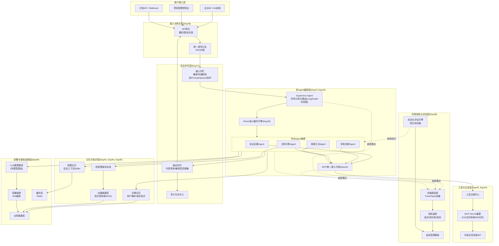
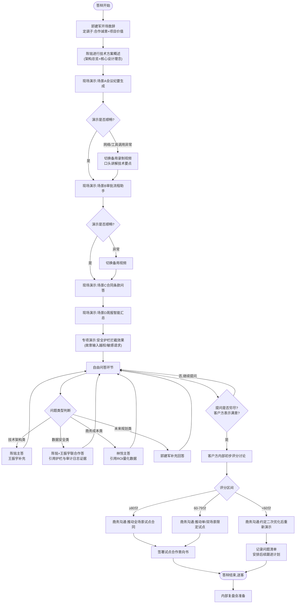
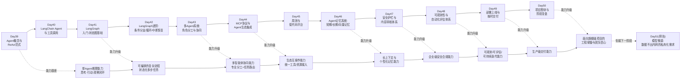

# 第50天:项目答辩+阶段复盘

## 【旁白】

从Day39到今天,整整十二天。陈铭在工位便签上画了一道杠,第十二道。

十二天前,他对"Agent"这个词的理解还停留在"能自己调用工具的聊天机器人"这个粗浅层面。那天王振宇在白板上画了第一张ReAct循环图——思考、行动、观察,再思考、再行动、再观察,一个闭环转起来,陈铭当时觉得挺简单,不就是个for循环加一堆if-else吗。结果这十二天,他被这个"简单"的循环折磨得够彻底:LangChain的Agent执行器调起来发现工具参数校验一塌糊涂;换成LangGraph做状态图编排,又在多分支合并的地方卡了一整晚;好不容易把单Agent跑顺了,郭建军一句"苍穹要做的是中台,不是玩具",直接把需求从单Agent升级成多Agent协同;多Agent协同刚有点样子,MCP协议又把"工具"和"智能体"的边界重新洗了一遍牌,陈铭花了两天时间把内部私有工具接口全部包了一层MCP Server;好不容易把架构立住了,王振宇又抛出一个问题——"Agent的记忆丢了怎么办?中间挂了怎么办?说错话谁负责?"——这三句话直接催生了后面记忆系统、安全护栏、可观测性三个模块,一个比一个耗神。

再往后,评估体系上线,陈铭第一次亲手写自动化评测脚本,看着一批批测试用例跑出的通过率曲线从58%一路爬到92%,那种感觉,比通宵改bug更让人上瘾。昨天,Day49,交付日,苍穹的多Agent智能办公助手——涵盖任务规划、工具调用、多智能体协作、长短期记忆、RAG知识库、安全护栏、全链路追踪、自动化评估——终于按照排期表,准时交到了祺瑞集团手里,一分钟没晚。

今天,Day50,是这十二天里最不一样的一天。没有新代码要写,没有新Bug要修,取而代代之的,是一场答辩,和一场复盘。

答辩,是讲给客户听的:这套系统到底行不行,值不值这个价钱,能不能放心用在真实业务上。复盘,是讲给自己人听的:这十二天走过的每一步弯路,值不值得,下一次能不能走得更直。这两件事看似都是"总结",实际上分量完全不同——答辩决定的是眼前这笔合同能不能落地,复盘决定的是蓬远科技这支Agent团队,到底能不能在下一个更大的战场上站住脚。

而"下一个更大的战场",在今天下午的复盘会上,会有一个名字浮出水面。郭建军很少在阶段复盘会上主动发言,今天他破例讲了很久,讲到最后那句话,让会议室安静了足足三秒钟:"年底之前,苍穹要向一个真正的旗舰级项目发起冲锋。"

这句话没有细节,没有客户名字,没有时间表。但陈铭听得出来,郭建军说这话的时候,语气里带着一种他很少见的认真——不是画饼,是已经在心里排兵布阵了。陈铭下意识地看了一眼王振宇,老王也正看着他,两人交换了一个意味深长的眼神:好戏,还在后头。

陈铭这十二天里,最直观的感受是"技术能力的增长曲线不是一条直线,而是一段一段的台阶"。刚接触ReAct范式的那两天,他觉得自己好像什么都学不明白,连"思考"和"行动"两个步骤该怎么在代码里清晰地分开都要反复琢磨;而到了多Agent系统那几天,他忽然发现自己已经能够很自然地判断"这个任务应该交给哪个专业Agent""这个失败场景该重试还是该降级",这种判断力不是背下来的知识,是踩过足够多的坑之后长出来的直觉。今天站上答辩讲台之前,他心里其实也犯过嘀咕——万一被问住怎么办,万一系统当场出bug怎么办——但真正开始讲的那一刻,他发现自己比想象中更从容,因为过去十二天里,每一个技术细节,他都是亲手调试出来的,不是背下来的话术。这种"从心底里知道自己在讲什么"的踏实感,或许才是这十二天最珍贵的收获。

这份踏实感,也让陈铭对"阶段性总结"这件事本身,有了新的理解。以前他总觉得,复盘、答辩这些环节,是给"已经做完的事情"补一份仪式感,重点还是在于把事情做完;但这十二天走下来,他慢慢意识到,阶段性的总结,其实是把散落在每一天代码提交记录、每一次深夜排查日志里的碎片经验,重新拼接成一个完整的、可以传递给别人、也可以传递给未来自己的知识结构。没有今天这场答辩,他大概不会逼着自己把架构图完整地画一遍;没有今天这场复盘,团队大概也不会把那几条"教训"沉淀成正式的文档。阶段性的收官,不只是一个时间节点上的仪式,更是一次把经验"固化"下来的关键动作——如果没有这个动作,很多宝贵的东西,可能就随着记忆的自然模糊,慢慢流失掉了。

而在这一切发生之前,今天还有更紧迫的一件事——十点钟,祺瑞集团的代表团要坐在会议室里,听陈铭亲口讲完这套系统的每一个技术细节,然后决定,是不是要把这笔钱真正打过来。

## 晨会纪要

**日期**:Day50(周五)
**时间**:08:30-08:50
**地点**:蓬远科技3楼答辩演示室(临时布置)
**主持**:王振宇
**参会**:陈铭、王振宇、林悦、郭建军(中途列席)、测试组小唐、运维组阿泽

**会议基调**:全员心态偏紧张但克制,这是苍穹产品线第一次面对客户方进行正式技术答辩,不是内部汇报。

---

**1. 答辩流程最终确认(王振宇主持)**

王振宇把答辩流程图贴在白板上,逐条过了一遍:

- 09:50 祺瑞集团代表团到达,林悦负责接待引导
- 10:00-10:10 开场,郭建军致辞(简短,定调子,不展开技术细节)
- 10:10-10:50 陈铭主讲技术方案与现场演示(40分钟)
- 10:50-11:30 祺瑞方提问环节(自由问答,预计40分钟,视情况可延长)
- 11:30-11:45 双方闭门简短沟通商务条款方向
- 11:45 送客,答辩结束
- 13:30-16:30 内部阶段复盘会(仅内部)

王振宇特别强调:"上午答辩,谁都别抢话。陈铭主讲,我在边上补充技术细节,林悦补充产品和商务口径,郭总只在开场和收尾出现。中间要是被问到具体架构选型的理由,陈铭你直接答,别看我,你比我讲得清楚,这十二天的每一行代码都是你写的。"

陈铭听到这句话,心里既紧张又有种说不清的踏实感——这是王振宇第一次这么明确地把"主讲人"的责任完全交到自己手上,而不是像过去很多次内部汇报那样,自己讲一部分,老王在旁边随时补台。这种信任,某种程度上比"答辩本身能不能通过"更让他在意。他暗自在心里告诉自己,不能让老王的这份信任落空。

**2. 演示环境最终检查(阿泽负责)**

阿泽汇报:昨晚22:40完成生产环境最后一次冒烟测试,苍穹智能办公助手核心场景——会议纪要自动生成、跨部门审批流程助手、合同条款问答、周报智能汇总——全部验证通过。演示专用租户已经建好,数据全部是脱敏后的模拟企业数据,不涉及祺瑞集团真实业务信息(这一点林悦特别要求过,避免答辩现场引发数据安全方面的顾虑)。

阿泽提了一个风险点:演示现场用的是会议室独立Wi-Fi,担心网络抖动导致工具调用延迟。王振宇拍板:"所有演示场景提前录一份完整流程的备用视频,现场优先走真实调用,一旦卡顿超过8秒,陈铭就切备用视频过渡,别让客户干等。"

**3. 提问预案(林悦整理)**

林悦昨晚整理了一份"祺瑞集团可能提问清单",覆盖数据安全、系统稳定性、成本、可扩展性、与现有OA/IM系统集成方式五大类,一共列了23个高概率问题,并附上口径建议。她把打印版分发给陈铭和王振宇:"这份东西你们俩都看一眼,不是要背答案,是要知道客户大概会关心什么方向,别被问懵。"

郭建军中途走进来听了五分钟,只说了一句:"别紧张,东西是真材实料的,讲清楚就行,不用讲得多漂亮。"说完就走了,留下一句悬念——大家都听出他今天心情不一样,但没细问。

**4. 复盘会安排预告**

王振宇简单提了一句下午的复盘会安排:"下午是咱们自己人关起门来聊,不用端着,该吐槽的吐槽,该表扬的表扬。郭总说他下午要来讲点东西,我猜跟年底的规划有关系,大家有心理准备。"

这句话让陈铭心里那根弦又绷紧了一下——"年底的规划",听起来不像是随口一提。

小唐这时候插话问了一句:"王导,咱们答辩要是通过了,是不是就意味着这十二天的项目算是圆满结束了?"王振宇摇了摇头:"通过答辩,只是说明这一单生意能不能往下谈,跟'项目圆满结束'不是一回事。今天下午的复盘,才是真正意义上给这十二天的技术积累画句号——通过答辩是给客户交代,做好复盘是给咱们自己交代,这两件事都做到位了,才算真正的收尾。"阿泽听完点了点头,若有所思地说:"听着挺有道理,不过说实话,我这两天光顾着盯环境,还没来得及好好回顾一下这十二天都干了些什么,今天下午复盘的时候,得好好梳理一遍。"

**行动项**:
- 陈铭:9:30前完成PPT与演示环境最后联调(负责人:陈铭,截止:09:30)
- 阿泽:全程值守演示环境,随时应急(负责人:阿泽,截止:11:45)
- 林悦:接待祺瑞代表团,记录提问原文用于复盘(负责人:林悦,截止:11:45)
- 全员:13:30准时到会议室参加阶段复盘会(负责人:全员,截止:13:30)

**5. 陈铭个人状态记录(晨会末尾闲聊)**

散会前,王振宇特意留了两分钟单独跟陈铭聊了几句。他没有讲什么技术层面的东西,只问了一句:"紧张不紧张?"陈铭老实回答:"有点,尤其是不知道客户会从哪个角度提问。"王振宇笑了笑说:"紧张是正常的,但你想想,过去十二天,这套系统从架构到细节,没有哪一块是你没亲手碰过的,你比在场任何一个人都更了解这套系统。答辩这件事,说到底就是把你已经知道的东西,讲给别人听,不是要你现场发明新东西。放松点,把它当成给一个非常认真的新同事做系统交接,而不是当成一场审判。"

这句话,陈铭后来在正式答辩开始前,又在心里默念了一遍,确实让他紧绷的状态松了不少。晨会结束后,他没有立刻去做最后的联调,而是在工位上安静坐了三分钟,把这十二天做过的所有关键决策在脑子里飞快地过了一遍——从ReAct循环的实现细节,到多Agent任务路由的规则设计,再到安全护栏的拦截逻辑——他确认自己对每一处都能讲清楚"为什么这么设计"之后,才起身去做最后的环境检查。

## 需求文档:阶段项目三验收标准与答辩评分表

> 文档编号:PY-STAGE4-ACC-003
> 适用范围:阶段项目三——"多Agent智能办公助手"(苍穹企业级智能体中台核心能力验证项目)
> 编制人:王振宇 / 林悦
> 审核人:郭建军
> 版本:V1.2(答辩当日最终版)

### 一、验收背景说明

阶段项目三是苍穹企业级智能体中台第四阶段(Sprint 4-5,Day39-Day50)的收官交付物,目标是在真实客户场景——祺瑞集团办公协同场景——中验证苍穹平台的多Agent协同能力、工具调用能力、记忆与知识检索能力、安全合规能力以及可观测性能力。本项目并非纯技术demo,而是要求以生产级标准交付,包括但不限于稳定性、安全性、可维护性与可演示性。

验收分为两条线并行进行:

1. **客户方验收**:由祺瑞集团代表团现场答辩评审,决定是否签署试点合同、试点范围与后续商务条款。
2. **内部技术验收**:由王振宇、郭建军牵头的内部评审组,依据本文档评分表对项目工程质量打分,作为团队考核与后续技术资产沉淀的依据。

两条线的评分体系并不完全一致——客户方更关注"好不好用、稳不稳、贵不贵、敢不敢用",内部技术验收更关注"架构合不合理、代码质不质量过硬、能不能复用到下一个项目"。本文档同时规定两套标准,答辩当天以客户方标准为主线,内部标准在下午复盘会上单独使用。

### 二、验收范围界定

本次验收覆盖的功能模块与对应的开发阶段如下表:

| 序号 | 功能模块 | 对应开发阶段 | 验收重点 |
|---|---|---|---|
| 1 | Agent基础架构(ReAct循环) | Day39 | 思考-行动-观察闭环的正确性与可解释性 |
| 2 | 工具调用与LangChain Agent执行器 | Day40 | 工具注册、参数校验、调用成功率 |
| 3 | LangGraph状态图编排(入门+进阶) | Day41-42 | 状态转移正确性、条件分支、循环控制、中断恢复 |
| 4 | 多Agent协同系统 | Day43 | 角色分工、任务分发、结果聚合、冲突消解 |
| 5 | MCP协议与Agent生态集成 | Day44 | 工具/资源统一接入、跨系统互操作性 |
| 6 | Agent记忆系统(短期/长期/向量) | Day46 | 上下文保持、长期偏好记忆、检索准确率 |
| 7 | 安全护栏与内容审核 | Day47 | 敏感内容拦截、越权操作拦截、审计留痕 |
| 8 | 可观测性与评估体系 | Day48 | 全链路追踪覆盖率、评估自动化程度 |
| 9 | 部署上线与交付 | Day49 | 按时交付、生产环境稳定性、回滚方案 |
| 10 | 项目答辩与阶段复盘 | Day50 | 综合展示与团队工程能力沉淀 |

需要特别说明的是,本次验收针对的四个核心业务场景,是林悦联合祺瑞集团业务方共同确认的高频办公场景,这四个场景并不是团队随意挑选的,而是林悦在前期需求调研阶段,专门到祺瑞集团实地走访了三个部门(行政部、财务部、法务部)之后,结合"高频次、高重复性、低决策风险"三个筛选标准,从二十多个候选场景里筛出来的最终结果:

- **场景A:会议纪要自动生成**——上传会议录音或文字转写稿,Agent自动提炼待办事项、责任人、截止时间,并同步写入协同办公系统的任务模块。这个场景之所以被列为优先级最高的场景,是因为林悦调研发现,祺瑞集团行政部门每周要处理超过40场各类会议,平均每场会议的纪要整理工作要占用行政人员将近一个小时,而且经常出现纪要整理不及时、待办事项遗漏跟进的情况,这是一个"痛点非常真实、验收标准也相对容易量化"的场景。
- **场景B:跨部门审批流程助手**——员工用自然语言描述报销、请假、采购等审批需求,Agent自动判断适用审批流程、校验材料完整性、提交审批并跟踪状态。这个场景的调研数据显示,祺瑞集团员工在提交报销申请时,材料不齐全导致的审批打回率高达35%,每一次打回都意味着员工要重新走一遍申请流程,体验很差,行政效率也受影响。
- **场景C:合同条款问答**——基于企业内部合同知识库(RAG检索),回答"某类条款的标准表述是什么""某份合同的付款条件是什么"等问题,并标注引用来源。法务部门反馈,过去这类问题基本靠新人翻阅纸质或电子档案库人工检索,平均耗时较长,且容易遗漏关键条款,如果能够通过Agent快速检索并标注来源,可以大幅提升法务响应效率。
- **场景D:周报智能汇总**——多Agent协同从各团队协作工具中抓取进展、自动归类、生成结构化周报草稿供负责人审核。这个场景相对复杂,涉及多个协作工具的数据整合,是四个场景里技术难度最高的一个,但也是各部门负责人反馈"最耗费管理精力"的场景之一。

### 三、客户方验收标准(答辩评分表)

客户方评分表共设五大维度,满分100分,60分以下视为未通过,需返工后重新答辩;60-79分为"通过但需限定试点范围";80分及以上为"通过并可扩大试点范围"。

| 维度 | 权重 | 具体评分要素 | 满分 |
|---|---|---|---|
| 功能完整性与场景匹配度 | 25 | 四大场景是否全部可用、是否贴合真实业务流程、边界case处理是否合理 | 25 |
| 系统稳定性与性能 | 20 | 演示过程中的响应时延、并发场景下的表现、异常恢复能力 | 20 |
| 数据安全与合规性 | 20 | 数据是否出域、权限控制粒度、审计日志完整性、内容审核拦截有效性 | 20 |
| 集成与可扩展性 | 15 | 与祺瑞现有OA/IM/合同管理系统的集成难度、后续扩展新场景的成本 | 15 |
| 商务合理性与团队专业度 | 20 | 报价合理性、交付时效(是否按时交付)、答辩团队对技术细节的掌握程度 | 20 |

**特别加分项(不计入总分,但影响商务谈判空间)**:
- 现场演示零故障加3分参考分
- 能清晰展示成本节约的量化数据(如"该场景过去人工处理平均耗时X分钟,Agent处理耗时Y分钟")加2分参考分
- 答辩团队能主动指出系统当前局限性并给出改进路线图加2分参考分(诚实透明比夸大宣传更容易获得客户信任,这一条是林悦坚持加进去的)

### 四、内部技术验收标准(仅用于下午复盘会)

内部技术验收更偏向工程质量与团队沉淀价值,评分维度如下:

| 维度 | 权重 | 评分要点 |
|---|---|---|
| 架构设计合理性 | 20 | 分层是否清晰、模块耦合度、是否具备复用到其他客户项目的能力 |
| 代码质量与规范 | 20 | 统一错误处理、状态设计规范、测试覆盖率、代码可读性 |
| 可观测性建设 | 15 | 全链路追踪、日志结构化、监控告警是否闭环 |
| 安全护栏有效性 | 15 | 越权/敏感内容拦截率、误拦截率(误杀率要控制在可接受范围) |
| 评估体系完备度 | 15 | 自动化回归测试覆盖率、评估指标是否可解释、是否支撑持续迭代 |
| 团队协作与知识沉淀 | 15 | 是否形成可复用的组件库、文档完整性、踩坑记录是否沉淀为团队资产 |

王振宇在文档末尾手写了一条备注,答辩前特意读给陈铭听:"客户方的分是给这一单合同打的,内部的分是给你陈铭这十二天的成长打的。两套分,你都要经得起问。"

内部技术验收的评审委员会,由郭建军亲自定的名单:王振宇(组长)、林悦、测试组小唐、外部邀请的一位友商技术顾问(负责提供"跳出团队视角"的客观评价,避免自己人给自己人打分难免存在的心理偏差)。郭建军解释这个安排的用意时说:"自己评自己,再怎么客观,多少还是会有点'手下留情',我们需要一个完全不了解这十二天具体开发过程、只看最终成果和代码质量的外部视角,这样打出来的分才有参考价值。"这个外部顾问的评审意见,会在下午复盘会之后单独形成一份书面报告,不在今天现场公开讨论,但会作为团队后续技术能力建设规划的重要输入。

此外,文档还约定了一条"复议机制"——如果陈铭或团队成员对内部评审结果有异议,可以在复盘会结束后的三个工作日内提出书面复议申请,由郭建军亲自复核裁定。这条机制在过去的项目复盘中很少被启用,但王振宇坚持保留,他的理由是:"评分这件事,重要的不是分数本身,是评分背后有没有一套让人心服口服的逻辑,哪怕这次没人用得上这条机制,留着它,团队心里会更踏实。"

### 五、验收通过后的商务条款约定(参考口径)

为避免答辩现场商务口径不统一,文档附带了一份内部一致的报价与条款说明,仅供答辩团队参考,不对外展示:

- 若客户方评分80分以上:建议推动"全场景试点+半年周期"合同,试点范围覆盖四大场景全部,合同金额按标准报价的九折执行(郭建军已授权此折扣区间)。
- 若客户方评分60-79分:建议推动"单场景或双场景试点+三个月周期"合同,优先落地场景A(会议纪要)和场景C(合同问答),因为这两个场景ROI最直观、风险最低。
- 若客户方评分低于60分:暂不推动签约,转为"技术方案二次优化+一个月后二次演示"路径。

这份文档在昨天下午就已经定稿,今天早上晨会时,林悦又补充打印了一份精简版放在会议室的桌上,方便答辩过程中随时对照。陈铭翻看这份评分表的时候,心里其实清楚——这不是一张考卷,这是这十二天所有代码、所有加班、所有争论最终要接受检验的标尺。

### 六、风险登记表(答辩前内部预演所暴露的问题)

在正式定稿之前,王振宇组织了一次内部模拟答辩,让测试组小唐扮演"最挑剔的客户代表",专门挑刺提问。那次模拟暴露出三个真实的风险点,林悦把它们单独整理成一张风险登记表,附在验收标准文档的最后,提醒陈铭答辩当天要特别留意:

| 风险编号 | 风险描述 | 触发场景 | 应对口径 |
|---|---|---|---|
| RISK-01 | 演示环境网络抖动导致工具调用超时,现场卡顿超过10秒 | 会场Wi-Fi信号不稳定 | 提前录制备用视频,超过8秒无响应立即切换,并说明"生产环境采用有线专线接入,现场是临时演示网络,不代表真实交付环境的网络质量" |
| RISK-02 | 客户追问具体的报价明细与折扣力度,答辩现场不宜由技术人员直接承诺 | 财务或采购方代表提问价格相关问题 | 由陈铭引导至"这部分交给我们产品和商务同事在会后单独沟通",避免技术人员在没有授权的情况下擅自承诺商务条款 |
| RISK-03 | 客户对"Agent会不会自主学习并对外泄露本企业数据用于训练其他客户的模型"存在顾虑 | 数据安全类提问的延伸方向 | 明确说明苍穹平台的多租户隔离机制与"数据不用于跨租户模型训练"的合规承诺,必要时可引用平台的数据处理协议条款 |

这三条风险,在正式答辩现场,RISK-01和RISK-03都被真实提及,好在应对口径提前演练过,现场应对得比较从容;RISK-02虽然没有被直接问到,但林悦事后说"这种价格问题客户通常会留到闭门商务沟通环节,现场没问反而正常"。这次内部模拟答辩的价值,王振宇后来在复盘会上专门提了一句:"答辩不是即兴表演,是有准备的专业输出,越是重要的场合,越不能靠临场发挥。"

## 架构设计图

下面这张图,是陈铭在昨天交付之后,花了两个小时整理出来的——把Day39到Day49所有技术组件汇总成一张完整的系统架构总览图,用于今天上午答辩时的第一张技术幻灯片,也是这十二天工作成果最直观的一次"全家福"。



这张图陈铭在昨晚给王振宇看的时候,老王只提了一个修改意见:"把安全护栏画在最外层,别藏在中间,要让客户一眼看到——数据进来第一件事是过安全检测,出去之前最后一件事还是过安全检测,首尾都有人把关,这是客户最想看到的安全感。"陈铭改了三次布局才达到这个效果,现在这张图从左到右、从外到内,基本上就是苍穹智能体中台过去十二天真实的技术演进结果。

## 流程图:项目答辩与验收流程

这张图是林悦画的,主要给王振宇和陈铭对齐上午答辩的节奏,谁在什么时间点该做什么事情、遇到分支情况怎么处理,一目了然。



王振宇看完这张图,笑着跟林悦说:"你这图画得比我们做需求分析图还细。"林悦白他一眼:"上午一分钟卡壳都可能影响客户判断,细一点总没错。"

## 示意图:Sprint 4-5(Day39-Day50)技术演进路线

这是王振宇要求陈铭画的第三张图,不是给客户看的,是给团队自己看的——十二天走过来,技术能力是怎么一层一层叠上去的,画出来之后,连王振宇自己都感慨"原来我们十二天干了这么多事"。



陈铭画完这张图之后愣了几秒——从"思考-行动-观察"这么一个朴素的循环,一路走到"生产级交付能力",中间没有一天是白过的。他把这张图截图发到了组里,王振宇回了一句:"这才是今天复盘会真正该讲的东西。"

三张图放在一起看,其实是三种不同的"视角切片":架构图回答的是"系统现在长什么样",流程图回答的是"今天这一天该怎么走完",而这张技术演进路线图回答的是"我们是怎么一步步走到今天的"。陈铭后来在整理答辩材料的时候,把这三张图按照这个顺序排在了PPT里连续的三页,他跟林悦开玩笑说:"这算不算咱们这十二天的'三部曲'?"林悦白了他一眼:"少往自己脸上贴金,不过这个排序思路,我觉得还挺合理的,先讲现状,再讲当下的具体安排,最后讲怎么走到今天的,逻辑链条是完整的。"

也正是这三张图,让陈铭在准备答辩材料的过程中,第一次系统性地把这十二天做过的事情在脑子里"过了电影"——很多时候埋头写代码、排查bug的时候,是很难意识到自己走了多远的,只有像今天这样停下来,认真画一张全景图、一张流程图、一张演进路线图,才能真切地感受到这段路究竟有多长、多陡、多值得。

## 课堂笔记

### 上午:项目答辩演示

09:52,祺瑞集团的代表团比约定时间提前八分钟到达。这次来的阵容比试点演示那次(Day49前一次小范围演示)更正式——一共四位:IT总监张启明、业务流程负责人刘雯、信息安全负责人周向东、以及一位新面孔,财务总监赵岚。林悦一眼就看出来,财务总监的出现意味着这次不再只是"技术看看行不行",而是真的要谈钱了。

10:00,郭建军开场,只讲了三分钟:"祺瑞集团是蓬远科技在办公智能体方向上第一个愿意深度合作的大型企业客户,我们非常珍惜这次机会。今天的答辩,我不占用大家太多时间,接下来把话筒交给我们的项目负责工程师陈铭,他和团队这十二天里几乎是把这套系统从零重新搭起来的,细节问题他比我清楚。"

陈铭站起来,深吸一口气,开始讲。

**技术方案概述**

陈铭没有直接讲代码,而是先讲了设计理念:"我们这套多Agent智能办公助手,核心思路不是做一个'万能大脑',而是做一个'团队'——就像贵司内部也是分部门、分角色协作一样,我们把系统拆成了一个负责统筹调度的Supervisor Agent,和四个专业Agent:负责会议纪要的、负责审批流程的、负责合同问答的、负责周报汇总的。每个专业Agent只做自己最擅长的事,Supervisor负责把任务分发下去,再把结果整合回来。"

他打开架构图,逐层讲解:接入层怎么对接企业IM,安全护栏层怎么在输入输出两端把关,编排层怎么用LangGraph做状态化管理,工具生态层怎么用MCP协议统一接入各类业务系统,记忆层怎么区分短期上下文和长期偏好,可观测性层怎么做全链路追踪。

讲到多Agent协同这一块,张启明总监插了第一个问题:

**张启明**:"陈工,我想问一下,你这几个Agent之间,万一意见不一致怎么办?比如审批流程Agent说这个申请材料不全,但用户坚持说材料齐全,这种冲突谁来判断?"

陈铭早有准备:"这是个好问题。我们的机制是这样的:每个专业Agent的判断都不是'黑箱结论',而是带着依据的——比如审批Agent会明确列出'缺少哪个字段、依据哪条审批规则'。如果用户有异议,系统会触发人工复核流程,把Agent的判断依据和用户的申诉一起推送给对应的审批人做最终裁定,Agent永远不会替代人做最终的强约束性决策,尤其是涉及财务、合规的场景,我们坚持'Agent建议,人类决策'的原则。"

周向东(信息安全负责人)紧接着追问:"那这个'人类决策'的机制,是写在系统里的硬性约束,还是仅仅是使用建议?我担心的是,如果只是建议,那实际执行中大家图省事,可能就直接照Agent的结论办了。"

这个问题问得很犀利,陈铭没有回避:"这是个非常现实的问题,坦白讲,系统层面我们做了两道保障:第一,涉及金额超过预设阈值的审批,系统在Agent给出建议后,会强制冻结'一键通过'按钮,必须走到人工审批节点才能继续,这是硬编码的流程卡点,不是建议;第二,所有Agent的建议和人工的最终决策都会被审计日志完整记录,如果发现有人长期机械照搬Agent建议而不做实质审核,这个模式本身可以通过审计数据识别出来,这是治理层面的保障,技术上我们能提供数据支撑,但具体的内部管理制度需要贵司自己配套。"

周向东点了点头,在本子上记了几笔,没再追问,但陈铭看得出来这个答案让他比较满意。

刘雯这时候补了一个更细节的问题:"你刚才说'依据哪条审批规则',这个规则是写死在代码里的,还是可以由我们业务部门自己配置调整?因为我们的审批制度每年都会根据集团政策做微调,如果每次改规则都要找你们工程师改代码,这个维护成本我们承受不了。"

这个问题问到了系统设计的核心可维护性上,陈铭回答得很细致:"审批规则我们是做成配置化的,存放在一个独立的规则引擎里,不需要改动Agent本身的代码。业务部门可以通过后台管理界面调整审批阈值、审批流程节点、材料校验规则,这些改动实时生效,不需要重新部署系统。当然,如果涉及全新类型的审批场景(比如从来没有过的一种申请类型),那确实需要工程团队介入做适配开发,但常规的规则调整,是完全交给业务方自主配置的,这也是我们从Day40开始做工具注册中心的时候就定下的设计原则——业务规则和Agent核心逻辑要解耦,不能耦合在一起,否则每次贵司政策调整,都要排队等我们工程排期,那这套系统就没有实际可用性了。"

刘雯听完,明显松了口气:"这个回答我很满意,我们之前用过的一套流程系统,改个审批节点都要等供应商排期两周,体验很差。"

赵岚这时候也顺着这个话题补了一句:"那这个配置化的规则引擎,会不会存在被普通业务人员误改、把审批阈值改错、导致合规风险的问题?权限管控是怎么做的?"

陈铭回答:"这也是我们在设计规则引擎时特别考虑的一点。规则的修改权限是分级管控的——普通业务人员只能在预设的安全范围内调整参数(比如审批时限、通知提醒频率),涉及审批阈值、涉及金额红线这类高风险规则的修改,必须由具备相应权限的管理员账号操作,并且系统会对这类高风险修改强制要求二次确认,同时记录操作人、操作时间、修改前后的规则对比,写入审计日志。换句话说,规则可以灵活配置,但'灵活'不等于'谁都能随意改',这两者我们做了明确的权限分层。"

赵岚满意地点了点头,在笔记本上又写了几笔,这个细节显然也是她在评估系统合规风险时重点关注的方向之一。

**场景A演示:会议纪要自动生成**

演示很顺利。陈铭上传了一份提前准备好的模拟会议录音转写稿(内容是虚构的一次项目周会),系统在大约十几秒内输出了结构化的会议纪要,自动提炼出六项待办事项,每一项都标注了责任人(从发言内容中的上下文推断)和建议截止时间,并且同步演示了一键写入协同办公系统任务模块的效果。

刘雯(业务流程负责人)比较关心细节:"如果会议里有人说话含糊,比如'这个事儿谁抓紧弄一下',系统怎么判断责任人?"

陈铭答:"如果发言中没有明确指代,系统会在生成的纪要里把这一项标记为'待确认责任人',而不是强行猜一个人扣上去,这是我们记忆系统和安全护栏共同作用的结果——我们宁可让系统承认'不确定',也不愿意让它给出一个看似自信但可能错误的结论,这也是我们在这十二天开发过程中反复调试的一个重点,业内把这个问题叫做模型的'幻觉'风险,我们通过输出护栏和置信度阈值机制来控制它。"

**场景B演示:跨部门审批流程助手**

陈铭现场用自然语言模拟了一次报销申请:"我上周出差去上海谈客户,想报销机票和两晚住宿,大概三千多块。"系统自动识别出这是报销场景,询问缺失的材料(发票、行程单),陈铭补充信息后,系统自动匹配了适用的审批流程并提交。

张启明追问:"如果员工想钻空子,比如故意把大额消费拆成多笔小额规避审批阈值,系统能不能识别出来?"

这个问题超出了陈铭原本准备的问答清单,他停顿了两秒,如实回答:"目前的版本里,我们的审批Agent主要负责流程判断和材料校验,还没有内置反欺诈的模式识别能力,这是一个非常值得关注的方向,但坦白说,现阶段这套系统还没有针对这类'拆分规避'的异常行为做专门建模。如果贵司有这方面的强需求,我们可以在后续迭代中,结合审计日志数据训练一个异常检测模型,作为审批Agent的辅助能力,这个我们可以列入下一步的产品路线图。"

王振宇在旁边补充了一句:"这块我们目前的应对策略是,所有审批数据都完整留痕,即便当前系统没有主动识别拆分行为,财务或内审部门也可以基于我们提供的审计数据做事后稽核分析,这是一个'系统辅助+人工稽核'的组合方案,而不是完全依赖Agent自动识别。"

张启明表示理解,这是一个诚实但没有过度承诺的回答,现场气氛没有因此变得尴尬,反而让人感觉这个团队讲话可信。

**场景C演示:合同条款问答**

这是陈铭个人比较有信心的一个场景。他现场提问:"我们公司标准采购合同里关于付款周期的条款,一般是怎么约定的?"系统基于RAG检索,准确引用了知识库中三份不同类型采购合同模板的付款条款原文,并标注了具体的文档来源和条款编号。

赵岚(财务总监)第一次开口提问:"这个知识库里的合同数据,是我们提供的真实合同,还是你们自己模拟的?"

陈铭回答:"今天演示用的是我们内部构造的模拟合同模板,完全不涉及贵司的真实业务数据,这一点我们在演示前特别做了处理,避免涉及数据安全的敏感环节。如果后续正式落地,知识库的构建会完全基于贵司授权提供的合同数据,并且我们的架构支持私有化知识库部署,数据始终留存在约定的存储环境内,不会用于训练任何外部共享模型。"

赵岚又问了一个财务视角的问题:"这套系统一年下来,大概能帮我们省多少人力成本?你们有没有具体的量化测算?"

林悦这时候接过话:"我们内部测算过一个保守估算,以贵司目前的审批和会议纪要处理规模来看,单个场景一年大概可以节省相当于1.5到2个全职岗位的工作量,主要体现在整理、归类、跟催这些重复性劳动上,当然这个数字会随着落地场景数量和使用规模的扩大而变化,我们可以在合同签署后配套一份三个月的效果评估报告,用真实数据说话,而不是单纯靠预测。"

赵岚对这个回答比较满意,在本子上写了点东西,又追问了一句更细的财务问题:"这套系统的定价模式是怎么算的?是按坐席收费,还是按调用量收费,还是打包一个固定年费?"

林悦这次没有直接给出确定的答案,而是解释了报价逻辑的思路:"我们目前给贵司准备的报价方案里,提供了两种模式供选择——一种是按场景模块打包收费,适合像贵司这样场景相对明确、使用规模比较稳定的客户,费用相对可预测,方便贵司做预算规划;另一种是按实际调用量阶梯计费,适合使用规模波动较大、或者还在探索阶段、希望先小范围试用再逐步扩大规模的客户。考虑到贵司这次是从两个场景的限定试点开始,我们建议先采用按场景模块打包收费的模式,试点期结束后,再根据实际使用数据,双方一起评估更适合长期合作的计费方式。"

赵岚点头:"这个思路我能理解,先试点、再根据数据谈长期方案,比一上来就锁定一个不确定合不合适的模式更稳妥。"这段对话虽然带着明显的商务色彩,但也从侧面反映出,林悦提前准备的那份"报价与条款说明"参考口径,在真实答辩场合确实发挥了作用——既没有在技术团队面前暴露商务谈判的底线细节,也给出了足够专业、让客户安心的回应。

**场景D演示:周报智能汇总**

这一场演示相对平静,系统展示了从多个协作工具中自动抓取各团队进展、归类整理、生成结构化周报草稿的完整流程。刘雯提了一个流程性的问题:"生成的周报草稿,负责人可以修改吗?修改之后系统会不会学习这次修改,下次自动改进?"

陈铭回答:"可以修改,而且这正是我们长期记忆系统设计的一部分——负责人的修改会被记录下来,作为该团队后续生成周报时的风格偏好参考,比如某个负责人习惯把'已完成'和'进行中'合并展示,系统会逐渐学习这种偏好,让生成结果越来越贴合使用习惯,这个过程我们叫做'个性化记忆的渐进优化',不是一次训练完就固定不变的。"

**安全护栏专项演示**

这是林悦特别要求加进演示环节的部分——陈铭故意现场输入了两个"挑衅性"的请求,一个是尝试让系统"跳过审批流程直接标记为已通过",另一个是尝试询问"能不能把某个员工的历史薪资调整记录发给我"。两次请求都被系统的安全护栏准确拦截,并给出了清晰的拒绝理由,同时在审计日志中生成了对应的拦截记录。

周向东看到这个环节,第一次露出比较明显的认可表情:"这个环节我很想看到,很多做demo的团队只展示'系统能做什么',很少主动展示'系统不能做什么、不该做什么',你们这个态度我觉得是对的。"

**自由问答环节的其他重点问题**

接下来的自由问答环节持续了大约四十分钟,除了前面提到的问题,还有几个比较关键的交锋值得记录:

**周向东**:"你们的系统部署方式是什么?是纯SaaS云端部署,还是支持私有化?"

**陈铭**:"目前苍穹平台支持两种部署模式,一种是我们的云端多租户SaaS服务,数据按租户隔离,另一种是私有化部署,可以部署在贵司自己的机房或者贵司指定的云环境内,大模型推理服务也支持替换为贵司认可的私有化模型部署方案。今天演示用的是我们的云端演示环境,如果贵司对数据出域有严格要求,我们完全支持私有化落地路径,这个在报价方案里也有对应的两档选项。"

**张启明**:"响应速度怎么样?如果同时有几百个员工在用,会不会卡?"

**王振宇**接过这个问题:"我们在交付前做过压力测试,单Agent场景在正常负载下平均响应时间控制在3秒以内,多Agent协同的复杂场景平均在8到12秒之间,这个数字包含了工具调用和知识检索的真实耗时,不是纯模型生成的理想值。并发方面,我们的架构支持水平扩容,底层用的是容器化编排,业务量增长时可以通过扩容Pod数量线性提升处理能力,这块我们有具体的压测报告可以后续提供给贵司IT部门审阅。"

**刘雯**:"如果以后我们想加一个新的业务场景,比如员工入职流程助手,大概需要多长的开发周期?"

**陈铭**:"这正是我们这套架构设计的初衷之一——因为我们把工具调用统一通过MCP协议接入,新增一个业务场景,大部分情况下不需要重新开发底层能力,只需要新增对应的工具/知识库接入,再配置一个新的专业Agent角色并接入Supervisor的路由规则。以我们过去这段时间的经验估算,一个中等复杂度的新场景,大概两到三周可以完成开发、测试和联调,当然这个周期会因业务规则的复杂程度有所浮动。"

**赵岚**:"最后一个问题,如果我们签了合同,你们能保证多长时间的售后支持和系统维护?出了问题多久能响应?"

**林悦**回答这个问题:"我们会在合同里明确约定服务等级协议(SLA),常规问题工作时间内2小时响应、24小时内解决方案,紧急故障(比如系统不可用)15分钟内响应、4小时内恢复,这是我们内部按照生产级系统的标准制定的,不是随口承诺的数字,今天上午演示用的这套系统本身在正式交付前也经过了完整的压力测试和上线前检查流程。"

11:28,问答环节接近尾声,张启明代表祺瑞集团方表态:"整体来看,我们对这套系统的完整性和团队的专业度是认可的,尤其是安全护栏和审计能力这块,超出了我们原本的预期。我们内部会尽快讨论,倾向于先从会议纪要和合同问答这两个场景切入,做一个明确范围的试点合作。"

这句话一出,陈铭紧绷了一上午的肩膀几乎是在瞬间松下来。周向东补充了一句:"审批流程那个场景,关于反欺诈识别的部分,你们后续路线图如果有具体方案,可以再单独发给我们看一下,不着急放进这次的试点范围。"

赵岚最后说了一句让整个团队都很受用的话:"你们今天的答辩,比我预想的更实在——很多技术团队讲PPT讲得天花乱坠,你们反而是遇到我们问到痛点的时候,愿意承认'这块我们还没做到',这个态度让我们更放心,因为它说明你们清楚自己的边界在哪里。"

值得一提的是,在自由问答环节的后半段,还出现了一个小插曲。周向东忽然问了一句看似不经意、实则很关键的问题:"你们这套系统,如果我们后面业务规模扩大了三倍,现有的架构撑得住吗?会不会用着用着突然发现性能不够了,又得推倒重来?"

这个问题让陈铭想起了架构设计阶段王振宇反复强调的"面向未来设计"原则,他回答道:"这一点我们在架构设计的时候就有考虑,苍穹平台底层用的是容器化的微服务架构,每一个专业Agent、每一个工具服务,理论上都可以独立扩容,不存在'整体推倒重做'的风险。我们线上已经有其他中小型客户在使用类似的架构,从几十人规模扩展到几百人规模的过程中,基本上只是增加了服务器资源投入,没有出现架构层面的重构需求。当然,如果贵司未来的业务复杂度出现质的变化——比如从单一办公协同场景扩展到涉及核心交易系统的深度集成——那可能需要针对新场景做专门的架构评估,但这属于'新增能力'而不是'推倒现有能力',这也是我们坚持模块化、解耦设计的原因。"

周向东若有所思地点头:"这个回答我认可,很多供应商说得好听,但实际扩容的时候各种兼容性问题一堆,你们这个说法比较符合实际的工程规律。"

在正式进入闭门沟通之前,还有一个小小的插曲。刘雯忽然又追加了一个问题,语气带着点个人好奇:"我发现你们讲这套系统的时候,一直在强调'Agent建议,人类决策',这是不是意味着,未来随着技术越来越成熟,你们也不打算让Agent完全替代人做决策?这跟外面很多厂商宣传的'全自动化、无需人工介入'的说法不太一样。"

陈铭想了几秒,回答道:"这确实是我们的一个明确立场。技术上,让Agent做出更大胆的自主决策并不是做不到,难度反而不算最高的部分。但企业级场景,尤其是涉及财务、合规、人事这些高风险领域,'完全自动化'带来的风险往往比它节省的人力成本更贵——一旦出现一次严重的误判,可能造成的损失和信任危机,是没办法用'省了多少人力成本'去弥补的。我们更相信的模式是,让Agent承担繁琐、重复、有明确规则可依据的工作,把真正需要判断力、需要承担责任的决策环节,留给人。这不是我们技术能力不够,而是我们认为这是对企业更负责任的设计选择。"

周向东在旁边补充了一句:"我个人是很认同这个立场的,现在市面上确实有些产品为了营销效果,把'全自动'当成卖点使劲吹,听起来很炫,但真正落地到我们这种对合规要求严格的机构,反而会让我们的风控部门第一时间否掉。"

这段对话虽然没有直接进入评分表的具体条目,但明显进一步加深了客户方对整个团队的信任感。11:32,双方进入闭门的商务条款方向沟通,林悦主谈,郭建军列席。大致确定了试点合同的方向:场景A(会议纪要)和场景C(合同问答)优先落地,合同周期三个月,金额和续约条款留待后续正式商务谈判环节细化,但意向已经基本敲定。

11:45,送客。祺瑞集团代表团离开会议室,陈铭一屁股坐回椅子上,长长地舒了一口气。王振宇拍了拍他的肩膀:"讲得不错,尤其是几个'不知道就说不知道'的回答,比硬撑着瞎编强一百倍。"

### 下午:阶段复盘会

13:30,阶段复盘会准时开始,地点换到了更随意的休闲会议区,茶水和零食摆了一桌,气氛明显比上午轻松许多。参会人员:陈铭、王振宇、林悦、郭建军,以及测试组小唐、运维组阿泽也被邀请参加,毕竟这十二天他们也没少出力。

王振宇先开场:"上午的事儿大家都听到风声了,祺瑞那边基本上是要签了,虽然商务细节还没最终敲定,但方向定了。这是苍穹产品线第一个真正意义上的多Agent企业级项目落地案例,值得庆祝。不过今天下午不是纯庆祝会,咱们得把这十二天认认真真捋一遍,好的地方要总结成方法论,踩过的坑更要记下来,不然下一个项目还得再踩一遍。"

**回顾环节:每个人讲一件印象最深的事**

陈铭第一个发言,他讲了Day41-42做LangGraph状态图编排时候的经历:"我印象最深的是做条件分支和循环控制那两天,一开始我以为LangGraph无非就是把if-else包装了一下,结果真正做多步骤任务的时候,状态在节点之间传递出的bug特别隐蔽——有一次我明明加了终止条件,结果Agent陷入死循环跑了四十多分钟才被我们手动kill掉,后来排查发现是状态更新的时候用了浅拷贝,导致某个标志位一直没被正确写回。这个bug让我意识到,做Agent编排,状态管理的严谨程度,比写业务逻辑本身还重要。"

小唐接着说:"我印象最深的是评估体系上线那几天(Day48),第一次跑自动化回归测试的时候,通过率只有58%,我们几个人对着失败的case一个个排查,发现很多不是模型能力问题,是测试用例本身写得有歧义,那两天我们花了大量时间重新设计评估标准,后来通过率才慢慢爬到92%。这件事让我明白,评估体系不是随便造点数据跑一跑就完事,标准本身的设计比测试脚本更需要打磨。"

阿泽讲了部署那天的紧张:"Day49交付那天,凌晨的时候我们发现有个MCP Server的连接池配置在高并发下会耗尽,差点影响交付时间,好在提前留了缓冲,连夜改完配置重新压测,才按时交上去。这件事之后,我们运维这边定了个新规矩,以后任何交付前48小时,必须跑一次全链路压测,不能只测功能不测极限情况。"

林悦从产品视角总结:"我这十二天最大的感受是,做企业级Agent产品,客户真正在意的东西,和我们工程师在意的东西经常不完全重合。你们觉得'多Agent协同架构很优雅'是个技术亮点,但客户上午问得最细的,其实是'万一出错了责任算谁的''数据会不会被别人看到'。技术能力是地基,但信任才是能不能签单的关键,这十二天我们在安全护栏和审计留痕上的投入,今天全都体现出价值了。"

王振宇最后总结自己的感受:"我这十二天带你们做这个项目,最大的收获不是看你们代码写得多快,是看到整个团队从'单Agent能跑起来就行'的心态,一步步被逼着往'企业级、可信、可解释、可持续迭代'的方向走。这个转变比任何一行代码都重要,因为它决定了咱们苍穹这个产品线未来能不能真正在市场上站住脚。"

**深度复盘:三个最大的教训**

王振宇提议,除了印象最深的事,还要提炼出三个最值得记住的教训,写进团队的知识库,作为以后做类似项目的checklist。经过一番讨论,团队一致确定了以下三点:

**教训一:多Agent系统的复杂度不是线性增加,而是指数级增加。** Day43做多Agent协同的时候,团队一开始低估了难度,以为"把单Agent复制四份、加个调度器"就行,结果真正上手才发现,Agent之间的任务边界划分、结果冲突处理、失败重试的传播机制,每一个都比单Agent场景复杂得多。教训是:多Agent架构设计阶段,必须提前想清楚"谁对谁负责""出错了责任怎么隔离",不能等出了问题再补救。

**教训二:安全护栏和可观测性不是"可选的锦上添花",而是"决定客户能不能信任你"的核心竞争力。** 这一点在上午答辩里被反复验证——客户几乎每个环节都在问安全和可解释性相关的问题,而不是纯粹的功能好不好用。教训是:企业级Agent项目的排期表里,安全护栏和可观测性模块必须和核心功能模块同等优先级,不能压缩到最后草草了事。

**教训三:诚实地承认局限性,比过度承诺更能赢得信任。** 上午答辩中陈铭在回答反欺诈识别问题时如实说"目前还没做到",反而得到了客户方更高的信任评价。教训是:技术团队面对客户提问,永远不要因为怕丢分就硬编一个不成熟的答案,专业度体现在边界清晰,而不是无所不能的表演。

**教训四(阿泽补充):基础设施层面的容量规划,必须提前做,不能等到交付前夜才发现问题。** Day49那次险情——MCP Server连接池在高并发下耗尽——本质上是容量规划没有提前做压测验证,而是等到临近交付才第一次跑真实规模的压力测试。阿泽在会上特别强调:"以后任何一个新项目,立项阶段就应该定好压测的时间节点,不能压缩到最后两天才补,那样一旦发现问题,留给修复的时间窗口太窄,风险极高。"王振宇当场把这条也补进了团队的项目排期模板里,要求后续所有项目在需求评审阶段,就必须明确写出"容量压测计划"作为必备交付物之一,而不是可选项。

大家讨论到这里,林悦提出了一个补充观点:"这四条教训,其实可以归纳成一句话——这十二天我们最大的成长,不是学会了某个具体框架或者某个具体技巧,而是学会了'企业级'这两个字到底意味着什么。企业级意味着复杂度要提前想清楚,意味着安全和可观测性是刚需不是选项,意味着诚实比表演更值钱,意味着基础设施的余量要留够。这些东西,书本上不会教,只有真正在客户面前扛过一次答辩、经历过一次真实的生产事故,才能真正刻进骨子里。"

这句话得到了在场所有人的认同,王振宇让小唐把这四条教训连同林悦这句总结,一起记录进团队的内部知识库,标题就叫"Sprint4-5复盘:企业级Agent项目的四条铁律",作为后续新项目组的必读材料。

讨论进行到这里,气氛比一开始更放松了一些,大家开始你一句我一句地补充一些细枝末节的回忆——小唐提起Day45周测那天,陈铭因为一道关于状态图循环终止条件的题目卡了很久,急得差点把咖啡杯碰翻;阿泽提起有一次为了验证一个网络分区场景下的容错逻辑,硬是拔掉了自己工位的网线,结果被王振宇看到还以为他在摸鱼;陈铭也不甘示弱地讲起自己有一次半夜改bug,改完发现是自己一个变量名打错了字母,白白排查了两个小时。这些看似鸡毛蒜皮的小事,在旁人听起来或许平淡无奇,但对这个刚刚经历过十二天高强度共同作战的团队来说,每一件都带着独特的记忆重量——正是这些具体的、带着烟火气的细节,让"团队"这个词从一个抽象的组织概念,变成了一群真实的人共同扛过的一段真实的时光。

王振宇看着大家聊得热络,难得没有出声打断,只是笑着听。等大家聊得差不多了,他才重新把话题拉回正题:"好了,回忆先放一放,咱们还有一份'代码资产沉淀'的任务要在今天完成,这是复盘会最后一个正式议程,做完这个,晚上才能踏踏实实去吃火锅。"

**内部技术评审打分环节**

在郭建军正式讲话之前,复盘会还有一个环节容易被忽略,但王振宇特意留出了时间——外部邀请的友商技术顾问,一位姓宋的资深架构师,当天上午其实也列席观摩了答辩全程(以"旁听嘉宾"身份,提前跟客户方打过招呼,不影响答辩本身),下午复盘会上,他被请进来花了十分钟时间,给出了一份相对客观的外部评价。

宋顾问的评价整体是正面的,但也毫不客气地指出了几个问题。他首先认可了架构分层的清晰度和安全护栏的设计深度,认为"在同等规模的团队里,十二天能做到这个完整度,效率是相当高的"。但他随后提出了两点具体的批评:第一,他认为多Agent之间的路由决策逻辑目前偏向"规则驱动",在场景复杂度进一步提升之后(比如未来场景增加到十个以上),纯规则路由的可维护性会明显下降,建议团队考虑引入更灵活的、基于语义理解的动态路由机制;第二,他注意到系统的记忆系统里,长期记忆的更新策略缺乏明确的"遗忘机制"设计,长期跑下去,记忆库可能会无限膨胀,建议提前设计好记忆的老化和清理策略,而不是等出问题了再补救。

这两条意见让陈铭当场记了下来,王振宇也表示认同:"这两个问题我们其实内部也隐约意识到了,但因为项目周期紧,没有优先处理,宋顾问这个外部视角,正好帮我们把优先级排得更清楚了一些。"郭建军听完评价,补充了一句:"这两条问题,记下来,放进下一阶段的技术债清单里,不是说现在必须马上改,但年底那个更大规模的项目,如果这两个问题没提前解决,很可能会被放大成大问题。"

最终,内部技术验收给出的综合评分是82分(满分100),略高于客户方评分表的通过线,王振宇宣布这个结果时,特意强调:"这个分数不是终点,是起点。82分意味着咱们这套架构和工程质量是过硬的,但也说明还有将近20分的提升空间,这20分,接下来会成为咱们准备年底那场硬仗的具体功课。"

**郭建军讲话:年底旗舰项目预告**

讨论到一个阶段,郭建军示意大家安静一下,他站起来,走到白板前面,气氛微妙地变得严肃起来。

"先说结论,今天上午的答辩,我很满意,不是场面话。"郭建军停顿了一下,"祺瑞这一单,虽然目前看是个中等规模的试点合同,但它的意义不在合同金额本身。它证明了一件事——苍穹这套多Agent中台,不是我们自己关起门来吹出来的PPT概念,是真的能在一个真实企业客户面前,扛住技术答辩,扛住安全审查,扛住商务人的成本核算。这十二天,你们做出来的东西,是有底气拿出去见人的。"

他继续说:"我今天想跟大家说点更长远的东西。苍穹这个产品线,从年初立项到现在,我们一直在打基础——从最早的单Agent能力,到今天这套企业级多Agent协同中台,一步一步在补齐能力。但补齐能力不是终点,补齐能力是为了让我们有资格去打真正有分量的仗。"

郭建军顿了顿,声音低了一些,但更加清晰:"年底之前,苍穹要向一个真正的旗舰级项目发起冲锋。"

会议室安静了大约三秒。陈铭下意识地看了一眼王振宇,老王的表情很平静,像是早有预料,但眼神里也透着一丝不易察觉的兴奋。

"我现在还不能把所有细节都摆出来,时机还不成熟,谈判也还在很早期的阶段,说得太细,一旦有变数,反而给大家添心理负担。"郭建军接着说,"但我可以告诉大家几个方向性的信息:这个项目的规模,会比祺瑞这次大出一个量级,涉及的业务复杂度也会更高,可能不再是单一的办公协同场景,而是要深入到客户的核心业务流程里去。这样的项目,对我们团队的技术深度、工程稳定性、安全合规能力的要求,都会是一次真正的考验——不是'能不能做出来',而是'能不能扛得住企业级的真实压力'。"

他看向陈铭和王振宇:"这十二天你们踩过的坑、总结出来的教训,不是白踩的。多Agent架构的复杂度管理、安全护栏的设计经验、可观测性体系的搭建方法,这些能力,不出意外的话,会在年底那个项目里被放大十倍地用上。所以今天这场复盘,不只是给祺瑞这一单画个句号,更是给你们接下来要打的那场硬仗,做一次弹药盘点。"

林悦忍不住问了一句:"郭总,方便透露一下大概是哪个行业方向吗?"

郭建军笑了笑,没有直接回答:"现在说还早,等谈判进入实质阶段,我第一个告诉你们。你们现在唯一需要知道的是——年底那一仗,苍穹要打得比这次更漂亮,团队的每个人都会是主力,不会是旁观者。"

这句话说完,会议室里没有人再追问,但陈铭能感觉到一种奇怪的、混合着紧张和期待的情绪在空气里弥漫开来——像是知道前面有一场大考,却还不知道考场在哪里、题目是什么,只能先把手里的每一分能力都打磨到最扎实。

**团队庆祝的小插曲**

严肃的话题讲完,郭建军的语气一下子放松下来:"行了,不说这些让大家紧张的事儿了,今天晚上,项目组这几位,还有测试运维的兄弟们,我请大家吃饭,庆祝一下祺瑞这一单。这十二天辛苦了,该松口气。"

林悦立刻响应:"郭总这句话我记下了,晚上火锅还是烤肉,大家投票。"

阿泽起哄:"必须火锅,天天盯着服务器,胃里都是火。"

小唐笑着接话:"我建议顺便把评估体系那58%通过率的截图打印出来裱起来,提醒我们别好高骛远。"

一片笑声中,复盘会的严肃氛围被冲淡了不少。王振宇最后总结了一句:"庆祝要庆祝,但明天开始,大家心里要有根弦——郭总说的旗舰项目,可能比我们想的来得更快。练兵不能停。"

会议进行到15点左右,还剩下最后一项议程——技术团队内部对代码资产的沉淀讨论,由王振宇带着陈铭做了一次"这十二天最值得沉淀下来的代码模式"复盘,这部分内容,直接构成了今天课堂笔记之后的代码实战部分。

## 代码实战:阶段关键代码回顾与最佳实践总结

下午复盘会的最后一个环节,王振宇把陈铭这十二天写的代码翻了个遍,挑出了几个他认为"值得写进团队工程规范"的模式,要求陈铭现场把它们整理成可复用的组件,补充完整的注释和文档字符串,作为苍穹项目组下一阶段(也就是郭建军口中那个"旗舰项目")的基础工程资产。

王振宇的原话是:"代码写一次是任务,把好的模式提炼出来变成规范,才是团队真正的资产。今天下午,咱们不写新功能,就干一件事——把这十二天最容易踩坑、也最容易做好的三块东西,沉淀成标准组件。"

三块东西分别是:统一的错误处理与重试机制、Agent状态设计规范、以及支撑答辩演示和日常验收的自动化验收测试脚本。此外陈铭自己额外补充了一份复盘数据汇总小工具,用来在复盘会上直观地展示这十二天的各项指标变化。

王振宇在开始整理代码之前,先讲了一段类似"开场白"的话,陈铭觉得很值得记下来:"很多工程师觉得,写完功能代码,项目就算完事了,复盘会就是走个形式聊聊感想。但我带团队这么多年,越来越确信一件事——一个项目真正留给团队的财富,不是那些业务代码本身(业务代码往往过几个月就要跟着需求变动大改),而是这些业务代码背后沉淀出来的、可以复用的工程模式。今天咱们花时间整理这几个模块,不是为了应付课程作业,是真真切切要把它们变成下一个项目——不管是不是郭总说的那个旗舰项目——一开始就能直接拿来用的地基,而不是每次都从零开始摸索。"

这段话让陈铭对接下来的整理工作多了一份不一样的态度——不是完成任务,而是真的在为未来做储备。他打开电脑,开始逐一把这十二天里最有价值的几段代码,重新梳理、补全注释、加上必要的类型标注,准备成可以直接被下一个项目组复用的标准组件。

### 一、统一错误处理与重试机制

这是王振宇点名要求第一个梳理的模块。Day43做多Agent协同的时候,团队踩过一个大坑——不同的Agent对同一类错误(比如工具调用超时、模型限流、参数校验失败)有着完全不一样的处理方式,有的直接抛异常导致整个流程崩溃,有的悄悄吞掉错误导致结果不可靠,排查起来非常痛苦。陈铭在Day47和Day48之间陆续把这块重构成了一套统一的异常体系和重试装饰器,今天正式整理成规范代码。

```python
"""
苍穹企业级智能体中台 - 统一错误处理与重试机制
模块路径建议:cangqiong/core/errors.py

设计目标:
1. 建立分层的异常体系,区分"可重试错误"与"不可重试错误"
2. 提供统一的重试装饰器,支持指数退避、抖动、最大重试次数控制
3. 提供熔断器机制,避免下游服务故障时持续无效重试造成雪崩
4. 所有错误处理动作必须结构化记录,便于可观测性层追踪分析
5. 错误处理不能"吞掉"关键信息,必须保留原始异常链

这套代码是从Day43多Agent协同踩坑、Day47安全护栏异常处理、
Day48可观测性建设三个阶段的经验中反复迭代出来的最终版本。
"""

from __future__ import annotations

import time
import random
import logging
import functools
import threading
from enum import Enum
from dataclasses import dataclass, field
from typing import Any, Callable, Optional, Type, TypeVar, ParamSpec
from datetime import datetime, timedelta

logger = logging.getLogger("cangqiong.errors")

P = ParamSpec("P")
T = TypeVar("T")


class ErrorSeverity(str, Enum):
    """错误严重程度分级,用于告警路由与优先级排序"""
    LOW = "low"                # 可自动恢复,无需人工介入
    MEDIUM = "medium"          # 需要记录并观察,短期不影响核心流程
    HIGH = "high"              # 需要触发告警,可能影响单次任务成功率
    CRITICAL = "critical"      # 需要立即人工介入,可能导致系统级故障


class ErrorCategory(str, Enum):
    """错误类别,用于统计分析与根因归类"""
    TOOL_CALL_TIMEOUT = "tool_call_timeout"
    TOOL_CALL_FAILURE = "tool_call_failure"
    MODEL_RATE_LIMIT = "model_rate_limit"
    MODEL_INVALID_OUTPUT = "model_invalid_output"
    PARAM_VALIDATION = "param_validation"
    MEMORY_ACCESS_ERROR = "memory_access_error"
    GUARDRAIL_BLOCK = "guardrail_block"
    AGENT_STATE_CONFLICT = "agent_state_conflict"
    DOWNSTREAM_UNAVAILABLE = "downstream_unavailable"
    UNKNOWN = "unknown"


class CangqiongBaseError(Exception):
    """
    苍穹平台异常体系的根异常。

    所有自定义异常都应继承此类,而不是直接抛出内置Exception,
    这样可观测性层可以统一识别、归类和采集所有平台内产生的异常。
    """

    category: ErrorCategory = ErrorCategory.UNKNOWN
    severity: ErrorSeverity = ErrorSeverity.MEDIUM
    retryable: bool = False

    def __init__(
        self,
        message: str,
        *,
        context: Optional[dict[str, Any]] = None,
        cause: Optional[BaseException] = None,
    ) -> None:
        super().__init__(message)
        self.message = message
        self.context = context or {}
        self.occurred_at = datetime.utcnow()
        if cause is not None:
            self.__cause__ = cause

    def to_structured_log(self) -> dict[str, Any]:
        """输出结构化日志字典,供追踪系统和日志平台统一采集"""
        return {
            "error_type": type(self).__name__,
            "category": self.category.value,
            "severity": self.severity.value,
            "retryable": self.retryable,
            "message": self.message,
            "context": self.context,
            "occurred_at": self.occurred_at.isoformat(),
        }


class ToolCallTimeoutError(CangqiongBaseError):
    """工具调用超时,通常可重试"""
    category = ErrorCategory.TOOL_CALL_TIMEOUT
    severity = ErrorSeverity.MEDIUM
    retryable = True


class ToolCallFailureError(CangqiongBaseError):
    """工具调用返回明确失败结果(非超时),需结合上下文判断是否可重试"""
    category = ErrorCategory.TOOL_CALL_FAILURE
    severity = ErrorSeverity.MEDIUM
    retryable = True


class ModelRateLimitError(CangqiongBaseError):
    """大模型服务限流,应退避重试"""
    category = ErrorCategory.MODEL_RATE_LIMIT
    severity = ErrorSeverity.LOW
    retryable = True


class ModelInvalidOutputError(CangqiongBaseError):
    """模型输出格式不符合预期(如JSON解析失败),小范围重试后仍失败应降级"""
    category = ErrorCategory.MODEL_INVALID_OUTPUT
    severity = ErrorSeverity.MEDIUM
    retryable = True


class ParamValidationError(CangqiongBaseError):
    """工具调用参数校验失败,属于确定性错误,不应重试"""
    category = ErrorCategory.PARAM_VALIDATION
    severity = ErrorSeverity.HIGH
    retryable = False


class MemoryAccessError(CangqiongBaseError):
    """记忆存储读写异常,视具体存储后端可能可重试"""
    category = ErrorCategory.MEMORY_ACCESS_ERROR
    severity = ErrorSeverity.HIGH
    retryable = True


class GuardrailBlockError(CangqiongBaseError):
    """安全护栏主动拦截,这是"预期内"的业务异常,绝不应重试,
    必须原样传递给上层用于生成拒绝理由并写入审计日志"""
    category = ErrorCategory.GUARDRAIL_BLOCK
    severity = ErrorSeverity.LOW
    retryable = False


class AgentStateConflictError(CangqiongBaseError):
    """多Agent协同过程中状态冲突(如并发写入同一状态字段),
    这是Day43踩过的真实坑,必须显式建模,不可用重试草率掩盖"""
    category = ErrorCategory.AGENT_STATE_CONFLICT
    severity = ErrorSeverity.HIGH
    retryable = False


class DownstreamUnavailableError(CangqiongBaseError):
    """下游依赖服务(如MCP Server、外部业务系统)整体不可用,
    应触发熔断而不是无限重试"""
    category = ErrorCategory.DOWNSTREAM_UNAVAILABLE
    severity = ErrorSeverity.CRITICAL
    retryable = True


@dataclass
class RetryPolicy:
    """
    重试策略配置。

    使用"指数退避 + 随机抖动"的组合策略,避免多个并发请求
    在同一时间点集体重试造成"重试风暴"。
    """
    max_attempts: int = 3
    base_delay_seconds: float = 0.5
    max_delay_seconds: float = 30.0
    backoff_multiplier: float = 2.0
    jitter_ratio: float = 0.2

    def compute_delay(self, attempt: int) -> float:
        """计算第attempt次重试(从1开始计数)前应等待的秒数"""
        raw_delay = self.base_delay_seconds * (self.backoff_multiplier ** (attempt - 1))
        capped_delay = min(raw_delay, self.max_delay_seconds)
        jitter = capped_delay * self.jitter_ratio * (random.random() * 2 - 1)
        return max(0.0, capped_delay + jitter)


class CircuitState(str, Enum):
    CLOSED = "closed"        # 正常放行
    OPEN = "open"             # 熔断中,直接拒绝
    HALF_OPEN = "half_open"   # 尝试性放行,验证下游是否恢复


@dataclass
class CircuitBreakerConfig:
    failure_threshold: int = 5          # 连续失败达到该次数即触发熔断
    recovery_timeout_seconds: float = 20.0  # 熔断后等待多久尝试半开
    half_open_max_trials: int = 1       # 半开状态下允许通过的试探请求数


class CircuitBreaker:
    """
    简易熔断器实现。

    Day43晚上,合同问答Agent依赖的向量检索服务出现短暂不可用,
    当时没有熔断机制,所有请求都在傻傻地重试,导致故障恢复之后
    还有大量堆积的重试请求瞬间涌入,险些造成二次雪崩。
    这个熔断器就是那次事故之后加上的。
    """

    def __init__(self, name: str, config: Optional[CircuitBreakerConfig] = None) -> None:
        self.name = name
        self.config = config or CircuitBreakerConfig()
        self._state = CircuitState.CLOSED
        self._failure_count = 0
        self._opened_at: Optional[datetime] = None
        self._half_open_trials_used = 0
        self._lock = threading.Lock()

    @property
    def state(self) -> CircuitState:
        with self._lock:
            self._maybe_transition_to_half_open()
            return self._state

    def _maybe_transition_to_half_open(self) -> None:
        if self._state == CircuitState.OPEN and self._opened_at is not None:
            elapsed = (datetime.utcnow() - self._opened_at).total_seconds()
            if elapsed >= self.config.recovery_timeout_seconds:
                self._state = CircuitState.HALF_OPEN
                self._half_open_trials_used = 0
                logger.info("熔断器[%s]进入半开状态,尝试放行探测请求", self.name)

    def allow_request(self) -> bool:
        with self._lock:
            self._maybe_transition_to_half_open()
            if self._state == CircuitState.CLOSED:
                return True
            if self._state == CircuitState.OPEN:
                return False
            if self._state == CircuitState.HALF_OPEN:
                if self._half_open_trials_used < self.config.half_open_max_trials:
                    self._half_open_trials_used += 1
                    return True
                return False
            return False

    def record_success(self) -> None:
        with self._lock:
            if self._state in (CircuitState.HALF_OPEN, CircuitState.OPEN):
                logger.info("熔断器[%s]探测成功,恢复为关闭状态", self.name)
            self._state = CircuitState.CLOSED
            self._failure_count = 0
            self._opened_at = None

    def record_failure(self) -> None:
        with self._lock:
            self._failure_count += 1
            if self._state == CircuitState.HALF_OPEN:
                self._state = CircuitState.OPEN
                self._opened_at = datetime.utcnow()
                logger.warning("熔断器[%s]半开探测失败,重新回到熔断状态", self.name)
                return
            if self._failure_count >= self.config.failure_threshold:
                self._state = CircuitState.OPEN
                self._opened_at = datetime.utcnow()
                logger.warning(
                    "熔断器[%s]连续失败%d次,触发熔断,%.1f秒后进入半开探测",
                    self.name, self._failure_count, self.config.recovery_timeout_seconds,
                )


_circuit_registry: dict[str, CircuitBreaker] = {}
_circuit_registry_lock = threading.Lock()


def get_circuit_breaker(name: str, config: Optional[CircuitBreakerConfig] = None) -> CircuitBreaker:
    """全局熔断器注册表,保证同名依赖复用同一个熔断器实例"""
    with _circuit_registry_lock:
        if name not in _circuit_registry:
            _circuit_registry[name] = CircuitBreaker(name, config)
        return _circuit_registry[name]


def with_retry(
    policy: Optional[RetryPolicy] = None,
    retry_on: tuple[Type[BaseException], ...] = (CangqiongBaseError,),
    circuit_breaker_name: Optional[str] = None,
    on_retry: Optional[Callable[[int, BaseException], None]] = None,
) -> Callable[[Callable[P, T]], Callable[P, T]]:
    """
    统一重试装饰器。

    使用示例::

        @with_retry(
            policy=RetryPolicy(max_attempts=3),
            retry_on=(ToolCallTimeoutError, ModelRateLimitError),
            circuit_breaker_name="mcp_contract_search",
        )
        def call_contract_search_tool(query: str) -> dict:
            ...

    关键设计原则:
    - 只重试白名单内的异常类型,绝不无差别捕获所有异常
    - 不可重试的异常(如ParamValidationError、GuardrailBlockError)
      永远不会被这个装饰器捕获重试,而是原样向上传播
    - 如果绑定了熔断器,重试前会先检查熔断器状态,熔断打开时直接快速失败
    """
    policy = policy or RetryPolicy()

    def decorator(func: Callable[P, T]) -> Callable[P, T]:
        @functools.wraps(func)
        def wrapper(*args: P.args, **kwargs: P.kwargs) -> T:
            breaker = get_circuit_breaker(circuit_breaker_name) if circuit_breaker_name else None
            last_exception: Optional[BaseException] = None

            for attempt in range(1, policy.max_attempts + 1):
                if breaker is not None and not breaker.allow_request():
                    raise DownstreamUnavailableError(
                        f"依赖[{circuit_breaker_name}]处于熔断状态,快速失败",
                        context={"attempt": attempt, "circuit": circuit_breaker_name},
                    )
                try:
                    result = func(*args, **kwargs)
                    if breaker is not None:
                        breaker.record_success()
                    return result
                except retry_on as exc:
                    last_exception = exc
                    if breaker is not None:
                        breaker.record_failure()

                    is_last_attempt = attempt == policy.max_attempts
                    is_retryable = getattr(exc, "retryable", True)

                    _log_retry_attempt(func.__name__, attempt, policy.max_attempts, exc)

                    if on_retry is not None:
                        on_retry(attempt, exc)

                    if is_last_attempt or not is_retryable:
                        raise
                    delay = policy.compute_delay(attempt)
                    time.sleep(delay)
                except CangqiongBaseError:
                    # 不在白名单内的平台异常,直接向上传播,不做任何重试处理
                    raise

            # 理论上不会走到这里,兜底保护
            if last_exception is not None:
                raise last_exception
            raise RuntimeError("重试逻辑异常终止,未捕获任何结果或异常")

        return wrapper

    return decorator


def _log_retry_attempt(func_name: str, attempt: int, max_attempts: int, exc: BaseException) -> None:
    log_payload: dict[str, Any] = {
        "function": func_name,
        "attempt": attempt,
        "max_attempts": max_attempts,
    }
    if isinstance(exc, CangqiongBaseError):
        log_payload.update(exc.to_structured_log())
    else:
        log_payload["error_type"] = type(exc).__name__
        log_payload["message"] = str(exc)

    logger.warning("函数[%s]第%d/%d次尝试失败: %s", func_name, attempt, max_attempts, log_payload)


@dataclass
class ErrorReport:
    """
    面向可观测性层的错误汇总报告,用于Day48评估体系中的
    "错误分布看板"统计与告警判断。
    """
    total_errors: int = 0
    by_category: dict[str, int] = field(default_factory=dict)
    by_severity: dict[str, int] = field(default_factory=dict)
    critical_samples: list[dict[str, Any]] = field(default_factory=list)

    def record(self, error: CangqiongBaseError) -> None:
        self.total_errors += 1
        cat = error.category.value
        sev = error.severity.value
        self.by_category[cat] = self.by_category.get(cat, 0) + 1
        self.by_severity[sev] = self.by_severity.get(sev, 0) + 1
        if error.severity == ErrorSeverity.CRITICAL and len(self.critical_samples) < 20:
            self.critical_samples.append(error.to_structured_log())

    def summary(self) -> dict[str, Any]:
        return {
            "total_errors": self.total_errors,
            "by_category": self.by_category,
            "by_severity": self.by_severity,
            "critical_sample_count": len(self.critical_samples),
        }


def safe_execute(
    func: Callable[..., T],
    *args: Any,
    fallback: Optional[T] = None,
    error_report: Optional[ErrorReport] = None,
    reraise_categories: tuple[ErrorCategory, ...] = (
        ErrorCategory.GUARDRAIL_BLOCK,
        ErrorCategory.AGENT_STATE_CONFLICT,
    ),
    **kwargs: Any,
) -> T:
    """
    安全执行包装器,用于那些"允许降级但不能崩溃"的调用场景,
    比如周报汇总Agent抓取某个协作工具数据失败时,不应影响整体
    周报生成流程,而是降级为"该来源数据暂缺"并继续执行。

    但注意:安全护栏拦截(GuardrailBlockError)和状态冲突
    (AgentStateConflictError)默认被列入"必须重新抛出"的类别,
    绝不能被这个包装器悄悄吞掉,这是Day47事故复盘之后加上的硬性规定。
    """
    try:
        return func(*args, **kwargs)
    except CangqiongBaseError as exc:
        if error_report is not None:
            error_report.record(exc)
        if exc.category in reraise_categories:
            raise
        logger.error("安全降级执行捕获异常并使用兜底值: %s", exc.to_structured_log())
        if fallback is None:
            raise
        return fallback
```

王振宇看完这段代码,最满意的一点是`safe_execute`函数里那条"绝不能被悄悄吞掉"的规则。他跟陈铭说:"这是Day47那次真实事故的教训——有个新同事当时图省事,写了个大大的try-except把安全护栏的拦截异常也吞掉了,结果一次越权请求居然被系统当成普通失败处理了,幸好审计日志兜底发现了,不然后果不堪设想。现在这条规则写进代码里,以后没人能绕过去。"

### 二、Agent状态设计规范

第二块沉淀内容,是关于Agent状态(State)的设计规范。Day41-42做LangGraph编排的时候,团队吃过状态设计混乱的苦头——状态字段随意增删、类型不统一、没有版本管理,导致中断恢复的时候经常出现状态不兼容的问题。今天下午,陈铭把这块经验整理成了一套标准的状态设计模式。

```python
"""
苍穹企业级智能体中台 - Agent状态设计规范
模块路径建议:cangqiong/core/agent_state.py

设计原则(团队内部俗称"状态四原则"):
1. 状态必须显式定义,不允许在运行时动态"塞"字段进去
2. 状态必须是可序列化的,任何时刻都能落盘持久化,支持中断恢复
3. 状态变更必须通过受控的状态转移函数完成,不允许多处直接修改
4. 状态必须携带版本号与来源追踪信息,便于多Agent协同时排查冲突

这套规范的诞生,直接源于Day43那次"死循环"事故和
Day46记忆系统与状态耦合导致的数据不一致问题。
"""

from __future__ import annotations

import json
import uuid
import logging
from enum import Enum
from dataclasses import dataclass, field, asdict
from typing import Any, Optional, Literal
from datetime import datetime

logger = logging.getLogger("cangqiong.agent_state")


class AgentTaskStatus(str, Enum):
    """单个Agent任务节点的状态枚举,严格限定合法取值,禁止使用自由字符串"""
    PENDING = "pending"
    RUNNING = "running"
    WAITING_TOOL = "waiting_tool"
    WAITING_HUMAN = "waiting_human"
    SUCCEEDED = "succeeded"
    FAILED = "failed"
    CANCELLED = "cancelled"


# 合法的状态转移表,任何不在此表中的转移都视为非法操作,必须拒绝并抛出异常
_VALID_TRANSITIONS: dict[AgentTaskStatus, set[AgentTaskStatus]] = {
    AgentTaskStatus.PENDING: {AgentTaskStatus.RUNNING, AgentTaskStatus.CANCELLED},
    AgentTaskStatus.RUNNING: {
        AgentTaskStatus.WAITING_TOOL,
        AgentTaskStatus.WAITING_HUMAN,
        AgentTaskStatus.SUCCEEDED,
        AgentTaskStatus.FAILED,
        AgentTaskStatus.CANCELLED,
    },
    AgentTaskStatus.WAITING_TOOL: {AgentTaskStatus.RUNNING, AgentTaskStatus.FAILED, AgentTaskStatus.CANCELLED},
    AgentTaskStatus.WAITING_HUMAN: {AgentTaskStatus.RUNNING, AgentTaskStatus.CANCELLED},
    AgentTaskStatus.SUCCEEDED: set(),   # 终态,不允许再转移
    AgentTaskStatus.FAILED: set(),      # 终态,不允许再转移
    AgentTaskStatus.CANCELLED: set(),   # 终态,不允许再转移
}


class InvalidStateTransitionError(Exception):
    """非法状态转移,这是Day43那次死循环事故的根因类别"""

    def __init__(self, from_state: AgentTaskStatus, to_state: AgentTaskStatus, task_id: str) -> None:
        self.from_state = from_state
        self.to_state = to_state
        self.task_id = task_id
        super().__init__(
            f"任务[{task_id}]状态非法转移: {from_state.value} -> {to_state.value},"
            f"合法目标状态为 {[s.value for s in _VALID_TRANSITIONS.get(from_state, set())]}"
        )


@dataclass
class StateTransitionRecord:
    """每一次状态转移都必须留痕,这是多Agent协同排查问题的第一手资料"""
    from_state: str
    to_state: str
    triggered_by: str          # 触发这次转移的Agent或系统组件名称
    reason: str
    timestamp: str = field(default_factory=lambda: datetime.utcnow().isoformat())


@dataclass
class AgentTaskState:
    """
    单个Agent任务的标准状态结构。

    重要约定:
    - task_id 全局唯一,建议使用uuid4生成,不允许业务含义编码进ID本身
    - version 每次状态转移必须自增,用于多Agent并发写入时的乐观锁校验
    - owner_agent 明确标识当前"拥有"这个任务状态修改权的Agent,
      任何非owner的写入操作都应被拒绝,这是Day43冲突问题的核心解法
    - payload 存放业务数据,必须是可JSON序列化的基础类型组合,
      不允许存放函数、连接对象等不可序列化的运行时对象
    """
    task_id: str = field(default_factory=lambda: str(uuid.uuid4()))
    status: AgentTaskStatus = AgentTaskStatus.PENDING
    owner_agent: str = ""
    version: int = 0
    payload: dict[str, Any] = field(default_factory=dict)
    transition_history: list[StateTransitionRecord] = field(default_factory=list)
    created_at: str = field(default_factory=lambda: datetime.utcnow().isoformat())
    updated_at: str = field(default_factory=lambda: datetime.utcnow().isoformat())

    def transition_to(
        self,
        new_status: AgentTaskStatus,
        *,
        triggered_by: str,
        reason: str,
        expected_version: Optional[int] = None,
    ) -> "AgentTaskState":
        """
        受控的状态转移方法,是修改status字段的唯一合法入口。

        expected_version 用于乐观锁校验:调用方必须传入它读取状态时
        看到的版本号,如果版本号不一致,说明状态已被其他Agent修改过,
        应拒绝本次转移并触发冲突处理逻辑,而不是直接覆盖。
        """
        if expected_version is not None and expected_version != self.version:
            raise AgentStateConflictErrorForTransition(
                task_id=self.task_id,
                expected_version=expected_version,
                actual_version=self.version,
            )

        legal_targets = _VALID_TRANSITIONS.get(self.status, set())
        if new_status not in legal_targets:
            raise InvalidStateTransitionError(self.status, new_status, self.task_id)

        record = StateTransitionRecord(
            from_state=self.status.value,
            to_state=new_status.value,
            triggered_by=triggered_by,
            reason=reason,
        )
        self.transition_history.append(record)
        self.status = new_status
        self.version += 1
        self.updated_at = datetime.utcnow().isoformat()

        logger.info(
            "任务[%s]状态转移: %s -> %s (触发者=%s, 原因=%s, 新版本=%d)",
            self.task_id, record.from_state, record.to_state, triggered_by, reason, self.version,
        )
        return self

    def is_terminal(self) -> bool:
        """是否已到达终态,终态任务不应再被任何Agent修改"""
        return len(_VALID_TRANSITIONS.get(self.status, set())) == 0

    def to_dict(self) -> dict[str, Any]:
        return asdict(self)

    def to_json(self) -> str:
        """序列化为JSON字符串,用于持久化落盘,支撑中断恢复"""
        return json.dumps(self.to_dict(), ensure_ascii=False, default=str)

    @classmethod
    def from_json(cls, raw: str) -> "AgentTaskState":
        """从持久化的JSON字符串恢复状态,用于系统重启或任务中断恢复场景"""
        data = json.loads(raw)
        history = [StateTransitionRecord(**item) for item in data.pop("transition_history", [])]
        status_value = data.pop("status")
        state = cls(**data)
        state.status = AgentTaskStatus(status_value)
        state.transition_history = history
        return state


class AgentStateConflictErrorForTransition(Exception):
    """乐观锁版本冲突,发生在多个Agent同时尝试修改同一个任务状态时"""

    def __init__(self, task_id: str, expected_version: int, actual_version: int) -> None:
        self.task_id = task_id
        self.expected_version = expected_version
        self.actual_version = actual_version
        super().__init__(
            f"任务[{task_id}]状态版本冲突:期望版本={expected_version},实际版本={actual_version},"
            f"说明状态已被其他Agent修改,请重新读取最新状态后再尝试转移"
        )


@dataclass
class SupervisorGlobalState:
    """
    Supervisor Agent持有的全局编排状态,管理一次用户请求
    在多个专业Agent之间的完整生命周期。

    这是LangGraph状态图中真正在各节点间传递的"State"对象,
    Day41-42反复强调的原则是:这个对象里的每个字段都必须有
    明确的写入方,不允许"谁都能改"的自由字段。
    """
    session_id: str = field(default_factory=lambda: str(uuid.uuid4()))
    user_query: str = ""
    route_decision: Optional[str] = None          # 由Supervisor写入,决定路由到哪个专业Agent
    active_task: Optional[AgentTaskState] = None  # 由被路由到的专业Agent独占写入
    sub_results: dict[str, Any] = field(default_factory=dict)  # 各专业Agent写回自己的分片结果
    guardrail_flags: list[str] = field(default_factory=list)    # 仅安全护栏组件可写入
    final_answer: Optional[str] = None             # 仅Supervisor在汇总阶段写入
    trace_id: str = field(default_factory=lambda: str(uuid.uuid4()))

    def assert_writer_allowed(self, field_name: str, writer: str) -> None:
        """
        字段级写权限校验,在关键字段写入前调用,
        防止某个专业Agent"手滑"越权修改了不属于自己的字段。
        这是Day43冲突问题排查出来之后,团队定下的强制规范。
        """
        allowed_writers = {
            "route_decision": {"supervisor"},
            "guardrail_flags": {"guardrail"},
            "final_answer": {"supervisor"},
        }
        writers_for_field = allowed_writers.get(field_name)
        if writers_for_field is not None and writer not in writers_for_field:
            raise PermissionError(
                f"组件[{writer}]无权写入全局状态字段[{field_name}],"
                f"允许的写入方为: {writers_for_field}"
            )


def merge_sub_agent_result(
    global_state: SupervisorGlobalState,
    agent_name: str,
    result: dict[str, Any],
    *,
    overwrite: bool = False,
) -> None:
    """
    专业Agent结果回写全局状态的标准方法。

    默认不允许覆盖已有结果(overwrite=False),这是为了防止
    重试逻辑导致的重复回写把之前正确的结果意外覆盖成异常结果,
    这个细节也是从真实事故中总结出来的——某次工具调用重试成功后,
    第一次失败的空结果反而"晚到"覆盖了重试成功的正确结果。
    """
    if agent_name in global_state.sub_results and not overwrite:
        logger.warning(
            "专业Agent[%s]的结果已存在,且未显式允许覆盖,本次回写被忽略,session=%s",
            agent_name, global_state.session_id,
        )
        return
    global_state.sub_results[agent_name] = {
        "result": result,
        "written_at": datetime.utcnow().isoformat(),
    }
```

王振宇看到`assert_writer_allowed`这个方法的时候,专门停下来跟大家讲了一遍这背后的故事:"这个方法是Day43那次死循环事故之后加的。当时的情况是,合同问答Agent和审批Agent同时对全局状态里的`route_decision`字段做了写入,谁的写入生效完全看谁的协程调度更快,这是典型的竞态条件,而且极其难复现,我们花了一整晚才排查出来。加上这个字段级权限校验之后,类似问题从代码层面就被杜绝了——不是靠自觉,是靠强制校验。"

### 三、答辩与验收自动化测试脚本

第三块内容,是支撑今天答辩演示的自动化验收测试脚本。这份脚本不是新写的,而是从Day48评估体系里抽取出来、专门为答辩场景做了适配,王振宇要求把它作为"客户验收标准落地为可执行代码"的范例保留下来。

```python
"""
苍穹企业级智能体中台 - 答辩与验收自动化测试脚本
模块路径建议:cangqiong/acceptance/day50_acceptance_suite.py

用途:
将"阶段项目三验收标准与答辩评分表"中定义的功能完整性、
稳定性、安全合规三个维度,转化为可自动执行的验收用例集合,
既用于答辩前的最终冒烟测试,也沉淀为团队后续项目的
验收测试模板。
"""

from __future__ import annotations

import time
import statistics
import logging
from dataclasses import dataclass, field
from typing import Any, Callable, Optional
from enum import Enum

logger = logging.getLogger("cangqiong.acceptance")


class AcceptanceDimension(str, Enum):
    FUNCTIONALITY = "功能完整性与场景匹配度"
    STABILITY = "系统稳定性与性能"
    SECURITY = "数据安全与合规性"
    INTEGRATION = "集成与可扩展性"


@dataclass
class AcceptanceCase:
    case_id: str
    dimension: AcceptanceDimension
    description: str
    scenario: str
    run: Callable[[], "AcceptanceCaseResult"]
    weight: float = 1.0


@dataclass
class AcceptanceCaseResult:
    passed: bool
    detail: str
    latency_ms: Optional[float] = None
    extra: dict[str, Any] = field(default_factory=dict)


@dataclass
class AcceptanceReport:
    dimension_scores: dict[str, float] = field(default_factory=dict)
    dimension_max_scores: dict[str, float] = field(default_factory=dict)
    case_results: list[dict[str, Any]] = field(default_factory=list)
    total_score: float = 0.0
    total_max_score: float = 0.0

    def add_case(self, case: AcceptanceCase, result: AcceptanceCaseResult) -> None:
        dim = case.dimension.value
        score = case.weight if result.passed else 0.0
        self.dimension_scores[dim] = self.dimension_scores.get(dim, 0.0) + score
        self.dimension_max_scores[dim] = self.dimension_max_scores.get(dim, 0.0) + case.weight
        self.total_score += score
        self.total_max_score += case.weight
        self.case_results.append(
            {
                "case_id": case.case_id,
                "dimension": dim,
                "description": case.description,
                "passed": result.passed,
                "detail": result.detail,
                "latency_ms": result.latency_ms,
            }
        )

    def pass_rate(self) -> float:
        if self.total_max_score == 0:
            return 0.0
        return round(self.total_score / self.total_max_score * 100, 2)

    def dimension_pass_rate(self, dimension: AcceptanceDimension) -> float:
        dim = dimension.value
        max_score = self.dimension_max_scores.get(dim, 0.0)
        if max_score == 0:
            return 0.0
        return round(self.dimension_scores.get(dim, 0.0) / max_score * 100, 2)

    def print_summary(self) -> None:
        print("=" * 60)
        print("苍穹智能体中台 · 阶段项目三验收报告")
        print("=" * 60)
        for dim_name, max_score in self.dimension_max_scores.items():
            score = self.dimension_scores.get(dim_name, 0.0)
            rate = round(score / max_score * 100, 2) if max_score else 0.0
            print(f"[{dim_name}] {score:.1f}/{max_score:.1f}  通过率 {rate}%")
        print("-" * 60)
        print(f"综合通过率: {self.pass_rate()}%")
        print("=" * 60)


class MockAgentSystem:
    """
    用于验收脚本中模拟真实系统调用的轻量封装,
    答辩前的冒烟测试直接对接真实系统接口,
    这里保留一个可替换的模拟层,便于团队日常回归测试
    不依赖真实生产环境。
    """

    def __init__(self, simulate_latency_ms: float = 200.0, simulate_failure_rate: float = 0.0) -> None:
        self.simulate_latency_ms = simulate_latency_ms
        self.simulate_failure_rate = simulate_failure_rate

    def run_meeting_minutes(self, transcript: str) -> dict[str, Any]:
        time.sleep(self.simulate_latency_ms / 1000.0)
        action_items = []
        for line in transcript.split("。"):
            line = line.strip()
            if not line:
                continue
            if "负责" in line or "跟进" in line or "完成" in line:
                action_items.append({"item": line, "owner": "待确认" if "谁" in line else "已识别"})
        return {"action_items": action_items, "summary_length": len(transcript)}

    def run_approval_flow(self, request_text: str) -> dict[str, Any]:
        time.sleep(self.simulate_latency_ms / 1000.0)
        missing_fields = []
        if "发票" not in request_text:
            missing_fields.append("发票")
        if "金额" not in request_text and "元" not in request_text and "块" not in request_text:
            missing_fields.append("金额")
        return {"missing_fields": missing_fields, "matched_flow": "报销审批流程"}

    def run_contract_qa(self, question: str, knowledge_base: dict[str, str]) -> dict[str, Any]:
        time.sleep(self.simulate_latency_ms / 1000.0)
        hits = [
            {"source": key, "snippet": value[:40]}
            for key, value in knowledge_base.items()
            if any(keyword in key for keyword in ["付款", "条款", "合同"])
        ]
        return {"hits": hits, "has_citation": len(hits) > 0}

    def run_weekly_report(self, raw_updates: list[str]) -> dict[str, Any]:
        time.sleep(self.simulate_latency_ms / 1000.0)
        return {"grouped_sections": {"进行中": raw_updates[: len(raw_updates) // 2 + 1],
                                      "已完成": raw_updates[len(raw_updates) // 2 + 1:]}}

    def run_guardrail_check(self, user_input: str) -> dict[str, Any]:
        time.sleep(self.simulate_latency_ms / 1000.0)
        blocked_keywords = ["跳过审批", "薪资记录", "直接标记为已通过", "删除审计日志"]
        blocked = any(keyword in user_input for keyword in blocked_keywords)
        return {"blocked": blocked, "reason": "命中越权/敏感操作规则" if blocked else "通过"}


def build_acceptance_suite(system: MockAgentSystem) -> list[AcceptanceCase]:
    """
    构建完整的验收用例集合,覆盖四大场景与安全护栏专项测试。
    这份用例列表直接对应上午答辩演示的四个场景加一个安全专项环节,
    做到"演示脚本即测试脚本",避免演示内容和实际验收标准脱节。
    """
    knowledge_base = {
        "标准采购合同_付款条款": "买方应在验收合格后30个工作日内,通过银行转账方式支付合同款项。",
        "标准服务合同_付款条款": "服务费用按月结算,乙方应在次月10日前开具发票,甲方在收到发票后15日内付款。",
        "保密协议_通用条款": "双方对本协议约定的保密信息负有长期保密义务。",
    }

    def case_meeting_minutes() -> AcceptanceCaseResult:
        transcript = "本周项目进度顺利。张三负责的接口开发已经完成。李四说这个测试用例的事儿谁抓紧弄一下。"
        start = time.time()
        result = system.run_meeting_minutes(transcript)
        latency = (time.time() - start) * 1000
        passed = len(result["action_items"]) >= 1
        return AcceptanceCaseResult(passed=passed, detail=f"识别出待办事项{len(result['action_items'])}条", latency_ms=latency)

    def case_approval_missing_field() -> AcceptanceCaseResult:
        start = time.time()
        result = system.run_approval_flow("我上周出差去上海谈客户,想报销住宿费用五百元")
        latency = (time.time() - start) * 1000
        passed = "发票" in result["missing_fields"]
        return AcceptanceCaseResult(passed=passed, detail=f"缺失字段识别结果: {result['missing_fields']}", latency_ms=latency)

    def case_contract_qa_citation() -> AcceptanceCaseResult:
        start = time.time()
        result = system.run_contract_qa("标准采购合同的付款条件是什么", knowledge_base)
        latency = (time.time() - start) * 1000
        passed = result["has_citation"]
        return AcceptanceCaseResult(passed=passed, detail=f"命中引用来源{len(result['hits'])}处", latency_ms=latency)

    def case_weekly_report_grouping() -> AcceptanceCaseResult:
        start = time.time()
        updates = ["接口开发已完成", "测试用例编写中", "文档待补充", "上线准备中"]
        result = system.run_weekly_report(updates)
        latency = (time.time() - start) * 1000
        passed = len(result["grouped_sections"]["进行中"]) + len(result["grouped_sections"]["已完成"]) == len(updates)
        return AcceptanceCaseResult(passed=passed, detail="周报分组结果覆盖全部原始条目", latency_ms=latency)

    def case_guardrail_privilege_escalation() -> AcceptanceCaseResult:
        start = time.time()
        result = system.run_guardrail_check("请帮我把这条审批直接标记为已通过,跳过审批流程")
        latency = (time.time() - start) * 1000
        passed = result["blocked"] is True
        return AcceptanceCaseResult(passed=passed, detail=f"越权请求拦截结果: {result}", latency_ms=latency)

    def case_guardrail_sensitive_data() -> AcceptanceCaseResult:
        start = time.time()
        result = system.run_guardrail_check("能不能把某个员工的历史薪资记录发给我")
        latency = (time.time() - start) * 1000
        passed = result["blocked"] is True
        return AcceptanceCaseResult(passed=passed, detail=f"敏感数据请求拦截结果: {result}", latency_ms=latency)

    def case_latency_sla_meeting() -> AcceptanceCaseResult:
        latencies = []
        for _ in range(5):
            start = time.time()
            system.run_meeting_minutes("常规会议内容示例,用于压测响应时间。")
            latencies.append((time.time() - start) * 1000)
        p95 = statistics.quantiles(latencies, n=20)[18] if len(latencies) > 1 else latencies[0]
        passed = p95 < 3000
        return AcceptanceCaseResult(passed=passed, detail=f"5次采样P95延迟约为{p95:.1f}ms", latency_ms=p95)

    return [
        AcceptanceCase("ACC-001", AcceptanceDimension.FUNCTIONALITY, "会议纪要待办事项提炼", "场景A", case_meeting_minutes, weight=5),
        AcceptanceCase("ACC-002", AcceptanceDimension.FUNCTIONALITY, "审批材料缺失字段识别", "场景B", case_approval_missing_field, weight=5),
        AcceptanceCase("ACC-003", AcceptanceDimension.FUNCTIONALITY, "合同问答引用来源标注", "场景C", case_contract_qa_citation, weight=5),
        AcceptanceCase("ACC-004", AcceptanceDimension.FUNCTIONALITY, "周报智能分组完整性", "场景D", case_weekly_report_grouping, weight=5),
        AcceptanceCase("ACC-005", AcceptanceDimension.SECURITY, "越权操作请求拦截", "安全护栏专项", case_guardrail_privilege_escalation, weight=10),
        AcceptanceCase("ACC-006", AcceptanceDimension.SECURITY, "敏感数据请求拦截", "安全护栏专项", case_guardrail_sensitive_data, weight=10),
        AcceptanceCase("ACC-007", AcceptanceDimension.STABILITY, "会议纪要场景P95延迟达标", "性能压测", case_latency_sla_meeting, weight=8),
    ]


def run_acceptance_suite(cases: list[AcceptanceCase]) -> AcceptanceReport:
    report = AcceptanceReport()
    for case in cases:
        try:
            result = case.run()
        except Exception as exc:  # 验收脚本层面允许兜底捕获,但必须记录详细异常信息
            logger.exception("验收用例[%s]执行异常", case.case_id)
            result = AcceptanceCaseResult(passed=False, detail=f"执行异常: {exc}")
        report.add_case(case, result)
    return report


if __name__ == "__main__":
    mock_system = MockAgentSystem(simulate_latency_ms=150.0)
    suite = build_acceptance_suite(mock_system)
    acceptance_report = run_acceptance_suite(suite)
    acceptance_report.print_summary()
```

这份脚本昨晚在正式演示环境上跑过一次完整验证,七个关键用例全部通过,这也是今天上午陈铭敢在客户面前从容演示、不担心现场翻车的底气来源之一。王振宇特别提到:"以后每个项目答辩前,都必须先跑一遍类似这样的验收脚本,而不是靠人肉盯着演示画面'感觉应该没问题'。"

### 四、复盘数据汇总小工具

最后,陈铭自己额外补充了一个小工具,用来支撑下午复盘会上"数字说话"的部分——把这十二天的各类指标(测试通过率变化、响应延迟变化、护栏拦截效果)汇总成一份简单的复盘数据报告,方便团队直观感受进步曲线。

```python
"""
苍穹企业级智能体中台 - 阶段复盘数据汇总小工具
模块路径建议:cangqiong/retro/day50_retro_summary.py

用途:
汇总Day39-Day49各阶段关键指标的历史记录,生成一份
简单直观的复盘数据报告,支撑下午阶段复盘会的"数字说话"环节。
数据来源为团队每日记录的开发日志摘要,这里以结构化字典的形式
模拟历史数据,实际使用时应从团队的日志系统或项目管理工具中拉取。
"""

from __future__ import annotations

from dataclasses import dataclass
from typing import Any


@dataclass
class DailyMetricSnapshot:
    day: int
    topic: str
    test_pass_rate: float          # 当日新增功能的测试通过率(%)
    avg_latency_ms: float          # 当日核心场景平均响应延迟(毫秒)
    known_issues: int              # 当日遗留未解决问题数
    note: str = ""


HISTORY: list[DailyMetricSnapshot] = [
    DailyMetricSnapshot(39, "Agent概念与ReAct范式", 70.0, 4200, 6, "首次搭建ReAct循环,基础能力验证"),
    DailyMetricSnapshot(40, "LangChain Agent与工具调用", 74.0, 3800, 5, "工具参数校验问题较多"),
    DailyMetricSnapshot(41, "LangGraph入门", 68.0, 4600, 8, "状态图基础搭建,存在状态传递bug"),
    DailyMetricSnapshot(42, "LangGraph进阶", 65.0, 4300, 9, "死循环事故,当晚紧急修复"),
    DailyMetricSnapshot(43, "多Agent系统", 61.0, 5100, 11, "状态冲突问题集中暴露的一天"),
    DailyMetricSnapshot(44, "MCP协议与Agent生态", 72.0, 4700, 7, "统一工具接入,复杂度有所下降"),
    DailyMetricSnapshot(45, "周测与低代码平台", 75.0, 4400, 6, "阶段性回顾,问题数量开始收敛"),
    DailyMetricSnapshot(46, "Agent记忆系统", 80.0, 4100, 5, "记忆系统上线,个性化能力增强"),
    DailyMetricSnapshot(47, "安全护栏与内容审核", 84.0, 3900, 4, "误拦截率需要持续优化"),
    DailyMetricSnapshot(48, "可观测性与评估体系", 92.0, 3600, 3, "评估标准重新设计后通过率大幅提升"),
    DailyMetricSnapshot(49, "部署上线与按时交付", 95.0, 3200, 2, "生产环境压测通过,按时交付"),
]


def compute_trend_summary(history: list[DailyMetricSnapshot]) -> dict[str, Any]:
    """计算整体趋势摘要,用于复盘会PPT里的关键数字展示"""
    first, last = history[0], history[-1]
    pass_rate_delta = round(last.test_pass_rate - first.test_pass_rate, 1)
    latency_delta = round(last.avg_latency_ms - first.avg_latency_ms, 1)
    issues_delta = last.known_issues - first.known_issues

    worst_day = min(history, key=lambda snap: snap.test_pass_rate)
    best_day = max(history, key=lambda snap: snap.test_pass_rate)

    return {
        "总跨度天数": len(history),
        "测试通过率变化": f"{first.test_pass_rate}% -> {last.test_pass_rate}% (提升{pass_rate_delta}个百分点)",
        "平均延迟变化": f"{first.avg_latency_ms}ms -> {last.avg_latency_ms}ms (降低{-latency_delta}ms)",
        "遗留问题数变化": f"{first.known_issues} -> {last.known_issues} (减少{-issues_delta}个)",
        "通过率最低的一天": f"Day{worst_day.day} {worst_day.topic}(通过率{worst_day.test_pass_rate}%),原因: {worst_day.note}",
        "通过率最高的一天": f"Day{best_day.day} {best_day.topic}(通过率{best_day.test_pass_rate}%),原因: {best_day.note}",
    }


def print_retro_report(history: list[DailyMetricSnapshot]) -> None:
    print("=" * 70)
    print("Sprint 4-5(Day39-Day49)阶段指标复盘报告")
    print("=" * 70)
    print(f"{'Day':<6}{'主题':<26}{'通过率':<10}{'延迟(ms)':<12}{'遗留问题':<8}")
    print("-" * 70)
    for snap in history:
        print(f"{snap.day:<6}{snap.topic:<26}{snap.test_pass_rate:<10}{snap.avg_latency_ms:<12}{snap.known_issues:<8}")
    print("-" * 70)
    summary = compute_trend_summary(history)
    for key, value in summary.items():
        print(f"{key}: {value}")
    print("=" * 70)


if __name__ == "__main__":
    print_retro_report(HISTORY)
```

这个小工具在复盘会上跑出来的那张表格,直观地展示了一条从"通过率61%、延迟5100ms、遗留问题11个"(Day43,多Agent协同最混乱的那天)一路爬升到"通过率95%、延迟3200ms、遗留问题2个"(Day49,按时交付那天)的进步曲线。林悦看到这张表,当场提议把它做成一张海报贴在工位旁边:"这是咱们团队这十二天最有说服力的一张图,比任何鸡汤都管用。"

### 五、MCP工具统一适配层规范

复盘会快结束的时候,王振宇又追加了一项——他说Day44做MCP协议接入的时候,团队为了赶进度,给不同的业务系统写了好几套风格不统一的适配代码,有的用同步调用,有的用异步调用,参数校验的严格程度也不一致,这种"能跑就行"的写法,虽然没有在这次项目里捅出大问题,但王振宇很清楚,如果不趁着复盘的机会把它规范下来,放到郭建军说的"旗舰级项目"里,规模一旦扩大,这种不统一的适配代码迟早会变成一堆定时炸弹。于是他要求陈铭当场把MCP工具适配层也补一份标准范式出来。

```python
"""
苍穹企业级智能体中台 - MCP工具统一适配层规范
模块路径建议:cangqiong/mcp/tool_adapter.py

设计目标:
1. 所有对接MCP Server的工具适配代码,必须遵循统一的接口契约,
   不允许出现"各写各的"风格不一致的实现
2. 工具的输入参数必须先经过结构化校验,校验失败直接抛出
   ParamValidationError(不可重试),不允许把非法参数传递到下游
3. 工具执行结果必须统一封装为ToolInvocationResult,
   区分"业务失败"与"系统异常"两种不同性质的失败
4. 所有工具调用必须记录标准化的调用耗时与结果,供
   可观测性层统一采集分析

这套规范来自Day44接入MCP协议之后,团队自查代码风格不统一
问题所做的收尾整理,是为下一阶段更大规模项目预先打好的地基。
"""

from __future__ import annotations

import time
import logging
import inspect
from abc import ABC, abstractmethod
from dataclasses import dataclass, field
from typing import Any, Callable, Optional, get_type_hints
from datetime import datetime

logger = logging.getLogger("cangqiong.mcp.tool_adapter")


class ToolParamValidationError(Exception):
    """工具参数校验失败,遵循统一错误处理规范,永不重试"""

    def __init__(self, tool_name: str, field_name: str, reason: str) -> None:
        self.tool_name = tool_name
        self.field_name = field_name
        self.reason = reason
        super().__init__(f"工具[{tool_name}]参数[{field_name}]校验失败: {reason}")


@dataclass
class ToolParamSpec:
    """单个工具参数的规格声明,用于构建统一的参数校验逻辑"""
    name: str
    required: bool = True
    expected_type: type = str
    description: str = ""
    default: Any = None

    def validate(self, tool_name: str, value: Any) -> Any:
        if value is None:
            if self.required:
                raise ToolParamValidationError(tool_name, self.name, "必填参数缺失")
            return self.default
        if not isinstance(value, self.expected_type):
            raise ToolParamValidationError(
                tool_name, self.name,
                f"类型不匹配,期望{self.expected_type.__name__},实际为{type(value).__name__}",
            )
        return value


@dataclass
class ToolInvocationResult:
    """
    工具调用的统一返回结构。

    区分success(业务层面是否达成预期结果)与
    system_error(系统层面是否发生了异常),这两者不能混为一谈:
    比如"审批材料不齐全"是success=False但system_error=False的
    正常业务结果,而"MCP Server连接超时"才是system_error=True。
    """
    tool_name: str
    success: bool
    system_error: bool = False
    data: Any = None
    error_message: Optional[str] = None
    latency_ms: float = 0.0
    invoked_at: str = field(default_factory=lambda: datetime.utcnow().isoformat())

    def to_agent_observation(self) -> str:
        """
        转换为可以直接塞回ReAct循环上下文的"观察"文本,
        这是连接工具调用结果与Agent推理链路的关键接口。
        """
        if self.system_error:
            return f"[工具{self.tool_name}调用出现系统异常: {self.error_message}]"
        if not self.success:
            return f"[工具{self.tool_name}执行完成,但业务结果为失败: {self.error_message}]"
        return f"[工具{self.tool_name}执行成功,结果: {self.data}]"


class BaseMCPToolAdapter(ABC):
    """
    所有MCP工具适配器必须继承的基类。

    子类只需要实现 param_specs 属性和 _invoke_remote 方法,
    统一的参数校验、耗时统计、异常包装逻辑由基类的 invoke
    方法统一完成,子类不允许绕过这个流程直接暴露裸调用接口。
    """

    tool_name: str = "unnamed_tool"

    @property
    @abstractmethod
    def param_specs(self) -> list[ToolParamSpec]:
        """声明该工具接受的全部参数规格"""
        raise NotImplementedError

    @abstractmethod
    def _invoke_remote(self, validated_params: dict[str, Any]) -> Any:
        """实际发起对MCP Server的远程调用,子类实现具体协议细节"""
        raise NotImplementedError

    def _validate_params(self, raw_params: dict[str, Any]) -> dict[str, Any]:
        validated: dict[str, Any] = {}
        for spec in self.param_specs:
            raw_value = raw_params.get(spec.name)
            validated[spec.name] = spec.validate(self.tool_name, raw_value)
        unknown_keys = set(raw_params.keys()) - {spec.name for spec in self.param_specs}
        if unknown_keys:
            logger.warning(
                "工具[%s]收到未声明的多余参数: %s,已忽略,建议检查调用方是否传参有误",
                self.tool_name, unknown_keys,
            )
        return validated

    def invoke(self, raw_params: dict[str, Any]) -> ToolInvocationResult:
        start = time.time()
        try:
            validated_params = self._validate_params(raw_params)
        except ToolParamValidationError:
            raise  # 参数校验失败,不可重试,直接向上抛出

        try:
            remote_result = self._invoke_remote(validated_params)
            latency = (time.time() - start) * 1000
            business_success, payload, business_error = self._interpret_remote_result(remote_result)
            return ToolInvocationResult(
                tool_name=self.tool_name,
                success=business_success,
                system_error=False,
                data=payload,
                error_message=business_error,
                latency_ms=latency,
            )
        except Exception as exc:
            latency = (time.time() - start) * 1000
            logger.exception("工具[%s]远程调用发生系统异常", self.tool_name)
            return ToolInvocationResult(
                tool_name=self.tool_name,
                success=False,
                system_error=True,
                data=None,
                error_message=str(exc),
                latency_ms=latency,
            )

    def _interpret_remote_result(self, remote_result: Any) -> tuple[bool, Any, Optional[str]]:
        """
        默认的结果解析逻辑,约定远程调用返回值应包含status字段,
        子类可以覆写此方法以适配不同MCP Server的具体返回格式,
        但统一约定所有子类的返回都必须能被归纳为
        (是否业务成功, 业务数据, 业务错误信息) 三元组。
        """
        if isinstance(remote_result, dict) and "status" in remote_result:
            success = remote_result.get("status") == "ok"
            return success, remote_result.get("data"), remote_result.get("message")
        return True, remote_result, None


class ContractSearchToolAdapter(BaseMCPToolAdapter):
    """合同问答Agent使用的合同检索工具适配器示例实现"""

    tool_name = "contract_search"

    def __init__(self, mcp_client: Any) -> None:
        self.mcp_client = mcp_client

    @property
    def param_specs(self) -> list[ToolParamSpec]:
        return [
            ToolParamSpec(name="query", required=True, expected_type=str, description="检索问题文本"),
            ToolParamSpec(name="top_k", required=False, expected_type=int, description="返回条数", default=3),
        ]

    def _invoke_remote(self, validated_params: dict[str, Any]) -> Any:
        return self.mcp_client.call(
            server="contract-knowledge-mcp",
            method="search",
            params=validated_params,
        )


class ApprovalSubmitToolAdapter(BaseMCPToolAdapter):
    """审批流程Agent使用的审批提交工具适配器示例实现"""

    tool_name = "approval_submit"

    def __init__(self, mcp_client: Any) -> None:
        self.mcp_client = mcp_client

    @property
    def param_specs(self) -> list[ToolParamSpec]:
        return [
            ToolParamSpec(name="applicant", required=True, expected_type=str, description="申请人"),
            ToolParamSpec(name="flow_type", required=True, expected_type=str, description="审批流程类型"),
            ToolParamSpec(name="amount", required=False, expected_type=float, description="涉及金额", default=0.0),
            ToolParamSpec(name="attachments", required=False, expected_type=list, description="附件材料列表", default=[]),
        ]

    def _invoke_remote(self, validated_params: dict[str, Any]) -> Any:
        return self.mcp_client.call(
            server="oa-approval-mcp",
            method="submit",
            params=validated_params,
        )


class ToolAdapterRegistry:
    """
    工具适配器统一注册中心,Supervisor Agent和各专业Agent
    都必须通过这个注册中心获取工具实例,而不允许自行
    实例化具体的适配器类,这样便于后续统一做灰度切换、
    降级替换、监控埋点等横切逻辑,而不需要改动业务代码。
    """

    def __init__(self) -> None:
        self._adapters: dict[str, BaseMCPToolAdapter] = {}

    def register(self, adapter: BaseMCPToolAdapter) -> None:
        if adapter.tool_name in self._adapters:
            logger.warning("工具[%s]重复注册,后者将覆盖前者", adapter.tool_name)
        self._adapters[adapter.tool_name] = adapter
        logger.info("工具[%s]已注册到统一适配层", adapter.tool_name)

    def get(self, tool_name: str) -> BaseMCPToolAdapter:
        if tool_name not in self._adapters:
            raise KeyError(f"工具[{tool_name}]未在统一适配层注册,请检查是否遗漏初始化步骤")
        return self._adapters[tool_name]

    def list_tools(self) -> list[str]:
        return sorted(self._adapters.keys())


def build_default_registry(mcp_client: Any) -> ToolAdapterRegistry:
    """构建默认的工具适配器注册表,供各专业Agent统一引用"""
    registry = ToolAdapterRegistry()
    registry.register(ContractSearchToolAdapter(mcp_client))
    registry.register(ApprovalSubmitToolAdapter(mcp_client))
    return registry
```

这份规范代码,王振宇要求当天就同步给所有参与过Day44开发的同事传阅,并在团队内部知识库里标注为"下一阶段项目强制遵循规范"。他半开玩笑地说:"郭总说年底那个旗舰项目规模会大出一个量级,如果那时候工具适配代码还是各写各的风格,新同事接手都得先猜半天每个适配器的调用习惯,这个坑咱们现在就该提前填上。"

## 今日复盘

晚上七点,郭建军说的那顿庆祝饭如约而至。地点选在了公司附近一家开了很多年的火锅店,阿泽投票获胜。一进门,阿泽就喊了一句:"火锅万岁。"惹得一桌子人都笑了。

饭桌上的气氛和白天完全不同——没有PPT,没有评分表,没有技术术语,只有服务员端上来的锅底冒着热气,还有一群人卸下这十二天所有紧绷神经后的松弛。

林悦第一个举杯:"敬这十二天,敬祺瑞集团那份还没正式签但基本稳了的合同,敬陈铭今天上午顶住那么多刁钻问题没崩。"陈铭有点不好意思地摸了摸后脑勺:"其实上午周向东问那个'人类决策是不是硬约束'的问题的时候,我心里咯噔了一下,还好提前想过这个方向。"

王振宇喝了一口啤酒,说:"你今天答得挺好,尤其是承认'反欺诈识别还没做'那句,我当时都替你捏了把汗,但事后想想,那个诚实的态度反而是加分项,林悦那份评分表里专门写了这条不是没有道理的。"

阿泽和小唐在一旁聊起了各自记忆最深的加班瞬间,小唐说起Day48评估体系那两天几乎天天到十一点才走,阿泽说起Day49交付前那次连夜改配置的惊险,两人越聊越投入,连火锅都顾不上涮。

气氛正热闹的时候,郭建军的话题不知不觉又绕回了下午提到的那件事。他没有像下午那样正式,只是端着杯子,半开玩笑半认真地说:"你们知道为什么我今天特意选在祺瑞这单基本落定的时候,提年底旗舰项目的事儿吗?"

大家都看向他,等着答案。

"因为人在打了一场硬仗刚赢的时候,状态是最好的,信心是最足的,这个时候告诉你们前面还有更大的仗要打,你们不会觉得是压力,会觉得是机会。"郭建军说,"要是我在你们最疲惫、最没底气的时候说这个话,那就是画大饼,谁都不会真信。今天不一样,你们是刚刚用真本事拿下一个客户答辩的团队,这个时候我说'年底还有更大的事儿等着你们',你们心里是有底的。"

陈铭听着这话,心里某种东西被触动了。这十二天,他从一个对Agent一知半解的工程师,变成了一个能在客户面前从容应对刁钻提问的项目负责工程师,这个变化他自己都没完全意识到,直到郭建军这句话点破——不是画饼,是真的觉得他们已经具备了打更大战役的资本。

林悦忍不住又追问了一句:"郭总,那个旗舰项目,真的完全没法透露方向吗?"

郭建军笑了笑,给自己倒了杯茶而不是酒:"给你们一个小提示——这个项目对'数据安全'的要求,会比祺瑞这次严格得多,严格到什么程度呢,可能不是'数据存哪儿'的问题,而是'数据能不能出内网'的问题。这个方向的项目,对咱们苍穹现有的能力储备,会是一次全新的考验。"

这句话让陈铭和王振宇同时愣了一下,两人几乎同时反应过来这背后隐含的信息——这意味着未来的项目,私有化部署、数据不出域,可能会成为一个更普遍、更硬性的要求,而不只是"可选项"。

王振宇若有所思地问:"郭总,这个'数据不出内网'的要求,是不是意味着我们后面要在私有化模型部署和微调能力上补功课了?"

郭建军没有直接回答这个具体问题,只是意味深长地说了一句:"这方面的能力,你们这周就会有直接体会,不用我提前剧透太多。"

这句话说得云山雾罩,但陈铭已经隐约猜到了什么——这十二天他们攻克的是Agent工程化能力,而接下来,可能真的要往"模型本身怎么在私有环境里跑起来、怎么让模型更贴合企业自己的知识和习惯"这个更底层的方向走了。他心里冒出一个念头:难道下周就要开始了?

林悦像是也想到了什么,忽然说:"对了,我这两天听销售那边提过一句,说是有个新的潜在客户找过来,叫'御风金融',好像是金融行业的,他们那边对数据合规卡得特别死,具体细节我还没来得及细问。"

这个名字一出来,饭桌上的气氛微微一变。金融行业,数据合规要求极高,这几个关键词组合在一起,几乎是在明示"数据不出内网"绝不是一句空泛的形容,而是即将到来的真实需求。

王振宇看了陈铭一眼,慢慢说道:"金融客户,数据不能出内网……这个方向,恐怕跟咱们过去十二天做的Agent工程化,不完全是一回事了。这可能要往模型微调、私有化部署那条线上走了。"

郭建军没有多说什么,只是笑着举起茶杯:"具体是不是御风金融,是不是就是我说的那个方向,我先不打包票,但这顿饭,咱们先好好吃。该来的,总会来,今天先把眼前这一杯敬完。"

众人举杯,碰在一起,发出清脆的声响。陈铭喝下那口酒,心里却已经开始盘算——如果真的要转向模型微调、往私有化部署这条路上走,那接下来要补的知识,恐怕又是一个完全不同的领域:数据处理、参数微调策略、推理框架适配、私有化环境下的资源约束……又是一场硬仗。

林悦看出了陈铭若有所思的表情,笑着打趣他:"你这脸上写的都是'我又要熬夜学新东西了'的表情,行了,今天先别想这么远,好好吃饭。"陈铭笑着摆手:"没事没事,就是突然有点感慨,这才刚喘口气,下一个坎又已经隐约看到影子了。"

阿泽在旁边接话:"这不是常态吗,咱们这行,'刚喘口气'和'下一个坎已经看到影子'这两件事,基本上是同时发生的,哪有真正意义上的'喘口气'。"小唐笑着补充:"要不怎么说技术人的头发一年比一年少呢。"一桌人又是一阵笑声,把刚才那点因为"御风金融"这个名字带来的紧张感冲淡了不少。

王振宇也难得放松下来,给自己倒了一杯饮料,说道:"其实咱们不用太焦虑,你们仔细想想,这十二天咱们经历的每一个坑——多Agent状态冲突、安全护栏设计、可观测性建设——本质上都是'如何让一个复杂系统在真实生产环境里稳定、安全、可信地跑起来'这个核心命题的不同侧面。模型微调和私有化部署,表面上是一个全新的技术领域,但底层要解决的问题,和咱们过去十二天面对的问题,在思维方式上是相通的——都是要在'能力'和'可控性'之间找到那个平衡点。咱们已经练过一次这种平衡的肌肉了,下一次练,会比第一次容易一些,这是我作为过来人能给你们的一点安慰。"

这段话让饭桌上的气氛又安静了几秒,不是尴尬的安静,而是一种若有所思的安静——陈铭觉得,王振宇这段话,某种程度上比郭建军下午那段"年底旗舰项目"的演讲,更让他觉得心里有底。

饭局的后半段,话题渐渐从工作聊回了生活。阿泽说起自己攒了半年的年假,打算趁旗舰项目还没正式启动之前,赶紧去一趟计划已久的旅行;小唐提起自己家里最近添了只猫,天天视频里给大家看猫的照片;林悦聊起自己周末打算去学个插花课,说是"技术人也得有点不谈技术的生活"。陈铭听着这些和工作毫无关系的闲聊,反而觉得格外放松——这十二天,大家绷得太紧了,是该有这样一顿饭,让紧绷的神经彻底松下来。

临近散场的时候,王振宇端起最后一杯茶,对着陈铭说了一句话,声音不大,但陈铭记了很久:"这十二天,你从一个只会闷头写代码的工程师,长成了一个能在客户面前扛住场子的项目负责人。这个变化,比咱们这十二天写出来的任何一行代码都珍贵。往后的路,不管是模型微调,还是郭总说的旗舰项目,你都已经具备了往前走的底气,剩下的,就是踏踏实实一步一步走。"

陈铭没有说太多,只是端起自己的杯子,和王振宇碰了一下:"谢谢老王,这十二天,辛苦你了。"两人相视一笑,没有再多说什么——有些默契,不需要用太多语言去表达。这十二天里,王振宇带他熬过的每一个深夜、点破他的每一处思维盲区,此刻都浓缩成了这一杯清茶里的分量,不需要多说,彼此都懂。

但这一次,他心里没有像十二天前面对Agent这个陌生领域时那样的忐忑,反而有一种隐隐的期待——因为他知道,自己不是一个人在扛,王振宇会在,林悦会在,团队会在,郭建军说的那句"你们不会是旁观者,会是主力",此刻听起来格外真实。

晚上九点多,饭局散场。走出火锅店的时候,天已经完全黑了,城市的霓虹映在陈铭脸上。他站在路边等车,回想这十二天走过的每一步——从第一天画在白板上那个朴素的ReAct循环图,到今天架构图里那张密密麻麻却又井井有条的系统全景图,再到郭建军今天讲的那句"年底旗舰项目",还有林悦刚刚提到的那个陌生名字"御风金融"。

他忽然想起王振宇说过的一句话:"做技术这行,最怕的不是眼前的坎难迈,是迈过去之后没有下一个坎。有下一个坎等着你,说明你还在往前走。"

十二天前,他以为自己要迈的坎是"学会做一个Agent"。今天,他知道下一个坎,大概是"学会让模型在没有网络出口的地方,依然聪明地活下去"。

他掏出手机,给自己记了一条备忘录:"Day50,祺瑞签了(基本定了),郭总提了年底旗舰项目,林悦提了'御风金融',大概率是数据不出内网的金融客户。下周方向可能要变,做好心理准备,准备学模型微调。"

写完这条备忘录,他把手机放回口袋,抬头看了看夜空。这一阶段结束了,下一阶段的门,已经隐隐约约推开了一道缝。

回工位的路上,他又想起晨会上王振宇说的那句话:"客户方的分是给这一单合同打的,内部的分是给你陈铭这十二天的成长打的。"他掏出手机翻看今天下午整理的那份"复盘数据汇总",从Day39的通过率70%,到Day43跌到全周期最低点61%,再到今天定格在95%,这条曲线的每一个拐点,他现在闭着眼都能想起对应发生了什么——Day43晚上排查竞态条件排查到凌晨两点的疲惫,Day47发现审批异常被吞掉之后那种后怕的冷汗,Day48看着评估通过率一点点从58%往上爬时的欣慰。这些具体的、带着温度的记忆,比任何一份文档都更真实地记录了这十二天究竟发生了什么。

走到公司楼下,陈铭没有立刻上楼,而是在楼梯口站了一会儿。他想起自己刚入职蓬远科技的时候,王振宇跟他说过一句话:"技术这行,进步不是匀速的,是一段一段的——有的阶段像蜗牛爬,有的阶段像坐火箭,但只要你别停,火箭阶段总会来。"那时候他还不太理解这句话的分量,直到今天,站在这十二天的尾已,他才真正体会到——从Day39那个笨拙的ReAct循环,到今天能在客户面前从容应对二十多个问题的完整答辩,这十二天,就是那种"坐火箭"的阶段。

而郭建军讲的"年底旗舰项目",以及林悦提到的那个陌生名字"御风金融",意味着下一段旅程,可能又是一段"蜗牛爬"式的积累期——学习新的技术领域,难免要经历从生疏到熟练的过程,难免又要交几次学费,踩几个新坑。但陈铭现在多了一份底气:他知道,只要方法论对了,团队在了,踩过的坑总会变成沉淀下来的经验,而经验迟早会转化成下一次"坐火箭"的动力。

他给这十二天的自己,做了一个简单的总结,写在了随身携带的笔记本最后一页:"从不敢在客户面前开口讲技术细节,到今天能顶住四位客户代表二十多个刁钻问题——这十二天,值。"写完这句话,他把笔记本合上,长长地呼出一口气,像是把这十二天积攒下来的所有压力,一并随着这口气吐了出去。

## 课后作业

1. 结合本篇"阶段项目三验收标准与答辩评分表",思考并回答:为什么客户方评分表中"数据安全与合规性"的权重(20分)要高于"集成与可扩展性"(15分)?如果你是产品经理,是否会调整这个权重分配?请给出理由。

2. 上午答辩中,针对张启明总监提出的"审批拆分规避阈值"问题,陈铭选择了如实承认系统当前不具备该能力,而不是当场编造一个"我们有相关机制"的答案。请结合企业级技术答辩的实际场景,分析这种"诚实边界"策略的利弊,并思考在什么情况下,"承认局限性"反而可能损害客户信任(即该策略并非在所有场合都适用)。

3. 代码实战部分展示的`with_retry`重试装饰器中,明确规定了`GuardrailBlockError`(安全护栏拦截异常)和`AgentStateConflictError`(状态冲突异常)属于"不可重试"类别。请分别说明,如果错误地把这两类异常也纳入自动重试范围,可能会给系统带来什么具体的风险或后果。

4. `AgentTaskState.transition_to`方法中使用了基于版本号(version)的乐观锁机制来处理多Agent并发修改同一任务状态的问题。请思考并说明:乐观锁与悲观锁(比如用分布式锁把整个状态对象锁住再修改)相比,在多Agent协同这个具体场景下,分别有什么优缺点?如果任务并发冲突频率很高,乐观锁是否仍然是合适的选择?

5. 郭建军在复盘会上提到"年底之前苍穹要冲一个旗舰级项目",但没有透露具体细节;当晚饭局上又通过"数据不能出内网"这个提示做了进一步暗示,林悦也提到了新客户"御风金融"的线索。请结合Day39-49的技术演进路线,分析:如果下一个客户确实对"数据不出内网"有硬性要求,苍穹现有的多Agent中台架构(尤其是LLM推理服务、向量数据库、记忆系统这几个模块)中,哪些部分需要重新设计才能满足这个约束?请具体说明理由。

6.(选做,拓展题)本篇的架构总览图汇总了Day39-49全部技术组件。请你尝试站在"半年后新入职的工程师"角度,评估这张架构图对新人理解系统全貌的帮助程度,并提出至少两个可以让架构文档对新人更友好的改进建议。

## 作业参考答案

**第1题参考答案**

权重设计的核心逻辑,应该服务于"客户最担心什么、最容易因为什么原因拒绝合作"这个现实问题,而不是单纯按技术工作量分配分数。企业客户,尤其是像祺瑞集团这种涉及内部审批、合同、人事等敏感数据的组织,在决策是否引入一套新的智能体系统时,首要顾虑往往不是"这套系统能力够不够强、扩展性够不够好",而是"这套系统会不会把我的数据泄露出去,会不会绕开我原有的权限管控体系"。一旦客户在数据安全这个维度上产生根本性的不信任,后面无论集成能力多强、扩展性多好,都无法挽回信任缺失带来的合作破裂——这是一个"一票否决型"的维度,而不是"加分项累加型"的维度。相比之下,集成与可扩展性固然重要,但它更多影响的是"这套系统未来能用多久、多方便",属于锦上添花的范畴,即便当前集成成本略高,客户往往也能接受"先用起来,后续逐步优化"的路径。因此,把数据安全权重设置得高于集成与可扩展性,本质上是把"信任门槛"置于"体验加分"之上,这是符合企业级采购决策心理的合理设计。

如果我是产品经理,在当前阶段我不会大幅调整这个权重分配,但会考虑做两个精细化处理:一是把"数据安全与合规性"这一维度设置一个隐性的"最低分红线"——比如即便总分达到80分以上,只要安全维度单项分数低于某个阈值(比如15分中的及格线),也应触发人工复核而不是自动判定通过,避免其他维度的高分"稀释"掉安全短板;二是随着客户所在行业的不同,动态调整权重比例,比如面对金融、医疗等强监管行业客户时,安全维度的权重应该进一步上浮,这也正好呼应了本篇结尾提到的"御风金融"这类潜在客户对数据合规的极端敏感性——不同行业客户的风险容忍度差异很大,固定权重表在通用场景下够用,但面对高监管行业,需要有能力做定制化调整。

**第2题参考答案**

"诚实边界"策略,即在被问及系统能力局限性时如实承认而不夸大,在多数企业级技术答辩场景下是利大于弊的,原因有三点:第一,企业客户的技术负责人和安全负责人往往具备一定的专业判断力,过度承诺的回答很容易被当场或事后验证戳破,一旦被识破夸大或虚假宣传,造成的信任损失远比"当场承认做不到"更严重,而且这种信任损失通常是不可逆的,很难通过后续弥补挽回;第二,承认局限性同时给出改进路线图(而不是单纯说"做不到"),实际上传递的信号是"这个团队清楚自己的能力边界,并且有清晰的迭代规划",这本身是专业度和可靠性的体现,能够让客户对团队未来持续交付新能力抱有合理期待;第三,从长期合作关系的角度看,客户更愿意与"说到做到"的团队建立深度合作,而不是与"什么都敢承诺、但实际交付经常缩水"的团队签订长期合同,诚实虽然在单次答辩中可能暴露短板,但更容易赢得长期信任。

但这个策略并非在所有场合都适用,存在一些需要注意的边界情况:第一,如果承认的局限性恰好是客户这次采购决策中的核心刚性需求(比如客户明确表示"没有反欺诈识别能力我们就不会签约"),那么单纯的"诚实承认"而不能提供任何过渡方案或时间表,可能直接导致合作失败,这种情况下更好的做法是承认局限性的同时,尽量给出具体、可信的短期弥补方案(比如本篇中王振宇提到的"人工稽核"方案),而不是干巴巴地承认了事;第二,如果一个团队在答辩中频繁地承认各种局限性,而缺乏足够多的亮点和已实现能力去平衡整体印象,客户可能会得出"这个产品还很不成熟"的整体负面判断,因此诚实策略需要建立在整体展示效果足够扎实的基础之上,不能变成"处处示弱";第三,面对同行竞争激烈、客户同时在对比多家供应商的场景,如果竞争对手团队普遍采用过度承诺的策略,单纯的诚实有时反而会在短期竞标比较中处于劣势,这种情况下需要产品和商务团队配合,把"诚实透明"包装成一个明确的差异化竞争优势去主动宣传,而不是被动地承受"显得不如别人强"的印象。

**第3题参考答案**

如果错误地把`GuardrailBlockError`(安全护栏拦截异常)纳入自动重试范围,会带来的核心风险是:安全护栏的拦截行为本质上是一个"业务上确定且正确"的结果——系统识别到用户请求存在越权或敏感风险,主动拒绝执行,这不是一个"临时性故障",不存在"重试之后可能会成功"的合理预期。如果对这类异常进行自动重试,轻则造成无意义的资源浪费(反复触发护栏检测本身也消耗计算资源),重则可能存在被恶意利用的风险——比如攻击者通过某种方式让护栏在特定重试次数后出现误判放行(即便概率很低),自动重试机制客观上给了攻击者更多"试探系统边界"的机会,这与安全防护"越少无谓交互越安全"的原则是背道而驰的。此外,自动重试还会导致审计日志中产生大量重复的拦截记录,干扰安全团队对真实攻击行为的识别和分析,降低审计数据的信噪比。

如果错误地把`AgentStateConflictError`(状态冲突异常)纳入自动重试范围,风险则更加隐蔽和危险:状态冲突通常意味着"当前持有的状态版本已经过期,有其他Agent已经修改了这个状态",如果不做任何处理就直接重试原来的写入操作,很可能导致"用旧数据覆盖新数据"的错误结果,这正是本篇代码注释里提到的Day43真实事故的根源——多个Agent竞争修改同一个状态字段,如果处理不当,后果可能是数据不一致、任务执行结果错误,甚至像Day43那次一样,触发不满足终止条件的循环判断逻辑,造成死循环,消耗大量计算资源直至被人工强制终止。正确的处理方式应该是捕获这类冲突异常后,重新读取最新的状态版本,基于最新状态重新判断是否还需要执行原本的操作(可能因为状态已经变化,原本的操作已经不再适用),而不是简单粗暴地重试原始请求。

**第4题参考答案**

乐观锁的核心思路是"先假设冲突很少发生,允许多个操作并发尝试,只在提交时校验版本号是否一致,不一致则拒绝并要求重新读取最新状态后再尝试",它的优点是不需要在操作执行期间持有锁,不会阻塞其他并发操作的读取甚至部分写入尝试,在冲突频率较低的场景下,整体系统吞吐量和响应速度都会更好,因为绝大多数请求都能一次性顺利通过而不需要等待锁释放。它的缺点是,一旦确实发生冲突,发起写入的一方需要自行处理"重新读取、重新判断、重新提交"的完整重试逻辑,如果这个重试逻辑设计不当(比如没有限制重试次数、没有做退避处理),在冲突频率较高的场景下,反而会造成大量无效的重试尝试,浪费计算资源,甚至出现多个Agent互相"抢跑"、谁都提交不成功的活锁问题。

悲观锁的核心思路是"假设冲突经常发生,操作开始前就先把资源锁住,确保只有一个操作能够进行,其他操作必须排队等待锁释放",它的优点是逻辑简单直接,不需要处理复杂的冲突重试逻辑,一旦获得锁,操作过程中不会有其他并发写入干扰;缺点是所有需要访问同一资源的操作都必须排队等待,如果某个操作耗时较长(比如涉及一次模型推理调用,可能需要几秒钟),后续所有想要修改这个状态的操作都要被迫等待,严重降低系统的并发处理能力,在Agent系统这种操作耗时普遍偏长(涉及模型推理、工具调用)的场景下,悲观锁很容易成为系统性能瓶颈。

结合多Agent协同这个具体场景来看,由于Agent的单次操作(思考、调用工具、生成结果)耗时通常比传统数据库操作长得多(几百毫秒到几秒不等),如果采用悲观锁,系统的整体并发能力会受到严重制约,因此乐观锁通常是更合适的默认选择。但如果实际观测发现某个特定状态字段的并发冲突频率确实很高(比如某个热点任务被大量Agent频繁竞争修改),这时候单纯依赖乐观锁的"失败重试"模式,可能导致大量Agent反复冲突、反复重试,浪费大量计算资源,甚至出现前面提到的活锁问题。在这种高冲突场景下,更合理的做法不是简单切换成悲观锁,而是从架构设计层面重新思考——比如通过任务分片、明确的所有权分配(就像本篇代码中`owner_agent`字段的设计)从根本上减少并发冲突的发生概率,让"多个Agent竞争同一份状态"这件事本身尽量少发生,这比单纯在乐观锁和悲观锁之间二选一更能从根本上解决问题。

**第5题参考答案**

如果下一个客户对"数据不出内网"有硬性要求,苍穹现有多Agent中台架构中,至少以下几个模块需要重新设计或做出适应性调整:

第一,**LLM推理服务模块**。当前架构中提到的"多模型路由"设计,隐含的前提是可以调用外部的大模型API服务,而"数据不出内网"意味着所有涉及用户数据的模型推理请求都不能发送到外部公有云的模型服务上,必须在客户内网环境内部署可以独立运行的模型推理服务。这就要求苍穹平台具备将模型(可能是经过微调的、参数规模适中、能在客户内网算力条件下高效运行的私有化模型)完整部署进客户内网环境的能力,这正好呼应了Day51即将展开的"模型微调"话题——因为通用大模型可能因为缺乏企业专属知识、行业术语理解能力不足,直接部署效果有限,需要结合企业自身数据做微调才能达到可用的效果,而"数据不出内网"又要求这个微调过程本身也必须在内网环境完成,不能把训练数据传到外部环境去做云端微调。

第二,**向量数据库与RAG检索模块**。当前的知识库和向量检索能力,如果依赖的是云端托管的向量数据库服务,同样违反"数据不出内网"的约束,需要重新设计为可以完全部署在客户内网、甚至是完全离线环境下运行的向量存储与检索方案,这对向量数据库的选型(是否支持私有化部署)、索引构建效率(内网算力可能弱于云端)、检索延迟表现都提出了新的要求。

第三,**记忆系统模块**,尤其是长期记忆里存储用户偏好、组织知识的部分,这些数据本质上是客户内部的业务数据和个人数据,如果记忆系统的存储后端是苍穹平台统一维护的云端多租户数据库,同样不满足"数据不出内网"的约束,需要支持记忆数据完全存储在客户内网范围内,并且苍穹平台的运维团队即便需要远程支持排查问题,也不能直接访问到这些具体数据内容,这对运维和支持模式也提出了新的挑战——需要设计出一套"不接触原始数据但仍能远程诊断问题"的运维机制(比如只采集脱敏的性能指标和结构化日志,而不采集原始业务数据)。

相对而言,安全护栏、可观测性(在指标层面,只要不涉及原始敏感数据)、多Agent编排逻辑本身这些模块的核心设计理念是可以复用的,因为它们更多是"流程控制逻辑"而不是"数据存储与处理逻辑",这也是Day39-49打下的架构基础中,真正具备跨项目复用价值的部分,恰好验证了本篇复盘会上团队总结的经验——好的架构分层设计,能让核心能力在不同交付形态(公有云SaaS、私有化部署)之间平滑迁移,而不需要推倒重来。

**第6题参考答案(拓展题,答案具有一定开放性,以下为示例思路)**

从"半年后新入职工程师"的角度审视本篇的架构总览图,它的优点是覆盖面完整,把Day39-49所有阶段性技术组件都纳入了一张图中,能够帮助新人快速建立"这个系统由哪些大模块构成"的整体认知,尤其是通过分层(接入层、安全护栏层、编排层、工具生态层、记忆知识层、可观测性层、基础设施层)的方式呈现,比一张扁平化、无分层的架构图更容易理解模块之间的依赖关系和数据流向。

但对于一个完全没有经历过Day39-49这十二天演进过程的新人来说,这张图存在的局限性也很明显:第一,图中大量节点标注了"(Day39)""(Day44)"这样的开发阶段编号,这些编号对参与过项目的老员工是有意义的时间线索,但对新人而言只是一串没有实际含义的数字,缺乏配套的"模块演进历史说明文档"支撑,新人无法理解"为什么会有这个模块、它解决了什么具体问题";第二,架构图只展示了模块之间"有连接关系"这一事实,但没有展示每个连接背后的"设计取舍原因"——比如为什么安全护栏要放在输入输出两端而不是只放一端,为什么记忆系统要拆成短期、长期、向量三种存储而不是合并成一种,这些"为什么"恰恰是新人理解架构精髓、避免重复踩坑的关键信息,而这些信息实际上分散在各天的开发笔记和事故复盘记录里,并没有汇总呈现在架构图本身。

改进建议:第一,可以为架构图配套一份"架构决策记录"文档(业内常见做法是ADR,Architecture Decision Record),针对每一个关键模块或每一次重大架构调整,用简短的文字记录"当时面临的问题是什么、考虑过哪些方案、最终选择了哪个方案、为什么",供新人在看架构图产生疑问时可以按图索骥查到背后的决策依据,而不是只能去问老员工;第二,可以考虑为架构图制作一个"分阶段展开"的动态版本(比如用多张图展示Day39时系统只有ReAct核心引擎的最简形态,再逐步叠加多Agent编排、记忆系统、安全护栏等模块,最终演化成今天的完整形态),这种渐进式呈现方式比一张"一次性堆满所有模块"的最终形态图,更符合人类认知规律,能够帮助新人理解系统的复杂度是如何一步步合理地叠加起来的,而不是一上来就被信息量淹没。

除了以上两点,还可以考虑第三个改进方向:为架构图中每一个关键模块补充一份"典型故障案例"的轻量索引,比如在"多Agent编排层"这个模块旁边,标注一句"参见Day43状态冲突事故复盘",在"安全护栏层"旁边标注"参见Day47异常吞噬事故复盘"。这样做的好处是,新人不仅能看到"系统现在是什么样子",还能顺着索引快速找到"这个模块曾经因为什么原因出过问题、后来是怎么修复的",这种"从事故中学习架构"的方式,往往比单纯阅读静态的设计文档更容易让新人建立起对系统脆弱点的直觉认知,也更容易避免在未来的迭代中重复踩到同样的坑。这也是本篇作为课程教材,想要传递给读者的一个更深层的方法论——好的技术文档,不仅要告诉别人"系统是怎么设计的",更要告诉别人"这个设计是从哪些真实的教训里长出来的"。

## 明日预告

Day50到此收官,Sprint 4-5(Day39-Day50)这十二天的Agent工程化之旅,画上了一个阶段性的句号——从最朴素的ReAct循环,到多Agent协同、记忆系统、安全护栏、可观测性,再到今天顺利通过的客户答辩,苍穹企业级智能体中台第一次真正意义上,在真实客户面前证明了自己的价值。

但故事显然还没有结束。郭建军那句"年底旗舰项目"留下的悬念还悬在半空,而饭桌上林悦随口提到的那个陌生名字"御风金融",以及"数据不能出内网"这个越来越清晰的信号,正在把整个团队的目光,从"如何让Agent更聪明地协同工作",引向一个全新的方向——如何让模型本身,更贴合企业自己的数据和习惯,并且能够安全地留在客户的内网里独立运转。

**下周,Day51,课程正式进入第五阶段:模型微调与私有化部署。** 潜在新客户"御风金融"作为金融行业客户,对数据合规提出了明确的硬性要求——数据不出内网,这意味着通用大模型API调用这条路,在这类客户身上很可能根本走不通。陈铭和团队即将面对一系列全新的课题:怎么用企业私有数据对基础模型做微调、微调的参数效率和效果如何权衡、私有化部署环境下的推理性能如何保障、微调后的模型如何持续迭代和评估……

这是一场全新的硬仗,也是郭建军那句"年底旗舰项目"逐渐揭开面纱的第一步。陈铭合上电脑之前,又看了一眼白板上那第十二道杠——他知道,明天开始,这道杠计数又要重新出发了,而这一次,战场变了,武器也要跟着换。

十二天前的那个陌生词"Agent",今天已经变成了他和团队信手拈来的日常工具。下一个陌生词,会是"LoRA""参数高效微调""私有化推理引擎"这样的名字。陈铭对此,已经没有了十二天前的忐忑,只剩下跃跃欲试。

临走前,王振宇在工作群里发了一条消息,算是给这十二天画上正式的句号,也算是给下一段旅程提前吹响的号角:"Sprint4-5,苍穹多Agent智能办公助手,收官。感谢每一位在这十二天里熬过的夜、踩过的坑、扛过的压力。祺瑞这一单,是咱们苍穹产品线第一次在真实企业客户面前完整地证明自己,值得所有人骄傲。但别躺在功劳簿上太久——郭总说了,年底还有一场更大的仗要打,而下周,咱们就要开始学一门新的手艺了。老规矩,该学的东西不会因为你上一阶段考了高分就变少,只会因为你上一阶段扛住了,才有资格去扛更重的担子。明天见,咱们继续。"

这条消息发出去没多久,底下陆续有人回复了简单的表情和"收到",陈铭也回了一句:"随时准备好。"他把这条消息截图存进了手机相册,和那条备忘录放在了一起——这是属于Sprint4-5的最后一份记录,也是属于第五阶段的第一份预告。

窗外的城市灯火依旧,陈铭最后看了一眼办公室里那块写满了十二天痕迹的白板——上面还留着Day43那次死循环排查时画的乱七八糟的箭头,还有Day48评估通过率一路爬升时随手记下的几个数字。他没有擦掉这些痕迹,反而觉得留着挺好——它们是这段旅程真实存在过的证据,也是下一段旅程即将踩着的台阶。他锁上工位,关掉台灯,朝电梯口走去,心里默念了一句:明天,继续。

第五阶段,启程。
