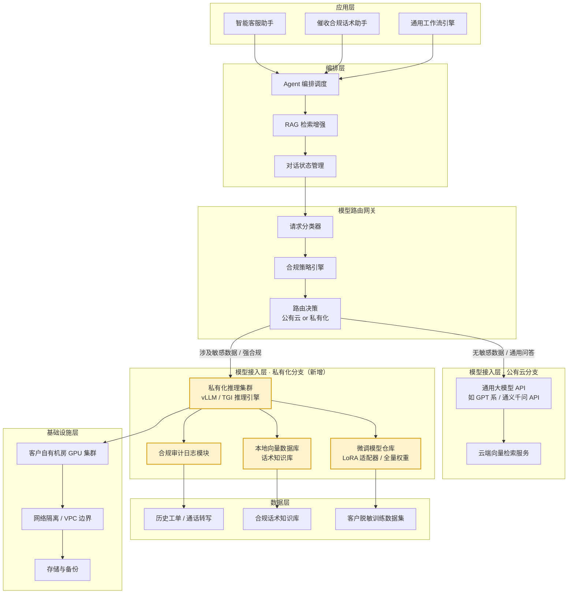
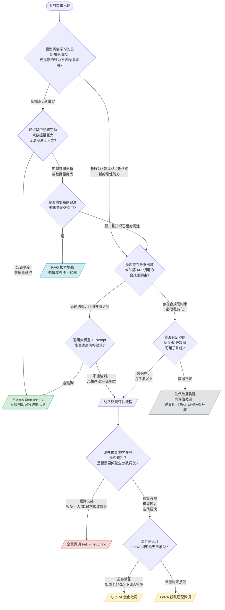
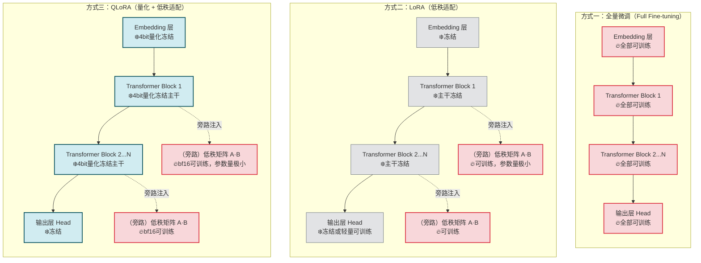

# 第51天:模型微调理论

---

**所属阶段**:Stage 5 —— 微调与私有化部署(Sprint 6 第 1 天)
**课程定位**:承接 Day50(祺瑞集团项目答辩收官),开启新的攻坚方向——模型微调与私有化部署
**今日主题**:微调决策树、全量微调 / LoRA / QLoRA 原理、GPU 基础知识、显存估算、算力平台租用实操
**学习目标**:
1. 能够独立判断一个业务场景应该用 Prompt Engineering、RAG 还是微调来解决,并说清楚理由
2. 能够用自己的语言讲清楚全量微调、LoRA、QLoRA 三种范式在参数更新范围上的本质区别
3. 掌握显存估算的基本公式,能对给定模型和给定 GPU 做出"能不能训得动"的判断
4. 能够独立在 AutoDL 或魔搭这类算力平台上租用一台 GPU 服务器,并搭好 conda + CUDA + PyTorch 的训练环境
**预计学习时长**:6~7 小时(理论日,建议不要在实操环节偷懒,亲手租一次 GPU 服务器)
**前置知识**:Stage 2 的大模型基础理论、Stage 4 的智能体架构设计经验
**关键词**:微调、LoRA、QLoRA、显存估算、GPU、AutoDL、魔搭、私有化部署、数据合规

---

## 【旁白】

在蓬远科技,"祺瑞集团客户服务智能体"项目答辩结束的那天晚上,陈铭其实没有像想象中那样兴奋。答辩会议室的灯关掉之后,他一个人在工位上坐了很久,盯着电脑屏幕上那份被王振宇改了七八遍的架构图,忽然觉得有点空。倒不是因为项目做得不好——评审组的反馈其实相当正面,祺瑞那边的负责人当场就问了下一期扩容的预算问题。陈铭空的原因是,他忽然意识到,自己好像已经习惯了"调 API、写 Prompt、搭 RAG"这一整套打法,习惯到觉得这就是大模型应用的全部。

直到第二天早上,林悦抱着笔记本电脑冲进会议室,带来了御风金融的初谈纪要,陈铭才第一次真切地感受到:这套打法,不是万能的。

御风金融是一家持牌消费金融公司,做线上小额信贷和场景分期。他们的业务负责人在电话里说得很直接:"我们不是不想用你们的产品,是监管和合规那条线卡得死死的。客户的身份证号、银行卡信息、通讯录授权记录、催收通话记录,这些数据一条都不能出我们自己的机房,更不能往你们后台传,往你们再往上游的大模型 API 供应商传——那是双重出域,合规部门看到这个方案会直接打回来。"

这句话像一块石头,砸在了陈铭之前所有的技术惯性上。过去五十天,不管做什么项目,底层永远有一个假设:能调用一个足够强的大模型 API。但御风金融的场景告诉他,这个假设本身就可能不成立。当外部 API 被彻底堵死,当数据一步都不能挪出自己的机房,团队能倚仗的,只剩下自己训练、自己部署、自己养起来的那个模型。

这不是一个可以靠"多写几个 Prompt"绕过去的问题,也不是靠"多做几轮 RAG 检索优化"能解决的问题。这是一道全新的题:如何让一个开源的、装在自己机房里的模型,真正学会一家金融公司的业务语言、合规红线和风控逻辑。这道题的答案,叫作模型微调。

王振宇在晨会上说的那句话,陈铭记了很久:"你们这些年轻人啊,一开始接触大模型都觉得,大模型就是个万能接口,输入文字输出文字,剩下的都是别人的事。可真到了金融、医疗、政务这些强合规的行业里,你会发现,'调用一个足够聪明的黑盒'这件事,压根就不被允许。这时候你手里握着的开源模型,能不能被你调教成一个懂行的'新员工',就是你的核心竞争力。"

这一天,是 Sprint 6 的第一天。团队要合上 Stage 4 那本厚厚的 Agent 架构笔记,翻开一本新的、写满了显存公式和参数矩阵的笔记本。陈铭不知道接下来的日子会有多硬核,但他知道,从今天起,"苍穹企业级智能体中台"要长出一条全新的技术分支——私有化部署与模型微调。

---

## 晨会纪要

**时间**:Day51,上午 9:10
**地点**:蓬远科技 3 楼小会议室
**参会人**:王振宇(导师/技术负责人)、林悦(产品经理)、陈铭(开发工程师)

---

**林悦**(把笔记本电脑转向大家,屏幕上是一份 Word 文档):"老王,陈铭,先跟你们通个气。昨天下午我跟御风金融那边开了一个初谈会,对接人是他们的科技部总经理助理,还有一位合规负责人也全程在线。会开了将近两个小时,我把要点整理成了一份纪要,现在给大家过一遍。"

**王振宇**:"御风金融……我记得是做消费金融的,持牌机构对吧?先说说他们想解决什么问题。"

**林悦**:"对,持牌消费金融公司,主营线上小额信贷和场景分期,客户群体主要是年轻白领和蓝领工人。他们现在最头疼的是两块业务:第一是客服中心,大量重复性的还款咨询、账单解释、逾期提醒,人工客服接不住,想上一个智能客服助手;第二是催收环节,他们内部有一套非常复杂的催收合规话术规范,不同逾期天数、不同客户画像要用不同的话术模板,人工培训成本极高,新员工要背半年的话术手册才能上岗,他们想让 AI 辅助生成合规的催收沟通建议。"

**陈铭**:"这两个场景听起来跟咱们之前给祺瑞做的智能客服有点像啊,直接把苍穹的 RAG 检索加上话术知识库,不就能跑起来吗?"

**林悦**:"我一开始也是这么想的,结果被合规负责人当场怼回来了。"她翻了一页纪要,"她说的原话是——'你们的产品架构里,是不是需要调用外部的大模型 API 做推理?'我说是,苍穹目前主要接的是通用大模型 API,走的是标准的云端调用。她说这在他们内部合规评审那一关,直接就是不通过。"

**王振宇**:"意料之中。金融行业,尤其是持牌消费金融,受《个人信息保护法》《数据安全法》《征信业管理条例》这些约束,央行那边还有一份《金融数据安全 数据安全分级指南》(行业内俗称 JR/T 0197),对客户身份信息、账户信息、征信信息的处理有非常严格的分级要求。像身份证号、银行卡号、通讯录授权记录、催收通话记录,这些基本都是三级甚至更高级别的敏感数据,原则上不能出域,更不能传给第三方 SaaS 服务商——你们的大模型 API 供应商,对他们来说就是第三方。"

**陈铭**:"那如果我们把敏感字段脱敏之后再传呢?比如身份证号打掩码,只传业务文本?"

**林悦**:"我也提了脱敏方案,合规负责人的回应挺扎心的——她说'脱敏没问题,但脱敏之后模型还能不能准确理解催收场景里那些高度依赖上下文的表达?比如客户说'我这个月工资没发',这句话背后可能牵扯到具体的还款能力判断,脱敏掉具体数字之后,模型的理解精度他们没法验证,而且他们的内审和监管现场检查,是要看'数据全流程可控、可审计、可追溯'的,只要这个流程里有一环是黑盒的外部 API,他们就没法向监管交代。"

**王振宇**:"这就是典型的强合规行业客户画像。他们要的不是'能不能用大模型',而是'模型能不能完全跑在我自己的机房里,数据从进到出全程留在我的边界内'。这种客户,私有化部署是硬门槛,不是加分项。"

**林悦**:"对,这也是纪要里她强调的第二个核心要求。她说了三条硬性条件——第一,模型必须部署在御风金融自己的机房或者他们指定的私有云环境里,不能有任何数据发往公有云的大模型 API;第二,底层模型必须是开源可控的,他们要能拿到权重文件,要能做安全审计;第三,模型要能理解他们内部的业务黑话和合规话术规范,通用大模型直接上手,回答的东西'不够专业、不够合规',他们内部测试的时候,拿通用大模型试了一版客服话术,合规部门看了直接摇头,说很多措辞如果被监管抽检到,是要被罚款的。"

**陈铭**:"所以他们其实是希望我们训练一个'懂他们家规矩'的专属模型,而不是一个万能的通用助手。"

**王振宇**:"说到点上了。这就引出咱们今天要讲的核心内容——什么时候你该用 Prompt,什么时候该上 RAG,什么时候必须走微调这条路。御风金融这个案子,几乎是教科书级别的'必须微调'场景:数据不能出域(排除外部 API)、需要深度学习特定的话语风格和合规规则(排除单纯的知识检索)、有大量历史数据可以拿来训练(具备微调的数据基础)。"

**林悦**:"还有一个细节我觉得挺重要,她说他们内部已经攒了大概八年的客服工单和催收通话转写文本,量级在几十万条以上,而且这些数据本身就带着'哪些话术合规、哪些话术不合规'的历史处罚记录标注,相当于是有现成的'正确答案'可以参考的。"

**王振宇**:"这是个好消息,说明他们不是零数据起步,后面做微调数据构建的时候能省不少事。不过这是 Day52 的内容了,今天咱们先把理论地基打扎实——为什么要微调,微调到底是怎么个原理,以及最现实的一个问题:咱们手上有没有能训得动模型的机器。"

**陈铭**:"机器这块我心里是完全没底的,我们组的电脑最多也就是个人用的显卡,训练大模型听起来动辄要几十 G 显存,这个差距怎么补?"

**王振宇**:"这就是今天下午的重点——GPU 基础知识、显存怎么估算、去哪儿租机器。不用慌,现在租一台够用的 GPU 服务器,门槛比你想象的低得多,像 AutoDL、魔搭这类平台,按小时计费,一顿饭钱就能跑一下午的实验。今天咱们理论讲完,我要求每个人亲手去租一台机器,把 conda、CUDA、PyTorch 环境配好,验证能正常识别到 GPU,这个环境明天就要用来跑真正的训练。"

**林悦**:"那我这边先把御风金融的初步需求文档整理出来,今天上午发给大家,方便老王和陈铭对齐一下技术选型的方向。我们初谈之后跟对方约了下周二做一次更详细的需求调研,到时候要带一份初步的技术方案过去,至少要能说清楚我们打算用哪种微调方式、大概需要多久、大概需要什么规模的算力。"

**王振宇**:"行,那今天的任务就明确了。陈铭,你上午跟着我把微调的决策逻辑和三种主流范式的原理吃透,下午咱们进入硬件环节,顺手把御风金融这个案子当成今天所有理论和计算的'活教材',等你把决策树和显存公式都推一遍,你会发现,这案子该怎么选,答案已经写在数字里了。"

**陈铭**:"收到,那我先去把林悦发的需求文档过一遍。"

---

## 需求文档:御风金融项目初步需求分析

**文档编号**:PRD-YFJR-2026-001
**文档版本**:V0.1(初稿,基于初谈会纪要整理)
**编写人**:林悦
**日期**:Day51
**审阅状态**:待老王、陈铭补充技术侧输入,下周二二次调研前定稿 V0.2

### 一、客户背景

御风金融是一家持牌消费金融公司,主营业务为线上小额信贷及场景分期,服务对象以年轻白领、蓝领产业工人为主。公司现有客服中心和催收管理部门,均面临传统人工模式效率瓶颈,希望借助 AI 技术提升服务效率和合规水平,但由于行业属性,对数据安全和合规性的要求远高于一般制造业、教育行业客户。

### 二、核心业务场景

**场景一:智能客服助手**

用户在 App 内咨询还款计划、账单明细解释、逾期费用计算规则、征信影响说明等常见问题。当前人工客服日均处理量约 6000 通/条,高峰期排队等待时间长,客户满意度承压。目标是用 AI 助手接住 60% 以上的重复性咨询,复杂问题再转人工。

**场景二:催收合规话术辅助**

催收专员在与逾期客户沟通时,需要根据逾期天数(M1/M2/M3+等分层)、客户画像(还款意愿、还款能力、历史沟通记录)选择对应的合规话术模板,并规避监管明令禁止的措辞(如恐吓性语言、暴力催收暗示、骚扰第三方联系人等)。当前依赖新员工背诵话术手册,培训周期长达 4~6 个月,且执行一致性差,历史上因话术不合规被监管处罚的案例并非孤例。目标是训练一个"催收合规助手",在专员与客户沟通前给出话术建议,并对专员已发出的沟通记录做实时合规风险提示。

### 三、数据合规约束(核心硬性要求)

1. **数据不出域**:客户身份信息(姓名、身份证号、手机号)、账户信息(银行卡号、贷款余额)、征信信息、通讯录授权记录、催收通话转写文本等,均属于《金融数据安全 数据安全分级指南》(JR/T 0197)界定的高敏感级别数据,不得以任何形式发送至公司边界外的第三方服务,包括但不限于公有云大模型 API。

2. **模型可控可审计**:所使用的底层大模型必须是可获取完整权重、可离线部署、可接受第三方安全审计的开源模型,不接受完全黑盒的商业闭源 API 方案。

3. **全流程留痕**:模型的训练数据来源、训练过程、推理调用记录均需可追溯、可审计,以配合监管的现场检查和数据安全合规评估。

4. **私有化部署**:模型推理服务必须部署在御风金融自建机房或其指定的私有云环境内,苍穹平台若涉及编排层、检索层等非模型推理组件,亦需评估是否需要同步私有化,或采用严格的网络隔离方案。

### 四、私有化部署要求

1. 模型推理服务需支持在客户机房内的 GPU 服务器集群上独立运行,不依赖蓬远科技侧任何在线服务作为推理请求的中转或代理。
2. 需支持后续模型版本的迭代更新(如新增合规规则、新增业务话术)在客户机房内完成,不要求每次更新都拉通公网。
3. 需提供一套可离线运行的模型管理与监控方案(如显存占用、推理延迟、异常请求告警),便于客户运维团队自主运维。
4. 硬件采购或云资源租用由御风金融自行承担,蓬远科技负责给出硬件选型建议及资源规格估算(这正是本周理论学习要解决的核心问题之一)。

### 五、模型能力要求

1. 具备消费金融行业基础知识(还款计算、征信规则、常见金融术语)的理解能力,这部分通用大模型基本具备,不构成主要门槛。
2. 深度掌握御风金融内部的催收合规话术规范与禁忌用语库,能够在给定客户画像和逾期分层的情况下,输出符合公司规范的沟通建议,这是通用模型普遍欠缺、必须通过训练弥补的能力。
3. 输出风格需与御风金融客服/催收团队的实际语言习惯高度一致(用词、语气、句式),而非通用大模型默认的"标准客服腔"。
4. 需具备一定的风险识别能力,对专员已发出的沟通文本进行合规风险打分和提示。

### 六、初步技术选型方向讨论(待技术团队补充)

结合合规约束和能力要求,初步判断:

- 单纯依赖 Prompt Engineering 调整通用大模型的回答风格,难以稳定还原御风金融内部话术规范的细节颗粒度,且无法从根本上解决"不能调用外部 API"的合规硬约束。
- 单纯依赖 RAG 检索(把话术手册作为知识库检索后拼接进 Prompt),可以缓解"模型不知道具体规范内容"的问题,但对于"语言风格、语气习惯"这类隐性知识的学习效果有限,而且依然需要一个底层大模型来完成理解和生成,该底层模型本身的部署方式仍需私有化。
- 结合数据规模(客户方已有约几十万条历史工单和通话转写文本,且部分数据带有合规标注)、合规约束(必须私有化、必须可控)、能力要求(需要深度内化风格和规范)三方面因素,**微调私有化部署的开源大模型,是当前阶段最匹配的技术路线**。

具体采用全量微调、LoRA 还是 QLoRA,需结合硬件预算、模型规模、迭代频率等因素进一步论证,将在下周二的详细需求调研后,由技术团队给出正式建议书。

### 七、待确认事项

1. 御风金融机房现有硬件资源清单(是否已有 GPU 服务器,型号、显存规格)。
2. 历史数据的具体规模、格式、标注完整度,是否可以脱敏后提供小样本用于前期技术验证。
3. 模型迭代更新的预期频率(每月/每季度),影响后续是选择轻量级微调方案还是重量级全量微调方案。
4. 预算区间及项目周期预期。

---

## 架构设计图:苍穹模型接入层新增私有化分支架构

御风金融这个案子逼着团队第一次正视一个问题:苍穹企业级智能体中台原来的"模型接入层",默认假设是"调用外部/云端大模型 API",这个假设在强合规客户面前是站不住的。今天上午,王振宇带着陈铭把模型接入层重新画了一遍,加了一条完整的私有化分支,和原来的公有云 API 分支并列存在,通过统一的模型路由网关做选择性分发。



这张图里最关键的一块是**模型路由网关**里新加的"合规策略引擎"。它做的事情很朴素:判断这一次请求里是否携带了身份证号、银行卡号、通讯录、通话转写等敏感字段,或者这次请求本身来自一个被标记为"强合规客户"的租户,一旦命中,请求就必须走私有化分支,连尝试调用公有云 API 的机会都不给。这不是一个"性能优化"层面的路由,而是一个"合规红线"层面的路由——错一次,可能就是监管处罚。

私有化分支里,"微调模型仓库"是新增的核心组件,里面存放的不是通用大模型的原始权重,而是团队针对客户业务微调出来的专属模型或适配器文件。"推理引擎"用的是 vLLM 或 TGI 这类支持高吞吐私有化部署的开源推理框架,这部分内容会在后面几天详细展开,今天先把这个架构骨架立住。

## 流程图:微调 vs RAG vs Prompt 决策树

上午课堂笔记的核心,是这张决策树。王振宇反复强调,这张图不是用来"背"的,而是用来"问自己问题"的——遇到一个新场景,你按这张图一步步往下走,走到哪个叶子节点,答案就出来了。



顺着这张图走一遍御风金融的案子:第一问,他们要模型学会的是"催收合规话术规范"和"御风金融特有的语言风格",这属于新的行为方式和隐性风格,不是简单的新知识,走右边分支。第二问,是否存在合规硬约束——存在,数据不能出域,必须私有化,直接走进"评估是否有训练数据"这一步。第三问,数据是否充足——客户方已有几十万条历史工单和通话记录,充足,进入微调评估流程。第四问,硬件预算和迭代频率——这是下周二调研才能敲定的细节,但基于目前"控制成本、快速验证"的项目节奏判断,大概率会落在 LoRA 或 QLoRA 这两个分支上,而不是全量微调。这条路径,几乎就是今天整个理论课的落脚点。

## 示意图:全量微调 / LoRA / QLoRA 参数更新范围对比

三种微调范式最核心的区别,不在于"用了什么算法",而在于"训练过程中,到底哪些参数在被更新,哪些参数被冻住不动"。这张示意图把一个典型的 Transformer 结构简化成几层"块",用颜色标出每种范式下真正参与梯度更新的部分。



看这张图的时候,重点不是记住每个方框叫什么名字,而是体会三条竖线之间"火苗"图标所占的比例在急剧缩小——全量微调里整个模型的方框都在燃烧,LoRA 里燃烧的只剩挂在旁边的两条细线,QLoRA 在 LoRA 的基础上,连没有燃烧的主干本身都被压缩进了更小的存储空间。这张图,基本上就是理解今天全部内容的一把钥匙。

---

## 课堂笔记

### 上午:微调决策树与三种微调范式原理

#### 一、先把"微调"这个词说清楚

很多人一听"微调"这个词,第一反应是"给模型做个小调整"。这个直觉不算错,但容易让人低估这件事的分量。准确地说,微调(Fine-tuning)指的是:拿一个已经在海量通用数据上训练过、具备了通用语言能力的预训练模型(Pretrained Model)作为起点,再用一批规模小得多、但高度贴合特定任务或特定领域的数据,对这个模型的参数做进一步训练,让它在保留通用能力的基础上,长出针对特定场景的专项能力。

王振宇上午讲课时,拿了一个特别接地气的类比:"你可以把预训练模型想象成一个刚从名牌大学毕业的应届生。这个学生什么都学过一点,数学、语言、逻辑、常识,底子很好,但他不懂你们公司具体的业务规矩,不知道你们家的产品线,也不知道你们公司说话的调调。你现在要做的,不是从头把这个人重新培养成一个婴儿再教育一遍——那太浪费了,他已经具备的通用能力全都要保留。你要做的是'岗前培训':给他看公司的业务手册,让他跟着老员工模仿说话方式,反复纠正他在具体业务上的错误判断。这个'岗前培训'的过程,就是微调。"

这个类比里藏着一个关键信息:微调不是从零开始训练,那种从零开始、用海量无标注数据训练出模型基础语言能力的过程,叫作"预训练"(Pretraining),这是 OpenAI、Meta、阿里、智谱这些拥有海量算力的机构才玩得起的游戏,一次预训练动辄消耗几千张顶级 GPU 卡训练几个月,成本以千万美元计。而微调,是站在别人预训练好的肩膀上,用相对小得多的数据和算力,做一次"精加工"。这也是为什么微调对创业公司、对项目团队是可行的——你不需要重新造一辆车,你只需要给一辆现成的好车做适配性改装。

#### 二、决策树第一层:你要模型学的是"知识"还是"行为"

上面那张决策树流程图,第一个问题问的是:你希望模型改变的,是它"知道什么",还是它"怎么说话、怎么做事"?

这个区分极其重要,因为这两类问题的"性价比最优解"完全不同。

如果你要解决的是"模型不知道某个知识"——比如它不知道你们公司上个月新发布的产品参数,不知道你们内部最新的报销制度,不知道某个客户的历史订单记录——这类问题的本质是"知识缺口",而不是"能力缺口"。模型本身具备理解和推理这些知识的能力,它只是没见过这些具体信息。这种情况下,最经济的解法通常不是微调,而是把这些知识作为外部资料,通过 Prompt 直接塞进上下文(适合数据量小、几乎不变的知识),或者通过 RAG 检索增强动态取用(适合数据量大、经常更新的知识)。

陈铭在这里问了一个很实际的问题:"那为什么不干脆把所有知识都塞进微调数据里,一次性教给模型,以后就不用做检索了?"

王振宇的回答值得记下来:"你想想看,如果你们公司的产品价格表每周都在变,你把这周的价格表微调进模型里,下周价格表更新了,模型脑子里记的还是上周的旧价格,你是不是又要重新做一次训练?训练一次模型,少则几十分钟,多则几天,你能保证每次知识更新都重新训练一遍吗?这就是为什么频繁变动、体量庄大的知识,更适合用检索的方式,让模型每次回答问题之前,先去'查资料',而不是把资料'背'进脑子里。检索库更新一条记录,是秒级的事;模型重新训练一遍,是小时级甚至天级的事。这个时间成本的差距,决定了知识类问题优先用 RAG,而不是微调。"

反过来,如果你要解决的是"模型不会用某种方式做事"——比如它说话的语气太"AI 化",不像你们公司客服的调调;比如它不遵守你们内部特定的输出格式规范;比如它面对某类专业场景时,推理逻辑总是跑偏,给不出符合行业惯例的判断——这类问题的本质是"能力缺口"或者"风格缺口",这种缺口是很难靠"塞资料"解决的。你把御风金融的话术手册整篇塞进 Prompt 里,模型确实"看到"了这些规范,但它未必能把这种规范内化成一种稳定的、下意识的表达习惯,尤其是当对话场景稍微复杂、稍微偏离手册原文的时候,模型很容易"读了但没学会"。这时候,微调才是真正对症的药——通过大量"具体场景+正确回应"的示例,反复训练模型的参数,让这种回应方式变成模型自身的一部分,而不是每次都要现场"翻书"。

这里王振宇补充了一个特别形象的比喻:"你去问一个刚背了一天菜谱的新手厨师和一个练了十年的老师傅同一个问题——'糖醋里脊怎么把握火候',新手能把菜谱上的步骤一字不差地念出来,但老师傅是真的知道火大一秒、小一秒会有什么区别,这种'手感'是练出来的,不是看一遍书就有的。Prompt 和 RAG 给模型的是'菜谱',微调给模型的是'练出来的手感'。"

#### 三、决策树第二层:合规硬约束——一个经常被低估的决定性因素

在很多技术团队的直觉里,"选 RAG 还是微调"是一个纯粹的技术效果和成本权衡问题。但御风金融这个案子提醒团队,现实世界里还有一个经常被忽视、却往往是决定性的因素:合规约束。

如果业务场景存在"数据不能出域""不能调用外部 API"这类硬性合规要求,那么不管技术上微调和 RAG 谁的效果更好,答案都已经被限定了——你必须用一个可以完全私有化部署的开源模型作为底座。而这个私有化的开源模型,本身能力天花板往往低于顶级的闭源商用大模型,想要弥补这个能力差距,把它训练成一个真正"懂行"的专属模型,微调几乎是必选项,而不是可选项。

这一点上,林悦在旁听时补充了一个业务视角:"其实很多传统行业客户找过来,第一句话往往不是'你们的效果好不好',而是'我的数据能不能不出公司'。这句话背后,往往意味着这个客户所在的行业本身受到强监管——金融、医疗、政务、能源,这几个行业几乎是标配。遇到这类客户,咱们在谈技术方案之前,先要把合规这道门槛摆在最前面确认清楚,别等方案都谈完了,合规部门一句话把整个方案打回来。"

王振宇进一步展开:"这也是为什么苍穹平台今天要新增私有化分支——不是我们想不想做,是市场逼着咱们做。凡是强合规客户,几乎清一色地要求私有化部署,而私有化部署又天然导向'必须自己训练/微调模型'这条路,因为你部署在自己机房里的开源模型,原生能力肯定不如闭源商用模型,不训练一下,交付质量过不了客户的验收关。"

#### 四、决策树第三层:数据基础——微调不是无米之炊

即便前两层都指向"应该微调",还有一个绕不开的前提:你有没有足够的、质量过关的训练数据。

微调的本质是"用一批新的、场景化的数据,进一步训练模型的参数",这意味着,没有数据,谈不上微调。这里"足够"是一个相对模糊的概念,不同任务、不同微调方式对数据量的要求差异很大,但一个粗略的经验法则是:如果你手上连几百条高质量的示例数据都凑不出来,微调的效果很可能是不稳定的,甚至会让模型"学偏"——反而不如老老实实用 Prompt 加几个精心设计的示例(即所谓 Few-shot Prompting)。

王振宇讲了一个反面案例:"我之前接触过一个客户,想微调一个模型来写他们公司的行业报告,结果他们能提供的历史报告只有二十几篇,还格式各异,内容参差不齐。硬着头皮拿这二十几篇去微调,训练出来的模型效果反而比原始的通用模型还差——因为数据量太小,模型没有学到'行业报告应该怎么写'的普遍规律,反而把这二十几篇报告里一些偶然的、不具代表性的用词和错误也一起'记死'了,这在机器学习里叫过拟合。这种情况下,微调不是不能做,而是得先老老实实把数据攒够、攒对,数据没到位之前,先用 Prompt 加检索顶着用。"

好消息是,御风金融的情况恰恰相反——他们有八年的历史工单和通话转写数据,量级达到几十万条,而且部分数据自带合规标注(哪些话术被处罚、哪些被认可)。这种"数据资产已经沉淀多年"的客户,恰恰是微调项目最理想的合作对象,数据基础这一关基本不构成障碍,后面 Day52 的重点就是怎么把这堆原始数据,加工成能喂给模型的训练样本。

#### 五、决策树第四层:预算与迭代频率——决定用哪种微调范式

走到这一步,已经确定"要微调",接下来的问题是"用哪种微调方式"。这就要正式进入今天上午的核心技术内容:全量微调、LoRA、QLoRA。

#### 六、全量微调(Full Fine-tuning):最直接、也最昂贵的路

全量微调,顾名思义,就是让预训练模型里的**所有参数**都参与这一轮训练的梯度更新。回到刚才示意图里的比喻,相当于"把这个应届生招进公司之后,不是只做几门业务培训,而是把他重新送回大学,把他大脑里所有的神经连接都重新调整一遍,只不过调整的方向是让他更贴合你们公司的业务"。

这种方式的优点很直观:因为所有参数都可以自由调整,理论上模型能达到的拟合上限最高,如果你的训练数据质量足够好、量足够大,全量微调往往能取得最好的效果,尤其是当你要教给模型的新能力和它原本的知识结构差异很大的时候(比如把一个中文通用模型改造成专门做代码生成的模型),全量微调有更大的调整空间。

但代价也是最直观的——**训练成本极高**。这里的"成本"主要体现在两个维度:显存占用和训练时间。

显存占用高,是因为训练一个模型,不仅要在显存里放下模型本身的参数(权重),还要放下每个参数对应的梯度(Gradient),以及优化器为了让训练收敛得更稳定所维护的"状态"(比如常用的 Adam 优化器,要为每个参数额外维护一份"动量"和一份"二阶矩估计")。这几项加起来,全量微调所需要的显存,往往是模型参数本身占用显存的四到六倍甚至更多。上午课上举的例子是:一个 14B(140 亿参数)规模的模型,仅仅是把参数用半精度浮点数(FP16)存起来,就要占用大约 28GB 显存,而做全量微调,算上梯度和优化器状态,轻轻松松要飙到 200GB 以上——这已经超出单张顶级显卡(比如显存 80GB 的 A100)的容量,必须用多张显卡做分布式训练才行。这个数字,下午会用具体公式一步步推算出来。

训练时间长,是因为反向传播过程中,梯度要一路传回模型的每一层,更新的参数量越大,每一步计算量越大,同样的训练轮数(Epoch),全量微调花的时间通常是参数高效微调方式的数倍。

所以,全量微调适合的场景是:你有充裕的算力预算(通常意味着有多张高端显卡,或者愿意为云端算力支付较高的账单),模型本身规模不算太大(比如 1B~7B 级别的小模型,全量微调的成本还在可承受范围内),或者你追求的是任务效果的极限天花板,愿意为多出来的那一点效果提升付出成倒挂的成本。对于很多创业公司和项目制的交付场景,全量微调往往不是首选,除非客户的预算和硬件条件确实支持。

#### 七、LoRA(Low-Rank Adaptation):四两拨千斤的低秩适配

LoRA 是这几年在开源社区被验证得最成熟、应用最广泛的参数高效微调(PEFT,Parameter-Efficient Fine-Tuning)方法之一,出自 2021 年微软研究院的一篇论文。它的核心思想,用王振宇的话说,叫"不去动主干,只在旁边加个外挂"。

具体是怎么做的呢?我们知道,Transformer 模型内部大量的计算,本质上是一堆矩阵乘法,比如每一层里的自注意力模块,都有若干个权重矩阵(常见的是 Query、Key、Value、Output 四个投影矩阵)。LoRA 的做法是:把这些原始的权重矩阵**原封不动地冻结**,不参与训练;然后,针对某些指定的权重矩阵,额外引入两个体积很小的矩阵(通常记作 A 和 B),这两个小矩阵的乘积 A×B,和原始权重矩阵的形状是一样的,可以叠加到原始矩阵的输出上。训练过程中,只有这两个小矩阵 A 和 B 的参数会被更新,原始的大矩阵始终保持预训练时的状态不变。

这里的关键,是这两个小矩阵的"秩"(Rank,通常用字母 r 表示)远远小于原始矩阵的维度。举个具体的数字例子:假设某个权重矩阵是 5120×5120 的方阵(这是一个中等规模模型里常见的隐藏层维度),这个矩阵本身有 5120×5120 约等于 2620 万个参数。如果用 LoRA,设定秩 r=8,那么矩阵 A 的形状是 5120×8,矩阵 B 的形状是 8×5120,两者加起来的参数量是 5120×8 + 8×5120 = 81920 个,只占原始矩阵参数量的大约 0.3%。这就是为什么 LoRA 能大幅压缩需要训练的参数量——不是因为它"偷懒少训练几层",而是因为它给每一个要调整的权重矩阵,配了一个体积小到可以忽略不计的"旁路补丁"。

为什么这样做有效?这里面有一个数学上的直觉支撑:研究者观察到,当你把一个预训练模型适配到具体任务上时,权重矩阵真正需要调整的"变化量"(也就是微调前后权重的差值),往往具有很低的"内在维度"——通俗地说,这个变化量矩阵虽然看起来是个大矩阵,但它包含的有效信息量,可以用一个更低维度的小矩阵近似地表达出来,不需要一整个和原矩阵同样大的自由度去承载。这就好比你要给一件衣服改个版型,不需要把整块布料重新裁剪,只需要在几个关键部位缝上几个补丁、收几个褶,就能达到改版的效果,原来那块大布料的绝大部分结构完全不需要动。

LoRA 带来的直接好处是三重的:第一,需要训练和存储梯度、优化器状态的参数量骤减到原模型的百分之零点几到百分之几,显存占用大幅下降;第二,因为原始大矩阵完全冻结,不需要为它计算梯度和优化器状态,反向传播的计算量也随之下降,训练速度更快;第三,训练完成后,你得到的不是一整份和原模型一样大的新权重文件,而是一个体积很小的"适配器"文件(通常只有几十 MB 到几百 MB,视秩的大小和覆盖的层数而定),这意味着你可以针对同一个基础模型,训练出很多个不同任务、不同客户专属的适配器,部署的时候按需加载,不需要为每个客户单独存一份几十 GB 的完整模型。这对于蓬远科技这种要同时服务多个客户、每个客户又有不同定制化需求的私有化部署场景,是个非常划算的架构选择。

当然 LoRA 不是没有代价。因为它调整的自由度比全量微调小得多,理论上能达到的效果天花板通常略低于全量微调,尤其是当你要教给模型的新能力和它原本的能力结构差异特别大的时候(比如让一个通用语言模型彻底转型成一个全新领域的专家,这种"脱胎换骨"式的改造,LoRA 的低秩空间可能不够用)。但在绝大多数"教模型学会某种风格、学会某个领域的表达习惯、学会遵循某种规范"这类相对温和的适配任务里,LoRA 的效果和全量微调已经非常接近,性价比要高出一大截。这也是为什么今天工业界绝大多数中小规模的微调项目,首选都是 LoRA,而不是全量微调。

#### 八、QLoRA(Quantized LoRA):在 LoRA 的基础上再省一次显存

如果说 LoRA 已经把"要训练的参数量"压缩到了极致,那 QLoRA 解决的是另一个维度的问题:那些被冻结、不参与训练的"主干参数",能不能也想办法再省点显存?

答案是可以,靠的是**量化**(Quantization)。量化的核心思路,是把模型权重原本用高精度浮点数(比如 32 位浮点 FP32,或 16 位浮点 FP16/BF16)存储的数值,压缩成更低位宽的数值格式来存储,比如 8 位整数(INT8)甚至 4 位(INT4 或专门设计的 4bit 格式)。位宽越低,同样数量的参数占用的存储空间就越小——理论上,从 16 位压缩到 4 位,存储空间直接缩减到四分之一。

QLoRA 的做法,是把预训练模型的主干权重量化到 4 位精度存储,同时冻结这部分主干不参与训练(这一步和 LoRA 完全一样,只不过冻结的对象从"全精度权重"变成了"4bit 量化权重");然后在这个量化后的主干上,叠加和 LoRA 完全相同的低秩适配器结构,这个适配器本身依然用相对高精度的格式(比如 BF16)存储和训练,因为适配器参数量本来就很小,即便用高精度存储,占用的显存也微乎其微。训练过程中,前向计算时把 4bit 权重临时反量化回浮点数参与计算,梯度只回传给适配器,主干权重全程保持量化状态不参与梯度更新。

这个设计带来的效果是叠加的:原本一个 14B 模型的主干,用 FP16 存储要占大约 28GB 显存,量化到 4bit 之后,只需要大约 7GB,直接省下了四分之三;再加上 LoRA 本身对训练参数量和优化器状态的大幅压缩,整个训练过程所需要的显存,相比全量微调可以压缩到不到十分之一。这也是为什么很多个人开发者和中小团队,能够用一张消费级显卡(比如 24GB 显存的 RTX 4090),就跑通一个十几亿甚至更大参数规模模型的微调实验——QLoRA 把硬件门槛拉到了一个此前难以想象的低位。

天下没有免费的午餐,量化必然带来一定程度的数值精度损失,理论上会对模型效果产生一些负面影响,但 QLoRA 论文里提出的一系列工程技巧(比如采用专门设计的 4bit 数据格式 NF4、双重量化进一步压缩量化参数本身占用的空间、以及使用"分页优化器"应对显存峰值波动),已经把这种精度损失控制在了大多数应用场景可以接受的范围内。经验上看,QLoRA 训练出来的模型效果,和同等设置下的 LoRA 相比,差距通常很小,但换来的显存节省是数量级的。

王振宇总结这部分内容时,打了一个特别精炼的比方:"全量微调,是原版教材原版培训,什么都不打折扣,但成本最高;LoRA,是保留原版教材,但只给新员工发一本薄薄的'公司专属补充手册',他把补充手册背熟就够用了;QLoRA,是把原版教材也压缩成一个精简的口袋本,配着那本补充手册一起发给新员工,教材虽然是压缩版,但核心信息基本都保留下来了,新员工照样能顺利上岗,公司还省了一大笔教材印刷费。"

#### 九、三种范式怎么选:落地到御风金融的案子上

把上面的原理落回到具体案例,团队现在可以对御风金融的技术路线做一个初步判断(正式方案还要等下周二调研后确认硬件条件和数据情况,但方向已经比较清楚):

御风金融的核心需求是让模型学会公司内部特有的催收合规话术和客服语言风格,这类任务属于"风格与规范内化"型任务,和模型原本的语言能力结构差异不算特别大(不是让模型从头学一门新语言,而是让它在原有语言能力基础上调整表达习惯和知识细节),这种任务通常不需要动用全量微调那种"伤筋动骨"级别的调整空间,LoRA 大概率就能取得不错的效果。同时,考虑到项目节奏要求快速验证(下周二就要给出初步方案,后续还有实际的调研迭代周期),以及初期硬件预算通常趋于保守,QLoRA 甚至可能是第一阶段技术验证的更优选择——用较低的硬件门槛快速跑出一版原型,验证微调路线的可行性和效果,再根据客户的实际硬件条件(是否愿意为效果提升采购更高规格的 GPU)决定是否升级到全量微调或更大规模的 LoRA 配置。

这也引出了下午要解决的问题:不管选哪种范式,团队都得先弄清楚,自己手上到底有没有、以及从哪里能弄到,一台"训得动"这些模型的机器。

---

### 下午:GPU 基础知识、显存估算与算力平台租用实操

#### 一、为什么大模型训练必须用 GPU,而不是 CPU

下午课程一开始,王振宇没有直接讲怎么租机器,而是先问了陈铭一个问题:"你知道为什么大模型训练非得用 GPU,普通电脑的 CPU 不行吗?"

陈铭想了想说:"是不是因为 GPU 算得快?"

"算得快只是表面现象,根本原因是'算得快'背后的架构差异。"王振宇在白板上画了两个方框,"CPU 的设计哲学,是'把每一件事做得又快又准',它内部有少量但极其强大的核心(通常是几个到几十个),每个核心都配备了复杂的分支预测、乱序执行、大容量缓存,擅长处理逻辑复杂、依赖关系密集的串行任务,比如你打开一个网页、运行一个操作系统,这些任务里充满了各种条件判断和跳转,CPU 干这个是专家。但大模型的核心运算,本质上是海量的、高度规整的矩阵乘法和向量运算——说白了就是无数次简单的乘法加法,一模一样的操作,重复做成千上万遍,只是每次操作的数据不一样。这种任务的特点是'并行度极高、每个操作本身很简单',而 GPU 的设计哲学正好反过来:牺牲单个核心的复杂度,换取海量核心数量,一张消费级显卡动辄集成几千到上万个计算单元(CUDA 核心),虽然每个核心的'智商'远不如 CPU 核心,但架不住数量优势,把同一种简单操作一次性铺开在几千个核心上同时算,吞吐量是 CPU 望尘莫及的。"

他补充了一个数字对比:一张主流的英伟达数据中心显卡,比如 A100,内部有超过六千个 CUDA 核心,还额外集成了专门为矩阵乘法优化的"张量核心"(Tensor Core),这些张量核心对深度学习里最常见的矩阵乘加运算做了硬件级加速,能进一步把训练和推理的速度提升数倍。相比之下,一颗高端服务器 CPU 满打满算也就几十个核心,数量级上的差距,直接决定了训练一个大模型,用 CPU 可能要跑几个月,换成合适的 GPU 集群,可能几天甚至几个小时就能跑完。

#### 二、显存(VRAM)和内存(RAM)不是一回事

陈铭在这里犯了一个很多新人都会犯的错:把"显存"和"内存"混为一谈。王振宇特意花时间把这个概念掰清楚。

内存(RAM)是挂在 CPU 旁边的存储器,CPU 处理数据时,数据要先从硬盘搬进内存,再从内存搬进 CPU 的缓存和寄存器进行运算。显存(VRAM,Video RAM,也常被称为 GPU Memory)则是专门焊在显卡上、直接服务于 GPU 芯片的存储器。这两者物理上是分离的,数据要想让 GPU 去算,得先从内存(或者硬盘)搬运到显存里,这个搬运过程本身也是有开销的,是很多性能优化(比如减少数据搬运次数、用更大的批量一次性搬运)要解决的问题之一。

对于模型训练和推理来说,决定"这台机器能不能跑起来"的关键指标,几乎全部落在显存容量上,而不是内存容量。一台机器内存再大,如果显卡的显存不够放下模型和训练过程中产生的中间数据,程序照样会报出那个所有搞过深度学习的人都见过的经典错误——"CUDA out of memory"(显存溢出)。今天下午大部分的计算和实操,都是围绕"怎么估算显存够不够用"这个核心问题展开的。

#### 三、常见 GPU 型号和显存规格速览

王振宇列了一张表格式的清单,帮大家建立起对市面上常见 GPU 型号和显存规格的基本认知(具体型号的市场供给和价格会随时间波动,这里给的是当前阶段团队做选型参考用的大致印象):

消费级显卡里,常被用来做个人和小团队模型训练实验的型号包括 RTX 3090(24GB 显存)、RTX 4090(24GB 显存)。这类卡原本是为游戏和图形渲染设计的,但因为显存规格给得比较厚道、单卡采购成本相对可控,在开源社区里被大量用于中小模型的微调和推理实验,尤其是配合 QLoRA 这种省显存的方案,性价比很突出。它们的短板是通常不支持多卡之间的高速互联(缺少类似数据中心卡的 NVLink),多卡并行训练的效率会打折扣,而且长时间高负载运行的稳定性和厂商对企业级场景的技术支持,不如数据中心卡。

数据中心级显卡里,V100(16GB 或 32GB 显存)算是上一代的经典型号,目前性价比已经不算突出;A100(常见规格 40GB 或 80GB 显存)在很长一段时间里是训练大模型的主力型号,单卡算力和显存带宽都相当强,支持多卡高速互联,适合分布式训练;在国内市场,考虑到出口管制的因素,A800、H800 这类为特定市场设计的替代型号也比较常见,显存规格上通常对齐 A100/H100 系列(比如 A800 常见 40GB/80GB,H800 常见 80GB),核心算力上会有一定的调整。最新一代的 H100/H800、以及更新的型号,算力和显存带宽相比 A100 系列有显著提升,但采购或租用成本也更高。

王振宇特别提醒:"你们以后接项目,报价方案里的硬件选型,不是显存越大越好、卡越贵越好,而是要匹配你实际要训练的模型规模和你选的微调方式。用 QLoRA 训一个 7B 模型,一张 24GB 的消费卡就绰绰有余,非要上一张 80GB 的 A100,纯属浪费预算;但你要是打算全量微调一个 70B 的大模型,那几张 80GB 的卡摆在一起做分布式训练,可能都还不够,这时候省着用小卡,反而是给自己找罪受。"

#### 四、数值精度格式:FP32、FP16/BF16、INT8、INT4

前面反复提到"精度""量化"这些词,这里系统梳理一下模型训练和推理中常见的几种数值格式,它们直接决定了同样数量的参数要占用多少显存。

FP32(单精度浮点数)是最"传统"、精度最高的格式,每个数值占用 4 个字节(32 位)。早期深度学习训练大多用这个格式,精度有保障,但显存开销最大,计算速度相对较慢。

FP16(半精度浮点数)和 BF16(Brain Floating Point 16)都只占用 2 个字节(16 位),显存开销是 FP32 的一半,而且现代 GPU 的张量核心对这两种格式做了专门的硬件加速,计算速度更快。两者的区别在于数值表示的"侧重点"不同:FP16 的数值表示范围较窄但精度相对高,训练时容易出现数值溢出的问题;BF16 保留了和 FP32 一样宽的数值表示范围,牺牲了一部分精度,但更不容易在训练过程中出现数值不稳定的问题,因此现在主流的大模型训练更倾向使用 BF16。目前主流的"混合精度训练"策略,就是让大部分计算在 FP16/BF16 下进行以节省显存和加速计算,同时在一些对精度敏感的关键环节(比如优化器维护的部分状态)保留 FP32 精度,兼顾速度和稳定性。

INT8(8 位整数)和 INT4(4 位整数,或者一些框架里用的其他 4bit 变体格式)是专门为"量化"设计的格式,每个数值只占 1 个字节或半个字节,显存开销进一步压缩到 FP32 的四分之一甚至八分之一。这类格式主要用在推理阶段(部署上线之后跑预测)和 QLoRA 这类量化微调场景里,因为位宽压缩得很极致,数值能表示的精度范围非常有限,如果直接粗暴地把所有权重都量化成这么低的精度,模型效果会明显下降,所以业界发展出了很多专门的量化算法(比如 GPTQ、AWQ,以及 QLoRA 论文里提出的 NF4 格式),通过更精细的量化策略,尽量把精度损失控制在可接受范围。

理解这几种精度格式,是后面做显存估算的基础——同样一个"70 亿参数"的模型,用 FP32 存储要占用 28GB,用 FP16/BF16 存储只要 14GB,量化到 INT4 甚至能压到不到 4GB,差距是数量级的。

#### 五、显存估算:训练阶段到底要占多少显存

这是下午最硬核、也最实用的部分。王振宇带着大家一步步推导训练阶段显存占用的估算公式,这个公式团队后面会写成一个可以直接复用的计算脚本(代码实战部分会实现)。

训练阶段,显存占用主要来自四大块:

**第一块,模型权重(Model Weights)**。这部分很直观,就是模型本身的参数,占用显存 = 参数数量 × 每个参数占用的字节数。字节数取决于你训练时用的精度,FP32 是 4 字节,FP16/BF16 是 2 字节,4bit 量化大约是 0.5 字节。

**第二块,梯度(Gradients)**。反向传播过程中,每一个需要更新的参数都要计算一个对应的梯度值,梯度通常也是用和权重同等或相近的精度存储,占用的显存大小和"需要训练的参数量"直接相关。注意这里的关键词是"需要训练的参数量"——对全量微调来说,这等于模型全部参数;对 LoRA/QLoRA 来说,这只等于适配器那一小部分参数,主干权重因为被冻结,不需要计算和存储梯度,这也是 LoRA/QLoRA 省显存的一个重要来源。

**第三块,优化器状态(Optimizer States)**。目前主流的优化器是 Adam 及其变体(如 AdamW),这类优化器为了让训练过程更稳定、收敛更快,会为每一个待训练参数额外维护两份统计量:一份"一阶动量"(记录梯度的历史移动平均),一份"二阶矩估计"(记录梯度平方的历史移动平均)。这两份状态通常用 FP32 精度存储以保证数值稳定性,也就是说,每个待训练参数,额外要占用 4 字节 × 2 = 8 字节的优化器状态显存。如果训练采用的是混合精度策略,通常还会额外维护一份 FP32 精度的"主权重副本"(Master Weights)用于精确的参数更新,这又是每个待训练参数 4 字节的额外开销。把这些加起来,采用 Adam 优化器做混合精度训练时,每个待训练参数在"梯度+优化器状态+主权重副本"这一块,总共大约要占用 (2字节梯度 + 8字节优化器状态 + 4字节主权重副本) = 14 字节左右,这是一个被很多初学者严重低估的数字。

**第四块,激活值(Activations)**。这部分是训练前向传播过程中,每一层计算产生的中间结果,反向传播时需要用这些中间结果来计算梯度,所以在梯度计算完成之前,这些数据要一直保留在显存里。激活值占用的显存大小,和批量大小(Batch Size)、序列长度(Sequence Length)、模型的隐藏层维度、层数都成正比,是四块里波动最大、也最容易被新手忽略从而导致训练时显存爆掉的一块。好在这部分显存开销可以通过一些工程手段大幅压缩,最常用的技巧叫"梯度检查点"(Gradient Checkpointing),原理是:训练过程中不保留所有中间激活值,而是只保留少数关键节点的结果,反向传播需要用到某个中间结果时,现场重新做一次前向计算把它算出来,用"多算一点时间"换"少占很多显存"。这个技巧几乎是所有显存紧张场景下微调训练的标配选项。

把这四块加起来,团队总结出了一套粗略但实用的估算口径(下午实操会写成代码,自动完成这套计算):

- 全量微调所需显存 ≈ 模型权重显存(按训练精度算) + 全部参数梯度显存 + 全部参数优化器状态与主权重副本显存 + 激活值显存,通常总量是模型权重本身显存的 4~6 倍以上,再加上激活值这一块看批量大小浮动。
- LoRA 所需显存 ≈ 冻结主干权重显存(按加载精度算,通常是 FP16/BF16) + LoRA 适配器参数的梯度和优化器状态显存(因为适配器参数量极小,这一项通常只有几百 MB 到几 GB) + 激活值显存,总量大幅低于全量微调,主要开销落在"主干权重本身要占多少显存"上。
- QLoRA 所需显存 ≈ 4bit 量化后的主干权重显存(通常只有 FP16 主干显存的四分之一左右) + LoRA 适配器的梯度和优化器状态显存 + 激活值显存,是三种方式里显存开销最低的。

#### 六、拿真实的模型规模走一遍计算(直觉校准)

光讲公式比较抽象,王振宇拿几个真实常见的模型规模,带大家在白板上手算了一遍(下午的代码实战部分会用程序把这个计算自动化、精确化,这里先建立数量级上的直觉):

以一个 70 亿参数(7B)规模的模型为例。全量微调,按 BF16 权重 + Adam 混合精度优化器估算:权重显存 7B×2字节=14GB,梯度显存 7B×2字节=14GB,优化器状态与主权重副本 7B×(8+4)字节=84GB,这三项加起来已经是 112GB,还没算激活值,这个数字已经超过了单张 80GB 显存的 A100,意味着要做全量微调,至少得上两张 80GB 大卡做分布式训练,或者用 DeepSpeed 之类的框架把优化器状态切分到多张卡甚至 CPU 内存上(这属于后面阶段要深入的分布式训练技术,今天先建立"全量微调对显存要求很吓人"这个直觉)。

同样 7B 模型,换成 LoRA,假设采用常见的秩 r=16、覆盖注意力模块的几个投影矩阵,可训练参数量大约是模型总参数量的百分之一以内,量级在几千万参数左右。主干权重按 BF16 加载占 14GB,适配器部分的梯度和优化器状态开销折算下来大概几百 MB 到 1GB 左右,几乎可以忽略,再加上一定批量大小下的激活值开销(配合梯度检查点,通常在几 GB 到十几 GB 区间浮动),整体显存需求落在 20GB 左右上下,一张 24GB 显存的消费级显卡(比如 RTX 4090)基本就能顶住,这也是为什么 LoRA 在个人和中小团队里这么流行的直接原因。

再换成 QLoRA,主干权重量化到 4bit,显存占用直接从 14GB 压到大约 3.5GB 左右,适配器部分开销不变,再加上激活值,整体显存需求可能进一步压到十几 GB 甚至更低,这意味着即便是显存更紧张的卡,或者你想同时在一张卡上跑更大的批量、更长的上下文长度,QLoRA 都能给你腾出更多余量。

把这三个数字摆在一起看:112GB(全量) vs 约20GB(LoRA) vs 约十几GB(QLoRA),差距是明明白白摆在那里的。这也是为什么团队判断,御风金融这个项目,大概率会从 LoRA 或 QLoRA 起步,而不是一上来就冲全量微调——不是效果上全量微调不好,而是投入产出比在项目早期明显不划算。

王振宇补充了一句很重要的提醒:"这些计算都是理论上的估算值,实际训练的时候一定要多留余量,业界经验一般建议预留 20% 到 30% 的显存缓冲,因为显存分配存在碎片化问题,而且推理和训练过程中显存占用是会随批量、序列长度动态波动的,峰值往往比你静态估算的数字要高。宁可估得富余一点,少了显存爆掉,训练直接中断,你之前跑的进度可能就白费了。"

#### 七、去哪儿弄机器:算力平台租用实操

理论讲完,回到最现实的问题——团队目前没有自己的 GPU 服务器,怎么办?王振宇给出的答案是:先租,不要急着买。

对于验证阶段、原型阶段、以及大部分中小规模的微调实验,自建 GPU 服务器的固定成本(硬件采购、机房、电费、运维人力)远远高于按需租用云端 GPU 算力的成本,而且硬件更新换代很快,今天买的卡,一两年后性能就落后了。国内目前有几类比较主流的算力租用渠道:

第一类是专门服务 AI 开发者和中小团队的 GPU 租用平台,比较有代表性的是 AutoDL。这类平台的特点是操作门槛低、计费灵活(按小时计费,也支持包天包月),提供大量预装好常用深度学习框架的镜像,租一台带着 CUDA、PyTorch 环境的机器,几分钟就能开始用,非常适合团队做技术验证和中小规模训练。

第二类是大厂提供的 AI 开发平台,比较有代表性的是阿里的魔搭社区(ModelScope)配套的算力服务、以及阿里云 PAI 系列产品(比如 PAI-DSW 交互式建模环境)。这类平台除了提供算力租用,往往还配套了模型仓库、数据集、训练工具链的一体化生态,魔搭社区上有大量开源模型和示例代码可以直接复用,对于想快速上手某个具体模型微调的团队,起步会更顺畅一些。部分平台还会不定期提供限时的免费或折扣算力资源,适合团队做早期的小规模验证。

第三类是通用云计算大厂的弹性 GPU 云主机,比如阿里云、腾讯云、华为云的 GPU 实例,这类产品企业级特性更完善(比如更细粒度的网络安全组配置、和企业已有云资源的无缝集成),适合项目进入正式生产部署阶段之后使用,但对个人和小团队做早期实验来说,操作相对复杂一些,起步成本也通常更高。

今天下午的实操任务,团队选择用 AutoDL(或魔搭,视个人账号注册和资源情况自由选择)来完成第一次租用体验。整个流程大致包括几个步骤:注册账号并完成实名认证(国内平台普遍要求实名认证才能使用算力资源,这是监管要求,不是平台故意设卡);在实例市场里挑选合适的 GPU 型号和数量(今天的实验任务用一张消费级显卡,比如 RTX 3090/4090 规格就足够,不需要一上来就选最贵的卡);选择一个预装好基础环境的镜像(通常平台会提供"PyTorch + CUDA"预装好的官方镜像,可以省去大量手动安装的时间,但今天为了把环境搭建的完整流程走一遍、加深理解,建议至少体验一次"选一个相对干净的基础镜像,自己动手装 conda、CUDA 驱动配套的 PyTorch"的过程);创建实例并通过平台提供的 SSH 或者网页版 Jupyter 环境连接进去;最后完成环境验证,确保 Python 能正常识别到 GPU、CUDA 版本和 PyTorch 版本相互匹配。

王振宇特别提醒了几个容易踩坑的地方:第一,GPU 驱动版本和 CUDA 版本、CUDA 版本和 PyTorch 版本之间存在严格的兼容性要求,不是随便装个最新版就能用,一定要对照官方的版本兼容表来选择,今天下午的代码实战部分会提供一个环境验证脚本,能帮你快速判断当前环境的这几个版本号是否匹配;第二,租用的实例默认存储空间往往有限,而且很多平台的"系统盘"在实例释放后数据不保留,重要的代码和训练数据一定要放在平台提供的"数据盘"上,并且定期做好备份或者保存镜像快照,不然辛辛苦苦跑出来的模型权重,实例一释放就打水漂了;第三,按小时计费的实例,不用的时候记得及时关机或者释放,不然账单会在你没注意的时候悄悄涨上去,这是很多新手第一次租云服务器都会交的"学费"。

陈铭在实操环节租了一台带 24GB 显存显卡的实例,跟着流程走了一遍,遇到的第一个问题是驱动版本和 CUDA 版本没对上,PyTorch 一直报"无法检测到可用的 GPU"。王振宇让他别慌,先运行环境检测脚本,把当前驱动版本、CUDA 版本、PyTorch 版本都打印出来,对照官方兼容表,发现是镜像自带的 CUDA 版本和他额外手动安装的 PyTorch 版本没对齐,重新用 conda 装了一个匹配 CUDA 版本的 PyTorch 之后,问题解决。"这种坑,你踩一次就有经验了,以后每次配环境,第一件事就是先把版本对齐这件事确认清楚,不要想当然。"

到下午收尾的时候,团队每个人手上都有了一台配置好基础环境、能正常识别到 GPU 的云端实例,这是明天(Day52)开始处理御风金融的真实训练数据、跑第一版微调实验的硬件前提。

---

## 代码实战

今天的代码实战围绕下午的核心任务展开,一共三个脚本:第一个是显存估算计算器,把上午推导的公式写成一个可以直接复用的工具,输入模型规模和微调方式,自动给出显存需求估算;第二个是 GPU 环境检测脚本,通过解析 `nvidia-smi` 的输出,帮团队快速掌握当前机器上的显卡状态;第三个是算力平台租用之后的环境配置脚本,把 conda 环境创建、CUDA 驱动检查、PyTorch 安装与验证这一整套流程自动化,方便以后每次租新机器都能几分钟内配好环境。

### 脚本一:显存估算计算器(`vram_estimator.py`)

```python
#!/usr/bin/env python3
# -*- coding: utf-8 -*-
"""
vram_estimator.py
======================================================
显存估算计算器 —— 第51天课堂配套工具

用途：
    输入模型参数规模、微调方式（全量微调 / LoRA / QLoRA）、
    训练精度、批量大小、序列长度等参数，估算训练过程中
    需要占用的显存总量，并给出是否能在指定显卡上训练的判断。

注意：
    本脚本给出的是工程近似估算值，不是精确的显存分配模拟。
    实际显存占用还会受到框架实现细节、显存碎片化、CUDA
    上下文开销等因素影响，建议在估算结果基础上预留
    20%~30% 的安全余量。

作者：陈铭（蓬远科技 · 苍穹项目组）
日期：Day51
======================================================
"""

from dataclasses import dataclass, field
from enum import Enum
import argparse
import math


# ------------------------------------------------------------------
# 基础常量：不同数值精度下，每个参数占用的字节数
# ------------------------------------------------------------------
BYTES_PER_PARAM = {
    "fp32": 4.0,
    "fp16": 2.0,
    "bf16": 2.0,
    "int8": 1.0,
    "int4": 0.5,
    "nf4": 0.5,   # QLoRA 论文中使用的 4bit NormalFloat 格式，字节开销与 int4 相近
}

# Adam / AdamW 优化器：每个可训练参数额外的状态开销（一阶动量 + 二阶矩，均按 FP32 存储）
ADAM_OPTIMIZER_STATE_BYTES_PER_PARAM = 8.0

# 混合精度训练下，额外维护一份 FP32 主权重副本的开销
MASTER_WEIGHT_COPY_BYTES_PER_PARAM = 4.0


class FineTuneMode(str, Enum):
    FULL = "full"
    LORA = "lora"
    QLORA = "qlora"


@dataclass
class ModelConfig:
    """描述一个 Transformer 模型的基础规格"""
    name: str
    total_params_billion: float      # 模型总参数量，单位：十亿（B）
    hidden_size: int                 # 隐藏层维度
    num_layers: int                  # Transformer 层数
    num_attention_heads: int = 32    # 注意力头数（用于更精细的激活值估算，可选）

    @property
    def total_params(self) -> float:
        return self.total_params_billion * 1e9


@dataclass
class LoRAConfig:
    """LoRA / QLoRA 的适配器配置"""
    rank: int = 16                   # 低秩矩阵的秩 r
    target_modules_count: int = 4    # 每层中被注入 LoRA 的权重矩阵数量（如 q,k,v,o 投影，通常取 4）
    lora_alpha: int = 32             # LoRA 缩放系数（不直接影响显存，仅用于打印完整配置）

    def trainable_params(self, model: ModelConfig) -> float:
        """
        估算 LoRA 适配器的可训练参数总量。
        每个被注入 LoRA 的矩阵，新增参数量 ≈ 2 × hidden_size × rank
        （矩阵 A 形状为 hidden_size × r，矩阵 B 形状为 r × hidden_size）
        再乘以每层注入的矩阵数量，以及总层数。
        """
        per_matrix_params = 2 * model.hidden_size * self.rank
        per_layer_params = per_matrix_params * self.target_modules_count
        total = per_layer_params * model.num_layers
        return float(total)


@dataclass
class TrainingConfig:
    """训练时的批量、序列长度等超参数，用于估算激活值显存"""
    batch_size: int = 4
    sequence_length: int = 2048
    gradient_checkpointing: bool = True   # 是否启用梯度检查点（大幅降低激活值显存）
    weight_dtype: str = "bf16"            # 主干权重加载精度（全量/LoRA 常用 bf16，QLoRA 用 nf4/int4）
    activation_dtype: str = "bf16"        # 激活值存储精度


@dataclass
class EstimationResult:
    """显存估算的分项与合计结果，单位统一为 GB"""
    mode: str
    weight_memory_gb: float
    gradient_memory_gb: float
    optimizer_state_memory_gb: float
    activation_memory_gb: float
    trainable_params_billion: float
    subtotal_gb: float
    recommended_gb_with_margin: float
    breakdown: dict = field(default_factory=dict)


def _bytes_to_gb(num_bytes: float) -> float:
    return num_bytes / (1024 ** 3)


def estimate_activation_memory_gb(
    model: ModelConfig,
    training: TrainingConfig,
) -> float:
    """
    估算激活值显存占用。

    这是四块显存开销里最难精确估算的一块，因为它和框架实现、
    是否使用 FlashAttention、是否开启梯度检查点等因素密切相关。
    这里采用一个被广泛引用的工程近似公式：

        不开启梯度检查点时，每层激活值大致占用：
            34 * batch_size * seq_len * hidden_size 字节（经验系数，
            涵盖 attention、MLP、layernorm 等中间结果的总和）

        开启梯度检查点后，只保留每个 Transformer Block 的输入，
        其余中间结果在反向传播时重新计算，显存占用大约可以
        压缩到不开启时的 10%~20%，这里取 15% 作为经验系数。
    """
    bytes_per_elem = BYTES_PER_PARAM.get(training.activation_dtype, 2.0)

    per_layer_activation_bytes = (
        34
        * training.batch_size
        * training.sequence_length
        * model.hidden_size
        * (bytes_per_elem / 2.0)  # 以 fp16/bf16 为基准做精度换算
    )
    total_activation_bytes = per_layer_activation_bytes * model.num_layers

    if training.gradient_checkpointing:
        total_activation_bytes *= 0.15

    return _bytes_to_gb(total_activation_bytes)


def estimate_full_finetune(
    model: ModelConfig,
    training: TrainingConfig,
) -> EstimationResult:
    """估算全量微调所需显存"""
    weight_bytes_per_param = BYTES_PER_PARAM.get(training.weight_dtype, 2.0)

    weight_memory = model.total_params * weight_bytes_per_param
    gradient_memory = model.total_params * weight_bytes_per_param
    optimizer_memory = model.total_params * (
        ADAM_OPTIMIZER_STATE_BYTES_PER_PARAM + MASTER_WEIGHT_COPY_BYTES_PER_PARAM
    )
    activation_gb = estimate_activation_memory_gb(model, training)

    weight_gb = _bytes_to_gb(weight_memory)
    gradient_gb = _bytes_to_gb(gradient_memory)
    optimizer_gb = _bytes_to_gb(optimizer_memory)

    subtotal = weight_gb + gradient_gb + optimizer_gb + activation_gb

    return EstimationResult(
        mode="全量微调（Full Fine-tuning）",
        weight_memory_gb=weight_gb,
        gradient_memory_gb=gradient_gb,
        optimizer_state_memory_gb=optimizer_gb,
        activation_memory_gb=activation_gb,
        trainable_params_billion=model.total_params_billion,
        subtotal_gb=subtotal,
        recommended_gb_with_margin=subtotal * 1.3,
        breakdown={
            "权重精度": training.weight_dtype,
            "可训练参数占比": "100%（全部参数）",
        },
    )


def estimate_lora(
    model: ModelConfig,
    lora: LoRAConfig,
    training: TrainingConfig,
    quantized: bool = False,
) -> EstimationResult:
    """
    估算 LoRA 或 QLoRA 所需显存。

    quantized=False -> LoRA：主干权重按 training.weight_dtype 加载（通常 bf16/fp16）
    quantized=True  -> QLoRA：主干权重按 4bit（nf4/int4）加载
    """
    if quantized:
        weight_bytes_per_param = BYTES_PER_PARAM.get("nf4", 0.5)
        mode_name = "QLoRA（量化 + 低秩适配）"
    else:
        weight_bytes_per_param = BYTES_PER_PARAM.get(training.weight_dtype, 2.0)
        mode_name = "LoRA（低秩适配）"

    # 主干权重：冻结，只占存储空间，不产生梯度、不产生优化器状态
    frozen_weight_memory = model.total_params * weight_bytes_per_param

    # 适配器参数：这一小部分才是真正参与训练的参数
    trainable_params = lora.trainable_params(model)
    adapter_dtype_bytes = BYTES_PER_PARAM.get(training.weight_dtype, 2.0)

    adapter_weight_memory = trainable_params * adapter_dtype_bytes
    adapter_gradient_memory = trainable_params * adapter_dtype_bytes
    adapter_optimizer_memory = trainable_params * (
        ADAM_OPTIMIZER_STATE_BYTES_PER_PARAM + MASTER_WEIGHT_COPY_BYTES_PER_PARAM
    )

    activation_gb = estimate_activation_memory_gb(model, training)

    weight_gb = _bytes_to_gb(frozen_weight_memory + adapter_weight_memory)
    gradient_gb = _bytes_to_gb(adapter_gradient_memory)
    optimizer_gb = _bytes_to_gb(adapter_optimizer_memory)

    subtotal = weight_gb + gradient_gb + optimizer_gb + activation_gb

    return EstimationResult(
        mode=mode_name,
        weight_memory_gb=weight_gb,
        gradient_memory_gb=gradient_gb,
        optimizer_state_memory_gb=optimizer_gb,
        activation_memory_gb=activation_gb,
        trainable_params_billion=trainable_params / 1e9,
        subtotal_gb=subtotal,
        recommended_gb_with_margin=subtotal * 1.3,
        breakdown={
            "主干权重精度": "nf4 (4bit)" if quantized else training.weight_dtype,
            "LoRA秩(r)": lora.rank,
            "每层注入矩阵数": lora.target_modules_count,
            "可训练参数占比": f"{trainable_params / model.total_params * 100:.3f}%",
        },
    )


# ------------------------------------------------------------------
# 常见 GPU 显存规格参考表，用于判断"够不够用"
# ------------------------------------------------------------------
COMMON_GPU_VRAM_GB = {
    "RTX 3090": 24,
    "RTX 4090": 24,
    "V100-32G": 32,
    "A100-40G": 40,
    "A800-40G": 40,
    "A100-80G": 80,
    "A800-80G": 80,
    "H800-80G": 80,
}


def judge_gpu_feasibility(required_gb: float) -> str:
    """给出在常见 GPU 型号上是否可行的判断说明"""
    lines = []
    for gpu_name, vram in sorted(COMMON_GPU_VRAM_GB.items(), key=lambda x: x[1]):
        if vram >= required_gb:
            lines.append(f"  [可行] 单张 {gpu_name}（{vram}GB）足够容纳")
        else:
            multi = math.ceil(required_gb / vram)
            lines.append(f"  [需多卡] 单张 {gpu_name}（{vram}GB）不够，建议至少 {multi} 张做分布式训练")
    return "\n".join(lines)


def print_result(result: EstimationResult) -> None:
    print(f"\n{'=' * 60}")
    print(f"微调方式：{result.mode}")
    print(f"{'=' * 60}")
    print(f"  权重显存占用          : {result.weight_memory_gb:8.2f} GB")
    print(f"  梯度显存占用          : {result.gradient_memory_gb:8.2f} GB")
    print(f"  优化器状态显存占用    : {result.optimizer_state_memory_gb:8.2f} GB")
    print(f"  激活值显存占用        : {result.activation_memory_gb:8.2f} GB")
    print(f"  ------------------------------------------")
    print(f"  估算合计（无余量）    : {result.subtotal_gb:8.2f} GB")
    print(f"  建议预留（+30%余量）  : {result.recommended_gb_with_margin:8.2f} GB")
    print(f"  可训练参数量          : {result.trainable_params_billion:8.4f} B")
    for k, v in result.breakdown.items():
        print(f"  {k:20s}: {v}")
    print(f"\n  常见 GPU 可行性判断（按建议预留值计算）：")
    print(judge_gpu_feasibility(result.recommended_gb_with_margin))


def compare_all_modes(
    model: ModelConfig,
    lora: LoRAConfig,
    training: TrainingConfig,
) -> None:
    """一次性对比三种微调方式，方便做技术选型决策"""
    print(f"\n{'#' * 60}")
    print(f"# 模型：{model.name}  总参数量：{model.total_params_billion} B")
    print(f"# 批量大小：{training.batch_size}  序列长度：{training.sequence_length}")
    print(f"# 梯度检查点：{'开启' if training.gradient_checkpointing else '关闭'}")
    print(f"{'#' * 60}")

    full_result = estimate_full_finetune(model, training)
    lora_result = estimate_lora(model, lora, training, quantized=False)
    qlora_result = estimate_lora(model, lora, training, quantized=True)

    for result in (full_result, lora_result, qlora_result):
        print_result(result)

    print(f"\n{'=' * 60}")
    print("三种方式显存需求对比（建议预留值）：")
    print(f"  全量微调 : {full_result.recommended_gb_with_margin:8.2f} GB")
    print(f"  LoRA     : {lora_result.recommended_gb_with_margin:8.2f} GB")
    print(f"  QLoRA    : {qlora_result.recommended_gb_with_margin:8.2f} GB")
    ratio = full_result.recommended_gb_with_margin / max(qlora_result.recommended_gb_with_margin, 0.01)
    print(f"  全量微调相较 QLoRA 的显存需求倍数：约 {ratio:.1f} 倍")
    print(f"{'=' * 60}\n")


# ------------------------------------------------------------------
# 预置几个课堂常用的模型规格，方便快速调用
# ------------------------------------------------------------------
PRESET_MODELS = {
    "qwen-1.8b": ModelConfig(name="通用小模型-1.8B", total_params_billion=1.8, hidden_size=2048, num_layers=24),
    "qwen-7b": ModelConfig(name="通用模型-7B", total_params_billion=7.0, hidden_size=4096, num_layers=32),
    "qwen-14b": ModelConfig(name="通用模型-14B", total_params_billion=14.0, hidden_size=5120, num_layers=40),
    "llama-70b": ModelConfig(name="通用大模型-70B", total_params_billion=70.0, hidden_size=8192, num_layers=80),
}


def build_arg_parser() -> argparse.ArgumentParser:
    parser = argparse.ArgumentParser(
        description="第51天课堂配套工具：微调显存估算计算器"
    )
    parser.add_argument(
        "--model",
        type=str,
        default="qwen-14b",
        choices=list(PRESET_MODELS.keys()),
        help="选择预置模型规格",
    )
    parser.add_argument("--batch-size", type=int, default=4, help="训练批量大小")
    parser.add_argument("--seq-len", type=int, default=2048, help="训练序列长度")
    parser.add_argument("--lora-rank", type=int, default=16, help="LoRA 秩 r")
    parser.add_argument(
        "--no-checkpointing",
        action="store_true",
        help="关闭梯度检查点（默认开启）",
    )
    return parser


def main():
    parser = build_arg_parser()
    args = parser.parse_args()

    model = PRESET_MODELS[args.model]
    lora_cfg = LoRAConfig(rank=args.lora_rank, target_modules_count=4)
    training_cfg = TrainingConfig(
        batch_size=args.batch_size,
        sequence_length=args.seq_len,
        gradient_checkpointing=not args.no_checkpointing,
        weight_dtype="bf16",
        activation_dtype="bf16",
    )

    compare_all_modes(model, lora_cfg, training_cfg)


if __name__ == "__main__":
    main()
```

这个脚本跑起来之后,团队用它算了一版御风金融如果选用 14B 规模模型的估算结果:全量微调建议预留显存在 250GB 上下(意味着至少要 4 张 80GB 大卡起步做分布式训练),LoRA 大约 25~30GB(一张 40GB 显存的卡就能舒服跑起来),QLoRA 进一步压到 15GB 左右(一张 24GB 的消费级显卡也扛得住)。这组数字和上午白板上手算的量级基本吻合,也让"先用 QLoRA/LoRA 做原型验证"这个技术判断,有了扎实的数字支撑,而不是凭感觉拍板。

### 脚本二:GPU 环境检测脚本(`gpu_env_check.py`)

```python
#!/usr/bin/env python3
# -*- coding: utf-8 -*-
"""
gpu_env_check.py
======================================================
GPU 环境检测脚本 —— 第51天课堂配套工具

用途：
    1. 调用系统命令 nvidia-smi，解析出当前机器上每张显卡的
       型号、总显存、已用显存、GPU 利用率、温度等关键信息。
    2. 检测当前 Python 环境中 PyTorch 是否能正常识别到 GPU，
       并打印出驱动版本、CUDA 版本、PyTorch 版本，帮助快速
       排查"版本不匹配导致 GPU 无法使用"这类常见问题。
    3. 给出一份易读的环境体检报告，作为租用新机器后的第一步
       自检工具。

使用方式：
    python gpu_env_check.py
    python gpu_env_check.py --json   # 以 JSON 格式输出，便于脚本化处理

作者：陈铭（蓬远科技 · 苍穹项目组）
日期：Day51
======================================================
"""

import subprocess
import shutil
import json
import sys
import re
import argparse
from dataclasses import dataclass, asdict
from typing import List, Optional


@dataclass
class GPUInfo:
    index: int
    name: str
    memory_total_mb: int
    memory_used_mb: int
    memory_free_mb: int
    utilization_pct: int
    temperature_c: int
    power_draw_w: Optional[float] = None
    power_limit_w: Optional[float] = None

    @property
    def memory_used_pct(self) -> float:
        if self.memory_total_mb == 0:
            return 0.0
        return self.memory_used_mb / self.memory_total_mb * 100


def check_nvidia_smi_available() -> bool:
    """检查系统是否安装了 nvidia-smi 命令"""
    return shutil.which("nvidia-smi") is not None


def run_nvidia_smi_query() -> str:
    """
    使用 nvidia-smi 的查询模式获取结构化输出。
    --query-gpu 指定要查询的字段，--format=csv 保证输出是易于解析的 CSV 格式。
    """
    fields = [
        "index",
        "name",
        "memory.total",
        "memory.used",
        "memory.free",
        "utilization.gpu",
        "temperature.gpu",
        "power.draw",
        "power.limit",
    ]
    cmd = [
        "nvidia-smi",
        f"--query-gpu={','.join(fields)}",
        "--format=csv,noheader,nounits",
    ]
    result = subprocess.run(cmd, capture_output=True, text=True, timeout=15)
    if result.returncode != 0:
        raise RuntimeError(f"nvidia-smi 执行失败：{result.stderr.strip()}")
    return result.stdout.strip()


def _parse_float_or_none(value: str) -> Optional[float]:
    value = value.strip()
    if value in ("", "N/A", "[Not Supported]", "[N/A]"):
        return None
    try:
        return float(value)
    except ValueError:
        return None


def parse_nvidia_smi_csv(raw_output: str) -> List[GPUInfo]:
    """把 nvidia-smi 的 CSV 输出解析成 GPUInfo 对象列表"""
    gpus: List[GPUInfo] = []
    for line in raw_output.splitlines():
        if not line.strip():
            continue
        parts = [p.strip() for p in line.split(",")]
        if len(parts) < 7:
            continue
        try:
            index = int(parts[0])
            name = parts[1]
            memory_total = int(float(parts[2]))
            memory_used = int(float(parts[3]))
            memory_free = int(float(parts[4]))
            utilization = int(float(parts[5])) if parts[5] not in ("N/A", "") else 0
            temperature = int(float(parts[6])) if parts[6] not in ("N/A", "") else 0
        except (ValueError, IndexError) as exc:
            print(f"警告：解析某一行 nvidia-smi 输出失败，跳过：{line}（{exc}）", file=sys.stderr)
            continue

        power_draw = _parse_float_or_none(parts[7]) if len(parts) > 7 else None
        power_limit = _parse_float_or_none(parts[8]) if len(parts) > 8 else None

        gpus.append(
            GPUInfo(
                index=index,
                name=name,
                memory_total_mb=memory_total,
                memory_used_mb=memory_used,
                memory_free_mb=memory_free,
                utilization_pct=utilization,
                temperature_c=temperature,
                power_draw_w=power_draw,
                power_limit_w=power_limit,
            )
        )
    return gpus


def get_driver_and_cuda_version() -> dict:
    """
    从 nvidia-smi 的默认输出（非 query 模式）里，用正则提取
    驱动版本号和该驱动所支持的最高 CUDA 版本号。
    """
    result = subprocess.run(["nvidia-smi"], capture_output=True, text=True, timeout=15)
    output = result.stdout

    driver_match = re.search(r"Driver Version:\s*([\d.]+)", output)
    cuda_match = re.search(r"CUDA Version:\s*([\d.]+)", output)

    return {
        "driver_version": driver_match.group(1) if driver_match else "未检测到",
        "cuda_version_supported": cuda_match.group(1) if cuda_match else "未检测到",
    }


def check_pytorch_gpu_support() -> dict:
    """
    检测当前 Python 环境中 PyTorch 的 GPU 支持情况。
    如果 PyTorch 未安装，会给出明确提示而不是直接抛异常中断脚本。
    """
    info = {
        "torch_installed": False,
        "torch_version": None,
        "cuda_available": False,
        "torch_cuda_version": None,
        "cudnn_version": None,
        "visible_device_count": 0,
        "device_names": [],
    }
    try:
        import torch  # noqa: WPS433 延迟导入，避免脚本在没有 torch 的环境下直接报错
    except ImportError:
        return info

    info["torch_installed"] = True
    info["torch_version"] = torch.__version__
    info["cuda_available"] = torch.cuda.is_available()

    if info["cuda_available"]:
        info["torch_cuda_version"] = torch.version.cuda
        try:
            info["cudnn_version"] = torch.backends.cudnn.version()
        except Exception:
            info["cudnn_version"] = None
        info["visible_device_count"] = torch.cuda.device_count()
        info["device_names"] = [
            torch.cuda.get_device_name(i) for i in range(info["visible_device_count"])
        ]

    return info


def print_human_readable_report(
    gpus: List[GPUInfo],
    driver_info: dict,
    torch_info: dict,
) -> None:
    print("\n" + "=" * 62)
    print(" GPU 环境体检报告")
    print("=" * 62)

    print(f"\n[驱动信息]")
    print(f"  NVIDIA 驱动版本         : {driver_info['driver_version']}")
    print(f"  驱动支持的最高CUDA版本  : {driver_info['cuda_version_supported']}")

    print(f"\n[显卡硬件信息]（共检测到 {len(gpus)} 张显卡）")
    for gpu in gpus:
        print(f"\n  GPU {gpu.index}: {gpu.name}")
        print(f"    显存总量        : {gpu.memory_total_mb:>8} MB")
        print(f"    已用显存        : {gpu.memory_used_mb:>8} MB  ({gpu.memory_used_pct:.1f}%)")
        print(f"    空闲显存        : {gpu.memory_free_mb:>8} MB")
        print(f"    GPU利用率       : {gpu.utilization_pct:>8} %")
        print(f"    温度            : {gpu.temperature_c:>8} °C")
        if gpu.power_draw_w is not None and gpu.power_limit_w is not None:
            print(f"    功耗            : {gpu.power_draw_w:>8.1f} W / {gpu.power_limit_w:.1f} W")

        if gpu.memory_used_pct > 85:
            print(f"    [提示] 该显卡显存占用已超过 85%，训练前建议先确认是否有其他进程占用")
        if gpu.temperature_c > 80:
            print(f"    [提示] 该显卡温度偏高，长时间训练建议关注散热状况")

    print(f"\n[PyTorch 环境信息]")
    if not torch_info["torch_installed"]:
        print("  未检测到 PyTorch，请先完成 PyTorch 安装（可参考脚本三的环境配置流程）")
    else:
        print(f"  PyTorch 版本            : {torch_info['torch_version']}")
        print(f"  CUDA 是否可用           : {torch_info['cuda_available']}")
        if torch_info["cuda_available"]:
            print(f"  PyTorch 编译时CUDA版本  : {torch_info['torch_cuda_version']}")
            print(f"  cuDNN 版本              : {torch_info['cudnn_version']}")
            print(f"  可见GPU数量             : {torch_info['visible_device_count']}")
            for idx, name in enumerate(torch_info["device_names"]):
                print(f"    - GPU {idx}: {name}")
        else:
            print("  [警告] PyTorch 已安装，但无法识别到可用的 GPU！")
            print("         常见原因：")
            print("         1. 安装的是 CPU 版本的 PyTorch，需要重新安装 GPU 版本")
            print("         2. PyTorch 编译时使用的 CUDA 版本与驱动支持的版本不兼容")
            print("         3. 容器/虚拟环境未正确挂载 GPU 设备")

    print("\n" + "=" * 62 + "\n")


def build_report_dict(gpus, driver_info, torch_info) -> dict:
    return {
        "driver_info": driver_info,
        "gpus": [asdict(g) for g in gpus],
        "torch_info": torch_info,
    }


def main():
    parser = argparse.ArgumentParser(description="GPU 环境检测脚本")
    parser.add_argument("--json", action="store_true", help="以 JSON 格式输出结果")
    args = parser.parse_args()

    if not check_nvidia_smi_available():
        print("错误：未检测到 nvidia-smi 命令，请确认：")
        print("  1. 当前机器是否配备了 NVIDIA 显卡")
        print("  2. NVIDIA 显卡驱动是否已正确安装")
        sys.exit(1)

    try:
        raw_output = run_nvidia_smi_query()
        gpus = parse_nvidia_smi_csv(raw_output)
        driver_info = get_driver_and_cuda_version()
    except Exception as exc:
        print(f"错误：执行 nvidia-smi 查询失败：{exc}")
        sys.exit(1)

    torch_info = check_pytorch_gpu_support()

    if args.json:
        report = build_report_dict(gpus, driver_info, torch_info)
        print(json.dumps(report, ensure_ascii=False, indent=2))
    else:
        print_human_readable_report(gpus, driver_info, torch_info)


if __name__ == "__main__":
    main()
```

这个脚本上手的第一个作用,就是帮陈铭快速定位到"驱动支持的 CUDA 版本"和"PyTorch 编译时使用的 CUDA 版本"不匹配的问题——运行一次,两个版本号并排打印出来,一眼就能看出差距在哪,不需要再翻来覆去地手动执行好几条命令去分别确认。团队约定,以后每次租到一台新机器,第一件事就是先跑一遍这个脚本,确认环境干净、显卡状态正常,再动手做别的事情。

### 脚本三:算力平台租用后的环境配置脚本

这部分包含两个文件:一个是自动化的 Shell 脚本,负责创建 conda 环境、安装匹配版本的 PyTorch;另一个是配套的 Python 验证脚本,负责在安装完成后做一次完整性检查,确保环境真的可用,而不是"装完了但没验证"。

**文件一:`setup_finetune_env.sh`**

```bash
#!/usr/bin/env bash
# ======================================================
# setup_finetune_env.sh
# 算力平台租用后的环境配置脚本 —— 第51天课堂配套工具
#
# 用途：
#   在新租用的 GPU 服务器上，从零开始搭建一套用于模型微调
#   实验的 conda 环境，包括：
#     1. 检查并安装 Miniconda（如果尚未安装）
#     2. 创建独立的 conda 虚拟环境，避免污染系统 Python
#     3. 根据检测到的驱动/CUDA 版本，安装匹配的 PyTorch
#     4. 安装微调常用的第三方库（transformers、peft、
#        bitsandbytes、accelerate、datasets 等）
#     5. 调用 Python 验证脚本，做最终的环境完整性检查
#
# 使用方式：
#   bash setup_finetune_env.sh [conda环境名，默认 finetune]
#
# 作者：陈铭（蓬远科技 · 苍穹项目组）
# 日期：Day51
# ======================================================

set -euo pipefail

ENV_NAME="${1:-finetune}"
PYTHON_VERSION="3.10"
MINICONDA_INSTALL_DIR="${HOME}/miniconda3"
MINICONDA_INSTALLER="Miniconda3-latest-Linux-x86_64.sh"
MINICONDA_URL="https://repo.anaconda.com/miniconda/${MINICONDA_INSTALLER}"

log() {
    echo -e "\n\033[1;32m[setup]\033[0m $1"
}

warn() {
    echo -e "\n\033[1;33m[warn]\033[0m $1"
}

error_exit() {
    echo -e "\n\033[1;31m[error]\033[0m $1"
    exit 1
}

# ------------------------------------------------------------------
# 第一步：检查是否已有可用的 nvidia-smi，没有的话直接终止，
#         因为后续所有安装都是为了配合 GPU 训练，机器上没有
#         显卡驱动，继续走下去也没有意义。
# ------------------------------------------------------------------
log "第一步：检测 GPU 驱动环境"
if ! command -v nvidia-smi &> /dev/null; then
    error_exit "未检测到 nvidia-smi，请确认当前实例已正确安装 NVIDIA 驱动。\n        大多数算力平台的官方镜像已经预装好驱动，如果是自选的\n        裸系统镜像，需要先手动安装驱动，这一步平台文档通常都有说明。"
fi

DRIVER_VERSION=$(nvidia-smi --query-gpu=driver_version --format=csv,noheader | head -n1)
CUDA_VERSION_SUPPORTED=$(nvidia-smi | grep -oP "CUDA Version:\s*\K[0-9.]+" || echo "未知")
log "检测到驱动版本：${DRIVER_VERSION}，驱动支持的最高 CUDA 版本：${CUDA_VERSION_SUPPORTED}"

# ------------------------------------------------------------------
# 第二步：检查 conda 是否已安装，没有则自动安装 Miniconda
# ------------------------------------------------------------------
log "第二步：检查 conda 环境管理工具"
if command -v conda &> /dev/null; then
    log "已检测到 conda：$(conda --version)"
else
    warn "未检测到 conda，开始自动安装 Miniconda"
    TMP_INSTALLER="/tmp/${MINICONDA_INSTALLER}"
    if [ ! -f "${TMP_INSTALLER}" ]; then
        log "下载 Miniconda 安装包..."
        wget -q --show-progress "${MINICONDA_URL}" -O "${TMP_INSTALLER}" \
            || error_exit "Miniconda 安装包下载失败，请检查网络连接，\n国内环境建议改用清华/中科大等国内镜像源地址。"
    fi
    bash "${TMP_INSTALLER}" -b -p "${MINICONDA_INSTALL_DIR}" \
        || error_exit "Miniconda 安装失败"

    # 将 conda 加入当前 shell 的 PATH，并写入 shell 配置文件方便下次登录直接可用
    export PATH="${MINICONDA_INSTALL_DIR}/bin:${PATH}"
    "${MINICONDA_INSTALL_DIR}/bin/conda" init bash
    log "Miniconda 安装完成，路径：${MINICONDA_INSTALL_DIR}"
    log "提示：请重新打开一个终端，或执行 'source ~/.bashrc' 使 conda 命令生效"
fi

# 确保后续命令能找到 conda（兼容刚安装完、未重新登录 shell 的情况）
if ! command -v conda &> /dev/null; then
    export PATH="${MINICONDA_INSTALL_DIR}/bin:${PATH}"
fi

# ------------------------------------------------------------------
# 第三步：创建独立的 conda 虚拟环境
# ------------------------------------------------------------------
log "第三步：创建 conda 虚拟环境 [${ENV_NAME}]（Python ${PYTHON_VERSION}）"

# shellcheck disable=SC1091
source "$(conda info --base)/etc/profile.d/conda.sh"

if conda env list | grep -q "^${ENV_NAME}\s"; then
    warn "环境 [${ENV_NAME}] 已存在，跳过创建步骤，直接激活使用"
else
    conda create -y -n "${ENV_NAME}" python="${PYTHON_VERSION}" \
        || error_exit "conda 环境创建失败"
fi

conda activate "${ENV_NAME}" || error_exit "conda 环境激活失败"
log "当前已激活环境：${ENV_NAME}（$(python --version)）"

# ------------------------------------------------------------------
# 第四步：根据驱动支持的 CUDA 版本，安装匹配的 PyTorch
#
#   PyTorch 官方提供针对不同 CUDA 大版本编译的安装包，选择原则是：
#   PyTorch 编译时使用的 CUDA 版本，需要 <= 驱动支持的最高 CUDA 版本。
#   这里按驱动版本做一个简单的分支判断，实际项目中建议直接对照
#   PyTorch 官网当前的版本矩阵确认，因为版本矩阵会随时间更新。
# ------------------------------------------------------------------
log "第四步：安装匹配当前驱动的 PyTorch（GPU 版本）"

CUDA_MAJOR=$(echo "${CUDA_VERSION_SUPPORTED}" | cut -d. -f1)

if [ "${CUDA_MAJOR}" -ge 12 ] 2>/dev/null; then
    log "检测到驱动支持 CUDA 12.x，安装 cu121 版本的 PyTorch"
    pip install torch torchvision torchaudio \
        --index-url https://download.pytorch.org/whl/cu121
elif [ "${CUDA_MAJOR}" -eq 11 ] 2>/dev/null; then
    log "检测到驱动支持 CUDA 11.x，安装 cu118 版本的 PyTorch"
    pip install torch torchvision torchaudio \
        --index-url https://download.pytorch.org/whl/cu118
else
    warn "未能自动识别驱动支持的 CUDA 大版本（读到的值：${CUDA_VERSION_SUPPORTED}），"
    warn "将安装默认版本的 PyTorch，安装完成后请务必运行验证脚本确认 GPU 可用。"
    pip install torch torchvision torchaudio
fi

# ------------------------------------------------------------------
# 第五步：安装模型微调常用的第三方库
# ------------------------------------------------------------------
log "第五步：安装微调相关的核心依赖库"
pip install \
    "transformers>=4.40.0" \
    "peft>=0.10.0" \
    "accelerate>=0.29.0" \
    "bitsandbytes>=0.43.0" \
    "datasets>=2.18.0" \
    "sentencepiece" \
    "tiktoken" \
    "einops" \
    "tqdm" \
    "tensorboard" \
    || error_exit "第三方依赖库安装失败，请检查网络或pip源配置"

# ------------------------------------------------------------------
# 第六步：调用 Python 验证脚本，做最终环境完整性检查
# ------------------------------------------------------------------
log "第六步：运行环境完整性验证脚本"
SCRIPT_DIR="$(cd "$(dirname "${BASH_SOURCE[0]}")" && pwd)"
if [ -f "${SCRIPT_DIR}/verify_env.py" ]; then
    python "${SCRIPT_DIR}/verify_env.py"
else
    warn "未在同目录下找到 verify_env.py，跳过自动验证，建议手动运行验证脚本"
fi

log "环境配置流程执行完毕！"
log "下次登录该实例后，记得先执行：conda activate ${ENV_NAME}"
```

**文件二:`verify_env.py`**

```python
#!/usr/bin/env python3
# -*- coding: utf-8 -*-
"""
verify_env.py
======================================================
环境完整性验证脚本 —— 第51天课堂配套工具

用途：
    在执行完 setup_finetune_env.sh 之后，运行本脚本做一次
    "闭环验证"，确认：
      1. PyTorch 能正确识别到 GPU
      2. GPU 上能正常完成一次基础的张量运算（矩阵乘法）
      3. 微调常用的第三方库（transformers、peft、bitsandbytes、
         accelerate、datasets）均已正确安装且版本可读取
      4. 能否正常从 Hugging Face / 魔搭 加载一个小型分词器
         （网络环境允许的情况下，做一次真实的下载测试）

    只要这份报告最后打印"环境验证通过"，就说明这台机器已经
    具备了明天（Day52）开始处理训练数据、跑通第一版微调实验
    的基础条件。

作者：陈铭（蓬远科技 · 苍穹项目组）
日期：Day51
======================================================
"""

import importlib
import sys
import time


PASS = "\033[1;32m[通过]\033[0m"
FAIL = "\033[1;31m[失败]\033[0m"
WARN = "\033[1;33m[警告]\033[0m"


class VerificationReport:
    def __init__(self):
        self.checks = []  # 每一项: (名称, 是否通过, 详情文本)

    def add(self, name: str, passed: bool, detail: str = ""):
        self.checks.append((name, passed, detail))

    @property
    def all_passed(self) -> bool:
        return all(passed for _, passed, _ in self.checks)

    def print_summary(self):
        print("\n" + "=" * 62)
        print(" 环境完整性验证报告")
        print("=" * 62)
        for name, passed, detail in self.checks:
            tag = PASS if passed else FAIL
            print(f"  {tag} {name}")
            if detail:
                for line in detail.splitlines():
                    print(f"        {line}")
        print("=" * 62)
        if self.all_passed:
            print("\n  🎉 环境验证通过！可以开始明天的训练数据处理与微调实验准备。\n")
        else:
            print("\n  ⚠️  存在未通过的检查项，请根据上方提示逐一排查后再继续。\n")


def check_pytorch_gpu(report: VerificationReport):
    """检查 PyTorch 是否安装、CUDA 是否可用"""
    try:
        import torch
    except ImportError:
        report.add("PyTorch 安装检测", False, "未检测到 torch 模块，请确认 pip install 是否执行成功")
        return None

    version = torch.__version__
    cuda_available = torch.cuda.is_available()

    if not cuda_available:
        report.add(
            "PyTorch CUDA 可用性",
            False,
            f"torch版本：{version}，torch.cuda.is_available() 返回 False。\n"
            f"常见原因：安装的是CPU版PyTorch，或CUDA版本与驱动不兼容，\n"
            f"请重新执行 pip install 安装匹配版本的 GPU 版 PyTorch。",
        )
        return torch

    device_count = torch.cuda.device_count()
    device_names = [torch.cuda.get_device_name(i) for i in range(device_count)]
    report.add(
        "PyTorch CUDA 可用性",
        True,
        f"torch版本：{version}，CUDA版本：{torch.version.cuda}，"
        f"可见GPU数量：{device_count}，型号：{', '.join(device_names)}",
    )
    return torch


def check_gpu_matmul(report: VerificationReport, torch_module):
    """在 GPU 上做一次真实的矩阵乘法，验证计算链路真正可用（不只是"识别到"）"""
    if torch_module is None or not torch_module.cuda.is_available():
        report.add("GPU 矩阵运算测试", False, "因 CUDA 不可用，跳过此项测试")
        return

    try:
        device = torch_module.device("cuda:0")
        size = 4096
        a = torch_module.randn(size, size, device=device, dtype=torch_module.float16)
        b = torch_module.randn(size, size, device=device, dtype=torch_module.float16)

        torch_module.cuda.synchronize()
        start = time.time()
        for _ in range(10):
            c = a @ b
        torch_module.cuda.synchronize()
        elapsed = time.time() - start

        # 简单校验结果张量的形状和数值有效性，避免"跑起来但结果是垃圾值"的情况
        assert c.shape == (size, size)
        assert not torch_module.isnan(c).any()

        flops = 2 * (size ** 3) * 10  # 10 次矩阵乘法的浮点运算量近似估算
        tflops = flops / elapsed / 1e12

        report.add(
            "GPU 矩阵运算测试",
            True,
            f"完成 10 次 {size}x{size} FP16 矩阵乘法，用时 {elapsed:.3f} 秒，"
            f"近似算力：{tflops:.2f} TFLOPS（该数值仅供参考，与理论峰值有差距）",
        )
    except Exception as exc:
        report.add("GPU 矩阵运算测试", False, f"运算过程中出现异常：{exc}")


def check_required_libraries(report: VerificationReport):
    """检查微调常用第三方库是否已正确安装"""
    required_libs = [
        "transformers",
        "peft",
        "accelerate",
        "bitsandbytes",
        "datasets",
    ]
    missing = []
    versions = []
    for lib_name in required_libs:
        try:
            module = importlib.import_module(lib_name)
            version = getattr(module, "__version__", "未知版本")
            versions.append(f"{lib_name}: {version}")
        except ImportError:
            missing.append(lib_name)

    if missing:
        report.add(
            "微调依赖库检测",
            False,
            f"以下库未正确安装：{', '.join(missing)}\n"
            f"请执行：pip install {' '.join(missing)}",
        )
    else:
        report.add("微调依赖库检测", True, "\n".join(versions))


def check_bitsandbytes_gpu_support(report: VerificationReport):
    """
    专门检查 bitsandbytes（QLoRA 量化训练依赖的核心库）是否能正常
    调用 GPU，这是很多人在配置 QLoRA 环境时最容易踩坑的一个库。
    """
    try:
        import bitsandbytes as bnb  # noqa: F401
    except ImportError:
        report.add("bitsandbytes GPU 支持检测", False, "未安装 bitsandbytes，QLoRA 训练无法使用")
        return

    try:
        import torch

        if not torch.cuda.is_available():
            report.add("bitsandbytes GPU 支持检测", False, "CUDA 不可用，无法验证 bitsandbytes 的 GPU 功能")
            return

        # 尝试创建一个简单的 8bit 优化器测试对象，验证库本身能否正常初始化 GPU 相关组件
        import torch.nn as nn

        linear = nn.Linear(64, 64).cuda()
        optimizer = bnb.optim.Adam8bit(linear.parameters(), lr=1e-4)
        dummy_input = torch.randn(8, 64).cuda()
        output = linear(dummy_input)
        loss = output.sum()
        loss.backward()
        optimizer.step()
        optimizer.zero_grad()

        report.add("bitsandbytes GPU 支持检测", True, "8bit 优化器初始化与一次前后向传播测试均通过")
    except Exception as exc:
        report.add(
            "bitsandbytes GPU 支持检测",
            False,
            f"测试过程中出现异常：{exc}\n"
            f"常见原因：bitsandbytes 版本与 CUDA 版本不兼容，"
            f"建议查阅 bitsandbytes 官方文档确认版本对应关系。",
        )


def check_tokenizer_loading(report: VerificationReport):
    """
    尝试加载一个小型分词器，验证网络环境（或本地缓存）是否能支持
    后续从模型仓库拉取模型文件。如果网络受限，这一步失败也不影响
    离线场景下手动下载模型权重后再本地加载的方案。
    """
    try:
        from transformers import AutoTokenizer

        tokenizer = AutoTokenizer.from_pretrained(
            "bert-base-chinese", trust_remote_code=True
        )
        tokens = tokenizer.tokenize("蓬远科技苍穹企业级智能体中台")
        report.add(
            "分词器加载测试（联网）",
            True,
            f"成功加载分词器并完成分词，示例分词结果：{tokens}",
        )
    except Exception as exc:
        report.add(
            "分词器加载测试（联网）",
            False,
            f"加载失败：{exc}\n"
            f"如果是私有化/离线环境，这一步失败是预期内的，\n"
            f"后续需要改为从本地路径或内网模型仓库加载模型文件。",
        )


def main():
    print("开始执行环境完整性验证，请稍候...")
    report = VerificationReport()

    torch_module = check_pytorch_gpu(report)
    check_gpu_matmul(report, torch_module)
    check_required_libraries(report)
    check_bitsandbytes_gpu_support(report)
    check_tokenizer_loading(report)

    report.print_summary()

    sys.exit(0 if report.all_passed else 1)


if __name__ == "__main__":
    main()
```

三个脚本合起来,把今天下午的实操流程串成了一条完整的链路:先用第一个脚本估算好这次训练大致需要多大的显存、该租什么规格的机器;再用第二个脚本检测租来的机器上显卡状态是否正常;最后用第三个脚本(以及配套的验证脚本)把训练所需要的整套软件环境一次性配好并验证通过。陈铭把这三个脚本都跑通之后,机器里已经装好了 transformers、peft、bitsandbytes、accelerate、datasets 这些明天就要用到的核心库,GPU 识别正常,矩阵运算测试通过,算是给 Sprint 6 开了一个扎实的头。

晚上收工前,王振宇又给陈铭布置了一个"加餐"任务:显存估算脚本目前只支持课堂上预置的几个模型规格,而且只能算单卡场景,一旦客户后续要上更大规模的模型、要用多卡做分布式训练,这个脚本就不够用了;GPU 环境检测脚本目前也只是"跑一次、看一眼"的一次性工具,不能持续盯着显卡状态。这两个短板,加上"算力租用到底该租多久、多划算"这个绕不开的成本问题,构成了陈铭接下来要补齐的三块内容。

### 脚本四:显存估算工具升级版 —— 支持更多模型规格与多卡分布式估算(`vram_estimator_v2.py`)

陈铭把脚本一的能力做了系统性扩展:一是把预置模型规格从原来的 4 个,扩充到覆盖目前市面上主流开源模型家族的十几种规格,方便团队接到任何一个新客户的模型选型咨询时,都能直接查到参考数据,不需要现场现算;二是补上了分布式训练场景下的显存分摊估算——微软 DeepSpeed 提出的 ZeRO(Zero Redundancy Optimizer)技术有三个递进的优化阶段,分别把优化器状态、梯度、模型参数切分到多张卡上分摊存储,团队后续做大模型全量微调,大概率要用到这套技术,提前把估算逻辑打好基础,免得真正要用的时候两眼一抹黑。

```python
#!/usr/bin/env python3
# -*- coding: utf-8 -*-
"""
vram_estimator_v2.py
======================================================
显存估算工具升级版 —— 第51天课堂配套工具(加餐)

在脚本一(vram_estimator.py)的基础上做了两项核心扩展：

    1. 扩充预置模型规格库：覆盖 Qwen、LLaMA、ChatGLM、Baichuan、
       DeepSeek 等主流开源模型家族的常见参数规模，团队做技术选型
       咨询时可以直接查表，不需要每次现场重新推导 hidden_size、
       层数这些细节参数。

    2. 新增分布式训练（DeepSpeed ZeRO）显存分摊估算：
       - ZeRO Stage 1：仅切分优化器状态（Optimizer State Partitioning）
       - ZeRO Stage 2：切分优化器状态 + 梯度（+ Gradient Partitioning）
       - ZeRO Stage 3：切分优化器状态 + 梯度 + 模型参数本身
       估算在给定卡数下，每张卡实际需要承担多少显存，
       并给出"至少需要几张卡"的建议。

    3. 新增"多卡配置规划器"：给定一个目标模型和微调方式，
       自动扫描常见的 GPU 数量组合，给出一份可行性清单。

依赖：本脚本复用脚本一中定义的部分常量与工具函数思路，
      为了保持课堂脚本可以独立运行，这里做了自包含实现，
      不直接 import vram_estimator.py（生产环境中建议抽取
      公共逻辑到单独的工具模块，避免重复代码）。

作者：陈铭（蓬远科技 · 苍穹项目组）
日期：Day51（加餐）
======================================================
"""

from dataclasses import dataclass, field
from enum import Enum
from typing import List, Optional
import argparse
import math


# ------------------------------------------------------------------
# 基础常量（与脚本一保持一致的估算口径，便于结果互相印证）
# ------------------------------------------------------------------
BYTES_PER_PARAM = {
    "fp32": 4.0,
    "fp16": 2.0,
    "bf16": 2.0,
    "int8": 1.0,
    "int4": 0.5,
    "nf4": 0.5,
}

ADAM_OPTIMIZER_STATE_BYTES_PER_PARAM = 8.0
MASTER_WEIGHT_COPY_BYTES_PER_PARAM = 4.0


@dataclass(frozen=True)
class ModelSpec:
    """扩充版模型规格定义，覆盖主流开源模型家族"""
    family: str            # 模型家族名称，如 Qwen / LLaMA / ChatGLM
    display_name: str      # 展示名称
    total_params_billion: float
    hidden_size: int
    num_layers: int

    @property
    def total_params(self) -> float:
        return self.total_params_billion * 1e9


# ------------------------------------------------------------------
# 扩充版模型规格库：覆盖十余种主流开源模型的常见参数规模
# 说明：这里的 hidden_size / num_layers 是各模型家族公开的
# 典型架构配置，用于估算场景，不同版本、不同来源的模型可能
# 存在细节差异，实际选型仍建议以模型官方 config.json 为准。
# ------------------------------------------------------------------
MODEL_SPEC_LIBRARY: List[ModelSpec] = [
    ModelSpec("Qwen", "Qwen2-0.5B", 0.5, 1024, 24),
    ModelSpec("Qwen", "Qwen2-1.5B", 1.5, 1536, 28),
    ModelSpec("Qwen", "Qwen2-7B", 7.0, 3584, 28),
    ModelSpec("Qwen", "Qwen2-14B（估算规格）", 14.0, 5120, 40),
    ModelSpec("Qwen", "Qwen2-72B", 72.0, 8192, 80),
    ModelSpec("LLaMA", "LLaMA3-8B", 8.0, 4096, 32),
    ModelSpec("LLaMA", "LLaMA3-70B", 70.0, 8192, 80),
    ModelSpec("LLaMA", "LLaMA2-13B", 13.0, 5120, 40),
    ModelSpec("ChatGLM", "ChatGLM3-6B", 6.0, 4096, 28),
    ModelSpec("Baichuan", "Baichuan2-7B", 7.0, 4096, 32),
    ModelSpec("Baichuan", "Baichuan2-13B", 13.0, 5120, 40),
    ModelSpec("DeepSeek", "DeepSeek-LLM-7B", 7.0, 4096, 30),
    ModelSpec("DeepSeek", "DeepSeek-LLM-67B", 67.0, 8192, 95),
    ModelSpec("InternLM", "InternLM2-7B", 7.0, 4096, 32),
    ModelSpec("InternLM", "InternLM2-20B", 20.0, 6144, 48),
    ModelSpec("Yi", "Yi-34B", 34.0, 7168, 60),
    ModelSpec("Mixtral", "Mixtral-8x7B（MoE，稠密参数近似）", 46.7, 4096, 32),
]


def find_model_spec(display_name_substr: str) -> Optional[ModelSpec]:
    """按名称模糊匹配一个模型规格，找不到返回 None"""
    lowered = display_name_substr.lower()
    for spec in MODEL_SPEC_LIBRARY:
        if lowered in spec.display_name.lower():
            return spec
    return None


def list_all_model_specs() -> str:
    """打印整份模型规格库，供团队做选型时查表参考"""
    lines = [f"{'家族':<10}{'模型':<32}{'参数量(B)':>10}{'隐藏维度':>10}{'层数':>8}"]
    lines.append("-" * 72)
    for spec in MODEL_SPEC_LIBRARY:
        lines.append(
            f"{spec.family:<10}{spec.display_name:<32}"
            f"{spec.total_params_billion:>10.1f}{spec.hidden_size:>10}{spec.num_layers:>8}"
        )
    return "\n".join(lines)


@dataclass
class ZeROStageResult:
    """DeepSpeed ZeRO 分布式估算结果"""
    stage: int
    num_gpus: int
    per_gpu_weight_gb: float
    per_gpu_gradient_gb: float
    per_gpu_optimizer_gb: float
    per_gpu_activation_gb: float
    per_gpu_total_gb: float
    per_gpu_total_with_margin_gb: float


def estimate_zero_stage(
    model: ModelSpec,
    num_gpus: int,
    stage: int,
    weight_dtype: str = "bf16",
    batch_size_per_gpu: int = 2,
    sequence_length: int = 2048,
    gradient_checkpointing: bool = True,
) -> ZeROStageResult:
    """
    估算 DeepSpeed ZeRO 各阶段下，全量微调时每张卡实际需要承担的显存。

    ZeRO 的核心思路：把原本每张卡都要完整保留一份的某些数据，
    切分成 num_gpus 份，每张卡只保留自己负责的那一份，需要用到
    别的卡上的数据时，通过高速通信临时取用。

        Stage 0（等价于普通数据并行，无切分）：
            每张卡都完整保留 权重 + 梯度 + 优化器状态。
        Stage 1：优化器状态切分到 num_gpus 张卡上均摊。
        Stage 2：优化器状态 + 梯度 均切分到 num_gpus 张卡上均摊。
        Stage 3：优化器状态 + 梯度 + 模型参数本身 均切分。

    注意：这是一个工程近似估算，真实的 DeepSpeed 运行时还涉及
    通信缓冲区、参数聚合临时开销等因素，实际显存占用会略高于
    本估算值，务必结合运行时的实际监控数据做校准。
    """
    if stage not in (0, 1, 2, 3):
        raise ValueError("ZeRO stage 仅支持 0/1/2/3")

    weight_bytes_per_param = BYTES_PER_PARAM.get(weight_dtype, 2.0)
    total_params = model.total_params

    full_weight_bytes = total_params * weight_bytes_per_param
    full_gradient_bytes = total_params * weight_bytes_per_param
    full_optimizer_bytes = total_params * (
        ADAM_OPTIMIZER_STATE_BYTES_PER_PARAM + MASTER_WEIGHT_COPY_BYTES_PER_PARAM
    )

    if stage == 0:
        per_gpu_weight = full_weight_bytes
        per_gpu_gradient = full_gradient_bytes
        per_gpu_optimizer = full_optimizer_bytes
    elif stage == 1:
        per_gpu_weight = full_weight_bytes
        per_gpu_gradient = full_gradient_bytes
        per_gpu_optimizer = full_optimizer_bytes / num_gpus
    elif stage == 2:
        per_gpu_weight = full_weight_bytes
        per_gpu_gradient = full_gradient_bytes / num_gpus
        per_gpu_optimizer = full_optimizer_bytes / num_gpus
    else:  # stage == 3
        per_gpu_weight = full_weight_bytes / num_gpus
        per_gpu_gradient = full_gradient_bytes / num_gpus
        per_gpu_optimizer = full_optimizer_bytes / num_gpus

    activation_bytes_per_elem = BYTES_PER_PARAM.get("bf16", 2.0)
    per_layer_activation_bytes = (
        34 * batch_size_per_gpu * sequence_length * model.hidden_size
        * (activation_bytes_per_elem / 2.0)
    )
    total_activation_bytes = per_layer_activation_bytes * model.num_layers
    if gradient_checkpointing:
        total_activation_bytes *= 0.15
    # 激活值在数据并行场景下不做跨卡切分（每张卡处理自己那份数据的前向/反向）
    per_gpu_activation_bytes = total_activation_bytes

    def _gb(b: float) -> float:
        return b / (1024 ** 3)

    per_gpu_total_gb = (
        _gb(per_gpu_weight) + _gb(per_gpu_gradient)
        + _gb(per_gpu_optimizer) + _gb(per_gpu_activation_bytes)
    )

    return ZeROStageResult(
        stage=stage,
        num_gpus=num_gpus,
        per_gpu_weight_gb=_gb(per_gpu_weight),
        per_gpu_gradient_gb=_gb(per_gpu_gradient),
        per_gpu_optimizer_gb=_gb(per_gpu_optimizer),
        per_gpu_activation_gb=_gb(per_gpu_activation_bytes),
        per_gpu_total_gb=per_gpu_total_gb,
        per_gpu_total_with_margin_gb=per_gpu_total_gb * 1.3,
    )


def scan_zero_stages(
    model: ModelSpec,
    gpu_counts: List[int],
    weight_dtype: str = "bf16",
) -> List[ZeROStageResult]:
    """对给定的一组卡数，扫描 ZeRO Stage 0~3 的每卡显存需求"""
    results = []
    for num_gpus in gpu_counts:
        for stage in (0, 1, 2, 3):
            results.append(
                estimate_zero_stage(model, num_gpus, stage, weight_dtype=weight_dtype)
            )
    return results


def print_zero_scan_report(model: ModelSpec, results: List[ZeROStageResult]) -> None:
    print(f"\n{'=' * 78}")
    print(f" 模型：{model.display_name}（{model.total_params_billion}B 参数）")
    print(f" 分布式全量微调 · ZeRO 各阶段每卡显存需求扫描")
    print(f"{'=' * 78}")
    print(f"{'卡数':>6}{'ZeRO阶段':>10}{'每卡权重':>12}{'每卡梯度':>12}{'每卡优化器':>14}{'每卡激活值':>12}{'每卡合计+余量':>16}")
    for r in results:
        print(
            f"{r.num_gpus:>6}{r.stage:>10}"
            f"{r.per_gpu_weight_gb:>12.2f}{r.per_gpu_gradient_gb:>12.2f}"
            f"{r.per_gpu_optimizer_gb:>14.2f}{r.per_gpu_activation_gb:>12.2f}"
            f"{r.per_gpu_total_with_margin_gb:>16.2f}"
        )
    print(f"{'=' * 78}\n")


@dataclass
class MultiGPUPlan:
    """多卡配置规划结果：某个卡数+ZeRO阶段组合是否可行"""
    num_gpus: int
    stage: int
    gpu_model: str
    gpu_vram_gb: int
    per_gpu_required_gb: float
    feasible: bool


COMMON_GPU_VRAM_GB = {
    "RTX 3090": 24,
    "RTX 4090": 24,
    "V100-32G": 32,
    "A100-40G": 40,
    "A800-40G": 40,
    "A100-80G": 80,
    "A800-80G": 80,
    "H800-80G": 80,
}


def plan_multi_gpu_configurations(
    model: ModelSpec,
    candidate_gpu_counts: List[int] = (1, 2, 4, 8),
    weight_dtype: str = "bf16",
) -> List[MultiGPUPlan]:
    """
    扫描 [卡数 × ZeRO阶段 × GPU型号] 的组合空间，
    找出所有"可行"的配置方案，按总成本（卡数）从低到高排序，
    方便团队快速定位"最省钱、又能跑起来"的硬件配置。
    """
    plans: List[MultiGPUPlan] = []
    for num_gpus in candidate_gpu_counts:
        for stage in (1, 2, 3):
            result = estimate_zero_stage(model, num_gpus, stage, weight_dtype=weight_dtype)
            for gpu_name, vram in COMMON_GPU_VRAM_GB.items():
                feasible = vram >= result.per_gpu_total_with_margin_gb
                plans.append(
                    MultiGPUPlan(
                        num_gpus=num_gpus,
                        stage=stage,
                        gpu_model=gpu_name,
                        gpu_vram_gb=vram,
                        per_gpu_required_gb=result.per_gpu_total_with_margin_gb,
                        feasible=feasible,
                    )
                )
    # 只保留可行方案，并按"总显卡数量"排序，卡越少通常意味着采购/租用成本越低
    feasible_plans = [p for p in plans if p.feasible]
    feasible_plans.sort(key=lambda p: (p.num_gpus, p.gpu_vram_gb))
    return feasible_plans


def print_multi_gpu_plan_report(model: ModelSpec, plans: List[MultiGPUPlan], top_n: int = 10) -> None:
    print(f"\n{'=' * 70}")
    print(f" {model.display_name} 全量微调 · 可行多卡配置方案（按成本从低到高，前 {top_n} 条）")
    print(f"{'=' * 70}")
    if not plans:
        print("  未找到任何可行方案，建议考虑使用 LoRA/QLoRA 代替全量微调，或增加卡数。")
    for p in plans[:top_n]:
        print(
            f"  {p.num_gpus} × {p.gpu_model}（单卡{p.gpu_vram_gb}GB）"
            f"  ZeRO Stage {p.stage}  单卡需求约 {p.per_gpu_required_gb:.1f}GB"
        )
    print(f"{'=' * 70}\n")


def build_arg_parser() -> argparse.ArgumentParser:
    parser = argparse.ArgumentParser(description="显存估算工具升级版：多模型规格 + 分布式估算")
    parser.add_argument("--list-models", action="store_true", help="列出所有预置模型规格")
    parser.add_argument("--model", type=str, default="Qwen2-14B", help="按名称子串匹配模型")
    parser.add_argument("--gpus", type=int, nargs="+", default=[1, 2, 4, 8], help="要扫描的卡数列表")
    parser.add_argument("--dtype", type=str, default="bf16", choices=list(BYTES_PER_PARAM.keys()))
    return parser


def main():
    parser = build_arg_parser()
    args = parser.parse_args()

    if args.list_models:
        print(list_all_model_specs())
        return

    model = find_model_spec(args.model)
    if model is None:
        print(f"未找到匹配 '{args.model}' 的模型规格，可用 --list-models 查看完整列表")
        return

    zero_results = scan_zero_stages(model, args.gpus, weight_dtype=args.dtype)
    print_zero_scan_report(model, zero_results)

    plans = plan_multi_gpu_configurations(model, candidate_gpu_counts=tuple(args.gpus), weight_dtype=args.dtype)
    print_multi_gpu_plan_report(model, plans)


if __name__ == "__main__":
    main()
```

陈铭跑了一版针对"Qwen2-72B 全量微调"的扫描结果,发现即便用 8 张 80GB 的 H800 做 ZeRO Stage 3 切分,每卡显存需求依然在 60GB 上下,余量并不算宽裕;而换成 LoRA(复用脚本一的估算逻辑),同样是 72B 规模,单卡 40GB 就能跑得比较舒服。这组对比再一次印证了王振宇反复强调的判断原则——先看清楚数字,再决定要不要动用"重型武器"。

### 脚本五:GPU 实时监控守护脚本(`gpu_monitor_daemon.py`)

脚本二只能"看一眼当下的状态",但真实的训练任务往往要跑几个小时甚至几天,中途显存占用、温度、利用率都在持续波动,团队需要一个能长时间盯梢、自动记录历史数据、并在出现异常时主动报警的监控工具。陈铭把这个监控脚本写成了一个可以后台常驻运行的"守护进程"风格程序。

```python
#!/usr/bin/env python3
# -*- coding: utf-8 -*-
"""
gpu_monitor_daemon.py
======================================================
GPU 实时监控守护脚本 —— 第51天课堂配套工具(加餐)

用途：
    以固定时间间隔（默认 10 秒）持续采集 GPU 状态数据，
    包括显存占用、GPU利用率、温度、功耗，并完成三件事：

    1. 持久化记录：把每一次采集结果写入本地 CSV 文件，
       形成一份完整的训练期间硬件状态时间序列，训练结束后
       可以用这份数据分析"整个训练过程中显存占用的峰值和
       波动规律"，为后续同类任务的显存预留策略提供依据。

    2. 异常检测与告警：当检测到显存占用持续逼近上限、
       温度过高、或者利用率长时间接近 0（可能意味着训练
       卡死或数据加载成为瓶颈）时，打印明显的告警信息，
       并通过一个可插拔的告警回调（默认打印到终端，生产
       环境可替换为发送企业微信/钉钉机器人消息）通知负责人。

    3. 阶段性健康报告：每隔一段时间（默认每 5 分钟）打印
       一份简要的健康摘要，避免负责人需要一直盯着终端刷屏
       才能了解当前状态。

使用方式：
    python gpu_monitor_daemon.py --interval 10 --log-dir ./gpu_logs
    # Ctrl+C 结束监控，会自动打印一份完整的运行期间统计摘要

作者：陈铭（蓬远科技 · 苍穹项目组）
日期：Day51（加餐）
======================================================
"""

from dataclasses import dataclass
from datetime import datetime
from pathlib import Path
from typing import Callable, List, Optional
import argparse
import csv
import re
import signal
import subprocess
import sys
import time


@dataclass
class GPUSample:
    timestamp: str
    gpu_index: int
    gpu_name: str
    memory_used_mb: int
    memory_total_mb: int
    utilization_pct: int
    temperature_c: int
    power_draw_w: Optional[float]

    @property
    def memory_used_pct(self) -> float:
        if self.memory_total_mb == 0:
            return 0.0
        return self.memory_used_mb / self.memory_total_mb * 100


class AlertLevel:
    INFO = "信息"
    WARNING = "警告"
    CRITICAL = "严重"


@dataclass
class AlertEvent:
    timestamp: str
    level: str
    gpu_index: int
    message: str


def default_alert_callback(event: AlertEvent) -> None:
    """默认的告警回调：打印到终端。生产环境可替换为 Webhook/IM 通知。"""
    tag = {
        AlertLevel.INFO: "[信息]",
        AlertLevel.WARNING: "\033[1;33m[警告]\033[0m",
        AlertLevel.CRITICAL: "\033[1;31m[严重]\033[0m",
    }.get(event.level, "[未知]")
    print(f"{tag} {event.timestamp}  GPU{event.gpu_index}  {event.message}")


def query_gpu_samples() -> List[GPUSample]:
    """调用 nvidia-smi 采集一次所有显卡的当前状态"""
    fields = [
        "index", "name", "memory.used", "memory.total",
        "utilization.gpu", "temperature.gpu", "power.draw",
    ]
    cmd = ["nvidia-smi", f"--query-gpu={','.join(fields)}", "--format=csv,noheader,nounits"]
    result = subprocess.run(cmd, capture_output=True, text=True, timeout=15)
    if result.returncode != 0:
        raise RuntimeError(f"nvidia-smi 采集失败：{result.stderr.strip()}")

    now = datetime.now().strftime("%Y-%m-%d %H:%M:%S")
    samples = []
    for line in result.stdout.strip().splitlines():
        parts = [p.strip() for p in line.split(",")]
        if len(parts) < 7:
            continue
        try:
            power_draw = float(parts[6]) if parts[6] not in ("N/A", "[Not Supported]") else None
            samples.append(
                GPUSample(
                    timestamp=now,
                    gpu_index=int(parts[0]),
                    gpu_name=parts[1],
                    memory_used_mb=int(float(parts[2])),
                    memory_total_mb=int(float(parts[3])),
                    utilization_pct=int(float(parts[4])) if parts[4] != "N/A" else 0,
                    temperature_c=int(float(parts[5])) if parts[5] != "N/A" else 0,
                    power_draw_w=power_draw,
                )
            )
        except (ValueError, IndexError):
            continue
    return samples


class GPUMonitorDaemon:
    """
    GPU 监控守护类，封装采集、记录、告警、报告的完整生命周期。

    设计说明：
        - 用简单的滑动窗口（最近 N 次采集）判断"利用率长时间接近0"
          这类需要观察一段时间趋势才能下结论的异常，避免单次采样
          的偶然波动触发误报。
        - CSV 文件采用"追加写入"模式，即便监控进程中途重启，
          历史数据也不会丢失，方便训练结束后统一做数据分析。
    """

    def __init__(
        self,
        interval_seconds: int = 10,
        log_dir: str = "./gpu_logs",
        memory_warning_pct: float = 85.0,
        memory_critical_pct: float = 95.0,
        temperature_warning_c: int = 80,
        temperature_critical_c: int = 88,
        idle_window_size: int = 12,       # 12 次 × 10秒 = 2分钟窗口
        idle_utilization_threshold: int = 5,
        report_interval_seconds: int = 300,
        alert_callback: Optional[Callable[[AlertEvent], None]] = None,
    ):
        self.interval_seconds = interval_seconds
        self.log_dir = Path(log_dir)
        self.log_dir.mkdir(parents=True, exist_ok=True)
        self.memory_warning_pct = memory_warning_pct
        self.memory_critical_pct = memory_critical_pct
        self.temperature_warning_c = temperature_warning_c
        self.temperature_critical_c = temperature_critical_c
        self.idle_window_size = idle_window_size
        self.idle_utilization_threshold = idle_utilization_threshold
        self.report_interval_seconds = report_interval_seconds
        self.alert_callback = alert_callback or default_alert_callback

        self._running = False
        self._utilization_history: dict = {}   # gpu_index -> 最近若干次利用率的列表
        self._all_samples: List[GPUSample] = []  # 内存中保留全部采集记录，用于结束时生成摘要
        self._csv_path = self.log_dir / f"gpu_monitor_{datetime.now().strftime('%Y%m%d_%H%M%S')}.csv"
        self._last_report_time = time.time()

        self._init_csv()

    def _init_csv(self) -> None:
        with open(self._csv_path, "w", newline="", encoding="utf-8") as f:
            writer = csv.writer(f)
            writer.writerow([
                "timestamp", "gpu_index", "gpu_name",
                "memory_used_mb", "memory_total_mb", "memory_used_pct",
                "utilization_pct", "temperature_c", "power_draw_w",
            ])

    def _append_csv(self, samples: List[GPUSample]) -> None:
        with open(self._csv_path, "a", newline="", encoding="utf-8") as f:
            writer = csv.writer(f)
            for s in samples:
                writer.writerow([
                    s.timestamp, s.gpu_index, s.gpu_name,
                    s.memory_used_mb, s.memory_total_mb, f"{s.memory_used_pct:.1f}",
                    s.utilization_pct, s.temperature_c,
                    f"{s.power_draw_w:.1f}" if s.power_draw_w is not None else "",
                ])

    def _check_alerts(self, sample: GPUSample) -> None:
        """基于单次采样值和历史窗口，判断是否需要触发告警"""
        if sample.memory_used_pct >= self.memory_critical_pct:
            self.alert_callback(AlertEvent(
                sample.timestamp, AlertLevel.CRITICAL, sample.gpu_index,
                f"显存占用已达 {sample.memory_used_pct:.1f}%，接近上限，存在 OOM 风险！",
            ))
        elif sample.memory_used_pct >= self.memory_warning_pct:
            self.alert_callback(AlertEvent(
                sample.timestamp, AlertLevel.WARNING, sample.gpu_index,
                f"显存占用达到 {sample.memory_used_pct:.1f}%，建议关注",
            ))

        if sample.temperature_c >= self.temperature_critical_c:
            self.alert_callback(AlertEvent(
                sample.timestamp, AlertLevel.CRITICAL, sample.gpu_index,
                f"温度达到 {sample.temperature_c}°C，存在过热降频甚至硬件损伤风险！",
            ))
        elif sample.temperature_c >= self.temperature_warning_c:
            self.alert_callback(AlertEvent(
                sample.timestamp, AlertLevel.WARNING, sample.gpu_index,
                f"温度达到 {sample.temperature_c}°C，建议关注散热",
            ))

        history = self._utilization_history.setdefault(sample.gpu_index, [])
        history.append(sample.utilization_pct)
        if len(history) > self.idle_window_size:
            history.pop(0)
        if (
            len(history) == self.idle_window_size
            and all(u <= self.idle_utilization_threshold for u in history)
        ):
            self.alert_callback(AlertEvent(
                sample.timestamp, AlertLevel.WARNING, sample.gpu_index,
                f"最近 {self.idle_window_size * self.interval_seconds} 秒内 GPU 利用率持续低于 "
                f"{self.idle_utilization_threshold}%，训练可能已卡死或数据加载成为瓶颈，建议检查",
            ))

    def _maybe_print_periodic_report(self) -> None:
        now = time.time()
        if now - self._last_report_time < self.report_interval_seconds:
            return
        self._last_report_time = now
        self._print_summary(title="阶段性健康报告", recent_only_seconds=self.report_interval_seconds)

    def _print_summary(self, title: str, recent_only_seconds: Optional[int] = None) -> None:
        samples = self._all_samples
        if recent_only_seconds is not None:
            cutoff = time.time() - recent_only_seconds
            samples = [s for s in samples if self._sample_epoch(s) >= cutoff]
        if not samples:
            return

        by_gpu: dict = {}
        for s in samples:
            by_gpu.setdefault(s.gpu_index, []).append(s)

        print(f"\n{'=' * 60}\n {title}（{datetime.now().strftime('%Y-%m-%d %H:%M:%S')}）\n{'=' * 60}")
        for gpu_index, gpu_samples in sorted(by_gpu.items()):
            mem_pcts = [s.memory_used_pct for s in gpu_samples]
            temps = [s.temperature_c for s in gpu_samples]
            utils = [s.utilization_pct for s in gpu_samples]
            print(
                f"  GPU{gpu_index}（{gpu_samples[-1].gpu_name}）："
                f"显存占用 均值{sum(mem_pcts)/len(mem_pcts):.1f}% / 峰值{max(mem_pcts):.1f}%  "
                f"温度 均值{sum(temps)/len(temps):.1f}°C / 峰值{max(temps)}°C  "
                f"利用率均值{sum(utils)/len(utils):.1f}%"
            )
        print(f"{'=' * 60}\n")

    @staticmethod
    def _sample_epoch(sample: GPUSample) -> float:
        dt = datetime.strptime(sample.timestamp, "%Y-%m-%d %H:%M:%S")
        return dt.timestamp()

    def run_forever(self) -> None:
        """启动监控主循环，直到收到中断信号"""
        self._running = True

        def _handle_sigint(signum, frame):
            self._running = False

        signal.signal(signal.SIGINT, _handle_sigint)

        print(f"GPU 监控守护进程已启动，采集间隔 {self.interval_seconds} 秒，"
              f"日志文件：{self._csv_path}")
        print("按 Ctrl+C 结束监控并生成最终报告\n")

        while self._running:
            try:
                samples = query_gpu_samples()
            except Exception as exc:
                print(f"[错误] 本次采集失败：{exc}", file=sys.stderr)
                time.sleep(self.interval_seconds)
                continue

            self._append_csv(samples)
            self._all_samples.extend(samples)
            for sample in samples:
                self._check_alerts(sample)

            self._maybe_print_periodic_report()
            time.sleep(self.interval_seconds)

        self._print_summary(title="监控结束 · 完整运行期间统计摘要")
        print(f"完整采集记录已保存至：{self._csv_path}")


def build_arg_parser() -> argparse.ArgumentParser:
    parser = argparse.ArgumentParser(description="GPU 实时监控守护脚本")
    parser.add_argument("--interval", type=int, default=10, help="采集间隔（秒）")
    parser.add_argument("--log-dir", type=str, default="./gpu_logs", help="日志文件保存目录")
    parser.add_argument("--mem-warning", type=float, default=85.0, help="显存占用警告阈值（%）")
    parser.add_argument("--mem-critical", type=float, default=95.0, help="显存占用严重阈值（%）")
    parser.add_argument("--report-interval", type=int, default=300, help="阶段性报告间隔（秒）")
    return parser


def main():
    parser = build_arg_parser()
    args = parser.parse_args()

    daemon = GPUMonitorDaemon(
        interval_seconds=args.interval,
        log_dir=args.log_dir,
        memory_warning_pct=args.mem_warning,
        memory_critical_pct=args.mem_critical,
        report_interval_seconds=args.report_interval,
    )
    daemon.run_forever()


if __name__ == "__main__":
    main()
```

这个监控脚本上线后,团队约定了一条新的操作规范:以后每次正式启动一个较长的微调训练任务(预计运行超过 30 分钟),都要在训练进程之外,另开一个终端会话把这个监控守护脚本跑起来,训练结束后,把生成的 CSV 日志和训练日志一起归档,作为这次训练的"体检报告"保存下来。王振宇解释了这么做的价值:"很多显存爆掉的问题,不是一开始就爆的,是训练跑到某个特定步骤(比如某个批次里恰好有特别长的样本)才突然冲高的,没有这份持续记录的数据,你事后根本不知道问题出在哪一步,只能靠猜。"

### 脚本六:显存估算工具单元测试(`test_vram_estimator_v2.py`)

```python
#!/usr/bin/env python3
# -*- coding: utf-8 -*-
"""
test_vram_estimator_v2.py
======================================================
显存估算工具升级版 —— 单元测试

覆盖点：
    1. 模型规格库的查找功能是否正确（精确匹配、模糊匹配、找不到时返回 None）
    2. ZeRO 各阶段的显存分摊逻辑是否符合预期
       （Stage 0 无切分，Stage 3 应该是四种资源里省得最狠的）
    3. 多卡配置规划器返回的方案是否真的满足"单卡显存 >= 需求"
    4. 卡数增加时，ZeRO Stage 1/2/3 的每卡显存需求应该单调不增

运行方式：
    python -m pytest test_vram_estimator_v2.py -v
    或者本文件也支持直接用 python 运行（内置了一个不依赖 pytest 的简易断言跑法）

作者：陈铭（蓬远科技 · 苍穹项目组）
日期：Day51（加餐）
======================================================
"""

import sys

from vram_estimator_v2 import (
    MODEL_SPEC_LIBRARY,
    find_model_spec,
    estimate_zero_stage,
    plan_multi_gpu_configurations,
    ModelSpec,
)


def test_find_model_spec_exact_and_fuzzy():
    spec = find_model_spec("Qwen2-7B")
    assert spec is not None
    assert spec.total_params_billion == 7.0

    spec_fuzzy = find_model_spec("llama3-8b")  # 大小写不敏感的模糊匹配
    assert spec_fuzzy is not None
    assert spec_fuzzy.family == "LLaMA"


def test_find_model_spec_not_found_returns_none():
    assert find_model_spec("不存在的模型规格XYZ123") is None


def test_model_library_no_duplicate_display_names():
    names = [spec.display_name for spec in MODEL_SPEC_LIBRARY]
    assert len(names) == len(set(names)), "模型规格库中存在重复的展示名称"


def test_zero_stage0_no_partitioning():
    """Stage 0 不做任何切分，卡数增加时每卡显存需求应保持不变"""
    model = ModelSpec("Test", "Test-7B", 7.0, 4096, 32)
    result_1gpu = estimate_zero_stage(model, num_gpus=1, stage=0)
    result_4gpu = estimate_zero_stage(model, num_gpus=4, stage=0)
    assert abs(result_1gpu.per_gpu_weight_gb - result_4gpu.per_gpu_weight_gb) < 1e-6
    assert abs(result_1gpu.per_gpu_optimizer_gb - result_4gpu.per_gpu_optimizer_gb) < 1e-6


def test_zero_stage_progressive_savings():
    """
    Stage 1 -> 2 -> 3，每卡显存需求应该逐级下降（在同样卡数下），
    因为切分的资源范围逐级扩大。
    """
    model = ModelSpec("Test", "Test-7B", 7.0, 4096, 32)
    num_gpus = 4

    r1 = estimate_zero_stage(model, num_gpus=num_gpus, stage=1)
    r2 = estimate_zero_stage(model, num_gpus=num_gpus, stage=2)
    r3 = estimate_zero_stage(model, num_gpus=num_gpus, stage=3)

    # Stage 1 只切优化器状态，权重和梯度仍是全量
    assert r1.per_gpu_optimizer_gb < r1.per_gpu_weight_gb

    # Stage 2 比 Stage 1 多切了梯度，梯度占用应该更小
    assert r2.per_gpu_gradient_gb < r1.per_gpu_gradient_gb
    assert abs(r2.per_gpu_optimizer_gb - r1.per_gpu_optimizer_gb) < 1e-6  # 优化器切分方式相同

    # Stage 3 比 Stage 2 多切了权重本身，权重占用应该更小
    assert r3.per_gpu_weight_gb < r2.per_gpu_weight_gb

    # 综合来看，Stage 3 的每卡总需求应该是三者中最低的
    assert r3.per_gpu_total_gb < r2.per_gpu_total_gb < r1.per_gpu_total_gb


def test_zero_stage_more_gpus_reduces_per_gpu_memory():
    """在同一 ZeRO Stage 下，卡数越多，每卡分摊到的显存需求应越低（对被切分的部分而言）"""
    model = ModelSpec("Test", "Test-13B", 13.0, 5120, 40)

    r_2gpu = estimate_zero_stage(model, num_gpus=2, stage=3)
    r_8gpu = estimate_zero_stage(model, num_gpus=8, stage=3)

    assert r_8gpu.per_gpu_weight_gb < r_2gpu.per_gpu_weight_gb
    assert r_8gpu.per_gpu_optimizer_gb < r_2gpu.per_gpu_optimizer_gb


def test_multi_gpu_plan_all_feasible_entries_actually_fit():
    """规划器返回的每一条方案，其单卡显存需求必须真的小于等于对应GPU型号的显存容量"""
    model = ModelSpec("Test", "Test-14B", 14.0, 5120, 40)
    plans = plan_multi_gpu_configurations(model, candidate_gpu_counts=(2, 4, 8))

    assert len(plans) > 0, "对于14B模型，预期应该能找到至少一种可行的多卡配置"
    for plan in plans:
        assert plan.per_gpu_required_gb <= plan.gpu_vram_gb, (
            f"方案 {plan.num_gpus}×{plan.gpu_model} 声称可行，"
            f"但需求 {plan.per_gpu_required_gb:.1f}GB 超过了显存容量 {plan.gpu_vram_gb}GB"
        )


def test_multi_gpu_plan_sorted_by_cost_ascending():
    """规划器的结果应按卡数从少到多排序，方便优先展示最省成本的方案"""
    model = ModelSpec("Test", "Test-14B", 14.0, 5120, 40)
    plans = plan_multi_gpu_configurations(model, candidate_gpu_counts=(2, 4, 8))

    gpu_counts = [p.num_gpus for p in plans]
    assert gpu_counts == sorted(gpu_counts), "多卡配置方案未按卡数从低到高排序"


def _run_all_tests_without_pytest():
    """
    简易测试跑法：不依赖 pytest，直接遍历当前模块里所有 test_ 开头的函数并执行。
    方便在没有安装 pytest 的最小化环境里，也能快速验证脚本逻辑是否正确。
    """
    test_functions = [
        obj for name, obj in globals().items()
        if name.startswith("test_") and callable(obj)
    ]
    passed, failed = 0, 0
    for test_func in test_functions:
        try:
            test_func()
            print(f"  [通过] {test_func.__name__}")
            passed += 1
        except AssertionError as exc:
            print(f"  [失败] {test_func.__name__}：{exc}")
            failed += 1
    print(f"\n测试完成：{passed} 通过，{failed} 失败（共 {passed + failed} 项）")
    return failed == 0


if __name__ == "__main__":
    success = _run_all_tests_without_pytest()
    sys.exit(0 if success else 1)
```

### 脚本七:算力租用成本比较计算器(`gpu_rental_cost_calculator.py`)

理论和监控工具都到位了,团队还差最后一块拼图:同样能满足显存需求的几种硬件配置,到底哪一种最省钱?这个问题不能靠感觉判断,陈铭写了一个成本比较脚本,把不同算力租用渠道的价格、预计训练时长、以及"租 vs 买"的盈亏平衡点,全部量化成可以直接对比的数字。

```python
#!/usr/bin/env python3
# -*- coding: utf-8 -*-
"""
gpu_rental_cost_calculator.py
======================================================
算力租用成本比较计算器 —— 第51天课堂配套工具(加餐)

用途：
    1. 输入若干候选的 GPU 租用方案（平台、型号、每小时单价），
       结合预计训练时长，快速算出每个方案的总费用，并按性价比排序。
    2. 提供"租用 vs 自购硬件"的盈亏平衡分析：给定一次性采购成本
       和预估的月均使用时长，计算需要用多久才能收回硬件成本，
       辅助团队判断某个客户项目是否值得建议其自建机房。
    3. 支持多轮实验的成本预估：微调项目往往不是"训一次就完事"，
       而是要反复调超参数、跑多组对比实验，这里提供一个"预计
       实验轮数 × 单轮成本"的批量估算功能。

作者：陈铭（蓬远科技 · 苍穹项目组）
日期：Day51（加餐）
======================================================
"""

from dataclasses import dataclass
from typing import List
import argparse


@dataclass(frozen=True)
class RentalOption:
    """一个可选的算力租用方案"""
    platform: str          # 平台名称，如 AutoDL / 魔搭 / 阿里云
    gpu_model: str         # GPU 型号
    gpu_count: int         # 该方案使用的卡数
    price_per_hour_cny: float  # 每小时租用单价（人民币，含全部使用的卡）
    vram_per_gpu_gb: int   # 单卡显存，用于结合显存估算结果判断是否满足需求


@dataclass
class CostEstimate:
    option: RentalOption
    training_hours: float
    total_cost_cny: float
    cost_per_hour_display: float


def estimate_single_run_costs(
    options: List[RentalOption],
    training_hours: float,
) -> List[CostEstimate]:
    """给定一批候选方案和预计训练时长，计算每个方案的总费用"""
    estimates = []
    for opt in options:
        total_cost = opt.price_per_hour_cny * training_hours
        estimates.append(
            CostEstimate(
                option=opt,
                training_hours=training_hours,
                total_cost_cny=total_cost,
                cost_per_hour_display=opt.price_per_hour_cny,
            )
        )
    estimates.sort(key=lambda e: e.total_cost_cny)
    return estimates


def print_cost_comparison(estimates: List[CostEstimate]) -> None:
    print(f"\n{'=' * 78}")
    print(f" 算力租用方案成本对比（预计训练时长：{estimates[0].training_hours:.1f} 小时）")
    print(f"{'=' * 78}")
    print(f"{'平台':<10}{'GPU型号':<14}{'卡数':>6}{'单卡显存':>10}{'每小时单价':>12}{'预计总费用':>14}")
    for e in estimates:
        opt = e.option
        print(
            f"{opt.platform:<10}{opt.gpu_model:<14}{opt.gpu_count:>6}"
            f"{opt.vram_per_gpu_gb:>9}GB{e.cost_per_hour_display:>11.2f}元"
            f"{e.total_cost_cny:>13.2f}元"
        )
    cheapest = estimates[0]
    most_expensive = estimates[-1]
    if most_expensive.total_cost_cny > 0:
        savings_pct = (
            (most_expensive.total_cost_cny - cheapest.total_cost_cny)
            / most_expensive.total_cost_cny * 100
        )
        print(
            f"\n  最省钱方案：{cheapest.option.platform} {cheapest.option.gpu_model} "
            f"（比最贵方案节省 {savings_pct:.1f}%）"
        )
    print(f"{'=' * 78}\n")


@dataclass
class BreakEvenResult:
    hardware_purchase_cost_cny: float
    monthly_usage_hours: float
    cheapest_rental_hourly_rate_cny: float
    equivalent_monthly_rental_cost_cny: float
    break_even_months: float
    recommendation: str


def analyze_buy_vs_rent_break_even(
    hardware_purchase_cost_cny: float,
    monthly_usage_hours: float,
    cheapest_rental_hourly_rate_cny: float,
    additional_monthly_ops_cost_cny: float = 0.0,
) -> BreakEvenResult:
    """
    盈亏平衡分析：自购硬件的一次性成本，需要用多少个月的"省下的租金"才能收回。

    逻辑：
        每月如果继续租用，需要花费 = monthly_usage_hours × cheapest_rental_hourly_rate_cny
        每月如果自购硬件使用，只需要承担额外运维成本 additional_monthly_ops_cost_cny
        （电费、机房、运维人力等，通常远小于租用费用，但不为零）
        每月"省下"的钱 = 租用月费 - 自购月度运维成本
        回本月数 = 硬件采购成本 / 每月省下的钱
    """
    equivalent_monthly_rental_cost = monthly_usage_hours * cheapest_rental_hourly_rate_cny
    monthly_savings = equivalent_monthly_rental_cost - additional_monthly_ops_cost_cny

    if monthly_savings <= 0:
        return BreakEvenResult(
            hardware_purchase_cost_cny=hardware_purchase_cost_cny,
            monthly_usage_hours=monthly_usage_hours,
            cheapest_rental_hourly_rate_cny=cheapest_rental_hourly_rate_cny,
            equivalent_monthly_rental_cost_cny=equivalent_monthly_rental_cost,
            break_even_months=float("inf"),
            recommendation="使用时长太低，自购硬件的运维成本已经超过等效租用成本，建议继续租用，不建议自购。",
        )

    break_even_months = hardware_purchase_cost_cny / monthly_savings

    if break_even_months <= 6:
        recommendation = "回本周期较短，如果预计该硬件使用需求会持续存在，建议评估自购。"
    elif break_even_months <= 18:
        recommendation = "回本周期中等，需结合项目的确定性和资金状况综合判断，建议先租用观察一段时间再决策。"
    else:
        recommendation = "回本周期过长，硬件更新换代速度可能会让这笔投资在回本前就已经贬值，建议继续租用。"

    return BreakEvenResult(
        hardware_purchase_cost_cny=hardware_purchase_cost_cny,
        monthly_usage_hours=monthly_usage_hours,
        cheapest_rental_hourly_rate_cny=cheapest_rental_hourly_rate_cny,
        equivalent_monthly_rental_cost_cny=equivalent_monthly_rental_cost,
        break_even_months=break_even_months,
        recommendation=recommendation,
    )


def print_break_even_report(result: BreakEvenResult) -> None:
    print(f"\n{'=' * 60}")
    print(" 自购硬件 vs 持续租用 · 盈亏平衡分析")
    print(f"{'=' * 60}")
    print(f"  硬件一次性采购成本        : {result.hardware_purchase_cost_cny:,.2f} 元")
    print(f"  预计月均使用时长          : {result.monthly_usage_hours:.1f} 小时")
    print(f"  当前最便宜的等效租用单价  : {result.cheapest_rental_hourly_rate_cny:.2f} 元/小时")
    print(f"  等效月租用成本            : {result.equivalent_monthly_rental_cost_cny:,.2f} 元")
    if result.break_even_months == float("inf"):
        print(f"  回本周期                  : 无法回本")
    else:
        print(f"  回本周期                  : 约 {result.break_even_months:.1f} 个月")
    print(f"  建议                      : {result.recommendation}")
    print(f"{'=' * 60}\n")


def estimate_multi_experiment_budget(
    cheapest_option_hourly_rate_cny: float,
    hours_per_run: float,
    planned_runs: int,
    failure_rate_buffer: float = 0.2,
) -> dict:
    """
    估算多轮超参数对比实验的总预算。

    failure_rate_buffer：预留一部分"失败重跑"的缓冲，微调实验中途
    因为超参数不合理、代码 bug、显存溢出等原因中断重跑是常态，
    预算规划时留一点缓冲比事后超支要从容得多。
    """
    base_total_hours = hours_per_run * planned_runs
    buffered_total_hours = base_total_hours * (1 + failure_rate_buffer)
    base_cost = base_total_hours * cheapest_option_hourly_rate_cny
    buffered_cost = buffered_total_hours * cheapest_option_hourly_rate_cny

    return {
        "计划实验轮数": planned_runs,
        "单轮预计时长(小时)": hours_per_run,
        "基础总时长(小时)": base_total_hours,
        "预留失败重跑缓冲后总时长(小时)": round(buffered_total_hours, 1),
        "基础预算(元)": round(base_cost, 2),
        "含缓冲的建议预算(元)": round(buffered_cost, 2),
    }


# ------------------------------------------------------------------
# 课堂示例：假设团队要为御风金融项目跑一轮 LoRA 微调技术验证，
# 预计需要连续训练 8 小时，比较几个候选算力方案
# ------------------------------------------------------------------
DEMO_OPTIONS = [
    RentalOption("AutoDL", "RTX 4090", 1, 2.5, 24),
    RentalOption("AutoDL", "RTX 3090", 1, 1.8, 24),
    RentalOption("魔搭社区", "A100-40G", 1, 8.0, 40),
    RentalOption("阿里云PAI", "A100-80G", 1, 18.0, 80),
    RentalOption("阿里云PAI", "A10-24G", 1, 4.5, 24),
]


def build_arg_parser() -> argparse.ArgumentParser:
    parser = argparse.ArgumentParser(description="算力租用成本比较计算器")
    parser.add_argument("--hours", type=float, default=8.0, help="预计单轮训练时长（小时）")
    parser.add_argument("--runs", type=int, default=1, help="计划实验轮数")
    return parser


def main():
    parser = build_arg_parser()
    args = parser.parse_args()

    estimates = estimate_single_run_costs(DEMO_OPTIONS, args.hours)
    print_cost_comparison(estimates)

    cheapest_rate = estimates[0].option.price_per_hour_cny
    if args.runs > 1:
        budget = estimate_multi_experiment_budget(
            cheapest_option_hourly_rate_cny=cheapest_rate,
            hours_per_run=args.hours,
            planned_runs=args.runs,
        )
        print(f"\n{'=' * 50}")
        print(f" 多轮实验预算估算（基于最省钱方案：{estimates[0].option.platform} {estimates[0].option.gpu_model}）")
        print(f"{'=' * 50}")
        for k, v in budget.items():
            print(f"  {k}: {v}")
        print(f"{'=' * 50}\n")

    # 示例：假设团队考虑自购一张 RTX 4090（约 15000 元），预计每月用于内部实验的时长约 100 小时
    break_even = analyze_buy_vs_rent_break_even(
        hardware_purchase_cost_cny=15000.0,
        monthly_usage_hours=100.0,
        cheapest_rental_hourly_rate_cny=cheapest_rate,
        additional_monthly_ops_cost_cny=200.0,  # 电费等运维成本粗估
    )
    print_break_even_report(break_even)


if __name__ == "__main__":
    main()
```

跑完这个成本计算器,团队算出了一个挺有意思的数字:如果团队每月内部研发需要用到的 GPU 时长稳定在 100 小时左右,自购一张 RTX 4090 大约 5 个多月就能回本,之后的使用基本就是"净赚"。这个结论直接影响了王振宇后续的一个决定——团队自己出钱采购了两张消费级显卡放在办公室,作为日常做技术验证、跑课堂案例的"自留地",真正面向客户交付的正式训练任务,依然按项目预算走云端租用,两条腿走路,把成本控制在最合理的区间。

---

## 今日复盘

晚上收工前,团队照例花了十几分钟做复盘。这次复盘,陈铭说了一段话让林悦记在了她的项目笔记里:"我以前一直觉得,大模型应用这件事,核心竞争力是'把 Prompt 写好、把 RAG 检索调优',今天才发现,这只是这个行业的一半。另一半,是当外部大模型 API 被彻底拒之门外的时候,你有没有能力自己把一个开源模型训练成能用的东西。这一半的门槛,比写 Prompt 高多了,但也正因为高,才是真正的技术壁垒。"

王振宇对今天的内容做了几点总结:

第一,微调决策树不是一个"一次性判断"的工具,而是应该在每一个新项目立项的时候,重新走一遍的思考框架。今天走的是御风金融的案例,走出来的结论是"必须私有化 + 大概率用 LoRA/QLoRA",但换一个客户,换一个场景,答案完全可能不一样。比如客户方数据出域限制不严格、只是希望回答里带上一些最新的产品资讯,那答案很可能就是"RAG 就够了,根本不需要微调"。团队千万不要陷入"学了微调就什么都想微调"的技术执念,该用 Prompt 解决的问题坚决不要动用微调这种重型武器,性价比才是产品经理和技术负责人共同要守住的底线。

第二,全量微调、LoRA、QLoRA 这三种范式,没有绝对的优劣,核心是"参数更新范围"这个维度上的取舍——更新范围越大,理论效果天花板越高,但成本也越高;更新范围越小,成本急剧下降,但需要用更巧妙的工程设计(比如低秩分解、量化)去尽量逼近全量微调的效果。团队接下来所有的微调实操,都会围绕 LoRA 和 QLoRA 展开,这不是偷懒,而是这两种方式在当前项目预算和硬件条件下,是真正经过验证的、性价比最高的选择。

第三,显存估算这件事,一定要养成"先算,再租"的习惯,不要凭感觉租机器。今天的估算脚本,团队后续会持续维护和迭代,补充更多模型规格的预置配置,补充分布式训练场景下的显存分摊估算逻辑,这会成为团队接下来所有微调项目立项阶段的标准工具。

第四,GPU 环境的搭建,看起来是"体力活",但版本兼容性问题是这个领域里最容易反复踩坑、也最容易浪费时间的地方。今天配置的这套自动化脚本,不是写完就扔的一次性代码,而是要沉淀成团队的标准作业流程(SOP),以后每租一台新机器,直接跑这套脚本,几分钟内就能进入正式工作状态,不需要每次都手动一步步排查版本问题。

林悦在复盘的最后补充了一句偏产品视角的话:"今天最大的收获,其实是让我确认了一件事——御风金融这种强合规客户,不是'难搞的客户',而是'门槛更高、但一旦做成就很难被竞品替代的客户'。因为一旦我们把私有化微调这条能力线跑通,后面所有金融、医疗这类强监管行业的客户,咱们都有底气去谈了。这条能力线,值得投入。"

会议结束前,王振宇留了一句话作为收尾:"明天开始,理论课先放一放,咱们要动手了——处理御风金融那几十万条真实的历史工单和通话数据,把它们从'一堆原始文本'加工成'能喂给模型的训练样本'。这一步,比今天讲的所有理论都更磨人,但也更接近这个项目真正的核心价值所在。"

---

## 课后作业

**作业一(决策树应用题)**
你所在的团队接到一个新客户"晴川教育"的需求:该客户希望做一个"中小学作文批改助手",要求模型能够根据最新版的《义务教育语文课程标准》评分细则给学生作文打分并给出修改建议。该客户没有数据出域方面的强制要求,可以接受调用外部大模型 API,但该客户目前没有任何历史批改数据积累。请你运用今天学到的决策树,分析这个场景应该优先选择 Prompt Engineering、RAG,还是微调,并说明理由。如果客户后续积累了 5000 条教师批改记录,你的判断是否会发生变化?为什么?

**作业二(原理理解题)**
请用你自己的语言(不要照抄课件原文),向一位完全没有技术背景的产品经理解释清楚:为什么 LoRA 能够大幅降低显存占用,而效果又不会比全量微调差太多?请尝试用至少一个类比来辅助说明。

**作业三(显存估算计算题)**
假设你要对一个 32B(320 亿参数)规模的模型做微调,隐藏层维度为 6144,层数为 60。请分别估算:(1)全量微调,采用 BF16 混合精度 + Adam 优化器,批量大小为 2、序列长度为 1024、开启梯度检查点,大致需要多少显存?(2)LoRA 微调,秩 r=32,每层注入 4 个矩阵,其余训练配置相同,大致需要多少显存?(3)基于以上估算结果,如果团队手上只有 2 张 40GB 显存的 A100,应该选择哪种微调方式?请给出你的估算过程(可以口算近似值,也可以调用脚本一进行验证)。

**作业四(架构设计题)**
今天课上给出的"苍穹模型接入层私有化分支架构图"里,"合规策略引擎"承担着判断请求是否需要走私有化分支的职责。请你思考并列出至少 4 项可以用来触发"该请求必须走私有化分支"这一判断的具体规则或信号(例如:请求中包含身份证号格式的字段),并说明如果合规策略引擎误判(比如把一个本该走私有化分支的请求错误地路由到了公有云 API 分支),可能带来什么后果。

**作业五(实操验证题)**
请你在 AutoDL 或魔搭平台上完成一次真实的 GPU 实例租用,并完成以下验证:(1)截图或记录你租用的 GPU 型号和显存规格;(2)运行今天的脚本二(GPU 环境检测脚本),记录检测到的驱动版本和 CUDA 支持版本;(3)运行脚本三的环境配置流程,记录 PyTorch 安装完成后 `torch.cuda.is_available()` 的返回结果;(4)简要写下你在这个过程中遇到的至少一个问题以及你是如何解决的(如果一路顺利没有遇到问题,请说明你认为可能存在哪些潜在风险点)。

**作业六(拓展思考题,选做)**
今天决策树里有一个分支是"知识频繁变动,优先用 RAG,而不是微调"。但现实中存在一种混合场景:模型既需要学会某种稳定的、深层的行为风格(适合微调),又需要接入频繁变动的实时知识(适合 RAG)。请你思考,在苍穹平台的架构设计里,微调后的私有化模型和 RAG 检索模块,应该如何配合工作?尝试画一个简单的示意图或者用文字描述这个配合的流程。

---

## 作业参考答案

**作业一参考答案**

晴川教育这个场景,先看第一层判断:模型需要学习的是"新知识"还是"新行为/风格"?这里其实是一个混合情况——一方面,模型需要"知道"最新版语文课程标准的评分细则,这是知识层面的需求;另一方面,模型需要"学会"按照某种规范的方式给出批改意见和评分,这更偏行为/格式层面。但仔细分析会发现,评分细则本身是相对稳定、体量不算特别大的公开标准文件(不像御风金融那种海量的、私有的、动态更新的历史数据),用 Prompt 直接把评分细则要点写进系统提示词,或者做一个轻量级的 RAG 检索(把细则文档切片存进向量库,按需检索相关条款),完全可以覆盖"知识层面"的需求。

第二层判断,是否存在合规硬约束——题目明确说明客户没有数据出域的强制要求,可以调用外部 API,这意味着第二层的路由不会指向"必须私有化"这条分支。

第三层判断,数据基础——客户目前没有任何历史批改数据积累,这直接卡死了微调这条路,微调是无米之炊。

综合以上三层判断,这个场景的最优解是:用一个能力足够强的外部大模型 API,配合结构化的 Prompt(把评分细则、评分维度、输出格式规范都写进系统提示词),再叠加一个轻量级的 RAG 模块检索具体的课标条款细节作为补充依据。不建议在当前阶段考虑微调。

如果客户后续积累了 5000 条教师批改记录,判断会发生部分变化,但不会立刻变成"必须微调"。5000 条数据对于教一个模型学会"批改的语气和评分习惯的一致性"这类相对精细的风格适配任务,已经是一个可以尝试小规模 LoRA 微调的量级,尤其是如果客户反馈"通用大模型的批改意见太笼统、不像真正有经验的语文老师会给的反馈"这类"风格缺口"问题,这时候可以考虑用这 5000 条数据做一次 LoRA 微调实验,与现有的 Prompt+RAG 方案做效果对比(A/B 测试),如果微调后的效果有显著提升,且没有合规约束要求必须私有化,还可以进一步评估"微调一个开源模型自己部署"和"继续用外部 API,只是把这 5000 条数据整理成更精细的 Few-shot 示例塞进 Prompt"这两条路线的性价比,不是有了数据就一定要立刻上微调,还要结合成本和效果提升幅度综合判断。

**作业二参考答案**

（示例回答,学员可以有自己的表达方式,只要逻辑正确)

你可以把一个大模型想象成一本装订得非常厚、内容极其丰富的百科全书,里面记录了几乎所有你能想到的通用知识和语言表达能力。全量微调,相当于把这整本百科全书从头到尾重新排版印刷一遍,只是排版的时候按照你的要求调整了一些措辞和格式——这个工程量非常大,因为你要动的是整本书的每一页。

LoRA 的做法完全不同,它不去动这本百科全书的任何一页,而是给这本书里那些和你的任务最相关的几个章节,各加了一张薄薄的"活页补充说明",这张活页纸上写的是针对你的具体需求的一些补充和修正意见。读者(也就是模型在做推理的时候)翻到那几个章节,会把原书内容和活页补充内容结合起来看,得出一个融合了原书知识和补充说明的最终理解。因为你只需要印刷那几张薄薄的活页纸,而不是重新印一整本厚书,成本自然就下降了一个数量级。

那为什么效果不会差太多呢?因为研究发现,大多数"给模型做适配性调整"的需求,所需要修改的信息量本身并不大,更多的是在原有知识基础上做"微调整"而不是"大改造"——就像你不需要把整本百科全书重新写一遍,才能让它多讲一点你们公司的产品知识,你只需要在相关章节旁边加几页补充说明就够了。这也是为什么 LoRA 这种"轻改造"的方式,在绝大多数场景下能取得和"重新印刷整本书"接近的效果,但代价却小得多。

**作业三参考答案**

*(1) 全量微调估算*

模型总参数 32B = 3.2×10^10。

权重显存(BF16,2字节/参数):3.2×10^10 × 2字节 = 6.4×10^10 字节 ≈ 59.6 GB

梯度显存(BF16,2字节/参数):同上 ≈ 59.6 GB

优化器状态 + 主权重副本(共 12 字节/参数):3.2×10^10 × 12字节 = 3.84×10^11 字节 ≈ 357.6 GB

以上三项合计约 59.6+59.6+357.6 = 476.8 GB

激活值(开启梯度检查点,批量2、序列长度1024,相对较小):按课上给出的经验公式粗略估算,量级大致在几 GB 到十几 GB,占总量比例很小,这里估算为约 10~15 GB。

总计约 490 GB 左右,再加 30% 余量,建议显存约 637 GB。这个数字远超单机常见的显存配置(即便是 8 张 80GB 的 A100 加起来也只有 640GB,刚好在临界边缘,且没算通信、框架开销等额外损耗),说明对一个 32B 模型做全量微调,门槛非常高,通常需要用 DeepSpeed ZeRO 等分布式优化技术把优化器状态切分到多张卡甚至 CPU 内存上,单纯靠"堆几张卡的显存简单相加"很难稳妥地跑起来。

*(2) LoRA 估算*

冻结主干权重(BF16):3.2×10^10 × 2字节 ≈ 59.6 GB

LoRA 可训练参数量:每个矩阵参数量 = 2 × hidden_size × r = 2 × 6144 × 32 = 393216,每层 4 个矩阵 = 1,572,864,60 层合计 ≈ 9.4×10^7(约 0.094B,即约九千四百万参数),占总参数量的比例约 0.29%。

适配器梯度+优化器状态+主权重副本(共约 2+12=14 字节/参数):9.4×10^7 × 14字节 ≈ 1.32×10^9 字节 ≈ 1.2 GB

激活值:同样量级,估算约 10~15 GB

总计约 59.6 + 1.2 + 12(取中值) ≈ 73 GB,加 30% 余量,建议显存约 95 GB 左右。

*(3) 硬件判断*

团队手上是 2 张 40GB 显存的 A100,合计 80GB。全量微调需要约 637GB,即便做分布式训练也完全无法在 2 张 40GB 卡上跑起来,差距过于悬殊。LoRA 估算建议显存约 95GB,单张 40GB 明显不够,但两张卡合计 80GB 依然略显紧张(比 95GB 的建议值略低),这种情况下有两个可行的调整方向:一是进一步降低批量大小或序列长度以压缩激活值开销、并确保梯度检查点已经开启;二是考虑把主干权重从 BF16 换成 4bit 量化(也就是转向 QLoRA),这样冻结主干权重显存能从约 59.6GB 直接压缩到约 15GB 左右,总需求会大幅降到 30GB 出头,两张 40GB 卡完全绰绰有余,甚至单张卡都能跑得比较舒服。综合来看,面对 2 张 40GB A100 这个硬件条件,QLoRA 是更稳妥、更有把握一次跑通的选择。

**作业四参考答案**

可以用来触发"该请求必须走私有化分支"判断的规则或信号,包括但不限于:

1. 请求内容中检测到符合特定格式规律的敏感字段,例如 18 位身份证号格式、银行卡号格式(通常以特定长度的数字串结合 Luhn 校验规则识别)、手机号格式等,一旦命中,直接判定为敏感请求。
2. 发起请求的租户(客户账号)本身在系统中被标记为"强合规客户"或"私有化部署客户",这类客户的所有请求默认全部路由到私有化分支,不再逐条判断内容是否敏感,从源头上做"白名单式"的强制隔离,避免遗漏。
3. 请求所调用的具体业务功能模块被标记为"高敏感业务场景",比如催收话术生成、征信信息查询相关的功能入口,不管请求内容本身是否直接包含敏感字段,只要落在这些业务入口下,一律视为敏感请求。
4. 请求上下文中携带的用户身份标签或数据分级标签(如果客户系统在数据源头就已经做了数据分级打标,比如按照 JR/T 0197 的分级体系给字段打上密级标签),合规策略引擎可以直接读取这些标签作为判断依据,而不需要自己重新做内容层面的敏感信息检测。
5. 请求中出现特定的行业术语关键词组合(比如"逾期天数""M3客户""失联修复"等催收专用术语),这类关键词的出现本身就是业务场景的强信号,可以作为辅助判断依据,与前面几条规则叠加使用,提高判断的准确率。

如果合规策略引擎发生误判,把本该走私有化分支的请求错误路由到了公有云 API 分支,后果是相当严重的:意味着客户的敏感数据(比如身份证号、通话记录内容)实际上已经发送给了外部的大模型 API 服务商,这在法律和合规层面构成了实质性的数据出域违规,一旦被客户的合规审计发现,或者被监管现场检查抽中,不仅会直接导致项目合作破裂、面临违约赔偿,还可能牵连客户自身面临监管处罚,对蓬远科技的行业信誉也会造成非常严重且难以挽回的负面影响。因此,合规策略引擎这类涉及数据安全红线的判断逻辑,在实际工程实现中通常需要采用"宁可误判为敏感、也不能漏判为不敏感"的保守策略(也就是宁可牺牲一部分性能或体验,把边界模糊的请求也默认划入私有化分支),并且要配合完善的审计日志和告警机制,做到即便出现误判也能第一时间发现并追溯。

**作业五参考答案**

（本题为实操验证题,答案因人而异,以下给出一份合格答案的参考结构示例,学员应结合自己的真实操作过程填写)

示例:我在 AutoDL 平台上租用了一张 RTX 4090(24GB 显存)的实例,选择的镜像是官方提供的 PyTorch 2.1 + CUDA 11.8 基础镜像。运行脚本二后,检测到驱动版本为 535.x 系列,驱动支持的最高 CUDA 版本显示为 12.2,与镜像预装的 CUDA 11.8 版本不完全一致但相互兼容(驱动支持的版本高于或等于程序实际使用的版本即可正常工作)。运行脚本三的环境配置流程后,`torch.cuda.is_available()` 返回 `True`,GPU 矩阵运算测试正常完成。整个过程中遇到的问题是:第一次执行 pip 安装第三方库时,由于国内网络访问 PyPI 官方源速度较慢,多次出现安装超时,后来通过更换为国内镜像源(如清华源)解决了这个问题;这提示我以后配置环境时,应该提前把 pip 源和 conda 源都配置为国内镜像,以节省排查网络问题的时间。

**作业六参考答案**

微调后的私有化模型和 RAG 检索模块,可以按照"分工协作、各自负责自己更擅长的部分"的思路来配合:微调环节负责的是模型"深层、稳定"的能力,比如统一的语言风格、固定的输出格式规范、对领域内高频业务逻辑的推理能力(这些内容一旦学会,短期内不会频繁变化,适合"烧"进模型参数里);RAG 检索环节负责的是"浅层、易变"的知识补充,比如最新的产品价目表、最新发布的政策文件、当天更新的库存信息(这些内容变化频繁,不适合每次变化都重新训练模型,更适合作为外部知识库随时检索、随时更新)。

具体的配合流程可以描述为:用户发起一个请求后,首先进入 RAG 检索模块,根据请求内容从实时更新的知识库中检索出最相关的若干条参考资料;然后,把这些检索到的参考资料,和用户的原始请求一起,拼接成完整的 Prompt,输入给那个已经通过微调学会了公司专属语言风格和业务逻辑的私有化模型;这个微调后的模型,在生成回复的时候,一方面调用自己在训练阶段就已经内化的、稳定的表达习惯和业务判断逻辑,另一方面结合 RAG 检索模块实时提供的最新知识,生成一个既"说话像自己人"、又"信息是最新的"的最终答案。用一句话总结这套配合逻辑:微调解决"模型怎么说话、怎么思考",RAG 解决"模型知道什么",两者一个管风格和能力的深度沉淀,一个管知识的实时鲜度,合在一起才是完整的解决方案,单独用哪一个都覆盖不了另一个的短板。

---

## 明日预告

明天(Day52),团队要正式动手处理御风金融那几十万条真实的历史工单和催收通话转写数据了。今天讲的所有理论——决策树、微调范式、显存估算、GPU 环境——都是"地基",从明天开始,团队要把这些原始的、杂乱的、带着各种噪声的业务数据,一步步加工成真正能喂给模型训练的、干净规范的微调数据集。这中间会涉及数据清洗、脱敏处理、格式转换、样本构造这几个关键环节,王振宇已经提前打了招呼:"处理真实数据,远比调模型参数磨人,你们做好心理准备。"环境已经搭好,GPU 已经等在那里,只差一份真正能用的训练数据——这正是明天要啃下来的硬骨头。
