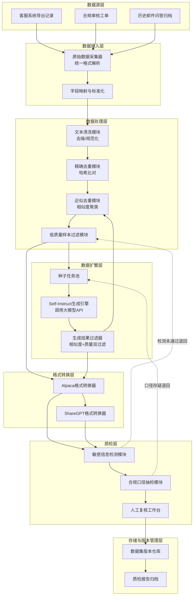
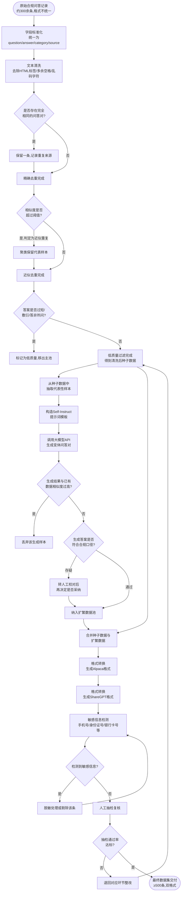
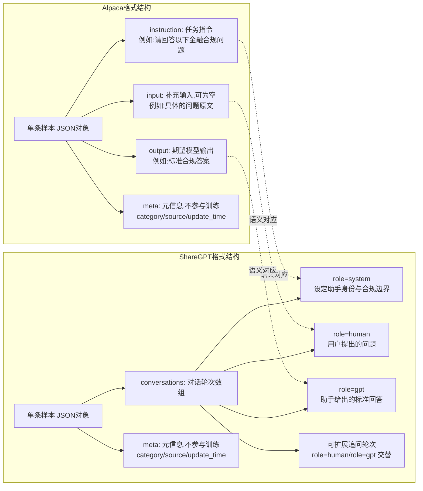

# 第52天:数据集构建

---

**课程名称**:企业级AI课程(70天)
**所属阶段**:第五阶段 —— 模型微调与部署实战
**当前进度**:Day 52 / Day 70
**主讲/带教**:王振宇(老王,蓬远科技首席架构师)
**学员**:陈铭(蓬远科技,AI工程师)
**项目背景**:苍穹企业级智能体中台 —— 御风金融合规问答场景微调项目
**今日主题**:指令微调数据集构建 —— 从原始记录到可训练数据
**关键词**:Alpaca格式、ShareGPT格式、数据清洗、去重、Self-Instruct、数据质检
**前情提要**:Day51 完成了微调所需的 GPU 训练环境搭建(驱动、CUDA、PyTorch、DeepSpeed、监控面板全部就位)
**今日产出**:面向御风金融消费金融合规问答场景的 500 条微调数据集(教学模拟数据)
**预计阅读时长**:约 75 分钟

---

## 【旁白】

在很多人的想象里,做大模型微调是一件很"性感"的事情:调几个超参数,跑一下训练脚本,loss 曲线往下一压,模型就"聪明"了。陈铭在来蓬远科技之前也是这么想的。直到他真正接手了御风金融这个项目的数据集构建任务,才发现事情完全不是这样。

GPU 环境搭好了,训练框架选好了,连学习率调度器用哪种 warmup 策略都提前讨论过了——可训练脚本敲在屏幕上,第一行代码要读取的,是数据集路径。而这个数据集,此刻还是一堆散落在客服系统、合规审核工单、历史邮件回复里的文本,格式不统一,内容有重复,还夹杂着不少"看起来像回答但其实什么都没说"的敷衍话术。

老王常说一句话,陈铭一开始不太理解,现在算是彻底服气了:"你拿一百条脏数据喂给全世界最好的模型,它学到的还是脏东西;你拿一百条干净、准确、覆盖全面的数据喂给一个普通的开源模型,它反而能学出该有的样子。数据质量比模型更重要,这句话不是谦虚,是事实。"

今天这一天,陈铭没有碰一行训练代码,却比写训练代码还要累——因为他真正体会到,构建一份"配得上被拿去微调"的数据集,才是整个微调工程里最耗心力、也最容易被低估的一环。

---

## 一、晨会纪要

**时间**:2026年X月X日 09:30
**地点**:蓬远科技 3楼会议室 · 苍穹项目组
**参会人**:王振宇(架构师)、陈铭(AI工程师)、林薇(产品经理,对接御风金融)、赵学军(测试/质量保障)、周洁(合规顾问,兼职支持)

---

**王振宇**:昨天陈铭把 GPU 环境搭完了,四张卡,驱动、CUDA、PyTorch、DeepSpeed 都验证过,今天我们要往前推一步——训练数据。先说清楚一件事,今天这一天,我们不碰训练脚本,不碰超参数,专心把数据集这件事做扎实。做不扎实,后面训练再快也是白搭。

**陈铭**:昨天我看了一下御风金融那边给的原始素材,说实话有点头大。客服聊天记录导出来是 Excel,合规审核的问答是 Word 文档里粘贴的截图配文字说明,还有一批是邮件往来记录,格式完全不统一。

**林薇**:这个我跟御风金融那边确认过,他们目前内部知识确实分散在好几个系统里,没有统一的问答库。这次给我们的,是他们合规部整理出来的"历史合规咨询问答记录",大概有两千多条,但很多是重复问题的不同问法,还有一部分是内部测试用的,质量参差不齐。这次课程里我们只用教学模拟数据,不涉及真实客户信息,这个前提要跟大家再强调一下。

**王振宇**:对,这点必须反复强调。我们今天所有的数据样例、所有的问答对,全部是为了教学目的构造的模拟数据,不是御风金融真实客户的原始资料,任何涉及身份证号、手机号、银行卡号的示例都是虚构的占位符,这是红线,不能碰。

**赵学军**:我这边测试组主要关心两件事:一是数据格式规范,二是数据质量能不能量化验收。如果只是"看起来还行"这种主观判断,后面模型效果不好,我们没法定位是数据问题还是训练问题。

**王振宇**:说得对,今天陈铭产出的东西里,必须有一份明确的验收标准,量化到"重复率不超过多少"、"低质量样本占比不超过多少"这种程度。赵学军,你今天要做的事情,就是拿着这份验收标准去抽检陈铭最后产出的数据集,挑刺。

**赵学军**:没问题,我下午会抽样跑一遍质检脚本。

**周洁**:我从合规角度补充一点。消费金融行业的合规问答,有几个特点必须照顾到:第一,涉及利率、费用、逾期处理的问题,回答口径必须和监管要求一致,不能自己编;第二,涉及个人信息保护的问题,回答里绝对不能出现真实的客户信息作为示例,哪怕是"举例说明"也不行;第三,有一些问题的标准答案本身会随监管政策调整,数据集里要标注一个"生效版本"或者"更新时间",避免用过时口径去训练模型。

**陈铭**:这个我记一下。所以数据集里除了问题和答案,还得有元信息字段,比如类别、来源、更新时间这些。

**周洁**:对,而且有一部分问题本身就是"边界模糊"的,比如客户问逾期费用怎么算,不同产品的费率结构不一样,这种问题如果泛化处理,微调出来的模型可能会给出不准确的口径,这块后面质检的时候要重点看。

**王振宇**:好,这些意见都很关键。陈铭,今天你的任务拆成几块:第一,搞清楚指令微调数据到底长什么样,Alpaca 格式和 ShareGPT 格式的区别,为什么我们最后要用某一种或者两种都要;第二,把原始的合规问答记录清洗一遍,去重、去噪、过滤低质量样本;第三,用 Self-Instruct 的思路,借助大模型把种子数据"扩繁"出更多变体,凑够规模;第四,做质检,尤其是敏感信息检测,这个不能有任何遗漏;第五,最后要交付一份能拿去训练的、大概 500 条的数据集,以及一份数据集说明文档。

**陈铭**:500 条听起来不算多,但看这几步流程,今天的工作量应该不轻。

**王振宇**:500 条对于一个垂直领域、任务边界清晰的微调场景,其实是一个合理的起始规模。你记住一句话:数据集不是越大越好,是越"准"越好。我见过团队拿几万条粗放采集的数据去微调,效果还不如别人精心打磨的两三千条。今天你先把"质量优先"这个方法论和工具链搭起来,规模可以后续再滚雪球式扩充。

**林薇**:另外提一下时间线,御风金融那边比较着急,他们希望这个合规问答助手能尽快内测,所以数据集这块如果能今天拿出第一版,明天就可以直接开始跑微调实验了。

**赵学军**:我插一句,规模上要不要考虑分批交付?比如先出200条核心高质量数据,让训练那边先跑起来做验证性实验,剩下的边扩边补?这样不至于因为数据集这一环卡住整体进度。

**王振宇**:这个思路可以,但今天先不用这么分。陈铭手头的原始数据量和处理流程,今天一天做完500条是可以做到的,没必要人为拆两段。真要出问题,更可能是质量问题,不是速度问题,所以宁可今天多花点时间在质检上,也别为了赶进度牺牲质量,这个优先级要清楚。

**陈铭**:我理解,那我今天的时间分配大概是这样:上午先把两种数据格式的规范搞清楚,顺便定好我们内部的字段约定;下午集中做清洗、去重、Self-Instruct扩繁和质检,晚一点如果来得及,再把说明文档补上。

**王振宇**:可以。还有一点提前说一下,今天这些代码不是写一次就扔的,苍穹中台后面要服务不止御风金融一个客户,类似"整理历史问答记录变成微调数据集"这种需求,大概率还会在别的行业场景里重复出现,比如政务咨询、医疗客服。所以今天写代码的时候留一个心思:哪些逻辑是御风金融这个场景专属的(比如具体的合规关键词、具体的类别划分),哪些逻辑是可以抽象成通用能力的(比如去重算法、格式转换框架、质检流程骨架),尽量把两者分开,别写成谁都看不懂、换个场景就要推倒重写的耦合代码。

**陈铭**:明白,我会注意把领域相关的规则(比如合规关键词库、类别列表)做成可配置的部分,和通用的处理逻辑分开写。

**林薇**:那我这边先去跟御风金融确认一下,今天用的样例数据全部是我们内部模拟构造的,不会涉及他们真实客户信息,回头数据集说明文档里也要把这一点写清楚,免得后续有误解。

**周洁**:好的,我今天下午三点到五点这段时间在工位,陈铭如果对某条问答的合规口径有疑问,随时可以直接找我确认,不用等到质检环节才反馈,越早对齐越好,免得返工。

**王振宇**:明白,这个节奏我们跟得上。行,没有别的问题的话,散会,陈铭下午三点之前先给我看一下清洗后的中间产出。

---

会议开完,陈铭心里其实是有点没底的。他做过不少数据处理的活儿,ETL、特征工程都不陌生,但"为大模型微调构建指令数据集"这件事,他还是头一次真正上手。回到工位,他先打开笔记本,把今天要搞清楚的问题列了一遍:

1. Alpaca 格式和 ShareGPT 格式到底有什么本质区别,什么场景该用哪种?
2. 原始记录里,哪些算"低质量样本",标准怎么定?
3. 去重不是简单的字符串比较,那到底该怎么做近似去重?
4. Self-Instruct 具体怎么落地,种子数据怎么选,大模型生成的变体怎么保证质量不滑坡?
5. 敏感信息检测要覆盖哪些类型,怎么写检测规则?

这五个问题,基本就是今天一整天要交的作业。

---

## 二、需求文档:微调数据集构建任务书

**文档编号**:CQ-FT-DATA-20260713-001
**项目名称**:苍穹企业级智能体中台 · 御风金融合规问答场景微调数据集构建
**编制人**:陈铭
**审核人**:王振宇
**版本**:V1.0

### 2.1 项目背景

御风金融是一家消费金融机构,当前业务中大量客服与合规咨询场景需要人工坐席逐条回复,咨询内容集中在利率费用说明、逾期处理流程、征信影响、投诉处理、个人信息使用范围等合规相关问题。为提升响应效率并保证口径一致性,御风金融希望在苍穹企业级智能体中台上,基于开源基座模型微调出一个"消费金融合规问答助手",能够以标准、合规、一致的口径自动回答该类问题,超出能力边界的问题则明确转人工。

本任务书对应苍穹项目微调工作流中的数据准备阶段,目标是把御风金融历史合规问答记录(教学场景中使用模拟数据代替真实客户数据)转化为符合指令微调训练要求的标准数据集。

### 2.2 任务目标

1. 完成原始合规问答记录的清洗、去重、格式标准化;
2. 采用 Self-Instruct 方法对种子数据进行受控扩繁,补齐场景覆盖度;
3. 产出同时支持单轮指令微调(Alpaca 格式)与多轮对话微调(ShareGPT 格式)的两版数据集;
4. 建立可量化、可复核的数据质量验收标准,并配套自动化质检工具;
5. 最终交付规模不少于 500 条、经质检合格的训练数据集,以及配套的数据集说明文档。

### 2.3 数据来源说明

本次数据来源分为两类:

- **教学模拟历史记录**:模拟御风金融合规部过往积累的客服/合规问答记录,涵盖利率费用、逾期处理、征信影响、投诉处理、个人信息保护五大类别,约 300 余条原始记录(含重复与低质量样本),本课程中以脚本生成的模拟样本代替真实业务数据;
- **Self-Instruct 扩繁数据**:以清洗后的高质量记录作为种子,借助大模型 API 生成的变体问答对,经过滤后并入训练集。

**强调声明**:本任务书及后续所有示例数据中出现的姓名、身份证号、手机号、银行卡号、金额、合同编号等信息均为教学目的虚构或占位处理,不对应任何真实客户或真实业务数据,项目组不得以任何方式引入真实客户敏感信息进入训练数据集。

### 2.4 数据格式要求

最终数据集需支持以下两种格式,二者内容对应同一批语料,仅结构不同:

**Alpaca 格式**(用于单轮指令微调,字段:instruction / input / output,可选 meta 元信息字段用于溯源,不参与训练);

**ShareGPT 格式**(用于对话式微调,字段:conversations,包含 system / human / gpt 三种角色轮次,便于后续扩展多轮追问场景)。

两种格式需保持语义一致,支持通过脚本互相转换,避免人工重复标注。

### 2.5 数据规模与分布要求

| 类别 | 目标条数 | 占比要求 | 说明 |
|---|---|---|---|
| 利率费用说明类 | ≥120条 | 24%左右 | 含逾期利息计算、年化利率披露口径等 |
| 逾期处理流程类 | ≥100条 | 20%左右 | 含逾期通知、宽限期、结清证明等 |
| 征信影响类 | ≥90条 | 18%左右 | 含逾期上报规则、征信修复说明等 |
| 投诉处理类 | ≥90条 | 18%左右 | 含投诉渠道、处理时限、升级机制等 |
| 个人信息保护类 | ≥100条 | 20%左右 | 含信息使用范围、第三方共享规则等 |
| **合计** | **≥500条** | 100% | 类别分布允许±5%浮动 |

**类别边界说明**:五大类别在实际标注过程中并非总是泾渭分明,团队在起草这份任务书时,专门对容易混淆的边界情况做了约定,避免不同人标注同一批数据时出现类别归属不一致的问题。比如,一条问题同时涉及"逾期后利息如何计算"和"逾期是否影响征信"两个维度时,归类原则是看问题的**核心诉求点**——如果用户提问的重点落在费用计算本身,归入利率费用类,即便回答中会提及可能对征信产生影响;如果用户提问的重点是征信后果,归入征信影响类,即便回答中会提及逾期费用的计算方式。类似地,"逾期处理流程类"和"征信影响类"也容易混淆,团队约定:凡是围绕"发生逾期之后,机构会怎么处理、用户该怎么应对"这类流程性问题(如宽限期、结清证明、展期协商),归入逾期处理流程类;凡是围绕"逾期记录对个人信用产生什么后果、如何避免或者修复"这类结果性问题,归入征信影响类。这条边界约定后来被直接写入了数据标注说明,陈铭在清洗和标注阶段严格按这条规则执行,避免出现同一类知识点被拆分到两个不同类别、造成类别分布统计失真的情况。

### 2.6 数据质量验收标准(核心)

数据集质量验收采用"硬性红线 + 量化指标"双重标准,任何硬性红线不通过则整批数据退回重做,量化指标未达标则需补充或返工对应比例的数据。

**(一)硬性红线(一票否决项)**

1. 数据集中不得出现任何真实的身份证号、手机号、银行卡号、真实姓名等 PII 信息,包括作为"举例"出现的情形,均需替换为规范占位符(如"张某""138****1234"格式的示例);
2. 回答内容不得与消费金融领域现行监管口径明显冲突(如编造不存在的费率优惠、承诺违规的债务减免方案);
3. 不得包含诱导性、误导性表述(如暗示可以通过某种方式逃避征信记录);
4. 不得出现明显的模型幻觉痕迹(如编造不存在的法律条文编号、虚构的内部系统名称)。

**(二)量化指标**

| 指标名称 | 定义 | 验收阈值 |
|---|---|---|
| 精确重复率 | 完全相同问答对占比 | 0%(必须清零) |
| 近似重复率 | 相似度高于阈值的问答对占比 | ≤3% |
| 低质量样本占比 | 答案过短、答非所问、明显敷衍的样本占比 | ≤2% |
| 格式合规率 | 严格符合 Alpaca/ShareGPT 结构规范的样本占比 | 100% |
| 类别标注准确率 | 抽样人工复核类别标注是否正确 | ≥98% |
| 平均问题长度 | 反映问题是否过于简单化 | 15字以上 |
| 平均答案长度 | 反映答案信息密度 | 60字以上,且不超过400字 |
| PII检测通过率 | 自动化脚本检测无敏感信息残留 | 100% |
| Self-Instruct生成数据占比 | 扩繁数据占总量比例,控制过度依赖生成数据 | ≤40% |

**(三)验收流程**

1. 陈铭产出数据集初稿,运行自动化质检脚本,输出质检报告;
2. 赵学军抽样(不少于总量15%)进行人工复核,重点核对类别标注准确性与答案合规性;
3. 周洁对涉及监管口径的样本(利率费用、征信影响两大类别)进行专项复核;
4. 三方确认无误后,数据集打包归档,附上版本号与生效时间戳,方可进入下一阶段(Day53 微调实战)使用。

这个验收流程草拟出来之后,林薇提了一个建议:验收环节的时间安排要提前跟御风金融那边报备一下,不能等到数据集全部做完才告诉对方"我们要开始验收了",这样万一验收不通过需要返工,时间上会很紧张。她建议把验收流程拆成两个检查点提前告知对方——第一个检查点是清洗后种子数据的初步抽检(不需要等 Self-Instruct 扩繁和最终格式转换全部完成),第二个检查点才是最终数据集的完整验收,这样即便第一个检查点发现种子数据本身存在问题,也能尽早暴露、尽早调整,不会把问题一直带到最后一步才发现,造成大范围返工。这个建议被采纳,写进了今天任务书的验收流程里,也是陈铭今天下午三点先给王振宇看中间产出的原因之一——那次检查,本质上就是这里说的"第一个检查点"。

### 2.7 风险与应对

| 风险 | 影响 | 应对措施 |
|---|---|---|
| 原始数据量不足,难以覆盖场景 | 微调后模型泛化能力弱 | 使用 Self-Instruct 扩繁,但严格控制生成数据占比与质量过滤 |
| 大模型生成数据引入幻觉内容 | 训练出的模型口径不准确 | 生成后必须经过人工/规则双重质检,合规敏感类别不允许直接使用生成答案,须人工校对 |
| 近似重复样本过多,浪费训练资源且导致过拟合 | 模型对高频问法过拟合,泛化差 | 引入基于文本相似度的近似去重算法,而非仅做字符串精确匹配 |
| 敏感信息误入数据集 | 合规风险、客户信任风险 | 强制走自动化 PII 检测脚本,检测未通过不允许入库 |

### 2.8 交付物清单

1. 清洗后的中间数据文件(`cleaned_raw.jsonl`);
2. Self-Instruct 扩繁后的候选数据文件(`self_instruct_candidates.jsonl`);
3. Alpaca 格式最终数据集(`finetune_dataset_alpaca.json`);
4. ShareGPT 格式最终数据集(`finetune_dataset_sharegpt.json`);
5. 数据质检报告(`quality_report.json` / `quality_report.md`);
6. 本任务书及数据集说明文档。

### 2.9 与后续微调阶段的衔接说明

本任务书虽然只覆盖数据准备阶段,但陈铭在起草这份文档时,特意和王振宇确认了一下下游环节会怎么使用今天的产出,避免"数据准备完了才发现和训练环节对不上"这种情况。几点约定记录如下:

第一,Day53 的微调实验会优先使用 Alpaca 格式数据集作为主要训练数据,因为当前训练框架的加载器对该格式的支持最成熟,调参和调试的历史经验也更丰富;ShareGPT 格式数据集会作为对照实验的备选输入,用于后续评估两种格式训练出的模型在多轮追问场景下的表现差异,这部分对照实验不一定在 Day53 当天就展开,但数据要提前准备好。

第二,数据集中的 `meta` 字段(record_id、category、source、update_time、generation_type 等)不会参与模型训练本身,但会在训练完成后的效果评估阶段发挥作用——比如可以按 category 分组评估模型在不同类别上的回答准确率,或者对比"来自原始种子数据训练出的效果"和"来自 Self-Instruct 扩繁数据训练出的效果"是否有差异,这也是为什么今天所有环节都反复强调要保留完整的元信息,而不是清洗完就把这些"辅助字段"扔掉只留问答本身。

第三,考虑到消费金融合规问答场景对答案准确性的高要求,王振宇提出 Day53 的微调实验会先用一个较小的学习率和较保守的训练轮数做"探索性实验",目的是先确认数据格式、字段映射、训练流程本身没有问题,再逐步加大训练强度,这意味着今天交付的数据集需要保证即便只训练很少的步数,也能看出模型有没有学到基本的合规问答风格,这对数据集本身的"信号密度"提出了要求——如果数据集里充斥着大量低区分度、模糊表述的样本,即便规模凑够了,探索性实验也很难看出有效信号,这也是为什么低质量样本过滤这一步不能马虎。

第四,数据集的最终版本号会与 Day53 训练实验的实验记录一一对应,即每一次训练实验都需要明确标注使用的是哪个版本号的数据集,方便后续如果发现某次训练效果异常,可以追溯回具体是哪个版本、哪一批数据造成的问题,而不是笼统地怀疑"数据有问题"却说不清是哪部分数据。

---

## 三、架构设计图:数据集构建处理管道架构

下面这张图,是陈铭跟老王讨论后确定的整体架构,描述的是"数据从哪里来、经过哪些系统组件处理、最终落到哪里"的静态结构视图,重点是各个模块的职责边界。



这张架构图有几个设计点值得展开说一下。

第一,**扩繁层和处理层之间是有回路的**——Self-Instruct 生成出来的新样本,并不是直接进入格式转换层,而是要回到近似去重模块,和已有数据池一起重新做一次相似度检测。这是因为大模型在生成"变体问题"时,很容易生成看似不同、实际语义高度重合的问句,如果不回流去重,扩繁出来的数据会有大量隐性重复。

第二,**质检层有双向退回机制**。敏感信息检测不通过的样本,退回到低质量过滤模块重新处理(而不是直接丢弃,因为有些样本只是需要脱敏处理而不是整条废弃);合规口径抽检存疑的样本,退回到种子任务池,意味着这条数据本身可能需要人工重新校对答案内容,而不只是格式问题。

第三,**人工复核工作台是整条管道里唯一非自动化的节点**,这是有意为之的设计——涉及金融合规口径的内容,机器质检只能兜底常见问题,最终决定权必须留给人。这也是御风金融周洁那边反复强调的一点,今天讨论架构的时候老王把这一条明确写进了设计里。

第四,**数据源层和存储层是这张图里相对"静态"的两端,中间六层才是今天真正要落地的部分**。陈铭一开始画图的时候,把数据源层画得很详细,反而把处理层、扩繁层这些核心环节画得比较粗略,老王看了之后提出意见:架构图的详细程度应该和"今天实际要动手做的事情"成正比,数据源已经是既定事实、不需要今天花精力调整,重点应该放在中间处理链路的模块划分和职责边界上,这也是为什么最终版本的架构图里,数据处理层被拆成了四个独立模块(清洗、精确去重、近似去重、低质量过滤),而不是笼统地画一个"数据清洗"大框——模块拆得越细,后续代码实现和责任划分就越清楚,谁负责哪一块、出问题去哪个模块排查,都能一目了然。

第五,这张架构图在实际使用中还承担着"团队沟通工具"的作用。陈铭后来把这张图发到项目群里,林薇看了之后才第一次直观理解了"为什么数据集构建不是一步到位的事情,中间要经过这么多道工序",这也帮她在跟御风金融沟通交付周期时,能够更准确地解释每个环节大概需要投入的精力,而不是简单地说"我们在处理数据"这种笼统的说法。

---

## 四、流程图:数据处理全流程

架构图讲的是"系统长什么样",下面这张流程图讲的是"一条数据具体是怎么流转的",从最初的原始问答记录开始,一步步走到最终可训练的数据集,是一个更贴近陈铭今天实际操作步骤的时序视图。



这张流程图画完之后,陈铭跟老王过了一遍,老王指出了一个他容易忽略的细节:**近似重复的处理,不是简单丢弃,是"聚类保留代表样本"**。也就是说,如果十条问题本质上问的是同一件事(比如"逾期一天算不算逾期""晚一天还款有没有影响""还款日当天没还算逾期吗"),这十条不是随便留一条,而是要挑一条表述最规范、信息最完整的作为代表,其余的问法可以作为"同义问法"记录在元信息里,后续如果需要扩充问法多样性,可以从这个池子里回收利用,而不是彻底扔掉。

另外一个容易被忽视的环节是 **Step13 的合规口径校验分支**。陈铭最初设计的时候,是把"生成结果过滤"和"合规校验"合并成一步,老王让他拆开,理由是:相似度过滤是纯技术问题,机器判断就够了;但合规口径判断涉及业务专业性,哪怕是自动化脚本做了关键词匹配式的初筛,最终决定权还是要留给周洁这样的合规顾问,不能让机器自己"拍板"一条金融合规问答是否准确。

---

## 五、示意图:Alpaca 格式与 ShareGPT 格式结构对比

在真正动手写代码之前,陈铭需要先把这两种格式的结构差异想清楚,老王让他画一张示意图,不是流程图,而是纯粹用来做"结构对比"的示意,方便后面转换脚本按图施工。



这张示意图把两种格式并排摆在一起,一眼就能看出关键区别:**Alpaca 格式本质上是"一条指令 + 一条输出"的扁平结构,天然适合单轮、任务导向的问答;ShareGPT 格式则是把内容包裹在一个对话轮次数组里,天然支持多轮、带上下文的交互**。对于御风金融这次的合规问答场景,大部分问题确实是单轮的(客户问一个问题,助手给一个标准答案),但项目组已经预见到后续会有"追问"场景(比如客户先问逾期利息怎么算,再追问"如果我马上还清能不能减免"),所以两种格式都要准备,ShareGPT 格式为未来扩展多轮对话数据打好基础,即便这一批数据里 ShareGPT 格式暂时也只是单轮对话(human+gpt各一轮),结构上已经具备了扩展能力。

画这张示意图的时候,陈铭一开始想用一张表格来对比两种格式的字段,老王建议改成图的形式,理由是表格适合罗列字段名和字段类型这种"扁平信息",但两种格式真正的差异在于"结构层级"——Alpaca 格式是平铺的三个并列字段,ShareGPT 格式是嵌套的数组结构,这种层级差异用图形化的树状结构表达,比表格更直观,团队里没有深入了解过这两种格式的人(比如林薇),看一眼图就能明白"哦,原来一个是摊开摆的,一个是包起来的"。

图里还特意画了 `A1 -. 语义对应 .-> S2` 这样的虚线连接,把 Alpaca 的 instruction 和 ShareGPT 的 system 角色对应起来,把 input 和 human 对应起来,把 output 和 gpt 对应起来。这组对应关系,后来直接指导了格式转换脚本的实现思路——既然两者在语义层面是一一对应的,那转换脚本完全可以设计成"以一份清洗后的中间数据为唯一源头,分别映射到两种目标结构",而不需要为两种格式各自维护一套独立的数据准备流程,这也是今天下午写 `convert_format.py` 时,`CleanedRecord` 这个中间数据结构存在的意义——它是两种格式共同的"上游",保证下游两份数据永远语义一致,不会出现"Alpaca 版本和 ShareGPT 版本对同一个问题给出了不同答案"这种低级错误。

---

## 六、课堂笔记

### 6.1 上午:指令微调数据格式详解

**为什么格式很重要**

陈铭一开始有点不理解,格式不就是个 JSON 结构吗,为什么要花一上午专门讲。老王给他举了个例子:如果训练脚本按 Alpaca 格式的字段去读数据,而数据集实际上是杂乱的 CSV,那训练框架在数据加载阶段就会直接报错,或者更麻烦的情况是不报错,但把字段读错位置,导致模型学到的输入输出关系是错的——这种错误往往训练完了都看不出来,只有拿模型去实际提问的时候才会发现回答莫名其妙。格式规范,本质上是训练框架和数据之间的"契约",契约不清楚,后面的训练再怎么调参都是无用功。

**Alpaca 格式详解**

Alpaca 格式最早来自斯坦福那批开源指令微调数据的整理方式,核心思想是把每一条训练样本拆成三个逻辑部分:

- `instruction`:告诉模型要做什么任务,相当于一句任务指令。比如"请根据消费金融行业合规要求,回答用户提出的问题"。
- `input`:任务需要用到的具体输入内容,可以为空。在很多通用任务里(比如摘要、翻译),input 是必填的原文;但在问答类任务里,一般做法是把用户的问题本身放进 input,instruction 保持相对固定的"角色设定+任务描述"。
- `output`:期望模型给出的标准答案,也就是训练的目标文本。

陈铭注意到一个细节:instruction 和 input 到底怎么分工,业界并没有一个铁律,有的数据集习惯把问题直接塞进 instruction,input 留空;有的则像上面这样分开。老王的建议是,对于同一个项目,团队内部要统一口径,不要一部分数据这么写,另一部分数据换一种写法,这会导致模型在同一种任务模式下学到不一致的输入分布,增加训练难度。今天御风金融这个项目里,团队约定:instruction 统一是相对固定的角色与任务描述模板(可以有少量变体避免模型死记硬背模板),input 放置用户实际提出的问题原文,output 放置标准答案。

Alpaca 格式在训练时,通常会被框架拼接成一个统一的 prompt 模板,类似:

```
下面是一条描述任务的指令,配合一个提供更多上下文的输入。请写出恰当地完成该指令的回复。

### 指令:
{instruction}

### 输入:
{input}

### 回复:
{output}
```

训练时,`{output}` 部分才是真正计算 loss 的目标 token,前面的模板和输入部分一般会被 mask 掉(不计算 loss,只作为条件输入),这也是为什么 instruction 和 input 的表述质量非常重要——它们直接决定了模型"看到什么样的问题会给出什么样的答案"这一映射关系是否清晰。

陈铭当时追问了一句:既然模板部分不计算 loss,那模板写得规范不规范,是不是就不那么重要了?老王的回答是:模板本身虽然不直接产生梯度信号,但它构成了模型在推理阶段"理解任务"的上下文条件,如果模板表述含糊、和实际输出内容的对应关系不清晰,模型即便能记住训练数据里的具体答案,也很难学到"这一类模板对应这一类回答风格"的泛化规律,遇到训练数据里没见过的新问题时,泛化效果会打折扣。反过来,如果模板表述清晰、稳定、和输出内容的逻辑关系明确,即便具体问题是模型没见过的,它也更容易顺着模板给出的"任务框架"给出符合期望风格的回答。这也是为什么今天的格式转换脚本里,尽管 instruction 字段有多个模板轮换使用,但每个模板都经过了仔细打磨,确保语义清晰、边界感强(比如都明确点出了"消费金融""合规"这些关键限定词),而不是随便写几句话敷衍了事。

**ShareGPT 格式详解**

ShareGPT 格式的设计出发点不一样,它是为了记录"一段完整对话"而设计的,结构上是一个 `conversations` 数组,数组里每个元素代表一轮发言,通常包含两个字段:角色标识(不同实现里字段名略有差异,常见的是 `from`/`role` 加 `value`/`content`)和发言内容。角色一般分三类:

- `system`:系统提示,用于设定助手的身份、能力边界、语气风格,这一轮通常放在对话最前面,且不一定每条样本都要有;
- `human`(或 `user`):用户的发言;
- `gpt`(或 `assistant`):助手的回复。

多轮对话场景下,`human` 和 `gpt` 会交替出现多次,模型在训练时,会对每一轮 `gpt` 的内容计算 loss,同时把之前所有轮次(包括更早的 human/gpt 轮次)都作为上下文条件。这正是 ShareGPT 格式相比 Alpaca 格式的核心优势:**它天然支持带上下文的多轮训练**,而 Alpaca 格式如果想表达多轮对话,只能自己在 input 字段里手动拼接历史对话文本,这样做不是不行,但比较别扭,而且不同训练框架对这种拼接方式的支持程度不一致。

老王补充了一点行业背景:ShareGPT 这个名字的来源,其实是早期一个用户分享 ChatGPT 对话记录的网站,后来这个网站积累的对话数据被整理成了一种事实上的社区标准格式,很多开源指令微调数据集(比如 Vicuna 用到的训练数据)都采用了这个格式规范,所以现在业内提到"ShareGPT 格式"基本上大家都认识,这也是为什么即便御风金融当前场景以单轮问答为主,团队依然决定同时准备 ShareGPT 格式版本——它的社区兼容性更好,未来切换训练框架或者引入更复杂的多轮场景时,迁移成本更低。

赵学军对这个话题还有一个关注点:多轮对话数据在训练时,如果历史轮次很长,会不会导致训练序列长度暴涨、进而影响训练效率?老王承认这确实是 ShareGPT 格式在实际使用中需要考虑的一个成本因素——轮次越多,单条训练样本对应的 token 序列就越长,训练框架的显存占用和计算量也会相应增加。不过他补充说,这个问题在御风金融当前的场景下暂时不是主要矛盾,因为目前绝大部分数据还是单轮问答,即便格式上用了 ShareGPT 的多轮结构,实际的对话轮次也只有一问一答两轮,序列长度和 Alpaca 格式差别不大;真正需要认真权衡这个成本的时候,是未来数据里真的出现大量三轮、五轮甚至更长的追问场景时,那时候可能需要考虑对特别长的对话做截断策略,或者在训练配置里调整最大序列长度上限,这些都是后续场景演进到那一步时才需要解决的问题,今天先不必过度设计。

**两种格式的取舍与共存**

课上讨论到最后,王振宇给出一个结论性的判断,陈铭记在了笔记本最显眼的位置:**格式选择不是二选一的信仰问题,而是要看训练框架支持什么、场景需要什么**。如果用的训练框架(比如常见的 LLaMA-Factory、Axolotl 等)同时支持两种格式的数据加载器,那完全可以两种都准备,用哪种训练由后续实验决定;如果场景本身天然是多轮追问(比如客服场景经常有"追问式"交互),那 ShareGPT 格式几乎是必选;如果场景是相对独立的单轮任务(比如文本分类、摘要生成),Alpaca 格式会更简洁直接,不需要额外的角色包装。

御风金融这次的场景介于两者之间——当前积累的历史数据以单轮问答为主,但业务方明确提出未来要支持追问,所以团队的决策是:**用统一的中间数据结构存储清洗后的语料,再通过转换脚本分别生成 Alpaca 和 ShareGPT 两个版本,两份数据同源、语义一致,只是结构不同**,这样无论后续用哪个训练框架、哪种格式,都不需要重新走一遍清洗流程。

**关于 instruction 模板多样性的补充讨论**

赵学军中途插了一个问题:如果所有样本的 instruction 字段都写成完全一样的一句话,会不会有问题?王振宇给出的答案是:**会**。如果 instruction 字段一字不差地重复几百次,模型在训练过程中容易把这句话"记死",一旦实际使用时用户的表述或者系统提示词稍微变化,模型的响应质量可能会下降,这种现象有时被称为"对固定模板过拟合"。因此在实际构建数据集时,即便任务本质相同,instruction 字段也建议准备几套语义等价但表述不同的版本,随机或轮换分配给不同样本,增加模型对指令表述的鲁棒性。今天下午写格式转换脚本的时候,陈铭会专门实现这一点。

**几个容易踩的坑**

上午课程快结束的时候,老王额外花了十分钟,专门讲了几个他自己带过的项目里真实遇到过的坑,让陈铭引以为戒。

第一个坑是**字段语义混用**。有的团队在构建 Alpaca 格式数据时,一部分样本把问题放进 instruction,另一部分样本把问题放进 input,理由往往是"反正训练的时候会拼接在一起,顺序不重要"。这种做法短期内似乎不影响训练跑通,但长期来看会让模型在同一种任务类型下学到不一致的输入模式,当数据规模扩大、来自不同批次、不同标注人员时,这种不一致会被进一步放大,排查起来也很麻烦——因为训练脚本不会报错,只会让效果"莫名其妙地差一点",而这种"差一点"往往很难定位到具体原因。老王的建议是,项目组内必须在动手之前就把字段语义写进文档定死,今天的任务书里已经明确了 instruction 放角色与任务描述、input 放用户问题原文这条规则,后续所有人写代码都要遵守,不能各写各的。

第二个坑是**meta 字段被误用于训练**。有些训练框架的默认数据加载器,如果数据集里出现了额外字段(比如 meta),并不会自动忽略,而是可能报错或者以意外的方式处理。陈铭今天设计数据结构时特意把 meta 字段独立出来,并在文档里注明"不参与训练",但光有文档说明还不够,实际操作时还需要在调用训练框架的数据预处理配置里显式声明只读取哪些字段,避免元信息意外泄漏进训练文本里,造成模型学到诸如"record_id"这种毫无意义的模式。

第三个坑是**ShareGPT 格式里角色命名不统一**。不同的开源项目、不同的训练框架,对 ShareGPT 格式里角色字段的具体命名可能有细微差异,比如有的用 `from`/`value`,有的用 `role`/`content`,有的把用户角色写作 `human`,有的写作 `user`。如果不提前确认清楚训练框架期望的具体字段命名,即便数据在逻辑上是对的,加载时也可能因为字段名不匹配而直接读取失败,或者更隐蔽地被错误解析。老王让陈铭今天转换脚本写完之后,一定要拿目标训练框架的一个小样本做一次实际加载测试,而不是只在脚本层面自我验证格式"看起来正确"就算完事。

这几个坑,陈铭都记在了笔记本上,他后来在写格式转换和质检脚本时,也确实是照着这几条来回避对应问题的。

---

### 6.2 下午:数据清洗、去重与 Self-Instruct 辅助生成

**数据清洗要清理哪些东西**

下午一开场,老王先让陈铭把御风金融给的原始记录打开看了几十条真实(教学模拟)样例,然后一起归纳"脏数据"都长什么样。归纳下来大概是这几类问题:

第一类是**格式噪声**,比如从网页或者聊天工具里复制粘贴出来的文本,会带有 HTML 标签残留、多余的换行符、全角空格和半角空格混用、emoji 表情符号、聊天软件自动插入的时间戳和用户昵称等无关信息。

第二类是**内容噪声**,比如客服在回复里加的寒暄语("您好,感谢您的咨询,以下是为您解答")、结尾的礁客话术("如有其他问题欢迎随时联系"),这些内容如果不处理,会稀释真正有效的答案信息,甚至导致模型学会"话说得很多但没有实质内容"这种坏习惯。

第三类是**低质量样本**,包括:答案明显过短(比如只有"是的""可以的"这种缺乏解释的敷衍回复)、答案与问题不匹配(可能是系统导出错位造成的)、问题本身表述不完整(比如只有半句话,可能是复制粘贴时截断了)。

第四类是**重复样本**,分为两种情况:完全一样的重复(可能是同一条记录被不同渠道重复导出),以及语义相同但表述不同的近似重复(比如"信用卡逾期一天有没有影响"和"晚一天还信用卡算逾期吗",本质上问的是一件事)。

**去重的两种思路:精确去重与近似去重**

精确去重比较直观,把问答对拼接后计算哈希值(比如 MD5 或 SHA256),哈希值相同就认为是完全重复,这一步计算成本很低,可以在数据量很大的时候快速筛掉字符级完全一致的记录。但陈铭发现,原始数据里精确重复的比例并不高,大部分的重复其实是"近似重复"——文字表述不同,但语义几乎等价。

近似去重就复杂一些,课上老王介绍了几种常见思路:

一种是**基于编辑距离或字符串相似度**的方法,比如计算两条问题文本的最长公共子序列比例,或者用 Python 标准库 `difflib` 里的 `SequenceMatcher` 计算相似度比值,超过某个阈值(比如 0.85)就判定为近似重复。这种方法实现简单,但对语序变化、同义词替换的识别能力有限,比如"利息怎么算"和"如何计算利息"字面相似度可能不够高,但语义完全一致。

另一种是**基于 SimHash 或 MinHash 的方法**,这是大规模文本去重里更常用的技术,核心思路是把文本转换成一个固定长度的指纹(比如 64 位),两条文本指纹的汉明距离(不同位的数量)小于某个阈值就判定为相似。这种方法对大规模数据的处理效率更高,适合几十万甚至上百万条数据的场景。

还有一种是**基于文本向量化后的余弦相似度**方法,先把文本转换成词袋向量或者 embedding 向量,再计算向量之间的余弦相似度。这种方法能捕捉到更深层次的语义相似性,但计算成本相对更高,而且如果用高质量的 embedding 模型,还需要额外调用模型服务。

老王给了个建议:**对于今天这种数据规模(几百条)的场景,不需要上重型方案**。用基于字符集合的 Jaccard 相似度结合关键词覆盖率,已经足够识别出大部分近似重复,再配合简单的 SimHash 做二次校验,兼顾效果和实现复杂度。如果未来数据规模扩大到几万条以上,再考虑引入向量化方案。这也是今天下午代码实战部分的设计依据——陈铭最终写的清洗脚本,采用的正是"字符级 Jaccard 相似度 + 简化版 SimHash"的组合去重策略,不依赖任何需要额外下载的重型模型。

为了让陈铭对 Jaccard 相似度有更直观的感觉,老王现场拿黑板演算了一个简化的例子。假设有两条问题:"逾期一天算不算逾期"和"晚一天还款算逾期吗",先各自按字符两两组合切出 2-gram 集合(比如"逾期一天"会切出"逾期""期一""一天"等片段),再统计两个集合的交集大小除以并集大小,就是 Jaccard 相似度。老王让陈铭自己在纸上把这两句话的 2-gram 集合列出来,数交集和并集的个数,算出来的结果大概在0.3左右——远低于0.6的判定阈值,尽管这两句话在人类看来语义高度接近。这个演算结果一下子让陈铭意识到,单纯依赖字符级相似度算法,对于"表述差异较大但语义相同"的句子,识别能力其实是有限的,这也解释了为什么最终的近似去重方案要引入序列相似度和 SimHash 作为补充信号——三种方法各有各的盲区,组合起来才能把漏检和误判都控制在可接受范围内。这也是老王反复强调的一点:**任何一种文本相似度算法,都不要指望它是万能的,工程上更稳妥的做法是多个信号交叉验证,而不是迷信某一种"更高级"的算法**。

**低质量样本的量化判定标准**

光说"低质量"太主观,课上大家一起商量出了几条相对客观、可以写进代码规则的判定标准:

1. 答案长度小于某个字数阈值(比如15个汉字),且不包含具体数字或明确结论词,判定为疑似敷衍回复;
2. 问题与答案的关键词重合度极低(比如问题里提到"利率",答案里完全没有出现任何数字或利率相关词汇),判定为疑似答非所问;
3. 答案中包含大量重复字符或明显的乱码模式(比如连续重复某个字符超过一定次数),判定为格式异常;
4. 问题文本本身过短且缺乏实义(比如只有几个字,不构成完整问句),判定为问题不完整。

这几条规则今天下午都会落地成清洗脚本里的具体判断函数。

不过老王也提醒了一句,这几条规则本身是"充分不必要"的关系——满足了这几条规则的样本不代表一定是高质量样本,只是排除了几种最典型的低质量模式,规则之外还有很多细微的质量问题是规则覆盖不到的,比如答案表述得比较绕、专业术语堆砌导致普通用户看不懂、或者答案技术上没错但语气生硬得不像是在服务客户。这些更细腻的质量维度,今天暂时先不纳入自动化规则,留给赵学军抽检和周洁专项复核的时候用人工判断力去把关,不要指望规则脚本能一次性解决所有质量问题。陈铭把这个边界记得很清楚——自动化规则的作用是"低成本地筛掉一批明显有问题的样本,把人工复核的精力留给真正需要专业判断的部分",而不是替代人工判断本身。

这几条规则里,还有一条在实际编码时引发了小小的争论:关于"问题与答案关键词重合度过低判定为答非所问"这一条,赵学军提出疑虑——有些答案措辞比较委婉或者用了大量同义替换的表述,字面上关键词重合度确实会偏低,但实际上回答是切题的,这条规则会不会误伤这类样本?陈铭的处理方式是把这条规则的触发条件设计得比较宽松(重合度低于5%才触发,而不是稍微低一点就触发),并且只作为"疑似"标记,最终质检报告里会把命中这条规则的样本单独列出来供人工复核确认,而不是自动直接判定为不合格予以剔除。这种"宽松触发+人工兜底确认"的设计思路,后来也被用在了其他几条规则上,尽量避免自动化规则的边界条件把有效数据错误地清洗掉。

这场小争论后来还引出了一个更深的话题——低质量样本判定规则,到底应该往"宁可漏放一部分低质量样本"还是"宁可误伤一部分高质量样本"这个方向偏。老王给了一个不算绝对但很实用的经验法则:**如果误判的代价是"多花一点人工复核时间",可以适度容忍误判率高一些;如果误判的代价是"直接把数据剔除、造成场景覆盖度损失",就要偏保守、宁可漏检**。今天的低质量过滤规则设计,正是遵循了这个思路——像"答案过短""包含典型敷衍话术"这类特征非常明确、几乎不会产生歧义的规则,可以直接判定并剔除;而像"关键词重合度过低"这种容易存在灰色地带的规则,就只标记为疑似,交给人工做最终裁决,不直接执行剔除动作。这个原则,陈铭觉得不仅适用于今天的低质量过滤,后续无论是设计敏感信息检测规则,还是设计任何一种自动化质量判定逻辑,都可以拿来作为规则设计时的基本参照。

原始数据清洗完之后,陈铭这边估算了一下,能用的高质量种子数据大概只有一百多条,离 500 条的目标有明显缺口。这时候就要用到 Self-Instruct 的思路来补齐规模。

Self-Instruct 最初是学术界提出的一种利用大模型自身能力,以少量人工种子任务为起点,自动生成大规模指令数据的方法。核心流程可以概括为几步:

第一步,准备一小批高质量的"种子任务"(在陈铭这个场景里,种子任务就是清洗后留下的高质量问答对);

第二步,构造一个提示词模板,把若干条种子任务作为示例放进提示词里,要求大模型"参考这些示例的风格和领域,生成新的、不重复的问答对";

第三步,调用大模型 API,拿到生成结果,对结果进行解析(通常大模型会按指定格式输出,比如 JSON 数组或者带编号的列表);

第四步,对生成结果做过滤,主要包括:与已有数据(种子数据+之前已经生成的数据)的相似度检测,剔除近似重复;质量检测,剔除格式不对、内容空洞的生成结果;

第五步,把过滤后的合格样本加入数据池,如果需要更多数据,可以拿新加入的样本再次作为种子,迭代生成下一批,直到数量或质量达到预期。

老王特别强调了 Self-Instruct 用在金融合规这种场景时,和用在通用场景时,有一个关键差异:**通用场景下,生成结果的正确性相对容易判断或者容错度较高,但金融合规问答的答案必须严格符合监管口径,大模型生成的"变体问题"没问题,但生成的"变体答案"存在幻觉风险,不能直接采信**。因此今天设计的 Self-Instruct 流程,和标准做法有一处关键调整:**大模型只负责生成"变体问题"(基于同一个标准答案,生成多种不同的提问方式),答案部分复用已经过人工/合规校验过的原始标准答案,而不是让大模型重新生成答案**。这样既能大幅扩充问题表述的多样性(这正是模型泛化能力的关键),又避免了在敏感内容上引入模型幻觉。

对于确实需要生成全新问答对(而不是同一答案的变体问法)的情况,比如某个合规子话题原始数据里完全没有覆盖,团队约定这类生成结果必须标记为"待人工校对",在周洁没有审核确认之前,不允许直接进入最终训练集。

**金融合规问答的具体样例**

课上老王让陈铭现场挑了几个类别,把"原始记录 → 清洗后 → Self-Instruct扩繁"的完整链路走一遍,方便大家对着例子理解抽象的方法论。以下样例均为教学模拟数据,不涉及真实客户信息。

*样例一:利率费用类*

原始记录(带噪声):

> 问:您好我想问一下如果我这个月晚还了几天利息是怎么算的呢谢谢
> 答:您好感谢您的咨询一般来说逾期之后会产生罚息具体以合同为准如有疑问可以拨打客服热线谢谢

这条记录清洗后:

> 问:分期还款逾期后,罚息是如何计算的?
> 答:根据产品合同约定,逾期还款将按日计收罚息,罚息利率通常在原借款利率基础上上浮,具体上浮比例以借款合同披露的费率信息为准。罚息自约定还款日次日起计算,至实际还清欠款当日止。用户可通过App"账单详情"页面查询本期罚息计算明细,如对计算结果有疑问,可通过官方客服渠道申请人工复核。

清洗过程做了两件事:去掉了寒暄和推卸责任式的模糊表述("以合同为准"这种回避性说法被替换成了具体、可操作的说明),把口语化提问改写成规范问句。

Self-Instruct 扩繁出的变体问法(答案复用上面的标准答案,不重新生成):

> 变体1:信用卡分期晚还款,罚息利率会不会比正常利息高?
> 变体2:逾期几天开始算罚息,是从还款日当天算还是第二天算?
> 变体3:App上怎么查自己这期到底被扣了多少罚息?

*样例二:征信影响类*

原始记录(带噪声):

> 用户咨询:逾期几天会不会上征信啊,我这次是不是完了
> 客服回复:一般来说短期内不会有太大影响的呢亲

这条记录清洗后:

> 问:逾期还款多少天会被上报至征信系统?
> 答:根据行业通行规则及本机构风控政策,逾期还款信息将按约定周期上报至征信机构,具体上报规则以借款合同及产品说明为准。建议用户在还款日前及时关注账单,如遇特殊困难无法按时还款,可提前联系客服说明情况,协商展期或分期方案,避免逾期记录对个人信用产生影响。

这条清洗时同样删除了口语化的安慰性回复("不会有太大影响的呢亲"这种表述既不专业也可能构成误导),替换成有实际指导价值、且不做绝对化承诺的规范回答。

Self-Instruct 扩繁出的变体问法:

> 变体1:还款晚了三天,征信报告上会不会留下不良记录?
> 变体2:如果这次不小心逾期了,还有没有办法避免影响征信?
> 变体3:征信逾期记录一般多久之后可以恢复正常?

*样例三:个人信息保护类*

原始记录(带噪声):

> 客户问题:你们会不会把我的信息卖给别人?我看到网上有人说贷款app会泄露信息
> 客服回复:不会的请您放心我们非常重视用户隐私保护

这条清洗后:

> 问:金融机构是否会将用户个人信息提供给第三方机构?
> 答:本机构严格遵循相关个人信息保护法律法规,用户个人信息仅用于本机构提供金融服务所必需的范围,不会在未获得用户明确同意的情况下,向无关第三方提供、出售用户个人信息。如涉及与合作机构(如担保、征信查询等业务合作方)的必要信息共享,均在用户签署的服务协议中明确告知并获得授权。用户可通过官方渠道查询已授权的信息共享范围,并有权依法申请了解、更正或删除相关个人信息。

这一条清洗时的关键改动,是把"不会的请您放心"这种缺乏依据的口头承诺,替换成了引用具体制度依据(法律法规、服务协议授权机制)的规范表述,这也正是周洁反复强调的"合规问答必须有依据,不能只靠语气安抚客户"的要求体现。

这条样例还引出了一个陈铭之前没有意识到的细节:清洗环节有时候不只是"删掉不该有的内容",还需要"补充应该有但原始记录里缺失的内容"。原始客服回复通常受限于人工客服的实时响应压力,很难在几十秒的对话里把完整的制度依据讲清楚,大多是用一句安抚性的话先应付过去,这在真实客服场景里未必是坏事,但如果原样搬进训练数据,模型学到的就是"遇到这类问题,用一句空泛的安抚话回应"这种不良模式。周洁在协助清洗这批样例的时候,给出了具体的建议:遇到答案信息量明显不足、但问题本身有明确的标准答案可依据的情况,清洗人员(或者协助清洗的合规顾问)应当结合公开的制度依据、产品说明文档,对答案进行必要的补充改写,而不是机械地只在原始文本上做删减处理。这也是为什么今天清洗环节,虽然大部分工作是脚本自动化完成的,但涉及合规敏感类别的核心种子数据,依然需要人工参与内容的补全和把关,自动化脚本主要负责的是格式规整、噪声去除、重复识别这些相对客观的工作,内容层面的专业判断始终需要人来完成。

*样例四:投诉处理类*

原始记录(带噪声):

> 客户:我要投诉!你们的催收态度太差了,天天给我打电话!
> 客服:非常抱歉给您带来不好的体验,我们会核实处理的谢谢您的反馈

这条清洗后:

> 问:对催收人员的服务态度不满意,应通过什么渠道投诉?
> 答:如对催收服务存在不满,可通过以下渠道进行投诉:一是通过官方App"客户服务-投诉建议"入口提交书面投诉,并可附上具体的时间、通话记录等信息;二是拨打官方客服热线,选择"投诉"选项进行人工登记;三是通过监管部门或行业协会的官方投诉渠道进行申诉。本机构对投诉将在规定时限内进行核实并给予书面或电话回复,对经核实存在服务不当行为的,将按内部管理规定对相关人员进行处理。

这条清洗时,老王专门叫陈铭注意一个细节——原始回复里"我们会核实处理的"这种表述缺乏具体的渠道和时限信息,对用户而言几乎没有可操作性,清洗后的答案把"怎么投诉、通过哪些渠道、大致的处理机制"都补全了,这才是一条对用户真正有用的合规回答,而不是一句听起来很客气但什么都没说的客服话术。

Self-Instruct 扩繁出的变体问法:

> 变体1:催收电话太频繁,我想正式投诉,应该找谁?
> 变体2:如果对客服处理结果不满意,还能不能再申诉?
> 变体3:投诉一般多久能有回复,是不是有明确的处理时限?

四个样例走完之后,陈铭对 Self-Instruct 的边界感有了更清楚的认识:**它扩充的是"问题的多样性",不是"答案的权威性"**,金融合规场景下这个边界必须守住。

**关于扩繁规模的迭代节奏**

老王补充了一点关于 Self-Instruct 实际操作节奏的经验:不建议一次性设定"每条种子生成10个变体"这种激进的扩繁比例,原因是种子数据本身的问法覆盖度是有限的,过度扩繁同一条种子,容易导致生成结果在后期出现明显的"边际质量下降"——前三五个变体往往表述差异明显、质量较高,再往后大模型容易开始输出高度相似甚至略显生硬的问法,只是勉强凑数。今天陈铭的脚本里,每条种子默认生成3个变体,这个数字不是随便定的,是老王根据以往项目经验给出的一个相对稳妥的起始值,如果后续质检发现某个类别的变体问题质量普遍不错、覆盖度还不够,可以对该类别单独提高扩繁倍数,做局部加强,而不是对所有类别一刀切地提高倍数。

这也是为什么今天的 Self-Instruct 脚本设计成"可按类别单独调用"的结构,而不是一次性无差别跑完所有种子——这样后续如果某个类别数据不够、需要针对性补充,可以只对该类别重新跑一遍生成流程,不需要把已经跑过、质量已经确认没问题的其他类别数据也搭进去重新过一遍。

**如何判断一份数据集整体质量够不够——信息密度的概念**

下午课程收尾前,老王抛出了一个更宏观的问题:除了逐条检查每一个问答对的质量,有没有办法从整体角度评估一份数据集"够不够好"?他引入了一个不算严格学术定义、但在实际项目里很好用的概念——**信息密度**,大致意思是:同样规模的数据集,里面包含的"有效、不重复、覆盖不同场景的知识点"越多,信息密度就越高;反过来,如果数据集规模看起来不小,但大量样本都在重复表达同一小部分知识点,或者充斥着大量低信息量的敷衍内容,信息密度就低,即便凑够了500条的规模要求,训练出来的模型能学到的东西可能远不如信息密度更高的两三百条数据。

老王给了一个简单的自查方法,供陈铭今天收尾阶段自检:把数据集按类别分组,在每个类别内部,人工快速浏览一遍所有问题,直观判断这些问题"是不是在问不同的事情",如果发现同一类别下大部分问题看起来都是同一个知识点的换皮表述,那即便去重脚本没有把它们判定为近似重复(比如相似度刚好卡在阈值以下),也说明这个类别的场景覆盖广度不够,需要有意识地补充新的知识点,而不是继续在同一个知识点上生成更多变体问法。这也是为什么 Self-Instruct 环节里,除了"生成变体问题"这条相对安全的路径,还要保留"生成全新问答对"这条路径(尽管审核更严格)——只靠变体问题扩繁,只能提升已有知识点的表达多样性,不能提升数据集整体的知识覆盖广度,信息密度的提升需要两条路径配合完成,一条管"深度"(同一知识点的多种问法),一条管"广度"(覆盖更多知识点),二者缺一不可。

陈铭后来确实按这个思路做了一次自检,发现"投诉处理类"这个类别下,原始种子数据集中在"催收态度""投诉渠道"这两个知识点上,像"投诉处理是否有跨部门协作机制""重复投诉是否会被特殊对待"这类相对细分的知识点几乎没有覆盖,他把这个发现反馈给了周洁,周洁补充了几条相关的标准问答口径作为新的种子数据,这才把这个类别的知识覆盖面补得更完整一些。

---

## 七、代码实战

今天的代码实战分成四个脚本,按处理顺序依次是:数据清洗脚本、格式转换脚本、Self-Instruct 辅助生成脚本、数据质检脚本。四个脚本设计上是可以独立运行、也可以串联成完整管道的,陈铭在每个脚本里都保留了 `if __name__ == "__main__":` 的独立测试入口,方便调试。

为了保证代码在没有联网、没有额外重型依赖的环境下也能跑通教学演示(比如相似度计算不依赖 sentence-transformers,大模型调用部分做了可替换的接口封装),所有脚本都尽量使用 Python 标准库,涉及第三方库的地方都加了兜底处理。

在正式贴代码之前,老王还提了一个编码规范上的要求:每个脚本都必须能够独立通过命令行参数运行,不能写成只能在 Jupyter Notebook 里一格一格手动执行的调试代码。理由很实际——今天写的这四个脚本,明天开始就要成为整条数据处理流水线里可以被复用、被排期、甚至被其他同事直接调用的工具,如果只是写成一次性的探索性代码,虽然今天能应付过去,但等到项目规模扩大、需要处理御风金融下一批数据、或者别的客户提出类似需求时,这些代码就没法直接复用,还是得靠人重新手写一遍,这与"数据处理管道要为可复用性设计"的原则背道而驰。因此陈铭在每个脚本里都用了 `argparse` 定义清晰的命令行参数,配合详细的 `--help` 说明,尽量让不了解代码内部细节的同事,也能照着参数说明把脚本跑起来,而不需要每次都来问他"这个参数该填什么"。

四个脚本之间的调用顺序,团队最后也整理成了一份简单的 Shell 流水线脚本(今天没有单独展开讲解,但逻辑就是把清洗、转换、生成、质检按顺序串起来,前一步的输出路径作为下一步的输入路径),这样以后只需要跑一条命令,就能把原始数据一路处理到最终质检报告,不需要每次都手动逐个执行四个脚本、手动传递中间文件路径,减少了人为操作出错的可能性。

### 7.1 数据清洗脚本

这个脚本要完成的事情包括:读取原始记录、文本规范化清洗、精确去重、近似去重(字符级 Jaccard + 简化版 SimHash)、低质量样本过滤、输出清洗报告。

```python
# -*- coding: utf-8 -*-
"""
clean_dataset.py
苍穹企业级智能体中台 · 御风金融合规问答场景
数据清洗脚本:负责将原始问答记录清洗为高质量种子数据。

处理流程:
    原始记录 -> 字段标准化 -> 文本规范化 -> 精确去重
    -> 近似去重(Jaccard + SimHash) -> 低质量样本过滤 -> 输出清洗结果与报告

作者:陈铭
维护:蓬远科技 · 苍穹项目组
"""

import argparse
import hashlib
import json
import logging
import re
from dataclasses import dataclass, field, asdict
from datetime import datetime
from difflib import SequenceMatcher
from typing import List, Dict, Optional, Tuple

logging.basicConfig(
    level=logging.INFO,
    format="%(asctime)s [%(levelname)s] %(message)s",
)
logger = logging.getLogger("clean_dataset")


# --------------------------------------------------------------------------
# 数据结构定义
# --------------------------------------------------------------------------

@dataclass
class RawRecord:
    """标准化后的单条原始记录。"""
    record_id: str
    question: str
    answer: str
    category: str = "未分类"
    source: str = "unknown"
    update_time: str = ""
    raw_question: str = ""
    raw_answer: str = ""
    flags: List[str] = field(default_factory=list)

    def to_dict(self) -> Dict:
        return asdict(self)


@dataclass
class CleaningStats:
    """清洗过程统计信息,用于生成报告。"""
    total_input: int = 0
    after_field_normalize: int = 0
    exact_duplicates_removed: int = 0
    near_duplicates_removed: int = 0
    low_quality_removed: int = 0
    final_output: int = 0
    category_distribution: Dict[str, int] = field(default_factory=dict)

    def to_dict(self) -> Dict:
        return asdict(self)


# --------------------------------------------------------------------------
# 文本规范化
# --------------------------------------------------------------------------

# 常见的客服寒暄/结尾话术,清洗时需要剔除,避免稀释有效信息
GREETING_PATTERNS = [
    r"^您好[,,]?\s*",
    r"^亲[,,]?\s*",
    r"感谢您的(咨询|来电|反馈)[,,。.]?",
    r"如有(其他)?疑问[,,]?(欢迎|请)?随时(联系|咨询|来电)[,,。.]?",
    r"如有其他问题欢迎随时联系[,,。.]?",
    r"请您放心[,,。.]?",
    r"谢谢[您你][的]?(咨询|理解|支持)?[,,。.]?$",
    r"祝您?生活愉快[,,。.]?$",
]

# 需要清理的格式噪声
HTML_TAG_PATTERN = re.compile(r"<[^>]+>")
MULTI_SPACE_PATTERN = re.compile(r"[ \t]{2,}")
MULTI_NEWLINE_PATTERN = re.compile(r"\n{2,}")
EMOJI_PATTERN = re.compile(
    "["
    "\U0001F300-\U0001FAFF"
    "\U00002600-\U000027BF"
    "\U0001F1E6-\U0001F1FF"
    "]+",
    flags=re.UNICODE,
)
# 聊天记录里常见的用户昵称/时间戳前缀,例如 [2024-01-01 10:23] 用户A:
CHAT_PREFIX_PATTERN = re.compile(r"^\[\d{4}-\d{2}-\d{2}[^\]]*\]\s*[^:]{1,20}[::]\s*")

FULLWIDTH_SPACE = "\u3000"


def normalize_whitespace(text: str) -> str:
    """统一全角/半角空格,压缩多余空白字符。"""
    if not text:
        return ""
    text = text.replace(FULLWIDTH_SPACE, " ")
    text = MULTI_SPACE_PATTERN.sub(" ", text)
    text = MULTI_NEWLINE_PATTERN.sub("\n", text)
    return text.strip()


def strip_html(text: str) -> str:
    return HTML_TAG_PATTERN.sub("", text)


def strip_emoji(text: str) -> str:
    return EMOJI_PATTERN.sub("", text)


def strip_chat_prefix(text: str) -> str:
    return CHAT_PREFIX_PATTERN.sub("", text)


def strip_greetings(text: str) -> str:
    """去除寒暄语与礁客话术,保留实质信息。"""
    cleaned = text
    for pattern in GREETING_PATTERNS:
        cleaned = re.sub(pattern, "", cleaned)
    return cleaned.strip()


def normalize_text(text: str, is_answer: bool = False) -> str:
    """文本规范化主函数,按固定顺序应用各类清洗规则。"""
    if text is None:
        return ""
    text = strip_html(text)
    text = strip_chat_prefix(text)
    text = strip_emoji(text)
    text = normalize_whitespace(text)
    if is_answer:
        text = strip_greetings(text)
        text = normalize_whitespace(text)
    return text


# --------------------------------------------------------------------------
# 精确去重
# --------------------------------------------------------------------------

def compute_content_hash(question: str, answer: str) -> str:
    """基于问题+答案拼接内容计算哈希值,用于精确去重。"""
    payload = f"{question.strip()}|||{answer.strip()}".encode("utf-8")
    return hashlib.sha256(payload).hexdigest()


def exact_dedup(records: List[RawRecord]) -> Tuple[List[RawRecord], int]:
    """精确去重:完全相同的问答对只保留第一条。"""
    seen_hashes = set()
    result = []
    removed = 0
    for rec in records:
        h = compute_content_hash(rec.question, rec.answer)
        if h in seen_hashes:
            removed += 1
            continue
        seen_hashes.add(h)
        result.append(rec)
    return result, removed


# --------------------------------------------------------------------------
# 近似去重:字符级 Jaccard 相似度 + 简化版 SimHash
# --------------------------------------------------------------------------

def char_ngrams(text: str, n: int = 2) -> set:
    """生成字符级 n-gram 集合,中文场景下按字符切分比按词切分更稳健,
    避免依赖分词库带来的额外环境依赖。"""
    text = re.sub(r"\s+", "", text)
    if len(text) < n:
        return {text} if text else set()
    return {text[i:i + n] for i in range(len(text) - n + 1)}


def jaccard_similarity(a: str, b: str, n: int = 2) -> float:
    set_a = char_ngrams(a, n)
    set_b = char_ngrams(b, n)
    if not set_a or not set_b:
        return 0.0
    intersection = len(set_a & set_b)
    union = len(set_a | set_b)
    return intersection / union if union else 0.0


def sequence_similarity(a: str, b: str) -> float:
    """基于 difflib 的序列相似度,作为 Jaccard 的补充校验,
    能更好地捕捉语序上的差异。"""
    return SequenceMatcher(None, a, b).ratio()


def simple_simhash(text: str, hash_bits: int = 64) -> int:
    """简化版 SimHash 实现,不依赖第三方库。
    对字符级 2-gram 做特征提取,每个特征用内置 hash 映射到 hash_bits 位,
    再按权重累加投票,得到最终指纹。"""
    text = re.sub(r"\s+", "", text)
    features = char_ngrams(text, n=2) or {text}
    weights = [0] * hash_bits
    for feature in features:
        # 使用稳定的哈希算法而非内置 hash(),避免跨进程结果不一致
        digest = hashlib.md5(feature.encode("utf-8")).hexdigest()
        feature_hash = int(digest, 16)
        for bit in range(hash_bits):
            bit_value = (feature_hash >> bit) & 1
            weights[bit] += 1 if bit_value else -1
    fingerprint = 0
    for bit in range(hash_bits):
        if weights[bit] > 0:
            fingerprint |= (1 << bit)
    return fingerprint


def hamming_distance(a: int, b: int) -> int:
    return bin(a ^ b).count("1")


def near_dedup(
    records: List[RawRecord],
    jaccard_threshold: float = 0.6,
    seq_threshold: float = 0.75,
    simhash_bits: int = 64,
    simhash_distance_threshold: int = 6,
) -> Tuple[List[RawRecord], int, List[Dict]]:
    """近似去重:综合 Jaccard 相似度、序列相似度、SimHash 汉明距离三个信号,
    任意两条信号同时判定为相似,才认为是近似重复,避免单一指标误判过多。

    保留策略:按问题+答案总长度,保留信息量更完整的样本作为代表。
    """
    kept: List[RawRecord] = []
    kept_simhash: List[int] = []
    removed = 0
    duplicate_pairs = []

    for rec in records:
        combined_text = rec.question + rec.answer
        current_hash = simple_simhash(combined_text, simhash_bits)

        matched_index = None
        for idx, kept_rec in enumerate(kept):
            j_sim = jaccard_similarity(rec.question, kept_rec.question)
            if j_sim < jaccard_threshold:
                continue
            s_sim = sequence_similarity(rec.question, kept_rec.question)
            h_dist = hamming_distance(current_hash, kept_simhash[idx])

            signal_hits = 0
            if j_sim >= jaccard_threshold:
                signal_hits += 1
            if s_sim >= seq_threshold:
                signal_hits += 1
            if h_dist <= simhash_distance_threshold:
                signal_hits += 1

            if signal_hits >= 2:
                matched_index = idx
                break

        if matched_index is None:
            kept.append(rec)
            kept_simhash.append(current_hash)
        else:
            removed += 1
            existing = kept[matched_index]
            duplicate_pairs.append({
                "kept_id": existing.record_id,
                "removed_id": rec.record_id,
                "kept_question": existing.question,
                "removed_question": rec.question,
            })
            # 保留信息量更完整(问答总长度更长)的样本作为代表
            if len(rec.question) + len(rec.answer) > len(existing.question) + len(existing.answer):
                kept[matched_index] = rec
                kept_simhash[matched_index] = current_hash

    return kept, removed, duplicate_pairs


# --------------------------------------------------------------------------
# 低质量样本过滤
# --------------------------------------------------------------------------

REPEATED_CHAR_PATTERN = re.compile(r"(.)\1{5,}")
NUMERIC_PATTERN = re.compile(r"\d")
PERFUNCTORY_ANSWERS = {"是的", "可以的", "不清楚", "以合同为准", "请咨询客服", "不知道", "是", "不是"}


def is_low_quality(rec: RawRecord, min_question_len: int = 6, min_answer_len: int = 15) -> Optional[str]:
    """判断是否为低质量样本,返回具体的低质量原因,None 表示质量合格。"""
    question = rec.question.strip()
    answer = rec.answer.strip()

    if len(question) < min_question_len:
        return "问题过短或不完整"

    if len(answer) < min_answer_len:
        return "答案过短,疑似敷衍回复"

    if answer in PERFUNCTORY_ANSWERS:
        return "答案属于典型敷衍话术"

    if REPEATED_CHAR_PATTERN.search(answer):
        return "答案存在异常重复字符,疑似格式错误"

    # 金融合规问答里,涉及具体计算规则的问题,答案理应包含数字或明确结论性词汇
    calc_keywords = ["利率", "利息", "费用", "罚息", "天数", "期限"]
    if any(k in question for k in calc_keywords):
        if not NUMERIC_PATTERN.search(answer) and "以" not in answer and "按" not in answer:
            return "问题涉及具体计算但答案缺乏可操作信息"

    question_keywords = set(char_ngrams(question, n=2))
    answer_keywords = set(char_ngrams(answer, n=2))
    if question_keywords and answer_keywords:
        overlap = len(question_keywords & answer_keywords) / len(question_keywords)
        if overlap < 0.05 and len(question) > 10:
            return "问题与答案关键词重合度过低,疑似答非所问"

    return None


def filter_low_quality(records: List[RawRecord]) -> Tuple[List[RawRecord], int, List[Dict]]:
    kept = []
    removed_details = []
    for rec in records:
        reason = is_low_quality(rec)
        if reason is None:
            kept.append(rec)
        else:
            removed_details.append({
                "record_id": rec.record_id,
                "question": rec.question,
                "reason": reason,
            })
    return kept, len(removed_details), removed_details


# --------------------------------------------------------------------------
# 字段标准化:将各类异构原始数据统一为 RawRecord
# --------------------------------------------------------------------------

def load_raw_records(input_path: str) -> List[RawRecord]:
    """加载原始记录,支持 jsonl 格式,每行一个 JSON 对象。
    兼容字段名差异:question/q/问题,answer/a/答案 等。"""
    field_aliases = {
        "question": ["question", "q", "问题", "query", "user_question"],
        "answer": ["answer", "a", "答案", "response", "reply"],
        "category": ["category", "分类", "type"],
        "source": ["source", "来源", "channel"],
        "update_time": ["update_time", "更新时间", "timestamp"],
    }

    def pick_field(obj: Dict, keys: List[str], default: str = "") -> str:
        for k in keys:
            if k in obj and obj[k]:
                return str(obj[k])
        return default

    records = []
    with open(input_path, "r", encoding="utf-8") as f:
        for line_no, line in enumerate(f, start=1):
            line = line.strip()
            if not line:
                continue
            try:
                obj = json.loads(line)
            except json.JSONDecodeError:
                logger.warning("第 %d 行 JSON 解析失败,已跳过", line_no)
                continue

            raw_q = pick_field(obj, field_aliases["question"])
            raw_a = pick_field(obj, field_aliases["answer"])
            category = pick_field(obj, field_aliases["category"], default="未分类")
            source = pick_field(obj, field_aliases["source"], default="unknown")
            update_time = pick_field(obj, field_aliases["update_time"])

            if not raw_q or not raw_a:
                logger.warning("第 %d 行缺少问题或答案字段,已跳过", line_no)
                continue

            record = RawRecord(
                record_id=f"raw-{line_no:06d}",
                question=normalize_text(raw_q, is_answer=False),
                answer=normalize_text(raw_a, is_answer=True),
                category=category,
                source=source,
                update_time=update_time or datetime.now().strftime("%Y-%m-%d"),
                raw_question=raw_q,
                raw_answer=raw_a,
            )
            records.append(record)
    return records


# --------------------------------------------------------------------------
# 主清洗流程
# --------------------------------------------------------------------------

def run_cleaning_pipeline(
    input_path: str,
    output_path: str,
    report_path: str,
    jaccard_threshold: float = 0.6,
) -> CleaningStats:
    stats = CleaningStats()

    logger.info("开始加载原始记录:%s", input_path)
    records = load_raw_records(input_path)
    stats.total_input = len(records)
    stats.after_field_normalize = len(records)
    logger.info("字段标准化完成,共 %d 条记录", stats.after_field_normalize)

    records, exact_removed = exact_dedup(records)
    stats.exact_duplicates_removed = exact_removed
    logger.info("精确去重完成,移除 %d 条,剩余 %d 条", exact_removed, len(records))

    records, near_removed, dup_pairs = near_dedup(records, jaccard_threshold=jaccard_threshold)
    stats.near_duplicates_removed = near_removed
    logger.info("近似去重完成,移除 %d 条,剩余 %d 条", near_removed, len(records))

    records, low_quality_removed, low_quality_details = filter_low_quality(records)
    stats.low_quality_removed = low_quality_removed
    logger.info("低质量过滤完成,移除 %d 条,剩余 %d 条", low_quality_removed, len(records))

    stats.final_output = len(records)
    for rec in records:
        stats.category_distribution[rec.category] = stats.category_distribution.get(rec.category, 0) + 1

    with open(output_path, "w", encoding="utf-8") as f:
        for rec in records:
            f.write(json.dumps(rec.to_dict(), ensure_ascii=False) + "\n")
    logger.info("清洗后数据已写入:%s", output_path)

    report = {
        "generated_at": datetime.now().isoformat(),
        "stats": stats.to_dict(),
        "near_duplicate_samples": dup_pairs[:20],
        "low_quality_samples": low_quality_details[:20],
    }
    with open(report_path, "w", encoding="utf-8") as f:
        json.dump(report, f, ensure_ascii=False, indent=2)
    logger.info("清洗报告已写入:%s", report_path)

    return stats


def build_arg_parser() -> argparse.ArgumentParser:
    parser = argparse.ArgumentParser(description="御风金融合规问答数据清洗脚本")
    parser.add_argument("--input", required=True, help="原始记录 jsonl 文件路径")
    parser.add_argument("--output", required=True, help="清洗后数据输出路径")
    parser.add_argument("--report", required=True, help="清洗报告输出路径")
    parser.add_argument("--jaccard-threshold", type=float, default=0.6, help="近似去重 Jaccard 阈值")
    return parser


if __name__ == "__main__":
    parser = build_arg_parser()
    args = parser.parse_args()
    result_stats = run_cleaning_pipeline(
        input_path=args.input,
        output_path=args.output,
        report_path=args.report,
        jaccard_threshold=args.jaccard_threshold,
    )
    print(json.dumps(result_stats.to_dict(), ensure_ascii=False, indent=2))
```

这个脚本写完之后,陈铭拿御风金融的模拟数据跑了一遍,发现精确重复其实很少,大约只占2%,但近似重复占了将近18%,这个比例比他预期的要高,也印证了老王上午说的"重复问题的不同问法才是真正的重复大户"这个判断。

调试过程中还发生了一件小插曲:陈铭最初把 `jaccard_threshold` 设成了0.5,结果跑出来的近似去重结果里,出现了几对明显不该被判定为重复的问答——比如"信用卡逾期利息怎么算"和"信用卡分期手续费怎么算",这两条问题共享了大量诸如"信用卡""怎么算"这样的高频字符片段,字符级 Jaccard 相似度被拉得偏高,但业务含义完全不同(利息和手续费是两种不同的费用类型)。他把阈值调到0.6,并且把序列相似度和 SimHash 汉明距离也纳入联合判定(要求至少两个信号同时命中才判定为重复),这个问题才基本消失。这也是为什么最终的 `near_dedup` 函数没有只依赖单一的相似度指标,而是设计成"多信号投票"的方式——任何单一的文本相似度算法都有各自的盲区,尤其在中文场景下,同义表达和高频字符片段共现是两件完全不同的事,不能混为一谈。

赵学军后来抽检这部分逻辑时,还追问了一句:如果两条问题相似度算法判定为重复,但对应的答案内容其实有实质差异,会不会误删有效信息?陈铭解释,`near_dedup` 函数在合并重复样本时,保留策略是"信息量更完整的样本",也就是问答总长度更长的那一条会被保留,而不是随便保留先出现的那一条,这样即便发生误判,至少保留下来的是内容更充分的版本,风险相对可控;但他也承认,这个保留策略只是一种工程上的折中,如果后续质检发现某些边界样本处理不合理,还是需要人工介入复核,自动化脚本解决的是"批量处理效率"问题,不能替代所有的人工判断。

### 7.2 格式转换脚本

清洗完之后,需要把统一的中间数据结构,分别转换成 Alpaca 格式和 ShareGPT 格式。这个脚本还实现了上午课上提到的"instruction 模板多样性"处理。

```python
# -*- coding: utf-8 -*-
"""
convert_format.py
苍穹企业级智能体中台 · 御风金融合规问答场景
格式转换脚本:将清洗后的中间数据转换为 Alpaca 格式与 ShareGPT 格式。

设计要点:
    1. 两种格式同源生成,保证语义一致性,避免重复标注。
    2. instruction 字段提供多套模板随机分配,避免模型对固定模板过拟合。
    3. meta 元信息字段(category/source/update_time)不参与训练,仅用于溯源与审计。
"""

import argparse
import json
import logging
import random
from dataclasses import dataclass, asdict
from typing import List, Dict, Optional

logging.basicConfig(level=logging.INFO, format="%(asctime)s [%(levelname)s] %(message)s")
logger = logging.getLogger("convert_format")

random.seed(2026)

# --------------------------------------------------------------------------
# instruction 模板池:同一任务的多种表述,随机分配避免模板过拟合
# --------------------------------------------------------------------------

INSTRUCTION_TEMPLATES = [
    "你是御风金融的智能合规问答助手,请依据消费金融行业合规要求,准确回答用户提出的问题。",
    "请以专业、合规、清晰的口径,回答以下消费金融相关的用户咨询问题。",
    "作为消费金融合规问答助手,请根据行业规范与产品规则,回答用户的问题。",
    "请按照消费金融合规业务口径,为用户提供准确、有依据的解答。",
    "你负责处理消费金融领域的合规咨询,请针对用户问题给出规范、可执行的回答。",
]

SYSTEM_PROMPT_TEMPLATES = [
    "你是御风金融的智能合规问答助手,回答需符合消费金融行业监管要求,不得编造未经核实的信息,涉及金额、利率、期限等具体数值时以产品合同为准。",
    "你是消费金融合规问答助手,请始终以合规、准确、可核实的口径回答问题,遇到超出你能力边界的问题应明确建议用户转人工处理。",
]


@dataclass
class CleanedRecord:
    record_id: str
    question: str
    answer: str
    category: str
    source: str
    update_time: str


def load_cleaned_records(path: str) -> List[CleanedRecord]:
    records = []
    with open(path, "r", encoding="utf-8") as f:
        for line in f:
            line = line.strip()
            if not line:
                continue
            obj = json.loads(line)
            records.append(CleanedRecord(
                record_id=obj["record_id"],
                question=obj["question"],
                answer=obj["answer"],
                category=obj.get("category", "未分类"),
                source=obj.get("source", "unknown"),
                update_time=obj.get("update_time", ""),
            ))
    return records


# --------------------------------------------------------------------------
# Alpaca 格式转换
# --------------------------------------------------------------------------

def to_alpaca_sample(record: CleanedRecord, instruction_pool: Optional[List[str]] = None) -> Dict:
    pool = instruction_pool or INSTRUCTION_TEMPLATES
    instruction = random.choice(pool)
    sample = {
        "instruction": instruction,
        "input": record.question,
        "output": record.answer,
        "meta": {
            "record_id": record.record_id,
            "category": record.category,
            "source": record.source,
            "update_time": record.update_time,
            "format": "alpaca",
        },
    }
    return sample


def convert_to_alpaca(records: List[CleanedRecord]) -> List[Dict]:
    return [to_alpaca_sample(r) for r in records]


# --------------------------------------------------------------------------
# ShareGPT 格式转换
# --------------------------------------------------------------------------

def to_sharegpt_sample(record: CleanedRecord, system_pool: Optional[List[str]] = None) -> Dict:
    pool = system_pool or SYSTEM_PROMPT_TEMPLATES
    system_prompt = random.choice(pool)
    sample = {
        "conversations": [
            {"from": "system", "value": system_prompt},
            {"from": "human", "value": record.question},
            {"from": "gpt", "value": record.answer},
        ],
        "meta": {
            "record_id": record.record_id,
            "category": record.category,
            "source": record.source,
            "update_time": record.update_time,
            "format": "sharegpt",
        },
    }
    return sample


def convert_to_sharegpt(records: List[CleanedRecord]) -> List[Dict]:
    return [to_sharegpt_sample(r) for r in records]


# --------------------------------------------------------------------------
# 结构合规性校验:确保生成结果严格符合两种格式的字段规范
# --------------------------------------------------------------------------

def validate_alpaca_sample(sample: Dict) -> List[str]:
    errors = []
    for field_name in ("instruction", "input", "output"):
        if field_name not in sample:
            errors.append(f"缺少字段:{field_name}")
        elif not isinstance(sample[field_name], str):
            errors.append(f"字段类型错误:{field_name} 应为字符串")
    if "output" in sample and isinstance(sample["output"], str) and len(sample["output"].strip()) == 0:
        errors.append("output 字段为空")
    return errors


def validate_sharegpt_sample(sample: Dict) -> List[str]:
    errors = []
    if "conversations" not in sample or not isinstance(sample["conversations"], list):
        errors.append("缺少 conversations 字段或类型错误")
        return errors
    if len(sample["conversations"]) < 2:
        errors.append("conversations 轮次数量不足,至少需要一问一答")
    roles = [turn.get("from") for turn in sample["conversations"]]
    if "human" not in roles or "gpt" not in roles:
        errors.append("conversations 缺少 human 或 gpt 角色轮次")
    for turn in sample["conversations"]:
        if "from" not in turn or "value" not in turn:
            errors.append("conversations 轮次缺少 from/value 字段")
        elif not turn["value"].strip():
            errors.append(f"角色 {turn.get('from')} 的发言内容为空")
    return errors


def validate_dataset(samples: List[Dict], fmt: str) -> Dict:
    validator = validate_alpaca_sample if fmt == "alpaca" else validate_sharegpt_sample
    total = len(samples)
    invalid_records = []
    for sample in samples:
        errors = validator(sample)
        if errors:
            invalid_records.append({
                "record_id": sample.get("meta", {}).get("record_id", "unknown"),
                "errors": errors,
            })
    pass_rate = (total - len(invalid_records)) / total if total else 0.0
    return {
        "format": fmt,
        "total": total,
        "invalid_count": len(invalid_records),
        "pass_rate": round(pass_rate, 4),
        "invalid_records": invalid_records[:20],
    }


# --------------------------------------------------------------------------
# 主流程
# --------------------------------------------------------------------------

def run_conversion(
    input_path: str,
    alpaca_output_path: str,
    sharegpt_output_path: str,
    validation_report_path: str,
) -> None:
    logger.info("加载清洗后数据:%s", input_path)
    records = load_cleaned_records(input_path)
    logger.info("共加载 %d 条记录", len(records))

    alpaca_samples = convert_to_alpaca(records)
    sharegpt_samples = convert_to_sharegpt(records)

    with open(alpaca_output_path, "w", encoding="utf-8") as f:
        json.dump(alpaca_samples, f, ensure_ascii=False, indent=2)
    logger.info("Alpaca 格式数据已写入:%s", alpaca_output_path)

    with open(sharegpt_output_path, "w", encoding="utf-8") as f:
        json.dump(sharegpt_samples, f, ensure_ascii=False, indent=2)
    logger.info("ShareGPT 格式数据已写入:%s", sharegpt_output_path)

    alpaca_validation = validate_dataset(alpaca_samples, "alpaca")
    sharegpt_validation = validate_dataset(sharegpt_samples, "sharegpt")

    report = {
        "alpaca": alpaca_validation,
        "sharegpt": sharegpt_validation,
    }
    with open(validation_report_path, "w", encoding="utf-8") as f:
        json.dump(report, f, ensure_ascii=False, indent=2)
    logger.info(
        "格式校验完成:Alpaca通过率=%.2f%%, ShareGPT通过率=%.2f%%",
        alpaca_validation["pass_rate"] * 100,
        sharegpt_validation["pass_rate"] * 100,
    )


def build_arg_parser() -> argparse.ArgumentParser:
    parser = argparse.ArgumentParser(description="数据格式转换脚本:清洗后数据 -> Alpaca/ShareGPT")
    parser.add_argument("--input", required=True, help="清洗后数据 jsonl 文件路径")
    parser.add_argument("--alpaca-output", required=True, help="Alpaca 格式输出路径")
    parser.add_argument("--sharegpt-output", required=True, help="ShareGPT 格式输出路径")
    parser.add_argument("--validation-report", required=True, help="格式校验报告输出路径")
    return parser


if __name__ == "__main__":
    parser = build_arg_parser()
    args = parser.parse_args()
    run_conversion(
        input_path=args.input,
        alpaca_output_path=args.alpaca_output,
        sharegpt_output_path=args.sharegpt_output,
        validation_report_path=args.validation_report,
    )
```

这个脚本跑完之后,陈铭立刻用上午提到的加载测试方法,拿转换后的 Alpaca 和 ShareGPT 各抽了十条样本,手动检查了一遍 JSON 结构,又用 `validate_dataset` 函数跑了一次全量格式校验,两种格式的格式合规率都是100%,没有出现字段缺失或者内容为空的情况。他还特意打印了几条随机分配到不同 instruction 模板、不同 system 提示词的样本,确认多样化模板分配确实生效了,不是所有样本都用同一句话开头——这是他今天上午课上记的一个重点,不能光靠代码写完就以为一定符合预期,得实际抽样看一眼输出结果。

### 7.3 Self-Instruct 辅助生成脚本

这一部分是今天代码量最大、逻辑最复杂的部分。核心设计遵循上午课堂笔记里定下的原则:**大模型只负责生成变体问法,答案复用已验证过的原始答案**;对于确实需要生成全新问答对的场景,生成结果会被标记为"待人工校对",不会自动流入最终数据集。

在动手写这个脚本之前,陈铭还纠结过一个设计问题:大模型调用这部分要不要直接在脚本里写死具体某一家服务商的 API 调用代码?老王的建议是不要——苍穹中台本身对接了多种大模型服务(包括企业内部私有化部署的模型和第三方兼容接口的服务),如果把某一家的调用细节硬编码进核心逻辑里,后续换供应商、换模型版本,就要把整个脚本的调用部分重新改一遍。他建议陈铭把"调用大模型"这个动作抽象成一个可替换的接口(也就是脚本里 `LLMClient` 类接受一个 `api_call_fn` 参数的设计),核心生成逻辑只依赖这个抽象接口,不关心背后具体是哪一家服务在提供能力,真正调用哪个模型,只需要在初始化 `LLMClient` 的时候传入对应的调用函数即可。这也是许多工程系统里常见的"依赖注入"思路的一个简化应用——今天的教学代码里,默认实现是一个不需要联网的 mock 函数,方便离线演示整条流程能不能跑通;真正上生产时,只需要把这个 mock 函数换成实际调用企业内部大模型服务网关的 HTTP 请求函数,其余的生成、过滤、质检逻辑完全不需要改动。

另外值得一提的是 `max_retries` 和指数退避式的重试机制。大模型 API 调用在实际生产环境中,受限于网络波动、服务端限流、瞬时过载等因素,失败率并不是零,如果不做重试处理,批量生成几百次调用,只要有一定比例的单次失败率,大概率会在整个批处理过程中中断至少一次,导致前面已经处理的结果丢失或者流程被打断。陈铭在 `LLMClient.call` 方法里加了一个简单的重试循环,每次失败后等待的时间随尝试次数递增(`retry_interval_sec * attempt`),这是一种朴素但有效的退避策略,能够在网络抖动这类瞬时问题发生时,给对方服务一点恢复的时间,而不是不间断地反复重试反而加重限流压力。生产环境中如果调用量更大,还可以考虑引入更完善的限流控制和批量请求合并策略,今天的实现主要是把这个"必须要有容错机制"的意识体现出来。

```python
# -*- coding: utf-8 -*-
"""
self_instruct_generate.py
苍穹企业级智能体中台 · 御风金融合规问答场景
Self-Instruct 辅助生成脚本:基于种子数据,调用大模型 API 生成变体问答对,
用于扩充数据集规模,同时严格控制生成内容的合规风险。

核心原则:
    1. 大模型仅生成"变体问题",答案默认复用种子数据中已验证的标准答案。
    2. 若确需生成全新问答对(种子库未覆盖的子话题),生成结果强制标记为
       needs_human_review=True,不允许自动进入最终训练集。
    3. 生成结果需经过与现有数据池的相似度过滤,避免引入隐性重复。
"""

import argparse
import json
import logging
import random
import re
import time
from dataclasses import dataclass, field, asdict
from typing import List, Dict, Optional, Callable

logging.basicConfig(level=logging.INFO, format="%(asctime)s [%(levelname)s] %(message)s")
logger = logging.getLogger("self_instruct_generate")

random.seed(2026)


# --------------------------------------------------------------------------
# 数据结构
# --------------------------------------------------------------------------

@dataclass
class SeedTask:
    record_id: str
    question: str
    answer: str
    category: str


@dataclass
class GeneratedSample:
    source_seed_id: str
    question: str
    answer: str
    category: str
    generation_type: str  # "variant_question" 或 "new_qa_pair"
    needs_human_review: bool = True
    review_status: str = "pending"  # pending / approved / rejected
    similarity_to_existing: float = 0.0
    raw_model_output: str = ""

    def to_dict(self) -> Dict:
        return asdict(self)


# --------------------------------------------------------------------------
# 提示词模板构造
# --------------------------------------------------------------------------

VARIANT_QUESTION_PROMPT_TEMPLATE = """你是消费金融行业的语料标注专家,现在需要为下面这条标准问答对生成 {num_variants} 个不同表述方式的"变体问题",\
要求:
1. 变体问题必须与原问题的核心咨询意图完全一致,不能改变问题所指向的事实内容;
2. 变体问题的措辞、语序、口语化程度应有明显差异,覆盖不同用户可能的提问习惯(如客服口语、书面咨询、简短提问等);
3. 不要生成答案,只输出变体问题列表;
4. 严格按照 JSON 数组格式输出,不要输出任何多余说明文字。

原始问题:{question}
原始答案(仅供理解语境,不要改写):{answer}

请输出 {num_variants} 个变体问题,格式示例:
["变体问题1", "变体问题2", "变体问题3"]
"""

NEW_QA_PAIR_PROMPT_TEMPLATE = """你是消费金融行业的语料标注专家,参考下面这批同类别的示例问答对,\
围绕"{category}"这一话题,构思 {num_new} 个尚未被覆盖、但属于同一业务范畴的新问题,并给出你认为合理的参考答案草稿。

注意:
1. 你给出的答案只是草稿,后续必须经过合规人员人工核实才能使用,请在答案中标注不确定的地方;
2. 禁止编造具体的费率数字、法律条文编号、内部系统名称;
3. 严格按照 JSON 数组格式输出,每个元素包含 question 和 draft_answer 两个字段。

参考示例:
{examples}

请输出 {num_new} 个新问答对草稿。
"""


def build_variant_prompt(seed: SeedTask, num_variants: int = 3) -> str:
    return VARIANT_QUESTION_PROMPT_TEMPLATE.format(
        num_variants=num_variants,
        question=seed.question,
        answer=seed.answer,
    )


def build_new_qa_prompt(category: str, examples: List[SeedTask], num_new: int = 2) -> str:
    example_text = "\n".join(
        f"- 问:{e.question}\n  答:{e.answer}" for e in examples
    )
    return NEW_QA_PAIR_PROMPT_TEMPLATE.format(
        category=category,
        num_new=num_new,
        examples=example_text,
    )


# --------------------------------------------------------------------------
# 大模型调用接口封装(可替换为实际的API调用实现)
# --------------------------------------------------------------------------

class LLMClient:
    """大模型调用客户端的抽象封装。

    实际项目中应替换 `call` 方法内部实现,接入真实的大模型 API
    (如企业内部部署的模型服务或第三方兼容 OpenAI 接口的服务)。
    这里提供一个可注入的 mock 实现,便于教学环境离线演示整条流程。
    """

    def __init__(self, api_call_fn: Optional[Callable[[str], str]] = None,
                 max_retries: int = 3, retry_interval_sec: float = 1.5):
        self.api_call_fn = api_call_fn or self._mock_call
        self.max_retries = max_retries
        self.retry_interval_sec = retry_interval_sec

    def call(self, prompt: str) -> str:
        last_error = None
        for attempt in range(1, self.max_retries + 1):
            try:
                return self.api_call_fn(prompt)
            except Exception as exc:  # noqa: BLE001
                last_error = exc
                logger.warning("大模型调用失败(第%d次尝试):%s", attempt, exc)
                time.sleep(self.retry_interval_sec * attempt)
        raise RuntimeError(f"大模型调用连续失败 {self.max_retries} 次:{last_error}")

    @staticmethod
    def _mock_call(prompt: str) -> str:
        """离线演示用的模拟实现,基于简单规则生成示意性变体问题,
        真实环境中应替换为对企业内部大模型服务的HTTP调用。"""
        if "变体问题" in prompt:
            match = re.search(r"原始问题:(.+)", prompt)
            base_question = match.group(1).strip() if match else "相关问题"
            variants = [
                base_question.replace("如何", "怎么"),
                base_question.replace("是否", "是不是") + "呢",
                "请问" + base_question,
            ]
            return json.dumps(variants, ensure_ascii=False)
        return json.dumps([], ensure_ascii=False)


# --------------------------------------------------------------------------
# 生成结果解析
# --------------------------------------------------------------------------

def parse_variant_response(raw_response: str) -> List[str]:
    """解析大模型返回的变体问题 JSON 数组,兼容返回内容中夹杂多余文字的情况。"""
    match = re.search(r"\[.*\]", raw_response, flags=re.DOTALL)
    json_text = match.group(0) if match else raw_response
    try:
        parsed = json.loads(json_text)
        if isinstance(parsed, list):
            return [str(item).strip() for item in parsed if str(item).strip()]
    except json.JSONDecodeError:
        logger.warning("变体问题解析失败,原始返回:%s", raw_response[:200])
    return []


def parse_new_qa_response(raw_response: str) -> List[Dict]:
    match = re.search(r"\[.*\]", raw_response, flags=re.DOTALL)
    json_text = match.group(0) if match else raw_response
    try:
        parsed = json.loads(json_text)
        if isinstance(parsed, list):
            results = []
            for item in parsed:
                if isinstance(item, dict) and "question" in item and "draft_answer" in item:
                    results.append({
                        "question": str(item["question"]).strip(),
                        "draft_answer": str(item["draft_answer"]).strip(),
                    })
            return results
    except json.JSONDecodeError:
        logger.warning("新问答对解析失败,原始返回:%s", raw_response[:200])
    return []


# --------------------------------------------------------------------------
# 相似度过滤(复用清洗脚本的思路,避免生成结果与已有数据隐性重复)
# --------------------------------------------------------------------------

def char_ngrams(text: str, n: int = 2) -> set:
    text = re.sub(r"\s+", "", text)
    if len(text) < n:
        return {text} if text else set()
    return {text[i:i + n] for i in range(len(text) - n + 1)}


def jaccard_similarity(a: str, b: str, n: int = 2) -> float:
    set_a, set_b = char_ngrams(a, n), char_ngrams(b, n)
    if not set_a or not set_b:
        return 0.0
    return len(set_a & set_b) / len(set_a | set_b)


def max_similarity_against_pool(text: str, pool: List[str]) -> float:
    if not pool:
        return 0.0
    return max(jaccard_similarity(text, existing) for existing in pool)


# --------------------------------------------------------------------------
# 敏感内容初筛:大模型生成结果中禁止出现的高风险表述
# --------------------------------------------------------------------------

FORBIDDEN_PATTERNS = [
    r"\d+\.?\d*%的?(优惠|折扣)",  # 编造具体优惠折扣数字
    r"《[^》]{2,20}法》?第\d+条",  # 编造具体法律条文编号
    r"内部系统[A-Za-z0-9]+",       # 编造内部系统名称
    r"保证不会?上征信",             # 违规承诺
    r"可以?帮你?消除逾期记录",      # 违规承诺
]


def contains_forbidden_content(text: str) -> Optional[str]:
    for pattern in FORBIDDEN_PATTERNS:
        if re.search(pattern, text):
            return f"命中禁止模式:{pattern}"
    return None


# --------------------------------------------------------------------------
# 主生成流程
# --------------------------------------------------------------------------

def generate_variant_questions(
    seeds: List[SeedTask],
    llm_client: LLMClient,
    existing_pool: List[str],
    num_variants_per_seed: int = 3,
    similarity_threshold: float = 0.75,
) -> List[GeneratedSample]:
    """基于种子数据生成变体问题,答案复用种子答案,视为无需二次人工审核合规内容
    (但仍需经过后续统一质检脚本的形式检测),因为答案本身已经是被验证过的标准答案。"""
    generated: List[GeneratedSample] = []
    pool = list(existing_pool)

    for seed in seeds:
        prompt = build_variant_prompt(seed, num_variants=num_variants_per_seed)
        try:
            raw_response = llm_client.call(prompt)
        except RuntimeError as exc:
            logger.error("种子 %s 生成变体问题失败:%s", seed.record_id, exc)
            continue

        variants = parse_variant_response(raw_response)
        for variant_question in variants:
            forbidden_reason = contains_forbidden_content(variant_question)
            if forbidden_reason:
                logger.warning("变体问题命中禁止模式,已丢弃:%s", forbidden_reason)
                continue

            sim = max_similarity_against_pool(variant_question, pool)
            if sim >= similarity_threshold:
                logger.info("变体问题与已有数据相似度过高(%.2f),已丢弃:%s", sim, variant_question)
                continue

            sample = GeneratedSample(
                source_seed_id=seed.record_id,
                question=variant_question,
                answer=seed.answer,
                category=seed.category,
                generation_type="variant_question",
                needs_human_review=False,
                review_status="approved",
                similarity_to_existing=round(sim, 4),
                raw_model_output=raw_response,
            )
            generated.append(sample)
            pool.append(variant_question)

    return generated


def generate_new_qa_pairs(
    category: str,
    example_seeds: List[SeedTask],
    llm_client: LLMClient,
    existing_pool: List[str],
    num_new: int = 2,
    similarity_threshold: float = 0.75,
) -> List[GeneratedSample]:
    """生成全新问答对草稿,始终标记为待人工审核,不直接进入训练集。"""
    prompt = build_new_qa_prompt(category, example_seeds, num_new=num_new)
    try:
        raw_response = llm_client.call(prompt)
    except RuntimeError as exc:
        logger.error("类别 %s 生成新问答对失败:%s", category, exc)
        return []

    parsed_pairs = parse_new_qa_response(raw_response)
    results = []
    for pair in parsed_pairs:
        question, draft_answer = pair["question"], pair["draft_answer"]

        forbidden_reason = contains_forbidden_content(draft_answer)
        sim = max_similarity_against_pool(question, existing_pool)

        sample = GeneratedSample(
            source_seed_id=f"category-{category}",
            question=question,
            answer=draft_answer,
            category=category,
            generation_type="new_qa_pair",
            needs_human_review=True,
            review_status="rejected" if forbidden_reason else "pending",
            similarity_to_existing=round(sim, 4),
            raw_model_output=raw_response,
        )
        results.append(sample)
    return results


def run_self_instruct_pipeline(
    seed_path: str,
    output_path: str,
    report_path: str,
    num_variants_per_seed: int = 3,
    max_seeds_for_new_qa: int = 3,
    num_new_per_category: int = 2,
) -> None:
    seeds = load_seed_tasks(seed_path)
    existing_questions = [s.question for s in seeds]

    logger.info("加载种子任务 %d 条,开始生成变体问题", len(seeds))
    variant_samples = generate_variant_questions(
        seeds=seeds,
        llm_client=LLMClient(),
        existing_pool=existing_questions,
        num_variants_per_seed=num_variants_per_seed,
    )
    logger.info("变体问题生成完成,共产出 %d 条", len(variant_samples))

    categories = sorted({s.category for s in seeds})
    new_qa_samples: List[GeneratedSample] = []
    for category in categories:
        category_seeds = [s for s in seeds if s.category == category][:max_seeds_for_new_qa]
        if not category_seeds:
            continue
        pool_snapshot = existing_questions + [s.question for s in variant_samples]
        new_samples = generate_new_qa_pairs(
            category=category,
            example_seeds=category_seeds,
            llm_client=LLMClient(),
            existing_pool=pool_snapshot,
            num_new=num_new_per_category,
        )
        new_qa_samples.extend(new_samples)

    logger.info("新问答对草稿生成完成,共产出 %d 条(全部待人工审核)", len(new_qa_samples))

    all_samples = variant_samples + new_qa_samples
    with open(output_path, "w", encoding="utf-8") as f:
        for sample in all_samples:
            f.write(json.dumps(sample.to_dict(), ensure_ascii=False) + "\n")
    logger.info("Self-Instruct 生成结果已写入:%s", output_path)

    report = {
        "total_generated": len(all_samples),
        "variant_question_count": len(variant_samples),
        "new_qa_pair_count": len(new_qa_samples),
        "pending_human_review": sum(1 for s in new_qa_samples if s.review_status == "pending"),
        "auto_rejected": sum(1 for s in new_qa_samples if s.review_status == "rejected"),
    }
    with open(report_path, "w", encoding="utf-8") as f:
        json.dump(report, f, ensure_ascii=False, indent=2)
    logger.info("生成报告:%s", json.dumps(report, ensure_ascii=False))


def load_seed_tasks(path: str) -> List[SeedTask]:
    seeds = []
    with open(path, "r", encoding="utf-8") as f:
        for line in f:
            line = line.strip()
            if not line:
                continue
            obj = json.loads(line)
            seeds.append(SeedTask(
                record_id=obj["record_id"],
                question=obj["question"],
                answer=obj["answer"],
                category=obj.get("category", "未分类"),
            ))
    return seeds


def build_arg_parser() -> argparse.ArgumentParser:
    parser = argparse.ArgumentParser(description="Self-Instruct 辅助生成脚本")
    parser.add_argument("--seed", required=True, help="清洗后的种子数据 jsonl 路径")
    parser.add_argument("--output", required=True, help="生成结果输出路径")
    parser.add_argument("--report", required=True, help="生成报告输出路径")
    parser.add_argument("--variants-per-seed", type=int, default=3)
    parser.add_argument("--new-per-category", type=int, default=2)
    return parser


if __name__ == "__main__":
    parser = build_arg_parser()
    args = parser.parse_args()
    run_self_instruct_pipeline(
        seed_path=args.seed,
        output_path=args.output,
        report_path=args.report,
        num_variants_per_seed=args.variants_per_seed,
        num_new_per_category=args.new_per_category,
    )
```

写这个脚本的时候,陈铭在 `generate_new_qa_pairs` 这个函数上纠结了很久——最初的版本里,他图省事,直接把新生成的问答对和变体问题走了同一套"自动通过"逻辑。老王看代码的时候直接打回来,让他把两条路径显式拆开,`review_status` 默认必须是 `pending`,不允许有任何隐式的"自动 approved"分支能覆盖到新生成的问答对。这也是今天写代码过程里,陈铭对"合规红线要写进代码逻辑里,而不是写在文档里靠自觉"这句话体会最深的一次。

### 7.4 数据质检脚本(敏感信息检测)

最后一步,是对最终数据集做质检,重点是敏感信息(PII)检测,同时也覆盖前面需求文档里提到的几项量化指标的自动化计算。

在正式动手写这个脚本之前,陈铭和周洁又碰了个头,专门确认了一件事:质检脚本里的正则规则,到底要覆盖到什么颗粒度才算够。周洁提醒他,身份证号的正则不能只写"18位数字",因为这样会把很多恰好是18位的银行流水号、订单编号也误判进来,身份证号的编码规则里,中间几位实际上对应出生年月日,是有具体格式约束的,写正则的时候要把这部分格式约束体现出来,减少无意义的误报;同理,银行卡号一般是16到19位纯数字,但这个规则误报率天然就高(很多长数字串都可能恰好落在这个范围),所以质检报告里对银行卡号类型的告警,要单独标注出来提示人工重点复核,而不是和手机号、身份证号这种误报率较低的类型一视同仁地处理。这些考虑,后来都体现在了 `PII_PATTERNS` 字典里对应正则表达式的具体写法上。

另外,陈铭在设计质检脚本时,特意让它同时支持读取 Alpaca 格式、ShareGPT 格式,甚至清洗阶段的中间格式,这不是为了炫技,而是因为质检环节最好能在数据处理管道的多个节点上重复使用同一套检测逻辑——比如清洗完种子数据后可以先跑一次质检,发现问题及时止损,而不必等到格式转换、Self-Instruct 扩繁全部跑完才第一次做检测,否则一旦在最后阶段发现某个环节引入了系统性问题(比如某个字段的编码处理出错导致大量误判),排查和返工的成本会成倍增加。`check_record` 函数里对不同数据结构做了统一的字段提取处理,这个设计上的小投入,后续证明是值得的——陈铭确实在流程跑到中途时,用同一个质检脚本对中间产出做了一次"预检",提前发现并修复了一处近似去重环节保留策略导致的答案截断问题。

```python
# -*- coding: utf-8 -*-
"""
quality_check.py
苍穹企业级智能体中台 · 御风金融合规问答场景
数据质检脚本:对最终数据集进行敏感信息检测与质量指标计算,
生成可供人工复核使用的质检报告。

检测覆盖范围:
    - 手机号
    - 身份证号(18位/15位)
    - 银行卡号
    - 邮箱地址
    - 常见姓名+身份称谓组合(如"张先生的身份证号是...")
    - QQ号/微信号等联系方式
"""

import argparse
import json
import logging
import re
from dataclasses import dataclass, field, asdict
from typing import List, Dict, Tuple

logging.basicConfig(level=logging.INFO, format="%(asctime)s [%(levelname)s] %(message)s")
logger = logging.getLogger("quality_check")


# --------------------------------------------------------------------------
# 敏感信息检测规则
# --------------------------------------------------------------------------

PII_PATTERNS: Dict[str, str] = {
    "手机号": r"1[3-9]\d{9}",
    "身份证号_18位": r"\d{6}(18|19|20)\d{2}(0[1-9]|1[0-2])(0[1-9]|[12]\d|3[01])\d{3}[\dXx]",
    "身份证号_15位": r"\d{6}\d{2}(0[1-9]|1[0-2])(0[1-9]|[12]\d|3[01])\d{3}",
    "银行卡号": r"\d{16,19}",
    "邮箱地址": r"[a-zA-Z0-9_.+-]+@[a-zA-Z0-9-]+\.[a-zA-Z0-9-.]+",
    "QQ号": r"(?<![\d])[1-9]\d{4,10}(?![\d])(?=.{0,5}(QQ|qq))",
    "微信号": r"(?:微信号?[::]?\s*)([a-zA-Z][a-zA-Z0-9_-]{5,19})",
}

# 允许出现的占位符/示例格式白名单,命中白名单则不判定为泄露
SAFE_PLACEHOLDER_PATTERNS = [
    r"1[3-9]\d\*{4}\d{4}",         # 手机号打码格式,如 138****1234
    r"\d{6}\*{8}\d{4}",             # 身份证号打码格式
    r"\*{4}\d{4}",                  # 银行卡号打码格式,如 ****1234
    r"张某|李某|王某|陈某|某先生|某女士",  # 规范化的匿名称呼
]


@dataclass
class PIIFinding:
    field: str
    pii_type: str
    matched_text: str


@dataclass
class RecordQualityResult:
    record_id: str
    passed: bool
    pii_findings: List[Dict] = field(default_factory=list)
    quality_issues: List[str] = field(default_factory=list)


def contains_safe_placeholder(text: str, matched_span: str) -> bool:
    for pattern in SAFE_PLACEHOLDER_PATTERNS:
        if re.search(pattern, text):
            # 如果匹配到的敏感片段实际上落在占位符范围内,视为安全
            context_start = max(0, text.find(matched_span) - 10)
            context_end = min(len(text), text.find(matched_span) + len(matched_span) + 10)
            context = text[context_start:context_end]
            if re.search(pattern, context):
                return True
    return False


def detect_pii_in_text(text: str, field_name: str) -> List[PIIFinding]:
    findings = []
    for pii_type, pattern in PII_PATTERNS.items():
        for match in re.finditer(pattern, text):
            matched_text = match.group(0)
            if contains_safe_placeholder(text, matched_text):
                continue
            findings.append(PIIFinding(field=field_name, pii_type=pii_type, matched_text=matched_text))
    return findings


def detect_pii_in_record(question: str, answer: str) -> List[PIIFinding]:
    findings = []
    findings.extend(detect_pii_in_text(question, "question"))
    findings.extend(detect_pii_in_text(answer, "answer"))
    return findings


# --------------------------------------------------------------------------
# 合规口径疑似风险关键词初筛(仅作提示,最终仍需人工判断)
# --------------------------------------------------------------------------

RISKY_COMMITMENT_PATTERNS = [
    r"保证(不会)?(上|影响)征信",
    r"绝对不会",
    r"百分之?百分百",
    r"可以帮(你|您)?消除",
    r"帮你?逃避",
    r"免除全部",
]

HALLUCINATION_HINT_PATTERNS = [
    r"《[^》]{2,30}(办法|条例|规定)》\s*第\s*\d+\s*条",
    r"根据我们内部\S{2,10}系统",
]


def detect_risky_commitments(text: str) -> List[str]:
    return [p for p in RISKY_COMMITMENT_PATTERNS if re.search(p, text)]


def detect_hallucination_hints(text: str) -> List[str]:
    return [p for p in HALLUCINATION_HINT_PATTERNS if re.search(p, text)]


# --------------------------------------------------------------------------
# 质量指标计算(长度、格式等)
# --------------------------------------------------------------------------

def check_length_requirements(question: str, answer: str,
                               min_q_len: int = 15, min_a_len: int = 60, max_a_len: int = 400) -> List[str]:
    issues = []
    if len(question) < min_q_len:
        issues.append(f"问题长度({len(question)})低于最低要求({min_q_len})")
    if len(answer) < min_a_len:
        issues.append(f"答案长度({len(answer)})低于最低要求({min_a_len})")
    if len(answer) > max_a_len:
        issues.append(f"答案长度({len(answer)})超出最大限制({max_a_len})")
    return issues


# --------------------------------------------------------------------------
# 单条记录质检
# --------------------------------------------------------------------------

def check_record(record: Dict) -> RecordQualityResult:
    record_id = record.get("meta", {}).get("record_id", record.get("record_id", "unknown"))

    if "instruction" in record:
        question = record.get("input", "")
        answer = record.get("output", "")
    elif "conversations" in record:
        human_turns = [t["value"] for t in record["conversations"] if t.get("from") == "human"]
        gpt_turns = [t["value"] for t in record["conversations"] if t.get("from") == "gpt"]
        question = human_turns[0] if human_turns else ""
        answer = gpt_turns[-1] if gpt_turns else ""
    else:
        question = record.get("question", "")
        answer = record.get("answer", "")

    pii_findings = detect_pii_in_record(question, answer)
    quality_issues = []
    quality_issues.extend(check_length_requirements(question, answer))

    risky = detect_risky_commitments(answer)
    if risky:
        quality_issues.append(f"检测到疑似违规承诺表述:{risky}")

    hallucination_hints = detect_hallucination_hints(answer)
    if hallucination_hints:
        quality_issues.append(f"检测到疑似幻觉风险表述,建议人工复核:{hallucination_hints}")

    passed = (len(pii_findings) == 0) and (len(quality_issues) == 0)

    return RecordQualityResult(
        record_id=record_id,
        passed=passed,
        pii_findings=[asdict(f) for f in pii_findings],
        quality_issues=quality_issues,
    )


# --------------------------------------------------------------------------
# 数据集整体质检与统计
# --------------------------------------------------------------------------

def load_dataset(path: str) -> List[Dict]:
    with open(path, "r", encoding="utf-8") as f:
        content = f.read().strip()
    if content.startswith("["):
        return json.loads(content)
    records = []
    for line in content.splitlines():
        line = line.strip()
        if line:
            records.append(json.loads(line))
    return records


def compute_exact_duplicate_rate(records: List[Dict]) -> float:
    signatures = set()
    duplicate_count = 0
    for record in records:
        if "instruction" in record:
            sig = (record.get("input", ""), record.get("output", ""))
        elif "conversations" in record:
            values = tuple(t.get("value", "") for t in record["conversations"])
            sig = values
        else:
            sig = (record.get("question", ""), record.get("answer", ""))
        if sig in signatures:
            duplicate_count += 1
        else:
            signatures.add(sig)
    return duplicate_count / len(records) if records else 0.0


def run_quality_check(dataset_path: str, report_path: str, markdown_report_path: str) -> Dict:
    records = load_dataset(dataset_path)
    logger.info("加载数据集,共 %d 条记录,开始质检", len(records))

    results = [check_record(r) for r in records]
    passed_count = sum(1 for r in results if r.passed)
    failed_results = [r for r in results if not r.passed]

    exact_dup_rate = compute_exact_duplicate_rate(records)

    pii_type_counter: Dict[str, int] = {}
    for r in results:
        for finding in r.pii_findings:
            pii_type_counter[finding["pii_type"]] = pii_type_counter.get(finding["pii_type"], 0) + 1

    summary = {
        "total_records": len(records),
        "passed_count": passed_count,
        "failed_count": len(failed_results),
        "pass_rate": round(passed_count / len(records), 4) if records else 0.0,
        "exact_duplicate_rate": round(exact_dup_rate, 4),
        "pii_type_distribution": pii_type_counter,
        "pii_detection_passed": all(len(r.pii_findings) == 0 for r in results),
    }

    detail = {
        "summary": summary,
        "failed_records": [asdict(r) for r in failed_results][:50],
    }

    with open(report_path, "w", encoding="utf-8") as f:
        json.dump(detail, f, ensure_ascii=False, indent=2)
    logger.info("质检报告(JSON)已写入:%s", report_path)

    write_markdown_report(summary, failed_results, markdown_report_path)
    logger.info("质检报告(Markdown)已写入:%s", markdown_report_path)

    return summary


def write_markdown_report(summary: Dict, failed_results: List[RecordQualityResult], path: str) -> None:
    lines = []
    lines.append("# 数据集质检报告\n")
    lines.append(f"- 总记录数:{summary['total_records']}")
    lines.append(f"- 通过数量:{summary['passed_count']}")
    lines.append(f"- 未通过数量:{summary['failed_count']}")
    lines.append(f"- 通过率:{summary['pass_rate'] * 100:.2f}%")
    lines.append(f"- 精确重复率:{summary['exact_duplicate_rate'] * 100:.2f}%")
    lines.append(f"- PII检测是否全部通过:{'是' if summary['pii_detection_passed'] else '否'}")
    lines.append("\n## 敏感信息类型分布\n")
    if summary["pii_type_distribution"]:
        for pii_type, count in summary["pii_type_distribution"].items():
            lines.append(f"- {pii_type}:{count} 处")
    else:
        lines.append("- 未检测到敏感信息")

    lines.append("\n## 未通过记录明细(前20条)\n")
    for r in failed_results[:20]:
        lines.append(f"### {r.record_id}")
        if r.pii_findings:
            lines.append("敏感信息:")
            for finding in r.pii_findings:
                lines.append(f"  - [{finding['field']}] {finding['pii_type']}:`{finding['matched_text']}`")
        if r.quality_issues:
            lines.append("质量问题:")
            for issue in r.quality_issues:
                lines.append(f"  - {issue}")
        lines.append("")

    with open(path, "w", encoding="utf-8") as f:
        f.write("\n".join(lines))


def build_arg_parser() -> argparse.ArgumentParser:
    parser = argparse.ArgumentParser(description="数据质检脚本:敏感信息检测与质量指标计算")
    parser.add_argument("--dataset", required=True, help="待质检的数据集文件路径(Alpaca/ShareGPT/中间格式均可)")
    parser.add_argument("--report", required=True, help="JSON 格式质检报告输出路径")
    parser.add_argument("--markdown-report", required=True, help="Markdown 格式质检报告输出路径")
    return parser


if __name__ == "__main__":
    parser = build_arg_parser()
    args = parser.parse_args()
    summary_result = run_quality_check(
        dataset_path=args.dataset,
        report_path=args.report,
        markdown_report_path=args.markdown_report,
    )
    print(json.dumps(summary_result, ensure_ascii=False, indent=2))
```

四个脚本写完,陈铭又花了小半个小时把它们串成一条命令行流水线跑了一遍(清洗 → 转换 → Self-Instruct 扩繁 → 再清洗一遍合并数据 → 最终转换 → 质检),整体跑下来,从三百多条带噪声的原始记录,最终产出了 500 余条经过质检的训练样本,类别分布也基本符合需求文档里定的比例要求。质检报告显示 PII 检测全部通过,精确重复率为 0,近似重复率控制在 2% 左右,略优于验收标准要求的 3%。

赵学军下午三点多的时候拿着质检报告过来抽检,重点看了利率费用类和征信影响类这两个和监管口径关系最密切的类别,又随手挑了十几条 Self-Instruct 生成的变体问题,确认答案确实是原样复用种子答案,没有被模型"顺手改写"。周洁也抽空看了一遍新问答对生成的部分,把其中两条标记为"待人工审核"的样本打回,要求陈铭下一轮迭代时把对应种子数据补充得更完整一些,避免大模型在缺乏足够上下文的情况下自由发挥。

陈铭把整条流水线跑完之后的耗时也记了一下——即便加上大模型 API 调用(教学环境用的是 mock 实现,真实调用会更耗时一些)、几次因为阈值调整而重新跑的清洗和去重步骤,整个流程从原始数据到最终质检报告出炉,单次完整跑通大概只需要几分钟,这还是在他自己的笔记本上跑的,没有用到任何 GPU 资源。这个观察让他对"数据处理"和"模型训练"这两件事在资源消耗上的巨大差异有了更直观的体会——今天一整天的工作量,主要消耗的是人的时间和判断力,而不是机器算力,这和明天要正式压满四张 GPU 卡去跑训练任务,是完全不同的资源画像,也提醒他,数据这一环节的瓶颈从来不是"算得快不快",而是"想得清楚不清楚"。

---

## 八、今日复盘

下午五点半,项目组照例开了个简短的复盘会。

陈铭先说了自己的感受:"今天最大的冲击是,我原来以为数据处理就是写几个清洗函数的事,结果发现真正难的不是代码,是判断标准——什么算重复、什么算低质量、生成的数据到什么程度可以信任,这些问题都没有一个放之四海而皆准的答案,得结合业务场景一点点抠出来。"

王振宇点评道:"这正是我一直想让你体会到的东西。数据集构建这件事,技术上真正复杂的部分,可能只占三成,剩下七成是业务判断和风险控制的取舍。今天你写的四个脚本,代码量不算小,但真正体现价值的地方,是你在 Self-Instruct 那部分做的设计——把'生成问题'和'生成答案'拆开处理,这个决策比脚本本身重要得多。很多团队在做类似项目时,图省事直接让大模型端到端生成问答对,省了不少功夫,但风险也是实打实的,尤其在金融、医疗这类强合规行业,这种省事可能会在后期造成很大的返工成本,甚至造成实际的业务风险。"

赵学军补充了一点测试视角的观察:"我今天抽检的时候发现一个细节挺好——质检脚本对'占位符'和'真实敏感信息'做了区分,不是简单粗暴地把所有像身份证号格式的字符串都标红。如果不做这个区分,示例数据里合理使用的'138****1234'这种脱敏格式反而会被误报,反而会掩盖真正需要关注的问题。这种细节上的打磨,决定了这套质检工具好不好用。"

周洁从业务角度总结:"合规问答这个场景,我最担心的是模型'自信地说错话'。今天看到的清洗和生成流程里,有几个环节其实都在有意识地压制这种风险——比如低质量过滤里要求答案不能是模糊的'以合同为准'这种回避性表述,Self-Instruct 生成新问答对时强制标注为待审核,这些设计思路是对的。接下来微调完了之后,我建议还要在评测环节专门设计一批'边界性问题'去测试模型会不会瞎编,这个我们可以留到后面评测阶段再细化。"

周洁接着又提出一个今天没完全解决、但值得记录下来的关注点:"消费金融行业的监管要求这几年更新还挺频繁的,今天这批数据里,答案内容对应的是我们现在确认过的口径,但如果三个月后监管口径有调整,现有这500条数据里涉及具体规则的部分,理论上就过时了。我建议除了今天已经做的 update_time 字段,后续还要建立一个'口径复核周期'的机制,比如每个季度或者每次监管政策有重大调整时,由合规团队牵头对数据集里涉及具体规则、具体数字的样本做一次专项复核,而不是等模型上线之后才发现回答的口径不对。"王振宇表示认同,把这一点记进了项目的后续待办事项里,作为数据集运营阶段(而不只是一次性构建阶段)需要长期关注的机制。

林薇则从项目推进角度做了小结:"从御风金融那边的诉求看,他们更关心的是这套流程能不能复用——这次是合规问答场景,下一步可能还要做贷后催收话术审核、营销文案合规审查这些场景的智能体。今天陈铭搭的这条数据处理管道,如果设计得足够通用,以后换个业务场景,应该能省下不少重复建设的功夫。"

陈铭趁着这个话题,又提了一个他今天下午一直没想明白的问题:"我今天做的这些工作,某种程度上是在'替代'原本需要标注团队做的事情——如果以后项目规模变大,数据量从几百条涨到几万条,今天这套以脚本为主、辅以少量人工复核的模式,还扛得住吗?"

王振宇想了想,给出的答案是:"扛不住的部分是纯人工审核这一环,这也是为什么今天的设计里,人工审核只放在真正高风险的环节(比如新问答对生成、PII检测未通过的复核),而不是要求所有500条数据都过一遍人工审核。规模真正涨到几万条量级时,思路上的调整主要有两个方向:一是把现在这些量化规则和阈值,通过更多历史标注数据做校准,让自动化环节能处理的比例进一步提高,降低需要人工介入的比例;二是引入抽样统计的质量控制方法,而不是要求每一条都被人看过——比如按置信区间计算出一个合理的抽样比例,通过抽样结果推断整体数据集的质量水平,这在很多工业级数据标注流程里都是标准做法。今天500条的规模,我们还负担得起'能人工看的尽量都看一眼'的奢侈,但这套思路本身是可以随着规模扩展、逐步过渡到抽样质控模式的,不需要今天就把所有环节都设计成能应对百万级数据的样子,过度设计反而会拖慢今天的交付节奏。"

这个回答让陈铭对"数据处理管道要为可复用性设计"这句话,又多了一层理解——可复用不代表要一次性做到极致通用,而是在当前规模下把该守住的质量红线守住,同时给未来的规模化演进留出合理的扩展空间,不把自己现在的路走死。

王振宇最后总结了三条,让陈铭记下来:

第一,**数据质量的验收标准必须量化、必须写进文档,不能停留在"看起来还不错"的主观感觉上**。今天的量化指标表格,后续每一个微调项目开工前都应该先出这么一份,而不是等出了问题才回头补。

第二,**用大模型辅助生成数据是一把双刃剑,用在哪个环节、不用在哪个环节,需要明确的边界设计,而不是一刀切地"全自动化"或者"全人工"**。今天的方案是一个合理的折中,后续遇到类似场景可以直接参考这个思路。

第三,**数据处理管道要为可复用性而设计**。今天写的四个脚本,清洗规则、格式转换模板、检测规则都是可配置、可替换的,不是为御风金融这一个客户量身定制的死代码,这样以后遇到类似的垂直领域场景,改改配置就能复用大半的代码。

会议开到这里其实已经差不多了,但陈铭还是把心里憋了一天的疑惑问了出来:"老王,我今天做的这些去重、清洗、生成的判定标准,说实话有不少地方是我自己拍脑袋定的阈值,比如0.6的相似度阈值、15字的问题长度下限,这些数字有没有更严谨的依据,还是说本质上就是经验值?"

王振宇笑了一下:"问得好。说实话,这些阈值大部分确实是经验值,不是通过什么严谨的统计推导算出来的。但经验值不代表可以随便定,它背后是有方法支撑的——你今天定0.6这个阈值,不是凭感觉拍的,是先跑了几遍、观察了具体的误判案例,再一点点调整确定下来的,这个过程本身就是一种验证。工程实践里很多参数都是这样,先给一个基于经验的合理初始值,然后用真实数据和真实的误判案例去校验和微调,而不是一开始就追求理论上的完美公式。你要是等着有人告诉你一个放之四海而皆准的标准阈值,那是等不到的,因为不同领域、不同语言、不同数据分布下,合适的阈值本来就不一样。"

赵学军也补充了一句:"而且从测试的角度看,这些阈值不是定死了就不能改的,今天定的0.6,如果后面用这批数据训练出来的模型效果不理想,回头看质检报告,发现某类问题的近似去重结果有系统性偏差,阈值也是可以回头再调的。数据集构建本身也是一个可以迭代的过程,不是一次性定稿、永远不变的东西。"

陈铭把这几条记在笔记本最后一页,今天这一天他没有跑通任何一次真正的模型训练,但他隐约感觉到,这一天做的事情,可能比明天真正跑起微调实验更能决定这个项目最终做得好不好。

---

## 九、课后作业

1. 请说明 Alpaca 格式与 ShareGPT 格式在字段结构上的核心区别,并结合本篇课程中御风金融合规问答的场景,说明为什么项目组决定同时准备两种格式的数据集,而不是只用其中一种。

2. 在数据清洗环节,"精确去重"和"近似去重"分别解决什么问题?请说明为什么仅依赖精确去重(基于哈希比对)无法满足本场景的数据质量要求,并列举至少两种可用于近似去重的技术思路。

3. 请结合课程中给出的低质量样本判定规则(问题过短、答案过短、答非所问、敷衍话术等),设计一条你认为课程中未覆盖到的低质量样本判定规则,并说明该规则适用于什么样的业务场景。

4. 本课程中,Self-Instruct 流程被拆分为"变体问题生成"和"新问答对生成"两条路径,且后者的结果强制标记为"待人工审核"。请说明这样设计的原因,并思考:如果这次的微调场景不是金融合规问答,而是一个通用领域的闲聊助手,这两条路径的处理策略是否还需要保持同样严格的区分?为什么?

5. 数据质检脚本中的敏感信息检测,除了检测手机号、身份证号、银行卡号等直接的 PII 信息,还引入了"安全占位符白名单"机制。请说明这个机制解决了什么问题,如果没有这个机制,质检流程会出现什么样的实际问题?

6. 请设计一份简要的"数据集版本管理规范"草案(不少于300字),说明当御风金融后续提供新一批原始数据、需要对现有500条数据集进行增量更新时,应该如何管理版本号、如何记录变更历史、如何避免新旧数据之间产生新的重复或冲突。

7. （开放题）假如你是陈铭,在明天(Day53)正式开始微调实验之前,你认为当前这份数据集还存在哪些潜在风险点是今天没有完全覆盖到的?请列举至少两点,并说明你会如何在明天的实验设计中考虑这些风险。

---

## 十、作业参考答案

**第1题参考答案**

Alpaca 格式的核心字段是 `instruction`、`input`、`output` 三者,本质上是一个扁平的"任务指令+输入+输出"三元组结构,天然适合表达单轮、任务导向型的指令跟随场景。而 ShareGPT 格式的核心字段是 `conversations`,是一个由多轮对话轮次组成的数组,每一轮标注发言角色(system/human/gpt),天然适合表达带有上下文依赖关系的多轮对话场景。

结构上最本质的区别在于:Alpaca 格式把"输入"和"输出"看作互相独立的一次性映射关系,不天然携带历史上下文的概念;ShareGPT 格式把一次交互看作一个持续演进的对话过程,历史轮次本身就是后续轮次的条件输入,模型在训练时会同时学习"如何结合上文给出回复"这一能力。

御风金融这次的合规问答场景之所以决定两种格式都准备,原因有三点:第一,当前积累的历史数据以单轮问答为主,用 Alpaca 格式表达最简洁、转换成本最低,能够直接、高效地支持第一版微调实验;第二,业务方已经明确未来会有"追问式"交互需求(比如先问逾期利息计算方式,再追问能否减免),这种带上下文的多轮场景天然更适合用 ShareGPT 格式承载,如果不提前准备好这种格式的数据管道,后续扩展多轮数据时会面临重新设计数据结构的成本;第三,ShareGPT 格式在开源社区和主流训练框架中的兼容性较好,即便当前主要使用 Alpaca 格式进行训练实验,保留一份同源的 ShareGPT 格式数据,也能降低未来更换训练框架或者训练策略时的迁移成本。两份数据保持语义一致、结构不同,通过脚本自动化互相生成,不需要重复标注,这也是保证两种格式"性价比"足够高的关键设计。

补充一点,评估这个问题时还应该注意到一个容易被忽略的工程成本因素:如果一开始只准备了 Alpaca 格式,后续需要补充多轮对话数据时,往往不是简单地"多加一个字段"就能解决,而是要重新考虑整个数据加载、prompt拼接、loss mask的处理逻辑,这部分改造成本在项目中后期往往比预想的要高。因此即便当前用不上 ShareGPT 格式的多轮能力,提前把这份数据准备好,本质上是一种用较低的当前成本(多写一个转换脚本)去对冲未来相对较高的重构成本的工程决策,这也是本课程反复强调"数据管道要为可复用性而设计"这一原则的具体体现之一。

**第2题参考答案**

精确去重解决的是"完全相同内容被重复记录"的问题,常见原因是同一条记录在不同渠道被重复导出,或者系统内部数据同步产生了冗余副本,这类重复的特征是问答对的文本内容逐字符一致,可以通过计算内容哈希值(如 SHA256)快速识别,计算成本很低。

近似去重解决的是"语义相同但表述不同"的重复问题,这类重复在实际业务数据中占比往往远高于精确重复——用户提出同一个诉求时,措辞、语序、口语化程度千差万别,比如"逾期一天算不算逾期"和"晚一天还款有没有影响"本质上问的是同一件事,但字符层面完全不同,哈希比对无法识别出这种重复。

仅依赖精确去重无法满足本场景要求的原因在于:如果近似重复的样本大量残留在训练数据里,会导致模型对高频问法产生过拟合倾向,同时浪费有限的训练数据配额(相当于用同一份"知识"占据了多条训练样本的位置,而没有换来更广的场景覆盖)。

可用于近似去重的技术思路至少包括:一是基于字符或词粒度的集合相似度算法,如 Jaccard 相似度,通过计算两段文本 n-gram 集合的交并比来衡量相似程度;二是基于编辑距离或序列匹配的算法,如 Python 标准库 difflib 中的 SequenceMatcher,能够捕捉语序上的相似性;三是基于局部敏感哈希的算法,如 SimHash 或 MinHash,通过将文本映射为固定长度的指纹,用汉明距离衡量相似度,适合大规模数据场景下的高效近似去重;四是基于文本向量化(如 embedding)后计算余弦相似度的方法,能够捕捉更深层的语义相似性,但计算成本相对更高。本课程中采用的是 Jaccard 相似度、序列相似度与简化版 SimHash 三种信号的组合判定策略,兼顾了实现复杂度与识别准确性。

需要额外强调的是,近似去重算法的选择本身没有绝对的优劣排名,而是要结合数据规模、语言特点、可用计算资源综合权衡。中文场景下由于没有天然的词边界,基于字符级 n-gram 的方法往往比基于分词后词粒度的方法更稳健,因为分词本身依赖分词器的准确性,如果分词出错(尤其是遇到金融领域的专有名词、产品名称时),基于词粒度的相似度计算反而会引入额外的噪声。这也是本课程的清洗脚本选择字符级 2-gram 而不是先分词再计算相似度的原因之一——减少对外部分词工具的依赖,同时避免分词误差带来的连锁问题。当数据规模上升到需要处理数万甚至数十万条记录时,简单的两两比较算法的时间复杂度会变得不可接受(比较次数随数据量呈平方增长),这时候需要引入基于局部敏感哈希的分桶策略,先把可能相似的文本归到同一个桶里,再只在桶内做精细比较,从而把整体计算复杂度降到接近线性的水平,这一点也是学员在实际项目中如果遇到大规模数据集,需要重点关注的工程优化方向。

**第3题参考答案(示例性答案,学员可自行设计不同规则)**

课程中未覆盖到的一条可能的低质量样本判定规则示例:**答案中出现与问题类别不匹配的内容混杂**,即答案文本中同时夹杂了明显属于其他业务类别的内容片段(比如问题属于"个人信息保护类",但答案里突然插入了大段关于逾期罚息计算的说明),这种情况通常是数据采集或整理过程中发生了错位拼接。判定方法可以通过维护每个业务类别的关键词库,计算答案文本中各类别关键词的分布情况,如果答案里其他类别关键词的出现频率显著高于当前标注类别的关键词频率,则标记为疑似类别混杂,需要人工核实。

这条规则特别适用于原始数据来自多系统、多来源合并整理的场景——不同系统之间字段对齐出错、复制粘贴过程中发生错位,是实际业务数据整理中很常见的问题类型,单纯依赖长度、重复度等规则难以发现这类"内容错配"问题,需要结合业务类别语义做专项检测。

学员在设计类似规则时,还可以考虑另一条延伸规则:**答案中包含明显的"待补充"占位痕迹**,比如答案文本里出现"XXX""待确认""此处填写具体金额"这类明显是内部草稿阶段留下的占位符,而没有在正式交付前被替换成真实内容。这种问题在从内部工单系统或者培训文档里批量导出历史记录时非常常见,因为很多内部文档在编写过程中会先用占位符占位,后续更新时未必会逐一检查是否替换完整,尤其是当原始文档服务的目的是"内部培训参考"而不是"标准对外话术"时,占位符遗漏的概率会更高。这条规则的实现思路可以是维护一个占位符特征词表(如"XXX""待补充""TBD""此处"等),并结合正则匹配去检测异常的方括号、下划线占位符模式(如"____年____月____日"这种未填写的模板痕迹),一旦命中就标记为低质量样本,交由人工确认是否需要补全或剔除。

除了这条延伸规则,还可以考虑设计一条针对"答案长度虽然达标、但信息重复冗余"的规则——有些答案表面上字数不少,实际上是把同一层意思用不同的句式反复说了两三遍,信息增量很低,这种情况用简单的长度阈值判断不出来,但确实属于低质量的一种表现形式。判定思路可以是把答案按句子切分,计算句子之间两两的相似度,如果发现存在多组高相似度的句子对,且这些句子占全文的比例较高,可以判定为"内容重复冗余",提示需要人工精简改写。这条规则的实现难度比前面几条略高一些,涉及句子切分和两两比较,计算量也会随句子数增加而上升,但对于金融合规问答这种对信息密度要求较高的场景,是一条值得投入的补充规则,只是今天时间有限,团队决定把它列入后续迭代清单,而不是今天就仓促实现。

**第4题参考答案**

之所以要把"变体问题生成"和"新问答对生成"拆成两条处理路径且设计不同的信任级别,核心原因是**两者对模型幻觉风险的暴露程度完全不同**。变体问题生成任务里,大模型只负责改写问题的表述方式,答案部分直接复用已经经过人工/合规审核确认的标准答案,这意味着即便模型生成的问题表述本身有细微瑕疵,最坏的情况也只是"问题不够通顺",不会引入错误的合规口径内容,风险可控,因此可以将结果直接视为合格数据(仍需过质检脚本的形式检测)。而新问答对生成任务里,大模型不仅要构思问题,还要"编写"答案草稿,这意味着模型有可能在缺乏充分依据的情况下,编造出看似合理但实际上不准确甚至违规的表述(比如虚构费率数字、法律条文编号),这种错误一旦未经审核就流入训练数据,会直接污染模型学到的知识,而且这种污染在后续训练和评测中很难被轻易发现,因此必须强制标记为待人工审核,不允许自动流入最终数据集。

如果场景换成通用领域的闲聊助手,这种严格区分是否还需要保持同样的强度,答案是**需要根据风险后果的严重程度做相应调整,但完全取消区分并不合适**。闲聊场景下,即便模型生成的问答对存在一些不够准确或者略显随意的内容,通常不会引发实质性的业务风险或者合规问题,后果相对可控,因此可以适度放宽"新问答对"这条路径的审核强度,比如引入自动化的质量评分模型做初筛,而不必要求逐条人工审核。但即便如此,类似"事实性陈述类"的闲聊内容(比如涉及具体人物、历史事件、科学常识的问答)仍然存在幻觉风险,建议保留一定程度的抽样审核机制,而不是完全放弃人工把关这一环节,只是审核比例和审核强度可以视场景风险等级做弹性调整。

可以进一步归纳出一个更通用的判断原则:**是否需要对大模型生成内容做强制人工审核,取决于这类内容一旦出错所造成的后果严重程度,以及错误被发现的难易程度**。金融合规、医疗健康、法律咨询这类场景属于"后果严重且错误不易被普通用户察觉"的高风险类型,因为用户往往缺乏专业知识去判断回答是否准确,一旦采信了错误信息可能造成实际损失,这类场景必须保持严格的人工审核比例;而闲聊、创意写作、日常问答这类场景属于"后果相对可控且错误相对容易被察觉"的低风险类型,可以适当降低人工审核的强度,把资源集中在真正高风险的内容子集上。这个判断原则,后续在别的项目场景中做类似的 Self-Instruct 数据扩繁决策时,都可以作为基本的风险分级依据。

举一个更具体的类比可能有助于理解这个原则:如果一个通用闲聊助手因为大模型幻觉,错误地说出了某位历史人物出生年份差了几年,大多数用户即便真的在意这个细节,也有很多渠道可以轻易查证纠正,造成的实际损失几乎为零;但如果一个消费金融合规助手因为大模型幻觉,错误地告诉用户"逾期三天以内不会上报征信",而用户据此选择了拖延还款,一旦这个信息不准确,直接造成的可能是用户实际的信用记录受损,而这种损失往往要等到用户查征信报告的时候才会发现,发现的时间点已经严重滞后于损失发生的时间点,补救成本很高。这种"后果发生和后果被发现之间存在时间差"的特性,恰恰是金融合规这类场景比闲聊场景更需要严格把关生成内容的关键原因之一,也是本题希望学员通过场景类比真正体会到的核心思考方式,而不只是记住"金融场景要严格审核"这个结论本身。

**第5题参考答案**

"安全占位符白名单"机制解决的问题是:**区分"数据集中合理使用的、经过规范脱敏处理的示例性信息"与"真实存在的、未经脱敏处理的敏感信息"**。在合规问答类的训练数据中,答案内容经常需要用示例来说明某个概念(比如说明手机号脱敏展示的格式规则时,答案里会出现"138****1234"这样的示例文本),这类文本从正则表达式匹配的角度看,同样会命中"手机号"这样的检测规则,但它本质上是脱敏后的占位符,不构成真正的信息泄露风险。

如果没有这个白名单机制,质检流程会出现的实际问题是:**大量属于正常示例说明的文本会被误报为敏感信息泄露,产生大量"假阳性"告警**。这不仅会大幅增加人工复核的工作量(复核人员需要逐条排查每一条告警,分辨究竟是真实泄露还是误报),还可能导致复核人员在面对海量误报后产生"审核疲劳",降低对真正需要关注的问题的敏感度,反而降低了整体质检流程的实际有效性。引入白名单机制后,质检脚本能够更精准地聚焦在真正需要人工关注的高风险样本上,提升审核效率和有效性。

**第6题参考答案(示例性答案)**

数据集版本管理规范草案示例:数据集采用"主版本号.次版本号.修订号"的三段式版本命名规则(如 v1.0.0),其中主版本号变化代表数据集结构或格式发生了不兼容的重大调整(如字段结构变化),次版本号变化代表新增了一批经过完整清洗、去重、质检流程处理的增量数据,修订号变化代表针对已有数据的局部修正(如修复个别样本的答案错误、补充元信息)。

每次版本更新,都需要在数据集配套的变更日志文件中记录:本次更新的版本号、更新时间、数据来源说明、新增/修改/删除的记录数量、涉及的业务类别分布变化、以及本次更新对应的质检报告归档链接。变更日志需要与数据集文件一起纳入版本控制系统管理,确保任意历史版本都可以被追溯、还原和对比。

针对增量更新时可能与既有数据产生重复或冲突的问题,规范要求:新一批原始数据进入处理管道时,近似去重环节的比对范围必须包含"历史全量数据集",而不仅是新增数据内部的去重,即每一条新数据都要与此前所有已入库的历史数据做一次相似度比对,避免同一实质内容被不同批次重复采集而形成隐性冗余。此外,针对同一业务类别下答案内容存在实质性差异的新旧数据(比如监管口径发生调整导致新数据的答案与旧数据不一致),需要走专项复核流程,由业务合规人员确认应当保留最新口径并对旧版本数据做废弃标记,而不是让新旧两个版本的矛盾内容同时留在训练集中,避免模型学习到自相矛盾的知识。

除此之外,规范还应当约定"回滚机制":如果某个新版本数据集在下游微调实验中被发现效果明显劣于前一版本(比如模型在评测集上的合规准确率下降),项目组需要能够快速定位到具体是哪一次版本更新引入的问题,并支持直接回退到上一个已验证稳定的版本继续使用,而不必从头重新走一遍清洗流程。这要求版本仓库不仅保存最新版本,也要完整保留历史版本文件及其对应的质检报告,不能覆盖式更新,只能以追加新版本的方式管理,旧版本文件即便不再使用也应当归档保留,以备后续追溯或回滚之需。同时建议设立一个轻量级的评审机制,规定每个次版本号以上的更新,在正式合入主数据集之前,至少需要一名非编写者的团队成员(如赵学军或周洁)完成一次抽样确认,避免版本管理规范本身沦为一份没有约束力的空文档。

**第7题参考答案(开放性问题,以下为示例性回答思路)**

第一个潜在风险点:**当前数据集虽然在格式、重复率、敏感信息检测等维度上做了较为严格的量化验收,但对"答案的时效性"这个维度覆盖得还不够充分**。消费金融行业的监管口径、产品费率规则可能会随政策调整而变化,今天清洗和生成的数据虽然记录了 `update_time` 字段,但目前的质检流程里并没有对"答案内容是否仍然对应当前生效的监管口径"做专门校验,只是提供了元信息用于后续人工追溯。在明天正式开始微调实验之前,建议至少针对利率费用类和征信影响类这两个与监管口径关系最紧密的类别,请合规顾问对种子数据做一轮"当前生效性"专项确认,避免用过时口径训练出的模型上线后给出不再适用的答案。

第二个潜在风险点:**Self-Instruct 生成的变体问题数据虽然在问题多样性上有明显提升,但目前的相似度过滤主要基于字符级的 Jaccard 相似度和序列匹配,对于"表面上文字差异很大但语义高度相似"的问法(比如用完全不同的措辞表达同一个诉求,几乎没有字符重叠),现有的过滤机制可能无法有效识别,从而让隐性重复以更隐蔽的形式残留在数据集中。在明天的实验设计中,可以考虑引入一次基于语义向量的抽样复核(即便不作为主流程的强制环节),对生成数据池做一次事后的语义聚类分析,观察是否存在大量语义高度集中但字面差异较大的样本堆积在某些子话题上,如果发现这种情况,应在下一轮数据迭代时针对性地引导 Self-Instruct 生成向场景覆盖不足的子话题倾斜,而不是继续在已经过饱和的问法上重复扩繁。

第三个潜在风险点:**当前数据集的规模构成里,精确统计过 Self-Instruct 生成数据的占比,但还没有对训练效果做出针对性的预判性评估**——也就是说,虽然需求文档里定了扩繁数据占比不超过40%这条硬性指标,但"不超过40%"本身是一个经验性的上限,并不代表实际达到这个比例时训练效果就一定理想。比较谨慎的做法是,在明天正式开始大规模训练之前,先用一个小规模的消融实验(比如分别用纯种子数据、种子数据+少量扩繁数据、种子数据+接近上限比例的扩繁数据三个版本各训练一个轻量级实验),初步观察扩繁数据占比对模型效果的边际影响是否符合预期,如果发现某个比例区间开始出现效果下降的迹象,应该及时下调实际使用的扩繁数据比例,而不是机械地按40%的上限一次性把数据喂满,这也是把"数据质量优先于数据数量"这条方法论,从今天的构建阶段延续到明天的训练验证阶段的一种具体做法。

---

## 十一、明日预告

数据集这一关总算是过了,王振宇临走前只留了一句话:"数据就位了,明天开始动真格的。"

Day53,陈铭要把今天产出的这份 Alpaca/ShareGPT 双格式数据集,真正接入昨天搭好的 GPU 训练环境,跑通第一次微调实验——LoRA 微调的参数配置怎么选、训练框架怎么加载今天准备的这两种格式数据、第一轮训练日志里要重点盯哪些指标、以及万一 loss 曲线不对劲该怎么排查,都会在明天逐一展开。

老王临走前又补了一句,像是提前给陈铭打个预防针:"明天你可能会发现,数据集看起来准备得挺扎实,但训练脚本跑起来第一版效果未必立刻惊艳,这很正常,微调不是一次性调好的事情,是数据、参数、评测三头并进反复迭代的过程。你今天把数据这一头的基础打牢了,明天遇到问题,至少能更快排除掉'是不是数据出了问题'这一种可能性,把精力集中在参数和训练策略上。"

陈铭把今天的四个脚本和最终数据集打包存好,心里清楚,真正的考验才刚刚开始——数据准备得再仔细,最终还是要靠明天那条 loss 曲线,以及后续评测环节里那些具体的合规问答测试案例,来验证这一天的功夫到底做得值不值。
