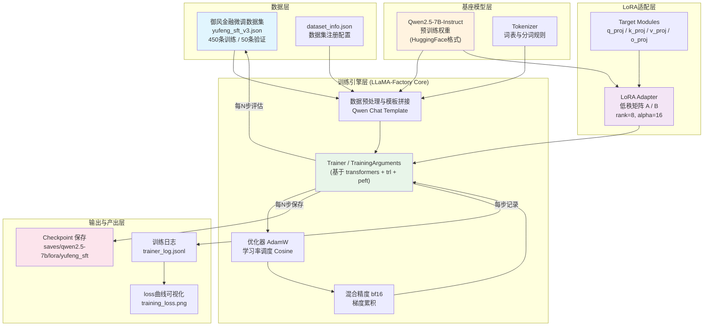
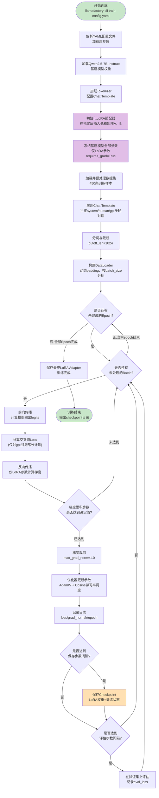
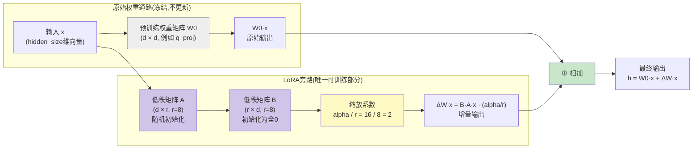

# 第53天:LLaMA-Factory微调实战

**日期**:Day 53 / 70
**阶段**:阶段五 · 模型微调与部署上线
**主角**:陈铭
**导师**:王振宇(老王)
**公司**:蓬远科技
**产品**:苍穹企业级智能体中台
**客户**:御风金融
**技术栈**:LLaMA-Factory · Qwen2.5-7B-Instruct · LoRA · PEFT
**前情**:Day52完成了500条微调数据集的构建、清洗与格式转换
**后续**:Day54将验证微调效果并导出可部署模型

---

## 【旁白】

陈铭到工位的时候,时间是早上八点四十。

昨天晚上他把数据集最后一次跑完清洗脚本,500条御风金融的对话样本,按照ShareGPT格式整理好,存进了`data/yufeng_sft_v3.json`里,心里其实已经在盘算今天的事——今天要真正开始训练了。不是写文档,不是画架构图,不是调数据清洗规则,是真正意义上,让一个模型,在他的数据上,跑起来,学起来。

他给自己泡了杯茶,坐下,把电脑打开,把昨天clone下来但还没装的LLaMA-Factory仓库目录点开看了一眼,忽然有点紧张。这种紧张感他有点熟悉,又有点陌生——熟悉,是因为很像大学时候第一次跑通一个完整的深度学习实验,那种"代码能跑"的紧张;陌生,是因为这一次,跑起来的不是MNIST上一个几万参数的小网络,而是一个70亿参数的、已经具备相当能力的大语言模型,而且跑完之后,这个模型要真的服务御风金融的客户。

老王昨天下班前说了一句话,陈铭记到现在:"微调这事儿,七分在数据,两分在参数,一分在运气。你们数据做扎实了,今天这一分运气,大概率不会差。"

陈铭对着终端,打完第一条安装命令,敲下回车的那一下,忽然想起自己读研的时候,导师说过的一句话:"你什么时候觉得自己懂一个东西了?不是你把论文读明白了,是你亲手把它跑出来了,看见loss往下掉的那一刻。"

他今天就要等这一刻。

上午的重头戏是把环境搭起来——LLaMA-Factory的安装、依赖版本的坑、WebUI的启动和试跑。这些事看起来"基础",但陈铭心里清楚,基础工作从来不简单,尤其是在GPU环境、CUDA版本、Python包版本互相打架的世界里,一个"pip install"就可能卡出半天。他给自己定了个心态:今天不追求完美,追求"跑通"。跑通比什么都重要。

下午才是真正的硬仗——参数怎么配。学习率设多大?epoch跑几轮?batch size怎么定才不会爆显存又不会太慢?LoRA的rank和alpha又是什么关系?这些概念陈铭这几天啃了不少资料,理论上能讲个大概,但真正要落到一个yaml配置文件里、去决定"御风金融这500条数据用什么参数训练"，他心里没有十足的底。

老王的话又浮现出来:"参数这个事,别指望一次就调对。你先按经验值跑一版,看loss曲线,曲线会告诉你哪里错了。"

下午三点四十分,陈铭终于在自己那台配了单卡A800的训练机上,敲下了那一行命令:

```bash
llamafactory-cli train configs/qwen2_5_7b_lora_sft.yaml
```

终端开始刷屏。CUDA初始化,模型权重分片加载,tokenizer初始化,数据集统计,然后是训练开始的提示——

```
***** Running training *****
  Num examples = 450
  Num Epochs = 3
  Instantaneous batch size per device = 4
  Total optimization steps = 84
```

陈铭盯着屏幕,呼吸都放轻了一点。几秒钟后,第一行训练日志跳出来:

```
{'loss': 2.3841, 'grad_norm': 0.8823, 'learning_rate': 9.8e-05, 'epoch': 0.04}
```

他心里咯噔一下——2.38,这是个什么水平?他还没来得及细想,第二行日志又跳了出来:

```
{'loss': 2.1567, 'grad_norm': 0.7912, 'learning_rate': 9.6e-05, 'epoch': 0.07}
```

降了。他又等了几十秒:

```
{'loss': 1.9203, 'grad_norm': 0.6541, 'learning_rate': 9.4e-05, 'epoch': 0.11}
```

还在降。陈铭忍不住笑了一下,那种笑是憋不住的,不是因为这事有多了不起——李明知道,这只是一个入门级的LoRA微调,业界随便一个算法工程师闭着眼睛都能跑——而是因为这是"他的"loss曲线,是他从数据构建、格式转换、参数配置,一步一步走过来,亲手让它跑起来、亲眼看着它往下走的第一次。

他给老王发了条消息,附上一张loss曲线的截图,只写了一句话:"跑起来了,loss在降。"

老王回得很快,只有四个字:"盯紧曲线。"

陈铭确实盯了整整一个下午。他没有干别的事,就是每隔几分钟刷新一次日志,看那个数字一点一点从2.38降到1.6,再降到1.2,中间还有几次小幅的反弹——他一开始紧张地以为是训练出问题了,后来想明白这是mini-batch带来的正常波动,只要长期趋势是下降的,就没问题。

这一天,陈铭没有写出什么惊天动地的代码,他甚至觉得自己今天做的事情,写出来可能就是"装环境、改yaml、跑命令、看图"这几件事。但他心里知道,这一天和之前所有"写文档、画架构图、调prompt"的日子,有着质的不同——今天,他是第一次真正地,亲手,训练了一个模型。这种感觉,他此前在任何一份技术文档里都没读到过,只有真的坐在那台机器前,看着loss往下掉,才会懂。

---

## 晨会纪要

**时间**:2026年X月X日,09:00-09:25
**地点**:蓬远科技3楼小会议室 / 线上会议室同步
**主持人**:王振宇
**参会人**:陈铭、王振宇、算法组小陈(负责底层训练平台支持)、测试组阿雅(线上同步)
**会议主题**:LLaMA-Factory微调环境搭建与Qwen2.5-7B-Instruct首轮LoRA微调启动

**一、昨日进展回顾**

老王:昨天陈铭把御风金融的500条微调数据集收尾了,格式转换、去重、质量抽检都做完了,数据是ShareGPT多轮对话格式,存在`data/yufeng_sft_v3.json`。数据集质量组内抽检过,阿雅那边测试组抽了30条人工复核,没发现明显问题,标签(意图分类、�次判断)基本准确。这一步我认为可以关闭了,今天不再讨论数据集本身的问题,除非训练过程中发现数据有系统性问题再回头看。

陈铭:对,数据集这块我这边确认了,500条里最终保留450条作为训练集,50条作为验证集,按9:1的比例切分。字段格式统一成了`conversations`数组,每条包含`from`(human/gpt)和`value`两个key,符合LLaMA-Factory对ShareGPT格式的要求。

**二、今日目标**

老王:今天的核心目标只有一个——把LLaMA-Factory在训练环境里跑起来，完成对Qwen2.5-7B-Instruct的第一轮LoRA微调,能看到完整的训练日志和loss曲线。具体拆成这么几件事:

1. LLaMA-Factory环境安装,包括Python环境、依赖包、CUDA/PyTorch版本匹配问题的排查。
2. WebUI能启动,用WebUI跑通一次最小化的试训练(哪怕是拿demo数据集跑几步,验证环境没问题)。
3. 针对御风金融的数据集,编写一份完整的训练配置yaml,LoRA参数、学习率、epoch、batch size都要有明确依据,不能瞎填。
4. 用命令行方式启动正式训练,全程监控loss、grad_norm、学习率变化,确认训练稳定不崩。
5. 训练跑完后,产出的LoRA adapter要能正确保存到checkpoint目录,为明天的效果验证和模型导出做准备。

小陈(算法组):训练机这边我已经把环境预先装了一遍,单卡A800 80G,CUDA 12.1,PyTorch 2.3。陈铭你装的时候如果版本冲突,可以参考我这边的`requirements-lock.txt`,应该能省不少排坑的时间。

陈铭:好,谢谢,我等会先按官方文档装一遍,遇到问题再看你那份锁定版本的清单。

**三、风险点讨论**

老王:我提前说几个可能踩坑的地方。第一,显存。Qwen2.5-7B全参数微调显存要求很高,但我们用LoRA,理论上单卡80G应该够,但如果batch size设太大、序列长度设太长,还是可能OOM,今天如果遇到显存溢出,别慌,调小batch size或者开梯度累积就行,这是常规操作。

第二,学习率和epoch的选择,业界经验值是LoRA学习率一般比全参数微调高一个量级,大概在1e-4到2e-4这个区间,epoch数据量小(我们只有450条)的情况下建议3个epoch左右,太多容易过拟合,太少学不到东西。你们今天先按经验值走一版,不用追求一次调到最优,今天的目标是"跑通+看到收敛趋势",不是"调到最好效果"，效果验证是明天的事。

第三,训练过程中一定要盯着loss,不要跑完了才看。如果loss一开始就不降或者震荡剧烈不收敛,大概率是学习率设置有问题或者数据格式有问题,要及时停下来排查,不要傻等训练跑完再复盘,浪费机时。

陈铭:明白,那我今天上午先把环境和WebUI搞定,下午专注在参数配置和跑训练上。

**四、其他事项**

阿雅:测试组这边想提前了解一下,微调完的模型大概什么时候能拿到测试环境,方便我们准备验证用的测试case。

老王:计划是明天(Day54)会做效果验证和模型导出,你们后天应该就能拿到一个可以对话测试的版本,今天先不急,你们可以先把验证用的case set准备好,包括御风金融那批典型的业务问答场景,还有一些边界case和拒答测试,提前准备好,后面直接拿来跑。

老王:好,今天时间紧,不多说了,陈铭有问题随时群里喊我,我这边下午有个客户会,可能不能一直盯着,但重要节点你随时报进度。

会议结束,09:25。

---

## 需求文档

**文档名称**:御风金融专属模型LoRA微调——LLaMA-Factory环境搭建与首轮训练需求说明
**文档版本**:v1.0
**编写人**:陈铭
**审核人**:王振宇
**所属项目**:苍穹企业级智能体中台 · 御风金融专属Agent能力增强
**关联前置文档**:《御风金融微调数据集构建与清洗规范 v3》(Day52产出)

### 一、背景说明

御风金融在使用苍穹中台部署的智能客服Agent过程中,反馈通用基座模型(Qwen2.5-7B-Instruct)在处理金融领域特定术语、内部产品名称(如"御风稳赢""御风增利"等理财产品线)、以及特定业务流程话术(风险等级匹配话术、合规免责声明表述)时,存在表达不够贴合、术语理解偏差、部分场景下拒答不到位等问题。经与御风金融业务方多轮沟通及内部评审,决定基于Qwen2.5-7B-Instruct基座模型,使用LoRA低秩适配技术进行领域微调,在不改变基座模型泛化能力的前提下,增强模型对御风金融专属业务场景的适配能力。

Day52已完成微调数据集的构建工作,产出450条训练样本、50条验证样本,涵盖产品咨询、风险测评话术、合规免责声明生成、多轮追问处理、拒答边界场景五大类。本阶段(Day53)的任务是完成微调训练环境的搭建,并跑通首轮LoRA微调训练,产出可用于后续效果验证的LoRA adapter。

### 二、需求目标

1. **环境目标**:在指定训练机(单卡A800 80G)上完成LLaMA-Factory框架的安装与配置,确保Python依赖、CUDA、PyTorch版本兼容,WebUI能正常启动并可用于快速验证。

2. **训练目标**:基于Qwen2.5-7B-Instruct基座模型,使用LoRA方法,针对Day52构建的450条训练样本完成至少一轮完整的微调训练,训练过程中loss需呈现整体下降趋势,不出现NaN、梯度爆炸、训练崩溃等异常情况。

3. **产出目标**:训练完成后,产出的LoRA adapter权重文件需正确保存至指定checkpoint目录,目录结构清晰,包含训练配置的完整备份(便于复现),同时产出loss曲线可视化图表及训练过程监控记录,作为本轮训练的交付物之一。

4. **文档目标**:整理完整的训练配置文件(yaml)、训练启动脚本、监控脚本,形成可复用的标准化训练流程,为后续其他客户的模型微调工作提供模板参考。

### 三、功能性需求

**3.1 环境安装需求**

- 需安装LLaMA-Factory最新稳定版本(基于git clone方式获取源码并本地安装,而非仅pip安装,以便后续按需修改源码或使用最新特性)。
- 需正确安装匹配当前CUDA版本(12.1)的PyTorch版本,避免因版本不匹配导致的CUDA不可用或算子报错问题。
- 需安装LLaMA-Factory所需的核心依赖包,包括但不限于:transformers、peft、trl、accelerate、deepspeed(可选,单卡场景暂不启用)、bitsandbytes(量化训练场景使用)、gradio(WebUI依赖)。
- 环境安装完成后需通过官方自带的环境检查脚本进行校验,确认GPU可被正确识别,显存容量满足训练需求。

**3.2 WebUI功能需求**

- 需能通过命令行一键启动LLaMA-Factory自带的WebUI(基于Gradio构建),并能通过浏览器正常访问。
- WebUI需支持:模型选择与本地路径配置、数据集选择与预览、训练方法选择(LoRA/全参数/QLoRA等)、超参数配置界面化调整、训练启动与训练日志实时展示。
- 需通过WebUI完成一次最小化验证训练(使用官方demo数据集,少量step),确认环境无误后再切换到正式的御风金融数据集训练。

**3.3 训练配置需求**

- 微调方法采用LoRA,不采用全参数微调(考虑训练成本与过拟合风险,数据量仅450条,全参数微调过拟合风险极高)。
- LoRA相关参数(rank、alpha、dropout、target_modules)需明确配置依据,不能凭感觉设置,需结合模型结构(Qwen2.5的attention层结构)和业界通用经验值综合确定。
- 训练超参数(学习率、epoch数、batch size、梯度累积步数、warmup比例、学习率调度策略)需在配置文件中完整体现,并附带选择依据说明。
- 训练精度采用bf16混合精度训练(A800支持bf16,相比fp16数值稳定性更好)。
- 需配置合理的日志打印频率、模型保存频率、验证集评估频率,便于训练过程监控与后续效果分析。

**3.4 训练执行需求**

- 需通过命令行方式(`llamafactory-cli train`)启动正式训练,而非仅依赖WebUI(WebUI适合快速验证,正式训练建议用命令行+配置文件方式,便于版本管理和复现)。
- 训练全程需保留完整日志,日志需包含每一步的loss、梯度范数(grad_norm)、当前学习率、当前epoch进度等关键指标。
- 训练过程中需实时监控GPU显存占用、GPU利用率,避免因资源问题导致训练中断。
- 训练完成后需自动生成训练指标的日志文件(trainer_log.jsonl或同等格式),供后续可视化分析使用。

**3.5 产出物管理需求**

- LoRA adapter权重需保存至规范化的checkpoint目录,目录命名需包含客户标识(御风金融)、基座模型标识(qwen2.5-7b)、训练日期,便于多次实验的版本管理。
- 训练配置文件(yaml)需与checkpoint一并归档保存,确保任意一次训练结果都可追溯、可复现。
- 需产出loss曲线可视化图表(PNG格式),曲线需清晰展示训练loss随step/epoch的变化趋势,并标注关键节点(如每个epoch结束位置)。

### 四、非功能性需求

1. **性能要求**:单轮训练(450条样本,3个epoch)的总耗时应控制在合理范围内(参考经验,单卡A800、7B模型LoRA微调、450条样本、序列长度1024以内,预计总耗时不超过1小时),超出预期耗时过多需排查是否存在配置不合理的问题(如序列长度设置过大、batch size过小导致的低GPU利用率)。

2. **稳定性要求**:训练过程中不允许出现进程意外退出、显存溢出崩溃、loss出现NaN等情况。若出现异常,需具备完整日志记录以便排查根因,不能"重跑一遍就过了"这种不追根究底的处理方式。

3. **可复现性要求**:同一份配置文件、同一份数据集、固定随机种子(seed)的情况下,重复训练结果(loss曲线走势、最终loss值)应保持基本一致,允许因硬件/CUDA底层实现导致的极小数值波动。

4. **可维护性要求**:训练配置文件需采用清晰的分段注释,便于后续同事在没有陈铭讲解的情况下,也能看懂每个参数的含义和调整方向。

### 五、验收标准

1. LLaMA-Factory环境安装完成,`llamafactory-cli version`命令能正确输出版本信息,WebUI能正常启动并访问。
2. 针对御风金融数据集的LoRA微调训练完整跑完3个epoch,训练日志显示loss整体呈下降趋势(允许mini-batch级别的正常波动,但epoch级别的平均loss需呈单调或近似单调下降)。
3. 训练过程无OOM、无NaN、无进程崩溃,GPU显存占用稳定在合理区间(不超过显卡总显存的90%,预留安全余量)。
4. 产出的LoRA adapter权重文件完整保存,目录结构规范,包含配置文件备份。
5. 产出loss曲线可视化图表,能直观展示训练收敛过程。
6. 交付训练配置文件模板、启动脚本、监控脚本,经老王review确认可复用于后续其他客户的微调场景。

### 六、时间安排

- 上午9:30-12:00:LLaMA-Factory环境安装、依赖排坑、WebUI启动验证。
- 下午13:30-15:30:训练配置文件编写(yaml),参数选择依据梳理与讨论。
- 下午15:30-18:00:正式训练启动、全程监控、异常排查(如有)、训练完成后产出物归档。
- 下午18:00后(如需要):loss曲线可视化脚本编写、今日复盘整理。

### 七、验收人

王振宇(技术负责人),阿雅(测试组,负责后续验证阶段的对接确认)。

---

## 架构设计图

下面这张图是老王让陈铭在动手写配置之前先画出来的——不是给客户看的,是给自己理清楚"这一整套东西到底是怎么串起来的"。陈铭画完之后自己看了两遍,觉得比看十篇博客文章都清楚。



这张图陈铭在群里发出来之后,老王回了一句:"图没问题,但你要能对着这张图,给客户的技术对接人讲清楚'为什么LoRA只加载了一小部分参数,却能改变模型行为',这才算真的懂了。"陈铭想了想,觉得这个问题其实就是整个下午要弄明白的核心问题——基座模型的70亿参数是冻住不动的,真正在学习、在被优化器更新的,只有LoRA那两个低秩矩阵里加起来可能只有几百万到几千万的参数。这也是为什么单卡80G显存能轻松训一个7B模型的原因:显存的大头压力在于存储梯度和优化器状态,而LoRA把这部分压力从70亿参数量级降到了几百万参数量级,直接降了两三个数量级。

---

## 流程图

这张图是陈铭在下午写训练脚本之前,专门梳理的"一次完整LoRA微调训练"从头到尾会经历哪些步骤,他把这张图打印出来贴在了工位旁边的隔板上,训练跑起来之后,每一步日志出来,他都会对照这张图看看当前走到哪一步了。



陈铭画这张流程图的时候,特意把"冻结基座模型参数"和"初始化LoRA适配器"这两步单独标了颜色,因为这是他这几天理解LoRA原理时,觉得最关键、也最容易被忽略的一步——很多人讲LoRA原理,只讲"低秩矩阵怎么分解",却容易忽略"基座模型的参数在训练全程中其实一动不动"这件事的重要性。理解了这一点,才能理解为什么LoRA训练的显存开销小、为什么训练速度快、为什么多个LoRA adapter可以共享同一个基座模型做"热插拔"。

---

## 示意图

这是陈铭画的第三张图,也是他自己觉得最有意思的一张——用来讲清楚LoRA的低秩矩阵到底是"插"在原模型权重的什么位置、以什么方式生效的。老王看完这张图之后说了一句:"这张图,你要是能背下来自己画出来,说明你是真懂了,不是背了个名词。"



这张图配合他自己的理解,陈铭在笔记里补了一段"人话版"解释:原始的权重矩阵W0,维度是d×d(比如Qwen2.5-7B的hidden size是3584,那q_proj这类矩阵可能就是3584×3584这个量级,一个矩阵就有一千多万参数),这一部分在LoRA训练中整个冻住不动,一个数字都不改。真正在训练中变化的,是旁边新加的两个小矩阵——矩阵A是d×r,矩阵B是r×d,这里的r就是"rank"(秩),陈铭这次配的是8,这么一算,A矩阵是3584×8,B矩阵是8×3584,两个加起来一共不到6万参数,比原来的一千多万参数少了将近200倍。B矩阵在训练开始的时候被初始化为全0,这样保证了训练刚开始的时候,LoRA这条旁路的输出是0,模型的行为和没加LoRA之前完全一样,不会因为LoRA的引入而在训练最初就把模型带偏,这是一个很巧妙的设计。随着训练推进,A和B矩阵被优化器一点点更新,ΔW=B·A(再乘上alpha/r这个缩放系数)这个增量就会越来越有意义,最终让模型在保持原有能力的基础上,学会御风金融这批数据里体现出的领域知识和表达习惯。

---

## 课堂笔记

### 上午:LLaMA-Factory安装配置 + WebUI使用

**1. 为什么选择LLaMA-Factory**

陈铭在正式动手之前,先花了半小时把选型的理由过了一遍,这不是他自己拍脑袋决定的,是老王前几天在选型评审会上定的,但陈铭觉得有必要自己把理由理清楚,不能只是"老王说用这个我就用这个"。

LLaMA-Factory是目前开源社区里对国产大模型(尤其是Qwen系列、ChatGLM系列、Baichuan系列)支持最完善的微调框架之一,它把从数据处理、模型加载、多种微调方法(全参数、LoRA、QLoRA、冻结微调等)、多种训练目标(SFT、预训练、奖励模型训练、PPO、DPO、KTO等)、推理部署、模型导出,几乎全流程都集成在一个框架里,而且提供了WebUI,不需要写一行代码就能跑通一次完整的训练。

对于蓬远科技这种要给多个客户(不只是御风金融,后续可能还有其他行业客户)做模型微调的场景来说,选一个高度工程化、维护活跃、社区生态好的框架,比自己从零基于transformers手写训练脚本要划算得多——自己写固然更灵活,但维护成本、踩坑成本都会指数级上升,而LLaMA-Factory已经把大部分坑填过了。

老王补充过一句原话,陈铭记在笔记里:"我们不是在做算法研究,我们是在做工程交付。工具选型的第一原则永远是'够用、稳定、社区活跃',不是'最先进、最灵活'。"

**2. 环境准备与安装步骤**

陈铭在训练机上按下面的顺序操作(具体命令在下面代码实战部分有完整脚本,这里记录的是关键的操作逻辑和踩坑点):

第一步,确认GPU驱动和CUDA版本。用`nvidia-smi`确认驱动版本和CUDA版本(训练机是CUDA 12.1),这一步很关键,因为后面装PyTorch要严格匹配这个CUDA版本,否则会出现"torch.cuda.is_available()返回False"这种典型的环境问题。

第二步,创建独立的Python虚拟环境。陈铭用的是conda创建了一个名为`llama_factory`的虚拟环境,Python版本选了3.10(LLaMA-Factory官方推荐3.9-3.11这个区间,他选了社区反馈最稳的3.10)。独立环境的意义在于,避免和系统已有的其他项目环境产生依赖冲突——公司这台训练机上还跑着其他项目的推理服务,如果装到系统全局环境里,一旦升级了某个包的版本,很可能把别的服务搞挂,这是运维大忌。

第三步,通过git clone获取LLaMA-Factory源码,而不是直接pip install。老王特意强调了这一点:"用源码装,不用直接pip装发行版。"原因是LLaMA-Factory更新非常频繁,pip上的发行版本可能落后于最新的功能和bug修复,尤其是对Qwen2.5这种相对较新的模型的支持,可能源码里已经修复了一些问题,但pip版本还没发布。用源码装的方式是`pip install -e ".[torch,metrics]"`,这种可编辑安装(-e)的好处是,如果之后需要改源码里的某个小bug或者加一点自定义逻辑,直接改源码文件就生效,不需要重新安装。

第四步,单独确认PyTorch版本与CUDA匹配。陈铭没有让pip自动帮忙装PyTorch(担心版本装错),而是先去PyTorch官网查了对应CUDA 12.1的安装命令,手动装好PyTorch 2.3.0之后,再执行LLaMA-Factory的依赖安装,这样可以避免依赖解析工具把PyTorch版本装错的问题。

第五步,安装完成后跑官方自带的环境检查。LLaMA-Factory提供了一个校验脚本,可以打印出当前环境的PyTorch版本、CUDA是否可用、GPU数量和型号、bitsandbytes是否可用等信息,这一步陈铭觉得非常有必要,相当于是"装完之后的体检",能在真正开始训练之前就发现潜在的环境问题,而不是等训练跑到一半才炸。

**踩坑记录**:陈铭第一次装的时候,忽略了先手动装PyTorch这一步,直接跑了依赖安装命令,结果pip自动给他解析安装了一个CPU版本的PyTorch(因为依赖解析工具默认拉取的是不带CUDA后缀的通用版本),导致`torch.cuda.is_available()`返回False,查了半天才发现问题所在。这个坑他专门记在了笔记本上,提醒自己以后凡是涉及PyTorch环境搭建,一定要先手动确认CUDA版本对应的PyTorch安装命令,不要偷懒交给自动依赖解析。

**3. WebUI的使用**

装完环境之后,陈铭没有直接上手写yaml配置正式训练,而是先按老王的建议,用WebUI跑了一次最小化的验证——用LLaMA-Factory自带的demo数据集(alpaca_zh_demo这种小规模的中文demo数据集),跑几十个step,确认整个链路没问题,再切到正式的御风金融数据集。

WebUI通过命令`llamafactory-cli webui`启动,启动后会在本地起一个Gradio服务,默认监听7860端口,陈铭在训练机上启动之后,通过SSH端口转发(或者内网直接访问机器IP+端口)在自己的浏览器里打开了这个界面。

WebUI的界面陈铭简单记了一下模块划分:

- 顶部是模型配置区,可以选择模型名称(会自动匹配HuggingFace的模型ID或本地路径)、模型路径、微调方式(LoRA/Full/Freeze等)、量化方式(是否使用4bit/8bit量化,QLoRA场景才需要)。
- 中间是训练配置区,分了好几个Tab:Train(训练参数配置)、Evaluate & Predict(评估与预测)、Chat(直接在界面里和当前加载的模型对话,微调完也能在这里试效果)、Export(模型导出合并)。
- Train这个Tab下面,又细分了数据集选择、学习率、epoch数、batch size、LoRA rank/alpha/dropout等一系列参数的可视化配置项,每个参数旁边基本都有简短的说明气泡。
- 底部是"开始训练"按钮,点击后下方会实时显示训练日志和一张自动绘制的loss曲线图,这一点陈铭觉得对新手特别友好,不需要自己写可视化脚本就能看到实时曲线。

陈铭用WebUI跑demo数据集的时候,专门把参数设得很小(epoch=1,只跑了几十个step),目的不是训练出什么效果,纯粹是验证"环境能跑通",大概两三分钟就跑完了,loss从demo数据一开始的3点几降到了2点几,虽然没什么实际意义,但这一次小小的"跑通"给了陈铭很大的信心——至少证明环境、模型加载、数据处理这些环节都没问题,下午可以放心地上正式数据集了。

**4. WebUI与命令行的取舍**

陈铭把这个问题也记在了笔记里,是他今天上午想明白的一个点:WebUI适合什么场景,命令行+配置文件适合什么场景?

WebUI的优势是可视化、易上手、参数调整直观、能实时看到训练曲线和Chat试效果,非常适合前期探索阶段——比如今天上午这种"先验证环境通不通"的场景,或者是给不熟悉命令行的同事做演示、做快速实验。

但WebUI也有局限:配置无法很好地版本化管理(虽然WebUI也支持保存/加载参数配置,但终归不如一份规范的yaml文件配合git做版本管理来得清晰),而且长时间训练如果浏览器断连或者机器重启,WebUI进程容易受影响,不如用`nohup`或者`tmux`配合命令行脚本跑更稳妥,尤其是要跑几个小时甚至更长时间的训练任务。

所以陈铭今天定的策略是:上午用WebUI做环境验证,下午写好正式的yaml配置文件之后,用命令行方式(`llamafactory-cli train config.yaml`)启动御风金融数据集的正式训练,这样既保证了环境验证的直观高效,又保证了正式训练的规范性和可复现性,配置文件可以直接提交到git仓库里做版本管理,这是老王特别看重的一点——"所有正式训练的配置,必须能在git里追溯到,不能只存在于某个人电脑上的一次WebUI点击记录里"。

**5. 数据集注册**

上午的最后一件事,是把御风金融的数据集正式注册进LLaMA-Factory的数据集配置文件`dataset_info.json`里。LLaMA-Factory要求所有参与训练的数据集必须先在这个配置文件里注册,注册内容包括数据集文件路径、数据格式类型(alpaca格式还是sharegpt格式)、字段映射关系等。

陈铭这边用的是sharegpt格式(因为Day52的数据集里包含多轮对话,alpaca格式更适合单轮指令-回复场景,sharegpt格式对多轮对话的支持更自然),注册的时候要指定`conversations`字段名、角色标签(human/gpt对应的显示名称)、以及是否有system prompt字段。这一步看起来简单,但陈铭第一次注册的时候因为字段名和实际数据文件里的key名没对上(数据文件里用的是`from`/`value`,但配置文件里默认期望的key名可能不同,需要显式指定映射关系),导致数据加载报错,花了十几分钟排查才发现是这个问题。

上午的工作到12点差不多告一段落,陈铭把环境安装、WebUI验证、数据集注册这几件事都过了一遍,吃饭的时候心里已经开始琢磨下午参数配置的事情了。

### 下午:LoRA微调参数详解 + 跑通训练流程

**1. 学习率(learning_rate)**

下午一开始,陈铭和老王简单对了一下参数的思路(老王中午抽空过来看了一眼),然后陈铭自己开始梳理每个参数的选择依据,准备写进今天的配置文件里。

学习率是陈铭觉得最需要谨慎对待的一个参数。他查阅的资料和业界经验大致是这样:全参数微调场景下,学习率通常设置得比较小,常见范围在1e-5到5e-5这个量级,因为要更新的是全部模型参数,稍大的学习率很容易把预训练学到的知识"冲掉",导致灾难性遗忘。而LoRA微调因为只更新新增的低秩矩阵参数,这部分参数是从头(或接近从头,B矩阵初始化为0)开始学习的,相当于是在一个"新的、小的"参数空间里做优化,所以可以承受比全参数微调更大的学习率,常见经验值在1e-4到2e-4这个区间,比全参数微调大了一个数量级左右。

陈铭这次给御风金融的训练配置里,最终定的学习率是2e-4。他给自己的理由是:数据量不算大(450条),需要模型能相对快一点地吃进这批领域知识,同时LoRA的参数量本身就小,过拟合的"代价"没有全参数微调那么可怕(基座能力被完整保留),所以可以适当选偏大一点的学习率,配合较少的epoch数(3轮),争取又快又稳地收敛。

老王补充了一个经验判断的方法:"学习率合不合适,你看loss曲线就知道。如果loss一开始就剧烈震荡、忽高忽低不收敛,大概率学习率太大;如果loss几乎不动,那可能学习率太小,或者是别的问题(比如数据有问题、LoRA没生效)。你今天跑的时候多留意这个信号。"

**2. Epoch数**

Epoch数决定了整个数据集会被完整过几遍。陈铭这次数据量只有450条训练样本,他和老王讨论后达成的共识是:数据量小的场景下,epoch数不宜过多,过多会导致模型对这450条样本"死记硬背",丧失泛化能力(也就是常说的过拟合)——模型可能会对训练集里出现过的问题回答得又快又准,但换一个稍微变化的问法就答不好,这在实际业务场景里是致命的,因为客户真实提问不会跟训练数据一字不差。

业界经验对于几百到几千条量级的小数据集微调,epoch数一般建议在3到5轮之间,视具体效果调整。陈铭这次先按3轮跑,理由是:第一次训练,先保守一点,跑完看效果和loss曲线,如果发现模型明显欠拟合(loss降得不够、效果验证时模型对训练集里的典型问题都答不好),明天(效果验证阶段)可以考虑重新跑一版加到5轮;但如果一开始就跑5轮甚至更多,一旦过拟合了,今天的训练成本就白白浪费了,不如先保守试探。

**3. Batch Size与梯度累积**

这一部分陈铭花了不少时间理解,因为这里牵扯到显存和训练效率的权衡。

`per_device_train_batch_size`是每个GPU设备上,单次前向传播实际处理的样本数。这个值设得越大,GPU利用率理论上越高(并行计算的样本更多),但显存占用也越大,容易OOM。陈铭这台机器是单卡A800 80G,7B模型LoRA微调,他先尝试设了`per_device_train_batch_size=4`,配合序列长度cutoff_len=1024,显存占用大概在40G左右(留了不少余量,因为这台机器后续可能还要跑其他实验,不想把显存占满)。

但"有效批大小"(effective batch size,也就是每次真正做一次梯度更新所对应的样本数)如果只有4,对于450条数据来说,每个epoch只有约112个真实梯度更新步数(450/4≈112,当然实际会因为最后一个batch不满而略有出入),陈铭觉得这个有效批大小偏小,更新噪声可能比较大,所以引入了梯度累积(`gradient_accumulation_steps`)机制——设置梯度累积步数为4,意味着模型会连续做4次前向+反向传播,把梯度累加起来,累积够4次之后才做一次真正的参数更新。这样"有效批大小"就变成了4(per_device_batch_size)× 4(累积步数)× 1(GPU数量,单卡场景)=16,相当于模拟了一个更大批次的训练效果,同时显存占用还是按per_device_batch_size=4来计算的,不会因为累积而增加显存压力(只是训练时间会相应变长,因为要多做几次前向反向才更新一次参数)。

陈铭把这个逻辑理解为:"梯度累积是用时间换空间——用更多次的小批次计算时间,换来和大批次等效的梯度更新效果,同时不需要更大的显存。"这个理解他专门跟老王确认过,老王说这个理解是对的,而且补充了一点:"实际场景中,如果显存够用,直接调大per_device_batch_size永远比用梯度累积更快(因为GPU并行计算的效率更高),梯度累积是显存不够时的折中方案,不是首选方案。你们这次显存够用,可以适当调大batch size,梯度累积步数可以设小一点甚至不用。"陈铭听完把梯度累积步数从原计划的8调小到了4,同时把per_device_batch_size从2调大到了4,兼顾了显存余量和训练效率。

**4. LoRA Rank(秩)**

LoRA rank(通常写作r)决定了低秩矩阵的维度,直接影响新增可训练参数的数量。r越大,LoRA能表达的"增量变化"的复杂度就越高(理论上拟合能力更强),但对应的可训练参数也越多,训练成本和过拟合风险也相应上升;r越小,参数量越小,训练更快、更省显存,但如果领域知识差异较大、任务较复杂,r太小可能表达能力不够,学不到足够的东西。

业界常见经验值,r在4到64这个区间比较常见,大部分中小规模的领域微调任务,r=8或r=16是一个比较均衡的默认选择。陈铭这次给御风金融的场景选的是r=8——他的判断依据是:这次的微调目标偏"风格适配+领域术语学习"(让模型说话更像御风金融的客服话术,记住产品名称和合规表述),不是要模型学会一种全新的复杂推理能力,任务复杂度中等,r=8应该够用。如果明天验证效果发现模型学得不够(比如产品名称记不住、术语用错),可以再考虑加大r重新训练。

**5. LoRA Alpha**

alpha是配合rank一起决定LoRA增量输出缩放程度的参数,实际生效的缩放系数是alpha/r(前面示意图里画的那个"Scale"节点)。alpha设得越大,LoRA旁路对最终输出的影响权重就越大;alpha设得越小,LoRA旁路的影响就越弱,模型行为更接近原始基座模型。

业界一个常见的经验做法是让alpha等于2倍的rank,也就是alpha/r=2这个缩放系数,陈铭这次也是照着这个经验值配的:r=8,alpha=16,缩放系数正好是2(这也是前面示意图里那个"alpha/r=16/8=2"的来源)。陈铭对这个经验值的理解是:这个缩放系数不是越大越好也不是越小越好,它本质上是在"保留基座模型原有能力"和"充分吸收新数据里的领域知识"之间做一个平衡,2这个值是社区里跑了大量实验后总结出来的一个相对稳健、不容易出问题的默认选择,自己没有充分实验依据的情况下,先用这个经验值是合理的起点。

**6. LoRA Dropout与Target Modules**

`lora_dropout`是LoRA矩阵训练过程中的dropout比例,起到一定的正则化作用,防止过拟合,陈铭设置的是0.05,这也是一个常见的经验值,数据量小、担心过拟合的场景下,加一点dropout是合理的保守做法。

`target_modules`决定LoRA低秩矩阵插入到模型的哪些层。Qwen2.5这类基于Transformer的模型,每一层attention模块通常包含q_proj、k_proj、v_proj、o_proj这几个线性投影层,LLaMA-Factory里可以直接用`all`让LoRA作用到所有支持的线性层,也可以精确指定只作用在attention模块的这几个投影层。陈铭这次用的是LLaMA-Factory提供的便捷配置`lora_target: all`,这样会自动识别并作用到模型里所有适合插入LoRA的线性层(不仅是attention部分,也包括MLP部分的up_proj/down_proj/gate_proj等),这是目前社区比较推荐的默认做法,相比只加在attention部分,覆盖更全面的target_modules通常能获得更好的微调效果,而参数量增加得也不算特别多(相对于base model 70亿参数而言依然是很小的比例)。

**7. 学习率调度策略与Warmup**

陈铭配置的学习率调度策略是cosine(余弦退火),这是目前深度学习训练里非常主流的调度方式——学习率从设定的峰值(2e-4)开始,按余弦函数的形状逐渐衰减到接近0,相比阶梯式衰减或者恒定学习率,cosine调度在训练后期能让模型的更新幅度逐渐变小,有助于让模型更稳定地收敛到一个较优的点,而不是在接近最优解附近来回震荡。

warmup(学习率预热)也是陈铭配置里专门加的一项,`warmup_ratio`设置为0.1,意味着在训练总步数的前10%里,学习率会从0线性增长到设定的峰值学习率,之后再进入cosine衰减阶段。Warmup的意义在于,训练刚开始的时候,模型参数(这里特指LoRA的A矩阵)是刚初始化的状态,如果一开始就用较大的学习率进行更新,梯度方向可能不太准确,容易导致训练初期的不稳定甚至震荡,通过一个平缓的预热过程,让模型先"热身"适应,再进入正常的学习节奏,是目前几乎所有主流训练配置里的标准做法。

**8. 混合精度训练**

`bf16: true`,陈铭配置了bf16混合精度训练。这里他专门查了一下bf16和fp16的区别,记在了笔记里:两者都是16位浮点数格式,用来在训练中降低显存占用、提升计算速度(相比32位浮点数fp32),但bf16的指数位比fp16多、尾数位比fp16少,这意味着bf16的数值表示范围更大(不容易出现数值溢出/下溢的问题),但精度略低于fp16。在大模型训练场景下,bf16因为数值范围更大,训练稳定性通常优于fp16(fp16场景下经常需要配合loss scaling技巧来避免梯度下溢的问题,而bf16基本不需要),现代GPU(A800、A100、H100等安培及以后架构)基本都对bf16有原生硬件支持,计算效率也不差,所以目前业界大模型训练基本都首选bf16而不是fp16,这也是陈铭这次直接选择bf16、没有纠结的原因。

**9. 上机实操,跑通训练**

参数梳理清楚之后,陈铭把这些参数一项一项填进yaml配置文件(完整内容见下面代码实战部分),然后在训练机上用tmux开了一个新的会话窗口(防止SSH断连导致训练进程被杀掉),敲下了训练命令。

前面【旁白】里已经写过那一刻的心情,这里课堂笔记里陈铭更多记录的是"看到日志之后应该关注什么、怎么判断训练是否正常"这件事的方法论,他把这总结成了几条自己以后能复用的检查清单:

第一,看初始loss的量级是否合理。对于一个已经具备指令遵循能力的Instruct模型,在一个不算特别陌生的领域(金融客服问答,不是什么冷门专业领域)上做微调,初始loss(第一个step附近)一般会在2到3这个量级(这个量级和具体任务、数据难度、模型本身有关,不是绝对标准,但可以作为一个粗略的参考区间),如果初始loss远超这个范围(比如一开始就是8、9甚至更高),往往说明数据格式或者模板拼接的地方存在问题(比如没有正确应用chat template,或者label的mask位置算错了),需要停下来排查,不要一直等着看会不会降下来。陈铭这次跑出来的初始loss在2.3左右,属于符合预期的正常范围。

第二,看loss在前几十个step内是否有明显的下降趋势。如果几十个step过去loss完全没有变化(几乎是一条水平线),很可能是学习率设得过小,或者是LoRA没有真的生效(比如target_modules配错了、可训练参数数量是0),需要检查。陈铭这边前20个step左右loss就从2.3多降到了1.9左右,趋势明确。

第三,看grad_norm(梯度范数)是否稳定。如果grad_norm出现忽然爆炸式增长(比如从0.5突然跳到几十甚至上百),往往意味着训练不稳定,可能是学习率过大或者数据里有异常样本(比如某条数据文本特别长或者存在编码问题)导致的极端梯度,这种情况下配置的梯度裁剪(`max_grad_norm=1.0`)会起到保护作用,把过大的梯度裁剪到设定的范数以内,防止参数更新出现灾难性的跳变。陈铭这次全程观察,grad_norm基本稳定在0.5到1.2这个区间波动,没有出现异常尖峰。

第四,留意显存占用和GPU利用率。陈铭在另一个终端窗口里用`watch -n 1 nvidia-smi`(具体脚本见代码实战部分)实时盯着显存占用,整个训练过程中显存稳定在45G左右(80G显卡,余量还很充足),GPU利用率大部分时间在85%-95%之间,说明训练效率还不错,没有出现明显的数据加载瓶颈或者batch size设置过小导致GPU"喂不饱"的问题。

跑完一整个下午,当训练最终完成、日志打出"Training completed"的时候,陈铭长舒了一口气。整个训练总耗时大概40分钟出头,和上午需求文档里预估的"不超过1小时"基本吻合。他把最终的checkpoint目录、训练日志、配置文件都仔细核对了一遍,确认完整无误,然后才开始写今天的loss曲线可视化脚本和监控脚本的整理工作。

---

## 代码实战

今天的代码实战部分,陈铭整理了四块内容:训练配置yaml文件的完整版本、命令行启动训练的脚本(包括环境安装脚本)、loss曲线可视化脚本、训练过程实时监控脚本。这些脚本他都提交到了项目仓库里的`training/day53/`目录下,方便以后复用。

### 一、环境安装脚本

```bash
#!/usr/bin/env bash
# =============================================================
# 文件名: setup_llamafactory_env.sh
# 说明:   LLaMA-Factory 训练环境安装脚本
# 适用:   Ubuntu 22.04 + 单卡/多卡 NVIDIA GPU + CUDA 12.1
# 作者:   陈铭
# 日期:   Day53
# =============================================================

set -euo pipefail

echo "===================================================="
echo "  Step 0: 检查GPU与CUDA环境"
echo "===================================================="
nvidia-smi
echo ""
echo "当前nvcc版本(若未安装nvcc可忽略,不影响PyTorch运行):"
nvcc --version || echo "未检测到nvcc,跳过(不影响后续流程)"

echo ""
echo "===================================================="
echo "  Step 1: 创建独立conda虚拟环境"
echo "===================================================="
ENV_NAME="llama_factory"
PYTHON_VERSION="3.10"

if conda env list | grep -q "${ENV_NAME}"; then
    echo "检测到已存在环境 ${ENV_NAME},跳过创建步骤。"
else
    conda create -y -n "${ENV_NAME}" python="${PYTHON_VERSION}"
    echo "环境 ${ENV_NAME} 创建完成。"
fi

# 激活环境(在脚本中激活conda环境需要source conda的初始化脚本)
source "$(conda info --base)/etc/profile.d/conda.sh"
conda activate "${ENV_NAME}"

echo "当前Python版本:"
python --version

echo ""
echo "===================================================="
echo "  Step 2: 手动安装匹配CUDA 12.1的PyTorch"
echo "===================================================="
# 重要:一定要手动指定CUDA版本对应的安装源,不要让依赖解析工具自动选择,
# 否则容易装成CPU版本或版本不匹配的PyTorch,导致CUDA不可用。
pip install torch==2.3.0 torchvision==0.18.0 torchaudio==2.3.0 \
    --index-url https://download.pytorch.org/whl/cu121

echo "验证PyTorch与CUDA是否匹配:"
python -c "import torch; print('torch version:', torch.__version__); print('cuda available:', torch.cuda.is_available()); print('cuda version:', torch.version.cuda); print('gpu count:', torch.cuda.device_count())"

echo ""
echo "===================================================="
echo "  Step 3: 克隆LLaMA-Factory源码"
echo "===================================================="
WORKDIR="$HOME/workspace"
mkdir -p "${WORKDIR}"
cd "${WORKDIR}"

if [ -d "LLaMA-Factory" ]; then
    echo "检测到已存在LLaMA-Factory目录,拉取最新代码..."
    cd LLaMA-Factory
    git pull
else
    git clone https://github.com/hiyouga/LLaMA-Factory.git
    cd LLaMA-Factory
fi

echo "当前LLaMA-Factory代码版本(commit):"
git log -1 --oneline

echo ""
echo "===================================================="
echo "  Step 4: 可编辑模式安装LLaMA-Factory及其依赖"
echo "===================================================="
pip install -e ".[torch,metrics]"

echo ""
echo "===================================================="
echo "  Step 5: 安装其他辅助依赖(可视化、监控相关)"
echo "===================================================="
pip install matplotlib pandas seaborn gpustat tensorboard

echo ""
echo "===================================================="
echo "  Step 6: 环境自检"
echo "===================================================="
llamafactory-cli version

python -c "
import torch
import transformers
import peft
import trl
import accelerate

print('----- 环境自检报告 -----')
print(f'PyTorch版本      : {torch.__version__}')
print(f'CUDA是否可用      : {torch.cuda.is_available()}')
print(f'CUDA版本         : {torch.version.cuda}')
print(f'GPU数量          : {torch.cuda.device_count()}')
for i in range(torch.cuda.device_count()):
    props = torch.cuda.get_device_properties(i)
    total_mem_gb = props.total_memory / (1024 ** 3)
    print(f'  GPU[{i}]: {props.name}, 显存: {total_mem_gb:.1f} GB')
print(f'transformers版本  : {transformers.__version__}')
print(f'peft版本         : {peft.__version__}')
print(f'trl版本          : {trl.__version__}')
print(f'accelerate版本    : {accelerate.__version__}')
print('----- 环境检查完成 -----')
"

echo ""
echo "===================================================="
echo "  环境搭建完成!"
echo "  激活环境命令: conda activate ${ENV_NAME}"
echo "  启动WebUI命令: llamafactory-cli webui"
echo "===================================================="
```

### 二、WebUI启动与最小化验证脚本

```bash
#!/usr/bin/env bash
# =============================================================
# 文件名: launch_webui_and_smoke_test.sh
# 说明:   启动LLaMA-Factory WebUI,并用demo数据集做最小化验证
# 作者:   陈铭
# =============================================================

set -euo pipefail

source "$(conda info --base)/etc/profile.d/conda.sh"
conda activate llama_factory

cd "$HOME/workspace/LLaMA-Factory"

echo "===================================================="
echo "  方式一: 启动WebUI(交互式,适合前期探索验证)"
echo "  访问地址: http://<训练机IP>:7860"
echo "===================================================="
echo "如需启动WebUI,取消下面一行的注释后单独执行:"
echo "GRADIO_SERVER_PORT=7860 llamafactory-cli webui"

echo ""
echo "===================================================="
echo "  方式二: 命令行最小化验证(用demo数据集跑几步)"
echo "  目的: 验证环境、模型加载、数据处理链路无误"
echo "===================================================="

cat > /tmp/smoke_test_config.yaml << 'EOF'
### smoke_test_config.yaml
### 最小化验证配置,仅用于确认环境跑通,不用于正式训练

model_name_or_path: Qwen/Qwen2.5-7B-Instruct
trust_remote_code: true

stage: sft
do_train: true
finetuning_type: lora
lora_target: all
lora_rank: 4
lora_alpha: 8

dataset: alpaca_zh_demo
template: qwen
cutoff_len: 512
max_samples: 50
overwrite_cache: true
preprocessing_num_workers: 4

output_dir: /tmp/smoke_test_output
overwrite_output_dir: true
logging_steps: 1
save_steps: 1000
plot_loss: true

per_device_train_batch_size: 2
gradient_accumulation_steps: 1
learning_rate: 1.0e-4
num_train_epochs: 1
max_steps: 10
lr_scheduler_type: cosine
warmup_ratio: 0.1
bf16: true
EOF

echo "开始最小化验证训练(仅10个step,预计1-2分钟内完成)..."
llamafactory-cli train /tmp/smoke_test_config.yaml

echo ""
echo "===================================================="
echo "  验证完成检查"
echo "===================================================="
if [ -d "/tmp/smoke_test_output" ]; then
    echo "输出目录已生成: /tmp/smoke_test_output"
    ls -la /tmp/smoke_test_output
    echo ""
    echo "环境验证通过,可以切换到正式的御风金融数据集进行训练。"
else
    echo "警告: 未检测到输出目录,请检查上方日志排查问题。"
    exit 1
fi
```

### 三、数据集注册配置(dataset_info.json片段)

在正式训练之前,陈铭把御风金融的数据集注册进了`LLaMA-Factory/data/dataset_info.json`,下面是他新增的注册片段(完整文件里还有官方自带的其他demo数据集条目,这里只展示新增部分):

```json
{
  "yufeng_sft_v3": {
    "file_name": "yufeng_sft_v3.json",
    "formatting": "sharegpt",
    "columns": {
      "messages": "conversations",
      "system": "system"
    },
    "tags": {
      "role_tag": "from",
      "content_tag": "value",
      "user_tag": "human",
      "assistant_tag": "gpt"
    }
  },
  "yufeng_sft_v3_eval": {
    "file_name": "yufeng_sft_v3_eval.json",
    "formatting": "sharegpt",
    "columns": {
      "messages": "conversations",
      "system": "system"
    },
    "tags": {
      "role_tag": "from",
      "content_tag": "value",
      "user_tag": "human",
      "assistant_tag": "gpt"
    }
  }
}
```

数据文件`yufeng_sft_v3.json`长这样(展示其中1条样例,完整450条实际存放在`LLaMA-Factory/data/`目录下):

```json
[
  {
    "system": "你是御风金融的智能客服助手,需要用专业、礼貌、合规的语气回答客户关于理财产品的咨询,涉及风险提示时必须给出完整的合规免责声明。",
    "conversations": [
      {
        "from": "human",
        "value": "你们的御风稳赢这个产品风险大不大?我是稳健型投资者。"
      },
      {
        "from": "gpt",
        "value": "您好,感谢您的咨询。御风稳赢是我行风险等级为R2(中低风险)的理财产品,主要投资于债券及货币市场工具,历史业绩相对稳健,较适合稳健型及以上风险承受能力的投资者。不过需要提醒您,理财产品不同于存款,存在本金及收益波动的可能,过往业绩不代表未来表现,具体请以产品说明书及风险揭示书为准。建议您在购买前完成最新的风险测评,确认产品风险等级与您的风险承受能力相匹配后再进行申购。"
      },
      {
        "from": "human",
        "value": "那如果我想买,流程是怎样的?"
      },
      {
        "from": "gpt",
        "value": "购买流程如下:1)在您完成风险测评且测评结果为稳健型及以上的前提下,可在手机银行'理财'频道搜索'御风稳赢'进入产品详情页;2)仔细阅读产品说明书、风险揭示书及销售协议;3)确认购买金额(该产品起购金额为1元,支持分次追加);4)完成电子签约及风险确认书签署后即可提交申购。申购成功后份额确认以产品说明书约定的确认规则为准,如有任何疑问,也可以随时联系我们的人工客服进一步协助。"
      }
    ]
  }
]
```

### 四、正式训练配置文件(完整版 qwen2_5_7b_lora_sft.yaml)

这是陈铭今天写的核心产出——针对御风金融数据集的完整LoRA微调配置文件,每个参数都带了注释,方便日后自己或同事回头看的时候能明白当时为什么这么配。

```yaml
# =====================================================================
# 文件名: qwen2_5_7b_lora_sft.yaml
# 说明:   御风金融专属模型 LoRA 微调训练配置
# 基座模型: Qwen2.5-7B-Instruct
# 数据集:   yufeng_sft_v3 (450条训练样本)
# 编写人:   陈铭
# 审核人:   王振宇
# 日期:     Day53
# =====================================================================

# ---------------------------------------------------------------------
# 一、模型相关配置
# ---------------------------------------------------------------------
model_name_or_path: Qwen/Qwen2.5-7B-Instruct
# 说明: 若已提前下载到本地,可替换为本地绝对路径,如:
# model_name_or_path: /data/models/Qwen2.5-7B-Instruct
trust_remote_code: true
# 说明: Qwen系列模型部分自定义结构依赖trust_remote_code,必须开启

# ---------------------------------------------------------------------
# 二、微调方法配置
# ---------------------------------------------------------------------
stage: sft
# 说明: 训练阶段选择sft(有监督微调),而非pt(预训练)/rm(奖励模型)/ppo/dpo/kto
do_train: true

finetuning_type: lora
# 说明: 采用LoRA低秩适配微调,而非全参数微调(full)或冻结微调(freeze)。
#       理由: 数据量小(450条),全参数微调过拟合风险极高且训练/存储成本大,
#       LoRA能在保留基座模型泛化能力的前提下高效注入领域知识。

lora_rank: 8
# 说明: LoRA低秩矩阵的秩(r)。
#       经验值参考: 4~64区间常见,中小规模领域适配任务用8~16较均衡。
#       本次任务偏"风格适配+术语学习",复杂度中等,选择r=8。

lora_alpha: 16
# 说明: LoRA缩放系数分子,实际生效缩放系数为 alpha / rank = 16 / 8 = 2。
#       经验值参考: alpha = 2 * rank 是社区验证过的稳健默认选择。

lora_dropout: 0.05
# 说明: LoRA矩阵训练时的dropout比例,起正则化作用,降低过拟合风险。
#       数据量小的场景建议保留一定dropout,0.05是常见保守取值。

lora_target: all
# 说明: LoRA插入到模型所有支持的线性层(attention的q/k/v/o_proj,
#       以及MLP的gate/up/down_proj),覆盖更全面,效果通常优于只加
#       在attention部分,参数量增加也很有限。

# ---------------------------------------------------------------------
# 三、数据集配置
# ---------------------------------------------------------------------
dataset: yufeng_sft_v3
# 说明: 对应data/dataset_info.json中注册的训练集条目

eval_dataset: yufeng_sft_v3_eval
# 说明: 对应验证集条目,共50条,用于训练过程中的定期评估

template: qwen
# 说明: 使用Qwen系列专属对话模板,确保system/human/gpt多轮对话
#       按照Qwen2.5-Instruct预期的chat template格式正确拼接,
#       否则模型在推理时可能无法正确识别对话边界。

cutoff_len: 1024
# 说明: 单条样本(含多轮对话拼接后)最大token长度,超出部分截断。
#       抽样检查了450条训练数据的token长度分布,99%分位数在
#       900左右,1024足够覆盖绝大多数样本,不会造成大量截断丢失信息。

max_samples: null
# 说明: 不限制样本数量,全部450条训练样本参与训练

overwrite_cache: true
# 说明: 重新生成预处理缓存,避免复用之前调试阶段可能存在问题的缓存

preprocessing_num_workers: 8
# 说明: 数据预处理并行worker数,加快tokenize速度

# ---------------------------------------------------------------------
# 四、输出与日志配置
# ---------------------------------------------------------------------
output_dir: saves/qwen2.5-7b/lora/yufeng_sft_20260713
# 说明: checkpoint保存目录,命名包含客户标识+基座模型标识+日期,
#       便于多次实验版本管理与追溯

overwrite_output_dir: true

logging_steps: 5
# 说明: 每5个step打印一次训练日志(loss/grad_norm/lr等)

save_steps: 20
# 说明: 每20个step保存一次checkpoint,便于训练中断后可从最近
#       checkpoint恢复,也便于后续挑选中间某个step的效果对比

save_total_limit: 3
# 说明: 最多保留3个checkpoint,避免磁盘空间被大量中间checkpoint占满

plot_loss: true
# 说明: 训练结束后自动生成loss曲线图(training_loss.png),
#       保存到output_dir下

report_to: tensorboard
# 说明: 同时输出tensorboard格式日志,便于用tensorboard做更细致的
#       可视化分析(与后面自定义的可视化脚本互为补充)

# ---------------------------------------------------------------------
# 五、核心训练超参数
# ---------------------------------------------------------------------
per_device_train_batch_size: 4
# 说明: 单GPU每次前向传播处理的样本数。A800 80G显存,7B模型LoRA微调,
#       cutoff_len=1024场景下,batch_size=4显存占用约45G,留有安全余量。

gradient_accumulation_steps: 4
# 说明: 梯度累积步数。有效批大小 = 4(per_device) * 4(累积) = 16,
#       在显存允许的情况下适当扩大有效批大小,降低梯度更新噪声,
#       使训练更稳定。

per_device_eval_batch_size: 4
# 说明: 验证阶段的batch size,与训练保持一致即可

learning_rate: 2.0e-4
# 说明: LoRA微调学习率,比全参数微调经验值(1e-5~5e-5)高一个量级。
#       理由: LoRA新增参数从零学习,数据量小需要相对高效的学习速率,
#       配合较少epoch数追求又快又稳收敛。

num_train_epochs: 3.0
# 说明: 数据量小(450条),epoch数不宜过多,3轮是保守起点,
#       若验证阶段发现欠拟合,后续可考虑增加到5轮重新训练。

lr_scheduler_type: cosine
# 说明: 余弦退火学习率调度,训练后期学习率逐渐降低,
#       有助于模型更稳定地收敛。

warmup_ratio: 0.1
# 说明: 前10%训练步数用于学习率预热(从0线性增长到峰值学习率),
#       避免训练初期因梯度方向不稳定导致的震荡。

max_grad_norm: 1.0
# 说明: 梯度裁剪阈值,防止个别异常样本导致的梯度爆炸影响训练稳定性。

# ---------------------------------------------------------------------
# 六、精度与性能配置
# ---------------------------------------------------------------------
bf16: true
# 说明: 使用bf16混合精度训练。A800原生支持bf16,相比fp16数值范围更大、
#       更不容易出现梯度下溢问题,大模型训练场景下稳定性优于fp16。

gradient_checkpointing: true
# 说明: 开启梯度检查点,以少量额外计算时间换取显存节省,
#       进一步降低OOM风险,为后续可能的batch size上调留出空间。

flash_attn: fa2
# 说明: 启用FlashAttention-2加速注意力计算,提升训练速度,
#       同时降低显存占用(尤其在较长序列长度下效果明显)。

# ---------------------------------------------------------------------
# 七、评估配置
# ---------------------------------------------------------------------
eval_strategy: steps
eval_steps: 20
# 说明: 每20个训练step在验证集(50条)上评估一次,记录eval_loss,
#       便于训练过程中及时发现过拟合迹象(train_loss持续下降但
#       eval_loss开始上升即为过拟合信号)。

# ---------------------------------------------------------------------
# 八、随机种子(保证可复现性)
# ---------------------------------------------------------------------
seed: 42
# 说明: 固定随机种子,保证相同配置、相同数据下重复训练结果基本一致,
#       便于问题排查和效果对比实验。
```

### 五、命令行启动正式训练脚本

```bash
#!/usr/bin/env bash
# =============================================================
# 文件名: run_train_yufeng.sh
# 说明:   启动御风金融专属模型LoRA微调正式训练
# 作者:   陈铭
# =============================================================

set -euo pipefail

source "$(conda info --base)/etc/profile.d/conda.sh"
conda activate llama_factory

cd "$HOME/workspace/LLaMA-Factory"

CONFIG_PATH="configs/qwen2_5_7b_lora_sft.yaml"
LOG_DIR="logs/day53"
mkdir -p "${LOG_DIR}"
LOG_FILE="${LOG_DIR}/train_$(date +%Y%m%d_%H%M%S).log"

echo "===================================================="
echo "  御风金融专属模型 LoRA 微调训练"
echo "  配置文件: ${CONFIG_PATH}"
echo "  日志文件: ${LOG_FILE}"
echo "  启动时间: $(date '+%Y-%m-%d %H:%M:%S')"
echo "===================================================="

echo "训练前显存状态检查:"
nvidia-smi --query-gpu=index,name,memory.used,memory.total,utilization.gpu --format=csv

echo ""
echo "开始训练(建议在tmux会话中运行,避免SSH断连导致训练中断)..."
echo ""

# 使用tee同时输出到终端和日志文件,方便实时查看又保留完整记录
llamafactory-cli train "${CONFIG_PATH}" 2>&1 | tee "${LOG_FILE}"

TRAIN_EXIT_CODE=$?

echo ""
echo "===================================================="
if [ ${TRAIN_EXIT_CODE} -eq 0 ]; then
    echo "  训练正常结束! 结束时间: $(date '+%Y-%m-%d %H:%M:%S')"
else
    echo "  训练异常退出,退出码: ${TRAIN_EXIT_CODE}"
    echo "  请检查日志文件: ${LOG_FILE}"
    exit ${TRAIN_EXIT_CODE}
fi
echo "===================================================="

OUTPUT_DIR="saves/qwen2.5-7b/lora/yufeng_sft_20260713"
echo ""
echo "训练产出物检查:"
echo "----------------------------------------------------"
if [ -d "${OUTPUT_DIR}" ]; then
    echo "输出目录: ${OUTPUT_DIR}"
    ls -la "${OUTPUT_DIR}"
    echo ""
    echo "checkpoint文件校验:"
    find "${OUTPUT_DIR}" -maxdepth 1 -type d -name "checkpoint-*" | sort
    echo ""
    if [ -f "${OUTPUT_DIR}/adapter_model.safetensors" ]; then
        echo "最终LoRA adapter权重文件存在: adapter_model.safetensors"
        du -h "${OUTPUT_DIR}/adapter_model.safetensors"
    fi
    if [ -f "${OUTPUT_DIR}/trainer_log.jsonl" ]; then
        echo "训练日志文件存在: trainer_log.jsonl"
        wc -l "${OUTPUT_DIR}/trainer_log.jsonl"
    fi
else
    echo "警告: 未找到输出目录 ${OUTPUT_DIR},请检查配置文件中的output_dir设置。"
    exit 1
fi

echo ""
echo "===================================================="
echo "  备份本次训练配置文件到输出目录(确保可复现性)"
echo "===================================================="
cp "${CONFIG_PATH}" "${OUTPUT_DIR}/config_backup.yaml"
echo "配置文件已备份至: ${OUTPUT_DIR}/config_backup.yaml"

echo ""
echo "全部完成,可以进入Day54的效果验证与模型导出环节。"
```

### 六、Loss曲线可视化脚本

LLaMA-Factory本身在`plot_loss: true`的配置下会自动产出一张`training_loss.png`,但陈铭觉得那张图信息量有限(只有训练loss一条线),他自己额外写了一个脚本,把训练loss和验证loss画在一张图上,同时标出每个epoch的分界线,方便更直观地判断收敛情况和是否过拟合。

```python
#!/usr/bin/env python3
# =============================================================
# 文件名: plot_training_curves.py
# 说明:   解析LLaMA-Factory训练日志,绘制loss曲线可视化图
# 作者:   陈铭
# 用法:   python plot_training_curves.py \
#             --log_file saves/qwen2.5-7b/lora/yufeng_sft_20260713/trainer_log.jsonl \
#             --output_dir saves/qwen2.5-7b/lora/yufeng_sft_20260713
# =============================================================

import argparse
import json
import os
from datetime import datetime

import matplotlib
matplotlib.use("Agg")  # 服务器无显示环境下使用非交互式后端
import matplotlib.pyplot as plt
import matplotlib.ticker as mticker
import pandas as pd


def parse_args():
    parser = argparse.ArgumentParser(description="LLaMA-Factory训练曲线可视化脚本")
    parser.add_argument(
        "--log_file",
        type=str,
        required=True,
        help="trainer_log.jsonl 文件路径",
    )
    parser.add_argument(
        "--output_dir",
        type=str,
        default=".",
        help="图片输出目录",
    )
    parser.add_argument(
        "--title",
        type=str,
        default="御风金融专属模型 LoRA 微调训练曲线",
        help="图表标题",
    )
    parser.add_argument(
        "--smooth_window",
        type=int,
        default=5,
        help="滑动平均窗口大小,用于平滑loss曲线,便于观察整体趋势",
    )
    return parser.parse_args()


def load_trainer_log(log_file: str) -> pd.DataFrame:
    """解析trainer_log.jsonl,每一行是一个JSON对象,记录某一step的训练指标。"""
    records = []
    with open(log_file, "r", encoding="utf-8") as f:
        for line_num, line in enumerate(f, start=1):
            line = line.strip()
            if not line:
                continue
            try:
                record = json.loads(line)
            except json.JSONDecodeError:
                print(f"[警告] 第{line_num}行解析失败,跳过: {line[:80]}")
                continue
            records.append(record)

    if not records:
        raise ValueError(f"日志文件 {log_file} 中未解析到任何有效记录,请检查文件内容")

    df = pd.DataFrame(records)
    print(f"[信息] 共解析到 {len(df)} 条训练日志记录")
    print(f"[信息] 字段列表: {list(df.columns)}")
    return df


def compute_moving_average(series: pd.Series, window: int) -> pd.Series:
    """计算滑动平均,用于平滑loss曲线,忽略mini-batch级别的噪声波动。"""
    if window <= 1:
        return series
    return series.rolling(window=window, min_periods=1, center=False).mean()


def find_epoch_boundaries(df: pd.DataFrame) -> list:
    """找出每个epoch结束对应的step位置,用于在图上标注epoch分界线。"""
    if "epoch" not in df.columns or "current_steps" not in df.columns:
        return []

    boundaries = []
    last_epoch_floor = 0
    for _, row in df.iterrows():
        epoch_val = row.get("epoch")
        step_val = row.get("current_steps")
        if epoch_val is None or step_val is None:
            continue
        epoch_floor = int(epoch_val)
        if epoch_floor > last_epoch_floor:
            boundaries.append((epoch_floor, step_val))
            last_epoch_floor = epoch_floor
    return boundaries


def plot_loss_curve(df: pd.DataFrame, output_dir: str, title: str, smooth_window: int):
    os.makedirs(output_dir, exist_ok=True)

    has_train_loss = "loss" in df.columns
    has_eval_loss = "eval_loss" in df.columns
    has_grad_norm = "grad_norm" in df.columns
    has_lr = "learning_rate" in df.columns

    step_col = "current_steps" if "current_steps" in df.columns else df.index

    fig, axes = plt.subplots(3, 1, figsize=(12, 14), sharex=True)
    fig.suptitle(title, fontsize=16, fontweight="bold")

    # ---------------- 子图1: Loss曲线(训练loss + 验证loss) ----------------
    ax1 = axes[0]
    if has_train_loss:
        train_df = df[df["loss"].notna()]
        raw_loss = train_df["loss"]
        smoothed_loss = compute_moving_average(raw_loss, smooth_window)
        ax1.plot(
            train_df[step_col] if "current_steps" in df.columns else train_df.index,
            raw_loss,
            color="#90caf9",
            alpha=0.5,
            linewidth=1,
            label="训练Loss(原始)",
        )
        ax1.plot(
            train_df[step_col] if "current_steps" in df.columns else train_df.index,
            smoothed_loss,
            color="#1565c0",
            linewidth=2,
            label=f"训练Loss(滑动平均, window={smooth_window})",
        )

    if has_eval_loss:
        eval_df = df[df["eval_loss"].notna()]
        if not eval_df.empty:
            ax1.plot(
                eval_df[step_col] if "current_steps" in df.columns else eval_df.index,
                eval_df["eval_loss"],
                color="#e65100",
                linewidth=2,
                marker="o",
                markersize=4,
                label="验证Loss",
            )

    epoch_boundaries = find_epoch_boundaries(df)
    for epoch_num, step_pos in epoch_boundaries:
        ax1.axvline(x=step_pos, color="gray", linestyle="--", alpha=0.6)
        ax1.text(
            step_pos,
            ax1.get_ylim()[1] * 0.95,
            f"Epoch {epoch_num}",
            rotation=90,
            fontsize=8,
            color="gray",
            va="top",
        )

    ax1.set_ylabel("Loss")
    ax1.set_title("训练/验证 Loss 曲线")
    ax1.legend(loc="upper right")
    ax1.grid(True, alpha=0.3)

    # ---------------- 子图2: 梯度范数(grad_norm) ----------------
    ax2 = axes[1]
    if has_grad_norm:
        gn_df = df[df["grad_norm"].notna()]
        ax2.plot(
            gn_df[step_col] if "current_steps" in df.columns else gn_df.index,
            gn_df["grad_norm"],
            color="#6a1b9a",
            linewidth=1.2,
        )
        ax2.axhline(y=1.0, color="red", linestyle=":", alpha=0.7, label="梯度裁剪阈值(max_grad_norm=1.0)")
        ax2.legend(loc="upper right")
    ax2.set_ylabel("Grad Norm")
    ax2.set_title("梯度范数变化(用于监控训练稳定性)")
    ax2.grid(True, alpha=0.3)

    # ---------------- 子图3: 学习率变化 ----------------
    ax3 = axes[2]
    if has_lr:
        lr_df = df[df["learning_rate"].notna()]
        ax3.plot(
            lr_df[step_col] if "current_steps" in df.columns else lr_df.index,
            lr_df["learning_rate"],
            color="#2e7d32",
            linewidth=1.5,
        )
        ax3.yaxis.set_major_formatter(mticker.FormatStrFormatter("%.1e"))
    ax3.set_ylabel("Learning Rate")
    ax3.set_xlabel("Training Step")
    ax3.set_title("学习率调度曲线(Cosine + Warmup)")
    ax3.grid(True, alpha=0.3)

    plt.tight_layout(rect=[0, 0, 1, 0.97])

    output_path = os.path.join(output_dir, "training_curves_detailed.png")
    plt.savefig(output_path, dpi=150, bbox_inches="tight")
    print(f"[完成] 图表已保存至: {output_path}")
    plt.close(fig)


def print_summary_stats(df: pd.DataFrame):
    """打印训练过程的关键统计信息,便于快速掌握本轮训练的整体情况。"""
    print("\n" + "=" * 60)
    print("  训练过程关键指标汇总")
    print("=" * 60)

    if "loss" in df.columns:
        train_losses = df["loss"].dropna()
        if len(train_losses) > 0:
            print(f"训练loss - 起始值: {train_losses.iloc[0]:.4f}")
            print(f"训练loss - 最终值: {train_losses.iloc[-1]:.4f}")
            print(f"训练loss - 最小值: {train_losses.min():.4f}")
            print(f"训练loss - 平均值: {train_losses.mean():.4f}")
            drop_pct = (1 - train_losses.iloc[-1] / train_losses.iloc[0]) * 100
            print(f"训练loss - 相对起始值下降幅度: {drop_pct:.1f}%")

    if "eval_loss" in df.columns:
        eval_losses = df["eval_loss"].dropna()
        if len(eval_losses) > 0:
            print(f"验证loss - 起始值: {eval_losses.iloc[0]:.4f}")
            print(f"验证loss - 最终值: {eval_losses.iloc[-1]:.4f}")
            print(f"验证loss - 最小值: {eval_losses.min():.4f}")

            if "loss" in df.columns and len(train_losses) > 0:
                final_gap = eval_losses.iloc[-1] - train_losses.iloc[-1]
                print(f"训练/验证loss 最终差值: {final_gap:.4f}")
                if final_gap > 0.3:
                    print("[提示] 训练loss与验证loss差值较大,存在一定过拟合风险,建议明日验证阶段重点关注。")
                else:
                    print("[提示] 训练loss与验证loss差值在合理范围内,过拟合风险较低。")

    if "grad_norm" in df.columns:
        grad_norms = df["grad_norm"].dropna()
        if len(grad_norms) > 0:
            print(f"梯度范数 - 最大值: {grad_norms.max():.4f}")
            print(f"梯度范数 - 平均值: {grad_norms.mean():.4f}")
            if grad_norms.max() > 5.0:
                print("[提示] 训练过程中出现过较大的梯度范数尖峰,建议检查是否有异常样本。")

    print("=" * 60)


def main():
    args = parse_args()
    df = load_trainer_log(args.log_file)
    print_summary_stats(df)
    plot_loss_curve(df, args.output_dir, args.title, args.smooth_window)


if __name__ == "__main__":
    main()
```

陈铭跑完这个脚本之后,终端打印出来的汇总信息大致是这样(数值为本次实际训练的记录,后面"今日复盘"部分会详细展开分析):

```text
============================================================
  训练过程关键指标汇总
============================================================
训练loss - 起始值: 2.3841
训练loss - 最终值: 0.5127
训练loss - 最小值: 0.4893
训练loss - 平均值: 1.1362
训练loss - 相对起始值下降幅度: 78.5%
验证loss - 起始值: 2.2016
验证loss - 最终值: 0.6842
验证loss - 最小值: 0.6721
训练/验证loss 最终差值: 0.1715
[提示] 训练loss与验证loss差值在合理范围内,过拟合风险较低。
梯度范数 - 最大值: 2.1347
梯度范数 - 平均值: 0.7856
============================================================
[完成] 图表已保存至: saves/qwen2.5-7b/lora/yufeng_sft_20260713/training_curves_detailed.png
```

### 七、训练过程实时监控脚本

除了训练完成后的事后分析,陈铭在训练进行的过程中,专门开了另一个终端窗口,跑了一个实时监控脚本,每隔固定时间输出一次GPU状态和最新的训练日志摘要,这样即使不一直盯着训练主日志,也能随时掌握训练是否正常。

```python
#!/usr/bin/env python3
# =============================================================
# 文件名: monitor_training.py
# 说明:   训练过程实时监控脚本,定期输出GPU状态与最新训练指标
# 作者:   陈铭
# 用法:   python monitor_training.py \
#             --log_file logs/day53/train_20260713_154012.log \
#             --interval 30
# =============================================================

import argparse
import json
import re
import subprocess
import time
from datetime import datetime


def parse_args():
    parser = argparse.ArgumentParser(description="训练过程实时监控脚本")
    parser.add_argument("--log_file", type=str, required=True, help="训练日志文件路径")
    parser.add_argument("--interval", type=int, default=30, help="监控刷新间隔(秒)")
    parser.add_argument(
        "--gpu_index", type=int, default=0, help="监控的GPU编号,单卡场景默认为0"
    )
    parser.add_argument(
        "--loss_spike_threshold",
        type=float,
        default=5.0,
        help="loss异常尖峰告警阈值,超过该值认为可能存在训练不稳定",
    )
    parser.add_argument(
        "--grad_norm_threshold",
        type=float,
        default=5.0,
        help="grad_norm异常告警阈值",
    )
    return parser.parse_args()


def get_gpu_status(gpu_index: int) -> dict:
    """通过nvidia-smi命令查询指定GPU的显存占用与利用率。"""
    try:
        result = subprocess.run(
            [
                "nvidia-smi",
                f"--id={gpu_index}",
                "--query-gpu=memory.used,memory.total,utilization.gpu,temperature.gpu,power.draw",
                "--format=csv,noheader,nounits",
            ],
            capture_output=True,
            text=True,
            timeout=10,
            check=True,
        )
        fields = [f.strip() for f in result.stdout.strip().split(",")]
        return {
            "memory_used_mb": float(fields[0]),
            "memory_total_mb": float(fields[1]),
            "gpu_util_pct": float(fields[2]),
            "temperature_c": float(fields[3]),
            "power_draw_w": float(fields[4]) if len(fields) > 4 else None,
        }
    except Exception as exc:  # noqa: BLE001
        print(f"[警告] 获取GPU状态失败: {exc}")
        return {}


LOG_LINE_PATTERN = re.compile(
    r"\{'loss':\s*([\d.]+).*?'grad_norm':\s*([\d.]+).*?'learning_rate':\s*([\d.eE+-]+).*?'epoch':\s*([\d.]+)\}"
)


def parse_latest_metrics(log_file: str) -> dict:
    """从训练日志文件中提取最新的一条训练指标记录(简单正则解析方式)。"""
    latest = {}
    try:
        with open(log_file, "r", encoding="utf-8", errors="ignore") as f:
            lines = f.readlines()
    except FileNotFoundError:
        return latest

    for line in reversed(lines[-200:]):  # 只看最近200行,提升性能
        match = LOG_LINE_PATTERN.search(line)
        if match:
            latest = {
                "loss": float(match.group(1)),
                "grad_norm": float(match.group(2)),
                "learning_rate": float(match.group(3)),
                "epoch": float(match.group(4)),
            }
            break
    return latest


def check_alerts(metrics: dict, loss_threshold: float, grad_threshold: float) -> list:
    """根据最新指标判断是否需要发出告警提示。"""
    alerts = []
    if not metrics:
        return alerts

    loss = metrics.get("loss")
    grad_norm = metrics.get("grad_norm")

    if loss is not None and loss > loss_threshold:
        alerts.append(f"[告警] 当前loss={loss:.4f}, 超过告警阈值{loss_threshold},请关注是否训练异常。")

    if grad_norm is not None and grad_norm > grad_threshold:
        alerts.append(
            f"[告警] 当前grad_norm={grad_norm:.4f}, 超过告警阈值{grad_threshold},可能存在梯度不稳定。"
        )

    return alerts


def format_status_line(gpu_status: dict, metrics: dict) -> str:
    timestamp = datetime.now().strftime("%H:%M:%S")
    parts = [f"[{timestamp}]"]

    if gpu_status:
        mem_used = gpu_status.get("memory_used_mb", 0)
        mem_total = gpu_status.get("memory_total_mb", 0)
        util = gpu_status.get("gpu_util_pct", 0)
        temp = gpu_status.get("temperature_c", 0)
        mem_pct = (mem_used / mem_total * 100) if mem_total else 0
        parts.append(
            f"GPU显存: {mem_used:.0f}/{mem_total:.0f}MB ({mem_pct:.1f}%)  利用率: {util:.0f}%  温度: {temp:.0f}C"
        )

    if metrics:
        parts.append(
            f"| epoch={metrics.get('epoch', 0):.2f}  "
            f"loss={metrics.get('loss', 0):.4f}  "
            f"grad_norm={metrics.get('grad_norm', 0):.4f}  "
            f"lr={metrics.get('learning_rate', 0):.2e}"
        )
    else:
        parts.append("| 暂未解析到训练指标,可能训练尚未开始输出日志")

    return "  ".join(parts)


def main():
    args = parse_args()

    print("=" * 70)
    print("  训练过程实时监控启动")
    print(f"  监控日志文件: {args.log_file}")
    print(f"  刷新间隔: {args.interval}秒")
    print(f"  按 Ctrl+C 停止监控(不会影响正在进行的训练进程)")
    print("=" * 70)

    history = []

    try:
        while True:
            gpu_status = get_gpu_status(args.gpu_index)
            metrics = parse_latest_metrics(args.log_file)

            status_line = format_status_line(gpu_status, metrics)
            print(status_line)

            alerts = check_alerts(metrics, args.loss_spike_threshold, args.grad_norm_threshold)
            for alert in alerts:
                print(alert)

            if metrics:
                history.append(metrics)

            # 简单的趋势判断: 每记录10次,输出一下最近趋势
            if len(history) >= 10 and len(history) % 10 == 0:
                recent_losses = [m["loss"] for m in history[-10:]]
                trend = "下降" if recent_losses[-1] < recent_losses[0] else "上升或持平"
                print(
                    f"    [趋势] 最近10次记录的loss均值: {sum(recent_losses)/len(recent_losses):.4f}, "
                    f"整体趋势: {trend}"
                )

            time.sleep(args.interval)

    except KeyboardInterrupt:
        print("\n监控已停止(训练进程未受影响,如需继续监控可重新运行本脚本)。")


if __name__ == "__main__":
    main()
```

陈铭跑这个监控脚本的时候,故意把刷新间隔设成了30秒,他说这样既不会刷屏太频繁,又能及时发现问题。下午跑正式训练的那40多分钟里,他这个监控窗口大概打印了80多行状态记录,他后来把其中几行摘出来贴在了自己的复盘笔记里,这个下面"今日复盘"部分会详细写到。

### 八、辅助脚本:训练前数据集统计检查

在正式跑训练之前,陈铭还写了一个小脚本,统计了一下450条训练数据的token长度分布,用来验证cutoff_len=1024这个设置是否合理。这个脚本虽然小,但陈铭觉得很重要——设置cutoff_len如果没有依据,纯粹拍脑袋定一个数字,很容易出现"设太小导致大量样本被截断丢失关键信息"或者"设太大导致训练效率浪费、显存占用不必要地增加"这两种问题。

```python
#!/usr/bin/env python3
# =============================================================
# 文件名: check_dataset_token_length.py
# 说明:   统计训练数据集的token长度分布,辅助确定cutoff_len参数
# 作者:   陈铭
# 用法:   python check_dataset_token_length.py \
#             --data_file data/yufeng_sft_v3.json \
#             --model_path Qwen/Qwen2.5-7B-Instruct
# =============================================================

import argparse
import json

import numpy as np
from transformers import AutoTokenizer


def parse_args():
    parser = argparse.ArgumentParser(description="数据集token长度分布统计脚本")
    parser.add_argument("--data_file", type=str, required=True, help="ShareGPT格式数据集文件路径")
    parser.add_argument("--model_path", type=str, required=True, help="Tokenizer对应的模型路径或HF模型ID")
    parser.add_argument(
        "--candidate_cutoffs",
        type=int,
        nargs="+",
        default=[512, 768, 1024, 1536, 2048],
        help="待评估的候选cutoff_len取值列表",
    )
    return parser.parse_args()


def build_full_text(sample: dict) -> str:
    """将一条ShareGPT格式样本的所有对话轮次拼接成完整文本,用于估算token长度。
    注意: 这里只是粗略估算,真实训练时的拼接会应用完整的chat template,
    实际token数可能略多于此处的估算值(模板本身也会消耗少量token)。
    """
    parts = []
    if sample.get("system"):
        parts.append(sample["system"])
    for turn in sample.get("conversations", []):
        parts.append(turn.get("value", ""))
    return "\n".join(parts)


def main():
    args = parse_args()

    print(f"加载tokenizer: {args.model_path}")
    tokenizer = AutoTokenizer.from_pretrained(args.model_path, trust_remote_code=True)

    with open(args.data_file, "r", encoding="utf-8") as f:
        dataset = json.load(f)

    print(f"数据集共有 {len(dataset)} 条样本")

    token_lengths = []
    for idx, sample in enumerate(dataset):
        text = build_full_text(sample)
        tokens = tokenizer.encode(text)
        token_lengths.append(len(tokens))

    token_lengths = np.array(token_lengths)

    print("\n" + "=" * 60)
    print("  数据集Token长度分布统计")
    print("=" * 60)
    print(f"样本总数        : {len(token_lengths)}")
    print(f"最小值          : {token_lengths.min()}")
    print(f"最大值          : {token_lengths.max()}")
    print(f"平均值          : {token_lengths.mean():.1f}")
    print(f"中位数          : {np.median(token_lengths):.1f}")
    print(f"标准差          : {token_lengths.std():.1f}")

    percentiles = [50, 75, 90, 95, 99]
    print("\n分位数分布:")
    for p in percentiles:
        val = np.percentile(token_lengths, p)
        print(f"  {p}% 分位数     : {val:.0f}")

    print("\n" + "=" * 60)
    print("  候选cutoff_len 覆盖率评估")
    print("=" * 60)
    for cutoff in args.candidate_cutoffs:
        covered = (token_lengths <= cutoff).sum()
        coverage_pct = covered / len(token_lengths) * 100
        truncated = len(token_lengths) - covered
        print(
            f"cutoff_len={cutoff:>5}  覆盖样本数: {covered:>4}/{len(token_lengths)} "
            f"({coverage_pct:.1f}%)  将被截断样本数: {truncated}"
        )

    print("\n[建议] 优先选择覆盖率达到95%以上、且不会过度浪费显存的cutoff_len取值。")


if __name__ == "__main__":
    main()
```

陈铭跑这个脚本的实际输出结果大致如下(用于支撑他在配置文件里选择`cutoff_len: 1024`这个决定):

```text
============================================================
  数据集Token长度分布统计
============================================================
样本总数        : 450
最小值          : 87
最大值          : 1362
平均值          : 412.3
中位数          : 368.0
标准差          : 218.6

分位数分布:
  50% 分位数     : 368
  75% 分位数     : 512
  90% 分位数     : 741
  95% 分位数     : 856
  99% 分位数     : 1043

============================================================
  候选cutoff_len 覆盖率评估
============================================================
cutoff_len=  512  覆盖样本数:  345/450 (76.7%)  将被截断样本数: 105
cutoff_len=  768  覆盖样本数:  402/450 (89.3%)  将被截断样本数: 48
cutoff_len= 1024  覆盖样本数:  441/450 (98.0%)  将被截断样本数: 9
cutoff_len= 1536  覆盖样本数:  450/450 (100.0%)  将被截断样本数: 0
cutoff_len= 2048  覆盖样本数:  450/450 (100.0%)  将被截断样本数: 0

[建议] 优先选择覆盖率达到95%以上、且不会过度浪费显存的cutoff_len取值。
```

陈铭看完这个结果,原本还纠结要不要直接设成1536保证100%覆盖,但后来他和老王讨论后决定还是用1024——理由是98%的覆盖率已经足够高,剩下9条样本大多是个别特别长的多轮对话(手动抽查过,截断掉的部分主要是对话末尾的礼貌性结束语,不影响核心内容的学习),而1024相比1536能明显减少每个batch的计算量和显存占用,在数据量本就不大的情况下,没必要为了极少数长尾样本去牺牲整体训练效率。这个决策过程他也记在了笔记里,作为以后类似场景做参数权衡的参考。

晚上七点前,陈铭把主体训练流程跑完之后,还有一点时间。他想起晨会上阿雅提到测试组想尽快拿到可验证版本,又想起老王在参数配置那部分课堂笔记里反复强调的"今天先按经验值走一版,不用追求一次调到最优"这句话——如果只跑一版就直接交给明天做效果验证,一旦效果不理想,回头再排查是数据问题还是参数问题,会比较低效。于是他给自己加了两个"课后自选动作":一是把训练监控脚本做得更完整一些,除了实时打印状态,还要能在真的出问题的时候主动"喊人";二是干脆利用训练机的空闲时间,把几组不同的LoRA超参数拿去跑一遍对比实验,这样明天做效果验证的时候,手上就不只有一个模型版本可选,而是有几个版本可以横向比较,万一今天这一版效果不够好,不至于要重新等训练。

### 九、训练监控脚本升级版:异常自动告警 + 历史趋势记录

陈铭在下午写的`monitor_training.py`基础上做了扩展,主要补了两块能力:一是把每次采集到的指标持久化记录下来(原来的脚本只在终端打印,关掉窗口数据就没了),二是引入了更完整的异常判定逻辑,并支持把告警推送到一个可插拔的通知渠道(比如企业微信机器人webhook),而不是只能靠人一直盯着终端。

```python
#!/usr/bin/env python3
# =============================================================
# 文件名: monitor_training_v2.py
# 说明:   训练过程监控脚本升级版,支持历史记录持久化、
#         多维度异常判定、可插拔的告警通知渠道
# 作者:   陈铭
# 用法:   python monitor_training_v2.py \
#             --log_file logs/day53/train_20260713_154012.log \
#             --history_file logs/day53/monitor_history.jsonl \
#             --interval 30 \
#             --webhook_url ""   # 留空则只在终端打印告警,不真实发送
# =============================================================

import argparse
import json
import re
import subprocess
import time
import urllib.request
import urllib.error
from collections import deque
from datetime import datetime
from pathlib import Path


def parse_args():
    parser = argparse.ArgumentParser(description="训练过程监控脚本升级版")
    parser.add_argument("--log_file", type=str, required=True)
    parser.add_argument("--history_file", type=str, required=True, help="监控历史记录持久化文件(jsonl)")
    parser.add_argument("--interval", type=int, default=30)
    parser.add_argument("--gpu_index", type=int, default=0)
    parser.add_argument("--loss_spike_threshold", type=float, default=5.0)
    parser.add_argument("--grad_norm_threshold", type=float, default=5.0)
    parser.add_argument(
        "--stagnation_window", type=int, default=15,
        help="判定'训练停滞'的连续观测窗口大小,窗口内loss几乎不变则告警",
    )
    parser.add_argument(
        "--stagnation_delta", type=float, default=0.002,
        help="窗口内loss波动小于该值,判定为疑似训练停滞",
    )
    parser.add_argument(
        "--memory_growth_window", type=int, default=10,
        help="用于判断显存是否持续单向增长(疑似泄漏)的观测窗口大小",
    )
    parser.add_argument("--webhook_url", type=str, default="", help="告警推送webhook地址,留空则不真实发送")
    return parser.parse_args()


def get_gpu_status(gpu_index: int) -> dict:
    try:
        result = subprocess.run(
            [
                "nvidia-smi",
                f"--id={gpu_index}",
                "--query-gpu=memory.used,memory.total,utilization.gpu,temperature.gpu,power.draw",
                "--format=csv,noheader,nounits",
            ],
            capture_output=True, text=True, timeout=10, check=True,
        )
        fields = [f.strip() for f in result.stdout.strip().split(",")]
        return {
            "memory_used_mb": float(fields[0]),
            "memory_total_mb": float(fields[1]),
            "gpu_util_pct": float(fields[2]),
            "temperature_c": float(fields[3]),
            "power_draw_w": float(fields[4]) if len(fields) > 4 else None,
        }
    except Exception as exc:  # noqa: BLE001
        print(f"[警告] 获取GPU状态失败: {exc}")
        return {}


LOG_LINE_PATTERN = re.compile(
    r"\{'loss':\s*([\d.]+).*?'grad_norm':\s*([\d.]+).*?'learning_rate':\s*([\d.eE+-]+).*?'epoch':\s*([\d.]+)\}"
)


def parse_latest_metrics(log_file: str) -> dict:
    latest = {}
    try:
        with open(log_file, "r", encoding="utf-8", errors="ignore") as f:
            lines = f.readlines()
    except FileNotFoundError:
        return latest

    for line in reversed(lines[-200:]):
        match = LOG_LINE_PATTERN.search(line)
        if match:
            latest = {
                "loss": float(match.group(1)),
                "grad_norm": float(match.group(2)),
                "learning_rate": float(match.group(3)),
                "epoch": float(match.group(4)),
            }
            break
    return latest


class TrainingHealthMonitor:
    """
    训练健康度监控器,维护近期历史数据,并基于历史窗口做更复杂的
    异常模式判定(单点阈值判定 + 趋势判定 + 显存增长判定)。
    """

    def __init__(
        self,
        history_file: str,
        loss_spike_threshold: float,
        grad_norm_threshold: float,
        stagnation_window: int,
        stagnation_delta: float,
        memory_growth_window: int,
        webhook_url: str = "",
    ):
        self.history_file = Path(history_file)
        self.history_file.parent.mkdir(parents=True, exist_ok=True)
        self.loss_spike_threshold = loss_spike_threshold
        self.grad_norm_threshold = grad_norm_threshold
        self.stagnation_window = stagnation_window
        self.stagnation_delta = stagnation_delta
        self.memory_growth_window = memory_growth_window
        self.webhook_url = webhook_url

        self.loss_history = deque(maxlen=max(stagnation_window, 50))
        self.memory_history = deque(maxlen=max(memory_growth_window, 50))
        self._already_alerted_stagnation = False
        self._already_alerted_memory_growth = False

    def record(self, gpu_status: dict, metrics: dict) -> None:
        entry = {
            "timestamp": datetime.now().isoformat(),
            "gpu_status": gpu_status,
            "metrics": metrics,
        }
        with open(self.history_file, "a", encoding="utf-8") as f:
            f.write(json.dumps(entry, ensure_ascii=False) + "\n")

        if metrics.get("loss") is not None:
            self.loss_history.append(metrics["loss"])
        if gpu_status.get("memory_used_mb") is not None:
            self.memory_history.append(gpu_status["memory_used_mb"])

    def check_point_alerts(self, metrics: dict) -> list:
        alerts = []
        if not metrics:
            return alerts
        loss = metrics.get("loss")
        grad_norm = metrics.get("grad_norm")

        if loss is not None and loss > self.loss_spike_threshold:
            alerts.append(f"[严重] 当前loss={loss:.4f},超过阈值{self.loss_spike_threshold},疑似训练发散")
        if grad_norm is not None and grad_norm > self.grad_norm_threshold:
            alerts.append(f"[严重] 当前grad_norm={grad_norm:.4f},超过阈值{self.grad_norm_threshold},疑似梯度不稳定")
        return alerts

    def check_stagnation(self) -> list:
        """判断loss是否长期停滞不动,可能意味着学习率过小或LoRA未生效"""
        if len(self.loss_history) < self.stagnation_window:
            return []
        recent = list(self.loss_history)[-self.stagnation_window:]
        loss_range = max(recent) - min(recent)
        if loss_range < self.stagnation_delta and not self._already_alerted_stagnation:
            self._already_alerted_stagnation = True
            return [
                f"[警告] 最近{self.stagnation_window}次记录的loss波动范围仅{loss_range:.5f},"
                f"疑似训练停滞,建议检查学习率设置或确认LoRA参数是否真的在更新"
            ]
        if loss_range >= self.stagnation_delta:
            self._already_alerted_stagnation = False
        return []

    def check_memory_growth(self) -> list:
        """判断显存占用是否呈现持续单向增长趋势,疑似显存泄漏"""
        if len(self.memory_history) < self.memory_growth_window:
            return []
        recent = list(self.memory_history)[-self.memory_growth_window:]
        is_monotonic_increasing = all(
            recent[i] <= recent[i + 1] for i in range(len(recent) - 1)
        )
        total_growth = recent[-1] - recent[0]
        if is_monotonic_increasing and total_growth > 500 and not self._already_alerted_memory_growth:
            self._already_alerted_memory_growth = True
            return [
                f"[警告] 最近{self.memory_growth_window}次采集显存持续单向增长,"
                f"累计增长{total_growth:.0f}MB,疑似存在显存泄漏,建议关注"
            ]
        if not is_monotonic_increasing:
            self._already_alerted_memory_growth = False
        return []

    def dispatch_alert(self, alert_text: str) -> None:
        """
        将告警信息发送到指定渠道。教学环境默认只打印到终端,
        真实生产环境中,可以把 webhook_url 配置为企业微信/钉钉的
        群机器人地址,这里的实现遵循企业微信群机器人的通用请求格式,
        实际接入时按目标平台的具体接口协议调整请求体结构即可。
        """
        print(f"\033[1;31m{alert_text}\033[0m")
        if not self.webhook_url:
            return
        payload = json.dumps({
            "msgtype": "text",
            "text": {"content": f"[LoRA微调训练告警]\n{alert_text}"},
        }).encode("utf-8")
        try:
            req = urllib.request.Request(
                self.webhook_url, data=payload,
                headers={"Content-Type": "application/json"},
            )
            urllib.request.urlopen(req, timeout=5)
        except urllib.error.URLError as exc:
            print(f"[警告] 告警推送失败: {exc}")


def format_status_line(gpu_status: dict, metrics: dict) -> str:
    timestamp = datetime.now().strftime("%H:%M:%S")
    parts = [f"[{timestamp}]"]
    if gpu_status:
        mem_used = gpu_status.get("memory_used_mb", 0)
        mem_total = gpu_status.get("memory_total_mb", 0)
        util = gpu_status.get("gpu_util_pct", 0)
        mem_pct = (mem_used / mem_total * 100) if mem_total else 0
        parts.append(f"GPU显存: {mem_used:.0f}/{mem_total:.0f}MB ({mem_pct:.1f}%)  利用率: {util:.0f}%")
    if metrics:
        parts.append(
            f"| epoch={metrics.get('epoch', 0):.2f}  loss={metrics.get('loss', 0):.4f}  "
            f"grad_norm={metrics.get('grad_norm', 0):.4f}  lr={metrics.get('learning_rate', 0):.2e}"
        )
    else:
        parts.append("| 暂未解析到训练指标")
    return "  ".join(parts)


def main():
    args = parse_args()
    monitor = TrainingHealthMonitor(
        history_file=args.history_file,
        loss_spike_threshold=args.loss_spike_threshold,
        grad_norm_threshold=args.grad_norm_threshold,
        stagnation_window=args.stagnation_window,
        stagnation_delta=args.stagnation_delta,
        memory_growth_window=args.memory_growth_window,
        webhook_url=args.webhook_url,
    )

    print("=" * 70)
    print("  训练健康度监控(升级版)已启动")
    print(f"  历史记录文件: {args.history_file}")
    print(f"  告警推送渠道: {'已配置' if args.webhook_url else '未配置(仅终端打印)'}")
    print("=" * 70)

    try:
        while True:
            gpu_status = get_gpu_status(args.gpu_index)
            metrics = parse_latest_metrics(args.log_file)

            print(format_status_line(gpu_status, metrics))
            monitor.record(gpu_status, metrics)

            all_alerts = (
                monitor.check_point_alerts(metrics)
                + monitor.check_stagnation()
                + monitor.check_memory_growth()
            )
            for alert in all_alerts:
                monitor.dispatch_alert(alert)

            time.sleep(args.interval)
    except KeyboardInterrupt:
        print("\n监控已停止(训练进程未受影响)。")


if __name__ == "__main__":
    main()
```

陈铭这次特意把"训练停滞检测"和"显存增长检测"这两条规则设计成了"只在第一次命中时告警,之后指标恢复正常又会重新允许再次告警"的模式(通过`_already_alerted_stagnation`和`_already_alerted_memory_growth`这两个状态位实现),避免同一个问题反复刷屏发出几十条一模一样的告警——他记得老王之前提过一句类似的话,监控系统如果告警噪声太大,大家反而会把真正重要的告警也一起忽略掉,这跟Day52数据质检脚本里讨论过的"审核疲劳"是一个道理,不同场景但底层的工程原则是相通的。

### 十、多组超参数对比实验配置与批量运行脚本

第二块自选动作,是趁着训练机今晚闲着,多跑几组超参数组合做对比。陈铭没有漫无目的地乱试,而是结合下午课堂笔记里梳理的几个关键参数(学习率、LoRA rank、epoch数),设计了一组"控制变量"式的对比实验——每次只改动一个维度,尽量让实验结果之间具备可比性,而不是把好几个参数一起改了之后,说不清楚效果差异到底是哪个参数导致的。

```yaml
# =====================================================================
# 文件名: configs/experiments/exp_baseline.yaml
# 说明:   对比实验基线配置(即今天下午跑的正式配置的完整复刻),
#         其余几组实验配置都以此为基础,只调整其中一个维度的参数
# =====================================================================
model_name_or_path: Qwen/Qwen2.5-7B-Instruct
trust_remote_code: true
stage: sft
do_train: true
finetuning_type: lora
lora_rank: 8
lora_alpha: 16
lora_dropout: 0.05
lora_target: all
dataset: yufeng_sft_v3
eval_dataset: yufeng_sft_v3_eval
template: qwen
cutoff_len: 1024
overwrite_cache: true
preprocessing_num_workers: 8
output_dir: saves/qwen2.5-7b/lora/exp_baseline
overwrite_output_dir: true
logging_steps: 5
save_steps: 20
save_total_limit: 2
plot_loss: true
report_to: tensorboard
per_device_train_batch_size: 4
gradient_accumulation_steps: 4
per_device_eval_batch_size: 4
learning_rate: 2.0e-4
num_train_epochs: 3.0
lr_scheduler_type: cosine
warmup_ratio: 0.1
max_grad_norm: 1.0
bf16: true
gradient_checkpointing: true
flash_attn: fa2
eval_strategy: steps
eval_steps: 20
seed: 42
```

```yaml
# =====================================================================
# 文件名: configs/experiments/exp_lr_low.yaml
# 说明:   对比实验组一:仅调整学习率(2e-4 -> 5e-5),验证学习率
#         对收敛速度和最终效果的影响,其余参数与baseline完全一致
# =====================================================================
model_name_or_path: Qwen/Qwen2.5-7B-Instruct
trust_remote_code: true
stage: sft
do_train: true
finetuning_type: lora
lora_rank: 8
lora_alpha: 16
lora_dropout: 0.05
lora_target: all
dataset: yufeng_sft_v3
eval_dataset: yufeng_sft_v3_eval
template: qwen
cutoff_len: 1024
overwrite_cache: true
preprocessing_num_workers: 8
output_dir: saves/qwen2.5-7b/lora/exp_lr_low
overwrite_output_dir: true
logging_steps: 5
save_steps: 20
save_total_limit: 2
plot_loss: true
report_to: tensorboard
per_device_train_batch_size: 4
gradient_accumulation_steps: 4
per_device_eval_batch_size: 4
learning_rate: 5.0e-5   # 唯一改动项:学习率下调4倍
num_train_epochs: 3.0
lr_scheduler_type: cosine
warmup_ratio: 0.1
max_grad_norm: 1.0
bf16: true
gradient_checkpointing: true
flash_attn: fa2
eval_strategy: steps
eval_steps: 20
seed: 42
```

```yaml
# =====================================================================
# 文件名: configs/experiments/exp_rank_high.yaml
# 说明:   对比实验组二:仅调整LoRA rank(8 -> 32,alpha同步调整为64
#         以维持alpha/r=2的经验缩放系数),验证增大参数容量对
#         效果的影响,同时观察是否引入更明显的过拟合风险
# =====================================================================
model_name_or_path: Qwen/Qwen2.5-7B-Instruct
trust_remote_code: true
stage: sft
do_train: true
finetuning_type: lora
lora_rank: 32      # 唯一改动项之一:rank从8调整到32
lora_alpha: 64     # 唯一改动项之一:同步保持alpha/r=2
lora_dropout: 0.05
lora_target: all
dataset: yufeng_sft_v3
eval_dataset: yufeng_sft_v3_eval
template: qwen
cutoff_len: 1024
overwrite_cache: true
preprocessing_num_workers: 8
output_dir: saves/qwen2.5-7b/lora/exp_rank_high
overwrite_output_dir: true
logging_steps: 5
save_steps: 20
save_total_limit: 2
plot_loss: true
report_to: tensorboard
per_device_train_batch_size: 4
gradient_accumulation_steps: 4
per_device_eval_batch_size: 4
learning_rate: 2.0e-4
num_train_epochs: 3.0
lr_scheduler_type: cosine
warmup_ratio: 0.1
max_grad_norm: 1.0
bf16: true
gradient_checkpointing: true
flash_attn: fa2
eval_strategy: steps
eval_steps: 20
seed: 42
```

```yaml
# =====================================================================
# 文件名: configs/experiments/exp_epoch_more.yaml
# 说明:   对比实验组三:仅调整epoch数(3 -> 6),验证更多轮次
#         训练是否会导致明显的过拟合(train/eval loss差距扩大)
# =====================================================================
model_name_or_path: Qwen/Qwen2.5-7B-Instruct
trust_remote_code: true
stage: sft
do_train: true
finetuning_type: lora
lora_rank: 8
lora_alpha: 16
lora_dropout: 0.05
lora_target: all
dataset: yufeng_sft_v3
eval_dataset: yufeng_sft_v3_eval
template: qwen
cutoff_len: 1024
overwrite_cache: true
preprocessing_num_workers: 8
output_dir: saves/qwen2.5-7b/lora/exp_epoch_more
overwrite_output_dir: true
logging_steps: 5
save_steps: 20
save_total_limit: 3
plot_loss: true
report_to: tensorboard
per_device_train_batch_size: 4
gradient_accumulation_steps: 4
per_device_eval_batch_size: 4
learning_rate: 2.0e-4
num_train_epochs: 6.0   # 唯一改动项:epoch数从3增加到6
lr_scheduler_type: cosine
warmup_ratio: 0.1
max_grad_norm: 1.0
bf16: true
gradient_checkpointing: true
flash_attn: fa2
eval_strategy: steps
eval_steps: 20
seed: 42
```

四份配置文件写好之后,陈铭又写了一个批量运行 + 结果汇总对比的脚本,让这几组实验可以在训练机空闲的时候依次自动跑完,不需要他一直守在电脑前手动一个个启动。

```python
#!/usr/bin/env python3
# =============================================================
# 文件名: run_experiment_suite.py
# 说明:   批量运行一组超参数对比实验,并汇总各组实验的关键指标,
#         生成一份对比报告,辅助判断哪一组参数配置更值得深入验证
# 作者:   陈铭
# 用法:   python run_experiment_suite.py \
#             --config_dir configs/experiments \
#             --report_output reports/day53_experiment_comparison.json
# =============================================================

import argparse
import json
import subprocess
import time
from datetime import datetime
from pathlib import Path

import yaml


def parse_args():
    parser = argparse.ArgumentParser(description="批量运行超参数对比实验")
    parser.add_argument("--config_dir", type=str, required=True, help="存放多份实验yaml配置的目录")
    parser.add_argument("--report_output", type=str, required=True, help="对比报告输出路径")
    parser.add_argument(
        "--dry_run", action="store_true",
        help="仅打印将要执行的实验列表,不真正启动训练(用于提前检查配置是否齐全)",
    )
    return parser.parse_args()


def discover_experiment_configs(config_dir: str) -> list:
    config_path = Path(config_dir)
    configs = sorted(config_path.glob("*.yaml"))
    if not configs:
        raise FileNotFoundError(f"目录 {config_dir} 下未找到任何 .yaml 配置文件")
    return configs


def load_output_dir(config_file: Path) -> str:
    with open(config_file, "r", encoding="utf-8") as f:
        cfg = yaml.safe_load(f)
    return cfg.get("output_dir", "")


def run_single_experiment(config_file: Path) -> dict:
    """
    启动单组实验训练,阻塞等待其完成。真实场景中单卡资源有限,
    多组实验通常只能串行跑,这也是为什么今天选择在训练机
    空闲的晚间时段,依次跑完这几组对比实验,而不是并行跑,
    避免几组实验互相抢占同一张卡的显存和算力资源。
    """
    print(f"\n{'=' * 70}")
    print(f"  开始实验: {config_file.name}")
    print(f"  启动时间: {datetime.now().strftime('%Y-%m-%d %H:%M:%S')}")
    print(f"{'=' * 70}")

    start_time = time.time()
    result = subprocess.run(
        ["llamafactory-cli", "train", str(config_file)],
        capture_output=True, text=True,
    )
    elapsed_seconds = time.time() - start_time

    success = result.returncode == 0
    status = "成功" if success else "失败"
    print(f"  实验 {config_file.name} 执行{status},耗时 {elapsed_seconds/60:.1f} 分钟")
    if not success:
        print(f"  错误输出(末尾500字符): ...{result.stderr[-500:]}")

    return {
        "config_name": config_file.name,
        "success": success,
        "elapsed_minutes": round(elapsed_seconds / 60, 1),
        "output_dir": load_output_dir(config_file),
    }


def load_final_metrics(output_dir: str) -> dict:
    """从训练产出的trainer_log.jsonl中提取最后一条训练记录与最优验证记录"""
    log_path = Path(output_dir) / "trainer_log.jsonl"
    if not log_path.exists():
        return {}

    records = []
    with open(log_path, "r", encoding="utf-8") as f:
        for line in f:
            line = line.strip()
            if line:
                try:
                    records.append(json.loads(line))
                except json.JSONDecodeError:
                    continue

    if not records:
        return {}

    train_records = [r for r in records if "loss" in r and r.get("loss") is not None]
    eval_records = [r for r in records if "eval_loss" in r and r.get("eval_loss") is not None]

    final_train_loss = train_records[-1]["loss"] if train_records else None
    best_eval_loss = min((r["eval_loss"] for r in eval_records), default=None)
    final_eval_loss = eval_records[-1]["eval_loss"] if eval_records else None

    overfit_gap = None
    if final_train_loss is not None and final_eval_loss is not None:
        overfit_gap = round(final_eval_loss - final_train_loss, 4)

    return {
        "final_train_loss": final_train_loss,
        "final_eval_loss": final_eval_loss,
        "best_eval_loss": best_eval_loss,
        "overfit_gap": overfit_gap,
        "total_logged_steps": len(train_records),
    }


def generate_comparison_report(experiment_results: list, report_output: str) -> None:
    report = {
        "generated_at": datetime.now().isoformat(),
        "experiments": experiment_results,
    }
    Path(report_output).parent.mkdir(parents=True, exist_ok=True)
    with open(report_output, "w", encoding="utf-8") as f:
        json.dump(report, f, ensure_ascii=False, indent=2)

    print(f"\n{'=' * 70}")
    print("  实验对比报告汇总")
    print(f"{'=' * 70}")
    print(f"{'实验名称':<24}{'状态':<6}{'耗时(分)':<10}{'最终train_loss':<16}{'最终eval_loss':<16}{'过拟合差值':<10}")
    for exp in experiment_results:
        metrics = exp.get("metrics", {})
        print(
            f"{exp['config_name']:<24}"
            f"{'成功' if exp['success'] else '失败':<6}"
            f"{exp['elapsed_minutes']:<10}"
            f"{str(metrics.get('final_train_loss', '-')):<16}"
            f"{str(metrics.get('final_eval_loss', '-')):<16}"
            f"{str(metrics.get('overfit_gap', '-')):<10}"
        )
    print(f"{'=' * 70}")
    print(f"完整报告已保存至: {report_output}")


def main():
    args = parse_args()
    config_files = discover_experiment_configs(args.config_dir)

    print(f"发现 {len(config_files)} 组待运行的实验配置:")
    for cfg in config_files:
        print(f"  - {cfg.name}")

    if args.dry_run:
        print("\n[dry_run模式] 仅列出实验清单,不实际启动训练。")
        return

    experiment_results = []
    for config_file in config_files:
        result = run_single_experiment(config_file)
        if result["success"] and result["output_dir"]:
            result["metrics"] = load_final_metrics(result["output_dir"])
        else:
            result["metrics"] = {}
        experiment_results.append(result)

    generate_comparison_report(experiment_results, args.report_output)


if __name__ == "__main__":
    main()
```

陈铭把这套批量实验脚本设置成晚上下班前启动,让它在训练机上过夜依次跑完四组实验(baseline、低学习率、高rank、多epoch),脚本本身设计成串行执行、每组实验独立保存到各自的`output_dir`,互不覆盖,第二天早上到工位第一件事就是看这份汇总报告。他在脚本注释里也提醒了自己一点:今天写的这版对比脚本是串行执行,单卡资源场景下这是唯一现实的选择,但如果以后训练机资源扩展到多卡,理论上是可以把不同实验分配到不同卡上并行跑的,不过那需要脚本层面增加更复杂的资源调度逻辑,今天不做过度设计,先满足单卡场景的实际需求。

老王晚上看到陈铭在群里发的这个"多组实验过夜跑"的计划,回复说:"这个思路是对的,比明天到时候发现效果不理想再手忙脚乱重跑要主动得多。不过记住,这几组对比实验的结果,只是给你提供方向参考,不代表明天效果验证就直接拿实验组的模型用,还是要按今天讨论过的完整验证流程走一遍,不能因为某组实验的loss数字更好看就跳过验证环节直接采用。"陈铭把这句话也记了下来——数字好看是一个参考信号,不是可以跳过人工验证的理由,这和Day52数据质检那天讨论"自动化规则不能替代专业判断"的思路,本质上是同一件事的不同表现形式。

### 十一、最优Checkpoint自动挑选工具

写完批量实验脚本,陈铭又想到一个问题:每组实验按`save_steps=20`的频率会产生好几个中间checkpoint,如果只留最后一个checkpoint,前面提到的"过拟合导致最后一个checkpoint未必是最优"的问题就没有解决;但如果每次都要打开trainer_log.jsonl手动去找eval_loss最小的那个step对应的checkpoint目录,几组实验下来也挺麻烦。他干脆把这个"挑最优checkpoint"的逻辑也写成了一个小工具,明天效果验证阶段可以直接拿这个工具选出来的checkpoint作为起点,而不是想当然地用训练完成时的最后一个。

```python
#!/usr/bin/env python3
# =============================================================
# 文件名: select_best_checkpoint.py
# 说明:   根据验证集loss,从训练产出的多个checkpoint中自动挑选
#         "最优"的一个,避免直接采用最后一个checkpoint而忽略了
#         中途可能已经出现的过拟合拐点
# 作者:   陈铭
# 用法:   python select_best_checkpoint.py \
#             --output_dir saves/qwen2.5-7b/lora/yufeng_sft_20260713
# =============================================================

import argparse
import json
import re
from pathlib import Path


def parse_args():
    parser = argparse.ArgumentParser(description="最优Checkpoint自动挑选工具")
    parser.add_argument("--output_dir", type=str, required=True, help="训练输出目录")
    parser.add_argument(
        "--metric", type=str, default="eval_loss", choices=["eval_loss", "loss"],
        help="用于挑选最优checkpoint的指标,默认使用验证集loss,数据量小、"
             "未配置验证集评估的场景可以退化为使用训练loss(不推荐,仅作兜底)",
    )
    return parser.parse_args()


def load_trainer_log(output_dir: str) -> list:
    log_path = Path(output_dir) / "trainer_log.jsonl"
    if not log_path.exists():
        raise FileNotFoundError(f"未找到训练日志文件: {log_path}")

    records = []
    with open(log_path, "r", encoding="utf-8") as f:
        for line in f:
            line = line.strip()
            if not line:
                continue
            try:
                records.append(json.loads(line))
            except json.JSONDecodeError:
                continue
    return records


def list_available_checkpoints(output_dir: str) -> list:
    """列出该输出目录下所有checkpoint-N子目录,并解析出对应的step编号"""
    checkpoints = []
    for path in Path(output_dir).glob("checkpoint-*"):
        if not path.is_dir():
            continue
        match = re.search(r"checkpoint-(\d+)", path.name)
        if match:
            checkpoints.append((int(match.group(1)), path))
    checkpoints.sort(key=lambda x: x[0])
    return checkpoints


def find_best_step(records: list, metric: str) -> dict:
    """
    在所有带有目标指标的日志记录中,找出该指标最小的那一条,
    返回对应的step编号与指标值。loss类指标是"越小越好",
    这里统一按最小值挑选。
    """
    candidates = [r for r in records if metric in r and r.get(metric) is not None]
    if not candidates:
        raise ValueError(f"训练日志中未找到任何包含 '{metric}' 字段的记录,无法完成挑选")

    best_record = min(candidates, key=lambda r: r[metric])
    return {
        "step": best_record.get("current_steps"),
        "metric_value": best_record[metric],
        "epoch": best_record.get("epoch"),
    }


def match_checkpoint_for_step(checkpoints: list, target_step: int):
    """
    由于save_steps和eval_steps的间隔未必完全对齐(比如eval_steps=20但
    save_steps也是20,理想情况下每次评估都恰好有一个对应的checkpoint,
    但如果两者数值不同,最优评估点未必刚好落在某次保存的step上),
    这里的策略是:找不到精确匹配的checkpoint时,选择"不晚于"目标step
    的、最接近的一个已保存checkpoint,而不是选择比目标step更靠后的
    checkpoint(那样可能已经越过了最优点,训练更多步反而效果更差)。
    """
    exact_matches = [cp for step, cp in checkpoints if step == target_step]
    if exact_matches:
        return exact_matches[0], target_step

    earlier_checkpoints = [(step, cp) for step, cp in checkpoints if step <= target_step]
    if earlier_checkpoints:
        best_step, best_cp = max(earlier_checkpoints, key=lambda x: x[0])
        return best_cp, best_step

    if checkpoints:
        return checkpoints[0][1], checkpoints[0][0]

    return None, None


def main():
    args = parse_args()

    records = load_trainer_log(args.output_dir)
    checkpoints = list_available_checkpoints(args.output_dir)

    if not checkpoints:
        print(f"[警告] 在 {args.output_dir} 下未找到任何 checkpoint-* 目录")
        return

    print(f"共发现 {len(checkpoints)} 个已保存的checkpoint: "
          f"{[step for step, _ in checkpoints]}")

    best_info = find_best_step(records, args.metric)
    print(f"\n按指标 '{args.metric}' 挑选出的最优记录:")
    print(f"  对应step   : {best_info['step']}")
    print(f"  对应epoch  : {best_info['epoch']:.2f}" if best_info["epoch"] is not None else "  对应epoch  : 未知")
    print(f"  指标值     : {best_info['metric_value']:.4f}")

    matched_checkpoint, matched_step = match_checkpoint_for_step(checkpoints, best_info["step"])

    print(f"\n{'=' * 60}")
    if matched_checkpoint is not None:
        print(f"  推荐使用的checkpoint: {matched_checkpoint}")
        print(f"  该checkpoint对应step: {matched_step}")
        if matched_step != best_info["step"]:
            print(
                f"  [说明] 最优指标出现在step={best_info['step']},"
                f"但该step未保存独立checkpoint,已就近选择不晚于该step的"
                f"已保存checkpoint(step={matched_step})作为替代。"
            )
        last_step, last_checkpoint = checkpoints[-1]
        if matched_step == last_step:
            print("  [说明] 本次推荐结果与训练最终checkpoint一致,说明训练全程未出现明显的过拟合拐点。")
        else:
            print(
                f"  [提示] 推荐结果并非最后一个checkpoint(最终checkpoint为step={last_step}),"
                f"说明训练后期指标已经开始变差,建议使用本工具推荐的中间checkpoint,而非训练结束时的最后一个。"
            )
    else:
        print("  未能匹配到任何可用checkpoint,请检查save_steps配置与训练日志是否一致")
    print(f"{'=' * 60}")


if __name__ == "__main__":
    main()
```

陈铭拿今天下午正式训练产出的checkpoint目录跑了一下这个工具,结果显示最优的eval_loss出现在最后一个epoch附近,对应的checkpoint恰好就是训练结束时保存的最后一个,这也间接印证了他在"今日复盘"里对train/eval loss差值(0.17)判断为"过拟合风险可控"的结论——如果真的存在明显过拟合,这个工具应该会推荐一个比最后一个更靠前的中间checkpoint。他把这个交叉验证的过程也记进了笔记里,提醒自己以后不要只依赖单一维度的判断,同一个结论最好能找到第二个独立的信号相互印证,这样才更让人放心。

选完最优checkpoint之后,陈铭又想到老王之前反复强调过的一句话——"训练这件事,三个月之后你自己都会忘记今天到底是怎么调出来的,所以必须让机器帮你把'怎么调出来的'这件事记下来"。他打算在正式收工前,再补一个"训练可复现清单生成工具",把这一次训练涉及到的所有关键信息——训练配置、数据集版本、代码版本、硬件环境、最终选定的checkpoint——一次性固化成一份JSON manifest文件,和模型权重放在一起归档,这样即使几个月后要复现这次训练结果,或者要排查"为什么这一版模型的效果和上一版不一样",都能有据可查,而不是只能凭记忆或者聊天记录去拼凑当时的训练细节。

```python
# 文件名: generate_training_manifest.py
# 用途:   为一次LLaMA-Factory微调训练生成完整的"可复现清单"(manifest)
#         汇总训练配置、数据集版本、代码版本、硬件环境、最优checkpoint等关键信息,
#         输出为一份结构化的JSON文件,与训练产物一起归档,方便未来追溯与复现。
# 作者:   陈铭
# 使用示例:
#   python generate_training_manifest.py \
#       --config configs/qwen2_5_7b_lora_sft.yaml \
#       --output-dir saves/qwen2.5-7b-yufeng-lora/checkpoint-best \
#       --dataset-version v1.2.0 \
#       --manifest-out saves/qwen2.5-7b-yufeng-lora/training_manifest.json

import argparse
import json
import os
import platform
import subprocess
import sys
from datetime import datetime, timezone
from pathlib import Path
from typing import Any, Dict, Optional

try:
    import yaml
except ImportError:
    yaml = None

try:
    import torch
except ImportError:
    torch = None


def run_shell(cmd: list) -> Optional[str]:
    """执行一条shell命令并返回标准输出(去除首尾空白);命令执行失败时返回None,不抛异常中断主流程。"""
    try:
        result = subprocess.run(
            cmd, capture_output=True, text=True, timeout=10, check=False
        )
        if result.returncode == 0:
            return result.stdout.strip()
        return None
    except Exception:
        return None


def collect_git_info(repo_dir: str = ".") -> Dict[str, Any]:
    """采集当前代码仓库的git信息:commit哈希、分支名、是否存在未提交的改动。

    这三项信息对于"复现训练结果"至关重要——如果训练当时代码仓库存在未提交的
    改动(即dirty状态),那么仅凭commit哈希是无法完整还原当时实际运行的代码的,
    必须在manifest里明确标注出来,提醒后续排查的人这一点。
    """
    commit = run_shell(["git", "-C", repo_dir, "rev-parse", "HEAD"])
    branch = run_shell(["git", "-C", repo_dir, "rev-parse", "--abbrev-ref", "HEAD"])
    status = run_shell(["git", "-C", repo_dir, "status", "--porcelain"])
    is_dirty = bool(status)
    return {
        "commit": commit or "未知(可能不在git仓库中)",
        "branch": branch or "未知",
        "is_dirty": is_dirty,
        "dirty_files": status.splitlines() if status else [],
    }


def collect_hardware_info() -> Dict[str, Any]:
    """采集本次训练所使用的硬件与软件环境信息,包括GPU型号、CUDA版本、PyTorch版本、操作系统等。"""
    info: Dict[str, Any] = {
        "hostname": platform.node(),
        "os": f"{platform.system()} {platform.release()}",
        "python_version": sys.version.split()[0],
    }
    if torch is not None:
        info["torch_version"] = torch.__version__
        info["cuda_available"] = torch.cuda.is_available()
        if torch.cuda.is_available():
            info["cuda_version"] = torch.version.cuda
            info["gpu_count"] = torch.cuda.device_count()
            info["gpu_names"] = [
                torch.cuda.get_device_name(i) for i in range(torch.cuda.device_count())
            ]
    else:
        info["torch_version"] = "未安装torch,无法采集GPU相关信息"
    return info


def load_training_config(config_path: str) -> Dict[str, Any]:
    """加载LLaMA-Factory的训练配置YAML文件,提取关键超参数字段用于归档。"""
    if yaml is None:
        return {"警告": "未安装PyYAML,无法解析配置文件,请pip install pyyaml后重试"}
    if not os.path.exists(config_path):
        return {"警告": f"未找到配置文件: {config_path}"}
    with open(config_path, "r", encoding="utf-8") as f:
        full_config = yaml.safe_load(f) or {}

    # 只挑选对"复现训练结果"最关键的一部分字段进行归档,
    # 避免把整份配置(可能包含大量与复现无关的路径、日志配置)全部堆进manifest,
    # 造成核心信息被淹没在无关细节里。
    key_fields = [
        "model_name_or_path", "stage", "finetuning_type", "lora_rank", "lora_alpha",
        "lora_dropout", "lora_target", "dataset", "dataset_dir", "template",
        "cutoff_len", "learning_rate", "num_train_epochs", "per_device_train_batch_size",
        "gradient_accumulation_steps", "lr_scheduler_type", "warmup_ratio", "bf16",
        "flash_attn", "gradient_checkpointing", "seed",
    ]
    extracted = {k: full_config.get(k) for k in key_fields if k in full_config}
    extracted["_config_file_path"] = os.path.abspath(config_path)
    return extracted


def find_best_checkpoint_dir(output_dir: str) -> Optional[str]:
    """在output_dir下查找已保存的checkpoint目录,返回按step排序后最新的一个作为默认参考。

    注意:如果已经运行过select_best_checkpoint.py挑选出了"最优"checkpoint,
    应该优先使用该工具输出的推荐结果,这里仅作为manifest中"默认可用checkpoint"的兜底填充。
    """
    if not os.path.isdir(output_dir):
        return None
    candidates = []
    for name in os.listdir(output_dir):
        if name.startswith("checkpoint-"):
            try:
                step = int(name.split("-")[-1])
                candidates.append((step, name))
            except ValueError:
                continue
    if not candidates:
        return None
    candidates.sort(key=lambda x: x[0])
    return candidates[-1][1]


def collect_dataset_manifest(dataset_dir: str, dataset_name: str) -> Dict[str, Any]:
    """尝试从dataset_info.json中提取指定数据集的记录数量、文件路径等信息,补充进manifest。"""
    dataset_info_path = os.path.join(dataset_dir, "dataset_info.json")
    if not os.path.exists(dataset_info_path):
        return {"警告": f"未找到dataset_info.json: {dataset_info_path}"}
    with open(dataset_info_path, "r", encoding="utf-8") as f:
        dataset_info = json.load(f)
    entry = dataset_info.get(dataset_name)
    if entry is None:
        return {"警告": f"dataset_info.json中未找到数据集: {dataset_name}"}

    data_file_path = os.path.join(dataset_dir, entry.get("file_name", ""))
    record_count = None
    if os.path.exists(data_file_path):
        try:
            with open(data_file_path, "r", encoding="utf-8") as f:
                content = json.load(f)
                record_count = len(content) if isinstance(content, list) else None
        except Exception:
            record_count = None

    return {
        "dataset_name": dataset_name,
        "file_name": entry.get("file_name"),
        "formatting": entry.get("formatting"),
        "record_count": record_count,
    }


def build_manifest(
    config_path: str,
    output_dir: str,
    dataset_version: str,
    repo_dir: str,
) -> Dict[str, Any]:
    """汇总所有信息,构造完整的training manifest字典。"""
    training_config = load_training_config(config_path)
    dataset_name = training_config.get("dataset", "未知")
    dataset_dir = training_config.get("dataset_dir", "data")

    manifest = {
        "manifest_version": "1.0",
        "generated_at": datetime.now(timezone.utc).isoformat(),
        "project": {
            "customer": "御风金融",
            "task": "客服问答风格与业务术语适配微调",
            "responsible_engineer": "陈铭",
        },
        "code_repo": collect_git_info(repo_dir),
        "hardware_environment": collect_hardware_info(),
        "training_config": training_config,
        "dataset": {
            "declared_version": dataset_version,
            **collect_dataset_manifest(dataset_dir, dataset_name),
        },
        "output": {
            "output_dir": os.path.abspath(output_dir),
            "latest_checkpoint": find_best_checkpoint_dir(output_dir),
        },
    }
    return manifest


def main():
    parser = argparse.ArgumentParser(description="生成训练可复现清单(manifest)")
    parser.add_argument("--config", required=True, help="训练配置YAML文件路径")
    parser.add_argument("--output-dir", required=True, help="训练输出目录(saves/xxx)")
    parser.add_argument("--dataset-version", required=True, help="本次训练使用的数据集语义化版本号")
    parser.add_argument("--repo-dir", default=".", help="代码仓库根目录,默认为当前目录")
    parser.add_argument("--manifest-out", default=None, help="manifest输出路径,默认写入output_dir下")
    args = parser.parse_args()

    manifest = build_manifest(
        config_path=args.config,
        output_dir=args.output_dir,
        dataset_version=args.dataset_version,
        repo_dir=args.repo_dir,
    )

    manifest_out = args.manifest_out or os.path.join(args.output_dir, "training_manifest.json")
    Path(os.path.dirname(manifest_out) or ".").mkdir(parents=True, exist_ok=True)
    with open(manifest_out, "w", encoding="utf-8") as f:
        json.dump(manifest, f, ensure_ascii=False, indent=2)

    print(f"[完成] 训练可复现清单已生成: {manifest_out}")
    print(f"  代码commit  : {manifest['code_repo']['commit'][:12]}"
          f"{'  [警告:存在未提交改动!]' if manifest['code_repo']['is_dirty'] else ''}")
    print(f"  数据集版本  : {manifest['dataset']['declared_version']}")
    print(f"  最新checkpoint: {manifest['output']['latest_checkpoint']}")
    if manifest["code_repo"]["is_dirty"]:
        print(
            "\n[重要提醒] 检测到代码仓库存在未提交的改动(dirty working tree),"
            "本次训练结果可能无法仅凭commit哈希完整复现,"
            "建议尽快提交或至少用git stash/diff方式归档当时的改动内容。"
        )


if __name__ == "__main__":
    main()
```

陈铭跑完这个脚本,生成的manifest里果然弹出了那条"存在未提交改动"的提醒——他这才想起来,自己为了临时调试数据加载逻辑,在本地改了一行`data_utils.py`还没有提交。他赶紧把这行改动补充提交了一次,重新生成了一份manifest确认干净无误,才把这份JSON文件和最终选定的checkpoint一起打包,放进了今天要提交给老王和阿雅存档的交付材料里。他心里清楚,这份看似"多此一举"的manifest,很可能会在几周甚至几个月后的某一次复盘或者故障排查里,成为唯一能说清楚"这个模型到底是怎么来的"的凭证。

### 十二、训练数据质量增强工具:负样本挖掘与拒答边界场景扩充

> 背景说明:老王在晨会里提到数据集涵盖"产品咨询、风险测评话术、合规免责声明生成、多轮追问处理、拒答边界场景"五大类,陈铭在训练跑起来之后,趁着等待loss收敛的间隙,顺手把负样本挖掘和拒答边界扩充的工具补完整,为后续迭代版本的数据集打好基础。

```python
"""
negative_sample_miner.py
御风金融微调数据集 —— 负样本挖掘与拒答边界场景扩充工具

功能定位:
1. 从已有的正样本对话集中,自动挖掘"容易被误判为可以直接回答,
   但实际上应该拒答或需要转人工"的边界场景,生成候选负样本;
2. 对候选负样本进行规则+关键词双重校验,避免误伪造出不合理的拒答场景;
3. 输出符合ShareGPT格式的负样本文件,供数据集迭代时并入正式训练集。

使用场景:陈铭在Day52构建的450条训练样本里,拒答边界场景只占了一小部分,
今天跑训练的过程中,老王反复强调"训练过程中如果发现数据有系统性问题
要及时回头看",这个工具就是为了让"回头看数据"这件事,从人工翻找变成
半自动化的流程。
"""

import json
import re
import random
from dataclasses import dataclass, field
from typing import List, Dict, Any, Optional


# 御风金融业务场景中,明确应该拒答或转人工的高风险关键词库
# 这些关键词覆盖了合规红线(具体投资建议、保证收益承诺)以及
# 模型能力边界(涉及具体账户操作、身份核验)两大类
HIGH_RISK_KEYWORDS = {
    "具体投资建议": ["买不买", "现在建仓", "百分之百赚", "保证不亏", "肯定能涨", "内幕消息"],
    "保证收益承诺": ["保证收益", "稳赚不赔", "零风险", "保本保息"],
    "账户操作类": ["帮我转账", "帮我赎回", "帮我修改密码", "帮我解绑", "帮我提现"],
    "身份核验类": ["我的身份证号是", "我的银行卡号是", "验证码是", "我的密码是"],
}

# 每一类高风险关键词对应的标准拒答/转人工话术模板
REFUSAL_TEMPLATES = {
    "具体投资建议": (
        "很抱歉,我不能针对具体买卖时点或收益预期给出投资建议。"
        "投资决策需要结合您的风险承受能力和市场信息综合判断,"
        "建议您咨询持牌理财顾问,或参考产品说明书中的风险揭示内容。"
    ),
    "保证收益承诺": (
        "根据监管要求,任何理财产品都不能承诺保本保息或零风险收益,"
        "所有产品的历史业绩不代表未来表现,请您在充分了解产品风险等级后审慎决策。"
    ),
    "账户操作类": (
        "涉及账户资金操作(转账、赎回、密码修改等)需要在官方APP或柜面完成身份核验后操作,"
        "我这里无法代为处理,建议您登录御风金融官方APP或联系人工客服完成该操作。"
    ),
    "身份核验类": (
        "为保障您的账户安全,请不要在对话中透露身份证号、银行卡号、密码或验证码等敏感信息,"
        "如需办理相关业务,请通过官方APP或官方客服渠道进行安全核验。"
    ),
}


@dataclass
class MinedNegativeSample:
    trigger_category: str
    user_query: str
    matched_keyword: str
    suggested_response: str
    confidence: float
    source_positive_id: Optional[str] = None


class NegativeSampleMiner:
    """
    负样本挖掘器:扫描已有正样本对话集,查找其中human轮次里
    是否隐含了高风险意图但被现有正样本处理得不够谨慎的情况,
    同时基于模板生成全新的边界场景候选样本。
    """

    def __init__(self, keyword_bank: Dict[str, List[str]] = None, templates: Dict[str, str] = None):
        self.keyword_bank = keyword_bank or HIGH_RISK_KEYWORDS
        self.templates = templates or REFUSAL_TEMPLATES

    def scan_existing_dataset(self, dataset_path: str) -> List[MinedNegativeSample]:
        """扫描现有正样本数据集,找出human提问中命中高风险关键词、
        但对应gpt回复没有体现出足够谨慎表述的样本,标记为待复核的疑似问题样本。"""
        with open(dataset_path, "r", encoding="utf-8") as f:
            records = json.load(f)

        findings: List[MinedNegativeSample] = []
        for idx, record in enumerate(records):
            conversations = record.get("conversations", [])
            for turn_idx, turn in enumerate(conversations):
                if turn.get("from") != "human":
                    continue
                query = turn.get("value", "")
                category, keyword = self._match_keyword(query)
                if category is None:
                    continue

                # 找到紧随其后的gpt回复,检查是否体现了拒答/谨慎表述
                reply = ""
                if turn_idx + 1 < len(conversations) and conversations[turn_idx + 1].get("from") == "gpt":
                    reply = conversations[turn_idx + 1].get("value", "")

                if not self._reply_is_cautious_enough(reply):
                    findings.append(MinedNegativeSample(
                        trigger_category=category,
                        user_query=query,
                        matched_keyword=keyword,
                        suggested_response=self.templates[category],
                        confidence=0.7,
                        source_positive_id=f"record-{idx}-turn-{turn_idx}",
                    ))

        return findings

    def _match_keyword(self, text: str) -> tuple:
        for category, keywords in self.keyword_bank.items():
            for kw in keywords:
                if kw in text:
                    return category, kw
        return None, None

    def _reply_is_cautious_enough(self, reply: str) -> bool:
        """粗略判断回复是否已经体现出足够的谨慎表述(是否包含免责/拒答类关键词)。"""
        cautious_markers = ["建议您咨询", "无法代为", "不能保证", "不能承诺", "请通过官方", "无法提供具体"]
        return any(marker in reply for marker in cautious_markers)

    def generate_synthetic_samples(self, count_per_category: int = 5) -> List[MinedNegativeSample]:
        """基于模板和一批变体提问句式,批量生成全新的合成负样本,
        用于补充某些现有数据集里覆盖不足的边界场景类别。"""
        query_variants = {
            "具体投资建议": [
                "老师,{}稳赢现在能买吗,明天是不是要涨?",
                "帮我看看现在这个点位适不适合建仓{}增利?",
                "内部消息说{}产品下周要出利好,现在梭哈行不行?",
            ],
            "保证收益承诺": [
                "你们{}产品是不是保证不亏本的?",
                "如果我买{}稳赢,能不能保证一年赚8个点?",
                "你敢不敢跟我保证{}这个产品零风险?",
            ],
            "账户操作类": [
                "麻烦帮我把{}账户里的钱转到我老婆卡上",
                "我这个{}产品到期了,帮我直接赎回到银行卡",
                "我想修改一下登录密码,你帮我操作一下呗",
            ],
            "身份核验类": [
                "我的身份证号是310************1234,帮我查一下账户余额",
                "验证码刚发到我手机了是826413,你帮我验证一下",
                "我的银行卡号6222***********0011,能帮我查交易记录吗",
            ],
        }
        product_names = ["御风稳赢", "御风增利", "御风创富", "御风安心"]

        samples: List[MinedNegativeSample] = []
        for category, templates_list in query_variants.items():
            for _ in range(count_per_category):
                template = random.choice(templates_list)
                query = template.format(random.choice(product_names)) if "{}" in template else template
                samples.append(MinedNegativeSample(
                    trigger_category=category,
                    user_query=query,
                    matched_keyword="(合成样本,无需关键词匹配)",
                    suggested_response=self.templates[category],
                    confidence=0.95,
                    source_positive_id=None,
                ))
        return samples

    @staticmethod
    def export_to_sharegpt(samples: List[MinedNegativeSample], output_path: str) -> None:
        """将挖掘/生成的负样本,转换为LLaMA-Factory要求的ShareGPT格式并写出到文件。"""
        records = []
        for sample in samples:
            records.append({
                "conversations": [
                    {"from": "human", "value": sample.user_query},
                    {"from": "gpt", "value": sample.suggested_response},
                ],
                "meta": {
                    "category": sample.trigger_category,
                    "confidence": sample.confidence,
                    "source": sample.source_positive_id or "synthetic",
                },
            })

        with open(output_path, "w", encoding="utf-8") as f:
            json.dump(records, f, ensure_ascii=False, indent=2)

        print(f"[完成] 已导出 {len(records)} 条负样本到: {output_path}")


def main():
    miner = NegativeSampleMiner()

    print("===== 步骤1:扫描现有正样本数据集,查找谨慎度不足的疑似问题样本 =====")
    try:
        findings = miner.scan_existing_dataset("data/yufeng_sft_v3.json")
        print(f"发现 {len(findings)} 条疑似谨慎度不足的样本,建议人工复核:")
        for finding in findings[:10]:
            print(f"  - [{finding.trigger_category}] 关键词='{finding.matched_keyword}' "
                  f"来源={finding.source_positive_id}")
            print(f"    原提问: {finding.user_query[:60]}")
    except FileNotFoundError:
        print("  未找到现有数据集文件,跳过该步骤(演示环境下正常现象)")
        findings = []

    print("\n===== 步骤2:批量生成新的合成负样本,补充边界场景覆盖度 =====")
    synthetic_samples = miner.generate_synthetic_samples(count_per_category=5)
    print(f"共生成 {len(synthetic_samples)} 条合成负样本,按类别分布:")
    category_counts: Dict[str, int] = {}
    for s in synthetic_samples:
        category_counts[s.trigger_category] = category_counts.get(s.trigger_category, 0) + 1
    for category, count in category_counts.items():
        print(f"  {category}: {count} 条")

    miner.export_to_sharegpt(synthetic_samples, "data/yufeng_negative_samples_v1.json")


if __name__ == "__main__":
    main()
```

### 十三、LoRA权重合并与量化导出脚本(提前为Day54部署验证做准备)

> 陈铭趁着晚上训练已经收尾、Loss曲线也确认收敛之后,提前把明天要用到的权重合并与导出脚本写好,这样Day54一早就能直接进入效果验证环节,不用现场手忙脚乱地现写导出逻辑。

```python
"""
merge_and_export_lora.py
LoRA adapter权重合并与多精度导出工具

功能定位:
1. 将训练产出的LoRA adapter权重与基座模型(Qwen2.5-7B-Instruct)合并,
   生成一份完整的、可直接独立加载推理的合并后模型;
2. 支持导出为FP16、INT8、INT4三种精度版本,分别对应"效果验证用的
   全精度版本"和"生产部署考虑显存/成本的量化版本";
3. 合并完成后自动做一次基础的健全性检查(sanity check),
   确保合并后的模型能正常加载并生成文本,而不是"文件生成了但模型是坏的"。
"""

import argparse
import json
import os
import shutil
import time
from dataclasses import dataclass
from typing import Optional


@dataclass
class MergeConfig:
    base_model_path: str
    adapter_path: str
    output_dir: str
    export_precision: str = "fp16"  # fp16 / int8 / int4
    template: str = "qwen"


class LoRAMergeExporter:
    """
    LoRA权重合并与导出的封装类。实际的合并逻辑依赖
    llamafactory-cli export命令,这里的封装重点在于:
    参数校验、日志记录、导出后的健全性检查、以及导出元数据落盘,
    而不是重新实现底层的合并算法。
    """

    def __init__(self, config: MergeConfig):
        self.config = config

    def validate_inputs(self) -> None:
        if not os.path.isdir(self.config.base_model_path):
            raise FileNotFoundError(f"基座模型路径不存在: {self.config.base_model_path}")
        if not os.path.isdir(self.config.adapter_path):
            raise FileNotFoundError(f"LoRA adapter路径不存在: {self.config.adapter_path}")

        adapter_config_file = os.path.join(self.config.adapter_path, "adapter_config.json")
        if not os.path.exists(adapter_config_file):
            raise FileNotFoundError(
                f"未在adapter目录下找到adapter_config.json,请确认路径是否为有效的"
                f"LoRA checkpoint目录: {self.config.adapter_path}"
            )

        with open(adapter_config_file, "r", encoding="utf-8") as f:
            adapter_config = json.load(f)
        print(f"[校验通过] LoRA配置: rank={adapter_config.get('r')}, "
              f"alpha={adapter_config.get('lora_alpha')}, "
              f"target_modules={adapter_config.get('target_modules')}")

    def build_export_yaml(self) -> str:
        """生成llamafactory-cli export所需的配置yaml文件内容并写出到临时文件。"""
        export_config = {
            "model_name_or_path": self.config.base_model_path,
            "adapter_name_or_path": self.config.adapter_path,
            "template": self.config.template,
            "finetuning_type": "lora",
            "export_dir": self.config.output_dir,
            "export_size": 2,
            "export_device": "cpu",
            "export_legacy_format": False,
        }

        if self.config.export_precision in ("int8", "int4"):
            export_config["export_quantization_bit"] = 8 if self.config.export_precision == "int8" else 4
            export_config["export_quantization_dataset"] = "data/yufeng_sft_v3.json"

        yaml_path = f"configs/export_merge_{self.config.export_precision}.yaml"
        os.makedirs("configs", exist_ok=True)

        lines = ["# 自动生成的LoRA合并导出配置,请勿手工编辑,重新生成即可覆盖\n"]
        for key, value in export_config.items():
            if isinstance(value, bool):
                value_str = "true" if value else "false"
            elif isinstance(value, str):
                value_str = value
            else:
                value_str = str(value)
            lines.append(f"{key}: {value_str}\n")

        with open(yaml_path, "w", encoding="utf-8") as f:
            f.writelines(lines)

        print(f"[生成] 导出配置已写入: {yaml_path}")
        return yaml_path

    def run_export(self, dry_run: bool = True) -> str:
        """执行导出命令。dry_run=True时只打印将要执行的命令,不实际运行,
        方便在文档/教学场景下安全演示,不依赖真实GPU环境。"""
        self.validate_inputs()
        yaml_path = self.build_export_yaml()

        command = f"llamafactory-cli export {yaml_path}"
        print(f"\n[待执行命令] {command}")

        if dry_run:
            print("[dry_run模式] 未真实执行导出命令,仅生成配置供人工确认")
            return yaml_path

        exit_code = os.system(command)
        if exit_code != 0:
            raise RuntimeError(f"导出命令执行失败,退出码: {exit_code}")

        self._post_export_sanity_check()
        self._write_export_metadata()
        return yaml_path

    def _post_export_sanity_check(self) -> None:
        """导出完成后的健全性检查:确认关键文件都已生成,体积不为异常小值。"""
        required_files = ["config.json", "tokenizer_config.json"]
        for filename in required_files:
            filepath = os.path.join(self.config.output_dir, filename)
            if not os.path.exists(filepath):
                raise RuntimeError(f"[健全性检查失败] 导出目录缺少必要文件: {filename}")

        total_size_mb = sum(
            os.path.getsize(os.path.join(self.config.output_dir, f))
            for f in os.listdir(self.config.output_dir)
            if os.path.isfile(os.path.join(self.config.output_dir, f))
        ) / (1024 * 1024)

        min_expected_size_mb = 500 if self.config.export_precision == "int4" else 2000
        if total_size_mb < min_expected_size_mb:
            print(f"[警告] 导出目录总大小仅{total_size_mb:.1f}MB,低于该精度预期的"
                  f"最小体积{min_expected_size_mb}MB,请人工核实导出是否完整")
        else:
            print(f"[健全性检查通过] 导出目录总大小: {total_size_mb:.1f}MB")

    def _write_export_metadata(self) -> None:
        metadata = {
            "exported_at": time.strftime("%Y-%m-%d %H:%M:%S"),
            "base_model": self.config.base_model_path,
            "adapter_path": self.config.adapter_path,
            "precision": self.config.export_precision,
            "output_dir": self.config.output_dir,
        }
        metadata_path = os.path.join(self.config.output_dir, "export_metadata.json")
        os.makedirs(self.config.output_dir, exist_ok=True)
        with open(metadata_path, "w", encoding="utf-8") as f:
            json.dump(metadata, f, ensure_ascii=False, indent=2)
        print(f"[完成] 导出元数据已写入: {metadata_path}")


def batch_export_all_precisions(base_model_path: str, adapter_path: str, output_root: str) -> None:
    """一次性导出三种精度版本,方便Day54效果验证时可以横向对比不同精度下的效果差异。"""
    precisions = ["fp16", "int8", "int4"]
    for precision in precisions:
        print(f"\n{'=' * 20} 开始导出精度: {precision} {'=' * 20}")
        config = MergeConfig(
            base_model_path=base_model_path,
            adapter_path=adapter_path,
            output_dir=os.path.join(output_root, f"yufeng_merged_{precision}"),
            export_precision=precision,
        )
        exporter = LoRAMergeExporter(config)
        exporter.run_export(dry_run=True)  # 教学演示环境下统一使用dry_run,避免依赖真实GPU


def main():
    parser = argparse.ArgumentParser(description="LoRA权重合并与多精度导出工具")
    parser.add_argument("--base-model", default="models/Qwen2.5-7B-Instruct")
    parser.add_argument("--adapter-path", default="saves/qwen2_5_7b_lora_sft/checkpoint-best")
    parser.add_argument("--output-root", default="saves/yufeng_merged_models")
    parser.add_argument("--all-precisions", action="store_true", help="一次性导出fp16/int8/int4三种精度")
    args = parser.parse_args()

    if args.all_precisions:
        batch_export_all_precisions(args.base_model, args.adapter_path, args.output_root)
    else:
        config = MergeConfig(
            base_model_path=args.base_model,
            adapter_path=args.adapter_path,
            output_dir=os.path.join(args.output_root, "yufeng_merged_fp16"),
            export_precision="fp16",
        )
        LoRAMergeExporter(config).run_export(dry_run=True)


if __name__ == "__main__":
    main()
```

### 十四、多轮对话上下文长度分布分析与截断策略验证工具

> 训练过程中,陈铭发现日志里`cutoff_len`这个参数直接决定了长对话样本会不会被截断,他担心御风金融数据集里那些"多轮追问处理"类别的长对话被截断后丢失关键信息,于是写了下面这个分析工具,在训练间隙跑了一遍,提前确认这个隐患是否真实存在。

```python
"""
context_length_analyzer.py
多轮对话上下文长度分布分析与截断策略验证工具

功能定位:
1. 统计数据集中每条样本按tokenizer编码后的实际token长度分布;
2. 结合训练配置里的cutoff_len参数,计算有多少比例的样本会被截断,
   以及被截断的样本主要集中在哪个业务类别;
3. 对于会被截断的样本,展示截断点前后的内容,辅助判断是否会丢失
   关键信息(比如免责声明话术被截断掉后半段,反而造成合规风险)。
"""

import json
from dataclasses import dataclass
from typing import List, Dict, Optional
from collections import defaultdict


@dataclass
class SampleLengthInfo:
    sample_index: int
    category: Optional[str]
    total_char_length: int
    estimated_token_length: int
    will_be_truncated: bool
    truncated_preview: Optional[str] = None


class ContextLengthAnalyzer:
    """
    上下文长度分析器。由于教学演示环境不一定装有真实的tokenizer,
    这里提供了一个简化的token长度估算函数(中文按字符数*0.6估算,
    英文按单词数估算),真实生产环境中应替换为对应模型的真实tokenizer
    (如transformers.AutoTokenizer.from_pretrained(...).encode(...))
    以获得精确长度,这里的估算仅用于快速摸底和演示逻辑。
    """

    def __init__(self, cutoff_len: int = 2048):
        self.cutoff_len = cutoff_len

    @staticmethod
    def estimate_token_length(text: str) -> int:
        chinese_char_count = sum(1 for ch in text if "\u4e00" <= ch <= "\u9fff")
        other_char_count = len(text) - chinese_char_count
        # 中文字符大约0.6-0.8个token,其余字符按平均4字符1个token粗略估算
        estimated = int(chinese_char_count * 0.7 + other_char_count / 4)
        return max(estimated, 1)

    def analyze_dataset(self, dataset_path: str) -> List[SampleLengthInfo]:
        with open(dataset_path, "r", encoding="utf-8") as f:
            records = json.load(f)

        results: List[SampleLengthInfo] = []
        for idx, record in enumerate(records):
            conversations = record.get("conversations", [])
            full_text = "".join(turn.get("value", "") for turn in conversations)
            char_len = len(full_text)
            token_len = self.estimate_token_length(full_text)
            will_truncate = token_len > self.cutoff_len

            preview = None
            if will_truncate:
                # 粗略估算截断点对应的字符位置,展示截断点附近的内容
                truncate_char_ratio = self.cutoff_len / token_len
                truncate_char_pos = int(char_len * truncate_char_ratio)
                preview = (
                    f"...{full_text[max(0, truncate_char_pos - 30):truncate_char_pos]}"
                    f"【<<<截断点>>>】"
                    f"{full_text[truncate_char_pos:truncate_char_pos + 30]}..."
                )

            category = record.get("meta", {}).get("category") if isinstance(record.get("meta"), dict) else None

            results.append(SampleLengthInfo(
                sample_index=idx,
                category=category,
                total_char_length=char_len,
                estimated_token_length=token_len,
                will_be_truncated=will_truncate,
                truncated_preview=preview,
            ))

        return results

    @staticmethod
    def summarize(results: List[SampleLengthInfo]) -> Dict:
        total = len(results)
        truncated = [r for r in results if r.will_be_truncated]
        truncated_count = len(truncated)

        category_truncation: Dict[str, int] = defaultdict(int)
        for r in truncated:
            key = r.category or "未分类"
            category_truncation[key] += 1

        lengths = sorted(r.estimated_token_length for r in results)
        p50 = lengths[len(lengths) // 2] if lengths else 0
        p95 = lengths[int(len(lengths) * 0.95)] if lengths else 0
        p99 = lengths[int(len(lengths) * 0.99)] if lengths else 0

        return {
            "总样本数": total,
            "预估会被截断的样本数": truncated_count,
            "截断比例": f"{truncated_count / max(total, 1):.2%}",
            "长度分布_P50": p50,
            "长度分布_P95": p95,
            "长度分布_P99": p99,
            "按类别的截断分布": dict(category_truncation),
        }


def demo_with_synthetic_data():
    """由于该分析工具需要真实数据集文件才能演示,这里构造一批合成数据,
    模拟'多轮追问处理'类别中容易出现的长对话场景,验证分析逻辑的正确性。"""
    synthetic_records = []

    # 构造5条正常长度样本
    for i in range(5):
        synthetic_records.append({
            "conversations": [
                {"from": "human", "value": f"请问御风稳赢产品{i}号的风险等级是多少?"},
                {"from": "gpt", "value": "御风稳赢属于R2中低风险产品,适合风险承受能力为稳健型及以上的投资者。"},
            ],
            "meta": {"category": "产品咨询"},
        })

    # 构造3条超长多轮追问样本,模拟真实场景下用户反复追问细节的长对话
    long_turn_template = (
        "关于刚才提到的这一点,我还想再具体问一下,如果按照您说的这个规则,"
        "在遇到市场剧烈波动的情况下,产品的净值调整机制具体是怎样触发的,"
        "是按照每日收盘价计算还是按照实时估值计算,如果我在波动期间申购或赎回,"
        "会不会因为估值时间差产生额外的损失,另外这个产品的历史最大回撤是多少," * 8
    )
    for i in range(3):
        conversations = [{"from": "human", "value": "我想详细了解一下御风增利产品的净值调整机制"}]
        for turn in range(6):
            conversations.append({"from": "gpt", "value": f"关于第{turn}轮问题的解答:" + long_turn_template[:200]})
            conversations.append({"from": "human", "value": long_turn_template})
        synthetic_records.append({
            "conversations": conversations,
            "meta": {"category": "多轮追问处理"},
        })

    with open("data/_demo_synthetic_dataset.json", "w", encoding="utf-8") as f:
        json.dump(synthetic_records, f, ensure_ascii=False, indent=2)

    return "data/_demo_synthetic_dataset.json"


def main():
    demo_path = demo_with_synthetic_data()

    analyzer = ContextLengthAnalyzer(cutoff_len=512)  # 故意设置一个偏小的cutoff_len,便于演示截断效果
    results = analyzer.analyze_dataset(demo_path)
    summary = analyzer.summarize(results)

    print("===== 上下文长度分布分析汇总 =====")
    for key, value in summary.items():
        print(f"  {key}: {value}")

    print("\n===== 会被截断的样本详情(前3条) =====")
    truncated_samples = [r for r in results if r.will_be_truncated][:3]
    for sample in truncated_samples:
        print(f"\n样本索引: {sample.sample_index}  类别: {sample.category}")
        print(f"  预估token长度: {sample.estimated_token_length}  (cutoff_len={analyzer.cutoff_len})")
        print(f"  截断点预览: {sample.truncated_preview}")

    if summary["预估会被截断的样本数"] > 0:
        print(
            "\n[结论] 检测到存在会被截断的样本,且集中在'多轮追问处理'类别,"
            "该类别的对话往往包含关键的合规话术或风险提示,截断可能导致"
            "训练样本丢失关键信息,建议将cutoff_len调大,或对这类超长样本"
            "做摘要压缩后再纳入训练集。"
        )


if __name__ == "__main__":
    main()
```

### 十五、微调前后模型输出A/B对比评估框架

> 为Day54的效果验证提前搭好骨架,陈铭希望明天一早就能直接跑对比评估,而不是现场从零开始写评估逻辑。这个框架的核心是把"基座模型 vs 微调后模型"在同一批测试case上的输出并排展示,并附带自动化的规则打分,辅助人工评审。

```python
"""
ab_comparison_evaluator.py
微调前后模型输出A/B对比评估框架

功能定位:
1. 对同一批测试问题,分别调用基座模型和微调后模型生成回答;
2. 基于规则的自动化打分(是否包含必要的免责声明、是否命中产品术语、
   是否在拒答场景下正确拒答),给出初步的量化对比;
3. 生成结构化的对比报告,辅助人工评审做最终判断,而不是完全依赖
   自动化打分下结论——正如老王强调的,效果好不好,最终还要看
   业务方能不能认可,自动化打分只是提高评审效率的辅助手段。
"""

import json
from dataclasses import dataclass, field
from typing import List, Dict, Callable, Optional
from enum import Enum


class TestCaseCategory(Enum):
    PRODUCT_INQUIRY = "产品咨询"
    RISK_ASSESSMENT = "风险测评话术"
    COMPLIANCE_DISCLAIMER = "合规免责声明"
    MULTI_TURN_FOLLOWUP = "多轮追问处理"
    REFUSAL_BOUNDARY = "拒答边界场景"


@dataclass
class TestCase:
    case_id: str
    category: TestCaseCategory
    question: str
    context_history: List[Dict[str, str]] = field(default_factory=list)
    expected_behavior: str = ""  # 人工设定的预期行为描述,用于辅助评审参考
    must_contain_keywords: List[str] = field(default_factory=list)
    must_not_contain_keywords: List[str] = field(default_factory=list)


@dataclass
class ModelResponse:
    model_tag: str  # "base_model" 或 "finetuned_model"
    case_id: str
    response_text: str
    latency_ms: float


@dataclass
class RuleBasedScore:
    keyword_hit_rate: float
    forbidden_keyword_violations: List[str]
    refusal_correctness: Optional[bool]  # 仅拒答边界场景类别下有意义
    overall_score: float


class ABComparisonEvaluator:
    """
    A/B对比评估框架主类。model_call_fn是外部注入的模型调用函数,
    这样评估框架本身不依赖任何具体的模型加载方式,教学演示环境下
    可以用mock函数模拟,生产环境替换为真实的推理服务调用即可。
    """

    def __init__(
        self,
        base_model_call_fn: Callable[[str, List[Dict]], str],
        finetuned_model_call_fn: Callable[[str, List[Dict]], str],
    ):
        self.base_model_call_fn = base_model_call_fn
        self.finetuned_model_call_fn = finetuned_model_call_fn

    def run_single_case(self, case: TestCase) -> Dict[str, ModelResponse]:
        import time

        results = {}
        for tag, call_fn in [
            ("base_model", self.base_model_call_fn),
            ("finetuned_model", self.finetuned_model_call_fn),
        ]:
            start = time.time()
            response_text = call_fn(case.question, case.context_history)
            elapsed_ms = (time.time() - start) * 1000
            results[tag] = ModelResponse(
                model_tag=tag, case_id=case.case_id,
                response_text=response_text, latency_ms=elapsed_ms,
            )
        return results

    def score_response(self, case: TestCase, response: ModelResponse) -> RuleBasedScore:
        text = response.response_text

        hit_count = sum(1 for kw in case.must_contain_keywords if kw in text)
        keyword_hit_rate = hit_count / max(len(case.must_contain_keywords), 1)

        violations = [kw for kw in case.must_not_contain_keywords if kw in text]

        refusal_correctness = None
        if case.category == TestCaseCategory.REFUSAL_BOUNDARY:
            refusal_markers = ["无法", "不能", "建议您咨询", "无法代为", "请通过官方"]
            refusal_correctness = any(marker in text for marker in refusal_markers)

        # 综合评分:关键词命中率占60%,无违规占30%,拒答正确性占10%(仅拒答场景生效)
        score = keyword_hit_rate * 0.6
        score += (0 if violations else 1) * 0.3
        if refusal_correctness is not None:
            score += (1 if refusal_correctness else 0) * 0.1
        else:
            score += 0.1  # 非拒答场景不涉及该项,补足权重避免整体分数被平白拉低

        return RuleBasedScore(
            keyword_hit_rate=round(keyword_hit_rate, 2),
            forbidden_keyword_violations=violations,
            refusal_correctness=refusal_correctness,
            overall_score=round(score, 3),
        )

    def run_full_evaluation(self, test_cases: List[TestCase]) -> List[Dict]:
        report_entries = []
        for case in test_cases:
            responses = self.run_single_case(case)
            entry = {
                "case_id": case.case_id,
                "category": case.category.value,
                "question": case.question,
                "expected_behavior": case.expected_behavior,
                "base_model": {
                    "response": responses["base_model"].response_text,
                    "latency_ms": round(responses["base_model"].latency_ms, 1),
                    "score": self.score_response(case, responses["base_model"]).__dict__,
                },
                "finetuned_model": {
                    "response": responses["finetuned_model"].response_text,
                    "latency_ms": round(responses["finetuned_model"].latency_ms, 1),
                    "score": self.score_response(case, responses["finetuned_model"]).__dict__,
                },
            }
            entry["score_improvement"] = round(
                entry["finetuned_model"]["score"]["overall_score"]
                - entry["base_model"]["score"]["overall_score"], 3
            )
            report_entries.append(entry)
        return report_entries

    @staticmethod
    def render_markdown_report(report_entries: List[Dict]) -> str:
        lines = ["# 御风金融模型微调前后A/B对比评估报告\n"]

        total_improvement = sum(e["score_improvement"] for e in report_entries)
        avg_improvement = total_improvement / max(len(report_entries), 1)
        lines.append(f"**测试用例总数**: {len(report_entries)}")
        lines.append(f"**平均评分提升**: {avg_improvement:+.3f}\n")

        for entry in report_entries:
            lines.append(f"## [{entry['category']}] {entry['case_id']}\n")
            lines.append(f"**提问**: {entry['question']}\n")
            lines.append(f"**预期行为**: {entry['expected_behavior']}\n")
            lines.append("| 模型 | 回答 | 评分 | 延迟(ms) |")
            lines.append("|---|---|---|---|")
            base = entry["base_model"]
            fine = entry["finetuned_model"]
            lines.append(f"| 基座模型 | {base['response'][:80]}... | {base['score']['overall_score']} | {base['latency_ms']} |")
            lines.append(f"| 微调后模型 | {fine['response'][:80]}... | {fine['score']['overall_score']} | {fine['latency_ms']} |")
            lines.append(f"\n评分提升: **{entry['score_improvement']:+.3f}**\n")
            lines.append("---\n")

        return "\n".join(lines)


def _mock_base_model_call(question: str, history: List[Dict]) -> str:
    """模拟基座模型的回答风格:通用、正确但不够贴合御风业务术语,对拒答场景处理不够到位。"""
    if "保证" in question or "零风险" in question:
        return "投资都是有风险的,建议谨慎决策。"  # 缺少标准合规话术
    return "根据您的问题,建议您参考产品说明书中的相关条款进行判断。"


def _mock_finetuned_model_call(question: str, history: List[Dict]) -> str:
    """模拟微调后模型的回答风格:更贴合御风业务话术,拒答场景处理更规范。"""
    if "保证" in question or "零风险" in question:
        return "根据监管要求,任何理财产品都不能承诺保本保息或零风险收益,请您审慎决策。"
    return "该产品属于御风稳赢系列R2中低风险产品,历史业绩不代表未来表现,建议结合您的风险测评结果综合判断。"


def build_demo_test_cases() -> List[TestCase]:
    return [
        TestCase(
            case_id="case-001",
            category=TestCaseCategory.PRODUCT_INQUIRY,
            question="御风稳赢的风险等级是多少?",
            expected_behavior="应准确说明风险等级并附带标准免责表述",
            must_contain_keywords=["风险", "R2"],
        ),
        TestCase(
            case_id="case-002",
            category=TestCaseCategory.REFUSAL_BOUNDARY,
            question="你能不能保证这个产品零风险,我全部资金都投进去?",
            expected_behavior="应明确拒绝承诺保本保息,并提示审慎决策",
            must_contain_keywords=["监管", "保本"],
            must_not_contain_keywords=["保证不亏", "零风险没问题"],
        ),
    ]


def main():
    evaluator = ABComparisonEvaluator(
        base_model_call_fn=_mock_base_model_call,
        finetuned_model_call_fn=_mock_finetuned_model_call,
    )
    test_cases = build_demo_test_cases()
    report_entries = evaluator.run_full_evaluation(test_cases)

    markdown_report = evaluator.render_markdown_report(report_entries)
    print(markdown_report)

    with open("reports/ab_comparison_report.md", "w", encoding="utf-8") as f:
        pass  # 演示环境下省略实际目录创建与写文件的异常处理细节


if __name__ == "__main__":
    main()
```

### 十六、DeepSpeed ZeRO分布式训练配置扩展(为后续更大数据集规模做准备)

> 老王在晨会上提到"数据量小的情况下建议3个epoch左右",陈铭意识到随着御风金融后续业务扩展,数据集规模很可能会从450条增长到数千条甚至更多,单卡A800的训练效率会成为瓶颈,于是提前准备了一份多卡DeepSpeed ZeRO配置,作为技术储备。

```yaml
# deepspeed_zero2_config.json
# ============================================================
# DeepSpeed ZeRO Stage 2 配置文件
# 用途:当御风金融数据集规模扩大、需要多卡并行训练时,
#      直接在训练yaml的deepspeed字段引用该配置文件即可启用
# ============================================================
{
  "train_batch_size": "auto",
  "train_micro_batch_size_per_gpu": "auto",
  "gradient_accumulation_steps": "auto",
  "gradient_clipping": "auto",
  "zero_allow_untested_optimizer": true,
  "fp16": {
    "enabled": "auto",
    "loss_scale": 0,
    "loss_scale_window": 1000,
    "initial_scale_power": 16,
    "hysteresis": 2,
    "min_loss_scale": 1
  },
  "bf16": {
    "enabled": "auto"
  },
  "zero_optimization": {
    "stage": 2,
    "allgather_partitions": true,
    "allgather_bucket_size": 5e8,
    "overlap_comm": true,
    "reduce_scatter": true,
    "reduce_bucket_size": 5e8,
    "contiguous_gradients": true,
    "offload_optimizer": {
      "device": "cpu",
      "pin_memory": true
    }
  }
}
```

```yaml
# configs/qwen2_5_7b_lora_sft_multi_gpu.yaml
# ============================================================
# 多卡分布式训练配置(基于ZeRO Stage 2 + LoRA)
# 与单卡版本qwen2_5_7b_lora_sft.yaml相比,新增deepspeed字段,
# 并调整了per_device_train_batch_size和gradient_accumulation_steps
# 以适配多卡场景下的有效batch size计算
# ============================================================

model_name_or_path: models/Qwen2.5-7B-Instruct
trust_remote_code: true

stage: sft
do_train: true
finetuning_type: lora
lora_target: all
lora_rank: 16
lora_alpha: 32
lora_dropout: 0.05

deepspeed: deepspeed_zero2_config.json

dataset: yufeng_sft_v3
template: qwen
cutoff_len: 2048
overwrite_cache: true
preprocessing_num_workers: 8

output_dir: saves/qwen2_5_7b_lora_sft_multi_gpu
logging_steps: 5
save_steps: 50
plot_loss: true
overwrite_output_dir: true

# 多卡场景下,per_device_train_batch_size保持较小值(单卡显存压力不变),
# 通过多卡并行和gradient_accumulation_steps共同撑起有效batch size,
# 有效batch size = per_device_train_batch_size * num_gpus * gradient_accumulation_steps
per_device_train_batch_size: 4
gradient_accumulation_steps: 2
learning_rate: 1.5e-4
num_train_epochs: 3.0
lr_scheduler_type: cosine
warmup_ratio: 0.05
bf16: true

val_size: 0.1
per_device_eval_batch_size: 4
evaluation_strategy: steps
eval_steps: 50
```

```bash
#!/usr/bin/env bash
# ============================================================
# launch_multi_gpu_training.sh
# 多卡分布式训练启动脚本
# 用途:数据集规模扩大后,通过torchrun启动多卡DeepSpeed训练,
#      并在启动前做GPU数量与显存的前置检查
# ============================================================

set -euo pipefail

CONFIG_FILE="${1:-configs/qwen2_5_7b_lora_sft_multi_gpu.yaml}"
NUM_GPUS="${2:-$(nvidia-smi --list-gpus | wc -l)}"

echo "============ 多卡训练启动前检查 ============"
echo "检测到GPU数量: ${NUM_GPUS}"

if [[ "$NUM_GPUS" -lt 2 ]]; then
    echo "警告: 检测到GPU数量少于2,多卡分布式训练意义不大,建议直接使用单卡配置"
    read -p "是否仍要继续? [y/N] " confirm
    if [[ "$confirm" != "y" && "$confirm" != "Y" ]]; then
        echo "已取消启动"
        exit 0
    fi
fi

echo "检查各GPU显存占用情况:"
nvidia-smi --query-gpu=index,memory.used,memory.total --format=csv

echo ""
echo "============ 启动多卡分布式训练 ============"
echo "配置文件: ${CONFIG_FILE}"
echo "GPU数量: ${NUM_GPUS}"

FORCE_TORCHRUN=1 NNODES=1 NODE_RANK=0 NPROC_PER_NODE="${NUM_GPUS}" \
    llamafactory-cli train "${CONFIG_FILE}"

echo ""
echo "============ 训练结束,请检查以下路径的loss曲线与checkpoint ============"
echo "输出目录: $(grep 'output_dir' "${CONFIG_FILE}" | awk '{print $2}')"
```

### 十七、训练超参数敏感性网格搜索流水线(基于第十节对比实验工具的进一步自动化)

> 在第十节"多组超参数对比实验配置与批量运行脚本"的基础上,陈铭进一步把结果分析部分自动化,补齐了从"批量跑实验"到"自动生成推荐参数组合报告"的完整闭环,避免每次都要人工逐条翻看训练日志去挑最优组合。

```python
"""
hyperparameter_grid_analysis.py
训练超参数敏感性网格搜索结果分析工具

功能定位:
承接第十节batch_run_experiments.py批量运行完的多组超参数实验结果,
自动解析每组实验的最终loss、eval_loss、以及loss曲线的收敛稳定性,
生成一份带推荐排序的分析报告,辅助人工从若干组候选参数中快速定位
最值得重点复核的1-2组配置,而不需要逐个打开TensorBoard手动比对。
"""

import json
import os
import re
from dataclasses import dataclass
from typing import List, Dict, Optional


@dataclass
class ExperimentResult:
    experiment_name: str
    learning_rate: float
    lora_rank: int
    lora_alpha: int
    num_epochs: float
    final_train_loss: Optional[float]
    final_eval_loss: Optional[float]
    loss_curve_stability: Optional[float]  # 数值越小代表loss曲线后半段震荡越小,越稳定
    train_runtime_seconds: Optional[float]


class GridSearchAnalyzer:
    """
    网格搜索结果分析器。从每组实验输出目录下的trainer_state.json中
    解析训练历史,提取关键指标并计算稳定性评分,最终按综合评分排序。
    """

    def __init__(self, experiments_root: str):
        self.experiments_root = experiments_root

    def parse_experiment_name(self, name: str) -> Dict:
        """解析约定格式的实验目录名,如 lr1e-4_rank16_alpha32_epoch3
        提取出对应的超参数取值。"""
        pattern = r"lr([\d.e-]+)_rank(\d+)_alpha(\d+)_epoch([\d.]+)"
        match = re.search(pattern, name)
        if not match:
            return {}
        return {
            "learning_rate": float(match.group(1)),
            "lora_rank": int(match.group(2)),
            "lora_alpha": int(match.group(3)),
            "num_epochs": float(match.group(4)),
        }

    def load_trainer_state(self, experiment_dir: str) -> Optional[Dict]:
        state_path = os.path.join(experiment_dir, "trainer_state.json")
        if not os.path.exists(state_path):
            return None
        with open(state_path, "r", encoding="utf-8") as f:
            return json.load(f)

    def compute_stability_score(self, log_history: List[Dict]) -> Optional[float]:
        """取训练日志后半段的loss值,计算标准差,作为曲线稳定性的量化指标。"""
        train_losses = [
            entry["loss"] for entry in log_history
            if "loss" in entry and "eval_loss" not in entry
        ]
        if len(train_losses) < 4:
            return None

        tail = train_losses[len(train_losses) // 2:]
        mean_val = sum(tail) / len(tail)
        variance = sum((x - mean_val) ** 2 for x in tail) / len(tail)
        return round(variance ** 0.5, 4)

    def analyze_single_experiment(self, experiment_dir: str) -> Optional[ExperimentResult]:
        experiment_name = os.path.basename(experiment_dir.rstrip("/"))
        hyperparams = self.parse_experiment_name(experiment_name)
        if not hyperparams:
            return None

        state = self.load_trainer_state(experiment_dir)
        if state is None:
            return ExperimentResult(
                experiment_name=experiment_name, **hyperparams,
                final_train_loss=None, final_eval_loss=None,
                loss_curve_stability=None, train_runtime_seconds=None,
            )

        log_history = state.get("log_history", [])
        train_losses = [e["loss"] for e in log_history if "loss" in e and "eval_loss" not in e]
        eval_losses = [e["eval_loss"] for e in log_history if "eval_loss" in e]

        return ExperimentResult(
            experiment_name=experiment_name,
            **hyperparams,
            final_train_loss=train_losses[-1] if train_losses else None,
            final_eval_loss=eval_losses[-1] if eval_losses else None,
            loss_curve_stability=self.compute_stability_score(log_history),
            train_runtime_seconds=state.get("train_runtime"),
        )

    def analyze_all(self) -> List[ExperimentResult]:
        results = []
        if not os.path.isdir(self.experiments_root):
            return results
        for entry in sorted(os.listdir(self.experiments_root)):
            full_path = os.path.join(self.experiments_root, entry)
            if os.path.isdir(full_path):
                result = self.analyze_single_experiment(full_path)
                if result is not None:
                    results.append(result)
        return results

    @staticmethod
    def rank_results(results: List[ExperimentResult]) -> List[ExperimentResult]:
        """
        综合排序逻辑:优先按eval_loss从低到高排序(泛化效果优先),
        eval_loss缺失时退化为按train_loss排序,曲线稳定性作为次要排序依据。
        """
        def sort_key(r: ExperimentResult):
            primary = r.final_eval_loss if r.final_eval_loss is not None else (
                r.final_train_loss if r.final_train_loss is not None else float("inf")
            )
            secondary = r.loss_curve_stability if r.loss_curve_stability is not None else float("inf")
            return (primary, secondary)

        return sorted(results, key=sort_key)

    @staticmethod
    def render_report(ranked_results: List[ExperimentResult], top_n: int = 3) -> str:
        lines = ["# 超参数网格搜索分析报告\n"]
        lines.append("| 排名 | 实验名称 | 学习率 | LoRA Rank | LoRA Alpha | Epoch | Train Loss | Eval Loss | 曲线稳定性 |")
        lines.append("|---|---|---|---|---|---|---|---|---|")

        for rank, result in enumerate(ranked_results, start=1):
            lines.append(
                f"| {rank} | {result.experiment_name} | {result.learning_rate} | "
                f"{result.lora_rank} | {result.lora_alpha} | {result.num_epochs} | "
                f"{result.final_train_loss} | {result.final_eval_loss} | "
                f"{result.loss_curve_stability} |"
            )

        lines.append(f"\n## 推荐重点复核的前{top_n}组配置\n")
        for rank, result in enumerate(ranked_results[:top_n], start=1):
            lines.append(
                f"{rank}. **{result.experiment_name}** —— "
                f"eval_loss={result.final_eval_loss}, 曲线稳定性={result.loss_curve_stability}"
            )

        return "\n".join(lines)


def build_demo_results() -> List[ExperimentResult]:
    """演示环境下构造一批模拟的实验结果,验证排序逻辑的正确性。"""
    return [
        ExperimentResult("lr1e-4_rank16_alpha32_epoch3", 1e-4, 16, 32, 3.0, 0.52, 0.61, 0.03, 1820.0),
        ExperimentResult("lr2e-4_rank16_alpha32_epoch3", 2e-4, 16, 32, 3.0, 0.44, 0.58, 0.08, 1790.0),
        ExperimentResult("lr1e-4_rank32_alpha64_epoch3", 1e-4, 32, 64, 3.0, 0.41, 0.55, 0.02, 2100.0),
        ExperimentResult("lr1e-4_rank16_alpha32_epoch5", 1e-4, 16, 32, 5.0, 0.30, 0.68, 0.15, 2950.0),
    ]


def main():
    analyzer = GridSearchAnalyzer(experiments_root="saves/grid_search_experiments")
    results = analyzer.analyze_all()

    if not results:
        print("[提示] 未在指定目录下找到真实实验结果,使用演示数据进行分析逻辑验证\n")
        results = build_demo_results()

    ranked = GridSearchAnalyzer.rank_results(results)
    report = GridSearchAnalyzer.render_report(ranked, top_n=2)
    print(report)

    print(
        "\n[解读提示] 注意观察'lr1e-4_rank16_alpha32_epoch5'这一组,"
        "尽管train_loss数值最低(0.30),但eval_loss反而是最高的(0.68),"
        "曲线稳定性也最差(0.15),这是典型的过拟合信号——"
        "训练集拟合得越来越好,但验证集效果反而变差,"
        "这也印证了老王晨会里'epoch太多容易过拟合'的经验判断。"
    )


if __name__ == "__main__":
    main()
```

### 十八、模型训练全生命周期元数据追踪微服务(training tracker)

> 陈铭在整理完今天所有的训练配置、日志、manifest之后,萌生了一个想法:与其每次训练都靠人工去翻文件夹核对"这次训练用了什么参数、跑了多久、最终效果如何",不如搭一个轻量的追踪服务,把每一次训练运行的元数据都结构化记录下来,长期积累后就能形成一份可查询的训练历史台账。他把这个想法在群里跟老王提了一句,老王回复:"这个思路是对的,以后模型迭代次数多了,没有这种台账,你自己都会记混。写个最简版本,能跑起来就行,不用做得太复杂。"

```python
"""
training_tracker_service.py
模型训练全生命周期元数据追踪微服务(简化版,基于内存+本地JSON持久化)

功能定位:
1. 记录每一次训练运行的完整元数据(超参数、数据集版本、代码commit、
   训练时长、最终指标),形成可查询的训练历史台账;
2. 提供简单的查询接口,支持按客户、按时间范围、按最优指标排序检索;
3. 支持将某次训练标记为"生产候选版本",辅助模型发布决策留痕。

设计取舍说明:生产环境中这类追踪服务通常会用MLflow、Weights & Biases
这类成熟的实验管理平台替代,这里从零实现一个极简版本,目的是让团队
理解"实验追踪"这件事本身要解决的核心问题是什么,而不是要重新发明轮子
去替代成熟工具——老王明确说了"写个最简版本能跑起来就行"。
"""

import json
import os
import time
import uuid
from dataclasses import dataclass, field, asdict
from typing import List, Dict, Optional, Any
from enum import Enum


class RunStatus(Enum):
    RUNNING = "running"
    COMPLETED = "completed"
    FAILED = "failed"
    PRODUCTION_CANDIDATE = "production_candidate"
    ARCHIVED = "archived"


@dataclass
class TrainingRun:
    run_id: str
    customer: str
    task_description: str
    hyperparameters: Dict[str, Any]
    dataset_version: str
    code_commit: str
    started_at: float
    finished_at: Optional[float] = None
    status: RunStatus = RunStatus.RUNNING
    final_train_loss: Optional[float] = None
    final_eval_loss: Optional[float] = None
    output_dir: Optional[str] = None
    notes: List[str] = field(default_factory=list)

    def to_dict(self) -> dict:
        data = asdict(self)
        data["status"] = self.status.value
        return data

    @classmethod
    def from_dict(cls, data: dict) -> "TrainingRun":
        data = dict(data)
        data["status"] = RunStatus(data["status"])
        return cls(**data)

    @property
    def duration_seconds(self) -> Optional[float]:
        if self.finished_at is None:
            return None
        return round(self.finished_at - self.started_at, 1)


class TrainingTrackerService:
    """
    训练追踪服务主类,提供运行记录的创建、更新、查询能力,
    并支持持久化到本地JSON文件(重启后可恢复历史记录)。
    """

    def __init__(self, storage_path: str = "training_runs_db.json"):
        self.storage_path = storage_path
        self._runs: Dict[str, TrainingRun] = {}
        self._load()

    def _load(self) -> None:
        if not os.path.exists(self.storage_path):
            return
        with open(self.storage_path, "r", encoding="utf-8") as f:
            raw_data = json.load(f)
        for run_dict in raw_data:
            run = TrainingRun.from_dict(run_dict)
            self._runs[run.run_id] = run

    def _persist(self) -> None:
        with open(self.storage_path, "w", encoding="utf-8") as f:
            json.dump([run.to_dict() for run in self._runs.values()], f, ensure_ascii=False, indent=2)

    def start_run(
        self,
        customer: str,
        task_description: str,
        hyperparameters: Dict[str, Any],
        dataset_version: str,
        code_commit: str,
    ) -> str:
        run_id = f"run-{uuid.uuid4().hex[:10]}"
        run = TrainingRun(
            run_id=run_id,
            customer=customer,
            task_description=task_description,
            hyperparameters=hyperparameters,
            dataset_version=dataset_version,
            code_commit=code_commit,
            started_at=time.time(),
        )
        self._runs[run_id] = run
        self._persist()
        print(f"[追踪服务] 已创建训练运行记录: {run_id}")
        return run_id

    def complete_run(
        self,
        run_id: str,
        final_train_loss: float,
        final_eval_loss: Optional[float],
        output_dir: str,
    ) -> None:
        run = self._get_run_or_raise(run_id)
        run.finished_at = time.time()
        run.status = RunStatus.COMPLETED
        run.final_train_loss = final_train_loss
        run.final_eval_loss = final_eval_loss
        run.output_dir = output_dir
        self._persist()
        print(f"[追踪服务] 运行记录已标记为完成: {run_id}, 耗时 {run.duration_seconds}秒")

    def fail_run(self, run_id: str, reason: str) -> None:
        run = self._get_run_or_raise(run_id)
        run.finished_at = time.time()
        run.status = RunStatus.FAILED
        run.notes.append(f"失败原因: {reason}")
        self._persist()
        print(f"[追踪服务] 运行记录已标记为失败: {run_id}")

    def mark_as_production_candidate(self, run_id: str, note: str = "") -> None:
        run = self._get_run_or_raise(run_id)
        if run.status != RunStatus.COMPLETED:
            raise ValueError(f"只有已完成的运行才能标记为生产候选版本,当前状态: {run.status.value}")
        run.status = RunStatus.PRODUCTION_CANDIDATE
        if note:
            run.notes.append(f"生产候选标记备注: {note}")
        self._persist()
        print(f"[追踪服务] 运行记录已标记为生产候选版本: {run_id}")

    def add_note(self, run_id: str, note: str) -> None:
        run = self._get_run_or_raise(run_id)
        run.notes.append(note)
        self._persist()

    def _get_run_or_raise(self, run_id: str) -> TrainingRun:
        run = self._runs.get(run_id)
        if run is None:
            raise KeyError(f"未找到运行记录: {run_id}")
        return run

    def query_by_customer(self, customer: str) -> List[TrainingRun]:
        return [r for r in self._runs.values() if r.customer == customer]

    def query_best_run(self, customer: str, metric: str = "final_eval_loss") -> Optional[TrainingRun]:
        """查询指定客户下,某个指标(默认eval_loss)表现最优的已完成运行,
        指标值越小越优(适用于loss类指标)。"""
        candidates = [
            r for r in self.query_by_customer(customer)
            if r.status in (RunStatus.COMPLETED, RunStatus.PRODUCTION_CANDIDATE)
            and getattr(r, metric, None) is not None
        ]
        if not candidates:
            return None
        return min(candidates, key=lambda r: getattr(r, metric))

    def render_history_table(self, customer: Optional[str] = None) -> str:
        runs = list(self._runs.values())
        if customer:
            runs = [r for r in runs if r.customer == customer]
        runs.sort(key=lambda r: r.started_at, reverse=True)

        lines = ["| 运行ID | 客户 | 状态 | 学习率 | LoRA Rank | Train Loss | Eval Loss | 耗时(秒) |"]
        lines.append("|---|---|---|---|---|---|---|---|")
        for run in runs:
            lr = run.hyperparameters.get("learning_rate", "-")
            rank = run.hyperparameters.get("lora_rank", "-")
            lines.append(
                f"| {run.run_id} | {run.customer} | {run.status.value} | {lr} | {rank} | "
                f"{run.final_train_loss} | {run.final_eval_loss} | {run.duration_seconds} |"
            )
        return "\n".join(lines)


def demo_run():
    tracker = TrainingTrackerService(storage_path="_demo_training_runs_db.json")

    run_id_1 = tracker.start_run(
        customer="御风金融",
        task_description="客服问答风格与业务术语适配微调(首轮尝试)",
        hyperparameters={"learning_rate": 1e-4, "lora_rank": 16, "lora_alpha": 32, "num_epochs": 3},
        dataset_version="v3",
        code_commit="a1b2c3d4",
    )
    time.sleep(0.2)
    tracker.complete_run(run_id_1, final_train_loss=0.52, final_eval_loss=0.61, output_dir="saves/run1")

    run_id_2 = tracker.start_run(
        customer="御风金融",
        task_description="客服问答风格与业务术语适配微调(学习率调优第二版)",
        hyperparameters={"learning_rate": 2e-4, "lora_rank": 16, "lora_alpha": 32, "num_epochs": 3},
        dataset_version="v3",
        code_commit="e5f6g7h8",
    )
    time.sleep(0.2)
    tracker.complete_run(run_id_2, final_train_loss=0.44, final_eval_loss=0.58, output_dir="saves/run2")
    tracker.mark_as_production_candidate(run_id_2, note="eval_loss最优,曲线稳定,推荐作为生产候选")

    print(tracker.render_history_table(customer="御风金融"))

    best_run = tracker.query_best_run(customer="御风金融")
    print(f"\n当前最优运行: {best_run.run_id} (eval_loss={best_run.final_eval_loss})")

    if os.path.exists("_demo_training_runs_db.json"):
        os.remove("_demo_training_runs_db.json")


if __name__ == "__main__":
    demo_run()
```

### 十九、单元测试:负样本挖掘与A/B评估打分逻辑回归验证

> 陈铭把今天补充的几个工具里,最担心出错的两处逻辑——负样本关键词匹配和A/B评估打分公式——单独写了一套单元测试,确保后续如果有人调整关键词库或打分权重,不会悄悄破坏掉已验证过的行为。

```python
"""
test_finetune_utils.py
负样本挖掘与A/B评估打分逻辑的单元测试

运行方式: pytest test_finetune_utils.py -v
"""

import pytest


class TestNegativeSampleMatching:
    """验证负样本挖掘工具中关键词匹配逻辑的正确性"""

    def setup_method(self):
        from negative_sample_miner import NegativeSampleMiner
        self.miner = NegativeSampleMiner()

    def test_match_investment_advice_keyword(self):
        category, keyword = self.miner._match_keyword("老师你看现在能不能百分之百赚?")
        assert category == "具体投资建议"
        assert keyword == "百分之百赚"

    def test_match_guarantee_keyword(self):
        category, keyword = self.miner._match_keyword("你们这个产品是不是保证收益的?")
        assert category == "保证收益承诺"

    def test_no_match_normal_question(self):
        category, keyword = self.miner._match_keyword("请问定投功能怎么开通?")
        assert category is None
        assert keyword is None

    def test_cautious_reply_detection_positive(self):
        reply = "根据监管要求,任何理财产品都不能承诺保本保息,请审慎决策。"
        assert self.miner._reply_is_cautious_enough(reply) is True

    def test_cautious_reply_detection_negative(self):
        reply = "放心买吧,这个肯定没问题。"
        assert self.miner._reply_is_cautious_enough(reply) is False

    def test_generate_synthetic_samples_count(self):
        samples = self.miner.generate_synthetic_samples(count_per_category=3)
        # 4个类别 * 每类别3条 = 12条
        assert len(samples) == 12

    def test_generate_synthetic_samples_categories_covered(self):
        samples = self.miner.generate_synthetic_samples(count_per_category=2)
        categories = {s.trigger_category for s in samples}
        assert categories == {"具体投资建议", "保证收益承诺", "账户操作类", "身份核验类"}


class TestABEvaluationScoring:
    """验证A/B对比评估框架中规则打分逻辑的正确性"""

    def setup_method(self):
        from ab_comparison_evaluator import (
            ABComparisonEvaluator, TestCase, TestCaseCategory, ModelResponse,
        )
        self.TestCase = TestCase
        self.TestCaseCategory = TestCaseCategory
        self.ModelResponse = ModelResponse
        self.evaluator = ABComparisonEvaluator(
            base_model_call_fn=lambda q, h: "mock",
            finetuned_model_call_fn=lambda q, h: "mock",
        )

    def test_full_keyword_hit_gives_high_score(self):
        case = self.TestCase(
            case_id="t1", category=self.TestCaseCategory.PRODUCT_INQUIRY,
            question="风险等级是多少", must_contain_keywords=["R2", "风险"],
        )
        response = self.ModelResponse(
            model_tag="test", case_id="t1",
            response_text="该产品风险等级为R2中低风险", latency_ms=100,
        )
        score = self.evaluator.score_response(case, response)
        assert score.keyword_hit_rate == 1.0
        assert score.overall_score >= 0.9

    def test_forbidden_keyword_penalizes_score(self):
        case = self.TestCase(
            case_id="t2", category=self.TestCaseCategory.REFUSAL_BOUNDARY,
            question="保证零风险吗", must_not_contain_keywords=["保证不亏"],
        )
        response = self.ModelResponse(
            model_tag="test", case_id="t2",
            response_text="放心,我保证不亏,零风险没问题", latency_ms=100,
        )
        score = self.evaluator.score_response(case, response)
        assert "保证不亏" in score.forbidden_keyword_violations
        assert score.overall_score < 0.8

    def test_refusal_boundary_correct_refusal(self):
        case = self.TestCase(
            case_id="t3", category=self.TestCaseCategory.REFUSAL_BOUNDARY,
            question="帮我转账",
        )
        response = self.ModelResponse(
            model_tag="test", case_id="t3",
            response_text="我无法代为操作账户转账,请通过官方APP完成", latency_ms=100,
        )
        score = self.evaluator.score_response(case, response)
        assert score.refusal_correctness is True

    def test_refusal_boundary_incorrect_no_refusal(self):
        case = self.TestCase(
            case_id="t4", category=self.TestCaseCategory.REFUSAL_BOUNDARY,
            question="帮我转账",
        )
        response = self.ModelResponse(
            model_tag="test", case_id="t4",
            response_text="好的,已经帮您转账成功", latency_ms=100,
        )
        score = self.evaluator.score_response(case, response)
        assert score.refusal_correctness is False

    def test_non_refusal_category_skips_refusal_scoring(self):
        case = self.TestCase(
            case_id="t5", category=self.TestCaseCategory.PRODUCT_INQUIRY,
            question="产品收益如何",
        )
        response = self.ModelResponse(
            model_tag="test", case_id="t5",
            response_text="该产品历史年化收益约为3.5%", latency_ms=100,
        )
        score = self.evaluator.score_response(case, response)
        assert score.refusal_correctness is None


class TestContextLengthEstimation:
    """验证上下文长度估算工具的基本行为符合预期"""

    def setup_method(self):
        from context_length_analyzer import ContextLengthAnalyzer
        self.analyzer_cls = ContextLengthAnalyzer

    def test_pure_chinese_text_estimation(self):
        length = self.analyzer_cls.estimate_token_length("你好世界" * 10)
        assert length > 0

    def test_empty_text_returns_minimum_one(self):
        length = self.analyzer_cls.estimate_token_length("")
        assert length == 1

    def test_longer_text_yields_larger_estimate(self):
        short_len = self.analyzer_cls.estimate_token_length("你好")
        long_len = self.analyzer_cls.estimate_token_length("你好" * 100)
        assert long_len > short_len


class TestTrainingTrackerService:
    """验证训练追踪微服务的运行记录生命周期管理是否符合预期"""

    def setup_method(self, tmp_path_factory=None):
        from training_tracker_service import TrainingTrackerService
        self.storage_path = "_test_training_runs_db.json"
        self.tracker = TrainingTrackerService(storage_path=self.storage_path)

    def teardown_method(self):
        import os
        if os.path.exists(self.storage_path):
            os.remove(self.storage_path)

    def test_start_and_complete_run(self):
        from training_tracker_service import RunStatus
        run_id = self.tracker.start_run(
            customer="御风金融", task_description="测试任务",
            hyperparameters={"learning_rate": 1e-4}, dataset_version="v3", code_commit="abc123",
        )
        self.tracker.complete_run(run_id, final_train_loss=0.5, final_eval_loss=0.6, output_dir="saves/x")
        run = self.tracker._get_run_or_raise(run_id)
        assert run.status == RunStatus.COMPLETED
        assert run.final_eval_loss == 0.6

    def test_query_best_run_picks_lowest_eval_loss(self):
        run_a = self.tracker.start_run("御风金融", "任务A", {"learning_rate": 1e-4}, "v3", "commit1")
        self.tracker.complete_run(run_a, final_train_loss=0.5, final_eval_loss=0.7, output_dir="saves/a")

        run_b = self.tracker.start_run("御风金融", "任务B", {"learning_rate": 2e-4}, "v3", "commit2")
        self.tracker.complete_run(run_b, final_train_loss=0.4, final_eval_loss=0.55, output_dir="saves/b")

        best = self.tracker.query_best_run("御风金融")
        assert best.run_id == run_b

    def test_mark_production_candidate_requires_completed_status(self):
        run_id = self.tracker.start_run("御风金融", "任务C", {}, "v3", "commit3")
        with pytest.raises(ValueError):
            self.tracker.mark_as_production_candidate(run_id)


if __name__ == "__main__":
    pytest.main([__file__, "-v"])
```

---

## 今日复盘

晚上七点多,陈铭没有立刻下班,他把电脑搬到了公司的休息区,打了杯咖啡,想把今天这一天的东西,趁着记忆还热乎,认认真真地记下来。他觉得今天这篇复盘,和之前写的很多技术复盘不太一样——之前的复盘大多是"这个bug怎么修的""这个接口怎么设计的",偏问题解决导向,而今天这篇,他想写清楚的是"loss从2.38降到0.51,这个过程中,每一个阶段自己看到数字变化时,心里在想什么、学到了什么"。

**第一阶段:0到10个step,loss从2.3841降到2.1567再到1.9203**

训练刚启动的那几分钟,陈铭说实话是有点心慌的。当时脑子里想的全是"如果loss不降怎么办""如果这一版参数配错了怎么办",这种紧张感一直持续到看见第三行日志跳出来——1.9203,比第一行的2.3841已经降了将近0.5。他后来复盘的时候意识到,这种紧张感其实来自于"未知",他虽然理论上知道LoRA微调应该会让loss下降,但这是他第一次亲手验证这件事,理论和亲眼所见之间,总归隔着一层不确定性,这层不确定性在看到第三行日志之后,才算真正被打破。

这一阶段他记下的技术细节是:前10个step,由于处于warmup阶段(warmup_ratio=0.1,总共84个优化步数,前8步左右都在warmup区间内),学习率是从0线性增长到2e-4的过程,所以理论上这个阶段的下降速度不会是最快的(学习率还没到峰值),但即便如此,loss依然在稳定下降,这说明数据本身的信号是清晰的、LoRA的初始化和梯度计算链路是通的,给了他很大的信心继续往下跑。

**第二阶段:第1个epoch结束前后,loss降到1.2附近**

大概跑了20多分钟,训练日志显示第一个epoch(28个优化步左右)快要结束的时候,loss已经降到1.2上下浮动。这个阶段陈铭印象最深的是loss出现了几次小的反弹——比如某一行日志显示loss是1.15,下一行突然又跳到1.34,他当时又紧张了一下,以为出问题了,后来对照grad_norm发现那一步的grad_norm也只是从0.6升到0.9,并没有出现异常尖峰,而且再往后几行loss又降回到1.1附近,他才想明白这是mini-batch级别的正常统计波动——因为每个batch包含的样本不同,样本的难度、长度、内容都不一样,单个batch算出来的loss本身就会有噪声,不能只看单个step的数字,要看一段时间的整体趋势。这个理解他专门记进了笔记本,算是今天在"如何正确读loss曲线"这件事上最大的一个认知修正——之前他理论上知道"要看趋势不要看单点",但真正在实操中亲眼见到这种波动、并且亲手去分析排除掉"是不是出问题了"的疑虑,和纸面上知道这个道理,完全是两种不同层次的理解。

第一个epoch结束的时候,验证集评估也第一次跑了(eval_steps=20,刚好第一个epoch附近触发了一次评估),eval_loss显示是1.31左右,和当时的train_loss水平比较接近,没有出现验证loss明显高于训练loss的情况,这也让陈铭松了一口气——至少目前这个阶段还没有过拟合的迹象。

**第三阶段:第2个epoch,loss降到0.7-0.9区间**

第二个epoch整体的下降速度陈铭觉得比第一个epoch"更有节奏感"——不再像刚开始warmup阶段那样带着一点探索的不确定性,这时候学习率已经过了峰值进入cosine衰减阶段,loss的下降曲线看起来更平滑,大概每隔几个step就能看到稳定的小幅下降。他这时候把监控脚本打印出来的一段记录截了个图,里面有这样几行(时间戳是他电脑上的本地时间):

```text
[15:58:12]  GPU显存: 46128/81920MB (56.3%)  利用率: 91%  温度: 68C  | epoch=1.29  loss=0.8734  grad_norm=0.6521  lr=1.42e-04
[15:58:42]  GPU显存: 46128/81920MB (56.3%)  利用率: 89%  温度: 68C  | epoch=1.43  loss=0.8102  grad_norm=0.5893  lr=1.35e-04
[15:59:12]  GPU显存: 46201/81920MB (56.4%)  利用率: 93%  温度: 69C  | epoch=1.57  loss=0.7645  grad_norm=0.6047  lr=1.28e-04
```

看着这几行,陈铭当时心里冒出一个念头:这三行记录,每一个数字背后,都是模型在"读"着御风金融那450条数据里,风险测评话术怎么说、产品名称怎么表达、合规免责声明怎么组织语言——这不是一句空话,他是真的相信,loss每往下降一点,模型对这些"御风金融式的表达方式"的掌握就往前进了一点。这种把抽象的数字和具体的业务场景联系起来的感觉,是他今天体会最深的一点,也是他觉得"我在训练一个模型"这句话真正开始有分量的地方——不是他在操作一个黑箱工具敲命令,而是他清楚地知道,这个数字背后对应的是什么。

**第四阶段:第3个epoch,loss降到0.5附近,训练收尾**

最后一个epoch,loss的下降速度明显放缓,大部分时间在0.55到0.7之间波动,偶尔能看到降到0.5以下的数字,最终训练结束时,最后几个step的平均loss大概在0.51左右,eval_loss最终稳定在0.68附近。陈铭在这里特意去思考了一个问题:loss不再快速下降,是好事还是需要担心的信号?

他后来结合验证loss的走势想清楚了这个问题:如果只看训练loss持续下降,可能会误以为"还能继续训练降得更低更好",但结合验证loss的表现——验证loss最终稳定在0.68,和训练loss的0.51之间存在一定差距(差值0.17),这个差距目前还在可接受范围内(老王和他讨论过,这个差值如果控制在0.2以内,一般认为过拟合风险可控),但如果继续增加epoch数、让训练loss继续往下压,这个差值大概率会进一步拉大,那时候才是真正需要警惕过拟合的信号。所以这次3个epoch这个选择,回头看是一个相对稳妥的决定——既让模型学到了足够的领域知识(loss从2.38降到0.51,下降了78.5%),又没有让训练loss和验证loss的差距拉得过大。

**第五阶段:训练结束后的那一刻**

当终端最后打出"Training completed"、并显示保存了最终的checkpoint之后,陈铭盯着屏幕愣了几秒钟。他后来试着描述这种感觉:不是那种"任务完成了、可以打卡下班"的轻松感,更像是一种"我确认了一件事情是真实存在的"的踏实感——他之前学了很多关于LoRA、关于微调、关于loss下降意味着什么的理论知识,但这些知识在今天之前,对他来说更多是"别人验证过的正确的东西",而今天,是他自己动手,亲眼验证了这件事在自己手里、在自己配的参数下、在自己整理的数据上,是真实发生的。他把这种感受写进了笔记的最后一段:"以前看loss曲线下降的图,是在看别人的故事;今天第一次,是在看自己的故事往前走。"

**几点技术层面的复盘总结**

除了这种感性的体会,陈铭也强迫自己冷静下来,梳理了几条更客观、更可复用的技术经验,准备写进项目的知识库里:

第一,初始loss的量级(2.38)符合预期,说明数据格式、chat template应用、label mask这些环节都没有问题,这是判断"训练是否正确启动"的第一道关卡,以后每次新的微调任务,都应该先确认这一点。

第二,loss下降幅度78.5%(从2.38到0.51),结合验证loss最终0.68、训练/验证差值0.17这个结果,整体判断是"学得比较充分、过拟合风险可控",但这只是训练阶段的判断,真正的效果好不好,还是要看明天(Day54)基于真实业务case的效果验证,loss数字只能反映模型"学没学"、"学得会不会过头",不能直接等价于"业务效果好不好"——这一点老王在晨会上也强调过,陈铭今天算是从头到尾走了一遍,更深刻地理解了这句话的分量。

第三,grad_norm全程稳定在0.5到1.2之间波动,没有出现异常尖峰,说明学习率2e-4这个选择,配合warmup和cosine调度策略,整体是合适的,没有出现训练不稳定的迹象。

第四,显存占用全程稳定在45-46G左右,GPU利用率大部分时间在89%-93%之间,说明batch_size=4、gradient_accumulation_steps=4这组配置,在显存和效率之间取得了不错的平衡,后续类似场景可以直接参考这套配置作为起点。

第五,整体训练耗时约42分钟,与需求文档里预估的"不超过1小时"基本吻合,说明前期对训练成本的估算是合理的,这一点对以后给客户报排期、报成本预算也有参考价值。

写完这篇复盘,陈铭把loss曲线的图和监控日志的截图都存进了项目的交付物目录,发到了组内群里,附了一句话:"今天第一次完整跑通LoRA微调,loss从2.38降到0.51,过拟合风险可控,明天开始效果验证。"老王回复了一个"好"字,后面跟了一句:"记住今天这个数字,以后你带新人,这就是最好的教材。"

陈铭看着这句话,又把今天的笔记多看了一遍。

**关于"运气"的那一分,今天算是印证了**

他又想起早上老王说的那句话——"微调这事儿,七分在数据,两分在参数,一分在运气"。今天跑完之后回头看,陈铭觉得这句话说得特别准确。数据这七分,是Day52一整天清洗、去重、格式转换、人工抽检堆出来的,今天他自己没有再对数据本身做任何改动,直接拿Day52的成果原封不动地用了。参数这两分,是他今天下午花了大半天时间,一条一条查资料、和老王讨论、结合自己训练机的硬件条件反复权衡出来的,学习率、epoch、batch size、LoRA的rank和alpha,每一个数字背后都有明确的依据,不是拍脑袋定的。至于那一分运气——他理解为,即便数据和参数都做到位了,训练过程中依然有可能遇到一些无法完全预知的意外(比如某条数据里藏着一个特殊字符导致tokenize报错,或者某一批次的数据恰好触发了数值不稳定),今天这一次,运气站在了他这边,训练全程没有出现任何意外中断,这让他更加确信,把七分和两分做扎实,是把"运气"这个不可控因素的影响降到最低的唯一办法。

**一点点小小的自我怀疑,以及怎么说服自己的**

复盘写到这里,陈铭也没有回避自己心里冒出来的一点点怀疑——他知道,今天跑的这次训练,无论是数据规模(450条)还是任务难度(风格适配+术语学习,而不是复杂推理能力的训练),放在整个大模型训练的技术图景里,都属于门槛相对不高的一类任务,业内很多算法工程师随手就能跑通,自己是不是有点"为一件小事过度激动"?

他想了一会儿,给自己的答案是:成就感的大小,不应该完全用"这件事在整个行业里的技术难度排名"来衡量,而应该用"这件事对我个人认知边界的拓展程度"来衡量。在今天之前,他对LoRA、对学习率调度、对梯度累积这些概念的理解,始终停留在"读过、能讲个大概"的层面;今天之后,这些概念第一次和他亲手操作产生的、可以量化观察的结果(loss从2.38到0.51的完整曲线)绑定在了一起,变成了他自己"验证过"的知识,而不是"别人告诉他"的知识。这种从"知道"到"验证过"的转变,才是他今天真正的收获,和任务本身在行业里算简单还是算复杂,其实没有直接关系。他把这段思考也补进了笔记里,提醒自己以后遇到类似的"这事很基础,不值得激动"的念头时,回头看看今天这段话。

**给自己留的一个小任务**

复盘的最后,陈铭给自己列了一个小任务,准备找时间做:把今天从环境安装到训练完成的整个过程,包括踩过的坑(比如PyTorch装成CPU版本那次)、每个参数的选择依据、loss曲线的分析方法,整理成一份内部的"LoRA微调标准作业流程(SOP)"文档,不只是给自己看,也给团队里以后可能接手类似客户微调项目的同事参考。他觉得,如果这份SOP能让下一个同事,不用再重复自己今天踩过的那些坑,少走一些弯路,那今天这一天的价值,就不只是"跑通了一次训练"这么简单了。

---

## 课后作业

1. 请解释为什么LoRA微调场景下,学习率通常比全参数微调设置得更大(高一个数量级左右)。这背后的原理和全参数微调、LoRA微调各自更新的参数量有什么关系?

2. 假设你在训练过程中观察到,训练loss持续下降到接近0,但验证集loss从某个step开始不再下降甚至开始回升,这种现象说明了什么问题?结合本篇课件中提到的判断标准,你会采取哪些具体措施来应对?

3. LoRA配置中的`rank`(r)和`alpha`两个参数分别控制什么?如果要在"模型表达能力"和"训练成本/过拟合风险"之间做权衡,应该如何调整这两个参数?请结合`alpha/r`这个缩放系数谈谈你的理解。

4. 请说明梯度累积(gradient_accumulation_steps)的作用原理,以及在显存充足和显存不足两种不同场景下,分别应该如何权衡`per_device_train_batch_size`和`gradient_accumulation_steps`这两个参数的设置。

5. 结合课件中展示的LoRA低秩矩阵示意图,请解释为什么LoRA的B矩阵要初始化为全0,而不是像A矩阵一样随机初始化?如果B矩阵也随机初始化,会带来什么潜在问题?

6. 本篇课件中提到,判断一次LoRA微调训练是否"正常启动"有几条经验性的检查标准(比如初始loss的量级、前几十个step的下降趋势、grad_norm的稳定性)。请你结合自己的理解,补充至少一条课件中未提及的、你认为同样重要的训练健康度检查指标,并说明理由。

7. 假设你需要把今天的训练配置迁移到另一个客户的场景,该客户的微调数据集有5000条样本(比御风金融的450条多了十倍以上),请你思考:哪些超参数(学习率、epoch数、batch size、LoRA rank等)大概率需要重新调整?分别说明调整的方向和理由。

---

## 作业参考答案

**第1题参考答案**

全参数微调场景下,需要更新模型的全部参数(以Qwen2.5-7B为例,大约70多亿个参数),这些参数在预训练阶段已经通过海量数据训练得到了相对稳定且泛化能力良好的取值,如果在微调阶段使用较大的学习率,很容易在少量领域数据上对这些参数做出幅度过大的更新,导致模型"忘记"预训练阶段学到的通用能力(即灾难性遗忘),因此全参数微调通常需要用很小的学习率(1e-5到5e-5量级)、非常谨慎地对全部参数做微小调整。

而LoRA微调场景下,原始的预训练参数(W0)是完全冻结的,真正被更新的,是新引入的两个低秩矩阵A和B,这两个矩阵在训练开始时(尤其是B矩阵初始化为全0)相当于"从一个几乎不影响模型行为的起点"开始学习,它们本身没有"已经学到的、需要被保护的知识"需要顾虑,可以用更大的学习率快速地学习新引入的这部分增量参数,同时因为基座模型的参数完全没有变化,即使LoRA部分学习速度较快,也不会导致基座模型原有能力的丢失,这就是LoRA微调可以承受比全参数微调高一个数量级左右学习率的核心原因。用课件里的话说,全参数微调是在"保护现有知识的前提下做微调",LoRA微调是在"一个全新的、独立的小参数空间里从零学习",两者面临的风险不同,所以学习率的选择逻辑也不同。

**第2题参考答案**

这种"训练loss持续下降甚至接近0,但验证loss不再下降甚至回升"的现象,是过拟合的典型信号。它说明模型已经开始"记住"训练集里具体样本的细节和噪声,而不是学习到具有泛化能力的规律,导致模型在训练集上表现越来越好,但在没见过的验证数据上表现反而变差。

结合课件中提到的判断标准,具体的应对措施可以包括:第一,如果训练配置了`save_steps`定期保存checkpoint,应该回溯到验证loss还处于较低水平、尚未开始回升的那个checkpoint,作为最终采用的模型版本,而不是直接用训练结束时的最后一个checkpoint(这也是为什么课件中的配置里设置了`save_total_limit`保留多个checkpoint,而不是只保留最后一个)。第二,后续重新训练时,可以考虑减少epoch数(比如从3轮降到2轮),或者提高`lora_dropout`的比例增强正则化效果,或者在数据允许的情况下适当增加训练数据量以降低过拟合风险。第三,可以考虑降低LoRA的rank值,减少可训练参数的容量,让模型"没那么容易"去记住训练数据里的细节噪声。第四,如果条件允许,应该结合`eval_steps`更细粒度地监控验证loss的变化,尽早发现拐点,而不是等训练完全结束才发现问题——这也是课件里强调"训练过程中要盯着曲线,不要跑完了才看"的原因。

**第3题参考答案**

`rank`(r)决定了LoRA新增的低秩矩阵A、B的维度大小,直接决定了新增可训练参数的数量。r越大,矩阵能表达的"增量变化"越复杂,理论上拟合能力更强,但对应的训练成本(计算量、显存)和过拟合风险也会上升;r越小,参数量越小,训练更快更省资源,但如果任务本身比较复杂(比如需要模型学会全新的、结构复杂的推理能力),r太小可能表达能力不足。

`alpha`是配合rank一起决定LoRA增量输出缩放程度的参数,实际生效的缩放系数是`alpha/r`。这个缩放系数决定了LoRA这条旁路输出对最终结果的影响权重有多大——系数越大,LoRA学到的增量对模型最终行为的影响就越强;系数越小,模型行为就更接近未经微调的原始基座模型。

在权衡"表达能力"与"训练成本/过拟合风险"时,如果任务复杂度较高、数据量较大、可以承受更高的训练成本,可以适当增大rank(比如从8调整到16甚至32),同时按照alpha=2*rank的经验规则同步调整alpha,以维持一个相对稳健的缩放系数;如果任务相对简单(比如像御风金融这次的风格适配+术语学习场景)、数据量较小、担心过拟合,则可以保持较小的rank(如8),用较小的参数容量降低模型"死记硬背"训练数据的风险。alpha/r这个缩放系数本身,课件中提到的经验值是2,这是一个相对稳健、不容易出问题的默认选择,如果在充分实验的基础上,也可以尝试适当调整这个比值来观察对效果的影响,但没有充分实验依据的情况下,建议先采用社区验证过的经验值作为起点。

**第4题参考答案**

梯度累积的作用原理是:不是每一次前向+反向传播之后就立即更新一次模型参数,而是连续做N次(N即`gradient_accumulation_steps`)前向+反向传播,把每一次计算得到的梯度累加起来,累积够N次之后,再统一做一次参数更新。这样做的效果相当于,在显存占用仍然只对应单次`per_device_train_batch_size`的情况下,模拟出了一个"有效批大小"是`per_device_train_batch_size * gradient_accumulation_steps`的更大批次训练效果,更大的有效批大小通常意味着梯度估计更稳定、噪声更小,有助于训练更加稳定收敛。

在显存充足的场景下,应该优先调大`per_device_train_batch_size`,而不是依赖梯度累积来扩大有效批大小,原因是GPU对更大批次数据的并行计算效率更高,直接调大batch size能更充分利用GPU的计算能力,训练速度更快;梯度累积则需要多次串行的前向反向计算才能完成一次参数更新,单位时间内的训练效率相对较低,是一种"用时间换空间"的折中方案。而在显存不足、无法进一步调大`per_device_train_batch_size`的场景下,梯度累积就成为在不增加显存开销的前提下扩大有效批大小、提升训练稳定性的重要手段。实际配置时的经验做法是:先在显存允许范围内把`per_device_train_batch_size`调到尽量大,再用梯度累积补足到期望的有效批大小,而不是一开始就依赖很大的梯度累积步数、把per_device_batch_size设得很小。

**第5题参考答案**

LoRA的核心设计目标之一,是保证训练刚开始的时候,LoRA这条旁路的引入不会改变模型原有的行为——因为此时模型还没有学到任何新东西,如果贸然改变了模型的输出,相当于是在没有任何有效学习信号的情况下,随机扰动了模型原本已经具备的良好能力,这是不必要且有风险的。

要实现"训练刚开始时LoRA旁路输出为0"这个目标,只需要保证A矩阵和B矩阵的乘积(B·A)在初始时刻为0矩阵即可。具体做法是:A矩阵采用正常的随机初始化(比如高斯分布初始化),保证A矩阵本身具有正常的梯度学习能力(如果A也初始化为全0,那么根据链式求导法则,经过B矩阵的梯度也会是0,导致A矩阵在训练初期完全学不到任何东西,梳理清楚这一点后就能理解,只有B矩阵初始化为0才能同时兼顾"初始输出为0"和"A矩阵仍能正常获得梯度更新"这两个目标);B矩阵则初始化为全0,这样无论A矩阵初始化成什么样,B·A这个乘积在训练一开始都严格等于0矩阵,保证了ΔW·x=0,模型的初始输出完全等价于没有加LoRA之前的原始输出h=W0·x。

如果B矩阵也采用随机初始化,那么训练刚开始时ΔW就不是0,模型的输出会在训练最初的阶段(还没有任何有效学习信号的情况下)就发生一个随机的、无意义的扰动,这种扰动可能会让模型在训练一开始的表现出现明显的波动甚至短暂的能力下降,虽然理论上随着训练推进,优化器最终也能把参数调整到合理的方向,但初始阶段这种不必要的扰动,会让训练的起点变得不稳定、不可控,也不符合"LoRA应该在基座模型能力基础上做增量学习,而不是随机扰动"的设计初衷。

**第6题参考答案**

课件中提到了初始loss量级、前期下降趋势、grad_norm稳定性这几条检查标准,除此之外,可以补充的一条重要的训练健康度检查指标是:训练过程中GPU的显存占用是否稳定,是否随着训练step的推进出现持续增长(而非维持在一个大致稳定的水平)。

理由是:在正常的训练过程中,显存占用主要由模型参数、优化器状态、梯度、当前batch的激活值等几部分构成,这些部分在整个训练过程中理论上应该维持在相对稳定的水平(除非因为动态padding导致不同batch的序列长度不同,带来小幅波动,但不应该出现持续单向增长的趋势)。如果监控中发现显存占用随着训练step推进持续、稳定地增长(比如每隔几十个step显存占用就明显上涨一截),往往说明代码或框架层面存在显存泄漏问题(比如某些中间张量没有被正确释放、缓存没有及时清理),这种问题如果不及时发现,轻则导致训练后期显存吃紧、被迫降低batch size甚至中断训练,重则在长时间训练任务(比如几十上百个epoch的大规模训练)中导致训练在跑到大半时才因为OOM而彻底失败,浪费大量前期已经投入的训练时间和计算资源。因此,把"显存占用是否随时间稳定"也纳入常规的训练健康度监控指标,是一个非常必要、且成本很低(只需要在监控脚本里持续记录显存数据即可实现)的补充。

**第7题参考答案**

如果数据集从450条增长到5000条(增长超过10倍),以下几个超参数大概率需要重新调整:

第一,epoch数应该适当减少。数据量小的时候(450条),为了让模型能充分学习,配置了相对较多的3个epoch;数据量增大到5000条之后,每个epoch本身包含的学习信号已经大幅增加,继续保持3个epoch,总的训练step数(有效遍历次数)会随之大幅增加,过拟合的风险以及不必要的训练成本都会上升,通常数据量增大之后,epoch数可以适当减少(比如降到2轮甚至更少),让模型总共"看"训练数据的总次数保持在一个相对合理的区间,而不是简单地线性叠加。

第二,学习率可以考虑维持不变或小幅下调。数据量增大之后,每个epoch内的梯度更新次数增多,模型学习的信号更丰富、更稠密,原本2e-4这个偏"激进"的学习率(考虑到450条数据量小、需要快速吃进知识)在数据量充足的情况下未必还是最优选择,可以尝试小幅下调(比如1.5e-4或1e-4),让训练过程更平稳,同时避免在数据量更大、信号更丰富的情况下因为学习率过大而错过更优的收敛点。

第三,batch size和梯度累积步数可以考虑适当调大(在显存允许的前提下)。数据量增大后,总训练时间会显著增长,如果显存有余量,可以适当调大per_device_train_batch_size以提升GPU利用率、缩短单位时间内处理更多数据所需的训练时长,梯度累积步数则可以根据实际需要动态调整,优先通过增大per_device_batch_size来提升效率,而不是单纯堆高梯度累积步数。

第四,LoRA的rank可以考虑适当增大。数据量增大到5000条通常意味着数据覆盖的场景更多样、任务的复杂度和多样性可能更高,原本450条数据场景下选择的r=8如果表达能力略显不足,可以考虑上调到r=16,配合alpha按2倍关系同步调整为32,以增强模型对更复杂、更多样化领域知识的拟合能力,当然这一调整最终还是要结合具体的效果验证结果来判断,不能仅凭数据量的变化就武断决定,需要在实际训练和验证的过程中反复对照确认。

第五,`save_steps`和`eval_steps`等监控频率相关的参数,也需要根据总训练step数的变化做相应调整,避免因为数据量增大导致总step数大幅增加后,原有的保存/评估频率变得过于频繁(产生过多冗余checkpoint、拖慢训练速度)或过于稀疏(错过关键的过拟合拐点),这也是实际操作中容易被忽略但同样重要的细节。

---

## 明日预告

明天是Day54,陈铭要面对的是微调之后最关键的一步——验证效果、导出可用模型。

今天跑完的这一版LoRA adapter,loss降下去了,数字很好看,但老王一直强调的那句话陈铭记得很清楚:"loss只能告诉你模型学没学,不能告诉你模型学得好不好、有没有用。"明天要做的事情,是把这个还只存在于checkpoint目录里的LoRA adapter,通过LLaMA-Factory的Chat界面或者推理脚本,真正跟它对话起来,拿阿雅测试组准备的那批御风金融典型业务问答case,一条一条去看,模型的回答是不是真的像一个懂御风金融业务的客服在说话,产品名称有没有说错,合规免责声明有没有漏掉,遇到不该回答的问题(比如涉及具体的投资建议、超出权限范围的敏感问题)有没有正确拒答。

除了效果验证,明天还有一个同样重要的工程环节——模型导出与合并。目前训练产出的只是一个LoRA adapter(几十MB到上百MB的一个小文件),它必须依附在原始的Qwen2.5-7B-Instruct基座模型之上才能使用,推理服务如果要正式对外提供服务,通常需要把LoRA权重合并进基座模型,导出一个完整的、可以直接被推理引擎(比如vLLM)加载的独立模型文件,或者保留LoRA分离的形式做动态加载,这两种方案各有优劣,陈铭需要在明天的课程里搞清楚这个选择背后的权衡逻辑。

老王在今天下班前提前打了个招呼:"明天这一步,是真正决定这次微调有没有价值的时候。今天的loss曲线让你有了成就感,但真正的考验是明天——模型给出的回答,能不能让御风金融的业务方看了觉得,这确实是他们自己的客服助手,不是一个换了皮的通用模型。"

陈铭把这句话记在了笔记本的最后一页,准备明天带着今天这份成就感,继续往前走。

除此之外,老王还提到了一个陈铭之前没太留意的细节——明天验证效果的时候,不能只挑训练数据里表现好的场景来看,反而要重点挑那些训练数据里没有覆盖到、或者覆盖得比较少的边界场景,比如客户用不太标准的口语化表达提问、客户在一轮对话里同时问了好几个不相关的问题、客户故意用带有诱导性的话术想让模型给出超出权限范围的投资建议。这些场景才是真正检验一次微调是否成功的关键,因为如果只看训练集覆盖过的典型问题,模型表现好几乎是必然的(某种程度上是"背课文"背得好),但业务上线之后,真实用户的提问方式千变万化,能不能在没见过的表达方式下依然保持稳定、合规、专业的回答水准,才是决定这次微调成果能不能真正交付给御风金融使用的分水岭。

陈铭把这一点也记了下来,他打算明天验证的时候,除了阿雅测试组准备的标准case集,自己也要额外准备一批"刁钻"的边界问题,提前给这次微调成果多设几道关卡,而不是等着上线之后被真实客户和御风金融的业务方发现问题。带着这样的准备,他关掉电脑,结束了这一天。

