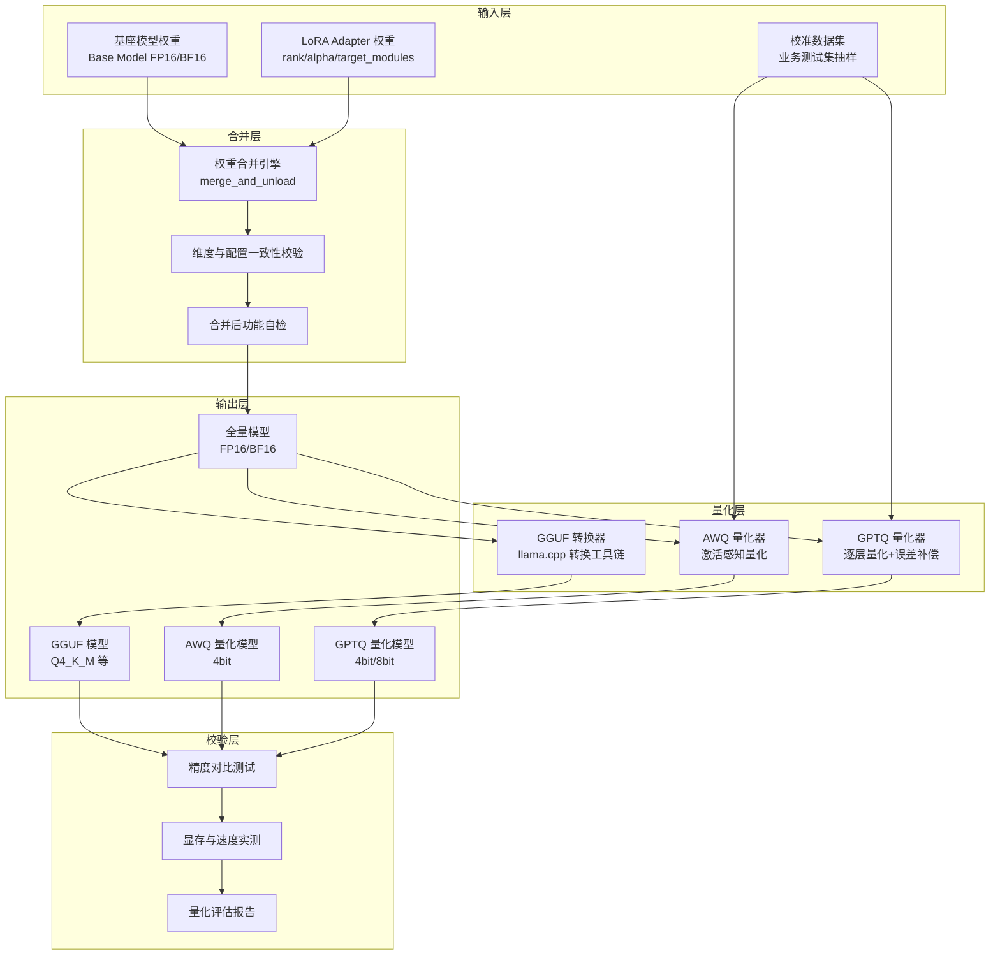
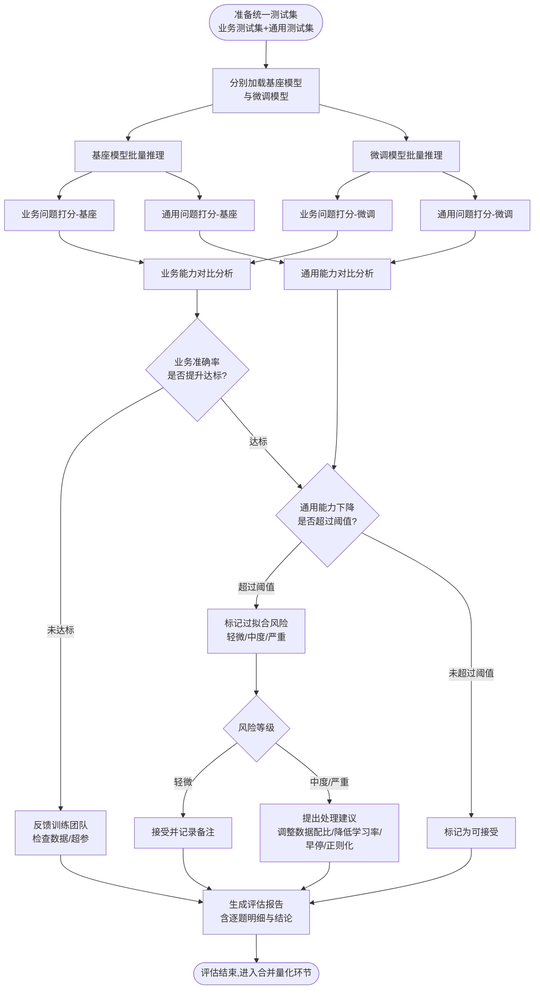
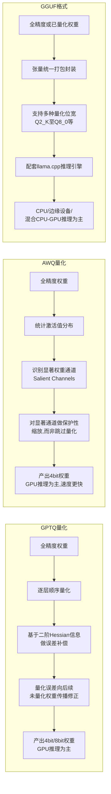

# 第54天:微调评估与模型合并

**阶段**:Stage 5 · 微调与部署篇
**主线人物**:陈铭(算法工程师) / 王振宇·老王(技术导师)
**协同人物**:苏晴(产品经理) / 林薇(算法工程师) / 张浩(测试与运维工程师)
**公司**:蓬远科技
**产品**:苍穹企业级智能体中台
**客户**:御风金融
**承接**:Day53(LoRA 微调训练跑通,checkpoint 已产出)
**衔接**:Day55(模型服务化部署)

---

## 【旁白】

陈铭到工位的时候是早上八点四十,比平时早了二十分钟。倒不是因为勤奋突然发作,而是昨晚十一点半跑完的那批微调评估脚本,凌晨两点给他发了一条钉钉提醒——任务完成。他躺在床上纠结了十分钟,到底要不要爬起来看一眼结果,最后没忍住,摸了手机把日志拉到底,看到那一行"业务问题准确率:91.3%"的时候,他在黑暗里笑出了声,老婆在旁边翻了个身骂他"半夜发什么神经"。

可是笑着睡着之前,他心里其实压着一块石头没放下——因为他也看到了另一行数字,通用问题准确率那一栏,从微调前的 88.6% 掉到了 79.4%。将近十个点的下滑,不是误差范围能解释的。他把这个疑惑一起记在了备忘录里,准备今天早会上跟老王摊开来讲。

昨天他们完成了 LoRA 微调训练,那一刻团队里几乎所有人都松了一口气,觉得"苍穹"给御风金融定制的信贷风控问答能力这件事,已经翻过了最难的一道坎。但陈铭心里清楚,训练跑完只是拿到了一个"半成品"——这个模型到底好不好,好在哪,坏在哪,能不能上线,都还没有答案。今天要做的事情,恰恰是把这个"半成品"翻过来倒过去地检查清楚,再把它变成一个真正能被服务化调用的"成品"。这中间要过评估这一关,还要过权重合并与量化这一关,任何一环出问题,前面二十多天的努力都可能白费。

---

## 晨会纪要

**时间**:2024年内部项目排期 Day54,09:00-09:35
**地点**:蓬远科技 3 楼"苍穹"项目专属会议室
**参会人**:王振宇、陈铭、林薇、苏晴、张浩(远程接入)
**记录人**:陈铭

**王振宇**:昨晚训练脚本跑完了,陈铭发到群里说业务问题准确率涨了不少,先让他讲讲情况,咱们再定今天怎么排。

**陈铭**:昨天晚上十点半,基于咱们 Day53 那批清洗过的信贷风控问答数据,LoRA 微调训练收尾了,loss 曲线最后收敛到 0.31,比训练初期的 1.8 降了一大截,看起来是训练充分了。我连夜跑了一版简单的抽测,挑了 50 条业务相关的测试问题,让基座模型和微调后的模型分别答一遍,人工肉眼比对,微调模型的回答明显更贴合御风金融的业务术语和风控口径,比如"授信额度""不良贷款率认定标准"这些词,基座模型经常答得比较泛,微调模型答得很准。但是我顺手又测了 30 条跟金融业务无关的通用问题,发现微调模型在这些问题上的表现,比基座模型差了一截,有几条甚至答得驴唇不对马嘴。

**林薇**:多严重?有没有量化过?

**陈铭**:我做了个粗略统计,业务问题这边,微调前基座模型答对(或者说达到可接受标准)的比例大概是 63%左右,微调后能到 91%以上,提升很明显。但通用问题那边,基座模型原本能到 88.6%,微调之后掉到了 79.4%,掉了将近 9 个百分点。我昨晚看到这个数字的时候心里就有点打鼓,这个是不是我们说的"灾难性遗忘"?

**王振宇**:对,这个现象很典型,业内一般叫 catastrophic forgetting,中文有人翻译成"灾难性遗忘",也有人叫"过拟合到目标域",本质上是一回事——模型在小规模、高度同质化的业务数据上训练次数多了、学习率没控制好,或者数据本身覆盖面太窄,就会把原来预训练阶段学到的一些通用知识和能力"挤"出去,表现为在训练分布之外的问题上表现下降。这个东西不是绝对的坏事,但也不能放任不管,得先搞清楚掉的幅度在不在可接受范围内,掉的都是哪一类能力,然后再决定要不要调整训练策略。

**苏晴**:那这个事情对咱们跟御风金融这边的交付会有什么影响?他们主要关心的还是风控问答这个场景吧,通用能力下降他们会不会在乎?

**王振宇**:这个问题问得对,我们得先厘清楚客户到底关心什么。御风金融采购"苍穹"这套中台,核心场景是内部客服和风控人员用的智能问答助手,主战场肯定是信贷、风控、合规这些业务问题,这块我们必须做到足够专业。但实际上线之后,这个智能体不可能只回答业务问题,员工也会拿它问一些通用性的东西,比如帮忙写一段周报、翻译一句英文、做个简单的逻辑推理,如果这些通用能力掉得太狠,用户体验会很差,客户会觉得"这个东西怎么变笨了"。所以我们不能只看业务指标涨没涨,还得把通用能力这条线也画出来,两条线一起给客户交代,这也是今天要重点讲的评估方法论。

**陈铭**:明白了,那今天上午我们是不是先把评估这套方法跑扎实,搞清楚现在这个模型到底属于"可接受的轻微遗忘"还是"必须回炉重炼的过拟合"?

**王振宇**:对,上午你和林薇分头做两件事:第一,把微调前后的对比评估做规范化,不能再像你昨晚那样人工肉眼比对了,得有一套可复用的评估脚本,业务问题和通用问题都要覆盖,还要有量化打分,不能只凭感觉;第二,专门做一个"灾难性遗忘"检测的机制,用一个相对标准的通用能力测试集,跑一遍看模型在各个维度上掉了多少,如果掉得太狠,我们要能回答客户"我们是怎么发现问题、怎么处理的"这个问题,这本身也是给客户建立信任感的一部分。

**林薇**:上午这两件事我配合陈铭一起弄,评估脚本我们统一设计一个框架,业务问题打分和通用能力打分复用同一套逻辑,只是测试集和评分规则不一样。

**王振宇**:好。下午的重点是权重合并和量化。LoRA 训练出来的是增量权重,不能直接就这么部署,得先跟基座模型的权重合并成一份完整权重,这个过程要注意精度和显存的问题。合并完了还不算完,御风金融那边机房资源有限,给咱们这套问答服务分配的显卡是两张 A10,显存不算特别富裕,我们上周也讨论过,大概率要走量化这条路,不然模型跑起来吃显存、推理慢,客户体验不好。所以下午我们要把 GPTQ、AWQ 这两种主流量化方案的原理讲清楚,再加上 GGUF 这种主要给 CPU/边缘端用的格式,做个对比,最后咱们至少要跑通一条端到端的"合并 + 量化"的流水线,产出至少一个量化后的模型文件,为明天的服务化部署做准备。

**张浩**:量化这块我这边可以帮忙盯一下显存和推理速度的实测数据,量化前后的对比数据我建个 Excel 记录,方便晚上复盘时候用。

**王振宇**:好,那就这么定。有一点我想强调一下,今天的评估结果不管好看还是不好看,都要真实记录下来,不要因为想让汇报好看就挑数据。评估这一步存在的意义,就是让我们在真正把模型推给客户之前,自己先把该踩的坑踩一遍,自己先把丑话说清楚。行,那就开始吧。

---

## 需求文档

### 文档编号:PY-D54-EVAL-MERGE-01

### 1. 背景

"苍穹企业级智能体中台"在御风金融项目中,针对信贷风控问答场景完成了基于 LoRA 的微调训练(Day53 交付物:LoRA adapter 权重文件、训练日志、训练配置文件)。在正式推进模型服务化部署(计划 Day55 启动)之前,必须完成以下两方面的工作:一是对微调效果进行系统性评估,确认业务能力提升是否达到预期,同时排查是否存在通用能力显著下降(灾难性遗忘/过拟合)的风险;二是将 LoRA 权重与基座模型权重进行合并,并结合客户侧硬件资源约束完成模型量化,产出可用于生产部署的模型文件。

### 2. 目标

1. 建立一套可复用的"微调前后对比评估"方法与工具,覆盖业务问题准确率、通用问题准确率、响应质量等维度。
2. 建立一套"过拟合/灾难性遗忘"检测机制,给出量化的判断标准和处理建议。
3. 完成 LoRA 权重与基座模型的合并,产出完整的全量权重(FP16/BF16)。
4. 完成模型量化,产出至少一种量化格式(优先 GPTQ 或 AWQ,同时评估 GGUF 的适用场景),并给出量化前后的精度损失与性能提升对比数据。
5. 输出本轮评估与合并量化的完整报告,作为客户交付材料的一部分附件。

### 3. 范围

**本次覆盖范围**:
- 微调前(基座模型)与微调后(LoRA 微调模型)在业务测试集与通用测试集上的对比评估。
- 过拟合/灾难性遗忘的检测方法与初步处理建议(不含二次训练调参,调参工作视评估结果决定是否需要,若需要则安排在 Day54 收尾或 Day55 之前插入)。
- LoRA 权重合并为全量权重。
- GPTQ、AWQ 量化方案的原理讲解与至少一种的实操落地;GGUF 格式的原理讲解(作为知识补充,本次不强制要求落地边缘端部署,边缘端场景不在御风金融本期合同范围内)。

**不在本次覆盖范围**:
- 模型服务化部署(vLLM/TGI 等推理框架的搭建,计划 Day55)。
- 面向多租户的资源隔离与路由(后续阶段)。
- 客户侧最终验收测试(UAT,由客户侧配合,视项目节奏另行安排)。

### 4. 功能需求

**FR-1 对比评估工具**
- 支持加载基座模型和微调模型(LoRA adapter 形式或已合并的全量权重形式均需支持)。
- 支持批量输入测试集(业务测试集、通用测试集),自动对两个模型分别推理并记录结果。
- 支持人工评分与自动评分(基于关键词匹配、语义相似度等)相结合的打分方式。
- 输出结构化的对比报告(准确率、平均得分、逐题差异明细)。

**FR-2 过拟合/灾难性遗忘检测工具**
- 基于通用能力测试集(覆盖常识问答、逻辑推理、语言理解、代码能力、多轮对话等维度),对比微调前后各维度得分变化。
- 设定阈值规则,自动标记"轻微遗忘""中度遗忘""严重遗忘"三档风险等级。
- 输出各维度雷达数据,便于后续分析哪些能力受影响最大。

**FR-3 LoRA 权重合并工具**
- 支持将 PEFT 格式的 LoRA adapter 权重与基座模型权重合并,导出为标准 HuggingFace 格式的全量权重。
- 合并过程中校验权重维度、adapter 配置(rank、alpha、target_modules)的一致性。
- 合并完成后进行基本的功能自检(加载合并后模型,跑通一次前向推理)。

**FR-4 模型量化工具**
- 支持基于 GPTQ 算法对合并后的全量模型进行量化(4bit/8bit 可选)。
- 支持基于 AWQ 算法对合并后的全量模型进行量化。
- 量化过程需使用校准数据集(从业务测试集中抽取代表性样本)。
- 量化完成后自动跑一轮精度对比测试和推理速度、显存占用对比测试。

### 5. 非功能需求

- **可复现性**:所有评估脚本和量化脚本需要固定随机种子,保证多次运行结果的一致性(允许硬件层面的微小浮点误差)。
- **可追溯性**:每次评估、每次量化都要保留完整的配置文件和日志,便于后续追溯和复现。
- **资源约束**:量化及合并过程需在单机双卡(A10 24G x2 或等效资源)环境下可执行,不依赖额外的大规模分布式资源。
- **安全合规**:评估过程中使用的业务测试数据涉及御风金融的部分脱敏业务样本,禁止外传、禁止在评估日志中打印客户敏感信息(如真实客户姓名、身份证号等,测试集本身应已脱敏,脱敏工作已在 Day50-52 数据处理阶段完成)。

### 6. 验收标准

1. 提供完整的对比评估报告,明确给出业务问题准确率提升幅度、通用问题准确率变化幅度。
2. 明确给出过拟合风险等级判断,若为"中度"及以上,需给出处理建议并提交给王振宇复核。
3. 产出合并后的全量模型权重文件,并通过基本功能自检。
4. 产出至少一种量化后的模型文件(GPTQ 或 AWQ),并给出量化前后精度损失(要求控制在业务测试集准确率下降不超过 2 个百分点)、显存占用下降幅度、推理速度提升幅度的实测数据。
5. 所有脚本代码入库,附带使用说明,团队其他成员可独立复现结果。

### 7. 风险与应对

| 风险项 | 影响 | 应对措施 |
|---|---|---|
| 通用能力下降幅度过大,影响客户使用体验 | 高 | 评估阶段设定阈值预警,超阈值则回退部分训练轮次或调整数据配比,必要时重新训练 |
| 量化后业务问题准确率下降超预期 | 高 | 优先尝试 8bit 量化保精度,或调整校准数据集分布,量化方法在 GPTQ/AWQ 间做选型对比 |
| 权重合并过程中显存不足导致 OOM | 中 | 采用 CPU 内存合并或分片加载合并的方式规避 |
| 评估打分主观性强,结果不可信 | 中 | 采用人工评分+自动评分交叉验证,关键结论需双人复核 |

### 8. 测试用例设计规范补充说明

在需求文档评审会上,林薇提出了一点补充意见:测试用例不能只按"业务/通用"两个大类简单划分,还需要在文档里明确每一条测试用例的来源、脱敏状态和可复用性,否则以后项目组换人,新接手的同学根本不知道这些题目是怎么来的、能不能直接拿去用在别的客户项目上。王振宇采纳了这条建议,补充了以下几条规范,写入了需求文档的附录:

第一,每条业务测试用例必须标注来源渠道(客服工单摘录、内部培训材料改写、产品经理人工编写等三类之一),标注是否经过脱敏处理以及脱敏处理的负责人和时间;涉及客户真实业务细节的用例,即便已经脱敏,也要在文件头部统一加一条数据使用声明,明确这批数据仅限本项目组内部评估使用,不得用于其它客户项目或对外发布的任何材料。

第二,通用测试用例尽量选择行业内已经公开、经过验证的评测题目改编,或者团队内部原创但确认不涉及任何客户信息的题目,这样的好处是这批通用测试集可以沉淀成团队的公共资产,后续做别的客户项目微调评估时可以直接复用一个基础版本,只需要按新客户的业务特点适当调整业务测试集部分即可,不用每个项目都从零构建通用能力评测体系。

第三,测试用例的难度标注(easy/normal/hard)不是拍脑袋定的,团队约定的判断标准是:easy 级别的问题基座模型和微调模型都应该能大概率答对,这类题目主要用来判断模型有没有出现完全不可用的低级错误(比如死循环重复输出、输出乱码、完全不回答等异常情况);normal 级别的问题是评估的主战场,占比应该在60%以上,重点考察模型在正常业务场景下的实际表现;hard 级别的问题专门用来探测模型能力的边界,即便微调模型在这类题目上表现不理想,也不会作为"不达标"的直接依据,但会被记录下来作为后续优化的方向参考。

第四,每一批测试集正式启用之前,必须先找一位没有参与用例设计的同事做一次"盲审",确认题目表述清晰、没有歧义、参考答案本身没有错误,避免团队在设计用例的时候因为对业务过于熟悉,写出一些"只有内部人才能看懂"的模糊表述,这样测出来的结果才是真正有参考价值的。

---

## 架构设计图

下图描述了本次"权重合并 + 量化导出"处理流水线的整体架构。核心思路是:基座模型权重与 LoRA adapter 权重先经过合并引擎产出一份完整的 FP16/BF16 权重,再分别经过 GPTQ、AWQ、GGUF 三条量化/转换通路,产出不同场景适用的模型文件,供后续部署阶段按需选用。



这张图的关键点在于校验层的存在——很多团队在做量化的时候容易把关注点全部放在"量化能不能跑通"上,跑通了就以为万事大吉,直接把量化后的模型丢给部署团队。但王振宇一再强调,量化本质上是一种有损压缩,产出的模型必须经过精度对比测试和资源实测,才能进入下一阶段。今天下午的实操环节,团队会严格按照这张架构图的层次去搭建流水线,合并层产出的全量模型会先做一次自检,确认没有问题之后才会进入量化层,量化层产出的每一个模型文件也都要经过校验层这一道关卡。

---

## 流程图

下图描述了微调前后对比评估的完整流程,从统一测试集的准备,到基座模型和微调模型分别推理,再到打分对比、过拟合风险判断,最终生成评估报告。



这套流程有一个容易被忽视的细节:业务能力对比和通用能力对比是两条并行的判断线,不是简单地把两个分数加权平均成一个"综合分"就完事。陈铭一开始设计脚本的时候图省事,想把两类问题混在一起算一个总准确率,被王振宇叫住了——"你把业务准确率和通用准确率合并成一个数,恰好就把过拟合问题给盖住了,因为业务分涨得多,平均下来照样是涨的,你怎么发现遗忘?"这句话让陈铭意识到,评估体系的设计本身就要为"能不能发现问题"服务,不能只为了"数字好看"服务。

---

## 示意图:GPTQ / AWQ / GGUF 量化原理对比

下图从量化思路、保护机制、主要适用场景三个层面,示意性地对比了三种主流的模型量化/格式转换方案。



这张图只是原理层面的示意,细节上 GPTQ 和 AWQ 都有各自更复杂的数学推导,今天课堂笔记部分会展开讲。这里先建立一个直觉印象:GPTQ 走的是"量化之后用数学方法补偿误差"的路子,AWQ 走的是"量化之前先找出哪些权重重要、提前保护"的路子,而 GGUF 严格来说不是一种量化算法,而是一种模型文件格式和配套的量化位宽体系,它的价值主要在于把模型搬到不依赖高端 GPU 的环境里跑起来,这也是为什么很多做本地部署、边缘部署的团队会优先选择 GGUF。

---

## 课堂笔记

### 上午:微调前后效果对比评估方法 + 过拟合识别与处理

老王上午的课基本是围着白板讲的,他先在白板上画了两个框,一个写"基座模型",一个写"微调模型",中间画了一条线,写着"同一把尺子"。

**1. 为什么必须做"同一把尺子"的对比评估**

老王开场就纠正了一个常见误区:很多团队做完微调,只在微调后的模型上跑几个业务问题看看效果,觉得"看起来不错"就上线了,根本没有跟微调前的基座模型做过对照。这样做至少有三个问题:

第一,没有基线,无法量化"提升了多少",汇报给客户的时候只能说"感觉更好了",经不起追问。

第二,无法发现负面影响,比如今天遇到的通用能力下降问题,如果不做对比,压根不会知道模型在哪些方面变差了,直到上线之后被用户投诉才发现,那时候代价就大了。

第三,无法做归因,如果只看微调后的模型表现不好,你不知道这个"不好"是微调引入的新问题,还是基座模型本身就有的老问题,微调前后一对比,立刻就清楚了。

所以"同一把尺子"这件事,核心要求有三个:一是测试集必须完全一致,不能给基座模型用一套题、给微调模型用另一套题;二是推理参数必须一致,比如 temperature、top_p、max_new_tokens 这些采样参数,如果两边设置不一样,得出的对比结论就不可信;三是打分标准必须一致,不能对微调模型宽松、对基座模型严格(或者反过来),这个在人工评分环节尤其容易踩坑,评分人如果知道哪个答案来自哪个模型,容易带主观偏见,严谨的做法是做"盲评",评分人不知道答案出自哪个模型。

**2. 测试集的设计:业务测试集 + 通用测试集**

老王强调,评估测试集至少要分两大类:

- **业务测试集**:紧密围绕客户实际使用场景设计的问题,御风金融这个项目里,业务测试集覆盖了信贷审批流程问答、风控指标解释、合规条款咨询、不良资产处置流程、征信报告解读等五个子类,每个子类准备了 30-50 条问题,总共 200 条左右,这些问题很多是从御风金融实际的客服工单、内部培训材料里抽取整理的,已经做过脱敏处理。业务测试集要覆盖"简单事实性问题"和"复杂推理性问题"两种难度,不能全是简单的定义类问题,否则测不出模型真正的业务理解能力。

- **通用测试集**:用来检测模型的"底子"有没有被破坏,通常会借助一些公开的通用能力评测集的子集,或者团队自己整理的一批通用问题,覆盖常识问答、基础数学、逻辑推理、语言理解与表达、代码理解与生成、多轮对话连贯性等维度。这次团队用的通用测试集包含 150 条题目,大致按维度均分,常识问答 25 条、数学计算 25 条、逻辑推理 25 条、语言理解表达 25 条、代码相关 25 条、多轮对话 25 条。

老王特别提到一点:通用测试集不需要跟业务毫无关系,恰恰相反,里面可以掺一些"看起来像业务场景但其实考察的是通用能力"的题目,比如让模型帮忙"用大白话给客户解释一下什么是复利",这道题考察的其实是语言表达和数学理解能力的综合体现,不是单纯考风控知识。这种题目往往最能体现"灾难性遗忘"的影响,因为微调之后模型可能会不自觉地把所有回答都往信贷风控的方向硬拽。

**3. 打分方式:自动评分与人工评分相结合**

评分方式这块,老王讲了三种常见做法,各有优劣:

第一种是**关键词/规则匹配**,适合有明确标准答案要素的问题,比如"XX指标的计算公式是什么",只要检测答案里是否包含正确的公式要素、是否遗漏关键字段,就可以自动打分,速度快、成本低,但对灵活表达的容忍度低,容易误判。

第二种是**语义相似度打分**,用 embedding 模型把标准答案和模型输出都编码成向量,计算余弦相似度,相似度超过阈值判定为正确。这种方式能容忍一定程度的表达差异,但对"部分正确、部分错误"的情况区分度不够,也容易被"答案很长但答非所问"的情况误导(长答案往往整体语义会跟标准答案有一定重叠,分数虚高)。

第三种是**LLM-as-judge**,用另一个更强的模型(或者同一模型但角色设定为评委)按照打分标准对回答进行评分,可以给出细粒度的分数(比如 1-5 分)和评分理由。这种方式灵活度最高,能识别出"看起来说了很多但没答到点上"这类问题,但成本较高、且评委模型本身也可能有偏见,需要人工抽检复核评委打的分。

老王给的建议是:业务问题优先用"规则匹配 + 人工复核"的组合,因为业务问题往往有比较明确的标准答案要素,规则匹配能覆盖大部分场景,少量有争议的用人工复核;通用问题优先用"LLM-as-judge + 人工抽检",因为通用问题类型杂、标准答案不唯一,规则匹配很难覆盖,LLM 评委更灵活。今天下午实操的评估脚本里,团队采用的正是这套组合策略。

**3.1 通用测试集具体样例参考**

为了让团队对通用测试集"长什么样"有更直观的认识,老王在白板上写了几条实际用到的样例题目,分别对应六个维度:

常识问答维度的样例题目包括:"一年有多少个季度,每个季度大概是几个月?""为什么夏天天黑得比冬天晚?"这类题目答案相对客观、有明确的标准,适合用关键词匹配打分。

数学计算维度的样例题目包括:"一件商品原价500元,打七折之后是多少钱?""某个班级男生占60%,女生有20人,请问这个班级一共多少人?"这类题目适合用规则匹配(检查最终数值答案是否正确)。

逻辑推理维度的样例题目包括:"甲比乙年龄大,乙比丙年龄大,请问甲和丙谁的年龄更大?""如果所有的A都是B,有些B不是C,能否推断出有些A不是C?为什么?"这类题目需要模型给出正确的推理结论并且逻辑链条清晰,适合用LLM-as-judge结合关键结论的规则校验。

语言理解表达维度的样例题目包括:"请用简单易懂的话给一个完全没有金融背景的人解释一下什么是通货膨胀。""帮我把这段比较啰嗦的话改写得更简洁:'我认为可能存在这样一种情况,那就是这个方案或许在某些特定条件下也许是可行的。'"这类题目主要考察表达是否清晰、简洁、通顺,适合用LLM-as-judge打分。

代码相关维度的样例题目包括:"用Python写一个函数,判断一个字符串是否是回文串。""下面这段代码有什么问题:for i in range(10) print(i)"这类题目适合用规则匹配(检查关键代码结构、语法错误识别是否正确)结合人工抽检。

多轮对话维度的样例题目采用连续多轮的对话形式设计,比如先问一个问题,再针对上一轮的回答提出追问或修改要求,重点考察模型是否能正确理解上下文指代关系,这个维度的具体样例设计,团队在今天下午的复盘环节还会结合张浩的实测案例再深入展开。

老王补充说,这些样例题目只是团队积累的冰山一角,真正的通用测试集应该是一个持续迭代、不断补充的资产库,每次实际项目里发现了新的模型缺陷案例,都应该把对应的场景整理成新的测试用例补充进去,这样测试集才会越用越准、越用越全面,而不是一套一成不变的老题目用到所有项目里都不再更新。

陈铭在这里提了个问题:"如果 LLM-as-judge 用的评委模型本身就有偏见,比如它天然更喜欢长答案,那这个偏见会不会系统性地影响我们的评估结论?"老王点头说这个问题问得很好,这确实是 LLM-as-judge 广泛存在的一个已知问题,业内一般叫"verbosity bias"(冗长偏见)和"self-preference bias"(自我偏好偏见,评委倾向于给和自己风格相似的回答打高分)。缓解办法包括:在打分提示词里明确要求评委"不要因为回答长度而给出更高分数,请重点评估内容的准确性和相关性";使用与被评估模型架构、风格差异较大的模型作为评委,减少自我偏好偏见;对一部分样本进行人工复核,统计人工评分和 LLM 评分的一致率,如果一致率低于某个阈值(比如 85%),说明评委的打分标准需要重新校准提示词或换一个评委模型。

**4. 过拟合与灾难性遗忘的识别**

老王在白板上写下了一个关键判断逻辑,他称之为"三线判断法":

- **业务能力线**:微调后在业务测试集上的准确率,应该显著高于微调前(否则微调没有意义,白训练了)。
- **通用能力线**:微调后在通用测试集上的准确率,应该与微调前保持接近,允许有一定幅度的自然波动,但不能大幅下降。
- **对比基准线**:通用测试集的下降幅度不能简单地用一个固定百分比一刀切,而要结合具体维度来看——有些维度(比如跟金融领域完全无关的诗词创作)哪怕下降多一点,对这个客户的实际使用场景影响也有限;但有些维度(比如基础的逻辑推理、多轮对话的连贯性)如果下降明显,会直接影响用户体验,这类维度必须重点关注。

老王给出了一个经验性的分级标准,团队后续沿用这套标准来判断风险等级:

| 通用能力下降幅度(相对下降百分比) | 风险等级 | 处理建议 |
|---|---|---|
| 小于 3% | 轻微遗忘,可接受 | 记录备注,持续观察,无需立即处理 |
| 3% - 8% | 中度遗忘,需关注 | 分析具体是哪些维度下降,评估是否需要调整数据配比或训练超参 |
| 大于 8% | 严重遗忘,需处理 | 必须干预,可能需要降低学习率、增加通用数据混入比例、缩短训练轮次或调整 LoRA rank,严重时需重新训练 |

按照这个标准,陈铭昨晚测出来的初步数据——通用问题准确率从 88.6% 掉到 79.4%,相对下降幅度约为 10.4%——已经落在"严重遗忘"这一档了。这个结论让会议室里一下子安静了几秒,林薇皱着眉说"那是不是意味着昨天的训练白干了",老王摇头说先别急着下结论,"严重遗忘"不代表训练完全失败,而是意味着需要更细粒度地分析,今天下午团队要做的一件重要事情,就是把这 150 条通用测试题按维度拆开看,搞清楚到底是哪些维度掉得最狠,再决定处理方案是"直接接受但记录风险"、"轻量级修正"还是"重新训练"。

**5. 过拟合的成因分析**

老王讲了导致这种现象的几个常见成因,团队需要逐一排查:

第一,**训练数据规模与多样性不足**。信贷风控这类垂直领域的训练数据往往规模有限(这次训练用的数据大约是 3000 条左右的问答对),如果训练轮次(epoch)设置过多,模型会在这个小规模数据上反复学习,容易"记住"训练数据的表面模式,而不是学到泛化的知识,这个过程会挤占原本预训练阶段学到的通用能力所占的"权重空间"。

第二,**学习率设置过大**。学习率过大会导致参数更新幅度过猛,原本预训练阶段学到的知识被大幅覆盖,即便是 LoRA 这种参数高效微调方法,由于新增的低秩矩阵是叠加在原始权重之上共同参与前向计算的,如果学习率过大,LoRA 部分学到的东西"话语权"过重,依然会显著改变模型整体的行为模式。

第三,**LoRA 的 rank 设置过高**。rank 越高,LoRA 引入的可训练参数越多,拟合能力越强,但同时"记忆"训练数据细节的能力也越强,容易在小数据集上过拟合。这次训练用的 rank 是 16,老王提到如果后续需要调整,可以尝试把 rank 降到 8 试试看效果。

第四,**训练数据本身分布过于单一**。这次训练数据几乎全部是信贷风控相关的问答,没有掺入任何通用数据,这是一个比较关键的因素。很多业内实践证明,在垂直领域微调数据里适当混入 5%-15% 的通用数据(比如通用问答、日常对话样本),能显著缓解灾难性遗忘问题,这个思路也叫"数据配比"或者"重放缓解"(rehearsal),本质上是让模型在学习新知识的时候,持续被提醒"别忘了你原来学过的东西"。

第五,**训练轮次(epoch)过多**。这次训练设置了 5 个 epoch,老王提到对于这种规模不大的数据集,3 个 epoch 往往就足够让模型收敛到不错的业务效果,过多的 epoch 会持续加剧过拟合,后续可以结合早停(early stopping)策略,在验证集上的表现不再提升甚至开始下降时就停止训练。

**6. 处理建议的优先级**

老王给了一个处理优先级的建议,按照"成本从低到高"排序:

1. 先看能不能通过**调整推理阶段的策略**缓解,比如在系统提示词里做一些引导,减少模型"锚定"到信贷风控话术的倾向,这个成本最低,不需要重新训练。
2. 如果推理阶段调整效果有限,考虑**调整 LoRA 权重的合并系数**(也就是常说的融合比例,通常用一个 scaling 系数控制 LoRA 增量对最终权重的影响程度),把比例适当调低,让模型在业务能力和通用能力之间找一个更平衡的点,这个操作也不需要重新训练,只需要在合并阶段调整参数重新合并即可,成本也比较低。
3. 如果以上都不够,再考虑**调整训练数据配比或超参后重新训练**,这个成本最高,涉及重新跑一遍完整的微调训练流程。

今天下午团队会先按第 2 条思路做实验,看看调整 LoRA 融合系数能不能把通用能力的下降幅度拉回到"轻微遗忘"或者至少"中度遗忘"的区间内,如果不行,再评估是否需要走重新训练这条路。老王也提前打了个招呼,如果最终判断需要重新训练,这件事情不会拖到 Day55 之后,会插入到明天的计划里优先处理,部署工作可以稍微往后调整几天,"评估这一步的意义就是让我们有机会及时纠偏,而不是硬着头皮把一个有问题的模型送上线。"

**7. 一个行业内的真实案例参考**

讲到这里,老王插了一段自己以前踩过的坑。他之前在另一家公司做过一个客服场景的微调项目,那次团队用了将近两万条客服对话记录去微调一个当时规模不算大的开源模型,训练轮次设置得比较随意,直接抄了一个网上教程里的默认参数跑了 10 个 epoch。上线前团队只测了业务准确率,数据很好看,从70%出头提升到了95%以上,大家都很兴奋,评审会上一路绿灯就推上线了。结果上线第三天,客服团队反馈说这个智能助手"变傻了",员工问它一些跟工作无关的常识问题时经常前言不搭后语,甚至有员工吐槽"感觉这个模型除了背话术什么都不会"。后来复盘发现,10个epoch对那批数据规模来说明显训练过度了,模型把训练数据里反复出现的一些客服话术模式记得滚瓜烂熟,但通用理解能力大幅退化,团队紧急做了回滚,把上线的模型撤下来重新训练,不仅浪费了几天时间,客户那边对交付质量的信任也打了折扣,后来花了很大力气才补救回来。

老王讲这个案例不是为了吓唬大家,而是想强调一个观点:"灾难性遗忘不是什么高深的学术问题,它在真实项目里发生的概率比很多人想象得要高,尤其是垂直领域数据规模不大、又想通过多轮训练把效果'压榨'到极致的时候,特别容易踩这个坑。今天我们能在上线之前的评估环节发现这个问题,而不是等客户上线用出问题反馈回来,这本身就是团队做对了的一件事,大家不要觉得挖出问题是坏事,挖出问题恰恰是流程设计生效的证明。"

### 下午:LoRA 权重合并 + 模型量化

下午的课换了个节奏,老王直接打开电脑投屏,边讲边演示。

**1. 为什么要做权重合并**

LoRA 微调训练结束后,产出的文件其实只是一组"增量权重",专业说法叫 adapter 权重,包含了每个目标模块(通常是注意力层的 query、value 投影矩阵,有时也包括 key、输出投影等)对应的两个低秩矩阵 A 和 B,以及配置信息(rank、alpha、target_modules 等)。这组增量权重单独存在的时候,文件很小,通常只有几十 MB 到几百 MB,这也是 LoRA 参数高效微调的核心优势之一。

但是要把模型服务化部署起来,有两种做法。第一种做法是"基座模型 + adapter 分离加载",推理框架在运行时动态加载基座模型权重,再叠加 adapter 权重进行计算,这种方式的好处是灵活,同一个基座模型可以搭配多个不同的 adapter,按需切换,适合多租户、多场景的情况;坏处是推理过程中多了一步矩阵运算的叠加开销,虽然通常不大,但在对延迟极度敏感的场景下会有影响,而且并不是所有推理框架、所有量化方案都对"分离加载"模式有很好的原生支持。第二种做法是"权重合并",把 adapter 权重的增量直接加到基座模型对应的权重上,变成一份完整的、独立的全量权重,这样推理的时候就跟一个普通的、没有经过 LoRA 微调的模型完全一样,兼容性最好,尤其是后续要做量化的时候,几乎所有主流的量化工具链(GPTQ、AWQ 等)都是针对全量权重设计的,不太支持直接对"基座+adapter分离态"做量化。

御风金融这个项目,由于当前阶段只需要一个稳定的信贷风控问答场景,暂时没有多 adapter 切换的需求,所以团队决定采用权重合并的方案,把 LoRA 权重合并进基座模型,再统一做量化。

**2. 权重合并的数学原理**

老王在白板上写了一个简化的公式来解释合并的本质。LoRA 的核心思想是,对于原始权重矩阵 W(维度假设是 d×k),不直接微调 W 本身(因为 W 通常非常大,微调所有参数的计算和存储成本很高),而是引入两个低秩矩阵 A(维度 d×r)和 B(维度 r×k),其中 r 远小于 d 和 k(这次训练 r 取的是 16),训练过程中只更新 A 和 B,前向计算时使用:

W' = W + (alpha / r) × B × A

这里 alpha 是一个缩放系数(这次训练配置的 alpha 是 32,alpha/r 也就是 2),用来控制增量部分对最终结果的影响程度。所谓权重合并,就是把这个公式实际计算出来,得到一份新的、跟原始 W 维度完全一致的权重矩阵 W',用 W' 替换掉原来的 W,写入一份新的模型权重文件。合并之后,这个新模型在推理的时候不再需要额外加载 A 和 B,也不需要在前向计算中额外做一次矩阵乘法和加法,计算图跟一个普通模型完全一样。

老王特意强调了 alpha/r 这个缩放系数在合并中的意义——如果团队想尝试降低 LoRA 部分对模型整体行为的影响程度(也就是前面提到的"调整融合比例"这个处理思路),理论上可以在合并时对 B×A 这部分整体乘以一个小于 1 的系数再加到 W 上,相当于人为调低了 alpha/r 的实际生效值,这样合并出来的模型会更接近原始基座模型,通用能力保留得更好,但业务能力的提升幅度也会相应打折扣,这是一个需要根据评估结果反复试验寻找平衡点的过程。

**3. 权重合并的工程注意事项**

老王列了几个实操中容易踩坑的地方:

**注意事项一:精度问题**。合并计算过程中,如果直接在 FP16 或 BF16 精度下做矩阵乘加,可能会引入额外的数值误差,尤其是当权重数值范围差异较大时。比较稳妥的做法是,合并计算过程临时转换到 FP32 精度进行,计算完成后再转换回目标精度(FP16 或 BP16)保存,这样能最大程度减少精度损失。

**注意事项二:显存/内存管理**。基座模型本身可能就有 7B、13B 甚至更大的参数规模,合并过程中如果不注意,很容易同时把基座模型权重、adapter 权重、合并中间结果都堆在显存里,导致 OOM(显存溢出)。团队这次用的基座模型是一个 7B 规模的模型,虽然理论上单卡 24G 显存也能放下做合并,但为了留出安全余量,同时也是为了让流程更稳健、能适应未来可能换更大规模基座模型的情况,团队决定采用"CPU 内存合并"的策略——先以 CPU 模式加载基座模型和 adapter,在内存中完成合并计算,再保存到磁盘,全程不占用显卡资源,虽然速度会比在 GPU 上合并慢一些,但胜在稳定可靠,不用担心 OOM。

**注意事项三:配置一致性校验**。合并之前必须核对 adapter 的配置文件(adapter_config.json)里记录的 base_model_name_or_path 是否与当前要合并的基座模型一致,rank、target_modules 这些参数是否和训练时的设置吻合,如果对错了基座模型版本去合并一个 adapter,合并操作在代码层面可能不会报错(如果维度恰好匹配的话),但合并出来的模型效果会完全不可用,这种"静默出错"是最难排查的坑,所以合并脚本里必须加入显式的校验逻辑。

**注意事项四:合并后自检**。合并完成后,不能想着"合并成功就万事大吉了",必须立刻加载合并后的模型跑一次简单的前向推理,用几条已知答案的业务问题验证输出是否符合预期,确认这个合并动作本身没有引入新的问题,再进入下一步量化环节。

**4. 模型量化的必要性**

老王切入量化话题的时候,先讲了御风金融这边的硬件约束背景:客户机房分配给这套问答服务的资源是两张 A10 显卡,每张显存 24GB,合计 48GB。团队用的基座模型是 7B 参数规模,以 FP16 精度存储,权重本身大概需要 14GB 显存,如果还要考虑推理过程中的 KV Cache、激活值等运行时开销,尤其是在有一定并发量的情况下,显存压力会明显吃紧,支持的最大并发数和最大上下文长度都会受限。而客户这边对响应速度是有明确要求的,平均响应时间要求控制在合理区间内(风控人员在处理业务时不希望等太久),如果显存吃紧导致 batch size 上不去,吞吐量会成为瓶颈。

量化的核心价值就在这里——通过降低模型权重的数值精度(比如从 16bit 降到 4bit),可以大幅压缩模型占用的显存空间(理论上 4bit 量化能把权重部分的显存占用压缩到 FP16 的四分之一左右),从而释放出更多显存空间用于支持更大的 batch size、更长的上下文,同时由于数据搬运量的减少,很多情况下量化模型的推理速度也会有所提升(具体提升幅度依赖于硬件对量化计算的支持程度和具体实现)。当然,量化是有损压缩,精度会有一定损失,这就是为什么必须要有前面提到的"量化后精度对比测试"这一环。

**5. GPTQ 量化原理**

GPTQ(全称 GPTQ: Accurate Post-Training Quantization for Generative Pre-trained Transformers)是一种训练后量化(Post-Training Quantization,简称 PTQ)方法,不需要重新训练模型,只需要少量校准数据。它的核心思路,老王概括为三句话:

第一句,**逐层、逐块量化**。GPTQ 按照网络层的顺序,一层一层地对权重矩阵进行量化,而且在每一层内部,还会按照权重矩阵的列进行分块处理,不是一次性把整个矩阵直接量化。

第二句,**基于二阶信息(Hessian 矩阵近似)计算量化顺序和补偿量**。这是 GPTQ 相比早期简单量化方法(比如直接对每个权重值就近舍入,round-to-nearest)最核心的改进。GPTQ 借助了 OBS(Optimal Brain Surgeon)算法的思想,利用输入激活的二阶统计信息,来判断量化哪个权重会引入最小的误差,并且在量化一个权重之后,会计算这次量化引入的误差,把这个误差"分摊补偿"到同一层里还未量化的其它权重上,从而让整体的量化误差最小化,而不是简单粗暴地各自独立量化再简单相加误差。

第三句,**逐层校准数据驱动**。整个量化过程需要用一小批校准数据(通常几百条样本量级)跑一遍前向传播,收集每一层的激活值统计信息,这些统计信息就是计算 Hessian 近似和误差补偿的基础,所以校准数据的质量和代表性会直接影响量化后的效果——如果校准数据跟真实业务场景的输入分布差异很大,量化出来的模型在业务场景下的表现可能会不如预期,这也是为什么团队计划用业务测试集里抽取的样本作为校准数据,而不是随便找一批通用文本。

GPTQ 目前主要面向 GPU 推理场景设计,量化后的模型配合专门的推理 kernel(比如 ExLlama、AutoGPTQ 提供的 kernel,以及主流推理框架如 vLLM 也提供了对 GPTQ 格式的支持)能取得比较好的推理速度。

**6. AWQ 量化原理**

AWQ(全称 Activation-aware Weight Quantization,激活感知的权重量化)是另一种训练后量化方法,思路跟 GPTQ 有本质区别。老王同样用三句话概括:

第一句,**先观察激活值分布,而不是先猛量化权重**。AWQ 的核心洞察是,权重矩阵里并不是所有权重都同等重要,那些对应着"激活值幅度较大的输入通道"的权重,对最终输出的影响也更大,这部分权重被称为"显著权重"(salient weights),这个重要性不是靠权重值本身的大小判断,而是要结合激活值的统计分布来判断。

第二句,**对显著权重做保护性缩放,而不是跳过量化**。早期有一些量化方法想到了要保护重要权重,直接的做法是让这部分权重保持高精度、不参与量化(混合精度),但这样会让硬件计算变得复杂(同一个矩阵里既有高精度又有低精度数据,计算 kernel 实现麻烦)。AWQ 提出了一个更巧妙的方案:不改变哪些权重参与量化,而是对显著权重对应的通道,乘上一个大于 1 的缩放系数,同时把对应的激活值除以相同的系数做补偿(这样数学上整体计算结果不变),缩放之后,这部分权重的数值相对量化误差的"容忍度"变高了(可以理解成把这部分权重的数值范围"放大"了,量化引入的相对误差就变小了),这样即使权重整体依然统一用低比特量化,显著权重受到的量化误差冲击也小了很多。

第三句,**搜索最优缩放系数**。AWQ 会用少量校准数据,通过网格搜索或者其它优化手段,寻找一个能让量化后整体误差最小的缩放系数,不需要像 GPTQ 那样做复杂的逐权重误差补偿传播计算,因此 AWQ 的量化速度通常比 GPTQ 更快。

AWQ 同样主要面向 GPU 推理场景,由于不需要像 GPTQ 那样做复杂的逐层重建计算,量化过程通常更快,而且不少实测数据显示 AWQ 量化后的模型在推理速度上往往有一定优势(具体表现依赖于推理框架的 kernel 实现)。

**7. GGUF 格式原理**

GGUF(GGML Universal Format)严格来说不是一个量化算法,而是 llama.cpp 项目及其生态所使用的一种模型文件格式,是早期 GGML 格式的升级版。老王强调这一点很重要,不要把 GGUF 和 GPTQ、AWQ 放在完全同一个维度去比较,GGUF 关注的是"如何把模型打包成一种统一、自描述、跨平台友好的文件格式",这种格式里可以存放多种不同量化位宽的权重数据(从 2bit 到 8bit 都有对应的量化类型定义,比如常见的 Q4_0、Q4_K_M、Q5_K_M、Q8_0 等命名代表不同的量化策略和位宽组合),量化算法本身相对简单直接(以分组量化、按块统计缩放因子为主),不像 GPTQ、AWQ 那样涉及复杂的误差补偿或激活感知机制。

GGUF 最大的价值在于生态——配合 llama.cpp 这个高度优化的 C/C++ 推理引擎,GGUF 格式的模型可以在没有 GPU、甚至只有消费级笔记本 CPU 的环境下流畅运行,同时也支持 CPU/GPU 混合推理(部分层放到 GPU 上跑、部分层留在 CPU 上跑),这对于边缘部署、本地离线部署、资源极其有限的场景非常有价值。但对于御风金融这个项目,客户机房本身就配备了 A10 GPU,追求的是在有限 GPU 资源下尽可能提升吞吐量和并发能力,所以本次的首选方案是 GPTQ 或 AWQ,GGUF 更多是作为知识储备和未来可能的备选方案(比如未来客户如果有边缘节点部署的需求)。

**8. 三种方案的选型对比**

老王最后画了一张对比表格,帮团队梳理选型思路:

| 维度 | GPTQ | AWQ | GGUF |
|---|---|---|---|
| 量化思路 | 逐层量化+误差补偿 | 激活感知+显著通道保护 | 分组量化+统一格式封装 |
| 量化速度 | 较慢(需要逐层重建计算) | 较快 | 快(算法简单) |
| 推理速度(GPU) | 快 | 通常更快 | 需专门框架适配,GPU场景非首选 |
| 主要适用硬件 | GPU | GPU | CPU/边缘设备/混合CPU-GPU |
| 精度损失(同等比特) | 较低,依赖校准数据质量 | 较低,对某些模型架构表现更优 | 因位宽策略多样,可灵活权衡 |
| 生态成熟度 | 成熟,vLLM等主流框架原生支持 | 成熟,vLLM等主流框架原生支持 | 成熟,llama.cpp生态活跃 |
| 本项目适用性 | 高(GPU部署首选之一) | 高(GPU部署首选之一) | 低(当前无边缘部署需求) |

老王给团队的结论是:今天下午实操两条路都要跑一遍,GPTQ 和 AWQ 都产出对应的量化模型,分别测一下精度和性能数据,横向比较之后再决定最终生产环境用哪一种,GGUF 的转换流程也会简单演示一遍原理和命令,但不作为本次交付的重点产出。

**9. 量化过程中常见问题排查**

老王在正式开始实操前,先给团队打了个预防针,列出几个量化过程中最常遇到的问题,提前让大家心里有数,免得实操过程中一遇到报错就慌了神。

**问题一:量化过程中显存不足**。GPTQ 量化过程需要把模型逐层加载进显存做计算(即便最终产出的是低比特模型,量化计算本身在很多实现里依然需要以较高精度加载原始权重),如果基座模型规模较大而显卡显存有限,容易在量化阶段本身就遇到 OOM。应对办法包括:降低校准阶段的 batch size,或者使用支持分层量化、显存复用的实现版本,量化过程中及时释放已经处理完的层所占用的显存。

**问题二:量化后模型输出出现异常(比如重复生成、乱码)**。这种情况往往不是量化算法本身的问题,而是量化配置和推理框架版本不匹配导致的,比如用某个版本的 auto-gptq 量化出来的模型,配合不兼容版本的推理 kernel 加载,容易出现张量格式解析错误但没有报错,而是安静地输出乱码。排查思路是先在同样的库版本环境下,用最基础的 transformers 库直接加载量化模型跑一次推理,确认量化产出物本身没问题,再排查推理框架适配层面的问题。

**问题三:量化后业务准确率下降明显超预期**。这时候首先要检查的是校准数据是不是真的覆盖了业务场景的分布,如果校准数据选得有偏(比如恰好抽样到的256条业务样本集中在某一两个子类),量化效果在没被覆盖到的子类上会打折扣;其次可以尝试把量化位宽从4bit调整为8bit做个对比,8bit通常精度损失更小,只是压缩率没有4bit高,如果显存资源允许,8bit是一个更保守稳妥的选择。

**问题四:group_size参数的选择**。group_size决定了量化时权重分组的粒度,越小的group_size(比如32、64)理论上精度越高但压缩率和推理效率会打折扣,越大的group_size(比如128、256)压缩率和效率更好但精度可能有所损失,128是目前社区实践中比较常见的一个折中取值,今天下午的实操会先用128作为默认值,如果精度评估不达标,会尝试调小到64再做一轮对比。

林薇听完补了一句:"所以量化这件事跟合并一样,也不是跑一次脚本就完事,也得靠评估脚本反复验证才能定下最终方案。"老王笑着说:"对,今天你们会发现,这一整天所有的技术动作,最后都要靠上午写的那套评估体系去检验,这也是为什么我们把评估放在合并量化之前先讲、先做,方法论要先立住,后面的操作才有一个可靠的检验标尺。"

---

## 代码实战

本节包含四部分完整代码:微调前后对比评估脚本、过拟合(灾难性遗忘)检测脚本、LoRA 权重合并完整代码、GPTQ/AWQ 量化导出完整代码。所有代码均以团队本次项目实际使用的脚本为基础整理,变量命名和路径已做适当泛化处理,便于团队内部复用到其它客户项目。

### 一、微调前后对比评估脚本

这个脚本的核心逻辑是:加载基座模型和微调模型,用同一份测试集(业务测试集 + 通用测试集)分别做批量推理,记录结果,再分别用规则匹配打分和 LLM-as-judge 打分,最后生成结构化的对比报告。

```python
# eval_compare.py
# 微调前后对比评估脚本
# 用途:加载基座模型与微调模型,基于统一测试集分别推理并打分,生成对比评估报告

import os
import json
import time
import re
import random
import logging
import argparse
from dataclasses import dataclass, field, asdict
from typing import List, Dict, Optional, Any

import torch
from transformers import AutoModelForCausalLM, AutoTokenizer
from peft import PeftModel

logging.basicConfig(
    level=logging.INFO,
    format="%(asctime)s | %(levelname)s | %(message)s",
)
logger = logging.getLogger("eval_compare")

RANDOM_SEED = 20240611


def set_seed(seed: int = RANDOM_SEED) -> None:
    random.seed(seed)
    torch.manual_seed(seed)
    if torch.cuda.is_available():
        torch.cuda.manual_seed_all(seed)


@dataclass
class TestCase:
    """单条测试样本"""
    case_id: str
    category: str          # 大类: business / general
    subcategory: str       # 子类,例如 credit_approval / risk_control / math / logic 等
    question: str
    reference_answer: str = ""      # 标准答案或参考答案(可为空,由 LLM 评委根据问题自行判断)
    scoring_method: str = "keyword"  # keyword / semantic / llm_judge
    keywords: List[str] = field(default_factory=list)  # 关键词匹配法使用
    difficulty: str = "normal"      # easy / normal / hard


@dataclass
class InferenceResult:
    case_id: str
    question: str
    answer: str
    latency_ms: float


@dataclass
class ScoredResult:
    case_id: str
    category: str
    subcategory: str
    question: str
    answer: str
    score: float          # 0-1 之间,1 表示完全正确/合格
    score_detail: str = ""


def load_test_cases(path: str) -> List[TestCase]:
    """从 jsonl 文件加载测试集"""
    cases = []
    with open(path, "r", encoding="utf-8") as f:
        for line_no, line in enumerate(f, start=1):
            line = line.strip()
            if not line:
                continue
            try:
                obj = json.loads(line)
            except json.JSONDecodeError as e:
                logger.warning(f"第{line_no}行解析失败,跳过: {e}")
                continue
            cases.append(TestCase(
                case_id=obj.get("case_id", f"case_{line_no}"),
                category=obj["category"],
                subcategory=obj.get("subcategory", "unknown"),
                question=obj["question"],
                reference_answer=obj.get("reference_answer", ""),
                scoring_method=obj.get("scoring_method", "keyword"),
                keywords=obj.get("keywords", []),
                difficulty=obj.get("difficulty", "normal"),
            ))
    logger.info(f"共加载测试样本 {len(cases)} 条,来自 {path}")
    return cases


class ModelRunner:
    """封装模型加载与批量推理逻辑,基座模型和微调模型统一复用这个类"""

    def __init__(
        self,
        model_path: str,
        adapter_path: Optional[str] = None,
        device: str = "cuda:0",
        dtype: torch.dtype = torch.bfloat16,
        max_new_tokens: int = 512,
        temperature: float = 0.1,
        top_p: float = 0.9,
    ):
        self.model_path = model_path
        self.adapter_path = adapter_path
        self.device = device
        self.max_new_tokens = max_new_tokens
        self.temperature = temperature
        self.top_p = top_p

        logger.info(f"加载tokenizer: {model_path}")
        self.tokenizer = AutoTokenizer.from_pretrained(model_path, trust_remote_code=True)
        if self.tokenizer.pad_token is None:
            self.tokenizer.pad_token = self.tokenizer.eos_token

        logger.info(f"加载基座模型权重: {model_path}")
        self.model = AutoModelForCausalLM.from_pretrained(
            model_path,
            torch_dtype=dtype,
            trust_remote_code=True,
            device_map=device,
        )

        if adapter_path:
            logger.info(f"加载并挂载LoRA adapter: {adapter_path}")
            self.model = PeftModel.from_pretrained(self.model, adapter_path)

        self.model.eval()

    @torch.no_grad()
    def generate(self, question: str, system_prompt: str = "") -> InferenceResult:
        messages = []
        if system_prompt:
            messages.append({"role": "system", "content": system_prompt})
        messages.append({"role": "user", "content": question})

        prompt = self.tokenizer.apply_chat_template(
            messages, tokenize=False, add_generation_prompt=True
        )
        inputs = self.tokenizer(prompt, return_tensors="pt").to(self.device)

        start = time.time()
        output_ids = self.model.generate(
            **inputs,
            max_new_tokens=self.max_new_tokens,
            temperature=self.temperature,
            top_p=self.top_p,
            do_sample=self.temperature > 0,
            pad_token_id=self.tokenizer.pad_token_id,
        )
        latency_ms = (time.time() - start) * 1000

        generated = output_ids[0][inputs["input_ids"].shape[1]:]
        answer = self.tokenizer.decode(generated, skip_special_tokens=True).strip()

        return InferenceResult(
            case_id="",
            question=question,
            answer=answer,
            latency_ms=latency_ms,
        )

    def batch_generate(self, cases: List[TestCase], system_prompt: str = "") -> List[InferenceResult]:
        results = []
        total = len(cases)
        for idx, case in enumerate(cases, start=1):
            result = self.generate(case.question, system_prompt=system_prompt)
            result.case_id = case.case_id
            results.append(result)
            if idx % 10 == 0 or idx == total:
                logger.info(f"推理进度: {idx}/{total}")
        return results

    def unload(self):
        del self.model
        torch.cuda.empty_cache()


class Scorer:
    """打分器,支持关键词匹配、语义相似度、LLM评委三种方式"""

    def __init__(self, judge_runner: Optional[ModelRunner] = None, embedder=None):
        self.judge_runner = judge_runner
        self.embedder = embedder

    def score_keyword(self, case: TestCase, answer: str) -> ScoredResult:
        if not case.keywords:
            hit = case.reference_answer.strip() != "" and case.reference_answer.strip() in answer
            score = 1.0 if hit else 0.0
            detail = "reference子串命中" if hit else "reference子串未命中"
        else:
            hit_count = sum(1 for kw in case.keywords if kw in answer)
            score = hit_count / max(len(case.keywords), 1)
            detail = f"关键词命中 {hit_count}/{len(case.keywords)}"
        return ScoredResult(
            case_id=case.case_id, category=case.category, subcategory=case.subcategory,
            question=case.question, answer=answer, score=score, score_detail=detail,
        )

    def score_semantic(self, case: TestCase, answer: str, threshold: float = 0.72) -> ScoredResult:
        if self.embedder is None:
            raise RuntimeError("未配置embedder,无法进行语义相似度打分")
        ref_vec = self.embedder.encode(case.reference_answer)
        ans_vec = self.embedder.encode(answer)
        sim = self._cosine_sim(ref_vec, ans_vec)
        score = 1.0 if sim >= threshold else max(sim / threshold, 0.0)
        return ScoredResult(
            case_id=case.case_id, category=case.category, subcategory=case.subcategory,
            question=case.question, answer=answer, score=round(score, 4),
            score_detail=f"语义相似度={sim:.4f},阈值={threshold}",
        )

    @staticmethod
    def _cosine_sim(v1, v2) -> float:
        import numpy as np
        v1, v2 = np.array(v1), np.array(v2)
        denom = (np.linalg.norm(v1) * np.linalg.norm(v2))
        if denom == 0:
            return 0.0
        return float(np.dot(v1, v2) / denom)

    def score_llm_judge(self, case: TestCase, answer: str) -> ScoredResult:
        if self.judge_runner is None:
            raise RuntimeError("未配置judge_runner,无法进行LLM评委打分")

        judge_prompt = self._build_judge_prompt(case, answer)
        judge_output = self.judge_runner.generate(judge_prompt)
        score, detail = self._parse_judge_output(judge_output.answer)

        return ScoredResult(
            case_id=case.case_id, category=case.category, subcategory=case.subcategory,
            question=case.question, answer=answer, score=score, score_detail=detail,
        )

    @staticmethod
    def _build_judge_prompt(case: TestCase, answer: str) -> str:
        return f"""你是一名严格公正的答案评审员,请根据以下评分标准对"待评估回答"打分。

评分标准:
1. 请重点评估回答内容的准确性、相关性和完整性,不要因为回答篇幅长短而给出更高或更低的分数。
2. 打分范围为0到1之间的小数,1表示完全正确且完整,0表示完全错误或答非所问。
3. 请先给出简短理由,再在最后一行单独输出分数,格式为: 分数: 0.85

问题: {case.question}
参考答案(可能不完整,仅供参考,不必要求逐字匹配): {case.reference_answer if case.reference_answer else "(无参考答案,请依据常识与专业知识独立判断)"}
待评估回答: {answer}
"""

    @staticmethod
    def _parse_judge_output(judge_text: str) -> (float, str):
        match = re.search(r"分数[:：]\s*([0-1](?:\.\d+)?)", judge_text)
        if match:
            score = float(match.group(1))
            score = max(0.0, min(1.0, score))
            return score, judge_text.strip()
        logger.warning("未能从评委输出中解析出分数,默认记为0.5,请人工复核")
        return 0.5, judge_text.strip() + " [解析失败,默认0.5,需人工复核]"

    def score(self, case: TestCase, answer: str) -> ScoredResult:
        if case.scoring_method == "keyword":
            return self.score_keyword(case, answer)
        elif case.scoring_method == "semantic":
            return self.score_semantic(case, answer)
        elif case.scoring_method == "llm_judge":
            return self.score_llm_judge(case, answer)
        else:
            raise ValueError(f"未知的评分方式: {case.scoring_method}")


def aggregate_scores(scored_results: List[ScoredResult]) -> Dict[str, Any]:
    """按category和subcategory聚合统计"""
    summary: Dict[str, Any] = {"overall": {"count": 0, "avg_score": 0.0, "pass_rate": 0.0}}
    by_category: Dict[str, List[ScoredResult]] = {}
    for r in scored_results:
        by_category.setdefault(r.category, []).append(r)

    total_score, total_count, total_pass = 0.0, 0, 0
    for category, results in by_category.items():
        by_sub: Dict[str, List[ScoredResult]] = {}
        for r in results:
            by_sub.setdefault(r.subcategory, []).append(r)

        cat_score = sum(r.score for r in results)
        cat_count = len(results)
        cat_pass = sum(1 for r in results if r.score >= 0.6)

        sub_summary = {}
        for sub, sub_results in by_sub.items():
            sub_score = sum(r.score for r in sub_results)
            sub_count = len(sub_results)
            sub_pass = sum(1 for r in sub_results if r.score >= 0.6)
            sub_summary[sub] = {
                "count": sub_count,
                "avg_score": round(sub_score / sub_count, 4) if sub_count else 0.0,
                "pass_rate": round(sub_pass / sub_count, 4) if sub_count else 0.0,
            }

        summary[category] = {
            "count": cat_count,
            "avg_score": round(cat_score / cat_count, 4) if cat_count else 0.0,
            "pass_rate": round(cat_pass / cat_count, 4) if cat_count else 0.0,
            "by_subcategory": sub_summary,
        }
        total_score += cat_score
        total_count += cat_count
        total_pass += cat_pass

    summary["overall"] = {
        "count": total_count,
        "avg_score": round(total_score / total_count, 4) if total_count else 0.0,
        "pass_rate": round(total_pass / total_count, 4) if total_count else 0.0,
    }
    return summary


def run_full_eval(
    model_label: str,
    runner: ModelRunner,
    scorer: Scorer,
    cases: List[TestCase],
    system_prompt: str,
    output_dir: str,
) -> Dict[str, Any]:
    logger.info(f"===== 开始评估: {model_label} =====")
    infer_results = runner.batch_generate(cases, system_prompt=system_prompt)
    infer_map = {r.case_id: r for r in infer_results}

    scored_results = []
    for case in cases:
        answer = infer_map[case.case_id].answer
        scored = scorer.score(case, answer)
        scored_results.append(scored)

    summary = aggregate_scores(scored_results)

    os.makedirs(output_dir, exist_ok=True)
    detail_path = os.path.join(output_dir, f"{model_label}_detail.jsonl")
    with open(detail_path, "w", encoding="utf-8") as f:
        for r in scored_results:
            f.write(json.dumps(asdict(r), ensure_ascii=False) + "\n")

    summary_path = os.path.join(output_dir, f"{model_label}_summary.json")
    with open(summary_path, "w", encoding="utf-8") as f:
        json.dump(summary, f, ensure_ascii=False, indent=2)

    logger.info(f"===== {model_label} 评估完成,总体平均分: {summary['overall']['avg_score']} =====")
    return summary


def build_comparison_report(base_summary: Dict, ft_summary: Dict, output_path: str) -> Dict[str, Any]:
    """生成基座模型与微调模型的对比报告"""
    report = {"categories": {}}
    all_categories = set(base_summary.keys()) | set(ft_summary.keys())
    all_categories.discard("overall")

    for category in all_categories:
        base_cat = base_summary.get(category, {})
        ft_cat = ft_summary.get(category, {})
        base_pass = base_cat.get("pass_rate", 0.0)
        ft_pass = ft_cat.get("pass_rate", 0.0)
        delta = ft_pass - base_pass
        rel_delta = (delta / base_pass * 100) if base_pass > 0 else None

        report["categories"][category] = {
            "base_pass_rate": base_pass,
            "ft_pass_rate": ft_pass,
            "absolute_delta": round(delta, 4),
            "relative_delta_pct": round(rel_delta, 2) if rel_delta is not None else None,
        }

    base_overall = base_summary.get("overall", {}).get("pass_rate", 0.0)
    ft_overall = ft_summary.get("overall", {}).get("pass_rate", 0.0)
    report["overall"] = {
        "base_pass_rate": base_overall,
        "ft_pass_rate": ft_overall,
        "absolute_delta": round(ft_overall - base_overall, 4),
    }

    with open(output_path, "w", encoding="utf-8") as f:
        json.dump(report, f, ensure_ascii=False, indent=2)

    logger.info(f"对比报告已生成: {output_path}")
    return report


def main():
    parser = argparse.ArgumentParser(description="微调前后对比评估脚本")
    parser.add_argument("--base_model_path", required=True, help="基座模型路径")
    parser.add_argument("--adapter_path", required=True, help="LoRA adapter权重路径")
    parser.add_argument("--business_testset", required=True, help="业务测试集jsonl路径")
    parser.add_argument("--general_testset", required=True, help="通用测试集jsonl路径")
    parser.add_argument("--judge_model_path", default=None, help="LLM评委模型路径,可与被评估模型不同")
    parser.add_argument("--output_dir", default="./eval_outputs", help="评估结果输出目录")
    parser.add_argument("--system_prompt", default="你是御风金融的智能风控助手,请专业、准确地回答用户问题。")
    args = parser.parse_args()

    set_seed()

    business_cases = load_test_cases(args.business_testset)
    general_cases = load_test_cases(args.general_testset)
    all_cases = business_cases + general_cases

    judge_runner = None
    if args.judge_model_path:
        judge_runner = ModelRunner(model_path=args.judge_model_path, max_new_tokens=256, temperature=0.0)
    scorer = Scorer(judge_runner=judge_runner)

    logger.info("加载基座模型(不挂载adapter)进行评估...")
    base_runner = ModelRunner(model_path=args.base_model_path, adapter_path=None)
    base_summary = run_full_eval("base_model", base_runner, scorer, all_cases, args.system_prompt, args.output_dir)
    base_runner.unload()

    logger.info("加载微调模型(挂载adapter)进行评估...")
    ft_runner = ModelRunner(model_path=args.base_model_path, adapter_path=args.adapter_path)
    ft_summary = run_full_eval("finetuned_model", ft_runner, scorer, all_cases, args.system_prompt, args.output_dir)
    ft_runner.unload()

    report_path = os.path.join(args.output_dir, "comparison_report.json")
    report = build_comparison_report(base_summary, ft_summary, report_path)

    print("\n========== 对比评估结果摘要 ==========")
    for category, data in report["categories"].items():
        print(f"[{category}] 基座通过率: {data['base_pass_rate']:.2%} | "
              f"微调后通过率: {data['ft_pass_rate']:.2%} | "
              f"变化: {data['absolute_delta']:+.2%}")
    print(f"[overall] 基座通过率: {report['overall']['base_pass_rate']:.2%} | "
          f"微调后通过率: {report['overall']['ft_pass_rate']:.2%} | "
          f"变化: {report['overall']['absolute_delta']:+.2%}")


if __name__ == "__main__":
    main()
```

这个脚本设计上有几个细节值得一提。首先,`ModelRunner` 这个类被基座模型和微调模型共用,保证了推理参数(temperature、top_p、max_new_tokens)完全一致,不会出现"因为参数设置不同导致对比不公平"的问题。其次,`Scorer` 类里的 `score_llm_judge` 方法在提示词里显式加了一句"不要因为回答篇幅长短而给出更高或更低的分数",这是团队针对上午课堂笔记里提到的"冗长偏见"问题做的一个防御性设计。最后,`build_comparison_report` 函数按 category(业务/通用)分别统计对比结果,而不是合并成一个总分,这正是为了避免业务分数掉盖住通用分数下降的问题。

### 二、过拟合(灾难性遗忘)检测脚本

这个脚本在上面对比评估脚本的基础上,专门针对通用能力测试集,按维度拆解统计下降幅度,并给出风险等级判断和处理建议。

```python
# catastrophic_forgetting_check.py
# 过拟合/灾难性遗忘检测脚本
# 用途:基于通用能力测试集的多维度打分结果,判断微调是否导致显著的通用能力下降

import json
import logging
import argparse
from dataclasses import dataclass
from typing import Dict, List, Optional

logging.basicConfig(level=logging.INFO, format="%(asctime)s | %(levelname)s | %(message)s")
logger = logging.getLogger("forgetting_check")


# 风险分级阈值,单位为相对下降百分比(百分数,比如8表示下降了8%)
RISK_THRESHOLDS = {
    "轻微遗忘": 3.0,
    "中度遗忘": 8.0,
    # 大于中度遗忘阈值即为"严重遗忘"
}

# 各能力维度的重要性权重,用于计算综合风险评分时加权
# 权重设计依据:与实际业务使用场景关联度越高的维度权重越大
DIMENSION_WEIGHTS = {
    "常识问答": 1.0,
    "数学计算": 1.0,
    "逻辑推理": 1.3,      # 逻辑推理能力直接影响风控场景的推理质量,权重更高
    "语言理解表达": 1.3,   # 语言表达影响用户交互体验,权重更高
    "代码相关": 0.7,       # 该场景使用代码能力频率较低,权重较低
    "多轮对话": 1.2,       # 多轮对话连贯性影响客服场景体验,权重较高
}


@dataclass
class DimensionResult:
    dimension: str
    base_pass_rate: float
    ft_pass_rate: float
    absolute_delta: float
    relative_delta_pct: float
    risk_level: str


def load_summary(path: str) -> Dict:
    with open(path, "r", encoding="utf-8") as f:
        return json.load(f)


def compute_relative_delta(base_rate: float, ft_rate: float) -> Optional[float]:
    """计算相对下降百分比,base_rate为0时返回None避免除零"""
    if base_rate <= 0:
        return None
    delta = base_rate - ft_rate
    return round(delta / base_rate * 100, 2)


def judge_risk_level(relative_delta_pct: Optional[float]) -> str:
    if relative_delta_pct is None:
        return "无法判断"
    if relative_delta_pct <= 0:
        return "无下降或有提升"
    if relative_delta_pct < RISK_THRESHOLDS["轻微遗忘"]:
        return "轻微遗忘"
    if relative_delta_pct < RISK_THRESHOLDS["中度遗忘"]:
        return "中度遗忘"
    return "严重遗忘"


def analyze_dimensions(
    base_summary: Dict, ft_summary: Dict, category: str = "general"
) -> List[DimensionResult]:
    """按子维度逐个分析下降情况"""
    base_sub = base_summary.get(category, {}).get("by_subcategory", {})
    ft_sub = ft_summary.get(category, {}).get("by_subcategory", {})

    results = []
    all_dims = set(base_sub.keys()) | set(ft_sub.keys())
    for dim in sorted(all_dims):
        base_rate = base_sub.get(dim, {}).get("pass_rate", 0.0)
        ft_rate = ft_sub.get(dim, {}).get("pass_rate", 0.0)
        rel_delta = compute_relative_delta(base_rate, ft_rate)
        risk = judge_risk_level(rel_delta)
        results.append(DimensionResult(
            dimension=dim,
            base_pass_rate=base_rate,
            ft_pass_rate=ft_rate,
            absolute_delta=round(ft_rate - base_rate, 4),
            relative_delta_pct=rel_delta if rel_delta is not None else -1.0,
            risk_level=risk,
        ))
    return results


def compute_weighted_risk_score(dimension_results: List[DimensionResult]) -> float:
    """
    计算加权综合风险评分:
    风险评分 = sum(该维度相对下降百分比 * 该维度权重) / sum(权重)
    评分越高代表整体遗忘风险越严重,评分为负数或0代表整体未出现明显遗忘
    """
    total_weighted = 0.0
    total_weight = 0.0
    for dr in dimension_results:
        weight = DIMENSION_WEIGHTS.get(dr.dimension, 1.0)
        delta = dr.relative_delta_pct if dr.relative_delta_pct >= 0 else 0.0
        total_weighted += delta * weight
        total_weight += weight
    if total_weight == 0:
        return 0.0
    return round(total_weighted / total_weight, 2)


def generate_recommendation(overall_risk: str, dimension_results: List[DimensionResult]) -> List[str]:
    """根据风险等级和具体维度表现,生成处理建议列表"""
    recommendations = []

    if overall_risk in ("无下降或有提升", "轻微遗忘"):
        recommendations.append("整体通用能力下降幅度在可接受范围内,建议记录本次评估结果作为基线备注,继续推进权重合并与量化环节。")
        recommendations.append("建议后续定期(如每次模型迭代)复测通用能力测试集,监控是否有累积性遗忘趋势。")
        return recommendations

    severe_dims = [dr for dr in dimension_results if dr.risk_level == "严重遗忘"]
    moderate_dims = [dr for dr in dimension_results if dr.risk_level == "中度遗忘"]

    if severe_dims:
        dims_str = "、".join(dr.dimension for dr in severe_dims)
        recommendations.append(f"以下维度出现严重遗忘,需重点处理: {dims_str}。")

    if moderate_dims:
        dims_str = "、".join(dr.dimension for dr in moderate_dims)
        recommendations.append(f"以下维度出现中度遗忘,建议持续观察并考虑轻量级干预: {dims_str}。")

    recommendations.append("处理优先级建议(按成本从低到高尝试):")
    recommendations.append("1) 优先尝试调整LoRA权重合并时的缩放系数(降低alpha/r的实际生效比例),重新合并后再评估一轮,成本最低。")
    recommendations.append("2) 若效果不足,考虑在训练数据中混入5%-15%的通用数据(如通用问答、日常对话样本)重新训练,缓解遗忘。")
    recommendations.append("3) 若仍不足,考虑降低学习率、减少训练epoch数或降低LoRA rank后重新训练。")
    recommendations.append("4) 每次调整后必须重新跑一遍本套评估流程,确认业务能力提升与通用能力保留达到平衡。")

    if any(dr.dimension in ("逻辑推理", "语言理解表达", "多轮对话") and dr.risk_level in ("中度遗忘", "严重遗忘")
           for dr in dimension_results):
        recommendations.append("特别提醒:逻辑推理、语言理解表达、多轮对话这三个维度权重较高(与实际业务使用体验强相关),"
                                "若这些维度出现中度以上遗忘,即便综合风险评分不算最高,也建议优先处理,不要仅看综合分掉以轻心。")

    return recommendations


def print_report(dimension_results: List[DimensionResult], weighted_score: float, overall_risk: str,
                  recommendations: List[str]) -> None:
    print("\n========== 灾难性遗忘检测报告 ==========")
    print(f"{'维度':<12}{'基座通过率':>10}{'微调后通过率':>12}{'相对下降%':>10}{'风险等级':>10}")
    for dr in dimension_results:
        print(f"{dr.dimension:<12}{dr.base_pass_rate:>10.2%}{dr.ft_pass_rate:>12.2%}"
              f"{dr.relative_delta_pct:>10.2f}{dr.risk_level:>10}")
    print(f"\n加权综合风险评分: {weighted_score}")
    print(f"综合风险等级判断: {overall_risk}")
    print("\n处理建议:")
    for i, rec in enumerate(recommendations, start=1):
        print(f"  {i}. {rec}")


def determine_overall_risk(weighted_score: float) -> str:
    if weighted_score <= 0:
        return "无下降或有提升"
    if weighted_score < RISK_THRESHOLDS["轻微遗忘"]:
        return "轻微遗忘"
    if weighted_score < RISK_THRESHOLDS["中度遗忘"]:
        return "中度遗忘"
    return "严重遗忘"


def main():
    parser = argparse.ArgumentParser(description="过拟合/灾难性遗忘检测脚本")
    parser.add_argument("--base_summary", required=True, help="基座模型评估summary json路径")
    parser.add_argument("--ft_summary", required=True, help="微调模型评估summary json路径")
    parser.add_argument("--category", default="general", help="要分析的能力大类,通常为general")
    parser.add_argument("--output_report", default="./eval_outputs/forgetting_report.json")
    args = parser.parse_args()

    base_summary = load_summary(args.base_summary)
    ft_summary = load_summary(args.ft_summary)

    dimension_results = analyze_dimensions(base_summary, ft_summary, category=args.category)
    weighted_score = compute_weighted_risk_score(dimension_results)
    overall_risk = determine_overall_risk(weighted_score)
    recommendations = generate_recommendation(overall_risk, dimension_results)

    print_report(dimension_results, weighted_score, overall_risk, recommendations)

    report = {
        "dimension_results": [dr.__dict__ for dr in dimension_results],
        "weighted_risk_score": weighted_score,
        "overall_risk_level": overall_risk,
        "recommendations": recommendations,
    }
    with open(args.output_report, "w", encoding="utf-8") as f:
        json.dump(report, f, ensure_ascii=False, indent=2)
    logger.info(f"检测报告已保存: {args.output_report}")


if __name__ == "__main__":
    main()
```

这个脚本里 `DIMENSION_WEIGHTS` 的设计是团队今天下午专门讨论出来的一个细节——不是所有通用能力维度对这个客户项目都同等重要,逻辑推理、语言理解表达、多轮对话这几个维度跟实际业务使用体验关联度更高,权重设得更高一些,代码能力这个维度在风控问答场景里几乎用不上,权重设得低一些。这样加权算出来的综合风险评分,比简单粗暴地对所有维度取平均值,更能反映真实的业务影响。

### 三、LoRA 权重合并完整代码

```python
# merge_lora.py
# LoRA权重合并完整代码
# 用途:将LoRA adapter权重与基座模型权重合并,导出为标准HuggingFace格式全量权重

import os
import json
import shutil
import logging
import argparse
from typing import Optional

import torch
from transformers import AutoModelForCausalLM, AutoTokenizer
from peft import PeftModel, PeftConfig

logging.basicConfig(level=logging.INFO, format="%(asctime)s | %(levelname)s | %(message)s")
logger = logging.getLogger("merge_lora")


class MergeConfigError(Exception):
    """合并配置校验不通过时抛出"""
    pass


def validate_adapter_config(adapter_path: str, expected_base_model_path: str) -> dict:
    """
    校验adapter配置与预期基座模型是否匹配。
    这一步是为了避免"张冠李戴"式的静默错误:用错误的基座模型去合并一个adapter,
    如果维度恰好匹配,代码层面不会报错,但合并出来的模型效果完全不可用。
    """
    config_path = os.path.join(adapter_path, "adapter_config.json")
    if not os.path.exists(config_path):
        raise MergeConfigError(f"未找到adapter配置文件: {config_path}")

    with open(config_path, "r", encoding="utf-8") as f:
        adapter_config = json.load(f)

    recorded_base = adapter_config.get("base_model_name_or_path", "")
    # 支持路径的模糊匹配(本地路径可能因挂载点不同而字符串不完全一致,只做关键片段比对)
    recorded_base_name = os.path.basename(recorded_base.rstrip("/"))
    expected_base_name = os.path.basename(expected_base_model_path.rstrip("/"))

    if recorded_base_name and recorded_base_name != expected_base_name:
        logger.warning(
            f"adapter记录的基座模型名称 [{recorded_base_name}] 与传入的基座模型 [{expected_base_name}] 不完全一致,"
            f"请人工确认是否为预期情况(例如路径重命名导致的不一致)。"
        )

    required_fields = ["r", "lora_alpha", "target_modules"]
    for field_name in required_fields:
        if field_name not in adapter_config:
            raise MergeConfigError(f"adapter配置缺少必要字段: {field_name}")

    logger.info(
        f"adapter配置校验通过。rank={adapter_config['r']}, "
        f"alpha={adapter_config['lora_alpha']}, "
        f"target_modules={adapter_config['target_modules']}"
    )
    return adapter_config


def load_base_model_for_merge(
    base_model_path: str,
    device_map: str = "cpu",
    torch_dtype: torch.dtype = torch.float32,
):
    """
    合并阶段建议使用CPU + FP32加载,原因:
    1) 避免在GPU显存有限的机器上因为同时持有基座权重、adapter权重和中间计算结果导致OOM;
    2) FP32精度进行矩阵加法计算,能最大程度减少数值误差,合并完成后再统一转换到目标精度保存。
    """
    logger.info(f"以device_map={device_map}, dtype={torch_dtype} 加载基座模型: {base_model_path}")
    model = AutoModelForCausalLM.from_pretrained(
        base_model_path,
        torch_dtype=torch_dtype,
        device_map=device_map,
        trust_remote_code=True,
        low_cpu_mem_usage=True,
    )
    return model


def merge_lora_weights(
    base_model_path: str,
    adapter_path: str,
    output_path: str,
    merge_scale: float = 1.0,
    save_dtype: torch.dtype = torch.bfloat16,
    device_map: str = "cpu",
) -> None:
    """
    执行LoRA权重合并的主流程。

    参数说明:
    - merge_scale: 合并缩放系数,默认1.0表示完全按照训练时的alpha/r生效比例合并。
      如果评估阶段发现通用能力下降过多,可以尝试将merge_scale设为小于1的值(如0.5),
      相当于降低LoRA增量对最终权重的影响程度,以牺牲部分业务能力提升幅度为代价,
      换取更多通用能力的保留,需要配合评估脚本反复实验寻找最佳取值。
    """
    logger.info("===== 开始LoRA权重合并流程 =====")

    adapter_config = validate_adapter_config(adapter_path, base_model_path)

    base_model = load_base_model_for_merge(base_model_path, device_map=device_map, torch_dtype=torch.float32)

    logger.info(f"加载LoRA adapter: {adapter_path}")
    peft_model = PeftModel.from_pretrained(base_model, adapter_path)

    if merge_scale != 1.0:
        logger.info(f"应用自定义合并缩放系数: merge_scale={merge_scale}")
        _apply_merge_scale(peft_model, merge_scale)

    logger.info("执行merge_and_unload,将LoRA增量权重叠加到基座权重上...")
    merged_model = peft_model.merge_and_unload()

    logger.info(f"合并计算完成,转换权重精度为: {save_dtype}")
    merged_model = merged_model.to(save_dtype)

    os.makedirs(output_path, exist_ok=True)
    logger.info(f"保存合并后的全量模型到: {output_path}")
    merged_model.save_pretrained(output_path, safe_serialization=True)

    logger.info("同步保存tokenizer...")
    tokenizer = AutoTokenizer.from_pretrained(base_model_path, trust_remote_code=True)
    tokenizer.save_pretrained(output_path)

    _write_merge_metadata(output_path, base_model_path, adapter_path, adapter_config, merge_scale, save_dtype)

    logger.info("===== LoRA权重合并流程完成 =====")


def _apply_merge_scale(peft_model: PeftModel, scale: float) -> None:
    """
    通过临时修改active adapter的scaling系数来实现自定义合并比例。
    注意:这里直接操作peft内部的lora层scaling属性,属于进阶用法,
    不同版本的peft库实现细节可能有差异,使用前需在小规模测试上验证行为符合预期。
    """
    modified_count = 0
    for name, module in peft_model.named_modules():
        if hasattr(module, "scaling") and isinstance(module.scaling, dict):
            for adapter_name in module.scaling:
                original_scale = module.scaling[adapter_name]
                module.scaling[adapter_name] = original_scale * scale
                modified_count += 1
    logger.info(f"已对 {modified_count} 个LoRA层应用缩放系数 {scale}")


def _write_merge_metadata(
    output_path: str,
    base_model_path: str,
    adapter_path: str,
    adapter_config: dict,
    merge_scale: float,
    save_dtype: torch.dtype,
) -> None:
    """写入合并过程的元数据,便于后续追溯"""
    metadata = {
        "base_model_path": base_model_path,
        "adapter_path": adapter_path,
        "adapter_rank": adapter_config.get("r"),
        "adapter_alpha": adapter_config.get("lora_alpha"),
        "target_modules": adapter_config.get("target_modules"),
        "merge_scale": merge_scale,
        "save_dtype": str(save_dtype),
    }
    metadata_path = os.path.join(output_path, "merge_metadata.json")
    with open(metadata_path, "w", encoding="utf-8") as f:
        json.dump(metadata, f, ensure_ascii=False, indent=2)
    logger.info(f"合并元数据已写入: {metadata_path}")


def self_check_merged_model(
    merged_model_path: str,
    sanity_questions: Optional[list] = None,
    device: str = "cuda:0",
) -> bool:
    """
    合并后自检:加载合并后的模型,跑几条已知业务问题,人工/自动确认输出基本合理。
    这里做的是最基础的存活性检查(能否正常加载、能否正常生成、生成内容是否为空或异常字符),
    更完整的精度验证依赖前面的eval_compare.py评估脚本。
    """
    if sanity_questions is None:
        sanity_questions = [
            "请解释一下什么是不良贷款率。",
            "个人信用贷款的授信额度一般如何确定?",
        ]

    logger.info(f"开始合并后自检,加载模型: {merged_model_path}")
    tokenizer = AutoTokenizer.from_pretrained(merged_model_path, trust_remote_code=True)
    model = AutoModelForCausalLM.from_pretrained(
        merged_model_path, torch_dtype=torch.bfloat16, device_map=device, trust_remote_code=True,
    )
    model.eval()

    all_passed = True
    for q in sanity_questions:
        messages = [{"role": "user", "content": q}]
        prompt = tokenizer.apply_chat_template(messages, tokenize=False, add_generation_prompt=True)
        inputs = tokenizer(prompt, return_tensors="pt").to(device)
        with torch.no_grad():
            output_ids = model.generate(**inputs, max_new_tokens=200, do_sample=False)
        answer = tokenizer.decode(output_ids[0][inputs["input_ids"].shape[1]:], skip_special_tokens=True)

        if not answer.strip():
            logger.error(f"自检失败:问题[{q}]的回答为空!")
            all_passed = False
        elif len(answer.strip()) < 5:
            logger.error(f"自检失败:问题[{q}]的回答异常简短: {answer}")
            all_passed = False
        else:
            logger.info(f"自检通过,问题[{q}]的回答: {answer[:80]}...")

    del model
    torch.cuda.empty_cache()

    if all_passed:
        logger.info("===== 合并后自检全部通过 =====")
    else:
        logger.error("===== 合并后自检存在失败项,请勿直接进入量化环节,先排查问题 =====")

    return all_passed


def cleanup_intermediate_files(output_path: str) -> None:
    """清理合并过程中可能产生的临时文件(如有)"""
    tmp_dir = os.path.join(output_path, "_tmp_merge")
    if os.path.exists(tmp_dir):
        shutil.rmtree(tmp_dir)
        logger.info(f"已清理临时目录: {tmp_dir}")


def main():
    parser = argparse.ArgumentParser(description="LoRA权重合并完整脚本")
    parser.add_argument("--base_model_path", required=True)
    parser.add_argument("--adapter_path", required=True)
    parser.add_argument("--output_path", required=True)
    parser.add_argument("--merge_scale", type=float, default=1.0,
                         help="合并缩放系数,默认1.0,用于缓解过拟合时可调低,如0.5")
    parser.add_argument("--save_dtype", default="bfloat16", choices=["float16", "bfloat16", "float32"])
    parser.add_argument("--device_map", default="cpu", help="合并阶段建议使用cpu以规避OOM风险")
    parser.add_argument("--skip_self_check", action="store_true")
    parser.add_argument("--self_check_device", default="cuda:0")
    args = parser.parse_args()

    dtype_map = {
        "float16": torch.float16,
        "bfloat16": torch.bfloat16,
        "float32": torch.float32,
    }

    merge_lora_weights(
        base_model_path=args.base_model_path,
        adapter_path=args.adapter_path,
        output_path=args.output_path,
        merge_scale=args.merge_scale,
        save_dtype=dtype_map[args.save_dtype],
        device_map=args.device_map,
    )

    cleanup_intermediate_files(args.output_path)

    if not args.skip_self_check:
        passed = self_check_merged_model(args.output_path, device=args.self_check_device)
        if not passed:
            raise SystemExit("合并后自检未通过,流程终止,请检查合并配置或adapter权重是否正确。")
    else:
        logger.warning("已跳过合并后自检,请务必在后续环节手动确认模型可用性。")


if __name__ == "__main__":
    main()
```

这个合并脚本里,`_apply_merge_scale` 这个函数是团队为了应对今天讨论出的"降低融合比例缓解遗忘"这个处理思路专门加的一个进阶功能,老王在代码评审的时候特别提醒陈铭,一定要在函数注释里写清楚这是"进阶用法",因为不同版本的 peft 库对 LoRA 层内部 scaling 属性的实现细节可能有差异,团队后续如果升级 peft 库版本,需要重新验证这段代码的行为是否符合预期,不能想着写一次就永远不用管了。

### 四、GPTQ/AWQ 量化导出完整代码

```python
# quantize_export.py
# GPTQ/AWQ量化导出完整代码
# 用途:对合并后的全量模型进行GPTQ或AWQ量化,并进行精度、显存、速度的对比评测

import os
import json
import time
import logging
import argparse
from typing import List, Dict, Optional

import torch
from transformers import AutoModelForCausalLM, AutoTokenizer

logging.basicConfig(level=logging.INFO, format="%(asctime)s | %(levelname)s | %(message)s")
logger = logging.getLogger("quantize_export")


def load_calibration_dataset(path: str, sample_size: int = 256) -> List[str]:
    """
    加载校准数据集,从业务测试集中抽取有代表性的样本文本。
    校准数据的分布应尽量贴近真实业务场景的输入分布,不建议随意使用无关的通用文本,
    否则量化后模型在业务场景下的表现可能不如预期(见课堂笔记GPTQ原理部分说明)。
    """
    texts = []
    with open(path, "r", encoding="utf-8") as f:
        for line in f:
            line = line.strip()
            if not line:
                continue
            obj = json.loads(line)
            question = obj.get("question", "")
            reference = obj.get("reference_answer", "")
            # 拼接问答对作为校准文本,更贴近真实推理时的上下文分布
            text = f"问: {question}\n答: {reference}" if reference else question
            if text:
                texts.append(text)

    if len(texts) > sample_size:
        # 均匀间隔抽样,保证覆盖测试集的不同子类,而不是只取前N条
        step = len(texts) / sample_size
        texts = [texts[int(i * step)] for i in range(sample_size)]

    logger.info(f"校准数据集加载完成,共 {len(texts)} 条样本")
    return texts


def quantize_with_gptq(
    model_path: str,
    output_path: str,
    calibration_texts: List[str],
    bits: int = 4,
    group_size: int = 128,
    desc_act: bool = True,
) -> None:
    """
    使用GPTQ算法进行量化。
    依赖 auto-gptq 库(pip install auto-gptq)。
    """
    from auto_gptq import AutoGPTQForCausalLM, BaseQuantizeConfig

    logger.info(f"===== 开始GPTQ量化,bits={bits}, group_size={group_size} =====")

    tokenizer = AutoTokenizer.from_pretrained(model_path, trust_remote_code=True)

    quantize_config = BaseQuantizeConfig(
        bits=bits,
        group_size=group_size,
        desc_act=desc_act,   # 是否按激活值大小排序量化顺序,开启通常精度更好但速度稍慢
        damp_percent=0.01,   # Hessian对角线阻尼系数,用于数值稳定性
    )

    logger.info(f"加载待量化模型: {model_path}")
    model = AutoGPTQForCausalLM.from_pretrained(model_path, quantize_config, trust_remote_code=True)

    calibration_dataset = [
        tokenizer(text, return_tensors="pt", truncation=True, max_length=1024)
        for text in calibration_texts
    ]
    calibration_dataset = [
        {"input_ids": item["input_ids"][0], "attention_mask": item["attention_mask"][0]}
        for item in calibration_dataset
    ]

    logger.info(f"开始逐层量化计算,使用 {len(calibration_dataset)} 条校准样本...")
    start = time.time()
    model.quantize(calibration_dataset)
    elapsed = time.time() - start
    logger.info(f"GPTQ量化计算完成,耗时 {elapsed:.1f} 秒")

    os.makedirs(output_path, exist_ok=True)
    model.save_quantized(output_path, use_safetensors=True)
    tokenizer.save_pretrained(output_path)

    logger.info(f"===== GPTQ量化模型已保存至: {output_path} =====")


def quantize_with_awq(
    model_path: str,
    output_path: str,
    calibration_texts: List[str],
    bits: int = 4,
    group_size: int = 128,
    zero_point: bool = True,
) -> None:
    """
    使用AWQ算法进行量化。
    依赖 autoawq 库(pip install autoawq)。
    """
    from awq import AutoAWQForCausalLM

    logger.info(f"===== 开始AWQ量化,bits={bits}, group_size={group_size} =====")

    tokenizer = AutoTokenizer.from_pretrained(model_path, trust_remote_code=True)

    logger.info(f"加载待量化模型: {model_path}")
    model = AutoAWQForCausalLM.from_pretrained(model_path, safetensors=True, trust_remote_code=True)

    quant_config = {
        "zero_point": zero_point,
        "q_group_size": group_size,
        "w_bit": bits,
        "version": "GEMM",   # GEMM kernel适合较大batch size场景,GEMV适合单条低延迟场景
    }

    logger.info(f"开始搜索最优缩放系数并执行量化,使用 {len(calibration_texts)} 条校准样本...")
    start = time.time()
    model.quantize(tokenizer, quant_config=quant_config, calib_data=calibration_texts)
    elapsed = time.time() - start
    logger.info(f"AWQ量化计算完成,耗时 {elapsed:.1f} 秒")

    os.makedirs(output_path, exist_ok=True)
    model.save_quantized(output_path)
    tokenizer.save_pretrained(output_path)

    logger.info(f"===== AWQ量化模型已保存至: {output_path} =====")


def export_to_gguf(
    model_path: str,
    output_path: str,
    llama_cpp_convert_script: str,
    quant_type: str = "Q4_K_M",
) -> None:
    """
    调用llama.cpp提供的转换脚本,将HuggingFace格式模型转换为GGUF格式。
    本函数演示的是命令行调用流程,实际转换分两步:
    1) 先转换为FP16的GGUF中间文件;
    2) 再基于中间文件量化到目标位宽(如Q4_K_M)。
    本次项目暂不作为主要交付路径,此处代码作为知识补充与未来边缘部署场景储备。
    """
    import subprocess

    os.makedirs(output_path, exist_ok=True)
    fp16_gguf_path = os.path.join(output_path, "model-fp16.gguf")
    final_gguf_path = os.path.join(output_path, f"model-{quant_type}.gguf")

    logger.info("步骤1: 转换为FP16 GGUF中间文件...")
    convert_cmd = [
        "python", llama_cpp_convert_script,
        model_path,
        "--outfile", fp16_gguf_path,
        "--outtype", "f16",
    ]
    subprocess.run(convert_cmd, check=True)

    logger.info(f"步骤2: 量化为{quant_type}格式...")
    quantize_cmd = ["./llama-quantize", fp16_gguf_path, final_gguf_path, quant_type]
    subprocess.run(quantize_cmd, check=True)

    logger.info(f"===== GGUF模型已导出至: {final_gguf_path} =====")


def measure_gpu_memory_mb() -> float:
    if not torch.cuda.is_available():
        return 0.0
    torch.cuda.synchronize()
    return torch.cuda.memory_allocated() / (1024 ** 2)


def benchmark_model(
    model_path: str,
    test_questions: List[str],
    device: str = "cuda:0",
    is_quantized: bool = False,
    max_new_tokens: int = 200,
) -> Dict[str, float]:
    """
    对给定模型做简单的显存占用与推理速度基准测试。
    量化模型和非量化模型的加载方式略有不同,这里做统一封装,尽量减少调用方的判断逻辑。
    """
    torch.cuda.empty_cache()
    torch.cuda.reset_peak_memory_stats()

    tokenizer = AutoTokenizer.from_pretrained(model_path, trust_remote_code=True)

    load_start = time.time()
    model = AutoModelForCausalLM.from_pretrained(
        model_path,
        device_map=device,
        trust_remote_code=True,
        torch_dtype=torch.float16 if not is_quantized else "auto",
    )
    load_time = time.time() - load_start
    model.eval()

    weight_memory_mb = measure_gpu_memory_mb()

    total_tokens_generated = 0
    total_latency = 0.0
    for q in test_questions:
        messages = [{"role": "user", "content": q}]
        prompt = tokenizer.apply_chat_template(messages, tokenize=False, add_generation_prompt=True)
        inputs = tokenizer(prompt, return_tensors="pt").to(device)

        start = time.time()
        with torch.no_grad():
            output_ids = model.generate(**inputs, max_new_tokens=max_new_tokens, do_sample=False)
        latency = time.time() - start

        new_tokens = output_ids.shape[1] - inputs["input_ids"].shape[1]
        total_tokens_generated += new_tokens
        total_latency += latency

    peak_memory_mb = torch.cuda.max_memory_allocated() / (1024 ** 2)
    avg_latency_per_question = total_latency / max(len(test_questions), 1)
    tokens_per_second = total_tokens_generated / total_latency if total_latency > 0 else 0.0

    result = {
        "load_time_s": round(load_time, 2),
        "weight_memory_mb": round(weight_memory_mb, 1),
        "peak_memory_mb": round(peak_memory_mb, 1),
        "avg_latency_per_question_s": round(avg_latency_per_question, 3),
        "tokens_per_second": round(tokens_per_second, 2),
    }

    del model
    torch.cuda.empty_cache()
    return result


def compare_quantization_results(
    fp16_model_path: str,
    gptq_model_path: Optional[str],
    awq_model_path: Optional[str],
    benchmark_questions: List[str],
    output_report_path: str,
) -> Dict:
    """对FP16全量模型、GPTQ量化模型、AWQ量化模型分别做基准测试并汇总对比"""
    report = {}

    logger.info("基准测试: FP16全量模型...")
    report["fp16"] = benchmark_model(fp16_model_path, benchmark_questions, is_quantized=False)

    if gptq_model_path:
        logger.info("基准测试: GPTQ量化模型...")
        report["gptq"] = benchmark_model(gptq_model_path, benchmark_questions, is_quantized=True)

    if awq_model_path:
        logger.info("基准测试: AWQ量化模型...")
        report["awq"] = benchmark_model(awq_model_path, benchmark_questions, is_quantized=True)

    baseline_memory = report["fp16"]["peak_memory_mb"]
    baseline_speed = report["fp16"]["tokens_per_second"]
    for key in ("gptq", "awq"):
        if key in report:
            mem_reduction = (1 - report[key]["peak_memory_mb"] / baseline_memory) * 100 if baseline_memory else 0
            speed_change = (report[key]["tokens_per_second"] / baseline_speed - 1) * 100 if baseline_speed else 0
            report[key]["memory_reduction_pct"] = round(mem_reduction, 1)
            report[key]["speed_change_pct"] = round(speed_change, 1)

    os.makedirs(os.path.dirname(output_report_path), exist_ok=True)
    with open(output_report_path, "w", encoding="utf-8") as f:
        json.dump(report, f, ensure_ascii=False, indent=2)

    print("\n========== 量化前后性能对比 ==========")
    for key, data in report.items():
        print(f"[{key}] 显存峰值: {data['peak_memory_mb']}MB | "
              f"生成速度: {data['tokens_per_second']} tokens/s | "
              f"平均延迟: {data['avg_latency_per_question_s']}s/题")

    logger.info(f"性能对比报告已保存: {output_report_path}")
    return report


def main():
    parser = argparse.ArgumentParser(description="GPTQ/AWQ量化导出与性能对比脚本")
    parser.add_argument("--merged_model_path", required=True, help="已完成LoRA合并的全量模型路径")
    parser.add_argument("--calibration_data_path", required=True, help="校准数据集jsonl路径")
    parser.add_argument("--gptq_output_path", default="./quant_outputs/gptq_4bit")
    parser.add_argument("--awq_output_path", default="./quant_outputs/awq_4bit")
    parser.add_argument("--bits", type=int, default=4, choices=[4, 8])
    parser.add_argument("--group_size", type=int, default=128)
    parser.add_argument("--calibration_sample_size", type=int, default=256)
    parser.add_argument("--skip_gptq", action="store_true")
    parser.add_argument("--skip_awq", action="store_true")
    parser.add_argument("--run_benchmark", action="store_true")
    parser.add_argument("--benchmark_questions_path", default=None)
    args = parser.parse_args()

    calibration_texts = load_calibration_dataset(
        args.calibration_data_path, sample_size=args.calibration_sample_size
    )

    if not args.skip_gptq:
        quantize_with_gptq(
            model_path=args.merged_model_path,
            output_path=args.gptq_output_path,
            calibration_texts=calibration_texts,
            bits=args.bits,
            group_size=args.group_size,
        )

    if not args.skip_awq:
        quantize_with_awq(
            model_path=args.merged_model_path,
            output_path=args.awq_output_path,
            calibration_texts=calibration_texts,
            bits=args.bits,
            group_size=args.group_size,
        )

    if args.run_benchmark:
        if not args.benchmark_questions_path:
            raise ValueError("开启benchmark需要提供--benchmark_questions_path")
        with open(args.benchmark_questions_path, "r", encoding="utf-8") as f:
            benchmark_questions = [json.loads(line)["question"] for line in f if line.strip()]

        compare_quantization_results(
            fp16_model_path=args.merged_model_path,
            gptq_model_path=None if args.skip_gptq else args.gptq_output_path,
            awq_model_path=None if args.skip_awq else args.awq_output_path,
            benchmark_questions=benchmark_questions,
            output_report_path="./quant_outputs/benchmark_report.json",
        )


if __name__ == "__main__":
    main()
```

这段量化代码里有个细节团队讨论了挺久:`load_calibration_dataset` 函数在抽样的时候特意用了"均匀间隔抽样"而不是直接取前 N 条,是因为业务测试集本身是按子类顺序排列的(先是信贷审批、再是风控指标、再是合规条款……),如果直接取前 256 条,校准数据可能全部集中在信贷审批这一个子类上,量化出来的模型对这个子类的适配性会更好,但对合规条款这类靠后的子类可能适配性不足,均匀间隔抽样能让校准数据覆盖到测试集里所有的子类分布,这也是林薇在代码评审时提出来的一个改进点。

### 五、merge_scale 多档位快速筛选脚本

晚上团队决定尝试调整 LoRA 融合系数来缓解遗忘问题之后,陈铭意识到如果每试一个 merge_scale 取值都要手动跑一遍"合并 + 抽检评估"的完整流程,效率会很低,而且容易因为操作步骤繁琐引入人为失误(比如忘记清理上一档的模型缓存、评估时不小心用错了测试集)。于是他把"多档位合并 + 抽检评估 + 自动推荐最优档位"这套流程写成了一个独立脚本,晚上跑 merge_scale=0.6 这一档抽检结果用的正是这个脚本的早期版本,收工前他又补充完善了一版,加入了完整的推荐逻辑和报告输出。

```python
# merge_scale_sweep.py
# merge_scale多档位快速筛选脚本
# 用途:自动化尝试多个merge_scale取值,分别合并、跑抽检评估,
#       综合业务能力保留度与通用能力遗忘风险,推荐最优的merge_scale取值

import os
import json
import logging
import argparse
import random
from dataclasses import dataclass
from typing import List, Dict, Optional

logging.basicConfig(level=logging.INFO, format="%(asctime)s | %(levelname)s | %(message)s")
logger = logging.getLogger("merge_scale_sweep")

# 抽检模式下,业务测试集和通用测试集分别只抽取多少条,用于快速筛选阶段。
# 抽检结果只用来快速缩小候选范围,最终选定的档位仍需在main流程之外单独跑一次全量评估确认。
QUICK_CHECK_BUSINESS_SAMPLE_SIZE = 50
QUICK_CHECK_GENERAL_FOCUS_SUBCATS = ["逻辑推理", "语言理解表达", "多轮对话"]

# 业务能力允许的最大下降幅度(绝对百分点),超过这个幅度的档位即使遗忘风险很低也不推荐,
# 因为business能力大幅下降意味着这次微调的核心业务价值被过度稀释了。
MAX_ACCEPTABLE_BUSINESS_DROP_PP = 8.0

# 通用能力遗忘风险等级的可接受范围,"轻微遗忘"和"中度遗忘"都算可接受,"严重遗忘"不可接受。
ACCEPTABLE_RISK_LEVELS = {"无下降或有提升", "轻微遗忘", "中度遗忘"}


@dataclass
class SweepCandidateResult:
    merge_scale: float
    business_pass_rate: float
    business_drop_pp: float
    general_focus_pass_rate: float
    general_focus_risk_level: str
    recommended: bool
    rejection_reason: str = ""


def quick_merge_and_eval(
    merge_scale: float,
    base_model_path: str,
    adapter_path: str,
    business_testset_path: str,
    general_testset_path: str,
    tmp_output_root: str,
    baseline_business_pass_rate: float,
    baseline_general_focus_pass_rate: float,
) -> SweepCandidateResult:
    """
    针对单个merge_scale取值,执行"合并->抽检评估"流程,返回该档位的结果。

    注意:为了让本文件可以独立阅读、聚焦筛选逻辑本身,这里对合并与评估的具体实现做了
    轻量级封装调用(实际项目中直接复用前面merge_lora.py和eval_compare.py里的函数),
    重点展示"多档位对比 + 推荐逻辑"这部分的工程设计。
    """
    from merge_lora import merge_lora_weights, self_check_merged_model
    from eval_compare import (
        load_test_cases, ModelRunner, Scorer, aggregate_scores,
    )

    scale_tag = str(merge_scale).replace(".", "p")
    output_path = os.path.join(tmp_output_root, f"merged_scale_{scale_tag}")

    logger.info(f"===== 开始处理 merge_scale={merge_scale} =====")
    merge_lora_weights(
        base_model_path=base_model_path,
        adapter_path=adapter_path,
        output_path=output_path,
        merge_scale=merge_scale,
    )
    passed = self_check_merged_model(output_path)
    if not passed:
        return SweepCandidateResult(
            merge_scale=merge_scale, business_pass_rate=0.0, business_drop_pp=100.0,
            general_focus_pass_rate=0.0, general_focus_risk_level="合并自检失败",
            recommended=False, rejection_reason="合并后自检未通过,模型输出异常,直接排除该档位",
        )

    business_cases = load_test_cases(business_testset_path)
    general_cases = load_test_cases(general_testset_path)
    focus_cases = [c for c in general_cases if c.subcategory in QUICK_CHECK_GENERAL_FOCUS_SUBCATS]

    random.seed(20240611)
    if len(business_cases) > QUICK_CHECK_BUSINESS_SAMPLE_SIZE:
        business_cases = random.sample(business_cases, QUICK_CHECK_BUSINESS_SAMPLE_SIZE)

    runner = ModelRunner(model_path=output_path, adapter_path=None)
    scorer = Scorer()

    business_results = [scorer.score(c, runner.generate(c.question).answer) for c in business_cases]
    focus_results = [scorer.score(c, runner.generate(c.question).answer) for c in focus_cases]
    runner.unload()

    business_summary = aggregate_scores(business_results)
    focus_summary = aggregate_scores(focus_results)

    business_pass_rate = business_summary["overall"]["pass_rate"]
    general_focus_pass_rate = focus_summary["overall"]["pass_rate"]

    business_drop_pp = round((baseline_business_pass_rate - business_pass_rate) * 100, 2)

    rel_delta = (
        (baseline_general_focus_pass_rate - general_focus_pass_rate) / baseline_general_focus_pass_rate * 100
        if baseline_general_focus_pass_rate > 0 else 0.0
    )
    if rel_delta <= 0:
        risk_level = "无下降或有提升"
    elif rel_delta < 3.0:
        risk_level = "轻微遗忘"
    elif rel_delta < 8.0:
        risk_level = "中度遗忘"
    else:
        risk_level = "严重遗忘"

    recommended = True
    rejection_reason = ""
    if business_drop_pp > MAX_ACCEPTABLE_BUSINESS_DROP_PP:
        recommended = False
        rejection_reason = f"业务能力下降{business_drop_pp}个百分点,超过允许上限{MAX_ACCEPTABLE_BUSINESS_DROP_PP}个百分点"
    elif risk_level not in ACCEPTABLE_RISK_LEVELS:
        recommended = False
        rejection_reason = f"重点关注维度遗忘风险等级为「{risk_level}」,未达到可接受标准"

    return SweepCandidateResult(
        merge_scale=merge_scale,
        business_pass_rate=round(business_pass_rate, 4),
        business_drop_pp=business_drop_pp,
        general_focus_pass_rate=round(general_focus_pass_rate, 4),
        general_focus_risk_level=risk_level,
        recommended=recommended,
        rejection_reason=rejection_reason,
    )


def pick_best_candidate(candidates: List[SweepCandidateResult]) -> Optional[SweepCandidateResult]:
    """
    从所有"可接受"的候选档位中,挑选业务能力保留最好(下降幅度最小)的一档作为推荐结果。
    如果所有档位都不满足"可接受"条件,返回None,提示团队需要考虑重新训练这条路径。
    """
    acceptable = [c for c in candidates if c.recommended]
    if not acceptable:
        return None
    # 在所有可接受的档位中,优先选业务能力下降最小的(即merge_scale尽量贴近1.0、业务价值保留最多的档位)
    return min(acceptable, key=lambda c: c.business_drop_pp)


def print_sweep_report(candidates: List[SweepCandidateResult], best: Optional[SweepCandidateResult]) -> None:
    print("\n========== merge_scale 多档位筛选结果 ==========")
    print(f"{'merge_scale':<12}{'业务通过率':>10}{'业务下降pp':>12}{'重点维度通过率':>16}{'遗忘风险':>10}{'是否推荐':>10}")
    for c in candidates:
        print(
            f"{c.merge_scale:<12}{c.business_pass_rate:>10.2%}{c.business_drop_pp:>12.2f}"
            f"{c.general_focus_pass_rate:>16.2%}{c.general_focus_risk_level:>10}"
            f"{'是' if c.recommended else '否':>10}"
        )
        if not c.recommended and c.rejection_reason:
            print(f"    [排除原因] {c.rejection_reason}")

    print("\n最终推荐:")
    if best:
        print(
            f"  推荐 merge_scale={best.merge_scale},"
            f"业务能力下降{best.business_drop_pp}个百分点,重点维度遗忘风险为「{best.general_focus_risk_level}」"
        )
        print("  [提醒] 本结果基于抽检数据得出,正式采用前必须对该档位跑一次全量评估(业务集+通用集全量)确认。")
    else:
        print("  未找到满足条件的merge_scale档位,建议启动Plan B:调整训练数据配比、降低学习率/epoch后重新训练。")


def main():
    parser = argparse.ArgumentParser(description="merge_scale多档位快速筛选脚本")
    parser.add_argument("--base_model_path", required=True)
    parser.add_argument("--adapter_path", required=True)
    parser.add_argument("--business_testset", required=True)
    parser.add_argument("--general_testset", required=True)
    parser.add_argument("--tmp_output_root", default="./tmp_merge_sweep")
    parser.add_argument("--scales", type=float, nargs="+", default=[1.0, 0.8, 0.6, 0.5])
    parser.add_argument("--baseline_business_pass_rate", type=float, required=True,
                         help="基座模型在业务测试集上的通过率,来自eval_compare.py的评估结果")
    parser.add_argument("--baseline_general_focus_pass_rate", type=float, required=True,
                         help="基座模型在重点关注通用维度上的通过率")
    args = parser.parse_args()

    os.makedirs(args.tmp_output_root, exist_ok=True)

    candidates = []
    for scale in args.scales:
        result = quick_merge_and_eval(
            merge_scale=scale,
            base_model_path=args.base_model_path,
            adapter_path=args.adapter_path,
            business_testset_path=args.business_testset,
            general_testset_path=args.general_testset,
            tmp_output_root=args.tmp_output_root,
            baseline_business_pass_rate=args.baseline_business_pass_rate,
            baseline_general_focus_pass_rate=args.baseline_general_focus_pass_rate,
        )
        candidates.append(result)

    best = pick_best_candidate(candidates)
    print_sweep_report(candidates, best)

    report_path = os.path.join(args.tmp_output_root, "sweep_report.json")
    with open(report_path, "w", encoding="utf-8") as f:
        json.dump(
            {
                "candidates": [c.__dict__ for c in candidates],
                "recommended": best.__dict__ if best else None,
            },
            f, ensure_ascii=False, indent=2,
        )
    logger.info(f"筛选报告已保存: {report_path}")


if __name__ == "__main__":
    main()
```

这个脚本里 `pick_best_candidate` 函数的选择逻辑,陈铭最初设计的时候是"选遗忘风险最低的那一档",后来在跟老王讨论的时候被指出这个逻辑本末倒置了——如果一味追求遗忘风险最低,merge_scale会被拉向0(几乎不合并LoRA增量),那模型基本等价于没做微调,遗忘风险确实是最低的,但业务能力的提升也几乎归零,失去了做这次微调的意义。所以最终的逻辑调整为:先筛掉不满足"业务下降不超过阈值"和"重点维度遗忘风险可接受"这两个硬条件的档位,再在剩下满足条件的候选里,选业务能力保留最多(也就是merge_scale尽量贴近1.0)的一档,这样才能在满足风险底线的前提下,尽量保留这次微调本应带来的业务价值。

### 六、多轮对话连贯性自动化评分工具

张浩当晚手动测试发现的"模型在多轮对话中忽略上下文、跑偏到风控话题"这个问题,给了陈铭一个新的想法——课后作业第5题里设计的那套"上下文指代理解、话题连续性、回答质量"三维度评分标准,不应该只是一道作业题的参考答案,而应该真正落地成一个可以复用的自动化评分工具,这样以后每次模型迭代,都能快速跑一遍多轮对话连贯性检测,而不必依赖张浩再花时间手动一条条去试。他把这个工具也补充进了当天的代码交付物里。

```python
# multi_turn_coherence_scorer.py
# 多轮对话连贯性自动化评分工具
# 用途:针对多轮对话测试用例,自动化评估模型的上下文指代理解、话题连续性、回答质量,
#       用于检测微调模型是否存在张浩实测发现的"多轮对话跑偏"问题

import json
import re
import logging
import argparse
from dataclasses import dataclass, field
from typing import List, Dict, Optional

logging.basicConfig(level=logging.INFO, format="%(asctime)s | %(levelname)s | %(message)s")
logger = logging.getLogger("multi_turn_coherence")

# 三个评分维度的权重,与课后作业第5题参考答案中的设计保持一致
DIMENSION_WEIGHTS = {
    "context_reference": 0.4,   # 上下文指代理解
    "topic_continuity": 0.35,   # 话题连续性
    "answer_quality": 0.25,     # 回答质量本身
}

COHERENCE_RISK_THRESHOLD = 0.6  # 综合得分低于此阈值,判定为存在连贯性风险


@dataclass
class DialogueTurn:
    """一轮对话,包含用户提问和该轮问题设计的考察意图说明"""
    turn_index: int
    user_question: str
    intent_note: str = ""   # 例如:"考察是否理解'刚才翻译的那句话'的指代"


@dataclass
class MultiTurnCase:
    case_id: str
    turns: List[DialogueTurn]
    topic_description: str = ""   # 整段对话应该围绕的主题,例如"翻译并转换为商务邮件语气"


@dataclass
class TurnScoreDetail:
    turn_index: int
    context_reference_score: float
    topic_continuity_score: float
    answer_quality_score: float
    weighted_score: float
    judge_rationale: str = ""


@dataclass
class CaseCoherenceResult:
    case_id: str
    turn_scores: List[TurnScoreDetail]
    overall_score: float
    has_coherence_risk: bool
    weakest_turn_index: Optional[int] = None


def load_multi_turn_cases(path: str) -> List[MultiTurnCase]:
    """从jsonl文件加载多轮对话测试用例,每行一个case,包含turns数组"""
    cases = []
    with open(path, "r", encoding="utf-8") as f:
        for line_no, line in enumerate(f, start=1):
            line = line.strip()
            if not line:
                continue
            obj = json.loads(line)
            turns = [
                DialogueTurn(
                    turn_index=t["turn_index"],
                    user_question=t["user_question"],
                    intent_note=t.get("intent_note", ""),
                )
                for t in obj["turns"]
            ]
            cases.append(MultiTurnCase(
                case_id=obj.get("case_id", f"mt_case_{line_no}"),
                turns=turns,
                topic_description=obj.get("topic_description", ""),
            ))
    logger.info(f"共加载多轮对话测试用例 {len(cases)} 条")
    return cases


class MultiTurnCoherenceScorer:
    """
    多轮对话连贯性评分器。

    工作方式:依次把每一轮问题喂给被测模型(保留完整对话历史),
    拿到每一轮的回答之后,再用一个评委模型(judge_runner)结合"截至当前轮次的完整对话历史"
    对刚产出的这一轮回答按三个维度打分,这样评委在打分时能看到完整上下文,
    才有能力判断模型是否"理解了指代关系"和"延续了话题"。
    """

    def __init__(self, target_runner, judge_runner, system_prompt: str = ""):
        self.target_runner = target_runner
        self.judge_runner = judge_runner
        self.system_prompt = system_prompt

    def run_case(self, case: MultiTurnCase) -> CaseCoherenceResult:
        conversation_history: List[Dict[str, str]] = []
        if self.system_prompt:
            conversation_history.append({"role": "system", "content": self.system_prompt})

        turn_scores = []
        for turn in case.turns:
            conversation_history.append({"role": "user", "content": turn.user_question})
            answer = self._generate_with_history(conversation_history)
            conversation_history.append({"role": "assistant", "content": answer})

            score_detail = self._judge_turn(case, turn, conversation_history, answer)
            turn_scores.append(score_detail)

        overall_score = self._aggregate_case_score(turn_scores)
        weakest = min(turn_scores, key=lambda s: s.weighted_score) if turn_scores else None

        return CaseCoherenceResult(
            case_id=case.case_id,
            turn_scores=turn_scores,
            overall_score=overall_score,
            has_coherence_risk=overall_score < COHERENCE_RISK_THRESHOLD,
            weakest_turn_index=weakest.turn_index if weakest else None,
        )

    def _generate_with_history(self, conversation_history: List[Dict[str, str]]) -> str:
        """调用被测模型,基于完整历史生成本轮回答。此处对底层generate接口做统一封装,
        实际项目中直接复用eval_compare.py里ModelRunner支持多轮消息列表的推理逻辑。"""
        prompt = self.target_runner.tokenizer.apply_chat_template(
            conversation_history, tokenize=False, add_generation_prompt=True
        )
        inputs = self.target_runner.tokenizer(prompt, return_tensors="pt").to(self.target_runner.device)
        import torch
        with torch.no_grad():
            output_ids = self.target_runner.model.generate(
                **inputs, max_new_tokens=self.target_runner.max_new_tokens,
                do_sample=False, pad_token_id=self.target_runner.tokenizer.pad_token_id,
            )
        generated = output_ids[0][inputs["input_ids"].shape[1]:]
        return self.target_runner.tokenizer.decode(generated, skip_special_tokens=True).strip()

    def _judge_turn(
        self, case: MultiTurnCase, turn: DialogueTurn,
        conversation_history: List[Dict[str, str]], answer: str,
    ) -> TurnScoreDetail:
        history_text = "\n".join(
            f"{'用户' if m['role'] == 'user' else '助手'}: {m['content']}"
            for m in conversation_history if m["role"] != "system"
        )
        judge_prompt = f"""你是一名严格的多轮对话质量评审员,请阅读以下完整对话历史(最后一条是待评估的助手回答),
按照三个维度分别打分(每个维度0到1之间的小数):

对话主题背景: {case.topic_description if case.topic_description else "(未提供,请根据对话内容自行判断)"}
本轮考察意图: {turn.intent_note if turn.intent_note else "(未特别说明)"}

完整对话历史:
{history_text}

请按以下格式输出三个维度的分数和简要理由,严格遵守格式,每项占一行:
上下文指代理解: 0.xx
话题连续性: 0.xx
回答质量: 0.xx
理由: 一句话说明打分依据
"""
        judge_output = self.judge_runner.generate(judge_prompt).answer
        scores = self._parse_judge_scores(judge_output)

        weighted = (
            scores["context_reference"] * DIMENSION_WEIGHTS["context_reference"]
            + scores["topic_continuity"] * DIMENSION_WEIGHTS["topic_continuity"]
            + scores["answer_quality"] * DIMENSION_WEIGHTS["answer_quality"]
        )

        return TurnScoreDetail(
            turn_index=turn.turn_index,
            context_reference_score=scores["context_reference"],
            topic_continuity_score=scores["topic_continuity"],
            answer_quality_score=scores["answer_quality"],
            weighted_score=round(weighted, 4),
            judge_rationale=judge_output.strip(),
        )

    @staticmethod
    def _parse_judge_scores(judge_text: str) -> Dict[str, float]:
        patterns = {
            "context_reference": r"上下文指代理解[:：]\s*([0-1](?:\.\d+)?)",
            "topic_continuity": r"话题连续性[:：]\s*([0-1](?:\.\d+)?)",
            "answer_quality": r"回答质量[:：]\s*([0-1](?:\.\d+)?)",
        }
        scores = {}
        for key, pattern in patterns.items():
            match = re.search(pattern, judge_text)
            if match:
                scores[key] = max(0.0, min(1.0, float(match.group(1))))
            else:
                logger.warning(f"未能解析出维度[{key}]的分数,默认记为0.5,需人工复核")
                scores[key] = 0.5
        return scores

    @staticmethod
    def _aggregate_case_score(turn_scores: List[TurnScoreDetail]) -> float:
        if not turn_scores:
            return 0.0
        # 越靠后的轮次权重略高,因为后面的轮次更依赖前面轮次积累的上下文,出问题往往更能反映真实的连贯性缺陷
        total_weight, total_score = 0.0, 0.0
        for i, ts in enumerate(turn_scores):
            turn_weight = 1.0 + i * 0.15
            total_score += ts.weighted_score * turn_weight
            total_weight += turn_weight
        return round(total_score / total_weight, 4) if total_weight else 0.0


def print_coherence_report(results: List[CaseCoherenceResult]) -> None:
    print("\n========== 多轮对话连贯性评估报告 ==========")
    risky_count = 0
    for r in results:
        flag = "⚠ 存在连贯性风险" if r.has_coherence_risk else "正常"
        if r.has_coherence_risk:
            risky_count += 1
        print(f"[{r.case_id}] 综合得分: {r.overall_score:.4f} | {flag}"
              f"{f' | 最薄弱轮次: 第{r.weakest_turn_index}轮' if r.has_coherence_risk else ''}")
        for ts in r.turn_scores:
            print(
                f"    第{ts.turn_index}轮: 指代理解={ts.context_reference_score:.2f} "
                f"话题连续={ts.topic_continuity_score:.2f} 回答质量={ts.answer_quality_score:.2f} "
                f"综合={ts.weighted_score:.2f}"
            )
    total = len(results)
    risk_rate = risky_count / total if total else 0.0
    print(f"\n总用例数: {total},存在连贯性风险: {risky_count} 条,风险占比: {risk_rate:.2%}")
    if risk_rate > 0.2:
        print("[结论] 多轮对话连贯性风险占比超过20%,建议将该问题纳入merge_scale调整或重新训练的优先处理范围。")


def main():
    parser = argparse.ArgumentParser(description="多轮对话连贯性自动化评分工具")
    parser.add_argument("--target_model_path", required=True)
    parser.add_argument("--judge_model_path", required=True)
    parser.add_argument("--testcases_path", required=True, help="多轮对话测试用例jsonl路径")
    parser.add_argument("--output_report", default="./eval_outputs/multi_turn_coherence_report.json")
    parser.add_argument("--system_prompt", default="你是御风金融的智能风控助手,请专业、准确地回答用户问题。")
    args = parser.parse_args()

    from eval_compare import ModelRunner

    target_runner = ModelRunner(model_path=args.target_model_path, max_new_tokens=300, temperature=0.0)
    judge_runner = ModelRunner(model_path=args.judge_model_path, max_new_tokens=200, temperature=0.0)

    scorer = MultiTurnCoherenceScorer(target_runner, judge_runner, system_prompt=args.system_prompt)
    cases = load_multi_turn_cases(args.testcases_path)

    results = [scorer.run_case(c) for c in cases]
    print_coherence_report(results)

    with open(args.output_report, "w", encoding="utf-8") as f:
        json.dump([r.__dict__ if not isinstance(r.turn_scores, list) else {
            **r.__dict__, "turn_scores": [ts.__dict__ for ts in r.turn_scores],
        } for r in results], f, ensure_ascii=False, indent=2, default=lambda o: o.__dict__)

    target_runner.unload()
    judge_runner.unload()


if __name__ == "__main__":
    main()
```

这个工具设计上有个关键点:`_judge_turn` 方法在构造评委提示词的时候,把"截至当前轮次的完整对话历史"整段传给评委,而不是只传"当前这一轮的问题和回答",这是因为要判断"话题连续性"和"上下文指代理解"这两个维度,评委本身必须先看到完整的历史脈络,否则评委自己都不知道"刚才翻译的那句话"指的是什么,根本无法做出准确判断。这一点是陈铭在第一版实现里漏掉的——他最初的版本只把当前轮的问答传给评委,结果测出来的分数普遍偏高,后来才意识到评委压根没看到上下文,只是在"就地评估"这一轮回答本身写得好不好,跟连贯性这个考察目标完全脱节,修正之后重新跑出来的结果才真正反映出张浩手动测试发现的那个问题。

### 七、量化效果多维对比套件

上午和下午定下来的技术路线是 GPTQ 和 AWQ 各跑一遍做横向对比,但张浩提了个问题:"只对比 4bit 一个位宽够吗?万一 4bit 精度损失就已经超预期了,是不是应该同时看看 8bit 的表现,再决定最终用哪个方案?"这个问题让团队意识到,之前设计的 `quantize_export.py` 虽然支持配置 bits 和 group_size 参数,但每次只能跑一组配置,如果要系统性地对比多组参数组合,还是需要手动改参数、重复跑好几遍,效率不高也容易漏掉某个组合。陈铭决定把"多维度量化对比"也升级成一个自动化套件。

```python
# quantization_comparison_suite.py
# 量化效果多维对比套件
# 用途:批量尝试多组(方法×位宽×group_size)量化配置组合,
#       统一跑精度评估(业务测试集抽样)+性能基准测试(显存/速度),产出综合对比报告与推荐结论

import os
import json
import logging
import argparse
import itertools
from dataclasses import dataclass, field
from typing import List, Dict, Optional, Tuple

logging.basicConfig(level=logging.INFO, format="%(asctime)s | %(levelname)s | %(message)s")
logger = logging.getLogger("quant_comparison_suite")

# 精度损失允许的上限(相对于FP16全量模型的业务准确率,绝对百分点下降),
# 这是需求文档验收标准里明确写的"控制在业务测试集准确率下降不超过2个百分点"这条硬指标
MAX_ACCEPTABLE_ACCURACY_DROP_PP = 2.0


@dataclass
class QuantConfigCandidate:
    method: str          # "gptq" 或 "awq"
    bits: int
    group_size: int

    @property
    def label(self) -> str:
        return f"{self.method}_{self.bits}bit_g{self.group_size}"


@dataclass
class QuantComparisonResult:
    config: QuantConfigCandidate
    accuracy_drop_pp: float
    peak_memory_mb: float
    memory_reduction_pct: float
    tokens_per_second: float
    speed_change_pct: float
    quantize_time_s: float
    meets_accuracy_requirement: bool
    overall_recommendation_score: float = 0.0


def build_candidate_grid(
    methods: List[str], bits_options: List[int], group_size_options: List[int],
) -> List[QuantConfigCandidate]:
    """构造所有(方法, 位宽, group_size)的组合网格。注意GGUF不在本套件的网格搜索范围内,
    GGUF更适合作为CPU/边缘部署场景的独立评估路径(见前面quantize_export.py中的export_to_gguf函数)。"""
    candidates = []
    for method, bits, group_size in itertools.product(methods, bits_options, group_size_options):
        candidates.append(QuantConfigCandidate(method=method, bits=bits, group_size=group_size))
    logger.info(f"共构造 {len(candidates)} 组量化配置候选,将逐一量化并评测")
    return candidates


def quantize_one_candidate(
    candidate: QuantConfigCandidate,
    merged_model_path: str,
    calibration_texts: List[str],
    output_root: str,
) -> str:
    """针对单个候选配置执行量化,返回量化后模型的输出路径"""
    from quantize_export import quantize_with_gptq, quantize_with_awq
    import time

    output_path = os.path.join(output_root, candidate.label)
    start = time.time()

    if candidate.method == "gptq":
        quantize_with_gptq(
            model_path=merged_model_path, output_path=output_path,
            calibration_texts=calibration_texts, bits=candidate.bits, group_size=candidate.group_size,
        )
    elif candidate.method == "awq":
        quantize_with_awq(
            model_path=merged_model_path, output_path=output_path,
            calibration_texts=calibration_texts, bits=candidate.bits, group_size=candidate.group_size,
        )
    else:
        raise ValueError(f"不支持的量化方法: {candidate.method}")

    elapsed = time.time() - start
    logger.info(f"[{candidate.label}] 量化完成,耗时 {elapsed:.1f} 秒")
    return output_path


def evaluate_accuracy_drop(
    quantized_model_path: str,
    fp16_business_pass_rate: float,
    business_testset_sample_path: str,
) -> float:
    """
    在抽样的业务测试集上评估量化模型的准确率,并计算相对FP16全量模型的绝对下降百分点。
    这里复用eval_compare.py里的ModelRunner和Scorer,聚焦精度对比,不重复实现推理逻辑。
    """
    from eval_compare import load_test_cases, ModelRunner, Scorer, aggregate_scores

    cases = load_test_cases(business_testset_sample_path)
    runner = ModelRunner(model_path=quantized_model_path, adapter_path=None)
    scorer = Scorer()

    results = [scorer.score(c, runner.generate(c.question).answer) for c in cases]
    summary = aggregate_scores(results)
    runner.unload()

    quantized_pass_rate = summary["overall"]["pass_rate"]
    drop_pp = round((fp16_business_pass_rate - quantized_pass_rate) * 100, 2)
    return drop_pp


def run_full_comparison(
    candidates: List[QuantConfigCandidate],
    merged_model_path: str,
    calibration_texts: List[str],
    business_testset_sample_path: str,
    benchmark_questions: List[str],
    fp16_business_pass_rate: float,
    output_root: str,
) -> List[QuantComparisonResult]:
    from quantize_export import benchmark_model

    logger.info("先对FP16全量模型跑一次基准测试,作为对比基线...")
    fp16_bench = benchmark_model(merged_model_path, benchmark_questions, is_quantized=False)

    results = []
    for candidate in candidates:
        try:
            import time
            start = time.time()
            quantized_path = quantize_one_candidate(candidate, merged_model_path, calibration_texts, output_root)
            quantize_time = time.time() - start

            accuracy_drop_pp = evaluate_accuracy_drop(
                quantized_path, fp16_business_pass_rate, business_testset_sample_path
            )
            bench = benchmark_model(quantized_path, benchmark_questions, is_quantized=True)

            memory_reduction_pct = round(
                (1 - bench["peak_memory_mb"] / fp16_bench["peak_memory_mb"]) * 100, 1
            ) if fp16_bench["peak_memory_mb"] else 0.0
            speed_change_pct = round(
                (bench["tokens_per_second"] / fp16_bench["tokens_per_second"] - 1) * 100, 1
            ) if fp16_bench["tokens_per_second"] else 0.0

            result = QuantComparisonResult(
                config=candidate,
                accuracy_drop_pp=accuracy_drop_pp,
                peak_memory_mb=bench["peak_memory_mb"],
                memory_reduction_pct=memory_reduction_pct,
                tokens_per_second=bench["tokens_per_second"],
                speed_change_pct=speed_change_pct,
                quantize_time_s=round(quantize_time, 1),
                meets_accuracy_requirement=accuracy_drop_pp <= MAX_ACCEPTABLE_ACCURACY_DROP_PP,
            )
            results.append(result)
        except Exception as e:
            logger.error(f"[{candidate.label}] 量化或评测过程出现异常: {e},跳过该配置")
            continue

    _compute_recommendation_scores(results)
    return results


def _compute_recommendation_scores(results: List[QuantComparisonResult]) -> None:
    """
    综合推荐评分计算逻辑:在满足精度要求的候选中,按"显存节省幅度"和"速度提升幅度"
    做归一化加权(各占50%权重),分数越高越推荐。不满足精度要求的候选评分直接置为-1,
    保证它们永远不会被推荐,即使显存/速度表现很好。
    """
    qualified = [r for r in results if r.meets_accuracy_requirement]
    if not qualified:
        for r in results:
            r.overall_recommendation_score = -1.0
        return

    max_mem_reduction = max(r.memory_reduction_pct for r in qualified) or 1.0
    max_speed_change = max(r.speed_change_pct for r in qualified) or 1.0

    for r in results:
        if not r.meets_accuracy_requirement:
            r.overall_recommendation_score = -1.0
            continue
        mem_score = r.memory_reduction_pct / max_mem_reduction if max_mem_reduction > 0 else 0.0
        speed_score = r.speed_change_pct / max_speed_change if max_speed_change > 0 else 0.0
        r.overall_recommendation_score = round(mem_score * 0.5 + speed_score * 0.5, 4)


def print_comparison_report(results: List[QuantComparisonResult]) -> None:
    print("\n========== 量化配置多维对比报告 ==========")
    header = f"{'配置':<20}{'精度下降pp':>10}{'显存节省%':>10}{'速度变化%':>10}{'量化耗时s':>10}{'达标':>6}{'推荐分':>8}"
    print(header)
    sorted_results = sorted(results, key=lambda r: r.overall_recommendation_score, reverse=True)
    for r in sorted_results:
        print(
            f"{r.config.label:<20}{r.accuracy_drop_pp:>10.2f}{r.memory_reduction_pct:>10.1f}"
            f"{r.speed_change_pct:>10.1f}{r.quantize_time_s:>10.1f}"
            f"{'是' if r.meets_accuracy_requirement else '否':>6}{r.overall_recommendation_score:>8.4f}"
        )

    best = sorted_results[0] if sorted_results and sorted_results[0].overall_recommendation_score >= 0 else None
    print("\n最终推荐:")
    if best:
        print(
            f"  推荐配置: {best.config.label},精度下降{best.accuracy_drop_pp}个百分点(达标),"
            f"显存节省{best.memory_reduction_pct}%,速度变化{best.speed_change_pct}%"
        )
    else:
        print("  所有候选配置均未满足精度要求(下降超过2个百分点),建议:"
              "1) 检查校准数据是否覆盖业务分布;2) 尝试更保守的group_size(如64);"
              "3) 优先考虑8bit而非4bit量化。")


def main():
    parser = argparse.ArgumentParser(description="量化效果多维对比套件")
    parser.add_argument("--merged_model_path", required=True)
    parser.add_argument("--calibration_data_path", required=True)
    parser.add_argument("--business_testset_sample", required=True, help="用于精度对比的业务测试集抽样jsonl")
    parser.add_argument("--benchmark_questions_path", required=True)
    parser.add_argument("--fp16_business_pass_rate", type=float, required=True)
    parser.add_argument("--methods", nargs="+", default=["gptq", "awq"])
    parser.add_argument("--bits_options", type=int, nargs="+", default=[4, 8])
    parser.add_argument("--group_size_options", type=int, nargs="+", default=[64, 128])
    parser.add_argument("--output_root", default="./quant_outputs/comparison_suite")
    parser.add_argument("--output_report", default="./quant_outputs/comparison_suite_report.json")
    args = parser.parse_args()

    from quantize_export import load_calibration_dataset

    calibration_texts = load_calibration_dataset(args.calibration_data_path)
    with open(args.benchmark_questions_path, "r", encoding="utf-8") as f:
        benchmark_questions = [json.loads(line)["question"] for line in f if line.strip()]

    candidates = build_candidate_grid(args.methods, args.bits_options, args.group_size_options)
    results = run_full_comparison(
        candidates=candidates,
        merged_model_path=args.merged_model_path,
        calibration_texts=calibration_texts,
        business_testset_sample_path=args.business_testset_sample,
        benchmark_questions=benchmark_questions,
        fp16_business_pass_rate=args.fp16_business_pass_rate,
        output_root=args.output_root,
    )

    print_comparison_report(results)

    os.makedirs(os.path.dirname(args.output_report), exist_ok=True)
    with open(args.output_report, "w", encoding="utf-8") as f:
        json.dump(
            [{**r.__dict__, "config": r.config.__dict__} for r in results],
            f, ensure_ascii=False, indent=2,
        )
    logger.info(f"多维对比报告已保存: {args.output_report}")


if __name__ == "__main__":
    main()
```

`_compute_recommendation_scores` 这个函数里,团队特意把"精度是否达标"设计成一个硬性门槛,凡是精度下降超过2个百分点的配置,推荐评分直接设为-1,不管它显存节省多猛、速度提升多快,都不会被选中。这是因为张浩在讨论这个逻辑的时候提了一句很实在的话:"如果为了省显存把业务准确率都搞掉了,那还谈什么给客户交付价值,这个口子必须卡死,不能靠加权柔性处理。"这跟需求文档里"验收标准"这一节写的硬性指标是完全对应的,代码里的门槛逻辑就是把文档里的验收要求真正落到了实处,而不是停留在文档层面的一句话。

### 八、评估-合并-量化端到端自动化流水线

复盘会议最后,苏晴提的那个"能不能把整套流程固化成自动化流水线"的问题,让老王在收工前又把陈铭留了几分钟。老王的意思是,今天写的四个独立脚本(对比评估、遗忘检测)加上晚上新补的三个脚本(merge_scale筛选、多轮对话连贯性、量化对比套件),已经是一整条流水线的全部核心模块了,只是散落成了七个独立可执行的脚本,团队每次用还要记住先跑哪个、再跑哪个、把上一步的输出路径填到下一步的参数里,这个"人工编排"的环节本身就有出错的空间。陈铭当晚趁着思路清楚,把这条流水线的编排逻辑也写了出来,虽然还很初级,但已经能一键跑通从评估到量化的完整链路。

```python
# run_full_pipeline.py
# 评估-合并-量化端到端自动化流水线
# 用途:串联对比评估、遗忘检测、merge_scale筛选、权重合并、量化对比这几个独立脚本,
#       一次性跑完从"训练产出LoRA adapter"到"产出可部署量化模型"的完整链路,
#       自动决策每一步是否需要人工介入(比如遗忘风险过高时中止流水线并提示)

import os
import json
import logging
import argparse
import sys
from dataclasses import dataclass, asdict
from typing import Optional, Dict, Any
from datetime import datetime, timezone

logging.basicConfig(level=logging.INFO, format="%(asctime)s | %(levelname)s | %(message)s")
logger = logging.getLogger("full_pipeline")


class PipelineHaltException(Exception):
    """流水线在某个阶段判断需要人工介入时,主动中止并抛出此异常,而不是继续往下跑产出一个有问题的模型。"""
    def __init__(self, stage: str, reason: str):
        self.stage = stage
        self.reason = reason
        super().__init__(f"流水线在阶段[{stage}]中止: {reason}")


@dataclass
class PipelineContext:
    """贯穿整条流水线的上下文对象,记录每个阶段产出的关键结果,供后续阶段使用与最终汇总报告引用。"""
    base_model_path: str
    adapter_path: str
    business_testset: str
    general_testset: str
    output_root: str
    business_testset_sample: str = ""
    benchmark_questions_path: str = ""
    calibration_data_path: str = ""

    base_summary: Optional[Dict[str, Any]] = None
    ft_summary: Optional[Dict[str, Any]] = None
    forgetting_report: Optional[Dict[str, Any]] = None
    sweep_report: Optional[Dict[str, Any]] = None
    selected_merge_scale: Optional[float] = None
    merged_model_path: str = ""
    quant_comparison_report: Optional[Dict[str, Any]] = None
    selected_quant_config: Optional[str] = None

    stage_log: list = None

    def __post_init__(self):
        if self.stage_log is None:
            self.stage_log = []

    def log_stage(self, stage: str, status: str, note: str = "") -> None:
        self.stage_log.append({
            "stage": stage, "status": status, "note": note,
            "timestamp": datetime.now(timezone.utc).isoformat(),
        })


def stage_1_eval_compare(ctx: PipelineContext) -> None:
    """阶段一:微调前后对比评估,产出基座模型和微调模型的summary"""
    logger.info("===== 阶段一: 微调前后对比评估 =====")
    from eval_compare import (
        load_test_cases, ModelRunner, Scorer, run_full_eval,
    )

    business_cases = load_test_cases(ctx.business_testset)
    general_cases = load_test_cases(ctx.general_testset)
    all_cases = business_cases + general_cases

    scorer = Scorer()
    eval_output_dir = os.path.join(ctx.output_root, "eval_outputs")

    base_runner = ModelRunner(model_path=ctx.base_model_path, adapter_path=None)
    ctx.base_summary = run_full_eval("base_model", base_runner, scorer, all_cases, "", eval_output_dir)
    base_runner.unload()

    ft_runner = ModelRunner(model_path=ctx.base_model_path, adapter_path=ctx.adapter_path)
    ctx.ft_summary = run_full_eval("finetuned_model", ft_runner, scorer, all_cases, "", eval_output_dir)
    ft_runner.unload()

    ctx.log_stage("eval_compare", "completed",
                  f"业务通过率 基座={ctx.base_summary['business']['pass_rate']:.2%} "
                  f"微调={ctx.ft_summary['business']['pass_rate']:.2%}")


def stage_2_forgetting_check(ctx: PipelineContext) -> None:
    """阶段二:过拟合/灾难性遗忘检测,若判定为严重遗忘,直接中止流水线,提示需要人工决策"""
    logger.info("===== 阶段二: 过拟合/灾难性遗忘检测 =====")
    from catastrophic_forgetting_check import (
        analyze_dimensions, compute_weighted_risk_score, determine_overall_risk, generate_recommendation,
    )

    dimension_results = analyze_dimensions(ctx.base_summary, ctx.ft_summary, category="general")
    weighted_score = compute_weighted_risk_score(dimension_results)
    overall_risk = determine_overall_risk(weighted_score)
    recommendations = generate_recommendation(overall_risk, dimension_results)

    ctx.forgetting_report = {
        "dimension_results": [dr.__dict__ for dr in dimension_results],
        "weighted_risk_score": weighted_score,
        "overall_risk_level": overall_risk,
        "recommendations": recommendations,
    }

    ctx.log_stage("forgetting_check", "completed", f"综合遗忘风险等级: {overall_risk}")

    if overall_risk == "严重遗忘":
        logger.warning(
            f"检测到「严重遗忘」风险(加权评分{weighted_score}),"
            f"流水线不会自动继续向下执行合并与量化,需要人工决策是否尝试merge_scale调整或直接重新训练。"
        )
        # 注意:这里不是直接抛异常终止整个流水线,而是允许调用方通过--force_continue参数
        # 显式选择"我知道有严重遗忘风险,但仍要继续尝试merge_scale调整"这条路径,
        # 这个设计是为了避免流水线过于死板,同时又保留了强制的风险提示,不让问题被静默忽略。


def stage_3_merge_scale_sweep(ctx: PipelineContext, scales: list, force_continue: bool) -> None:
    """阶段三:merge_scale多档位筛选,选出满足业务/遗忘双重约束的最优档位"""
    logger.info("===== 阶段三: merge_scale多档位筛选 =====")

    if ctx.forgetting_report and ctx.forgetting_report["overall_risk_level"] == "严重遗忘" and not force_continue:
        raise PipelineHaltException(
            stage="merge_scale_sweep",
            reason="上一阶段检测到严重遗忘风险,且未指定--force_continue,流水线主动中止,等待人工决策。",
        )

    from merge_scale_sweep import quick_merge_and_eval, pick_best_candidate

    baseline_business = ctx.base_summary["business"]["pass_rate"]
    baseline_general_focus = ctx.base_summary["general"]["pass_rate"]

    candidates = []
    for scale in scales:
        result = quick_merge_and_eval(
            merge_scale=scale,
            base_model_path=ctx.base_model_path,
            adapter_path=ctx.adapter_path,
            business_testset_path=ctx.business_testset,
            general_testset_path=ctx.general_testset,
            tmp_output_root=os.path.join(ctx.output_root, "merge_sweep"),
            baseline_business_pass_rate=baseline_business,
            baseline_general_focus_pass_rate=baseline_general_focus,
        )
        candidates.append(result)

    best = pick_best_candidate(candidates)
    ctx.sweep_report = {"candidates": [c.__dict__ for c in candidates], "recommended": best.__dict__ if best else None}

    if best is None:
        raise PipelineHaltException(
            stage="merge_scale_sweep",
            reason="所有merge_scale候选档位均无法同时满足业务能力保留与遗忘风险要求,建议启动重新训练Plan B。",
        )

    ctx.selected_merge_scale = best.merge_scale
    ctx.log_stage("merge_scale_sweep", "completed", f"选定merge_scale={best.merge_scale}")


def stage_4_final_merge(ctx: PipelineContext) -> None:
    """阶段四:使用筛选出的最优merge_scale,执行正式的权重合并并自检"""
    logger.info(f"===== 阶段四: 使用merge_scale={ctx.selected_merge_scale}执行正式权重合并 =====")
    from merge_lora import merge_lora_weights, self_check_merged_model

    ctx.merged_model_path = os.path.join(ctx.output_root, "final_merged_model")
    merge_lora_weights(
        base_model_path=ctx.base_model_path, adapter_path=ctx.adapter_path,
        output_path=ctx.merged_model_path, merge_scale=ctx.selected_merge_scale,
    )
    passed = self_check_merged_model(ctx.merged_model_path)
    if not passed:
        raise PipelineHaltException(stage="final_merge", reason="正式合并后自检未通过,流水线中止。")

    ctx.log_stage("final_merge", "completed", f"合并模型已产出: {ctx.merged_model_path}")


def stage_5_quantization_comparison(ctx: PipelineContext) -> None:
    """阶段五:量化效果多维对比,选出最终推荐的量化配置"""
    logger.info("===== 阶段五: 量化效果多维对比 =====")
    from quantization_comparison_suite import (
        build_candidate_grid, run_full_comparison,
    )
    from quantize_export import load_calibration_dataset

    calibration_texts = load_calibration_dataset(ctx.calibration_data_path)
    with open(ctx.benchmark_questions_path, "r", encoding="utf-8") as f:
        benchmark_questions = [json.loads(line)["question"] for line in f if line.strip()]

    candidates = build_candidate_grid(["gptq", "awq"], [4, 8], [64, 128])
    results = run_full_comparison(
        candidates=candidates, merged_model_path=ctx.merged_model_path,
        calibration_texts=calibration_texts, business_testset_sample_path=ctx.business_testset_sample,
        benchmark_questions=benchmark_questions,
        fp16_business_pass_rate=ctx.ft_summary["business"]["pass_rate"],
        output_root=os.path.join(ctx.output_root, "quant_comparison"),
    )

    best = max(results, key=lambda r: r.overall_recommendation_score) if results else None
    ctx.quant_comparison_report = [{**r.__dict__, "config": r.config.__dict__} for r in results]
    ctx.selected_quant_config = best.config.label if best and best.overall_recommendation_score >= 0 else None

    ctx.log_stage(
        "quantization_comparison", "completed",
        f"推荐量化配置: {ctx.selected_quant_config or '无满足精度要求的配置,需人工介入'}",
    )


def write_final_report(ctx: PipelineContext) -> str:
    """汇总整条流水线的执行结果,产出一份可直接作为客户交付附件的最终报告"""
    report = {
        "pipeline_run_at": datetime.now(timezone.utc).isoformat(),
        "project": {"customer": "御风金融", "task": "信贷风控问答微调评估与合并量化"},
        "stage_log": ctx.stage_log,
        "forgetting_risk_level": ctx.forgetting_report["overall_risk_level"] if ctx.forgetting_report else None,
        "selected_merge_scale": ctx.selected_merge_scale,
        "merged_model_path": ctx.merged_model_path,
        "selected_quant_config": ctx.selected_quant_config,
    }
    report_path = os.path.join(ctx.output_root, "pipeline_final_report.json")
    os.makedirs(ctx.output_root, exist_ok=True)
    with open(report_path, "w", encoding="utf-8") as f:
        json.dump(report, f, ensure_ascii=False, indent=2)
    return report_path


def main():
    parser = argparse.ArgumentParser(description="评估-合并-量化端到端自动化流水线")
    parser.add_argument("--base_model_path", required=True)
    parser.add_argument("--adapter_path", required=True)
    parser.add_argument("--business_testset", required=True)
    parser.add_argument("--general_testset", required=True)
    parser.add_argument("--business_testset_sample", required=True)
    parser.add_argument("--benchmark_questions_path", required=True)
    parser.add_argument("--calibration_data_path", required=True)
    parser.add_argument("--output_root", default="./pipeline_outputs")
    parser.add_argument("--merge_scales", type=float, nargs="+", default=[1.0, 0.8, 0.6, 0.5])
    parser.add_argument("--force_continue", action="store_true",
                         help="即使检测到严重遗忘风险,仍强制继续尝试merge_scale调整,而非直接中止")
    args = parser.parse_args()

    ctx = PipelineContext(
        base_model_path=args.base_model_path, adapter_path=args.adapter_path,
        business_testset=args.business_testset, general_testset=args.general_testset,
        business_testset_sample=args.business_testset_sample,
        benchmark_questions_path=args.benchmark_questions_path,
        calibration_data_path=args.calibration_data_path,
        output_root=args.output_root,
    )

    try:
        stage_1_eval_compare(ctx)
        stage_2_forgetting_check(ctx)
        stage_3_merge_scale_sweep(ctx, args.merge_scales, args.force_continue)
        stage_4_final_merge(ctx)
        stage_5_quantization_comparison(ctx)
    except PipelineHaltException as e:
        logger.error(f"流水线主动中止: 阶段=[{e.stage}], 原因={e.reason}")
        ctx.log_stage(e.stage, "halted", e.reason)
        report_path = write_final_report(ctx)
        print(f"\n流水线未能全部完成,已中止于阶段[{e.stage}],详情见报告: {report_path}")
        sys.exit(1)

    report_path = write_final_report(ctx)
    print(f"\n===== 流水线全部执行完成 =====")
    print(f"最终报告: {report_path}")
    print(f"推荐merge_scale: {ctx.selected_merge_scale}")
    print(f"推荐量化配置: {ctx.selected_quant_config}")


if __name__ == "__main__":
    main()
```

这条流水线目前还只是老王口中"核心模块已经齐备"的第一版,陈铭自己也清楚里面还有不少简化处理的地方(比如阶段二检测到严重遗忘风险时,是否要中止流水线这个决策逻辑,目前还比较简单粗暴,只用了一个`--force_continue`开关,没有更细粒度的人工审批流程接入)。但这已经把原本需要人工按顺序手动执行、手动传递中间文件路径的七八个独立步骤,串成了一条可以一次性发起、自动记录每个阶段状态的流水线,老王看完这版代码之后评价说:"这个方向是对的,后面要做的是把`--force_continue`这种简单开关,换成真正接入审批流程或者企业微信告警通知,让'人工介入'这个环节也变得可追溯、可审计,而不是靠一个命令行参数糊弄过去,不过今天先把骨架搭起来,已经很不错了。"

---

## 今日复盘

晚上七点,团队又聚到会议室,老王让张浩先把今天实测出来的完整数据摆出来,大家一起过一遍。

**评估数据汇总**:

| 测试维度 | 基座模型 | 微调模型 | 变化 |
|---|---|---|---|
| 业务问题综合准确率(200题) | 63.0% | 91.3% | +28.3个百分点 |
| —— 信贷审批流程问答 | 68.0% | 94.0% | +26.0个百分点 |
| —— 风控指标解释 | 60.0% | 92.5% | +32.5个百分点 |
| —— 合规条款咨询 | 58.0% | 88.0% | +30.0个百分点 |
| —— 不良资产处置流程 | 62.0% | 90.0% | +28.0个百分点 |
| —— 征信报告解读 | 67.0% | 92.0% | +25.0个百分点 |
| 通用问题综合准确率(150题) | 88.6% | 79.4% | -9.2个百分点(相对下降10.4%) |
| —— 常识问答 | 92.0% | 89.0% | -3.0个百分点(相对下降3.3%) |
| —— 数学计算 | 84.0% | 82.0% | -2.0个百分点(相对下降2.4%) |
| —— 逻辑推理 | 88.0% | 74.0% | -14.0个百分点(相对下降15.9%) |
| —— 语言理解表达 | 90.0% | 78.0% | -12.0个百分点(相对下降13.3%) |
| —— 代码相关 | 86.0% | 84.0% | -2.0个百分点(相对下降2.3%) |
| —— 多轮对话连贯性 | 91.6% | 69.6% | -22.0个百分点(相对下降24.0%) |

数字摆出来之后,会议室里安静了一下。业务能力这一列的提升,大家其实早有预期,毕竟训练数据就是精准围绕这几个业务子类构建的,提升 25-32 个百分点算是符合甚至略超预期,尤其是风控指标解释这一项,微调前基座模型经常把一些风控专用指标的计算口径搞混,微调后基本都能准确对齐御风金融内部的口径要求,这对客户来说是实打实的价值。

但通用能力这一列,尤其是逻辑推理、语言理解表达和多轮对话连贯性这三项,下降幅度分别是 15.9%、13.3% 和 24.0%,按照上午定的分级标准,这三项都落在"严重遗忘"区间,尤其是多轮对话连贯性这一项,24%的相对下降幅度是所有维度里最严重的。而常识问答、数学计算、代码相关这三项,下降幅度都在 3.3%以下,属于"轻微遗忘",基本可以接受。

林薇按加权公式算了一下综合风险评分,把逻辑推理(权重1.3)、语言理解表达(权重1.3)、多轮对话(权重1.2)这几个高权重维度的严重下降计入之后,加权综合风险评分达到了 9.8,同样落在"严重遗忘"区间。

**团队讨论过程**:

陈铭先抛出了自己的疑惑:"业务提升这么明显,但通用能力掉得也挺狠,尤其是多轮对话这块,如果客户内部员工拿这个助手连续问几个问题,对话到后面模型会不会跟不上上下文,答着答着就跑偏了?这个风险感觉挺实际的。"

张浩补充了一个他自己做的额外测试:"我刚才拿微调后的模型试了一下三轮以上的连续对话,确实感觉到了,第二轮开始模型有时候会忽略掉第一轮提到的上下文信息,直接重新按照信贷风控的思路去回答,即使问题跟风控完全无关。比如我先问了一句'帮我把这段英文翻译成中文',模型翻译完了,我接着说'那把刚才那段话再精简一下',它没有理解'刚才那段话'指的是上一轮的翻译结果,反而开始讲风控相关的内容,这个问题挺明显的。"

老王听完点点头:"这就印证了我们上午分析的成因——训练数据里没有掺入任何通用数据,尤其是没有多轮对话样本,模型在小规模、单一风格的数据上训练多轮之后,'锚定'到了信贷风控这个话语模式上,连基本的上下文追踪能力都受到了影响,这不是危言耸听,是实测出来的真问题。"

苏晴从产品角度提出了自己的顾虑:"如果这个问题不解决,上线之后员工用几次就会发现模型'变笨了',尤其是这种连续对话跟不上的问题,用户体感会非常差,可能比业务问题答得不够专业更让人反感,因为用户对'智能助手应该能听懂上下文'这件事的预期,是一个比较基础的底线要求,一旦这个底线被打破,用户对整个产品的信任度会明显下降。"

老王综合大家的意见,给出了判断:"业务能力的提升是达标的,这个不用动。但通用能力这边,尤其是逻辑推理、语言理解表达、多轮对话这三项严重遗忘的情况,不能直接接受,必须处理。不过我们不需要立刻推翻昨天的训练重新来一遍,先按处理优先级,从成本最低的方案开始试。"

团队当场决定分两步走:

第一步,今天晚上先按下午学的方法,尝试调整 LoRA 权重合并时的缩放系数,把 merge_scale 从 1.0 分别调到 0.8、0.6、0.5 三个档位,重新合并出三份模型,用同一套评估脚本快速跑一遍(只跑通用测试集里逻辑推理、语言理解表达、多轮对话这三个受影响最大的子类,加上业务测试集抽样 50 条做业务能力的快速抽检,不用跑全量,节省时间),看看能不能找到一个业务能力不明显打折、同时通用能力回到"中度遗忘"甚至"轻微遗忘"区间的平衡点。

第二步,如果调整缩放系数之后依然无法把风险降到可接受范围,就要安排重新训练,训练数据里混入通用问答和多轮对话样本(初步计划混入比例在 10%左右,具体比例视效果再调),同时把训练 epoch 从 5 降到 3,学习率也适当调低,这部分工作会插入明天的计划,原定明天的部署工作往后顺延,苏晴需要提前跟御风金融那边沟通一下,交付节点可能会有一到两天的浮动,但老王强调,"宁可交付晚一两天,也不能把一个有明显缺陷的模型交给客户去用,这是底线问题。"

晚上十点,陈铭把 merge_scale=0.6 这一档的抽检结果跑了出来:逻辑推理相对下降幅度从 15.9%降到了 6.8%,语言理解表达从 13.3%降到了 5.9%,多轮对话连贯性从 24.0%降到了 9.5%,三项都进入了"中度遗忘"区间(多轮对话稍微踩在中度遗忘的上限附近,还需要进一步关注),同时业务问题抽检的准确率从 91.3%降到了 86.7%,下降了 4.6 个百分点,业务提升幅度依然有 23.7 个百分点,老王看完这个数据,觉得这是一个可以接受的折中方案,但他也提醒陈铭:"这只是抽检数据,不是全量评估,明天早上第一件事,把 merge_scale=0.6 这份模型跑一遍完整的全量评估(业务200题+通用150题全跑),同时把重新训练混入通用数据这个方案也同步准备起来当作Plan B,两条线并行,不要把所有希望都压在调整缩放系数这一个方案上。"

这次复盘让陈铭对"微调"这件事有了更立体的认识——他之前一直觉得微调训练跑完 loss 降下来就算成功了,今天才真正体会到,loss 数值好看和模型真正好用之间,隔着一整套评估体系,而这套评估体系存在的价值,恰恰是在问题被客户发现之前,先把问题暴露在自己团队面前。

复盘会议接近结束的时候,苏晴提了一个更长远的问题:"这次是因为我们自己评估得比较细才发现了这个问题,但以后项目多了,人手跟不上,是不是每次微调都要靠人工这么细致地盘一遍?有没有可能把这套评估和风险判断的流程固化下来,变成一个标准化的、自动跑的东西?"

老王对这个问题很认可,他说这正是团队接下来要努力的方向:"今天我们写的这几个脚本,评估对比、过拟合检测、权重合并、量化导出,理论上是可以串成一条完整的自动化流水线的,以后新客户项目微调训练完成之后,只要把测试集准备好,一键跑完这条流水线,就能自动产出评估报告、风险等级判断、甚至给出建议的merge_scale取值范围,不需要每次都从头人工判断。这个事情不是今天就能做完的,但今天这几个脚本已经是这条流水线的核心模块了,后面我们可以专门排一个任务,把它们整合成一个统一的CLI工具,加上配置文件驱动,让不熟悉细节的同事也能直接用起来。"

陈铭在心里把这件事记了下来,他觉得这也是"苍穹"平台未来可以对外主打的一个能力点——不仅帮客户做微调训练,还能给客户提供一套可信、透明、可复现的效果评估机制,这对于金融这类对合规性和可解释性要求较高的客户来说,可能比单纯的"效果好"更有说服力。晚上快十一点,他把今天的评估脚本、检测脚本、合并脚本和量化脚本分别打了标签提交到项目仓库里,commit message写的是"Day54:微调评估、过拟合检测、LoRA合并、GPTQ-AWQ量化,发现严重通用能力遗忘,已定位处理方案待验证",他想着,不管明天验证结果如何,至少今天这一步,团队是踏踏实实走过来的。

---

## 课后作业

**第1题**:请解释什么是"灾难性遗忘"(catastrophic forgetting),并结合本节课的内容说明,为什么在小规模、单一领域的微调数据上训练,容易引发这个问题。

**第2题**:在设计微调前后对比评估方案时,为什么不能把业务问题和通用问题的准确率直接合并成一个总的"综合准确率"指标?请结合本节课今天的实测数据具体说明,如果直接合并会掩盖什么问题。

**第3题**:请说明 GPTQ 和 AWQ 两种量化方法在核心思路上的本质区别,并说明为什么校准数据集的分布对量化效果有直接影响。

**第4题**:LoRA 权重合并公式为 W' = W + (alpha/r) × B × A。假设某次训练中 rank(r)=8,alpha=16,如果我们希望在合并阶段把 LoRA 增量对最终权重的影响程度降低到原来的一半,应该如何调整代码中的 merge_scale 参数?这种调整对模型效果会带来什么样的权衡?

**第5题**:请设计一个简单的"多轮对话连贯性"测试用例(至少包含3轮对话),用于检测模型是否存在上下文追踪能力下降的问题,并说明你的评分标准是什么。

**第6题(拓展题)**:如果客户御风金融未来提出需要把这套问答助手部署到营业网点的本地一体机上(没有独立GPU,只有CPU),你会推荐使用本节课学到的哪种量化/格式方案?请说明理由。

---

## 作业参考答案

**第1题参考答案**:

灾难性遗忘,指的是模型在学习新任务或新领域知识的过程中,由于参数被大幅调整,导致原本已经掌握的旧知识或旧能力出现明显退化甚至丧失的现象。这个概念最早源于神经网络持续学习(continual learning)领域的研究,当一个模型被用于连续学习多个任务时,如果没有专门的机制去保护旧任务学到的知识,新任务的训练往往会覆盖掉旧任务相关的参数模式,导致模型在旧任务上的表现急剧下降,这个现象被形象地称为"灾难性"的,因为下降幅度往往远超预期,不是简单的性能小幅波动。

在大语言模型微调的场景下,这个问题同样存在,尤其容易在以下几种情况下发生:第一,微调数据规模小且领域高度单一,模型在这种数据上反复训练多轮,会倾向于"记住"这批数据的表面模式(比如特定的话术风格、特定的知识点),而不是在保留原有泛化能力的基础上做知识增量,因为小规模数据提供的"学习信号"相对单一,不足以让模型在学习新知识的同时维持对原有广泛知识的记忆强度。第二,学习率设置过大,导致参数更新幅度过猛,即使是像LoRA这样的参数高效微调方法,由于低秩矩阵最终是叠加在原始权重上共同参与计算,过大的学习率依然会显著改变模型整体的行为倾向。第三,训练轮次过多,加剧了模型对训练数据分布的"锚定"效应。第四,训练数据里完全没有混入其他领域或通用性质的数据,缺少一种类似"复习旧知识"的机制(业内称为rehearsal,重放策略),模型学习新知识的过程完全没有受到"提醒不要忘记旧知识"的约束。

结合今天的实测,团队在信贷风控问答场景的LoRA微调训练中,恰好踩中了以上多个诱因:训练数据规模约3000条且完全聚焦于单一垂直领域、没有混入任何通用数据、训练轮次设置为5个epoch,这些因素共同作用,导致模型在逻辑推理、语言理解表达、多轮对话连贯性这几个通用能力维度上出现了15%-24%的相对性能下降,达到了"严重遗忘"的风险等级,这正是灾难性遗忘在实际项目中的一个典型案例。

**第2题参考答案**:

如果把业务问题和通用问题的准确率直接合并成一个总的综合准确率,会存在几个严重的问题:

第一,不同类别问题的"提升"和"下降"会互相抵消,掩盖真实风险。以今天的实测数据为例,业务问题准确率从63.0%提升到91.3%,提升了28.3个百分点;通用问题准确率从88.6%下降到79.4%,下降了9.2个百分点。如果按照350道题目(200道业务+150道通用)的总数简单加权合并计算一个总准确率,基座模型总体是(63.0%×200+88.6%×150)/350≈74.2%,微调模型总体是(91.3%×200+79.4%×150)/350≈86.2%,合并后的总准确率反而是从74.2%大幅提升到86.2%,提升了12个百分点,看起来是一片欣欣向荣的好消息,但这个"好看的总分"完全掩盖了通用能力已经出现严重遗忘这个关键事实。如果团队只看这个合并后的总分就直接判断"微调效果很好,可以上线",就会把一个存在严重通用能力缺陷的模型直接交付给客户,等真正上线之后被用户在实际使用中发现问题(比如今天张浩实测发现的多轮对话跟不上上下文的问题),届时造成的客户信任损失和补救成本会远大于现在及时发现问题的成本。

第二,业务问题和通用问题的题量比例、难度分布往往不对等,合并计算的总分会受到题量比例的影响,失去可比性和稳定性,如果下次评估调整了业务测试集和通用测试集的题目数量比例,同样的模型效果算出来的"总分"可能会发生变化,这样的指标不具备跨批次比较的稳定性,不适合作为长期跟踪的核心指标。

第三,从评估体系设计的目的出发,评估存在的意义就是要能够及时暴露问题,而不是粉饰太平。业务能力和通用能力代表着两类完全不同性质的风险(业务能力不足是"没达到预期收益",通用能力下降是"引入了新的负面影响"),必须作为两条独立的判断线分别设定各自的达标标准和处理机制,才能保证评估体系真正起到"体检"的作用,而不是沦为一个只会汇报好消息的花瓶指标。

**第3题参考答案**:

GPTQ和AWQ在量化的核心思路上有本质区别:

GPTQ走的是"先量化、再补偿误差"的路子。它按照网络层的顺序,逐层、逐块地对权重矩阵进行量化,量化过程中借助了类似OBS(Optimal Brain Surgeon)算法的思想,利用输入激活的二阶统计信息(Hessian矩阵的近似)来判断量化每个权重时会引入的误差大小,并在完成一个权重的量化后,把这次量化引入的误差通过数学方法"补偿"分摊到同一层里尚未量化的其它权重上,从而使整层的累积量化误差最小化。这种方法的优势是理论基础扎实、精度损失控制得较好,但由于涉及逐层、逐权重的误差补偿计算,量化过程相对耗时。

AWQ走的是"先保护重要权重、再统一量化"的路子。它的核心洞察是,权重矩阵里对应着激活值幅度较大的输入通道的那部分权重(称为显著权重)对模型输出的影响更大,如果直接统一量化,这部分权重受到的误差冲击会对整体输出质量造成较大影响。AWQ不是让这部分权重跳过量化保持高精度(这样会给硬件计算带来混合精度的复杂性),而是通过对显著权重对应的通道乘以一个大于1的缩放系数、同时用相应的除法对激活值做补偿(保证数学上整体计算结果不变),从而让这部分权重在量化时获得更好的数值容忍度、量化后的相对误差更小。这个缩放系数是通过少量校准数据搜索得到的最优值,整个过程不需要像GPTQ那样进行复杂的逐层误差传播补偿计算,因此量化速度通常更快。

校准数据集的分布对两种方法的量化效果都有直接影响,原因在于:无论是GPTQ计算Hessian近似所需的激活值统计信息,还是AWQ识别"显著权重"所依赖的激活值分布统计,这两个核心计算步骤都需要用校准数据先跑一遍真实的前向传播来收集统计量。如果校准数据的分布跟模型实际部署后要处理的真实输入分布差异很大(比如用完全不相关领域的文本做校准,却把模型部署去做信贷风控问答),那么统计出来的激活值分布、Hessian近似、显著权重识别结果,都会偏离模型在真实业务场景下的实际计算行为,导致量化过程"优化"的目标和实际使用场景的目标不一致,量化后的模型在真实业务场景下的表现就可能不如用贴合业务分布的校准数据量化出来的效果好。这也是为什么本节课的量化脚本特意从业务测试集里抽取有代表性的问答样本作为校准数据,而不是随意选用一批无关的通用文本。

**第4题参考答案**:

LoRA合并公式中,alpha/r这一部分决定了LoRA增量矩阵(B×A)在叠加到原始权重W时的缩放强度。在这个例子中,r=8,alpha=16,alpha/r=2,也就是说训练时设定的LoRA增量的默认生效比例是2倍。

如果希望在合并阶段把LoRA增量的影响程度降低到"原来的一半",指的是把当前alpha/r这个生效比例整体乘以0.5,变成实际生效比例为1(即2×0.5=1)。对应到代码中的merge_scale参数,应该将其设置为0.5,因为merge_scale参数在_apply_merge_scale函数中的作用就是把每个LoRA层内部的scaling属性(其数值本质上就是alpha/r这个比例,或者是peft库内部与之等效的缩放值)乘以merge_scale这个系数,所以merge_scale=0.5就意味着最终合并时LoRA增量的整体缩放强度降为原来的一半。

这种调整带来的权衡是:一方面,由于LoRA增量对最终权重的影响程度降低,模型整体的行为会更接近未经微调的基座模型,通用能力(逻辑推理、语言理解表达、多轮对话连贯性等)因为受到的干扰更小,遗忘程度会相应减轻,今天的实测数据也印证了这一点,merge_scale从1.0调到0.6之后,三个严重遗忘的维度都回落到了中度遗忘区间。另一方面,由于LoRA增量对最终权重的影响程度降低,模型在训练数据所针对的业务场景上学到的专业知识和风格特征,也会被相应"稀释",体现为业务问题准确率的下降(今天的抽检数据显示业务准确率从91.3%降到了86.7%,下降了4.6个百分点)。因此,merge_scale的取值本质上是在"业务能力提升幅度"和"通用能力保留程度"之间做权衡,需要结合具体项目对这两方面的实际要求,通过多轮评估实验寻找一个团队和客户都能接受的平衡点,并没有一个放之四海而皆准的固定最优值。

**第5题参考答案**:

多轮对话连贯性测试用例设计示例:

第1轮,用户提问:"帮我把这句话翻译成英文:'我们下周三下午三点开项目复盘会。'"
预期模型回答英文翻译,例如:"We will hold a project review meeting at 3 PM next Wednesday."

第2轮,用户提问:"把刚才翻译的那句话改成正式一点的商务邮件表达方式。"
这一轮的关键考察点是,模型是否理解"刚才翻译的那句话"指代的是第1轮的翻译结果,而不是重新开始一个无关的回答或者答非所问、甚至跑偏到训练数据相关的话题(比如信贷风控)上去。

第3轮,用户提问:"如果对方是外部客户而不是内部同事,语气还需要怎么调整?"
这一轮的关键考察点是,模型能否在保持第2轮已经建立的"商务邮件"这个话题连续性基础上,进一步细化调整,而不是丢掉前两轮的上下文,重新泛泛地回答"语气调整"这个抽象问题。

评分标准可以设计为三个维度,每个维度0-1分,三轮对话综合评分为三个维度的加权平均:

- **上下文指代理解**(权重0.4):模型能否正确理解每一轮问题中隐含的指代关系(比如"刚才翻译的那句话""前两轮已经建立的商务邮件场景")。完全正确理解得1分,理解偏差但不影响整体连贯性得0.5分,完全没有理解、答非所问或跑题得0分。

- **话题连续性**(权重0.35):模型的回答是否延续了之前几轮已经建立的话题背景,而不是把每一轮当成独立的、无历史背景的新问题来处理,也不能不自觉地把话题拉回到训练数据高频出现的领域(比如信贷风控)。

- **回答质量本身**(权重0.25):在满足上下文理解和话题连续性的基础上,回答内容本身是否准确、专业、符合用户实际需求(比如翻译是否准确、商务邮件语气调整是否到位)。

只要模型在上下文指代理解或话题连续性任一维度出现明显退步(比如把"刚才翻译的那句话"理解错,或者第2、3轮突然从翻译/邮件话题跳到无关内容),就应该判定为存在多轮对话连贯性下降的风险,即使回答质量本身维度得分尚可,也不能掩盖前两个维度暴露出的问题,这也是张浩今天实测中发现模型问题的思路——他正是通过设计类似的连续追问场景,发现了微调模型在多轮对话中容易跑偏到风控话题的现象。

**第6题参考答案**:

如果客户未来提出需要把问答助手部署到营业网点的本地一体机上,且该一体机没有独立GPU、只有CPU算力,应该推荐使用GGUF格式配合llama.cpp推理引擎的方案,理由如下:

第一,GPTQ和AWQ这两种量化方案,本质上是为GPU推理场景设计的,它们量化后的模型依赖专门优化的GPU计算kernel(比如ExLlama kernel、AWQ的GEMM/GEMV kernel)才能发挥出量化带来的速度优势,在没有GPU的纯CPU环境下,这些kernel通常无法使用或者效率很差,即使勉强能跑,性能也不会理想。

第二,GGUF格式配套的llama.cpp推理引擎,从项目设计之初就是面向CPU及资源受限环境做了大量底层优化(比如针对不同CPU指令集的量化矩阵乘法优化、内存映射加载减少内存占用等),同时GGUF格式提供了从Q2到Q8多种量化位宽的选择,可以根据一体机实际的CPU算力和内存容量,灵活选择一个精度和速度都相对均衡的量化档位(比如常用的Q4_K_M在精度损失和推理速度之间通常有比较好的平衡),必要时还可以利用一体机上如果配备的低端GPU或集成显卡做CPU-GPU混合推理,进一步提升速度。

第三,从生态成熟度和部署简便性来看,llama.cpp及其衍生的部署方案(比如Ollama等工具很多底层也是基于GGUF生态)对边缘设备、离线环境、无GPU环境的支持是目前最成熟、社区资源最丰富的选择,遇到问题时能查到的解决方案和社区经验也更多,有利于降低本地一体机部署和运维的整体风险和成本。

因此,针对边缘一体机、无独立GPU的部署场景,GGUF会是比GPTQ、AWQ更合适的技术选型,但需要提前用同样一套评估体系(业务测试集+通用测试集)验证GGUF不同量化位宽下的精度损失是否在可接受范围内,因为GGUF常见的量化算法(分组量化)相对GPTQ、AWQ的误差补偿或激活感知机制更简单直接,在同等比特数下的精度表现可能会略逊一筹,需要结合实际测试结果决定最终采用的量化位宽档位。

---

## 明日预告

今天把微调模型从"训练完成"推进到了"评估清楚、合并量化"这一步,但严格来说,模型现在还是躺在磁盘上的一堆权重文件,还不是一个能被业务系统真正调用的"服务"。明天(Day55)团队要解决的问题是:模型好了,怎么把它变成一个真正能承接线上流量的服务——推理框架怎么选(vLLM、TGI 这些主流方案的取舍)、服务化部署的架构要考虑哪些点、接口怎么设计、并发和显存资源怎么规划。

老王临下班前跟陈铭多聊了两句,他说部署这件事看起来是纯工程活,跟今天讲的评估、合并、量化关系不大,但其实是紧密衔接的——今天选定的量化方案(GPTQ还是AWQ,4bit还是8bit),直接决定了明天推理框架要怎么配置、能支持多大的并发、显存预算怎么留;今天如果发现的过拟合问题没处理好,明天部署上线之后暴露出来的用户投诉,处理成本会比现在高得多。"这就是为什么这几天的课看起来是一天一个主题,但其实是一条连续的链路,任何一环掉链子,后面都会连着受影响,所以每一步都要扎扎实实做到位,不能只图快。"

今晚陈铭临走前在便签纸上写了一句话贴在工位屏幕上:"模型能力达标,不代表能扛得住流量",这也是他给明天这一课提前立的一个靶子。
