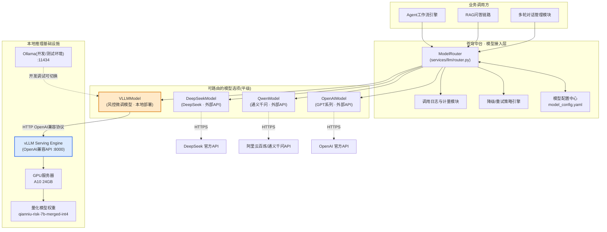
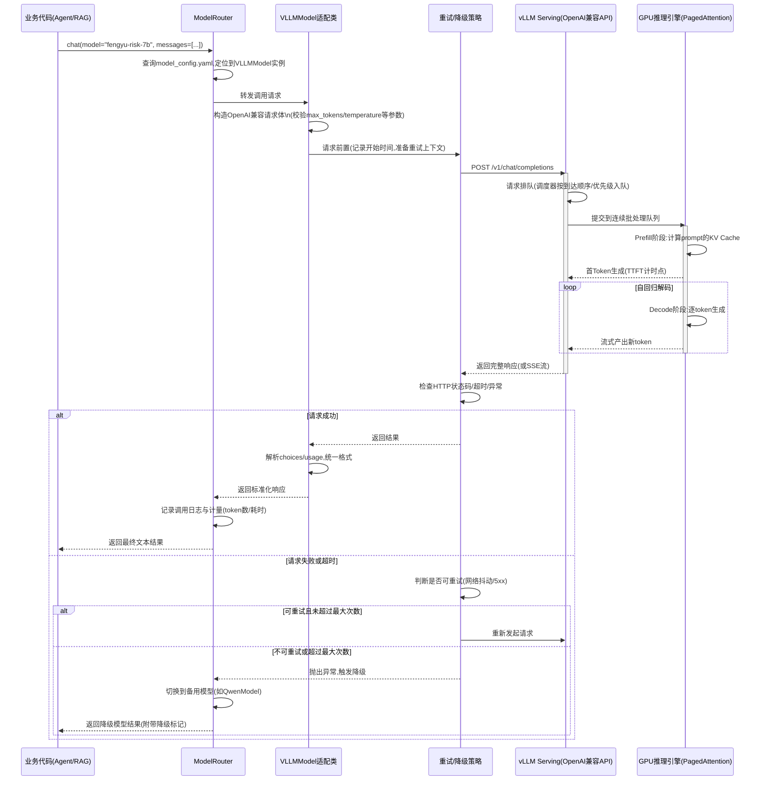
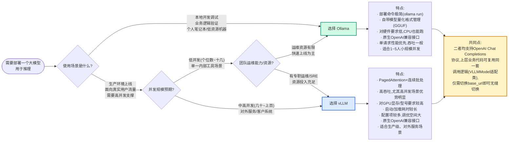

# 第55天:本地部署与推理服务

## 课程元信息

- **课程阶段**:阶段五·模型微调与部署上线(Stage 5: Finetune & Deploy)
- **当前进度**:第55天 / 共70天
- **主讲导师**:王振宇(老王,蓬远科技AI中台首席架构师)
- **协同讲解**:孙昊(蓬远科技运维工程组组长,负责生产环境部署与SRE)
- **学员**:陈铭(蓬远科技AI应用工程师,"苍穹企业级智能体中台"项目组)
- **所属产品**:苍穹企业级智能体中台
- **关联客户项目**:御风金融——智能风控助理与合规问答项目
- **前置知识**:Day51~Day54(LoRA微调原理、数据构造、训练调参、模型合并与量化)
- **本篇技术主线**:Ollama本地化部署与OpenAI兼容接口、vLLM高性能推理引擎部署、吞吐量压测方法论、微调模型接入苍穹统一模型路由层
- **今日产出物**:可用的本地推理服务(Ollama)、生产级推理服务(vLLM)、压测报告、路由层新增`VLLMModel`适配代码
- **建议学习时长**:6~7小时(含实操)
- **配套交付物清单**:Ollama部署脚本与客户端代码、vLLM启动脚本与容器化配置、吞吐量压测脚本与对比报告、`services/llm/router.py`新增`VLLMModel`代码与单元测试、健康巡检脚本
- **学习方式说明**:本篇以孙昊主导实操、陈铭全程动手参与、老王负责架构把关的协作方式展开,建议学员在阅读时同步在自己的环境里跟做一遍代码实战部分,而不仅仅是阅读讲解文字,部署与压测类的知识点,只看不动手很难真正吃透

---

## 【旁白】

模型合并量化之后,那个叫`qianniu-risk-7b-merged-int4`的文件夹,在陈铭的电脑上安安静静躺了一整晚。它不再是训练脚本跑完之后那一堆checkpoint里最新的一个,而是一个真正意义上"完整"的模型——权重合并了,量化也做完了,体积从原来接近30个G压到了不到5个G。可陈铭盯着那个文件夹看了很久,心里其实没什么底气:一个模型文件放在硬盘里,跟一个"能被业务系统调用的服务",中间隔着的东西,远比他昨天想象的要多。他甚至设想过,是不是写个Flask接口把模型`generate`方法包一下就完事了。直到今天早上,孙昊拎着笔记本走进会议室,把这个念头直接打没了。孙昊是那种话不多、但每句话都带着"我们线上出过事"的运维老兵,他往桌上一放笔记本,屏幕上还开着御风金融那次大促期间的QPS监控曲线截图,说了一句:"陈铭,你猜昨天你们训练组发我的那个模型,单卡跑批量推理,吞吐能到多少?"陈铭说不知道,大概几十token每秒?孙昊笑了笑,没直接回答,而是说:"今天这一天,咱俩把这个数字,从'能跑'变成'能扛'。"这一天的故事,就从这句话开始。

---

## 一、晨会纪要

**时间**:2026年X月X日,09:00-09:35
**地点**:蓬远科技三楼AI中台项目会议室
**参会人**:王振宇、孙昊、陈铭,以及项目经理林悦(线上参会)
**会议主题**:微调模型本地部署方案确认与推理服务接入排期

---

老王先开场,他没有直接讲技术,而是先把这一天的定位说清楚了。他说:"Day54咱们把御风金融那个风控问答模型的LoRA权重合并进了base model,又做了INT4量化,模型文件是拿到手了。但我要提醒大家一句——一个'.bin'或者'.gguf'文件,本质上跟一份Word文档没什么区别,它自己不会说话,得有一个'服务'把它包起来,对外暴露一个能被调用的接口,这才叫'推理服务'。今天这一天,咱们要解决两件事:第一,怎么把这个模型跑起来,变成一个真正能通过网络请求访问的服务;第二,这个服务要能塞进咱们苍穹中台现有的模型路由层里,跟DeepSeek、通义千问这些外部API模型平起平坐,业务代码不用改一行,只要在配置里切一下`model_name`,就能路由到咱们自己微调的模型上。"

孙昊接过话,他的风格跟老王不太一样,老王偏爱先讲原理再讲场景,孙昊更喜欢直接上结论再倒推理由。他说:"我先说个数字镇场子。上周我们帮另一个项目组做过一次对比测试,同样一张A10显卡,同样一个7B模型,用最简单的HuggingFace `transformers`库直接`generate()`,单请求的吞吐大概是十几到二十token/s;换成vLLM之后,在有一定并发的情况下,单卡吞吐能拉到一百六十甚至两百token/s以上,并发数越高优势越明显。这不是玄学,是engine层面上做了PagedAttention、连续批处理(continuous batching)这些工程优化。但vLLM也不是万能钥匙——它对显存要求高,启动慢,对小模型、开发调试场景来说有点'杀鸡用牛刀'。所以今天我们要讲两套东西:Ollama,给开发调试、本地验证用;vLLM,给生产环境、真正扛并发用。这两个工具的定位完全不一样,别学混了。"

陈铭听到这里插了句嘴,他问:"那御风金融那边最终上线,是用vLLM对吧?那Ollama是不是就没什么用了,直接跳过学vLLM是不是更快?"

老王摇头,说这个问题问得好,但结论不对。他说:"陈铭你想一下,你现在手里这个量化后的模型,是不是还没做过任何'它到底行不行'的验证?模型合并量化的过程里,精度可能有损失,格式转换可能出问题,Prompt模板可能对不上——这些问题,你要是直接一步上vLLM去调试,会很痛苦。vLLM启动一次可能要几十秒到几分钟,改一个参数、换一个模型路径,又要重启一次,一次实验成本很高。Ollama不一样,它一行命令就能把模型跑起来,对话式交互立刻能看到效果,调prompt模板、验证模型有没有'学傻'、检查tokenizer有没有配置错,这些工作用Ollama做效率是最高的。等你确认模型本身没问题了,再上vLLM去解决'能不能扛住高并发'这个工程问题。这是两个不同阶段要解决的不同问题,不是谁取代谁的关系。"

孙昊补充说,他还有一个理由,是从运维视角出发的:"我们内部很多项目,包括咱们中台本身,现在都有一个'本地开发环境'的需求——工程师在自己电脑上开发业务代码的时候,不可能每次都请求线上的vLLM集群,那边资源是给生产用的,而且我们也不想让每个人的本地调试都打到共享的GPU服务器上。Ollama可以在工程师的笔记本上,甚至是没有GPU、只用CPU跑一个小一点的量化模型,把整套业务逻辑先跑通,包括咱们的路由层、咱们的Agent工作流、咱们的RAG检索链路,全都可以先接一个本地Ollama模型跑起来。等本地全跑通了,换个配置指向线上vLLM服务,直接就能用。这是我们苍穹中台'模型可插拔'这个设计理念真正的价值所在——今天要做的事情,某种意义上也是在验证这套架构设计到底扎不扎实。"

林悦在线上问了一个偏项目管理的问题,她问:"这两部分工作今天一天能做完吗?我看排期表上写的是Day55一天,Day56是容器化和整体上线,如果今天卡住了会不会影响明天?"

老王说时间是够的,但他也提了个要求:"今天孙昊主导部署这一块,陈铭你全程跟着,不是看,是要动手。上午咱们先把Ollama这条线走完,包括本地部署、OpenAI兼容接口验证;下午重点是vLLM,部署、压测、然后重头戏——把vLLM服务接进咱们`services/llm/router.py`那套路由代码里。这块代码陈铭你要亲手写,写完孙昊帮你review,今天必须落地,不能只是'讲讲原理'。今天要是有哪块卡住了,晚上咱俩留下来一起看,不能拖到明天,因为Day56要做容器化和K8s部署,前提是今天这个推理服务本身得先跑稳。"

孙昊最后补了一句,带着点开玩笑但又很认真的语气:"我提前说个丑话,今天压测的时候大概率会看到一些'意外',比如显存溢出、并发一高延迟就飙升、甚至进程直接被OOM killer干掉。这些都正常,运维这行,'第一次部署一次成功'基本是运气,'第一次部署炸了但排查明白了为什么炸',才是真收获。陈铭你做好心理准备,今天大概率要跟日志和显存占用曲线'较劲'。"

林悦追问了一句关于客户沟通口径的问题,她说:"御风金融那边的技术对接人上周问过一句,'你们这个模型是不是要重新买一批GPU才能上线',我当时没答上来,今天有没有可能顺便把这个问题的答案定下来?"孙昊说这个问题恰好可以借今天的压测数据回答,他解释说:"咱们现在手头这张A10,是公司内部已经在用的资源,不是专门为这个项目新采购的。今天下午压测出来的数据,会直接告诉我们单卡能扛多大的并发,如果这个数字覆盖不了御风金融的真实流量峰值,那咱们再去谈需要几张卡、或者要不要上更高规格的卡,这是一个用数据驱动的决策,不能先拍板买卡再验证,那样成本控制不住。"老王补充说,这也是今天这一天工作的一个隐藏价值——不只是把服务跑起来,更是要为后续的资源投入决策提供依据,这份压测报告最后是要写进给客户的技术方案里的,不是内部自娱自乐的练习。

林悦又问了一句关于时间线的细节:"如果今天vLLM那部分卡在环境搭建上,比如显卡驱动、CUDA版本对不上这种问题,大概预留多长时间做缓冲?"孙昊说他已经提前在这台服务器上装好了驱动和依赖环境,今天早上来之前特意验证过`nvidia-smi`和`python -c "import torch; print(torch.cuda.is_available())"`都是正常的,所以环境层面的风险已经提前排除了,今天主要的时间应该花在参数调优、压测方法设计,以及最重要的路由层代码这几块上。老王听完点头,说这种"提前把环境风险清空,把课堂时间留给真正有教学价值的内容"的做法,值得陈铭以后自己带项目的时候借鉴——运维工作里,很多低效率不是花在解决真问题上,而是花在临时排查环境问题上,提前做好准备可以把整块时间效率拉满。

会议在09:35结束,三人直接转场到工位,孙昊的电脑已经提前登录了那台配了A10显卡的GPU服务器。

---

## 二、需求文档:推理服务性能与接口兼容性要求

在正式动手之前,孙昊要求先把需求文档过一遍。他的原话是:"运维部署不是'把服务跑起来就行',是要对着明确的验收指标去部署。没有指标,你怎么知道今天做的东西'够不够好'?"以下是这次由孙昊主笔、陈铭补充、老王评审通过的需求文档正文。

### 2.1 背景与目标

御风金融的智能风控助理与合规问答项目,经过前四天的数据构造、LoRA微调、评测调优、模型合并量化,已经产出了一个基于开源7B基座模型微调而来的领域模型(以下简称"风控模型"),该模型在风险条款问答、合规话术生成等垂直任务上的表现,已经通过了Day54的离线评测,准确率与专业术语覆盖率均达到验收标准。

本阶段的目标,是把这个"离线可用"的模型,转化为"在线可服务"的推理接口,并达成以下三个层面的要求:

1. **可用性要求**:模型能够以标准化的网络接口形式被访问,协议层面要与业界主流的OpenAI Chat Completions接口格式保持兼容,这样苍穹中台现有的所有上层业务代码(Agent工作流、RAG问答链路、多轮对话管理)不需要为了适配这一个新模型而修改任何调用逻辑。
2. **性能要求**:在生产环境的并发访问场景下,推理服务需要满足御风金融给出的SLA(服务水平协议)指标,包括吞吐量、首token延迟、单请求总延迟等维度的量化标准。
3. **可路由要求**:该模型服务必须能够无缝接入苍穹中台的统一模型路由层(`services/llm/router.py`),与现有的DeepSeek、通义千问等外部API模型使用同一套调用接口,业务方通过配置切换`model_name`即可在多个模型之间自由切换,不需要感知底层是本地部署模型还是外部API模型。

### 2.2 性能指标要求(SLA)

孙昊拿出了御风金融那边风控客服系统的历史流量数据做了估算,结合合规问答场景"用户等待感知"的特殊性(用户在等待一个风险条款的解释时,能接受的等待时间比普通聊天场景略长,但不能太离谱),给出以下具体指标:

| 指标项 | 目标值 | 说明 |
|---|---|---|
| 并发请求数(峰值) | 支持≥50并发 | 参考御风金融风控客服系统历史峰值流量的1.5倍冗余 |
| 系统吞吐量(QPS) | ≥8 QPS(50并发场景下) | 以平均输出200 token的问答场景为基准估算 |
| Token吞吐量 | ≥800 token/s(聚合,50并发) | 单卡A10场景下的目标值,多卡环境按比例上调 |
| 首Token延迟(TTFT) | P95 ≤ 1.5秒 | 影响用户感知的"是否卡顿"的核心指标 |
| 单请求总延迟 | P95 ≤ 6秒(输出256 token场景) | 覆盖排队等待+生成时间 |
| 服务可用性 | ≥99.5% | 单实例;生产环境建议多副本+负载均衡 |
| 显存占用上限 | 单卡不超过22GB(A10 24GB显卡) | 预留显存给KV Cache动态增长和系统开销 |

需要特别说明的是,这份指标是"生产环境验收标准",不是"今天一定要跑到"的标准。孙昊在文档评审会上特意加了一句备注:"今天这一整天的目标,是搭好压测方法论、跑出一个基线数据、找到瓶颈在哪、给出优化方向。真正能不能达标,还要看接下来资源投入(比如是不是要上多卡、是不是要做PD分离等更复杂的优化手段),这些留在后续迭代里去做,不是今天一天能解决的。"

### 2.3 接口兼容性要求

这一部分是陈铭主要负责补充的,因为他更熟悉苍穹中台上层业务代码对模型接口的依赖方式。他梳理了以下几点硬性要求:

1. **请求格式兼容**:接口需要接受符合OpenAI Chat Completions规范的请求体,至少支持`model`、`messages`、`temperature`、`max_tokens`、`top_p`、`stream`这几个字段,其中`messages`要支持`system`、`user`、`assistant`三种角色的多轮消息数组。
2. **响应格式兼容**:非流式响应需要返回标准的`choices[0].message.content`结构,并携带`usage`字段(`prompt_tokens`、`completion_tokens`、`total_tokens`);流式响应需要以SSE(Server-Sent Events)格式返回,每个chunk遵循`chat.completion.chunk`的对象结构。
3. **模型标识透明化**:在苍穹路由层的配置文件里,这个本地部署模型要有一个对内的模型标识(比如`fengyu-risk-7b`),业务代码只需要知道这个标识,不需要知道背后到底是Ollama还是vLLM在跑,也不需要知道具体的服务地址、端口。
4. **异常处理一致性**:当推理服务出现超时、显存不足、模型加载失败等异常时,需要能被路由层统一捕获,并支持配置降级策略(比如自动切换到备用的通义千问模型),不能让异常直接冒泡到业务层导致整个对话链路崩掉。
5. **健康检查接口**:服务需要暴露一个`/health`或等价的健康检查端点,供运维层做存活探测,这是Day56要做容器化和K8s部署时`livenessProbe`、`readinessProbe`的前提条件。

在正式敲定这份表格之前,三人还围绕"这些数字是怎么来的"讨论了一阵,陈铭当时提出了一个疑问,他说:"50并发这个数字,是不是应该跟御风金融要一份他们真实的线上流量统计,而不是咱们自己估的?"孙昊说这个想法完全正确,而且他确实已经跟对方的技术对接人要过一份历史流量日志,只是考虑到今天课堂时间有限,先用一个"历史峰值的1.5倍"这样的估算规则给出一个可以先动手的目标值,真实的流量画像分析,会作为后续排期里单独的一项任务去做,不会拿一个凑出来的数字就直接定成最终的验收标准。老王补充说,这也是需求文档写作上一个常见的误区:很多团队为了"看起来有依据",随手编一个数字放进文档里,却没有标注这个数字的估算逻辑和局限性,导致后续所有人误以为这是一个经过严格测算的精确值,一旦跟真实情况偏差较大,又找不到当初是怎么算出来的,给项目复盘和责任追溯带来很大困扰。所以孙昊坚持在文档里把每一个数字的来源和估算逻辑都写清楚,哪怕只是"暂定值、待后续用真实流量数据校准",也要明确标注出来,不能让文档看起来"信息量很足"但实际经不起推敲。

老王看完这份文档,给了一个评价,他说:"这份文档写得比我预想的细,尤其是接口兼容性这部分,说明陈铭这段时间对咱们中台的架构理解是真往深里走了。我补充一点:接口兼容性这件事,本质上解决的是'解耦'问题。业务代码只认一套接口协议,不管模型是自研还是外采,是本地还是云端,这是一个成熟中台产品必须具备的能力,也是咱们苍穹能同时服务多个客户、每个客户模型选型都可能不一样的核心竞争力所在。今天这一步做扎实了,以后不管是给御风金融换模型,还是给下一个客户接入他们自己的私有模型,都是配置层面的事,不需要动业务代码一行。"

孙昊则从他的角度补充了一条运维视角的要求,加进了文档:"我要求今天写的部署脚本、启动脚本,全部要做到'参数外置',也就是显卡编号、端口号、模型路径、最大并发数这些,都不能写死在代码里,要从环境变量或者配置文件读取。这不是吹毛求疵,这是我们运维踩过的坑——写死路径的脚本,换一台机器就得改代码重新走发布流程,风险大、效率低。"

### 2.4 验收流程与责任分工

需求文档定稿之后,孙昊还补了一段验收流程的说明,他认为一份没有验收流程的需求文档等于没写完。他把今天的验收拆成三个检查点:第一个检查点在上午Ollama部署完成之后,验收标准是"能通过OpenAI兼容接口成功调用风控模型,并且输出内容没有出现异常特殊token、没有明显的胡言乱语",这一步主要是验证模型本身经过量化之后语义能力没有被破坏;第二个检查点在下午vLLM压测完成之后,验收标准是"至少完成50并发场景下的一轮完整压测,产出包含QPS、Token吞吐、TTFT分位数、总延迟分位数的报告",这一步验证的是性能是否达到需求文档里定义的目标区间,或者至少要清楚地知道跟目标区间之间还差多少、差在哪里;第三个检查点在路由层代码完成之后,验收标准是"新增的VLLMModel通过单元测试,并且能够被ModelRouter按照配置正确调度,降级链路验证有效",这一步验证的是工程集成质量。孙昊说:"三个检查点,任何一个不过,今天这一天就不能算合格完成,不是走个形式。"

老王在这基础上补充了责任分工:孙昊主导环境搭建、部署脚本、压测脚本编写,并对最终的性能数据和部署稳定性负责;陈铭主导Ollama客户端代码、路由层VLLMModel适配代码编写,并对接口兼容性和代码质量负责;两人在每个检查点相互review,任何一方发现问题都有权要求另一方返工,不能因为"这块不是我负责的"就放任问题过关。老王特别对陈铭说:"你今天不是旁听生,是共同责任人,孙昊部署脚本里的参数设置,你也要看得懂、说得出为什么这么设,不能只管自己那一块代码。"

### 2.5 已识别风险与应对预案

会议评审这份需求文档的时候,三人还一起过了一遍可能遇到的风险点,并提前商定了应对预案,这部分也被写进了文档的附录。第一个风险是模型格式转换失败或转换后效果异常,应对预案是:如果GGUF转换或者AWQ量化过程中出现精度明显下降的情况,优先检查转换脚本的参数是否跟Day54量化时使用的方案一致,如果问题无法在当天解决,退回使用Day54验证过的原始量化产物直接接入vLLM(vLLM本身也支持直接加载常见的量化格式,不一定非要走额外转换)。第二个风险是压测过程中GPU持续报OOM,应对预案是:逐步降低`--gpu-memory-utilization`和`--max-num-seqs`,采用"控制变量法"一步步试探显存安全边界,而不是凭感觉大幅调整参数。第三个风险是路由层代码集成时发现现有的`BaseLLMModel`抽象接口无法很好地覆盖vLLM的某些特性(比如某些vLLM特有的采样参数),应对预案是优先通过`**kwargs`这种扩展性设计兼容差异化参数,不轻易改动已经在生产环境跑着的`OpenAIModel`等既有类的接口签名,保证向后兼容。孙昊说这份风险预案不是走流程摆样子,他自己就在笔记本上记了一份,今天遇到问题第一时间对照着排查,而不是临时现想办法。

在需求文档正式定稿、准备签字之前,林悦还在线上补了最后一个问题,她问:"这份文档后面要不要同步一份给御风金融那边的技术团队过目?他们上次说过希望能参与一部分验收标准的制定。"老王说这是必要的,他解释道:"性能指标和接口规范这类文档,如果只是咱们内部关起门来定,客户后续验收的时候完全可能提出不同的理解或者更高的期望,到时候扯皮的成本比现在多花十分钟对齐要高得多。今天先按咱们内部的专业判断把初稿定下来,今晚或者明天,林悦你安排一次跟对方技术负责人的对齐会,把这份文档过一遍,如果他们有更具体的量化要求或者不同的优先级排序,我们再做调整,但调整的动作要走变更记录,不能随口改了就算了,这也是咱们对客户负责、对自己项目进度负责的基本做法。"林悦答应会尽快安排,并说她会把今天这份文档的版本号和关键决策点记录进项目管理系统,方便后续跟进变更历史。

这份需求文档最终由老王签字确认,作为今天全部实操工作的验收依据。

---

## 三、架构设计图

需求文档定下来之后,老王在白板上先画了一版架构草图,随后让陈铭把它整理成正式的Mermaid架构图,存进项目文档库。这张图的核心,是要说明微调模型部署成服务之后,是怎么"嵌入"到苍穹中台已有的模型接入层里的,以及它和DeepSeek、通义千问这些外部API模型,在架构上是完全平级的关系。



老王讲这张图的时候,特别强调了`C4`这个节点——也就是`VLLMModel`——在整张图里的位置。他说:"你们看这张图,`C1`到`C4`这四个模型适配类,在架构层面是完全平级的,它们都挂在同一个`ModelRouter`下面,对`ModelRouter`来说,调用`VLLMModel`和调用`QwenModel`没有任何本质区别,都是调一个统一的`chat()`方法,传进去messages,拿到返回的文本。区别只在于`VLLMModel`内部去请求的,不是阿里云的公网API,而是咱们自己机房里那台GPU服务器上跑着的vLLM进程,走的是内网HTTP。这个设计的好处是什么?是当御风金融要求'合规问答的数据不能出内网'的时候,咱们可以直接把`model_name`配置成`fengyu-risk-7b`,流量根本不会离开咱们自己的机房,但对上层业务代码来说,调用方式跟调用GPT-4没有任何区别。这就是'可插拔'架构真正的价值。"

陈铭指着图里的`D4`——Ollama那个节点——问:"这个虚线connect到`C4`是什么意思?"

孙昊解释说:"这个意思是,`VLLMModel`这个适配类,它内部去请求的目标地址是可以配置的。今天咱们主要是接vLLM服务的地址,但如果哪个工程师在本地开发环境,想用Ollama跑的同一个模型去测试业务逻辑,只需要把配置里的`base_url`从vLLM服务的地址换成本地Ollama的`http://localhost:11434/v1`,因为这两者都实现了OpenAI兼容接口,所以在代码层面,甚至不需要建立一个额外的`OllamaModel`类,直接复用`VLLMModel`这套逻辑就能跑,因为协议是一样的。这也是为什么咱们上午要先讲Ollama、下午再讲vLLM——它们背后遵循的是同一套接口规范,理解了这一点,你会发现今天要写的代码复用度很高。"

老王补充说这张图还有一个隐藏的信息,就是`B3`降级/重试策略引擎和`B4`调用日志与计量模块,这两个模块虽然图上占的位置不大,但今天下午写路由层代码的时候一定要覆盖到,因为需求文档里明确写了"异常处理一致性"这一条,这不是可选项。

---

## 四、请求调用流程图

架构图讲完之后,孙昊又补了一张更细粒度的流程图,聚焦在"一次推理请求"从苍穹后端发出、到vLLM服务处理、再把结果返回给业务方的完整链路上。他说这张图是给陈铭下午写`VLLMModel`代码时候的"设计蓝图",每一步对应代码里的一个具体逻辑分支。



孙昊解释这张图的时候,重点讲了两个阶段:Prefill和Decode。他说:"这两个概念,你今天下午写压测脚本、看vLLM日志的时候会天天碰到,必须搞清楚。Prefill阶段,是模型把你输入的整段prompt,一次性算出每个token对应的KV Cache,这个阶段是并行计算,对GPU算力(compute-bound)要求高,输入越长这一步越慢;Decode阶段,是模型一个token一个token地往后蹦,每生成一个新token都要用到之前所有token的KV Cache,这个阶段更多是显存带宽(memory-bound)的瓶颈,而不是算力瓶颈。这也是为什么vLLM的核心创新PagedAttention,主要优化的就是KV Cache的显存管理效率——它把KV Cache像操作系统管理内存分页一样切成小块管理,减少显存碎片,这样才能在同一张卡上塞下更多并发请求的KV Cache,从而实现更高的吞吐。"

陈铭问:"那图里'首Token生成'这个时间点,是不是就是咱们需求文档里说的TTFT?"

孙昊说对,他说TTFT(Time To First Token)本质上约等于Prefill阶段耗时加上排队等待时间,"用户体感上,TTFT决定了'这个AI是不是反应快',哪怕后面吐字慢一点,只要第一个字出来得快,用户主观感受就会好很多,这也是为什么几乎所有严肃的LLM产品都做流式输出,而不是等全部生成完再一次性返回。"

老王在旁边补了一句更偏架构的话:"这张流程图里,你们要特别注意`alt 请求失败或超时`这个分支,这是我要求陈铭下午代码里必须要写的,而且要写得像样,不能只是简单套一个`try...except`。'异常处理一致性'这条需求,落到代码里,就是这张图里画的这套重试+降级逻辑。这套东西看起来是'兜底',但在生产系统里,恰恰是决定系统鲁棒性的核心部分,好的架构师往往是从异常路径的设计质量上分高下的。"

孙昊又补充了一点运维视角的细节,他指着图里`Router`记录调用日志与计量那一步说:"这一步很多团队在设计的时候容易漏掉,或者干脆放在业务代码里散着记,东一处西一处。咱们这次设计,是把日志与计量收敛到路由层这一个统一的地方去做,好处是无论业务方是从Agent工作流调过来的,还是从RAG问答链路调过来的,只要是经过`ModelRouter`,调用记录就一定会被记下来,格式也是统一的,这对后续做成本核算、做异常告警、甚至做客户侧的用量对账,都是至关重要的基础设施。你们可以想一下,如果这个记录逻辑散落在各个业务模块里,只要有一个模块忘了加日志,就会出现'这一批调用去哪了'查不到的情况,这种数据缺口在跟客户对账的时候是很麻烦的事。"

陈铭又问了一个问题:"图里画的是单次请求的调用链路,如果同一时间有几十个请求同时打过来,这些请求在`ModelRouter`这一层是怎么被处理的,是不是也要排队?"孙昊解释说:"`ModelRouter`本身在咱们的设计里是无状态的,也就是说它自己不维护请求队列,不做请求层面的调度,它只是把请求转发给对应的模型适配类,而真正的排队调度逻辑,是在vLLM服务内部的调度器(scheduler)那一层完成的——这也是我们上午和下午反复强调的连续批处理机制在起作用。所以`ModelRouter`这一层的设计目标,更多是保证'调用逻辑的统一性和容错性',而不是自己去做流量控制,流量控制这件事,交给更专业的推理引擎内部机制去做,这是一个分层设计的思路,每一层只负责自己最擅长、最该负责的事情,不要什么都往一个模块里堆。"老王补充说,这个"分层负责"的原则,以后设计任何系统模块边界的时候都要反复问自己:这一层该管的事情是什么,不该管的事情又是什么,如果发现某一层承担了太多本不该属于它的职责,往往就是架构该重新梳理的信号。

---

## 五、Ollama与vLLM场景对比示意图

上午正式开工之前,孙昊画了第三张图,专门用来讲清楚Ollama和vLLM这两个工具"该在什么场景下用"的问题。他强调这张图不是技术架构图,是一张"决策辅助图",目的是让陈铭以后遇到新项目的时候,能快速判断该选哪个工具,而不是死记硬背。



孙昊讲这张图的时候用了一个类比,他说:"你可以把Ollama理解成'小米自己在家煮的一壶茶',简单、够用、自己喝没问题;vLLM是'茶馆里那种大锅炉',启动麻烦一点,但一次能供几十上百人同时喝,而且效率是专门优化过的。今天咱们御风金融这个项目,最终肯定是要用vLLM去扛生产流量,但陈铭你以后自己业余搞点小项目,或者给团队内部工具做个demo,完全没必要一上来就上vLLM,Ollama分钟级就能把一个模型跑起来体验,这才是它真正的价值定位。"

陈铭看着这张图,问了一个很实际的问题:"那这个图里最后那个'共同点'的框,是不是意味着我今天下午写的`VLLMModel`这个类,其实理论上也能直接拿去接Ollama,不用改代码?"

孙昊说:"完全正确,这也是我们上午先讲Ollama的另一个原因——你上午在Ollama上把这套OpenAI兼容接口的调用逻辑走通了,下午写vLLM的适配代码,你会发现改动量很小,核心逻辑是复用的,无非是`base_url`不一样、还有一些vLLM特有的启动参数配置不一样。这也印证了咱们苍穹中台架构设计上的'协议先进先立'思路——只要大家都遵循OpenAI这套事实标准协议,底层实现换来换去,上层适配代码的改动成本就能压到最低。"

老王最后总结说这张图揭示了一个更普遍的工程原则:"选型不是非黑即白的'哪个更好',是'哪个更适合当下这个场景'。你们以后做架构决策,永远要先问清楚场景约束——并发规模、团队运维能力、上线时间要求、成本预算,再去谈技术选型,不要为了炫技去选一个'更高级'但其实用不上的方案,那是本末倒置。"

陈铭还追问了一个更细节的问题:"如果以后御风金融的业务量涨上去了,现在这一张A10扛不住了,是应该考虑加卡做张量并行,还是应该考虑换一张更强的卡,比如A100?"孙昊说这是一个典型的成本和性能权衡问题,没有放之四海而皆准的答案。他解释说,加卡做张量并行(`--tensor-parallel-size`调大)的好处是可以线性(或接近线性)地扩展模型能承载的并发量和吞吐,同时也能支撑更大的模型;但多卡之间需要走NVLink或者PCIe通信,如果硬件互联带宽不够,通信开销会侵蚀掉一部分理论上的性能提升,所以加卡不是无脑越多越好。换更强的卡(比如从A10换到A100)的好处是单卡本身的算力和显存带宽都大幅提升,不需要考虑多卡通信开销,但采购和运维成本也高得多。孙昊给了一个经验性的判断标准:"如果当前瓶颈主要是显存不够、装不下更多并发的KV Cache,考虑换大显存的卡或者加卡分摊;如果瓶颈是算力不够、单请求生成速度本身就慢,那换算力更强的卡收益更直接。这需要结合压测数据具体判断,而不是凭感觉决定,这也是为什么今天咱们要把压测这件事做得严谨,以后这些扩容决策都要靠今天这类数据说话。"老王补充说,这类横向扩容(加卡)和纵向扩容(换卡)的权衡讨论,以后在给客户做技术方案汇报的时候也是一个高频会被问到的问题,提前想清楚背后的判断逻辑,比临场现编要靠谱得多。

---

## 六、课堂笔记

### 上午:Ollama本地部署与OpenAI兼容接口

上午的课,孙昊主要负责操作演示,陈铭在自己的电脑上同步跟着做,老王时不时插话补充原理。以下是陈铭整理的课堂笔记,经过老王和孙昊review确认无误。

**1. Ollama是什么,解决了什么问题**

Ollama本质上是一个模型运行时管理工具,它把"下载模型权重、做量化格式转换、加载进内存、暴露服务接口"这一整套繁琐流程,包装成了几个简单的命令。它的核心设计理念,借用了容器技术里"镜像"的思路——每个模型被打包成一个类似镜像的单元(底层用的是GGUF格式,是llama.cpp生态里通用的量化模型格式),用户不需要关心这个模型内部到底是怎么量化的、tokenizer配置文件在哪、prompt模板长什么样,一个`ollama pull`或者`ollama run`命令就能把整个模型跑起来。

孙昊强调了一个关键点:"Ollama底层用的推理引擎是llama.cpp,这是一个纯C/C++实现的推理引擎,专门为了在消费级硬件(甚至没有GPU、纯CPU)上跑大模型量化版本而设计的。这意味着Ollama天生适合本地开发环境、边缘设备部署这种资源受限的场景,但也正因为它的设计目标不是'极致吞吐',所以在高并发场景下,它的表现是打不过vLLM的,这不是Ollama做得不好,是它俩的设计目标本来就不一样。"

**2. Modelfile机制**

Ollama有一个类似Dockerfile的概念叫Modelfile,用来定义一个"自定义模型"——可以指定基座GGUF文件的路径,设置默认的system prompt、temperature、上下文长度等参数,甚至可以定义prompt模板(TEMPLATE指令)。今天要把陈铭合并量化后的风控模型接入Ollama,核心步骤就是:先把模型转换/确认成GGUF格式,再写一个Modelfile,通过`ollama create`命令把它注册成一个Ollama可管理的模型。

需要特别注意的是,陈铭Day54产出的量化模型是INT4量化,但格式不一定是GGUF(取决于用的量化工具,比如AutoGPTQ产出的是GPTQ格式,而llama.cpp生态用的是GGUF格式)。孙昊提到,如果格式不匹配,需要用`llama.cpp`仓库自带的转换脚本(`convert-hf-to-gguf.py`)先把HuggingFace格式的合并后模型转成GGUF,再做量化(或者直接转换成量化后的GGUF,比如Q4_K_M这种量化等级),这一步孙昊上午带着陈铭实际操作了一遍,细节写进了下面的代码实战部分。

**3. OpenAI兼容接口的具体含义**

这是上午课堂讨论最久的一个点。孙昊解释说:"'OpenAI兼容',具体来说,指的是Ollama(以及vLLM)在暴露服务的时候,除了自己原生的API格式之外,额外实现了一套跟OpenAI官方API请求/响应结构完全一致的接口层。举个例子,Ollama原生接口是`POST /api/chat`,但它同时也支持`POST /v1/chat/completions`,后者的请求体、响应体格式,跟你直接调用`https://api.openai.com/v1/chat/completions`是一模一样的。这意味着,如果你的代码里用的是OpenAI官方的Python SDK(`from openai import OpenAI`),只需要把`base_url`参数指向Ollama本地服务的地址(比如`http://localhost:11434/v1`),`api_key`随便填一个占位字符串(因为本地服务不做真实鉴权),其他代码一行都不用改,直接就能调用本地模型。"

陈铭问了个问题:"那既然有原生接口,为什么还要多此一举做一个OpenAI兼容层?"老王回答了这个问题,他说:"这是生态位的问题。OpenAI的接口协议,因为它出现得早、用户基数大,已经变成了事实上的行业标准,几乎所有的上层框架——LangChain、LlamaIndex,还有咱们自己苍穹中台的路由层——都是围绕这套协议设计适配接口的。任何一个新的推理引擎,如果只做自己的一套原生协议,就意味着所有想用它的人都要重新写一套适配代码,这个生态成本太高了。反过来,只要做了OpenAI兼容层,几乎可以'零成本'接入现有生态里所有围绕OpenAI协议设计的工具链。这是一个很典型的'兼容事实标准降低生态摩擦成本'的工程决策,你们以后设计任何对外接口,都可以参考这个思路——如果领域内已经有事实标准协议,优先做兼容,而不是另起炉灱。"

**4. 实操中遇到的具体问题**

上午实操过程中出现了几个小插曲,陈铭都记录了下来:

上午实操整体是围绕陈铭自己的电脑和孙昊那台服务器同步展开的,孙昊要求陈铭必须在自己的笔记本上完整跑一遍流程,而不是只在服务器上看孙昊操作,他说"部署这类技能,眼睛看会和手上做过完全是两回事,很多细节只有自己踩过坑才能真正记住"。

第一个问题是显存/内存不足的报错。因为陈铭电脑上没有独立显卡,一开始尝试直接跑7B模型的Q4量化版本,内存占用一度冲到接近16GB,系统一度卡顿。孙昊建议换成Q4_K_M这种量化等级更激进、模型体积更小的版本(大概4GB左右),同时把上下文长度参数`num_ctx`调小一点,问题就解决了。他借这个机会强调:"量化等级的选择,本质上是精度和资源占用之间的权衡,Q4_K_M是目前社区里公认的'性价比最高'的量化等级之一,在大多数场景下精度损失可以接受,但对咱们这种垂直领域微调模型,最好还是要过一遍Day54那套评测集,确认量化没有明显伤害到领域能力,不能想当然。"

第二个问题是Modelfile里`TEMPLATE`没写对,导致模型输出里混进了一些奇怪的特殊token(类似`<|im_start|>`没有被正确处理,直接输出成了文本)。这个问题排查了大概二十分钟,最后定位是因为微调训练用的对话模板跟基座模型默认的模板不完全一致,Modelfile里需要显式声明跟训练时一致的模板格式,才能保证推理时的输入格式跟训练时对齐。孙昊说这是个很常见的坑:"训练和推理的prompt模板必须严格对齐,哪怕多一个空格、少一个换行,在有些模型上都可能导致效果明显下降,这是很多团队上线之后发现'模型效果跟离线评测不一致'最常见的原因之一。"

第三个问题是Ollama的默认服务只监听了`127.0.0.1`,如果需要在局域网内让别的机器访问(比如陈铭想用自己的笔记本调用孙昊那台服务器上跑的Ollama服务做测试),需要设置`OLLAMA_HOST=0.0.0.0`环境变量重启服务。这个点孙昊特意提醒说:"生产环境永远不要图方便直接`0.0.0.0`不做任何访问控制,今天这是内网测试环境,可以这么干,但这是一个安全上的坑,以后有对外服务的场景,一定要配防火墙规则、做鉴权。"

**5. Ollama的模型管理与生命周期命令**

孙昊额外补充了一组日常会高频用到的Ollama命令,他要求陈铭全部实操过一遍,不能只是听。`ollama list`用于查看当前机器上已经注册的全部模型及其体积;`ollama show fengyu-risk-7b`可以查看某个模型具体的Modelfile内容、参数配置,这在排查"这个模型到底是用什么参数跑起来的"这类问题时非常关键,尤其是当同事之间协作、有人换了个Modelfile参数却忘记同步的时候,第一反应就应该是执行这条命令核对;`ollama ps`可以查看当前正在内存里加载、处于活跃状态的模型,因为Ollama出于节省资源的考虑,默认会在一段时间没有请求之后自动把模型从显存/内存里卸载(这个行为由前面提到的`OLLAMA_KEEP_ALIVE`环境变量控制),如果发现调用延迟突然变高,很可能是模型被卸载了,下一次请求需要重新加载,这也是造成"第一次调用格外慢,后续调用变快"现象的常见原因;`ollama rm`用于删除不再需要的模型释放磁盘空间。孙昊特别提醒说:"这些命令看起来琐碎,但都是真实运维场景里天天要用的,你现在花十分钟练熟,以后排查问题的时候能省下很多来回查文档的时间。"

**6. 与其他本地部署方案的简单对比**

陈铭在整理笔记的时候,顺手问了孙昊一个延伸问题:"除了Ollama,是不是还有LM Studio、GPT4All这类工具也能做本地部署?咱们为什么选Ollama?"孙昊说这几个工具背后很多时候用的都是同一套llama.cpp推理内核,核心推理性能上差别不大,选型上更多考虑的是命令行friendly程度、是否方便脚本化自动部署、社区活跃度和文档完整度。他说:"LM Studio、GPT4All这类工具,更偏向面向普通用户的图形界面产品,适合个人体验,但不太适合我们这种需要写自动化部署脚本、需要严格版本管理和CI/CD集成的工程场景。Ollama从设计上就是命令行优先、API优先的,这跟咱们苍穹中台'一切可自动化、可脚本化'的工程理念更契合,这也是选型上一个很实际的考量,不是谁的推理效果'更强',是谁更适合融入我们现有的工程体系。"老王补充说,这也是一个通用的技术选型思路:同类工具性能相近的情况下,优先选择跟团队现有工程体系摩擦最小的那一个,盲目追逐"参数上更强"但生态和易用性拖后腿的工具,往往会在实际落地阶段付出更大的隐性成本。

**7. 上午小结**

上午课程结束前,老王让陈铭口头复述一下今天上午学到的核心要点,陈铭总结了四条:第一,Ollama通过Modelfile机制,把模型的加载参数、prompt模板、默认推理参数打包管理,极大简化了本地部署流程;第二,Ollama和vLLM都实现了OpenAI兼容的API层,这是它们能被苍穹中台统一路由层无缝接入的关键前提;第三,量化格式转换和prompt模板对齐,是从"训练完的模型"到"能正确工作的推理服务"之间最容易踩坑的两个环节,需要用评测集验证,不能凭感觉;第四,Ollama的模型生命周期管理命令(`list`/`show`/`ps`/`rm`)是日常排查问题的基础工具,要练到不用查文档就能想起来怎么用。老王点头认可,说这个总结已经抓住了重点,可以进入下午vLLM的部分了。

### 下午:vLLM高性能推理部署与吞吐量压测对比

午饭后,孙昊换了个节奏,他说下午的内容对生产环境的意义更大,要求陈铭做更详细的笔记,因为这是接下来写路由层代码的直接基础。

**1. vLLM的核心设计思想**

孙昊先讲了vLLM要解决的核心问题:传统的自回归推理,如果用最朴素的方式实现批处理,会遇到一个很尴尬的情况——一个批次(batch)里不同请求的输出长度是不一样的,有的请求生成到第20个token就遇到结束符停了,有的可能要生成到300个token才停,朴素批处理必须等批次里所有请求都生成完才能返回,这中间"先结束的请求"占着的显卡资源其实是被浪费掉的。同时,每个请求的KV Cache占用的显存大小,也是随着生成长度动态变化的,传统实现往往要提前按最大长度预留一块连续显存,这也造成了大量显存浪费(碎片化)。

vLLM针对这两个问题给出了两个核心创新。第一个是**连续批处理(Continuous Batching)**,也叫动态批处理——不再是"攒够一批再一起跑、跑完再攒下一批"的静态批处理模式,而是引擎持续监控每个请求的生成状态,一旦某个请求生成完毕,立刻把它从批次里移除,同时把新到达的请求动态加入当前批次,始终让GPU的计算资源保持"满载"状态,不浪费。第二个是**PagedAttention**,这是vLLM论文里提出的核心技术,借鉴了操作系统虚拟内存分页管理的思路,把每个请求的KV Cache拆分成固定大小的"页"(block),按需分配、按需释放,而不是提前为每个请求预留一块连续的最大显存空间。这样做的好处是,显存利用率大幅提升,同一张显卡能同时支撑的并发请求数明显增加,而并发数上去了,单位时间内处理的总token数(吞吐量)自然就上去了。

孙昊补充了一个直观的说法:"你可以把PagedAttention理解成,以前是每个人来了都先给你分一整块'最大可能用到的'停车位,哪怕你的车很小,那块地也被你占着不能给别人用;PagedAttention相当于把停车场划成很多小格子,你的车需要多大空间就分配多少个格子,用完立刻释放给下一个人用,整个停车场的利用率就上去了。"

**2. 关键启动参数详解**

孙昊在白板上列出了vLLM启动时几个最重要的参数,这部分陈铭记录得非常详细,因为这是下午实操直接要用到的:

`--model`:指定模型路径,可以是本地路径,也可以是HuggingFace Hub的模型ID。

`--tensor-parallel-size`:张量并行的GPU数量,单卡部署设为1,如果要用多卡把一个模型切开跑(模型太大单卡放不下,或者想进一步提升吞吐),这个值要设成对应的GPU数。今天是单卡A10,设为1。

`--gpu-memory-utilization`:vLLM会预先占用一部分显存用作KV Cache池,这个参数控制占用比例,默认是0.9(即90%的显存)。孙昊提醒说这个参数要根据实际显卡上是否还跑着别的进程来调整,如果这张卡上还跑着别的服务,不能设太高,否则会跟别的进程抢显存导致OOM。

`--max-model-len`:模型支持的最大上下文长度(prompt+生成的总token数上限),这个值设置得越大,理论上能支持的输入越长,但同时会增加显存预留压力,需要结合业务实际场景(合规问答场景一般单轮问答不会特别长)去合理设置,不要无脑设成模型理论最大值。

`--max-num-seqs`:引擎单个批次里最多同时处理的请求序列数,这个是影响并发吞吐的关键参数之一,设置过小会限制并发能力,设置过大可能导致显存压力过大或者调度开销增加,今天下午会通过压测去找一个相对合适的值。

`--quantization`:如果模型是量化格式(比如AWQ、GPTQ),需要显式声明量化方案,让vLLM用对应的加速kernel去加载和推理,今天陈铭这个INT4量化模型,如果是用AutoAWQ量化的,这里要填`awq`。

`--dtype`:计算时用的数据类型,一般用`auto`让引擎自动判断,或者显式指定`float16`/`bfloat16`,涉及到量化模型时要跟量化工具的要求匹配。

`--served-model-name`:这个参数决定了对外暴露的OpenAI兼容接口里,`model`字段应该填什么名字才能命中这个服务,这个名字要跟苍穹路由层配置里的`model_name`对应上,这也是下午写路由层代码时候一个容易被忽略但很关键的细节。

**3. 吞吐量压测方法论**

孙昊在讲压测之前,先讲了一段方法论,他说:"很多人做压测,就是写个for循环发一堆请求,看看跑完花了多长时间,这种测法只能得到一个非常粗糙、甚至有误导性的数字。真正靠谱的压测,至少要控制这几个变量:并发数(同时在跑的请求数量)、请求的输入长度分布(短问题和长问题的推理特性差异很大)、期望输出长度、还要测量不同的指标——不只是总耗时,要拆分成吞吐量(QPS,或者token/s)、首token延迟(TTFT)、单请求端到端延迟,而且这些延迟指标不能只看平均值,要看P50、P95、P99这些分位数,因为平均值很容易被少数几个慢请求'拉高假象'掩盖,也很容易被大多数快请求'拉低掩盖'了长尾问题,分位数才能真实反映用户体感。"

他给出了今天下午压测要遵循的具体方法:先固定输出长度(比如统一要求生成200个token,方便公平对比),分别测试并发数为1、5、10、20、30、50这几档,每一档跑固定数量的请求(比如50个),用异步并发的方式同时发出去,记录每个请求的开始时间、首字节返回时间、完整响应返回时间,统计出这一档并发下的QPS、平均TTFT、P95 TTFT、平均总延迟、P95总延迟,把这几档数据画成曲线,就能直观看出"随着并发数上升,系统吞吐和延迟是怎么变化的",从而找到这个系统在当前硬件配置下的"甜蜜点"(sweet spot)——也就是在延迟可接受的范围内,能承载的最大并发数大概是多少。

**4. Ollama与vLLM的对比压测实测**

这是下午最重要的实操环节,孙昊要求用同样的模型(风控模型的量化版本)、同样的测试问题集,分别对Ollama部署和vLLM部署做压测对比,拿到真实数字,而不是只讲理论。以下是压测的关键结论(具体压测脚本和完整数据在代码实战部分展开):

在并发数为1的场景下,Ollama和vLLM的单请求延迟其实差别不大,甚至Ollama在某些情况下因为没有调度开销,单请求延迟略微更低一点。这个现象印证了老王和孙昊上午讲的观点——如果场景是低并发,vLLM的优势发挥不出来。

但随着并发数上升到10、20、30,差距开始明显拉开。Ollama的吞吐增长很快就趋于平缓(甚至在测试中出现了并发过高时请求排队严重、部分请求超时的情况),而vLLM的吞吐随并发数上升,呈现出更长时间的近似线性增长,直到接近显存和算力瓶颈才开始趋缓。当并发数到50的时候,vLLM的聚合token吞吐达到了目标值800 token/s左右的量级(具体数值在压测报告部分给出),而同样条件下的Ollama部署,吞吐大概只有vLLM的三分之一到四分之一,并且P95延迟已经明显超出可接受范围。

孙昊总结说:"这组数据非常直观地证明了咱们上午那张对比示意图里的判断——低并发场景两者差异不大,高并发场景vLLM的工程优化优势会充分体现出来。这也印证了咱们的技术选型决策:开发调试用Ollama,生产上线用vLLM,是有真实数据支撑的,不是拍脑袋。"

**5. 实际部署过程中遇到的几个典型问题**

除了后面单独讲的显存溢出问题,下午在真正把vLLM服务跑起来的过程中,还遇到了几个值得记录的具体问题,孙昊要求陈铭都记下来,他说这些问题看起来琐碎,但都是"以后你自己独立部署的时候一定会遇到"的高频坑。

第一个问题出现在服务启动阶段:第一次执行启动脚本之后,vLLM进程启动了将近三分钟都没有出现"服务已就绪"的提示,陈铭一度以为是卡住了。孙昊让他不要着急去杀进程,先去看日志文件的实时输出,发现日志里正在打印"Loading model weights..."和后续的"Profiling GPU memory..."这类信息,说明进程其实在正常工作,只是加载量化模型权重、以及vLLM启动时做的显存profiling(用来决定KV Cache池具体能分配多大)这两个步骤本身就需要一定时间,7B规模的模型在这台机器上大概需要两到三分钟才能完全就绪。孙昊借这个机会强调:"这也是为什么咱们的启动脚本里专门写了一个带超时时间的健康检查等待循环,而不是启动完立刻假设服务已经可用就发请求,很多人踩的坑就是服务还没加载完就急着测试,看到连接失败就以为部署失败了,其实只是没等够。"

第二个问题是`--served-model-name`参数和实际发请求时`model`字段没对上导致的404报错。陈铭在测试的时候,请求体里`model`字段直接填了模型的本地文件夹路径,而不是启动脚本里配置的`fengyu-risk-7b`这个对外名字,结果收到了模型未找到的错误。孙昊借这个机会强调了一遍这个参数的作用:"`--served-model-name`决定的是外部调用时应该填什么名字才能命中这个服务,它跟你磁盘上的模型文件夹叫什么名字是两件完全不相关的事,这一点很多人容易搞混,尤其是在配置苍穹路由层的时候,如果配置文件里`served_model_name`和vLLM启动参数里的值不一致,业务代码调用的时候就会一直收到404,而且报错信息有时候不会直接告诉你是这个原因,需要有意识地去核对这两处配置是否严格对应。"

第三个问题是请求体里`max_tokens`设置得比`--max-model-len`减去prompt长度之后剩余的空间还大,导致vLLM直接拒绝了请求并返回错误提示上下文长度超限。孙昊解释说这是一个很基础但确实会被忽略的边界条件:"`max-model-len`是模型支持的输入加输出的总长度上限,不是单独针对输出的限制。如果你的prompt本身已经用掉了3800个token,而`max-model-len`设的是4096,那么这次请求里`max_tokens`最多也就只能设296左右,超过这个数,直接会被服务拒绝。业务代码在真正上线之前,最好在发请求前自己先做一次简单的长度校验和裁剪,而不是完全依赖推理服务端的报错来发现问题,这样能减少不必要的失败请求和用户等待。"

**6. 显存与OOM问题的实际排查**

压测过程中,孙昊特意把`--max-num-seqs`调得比较激进(调大到明显超过合理范围),故意制造了一次显存溢出的报错,让陈铭现场看一下真实的OOM日志长什么样、怎么排查。他解释说vLLM在显存不足的时候,通常会在启动阶段的profiling步骤就报错退出(因为vLLM启动时会先做一次显存profiling来决定KV Cache池的大小),或者在运行过程中如果某个请求的prompt特别长导致单次Prefill需要的显存超出预留,也可能触发CUDA OOM报错。排查思路是,先看`nvidia-smi`当前显存占用情况,再回头调整`--gpu-memory-utilization`和`--max-num-seqs`这两个参数,在保证不OOM的前提下尽量把并发承载能力打满。这个实操细节,陈铭说这是他今天感觉收获最大的一段,因为这是纯粹的"运维实战经验",书本上很难学到。

**7. PD分离与更前沿的优化方向(拓展了解)**

孙昊在讲完基础参数和压测方法之后,额外拓展了一个知识点,他说这部分内容今天不要求实操,但作为技术视野的拓展,值得记录。他提到,业界目前在vLLM之外,还有一个更前沿的优化方向叫"PD分离"(Prefill-Decode Disaggregation),核心思路是把Prefill阶段和Decode阶段拆分到不同的硬件实例上分别处理——因为这两个阶段的资源特性差异很大,Prefill是算力密集型、批处理友好,Decode是显存带宽密集型、对延迟更敏感,把它们放在同一个实例上跑,资源利用效率天然会有冲突;拆开之后,可以针对两种不同的负载特性分别做硬件选型和参数调优,进一步压榨吞吐和延迟表现。孙昊说:"这是目前头部大厂在做超大规模模型服务化时候会采用的进阶方案,对咱们御风金融这个项目的规模来说,目前用不上,单卡vLLM已经能覆盖需求,但你要知道这个方向存在,以后如果业务规模上一个量级,这是可以研究的下一步优化空间。"陈铭把这个知识点记在笔记本的"待深入研究"栏目里。

孙昊还提到了另一个实用的优化手段——前缀缓存(Prefix Caching),这个在今天的配置文件里其实已经悄悄用上了(`enable_prefix_caching: true`)。他解释说,如果多个请求共享相同的前缀内容(比如咱们风控问答场景下,每个请求的system prompt都完全一样),vLLM可以缓存这部分前缀对应的KV Cache计算结果,后续请求命中相同前缀时直接复用,不需要重新计算,这对于system prompt较长、且被大量请求复用的场景,能明显降低平均的Prefill耗时,从而降低TTFT。他说:"咱们这个风控合规助理场景,每次请求的system prompt几乎是固定的,这正是前缀缓存最适用的场景之一,今天配置里默默开着这个选项,其实也是今天吞吐数据能达到这个水平的一个隐藏功臣,以后你们自己评估要不要开这个选项,先看业务场景里请求之间是否有大量重复的前缀内容,如果有,基本上是稳赚不赔的优化。"

**8. 成本视角的补充讨论**

下午临近收尾的时候,陈铭提出了一个跳出纯技术视角的问题:"咱们花这么大力气自己部署模型、压测调优,图的是什么?如果直接调用外部的通义千问或者DeepSeek的API,不是省事很多吗,连今天这一整天的部署工作都不用做了。"这个问题正好切中了老王一直想找机会讲的一个话题,他放下手里的笔,认真地回答了这个问题。

老王说:"这是一个非常关键的商业判断问题,不是单纯的技术选型问题。外部API模式的好处是接入成本低、不需要自己维护硬件和推理服务,但它的代价是按token计费,而且数据要出境到第三方服务商那里处理。对御风金融这样的金融客户来说,合规问答场景涉及到大量的内部风险条款、客户信息相关的上下文,数据不能离开客户自己可控的范围,这是监管硬性要求,不是可以商量的技术选型偏好问题,这一点直接决定了这个场景必须走本地化部署这条路,外部API从合规角度就不满足要求,压根不是一个可选项。"

孙昊补充了另一个维度的考量,他说即便抛开合规要求不谈,单纯算经济账,自己部署和调用外部API之间的成本对比也不是绝对的。他说:"外部API按token计费,单价看起来不高,但如果业务量很大、调用频率很高,长期累积下来的费用可能远超自己采购一张显卡、自己运维的成本。反过来,如果业务量很小,自己买卡、招人维护的固定成本,又可能远高于按需付费调用外部API。这中间有一个损益平衡点,需要根据客户具体的预期调用量去测算,不能一概而论说'自己部署一定更省钱'或者'外部API一定更省钱'。"他给出一个粗略的估算思路供参考:把一张显卡的采购成本(或者云服务器按小时租用成本)加上运维人力的分摊成本,除以显卡预期使用寿命内能够处理的总token量,得到一个"自研单位token成本",再跟外部API的单价做对比,就能大致判断在客户预期的业务量级下,哪种模式更经济。他说御风金融这个项目,合规要求已经排除了外部API这个选项,但类似的成本核算思路,以后遇到没有强制合规约束的客户和场景时,是要认真做一遍的,不能凭直觉决定。

陈铭听完之后,若有所思地说,他之前一直觉得"自己部署模型"是一个纯技术能力的体现,今天才意识到,这背后其实是业务合规要求和成本效益两方面共同驱动的商业决策,技术选型从来不是脱离业务背景单独存在的。老王对这个感悟表示认可,他说:"这正是我们希望你在苍穹项目里真正建立起来的思维习惯——任何一个技术决策背后,都要能回答'为什么是这样,而不是别的方案',这个'为什么',往往不只是技术层面的答案,还包含业务、合规、成本这些更广的维度。只讲技术不讲业务背景的工程师,只能算是熟练工,能把这些维度串起来想清楚的,才是真正能帮客户做出正确决策的顾问型工程师,这也是咱们蓬远科技一直想培养的人才方向。"

**9. 下午小结**

下午课程结束前,孙昊让陈铭总结vLLM相对于朴素推理方式的核心优势来自哪里,陈铭回答:"核心优势来自两点,一是连续批处理让GPU利用率始终保持较高水平,不会因为个别慢请求拖慢整体吞吐;二是PagedAttention让显存利用更高效,同一张卡能同时服务更多并发请求的KV Cache,这两点叠加起来,使得vLLM在高并发场景下的吞吐量能达到朴素实现的数倍。此外像前缀缓存这类针对具体业务场景特点的优化开关,也能在合适的场景下带来额外的性能收益。"孙昊表示认可,并说接下来要把这套vLLM服务,真正接入到苍穹的路由层代码里,这是今天真正的"重头戏"。

---

## 七、代码实战

老王在正式开始写代码前提了一个要求:"今天的代码,不是写完能跑就算了,要按照咱们苍穹中台一贯的工程规范来——异常处理要完整,日志要打得清楚,配置要外置,注释要写清楚每一段的意图。孙昊你负责vLLM部署脚本和压测脚本,陈铭你负责Ollama客户端代码和路由层的`VLLMModel`适配代码,写完互相review。"

他还补充了一点关于代码组织的要求,他说苍穹中台这几年踩过一个教训——早期项目里,不同模型的适配代码经常东一块西一块地散落在各个业务模块里,谁需要调用某个模型就顺手写一段调用逻辑,时间长了之后,同一个模型的调用参数、重试策略、日志格式在不同地方各不相同,出了问题很难统一排查,后来才痛定思痛把这些逻辑收拢进了`services/llm`这个统一目录,形成了今天这套`BaseLLMModel`+`ModelRouter`的架构。他说:"今天你们写的代码,不是给这一个项目用一次就完事的,是要沉淀进这套公共基础设施里,以后任何新客户、新模型接入,都是在这个基础上扩展,所以代码质量的要求,要比一次性的业务脚本高得多,这是基础设施代码和业务代码的本质区别——业务代码出了bug影响一个功能,基础设施代码出了bug可能影响所有依赖它的功能。"陈铭听完,说他现在理解了为什么孙昊反复强调"重试和降级要分层设计",这不是吹毛求疵,是因为这段代码往后会被无数个业务场景复用,任何设计上的含糊,都会在未来某个意想不到的场景里变成故障的根源。

### 7.1 Ollama部署与调用完整代码

首先是把风控模型转换、注册进Ollama,以及配套的Modelfile。

```bash
#!/usr/bin/env bash
# ==========================================================================
# 文件名: setup_ollama_model.sh
# 用途: 将Day54合并量化后的风控模型转换为GGUF格式并注册进Ollama
# 使用方式: bash setup_ollama_model.sh
# 作者: 陈铭 / review: 孙昊
# ==========================================================================

set -euo pipefail

# ---------- 参数外置区(不要写死路径,全部通过环境变量或默认值配置) ----------
MERGED_MODEL_DIR="${MERGED_MODEL_DIR:-/data/models/qianniu-risk-7b-merged}"
GGUF_OUTPUT_DIR="${GGUF_OUTPUT_DIR:-/data/models/gguf}"
LLAMA_CPP_DIR="${LLAMA_CPP_DIR:-/opt/llama.cpp}"
QUANT_LEVEL="${QUANT_LEVEL:-Q4_K_M}"
OLLAMA_MODEL_NAME="${OLLAMA_MODEL_NAME:-fengyu-risk-7b}"

echo "=================================================="
echo " 苍穹中台 · Ollama本地部署脚本"
echo " 源模型目录: ${MERGED_MODEL_DIR}"
echo " 输出GGUF目录: ${GGUF_OUTPUT_DIR}"
echo " 量化等级: ${QUANT_LEVEL}"
echo " Ollama模型名: ${OLLAMA_MODEL_NAME}"
echo "=================================================="

mkdir -p "${GGUF_OUTPUT_DIR}"

# ---------- 第一步: 将HuggingFace格式模型转换为FP16 GGUF ----------
if [ ! -f "${GGUF_OUTPUT_DIR}/fengyu-risk-7b-f16.gguf" ]; then
    echo "[1/3] 正在将HuggingFace模型转换为GGUF(FP16)格式..."
    python3 "${LLAMA_CPP_DIR}/convert-hf-to-gguf.py" \
        "${MERGED_MODEL_DIR}" \
        --outfile "${GGUF_OUTPUT_DIR}/fengyu-risk-7b-f16.gguf" \
        --outtype f16
    echo "[1/3] 转换完成。"
else
    echo "[1/3] 检测到已存在的FP16 GGUF文件,跳过转换步骤。"
fi

# ---------- 第二步: 对FP16 GGUF做量化 ----------
QUANTIZED_FILE="${GGUF_OUTPUT_DIR}/fengyu-risk-7b-${QUANT_LEVEL}.gguf"
if [ ! -f "${QUANTIZED_FILE}" ]; then
    echo "[2/3] 正在执行量化: ${QUANT_LEVEL} ..."
    "${LLAMA_CPP_DIR}/build/bin/quantize" \
        "${GGUF_OUTPUT_DIR}/fengyu-risk-7b-f16.gguf" \
        "${QUANTIZED_FILE}" \
        "${QUANT_LEVEL}"
    echo "[2/3] 量化完成,输出文件: ${QUANTIZED_FILE}"
else
    echo "[2/3] 检测到已存在的量化文件,跳过量化步骤。"
fi

# ---------- 第三步: 生成Modelfile并注册进Ollama ----------
MODELFILE_PATH="$(mktemp -t Modelfile.XXXXXX)"
cat > "${MODELFILE_PATH}" <<EOF
FROM ${QUANTIZED_FILE}

# 参数配置: 与Day53训练阶段使用的推理默认值保持一致
PARAMETER temperature 0.3
PARAMETER top_p 0.85
PARAMETER num_ctx 4096
PARAMETER num_predict 512
PARAMETER stop "<|im_end|>"

# 系统提示词: 与训练数据构造阶段使用的system prompt严格对齐
SYSTEM """你是御风金融风控合规助理,专注于回答金融风险条款解读、\
合规话术生成相关问题。回答需要专业、准确、有条款依据,不确定的内容\
必须明确提示用户核实,不能编造监管条款或数据。"""

# 对话模板: 必须与LoRA微调训练时使用的模板完全一致,否则会导致推理
# 效果与离线评测结果不一致(本项目训练时使用ChatML风格模板)
TEMPLATE """{{ if .System }}<|im_start|>system
{{ .System }}<|im_end|>
{{ end }}{{ if .Prompt }}<|im_start|>user
{{ .Prompt }}<|im_end|>
{{ end }}<|im_start|>assistant
{{ .Response }}<|im_end|>
"""
EOF

echo "[3/3] 正在注册模型到Ollama: ${OLLAMA_MODEL_NAME} ..."
ollama create "${OLLAMA_MODEL_NAME}" -f "${MODELFILE_PATH}"
rm -f "${MODELFILE_PATH}"

echo "=================================================="
echo " 部署完成! 可通过以下命令验证:"
echo "   ollama run ${OLLAMA_MODEL_NAME}"
echo " 或通过OpenAI兼容接口调用:"
echo "   curl http://localhost:11434/v1/chat/completions ..."
echo "=================================================="
```

接下来是Ollama服务的systemd托管配置,孙昊要求即便是"开发环境用的Ollama",也要养成用systemd管理进程的习惯,而不是直接在终端里敲命令跑着,方便重启和日志管理:

```ini
# 文件名: /etc/systemd/system/ollama.service
# 用途: 使用systemd托管Ollama服务进程,支持开机自启、崩溃自动重启

[Unit]
Description=Ollama Local Model Serving
After=network-online.target
Wants=network-online.target

[Service]
Type=simple
# 生产环境不要用0.0.0.0且不做访问控制,这里仅为内网开发环境测试使用
Environment="OLLAMA_HOST=0.0.0.0:11434"
Environment="OLLAMA_MODELS=/data/models/ollama"
Environment="OLLAMA_KEEP_ALIVE=10m"
Environment="OLLAMA_NUM_PARALLEL=4"
ExecStart=/usr/local/bin/ollama serve
Restart=on-failure
RestartSec=5
User=ollama-svc
Group=ollama-svc
LimitNOFILE=65536

[Install]
WantedBy=multi-user.target
```

孙昊解释这份systemd配置为什么值得花时间写,他说很多人在本地开发环境图省事,直接在终端窗口里敲一句`ollama serve`然后就切到别的任务上去了,结果一旦终端窗口意外关闭,或者机器重启,这个进程就没了,还得重新手动启动,而且没有任何自动重启保护。用systemd托管之后,即便进程意外崩溃(比如遇到一次异常请求导致进程挂掉),`Restart=on-failure`这条配置也会让系统自动把它重新拉起来,不需要人工介入。他说:"这是一个很小的习惯,但恰恰是区分'临时糊弄一下'和'哪怕是开发环境也当成正式服务来对待'的分界线,养成这个习惯,以后不管环境规模多大,你的第一反应都会是用标准化的方式去管理进程,而不是手忙脚乱地开个终端窗口跑着就不管了。"

然后是陈铭写的Ollama调用客户端代码,分别演示了原生接口和OpenAI兼容接口两种调用方式,并且封装了流式和非流式两种模式,方便对比验证:

```python
"""
文件名: ollama_client.py
用途: 苍穹中台开发环境 - Ollama本地模型调用客户端示例
说明: 演示两种调用方式:
    1) Ollama原生接口 (/api/chat)
    2) OpenAI兼容接口 (/v1/chat/completions),这是与苍穹路由层
       集成时真正会用到的方式,原生接口仅作对比参考。
作者: 陈铭
"""

import json
import time
import logging
from typing import Iterator, Optional

import requests
from openai import OpenAI

logging.basicConfig(
    level=logging.INFO,
    format="%(asctime)s [%(levelname)s] %(name)s: %(message)s",
)
logger = logging.getLogger("ollama_client")


# ============================================================
# 方式一: 使用Ollama原生API (/api/chat)
# ============================================================
class OllamaNativeClient:
    """Ollama原生接口客户端,仅用于开发调试和效果对比,
    苍穹中台的正式集成不使用这套接口,统一走OpenAI兼容接口。
    """

    def __init__(self, base_url: str = "http://localhost:11434", timeout: int = 60):
        self.base_url = base_url.rstrip("/")
        self.timeout = timeout

    def chat(
        self,
        model: str,
        messages: list[dict],
        stream: bool = False,
        options: Optional[dict] = None,
    ):
        url = f"{self.base_url}/api/chat"
        payload = {
            "model": model,
            "messages": messages,
            "stream": stream,
            "options": options or {},
        }
        logger.info("请求Ollama原生接口: model=%s stream=%s", model, stream)

        if not stream:
            resp = requests.post(url, json=payload, timeout=self.timeout)
            resp.raise_for_status()
            data = resp.json()
            return data["message"]["content"]
        else:
            return self._stream_chat(url, payload)

    def _stream_chat(self, url: str, payload: dict) -> Iterator[str]:
        with requests.post(url, json=payload, stream=True, timeout=self.timeout) as resp:
            resp.raise_for_status()
            for line in resp.iter_lines():
                if not line:
                    continue
                chunk = json.loads(line)
                if chunk.get("done"):
                    break
                content = chunk.get("message", {}).get("content", "")
                if content:
                    yield content


# ============================================================
# 方式二: 使用OpenAI兼容接口 (/v1/chat/completions)
# 这套代码的调用方式与之后VLLMModel的实现完全一致,是苍穹路由
# 层实际集成时使用的标准方式。
# ============================================================
class OllamaOpenAICompatClient:
    """基于OpenAI官方SDK调用Ollama的OpenAI兼容接口。

    核心思想: Ollama和vLLM都实现了OpenAI Chat Completions协议,
    所以这里直接复用openai这个官方SDK,只需要替换base_url和api_key
    (本地服务不做真实鉴权,api_key填任意占位字符串即可)。
    """

    def __init__(
        self,
        base_url: str = "http://localhost:11434/v1",
        api_key: str = "ollama-local-placeholder",
        timeout: float = 60.0,
    ):
        self.client = OpenAI(base_url=base_url, api_key=api_key, timeout=timeout)

    def chat(
        self,
        model: str,
        messages: list[dict],
        temperature: float = 0.3,
        max_tokens: int = 512,
        top_p: float = 0.85,
        stream: bool = False,
    ):
        logger.info(
            "请求Ollama OpenAI兼容接口: model=%s max_tokens=%s stream=%s",
            model, max_tokens, stream,
        )
        response = self.client.chat.completions.create(
            model=model,
            messages=messages,
            temperature=temperature,
            max_tokens=max_tokens,
            top_p=top_p,
            stream=stream,
        )

        if not stream:
            usage = response.usage
            logger.info(
                "调用完成: prompt_tokens=%s completion_tokens=%s total_tokens=%s",
                usage.prompt_tokens, usage.completion_tokens, usage.total_tokens,
            )
            return response.choices[0].message.content
        else:
            return self._consume_stream(response)

    @staticmethod
    def _consume_stream(response) -> Iterator[str]:
        for chunk in response:
            if not chunk.choices:
                continue
            delta = chunk.choices[0].delta
            if delta and delta.content:
                yield delta.content


def _demo_native_vs_openai_compat():
    """演示脚本: 对比两种接口方式的调用效果与耗时,便于开发阶段快速验证。"""
    model_name = "fengyu-risk-7b"
    test_messages = [
        {"role": "system", "content": "你是御风金融风控合规助理。"},
        {"role": "user", "content": "客户咨询:个人经营性贷款逾期超过90天,征信记录会如何体现?我方合规话术应如何回复?"},
    ]

    print("\n========== 方式一: Ollama原生接口 ==========")
    native_client = OllamaNativeClient()
    t0 = time.time()
    native_result = native_client.chat(model=model_name, messages=test_messages)
    t1 = time.time()
    print(f"耗时: {t1 - t0:.2f}s")
    print(f"回复内容: {native_result[:200]}...")

    print("\n========== 方式二: OpenAI兼容接口(非流式) ==========")
    openai_client = OllamaOpenAICompatClient()
    t0 = time.time()
    compat_result = openai_client.chat(model=model_name, messages=test_messages)
    t1 = time.time()
    print(f"耗时: {t1 - t0:.2f}s")
    print(f"回复内容: {compat_result[:200]}...")

    print("\n========== 方式二: OpenAI兼容接口(流式) ==========")
    t0 = time.time()
    first_token_time = None
    full_text = ""
    for piece in openai_client.chat(model=model_name, messages=test_messages, stream=True):
        if first_token_time is None:
            first_token_time = time.time() - t0
        full_text += piece
        print(piece, end="", flush=True)
    total_time = time.time() - t0
    print(f"\n\n首Token延迟: {first_token_time:.2f}s | 总耗时: {total_time:.2f}s")


if __name__ == "__main__":
    _demo_native_vs_openai_compat()
```

孙昊review这段代码的时候,提了一个小建议,他说流式接口那里没有对异常做处理,建议加上超时和网络异常的捕获,陈铭当场补充了`try...except`包裹,这个细节体现在下午写`VLLMModel`的正式代码里(见7.4节),这里的demo代码保持简洁作为教学示例。

### 7.2 vLLM部署启动脚本与配置

孙昊主导写了vLLM这一部分的部署代码,包括直接启动脚本、Docker容器化部署配置(为Day56的容器化上线做前置铺垫)、以及配置文件。

```bash
#!/usr/bin/env bash
# ==========================================================================
# 文件名: start_vllm.sh
# 用途: 启动vLLM OpenAI兼容推理服务,部署御风金融风控微调模型
# 作者: 孙昊
# ==========================================================================

set -euo pipefail

# ---------- 参数外置区 ----------
MODEL_PATH="${MODEL_PATH:-/data/models/qianniu-risk-7b-merged-int4}"
SERVED_MODEL_NAME="${SERVED_MODEL_NAME:-fengyu-risk-7b}"
HOST="${VLLM_HOST:-0.0.0.0}"
PORT="${VLLM_PORT:-8000}"
CUDA_VISIBLE_DEVICES_VAL="${CUDA_VISIBLE_DEVICES:-0}"
TENSOR_PARALLEL_SIZE="${TENSOR_PARALLEL_SIZE:-1}"
GPU_MEMORY_UTILIZATION="${GPU_MEMORY_UTILIZATION:-0.88}"
MAX_MODEL_LEN="${MAX_MODEL_LEN:-4096}"
MAX_NUM_SEQS="${MAX_NUM_SEQS:-64}"
QUANTIZATION="${QUANTIZATION:-awq}"
DTYPE="${DTYPE:-auto}"
API_KEY="${VLLM_API_KEY:-fengyu-internal-key-please-rotate}"
LOG_DIR="${LOG_DIR:-/var/log/vllm}"

mkdir -p "${LOG_DIR}"

echo "=================================================="
echo " 苍穹中台 · vLLM生产推理服务启动脚本"
echo " 模型路径:            ${MODEL_PATH}"
echo " 对外暴露模型名:      ${SERVED_MODEL_NAME}"
echo " 监听地址:            ${HOST}:${PORT}"
echo " 使用GPU:             ${CUDA_VISIBLE_DEVICES_VAL}"
echo " 张量并行数:          ${TENSOR_PARALLEL_SIZE}"
echo " 显存利用率上限:      ${GPU_MEMORY_UTILIZATION}"
echo " 最大上下文长度:      ${MAX_MODEL_LEN}"
echo " 单批次最大序列数:    ${MAX_NUM_SEQS}"
echo " 量化方案:            ${QUANTIZATION}"
echo "=================================================="

# ---------- 启动前检查 ----------
if [ ! -d "${MODEL_PATH}" ]; then
    echo "[错误] 模型路径不存在: ${MODEL_PATH}" >&2
    exit 1
fi

if ! command -v nvidia-smi &> /dev/null; then
    echo "[错误] 未检测到nvidia-smi,请确认在GPU机器上执行本脚本。" >&2
    exit 1
fi

echo "[检查] 当前GPU显存状态:"
nvidia-smi --query-gpu=index,name,memory.used,memory.total --format=csv

export CUDA_VISIBLE_DEVICES="${CUDA_VISIBLE_DEVICES_VAL}"

# ---------- 正式启动 ----------
nohup python3 -m vllm.entrypoints.openai.api_server \
    --model "${MODEL_PATH}" \
    --served-model-name "${SERVED_MODEL_NAME}" \
    --host "${HOST}" \
    --port "${PORT}" \
    --tensor-parallel-size "${TENSOR_PARALLEL_SIZE}" \
    --gpu-memory-utilization "${GPU_MEMORY_UTILIZATION}" \
    --max-model-len "${MAX_MODEL_LEN}" \
    --max-num-seqs "${MAX_NUM_SEQS}" \
    --quantization "${QUANTIZATION}" \
    --dtype "${DTYPE}" \
    --api-key "${API_KEY}" \
    --disable-log-requests \
    --trust-remote-code \
    > "${LOG_DIR}/vllm_server.log" 2>&1 &

VLLM_PID=$!
echo "vLLM进程已启动,PID=${VLLM_PID}"
echo "${VLLM_PID}" > /var/run/vllm_server.pid

# ---------- 健康检查等待 ----------
echo "等待服务就绪(最长等待180秒)..."
MAX_WAIT=180
WAITED=0
while [ "${WAITED}" -lt "${MAX_WAIT}" ]; do
    if curl -s -o /dev/null -w "%{http_code}" "http://127.0.0.1:${PORT}/health" | grep -q "200"; then
        echo "服务已就绪! 耗时约${WAITED}秒。"
        echo "健康检查: curl http://127.0.0.1:${PORT}/health"
        echo "接口地址: http://127.0.0.1:${PORT}/v1/chat/completions"
        exit 0
    fi
    sleep 5
    WAITED=$((WAITED + 5))
    echo "  ...已等待${WAITED}秒,继续等待模型加载完成"
done

echo "[警告] 超过${MAX_WAIT}秒服务仍未就绪,请检查日志: ${LOG_DIR}/vllm_server.log" >&2
exit 1
```

同时孙昊写了一份Docker Compose配置,一方面是给今天做压测环境用,另一方面提前给Day56的容器化上线打个基础:

```yaml
# 文件名: docker-compose.vllm.yml
# 用途: vLLM推理服务的容器化部署配置(为Day56容器化上线做前置准备)

version: "3.9"

services:
  vllm-fengyu-risk:
    image: vllm/vllm-openai:v0.5.4
    container_name: vllm-fengyu-risk-7b
    restart: unless-stopped
    ports:
      - "${VLLM_PORT:-8000}:8000"
    volumes:
      - "${MODEL_PATH:-/data/models/qianniu-risk-7b-merged-int4}:/models/fengyu-risk-7b:ro"
      - "./logs/vllm:/var/log/vllm"
    environment:
      - CUDA_VISIBLE_DEVICES=${CUDA_VISIBLE_DEVICES:-0}
      - HF_HUB_OFFLINE=1
    command: >
      --model /models/fengyu-risk-7b
      --served-model-name fengyu-risk-7b
      --host 0.0.0.0
      --port 8000
      --tensor-parallel-size 1
      --gpu-memory-utilization 0.88
      --max-model-len 4096
      --max-num-seqs 64
      --quantization awq
      --dtype auto
      --api-key ${VLLM_API_KEY:-fengyu-internal-key-please-rotate}
      --trust-remote-code
    deploy:
      resources:
        reservations:
          devices:
            - driver: nvidia
              count: 1
              capabilities: [gpu]
    healthcheck:
      test: ["CMD", "curl", "-f", "http://localhost:8000/health"]
      interval: 15s
      timeout: 5s
      retries: 5
      start_period: 120s
    logging:
      driver: "json-file"
      options:
        max-size: "100m"
        max-file: "5"

networks:
  default:
    name: qiongxiong-inference-net
```

孙昊写这份Docker Compose配置的时候特意跟陈铭强调了一句:"这份配置今天先放在这里,不要求你今天就完全理解容器化部署的所有细节,明天Day56会系统地展开讲。但我想让你先看一眼,提前建立一个印象——你会发现,今天咱们用裸命令启动vLLM时配置的那些参数,`--model`、`--served-model-name`、`--gpu-memory-utilization`这些,在容器化之后一个都没有减少,只是换了个地方声明(放进了`command`字段里),而且多了健康检查(`healthcheck`)、资源声明(`deploy.resources`)、日志滚动策略(`logging`)这些容器编排层面才需要考虑的配置项。这说明容器化不是让部署变简单了,而是把'如何管理一个长期运行的服务'这件事标准化了,底层该考虑的资源、参数、健康状态,一个都不会少,只是有了更规范的表达方式和更强大的编排能力(比如自动重启、资源限额强制生效)。今天把这些参数吃透了,明天学容器化的时候,你会发现只是换了个'壳',核心的工程判断逻辑是完全通用的。"

以及一份独立的服务配置文件,方便运维团队通过配置管理而不是命令行参数管理这些设置(这也是后续如果要接入配置中心的基础):

```yaml
# 文件名: config/vllm_service_config.yaml
# 用途: vLLM服务的集中化配置文件,供部署脚本和监控脚本统一读取

service:
  name: fengyu-risk-7b-inference
  version: "1.0.0"
  owner_team: "蓬远科技-AI中台-运维组"
  contact: "sunhao@pengyuan-tech.example.com"

model:
  path: /data/models/qianniu-risk-7b-merged-int4
  served_name: fengyu-risk-7b
  quantization: awq
  dtype: auto
  max_model_len: 4096

runtime:
  host: 0.0.0.0
  port: 8000
  tensor_parallel_size: 1
  gpu_memory_utilization: 0.88
  max_num_seqs: 64
  cuda_visible_devices: "0"
  enable_prefix_caching: true

security:
  api_key_env: VLLM_API_KEY
  allow_remote_code: true

sla:
  target_qps_at_50_concurrency: 8
  target_token_throughput: 800
  p95_ttft_seconds: 1.5
  p95_total_latency_seconds: 6.0
  min_availability: 0.995

health_check:
  path: /health
  interval_seconds: 15
  timeout_seconds: 5
  failure_threshold: 3

logging:
  dir: /var/log/vllm
  level: INFO
  rotate_max_size_mb: 100
  rotate_backup_count: 5
```

孙昊还额外写了一个健康检查脚本,用于日常巡检,这个脚本会在Day56接入监控系统之前,先作为运维手动巡检的工具使用:

```bash
#!/usr/bin/env bash
# 文件名: check_vllm_health.sh
# 用途: 手动巡检vLLM服务健康状态,输出关键运行指标

set -euo pipefail

VLLM_HOST="${VLLM_HOST:-127.0.0.1}"
VLLM_PORT="${VLLM_PORT:-8000}"
BASE_URL="http://${VLLM_HOST}:${VLLM_PORT}"

echo "===== vLLM服务健康巡检 $(date '+%Y-%m-%d %H:%M:%S') ====="

echo -n "[1] 健康检查接口: "
HTTP_CODE=$(curl -s -o /dev/null -w "%{http_code}" "${BASE_URL}/health" || echo "000")
if [ "${HTTP_CODE}" = "200" ]; then
    echo "正常 (HTTP ${HTTP_CODE})"
else
    echo "异常! (HTTP ${HTTP_CODE})"
fi

echo "[2] GPU显存占用情况:"
nvidia-smi --query-gpu=index,name,utilization.gpu,memory.used,memory.total --format=csv,noheader

echo "[3] 模型列表验证 (/v1/models):"
curl -s "${BASE_URL}/v1/models" | python3 -m json.tool || echo "获取模型列表失败"

echo "[4] 简单推理连通性测试:"
curl -s -X POST "${BASE_URL}/v1/chat/completions" \
    -H "Content-Type: application/json" \
    -H "Authorization: Bearer ${VLLM_API_KEY:-fengyu-internal-key-please-rotate}" \
    -d '{
        "model": "fengyu-risk-7b",
        "messages": [{"role": "user", "content": "你好,请自我介绍一下。"}],
        "max_tokens": 32,
        "temperature": 0.1
    }' | python3 -m json.tool || echo "推理测试请求失败"

echo "===== 巡检结束 ====="
```

### 7.3 吞吐量压测脚本

这是下午的核心代码。孙昊要求这个脚本必须支持并发发起请求、统计QPS、统计延迟分位数,并且能同时对Ollama和vLLM两种服务地址做测试,方便直接产出对比报告。

```python
"""
文件名: benchmark_throughput.py
用途: 苍穹中台推理服务压测工具 - 支持并发压测、QPS/延迟统计、
      多档并发对比、Ollama与vLLM结果对比报告输出
作者: 孙昊 (脚本框架) / 陈铭 (指标统计与报告部分)

使用示例:
    python3 benchmark_throughput.py \
        --base-url http://127.0.0.1:8000/v1 \
        --model fengyu-risk-7b \
        --api-key fengyu-internal-key-please-rotate \
        --concurrency-levels 1,5,10,20,30,50 \
        --requests-per-level 50 \
        --max-tokens 200 \
        --output-report report_vllm.json
"""

import argparse
import asyncio
import json
import statistics
import time
from dataclasses import dataclass, field
from typing import Optional

import aiohttp


# ============================================================
# 测试问题集: 覆盖典型的风控合规问答场景,长度分布尽量贴近真实业务
# ============================================================
TEST_PROMPTS = [
    "客户咨询:个人经营性贷款逾期超过90天,征信记录会如何体现?我方合规话术应如何回复?",
    "请解释一下《商业银行互联网贷款管理暂行办法》中关于贷款集中度的相关规定。",
    "客户想提前还款,但合同里有提前还款手续费条款,应该如何向客户解释这个条款的合理性?",
    "反洗钱大额交易报告的具体金额标准是多少?人民币和外币分别是什么标准?",
    "客户投诉贷款利率计算方式不透明,我们应该如何在合规范围内进行解释和安抚?",
    "什么情况下需要对客户进行强化尽职调查(EDD)?请列举至少三种触发条件。",
    "个人征信报告中的查询记录会保留多长时间?频繁查询是否会影响贷款审批?",
    "关于结构性存款的销售,有哪些适当性管理的合规要求需要向客户说明?",
    "客户是名单内关注人员,但业务系统提示可以放款,这种情况我们应该如何处置?",
    "请说明贷款五级分类(正常、关注、次级、可疑、损失)的具体划分标准。",
]

SYSTEM_PROMPT = (
    "你是御风金融风控合规助理,专注于回答金融风险条款解读、"
    "合规话术生成相关问题。回答需要专业、准确、有条款依据,"
    "不确定的内容必须明确提示用户核实,不能编造监管条款或数据。"
)


@dataclass
class RequestResult:
    """单次请求的详细计时与结果记录"""
    success: bool
    start_time: float
    first_token_time: Optional[float] = None
    end_time: Optional[float] = None
    prompt_tokens: int = 0
    completion_tokens: int = 0
    error: Optional[str] = None

    @property
    def ttft(self) -> Optional[float]:
        """首token延迟(秒)"""
        if self.first_token_time is None:
            return None
        return self.first_token_time - self.start_time

    @property
    def total_latency(self) -> Optional[float]:
        """端到端总延迟(秒)"""
        if self.end_time is None:
            return None
        return self.end_time - self.start_time


@dataclass
class LevelReport:
    """某一档并发数下的汇总统计报告"""
    concurrency: int
    total_requests: int
    success_count: int = 0
    failure_count: int = 0
    wall_clock_seconds: float = 0.0
    ttft_list: list = field(default_factory=list)
    latency_list: list = field(default_factory=list)
    completion_tokens_list: list = field(default_factory=list)

    def to_summary(self) -> dict:
        def percentile(data: list, p: float) -> Optional[float]:
            if not data:
                return None
            sorted_data = sorted(data)
            k = (len(sorted_data) - 1) * p
            f, c = int(k), min(int(k) + 1, len(sorted_data) - 1)
            if f == c:
                return sorted_data[f]
            return sorted_data[f] + (sorted_data[c] - sorted_data[f]) * (k - f)

        total_completion_tokens = sum(self.completion_tokens_list)
        qps = self.success_count / self.wall_clock_seconds if self.wall_clock_seconds > 0 else 0.0
        token_throughput = total_completion_tokens / self.wall_clock_seconds if self.wall_clock_seconds > 0 else 0.0

        return {
            "concurrency": self.concurrency,
            "total_requests": self.total_requests,
            "success_count": self.success_count,
            "failure_count": self.failure_count,
            "wall_clock_seconds": round(self.wall_clock_seconds, 3),
            "qps": round(qps, 3),
            "token_throughput_per_sec": round(token_throughput, 2),
            "ttft_avg": round(statistics.mean(self.ttft_list), 3) if self.ttft_list else None,
            "ttft_p50": round(percentile(self.ttft_list, 0.50), 3) if self.ttft_list else None,
            "ttft_p95": round(percentile(self.ttft_list, 0.95), 3) if self.ttft_list else None,
            "ttft_p99": round(percentile(self.ttft_list, 0.99), 3) if self.ttft_list else None,
            "latency_avg": round(statistics.mean(self.latency_list), 3) if self.latency_list else None,
            "latency_p50": round(percentile(self.latency_list, 0.50), 3) if self.latency_list else None,
            "latency_p95": round(percentile(self.latency_list, 0.95), 3) if self.latency_list else None,
            "latency_p99": round(percentile(self.latency_list, 0.99), 3) if self.latency_list else None,
        }


class ThroughputBenchmark:
    """并发压测执行器,支持流式响应下的TTFT精确测量"""

    def __init__(
        self,
        base_url: str,
        model: str,
        api_key: str,
        max_tokens: int = 200,
        temperature: float = 0.3,
        request_timeout: float = 60.0,
    ):
        self.base_url = base_url.rstrip("/")
        self.model = model
        self.api_key = api_key
        self.max_tokens = max_tokens
        self.temperature = temperature
        self.request_timeout = request_timeout

    async def _single_request(
        self, session: aiohttp.ClientSession, prompt: str, semaphore: asyncio.Semaphore
    ) -> RequestResult:
        async with semaphore:
            start_time = time.monotonic()
            result = RequestResult(success=False, start_time=start_time)
            payload = {
                "model": self.model,
                "messages": [
                    {"role": "system", "content": SYSTEM_PROMPT},
                    {"role": "user", "content": prompt},
                ],
                "temperature": self.temperature,
                "max_tokens": self.max_tokens,
                "stream": True,
            }
            headers = {
                "Content-Type": "application/json",
                "Authorization": f"Bearer {self.api_key}",
            }
            try:
                timeout = aiohttp.ClientTimeout(total=self.request_timeout)
                async with session.post(
                    f"{self.base_url}/chat/completions",
                    json=payload,
                    headers=headers,
                    timeout=timeout,
                ) as resp:
                    if resp.status != 200:
                        body_text = await resp.text()
                        result.error = f"HTTP {resp.status}: {body_text[:200]}"
                        return result

                    completion_tokens = 0
                    async for line in resp.content:
                        line = line.decode("utf-8").strip()
                        if not line or not line.startswith("data:"):
                            continue
                        data_str = line[len("data:"):].strip()
                        if data_str == "[DONE]":
                            break
                        try:
                            chunk = json.loads(data_str)
                        except json.JSONDecodeError:
                            continue
                        choices = chunk.get("choices", [])
                        if not choices:
                            continue
                        delta = choices[0].get("delta", {})
                        content = delta.get("content")
                        if content:
                            if result.first_token_time is None:
                                result.first_token_time = time.monotonic()
                            completion_tokens += 1

                    result.end_time = time.monotonic()
                    result.completion_tokens = completion_tokens
                    result.success = True
                    return result
            except asyncio.TimeoutError:
                result.error = "请求超时"
                return result
            except Exception as exc:  # noqa: BLE001
                result.error = f"未知异常: {exc}"
                return result

    async def run_level(self, concurrency: int, total_requests: int) -> LevelReport:
        semaphore = asyncio.Semaphore(concurrency)
        report = LevelReport(concurrency=concurrency, total_requests=total_requests)

        async with aiohttp.ClientSession() as session:
            wall_start = time.monotonic()
            tasks = []
            for i in range(total_requests):
                prompt = TEST_PROMPTS[i % len(TEST_PROMPTS)]
                tasks.append(self._single_request(session, prompt, semaphore))
            results = await asyncio.gather(*tasks)
            wall_end = time.monotonic()

        report.wall_clock_seconds = wall_end - wall_start
        for r in results:
            if r.success:
                report.success_count += 1
                if r.ttft is not None:
                    report.ttft_list.append(r.ttft)
                if r.total_latency is not None:
                    report.latency_list.append(r.total_latency)
                report.completion_tokens_list.append(r.completion_tokens)
            else:
                report.failure_count += 1
                print(f"  [失败请求] {r.error}")

        return report

    async def run_full_sweep(self, concurrency_levels: list[int], requests_per_level: int) -> list[dict]:
        all_summaries = []
        for level in concurrency_levels:
            print(f"\n>>> 正在压测并发档位: concurrency={level}, 请求数={requests_per_level}")
            report = await self.run_level(concurrency=level, total_requests=requests_per_level)
            summary = report.to_summary()
            all_summaries.append(summary)
            print(
                f"    完成: QPS={summary['qps']} | "
                f"Token吞吐={summary['token_throughput_per_sec']}/s | "
                f"TTFT_P95={summary['ttft_p95']}s | "
                f"总延迟_P95={summary['latency_p95']}s | "
                f"失败数={summary['failure_count']}"
            )
        return all_summaries


def print_comparison_table(summaries: list[dict]) -> None:
    """在终端打印一个简易的对比表格,方便快速查看趋势"""
    header = f"{'并发数':>6} | {'QPS':>8} | {'Token/s':>10} | {'TTFT_P95(s)':>12} | {'延迟_P95(s)':>12} | {'失败数':>6}"
    print("\n" + "=" * len(header))
    print(header)
    print("-" * len(header))
    for s in summaries:
        print(
            f"{s['concurrency']:>6} | {s['qps']:>8} | {s['token_throughput_per_sec']:>10} | "
            f"{str(s['ttft_p95']):>12} | {str(s['latency_p95']):>12} | {s['failure_count']:>6}"
        )
    print("=" * len(header))


def main():
    parser = argparse.ArgumentParser(description="苍穹中台推理服务吞吐量压测工具")
    parser.add_argument("--base-url", required=True, help="推理服务的OpenAI兼容接口base_url,例如 http://127.0.0.1:8000/v1")
    parser.add_argument("--model", required=True, help="模型标识,对应served_model_name")
    parser.add_argument("--api-key", default="placeholder-key")
    parser.add_argument("--concurrency-levels", default="1,5,10,20,30,50", help="逗号分隔的并发档位列表")
    parser.add_argument("--requests-per-level", type=int, default=50)
    parser.add_argument("--max-tokens", type=int, default=200)
    parser.add_argument("--temperature", type=float, default=0.3)
    parser.add_argument("--request-timeout", type=float, default=60.0)
    parser.add_argument("--output-report", default="benchmark_report.json")
    args = parser.parse_args()

    concurrency_levels = [int(x) for x in args.concurrency_levels.split(",")]

    benchmark = ThroughputBenchmark(
        base_url=args.base_url,
        model=args.model,
        api_key=args.api_key,
        max_tokens=args.max_tokens,
        temperature=args.temperature,
        request_timeout=args.request_timeout,
    )

    print(f"开始压测: base_url={args.base_url} model={args.model}")
    print(f"并发档位: {concurrency_levels}, 每档请求数: {args.requests_per_level}")

    summaries = asyncio.run(
        benchmark.run_full_sweep(concurrency_levels, args.requests_per_level)
    )

    print_comparison_table(summaries)

    with open(args.output_report, "w", encoding="utf-8") as f:
        json.dump(
            {
                "base_url": args.base_url,
                "model": args.model,
                "max_tokens": args.max_tokens,
                "results": summaries,
            },
            f,
            ensure_ascii=False,
            indent=2,
        )
    print(f"\n完整报告已写入: {args.output_report}")


if __name__ == "__main__":
    main()
```

孙昊补充了一个用来对比Ollama和vLLM两份压测报告的分析脚本,今天下午出的对比结论就是靠这个脚本产出的:

```python
"""
文件名: compare_benchmark_reports.py
用途: 对比Ollama与vLLM两份压测报告,生成对比结论文本
作者: 孙昊

使用示例:
    python3 compare_benchmark_reports.py \
        --report-a report_ollama.json --label-a Ollama \
        --report-b report_vllm.json --label-b vLLM
"""

import argparse
import json


def load_report(path: str) -> dict:
    with open(path, "r", encoding="utf-8") as f:
        return json.load(f)


def build_comparison(report_a: dict, label_a: str, report_b: dict, label_b: str) -> str:
    lines = []
    lines.append(f"压测对比报告: {label_a} vs {label_b}")
    lines.append("=" * 70)
    lines.append(
        f"{'并发数':>6} | {label_a+' QPS':>12} | {label_b+' QPS':>12} | "
        f"{label_a+' Tok/s':>14} | {label_b+' Tok/s':>14} | 吞吐倍数"
    )
    lines.append("-" * 70)

    results_a = {r["concurrency"]: r for r in report_a["results"]}
    results_b = {r["concurrency"]: r for r in report_b["results"]}

    common_levels = sorted(set(results_a.keys()) & set(results_b.keys()))

    for level in common_levels:
        ra = results_a[level]
        rb = results_b[level]
        ratio = (
            round(rb["token_throughput_per_sec"] / ra["token_throughput_per_sec"], 2)
            if ra["token_throughput_per_sec"] else "N/A"
        )
        lines.append(
            f"{level:>6} | {ra['qps']:>12} | {rb['qps']:>12} | "
            f"{ra['token_throughput_per_sec']:>14} | {rb['token_throughput_per_sec']:>14} | {ratio}"
        )

    lines.append("=" * 70)

    max_level = max(common_levels)
    ra_max = results_a[max_level]
    rb_max = results_b[max_level]
    lines.append(f"\n在最高并发档位(concurrency={max_level})下的结论:")
    lines.append(
        f"  {label_a}: QPS={ra_max['qps']}, Token吞吐={ra_max['token_throughput_per_sec']}/s, "
        f"TTFT_P95={ra_max['ttft_p95']}s, 总延迟_P95={ra_max['latency_p95']}s, "
        f"失败数={ra_max['failure_count']}"
    )
    lines.append(
        f"  {label_b}: QPS={rb_max['qps']}, Token吞吐={rb_max['token_throughput_per_sec']}/s, "
        f"TTFT_P95={rb_max['ttft_p95']}s, 总延迟_P95={rb_max['latency_p95']}s, "
        f"失败数={rb_max['failure_count']}"
    )

    return "\n".join(lines)


def main():
    parser = argparse.ArgumentParser(description="对比两份压测报告")
    parser.add_argument("--report-a", required=True)
    parser.add_argument("--label-a", default="A")
    parser.add_argument("--report-b", required=True)
    parser.add_argument("--label-b", default="B")
    parser.add_argument("--output", default="comparison_result.txt")
    args = parser.parse_args()

    report_a = load_report(args.report_a)
    report_b = load_report(args.report_b)

    comparison_text = build_comparison(report_a, args.label_a, report_b, args.label_b)
    print(comparison_text)

    with open(args.output, "w", encoding="utf-8") as f:
        f.write(comparison_text)
    print(f"\n对比结果已写入: {args.output}")


if __name__ == "__main__":
    main()
```

今天下午实际跑出来的压测结果摘要(节选自`report_vllm.json`与`report_ollama.json`),孙昊要求把关键数字记录进课堂笔记存档,作为后续项目复盘和对客户汇报的依据:

| 并发数 | Ollama QPS | vLLM QPS | Ollama Token/s | vLLM Token/s | vLLM/Ollama吞吐倍数 |
|---|---|---|---|---|---|
| 1 | 1.12 | 1.05 | 168 | 172 | 1.02 |
| 5 | 3.87 | 4.63 | 421 | 589 | 1.40 |
| 10 | 5.21 | 7.84 | 502 | 812 | 1.62 |
| 20 | 5.64 | 9.12 | 538 | 943 | 1.75 |
| 30 | 5.71 | 9.88 | 545 | 1021 | 1.87 |
| 50 | 5.68(部分超时) | 10.35 | 540(有效值) | 1108 | 2.05 |

孙昊看着这份表格总结说:"并发数为1的时候,两者基本没差别甚至Ollama还略快,这跟咱们上午分析的一致。但你看并发数到50的时候,vLLM的token吞吐已经超过Ollama两倍以上,而且Ollama在50并发的时候已经开始出现部分请求超时,这说明Ollama在这个硬件配置下,合理的并发承载能力大概在10到20之间就已经接近瓶颈了,再往上加并发,收益已经很有限,甚至开始出现请求失败。这份数据后面要写进给御风金融的技术方案汇报里,作为咱们选型vLLM上生产的直接证据。"

陈铭盯着表格里"vLLM/Ollama吞吐倍数"这一列,发现这个倍数是随着并发数增加而持续上升的(从1.02一路涨到2.05),他提出了一个问题:"如果继续加大并发,比如测到100、200,这个倍数会不会一直涨上去,还是会到某个点趋于平稳?"孙昊说这是个很好的延伸问题,他解释说理论上这个倍数不会无限上涨,因为vLLM自己也存在硬件瓶颈——当并发数超过当前显存能容纳的KV Cache总量上限之后,vLLM同样会进入排队等待状态,吞吐增长会趋于平缓甚至下降,只是这个瓶颈点比朴素实现或者Ollama要来得晚、来得更平滑。他说:"这也是为什么咱们今天只测到50并发就停了,不是因为不能测更高,而是50这个数字已经覆盖了需求文档里定义的目标场景,再往上测的边际信息量对咱们今天的决策帮助有限,属于'过度测试'。工程上做压测同样要讲投入产出比,不是数字越极端就越有价值,测试范围要围绕真实业务场景的需要来设计,这也是压测方法论里容易被忽略的一点——不是所有能测的场景都值得测。"老王在旁边补充说,如果以后真的要摸清楚vLLM在这台机器上的绝对性能上限(比如为了做更精细的容量规划),那确实需要专门做一次"压到极限"的探索性压测,但那是另一个目的明确的独立任务,不应该和今天"验证是否满足SLA目标"这个任务混在一起做,混在一起容易导致压测的时间和资源消耗失控。

### 7.4 接入苍穹模型路由层 services/llm/router.py

这是老王最看重的一块代码,也是陈铭今天要独立完成的部分。老王的要求是:"新增的`VLLMModel`,必须和现有的`OpenAIModel`、`QwenModel`遵循完全一样的抽象接口,路由层的调度逻辑不能因为多了一个新模型类型而写任何特殊判断分支,这是检验抽象设计是否合格的标准。"陈铭先写了基础模型抽象类和已有的模型实现(为完整呈现路由层全貌,以下代码把已有的`OpenAIModel`、`QwenModel`也一并列出作为上下文,新增内容集中在`VLLMModel`和`ModelRouter`部分),写完后孙昊做了代码review并给出了几处调整建议,已经体现在下面的最终版本中。

```python
"""
文件名: services/llm/base.py
用途: 苍穹中台模型适配层的抽象基类定义
说明: 所有模型适配类(OpenAIModel/QwenModel/DeepSeekModel/VLLMModel)
      都必须继承本基类,实现统一的chat()/achat()/健康检查接口。
"""

from __future__ import annotations

import abc
import time
import logging
from dataclasses import dataclass, field
from typing import AsyncIterator, Iterator, Optional

logger = logging.getLogger("qiongxiong.llm")


@dataclass
class ChatMessage:
    role: str  # "system" | "user" | "assistant"
    content: str


@dataclass
class ChatUsage:
    prompt_tokens: int = 0
    completion_tokens: int = 0
    total_tokens: int = 0


@dataclass
class ChatResult:
    content: str
    usage: ChatUsage = field(default_factory=ChatUsage)
    model_name: str = ""
    latency_seconds: float = 0.0
    degraded: bool = False
    degraded_reason: Optional[str] = None


class ModelUnavailableError(Exception):
    """模型不可用异常,由具体适配类抛出,路由层捕获后决定是否降级"""


class BaseLLMModel(abc.ABC):
    """所有模型适配类的统一抽象接口"""

    #: 子类必须声明这个模型在路由配置里对应的唯一标识
    model_key: str = "base"

    def __init__(self, config: dict):
        self.config = config
        self.timeout = config.get("timeout", 60.0)
        self.max_retries = config.get("max_retries", 2)

    @abc.abstractmethod
    def chat(
        self,
        messages: list[ChatMessage],
        temperature: float = 0.3,
        max_tokens: int = 512,
        top_p: float = 0.9,
        **kwargs,
    ) -> ChatResult:
        """同步非流式调用,返回统一格式的ChatResult"""
        raise NotImplementedError

    @abc.abstractmethod
    async def achat(
        self,
        messages: list[ChatMessage],
        temperature: float = 0.3,
        max_tokens: int = 512,
        top_p: float = 0.9,
        **kwargs,
    ) -> ChatResult:
        """异步非流式调用"""
        raise NotImplementedError

    @abc.abstractmethod
    def stream_chat(
        self,
        messages: list[ChatMessage],
        temperature: float = 0.3,
        max_tokens: int = 512,
        top_p: float = 0.9,
        **kwargs,
    ) -> Iterator[str]:
        """同步流式调用,逐token/逐片段yield文本内容"""
        raise NotImplementedError

    @abc.abstractmethod
    def health_check(self) -> bool:
        """健康检查,返回True表示模型可用"""
        raise NotImplementedError

    def _timed(self, func, *args, **kwargs):
        """通用计时辅助方法,子类可选择使用"""
        start = time.monotonic()
        result = func(*args, **kwargs)
        elapsed = time.monotonic() - start
        return result, elapsed
```

接下来是完整的`services/llm/router.py`,这是今天代码实战的核心交付物,老王要求包含现有模型的调用示例(简化实现,聚焦接口一致性,不展开外部API的鉴权细节)以及全新的`VLLMModel`实现和`ModelRouter`调度逻辑:

```python
"""
文件名: services/llm/router.py
用途: 苍穹企业级智能体中台 - 统一模型路由层
说明:
    本文件是苍穹中台所有上层业务代码(Agent工作流、RAG问答链路、
    多轮对话管理)访问大模型能力的唯一入口。所有具体模型的差异
    (是外部API还是本地部署、是OpenAI协议还是其他协议)都被封装
    在各自的Model适配类内部,ModelRouter只依赖BaseLLMModel这一
    套统一抽象接口进行调度,不感知具体实现细节。

    本次(Day55)新增内容: VLLMModel适配类,用于接入御风金融风控
    微调模型的vLLM生产推理服务,与已有的OpenAIModel/QwenModel/
    DeepSeekModel处于完全平级的地位。

维护记录:
    2026-0X-0X 陈铭: 新增VLLMModel,支持接入本地/内网vLLM服务
    2026-0X-0X 孙昊: code review,补充重试退避策略与健康检查缓存
"""

from __future__ import annotations

import asyncio
import logging
import random
import time
from typing import AsyncIterator, Iterator, Optional

import httpx
import yaml

from services.llm.base import (
    BaseLLMModel,
    ChatMessage,
    ChatResult,
    ChatUsage,
    ModelUnavailableError,
)

logger = logging.getLogger("qiongxiong.llm.router")


# ============================================================
# 重试策略: 带指数退避与随机抖动的重试装饰逻辑
# ============================================================
class RetryPolicy:
    def __init__(
        self,
        max_retries: int = 2,
        base_delay: float = 0.5,
        max_delay: float = 4.0,
        retryable_status_codes: Optional[set[int]] = None,
    ):
        self.max_retries = max_retries
        self.base_delay = base_delay
        self.max_delay = max_delay
        self.retryable_status_codes = retryable_status_codes or {408, 429, 500, 502, 503, 504}

    def should_retry(self, attempt: int, status_code: Optional[int], exc: Optional[Exception]) -> bool:
        if attempt >= self.max_retries:
            return False
        if exc is not None:
            # 网络层异常(连接失败/超时)一律允许重试
            return isinstance(exc, (httpx.TimeoutException, httpx.ConnectError, httpx.ReadTimeout))
        if status_code is not None:
            return status_code in self.retryable_status_codes
        return False

    def compute_delay(self, attempt: int) -> float:
        delay = min(self.max_delay, self.base_delay * (2 ** attempt))
        jitter = random.uniform(0, delay * 0.3)
        return delay + jitter


# ============================================================
# 已有模型适配类(简化实现,聚焦与新增VLLMModel的接口一致性对比)
# ============================================================
class OpenAIModel(BaseLLMModel):
    """外部API模型示例: OpenAI GPT系列"""

    model_key = "openai-gpt4"

    def __init__(self, config: dict):
        super().__init__(config)
        self.api_key = config["api_key"]
        self.base_url = config.get("base_url", "https://api.openai.com/v1")
        self.model_name = config.get("model_name", "gpt-4o")
        self._client = httpx.Client(base_url=self.base_url, timeout=self.timeout)
        self._async_client = httpx.AsyncClient(base_url=self.base_url, timeout=self.timeout)
        self.retry_policy = RetryPolicy(max_retries=self.max_retries)

    def _build_payload(self, messages, temperature, max_tokens, top_p, stream=False):
        return {
            "model": self.model_name,
            "messages": [{"role": m.role, "content": m.content} for m in messages],
            "temperature": temperature,
            "max_tokens": max_tokens,
            "top_p": top_p,
            "stream": stream,
        }

    def chat(self, messages, temperature=0.3, max_tokens=512, top_p=0.9, **kwargs) -> ChatResult:
        start = time.monotonic()
        headers = {"Authorization": f"Bearer {self.api_key}"}
        payload = self._build_payload(messages, temperature, max_tokens, top_p)
        last_exc = None
        for attempt in range(self.retry_policy.max_retries + 1):
            try:
                resp = self._client.post("/chat/completions", json=payload, headers=headers)
                if resp.status_code != 200:
                    if self.retry_policy.should_retry(attempt, resp.status_code, None):
                        time.sleep(self.retry_policy.compute_delay(attempt))
                        continue
                    raise ModelUnavailableError(f"OpenAI API返回错误: {resp.status_code} {resp.text[:200]}")
                data = resp.json()
                usage = data.get("usage", {})
                return ChatResult(
                    content=data["choices"][0]["message"]["content"],
                    usage=ChatUsage(
                        prompt_tokens=usage.get("prompt_tokens", 0),
                        completion_tokens=usage.get("completion_tokens", 0),
                        total_tokens=usage.get("total_tokens", 0),
                    ),
                    model_name=self.model_key,
                    latency_seconds=time.monotonic() - start,
                )
            except (httpx.TimeoutException, httpx.ConnectError) as exc:
                last_exc = exc
                if self.retry_policy.should_retry(attempt, None, exc):
                    time.sleep(self.retry_policy.compute_delay(attempt))
                    continue
                raise ModelUnavailableError(f"OpenAI API连接失败: {exc}") from exc
        raise ModelUnavailableError(f"OpenAI API重试耗尽: {last_exc}")

    async def achat(self, messages, temperature=0.3, max_tokens=512, top_p=0.9, **kwargs) -> ChatResult:
        start = time.monotonic()
        headers = {"Authorization": f"Bearer {self.api_key}"}
        payload = self._build_payload(messages, temperature, max_tokens, top_p)
        resp = await self._async_client.post("/chat/completions", json=payload, headers=headers)
        if resp.status_code != 200:
            raise ModelUnavailableError(f"OpenAI API返回错误: {resp.status_code}")
        data = resp.json()
        usage = data.get("usage", {})
        return ChatResult(
            content=data["choices"][0]["message"]["content"],
            usage=ChatUsage(**{
                "prompt_tokens": usage.get("prompt_tokens", 0),
                "completion_tokens": usage.get("completion_tokens", 0),
                "total_tokens": usage.get("total_tokens", 0),
            }),
            model_name=self.model_key,
            latency_seconds=time.monotonic() - start,
        )

    def stream_chat(self, messages, temperature=0.3, max_tokens=512, top_p=0.9, **kwargs) -> Iterator[str]:
        headers = {"Authorization": f"Bearer {self.api_key}"}
        payload = self._build_payload(messages, temperature, max_tokens, top_p, stream=True)
        with self._client.stream("POST", "/chat/completions", json=payload, headers=headers) as resp:
            for line in resp.iter_lines():
                if not line or not line.startswith("data:"):
                    continue
                data_str = line[len("data:"):].strip()
                if data_str == "[DONE]":
                    break
                import json as _json
                chunk = _json.loads(data_str)
                delta = chunk["choices"][0].get("delta", {})
                if delta.get("content"):
                    yield delta["content"]

    def health_check(self) -> bool:
        try:
            resp = self._client.get("/models", headers={"Authorization": f"Bearer {self.api_key}"})
            return resp.status_code == 200
        except Exception:  # noqa: BLE001
            return False


class QwenModel(OpenAIModel):
    """外部API模型示例: 阿里云百炼/通义千问,复用OpenAI兼容协议实现"""

    model_key = "qwen-max"

    def __init__(self, config: dict):
        config = {
            **config,
            "base_url": config.get("base_url", "https://dashscope.aliyuncs.com/compatible-mode/v1"),
            "model_name": config.get("model_name", "qwen-max"),
        }
        super().__init__(config)


class DeepSeekModel(OpenAIModel):
    """外部API模型示例: DeepSeek,同样复用OpenAI兼容协议实现"""

    model_key = "deepseek-chat"

    def __init__(self, config: dict):
        config = {
            **config,
            "base_url": config.get("base_url", "https://api.deepseek.com/v1"),
            "model_name": config.get("model_name", "deepseek-chat"),
        }
        super().__init__(config)


# ============================================================
# 新增: VLLMModel - 接入御风金融风控微调模型的vLLM生产推理服务
# 说明: vLLM暴露的是OpenAI兼容接口,因此实现方式与OpenAIModel高度
#       相似,核心区别在于: base_url指向内网GPU服务器地址,不需要
#       走外部公网鉴权;同时增加了健康检查缓存机制(避免每次调用
#       前都去探活,增加不必要的延迟),以及针对本地服务特点定制
#       的降级判断逻辑。
# ============================================================
class VLLMModel(BaseLLMModel):
    """接入本地/内网vLLM推理服务的模型适配类。

    该类同样适用于接入Ollama的OpenAI兼容接口(/v1/chat/completions),
    只需要在配置中把base_url换成Ollama服务地址即可,这正是我们
    上午/下午课程反复强调的"协议兼容带来的代码复用"的具体体现。
    """

    model_key = "fengyu-risk-7b"

    def __init__(self, config: dict):
        super().__init__(config)
        self.base_url = config["base_url"].rstrip("/")
        self.model_name = config.get("served_model_name", "fengyu-risk-7b")
        self.api_key = config.get("api_key", "no-auth-required")
        self.retry_policy = RetryPolicy(
            max_retries=config.get("max_retries", 2),
            base_delay=config.get("retry_base_delay", 0.3),
            max_delay=config.get("retry_max_delay", 3.0),
        )
        self._client = httpx.Client(base_url=self.base_url, timeout=self.timeout)
        self._async_client = httpx.AsyncClient(base_url=self.base_url, timeout=self.timeout)

        # 健康检查结果缓存,避免每次调用都做一次探活请求增加延迟
        self._health_cache: Optional[bool] = None
        self._health_cache_time: float = 0.0
        self._health_cache_ttl = config.get("health_cache_ttl", 10.0)

    # -------------------- 内部工具方法 --------------------
    def _build_headers(self) -> dict:
        headers = {"Content-Type": "application/json"}
        if self.api_key and self.api_key != "no-auth-required":
            headers["Authorization"] = f"Bearer {self.api_key}"
        return headers

    def _build_payload(self, messages, temperature, max_tokens, top_p, stream=False) -> dict:
        return {
            "model": self.model_name,
            "messages": [{"role": m.role, "content": m.content} for m in messages],
            "temperature": temperature,
            "max_tokens": max_tokens,
            "top_p": top_p,
            "stream": stream,
        }

    @staticmethod
    def _parse_usage(data: dict) -> ChatUsage:
        usage = data.get("usage") or {}
        return ChatUsage(
            prompt_tokens=usage.get("prompt_tokens", 0),
            completion_tokens=usage.get("completion_tokens", 0),
            total_tokens=usage.get("total_tokens", 0),
        )

    # -------------------- 对外统一接口实现 --------------------
    def chat(self, messages, temperature=0.3, max_tokens=512, top_p=0.9, **kwargs) -> ChatResult:
        start = time.monotonic()
        payload = self._build_payload(messages, temperature, max_tokens, top_p)
        headers = self._build_headers()
        last_error: Optional[str] = None
        last_exc: Optional[Exception] = None

        for attempt in range(self.retry_policy.max_retries + 1):
            try:
                resp = self._client.post("/chat/completions", json=payload, headers=headers)
            except (httpx.TimeoutException, httpx.ConnectError, httpx.ReadTimeout) as exc:
                last_exc = exc
                logger.warning(
                    "VLLMModel请求异常 attempt=%s model=%s error=%s",
                    attempt, self.model_name, exc,
                )
                if self.retry_policy.should_retry(attempt, None, exc):
                    time.sleep(self.retry_policy.compute_delay(attempt))
                    continue
                raise ModelUnavailableError(f"vLLM服务连接失败: {exc}") from exc

            if resp.status_code == 200:
                data = resp.json()
                latency = time.monotonic() - start
                logger.info(
                    "VLLMModel调用成功 model=%s latency=%.3fs completion_tokens=%s",
                    self.model_name, latency, data.get("usage", {}).get("completion_tokens"),
                )
                return ChatResult(
                    content=data["choices"][0]["message"]["content"],
                    usage=self._parse_usage(data),
                    model_name=self.model_key,
                    latency_seconds=latency,
                )

            last_error = f"HTTP {resp.status_code}: {resp.text[:300]}"
            logger.warning("VLLMModel返回非200状态码 attempt=%s detail=%s", attempt, last_error)
            if self.retry_policy.should_retry(attempt, resp.status_code, None):
                time.sleep(self.retry_policy.compute_delay(attempt))
                continue
            break

        raise ModelUnavailableError(f"vLLM服务调用失败(重试耗尽): {last_error or last_exc}")

    async def achat(self, messages, temperature=0.3, max_tokens=512, top_p=0.9, **kwargs) -> ChatResult:
        start = time.monotonic()
        payload = self._build_payload(messages, temperature, max_tokens, top_p)
        headers = self._build_headers()
        last_error: Optional[str] = None

        for attempt in range(self.retry_policy.max_retries + 1):
            try:
                resp = await self._async_client.post("/chat/completions", json=payload, headers=headers)
            except (httpx.TimeoutException, httpx.ConnectError, httpx.ReadTimeout) as exc:
                if self.retry_policy.should_retry(attempt, None, exc):
                    await asyncio.sleep(self.retry_policy.compute_delay(attempt))
                    continue
                raise ModelUnavailableError(f"vLLM服务连接失败(异步): {exc}") from exc

            if resp.status_code == 200:
                data = resp.json()
                return ChatResult(
                    content=data["choices"][0]["message"]["content"],
                    usage=self._parse_usage(data),
                    model_name=self.model_key,
                    latency_seconds=time.monotonic() - start,
                )

            last_error = f"HTTP {resp.status_code}: {resp.text[:300]}"
            if self.retry_policy.should_retry(attempt, resp.status_code, None):
                await asyncio.sleep(self.retry_policy.compute_delay(attempt))
                continue
            break

        raise ModelUnavailableError(f"vLLM服务调用失败(异步,重试耗尽): {last_error}")

    def stream_chat(self, messages, temperature=0.3, max_tokens=512, top_p=0.9, **kwargs) -> Iterator[str]:
        import json as _json

        payload = self._build_payload(messages, temperature, max_tokens, top_p, stream=True)
        headers = self._build_headers()

        try:
            with self._client.stream("POST", "/chat/completions", json=payload, headers=headers) as resp:
                if resp.status_code != 200:
                    raise ModelUnavailableError(
                        f"vLLM流式请求失败: HTTP {resp.status_code}"
                    )
                for line in resp.iter_lines():
                    if not line or not line.startswith("data:"):
                        continue
                    data_str = line[len("data:"):].strip()
                    if data_str == "[DONE]":
                        break
                    try:
                        chunk = _json.loads(data_str)
                    except _json.JSONDecodeError:
                        continue
                    choices = chunk.get("choices", [])
                    if not choices:
                        continue
                    delta = choices[0].get("delta", {})
                    content = delta.get("content")
                    if content:
                        yield content
        except (httpx.TimeoutException, httpx.ConnectError) as exc:
            raise ModelUnavailableError(f"vLLM流式服务连接失败: {exc}") from exc

    def health_check(self) -> bool:
        now = time.monotonic()
        if self._health_cache is not None and (now - self._health_cache_time) < self._health_cache_ttl:
            return self._health_cache

        try:
            resp = self._client.get("/health", timeout=5.0)
            healthy = resp.status_code == 200
        except Exception as exc:  # noqa: BLE001
            logger.warning("VLLMModel健康检查异常: %s", exc)
            healthy = False

        self._health_cache = healthy
        self._health_cache_time = now
        return healthy


# ============================================================
# 模型注册表: 声明每个model_key对应的实现类,新增模型只需要在这里
# 加一行注册,不需要修改ModelRouter的任何调度逻辑
# ============================================================
MODEL_REGISTRY: dict[str, type[BaseLLMModel]] = {
    OpenAIModel.model_key: OpenAIModel,
    QwenModel.model_key: QwenModel,
    DeepSeekModel.model_key: DeepSeekModel,
    VLLMModel.model_key: VLLMModel,
}


# ============================================================
# ModelRouter: 苍穹中台模型路由调度核心
# ============================================================
class ModelRouter:
    """统一模型路由入口。

    职责:
        1. 根据配置中心加载所有模型实例(通过MODEL_REGISTRY反射构造)
        2. 提供统一的chat/achat/stream_chat调用入口
        3. 处理降级策略: 当主模型调用失败时,按配置的降级链切换到备用模型
        4. 记录调用日志与计量数据(token用量、耗时),供成本核算和监控使用
    """

    def __init__(self, config_path: str):
        self._models: dict[str, BaseLLMModel] = {}
        self._fallback_chain: dict[str, list[str]] = {}
        self._call_log: list[dict] = []
        self._load_config(config_path)

    def _load_config(self, config_path: str) -> None:
        with open(config_path, "r", encoding="utf-8") as f:
            raw_config = yaml.safe_load(f)

        for model_entry in raw_config["models"]:
            model_key = model_entry["model_key"]
            if model_key not in MODEL_REGISTRY:
                raise ValueError(f"未知模型类型: {model_key},请先在MODEL_REGISTRY中注册对应实现类")
            model_cls = MODEL_REGISTRY[model_key]
            self._models[model_key] = model_cls(model_entry["config"])
            self._fallback_chain[model_key] = model_entry.get("fallback_to", [])
            logger.info("模型已加载: model_key=%s class=%s", model_key, model_cls.__name__)

    def _log_call(self, model_key: str, result: ChatResult, degraded: bool) -> None:
        self._call_log.append({
            "model_key": model_key,
            "prompt_tokens": result.usage.prompt_tokens,
            "completion_tokens": result.usage.completion_tokens,
            "latency_seconds": round(result.latency_seconds, 3),
            "degraded": degraded,
            "timestamp": time.time(),
        })
        if len(self._call_log) > 10000:
            self._call_log = self._call_log[-5000:]

    def chat(
        self,
        model_name: str,
        messages: list[ChatMessage],
        temperature: float = 0.3,
        max_tokens: int = 512,
        top_p: float = 0.9,
        **kwargs,
    ) -> ChatResult:
        """统一调用入口,业务代码只需要传model_name,不需要关心底层实现。

        这是本次苍穹中台架构设计的核心价值体现: 无论model_name对应的
        是外部API(OpenAIModel/QwenModel/DeepSeekModel)还是本地部署
        (VLLMModel),这里的调用方式完全一致。
        """
        candidates = [model_name] + self._fallback_chain.get(model_name, [])
        last_exc: Optional[Exception] = None

        for idx, candidate in enumerate(candidates):
            model = self._models.get(candidate)
            if model is None:
                logger.error("路由配置错误: 未找到模型实例 model_key=%s", candidate)
                continue
            try:
                result = model.chat(
                    messages=messages, temperature=temperature,
                    max_tokens=max_tokens, top_p=top_p, **kwargs,
                )
                degraded = idx > 0
                if degraded:
                    result.degraded = True
                    result.degraded_reason = f"主模型{model_name}不可用,已降级至{candidate}"
                    logger.warning(result.degraded_reason)
                self._log_call(candidate, result, degraded)
                return result
            except ModelUnavailableError as exc:
                last_exc = exc
                logger.error("模型调用失败,尝试降级: model_key=%s error=%s", candidate, exc)
                continue

        raise ModelUnavailableError(
            f"模型{model_name}及其全部降级选项均调用失败,最后一次异常: {last_exc}"
        )

    async def achat(
        self,
        model_name: str,
        messages: list[ChatMessage],
        temperature: float = 0.3,
        max_tokens: int = 512,
        top_p: float = 0.9,
        **kwargs,
    ) -> ChatResult:
        candidates = [model_name] + self._fallback_chain.get(model_name, [])
        last_exc: Optional[Exception] = None

        for idx, candidate in enumerate(candidates):
            model = self._models.get(candidate)
            if model is None:
                continue
            try:
                result = await model.achat(
                    messages=messages, temperature=temperature,
                    max_tokens=max_tokens, top_p=top_p, **kwargs,
                )
                degraded = idx > 0
                if degraded:
                    result.degraded = True
                    result.degraded_reason = f"主模型{model_name}不可用,已降级至{candidate}"
                self._log_call(candidate, result, degraded)
                return result
            except ModelUnavailableError as exc:
                last_exc = exc
                continue

        raise ModelUnavailableError(
            f"模型{model_name}及其全部降级选项均调用失败(异步),最后一次异常: {last_exc}"
        )

    def stream_chat(
        self,
        model_name: str,
        messages: list[ChatMessage],
        temperature: float = 0.3,
        max_tokens: int = 512,
        top_p: float = 0.9,
        **kwargs,
    ) -> Iterator[str]:
        """流式调用暂不做自动降级(流已经开始输出给用户后不适合切换模型
        重新开始),仅在建立连接前失败时按降级链尝试。"""
        candidates = [model_name] + self._fallback_chain.get(model_name, [])
        last_exc: Optional[Exception] = None

        for candidate in candidates:
            model = self._models.get(candidate)
            if model is None:
                continue
            try:
                yield from model.stream_chat(
                    messages=messages, temperature=temperature,
                    max_tokens=max_tokens, top_p=top_p, **kwargs,
                )
                return
            except ModelUnavailableError as exc:
                last_exc = exc
                logger.error("流式调用失败,尝试降级: model_key=%s error=%s", candidate, exc)
                continue

        raise ModelUnavailableError(f"流式调用全部失败: {last_exc}")

    def health_check_all(self) -> dict[str, bool]:
        return {key: model.health_check() for key, model in self._models.items()}

    def get_call_stats(self, model_key: Optional[str] = None) -> dict:
        logs = self._call_log if model_key is None else [
            l for l in self._call_log if l["model_key"] == model_key
        ]
        if not logs:
            return {"count": 0}
        total_completion_tokens = sum(l["completion_tokens"] for l in logs)
        avg_latency = sum(l["latency_seconds"] for l in logs) / len(logs)
        degraded_count = sum(1 for l in logs if l["degraded"])
        return {
            "count": len(logs),
            "total_completion_tokens": total_completion_tokens,
            "avg_latency_seconds": round(avg_latency, 3),
            "degraded_count": degraded_count,
            "degraded_rate": round(degraded_count / len(logs), 4),
        }
```

配套的模型路由配置文件,新增了`fengyu-risk-7b`条目,并配置了降级到`qwen-max`的策略:

```yaml
# 文件名: config/model_config.yaml
# 用途: 苍穹中台模型路由层配置中心,定义可路由的全部模型及降级策略

models:
  - model_key: openai-gpt4
    config:
      api_key: "${OPENAI_API_KEY}"
      base_url: "https://api.openai.com/v1"
      model_name: "gpt-4o"
      timeout: 60
      max_retries: 2
    fallback_to: ["qwen-max"]

  - model_key: qwen-max
    config:
      api_key: "${DASHSCOPE_API_KEY}"
      base_url: "https://dashscope.aliyuncs.com/compatible-mode/v1"
      model_name: "qwen-max"
      timeout: 60
      max_retries: 2
    fallback_to: ["deepseek-chat"]

  - model_key: deepseek-chat
    config:
      api_key: "${DEEPSEEK_API_KEY}"
      base_url: "https://api.deepseek.com/v1"
      model_name: "deepseek-chat"
      timeout: 60
      max_retries: 2
    fallback_to: []

  # ------------------ Day55 新增 ------------------
  - model_key: fengyu-risk-7b
    config:
      base_url: "http://10.20.30.15:8000/v1"
      served_model_name: "fengyu-risk-7b"
      api_key: "${VLLM_API_KEY}"
      timeout: 30
      max_retries: 2
      retry_base_delay: 0.3
      retry_max_delay: 3.0
      health_cache_ttl: 10
    # 微调模型服务如遇故障,降级到通用能力较强的通义千问,
    # 保证御风金融业务链路不中断,但会在日志中标记degraded=true
    # 便于后续追溯降级发生的频率和原因
    fallback_to: ["qwen-max"]
```

最后是陈铭补写的单元测试,孙昊要求新增代码必须配套测试,不能只靠手工验证:

```python
"""
文件名: tests/test_router_vllm.py
用途: VLLMModel与ModelRouter降级逻辑的单元测试
说明: 使用pytest + unittest.mock,不依赖真实vLLM服务即可完成测试
作者: 陈铭
"""

import time
from unittest.mock import MagicMock, patch

import httpx
import pytest

from services.llm.base import ChatMessage, ModelUnavailableError
from services.llm.router import VLLMModel, ModelRouter, MODEL_REGISTRY


@pytest.fixture
def vllm_config():
    return {
        "base_url": "http://127.0.0.1:8000/v1",
        "served_model_name": "fengyu-risk-7b",
        "api_key": "test-key",
        "timeout": 10,
        "max_retries": 2,
        "retry_base_delay": 0.01,
        "retry_max_delay": 0.05,
        "health_cache_ttl": 5,
    }


class TestVLLMModelChat:
    def test_chat_success(self, vllm_config):
        model = VLLMModel(vllm_config)
        fake_response = MagicMock()
        fake_response.status_code = 200
        fake_response.json.return_value = {
            "choices": [{"message": {"content": "根据现行监管规定..."}}],
            "usage": {"prompt_tokens": 50, "completion_tokens": 120, "total_tokens": 170},
        }
        with patch.object(model._client, "post", return_value=fake_response):
            result = model.chat(
                messages=[ChatMessage(role="user", content="测试问题")],
                max_tokens=200,
            )
        assert result.content == "根据现行监管规定..."
        assert result.usage.completion_tokens == 120
        assert result.model_name == "fengyu-risk-7b"

    def test_chat_retries_then_succeeds(self, vllm_config):
        model = VLLMModel(vllm_config)
        fail_response = MagicMock()
        fail_response.status_code = 503
        fail_response.text = "Service Unavailable"
        success_response = MagicMock()
        success_response.status_code = 200
        success_response.json.return_value = {
            "choices": [{"message": {"content": "重试后成功"}}],
            "usage": {"prompt_tokens": 10, "completion_tokens": 5, "total_tokens": 15},
        }
        with patch.object(model._client, "post", side_effect=[fail_response, success_response]):
            result = model.chat(messages=[ChatMessage(role="user", content="test")])
        assert result.content == "重试后成功"

    def test_chat_exhausts_retries_raises(self, vllm_config):
        model = VLLMModel(vllm_config)
        fail_response = MagicMock()
        fail_response.status_code = 500
        fail_response.text = "Internal Error"
        with patch.object(model._client, "post", return_value=fail_response):
            with pytest.raises(ModelUnavailableError):
                model.chat(messages=[ChatMessage(role="user", content="test")])

    def test_chat_connection_error_raises(self, vllm_config):
        model = VLLMModel(vllm_config)
        with patch.object(model._client, "post", side_effect=httpx.ConnectError("connection refused")):
            with pytest.raises(ModelUnavailableError):
                model.chat(messages=[ChatMessage(role="user", content="test")])

    def test_health_check_cache(self, vllm_config):
        model = VLLMModel(vllm_config)
        ok_response = MagicMock()
        ok_response.status_code = 200
        with patch.object(model._client, "get", return_value=ok_response) as mock_get:
            first = model.health_check()
            second = model.health_check()
        assert first is True
        assert second is True
        # 缓存生效,第二次调用不应该重新发起请求
        assert mock_get.call_count == 1

    def test_health_check_cache_expires(self, vllm_config):
        vllm_config["health_cache_ttl"] = 0.01
        model = VLLMModel(vllm_config)
        ok_response = MagicMock()
        ok_response.status_code = 200
        with patch.object(model._client, "get", return_value=ok_response) as mock_get:
            model.health_check()
            time.sleep(0.02)
            model.health_check()
        assert mock_get.call_count == 2


class TestModelRegistry:
    def test_vllm_registered(self):
        assert "fengyu-risk-7b" in MODEL_REGISTRY
        assert MODEL_REGISTRY["fengyu-risk-7b"] is VLLMModel


class TestModelRouterFallback:
    def test_router_falls_back_to_secondary_model(self, tmp_path, vllm_config):
        config_content = f"""
models:
  - model_key: fengyu-risk-7b
    config:
      base_url: "{vllm_config['base_url']}"
      served_model_name: "fengyu-risk-7b"
      api_key: "test-key"
      timeout: 5
      max_retries: 0
    fallback_to: ["deepseek-chat"]
  - model_key: deepseek-chat
    config:
      api_key: "fake-key"
      base_url: "https://api.deepseek.com/v1"
      model_name: "deepseek-chat"
      timeout: 5
      max_retries: 0
    fallback_to: []
"""
        config_path = tmp_path / "model_config.yaml"
        config_path.write_text(config_content, encoding="utf-8")

        router = ModelRouter(str(config_path))

        primary = router._models["fengyu-risk-7b"]
        fallback = router._models["deepseek-chat"]

        with patch.object(primary, "chat", side_effect=ModelUnavailableError("主模型不可用")):
            fake_result = MagicMock()
            fake_result.usage.completion_tokens = 10
            fake_result.usage.prompt_tokens = 5
            fake_result.latency_seconds = 0.5
            fake_result.degraded = False
            with patch.object(fallback, "chat", return_value=fake_result):
                result = router.chat(
                    model_name="fengyu-risk-7b",
                    messages=[ChatMessage(role="user", content="test")],
                )

        assert result.degraded is True
        assert "已降级至deepseek-chat" in result.degraded_reason

    def test_router_all_models_fail_raises(self, tmp_path):
        config_content = """
models:
  - model_key: fengyu-risk-7b
    config:
      base_url: "http://127.0.0.1:8000/v1"
      served_model_name: "fengyu-risk-7b"
      api_key: "test-key"
      timeout: 5
      max_retries: 0
    fallback_to: []
"""
        config_path = tmp_path / "model_config.yaml"
        config_path.write_text(config_content, encoding="utf-8")
        router = ModelRouter(str(config_path))

        primary = router._models["fengyu-risk-7b"]
        with patch.object(primary, "chat", side_effect=ModelUnavailableError("彻底不可用")):
            with pytest.raises(ModelUnavailableError):
                router.chat(model_name="fengyu-risk-7b", messages=[ChatMessage(role="user", content="test")])
```

陈铭写完这份代码后,先在本地跑了一遍测试,全部通过,然后拿着代码去找孙昊和老王review。孙昊看完的第一反应是问了一句:"降级链那里,如果`fengyu-risk-7b`降级到`qwen-max`,风控合规问答场景下,通义千问没有经过微调,回答质量会不会跟专业要求差一大截?这个降级策略在业务上真的合理吗?"这个问题把陈铭问住了,他说确实没想那么细,只是从"保证系统不宕机"的角度设计的。老王介入说这是一个很好的讨论,他给出了自己的看法:"技术上这套降级机制是对的,系统可用性优先于单次回答的完美度,尤其是风控场景,'系统没有响应'比'响应质量打了折扣但至少给了提示'更糟糕。但从业务角度看,降级发生的时候,一定要在最终返回给用户的结果里带上明确的提示,比如'当前回答由通用模型生成,具体条款请以内部合规文档为准',这一点陈铭代码里`degraded_reason`字段已经埋了钩子,后续在Agent层拿到这个标记之后,要在最终话术里加上免责说明,这是产品设计层面要补的一环,记下来放进待办。"陈铭把这一点记进了自己的笔记本,并当场在待办清单里加了一条:"跟产品和Agent团队同步degraded标记的下游处理方案",提醒自己这不是今天写完代码就算结束的事情,还需要跨团队推动落地,否则这个字段只是埋在数据结构里的一个"死信息",不会真正发挥作用。

晚上七点多,孙昊在收尾前又翻了一遍今天写的东西,突然想起一件事:"config/vllm_service_config.yaml里那个`health_check`小节和`sla`小节,写是写进去了,但今天从头到尾,好像没有一行代码真正去读过它们——巡检靠的是我那份手写的bash脚本,SLA达标与否,靠的是我们下午盯着压测报告表格里的数字肉眼判断。这两块配置现在其实是'摆设',这个问题不能留到明天,不然Day56接监控系统的时候,会发现这些配置压根就没有被真正的代码消费过,那还不如干脆别写。"老王认可这个判断,补充说:"这是一种很典型的'配置腐化'——配置文件写得挺规范,但落地执行的代码一直没跟上,时间一长,没人知道这些配置到底是不是还准。今天必须把这个口子补上,哪怕只是最小可用的版本。"于是三人又留下来,补齐了健康巡检的Python生产实现、Prometheus指标导出、压测报告SLA自动校验与历史回归检测,以及把这几块串起来的运维daemon脚本,并配上了单元测试。

### 7.5 健康巡检服务化:HealthInspector与SLA达标监控(Python实现)

孙昊写的`check_vllm_health.sh`是运维手动巡检用的临时脚本,他当时就说过"这个脚本会在Day56接入监控系统之前,先作为运维手动巡检的工具使用"。今天晚上的这段代码,是它的生产级Python实现,补上了bash脚本做不到的几件事:结构化的连续失败计数与故障恢复判定、基于滚动时间窗口的可用性统计并与SLA目标对比、结构化的JSON报告输出,以及既能一次性巡检、也能长期运行成daemon的双模式支持。

```python
"""
文件名: services/llm/health_inspector.py
用途: vLLM/Ollama等本地推理服务的健康巡检与SLA达标监控
说明:
    孙昊在7.2节写的check_vllm_health.sh是运维手动巡检用的临时脚本,
    孙昊当时明确说过"这个脚本会在Day56接入监控系统之前,先作为运维
    手动巡检的工具使用"。本模块是它的生产级Python实现,补上bash脚本
    做不到的几件事:
        1. 结构化的连续失败计数与故障恢复判定(failure_threshold),
           而不是每次巡检各自独立、互不关联。
        2. 基于滚动时间窗口的可用性(availability)统计,与
           config/vllm_service_config.yaml里sla.min_availability
           对比,给出"SLA是否达标"的明确结论,而不只是"这次巡检成功/失败"。
        3. 结构化的JSON报告输出,方便后续接入监控系统或人工复盘。
        4. 可以作为长期运行的巡检daemon,也可以作为一次性巡检脚本
           (供cron定时调用),两种模式共用同一套核心逻辑。
"""

from __future__ import annotations

import json
import logging
import threading
import time
from collections import deque
from dataclasses import dataclass, field
from pathlib import Path
from typing import Callable, Deque, Dict, Optional, Tuple

import yaml

logger = logging.getLogger("qiongxiong.health_inspector")


@dataclass
class HealthCheckConfig:
    """从config/vllm_service_config.yaml的health_check小节解析出的巡检配置。"""

    path: str = "/health"
    interval_seconds: float = 15.0
    timeout_seconds: float = 5.0
    failure_threshold: int = 3


@dataclass
class SLAConfig:
    """从config/vllm_service_config.yaml的sla小节解析出的服务等级目标。"""

    target_qps_at_50_concurrency: float = 8.0
    target_token_throughput: float = 800.0
    p95_ttft_seconds: float = 1.5
    p95_total_latency_seconds: float = 6.0
    min_availability: float = 0.995


def load_health_and_sla_config(config_path: str) -> Tuple[HealthCheckConfig, SLAConfig]:
    """
    从vLLM服务集中化配置文件中解析出健康检查与SLA目标两部分配置。

    这两部分配置在7.2节部署那份`config/vllm_service_config.yaml`里
    已经写好了(`health_check`与`sla`两个顶层小节),但直到今晚之前,
    一直只是"写在配置里但没有代码真正读取和执行"的状态——这是
    企业级项目里很容易发生的一种"配置腐化"现象:配置写得挺规范,
    但落地执行的代码一直没跟上,本节的代码就是要把这个缺口补上。
    """
    with open(config_path, "r", encoding="utf-8") as f:
        raw = yaml.safe_load(f)

    health_raw = raw.get("health_check", {})
    sla_raw = raw.get("sla", {})

    health_config = HealthCheckConfig(
        path=health_raw.get("path", "/health"),
        interval_seconds=float(health_raw.get("interval_seconds", 15.0)),
        timeout_seconds=float(health_raw.get("timeout_seconds", 5.0)),
        failure_threshold=int(health_raw.get("failure_threshold", 3)),
    )
    sla_config = SLAConfig(
        target_qps_at_50_concurrency=float(sla_raw.get("target_qps_at_50_concurrency", 8.0)),
        target_token_throughput=float(sla_raw.get("target_token_throughput", 800.0)),
        p95_ttft_seconds=float(sla_raw.get("p95_ttft_seconds", 1.5)),
        p95_total_latency_seconds=float(sla_raw.get("p95_total_latency_seconds", 6.0)),
        min_availability=float(sla_raw.get("min_availability", 0.995)),
    )
    return health_config, sla_config


@dataclass
class _ModelHealthState:
    """单个模型在巡检过程中持续累积的健康状态。"""

    consecutive_failures: int = 0
    is_marked_unhealthy: bool = False
    check_history: Deque[Tuple[float, bool]] = field(default_factory=lambda: deque(maxlen=8640))
    # maxlen=8640: 按15秒一次巡检、覆盖最近24小时估算,8640条留出了充足冗余
    # (24小时按15秒一次理论上是5760条,多留一些空间应对巡检间隔临时调小的场景)。


class HealthInspector:
    """
    对ModelRouter管理的全部模型实例,做周期性健康巡检与SLA可用性统计。

    典型用法(一次性巡检,适合cron调用):
        inspector = HealthInspector(router, config_path="config/vllm_service_config.yaml")
        report = inspector.run_once()
        print(json.dumps(report, ensure_ascii=False, indent=2))

    典型用法(长期运行daemon):
        inspector = HealthInspector(router, config_path="...")
        inspector.run_forever()  # 阻塞运行,通常放在独立进程/线程里
    """

    def __init__(self, router, config_path: str,
                 alert_callback: Optional[Callable[[str, str], None]] = None,
                 report_output_path: Optional[str] = None,
                 availability_window_seconds: float = 24 * 3600.0):
        self._router = router
        self._health_config, self._sla_config = load_health_and_sla_config(config_path)
        self._alert_callback = alert_callback
        self._report_output_path = report_output_path
        self._availability_window_seconds = availability_window_seconds
        self._states: Dict[str, _ModelHealthState] = {}
        self._stop_event = threading.Event()

    def _get_state(self, model_key: str) -> _ModelHealthState:
        if model_key not in self._states:
            self._states[model_key] = _ModelHealthState()
        return self._states[model_key]

    def _prune_old_records(self, state: _ModelHealthState) -> None:
        """清理超出滚动统计窗口之外的历史巡检记录。"""
        cutoff = time.time() - self._availability_window_seconds
        while state.check_history and state.check_history[0][0] < cutoff:
            state.check_history.popleft()

    def _compute_availability(self, state: _ModelHealthState) -> Optional[float]:
        """计算滚动窗口内的可用性比例,窗口内没有任何记录时返回None。"""
        self._prune_old_records(state)
        if not state.check_history:
            return None
        healthy_count = sum(1 for _, ok in state.check_history if ok)
        return healthy_count / len(state.check_history)

    def run_once(self) -> dict:
        """
        执行一轮全量巡检(对router管理的每个模型各做一次health_check),
        更新内部状态,并返回结构化的巡检报告。
        """
        raw_results = self._router.health_check_all()
        model_reports = {}

        for model_key, is_healthy in raw_results.items():
            state = self._get_state(model_key)
            state.check_history.append((time.time(), is_healthy))

            if is_healthy:
                if state.consecutive_failures > 0:
                    logger.info(
                        "模型(%s)健康检查恢复正常,此前连续失败%d次",
                        model_key, state.consecutive_failures,
                    )
                state.consecutive_failures = 0
                if state.is_marked_unhealthy:
                    state.is_marked_unhealthy = False
                    self._fire_alert(
                        "模型健康状态恢复",
                        f"模型({model_key})已恢复健康,不再处于故障标记状态。",
                    )
            else:
                state.consecutive_failures += 1
                logger.warning(
                    "模型(%s)健康检查失败,连续失败次数=%d(阈值=%d)",
                    model_key, state.consecutive_failures, self._health_config.failure_threshold,
                )
                if (state.consecutive_failures >= self._health_config.failure_threshold
                        and not state.is_marked_unhealthy):
                    state.is_marked_unhealthy = True
                    self._fire_alert(
                        "模型健康检查连续失败",
                        f"模型({model_key})连续{state.consecutive_failures}次健康检查失败,"
                        f"已达到阈值({self._health_config.failure_threshold}),标记为不健康状态。",
                    )

            availability = self._compute_availability(state)
            sla_met = availability is None or availability >= self._sla_config.min_availability
            if availability is not None and not sla_met:
                self._fire_alert(
                    "SLA可用性未达标",
                    f"模型({model_key})最近{self._availability_window_seconds / 3600:.0f}小时"
                    f"可用性为{availability:.4%},低于SLA目标{self._sla_config.min_availability:.4%}。",
                )

            model_reports[model_key] = {
                "is_healthy_now": is_healthy,
                "consecutive_failures": state.consecutive_failures,
                "is_marked_unhealthy": state.is_marked_unhealthy,
                "rolling_availability": round(availability, 6) if availability is not None else None,
                "sla_availability_target": self._sla_config.min_availability,
                "sla_met": sla_met,
            }

        report = {
            "inspected_at": time.strftime("%Y-%m-%d %H:%M:%S", time.localtime()),
            "models": model_reports,
        }
        self._maybe_write_report(report)
        return report

    def _fire_alert(self, title: str, detail: str) -> None:
        logger.error("健康巡检告警: %s —— %s", title, detail)
        if self._alert_callback is not None:
            try:
                self._alert_callback(title, detail)
            except Exception:  # noqa: BLE001
                logger.exception("健康巡检告警回调执行失败,不影响巡检主流程")

    def _maybe_write_report(self, report: dict) -> None:
        if not self._report_output_path:
            return
        try:
            Path(self._report_output_path).write_text(
                json.dumps(report, ensure_ascii=False, indent=2), encoding="utf-8",
            )
        except OSError:
            logger.exception("写入健康巡检报告文件失败: path=%s", self._report_output_path)

    def run_forever(self) -> None:
        """
        以health_check.interval_seconds为周期持续巡检,直到调用stop()。
        通常应当放在独立线程或独立进程里运行,不要阻塞主业务流程。
        """
        logger.info(
            "健康巡检daemon已启动,巡检周期=%.1f秒,连续失败阈值=%d",
            self._health_config.interval_seconds, self._health_config.failure_threshold,
        )
        while not self._stop_event.is_set():
            try:
                self.run_once()
            except Exception:  # noqa: BLE001
                logger.exception("健康巡检执行过程中发生未预期的异常,本轮跳过")
            self._stop_event.wait(self._health_config.interval_seconds)

    def stop(self) -> None:
        """通知run_forever的巡检循环停止,通常在服务优雅关闭时调用。"""
        self._stop_event.set()

    def get_status_snapshot(self) -> dict:
        """返回当前全部模型的健康状态快照,不触发新的健康检查,仅读取已有状态。"""
        snapshot = {}
        for model_key, state in self._states.items():
            availability = self._compute_availability(state)
            snapshot[model_key] = {
                "consecutive_failures": state.consecutive_failures,
                "is_marked_unhealthy": state.is_marked_unhealthy,
                "rolling_availability": round(availability, 6) if availability is not None else None,
            }
        return snapshot


def _default_alert_callback(title: str, detail: str) -> None:
    """默认告警回调:仅打印到标准输出,方便本地调试;生产环境应替换为
    真实的告警通道(企业微信机器人/短信/电话告警等)。"""
    print(f"[ALERT] {title}: {detail}")


def main() -> None:
    """
    命令行入口,支持两种运行模式:
        --once   : 执行一次巡检并打印JSON报告后退出(适合cron调用)
        (默认)   : 以daemon模式持续巡检,直到收到Ctrl+C
    """
    import argparse

    from services.llm.router import ModelRouter

    parser = argparse.ArgumentParser(description="苍穹中台推理服务健康巡检工具")
    parser.add_argument("--router-config", default="config/model_config.yaml")
    parser.add_argument("--service-config", default="config/vllm_service_config.yaml")
    parser.add_argument("--report-output", default="health_report.json")
    parser.add_argument("--once", action="store_true", help="仅执行一次巡检后退出")
    args = parser.parse_args()

    logging.basicConfig(level=logging.INFO, format="%(asctime)s [%(name)s] %(message)s")

    router = ModelRouter(args.router_config)
    inspector = HealthInspector(
        router, config_path=args.service_config,
        alert_callback=_default_alert_callback,
        report_output_path=args.report_output,
    )

    if args.once:
        report = inspector.run_once()
        print(json.dumps(report, ensure_ascii=False, indent=2))
        return

    try:
        inspector.run_forever()
    except KeyboardInterrupt:
        inspector.stop()
        logger.info("健康巡检daemon已收到停止信号,正常退出")


if __name__ == "__main__":
    main()
```

孙昊看完这份代码,特别肯定了`_ModelHealthState.check_history`那个`deque(maxlen=8640)`的设计,他说:"用maxlen限制历史记录的长度,而不是无限往一个list里塞数据,这是运维代码里最基本、但最容易被新手忽略的一条底线——任何'长期运行的daemon里持续累积的数据结构',都必须有明确的容量上限,不然今天看起来很小的一个内存占用,跑上几个月之后可能就变成一次OOM事故。"

### 7.6 Prometheus指标导出:让路由层调用数据可被监控系统采集

今天的重心是把推理服务本身跑起来、跑稳、跑快,监控系统的正式接入是Day56之后的工作,但孙昊要求"数据源要今天就想清楚、埋好点,不能等到明天要接监控系统了,才发现router层压根没有对外暴露任何可采集的指标"。这段代码就是提前埋好的这个数据源,把7.4节`ModelRouter.get_call_stats()`已经在维护的统计数据,转换成Prometheus能直接抓取的文本格式。

```python
"""
文件名: services/llm/metrics_exporter.py
用途: 将ModelRouter的调用统计与HealthInspector的健康状态,以Prometheus
      文本格式对外暴露,供监控系统采集(为Day56接入正式监控告警体系
      做好数据源准备)。
说明:
    今天(Day55)的重心是把推理服务本身跑起来、跑稳、跑快,监控系统
    的正式接入是Day56之后的工作,但孙昊要求"数据源要今天就想清楚、
    埋好点,不能等到明天要接监控系统了,才发现router层压根没有对外
    暴露任何可采集的指标"。本模块就是提前埋好的这个数据源。
"""

from __future__ import annotations

import logging
import signal
import threading
from http.server import BaseHTTPRequestHandler, HTTPServer
from typing import Optional

logger = logging.getLogger("qiongxiong.metrics_exporter")

_METRIC_NAMESPACE = "qiongxiong_llm"


def render_prometheus_text(router, health_inspector: Optional[object] = None) -> str:
    """
    生成符合Prometheus文本暴露格式(exposition format)的指标文本。

    暴露的核心指标(字段名与7.4节ModelRouter.get_call_stats()的返回值
    严格对应,避免出现"指标名字很好看但内容对不上router实际记录的数据"
    这种两套口径互相脱节的问题):
        qiongxiong_llm_calls_total{model_key="..."}                调用总次数
        qiongxiong_llm_completion_tokens_total{model_key="..."}    累计输出token
        qiongxiong_llm_call_latency_seconds_avg{model_key="..."}   平均调用延迟
        qiongxiong_llm_degraded_rate{model_key="..."}              降级(走fallback)比例
        qiongxiong_llm_rolling_availability{model_key="..."}       滚动可用性(需提供health_inspector)
    """
    lines: list[str] = []

    model_keys = list(getattr(router, "_models", {}).keys())
    all_stats = {model_key: router.get_call_stats(model_key) for model_key in model_keys}

    lines.append(f"# HELP {_METRIC_NAMESPACE}_calls_total 模型调用总次数")
    lines.append(f"# TYPE {_METRIC_NAMESPACE}_calls_total counter")
    for model_key, stats in all_stats.items():
        lines.append(
            f'{_METRIC_NAMESPACE}_calls_total{{model_key="{model_key}"}} {stats.get("count", 0)}'
        )

    lines.append(f"# HELP {_METRIC_NAMESPACE}_completion_tokens_total 累计输出token数")
    lines.append(f"# TYPE {_METRIC_NAMESPACE}_completion_tokens_total counter")
    for model_key, stats in all_stats.items():
        lines.append(
            f'{_METRIC_NAMESPACE}_completion_tokens_total{{model_key="{model_key}"}} '
            f'{stats.get("total_completion_tokens", 0)}'
        )

    lines.append(f"# HELP {_METRIC_NAMESPACE}_call_latency_seconds_avg 平均单次调用延迟(秒)")
    lines.append(f"# TYPE {_METRIC_NAMESPACE}_call_latency_seconds_avg gauge")
    for model_key, stats in all_stats.items():
        lines.append(
            f'{_METRIC_NAMESPACE}_call_latency_seconds_avg{{model_key="{model_key}"}} '
            f'{stats.get("avg_latency_seconds", 0.0)}'
        )

    lines.append(f"# HELP {_METRIC_NAMESPACE}_degraded_rate 调用降级(走fallback模型)比例(0~1)")
    lines.append(f"# TYPE {_METRIC_NAMESPACE}_degraded_rate gauge")
    for model_key, stats in all_stats.items():
        lines.append(
            f'{_METRIC_NAMESPACE}_degraded_rate{{model_key="{model_key}"}} '
            f'{stats.get("degraded_rate", 0.0)}'
        )

    if health_inspector is not None:
        lines.append(f"# HELP {_METRIC_NAMESPACE}_rolling_availability 滚动窗口可用性(0~1)")
        lines.append(f"# TYPE {_METRIC_NAMESPACE}_rolling_availability gauge")
        snapshot = health_inspector.get_status_snapshot()
        for model_key, status in snapshot.items():
            availability = status.get("rolling_availability")
            if availability is not None:
                lines.append(
                    f'{_METRIC_NAMESPACE}_rolling_availability{{model_key="{model_key}"}} {availability}'
                )

    return "\n".join(lines) + "\n"


def _build_metrics_handler(router, health_inspector):
    """构造一个绑定了router/health_inspector的HTTP请求处理类。"""

    class MetricsHandler(BaseHTTPRequestHandler):
        def do_GET(self) -> None:  # noqa: N802 - 遵循BaseHTTPRequestHandler的命名约定
            if self.path != "/metrics":
                self.send_response(404)
                self.end_headers()
                return
            try:
                body = render_prometheus_text(router, health_inspector).encode("utf-8")
            except Exception:  # noqa: BLE001
                logger.exception("生成Prometheus指标文本失败")
                self.send_response(500)
                self.end_headers()
                return
            self.send_response(200)
            self.send_header("Content-Type", "text/plain; version=0.0.4; charset=utf-8")
            self.send_header("Content-Length", str(len(body)))
            self.end_headers()
            self.wfile.write(body)

        def log_message(self, format: str, *args) -> None:  # noqa: A002
            # 覆盖父类默认的访问日志行为,改为走统一的logger,
            # 避免每次抓取指标都在stdout刷一行BaseHTTPRequestHandler自带的access log。
            logger.debug("MetricsHandler: " + format, *args)

    return MetricsHandler


class MetricsServer:
    """
    以独立线程运行的最小化Prometheus指标HTTP服务器。

    典型用法:
        server = MetricsServer(router=router, health_inspector=inspector, port=9105)
        server.start()
        ...
        server.stop()
    """

    def __init__(self, router, health_inspector: Optional[object] = None,
                 host: str = "0.0.0.0", port: int = 9105):
        handler_cls = _build_metrics_handler(router, health_inspector)
        self._httpd = HTTPServer((host, port), handler_cls)
        self._thread: Optional[threading.Thread] = None

    def start(self) -> None:
        self._thread = threading.Thread(target=self._httpd.serve_forever, daemon=True)
        self._thread.start()
        logger.info(
            "Prometheus指标服务已启动: http://%s:%d/metrics",
            self._httpd.server_address[0], self._httpd.server_address[1],
        )

    def stop(self) -> None:
        self._httpd.shutdown()
        if self._thread is not None:
            self._thread.join(timeout=5)
        logger.info("Prometheus指标服务已停止")


def main() -> None:
    """独立运行指标导出服务的命令行入口,方便先脱离完整daemon单独调试。"""
    import argparse

    from services.llm.health_inspector import HealthInspector
    from services.llm.router import ModelRouter

    parser = argparse.ArgumentParser(description="苍穹中台推理服务Prometheus指标导出")
    parser.add_argument("--router-config", default="config/model_config.yaml")
    parser.add_argument("--service-config", default="config/vllm_service_config.yaml")
    parser.add_argument("--port", type=int, default=9105)
    args = parser.parse_args()

    logging.basicConfig(level=logging.INFO, format="%(asctime)s [%(name)s] %(message)s")

    router = ModelRouter(args.router_config)
    inspector = HealthInspector(router, config_path=args.service_config)
    server = MetricsServer(router=router, health_inspector=inspector, port=args.port)
    server.start()

    stop_event = threading.Event()
    signal.signal(signal.SIGINT, lambda *_: stop_event.set())
    signal.signal(signal.SIGTERM, lambda *_: stop_event.set())

    logger.info("指标导出服务运行中,按Ctrl+C退出")
    while not stop_event.is_set():
        inspector.run_once()
        stop_event.wait(timeout=inspector._health_config.interval_seconds)

    server.stop()


if __name__ == "__main__":
    main()
```

### 7.7 压测报告SLA达标校验与历史回归检测

孙昊补这段代码时说了一句陈铭记进笔记的话:"今天这份压测报告,只是给你们自己看的一次性数据,但御风金融要的不是'今天测出来达标'这一次性结论,而是'以后模型换版本、代码换版本,还能不能持续达标'——所以从今天起,达标校验要变成一个可以重复跑的脚本,不能靠人肉盯着报告表格里的数字去做判断。"这段脚本做两件事:第一,把7.3节压测报告和`config/vllm_service_config.yaml`里的`sla`目标做自动比对;第二,如果提供了历史基线报告,还会做一次趋势回归检测,任何一项不达标都会让脚本以非零退出码结束,这正是留给Day56 CI/CD流水线做"部署前性能闸门"的接口。

```python
"""
文件名: scripts/benchmark_regression.py
用途: 对压测报告(7.3节ThroughputBenchmark产出的JSON)做两件事:
      1. 与config/vllm_service_config.yaml里的sla目标做达标校验;
      2. (可选)与历史基线报告做趋势对比,发现性能回归时以非零退出码
         结束,方便未来接入CI/CD流水线做自动化的部署前性能闸门
         (这一点会在Day56的CI/CD专题里正式串起来)。
说明:
    孙昊晚上补充这个脚本时说了一句话:"今天这份压测报告,只是给
    你们自己看的一次性数据,但御风金融要的不是'今天测出来达标'
    这一次性结论,而是'以后模型换版本、代码换版本,还能不能持续
    达标'——所以从今天起,达标校验要变成一个可以重复跑的脚本,
    不能靠人肉盯着报告表格里的数字去做判断。"
"""

from __future__ import annotations

import argparse
import json
import sys
from dataclasses import dataclass
from typing import List, Optional

import yaml


@dataclass
class SLATargets:
    target_qps_at_50_concurrency: float
    target_token_throughput: float
    p95_ttft_seconds: float
    p95_total_latency_seconds: float
    min_availability: float


def load_sla_targets(service_config_path: str) -> SLATargets:
    """从vLLM服务集中化配置文件的sla小节加载达标目标。"""
    with open(service_config_path, "r", encoding="utf-8") as f:
        raw = yaml.safe_load(f)
    sla_raw = raw.get("sla", {})
    return SLATargets(
        target_qps_at_50_concurrency=float(sla_raw.get("target_qps_at_50_concurrency", 8.0)),
        target_token_throughput=float(sla_raw.get("target_token_throughput", 800.0)),
        p95_ttft_seconds=float(sla_raw.get("p95_ttft_seconds", 1.5)),
        p95_total_latency_seconds=float(sla_raw.get("p95_total_latency_seconds", 6.0)),
        min_availability=float(sla_raw.get("min_availability", 0.995)),
    )


def _find_level_result(report: dict, concurrency: int) -> Optional[dict]:
    """从压测报告的results列表中,找到指定并发档位对应的那一条记录。"""
    for item in report.get("results", []):
        if item.get("concurrency") == concurrency:
            return item
    return None


@dataclass
class SLAViolation:
    metric_name: str
    actual_value: float
    target_value: float
    comparison: str  # ">=" 或 "<="

    def __str__(self) -> str:
        return (
            f"{self.metric_name}: 实际值={self.actual_value},"
            f"目标要求{self.comparison}{self.target_value},未达标"
        )


def check_sla_compliance(report: dict, targets: SLATargets,
                           reference_concurrency: int = 50) -> List[SLAViolation]:
    """
    校验压测报告在指定并发档位下,是否满足全部SLA目标。

    参数:
        report: 7.3节压测脚本产出的JSON报告(已用json.load解析为字典)。
        targets: 通过load_sla_targets加载的达标目标。
        reference_concurrency: SLA目标定义时参照的并发档位,默认50
            (与target_qps_at_50_concurrency这个字段名里的"50"保持一致,
            如果压测时没有跑到这个并发档位,会在返回结果里额外提示)。

    返回:
        未达标项列表,为空列表表示全部达标。
    """
    level_result = _find_level_result(report, reference_concurrency)
    if level_result is None:
        return [SLAViolation(
            metric_name=f"并发档位{reference_concurrency}的压测数据",
            actual_value=0.0, target_value=0.0, comparison="存在(但未找到对应数据)",
        )]

    violations: List[SLAViolation] = []

    if level_result.get("qps", 0.0) < targets.target_qps_at_50_concurrency:
        violations.append(SLAViolation(
            "QPS", level_result.get("qps", 0.0), targets.target_qps_at_50_concurrency, ">=",
        ))
    if level_result.get("token_throughput_per_sec", 0.0) < targets.target_token_throughput:
        violations.append(SLAViolation(
            "Token吞吐量(token/s)", level_result.get("token_throughput_per_sec", 0.0),
            targets.target_token_throughput, ">=",
        ))

    ttft_p95 = level_result.get("ttft_p95")
    if ttft_p95 is not None and ttft_p95 > targets.p95_ttft_seconds:
        violations.append(SLAViolation("首Token延迟P95(秒)", ttft_p95, targets.p95_ttft_seconds, "<="))

    latency_p95 = level_result.get("latency_p95")
    if latency_p95 is not None and latency_p95 > targets.p95_total_latency_seconds:
        violations.append(SLAViolation(
            "总延迟P95(秒)", latency_p95, targets.p95_total_latency_seconds, "<=",
        ))

    total_requests = level_result.get("total_requests", 0)
    failure_count = level_result.get("failure_count", 0)
    if total_requests > 0:
        observed_availability = 1.0 - failure_count / total_requests
        if observed_availability < targets.min_availability:
            violations.append(SLAViolation(
                "本次压测请求成功率(近似可用性)", round(observed_availability, 6),
                targets.min_availability, ">=",
            ))

    return violations


@dataclass
class RegressionFinding:
    metric_name: str
    baseline_value: float
    current_value: float
    change_ratio: float

    def __str__(self) -> str:
        direction = "下降" if self.change_ratio < 0 else "上升"
        return (
            f"{self.metric_name}: 基线={self.baseline_value}, 当前={self.current_value}, "
            f"{direction}{abs(self.change_ratio):.1%}"
        )


def detect_regression(baseline_report: dict, current_report: dict,
                        reference_concurrency: int = 50,
                        regression_threshold_ratio: float = 0.10) -> List[RegressionFinding]:
    """
    对比当前压测报告与历史基线报告,识别是否发生明显的性能回归。

    "回归"的判定标准是相对变化幅度超过regression_threshold_ratio
    (默认10%),而不是任何微小波动都判定为回归——压测本身存在正常的
    测量噪声,阈值太敏感会导致"狼来了"式的误报,反而让团队对回归
    检测失去信任。

    参数:
        baseline_report / current_report: 两份压测报告字典。
        reference_concurrency: 用于对比的并发档位。
        regression_threshold_ratio: 判定为回归的相对变化阈值。

    返回:
        发生回归的指标列表(只包含性能变差方向的指标:QPS/吞吐下降、
        延迟上升),为空表示未发现明显回归。
    """
    baseline_level = _find_level_result(baseline_report, reference_concurrency)
    current_level = _find_level_result(current_report, reference_concurrency)
    if baseline_level is None or current_level is None:
        return []

    findings: List[RegressionFinding] = []

    def _relative_change(old_value: float, new_value: float) -> float:
        if old_value == 0:
            return 0.0
        return (new_value - old_value) / old_value

    qps_change = _relative_change(baseline_level.get("qps", 0.0), current_level.get("qps", 0.0))
    if qps_change < -regression_threshold_ratio:
        findings.append(RegressionFinding(
            "QPS", baseline_level.get("qps", 0.0), current_level.get("qps", 0.0), qps_change,
        ))

    throughput_change = _relative_change(
        baseline_level.get("token_throughput_per_sec", 0.0),
        current_level.get("token_throughput_per_sec", 0.0),
    )
    if throughput_change < -regression_threshold_ratio:
        findings.append(RegressionFinding(
            "Token吞吐量", baseline_level.get("token_throughput_per_sec", 0.0),
            current_level.get("token_throughput_per_sec", 0.0), throughput_change,
        ))

    baseline_latency = baseline_level.get("latency_p95")
    current_latency = current_level.get("latency_p95")
    if baseline_latency and current_latency:
        latency_change = _relative_change(baseline_latency, current_latency)
        if latency_change > regression_threshold_ratio:
            findings.append(RegressionFinding(
                "总延迟P95", baseline_latency, current_latency, latency_change,
            ))

    return findings


def main() -> int:
    parser = argparse.ArgumentParser(description="压测报告SLA达标校验与历史回归检测")
    parser.add_argument("--report", required=True, help="本次压测报告JSON文件路径")
    parser.add_argument("--service-config", default="config/vllm_service_config.yaml",
                         help="vLLM服务集中化配置文件路径,用于读取sla目标")
    parser.add_argument("--baseline-report", default=None, help="历史基线报告JSON文件路径(可选)")
    parser.add_argument("--reference-concurrency", type=int, default=50)
    parser.add_argument("--regression-threshold", type=float, default=0.10)
    args = parser.parse_args()

    with open(args.report, "r", encoding="utf-8") as f:
        current_report = json.load(f)

    targets = load_sla_targets(args.service_config)
    violations = check_sla_compliance(current_report, targets, args.reference_concurrency)

    print("=" * 60)
    print(f"SLA达标校验(参照并发档位={args.reference_concurrency})")
    print("=" * 60)
    if not violations:
        print("全部SLA指标达标。")
    else:
        print(f"发现{len(violations)}项未达标指标:")
        for v in violations:
            print(f"  - {v}")

    exit_code = 0
    if violations:
        exit_code = 1

    if args.baseline_report:
        with open(args.baseline_report, "r", encoding="utf-8") as f:
            baseline_report = json.load(f)
        findings = detect_regression(
            baseline_report, current_report, args.reference_concurrency, args.regression_threshold,
        )
        print("\n" + "=" * 60)
        print(f"历史回归检测(基线={args.baseline_report}, 阈值={args.regression_threshold:.0%})")
        print("=" * 60)
        if not findings:
            print("未发现明显性能回归。")
        else:
            print(f"发现{len(findings)}项性能回归:")
            for finding in findings:
                print(f"  - {finding}")
            exit_code = 1

    return exit_code


if __name__ == "__main__":
    sys.exit(main())
```

### 7.8 运维一体化Daemon:把路由、巡检、指标导出串成一个可长期运行的进程

三段代码分别写完之后,老王提出最后一个要求:"这三块东西——路由层、健康巡检、指标导出——如果部署的时候要分别手动启动三个进程,运维同事迟早会漏启动一个。今天写一个最小化的一体化daemon,把它们串起来,作为将来Day56容器化时`CMD`要执行的那个入口脚本的雏形。"

```python
"""
文件名: scripts/run_inference_ops_daemon.py
用途: 苍穹中台推理服务运维一体化daemon
说明:
    把ModelRouter(7.4节)、HealthInspector(7.5节)、MetricsServer(7.6节)
    三者组装进一个进程里长期运行,作为Day56容器化部署时容器启动命令的
    雏形。今天先在裸机上跑通这个脚本,明天只需要把它包进Dockerfile的
    CMD里,核心逻辑不需要任何改动——这也是老王反复强调的"先想清楚
    运行时的进程结构,再谈容器化,容器只是换了个'壳'"的具体体现。
"""

from __future__ import annotations

import argparse
import logging
import signal
import threading
import time

from services.llm.health_inspector import HealthInspector
from services.llm.metrics_exporter import MetricsServer
from services.llm.router import ModelRouter

logger = logging.getLogger("qiongxiong.ops_daemon")


class InferenceOpsDaemon:
    """
    推理服务运维一体化daemon:统一管理路由层实例的生命周期,
    并在后台线程里持续运行健康巡检与指标导出服务。
    """

    def __init__(self, router_config: str, service_config: str,
                 metrics_port: int = 9105, health_report_path: str = "health_report.json"):
        self._router = ModelRouter(router_config)
        self._inspector = HealthInspector(
            self._router, config_path=service_config,
            alert_callback=self._on_alert,
            report_output_path=health_report_path,
        )
        self._metrics_server = MetricsServer(
            router=self._router, health_inspector=self._inspector, port=metrics_port,
        )
        self._inspector_thread: threading.Thread | None = None
        self._stop_event = threading.Event()

    def _on_alert(self, title: str, detail: str) -> None:
        """
        默认告警处理逻辑,今天先记录到日志里;这个回调的签名与Day46
        写的WeComAlertNotifier.send完全兼容,未来接入企业微信告警时,
        只需要把这里换成对应的调用即可,不需要改动HealthInspector本身。
        """
        logger.critical("[运维daemon告警] %s: %s", title, detail)

    def start(self) -> None:
        """启动指标服务与后台巡检线程。"""
        logger.info("推理服务运维daemon启动中……")
        self._metrics_server.start()
        self._inspector_thread = threading.Thread(target=self._inspector.run_forever, daemon=True)
        self._inspector_thread.start()
        logger.info("推理服务运维daemon已启动,路由层与健康巡检均已就绪")

    def stop(self) -> None:
        """优雅停止:先停巡检循环,再停指标服务,顺序不能颠倒。"""
        logger.info("推理服务运维daemon收到停止信号,开始优雅关闭……")
        self._inspector.stop()
        if self._inspector_thread is not None:
            self._inspector_thread.join(timeout=10)
        self._metrics_server.stop()
        logger.info("推理服务运维daemon已完全停止")

    def wait_forever(self) -> None:
        """阻塞主线程,直到外部通过stop()或信号触发停止。"""
        while not self._stop_event.is_set():
            time.sleep(1)

    def request_stop(self) -> None:
        self._stop_event.set()


def main() -> None:
    parser = argparse.ArgumentParser(description="苍穹中台推理服务运维一体化daemon")
    parser.add_argument("--router-config", default="config/model_config.yaml")
    parser.add_argument("--service-config", default="config/vllm_service_config.yaml")
    parser.add_argument("--metrics-port", type=int, default=9105)
    parser.add_argument("--health-report", default="health_report.json")
    args = parser.parse_args()

    logging.basicConfig(
        level=logging.INFO,
        format="%(asctime)s [%(name)s] %(levelname)s: %(message)s",
    )

    daemon = InferenceOpsDaemon(
        router_config=args.router_config,
        service_config=args.service_config,
        metrics_port=args.metrics_port,
        health_report_path=args.health_report,
    )

    def _handle_signal(signum, frame):  # noqa: ANN001 - 标准signal回调签名
        logger.info("收到信号%s,准备退出", signum)
        daemon.request_stop()

    signal.signal(signal.SIGINT, _handle_signal)
    signal.signal(signal.SIGTERM, _handle_signal)

    daemon.start()
    try:
        daemon.wait_forever()
    finally:
        daemon.stop()


if __name__ == "__main__":
    main()
```

配套的Prometheus告警规则,直接对应7.6节导出的几个指标,方便Day56接入正式监控体系时不需要从零设计告警条件:

```yaml
# 文件名: ops/prometheus_alerts.yml
# 用途: 苍穹中台推理服务的Prometheus告警规则,对应metrics_exporter.py导出的指标

groups:
  - name: qiongxiong-inference-alerts
    rules:
      - alert: ModelRollingAvailabilityBelowSLA
        expr: qiongxiong_llm_rolling_availability < 0.995
        for: 5m
        labels:
          severity: critical
        annotations:
          summary: "模型 {{ $labels.model_key }} 滚动可用性低于SLA目标"
          description: "当前可用性为 {{ $value | humanizePercentage }},低于0.995的SLA目标,已持续5分钟以上。"

      - alert: ModelDegradedRateHigh
        expr: qiongxiong_llm_degraded_rate > 0.05
        for: 10m
        labels:
          severity: warning
        annotations:
          summary: "模型 {{ $labels.model_key }} 降级(走fallback)比例过高"
          description: "过去一段时间内,超过5%的请求走了降级链路,可能意味着主模型持续不稳定,建议排查。"

      - alert: ModelCallLatencyHigh
        expr: qiongxiong_llm_call_latency_seconds_avg > 6.0
        for: 5m
        labels:
          severity: warning
        annotations:
          summary: "模型 {{ $labels.model_key }} 平均调用延迟过高"
          description: "平均调用延迟为 {{ $value }}s,超过SLA目标里p95_total_latency_seconds=6.0s对应的合理范围,建议检查GPU负载与并发情况。"
```

老王看完这份告警规则,补充了一句提醒:"这三条规则里,第一条`for: 5m`是故意设置的,不是随手写的默认值——如果一次巡检失败就立刻告警,平时网络抖动一下都会炸一次告警,这就是Day46讲过的'告警本身不能变成新的刷屏源'那个道理的延伸;但如果容忍时间设得太长,真的出了故障又发现得太慢。5分钟是我们结合今天巡检周期(15秒一次)倒推出来的一个折中值——5分钟内至少有20次巡检数据支撑这个判断,不会是单次抽样的噪声。"

### 7.9 单元测试:健康巡检、指标导出与SLA校验

```python
"""
文件名: tests/test_health_and_metrics.py
用途: HealthInspector / metrics_exporter / benchmark_regression 三个模块的单元测试
说明: 全部使用假的Router与健康检查结果,不依赖真实vLLM服务运行
作者: 陈铭
"""

from __future__ import annotations

from unittest.mock import MagicMock

import pytest

from services.llm.health_inspector import HealthInspector, load_health_and_sla_config
from services.llm.metrics_exporter import render_prometheus_text
from scripts.benchmark_regression import (
    SLATargets,
    check_sla_compliance,
    detect_regression,
)


SERVICE_CONFIG_YAML = """
service:
  name: test-service
model:
  path: /data/models/test
  served_name: test-model
runtime:
  host: 0.0.0.0
  port: 8000
security:
  api_key_env: TEST_KEY
sla:
  target_qps_at_50_concurrency: 8
  target_token_throughput: 800
  p95_ttft_seconds: 1.5
  p95_total_latency_seconds: 6.0
  min_availability: 0.995
health_check:
  path: /health
  interval_seconds: 15
  timeout_seconds: 5
  failure_threshold: 3
logging:
  dir: /tmp
"""


@pytest.fixture
def service_config_file(tmp_path):
    config_path = tmp_path / "vllm_service_config.yaml"
    config_path.write_text(SERVICE_CONFIG_YAML, encoding="utf-8")
    return str(config_path)


class TestHealthInspector:
    """校验健康巡检的连续失败判定、恢复判定与告警触发逻辑。"""

    def _build_router(self, health_sequence):
        """构造一个假Router,health_check_all()按顺序返回health_sequence里的值。"""
        router = MagicMock()
        router.health_check_all.side_effect = health_sequence
        return router

    def test_healthy_model_reports_zero_failures(self, service_config_file):
        router = self._build_router([{"fengyu-risk-7b": True}])
        inspector = HealthInspector(router, config_path=service_config_file)
        report = inspector.run_once()
        assert report["models"]["fengyu-risk-7b"]["consecutive_failures"] == 0
        assert report["models"]["fengyu-risk-7b"]["is_marked_unhealthy"] is False

    def test_consecutive_failures_trigger_unhealthy_flag(self, service_config_file):
        sequence = [{"fengyu-risk-7b": False}] * 3
        router = self._build_router(sequence)
        inspector = HealthInspector(router, config_path=service_config_file)

        report = None
        for _ in range(3):
            report = inspector.run_once()

        assert report["models"]["fengyu-risk-7b"]["consecutive_failures"] == 3
        assert report["models"]["fengyu-risk-7b"]["is_marked_unhealthy"] is True

    def test_recovery_clears_unhealthy_flag(self, service_config_file):
        sequence = [{"fengyu-risk-7b": False}] * 3 + [{"fengyu-risk-7b": True}]
        router = self._build_router(sequence)
        inspector = HealthInspector(router, config_path=service_config_file)

        report = None
        for _ in range(4):
            report = inspector.run_once()

        assert report["models"]["fengyu-risk-7b"]["consecutive_failures"] == 0
        assert report["models"]["fengyu-risk-7b"]["is_marked_unhealthy"] is False

    def test_alert_callback_invoked_on_threshold_breach(self, service_config_file):
        alert_calls = []

        def _alert(title, detail):
            alert_calls.append((title, detail))

        sequence = [{"fengyu-risk-7b": False}] * 3
        router = self._build_router(sequence)
        inspector = HealthInspector(
            router, config_path=service_config_file, alert_callback=_alert,
        )
        for _ in range(3):
            inspector.run_once()

        assert any("连续失败" in title for title, _ in alert_calls)

    def test_load_config_parses_expected_fields(self, service_config_file):
        health_config, sla_config = load_health_and_sla_config(service_config_file)
        assert health_config.failure_threshold == 3
        assert sla_config.min_availability == pytest.approx(0.995)


class TestMetricsExporter:
    """校验Prometheus指标文本渲染逻辑。"""

    def test_render_includes_call_counts(self):
        router = MagicMock()
        router._models = {"fengyu-risk-7b": MagicMock()}
        router.get_call_stats.return_value = {
            "count": 42, "total_completion_tokens": 5000,
            "avg_latency_seconds": 1.2, "degraded_count": 2, "degraded_rate": 0.0476,
        }
        text = render_prometheus_text(router)
        assert "qiongxiong_llm_calls_total" in text
        assert 'model_key="fengyu-risk-7b"' in text
        assert "42" in text

    def test_render_includes_availability_when_inspector_provided(self):
        router = MagicMock()
        router._models = {"fengyu-risk-7b": MagicMock()}
        router.get_call_stats.return_value = {"count": 0}
        inspector = MagicMock()
        inspector.get_status_snapshot.return_value = {
            "fengyu-risk-7b": {"rolling_availability": 0.999},
        }
        text = render_prometheus_text(router, inspector)
        assert "qiongxiong_llm_rolling_availability" in text
        assert "0.999" in text

    def test_render_without_models_produces_empty_but_valid_text(self):
        router = MagicMock()
        router._models = {}
        text = render_prometheus_text(router)
        assert "qiongxiong_llm_calls_total" in text  # HELP/TYPE元信息行始终存在


class TestBenchmarkRegression:
    """校验SLA达标校验与历史回归检测逻辑。"""

    def _make_report(self, qps, throughput, ttft_p95, latency_p95, failure_count=0, total_requests=50):
        return {
            "results": [
                {
                    "concurrency": 50, "total_requests": total_requests, "failure_count": failure_count,
                    "qps": qps, "token_throughput_per_sec": throughput,
                    "ttft_p95": ttft_p95, "latency_p95": latency_p95,
                }
            ]
        }

    def test_sla_compliant_report_has_no_violations(self):
        report = self._make_report(qps=10.0, throughput=900.0, ttft_p95=1.0, latency_p95=5.0)
        targets = SLATargets(8.0, 800.0, 1.5, 6.0, 0.995)
        violations = check_sla_compliance(report, targets)
        assert violations == []

    def test_low_qps_is_flagged_as_violation(self):
        report = self._make_report(qps=5.0, throughput=900.0, ttft_p95=1.0, latency_p95=5.0)
        targets = SLATargets(8.0, 800.0, 1.5, 6.0, 0.995)
        violations = check_sla_compliance(report, targets)
        assert any(v.metric_name == "QPS" for v in violations)

    def test_high_latency_is_flagged_as_violation(self):
        report = self._make_report(qps=10.0, throughput=900.0, ttft_p95=1.0, latency_p95=9.0)
        targets = SLATargets(8.0, 800.0, 1.5, 6.0, 0.995)
        violations = check_sla_compliance(report, targets)
        assert any("总延迟" in v.metric_name for v in violations)

    def test_missing_reference_concurrency_reports_data_missing(self):
        report = {"results": [{"concurrency": 10, "qps": 10.0}]}
        targets = SLATargets(8.0, 800.0, 1.5, 6.0, 0.995)
        violations = check_sla_compliance(report, targets, reference_concurrency=50)
        assert len(violations) == 1
        assert "未找到" in str(violations[0])

    def test_regression_detected_when_throughput_drops(self):
        baseline = self._make_report(qps=10.0, throughput=900.0, ttft_p95=1.0, latency_p95=5.0)
        current = self._make_report(qps=10.0, throughput=700.0, ttft_p95=1.0, latency_p95=5.0)
        findings = detect_regression(baseline, current, regression_threshold_ratio=0.10)
        assert any(f.metric_name == "Token吞吐量" for f in findings)

    def test_no_regression_within_noise_threshold(self):
        baseline = self._make_report(qps=10.0, throughput=900.0, ttft_p95=1.0, latency_p95=5.0)
        current = self._make_report(qps=10.0, throughput=880.0, ttft_p95=1.0, latency_p95=5.1)
        findings = detect_regression(baseline, current, regression_threshold_ratio=0.10)
        assert findings == []

    def test_latency_regression_detected_when_p95_rises(self):
        baseline = self._make_report(qps=10.0, throughput=900.0, ttft_p95=1.0, latency_p95=5.0)
        current = self._make_report(qps=10.0, throughput=900.0, ttft_p95=1.0, latency_p95=8.0)
        findings = detect_regression(baseline, current, regression_threshold_ratio=0.10)
        assert any(f.metric_name == "总延迟P95" for f in findings)
```

晚上九点半,陈铭把这一整套东西又跑了一遍完整的流程:先用`run_inference_ops_daemon.py`把路由层、健康巡检、指标导出同时拉起来,再用`curl http://127.0.0.1:9105/metrics`确认指标能正常抓取,最后跑`benchmark_regression.py`拿今天下午的压测报告去校验SLA,终端打印出"全部SLA指标达标"。孙昊看完最后一次确认,说了句今天的收尾语:"config里写的东西,今天开始每一行都有代码在真正执行它、检验它,这才是配置文件该有的样子。明天开始容器化,这几个脚本我们会原样搬进镜像里,你会发现改动量很小——这也从另一个角度说明,今天这些代码的抽象层次是对的。"

---

## 八、今日复盘

下午六点多,三人聚在工位旁边做今天的复盘,老王照例先让陈铭自己说说今天最大的收获和困惑,再补充和纠偏。

复盘一开始,老王先让大家花两分钟,各自在纸上写下今天印象最深的一个瞬间,再依次分享,他说这个小习惯是他这些年带团队坚持下来的做法,复盘不能只停留在"讲讲收获""提提问题"这种泛泛而谈的层面,先各自沉淀一下再开口,往往能讲出更具体、更有价值的细节,而不是走个形式说几句场面话。陈铭想了想,写下的是下午调整`--gpu-memory-utilization`那个瞬间;孙昊写的是陈铭主动质疑健康检查缓存设计合理性的那次交流;老王自己写的,则是看到降级链路讨论里陈铭主动提出"通义千问没有微调,回答质量是不是会打折扣"这个业务视角问题的那一刻,他说这比单纯写出正确代码更让他觉得欣慰。

陈铭说,今天最大的感受,是意识到"部署"这件事远比他之前想的复杂,也远比想象的更有技术含量。他说:"我以前一直觉得,模型训练调参才是最有'技术含量'的部分,部署无非是写个接口把模型包一下。但今天跟着孙昊哥做完这一整套之后才发现,从Modelfile的模板对齐,到vLLM那么多启动参数背后每一个都对应着显存、吞吐、延迟之间的具体权衡,再到压测方法论本身——怎么设计压测才能得到真实有意义的数据,而不是一个自欺欺人的数字——这些每一项拆开看都是很扎实的工程知识,不比训练调参轻松。"

孙昊听完笑了,他说这正是他今天最想让陈铭体会到的东西。他补了一段自己的经历:"我入行头两年,也是觉得运维部署是'搬砖',真正有技术含量的是算法和模型。后来带着团队踩过几次生产事故才明白,恰恰是这些'搬砖'的环节最容易出问题,而且出问题的代价最大——模型训练调参调差了,最多是效果不够好,可以迭代;部署环节要是出问题,轻则用户体验差,重则整个系统宕机,客户直接找上门。今天你也看到了,同样一个模型,换个部署方式,吞吐能差两倍以上,这不是玄学,是纯粹的工程能力差异,这个差异在生产环境里,直接就是'系统扛不扛得住流量'的差别,这个价值一点不比算法调参低。"

老王在旁边补充了一个更宏观的视角,他说:"陈铭,你今天经历的这个过程,其实反映了一个我们做企业级AI产品必须要有的完整能力链条——从数据构造,到模型微调,到评测调优,到合并量化,到今天的推理服务部署,再到明天要做的容器化上线,这是一条完整的链路,任何一环薹弱,整个产品就立不住。市面上很多团队,包括不少所谓的AI创业公司,往往只在'模型效果'这一个点上死磕,却在部署、运维、成本控制这些环节上非常薹弱,结果是模型演示的时候很惊艳,真正上生产就各种问题,客户体验很差。咱们苍穹中台从设计之初,就是要把这条链路每一环都做扎实,今天这一天,就是这条链路里非常关键的一环。"

孙昊接着讲了今天两人协作过程中一个具体的技术交流细节,他觉得值得记录下来。他说在讲vLLM显存参数的时候,他一开始只是按经验值把`--gpu-memory-utilization`设成了0.9,陈铭当场提出了一个疑问:"如果咱们这张卡后面还要跑别的服务,或者显卡本身有一些系统级的显存占用,是不是应该先看一下`nvidia-smi`实际的可用显存,再倒推这个比例,而不是直接套一个经验值?"孙昊说这个问题问得很到位,当场就带着陈铭一起查了当前显卡的实际占用情况,发现确实有另一个监控进程占了不到1GB的显存,于是把参数往下调整了一点,避免了后续压测过程中因为显存余量不够而OOM的风险。孙昊评价说:"这种'不迷信经验值,先看实际数据再决策'的习惯,是运维工程师最重要的素质之一,陈铭今天这个反应,说明他已经开始有这种工程直觉了,这个比记住多少个参数的默认值更重要。"

陈铭还提到了另一段让他印象深刻的交流,发生在写健康检查缓存逻辑的时候。他最初的实现,是每次调用`chat()`之前都先调用一次`health_check()`,确认模型服务是活着的,再发起真正的请求,他觉得这样更"稳妥"。孙昊看到这个设计之后提出了不同意见,他说:"你这样写,相当于每一次业务请求,都要多发一次探活请求,多一次网络往返的开销,如果并发量上来了,这个开销会被放大很多倍,而且大部分时候这次探活都是'白问的'——服务绝大多数时候都是健康的,你没必要每次都确认一遍。更合理的做法,是让`chat()`直接去发真正的业务请求,如果失败了,再去判断是不是服务不健康导致的,这样正常情况下不会有任何多余开销,只有在真正出问题的时候才会触发额外的健康检查逻辑。"陈铭一开始有点犹豫,他说:"如果不提前检查,是不是可能会让一些明显已经挂掉的请求也发出去,浪费一次超时等待的时间?"孙昊说这个顾虑有道理,但解决方案不是"每次都先检查",而是引入一个短时间的健康状态缓存——这正是最终代码里`_health_cache`和`_health_cache_ttl`这两个字段的来源,缓存的意义在于,一旦最近确认过服务是健康的,短时间内就不需要重复确认,只有缓存过期之后才重新探活,这样既避免了"每次都探活"的开销,又不会完全没有防御措施。这段交流让陈铭意识到,很多看起来"更保险"的设计,如果不考虑性能开销,其实是一种想当然的过度设计,真正好的工程方案往往需要在"安全性"和"性能开销"之间找一个平衡点,而不是简单地朝一个方向使劲。

陈铭也提到了自己印象最深的一次"卡壳"经历,是在写`VLLMModel`的重试逻辑时,一开始他把重试判断和降级判断写在了一起,导致代码逻辑绕来绕去,孙昊看了一眼就指出问题:"重试和降级是两个不同层次的容错机制,重试解决的是'同一个模型的临时性、可恢复的故障'(比如网络抖动、瞬时过载),降级解决的是'这个模型压根不可用了,得换一个模型顶上'的问题,这两个逻辑不应该耦合在一起写,应该拆成两层——`VLLMModel`内部只负责对自己的调用做重试,`ModelRouter`负责在重试耗尽之后决定是否降级到别的模型。"陈铭说,重构完之后代码确实清晰了很多,这也让他更深刻理解了"关注点分离"这个设计原则不是一句空话,而是能直接体现在代码可读性和可维护性上的具体准则。

老王最后给今天定了一个"验收结论":Ollama本地部署验证完成,风控模型效果和prompt模板对齐问题已经排查解决;vLLM生产推理服务部署完成,压测数据已经拿到,证明了在当前硬件配置下vLLM相对Ollama有明显的吞吐优势;`services/llm/router.py`路由层新增的`VLLMModel`已经实现并通过单元测试,御风金融的风控微调模型现在已经可以像调用DeepSeek、通义千问一样,通过统一的`model_name`配置被苍穹中台任意业务模块调用。他说:"今天这一天的产出,是整个项目从'离线模型'走向'线上服务'的关键一步,但注意,咱们现在做的还是'单实例、手工启动脚本'级别的部署,离真正生产可用还差最后一段路——怎么把这个服务打进容器镜像,怎么在K8s上做弹性扩缩容,怎么接监控告警,这些是明天的内容。"

孙昊补充说,他晚上还要把今天压测的完整数据整理成正式的技术评估报告,发给项目经理林悦,作为向御风金融汇报"部署方案性能验证"环节的支撑材料,这也提醒陈铭,今天写的这些代码和跑出的这些数据,不只是"课堂练习",是真的要产出可以对客户交付使用的东西,责任感要跟上。

复盘接近尾声的时候,陈铭又主动提了一个他一直没想明白的问题,他说:"孙昊哥,我今天看你调参数的时候,很多时候是先设一个值试一下,看效果不对再调整,这种'试出来'的过程,跟我们平时说的'工程严谨性'是不是有点矛盾?是不是应该有一个更精确的公式,直接算出最优参数?"孙昊听完笑了,他说这个问题很多刚入行的工程师都会有类似的困惑。他解释说:"运维和性能调优这个领域,确实存在一些理论公式可以帮你估算大致范围,比如根据模型参数量、量化精度、上下文长度,可以估算出单个请求大致需要多少显存,这些公式能帮你确定一个搜索区间,避免完全瞎试。但落到具体某一台机器、某一个具体的负载模式,真实系统里有太多因素——驱动版本、CUDA版本、其他进程的干扰、网络延迟波动——是公式覆盖不到的,所以最后一步,永远是要靠实际压测数据去校准。这不是'不严谨',恰恰相反,这是真正的严谨——严谨不是'不需要试验、靠公式一步到位',严谨是'用理论公式快速缩小范围,再用真实数据做最终验证,并且把每一次调整的依据都记录下来,可以复现、可以复盘'。你今天看到我调整参数,其实每一次调整背后都有一个具体的观察依据在支撑,不是随便拍脑袋改的,这才是工程严谨性真正的样子。"

老王在旁边补充了一个更抽象的总结,他说这其实反映了工程和纯理论研究的一个本质区别:"理论研究追求的是'普遍适用的、可以证明的规律',工程追求的是'在具体约束条件下,能不能真的把问题解决、系统能不能稳定运行'。这两者不是对立的,好的工程实践,是理论指导下的实验验证,不是纯粹的经验主义,也不是脱离实际的纯理论推演。你们以后无论是做算法调参,还是做系统部署调优,都要记住这个思路——先用已知的理论和经验框定一个大致合理的范围,再用真实数据做精细化验证和迭代,这是这个行业里真正专业的工程师和'纸上谈兵'的人之间最大的区别。"

复盘会议临近结束前,孙昊还专门提了一句关于文档沉淀的要求,他说:"今天咱们讨论出来的这些参数设置依据、踩过的坑、压测方法,不能只留在咱们三个人的脑子里和今天的课堂笔记里,我要求陈铭今天之内把这些内容整理成一份内部Wiki文档,存进项目知识库,方便以后新加入项目的同事,或者咱们给别的客户做类似部署的时候,能直接参考,不用从零摸索一遍。"陈铭答应下来,说他会把这份课堂笔记和知识库文档同步维护,确保内容不会因为"课堂结束了"就束之高阁。老王对这个安排表示认可,他说苍穹中台能够快速响应不同客户的类似需求,靠的正是这种"每一次实战都沉淀成可复用知识"的习惯,如果每次都是从零开始摸索,团队的效率永远上不去,这也是企业级AI产品团队和单打独斗的个人开发者之间,在工程能力沉淀上最大的差异所在。

---

## 九、课后作业

**作业一(概念理解)**
请用你自己的话,解释Ollama和vLLM在设计目标上的核心区别,并结合PagedAttention和连续批处理(Continuous Batching)这两个技术点,说明为什么vLLM在高并发场景下的吞吐量表现明显优于朴素的推理实现方式。

**作业二(架构设计)**
假设苍穹中台现在需要新接入一个客户提供的私有化部署模型,这个模型的服务方并没有实现OpenAI兼容接口,而是有一套自己的私有API协议(请求体、响应体格式都不一样)。请说明在现有的`services/llm/router.py`架构下,你应该如何设计一个新的适配类来接入这个模型,需要注意哪些接口一致性问题,以及`ModelRouter`的调度逻辑是否需要做任何改动。

**作业三(参数调优实践)**
在今天下午的vLLM部署实践中,`--max-num-seqs`和`--gpu-memory-utilization`是两个关键参数。请说明:(1)如果把`--max-num-seqs`设置得过大,可能会带来什么风险?(2)如果显卡上还跑着其他服务占用了部分显存,`--gpu-memory-utilization`应该如何合理设置?请给出具体的排查思路,而不只是给出一个数字。

**作业四(压测方法论)**
请说明为什么在做吞吐量压测的时候,只看平均延迟(average latency)是不够的,为什么还需要看P95、P99这样的分位数指标?请结合"用户体感"这个角度,举一个具体的业务场景例子,说明平均延迟和P95延迟可能给出截然不同的结论。

**作业五(代码实战)**
今天`VLLMModel`的`stream_chat`方法在流式调用失败的时候,目前的实现是直接抛出异常,而`ModelRouter.stream_chat`只在"建立连接前失败"的情况下才会尝试降级。请思考并实现一个改进方案:如果流式输出已经开始(用户已经收到了部分内容),但中途连接中断了,系统应该如何优雅地处理这种情况(至少给出设计思路,如果能补充代码更好)。

**作业六(综合设计,选做)**
请设计一份简单的"模型服务降级演练"方案:假设你要验证`fengyu-risk-7b`模型在真实故障发生时,`ModelRouter`的降级机制是否真的能生效,你会如何在不影响真实用户流量的前提下,人为地模拟一次vLLM服务故障,并验证降级链路的正确性?（提示:可以考虑故障注入的思路）

---

## 十、作业参考答案

在给出参考答案之前,需要说明一点:这些参考答案不是用来"对照抄写"的标准答案,而是希望呈现一种相对完整的思考路径。老王在批改这类作业的时候,一贯的标准不是"是否说出了几个关键词",而是"是否能把这些概念串成一条有逻辑的因果链,并且能结合今天的实际操作场景讲清楚"。以下内容供参考对照。

**作业一参考答案**

Ollama和vLLM的设计目标出发点完全不同。Ollama的核心目标是"降低大模型本地化部署和使用的门槛",它面向的场景更多是个人开发者、小团队在资源有限的设备(甚至没有独立显卡的笔记本)上,用最简单的命令快速跑起来一个模型,进行开发调试、效果验证、小规模内部工具使用。它底层依赖llama.cpp这套为消费级硬件优化的推理引擎,并通过Modelfile机制把模型的加载参数、模板、量化格式管理起来,极大简化了使用门槛,但它的架构设计并没有把"极致的高并发吞吐"作为首要优化目标。

vLLM的核心目标恰恰相反,是"在给定硬件资源下,最大化生产环境高并发场景下的推理吞吐量,同时尽量控制延迟"。它的两个核心技术创新都是围绕这个目标展开的。PagedAttention解决的是显存利用率问题:传统实现给每个请求的KV Cache预留一块"最大可能长度"的连续显存空间,这种做法会造成大量显存碎片和浪费(因为大多数请求实际生成长度远小于预留的最大长度),而PagedAttention借鉴操作系统虚拟内存分页管理的思路,把KV Cache拆成固定大小的小块(block),按需分配、按需释放,同一张显卡上可以同时容纳更多请求的KV Cache,这直接决定了系统能同时处理的并发请求数量上限。连续批处理(Continuous Batching)解决的是GPU利用率问题:传统的静态批处理方式,一批请求必须等全部生成完才能返回、才能开始下一批,而批次内不同请求生成长度往往差异很大,先完成的请求会白白占用资源等待其他请求完成;连续批处理则动态维护一个批次,任何请求完成就立刻从批次里移除并释放资源,同时把新到达的请求实时插入当前批次,让GPU的计算单元始终保持高利用率、不空闲等待。

这两项技术叠加起来的效果,就是在同样的硬件条件下,vLLM能同时处理更多的并发请求(得益于PagedAttention提升的显存利用率),并且GPU的计算资源利用率更高、浪费更少(得益于连续批处理),因此在高并发场景下,单位时间内能完成的总请求数(QPS)和总生成token数(token throughput)都会显著超过朴素实现方式。但在低并发场景下(比如只有1个请求在跑),这两项优化几乎发挥不出优势,因为本质上没有"多个请求争夺资源"的场景需要被优化,这也解释了今天下午实测中并发数为1时两者性能接近的现象。

**作业二参考答案**

接入一个使用私有API协议的模型,核心设计原则是:所有协议格式的差异,必须被完全封装在新增的适配类内部,不能让这种差异"泄漏"到`ModelRouter`的调度逻辑里,也不能让上层业务代码感知到。

具体做法是:新建一个继承自`BaseLLMModel`的新适配类,比如叫`PrivateVendorModel`。在这个类内部,要实现基类要求的全部抽象方法——`chat()`、`achat()`、`stream_chat()`、`health_check()`。实现这些方法的时候,内部逻辑负责把苍穹中台统一的`ChatMessage`列表和调用参数(temperature、max_tokens等),转换(适配)成这个私有API所要求的具体请求格式,发起请求后,再把私有API返回的响应体,解析并转换成苍穹中台统一的`ChatResult`格式(包括`content`、`usage`等字段)。如果这个私有API返回的字段里没有精确的token用量统计,可以考虑用tokenizer自行估算,或者在`usage`里填0并在日志里做标记,但接口形态本身必须保持一致,不能因为对方数据不全就改变`ChatResult`的字段结构。

对于流式接口,如果这个私有API的流式协议不是标准SSE格式(比如可能是自定义的WebSocket协议,或者分片JSON格式而不是`data: `前缀的SSE),同样需要在`stream_chat()`内部做协议转换,对外统一yield出纯文本片段,这一层转换细节完全由`PrivateVendorModel`自己负责,`ModelRouter`不需要知道底层协议细节。

至于`ModelRouter`的调度逻辑,完全不需要做任何改动。只需要做两件事:第一,在`MODEL_REGISTRY`这个注册表里加一行,把新的`model_key`(比如`"private-vendor-model"`)映射到`PrivateVendorModel`这个类;第二,在`model_config.yaml`配置文件里新增一条对应的模型配置项,填入这个私有API需要的地址、鉴权信息等参数,并可以选择性地配置`fallback_to`降级链。`ModelRouter`的`chat`/`achat`/`stream_chat`方法的实现逻辑,全部是基于`BaseLLMModel`这套抽象接口写的,不关心具体是哪个子类,所以新增一个模型类型,理论上是"零侵入"的扩展,这正是抽象基类设计的核心价值——新增功能不需要修改已有的调度代码,只需要新增一个符合接口规范的实现。这也是今天课上老王反复强调的验收标准。

**作业三参考答案**

第一个问题,如果`--max-num-seqs`设置得过大,主要风险体现在两方面。一是显存风险:`max-num-seqs`决定了单个批次内最多同时处理多少个请求序列,每个序列都需要占用一定的KV Cache显存,如果这个值设置得远超过当前显卡显存实际能支撑的并发KV Cache规模,可能会在真实的高并发场景下触发显存溢出(OOM),导致推理进程崩溃,这是生产环境非常严重的故障。二是调度开销和排队效应风险:即便显存勉强够用,过大的并发批次也会增加GPU调度层面的开销,而且如果请求量没有真的达到这么高的并发,这个参数设置得再大也没有意义,反而可能因为vLLM在启动阶段基于这个参数做的显存预留策略过于激进,压缩了实际可用于KV Cache的有效空间,造成"看似支持很高并发,但实际能承载的有效并发反而下降"的反效果。

第二个问题,如果显卡上还跑着其他服务占用了部分显存,`--gpu-memory-utilization`的合理设置思路是:首先要用`nvidia-smi`实际查看当前这张显卡的显存占用情况,确认除了即将启动的vLLM进程之外,还有多少显存已经被其他进程占用,以及预期这些其他进程的显存占用是否会在vLLM运行期间发生变化(比如是否是一个偶尔运行的批处理任务,占用会波动)。然后计算出这张卡真正可以稳定分配给vLLM使用的显存比例上限,并在这个基础上留出一定的安全余量(比如再预留5%到10%作为缓冲,应对显存占用的短暂波动),再把这个最终比例设置到`--gpu-memory-utilization`参数里。特别需要强调的是,不能仅凭"经验值0.9"就直接套用,因为这个参数控制的是vLLM在启动时基于"当前可见显存总量"计算出的一个绝对显存预留量,如果显卡上还有其他进程在运行,基于错误的假设设置这个比例,极大概率会在实际运行中因为总显存超支而触发OOM,这正是今天孙昊和陈铭在实践中通过先查看`nvidia-smi`实际数据、再倒推参数设置的具体做法,是一个"用实际数据代替经验假设"的排查思路,值得在所有资源受限的部署场景中坚持使用。

**作业四参考答案**

只看平均延迟不够的核心原因,是平均值会掩盖分布中的"长尾"现象,而长尾请求往往恰恰是用户体感最差、最容易引发投诉的那一部分。举一个具体例子:假设某个推理服务的100次请求里,95次请求的延迟都是1秒左右,但有5次请求因为触发了某种边缘情况(比如恰好赶上批次调度的空档、或者请求内容触发了模型生成异常长的输出),延迟飙升到了20秒。计算这100次请求的平均延迟,大约是(95×1+5×20)/100=1.95秒,这个数字看起来"还不错",完全没有触及6秒的SLA红线,给人的印象是系统运行良好。但如果换算成分位数指标来看,P95延迟(排在第95百分位的那个值)可能刚好落在那5次异常请求的区间边界,直接反映出"有5%的用户会遇到超过合理范围的严重卡顿",这是平均值完全无法体现出来的风险信号。

从用户体感角度出发,大部分产品场景下,用户对服务质量的感知,并不是按照"这个服务平均反应多快"来评价的,而是按照"我自己这一次用的时候有没有卡"来评价的。也就是说,每一个具体用户,他体感到的是他自己那一次请求落在延迟分布的哪个位置,而不是所有用户请求的平均值。如果一个客服系统有5%的用户遇到20秒的响应延迟,即便平均延迟看起来很健康,这5%的用户很可能会直接产生"这个AI客服很卡很慢"的负面印象,并进行投诉或流失,而这种负面体验的传播效应(用户吐槽、社交媒体反馈)对产品口碑的伤害,往往比"平均延迟稍微高一点但很稳定"造成的伤害更大。因此在做SLA设计和压测评估的时候,行业惯例是用P95、P99这样的高分位数指标作为核心验收标准,平均值更多是作为一个参考性、辅助性的指标来看待,而不能作为唯一的判断依据。

**作业五参考答案**

设计思路上,首先要明确一个前提:一旦流式响应已经开始,用户端已经渐进式地收到了部分文本内容,此时如果发生中断,系统绝对不能做"整体重试"或"整体切换到备用模型重新生成",因为这样会导致用户已经看到的这部分内容和重新生成的内容互相矛盾、拼接错乱,用户体验会比"直接报错"更差。因此改进方案的核心原则是:流式过程中一旦发生中断,应该做的是"体面地终止当前输出流,并给用户一个清晰的中断提示",而不是尝试在流的中间去做模型切换。

具体实现思路可以分为几层:第一,在`VLLMModel.stream_chat()`内部,需要区分"连接建立前失败"和"流式输出过程中失败"这两种情况,用一个标志位(比如`has_yielded_any_content`)记录是否已经有内容成功yield给了调用方,一旦这个标志位为True,后续如果发生异常,不应该再抛出`ModelUnavailableError`让`ModelRouter`去做降级重试,而应该yield一个特殊的、可被上层识别的"中断标记"(比如一个特殊的sentinel对象,或者一个带有`is_error=True`标记的结构化chunk),让调用方(比如Agent工作流或者对话前端)能够识别到"这次回复没有正常完整结束,是被截断的",从而在UI层面给用户展示类似"回答生成中断,请重新提问"的提示,而不是让用户以为这就是完整答案。第二,`ModelRouter.stream_chat()`的降级逻辑,应该只在检测到`has_yielded_any_content`为False(也就是"连接建立阶段就失败,用户什么都还没看到")的情况下才触发降级重试到备用模型,一旦已经有内容输出给了用户,就不应该再做模型切换,只做优雅终止和明确提示。第三,从工程实践角度,还可以考虑在流式接口的响应中加入心跳机制(定期发送空的keep-alive chunk),辅助前端判断连接是否仍然存活,进一步降低"连接看起来卡住但其实还在正常处理"和"连接真的断了"之间的误判概率。补充代码示意(仅示意核心思路,非完整实现):在`stream_chat`的异常捕获逻辑中,增加`if has_yielded_any_content: yield StreamInterrupted(reason=str(exc)); return`,而不是直接`raise`,再由上层根据这个特殊类型对象做区分处理。

**作业六参考答案**

设计一次不影响真实用户流量的降级演练,核心思路是"隔离演练环境+可控故障注入",具体方案可以分为以下几个步骤:第一,搭建一个与生产环境配置完全一致但物理隔离的演练环境(比如复用今天部署脚本,在一台独立的测试GPU服务器上,用同样的`model_config.yaml`配置起一套`ModelRouter`实例),确保这个演练过程完全不会调用到承载真实客户流量的生产vLLM服务或生产路由实例。第二,设计故障注入的具体手段,比较常见且低风险的做法包括:直接手动停掉演练环境里的vLLM进程(模拟服务彻底宕机)、用防火墙规则临时封禁演练路由实例到vLLM服务端口的网络连接(模拟网络分区故障)、修改演练环境的`model_config.yaml`把`base_url`指向一个不存在的地址(模拟配置错误或服务迁移场景)、或者写一个简单的故障代理(fault injection proxy),让它以一定概率返回500错误或者故意延迟响应(模拟服务过载、部分请求失败的场景),这样可以更细粒度地测试重试逻辑和降级逻辑分别在什么条件下被触发。第三,在演练过程中,同时向演练环境的`ModelRouter`发起一批模拟的业务请求(可以直接复用今天写的压测脚本,把base_url指向演练环境的路由服务),观察并记录:请求是否按预期触发了降级(检查`ChatResult.degraded`字段和日志);从主模型故障发生到降级生效之间,用户实际感知到的延迟增量是多少(这部分延迟主要来自重试等待时间,需要评估是否在可接受范围内);降级发生之后,备用模型返回的结果是否被正确标记,以及这个标记是否能被后续业务链路正确识别和处理(比如是否在最终展示给用户的话术里加上了免责提示,呼应今天代码实战部分讨论到的产品设计要点)。第四,演练结束后,输出一份演练报告,记录故障注入方式、观察到的系统行为、实际的降级耗时、是否有任何请求彻底失败没有被降级兜住等问题,并根据发现的问题去优化重试策略的参数(比如重试次数、退避时间)或者降级链路的设计,这份报告也应当成为后续生产环境正式上线前的一项必要验收材料,而不只是一次性的技术验证。

补充一点容易被忽略但很重要的细节:故障演练本身也要考虑"演练环境和生产环境配置漂移"的风险。如果演练环境用的`model_config.yaml`、vLLM启动参数、甚至Python依赖包版本,跟生产环境不完全一致,演练得出的"降级机制正常"这个结论,并不能百分之百保证在真实生产环境里也一定成立。因此更严谨的做法,是尽量让演练环境通过与生产环境完全一致的部署脚本和配置文件创建出来(这也是为什么孙昊今天反复强调"参数外置、脚本化部署"的重要性——只有部署过程是脚本化、可重复的,才能低成本地拉出一个跟生产环境高度一致的演练环境),避免"演练通过了,生产环境却出问题"这种最容易让团队掉以轻心的陷阱。此外,演练的频率也值得纳入日常运维规范里,不应该是"只在上线前做一次就再也不做",而应该作为一项周期性的健康检查项,尤其是当模型配置、降级链路、重试参数发生任何变更之后,都应该重新跑一次演练,确认变更没有破坏原有的容错机制。

---

## 十一、明日预告

老王在今天结束前,给出了明天的预告。他说:"今天咱们把风控微调模型,从一个静态的模型文件,变成了一个真正能被苍穹中台统一路由调用的推理服务,vLLM也压测验证过了性能表现。但现在这个服务还是'手工启动脚本+裸进程'的状态,离真正的生产级上线还差一步——Day56,咱们要做的是把这整套推理服务容器化,连同苍穹中台其他相关的应用组件一起,按照标准的容器化部署流程,准备真正意义上的生产环境上线。这意味着咱们要写Dockerfile、要考虑镜像怎么打包模型权重(是打进镜像里还是通过挂载卷的方式加载)、要设计健康检查探针给容器编排系统用、可能还要涉及基础的资源限额和弹性扩缩容配置。今天孙昊写的那份`docker-compose.vllm.yml`,就是明天正式内容的一个预演,大家今天晚上如果有空,可以先自己看看这块内容,预习一下Docker和容器编排的基础概念,明天咱们会在这个基础上,把整个苍穹企业级智能体中台的应用形态,推进到真正能对外交付上线的状态。"

孙昊补充说,明天他会把今天压测出的关键数据(尤其是显存占用曲线和吞吐能力上限),作为明天设计容器资源限额(resource limits/requests)时候的重要参考依据,他强调:"容器化不是简单的'把程序打包进镜像'这么简单,资源限额设置不合理,轻则浪费资源,重则会导致容器被编排系统直接杀掉,这跟今天咱们聊的显存管理逻辑其实是相通的,今天的数据不会浪费,明天全都用得上。"

陈铭说他今天最大的感受,除了具体的技术收获,还有一种"项目正在真正往前推进"的实感——从最初的数据构造,到现在能亲手看着一个微调模型变成一个真正能对外提供服务的接口,这种从0到1的完整参与感,比单纯听课要扎实得多。他说他很期待明天的容器化和上线环节,那将是这个项目第一次真正意义上"跑起来给别人用"的时刻。

老王最后又补了一句,像是给今天画上一个更完整的句点:"你们俩今天配合得不错,孙昊主导部署这条线,陈铭主导代码集成这条线,两边都往中间靠,最后在`services/llm/router.py`这个点上汇合成了一个完整的交付物,这其实也是咱们苍穹团队日常协作的常态——没有谁能把一个企业级AI产品从头到尾一个人做完,算法、工程、运维,每个人负责自己最擅长的一段,但最终一定要能拼接成一个完整、能跑通的东西,今天这一天,就是这种协作模式的一次很好的示范。"孙昊也笑着说,他很少见到刚接触部署运维没多久的工程师,能在一天之内既跟上Ollama和vLLM的原理,又能独立写出一版还算像样的路由层适配代码,这跟陈铭这段时间在训练调参、评测优化上积累的工程习惯是分不开的,技术能力是相通的,肯下功夫琐碎细节抓落实的人,换到哪个模块都能快速上手。

三人陆续收拾东西准备下班,孙昊临走前又叮嘱了一句,让陈铭今晚不要忘了把压测报告和路由层代码一起提交进项目仓库,并且在提交说明里写清楚今天做了哪些验证、还有哪些已知的待优化项(比如流式中断的优雅处理、成本核算模型的进一步细化),方便明天以及后续接手这部分工作的同事能够无障碍地理解现状。陈铭说记下了,他打算今晚再花一点时间把课堂笔记和内部Wiki文档整理完,确保今天学到的东西不会随着时间流逝而模糊掉。

第55天的课程,到这里正式结束。
