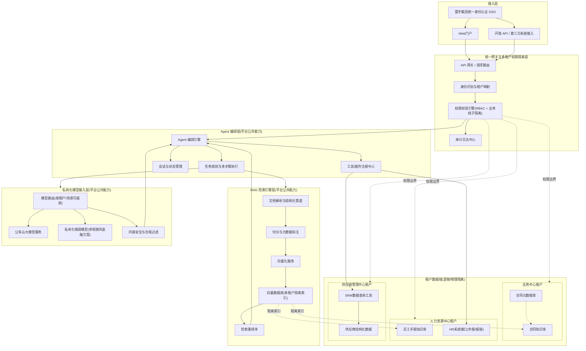
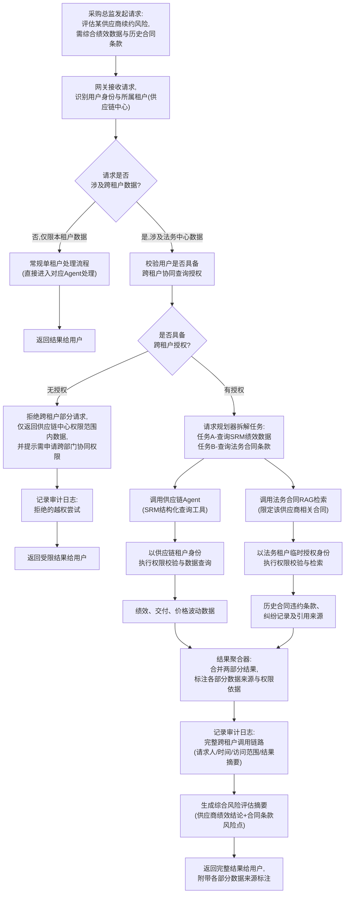
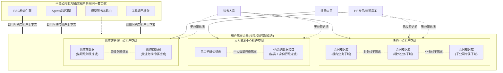

# 第58天:旗舰项目启动 —— 苍穹1.0与寰宇集团

> **阶段**:第六阶段·旗舰项目与职业跃迁(Stage 6:Flagship Project & Career)
> **Sprint**:Sprint 7·旗舰交付(Day58 - Day63,共6天开发冲刺 + 启动/评审)
> **角色关系**:陈铭(核心开发+储备架构师候选人)/ 王振宇·老王(技术导师)/ 郭建军(CTO)/ 林悦(产品经理)
> **公司/产品**:蓬远科技 · 苍穹企业级智能体中台
> **本篇关键词**:旗舰项目、全域智能体平台、多租户权限隔离、能力复用、需求文档、技术方案评审
> **前情**:Day57 御风金融项目完成私有化微调部署的安全合规收尾,项目正式验收通过
> **后续**:Day59 技术方案评审通过,正式进入6天开发冲刺

---

## 【旁白】

如果把这五十七天摆在陈铭面前,让他自己给这段路挑一个转折点,他大概会挑今天。

不是因为今天发生了什么惊天动地的技术突破,恰恰相反,今天上午的会议室里没有一行代码,没有一次调试,甚至连电脑都没怎么打开——郭建军站在投影幕布前讲了四十分钟,陈铭大部分时间都在低头记笔记。但正是这种"什么都没发生"的平静里,藏着一种他自己都还没完全意识到的重量:五十七天里学的、踩过的坑、熬过的夜,忽然之间被摆到了同一张桌子上,拼成了一整块。

回头看看这条路是怎么走过来的。第一阶段,他从对着报错信息发懵的新手,一路学到能独立写出一个像样的后端接口,那时候"项目"这个词对他来说,还只是练习册里的名字——图书馆管理系统、待办事项小工具,写完了讲师点个头,他自己也就翻篇了。第二阶段,他第一次真正理解了大模型是怎么"思考"的,Prompt怎么写才管用,Function Calling怎么把语言模型和真实世界的工具接在一起——那时候他还只是把这些当成"知识点",背下来,考完周测就算过关。

真正的分水岭,是从第三阶段开始的。LangChain、向量数据库、RAG检索增强生成,这些名字第一次不再是孤立的概念,而是拼成了一整套能落地的系统。他和团队搭出了第一个完整的RAG系统,又在第36到38天做了阶段项目二——用于内部知识库的问答系统,那是他第一次尝到"从零到能跑起来"的滋味。但那时候他心里其实还是有点虚的:这套东西离真正的客户项目,到底差多远?

答案在第四阶段和第五阶段陆续揭晓。海纳制造集团项目,他和团队第一次把RAG能力真刀真枪地用到了一个真实客户身上——车间知识库、设备手册问答、多轮对话优化,做完那一轮,他才明白"能跑起来"和"能交付"之间隔着一整层工程化的功夫。紧接着是祺瑞集团项目,Agent能力第一次被搬上台面——工具调用、多步骤任务编排、状态管理,陈铭在那个项目里第一次独立负责了一个模块的设计,虽然中间被老王打回来改过三版,但那种"这是我设计的架构"的感觉,他到现在都记得。再往后,御风金融项目把私有化微调和部署这块最硬的骨头啃了下来——模型微调、离线部署、数据安全、合规审查,一直到昨天,Day57,他们才把最后一份安全合规文档盖上章,项目正式验收通过。

三个客户,三种能力,三段几乎从头再来的攻坚。陈铭当时并没有想过,这三段经历会在某一天被同时用上。

今天早上九点,郭建军把研发部所有骨干叫进了大会议室,包括陈铭。会议室里坐着的人,陈铭大多认得——林悦带着产品线的几个同事,老王带着几个高级工程师,还有几个陈铭没怎么打过交道的架构组的人。郭建军没有绕圈子,开场第一句话就是:"我们签下寰宇集团了。"

寰宇集团,陈铭在会前完全没听说过这个名字,但会议室里已经有人开始小声议论——那是一家大型多元化企业集团,业务线铺得极广,法务、人力、供应链、财务,几乎每个职能部门都有独立的运作体系。而这一次,寰宇集团抛出的需求,不是海纳的"知识库",不是祺瑞的"智能体",也不是御风的"私有化部署",而是这三者的合体加强版——一个能同时服务多个业务部门、知识库和智能体能力都要能复用、权限还要严格隔离的"全域智能体平台"。

郭建军给这个项目起了一个名字:苍穹1.0。

这不是一个偶然的名字。苍穹是蓬远科技这套企业级智能体中台产品的名字,而"1.0"意味着——过去大半年里在三个客户项目上分别验证过的能力,第一次要被整合进同一套产品体系里,面对同一个客户,同时交付。这不再是"又做一个项目",这是把公司这套中台产品第一次真正地"立起来"。

而陈铭,被郭建军当着全公司骨干的面,任命为这个项目的核心开发,同时也是储备架构师候选人。

这四个字——"储备架构师候选人"——落在陈铭耳朵里的时候,他脑子里闪过的第一个画面,居然是五十八天前,自己第一次打开IDE、连Hello World都写得手忙脚乱的样子。那时候他是从别的行业转过来的,连"部署"和"发布"这两个词的区别都要老王反复解释。而现在,他要作为一个旗舰项目的核心成员,去设计一套要同时服务好几个业务部门、还要保证权限严丝合缝的架构。

这中间隔着的,不是运气,是五十七天里一天一天堆起来的东西。

今天没有代码可写,但今天要做的事,某种意义上比写代码更难:把过去三个项目里验证过的能力,拆开、抽象、重新拼装,设计出一套能同时服务多个部门、又互不干扰的架构。这是陈铭第一次真正体会到,"架构师"这个词背后的分量——不是比别人多会几个框架,而是要看清楚哪些东西该合、哪些东西该分。

陈铭后来跟自己复盘的时候想过一个问题:如果没有前面这五十七天里那些看起来"不起眼"的积累,今天这场会他能听懂多少?海纳制造项目里那些关于文档切分粒度、检索召回率的争论,祺瑞集团项目里关于Agent状态该怎么管理、工具调用失败该怎么兜底的反复推敲,御风金融项目里那些关于数据分类分级、模型部署边界的枯燥合规条款——如果抽掉任何一段,他大概都听不懂郭建军今天讲的"复用"和"隔离"到底意味着什么,更不用说去设计一套真正能落地的架构。技术这件事,好像总是这样,前面看起来零散的、各自为战的经验,不会提前告诉你它们哪天会被拼在一起用,只有真正走到需要用的那一刻,你才会意识到,原来那些看起来只是"完成了一个项目"的日子,其实一直在悄悄地往同一个方向积累。

也是从这个角度看,今天这场会议的意义,远远超出了"接了一个大客户"这件事本身。对蓬远科技来说,苍穹1.0是这家公司从"能做项目"到"能做产品"的一次关键验证;对陈铭个人来说,这是他从"能完成任务的工程师"走向"能设计系统边界的架构师"的第一道门。这两条线,恰好在今天这个上午,交汇在了同一张会议桌上。

这一天,是第六阶段的开篇,也是Sprint 7"旗舰交付"的第一天。故事讲到这里,该翻新的一页了。

---

## 晨会纪要

**会议主题**:寰宇集团"苍穹1.0"全域智能体平台项目启动会
**时间**:Day58 上午 9:00 - 9:50
**地点**:蓬远科技 3楼大会议室
**主持人**:郭建军(CTO)
**记录人**:陈铭
**参会人员**:郭建军、王振宇、林悦、陈铭,以及研发部架构组、高级工程师共11人

---

**9:00 会议开始**

郭建军没有像往常一样先讲研发进度,而是直接打开了投影,第一页PPT上就四个字:**苍穹1.0**。

郭建军:"上周我们把御风金融的安全合规文档最后一批签字盖章的事情处理完了,那个项目正式验收通过,辛苦大家。但我今天叫大家来,不是为了总结御风金融,是要谈一个新客户——寰宇集团。"

他停顿了一下,把手里的资料往桌上放。

郭建军:"寰宇集团,大家可能没听说过,但这家公司的规模比我们之前签的三家客户加起来都大。它是一个多元化控股集团,旗下业务线覆盖制造、贸易、物流、金融服务好几个板块,总部有独立的法务中心、人力资源中心、供应链管理中心,每个中心都是几百人的规模,各自有一套独立的信息系统和数据。"

林悦在这时候接过话:"我这边跟他们的信息化负责人对接了三轮,寰宇集团这次找我们,不是想解决单一部门的问题,是想借这次机会,把整个集团的知识管理和智能化服务能力做一次系统性的升级。"

老王插了一句:"说白了,他们是想要一个'企业大脑',而不是一个'工具'。"

郭建军点头:"对,老王说得准。我们过去接的三个项目,海纳制造是做RAG知识库问答,祺瑞集团是做Agent智能体,御风金融是做私有化模型部署——这三个能力,寰宇集团这一次,一次性都要。而且不是简单地拼在一起,他们有三个核心业务部门同时提需求:法务中心要合同知识库问答,人力资源中心要员工手册Agent,供应链管理中心要供应商数据查询Agent。三个部门,三套场景,但客户要求这些能力必须建在同一个平台上,统一管理,权限严格隔离——法务的人不能看到供应链的敏感数据,反过来也一样。"

会议室里有工程师小声议论了一下,郭建军抬手压了压。

郭建军:"我知道大家在想什么——这不就是把海纳的RAG、祺瑞的Agent、御风的私有化部署,三个项目的技术揉到一起吗?表面上看是这样,但难点不在技术揉不揉得到一起,难点在于'共用'和'隔离'这两件事怎么同时做到。你们想,如果我们给每个部门单独搭一套系统,那我们做的还是三个项目,苍穹这套中台产品就没有意义了。中台的价值,就是要让知识库引擎、Agent编排引擎、模型接入层这些底层能力,能被法务、人力、供应链这三个业务部门同时复用,但同时还要保证他们之间数据是隔离的、权限是分开的。这才是真正的'平台'能力,而不是'项目'能力。"

陈铭在下面记笔记,写到这里的时候手停了一下——他忽然意识到,这句话点出的正是这五十几天里他一直没细想过的一层东西:一个"产品",和一堆"项目"的区别,就在这个"复用"和"隔离"的平衡上。

郭建军接着说:"这个项目,我们内部代号定为'苍穹1.0'。之所以叫1.0,是因为这是苍穹中台产品第一次以'平台'的姿态去交付,而不是以'定制项目'的姿态。这个项目做成了,苍穹就不再只是我们自己嘴里说的'企业级智能体中台',它是真的有一个客户在用一个平台服务好几个部门。这个项目做不好,我们这个产品的定位就要打个问号。"

会议室安静了几秒。

郭建军翻到下一页PPT,上面是项目组人员名单。

郭建军:"项目整体由我挂帅,负责对客户高层的沟通和资源协调。林悦继续负责产品需求和客户业务侧对接。技术负责人是老王,他会牵头架构设计的最终把关。"

他停顿了一下,目光转向陈铭。

郭建军:"陈铭,这次我要正式宣布一个决定——你担任本项目的核心开发,同时,你是我们储备架构师序列的候选人,这个项目会作为你的考察项目。"

陈铭愣了一下,笔停在半空。

郭建军:"我知道你可能觉得有点突然,但这不是临时决定。海纳制造那个项目,你把RAG那套东西啃得很扎实;祺瑞集团,你自己扛了一个模块的Agent架构设计,虽然被老王打回来改了三版,但最后那版方案我看过,是真正经得起推敲的;御风金融,你把私有化部署里那些细节问题都处理得很干净,合规那块的坑你也踩过、也填过。三个项目,你不是打杂的,是真正沉在里面做事的人。这次的项目,是把这三块能力拼在一起,某种意义上,也是把你过去这段成长拼在一起的一个机会。"

他又补了一句:"储备架构师候选人,不是给你一个头衔,是给你一个更大的责任——你要开始学着从'我怎么把这个模块做好'转变成'我怎么设计一套让所有模块都能被复用、又互不干扰的架构'。这次项目,前两天你和老王一起把技术方案定下来,方案通过评审之后,整个开发冲刺你是核心开发人员之一,同时,老王会在过程中带你走一遍架构决策是怎么做出来的。"

老王在旁边笑了一下,没说话,只是对陈铭点了点头。

陈铭定了定神,应了一声:"明白,我会全力去做。"

**9:20 项目范围与时间线说明**

林悦接过投影,开始讲项目的整体范围。

林悦:"我这边先说一下客户侧的背景和整体计划。寰宇集团这次是集团信息化部门统一发起的项目,但实际的业务需求分散在三个中心:法务中心、人力资源中心、供应链管理中心。这三个部门的负责人都会参加下午的需求沟通,我们今天上午先在内部对齐一下大概框架,下午会有一次比较正式的三方(客户三个部门代表+我们)需求讨论会。"

林悦:"客户给的整体时间预期是这样的:今天和明天(Day58-59)是需求梳理和技术方案设计阶段,方案要经过内部评审,也要过客户那边的技术委员会审核。方案通过之后,给我们6天的开发冲刺窗口,也就是Day59到Day63前后要把核心功能跑起来,先给客户做一次内部验证,后续再逐步扩展打磨。这个时间是偏紧的,所以方案阶段必须尽量把坑填平,不能带着模糊的地方进冲刺。"

老王补充:"这也是为什么这次的技术方案设计我要亲自参与评审,而不是让陈铭自己闷头写完直接开工。方案里的架构决策,尤其是权限隔离这块,一旦做错方向,后面改起来的代价会非常大——不是改一两个接口的事,可能是整个数据模型都要推翻重来。"

**9:35 关于"三合一"整合难点的初步讨论**

郭建军:"我再强调一下这次项目和前三个项目最大的不同点。海纳制造,我们只需要做好RAG,场景相对单一,知识库主要是设备手册和工艺文档。祺瑞集团,我们做的是Agent能力,核心是工具调用和任务编排,当时也没有特别复杂的多租户问题,因为祺瑞是单一业务口子在用。御风金融,重点是私有化部署和模型微调,重心在模型本身和部署环境的安全合规。这三个项目,每一个都是'把一件事做深'。"

他继续说:"这次寰宇集团要的是'把三件事同时做好,还要做到互相不干扰'。举个例子,法务中心要的合同知识库问答,本质上是RAG能力;人力资源中心要的员工手册Agent,既需要知识库检索,也需要一定的任务处理能力,是RAG加Agent的组合;供应链管理中心要的供应商数据查询Agent,更偏向Agent直接对接结构化数据系统,做工具调用式的查询。这三个场景,如果我们各自单独搭一套系统,技术上没什么难度,我们三个项目都做过。但客户要求是一个平台,这意味着底层的向量检索引擎、Agent编排引擎、模型服务,必须是同一套基础设施,只是上层根据不同部门的知识库和权限做隔离和定制。"

老王:"这里还有一个御风金融带来的新变量——私有化模型接入。寰宇集团对数据安全的要求不低于御风金融,尤其法务中心的合同数据、供应链的供应商信息,都涉及商业机密。所以这次的平台架构里,私有化模型部署和调用这一层,也要是可选可切换的,不同部门可能对模型的选择有不同的合规要求。"

陈铭在这时候提了第一个问题:"郭总,老王,如果三个部门共用底层引擎,那知识库的数据存储上,是不是也要做隔离?比如向量数据库这一层,法务的合同向量和供应链的供应商数据向量,如果混在一个集合里,会不会有检索的时候串出来的风险?"

老王看了陈铭一眼,像是在等他问这个问题:"这个问题问得对,也正是接下来两天我们要重点设计的地方。答案不是简单的'是'或'不是',要看用什么样的隔离粒度——逻辑隔离还是物理隔离,这个我们下午细讲,你今天下午先把这个问题列进你的方案草稿里,单独作为一个决策点,晚点我们一对一过一遍。"

陈铭把这句话原样记在了笔记本上,用红笔在旁边画了一个星号。

老王接着又补充了一句,面向全场:"我提前说一句,这次项目的架构评审,我会比祺瑞集团那次更严。祺瑞集团项目当时是单一部门场景,权限模型相对简单,出了问题影响范围有限。这次寰宇集团三个部门数据敏感度都不低,一旦权限设计上出现漏洞,不是丢一个客户的事,是砸了苍穹这个产品在客户心里的信任基础。所以接下来两天的方案设计,大家该较劲的地方,不要客气。"

会议室里的气氛因为这句话稍微绷紧了一些,陈铭能感觉到旁边几位架构组同事的坐姿都不自觉地坐直了一点。

架构组的一位同事这时候也提了一个问题,是关于时间线的:"6天开发冲刺,要同时把三个部门的场景都跑起来,人手够不够?"

郭建军回答得很干脆:"这次不是三个人各做一块互不相干的功能,是要在同一套底层能力上,分头把三个业务场景的上层能力搭起来。人力资源上,除了陈铭作为核心开发,我们还会从架构组和高级工程师里抽调两到三人配合,老王统筹分工。但这次冲刺的关键不在人多,在于底层的架构决策必须一次就基本想对——如果方案阶段留了模糊地带,冲刺期间三条线一起并行开发,一旦某个人对隔离规则、复用边界的理解和别人不一致,返工的代价会成倍放大,而不是线性叠加。这也是为什么方案设计阶段我们宁可多花一天,也要让老王亲自把关。"

林悦在旁边补充了一句:"客户那边对时间线也有心理预期,他们知道这是个复合型需求,愿意给我们6天冲刺的窗口,但也提了一个条件——冲刺结束时,哪怕功能没有做到完美,至少三大场景的核心链路都要能跑通给他们看,不能只交出一份还在讨论中的方案。"

郭建军点头:"这也是为什么我强调,今天和明天的方案设计,不是走个流程,是真的要把该想清楚的都想清楚。"

**9:45 会议决议事项**

郭建军最后做了总结,林悦记录了以下决议事项:

1. 项目代号确定为"苍穹1.0",作为苍穹企业级智能体中台产品的首个多业务线旗舰交付项目。
2. 项目负责人:郭建军(总协调);技术负责人:王振宇(架构把关);产品负责人:林悦(需求与客户对接);核心开发+储备架构师候选人:陈铭。
3. 项目整体节奏:Day58上午内部对齐,下午与客户三个业务部门进行需求讨论会;Day58-59完成需求文档与技术方案设计,并完成内部评审与客户技术委员会审核;Day59评审通过后进入为期6天的开发冲刺(Sprint 7)。
4. 陈铭负责牵头撰写《寰宇集团全域智能体平台需求文档》与《技术方案设计文档》初稿,老王在Day58晚间进行一对一评审把关。
5. 技术方案需重点覆盖:多租户权限隔离粒度设计、知识库与Agent能力的复用架构、跨部门协同请求的处理流程、私有化模型接入的可插拔设计。
6. 下午14:00,林悦组织客户三个业务部门(法务中心、人力资源中心、供应链管理中心)代表进行需求沟通会,陈铭列席并做详细记录,作为需求文档的一线输入。

**9:50 会议结束**

散会的时候,林悦特意走到陈铭旁边:"下午的需求会,你多问问题,别不好意思,客户那边的业务代表其实很愿意讲细节,就怕我们不问。"

陈铭点头应下,心里却还在消化刚才那句"储备架构师候选人"。他抬头看了一眼窗外,蓬远科技所在的这栋写字楼楼下,车流照常川流不息,和五十七天前他第一天来面试时看到的景象没什么不同。但他知道,今天这张会议桌上发生的事,和那天完全不是一个量级的。

---

## 需求文档

> 文档名称:《寰宇集团全域智能体平台(苍穹1.0)需求文档》
> 版本:V0.1(初稿,待客户需求沟通会补充确认)
> 撰写人:陈铭
> 审核人:王振宇、林悦
> 密级:内部+客户共享

### 一、项目背景

寰宇集团是一家业务覆盖制造、贸易、物流及金融服务的大型多元化控股集团,总部下设法务中心、人力资源中心、供应链管理中心等多个职能中心,各中心独立运作,拥有各自的业务系统和数据资产。近年来,随着集团规模持续扩张,各业务中心普遍面临知识沉淀分散、业务处理效率低下、跨部门协作成本高的问题,集团信息化部门牵头,希望借助人工智能技术,建设一套能够统一支撑多个业务中心智能化需求的平台级系统。

寰宇集团在项目立项阶段明确提出:不希望为每个部门单独建设一套系统,而是希望通过一个统一的"全域智能体平台",实现知识库能力、智能体能力、模型服务能力的集团级复用,同时确保各业务中心之间的数据和权限严格隔离,互不可见、互不干扰。

蓬远科技在此前的项目实践中,已经在三个方向上分别积累了成熟能力:

- 海纳制造集团项目:验证了企业级RAG检索增强生成能力,包括文档处理、向量检索、多轮问答优化;
- 祺瑞集团项目:验证了Agent智能体能力,包括工具调用、多步骤任务编排、状态管理;
- 御风金融项目:验证了私有化模型微调与部署能力,包括模型微调、离线化部署、数据安全合规。

寰宇集团项目是首次要求将上述三种能力整合进同一套平台,并同时服务多个业务部门的旗舰级项目,内部代号"苍穹1.0"。

### 二、项目目标

1. **业务目标**:为寰宇集团法务中心、人力资源中心、供应链管理中心三大业务部门分别提供智能化服务能力,提升合同检索效率、员工自助服务效率、供应商信息查询效率,预计在试运行阶段实现相关业务咨询响应时间下降60%以上,人工重复性咨询工作量下降50%以上。
2. **技术目标**:建设苍穹1.0全域智能体平台,实现RAG检索引擎、Agent编排引擎、私有化模型接入能力的平台化复用,底层能力对上层业务部门保持一致的技术标准,同时通过多租户权限隔离机制确保各业务部门数据安全。
3. **产品目标**:验证苍穹企业级智能体中台从"单一项目定制交付"向"多租户平台化交付"演进的可行性,为后续更多客户的多部门复合型需求提供可复制的产品化方案。

### 三、用户画像

在正式展开三大业务场景的功能需求之前,需要先对平台的核心使用人群做一次画像梳理,这也是老王反复要求陈铭在写需求文档时不要跳过的一步——他的原话是"如果你不知道用的人到底是谁、他们平时的工作节奏是什么样的,你设计出来的功能很容易变成'技术上正确、体验上没人用'的东西"。

**法务人员**:主要包括法务经理、资深法务专员、新入职法务专员三类角色。资深法务专员和法务经理更关心检索的精准度和风险提示能力,他们的诉求是"少走弯路、少漏风险点";新入职法务专员更依赖系统对制度和历史案例的"傻瓜式"呈现,他们的诉求是"看得懂、找得到、不用问人"。这两类角色对同一个功能的期待其实不完全一致,这也是为什么需求文档里把"精准检索"和"相似案例推荐"分成了两个独立的功能点,而不是笼统地写"做好合同检索"。

**HR专员与普通员工**:HR专员是知识库内容的维护者和问答质量的监督者,他们更在意后台的统计分析能力,能不能看到"大家最常问什么问题"以便持续优化制度文档;普通员工是问答功能的最终使用者,他们对系统的耐心是有限的——如果一次问答体验不好,他们大概率会放弃使用,转而继续骚扰HR专员,这也是为什么"个性化规则匹配"和"事务性操作辅助"这两项能力,在验收标准里被卡得比较严。

**采购人员**:包括普通采购专员、采购经理、采购总监三个职级,他们对系统的诉求高度集中在"效率"和"权限"两件事上——效率上,他们希望复杂查询能够一步问出来,不用自己去几个系统里对数据;权限上,他们对"看不到不该看的数据"这件事的敏感度,反而比法务和HR的用户更高,因为供应链价格信息如果泄露,直接关系到集团在商业谈判中的话语权。

厘清这三类用户画像之后,后续在设计功能优先级和交互体验时,才能真正做到"该简单的地方简单,该严谨的地方严谨",而不是用一套统一的标准去套三个完全不同的使用场景。

### 四、业务场景需求

#### 3.1 法务中心:合同知识库问答场景

**业务背景**:寰宇集团法务中心管理着集团及各子公司近十年积累的各类合同文本,包括采购合同、销售合同、租赁合同、合作协议、股权协议等,合同数量庞大且格式不统一,历史合同分散存储在不同的文件系统和纸质档案中。法务人员在处理新业务、审查合同条款、应对纠纷时,经常需要查阅历史相似合同作为参考,但现有检索手段仅支持文件名和简单关键词搜索,效率低下。

**核心痛点**:
- 合同条款检索依赖人工记忆和经验,新入职法务人员上手周期长;
- 相似条款、风险条款的比对缺乏系统化手段,容易遗漏历史类似纠纷案例;
- 合同文本格式多样(PDF扫描件、Word文档、图片版),部分历史合同存在OCR识别质量问题;
- 合同内容涉及商业机密和敏感条款,检索和问答过程需要严格的权限控制,不同业务线的合同不能被无关人员检索到。
- 部分历史合同涉及境外主体和跨境交易条款,对应的合规审查要求参照集团法务对外合作的相关规范,数据存储和调用环节需要格外谨慎,不能简单套用境内业务的处理方式。

**功能需求**:
1. 支持对合同文本(包括扫描件)进行结构化解析,提取合同类型、签约主体、生效日期、关键条款等元数据;
2. 支持自然语言提问检索合同内容,例如"我们和某供应商在过去三年签订的采购合同里,有没有提到违约金比例超过15%的条款";
3. 支持按合同类型、业务线、时间范围进行检索结果过滤;
4. 支持条款级别的相似案例推荐,即根据当前审查的合同条款,自动推荐历史合同中相似或相关的条款作为参考;
5. 问答结果必须标注引用来源(合同名称、条款位置),不能仅给出无来源依据的生成结果;
6. 合同知识库按业务线(如境内业务、境外业务、子公司专属)划分权限域,法务人员仅能检索其被授权访问的业务线合同。

**验收标准**:
- 针对法务中心提供的50个真实合同问答测试用例,检索准确率(答案来源合同与标准答案一致)不低于90%;
- 每次问答响应时间(不含首次索引构建)不超过5秒;
- 未授权用户尝试检索无权限业务线合同时,系统必须明确拒绝并返回权限不足提示,不能返回任何合同片段内容;
- 所有问答结果必须附带可追溯的引用来源。

#### 3.2 人力资源中心:员工手册Agent场景

**业务背景**:寰宇集团人力资源中心每天要处理大量员工关于考勤、请假、报销、社保公积金、晋升评审等制度性问题的咨询,现有方式是通过HR专员邮件或线下解答,响应周期普遍在1到3个工作日,员工体验较差,HR专员的时间也被大量重复性问题占用。

**核心痛点**:
- 员工手册、各类制度文档版本众多且更新频繁,员工自行查阅困难,经常问出"制度里到底怎么规定的"这类问题;
- 部分问题不是简单的知识问答,而是需要结合员工个人信息进行判断,例如"我入职满一年了,年假还剩几天"这类需要查询员工具体数据的问题,单纯的知识库问答无法回答;
- 不同层级、不同地区的员工适用的制度存在差异(比如境内员工和境外派驻员工的报销标准不同),需要根据员工身份自动匹配适用规则;
- HR专员希望Agent能够处理一部分事务性操作,而不仅仅是回答问题,例如帮助员工提交请假申请、查询报销进度。

**功能需求**:
1. 建设员工手册及各类HR制度文档知识库,支持自然语言问答;
2. Agent需要具备结合员工身份信息(工号、入职时间、所在地区、职级)进行个性化规则匹配的能力,而不是给出统一答案;
3. Agent需要支持对接HR系统的部分接口(如查询剩余年假天数、查询报销单据状态),实现"问答+事务查询"的组合能力;
4. 支持辅助性事务操作,如生成请假申请草稿、报销单据填写提示,最终提交仍需员工本人在HR系统内确认(平台不直接完成最终提交动作,以规避误操作风险);
5. 涉及薪酬、绩效等敏感信息的问答,需要严格校验员工身份,确保员工只能查询自己的数据,不能查询他人数据;
6. 支持HR专员在后台查看Agent处理的咨询记录和常见问题统计,用于持续优化知识库内容;
7. 对于境外派驻员工这类适用特殊制度的群体,系统需要能够根据员工的派驻状态自动切换适用的制度版本,避免用境内标准的规则去回答境外派驻员工的问题,这一点在需求会上HRBP负责人特别提醒过,她说曾经出现过人工客服误用境内标准解释境外报销制度,导致员工投诉的真实案例,希望这次上线的系统能够从设计上就规避这类问题。

**验收标准**:
- 针对HR中心提供的常见咨询问题清单(不少于80个问题),Agent能够正确回答且引用正确制度依据的比例不低于85%;
- 涉及员工个人数据查询的场景,身份校验通过率100%,不允许出现越权查询他人数据的情况;
- 事务性操作(如生成请假申请草稿)准确率不低于90%,且所有最终提交动作必须经过员工本人确认,不能由Agent自动完成;
- 员工满意度调研(试运行阶段抽样)平均分不低于4分(5分制)。

#### 3.3 供应链管理中心:供应商数据查询Agent场景

**业务背景**:寰宇集团供应链管理中心管理着数千家供应商的资质、绩效、合作历史、价格等信息,这些数据主要存储在集团的供应链管理系统(SRM系统)和多个业务子系统中。采购人员在选择供应商、评估合作风险时,经常需要跨系统查询多维度数据,现有查询方式依赖专门的报表工具,操作门槛较高,且难以支持复杂的组合条件查询。

**核心痛点**:
- 采购人员在做供应商评估时,需要综合查询绩效评分、历史交付准时率、质量投诉记录、价格波动等多维数据,现有系统查询流程繁琐,往往要跨三四个系统分别查询再手动汇总;
- 供应商数据分布在多个异构系统中,数据结构差异较大,普通业务人员难以直接使用SQL或报表工具完成复杂查询;
- 部分查询需求涉及跨供应商的对比分析,例如"帮我找出过去一年交付准时率低于90%,同时价格涨幅超过10%的供应商",这类分析型查询对现有工具是很大的挑战;
- 供应商数据中包含价格、合同条款等商业敏感信息,需要根据采购人员的职级和业务线进行权限控制。

**功能需求**:
1. Agent需要具备对接SRM系统及相关业务子系统数据接口的能力,支持自然语言转结构化查询(相当于自然语言转SQL或调用既定的数据查询工具);
2. 支持多维度组合条件查询,例如按供应商类别、地区、绩效区间、交付准时率区间、价格波动区间等多个条件组合筛选;
3. 支持基础的统计分析能力,如排名(比如"绩效评分最低的10家供应商")、趋势对比(比如"过去三个季度价格变化趋势");
4. 查询结果需要以结构化表格形式清晰呈现,并支持结果导出;
5. Agent需要能够处理多轮追问,例如用户先查询某类供应商列表,再针对其中某一家供应商追问详细的历史交付记录;
6. 涉及供应商价格、合同细节等敏感数据的查询,需要根据采购人员的职级和业务线权限进行过滤,职级不足或非授权业务线人员查询时,系统需返回权限不足提示,而不是脱敏后的数据(避免通过脱敏数据反推敏感信息);
7. 系统需要支持将查询结果与法务中心的合同知识库进行关联查询(在具备跨部门授权的前提下),以支持类似"某供应商续约风险评估"这类需要综合绩效数据和合同条款的复合分析场景,这也是本次项目区别于此前任何单一客户项目的一个典型跨域需求。

**验收标准**:
- 针对供应链中心提供的40个典型查询场景测试用例,自然语言转查询的准确率不低于88%;
- 组合条件查询(3个以上条件组合)的响应时间不超过8秒;
- 权限校验准确率100%,不允许出现越权访问其他业务线或超出职级范围的供应商敏感数据;
- 多轮追问场景下,上下文保持准确率不低于90%(即Agent能正确理解"这家供应商"指代的是上一轮查询结果中的哪一家)。

#### 3.4 三大业务场景的共性技术抽象

在把三大业务场景的需求分别梳理清楚之后,陈铭在需求文档的最后专门加了一节"共性技术抽象",这一节不是给客户看的,而是写给内部技术团队看的,目的是从三个差异很大的业务场景里,提炼出可以被平台统一承载的通用能力模型,避免每个场景都单独设计一套技术方案。

从需求内容看,三大场景可以拆解出以下几类共性技术能力:

第一类是**知识检索能力**,法务场景是主要使用者,HR场景部分使用(制度条文检索),供应链场景基本不使用(以结构化查询为主)。这类能力应该被设计为平台的一等公共能力,支持文档解析、切分、向量化、检索、重排序的完整链路,且要支持按租户和子域进行隔离检索。

第二类是**结构化数据查询能力**,供应链场景是主要使用者,HR场景部分使用(年假、报销状态查询),法务场景基本不使用。这类能力的核心是把自然语言转换成对结构化数据源的查询请求,需要支持组合条件过滤、排序、简单的统计分析,并且要能对接不同的后端数据源(SRM系统、HR系统等),接口适配层需要设计成可插拔的。

第三类是**身份与权限校验能力**,三大场景无一例外都需要,但校验的粒度和依据不同——法务场景按业务线子域校验,HR场景按员工身份行级校验,供应链场景按职级列级和业务线行级校验。这类能力应该被抽象成一套通用的权限校验框架,校验规则本身可配置,而不是把权限判断逻辑硬编码在每个业务场景各自的代码里。

第四类是**多轮对话与任务编排能力**,HR场景和供应链场景都需要(HR需要结合身份信息做多步判断,供应链需要支持多轮追问),法务场景相对较弱(以单轮问答检索为主,但相似案例推荐功能也涉及一定的多步骤处理)。这类能力应该由平台统一的Agent编排引擎承载,不同业务场景通过配置不同的工具集和规划策略来实现差异化行为。

把这四类能力提炼出来之后,陈铭发现一个有意思的现象:三大业务场景虽然业务语言完全不同,但技术能力需求的组合方式,其实可以用一张简单的矩阵表达清楚——法务场景侧重"知识检索+权限校验",HR场景侧重"知识检索+结构化查询+权限校验+多轮编排",供应链场景侧重"结构化查询+权限校验+多轮编排"。这张能力矩阵后来被直接沿用到技术方案设计里,成为架构设计图里"平台公共能力层"划分的直接依据。

### 五、多部门权限隔离总体要求

由于三大业务部门的数据敏感度和业务边界差异显著,平台在权限设计上必须满足以下总体要求:

1. **租户隔离**:法务中心、人力资源中心、供应链管理中心在平台上应被视为三个独立的业务租户(Tenant),租户之间的数据(包括知识库文档、向量索引、Agent会话记录、日志)在逻辑上完全隔离,任一租户的用户默认不能访问其他租户的任何数据。
2. **业务线子隔离**:在法务中心内部,还需要按业务线(境内业务、境外业务、子公司专属业务)进行更细粒度的权限划分;在供应链管理中心内部,需要按采购人员职级和所属业务线进行权限划分。
3. **能力层复用,数据层隔离**:RAG检索引擎、Agent编排引擎、模型服务等底层技术能力,应作为平台公共能力被三个租户共同复用,不应为每个租户单独部署一套引擎;但知识库数据、向量索引数据、Agent配置数据必须按租户物理或逻辑隔离存储。
4. **统一身份认证,分级权限控制**:平台应支持与寰宇集团现有统一身份认证系统(单点登录)对接,用户登录后根据其所属部门、职级、业务线自动映射到对应的权限范围,不需要为每个部门单独设计登录体系。
5. **跨部门协同场景的显式授权**:当出现跨部门协同请求场景(例如某个综合性分析需要同时调用法务合同数据和供应链数据)时,必须由具备相应跨部门权限的用户发起,且系统需要对每一次跨域调用进行审计记录,不允许通过技术手段绕过权限校验实现隐式的跨租户数据访问。
6. **审计与可追溯**:所有的数据访问、Agent调用、跨租户请求,必须记录完整的审计日志,包括请求人身份、请求时间、访问的数据范围、返回结果摘要,留存周期不低于寰宇集团合规要求的年限。

补充说明:上述业务场景需求的最终颗粒度,是林悦和陈铭在需求沟通会结束后又与三个部门代表分别做了一轮电话确认之后才定下来的。中间有一个小插曲——法务经理最初提的"相似案例推荐"需求,口径一度扩大到"自动生成合同风险评估报告",林悦和陈铭商量后,判断这个口径已经超出了一期能够扎实交付的范围,于是在电话确认时,把这部分需求明确拆分成了"一期做条款级相似案例推荐,二期视效果再评估是否扩展到自动生成风险评估报告",并把这个拆分结果写进了确认邮件里,请法务经理书面确认。这个小插曲被老王当作一个正面案例在评审时提起,他说:"需求文档最怕的不是需求多,是需求边界模糊,当场答应下来的口径,回头做不到,比一开始就说清楚做不到,伤害更大。"

### 六、非功能性需求

1. **性能要求**:平台需要同时支撑三大业务部门的并发访问,预计上线初期日均活跃用户不低于800人,高峰期并发请求不低于50 QPS,系统整体响应时间(P95)不超过6秒。
2. **可用性要求**:平台核心服务可用性不低于99.5%,关键业务时段(工作日9:00-19:00)不允许出现计划外停机。
3. **安全合规要求**:平台需要满足寰宇集团内部数据安全管理规范以及相关行业数据保护要求,涉及合同、员工个人信息、供应商商业信息的数据存储和传输须加密处理,私有化模型部署方案需参照御风金融项目已验证的安全合规标准执行。
4. **扩展性要求**:平台架构需要支持未来新增业务部门(例如财务中心、市场中心)以最小改造成本接入,新增租户不应要求对底层引擎进行重构。
5. **运维要求**:平台需要提供统一的运营监控后台,支持对各租户的使用情况、Agent调用成功率、知识库检索质量进行监控和告警。

### 七、项目风险与假设

在需求文档评审阶段,老王专门要求补充一节"风险与假设",他的理由是:"需求文档如果只写理想状态下要做什么,评审的时候看起来很完整,但一旦某个前提假设没有成立,整个计划就要跟着调整,提前把这些假设摆出来,评审的人才能帮你一起判断风险有多大。"以下是补充的风险与假设清单。

**假设一:客户方数据接口开放时间**。供应链管理中心场景中,财务系统和质量管理系统目前没有标准化的对外接口,需要客户信息化部门配合开放。这是一个外部依赖项,如果开放时间滞后,会直接影响供应链场景二期功能的排期,一期范围需要明确聚焦在SRM系统已有接口可以覆盖的部分。

**假设二:历史合同数据质量**。法务中心的历史合同存在部分扫描件质量不佳、格式混乱的情况,OCR识别的准确率会直接影响知识库构建的质量。需求文档中的验收标准(检索准确率不低于90%)是基于假设"客户提供的测试用例覆盖的合同,文本质量处于可正常OCR识别的范围"这一前提,如果实际历史合同中存在大量低质量扫描件,需要提前与客户沟通合理的质量预期,或者安排额外的人工校对工作量。

**假设三:HR系统接口的稳定性与并发能力**。HR场景的年假查询、报销状态查询都依赖对HR系统的实时接口调用,如果HR系统本身的接口在高并发场景下响应较慢或不稳定,会直接拖累整个Agent的响应时间指标,需要在方案设计阶段与客户确认HR系统接口的性能基线,并预留必要的超时和降级处理机制。

**风险一:跨部门协同权限的管理成本被低估**。跨租户协同授权需要双方部门负责人共同确认,这个流程在实际运行中可能出现审批周期较长、部门协调成本高于预期的情况,需要在试运行阶段重点观察,必要时协助客户建立一套简化的授权审批机制,而不是让业务人员因为流程繁琐转而绕开系统去手动对接。

**风险二:三个业务场景并行开发的资源冲突**。6天开发冲刺时间较紧,三大业务场景涉及不同的知识库内容、不同的工具集成,如果开发资源分配不合理,某个场景的开发进度可能会挤占公共能力层的联调时间,需要在冲刺计划中提前预留公共能力层的集成测试窗口,不能把所有时间都排给上层业务功能开发。

**风险三:模型路由策略的合规边界不清晰**。私有化模型接入层需要支持按租户配置调用公有云模型或私有化模型,但如果没有在方案阶段明确"哪些数据类型、哪些场景强制要求走私有化模型"的判断规则,存在开发人员在实现过程中为了图方便,把本该走私有化模型的敏感数据请求误路由到公有云模型的风险。这一条风险是老王评审时特别提醒补充的,他的原话是:"技术方案里凡是涉及'可插拔''可配置'的设计,一定要同时写清楚'默认值是什么、谁有权限改这个配置',否则'可配置'很容易变成'谁都能配置成不安全的样子'。"

以上风险与假设清单,并不是要求在方案设计阶段就把每一条都彻底解决,而是要求评审时明确记录"这条风险由谁负责跟踪、打算在哪个阶段验证或缓解",避免风险被识别出来之后又被遗忘在会议纪要里,没有人真正跟进。

### 八、里程碑计划(初步)

| 阶段 | 时间 | 主要内容 |
|---|---|---|
| 需求与方案设计 | Day58-59 | 需求文档确认、技术方案设计与内外部评审 |
| 开发冲刺 | Day59-63(6天) | 完成三大业务场景核心功能开发与平台底层能力整合 |
| 内部验证 | Sprint 7末 | 内部集成测试、客户方内部小范围试用 |
| 试运行与打磨 | 后续Sprint | 根据试运行反馈迭代优化,逐步扩大使用范围 |

### 九、验收总则

项目最终验收以三大业务场景各自的验收标准是否达标为基础判定条件,同时增加以下平台级验收项:

1. 三大业务部门可以在同一平台入口登录,自动映射至各自权限范围,无需切换系统或重复登录;
2. 现场模拟越权访问测试(至少覆盖10种越权尝试场景),平台必须100%正确拦截;
3. 平台底层能力(检索引擎、Agent编排引擎、模型服务)确认为三租户共用的同一套实例,而非各自独立部署,以验证平台化架构目标达成;
4. 审计日志功能验证,能够完整还原任意一次跨租户请求的授权链路。

---

## 架构设计图(苍穹1.0全域智能体平台整体架构)

下图展示苍穹1.0平台的整体架构总览,自上而下分为接入层、多租户权限隔离层、能力编排层、核心引擎层、数据与模型层,贯穿法务中心、人力资源中心、供应链管理中心三大租户。



这张图想表达的核心意思其实只有一句话:三个业务部门共用的是同一套"发动机"(编排引擎、检索引擎、模型接入层),但各自的"油箱"(知识库数据、结构化数据)是分开加锁的。陈铭在画这张图的第一版时,最开始把三个租户的知识库直接画进了RAG检索引擎层内部,老王看完提了一个尖锐的问题:"你这张图里,权限校验是在进入编排引擎之前做的,还是在检索的时候才做的?"这个问题直接决定了后面权限隔离层要放在架构的哪一层——答案是必须前置,在请求进入Agent编排层之前,租户身份和权限范围就要确定下来,而不是等到真正去查向量数据库的时候才做过滤,否则一旦编排引擎内部逻辑出现疏漏,隔离就形同虚设。

---

## 流程图(跨部门请求的完整处理流程)

寰宇集团的业务场景中,存在这样一种典型的跨部门协同请求:供应链管理中心的一位采购总监,在评估某家供应商续约风险时,既需要查询该供应商在SRM系统里的绩效数据,又需要查询法务中心合同知识库里这家供应商历史合同中的违约条款和纠纷记录。这类请求横跨了两个租户的数据边界,是权限隔离设计中最容易出问题、也最需要讲清楚处理逻辑的场景。下图展示了这类跨部门请求的完整处理流程。



这个流程图里最关键的一步,是"校验用户是否具备跨租户协同查询授权"这个环节。陈铭最初设计的版本里没有这一步,他的思路是:既然平台底层能力是共用的,那只要用户身份认证通过,系统检测到请求涉及多个租户的数据,就自动去两边分别查询、合并结果返回。老王评审的时候直接叫停了这个设计,他说了一句让陈铭印象很深的话:"共用能力不等于共用权限。你这个设计里,只要一个查询涉及多个租户,系统就自动帮他把两边的门都打开了,这在权限设计里是最危险的一种'便利性陷阱'——看起来智能,实际上是把权限判断的责任从人转移到了系统,一旦哪个环节判断错了,泄露的就是别的部门的敏感数据。跨租户的访问,必须是显式授权的,而不是隐式自动触发的。"这句话也是老王一对一评审环节里反复强调的核心原则,后面会在课堂笔记里详细展开。

---

## 示意图(多部门权限隔离与知识库/Agent能力复用架构示意)

下图用一种更直观的方式,展示"能力层复用"和"数据层隔离"这两件事在架构上到底是怎么共存的。



这张示意图画出来之后,陈铭自己看了一遍,忽然有点理解为什么老王一直强调"权限设计要在能力设计之前想清楚"。三条横向的公共能力(检索引擎、编排引擎、模型服务、工具框架)就像三条共用的传送带,货物(也就是数据)从传送带上流过,但每个租户空间外面都套了一层闸门,闸门不是传送带自己长出来的,而是要在传送带的入口和出口分别装上检查站——调用能力层的每一次请求,必须显式携带"我是谁、我属于哪个租户、我有什么权限"这些上下文信息,能力层本身并不知道、也不应该知道数据属于谁,它只是机械地按照传入的租户上下文去操作对应的数据域。这种设计的好处是,能力层可以做得非常通用和干净,不需要为每个租户写一套特殊逻辑;但代价是,权限上下文的传递必须做到万无一失,任何一个环节漏传或者传错,都可能导致越权访问。

---

## 课堂笔记

### 上午:需求分析讨论会

下午两点,林悦在小会议室组织了与寰宇集团三个业务部门代表的需求沟通会。虽然名义上是"下午"的会,但陈铭把这场会的内容记在了"上午需求分析"这部分笔记里,因为老王后来跟他说,不管这场会开在几点,它本质上属于整个方案设计流程里的"需求分析阶段",要单独归档、单独复盘。参会的除了蓬远科技这边的林悦、陈铭,还有寰宇集团法务中心的一位法务经理、人力资源中心的一位HRBP负责人,以及供应链管理中心的一位采购运营经理,三位业务代表都是通过视频会议连线参加。

林悦开场先做了简单的开场白,把项目背景和整体思路讲了一遍,然后把话头交给了三位业务代表,让他们分别讲各自部门目前最头疼的问题。陈铭全程做了详细记录,以下是他笔记本上摘录的关键内容。

**法务中心代表发言摘要**

法务经理讲的第一个例子,让陈铭印象很深。她说他们法务中心现在最大的痛点不是"没有知识库",而是"知识库形同虚设"——他们其实有一套文件管理系统,所有合同扫描件都存在里面,但检索方式只能按合同编号或者合同名称查,而实际工作中法务人员遇到的问题往往是这样的:"我们和某个供应商在过去有没有签过类似的独家采购协议,里面对违约责任是怎么约定的?"这种问题,靠文件名根本查不出来,只能靠老员工凭记忆去翻,新入职的法务人员完全无从下手。

她还提了一个更具体的场景:法务中心每年要处理几十起潜在的合同纠纷预警,很多时候能不能提前发现风险,取决于能不能快速找到历史上类似条款引发过纠纷的案例。她举了个例子,某类"最低采购量"条款,曾经在两三年前引发过一次比较大的纠纷,但当时处理这件事的法务人员已经离职了,这个"教训"就没有沉淀下来,变成了组织记忆的空白。

陈铭在这里问了一个问题:"如果我们做合同问答系统,除了直接检索条款内容,是不是还需要支持把历史纠纷案例和相关条款关联起来,让系统能主动提示'这类条款历史上出过问题'?"

法务经理眼睛一下亮了,说这正是她想要但没敢奢望的功能——现在他们连基础检索都做不好,这种"风险条款主动提示"是更高阶的需求,但如果能做到,价值会非常大。林悦在旁边记下来,说这个可以作为二期需求,一期先把基础的检索和引用做扎实。

接着法务经理提到了权限方面的顾虑,她说得很直接:"我们这边的合同,尤其是境外业务和几个子公司的专属合同,涉及的商业机密级别很高,我们内部对这些合同的查阅本身就有权限分级,不是所有法务人员都能看所有合同。如果上了这套系统,权限控制必须比我们现在的文件系统更严格,不能因为上了AI系统反而降低了安全性。"

**人力资源中心代表发言摘要**

HRBP负责人接过话头,讲的第一件事是"重复咨询"的问题。她说HR每天收到的咨询里,至少有六成是重复性的、制度类的问题,比如"年假怎么算"、"报销发票要求"、"离职流程怎么走",这些问题理论上员工手册里都有答案,但员工手册文档太长、太分散,大部分员工懒得自己去翻,遇到问题第一反应就是发消息问HR。

她讲了一个更细节的例子:"年假怎么算"这个问题,表面上是个知识问答,但实际上答案因人而异——因为年假天数跟入职年限、职级、是否有特殊工龄认定有关,同一个问题,不同员工的答案是不一样的。她说之前他们尝试过做一个简单的FAQ机器人,但因为不能结合员工个人数据,回答的都是"根据国家规定和公司制度,年假天数为X到Y天",员工看了还是一头雾水,该问HR的还是会来问,机器人形同摆设。

陈铭在这一块记得特别细,他追问了一句:"如果Agent要结合员工个人数据回答问题,这些数据是从HR系统里实时查询,还是定期同步到我们平台里存一份?"

HRBP负责人说这个问题他们内部也讨论过,倾向于是实时查询,因为员工的入职年限、请假记录这些数据变动频繁,如果同步一份很容易出现数据不一致的问题,而且从数据安全角度,他们也不希望员工的敏感个人信息在HR系统之外再存一份。

老王后来在评审时特别看重这一条记录,他说这直接决定了HR场景里Agent的工具调用要设计成"实时接口调用",而不是走知识库检索的路子,这是两种完全不同的技术方案,如果需求没问清楚,技术方案设计阶段很容易想岔。

HRBP负责人还提到一个需求,是关于"事务性操作"的边界。她特别强调:"我们希望Agent能帮员工把请假申请、报销单据填好,但最终的提交动作,必须是员工自己在HR系统里点确认,不能让Agent直接帮着提交了。"她解释说这不是信任问题,而是流程合规的问题——很多请假、报销涉及后续的审批链路,如果由AI代替员工"点提交",一旦出现纠纷,责任认定会很麻烦,他们内部合规团队对这一点态度很坚决。

**供应链管理中心代表发言摘要**

采购运营经理是三位代表里语速最快、举例最多的一位,他一上来就抛出了一个具体场景:"我们现在评估一个供应商能不能续约,要打开至少四个系统——SRM系统看资质和绩效评分,财务系统看历史付款和价格,质量管理系统看投诉记录,有时候还要打电话问业务线的同事有没有听说过这家供应商的风评问题。一个供应商评估做下来,半天时间都耗在'找数据'上,真正用来分析判断的时间反而很少。"

他提出的核心需求就是把这几个系统的数据打通,支持自然语言的组合查询。他举了个例子:"我希望能直接问,'过去一年交付准时率低于90%,同时价格涨幅超过10%的供应商有哪些',系统直接给我列出来,而不是我自己一个个系统去筛选再手动对比。"

陈铭追问了这个场景背后的数据来源:"这些数据目前分别存在哪些系统里?我们是要直接对接这些系统的数据库,还是通过已有的接口层?"

采购运营经理说SRM系统有一套开放的查询接口,但财务系统和质量管理系统目前没有对外的标准接口,如果要做深度整合,可能需要先由寰宇集团信息化部门配合开放数据接口,这是接下来沟通的一个前置依赖项,林悦当场记下来,说要单独跟客户的信息化部门确认接口开放的时间表,如果接口没法及时打通,一期可能要先聚焦在SRM系统数据的整合,财务和质量数据放到二期。

采购运营经理也提到了权限问题,他说得比法务经理更直接:"价格数据是我们供应链最敏感的东西,不同职级的采购人员能看到的价格权限是不一样的,普通采购专员可能只能看到自己负责品类的价格,采购总监级别才能看到跨品类的价格对比。这一点如果做不好,比没有这个系统更麻烦——万一权限设置错了,让不该看到价格的人看到了,这是很严重的问题。"

采购运营经理在会议快结束前,又补了一个陈铭没预料到的细节需求:"其实除了查询,我们更希望系统能帮我们做一点简单的预警,比如某个供应商如果连续两个季度交付准时率在下降,能不能主动提醒我们,而不是等我们自己想起来去查。"林悦当场回应,说这属于"主动预警"能力,和法务经理提的"风险条款主动提示"性质类似,都属于比基础问答检索更进一步的能力,建议同样放到二期规划,一期先把"问得出来、查得准确、权限分得清"这三件基本的事做扎实,陈铭在笔记本上把这两条二期需求单独标注在一起,想着这两个需求背后其实是同一类能力——"从被动响应转向主动提示",以后如果真的要做,或许可以设计成一套通用的预警规则引擎,同时服务法务和供应链,而不是各自单独做一套。

**需求会小结**

会议开到最后,林悦做了个简短总结,把三个部门的核心需求归纳成了三句话:法务中心要的是"精准检索+可追溯引用",人力资源中心要的是"个性化问答+受控的事务操作",供应链管理中心要的是"多系统数据整合+复杂组合查询"。三个需求表面上差异很大,但陈铭在会后琢磨的时候意识到,这三句话背后其实有一条共同的主线——不管是哪个部门,客户反复强调的核心诉求,归根结底都是"权限必须严丝合缝,能力必须好用",这两件事同等重要,不能牺牲一个去满足另一个。

散会之后,林悦跟陈铭简单聊了几句,说这场需求会她记录了将近二十条细节需求,建议陈铭回去写需求文档的时候,一定要把每个部门的"技术实现方式的隐含约束"单独提炼出来,比如HR场景的"实时接口调用而非数据同步"、供应链场景的"职级列级权限而非简单的业务线隔离"——这些约束如果不在需求阶段就写清楚,方案设计阶段很容易踩坑。

陈铭回工位的路上,又把三位业务代表的发言在脑子里过了一遍,越想越觉得有意思的一点是:三个部门表面上讲的是完全不同的业务语言——法务讲条款和纠纷,HR讲制度和年假,供应链讲绩效和价格波动——但如果把这些具体的业务词汇剥掉,剩下的诉求结构惊人地相似:都是"我有大量分散的信息,找起来太费劲"加上"我的信息很敏感,不能给不该看的人看"。这个观察后来被他直接写进了需求文档的开篇背景里,也成为他说服自己"这三个场景真的可以用同一套底层架构去承载"的一个重要依据——如果三个部门的诉求结构本质上不一样,那强行用同一套架构去套,只会是削足适履;但如果诉求结构本质上相通,只是表面的业务语言不同,那设计一套通用的底层能力,再在上层做业务定制,就是一条走得通的路。

### 下午:技术方案设计 + 老王一对一评审

需求沟通会结束之后,陈铭回到自己的工位,花了将近两个小时把需求文档的初稿整理出来,然后开始起草技术方案。晚上六点半,老王把他叫到一个小会议室,说要专门给他做一次一对一的评审。

老王评审的方式和陈铭以往经历的不太一样——他没有直接看陈铭写的文档,而是先让陈铭口头把整体架构思路讲一遍,不许看稿子。

陈铭讲了大概十分钟,核心思路是:底层建一套公共的RAG引擎和Agent编排引擎,三个业务部门的知识库和工具分别挂在这套公共引擎上,通过租户ID做数据隔离。

老王听完,先问了第一个问题:"你说的'通过租户ID做数据隔离',具体是怎么隔离的?向量数据库层面,你是打算给每个租户建一个独立的collection,还是所有数据放在一个collection里,靠一个字段做过滤?"

陈铭说他倾向于用一个字段做过滤,这样管理起来更方便,一套索引结构,不需要维护多个collection。

老王摇了摇头:"这个选择背后的权衡,你想清楚了吗?共用一个collection、靠字段过滤,好处是运维简单,数据量不大的时候检索效率也没问题。但风险在哪里?第一,如果检索代码里哪个地方忘了加这个过滤条件,后果是什么?"

陈铭愣了一下:"那不同租户的数据就会检索串了。"

老王:"对。这是最致命的一种bug——它不会报错,不会崩溃,系统看起来运行得很正常,但结果是错的,而且错得很隐蔽,可能要等到客户发现自己看到了别的部门的数据才会暴露。你再想想,如果给每个租户单独建collection呢?"

陈铭想了想:"独立collection的话,即使代码里忘了加过滤条件,顶多是查错了index,报错或者查不到数据,但不会把别的租户的数据混进结果里,因为物理上就是分开的。"

老王:"这就是'物理隔离'和'逻辑隔离'的本质区别。逻辑隔离靠代码的正确性来保证安全边界,一旦代码有疏漏,边界就消失了;物理隔离靠基础设施本身的边界来保证安全,即使代码有疏漏,顶多是功能出错,不会出现数据泄露的安全事故。这次寰宇集团三个部门的数据敏感度都很高,尤其法务和供应链价格数据,我的判断是——租户级别(法务、HR、供应链)必须做物理隔离,也就是每个租户单独的向量数据库collection或者独立的库;租户内部的子隔离(比如法务的境内境外业务、供应链的职级权限),可以在物理隔离的基础上,用逻辑过滤(字段级过滤)去做更细的粒度,因为子隔离层面即使出现代码疏漏,最坏情况也只是同一个租户内部的越权,而不是跨租户的数据泄露,风险等级不一样。"

陈铭把这段话记了下来,说:"我明白了,租户级别的隔离要有'硬边界',子隔离可以用'软边界',硬边界防的是最坏情况,软边界优化的是管理成本。"

老王点头:"对,你这个总结比我说的还精炼。"

陈铭又追问了一句:"那如果客户以后问,为什么法务和供应链用了独立的库,子域却用了字段过滤,这不是'标准不统一'吗?我要怎么跟他们解释?"

老王笑了一下:"这个问题问得好,说明你已经开始站在客户和评审委员会的角度想问题了。你可以这么解释——架构设计从来不是追求'处处用同一种手段',而是根据每一层风险的严重程度,匹配相应强度的防护措施。就像一栋楼,大门要用防盗门,但室内的房间门用普通锁就够了,不会因为大门用了防盗门,就要求家里每个房间门都换成防盗门,那样成本会失控,而且完全没有必要。你把这个类比放进方案文档里,评审的时候会比单纯讲技术术语更容易让非技术背景的人理解。"

陈铭觉得这个类比确实说得通,当场就把它记在了笔记本上,后来这个"大门和房间门"的说法,他也真的原样用在了给客户技术委员会做汇报的PPT里。

在这之后,老王又和陈铭一起过了一遍法务场景里"相似案例推荐"这个功能点的技术实现思路。陈铭原本的设计是,在检索到相似条款之后,直接把条款文本交给大模型,让它"判断"这段条款历史上有没有引发过纠纷。老王指出这个思路又犯了和HR年假计算类似的错误——"有没有引发过纠纷"这件事,不应该由大模型去"猜",而应该在元数据层面,提前把每一份合同和它对应的处理结果(是否发生过纠纷、纠纷的处理结论)关联好,检索的时候直接把这份结构化的历史记录带出来,大模型只负责把检索到的条款和历史记录组织成一段通顺的话讲给用户听,判断本身是数据关联的结果,不是模型推理的结果。陈铭把这一条也记了下来,意识到这其实是老王反复强调的那条原则的另一次应用——"凡是有确定性依据的判断,尽量让数据结构本身去承载,不要交给模型去猜"。

聊到这里,老王又把话题引到了私有化模型接入层。他问陈铭:"御风金融那个项目里,我们已经验证过私有化微调模型的部署方案了,这次寰宇集团的模型接入层,你打算怎么设计?是三个部门共用同一个模型,还是分别配置?"

陈铭之前确实没有想得特别透,他先说出了自己模糊的想法:"我原本想的是,既然底层能力要复用,那模型服务应该也是三个部门共用一套。"

老王摇头:"这里要小心,'底层服务共用'和'具体用哪个模型'是两个不同层次的问题。服务层——也就是模型的部署方式、调用接口、路由机制——应该是共用的一套基础设施,这个和检索引擎、编排引擎是一样的道理。但具体到'用哪个模型回答问题',三个部门可能有不一样的要求。你还记得法务经理提到的那句话吗?他们境外业务和几个子公司的专属合同,商业机密级别很高。如果集团层面对这类数据有更严格的合规要求,可能会要求这部分场景必须用私有化部署的模型,不能调用外部的公有云大模型接口;而供应链场景可能对时效性和成本更敏感,如果数据敏感度相对可控,用性价比更高的公有云模型也是可以接受的。"

陈铭反应过来:"所以模型路由这一层,应该支持按租户、甚至按子域配置'该用哪个模型',而不是整个平台写死用一个模型。"

老王:"对,这也是为什么架构图里我们把'模型路由'单独画成一层,而不是直接把大模型接口写死调用。路由层要能感知调用方的租户上下文和合规要求,动态决定把请求转发给公有云模型还是私有化模型,这个设计思路,其实和权限隔离层的思路是相通的——都是'公共能力层根据上下文做差异化处理,而不是把差异化逻辑分散写在业务代码的各个角落'。"

这段对话让陈铭对"平台化"这个词又多了一层理解——他原以为"平台化"主要是关于知识库和权限的复用,现在才意识到,连"该调用哪个模型"这件事,也应该被设计成一种可配置的能力,而不是一次性写死的技术选型。

接着老王问了第二个问题,针对HR场景:"你需求文档里写HR场景要'结合员工身份信息进行个性化规则匹配',你打算怎么实现这个'结合'?"

陈铭说他的思路是把Agent设计成先检索知识库拿到制度文本,再把员工身份信息作为额外的上下文一起交给大模型,让大模型自己去做规则匹配和计算。

老王:"这个思路有一个隐患,你想过吗?年假天数、报销比例这类计算,涉及具体的数值计算和规则判断,直接交给大模型去'理解'规则文本然后自己计算,大模型有没有可能算错?"

陈铭想了想,老实说:"有可能,而且这种错误很难被发现,因为回答看起来很像是对的。"

老王:"没错,这就是把'确定性的计算逻辑'交给了一个'概率性的生成模型',这是一个常见的设计误区。对于年假天数、报销比例这种有明确计算规则的问题,应该用工具调用(Function Calling)的方式,把计算逻辑写成确定性的代码工具,让大模型去理解用户的意图、决定调用哪个工具、把工具返回的结果组织成自然语言回复,但具体的计算过程,不应该让大模型自己'脑补'。大模型该干的是'理解意图+组织语言',不该干的是'替代确定性计算'。"

陈铭把这个问题在心里过了一遍,忽然意识到,这其实和上午需求会上HRBP负责人说的那个"年假天数因人而异"的例子,是同一件事的两种说法——一个是从业务视角讲"这个问题不能只给一个统一答案",一个是从技术视角讲"这类问题不能只靠模型生成"。他把这两点在笔记本上画了一条线连起来,又追问了一句:"那哪些场景该用检索(RAG),哪些该用工具调用,有没有一个简单的判断标准?"

老王想了想说:"我给你一个不算完美但很实用的判断标准——如果答案是'写在文档里的静态知识',用RAG检索;如果答案需要'结合实时数据做计算或判断',用工具调用;如果两者都需要,比如HR场景既要查制度条文,又要算年假天数,那就是RAG和工具调用的组合,先检索出适用的规则条文,再用工具调用去做具体计算,最后把两部分结果一起交给大模型组织成自然语言。你回去把这个判断逻辑加到技术方案里,作为整体设计原则写清楚,不要每个场景单独发明一套逻辑。"

第三个问题,针对跨部门协同场景,老王直接把陈铭画的流程图拿过来看。他指着"自动检测请求涉及多个租户,自动去两边查询"那一版初稿设计说:"这个我上午会议里已经提过一次了,现在再问你一遍——为什么这样设计不安全?"

陈铭说:"因为这样相当于系统自己替用户'打开了'另一个租户的门,而没有经过显式的授权确认。"

老王:"对,再深一层想,还有一个问题——即使用户本身是有跨部门权限的,比如这次例子里的采购总监确实有查看合同的权限,你的系统怎么知道'他确实有'?你打算怎么设计这个授权的载体?是在用户的身份信息里加一个'跨部门协同权限'的标签,还是每次跨部门请求都要走一个审批流程?"

陈铭说他倾向于在用户身份信息里加权限标签,这样比较灵活,不需要每次都走审批。

老王:"这个可以,但要注意两件事。第一,这个权限标签的授予,必须是由具备管理权限的人(比如两个部门的负责人共同确认)显式配置的,不能是系统默认给的,更不能是用户自己申请自己批准。第二,即使有了这个标签,每一次跨租户调用也必须完整记录审计日志,因为跨部门访问本身就是高风险操作,即使授权合法,也要留痕,这是最基本的合规要求,尤其对法务和供应链价格数据这类敏感信息。"

评审进行到七点半,老王最后问了一个更宏观的问题:"你设计这套架构的时候,有没有考虑过,如果三个月后寰宇集团又提出第四个部门要接入,比如财务中心,你这套架构要改动多大?"

陈铭说了自己的想法:"如果按照现在的设计,财务中心接入,只需要新建一个租户空间,配置对应的知识库和工具,不需要改动底层的检索引擎和编排引擎。"

老王:"这是理想情况,但你要在方案里明确写出来'新增租户的接入成本清单',列清楚具体需要做哪些配置动作,而不是空泛地说'扩展性好'。这份清单本身,也是验证你架构设计是不是真的做到了'平台化'而不是'看起来平台化'的一个检验标准。"

评审结束的时候已经快八点,老王把文档还给陈铭,说了一句让他印象很深的话:"你这次方案的技术难度,其实没有超过你在祺瑞集团项目里做的那部分工作,真正的难度是把三种不同的能力放进同一个权限框架里,还要保证任何一个环节出问题的时候,损失是可控的。这才是架构师和资深工程师的分界线——工程师想的是'这个功能怎么实现',架构师想的是'这个系统在各种意外情况下,最坏能坏到什么程度'。"

陈铭把这句话原样写在了笔记本的最后一页。

在正式结束评审之前,老王又抛出了一个补充问题,是关于测试策略的:"方案里权限隔离这块设计得再严谨,如果验收阶段测试用例覆盖不到位,评审委员会和客户都不会真的相信你做到了。你打算怎么证明这套隔离机制是可靠的?"陈铭想了想说,可以针对需求文档里列出的每一种越权尝试场景,单独写自动化测试用例,覆盖"跨租户查询被拒绝"、"子域越权被拒绝"、"职级不足字段被排除而非脱敏"这几类核心场景,并且要求这些测试用例作为验收环节的强制通过项,而不是可选的补充测试。老王对这个回答比较满意,补充说:"记住一点,权限相关的测试用例,优先级要高于功能性测试用例,因为功能测试出了问题,顶多是体验差,权限测试出了问题,是安全事故。这两类问题不能用同一个优先级去排期。"

临走前,老王又多说了一句,语气比刚才评审的时候松了一些:"我知道今天你被点名的时候压力挺大,但我要提醒你一件事——储备架构师候选人这个身份,不是让你从明天开始就得表现得像个'什么都懂的架构师',而是给你一个机会,让你在做具体开发的同时,能站到架构决策的桌子边上,看清楚这些决策是怎么被讨论出来的。你现在最该做的,不是装出一副胸有成竹的样子,是把每一次评审里被问到的问题、被否掉的方案,都认真记下来,想明白背后的道理。这些道理,书上不会写,只能这样一次一次地在真实项目里磨出来。"

陈铭听完这段话,心里那股因为被当众任命而绷着的紧张感,慢慢松了下来,取而代之的是一种更踏实的感觉——他知道接下来的路还长,但至少今天这一步,他没有稀里糊涂地走过去,而是真正弄懂了每一个决策背后的道理。

---

## 代码实战

今天没有真正意义上的"业务代码",但技术方案设计阶段的产出,同样需要用结构化、可执行的方式呈现出来。下面是陈铭当天产出的三份东西:项目技术方案文档的结构化配置示例、多租户权限隔离的数据模型设计代码,以及技术方案评审checklist脚本。

### 一、技术方案文档的结构化呈现(配置示例)

技术方案文档不只是一份Word或Markdown,老王要求陈铭同时产出一份可以被平台配置中心直接消费的结构化配置,把"业务场景-能力依赖-权限模型"这三者的映射关系用YAML显式表达出来,这样评审的时候不容易出现"文档说的和实际要配的不一致"的问题。

```yaml
# ============================================================
# 苍穹1.0 全域智能体平台 —— 寰宇集团项目技术方案配置
# 文件: cangqiong-huanyu-tech-plan.yaml
# 版本: v0.1
# 说明: 本配置是技术方案文档的结构化呈现,用于评审对齐,
#       后续开发冲刺阶段将作为平台租户初始化的参考模板。
# ============================================================

project:
  name: "苍穹1.0-寰宇集团全域智能体平台"
  code: "CQ-HY-001"
  customer: "寰宇集团"
  sponsor: "郭建军"
  tech_owner: "王振宇"
  product_owner: "林悦"
  core_developer: "陈铭"
  stage: "方案设计阶段"
  sprint: "Sprint 7 - 旗舰交付"

platform_capabilities:
  # 平台公共能力,三个租户共用同一套实例,不做重复部署
  rag_engine:
    description: "RAG检索引擎,复用海纳制造集团项目验证的架构"
    components:
      - document_ingestion   # 文档解析管道,支持PDF/Word/扫描件OCR
      - chunking_service      # 切分与元数据标注服务
      - embedding_service     # 向量化服务
      - vector_store          # 向量数据库,租户级物理隔离
      - reranker               # 检索结果重排序
    shared: true
    isolation_level: "租户级物理隔离(独立collection),租户内子域逻辑过滤"

  agent_orchestration:
    description: "Agent编排引擎,复用祺瑞集团项目验证的架构"
    components:
      - task_planner            # 任务规划器,负责拆解多步骤任务
      - tool_registry            # 工具注册中心
      - session_memory           # 会话与状态管理
      - cross_tenant_gateway     # 跨租户协同请求的显式授权网关
    shared: true
    isolation_level: "调用时强制携带租户上下文,禁止隐式跨租户调用"

  model_serving:
    description: "私有化模型接入层,复用御风金融项目验证的部署方案"
    components:
      - model_router             # 模型路由,按租户/场景可插拔选择模型
      - public_llm_adapter        # 公有云大模型适配器
      - private_finetuned_model   # 私有化微调模型服务
      - safety_filter             # 内容安全与合规过滤
    shared: true
    isolation_level: "路由层按租户策略选择模型,模型服务本身不感知业务数据"

# ============================================================
# 三大业务租户配置
# ============================================================
tenants:
  - tenant_id: "legal_center"
    tenant_name: "法务中心"
    scenario: "合同知识库问答"
    knowledge_base:
      vector_collection: "legal_center_contracts_v1"
      sub_domains:
        - domain_id: "domestic"
          domain_name: "境内业务"
        - domain_id: "overseas"
          domain_name: "境外业务"
        - domain_id: "subsidiary"
          domain_name: "子公司专属"
      ingestion_pipeline:
        ocr_enabled: true             # 支持扫描件OCR识别
        metadata_extraction:
          - contract_type
          - counterparty
          - effective_date
          - key_clauses
    agents:
      - agent_id: "legal_qa_agent"
        agent_type: "rag_qa"
        capabilities:
          - contract_semantic_search
          - clause_similarity_recommendation
        citation_required: true       # 强制要求引用来源
    permission_model:
      isolation_scope: "tenant + sub_domain"
      access_rule: "用户仅能检索被授权的sub_domain,越权直接拒绝,不返回任何片段"

  - tenant_id: "hr_center"
    tenant_name: "人力资源中心"
    scenario: "员工手册Agent"
    knowledge_base:
      vector_collection: "hr_center_handbook_v1"
      sub_domains:
        - domain_id: "domestic_staff"
          domain_name: "境内员工制度"
        - domain_id: "expat_staff"
          domain_name: "境外派驻员工制度"
    agents:
      - agent_id: "hr_assistant_agent"
        agent_type: "rag_plus_tool"
        capabilities:
          - policy_qa                     # 制度问答(RAG)
          - leave_balance_query            # 年假查询(工具调用,实时接口)
          - reimbursement_status_query     # 报销状态查询(工具调用,实时接口)
          - leave_application_draft        # 请假申请草稿生成(辅助性,不代提交)
        tool_integrations:
          - tool_id: "hr_system_api"
            endpoint_type: "internal_realtime_api"
            data_sync_mode: "no_sync"       # 明确不做数据同步,实时查询
        submission_policy: "所有事务性操作最终提交必须由员工本人在HR系统内确认"
    permission_model:
      isolation_scope: "tenant + individual_employee_row_level"
      access_rule: "员工仅能查询本人数据,行级权限强制校验,不允许跨employee_id查询"

  - tenant_id: "scm_center"
    tenant_name: "供应链管理中心"
    scenario: "供应商数据查询Agent"
    knowledge_base:
      vector_collection: null    # 该场景不依赖向量检索,主要为结构化数据查询
    agents:
      - agent_id: "scm_query_agent"
        agent_type: "structured_query_tool"
        capabilities:
          - nl_to_query                 # 自然语言转结构化查询
          - multi_condition_filter       # 多维组合条件查询
          - ranking_and_trend_analysis   # 排名与趋势分析
          - multi_turn_followup          # 多轮追问上下文保持
        tool_integrations:
          - tool_id: "srm_system_api"
            endpoint_type: "internal_realtime_api"
            data_sync_mode: "no_sync"
          - tool_id: "finance_system_api"
            endpoint_type: "pending_integration"   # 需信息化部门开放接口,二期接入
          - tool_id: "quality_system_api"
            endpoint_type: "pending_integration"   # 二期接入
    permission_model:
      isolation_scope: "tenant + procurement_level + business_line"
      access_rule: "价格等敏感字段按职级列级过滤,业务线按行级过滤,越权直接拒绝而非脱敏返回"

# ============================================================
# 跨租户协同配置
# ============================================================
cross_tenant_collaboration:
  enabled: true
  authorization_mode: "explicit_grant"       # 显式授权,禁止隐式自动触发
  grant_management:
    granted_by: ["双方部门负责人共同确认"]
    self_service_apply: false                # 不允许用户自助申请自助批准
  audit:
    log_required: true
    log_fields:
      - requester_identity
      - request_time
      - tenants_involved
      - data_scope_accessed
      - result_summary
    retention_period_days: 1095              # 参照寰宇集团合规要求留存3年

# ============================================================
# 扩展性:新增租户接入成本清单
# ============================================================
new_tenant_onboarding_checklist:
  - "在租户配置表中注册新的 tenant_id 与基础信息"
  - "为新租户创建独立的向量数据库 collection(如涉及知识库场景)"
  - "配置新租户的知识库子域与权限隔离规则"
  - "注册新租户所需的业务工具集成(如有结构化数据查询需求)"
  - "在统一身份认证系统中配置新租户的角色与权限映射规则"
  - "配置审计日志采集范围,确保新租户纳入统一审计体系"
  - "不需要改动: RAG检索引擎、Agent编排引擎、模型服务路由的核心代码"
```

老王看到这份YAML的时候,专门指出了`new_tenant_onboarding_checklist`这一段的价值——他说这一段才是真正回答了"这套架构是不是平台化"这个问题,如果这个清单里出现了"需要修改检索引擎核心代码"这样的条目,那就说明架构设计还不够彻底,复用和隔离没有真正分开。

### 二、多租户权限隔离的数据模型设计代码

技术方案里最核心的一块,是把"租户级物理隔离+子域逻辑隔离+跨租户显式授权"这套设计,落到具体的数据模型上。陈铭用Python(SQLAlchemy ORM风格 + Pydantic校验模型)写出了这套数据模型的完整设计,作为技术方案评审的重要支撑材料。

```python
"""
苍穹1.0 全域智能体平台 —— 多租户权限隔离数据模型设计
文件: tenant_isolation_models.py

设计原则(与技术方案文档保持一致):
1. 租户级隔离(法务中心 / 人力资源中心 / 供应链管理中心)采用物理隔离思路,
   在数据模型层面通过独立的 tenant_id 分区键强制约束,任何查询必须携带
   tenant_id 作为硬性过滤条件,不允许跨 tenant_id 的隐式查询。
2. 租户内部子域隔离(业务线 / 员工身份 / 采购职级)采用逻辑隔离,
   通过行级、列级过滤规则实现,规则可配置、可审计。
3. 跨租户协同请求必须走显式授权路径,系统不提供任何"自动跨租户查询"的接口。
4. 所有数据访问(尤其跨租户访问)必须落审计日志,不可绕过。
"""

from __future__ import annotations

import enum
import uuid
from datetime import datetime, timedelta
from typing import Optional, List

from sqlalchemy import (
    Column, String, Boolean, DateTime, ForeignKey, Enum as SAEnum,
    Integer, Text, UniqueConstraint, Index, JSON
)
from sqlalchemy.orm import declarative_base, relationship, Session
from pydantic import BaseModel, Field, field_validator

Base = declarative_base()


# ------------------------------------------------------------------
# 基础枚举定义
# ------------------------------------------------------------------

class TenantCode(str, enum.Enum):
    """三大业务租户的固定编码,新增租户时在此扩展即可,不改动核心逻辑"""
    LEGAL_CENTER = "legal_center"
    HR_CENTER = "hr_center"
    SCM_CENTER = "scm_center"


class IsolationScopeType(str, enum.Enum):
    """子域隔离的粒度类型"""
    SUB_DOMAIN = "sub_domain"           # 法务:境内/境外/子公司
    ROW_LEVEL = "row_level"             # HR:按员工个人数据行级过滤
    COLUMN_LEVEL = "column_level"       # 供应链:按职级列级过滤(价格等敏感字段)
    BUSINESS_LINE = "business_line"     # 供应链:按业务线行级过滤


class AuditActionType(str, enum.Enum):
    ACCESS_GRANTED = "access_granted"
    ACCESS_DENIED = "access_denied"
    CROSS_TENANT_GRANTED = "cross_tenant_granted"
    CROSS_TENANT_DENIED = "cross_tenant_denied"


# ------------------------------------------------------------------
# 租户与用户模型
# ------------------------------------------------------------------

class Tenant(Base):
    """
    租户表:代表法务中心 / 人力资源中心 / 供应链管理中心 三个业务租户。
    新增第四个业务部门(如财务中心)时,只需要在这张表新增一行记录,
    不需要改动任何底层引擎代码 —— 这是验证"平台化"的关键测试点。
    """
    __tablename__ = "tenants"

    id = Column(String(36), primary_key=True, default=lambda: str(uuid.uuid4()))
    tenant_code = Column(SAEnum(TenantCode), nullable=False, unique=True)
    tenant_name = Column(String(128), nullable=False)
    vector_collection_name = Column(String(128), nullable=True)  # 物理隔离的向量库集合名
    created_at = Column(DateTime, default=datetime.utcnow)
    is_active = Column(Boolean, default=True)

    users = relationship("PlatformUser", back_populates="tenant")
    knowledge_domains = relationship("KnowledgeSubDomain", back_populates="tenant")


class PlatformUser(Base):
    """
    平台用户表,与寰宇集团统一身份认证(SSO)对接后同步生成。
    每个用户归属于唯一的主租户(primary tenant),
    跨租户协同权限通过 CrossTenantGrant 单独授予,不在这里直接赋予。
    """
    __tablename__ = "platform_users"

    id = Column(String(36), primary_key=True, default=lambda: str(uuid.uuid4()))
    sso_account = Column(String(128), nullable=False, unique=True)
    display_name = Column(String(128), nullable=False)
    tenant_id = Column(String(36), ForeignKey("tenants.id"), nullable=False)
    employee_id = Column(String(64), nullable=True)   # HR行级隔离依赖此字段
    procurement_level = Column(Integer, nullable=True)  # 供应链列级隔离依赖此字段
    business_line = Column(String(64), nullable=True)   # 供应链行级隔离依赖此字段
    is_active = Column(Boolean, default=True)

    tenant = relationship("Tenant", back_populates="users")

    __table_args__ = (
        Index("ix_platform_users_tenant_employee", "tenant_id", "employee_id"),
    )


class KnowledgeSubDomain(Base):
    """
    知识库子域,用于法务中心的"境内业务/境外业务/子公司专属"这类子隔离场景。
    子域隔离是逻辑隔离,由应用层在查询时追加过滤条件实现,
    不要求为每个子域单独建立物理集合(与租户级隔离的强度区分开)。
    """
    __tablename__ = "knowledge_sub_domains"

    id = Column(String(36), primary_key=True, default=lambda: str(uuid.uuid4()))
    tenant_id = Column(String(36), ForeignKey("tenants.id"), nullable=False)
    domain_code = Column(String(64), nullable=False)
    domain_name = Column(String(128), nullable=False)

    tenant = relationship("Tenant", back_populates="knowledge_domains")

    __table_args__ = (
        UniqueConstraint("tenant_id", "domain_code", name="uq_tenant_domain_code"),
    )


class UserDomainAccess(Base):
    """
    用户对知识库子域的访问授权表。
    法务人员只有在这张表里被显式关联的子域,才能被检索到——
    未关联的子域,查询时必须直接拒绝,而不是返回空结果或脱敏结果,
    这一点是需求文档里明确要求的验收标准之一。
    """
    __tablename__ = "user_domain_access"

    id = Column(String(36), primary_key=True, default=lambda: str(uuid.uuid4()))
    user_id = Column(String(36), ForeignKey("platform_users.id"), nullable=False)
    domain_id = Column(String(36), ForeignKey("knowledge_sub_domains.id"), nullable=False)
    granted_at = Column(DateTime, default=datetime.utcnow)
    granted_by = Column(String(128), nullable=False)  # 授权操作人,便于审计追溯

    __table_args__ = (
        UniqueConstraint("user_id", "domain_id", name="uq_user_domain"),
    )


# ------------------------------------------------------------------
# 跨租户协同授权模型(方案评审重点)
# ------------------------------------------------------------------

class CrossTenantGrant(Base):
    """
    跨租户协同授权表。
    这是老王评审时反复强调的核心设计:跨租户访问必须显式授权,
    不能由系统根据请求内容自动判断并"临时开门"。
    授权记录必须写明双方租户负责人的确认信息,且有明确的有效期,
    不支持用户自助申请自助批准。
    """
    __tablename__ = "cross_tenant_grants"

    id = Column(String(36), primary_key=True, default=lambda: str(uuid.uuid4()))
    user_id = Column(String(36), ForeignKey("platform_users.id"), nullable=False)
    source_tenant_id = Column(String(36), ForeignKey("tenants.id"), nullable=False)
    target_tenant_id = Column(String(36), ForeignKey("tenants.id"), nullable=False)
    scope_description = Column(Text, nullable=False)  # 授权范围的人类可读描述
    approved_by_source = Column(String(128), nullable=False)  # 源租户负责人确认
    approved_by_target = Column(String(128), nullable=False)  # 目标租户负责人确认
    valid_from = Column(DateTime, default=datetime.utcnow)
    valid_until = Column(DateTime, nullable=False)
    is_revoked = Column(Boolean, default=False)

    def is_currently_valid(self) -> bool:
        now = datetime.utcnow()
        return (
            not self.is_revoked
            and self.valid_from <= now <= self.valid_until
        )


class AccessAuditLog(Base):
    """
    审计日志表,所有数据访问(尤其跨租户访问)必须落库,
    留存周期参照寰宇集团合规要求(默认3年,通过 retention_days 配置)。
    """
    __tablename__ = "access_audit_logs"

    id = Column(String(36), primary_key=True, default=lambda: str(uuid.uuid4()))
    user_id = Column(String(36), ForeignKey("platform_users.id"), nullable=False)
    action_type = Column(SAEnum(AuditActionType), nullable=False)
    source_tenant_id = Column(String(36), nullable=False)
    target_tenant_id = Column(String(36), nullable=True)  # 跨租户场景才有值
    data_scope_accessed = Column(JSON, nullable=True)
    result_summary = Column(Text, nullable=True)
    created_at = Column(DateTime, default=datetime.utcnow)


# ------------------------------------------------------------------
# 权限校验核心逻辑(应用层,与数据模型配套)
# ------------------------------------------------------------------

class PermissionDeniedError(Exception):
    """权限校验不通过时抛出,调用方必须捕获并返回明确的拒绝提示,
    禁止吞掉异常后返回空结果或脱敏数据 —— 这是需求文档里的硬性要求。"""
    pass


class TenantScopedQuery(BaseModel):
    """
    所有跨越数据边界的查询请求,必须封装成这个结构,
    强制携带 tenant_id 作为不可省略字段,从数据结构层面
    杜绝"忘记传租户上下文"这一类最常见的越权漏洞。
    """
    requester_user_id: str
    primary_tenant_id: str = Field(..., description="发起请求的用户所属主租户,必填")
    target_tenant_id: Optional[str] = Field(
        default=None,
        description="如果本次查询需要访问非主租户的数据,必须显式声明目标租户"
    )
    sub_domain_codes: List[str] = Field(default_factory=list)
    query_text: str

    @field_validator("primary_tenant_id")
    @classmethod
    def primary_tenant_must_not_be_empty(cls, v: str) -> str:
        if not v or not v.strip():
            raise ValueError("primary_tenant_id 不能为空,任何查询必须明确携带租户上下文")
        return v


def check_sub_domain_access(
    session: Session, user_id: str, domain_id: str
) -> bool:
    """校验用户是否被显式授权访问某个知识库子域(法务场景)"""
    record = (
        session.query(UserDomainAccess)
        .filter(
            UserDomainAccess.user_id == user_id,
            UserDomainAccess.domain_id == domain_id,
        )
        .first()
    )
    return record is not None


def check_cross_tenant_grant(
    session: Session, user_id: str, source_tenant_id: str, target_tenant_id: str
) -> CrossTenantGrant:
    """
    校验跨租户授权是否存在且有效。
    找不到有效授权时直接抛出 PermissionDeniedError,
    调用方必须走"拒绝跨租户部分,仅返回本租户权限范围内数据"的降级路径,
    这与流程图中"HASPERM -- 无授权"分支保持一致。
    """
    grant = (
        session.query(CrossTenantGrant)
        .filter(
            CrossTenantGrant.user_id == user_id,
            CrossTenantGrant.source_tenant_id == source_tenant_id,
            CrossTenantGrant.target_tenant_id == target_tenant_id,
        )
        .first()
    )
    if grant is None or not grant.is_currently_valid():
        raise PermissionDeniedError(
            f"用户 {user_id} 不具备从租户 {source_tenant_id} "
            f"访问租户 {target_tenant_id} 数据的有效授权"
        )
    return grant


def resolve_scm_field_mask(procurement_level: int) -> List[str]:
    """
    供应链场景的列级权限过滤:根据采购人员职级,
    决定哪些敏感字段(如具体价格)需要被屏蔽,而不是脱敏后返回。
    需求文档明确要求"职级不足时应拒绝而非脱敏返回",
    因此这里返回的是"完全不可见的字段列表",查询层需要在
    SELECT 阶段就排除这些字段,而不是查出来再打星号掩码。
    """
    if procurement_level >= 3:
        return []  # 采购总监级别,无字段限制
    elif procurement_level == 2:
        return ["contract_specific_price"]  # 采购经理,隐藏合同具体价格明细
    else:
        return ["contract_specific_price", "cross_category_price_comparison"]


def resolve_scm_business_line_filter(business_line: str) -> dict:
    """供应链场景的行级权限过滤:限定用户只能查询自己所属业务线的供应商数据"""
    return {"business_line": business_line}


def build_hr_row_level_filter(employee_id: str) -> dict:
    """
    HR场景的行级权限过滤:任何涉及员工个人数据的查询,
    强制附加 employee_id 过滤条件,且该条件必须来自
    经过身份认证后的会话上下文,不能由请求参数中的字段自行指定,
    避免用户通过篡改参数查询他人数据。
    """
    return {"employee_id": employee_id}


def write_audit_log(
    session: Session,
    user_id: str,
    action_type: AuditActionType,
    source_tenant_id: str,
    target_tenant_id: Optional[str] = None,
    data_scope_accessed: Optional[dict] = None,
    result_summary: Optional[str] = None,
) -> AccessAuditLog:
    """统一的审计日志写入入口,所有权限相关的分支路径都必须调用这个函数落库"""
    log_entry = AccessAuditLog(
        user_id=user_id,
        action_type=action_type,
        source_tenant_id=source_tenant_id,
        target_tenant_id=target_tenant_id,
        data_scope_accessed=data_scope_accessed,
        result_summary=result_summary,
    )
    session.add(log_entry)
    session.commit()
    return log_entry


class CrossTenantRequestHandler:
    """
    跨租户请求处理器,对应流程图中"跨部门请求处理流程"的核心逻辑实现。
    与流程图保持一致的分支结构:
    1. 判断请求是否涉及跨租户数据
    2. 若涉及,校验显式授权
    3. 无授权则降级返回本租户范围数据并记录拒绝日志
    4. 有授权则拆解任务并分别执行,最后聚合结果并记录完整审计日志
    """

    def __init__(self, session: Session):
        self.session = session

    def handle(self, query: TenantScopedQuery) -> dict:
        if query.target_tenant_id is None or query.target_tenant_id == query.primary_tenant_id:
            # 常规单租户请求,走普通处理流程(此处仅做占位说明,
            # 真正的检索/工具调用逻辑在各业务场景的Agent实现中)
            return {
                "status": "ok",
                "cross_tenant": False,
                "message": "单租户请求,按常规权限校验后处理",
            }

        try:
            grant = check_cross_tenant_grant(
                self.session,
                query.requester_user_id,
                query.primary_tenant_id,
                query.target_tenant_id,
            )
        except PermissionDeniedError as e:
            write_audit_log(
                self.session,
                user_id=query.requester_user_id,
                action_type=AuditActionType.CROSS_TENANT_DENIED,
                source_tenant_id=query.primary_tenant_id,
                target_tenant_id=query.target_tenant_id,
                result_summary=str(e),
            )
            return {
                "status": "partial_denied",
                "cross_tenant": True,
                "message": "无跨租户协同授权,仅返回本租户权限范围内数据,"
                           "请联系相关部门负责人申请跨部门协同权限",
            }

        # 有效授权,拆解任务并分别在各自租户上下文中执行(具体检索/查询逻辑省略)
        result_a = {"source": query.primary_tenant_id, "data": "本租户范围数据(示意)"}
        result_b = {"source": query.target_tenant_id, "data": "已授权跨租户数据(示意)"}

        write_audit_log(
            self.session,
            user_id=query.requester_user_id,
            action_type=AuditActionType.CROSS_TENANT_GRANTED,
            source_tenant_id=query.primary_tenant_id,
            target_tenant_id=query.target_tenant_id,
            data_scope_accessed={"scope": grant.scope_description},
            result_summary="跨租户请求已授权并完成聚合",
        )

        return {
            "status": "ok",
            "cross_tenant": True,
            "results": [result_a, result_b],
        }


# ------------------------------------------------------------------
# 新增租户接入的最小操作集(用于验证平台化架构是否成立)
# ------------------------------------------------------------------

def onboard_new_tenant(
    session: Session,
    tenant_code: str,
    tenant_name: str,
    vector_collection_name: Optional[str] = None,
) -> Tenant:
    """
    新增业务部门租户的标准化接入函数。
    这个函数的存在本身就是架构评审的一个验证点:
    如果新增租户需要的操作,除了调用这个函数、配置知识库子域、
    配置工具集成之外,还需要改动 RAG 引擎或 Agent 编排引擎的核心代码,
    那就说明"平台化"这个设计目标没有真正达成。
    """
    new_tenant = Tenant(
        tenant_code=tenant_code,
        tenant_name=tenant_name,
        vector_collection_name=vector_collection_name,
    )
    session.add(new_tenant)
    session.commit()
    return new_tenant
```

老王看这份数据模型代码的时候,重点问了`resolve_scm_field_mask`这个函数——他问陈铭:"为什么这里返回的是'需要排除的字段列表',而不是返回打了星号的脱敏数据?"陈铭答得很快:"因为需求文档里供应链经理提过,脱敏返回有被反推的风险,职级不够就应该完全看不到这个字段,不是看到打星号的价格。"老王点头说这个细节抓得对,这正是需求分析阶段那句"权限不足时应拒绝而非脱敏返回"直接落到代码设计上的体现。

### 三、技术方案评审checklist脚本

为了让"评审"这件事本身也变得可执行、可追溯,陈铭写了一份评审checklist脚本,把老王在评审过程中反复强调的几条核心原则,转化成了一份可以对任何技术方案文档进行结构化自查的工具。这份脚本不追求"自动判断方案好坏",而是帮助起草人在提交评审前,先过一遍最容易被打回的高频问题。

```python
"""
苍穹1.0 技术方案评审 Checklist 自查脚本
文件: tech_plan_review_checklist.py

用途:在技术方案文档提交给老王(或架构评审委员会)正式评审之前,
     对方案的结构化配置(如 cangqiong-huanyu-tech-plan.yaml)进行
     自动化的规则检查,提前暴露评审中最常见的高风险问题,
     减少"带着模糊设计进评审会"的情况。

使用方式:
    python tech_plan_review_checklist.py --plan cangqiong-huanyu-tech-plan.yaml
"""

from __future__ import annotations

import argparse
import sys
from dataclasses import dataclass, field
from enum import Enum
from typing import Any, Callable, Optional

try:
    import yaml
except ImportError:
    print("请先安装依赖: pip install pyyaml")
    sys.exit(1)


class Severity(str, Enum):
    BLOCKER = "BLOCKER"     # 必须修复才能进入评审
    WARNING = "WARNING"     # 建议修复,不阻塞评审但需说明理由
    INFO = "INFO"           # 提示性信息


@dataclass
class CheckResult:
    check_name: str
    passed: bool
    severity: Severity
    message: str


@dataclass
class ChecklistReport:
    results: list = field(default_factory=list)

    def add(self, result: CheckResult) -> None:
        self.results.append(result)

    @property
    def blockers(self):
        return [r for r in self.results if not r.passed and r.severity == Severity.BLOCKER]

    @property
    def warnings(self):
        return [r for r in self.results if not r.passed and r.severity == Severity.WARNING]

    def is_review_ready(self) -> bool:
        return len(self.blockers) == 0

    def print_summary(self) -> None:
        print("=" * 70)
        print("苍穹1.0 技术方案评审 Checklist 自查报告")
        print("=" * 70)
        for r in self.results:
            flag = "PASS" if r.passed else f"FAIL[{r.severity.value}]"
            print(f"[{flag:14}] {r.check_name}: {r.message}")
        print("-" * 70)
        print(f"共检查 {len(self.results)} 项,"
              f"BLOCKER {len(self.blockers)} 项,WARNING {len(self.warnings)} 项")
        if self.is_review_ready():
            print("结论: 未发现阻塞性问题,可以提交正式评审。")
        else:
            print("结论: 存在阻塞性问题,请修复后再提交评审。")
        print("=" * 70)


def load_plan(path: str) -> dict:
    with open(path, "r", encoding="utf-8") as f:
        return yaml.safe_load(f)


# ------------------------------------------------------------------
# 具体检查项:每一项都对应老王在评审中强调过的一条真实原则
# ------------------------------------------------------------------

def check_isolation_level_declared(plan: dict) -> CheckResult:
    """检查:每个租户是否都明确声明了隔离粒度,不能语焉不详地写'做好隔离'"""
    tenants = plan.get("tenants", [])
    missing = [
        t.get("tenant_id", "未知租户")
        for t in tenants
        if not t.get("permission_model", {}).get("isolation_scope")
    ]
    if missing:
        return CheckResult(
            check_name="租户隔离粒度声明",
            passed=False,
            severity=Severity.BLOCKER,
            message=f"以下租户未明确声明 isolation_scope: {missing}",
        )
    return CheckResult(
        check_name="租户隔离粒度声明",
        passed=True,
        severity=Severity.BLOCKER,
        message="所有租户均已声明隔离粒度",
    )


def check_shared_capabilities_not_duplicated(plan: dict) -> CheckResult:
    """
    检查:平台公共能力(RAG引擎/Agent编排/模型服务)是否被标记为 shared=true。
    如果某个租户单独重复定义了一套引擎组件,说明架构退化成了"多个独立项目",
    违背了平台化的初衷,这是老王在启动会上强调的核心原则。
    """
    capabilities = plan.get("platform_capabilities", {})
    not_shared = [
        name for name, conf in capabilities.items()
        if not conf.get("shared", False)
    ]
    if not_shared:
        return CheckResult(
            check_name="公共能力复用声明",
            passed=False,
            severity=Severity.BLOCKER,
            message=f"以下能力未声明为共享(shared=true): {not_shared}",
        )
    return CheckResult(
        check_name="公共能力复用声明",
        passed=True,
        severity=Severity.BLOCKER,
        message="RAG引擎/Agent编排/模型服务均已声明为平台共享能力",
    )


def check_cross_tenant_no_implicit_access(plan: dict) -> CheckResult:
    """
    检查:跨租户协同配置中,authorization_mode 是否为显式授权,
    且是否禁止了用户自助申请自助批准。
    这是老王评审中最强调的一条:"共用能力不等于共用权限"。
    """
    cross = plan.get("cross_tenant_collaboration", {})
    mode = cross.get("authorization_mode")
    self_service = cross.get("grant_management", {}).get("self_service_apply", True)

    if mode != "explicit_grant":
        return CheckResult(
            check_name="跨租户显式授权模式",
            passed=False,
            severity=Severity.BLOCKER,
            message=f"authorization_mode 当前为 '{mode}',必须为 'explicit_grant'",
        )
    if self_service:
        return CheckResult(
            check_name="跨租户显式授权模式",
            passed=False,
            severity=Severity.BLOCKER,
            message="不允许 self_service_apply=true,跨租户授权必须由双方部门负责人确认",
        )
    return CheckResult(
        check_name="跨租户显式授权模式",
        passed=True,
        severity=Severity.BLOCKER,
        message="跨租户协同已配置为显式授权,且禁止自助申请自助批准",
    )


def check_audit_log_completeness(plan: dict) -> CheckResult:
    """检查:跨租户审计日志字段是否覆盖了完整的追溯要素"""
    required_fields = {
        "requester_identity", "request_time", "tenants_involved",
        "data_scope_accessed", "result_summary",
    }
    audit = plan.get("cross_tenant_collaboration", {}).get("audit", {})
    configured_fields = set(audit.get("log_fields", []))
    missing = required_fields - configured_fields
    if missing:
        return CheckResult(
            check_name="审计日志字段完整性",
            passed=False,
            severity=Severity.BLOCKER,
            message=f"审计日志缺少以下字段: {missing}",
        )
    if not audit.get("log_required", False):
        return CheckResult(
            check_name="审计日志字段完整性",
            passed=False,
            severity=Severity.BLOCKER,
            message="log_required 未设置为 true,跨租户请求必须强制记录审计日志",
        )
    return CheckResult(
        check_name="审计日志字段完整性",
        passed=True,
        severity=Severity.BLOCKER,
        message="审计日志字段配置完整",
    )


def check_sensitive_field_denial_not_masking(plan: dict) -> CheckResult:
    """
    检查:供应链场景的权限访问规则是否明确写了"拒绝而非脱敏返回"。
    这一条对应需求分析阶段采购运营经理提出的关键顾虑。
    """
    tenants = plan.get("tenants", [])
    scm = next((t for t in tenants if t.get("tenant_id") == "scm_center"), None)
    if scm is None:
        return CheckResult(
            check_name="供应链敏感字段拒绝策略",
            passed=False,
            severity=Severity.WARNING,
            message="未找到 scm_center 租户配置,跳过该检查",
        )
    rule_text = scm.get("permission_model", {}).get("access_rule", "")
    if "脱敏" in rule_text and "拒绝" not in rule_text:
        return CheckResult(
            check_name="供应链敏感字段拒绝策略",
            passed=False,
            severity=Severity.BLOCKER,
            message="access_rule 中出现脱敏但未声明拒绝策略,存在被反推敏感信息的风险",
        )
    if "拒绝" not in rule_text:
        return CheckResult(
            check_name="供应链敏感字段拒绝策略",
            passed=False,
            severity=Severity.BLOCKER,
            message="access_rule 未明确声明越权时应'拒绝'而非返回脱敏数据",
        )
    return CheckResult(
        check_name="供应链敏感字段拒绝策略",
        passed=True,
        severity=Severity.BLOCKER,
        message="供应链敏感字段访问规则已明确为拒绝而非脱敏返回",
    )


def check_hr_no_data_sync(plan: dict) -> CheckResult:
    """
    检查:HR场景的工具集成是否配置为实时查询而非数据同步。
    对应需求分析阶段HRBP负责人明确提出的合规顾虑。
    """
    tenants = plan.get("tenants", [])
    hr = next((t for t in tenants if t.get("tenant_id") == "hr_center"), None)
    if hr is None:
        return CheckResult(
            check_name="HR场景数据不落地同步策略",
            passed=False,
            severity=Severity.WARNING,
            message="未找到 hr_center 租户配置,跳过该检查",
        )
    tool_integrations = hr.get("agents", [{}])[0].get("tool_integrations", [])
    bad_sync = [
        t.get("tool_id") for t in tool_integrations
        if t.get("data_sync_mode") not in (None, "no_sync")
    ]
    if bad_sync:
        return CheckResult(
            check_name="HR场景数据不落地同步策略",
            passed=False,
            severity=Severity.BLOCKER,
            message=f"以下工具集成未配置为 no_sync: {bad_sync},"
                    f"员工敏感个人数据不应在平台内额外存储副本",
        )
    return CheckResult(
        check_name="HR场景数据不落地同步策略",
        passed=True,
        severity=Severity.BLOCKER,
        message="HR系统数据集成均为实时查询模式,未做额外数据同步落地",
    )


def check_submission_policy_human_confirm(plan: dict) -> CheckResult:
    """检查:事务性操作是否明确要求人工最终确认,不能由Agent自动完成提交"""
    tenants = plan.get("tenants", [])
    hr = next((t for t in tenants if t.get("tenant_id") == "hr_center"), None)
    if hr is None:
        return CheckResult(
            check_name="事务性操作人工确认策略",
            passed=False,
            severity=Severity.WARNING,
            message="未找到 hr_center 租户配置,跳过该检查",
        )
    policy = hr.get("agents", [{}])[0].get("submission_policy", "")
    if "本人" not in policy and "确认" not in policy:
        return CheckResult(
            check_name="事务性操作人工确认策略",
            passed=False,
            severity=Severity.BLOCKER,
            message="submission_policy 未明确要求员工本人最终确认提交动作",
        )
    return CheckResult(
        check_name="事务性操作人工确认策略",
        passed=True,
        severity=Severity.BLOCKER,
        message="事务性操作已明确要求员工本人最终确认",
    )


def check_new_tenant_onboarding_cost(plan: dict) -> CheckResult:
    """检查:是否附带了新增租户的接入成本清单,并且清单中不包含改动核心引擎的条目"""
    checklist = plan.get("new_tenant_onboarding_checklist", [])
    if not checklist:
        return CheckResult(
            check_name="新增租户接入成本清单",
            passed=False,
            severity=Severity.WARNING,
            message="未提供新增租户接入成本清单,建议补充以验证架构扩展性",
        )
    risky_keywords = ["修改检索引擎", "修改编排引擎核心代码", "重构底层"]
    risky_items = [
        item for item in checklist
        if any(kw in item for kw in risky_keywords) and "不需要" not in item
    ]
    if risky_items:
        return CheckResult(
            check_name="新增租户接入成本清单",
            passed=False,
            severity=Severity.BLOCKER,
            message=f"接入成本清单中出现改动核心引擎的条目: {risky_items},"
                    f"说明平台化目标未真正达成",
        )
    return CheckResult(
        check_name="新增租户接入成本清单",
        passed=True,
        severity=Severity.INFO,
        message="新增租户接入成本清单已提供,且未涉及核心引擎改动",
    )


def check_pending_integrations_flagged(plan: dict) -> CheckResult:
    """检查:尚未打通的外部系统接口(如财务、质量系统)是否被明确标记为待接入,而非隐藏不提"""
    tenants = plan.get("tenants", [])
    scm = next((t for t in tenants if t.get("tenant_id") == "scm_center"), None)
    if scm is None:
        return CheckResult(
            check_name="待接入外部系统标记",
            passed=False,
            severity=Severity.WARNING,
            message="未找到 scm_center 租户配置,跳过该检查",
        )
    tool_integrations = scm.get("agents", [{}])[0].get("tool_integrations", [])
    pending = [
        t.get("tool_id") for t in tool_integrations
        if t.get("endpoint_type") == "pending_integration"
    ]
    return CheckResult(
        check_name="待接入外部系统标记",
        passed=True,
        severity=Severity.INFO,
        message=f"已标记待接入系统: {pending}" if pending else "无待接入系统,或均已就位",
    )


# ------------------------------------------------------------------
# 主流程
# ------------------------------------------------------------------

CHECKS: list = [
    check_isolation_level_declared,
    check_shared_capabilities_not_duplicated,
    check_cross_tenant_no_implicit_access,
    check_audit_log_completeness,
    check_sensitive_field_denial_not_masking,
    check_hr_no_data_sync,
    check_submission_policy_human_confirm,
    check_new_tenant_onboarding_cost,
    check_pending_integrations_flagged,
]


def run_checklist(plan: dict) -> ChecklistReport:
    report = ChecklistReport()
    for check_fn in CHECKS:
        result = check_fn(plan)
        report.add(result)
    return report


def main() -> None:
    parser = argparse.ArgumentParser(description="苍穹1.0 技术方案评审 Checklist 自查工具")
    parser.add_argument("--plan", required=True, help="技术方案YAML配置文件路径")
    args = parser.parse_args()

    plan = load_plan(args.plan)
    report = run_checklist(plan)
    report.print_summary()

    if not report.is_review_ready():
        sys.exit(1)


if __name__ == "__main__":
    main()
```

陈铭第一次跑这份脚本检查自己写的方案配置时,`check_cross_tenant_no_implicit_access`这一项直接报了BLOCKER——因为他最初的YAML草稿里,`self_service_apply`写的是`true`,他自己都没意识到这个默认值留下了隐患,是脚本先把这个问题揪出来的,比老王当面问出来还早了几个小时。这也是这份checklist脚本存在的意义:不是替代评审人,而是把评审人反复强调的原则,变成一道能提前拦住低级失误的关卡。

晚上八点半,老王临走前又留了一个"作业":他让陈铭把今晚写的这套权限数据模型,再往前推一步——`resolve_scm_field_mask`这类函数虽然解决了眼前三个租户的具体权限判断,但老王指出了一个更本质的问题:"你现在这套东西,每加一个新的判断维度,就要新写一个函数,新加一段if-elif。等财务中心接进来,你估计又要写`resolve_finance_field_mask`,后面再来第五个部门,难道还要一直这样堆函数下去?你不觉得这本身也是一种'看起来平台化,实际上没平台化'的信号吗?"陈铭一开始还想辩解说"业务逻辑本来就是各不相同的,没法完全统一",但老王紧接着又问了一句让他哑口无言的问题:"业务规则不一样,不代表'规则的表达方式'不能统一。你回去想想,能不能把这些权限判断,变成一套'声明式的策略配置',而不是每次都要写一段新代码。"陈铭带着这个问题回到工位,决定连夜把这一层再往下挖一挖,顺便把评审checklist脚本也补得更完整一些,毕竟明天就要面对更硬的两场评审。

### 四、多租户权限模型扩展:RBAC角色体系与声明式策略引擎

陈铭先想清楚了问题的本质:之前写的`resolve_scm_field_mask`之类的函数,本质上是把"职级到字段屏蔽规则"这层映射关系,直接用代码逻辑表达了出来,这样做的问题不是"错",而是"不够通用"——每新增一个业务维度(职级、业务线、地区、部门),就要新写一个类似的函数,函数之间没有统一的抽象,长期维护下去,权限判断逻辑会散落在代码库的各个角落,变成事实上的"隐性权限系统",没有人能一眼看清楚"现在到底配置了哪些权限规则"。他决定引入一套标准的RBAC(基于角色的访问控制)模型作为权限的"骨架",再在骨架之上叠加一套声明式的策略引擎,把"什么角色能看哪些字段、哪些数据范围"这件事,从"写代码判断"变成"写配置声明",这样任何一个业务维度的权限规则调整,理论上只需要改配置,不需要改代码,也方便合规团队直接审阅"当前配置了哪些权限规则",而不必去读代码才能搞清楚。

```python
"""
苍穹1.0 全域智能体平台 —— RBAC角色体系与声明式策略引擎
文件: rbac_policy_engine.py

设计说明:
    本模块是对 tenant_isolation_models.py 中权限校验逻辑的进一步抽象。
    此前的实现里,"职级不足屏蔽哪些字段"这类判断散落在
    resolve_scm_field_mask、resolve_scm_business_line_filter 等
    独立函数里,每新增一个业务维度就要新写一个函数。

    本模块引入两层抽象:
        1. RBAC 角色体系:用户不再直接绑定"职级数字"这种业务原始属性,
           而是被授予一个或多个"角色"(Role),角色是权限判断的
           唯一入口,业务原始属性(职级、业务线、地区)只是"角色分配"
           阶段的判断依据,不直接参与运行时的权限判断。
        2. 声明式策略引擎:每个角色关联一组"策略"(Policy),策略用
           结构化的规则描述"允许访问的字段集合""允许访问的数据范围
           过滤条件""是否允许跨租户"等,策略本身可以在配置中心/数据库
           里维护,不需要改动代码就能新增或调整权限规则。

    这套设计直接回应了老王提出的问题——"新增一个判断维度,是不是
    只需要加配置,不需要加代码"是检验这套权限系统是否真正做到
    平台化的关键测试点。
"""

from __future__ import annotations

import json
from dataclasses import dataclass, field
from enum import Enum
from typing import Any, Dict, List, Optional, Set


class PolicyEffect(str, Enum):
    """策略的效果:允许或拒绝,拒绝优先于允许(deny-overrides),
    这是权限系统设计里最常见也最稳妥的合并策略——一旦有任何一条
    策略明确拒绝某个字段或某个数据范围,即使有其他策略允许,
    最终结果也应该是拒绝,避免"多角色叠加导致权限意外放大"的风险。"""
    ALLOW = "allow"
    DENY = "deny"


class ResourceScope(str, Enum):
    """策略作用的资源范围类型"""
    FIELD = "field"                 # 字段级(列级)权限,如"合同具体价格"字段
    ROW_FILTER = "row_filter"        # 行级过滤条件,如"仅本业务线数据"
    SUB_DOMAIN = "sub_domain"        # 知识库子域访问权限
    CROSS_TENANT = "cross_tenant"     # 跨租户访问权限
    ACTION = "action"                 # 操作级权限,如"是否允许导出结果"


@dataclass
class PolicyRule:
    """
    单条策略规则。
    设计上尽量保持"人也能读懂"的可读性,合规团队应该能够直接看着
    一份策略规则的JSON/字典表示,判断出"这条规则到底允许了什么、
    拒绝了什么",而不需要去看实现代码。
    """
    rule_id: str
    scope: ResourceScope
    effect: PolicyEffect
    target: str                      # 具体作用对象,如字段名/子域编码/资源标识
    condition: Dict[str, Any] = field(default_factory=dict)  # 附加条件,如 {"business_line": "${user.business_line}"}
    description: str = ""

    def to_dict(self) -> dict:
        return {
            "rule_id": self.rule_id,
            "scope": self.scope.value,
            "effect": self.effect.value,
            "target": self.target,
            "condition": self.condition,
            "description": self.description,
        }

    @staticmethod
    def from_dict(d: dict) -> "PolicyRule":
        return PolicyRule(
            rule_id=d["rule_id"],
            scope=ResourceScope(d["scope"]),
            effect=PolicyEffect(d["effect"]),
            target=d["target"],
            condition=d.get("condition", {}),
            description=d.get("description", ""),
        )


@dataclass
class Role:
    """
    角色定义。用户不直接持有权限,而是通过被授予角色间接获得权限,
    这是RBAC模型的核心思想——权限管理的最小操作单元是"角色的授予
    与撤销",而不是逐条修改每个用户的具体权限,这在用户规模较大
    (寰宇集团三大中心加起来预计有几百上千用户)的场景下,
    能大幅降低权限管理的复杂度。
    """
    role_id: str
    role_name: str
    tenant_code: str                  # 角色归属的租户,角色不能跨租户复用,避免权限模型混乱
    policies: List[PolicyRule] = field(default_factory=list)
    description: str = ""

    def add_policy(self, rule: PolicyRule) -> None:
        self.policies.append(rule)


@dataclass
class UserRoleBinding:
    """用户与角色的绑定关系,一个用户可以绑定多个角色(如既是普通采购专员,又临时被授予某个协同项目的额外角色)"""
    user_id: str
    role_ids: List[str] = field(default_factory=list)


class RoleRegistry:
    """角色注册中心,负责角色的增删改查与策略维护"""

    def __init__(self):
        self._roles: Dict[str, Role] = {}

    def register(self, role: Role) -> None:
        self._roles[role.role_id] = role

    def get(self, role_id: str) -> Optional[Role]:
        return self._roles.get(role_id)

    def list_by_tenant(self, tenant_code: str) -> List[Role]:
        return [r for r in self._roles.values() if r.tenant_code == tenant_code]

    def export_to_dict(self) -> dict:
        return {
            role_id: {
                "role_name": role.role_name,
                "tenant_code": role.tenant_code,
                "description": role.description,
                "policies": [p.to_dict() for p in role.policies],
            }
            for role_id, role in self._roles.items()
        }

    def load_from_dict(self, data: dict) -> None:
        for role_id, role_data in data.items():
            role = Role(
                role_id=role_id,
                role_name=role_data["role_name"],
                tenant_code=role_data["tenant_code"],
                description=role_data.get("description", ""),
                policies=[PolicyRule.from_dict(p) for p in role_data.get("policies", [])],
            )
            self.register(role)


@dataclass
class PolicyDecision:
    """策略引擎对某次具体资源访问请求给出的最终决策"""
    allowed: bool
    scope: ResourceScope
    target: str
    matched_rules: List[str] = field(default_factory=list)
    reason: str = ""


class PolicyEvaluationContext:
    """
    策略求值上下文,携带请求发起用户的业务属性(职级、业务线、
    员工工号等),用于解析策略规则里的动态条件表达式,例如
    condition = {"business_line": "${user.business_line}"} 表示
    "该规则的适用范围限定为请求用户自己所属的业务线"。
    """

    def __init__(self, user_attributes: Dict[str, Any]):
        self.user_attributes = user_attributes

    def resolve(self, value: Any) -> Any:
        """解析形如 '${user.xxx}' 的动态占位符,静态值原样返回"""
        if isinstance(value, str) and value.startswith("${user.") and value.endswith("}"):
            attr_name = value[len("${user."):-1]
            return self.user_attributes.get(attr_name)
        return value


class PolicyEngine:
    """
    声明式策略引擎主类。

    与此前"每个业务维度写一个判断函数"的方式相比,策略引擎的调用方
    只需要说明"我想访问哪个 scope 下的哪个 target",引擎会遍历该用户
    所有已绑定角色关联的策略规则,按照 deny-overrides 的合并逻辑,
    计算出最终是否允许访问,以及具体命中了哪些规则(便于审计和调试)。
    """

    def __init__(self, role_registry: RoleRegistry, role_bindings: Dict[str, UserRoleBinding]):
        self._registry = role_registry
        self._bindings = role_bindings

    def _get_user_roles(self, user_id: str) -> List[Role]:
        binding = self._bindings.get(user_id)
        if binding is None:
            return []
        roles = []
        for role_id in binding.role_ids:
            role = self._registry.get(role_id)
            if role is not None:
                roles.append(role)
        return roles

    def evaluate(
        self,
        user_id: str,
        scope: ResourceScope,
        target: str,
        context_attributes: Optional[Dict[str, Any]] = None,
    ) -> PolicyDecision:
        """
        评估某个用户对某个具体资源(scope+target)的访问是否被允许。

        合并逻辑(deny-overrides):
            1. 收集该用户所有角色下,与本次请求 scope/target 匹配的规则。
            2. 如果匹配到的规则中,存在任意一条 effect=DENY 且条件满足,
               直接判定为拒绝,不再考虑其他 ALLOW 规则。
            3. 如果不存在 DENY 规则,但存在至少一条 ALLOW 规则且条件满足,
               判定为允许。
            4. 如果没有任何匹配规则,默认拒绝(最小权限原则:未被
               显式授权的资源,默认不可访问,而不是默认放行)。
        """
        roles = self._get_user_roles(user_id)
        ctx = PolicyEvaluationContext(context_attributes or {})

        matched_deny: List[str] = []
        matched_allow: List[str] = []

        for role in roles:
            for rule in role.policies:
                if rule.scope != scope:
                    continue
                if rule.target != target and rule.target != "*":
                    continue
                if not self._condition_satisfied(rule.condition, ctx):
                    continue
                if rule.effect == PolicyEffect.DENY:
                    matched_deny.append(rule.rule_id)
                else:
                    matched_allow.append(rule.rule_id)

        if matched_deny:
            return PolicyDecision(
                allowed=False,
                scope=scope,
                target=target,
                matched_rules=matched_deny,
                reason="命中显式拒绝规则,拒绝优先于允许",
            )
        if matched_allow:
            return PolicyDecision(
                allowed=True,
                scope=scope,
                target=target,
                matched_rules=matched_allow,
                reason="命中显式允许规则",
            )
        return PolicyDecision(
            allowed=False,
            scope=scope,
            target=target,
            matched_rules=[],
            reason="未命中任何显式规则,按最小权限原则默认拒绝",
        )

    def _condition_satisfied(self, condition: Dict[str, Any], ctx: PolicyEvaluationContext) -> bool:
        """
        校验规则的附加条件是否满足。condition 是一个字典,
        key 是用户属性名,value 可以是静态值或 '${user.xxx}' 动态占位符,
        表示"该字段的值必须等于用户自身对应属性的值"——这是实现
        "只能查询自己所属业务线数据"这类行级权限最常见的表达方式。
        """
        if not condition:
            return True
        for key, expected in condition.items():
            resolved_expected = ctx.resolve(expected)
            actual = ctx.user_attributes.get(key)
            if resolved_expected != actual and expected != actual:
                # 兼容两种写法:condition里既可能直接写死目标值,
                # 也可能用动态占位符引用用户自身属性,两种都要能匹配
                if str(resolved_expected) != str(actual):
                    return False
        return True

    def resolve_visible_fields(
        self, user_id: str, all_fields: List[str], context_attributes: Optional[Dict[str, Any]] = None
    ) -> List[str]:
        """
        便捷方法:给定一份资源的全部字段列表,返回该用户当前实际
        可见的字段子集。用于替代此前 resolve_scm_field_mask 这类
        硬编码函数——新增职级、新增字段权限规则时,只需要新增角色
        或策略配置,不需要修改这个方法本身。
        """
        visible = []
        for f in all_fields:
            decision = self.evaluate(user_id, ResourceScope.FIELD, f, context_attributes)
            if decision.allowed:
                visible.append(f)
        return visible

    def resolve_row_filter(
        self, user_id: str, context_attributes: Optional[Dict[str, Any]] = None
    ) -> List[Dict[str, Any]]:
        """
        便捷方法:返回该用户所有生效的行级过滤条件(ROW_FILTER类策略中
        effect=ALLOW的规则的condition),调用方应将这些条件以AND方式
        追加到实际的数据查询中,确保用户只能看到条件范围内的数据行。
        """
        roles = self._get_user_roles(user_id)
        ctx = PolicyEvaluationContext(context_attributes or {})
        filters = []
        for role in roles:
            for rule in role.policies:
                if rule.scope != ResourceScope.ROW_FILTER or rule.effect != PolicyEffect.ALLOW:
                    continue
                resolved_condition = {
                    k: ctx.resolve(v) for k, v in rule.condition.items()
                }
                filters.append(resolved_condition)
        return filters


def build_huanyu_rbac_registry() -> RoleRegistry:
    """
    构建寰宇集团项目当前已知的角色与策略配置,作为方案评审阶段的
    参考实现。这份配置替代了此前 resolve_scm_field_mask 等函数里
    硬编码的判断逻辑,后续新增财务中心或调整职级规则,直接在这里
    (或对接的配置中心)追加角色和策略即可。
    """
    registry = RoleRegistry()

    # ---------------- 供应链管理中心角色 ----------------
    scm_specialist = Role(
        "scm_role_specialist", "普通采购专员", "scm_center",
        description="仅能查看本业务线数据,不可见跨品类价格对比与合同具体价格明细",
    )
    scm_specialist.add_policy(PolicyRule(
        "scm_p001", ResourceScope.FIELD, PolicyEffect.DENY, "contract_specific_price",
        description="普通采购专员不可见合同具体价格明细",
    ))
    scm_specialist.add_policy(PolicyRule(
        "scm_p002", ResourceScope.FIELD, PolicyEffect.DENY, "cross_category_price_comparison",
        description="普通采购专员不可见跨品类价格对比",
    ))
    scm_specialist.add_policy(PolicyRule(
        "scm_p003", ResourceScope.ROW_FILTER, PolicyEffect.ALLOW, "supplier_data",
        condition={"business_line": "${user.business_line}"},
        description="仅能查询本人所属业务线的供应商数据",
    ))
    registry.register(scm_specialist)

    scm_manager = Role(
        "scm_role_manager", "采购经理", "scm_center",
        description="可见跨品类价格对比,不可见合同具体价格明细",
    )
    scm_manager.add_policy(PolicyRule(
        "scm_p004", ResourceScope.FIELD, PolicyEffect.DENY, "contract_specific_price",
        description="采购经理不可见合同具体价格明细",
    ))
    scm_manager.add_policy(PolicyRule(
        "scm_p005", ResourceScope.FIELD, PolicyEffect.ALLOW, "cross_category_price_comparison",
        description="采购经理可见跨品类价格对比",
    ))
    scm_manager.add_policy(PolicyRule(
        "scm_p006", ResourceScope.ROW_FILTER, PolicyEffect.ALLOW, "supplier_data",
        condition={"business_line": "${user.business_line}"},
        description="仅能查询本人所属业务线的供应商数据",
    ))
    registry.register(scm_manager)

    scm_director = Role(
        "scm_role_director", "采购总监", "scm_center",
        description="无字段限制,可查询全部业务线数据",
    )
    scm_director.add_policy(PolicyRule(
        "scm_p007", ResourceScope.FIELD, PolicyEffect.ALLOW, "*",
        description="采购总监无字段级限制",
    ))
    scm_director.add_policy(PolicyRule(
        "scm_p008", ResourceScope.ROW_FILTER, PolicyEffect.ALLOW, "supplier_data",
        condition={},
        description="采购总监可查询全部业务线数据,无行级限制",
    ))
    registry.register(scm_director)

    # ---------------- 法务中心角色 ----------------
    legal_domestic = Role(
        "legal_role_domestic", "法务专员(境内业务)", "legal_center",
        description="仅可访问境内业务子域合同知识库",
    )
    legal_domestic.add_policy(PolicyRule(
        "legal_p001", ResourceScope.SUB_DOMAIN, PolicyEffect.ALLOW, "domestic",
        description="允许访问境内业务子域",
    ))
    registry.register(legal_domestic)

    legal_senior = Role(
        "legal_role_senior", "资深法务专员/法务经理", "legal_center",
        description="可访问境内、境外、子公司专属三个子域",
    )
    for domain in ["domestic", "overseas", "subsidiary"]:
        legal_senior.add_policy(PolicyRule(
            f"legal_p_senior_{domain}", ResourceScope.SUB_DOMAIN, PolicyEffect.ALLOW, domain,
            description=f"资深法务允许访问{domain}子域",
        ))
    registry.register(legal_senior)

    # ---------------- 人力资源中心角色 ----------------
    hr_employee = Role(
        "hr_role_employee", "普通员工", "hr_center",
        description="仅能查询本人个人数据,严格行级隔离",
    )
    hr_employee.add_policy(PolicyRule(
        "hr_p001", ResourceScope.ROW_FILTER, PolicyEffect.ALLOW, "employee_self_data",
        condition={"employee_id": "${user.employee_id}"},
        description="仅能查询员工工号与本人一致的数据",
    ))
    registry.register(hr_employee)

    hr_specialist = Role(
        "hr_role_specialist", "HR专员", "hr_center",
        description="可查看后台统计数据(不含个人薪酬明细),用于优化知识库",
    )
    hr_specialist.add_policy(PolicyRule(
        "hr_p002", ResourceScope.FIELD, PolicyEffect.DENY, "individual_salary_detail",
        description="HR专员不可见个人薪酬明细字段(需更高权限角色单独授予)",
    ))
    hr_specialist.add_policy(PolicyRule(
        "hr_p003", ResourceScope.ACTION, PolicyEffect.ALLOW, "view_consultation_statistics",
        description="HR专员可查看咨询记录统计",
    ))
    registry.register(hr_specialist)

    return registry


def build_huanyu_role_bindings() -> Dict[str, UserRoleBinding]:
    """构建演示用的用户角色绑定关系"""
    return {
        "user_zhang_procurement": UserRoleBinding("user_zhang_procurement", ["scm_role_specialist"]),
        "user_li_procurement_mgr": UserRoleBinding("user_li_procurement_mgr", ["scm_role_manager"]),
        "user_wang_director": UserRoleBinding("user_wang_director", ["scm_role_director"]),
        "user_chen_legal_junior": UserRoleBinding("user_chen_legal_junior", ["legal_role_domestic"]),
        "user_zhao_legal_senior": UserRoleBinding("user_zhao_legal_senior", ["legal_role_senior"]),
        "user_liu_employee": UserRoleBinding("user_liu_employee", ["hr_role_employee"]),
        "user_sun_hrbp": UserRoleBinding("user_sun_hrbp", ["hr_role_specialist"]),
    }


if __name__ == "__main__":
    registry = build_huanyu_rbac_registry()
    bindings = build_huanyu_role_bindings()
    engine = PolicyEngine(registry, bindings)

    all_scm_fields = [
        "supplier_name", "delivery_rate", "quality_score",
        "contract_specific_price", "cross_category_price_comparison",
    ]

    print("=== 供应链场景:不同角色可见字段对比 ===")
    for user_id, business_line in [
        ("user_zhang_procurement", "raw_material"),
        ("user_li_procurement_mgr", "raw_material"),
        ("user_wang_director", "raw_material"),
    ]:
        visible = engine.resolve_visible_fields(
            user_id, all_scm_fields, context_attributes={"business_line": business_line}
        )
        print(f"  {user_id}: 可见字段 = {visible}")

    print("\n=== 供应链场景:行级过滤条件 ===")
    for user_id in ["user_zhang_procurement", "user_wang_director"]:
        filters = engine.resolve_row_filter(
            user_id, context_attributes={"business_line": "raw_material"}
        )
        print(f"  {user_id}: 行级过滤条件 = {filters}")

    print("\n=== 法务场景:子域访问校验 ===")
    for user_id in ["user_chen_legal_junior", "user_zhao_legal_senior"]:
        for domain in ["domestic", "overseas", "subsidiary"]:
            decision = engine.evaluate(user_id, ResourceScope.SUB_DOMAIN, domain)
            print(f"  {user_id} 访问子域[{domain}]: {'允许' if decision.allowed else '拒绝'} ({decision.reason})")

    print("\n=== HR场景:行级隔离校验 ===")
    decision = engine.evaluate(
        "user_liu_employee", ResourceScope.ROW_FILTER, "employee_self_data",
        context_attributes={"employee_id": "EMP10023"},
    )
    print(f"  user_liu_employee 查询行级过滤生效条件的评估结果: {decision.allowed}, 命中规则: {decision.matched_rules}")
```

写完这套RBAC和策略引擎之后,陈铭专门做了一次对比测试:分别用旧的`resolve_scm_field_mask`函数和新的`PolicyEngine.resolve_visible_fields`方法,针对同样的三个职级角色跑一遍,确认输出结果完全一致——这一步他格外谨慎,因为策略引擎是要在明天的评审里作为"升级版方案"提出来的,如果连基本的行为等价性都没验证过,直接在评审会上展示,一旦被问到"新旧逻辑结果是不是一样的",答不上来就很尴尬。验证通过之后,他又追加了一个新旧方案迁移成本的对比说明,写进了给老王的补充说明里:旧方案新增一个判断维度要改代码、要重新测试、要重新发布;新方案新增一个判断维度,只需要在`build_huanyu_rbac_registry`里(或者未来对接的权限配置后台里)增加一条角色或策略配置,不需要碰任何已有的引擎代码,这正好回应了老王那句"业务规则不一样,不代表表达方式不能统一"。

### 五、技术方案评审checklist脚本扩展:更多检查项、评分机制与多格式报告导出

补完权限模型之后,陈铭回头看了一眼之前写的`tech_plan_review_checklist.py`,发现这份脚本目前只覆盖了权限隔离相关的几条核心原则,但今天晨会和需求会上,老王和郭建军还反复强调过好几条同样重要、却没有被脚本覆盖到的要求——比如非功能性需求(性能、可用性)有没有量化数字、风险与假设清单是否都指定了跟踪责任人、里程碑计划是否和6天冲刺的时间线吻合。他决定趁着还没睡,把这份checklist脚本再扩充一轮,同时补上一套简单的评分机制和多格式报告导出能力,方便这份自查报告本身也能作为提交给评审委员会的附件材料,而不只是自己用来"过一遍心里有底"的工具。

```python
"""
苍穹1.0 技术方案评审 Checklist 扩展版
文件: tech_plan_review_checklist_ext.py

在 tech_plan_review_checklist.py 已有九项检查的基础上,补充:
    1. 非功能性需求量化检查(性能/可用性指标是否给出具体数值,
       而不是"响应要快""要稳定"这类无法验收的模糊表述)
    2. 风险与假设清单的责任人追踪检查(每条风险是否指定了
       跟踪责任人和验证阶段,避免"写了但没人跟"的情况)
    3. 里程碑时间线与冲刺周期一致性检查
    4. 权限模型是否采用了声明式配置(而非硬编码判断函数),
       呼应今晚新增的 RBAC 策略引擎设计
    5. 加权评分机制:不同检查项按重要性赋予不同权重,
       给出一个0-100的方案健康度评分,比单纯罗列PASS/FAIL
       更直观,方便向郭建军和林悦这类非纯技术背景的干系人汇报
    6. 报告导出为 JSON 和 Markdown 两种格式,前者供CI流水线
       自动化调用,后者可以直接贴进评审会的会议纪要文档
"""

from __future__ import annotations

import argparse
import json
import sys
from dataclasses import dataclass, field
from datetime import datetime
from enum import Enum
from typing import Callable, Optional

try:
    import yaml
except ImportError:
    print("请先安装依赖: pip install pyyaml")
    sys.exit(1)

# 复用基础版checklist中已经写好的规则,扩展版不重复实现,只做增量补充
from tech_plan_review_checklist import (
    Severity,
    CheckResult,
    ChecklistReport,
    load_plan,
    check_isolation_level_declared,
    check_shared_capabilities_not_duplicated,
    check_cross_tenant_no_implicit_access,
    check_audit_log_completeness,
    check_sensitive_field_denial_not_masking,
    check_hr_no_data_sync,
    check_submission_policy_human_confirm,
    check_new_tenant_onboarding_cost,
    check_pending_integrations_flagged,
)


# ------------------------------------------------------------------
# 新增检查项
# ------------------------------------------------------------------

def check_non_functional_requirements_quantified(plan: dict) -> CheckResult:
    """
    检查非功能性需求是否给出了具体的量化数值。
    这一条呼应需求文档"非功能性需求"章节里明确写出的P95响应时间、
    并发QPS、可用性百分比这类具体数字——如果方案配置里只写了
    "high_performance": true 这种无法验收的模糊布尔值,应该被视为
    高风险信号,因为验收时根本无法判断"高性能"这个词有没有达标。
    """
    nfr = plan.get("non_functional_requirements", {})
    required_numeric_keys = ["p95_latency_ms", "target_qps", "availability_percent"]
    missing = [k for k in required_numeric_keys if not isinstance(nfr.get(k), (int, float))]
    if missing:
        return CheckResult(
            check_name="非功能性需求量化",
            passed=False,
            severity=Severity.WARNING,
            message=f"以下非功能性指标未提供具体数值: {missing},"
                    f"建议补充明确数字,避免验收阶段口径不一致",
        )
    return CheckResult(
        check_name="非功能性需求量化",
        passed=True,
        severity=Severity.WARNING,
        message=f"非功能性指标已量化: {[f'{k}={nfr[k]}' for k in required_numeric_keys]}",
    )


def check_risk_items_have_owner(plan: dict) -> CheckResult:
    """
    检查风险与假设清单中,每一条风险是否都指定了跟踪责任人(owner)
    和验证阶段(verify_stage)。老王在评审中反复强调"风险不能只是
    被识别出来,还要有人负责跟"。
    """
    risks = plan.get("risks_and_assumptions", [])
    if not risks:
        return CheckResult(
            check_name="风险责任人追踪",
            passed=False,
            severity=Severity.WARNING,
            message="未配置 risks_and_assumptions 清单,建议补充",
        )
    missing_owner = [r.get("risk_id", "未知风险") for r in risks if not r.get("owner")]
    missing_stage = [r.get("risk_id", "未知风险") for r in risks if not r.get("verify_stage")]
    if missing_owner or missing_stage:
        return CheckResult(
            check_name="风险责任人追踪",
            passed=False,
            severity=Severity.BLOCKER,
            message=f"缺少责任人的风险: {missing_owner}; 缺少验证阶段的风险: {missing_stage}",
        )
    return CheckResult(
        check_name="风险责任人追踪",
        passed=True,
        severity=Severity.BLOCKER,
        message=f"全部 {len(risks)} 条风险均已指定责任人与验证阶段",
    )


def check_milestone_matches_sprint_window(plan: dict) -> CheckResult:
    """检查里程碑计划中的开发冲刺天数,是否与项目声明的冲刺周期一致"""
    project = plan.get("project", {})
    milestones = plan.get("milestones", [])
    declared_sprint_days = project.get("sprint_duration_days")

    dev_milestone = next(
        (m for m in milestones if m.get("phase") == "开发冲刺" or m.get("phase_code") == "dev_sprint"),
        None,
    )
    if declared_sprint_days is None or dev_milestone is None:
        return CheckResult(
            check_name="里程碑与冲刺周期一致性",
            passed=False,
            severity=Severity.WARNING,
            message="未找到 sprint_duration_days 或开发冲刺里程碑配置,跳过精确校验",
        )
    milestone_days = dev_milestone.get("duration_days")
    if milestone_days != declared_sprint_days:
        return CheckResult(
            check_name="里程碑与冲刺周期一致性",
            passed=False,
            severity=Severity.BLOCKER,
            message=f"项目声明冲刺周期为{declared_sprint_days}天,"
                    f"但开发冲刺里程碑配置为{milestone_days}天,两者不一致",
        )
    return CheckResult(
        check_name="里程碑与冲刺周期一致性",
        passed=True,
        severity=Severity.BLOCKER,
        message=f"里程碑冲刺周期({milestone_days}天)与项目声明一致",
    )


def check_permission_model_declarative(plan: dict) -> CheckResult:
    """
    检查权限模型是否声明采用了声明式策略配置(RBAC+Policy),
    而非纯代码硬编码判断。这一条对应今晚新增的 rbac_policy_engine.py
    设计思路,是对此前"新增职级要新写函数"这一设计局限的正面回应。
    """
    permission_arch = plan.get("permission_architecture", {})
    style = permission_arch.get("style")
    if style != "declarative_rbac_policy":
        return CheckResult(
            check_name="权限模型声明式配置",
            passed=False,
            severity=Severity.WARNING,
            message=f"当前权限模型风格为'{style}',建议采用声明式RBAC+策略引擎,"
                    f"以降低新增权限维度时的代码改动成本",
        )
    return CheckResult(
        check_name="权限模型声明式配置",
        passed=True,
        severity=Severity.WARNING,
        message="权限模型已采用声明式RBAC+策略引擎设计",
    )


def check_capacity_planning_for_sprint(plan: dict) -> CheckResult:
    """检查是否为6天开发冲刺预留了公共能力层的集成测试窗口,而不是把全部时间排给上层业务功能"""
    sprint_plan = plan.get("sprint_plan", {})
    integration_days = sprint_plan.get("shared_capability_integration_days", 0)
    total_days = sprint_plan.get("total_days", 0)
    if total_days == 0:
        return CheckResult(
            check_name="冲刺期公共能力集成窗口",
            passed=False,
            severity=Severity.WARNING,
            message="未配置 sprint_plan.total_days,无法校验集成测试窗口占比",
        )
    ratio = integration_days / total_days
    if ratio < 0.15:
        return CheckResult(
            check_name="冲刺期公共能力集成窗口",
            passed=False,
            severity=Severity.BLOCKER,
            message=f"公共能力层集成测试窗口占比仅为{ratio:.0%},低于建议下限15%,"
                    f"存在风险评估中提到的'资源冲突挤占集成测试时间'的隐患",
        )
    return CheckResult(
        check_name="冲刺期公共能力集成窗口",
        passed=True,
        severity=Severity.BLOCKER,
        message=f"公共能力层集成测试窗口占比为{ratio:.0%},已预留合理窗口",
    )


# ------------------------------------------------------------------
# 加权评分机制
# ------------------------------------------------------------------

# 每个检查项的权重,BLOCKER级别的检查项权重更高,
# 一旦某个高权重BLOCKER检查失败,总分会有明显的下降,
# 这样评分结果能直观反映"方案中最要命的问题有没有解决"
CHECK_WEIGHTS: dict = {
    "租户隔离粒度声明": 15,
    "公共能力复用声明": 15,
    "跨租户显式授权模式": 15,
    "审计日志字段完整性": 10,
    "供应链敏感字段拒绝策略": 10,
    "HR场景数据不落地同步策略": 8,
    "事务性操作人工确认策略": 8,
    "新增租户接入成本清单": 5,
    "待接入外部系统标记": 2,
    "非功能性需求量化": 4,
    "风险责任人追踪": 4,
    "里程碑与冲刺周期一致性": 2,
    "权限模型声明式配置": 2,
}


def compute_health_score(report: ChecklistReport) -> dict:
    """
    计算方案的加权健康度评分(0-100分)。
    评分逻辑: 每一项检查通过,获得该项满分权重;不通过,得0分。
    最终分数 = 实际获得权重之和 / 总权重之和 * 100。
    这个评分本身不是为了"打分排名",而是给非技术背景的干系人
    (比如郭建军、林悦)一个直观的、一句话就能说清楚的健康度概览,
    技术细节仍然要看具体的检查明细。
    """
    total_weight = 0
    earned_weight = 0
    for result in report.results:
        weight = CHECK_WEIGHTS.get(result.check_name, 1)
        total_weight += weight
        if result.passed:
            earned_weight += weight
    score = round(earned_weight / total_weight * 100, 1) if total_weight else 0.0
    if score >= 90:
        grade = "A(可提交正式评审)"
    elif score >= 75:
        grade = "B(建议修复WARNING项后提交)"
    elif score >= 60:
        grade = "C(存在明显风险,不建议直接提交)"
    else:
        grade = "D(方案未成型,需要重新梳理)"
    return {"score": score, "grade": grade, "earned_weight": earned_weight, "total_weight": total_weight}


EXTENDED_CHECKS: list = [
    check_isolation_level_declared,
    check_shared_capabilities_not_duplicated,
    check_cross_tenant_no_implicit_access,
    check_audit_log_completeness,
    check_sensitive_field_denial_not_masking,
    check_hr_no_data_sync,
    check_submission_policy_human_confirm,
    check_new_tenant_onboarding_cost,
    check_pending_integrations_flagged,
    check_non_functional_requirements_quantified,
    check_risk_items_have_owner,
    check_milestone_matches_sprint_window,
    check_permission_model_declarative,
    check_capacity_planning_for_sprint,
]


def run_extended_checklist(plan: dict) -> ChecklistReport:
    report = ChecklistReport()
    for check_fn in EXTENDED_CHECKS:
        report.add(check_fn(plan))
    return report


# ------------------------------------------------------------------
# 多格式报告导出
# ------------------------------------------------------------------

class ReportExporter:
    """将checklist执行结果导出为不同格式,供不同场景使用"""

    def to_json(self, report: ChecklistReport) -> str:
        health = compute_health_score(report)
        data = {
            "generated_at": datetime.now().isoformat(),
            "health_score": health,
            "checks": [
                {
                    "check_name": r.check_name,
                    "passed": r.passed,
                    "severity": r.severity.value,
                    "message": r.message,
                }
                for r in report.results
            ],
            "blocker_count": len(report.blockers),
            "warning_count": len(report.warnings),
            "review_ready": report.is_review_ready(),
        }
        return json.dumps(data, ensure_ascii=False, indent=2)

    def to_markdown(self, report: ChecklistReport, plan_name: str = "苍穹1.0-寰宇集团技术方案") -> str:
        health = compute_health_score(report)
        lines = [
            f"# {plan_name} 评审自查报告",
            "",
            f"- 生成时间: {datetime.now().strftime('%Y-%m-%d %H:%M:%S')}",
            f"- 健康度评分: **{health['score']} 分**({health['grade']})",
            f"- 阻塞性问题: {len(report.blockers)} 项 | 提示性问题: {len(report.warnings)} 项",
            f"- 是否可提交正式评审: {'是' if report.is_review_ready() else '否,需先修复阻塞性问题'}",
            "",
            "## 检查项明细",
            "",
            "| 检查项 | 结果 | 级别 | 说明 |",
            "|---|---|---|---|",
        ]
        for r in report.results:
            flag = "PASS" if r.passed else "FAIL"
            lines.append(f"| {r.check_name} | {flag} | {r.severity.value} | {r.message} |")

        if report.blockers:
            lines.append("")
            lines.append("## 阻塞性问题(必须修复后才能提交评审)")
            lines.append("")
            for r in report.blockers:
                lines.append(f"- **{r.check_name}**: {r.message}")

        return "\n".join(lines)

    def save(self, content: str, filepath: str) -> None:
        with open(filepath, "w", encoding="utf-8") as f:
            f.write(content)


def main() -> None:
    parser = argparse.ArgumentParser(description="苍穹1.0 技术方案评审 Checklist 扩展版自查工具")
    parser.add_argument("--plan", required=True, help="技术方案YAML配置文件路径")
    parser.add_argument("--export-json", help="导出JSON格式报告的文件路径")
    parser.add_argument("--export-markdown", help="导出Markdown格式报告的文件路径")
    args = parser.parse_args()

    plan = load_plan(args.plan)
    report = run_extended_checklist(plan)
    report.print_summary()

    health = compute_health_score(report)
    print(f"\n方案健康度评分: {health['score']} 分 —— {health['grade']}")

    exporter = ReportExporter()
    if args.export_json:
        exporter.save(exporter.to_json(report), args.export_json)
        print(f"JSON报告已导出至: {args.export_json}")
    if args.export_markdown:
        exporter.save(exporter.to_markdown(report), args.export_markdown)
        print(f"Markdown报告已导出至: {args.export_markdown}")

    if not report.is_review_ready():
        sys.exit(1)


if __name__ == "__main__":
    main()
```

这份扩展版脚本跑起来之后,`check_permission_model_declarative`这一项恰好命中了WARNING——因为陈铭还没来得及把YAML配置里`permission_architecture.style`这个字段补上,脚本诚实地报告了"当前方案还没有声明采用声明式权限模型"。他把这一项也记进了明天要更新的YAML配置清单里,顺手把健康度评分打印出来看了一眼:87.3分,B级,"建议修复WARNING项后提交"。他把这个数字截图发给老王,附言只写了一句:"今晚先做到这里,明天评审前把WARNING项清完,争取冲到A级再上会。"过了几分钟,老王回了一条消息:"分数是给别人看的参考,你自己心里要清楚每一分扣在哪、为什么扣、值不值得为了凑分数硬改。睡吧,明天两场评审,都不轻松。"

---

## 今日复盘

晚上九点多,陈铭才从会议室出来。整栋办公楼已经安静下来,大部分工位都黑着灯,只有几个还在赶进度的同事亮着屏幕。他没有立刻回家,在工位上坐了一会儿,把今天的笔记从头翻了一遍。

他想起郭建军在晨会上说"储备架构师候选人"那一刻,自己心里其实是有点发虚的。这种发虚不是不自信到怀疑自己能不能做好这个项目——三个客户项目一路做下来,他对自己的技术底子已经有了基本的信心——而是那种更深层的、突然被摆到聚光灯下的不适应感。五十七天前,他坐在这间办公室外面等面试的时候,连"我以后能不能真的转行做技术"这件事都没有十足的把握,更别说想过有一天会站在一个"旗舰项目"的核心位置上。

陈铭是从别的行业转过来的,这件事他很少主动跟同事提,但每次遇到重要的节点,这段经历总会自己冒出来。他记得自己转行前那段日子,晚上刷招聘信息,看到一堆自己完全看不懂的技术名词,那种焦虑感几乎是生理性的——不是"我学不会",而是"我不知道自己学不学得会",这两种焦虑完全不是一个量级。后来真正下决心转行,报了课程,第一天连开发环境都装了三个小时才弄明白,那时候如果有人告诉他,五十八天后他会作为一个多部门、多技术能力融合项目的核心开发人选,被CTO当着全公司骨干的面点名,他大概会觉得这是天方夜谭。

但今天这件事真实地发生了。而且他隐约意识到,这不是"运气好赶上了一个项目",而是一种更朴素的、几乎有点笨的积累结果——海纳制造项目里,他把RAG那一套从文档解析到向量检索到重排序,一个环节一个环节地啃透过;祺瑞集团项目里,他被老王打回来改了三版的那个Agent模块设计,每一次被打回去,他都没有敷衍地改个表面,是真的把老王指出的问题想透了再重新设计;御风金融项目里,那些安全合规文档,枯燥、繁琐,常常一份文档要来回改五六遍才能过审核,他也没有想过要走捷径。这三段经历,单独看每一段都不算多耀眼,但拼在一起,恰好构成了今天这个项目所需要的全部技术版图。

他想起老王评审时说的那句话——"工程师想的是这个功能怎么实现,架构师想的是这个系统在各种意外情况下,最坏能坏到什么程度。"这句话他今天被问到"如果代码里忘了加过滤条件会怎样"的时候,第一次真正体会到了分量。以前他写代码,更多想的是"怎么让这个功能跑起来,而且跑得对";今天他意识到,真正难的不是让系统在"正常情况"下跑得对,而是要提前想清楚系统在"不正常情况"下会坏成什么样子,然后想办法把最坏的那种坏,变成可控的、可承受的坏。这种思维方式的转变,比学会任何一个新框架都更让他觉得自己"往前走了一步"。

他也想起下午需求会上,三位业务代表讲的那些具体的、琐碎的、甚至有点唠叨的细节——法务经理说的那个已经离职的同事和那次纠纷,HRBP负责人说的年假计算因人而异的困扰,采购运营经理说的半天时间耗在"找数据"上的无奈。这些细节堆在一起,让他对"做一个AI系统"这件事有了比技术方案本身更实在的理解:技术方案设计得再漂亮,如果不是从这些具体的、真实的痛点出发,那所有的架构图都只是好看的图形。他忽然想到,这大概也是为什么林悦一直强调"多问问题,别不好意思"——不是因为问题本身有多难,而是因为只有把问题问透了,后面画的每一条架构线才有落地的意义。

陈铭合上笔记本的时候,想起了自己转行时给自己定的那个说不清楚、也从没跟人说过的小目标——他其实没指望过要做多大的事,只是想在一个新的领域里,证明自己"能真的把一件事做扎实",而不是三分钟热度地凑个热闹。今天这个任命,某种程度上是这个小目标被兑现的一个节点,但他也很清楚,这不是终点,是又一个更高的起点——接下来6天的开发冲刺,才是真正检验这一切积累是不是经得起考验的地方。方案画得再周全,最终还是要靠代码一行一行地跑出来,靠系统在真实的并发和边界情况下站得住。

他把笔记本塞进背包,临走前又看了一眼今天画的那三张架构图,那种"从零散经验拼成一整块东西"的感觉,还留在心里,没有散掉。

走出办公楼的时候,陈铭给自己定了一个小小的仪式——他打开手机,翻到五十七天前自己发的第一条朋友圈,那条朋友圈只有一句话:"从今天开始,试试看能不能真的把这件事学明白。"当时配的图是他新买的一本Python入门书,封面已经被翻得起了毛边。他把今天这一天的事简单记在备忘录里,没有发朋友圈,只是想留一个只属于自己的印记——不是为了证明给谁看,只是想在很久以后回头翻的时候,知道这一天,自己确实往前走了一大步,而这一大步,是踩在前面五十七个不算起眼的脚印上走出来的。

他想,明天的评审会肯定不会比今天轻松,客户的技术委员会不会像老王这样,还带着几分"我在带你成长"的耐心去问问题,他们只关心方案能不能真的接住需求。但至少今天,他已经把该想清楚的核心决策点都想过一遍了,剩下的,就是把这些想清楚的东西,讲清楚。

他关掉台灯前,又看了一眼桌上摊开的三份材料——需求文档、技术方案配置、还有那份连夜写出来的评审checklist脚本。五十八天前他不会想到,自己有一天会为了准备一场会,把文档、配置和脚本这三种完全不同的表达方式都用上,只是为了把同一件事讲清楚、讲透。这大概就是这份工作真正的样子:不是靠一时的灵感取胜,而是靠把一件复杂的事情,拆解成足够多个可以被验证、可以被追问、可以被讲清楚的小块,再一块一块地拼回去。

---

## 课后作业

1. 结合本篇需求文档,分析法务中心"合同知识库问答"场景、人力资源中心"员工手册Agent"场景、供应链管理中心"供应商数据查询Agent"场景,分别属于RAG检索、工具调用(Function Calling)、还是二者组合的技术路径?请用老王提出的判断标准("答案是静态知识用RAG,答案需要结合实时数据计算或判断用工具调用,两者都需要就组合")逐一说明理由,并指出各场景中最容易被误判技术路径的一个环节。

2. 请解释为什么老王在评审中坚持"租户级隔离用物理隔离(独立collection),租户内子域隔离用逻辑隔离(字段过滤)",而不是统一采用其中一种方式。如果整套系统只采用逻辑隔离(所有租户数据放在同一个collection里,靠字段过滤),可能会带来哪些具体风险?请至少列举两种可能导致隔离失效的代码疏漏场景。

3. 本篇的跨部门请求处理流程图中,"校验用户是否具备跨租户协同查询授权"是关键环节。请说明为什么"系统检测到请求涉及多个租户就自动去两边查询"这种设计被老王否决,并结合`CrossTenantGrant`数据模型,说明一次合规的跨租户授权应该具备哪些要素(至少4项),缺少其中任意一项会带来什么风险。

4. 供应链管理中心场景中,需求文档要求"职级不足时应拒绝而非脱敏返回敏感字段"。请解释为什么"脱敏返回"在某些场景下反而比"直接拒绝"风险更高,并结合代码实战中的`resolve_scm_field_mask`函数,说明如果要新增一个"职级4级(集团级供应链总监)"角色,应该如何扩展这个函数,同时不破坏已有职级的权限逻辑。

5. 假设三个月后寰宇集团提出财务中心也要接入苍穹1.0平台,财务中心的需求是"发票与付款记录查询Agent",涉及查询各业务线的发票流水和付款记录,且要求按业务线和金额区间做权限隔离。请你参照本篇的架构设计图和"新增租户接入成本清单"的思路,列出财务中心接入平台大致需要完成的配置步骤,并判断这次接入是否需要改动RAG检索引擎、Agent编排引擎或模型服务路由的核心代码,说明理由。

6. （开放题）本篇提到"共用能力不等于共用权限"这一核心原则。请结合你自己过去学习或工作中接触过的任意一个多用户/多角色系统(不局限于AI系统,例如某个后台管理系统、某个多人协作工具),分析该系统在"能力复用"和"权限隔离"之间是如何权衡的,是否存在你认为设计不够严谨的地方,如果让你重新设计,你会怎么改进。

---

## 作业参考答案

**第1题参考答案**

法务中心"合同知识库问答"场景,核心技术路径是RAG检索。合同条款、历史签约信息属于典型的"写在文档里的静态知识",用户的问题("有没有提到违约金比例超过15%的条款")本质上是对已有文本内容的语义检索和归纳,不涉及需要实时计算的动态数据,因此这个场景应该以RAG检索为主。这个场景最容易被误判的环节,是"条款级别的相似案例推荐"这个功能——如果设计者简单地把它当作"再做一次语义检索"就完事了,会忽略需求里隐含的"历史纠纷关联"需求(法务经理提到的离职同事的纠纷案例),这部分需要在元数据层面把条款和历史处理结果(是否引发过纠纷)关联起来,单纯依赖向量相似度检索,检索出来的可能只是措辞相似但风险完全不同的条款,反而误导判断。

人力资源中心"员工手册Agent"场景,是RAG和工具调用的组合。制度条文本身(什么情况下可以请多少天假、报销标准是什么)是静态知识,适合RAG检索;但具体到某个员工"还剩几天年假"、"报销单据到了什么状态",这些是需要结合员工实时数据做判断或查询的,必须用工具调用对接HR系统接口,不能让大模型自己"推算"。这个场景最容易被误判的环节,正是"年假计算"这一类看似简单的问题——很多人会觉得"规则文本+大模型理解能力"就足够回答,但实际上具体的天数计算涉及入职日期、工龄认定等精确的数值运算,必须走确定性的工具调用逻辑,否则容易出现看似合理但实际算错的回答,而这种错误又很难被用户自己发现。

供应链管理中心"供应商数据查询Agent"场景,核心技术路径是工具调用(自然语言转结构化查询)。这个场景几乎不涉及非结构化文档的语义检索,数据全部存在结构化的业务系统里,用户的问题本质上是各种维度的过滤、排序、统计,应该被翻译成对结构化数据接口的调用,而不是向量检索。这个场景最容易被误判的环节,是"多轮追问"的处理——如果把每一轮追问都当成独立的新查询去处理,系统会丢失"这家供应商"这类指代关系,导致答非所问;正确的做法是在工具调用层之上维护会话状态,保留上一轮查询结果的上下文,让后续追问能够正确解析指代对象。

**第2题参考答案**

物理隔离(独立collection)提供的是"基础设施级别的边界",即使应用层代码存在疏漏,数据本身在存储层就是分开的,不会发生跨集合的数据泄露;逻辑隔离(字段过滤)提供的是"代码正确性级别的边界",它的安全性完全依赖于每一处查询代码是否都正确地加上了过滤条件,只要有一处疏漏,边界就会失效,而且这种失效往往不会报错、不会崩溃,系统表现得"正常",只是结果里混进了不该出现的数据,这种问题非常隐蔽,通常要等到有人发现异常数据才会被察觉,发现成本和影响都远高于一次普通的功能性bug。

租户级别(法务、HR、供应链)数据敏感度高、跨租户误用的后果严重(比如供应链的人看到法务的合同),因此值得付出"独立collection"这种略高的运维复杂度成本,换取更强的安全边界;而租户内部的子隔离(比如法务的境内境外业务),即使代码疏漏导致越权,后果也仅限于同一个租户内部的越权访问,严重程度和影响范围都小得多,用逻辑隔离在管理成本和安全性之间取得更合理的平衡是划算的。

如果整套系统统一采用逻辑隔离,至少存在以下两种可能导致隔离失效的代码疏漏场景:一是某个新开发的查询接口(比如后续迭代新增的一个统计报表功能)忘记在SQL或检索请求中加入tenant_id过滤条件,直接查询了全量数据;二是在做批量数据处理或者数据迁移脚本时,操作人员图方便,写了一个不带过滤条件的脚本去做批量更新或导出,原本只是为了处理某个租户的数据,却因为没有过滤条件,连带影响或导出了其他租户的数据。这两种场景在物理隔离的架构下都不会造成跨租户的数据泄露,因为数据本身就存放在不同的物理集合或库中,即使脚本或接口逻辑有疏漏,操作范围也被基础设施边界天然限定住了。

**第3题参考答案**

"系统检测到请求涉及多个租户就自动去两边查询"这种设计之所以被否决,核心原因是它把权限判断的责任从"人"转移到了"系统的自动判断逻辑"。这种设计看起来智能、体验流畅,但本质上是让系统在没有明确授权凭证的情况下,主动去访问另一个租户的数据边界,一旦这套自动判断逻辑存在任何缺陷(比如误判了请求所属的用户身份,或者误判了请求涉及的数据范围),就会导致真正的越权访问,而且因为这是"系统自动完成"的行为,往往连基本的授权可追溯性都没有——很难说清楚这次跨租户访问,到底是不是应该发生的。

结合`CrossTenantGrant`数据模型,一次合规的跨租户授权至少应该具备以下要素:第一,明确的授权主体(`user_id`),授权是针对具体某个人的,不是针对某个角色或某类请求的模糊授权;第二,明确的源租户和目标租户(`source_tenant_id`、`target_tenant_id`),授权范围必须具体到租户对,不能是笼统的"允许跨租户访问";第三,双方租户负责人的确认信息(`approved_by_source`、`approved_by_target`),必须是两个租户的负责人共同确认,而不是任意一方单独批准,更不能是用户自己申请自己批准;第四,明确的有效期(`valid_from`、`valid_until`)以及可撤销状态(`is_revoked`),授权不应该是永久且不可撤回的,应该随业务需要设定周期并支持随时撤销。

缺少授权主体的具体身份,会导致授权范围模糊,可能被扩大适用到不该被授权的人身上;缺少明确的租户对信息,授权范围会失去边界,容易演变成"只要跨租户就都放行"这种一刀切的危险设计;缺少双方负责人确认,授权的合法性和责任归属就无法追溯,一旦出现问题,责任认定会非常困难;缺少有效期和撤销机制,授权会变成"一次批准,永久生效"的状态,即使业务需要已经结束,权限依然残留,长期积累下来会形成大量"僵尸授权",大幅增加系统的安全风险面。

**第4题参考答案**

"脱敏返回"在某些场景下反而比"直接拒绝"风险更高,原因在于脱敏并不等于信息完全不可用——脱敏后的数据(比如打星号的价格、模糊化的区间)本身仍然携带了一部分信息量,如果用户可以通过多次查询、变换查询条件的方式反复获取脱敏结果,再结合其他渠道掌握的部分信息,是有可能反推出真实数值的,尤其是当涉及的字段本身范围有限、可枚举时(比如价格区间、供应商数量),这种"信息反推"的风险在实际业务场景中并不罕见。而"直接拒绝"则是彻底不返回任何相关信息,用户唯一能获得的信息是"我没有权限看这个",这从信息安全的角度是更彻底、更不容易被绕过的处理方式,也更符合"最小知情权"的安全原则。

结合`resolve_scm_field_mask`函数,如果要新增"职级4级(集团级供应链总监)"角色,可以在函数逻辑中增加一个新的判断分支,让4级职级返回一个更宽松(甚至完全为空)的屏蔽字段列表,同时确保不破坏原有的3级、2级及以下职级的判断逻辑。具体做法是在函数最前面判断新增的最高职级,例如"如果职级大于等于4,直接返回空列表(无字段限制),原有大于等于3的判断保留为兜底分支";或者更稳妥的做法是把职级和对应的屏蔽字段列表配置成一张可扩展的映射表(字典结构),而不是用一串if-elif硬编码,这样新增职级只需要在映射表里加一行配置,不需要改动判断逻辑本身,也更不容易在新增职级时,不小心影响到已有职级的行为,这也是评审checklist中反复强调的"扩展性优先于硬编码判断"的思路在这个具体函数上的体现。

**第5题参考答案**

财务中心接入平台大致需要完成以下配置步骤:第一,在`Tenant`表中注册新的租户记录(`tenant_code`为财务中心专属编码),明确其基础信息;第二,由于该场景以结构化数据查询为主(发票流水、付款记录查询),类似供应链场景,不一定需要建立向量数据库collection,但如果后续涉及财务制度文档问答,则需要单独创建财务中心专属的向量collection,遵循租户级物理隔离原则;第三,配置财务中心的知识库子域或数据权限维度(按业务线、金额区间),这属于逻辑隔离层面的配置,类似供应链场景的列级和行级过滤规则;第四,注册财务系统的数据查询接口作为新的工具集成,配置为实时查询模式,避免额外的数据同步落地(尤其财务数据同样敏感,应参照HR场景"不落地同步"的原则);第五,在统一身份认证系统中配置财务中心用户的角色与权限映射规则;第六,将财务中心纳入统一的审计日志采集范围。

判断这次接入是否需要改动核心引擎:按照本篇设计的架构原则,不需要改动RAG检索引擎、Agent编排引擎或模型服务路由的核心代码。理由是,这三层能力被设计为平台公共能力,它们对外暴露的是通用的检索接口、任务编排接口和模型调用接口,不感知具体某个租户的业务逻辑;财务中心的接入只是在"租户配置"和"工具集成"这两个可配置的层面新增记录,金额区间和业务线的权限过滤逻辑,可以在应用层(类似`resolve_scm_field_mask`和`resolve_scm_business_line_filter`这类函数)按照财务场景的具体规则单独实现,不需要侵入公共能力层的内部逻辑。如果财务中心的接入确实需要修改公共能力层的核心代码,那就说明当前架构在某个环节存在设计上的耦合,值得回头检查是不是把某个本应属于业务层的逻辑,错误地写进了公共能力层。

**第6题参考答案**

（本题为开放题,以下提供一个参考角度供学员对照参考,不作为唯一标准答案)

以常见的企业内部OA系统或项目协作工具为例,这类系统通常同时服务多个部门或多个项目组,底层的文档存储、任务管理、消息通知等能力是全公司共用的一套引擎,不会给每个部门单独部署一套系统,这本身就是"能力复用"的体现。但在权限隔离上,不同系统的严谨程度差异很大:一些设计得比较粗糙的系统,往往只做到"业务对象级别"的权限控制(比如某个文档、某个任务是否对某人可见),却缺乏更细粒度的字段级控制,比如一份项目预算文档,可能整份文档只有"可见"和"不可见"两种状态,而没有区分"可以看到任务进度但不能看到具体金额"这类更细的权限层次;也有一些系统在权限继承关系上设计不够清晰,比如某人被移出一个项目组之后,历史遗留的分享链接或者临时授权没有被及时收回,导致权限"看起来收回了,实际上还留有后门"。

如果重新设计,可以借鉴本篇强调的几个原则:对于高敏感度的数据边界(比如财务、薪酬相关内容),应该考虑物理隔离而不是仅靠一个可见性字段做逻辑判断;对于跨部门或跨项目组的协同访问,应该有显式的、有时效性的授权机制,而不是靠管理员手动改一下权限位,且要保证权限到期或者项目结束后能够被系统自动收回,而不是依赖人工记得去清理;同时,任何涉及敏感数据的访问都应该有完整的审计记录,方便事后追溯,而不是只在出问题之后才发现权限设置存在明显的疏漏。

补充一点,这类系统在设计初期往往会优先解决"功能能不能用"的问题,权限模型常常是后期补丁式地叠加上去的,这也是为什么很多系统的权限设计会显得"东一块西一块"、缺乏统一的抽象。本篇苍穹1.0项目的经验提供了一个相反的示范:在方案设计阶段就把权限模型当作和功能设计同等重要甚至更重要的一等公民,先想清楚"谁能看什么、能力怎么复用",再去展开具体功能的实现细节,这种顺序上的优先级安排,虽然会让方案设计阶段花费更多时间,但能大幅降低后期返工和安全风险的概率,这也是"设计阶段慢一点,交付阶段才能真的快"这句话在实际项目里的体现。

---

## 明日预告

方案初稿写完了,评审也过了老王这一关,但这还不是终点。明天(Day59),这份技术方案要经历两场更硬的考验:一场是公司内部的架构评审委员会正式过会,另一场是寰宇集团技术委员会的审核——客户不会只看PPT,他们会拿着自己业务部门提的原始需求,一条一条地核对方案有没有真正接住。陈铭要跟着老王一起走进这两场评审,亲眼看看一份技术方案是怎么在更严苛的目光下被反复捶打、加固,最终定稿的。

如果一切顺利,方案会在Day59当天拿到正式通过的结论——那之后,苍穹1.0项目就将正式进入为期6天的开发冲刺,Sprint 7的真正战场才刚刚拉开序幕。今天画在纸上的架构图,明天开始就要变成一行一行真正跑起来的代码了。

陈铭在笔记本最后一页留了一句给自己的话:方案能不能一次通过不是最重要的,重要的是,当评审委员会问出比老王更刁钻的问题时,自己是不是真的能给出经得起追问的答案。他隐约觉得,明天那场会,会比今天更难,但也会让他更清楚地看到,自己距离"架构师"这个身份,究竟还差多远,又已经走了多远。
