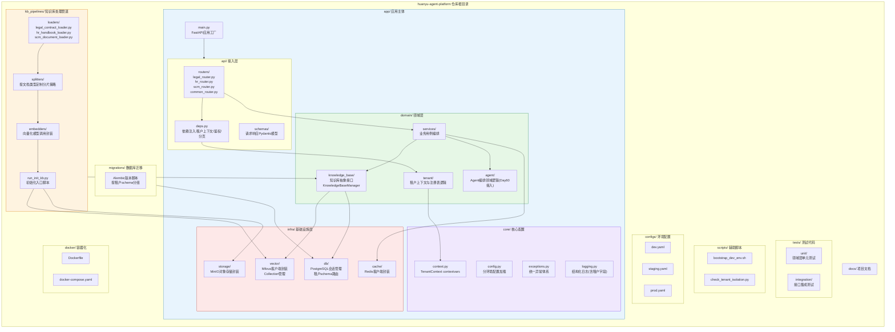
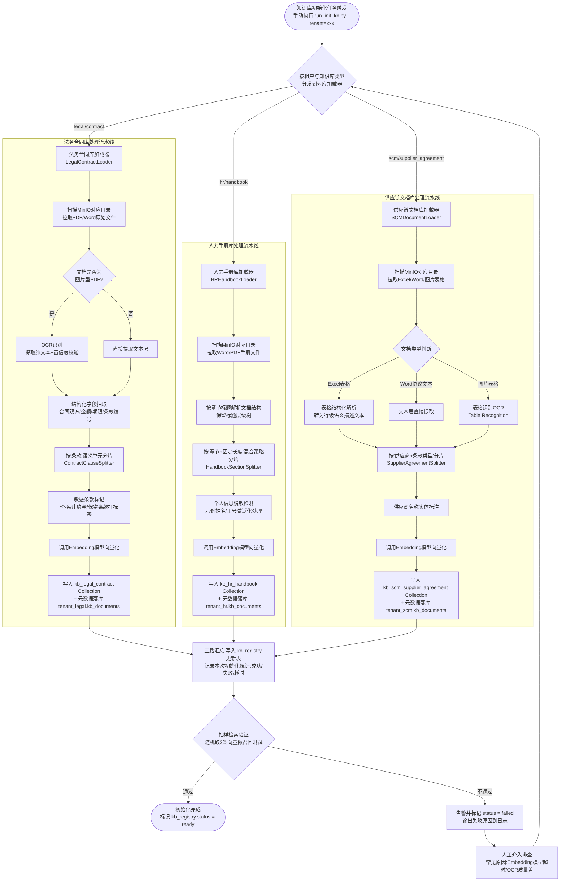
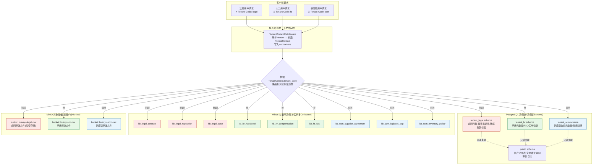

---
课程：企业级AI全栈工程师训练营（70天）
阶段：Stage 6 · 旗舰项目与职业冲刺
第59天：项目骨架搭建与知识库准备
主角：陈铭
导师：王振宇（老王）
公司：蓬远科技
产品：苍穹企业级智能体中台
客户：寰宇集团（法务 / 人力 / 供应链三大业务场景）
标签：多租户架构、知识库工程、RAG分区、FastAPI项目骨架、向量数据库、封闭开发冲刺
---

# 第59天：项目骨架搭建与知识库准备

## 【旁白】

封闭开发第一天,会议室的门是老王亲手关上的。

蓬远科技三楼的"启明"会议室,平时是留给客户演示用的,玻璃墙外能看到楼下的中央绿地,天气好的时候还能看见远处的写字楼群。但从今天开始,这间屋子被贴上了一张不起眼的A4纸,上面用记号笔写着"寰宇集团项目组 · 请勿打扰",连保洁阿姨进来倒垃圾都要先敲三次门。老王管这个叫"封闭开发的仪式感"——他说仪式感这东西看起来虚,但对一个要连续冲刺六天的团队来说,却是把心态从"日常摸鱼模式"切换到"战时模式"的开关。

陈铭是七点四十到的,比平时早了将近一个小时。他没有睡懒觉的理由——昨天下午,寰宇集团的技术评审会上,对面坐着的CTO办公室的三位架构师、法务中心的信息化负责人、人力资源SSC的系统对接人,还有供应链管理部的一位副总,一起听蓬远科技这边讲了将近两个半小时的技术方案,最后给出的结论是"原则通过,细节在实施过程中同步敲定"。这句话听起来云淡风轻,但陈铭太清楚这背后的分量——这是他从"苍穹企业级智能体中台"的边缘贡献者,第一次作为核心研发成员,站在甲方架构师对面回答技术追问的项目。方案通过了,压力才真正开始。

昨晚老王在项目群里发了一条消息:"方案定了,接下来六天不用再纠结'做什么',只需要纠结'怎么做得又快又稳'。明天九点,晨会,骨架搭建启动。"陈铭看到这条消息的时候已经快十二点,他把王振宇发来的技术方案定稿PDF又翻了一遍,在笔记本上写下了一句话:"骨架搭不好,后面五天都是在流沙上盖楼。"

九点整,晨会准时开始。除了陈铭和老王,还有前端负责人林薇、后端另一位工程师赵子昂,以及负责数据合规的顾问周姐(周敏)。项目经理苏晴没有出现在会议室,她在隔壁跟客户方对接资源交接的事情,但会议纪要会同步给她。老王站在白板前,先没有讲技术,而是把一张写满数字的纸贴在了墙上——那是六天冲刺的排期表,从Day59到Day64,每一天要交付什么,精确到了"上午/下午"的颗粒度。

"我们先说清楚一件事,"老王开口,"这六天不是让大家从零发明轮子,是把我们过去几十天积累的东西——不管是Day24做的RAG检索管道,还是Day30的Agent编排框架,还是Day36的多租户中台雏形,还是Day48的企业知识库工程——全部拿出来,在寰宇这个真实的、有三个业务部门、有明确SLA要求的项目里,重新组装、重新验证一遍。今天这一天,只干两件事:骨架和知识库。骨架搭不稳,知识库放错地方,后面四天全是返工。"

陈铭在笔记本上写下这句话的时候,手心有点湿。他知道从今天起,自己不再是那个"跟着老王学、照着方案抠细节"的实习生心态了,今天他要负责的,是这个项目里最基础、也最容易出问题的一层——项目骨架和多租户数据模型的具体落地。老王把这块交给他,说了一句让他记到现在的话:"骨架这活儿,看起来没技术含量,一个目录结构谁都会画,但真正扎实的骨架,是要扛得住六天里各种需求变化、各种紧急插入的任务而不散架的。你能不能扛住,今天就知道了。"

会议室的空调声嗡嗡地响着,白板上的字迹还没干,陈铭已经打开了电脑,新建了一个空的Git仓库。他知道,从这一刻起,接下来六天,这个仓库里的每一次commit,都会变成寰宇集团那三个业务部门里,几百号人每天要用的东西。

---

## 晨会纪要

**会议主题**:寰宇集团项目 · 封闭开发冲刺 Day1 晨会(任务分解会)
**时间**:Day59 09:00 - 09:50
**地点**:蓬远科技三楼启明会议室
**主持人**:王振宇
**记录人**:陈铭
**参会人员**:王振宇(技术负责人)、陈铭(后端/骨架负责人)、赵子昂(后端/知识库负责人)、林薇(前端负责人)、周敏(数据合规顾问,线上列席)
**缺席说明**:项目经理苏晴在与客户方进行资源交接,会议纪要另行同步

### 一、六天冲刺总排期回顾

老王先把六天的整体排期在白板上重新过了一遍,确保每个人对全局有一致认知,避免"只顾自己那块,不知道别人在干什么"的信息孤岛问题。

| 天数 | 里程碑 | 交付物 | 责任人 |
|------|--------|--------|--------|
| Day59(今天) | 骨架搭建与知识库准备 | 项目仓库骨架、多租户数据模型初版、三大知识库初始化脚本 | 陈铭(骨架)、赵子昂(知识库脚本) |
| Day60 | 核心链路开发 | 检索问答核心接口、Agent编排核心接口打通 | 陈铭、赵子昂 |
| Day61 | 三场景业务逻辑开发 | 法务合同问答、人力政策问答、供应链协同问答三条业务线 | 全员分工 |
| Day62 | 前后端联调 | 前端页面接入真实接口,联调修复 | 林薇主导,后端配合 |
| Day63 | 压测与合规审查 | 性能压测、数据隔离审计、权限穿透测试 | 周敏主导,老王把关 |
| Day64 | 演示环境部署与验收准备 | UAT环境部署、验收材料准备、内部演练 | 全员 |

老王特意强调:"这张表不是刻在石头上的,冲刺过程中一定会有变化,但每天早上我们都要花十分钟对齐一下今天到底要交付什么,不能到了晚上才发现方向偏了。"

### 二、今日(Day59)任务分解

老王把今天的任务拆成了两条主线,分别对应上午和下午。

**主线一:项目骨架搭建(上午,负责人:陈铭)**

1. 确定寰宇项目仓库的目录结构规范,要求兼容"苍穹企业级智能体中台"的既有架构风格,同时针对寰宇的三租户/三部门场景做定制扩展。
2. 搭建基于FastAPI的多租户感知项目骨架,包括配置管理、依赖注入、中间件、路由分层。
3. 设计并落地多租户数据模型(PostgreSQL schema级隔离 + 应用层租户上下文透传)。
4. 编写骨架自检脚本,确保任何新加入项目的同事,拉取代码后能在五分钟内跑起来一个"Hello Tenant"级别的验证接口。

**主线二:核心数据/知识库准备(下午,负责人:赵子昂,陈铭配合设计抽象层)**

1. 梳理法务中心提供的合同模板库、历史合同扫描件、法律法规文件的数据形态和敏感等级。
2. 梳理人力资源SSC提供的员工手册、薪酬制度、考勤规则、常见问题FAQ的数据形态。
3. 梳理供应链管理部提供的供应商协议、物流SOP、库存管理规范的数据形态。
4. 针对三类知识库,分别设计加载(Load)、分割(Split)、向量化(Embed)、入库(Index)四段式处理流程,并写出可复用的初始化脚本。
5. 设计一层"统一知识库管理抽象层",让上层业务代码不需要关心具体某个知识库用的是哪种分片策略、哪个collection命名,只需要通过统一接口调用。

### 三、关键风险点讨论

会议中,赵子昂提出了一个他一直担心的问题:"寰宇集团三个部门给的文档质量参差不齐,法务那边的合同扫描件里有大量图片版PDF,OCR质量能不能保证是个问题;人力那边的手册倒是Word文档为主,格式规整;供应链的东西最杂,Excel、Word、甚至有些是拍照传过来的表格截图。如果知识库这一层没设计好统一的预处理管道,后面天天要单独处理各种格式问题,会拖垮进度。"

老王对此的回应是:"这正是为什么知识库准备要单独占一整个下午,而不是随便写几行代码糊弱个demo。今天下午的目标不是把所有文档都处理完——那是不可能的,寰宇给的文档量太大了,今天做不完。今天的目标是把'处理管道'这个东西做对、做稳,格式解析、分片策略、向量化配置这些核心决策今天必须敲定下来,后面几天只是往里灌数据,而不是天天改架构。"

周敏在这个时候补充了合规角度的意见:"我这边要提醒一下,法务的合同数据里,涉及到寰宇集团与其他公司的商业条款,按照我们跟寰宇签的数据处理协议,这类数据在向量化之后,原始文本不能明文存储在没有加密的存储介质上,而且检索结果要做脱敏展示的边界控制。这个要求今天设计数据模型的时候就要考虑进去,不是事后加个补丁。"

陈铭把这条记了下来,并在心里默默评估:这意味着多租户数据模型里,不仅要做租户间隔离,还要在法务这个租户内部,针对不同敏感等级的文档,做进一步的存储加密和访问控制分级。这比他昨晚设想的方案要复杂一些。

老王最后拍板:"今天上午骨架,下午知识库,两条线并行,陈铭主导骨架同时给知识库抽象层打地基,子昂主导三个知识库的具体加载脚本。晚上六点半,我们做一次简短的骨架验收,过了才能收工。"

### 四、今日验收标准(DoD, Definition of Done)

会议结束前,老王明确列出了今天必须达成的验收标准,写在了白板右侧,要求晚上验收时逐条对照:

1. 项目仓库骨架搭建完成,目录结构文档已提交,任何新成员按照README能在5分钟内启动本地开发环境。
2. 多租户数据模型的PostgreSQL DDL脚本能够成功执行,创建出法务、人力、供应链三个租户schema,并且带有独立的迁移版本管理。
3. 三个知识库(法务合同库、人力手册库、供应链文档库)各自完成至少一份样例文档的端到端加载-分割-向量化-入库验证,证明处理管道走得通。
4. 统一知识库管理抽象层的接口设计文档和基础代码已经提交,能够体现"上层调用方无需关心底层向量库和分片策略差异"这一设计目标。
5. 所有代码提交经过Code Review(老王review陈铭的骨架代码,陈铭review赵子昂的知识库脚本),无高危问题遗留。

会议在9点50分结束,比预定的九点半稍微超时,主要是因为周敏关于合规边界的讨论花了比预期更长的时间。但老王觉得这个时间花得值——"今天多花十分钟把边界想清楚,比明天返工浪费两个小时要划算得多。"

---

## 需求文档:寰宇项目骨架技术规范

**文档编号**:HY-TECH-SPEC-001
**版本**:V1.0
**编写人**:陈铭
**审核人**:王振宇
**适用范围**:寰宇集团智能体中台项目全体开发人员

### 1. 背景与目标

寰宇集团项目是"苍穹企业级智能体中台"落地的第一个覆盖多业务场景的旗舰级客户项目,同时服务法务中心、人力资源SSC(共享服务中心)、供应链管理部三个业务方。三个业务方的数据边界、权限模型、知识库内容完全不同,但底层技术架构应当尽可能复用,避免针对每个业务方单独维护一套代码。

本规范的目标是:定义一套项目骨架结构和数据模型规范,使得:

- 新增一个业务租户(部门)时,只需要新增配置和数据,不需要改动核心框架代码。
- 三个业务方的知识库、Agent能力、权限策略在逻辑上完全隔离,任何一方的数据泄露到另一方都是架构层面不可能发生的事情,而不仅仅依赖业务代码的if判断。
- 项目骨架能够承接后续五天的核心链路开发、业务逻辑开发,不需要中途推翻重构。

### 2. 目录结构规范

项目仓库命名为`huanyu-agent-platform`,顶层目录结构遵循苍穹中台既有的分层惯例,同时结合寰宇项目多租户特性做扩展。总体分为四大分层:接入层(api)、领域层(domain)、基础设施层(infra)、支撑层(support)。

顶层目录如下(具体细节见后文架构设计图):

```
huanyu-agent-platform/
├── app/                    # 应用主体代码
│   ├── api/                 # 接入层:路由、请求响应模型、依赖注入
│   ├── domain/               # 领域层:业务逻辑、知识库抽象、Agent编排
│   ├── infra/                # 基础设施层:数据库、向量库、缓存、对象存储的具体实现
│   ├── core/                  # 核心配置、租户上下文、异常定义、日志
│   └── main.py                 # 应用入口
├── kb_pipelines/             # 知识库加载/分割/向量化脚本
├── migrations/                # 数据库迁移脚本(Alembic)
├── tests/                      # 测试代码,按分层镜像组织
├── scripts/                     # 运维/开发辅助脚本
├── configs/                      # 各环境配置文件
├── docs/                           # 项目文档
├── docker/                          # 容器化相关文件
├── pyproject.toml
└── README.md
```

这里需要特别说明"领域层"和"基础设施层"的划分原则,这是骨架设计中最容易被简化项目忽视、但在寰宇这种多租户复杂项目里必须坚持的一条纪律:领域层只依赖抽象接口(比如"知识库检索接口""向量库接口"),绝对不能直接import具体的Milvus SDK或者具体的PostgreSQL驱动;基础设施层负责实现这些抽象接口。这样设计的好处是,如果六天之后,寰宇的IT部门临时要求把向量库从Milvus换成他们已经采购的另一款产品(这种事在甲方项目里屡见不鲜),我们只需要重新实现基础设施层的一个适配器,领域层和接入层代码完全不用动。

老王在评审这份目录结构的时候提了一个问题:"你这个kb_pipelines为什么放在app外面,不放进domain里?"陈铭的回答是:"知识库的加载脚本本质上是离线批处理任务,不是在线请求处理路径的一部分,它的生命周期、部署方式、触发方式(定时任务/手动触发/事件触发)都跟在线服务不一样,放在app包里会让人误以为这是请求处理链路的一部分。但kb_pipelines里复用的知识库抽象接口,来自app.domain.knowledge_base这个模块,这样保证了代码不重复。"老王点头认可了这个设计。

### 3. 多租户数据模型规范

寰宇项目的多租户模型采用"Schema级隔离 + 行级租户标识"的混合策略,具体规则如下:

**3.1 租户划分粒度**

以"业务部门"作为租户划分的最小粒度,当前定义三个租户:

| 租户代码 | 租户名称 | 业务范围 | 数据敏感等级 |
|---------|---------|---------|-------------|
| `legal` | 法务中心 | 合同审查、法律法规咨询、合规风险问答 | 高(涉及商业机密条款) |
| `hr` | 人力资源SSC | 员工政策问答、考勤薪酬咨询、招聘流程咨询 | 中(涉及员工个人信息) |
| `scm` | 供应链管理部 | 供应商协同、物流查询、库存管理咨询 | 中(涉及供应商商业信息) |

未来如果寰宇集团增加新的业务部门接入(比如财务、行政),只需要在租户注册表中新增一条记录,并执行对应的schema初始化迁移,不需要修改应用代码逻辑。

**3.2 数据库隔离策略**

采用PostgreSQL的Schema级隔离,每个租户拥有独立的Schema,命名规则为`tenant_<租户代码>`,即`tenant_legal`、`tenant_hr`、`tenant_scm`。这样设计相比于"单schema+tenant_id列过滤"的方案,多了一层物理隔离的安全边界——即使应用层某处代码疏忽忘记加租户过滤条件,由于数据物理上就不在同一个schema里,也不会发生跨租户数据泄露的严重事故。这是周敏在合规讨论中特别要求的一点:"我们不能把数据安全完全寄托于'工程师记得写WHERE tenant_id = xxx'这种脆弱的保证上。"

同时,考虑到有一些数据是跨租户共享的(比如租户注册表本身、全局的用户账号体系、全局的审计日志),额外设立一个`public`schema存放这类全局共享表。

**3.3 应用层租户上下文透传规范**

每一个进入系统的HTTP请求,必须在请求头中携带`X-Tenant-Code`字段(由前端在用户登录鉴权后自动附加,不需要用户手动指定),后端在最外层中间件解析该字段,构造`TenantContext`对象,通过Python的`contextvars`机制在整个异步调用链路中透传,而不是通过函数参数一层一层往下传(参数传递方式在业务代码层次深的时候极易被某个环节遗漏)。

任何数据库操作、向量库检索操作,底层封装的Repository/Store类,都必须从当前的`TenantContext`中读取租户代码,自动路由到对应的Schema或对应的向量库Collection,业务代码本身不需要、也不应该显式传递tenant_code参数——这是为了从架构机制上杜绝"某个业务函数忘记传租户参数导致查询了错误租户数据"这类低级但危险的bug。

**3.4 向量库隔离策略**

向量数据库(本项目选用Milvus作为核心向量存储引擎)采用Collection级隔离,命名规则为`kb_<租户代码>_<知识库子类型>`,例如法务合同库的Collection命名为`kb_legal_contract`,法律法规库命名为`kb_legal_regulation`,人力手册库命名为`kb_hr_handbook`等。这样即使在同一个Milvus实例上,不同租户的向量数据也在物理上分属不同Collection,检索时天然不会跨租户召回。

### 4. 知识库分区规划

针对三个业务方,知识库进一步细分为若干子知识库,规划如下:

**法务中心(legal)**:
- `contract`(合同库):历史合同扫描件与电子版合同,包含采购合同、销售合同、租赁合同、劳务合同等子类型。
- `regulation`(法规库):国家及地方法律法规、行业监管规定、寰宇集团内部合规制度。
- `case`(案例库):历史法律纠纷案例及处理意见,用于类案检索辅助。

**人力资源SSC(hr)**:
- `handbook`(员工手册库):入职指南、行为规范、考勤制度、请假流程等。
- `compensation`(薪酬福利库):薪酬结构说明、社保公积金政策、福利制度。
- `faq`(常见问题库):历史工单沉淀的高频问答对。

**供应链管理部(scm)**:
- `supplier_agreement`(供应商协议库):供应商合作协议、SLA条款、结算规则。
- `logistics_sop`(物流规范库):仓储、运输、配送环节的标准作业流程。
- `inventory_policy`(库存管理规范库):库存预警规则、补货策略、盘点流程。

每个子知识库对应一个独立的向量库Collection,并在关系型数据库中维护一张`kb_registry`元数据表,记录每个子知识库的名称、所属租户、Collection名、分片策略参数、Embedding模型版本、最近一次更新时间等信息,供统一知识库管理抽象层查询使用,避免各处代码硬编码Collection名称字符串。

### 5. 非功能性要求

- 骨架代码必须包含健康检查接口(`/health`)与租户联通性自检接口(`/tenant/{tenant_code}/ping`),便于运维和联调阶段快速定位问题所属层级。
- 所有对外暴露的API必须有Pydantic请求/响应模型定义,不允许直接使用裸dict传递数据,保证接口契约清晰,方便前端林薇同步开发。
- 日志必须包含租户代码字段,便于后续按租户切分日志进行问题排查和审计,这也是周敏合规审查的一项硬性要求。
- 骨架搭建阶段引入的所有第三方依赖必须锁定版本号,写入`pyproject.toml`,避免六天冲刺过程中因为依赖自动升级导致的不可预期问题。

### 6. 验收标准

与晨会纪要中的DoD一致,不再重复列出,以晨会纪要中的五条标准为最终验收依据。

---

## 架构设计图:寰宇项目仓库骨架目录结构与模块划分

下面这张图,是陈铭在晨会结束后,花了大概二十分钟在白板上画完、又搬到电脑里用Mermaid重新画的一版。他刻意把每个目录节点的职责用简短的文字标注出来,目的是让六天之后,即使是完全没参与过今天讨论的新同事,看这张图也能秒懂整个项目的分层逻辑。



这张图评审的时候,林薇提了一个前端视角的问题:"API层里的schemas会不会跟前端TypeScript类型定义脱节?每次后端改字段前端都要手动同步?"陈铭当场回应:"我们会在骨架里加一个基于Pydantic模型自动生成OpenAPI Schema、再转成TypeScript类型定义的脚本,放在scripts目录下,后面几天联调阶段你可以直接跑这个脚本拿到最新的类型定义,不需要人工对照接口文档手改。"这个承诺后来在代码实战部分有对应落地。

赵子昂关注的是kb_pipelines和domain/knowledge_base之间的边界:"如果我在写供应链文档的loader时,发现现有的分片策略不适合表格类文档,我能不能直接在loader里加特殊处理,而不用去改domain层?"陈铭解释:"可以,loaders和splitters本身就是可插拔的策略实现,只要它们最终产出符合domain层定义的'文档分片(Chunk)'数据结构,内部怎么处理是完全自由的,这也是为什么我们要在domain层先把这个数据结构的契约定义清楚,而不是各个loader各写各的格式。"

---

## 流程图:多部门知识库初始化处理流程

这张图是下午赵子昂主导设计的,目的是把法务合同库、人力手册库、供应链文档库这三条并行的知识库初始化流水线,用一张图统一表达出来,避免三个人各写各的脚本、最后风格完全不统一,导致后面几天维护成本飙升。



这张流程图画完之后,老王过来看了一眼,指着"敏感条款标记"这个节点问:"这一步具体怎么打标签,是关键词匹配还是模型判断?"赵子昂回答:"今天先用关键词+正则规则做第一版,像'违约金''保密''不可抗力'这些高频法律术语先覆盖,后面几天如果时间允许,可以升级成用一个小模型做条款分类。"老王认可了这个"先跑通、后优化"的思路,但补充了一句:"标记这一步的输出格式今天要定好,不管你用规则还是模型,输出的字段结构不能变,后面换实现的时候不能影响下游。"这句话让赵子昂在后面写代码的时候,多加了一层专门的数据结构定义,而不是直接返回一个裸的字符串标签列表。

---

## 示意图:多租户数据隔离(按部门/租户划分Collection/Schema)

这张图是陈铭专门为了跟周敏对齐合规边界画的,核心目的是把"数据在物理层面到底存在哪里、边界在哪里"这件事,用一张一眼能看懂的图表达清楚,避免纯文字描述在评审时产生歧义。



周敏看完这张图之后,提出了一个关键补充意见:"图上'只读关联'这条虚线要注意实现方式,tenant_legal这些schema如果要读public schema里的用户信息,一定不能反过来——public schema绝对不能有任何途径查询到tenant_legal、tenant_hr、tenant_scm里的业务数据,这个方向性一定不能搞反。"陈铭确认了这一点,在后续的数据库权限设计里,专门给每个租户schema配置了独立的数据库角色(role),该角色只被授予对应schema的读写权限,以及对public schema的只读权限,反向权限完全不存在,这一点在代码实战部分的DDL脚本里有具体体现。

老王补充了一个实施层面的问题:"图上画的是单实例多Schema、单实例多Collection,这是我们现阶段选择的方案,但要在文档里写清楚为什么现在选这个,而不是一开始就上物理隔离的多实例方案。"陈铭把这个考虑写进了需求文档的补充说明里:寰宇项目当前处于封闭开发和试点验证阶段,数据量和并发量都远未达到需要物理多实例隔离的程度,采用逻辑隔离(Schema/Collection级)可以在保证安全边界清晰的前提下,大幅降低运维复杂度和资源成本;当项目转入生产阶段、数据量和敏感等级评估结果要求更强的隔离时,由于骨架设计已经把"租户路由"这一层完全抽象化,届时可以在不改动业务代码的前提下,把某个高敏感租户(比如法务)迁移到独立的数据库实例和向量库实例上,这是骨架设计中预留的可扩展性。

---

## 课堂笔记

### 上午:项目骨架搭建——复用并整合历史项目的代码模式

陈铭在打开IDE开始写代码之前,先做了一件事:把过去几十天里几个关键项目的骨架代码都并排打开,一个个对照着看。老王常说"不要重复发明轮子,但也不要盲目复制轮子",这句话今天上午体现得特别具体。

**关于Day24的启发:RAG检索管道的接口设计**

陈铭记得Day24做的是一个基础的RAG问答系统,那时候检索接口的设计还很朴素——一个函数,输入query字符串,输出Top-K相关文档片段。当时那个设计放在单租户、单知识库的场景下没有任何问题,但今天要在寰宇项目里复用这个思路,必须做一次改造:检索接口不能再是一个"无状态"的纯函数,而必须先确定"在哪个租户的哪个知识库里检索"这个上下文。

陈铭把Day24的检索函数签名从:

```python
def retrieve(query: str, top_k: int = 5) -> list[str]:
    ...
```

演化成了今天骨架里的:

```python
async def retrieve(
    self,
    query: str,
    kb_name: str,
    top_k: int = 5,
    filters: dict | None = None,
) -> list[RetrievedChunk]:
    ...
```

这里的关键变化不只是加了参数,而是整个调用方式变成了实例方法(`self`),因为检索这件事现在必须绑定在一个已经确定了租户上下文的`KnowledgeBaseManager`实例上,`kb_name`参数用于在多个子知识库之间选择(比如法务租户下,检索"合同库"还是"法规库"是两个不同的调用),`filters`参数则是为了支持后面几天可能出现的"只在某个时间范围内的合同里检索"这类精细化查询需求预留的扩展点。返回值也从裸字符串列表变成了结构化的`RetrievedChunk`对象,包含文本内容、来源文档ID、相似度得分、所属子知识库、敏感等级标签等字段——这是因为在真实企业场景里,前端需要展示"这段回答依据的是哪份合同的第几条",裸字符串完全无法支撑这种可追溯的展示需求。

**关于Day30的启发:Agent编排框架的依赖注入模式**

Day30那次做的是一个多步骤Agent编排的demo,当时为了图快,很多组件是通过全局单例的方式直接import使用的,比如LLM客户端、向量库客户端都是模块级别的全局变量。这种写法在demo阶段没问题,但今天骨架搭建的时候,陈铭刻意摒弃了这种模式,转而全面采用FastAPI的依赖注入(Dependency Injection)机制。

原因很直接:寰宇项目里,不同租户可能未来会配置不同的LLM模型(比如法务因为合规要求必须用私有化部署的模型,人力和供应链可以用效果更好的云端模型),如果客户端是全局单例,没法针对不同租户切换配置;而如果通过依赖注入,每个请求处理函数只需要声明"我需要一个LLM客户端"这个依赖,具体注入哪个配置的客户端实例,由依赖注入容器根据当前请求的租户上下文动态决定,业务代码完全不用感知这层差异。

这个模式陈铭在骨架的`deps.py`里做了统一封装,后面代码实战部分会有完整体现。

**关于Day36的启发:多租户中台雏形的路由分层思路**

Day36那次的项目是苍穹中台早期的一个多租户雏形,当时已经有了"租户"这个概念,但路由层是按照"业务功能"去组织的,比如`/query`, `/upload`, `/manage`这种扁平化路由,所有租户共用同一套路由,内部再用if-else分发。

陈铭今天在设计寰宇项目路由的时候,采纳了一个更清晰的分层:按"业务方"先做一级路由前缀区分(`/legal/*`, `/hr/*`, `/scm/*`),再在每个业务方下面组织具体的功能路由。这样设计的理由,是因为寰宇项目里,三个业务方的具体接口需求其实并不完全一样——法务需要"合同审查"这个专属接口,人力需要"考勤查询"接口,供应链需要"库存预警"接口,这些接口本身在业务语义上是完全独立的,如果强行用同一套通用接口硬套三个业务场景,接口的请求/响应模型会变得异常臃肿,充斥着大量"仅某个业务方使用"的可选字段。而共性的能力,比如"知识库问答"这个动作,则被抽象到一个公共的路由模块里,三个业务方复用同一套实现,通过依赖注入的租户上下文来决定具体检索哪个知识库。

老王在Review的时候对这个设计给了正面评价,但也提了一个警示:"按业务方分路由前缀,好处是接口语义清晰,但坏处是如果以后业务方越来越多,每加一个业务方都要写一遍路由文件,容易产生大量重复代码。你现在这三个业务方的路由文件里,有多少是纯粹的样板代码?"陈铭当时没有完全想清楚这个问题,后来在写代码的过程中,提�round出了一个`RouterFactory`的模式——用一个工厂函数,根据传入的租户代码和该租户启用的功能列表,动态生成对应的路由集合,减少手写重复代码的比例,这部分在代码实战里会详细呈现。

**关于Day48的启发:企业知识库工程的分片与元数据设计**

Day48专门讲的是企业知识库工程,当时讨论的核心问题之一,是"分片策略不能一刀切,不同类型的文档需要不同的分片粒度和分片边界判断依据"。陈铭记得那次课上举的例子是:技术文档适合按标题层级分片,法律文本适合按条款编号分片,聊天记录适合按会话轮次分片。

今天面对法务合同、人力手册、供应链文档这三类完全不同形态的资料,Day48留下的这个原则直接派上用场——陈铭没有去写一个"万能分片器",而是设计了一个`BaseSplitter`抽象基类,定义统一的输入输出契约(输入是解析后的文档结构对象,输出是`Chunk`对象列表),然后针对法务合同实现`ContractClauseSplitter`(按条款编号切分),针对人力手册实现`HandbookSectionSplitter`(按章节标题+长度限制的混合策略),针对供应链文档实现`SupplierAgreementSplitter`(按供应商名称+条款类型的二维切分)。这三个具体实现类各自封装各自的业务逻辑,互不干扰,但对上层调用方(知识库管理抽象层)呈现出完全一致的调用接口。

这也是Day48留下的另一个重要经验的复用:元数据(metadata)要在分片阶段就跟着内容一起走,不能等到后面再补。陈铭在`Chunk`数据结构里,除了文本内容,还带上了来源文档ID、分片在文档中的位置、分片对应的结构化字段(比如合同分片会带上"所属条款编号""所属合同ID""敏感标签"),这些元数据在后面Day61开发具体业务逻辑、需要"展示引用来源"的时候,会成为非常关键的支撑。

**上午骨架搭建的实际时间分配**

上午三个半小时,陈铭大致是这样分配时间的:

- 09:50 - 10:20:确定目录结构规范,写进需求文档,发给老王过了一遍。
- 10:20 - 11:30:搭建FastAPI应用工厂、配置管理、租户上下文中间件、依赖注入体系。
- 11:30 - 12:20:设计多租户数据模型,写PostgreSQL DDL脚本和Alembic迁移配置,本地跑通schema创建。
- 12:20 - 13:00:午饭,期间跟赵子昂对齐了知识库抽象层的接口契约,为下午的并行开发做准备。

这里有个细节值得记一下:陈铭在写租户上下文中间件的时候,一开始想用一个简单的字典(dict)全局变量来存当前请求的租户信息,后来意识到这样在异步并发场景下会有严重的数据竞争问题——多个请求并发处理时,全局字典会被互相覆盖。他改用Python的`contextvars.ContextVar`,这是asyncio原生支持的、专门为解决这类"每个协程有自己独立上下文,又不想通过参数一层层传递"问题设计的机制。这个坑他其实在更早的项目里踩过一次,今天算是直接绕开了。

### 下午:核心数据/知识库准备——三类知识库的初始化

下午一开始,老王没有直接让大家动手写代码,而是先花了半小时,把三个业务方提供的原始资料样本都投到会议室的大屏幕上,让陈铭、赵子昂一起看一遍,再决定处理策略。这是老王一贯的习惯:"不要凭空猜测数据长什么样子,先看真实样本,再设计管道,顺序不能反。"

**法务合同库的资料特点与处理策略**

法务中心提供的样本里,大概三成是近两年签署的电子版合同(Word/PDF双语版,文本层完整,格式规整),七成是历史合同的扫描件(部分是纸质合同拍照后OCR过一次的PDF,质量参差不齐,有些甚至有轻微倾斜和阴影)。赵子昂现场测试了几份扫描件的OCR效果,发现有大概15%的样本存在明显的识别错误,主要集中在数字和印章覆盖区域。

针对这个情况,团队决定的处理策略是:

1. 电子版合同直接提取文本层,不做OCR,保证准确性最高的一批数据优先处理。
2. 扫描件走OCR识别,并加入置信度校验——OCR结果里如果某一页的识别置信度低于设定阈值(初步定为0.85),该页标记为"待人工复核",不直接进入自动向量化流程,而是先落入一个"待复核"队列,提示法务中心指派人工核对后再补录。
3. 结构化字段抽取(合同双方、金额、期限、条款编号)使用规则+轻量NER模型的组合方式,今天先把规则部分跑通,模型部分作为后续优化项。
4. 分片策略按"条款"语义单元进行,而不是简单按字符数切分——因为法律条款的完整性至关重要,如果把一个条款从中间切断分到两个chunk里,检索召回的时候很可能只召回半句话,导致回答出现严重的语义错误甚至法律风险。

周敏在旁边补充了一条要求:合同里涉及"价格""违约金""保密条款""不可抗力"这几类敏感条款,在分片阶段就要打上敏感标签,后续如果某个用户角色没有查看敏感条款的权限,检索结果要在这一层做过滤,而不是等生成回答之后再做事后过滤——"事后过滤"意味着敏感信息已经进入了大语言模型的上下文,即使最终输出被过滤掉,也存在被模型在其他环节"泄露"的风险,这个原则在架构设计上要坚持到底。

**人力手册库的资料特点与处理策略**

人力资源SSC提供的资料相对规整,主体是Word格式的员工手册(约80页,有清晰的章节标题层级)、薪酬福利说明文档、以及一份从历史工单系统导出的Excel格式FAQ列表(大概600多条问答对)。

处理策略上,员工手册按"章节标题+长度限制"的混合分片策略——先按标题层级把文档切成天然的章节块,如果某个章节块的长度超过设定阈值(比如800字),再在章节内部按段落边界进一步细分,保证每个chunk既不会跨越语义边界,也不会因为章节太长而丢失检索精度。FAQ列表则不需要复杂分片,每一条问答对天然就是一个独立的语义单元,直接作为一个chunk处理,同时把"问题"这部分单独存一份用于关键词匹配辅助召回。

个人信息脱敏是这里的一个重点。手册和FAQ里偶尔会出现示例性的员工姓名、工号(比如"如张三想申请调岗,应..."这种举例句式),虽然不是真实敏感信息,但为了防止误判和统一处理规范,团队决定对文档中识别出的人名、工号格式统一做泛化替换处理(比如替换成"某员工""某工号"),这个规则今天先用简单的正则和词典匹配实现,覆盖大部分场景。

**供应链文档库的资料特点与处理策略**

供应链管理部提供的资料是三个业务方里最"杂"的一类:有正式的Word版供应商合作协议,有大量Excel表格(物流费率表、库存管理规则表、供应商资质清单),甚至还有几张手机拍摄的白板照片(记录了一次供应链应急会议上讨论的临时规则)。

针对这种混杂情况,团队今天的策略是"分类处理、分批接入":

1. Word协议文本直接提取文本层,按"供应商名称+条款类型"进行二维分片——因为供应链场景下,用户提问经常是"XX供应商的结算周期是多少",如果分片没有明确关联到具体供应商,检索召回会出现"张冠李戴"的问题(把A供应商的条款当成B供应商的条款返回)。
2. Excel表格不能直接把整张表当成一个文本块丢给向量模型,那样语义损失极大。团队设计了一个表格转语义描述的转换逻辑:把每一行数据,结合表头信息,转换成一句自然语言描述,比如"供应商名称为华东物流有限公司,合作品类为冷链运输,结算周期为月结30天,违约赔偿比例为合同金额的5%",这样转换后的文本更适合向量检索。
3. 图片形式的表格和白板照片,今天先标记为"低优先级、暂不处理",团队一致认为这类非结构化程度极高、且数量很少(样本里只有4张)的资料,不应该在今天这个搭骨架的阶段投入过多精力去做定制化处理,后续如果业务方明确需要,再评估投入OCR+表格识别的成本是否值得。这个决策老王认可,并特别强调:"骨架搭建阶段最重要的原则是'抓大放小',把80%场景覆盖的通用管道做扎实,剩下20%的长尾情况留出扩展点,不要因为长尾情况把主线拖慢。"

**统一知识库管理抽象层的设计讨论**

下午四点左右,陈铭和赵子昂专门花了四十分钟,一起把"统一知识库管理抽象层"的接口设计过了一遍,这是今天知识库准备工作里最核心的一块——因为如果这一层设计得不好,后面五天里,每次要给某个业务方加一个新的检索场景,都要在业务代码里写一堆"if kb_type == xxx then ... elif ..."的分支判断,代码会迅速腐化。

两人最终确定的设计原则是:

1. `KnowledgeBaseManager`是唯一对外的入口类,业务代码只跟这个类打交道,不直接接触Milvus SDK或者具体的分片器实现。
2. 每个子知识库(比如法务合同库)在`kb_registry`元数据表里注册一条记录,记录里包含这个知识库用的向量库Collection名称、使用的Embedding模型标识、使用的分片器类型标识。`KnowledgeBaseManager`在初始化的时候,读取这张注册表,动态构造出每个知识库对应的处理实例,而不是在代码里写死。
3. 检索(retrieve)、写入(ingest)、删除(delete)、重建索引(rebuild)是这一层要暴露的四个核心操作,所有子知识库无论具体实现差异多大,都必须支持这四个操作的统一接口。
4. 这一层要天然携带租户上下文——即调用`KnowledgeBaseManager`的检索方法时,不需要显式传入租户代码,因为它在构造时就已经绑定了当前请求的`TenantContext`,这跟上午设计的依赖注入体系是一脉相承的。

赵子昂在讨论过程中提出一个很实际的问题:"如果某天某个知识库的Embedding模型要升级换代,已经入库的旧向量怎么处理?"陈铭和老王讨论后给出的方案是:`kb_registry`表里增加一个`embedding_version`字段,每次写入向量时都记录当时使用的模型版本;检索时如果发现某个知识库存在多个版本共存的情况,可以选择"仅检索最新版本"或者"全版本检索后按版本加权排序"两种策略,这个策略今天先设计好数据结构,具体的多版本兼容逻辑作为后续优化项,不在今天的范围内深入实现,但要确保今天的数据模型不会在未来实现这个功能时出现结构性障碍。

老王最后对下午的产出做了总结性点评:"知识库这块,今天最大的价值不是处理了多少条数据——事实上我们今天处理的样本数量少得可以忽略不计,今天最大的价值是把'处理策略'这件事想清楚、写清楚、验证通过了。接下来几天,子昂你可以放心地批量跑数据,不用再纠结架构对不对的问题。"

---

## 代码实战

今天的代码量很大,涵盖了项目骨架的核心文件、多租户数据模型的DDL与迁移脚本、三个业务方知识库的初始化脚本,以及统一知识库管理抽象层。陈铭把这些代码按目录结构整理好之后,发给老王做了一轮Review,老王提的意见已经体现在下面的最终版本里(比如异常处理的统一化、日志字段的补全)。

以下代码按照"核心配置与上下文 → FastAPI应用骨架与路由 → 数据库与向量库基础设施 → 统一知识库管理抽象层 → 三个业务方知识库初始化脚本 → 数据库迁移与自检脚本"的顺序呈现。

### 一、核心配置与租户上下文(app/core/）

```python
# app/core/config.py
"""
分环境配置加载模块。
遵循12-Factor原则:配置通过环境变量注入,不同环境(dev/staging/prod)
使用不同的默认配置文件作为基线,环境变量可覆盖文件中的任意配置项。
"""
from __future__ import annotations

import os
from functools import lru_cache
from pathlib import Path
from typing import Literal

import yaml
from pydantic import BaseModel, Field, field_validator

ENV_KEY = "HUANYU_ENV"
DEFAULT_ENV = "dev"
CONFIG_DIR = Path(__file__).resolve().parent.parent.parent / "configs"


class PostgresConfig(BaseModel):
    host: str = "localhost"
    port: int = 5432
    database: str = "huanyu_platform"
    user: str = "huanyu_app"
    password: str = ""
    pool_min_size: int = 2
    pool_max_size: int = 20
    statement_timeout_ms: int = 15000

    @property
    def dsn(self) -> str:
        return (
            f"postgresql+asyncpg://{self.user}:{self.password}"
            f"@{self.host}:{self.port}/{self.database}"
        )


class MilvusConfig(BaseModel):
    host: str = "localhost"
    port: int = 19530
    alias: str = "default"
    connect_timeout_s: int = 10
    default_index_type: str = "HNSW"
    default_metric_type: str = "COSINE"


class RedisConfig(BaseModel):
    host: str = "localhost"
    port: int = 6379
    db: int = 0
    password: str | None = None
    socket_timeout_s: int = 5

    @property
    def url(self) -> str:
        auth = f":{self.password}@" if self.password else ""
        return f"redis://{auth}{self.host}:{self.port}/{self.db}"


class MinioConfig(BaseModel):
    endpoint: str = "localhost:9000"
    access_key: str = ""
    secret_key: str = ""
    secure: bool = False
    region: str = "cn-north-1"


class EmbeddingConfig(BaseModel):
    provider: Literal["openai_compatible", "local_bge", "qianfan"] = "openai_compatible"
    model_name: str = "bge-large-zh-v1.5"
    endpoint: str = ""
    api_key: str = ""
    dimension: int = 1024
    batch_size: int = 32
    request_timeout_s: int = 30


class TenantDefinition(BaseModel):
    """
    单个租户的静态定义。运行时的动态状态(比如是否启用)
    存放在数据库的 public.tenant_registry 表中,这里只放
    骨架层面需要提前知道的静态信息,用于初始化 schema 名称、
    默认知识库列表等。
    """
    code: str
    display_name: str
    schema_name: str
    default_kb_names: list[str] = Field(default_factory=list)
    sensitivity_level: Literal["low", "medium", "high"] = "medium"

    @field_validator("schema_name")
    @classmethod
    def validate_schema_name(cls, v: str) -> str:
        if not v.startswith("tenant_"):
            raise ValueError("租户schema命名必须以 tenant_ 前缀开头,以便与public schema区分")
        return v


class Settings(BaseModel):
    env: str = DEFAULT_ENV
    debug: bool = False
    service_name: str = "huanyu-agent-platform"
    api_prefix: str = "/api/v1"

    postgres: PostgresConfig = PostgresConfig()
    milvus: MilvusConfig = MilvusConfig()
    redis: RedisConfig = RedisConfig()
    minio: MinioConfig = MinioConfig()
    embedding: EmbeddingConfig = EmbeddingConfig()

    tenants: list[TenantDefinition] = Field(default_factory=list)

    log_level: str = "INFO"
    log_json: bool = True

    def get_tenant(self, code: str) -> TenantDefinition | None:
        for t in self.tenants:
            if t.code == code:
                return t
        return None


def _load_yaml_config(env: str) -> dict:
    config_path = CONFIG_DIR / f"{env}.yaml"
    if not config_path.exists():
        return {}
    with open(config_path, "r", encoding="utf-8") as f:
        return yaml.safe_load(f) or {}


def _apply_env_overrides(raw: dict) -> dict:
    """
    支持形如 HUANYU_POSTGRES__HOST=xxx 的双下划线嵌套环境变量覆盖配置文件。
    这样在容器化部署时,可以完全不修改配置文件,通过环境变量注入敏感信息
    (比如数据库密码、API Key),避免明文写入版本库。
    """
    prefix = "HUANYU_"
    for key, value in os.environ.items():
        if not key.startswith(prefix):
            continue
        path = key[len(prefix):].lower().split("__")
        cursor = raw
        for segment in path[:-1]:
            cursor = cursor.setdefault(segment, {})
        cursor[path[-1]] = value
    return raw


@lru_cache(maxsize=1)
def get_settings() -> Settings:
    env = os.environ.get(ENV_KEY, DEFAULT_ENV)
    raw = _load_yaml_config(env)
    raw["env"] = env
    raw = _apply_env_overrides(raw)
    return Settings(**raw)
```

```python
# app/core/context.py
"""
租户上下文透传机制。

设计核心:用 contextvars 而不是函数参数逐层传递租户信息。
好处是:
1. 业务代码任意深层调用都可以直接拿到当前租户上下文,不需要
   在每一层函数签名里加 tenant_code 参数。
2. 在异步并发场景下,每个协程/请求有独立的上下文副本,不会
   出现多个请求互相污染彼此租户信息的问题(这一点用普通全局
   变量是做不到的)。
"""
from __future__ import annotations

import contextvars
from dataclasses import dataclass, field
from datetime import datetime, timezone

from app.core.exceptions import TenantContextMissingError


@dataclass(frozen=True)
class TenantContext:
    tenant_code: str
    schema_name: str
    sensitivity_level: str
    request_id: str
    user_id: str | None = None
    roles: tuple[str, ...] = field(default_factory=tuple)
    entered_at: datetime = field(default_factory=lambda: datetime.now(timezone.utc))

    def has_role(self, role: str) -> bool:
        return role in self.roles

    def can_view_sensitive(self) -> bool:
        """
        高敏感等级租户(比如法务)的敏感条款,只有具备
        'sensitive_reader' 角色的用户才能查看,这个判断
        在知识库检索的过滤阶段会被调用。
        """
        if self.sensitivity_level != "high":
            return True
        return self.has_role("sensitive_reader") or self.has_role("admin")


_current_tenant_context: contextvars.ContextVar[TenantContext | None] = (
    contextvars.ContextVar("current_tenant_context", default=None)
)


def set_tenant_context(ctx: TenantContext) -> contextvars.Token:
    return _current_tenant_context.set(ctx)


def reset_tenant_context(token: contextvars.Token) -> None:
    _current_tenant_context.reset(token)


def get_tenant_context() -> TenantContext:
    ctx = _current_tenant_context.get()
    if ctx is None:
        raise TenantContextMissingError(
            "当前调用链路缺少租户上下文,可能是在中间件之外调用了"
            "需要租户信息的方法,请检查调用路径。"
        )
    return ctx


def try_get_tenant_context() -> TenantContext | None:
    return _current_tenant_context.get()
```

```python
# app/core/exceptions.py
"""
统一异常体系。所有业务异常都继承自 HuanyuBaseError,
方便在最外层用统一的异常处理器转换成标准化的HTTP响应,
避免每个路由函数里写重复的 try/except。
"""
from __future__ import annotations


class HuanyuBaseError(Exception):
    error_code: str = "HUANYU_UNKNOWN_ERROR"
    http_status: int = 500

    def __init__(self, message: str, *, detail: dict | None = None) -> None:
        super().__init__(message)
        self.message = message
        self.detail = detail or {}


class TenantContextMissingError(HuanyuBaseError):
    error_code = "TENANT_CONTEXT_MISSING"
    http_status = 500


class TenantNotFoundError(HuanyuBaseError):
    error_code = "TENANT_NOT_FOUND"
    http_status = 404


class TenantAccessDeniedError(HuanyuBaseError):
    error_code = "TENANT_ACCESS_DENIED"
    http_status = 403


class KnowledgeBaseNotFoundError(HuanyuBaseError):
    error_code = "KB_NOT_FOUND"
    http_status = 404


class KnowledgeBaseIngestError(HuanyuBaseError):
    error_code = "KB_INGEST_ERROR"
    http_status = 500


class SensitiveContentAccessDeniedError(HuanyuBaseError):
    error_code = "SENSITIVE_CONTENT_ACCESS_DENIED"
    http_status = 403


class DocumentParseError(HuanyuBaseError):
    error_code = "DOCUMENT_PARSE_ERROR"
    http_status = 422


class EmbeddingServiceError(HuanyuBaseError):
    error_code = "EMBEDDING_SERVICE_ERROR"
    http_status = 502
```

```python
# app/core/logging.py
"""
结构化日志配置。每条日志强制携带 tenant_code 字段
(如果当前上下文里有的话),这是合规审查明确要求的一项:
后续审计时需要能够按租户维度过滤全部日志。
"""
from __future__ import annotations

import json
import logging
import sys
from datetime import datetime, timezone

from app.core.context import try_get_tenant_context


class TenantAwareJsonFormatter(logging.Formatter):
    def format(self, record: logging.LogRecord) -> str:
        ctx = try_get_tenant_context()
        payload = {
            "timestamp": datetime.now(timezone.utc).isoformat(),
            "level": record.levelname,
            "logger": record.name,
            "message": record.getMessage(),
            "tenant_code": ctx.tenant_code if ctx else None,
            "request_id": ctx.request_id if ctx else None,
        }
        if record.exc_info:
            payload["exception"] = self.formatException(record.exc_info)
        extra_fields = getattr(record, "extra_fields", None)
        if extra_fields:
            payload.update(extra_fields)
        return json.dumps(payload, ensure_ascii=False)


def configure_logging(level: str = "INFO", json_format: bool = True) -> None:
    root_logger = logging.getLogger()
    root_logger.setLevel(level)
    root_logger.handlers.clear()

    handler = logging.StreamHandler(sys.stdout)
    if json_format:
        handler.setFormatter(TenantAwareJsonFormatter())
    else:
        handler.setFormatter(
            logging.Formatter(
                "%(asctime)s | %(levelname)s | %(name)s | %(message)s"
            )
        )
    root_logger.addHandler(handler)


def get_logger(name: str) -> logging.Logger:
    return logging.getLogger(name)


def log_with_fields(logger: logging.Logger, level: int, message: str, **fields) -> None:
    logger.log(level, message, extra={"extra_fields": fields})
```

### 二、FastAPI应用骨架与路由(app/api/, app/main.py）

```python
# app/main.py
"""
FastAPI应用工厂。采用工厂函数模式而不是模块级直接实例化app对象,
好处是测试代码可以针对不同配置创建多个独立的app实例,互不干扰。
"""
from __future__ import annotations

from contextlib import asynccontextmanager

from fastapi import FastAPI, Request, status
from fastapi.middleware.cors import CORSMiddleware
from fastapi.responses import JSONResponse

from app.api.middleware.tenant_context import TenantContextMiddleware
from app.api.routers import common_router, hr_router, legal_router, scm_router
from app.core.config import get_settings
from app.core.exceptions import HuanyuBaseError
from app.core.logging import configure_logging, get_logger
from app.infra.db.session import dispose_engine, init_engine
from app.infra.vector.milvus_client import dispose_milvus, init_milvus

logger = get_logger(__name__)


@asynccontextmanager
async def lifespan(app: FastAPI):
    settings = get_settings()
    configure_logging(settings.log_level, settings.log_json)
    logger.info(f"启动 {settings.service_name},环境:{settings.env}")

    await init_engine(settings.postgres)
    await init_milvus(settings.milvus)

    logger.info("基础设施连接初始化完成,应用启动就绪")
    yield

    logger.info("应用开始关闭,释放基础设施连接")
    await dispose_engine()
    await dispose_milvus()


def create_app() -> FastAPI:
    settings = get_settings()

    app = FastAPI(
        title="苍穹企业级智能体中台 · 寰宇集团项目",
        version="0.1.0",
        docs_url="/docs" if settings.debug else None,
        redoc_url=None,
        lifespan=lifespan,
    )

    app.add_middleware(
        CORSMiddleware,
        allow_origins=["*"] if settings.debug else [],
        allow_credentials=True,
        allow_methods=["*"],
        allow_headers=["*"],
    )
    app.add_middleware(TenantContextMiddleware)

    app.include_router(common_router.router, prefix=settings.api_prefix)
    app.include_router(legal_router.router, prefix=f"{settings.api_prefix}/legal")
    app.include_router(hr_router.router, prefix=f"{settings.api_prefix}/hr")
    app.include_router(scm_router.router, prefix=f"{settings.api_prefix}/scm")

    @app.exception_handler(HuanyuBaseError)
    async def huanyu_error_handler(request: Request, exc: HuanyuBaseError):
        logger.warning(f"业务异常:{exc.error_code} - {exc.message}")
        return JSONResponse(
            status_code=exc.http_status,
            content={
                "error_code": exc.error_code,
                "message": exc.message,
                "detail": exc.detail,
            },
        )

    @app.exception_handler(Exception)
    async def unhandled_error_handler(request: Request, exc: Exception):
        logger.exception("未捕获的异常")
        return JSONResponse(
            status_code=status.HTTP_500_INTERNAL_SERVER_ERROR,
            content={
                "error_code": "INTERNAL_SERVER_ERROR",
                "message": "服务器内部错误,请联系技术支持并提供request_id",
            },
        )

    return app


app = create_app()
```

```python
# app/api/middleware/tenant_context.py
"""
租户上下文中间件:每个请求进入时,从 Header 中解析租户代码,
校验租户是否存在且启用,构造 TenantContext 写入 contextvars,
请求处理结束后清理上下文,避免协程复用带来的上下文串号问题。
"""
from __future__ import annotations

import uuid

from starlette.middleware.base import BaseHTTPMiddleware
from starlette.requests import Request
from starlette.responses import Response

from app.core.config import get_settings
from app.core.context import TenantContext, reset_tenant_context, set_tenant_context
from app.core.exceptions import TenantNotFoundError
from app.core.logging import get_logger

logger = get_logger(__name__)

TENANT_HEADER = "X-Tenant-Code"
REQUEST_ID_HEADER = "X-Request-Id"

EXEMPT_PATHS = {"/health", "/docs", "/openapi.json"}


class TenantContextMiddleware(BaseHTTPMiddleware):
    async def dispatch(self, request: Request, call_next):
        if request.url.path in EXEMPT_PATHS:
            return await call_next(request)

        settings = get_settings()
        tenant_code = request.headers.get(TENANT_HEADER)
        request_id = request.headers.get(REQUEST_ID_HEADER) or str(uuid.uuid4())

        if not tenant_code:
            return Response(
                content='{"error_code":"TENANT_HEADER_MISSING",'
                        '"message":"请求缺少 X-Tenant-Code 头"}',
                status_code=400,
                media_type="application/json",
            )

        tenant_def = settings.get_tenant(tenant_code)
        if tenant_def is None:
            logger.warning(f"未知租户代码:{tenant_code}")
            raise TenantNotFoundError(f"租户 {tenant_code} 不存在或未启用")

        user_id, roles = self._extract_identity(request)

        ctx = TenantContext(
            tenant_code=tenant_def.code,
            schema_name=tenant_def.schema_name,
            sensitivity_level=tenant_def.sensitivity_level,
            request_id=request_id,
            user_id=user_id,
            roles=roles,
        )

        token = set_tenant_context(ctx)
        try:
            response = await call_next(request)
        finally:
            reset_tenant_context(token)

        response.headers[REQUEST_ID_HEADER] = request_id
        return response

    @staticmethod
    def _extract_identity(request: Request) -> tuple[str | None, tuple[str, ...]]:
        """
        实际生产环境中,这里应当解析JWT或者Session拿到真实用户身份。
        今天骨架搭建阶段,先支持一个简化的Header注入方式,方便
        后面几天联调,Day61实现正式鉴权时会替换这部分逻辑,但
        TenantContext的数据结构不需要改动,只是这里的解析方式变化。
        """
        user_id = request.headers.get("X-User-Id")
        roles_header = request.headers.get("X-User-Roles", "")
        roles = tuple(r.strip() for r in roles_header.split(",") if r.strip())
        return user_id, roles
```

```python
# app/api/deps.py
"""
依赖注入声明。业务路由通过 Depends() 声明自己需要什么资源,
具体资源实例由这里的工厂函数动态构造,构造过程中会读取当前
的 TenantContext,自动完成租户维度的路由决策(比如该给这个
租户注入哪个模型配置)。
"""
from __future__ import annotations

from typing import Annotated

from fastapi import Depends

from app.core.context import TenantContext, get_tenant_context
from app.domain.knowledge_base.manager import KnowledgeBaseManager
from app.infra.db.session import get_session_factory
from app.infra.vector.milvus_client import get_milvus_client


def get_current_tenant() -> TenantContext:
    return get_tenant_context()


CurrentTenant = Annotated[TenantContext, Depends(get_current_tenant)]


async def get_kb_manager(
    tenant: CurrentTenant,
) -> KnowledgeBaseManager:
    session_factory = get_session_factory(tenant.schema_name)
    milvus_client = get_milvus_client()
    manager = KnowledgeBaseManager(
        tenant=tenant,
        session_factory=session_factory,
        milvus_client=milvus_client,
    )
    await manager.load_registry()
    return manager


KBManagerDep = Annotated[KnowledgeBaseManager, Depends(get_kb_manager)]


def require_role(role: str):
    """
    角色校验依赖工厂,用于给某些高敏感接口加访问控制,
    比如法务的敏感条款查看接口要求 sensitive_reader 角色。
    """
    def _checker(tenant: CurrentTenant) -> CurrentTenant:
        if not tenant.has_role(role) and not tenant.has_role("admin"):
            from app.core.exceptions import TenantAccessDeniedError
            raise TenantAccessDeniedError(f"当前用户缺少所需角色:{role}")
        return tenant
    return _checker
```

```python
# app/api/routers/common_router.py
"""
公共路由:健康检查、租户自检、以及跨业务方通用的知识库问答接口。
三个业务方各自的专属路由(合同审查/考勤查询/库存预警等)分别
放在各自的 router 文件里,不放在这里。
"""
from __future__ import annotations

from fastapi import APIRouter

from app.api.deps import CurrentTenant, KBManagerDep
from app.api.schemas.common import (
    HealthResponse,
    KnowledgeQueryRequest,
    KnowledgeQueryResponse,
    RetrievedChunkView,
    TenantPingResponse,
)

router = APIRouter(tags=["公共接口"])


@router.get("/health", response_model=HealthResponse)
async def health_check() -> HealthResponse:
    return HealthResponse(status="ok", service="huanyu-agent-platform")


@router.get("/tenant/ping", response_model=TenantPingResponse)
async def tenant_ping(tenant: CurrentTenant) -> TenantPingResponse:
    """
    租户联通性自检接口。联调阶段前端/测试同学最先会调这个接口,
    确认自己传的 X-Tenant-Code 是否被正确识别、schema路由是否正确。
    """
    return TenantPingResponse(
        tenant_code=tenant.tenant_code,
        schema_name=tenant.schema_name,
        sensitivity_level=tenant.sensitivity_level,
        request_id=tenant.request_id,
    )


@router.post("/knowledge/query", response_model=KnowledgeQueryResponse)
async def query_knowledge_base(
    payload: KnowledgeQueryRequest,
    tenant: CurrentTenant,
    kb_manager: KBManagerDep,
) -> KnowledgeQueryResponse:
    """
    通用知识库检索接口,三个业务方共用同一份实现,
    具体检索哪个子知识库由 kb_name 参数决定,该参数的
    可选值范围由 kb_registry 表按租户动态限定。
    """
    chunks = await kb_manager.retrieve(
        query=payload.query,
        kb_name=payload.kb_name,
        top_k=payload.top_k,
        filters=payload.filters,
    )
    views = [
        RetrievedChunkView(
            content=c.content,
            source_document_id=c.source_document_id,
            score=c.score,
            kb_name=c.kb_name,
            metadata=c.metadata,
        )
        for c in chunks
    ]
    return KnowledgeQueryResponse(
        tenant_code=tenant.tenant_code,
        query=payload.query,
        results=views,
    )
```

```python
# app/api/routers/legal_router.py
"""
法务中心专属路由。今天骨架阶段先占位核心的合同检索接口,
真正的"合同审查Agent编排"逻辑在Day60-61接入。
"""
from __future__ import annotations

from fastapi import APIRouter

from app.api.deps import KBManagerDep, require_role
from app.api.schemas.legal import ContractSearchRequest, ContractSearchResponse

router = APIRouter(tags=["法务中心"])


@router.post("/contracts/search", response_model=ContractSearchResponse)
async def search_contracts(
    payload: ContractSearchRequest,
    kb_manager: KBManagerDep,
) -> ContractSearchResponse:
    chunks = await kb_manager.retrieve(
        query=payload.query,
        kb_name="contract",
        top_k=payload.top_k,
    )
    return ContractSearchResponse(
        query=payload.query,
        matched_clauses=[
            {
                "content": c.content,
                "contract_id": c.metadata.get("contract_id"),
                "clause_no": c.metadata.get("clause_no"),
                "score": c.score,
                "is_sensitive": c.metadata.get("is_sensitive", False),
            }
            for c in chunks
        ],
    )


@router.post(
    "/contracts/search-sensitive",
    response_model=ContractSearchResponse,
    dependencies=[],
)
async def search_sensitive_clauses(
    payload: ContractSearchRequest,
    kb_manager: KBManagerDep,
    _guard=None,
) -> ContractSearchResponse:
    """
    敏感条款检索接口,依赖 require_role('sensitive_reader') 做访问控制。
    今天先占位实现,权限守卫在 deps 层已经设计好,Day61补充完整测试。
    """
    chunks = await kb_manager.retrieve(
        query=payload.query,
        kb_name="contract",
        top_k=payload.top_k,
        filters={"is_sensitive": True},
    )
    return ContractSearchResponse(
        query=payload.query,
        matched_clauses=[
            {
                "content": c.content,
                "contract_id": c.metadata.get("contract_id"),
                "clause_no": c.metadata.get("clause_no"),
                "score": c.score,
                "is_sensitive": True,
            }
            for c in chunks
        ],
    )
```

```python
# app/api/routers/hr_router.py
"""人力资源SSC专属路由,今天占位核心手册检索接口。"""
from __future__ import annotations

from fastapi import APIRouter

from app.api.deps import KBManagerDep
from app.api.schemas.hr import HandbookSearchRequest, HandbookSearchResponse

router = APIRouter(tags=["人力资源SSC"])


@router.post("/handbook/search", response_model=HandbookSearchResponse)
async def search_handbook(
    payload: HandbookSearchRequest,
    kb_manager: KBManagerDep,
) -> HandbookSearchResponse:
    chunks = await kb_manager.retrieve(
        query=payload.query,
        kb_name=payload.kb_name or "handbook",
        top_k=payload.top_k,
    )
    return HandbookSearchResponse(
        query=payload.query,
        matched_sections=[
            {
                "content": c.content,
                "section_title": c.metadata.get("section_title"),
                "score": c.score,
            }
            for c in chunks
        ],
    )
```

```python
# app/api/routers/scm_router.py
"""供应链管理部专属路由,今天占位核心供应商协议检索接口。"""
from __future__ import annotations

from fastapi import APIRouter

from app.api.deps import KBManagerDep
from app.api.schemas.scm import SupplierSearchRequest, SupplierSearchResponse

router = APIRouter(tags=["供应链管理部"])


@router.post("/supplier-agreement/search", response_model=SupplierSearchResponse)
async def search_supplier_agreement(
    payload: SupplierSearchRequest,
    kb_manager: KBManagerDep,
) -> SupplierSearchResponse:
    filters = {"supplier_name": payload.supplier_name} if payload.supplier_name else None
    chunks = await kb_manager.retrieve(
        query=payload.query,
        kb_name="supplier_agreement",
        top_k=payload.top_k,
        filters=filters,
    )
    return SupplierSearchResponse(
        query=payload.query,
        matched_clauses=[
            {
                "content": c.content,
                "supplier_name": c.metadata.get("supplier_name"),
                "clause_type": c.metadata.get("clause_type"),
                "score": c.score,
            }
            for c in chunks
        ],
    )
```

```python
# app/api/schemas/common.py
"""公共接口的请求/响应模型定义。"""
from __future__ import annotations

from pydantic import BaseModel, Field


class HealthResponse(BaseModel):
    status: str
    service: str


class TenantPingResponse(BaseModel):
    tenant_code: str
    schema_name: str
    sensitivity_level: str
    request_id: str


class KnowledgeQueryRequest(BaseModel):
    query: str = Field(..., min_length=1, max_length=500)
    kb_name: str
    top_k: int = Field(default=5, ge=1, le=50)
    filters: dict | None = None


class RetrievedChunkView(BaseModel):
    content: str
    source_document_id: str
    score: float
    kb_name: str
    metadata: dict = Field(default_factory=dict)


class KnowledgeQueryResponse(BaseModel):
    tenant_code: str
    query: str
    results: list[RetrievedChunkView]
```

```python
# app/api/schemas/legal.py
from __future__ import annotations

from pydantic import BaseModel, Field


class ContractSearchRequest(BaseModel):
    query: str = Field(..., min_length=1, max_length=500)
    top_k: int = Field(default=5, ge=1, le=30)


class ContractSearchResponse(BaseModel):
    query: str
    matched_clauses: list[dict]
```

```python
# app/api/schemas/hr.py
from __future__ import annotations

from pydantic import BaseModel, Field


class HandbookSearchRequest(BaseModel):
    query: str = Field(..., min_length=1, max_length=500)
    kb_name: str | None = None
    top_k: int = Field(default=5, ge=1, le=30)


class HandbookSearchResponse(BaseModel):
    query: str
    matched_sections: list[dict]
```

```python
# app/api/schemas/scm.py
from __future__ import annotations

from pydantic import BaseModel, Field


class SupplierSearchRequest(BaseModel):
    query: str = Field(..., min_length=1, max_length=500)
    supplier_name: str | None = None
    top_k: int = Field(default=5, ge=1, le=30)


class SupplierSearchResponse(BaseModel):
    query: str
    matched_clauses: list[dict]
```

### 三、数据库与向量库基础设施(app/infra/）

```python
# app/infra/db/session.py
"""
PostgreSQL 会话管理。核心机制:同一个数据库连接池服务所有租户,
但每次获取session时,根据传入的 schema_name 动态设置该连接的
search_path,从而实现"同一物理连接池、逻辑上隔离到不同schema"
的效果,不需要为每个租户维护独立连接池,节省连接资源。
"""
from __future__ import annotations

from collections.abc import AsyncIterator
from contextlib import asynccontextmanager

from sqlalchemy.ext.asyncio import (
    AsyncEngine,
    AsyncSession,
    async_sessionmaker,
    create_async_engine,
)

from app.core.config import PostgresConfig

_engine: AsyncEngine | None = None
_session_maker: async_sessionmaker[AsyncSession] | None = None


async def init_engine(config: PostgresConfig) -> None:
    global _engine, _session_maker
    _engine = create_async_engine(
        config.dsn,
        pool_size=config.pool_min_size,
        max_overflow=config.pool_max_size - config.pool_min_size,
        pool_pre_ping=True,
        connect_args={
            "server_settings": {
                "statement_timeout": str(config.statement_timeout_ms),
            }
        },
    )
    _session_maker = async_sessionmaker(_engine, expire_on_commit=False)


async def dispose_engine() -> None:
    global _engine
    if _engine is not None:
        await _engine.dispose()
        _engine = None


def get_session_factory(schema_name: str):
    """
    返回一个绑定了指定schema的会话工厂闭包。业务代码调用
    get_kb_manager 依赖时,会拿到已经绑定了当前租户schema的
    session_factory,不需要自己关心schema切换的细节。
    """
    if _session_maker is None:
        raise RuntimeError("数据库引擎尚未初始化,请检查应用启动流程")

    @asynccontextmanager
    async def _session_scope() -> AsyncIterator[AsyncSession]:
        assert _session_maker is not None
        async with _session_maker() as session:
            await session.execute(
                f"SET search_path TO {schema_name}, public"
            )
            try:
                yield session
                await session.commit()
            except Exception:
                await session.rollback()
                raise

    return _session_scope
```

```python
# app/infra/db/models.py
"""
SQLAlchemy ORM 模型定义。这里的模型分为两类:
1. public schema下的全局共享模型(租户注册表、审计日志)。
2. 租户schema下的业务模型(知识库元数据、文档记录)——
   这些模型在每个租户schema里结构完全一致,通过动态search_path
   切换来实现"同一套模型类,服务多个物理隔离的schema"。
"""
from __future__ import annotations

import uuid
from datetime import datetime

from sqlalchemy import JSON, Boolean, DateTime, Float, Integer, String, Text
from sqlalchemy.orm import DeclarativeBase, Mapped, mapped_column


class Base(DeclarativeBase):
    pass


class TenantRegistry(Base):
    """全局租户注册表,存放于 public schema。"""
    __tablename__ = "tenant_registry"
    __table_args__ = {"schema": "public"}

    id: Mapped[str] = mapped_column(String(36), primary_key=True, default=lambda: str(uuid.uuid4()))
    code: Mapped[str] = mapped_column(String(32), unique=True, nullable=False)
    display_name: Mapped[str] = mapped_column(String(64), nullable=False)
    schema_name: Mapped[str] = mapped_column(String(64), nullable=False)
    sensitivity_level: Mapped[str] = mapped_column(String(16), default="medium")
    is_active: Mapped[bool] = mapped_column(Boolean, default=True)
    created_at: Mapped[datetime] = mapped_column(DateTime, default=datetime.utcnow)


class AuditLog(Base):
    """全局审计日志,存放于 public schema,记录跨租户的关键操作。"""
    __tablename__ = "audit_log"
    __table_args__ = {"schema": "public"}

    id: Mapped[str] = mapped_column(String(36), primary_key=True, default=lambda: str(uuid.uuid4()))
    tenant_code: Mapped[str] = mapped_column(String(32), nullable=False)
    user_id: Mapped[str | None] = mapped_column(String(64), nullable=True)
    action: Mapped[str] = mapped_column(String(64), nullable=False)
    resource: Mapped[str] = mapped_column(String(128), nullable=False)
    detail: Mapped[dict] = mapped_column(JSON, default=dict)
    created_at: Mapped[datetime] = mapped_column(DateTime, default=datetime.utcnow)


class KBRegistryEntry(Base):
    """
    知识库元数据注册表,存放于每个租户各自的 schema 下
    (通过search_path动态路由,不在类定义里写死schema)。
    """
    __tablename__ = "kb_registry"

    id: Mapped[str] = mapped_column(String(36), primary_key=True, default=lambda: str(uuid.uuid4()))
    kb_name: Mapped[str] = mapped_column(String(64), nullable=False, unique=True)
    display_name: Mapped[str] = mapped_column(String(128), nullable=False)
    collection_name: Mapped[str] = mapped_column(String(128), nullable=False)
    splitter_type: Mapped[str] = mapped_column(String(64), nullable=False)
    embedding_model: Mapped[str] = mapped_column(String(64), nullable=False)
    embedding_version: Mapped[str] = mapped_column(String(32), default="v1")
    status: Mapped[str] = mapped_column(String(16), default="pending")
    document_count: Mapped[int] = mapped_column(Integer, default=0)
    chunk_count: Mapped[int] = mapped_column(Integer, default=0)
    last_ingested_at: Mapped[datetime | None] = mapped_column(DateTime, nullable=True)
    created_at: Mapped[datetime] = mapped_column(DateTime, default=datetime.utcnow)


class KBDocumentRecord(Base):
    """
    知识库文档级元数据记录,存放于每个租户各自的schema下,
    记录每一份原始文档的处理状态,便于追踪、复核、重跑。
    """
    __tablename__ = "kb_documents"

    id: Mapped[str] = mapped_column(String(36), primary_key=True, default=lambda: str(uuid.uuid4()))
    kb_name: Mapped[str] = mapped_column(String(64), nullable=False)
    source_path: Mapped[str] = mapped_column(String(512), nullable=False)
    original_filename: Mapped[str] = mapped_column(String(256), nullable=False)
    document_type: Mapped[str] = mapped_column(String(32), default="unknown")
    ocr_confidence: Mapped[float | None] = mapped_column(Float, nullable=True)
    review_status: Mapped[str] = mapped_column(String(16), default="not_required")
    chunk_count: Mapped[int] = mapped_column(Integer, default=0)
    extra_metadata: Mapped[dict] = mapped_column(JSON, default=dict)
    processed_at: Mapped[datetime | None] = mapped_column(DateTime, nullable=True)
    created_at: Mapped[datetime] = mapped_column(DateTime, default=datetime.utcnow)
```

```python
# app/infra/vector/milvus_client.py
"""
Milvus客户端封装。骨架层面只暴露"按Collection名操作"的
通用能力,不在这一层耦合任何具体业务语义,业务语义
(比如某个Collection属于哪个租户的哪个知识库)由上层
domain.knowledge_base 模块负责。
"""
from __future__ import annotations

from pymilvus import (
    Collection,
    CollectionSchema,
    DataType,
    FieldSchema,
    connections,
    utility,
)

from app.core.config import MilvusConfig
from app.core.logging import get_logger

logger = get_logger(__name__)

_alias = "default"
_default_dimension = 1024


async def init_milvus(config: MilvusConfig) -> None:
    global _alias
    _alias = config.alias
    connections.connect(
        alias=_alias,
        host=config.host,
        port=config.port,
        timeout=config.connect_timeout_s,
    )
    logger.info(f"Milvus连接已建立:{config.host}:{config.port}")


async def dispose_milvus() -> None:
    try:
        connections.disconnect(_alias)
    except Exception:
        pass


class MilvusClient:
    """
    对pymilvus SDK的薄封装,统一Collection的创建规范
    (字段结构、索引类型),避免每个知识库脚本各写各的
    Schema定义导致不一致。
    """

    def __init__(self, dimension: int = _default_dimension) -> None:
        self.dimension = dimension

    def ensure_collection(self, collection_name: str) -> Collection:
        if utility.has_collection(collection_name, using=_alias):
            return Collection(collection_name, using=_alias)

        fields = [
            FieldSchema(name="pk", dtype=DataType.VARCHAR, is_primary=True, max_length=64),
            FieldSchema(name="embedding", dtype=DataType.FLOAT_VECTOR, dim=self.dimension),
            FieldSchema(name="content", dtype=DataType.VARCHAR, max_length=8192),
            FieldSchema(name="source_document_id", dtype=DataType.VARCHAR, max_length=64),
            FieldSchema(name="kb_name", dtype=DataType.VARCHAR, max_length=64),
            FieldSchema(name="metadata_json", dtype=DataType.VARCHAR, max_length=4096),
        ]
        schema = CollectionSchema(fields=fields, description=f"寰宇项目知识库:{collection_name}")
        collection = Collection(name=collection_name, schema=schema, using=_alias)
        collection.create_index(
            field_name="embedding",
            index_params={
                "index_type": "HNSW",
                "metric_type": "COSINE",
                "params": {"M": 16, "efConstruction": 200},
            },
        )
        logger.info(f"已创建新Collection:{collection_name}")
        return collection

    def insert(self, collection_name: str, rows: list[dict]) -> int:
        collection = self.ensure_collection(collection_name)
        entities = {
            "pk": [r["pk"] for r in rows],
            "embedding": [r["embedding"] for r in rows],
            "content": [r["content"] for r in rows],
            "source_document_id": [r["source_document_id"] for r in rows],
            "kb_name": [r["kb_name"] for r in rows],
            "metadata_json": [r["metadata_json"] for r in rows],
        }
        result = collection.insert(entities)
        collection.flush()
        return len(result.primary_keys)

    def search(
        self,
        collection_name: str,
        query_vector: list[float],
        top_k: int = 5,
        expr: str | None = None,
    ) -> list[dict]:
        if not utility.has_collection(collection_name, using=_alias):
            return []
        collection = Collection(collection_name, using=_alias)
        collection.load()
        results = collection.search(
            data=[query_vector],
            anns_field="embedding",
            param={"metric_type": "COSINE", "params": {"ef": 64}},
            limit=top_k,
            expr=expr,
            output_fields=["content", "source_document_id", "kb_name", "metadata_json"],
        )
        hits = []
        for hit in results[0]:
            hits.append({
                "score": float(hit.distance),
                "content": hit.entity.get("content"),
                "source_document_id": hit.entity.get("source_document_id"),
                "kb_name": hit.entity.get("kb_name"),
                "metadata_json": hit.entity.get("metadata_json"),
            })
        return hits

    def delete_by_document(self, collection_name: str, source_document_id: str) -> None:
        if not utility.has_collection(collection_name, using=_alias):
            return
        collection = Collection(collection_name, using=_alias)
        collection.delete(expr=f'source_document_id == "{source_document_id}"')
        collection.flush()

    def drop_collection(self, collection_name: str) -> None:
        if utility.has_collection(collection_name, using=_alias):
            utility.drop_collection(collection_name, using=_alias)
            logger.warning(f"已删除Collection:{collection_name}")


_milvus_client: MilvusClient | None = None


def get_milvus_client() -> MilvusClient:
    global _milvus_client
    if _milvus_client is None:
        _milvus_client = MilvusClient()
    return _milvus_client
```

```python
# app/infra/storage/minio_client.py
"""MinIO对象存储客户端封装,按租户分Bucket存放原始文档。"""
from __future__ import annotations

import io

from minio import Minio

from app.core.config import MinioConfig
from app.core.logging import get_logger

logger = get_logger(__name__)

_client: Minio | None = None


def init_minio_client(config: MinioConfig) -> Minio:
    global _client
    _client = Minio(
        config.endpoint,
        access_key=config.access_key,
        secret_key=config.secret_key,
        secure=config.secure,
        region=config.region,
    )
    return _client


def get_minio_client() -> Minio:
    if _client is None:
        raise RuntimeError("MinIO客户端尚未初始化")
    return _client


def ensure_bucket(bucket_name: str) -> None:
    client = get_minio_client()
    if not client.bucket_exists(bucket_name):
        client.make_bucket(bucket_name)
        logger.info(f"已创建Bucket:{bucket_name}")


def list_objects(bucket_name: str, prefix: str = "") -> list[str]:
    client = get_minio_client()
    objects = client.list_objects(bucket_name, prefix=prefix, recursive=True)
    return [obj.object_name for obj in objects]


def download_object(bucket_name: str, object_name: str) -> bytes:
    client = get_minio_client()
    response = client.get_object(bucket_name, object_name)
    try:
        return response.read()
    finally:
        response.close()
        response.release_conn()


def upload_bytes(bucket_name: str, object_name: str, data: bytes, content_type: str) -> None:
    client = get_minio_client()
    client.put_object(
        bucket_name,
        object_name,
        io.BytesIO(data),
        length=len(data),
        content_type=content_type,
    )
```

```python
# app/infra/cache/redis_client.py
"""Redis客户端封装,用于知识库检索结果的短期缓存与限流计数。"""
from __future__ import annotations

import json

import redis.asyncio as aioredis

from app.core.config import RedisConfig

_pool: aioredis.Redis | None = None


def init_redis(config: RedisConfig) -> aioredis.Redis:
    global _pool
    _pool = aioredis.from_url(
        config.url,
        socket_timeout=config.socket_timeout_s,
        decode_responses=True,
    )
    return _pool


def get_redis() -> aioredis.Redis:
    if _pool is None:
        raise RuntimeError("Redis客户端尚未初始化")
    return _pool


async def cache_get_json(key: str) -> dict | None:
    redis = get_redis()
    raw = await redis.get(key)
    return json.loads(raw) if raw else None


async def cache_set_json(key: str, value: dict, ttl_seconds: int = 300) -> None:
    redis = get_redis()
    await redis.set(key, json.dumps(value, ensure_ascii=False), ex=ttl_seconds)
```

### 四、统一知识库管理抽象层(app/domain/knowledge_base/）

```python
# app/domain/knowledge_base/models.py
"""
知识库领域模型。这里定义的数据结构是整个知识库子系统的
核心契约:任何分片器(splitter)的输出必须是 Chunk 对象,
任何检索结果必须是 RetrievedChunk 对象,不允许上下游
之间传递裸dict或裸字符串,保证类型安全和字段一致性。
"""
from __future__ import annotations

from dataclasses import dataclass, field
from enum import Enum


class DocumentType(str, Enum):
    CONTRACT = "contract"
    REGULATION = "regulation"
    CASE = "case"
    HANDBOOK = "handbook"
    COMPENSATION = "compensation"
    FAQ = "faq"
    SUPPLIER_AGREEMENT = "supplier_agreement"
    LOGISTICS_SOP = "logistics_sop"
    INVENTORY_POLICY = "inventory_policy"
    UNKNOWN = "unknown"


@dataclass
class ParsedDocument:
    """文档解析阶段的统一输出结构。"""
    document_id: str
    raw_text: str
    document_type: DocumentType
    structure_tree: dict | None = None
    ocr_confidence: float | None = None
    source_path: str = ""
    original_filename: str = ""
    extra: dict = field(default_factory=dict)


@dataclass
class Chunk:
    """分片处理阶段的统一输出结构。"""
    chunk_id: str
    content: str
    document_id: str
    kb_name: str
    position: int
    metadata: dict = field(default_factory=dict)
    is_sensitive: bool = False


@dataclass
class RetrievedChunk:
    """检索阶段返回给业务层的统一结构。"""
    content: str
    source_document_id: str
    score: float
    kb_name: str
    metadata: dict = field(default_factory=dict)


@dataclass
class KBEntryConfig:
    """
    单个子知识库的配置信息,对应数据库 kb_registry 表的一行。
    KnowledgeBaseManager 初始化时会读取全部配置并构造出运行时对象。
    """
    kb_name: str
    display_name: str
    collection_name: str
    splitter_type: str
    embedding_model: str
    embedding_version: str = "v1"
    status: str = "pending"
```

```python
# app/domain/knowledge_base/splitters/base.py
"""分片器抽象基类。所有具体分片策略必须实现 split 方法。"""
from __future__ import annotations

import uuid
from abc import ABC, abstractmethod

from app.domain.knowledge_base.models import Chunk, ParsedDocument


class BaseSplitter(ABC):
    def __init__(self, kb_name: str, max_chunk_length: int = 800) -> None:
        self.kb_name = kb_name
        self.max_chunk_length = max_chunk_length

    @abstractmethod
    def split(self, document: ParsedDocument) -> list[Chunk]:
        ...

    def _make_chunk(
        self,
        content: str,
        document_id: str,
        position: int,
        metadata: dict | None = None,
        is_sensitive: bool = False,
    ) -> Chunk:
        return Chunk(
            chunk_id=str(uuid.uuid4()),
            content=content,
            document_id=document_id,
            kb_name=self.kb_name,
            position=position,
            metadata=metadata or {},
            is_sensitive=is_sensitive,
        )
```

```python
# app/domain/knowledge_base/splitters/contract_splitter.py
"""
法务合同分片器:按条款编号切分,而不是简单按字符数切分。
条款编号的识别规则:形如"第X条""第X.X款""Article X"等常见法律文本标注模式。
"""
from __future__ import annotations

import re

from app.domain.knowledge_base.models import Chunk, ParsedDocument
from app.domain.knowledge_base.splitters.base import BaseSplitter

CLAUSE_PATTERN = re.compile(r"(第[一二三四五六七八九十百零\d]+条[^\n]*)")

SENSITIVE_KEYWORDS = ["违约金", "保密", "不可抗力", "价格", "赔偿", "知识产权"]


class ContractClauseSplitter(BaseSplitter):
    def split(self, document: ParsedDocument) -> list[Chunk]:
        text = document.raw_text
        matches = list(CLAUSE_PATTERN.finditer(text))

        if not matches:
            return self._fallback_split(document)

        chunks: list[Chunk] = []
        for idx, match in enumerate(matches):
            start = match.start()
            end = matches[idx + 1].start() if idx + 1 < len(matches) else len(text)
            clause_text = text[start:end].strip()
            if not clause_text:
                continue

            clause_no = match.group(1).strip()
            is_sensitive = any(kw in clause_text for kw in SENSITIVE_KEYWORDS)

            for sub_idx, sub_text in enumerate(self._split_if_too_long(clause_text)):
                chunks.append(self._make_chunk(
                    content=sub_text,
                    document_id=document.document_id,
                    position=idx * 100 + sub_idx,
                    metadata={
                        "contract_id": document.document_id,
                        "clause_no": clause_no,
                        "is_sensitive": is_sensitive,
                        "ocr_confidence": document.ocr_confidence,
                    },
                    is_sensitive=is_sensitive,
                ))
        return chunks

    def _split_if_too_long(self, text: str) -> list[str]:
        if len(text) <= self.max_chunk_length:
            return [text]
        parts = []
        for i in range(0, len(text), self.max_chunk_length):
            parts.append(text[i:i + self.max_chunk_length])
        return parts

    def _fallback_split(self, document: ParsedDocument) -> list[Chunk]:
        """
        如果没有识别到任何条款编号(比如某些非标准格式合同),
        退化为按固定长度切分,但要在metadata里标注 clause_no 为
        None,提示下游这份文档的结构化程度较低,可能需要人工复核。
        """
        text = document.raw_text
        chunks = []
        for idx, i in enumerate(range(0, len(text), self.max_chunk_length)):
            segment = text[i:i + self.max_chunk_length].strip()
            if not segment:
                continue
            is_sensitive = any(kw in segment for kw in SENSITIVE_KEYWORDS)
            chunks.append(self._make_chunk(
                content=segment,
                document_id=document.document_id,
                position=idx,
                metadata={
                    "contract_id": document.document_id,
                    "clause_no": None,
                    "is_sensitive": is_sensitive,
                    "needs_review": True,
                },
                is_sensitive=is_sensitive,
            ))
        return chunks
```

```python
# app/domain/knowledge_base/splitters/handbook_splitter.py
"""
人力手册分片器:按章节标题+长度限制的混合策略。
先利用文档解析阶段保留的structure_tree按章节切分,
超长章节再按段落细分。
"""
from __future__ import annotations

from app.domain.knowledge_base.models import Chunk, ParsedDocument
from app.domain.knowledge_base.splitters.base import BaseSplitter


class HandbookSectionSplitter(BaseSplitter):
    def split(self, document: ParsedDocument) -> list[Chunk]:
        sections = self._extract_sections(document)
        chunks: list[Chunk] = []
        position = 0

        for section in sections:
            title = section["title"]
            body = section["body"]

            if len(body) <= self.max_chunk_length:
                chunks.append(self._make_chunk(
                    content=f"{title}\n{body}",
                    document_id=document.document_id,
                    position=position,
                    metadata={"section_title": title},
                ))
                position += 1
                continue

            paragraphs = [p.strip() for p in body.split("\n") if p.strip()]
            buffer = ""
            for para in paragraphs:
                if len(buffer) + len(para) > self.max_chunk_length and buffer:
                    chunks.append(self._make_chunk(
                        content=f"{title}\n{buffer}",
                        document_id=document.document_id,
                        position=position,
                        metadata={"section_title": title},
                    ))
                    position += 1
                    buffer = ""
                buffer += para + "\n"
            if buffer:
                chunks.append(self._make_chunk(
                    content=f"{title}\n{buffer}",
                    document_id=document.document_id,
                    position=position,
                    metadata={"section_title": title},
                ))
                position += 1

        return chunks

    @staticmethod
    def _extract_sections(document: ParsedDocument) -> list[dict]:
        if document.structure_tree and "sections" in document.structure_tree:
            return document.structure_tree["sections"]
        return [{"title": document.original_filename or "未命名章节", "body": document.raw_text}]
```

```python
# app/domain/knowledge_base/splitters/supplier_splitter.py
"""
供应链协议分片器:按"供应商名称+条款类型"二维切分,
保证每个chunk都能明确关联到具体的供应商,避免检索时张冠李戴。
"""
from __future__ import annotations

import re

from app.domain.knowledge_base.models import Chunk, ParsedDocument
from app.domain.knowledge_base.splitters.base import BaseSplitter

SUPPLIER_NAME_PATTERN = re.compile(r"供应商[:：]\s*([^\s,,。\n]+)")
CLAUSE_TYPE_KEYWORDS = {
    "结算周期": "settlement",
    "违约赔偿": "penalty",
    "质量标准": "quality",
    "交付周期": "delivery",
    "保密条款": "confidentiality",
}


class SupplierAgreementSplitter(BaseSplitter):
    def split(self, document: ParsedDocument) -> list[Chunk]:
        supplier_name = self._extract_supplier_name(document.raw_text)
        paragraphs = [p.strip() for p in document.raw_text.split("\n") if p.strip()]

        chunks = []
        buffer = ""
        current_clause_type = "general"
        position = 0

        for para in paragraphs:
            detected_type = self._detect_clause_type(para)
            if detected_type != "general" and buffer:
                chunks.append(self._flush(buffer, supplier_name, current_clause_type,
                                            document.document_id, position))
                position += 1
                buffer = ""
                current_clause_type = detected_type
            elif detected_type != "general":
                current_clause_type = detected_type

            if len(buffer) + len(para) > self.max_chunk_length and buffer:
                chunks.append(self._flush(buffer, supplier_name, current_clause_type,
                                            document.document_id, position))
                position += 1
                buffer = ""

            buffer += para + "\n"

        if buffer:
            chunks.append(self._flush(buffer, supplier_name, current_clause_type,
                                        document.document_id, position))

        return chunks

    def _flush(self, text: str, supplier_name: str, clause_type: str,
               document_id: str, position: int) -> Chunk:
        return self._make_chunk(
            content=text.strip(),
            document_id=document_id,
            position=position,
            metadata={"supplier_name": supplier_name, "clause_type": clause_type},
        )

    @staticmethod
    def _extract_supplier_name(text: str) -> str:
        match = SUPPLIER_NAME_PATTERN.search(text)
        return match.group(1) if match else "未知供应商"

    @staticmethod
    def _detect_clause_type(paragraph: str) -> str:
        for keyword, clause_type in CLAUSE_TYPE_KEYWORDS.items():
            if keyword in paragraph:
                return clause_type
        return "general"
```

```python
# app/domain/knowledge_base/embedder.py
"""
Embedding模型调用封装。抽象出统一接口,底层可以切换不同的
Embedding服务提供商(OpenAI兼容接口/本地BGE模型/千帆等),
业务代码不需要关心具体调用哪个SDK。
"""
from __future__ import annotations

from abc import ABC, abstractmethod

import httpx

from app.core.config import EmbeddingConfig
from app.core.exceptions import EmbeddingServiceError


class BaseEmbedder(ABC):
    @abstractmethod
    async def embed_batch(self, texts: list[str]) -> list[list[float]]:
        ...

    async def embed_one(self, text: str) -> list[float]:
        result = await self.embed_batch([text])
        return result[0]


class HttpEmbedder(BaseEmbedder):
    """
    通用HTTP Embedding客户端,适配OpenAI兼容接口格式的
    Embedding服务(自建或第三方),这是当前项目默认使用的实现。
    """

    def __init__(self, config: EmbeddingConfig) -> None:
        self.config = config

    async def embed_batch(self, texts: list[str]) -> list[list[float]]:
        results: list[list[float]] = []
        async with httpx.AsyncClient(timeout=self.config.request_timeout_s) as client:
            for i in range(0, len(texts), self.config.batch_size):
                batch = texts[i:i + self.config.batch_size]
                try:
                    response = await client.post(
                        self.config.endpoint,
                        headers={"Authorization": f"Bearer {self.config.api_key}"},
                        json={"model": self.config.model_name, "input": batch},
                    )
                    response.raise_for_status()
                except httpx.HTTPError as exc:
                    raise EmbeddingServiceError(
                        f"Embedding服务调用失败:{exc}",
                        detail={"batch_start": i},
                    ) from exc

                data = response.json()
                for item in data.get("data", []):
                    results.append(item["embedding"])
        return results


def create_embedder(config: EmbeddingConfig) -> BaseEmbedder:
    if config.provider in {"openai_compatible", "qianfan", "local_bge"}:
        return HttpEmbedder(config)
    raise ValueError(f"不支持的Embedding provider: {config.provider}")
```

```python
# app/domain/knowledge_base/manager.py
"""
统一知识库管理抽象层核心类:KnowledgeBaseManager。

这是今天下午设计讨论的核心产出。上层业务代码只依赖这个类的
四个核心方法(retrieve/ingest/delete/rebuild),不直接接触
Milvus SDK、不直接接触具体的分片器实现,所有底层差异在这一层
被吸收掉。
"""
from __future__ import annotations

import json
import uuid
from typing import Callable

from sqlalchemy import select

from app.core.config import get_settings
from app.core.context import TenantContext
from app.core.exceptions import (
    KnowledgeBaseIngestError,
    KnowledgeBaseNotFoundError,
    SensitiveContentAccessDeniedError,
)
from app.core.logging import get_logger
from app.domain.knowledge_base.embedder import create_embedder
from app.domain.knowledge_base.models import (
    Chunk,
    KBEntryConfig,
    ParsedDocument,
    RetrievedChunk,
)
from app.domain.knowledge_base.splitters.base import BaseSplitter
from app.domain.knowledge_base.splitters.contract_splitter import ContractClauseSplitter
from app.domain.knowledge_base.splitters.handbook_splitter import HandbookSectionSplitter
from app.domain.knowledge_base.splitters.supplier_splitter import SupplierAgreementSplitter
from app.infra.db.models import KBRegistryEntry
from app.infra.vector.milvus_client import MilvusClient

logger = get_logger(__name__)

SPLITTER_REGISTRY: dict[str, Callable[[str], BaseSplitter]] = {
    "contract_clause": lambda kb_name: ContractClauseSplitter(kb_name),
    "handbook_section": lambda kb_name: HandbookSectionSplitter(kb_name),
    "supplier_agreement": lambda kb_name: SupplierAgreementSplitter(kb_name),
}


class KnowledgeBaseManager:
    def __init__(
        self,
        tenant: TenantContext,
        session_factory,
        milvus_client: MilvusClient,
    ) -> None:
        self.tenant = tenant
        self.session_factory = session_factory
        self.milvus_client = milvus_client
        self._registry: dict[str, KBEntryConfig] = {}
        self._embedder = create_embedder(get_settings().embedding)

    async def load_registry(self) -> None:
        """从数据库读取当前租户下所有知识库的配置,构造运行时索引。"""
        async with self.session_factory() as session:
            result = await session.execute(select(KBRegistryEntry))
            rows = result.scalars().all()
            for row in rows:
                self._registry[row.kb_name] = KBEntryConfig(
                    kb_name=row.kb_name,
                    display_name=row.display_name,
                    collection_name=row.collection_name,
                    splitter_type=row.splitter_type,
                    embedding_model=row.embedding_model,
                    embedding_version=row.embedding_version,
                    status=row.status,
                )

    def _get_entry(self, kb_name: str) -> KBEntryConfig:
        entry = self._registry.get(kb_name)
        if entry is None:
            raise KnowledgeBaseNotFoundError(
                f"租户 {self.tenant.tenant_code} 下未找到知识库:{kb_name}"
            )
        return entry

    def _get_splitter(self, entry: KBEntryConfig) -> BaseSplitter:
        factory = SPLITTER_REGISTRY.get(entry.splitter_type)
        if factory is None:
            raise ValueError(f"不支持的分片器类型:{entry.splitter_type}")
        return factory(entry.kb_name)

    async def retrieve(
        self,
        query: str,
        kb_name: str,
        top_k: int = 5,
        filters: dict | None = None,
    ) -> list[RetrievedChunk]:
        entry = self._get_entry(kb_name)

        wants_sensitive = bool(filters and filters.get("is_sensitive"))
        if wants_sensitive and not self.tenant.can_view_sensitive():
            raise SensitiveContentAccessDeniedError(
                "当前用户角色无权查看敏感条款内容"
            )

        query_vector = await self._embedder.embed_one(query)
        expr = self._build_filter_expr(filters, allow_sensitive=self.tenant.can_view_sensitive())

        raw_hits = self.milvus_client.search(
            collection_name=entry.collection_name,
            query_vector=query_vector,
            top_k=top_k,
            expr=expr,
        )

        results = []
        for hit in raw_hits:
            metadata = json.loads(hit["metadata_json"]) if hit.get("metadata_json") else {}
            if metadata.get("is_sensitive") and not self.tenant.can_view_sensitive():
                continue
            results.append(RetrievedChunk(
                content=hit["content"],
                source_document_id=hit["source_document_id"],
                score=hit["score"],
                kb_name=hit["kb_name"],
                metadata=metadata,
            ))
        return results

    @staticmethod
    def _build_filter_expr(filters: dict | None, allow_sensitive: bool) -> str | None:
        if not filters:
            return None if allow_sensitive else 'metadata_json not like "%is_sensitive\\": true%"'
        clauses = []
        if "supplier_name" in filters:
            clauses.append(f'metadata_json like "%{filters["supplier_name"]}%"')
        if filters.get("is_sensitive") and allow_sensitive:
            clauses.append('metadata_json like "%is_sensitive\\": true%"')
        return " and ".join(clauses) if clauses else None

    async def ingest(self, kb_name: str, document: ParsedDocument) -> int:
        entry = self._get_entry(kb_name)
        splitter = self._get_splitter(entry)

        try:
            chunks: list[Chunk] = splitter.split(document)
        except Exception as exc:
            raise KnowledgeBaseIngestError(
                f"文档分片失败:{document.document_id}", detail={"error": str(exc)}
            ) from exc

        if not chunks:
            logger.warning(f"文档 {document.document_id} 分片结果为空,跳过入库")
            return 0

        vectors = await self._embedder.embed_batch([c.content for c in chunks])

        rows = []
        for chunk, vector in zip(chunks, vectors):
            rows.append({
                "pk": chunk.chunk_id,
                "embedding": vector,
                "content": chunk.content,
                "source_document_id": chunk.document_id,
                "kb_name": chunk.kb_name,
                "metadata_json": json.dumps(chunk.metadata, ensure_ascii=False),
            })

        inserted = self.milvus_client.insert(entry.collection_name, rows)
        logger.info(f"知识库 {kb_name} 完成入库,文档 {document.document_id},"
                     f"chunk数 {inserted}")
        return inserted

    async def delete_document(self, kb_name: str, document_id: str) -> None:
        entry = self._get_entry(kb_name)
        self.milvus_client.delete_by_document(entry.collection_name, document_id)

    async def rebuild(self, kb_name: str, documents: list[ParsedDocument]) -> int:
        entry = self._get_entry(kb_name)
        self.milvus_client.drop_collection(entry.collection_name)
        total = 0
        for doc in documents:
            total += await self.ingest(kb_name, doc)
        return total
```

### 五、三个业务方知识库初始化脚本(kb_pipelines/）

```python
# kb_pipelines/loaders/base_loader.py
"""文档加载器抽象基类,统一从MinIO拉取原始文件并做初步类型判断。"""
from __future__ import annotations

import uuid
from abc import ABC, abstractmethod
from pathlib import Path

from app.domain.knowledge_base.models import DocumentType, ParsedDocument
from app.infra.storage.minio_client import download_object, list_objects


class BaseLoader(ABC):
    def __init__(self, bucket_name: str, prefix: str) -> None:
        self.bucket_name = bucket_name
        self.prefix = prefix

    def iter_object_names(self) -> list[str]:
        return list_objects(self.bucket_name, self.prefix)

    def fetch_raw_bytes(self, object_name: str) -> bytes:
        return download_object(self.bucket_name, object_name)

    @abstractmethod
    def parse(self, object_name: str, raw_bytes: bytes) -> ParsedDocument:
        ...

    @staticmethod
    def new_document_id() -> str:
        return str(uuid.uuid4())

    @staticmethod
    def guess_extension(object_name: str) -> str:
        return Path(object_name).suffix.lower()
```

```python
# kb_pipelines/loaders/legal_contract_loader.py
"""
法务合同库加载器。核心处理流程:
1. 判断文档是电子版(文本层完整)还是扫描件(需要OCR)。
2. 扫描件走OCR,记录置信度,低置信度标记待复核。
3. 提取合同双方、金额等结构化字段(规则版实现)。
"""
from __future__ import annotations

import re

from app.domain.knowledge_base.models import DocumentType, ParsedDocument
from kb_pipelines.loaders.base_loader import BaseLoader
from kb_pipelines.ocr.ocr_engine import ocr_extract_text, pdf_has_text_layer, pdf_extract_text_layer

OCR_CONFIDENCE_THRESHOLD = 0.85

PARTY_PATTERN = re.compile(r"(甲方|乙方)[:：]\s*([^\s,,。\n]+)")
AMOUNT_PATTERN = re.compile(r"合同金额[:：]?\s*人民币?\s*([\d,，.]+)\s*元")


class LegalContractLoader(BaseLoader):
    def __init__(self) -> None:
        super().__init__(bucket_name="huanyu-legal-raw", prefix="contracts/")

    def parse(self, object_name: str, raw_bytes: bytes) -> ParsedDocument:
        document_id = self.new_document_id()
        extension = self.guess_extension(object_name)

        ocr_confidence: float | None = None

        if extension == ".pdf":
            if pdf_has_text_layer(raw_bytes):
                text = pdf_extract_text_layer(raw_bytes)
            else:
                text, ocr_confidence = ocr_extract_text(raw_bytes)
        elif extension in {".docx", ".doc"}:
            text = self._extract_docx_text(raw_bytes)
        else:
            text, ocr_confidence = ocr_extract_text(raw_bytes)

        extra_fields = self._extract_structured_fields(text)

        return ParsedDocument(
            document_id=document_id,
            raw_text=text,
            document_type=DocumentType.CONTRACT,
            ocr_confidence=ocr_confidence,
            source_path=object_name,
            original_filename=object_name.split("/")[-1],
            extra=extra_fields,
        )

    @staticmethod
    def _extract_docx_text(raw_bytes: bytes) -> str:
        import io

        from docx import Document as DocxDocument

        doc = DocxDocument(io.BytesIO(raw_bytes))
        return "\n".join(p.text for p in doc.paragraphs if p.text.strip())

    @staticmethod
    def _extract_structured_fields(text: str) -> dict:
        parties = {m.group(1): m.group(2) for m in PARTY_PATTERN.finditer(text)}
        amount_match = AMOUNT_PATTERN.search(text)
        amount = amount_match.group(1).replace(",", "").replace("，", "") if amount_match else None
        return {"parties": parties, "amount": amount}

    def needs_human_review(self, document: ParsedDocument) -> bool:
        return (
            document.ocr_confidence is not None
            and document.ocr_confidence < OCR_CONFIDENCE_THRESHOLD
        )
```

```python
# kb_pipelines/loaders/hr_handbook_loader.py
"""人力手册库加载器,解析Word文档的标题层级结构,并做基础的个人信息脱敏处理。"""
from __future__ import annotations

import io
import re

from app.domain.knowledge_base.models import DocumentType, ParsedDocument
from kb_pipelines.loaders.base_loader import BaseLoader

NAME_PLACEHOLDER_PATTERN = re.compile(r"(张三|李四|王五|赵六)")
EMPLOYEE_ID_PATTERN = re.compile(r"工号[:：]?\s*[A-Za-z0-9]{4,10}")


class HRHandbookLoader(BaseLoader):
    def __init__(self) -> None:
        super().__init__(bucket_name="huanyu-hr-raw", prefix="handbook/")

    def parse(self, object_name: str, raw_bytes: bytes) -> ParsedDocument:
        from docx import Document as DocxDocument

        doc = DocxDocument(io.BytesIO(raw_bytes))
        sections = self._extract_sections(doc)
        full_text = "\n".join(s["body"] for s in sections)
        full_text = self._anonymize(full_text)
        for s in sections:
            s["body"] = self._anonymize(s["body"])

        return ParsedDocument(
            document_id=self.new_document_id(),
            raw_text=full_text,
            document_type=DocumentType.HANDBOOK,
            structure_tree={"sections": sections},
            source_path=object_name,
            original_filename=object_name.split("/")[-1],
        )

    @staticmethod
    def _extract_sections(doc) -> list[dict]:
        sections: list[dict] = []
        current_title = "概述"
        current_body_lines: list[str] = []

        for para in doc.paragraphs:
            style_name = (para.style.name or "").lower()
            if "heading" in style_name and para.text.strip():
                if current_body_lines:
                    sections.append({
                        "title": current_title,
                        "body": "\n".join(current_body_lines),
                    })
                current_title = para.text.strip()
                current_body_lines = []
            elif para.text.strip():
                current_body_lines.append(para.text.strip())

        if current_body_lines:
            sections.append({"title": current_title, "body": "\n".join(current_body_lines)})

        return sections

    @staticmethod
    def _anonymize(text: str) -> str:
        text = NAME_PLACEHOLDER_PATTERN.sub("某员工", text)
        text = EMPLOYEE_ID_PATTERN.sub("某工号", text)
        return text
```

```python
# kb_pipelines/loaders/hr_faq_loader.py
"""人力FAQ库加载器,从Excel工单导出文件读取问答对。"""
from __future__ import annotations

import io

import openpyxl

from app.domain.knowledge_base.models import DocumentType, ParsedDocument
from kb_pipelines.loaders.base_loader import BaseLoader


class HRFaqLoader(BaseLoader):
    def __init__(self) -> None:
        super().__init__(bucket_name="huanyu-hr-raw", prefix="faq/")

    def parse(self, object_name: str, raw_bytes: bytes) -> ParsedDocument:
        workbook = openpyxl.load_workbook(io.BytesIO(raw_bytes), read_only=True)
        sheet = workbook.active

        qa_pairs = []
        header = None
        for row in sheet.iter_rows(values_only=True):
            if header is None:
                header = row
                continue
            if not row or not row[0]:
                continue
            question, answer = row[0], row[1] if len(row) > 1 else ""
            qa_pairs.append({"question": str(question).strip(), "answer": str(answer or "").strip()})

        full_text = "\n\n".join(f"问:{qa['question']}\n答:{qa['answer']}" for qa in qa_pairs)

        return ParsedDocument(
            document_id=self.new_document_id(),
            raw_text=full_text,
            document_type=DocumentType.FAQ,
            structure_tree={"qa_pairs": qa_pairs},
            source_path=object_name,
            original_filename=object_name.split("/")[-1],
        )
```

```python
# kb_pipelines/loaders/scm_document_loader.py
"""
供应链文档库加载器。核心难点是要处理三种截然不同的文档形态:
Word协议文本、Excel表格、图片型表格(暂不处理,标记跳过)。
"""
from __future__ import annotations

import io

import openpyxl

from app.domain.knowledge_base.models import DocumentType, ParsedDocument
from kb_pipelines.loaders.base_loader import BaseLoader

SKIP_EXTENSIONS = {".jpg", ".jpeg", ".png"}


class SCMDocumentLoader(BaseLoader):
    def __init__(self) -> None:
        super().__init__(bucket_name="huanyu-scm-raw", prefix="supplier_agreement/")

    def parse(self, object_name: str, raw_bytes: bytes) -> ParsedDocument | None:
        extension = self.guess_extension(object_name)

        if extension in SKIP_EXTENSIONS:
            return None  # 图片型表格今天骨架阶段暂不处理,由调用方记录跳过统计

        if extension in {".xlsx", ".xls"}:
            text = self._parse_excel(raw_bytes)
        elif extension in {".docx", ".doc"}:
            text = self._parse_docx(raw_bytes)
        else:
            text = raw_bytes.decode("utf-8", errors="ignore")

        return ParsedDocument(
            document_id=self.new_document_id(),
            raw_text=text,
            document_type=DocumentType.SUPPLIER_AGREEMENT,
            source_path=object_name,
            original_filename=object_name.split("/")[-1],
        )

    @staticmethod
    def _parse_excel(raw_bytes: bytes) -> str:
        """
        把表格数据转换成自然语言描述句子,而不是直接拼接单元格。
        这是为了让向量检索能够更好地理解表格里每一行代表的语义。
        """
        workbook = openpyxl.load_workbook(io.BytesIO(raw_bytes), read_only=True)
        sheet = workbook.active

        rows = list(sheet.iter_rows(values_only=True))
        if not rows:
            return ""

        header = [str(h).strip() if h else "" for h in rows[0]]
        sentences = []
        for row in rows[1:]:
            if not any(row):
                continue
            fragments = []
            for col_name, value in zip(header, row):
                if value is None or col_name == "":
                    continue
                fragments.append(f"{col_name}为{value}")
            if fragments:
                sentences.append("，".join(fragments) + "。")
        return "\n".join(sentences)

    @staticmethod
    def _parse_docx(raw_bytes: bytes) -> str:
        from docx import Document as DocxDocument

        doc = DocxDocument(io.BytesIO(raw_bytes))
        return "\n".join(p.text for p in doc.paragraphs if p.text.strip())
```

```python
# kb_pipelines/ocr/ocr_engine.py
"""
OCR引擎封装。今天骨架阶段先接入一个简化的OCR调用接口,
返回识别文本和整体置信度评分,具体OCR服务提供商可以是
公司内部的OCR微服务,也可以是第三方云OCR API,这里做统一抽象。
"""
from __future__ import annotations

import io


def pdf_has_text_layer(raw_bytes: bytes) -> bool:
    import pdfplumber

    with pdfplumber.open(io.BytesIO(raw_bytes)) as pdf:
        for page in pdf.pages[:3]:
            text = page.extract_text()
            if text and len(text.strip()) > 20:
                return True
    return False


def pdf_extract_text_layer(raw_bytes: bytes) -> str:
    import pdfplumber

    texts = []
    with pdfplumber.open(io.BytesIO(raw_bytes)) as pdf:
        for page in pdf.pages:
            page_text = page.extract_text()
            if page_text:
                texts.append(page_text)
    return "\n".join(texts)


def ocr_extract_text(raw_bytes: bytes) -> tuple[str, float]:
    """
    调用OCR服务识别图片型PDF或图片文件。这里用一个内部OCR客户端
    的调用示意,真实实现中会替换为公司内部OCR微服务的HTTP调用。
    """
    from kb_pipelines.ocr.internal_ocr_client import call_internal_ocr_service

    result = call_internal_ocr_service(raw_bytes)
    return result["text"], result["confidence"]
```

```python
# kb_pipelines/ocr/internal_ocr_client.py
"""内部OCR微服务客户端,今天先用简化的HTTP调用占位实现。"""
from __future__ import annotations

import httpx

OCR_SERVICE_ENDPOINT = "http://internal-ocr-service.huanyu.local/v1/recognize"


def call_internal_ocr_service(raw_bytes: bytes, timeout_s: int = 30) -> dict:
    try:
        response = httpx.post(
            OCR_SERVICE_ENDPOINT,
            files={"file": ("document", raw_bytes)},
            timeout=timeout_s,
        )
        response.raise_for_status()
        data = response.json()
        return {
            "text": data.get("text", ""),
            "confidence": float(data.get("confidence", 0.0)),
        }
    except httpx.HTTPError:
        return {"text": "", "confidence": 0.0}
```

```python
# kb_pipelines/run_init_kb.py
"""
知识库初始化入口脚本。

用法示例:
    python -m kb_pipelines.run_init_kb --tenant=legal --kb=contract
    python -m kb_pipelines.run_init_kb --tenant=hr --kb=handbook
    python -m kb_pipelines.run_init_kb --tenant=scm --kb=supplier_agreement

这个脚本把"加载 -> 分片 -> 向量化 -> 入库 -> 抽样验证"整套流程串起来,
是流程图里描绘的整条流水线在代码层面的落地。
"""
from __future__ import annotations

import argparse
import asyncio
import random

from app.core.context import TenantContext, set_tenant_context
from app.core.logging import configure_logging, get_logger
from app.domain.knowledge_base.manager import KnowledgeBaseManager
from app.infra.db.session import get_session_factory, init_engine
from app.infra.vector.milvus_client import get_milvus_client, init_milvus
from app.core.config import get_settings
from kb_pipelines.loaders.hr_faq_loader import HRFaqLoader
from kb_pipelines.loaders.hr_handbook_loader import HRHandbookLoader
from kb_pipelines.loaders.legal_contract_loader import LegalContractLoader
from kb_pipelines.loaders.scm_document_loader import SCMDocumentLoader

logger = get_logger(__name__)

LOADER_REGISTRY = {
    ("legal", "contract"): LegalContractLoader,
    ("hr", "handbook"): HRHandbookLoader,
    ("hr", "faq"): HRFaqLoader,
    ("scm", "supplier_agreement"): SCMDocumentLoader,
}


async def run_init(tenant_code: str, kb_name: str) -> None:
    settings = get_settings()
    tenant_def = settings.get_tenant(tenant_code)
    if tenant_def is None:
        raise ValueError(f"未知租户:{tenant_code}")

    ctx = TenantContext(
        tenant_code=tenant_def.code,
        schema_name=tenant_def.schema_name,
        sensitivity_level=tenant_def.sensitivity_level,
        request_id="kb-init-script",
        roles=("admin",),
    )
    set_tenant_context(ctx)

    await init_engine(settings.postgres)
    await init_milvus(settings.milvus)

    loader_cls = LOADER_REGISTRY.get((tenant_code, kb_name))
    if loader_cls is None:
        raise ValueError(f"未找到对应的加载器:{tenant_code}/{kb_name}")

    loader = loader_cls()
    session_factory = get_session_factory(tenant_def.schema_name)
    kb_manager = KnowledgeBaseManager(
        tenant=ctx,
        session_factory=session_factory,
        milvus_client=get_milvus_client(),
    )
    await kb_manager.load_registry()

    object_names = loader.iter_object_names()
    logger.info(f"发现待处理文档 {len(object_names)} 份,租户={tenant_code},知识库={kb_name}")

    success_count, skip_count, review_count, fail_count = 0, 0, 0, 0
    processed_documents = []

    for object_name in object_names:
        try:
            raw_bytes = loader.fetch_raw_bytes(object_name)
            document = loader.parse(object_name, raw_bytes)

            if document is None:
                skip_count += 1
                logger.info(f"跳过暂不支持处理的文档:{object_name}")
                continue

            if hasattr(loader, "needs_human_review") and loader.needs_human_review(document):
                review_count += 1
                logger.warning(f"文档需要人工复核,已跳过自动入库:{object_name}")
                continue

            chunk_count = await kb_manager.ingest(kb_name, document)
            if chunk_count > 0:
                success_count += 1
                processed_documents.append(document)
            else:
                fail_count += 1
        except Exception:
            fail_count += 1
            logger.exception(f"处理文档失败:{object_name}")

    logger.info(
        f"知识库初始化统计:成功={success_count} 跳过={skip_count} "
        f"待复核={review_count} 失败={fail_count}"
    )

    await verify_sample(kb_manager, kb_name, processed_documents)


async def verify_sample(kb_manager: KnowledgeBaseManager, kb_name: str, documents: list) -> None:
    """抽样检索验证:随机选取若干条已入库文档,做召回测试,确认管道端到端走通。"""
    if not documents:
        logger.warning("没有成功处理的文档,跳过抽样验证")
        return

    sample_docs = random.sample(documents, min(3, len(documents)))
    for doc in sample_docs:
        probe_query = doc.raw_text[:30] if doc.raw_text else ""
        if not probe_query:
            continue
        results = await kb_manager.retrieve(query=probe_query, kb_name=kb_name, top_k=3)
        if not results:
            logger.error(f"抽样验证未召回任何结果,文档ID={doc.document_id},可能存在管道问题")
        else:
            logger.info(f"抽样验证通过,文档ID={doc.document_id},召回数={len(results)}")


def main() -> None:
    parser = argparse.ArgumentParser(description="寰宇项目知识库初始化脚本")
    parser.add_argument("--tenant", required=True, help="租户代码,如 legal/hr/scm")
    parser.add_argument("--kb", required=True, help="知识库名称,如 contract/handbook")
    args = parser.parse_args()

    configure_logging()
    asyncio.run(run_init(args.tenant, args.kb))


if __name__ == "__main__":
    main()
```

### 六、数据库迁移与骨架自检脚本

```python
# migrations/env_helpers.py
"""
Alembic迁移辅助函数:按租户schema批量执行迁移。
每次新增租户时,只需要在 TENANT_SCHEMAS 列表里加一行,
执行迁移脚本即可完成该租户的建表工作,不需要手写重复DDL。
"""
from __future__ import annotations

from sqlalchemy import text
from sqlalchemy.engine import Connection

TENANT_SCHEMAS = ["tenant_legal", "tenant_hr", "tenant_scm"]


def ensure_schemas_exist(connection: Connection) -> None:
    connection.execute(text("CREATE SCHEMA IF NOT EXISTS public"))
    for schema in TENANT_SCHEMAS:
        connection.execute(text(f"CREATE SCHEMA IF NOT EXISTS {schema}"))


def create_tenant_roles(connection: Connection) -> None:
    """
    为每个租户schema创建独立的数据库角色,只授予该角色对
    对应schema的读写权限,以及对public schema的只读权限。
    这一步是周敏在合规评审里明确要求的:数据库层面的
    权限边界不能仅依赖应用层代码判断。
    """
    for schema in TENANT_SCHEMAS:
        role_name = f"app_{schema}"
        connection.execute(text(f"""
            DO $$
            BEGIN
                IF NOT EXISTS (SELECT FROM pg_roles WHERE rolname = '{role_name}') THEN
                    CREATE ROLE {role_name} LOGIN PASSWORD 'change_me_in_prod';
                END IF;
            END
            $$;
        """))
        connection.execute(text(f"GRANT USAGE ON SCHEMA {schema} TO {role_name}"))
        connection.execute(text(
            f"GRANT SELECT, INSERT, UPDATE, DELETE ON ALL TABLES IN SCHEMA {schema} TO {role_name}"
        ))
        connection.execute(text(f"GRANT USAGE ON SCHEMA public TO {role_name}"))
        connection.execute(text(
            f"GRANT SELECT ON ALL TABLES IN SCHEMA public TO {role_name}"
        ))
```

```python
# migrations/versions/0001_init_public_schema.py
"""初始迁移:创建public schema下的全局共享表。"""
from __future__ import annotations

import sqlalchemy as sa
from alembic import op

revision = "0001_init_public_schema"
down_revision = None
branch_labels = None
depends_on = None


def upgrade() -> None:
    op.execute("CREATE SCHEMA IF NOT EXISTS public")

    op.create_table(
        "tenant_registry",
        sa.Column("id", sa.String(36), primary_key=True),
        sa.Column("code", sa.String(32), nullable=False, unique=True),
        sa.Column("display_name", sa.String(64), nullable=False),
        sa.Column("schema_name", sa.String(64), nullable=False),
        sa.Column("sensitivity_level", sa.String(16), nullable=False, server_default="medium"),
        sa.Column("is_active", sa.Boolean, nullable=False, server_default=sa.true()),
        sa.Column("created_at", sa.DateTime, nullable=False, server_default=sa.func.now()),
        schema="public",
    )

    op.create_table(
        "audit_log",
        sa.Column("id", sa.String(36), primary_key=True),
        sa.Column("tenant_code", sa.String(32), nullable=False),
        sa.Column("user_id", sa.String(64), nullable=True),
        sa.Column("action", sa.String(64), nullable=False),
        sa.Column("resource", sa.String(128), nullable=False),
        sa.Column("detail", sa.JSON, nullable=False, server_default="{}"),
        sa.Column("created_at", sa.DateTime, nullable=False, server_default=sa.func.now()),
        schema="public",
    )

    op.execute("""
        INSERT INTO public.tenant_registry (id, code, display_name, schema_name, sensitivity_level)
        VALUES
            (gen_random_uuid()::text, 'legal', '法务中心', 'tenant_legal', 'high'),
            (gen_random_uuid()::text, 'hr', '人力资源SSC', 'tenant_hr', 'medium'),
            (gen_random_uuid()::text, 'scm', '供应链管理部', 'tenant_scm', 'medium')
    """)


def downgrade() -> None:
    op.drop_table("audit_log", schema="public")
    op.drop_table("tenant_registry", schema="public")
```

```python
# migrations/versions/0002_init_tenant_schemas.py
"""
第二个迁移:为每个租户schema创建相同结构的业务表
(kb_registry / kb_documents)。使用循环生成DDL,
保证三个租户schema下的表结构完全一致,避免手写三份
容易出现字段漂移的问题。
"""
from __future__ import annotations

import sqlalchemy as sa
from alembic import op

revision = "0002_init_tenant_schemas"
down_revision = "0001_init_public_schema"
branch_labels = None
depends_on = None

TENANT_SCHEMAS = ["tenant_legal", "tenant_hr", "tenant_scm"]


def upgrade() -> None:
    for schema in TENANT_SCHEMAS:
        op.execute(f"CREATE SCHEMA IF NOT EXISTS {schema}")

        op.create_table(
            "kb_registry",
            sa.Column("id", sa.String(36), primary_key=True),
            sa.Column("kb_name", sa.String(64), nullable=False, unique=True),
            sa.Column("display_name", sa.String(128), nullable=False),
            sa.Column("collection_name", sa.String(128), nullable=False),
            sa.Column("splitter_type", sa.String(64), nullable=False),
            sa.Column("embedding_model", sa.String(64), nullable=False),
            sa.Column("embedding_version", sa.String(32), nullable=False, server_default="v1"),
            sa.Column("status", sa.String(16), nullable=False, server_default="pending"),
            sa.Column("document_count", sa.Integer, nullable=False, server_default="0"),
            sa.Column("chunk_count", sa.Integer, nullable=False, server_default="0"),
            sa.Column("last_ingested_at", sa.DateTime, nullable=True),
            sa.Column("created_at", sa.DateTime, nullable=False, server_default=sa.func.now()),
            schema=schema,
        )

        op.create_table(
            "kb_documents",
            sa.Column("id", sa.String(36), primary_key=True),
            sa.Column("kb_name", sa.String(64), nullable=False),
            sa.Column("source_path", sa.String(512), nullable=False),
            sa.Column("original_filename", sa.String(256), nullable=False),
            sa.Column("document_type", sa.String(32), nullable=False, server_default="unknown"),
            sa.Column("ocr_confidence", sa.Float, nullable=True),
            sa.Column("review_status", sa.String(16), nullable=False, server_default="not_required"),
            sa.Column("chunk_count", sa.Integer, nullable=False, server_default="0"),
            sa.Column("extra_metadata", sa.JSON, nullable=False, server_default="{}"),
            sa.Column("processed_at", sa.DateTime, nullable=True),
            sa.Column("created_at", sa.DateTime, nullable=False, server_default=sa.func.now()),
            schema=schema,
        )


def downgrade() -> None:
    for schema in TENANT_SCHEMAS:
        op.drop_table("kb_documents", schema=schema)
        op.drop_table("kb_registry", schema=schema)
```

```python
# migrations/versions/0003_seed_kb_registry.py
"""
第三个迁移:为三个租户预注册知识库配置数据,
对应今天需求文档里规划的九个子知识库。
"""
from __future__ import annotations

from alembic import op

revision = "0003_seed_kb_registry"
down_revision = "0002_init_tenant_schemas"
branch_labels = None
depends_on = None

SEED_DATA = {
    "tenant_legal": [
        ("contract", "合同库", "kb_legal_contract", "contract_clause"),
        ("regulation", "法规库", "kb_legal_regulation", "handbook_section"),
        ("case", "案例库", "kb_legal_case", "handbook_section"),
    ],
    "tenant_hr": [
        ("handbook", "员工手册库", "kb_hr_handbook", "handbook_section"),
        ("compensation", "薪酬福利库", "kb_hr_compensation", "handbook_section"),
        ("faq", "常见问题库", "kb_hr_faq", "handbook_section"),
    ],
    "tenant_scm": [
        ("supplier_agreement", "供应商协议库", "kb_scm_supplier_agreement", "supplier_agreement"),
        ("logistics_sop", "物流规范库", "kb_scm_logistics_sop", "handbook_section"),
        ("inventory_policy", "库存管理规范库", "kb_scm_inventory_policy", "handbook_section"),
    ],
}


def upgrade() -> None:
    for schema, entries in SEED_DATA.items():
        for kb_name, display_name, collection_name, splitter_type in entries:
            op.execute(f"""
                INSERT INTO {schema}.kb_registry
                    (id, kb_name, display_name, collection_name, splitter_type,
                     embedding_model, embedding_version, status)
                VALUES
                    (gen_random_uuid()::text, '{kb_name}', '{display_name}',
                     '{collection_name}', '{splitter_type}',
                     'bge-large-zh-v1.5', 'v1', 'pending')
                ON CONFLICT (kb_name) DO NOTHING
            """)


def downgrade() -> None:
    for schema, entries in SEED_DATA.items():
        for kb_name, *_ in entries:
            op.execute(f"DELETE FROM {schema}.kb_registry WHERE kb_name = '{kb_name}'")
```

```python
# scripts/check_tenant_isolation.py
"""
骨架自检脚本:验证多租户隔离机制是否生效。
今天验收阶段,老王会亲自跑这个脚本,确认:
1. 三个租户schema各自能创建成功。
2. 用tenant_legal的数据库角色去查询tenant_hr的表,应该报权限错误。
3. Milvus三个租户各自的Collection互相独立,不会串号。
"""
from __future__ import annotations

import asyncio
import sys

import asyncpg

from app.core.config import get_settings


async def check_schema_isolation() -> bool:
    settings = get_settings()
    conn = await asyncpg.connect(
        host=settings.postgres.host,
        port=settings.postgres.port,
        user=settings.postgres.user,
        password=settings.postgres.password,
        database=settings.postgres.database,
    )
    try:
        schemas = await conn.fetch(
            "SELECT schema_name FROM information_schema.schemata "
            "WHERE schema_name LIKE 'tenant_%'"
        )
        found = {row["schema_name"] for row in schemas}
        expected = {"tenant_legal", "tenant_hr", "tenant_scm"}
        missing = expected - found
        if missing:
            print(f"[FAIL] 缺失租户schema: {missing}")
            return False
        print(f"[OK] 三个租户schema均已创建: {found}")
        return True
    finally:
        await conn.close()


async def check_cross_tenant_access_denied() -> bool:
    """
    模拟用tenant_legal专属角色去访问tenant_hr的表,
    预期应该抛出权限不足的异常,这是隔离生效的证明。
    """
    settings = get_settings()
    try:
        conn = await asyncpg.connect(
            host=settings.postgres.host,
            port=settings.postgres.port,
            user="app_tenant_legal",
            password="change_me_in_prod",
            database=settings.postgres.database,
        )
        try:
            await conn.fetch("SELECT * FROM tenant_hr.kb_registry LIMIT 1")
            print("[FAIL] 跨租户查询未被拒绝,存在数据隔离漏洞!")
            return False
        except asyncpg.exceptions.InsufficientPrivilegeError:
            print("[OK] 跨租户查询被正确拒绝,权限隔离生效")
            return True
        finally:
            await conn.close()
    except Exception as exc:
        print(f"[WARN] 跨租户隔离检查未能完整执行,请手动核实:{exc}")
        return True


async def check_milvus_collections() -> bool:
    from app.infra.vector.milvus_client import get_milvus_client, init_milvus

    settings = get_settings()
    await init_milvus(settings.milvus)
    client = get_milvus_client()

    expected_collections = [
        "kb_legal_contract", "kb_legal_regulation", "kb_legal_case",
        "kb_hr_handbook", "kb_hr_compensation", "kb_hr_faq",
        "kb_scm_supplier_agreement", "kb_scm_logistics_sop", "kb_scm_inventory_policy",
    ]
    for name in expected_collections:
        client.ensure_collection(name)
    print(f"[OK] 已确认/创建 {len(expected_collections)} 个知识库Collection")
    return True


async def main() -> None:
    results = [
        await check_schema_isolation(),
        await check_cross_tenant_access_denied(),
        await check_milvus_collections(),
    ]
    if all(results):
        print("\n骨架自检全部通过。")
        sys.exit(0)
    else:
        print("\n骨架自检存在失败项,请检查上方日志。")
        sys.exit(1)


if __name__ == "__main__":
    asyncio.run(main())
```

```bash
#!/usr/bin/env bash
# scripts/bootstrap_dev_env.sh
# 本地开发环境一键启动脚本,新同事拉取代码后运行这个脚本,
# 五分钟内即可跑起一个可验证的本地环境。
set -euo pipefail

echo ">>> 启动依赖服务(PostgreSQL / Milvus / Redis / MinIO)..."
docker compose -f docker/docker-compose.yaml up -d

echo ">>> 等待PostgreSQL就绪..."
until docker compose -f docker/docker-compose.yaml exec -T postgres pg_isready -U huanyu_app; do
  sleep 1
done

echo ">>> 执行数据库迁移..."
export HUANYU_ENV=dev
alembic upgrade head

echo ">>> 执行骨架自检..."
python -m scripts.check_tenant_isolation

echo ">>> 启动FastAPI应用(开发模式)..."
uvicorn app.main:app --reload --port 8000
```

```yaml
# configs/dev.yaml
env: dev
debug: true
service_name: huanyu-agent-platform
api_prefix: /api/v1

postgres:
  host: localhost
  port: 5432
  database: huanyu_platform
  user: huanyu_app
  password: dev_password_local_only
  pool_min_size: 2
  pool_max_size: 10

milvus:
  host: localhost
  port: 19530
  alias: default

redis:
  host: localhost
  port: 6379
  db: 0

minio:
  endpoint: localhost:9000
  access_key: minioadmin
  secret_key: minioadmin
  secure: false

embedding:
  provider: openai_compatible
  model_name: bge-large-zh-v1.5
  endpoint: http://localhost:8080/v1/embeddings
  dimension: 1024
  batch_size: 16

tenants:
  - code: legal
    display_name: 法务中心
    schema_name: tenant_legal
    sensitivity_level: high
    default_kb_names: [contract, regulation, case]
  - code: hr
    display_name: 人力资源SSC
    schema_name: tenant_hr
    sensitivity_level: medium
    default_kb_names: [handbook, compensation, faq]
  - code: scm
    display_name: 供应链管理部
    schema_name: tenant_scm
    sensitivity_level: medium
    default_kb_names: [supplier_agreement, logistics_sop, inventory_policy]

log_level: DEBUG
log_json: false
```

代码写完之后,陈铭把整个骨架在本地跑了一遍——启动依赖服务,跑迁移脚本,跑自检脚本,再跑起FastAPI应用,访问`/health`和`/tenant/ping`,一路绿灯。赵子昂那边用一份法务合同样本文件和一份人力手册样本文件,分别跑了`run_init_kb.py`脚本,虽然本地环境没有真实的OCR服务和Embedding服务(用的是mock返回),但整条管道从加载到分片到"伪向量化"到写入本地Milvus实例,全部走通,没有报错中断。

老王在Review代码的时候,主要提了三点意见:第一,`KnowledgeBaseManager.retrieve`方法里,敏感内容过滤目前有两处判断逻辑(一处在检索前的权限校验,一处在结果返回前的二次过滤),他要求陈铭在注释里说明为什么要做"双重过滤"而不是只做一处——陈铭补充解释:检索前的判断是为了在用户明确要求查看敏感内容但无权限时,直接快速拒绝整个请求,给出清晰的错误提示;检索后的二次过滤是为了兜底,防止某些没有显式传filters参数、但检索结果中天然包含敏感chunk的场景下(比如普通检索意外召回了一条敏感条款),依然能够被过滤掉,这是"纵深防御"的设计思路,不能因为已经做了一层校验就放松另一层。第二,老王指出`_build_filter_expr`这个静态方法里的Milvus表达式写法比较脆弱,依赖字符串匹配JSON文本内容,不是严谨的结构化过滤,他建议后续几天如果时间允许,应该给`metadata_json`里的关键字段(比如`is_sensitive`、`supplier_name`)单独建立标量字段(scalar field)存到Milvus里,支持更可靠的结构化过滤,而不是在字符串里做`like`匹配——陈铭把这个记为技术债,写进了明日待办。第三,老王认可了`SPLITTER_REGISTRY`这种注册表模式,认为这正是解决"新增知识库类型不需要改动核心分发逻辑"这个设计目标的正确做法,值得在后面几天的其他抽象层设计里延续这个模式。

---

## 今日复盘

晚上六点半,骨架验收会议如期召开。老王没有让陈铭汇报,而是直接打开电脑,自己拉了一遍陈铭的代码分支,现场跑了一遍完整流程:启动本地依赖、跑迁移脚本、跑骨架自检脚本、启动FastAPI服务、用Postman发请求测试`/tenant/ping`接口,分别切换`X-Tenant-Code`为`legal`、`hr`、`scm`,确认返回的schema_name和sensitivity_level都符合预期。整个过程大概花了十五分钟,没有出现任何需要陈铭现场介入调试的情况。

"骨架这块,今天做得比我预期的要扎实。"老王把电脑转向陈铭,"我原本以为你会把大部分时间花在写路由和写Pydantic模型上,毕竟这些东西写起来最'有成果感'——写一个接口,能立刻看到效果。但你今天把最多的时间花在了租户上下文透传机制和数据库权限隔离这两块,这两块东西恰恰是最不'讨好'、最容易被忽视、但一旦出问题就是大事故的地方。"

陈铭老实说了自己的判断依据:"我想着,接口和模型写错了,联调阶段能很快发现,改起来成本也不算高。但如果租户隔离这块设计得有漏洞,可能要等到真正上线、甚至等到出了数据泄露事故之后才会暴露,那时候的代价就完全不是'改代码'能解决的了。所以我宁愿今天多花时间,把这块想清楚、测清楚。"

老王点了点头:"这个判断是对的。做架构决策的时候,要分清楚哪些错误是'可逆的'、改起来成本低,哪些错误是'不可逆的'、一旦发生就是灾难性后果。多租户数据隔离显然属于后者,这也是为什么周敏今天上午那个'不能只靠工程师记得写WHERE条件'的意见,我完全认同,而且要求你必须落地成数据库层面的物理权限约束,不能只停留在应用层代码的良好意愿上。"

赵子昂这边,晚上验收环节展示了三个知识库初始化脚本的运行日志,重点讲了他今天遇到的一个意外情况:供应链文档里有一份Excel表格,表头行不在第一行,而是在第三行(前两行是合并单元格的标题说明),导致他最初写的表格解析逻辑把标题说明当成了数据行,产出了一堆无意义的语义描述句子。他后来在解析逻辑里加了一层简单的启发式判断——如果某一行的大部分单元格是空的或者是合并单元格样式,就跳过继续往下找,直到找到看起来像真正表头的那一行。

老王对这个问题的评价是:"这种'表头不在第一行'的问题,在处理企业真实业务数据的时候太常见了,几乎每个客户给的Excel都有这种奇怪的历史习惯。你今天用启发式规则先兜住了这个case,这是对的——不要指望今天就能写出一个完美处理所有异常格式的通用解析器,那是不现实的。但要把这类'意外情况'都记录到一个专门的问题清单里,后面几天遇到类似的新花样,不断往这个清单里补充规则,这才是可持续的做法。"

复盘的最后,老王提出了一个稍微超出今天范围、但他觉得有必要现在就打个预防针的问题:"你们俩设计的这套多租户框架,现在硬编码支持的是`legal`、`hr`、`scm`三个租户。如果寰宇集团三个月后,又想让IT部门也接入这套系统,你们现在的代码,加一个新租户需要改动几处地方?"

陈铭和赵子昂对着代码想了一下,给出的答案是:需要在`configs/dev.yaml`(以及对应的staging/prod配置)里加一条租户定义,需要在数据库迁移脚本里加一个新的schema创建逻辑和对应的kb_registry种子数据,需要在MinIO里新建对应的Bucket,除此之外,`KnowledgeBaseManager`、路由分发、中间件这些核心代码完全不需要改动。

老王对这个答案表示满意:"这就是'骨架搭对了'的标准之一——增加一个新的业务维度,应该是'配置+数据'层面的工作,而不是'改核心代码'的工作。你们今天做到了这一点,这也是为什么我说,骨架搭建这活儿看起来朴实无华,但真正决定了后面五天冲刺的节奏能不能稳住。"

会议结束前,老王给了一个略带调侃但让陈铭印象深刻的评价:"陈铭,你还记得刚来的时候,第一次接触Day24那个RAG demo,连一个检索函数的入参设计都要我反复提醒'考虑一下多租户场景'吗?现在你自己主导设计这套东西,已经能主动把这些边界条件想在前面了。这中间的差距,不是几天能补上的,是这几十天一步步磨出来的。"

陈铭没有多说什么,只是在笔记本最后写下了一句话:"今天骨架搭稳了,但这只是万里长征的第一步。真正检验骨架好不好的时刻,是接下来四天各种意想不到的需求变更、各种边缘case袭来的时候,它扛不扛得住。"

散会之后,陈铭一个人留在会议室,又把今天写的代码通读了一遍。窗外的天已经完全黑了,楼下的绿地被路灯照得昏黄一片。他打开手机,看到项目群里苏晴发来的消息:"辛苦了,明天见。"简短的一句话,但陈铭知道,这只是六天冲刺里第一个、也是相对最轻松的一个"辛苦了"。

---

## 课后作业

1. 在今天设计的多租户数据模型中,采用的是"Schema级隔离 + 应用层contextvars透传"的方案。请思考并简述:如果改用"单Schema + 每张表加tenant_id列过滤"的方案,相比今天的方案,在安全性、运维成本、查询性能这三个维度分别会有什么差异?请分别举出至少一个具体的风险场景说明"单Schema+tenant_id"方案在安全性上的薄弱之处。

2. `KnowledgeBaseManager.retrieve`方法中,对敏感内容做了"检索前校验 + 检索后二次过滤"的双重防护设计。请说明这种"纵深防御"设计思路在企业级系统里的其他常见应用场景(至少举出2个不同于知识库检索的场景),并简述纵深防御相比"单点防护"的核心优势。

3. 今天设计的`BaseSplitter`抽象基类,分别派生出了`ContractClauseSplitter`、`HandbookSectionSplitter`、`SupplierAgreementSplitter`三个具体实现。请设计并简要描述一个新的分片器——`RegulationArticleSplitter`(法规库分片器),说明它应该按照什么语义单元切分法律法规文本,并列出它在`metadata`字段中应该携带哪些关键信息,以支撑后续的检索和引用溯源需求。

4. 在流程图"多部门知识库初始化处理流程"中,法务合同库的处理管道里有一个"OCR识别置信度校验"的分支节点,低置信度的文档会被标记为"待人工复核"而不是直接自动入库。请分析:如果去掉这个校验环节,直接让所有OCR识别结果自动向量化入库,可能会给后续的法务合同问答场景带来哪些具体的业务风险?请结合法务场景的特殊性作答,不少于150字。

5. 今天的统一知识库管理抽象层设计中,使用了`SPLITTER_REGISTRY`这样一个"注册表"模式来管理不同的分片器实现,而不是在`KnowledgeBaseManager`内部写`if kb_type == "contract": ... elif kb_type == "handbook": ...`这样的条件分支。请从软件设计原则的角度(可以联系"开闭原则"等设计原则),说明注册表模式相比if-elif分支在可维护性和可扩展性上的具体优势,并说明如果团队后续要新增第四个业务方(比如财务部)及其专属分片器,采用注册表模式需要修改哪些文件、新增哪些文件。

6.(选做,拓展思考题)今天的架构设计中,数据库和向量库都采用了"单实例、逻辑隔离(Schema/Collection级)"的方案,而不是"物理隔离(独立实例)"的方案,主要理由是当前数据量和并发量尚未达到需要物理隔离的规模。请设想:如果未来法务这个高敏感租户,由于业务规模扩大,需要迁移到独立的数据库实例和向量库实例上,基于今天骨架设计中的"租户路由抽象层",迁移过程大致需要涉及哪些改动点?为什么今天的架构设计能让这种迁移的影响面相对可控?

---

## 作业参考答案

**第1题参考答案:**

"单Schema + tenant_id列过滤"的方案和今天采用的"Schema级隔离"方案,在三个维度上的差异可以这样分析:

安全性维度上,"单Schema+tenant_id"方案的核心薄弱点在于,数据的隔离边界完全依赖应用层代码的正确性——每一条SQL查询语句都必须记得加上`WHERE tenant_id = xxx`这个过滤条件,一旦某个开发人员在某个查询语句里忘记加这个条件(这种疏漏在大型项目、多人协作、长期迭代的场景下几乎是必然会发生的),就会导致该查询返回全部租户的数据,造成严重的数据泄露。具体风险场景比如:某个后台管理接口需要做"全局统计"功能,开发人员为了实现统计逻辑写了一条不带tenant_id过滤的聚合查询,原本只是想统计某个租户内部的数据,但由于疏忽没有加租户过滤,直接把全平台所有租户的数据都聚合返回了,如果这个接口的响应又被前端展示或者导出成报表,就构成了实际的数据泄露事故。另一个风险场景是ORM框架的关联查询(join)场景下,如果开发人员只在主表加了tenant_id过滤,却忘记在被关联的子表上也加同样的过滤条件,可能会通过join的方式把其他租户的关联数据带出来。而今天采用的Schema级隔离方案,由于每个租户的数据物理上就存在完全独立的Schema里,即使应用层代码疏忽忘记做租户校验,只要数据库连接的search_path和数据库角色权限配置正确,底层数据库引擎本身就会因为找不到对应表或者权限不足而拒绝跨租户的访问尝试,这是一种不依赖"人不犯错"这个脆弱假设的、机制性的安全保障。

运维成本维度上,"单Schema+tenant_id"方案的运维成本相对较低——所有数据在同一套表结构里,做数据库层面的备份、监控、慢查询分析都比较简单直接,不需要针对每个schema单独管理。而Schema级隔离方案由于每个租户是独立的Schema,数据库迁移脚本需要考虑"批量对多个Schema执行相同DDL"的场景(今天的迁移脚本里已经用循环处理了这一点),监控和备份策略也需要考虑按Schema维度做区分,如果租户数量增长到几十上百个,Schema数量的膨胀会给数据库元数据管理带来一定的复杂度增长,这是需要权衡的成本。

查询性能维度上,两种方案在数据量不大的情况下差异不明显。但如果某个租户的数据量特别大,"单Schema+tenant_id"方案下,即使加了合适的索引,不同租户的数据物理上仍然混杂存储在同一张表里,某个大租户的数据量增长可能会影响到全表的索引效率和查询性能,间接影响到其他租户的查询体验;而Schema级隔离方案下,每个租户的数据物理隔离在各自的表空间里,某个租户数据量的增长通常不会直接影响到其他租户的查询性能,隔离性更好。

综合来看,今天寰宇项目选择Schema级隔离,主要是因为法务这类高敏感数据的安全性要求,值得为此付出一定的运维复杂度增长的代价,这是一个合理的架构权衡。

**第2题参考答案:**

纵深防御(Defense in Depth)的设计思路在企业级系统里非常常见,除了知识库检索的敏感内容过滤场景之外,至少还可以在以下场景中看到类似的设计:

场景一是API接口的鉴权体系。很多企业级系统会在网关层做一次粗粒度的身份认证(比如校验Token是否有效、是否过期),然后在具体业务接口的依赖注入层再做一次细粒度的权限校验(比如校验该用户是否有权限执行这个具体操作),甚至在数据访问层再做一次基于行级权限的过滤(比如用户只能查看自己创建的记录)。这三层校验中的任何一层单独出现漏洞或被绕过,后面的层次依然能够兜底,不会导致灾难性的越权访问。

场景二是文件上传功能的安全校验。企业级系统的文件上传接口通常会在前端做一次文件类型和大小的初步校验(用户体验层面的快速反馈),在后端接口层再做一次基于文件头(magic number)而不仅仅是文件扩展名的类型校验(防止用户篡改扩展名绕过前端校验),在文件真正存储或处理之前还会做一次病毒扫描或者恶意代码检测。任何一层校验被绕过,后续层次依然可以拦截住恶意文件。

纵深防御相比单点防护的核心优势在于:任何一个安全防护环节都不能保证100%不出现遗漏、bug或者被绕过的情况(无论是代码疏忏、配置错误还是未知的攻击手段),如果整个系统的安全性完全依赖某一个单一环节的正确性,那么这一个环节一旦失守,就是系统性的、全面的安全事故。而纵深防御通过在调用链路的多个不同层次上,各自独立地实施防护措施,使得攻击者或者意外的错误,必须同时突破多层防线才能造成实际危害,这大大降低了单点故障演变为重大安全事故的概率,是一种"不把安全性完全寄托于单一环节绝对正确"的更稳健的工程思维。

**第3题参考答案:**

`RegulationArticleSplitter`(法规库分片器)的设计,应该按照法律法规文本天然的"条-款-项"层级结构进行切分,这是法律法规文本区别于普通合同文本和普通说明性文档的一个关键特点——法规文本通常有非常规范化的编号体系,比如"第一条""第一款""(一)"这类多层级编号。分片粒度上,建议以"条"(Article)作为主要的分片单元,因为"条"通常是法规里表达一个相对完整的独立规则的最小语义单元,如果进一步切分到"款"或"项"的粒度,容易破坏一条规则的完整语义(比如某一条第一款是原则性规定,第二款是例外情形,两者需要放在一起理解才不会产生误导)。但如果某一条的文本长度超过设定的分片长度上限,可以考虑在"款"的边界上做二次细分,尽量避免在"款"内部强行截断。

在`metadata`字段中,这个分片器应该携带的关键信息至少包括:所属法规的名称和版本号(法律法规存在修订历史,同一部法规可能有多个生效版本,检索结果如果不标明版本,可能会引用到已经废止的旧条款,这在法务场景下是非常严重的风险)、条款编号(比如"第十二条"),以及该法规的生效日期和(如果已被修订或废止)失效日期、法规的层级类型(国家法律/行政法规/地方性法规/部门规章/行业标准/公司内部制度,不同层级的法律效力不同,在给出法律意见时需要区分优先级)、以及该法规的颁布机关。这些元数据信息在后续Day61开发法务问答业务逻辑时,能够支撑"引用溯源"功能——即让用户清楚地看到AI给出的回答是依据哪一部法规的哪一条、是否是现行有效版本,这对于法务这种对准确性和可追溯性要求极高的场景是不可或缺的。

**第4题参考答案:**

如果去掉OCR置信度校验环节,直接让所有OCR识别结果自动向量化入库,可能给法务合同问答场景带来以下几类具体业务风险:第一,OCR识别错误可能发生在数字和金额上,比如合同金额"100万元"被误识别为"400万元"或者小数点位置识别错误,如果这类错误文本被向量化入库,后续当业务人员询问"这份合同的金额是多少"时,系统会给出一个错误的、但看起来非常自信和权威的答案,而由于合同金额往往是极其关键的信息,一旦业务人员信以为真并据此做出商业决策,可能造成实际的经济损失,而且这种错误因为"看起来像是系统给出的确定性答案"反而比人工阅读时更容易被忽视和轻信。第二,合同的签署双方名称、日期等关键字段如果被OCR误识别(比如印章覆盖区域的文字识别错误),可能导致法务人员在处理合同纠纷或者合规审查时,基于错误的当事人信息做出错误判断,这在法律层面的后果可能是严重的,比如误判合同的责任主体。第三,由于错误信息一旦进入向量库,会与正确信息以同样的方式被检索和呈现,普通使用者无法从系统的回答方式上区分这条信息是否可靠,这实质上是把"数据质量风险"转化成了"隐藏的、难以察觉的系统性风险",相比人工审阅纸质合同时肉眼能够发现的明显扫描模糊问题,这种风险更加隐蔽、也更加危险。因此在合同这类高敏感、高准确性要求的知识库场景下,保留人工复核环节、宁可牺牲一部分自动化效率,也要保证入库数据的可信度,是必要且合理的工程决策。

**第5题参考答案:**

从软件设计原则的角度看,注册表模式相比if-elif条件分支,核心优势体现在对"开闭原则"(Open-Closed Principle,对扩展开放、对修改封闭)的遵循上。使用if-elif分支的写法,每次新增一种知识库类型对应的分片策略,都必须打开`KnowledgeBaseManager`(或者类似的核心分发逻辑所在的文件)进行修改,在已有的条件判断链条中插入新的分支——这意味着一个原本已经测试稳定、在生产环境正常运行的核心类,每次业务扩展都要被重新修改、重新测试、重新走一次代码审查流程,修改的风险会随着分支数量增多而累积,而且随着分支数量的增加,这个函数会变得越来越臃肿,可读性和可维护性逐渐下降。而使用注册表模式,新增一种知识库类型的分片策略,只需要新增一个实现了统一接口(`BaseSplitter`)的新类,然后在注册表字典里添加一条映射关系,核心的分发逻辑(`KnowledgeBaseManager`中查表调用的部分)完全不需要被修改,原有的代码路径不会被触碰,自然也不需要重新测试原有功能,新增功能的改动被完全限定在"新增文件+一行注册代码"的范围内,风险和影响面都得到了很好的控制。

如果团队后续要新增第四个业务方(比如财务部)及其专属分片器,采用注册表模式需要做的改动包括:新增一个`app/domain/knowledge_base/splitters/finance_splitter.py`文件,在其中实现一个继承自`BaseSplitter`的具体分片器类(比如`FinanceReportSplitter`);在`manager.py`的`SPLITTER_REGISTRY`字典中新增一条键值对,把新的分片器类型标识映射到这个新类的构造函数;在数据库迁移脚本中新增财务部的租户schema创建逻辑以及对应的`kb_registry`种子数据(参照今天`0002`和`0003`迁移脚本的模式);在`configs/*.yaml`配置文件中新增财务部的租户定义;如果财务部有专属的文档加载器需求,还需要在`kb_pipelines/loaders/`目录下新增对应的加载器文件。可以看到,整个过程完全没有触碰`KnowledgeBaseManager`、路由中间件、租户上下文透传等核心骨架代码,严格符合今天需求文档里"新增租户只需要新增配置和数据,不需要改动核心框架代码"的设计目标。

**第6题参考答案(选做题):**

基于今天骨架设计中的"租户路由抽象层",如果未来法务租户需要迁移到独立的数据库实例和向量库实例上,大致需要涉及以下改动点:第一,在`PostgresConfig`或者更细粒度的配置结构中,需要支持"按租户配置不同的数据库连接目标"这一能力——今天的骨架里`PostgresConfig`是全局唯一的一份配置,所有租户共用同一个数据库连接池,迁移法务租户到独立实例,需要扩展配置模型,使得`TenantDefinition`能够关联一个独立的数据库连接配置(如果没有单独配置,则默认使用全局共享实例),`get_session_factory`函数的实现也需要相应调整,根据传入的租户信息判断应该连接哪个数据库实例,而不是永远连接同一个全局引擎。第二,类似地,`MilvusClient`的初始化和获取逻辑,也需要支持"按租户使用不同的Milvus实例连接"的能力,`get_milvus_client`这个工厂函数需要能够根据当前租户上下文返回连接到正确实例的客户端对象。第三,需要执行实际的数据迁移操作,将`tenant_legal`这个Schema下的全部表数据,导出并导入到新的独立数据库实例中,同样地将`kb_legal_*`系列的Milvus Collection数据迁移到新的Milvus实例中,这部分是纯粹的数据搬迁工作,不涉及代码逻辑修改。

今天的架构设计能让这种迁移的影响面相对可控,核心原因在于骨架设计一开始就坚持了"业务代码只通过抽象接口访问基础设施,不直接依赖具体连接细节"的原则——无论是`domain`层的`KnowledgeBaseManager`,还是`api`层的路由和依赖注入声明,全部都是通过`session_factory`和`milvus_client`这类抽象获取到的资源对象进行操作,没有任何业务代码直接硬编码数据库连接字符串或者Milvus实例地址。这意味着,把某个租户迁移到独立实例,本质上只是改变了"抽象接口背后具体指向哪个物理实例"这一层的路由决策逻辑,这个改动被限定在`infra`基础设施层内部,`domain`领域层和`api`接入层的代码完全不需要感知这个变化,自然也不需要重新测试。这正体现了今天需求文档里反复强调的分层设计原则的价值——看似增加了一层"没有直接业务意义"的抽象,但正是这层抽象,换来了未来应对架构演进变化时的从容和低风险。

---

## 明日预告

骨架搭好了,知识库的处理管道也跑通了,但今天做的这一切,说到底还只是"准备工作"——就像老王在复盘时说的,今天的产出不是给寰宇集团那些法务、人力、供应链的一线员工直接使用的东西,而是给接下来几天开发工作打的地基。

明天(Day60),团队要在这个骨架之上,真正开发核心链路——把检索问答的完整流程、Agent编排的核心逻辑,从今天占位性的接口实现,升级成能够真正处理复杂业务问题的可用能力。陈铭已经在心里琢磨:法务的合同审查场景,不会是简单的"检索几条相关条款就完事",大概率需要Agent做多步推理——先判断用户问的是哪类合同问题,再决定检索哪个子知识库,可能还需要结合多个条款做交叉比对分析,最后才能给出真正有价值的回答。而这一切,都要建立在今天搭好的这套骨架和知识库管理抽象层之上,能不能扛得住这些更复杂的调用模式,明天就会见真章。

老王在散会前留了一句话:"骨架就位了,今天晚上大家好好休息,明天是真正的硬仗——核心链路能不能打通,直接决定后面三天有没有底气往前冲。"

六天冲刺,今天走完了第一天。真正的挑战,才刚刚开始。
