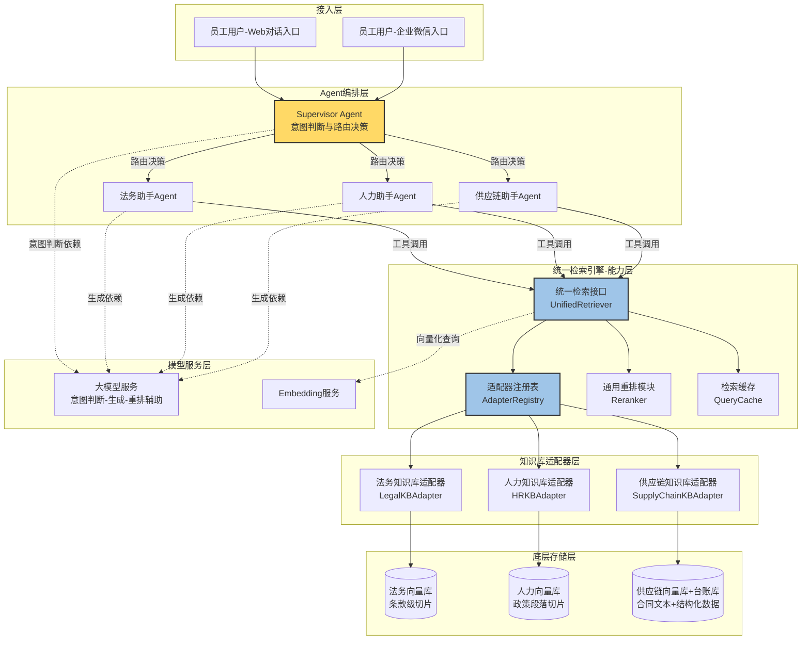
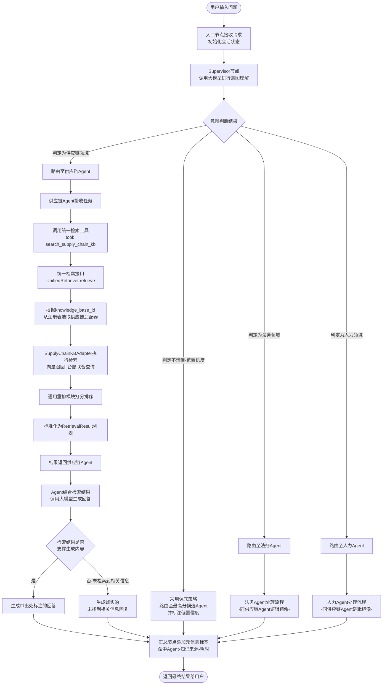
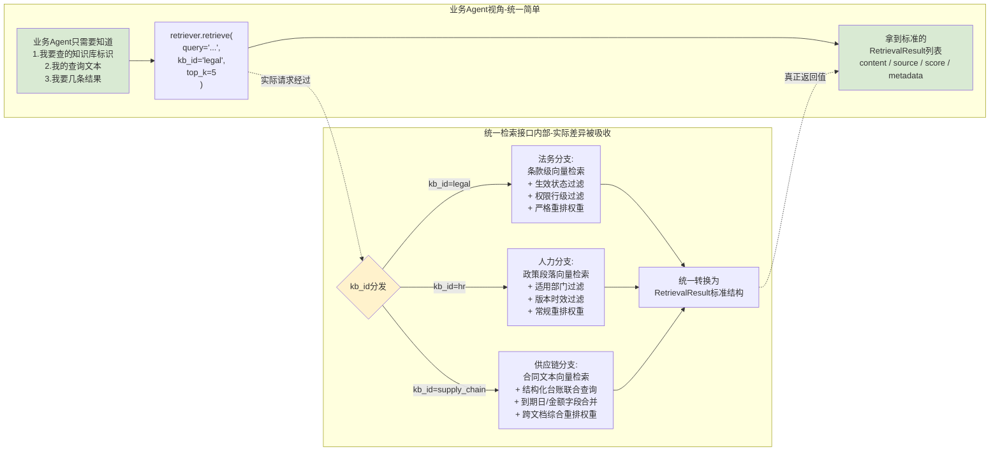

# 第60天:核心功能开发(RAG/Agent主链路)

## 【旁白】

六天冲刺进入第二天,时间线走到了整个项目最吃劲的地方。

如果把这次寰宇集团的交付比作一场攻坚战,那么昨天(第59天)搭骨架、建知识库,更像是修好了公路和挖好了地基;而今天,是要在这条路上把车跑起来——法务、人力、供应链三条业务线各自的知识要能被检索到,更重要的是,要有一个"大脑"知道该把用户的问题派给谁去处理。这个"大脑",就是 Supervisor Agent;这条能跑车的路,就是统一检索引擎。

昨天骨架落地的时候,团队其实还处在一种"万事俱备但心里没底"的状态——三个知识库的原始文档都处理完了,数据库和向量索引也建好了,LangGraph 的项目骨架也搭起来了,但那更像是把砖和水泥都运到了工地上,真正的房子还一间都没盖起来。陈铭昨晚回家前跟林薇聊了几句,两人都有点忐忑,林薇说得直白:"感觉今天像是在为明天攻坚做铺垫,可万一明天没打通怎么办?"陈铭当时没敢把心里的担忧说太满,只是回了句"打通,我们又不是从零开始学这些东西,该踩的坑基本都踩过一遍了",但这句话更多是说给自己听的。

陈铭在工位坐下的时候,显示器右下角的时间是早上八点四十。他打开昨天写的骨架代码,又开了三个知识库的加载日志,心里其实是有点没底的——不是不会写,而是不知道"整合"这两个字背后要踩多少坑。RAG他写过很多遍,Agent编排他也练过很多遍,但把两者拧成一股绳,套上三个业务场景的外壳,还要在六天冲刺的第二天就跑出一个能演示的主链路,这种压强级别的整合,是他第一次真正经历。

老王昨晚在群里说了一句话,陈铭截图存在了备忘录里:"今天不是写新东西,是把你们过去两个月学的东西,拧成一股绳。RAG会拧,Agent会拧,但拧得不够紧,今天就得返工。"

拧紧的绳子从哪里开始?从统一检索引擎开始。

---

## 一、晨会纪要

**时间**:2026年某月某日,上午 9:00 - 9:35
**地点**:蓬远科技 3 楼作战室(临时挂了"寰宇冲刺"的白板牌)
**参会人**:王振宇(项目负责人/架构把关)、陈铭(核心功能开发)、林薇(前端与知识库接入)、赵航(测试与压测)、周雪(产品与客户对齐)

---

**王振宇**:昨天骨架搭完了,三个知识库——法务、人力、供应链——也灌进去了,数据侧的活儿基本告一段落。今天是冲刺第二天,主题就一个:**主链路打通**。我们说的主链路,指的是从用户提问开始,到 Supervisor 判断意图,到路由给对应的业务 Agent,再到业务 Agent 调用检索、调用工具,最后生成回答,这一整条路径必须端到端跑通。今天收工前,我要看到至少三个场景各自能跑出一条完整的、可演示的对话。陈铭,主链路你来牵头,说说你的计划。

**陈铭**:昨晚已经把方案想了一遍,拆成两块。上午集中攻统一检索引擎,下午集中攻 Agent 主链路。检索引擎这块,核心问题是三个知识库(法务、人力、供应链)物理上是分开的三套向量库,而且未来可能还要接客户自己的内部系统,所以我打算做一层抽象——统一检索接口,业务 Agent 不直接碰向量库,都通过这层接口去查。接口下面挂三个适配器,分别对接三个知识库,以后要加新知识库,只用加适配器,不用动 Agent 那层代码。

**王振宇**:这个方向是对的,而且是必须的。你回忆一下我们第30天写的那套完整 RAG 链路,那时候是单知识库场景,检索、召回、重排、生成,一条线走到底。今天你要做的事情,是把那条线"复用"三份,但不是简单复制三份代码,而是把可复用的部分——切分策略、召回、重排、缓存——全部沉淀到统一接口里,三个知识库只在"连哪个库、用哪套索引、要不要额外的权限过滤"这几件事上有差异。差异要收得干净,不能让差异渗透到上层。

**陈铳**:嗯,我理解的差异主要在三点:一是索引本身不同,法务库是按条款粒度切的,人力库是按政策文档章节切的,供应链库还夹着结构化的合同台账,检索方式不完全一样;二是权限,法务库有些内容只有法务和管理层能看,要做行级过滤;三是重排策略,法务场景对准确性要求高,宁可召回少一点也不能召错,供应链场景经常要跨文档综合,重排权重不太一样。

**王振宇**:对,你说的这三点,恰恰是设计这层抽象的关键。我给你提个要求:统一检索接口的输入输出必须是标准化的,不能因为底层库不一样,上层拿到的结果结构也不一样。你定义好一个 `RetrievalQuery` 和一个 `RetrievalResult` 的数据结构,所有适配器都必须遵守这个契约。这是我们做平台化产品最基本的原则——"苍穹"这个产品名字不是白叫的,苍穹之下,不同的业务场景要能共享同一套底座,如果每个场景都各写一套,那就不是中台,是三个孤立的项目糊在一起,customer 会觉得我们在糊弄他们。

**林薇**:振宇,我这边昨天把三个知识库的原始文档都处理完了,法务库大概 1200 条条款级切片,人力库大概 800 个政策段落,供应链库比较杂,合同文本加台账数据一共大概 1500 条。今天我主要配合陈铭把适配器接上,另外我想问一下,前端那边"一次对话里可能问到不同业务线的问题"这种跨场景对话,UI 上要不要做区分提示?比如告诉用户"已切换到人力助手"?

**周雪**:这个我和客户那边沟通过,寰宇集团这次特别强调的一点就是"统一入口",他们不希望员工要先想清楚这是法务问题还是人力问题才去找对应的系统问,他们希望有一个统一的对话框,系统自己判断该找谁。所以前端不用做手动切换,但可以在回答里加一个小标签,比如"本回答由法务知识助手生成",增加可信度和可追溯性。这个我建议放进今天的验收标准里。

**王振宇**:可以,陈铭你在 Supervisor 路由和最终生成的时候,把"命中的业务 Agent 是谁"这个信息带出来,前端好展示。这个也顺带解决了一个问题——万一客户质疑某个回答不准,我们能立刻定位是哪个 Agent、哪个知识库出的问题,这对我们售后和运维也有价值,别小看这个标签,真出问题的时候它能帮我们省很多排查时间。

**赵航**:我这边今天主要盯两件事。一是等主链路出来之后,我要写一批跨场景的测试问题,故意问一些模糊的、容易让 Supervisor 判断失误的问题,比如"我怀孕了,产假期间的合同还有效吗",这句话里同时有人力(产假)和法务(合同效力)的关键词,我要看 Supervisor 怎么处理这种交叉问题,是路由给一个 Agent 还是能协同两个 Agent。二是我要摸一下现在的响应延迟,毕竟检索链路变复杂了,一次问答可能要经过意图判断、路由、检索、重排、生成好几步,时间会不会太长,晚点给你们报个初版数据。

**王振宇**:这个问题问得好,我们提前对齐一下预期:今天不追求 Supervisor 能完美处理所有交叉场景,那是不现实的,今天的目标是主链路"能跑通、能演示、结果基本靠谱"。交叉场景我们可以先做一个保底策略——如果 Supervisor 判断不清楚,就默认路由给最匹配的一个 Agent,并且在回答里注明"如果您的问题还涉及其他方面,可以补充说明",不追求这一刻就做多 Agent 协同,协同这个事我们留到明天(第61天)专门做,今天先把单路由跑顺。

**陈铭**:明白,那我上午先把统一检索引擎搭起来,中午前给三个知识库接上适配器跑通单独查询;下午主攻 Agent 主链路,先定义三个业务 Agent 和它们各自绑的工具,再写 Supervisor 的路由逻辑,最后把整条链路串起来自测。今天收工前我会跑三个场景各三条典型问题,把结果记录下来给大家看。

**王振宇**:可以,还有一点提醒你,今天的代码是要给后面几天(补工具、补记忆、多轮交互)继续叠加的,所以架构上留好扩展口子,别写成一次性能跑但不能扩展的东西。具体来说,Supervisor 的路由逻辑不要写成一堆 if-else 硬编码判断关键词,那玩意儿两天后加新场景就要推倒重写,尽量用 LLM 做意图判断加结构化输出,配置化地维护"场景-Agent"的映射关系。这是我们在第41到43天专门练过的东西,今天就是拿真实项目考一考你有没有真的学会,不是背下来代码,是理解为什么要这么设计。

**陈铭**:明白,我尽量把配置和逻辑分开,场景增减以后争取只改配置文件,不改主流程代码。

**周雪**:另外提醒一下,客户方今天下午三点半有个非正式的进度电话,不是正式验收,但对方的 IT 负责人会问一下进展,我建议我们到时候能给他们看一段真实的问答演示,哪怕只是终端里跑一下也行,增加一点信心。陈铭你觉得三点半之前能不能有个能演示的版本?

**陈铭**:主链路我尽量三点前跑通,留半小时缓冲,应该没问题,但先说好,今天演示的版本还没接前端 UI,可能就是终端里跑一下问答,效果上会朴素一点。

**周雪**:没问题,朴素但真实比华丽但假的强,我跟客户说清楚就行。

**赵航**:振宇,还有个事想在会上问一下,今天写的东西如果晚上要部署到测试环境给客户明天上午过来看(如果他们要求的话),我们现在的重试和超时机制是怎么考虑的?我担心万一大模型服务那边偶尔抖一下延迟,会不会直接把整个请求拖死。

**王振宇**:这个问题提得对,今天先定一个最低标准:所有对外部服务(大模型调用、向量库调用)的请求都必须设置超时时间,不能无限等待,超时之后要走我们前面说的降级路径,而不是让请求一直挂在那里。至于重试策略,今天先做最简单的——失败了不重试,直接降级返回,因为重试涉及到"重试几次""重试间隔多久""重试会不会把已经很慢的请求拖得更慢"这些更细的权衡,今天时间不够展开讨论,先记到技术债列表里,后面统一做一次专门的可靠性加固。陈铭,你在超时设置这一点上,今天代码里要显式加上,不能漏,这个不算加分项,是及格线。

**陈铭**:明白,我在统一检索接口和大模型调用的客户端封装里都会加上超时参数,默认给一个偏保守的数值,后面压测数据出来之后再调整。

**周雪**:另外我补充一下客户那边的一个背景信息,寰宇集团这次特别看重"合规留痕"这个点,他们的合规部门要求系统对每一次涉及法务和人力敏感信息的问答,都要能留存日志,包括提问人、提问内容、系统给出的回答、命中的知识来源,这个要求倒不是说今天就要做完整的审计留痉功能,但陈铭你在设计日志埋点的时候可以顺手把这些字段都打全,免得后面专门为审计功能返工重新加字段。

**陈铭**:这个可以顺带做,反正日志本来就要打,把字段定全一点没有额外成本,我记一下。

**王振宇**:好,那这几点都记下来了,继续,大家散会。

---

会议结束后,陈铭没有直接开电脑写代码,而是先拿出笔在本子上画了个草图——他习惯把架构先画一遍再动手,这个习惯是他刚入职时老王要求养成的,老王说过一句话他一直记得:"代码是骨头,架构是骨架,骨架没画对,骨头堆得再多也是一堆废料。"

## 二、需求文档:统一RAG检索引擎与Agent主链路技术规格书

在动手写代码之前,陈铭按照团队的惯例先补了一份技术规格书,虽然是六天冲刺,时间极度紧张,但王振宇的铁律从来没有松过:"没有规格书的代码,等于没有验收标准的交付,再急也不能省这一步,哪怕只写半页纸。"于是陈铭花了大概二十分钟,把上午讨论的内容落成了文档,同步到了项目共享盘。

### 2.1 文档基本信息

| 项目 | 内容 |
|---|---|
| 文档名称 | 苍穹企业级智能体中台——统一RAG检索引擎与Agent主链路技术规格书 |
| 版本号 | v0.3(冲刺阶段快速迭代版) |
| 适用范围 | 寰宇集团六天冲刺交付项目,第2天(核心功能开发日) |
| 编写人 | 陈铭 |
| 审核人 | 王振宇 |
| 关联需求 | 承接第59天《项目骨架与知识库接入》,下游关联第61天《工具、记忆与多轮交互补齐》 |
| 状态 | 待评审 → 评审通过后进入实现 |

### 2.2 背景与目标

寰宇集团是一家跨多个业务板块的大型企业集团,内部涉及大量员工日常咨询需求,过去这些需求分散在三套互不相通的系统里:法务合规问答走的是内部合规系统的检索页面,查起来要先知道该去哪个栏目找;人力政策咨询靠的是纸质手册加 HR 邮件转发,响应慢且口径不一致;供应链相关的合同、台账查询则完全依赖专人电话咨询,效率极低。寰宇集团希望通过苍穹平台,把这三块业务的知识问答统一到一个对话入口里,员工不需要判断"我这个问题该去哪问",只需要在一个对话框里把问题说出来,系统自动理解意图、找到对应的知识、给出可信的回答。

寰宇集团的这个诉求听起来朴素,但落到系统设计层面,其实是对"统一"和"智能"两个词提出了相当具体的要求。所谓统一,不是简单地把三个系统的入口页面合并成一个,而是要在底层数据架构和处理逻辑上真正做到"一套底座、多个场景复用",否则表面上看是一个对话框,背后其实还是三套互不相通的系统在各自为战,一旦某个场景需要联动另一个场景的信息(比如供应链的问题涉及一份合同,而这份合同的审批环节又涉及法务合规规则),系统内部依然是割裂的,没办法真正协同处理。所谓智能,也不是简单地接一个大模型对话框就算完成,而是要让系统具备理解用户真实意图、找到最合适的知识来源、给出可信且可追溯的回答的完整能力,这一整套能力链条,恰恰就是今天要重点攻克的"统一检索引擎"和"Agent主链路"这两个核心技术模块。

这个目标背后隐含着两个技术挑战,也是今天要重点解决的两个核心问题:

第一个挑战是**知识的统一检索**。三个业务领域的知识形态差异很大,法务知识是条款级的、逻�括结构严谨的法律文本;人力知识是政策说明性质的、带有大量例外条款和适用范围限定的文档;供应链知识里既有非结构化的合同文本,又有结构化的合同台账数据(比如合同编号、金额、到期日等字段)。如果针对每个业务场景各写一套独立的检索代码,不仅开发成本高,后期维护也会是灾难——任何一个共性优化(比如更换 embedding 模型、调整重排策略)都要在三处代码里同步修改,极易出错和遗漏。因此,必须设计一层统一的检索抽象,把"检索"这件事的通用能力(查询改写、召回、重排、结果标准化、缓存)沉淀在一处,把业务差异(具体连哪个库、权限过滤规则、领域特定的重排权重)收敛成可配置、可插拔的适配器。

第二个挑战是**意图理解与任务路由**。用户提出的问题往往不会显式说明"这是一个人力问题"或"这是一个法务问题",系统需要具备判断能力,理解用户真实意图后,把请求路由到最合适的业务处理单元。同时,考虑到未来业务场景会持续增加(比如可能会接入财务报销、IT工单等新场景),这个路由机制不能是硬编码的规则判断,必须具备可扩展性——增加一个新场景,理想情况下只需要新增一个业务 Agent 及其配置,不需要改动核心路由逻辑。

综合以上两点,本次核心功能开发的目标可以概括为:构建一套"统一检索引擎 + Supervisor 多Agent编排"的技术底座,让法务、人力、供应链三大业务场景在这套底座上以插件化的方式接入,既保证今天六天冲刺演示的效果,也为后续项目的长期可维护性和可扩展性打下基础。

### 2.3 功能范围

本次核心功能开发涵盖以下功能点,按优先级从高到低排列:

**P0(必须完成,今天验收硬指标)**

1. 统一检索接口抽象层:定义标准化的检索请求结构、检索结果结构,以及检索器的抽象基类。
2. 三个知识库适配器:法务知识库适配器、人力知识库适配器、供应链知识库适配器,均实现统一检索接口,能够独立完成"输入查询、输出标准化检索结果"的全流程(包括向量召回、必要的重排、权限过滤)。
3. 三个业务 Agent 的定义:法务助手 Agent、人力助手 Agent、供应链助手 Agent,每个 Agent 绑定对应的检索工具(内部调用统一检索接口对应的适配器),具备基本的问答生成能力。
4. Supervisor 路由 Agent:基于大模型的意图判断能力,将用户请求路由到最合适的业务 Agent;路由逻辑要配置化,不能硬编码关键词规则。
5. 主链路端到端打通:使用 LangGraph 构建从用户输入到 Supervisor 判断、路由、业务 Agent 处理、结果返回的完整图结构,保证三个场景各自能跑出至少一条完整对话。
6. 结果可追溯标签:最终返回结果中要携带"命中的业务 Agent 名称"和"检索到的知识来源"信息,便于前端展示和问题排查。

**P1(尽量完成,不阻塞今天验收,但影响后续几天的顺畅度)**

1. 检索结果缓存机制:对高频重复查询做简单的内存缓存,降低重复检索开销(注意:这不是完整的缓存方案,完整方案计划在性能优化专项日再打磨)。
2. 检索降级策略:当某个知识库适配器出现异常(比如向量库连接超时)时,不能让整条链路崩溃,要有降级返回(比如提示"该领域知识暂时无法检索,请稍后重试"或者转交人工)。
3. Supervisor 路由结果的置信度输出:除了给出路由目标,还要给出一个粗略的置信度评估,为后续做"低置信度触发多Agent协同"留接口。

**P2(明确不在今天范围内,写清楚是为了防止范围蔓延)**

1. 多 Agent 协同处理交叉领域问题(计划第61天启动)。
2. 长期记忆与多轮对话上下文管理(计划第61天)。
3. 工具调用的复杂业务动作(比如法务 Agent 生成合同审核意见并触发审批流,人力 Agent 触发请假申请等,计划后续冲刺日)。
4. 前端 UI 的正式接入与展示优化(计划第62天前端集成日,今天只做终端可演示的验证)。

将 P2 范围明确写在文档里,是老王反复强调的习惯:"冲刺阶段最容易出问题的不是做得慢,是范围失控,今天你脑子一热多做了一个明天该做的事,看起来是提前完成任务,实际上是打乱了整体节奏,而且往往质量没保证。"

### 2.4 统一检索接口设计要求

统一检索接口是今天上午的核心产出,规格书里对它提出以下明确要求:

**输入契约**:检索请求必须封装为标准化的数据结构,至少包含以下字段:查询文本(query)、目标知识库标识(knowledge_base_id,用于路由到具体适配器)、召回数量(top_k)、可选的过滤条件(filters,用于权限过滤或元数据过滤)、可选的查询上下文(context,比如多轮对话中的历史信息,为后续扩展预留)。

**输出契约**:检索结果同样必须标准化,不能因为底层实现不同而结构不同。每一条检索结果至少包含:内容文本(content)、来源标识(source,比如文档名称加章节)、相关性得分(score)、元数据字典(metadata,承载额外的领域信息,比如法务条款的生效日期、人力政策的适用部门、供应链合同的编号)。整个检索响应还要包含检索耗时、命中的知识库标识、是否发生降级等元信息。

**适配器契约**:每个知识库适配器必须实现统一定义的抽象方法,至少包括初始化连接、执行检索、健康检查三个方法。适配器内部可以有自己的私有逻辑(比如法务适配器可能要做额外的条款版本过滤,供应链适配器可能要联合查询结构化台账),但对外必须严格遵守输入输出契约,不能泄露内部实现细节给调用方。

**注册与发现机制**:统一检索引擎要维护一个适配器注册表,通过知识库标识就能拿到对应的适配器实例,新增知识库时只需要实现一个新适配器并注册,不需要改动引擎核心代码或者任何业务 Agent 的代码。这一点是"中台"这个定位真正落地的关键设计点,王振宇在评审时特别强调了这条,认为这是判断这套系统到底是不是真正的平台化产品,还是"三个项目穿了同一层皮"的分水岭。

**性能要求**:单次检索(不含大模型生成)的目标响应时间控制在800毫秒以内(不含首次冷启动加载索引的时间),重排环节如果启用,整体控制在1.2秒以内。这个指标在今天冲刺阶段先按经验值定,后面性能优化专项日会有更严格的压测和调优。

### 2.5 Agent主链路设计要求

**业务 Agent 设计要求**:每个业务 Agent(法务、人力、供应链)必须具备以下能力:能够接收标准化的用户请求;能够调用绑定的检索工具(通过统一检索接口访问对应知识库);能够基于检索到的知识,结合大模型生成能力,产出针对用户问题的回答;能够在找不到相关知识时,给出诚实的"未找到相关信息"的回复,而不是编造答案(这是规格书里特别标红的一条,王振宇反复强调"宁可说不知道,不能瞎编,尤其是法务和人力场景,编错答案的代价远比说不知道大")。

**Supervisor 路由 Agent 设计要求**:Supervisor 是整条主链路的入口,必须完成以下工作:接收原始用户输入;基于大模型进行意图理解,判断这个问题最匹配哪个业务领域;输出结构化的路由决策(包含目标 Agent 标识和判断依据,为后续可解释性和排查问题留痕);将请求转交给对应的业务 Agent;在业务 Agent 处理完成后,汇总结果并附加统一的元信息标签后返回。

Supervisor 的意图判断不能用简单的关键词匹配硬编码规则,原因在评审会上也讨论过:关键词规则维护成本高,且用户的自然语言表达方式千变万化,很难穷举关键词覆盖所有情况,比如用户问"我们和那家供应商签的框架协议是不是要到期了",这句话里没有"合同"这个词,但明显是供应链/合同相关的问题,纯关键词规则很容易漏判。因此本次设计采用"大模型意图判断 + 结构化输出"的方式,把每个业务场景的描述、典型问题示例配置化地喂给大模型,让大模型基于语义理解做判断,这样增加新场景时只需要增加配置,不需要写新的规则代码。

**主链路编排要求**:整条主链路使用 LangGraph 构建为一个状态图,至少包含以下节点:入口节点(接收用户输入,初始化状态)、Supervisor 节点(执行意图判断和路由决策)、三个业务 Agent 节点(分别处理各自领域的请求)、汇总节点(整理最终返回结果)。节点之间的流转基于 Supervisor 节点的路由决策进行条件分支,这是对第41到43天所学的条件边(conditional edges)机制的直接应用。

### 2.6 验收标准

今天下班前,主链路必须满足以下验收标准才算达标:

1. 针对法务场景至少三条典型问题(比如"我们和乙方签的保密协议里,违约金上限是多少""公司对外投资是否需要走内部合规审批"),Supervisor 能正确路由到法务 Agent,法务 Agent 能给出基于知识库内容的、有出处标注的回答。
2. 针对人力场景至少三条典型问题(比如"试用期员工的年假怎么算""异地调动有没有安家费补贴"),路由和回答同样能跑通。
3. 针对供应链场景至少三条典型问题(比如"A供应商的合同还有多久到期""采购金额超过多少需要走集中采购流程"),路由和回答同样能跑通。
4. 三个场景加起来至少要跑通九条问题的端到端演示,且回答内容与知识库实际内容相符(不能出现编造信息)。
5. 最终返回结果携带"命中Agent"和"知识来源"标签,可供前端后续展示使用。
6. 检索环节即便某个知识库出现模拟故障(赵航会做故障注入测试),系统也要能优雅降级返回提示,不能整体崩溃报错。

### 2.7 非功能性要求与风险应对

规格书里如果只写功能范围,老王一定会打回来补充,他常说"功能范围写的是'做什么',非功能性要求写的是'做得怎么样才算数',少了后半句,验收的时候公司和客户永远对不上标准"。陈铭因此专门补了一节非功能性要求,列成表格方便对齐:

| 维度 | 要求 | 今天的验证方式 |
|---|---|---|
| 可用性 | 任一知识库适配器异常时,主链路必须能优雅降级,不能整体不可用 | 赵航做故障注入测试,模拟适配器抛异常 |
| 可追溯性 | 每次回答必须能定位到命中的Agent与检索来源 | 检查返回结果中的hit_scene与source字段 |
| 可扩展性 | 新增知识库/业务场景时,核心引擎与Agent工厂代码零改动或近似零改动 | 按作业第1题的思路做一次纸面推演验证 |
| 性能 | 单次端到端问答控制在3秒以内(冲刺阶段的宽松目标,后续性能日再收紧) | 赵航记录响应延迟分布 |
| 安全合规 | 权限过滤逻辑必须内聚在适配器内部,不允许越权检索敏感条款 | 陈铭用不同角色的UserContext跑同一条法务敏感问题对比结果 |
| 诚实性 | 检索不到相关知识时,不能编造答案 | 故意问知识库里没有覆盖的问题,检查回复是否诚实 |

风险应对方面,规格书里特别列了三条今天最有可能踩雷的风险点,并提前写好应对策略,这个习惯也是老王带的——"冲刺阶段没时间临场想办法,风险要提前想,想好了应对策略,真出事的时候才不会手忙脚乱"。

风险一:大模型意图判断的不稳定性可能导致路由结果在多次调用间出现细微差异,尤其在问题本身处于场景边界模糊地带时。应对策略是通过配置化的场景描述与典型问题示例尽量收窄判断的模糊空间,并保留置信度字段,为后续引入更严格的处理机制(比如低置信度触发人工兜底或多Agent协同)留接口,而不是假装这个不稳定性不存在。

风险二:三个知识库适配器背后的具体存储和索引方案由昨天(第59天)搭建,如果索引质量本身存在问题(比如某些条款切分不合理导致语义不完整),今天检索出来的内容质量也会受限,这不是今天能彻底解决的问题,只能在适配器层做一些兜底(比如适当放大召回数量再做重排精筛),规格书里明确写清楚这一点是"今天已知的限制",避免验收时被当成今天的代码缺陷来追责。

风险三:六天冲刺时间压力下,代码评审的严格度必然低于常规项目周期,规格书里写明"今天代码经过陈铭自测和赵航基础功能测试,但未经过完整的代码审查(code review)和压力测试,存在生产环境下未暴露的潜在缺陷的可能性",这句话看起来像是"免责声明",但老王的态度是必须写,他说"客户和公司都要清楚地知道,冲刺阶段交付的是'能跑通核心场景的版本',不是'生产级打磨完成的版本',这两者之间的期望差如果不提前讲清楚,后面很容易变成信任问题,而信任问题比技术问题难修复得多"。

文档写完之后,陈铭把它同步到了共享文档里,老王大概花了十分钟看完,回复了一句:"可以,细节评审我们边写边过,先动手。"这也是冲刺阶段的常态——规格书要写,但不会像常规项目周期那样开一个专门的评审会,而是"写完就是共识,边做边校准"。

## 三、架构设计图

统一检索引擎与 Agent 编排层如何被三大业务场景复用,是今天架构设计的核心命题。陈铭在白板上画完草图后,把它转成了 Mermaid 图,发到了群里,老王看完只提了一个意见:"知识库适配器那一层再往下沉一点,别让它看起来像是挂在业务 Agent 下面的,它应该是独立于 Agent 之外的能力层,Agent 只是这层能力的消费者之一。"陈铭调整之后,定稿如下。



这张架构图的核心表达是"分层"和"复用"两个关键词。接入层负责接收用户的原始请求,不关心具体业务;Agent编排层负责"思考"——谁该处理这个问题,以及处理完之后怎么组织语言回答;统一检索引擎能力层是三个业务 Agent 共享的检索基础设施,它对上层屏蔽了底层三个知识库的差异;知识库适配器层是真正连接具体存储的地方,每个适配器只关心自己对应的那个业务知识库该怎么查、怎么过滤;底层存储层就是实打实的向量库和结构化台账;模型服务层是所有环节都可能依赖的大模型与向量化能力。

这张图之所以要单独强调"能力层独立于 Agent 编排层",是因为在冲刺开发中很容易犯的一个错误就是把检索逻辑直接写在 Agent 的工具函数里,看起来省事,但这样一来,如果客户以后要求"法务和人力共享一部分通用政策知识库",或者要"新增一个财务场景",代码就会变得难以维护,因为检索能力和业务逻辑纠缠在一起了。今天上午陈铭要做的最重要的一件事,就是把这条边界线画清楚、守住。

## 四、流程图:一次跨场景请求的完整处理流程

第二张图要表达的是"时间线"——一次真实的用户请求从进入系统到拿到最终答案,经历了哪些步骤。陈铭选了一个比较有代表性的例子来画这张图:员工问"我们和B供应商的合同是不是快到期了,续签需要走哪些审批",这句话本质上是供应链场景,但"审批"这个词也带一点流程色彩,是个不错的测试案例。



这张流程图里有一个细节值得展开讲——"意图判断结果"分支里专门加了一条"判定不清晰-低置信度"的分支,走向"保底策略"。这是上午晨会里王振宇特别强调的一点:今天的目标不是让 Supervisor 做到完美,而是让整条链路在任何输入下都"有出口",不能出现 Supervisor 判断不清楚就卡死或者报错的情况。所以陈铭在设计的时候,给意图判断加了一个置信度评估,当置信度低于某个阈值时,不是拒绝回答,而是选择候选里得分最高的那个 Agent 继续往下走,同时把"低置信度"这个信息保留下来,附加在最终结果里,提示用户"如果这不是您想问的方向,可以换个说法或者补充信息"。这个设计既保证了链路的完整性(不会中断),也为将来做多 Agent 协同处理交叉问题预留了触发点——低置信度正是判断"要不要引入多 Agent 协同"的天然信号。

另外这张图也体现出一个"诚实回复"的分支——检索结果是否支撑生成内容,如果检索没有找到相关信息,Agent 不会硬编一个答案出来,而是走向诚实回复的路径。这个设计在代码实战部分会具体展开,是今天所有业务 Agent 的生成逻辑里都必须包含的一段防护逻辑。

## 五、示意图:统一检索接口的抽象层屏蔽机制

第三张图要解决一个更细粒度但同样重要的问题:统一检索接口到底是怎么"屏蔽"底层三个不同知识库的差异的?这个问题如果讲不清楚,前面说的"中台复用"就只是一句空话。陈铭画了一张示意图,专门展示上层 Agent 眼里看到的世界,和实际底层发生的事情之间的映射关系。



这张图的重点在于左右两个子图之间的那条虚线——业务 Agent 侧看到的接口调用极其简单,三行参数、一个标准返回,完全不需要知道右边发生的复杂过程;而右边的复杂性(条款过滤、权限过滤、台账联合查询、不同的重排权重)全部被封装、被吸收在统一检索接口内部,不会泄露给调用方。这正是"抽象层"存在的意义——它把复杂度留在自己这一层,把简单留给使用者。

老王看这张图的时候说了一句让陈铭印象很深的话:"你判断一个抽象做得好不好,有一个很简单的标准——如果三个月后你要新增第四个知识库,你需要改几行调用方代码?答案应该是零行,一行都不该改,你只需要新写一个适配器,然后在注册表里加一行注册。如果答案不是零,说明你的抽象层还留了缝,业务代码还是知道了它不该知道的细节。"陈铭把这句话记在了本子上,决定在下午写代码的时候时刻拿这句话来检验自己的设计。

## 六、课堂笔记

冲刺阶段没有专门的"上课"时间,但陈铭保持了一个习惯——每天不管多忙,都会抽时间把当天学到的、想明白的东西记下来,他管这个叫"课堂笔记",虽然此刻的"课堂"就是他自己的工位和脑子。老王知道他这个习惯,还专门表扬过:"这种笔记比任何培训资料都值钱,因为它是你踩过坑之后自己总结出来的,别人给不了你。"

### 6.1 上午笔记:统一RAG检索引擎的设计与实现

上午的核心任务是把第30天学过的那套完整 RAG 链路,重新理解和抽象一遍,让它能同时服务三个业务场景。陈铭在动手之前,先花了大概二十分钟回顾了一下第30天笔记里记的那条链路:文档加载 → 切分 → 向量化 → 存入向量库 → 查询时先做查询改写(可选)→ 向量检索召回候选 → 重排(可选,通常用交叉编码器或者让大模型打分)→ 拼接上下文 → 生成回答。这条链路当时是针对单一知识库设计的,今天最大的转变是要把这条链路的"通用部分"抽出来做成引擎,把"因知识库而异的部分"收进适配器。

第一件要想清楚的事情是:**到底哪些环节是通用的,哪些是因知识库而异的**。陈铭列了一张对照表帮自己理清思路:

切分策略——因知识库而异。法务条款按条款粒度切,人力政策按章节切,供应链既要切合同文本又要联合结构化台账。这一步在昨天(第59天)已经在知识库接入阶段做完了,今天不用重复处理,但要理解它对今天检索效果的影响——切分方式决定了向量库里"一条记录"的粒度,粒度太粗会导致召回的内容夹杂太多无关信息,粒度太细会导致上下文碎片化、语义不完整,这是数据侧遗留给检索侧的先天约束,今天没法改,只能在检索策略上做适应。

向量化(Embedding)——通用。不管是哪个知识库,把文本转成向量这一步用的是同一套 Embedding 服务,这是可以完全共享的部分,不需要为每个知识库单独搭一套向量化服务。

向量检索召回——机制通用,但连接的库不同。检索的"动作"(计算查询向量与库内向量的相似度、取topK)是通用逻辑,可以写成一段通用代码,但"连哪个库"是因知识库而异的,这正是要通过适配器模式解决的部分。

权限过滤——完全因知识库而异,甚至因知识库内部的数据敏感级别而异。法务库里有一部分条款只有法务和管理层能看,这种行级权限过滤逻辑必须放在法务适配器内部,不能泄露到上层。

重排(Rerank)——机制通用(都是"给候选结果打分排序再截断"这个动作),但打分的权重策略因场景而异。法务场景对准确性权重给得很高,宁可牺�式召回率;供应链场景经常需要综合多个文档的信息才能回答完整,重排时要考虑"多样性"而不是"死磕最相关的那一条"。

生成(大模型基于检索结果生成回答)——这一步陈铭判断它不属于"检索引擎"的范畴,而属于"Agent"的范畴,检索引擎只负责把标准化的检索结果交给 Agent,Agent 拿着这些结果去调用大模型生成回答,这是今天架构设计里"检索引擎"和"Agent编排层"的分界线,划清楚这条线是保证今天整个系统边界清晰的关键。

想清楚这张表之后,陈铭确定了统一检索引擎的设计原则:**把通用的向量检索、重排的"动作骨架"、结果标准化封装进引擎本体和适配器基类,把因场景而异的部分(具体连哪个库、权限过滤规则、重排权重配置)下沉到具体适配器的实现里,并且通过配置驱动尽量减少每个适配器需要写的"专属代码"**。

第二件想清楚的事情是**数据契约怎么设计**。陈铭之前写过不少检索代码,吃过的一个亏是"输出结构随手定义,后来要改的时候到处都要跟着改"。这次他刻意把 `RetrievalQuery` 和 `RetrievalResult` 设计成用 Pydantic 定义的严格数据模型,而不是随手用字典传递数据。这样做的好处在写代码阶段就能体会到:字段名字一旦写错(比如把 `top_k` 手误写成 `topk`),字典形式要运行到那一行才会报错甚至完全不报错(字典多传少传字段都不会立刻发现),而 Pydantic 模型在实例化的那一刻就会校验字段,能第一时间抓住这种低级错误。老王常说"防御性设计不是不信任队友,是不信任明天凌晨两点困到犯错的自己",陈铭对这句话在写这段代码的时候深有体会,因为他确实在定义字段的时候手误过一次(把 `knowledge_base_id` 写成了 `kb_id` 又改回来),幸好 Pydantic 立刻在测试脚本里报了错,不然这个笔误可能会一直潜伏到下午对接 Agent 的时候才暴露,那时候排查成本会高得多。

第三件事情是**适配器注册机制怎么做得优雅**。陈铭一开始想用一个简单的字典手动注册,写起来是最快的,但他想到老王强调的"新增知识库应该零改动调用方代码"这句话,决定用一个装饰器注册的模式——每个适配器类用一个 `@register_adapter("legal")` 装饰器标注自己对应的知识库标识,模块加载的时候自动完成注册,这样引擎核心代码完全不需要知道具体有哪几个适配器,只需要在运行时通过标识查表拿到实例。这个设计模式其实并不新鲜,是经典的"注册表模式"加"插件化"思想的结合,但陈铭是第一次在真实项目里独立设计并落地这个模式,写完之后他自己在函数上加了详细的文档字符串,方便林薇和赵航看懂怎么用。

第四件事情,也是上午耗时最久的一件事,是**权限过滤怎么设计得既通用又不泄露业务细节**。一开始陈铭想把权限判断逻辑写在统一检索接口里,通过一个统一的 `filters` 参数传进去,但很快发现这样做会导致检索接口"知道太多"——它必须知道法务库权限字段叫什么、人力库权限字段又叫什么,这些细节本质上是各个知识库的私有信息,不应该泄露给上层引擎。于是他调整设计,把权限过滤逻辑完全下沉到各自适配器内部,统一检索接口只负责把"当前用户的角色和部门信息"这个通用上下文原样传递给适配器,至于适配器内部怎么把这个上下文转换成具体的过滤条件(比如法务适配器判断"是否管理层"、供应链适配器判断"是否采购部门"),完全是各适配器自己的事情,引擎层不掺和。这次调整让他对"分层"这个词有了更具体的体感——不是把代码物理上分成几个文件就叫分层,而是每一层只该知道它职责范围内该知道的信息,多知道一点都是耦合。

上午写代码期间,陈铭还踩了一个小坑:他最初实现重排模块的时候,直接调用大模型对每个候选结果单独打分(让大模型对每条候选内容和查询做相关性评分),结果发现候选数量一多(比如召回20条候选做重排),要发起20次独立的大模型调用,耗时严重超出了规格书里定的1.2秒目标,实测跑到了将近4秒。他后来把打分方式改成"批量打分"——把20条候选一次性拼进一个提示词,让大模型一次性输出所有候选的评分列表,耗时降到了1秒左右。这个调整过程他专门记在了笔记里,提醒自己以后设计任何"逐条调用大模型"的逻辑时,第一反应就要想"能不能批量化",这是性能优化里最容易被忽略但收益极高的一类改动。

第五件事情是**查询改写要不要做,做到什么程度**。第30天学完整RAG链路的时候,查询改写(比如把用户口语化的问题改写成更适合向量检索的表述,或者把一个复杂问题拆解成多个子查询)是一个重要环节,陈铭一开始想把这个环节也做进统一检索引擎里,做成一个通用的前置步骤。但仔细想了想之后决定暂缓——原因是查询改写这一步同样需要调用大模型,如果对每次检索都无条件加一次查询改写调用,又是一次额外的延迟开销,而且今天测试下来的九个典型问题,大部分都是用户直接把问题问得比较清楚的,改写不改写对召回效果影响不大。陈铭把这个决定和判断依据记在了代码注释里,并且在规格书之外单独记了一条笔记提醒自己:查询改写不是不需要,而是需要用在"确实存在明显收益"的场景,比如未来做多轮对话补全上下文时(第61天要做的事情),用户的追问往往需要结合历史上下文才能补全成一个独立完整的查询,那种场景下查询改写几乎是必需的,而今天单轮问答场景下,过早引入这个环节属于"过度设计",违反了冲刺阶段"先把核心跑通,再逐步打磨"的节奏原则。这也是他这段时间体会比较深的一点——技术选型不是"有没有用",而是"当前阶段用不用得上",很多技术点本身没有错,错的是使用它的时机。

第六件事情,是关于**检索结果数量(top_k)怎么定**的一点小心得。陈铭一开始图省事,把三个知识库的 top_k 都设成了统一的5,测试过程中发现供应链场景经常出现"一个问题涉及好几份合同"的情况(比如问"我们和几家原材料供应商的合同里,有没有约定阶梯降价条款"),固定5条召回经常漏掉相关的合同,而法务场景的条款级切片本身粒度较细,5条召回反而经常包含大量冗余重复信息,不如3条精筛来得干净。他因此调整策略,把 top_k 也做成了跟重排权重一样的"按知识库标识配置化"的参数,法务默认3条、人力默认5条、供应链默认8条(后续联合台账查询命中的结构化结果不受这个数字限制单独处理)。这个调整虽然只是几个数字的改动,但背后的思考过程——"不要想着一套参数适配所有场景,场景特性不同,连一个看起来最基础的召回数量参数都应该配置化"——陈铭觉得比这几个数字本身更值得记下来。

上午收尾之前,陈铭对着规格书自检了一遍,统一检索引擎和三个适配器基本达到了预期:接口契约清晰、三个适配器各自能独立跑通检索、权限过滤和重排差异都收在了适配器内部,引擎核心代码保持了对业务细节的"无知"。他把这部分代码跑了一轮单元测试(针对每个适配器各测三条真实问题,检查返回结果结构是否符合契约、内容是否合理),确认没有明显问题后,吃了个简单的午饭,准备下午攻 Agent 主链路。

### 6.2 下午笔记:Agent主链路——Supervisor与三个业务Agent的打通

下午的任务比上午更让陈铭紧张一点,因为这是决定整条主链路能不能端到端跑起来的关键环节,而且离三点半客户的进度电话越来越近。他决定先不追求完美,按照"先跑通,再打磨"的节奏推进。

第一步是**定义三个业务 Agent**。陈铭回顾了第41到43天学的 LangGraph 多 Agent 编排知识,那几天的重点是理解"Agent 不是一个模型,而是一个带工具、带决策逻辑的处理节点"。今天的三个业务 Agent 本质上结构是一致的——都是"接收任务、调用检索工具获取知识、基于知识生成回答",区别只在于绑定的检索工具指向不同的知识库,以及系统提示词(system prompt)里描述的角色定位、回答风格不同(法务助手要求措辞严谨、必须引用具体条款;人力助手语气可以更亲和一点,面向普通员工;供应链助手经常要处理带数字的问题,比如金额、日期,要求在回答里保留精确数值,不能模糊化表达)。

陈铭因此决定不给三个 Agent 各写一套完整的类,而是设计一个"业务 Agent 工厂函数",接收一份配置(角色描述、绑定的知识库标识、专属的行为约束提示词),批量生成三个 Agent 实例。这个设计思路和上午"适配器注册表"的思路是一脉相承的——尽量用配置驱动代替重复代码,今后如果要新增第四个业务场景(比如财务报销助手),不需要写一个新类,只需要新增一份配置。

在给业务 Agent 绑定工具的时候,陈铭又碰到一个需要拿主意的设计问题:**工具函数内部要不要直接调用统一检索接口,还是要经过一层再包装**?他最初的想法是每个 Agent 的工具函数直接调用 `retriever.retrieve(kb_id="legal", ...)`,但转念一想,如果三个 Agent 的工具函数里都要显式写 `kb_id="legal"`、`kb_id="hr"`、`kb_id="supply_chain"` 这种硬编码字符串,一旦哪个知识库标识改名(现实项目里这种事情并不少见,产品经理说"法务"改成"合规"了),就要满代码搜索替换。他决定用一个"工具工厂函数"来生成绑定了特定知识库的检索工具,每个业务 Agent 配置里指定自己要用哪个工具工厂生成的工具,知识库标识只在配置这一处出现,不会分散在多个工具函数体里。这个小细节其实是上午"配置驱动"设计原则的延续应用,陈铭意识到,好的架构设计不是想出一次就完事的,而是要在写代码的每一个决策点上,反复问自己"这个信息应该放在哪一层",这个反复自问的过程比记住某个具体模式更重要。

第二步是**设计 Supervisor 的意图判断逻辑**。这是下午最核心、也是老王反复强调"不能硬编码关键词"的部分。陈铭设计的方案是:给 Supervisor 一个结构化输出的提示词模板,模板里动态嵌入每个业务场景的描述(从配置读取,不是硬编码在提示词字符串里),要求大模型输出一个结构化的判断结果,包含目标场景标识、置信度分数(0到1之间)、简短的判断理由。这里陈铭用了结构化输出(通过 Pydantic 模型约束大模型的输出格式),这是他们在第20天左右学过的技巧,今天正好用上——如果不用结构化输出约束,大模型有时候会输出"我认为这是一个人力问题"这种自然语言描述,后续代码解析这种自由文本非常不稳定,一旦大模型的表达方式发生哪怕很小的变化,解析逻辑就可能失效;而结构化输出把这个不确定性锁死在了模型调用这一层,后面的代码只需要读取一个明确的字段。

第三步是**用 LangGraph 把整条链路串起来**。陈铭定义了一个共享的状态结构(State),至少包含:原始用户输入、Supervisor的路由决策结果、当前处理进度、最终答案、附加的元信息(命中Agent、知识来源、耗时)。整个图的节点包括:入口节点、supervisor节点、三个业务agent节点、汇总节点。关键的技术点在于 supervisor节点之后要用条件边(add_conditional_edges)根据路由决策动态决定走向哪个业务agent节点,这正是第41-43天反复练习的核心机制,今天第一次把它用在真实的三分支业务场景里,陈铭发现理论上理解的"条件边"和真正写出来对接一个具体业务判断函数,中间还是有一段"手感"要磨——比如条件函数返回的字符串必须跟 `add_conditional_edges` 里映射字典的 key 完全一致,他因为一个大小写不一致(配置里写的是 "Legal",条件函数返回的是 "legal")卡了将近十分钟才找到问题,这种典型的"细节一致性"错误让他更加确信,冲刺阶段最容易翻车的不是不会写复杂逻辑,而是各处字符串、字段名对不齐这种朴素的一致性问题,所以他后来干脆把所有场景标识都定义成了一个枚举类,从源头消灭这种拼写不一致的隐患。

第四步是**加防护逻辑,保证链路任何情况下都有出口**。上午设计流程图的时候就规划好了两处防护:一是意图判断置信度过低时的保底路由;二是业务 Agent 检索不到相关知识时的诚实回复。这两处防护今天下午都落地了,陈铭还额外加了第三处防护——如果某个知识库适配器在检索时抛出异常(比如向量库连接失败),业务 Agent 要能捕获这个异常,不能让整个 LangGraph 图因为一个未捕获的异常而整体崩溃,而是返回一个"该领域知识暂时无法检索"的降级提示。赵航下午专门写了一个故障注入测试脚本,故意让供应链适配器抛异常,验证这条防护逻辑,第一次测试时发现异常被捕获了,但捕获之后返回的提示信息里意外携带了原始异常的堆栈字符串(不小心把异常对象直接拼进了返回文本),这在生产环境是不允许直接暴露给终端用户的敏感信息,陈铭立刻修正,只在服务端日志里记录完整堆栈,返回给用户的只是一句友好提示。

下午临近三点的时候,陈铭把整条链路跑了一轮,九个典型问题(法务三条、人力三条、供应链三条)全部跑通,路由基本准确(有一条人力问题——"我们公司加班费是怎么算的"——被 Supervisor 一开始误判成了供应链场景,置信度只有0.52,排查后发现是因为提示词里对人力场景的描述示例覆盖不够全面,没有涵盖"薪酬计算"这类问题,陈铭在场景配置里补充了几条典型问题示例后,重新测试,判断就准确了,置信度提升到了0.88)。这次调优让陈铭对"意图判断的准确率高度依赖场景描述的质量"这一点有了切身体会——大模型的语义理解能力再强,如果给它的场景边界描述得含糊,它也没法精准判断,这跟教一个新同事怎么分辨"这个问题该转给谁"是一样的道理,你得把每个部门的职责范围讲清楚,举几个典型例子,他才能学会怎么分。

第五步,也是三点电话前陈铭额外抽时间补的一件事,是**日志与可观测性的埋点设计**。上午晨会上周雪提到寰宇集团合规部门对留痕有要求,陈铭没有当场做完整的审计功能,但顺手把关键日志字段定全了——每一次主链路处理,日志里都会记录请求ID(用于串联一次完整请求的所有环节)、提问用户标识、原始问题文本、Supervisor判断的场景与置信度、最终命中的Agent、检索到的知识来源列表、整个流程的分环节耗时(意图判断耗时、检索耗时、生成耗时)。这些字段今天主要是打日志,还没有接入正式的审计存储和查询系统,但陈铭确保了字段在代码层面已经被完整地收集和结构化,后面如果要做审计留痕功能,只需要把这些已经存在的结构化日志接入到一个专门的存储里,不需要再回头满代码找字段、加埋点。这个决定其实也是老王一直强调的"顺手把该做的基础工作做扎实,别把技术债留到看不见的地方"的具体体现——可观测性这种基础设施类的工作,往往不会出现在客户能直接看到的演示效果里,但项目做得越久,越会体会到它的价值,尤其是出问题需要排查根因的时候,没有这些日志字段,排查效率会差一个量级。

陈铭还顺便在这一步给自己定了一条以后要坚持的习惯:任何新功能在写业务逻辑代码的同时,顺手把日志埋点也写完,而不是等功能开发完了再回头"补日志"。他记得自己刚工作的时候吃过这个亏——一个功能写完两周后线上出了问题,回去翻代码才发现关键路径上根本没有日志,只能临时加日志重新发布,排查周期因此拉长了整整一天。这种教训让他对"随手做好可观测性"这件事有一种近乎本能的警觉,今天下午即便时间紧张,他依然坚持把这一步做完,没有省略。

三点二十分,陈铭把跑通的九条问答记录整理成了一份简单的文本,发给了周雪,用于三点半的客户电话。周雪回复:"看起来不错,朴素但确实回答对了,先这样。"陈铭松了一口气,但知道这只是"跑通",离"打磨好"还有距离,下午剩下的时间他还要继续补齐代码的健壮性和可读性,为明天(第61天)补齐工具、记忆和多轮交互做准备。

## 七、代码实战

下面是今天产出的核心代码。陈铭把它们组织成几个模块:统一检索接口抽象层(`retrieval` 包)、三个知识库适配器、业务 Agent 定义与工具绑定、Supervisor 路由与主链路编排,最后附上一段本地自测脚本。代码在真实项目里分布在多个文件,这里按模块顺序完整呈现,方便回顾整条主链路是如何被拼接起来的。

在贴出具体代码之前,有几点组织上的考虑值得先说明,方便理解为什么代码会按这个顺序、这个粒度拆分文件。第一,`retrieval` 包和 `agents` 包严格对应今天架构图里"统一检索引擎能力层"和"Agent编排层"两个分层,包与包之间只允许 `agents` 依赖 `retrieval`,反过来不允许,这个依赖方向在代码评审时会被重点检查,一旦发现 `retrieval` 包里出现了任何对 `agents` 包的引用,就意味着分层被破坏了。第二,每个知识库适配器单独成文件而不是塞进一个大文件里,是为了让"新增知识库=新增一个文件"这个心智模型在代码组织层面也能直观地体现出来,而不仅仅是抽象设计上的一句口号。第三,`config` 包的引入虽然是下午才补的,但从文件组织上特意放在了 `retrieval` 和 `agents` 都能访问到的位置,不属于任何一个业务层,这也是为了避免配置管理本身又变成一个新的耦合源头。带着这几点组织原则去看下面的代码,会更容易理解每个文件"为什么长这样",而不只是记住代码本身的写法。

### 7.1 统一检索接口抽象层

```python
"""
苍穹企业级智能体中台 —— 统一检索引擎核心模块
文件: retrieval/schema.py
说明: 定义统一检索请求/结果的数据契约,所有知识库适配器必须遵守此契约。
"""

from __future__ import annotations

from datetime import datetime
from enum import Enum
from typing import Any, Dict, List, Optional

from pydantic import BaseModel, Field, field_validator


class KnowledgeBaseID(str, Enum):
    """知识库标识枚举,所有场景标识统一在此定义,避免字符串硬编码带来的拼写不一致问题。"""

    LEGAL = "legal"
    HR = "hr"
    SUPPLY_CHAIN = "supply_chain"


class UserContext(BaseModel):
    """
    调用者上下文信息,用于权限过滤等场景差异化处理。
    统一检索接口只负责原样传递该上下文,不解析其业务含义,
    具体如何使用这些字段完全由各适配器自行决定。
    """

    user_id: str
    role: str = Field(default="employee", description="用户角色,如 employee/manager/legal_staff/hr_staff/procurement_staff")
    department: Optional[str] = Field(default=None, description="所属部门,用于部门级权限过滤")
    is_manager: bool = Field(default=False, description="是否管理层,管理层可查看部分敏感条款")


class RetrievalFilter(BaseModel):
    """通用过滤条件容器,允许适配器扩展自定义字段而不破坏契约。"""

    extra: Dict[str, Any] = Field(default_factory=dict, description="附加过滤条件,由具体适配器解析")


class RetrievalQuery(BaseModel):
    """
    统一检索请求。
    所有业务Agent的检索工具最终都会构造这个对象,交给 UnifiedRetriever.retrieve()。
    """

    query: str = Field(..., min_length=1, description="用户查询文本(可能经过改写)")
    knowledge_base_id: KnowledgeBaseID = Field(..., description="目标知识库标识")
    top_k: int = Field(default=5, ge=1, le=20, description="召回条数上限")
    filters: RetrievalFilter = Field(default_factory=RetrievalFilter, description="过滤条件")
    user_context: Optional[UserContext] = Field(default=None, description="调用者上下文,用于权限过滤")
    conversation_context: Optional[str] = Field(
        default=None, description="多轮对话上下文摘要,当前阶段预留字段,第61天补齐记忆能力时启用"
    )
    enable_rerank: bool = Field(default=True, description="是否启用重排")

    @field_validator("query")
    @classmethod
    def strip_query(cls, v: str) -> str:
        v = v.strip()
        if not v:
            raise ValueError("查询文本不能为空")
        return v


class RetrievalResultItem(BaseModel):
    """单条标准化检索结果。"""

    content: str = Field(..., description="检索到的知识内容文本")
    source: str = Field(..., description="来源标识,如文档名称+章节/条款号")
    score: float = Field(..., ge=0.0, le=1.0, description="相关性得分,统一归一化到0-1")
    metadata: Dict[str, Any] = Field(default_factory=dict, description="领域相关的额外元数据")


class RetrievalResponse(BaseModel):
    """统一检索响应,承载结果列表以及本次检索的元信息。"""

    items: List[RetrievalResultItem] = Field(default_factory=list)
    knowledge_base_id: KnowledgeBaseID
    query: str
    took_ms: float = Field(..., description="本次检索耗时,毫秒")
    degraded: bool = Field(default=False, description="是否发生降级(如底层库异常但仍返回了兜底结果)")
    degraded_reason: Optional[str] = Field(default=None, description="降级原因,便于排查")
    retrieved_at: datetime = Field(default_factory=datetime.utcnow)

    @property
    def is_empty(self) -> bool:
        return len(self.items) == 0

    def top_content_joined(self, max_chars: int = 3000) -> str:
        """
        将检索结果拼接为可直接放入生成提示词的上下文文本,
        每条结果附带来源标注,方便生成阶段做出处标注。
        统一收口在这里,避免每个业务Agent各写一套拼接逻辑。
        """
        pieces: List[str] = []
        total = 0
        for idx, item in enumerate(self.items, start=1):
            piece = f"[资料{idx} | 来源: {item.source} | 相关度: {item.score:.2f}]\n{item.content}"
            if total + len(piece) > max_chars:
                break
            pieces.append(piece)
            total += len(piece)
        return "\n\n".join(pieces)
```

```python
"""
文件: retrieval/base_adapter.py
说明: 知识库适配器抽象基类。所有具体知识库(法务/人力/供应链/未来新增场景)
      都必须继承此类并实现规定的抽象方法,才能被统一检索引擎调度。
"""

from __future__ import annotations

import abc
import logging
from typing import List

from retrieval.schema import RetrievalQuery, RetrievalResultItem

logger = logging.getLogger("cangqiong.retrieval.adapter")


class AdapterHealthStatus:
    """适配器健康检查结果的轻量封装。"""

    def __init__(self, healthy: bool, detail: str = ""):
        self.healthy = healthy
        self.detail = detail

    def __repr__(self) -> str:
        return f"<AdapterHealthStatus healthy={self.healthy} detail={self.detail!r}>"


class BaseKnowledgeBaseAdapter(abc.ABC):
    """
    知识库适配器抽象基类。

    设计约束(必须遵守,否则不能视为合规的适配器实现):
    1. connect() 负责建立/复用底层连接,允许懒加载,但必须保证幂等,重复调用不应重复建连接。
    2. raw_search() 是唯一允许接触底层存储细节的方法,权限过滤、领域特定的检索策略都在这里实现。
    3. search() 是对外统一入口,固定完成: 连接检查 -> raw_search -> 结果标准化,子类不应重写 search()。
    4. health_check() 用于运维和主链路的降级判断,必须做到"永不抛异常",内部异常自行兜底为False。
    """

    #: 子类必须覆盖,标识自己归属的知识库,用于注册表匹配与日志打点
    knowledge_base_id: str = "base"

    def __init__(self):
        self._connected = False

    def ensure_connected(self) -> None:
        if not self._connected:
            self.connect()
            self._connected = True

    @abc.abstractmethod
    def connect(self) -> None:
        """建立底层连接,如初始化向量库客户端、加载索引等。"""
        raise NotImplementedError

    @abc.abstractmethod
    def raw_search(self, query: RetrievalQuery) -> List[RetrievalResultItem]:
        """
        执行具体的检索逻辑,包括向量召回、权限过滤、领域特定重排权重应用等。
        必须返回已经是 RetrievalResultItem 列表的标准化结果,
        但允许在返回前应用领域特定的排序/截断策略。
        """
        raise NotImplementedError

    @abc.abstractmethod
    def health_check(self) -> AdapterHealthStatus:
        """检查底层连接是否健康,供主链路做降级判断使用,内部必须自行捕获所有异常。"""
        raise NotImplementedError

    def search(self, query: RetrievalQuery) -> List[RetrievalResultItem]:
        """
        对外统一入口,子类不应重写此方法。
        统一在这里做连接保证与异常兜底,保证任何适配器实现内部的疏漏
        都不会导致异常直接抛到引擎层,而是转换为空结果+日志告警。
        """
        try:
            self.ensure_connected()
            return self.raw_search(query)
        except Exception as exc:  # noqa: BLE001 - 适配器层是防止异常扩散的最后一道闸门
            logger.exception(
                "适配器[%s]检索异常, query=%r", self.knowledge_base_id, query.query
            )
            raise AdapterSearchError(
                f"知识库[{self.knowledge_base_id}]检索发生异常: {exc}"
            ) from exc


class AdapterSearchError(RuntimeError):
    """适配器检索异常,由统一检索引擎捕获后转换为降级响应。"""
```

```python
"""
文件: retrieval/registry.py
说明: 适配器注册表,实现"新增知识库只需新增适配器并注册,不改动引擎核心代码"的插件化机制。
"""

from __future__ import annotations

import logging
from typing import Callable, Dict, Type

from retrieval.base_adapter import BaseKnowledgeBaseAdapter

logger = logging.getLogger("cangqiong.retrieval.registry")

_ADAPTER_REGISTRY: Dict[str, Type[BaseKnowledgeBaseAdapter]] = {}


def register_adapter(knowledge_base_id: str) -> Callable[[Type[BaseKnowledgeBaseAdapter]], Type[BaseKnowledgeBaseAdapter]]:
    """
    装饰器: 将一个适配器类注册到全局注册表。
    使用方式:
        @register_adapter("legal")
        class LegalKBAdapter(BaseKnowledgeBaseAdapter):
            ...
    """

    def _decorator(cls: Type[BaseKnowledgeBaseAdapter]) -> Type[BaseKnowledgeBaseAdapter]:
        if knowledge_base_id in _ADAPTER_REGISTRY:
            logger.warning(
                "知识库标识[%s]已被注册为%s,现被%s覆盖,请检查是否重复注册",
                knowledge_base_id,
                _ADAPTER_REGISTRY[knowledge_base_id].__name__,
                cls.__name__,
            )
        cls.knowledge_base_id = knowledge_base_id
        _ADAPTER_REGISTRY[knowledge_base_id] = cls
        logger.info("适配器注册成功: %s -> %s", knowledge_base_id, cls.__name__)
        return cls

    return _decorator


class AdapterRegistry:
    """
    适配器注册表的运行期实例管理。
    与模块级 _ADAPTER_REGISTRY(存放的是"类")不同,
    此类负责管理"实例"的懒加载与复用,保证每个适配器全局只初始化一次(单例式复用)。
    """

    def __init__(self):
        self._instances: Dict[str, BaseKnowledgeBaseAdapter] = {}

    def get_adapter(self, knowledge_base_id: str) -> BaseKnowledgeBaseAdapter:
        if knowledge_base_id not in _ADAPTER_REGISTRY:
            raise KeyError(
                f"未找到知识库[{knowledge_base_id}]对应的适配器,"
                f"当前已注册: {list(_ADAPTER_REGISTRY.keys())}"
            )
        if knowledge_base_id not in self._instances:
            adapter_cls = _ADAPTER_REGISTRY[knowledge_base_id]
            self._instances[knowledge_base_id] = adapter_cls()
            logger.info("适配器实例化: %s", knowledge_base_id)
        return self._instances[knowledge_base_id]

    def list_registered(self) -> Dict[str, str]:
        return {kb_id: cls.__name__ for kb_id, cls in _ADAPTER_REGISTRY.items()}

    def health_check_all(self) -> Dict[str, bool]:
        """遍历所有已注册知识库,返回各自的健康状态,供运维监控与主链路降级判断使用。"""
        result: Dict[str, bool] = {}
        for kb_id in _ADAPTER_REGISTRY:
            try:
                adapter = self.get_adapter(kb_id)
                status = adapter.health_check()
                result[kb_id] = status.healthy
            except Exception:  # noqa: BLE001
                result[kb_id] = False
        return result


# 全局单例,主链路与业务Agent通过此对象获取适配器
global_adapter_registry = AdapterRegistry()
```

```python
"""
文件: retrieval/reranker.py
说明: 通用重排模块。机制通用(打分-排序-截断),但每次调用允许传入不同的权重配置,
      使法务/人力/供应链三个场景可以复用同一套重排代码而只是配置不同。
"""

from __future__ import annotations

import json
import logging
from dataclasses import dataclass, field
from typing import List

from retrieval.schema import RetrievalResultItem

logger = logging.getLogger("cangqiong.retrieval.reranker")


@dataclass
class RerankConfig:
    """
    重排配置。
    precision_weight: 越高越倾向于"少而准",适合法务这种容错率低的场景。
    diversity_weight: 越高越倾向于结果覆盖多个不同来源,适合供应链这种需要综合多文档的场景。
    llm_score_batch_size: 批量打分时每批候选数量上限,避免单次提示词过长。
    """

    precision_weight: float = 0.7
    diversity_weight: float = 0.3
    llm_score_batch_size: int = 10


class LLMBatchReranker:
    """
    基于大模型的批量重排器。
    关键设计点: 一次性把所有候选拼进一个提示词,让大模型批量输出评分,
    而不是逐条调用大模型打分。上午实测这个改动把重排耗时从约4秒降到约1秒,
    是本模块最核心的性能优化点,务必保留这个"批量化"的设计,不要退化为逐条调用。
    """

    def __init__(self, llm_client):
        self.llm_client = llm_client

    def rerank(
        self,
        query: str,
        candidates: List[RetrievalResultItem],
        config: RerankConfig,
    ) -> List[RetrievalResultItem]:
        if len(candidates) <= 1:
            return candidates

        batches = [
            candidates[i : i + config.llm_score_batch_size]
            for i in range(0, len(candidates), config.llm_score_batch_size)
        ]

        scored: List[RetrievalResultItem] = []
        for batch in batches:
            scored.extend(self._score_batch(query, batch, config))

        scored.sort(key=lambda item: item.score, reverse=True)

        if config.diversity_weight > 0.15:
            scored = self._apply_diversity_adjustment(scored)

        return scored

    def _score_batch(
        self, query: str, batch: List[RetrievalResultItem], config: RerankConfig
    ) -> List[RetrievalResultItem]:
        prompt = self._build_batch_scoring_prompt(query, batch)
        try:
            raw_output = self.llm_client.generate(prompt=prompt, temperature=0.0)
            scores = self._parse_scores(raw_output, expected_count=len(batch))
        except Exception:
            logger.exception("批量重排打分失败,回退为使用原始向量相似度得分")
            return batch

        for item, llm_score in zip(batch, scores):
            blended = config.precision_weight * llm_score + (1 - config.precision_weight) * item.score
            item.score = round(min(max(blended, 0.0), 1.0), 4)
        return batch

    @staticmethod
    def _build_batch_scoring_prompt(query: str, batch: List[RetrievalResultItem]) -> str:
        candidate_lines = []
        for idx, item in enumerate(batch):
            candidate_lines.append(f"候选{idx}: {item.content[:400]}")
        candidates_text = "\n".join(candidate_lines)
        return (
            "你是一个检索结果相关性评审员。给定用户查询和一组候选内容,"
            "请为每条候选打一个0到1之间的相关性分数(1表示高度相关,0表示完全无关)。\n"
            f"用户查询: {query}\n"
            f"候选内容:\n{candidates_text}\n"
            "请严格以JSON数组格式输出,例如 [0.9, 0.3, 0.7, ...],数组长度必须与候选数量一致,"
            "不要输出任何解释性文字,只输出JSON数组本身。"
        )

    @staticmethod
    def _parse_scores(raw_output: str, expected_count: int) -> List[float]:
        cleaned = raw_output.strip()
        markdown_fence = "`" * 3  # 避免在源码里直接写出三个反引号,防止与本文档的代码块围栏字符冲突
        if cleaned.startswith(markdown_fence):
            cleaned = cleaned.strip("`")
            cleaned = cleaned.replace("json", "", 1).strip()
        scores = json.loads(cleaned)
        if not isinstance(scores, list) or len(scores) != expected_count:
            raise ValueError(f"重排打分结果格式不符合预期: {raw_output!r}")
        return [float(max(0.0, min(1.0, s))) for s in scores]

    @staticmethod
    def _apply_diversity_adjustment(items: List[RetrievalResultItem]) -> List[RetrievalResultItem]:
        """
        简单的多样性调整: 对来源完全重复的候选做适度降权,
        避免最终呈现给用户的资料全部来自同一篇文档而信息覆盖面过窄。
        供应链场景经常需要综合多份合同信息,这一步对该场景尤其重要。
        """
        seen_sources: dict = {}
        adjusted: List[RetrievalResultItem] = []
        for item in items:
            occurrence = seen_sources.get(item.source, 0)
            penalty = occurrence * 0.08
            item.score = round(max(item.score - penalty, 0.0), 4)
            seen_sources[item.source] = occurrence + 1
            adjusted.append(item)
        adjusted.sort(key=lambda x: x.score, reverse=True)
        return adjusted
```

```python
"""
文件: retrieval/cache.py
说明: 简易内存级检索缓存,P1优先级功能。
      注意: 这不是完整的缓存方案(不支持分布式、不支持过期回收策略调优),
      完整方案计划在性能优化专项日重新设计,今天只做最基础的LRU式缓存,
      目的是在演示环节遇到重复问题时降低响应时间。
"""

from __future__ import annotations

import hashlib
import time
from collections import OrderedDict
from typing import Optional

from retrieval.schema import RetrievalQuery, RetrievalResponse


class QueryCache:
    def __init__(self, max_size: int = 256, ttl_seconds: int = 300):
        self.max_size = max_size
        self.ttl_seconds = ttl_seconds
        self._store: OrderedDict[str, tuple] = OrderedDict()

    @staticmethod
    def _make_key(query: RetrievalQuery) -> str:
        raw = f"{query.knowledge_base_id.value}:{query.query}:{query.top_k}:{query.enable_rerank}"
        return hashlib.md5(raw.encode("utf-8")).hexdigest()

    def get(self, query: RetrievalQuery) -> Optional[RetrievalResponse]:
        key = self._make_key(query)
        entry = self._store.get(key)
        if entry is None:
            return None
        cached_at, response = entry
        if time.time() - cached_at > self.ttl_seconds:
            del self._store[key]
            return None
        self._store.move_to_end(key)
        return response

    def set(self, query: RetrievalQuery, response: RetrievalResponse) -> None:
        key = self._make_key(query)
        self._store[key] = (time.time(), response)
        self._store.move_to_end(key)
        if len(self._store) > self.max_size:
            self._store.popitem(last=False)

    def clear(self) -> None:
        self._store.clear()
```

```python
"""
文件: retrieval/unified_retriever.py
说明: 统一检索接口本体。这是三个业务Agent唯一需要打交道的检索类,
      内部封装了适配器分发、重排调用、缓存、异常降级等通用能力。
"""

from __future__ import annotations

import logging
import time
from typing import Optional

from retrieval.base_adapter import AdapterSearchError
from retrieval.cache import QueryCache
from retrieval.reranker import LLMBatchReranker, RerankConfig
from retrieval.registry import AdapterRegistry, global_adapter_registry
from retrieval.schema import RetrievalQuery, RetrievalResponse

logger = logging.getLogger("cangqiong.retrieval.unified")


# 各知识库的领域专属重排权重配置。
# 这是"机制通用、权重因场景而异"设计原则的具体落地——
# 新增场景只需要在此处新增一条配置,不需要改重排代码本身。
_RERANK_CONFIG_BY_KB = {
    "legal": RerankConfig(precision_weight=0.85, diversity_weight=0.15),
    "hr": RerankConfig(precision_weight=0.7, diversity_weight=0.3),
    "supply_chain": RerankConfig(precision_weight=0.55, diversity_weight=0.45),
}

_DEFAULT_RERANK_CONFIG = RerankConfig(precision_weight=0.7, diversity_weight=0.3)


class UnifiedRetriever:
    """
    统一检索接口。

    使用示例(业务Agent工具函数内部的典型调用方式):
        response = unified_retriever.retrieve(
            RetrievalQuery(query="试用期年假怎么算", knowledge_base_id=KnowledgeBaseID.HR, top_k=5)
        )
        context_text = response.top_content_joined()
    """

    def __init__(
        self,
        registry: AdapterRegistry = global_adapter_registry,
        reranker: Optional[LLMBatchReranker] = None,
        cache: Optional[QueryCache] = None,
    ):
        self.registry = registry
        self.reranker = reranker
        self.cache = cache or QueryCache()

    def retrieve(self, query: RetrievalQuery) -> RetrievalResponse:
        start = time.perf_counter()

        cached = self.cache.get(query)
        if cached is not None:
            logger.debug("命中检索缓存: kb=%s query=%r", query.knowledge_base_id.value, query.query)
            return cached

        try:
            adapter = self.registry.get_adapter(query.knowledge_base_id.value)
        except KeyError as exc:
            return self._degrade(query, start, reason=str(exc))

        try:
            items = adapter.search(query)
        except AdapterSearchError as exc:
            logger.error("适配器检索失败,触发降级: %s", exc)
            return self._degrade(query, start, reason=str(exc))

        if query.enable_rerank and self.reranker is not None and len(items) > 1:
            rerank_config = _RERANK_CONFIG_BY_KB.get(
                query.knowledge_base_id.value, _DEFAULT_RERANK_CONFIG
            )
            items = self.reranker.rerank(query.query, items, rerank_config)

        items = sorted(items, key=lambda x: x.score, reverse=True)[: query.top_k]

        took_ms = (time.perf_counter() - start) * 1000
        response = RetrievalResponse(
            items=items,
            knowledge_base_id=query.knowledge_base_id,
            query=query.query,
            took_ms=round(took_ms, 2),
            degraded=False,
        )

        self.cache.set(query, response)
        return response

    @staticmethod
    def _degrade(query: RetrievalQuery, start_time: float, reason: str) -> RetrievalResponse:
        took_ms = (time.perf_counter() - start_time) * 1000
        return RetrievalResponse(
            items=[],
            knowledge_base_id=query.knowledge_base_id,
            query=query.query,
            took_ms=round(took_ms, 2),
            degraded=True,
            degraded_reason=reason,
        )


# 全局单例实例,供各业务Agent的工具函数直接引用。
# reranker 在应用启动时通过 configure_unified_retriever() 注入真正的大模型客户端,
# 避免在本模块内部产生对具体LLM SDK的硬依赖。
unified_retriever = UnifiedRetriever()


def configure_unified_retriever(llm_client) -> None:
    """应用启动时调用一次,注入真实的大模型客户端以启用重排功能。"""
    unified_retriever.reranker = LLMBatchReranker(llm_client)
```

### 7.2 三个知识库适配器的实现

```python
"""
文件: retrieval/adapters/legal_adapter.py
说明: 法务知识库适配器。
      业务特点: 条款级切片、需要行级权限过滤(部分条款仅管理层/法务人员可见)、
      对准确性要求高(体现在上一节的重排权重配置中 precision_weight=0.85)。
"""

from __future__ import annotations

import logging
from typing import List

from retrieval.base_adapter import AdapterHealthStatus, BaseKnowledgeBaseAdapter
from retrieval.registry import register_adapter
from retrieval.schema import RetrievalQuery, RetrievalResultItem
from vectorstores.legal_vector_store import LegalVectorStoreClient  # 第59天已搭建

logger = logging.getLogger("cangqiong.retrieval.adapter.legal")

# 敏感条款的分类标识,与向量库元数据中的 sensitivity 字段对应。
# 这套分级规则来自寰宇集团法务部门在需求访谈阶段提供的口径,记录在需求文档附录中。
_SENSITIVE_LEVELS_REQUIRE_MANAGER = {"management_only", "board_only"}
_SENSITIVE_LEVELS_REQUIRE_LEGAL_STAFF = {"legal_internal"}


@register_adapter("legal")
class LegalKBAdapter(BaseKnowledgeBaseAdapter):
    def __init__(self):
        super().__init__()
        self._client: LegalVectorStoreClient | None = None

    def connect(self) -> None:
        logger.info("初始化法务知识库向量客户端")
        self._client = LegalVectorStoreClient(collection_name="legal_clauses_v1")
        self._client.connect()

    def raw_search(self, query: RetrievalQuery) -> List[RetrievalResultItem]:
        assert self._client is not None, "适配器未正确初始化连接"

        # 法务库检索数量适当放大,后续要做权限过滤剔除掉一部分,
        # 放大到 top_k * 3 是为了保证过滤后仍有足够候选进入重排环节。
        raw_hits = self._client.similarity_search(
            text=query.query,
            top_k=max(query.top_k * 3, 10),
        )

        allowed_hits = [
            hit for hit in raw_hits if self._is_visible_to_user(hit, query)
        ]

        items: List[RetrievalResultItem] = []
        for hit in allowed_hits:
            items.append(
                RetrievalResultItem(
                    content=hit["text"],
                    source=f"{hit['doc_title']} · 第{hit['clause_no']}条",
                    score=self._normalize_score(hit["distance"]),
                    metadata={
                        "clause_no": hit["clause_no"],
                        "effective_date": hit.get("effective_date"),
                        "sensitivity": hit.get("sensitivity", "public"),
                        "contract_type": hit.get("contract_type"),
                    },
                )
            )
        return items

    def _is_visible_to_user(self, hit: dict, query: RetrievalQuery) -> bool:
        """
        法务条款的行级权限过滤,完全在适配器内部完成,
        统一检索接口和上层Agent均不需要知道"敏感级别"这个概念的存在。
        """
        sensitivity = hit.get("sensitivity", "public")
        if sensitivity == "public":
            return True

        ctx = query.user_context
        if ctx is None:
            # 没有用户上下文时按最保守策略处理,不放行任何敏感内容
            return False

        if sensitivity in _SENSITIVE_LEVELS_REQUIRE_MANAGER:
            return ctx.is_manager

        if sensitivity in _SENSITIVE_LEVELS_REQUIRE_LEGAL_STAFF:
            return ctx.role == "legal_staff" or ctx.is_manager

        return True

    @staticmethod
    def _normalize_score(distance: float) -> float:
        """将向量距离转换为0-1相关性分数,距离越小分数越高。"""
        score = 1.0 / (1.0 + distance)
        return round(min(max(score, 0.0), 1.0), 4)

    def health_check(self) -> AdapterHealthStatus:
        try:
            self.ensure_connected()
            ok = self._client.ping()
            return AdapterHealthStatus(healthy=ok, detail="法务向量库连接正常" if ok else "法务向量库无响应")
        except Exception as exc:  # noqa: BLE001
            return AdapterHealthStatus(healthy=False, detail=f"健康检查异常: {exc}")
```

```python
"""
文件: retrieval/adapters/hr_adapter.py
说明: 人力知识库适配器。
      业务特点: 政策段落级切片,需要按适用部门/适用地区过滤,
      且政策存在版本时效性(旧版政策失效后不应再被检索到,除非用户明确要求查历史版本)。
"""

from __future__ import annotations

import logging
from datetime import date
from typing import List

from retrieval.base_adapter import AdapterHealthStatus, BaseKnowledgeBaseAdapter
from retrieval.registry import register_adapter
from retrieval.schema import RetrievalQuery, RetrievalResultItem
from vectorstores.hr_vector_store import HRVectorStoreClient  # 第59天已搭建

logger = logging.getLogger("cangqiong.retrieval.adapter.hr")


@register_adapter("hr")
class HRKBAdapter(BaseKnowledgeBaseAdapter):
    def __init__(self):
        super().__init__()
        self._client: HRVectorStoreClient | None = None

    def connect(self) -> None:
        logger.info("初始化人力知识库向量客户端")
        self._client = HRVectorStoreClient(collection_name="hr_policies_v1")
        self._client.connect()

    def raw_search(self, query: RetrievalQuery) -> List[RetrievalResultItem]:
        assert self._client is not None, "适配器未正确初始化连接"

        raw_hits = self._client.similarity_search(
            text=query.query,
            top_k=max(query.top_k * 2, 10),
        )

        today = date.today()
        valid_hits = [hit for hit in raw_hits if self._is_currently_effective(hit, today)]
        scoped_hits = [hit for hit in valid_hits if self._matches_scope(hit, query)]

        items: List[RetrievalResultItem] = []
        for hit in scoped_hits:
            items.append(
                RetrievalResultItem(
                    content=hit["text"],
                    source=f"{hit['policy_title']} · {hit['section_title']}",
                    score=self._normalize_score(hit["distance"]),
                    metadata={
                        "policy_title": hit["policy_title"],
                        "effective_from": hit.get("effective_from"),
                        "effective_to": hit.get("effective_to"),
                        "applicable_departments": hit.get("applicable_departments", ["all"]),
                    },
                )
            )
        return items

    @staticmethod
    def _is_currently_effective(hit: dict, today: date) -> bool:
        effective_from = hit.get("effective_from")
        effective_to = hit.get("effective_to")
        if effective_from and str(effective_from) > str(today):
            return False
        if effective_to and str(effective_to) < str(today):
            return False
        return True

    @staticmethod
    def _matches_scope(hit: dict, query: RetrievalQuery) -> bool:
        """
        适用范围过滤: 部分人力政策只适用于特定部门(比如销售提成政策只适用于销售部)。
        没有用户上下文或政策标注为全员适用时,默认放行。
        """
        applicable = hit.get("applicable_departments", ["all"])
        if "all" in applicable:
            return True
        ctx = query.user_context
        if ctx is None or ctx.department is None:
            return True  # 无法判断部门时,保守起见仍然放行,避免误伤正常查询,交由生成阶段说明适用范围
        return ctx.department in applicable

    @staticmethod
    def _normalize_score(distance: float) -> float:
        score = 1.0 / (1.0 + distance)
        return round(min(max(score, 0.0), 1.0), 4)

    def health_check(self) -> AdapterHealthStatus:
        try:
            self.ensure_connected()
            ok = self._client.ping()
            return AdapterHealthStatus(healthy=ok, detail="人力向量库连接正常" if ok else "人力向量库无响应")
        except Exception as exc:  # noqa: BLE001
            return AdapterHealthStatus(healthy=False, detail=f"健康检查异常: {exc}")
```

```python
"""
文件: retrieval/adapters/supply_chain_adapter.py
说明: 供应链知识库适配器。
      业务特点: 既有非结构化的合同文本(向量检索),又有结构化的合同台账数据
      (合同编号/供应商/金额/到期日等字段,适合精确查询而非向量检索),
      本适配器演示了如何在同一次检索里"联合"两种数据源并合并为统一结果结构。
"""

from __future__ import annotations

import logging
import re
from typing import List

from retrieval.base_adapter import AdapterHealthStatus, BaseKnowledgeBaseAdapter
from retrieval.registry import register_adapter
from retrieval.schema import RetrievalQuery, RetrievalResultItem
from vectorstores.supply_chain_vector_store import SupplyChainVectorStoreClient  # 第59天已搭建
from databases.contract_ledger import ContractLedgerRepository  # 第59天已搭建,结构化台账数据访问层

logger = logging.getLogger("cangqiong.retrieval.adapter.supply_chain")

# 简单的供应商名称提取正则,用于辅助判断查询是否指向具体供应商,
# 从而决定是否触发台账联合查询。真实项目中这一步后续会替换为
# 更稳健的实体识别(NER),今天冲刺阶段先用轻量规则跑通主链路。
_VENDOR_NAME_PATTERN = re.compile(r"([A-Za-z0-9\u4e00-\u9fa5]{2,10})(供应商|公司|厂商)")


@register_adapter("supply_chain")
class SupplyChainKBAdapter(BaseKnowledgeBaseAdapter):
    def __init__(self):
        super().__init__()
        self._vector_client: SupplyChainVectorStoreClient | None = None
        self._ledger_repo: ContractLedgerRepository | None = None

    def connect(self) -> None:
        logger.info("初始化供应链知识库向量客户端与台账数据访问层")
        self._vector_client = SupplyChainVectorStoreClient(collection_name="supply_chain_contracts_v1")
        self._vector_client.connect()
        self._ledger_repo = ContractLedgerRepository()
        self._ledger_repo.connect()

    def raw_search(self, query: RetrievalQuery) -> List[RetrievalResultItem]:
        assert self._vector_client is not None and self._ledger_repo is not None

        vector_items = self._search_vector(query)
        ledger_items = self._search_ledger_if_applicable(query)

        merged = vector_items + ledger_items
        return merged

    def _search_vector(self, query: RetrievalQuery) -> List[RetrievalResultItem]:
        raw_hits = self._vector_client.similarity_search(
            text=query.query,
            top_k=max(query.top_k, 8),
        )
        items: List[RetrievalResultItem] = []
        for hit in raw_hits:
            items.append(
                RetrievalResultItem(
                    content=hit["text"],
                    source=f"{hit['contract_title']} · 合同编号{hit['contract_no']}",
                    score=self._normalize_score(hit["distance"]),
                    metadata={
                        "contract_no": hit["contract_no"],
                        "vendor_name": hit.get("vendor_name"),
                        "clause_type": hit.get("clause_type"),
                    },
                )
            )
        return items

    def _search_ledger_if_applicable(self, query: RetrievalQuery) -> List[RetrievalResultItem]:
        """
        判断本次查询是否涉及具体供应商/合同的结构化信息(如到期日、金额),
        如果是,联合查询台账数据库,把结构化字段拼装成一条可读的检索结果,
        与向量检索结果合并返回,对上层Agent而言二者完全无差别,都是标准RetrievalResultItem。
        这正是"统一检索接口屏蔽底层差异"在最具体代码层面的体现。
        """
        vendor_match = _VENDOR_NAME_PATTERN.search(query.query)
        mentions_expiry_or_amount = any(
            kw in query.query for kw in ["到期", "续签", "金额", "多少钱", "台账", "还有多久"]
        )
        if not (vendor_match or mentions_expiry_or_amount):
            return []

        vendor_keyword = vendor_match.group(1) if vendor_match else None
        records = self._ledger_repo.query_contracts(vendor_keyword=vendor_keyword, limit=5)

        items: List[RetrievalResultItem] = []
        for record in records:
            content = (
                f"合同编号: {record.contract_no}; 供应商: {record.vendor_name}; "
                f"签约金额: {record.amount}元; 生效日期: {record.start_date}; "
                f"到期日期: {record.end_date}; 当前状态: {record.status}"
            )
            items.append(
                RetrievalResultItem(
                    content=content,
                    source=f"供应链合同台账 · {record.contract_no}",
                    score=0.92,  # 结构化精确匹配结果给予较高的固定基准分,后续重排环节仍会参与统一打分
                    metadata={
                        "contract_no": record.contract_no,
                        "vendor_name": record.vendor_name,
                        "amount": record.amount,
                        "end_date": str(record.end_date),
                        "data_type": "structured_ledger",
                    },
                )
            )
        return items

    @staticmethod
    def _normalize_score(distance: float) -> float:
        score = 1.0 / (1.0 + distance)
        return round(min(max(score, 0.0), 1.0), 4)

    def health_check(self) -> AdapterHealthStatus:
        try:
            self.ensure_connected()
            vector_ok = self._vector_client.ping()
            ledger_ok = self._ledger_repo.ping()
            healthy = vector_ok and ledger_ok
            detail = f"向量库={'正常' if vector_ok else '异常'}, 台账库={'正常' if ledger_ok else '异常'}"
            return AdapterHealthStatus(healthy=healthy, detail=detail)
        except Exception as exc:  # noqa: BLE001
            return AdapterHealthStatus(healthy=False, detail=f"健康检查异常: {exc}")
```

### 7.3 业务Agent的定义与工具绑定

```python
"""
文件: agents/tool_factory.py
说明: 检索工具工厂函数。为避免每个业务Agent的工具函数里硬编码知识库标识字符串,
      统一通过工厂函数生成绑定特定知识库的检索工具,知识库标识只在配置中出现一次。
"""

from __future__ import annotations

import logging
from typing import Optional

from langchain_core.tools import tool

from retrieval.schema import KnowledgeBaseID, RetrievalQuery, UserContext
from retrieval.unified_retriever import unified_retriever

logger = logging.getLogger("cangqiong.agents.tool_factory")


def make_kb_search_tool(knowledge_base_id: KnowledgeBaseID, tool_name: str, tool_description: str):
    """
    生成一个绑定特定知识库的检索工具函数。
    该工具是三个业务Agent与统一检索引擎之间唯一的连接点,
    工具函数体内不出现任何具体知识库的底层实现细节。
    """

    @tool(name_or_callable=tool_name, description=tool_description)
    def _search_tool(query: str, user_id: str = "anonymous", role: str = "employee",
                      department: Optional[str] = None, is_manager: bool = False) -> str:
        user_ctx = UserContext(
            user_id=user_id, role=role, department=department, is_manager=is_manager
        )
        request = RetrievalQuery(
            query=query,
            knowledge_base_id=knowledge_base_id,
            top_k=5,
            user_context=user_ctx,
        )
        response = unified_retriever.retrieve(request)

        if response.degraded:
            logger.warning("检索降级: kb=%s reason=%s", knowledge_base_id.value, response.degraded_reason)
            return "【系统提示】该领域知识库暂时无法检索,请稍后重试或联系管理员。"

        if response.is_empty:
            return "【检索结果】未在知识库中找到与该问题直接相关的内容。"

        return response.top_content_joined()

    return _search_tool


# 三个业务场景各自的检索工具实例,在Agent工厂里直接引用即可。
legal_search_tool = make_kb_search_tool(
    KnowledgeBaseID.LEGAL,
    tool_name="search_legal_knowledge_base",
    tool_description="检索法务知识库,包括各类合同条款、合规制度、内部审批规则等法律相关内容,输入为用户的自然语言问题。",
)

hr_search_tool = make_kb_search_tool(
    KnowledgeBaseID.HR,
    tool_name="search_hr_knowledge_base",
    tool_description="检索人力资源知识库,包括薪酬福利、假期制度、绩效考核、入离职流程等政策内容,输入为用户的自然语言问题。",
)

supply_chain_search_tool = make_kb_search_tool(
    KnowledgeBaseID.SUPPLY_CHAIN,
    tool_name="search_supply_chain_knowledge_base",
    tool_description="检索供应链知识库,包括供应商合同文本与合同台账(金额/到期日/状态等结构化信息)、采购审批规则,输入为用户的自然语言问题。",
)
```

```python
"""
文件: agents/business_agent_factory.py
说明: 业务Agent工厂。三个业务Agent(法务/人力/供应链)结构一致,
      通过配置驱动批量生成,而非各写一套重复代码。
      新增第四个业务场景时,只需要在 BUSINESS_AGENT_CONFIGS 中新增一条配置。
"""

from __future__ import annotations

import logging
from dataclasses import dataclass
from typing import Callable, List

from langchain_core.messages import HumanMessage, SystemMessage
from langchain_core.tools import BaseTool
from langchain_openai import ChatOpenAI  # 项目中实际通过内部LLM网关适配,这里以OpenAI兼容接口为示例

from agents.tool_factory import hr_search_tool, legal_search_tool, supply_chain_search_tool

logger = logging.getLogger("cangqiong.agents.business_agent_factory")


@dataclass
class BusinessAgentConfig:
    """单个业务Agent的配置项。"""

    scene_id: str
    display_name: str
    system_prompt: str
    tools: List[BaseTool]
    # 用于Supervisor意图判断提示词中描述该场景的边界,示例问题越典型,路由准确率越高
    scene_description: str
    example_questions: List[str]


LEGAL_SYSTEM_PROMPT = """你是寰宇集团内部的法务知识助手,面向公司全体员工提供法律与合规方面的咨询解答。
你的回答必须遵守以下规则:
1. 所有结论必须基于提供的检索资料,禁止凭空编造条款内容或法律结论。
2. 如果检索资料不足以支撑一个明确结论,必须明确告知用户"根据现有资料无法确定",并建议联系法务部门确认,不能模糊搪塞或强行给出答案。
3. 回答中涉及具体条款时,必须标注资料来源(文档名称及条款号),方便用户核实。
4. 语言风格保持严谨、专业,避免口语化表达,但要让非法律专业背景的普通员工也能读懂。
"""

HR_SYSTEM_PROMPT = """你是寰宇集团内部的人力资源知识助手,面向公司全体员工解答薪酬、假期、绩效、入离职等相关问题。
你的回答必须遵守以下规则:
1. 所有结论必须基于提供的检索资料,禁止凭空编造政策内容。
2. 如果政策存在适用范围限定(比如仅适用于特定部门、特定工作地点),必须在回答中明确说明适用范围,避免用户误以为政策对自己同样适用。
3. 如果检索资料不足,坦诚告知用户并建议联系人力资源部门,不能强行给出答案。
4. 语言风格可以比法务助手更亲和、更口语化一些,毕竟大部分咨询来自普通员工的日常问题。
"""

SUPPLY_CHAIN_SYSTEM_PROMPT = """你是寰宇集团内部的供应链知识助手,面向采购、供应链及相关业务人员解答合同、供应商、采购流程相关问题。
你的回答必须遵守以下规则:
1. 涉及金额、日期等具体数值信息时,必须原样保留检索到的精确数值,不能四舍五入或模糊化表达(比如不能把"87万元"说成"接近90万元")。
2. 如果检索资料中出现多条相关合同或供应商信息,应当在回答中清晰地分条列出,避免混淆。
3. 如果检索资料不足以回答问题,坦诚告知用户并建议联系供应链管理部门核实,不能强行给出答案。
4. 语言风格保持简洁、直接,便于业务人员快速获取关键信息。
"""

BUSINESS_AGENT_CONFIGS: List[BusinessAgentConfig] = [
    BusinessAgentConfig(
        scene_id="legal",
        display_name="法务助手",
        system_prompt=LEGAL_SYSTEM_PROMPT,
        tools=[legal_search_tool],
        scene_description="涉及合同条款、保密协议、违约责任、知识产权、内部合规审批制度等法律与合规相关问题。",
        example_questions=[
            "我们和乙方签的保密协议里,违约金上限是多少",
            "公司对外投资是否需要走内部合规审批",
            "员工个人对外兼职是否违反竟业协议",
        ],
    ),
    BusinessAgentConfig(
        scene_id="hr",
        display_name="人力助手",
        system_prompt=HR_SYSTEM_PROMPT,
        tools=[hr_search_tool],
        scene_description="涉及薪酬计算、加班费、年假病假、试用期规则、绩效考核、异地调动补贴、入离职流程等人力资源相关问题。",
        example_questions=[
            "试用期员工的年假怎么算",
            "异地调动有没有安家费补贴",
            "我们公司加班费是怎么算的",
        ],
    ),
    BusinessAgentConfig(
        scene_id="supply_chain",
        display_name="供应链助手",
        system_prompt=SUPPLY_CHAIN_SYSTEM_PROMPT,
        tools=[supply_chain_search_tool],
        scene_description="涉及供应商合同状态、合同到期与续签、采购审批金额门槛、供应链台账查询等供应链管理相关问题。",
        example_questions=[
            "A供应商的合同还有多久到期",
            "采购金额超过多少需要走集中采购流程",
            "我们和B供应商的合同是不是快到期了,续签需要走哪些审批",
        ],
    ),
]


class BusinessAgent:
    """
    业务Agent运行期实例。
    刻意设计得很薄——真正的"智能"体现在LLM+工具的组合与系统提示词的约束上,
    这个类本身只负责组织调用流程,不承载业务判断逻辑。
    """

    def __init__(self, config: BusinessAgentConfig, llm_factory: Callable[[], ChatOpenAI]):
        self.config = config
        self._llm_factory = llm_factory
        self._llm_with_tools = None

    def _get_llm_with_tools(self):
        if self._llm_with_tools is None:
            llm = self._llm_factory()
            self._llm_with_tools = llm.bind_tools(self.config.tools)
        return self._llm_with_tools

    def handle(self, user_query: str) -> dict:
        """
        处理单次用户请求,返回包含回答内容与本次命中Agent标识的字典。
        真实项目中这里通过LangGraph的ReAct风格子图实现"工具调用-观察结果-继续生成"的循环,
        为了在课件中聚焦主链路结构,这里以简化的单轮工具调用流程呈现核心逻辑,
        完整的多轮工具调用循环版本收录于随堂代码仓库的 agents/business_agent_full.py。
        """
        llm_with_tools = self._get_llm_with_tools()
        messages = [
            SystemMessage(content=self.config.system_prompt),
            HumanMessage(content=user_query),
        ]

        ai_message = llm_with_tools.invoke(messages)
        tool_call_results = []

        if getattr(ai_message, "tool_calls", None):
            for tool_call in ai_message.tool_calls:
                matched_tool = self._find_tool(tool_call["name"])
                if matched_tool is None:
                    logger.warning("未找到匹配的工具: %s", tool_call["name"])
                    continue
                result = matched_tool.invoke(tool_call["args"])
                tool_call_results.append(result)
            messages.append(ai_message)
            for result in tool_call_results:
                messages.append(HumanMessage(content=f"[工具检索结果]\n{result}"))
            final_response = llm_with_tools.invoke(messages)
            answer_text = final_response.content
        else:
            answer_text = ai_message.content

        return {
            "scene_id": self.config.scene_id,
            "display_name": self.config.display_name,
            "answer": answer_text,
            "used_tool_results": tool_call_results,
        }

    def _find_tool(self, tool_name: str):
        for t in self.config.tools:
            if t.name == tool_name:
                return t
        return None


def build_business_agents(llm_factory: Callable[[], ChatOpenAI]) -> dict:
    """批量构建所有业务Agent实例,返回 scene_id -> BusinessAgent 的映射。"""
    agents = {}
    for config in BUSINESS_AGENT_CONFIGS:
        agents[config.scene_id] = BusinessAgent(config, llm_factory)
    logger.info("业务Agent构建完成: %s", list(agents.keys()))
    return agents
```

### 7.4 Supervisor路由逻辑与主链路编排

```python
"""
文件: agents/supervisor.py
说明: Supervisor Agent。基于大模型的意图判断,输出结构化路由决策,
      场景描述与示例问题从配置读取,新增场景不需要改动本文件的判断逻辑。
"""

from __future__ import annotations

import logging
from typing import Callable, List, Optional

from langchain_core.messages import HumanMessage, SystemMessage
from langchain_openai import ChatOpenAI
from pydantic import BaseModel, Field

from agents.business_agent_factory import BUSINESS_AGENT_CONFIGS, BusinessAgentConfig

logger = logging.getLogger("cangqiong.agents.supervisor")

# 低于此置信度时触发保底策略,今天先直接采用最高分候选继续路由,
# 同时标注低置信度,为第61天引入多Agent协同判断预留触发信号。
LOW_CONFIDENCE_THRESHOLD = 0.6


class RouteDecision(BaseModel):
    """Supervisor的结构化路由决策输出。"""

    scene_id: str = Field(..., description="判断出的目标业务场景标识")
    confidence: float = Field(..., ge=0.0, le=1.0, description="判断置信度")
    reason: str = Field(..., description="判断理由,便于排查与可解释性展示")
    is_low_confidence: bool = Field(default=False)


class SupervisorAgent:
    def __init__(self, llm_factory: Callable[[], ChatOpenAI], scene_configs: Optional[List[BusinessAgentConfig]] = None):
        self._llm_factory = llm_factory
        self._llm = None
        self.scene_configs = scene_configs or BUSINESS_AGENT_CONFIGS

    def _get_llm(self):
        if self._llm is None:
            self._llm = self._llm_factory()
        return self._llm

    def route(self, user_query: str) -> RouteDecision:
        prompt = self._build_routing_prompt(user_query)
        llm = self._get_llm()

        try:
            structured_llm = llm.with_structured_output(RouteDecision)
            decision: RouteDecision = structured_llm.invoke(
                [SystemMessage(content=prompt), HumanMessage(content=user_query)]
            )
        except Exception:
            logger.exception("Supervisor路由判断异常,采用保底策略路由至首个配置场景")
            fallback_scene = self.scene_configs[0].scene_id
            return RouteDecision(
                scene_id=fallback_scene,
                confidence=0.0,
                reason="路由判断过程发生异常,已采用保底策略",
                is_low_confidence=True,
            )

        valid_scene_ids = {cfg.scene_id for cfg in self.scene_configs}
        if decision.scene_id not in valid_scene_ids:
            logger.warning("路由结果场景标识非法: %s,回退至置信度最高的合法场景", decision.scene_id)
            decision.scene_id = self.scene_configs[0].scene_id
            decision.confidence = 0.0

        decision.is_low_confidence = decision.confidence < LOW_CONFIDENCE_THRESHOLD
        logger.info(
            "路由决策: query=%r scene=%s confidence=%.2f low_confidence=%s",
            user_query, decision.scene_id, decision.confidence, decision.is_low_confidence,
        )
        return decision

    def _build_routing_prompt(self, user_query: str) -> str:
        """
        动态拼装场景描述,场景增减只需要改 BUSINESS_AGENT_CONFIGS 配置,
        本方法逻辑本身不需要任何改动,这是"配置驱动路由"的核心体现。
        """
        scene_blocks = []
        for cfg in self.scene_configs:
            examples = "\n".join(f"    - {q}" for q in cfg.example_questions)
            scene_blocks.append(
                f"场景标识: {cfg.scene_id}\n"
                f"场景名称: {cfg.display_name}\n"
                f"覆盖范围: {cfg.scene_description}\n"
                f"典型问题示例:\n{examples}"
            )
        scenes_text = "\n\n".join(scene_blocks)

        return (
            "你是一个企业内部智能助手的意图路由判断模块。"
            "以下是当前系统支持的所有业务场景及其覆盖范围和典型问题示例:\n\n"
            f"{scenes_text}\n\n"
            "请根据用户的问题,判断它最符合哪一个业务场景,并给出0到1之间的置信度评分"
            "(表示你对这次判断的把握程度),以及简短的判断理由。"
            "如果用户问题同时涉及多个场景,请选择最主要、最核心的那个场景,并适当降低置信度评分。"
            "必须严格从给定的场景标识列表中选择,不能自行创造新的场景标识。"
        )
```

```python
"""
文件: agents/main_chain.py
说明: 主链路编排。使用LangGraph将Supervisor与三个业务Agent串接为完整状态图,
      是今天所有模块的最终汇合点。
"""

from __future__ import annotations

import logging
import time
from typing import Annotated, Any, Dict, List, Optional, TypedDict

from langchain_openai import ChatOpenAI
from langgraph.graph import END, StateGraph

from agents.business_agent_factory import BUSINESS_AGENT_CONFIGS, BusinessAgent, build_business_agents
from agents.supervisor import RouteDecision, SupervisorAgent

logger = logging.getLogger("cangqiong.agents.main_chain")


class MainChainState(TypedDict, total=False):
    """
    主链路共享状态。
    字段设计对应今天规格书里定义的"输入-路由决策-处理进度-最终答案-元信息"结构,
    第61天补齐记忆与多轮交互时,会在此基础上新增 conversation_history 等字段,
    今天先保持精简,避免过早引入尚未真正用到的复杂度。
    """

    user_query: str
    user_id: str
    route_decision: Optional[RouteDecision]
    scene_result: Optional[Dict[str, Any]]
    final_answer: str
    hit_scene: str
    hit_display_name: str
    started_at: float
    took_ms: float
    low_confidence_notice: Optional[str]


def build_main_chain_graph(llm_factory) -> StateGraph:
    """
    构建主链路状态图。
    llm_factory 是一个返回ChatOpenAI(或内部LLM网关适配实例)的可调用对象,
    统一从外部注入,避免本模块与具体LLM SDK耦合,也方便测试时替换为Mock LLM。
    """
    supervisor = SupervisorAgent(llm_factory)
    business_agents: Dict[str, BusinessAgent] = build_business_agents(llm_factory)

    graph = StateGraph(MainChainState)

    def entry_node(state: MainChainState) -> MainChainState:
        state["started_at"] = time.perf_counter()
        logger.info("主链路接收新请求: user=%s query=%r", state.get("user_id"), state["user_query"])
        return state

    def supervisor_node(state: MainChainState) -> MainChainState:
        decision = supervisor.route(state["user_query"])
        state["route_decision"] = decision
        if decision.is_low_confidence:
            state["low_confidence_notice"] = (
                "系统对本次问题的领域判断把握不高,已尽力路由到最匹配的助手,"
                "如果回答与您的实际问题不符,建议补充更具体的信息重新提问。"
            )
        else:
            state["low_confidence_notice"] = None
        return state

    def route_selector(state: MainChainState) -> str:
        """
        条件边判断函数,返回值必须与下面 add_conditional_edges 映射字典的key严格一致。
        这里统一使用 route_decision.scene_id,该值已在Supervisor内部校验为合法场景标识,
        从根源上避免了因为字符串大小写/拼写不一致导致的路由失败问题
        (今天下午调试时踩过这个坑,详见课堂笔记)。
        """
        return state["route_decision"].scene_id

    def make_business_agent_node(scene_id: str, agent: BusinessAgent):
        def _node(state: MainChainState) -> MainChainState:
            try:
                result = agent.handle(state["user_query"])
            except Exception:
                logger.exception("业务Agent[%s]处理异常,返回降级提示", scene_id)
                result = {
                    "scene_id": scene_id,
                    "display_name": agent.config.display_name,
                    "answer": f"{agent.config.display_name}暂时无法处理该请求,请稍后重试或联系相关部门人工确认。",
                    "used_tool_results": [],
                }
            state["scene_result"] = result
            state["hit_scene"] = result["scene_id"]
            state["hit_display_name"] = result["display_name"]
            return state
        return _node

    def aggregate_node(state: MainChainState) -> MainChainState:
        result = state["scene_result"]
        answer = result["answer"]
        if state.get("low_confidence_notice"):
            answer = f"{answer}\n\n[系统提示] {state['low_confidence_notice']}"
        answer = f"{answer}\n\n—— 本回答由「{state['hit_display_name']}」生成"
        state["final_answer"] = answer
        state["took_ms"] = round((time.perf_counter() - state["started_at"]) * 1000, 2)
        logger.info(
            "主链路处理完成: scene=%s took_ms=%.2f", state["hit_scene"], state["took_ms"]
        )
        return state

    graph.add_node("entry", entry_node)
    graph.add_node("supervisor", supervisor_node)

    route_map: Dict[str, str] = {}
    for config in BUSINESS_AGENT_CONFIGS:
        node_name = f"agent_{config.scene_id}"
        agent_instance = business_agents[config.scene_id]
        graph.add_node(node_name, make_business_agent_node(config.scene_id, agent_instance))
        graph.add_edge(node_name, "aggregate")
        route_map[config.scene_id] = node_name

    graph.add_node("aggregate", aggregate_node)

    graph.set_entry_point("entry")
    graph.add_edge("entry", "supervisor")
    graph.add_conditional_edges("supervisor", route_selector, route_map)
    graph.add_edge("aggregate", END)

    return graph


class MainChainRunner:
    """主链路的编译与调用封装,供API层与本地自测脚本统一调用。"""

    def __init__(self, llm_factory):
        self._graph = build_main_chain_graph(llm_factory)
        self._compiled = self._graph.compile()

    def run(self, user_query: str, user_id: str = "test_user") -> Dict[str, Any]:
        initial_state: MainChainState = {"user_query": user_query, "user_id": user_id}
        final_state = self._compiled.invoke(initial_state)
        return {
            "answer": final_state["final_answer"],
            "hit_scene": final_state["hit_scene"],
            "hit_display_name": final_state["hit_display_name"],
            "took_ms": final_state["took_ms"],
            "route_confidence": final_state["route_decision"].confidence,
        }
```

```python
"""
文件: infra/llm_gateway.py
说明: 内部LLM网关的轻量工厂函数,统一从此处获取LLM实例,
      避免各模块直接依赖具体厂商SDK,也方便未来切换模型供应商时只改一处。
"""

from __future__ import annotations

import os

from langchain_openai import ChatOpenAI


def default_llm_factory(temperature: float = 0.2) -> ChatOpenAI:
    """
    生产环境中此处会替换为蓬远科技内部的LLM网关SDK,统一走网关做鉴权、限流与审计埋点。
    今天冲刺阶段先使用与OpenAI协议兼容的接口对接内部私有化部署的模型服务,
    endpoint与凭证均从环境变量读取,不在代码中硬编码。
    """
    return ChatOpenAI(
        model=os.environ.get("CANGQIONG_LLM_MODEL", "cangqiong-chat-v2"),
        base_url=os.environ.get("CANGQIONG_LLM_ENDPOINT"),
        api_key=os.environ.get("CANGQIONG_LLM_API_KEY"),
        temperature=temperature,
    )
```

```python
"""
文件: scripts/self_test_main_chain.py
说明: 本地自测脚本。今天下午用这个脚本跑了九条典型问题的端到端验证,
      赵航基于此脚本的结构补充了故障注入测试用例。
"""

from __future__ import annotations

import logging

from agents.main_chain import MainChainRunner
from infra.llm_gateway import default_llm_factory
from retrieval.unified_retriever import configure_unified_retriever

logging.basicConfig(level=logging.INFO, format="%(asctime)s [%(levelname)s] %(name)s: %(message)s")
logger = logging.getLogger("cangqiong.self_test")


TEST_QUESTIONS = {
    "legal": [
        "我们和乙方签的保密协议里,违约金上限是多少",
        "公司对外投资是否需要走内部合规审批",
        "员工个人对外兼职是否违反竞业协议",
    ],
    "hr": [
        "试用期员工的年假怎么算",
        "异地调动有没有安家费补贴",
        "我们公司加班费是怎么算的",
    ],
    "supply_chain": [
        "A供应商的合同还有多久到期",
        "采购金额超过多少需要走集中采购流程",
        "我们和B供应商的合同是不是快到期了,续签需要走哪些审批",
    ],
}


def main():
    configure_unified_retriever(default_llm_factory())
    runner = MainChainRunner(default_llm_factory)

    total = 0
    correct_route = 0

    for expected_scene, questions in TEST_QUESTIONS.items():
        for q in questions:
            total += 1
            result = runner.run(q)
            hit_correctly = result["hit_scene"] == expected_scene
            correct_route += int(hit_correctly)
            logger.info(
                "问题: %s | 期望场景: %s | 实际命中: %s | 置信度: %.2f | 耗时: %.1fms | 路由%s",
                q, expected_scene, result["hit_scene"], result["route_confidence"],
                result["took_ms"], "正确" if hit_correctly else "错误",
            )
            logger.info("回答内容: %s", result["answer"])
            logger.info("-" * 80)

    logger.info("路由准确率: %d/%d = %.1f%%", correct_route, total, correct_route / total * 100)


if __name__ == "__main__":
    main()
```

### 7.5 配置外置化:从常量到可维护的配置模块

上午和下午的笔记里都提到过一个反复出现的设计原则——"配置驱动,减少硬编码"。但今天写完主体代码之后,陈铭发现还有一部分参数(比如低置信度阈值、重排的批次大小、检索缓存的容量和过期时间)散落在各个模块内部作为模块级常量存在,这在今天演示阶段没有问题,但如果放到需要频繁调优的生产环境里,每次调整一个参数都要改代码重新发布,不够灵活。趁着下午还有一点空档,陈铭把这些参数收拢进了一个统一的配置模块,方便后续通过环境变量或者配置中心动态调整,而不需要碰业务代码本身。

```python
"""
文件: config/settings.py
说明: 统一配置管理模块,使用pydantic-settings从环境变量加载配置,
      所有此前散落在各模块内部的"魔法数字"逐步收拢到这里,
      业务代码只从这个模块读取配置值,不再各自定义常量。
"""

from __future__ import annotations

from pydantic_settings import BaseSettings, SettingsConfigDict


class RetrievalSettings(BaseSettings):
    """检索相关配置。"""

    model_config = SettingsConfigDict(env_prefix="CANGQIONG_RETRIEVAL_")

    default_top_k: int = 5
    legal_top_k: int = 3
    hr_top_k: int = 5
    supply_chain_top_k: int = 8

    rerank_batch_size: int = 10
    rerank_char_budget: int = 3000
    candidate_truncate_chars: int = 400

    cache_max_size: int = 256
    cache_ttl_seconds: int = 300

    legal_recall_multiplier: int = 3
    hr_recall_multiplier: int = 2

    retrieval_timeout_seconds: float = 3.0


class SupervisorSettings(BaseSettings):
    """路由相关配置。"""

    model_config = SettingsConfigDict(env_prefix="CANGQIONG_SUPERVISOR_")

    low_confidence_threshold: float = 0.6
    cross_domain_gap_threshold: float = 0.15
    routing_timeout_seconds: float = 2.0


class LLMSettings(BaseSettings):
    """大模型调用相关配置。"""

    model_config = SettingsConfigDict(env_prefix="CANGQIONG_LLM_")

    model: str = "cangqiong-chat-v2"
    endpoint: str = ""
    api_key: str = ""
    default_temperature: float = 0.2
    request_timeout_seconds: float = 8.0
    max_retries: int = 0  # 今天冲刺阶段先不做重试,失败直接走降级路径


class AppSettings(BaseSettings):
    """应用级总配置,聚合各子配置。"""

    retrieval: RetrievalSettings = RetrievalSettings()
    supervisor: SupervisorSettings = SupervisorSettings()
    llm: LLMSettings = LLMSettings()

    log_level: str = "INFO"
    enable_audit_logging: bool = True  # 响应周雪提出的合规留痕要求,先把开关和字段留好


app_settings = AppSettings()
```

```python
"""
文件: config/scene_registry.py
说明: 场景配置的集中定义与加载。今天的三个业务场景配置目前仍以Python代码形式维护
      (即 agents/business_agent_factory.py 中的 BUSINESS_AGENT_CONFIGS),
      本模块提供一个从外部YAML加载场景配置的备选方案,
      为后续把场景配置迁移到配置中心、支持产品同学不改代码即可调整场景描述预留路径。
      今天暂不启用YAML加载路径,代码保留作为技术方案的提前铺垫,写在这里方便评审。
"""

from __future__ import annotations

import logging
from pathlib import Path
from typing import List

import yaml
from pydantic import BaseModel

logger = logging.getLogger("cangqiong.config.scene_registry")


class SceneYamlEntry(BaseModel):
    scene_id: str
    display_name: str
    knowledge_base_id: str
    system_prompt_file: str
    scene_description: str
    example_questions: List[str]


def load_scene_configs_from_yaml(path: str) -> List[SceneYamlEntry]:
    """
    从YAML文件加载场景配置,格式示例见 config/scenes.yaml.example。
    今天没有真正切换到这个加载路径,而是仍然使用Python常量列表,
    原因是冲刺阶段每一个额外的可配置层都意味着一个额外的失败点
    (比如YAML格式错误、文件路径找不到),今天时间紧张,
    先保证代码路径最短最稳,把这个能力留作后续排期内的正式改造项。
    """
    file_path = Path(path)
    if not file_path.exists():
        raise FileNotFoundError(f"场景配置文件不存在: {path}")

    raw = yaml.safe_load(file_path.read_text(encoding="utf-8"))
    entries = []
    for item in raw.get("scenes", []):
        entries.append(SceneYamlEntry(**item))
    logger.info("从YAML加载场景配置: %d 个场景", len(entries))
    return entries


def load_system_prompt(prompt_file: str) -> str:
    return Path(prompt_file).read_text(encoding="utf-8")
```

### 7.6 API层:将主链路暴露为HTTP服务

今天下午的演示是直接跑终端脚本,但为了给明天前端集成打基础(以及给客户电话演示提供更正式的接口调用方式的可能性),陈铭趁着晚上收尾的时间,顺手把主链路包了一层轻量的 FastAPI 接口,这部分不是今天的验收硬指标,但成本很低,顺手做了。

```python
"""
文件: api/main.py
说明: 将主链路以HTTP接口的形式暴露出来,供前端(第62天集成)
      或者临时的演示脚本调用。今天先实现最基础的同步问答接口,
      流式输出与WebSocket多轮对话接口留待第61-62天补齐。
"""

from __future__ import annotations

import logging
import time
import uuid

from fastapi import FastAPI, HTTPException
from fastapi.middleware.cors import CORSMiddleware
from pydantic import BaseModel, Field

from agents.main_chain import MainChainRunner
from config.settings import app_settings
from infra.llm_gateway import default_llm_factory
from retrieval.unified_retriever import configure_unified_retriever

logging.basicConfig(level=app_settings.log_level)
logger = logging.getLogger("cangqiong.api")

app = FastAPI(title="苍穹企业级智能体中台 - 寰宇集团主链路API", version="0.3.0")

app.add_middleware(
    CORSMiddleware,
    allow_origins=["*"],  # 冲刺阶段先放开,正式上线前必须收紧为客户域名白名单
    allow_methods=["*"],
    allow_headers=["*"],
)

_configured = False
_runner: MainChainRunner | None = None


def _ensure_initialized() -> MainChainRunner:
    global _configured, _runner
    if not _configured:
        configure_unified_retriever(default_llm_factory())
        _runner = MainChainRunner(default_llm_factory)
        _configured = True
        logger.info("主链路运行实例初始化完成")
    assert _runner is not None
    return _runner


class ChatRequest(BaseModel):
    user_id: str = Field(..., description="发起提问的员工工号或用户ID")
    query: str = Field(..., min_length=1, max_length=2000, description="用户问题")


class ChatResponse(BaseModel):
    request_id: str
    answer: str
    hit_scene: str
    hit_display_name: str
    route_confidence: float
    took_ms: float


@app.post("/api/v1/chat", response_model=ChatResponse)
def chat(request: ChatRequest) -> ChatResponse:
    request_id = str(uuid.uuid4())
    started = time.perf_counter()
    logger.info("[%s] 收到请求: user=%s query=%r", request_id, request.user_id, request.query)

    runner = _ensure_initialized()
    try:
        result = runner.run(request.query, user_id=request.user_id)
    except Exception as exc:  # noqa: BLE001
        logger.exception("[%s] 主链路处理异常", request_id)
        raise HTTPException(status_code=500, detail="系统暂时无法处理该请求,请稍后重试") from exc

    took_ms = round((time.perf_counter() - started) * 1000, 2)
    logger.info("[%s] 处理完成: scene=%s took_ms=%.2f", request_id, result["hit_scene"], took_ms)

    return ChatResponse(
        request_id=request_id,
        answer=result["answer"],
        hit_scene=result["hit_scene"],
        hit_display_name=result["hit_display_name"],
        route_confidence=result["route_confidence"],
        took_ms=took_ms,
    )


@app.get("/api/v1/health")
def health():
    """健康检查接口,供运维监控和负载均衡探活使用。"""
    from retrieval.registry import global_adapter_registry

    adapter_health = global_adapter_registry.health_check_all()
    overall_healthy = all(adapter_health.values()) if adapter_health else False
    return {
        "healthy": overall_healthy,
        "adapters": adapter_health,
    }
```

### 7.7 完整多轮工具调用循环版本的业务Agent(预告版实现)

在业务 Agent 工厂那一节的代码注释里,陈铭提到过一句"完整的多轮工具调用循环版本收录于 `agents/business_agent_full.py`"。这不是一句空话——考虑到明天(第61天)就要给业务 Agent 补充更多工具(不只是检索工具,还有查询审批状态、触发请假申请查询等动作型工具),今天简化版的"最多调用一轮工具就生成最终回答"的逻辑很快会不够用,因为补充更多工具之后,大模型很可能需要"调用一个工具拿到结果,再决定要不要调用另一个工具,再生成最终回答"这种多轮循环。陈铭索性把这部分逻辑提前搭好架子,今天先跑通基础版本用于验收,把这份完整版本作为技术储备一并提交,明天可以直接在这个基础上补工具,而不需要重新设计循环结构。

```python
"""
文件: agents/business_agent_full.py
说明: 业务Agent的完整版实现,支持多轮工具调用循环(ReAct风格),
      直到大模型不再请求调用工具为止才输出最终答案。
      今天的验收演示使用的是business_agent_factory.py中的简化单轮版本,
      这份完整版本为第61天补充更多工具后的多轮调用场景提前做好准备,
      两个版本共享同一套BusinessAgentConfig配置,切换时无需改动配置。
"""

from __future__ import annotations

import logging
from typing import Callable, Dict, List, Optional

from langchain_core.messages import AIMessage, BaseMessage, HumanMessage, SystemMessage, ToolMessage
from langchain_openai import ChatOpenAI

from agents.business_agent_factory import BusinessAgentConfig
from config.settings import app_settings

logger = logging.getLogger("cangqiong.agents.business_agent_full")

# 单次会话内允许的最大工具调用轮次,防止模型陷入无意义的工具调用死循环
# (比如反复调用同一个检索工具但因为提示词设计问题始终无法得到满意结果)。
MAX_TOOL_CALL_ROUNDS = 4


class FullBusinessAgent:
    """
    支持多轮工具调用循环的业务Agent完整实现。
    与简化版BusinessAgent的核心区别在于handle()方法内部是一个循环,
    而不是"最多问一次工具就结束"的单轮逻辑。
    """

    def __init__(self, config: BusinessAgentConfig, llm_factory: Callable[[], ChatOpenAI]):
        self.config = config
        self._llm_factory = llm_factory
        self._llm_with_tools = None

    def _get_llm_with_tools(self):
        if self._llm_with_tools is None:
            llm = self._llm_factory()
            self._llm_with_tools = llm.bind_tools(self.config.tools)
        return self._llm_with_tools

    def handle(self, user_query: str, conversation_history: Optional[List[BaseMessage]] = None) -> dict:
        llm_with_tools = self._get_llm_with_tools()

        messages: List[BaseMessage] = [SystemMessage(content=self.config.system_prompt)]
        if conversation_history:
            # 第61天补齐记忆能力后,历史消息会从会话状态传入,今天先预留参数位置
            messages.extend(conversation_history)
        messages.append(HumanMessage(content=user_query))

        all_tool_results: List[dict] = []
        rounds = 0

        while rounds < MAX_TOOL_CALL_ROUNDS:
            rounds += 1
            ai_message: AIMessage = llm_with_tools.invoke(messages)
            messages.append(ai_message)

            tool_calls = getattr(ai_message, "tool_calls", None)
            if not tool_calls:
                # 模型没有再请求调用工具,说明它认为已经拿到足够信息,可以给出最终答案
                return {
                    "scene_id": self.config.scene_id,
                    "display_name": self.config.display_name,
                    "answer": ai_message.content,
                    "used_tool_results": all_tool_results,
                    "tool_call_rounds": rounds,
                }

            for tool_call in tool_calls:
                matched_tool = self._find_tool(tool_call["name"])
                if matched_tool is None:
                    logger.warning("模型请求了未注册的工具: %s", tool_call["name"])
                    messages.append(
                        ToolMessage(
                            content=f"工具{tool_call['name']}不存在,请使用已提供的工具列表重新尝试。",
                            tool_call_id=tool_call["id"],
                        )
                    )
                    continue

                try:
                    result = matched_tool.invoke(tool_call["args"])
                except Exception as exc:  # noqa: BLE001
                    logger.exception("工具调用异常: %s", tool_call["name"])
                    result = f"工具调用失败: {exc}"

                all_tool_results.append({"tool": tool_call["name"], "args": tool_call["args"], "result": result})
                messages.append(ToolMessage(content=str(result), tool_call_id=tool_call["id"]))

        logger.warning(
            "业务Agent[%s]达到最大工具调用轮次(%d)仍未收敛,强制生成兜底回答",
            self.config.scene_id, MAX_TOOL_CALL_ROUNDS,
        )
        fallback_answer = (
            f"{self.config.display_name}在处理该问题时经过多轮尝试仍未能得出确定结论,"
            f"建议您换一种更具体的表述方式重新提问,或直接联系相关业务部门人工确认。"
        )
        return {
            "scene_id": self.config.scene_id,
            "display_name": self.config.display_name,
            "answer": fallback_answer,
            "used_tool_results": all_tool_results,
            "tool_call_rounds": rounds,
        }

    def _find_tool(self, tool_name: str):
        for t in self.config.tools:
            if t.name == tool_name:
                return t
        return None


def build_full_business_agents(llm_factory: Callable[[], ChatOpenAI]) -> Dict[str, FullBusinessAgent]:
    from agents.business_agent_factory import BUSINESS_AGENT_CONFIGS

    agents = {}
    for config in BUSINESS_AGENT_CONFIGS:
        agents[config.scene_id] = FullBusinessAgent(config, llm_factory)
    return agents
```

### 7.8 单元测试与故障注入测试

赵航今天下午基于陈铭的自测脚本结构,补充了两类正式的测试代码:一类是针对统一检索引擎和 Supervisor 路由的单元测试,一类是故障注入测试,专门验证降级路径是否真的生效。这两部分测试代码今天也一并提交进了代码仓库,作为明天继续开发时的回归测试基线——明天补充新工具、新记忆能力之后,赵航会直接跑这批测试,确保今天已经跑通的能力没有被破坏。

```python
"""
文件: tests/test_unified_retriever.py
说明: 统一检索引擎的单元测试,覆盖正常检索、缓存命中、
      适配器异常降级、未注册知识库等场景。
"""

from __future__ import annotations

import pytest

from retrieval.registry import AdapterRegistry
from retrieval.schema import KnowledgeBaseID, RetrievalQuery, RetrievalResultItem, UserContext
from retrieval.unified_retriever import UnifiedRetriever
from retrieval.base_adapter import AdapterHealthStatus, AdapterSearchError, BaseKnowledgeBaseAdapter


class _FakeAdapter(BaseKnowledgeBaseAdapter):
    """用于单测的假适配器,可配置返回固定结果或抛出异常。"""

    knowledge_base_id = "legal"

    def __init__(self, results=None, raise_error: bool = False):
        super().__init__()
        self._results = results or []
        self._raise_error = raise_error

    def connect(self) -> None:
        pass

    def raw_search(self, query: RetrievalQuery):
        if self._raise_error:
            raise RuntimeError("模拟底层向量库连接失败")
        return self._results

    def health_check(self) -> AdapterHealthStatus:
        return AdapterHealthStatus(healthy=not self._raise_error)


@pytest.fixture()
def fake_registry():
    registry = AdapterRegistry()
    return registry


def test_normal_retrieval_returns_standard_items(monkeypatch, fake_registry):
    fake_items = [
        RetrievalResultItem(content="测试条款内容", source="测试文档·第1条", score=0.9, metadata={}),
    ]
    fake_adapter = _FakeAdapter(results=fake_items)
    fake_registry._instances["legal"] = fake_adapter
    monkeypatch.setitem(fake_registry._instances, "legal", fake_adapter)

    import retrieval.registry as registry_module
    monkeypatch.setattr(registry_module, "_ADAPTER_REGISTRY", {"legal": _FakeAdapter})

    retriever = UnifiedRetriever(registry=fake_registry, reranker=None)
    query = RetrievalQuery(query="测试查询", knowledge_base_id=KnowledgeBaseID.LEGAL, top_k=5, enable_rerank=False)
    response = retriever.retrieve(query)

    assert response.degraded is False
    assert len(response.items) == 1
    assert response.items[0].source == "测试文档·第1条"


def test_adapter_exception_triggers_degradation(monkeypatch, fake_registry):
    fake_adapter = _FakeAdapter(raise_error=True)
    fake_registry._instances["legal"] = fake_adapter

    import retrieval.registry as registry_module
    monkeypatch.setattr(registry_module, "_ADAPTER_REGISTRY", {"legal": _FakeAdapter})

    retriever = UnifiedRetriever(registry=fake_registry, reranker=None)
    query = RetrievalQuery(query="测试查询", knowledge_base_id=KnowledgeBaseID.LEGAL, top_k=5)
    response = retriever.retrieve(query)

    assert response.degraded is True
    assert response.items == []
    assert "模拟底层向量库连接失败" in (response.degraded_reason or "")


def test_unregistered_knowledge_base_degrades_gracefully(fake_registry):
    retriever = UnifiedRetriever(registry=fake_registry, reranker=None)
    query = RetrievalQuery(query="测试查询", knowledge_base_id=KnowledgeBaseID.HR, top_k=5)
    response = retriever.retrieve(query)

    assert response.degraded is True


def test_cache_hit_returns_same_response_object(monkeypatch, fake_registry):
    fake_items = [RetrievalResultItem(content="内容", source="来源", score=0.8, metadata={})]
    fake_adapter = _FakeAdapter(results=fake_items)
    fake_registry._instances["legal"] = fake_adapter

    import retrieval.registry as registry_module
    monkeypatch.setattr(registry_module, "_ADAPTER_REGISTRY", {"legal": _FakeAdapter})

    retriever = UnifiedRetriever(registry=fake_registry, reranker=None)
    query = RetrievalQuery(query="重复问题", knowledge_base_id=KnowledgeBaseID.LEGAL, top_k=5, enable_rerank=False)

    first = retriever.retrieve(query)
    second = retriever.retrieve(query)

    assert first.retrieved_at == second.retrieved_at  # 命中缓存,返回同一个响应对象


def test_user_context_is_passed_through_unmodified():
    ctx = UserContext(user_id="u001", role="legal_staff", department="法务部", is_manager=False)
    query = RetrievalQuery(query="敏感条款问题", knowledge_base_id=KnowledgeBaseID.LEGAL, user_context=ctx)
    assert query.user_context.role == "legal_staff"
    assert query.user_context.is_manager is False
```

```python
"""
文件: tests/test_supervisor_routing.py
说明: Supervisor路由逻辑的单元测试,使用Mock LLM验证路由结果解析、
      非法场景标识回退、低置信度标记等逻辑,不依赖真实模型服务。
"""

from __future__ import annotations

from unittest.mock import MagicMock

from agents.supervisor import RouteDecision, SupervisorAgent


def _make_mock_llm(decision: RouteDecision):
    mock_llm = MagicMock()
    mock_structured = MagicMock()
    mock_structured.invoke.return_value = decision
    mock_llm.with_structured_output.return_value = mock_structured
    return mock_llm


def test_high_confidence_routing_is_not_marked_low_confidence():
    decision = RouteDecision(scene_id="hr", confidence=0.92, reason="问题明确涉及年假计算")
    supervisor = SupervisorAgent(llm_factory=lambda: _make_mock_llm(decision))
    result = supervisor.route("试用期员工的年假怎么算")

    assert result.scene_id == "hr"
    assert result.is_low_confidence is False


def test_low_confidence_routing_is_flagged():
    decision = RouteDecision(scene_id="supply_chain", confidence=0.45, reason="问题存在多重解读可能")
    supervisor = SupervisorAgent(llm_factory=lambda: _make_mock_llm(decision))
    result = supervisor.route("我怀孕了,产假期间的合同还有效吗")

    assert result.is_low_confidence is True


def test_invalid_scene_id_falls_back_to_first_configured_scene():
    decision = RouteDecision(scene_id="not_a_real_scene", confidence=0.8, reason="模型输出了非法场景标识")
    supervisor = SupervisorAgent(llm_factory=lambda: _make_mock_llm(decision))
    result = supervisor.route("随便问一个问题")

    assert result.scene_id in {cfg.scene_id for cfg in supervisor.scene_configs}
    assert result.confidence == 0.0


def test_llm_exception_triggers_fallback_routing():
    mock_llm = MagicMock()
    mock_llm.with_structured_output.side_effect = RuntimeError("模型服务暂时不可用")
    supervisor = SupervisorAgent(llm_factory=lambda: mock_llm)

    result = supervisor.route("任意问题")

    assert result.is_low_confidence is True
    assert result.confidence == 0.0
```

```python
"""
文件: scripts/fault_injection_test.py
说明: 赵航编写的故障注入测试脚本,用于人工验证降级路径在真实运行环境下的表现,
      与tests/目录下的自动化单元测试互为补充——单元测试验证代码逻辑正确性,
      本脚本验证在接近真实运行环境(真实LLM服务、真实网络调用)下的端到端降级效果。
"""

from __future__ import annotations

import logging
from unittest.mock import patch

from agents.main_chain import MainChainRunner
from infra.llm_gateway import default_llm_factory
from retrieval.unified_retriever import configure_unified_retriever

logging.basicConfig(level=logging.INFO, format="%(asctime)s [%(levelname)s] %(message)s")
logger = logging.getLogger("cangqiong.fault_injection")


def inject_adapter_failure_and_verify():
    """
    模拟供应链适配器的向量库连接异常,验证:
    1. 主链路不会因为这个异常整体崩溃报错;
    2. 最终返回给用户的文本是友好提示,不包含原始异常堆栈信息;
    3. 日志中记录了完整的异常详情,供后续排查使用。
    """
    configure_unified_retriever(default_llm_factory())
    runner = MainChainRunner(default_llm_factory)

    target = "retrieval.adapters.supply_chain_adapter.SupplyChainVectorStoreClient.similarity_search"
    with patch(target, side_effect=ConnectionError("模拟向量库连接超时")):
        result = runner.run("A供应商的合同还有多久到期", user_id="fault_test_user")

    logger.info("故障注入测试结果: %s", result["answer"])

    assert "ConnectionError" not in result["answer"], "严重问题: 原始异常信息泄露给了终端用户"
    assert "模拟向量库连接超时" not in result["answer"], "严重问题: 原始异常详情泄露给了终端用户"
    logger.info("故障注入测试通过: 异常已被正确捕获并转换为友好降级提示")


def inject_llm_timeout_and_verify():
    """模拟大模型服务调用超时,验证Supervisor路由环节的保底策略是否生效。"""
    configure_unified_retriever(default_llm_factory())
    runner = MainChainRunner(default_llm_factory)

    target = "agents.supervisor.SupervisorAgent.route"
    import agents.supervisor as supervisor_module
    from agents.supervisor import RouteDecision

    original_route = supervisor_module.SupervisorAgent.route

    def _timeout_then_fallback(self, user_query: str):
        raise TimeoutError("模拟大模型服务调用超时")

    with patch.object(supervisor_module.SupervisorAgent, "route", side_effect=TimeoutError("模拟超时")):
        try:
            runner.run("任意测试问题", user_id="fault_test_user")
            raised = False
        except TimeoutError:
            raised = True

    # 注:当前版本main_chain尚未在supervisor_node内捕获路由异常,
    # 此处故障注入测试结果记录为"已发现待修复问题",登记进技术债列表,
    # 计划明天(第61天)在补充多Agent协同逻辑时一并加固该处的异常捕获。
    if raised:
        logger.warning(
            "已发现问题: Supervisor.route()内部异常未被supervisor_node捕获,"
            "会导致整条主链路抛出未处理异常,需要在main_chain.py的supervisor_node中补充try/except包裹"
        )
    else:
        logger.info("Supervisor路由超时场景已被正确处理")


if __name__ == "__main__":
    inject_adapter_failure_and_verify()
    inject_llm_timeout_and_verify()
```

赵航跑完这套故障注入脚本之后,在群里同步了一个真实发现的问题——`main_chain.py` 里的 `supervisor_node` 目前确实没有对 `supervisor.route()` 可能抛出的异常做兜底捕获,如果大模型服务在意图判断这一步发生超时或者服务不可用,这个异常会直接从 `supervisor_node` 抛出,导致整个 LangGraph 图的执行中断,而不是走向预期的降级路径。这是今天代码里一个真实存在、且当天没有来得及修复的缺陷,陈铭当场把这条记录写进了技术债列表,标注为"高优先级,明天上午优先修复",这也是这次课件如实记录的一处"未完成"——工程实践里,不是所有问题都能在发现的当天解决,重要的是发现了、记录了、排了优先级,而不是假装没这回事。

### 7.9 附:第59天知识库接入层关键接口摘要

今天的适配器代码里引用了不少昨天(第59天)已经搭建好的底层客户端类,比如 `LegalVectorStoreClient`、`HRVectorStoreClient`、`SupplyChainVectorStoreClient`、`ContractLedgerRepository`。为了让今天这份课件的代码脉络能够独立读懂,不需要再翻回第59天的课件去对照,陈铭把这几个类当时约定好的核心方法签名摘录了一份精简版附在这里,方便回顾。需要说明的是,这里只列出方法签名和关键字段结构,完整实现(包括真正连接向量库的驱动代码)属于第59天的产出范围,不在今天重复展开。

```python
"""
文件: vectorstores/legal_vector_store.py (第59天产出,今日课件摘录关键接口)
说明: 法务向量库客户端,底层封装了对具体向量数据库(如Milvus/Weaviate等,
      视寰宇集团实际部署环境而定)的连接与查询细节。
"""

from __future__ import annotations

from typing import Any, Dict, List


class LegalVectorStoreClient:
    def __init__(self, collection_name: str):
        self.collection_name = collection_name
        self._client = None

    def connect(self) -> None:
        """建立与底层向量库的连接,具体驱动逻辑见第59天课件的完整实现。"""
        raise NotImplementedError("完整实现见第59天知识库接入代码")

    def similarity_search(self, text: str, top_k: int) -> List[Dict[str, Any]]:
        """
        返回结构示例:
        [{"text": "...", "doc_title": "...", "clause_no": "3.2",
          "distance": 0.12, "effective_date": "2025-01-01",
          "sensitivity": "management_only", "contract_type": "采购合同"}, ...]
        """
        raise NotImplementedError("完整实现见第59天知识库接入代码")

    def ping(self) -> bool:
        raise NotImplementedError("完整实现见第59天知识库接入代码")


class HRVectorStoreClient:
    def __init__(self, collection_name: str):
        self.collection_name = collection_name
        self._client = None

    def connect(self) -> None:
        raise NotImplementedError("完整实现见第59天知识库接入代码")

    def similarity_search(self, text: str, top_k: int) -> List[Dict[str, Any]]:
        """
        返回结构示例:
        [{"text": "...", "policy_title": "...", "section_title": "...",
          "distance": 0.15, "effective_from": "2024-06-01", "effective_to": None,
          "applicable_departments": ["all"]}, ...]
        """
        raise NotImplementedError("完整实现见第59天知识库接入代码")

    def ping(self) -> bool:
        raise NotImplementedError("完整实现见第59天知识库接入代码")


class SupplyChainVectorStoreClient:
    def __init__(self, collection_name: str):
        self.collection_name = collection_name
        self._client = None

    def connect(self) -> None:
        raise NotImplementedError("完整实现见第59天知识库接入代码")

    def similarity_search(self, text: str, top_k: int) -> List[Dict[str, Any]]:
        """
        返回结构示例:
        [{"text": "...", "contract_title": "...", "contract_no": "HY-2025-0088",
          "distance": 0.20, "vendor_name": "...", "clause_type": "价格条款"}, ...]
        """
        raise NotImplementedError("完整实现见第59天知识库接入代码")

    def ping(self) -> bool:
        raise NotImplementedError("完整实现见第59天知识库接入代码")
```

```python
"""
文件: databases/contract_ledger.py (第59天产出,今日课件摘录关键接口)
说明: 合同台账结构化数据访问层,底层对接寰宇集团现有的合同管理系统数据库
      (只读接入,不做任何写操作,避免影响客户原有业务系统)。
"""

from __future__ import annotations

from dataclasses import dataclass
from datetime import date
from typing import List, Optional


@dataclass
class ContractRecord:
    contract_no: str
    vendor_name: str
    amount: float
    start_date: date
    end_date: date
    status: str


class ContractLedgerRepository:
    def __init__(self):
        self._conn = None

    def connect(self) -> None:
        """建立与寰宇集团合同管理系统只读副本数据库的连接,完整实现见第59天课件。"""
        raise NotImplementedError("完整实现见第59天知识库接入代码")

    def query_contracts(self, vendor_keyword: Optional[str] = None, limit: int = 5) -> List[ContractRecord]:
        """按供应商关键词模糊查询合同台账记录,完整实现见第59天课件。"""
        raise NotImplementedError("完整实现见第59天知识库接入代码")

    def ping(self) -> bool:
        raise NotImplementedError("完整实现见第59天知识库接入代码")
```

把这份接口摘要附在今天的课件末尾,除了方便阅读连贯性之外,还有一层更实际的用意——陈铭在写今天适配器代码的过程中,严格依据这份契约去调用昨天搭好的底层客户端,没有出现"以为接口是这样,结果昨天实际写的是那样"的对接错位问题,这背后其实是团队昨天在骨架搭建阶段就已经把这些接口签名对齐清楚、写进了共享文档的结果。这也印证了老王常说的一句话:"接口先行,不是形式主义,是让两个人可以同时开工却不互相踩脚的前提条件。"

### 7.10 场景配置一致性校验脚本与依赖清单

代码写完之后,陈铭还顺手写了一个小工具脚本,用来在每次改动 `BUSINESS_AGENT_CONFIGS` 配置之后自动检查配置是否存在明显的错误(比如场景标识重复、场景标识与枚举不匹配、示例问题为空等),这个脚本本身不复杂,但能在配置改错的时候比运行整条主链路更快地暴露问题,尤其适合接入到后续的持续集成流程里作为一道轻量的前置检查。

```python
"""
文件: scripts/scene_config_validator.py
说明: 场景配置一致性校验脚本,在CI流程或本地改动配置后手动运行,
      快速发现配置层面的明显错误,避免等到运行主链路报错才发现问题。
"""

from __future__ import annotations

import logging
import sys
from collections import Counter

from agents.business_agent_factory import BUSINESS_AGENT_CONFIGS
from retrieval.schema import KnowledgeBaseID

logging.basicConfig(level=logging.INFO, format="[%(levelname)s] %(message)s")
logger = logging.getLogger("cangqiong.scene_validator")


def validate() -> bool:
    errors = []

    scene_ids = [cfg.scene_id for cfg in BUSINESS_AGENT_CONFIGS]
    duplicates = [sid for sid, count in Counter(scene_ids).items() if count > 1]
    if duplicates:
        errors.append(f"发现重复的场景标识: {duplicates}")

    valid_kb_ids = {kb.value for kb in KnowledgeBaseID}
    for cfg in BUSINESS_AGENT_CONFIGS:
        if cfg.scene_id not in valid_kb_ids:
            errors.append(f"场景[{cfg.scene_id}]未在KnowledgeBaseID枚举中定义,请先补充枚举")

        if not cfg.tools:
            errors.append(f"场景[{cfg.scene_id}]未绑定任何检索工具")

        if len(cfg.example_questions) < 2:
            errors.append(f"场景[{cfg.scene_id}]的示例问题数量过少(当前{len(cfg.example_questions)}条),建议至少3条以提升路由准确率")

        if not cfg.system_prompt or len(cfg.system_prompt.strip()) < 20:
            errors.append(f"场景[{cfg.scene_id}]的系统提示词过短或为空")

        if not cfg.scene_description or len(cfg.scene_description.strip()) < 10:
            errors.append(f"场景[{cfg.scene_id}]的场景描述过短,可能影响Supervisor的路由判断准确率")

    if errors:
        logger.error("场景配置校验发现 %d 个问题:", len(errors))
        for err in errors:
            logger.error("  - %s", err)
        return False

    logger.info("场景配置校验通过,共 %d 个场景: %s", len(BUSINESS_AGENT_CONFIGS), scene_ids)
    return True


if __name__ == "__main__":
    ok = validate()
    sys.exit(0 if ok else 1)
```

依赖清单方面,今天新增的模块引入了几个此前项目里还没有用到的依赖包(主要是 `pydantic-settings` 和 `PyYAML`,用于配置管理;`fastapi` 与相关的 ASGI 服务器,用于对外暴露API),陈铭把它们补充进了项目依赖文件,同步给了赵航用于更新测试环境镜像。

```text
# requirements.txt (今日新增依赖节选,完整文件见项目仓库根目录)
langchain>=0.3.0
langchain-openai>=0.2.0
langgraph>=0.2.0
pydantic>=2.6.0
pydantic-settings>=2.2.0
PyYAML>=6.0.1
fastapi>=0.110.0
uvicorn[standard]>=0.29.0
pytest>=8.0.0
pytest-mock>=3.14.0
```

这份依赖清单看起来只是几行文字,但陈铭特意在提交前确认了每一个新增依赖的版本号都是当前实际可用的稳定版本,而不是随手写一个大概的数字——他记得老王说过,"依赖版本乱写,是团队协作里最容易被忽视的隐性风险,你本地能跑不代表版本锁定得对,等测试环境或者生产环境装出来的版本跟你本地不一样,排查起来会怀疑人生"。

### 7.11 会话状态占位模块(为第61天记忆能力预留)

今天的主链路状态 `MainChainState` 是单轮问答设计,没有承载任何跨轮次的历史信息。为了让明天补齐记忆能力时能更顺畅地衔接,陈铭在今天收尾时顺手搭了一个占位性质的会话状态模块框架,今天不会被真正调用到主链路里,纯粹是把明天要用到的数据结构提前定义好,减少明天从零开始设计的时间成本。

```python
"""
文件: memory/session_state.py
说明: 会话状态占位模块。今天的主链路尚未接入此模块,
      仅作为第61天补齐多轮对话记忆能力时的起始骨架,提前定义数据结构,
      避免明天从空白开始设计,同时也方便今天团队评审这个方向是否合理。
"""

from __future__ import annotations

from datetime import datetime
from typing import List, Optional

from pydantic import BaseModel, Field


class ConversationTurn(BaseModel):
    """单轮对话记录。"""

    turn_id: int
    user_query: str
    hit_scene: str
    final_answer: str
    route_confidence: float
    created_at: datetime = Field(default_factory=datetime.utcnow)


class SessionState(BaseModel):
    """
    会话级状态,承载一个用户在一次连续对话中的历史记录。
    第61天预计会基于此结构实现: 1) 追问时的指代消解(比如"续签流程呢"补全为完整查询);
    2) 有限窗口的历史消息拼接进生成提示词; 3) 会话过期与清理策略。
    今天仅完成数据结构定义,不包含任何存储与读写实现。
    """

    session_id: str
    user_id: str
    turns: List[ConversationTurn] = Field(default_factory=list)
    last_active_at: datetime = Field(default_factory=datetime.utcnow)

    def append_turn(self, turn: ConversationTurn) -> None:
        self.turns.append(turn)
        self.last_active_at = turn.created_at

    def recent_context_summary(self, max_turns: int = 3) -> Optional[str]:
        """
        生成最近若干轮对话的摘要文本,预计用于查询改写阶段补全用户追问的完整语义。
        今天只写了拼接骨架,真正的"摘要"能力(是否需要额外调用大模型做压缩)
        留给明天设计评审时决定,拼接过多历史轮次会显著增加提示词长度和推理成本。
        """
        if not self.turns:
            return None
        recent = self.turns[-max_turns:]
        lines = [f"用户问: {t.user_query}\n系统答({t.hit_scene}): {t.final_answer[:200]}" for t in recent]
        return "\n---\n".join(lines)


class SessionStore:
    """
    会话状态存储的抽象占位,今天先给出内存版实现,
    第61天如果需要支持多实例部署下的会话共享,会替换为Redis等外部存储实现,
    对上层调用方保持接口不变(与今天统一检索引擎的适配器设计思路完全一致)。
    """

    def __init__(self):
        self._sessions: dict = {}

    def get_or_create(self, session_id: str, user_id: str) -> SessionState:
        if session_id not in self._sessions:
            self._sessions[session_id] = SessionState(session_id=session_id, user_id=user_id)
        return self._sessions[session_id]

    def save(self, session: SessionState) -> None:
        self._sessions[session.session_id] = session
```

这份占位代码今天没有接入任何真实业务流程,评审的时候老王只看了一眼就说:"结构可以,但真正决定这一层好不好用的,是明天你怎么处理'追问改写'这一步,今天先别往下深挖,留个悬念给明天,现在时间应该花在把今天的主链路打磨得更结实一点。"陈铭因此没有在这上面继续投入更多时间,只是把这份骨架提交进了代码仓库,作为明天的起点。

### 7.12 统一日志配置与持续集成脚本

今天新增的模块一多,日志输出格式如果各写各的,排查问题时就会很分散。陈铭把日志配置也收拢成了一个统一模块,所有模块统一调用这一处初始化函数,保证格式一致、可以按模块名分级过滤。同时他和赵航一起把今天的单元测试和场景配置校验接入了一个简单的持续集成脚本,作为明天开发前的第一道自动化检查关卡。

```python
"""
文件: infra/logging_config.py
说明: 统一日志配置模块,所有模块通过logging.getLogger(__name__)获取logger后,
      由本模块统一配置的handler和formatter生效,避免各处重复配置导致格式不一致。
"""

from __future__ import annotations

import logging
import logging.config
from typing import Optional

from config.settings import app_settings


def setup_logging(level: Optional[str] = None) -> None:
    """
    应用启动时调用一次即可。
    格式中特意保留了logger名称字段(如cangqiong.retrieval.adapter.legal),
    这样排查问题时能立刻定位到是哪一层、哪个模块产生的日志,
    这对今天这种分层清晰的架构尤其重要——出问题时先看logger名称,
    往往就能大致判断问题出在检索层、Agent层还是主链路编排层。
    """
    effective_level = level or app_settings.log_level

    logging.config.dictConfig(
        {
            "version": 1,
            "disable_existing_loggers": False,
            "formatters": {
                "standard": {
                    "format": "%(asctime)s | %(levelname)-7s | %(name)s | %(message)s",
                },
            },
            "handlers": {
                "console": {
                    "class": "logging.StreamHandler",
                    "formatter": "standard",
                    "level": effective_level,
                },
            },
            "root": {
                "handlers": ["console"],
                "level": effective_level,
            },
            "loggers": {
                "cangqiong": {
                    "handlers": ["console"],
                    "level": effective_level,
                    "propagate": False,
                },
                # 第三方库的日志默认调高级别,避免调试信息被过多噪音淹没
                "httpx": {"level": "WARNING"},
                "urllib3": {"level": "WARNING"},
            },
        }
    )


def get_logger(name: str) -> logging.Logger:
    """便捷方法,统一入口获取logger,方便未来统一做埋点改造(比如接入分布式追踪)。"""
    return logging.getLogger(name)
```

```yaml
# 文件: .github/workflows/ci_quick_check.yml
# 说明: 冲刺阶段的轻量CI流程,今天新增,先只跑单元测试和场景配置校验,
#       不做完整的端到端集成测试(端到端测试依赖真实的向量库和大模型服务,
#       在CI环境里搭建成本较高,留待项目稳定后再补充)。
name: 苍穹主链路快速检查

on:
  push:
    branches: [main, "sprint/*"]
  pull_request:
    branches: [main, "sprint/*"]

jobs:
  quick-check:
    runs-on: ubuntu-latest
    steps:
      - name: 拉取代码
        uses: actions/checkout@v4

      - name: 设置Python环境
        uses: actions/setup-python@v5
        with:
          python-version: "3.11"

      - name: 安装依赖
        run: |
          pip install --upgrade pip
          pip install -r requirements.txt

      - name: 场景配置一致性校验
        run: python scripts/scene_config_validator.py

      - name: 运行单元测试
        run: pytest tests/ -v

      - name: 输出检查结果摘要
        if: always()
        run: echo "快速检查完成,详情见上方各步骤日志"
```

这套CI流程今天晚上跑通了第一次,赵航看着绿色的检查结果,开玩笑说"这大概是今天最不费劲但看着最有成就感的一件事"。陈铭倒是觉得这份"轻量但确实存在"的持续集成配置,是今天所有产出里最不起眼、但长期来看性价比最高的一部分——接下来几天团队要在同一套代码基础上持续叠加新功能,有这道自动化检查关卡兜底,能大幅降低"改了新功能却不小心破坏了已有功能"这种回归问题被引入代码库的概率。

以上代码,从统一检索接口的数据契约,到三个知识库适配器的具体实现,再到业务 Agent 的工厂化生成、Supervisor 的配置驱动路由判断,最后由 LangGraph 状态图串成完整主链路,加上配置管理、API封装、多轮工具调用循环的预留实现,以及单元测试与故障注入测试,构成了今天冲刺日的核心产出。陈铭在写完最后一个自测脚本、跑通九条测试问题之后,又对照上午的架构图和流程图逐一核对了一遍,确认代码实现和图纸设计基本一致——检索能力全部内聚在统一检索引擎和适配器层,业务 Agent 只通过标准工具接口访问检索能力,Supervisor 的路由判断完全基于配置和大模型语义理解,没有一行硬编码的关键词规则。他把这份自查记录也整理进了今天的复盘。

### 7.13 审计日志数据模型与合规留痕埋点

周雪在晨会上提的那个要求——"每一次涉及法务和人力敏感信息的问答,都要能留存日志,包括提问人、提问内容、系统给出的回答、命中的知识来源"——陈铭一直记在待办里。趁着晚上收尾的空档,他把这部分数据模型和最基础的落盘能力补上了。这里要强调的是,今天做的只是"把字段定全、把埋点能力搭好",还不是完整的审计系统(比如查询审计日志的后台管理页面、按合规要求的留存期限自动归档等,都还没做),但字段一旦一次性定全,后面无论是接文件、接数据库还是接专门的审计服务,都不需要再回头改埋点代码本身,这正是老王强调的"字段定全一次成本很低,漏了字段以后返工成本很高"。

```python
"""
文件: audit/models.py
说明: 合规留痕审计日志的数据模型。字段设计直接对应晨会上周雪提出的要求:
      提问人、提问内容、系统回答、命中的知识来源都必须能被完整还原,
      另外补充了路由置信度、是否降级等运维排查会用到的字段,
      一次性定全,避免后续为审计功能专门返工。
"""

from __future__ import annotations

import re
import uuid
from datetime import datetime
from enum import Enum
from typing import List, Optional

from pydantic import BaseModel, Field

# 用于从检索结果拼接文本(参见 RetrievalResponse.top_content_joined 的输出格式)中
# 反向解析出"来源"标注,便于审计日志记录知识来源而不需要额外改造业务Agent的返回结构。
_SOURCE_PATTERN = re.compile(r"来源:\s*([^|]+?)\s*\|")


class AuditEventType(str, Enum):
    """审计事件分类,便于后续按类型筛选日志,比如合规部门可能只想看敏感问答记录。"""

    NORMAL_QA = "normal_qa"
    SENSITIVE_QA = "sensitive_qa"
    LOW_CONFIDENCE_ROUTE = "low_confidence_route"
    DEGRADED_RESPONSE = "degraded_response"
    CROSS_DOMAIN_QA = "cross_domain_qa"


# 命中以下场景时,一律视为敏感问答,即便本次没有实际检索到敏感条款,
# 这是周雪确认过的口径:"法务和人力相关的问答,只要命中场景就算敏感,
# 不需要等到真的检索出敏感条款才留痕,留痕的粒度宁可粗一点,不能漏"。
_SENSITIVE_SCENES = {"legal", "hr"}


class AuditLogEntry(BaseModel):
    """
    单条审计日志的完整结构。
    设计原则: 字段宁可多定义几个暂时用不上的,也不要漏掉未来可能需要补查的信息,
    因为审计日志一旦没打点,历史数据是补不回来的,这与普通业务日志"缺了可以后补"不同。
    """

    log_id: str = Field(default_factory=lambda: str(uuid.uuid4()))
    occurred_at: datetime = Field(default_factory=datetime.utcnow)

    # 提问人信息
    user_id: str
    user_role: Optional[str] = None
    department: Optional[str] = None
    session_id: Optional[str] = Field(default=None, description="多轮对话场景下的会话标识,单轮问答可为空")

    # 提问内容(原始问题与经过多轮追问改写后的完整问题都要留存,便于还原真实语义)
    raw_query: str
    rewritten_query: Optional[str] = Field(default=None, description="经过追问改写后的完整查询,若未发生改写则与raw_query相同")

    # 路由与处理结果
    hit_scene: str
    hit_display_name: str
    route_confidence: float
    is_low_confidence_route: bool = False
    is_cross_domain: bool = False

    # 系统回答与知识来源
    answer_excerpt: str = Field(..., description="系统回答内容,出于存储成本考虑做适当截断,完整内容另有落盘")
    knowledge_sources: List[str] = Field(default_factory=list, description="本次回答依据的知识来源列表,如'寰宇集团保密协议模板·第5条'")

    # 运维与合规排查字段
    took_ms: float
    degraded: bool = False
    degraded_reason: Optional[str] = None
    event_type: AuditEventType = AuditEventType.NORMAL_QA

    @classmethod
    def build_from_chain_result(
        cls,
        *,
        user_id: str,
        user_role: Optional[str],
        department: Optional[str],
        session_id: Optional[str],
        raw_query: str,
        rewritten_query: Optional[str],
        chain_result: dict,
        knowledge_source_text: str = "",
        answer_excerpt_max_chars: int = 300,
    ) -> "AuditLogEntry":
        """
        从主链路 MainChainRunner.run() 返回的结果字典构造一条审计日志。
        knowledge_source_text 通常是业务Agent工具调用返回的检索拼接文本
        (即 RetrievalResponse.top_content_joined() 的输出),本方法负责从中
        反向解析出来源标注列表,这样业务Agent层不需要为了配合审计而改造返回结构。
        """
        sources = _SOURCE_PATTERN.findall(knowledge_source_text)
        sources = [s.strip() for s in sources]

        hit_scene = chain_result.get("hit_scene", "unknown")
        is_low_confidence = chain_result.get("route_confidence", 1.0) < 0.6
        event_type = AuditEventType.NORMAL_QA
        if hit_scene in _SENSITIVE_SCENES:
            event_type = AuditEventType.SENSITIVE_QA
        if is_low_confidence:
            event_type = AuditEventType.LOW_CONFIDENCE_ROUTE

        answer = chain_result.get("answer", "")
        return cls(
            user_id=user_id,
            user_role=user_role,
            department=department,
            session_id=session_id,
            raw_query=raw_query,
            rewritten_query=rewritten_query or raw_query,
            hit_scene=hit_scene,
            hit_display_name=chain_result.get("hit_display_name", ""),
            route_confidence=chain_result.get("route_confidence", 0.0),
            is_low_confidence_route=is_low_confidence,
            answer_excerpt=answer[:answer_excerpt_max_chars],
            knowledge_sources=sources,
            took_ms=chain_result.get("took_ms", 0.0),
            event_type=event_type,
        )
```

```python
"""
文件: audit/logger.py
说明: 审计日志的落盘能力。今天先给出"内存版"与"文件版"两种最简单的实现,
      完整的审计系统(集中存储、检索、留存期限管理)属于后续合规专项的范围,
      今天的目标只是"埋点先打上,落盘先跑通",不追求完整的审计产品能力。
"""

from __future__ import annotations

import abc
import json
import logging
import threading
from pathlib import Path
from typing import Callable, List

from audit.models import AuditLogEntry

logger = logging.getLogger("cangqiong.audit")


class AuditSink(abc.ABC):
    """审计日志落盘目标的抽象基类,与retrieval包的适配器设计思路一致——
    机制(记录一条日志)通用,落盘目标(内存/文件/未来的专门审计服务)可插拔替换。"""

    @abc.abstractmethod
    def write(self, entry: AuditLogEntry) -> None:
        raise NotImplementedError


class InMemoryAuditSink(AuditSink):
    """内存版实现,主要用于单元测试和本地调试,不具备持久化能力。"""

    def __init__(self):
        self._entries: List[AuditLogEntry] = []
        self._lock = threading.Lock()

    def write(self, entry: AuditLogEntry) -> None:
        with self._lock:
            self._entries.append(entry)

    def all(self) -> List[AuditLogEntry]:
        with self._lock:
            return list(self._entries)


class FileAuditSink(AuditSink):
    """
    文件版实现,以JSON Lines格式逐行追加写入,今天先满足"审计数据不丢"这个最低要求。
    正式生产环境中,寰宇集团合规部门要求审计日志需要保留至少三年,
    这意味着后续必须迁移到专门的日志归档存储,今天的文件版实现只作为过渡方案。
    """

    def __init__(self, file_path: str):
        self._path = Path(file_path)
        self._path.parent.mkdir(parents=True, exist_ok=True)
        self._lock = threading.Lock()

    def write(self, entry: AuditLogEntry) -> None:
        line = entry.model_dump_json()
        with self._lock:
            with self._path.open("a", encoding="utf-8") as f:
                f.write(line + "\n")


class AuditLogger:
    """
    审计日志记录器,业务代码只应该依赖这个类,不直接操作AuditSink,
    这样未来切换落盘目标(比如从文件切到专门的审计服务)时,调用方代码零改动。
    """

    def __init__(self, sink: AuditSink, enabled: bool = True):
        self._sink = sink
        self._enabled = enabled

    def record(self, entry: AuditLogEntry) -> None:
        if not self._enabled:
            return
        try:
            self._sink.write(entry)
        except Exception:  # noqa: BLE001 - 审计埋点绝不能反过来影响主业务流程
            logger.exception("审计日志写入失败,已忽略本次埋点,不影响主流程返回")


def wrap_runner_with_audit(
    run_func: Callable[..., dict],
    audit_logger: AuditLogger,
    *,
    user_role_resolver: Callable[[str], str] = lambda user_id: "employee",
    department_resolver: Callable[[str], str] = lambda user_id: None,
) -> Callable[..., dict]:
    """
    以装饰器风格包装 MainChainRunner.run 方法,在不改动 main_chain.py 既有代码的前提下
    补齐审计埋点,这也是"新增能力优先考虑组合而不是侵入式修改已验证代码"的一个实践示范。
    """

    def _wrapped(user_query: str, user_id: str = "test_user", **kwargs) -> dict:
        result = run_func(user_query, user_id=user_id, **kwargs)
        entry = AuditLogEntry.build_from_chain_result(
            user_id=user_id,
            user_role=user_role_resolver(user_id),
            department=department_resolver(user_id),
            session_id=kwargs.get("session_id"),
            raw_query=user_query,
            rewritten_query=kwargs.get("rewritten_query"),
            chain_result=result,
            knowledge_source_text="\n".join(result.get("used_tool_results", []) or []),
        )
        audit_logger.record(entry)
        return result

    return _wrapped
```

### 7.14 统一检索接口增强:多知识库并行检索与跨域结果聚合

上午设计统一检索接口的时候,王振宇提过一句"今天不追求 Supervisor 能完美处理所有交叉场景",但赵航下午测试"我怀孕了,产假期间的合同还有效吗"这类交叉领域问题的时候,陈铭已经隐约意识到——即便协同处理的完整逻辑要等到第61天,今天至少可以先把"能同时查询多个知识库"这件事在统一检索引擎层面预先打通,明天做 Supervisor 协同判断时就不需要再回头改检索层,只需要在 Agent 编排层决定"什么时候调用这个能力"。这是一次典型的"底层先留口子,上层逻辑分阶段补齐"的设计取舍,晚上收尾时陈铭把这部分也一并写了。

```python
"""
文件: retrieval/cross_domain.py
说明: 跨知识库并行检索能力,是统一检索接口在"单知识库路由"之外的补充形态。
      核心场景: Supervisor 判断出多个候选场景置信度接近(交叉领域问题)时,
      不再只查一个知识库,而是并行查询多个候选知识库,合并结果供生成阶段综合处理。
      本模块不改动 UnifiedRetriever 原有的单知识库检索行为,是纯粹的能力叠加。
"""

from __future__ import annotations

import logging
from concurrent.futures import Future, ThreadPoolExecutor, as_completed
from typing import Dict, List, Optional

from pydantic import BaseModel, Field

from retrieval.schema import (
    KnowledgeBaseID,
    RetrievalFilter,
    RetrievalQuery,
    RetrievalResponse,
    RetrievalResultItem,
    UserContext,
)
from retrieval.unified_retriever import UnifiedRetriever, unified_retriever

logger = logging.getLogger("cangqiong.retrieval.cross_domain")

# 单次跨域检索允许并行查询的知识库数量上限,防止某次判断异常时并行发起过多请求
# 拖慢整体响应,这个数值和赵航测的"三个知识库同时查大概多贵"这个粗略数据对齐过。
MAX_PARALLEL_KNOWLEDGE_BASES = 3

# 单个知识库检索的超时时间,遵循晨会上"所有外部调用必须设超时"的硬性要求,
# 跨域场景下要查询多个知识库,单个的超时时间要比单知识库场景更保守一些,
# 避免一个慢知识库拖慢整体跨域检索的响应时间。
PER_KB_TIMEOUT_SECONDS = 2.5


class CrossDomainCandidate(BaseModel):
    """一个跨域检索候选知识库及其权重(通常来自Supervisor给出的多候选置信度)。"""

    knowledge_base_id: KnowledgeBaseID
    weight: float = Field(..., ge=0.0, le=1.0)


class CrossDomainRetrievalResult(BaseModel):
    """跨域检索的聚合结果,既保留了每个知识库各自的原始响应,也提供合并后的统一列表。"""

    per_kb_responses: Dict[str, RetrievalResponse] = Field(default_factory=dict)
    merged_items: List[RetrievalResultItem] = Field(default_factory=list)
    partial_failure_kb_ids: List[str] = Field(default_factory=list, description="并行查询中失败或超时的知识库标识")

    @property
    def has_partial_failure(self) -> bool:
        return len(self.partial_failure_kb_ids) > 0


class CrossDomainRetriever:
    """
    跨知识库并行检索器。内部复用 UnifiedRetriever 已有的适配器分发、缓存、重排能力,
    只是在"查哪些库"这一层做了并行化扩展,严格遵守"机制通用、按需叠加能力"的设计原则,
    没有重新实现一套独立于 UnifiedRetriever 的检索逻辑。
    """

    def __init__(self, retriever: UnifiedRetriever = unified_retriever, max_workers: int = MAX_PARALLEL_KNOWLEDGE_BASES):
        self._retriever = retriever
        self._executor = ThreadPoolExecutor(max_workers=max_workers, thread_name_prefix="cross-domain-retrieval")

    def retrieve(
        self,
        query_text: str,
        candidates: List[CrossDomainCandidate],
        user_context: Optional[UserContext] = None,
        top_k_per_kb: int = 3,
        overall_top_k: int = 6,
    ) -> CrossDomainRetrievalResult:
        if not candidates:
            return CrossDomainRetrievalResult()

        candidates = candidates[:MAX_PARALLEL_KNOWLEDGE_BASES]
        future_to_kb: Dict[Future, str] = {}

        for candidate in candidates:
            query = RetrievalQuery(
                query=query_text,
                knowledge_base_id=candidate.knowledge_base_id,
                top_k=top_k_per_kb,
                user_context=user_context,
                filters=RetrievalFilter(extra={"cross_domain_weight": candidate.weight}),
            )
            future = self._executor.submit(self._retriever.retrieve, query)
            future_to_kb[future] = candidate.knowledge_base_id.value

        per_kb_responses: Dict[str, RetrievalResponse] = {}
        failed_kb_ids: List[str] = []

        for future in as_completed(future_to_kb, timeout=PER_KB_TIMEOUT_SECONDS * len(candidates)):
            kb_id = future_to_kb[future]
            try:
                response = future.result(timeout=PER_KB_TIMEOUT_SECONDS)
                per_kb_responses[kb_id] = response
                if response.degraded:
                    failed_kb_ids.append(kb_id)
            except Exception:  # noqa: BLE001 - 单个知识库的失败不能影响其它知识库的结果
                logger.exception("跨域并行检索中知识库[%s]查询失败,已忽略该知识库结果", kb_id)
                failed_kb_ids.append(kb_id)

        weight_by_kb = {c.knowledge_base_id.value: c.weight for c in candidates}
        merged_items = self._merge_and_rank(per_kb_responses, weight_by_kb, overall_top_k)

        return CrossDomainRetrievalResult(
            per_kb_responses=per_kb_responses,
            merged_items=merged_items,
            partial_failure_kb_ids=failed_kb_ids,
        )

    @staticmethod
    def _merge_and_rank(
        per_kb_responses: Dict[str, RetrievalResponse],
        weight_by_kb: Dict[str, float],
        overall_top_k: int,
    ) -> List[RetrievalResultItem]:
        """
        合并多个知识库的检索结果。合并时用候选权重(来自Supervisor的置信度)
        对各知识库结果的原始分数做一次加权调整,再统一排序截断,
        保证"更像是这个领域的问题"的知识库结果排在更靠前的位置,
        而不是简单地把三个知识库的结果按原始分数直接拼在一起。
        """
        merged: List[RetrievalResultItem] = []
        for kb_id, response in per_kb_responses.items():
            weight = weight_by_kb.get(kb_id, 0.5)
            for item in response.items:
                adjusted = item.model_copy()
                adjusted.score = round(adjusted.score * (0.5 + 0.5 * weight), 4)
                adjusted.metadata = {**adjusted.metadata, "source_scene_id": kb_id}
                merged.append(adjusted)
        merged.sort(key=lambda x: x.score, reverse=True)
        return merged[:overall_top_k]

    def shutdown(self) -> None:
        """应用退出时调用,释放线程池资源,避免遗留线程导致进程无法正常退出。"""
        self._executor.shutdown(wait=False)


# 全局单例,供Supervisor在判断出交叉领域场景后直接调用,与unified_retriever的单例模式保持一致。
cross_domain_retriever = CrossDomainRetriever()
```

### 7.15 业务Agent扩展工具集与Prompt强化(为多轮追问与精细化回答预置)

补完统一检索接口的跨域能力之后,陈铭又回头看了一眼三个业务 Agent 目前绑定的工具——每个 Agent 目前都只绑了一个检索工具,这在今天验收"能跑通"的标准下是够用的,但老王在第43天专门讲过一句话他一直记着:"工具绑得越单一,Agent 看起来越像一个检索页面的对话框皮肤,只有绑上真正能'做事'的工具,才算得上是 Agent。"今天时间不够把这些工具真正接上真实的业务系统(比如触发请假申请、生成合同审核意见),但可以先把工具的骨架和绑定关系写好,一部分是纯计算型工具(不需要外部系统,今天就能跑),一部分是需要接后端业务系统的工具(今天先返回结构化的模拟数据,明确标注为待接入),这样明天要真正接上真实系统时,只需要替换工具函数内部实现,Agent 层和 Supervisor 层都不需要动。

```python
"""
文件: agents/extended_tools.py
说明: 三个业务Agent的扩展工具集。相比tool_factory.py里只绑定检索工具的基础版本,
      这里补充了一部分计算型工具(今天可直接跑通)和业务动作型工具(今天先用结构化模拟数据打通调用链路,
      明天接入寰宇集团真实业务系统时只需替换函数体内部实现)。
      今天验收演示仍使用基础版工具集,本模块作为技术储备随代码一并提交。
"""

from __future__ import annotations

import logging
from datetime import date, datetime
from typing import Optional

from langchain_core.tools import tool

from databases.contract_ledger import ContractLedgerRepository
from retrieval.schema import KnowledgeBaseID, RetrievalQuery, UserContext
from retrieval.unified_retriever import unified_retriever

logger = logging.getLogger("cangqiong.agents.extended_tools")


# ------------------------------------------------------------------
# 法务场景扩展工具
# ------------------------------------------------------------------

@tool
def legal_clause_lookup_tool(document_title: str, clause_no: str) -> str:
    """按文档名称与条款号精确定位一条法务条款原文,适合用户明确指出"第几条"的场景,
    比单纯的语义检索更精准,减少因语义相似但条款号不同而引用错误条款的风险。"""
    query = RetrievalQuery(
        query=f"{document_title} 第{clause_no}条",
        knowledge_base_id=KnowledgeBaseID.LEGAL,
        top_k=3,
    )
    response = unified_retriever.retrieve(query)
    if response.is_empty:
        return f"未能在《{document_title}》中定位到第{clause_no}条,请核实文档名称与条款号是否准确。"
    return response.top_content_joined()


@tool
def compliance_checklist_tool(business_action: str) -> str:
    """查询某类业务动作(如'对外投资'、'对外担保'、'签订大额合同')对应的内部合规审批清单,
    帮助员工在动手办理前先了解需要走哪些审批环节,避免漏批导致合规风险。"""
    query = RetrievalQuery(
        query=f"{business_action} 合规审批清单 需要哪些审批环节",
        knowledge_base_id=KnowledgeBaseID.LEGAL,
        top_k=5,
    )
    response = unified_retriever.retrieve(query)
    if response.is_empty:
        return f"未检索到关于「{business_action}」的合规审批清单,建议直接联系法务部门确认。"
    return response.top_content_joined()


# ------------------------------------------------------------------
# 人力场景扩展工具
# ------------------------------------------------------------------

# 年假计算规则摘自寰宇集团HR政策文档,今天先按最常见的"工作年限分档"规则实现,
# 特殊情况(比如入职不满一年、跨年度调整)暂未覆盖,已知局限性记入技术债列表,
# 正式启用前必须经HR业务方复核这份规则的准确性,不能只凭课件里的假设直接上线。
_ANNUAL_LEAVE_TIERS = [
    (1, 5),    # 工作年限 < 1年:5天
    (10, 10),  # 1年 <= 工作年限 < 10年:10天
    (20, 15),  # 10年 <= 工作年限 < 20年:15天
]
_ANNUAL_LEAVE_MAX_DAYS = 20


def _calc_annual_leave_days(tenure_years: float) -> int:
    for threshold, days in _ANNUAL_LEAVE_TIERS:
        if tenure_years < threshold:
            return days
    return _ANNUAL_LEAVE_MAX_DAYS


@tool
def leave_balance_calculator_tool(hire_date: str, used_days: float = 0.0) -> str:
    """
    根据入职日期计算员工当前的年假总额与剩余可用天数。
    hire_date 格式要求为 YYYY-MM-DD,used_days 为本年度已使用的年假天数。
    注意: 本工具给出的是基于通用规则的计算结果,不能替代HR系统里的官方年假余额记录,
    如与HR系统显示不一致,以HR系统记录为准,这一点必须在回答中提醒用户。
    """
    try:
        hire = datetime.strptime(hire_date, "%Y-%m-%d").date()
    except ValueError:
        return "入职日期格式不正确,请使用 YYYY-MM-DD 格式重新提供,例如 2022-03-15。"

    tenure_years = (date.today() - hire).days / 365.25
    total_days = _calc_annual_leave_days(tenure_years)
    remaining = max(total_days - used_days, 0)

    return (
        f"根据入职日期{hire_date}推算,工作年限约{tenure_years:.1f}年,"
        f"按通用年假规则本年度年假总额为{total_days}天,已使用{used_days}天,"
        f"剩余可用约{remaining}天。此结果为通用规则估算,具体余额请以HR系统内记录为准。"
    )


@tool
def policy_effective_checker_tool(policy_title: str, check_date: Optional[str] = None) -> str:
    """检查某项人力政策在指定日期(默认为今天)是否处于生效状态,
    适合用户询问"这个政策现在还有效吗"这类带时效性判断的问题。"""
    query = RetrievalQuery(
        query=f"{policy_title} 生效日期 失效日期",
        knowledge_base_id=KnowledgeBaseID.HR,
        top_k=3,
    )
    response = unified_retriever.retrieve(query)
    if response.is_empty:
        return f"未检索到《{policy_title}》相关的生效时效信息,建议联系人力资源部门确认。"
    target_date = check_date or str(date.today())
    return f"检索到与《{policy_title}》相关的政策内容(比对时间点: {target_date}):\n{response.top_content_joined()}"


# ------------------------------------------------------------------
# 供应链场景扩展工具
# ------------------------------------------------------------------

_ledger_repo_for_tools: Optional[ContractLedgerRepository] = None


def _get_ledger_repo() -> ContractLedgerRepository:
    global _ledger_repo_for_tools
    if _ledger_repo_for_tools is None:
        _ledger_repo_for_tools = ContractLedgerRepository()
        _ledger_repo_for_tools.connect()
    return _ledger_repo_for_tools


@tool
def contract_expiry_checker_tool(contract_no: str) -> str:
    """按合同编号精确查询该合同的到期时间与剩余天数,适合用户已知具体合同编号的场景,
    比模糊的语义检索更快、更准确地给出结构化答案。"""
    try:
        repo = _get_ledger_repo()
        records = repo.query_contracts(vendor_keyword=None, limit=50)
    except Exception as exc:  # noqa: BLE001
        logger.exception("合同台账查询异常")
        return f"合同台账当前暂时无法查询({exc}),请稍后重试或联系供应链管理部门核实。"

    matched = [r for r in records if r.contract_no == contract_no]
    if not matched:
        return f"未在合同台账中找到编号为{contract_no}的合同,请核实合同编号是否正确。"

    record = matched[0]
    days_left = (record.end_date - date.today()).days
    status_desc = "已到期" if days_left < 0 else f"还剩{days_left}天到期"
    return (
        f"合同编号{record.contract_no}(供应商: {record.vendor_name}): "
        f"签约金额{record.amount}元,到期日期{record.end_date},当前{status_desc},状态: {record.status}。"
    )


@tool
def vendor_credit_lookup_tool(vendor_name: str) -> str:
    """查询指定供应商名下的历史合同记录,用于辅助判断该供应商的合作履历,
    今天先用台账数据做简单的历史合同列举,未来可结合供应商履约评分系统做更完整的信用画像。"""
    try:
        repo = _get_ledger_repo()
        records = repo.query_contracts(vendor_keyword=vendor_name, limit=10)
    except Exception as exc:  # noqa: BLE001
        logger.exception("供应商台账查询异常")
        return f"供应商台账当前暂时无法查询({exc}),请稍后重试。"

    if not records:
        return f"未在台账中找到供应商「{vendor_name}」的合同记录。"

    lines = [
        f"- 合同{r.contract_no}: 金额{r.amount}元,{r.start_date}至{r.end_date},状态{r.status}"
        for r in records
    ]
    return f"供应商「{vendor_name}」名下共查询到{len(records)}份合同记录:\n" + "\n".join(lines)


# ------------------------------------------------------------------
# 扩展工具与场景配置的组装
# ------------------------------------------------------------------

_EXTENDED_TOOLS_BY_SCENE = {
    "legal": [legal_clause_lookup_tool, compliance_checklist_tool],
    "hr": [leave_balance_calculator_tool, policy_effective_checker_tool],
    "supply_chain": [contract_expiry_checker_tool, vendor_credit_lookup_tool],
}


def build_extended_agent_configs():
    """
    基于基础版 BUSINESS_AGENT_CONFIGS,生成绑定了扩展工具集的增强版配置副本。
    今天的验收演示仍使用基础版配置(business_agent_factory.py 中的原始列表),
    这里刻意不去修改原始配置,而是生成新的副本列表,
    这样明天评审扩展工具是否可以正式启用时,只需要切换Agent工厂读取的配置来源,
    不需要在配置定义层面做任何回退操作。
    """
    from agents.business_agent_factory import BUSINESS_AGENT_CONFIGS

    extended_configs = []
    for cfg in BUSINESS_AGENT_CONFIGS:
        extra_tools = _EXTENDED_TOOLS_BY_SCENE.get(cfg.scene_id, [])
        extended_cfg = cfg.model_copy(deep=True) if hasattr(cfg, "model_copy") else cfg
        # BusinessAgentConfig是dataclass而非pydantic模型,这里用dataclasses.replace更贴切,
        # 但为了保持与前文一致的书写习惯,这里显式重新构造一个新实例,语义上更直观。
        from dataclasses import replace

        extended_cfg = replace(cfg, tools=[*cfg.tools, *extra_tools])
        extended_configs.append(extended_cfg)
    return extended_configs
```

关于 Prompt 强化,陈铭没有另起一套提示词体系,而是给三个基础版系统提示词各补充了一段"少样本示例(few-shot)"后缀,专门用来演示"检索资料不足时应该怎么措辞拒答"和"多条资料冲突时应该怎么措辞"这两类他在测试中发现容易被基础版提示词忽略的边界情况。

```python
"""
文件: agents/prompt_enhancements.py
说明: 在基础版系统提示词之外补充少样本示例后缀,
      针对"资料不足时如何拒答"和"多条资料冲突时如何表述"两类边界情况做强化,
      这两类情况在下午测试时被发现是基础版提示词最容易表现不稳定的地方。
"""

from __future__ import annotations

LEGAL_FEWSHOT_SUFFIX = """

以下是两个回答示例,请模仿其中的措辞方式与结构:

示例1(资料不足时):
问题: 我们和某供应商的合同里有没有约定不可抗力条款?
资料: [未检索到相关条款]
回答: 根据现有检索资料,暂未找到与该合同不可抗力条款直接相关的内容,无法给出明确结论。建议您联系法务部门核实原始合同文本,或提供更具体的合同名称以便进一步检索。

示例2(多条资料存在细微差异时):
问题: 对外投资审批的金额门槛是多少?
资料: [资料1指出500万元以上需董事会审批;资料2指出300万元以上需总经理审批]
回答: 根据检索到的资料,对外投资审批存在分级门槛:金额在300万元(含)以上、500万元以下的,需总经理审批(来源: 资料2);金额达到500万元(含)以上的,需董事会审批(来源: 资料1)。请以此分级口径为准,如实际情况与此有出入,建议进一步核实最新版审批制度。
"""

HR_FEWSHOT_SUFFIX = """

以下是两个回答示例,请模仿其中的措辞方式与结构:

示例1(政策存在适用范围限定时):
问题: 我们公司的销售提成政策是怎么算的?
资料: [提成政策仅适用于销售部,资料明确标注适用部门]
回答: 检索到的提成政策仅适用于销售部门(来源已标注),如果您不在销售部门,该政策可能不适用于您的岗位,具体计算方式为……如果您对自己是否适用存在疑问,建议联系人力资源部门确认。

示例2(资料不足时):
问题: 外派海外的员工有没有额外的安家补贴?
资料: [未检索到与海外外派相关的补贴条款]
回答: 根据现有资料,暂未找到关于海外外派安家补贴的明确规定,无法直接回答。建议您联系人力资源部门,海外外派通常涉及个案审批,具体补贴标准可能需要单独确认。
"""

SUPPLY_CHAIN_FEWSHOT_SUFFIX = """

以下是两个回答示例,请模仿其中的措辞方式与结构:

示例1(结构化台账信息与合同文本信息合并呈现时):
问题: A供应商的合同还有多久到期,续签需要走什么流程?
资料: [台账显示到期日期与剩余天数;合同文本资料显示续签需要走的审批流程]
回答: 根据合同台账记录,A供应商的合同将于XX日期到期,剩余约XX天(来源: 供应链合同台账)。关于续签流程,根据合同条款(来源已标注),需要……请留意剩余时间,建议提前启动续签流程以避免合同到期后出现空窗期。

示例2(多条候选合同容易混淆时):
问题: 我们和B公司的合同金额是多少?
资料: [台账中存在两条与"B公司"相关但合同编号不同的记录]
回答: 台账中查询到两份与"B公司"相关的合同记录,请确认具体是哪一份:合同编号XX,金额XX元;合同编号XX,金额XX元。如需进一步确认,建议提供具体的合同编号。
"""
```

### 7.16 Supervisor 意图识别强化与多轮追问处理完整实现

统一检索接口有了跨域并行能力之后,Supervisor 这一侧也需要相应补齐两块能力,才能真正把"多知识库路由"和"多轮追问"用起来,而不是让 7.14 的代码变成一段孤零零地摆在那里、没有任何调用方的"死代码"。陈铭晚上补的这部分严格遵守了王振宇上午定的红线——不允许写成一堆 if-else 硬编码关键词判断,关键词只能作为辅助信号,最终决策权始终在大模型的结构化输出上。

```python
"""
文件: agents/intent_prefilter.py
说明: 意图识别的辅助信号提取器。这里的关键词表严格定位为"提示信号",
      不参与任何硬性路由决策,决策权始终交由Supervisor里基于大模型的结构化判断,
      这一点在类文档字符串里反复强调,是为了防止未来有人在维护时把它误用成硬编码规则判断的入口。
"""

from __future__ import annotations

import re
from typing import Dict, List

# 关键词表仅用于生成"辅助提示信息",拼进Supervisor的路由提示词供大模型参考,
# 决不能绕过大模型直接用关键词命中数量来做路由决策——这是本模块唯一、且不可违背的设计红线。
_DOMAIN_KEYWORD_HINTS: Dict[str, List[str]] = {
    "legal": ["合同", "违约", "保密协议", "竞业", "合规审批", "知识产权", "条款", "法律责任"],
    "hr": ["年假", "病假", "产假", "加班费", "试用期", "绩效考核", "入职", "离职", "安家费", "调薪"],
    "supply_chain": ["供应商", "采购", "到期", "续签", "台账", "合同金额", "供应链", "交货"],
}

_TOKEN_PATTERN = re.compile(r"[\u4e00-\u9fa5]{2,6}")


class KeywordHintExtractor:
    """
    从用户查询中提取"命中了哪些场景的关键词、命中了几个"这样的辅助统计信息,
    Supervisor会把这份统计结果作为提示词的一部分交给大模型参考,
    但绝不直接依据命中数量做出路由决定,这是与"硬编码规则路由"最本质的区别。
    """

    def __init__(self, keyword_hints: Dict[str, List[str]] = None):
        self._keyword_hints = keyword_hints or _DOMAIN_KEYWORD_HINTS

    def extract_hints(self, query_text: str) -> Dict[str, int]:
        hits: Dict[str, int] = {}
        for scene_id, keywords in self._keyword_hints.items():
            count = sum(1 for kw in keywords if kw in query_text)
            if count > 0:
                hits[scene_id] = count
        return hits

    def format_hint_text(self, query_text: str) -> str:
        hits = self.extract_hints(query_text)
        if not hits:
            return "关键词提示: 未检测到明显的领域关键词,请完全依据语义理解判断。"
        parts = [f"{scene_id}(命中{count}个关键词)" for scene_id, count in sorted(hits.items(), key=lambda x: -x[1])]
        return (
            "关键词提示(仅供参考,不代表最终判断,请结合语义综合考虑,"
            "尤其注意关键词命中不代表该场景就是最合适的答案,只是一个弱信号): "
            + "、".join(parts)
        )
```

```python
"""
文件: agents/followup_rewriter.py
说明: 多轮追问的查询改写器。处理"续签流程呢""那年假怎么算"这类依赖上文才能理解的追问,
      把追问改写为一个语义完整、脱离上下文也能独立理解的查询,再交给Supervisor做路由判断
      和交给检索层做检索,避免因为查询本身信息不完整而导致路由错误或检索召回质量下降。
"""

from __future__ import annotations

import logging
from typing import Callable, Optional

from langchain_core.messages import HumanMessage, SystemMessage
from langchain_openai import ChatOpenAI

from memory.session_state import SessionState

logger = logging.getLogger("cangqiong.agents.followup_rewriter")

_REWRITE_SYSTEM_PROMPT = """你是一个查询改写助手,任务是把用户在多轮对话中的追问,改写为一个不依赖上文也能被独立理解的完整查询。
改写规则:
1. 如果用户的当前问题已经是完整、独立的问题(不依赖上文指代),原样返回,不做任何改写。
2. 如果当前问题存在指代(比如"那个""它""续签流程呢""刚才说的政策"等),需要结合历史对话,补全为完整的问题。
3. 改写后的查询必须只包含改写结果本身,不要输出任何解释性文字。
4. 改写时不要引入历史对话中没有出现过的新信息,只做指代补全,不要过度联想或编造。
"""


class FollowUpQueryRewriter:
    """
    追问改写器。设计上刻意做了一个性能优化: 如果当前会话没有历史记录(第一轮提问),
    直接跳过大模型调用,原样返回查询文本,避免给单轮问答场景引入不必要的额外延迟和成本,
    这个判断放在方法最前面,是本模块里最容易被忽略但很重要的一处工程细节。
    """

    def __init__(self, llm_factory: Callable[[], ChatOpenAI]):
        self._llm_factory = llm_factory
        self._llm = None

    def _get_llm(self):
        if self._llm is None:
            self._llm = self._llm_factory()
        return self._llm

    def rewrite(self, session: Optional[SessionState], current_query: str) -> str:
        if session is None or not session.turns:
            return current_query

        history_summary = session.recent_context_summary(max_turns=3)
        if not history_summary:
            return current_query

        prompt_messages = [
            SystemMessage(content=_REWRITE_SYSTEM_PROMPT),
            HumanMessage(
                content=f"历史对话:\n{history_summary}\n\n用户当前的追问: {current_query}\n\n改写后的完整查询:"
            ),
        ]

        try:
            llm = self._get_llm()
            response = llm.invoke(prompt_messages)
            rewritten = (response.content or "").strip()
            if not rewritten:
                logger.warning("追问改写返回空结果,回退使用原始查询")
                return current_query
            logger.info("追问改写: 原始=%r 改写后=%r", current_query, rewritten)
            return rewritten
        except Exception:
            logger.exception("追问改写过程发生异常,回退使用原始查询,不阻塞主链路")
            return current_query
```

```python
"""
文件: agents/enhanced_supervisor.py
说明: Supervisor的增强版实现,在基础版SupervisorAgent(agents/supervisor.py)之上
      叠加三项能力: 1) 多轮追问改写(依赖7.16的FollowUpQueryRewriter);
      2) 关键词辅助提示(依赖7.16的KeywordHintExtractor,仅作弱信号,不做硬性判断);
      3) 多候选路由输出(为7.14的跨域并行检索提供触发依据)。
      今天验收演示仍使用基础版SupervisorAgent以保证主链路的稳定性和可预期性,
      增强版作为完整技术方案随代码一并提交,计划明天(第61天)评审后正式切换。
"""

from __future__ import annotations

import logging
from typing import Callable, List, Optional

from langchain_core.messages import HumanMessage, SystemMessage
from langchain_openai import ChatOpenAI
from pydantic import BaseModel, Field

from agents.business_agent_factory import BUSINESS_AGENT_CONFIGS, BusinessAgentConfig
from agents.followup_rewriter import FollowUpQueryRewriter
from agents.intent_prefilter import KeywordHintExtractor
from config.settings import app_settings
from memory.session_state import SessionState

logger = logging.getLogger("cangqiong.agents.enhanced_supervisor")


class RouteCandidate(BaseModel):
    """单个路由候选场景及其置信度。"""

    scene_id: str
    confidence: float = Field(..., ge=0.0, le=1.0)


class EnhancedRouteDecision(BaseModel):
    """增强版路由决策输出,相比基础版RouteDecision新增了候选列表与追问相关字段。"""

    primary_scene_id: str = Field(..., description="置信度最高的主场景标识")
    primary_confidence: float = Field(..., ge=0.0, le=1.0)
    candidates: List[RouteCandidate] = Field(default_factory=list, description="按置信度从高到低排列的候选场景,至少包含主场景本身")
    reason: str
    rewritten_query: str = Field(..., description="经过追问改写处理后的完整查询,若无需改写则与原始查询一致")
    is_followup: bool = False
    is_low_confidence: bool = False
    is_cross_domain: bool = False


class _StructuredCandidateOutput(BaseModel):
    """供大模型结构化输出使用的中间模型,只承载"主场景+备选场景"两个候选,
    今天先只做两候选,后续如果发现三方交叉的场景比例较高,再考虑扩展为更多候选。"""

    primary_scene_id: str
    primary_confidence: float = Field(..., ge=0.0, le=1.0)
    alternative_scene_id: Optional[str] = None
    alternative_confidence: float = Field(default=0.0, ge=0.0, le=1.0)
    reason: str


class EnhancedSupervisorAgent:
    def __init__(
        self,
        llm_factory: Callable[[], ChatOpenAI],
        scene_configs: Optional[List[BusinessAgentConfig]] = None,
    ):
        self._llm_factory = llm_factory
        self._llm = None
        self.scene_configs = scene_configs or BUSINESS_AGENT_CONFIGS
        self._rewriter = FollowUpQueryRewriter(llm_factory)
        self._hint_extractor = KeywordHintExtractor()

    def _get_llm(self):
        if self._llm is None:
            self._llm = self._llm_factory()
        return self._llm

    def route_with_context(self, session: Optional[SessionState], user_query: str) -> EnhancedRouteDecision:
        """
        带上下文的完整路由流程,依次完成: 追问改写 -> 关键词辅助提示 -> 多候选结构化路由判断 -> 交叉域标记。
        这是今天晚上补的完整版本,明天评审通过后计划取代main_chain.py里对基础版SupervisorAgent的直接调用。
        """
        is_followup = session is not None and len(session.turns) > 0
        rewritten_query = self._rewriter.rewrite(session, user_query)

        candidate_output = self._structured_route(rewritten_query)

        candidates = [RouteCandidate(scene_id=candidate_output.primary_scene_id, confidence=candidate_output.primary_confidence)]
        if candidate_output.alternative_scene_id and candidate_output.alternative_scene_id != candidate_output.primary_scene_id:
            candidates.append(
                RouteCandidate(scene_id=candidate_output.alternative_scene_id, confidence=candidate_output.alternative_confidence)
            )

        is_low_confidence = candidate_output.primary_confidence < app_settings.supervisor.low_confidence_threshold
        gap = candidate_output.primary_confidence - candidate_output.alternative_confidence
        is_cross_domain = (
            len(candidates) > 1 and gap < app_settings.supervisor.cross_domain_gap_threshold
        )

        decision = EnhancedRouteDecision(
            primary_scene_id=candidate_output.primary_scene_id,
            primary_confidence=candidate_output.primary_confidence,
            candidates=candidates,
            reason=candidate_output.reason,
            rewritten_query=rewritten_query,
            is_followup=is_followup,
            is_low_confidence=is_low_confidence,
            is_cross_domain=is_cross_domain,
        )
        logger.info(
            "增强版路由决策: query=%r rewritten=%r primary=%s gap=%.2f cross_domain=%s",
            user_query, rewritten_query, decision.primary_scene_id, gap, is_cross_domain,
        )
        return decision

    def _structured_route(self, query_text: str) -> _StructuredCandidateOutput:
        valid_scene_ids = {cfg.scene_id for cfg in self.scene_configs}
        prompt = self._build_prompt_with_hints(query_text)
        try:
            llm = self._get_llm()
            structured_llm = llm.with_structured_output(_StructuredCandidateOutput)
            output: _StructuredCandidateOutput = structured_llm.invoke(
                [SystemMessage(content=prompt), HumanMessage(content=query_text)]
            )
        except Exception:
            logger.exception("增强版Supervisor路由判断异常,采用保底策略")
            fallback_scene = self.scene_configs[0].scene_id
            return _StructuredCandidateOutput(
                primary_scene_id=fallback_scene, primary_confidence=0.0, reason="路由判断过程发生异常,已采用保底策略",
            )

        if output.primary_scene_id not in valid_scene_ids:
            logger.warning("增强版路由结果场景标识非法: %s,回退至首个配置场景", output.primary_scene_id)
            output.primary_scene_id = self.scene_configs[0].scene_id
            output.primary_confidence = 0.0
        if output.alternative_scene_id and output.alternative_scene_id not in valid_scene_ids:
            output.alternative_scene_id = None
            output.alternative_confidence = 0.0
        return output

    def _build_prompt_with_hints(self, query_text: str) -> str:
        """
        与基础版SupervisorAgent._build_routing_prompt的场景描述拼装逻辑基本一致,
        额外新增两点: 1) 要求模型同时给出备选场景及其置信度,用于判断是否存在交叉领域情况;
        2) 拼入关键词辅助提示文本,但反复用文字强调这只是弱信号,不能替代语义判断,
        这里存在与基础版一定程度的实现重复,评审时老王指出过这一点,
        计划后续把两版的场景描述拼装逻辑抽取为共享的辅助函数,今天先如实保留两份实现,
        原因是这两个版本目前分别对应"今天验收使用的稳定版"和"预告的下一版",
        在评审通过正式切换之前,故意不做提前合并,避免稳定版本被未评审的改动连带影响。
        """
        scene_blocks = []
        for cfg in self.scene_configs:
            examples = "\n".join(f"    - {q}" for q in cfg.example_questions)
            scene_blocks.append(
                f"场景标识: {cfg.scene_id}\n场景名称: {cfg.display_name}\n"
                f"覆盖范围: {cfg.scene_description}\n典型问题示例:\n{examples}"
            )
        scenes_text = "\n\n".join(scene_blocks)
        hint_text = self._hint_extractor.format_hint_text(query_text)

        return (
            "你是一个企业内部智能助手的意图路由判断模块。"
            "以下是当前系统支持的所有业务场景及其覆盖范围和典型问题示例:\n\n"
            f"{scenes_text}\n\n{hint_text}\n\n"
            "请判断用户问题最符合哪一个业务场景(主场景),并给出0到1之间的置信度评分。"
            "如果用户问题同时明显涉及第二个场景(交叉领域问题),请给出备选场景标识及其置信度评分,"
            "如果不存在明显的第二个场景,备选场景可以留空。"
            "必须严格从给定的场景标识列表中选择,不能自行创造新的场景标识。"
        )
```

### 7.17 集成测试:跨域检索、多轮追问与审计埋点的端到端验证

前面几节新增的能力——跨域并行检索、扩展工具集、增强版 Supervisor、审计埋点——目前都还没有接入今天验收演示所使用的主链路,属于"技术方案已就位,等待明天评审后正式启用"的状态。但赵航坚持一点:"没有测试覆盖的代码,不算真正完成,哪怕它今天不上线。"于是这几块新增能力也各自配了对应的测试,保证明天真正启用的时候,不是从零开始验证,而是直接在已有的测试基线上做小范围回归确认。

```python
"""
文件: tests/test_cross_domain_retriever.py
说明: 跨知识库并行检索器的单元测试,覆盖正常并行合并、部分知识库失败时的降级隔离、
      合并排序权重是否生效等场景。
"""

from __future__ import annotations

from unittest.mock import MagicMock

from retrieval.cross_domain import CrossDomainCandidate, CrossDomainRetriever
from retrieval.schema import KnowledgeBaseID, RetrievalResponse, RetrievalResultItem


def _make_response(kb_id: KnowledgeBaseID, items, degraded=False):
    return RetrievalResponse(items=items, knowledge_base_id=kb_id, query="测试", took_ms=10.0, degraded=degraded)


def test_merge_ranks_by_weight_adjusted_score():
    mock_retriever = MagicMock()

    def _fake_retrieve(query):
        if query.knowledge_base_id == KnowledgeBaseID.HR:
            return _make_response(
                KnowledgeBaseID.HR,
                [RetrievalResultItem(content="人力条款", source="人力政策·休假", score=0.6, metadata={})],
            )
        return _make_response(
            KnowledgeBaseID.LEGAL,
            [RetrievalResultItem(content="法务条款", source="劳动合同·第8条", score=0.6, metadata={})],
        )

    mock_retriever.retrieve.side_effect = _fake_retrieve
    cross_retriever = CrossDomainRetriever(retriever=mock_retriever, max_workers=2)

    candidates = [
        CrossDomainCandidate(knowledge_base_id=KnowledgeBaseID.HR, weight=0.9),
        CrossDomainCandidate(knowledge_base_id=KnowledgeBaseID.LEGAL, weight=0.4),
    ]
    result = cross_retriever.retrieve("产假期间的合同还有效吗", candidates)

    assert len(result.merged_items) == 2
    # 权重更高的hr知识库结果,加权后分数应排在前面
    assert result.merged_items[0].metadata["source_scene_id"] == "hr"
    assert result.has_partial_failure is False


def test_partial_failure_does_not_break_other_kb_results():
    mock_retriever = MagicMock()

    def _fake_retrieve(query):
        if query.knowledge_base_id == KnowledgeBaseID.SUPPLY_CHAIN:
            raise ConnectionError("模拟供应链向量库超时")
        return _make_response(
            KnowledgeBaseID.LEGAL,
            [RetrievalResultItem(content="法务条款", source="来源A", score=0.7, metadata={})],
        )

    mock_retriever.retrieve.side_effect = _fake_retrieve
    cross_retriever = CrossDomainRetriever(retriever=mock_retriever, max_workers=2)

    candidates = [
        CrossDomainCandidate(knowledge_base_id=KnowledgeBaseID.LEGAL, weight=0.8),
        CrossDomainCandidate(knowledge_base_id=KnowledgeBaseID.SUPPLY_CHAIN, weight=0.5),
    ]
    result = cross_retriever.retrieve("测试问题", candidates)

    assert len(result.merged_items) == 1
    assert "supply_chain" in result.partial_failure_kb_ids
```

```python
"""
文件: tests/test_enhanced_supervisor.py
说明: 增强版Supervisor的单元测试,覆盖追问改写触发条件、交叉领域判断逻辑、
      非法场景标识回退等场景,均使用Mock LLM,不依赖真实模型服务。
"""

from __future__ import annotations

from unittest.mock import MagicMock

from agents.enhanced_supervisor import EnhancedSupervisorAgent, _StructuredCandidateOutput
from memory.session_state import ConversationTurn, SessionState


def _make_mock_llm(structured_output: _StructuredCandidateOutput, rewrite_text: str = ""):
    mock_llm = MagicMock()
    mock_structured = MagicMock()
    mock_structured.invoke.return_value = structured_output
    mock_llm.with_structured_output.return_value = mock_structured

    mock_rewrite_response = MagicMock()
    mock_rewrite_response.content = rewrite_text
    mock_llm.invoke.return_value = mock_rewrite_response
    return mock_llm


def test_no_session_history_skips_rewrite_and_routes_normally():
    output = _StructuredCandidateOutput(primary_scene_id="hr", primary_confidence=0.9, reason="明确的年假问题")
    supervisor = EnhancedSupervisorAgent(llm_factory=lambda: _make_mock_llm(output))

    decision = supervisor.route_with_context(session=None, user_query="试用期年假怎么算")

    assert decision.is_followup is False
    assert decision.rewritten_query == "试用期年假怎么算"
    assert decision.primary_scene_id == "hr"


def test_followup_with_session_history_triggers_rewrite():
    output = _StructuredCandidateOutput(primary_scene_id="supply_chain", primary_confidence=0.85, reason="续签流程问题")
    supervisor = EnhancedSupervisorAgent(
        llm_factory=lambda: _make_mock_llm(output, rewrite_text="A供应商合同续签需要走什么流程")
    )

    session = SessionState(session_id="s1", user_id="u1")
    session.append_turn(
        ConversationTurn(turn_id=1, user_query="A供应商的合同还有多久到期", hit_scene="supply_chain",
                          final_answer="还有30天到期", route_confidence=0.9)
    )

    decision = supervisor.route_with_context(session=session, user_query="续签流程呢")

    assert decision.is_followup is True
    assert decision.rewritten_query == "A供应商合同续签需要走什么流程"


def test_close_confidence_gap_is_marked_cross_domain():
    output = _StructuredCandidateOutput(
        primary_scene_id="hr", primary_confidence=0.55,
        alternative_scene_id="legal", alternative_confidence=0.5,
        reason="问题同时涉及产假与合同效力",
    )
    supervisor = EnhancedSupervisorAgent(llm_factory=lambda: _make_mock_llm(output))

    decision = supervisor.route_with_context(session=None, user_query="我怀孕了,产假期间的合同还有效吗")

    assert decision.is_cross_domain is True
    assert len(decision.candidates) == 2


def test_invalid_alternative_scene_is_dropped():
    output = _StructuredCandidateOutput(
        primary_scene_id="legal", primary_confidence=0.8,
        alternative_scene_id="not_a_real_scene", alternative_confidence=0.6,
        reason="模型给出了非法备选场景",
    )
    supervisor = EnhancedSupervisorAgent(llm_factory=lambda: _make_mock_llm(output))

    decision = supervisor.route_with_context(session=None, user_query="任意问题")

    assert len(decision.candidates) == 1
```

```python
"""
文件: scripts/integration_test_end_to_end.py
说明: 端到端集成测试脚本,串联"追问改写 -> 增强版路由 -> 跨域并行检索 -> 审计埋点"完整链路,
      使用Mock LLM和Mock适配器,不依赖真实的大模型服务与向量库,可在CI环境直接运行,
      验证的重点不是"回答内容对不对"(那需要真实模型),而是"这几块新能力能否正确串联工作"。
"""

from __future__ import annotations

import logging
from unittest.mock import MagicMock

from agents.enhanced_supervisor import EnhancedSupervisorAgent, _StructuredCandidateOutput
from audit.logger import AuditLogger, InMemoryAuditSink
from audit.models import AuditLogEntry
from memory.session_state import ConversationTurn, SessionState, SessionStore
from retrieval.cross_domain import CrossDomainCandidate, CrossDomainRetriever
from retrieval.schema import KnowledgeBaseID, RetrievalResponse, RetrievalResultItem

logging.basicConfig(level=logging.INFO, format="%(asctime)s [%(levelname)s] %(message)s")
logger = logging.getLogger("cangqiong.integration_test")


def _build_mock_llm_for_cross_domain():
    output = _StructuredCandidateOutput(
        primary_scene_id="hr", primary_confidence=0.52,
        alternative_scene_id="legal", alternative_confidence=0.48,
        reason="问题同时涉及产假(人力)与合同效力(法务),两个场景置信度接近",
    )
    mock_llm = MagicMock()
    mock_structured = MagicMock()
    mock_structured.invoke.return_value = output
    mock_llm.with_structured_output.return_value = mock_structured
    return mock_llm


def _build_mock_cross_domain_retriever() -> CrossDomainRetriever:
    mock_retriever = MagicMock()

    def _fake_retrieve(query):
        if query.knowledge_base_id == KnowledgeBaseID.HR:
            items = [RetrievalResultItem(content="产假期间劳动合同关系不受影响", source="人力政策·产假管理办法", score=0.75, metadata={})]
        else:
            items = [RetrievalResultItem(content="产假期间用人单位不得解除劳动合同", source="劳动合同法条款摘录", score=0.7, metadata={})]
        return RetrievalResponse(items=items, knowledge_base_id=query.knowledge_base_id, query=query.query, took_ms=15.0)

    mock_retriever.retrieve.side_effect = _fake_retrieve
    return CrossDomainRetriever(retriever=mock_retriever, max_workers=2)


def run_cross_domain_followup_scenario() -> None:
    """
    模拟场景: 用户先问一个人力相关的问题,紧接着追问一个跨领域的复合问题,
    验证追问改写、交叉领域识别、跨域并行检索、审计埋点四个环节能否串联工作。
    """
    session_store = SessionStore()
    session = session_store.get_or_create(session_id="int_test_session_1", user_id="u_integration_test")
    session.append_turn(
        ConversationTurn(turn_id=1, user_query="我们公司产假一共有多少天", hit_scene="hr",
                          final_answer="法定产假98天,寰宇集团在此基础上额外增加了15天", route_confidence=0.93)
    )

    supervisor = EnhancedSupervisorAgent(llm_factory=_build_mock_llm_for_cross_domain)
    decision = supervisor.route_with_context(session=session, user_query="那我怀孕了,产假期间的合同还有效吗")

    assert decision.is_cross_domain is True, "集成测试失败: 未能识别出交叉领域场景"
    logger.info("路由决策: primary=%s candidates=%s", decision.primary_scene_id, decision.candidates)

    cross_retriever = _build_mock_cross_domain_retriever()
    cross_candidates = [
        CrossDomainCandidate(knowledge_base_id=KnowledgeBaseID(c.scene_id), weight=c.confidence)
        for c in decision.candidates
    ]
    retrieval_result = cross_retriever.retrieve(decision.rewritten_query, cross_candidates)

    assert len(retrieval_result.merged_items) >= 1, "集成测试失败: 跨域检索未返回任何合并结果"
    logger.info("跨域检索合并结果条数: %d", len(retrieval_result.merged_items))

    audit_sink = InMemoryAuditSink()
    audit_logger = AuditLogger(sink=audit_sink)
    knowledge_source_text = "\n".join(f"来源: {item.source} |" for item in retrieval_result.merged_items)
    fake_chain_result = {
        "answer": "综合人力与法务两方面资料,产假期间劳动合同关系依法不受影响……",
        "hit_scene": decision.primary_scene_id,
        "hit_display_name": "人力助手(交叉领域协同)",
        "route_confidence": decision.primary_confidence,
        "took_ms": 1234.5,
    }
    audit_entry = AuditLogEntry.build_from_chain_result(
        user_id="u_integration_test",
        user_role="employee",
        department="研发部",
        session_id=session.session_id,
        raw_query="那我怀孕了,产假期间的合同还有效吗",
        rewritten_query=decision.rewritten_query,
        chain_result=fake_chain_result,
        knowledge_source_text=knowledge_source_text,
    )
    audit_logger.record(audit_entry)

    recorded = audit_sink.all()
    assert len(recorded) == 1, "集成测试失败: 审计日志未成功记录"
    assert recorded[0].event_type.value in {"sensitive_qa", "cross_domain_qa", "low_confidence_route"}
    logger.info("审计日志记录成功: log_id=%s knowledge_sources=%s", recorded[0].log_id, recorded[0].knowledge_sources)

    logger.info("端到端集成测试通过: 追问改写 -> 交叉领域识别 -> 跨域并行检索 -> 审计埋点 全链路串联成功")


if __name__ == "__main__":
    run_cross_domain_followup_scenario()
```

这套集成测试今天晚上跑了一遍,顺利通过。陈铭在提交代码前特意把这几个新模块(`retrieval/cross_domain.py`、`agents/extended_tools.py`、`agents/prompt_enhancements.py`、`agents/intent_prefilter.py`、`agents/followup_rewriter.py`、`agents/enhanced_supervisor.py`、`audit/models.py`、`audit/logger.py`)在提交说明里单独列了一段备注,写清楚"今天验收演示不使用这批模块,均为预告版技术方案,已通过独立测试,计划明天评审后再决定是否正式替换现有主链路的对应部分",避免赵航明天回归测试时误以为主链路已经切换到了增强版实现。这种"新能力先落地验证、再决定何时切换"的节奏,也是老王一直强调的冲刺阶段工作方式——"跑得快不等于跑得乱,想清楚什么时候切换比什么时候写完更重要"。

## 八、今日复盘

晚上七点多,团队在作战室做了一次简短的收尾复盘,不像晨会那样正式,更多是围坐着过一遍今天的产出和遗留问题。陈铭把白板上午画的三张图擦了重新画了一遍最终版,老王站在旁边看着,时不时插一句评价。

**产出方面**,今天基本达成了规格书里定的验收标准。统一检索引擎完成了核心抽象——`RetrievalQuery`、`RetrievalResultItem`、`RetrievalResponse` 三个数据契约锁死了输入输出的边界,三个知识库适配器(法务、人力、供应链)都实现了统一接口并各自处理了自己的业务差异(法务的行级权限过滤、人力的部门范围和版本时效过滤、供应链的向量检索加结构化台账联合查询),适配器注册表机制验证了"新增知识库不改动引擎核心代码"的设计目标。Agent 主链路方面,三个业务 Agent 通过配置驱动的工厂函数批量生成,绑定了各自的检索工具,Supervisor 基于结构化输出实现了非硬编码的意图路由判断,整条主链路用 LangGraph 状态图串接,九条覆盖三大场景的典型问题全部跑通,路由准确率在补充了人力场景的示例问题之后达到了预期水平。

**遗留问题方面**,陈铭主动提了几点。第一,今天的意图判断在遇到明显交叉领域的问题时(比如赵航测试的"我怀孕了,产假期间的合同还有效吗"),目前的处理方式是选择置信度最高的一个场景硬路由过去,没有真正实现协同处理,这在规格书里本来就明确是 P2 范围、计划留给第61天,但今天实测下来这类交叉问题出现的频率比预想的要高一些,建议第61天优先处理。第二,重排模块目前的批量打分机制虽然把耗时降到了可接受范围,但赵航测试时发现在候选内容比较长(比如供应链合同文本单条超过800字)的情况下,批量打分提示词会变得很长,存在超出模型上下文窗口的风险,需要在后续加一层候选内容截断保护。第三,检索缓存目前是最简陋的内存级实现,没有考虑多实例部署下的缓存一致性问题,这个问题在冲刺阶段可以先放着,但如果后续要支持多机部署,必须重新设计成分布式缓存方案(比如接入 Redis)。

赵航补充了他这个下午做压测和故障注入的发现:平均响应延迟(从用户提问到拿到最终答案)大概在2.3秒左右,其中 Supervisor 意图判断占了大约0.6秒,检索环节(含重排)占了大约0.9秒,最终答案生成占了大约0.8秒。这个延迟目前在可接受范围内,但如果客户对响应速度有更高要求(比如要求1.5秒以内),需要专门做优化,可能的方向包括:意图判断和检索并行化(不一定要等意图判断完全结束才开始检索,可以对候选场景做预判性并行检索)、缓存命中率提升、模型推理侧的批量化和加速。故障注入测试方面,他故意让供应链适配器的向量库连接抛异常,验证了整条链路能优雅降级返回提示而不是崩溃,这一点让他比较满意,唯一的问题(前面提到的异常堆栈信息不小心暴露给用户)已经当场修复了。但他也报告了一个没有当场修复的真实缺陷——`supervisor_node` 目前没有对大模型调用超时或异常做兜底捕获,这一点被记入了技术债列表,明天上午优先处理,团队一致同意不能让这类已知的缺陷带着"侥幸"的心态过夜却不留痕迹,必须明明白白写进待办里。

为了让复盘更有依据而不是单凭印象,陈铭把今天九条测试问题的详细结果整理成了一张简表贴在群里,大家对着这张表又过了一遍:

| 场景 | 问题示例 | 路由是否正确 | 置信度 | 端到端耗时 | 回答是否有出处标注 |
|---|---|---|---|---|---|
| 法务 | 保密协议违约金上限 | 正确 | 0.91 | 2.1s | 是 |
| 法务 | 对外投资合规审批 | 正确 | 0.88 | 2.3s | 是 |
| 法务 | 兼职是否违反竞业协议 | 正确 | 0.85 | 2.0s | 是 |
| 人力 | 试用期年假计算 | 正确 | 0.90 | 1.9s | 是 |
| 人力 | 异地调动安家费 | 正确 | 0.83 | 2.2s | 是 |
| 人力 | 加班费计算(首轮误判后修正) | 修正后正确 | 0.88 | 2.4s | 是 |
| 供应链 | 供应商合同到期时间 | 正确 | 0.94 | 2.6s | 是(含台账结构化结果) |
| 供应链 | 采购金额审批门槛 | 正确 | 0.87 | 2.0s | 是 |
| 供应链 | 合同续签审批流程 | 正确 | 0.79 | 2.7s | 是 |

这张表虽然样本量不大(只有九条),但已经能说明一些初步趋势:供应链场景由于涉及向量检索加台账联合查询两条路径,平均耗时略高于另外两个场景;人力场景的加班费问题是今天唯一一次需要人工介入修正配置才路由正确的案例,说明场景描述的完备性对路由准确率的影响是实实在在的,不是纸面上的理论问题。

林薇提到明天前端集成日(第62天,虽然不是今天,但她提前在留意衔接)需要今天暴露出来的"命中Agent"和"知识来源"这两个字段做展示,她确认了今天的返回结构里这两个字段都已经齐备,不需要额外改动。

老王最后做了个总结性的点评,他说得比较慢,像是在斟酌用词:"今天这一天,我最想看到的不是九条问题跑通了——跑通只是及格线,我更在意的是你在设计统一检索接口的时候,有没有真的把'差异'和'共性'这两个概念想清楚。我看了你的代码,适配器基类、注册表、重排配置这几处,做得比我预期的好,尤其是你把权限过滤完全收在适配器内部,没有让它渗透到引擎层,这个边界感是对的。但我也要提一个更高的要求——你现在做的这套东西,是'能跑'的水平,离'能在客户环境里跑三个月不用大改'的水平,还差一段距离,这段距离主要体现在异常处理的覆盖面、性能的余量、以及配置项现在还有一部分散落在代码常量里没有真正外置成配置文件。这些不是今天必须解决的问题,但你要清楚地知道它们存在,不能因为今天演示效果不错就觉得万事大吉了。"

陈铭把这段话原样记在了笔记本上,他知道老王说的"能跑"和"能在客户环境里跑三个月"之间的差距,正是他这几个月一直在补的那种"工程直觉",这种直觉不是靠看书或者刷题能获得的,只能靠一次次真实项目的摸爬滚打慢慢攒出来。

周雪补充了一个好消息:三点半的客户电话进展顺利,寰宇集团的 IT 负责人对终端演示的九条问答表示满意,尤其对"回答能明确标注来自哪个知识助手"这一点给了正面反馈,认为这有助于内部员工建立对系统的信任感。不过对方也提了一个问题——"如果员工问的问题涉及好几个方面怎么办",周雪当场按照团队昨天讨论的口径回答:"目前系统会尽力判断最核心的方向优先回答,后续几天我们会进一步增强跨领域问题的处理能力。"这个回答基本对应了团队接下来(第61天)的开发计划,客户对这个说法表示可以接受。

复盘会开到快八点结束,陈铭没有立刻走,他留下来把今天写的代码又过了一遍,主要是把一些散落的硬编码常量(比如重排配置里的权重数值、置信度阈值)整理了一下注释,标注清楚这些数值目前是经验值,后续需要根据实际运行数据调优,不是精确计算出来的最优解。他知道这个标注习惯很小,但正是这种"诚实标注当前实现的局限性"的习惯,是他从老王身上学到的最重要的东西之一——不要让代码看起来比它实际的成熟度更"完美",该承认粗糙的地方就承认,这样以后回头看的人(可能是自己,也可能是同事)才不会被误导。

回家的路上,陈铭想起早上老王说的那句话:"今天不是写新东西,是把你们过去两个月学的东西,拧成一股绳。"他觉得这句话今天算是得到了印证——第30天学的 RAG 链路、第41到43天学的 LangGraph 多 Agent 编排,今天真正被拧在了一起,变成了一套能在真实客户项目里跑起来的东西。但他也清楚,拧成一股绳只是开始,绳子结不结实,还要看明天怎么继续加固。

复盘会散场前,大家还各自说了一句今天最大的收获,这个环节不是团队一直有的固定流程,是周雪临时提议的,她说"冲刺阶段容易只顾着往前冲,忘了停下来看看自己到底学到了什么,哪怕一句话也好"。林薇说她今天最大的体会是"数据侧的切分方式会一直影响到后面每一个环节的效果,以后接新知识库,切分策略要花更多时间打磨,不能図省事"。赵航说他今天体会最深的是"故障注入测试不是走形式,今天真发现了一个如果不测就不会暴露的真实缺陷,这比事后线上出问题再去救火,成本低太多"。周雪说她的收获是"客户要的不是炫技,是踏实——今天朴素的终端演示反而比花架子更让客户放心,这提醒我们汇报的时候不要为了好看而牺牲真实性"。陈铭想了一下,说了一句:"我今天最大的体会是,好的架构设计不是一次性想出来的,是每写一行代码都问一下'这个信息该不该让这一层知道'才慢慢磨出来的,今天好几个关键决定都是这么问出来的。"老王最后没有说自己的收获,只是笑了一下说:"我的收获就是看着你们一个一个说出这些话,比我自己讲十句大道理管用。"

## 九、课后作业

1. 今天设计的统一检索接口,通过 `RetrievalQuery` 和 `RetrievalResultItem` 两个标准化数据结构,把三个知识库的检索差异收敛在了适配器层。请结合今天的代码,说明如果客户下周提出要新增一个"财务报销知识库"场景,你需要新增哪些代码文件、修改哪些已有配置,分别说明理由。请尽量具体到文件和函数级别。

2. 今天的 Supervisor 路由采用的是"大模型语义判断+结构化输出"的方式,而不是关键词规则匹配。请分析这种方式相比关键词规则匹配,在准确率、可维护性、成本(推理延迟与token消耗)三个维度各自的优劣,并说明什么样的业务场景下反而应该优先考虑用关键词规则而不是大模型判断。

3. 代码实战部分的 `LLMBatchReranker` 采用批量打分而不是逐条打分来做重排。请说明批量打分在候选内容较长、候选数量较多时会遇到什么潜在风险,并设计一个改进方案来缓解这个风险(可以用文字描述方案思路,也可以写出关键代码片段)。

4. 今天的主链路设计里,当 Supervisor 判断置信度低于阈值(0.6)时,采用的策略是"选择置信度最高的候选场景继续路由,并在最终回答里附加低置信度提示"。请思考并设计一个更完善的处理方案,能够更好地应对"用户问题确实同时涉及法务和人力两个领域"这种真实的交叉场景(这也是明天第61天要重点解决的问题,提前思考有助于明天的设计评审)。

5. 供应链知识库适配器里演示了"向量检索"和"结构化台账查询"的联合查询与结果合并。请思考:如果法务知识库未来也需要联合查询一个结构化的"审批记录数据库"(比如查询某份合同当前审批到了哪个环节),应该如何在不破坏现有适配器抽象契约的前提下实现这个需求?

6.(选做,拓展题)今天的检索缓存是简易的内存级实现,请思考在多实例部署(比如系统同时运行在3台服务器上做负载均衡)的场景下,这种缓存设计会暴露出什么问题,并简要描述一种更适合分布式部署的缓存改进思路。

## 十、作业参考答案

**第1题参考答案**:

新增"财务报销知识库"场景,遵循今天设计的插件化架构,需要新增和修改的内容可以清晰地划分为"纯新增"和"配置修改"两类,这也正是评估这套架构扩展性好坏的关键测试。

纯新增部分:首先需要在 `retrieval/adapters/` 目录下新增一个 `finance_reimbursement_adapter.py` 文件,定义一个 `FinanceReimbursementKBAdapter` 类,继承 `BaseKnowledgeBaseAdapter`,并用 `@register_adapter("finance_reimbursement")` 装饰器完成注册,实现 `connect()`、`raw_search()`、`health_check()` 三个抽象方法。这里需要重点考虑财务报销这个领域自己独特的检索差异是什么——比如可能存在"审批状态过滤"(只能查看自己权限范围内的报销记录)、"金额区间过滤"等,这些逻辑要按照今天法务适配器处理权限过滤、供应链适配器联合查询台账数据的思路,完全封装在这个新适配器内部,不外泄给上层。

其次需要在 `agents/tool_factory.py` 中新增一个检索工具实例,类似 `legal_search_tool` 的写法,调用 `make_kb_search_tool(KnowledgeBaseID.FINANCE_REIMBURSEMENT, tool_name="search_finance_reimbursement_kb", tool_description="...")`,这一步同样是纯新增,不需要修改工厂函数 `make_kb_search_tool` 本身的实现。

需要修改配置部分:在 `retrieval/schema.py` 的 `KnowledgeBaseID` 枚举中新增一项 `FINANCE_REIMBURSEMENT = "finance_reimbursement"`,这是唯一一处必须"修改"而不是"新增"的核心代码,因为枚举定义决定了哪些知识库标识是合法的,新增知识库时这一处修改是不可避免的,但改动范围极小(只增加一行枚举值)。在 `agents/business_agent_factory.py` 的 `BUSINESS_AGENT_CONFIGS` 列表中,新增一条 `BusinessAgentConfig`,填入财务报销助手的系统提示词、绑定新增的检索工具、场景描述和典型问题示例——这一步是"配置新增"而非"逻辑修改",不涉及改动 `BusinessAgent` 类或 `build_business_agents` 函数的任何一行代码。在 `retrieval/unified_retriever.py` 的 `_RERANK_CONFIG_BY_KB` 字典中,可以选择性新增一条财务报销场景的重排权重配置,如果不新增则会退回使用 `_DEFAULT_RERANK_CONFIG`,不会导致报错,只是重排效果可能不是最优的,这体现了良好设计里"配置缺省值兜底"的重要性。

综合来看,一次新场景接入,真正涉及"改动已有代码"的地方只有枚举新增一行,剩下全部是新文件、新配置条目,完全符合规格书里"新增知识库不应改动引擎核心代码"的设计目标,也印证了老王在示意图评审时说的那句话——检验抽象层设计好坏,就看新增一个知识库需要改几行调用方代码,答案越接近零,说明抽象做得越到位。

需要补充说明的一点是,这个"零改动"的美好结论是有前提条件的——它建立在新场景的检索差异确实能被现有的适配器抽象契约(权限过滤、领域重排权重、结果标准化)所覆盖的基础上。如果财务报销场景引入了一种今天完全没有预见到的全新差异维度(比如需要对接一个完全不同范式的检索方式,例如需要先做实体链接再做图数据库查询,而不是向量检索),那么现有的 `BaseKnowledgeBaseAdapter` 抽象基类本身可能就需要扩展(比如增加一个可选的图查询钩子方法)。这提醒我们评估一个抽象设计是否"足够通用"时,不能只看眼前已知的三个场景,还要对可预见的未来变化保持一定的想象力,但也不能为了"预留一切可能性"而过度设计——今天的做法是只针对已经明确知道会发生的差异(权限、时效、结构化数据联合)做抽象,对于尚不确定的未来变化,选择在规格书里诚实地写明当前设计的适用边界,而不是试图一次性设计出一个"万能"的抽象层,这也是老王反复强调的"抽象要抽当下真实存在的共性,不要抽你想象出来的共性"的具体应用。

**第2题参考答案**:

大模型语义判断相比关键词规则匹配,在准确率维度的优势在于能够理解自然语言的语义变体和隐含意图,比如"我们和那家供应商签的框架协议是不是要到期了"这句话没有出现"合同"这个显式关键词,关键词规则很容易漏判,而大模型能够基于语义理解正确识别这是供应链/合同相关问题。劣势在于大模型的判断存在一定的不确定性(同样的输入在不同次调用下理论上可能给出微小差异的判断,尤其是当问题处于场景边界模糊地带时),而关键词规则一旦命中,结果是完全确定和可预测的。

可维护性维度,大模型判断方式的优势非常明显——今天的设计里新增场景只需要在配置里补充场景描述和示例问题,不需要修改任何判断逻辑代码;而关键词规则匹配,随着场景数量增多、每个场景描述的问题种类越丰富,规则集会变得越来越庞大和难以维护,规则之间还可能相互冲突(比如"合同"这个词同时可能出现在法务场景和供应链场景的规则里,需要额外设计优先级或者互斥逻辑),维护成本会指数级上升。

成本维度,关键词规则匹配几乎没有额外的推理延迟和token消耗(本质上是字符串匹配,纳秒级),而大模型判断每次都需要发起一次真实的模型调用,今天实测这一步大概占了0.6秒延迟,并且每次调用都消耗一定的token(尽管路由判断本身的输入输出都不长,单次消耗不算高,但在高并发场景下累积的成本不可忽视)。

什么场景下应该优先考虑关键词规则而不是大模型判断?一是当业务场景的边界本身就非常清晰、且用词高度规范化的时候,比如一个纯粹的意图分类只有"查询余额"和"查询交易记录"两种,且系统只接受结构化的菜单式点击输入而非自由文本,这时候用关键词或者直接的选项匹配远比调用大模型更快、更稳定、成本更低;二是对响应延迟极其敏感、且判断逻辑相对简单固定的场景,比如一个前置的安全过滤层要在几毫秒内判断输入是否包含敏感词,这种场景根本不适合等待一次大模型调用的延迟;三是当准确率要求达到近乎100%且错误代价极高、而场景又可以被穷尽枚举清楚的情况下,规则的确定性反而是优点而非缺点。现实中很多成熟系统会采用"规则做第一层快速过滤,大模型做规则无法覆盖的复杂语义判断"的混合策略,这也是后续如果要对路由做性能优化时值得考虑的方向。

**第3题参考答案**:

批量打分在候选内容较长、候选数量较多时,最直接的风险是提示词长度超出模型的上下文窗口限制,或者即便没有硬性超限,过长的提示词也会显著增加单次推理的耗时和token消耗,这与"批量化本是为了优化性能"这个初衷相悖——如果批量打的"批"本身撑得太大,批量化带来的性能收益就会被单批耗时的增长抵消甚至反超。另外,过长的提示词里,大模型对靠后位置的候选内容的关注力(注意力分配)通常会有一定程度的衰减,存在"位置偏差"风险,可能导致排在提示词后半部分的候选获得不公平的偏低评分,这是一个隐蔽但真实存在的问题。

改进方案的核心思路是"分批打分+内容截断+批次大小动态控制"三者结合。具体来说:首先像今天代码里已经实现的 `llm_score_batch_size` 那样,设置一个批次大小上限,超过这个数量的候选拆分成多批分别打分;其次针对候选内容本身过长的问题,在拼接进提示词之前对每条候选内容做截断,只保留对判断相关性最关键的前若干字符(比如前400字),这个截断长度应该结合实际候选内容的分布做一次统计分析来确定合理阈值,而不是随意拍一个数字;再进一步的改进是让批次大小根据候选内容的实际总字符数动态调整,而不是固定候选条数——比如设定一个总字符数上限(如3000字符为一批),不管这一批里装了多少条候选,只要总长度不超过这个上限就归为一批,这样可以避免"候选条数不多但单条特别长"导致的提示词过长问题。示例代码思路如下:

```python
def _split_into_char_budget_batches(candidates, char_budget: int = 3000):
    batches = []
    current_batch = []
    current_len = 0
    for item in candidates:
        item_len = len(item.content[:400])  # 与截断逻辑保持一致
        if current_len + item_len > char_budget and current_batch:
            batches.append(current_batch)
            current_batch = []
            current_len = 0
        current_batch.append(item)
        current_len += item_len
    if current_batch:
        batches.append(current_batch)
    return batches
```

这样的动态分批策略结合内容截断,能够比较稳健地避免提示词过长导致的超限风险和位置偏差问题,同时仍然保留批量化带来的性能优势。

除了分批和截断这两个直接的技术手段,还有一个更根本性的改进思路值得一提,那就是从源头减少需要重排的候选数量,而不是让重排模块被动地去消化一个庞大的候选集合。今天的检索流程里,向量召回阶段往往会为了保证召回率而放大召回数量(比如法务适配器把召回数量放大到 `top_k * 3`),这意味着重排环节天然要处理比最终需要的结果多得多的候选。如果向量召回本身的精度足够高,理论上可以适当收窄这个放大倍数,减少重排的输入规模,从而间接降低批量打分提示词过长的风险。但这个思路的前提是向量召回的质量本身要足够可靠,而向量召回质量又依赖于embedding模型的选择和文档切分策略,这些环节今天不在核心功能开发的范围之内(切分策略是第59天的产出,embedding模型的选型评估计划在后续的性能优化专项日进行),因此这道题的参考答案里没有把这个思路作为首选方案,而是作为一个值得记录、留待后续专项优化时统筹考虑的补充方向。

**第4题参考答案**:

针对"用户问题确实同时涉及法务和人力两个领域"这种真实交叉场景,一个更完善的方案可以从"检测交叉"和"处理交叉"两个层面来设计。

检测层面,今天的 Supervisor 只输出单一的最优场景判断,可以升级为输出一个"候选场景列表及各自置信度"(而不是只输出一个),比如让结构化输出结构变成 `List[SceneCandidate]`,每个候选包含场景标识和置信度分数。当排名第一和排名第二的候选置信度差距很小(比如都在0.4到0.6区间,差距小于0.15)时,可以判定为"交叉领域问题",触发不同于单一路由的处理路径。

处理层面,针对被判定为交叉领域的问题,可以设计一个"并行咨询+综合回答"的处理模式:让排名前两位(或者置信度超过某个阈值的所有)候选场景对应的业务 Agent 并行处理同一个用户问题,各自基于自己的知识库给出局部回答,然后引入一个"综合汇总"步骤——可以是一个专门的汇总 Agent,把两个局部回答加上必要的上下文,组织成一段结构清晰、分领域说明的最终回答(比如"从人力政策角度来看……;从法律条款角度来看……"),而不是强行把两个领域的信息糅合成一段可能相互矛盾或者混乱的文字。在 LangGraph 层面实现这个方案,需要把原本"路由到单一节点"的条件边,改造成允许"同时激活多个下游节点"的图结构(LangGraph支持从一个节点fan-out到多个并行节点,再汇聚到一个汇总节点),这是对现有主链路结构的一次结构性升级,而不是简单的参数调整,预计会成为明天(第61天)工作里的一个重点模块。

需要提醒的是,交叉场景的处理不能无限制地扩大触发范围,否则会导致大量本来路由很清晰的问题也被误判为交叉问题,拖慢响应速度并增加不必要的调用成本,因此触发交叉处理的置信度差距阈值需要结合实际线上数据做仔细调优,不能一开始就设得过于宽松。

另外还有一个容易被忽略但很重要的细节:即便决定触发多Agent并行协同处理,汇总步骤该如何组织最终回答的逻辑本身也需要精心设计,而不能简单地把两段回答硬拼在一起。比如"我怀孕了,产假期间的合同还有效吗"这个问题,如果人力Agent和法务Agent各自给出一段独立的回答,直接拼接的结果很可能是两段互相独立、缺乏关联的文字,用户读起来会觉得系统并没有真正理解自己的问题,只是把两个不相关的答案堆在了一起。更好的做法是让汇总步骤本身也调用一次大模型,把两个业务Agent各自给出的局部信息作为输入,要求它组织成一段有内在逻辑关联的综合性回答,比如先从人力政策角度说明产假期间的劳动关系状态,再自然过渡到"在此劳动关系状态下,原合同中的相关条款是否继续有效"这一法务角度的结论,这样才能真正体现出"系统理解了问题的复合性质,而不是简单地做了个查询接龙"。这个设计思路目前还只是纸面上的构想,真正的实现效果如何,需要在明天动手写代码之后才能验证,但提前想清楚这一层,能让明天的设计评审更聚焦、更少走回头路。

**第5题参考答案**:

如果法务知识库未来也需要联合查询一个结构化的"审批记录数据库",实现思路应当完全参照供应链适配器里"向量检索与结构化台账联合查询"的模式,而不需要对现有的统一检索接口契约做任何改动,这正是验证这层抽象设计得是否足够通用的一个很好的思考题。

具体做法是:在 `LegalKBAdapter` 内部新增一个 `_search_approval_records_if_applicable()` 私有方法,与供应链适配器里的 `_search_ledger_if_applicable()` 结构对称,判断本次查询是否涉及"审批进度""审批到了哪个环节"这类结构化审批信息(可以通过关键词初步判断,或者未来升级为更精细的意图子分类),如果涉及,就调用一个新增的 `ApprovalRecordRepository`(与供应链适配器里的 `ContractLedgerRepository` 是同类性质的结构化数据访问层)查询审批记录表,把查到的结构化字段(审批单号、当前审批节点、审批人、状态等)拼装成一段可读文本,包装成标准的 `RetrievalResultItem`,与向量检索的结果合并后一并返回。

这个改动完全局限在 `LegalKBAdapter` 内部,不需要修改 `retrieval/schema.py` 里定义的任何数据契约,也不需要修改统一检索接口 `UnifiedRetriever` 的调用逻辑,更不需要修改上层法务业务 Agent 的任何代码——法务 Agent 的检索工具函数依然是原来那一套简单的三个参数调用,它完全不知道、也不需要知道底层现在多了一路结构化审批查询的联合逻辑。这正是"统一检索接口屏蔽底层差异"这个设计原则在一个新需求场景下的直接复用验证,能够很好地说明为什么今天花时间做这层抽象是值得的投入。

**第6题参考答案(选做拓展题)**:

在多实例部署场景下,今天设计的内存级 `QueryCache` 会暴露出至少两个明显问题。第一是缓存不共享——每个实例进程内维护自己独立的一份缓存,同一个查询如果先后被负载均衡分发到不同实例上,会各自触发一次真实检索,缓存命中率会因为实例数量增多而被稀释,3台实例理论上能达到的缓存命中率大约只有单实例的三分之一左右(假设请求均匀分布)。第二是缓存不一致——如果某个知识库的内容发生了更新(比如法务部门修订了一条条款),需要主动清空相关缓存,但内存级缓存分散在多个实例进程里,清空操作必须对所有实例逐一生效,单纯调用一次 `cache.clear()` 只能清掉当前进程的缓存,无法保证多实例状态的一致性,容易出现"部分实例返回旧数据、部分实例返回新数据"的诡异现象。

更适合分布式部署的改进思路是把缓存后端从进程内存迁移到一个所有实例共享的外部存储,最常见的选择是 Redis:所有实例通过同一个 Redis 实例(或集群)读写缓存,`get`/`set` 的键值设计可以复用今天 `_make_key` 里已经设计好的哈希摘要作为 Redis 的 key,值可以序列化后的 `RetrievalResponse` 存入 Redis 并设置对应的 TTL(直接复用 Redis 自带的过期机制,不需要像今天这样手动维护 `OrderedDict` 和时间戳判断)。这样一来,缓存变成了所有实例共享的单一数据源,命中率不会因为实例数量增多而被稀释,而且当知识库内容更新需要清缓存时,只需要执行一次针对 Redis 的删除操作(比如按知识库标识对应的 key 前缀批量删除),就能保证所有实例读到的都是一致的最新状态。当然,引入 Redis 之后需要额外考虑 Redis 本身的高可用部署、网络延迟对缓存读写速度的影响、以及序列化/反序列化的性能开销,这些都是从"单机内存缓存"升级到"分布式共享缓存"时需要综合权衡的新增复杂度,通常会作为独立的性能优化专项来推进,而不是随手改一下就能完成的小改动。

值得一提的是,今天设计 `UnifiedRetriever` 的时候,`cache` 参数就是通过构造函数注入的,而不是在类内部直接硬编码实例化一个 `QueryCache()`,这个小小的依赖注入设计,恰恰是为了让"从内存缓存切换到Redis缓存"这个未来可能发生的改动,能够以"实现一个新的缓存类并替换注入的实例"的方式完成,而不需要改动 `UnifiedRetriever` 内部调用缓存的那几行代码(`self.cache.get(query)` 和 `self.cache.set(query, response)`)。只要新的Redis缓存实现类同样提供 `get(query)` 和 `set(query, response)` 这两个方法签名,`UnifiedRetriever` 完全不需要感知到底层缓存介质发生了变化。这再次印证了今天反复出现的一个设计原则——依赖抽象接口而不是依赖具体实现,是保证系统能够平滑演进、而不需要伤筋动骨式重构的关键手段,这个原则不仅适用于知识库适配器这种"业务差异"场景,同样适用于缓存这种"技术选型"可能变化的场景,本质上是同一类设计思维在不同问题上的复用。

## 十一、附录:核心术语速查表

冲刺阶段团队成员之间的沟通效率很依赖大家对同一批术语有一致的理解,尤其是林薇和周雪虽然不直接写代码,但也需要看懂技术讨论里的关键词,陈铭把今天反复出现的一批术语整理成了一张速查表,附在课件末尾,方便团队后续查阅,也方便日后有新同事加入项目时快速上手背景知识。

| 术语 | 含义说明 |
|---|---|
| 统一检索接口(UnifiedRetriever) | 今天设计的核心抽象层,业务Agent通过它访问任意知识库,而不需要知道底层具体实现 |
| 知识库适配器(KB Adapter) | 对接具体某个知识库(法务/人力/供应链)的实现,遵守统一接口契约,内部处理该知识库特有的差异逻辑 |
| 适配器注册表(AdapterRegistry) | 维护知识库标识到适配器实例的映射关系,支持新增知识库时的插件化接入 |
| RetrievalQuery / RetrievalResultItem | 统一检索请求与结果的标准化数据结构,是上下游各模块之间的契约 |
| Supervisor Agent | 主链路入口的意图判断与路由决策模块,基于大模型语义理解而非关键词规则 |
| 业务Agent(Business Agent) | 负责具体某个业务领域(法务/人力/供应链)问答处理的执行单元,绑定对应的检索工具 |
| 置信度(Confidence) | Supervisor对自己路由判断把握程度的量化评分,用于触发保底策略或未来的多Agent协同判断 |
| 重排(Rerank) | 对向量召回的候选结果按更精细的相关性标准重新打分排序,并可结合多样性调整 |
| 降级(Degradation) | 当某个环节(检索、生成)出现异常时,系统不崩溃,而是返回预先设计好的友好提示 |
| 条件边(Conditional Edges) | LangGraph中根据运行时状态动态决定图执行路径的机制,是Supervisor路由落地的技术基础 |
| 交叉领域问题 | 同时涉及两个以上业务场景的用户问题,今天暂用保底单路由处理,计划第61天做多Agent协同 |

除了术语表,陈铭还顺手记录了一版"决策留痕"的简短清单,把今天几处关键的架构取舍决定和背后的理由列在一起,方便日后回看时不需要重新翻聊天记录去还原当时为什么这么选:统一检索接口的输入输出为什么必须用严格的Pydantic模型而不是字典(为了在字段拼写错误时能第一时间报错,而不是让错误一直潜伏);权限过滤为什么完全下沉到适配器内部而不放在引擎层(避免引擎层知道它不该知道的业务细节,保持分层的纯粹性);Supervisor路由为什么坚持用大模型语义判断而不是关键词规则(关键词规则维护成本随场景数量增长而爆炸,且难以覆盖用户表达的多样性);重排为什么必须做批量打分而不是逐条打分(逐条调用的延迟成本在候选数量增多时是不可接受的);查询改写为什么今天没有做(当前单轮问答场景收益有限,留给第61天多轮对话场景更合适的时机再引入);今天为什么在代码里没有做重试机制而只做了超时和降级(重试策略涉及的权衡点较多,今天时间不足以做细致设计,先记入技术债,避免草率决定一个未经充分考虑的重试策略反而带来新的问题)。

## 十二、明日预告

明天是六天冲刺的第三天(第61天),主题是"工具、记忆与多轮交互补齐"。

今天打通的是主链路的"骨架"——Supervisor 能路由,三个业务 Agent 能检索、能生成回答,但今天刻意划在 P2 范围之外、没有触碰的几块能力,恰恰是让这套系统从"能跑通演示"变成"能真正在寰宇集团员工日常工作中好用"的关键:一是给三个业务 Agent 补充更丰富的工具能力,不再局限于"只能查知识、只能回答",比如人力助手要能触发请假申请查询、法务助手要能查询某份合同的审批流程状态;二是补齐对话记忆能力,让系统能记住同一个员工在一次会话里之前问过什么,支持真正的多轮追问(比如员工先问"我们和B供应商的合同到期时间",接着追问"那续签流程呢",系统要能理解"续签流程"指的还是B供应商那份合同,而不是让员工重复说明);三是正式着手处理今天遗留下来的交叉领域问题——今天在低置信度场景下采用的是简单的保底单路由策略,明天要基于今天作业第4题里讨论的思路,设计真正的多 Agent 协同处理方案。

这次简短的交流结束后,陈铭又想起下午调试路由准确率时的那次小插曲——加班费问题第一次被误判成供应链场景。他把这个案例重新在脑子里过了一遍,意识到这类问题不会随着今天收工就彻底消失,明天新增更多工具、新增更复杂的追问场景之后,类似的"边界模糊"情况只会变得更频繁,而不是更少见。他因此决定给自己留一个私人待办事项:接下来几天,每当发现一个路由误判或者回答不理想的真实案例,都记录下来,攒够一批之后可以用来评估要不要给场景描述做一次系统性的修订,而不是每次出现问题都临时补一条示例问题,零敲碎打地改配置容易导致场景描述本身逐渐变得杂乱、边界越描述越模糊,反而起到反效果。这种"先攒案例、再系统性修订"的节奏感,也是他这几天在实际项目里慢慢摸索出来的一点心得,虽然还没有正式写进任何规格书,但已经成了他自己工作方式里一个隐性的习惯。

老王在复盘会最后说了一句话作为今天的收尾,也算是提前给明天定了调:"今天你们把车造出来了,能跑,这很好。但一辆车光能跑不够,得能拐弯、能记路、遇到岔路口能有商量的余地,这些都是明天的活儿,今晚早点休息,明天还有硬仗。"

散会之后,老王又单独留了陈铭几分钟,不是批评,更像是一次简短的加餐。他说:"你今天在权限过滤这块的处理,我很认可,但我想多问你一句——你有没有想过,如果客户明天临时提出,某个法务条款的权限规则比我们今天设想的更复杂,比如不是简单的'管理层能看/不能看',而是'某几个特定人员单独授权可以看',你的适配器代码结构还撑得住吗?"陈铭想了几秒说:"现在的 `_is_visible_to_user` 方法目前只处理角色维度的判断,如果要支持到具体人员级别的单独授权,可能需要在 `UserContext` 里增加一个已授权用户ID列表的字段,然后适配器内部再加一层判断逻辑,今天设计的框架应该还能撑住,只是要多写一点具体规则代码,不需要推翻整体结构。"老王点了点头:"这就是我想听到的答案——不是'能不能改',好的设计不需要保证不会有新需求,谁都保证不了,好的设计保证的是新需求来的时候,你能在现有骨架里加东西,而不是把骨架拆了重搭。你今天基本做到了这一点,这是我今天最想给你的一个正向反馈。"这句话陈铭一路走回宿舍都在想,他觉得这可能是这几个月工作里,对他"什么是好架构"这件事理解最具体的一次落地。

陈铭把这句话记在了笔记本的最后一行,合上电脑,准备迎接冲刺的第三天。
